# D1 클래스 설계서

> **ID 표기 규칙(공통)**: 본 산출물의 모든 ID(KLID-AT-UC/CO/DC/DCD/SD/SC/AC/EN/ERD/TB/II/IC/IF/UCD/ACT 등)는 **전체 형식 `KLID-AT-XX-NNN`** 으로 표기한다. 끝부분만(예: `UC-001`) 약식 표기 금지. 범위는 시작 ID만 전체형으로(예: `KLID-AT-UC-001~013`). ※ 요구사항(RQ-SFR-NN-NN)·시스템시험(KLID-ST-NNN) 등 타 체계 ID는 각 체계 원형 유지.

## 작성 목적
> 소프트웨어 관점이나 설계 관점에서의 클래스 모형을 작성한다.

## 작성 방법
> 설계 클래스를 도출하기 위하여 우선 유스케이스별로 시퀀스도를 작성하며, 여기에서 도출된 객체 및 클래스를 연관관계를 이용하여 유스케이스별로 클래스도를 작성한다. 설계 클래스도에서는 클래스명, 속성 및 오퍼레이션을 명확하고 구체적으로 표현하여야 하고 각각의 클래스는 상세한 명세를 기술한다.

## 산출물 양식

### 제.개정 이력

| 날짜 | 버전 | 작성자 | 승인자 | 내용 |
|------|------|--------|--------|------|
| 2026-06-23 | 1.0 | - | - | LogiCraft 그래프 기반 생성 (/cc-doc-gen) |
| 2026-06-25 | 1.1 | 박찬기 | 김현욱 | 전체 개발범위(R1 외 구현분: 포털·게시판·이슈·통지회복성·KPST·라벨속성·프리셋 등) 클래스 통합 — design-full |
| 2026-07-20 | 1.2 | - | - | R1~R12 반영 — Sam2TrackService DB 미저장 전환(DCD-004·DC-075, labelRepository 의존 제거), LabelController/LabelService에 라벨 변경 이력 조회(getLabelHistory/getHistory) 추가, LsDataLblHstry(DC-093)에 recordChange·chgKindCd·regId 추가(V112) |

### 헤더

| D1 | 클래스 설계서 |
|-------|---------|
| 시스템명 | AI 기반 지방정부 CCTV 관제지원시스템(2차) | 서브시스템명 | 학습데이터 저작도구 |
| 단계명  | 설계      | 작성일자   | 2026-06-23 | 버전 | 1.0 |

> 본 설계서는 유스케이스 명세서(R2)의 유스케이스를 실현 단위로 하여, 유스케이스별 시퀀스도(§2)와 설계 클래스도(§3)를 1:1로 작성하고, 도출된 설계 클래스를 §1 목록과 §4 정의로 기술한다. 설계 클래스 ID(`KLID-AT-DC-NNN`)는 컴포넌트설계서(D3)의 내부 클래스 ID·엔티티관계모형설계서(D8)의 관련 클래스 ID와 동일 체계를 사용하며, 동일 클래스는 동일 ID로 교차 참조한다.

---

## 1. 설계 클래스 목록

> 유스케이스별로 1개씩 작성한다. 공통 클래스는 동일 설계 클래스 ID로 복수 목록에 교차 등장한다.

### 1.1 KLID-AT-UC-001 — 증강 영상 생성 요청

| 설계 클래스 ID | 설계 클래스명 | 관련 유스케이스ID |
|------------|---------|-------------|
| KLID-AT-DC-120 | AugmentController | KLID-AT-UC-001 |
| KLID-AT-DC-121 | AugmentRequestService | KLID-AT-UC-001 |
| KLID-AT-DC-126 | ExternalAugmentClient | KLID-AT-UC-001 |
| KLID-AT-DC-123 | LsDataAug | KLID-AT-UC-001 |
| KLID-AT-DC-104 | LsRawDataStatus | KLID-AT-UC-001 |

### 1.2 KLID-AT-UC-002 — 증강 결과 수신·등록

| 설계 클래스 ID | 설계 클래스명 | 관련 유스케이스ID |
|------------|---------|-------------|
| KLID-AT-DC-127 | AugmentResultController | KLID-AT-UC-002 |
| KLID-AT-DC-128 | AugmentResultService | KLID-AT-UC-002 |
| KLID-AT-DC-123 | LsDataAug | KLID-AT-UC-002 |
| KLID-AT-DC-124 | LsDataAugLblMap | KLID-AT-UC-002 |
| KLID-AT-DC-012 | LsDataRaw | KLID-AT-UC-002 |
| KLID-AT-DC-073 | LsDataLbl | KLID-AT-UC-002 |

### 1.3 KLID-AT-UC-003 — 해상도 변경 수행

| 설계 클래스 ID | 설계 클래스명 | 관련 유스케이스ID |
|------------|---------|-------------|
| KLID-AT-DC-010 | VideoController | KLID-AT-UC-003 |
| KLID-AT-DC-018 | VideoResolutionService | KLID-AT-UC-003 |
| KLID-AT-DC-021 | ResolutionDerivativeService | KLID-AT-UC-003 |
| KLID-AT-DC-022 | ResolutionReservationPersister | KLID-AT-UC-003 |
| KLID-AT-DC-023 | ResolutionDerivativeFinalizer | KLID-AT-UC-003 |
| KLID-AT-DC-019 | Java2DImageResizer | KLID-AT-UC-003 |
| KLID-AT-DC-024 | NioVideoFileCopier | KLID-AT-UC-003 |
| KLID-AT-DC-017 | LsResolutionExport | KLID-AT-UC-003 |
| KLID-AT-DC-025 | LsResolutionLblMap | KLID-AT-UC-003 |
| KLID-AT-DC-012 | LsDataRaw | KLID-AT-UC-003 |

### 1.4 KLID-AT-UC-004 — 객체 자동 추적

| 설계 클래스 ID | 설계 클래스명 | 관련 유스케이스ID |
|------------|---------|-------------|
| KLID-AT-DC-070 | LabelController | KLID-AT-UC-004 |
| KLID-AT-DC-075 | Sam2TrackService | KLID-AT-UC-004 |
| KLID-AT-DC-003 | LabelAccessGuard | KLID-AT-UC-004 |
| KLID-AT-DC-005 | AiServerClient | KLID-AT-UC-004 |
| KLID-AT-DC-073 | LsDataLbl | KLID-AT-UC-004 |
| KLID-AT-DC-078 | LsDataLblAiInfo | KLID-AT-UC-004 |
| KLID-AT-DC-004 | SystemConfigService | KLID-AT-UC-004 |

### 1.5 KLID-AT-UC-005 — 객체 외곽 경계 자동 밀착

| 설계 클래스 ID | 설계 클래스명 | 관련 유스케이스ID |
|------------|---------|-------------|
| KLID-AT-DC-070 | LabelController | KLID-AT-UC-005 |
| KLID-AT-DC-076 | Sam2SegmentService | KLID-AT-UC-005 |
| KLID-AT-DC-003 | LabelAccessGuard | KLID-AT-UC-005 |
| KLID-AT-DC-005 | AiServerClient | KLID-AT-UC-005 |
| KLID-AT-DC-004 | SystemConfigService | KLID-AT-UC-005 |

### 1.6 KLID-AT-UC-006 — 라벨링 정밀도 조절

| 설계 클래스 ID | 설계 클래스명 | 관련 유스케이스ID |
|------------|---------|-------------|
| KLID-AT-DC-140 | SystemConfigController | KLID-AT-UC-006 |
| KLID-AT-DC-004 | SystemConfigService | KLID-AT-UC-006 |
| KLID-AT-DC-141 | LsSystemConfig | KLID-AT-UC-006 |
| KLID-AT-DC-075 | Sam2TrackService | KLID-AT-UC-006 |

### 1.7 KLID-AT-UC-007 — 라벨 버전 저장·이력 추적

| 설계 클래스 ID | 설계 클래스명 | 관련 유스케이스ID |
|------------|---------|-------------|
| KLID-AT-DC-101 | ReviewService | KLID-AT-UC-007 |
| KLID-AT-DC-091 | VersionService | KLID-AT-UC-007 |
| KLID-AT-DC-092 | LsLabelVersion | KLID-AT-UC-007 |
| KLID-AT-DC-093 | LsDataLblHstry | KLID-AT-UC-007 |
| KLID-AT-DC-073 | LsDataLbl | KLID-AT-UC-007 |

### 1.8 KLID-AT-UC-008 — 버전 비교·복구

| 설계 클래스 ID | 설계 클래스명 | 관련 유스케이스ID |
|------------|---------|-------------|
| KLID-AT-DC-090 | VersionController | KLID-AT-UC-008 |
| KLID-AT-DC-091 | VersionService | KLID-AT-UC-008 |
| KLID-AT-DC-092 | LsLabelVersion | KLID-AT-UC-008 |
| KLID-AT-DC-003 | LabelAccessGuard | KLID-AT-UC-008 |

### 1.9 KLID-AT-UC-009 — 검수 완료·수정 통지

| 설계 클래스 ID | 설계 클래스명 | 관련 유스케이스ID |
|------------|---------|-------------|
| KLID-AT-DC-130 | ControlNotifyService | KLID-AT-UC-009 |
| KLID-AT-DC-131 | ControlNotifyEventListener | KLID-AT-UC-009 |
| KLID-AT-DC-132 | ControlNotifyDebouncer | KLID-AT-UC-009 |
| KLID-AT-DC-133 | ControlNotifyClient | KLID-AT-UC-009 |

### 1.10 KLID-AT-UC-010 — 증강 영상 활용 여부 검수

| 설계 클래스 ID | 설계 클래스명 | 관련 유스케이스ID |
|------------|---------|-------------|
| KLID-AT-DC-120 | AugmentController | KLID-AT-UC-010 |
| KLID-AT-DC-122 | AugmentReviewService | KLID-AT-UC-010 |
| KLID-AT-DC-123 | LsDataAug | KLID-AT-UC-010 |
| KLID-AT-DC-125 | LsDataAugRvw | KLID-AT-UC-010 |
| KLID-AT-DC-126 | ExternalAugmentClient | KLID-AT-UC-010 |

### 1.11 KLID-AT-UC-011 — 비식별 처리 요청

| 설계 클래스 ID | 설계 클래스명 | 관련 유스케이스ID |
|------------|---------|-------------|
| KLID-AT-DC-055 | DeidentController | KLID-AT-UC-011 |
| KLID-AT-DC-050 | KpstDeidentService | KLID-AT-UC-011 |
| KLID-AT-DC-052 | KpstDeidentPollJob | KLID-AT-UC-011 |
| KLID-AT-DC-051 | KpstDeidentTxService | KLID-AT-UC-011 |
| KLID-AT-DC-054 | KpstDeidentifyClient | KLID-AT-UC-011 |
| KLID-AT-DC-053 | LsDeidentProcLog | KLID-AT-UC-011 |
| KLID-AT-DC-012 | LsDataRaw | KLID-AT-UC-011 |

### 1.12 KLID-AT-UC-013 — 비식별 옵션 설정

| 설계 클래스 ID | 설계 클래스명 | 관련 유스케이스ID |
|------------|---------|-------------|
| KLID-AT-DC-140 | SystemConfigController | KLID-AT-UC-013 |
| KLID-AT-DC-004 | SystemConfigService | KLID-AT-UC-013 |
| KLID-AT-DC-141 | LsSystemConfig | KLID-AT-UC-013 |

### 1.13 KLID-AT-UC-016 — 비식별 처리 상태·이력 확인

| 설계 클래스 ID | 설계 클래스명 | 관련 유스케이스ID |
|------------|---------|-------------|
| KLID-AT-DC-080 | DeidentReportController | KLID-AT-UC-016 |
| KLID-AT-DC-081 | DeidentReportService | KLID-AT-UC-016 |
| KLID-AT-DC-082 | LsDeidentReport | KLID-AT-UC-016 |
| KLID-AT-DC-083 | WorkLockService | KLID-AT-UC-016 |
| KLID-AT-DC-091 | VersionService | KLID-AT-UC-016 |
| KLID-AT-DC-011 | VideoQueryService | KLID-AT-UC-016 |
| KLID-AT-DC-012 | LsDataRaw | KLID-AT-UC-016 |

### 1.14 KLID-AT-UC-018 — 영상 적재 (관제 학습용 설정)

| 설계 클래스 ID | 설계 클래스명 | 관련 유스케이스ID |
|------------|---------|-------------|
| KLID-AT-DC-016 | ControlTrainingVideoScanJob | KLID-AT-UC-018 |
| KLID-AT-DC-015 | TrainingVideoIngestService | KLID-AT-UC-018 |
| KLID-AT-DC-012 | LsDataRaw | KLID-AT-UC-018 |
| KLID-AT-DC-104 | LsRawDataStatus | KLID-AT-UC-018 |
| KLID-AT-DC-042 | IngestDeidentifyBridge | KLID-AT-UC-018 |
| KLID-AT-DC-041 | AsyncDeidentifyRunner | KLID-AT-UC-018 |
| KLID-AT-DC-034 | DeidentifyStep | KLID-AT-UC-018 |

### 1.15 KLID-AT-UC-019 — 이벤트 마킹 (자동/수동)

| 설계 클래스 ID | 설계 클래스명 | 관련 유스케이스ID |
|------------|---------|-------------|
| KLID-AT-DC-060 | MarkingController | KLID-AT-UC-019 |
| KLID-AT-DC-061 | MarkingService | KLID-AT-UC-019 |
| KLID-AT-DC-062 | LsMarking | KLID-AT-UC-019 |
| KLID-AT-DC-063 | MarkingCompletedEvent | KLID-AT-UC-019 |
| KLID-AT-DC-064 | MarkingBatchBridge | KLID-AT-UC-019 |
| KLID-AT-DC-030 | BatchOrchestrator | KLID-AT-UC-019 |
| KLID-AT-DC-012 | LsDataRaw | KLID-AT-UC-019 |

### 1.16 KLID-AT-UC-021 — 라벨 편집·임시저장

| 설계 클래스 ID | 설계 클래스명 | 관련 유스케이스ID |
|------------|---------|-------------|
| KLID-AT-DC-070 | LabelController | KLID-AT-UC-021 |
| KLID-AT-DC-071 | LabelService | KLID-AT-UC-021 |
| KLID-AT-DC-003 | LabelAccessGuard | KLID-AT-UC-021 |
| KLID-AT-DC-073 | LsDataLbl | KLID-AT-UC-021 |
| KLID-AT-DC-074 | LsDataLblAttrVal | KLID-AT-UC-021 |
| KLID-AT-DC-072 | LsLabel | KLID-AT-UC-021 |
| KLID-AT-DC-077 | LabelAttrValueService | KLID-AT-UC-021 |

### 1.17 KLID-AT-UC-022 — VLM 시계열 메타 검토

| 설계 클래스 ID | 설계 클래스명 | 관련 유스케이스ID |
|------------|---------|-------------|
| KLID-AT-DC-113 | VlmResultController | KLID-AT-UC-022 |
| KLID-AT-DC-114 | VlmResultService | KLID-AT-UC-022 |
| KLID-AT-DC-110 | MetaController | KLID-AT-UC-022 |
| KLID-AT-DC-111 | MetaService | KLID-AT-UC-022 |
| KLID-AT-DC-112 | LsDataMetaReview | KLID-AT-UC-022 |
| KLID-AT-DC-044 | LsDataMeta | KLID-AT-UC-022 |

### 1.18 KLID-AT-UC-023 — 검수 승인·반려

| 설계 클래스 ID | 설계 클래스명 | 관련 유스케이스ID |
|------------|---------|-------------|
| KLID-AT-DC-100 | ReviewController | KLID-AT-UC-023 |
| KLID-AT-DC-101 | ReviewService | KLID-AT-UC-023 |
| KLID-AT-DC-102 | ReviewStateMachine | KLID-AT-UC-023 |
| KLID-AT-DC-103 | LsDataIssue | KLID-AT-UC-023 |
| KLID-AT-DC-104 | LsRawDataStatus | KLID-AT-UC-023 |
| KLID-AT-DC-091 | VersionService | KLID-AT-UC-023 |
| KLID-AT-DC-130 | ControlNotifyService | KLID-AT-UC-023 |

### 1.19 KLID-AT-UC-024 — 포털 간편 라벨링

| 설계 클래스 ID | 설계 클래스명 | 관련 유스케이스ID |
|------------|---------|-------------|
| KLID-AT-DC-150 | PortalLabelController | KLID-AT-UC-024 |
| KLID-AT-DC-151 | PortalLabelService | KLID-AT-UC-024 |
| KLID-AT-DC-152 | LsPortalUserLabel | KLID-AT-UC-024 |
| KLID-AT-DC-073 | LsDataLbl | KLID-AT-UC-024 |
| KLID-AT-DC-043 | LsDataSrc | KLID-AT-UC-024 |

### 1.20 KLID-AT-UC-025 — 포털 데이터 다운로드

| 설계 클래스 ID | 설계 클래스명 | 관련 유스케이스ID |
|------------|---------|-------------|
| KLID-AT-DC-150 | PortalLabelController | KLID-AT-UC-025 |
| KLID-AT-DC-151 | PortalLabelService | KLID-AT-UC-025 |
| KLID-AT-DC-152 | LsPortalUserLabel | KLID-AT-UC-025 |

### 1.21 KLID-AT-UC-026 — 공지 게시·배포

| 설계 클래스 ID | 설계 클래스명 | 관련 유스케이스ID |
|------------|---------|-------------|
| KLID-AT-DC-153 | NoticeController | KLID-AT-UC-026 |
| KLID-AT-DC-154 | NoticeService | KLID-AT-UC-026 |
| KLID-AT-DC-155 | NoticeAttachController | KLID-AT-UC-026 |
| KLID-AT-DC-156 | NoticeAttachService | KLID-AT-UC-026 |
| KLID-AT-DC-157 | LsNotice | KLID-AT-UC-026 |
| KLID-AT-DC-158 | LsNoticeAttach | KLID-AT-UC-026 |

### 1.22 KLID-AT-UC-027 — 공지 열람

| 설계 클래스 ID | 설계 클래스명 | 관련 유스케이스ID |
|------------|---------|-------------|
| KLID-AT-DC-153 | NoticeController | KLID-AT-UC-027 |
| KLID-AT-DC-154 | NoticeService | KLID-AT-UC-027 |
| KLID-AT-DC-155 | NoticeAttachController | KLID-AT-UC-027 |
| KLID-AT-DC-156 | NoticeAttachService | KLID-AT-UC-027 |

### 1.23 KLID-AT-UC-028 — 이슈 문의·해소

| 설계 클래스 ID | 설계 클래스명 | 관련 유스케이스ID |
|------------|---------|-------------|
| KLID-AT-DC-159 | IssueController | KLID-AT-UC-028 |
| KLID-AT-DC-160 | IssueThreadService | KLID-AT-UC-028 |
| KLID-AT-DC-161 | LsIssueComment | KLID-AT-UC-028 |
| KLID-AT-DC-103 | LsDataIssue | KLID-AT-UC-028 |

### 1.24 KLID-AT-UC-029 — 데이터마트 적재 상세 조회

| 설계 클래스 ID | 설계 클래스명 | 관련 유스케이스ID |
|------------|---------|-------------|
| KLID-AT-DC-162 | TaskQueryController | KLID-AT-UC-029 |
| KLID-AT-DC-163 | TaskQueryService | KLID-AT-UC-029 |
| KLID-AT-DC-104 | LsRawDataStatus | KLID-AT-UC-029 |
| KLID-AT-DC-073 | LsDataLbl | KLID-AT-UC-029 |
| KLID-AT-DC-044 | LsDataMeta | KLID-AT-UC-029 |

### 1.25 KLID-AT-UC-030 — 라벨 속성 정의·입력

| 설계 클래스 ID | 설계 클래스명 | 관련 유스케이스ID |
|------------|---------|-------------|
| KLID-AT-DC-164 | LabelAttrController | KLID-AT-UC-030 |
| KLID-AT-DC-165 | LabelAttrService | KLID-AT-UC-030 |
| KLID-AT-DC-077 | LabelAttrValueService | KLID-AT-UC-030 |
| KLID-AT-DC-166 | LsLabelAttr | KLID-AT-UC-030 |
| KLID-AT-DC-074 | LsDataLblAttrVal | KLID-AT-UC-030 |

### 1.26 KLID-AT-UC-031 — 라벨 프리셋 관리

| 설계 클래스 ID | 설계 클래스명 | 관련 유스케이스ID |
|------------|---------|-------------|
| KLID-AT-DC-167 | PresetController | KLID-AT-UC-031 |
| KLID-AT-DC-168 | PresetService | KLID-AT-UC-031 |
| KLID-AT-DC-169 | LsLabelPreset | KLID-AT-UC-031 |
| KLID-AT-DC-170 | LabelMasterController | KLID-AT-UC-031 |
| KLID-AT-DC-171 | LabelMasterService | KLID-AT-UC-031 |

### 1.27 KLID-AT-UC-032 — TUS 대용량 업로드

| 설계 클래스 ID | 설계 클래스명 | 관련 유스케이스ID |
|------------|---------|-------------|
| KLID-AT-DC-172 | TusUploadController | KLID-AT-UC-032 |
| KLID-AT-DC-173 | TusUploadService | KLID-AT-UC-032 |
| KLID-AT-DC-174 | LsTusUpload | KLID-AT-UC-032 |

---

## 2. 시퀀스도

> 유스케이스별로 1개씩 작성한다.

### 2.1 KLID-AT-SD-001 — 증강 영상 생성 요청

| 시퀀스도 ID | KLID-AT-SD-001 | 시퀀스도명 | 증강 영상 생성 요청 |
|---------|---|-------|---|
| 관련 유스케이스 ID | KLID-AT-UC-001 |
| 주요 액터 | 검수자(REVIEWER), 생성형AI서비스[외부] | 주요 클래스 | AugmentController, AugmentRequestService, ExternalAugmentClient, LsDataAug |

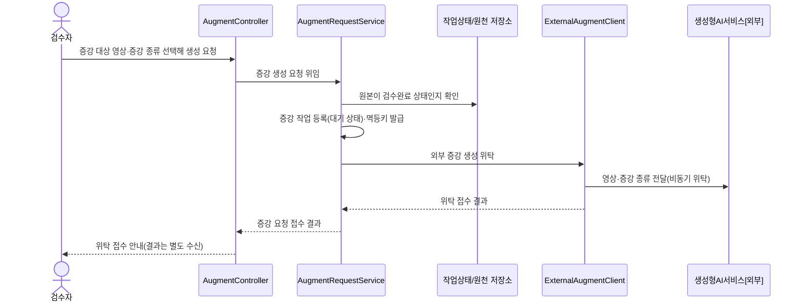

### 2.2 KLID-AT-SD-002 — 증강 결과 수신·등록

| 시퀀스도 ID | KLID-AT-SD-002 | 시퀀스도명 | 증강 결과 수신·등록 |
|---------|---|-------|---|
| 관련 유스케이스 ID | KLID-AT-UC-002 |
| 주요 액터 | 생성형AI서비스[외부] | 주요 클래스 | AugmentResultController, AugmentResultService, LsDataRaw, LsDataAugLblMap |

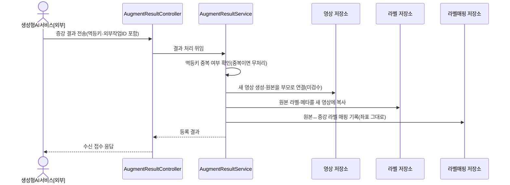

### 2.3 KLID-AT-SD-003 — 해상도 변경 수행

| 시퀀스도 ID | KLID-AT-SD-003 | 시퀀스도명 | 해상도 변경 수행 |
|---------|---|-------|---|
| 관련 유스케이스 ID | KLID-AT-UC-003 |
| 주요 액터 | 검수자(REVIEWER) | 주요 클래스 | VideoController, VideoResolutionService, ResolutionDerivativeService, ResolutionReservationPersister, ResolutionDerivativeFinalizer, Java2DImageResizer, NioVideoFileCopier, LsResolutionExport, LsResolutionLblMap |

> **2026-07-21 정책 재반전**: 구 '단일 동기 다운스케일 + 이력 1행 기록' 흐름을 폐기하고, 증강과 동일하게 **파생영상(새 RAW_SN) 생성**으로 전환했다. 프리셋별로 동기 예약(부모 잠금+PII 게이트+UK 예약+새 RAW PENDING 커밋)과 비동기 확정(AFTER_COMMIT — 비디오 복사·프레임 리스케일·라벨 좌표 배율 재계산·확정 불변식)을 분리한다(증강 파이프라인과 동일한 동기/비동기 경계 패턴).

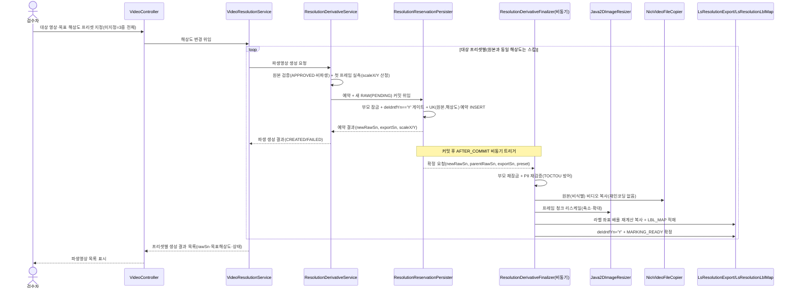

### 2.4 KLID-AT-SD-004 — 객체 자동 추적

| 시퀀스도 ID | KLID-AT-SD-004 | 시퀀스도명 | 객체 자동 추적 |
|---------|---|-------|---|
| 관련 유스케이스 ID | KLID-AT-UC-004 |
| 주요 액터 | 라벨링 작업자(WORKER), AI 추론 서비스(내부) | 주요 클래스 | LabelController, Sam2TrackService, LabelAccessGuard, AiServerClient, LsDataLbl |

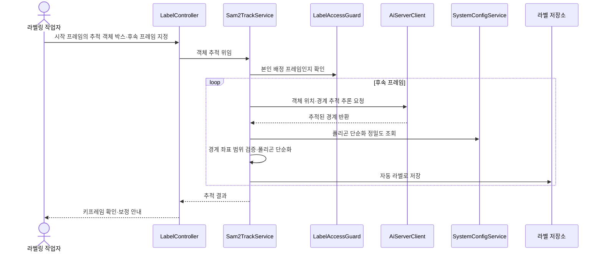

### 2.5 KLID-AT-SD-005 — 객체 외곽 경계 자동 밀착

| 시퀀스도 ID | KLID-AT-SD-005 | 시퀀스도명 | 객체 외곽 경계 자동 밀착 |
|---------|---|-------|---|
| 관련 유스케이스 ID | KLID-AT-UC-005 |
| 주요 액터 | 라벨링 작업자(WORKER), AI 추론 서비스(내부) | 주요 클래스 | LabelController, Sam2SegmentService, LabelAccessGuard, AiServerClient |

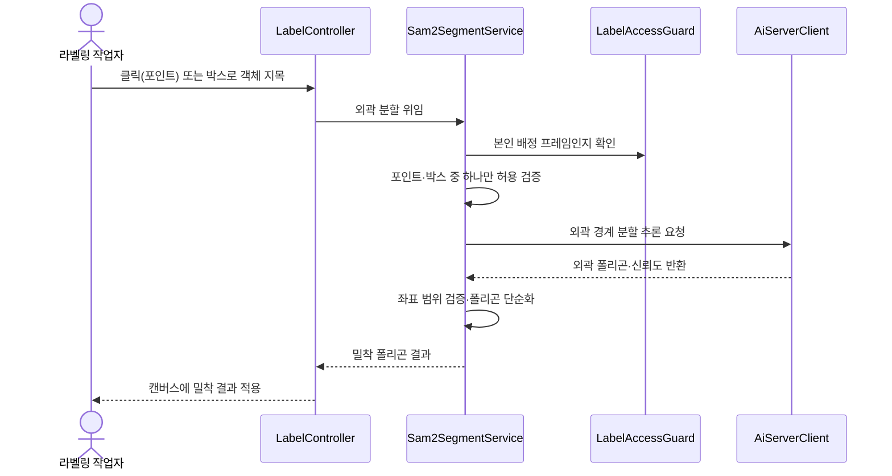

### 2.6 KLID-AT-SD-006 — 라벨링 정밀도 조절

| 시퀀스도 ID | KLID-AT-SD-006 | 시퀀스도명 | 라벨링 정밀도 조절 |
|---------|---|-------|---|
| 관련 유스케이스 ID | KLID-AT-UC-006 |
| 주요 액터 | 검수자(REVIEWER) | 주요 클래스 | SystemConfigController, SystemConfigService, LsSystemConfig, Sam2TrackService |

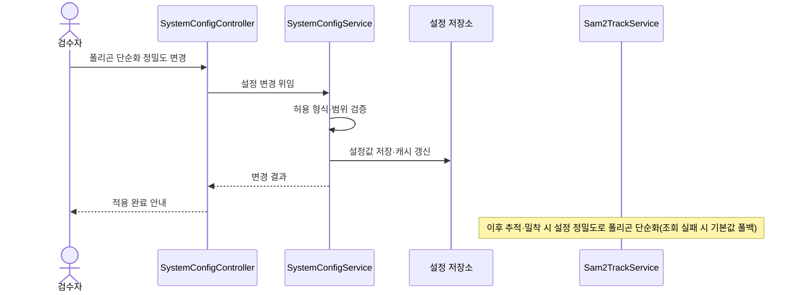

### 2.7 KLID-AT-SD-007 — 라벨 버전 저장·이력 추적

| 시퀀스도 ID | KLID-AT-SD-007 | 시퀀스도명 | 라벨 버전 저장·이력 추적 |
|---------|---|-------|---|
| 관련 유스케이스 ID | KLID-AT-UC-007 |
| 주요 액터 | 검수자(REVIEWER) | 주요 클래스 | ReviewService, VersionService, LsLabelVersion, LsDataLblHstry |

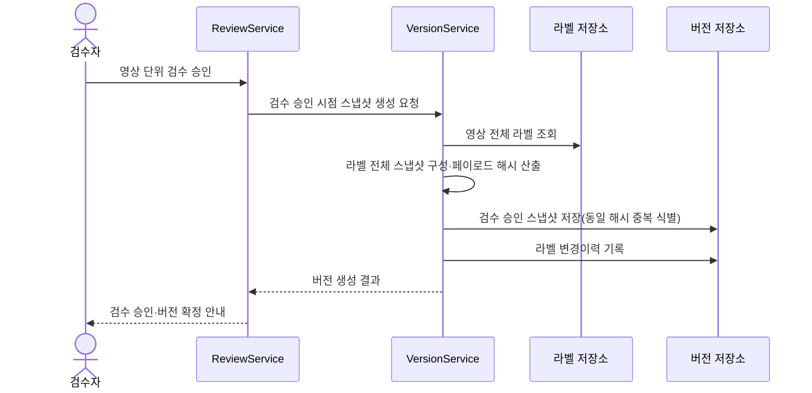

### 2.8 KLID-AT-SD-008 — 버전 비교·복구

| 시퀀스도 ID | KLID-AT-SD-008 | 시퀀스도명 | 버전 비교·복구 |
|---------|---|-------|---|
| 관련 유스케이스 ID | KLID-AT-UC-008 |
| 주요 액터 | 검수자(REVIEWER), 라벨링 작업자(WORKER) | 주요 클래스 | VersionController, VersionService, LsLabelVersion, LabelAccessGuard |

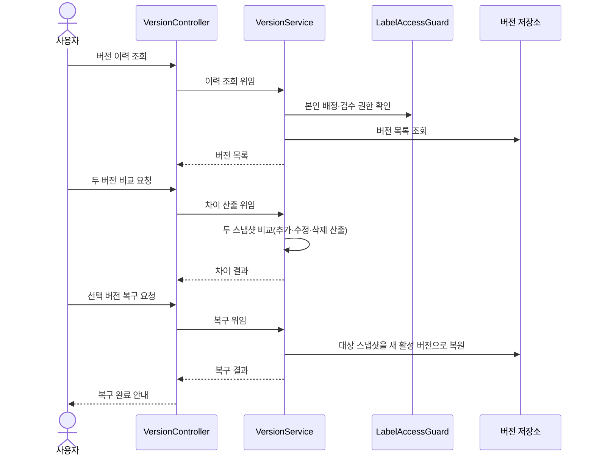

### 2.9 KLID-AT-SD-009 — 검수 완료·수정 통지

| 시퀀스도 ID | KLID-AT-SD-009 | 시퀀스도명 | 검수 완료·수정 통지 |
|---------|---|-------|---|
| 관련 유스케이스 ID | KLID-AT-UC-009 |
| 주요 액터 | 검수자(REVIEWER), 관제서버[외부] | 주요 클래스 | ControlNotifyEventListener, ControlNotifyDebouncer, ControlNotifyService, ControlNotifyClient |

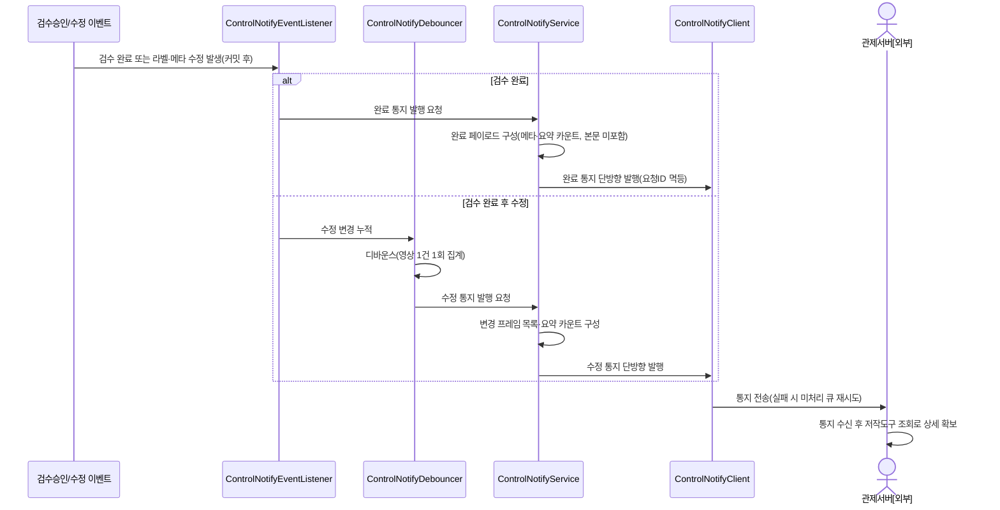

### 2.10 KLID-AT-SD-010 — 증강 영상 활용 여부 검수

| 시퀀스도 ID | KLID-AT-SD-010 | 시퀀스도명 | 증강 영상 활용 여부 검수 |
|---------|---|-------|---|
| 관련 유스케이스 ID | KLID-AT-UC-010 |
| 주요 액터 | 검수자(REVIEWER) | 주요 클래스 | AugmentController, AugmentReviewService, LsDataAug, LsDataAugRvw |

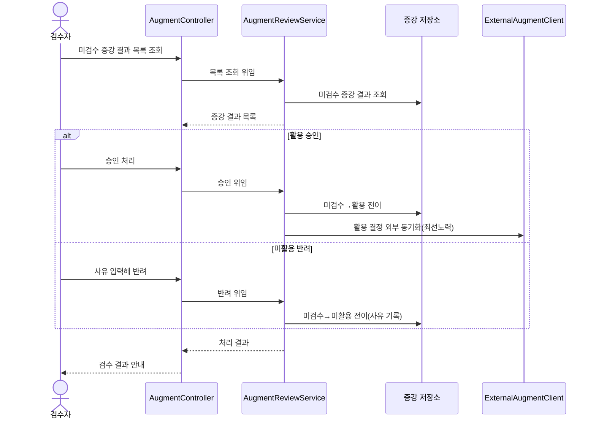

### 2.11 KLID-AT-SD-011 — 비식별 처리 요청

| 시퀀스도 ID | KLID-AT-SD-011 | 시퀀스도명 | 비식별 처리 요청 |
|---------|---|-------|---|
| 관련 유스케이스 ID | KLID-AT-UC-011 |
| 주요 액터 | 검수자(REVIEWER), 비식별솔루션[외부] | 주요 클래스 | KpstDeidentService, KpstDeidentPollJob, KpstDeidentTxService, KpstDeidentifyClient, LsDeidentProcLog |

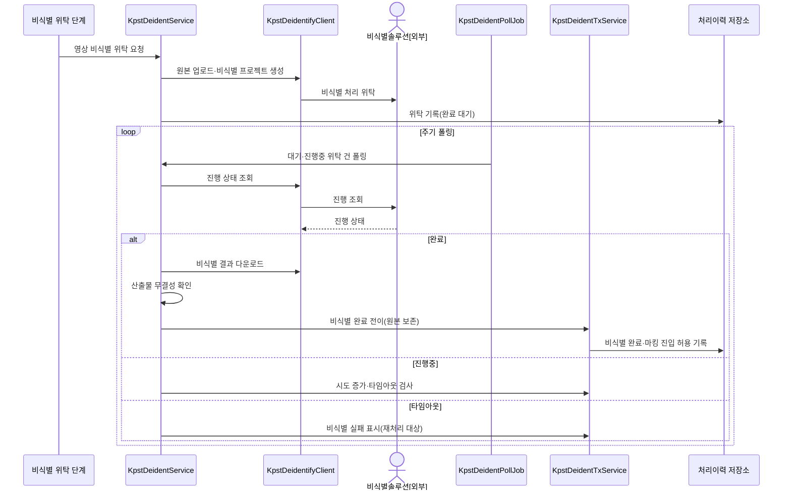

### 2.12 KLID-AT-SD-013 — 비식별 옵션 설정

| 시퀀스도 ID | KLID-AT-SD-013 | 시퀀스도명 | 비식별 옵션 설정 |
|---------|---|-------|---|
| 관련 유스케이스 ID | KLID-AT-UC-013 |
| 주요 액터 | 검수자(REVIEWER) | 주요 클래스 | SystemConfigController, SystemConfigService, LsSystemConfig |

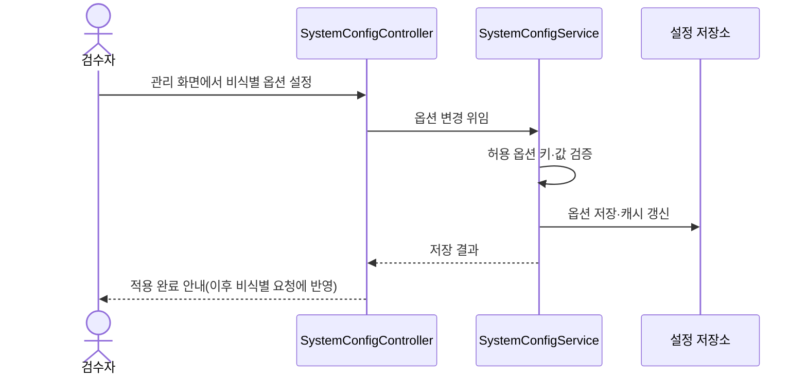

### 2.13 KLID-AT-SD-016 — 비식별 처리 상태·이력 확인

| 시퀀스도 ID | KLID-AT-SD-016 | 시퀀스도명 | 비식별 처리 상태·이력 확인 |
|---------|---|-------|---|
| 관련 유스케이스 ID | KLID-AT-UC-016 |
| 주요 액터 | 검수자(REVIEWER), 라벨링 작업자(WORKER) | 주요 클래스 | DeidentReportController, DeidentReportService, LsDeidentReport, WorkLockService, VersionService |

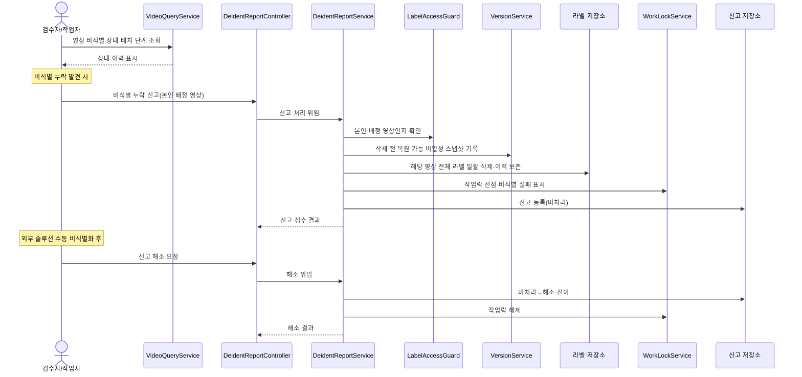

### 2.14 KLID-AT-SD-018 — 영상 적재 (관제 학습용 설정)

| 시퀀스도 ID | KLID-AT-SD-018 | 시퀀스도명 | 영상 적재 (관제 학습용 설정) |
|---------|---|-------|---|
| 관련 유스케이스 ID | KLID-AT-UC-018 |
| 주요 액터 | 관제서버[외부], 배치시스템 | 주요 클래스 | ControlTrainingVideoScanJob, TrainingVideoIngestService, LsDataRaw, IngestDeidentifyBridge, DeidentifyStep |

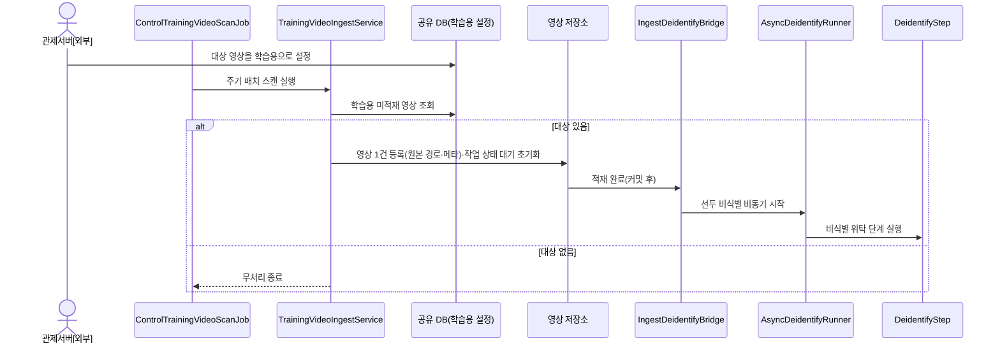

### 2.15 KLID-AT-SD-019 — 이벤트 마킹 (자동/수동)

| 시퀀스도 ID | KLID-AT-SD-019 | 시퀀스도명 | 이벤트 마킹 (자동/수동) |
|---------|---|-------|---|
| 관련 유스케이스 ID | KLID-AT-UC-019 |
| 주요 액터 | 라벨링 작업자(WORKER), 배치시스템 | 주요 클래스 | MarkingController, MarkingService, LsMarking, MarkingCompletedEvent, MarkingBatchBridge, BatchOrchestrator |

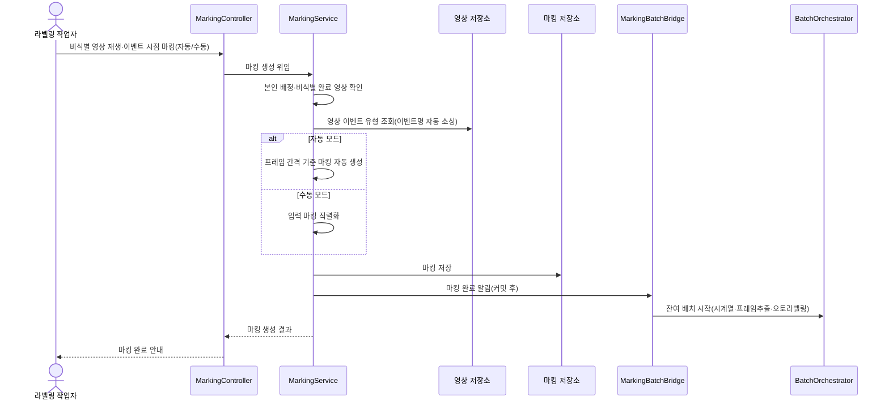

### 2.16 KLID-AT-SD-021 — 라벨 편집·임시저장

| 시퀀스도 ID | KLID-AT-SD-021 | 시퀀스도명 | 라벨 편집·임시저장 |
|---------|---|-------|---|
| 관련 유스케이스 ID | KLID-AT-UC-021 |
| 주요 액터 | 라벨링 작업자(WORKER) | 주요 클래스 | LabelController, LabelService, LabelAccessGuard, LsDataLbl, LsDataLblAttrVal |

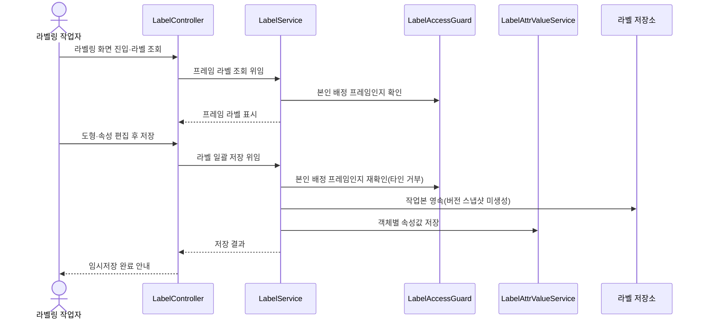

### 2.17 KLID-AT-SD-022 — VLM 시계열 메타 검토

| 시퀀스도 ID | KLID-AT-SD-022 | 시퀀스도명 | VLM 시계열 메타 검토 |
|---------|---|-------|---|
| 관련 유스케이스 ID | KLID-AT-UC-022 |
| 주요 액터 | 검수자(REVIEWER), VLM서비스[외부] | 주요 클래스 | VlmResultController, VlmResultService, MetaController, MetaService, LsDataMetaReview |

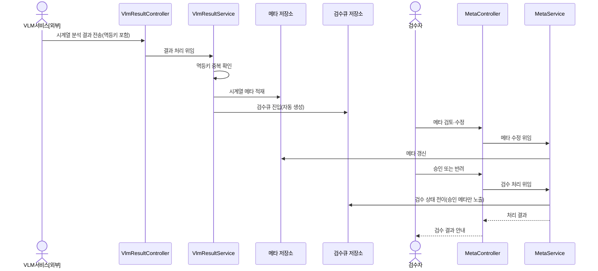

### 2.18 KLID-AT-SD-023 — 검수 승인·반려

| 시퀀스도 ID | KLID-AT-SD-023 | 시퀀스도명 | 검수 승인·반려 |
|---------|---|-------|---|
| 관련 유스케이스 ID | KLID-AT-UC-023 |
| 주요 액터 | 검수자(REVIEWER), 라벨링 작업자(WORKER) | 주요 클래스 | ReviewController, ReviewService, ReviewStateMachine, VersionService, ControlNotifyService |

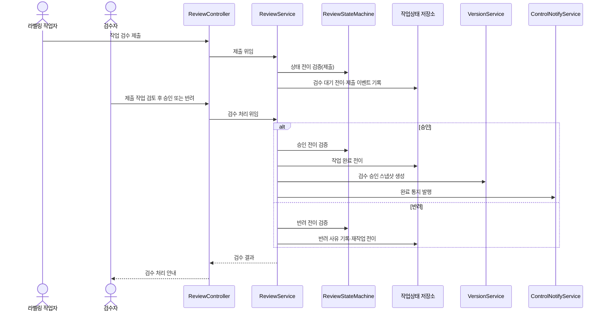

### 2.19 KLID-AT-SD-024 — 포털 간편 라벨링

| 시퀀스도 ID | KLID-AT-SD-024 | 시퀀스도명 | 포털 간편 라벨링 |
|---------|---|-------|---|
| 관련 유스케이스 ID | KLID-AT-UC-024 |
| 주요 액터 | 포털 사용자(PORTAL_USER) | 주요 클래스 | PortalLabelController, PortalLabelService, LsPortalUserLabel |

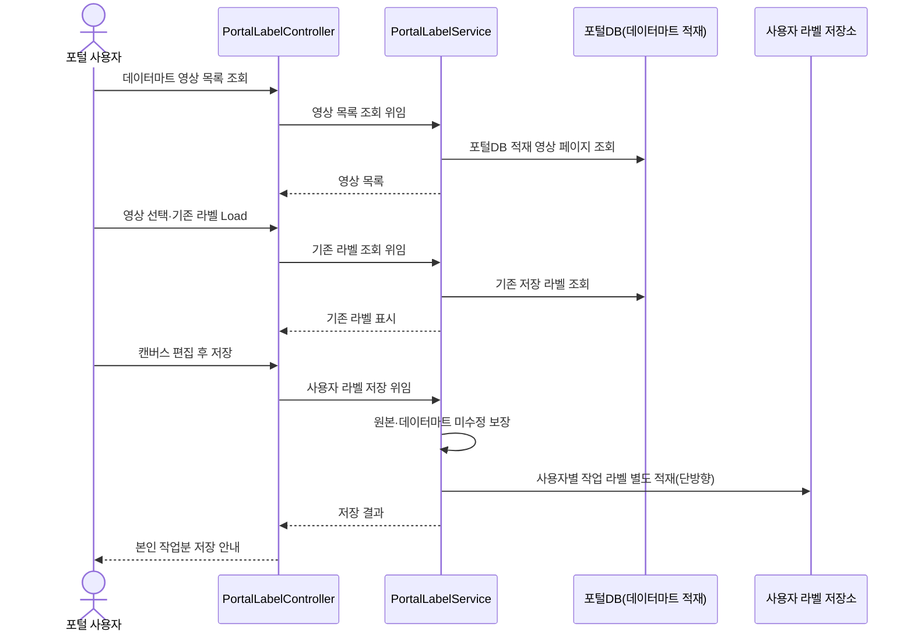

### 2.20 KLID-AT-SD-025 — 포털 데이터 다운로드

| 시퀀스도 ID | KLID-AT-SD-025 | 시퀀스도명 | 포털 데이터 다운로드 |
|---------|---|-------|---|
| 관련 유스케이스 ID | KLID-AT-UC-025 |
| 주요 액터 | 포털 사용자(PORTAL_USER) | 주요 클래스 | PortalLabelController, PortalLabelService, LsPortalUserLabel |

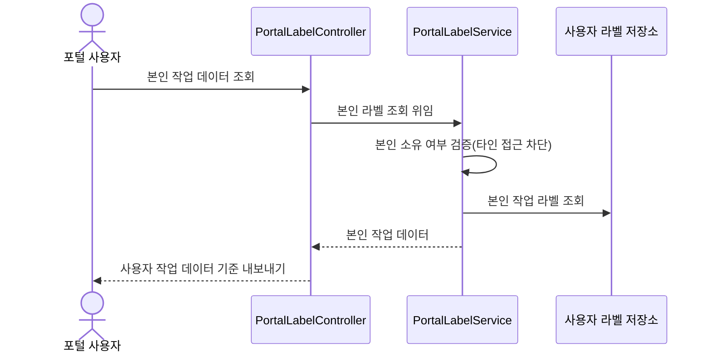

### 2.21 KLID-AT-SD-026 — 공지 게시·배포

| 시퀀스도 ID | KLID-AT-SD-026 | 시퀀스도명 | 공지 게시·배포 |
|---------|---|-------|---|
| 관련 유스케이스 ID | KLID-AT-UC-026 |
| 주요 액터 | 검수자(REVIEWER) | 주요 클래스 | NoticeController, NoticeService, NoticeAttachController, NoticeAttachService, LsNotice |

```mermaid
sequenceDiagram
    actor REVIEWER as 검수자
    participant C as NoticeController
    participant S as NoticeService
    participant AC as NoticeAttachController
    participant AS as NoticeAttachService
    participant N as 공지 저장소
    participant F as 첨부 저장소
    REVIEWER->>C: 공지 작성(임시저장)
    C->>S: 공지 생성 위임
    S->>N: 임시저장 상태로 저장
    REVIEWER->>AC: 첨부 파일 업로드
    AC->>AS: 첨부 업로드 위임
    AS->>AS: 확장자 허용목록·파일명 정규화 검증
    AS->>F: 임의 파일명으로 물리 저장
    REVIEWER->>C: 공지 발행
    C->>S: 발행 위임
    S->>N: 발행 상태 전이(멱등)
    S-->>C: 발행 결과
    C-->>REVIEWER: 작업자 노출 안내
```

### 2.22 KLID-AT-SD-027 — 공지 열람

| 시퀀스도 ID | KLID-AT-SD-027 | 시퀀스도명 | 공지 열람 |
|---------|---|-------|---|
| 관련 유스케이스 ID | KLID-AT-UC-027 |
| 주요 액터 | 라벨링 작업자(WORKER), 검수자(REVIEWER) | 주요 클래스 | NoticeController, NoticeService, NoticeAttachController, NoticeAttachService |

```mermaid
sequenceDiagram
    actor U as 작업자/검수자
    participant C as NoticeController
    participant S as NoticeService
    participant AC as NoticeAttachController
    participant AS as NoticeAttachService
    participant N as 공지 저장소
    U->>C: 공지 목록 조회
    C->>S: 발행 공지 검색 위임
    S->>N: 발행·고정 정렬로 목록 조회
    S-->>C: 공지 목록(고정글 상단)
    U->>C: 공지 상세 열람
    C->>S: 상세 조회 위임
    S-->>C: 공지 상세
    U->>AC: 첨부 다운로드
    AC->>AS: 다운로드 위임
    AS->>AS: 경로 순회 차단·권한 확인
    AS-->>AC: 첨부 리소스
    AC-->>U: 첨부 다운로드
```

### 2.23 KLID-AT-SD-028 — 이슈 문의·해소

| 시퀀스도 ID | KLID-AT-SD-028 | 시퀀스도명 | 이슈 문의·해소 |
|---------|---|-------|---|
| 관련 유스케이스 ID | KLID-AT-UC-028 |
| 주요 액터 | 라벨링 작업자(WORKER), 검수자(REVIEWER) | 주요 클래스 | IssueController, IssueThreadService, LsDataIssue, LsIssueComment |

```mermaid
sequenceDiagram
    actor U1 as 문의자
    actor U2 as 응답자
    participant C as IssueController
    participant S as IssueThreadService
    participant I as 이슈 저장소
    participant CM as 코멘트 저장소
    U1->>C: 영상 단위 문의 작성
    C->>S: 문의 스레드 생성 위임
    S->>I: 문의 스레드 생성(미해소)
    U2->>C: 답변 코멘트 작성
    C->>S: 코멘트 추가 위임
    S->>S: 작성자 역할 검증
    S->>CM: 코멘트 저장
    S->>I: 답변 상태 전이
    U1->>C: 해소 처리
    C->>S: 해소 위임
    S->>I: 해소 상태 전이
    S-->>C: 처리 결과
    C-->>U1: 이슈 처리 안내
```

### 2.24 KLID-AT-SD-029 — 데이터마트 적재 상세 조회

| 시퀀스도 ID | KLID-AT-SD-029 | 시퀀스도명 | 데이터마트 적재 상세 조회 |
|---------|---|-------|---|
| 관련 유스케이스 ID | KLID-AT-UC-029 |
| 주요 액터 | 관제서버[외부] | 주요 클래스 | TaskQueryController, TaskQueryService, LsRawDataStatus, LsDataLbl, LsDataMeta |

```mermaid
sequenceDiagram
    actor CTRL as 관제서버[외부]
    participant C as TaskQueryController
    participant S as TaskQueryService
    participant ST as 작업상태 저장소
    participant L as 라벨 저장소
    participant M as 메타 저장소
    Note over CTRL: 완료·수정 통지 수신 후
    CTRL->>C: 작업 요약 조회(작업 ID)
    C->>S: 요약 조회 위임
    S->>ST: 검수 완료 영상 요약 조회
    S-->>C: 영상 메타·요약 카운트
    CTRL->>C: 라벨 상세 조회(프레임 필터)
    C->>S: 라벨 조회 위임
    S->>L: 검수 완료 라벨 조회
    S-->>C: 라벨 상세
    CTRL->>C: 시계열 메타 조회
    C->>S: 메타 조회 위임
    S->>M: 검수 승인 메타 조회
    S-->>C: 메타 상세
    C-->>CTRL: 상세 데이터(조회 전용)
```

### 2.25 KLID-AT-SD-030 — 라벨 속성 정의·입력

| 시퀀스도 ID | KLID-AT-SD-030 | 시퀀스도명 | 라벨 속성 정의·입력 |
|---------|---|-------|---|
| 관련 유스케이스 ID | KLID-AT-UC-030 |
| 주요 액터 | 검수자(REVIEWER), 라벨링 작업자(WORKER) | 주요 클래스 | LabelAttrController, LabelAttrService, LabelAttrValueService, LsLabelAttr |

```mermaid
sequenceDiagram
    actor REVIEWER as 검수자
    participant C as LabelAttrController
    participant AS as LabelAttrService
    participant A as 속성정의 저장소
    actor WORKER as 라벨링 작업자
    participant VS as LabelAttrValueService
    participant V as 속성값 저장소
    REVIEWER->>C: 라벨 마스터별 속성 스펙 정의
    C->>AS: 속성 정의 생성 위임
    AS->>A: 속성 스펙 저장(입력타입·기본값·변경가능)
    WORKER->>C: 라벨링 중 객체별 속성값 입력
    C->>VS: 객체별 속성값 일괄 저장 위임
    VS->>VS: 정의된 속성인지 검증
    VS->>V: 객체별 속성값 일괄 upsert
    VS-->>C: 저장 결과
    C-->>WORKER: 속성 적용 안내
```

### 2.26 KLID-AT-SD-031 — 라벨 프리셋 관리

| 시퀀스도 ID | KLID-AT-SD-031 | 시퀀스도명 | 라벨 프리셋 관리 |
|---------|---|-------|---|
| 관련 유스케이스 ID | KLID-AT-UC-031 |
| 주요 액터 | 검수자(REVIEWER) | 주요 클래스 | PresetController, PresetService, LsLabelPreset, LabelMasterService |

```mermaid
sequenceDiagram
    actor REVIEWER as 검수자
    participant C as PresetController
    participant S as PresetService
    participant P as 프리셋 저장소
    REVIEWER->>C: 라벨 코드 프리셋 생성
    C->>S: 프리셋 생성 위임
    S->>P: 프리셋·코드 멤버 저장
    REVIEWER->>C: 프리셋 복제 요청
    C->>S: 복제 위임
    S->>P: 코드 멤버 복사해 새 프리셋 생성
    S-->>C: 처리 결과
    C-->>REVIEWER: 프리셋 적용 안내
```

### 2.27 KLID-AT-SD-032 — TUS 대용량 업로드

| 시퀀스도 ID | KLID-AT-SD-032 | 시퀀스도명 | TUS 대용량 업로드 |
|---------|---|-------|---|
| 관련 유스케이스 ID | KLID-AT-UC-032 |
| 주요 액터 | 검수자(REVIEWER) | 주요 클래스 | TusUploadController, TusUploadService, LsTusUpload |

```mermaid
sequenceDiagram
    actor REVIEWER as 검수자
    participant C as TusUploadController
    participant S as TusUploadService
    participant U as 업로드 세션 저장소
    REVIEWER->>C: 업로드 세션 생성(총 길이)
    C->>S: 세션 생성 위임
    S->>U: 업로드 세션 등록(오프셋 0)
    loop 청크 전송
        REVIEWER->>C: 청크 이어쓰기(현재 오프셋)
        C->>S: 청크 추가 위임
        S->>S: 기대 오프셋 일치 검증(낙관적 잠금)
        S->>U: 오프셋 갱신
    end
    alt 완료
        S->>U: 완료 표시·영상 등록 연계
    else 중단
        REVIEWER->>C: 세션 취소
        C->>S: 취소 위임
        S->>U: 세션 폐기
    end
    Note over C: 1차 적재 경로 아님(폐지 예정)
```

---

## 3. 설계 클래스도

> 유스케이스별로 1개씩 작성한다. 설계 클래스도 ID는 실현 유스케이스 번호와 정렬한다.

### 3.1 KLID-AT-DCD-001 — 증강 영상 생성 요청

| 설계 클래스도 ID | KLID-AT-DCD-001 | 설계 클래스도명 | 증강 영상 생성 요청 |
|-----------|---|---------|---|
| 관련 유스케이스 ID | KLID-AT-UC-001 |

```mermaid
classDiagram
    class AugmentController {
        +request(command, actor) AugmentRequestResult
    }
    class AugmentRequestService {
        +request(command, actor) AugmentRequestResult
    }
    class ExternalAugmentClient {
        <<interface>>
        +requestAugment(originId, type, key, jobId, callbackUrl) boolean
    }
    class LsDataAug {
        -dataAugSn Long
        -srcSn Long
        -augTypeCd AugType
        -augProcSttsCd AugStatus
        +createRequested() LsDataAug
    }
    class LsRawDataStatus {
        -rawDataId Long
        -dataSttsCd ReviewStatus
    }
    AugmentController --> AugmentRequestService
    AugmentRequestService --> ExternalAugmentClient
    AugmentRequestService --> LsDataAug
    AugmentRequestService --> LsRawDataStatus
```

### 3.2 KLID-AT-DCD-002 — 증강 결과 수신·등록

| 설계 클래스도 ID | KLID-AT-DCD-002 | 설계 클래스도명 | 증강 결과 수신·등록 |
|-----------|---|---------|---|
| 관련 유스케이스 ID | KLID-AT-UC-002 |

```mermaid
classDiagram
    class AugmentResultController {
        +receive(result) ReceiveResult
    }
    class AugmentResultService {
        +handle(result) boolean
    }
    class LsDataRaw {
        -rawSn Long
        -parentRawSn Long
        +createFromAugment(parent, type) LsDataRaw
    }
    class LsDataLbl {
        -lblSn Long
        -srcSn Long
    }
    class LsDataAugLblMap {
        -dataAugLblMapSn Long
        -orgnlDataLblSn Long
        -dataLblSn Long
        +create() LsDataAugLblMap
    }
    AugmentResultController --> AugmentResultService
    AugmentResultService --> LsDataRaw
    AugmentResultService --> LsDataLbl
    AugmentResultService --> LsDataAugLblMap
```

### 3.3 KLID-AT-DCD-003 — 해상도 변경 수행

| 설계 클래스도 ID | KLID-AT-DCD-003 | 설계 클래스도명 | 해상도 변경 수행 |
|-----------|---|---------|---|
| 관련 유스케이스 ID | KLID-AT-UC-003 |

```mermaid
classDiagram
    class VideoController {
        +changeResolution(rawSn, request, actor) ResolutionChangeResponse
    }
    class VideoResolutionService {
        +changeResolution(rawSn, request, regId) ResolutionChangeResponse
    }
    class ResolutionDerivativeService {
        +createDerivative(parentRawSn, preset, regId) ResolutionDerivativeResponse
        +loadAndValidate(parentRawSn) LsDataRaw
    }
    class ResolutionReservationPersister {
        +reserveAndCreate(parent, preset, srcW, srcH, targetW, targetH, regId) Reservation
    }
    class ResolutionDerivativeFinalizer {
        +finalizeDerivative(newRawSn, parentRawSn, resExportSn, preset) void
        +cleanupDerivativeArtifacts(newRawSn) void
    }
    class Java2DImageResizer {
        +resize(src, dst, w, h) void
        +readDimensions(src) Dimension
    }
    class NioVideoFileCopier {
        +copy(src, dst) void
    }
    class LsResolutionExport {
        -resExportSn Long
        -goalResCd ResolutionPreset
        -newRawSn Long
        +create() LsResolutionExport
    }
    class LsResolutionLblMap {
        -resLblMapSn Long
        -orgnlDataLblSn Long
        -dataLblSn Long
        -coordRecalcYn String
        -scaleX BigDecimal
        -scaleY BigDecimal
    }
    class LsDataRaw {
        -rawSn Long
        -orgnlRawSn Long
    }
    VideoController --> VideoResolutionService
    VideoResolutionService --> ResolutionDerivativeService
    ResolutionDerivativeService --> ResolutionReservationPersister
    ResolutionReservationPersister --> LsResolutionExport
    ResolutionReservationPersister --> LsDataRaw
    ResolutionReservationPersister ..> ResolutionDerivativeFinalizer : AFTER_COMMIT
    ResolutionDerivativeFinalizer --> NioVideoFileCopier
    ResolutionDerivativeFinalizer --> Java2DImageResizer
    ResolutionDerivativeFinalizer --> LsResolutionLblMap
    ResolutionDerivativeFinalizer --> LsDataRaw
```

### 3.4 KLID-AT-DCD-004 — 객체 자동 추적

| 설계 클래스도 ID | KLID-AT-DCD-004 | 설계 클래스도명 | 객체 자동 추적 |
|-----------|---|---------|---|
| 관련 유스케이스 ID | KLID-AT-UC-004 |

```mermaid
classDiagram
    class LabelController {
        +sam2Track(srcSn, command, actor) TrackResult
        +bulkUpsert(srcSn, request, actor) LabelResult
    }
    class Sam2TrackService {
        +track(command, actor) TrackResult
    }
    class LabelAccessGuard {
        +requireAssignedFrame(srcSn, actor) void
    }
    class AiServerClient {
        +track(request) TrackResponse
    }
    class SystemConfigService {
        +getDouble(key) Double
    }
    class LabelService {
        +bulkUpsert(srcSn, request, actor) LabelResult
    }
    LabelController --> Sam2TrackService
    Sam2TrackService --> LabelAccessGuard
    Sam2TrackService --> AiServerClient
    Sam2TrackService --> SystemConfigService
    LabelController --> LabelService : 좌표 병합 후 명시 저장(PUT /labels)
    note for Sam2TrackService "R12(2026-07-20): DB 미저장 — 좌표만 반환(비트랜잭셔널).\nLsDataLbl/LsDataLblAiInfo 직접 저장 의존 제거.\n클라이언트가 작업본에 병합(IoU 중복방지) 후\nLabelService.bulkUpsert로 확정 저장한다."
```

### 3.5 KLID-AT-DCD-005 — 객체 외곽 경계 자동 밀착

| 설계 클래스도 ID | KLID-AT-DCD-005 | 설계 클래스도명 | 객체 외곽 경계 자동 밀착 |
|-----------|---|---------|---|
| 관련 유스케이스 ID | KLID-AT-UC-005 |

```mermaid
classDiagram
    class LabelController {
        +sam2Segment(srcSn, command, actor) SegmentResult
    }
    class Sam2SegmentService {
        +segment(command, actor) SegmentResult
    }
    class LabelAccessGuard {
        +requireAssignedFrame(srcSn, actor) void
    }
    class AiServerClient {
        +segment(request) SegmentResponse
    }
    class SystemConfigService {
        +getDouble(key) Double
    }
    LabelController --> Sam2SegmentService
    Sam2SegmentService --> LabelAccessGuard
    Sam2SegmentService --> AiServerClient
    Sam2SegmentService --> SystemConfigService
```

### 3.6 KLID-AT-DCD-006 — 라벨링 정밀도 조절

| 설계 클래스도 ID | KLID-AT-DCD-006 | 설계 클래스도명 | 라벨링 정밀도 조절 |
|-----------|---|---------|---|
| 관련 유스케이스 ID | KLID-AT-UC-006 |

```mermaid
classDiagram
    class SystemConfigController {
        +update(key, command, actor) ConfigResult
    }
    class SystemConfigService {
        +update(key, value, actor) ConfigResult
        +getDouble(key) Double
    }
    class LsSystemConfig {
        -configKey String
        -configVl String
        +updateValue(value, updatedBy) void
    }
    class Sam2TrackService {
        +track(command, actor) TrackResult
    }
    SystemConfigController --> SystemConfigService
    SystemConfigService --> LsSystemConfig
    Sam2TrackService ..> SystemConfigService : 정밀도 조회
```

### 3.7 KLID-AT-DCD-007 — 라벨 버전 저장·이력 추적

| 설계 클래스도 ID | KLID-AT-DCD-007 | 설계 클래스도명 | 라벨 버전 저장·이력 추적 |
|-----------|---|---------|---|
| 관련 유스케이스 ID | KLID-AT-UC-007 |

```mermaid
classDiagram
    class ReviewService {
        +approve(videoId, actor) ReviewResult
    }
    class VersionService {
        +commitApproved(rawSn, actor) CommitResult
    }
    class LsLabelVersion {
        -labelVersionSn Long
        -versionHash String
        -saveReasonCd SaveReason
        -activeYn Flag
        +create() LsLabelVersion
    }
    class LsDataLblHstry {
        -lblHstrySn Long
        -chgKindCd String
        -regId String
        +recordChange(lblSn, srcSn, kind, regId) LsDataLblHstry
        +recordDeletion(lblSn, srcSn) LsDataLblHstry
    }
    class LsDataLbl {
        -lblSn Long
    }
    ReviewService --> VersionService
    VersionService --> LsLabelVersion
    VersionService --> LsDataLblHstry
    VersionService --> LsDataLbl
```

### 3.8 KLID-AT-DCD-008 — 버전 비교·복구

| 설계 클래스도 ID | KLID-AT-DCD-008 | 설계 클래스도명 | 버전 비교·복구 |
|-----------|---|---------|---|
| 관련 유스케이스 ID | KLID-AT-UC-008 |

```mermaid
classDiagram
    class VersionController {
        +listVersions(srcSn, actor) VersionList
        +diff(toHash, fromHash, actor) DiffResult
        +rollback(versionHash, command, actor) VersionItem
    }
    class VersionService {
        +listVersions(srcSn, actor) VersionList
        +diff(fromHash, toHash, actor) DiffResult
        +rollback(versionHash, srcSn, actor) LsLabelVersion
    }
    class LsLabelVersion {
        -versionHash String
        -labelPayload Text
        +activate() void
        +deactivate() void
    }
    class LabelAccessGuard {
        +requireAccessible(srcSn, actor) void
    }
    VersionController --> VersionService
    VersionService --> LabelAccessGuard
    VersionService --> LsLabelVersion
```

### 3.9 KLID-AT-DCD-009 — 검수 완료·수정 통지

| 설계 클래스도 ID | KLID-AT-DCD-009 | 설계 클래스도명 | 검수 완료·수정 통지 |
|-----------|---|---------|---|
| 관련 유스케이스 ID | KLID-AT-UC-009 |

```mermaid
classDiagram
    class ControlNotifyEventListener {
        +onReviewApproved(event) void
        +onTaskModified(event) void
    }
    class ControlNotifyDebouncer {
        +accumulate(event) void
        +flushExpiredWindows() void
    }
    class ControlNotifyService {
        +sendCompleted(event) void
        +sendModified(rawSn, frameIds, changeTypes) void
    }
    class ControlNotifyClient {
        +sendTaskCompleted(payload) void
        +sendTaskModified(payload) void
    }
    ControlNotifyEventListener --> ControlNotifyService
    ControlNotifyEventListener --> ControlNotifyDebouncer
    ControlNotifyDebouncer --> ControlNotifyService
    ControlNotifyService --> ControlNotifyClient
```

### 3.10 KLID-AT-DCD-010 — 증강 영상 활용 여부 검수

| 설계 클래스도 ID | KLID-AT-DCD-010 | 설계 클래스도명 | 증강 영상 활용 여부 검수 |
|-----------|---|---------|---|
| 관련 유스케이스 ID | KLID-AT-UC-010 |

```mermaid
classDiagram
    class AugmentController {
        +list(srcSn, page, size) AugmentList
        +accept(id, actor) AugmentSummary
        +reject(id, command, actor) AugmentSummary
    }
    class AugmentReviewService {
        +listAll(pageable) AugmentList
        +accept(dataAugSn, actor) AugmentSummary
        +reject(dataAugSn, reason, actor) AugmentSummary
    }
    class LsDataAug {
        -dataAugSn Long
        -augProcSttsCd AugStatus
        +applyReviewStatus(status) void
    }
    class LsDataAugRvw {
        -dataAugRvwSn Long
        -rvwSttsCd ReviewStatus
        +accept(reviewer, at) void
        +reject(reviewer, reason, at) void
    }
    class ExternalAugmentClient {
        <<interface>>
        +syncDecision(dataAugSn, decision, reason) boolean
    }
    AugmentController --> AugmentReviewService
    AugmentReviewService --> LsDataAug
    AugmentReviewService --> LsDataAugRvw
    AugmentReviewService --> ExternalAugmentClient
```

### 3.11 KLID-AT-DCD-011 — 비식별 처리 요청

| 설계 클래스도 ID | KLID-AT-DCD-011 | 설계 클래스도명 | 비식별 처리 요청 |
|-----------|---|---------|---|
| 관련 유스케이스 ID | KLID-AT-UC-011 |

```mermaid
classDiagram
    class DeidentController {
        +reprocess(videoId) void
    }
    class KpstDeidentService {
        +submit(raw) LsDeidentProcLog
        +pollOne(procLog) void
        +completeDeidentification(rawSn, path) void
    }
    class KpstDeidentPollJob {
        +execute(context) void
    }
    class KpstDeidentTxService {
        +finishDownloadAndComplete() void
        +failPolling(procLogSn, rawSn) void
        +markTimeoutIfExpired() boolean
    }
    class KpstDeidentifyClient {
        <<interface>>
        +upload(files, subdir) UploadResult
        +createProject(request) ProjectResult
        +retrieveProgress(userId, prjId) ProgressResult
        +download(datasetId, baseDir, target) Path
    }
    class LsDeidentProcLog {
        -procLogSn Long
        -dataRawSn Long
        -pollSttsCd PollStatus
        +markKpstSubmitted(prjId, datasetId) void
    }
    class LsDataRaw {
        -rawSn Long
        -deIdntfYn Flag
        +markDeidentified(code) void
    }
    KpstDeidentPollJob --> KpstDeidentService
    KpstDeidentService --> KpstDeidentifyClient
    KpstDeidentService --> KpstDeidentTxService
    KpstDeidentService --> LsDeidentProcLog
    KpstDeidentTxService --> LsDataRaw
```

### 3.12 KLID-AT-DCD-013 — 비식별 옵션 설정

| 설계 클래스도 ID | KLID-AT-DCD-013 | 설계 클래스도명 | 비식별 옵션 설정 |
|-----------|---|---------|---|
| 관련 유스케이스 ID | KLID-AT-UC-013 |

```mermaid
classDiagram
    class SystemConfigController {
        +list() ConfigList
        +update(key, command, actor) ConfigResult
    }
    class SystemConfigService {
        +listAll() ConfigList
        +update(key, value, actor) ConfigResult
    }
    class LsSystemConfig {
        -configKey String
        -configVl String
        -configTypeCd ConfigType
        +updateValue(value, updatedBy) void
    }
    SystemConfigController --> SystemConfigService
    SystemConfigService --> LsSystemConfig
```

### 3.13 KLID-AT-DCD-016 — 비식별 처리 상태·이력 확인

| 설계 클래스도 ID | KLID-AT-DCD-016 | 설계 클래스도명 | 비식별 처리 상태·이력 확인 |
|-----------|---|---------|---|
| 관련 유스케이스 ID | KLID-AT-UC-016 |

```mermaid
classDiagram
    class DeidentReportController {
        +list(status, pageable) ReportList
        +report(srcSn, command, actor) Long
        +resolve(rprtSn, actor) void
    }
    class DeidentReportService {
        +report(srcSn, reason, actor) Long
        +resolveManually(rprtSn, actor) void
        +resolveOpenReports(rawSn) int
    }
    class VideoQueryService {
        +getOne(rawSn) VideoDetail
    }
    class VersionService {
        +snapshotDeidentReport(rawSn, actor) boolean
    }
    class WorkLockService {
        +acquire(rawSn) void
        +release(rawSn) void
    }
    class LsDeidentReport {
        -deidentReportSn Long
        -reportSttsCd ReportStatus
        +resolve() void
    }
    class LsDataRaw {
        -rawSn Long
        +markDeidentified(code) void
    }
    DeidentReportController --> DeidentReportService
    DeidentReportService --> VersionService
    DeidentReportService --> WorkLockService
    DeidentReportService --> LsDeidentReport
    DeidentReportService --> LsDataRaw
    VideoQueryService --> LsDataRaw
```

### 3.14 KLID-AT-DCD-018 — 영상 적재 (관제 학습용 설정)

| 설계 클래스도 ID | KLID-AT-DCD-018 | 설계 클래스도명 | 영상 적재 (관제 학습용 설정) |
|-----------|---|---------|---|
| 관련 유스케이스 ID | KLID-AT-UC-018 |

```mermaid
classDiagram
    class ControlTrainingVideoScanJob {
        +execute(context) void
    }
    class TrainingVideoIngestService {
        +scanAndIngest() int
    }
    class LsDataRaw {
        -rawSn Long
        +createFromIngest() LsDataRaw
        +needsDeidentify() boolean
    }
    class LsRawDataStatus {
        -rawDataId Long
        +initial(rawDataId) LsRawDataStatus
    }
    class IngestDeidentifyBridge {
        +onVideoIngested(event) void
    }
    class AsyncDeidentifyRunner {
        +runAsync(rawSn) void
    }
    class DeidentifyStep {
        +execute(context) void
        +run(raw) String
    }
    ControlTrainingVideoScanJob --> TrainingVideoIngestService
    TrainingVideoIngestService --> LsDataRaw
    TrainingVideoIngestService --> LsRawDataStatus
    IngestDeidentifyBridge --> AsyncDeidentifyRunner
    AsyncDeidentifyRunner --> DeidentifyStep
```

### 3.15 KLID-AT-DCD-019 — 이벤트 마킹 (자동/수동)

| 설계 클래스도 ID | KLID-AT-DCD-019 | 설계 클래스도명 | 이벤트 마킹 (자동/수동) |
|-----------|---|---------|---|
| 관련 유스케이스 ID | KLID-AT-UC-019 |

```mermaid
classDiagram
    class MarkingController {
        +create(rawSn, command, actor) MarkingResult
    }
    class MarkingService {
        +create(rawSn, command, actor) MarkingResult
    }
    class LsMarking {
        -markingSn Long
        -dataRawSn Long
        -markingTypeCd MarkingType
        -evntNm String
        +createAuto() LsMarking
        +createManual() LsMarking
    }
    class MarkingCompletedEvent {
        -rawSn Long
        -markingSn Long
    }
    class MarkingBatchBridge {
        +onMarkingCompleted(event) void
    }
    class BatchOrchestrator {
        +process(rawSn) BatchStage
    }
    class LsDataRaw {
        -rawSn Long
        -deIdntfYn Flag
        -evntTypeCd String
    }
    MarkingController --> MarkingService
    MarkingService --> LsMarking
    MarkingService --> LsDataRaw
    MarkingService ..> MarkingCompletedEvent : 발행
    MarkingBatchBridge --> BatchOrchestrator
    MarkingBatchBridge ..> MarkingCompletedEvent : 수신
```

### 3.16 KLID-AT-DCD-021 — 라벨 편집·임시저장

| 설계 클래스도 ID | KLID-AT-DCD-021 | 설계 클래스도명 | 라벨 편집·임시저장 |
|-----------|---|---------|---|
| 관련 유스케이스 ID | KLID-AT-UC-021 |

```mermaid
classDiagram
    class LabelController {
        +getLabels(srcSn, raw, actor) LabelResult
        +bulkUpsert(srcSn, command, actor) LabelResult
    }
    class LabelService {
        +getByFrame(srcSn, actor) LabelResult
        +bulkUpsert(srcSn, command, actor) LabelResult
    }
    class LabelAccessGuard {
        +requireAssignedFrame(srcSn, actor) void
    }
    class LabelAttrValueService {
        +upsert(lblSn, entries) void
    }
    class LsDataLbl {
        -lblSn Long
        -srcSn Long
        -lblTypeCd LabelType
        +updatePoints(pointCn) void
    }
    class LsDataLblAttrVal {
        -attrValId Long
        -attrVl String
        +changeValue(value) void
    }
    class LsLabel {
        -labelId Long
        -labelNm String
    }
    LabelController --> LabelService
    LabelService --> LabelAccessGuard
    LabelService --> LsDataLbl
    LabelService --> LabelAttrValueService
    LabelAttrValueService --> LsDataLblAttrVal
    LsDataLbl --> LsLabel : 마스터 참조
```

### 3.17 KLID-AT-DCD-022 — VLM 시계열 메타 검토

| 설계 클래스도 ID | KLID-AT-DCD-022 | 설계 클래스도명 | VLM 시계열 메타 검토 |
|-----------|---|---------|---|
| 관련 유스케이스 ID | KLID-AT-UC-022 |

```mermaid
classDiagram
    class VlmResultController {
        +receive(result) ReceiveResult
    }
    class VlmResultService {
        +handle(result) boolean
    }
    class MetaController {
        +updateMeta(srcSn, command, actor) MetaResult
        +approveReview(metaReviewSn, actor) void
        +rejectReview(metaReviewSn, command, actor) void
    }
    class MetaService {
        +update(srcSn, command, actor) MetaResult
        +approveReview(metaReviewSn, actor) void
        +rejectReview(metaReviewSn, reason, actor) void
    }
    class LsDataMetaReview {
        -dataMetaReviewSn Long
        -rvwSttsCd ReviewStatus
        +approve(reviewer, at) void
        +reject(reviewer, reason, at) void
    }
    class LsDataMeta {
        -metaSn Long
        -metaKey String
        +updateValue(value) void
    }
    VlmResultController --> VlmResultService
    VlmResultService --> LsDataMeta
    VlmResultService --> LsDataMetaReview
    MetaController --> MetaService
    MetaService --> LsDataMeta
    MetaService --> LsDataMetaReview
```

### 3.18 KLID-AT-DCD-023 — 검수 승인·반려

| 설계 클래스도 ID | KLID-AT-DCD-023 | 설계 클래스도명 | 검수 승인·반려 |
|-----------|---|---------|---|
| 관련 유스케이스 ID | KLID-AT-UC-023 |

```mermaid
classDiagram
    class ReviewController {
        +submit(videoId, actor) ReviewResult
        +approve(videoId, actor) ReviewResult
        +reject(videoId, command, actor) ReviewResult
    }
    class ReviewService {
        +submit(videoId, actor) ReviewResult
        +approve(videoId, actor) ReviewResult
        +reject(videoId, command, actor) ReviewResult
    }
    class ReviewStateMachine {
        +verify(from, to) void
    }
    class LsDataIssue {
        -dataIssueSn Long
        -issueSttsCd IssueStatus
        +resolve() void
    }
    class LsRawDataStatus {
        -rawDataId Long
        -dataSttsCd ReviewStatus
        +transitionTo(newStatus) void
    }
    class VersionService {
        +commitApproved(rawSn, actor) CommitResult
    }
    class ControlNotifyService {
        +sendCompleted(event) void
    }
    ReviewController --> ReviewService
    ReviewService --> ReviewStateMachine
    ReviewService --> LsDataIssue
    ReviewService --> LsRawDataStatus
    ReviewService --> VersionService
    ReviewService ..> ControlNotifyService : 완료 통지(이벤트)
```

### 3.19 KLID-AT-DCD-024 — 포털 간편 라벨링

| 설계 클래스도 ID | KLID-AT-DCD-024 | 설계 클래스도명 | 포털 간편 라벨링 |
|-----------|---|---------|---|
| 관련 유스케이스 ID | KLID-AT-UC-024 |

```mermaid
classDiagram
    class PortalLabelController {
        +listDatamartVideos(actor, pageable) DatamartVideoList
        +loadDatamartLabels(rawSn, page, size) DatamartLabelList
        +saveUserLabel(request, actor) PortalUserLabel
        +listMyLabels(rawSn, actor) PortalUserLabelList
        +loadFrameLabels(srcSn, actor) PortalFrameLabels
    }
    class PortalLabelService {
        +listDatamartVideos(actor, pageable) DatamartVideoList
        +loadDatamartLabels(rawSn, page, size) DatamartLabelList
        +saveUserLabel(request, actor) PortalUserLabel
        +listMyLabels(rawSn, actor) PortalUserLabelList
        +serveFrameImage(srcSn, actor) FrameImage
    }
    class LsPortalUserLabel {
        -userLblSn Long
        -portalUserNo String
        -srcRawSn Long
        -pointCn String
        +create() LsPortalUserLabel
        +updatePoints(pointCn) void
    }
    PortalLabelController --> PortalLabelService
    PortalLabelService --> LsPortalUserLabel
```

### 3.20 KLID-AT-DCD-025 — 포털 데이터 다운로드

| 설계 클래스도 ID | KLID-AT-DCD-025 | 설계 클래스도명 | 포털 데이터 다운로드 |
|-----------|---|---------|---|
| 관련 유스케이스 ID | KLID-AT-UC-025 |

```mermaid
classDiagram
    class PortalLabelController {
        +listMyLabels(rawSn, actor) PortalUserLabelList
    }
    class PortalLabelService {
        +listMyLabels(rawSn, actor) PortalUserLabelList
    }
    class LsPortalUserLabel {
        -userLblSn Long
        -portalUserNo String
    }
    PortalLabelController --> PortalLabelService
    PortalLabelService --> LsPortalUserLabel
```

### 3.21 KLID-AT-DCD-026 — 공지 게시·배포

| 설계 클래스도 ID | KLID-AT-DCD-026 | 설계 클래스도명 | 공지 게시·배포 |
|-----------|---|---------|---|
| 관련 유스케이스 ID | KLID-AT-UC-026 |

```mermaid
classDiagram
    class NoticeController {
        +create(request, actor) NoticeResponse
        +update(id, request, actor) NoticeResponse
        +publish(id) NoticeResponse
        +unpublish(id) NoticeResponse
        +delete(id) void
    }
    class NoticeService {
        +create(title, content, pinned, actor) LsNotice
        +publish(id) LsNotice
        +unpublish(id) LsNotice
    }
    class NoticeAttachController {
        +upload(id, file, actor) NoticeAttachResponse
        +delete(id, attachId, actor) void
    }
    class NoticeAttachService {
        +upload(noticeId, file, actor) LsNoticeAttach
    }
    class LsNotice {
        -noticeSn Long
        -pubStatus PublishStatus
        -pinYn Flag
        +create() LsNotice
        +publish() void
        +unpublish() void
    }
    class LsNoticeAttach {
        -attachSn Long
        -storeFileNm String
        +create() LsNoticeAttach
    }
    NoticeController --> NoticeService
    NoticeAttachController --> NoticeAttachService
    NoticeService --> LsNotice
    NoticeAttachService --> LsNoticeAttach
    LsNoticeAttach --> LsNotice : 첨부 소속
```

### 3.22 KLID-AT-DCD-027 — 공지 열람

| 설계 클래스도 ID | KLID-AT-DCD-027 | 설계 클래스도명 | 공지 열람 |
|-----------|---|---------|---|
| 관련 유스케이스 ID | KLID-AT-UC-027 |

```mermaid
classDiagram
    class NoticeController {
        +list(field, keyword, pageable, actor) NoticeSummaryList
        +get(id, actor) NoticeResponse
    }
    class NoticeService {
        +search(field, keyword, pageable, actor) NoticeList
        +get(id, actor) LsNotice
    }
    class NoticeAttachController {
        +download(id, attachId, actor) AttachResource
    }
    class NoticeAttachService {
        +download(noticeId, attachId, actor) Download
        +listByNotice(noticeId) AttachList
    }
    NoticeController --> NoticeService
    NoticeAttachController --> NoticeAttachService
```

### 3.23 KLID-AT-DCD-028 — 이슈 문의·해소

| 설계 클래스도 ID | KLID-AT-DCD-028 | 설계 클래스도명 | 이슈 문의·해소 |
|-----------|---|---------|---|
| 관련 유스케이스 ID | KLID-AT-UC-028 |

```mermaid
classDiagram
    class IssueController {
        +create(rawSn, request, actor) IssueThread
        +list(rawSn, actor) IssueThreadList
        +comment(issueSn, request, actor) IssueComment
        +resolve(issueSn, actor) void
    }
    class IssueThreadService {
        +createInquiry(rawSn, request, actor) IssueThread
        +listThreads(rawSn, actor) IssueThreadList
        +addComment(issueSn, request, actor) IssueComment
        +resolve(issueSn, actor) void
    }
    class LsDataIssue {
        -dataIssueSn Long
        -issueTypeCd IssueType
        -issueSttsCd IssueStatus
        +answer() void
        +resolve() void
    }
    class LsIssueComment {
        -issueCommentSn Long
        -dataIssueSn Long
        -authorRoleCd String
        +create() LsIssueComment
    }
    IssueController --> IssueThreadService
    IssueThreadService --> LsDataIssue
    IssueThreadService --> LsIssueComment
    LsIssueComment --> LsDataIssue : 스레드 소속
```

### 3.24 KLID-AT-DCD-029 — 데이터마트 적재 상세 조회

| 설계 클래스도 ID | KLID-AT-DCD-029 | 설계 클래스도명 | 데이터마트 적재 상세 조회 |
|-----------|---|---------|---|
| 관련 유스케이스 ID | KLID-AT-UC-029 |

```mermaid
classDiagram
    class TaskQueryController {
        +getSummary(rawSn) TaskSummary
        +getLabels(rawSn, frameIds) TaskLabelsList
        +getMeta(rawSn) TaskMeta
    }
    class TaskQueryService {
        +getSummary(rawSn) TaskSummary
        +getLabels(rawSn, frameIds) TaskLabelsList
        +getMeta(rawSn) TaskMeta
    }
    class LsRawDataStatus {
        -rawDataId Long
        -dataSttsCd ReviewStatus
    }
    TaskQueryController --> TaskQueryService
    TaskQueryService --> LsRawDataStatus
```

### 3.25 KLID-AT-DCD-030 — 라벨 속성 정의·입력

| 설계 클래스도 ID | KLID-AT-DCD-030 | 설계 클래스도명 | 라벨 속성 정의·입력 |
|-----------|---|---------|---|
| 관련 유스케이스 ID | KLID-AT-UC-030 |

```mermaid
classDiagram
    class LabelAttrController {
        +listAttrs(labelId) LabelAttrList
        +createAttr(labelId, request, actor) LabelAttr
        +updateAttr(labelId, attrId, request, actor) LabelAttr
        +deleteAttr(labelId, attrId, actor) void
        +upsertAttrValues(lblSn, request) void
    }
    class LabelAttrService {
        +list(labelId) LabelAttrList
        +create(labelId, request, regId) LabelAttr
        +update(labelId, attrId, request, mdfcnId) LabelAttr
        +delete(labelId, attrId, mdfcnId) void
    }
    class LabelAttrValueService {
        +upsert(lblSn, entries) void
        +findByLblSn(lblSn) AttrValueList
    }
    class LsLabelAttr {
        -attrId Long
        -labelId Long
        -inputTypeCd InputType
        -dfltVl String
        -mutableYn Flag
        +create() LsLabelAttr
    }
    class LsDataLblAttrVal {
        -attrValId Long
        -attrVl String
    }
    LabelAttrController --> LabelAttrService
    LabelAttrController --> LabelAttrValueService
    LabelAttrService --> LsLabelAttr
    LabelAttrValueService --> LsDataLblAttrVal
    LsDataLblAttrVal --> LsLabelAttr : 정의 참조
```

### 3.26 KLID-AT-DCD-031 — 라벨 프리셋 관리

| 설계 클래스도 ID | KLID-AT-DCD-031 | 설계 클래스도명 | 라벨 프리셋 관리 |
|-----------|---|---------|---|
| 관련 유스케이스 ID | KLID-AT-UC-031 |

```mermaid
classDiagram
    class PresetController {
        +list() PresetList
        +create(request) PresetResponse
        +update(id, request) PresetResponse
        +clone(id) PresetResponse
        +delete(id) void
    }
    class PresetService {
        +create(name, description, codes) LsLabelPreset
        +update(id, name, description, codes) LsLabelPreset
        +clone(id) LsLabelPreset
        +delete(id) void
    }
    class LsLabelPreset {
        -presetId Long
        -presetNm String
        -codes LsLabelPresetCode[]
        +create() LsLabelPreset
        +updateBasics(name, description) void
    }
    class LabelMasterController {
        +list() LabelMasterList
        +create(request, actor) LabelMaster
        +update(id, request, actor) LabelMaster
        +delete(id, actor) void
    }
    class LabelMasterService {
        +create(request, regId) LabelMaster
        +update(labelId, request, mdfcnId) LabelMaster
        +delete(labelId, mdfcnId) void
    }
    PresetController --> PresetService
    PresetService --> LsLabelPreset
    LabelMasterController --> LabelMasterService
```

### 3.27 KLID-AT-DCD-032 — TUS 대용량 업로드

| 설계 클래스도 ID | KLID-AT-DCD-032 | 설계 클래스도명 | TUS 대용량 업로드 |
|-----------|---|---------|---|
| 관련 유스케이스 ID | KLID-AT-UC-032 |

```mermaid
classDiagram
    class TusUploadController {
        +options() void
        +create(headers, actor) UploadLocation
        +head(uploadId, actor) UploadOffset
        +patch(uploadId, offset, chunk, actor) UploadOffset
        +delete(uploadId, actor) void
    }
    class TusUploadService {
        +createSession(userNo, command) UploadId
        +appendChunk(uploadId, userNo, expectedOffset, chunk) TusPatchResult
        +cancel(uploadId, userNo) void
    }
    class LsTusUpload {
        -uploadId UUID
        -uploadOffset Long
        -uploadLength Long
        -status String
        +appendOffset(delta) void
    }
    TusUploadController --> TusUploadService
    TusUploadService --> LsTusUpload
```

---

## 4. 설계 클래스 정의

> 클래스별로 1개씩 작성한다. 속성·오퍼레이션을 명세한다.

### 4.1 공통·기반 클래스

#### KLID-AT-DC-003 — LabelAccessGuard

| 설계 클래스 ID | KLID-AT-DC-003 | 설계 클래스명 | LabelAccessGuard |
|-----------|---|---------|---|
| **속성** |
| 속성명 | 가시성 | 타입 | 기본값 | 설명 |
| - | - | - | - | 상태를 갖지 않는 접근 검증 컴포넌트 |
| **오퍼레이션** |
| 오퍼레이션명 | 가시성 | 파라미터 | 반환타입 | 설명 |
| requireAssignedFrame | public | 프레임 식별자, 인증 주체 | void | 본인 배정 프레임이 아닌 접근을 차단한다(수평 권한 상승 방어) |
| requireAccessible | public | 프레임 식별자, 인증 주체 | void | 검수자 전체·작업자 본인 배정 범위로 접근을 제한한다 |

#### KLID-AT-DC-004 — SystemConfigService

| 설계 클래스 ID | KLID-AT-DC-004 | 설계 클래스명 | SystemConfigService |
|-----------|---|---------|---|
| **속성** |
| 속성명 | 가시성 | 타입 | 기본값 | 설명 |
| repository | private | 설정 저장소 | - | 시스템 설정 영속 저장소 |
| **오퍼레이션** |
| 오퍼레이션명 | 가시성 | 파라미터 | 반환타입 | 설명 |
| listAll | public | - | 설정 목록 | 전체 설정 항목을 조회한다 |
| getInt | public | 설정 키 | 정수 | 정수형 설정값을 캐시 경유로 조회한다 |
| getDouble | public | 설정 키 | 실수 | 실수형 설정값(폴리곤 단순화 정밀도 등)을 조회한다 |
| getString | public | 설정 키 | 문자열 | 문자열 설정값을 조회한다 |
| update | public | 설정 키, 값, 인증 주체 | 설정 결과 | 허용 키·범위를 검증해 설정을 저장하고 캐시를 무효화한다 |

#### KLID-AT-DC-005 — AiServerClient

| 설계 클래스 ID | KLID-AT-DC-005 | 설계 클래스명 | AiServerClient |
|-----------|---|---------|---|
| **속성** |
| 속성명 | 가시성 | 타입 | 기본값 | 설명 |
| externalCaller | private | 외부 호출 클라이언트 | - | AI 추론 서버 호출 채널 |
| circuitBreaker | private | 장애 차단기 | - | 장애 차단(서킷 브레이커) 정책 |
| retry | private | 재시도 정책 | - | 타임아웃·재시도 정책 |
| **오퍼레이션** |
| 오퍼레이션명 | 가시성 | 파라미터 | 반환타입 | 설명 |
| predictYolo | public | 탐지 요청 | 탐지 결과 | 객체 탐지 추론을 비동기로 요청한다 |
| segment | public | 분할 요청 | 분할 결과 | 외곽 경계 분할 추론을 비동기로 요청한다 |
| track | public | 추적 요청 | 추적 결과 | 객체 추적 추론을 비동기로 요청한다 |
| verifyObjects | public | 검증 요청 | 검증 결과 | 객체 검증 추론을 비동기로 요청한다 |

### 4.2 영상·적재·해상도 클래스

#### KLID-AT-DC-010 — VideoController

| 설계 클래스 ID | KLID-AT-DC-010 | 설계 클래스명 | VideoController |
|-----------|---|---------|---|
| **속성** |
| 속성명 | 가시성 | 타입 | 기본값 | 설명 |
| videoQueryService | private | 영상 조회 서비스 | - | 영상 목록·상세 조회 |
| videoResolutionService | private | 해상도 변경 서비스 | - | 해상도 변경 처리 |
| videoStreamService | private | 영상 스트리밍 서비스 | - | 비식별 영상 스트리밍 |
| **오퍼레이션** |
| 오퍼레이션명 | 가시성 | 파라미터 | 반환타입 | 설명 |
| list | public | 페이지 정보, 상태 조건 | 영상 목록 | 영상 목록을 페이지 단위로 조회한다 |
| getOne | public | 영상 식별자 | 영상 상세 | 영상 1건의 상세를 조회한다 |
| streamVideo | public | 영상 식별자, 범위 정보 | 영상 스트림 | 비식별 영상을 구간 단위로 스트리밍한다 |
| changeResolution | public | 영상 식별자, 변경 요청, 인증 주체 | 해상도 변경 결과 | 표준 하위 해상도 이미지셋 변경을 요청한다 |

#### KLID-AT-DC-011 — VideoQueryService

| 설계 클래스 ID | KLID-AT-DC-011 | 설계 클래스명 | VideoQueryService |
|-----------|---|---------|---|
| **속성** |
| 속성명 | 가시성 | 타입 | 기본값 | 설명 |
| videoRepository | private | 영상 저장소 | - | 원본 영상 영속 저장소 |
| srcRepository | private | 프레임 저장소 | - | 프레임 원천 저장소 |
| **오퍼레이션** |
| 오퍼레이션명 | 가시성 | 파라미터 | 반환타입 | 설명 |
| list | public | 페이지 정보, 상태 조건 | 영상 목록 | 상태·검수 조건으로 영상 목록을 조회한다 |
| getOne | public | 영상 식별자 | 영상 상세 | 영상 상세와 비식별·배치 상태를 조회한다 |
| getAutoLabels | public | 영상 식별자 | 자동 라벨 결과 | 자동 라벨링 결과를 조회한다 |

#### KLID-AT-DC-012 — LsDataRaw

| 설계 클래스 ID | KLID-AT-DC-012 | 설계 클래스명 | LsDataRaw |
|-----------|---|---------|---|
| **속성** |
| 속성명 | 가시성 | 타입 | 기본값 | 설명 |
| rawSn | private | 식별자 | - | 원본 영상 식별자(작업 단위 ID) |
| evntTypeCd | private | 문자열 | - | 이벤트 유형(마킹 이벤트명 자동 소싱 원천) |
| prvcTypeCd | private | 개인정보 유형 | - | 개인정보 유형 구분 |
| deIdntfYn | private | 처리 표시 | - | 비식별 처리 상태(완료/실패) |
| rawFilePathNm | private | 문자열 | - | 원본 영상 저장 경로 |
| durationSec | private | 정수 | - | 영상 길이(초) |
| parentRawSn | private | 식별자 | - | 증강 원본 영상 참조 |
| dataSttsCd | private | 배치 상태 | - | 배치 단계 상태(대기→마킹 준비→완료) |
| **오퍼레이션** |
| 오퍼레이션명 | 가시성 | 파라미터 | 반환타입 | 설명 |
| createFromIngest | public | 적재 정보 | 영상 | 관제 학습용 적재 영상을 생성한다 |
| createFromAugment | public | 원본, 증강 종류 | 영상 | 증강 결과를 새 영상으로 생성한다 |
| needsDeidentify | public | - | 논리값 | 비식별 대상 여부를 판정한다 |
| markDeidentified | public | 상태 코드 | void | 비식별 완료·실패 상태를 표시한다 |
| markMarkingReady | public | - | void | 마킹 진입 가능 상태로 전이한다 |

#### KLID-AT-DC-013 — VideoStreamService

| 설계 클래스 ID | KLID-AT-DC-013 | 설계 클래스명 | VideoStreamService |
|-----------|---|---------|---|
| **속성** |
| 속성명 | 가시성 | 타입 | 기본값 | 설명 |
| videoRepository | private | 영상 저장소 | - | 원본 영상 저장소 |
| streamUrlSigner | private | 서명 발급기 | - | 스트리밍 URL 서명 |
| **오퍼레이션** |
| 오퍼레이션명 | 가시성 | 파라미터 | 반환타입 | 설명 |
| issueSignedUrl | public | 영상 식별자, 사용자 번호 | 서명 URL | 비식별 영상 스트리밍 서명 URL을 발급한다 |
| stream | public | 영상 식별자, 범위 정보 | 영상 스트림 | 비식별 영상을 구간 단위로 서빙한다(원본 노출 차단) |

#### KLID-AT-DC-014 — FrameImageService

| 설계 클래스 ID | KLID-AT-DC-014 | 설계 클래스명 | FrameImageService |
|-----------|---|---------|---|
| **속성** |
| 속성명 | 가시성 | 타입 | 기본값 | 설명 |
| srcRepository | private | 프레임 저장소 | - | 프레임 원천 저장소 |
| videoRepository | private | 영상 저장소 | - | 원본 영상 저장소 |
| **오퍼레이션** |
| 오퍼레이션명 | 가시성 | 파라미터 | 반환타입 | 설명 |
| serve | public | 영상 식별자, 프레임 번호, 원본 허용, 인증 주체 | 프레임 이미지 | 프레임 이미지를 서빙한다(경로 순회 차단) |

#### KLID-AT-DC-015 — TrainingVideoIngestService

| 설계 클래스 ID | KLID-AT-DC-015 | 설계 클래스명 | TrainingVideoIngestService |
|-----------|---|---------|---|
| **속성** |
| 속성명 | 가시성 | 타입 | 기본값 | 설명 |
| clipMasterRepository | private | 관제 클립 저장소 | - | 관제 공유 클립 마스터(읽기) |
| ingestTx | private | 적재 트랜잭션 서비스 | - | 클립별 적재 쓰기 위임 |
| **오퍼레이션** |
| 오퍼레이션명 | 가시성 | 파라미터 | 반환타입 | 설명 |
| scanAndIngest | public | - | 적재 건수 | 학습용으로 설정된 미적재 영상을 조회해 1건 단위로 적재한다 |

#### KLID-AT-DC-016 — ControlTrainingVideoScanJob

| 설계 클래스 ID | KLID-AT-DC-016 | 설계 클래스명 | ControlTrainingVideoScanJob |
|-----------|---|---------|---|
| **속성** |
| 속성명 | 가시성 | 타입 | 기본값 | 설명 |
| ingestService | private | 적재 서비스 | - | 학습용 영상 적재 서비스 |
| **오퍼레이션** |
| 오퍼레이션명 | 가시성 | 파라미터 | 반환타입 | 설명 |
| execute | public | 작업 실행 정보 | void | 주기 배치로 학습용 영상 적재를 트리거한다(동시 실행 금지) |

#### KLID-AT-DC-017 — LsResolutionExport

> **2026-07-21 정책 재반전**: 산출 추적 1행 기록에 그치던 구 역할에 파생 RAW 역참조(`newRawSn`)가 추가되어, 이 엔티티는 이제 **파생영상 생성 추적 행**의 의미를 가진다(영상·라벨은 여전히 생성하지 않지만, 별도 파생 RAW/라벨은 아래 신규 클래스들이 생성한다).

| 설계 클래스 ID | KLID-AT-DC-017 | 설계 클래스명 | LsResolutionExport |
|-----------|---|---------|---|
| **속성** |
| 속성명 | 가시성 | 타입 | 기본값 | 설명 |
| resExportSn | private | 식별자 | - | 해상도 변경 산출 추적 식별자 |
| dataRawSn | private | 식별자 | - | 원본 영상 참조 |
| goalResCd | private | 해상도 구분 | - | 목표 해상도 프리셋 |
| orgnlW / orgnlH | private | 정수 | - | 원본 가로·세로 |
| targetW / targetH | private | 정수 | - | 목표 가로·세로 |
| frameCnt | private | 정수 | - | 리스케일 프레임 수 |
| newRawSn | private | 식별자 | - | **(신규)** 파생영상 역참조(LsDataRaw.rawSn) |
| **오퍼레이션** |
| 오퍼레이션명 | 가시성 | 파라미터 | 반환타입 | 설명 |
| updateFrameCnt | public | 프레임 수 | void | 확정된 리스케일 프레임 수를 기록한다 |

#### KLID-AT-DC-018 — VideoResolutionService

| 설계 클래스 ID | KLID-AT-DC-018 | 설계 클래스명 | VideoResolutionService |
|-----------|---|---------|---|
| **속성** |
| 속성명 | 가시성 | 타입 | 기본값 | 설명 |
| videoRepository | private | 영상 저장소 | - | 원본 영상 저장소 |
| statusRepository | private | 작업 상태 저장소 | - | APPROVED 검증 |
| imageResizer | private | 이미지 리사이저 | - | 첫 프레임 해상도 실측 |
| resolutionDerivativeService | private | 파생영상 생성 서비스 | - | 프리셋별 파생영상 생성 위임 |
| **오퍼레이션** |
| 오퍼레이션명 | 가시성 | 파라미터 | 반환타입 | 설명 |
| changeResolution | public | 영상 식별자, 변경 요청, 등록자 | 변경 결과 | 표준 3종 프리셋(동일 해상도 스킵)마다 파생영상 생성을 오케스트레이션하고 프리셋별 부분 실패를 격리한다(업스케일 허용 — 구 거부 가드 제거) |
| loadAndValidate | public | 영상 식별자 | 영상 | 대상 영상 존재·APPROVED·비-파생 여부를 검증한다 |

#### KLID-AT-DC-021 — ResolutionDerivativeService

| 설계 클래스 ID | KLID-AT-DC-021 | 설계 클래스명 | ResolutionDerivativeService |
|-----------|---|---------|---|
| **속성** |
| 속성명 | 가시성 | 타입 | 기본값 | 설명 |
| videoRepository | private | 영상 저장소 | - | 원본 영상 저장소 |
| imageResizer | private | 이미지 리사이저 | - | 첫 프레임 해상도 실측 |
| reservationPersister | private | 예약 영속 서비스 | - | 동기 예약·새 RAW 커밋 위임 |
| **오퍼레이션** |
| 오퍼레이션명 | 가시성 | 파라미터 | 반환타입 | 설명 |
| createDerivative | public | 원본 식별자, 프리셋, 등록자 | 파생 생성 결과 | 원본 검증 + 첫 프레임 실측(scaleX/Y 산정) 후 예약·새 RAW 커밋을 위임한다 |
| loadAndValidate | public | 원본 식별자 | 영상 | APPROVED·비-파생(ORGNL_RAW_SN=null) 여부를 검증한다 |

#### KLID-AT-DC-022 — ResolutionReservationPersister

| 설계 클래스 ID | KLID-AT-DC-022 | 설계 클래스명 | ResolutionReservationPersister |
|-----------|---|---------|---|
| **속성** |
| 속성명 | 가시성 | 타입 | 기본값 | 설명 |
| videoRepository | private | 영상 저장소 | - | 부모 잠금(PESSIMISTIC_WRITE) + 새 RAW 생성 |
| exportRepository | private | 산출 추적 저장소 | - | UK(원본,해상도) 예약 INSERT |
| **오퍼레이션** |
| 오퍼레이션명 | 가시성 | 파라미터 | 반환타입 | 설명 |
| reserveAndCreate | public | 원본, 프리셋, 원본/목표 크기, 등록자 | 예약 결과 | 별도 트랜잭션에서 부모 잠금 + `deIdntfYn=='Y'` PII 게이트 + UK 예약 + 새 RAW(PENDING) 커밋을 원자 처리하고, 커밋 후 AFTER_COMMIT으로 확정을 트리거한다(UNIQUE 위반 시 409 CONFLICT) |

#### KLID-AT-DC-023 — ResolutionDerivativeFinalizer

| 설계 클래스 ID | KLID-AT-DC-023 | 설계 클래스명 | ResolutionDerivativeFinalizer |
|-----------|---|---------|---|
| **속성** |
| 속성명 | 가시성 | 타입 | 기본값 | 설명 |
| videoRepository | private | 영상 저장소 | - | 파생/원본 조회·재잠금 |
| srcRepository | private | 프레임 저장소 | - | 원본 프레임 순회 |
| lblRepository | private | 라벨 저장소 | - | 원본 라벨 조회 |
| lblMapRepository | private | 라벨 매핑 저장소 | - | LsResolutionLblMap 적재 |
| videoFileCopier | private | 비디오 파일 복사기 | - | 원본 비디오 복사(재인코딩 없음) |
| imageResizer | private | 이미지 리사이저 | - | 프레임 리스케일 |
| resizeGate | private | 동시 실행 제한 | - | 변환 동시 실행 수 제한 |
| **오퍼레이션** |
| 오퍼레이션명 | 가시성 | 파라미터 | 반환타입 | 설명 |
| finalizeDerivative | public(REQUIRES_NEW) | 파생/원본 식별자, 산출 추적 식별자, 프리셋 | void | 부모 재잠금+PII 재검증 → 비디오 복사 → 프레임 청크 리스케일 → 라벨 좌표 배율 재계산 복사(LBL_MAP 적재) → `deIdntfYn='Y'`+`MARKING_READY` 확정을 단일 트랜잭션으로 원자 처리한다(부분 실패 시 전체 롤백) |
| cleanupDerivativeArtifacts | public | 파생 식별자 | void | 확정 실패 시 리스케일 프레임 디렉토리·파생 비디오 파일을 best-effort 정리한다 |

#### KLID-AT-DC-019 — Java2DImageResizer

| 설계 클래스 ID | KLID-AT-DC-019 | 설계 클래스명 | Java2DImageResizer |
|-----------|---|---------|---|
| **속성** |
| 속성명 | 가시성 | 타입 | 기본값 | 설명 |
| - | - | - | - | 상태 없는 이미지 변환 컴포넌트 |
| **오퍼레이션** |
| 오퍼레이션명 | 가시성 | 파라미터 | 반환타입 | 설명 |
| resize | public | 원본·대상 경로, 목표 크기 | void | 프레임 이미지를 목표 해상도로 리스케일한다(축소·확대 모두 지원) |
| readDimensions | public | 원본 경로 | 크기 | 원본 이미지 해상도를 읽는다 |

#### KLID-AT-DC-024 — NioVideoFileCopier

| 설계 클래스 ID | KLID-AT-DC-024 | 설계 클래스명 | NioVideoFileCopier |
|-----------|---|---------|---|
| **속성** |
| 속성명 | 가시성 | 타입 | 기본값 | 설명 |
| - | - | - | - | 상태 없는 파일 복사 컴포넌트(NIO) |
| **오퍼레이션** |
| 오퍼레이션명 | 가시성 | 파라미터 | 반환타입 | 설명 |
| copy | public | 원본·대상 경로 | void | 원본(비식별) 비디오 파일을 재인코딩 없이 그대로 복사한다 |

#### KLID-AT-DC-025 — LsResolutionLblMap

| 설계 클래스 ID | KLID-AT-DC-025 | 설계 클래스명 | LsResolutionLblMap |
|-----------|---|---------|---|
| **속성** |
| 속성명 | 가시성 | 타입 | 기본값 | 설명 |
| resLblMapSn | private | 식별자 | - | 매핑 식별자 |
| resExportSn | private | 식별자 | - | 해상도 변경 산출 추적 참조 |
| orgnlDataLblSn | private | 식별자 | - | 원본 라벨(LsDataLbl) 참조 |
| dataLblSn | private | 식별자 | - | 파생 라벨(LsDataLbl, 좌표 스케일 복사본) 참조 |
| coordRecalcYn | private | 문자 | 'Y' | 좌표 재계산 여부(해상도 변경이므로 항상 'Y') |
| scaleX / scaleY | private | 소수 | - | x/y축 배율(=목표/원본) |
| **오퍼레이션** |
| 오퍼레이션명 | 가시성 | 파라미터 | 반환타입 | 설명 |
| - | - | - | - | 상태 보유 엔티티(생성은 ResolutionDerivativeFinalizer가 담당) |

> **`LsDataAugLblMap` 미재사용**: 증강 라벨 매핑 테이블은 `DATA_AUG_SN NOT NULL` 제약이 있어 재사용 시 증강 이력·통계가 오염된다. 해상도 변경 전용으로 `LsResolutionLblMap`을 신설했다(V122).

### 4.3 배치 파이프라인 클래스

#### KLID-AT-DC-030 — BatchOrchestrator

| 설계 클래스 ID | KLID-AT-DC-030 | 설계 클래스명 | BatchOrchestrator |
|-----------|---|---------|---|
| **속성** |
| 속성명 | 가시성 | 타입 | 기본값 | 설명 |
| pipeline | private | 배치 파이프라인 | - | 마킹 후속 단계 파이프라인 |
| transitionService | private | 상태 전이 서비스 | - | 작업·배치 상태 전이 |
| retryQueue | private | 재처리 큐 | - | 실패 단계 재처리 |
| **오퍼레이션** |
| 오퍼레이션명 | 가시성 | 파라미터 | 반환타입 | 설명 |
| process | public | 영상 식별자 | 처리 단계 | 후속 배치 단계를 순차 실행하고 상태를 전이한다 |

#### KLID-AT-DC-031 — BatchPipeline

| 설계 클래스 ID | KLID-AT-DC-031 | 설계 클래스명 | BatchPipeline |
|-----------|---|---------|---|
| **속성** |
| 속성명 | 가시성 | 타입 | 기본값 | 설명 |
| steps | private | 배치 단계 목록 | - | 선언적으로 구성된 배치 단계 순서 |
| **오퍼레이션** |
| 오퍼레이션명 | 가시성 | 파라미터 | 반환타입 | 설명 |
| steps | public | - | 단계 목록 | 구성된 배치 단계 목록을 제공한다 |

#### KLID-AT-DC-032 — BatchStep

| 설계 클래스 ID | KLID-AT-DC-032 | 설계 클래스명 | BatchStep |
|-----------|---|---------|---|
| **속성** |
| 속성명 | 가시성 | 타입 | 기본값 | 설명 |
| - | - | - | - | 배치 단계 계약(인터페이스) |
| **오퍼레이션** |
| 오퍼레이션명 | 가시성 | 파라미터 | 반환타입 | 설명 |
| stage | public | - | 단계 구분 | 단계 식별자를 반환한다 |
| execute | public | 배치 컨텍스트 | void | 단계 처리를 수행한다 |
| isEnabled | public | 배치 컨텍스트 | 논리값 | 조건부 실행 여부를 판정한다 |

#### KLID-AT-DC-033 — BatchContext

| 설계 클래스 ID | KLID-AT-DC-033 | 설계 클래스명 | BatchContext |
|-----------|---|---------|---|
| **속성** |
| 속성명 | 가시성 | 타입 | 기본값 | 설명 |
| rawSn | private | 식별자 | - | 처리 대상 영상 식별자 |
| raw | private | 영상 | - | 처리 대상 영상 |
| markings | private | 마킹 목록 | - | 단계 간 공유 마킹 |
| marks | private | 마킹 시점 목록 | - | 프레임 추출 기준 시점 |
| hints | private | 탐지 힌트 목록 | - | 탐지→분할 전달 힌트 |
| **오퍼레이션** |
| 오퍼레이션명 | 가시성 | 파라미터 | 반환타입 | 설명 |
| isStageEnabled | public | 단계 구분 | 논리값 | 단계 토글 활성 여부를 판정한다 |

#### KLID-AT-DC-034 — DeidentifyStep

| 설계 클래스 ID | KLID-AT-DC-034 | 설계 클래스명 | DeidentifyStep |
|-----------|---|---------|---|
| **속성** |
| 속성명 | 가시성 | 타입 | 기본값 | 설명 |
| videoRepository | private | 영상 저장소 | - | 원본 영상 저장소 |
| kpstDeidentService | private | 비식별 위탁 서비스 | - | 외부 비식별 위탁(선택 구성) |
| batchTransitionService | private | 상태 전이 서비스 | - | 비식별 상태 전이 |
| **오퍼레이션** |
| 오퍼레이션명 | 가시성 | 파라미터 | 반환타입 | 설명 |
| stage | public | - | 단계 구분 | 비식별 단계 식별자를 반환한다 |
| execute | public | 배치 컨텍스트 | void | 비식별 위탁을 수행한다 |
| run | public | 영상 | 비식별 결과 경로 | 영상 비식별 위탁을 독립 트랜잭션으로 실행한다 |

#### KLID-AT-DC-035 — VlmTimeseriesStep

| 설계 클래스 ID | KLID-AT-DC-035 | 설계 클래스명 | VlmTimeseriesStep |
|-----------|---|---------|---|
| **속성** |
| 속성명 | 가시성 | 타입 | 기본값 | 설명 |
| vlmClient | private | 시계열 분석 클라이언트 | - | 외부 시계열 분석 호출 |
| videoRepository | private | 영상 저장소 | - | 원본 영상 저장소 |
| **오퍼레이션** |
| 오퍼레이션명 | 가시성 | 파라미터 | 반환타입 | 설명 |
| stage | public | - | 단계 구분 | 시계열 분석 단계 식별자를 반환한다 |
| execute | public | 배치 컨텍스트 | void | 마킹 결과로 시계열 분석을 호출한다 |
| runWithMarking | public | 영상 식별자, 마킹 | 분석 응답 | 마킹 기반 시계열 분석을 수행한다 |

#### KLID-AT-DC-036 — FfmpegFrameExtractor

| 설계 클래스 ID | KLID-AT-DC-036 | 설계 클래스명 | FfmpegFrameExtractor |
|-----------|---|---------|---|
| **속성** |
| 속성명 | 가시성 | 타입 | 기본값 | 설명 |
| srcRepository | private | 프레임 저장소 | - | 프레임 원천 저장소 |
| frameWriter | private | 프레임 기록기 | - | 프레임 이미지 추출·기록 |
| **오퍼레이션** |
| 오퍼레이션명 | 가시성 | 파라미터 | 반환타입 | 설명 |
| stage | public | - | 단계 구분 | 프레임 추출 단계 식별자를 반환한다 |
| execute | public | 배치 컨텍스트 | void | 마킹 위치 기준으로 원본·비식별 프레임을 추출한다 |
| extractByMarks | public | 영상, 마킹 시점 | 프레임 목록 | 마킹 시점의 프레임을 추출해 저장한다 |

#### KLID-AT-DC-037 — YoloAutolabelStep

| 설계 클래스 ID | KLID-AT-DC-037 | 설계 클래스명 | YoloAutolabelStep |
|-----------|---|---------|---|
| **속성** |
| 속성명 | 가시성 | 타입 | 기본값 | 설명 |
| aiServerClient | private | 추론 클라이언트 | - | 객체 탐지 추론 호출 |
| lblRepository | private | 라벨 저장소 | - | 자동 라벨 저장 |
| **오퍼레이션** |
| 오퍼레이션명 | 가시성 | 파라미터 | 반환타입 | 설명 |
| stage | public | - | 단계 구분 | 탐지 자동라벨 단계 식별자를 반환한다 |
| execute | public | 배치 컨텍스트 | void | 원본 프레임에 객체 탐지를 실행해 자동 라벨을 생성한다 |
| run | public | 영상 식별자 | 탐지 힌트 목록 | 탐지 결과를 자동 라벨로 저장하고 힌트를 반환한다 |

#### KLID-AT-DC-038 — Sam2SegmentStep

| 설계 클래스 ID | KLID-AT-DC-038 | 설계 클래스명 | Sam2SegmentStep |
|-----------|---|---------|---|
| **속성** |
| 속성명 | 가시성 | 타입 | 기본값 | 설명 |
| aiServerClient | private | 추론 클라이언트 | - | 분할 추론 호출 |
| lblRepository | private | 라벨 저장소 | - | 분할 라벨 저장 |
| **오퍼레이션** |
| 오퍼레이션명 | 가시성 | 파라미터 | 반환타입 | 설명 |
| stage | public | - | 단계 구분 | 분할 자동라벨 단계 식별자를 반환한다 |
| execute | public | 배치 컨텍스트 | void | 탐지 힌트로 분할 자동 라벨을 생성한다 |
| run | public | 영상 식별자, 탐지 힌트 | 생성 건수 | 분할 결과를 자동 라벨로 저장한다 |

#### KLID-AT-DC-039 — TrackInterpolationStep

| 설계 클래스 ID | KLID-AT-DC-039 | 설계 클래스명 | TrackInterpolationStep |
|-----------|---|---------|---|
| **속성** |
| 속성명 | 가시성 | 타입 | 기본값 | 설명 |
| lblRepository | private | 라벨 저장소 | - | 라벨 저장소 |
| interpolator | private | 보간기 | - | 트랙 보간 알고리즘 |
| **오퍼레이션** |
| 오퍼레이션명 | 가시성 | 파라미터 | 반환타입 | 설명 |
| stage | public | - | 단계 구분 | 트랙 보간 단계 식별자를 반환한다 |
| execute | public | 배치 컨텍스트 | void | 키프레임 사이의 빈 프레임을 보간한다 |
| run | public | 영상 식별자 | 보간 건수 | 트랙 단위로 보간 라벨을 생성한다 |

#### KLID-AT-DC-040 — BatchTransitionService

| 설계 클래스 ID | KLID-AT-DC-040 | 설계 클래스명 | BatchTransitionService |
|-----------|---|---------|---|
| **속성** |
| 속성명 | 가시성 | 타입 | 기본값 | 설명 |
| rawDataStatusRepository | private | 작업상태 저장소 | - | 작업·검수 상태 저장소 |
| videoRepository | private | 영상 저장소 | - | 영상 저장소 |
| **오퍼레이션** |
| 오퍼레이션명 | 가시성 | 파라미터 | 반환타입 | 설명 |
| markRawDataProcessing | public | 영상 식별자 | void | 작업 상태를 처리중으로 전이한다 |
| markRawDataMarkingReady | public | 영상 식별자 | void | 마킹 진입 가능 상태로 전이한다 |
| markRawDataFailed | public | 영상 식별자 | void | 작업 상태를 실패로 전이한다 |
| recordDeidentFailure | public | 영상 식별자, 오류 코드, 상세 | void | 비식별 실패 이력을 기록한다 |

#### KLID-AT-DC-041 — AsyncDeidentifyRunner

| 설계 클래스 ID | KLID-AT-DC-041 | 설계 클래스명 | AsyncDeidentifyRunner |
|-----------|---|---------|---|
| **속성** |
| 속성명 | 가시성 | 타입 | 기본값 | 설명 |
| preMarkingPipeline | private | 선두 파이프라인 | - | 비식별 선두 단계 파이프라인 |
| batchTransitionService | private | 상태 전이 서비스 | - | 상태 전이 |
| **오퍼레이션** |
| 오퍼레이션명 | 가시성 | 파라미터 | 반환타입 | 설명 |
| runAsync | public | 영상 식별자 | void | 적재 직후 선두 비식별을 비동기 실행한다 |

#### KLID-AT-DC-042 — IngestDeidentifyBridge

| 설계 클래스 ID | KLID-AT-DC-042 | 설계 클래스명 | IngestDeidentifyBridge |
|-----------|---|---------|---|
| **속성** |
| 속성명 | 가시성 | 타입 | 기본값 | 설명 |
| asyncDeidentifyRunner | private | 비동기 비식별 실행기 | - | 선두 비식별 실행 위임 |
| **오퍼레이션** |
| 오퍼레이션명 | 가시성 | 파라미터 | 반환타입 | 설명 |
| onVideoIngested | public | 적재 이벤트 | void | 적재 커밋 후 선두 비식별을 트리거한다 |

#### KLID-AT-DC-043 — LsDataSrc

| 설계 클래스 ID | KLID-AT-DC-043 | 설계 클래스명 | LsDataSrc |
|-----------|---|---------|---|
| **속성** |
| 속성명 | 가시성 | 타입 | 기본값 | 설명 |
| srcSn | private | 식별자 | - | 프레임 원천 식별자 |
| rawSn | private | 식별자 | - | 원본 영상 참조 |
| frameNo | private | 정수 | - | 프레임 번호 |
| srcFilePathNm | private | 문자열 | - | 원본 프레임 경로 |
| deIdntfSrcFilePathNm | private | 문자열 | - | 비식별 프레임 경로 |
| **오퍼레이션** |
| 오퍼레이션명 | 가시성 | 파라미터 | 반환타입 | 설명 |
| create | public | 영상 식별자, 프레임 번호, 경로 | 프레임 | 프레임 원천을 생성한다 |
| attachDeidPath | public | 비식별 경로 | void | 비식별 프레임 경로를 연결한다 |

#### KLID-AT-DC-044 — LsDataMeta

| 설계 클래스 ID | KLID-AT-DC-044 | 설계 클래스명 | LsDataMeta |
|-----------|---|---------|---|
| **속성** |
| 속성명 | 가시성 | 타입 | 기본값 | 설명 |
| metaSn | private | 식별자 | - | 시계열 메타 식별자 |
| rawSn | private | 식별자 | - | 원본 영상 참조 |
| metaKey | private | 문자열 | - | 메타 항목 키 |
| metaVl | private | 문자열 | - | 메타 항목 값 |
| idempotencyKey | private | 문자열 | - | 멱등 처리 키 |
| **오퍼레이션** |
| 오퍼레이션명 | 가시성 | 파라미터 | 반환타입 | 설명 |
| create | public | 영상 식별자, 키, 값 | 메타 | 시계열 메타 항목을 생성한다 |
| updateValue | public | 값 | void | 메타 항목 값을 수정한다 |

### 4.4 비식별화 클래스

#### KLID-AT-DC-050 — KpstDeidentService

| 설계 클래스 ID | KLID-AT-DC-050 | 설계 클래스명 | KpstDeidentService |
|-----------|---|---------|---|
| **속성** |
| 속성명 | 가시성 | 타입 | 기본값 | 설명 |
| deidentClient | private | 비식별 연동 클라이언트 | - | 외부 비식별 솔루션 호출 |
| videoRepository | private | 영상 저장소 | - | 영상 저장소 |
| procLogRepository | private | 처리이력 저장소 | - | 비식별 처리 이력 저장소 |
| txService | private | 상태 전이 서비스 | - | 완료·실패 전이(독립 트랜잭션) |
| **오퍼레이션** |
| 오퍼레이션명 | 가시성 | 파라미터 | 반환타입 | 설명 |
| submit | public | 영상 | 처리 이력 | 원본을 업로드하고 비식별 프로젝트를 생성해 위탁한다 |
| pollOne | public | 처리 이력 | void | 진행 상태를 조회해 완료·진행·타임아웃을 분기한다 |
| completeDeidentification | public | 영상 식별자, 결과 경로 | void | 비식별 완료 처리를 위임한다 |

#### KLID-AT-DC-051 — KpstDeidentTxService

| 설계 클래스 ID | KLID-AT-DC-051 | 설계 클래스명 | KpstDeidentTxService |
|-----------|---|---------|---|
| **속성** |
| 속성명 | 가시성 | 타입 | 기본값 | 설명 |
| videoRepository | private | 영상 저장소 | - | 영상 저장소 |
| procLogRepository | private | 처리이력 저장소 | - | 처리 이력 저장소 |
| workLockService | private | 작업락 서비스 | - | 작업락 해제 |
| **오퍼레이션** |
| 오퍼레이션명 | 가시성 | 파라미터 | 반환타입 | 설명 |
| finishDownloadAndComplete | public | 영상·이력 식별자, 데이터셋, 경로 | void | 다운로드 결과로 비식별 완료를 원자적으로 전이한다 |
| failPolling | public | 이력·영상 식별자 | void | 불완전 산출물·실패를 표시한다 |
| markTimeoutIfExpired | public | 이력 식별자, 최대 시도, 타임아웃 | 논리값 | 타임아웃 초과 시 실패로 마킹한다 |
| completeDeidentification | public | 영상 식별자, 경로 | void | 비식별 완료·마킹 진입 허용·신고 해소를 처리한다 |

#### KLID-AT-DC-052 — KpstDeidentPollJob

| 설계 클래스 ID | KLID-AT-DC-052 | 설계 클래스명 | KpstDeidentPollJob |
|-----------|---|---------|---|
| **속성** |
| 속성명 | 가시성 | 타입 | 기본값 | 설명 |
| procLogRepository | private | 처리이력 저장소 | - | 폴링 대상 조회 |
| kpstDeidentService | private | 비식별 서비스 | - | 건별 폴링 위임 |
| **오퍼레이션** |
| 오퍼레이션명 | 가시성 | 파라미터 | 반환타입 | 설명 |
| execute | public | 작업 실행 정보 | void | 대기·진행중 위탁 건을 폴링한다(동시 실행 금지, 건별 격리) |

#### KLID-AT-DC-053 — LsDeidentProcLog

| 설계 클래스 ID | KLID-AT-DC-053 | 설계 클래스명 | LsDeidentProcLog |
|-----------|---|---------|---|
| **속성** |
| 속성명 | 가시성 | 타입 | 기본값 | 설명 |
| procLogSn | private | 식별자 | - | 비식별 처리 이력 식별자 |
| dataRawSn | private | 식별자 | - | 원본 영상 참조 |
| kpstPrjId | private | 식별자 | - | 외부 비식별 프로젝트 식별자 |
| pollSttsCd | private | 폴링 상태 | - | 위탁 대기·진행중·완료·실패 |
| **오퍼레이션** |
| 오퍼레이션명 | 가시성 | 파라미터 | 반환타입 | 설명 |
| request | public | 영상 식별자, 경로, 등록자 | 처리 이력 | 비식별 위탁 이력을 생성한다 |
| markKpstSubmitted | public | 프로젝트·데이터셋 식별자 | void | 위탁 접수 정보를 기록한다 |
| fail | public | 오류 코드, 상세 | void | 비식별 실패를 기록한다 |

#### KLID-AT-DC-054 — KpstDeidentifyClient

| 설계 클래스 ID | KLID-AT-DC-054 | 설계 클래스명 | KpstDeidentifyClient |
|-----------|---|---------|---|
| **속성** |
| 속성명 | 가시성 | 타입 | 기본값 | 설명 |
| - | - | - | - | 외부 비식별 솔루션 연동 계약(인터페이스) |
| **오퍼레이션** |
| 오퍼레이션명 | 가시성 | 파라미터 | 반환타입 | 설명 |
| upload | public | 파일 목록, 하위 경로 | 업로드 결과 | 원본 영상을 업로드한다 |
| createProject | public | 프로젝트 요청 | 프로젝트 결과 | 비식별 프로젝트를 생성한다 |
| retrieveProgress | public | 요청자, 프로젝트 식별자 | 진행 결과 | 비식별 진행 상태를 조회한다 |
| download | public | 데이터셋 식별자, 기준·대상 경로 | 저장 경로 | 비식별 결과를 다운로드한다(경로 순회 방어) |

#### KLID-AT-DC-055 — DeidentController

| 설계 클래스 ID | KLID-AT-DC-055 | 설계 클래스명 | DeidentController |
|-----------|---|---------|---|
| **속성** |
| 속성명 | 가시성 | 타입 | 기본값 | 설명 |
| - | - | - | - | 비식별 재처리 요청 진입점 |
| **오퍼레이션** |
| 오퍼레이션명 | 가시성 | 파라미터 | 반환타입 | 설명 |
| reprocess | public | 영상 식별자 | void | 비식별 재처리 요청을 접수한다(검수자 전용) |

### 4.5 마킹 클래스

#### KLID-AT-DC-060 — MarkingController

| 설계 클래스 ID | KLID-AT-DC-060 | 설계 클래스명 | MarkingController |
|-----------|---|---------|---|
| **속성** |
| 속성명 | 가시성 | 타입 | 기본값 | 설명 |
| markingService | private | 마킹 서비스 | - | 마킹 생성 처리 |
| **오퍼레이션** |
| 오퍼레이션명 | 가시성 | 파라미터 | 반환타입 | 설명 |
| create | public | 영상 식별자, 마킹 요청, 인증 주체 | 마킹 결과 | 자동·수동 마킹을 생성한다 |

#### KLID-AT-DC-061 — MarkingService

| 설계 클래스 ID | KLID-AT-DC-061 | 설계 클래스명 | MarkingService |
|-----------|---|---------|---|
| **속성** |
| 속성명 | 가시성 | 타입 | 기본값 | 설명 |
| markingRepository | private | 마킹 저장소 | - | 마킹 영속 저장소 |
| videoRepository | private | 영상 저장소 | - | 영상 조회(이벤트 유형 소싱) |
| assignmentRepository | private | 배정 저장소 | - | 본인 배정 검증 |
| eventPublisher | private | 이벤트 발행기 | - | 마킹 완료 이벤트 발행 |
| **오퍼레이션** |
| 오퍼레이션명 | 가시성 | 파라미터 | 반환타입 | 설명 |
| create | public | 영상 식별자, 마킹 요청, 인증 주체 | 마킹 결과 | 본인 배정·비식별 완료를 검증하고 이벤트명을 영상에서 자동 소싱해 마킹을 저장하고 완료 이벤트를 발행한다 |

#### KLID-AT-DC-062 — LsMarking

| 설계 클래스 ID | KLID-AT-DC-062 | 설계 클래스명 | LsMarking |
|-----------|---|---------|---|
| **속성** |
| 속성명 | 가시성 | 타입 | 기본값 | 설명 |
| markingSn | private | 식별자 | - | 마킹 식별자 |
| dataRawSn | private | 식별자 | - | 비식별 영상 참조 |
| markingTypeCd | private | 마킹 유형 | - | 자동·수동 구분 |
| evntNm | private | 문자열 | - | 이벤트명(영상 이벤트 유형 자동 소싱) |
| marksCn | private | 문자열 | - | 마킹 시점 목록 |
| **오퍼레이션** |
| 오퍼레이션명 | 가시성 | 파라미터 | 반환타입 | 설명 |
| createAuto | public | 영상 식별자, 이벤트명, 간격, 경로, 시점, 등록자 | 마킹 | 자동 마킹을 생성한다 |
| createManual | public | 영상 식별자, 이벤트명, 경로, 시점, 등록자 | 마킹 | 수동 마킹을 생성한다 |

#### KLID-AT-DC-063 — MarkingCompletedEvent

| 설계 클래스 ID | KLID-AT-DC-063 | 설계 클래스명 | MarkingCompletedEvent |
|-----------|---|---------|---|
| **속성** |
| 속성명 | 가시성 | 타입 | 기본값 | 설명 |
| rawSn | private | 식별자 | - | 마킹 완료 영상 식별자 |
| markingSn | private | 식별자 | - | 마킹 식별자 |
| **오퍼레이션** |
| 오퍼레이션명 | 가시성 | 파라미터 | 반환타입 | 설명 |
| - | - | - | - | 마킹 완료를 알리는 도메인 이벤트 |

#### KLID-AT-DC-064 — MarkingBatchBridge

| 설계 클래스 ID | KLID-AT-DC-064 | 설계 클래스명 | MarkingBatchBridge |
|-----------|---|---------|---|
| **속성** |
| 속성명 | 가시성 | 타입 | 기본값 | 설명 |
| batchOrchestrator | private | 배치 오케스트레이터 | - | 잔여 배치 시작 위임 |
| **오퍼레이션** |
| 오퍼레이션명 | 가시성 | 파라미터 | 반환타입 | 설명 |
| onMarkingCompleted | public | 마킹 완료 이벤트 | void | 마킹 완료 커밋 후 잔여 배치를 시작한다 |

### 4.6 라벨링 클래스

#### KLID-AT-DC-070 — LabelController

| 설계 클래스 ID | KLID-AT-DC-070 | 설계 클래스명 | LabelController |
|-----------|---|---------|---|
| **속성** |
| 속성명 | 가시성 | 타입 | 기본값 | 설명 |
| labelService | private | 라벨 서비스 | - | 라벨 조회·저장 |
| sam2TrackService | private | 추적 서비스 | - | 객체 추적 보조 |
| sam2SegmentService | private | 분할 서비스 | - | 외곽 밀착 보조 |
| **오퍼레이션** |
| 오퍼레이션명 | 가시성 | 파라미터 | 반환타입 | 설명 |
| getLabels | public | 프레임 식별자, 원본 여부, 인증 주체 | 라벨 결과 | 프레임 라벨을 조회한다 |
| getLabelHistory | public | 프레임 식별자, 페이지 정보, 인증 주체 | 이력 페이지 | 프레임 단위 라벨 변경 이력(추가/수정/삭제)을 최신순 페이징 조회한다 |
| bulkUpsert | public | 프레임 식별자, 라벨 요청, 인증 주체 | 라벨 결과 | 프레임 라벨을 일괄 저장한다 |
| sam2Track | public | 프레임 식별자, 추적 요청, 인증 주체 | 추적 결과 | 객체 추적을 요청한다(DB 미저장 — 좌표만 반환) |
| sam2Segment | public | 프레임 식별자, 분할 요청, 인증 주체 | 분할 결과 | 외곽 분할을 요청한다 |

#### KLID-AT-DC-071 — LabelService

| 설계 클래스 ID | KLID-AT-DC-071 | 설계 클래스명 | LabelService |
|-----------|---|---------|---|
| **속성** |
| 속성명 | 가시성 | 타입 | 기본값 | 설명 |
| labelRepository | private | 라벨 저장소 | - | 라벨 영속 저장소 |
| accessGuard | private | 접근 가드 | - | 본인 배정 검증 |
| rawDataStatusRepository | private | 작업상태 저장소 | - | 작업 상태 참조 |
| eventPublisher | private | 이벤트 발행기 | - | 수정 통지 이벤트 발행 |
| lblHstryRepository | private | 라벨이력 저장소 | - | 라벨 변경 이력(추가/수정/삭제) 기록·조회 |
| **오퍼레이션** |
| 오퍼레이션명 | 가시성 | 파라미터 | 반환타입 | 설명 |
| getByFrame | public | 프레임 식별자, 인증 주체 | 라벨 결과 | 프레임 라벨을 조회한다 |
| getHistory | public | 프레임 식별자, 인증 주체, 페이지 정보 | 이력 페이지 | 프레임 단위 라벨 변경 이력을 조회한다 |
| bulkUpsert | public | 프레임 식별자, 라벨 요청, 인증 주체 | 라벨 결과 | 작업본을 임시저장하고 변경 유형(추가/수정/삭제)별 이력을 LsDataLblHstry에 기록한다(검수 완료본 수정 시 통지 발행) |

#### KLID-AT-DC-072 — LsLabel

| 설계 클래스 ID | KLID-AT-DC-072 | 설계 클래스명 | LsLabel |
|-----------|---|---------|---|
| **속성** |
| 속성명 | 가시성 | 타입 | 기본값 | 설명 |
| labelId | private | 식별자 | - | 라벨 마스터 식별자 |
| labelNm | private | 문자열 | - | 라벨 이름(유일) |
| colrVl | private | 문자열 | - | 표시 색상 |
| labelTypeCd | private | 도형 타입 | - | 마스터 도형 유형 |
| useYn | private | 사용 표시 | - | 사용 여부(논리 삭제) |
| **오퍼레이션** |
| 오퍼레이션명 | 가시성 | 파라미터 | 반환타입 | 설명 |
| create | public | 이름, 색상, 도형 타입, 정렬, 사용 여부 | 라벨 | 라벨 마스터를 생성한다 |
| rename | public | 이름 | void | 라벨 이름을 변경한다 |
| softDelete | public | 사용자 | void | 논리 삭제 처리한다 |

#### KLID-AT-DC-073 — LsDataLbl

| 설계 클래스 ID | KLID-AT-DC-073 | 설계 클래스명 | LsDataLbl |
|-----------|---|---------|---|
| **속성** |
| 속성명 | 가시성 | 타입 | 기본값 | 설명 |
| lblSn | private | 식별자 | - | 프레임 라벨 식별자 |
| srcSn | private | 식별자 | - | 프레임 원천 참조 |
| lblTypeCd | private | 라벨 유형 | - | 바운딩박스·폴리곤·세그먼트·트랙 |
| labelId | private | 식별자 | - | 라벨 마스터 참조 |
| pointCn | private | 문자열 | - | 좌표 정보 |
| trckId | private | 문자열 | - | 트랙 식별자 |
| **오퍼레이션** |
| 오퍼레이션명 | 가시성 | 파라미터 | 반환타입 | 설명 |
| updatePoints | public | 좌표 정보 | void | 좌표를 수정한다 |
| changeLabel | public | 라벨 식별자, 이름 | void | 라벨 마스터를 변경한다 |
| assignAttributeValue | public | 속성 식별자, 값 | void | 객체 속성값을 지정한다 |
| isAutoLabeled | public | - | 논리값 | 자동 라벨 여부를 판정한다 |

#### KLID-AT-DC-074 — LsDataLblAttrVal

| 설계 클래스 ID | KLID-AT-DC-074 | 설계 클래스명 | LsDataLblAttrVal |
|-----------|---|---------|---|
| **속성** |
| 속성명 | 가시성 | 타입 | 기본값 | 설명 |
| attrValId | private | 식별자 | - | 속성값 식별자 |
| lblSn | private | 식별자 | - | 프레임 라벨 참조 |
| attrId | private | 식별자 | - | 속성 정의 참조 |
| attrVl | private | 문자열 | - | 속성값 |
| **오퍼레이션** |
| 오퍼레이션명 | 가시성 | 파라미터 | 반환타입 | 설명 |
| create | public | 라벨 식별자, 속성 식별자, 값 | 속성값 | 객체 속성값을 생성한다 |
| changeValue | public | 값 | void | 속성값을 수정한다 |

#### KLID-AT-DC-075 — Sam2TrackService

| 설계 클래스 ID | KLID-AT-DC-075 | 설계 클래스명 | Sam2TrackService |
|-----------|---|---------|---|
| **속성** |
| 속성명 | 가시성 | 타입 | 기본값 | 설명 |
| aiServerClient | private | 추론 클라이언트 | - | 추적 추론 호출 |
| accessGuard | private | 접근 가드 | - | 본인 배정 검증 |
| systemConfigService | private | 설정 서비스 | - | 폴리곤 단순화 정밀도 조회 |
| **오퍼레이션** |
| 오퍼레이션명 | 가시성 | 파라미터 | 반환타입 | 설명 |
| track | public | 추적 요청, 인증 주체 | 추적 결과 | 후속 프레임에 객체를 추적·전파하고 좌표 검증·단순화 후 **좌표만 반환한다(DB 미저장, 비트랜잭셔널)**. 저장은 클라이언트가 작업본에 병합한 뒤 LabelService.bulkUpsert로 명시 확정한다(R12, 2026-07-20) |

#### KLID-AT-DC-076 — Sam2SegmentService

| 설계 클래스 ID | KLID-AT-DC-076 | 설계 클래스명 | Sam2SegmentService |
|-----------|---|---------|---|
| **속성** |
| 속성명 | 가시성 | 타입 | 기본값 | 설명 |
| aiServerClient | private | 추론 클라이언트 | - | 분할 추론 호출 |
| accessGuard | private | 접근 가드 | - | 본인 배정 검증 |
| systemConfigService | private | 설정 서비스 | - | 단순화 정밀도 조회 |
| **오퍼레이션** |
| 오퍼레이션명 | 가시성 | 파라미터 | 반환타입 | 설명 |
| segment | public | 분할 요청, 인증 주체 | 분할 결과 | 포인트·박스 중 하나로 외곽 폴리곤을 산출·검증·단순화한다 |

#### KLID-AT-DC-077 — LabelAttrValueService

| 설계 클래스 ID | KLID-AT-DC-077 | 설계 클래스명 | LabelAttrValueService |
|-----------|---|---------|---|
| **속성** |
| 속성명 | 가시성 | 타입 | 기본값 | 설명 |
| valueRepository | private | 속성값 저장소 | - | 객체 속성값 저장소 |
| attrRepository | private | 속성정의 저장소 | - | 속성 정의 저장소 |
| **오퍼레이션** |
| 오퍼레이션명 | 가시성 | 파라미터 | 반환타입 | 설명 |
| upsert | public | 라벨 식별자, 속성값 목록 | void | 객체별 속성값을 저장한다 |
| findByLblSn | public | 라벨 식별자 | 속성값 목록 | 라벨의 속성값을 조회한다 |

#### KLID-AT-DC-078 — LsDataLblAiInfo

| 설계 클래스 ID | KLID-AT-DC-078 | 설계 클래스명 | LsDataLblAiInfo |
|-----------|---|---------|---|
| **속성** |
| 속성명 | 가시성 | 타입 | 기본값 | 설명 |
| aiInfoSn | private | 식별자 | - | 자동 라벨 부가정보 식별자 |
| lblSn | private | 식별자 | - | 프레임 라벨 참조 |
| cnfdncVl | private | 숫자 | - | 추론 신뢰도 |
| **오퍼레이션** |
| 오퍼레이션명 | 가시성 | 파라미터 | 반환타입 | 설명 |
| create | public | 라벨 식별자, 신뢰도 | 부가정보 | 자동 라벨 신뢰도 정보를 생성한다 |

### 4.7 비식별 신고·작업락 클래스

#### KLID-AT-DC-080 — DeidentReportController

| 설계 클래스 ID | KLID-AT-DC-080 | 설계 클래스명 | DeidentReportController |
|-----------|---|---------|---|
| **속성** |
| 속성명 | 가시성 | 타입 | 기본값 | 설명 |
| deidentReportService | private | 신고 서비스 | - | 비식별 누락 신고 처리 |
| **오퍼레이션** |
| 오퍼레이션명 | 가시성 | 파라미터 | 반환타입 | 설명 |
| list | public | 상태, 페이지 정보 | 신고 목록 | 비식별 신고 목록을 조회한다 |
| report | public | 프레임 식별자, 신고 요청, 인증 주체 | 신고 식별자 | 비식별 누락을 신고한다 |
| resolve | public | 신고 식별자, 인증 주체 | void | 신고를 해소 처리한다 |

#### KLID-AT-DC-081 — DeidentReportService

| 설계 클래스 ID | KLID-AT-DC-081 | 설계 클래스명 | DeidentReportService |
|-----------|---|---------|---|
| **속성** |
| 속성명 | 가시성 | 타입 | 기본값 | 설명 |
| accessGuard | private | 접근 가드 | - | 본인 배정 검증 |
| reportRepository | private | 신고 저장소 | - | 신고 저장소 |
| workLockService | private | 작업락 서비스 | - | 작업락 선점·해제 |
| versionService | private | 버전 서비스 | - | 삭제 전 복원 스냅샷 |
| labelRepository | private | 라벨 저장소 | - | 라벨 일괄 삭제 |
| **오퍼레이션** |
| 오퍼레이션명 | 가시성 | 파라미터 | 반환타입 | 설명 |
| report | public | 프레임 식별자, 사유, 인증 주체 | 신고 식별자 | 신고 시 복원 스냅샷 후 영상 전체 라벨을 삭제하고 작업락·비식별 실패를 표시한다 |
| resolveManually | public | 신고 식별자, 인증 주체 | void | 수동 비식별화 후 신고를 해소하고 작업락을 해제한다 |
| resolveOpenReports | public | 영상 식별자 | 해소 건수 | 미처리 신고를 일괄 해소한다 |

#### KLID-AT-DC-082 — LsDeidentReport

| 설계 클래스 ID | KLID-AT-DC-082 | 설계 클래스명 | LsDeidentReport |
|-----------|---|---------|---|
| **속성** |
| 속성명 | 가시성 | 타입 | 기본값 | 설명 |
| deidentReportSn | private | 식별자 | - | 신고 식별자 |
| dataRawSn | private | 식별자 | - | 신고 대상 영상 |
| reporterNo | private | 식별자 | - | 신고자 |
| rsn | private | 문자열 | - | 신고 사유 |
| reportSttsCd | private | 신고 상태 | - | 미처리·해소·기각 |
| **오퍼레이션** |
| 오퍼레이션명 | 가시성 | 파라미터 | 반환타입 | 설명 |
| createReport | public | 영상 식별자, 신고자, 사유 | 신고 | 비식별 누락 신고를 생성한다 |
| resolve | public | - | void | 신고를 해소 상태로 전이한다 |

#### KLID-AT-DC-083 — WorkLockService

| 설계 클래스 ID | KLID-AT-DC-083 | 설계 클래스명 | WorkLockService |
|-----------|---|---------|---|
| **속성** |
| 속성명 | 가시성 | 타입 | 기본값 | 설명 |
| workLockRepository | private | 작업락 저장소 | - | 영상 단위 작업락 저장소 |
| **오퍼레이션** |
| 오퍼레이션명 | 가시성 | 파라미터 | 반환타입 | 설명 |
| acquire | public | 영상 식별자 | void | 영상 단위 작업락을 선점한다 |
| release | public | 영상 식별자 | void | 작업락을 해제한다 |

### 4.8 버전관리 클래스

#### KLID-AT-DC-090 — VersionController

| 설계 클래스 ID | KLID-AT-DC-090 | 설계 클래스명 | VersionController |
|-----------|---|---------|---|
| **속성** |
| 속성명 | 가시성 | 타입 | 기본값 | 설명 |
| versionService | private | 버전 서비스 | - | 버전 조회·비교·복구 |
| **오퍼레이션** |
| 오퍼레이션명 | 가시성 | 파라미터 | 반환타입 | 설명 |
| listVersions | public | 프레임 식별자, 인증 주체 | 버전 목록 | 버전 이력을 조회한다 |
| diff | public | 비교 버전 식별자, 인증 주체 | 차이 결과 | 두 버전의 차이를 조회한다 |
| rollback | public | 버전 식별자, 복구 요청, 인증 주체 | 복구 결과 | 선택 버전을 새 활성 버전으로 복구한다 |

#### KLID-AT-DC-091 — VersionService

| 설계 클래스 ID | KLID-AT-DC-091 | 설계 클래스명 | VersionService |
|-----------|---|---------|---|
| **속성** |
| 속성명 | 가시성 | 타입 | 기본값 | 설명 |
| labelVersionRepository | private | 버전 저장소 | - | 버전 스냅샷 저장소 |
| accessGuard | private | 접근 가드 | - | 본인 배정·검수 권한 검증 |
| labelRepository | private | 라벨 저장소 | - | 스냅샷 대상 라벨 조회 |
| **오퍼레이션** |
| 오퍼레이션명 | 가시성 | 파라미터 | 반환타입 | 설명 |
| commitApproved | public | 영상 식별자, 인증 주체 | 생성 결과 | 검수 승인 시점에 라벨 전체 스냅샷을 멱등 생성한다 |
| snapshotDeidentReport | public | 영상 식별자, 인증 주체 | 논리값 | 신고 삭제 전 복원 가능 비활성 스냅샷을 남긴다 |
| listVersions | public | 프레임 식별자, 인증 주체 | 버전 목록 | 버전 이력을 조회한다 |
| diff | public | 비교 버전 해시, 인증 주체 | 차이 결과 | 두 스냅샷 차이를 산출한다 |
| rollback | public | 버전 해시, 프레임 식별자, 인증 주체 | 버전 | 대상 스냅샷을 새 활성 버전으로 복원한다 |

#### KLID-AT-DC-092 — LsLabelVersion

| 설계 클래스 ID | KLID-AT-DC-092 | 설계 클래스명 | LsLabelVersion |
|-----------|---|---------|---|
| **속성** |
| 속성명 | 가시성 | 타입 | 기본값 | 설명 |
| labelVersionSn | private | 식별자 | - | 버전 스냅샷 식별자 |
| dataRawSn | private | 식별자 | - | 원본 영상 참조 |
| versionHash | private | 문자열 | - | 페이로드 해시(버전 식별) |
| labelPayload | private | 대용량 문자열 | - | 라벨 전체 스냅샷 |
| saveReasonCd | private | 저장 사유 | - | 검수 승인·복구·신고 사유 |
| activeYn | private | 활성 표시 | - | 활성 버전 여부 |
| **오퍼레이션** |
| 오퍼레이션명 | 가시성 | 파라미터 | 반환타입 | 설명 |
| create | public | 영상·프레임 식별자, 페이로드, 해시, 사유 | 버전 | 검수 승인 스냅샷을 생성한다 |
| createInactiveRawSnapshot | public | 영상 단위 스냅샷 정보 | 버전 | 신고 시 복원 가능 비활성 스냅샷을 생성한다 |
| activate | public | - | void | 활성 버전으로 전환한다 |
| deactivate | public | - | void | 비활성 처리한다 |

#### KLID-AT-DC-093 — LsDataLblHstry

| 설계 클래스 ID | KLID-AT-DC-093 | 설계 클래스명 | LsDataLblHstry |
|-----------|---|---------|---|
| **속성** |
| 속성명 | 가시성 | 타입 | 기본값 | 설명 |
| lblHstrySn | private | 식별자 | - | 라벨 이력 식별자 |
| lblSn | private | 식별자 | - | 라벨 참조 |
| srcSn | private | 식별자 | - | 프레임 참조 |
| chgKindCd | private | 변경종류 | - | ADDED/UPDATED/DELETED(V112 신설) |
| regId | private | 문자열 | - | 작업자 식별자(V112 신설, nullable) |
| **오퍼레이션** |
| 오퍼레이션명 | 가시성 | 파라미터 | 반환타입 | 설명 |
| recordChange | public | 라벨·프레임 식별자, 변경종류, 작업자 식별자 | 이력 | 라벨 변경(추가/수정/삭제) 이력을 기록한다 |
| recordDeletion | public | 라벨·프레임 식별자 | 이력 | 라벨 삭제 이력을 기록한다(내부적으로 recordChange(DELETED) 호출) |

### 4.9 검수·작업상태 클래스

#### KLID-AT-DC-100 — ReviewController

| 설계 클래스 ID | KLID-AT-DC-100 | 설계 클래스명 | ReviewController |
|-----------|---|---------|---|
| **속성** |
| 속성명 | 가시성 | 타입 | 기본값 | 설명 |
| reviewService | private | 검수 서비스 | - | 검수 처리 |
| **오퍼레이션** |
| 오퍼레이션명 | 가시성 | 파라미터 | 반환타입 | 설명 |
| list | public | 상태, 페이지 정보, 인증 주체 | 검수 목록 | 검수 대상 목록을 조회한다 |
| submit | public | 영상 식별자, 인증 주체 | 검수 결과 | 작업을 검수 제출한다 |
| approve | public | 영상 식별자, 인증 주체 | 검수 결과 | 작업을 승인한다 |
| reject | public | 영상 식별자, 반려 요청, 인증 주체 | 검수 결과 | 작업을 반려한다 |

#### KLID-AT-DC-101 — ReviewService

| 설계 클래스 ID | KLID-AT-DC-101 | 설계 클래스명 | ReviewService |
|-----------|---|---------|---|
| **속성** |
| 속성명 | 가시성 | 타입 | 기본값 | 설명 |
| reviewRepository | private | 검수 저장소 | - | 검수 이슈 저장소 |
| stateMachine | private | 상태 머신 | - | 검수 상태 전이 검증 |
| versionService | private | 버전 서비스 | - | 승인 시 스냅샷 생성 |
| eventPublisher | private | 이벤트 발행기 | - | 완료 통지 이벤트 발행 |
| **오퍼레이션** |
| 오퍼레이션명 | 가시성 | 파라미터 | 반환타입 | 설명 |
| submit | public | 영상 식별자, 인증 주체 | 검수 결과 | 검수 제출을 처리한다 |
| approve | public | 영상 식별자, 인증 주체 | 검수 결과 | 승인 시 작업 완료 전이·스냅샷 생성·완료 통지를 수행한다 |
| reject | public | 영상 식별자, 반려 요청, 인증 주체 | 검수 결과 | 반려 사유를 기록하고 재작업 상태로 전이한다 |

#### KLID-AT-DC-102 — ReviewStateMachine

| 설계 클래스 ID | KLID-AT-DC-102 | 설계 클래스명 | ReviewStateMachine |
|-----------|---|---------|---|
| **속성** |
| 속성명 | 가시성 | 타입 | 기본값 | 설명 |
| allowedTransitions | private | 전이 규칙 | - | 허용 상태 전이 규칙 |
| **오퍼레이션** |
| 오퍼레이션명 | 가시성 | 파라미터 | 반환타입 | 설명 |
| verify | public | 현재 상태, 목표 상태 | void | 허용되지 않은 상태 전이를 차단한다 |

#### KLID-AT-DC-103 — LsDataIssue

| 설계 클래스 ID | KLID-AT-DC-103 | 설계 클래스명 | LsDataIssue |
|-----------|---|---------|---|
| **속성** |
| 속성명 | 가시성 | 타입 | 기본값 | 설명 |
| dataIssueSn | private | 식별자 | - | 검수 이슈 식별자 |
| dataRawSn | private | 식별자 | - | 영상 참조 |
| issueRsn | private | 문자열 | - | 반려·문의 사유 |
| issueTypeCd | private | 이슈 유형 | - | 반려·문의 구분 |
| issueSttsCd | private | 이슈 상태 | - | 미처리·답변·해소 |
| version | private | 잠금 버전 | - | 낙관적 잠금(동시성 제어) |
| **오퍼레이션** |
| 오퍼레이션명 | 가시성 | 파라미터 | 반환타입 | 설명 |
| create | public | 영상 식별자, 사유, 신고자 | 이슈 | 검수 이슈를 생성한다 |
| resolve | public | - | void | 이슈를 해소한다 |

#### KLID-AT-DC-104 — LsRawDataStatus

| 설계 클래스 ID | KLID-AT-DC-104 | 설계 클래스명 | LsRawDataStatus |
|-----------|---|---------|---|
| **속성** |
| 속성명 | 가시성 | 타입 | 기본값 | 설명 |
| rawDataId | private | 식별자 | - | 작업 단위 영상 식별자 |
| dataSttsCd | private | 작업 상태 | - | 배정·검수·완료 등 워크플로우 상태 |
| version | private | 잠금 버전 | - | 낙관적 잠금(동시성 제어) |
| **오퍼레이션** |
| 오퍼레이션명 | 가시성 | 파라미터 | 반환타입 | 설명 |
| initial | public | 영상 식별자 | 작업 상태 | 작업 상태를 대기로 초기화한다 |
| markAssigned | public | - | void | 배정 상태로 전이한다 |
| transitionTo | public | 목표 상태 | void | 지정 상태로 전이한다 |

#### KLID-AT-DC-105 — LsTaskAssignment

| 설계 클래스 ID | KLID-AT-DC-105 | 설계 클래스명 | LsTaskAssignment |
|-----------|---|---------|---|
| **속성** |
| 속성명 | 가시성 | 타입 | 기본값 | 설명 |
| assignmentId | private | 식별자 | - | 배정 식별자 |
| userNo | private | 식별자 | - | 배정 대상 사용자 |
| rawDataId | private | 식별자 | - | 배정 영상 |
| taskTypeCd | private | 작업 유형 | - | 라벨링·검수 구분 |
| **오퍼레이션** |
| 오퍼레이션명 | 가시성 | 파라미터 | 반환타입 | 설명 |
| createLabeler | public | 영상 식별자, 작업자, 등록자 | 배정 | 라벨링 배정을 생성한다 |
| reassignTo | public | 새 작업자 | void | 작업자를 재배정한다 |

### 4.10 시계열 메타 클래스

#### KLID-AT-DC-110 — MetaController

| 설계 클래스 ID | KLID-AT-DC-110 | 설계 클래스명 | MetaController |
|-----------|---|---------|---|
| **속성** |
| 속성명 | 가시성 | 타입 | 기본값 | 설명 |
| metaService | private | 메타 서비스 | - | 시계열 메타 검토 |
| **오퍼레이션** |
| 오퍼레이션명 | 가시성 | 파라미터 | 반환타입 | 설명 |
| getMeta | public | 프레임 식별자, 인증 주체 | 메타 결과 | 시계열 메타를 조회한다 |
| updateMeta | public | 프레임 식별자, 수정 요청, 인증 주체 | 메타 결과 | 시계열 메타를 수정한다 |
| approveReview | public | 검수 식별자, 인증 주체 | void | 메타 검수를 승인한다 |
| rejectReview | public | 검수 식별자, 반려 요청, 인증 주체 | void | 메타 검수를 반려한다 |

#### KLID-AT-DC-111 — MetaService

| 설계 클래스 ID | KLID-AT-DC-111 | 설계 클래스명 | MetaService |
|-----------|---|---------|---|
| **속성** |
| 속성명 | 가시성 | 타입 | 기본값 | 설명 |
| metaRepository | private | 메타 저장소 | - | 시계열 메타 저장소 |
| metaReviewRepository | private | 메타 검수 저장소 | - | 검수큐 저장소 |
| eventPublisher | private | 이벤트 발행기 | - | 수정 통지 이벤트 발행 |
| **오퍼레이션** |
| 오퍼레이션명 | 가시성 | 파라미터 | 반환타입 | 설명 |
| getByFrame | public | 프레임 식별자, 인증 주체 | 메타 결과 | 시계열 메타를 조회한다 |
| update | public | 프레임 식별자, 수정 요청, 인증 주체 | 메타 결과 | 메타를 수정한다 |
| approveReview | public | 검수 식별자, 인증 주체 | void | 메타 검수를 승인한다 |
| rejectReview | public | 검수 식별자, 사유, 인증 주체 | void | 메타 검수를 반려한다 |

#### KLID-AT-DC-112 — LsDataMetaReview

| 설계 클래스 ID | KLID-AT-DC-112 | 설계 클래스명 | LsDataMetaReview |
|-----------|---|---------|---|
| **속성** |
| 속성명 | 가시성 | 타입 | 기본값 | 설명 |
| dataMetaReviewSn | private | 식별자 | - | 메타 검수 식별자 |
| dataMetaSn | private | 식별자 | - | 시계열 메타 참조 |
| metaTypeCd | private | 메타 유형 | - | 시계열·외부 메타 구분 |
| rvwSttsCd | private | 검수 상태 | - | 자동 생성·대기·승인·반려 |
| rejectRsn | private | 문자열 | - | 반려 사유 |
| **오퍼레이션** |
| 오퍼레이션명 | 가시성 | 파라미터 | 반환타입 | 설명 |
| createAuto | public | 메타·영상·프레임 식별자, 유형 | 검수 항목 | 검수큐 항목을 자동 생성한다 |
| approve | public | 검수자, 일시 | void | 검수를 승인한다 |
| reject | public | 검수자, 사유, 일시 | void | 검수를 반려한다 |

#### KLID-AT-DC-113 — VlmResultController

| 설계 클래스 ID | KLID-AT-DC-113 | 설계 클래스명 | VlmResultController |
|-----------|---|---------|---|
| **속성** |
| 속성명 | 가시성 | 타입 | 기본값 | 설명 |
| service | private | 결과 수신 서비스 | - | 시계열 결과 적재 |
| **오퍼레이션** |
| 오퍼레이션명 | 가시성 | 파라미터 | 반환타입 | 설명 |
| receive | public | 시계열 결과 | 수신 결과 | 외부 시계열 분석 결과를 수신한다(메시지 인증) |

#### KLID-AT-DC-114 — VlmResultService

| 설계 클래스 ID | KLID-AT-DC-114 | 설계 클래스명 | VlmResultService |
|-----------|---|---------|---|
| **속성** |
| 속성명 | 가시성 | 타입 | 기본값 | 설명 |
| metaRepository | private | 메타 저장소 | - | 시계열 메타 저장소 |
| reviewRepository | private | 메타 검수 저장소 | - | 검수큐 저장소 |
| ledger | private | 멱등 원장 | - | 멱등 처리 기록 |
| **오퍼레이션** |
| 오퍼레이션명 | 가시성 | 파라미터 | 반환타입 | 설명 |
| handle | public | 시계열 결과 | 논리값 | 결과를 멱등 적재하고 검수큐에 진입시킨다 |

#### KLID-AT-DC-115 — VlmClient

| 설계 클래스 ID | KLID-AT-DC-115 | 설계 클래스명 | VlmClient |
|-----------|---|---------|---|
| **속성** |
| 속성명 | 가시성 | 타입 | 기본값 | 설명 |
| externalCaller | private | 외부 호출 클라이언트 | - | 외부 시계열 분석 호출 채널 |
| circuitBreaker | private | 장애 차단기 | - | 장애 차단 정책 |
| **오퍼레이션** |
| 오퍼레이션명 | 가시성 | 파라미터 | 반환타입 | 설명 |
| analyzeTimeseries | public | 마킹 정보 | 분석 응답 | 마킹 결과로 시계열 분석을 비동기로 요청한다 |

### 4.11 데이터 증강·통지 클래스

#### KLID-AT-DC-120 — AugmentController

| 설계 클래스 ID | KLID-AT-DC-120 | 설계 클래스명 | AugmentController |
|-----------|---|---------|---|
| **속성** |
| 속성명 | 가시성 | 타입 | 기본값 | 설명 |
| requestService | private | 증강 요청 서비스 | - | 증강 생성 위탁 |
| reviewService | private | 증강 검수 서비스 | - | 증강 활용 검수 |
| **오퍼레이션** |
| 오퍼레이션명 | 가시성 | 파라미터 | 반환타입 | 설명 |
| request | public | 증강 요청, 인증 주체 | 요청 결과 | 증강 생성을 위탁 요청한다 |
| list | public | 원천 식별자, 페이지 정보 | 증강 목록 | 미검수 증강 결과를 조회한다 |
| accept | public | 증강 식별자, 인증 주체 | 증강 요약 | 증강 활용을 승인한다 |
| reject | public | 증강 식별자, 반려 요청, 인증 주체 | 증강 요약 | 증강 활용을 반려한다 |

#### KLID-AT-DC-121 — AugmentRequestService

| 설계 클래스 ID | KLID-AT-DC-121 | 설계 클래스명 | AugmentRequestService |
|-----------|---|---------|---|
| **속성** |
| 속성명 | 가시성 | 타입 | 기본값 | 설명 |
| statusRepository | private | 작업상태 저장소 | - | 원본 검수 상태 검증 |
| augRepository | private | 증강 저장소 | - | 증강 작업 등록 |
| eventPublisher | private | 이벤트 발행기 | - | 증강 위탁 이벤트 발행 |
| **오퍼레이션** |
| 오퍼레이션명 | 가시성 | 파라미터 | 반환타입 | 설명 |
| request | public | 증강 요청, 인증 주체 | 요청 결과 | 검수완료 원본을 대상으로 증강을 위탁 요청한다 |

#### KLID-AT-DC-122 — AugmentReviewService

| 설계 클래스 ID | KLID-AT-DC-122 | 설계 클래스명 | AugmentReviewService |
|-----------|---|---------|---|
| **속성** |
| 속성명 | 가시성 | 타입 | 기본값 | 설명 |
| repository | private | 증강 저장소 | - | 증강 저장소 |
| reviewRepository | private | 증강 검수 저장소 | - | 증강 검수 이력 저장소 |
| externalClient | private | 외부 증강 클라이언트 | - | 활용 결정 외부 동기화 |
| **오퍼레이션** |
| 오퍼레이션명 | 가시성 | 파라미터 | 반환타입 | 설명 |
| listAll | public | 페이지 정보 | 증강 목록 | 미검수 증강 결과를 조회한다 |
| accept | public | 증강 식별자, 인증 주체 | 증강 요약 | 미검수→활용 전이 후 외부에 동기화한다 |
| reject | public | 증강 식별자, 사유, 인증 주체 | 증강 요약 | 미검수→미활용 전이하고 사유를 기록한다 |

#### KLID-AT-DC-123 — LsDataAug

| 설계 클래스 ID | KLID-AT-DC-123 | 설계 클래스명 | LsDataAug |
|-----------|---|---------|---|
| **속성** |
| 속성명 | 가시성 | 타입 | 기본값 | 설명 |
| dataAugSn | private | 식별자 | - | 증강 작업 식별자 |
| srcSn | private | 식별자 | - | 원본 프레임 참조 |
| augTypeCd | private | 증강 유형 | - | 겨울·야간·강수 증강 종류 |
| augProcSttsCd | private | 처리 상태 | - | 대기·활용·미활용 |
| idempotencyKey | private | 문자열 | - | 멱등 처리 키 |
| **오퍼레이션** |
| 오퍼레이션명 | 가시성 | 파라미터 | 반환타입 | 설명 |
| createRequested | public | 원천 식별자, 증강 유형, 등록자, 멱등키 | 증강 작업 | 증강 위탁 작업을 생성한다 |
| applyReviewStatus | public | 상태 | void | 활용 검수 상태를 반영한다 |

#### KLID-AT-DC-124 — LsDataAugLblMap

| 설계 클래스 ID | KLID-AT-DC-124 | 설계 클래스명 | LsDataAugLblMap |
|-----------|---|---------|---|
| **속성** |
| 속성명 | 가시성 | 타입 | 기본값 | 설명 |
| dataAugLblMapSn | private | 식별자 | - | 라벨 매핑 식별자 |
| orgnlDataLblSn | private | 식별자 | - | 원본 라벨 참조 |
| dataLblSn | private | 식별자 | - | 증강 라벨 참조 |
| coordRecalcYn | private | 재계산 표시 | - | 좌표 재계산 여부(증강 3종 미재계산) |
| **오퍼레이션** |
| 오퍼레이션명 | 가시성 | 파라미터 | 반환타입 | 설명 |
| create | public | 원본·증강 라벨 식별자, 재계산 여부 | 라벨 매핑 | 원본↔증강 라벨 매핑을 생성한다 |

#### KLID-AT-DC-125 — LsDataAugRvw

| 설계 클래스 ID | KLID-AT-DC-125 | 설계 클래스명 | LsDataAugRvw |
|-----------|---|---------|---|
| **속성** |
| 속성명 | 가시성 | 타입 | 기본값 | 설명 |
| dataAugRvwSn | private | 식별자 | - | 증강 검수 식별자 |
| dataAugSn | private | 식별자 | - | 증강 작업 참조 |
| rvwSttsCd | private | 검수 상태 | - | 대기·활용·미활용 |
| rejectRsn | private | 문자열 | - | 반려 사유 |
| **오퍼레이션** |
| 오퍼레이션명 | 가시성 | 파라미터 | 반환타입 | 설명 |
| accept | public | 검수자, 일시 | void | 활용 승인을 기록한다 |
| reject | public | 검수자, 사유, 일시 | void | 미활용 반려를 기록한다 |

#### KLID-AT-DC-126 — ExternalAugmentClient

| 설계 클래스 ID | KLID-AT-DC-126 | 설계 클래스명 | ExternalAugmentClient |
|-----------|---|---------|---|
| **속성** |
| 속성명 | 가시성 | 타입 | 기본값 | 설명 |
| - | - | - | - | 외부 증강 서비스 연동 계약(인터페이스) |
| **오퍼레이션** |
| 오퍼레이션명 | 가시성 | 파라미터 | 반환타입 | 설명 |
| requestAugment | public | 원천 식별자, 증강 유형, 멱등키, 외부 작업 식별자, 콜백 | 논리값 | 외부 증강 생성을 위탁한다 |
| syncDecision | public | 증강 식별자, 결정, 사유 | 논리값 | 활용 결정을 외부에 동기화한다 |

#### KLID-AT-DC-127 — AugmentResultController

| 설계 클래스 ID | KLID-AT-DC-127 | 설계 클래스명 | AugmentResultController |
|-----------|---|---------|---|
| **속성** |
| 속성명 | 가시성 | 타입 | 기본값 | 설명 |
| service | private | 결과 수신 서비스 | - | 증강 결과 등록 |
| **오퍼레이션** |
| 오퍼레이션명 | 가시성 | 파라미터 | 반환타입 | 설명 |
| receive | public | 증강 결과 | 수신 결과 | 외부 증강 결과를 수신한다(메시지 인증) |

#### KLID-AT-DC-128 — AugmentResultService

| 설계 클래스 ID | KLID-AT-DC-128 | 설계 클래스명 | AugmentResultService |
|-----------|---|---------|---|
| **속성** |
| 속성명 | 가시성 | 타입 | 기본값 | 설명 |
| augRepository | private | 증강 저장소 | - | 증강 작업 저장소 |
| videoRepository | private | 영상 저장소 | - | 새 영상 생성 |
| lblRepository | private | 라벨 저장소 | - | 원본 라벨 복사 |
| augLblMapRepository | private | 라벨매핑 저장소 | - | 라벨 매핑 기록 |
| ledger | private | 멱등 원장 | - | 멱등 처리 기록 |
| **오퍼레이션** |
| 오퍼레이션명 | 가시성 | 파라미터 | 반환타입 | 설명 |
| handle | public | 증강 결과 | 논리값 | 새 영상 생성·라벨 복사·매핑을 멱등 처리한다 |

#### KLID-AT-DC-130 — ControlNotifyService

| 설계 클래스 ID | KLID-AT-DC-130 | 설계 클래스명 | ControlNotifyService |
|-----------|---|---------|---|
| **속성** |
| 속성명 | 가시성 | 타입 | 기본값 | 설명 |
| client | private | 통지 클라이언트 | - | 관제 통지 발행 채널 |
| fallbackService | private | 미처리 큐 서비스 | - | 통지 실패 재시도 |
| **오퍼레이션** |
| 오퍼레이션명 | 가시성 | 파라미터 | 반환타입 | 설명 |
| sendCompleted | public | 검수 승인 이벤트 | void | 완료 통지를 메타·요약만으로 단방향 발행한다 |
| sendModified | public | 영상 식별자, 변경 프레임, 변경 종류 | void | 수정 요약 통지를 단방향 발행한다 |

#### KLID-AT-DC-131 — ControlNotifyEventListener

| 설계 클래스 ID | KLID-AT-DC-131 | 설계 클래스명 | ControlNotifyEventListener |
|-----------|---|---------|---|
| **속성** |
| 속성명 | 가시성 | 타입 | 기본값 | 설명 |
| notifyService | private | 통지 서비스 | - | 완료 통지 발행 |
| debouncer | private | 디바운서 | - | 수정 통지 집계 |
| **오퍼레이션** |
| 오퍼레이션명 | 가시성 | 파라미터 | 반환타입 | 설명 |
| onReviewApproved | public | 검수 승인 이벤트 | void | 커밋 후 완료 통지를 발행한다 |
| onTaskModified | public | 작업 수정 이벤트 | void | 커밋 후 수정 변경을 디바운서로 누적한다 |

#### KLID-AT-DC-132 — ControlNotifyDebouncer

| 설계 클래스 ID | KLID-AT-DC-132 | 설계 클래스명 | ControlNotifyDebouncer |
|-----------|---|---------|---|
| **속성** |
| 속성명 | 가시성 | 타입 | 기본값 | 설명 |
| windows | private | 집계 창 | - | 영상 단위 변경 누적 창 |
| notifyService | private | 통지 서비스 | - | 수정 통지 발행 |
| **오퍼레이션** |
| 오퍼레이션명 | 가시성 | 파라미터 | 반환타입 | 설명 |
| accumulate | public | 작업 수정 이벤트 | void | 영상 단위로 변경을 누적한다 |
| flushExpiredWindows | public | - | void | 디바운스 만료 시 영상 1건 1회 통지를 발행한다 |

#### KLID-AT-DC-133 — ControlNotifyClient

| 설계 클래스 ID | KLID-AT-DC-133 | 설계 클래스명 | ControlNotifyClient |
|-----------|---|---------|---|
| **속성** |
| 속성명 | 가시성 | 타입 | 기본값 | 설명 |
| externalCaller | private | 외부 호출 클라이언트 | - | 관제서버 호출 채널 |
| circuitBreaker | private | 장애 차단기 | - | 장애 차단 정책 |
| **오퍼레이션** |
| 오퍼레이션명 | 가시성 | 파라미터 | 반환타입 | 설명 |
| sendTaskCompleted | public | 완료 통지 페이로드 | 전송 결과 | 완료 통지를 단방향으로 비동기 전송한다 |
| sendTaskModified | public | 수정 통지 페이로드 | 전송 결과 | 수정 통지를 단방향으로 비동기 전송한다 |

### 4.12 시스템 설정 클래스

#### KLID-AT-DC-140 — SystemConfigController

| 설계 클래스 ID | KLID-AT-DC-140 | 설계 클래스명 | SystemConfigController |
|-----------|---|---------|---|
| **속성** |
| 속성명 | 가시성 | 타입 | 기본값 | 설명 |
| service | private | 설정 서비스 | - | 시스템 설정 관리 |
| **오퍼레이션** |
| 오퍼레이션명 | 가시성 | 파라미터 | 반환타입 | 설명 |
| list | public | - | 설정 목록 | 설정 항목을 조회한다(검수자 전용) |
| update | public | 설정 키, 변경 요청, 인증 주체 | 설정 결과 | 비식별 옵션·정밀도 등 설정을 변경한다(검수자 전용) |

#### KLID-AT-DC-141 — LsSystemConfig

| 설계 클래스 ID | KLID-AT-DC-141 | 설계 클래스명 | LsSystemConfig |
|-----------|---|---------|---|
| **속성** |
| 속성명 | 가시성 | 타입 | 기본값 | 설명 |
| configKey | private | 문자열 | - | 설정 키 |
| configVl | private | 문자열 | - | 설정 값 |
| configTypeCd | private | 설정 유형 | - | 값 유형(정수·실수·문자열) |
| expln | private | 문자열 | - | 설정 설명 |
| **오퍼레이션** |
| 오퍼레이션명 | 가시성 | 파라미터 | 반환타입 | 설명 |
| create | public | 키, 값, 유형, 설명, 등록자 | 설정 | 설정 항목을 생성한다 |
| updateValue | public | 값, 변경자 | void | 설정 값을 변경한다 |

### 4.13 포털 채널 클래스

#### KLID-AT-DC-150 — PortalLabelController

| 설계 클래스 ID | KLID-AT-DC-150 | 설계 클래스명 | PortalLabelController |
|-----------|---|---------|---|
| **속성** |
| 속성명 | 가시성 | 타입 | 기본값 | 설명 |
| portalLabelService | private | 포털 라벨 서비스 | - | 포털 데이터마트 Load·사용자 라벨 처리 |
| **오퍼레이션** |
| 오퍼레이션명 | 가시성 | 파라미터 | 반환타입 | 설명 |
| listDatamartVideos | public | 인증 주체, 페이지 정보 | 영상 목록 | 포털DB에 적재된 데이터마트 영상을 페이지 단위로 조회한다 |
| loadDatamartLabels | public | 영상 식별자, 페이지 정보 | 라벨 목록 | 선택 영상의 기존 저장 라벨을 Load한다 |
| saveUserLabel | public | 사용자 라벨 요청, 인증 주체 | 사용자 라벨 | 원본 미수정으로 사용자별 작업 라벨을 별도 저장한다 |
| listMyLabels | public | 영상 식별자, 인증 주체 | 사용자 라벨 목록 | 본인 작업 라벨만 조회한다(타인 접근 차단) |
| loadFrameLabels | public | 프레임 식별자, 인증 주체 | 프레임 라벨 | 프레임 단위 기존 라벨을 조회한다 |
| getFrameImage | public | 프레임 식별자, 인증 주체 | 프레임 이미지 | 프레임 이미지를 서빙한다 |

#### KLID-AT-DC-151 — PortalLabelService

| 설계 클래스 ID | KLID-AT-DC-151 | 설계 클래스명 | PortalLabelService |
|-----------|---|---------|---|
| **속성** |
| 속성명 | 가시성 | 타입 | 기본값 | 설명 |
| userLabelRepository | private | 사용자 라벨 저장소 | - | 포털 사용자 라벨 저장소 |
| datamartLabelRepository | private | 데이터마트 라벨 저장소 | - | 포털DB 적재 라벨 조회 |
| srcRepository | private | 프레임 저장소 | - | 프레임 원천 조회 |
| **오퍼레이션** |
| 오퍼레이션명 | 가시성 | 파라미터 | 반환타입 | 설명 |
| listDatamartVideos | public | 인증 주체, 페이지 정보 | 영상 목록 | 포털DB 적재 영상 목록을 조회한다 |
| loadDatamartLabels | public | 영상 식별자, 페이지, 크기 | 라벨 목록 | 기존 저장 라벨을 Load한다 |
| saveUserLabel | public | 사용자 라벨 요청, 인증 주체 | 사용자 라벨 | 원본·데이터마트 미수정으로 사용자 라벨을 단방향 적재한다 |
| listMyLabels | public | 영상 식별자, 인증 주체 | 사용자 라벨 목록 | 본인 소유 여부를 검증해 본인 작업분만 조회한다 |
| loadFrameLabels | public | 프레임 식별자, 인증 주체 | 프레임 라벨 | 프레임 라벨을 조회한다 |
| serveFrameImage | public | 프레임 식별자, 인증 주체 | 프레임 이미지 | 프레임 이미지를 서빙한다(경로 순회 방어) |

#### KLID-AT-DC-152 — LsPortalUserLabel

| 설계 클래스 ID | KLID-AT-DC-152 | 설계 클래스명 | LsPortalUserLabel |
|-----------|---|---------|---|
| **속성** |
| 속성명 | 가시성 | 타입 | 기본값 | 설명 |
| userLblSn | private | 식별자 | - | 사용자 라벨 식별자 |
| portalUserNo | private | 문자열 | - | 포털 사용자 번호(소유자) |
| srcRawSn | private | 식별자 | - | 원본 영상 참조 |
| srcDataSrcSn | private | 식별자 | - | 프레임 원천 참조 |
| lblTypeCd | private | 라벨 유형 | - | 라벨 도형 유형 |
| labelNm | private | 문자열 | - | 라벨 이름 |
| pointCn | private | 문자열 | - | 좌표 정보 |
| **오퍼레이션** |
| 오퍼레이션명 | 가시성 | 파라미터 | 반환타입 | 설명 |
| create | public | 사용자 번호, 원본·프레임 식별자, 유형, 좌표 | 사용자 라벨 | 사용자별 작업 라벨을 생성한다 |
| updatePoints | public | 좌표 정보 | void | 사용자 라벨 좌표를 수정한다 |

### 4.14 게시판 클래스

#### KLID-AT-DC-153 — NoticeController

| 설계 클래스 ID | KLID-AT-DC-153 | 설계 클래스명 | NoticeController |
|-----------|---|---------|---|
| **속성** |
| 속성명 | 가시성 | 타입 | 기본값 | 설명 |
| noticeService | private | 공지 서비스 | - | 공지 CRUD·발행 처리 |
| **오퍼레이션** |
| 오퍼레이션명 | 가시성 | 파라미터 | 반환타입 | 설명 |
| list | public | 검색 필드, 키워드, 페이지 정보, 인증 주체 | 공지 목록 | 발행·고정 정렬로 공지 목록을 조회한다 |
| get | public | 공지 식별자, 인증 주체 | 공지 상세 | 공지 1건을 조회한다 |
| create | public | 공지 생성 요청, 인증 주체 | 공지 상세 | 임시저장 상태로 공지를 작성한다(검수자 전용) |
| update | public | 공지 식별자, 수정 요청, 인증 주체 | 공지 상세 | 공지를 수정한다(검수자 전용) |
| publish | public | 공지 식별자 | 공지 상세 | 공지를 발행한다(멱등, 검수자 전용) |
| unpublish | public | 공지 식별자 | 공지 상세 | 공지 발행을 취소한다(멱등, 검수자 전용) |
| delete | public | 공지 식별자 | void | 공지를 삭제한다(검수자 전용) |

#### KLID-AT-DC-154 — NoticeService

| 설계 클래스 ID | KLID-AT-DC-154 | 설계 클래스명 | NoticeService |
|-----------|---|---------|---|
| **속성** |
| 속성명 | 가시성 | 타입 | 기본값 | 설명 |
| noticeRepository | private | 공지 저장소 | - | 공지 영속 저장소 |
| attachService | private | 첨부 서비스 | - | 삭제 시 물리 파일 정리 위임 |
| **오퍼레이션** |
| 오퍼레이션명 | 가시성 | 파라미터 | 반환타입 | 설명 |
| search | public | 검색 필드, 키워드, 페이지 정보, 인증 주체 | 공지 목록 | 발행 상태·고정 정렬로 검색한다 |
| get | public | 공지 식별자, 인증 주체 | 공지 | 공지 1건을 조회한다 |
| create | public | 제목, 내용, 고정 여부, 인증 주체 | 공지 | 임시저장 공지를 생성한다 |
| update | public | 식별자, 제목, 내용, 고정 여부, 인증 주체 | 공지 | 공지를 수정한다 |
| publish | public | 공지 식별자 | 공지 | 발행 상태로 전이한다(멱등) |
| unpublish | public | 공지 식별자 | 공지 | 발행 취소 상태로 전이한다(멱등) |
| delete | public | 공지 식별자 | void | 공지·물리 첨부를 삭제한다 |

#### KLID-AT-DC-155 — NoticeAttachController

| 설계 클래스 ID | KLID-AT-DC-155 | 설계 클래스명 | NoticeAttachController |
|-----------|---|---------|---|
| **속성** |
| 속성명 | 가시성 | 타입 | 기본값 | 설명 |
| noticeAttachService | private | 첨부 서비스 | - | 공지 첨부 업로드·다운로드 |
| **오퍼레이션** |
| 오퍼레이션명 | 가시성 | 파라미터 | 반환타입 | 설명 |
| upload | public | 공지 식별자, 파일, 인증 주체 | 첨부 정보 | 첨부를 업로드한다(확장자 허용목록·파일명 정규화) |
| download | public | 공지 식별자, 첨부 식별자, 인증 주체 | 첨부 리소스 | 첨부를 다운로드한다(경로 순회 차단·권한 통제) |
| delete | public | 공지 식별자, 첨부 식별자, 인증 주체 | void | 첨부를 삭제한다(물리 파일 동시 삭제) |

#### KLID-AT-DC-156 — NoticeAttachService

| 설계 클래스 ID | KLID-AT-DC-156 | 설계 클래스명 | NoticeAttachService |
|-----------|---|---------|---|
| **속성** |
| 속성명 | 가시성 | 타입 | 기본값 | 설명 |
| attachRepository | private | 첨부 저장소 | - | 첨부 메타 저장소 |
| storageBasePath | private | 문자열 | - | 첨부 저장 기준 경로 |
| allowedExtensions | private | 허용 확장자 | - | 첨부 확장자 허용목록 |
| **오퍼레이션** |
| 오퍼레이션명 | 가시성 | 파라미터 | 반환타입 | 설명 |
| upload | public | 공지 식별자, 파일, 인증 주체 | 첨부 | 확장자·파일명 검증 후 임의 파일명으로 물리 저장한다 |
| download | public | 공지 식별자, 첨부 식별자, 인증 주체 | 다운로드 | 경로 순회를 차단하고 첨부를 제공한다 |
| listByNotice | public | 공지 식별자 | 첨부 목록 | 공지의 첨부 목록을 조회한다 |
| cleanupPhysicalFiles | public | 공지 식별자 | void | 공지 삭제 시 물리 파일을 정리한다 |

#### KLID-AT-DC-157 — LsNotice

| 설계 클래스 ID | KLID-AT-DC-157 | 설계 클래스명 | LsNotice |
|-----------|---|---------|---|
| **속성** |
| 속성명 | 가시성 | 타입 | 기본값 | 설명 |
| noticeSn | private | 식별자 | - | 공지 식별자 |
| title | private | 문자열 | - | 제목 |
| content | private | 문자열 | - | 내용 |
| pinYn | private | 고정 표시 | - | 상단 고정 여부 |
| pubStatus | private | 발행 상태 | - | 임시저장·발행 상태 |
| pubDt | private | 일시 | - | 발행 일시 |
| **오퍼레이션** |
| 오퍼레이션명 | 가시성 | 파라미터 | 반환타입 | 설명 |
| create | public | 제목, 내용, 고정 여부, 등록자 | 공지 | 임시저장 공지를 생성한다 |
| publish | public | - | void | 발행 상태로 전이한다 |
| unpublish | public | - | void | 발행 취소 상태로 전이한다 |

#### KLID-AT-DC-158 — LsNoticeAttach

| 설계 클래스 ID | KLID-AT-DC-158 | 설계 클래스명 | LsNoticeAttach |
|-----------|---|---------|---|
| **속성** |
| 속성명 | 가시성 | 타입 | 기본값 | 설명 |
| attachSn | private | 식별자 | - | 첨부 식별자 |
| noticeSn | private | 식별자 | - | 공지 참조(삭제 연쇄) |
| orgnlFileNm | private | 문자열 | - | 원본 파일명 |
| storeFileNm | private | 문자열 | - | 저장 파일명(임의 발급) |
| filePath | private | 문자열 | - | 물리 저장 경로 |
| fileSize | private | 정수 | - | 파일 크기 |
| **오퍼레이션** |
| 오퍼레이션명 | 가시성 | 파라미터 | 반환타입 | 설명 |
| create | public | 공지 식별자, 원본·저장 파일명, 경로, 크기 | 첨부 | 첨부 메타를 생성한다 |

### 4.15 이슈 소통 클래스

#### KLID-AT-DC-159 — IssueController

| 설계 클래스 ID | KLID-AT-DC-159 | 설계 클래스명 | IssueController |
|-----------|---|---------|---|
| **속성** |
| 속성명 | 가시성 | 타입 | 기본값 | 설명 |
| issueThreadService | private | 이슈 스레드 서비스 | - | 영상 단위 문의 스레드 처리 |
| **오퍼레이션** |
| 오퍼레이션명 | 가시성 | 파라미터 | 반환타입 | 설명 |
| create | public | 영상 식별자, 문의 요청, 인증 주체 | 이슈 스레드 | 영상 단위 문의를 작성한다 |
| list | public | 영상 식별자, 인증 주체 | 이슈 스레드 목록 | 영상의 이슈 스레드를 조회한다 |
| comment | public | 이슈 식별자, 코멘트 요청, 인증 주체 | 코멘트 | 이슈에 답변 코멘트를 추가한다 |
| resolve | public | 이슈 식별자, 인증 주체 | void | 이슈를 해소 처리한다 |

#### KLID-AT-DC-160 — IssueThreadService

| 설계 클래스 ID | KLID-AT-DC-160 | 설계 클래스명 | IssueThreadService |
|-----------|---|---------|---|
| **속성** |
| 속성명 | 가시성 | 타입 | 기본값 | 설명 |
| issueRepository | private | 이슈 저장소 | - | 이슈 스레드 저장소 |
| commentRepository | private | 코멘트 저장소 | - | 이슈 코멘트 저장소 |
| **오퍼레이션** |
| 오퍼레이션명 | 가시성 | 파라미터 | 반환타입 | 설명 |
| createInquiry | public | 영상 식별자, 문의 요청, 인증 주체 | 이슈 스레드 | 문의 스레드를 미해소 상태로 생성한다 |
| listThreads | public | 영상 식별자, 인증 주체 | 이슈 스레드 목록 | 영상의 문의·반려 스레드를 조회한다 |
| addComment | public | 이슈 식별자, 코멘트 요청, 인증 주체 | 코멘트 | 작성자 역할을 검증해 코멘트를 추가하고 답변 상태로 전이한다 |
| resolve | public | 이슈 식별자, 인증 주체 | void | 스레드를 해소 상태로 전이한다 |

#### KLID-AT-DC-161 — LsIssueComment

| 설계 클래스 ID | KLID-AT-DC-161 | 설계 클래스명 | LsIssueComment |
|-----------|---|---------|---|
| **속성** |
| 속성명 | 가시성 | 타입 | 기본값 | 설명 |
| issueCommentSn | private | 식별자 | - | 이슈 코멘트 식별자 |
| dataIssueSn | private | 식별자 | - | 이슈 스레드 참조 |
| authorNo | private | 문자열 | - | 작성자 번호 |
| authorRoleCd | private | 문자열 | - | 작성자 역할(작업자·검수자) |
| cmntCn | private | 문자열 | - | 코멘트 내용 |
| **오퍼레이션** |
| 오퍼레이션명 | 가시성 | 파라미터 | 반환타입 | 설명 |
| create | public | 이슈 식별자, 작성자 번호·역할, 내용 | 코멘트 | 이슈 코멘트를 생성한다 |

### 4.16 관제 조회 클래스

#### KLID-AT-DC-162 — TaskQueryController

| 설계 클래스 ID | KLID-AT-DC-162 | 설계 클래스명 | TaskQueryController |
|-----------|---|---------|---|
| **속성** |
| 속성명 | 가시성 | 타입 | 기본값 | 설명 |
| taskQueryService | private | 작업 조회 서비스 | - | 관제 inbound 상세 조회 |
| **오퍼레이션** |
| 오퍼레이션명 | 가시성 | 파라미터 | 반환타입 | 설명 |
| getSummary | public | 작업 식별자 | 작업 요약 | 검수 완료 영상의 요약을 조회한다(조회 전용) |
| getLabels | public | 작업 식별자, 프레임 식별자 목록 | 라벨 목록 | 검수 완료 라벨 상세를 조회한다(프레임 필터) |
| getMeta | public | 작업 식별자 | 메타 | 검수 승인 시계열 메타를 조회한다 |

#### KLID-AT-DC-163 — TaskQueryService

| 설계 클래스 ID | KLID-AT-DC-163 | 설계 클래스명 | TaskQueryService |
|-----------|---|---------|---|
| **속성** |
| 속성명 | 가시성 | 타입 | 기본값 | 설명 |
| rawDataStatusRepository | private | 작업상태 저장소 | - | 검수 완료 영상 조회 |
| labelRepository | private | 라벨 저장소 | - | 라벨 상세 조회 |
| metaRepository | private | 메타 저장소 | - | 메타 상세 조회 |
| **오퍼레이션** |
| 오퍼레이션명 | 가시성 | 파라미터 | 반환타입 | 설명 |
| getSummary | public | 작업 식별자 | 작업 요약 | 영상 메타·요약 카운트를 조회한다 |
| getLabels | public | 작업 식별자, 프레임 식별자 목록 | 라벨 목록 | 검수 완료 라벨을 조회한다 |
| getMeta | public | 작업 식별자 | 메타 | 검수 승인 메타를 조회한다 |

### 4.17 라벨 속성·프리셋·마스터 클래스

#### KLID-AT-DC-164 — LabelAttrController

| 설계 클래스 ID | KLID-AT-DC-164 | 설계 클래스명 | LabelAttrController |
|-----------|---|---------|---|
| **속성** |
| 속성명 | 가시성 | 타입 | 기본값 | 설명 |
| labelAttrService | private | 속성 정의 서비스 | - | 라벨 속성 스펙 관리 |
| labelAttrValueService | private | 속성값 서비스 | - | 객체별 속성값 처리 |
| **오퍼레이션** |
| 오퍼레이션명 | 가시성 | 파라미터 | 반환타입 | 설명 |
| listAttrs | public | 라벨 마스터 식별자 | 속성 목록 | 라벨 마스터의 속성 정의를 조회한다 |
| createAttr | public | 라벨 마스터 식별자, 속성 요청, 인증 주체 | 속성 | 속성 정의를 생성한다(검수자 전용) |
| updateAttr | public | 라벨 마스터·속성 식별자, 요청, 인증 주체 | 속성 | 속성 정의를 수정한다(검수자 전용) |
| deleteAttr | public | 라벨 마스터·속성 식별자, 인증 주체 | void | 속성 정의를 삭제한다(검수자 전용) |
| listAttrValues | public | 라벨 식별자 | 속성값 목록 | 객체의 속성값을 조회한다 |
| upsertAttrValues | public | 라벨 식별자, 속성값 요청 | void | 객체별 속성값을 일괄 저장한다 |

#### KLID-AT-DC-165 — LabelAttrService

| 설계 클래스 ID | KLID-AT-DC-165 | 설계 클래스명 | LabelAttrService |
|-----------|---|---------|---|
| **속성** |
| 속성명 | 가시성 | 타입 | 기본값 | 설명 |
| attrRepository | private | 속성정의 저장소 | - | 라벨 속성 스펙 저장소 |
| **오퍼레이션** |
| 오퍼레이션명 | 가시성 | 파라미터 | 반환타입 | 설명 |
| list | public | 라벨 마스터 식별자 | 속성 목록 | 라벨 속성 정의를 조회한다 |
| create | public | 라벨 마스터 식별자, 속성 요청, 등록자 | 속성 | 속성 스펙을 생성한다 |
| update | public | 라벨 마스터·속성 식별자, 요청, 변경자 | 속성 | 속성 스펙을 수정한다 |
| delete | public | 라벨 마스터·속성 식별자, 변경자 | void | 속성 스펙을 삭제한다 |

#### KLID-AT-DC-166 — LsLabelAttr

| 설계 클래스 ID | KLID-AT-DC-166 | 설계 클래스명 | LsLabelAttr |
|-----------|---|---------|---|
| **속성** |
| 속성명 | 가시성 | 타입 | 기본값 | 설명 |
| attrId | private | 식별자 | - | 속성 정의 식별자 |
| labelId | private | 식별자 | - | 라벨 마스터 참조 |
| attrNm | private | 문자열 | - | 속성 이름 |
| inputTypeCd | private | 입력 유형 | - | 입력 타입 |
| dfltVl | private | 문자열 | - | 기본값 |
| mutableYn | private | 변경 표시 | - | 변경 가능 여부 |
| **오퍼레이션** |
| 오퍼레이션명 | 가시성 | 파라미터 | 반환타입 | 설명 |
| create | public | 라벨 마스터 식별자, 이름, 입력 유형, 기본값, 변경 가능 | 속성 정의 | 라벨 속성 스펙을 생성한다 |
| update | public | 이름, 입력 유형, 기본값, 변경 가능 | void | 속성 스펙을 수정한다 |

#### KLID-AT-DC-167 — PresetController

| 설계 클래스 ID | KLID-AT-DC-167 | 설계 클래스명 | PresetController |
|-----------|---|---------|---|
| **속성** |
| 속성명 | 가시성 | 타입 | 기본값 | 설명 |
| presetService | private | 프리셋 서비스 | - | 라벨 프리셋 관리 |
| **오퍼레이션** |
| 오퍼레이션명 | 가시성 | 파라미터 | 반환타입 | 설명 |
| list | public | - | 프리셋 목록 | 프리셋 목록을 조회한다 |
| create | public | 프리셋 요청 | 프리셋 | 프리셋과 코드 멤버를 생성한다(검수자 전용) |
| update | public | 프리셋 식별자, 요청 | 프리셋 | 프리셋을 수정한다(검수자 전용) |
| clone | public | 프리셋 식별자 | 프리셋 | 코드 멤버를 복사해 프리셋을 복제한다 |
| delete | public | 프리셋 식별자 | void | 프리셋을 삭제한다(검수자 전용) |

#### KLID-AT-DC-168 — PresetService

| 설계 클래스 ID | KLID-AT-DC-168 | 설계 클래스명 | PresetService |
|-----------|---|---------|---|
| **속성** |
| 속성명 | 가시성 | 타입 | 기본값 | 설명 |
| presetRepository | private | 프리셋 저장소 | - | 프리셋·코드 멤버 저장소 |
| **오퍼레이션** |
| 오퍼레이션명 | 가시성 | 파라미터 | 반환타입 | 설명 |
| list | public | - | 프리셋 목록 | 프리셋 목록을 조회한다 |
| create | public | 이름, 설명, 코드 목록 | 프리셋 | 프리셋과 코드 멤버를 생성한다 |
| update | public | 식별자, 이름, 설명, 코드 목록 | 프리셋 | 프리셋을 수정한다 |
| clone | public | 프리셋 식별자 | 프리셋 | 코드 멤버를 복사해 새 프리셋을 생성한다 |
| delete | public | 프리셋 식별자 | void | 프리셋을 삭제한다 |

#### KLID-AT-DC-169 — LsLabelPreset

| 설계 클래스 ID | KLID-AT-DC-169 | 설계 클래스명 | LsLabelPreset |
|-----------|---|---------|---|
| **속성** |
| 속성명 | 가시성 | 타입 | 기본값 | 설명 |
| presetId | private | 식별자 | - | 프리셋 식별자 |
| presetNm | private | 문자열 | - | 프리셋 이름(유일) |
| expln | private | 문자열 | - | 프리셋 설명 |
| eventTypeCd | private | 이벤트 유형 | - | 연계 이벤트 유형 |
| codes | private | 코드 멤버 목록 | - | 프리셋 라벨 코드 멤버 |
| **오퍼레이션** |
| 오퍼레이션명 | 가시성 | 파라미터 | 반환타입 | 설명 |
| create | public | 이름, 설명, 코드 목록 | 프리셋 | 프리셋과 코드 멤버를 생성한다 |
| updateBasics | public | 이름, 설명 | void | 프리셋 기본 정보를 변경한다 |

#### KLID-AT-DC-170 — LabelMasterController

| 설계 클래스 ID | KLID-AT-DC-170 | 설계 클래스명 | LabelMasterController |
|-----------|---|---------|---|
| **속성** |
| 속성명 | 가시성 | 타입 | 기본값 | 설명 |
| labelMasterService | private | 라벨 마스터 서비스 | - | 라벨 마스터 코드 관리 |
| **오퍼레이션** |
| 오퍼레이션명 | 가시성 | 파라미터 | 반환타입 | 설명 |
| list | public | - | 라벨 마스터 목록 | 라벨 마스터 코드를 조회한다 |
| create | public | 라벨 마스터 요청, 인증 주체 | 라벨 마스터 | 라벨 마스터 코드를 생성한다(검수자 전용) |
| update | public | 라벨 마스터 식별자, 요청, 인증 주체 | 라벨 마스터 | 라벨 마스터 코드를 수정한다(검수자 전용) |
| delete | public | 라벨 마스터 식별자, 인증 주체 | void | 라벨 마스터 코드를 논리 삭제한다(검수자 전용) |

#### KLID-AT-DC-171 — LabelMasterService

| 설계 클래스 ID | KLID-AT-DC-171 | 설계 클래스명 | LabelMasterService |
|-----------|---|---------|---|
| **속성** |
| 속성명 | 가시성 | 타입 | 기본값 | 설명 |
| labelRepository | private | 라벨 마스터 저장소 | - | 라벨 마스터 코드 저장소 |
| **오퍼레이션** |
| 오퍼레이션명 | 가시성 | 파라미터 | 반환타입 | 설명 |
| list | public | - | 라벨 마스터 목록 | 라벨 마스터를 조회한다 |
| create | public | 라벨 마스터 요청, 등록자 | 라벨 마스터 | 라벨 마스터를 생성한다 |
| update | public | 라벨 마스터 식별자, 요청, 변경자 | 라벨 마스터 | 라벨 마스터를 수정한다 |
| findLabelIdByName | public | 이름 | 라벨 식별자 | 이름으로 라벨 마스터를 조회한다 |
| delete | public | 라벨 마스터 식별자, 변경자 | void | 라벨 마스터를 논리 삭제한다 |

### 4.18 TUS 업로드 클래스

#### KLID-AT-DC-172 — TusUploadController

| 설계 클래스 ID | KLID-AT-DC-172 | 설계 클래스명 | TusUploadController |
|-----------|---|---------|---|
| **속성** |
| 속성명 | 가시성 | 타입 | 기본값 | 설명 |
| tusUploadService | private | 업로드 서비스 | - | TUS 청크 업로드 처리 |
| **오퍼레이션** |
| 오퍼레이션명 | 가시성 | 파라미터 | 반환타입 | 설명 |
| options | public | - | void | TUS 프로토콜 기능을 공시한다 |
| create | public | 업로드 헤더, 인증 주체 | 업로드 위치 | 업로드 세션을 생성한다 |
| head | public | 업로드 식별자, 인증 주체 | 업로드 오프셋 | 현재 오프셋을 조회한다 |
| patch | public | 업로드 식별자, 오프셋, 청크, 인증 주체 | 업로드 오프셋 | 청크를 이어쓰기한다 |
| delete | public | 업로드 식별자, 인증 주체 | void | 업로드 세션을 취소한다 |

#### KLID-AT-DC-173 — TusUploadService

| 설계 클래스 ID | KLID-AT-DC-173 | 설계 클래스명 | TusUploadService |
|-----------|---|---------|---|
| **속성** |
| 속성명 | 가시성 | 타입 | 기본값 | 설명 |
| uploadRepository | private | 업로드 세션 저장소 | - | 업로드 세션 저장소 |
| magicByteValidator | private | 시그니처 검증기 | - | 영상 매직바이트 검증 |
| durationProbe | private | 길이 측정기 | - | 영상 길이 측정 |
| **오퍼레이션** |
| 오퍼레이션명 | 가시성 | 파라미터 | 반환타입 | 설명 |
| createSession | public | 사용자 번호, 생성 명령 | 업로드 식별자 | 업로드 세션을 생성한다 |
| getForOwner | public | 업로드 식별자, 사용자 번호 | 업로드 세션 | 소유자 검증 후 세션을 조회한다 |
| appendChunk | public | 업로드 식별자, 사용자 번호, 기대 오프셋, 청크 | 청크 결과 | 오프셋 일치를 검증해 청크를 이어쓰기한다 |
| cancel | public | 업로드 식별자, 사용자 번호 | void | 업로드 세션을 취소한다 |

#### KLID-AT-DC-174 — LsTusUpload

| 설계 클래스 ID | KLID-AT-DC-174 | 설계 클래스명 | LsTusUpload |
|-----------|---|---------|---|
| **속성** |
| 속성명 | 가시성 | 타입 | 기본값 | 설명 |
| uploadId | private | 식별자 | - | 업로드 세션 식별자 |
| userNo | private | 문자열 | - | 업로드 소유자 |
| uploadLength | private | 정수 | - | 총 업로드 길이 |
| uploadOffset | private | 정수 | - | 현재 오프셋 |
| status | private | 문자열 | - | 세션 상태 |
| version | private | 정수 | - | 낙관적 잠금 버전 |
| **오퍼레이션** |
| 오퍼레이션명 | 가시성 | 파라미터 | 반환타입 | 설명 |
| appendOffset | public | 증분 | void | 청크 이어쓰기 후 오프셋을 갱신한다 |

### 4.19 통계·품질·통지 회복성 클래스

#### KLID-AT-DC-175 — TaskBoardController

| 설계 클래스 ID | KLID-AT-DC-175 | 설계 클래스명 | TaskBoardController |
|-----------|---|---------|---|
| **속성** |
| 속성명 | 가시성 | 타입 | 기본값 | 설명 |
| assignmentService | private | 배정 서비스 | - | 통합 작업 목록 조회 |
| **오퍼레이션** |
| 오퍼레이션명 | 가시성 | 파라미터 | 반환타입 | 설명 |
| board | public | 조건, 페이지 정보, 인증 주체 | 작업 목록 | 배정 동선을 포함한 통합 작업 목록을 조회한다 |

#### KLID-AT-DC-176 — StatsController

| 설계 클래스 ID | KLID-AT-DC-176 | 설계 클래스명 | StatsController |
|-----------|---|---------|---|
| **속성** |
| 속성명 | 가시성 | 타입 | 기본값 | 설명 |
| statsService | private | 통계 서비스 | - | 대시보드·작업자·전체 통계 |
| **오퍼레이션** |
| 오퍼레이션명 | 가시성 | 파라미터 | 반환타입 | 설명 |
| summary | public | 인증 주체 | 대시보드 요약 | 대시보드 통계를 조회한다 |
| worker | public | 조건, 인증 주체 | 작업자 통계 | 작업자별 통계를 조회한다 |
| overall | public | - | 전체 통계 | 전체 통계를 조회한다(검수자 전용) |
| report | public | 조건 | 통계 리포트 | 통계 리포트를 내보낸다(CSV) |

#### KLID-AT-DC-177 — StatsService

| 설계 클래스 ID | KLID-AT-DC-177 | 설계 클래스명 | StatsService |
|-----------|---|---------|---|
| **속성** |
| 속성명 | 가시성 | 타입 | 기본값 | 설명 |
| statsRepository | private | 통계 저장소 | - | 통계 집계 조회 |
| **오퍼레이션** |
| 오퍼레이션명 | 가시성 | 파라미터 | 반환타입 | 설명 |
| summary | public | 인증 주체 | 대시보드 요약 | 대시보드 요약을 집계한다 |
| worker | public | 조건, 인증 주체 | 작업자 통계 | 작업자 통계를 집계한다 |
| overall | public | - | 전체 통계 | 전체 통계를 집계한다 |
| report | public | 조건 | 통계 리포트 | 통계 리포트 데이터를 생성한다 |

#### KLID-AT-DC-178 — QualityCheckService

| 설계 클래스 ID | KLID-AT-DC-178 | 설계 클래스명 | QualityCheckService |
|-----------|---|---------|---|
| **속성** |
| 속성명 | 가시성 | 타입 | 기본값 | 설명 |
| labelRepository | private | 라벨 저장소 | - | 라벨 충돌 검사 대상 조회 |
| **오퍼레이션** |
| 오퍼레이션명 | 가시성 | 파라미터 | 반환타입 | 설명 |
| check | public | 프레임 식별자 | 품질 검사 결과 | 라벨 충돌 등 품질 이상을 자동 검사한다(GT 충돌 감지) |

#### KLID-AT-DC-179 — ControlNotifyFallbackService

| 설계 클래스 ID | KLID-AT-DC-179 | 설계 클래스명 | ControlNotifyFallbackService |
|-----------|---|---------|---|
| **속성** |
| 속성명 | 가시성 | 타입 | 기본값 | 설명 |
| fallbackRepository | private | 미처리 큐 저장소 | - | 통지 실패 재시도 큐 저장소 |
| enabled | private | 활성 표시 | - | 폴백 큐 활성 여부 |
| **오퍼레이션** |
| 오퍼레이션명 | 가시성 | 파라미터 | 반환타입 | 설명 |
| isEnabled | public | - | 논리값 | 폴백 큐 활성 여부를 반환한다 |
| enqueuePending | public | 멱등키, 이벤트 유형, 영상 식별자, 페이로드 | 큐 식별자 | 전송 실패 통지를 미처리 큐에 적재한다(멱등) |
| claimForRetry | public | 큐 식별자 | 재시도 대상 | 재시도 대상 통지를 선점한다 |
| markSucceeded | public | 큐 식별자 | void | 재시도 성공을 기록한다 |
| markFailedAndSchedule | public | 큐 식별자, 오류 | void | 실패를 기록하고 백오프 재시도를 예약(초과 시 데드레터)한다 |

#### KLID-AT-DC-180 — LsControlNotifyFallback

| 설계 클래스 ID | KLID-AT-DC-180 | 설계 클래스명 | LsControlNotifyFallback |
|-----------|---|---------|---|
| **속성** |
| 속성명 | 가시성 | 타입 | 기본값 | 설명 |
| queueSn | private | 식별자 | - | 미처리 큐 식별자 |
| idmpKey | private | 문자열 | - | 멱등키(유일) |
| eventTypeCd | private | 문자열 | - | 통지 이벤트 유형 |
| rawSn | private | 식별자 | - | 영상 참조 |
| payloadCn | private | 문자열 | - | 통지 페이로드 |
| rtryCnt / maxRtryCnt | private | 정수 | - | 재시도 횟수·최대 횟수 |
| sttsCd | private | 문자열 | - | 큐 상태 |
| nextRtryDt | private | 일시 | - | 다음 재시도 시각 |
| dlqDt | private | 일시 | - | 데드레터 처리 시각 |
| **오퍼레이션** |
| 오퍼레이션명 | 가시성 | 파라미터 | 반환타입 | 설명 |
| markSucceeded | public | - | void | 전송 성공으로 마감한다 |
| scheduleRetry | public | 오류, 다음 시각 | void | 다음 재시도를 예약한다 |
| markDeadLetter | public | - | void | 최대 재시도 초과 시 데드레터 처리한다 |

### 4.20 외부 연동 클라이언트 클래스

#### KLID-AT-DC-181 — NoopExternalAugmentClient

| 설계 클래스 ID | KLID-AT-DC-181 | 설계 클래스명 | NoopExternalAugmentClient |
|-----------|---|---------|---|
| **속성** |
| 속성명 | 가시성 | 타입 | 기본값 | 설명 |
| - | - | - | - | 외부 증강 미구성 환경의 기본 무동작 구현체 |
| **오퍼레이션** |
| 오퍼레이션명 | 가시성 | 파라미터 | 반환타입 | 설명 |
| requestAugment | public | 원천 식별자, 증강 유형, 멱등키, 외부 작업 식별자, 콜백 | 논리값 | 외부 증강 미구성 시 위탁을 무동작 처리한다 |
| syncDecision | public | 증강 식별자, 결정, 사유 | 논리값 | 외부 증강 미구성 시 동기화를 무동작 처리한다 |

### 4.21 비동기 이벤트·브릿지 클래스

#### KLID-AT-DC-182 — VideoIngestedEvent

| 설계 클래스 ID | KLID-AT-DC-182 | 설계 클래스명 | VideoIngestedEvent |
|-----------|---|---------|---|
| **속성** |
| 속성명 | 가시성 | 타입 | 기본값 | 설명 |
| rawSn | private | 식별자 | - | 적재된 영상 식별자 |
| **오퍼레이션** |
| 오퍼레이션명 | 가시성 | 파라미터 | 반환타입 | 설명 |
| - | - | - | - | 데이터 전달 목적의 불변 이벤트(오퍼레이션 없음) |

#### KLID-AT-DC-183 — AsyncBatchRunner

| 설계 클래스 ID | KLID-AT-DC-183 | 설계 클래스명 | AsyncBatchRunner |
|-----------|---|---------|---|
| **속성** |
| 속성명 | 가시성 | 타입 | 기본값 | 설명 |
| batchOrchestrator | private | 배치 오케스트레이터 | - | 잔여 배치 단계 실행 위임 |
| **오퍼레이션** |
| 오퍼레이션명 | 가시성 | 파라미터 | 반환타입 | 설명 |
| runAsync | public | 영상 식별자 | void | 마킹 완료 후 잔여 배치를 비동기 실행한다 |

#### KLID-AT-DC-184 — ReviewApprovedEvent

| 설계 클래스 ID | KLID-AT-DC-184 | 설계 클래스명 | ReviewApprovedEvent |
|-----------|---|---------|---|
| **속성** |
| 속성명 | 가시성 | 타입 | 기본값 | 설명 |
| rawSn | private | 식별자 | - | 검수 승인 영상 식별자 |
| reviewerNo | private | 문자열 | - | 검수자 번호 |
| **오퍼레이션** |
| 오퍼레이션명 | 가시성 | 파라미터 | 반환타입 | 설명 |
| - | - | - | - | 데이터 전달 목적의 불변 이벤트(오퍼레이션 없음) |

#### KLID-AT-DC-185 — TaskModifiedEvent

| 설계 클래스 ID | KLID-AT-DC-185 | 설계 클래스명 | TaskModifiedEvent |
|-----------|---|---------|---|
| **속성** |
| 속성명 | 가시성 | 타입 | 기본값 | 설명 |
| rawSn | private | 식별자 | - | 수정된 영상 식별자 |
| srcSn | private | 식별자 | - | 변경 프레임 식별자 |
| changeType | private | 변경 종류 | - | 라벨 추가·수정·삭제·메타 수정 구분 |
| modifierNo | private | 문자열 | - | 수정자 번호 |
| **오퍼레이션** |
| 오퍼레이션명 | 가시성 | 파라미터 | 반환타입 | 설명 |
| - | - | - | - | 데이터 전달 목적의 불변 이벤트(오퍼레이션 없음) |

#### KLID-AT-DC-186 — ChangeType

| 설계 클래스 ID | KLID-AT-DC-186 | 설계 클래스명 | ChangeType |
|-----------|---|---------|---|
| **속성** |
| 속성명 | 가시성 | 타입 | 기본값 | 설명 |
| LABEL_ADDED / LABEL_UPDATED / LABEL_DELETED / META_UPDATED | public | 문자열 상수 | - | 수정 통지 변경 종류 계약값 |
| **오퍼레이션** |
| 오퍼레이션명 | 가시성 | 파라미터 | 반환타입 | 설명 |
| isValid | public | 변경 종류 | 논리값 | 허용 변경 종류인지 검증한다 |

## 항목 설명

### 설계 클래스 목록
> 유스케이스별로 작성한다.

- **설계 클래스 ID**: 설계 클래스별로 유일한 ID를 부여하여 기입한다.
- **설계 클래스명**: 설계 클래스의 이름을 부여하여 기입한다.
- **관련 유스케이스 ID**: 본 산출물이 관련되는 "유스케이스 명세서"의 유스케이스 ID를 기입한다.

### 시퀀스도
> 유스케이스별로 작성한다.

- **시퀀스도 ID**: 시퀀스도별로 유일한 ID를 부여하여 기입한다.
- **시퀀스도명**: 시퀀스도의 이름을 부여하여 기입한다.
- **관련 유스케이스 ID**: 본 산출물이 관련되는 "유스케이스 명세서"의 유스케이스 ID를 기입한다.
- **주요액터**: 본 산출물과 관련되는 액터들을 기입한다.
- **주요 클래스**: 본 산출물과 관련되는 클래스들을 기입한다.

### 설계 클래스도
> 유스케이스별로 작성한다.

- **설계 클래스도 ID**: 설계 클래스도별로 유일한 ID를 부여하여 기입한다.
- **설계 클래스도명**: 설계 클래스도의 이름을 부여하여 기입한다.
- **관련 유스케이스 ID**: 본 산출물이 관련되는 "유스케이스 명세서"의 유스케이스 ID를 기입한다.

### 설계 클래스 정의
> 클래스별로 작성한다.

- **설계 클래스ID**: 정의하고자 하는 설계 클래스ID를 기입한다.
- **설계 클래스명**: 정의하고자 하는 설계 클래스명을 기입한다.
- **속성명**: 속성의 정확한 명칭을 기입한다.
- **가시성**: 속성의 가시성의 유형을 기입한다.
- **타입**: 속성의 타입을 기입한다.
- **기본값**: 속성이 기본값을 가질 경우 그 값을 기술한다.
- **설명**: 속성의 의미와 역할을 기술한다.
- **오퍼레이션명**: 오퍼레이션의 정확한 명칭을 기입한다.
- **가시성**: 오퍼레이션의 가시성의 유형을 기입한다.
- **파라미터**: 오퍼레이션이 파라미터를 가질 경우 기입한다.
- **반환타입**: 오퍼레이션이 반환값을 제공할 경우 그 타입을 기술한다.
- **설명**: 오퍼레이션의 의미와 역할을 기술한다.

## 부록 — 식별자 정렬 및 빈 셀 사유

### 설계 클래스도(DCD) ↔ 유스케이스(UC) 정렬

- 설계 클래스도는 유스케이스 명세서(R2)의 활성 유스케이스 27건과 1:1로 정렬한다(KLID-AT-DCD-001~003, 004~011, 013, 016, 018~019, 021~032). 이 중 024~032는 전체 개발범위(R1 외 구현분: 포털·게시판·이슈·관제 조회·라벨 속성·프리셋·TUS)로 design-full 확장에서 추가됐다.
- 유스케이스 명세서에서 결번인 유스케이스 번호(KLID-AT-UC-012·014·015·017·020)는 설계 클래스도·시퀀스도에서도 동일하게 결번 처리한다.

### 빈 셀(`-`) 사유

- 일부 클래스의 **속성** 표에 `-`가 있는 항목은 상태를 보유하지 않는 컴포넌트(접근 가드·이미지 변환기·재처리 진입점)와 인터페이스 계약(외부 연동 클라이언트)으로, 인스턴스 속성이 없거나 의미를 갖지 않아 속성을 기술하지 않는다.
- 일부 도메인 이벤트 클래스는 데이터 전달 목적의 불변 객체로, 별도 오퍼레이션을 기술하지 않는다.
