# D3 컴포넌트 설계서

> **ID 표기 규칙(공통)**: 본 산출물의 모든 ID(KLID-AT-UC/CO/DC/SD/SC/AC/EN/ERD/TB/II/IC/IF/UCD/ACT 등)는 **전체 형식 `KLID-AT-XX-NNN`** 으로 표기한다. 끝부분만(예: `UC-001`) 약식 표기 금지. 범위는 시작 ID만 전체형으로(예: `KLID-AT-UC-001~013`). ※ 요구사항(RQ-SFR-NN-NN)·시스템시험(KLID-ST-NNN) 등 타 체계 ID는 각 체계 원형 유지.

## 작성 목적
> 설계 클래스 모형에서 도출한 클래스들을 C&V(공통성과 변경성) 기준에 따라 그룹핑하여 컴포넌트를 식별하여 패키지도를 작성하고 식별한 컴포넌트의 내부 클래스 및 인터페이스의 명세를 기술한다.

## 작성 방법
> 클래스를 그룹핑하여 도출한 컴포넌트의 패키지도를 작성하고, 식별한 컴포넌트의 목록을 작성한다. 또한 각각의 컴포넌트에 포함하고 있는 내부 클래스들을 명세하고, 인터페이스는 사용자에게 제공하는 오퍼레이션별로 상세한 명세를 작성한다.

## 산출물 양식

### 제.개정 이력

| 날짜 | 버전 | 작성자 | 승인자 | 내용 |
|------|------|--------|--------|------|
| 2026-06-23 | 1.0 | - | - | LogiCraft 그래프 기반 생성 (/cc-doc-gen) |
| 2026-06-25 | 1.1 | 박찬기 | 김현욱 | 전체 개발범위(R1 외 구현분) 컴포넌트 통합 — design-full |
| 2026-07-20 | 1.2 | - | - | 데이터마트 노출 View 컴포넌트 재편(V114) — 라벨 내용 뷰 2종(DC-182 V_COMPLETED_LABEL·DC-183 V_COMPLETED_LABEL_ATTR) 제거(라벨 본문=검수 승인 export 폴더 JSON), DC-180(V_COMPLETED_VIDEO)에 EXPORT_PATH_NM·FRAME_CNT 반영, DC-182를 V_COMPLETED_LABEL_CHANGE로 재정의·DC-183 결번. View 5종→4종. 관제 연동 계약 변경(협의 대상) |

### 헤더

| D3 | 컴포넌트 설계서 |
|-------|----------|
| 시스템명 | AI 기반 지방정부 CCTV 관제지원시스템(2차) | 서브시스템명 | 학습데이터 저작도구 |
| 단계명  | 설계       | 작성일자   | 2026-06-23 | 버전 | 1.0 |

> **컴포넌트 도출 원칙**: 컴포넌트는 유스케이스 실현 단위로 도출하며 **유스케이스 1건당 컴포넌트 1건(UC ↔ CO 1:1)** 이다. 활성 유스케이스 18건당 컴포넌트 1건을 식별하고, 컴포넌트 번호는 실현 유스케이스 번호와 정렬한다(예: KLID-AT-CO-003 ↔ KLID-AT-UC-003). 유스케이스 결번(KLID-AT-UC-012/014/015/017/020)에 맞춰 컴포넌트 번호도 결번 처리한다. 도메인 단위로 컴포넌트를 묶지 않는다. 공통 기반 요소는 별도 컴포넌트로 식별하지 않고, 이를 사용하는 컴포넌트의 내부 클래스로 **동일 설계 클래스 ID(KLID-AT-DC-NNN)** 를 교차 참조한다(중복 정의 금지).
>
> **내부 클래스 ID 일관성 (Critical)**: 본 산출물의 내부 클래스 ID(IC)는 **클래스설계서(D1)의 설계 클래스 ID(KLID-AT-DC-NNN)와 동일 체계**를 사용한다. 동일 클래스는 D1·D3·엔티티관계모형설계서(D8) 전반에서 같은 ID를 가지며, 컴포넌트별로 독자 번호를 부여하지 않는다.

---

## 1. 컴포넌트 구조도

> **⟳ 유스케이스별로 1개씩 반복 작성한다.** 다이어그램은 **시스템(해당 유스케이스 범위)을 구성하는 컴포넌트 박스(«component») 사이의 의존관계(dependency)** 를 계층(Biz Logic·Integration)으로 구분해 표시한다. 박스 = 컴포넌트, 점선 화살표 = 컴포넌트 간 의존이다. 액터·외부 시스템은 외부 박스로 표기한다. 컴포넌트의 **내부 클래스는 본 구조도에 분해해 그리지 않으며**, 「3. 컴포넌트 명세 → 내부 클래스 표」에 텍스트로 기재한다.

### KLID-AT-CO-001 — 증강 생성 요청 컴포넌트

| 컴포넌트 ID | KLID-AT-CO-001 | 컴포넌트명 | 증강 생성 요청 컴포넌트 |
|----------|---|---------|---|
| 관련 유스케이스 ID | KLID-AT-UC-001 (증강 영상 생성 요청) |

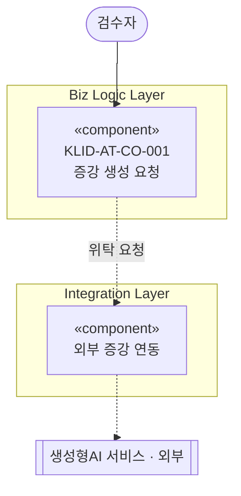
```mermaid
%%{init: {'flowchart': {'curve': 'stepBefore'}}}%%
flowchart TD
    REVIEWER([검수자])
    GENAI[[생성형AI 서비스 · 외부]]
    subgraph BIZ1[Biz Logic Layer]
        CO001["«component»<br/>KLID-AT-CO-001<br/>증강 생성 요청"]
    end
    subgraph INT1[Integration Layer]
        EXTAUG["«component»<br/>외부 증강 연동"]
    end
    REVIEWER --> CO001
    CO001 -.위탁 요청.-> EXTAUG
    EXTAUG -.-> GENAI
```

### KLID-AT-CO-002 — 증강 결과 수신·등록 컴포넌트

| 컴포넌트 ID | KLID-AT-CO-002 | 컴포넌트명 | 증강 결과 수신·등록 컴포넌트 |
|----------|---|---------|---|
| 관련 유스케이스 ID | KLID-AT-UC-002 (증강 결과 수신·등록) |

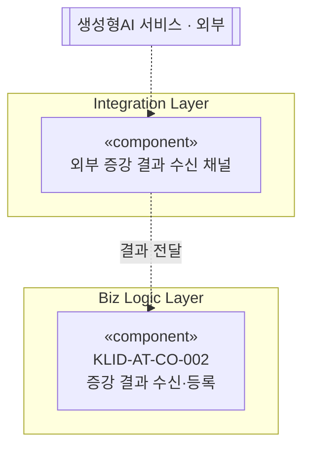
```mermaid
%%{init: {'flowchart': {'curve': 'stepBefore'}}}%%
flowchart TD
    GENAI[[생성형AI 서비스 · 외부]]
    subgraph INT2[Integration Layer]
        EXTAUG2["«component»<br/>외부 증강 결과 수신 채널"]
    end
    subgraph BIZ2[Biz Logic Layer]
        CO002["«component»<br/>KLID-AT-CO-002<br/>증강 결과 수신·등록"]
    end
    GENAI -.-> EXTAUG2
    EXTAUG2 -.결과 전달.-> CO002
```

### KLID-AT-CO-003 — 해상도 변경 컴포넌트

| 컴포넌트 ID | KLID-AT-CO-003 | 컴포넌트명 | 해상도 변경 컴포넌트 |
|----------|---|---------|---|
| 관련 유스케이스 ID | KLID-AT-UC-003 (해상도 변경 수행) |

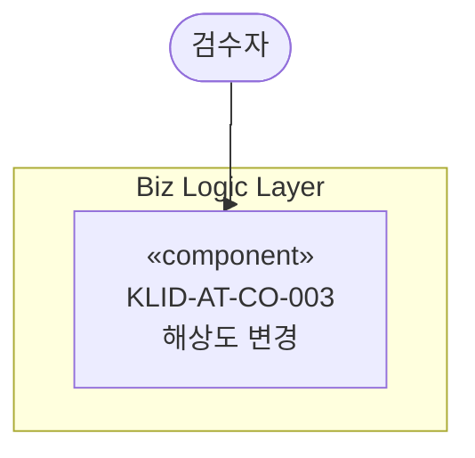
```mermaid
%%{init: {'flowchart': {'curve': 'stepBefore'}}}%%
flowchart TD
    REVIEWER([검수자])
    subgraph BIZ3[Biz Logic Layer]
        CO003["«component»<br/>KLID-AT-CO-003<br/>해상도 변경"]
    end
    REVIEWER --> CO003
```

### KLID-AT-CO-004 — 객체 자동 추적 컴포넌트

| 컴포넌트 ID | KLID-AT-CO-004 | 컴포넌트명 | 객체 자동 추적 컴포넌트 |
|----------|---|---------|---|
| 관련 유스케이스 ID | KLID-AT-UC-004 (객체 자동 추적) |

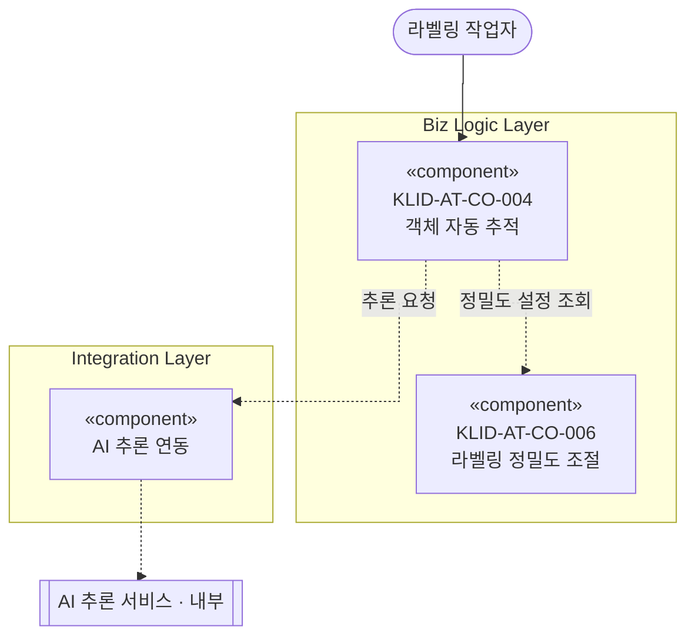
```mermaid
%%{init: {'flowchart': {'curve': 'stepBefore'}}}%%
flowchart TD
    WORKER([라벨링 작업자])
    AISVC[[AI 추론 서비스 · 내부]]
    subgraph BIZ4[Biz Logic Layer]
        CO004["«component»<br/>KLID-AT-CO-004<br/>객체 자동 추적"]
        CO006R["«component»<br/>KLID-AT-CO-006<br/>라벨링 정밀도 조절"]
    end
    subgraph INT4[Integration Layer]
        AISERVER["«component»<br/>AI 추론 연동"]
    end
    WORKER --> CO004
    CO004 -.정밀도 설정 조회.-> CO006R
    CO004 -.추론 요청.-> AISERVER
    AISERVER -.-> AISVC
```

### KLID-AT-CO-005 — 객체 외곽 경계 자동 밀착 컴포넌트

| 컴포넌트 ID | KLID-AT-CO-005 | 컴포넌트명 | 객체 외곽 경계 자동 밀착 컴포넌트 |
|----------|---|---------|---|
| 관련 유스케이스 ID | KLID-AT-UC-005 (객체 외곽 경계 자동 밀착) |

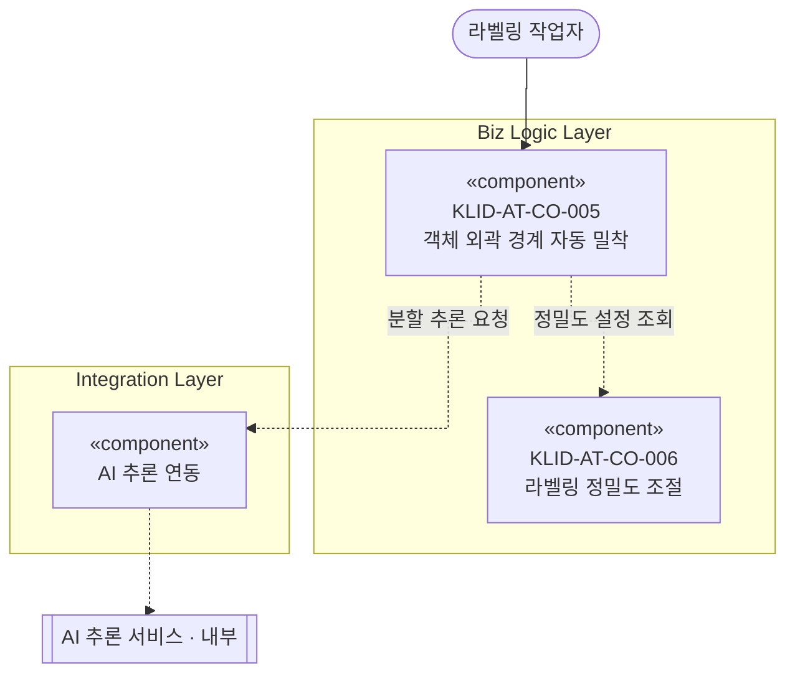
```mermaid
%%{init: {'flowchart': {'curve': 'stepBefore'}}}%%
flowchart TD
    WORKER([라벨링 작업자])
    AISVC[[AI 추론 서비스 · 내부]]
    subgraph BIZ5[Biz Logic Layer]
        CO005["«component»<br/>KLID-AT-CO-005<br/>객체 외곽 경계 자동 밀착"]
        CO006R5["«component»<br/>KLID-AT-CO-006<br/>라벨링 정밀도 조절"]
    end
    subgraph INT5[Integration Layer]
        AISERVER5["«component»<br/>AI 추론 연동"]
    end
    WORKER --> CO005
    CO005 -.정밀도 설정 조회.-> CO006R5
    CO005 -.분할 추론 요청.-> AISERVER5
    AISERVER5 -.-> AISVC
```

### KLID-AT-CO-006 — 라벨링 정밀도 조절 컴포넌트

| 컴포넌트 ID | KLID-AT-CO-006 | 컴포넌트명 | 라벨링 정밀도 조절 컴포넌트 |
|----------|---|---------|---|
| 관련 유스케이스 ID | KLID-AT-UC-006 (라벨링 정밀도 조절) |

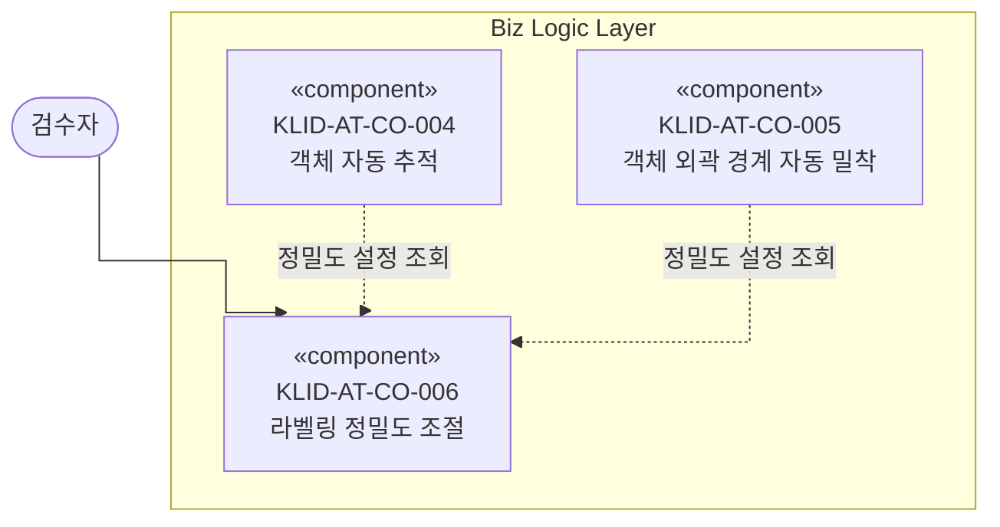
```mermaid
%%{init: {'flowchart': {'curve': 'stepBefore'}}}%%
flowchart TD
    REVIEWER([검수자])
    subgraph BIZ6[Biz Logic Layer]
        CO006["«component»<br/>KLID-AT-CO-006<br/>라벨링 정밀도 조절"]
        CO004C["«component»<br/>KLID-AT-CO-004<br/>객체 자동 추적"]
        CO005C["«component»<br/>KLID-AT-CO-005<br/>객체 외곽 경계 자동 밀착"]
    end
    REVIEWER --> CO006
    CO004C -.정밀도 설정 조회.-> CO006
    CO005C -.정밀도 설정 조회.-> CO006
```

### KLID-AT-CO-007 — 라벨 버전 저장·이력 추적 컴포넌트

| 컴포넌트 ID | KLID-AT-CO-007 | 컴포넌트명 | 라벨 버전 저장·이력 추적 컴포넌트 |
|----------|---|---------|---|
| 관련 유스케이스 ID | KLID-AT-UC-007 (라벨 버전 저장·이력 추적) |

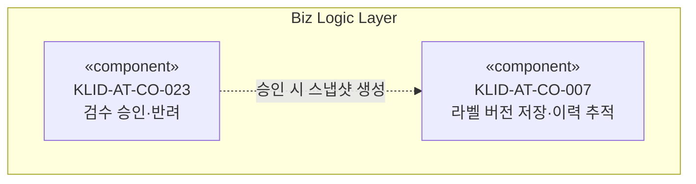
```mermaid
%%{init: {'flowchart': {'curve': 'stepBefore'}}}%%
flowchart TD
    subgraph BIZ7[Biz Logic Layer]
        CO023C["«component»<br/>KLID-AT-CO-023<br/>검수 승인·반려"]
        CO007["«component»<br/>KLID-AT-CO-007<br/>라벨 버전 저장·이력 추적"]
    end
    CO023C -.승인 시 스냅샷 생성.-> CO007
```

### KLID-AT-CO-008 — 버전 비교·복구 컴포넌트

| 컴포넌트 ID | KLID-AT-CO-008 | 컴포넌트명 | 버전 비교·복구 컴포넌트 |
|----------|---|---------|---|
| 관련 유스케이스 ID | KLID-AT-UC-008 (버전 비교·복구) |

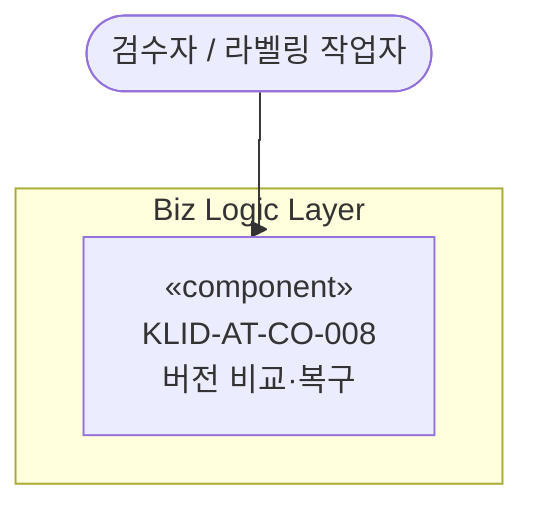
```mermaid
%%{init: {'flowchart': {'curve': 'stepBefore'}}}%%
flowchart TD
    USER([검수자 / 라벨링 작업자])
    subgraph BIZ8[Biz Logic Layer]
        CO008["«component»<br/>KLID-AT-CO-008<br/>버전 비교·복구"]
    end
    USER --> CO008
```

### KLID-AT-CO-009 — 검수 완료·수정 통지 컴포넌트

| 컴포넌트 ID | KLID-AT-CO-009 | 컴포넌트명 | 검수 완료·수정 통지 컴포넌트 |
|----------|---|---------|---|
| 관련 유스케이스 ID | KLID-AT-UC-009 (검수 완료·수정 통지) |

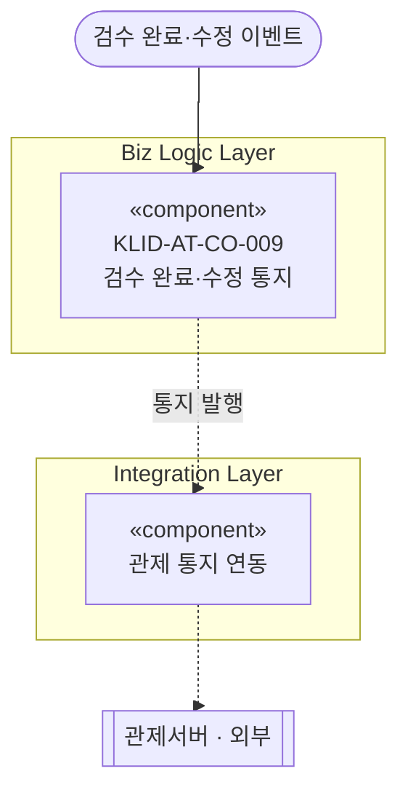
```mermaid
%%{init: {'flowchart': {'curve': 'stepBefore'}}}%%
flowchart TD
    EVT([검수 완료·수정 이벤트])
    CTRL[[관제서버 · 외부]]
    subgraph BIZ9[Biz Logic Layer]
        CO009["«component»<br/>KLID-AT-CO-009<br/>검수 완료·수정 통지"]
    end
    subgraph INT9[Integration Layer]
        CTRLNOTIFY["«component»<br/>관제 통지 연동"]
    end
    EVT --> CO009
    CO009 -.통지 발행.-> CTRLNOTIFY
    CTRLNOTIFY -.-> CTRL
```

### KLID-AT-CO-010 — 증강 활용 검수 컴포넌트

| 컴포넌트 ID | KLID-AT-CO-010 | 컴포넌트명 | 증강 활용 검수 컴포넌트 |
|----------|---|---------|---|
| 관련 유스케이스 ID | KLID-AT-UC-010 (증강 영상 활용 여부 검수) |

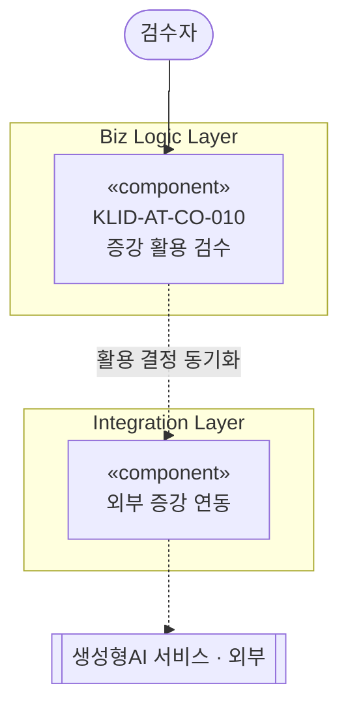
```mermaid
%%{init: {'flowchart': {'curve': 'stepBefore'}}}%%
flowchart TD
    REVIEWER([검수자])
    GENAI[[생성형AI 서비스 · 외부]]
    subgraph BIZ10[Biz Logic Layer]
        CO010["«component»<br/>KLID-AT-CO-010<br/>증강 활용 검수"]
    end
    subgraph INT10[Integration Layer]
        EXTAUG10["«component»<br/>외부 증강 연동"]
    end
    REVIEWER --> CO010
    CO010 -.활용 결정 동기화.-> EXTAUG10
    EXTAUG10 -.-> GENAI
```

### KLID-AT-CO-011 — 비식별 처리 요청 컴포넌트

| 컴포넌트 ID | KLID-AT-CO-011 | 컴포넌트명 | 비식별 처리 요청 컴포넌트 |
|----------|---|---------|---|
| 관련 유스케이스 ID | KLID-AT-UC-011 (비식별 처리 요청) |

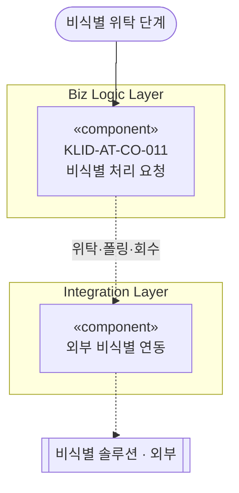
```mermaid
%%{init: {'flowchart': {'curve': 'stepBefore'}}}%%
flowchart TD
    STEP([비식별 위탁 단계])
    DEID[[비식별 솔루션 · 외부]]
    subgraph BIZ11[Biz Logic Layer]
        CO011["«component»<br/>KLID-AT-CO-011<br/>비식별 처리 요청"]
    end
    subgraph INT11[Integration Layer]
        DEIDCONN["«component»<br/>외부 비식별 연동"]
    end
    STEP --> CO011
    CO011 -.위탁·폴링·회수.-> DEIDCONN
    DEIDCONN -.-> DEID
```

### KLID-AT-CO-013 — 비식별 옵션 설정 컴포넌트

| 컴포넌트 ID | KLID-AT-CO-013 | 컴포넌트명 | 비식별 옵션 설정 컴포넌트 |
|----------|---|---------|---|
| 관련 유스케이스 ID | KLID-AT-UC-013 (비식별 옵션 설정) |

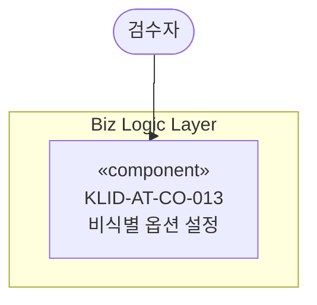
```mermaid
%%{init: {'flowchart': {'curve': 'stepBefore'}}}%%
flowchart TD
    REVIEWER([검수자])
    subgraph BIZ13[Biz Logic Layer]
        CO013["«component»<br/>KLID-AT-CO-013<br/>비식별 옵션 설정"]
    end
    REVIEWER --> CO013
```

### KLID-AT-CO-016 — 비식별 상태·이력·누락 신고 컴포넌트

| 컴포넌트 ID | KLID-AT-CO-016 | 컴포넌트명 | 비식별 상태·이력·누락 신고 컴포넌트 |
|----------|---|---------|---|
| 관련 유스케이스 ID | KLID-AT-UC-016 (비식별 처리 상태·이력 확인) |

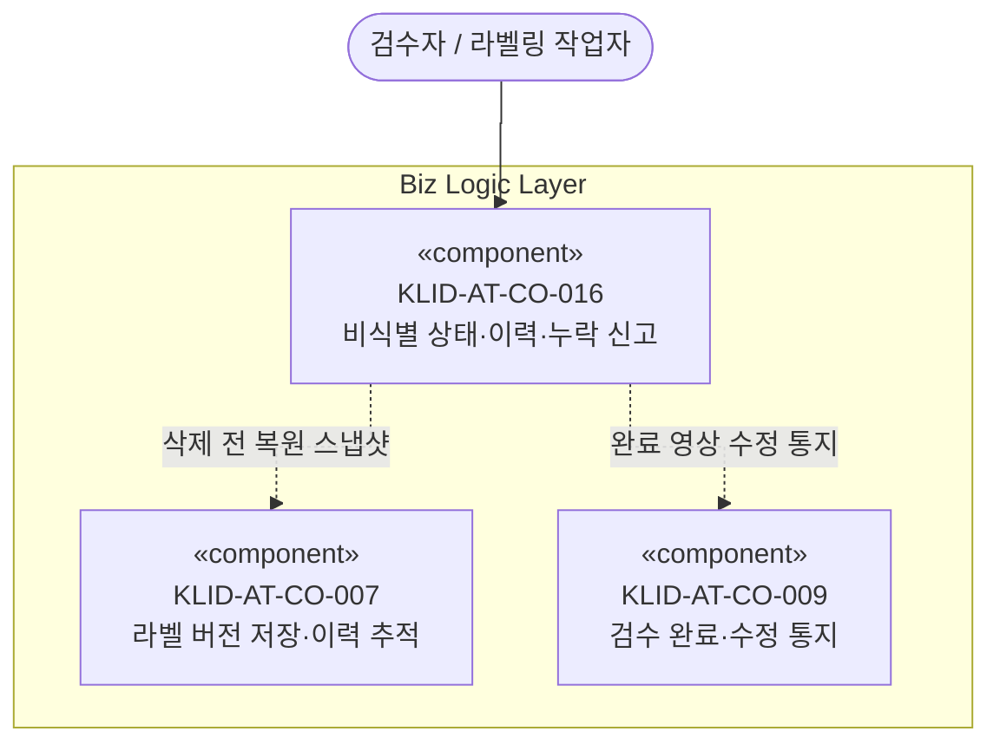
```mermaid
%%{init: {'flowchart': {'curve': 'stepBefore'}}}%%
flowchart TD
    USER([검수자 / 라벨링 작업자])
    subgraph BIZ16[Biz Logic Layer]
        CO016["«component»<br/>KLID-AT-CO-016<br/>비식별 상태·이력·누락 신고"]
        CO007R["«component»<br/>KLID-AT-CO-007<br/>라벨 버전 저장·이력 추적"]
        CO009R["«component»<br/>KLID-AT-CO-009<br/>검수 완료·수정 통지"]
    end
    USER --> CO016
    CO016 -.삭제 전 복원 스냅샷.-> CO007R
    CO016 -.완료 영상 수정 통지.-> CO009R
```

### KLID-AT-CO-018 — 영상 적재 컴포넌트 (관제 학습용 설정)

| 컴포넌트 ID | KLID-AT-CO-018 | 컴포넌트명 | 영상 적재 컴포넌트 |
|----------|---|---------|---|
| 관련 유스케이스 ID | KLID-AT-UC-018 (영상 적재 (관제 학습용 설정)) |

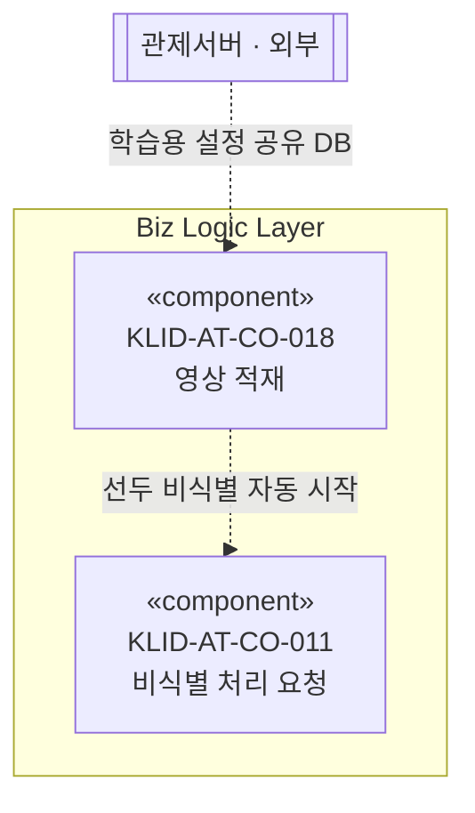
```mermaid
%%{init: {'flowchart': {'curve': 'stepBefore'}}}%%
flowchart TD
    CTRL[[관제서버 · 외부]]
    subgraph BIZ18[Biz Logic Layer]
        CO018["«component»<br/>KLID-AT-CO-018<br/>영상 적재"]
        CO011R["«component»<br/>KLID-AT-CO-011<br/>비식별 처리 요청"]
    end
    CTRL -.학습용 설정 공유 DB.-> CO018
    CO018 -.선두 비식별 자동 시작.-> CO011R
```

### KLID-AT-CO-019 — 이벤트 마킹 컴포넌트 (자동/수동)

| 컴포넌트 ID | KLID-AT-CO-019 | 컴포넌트명 | 이벤트 마킹 컴포넌트 |
|----------|---|---------|---|
| 관련 유스케이스 ID | KLID-AT-UC-019 (이벤트 마킹 (자동/수동)) |

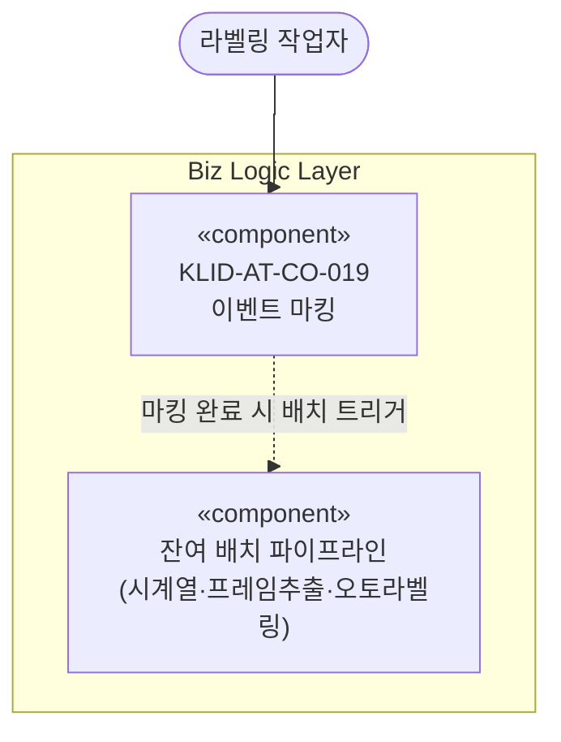
```mermaid
%%{init: {'flowchart': {'curve': 'stepBefore'}}}%%
flowchart TD
    WORKER([라벨링 작업자])
    subgraph BIZ19[Biz Logic Layer]
        CO019["«component»<br/>KLID-AT-CO-019<br/>이벤트 마킹"]
        BATCHC["«component»<br/>잔여 배치 파이프라인<br/>(시계열·프레임추출·오토라벨링)"]
    end
    WORKER --> CO019
    CO019 -.마킹 완료 시 배치 트리거.-> BATCHC
```

### KLID-AT-CO-021 — 라벨 편집·임시저장 컴포넌트

| 컴포넌트 ID | KLID-AT-CO-021 | 컴포넌트명 | 라벨 편집·임시저장 컴포넌트 |
|----------|---|---------|---|
| 관련 유스케이스 ID | KLID-AT-UC-021 (라벨 편집·임시저장) |

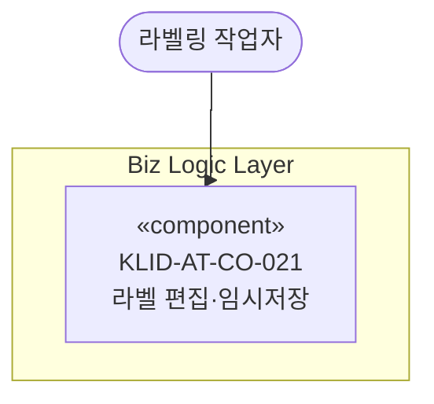
```mermaid
%%{init: {'flowchart': {'curve': 'stepBefore'}}}%%
flowchart TD
    WORKER([라벨링 작업자])
    subgraph BIZ21[Biz Logic Layer]
        CO021["«component»<br/>KLID-AT-CO-021<br/>라벨 편집·임시저장"]
    end
    WORKER --> CO021
```

### KLID-AT-CO-022 — VLM 시계열 메타 검토 컴포넌트

| 컴포넌트 ID | KLID-AT-CO-022 | 컴포넌트명 | VLM 시계열 메타 검토 컴포넌트 |
|----------|---|---------|---|
| 관련 유스케이스 ID | KLID-AT-UC-022 (VLM 시계열 메타 검토) |

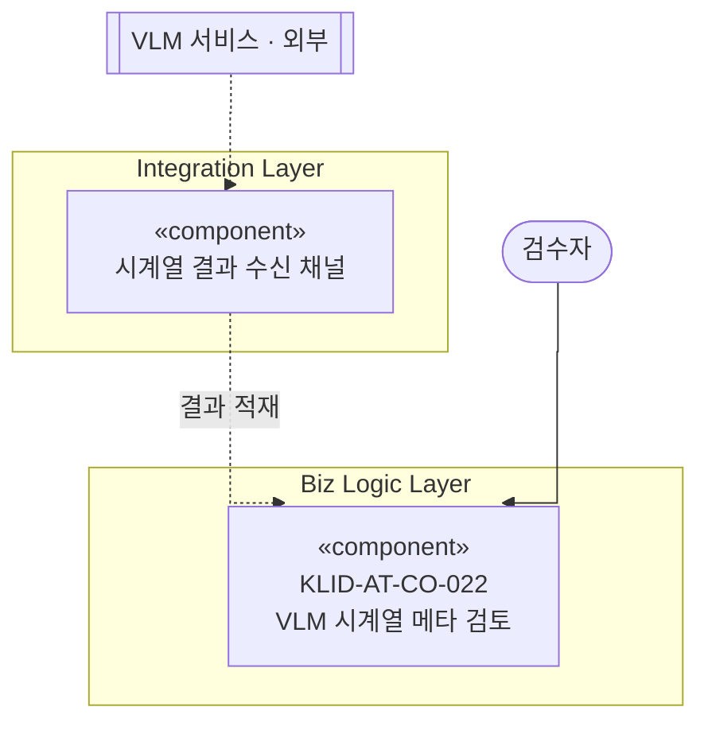
```mermaid
%%{init: {'flowchart': {'curve': 'stepBefore'}}}%%
flowchart TD
    REVIEWER([검수자])
    VLM[[VLM 서비스 · 외부]]
    subgraph BIZ22[Biz Logic Layer]
        CO022["«component»<br/>KLID-AT-CO-022<br/>VLM 시계열 메타 검토"]
    end
    subgraph INT22[Integration Layer]
        VLMCONN["«component»<br/>시계열 결과 수신 채널"]
    end
    VLM -.-> VLMCONN
    VLMCONN -.결과 적재.-> CO022
    REVIEWER --> CO022
```

### KLID-AT-CO-023 — 검수 승인·반려 컴포넌트

| 컴포넌트 ID | KLID-AT-CO-023 | 컴포넌트명 | 검수 승인·반려 컴포넌트 |
|----------|---|---------|---|
| 관련 유스케이스 ID | KLID-AT-UC-023 (검수 승인·반려) |

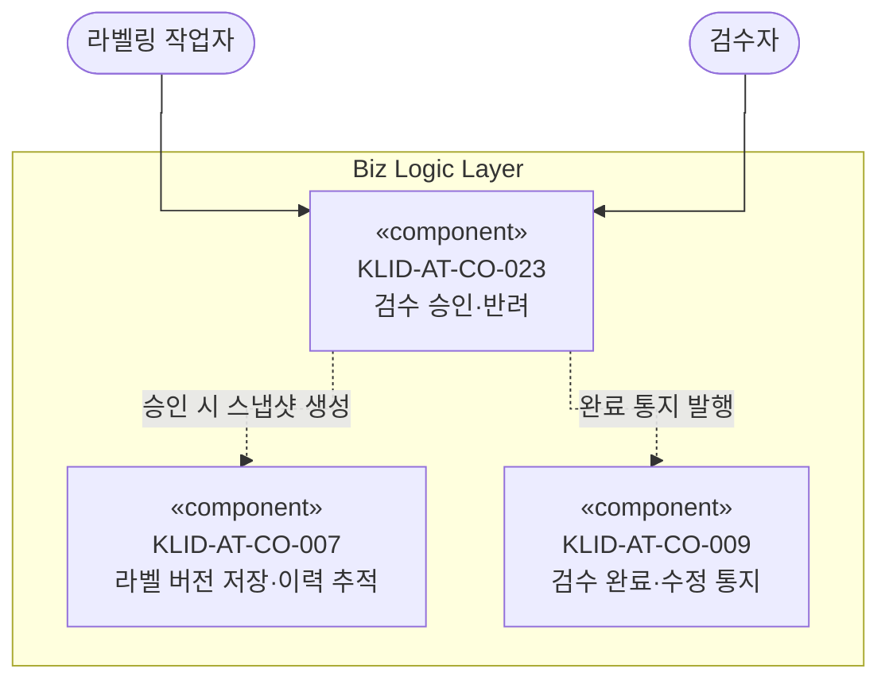
```mermaid
%%{init: {'flowchart': {'curve': 'stepBefore'}}}%%
flowchart TD
    WORKER([라벨링 작업자])
    REVIEWER([검수자])
    subgraph BIZ23[Biz Logic Layer]
        CO023["«component»<br/>KLID-AT-CO-023<br/>검수 승인·반려"]
        CO007C["«component»<br/>KLID-AT-CO-007<br/>라벨 버전 저장·이력 추적"]
        CO009C["«component»<br/>KLID-AT-CO-009<br/>검수 완료·수정 통지"]
    end
    WORKER --> CO023
    REVIEWER --> CO023
    CO023 -.승인 시 스냅샷 생성.-> CO007C
    CO023 -.완료 통지 발행.-> CO009C
```

### KLID-AT-CO-024 — 포털 간편 라벨링 컴포넌트

| 컴포넌트 ID | KLID-AT-CO-024 | 컴포넌트명 | 포털 간편 라벨링 컴포넌트 |
|----------|---|---------|---|
| 관련 유스케이스 ID | KLID-AT-UC-024 (포털 간편 라벨링) |

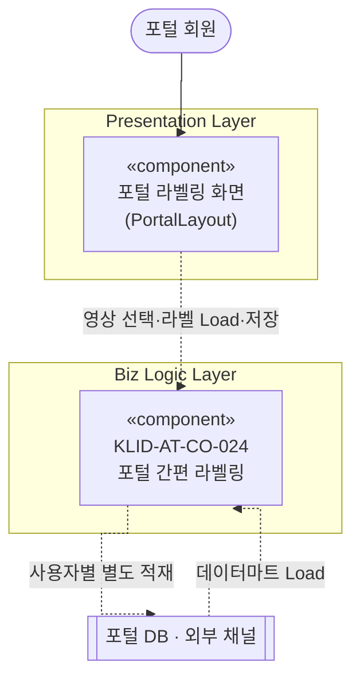
```mermaid
%%{init: {'flowchart': {'curve': 'stepBefore'}}}%%
flowchart TD
    PORTAL([포털 회원])
    PORTALDB[[포털 DB · 외부 채널]]
    subgraph PRES24[Presentation Layer]
        PG24["«component»<br/>포털 라벨링 화면<br/>(PortalLayout)"]
    end
    subgraph BIZ24[Biz Logic Layer]
        CO024["«component»<br/>KLID-AT-CO-024<br/>포털 간편 라벨링"]
    end
    PORTAL --> PG24
    PG24 -.영상 선택·라벨 Load·저장.-> CO024
    PORTALDB -.데이터마트 Load.-> CO024
    CO024 -.사용자별 별도 적재.-> PORTALDB
```

### KLID-AT-CO-025 — 포털 데이터 다운로드 컴포넌트

| 컴포넌트 ID | KLID-AT-CO-025 | 컴포넌트명 | 포털 데이터 다운로드 컴포넌트 |
|----------|---|---------|---|
| 관련 유스케이스 ID | KLID-AT-UC-025 (포털 데이터 다운로드) |

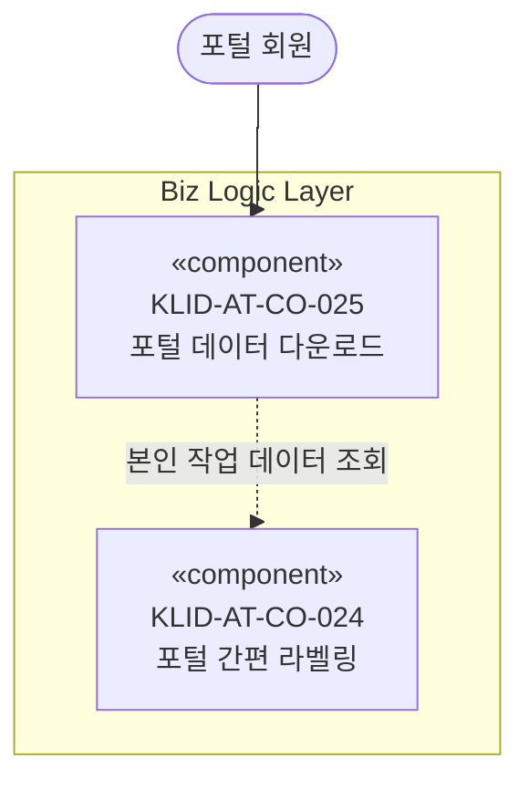
```mermaid
%%{init: {'flowchart': {'curve': 'stepBefore'}}}%%
flowchart TD
    PORTAL([포털 회원])
    subgraph BIZ25[Biz Logic Layer]
        CO025["«component»<br/>KLID-AT-CO-025<br/>포털 데이터 다운로드"]
        CO024R["«component»<br/>KLID-AT-CO-024<br/>포털 간편 라벨링"]
    end
    PORTAL --> CO025
    CO025 -.본인 작업 데이터 조회.-> CO024R
```

### KLID-AT-CO-026 — 공지 게시·배포 컴포넌트

| 컴포넌트 ID | KLID-AT-CO-026 | 컴포넌트명 | 공지 게시·배포 컴포넌트 |
|----------|---|---------|---|
| 관련 유스케이스 ID | KLID-AT-UC-026 (공지 게시·배포) |

```mermaid
%%{init: {'flowchart': {'curve': 'stepBefore'}}}%%
flowchart TD
    REVIEWER([검수자])
    subgraph PRES26[Presentation Layer]
        PG26["«component»<br/>게시판 작성·발행 화면"]
    end
    subgraph BIZ26[Biz Logic Layer]
        CO026["«component»<br/>KLID-AT-CO-026<br/>공지 게시·배포"]
    end
    REVIEWER --> PG26
    PG26 -.작성·발행·첨부.-> CO026
```

### KLID-AT-CO-027 — 공지 열람 컴포넌트

| 컴포넌트 ID | KLID-AT-CO-027 | 컴포넌트명 | 공지 열람 컴포넌트 |
|----------|---|---------|---|
| 관련 유스케이스 ID | KLID-AT-UC-027 (공지 열람) |

```mermaid
%%{init: {'flowchart': {'curve': 'stepBefore'}}}%%
flowchart TD
    USER([검수자 / 라벨링 작업자])
    subgraph PRES27[Presentation Layer]
        PG27["«component»<br/>게시판 목록·상세 화면"]
    end
    subgraph BIZ27[Biz Logic Layer]
        CO027["«component»<br/>KLID-AT-CO-027<br/>공지 열람"]
        CO026R["«component»<br/>KLID-AT-CO-026<br/>공지 게시·배포"]
    end
    USER --> PG27
    PG27 -.목록·상세·첨부 다운로드.-> CO027
    CO027 -.발행 공지 조회.-> CO026R
```

### KLID-AT-CO-028 — 이슈 문의·해소 컴포넌트

| 컴포넌트 ID | KLID-AT-CO-028 | 컴포넌트명 | 이슈 문의·해소 컴포넌트 |
|----------|---|---------|---|
| 관련 유스케이스 ID | KLID-AT-UC-028 (이슈 문의·해소) |

```mermaid
%%{init: {'flowchart': {'curve': 'stepBefore'}}}%%
flowchart TD
    WORKER([라벨링 작업자])
    REVIEWER([검수자])
    subgraph PRES28[Presentation Layer]
        PG28["«component»<br/>이슈 스레드 패널<br/>(라벨링·검수 화면 내장)"]
    end
    subgraph BIZ28[Biz Logic Layer]
        CO028["«component»<br/>KLID-AT-CO-028<br/>이슈 문의·해소"]
    end
    WORKER --> PG28
    REVIEWER --> PG28
    PG28 -.문의·코멘트·해소.-> CO028
```

### KLID-AT-CO-029 — 데이터마트 적재 노출 컴포넌트

| 컴포넌트 ID | KLID-AT-CO-029 | 컴포넌트명 | 데이터마트 적재 노출 컴포넌트 |
|----------|---|---------|---|
| 관련 유스케이스 ID | KLID-AT-UC-029 (데이터마트 View 적재 조회) |

```mermaid
%%{init: {'flowchart': {'curve': 'stepBefore'}}}%%
flowchart TD
    CTRL[[관제서버 · 외부]]
    subgraph INT29[Integration Layer]
        VIEW29["«component»<br/>검수완료 노출 View 계층<br/>(V_COMPLETED_*)"]
    end
    subgraph BIZ29[Biz Logic Layer]
        CO029["«component»<br/>KLID-AT-CO-029<br/>데이터마트 적재 노출"]
        CO009R29["«component»<br/>KLID-AT-CO-009<br/>검수 완료·수정 통지"]
    end
    CO009R29 -.통지 수신 후 조회 유도.-> CTRL
    CTRL -.RAW_SN 단순 SELECT.-> VIEW29
    VIEW29 -.검수완료 영상만 노출.-> CO029
```

### KLID-AT-CO-030 — 라벨 속성 정의·입력 컴포넌트

| 컴포넌트 ID | KLID-AT-CO-030 | 컴포넌트명 | 라벨 속성 정의·입력 컴포넌트 |
|----------|---|---------|---|
| 관련 유스케이스 ID | KLID-AT-UC-030 (라벨 속성 정의·입력) |

```mermaid
%%{init: {'flowchart': {'curve': 'stepBefore'}}}%%
flowchart TD
    REVIEWER([검수자])
    WORKER([라벨링 작업자])
    subgraph PRES30[Presentation Layer]
        PG30["«component»<br/>라벨 속성 패널<br/>(라벨링 화면 내장)"]
    end
    subgraph BIZ30[Biz Logic Layer]
        CO030["«component»<br/>KLID-AT-CO-030<br/>라벨 속성 정의·입력"]
        CO021R["«component»<br/>KLID-AT-CO-021<br/>라벨 편집·임시저장"]
    end
    REVIEWER -.속성 스펙 정의.-> CO030
    WORKER --> PG30
    PG30 -.객체별 속성값 입력.-> CO030
    CO021R -.저장 시 속성값 연계.-> CO030
```

### KLID-AT-CO-031 — 라벨 프리셋 관리 컴포넌트

| 컴포넌트 ID | KLID-AT-CO-031 | 컴포넌트명 | 라벨 프리셋 관리 컴포넌트 |
|----------|---|---------|---|
| 관련 유스케이스 ID | KLID-AT-UC-031 (라벨 프리셋 관리) |

```mermaid
%%{init: {'flowchart': {'curve': 'stepBefore'}}}%%
flowchart TD
    REVIEWER([검수자])
    subgraph PRES31[Presentation Layer]
        PG31["«component»<br/>프리셋 관리 화면"]
    end
    subgraph BIZ31[Biz Logic Layer]
        CO031["«component»<br/>KLID-AT-CO-031<br/>라벨 프리셋 관리"]
    end
    REVIEWER --> PG31
    PG31 -.프리셋 생성·복제·코드 추가.-> CO031
```

### KLID-AT-CO-032 — 대용량 재개 업로드 컴포넌트 (deprecated)

| 컴포넌트 ID | KLID-AT-CO-032 | 컴포넌트명 | 대용량 재개 업로드 컴포넌트 |
|----------|---|---------|---|
| 관련 유스케이스 ID | KLID-AT-UC-032 (TUS 대용량 업로드, deprecated) |

```mermaid
%%{init: {'flowchart': {'curve': 'stepBefore'}}}%%
flowchart TD
    REVIEWER([검수자])
    subgraph PRES32[Presentation Layer]
        PG32["«component»<br/>대용량 업로드 패널<br/>(관리 화면)"]
    end
    subgraph BIZ32[Biz Logic Layer]
        CO032["«component»<br/>KLID-AT-CO-032<br/>대용량 재개 업로드"]
    end
    REVIEWER --> PG32
    PG32 -.세션 생성·청크 PATCH·재개.-> CO032
```

> KLID-AT-CO-032 의 TUS 재개 가능 업로드는 1차 영상 적재 경로가 아니며(적재는 KLID-AT-CO-018 관제 학습용 설정), 폐지 예정 채널이다. 본 산출물에는 실제 구현물(`upload/` · `LS_TUS_UPLOAD`)을 추적 목적으로 포함한다.

### KLID-AT-CO-033 — 운영 대시보드·작업 목록·통계 컴포넌트

| 컴포넌트 ID | KLID-AT-CO-033 | 컴포넌트명 | 운영 대시보드·작업 목록·통계 컴포넌트 |
|----------|---|---------|---|
| 관련 운영 화면 | 대시보드 / 작업 목록·배정 / 작업자·전체 통계 / 버전 이력 |

```mermaid
%%{init: {'flowchart': {'curve': 'stepBefore'}}}%%
flowchart TD
    REVIEWER([검수자])
    WORKER([라벨링 작업자])
    subgraph PRES33[Presentation Layer]
        PG33["«component»<br/>대시보드·작업목록·통계·이력 화면"]
    end
    subgraph BIZ33[Biz Logic Layer]
        CO033["«component»<br/>KLID-AT-CO-033<br/>운영 대시보드·작업 목록·통계"]
        CO008R["«component»<br/>KLID-AT-CO-008<br/>버전 비교·복구"]
    end
    REVIEWER --> PG33
    WORKER --> PG33
    PG33 -.현황·배정·통계·CSV.-> CO033
    PG33 -.버전 이력 조회·복구.-> CO008R
```

### KLID-AT-CO-034 — 사용자 관리 컴포넌트

| 컴포넌트 ID | KLID-AT-CO-034 | 컴포넌트명 | 사용자 관리 컴포넌트 |
|----------|---|---------|---|
| 관련 운영 화면 | 사용자 관리(검색·수정·작업량) |

```mermaid
%%{init: {'flowchart': {'curve': 'stepBefore'}}}%%
flowchart TD
    REVIEWER([검수자])
    subgraph PRES34[Presentation Layer]
        PG34["«component»<br/>사용자 관리 화면"]
    end
    subgraph BIZ34[Biz Logic Layer]
        CO034["«component»<br/>KLID-AT-CO-034<br/>사용자 관리"]
    end
    REVIEWER --> PG34
    PG34 -.사용자 검색·수정·작업량 조회.-> CO034
```

### KLID-AT-CO-035 — 비식별 신고 관리 컴포넌트

| 컴포넌트 ID | KLID-AT-CO-035 | 컴포넌트명 | 비식별 신고 관리 컴포넌트 |
|----------|---|---------|---|
| 관련 운영 화면 | 비식별 신고 관리(목록·해소) |

```mermaid
%%{init: {'flowchart': {'curve': 'stepBefore'}}}%%
flowchart TD
    REVIEWER([검수자])
    subgraph PRES35[Presentation Layer]
        PG35["«component»<br/>비식별 신고 관리 화면"]
    end
    subgraph BIZ35[Biz Logic Layer]
        CO035["«component»<br/>KLID-AT-CO-035<br/>비식별 신고 관리"]
        CO016R["«component»<br/>KLID-AT-CO-016<br/>비식별 상태·이력·누락 신고"]
    end
    REVIEWER --> PG35
    PG35 -.신고 목록 조회·해소.-> CO035
    CO035 -.신고 해소 처리.-> CO016R
```

### KLID-AT-CO-036 — 세션 인계·역할 클레임 컴포넌트

| 컴포넌트 ID | KLID-AT-CO-036 | 컴포넌트명 | 세션 인계·역할 클레임 컴포넌트 |
|----------|---|---------|---|
| 관련 진입 화면 | 세션 인계 진입 / 역할 클레임 / 채널·역할 가드 |

```mermaid
%%{init: {'flowchart': {'curve': 'stepBefore'}}}%%
flowchart TD
    USER([검수자 / 라벨링 작업자 / 포털 회원])
    UP[[관제·포털 서버 · 외부]]
    subgraph PRES36[Presentation Layer]
        PG36["«component»<br/>세션 인계·역할 클레임 화면<br/>+ 채널·역할 가드(AppLayout / PortalLayout)"]
    end
    UP -.JWT 핸드오프.-> PG36
    USER --> PG36
    PG36 -.토큰 검증 실패 시.-> UP
```

> KLID-AT-CO-036 은 관제(내부)·포털(외부) 채널이 발급한 JWT 를 인계받아 검증하고, 채널·역할에 따라 내부 레이아웃(AppLayout)과 포털 레이아웃(PortalLayout)으로 분기한다. 역할 미부여 사용자는 역할 클레임 화면을 거쳐 권한을 부여받는다. 별도 로그인 UI 없이 상위 시스템 토큰만 사용한다.

---

## 2. 컴포넌트 목록

| 컴포넌트ID | 컴포넌트명 | 개요 | 관련 유스케이스 ID |
|---------|---------|------|-------------|
| KLID-AT-CO-001 | 증강 생성 요청 컴포넌트 | 검수완료 원본과 증강 종류를 외부 생성형 AI 서비스에 위탁 요청하고 증강 작업을 대기 상태로 등록한다. | KLID-AT-UC-001 |
| KLID-AT-CO-002 | 증강 결과 수신·등록 컴포넌트 | 외부 증강 결과를 수신해 새 영상으로 등록하고 원본 라벨·메타를 복사하며 원본↔증강 라벨 매핑을 기록한다. | KLID-AT-UC-002 |
| KLID-AT-CO-003 | 해상도 변경 컴포넌트 | 원본 영상마다 표준 해상도 3종의 파생영상(새 RAW_SN)을 생성한다. 비디오는 원본 복사, 프레임은 목표 해상도로 리스케일(업스케일 허용), 라벨 좌표는 배율 재계산해 제공한다. | KLID-AT-UC-003 |
| KLID-AT-CO-004 | 객체 자동 추적 컴포넌트 | 시작 프레임 지정 객체를 AI 추론으로 후속 프레임에 추적·전파하고 빈 프레임을 보간해 자동 라벨로 저장한다. | KLID-AT-UC-004 |
| KLID-AT-CO-005 | 객체 외곽 경계 자동 밀착 컴포넌트 | 클릭·박스 시드를 AI 추론에 전달해 외곽 경계 폴리곤을 산출하고 좌표 검증·단순화 후 캔버스에 밀착시킨다. | KLID-AT-UC-005 |
| KLID-AT-CO-006 | 라벨링 정밀도 조절 컴포넌트 | 검수자가 폴리곤 단순화 정밀도를 설정·저장하면 이후 추적·밀착 결과의 경계 세밀함이 제어된다. | KLID-AT-UC-006 |
| KLID-AT-CO-007 | 라벨 버전 저장·이력 추적 컴포넌트 | 검수 승인 시점에 영상 단위 라벨 전체 스냅샷을 해시 식별자와 함께 저장하고 변경이력을 기록한다. | KLID-AT-UC-007 |
| KLID-AT-CO-008 | 버전 비교·복구 컴포넌트 | 두 검수완료 버전의 차이를 비교 표시하고 선택 버전을 새 활성 버전으로 복구한다. | KLID-AT-UC-008 |
| KLID-AT-CO-009 | 검수 완료·수정 통지 컴포넌트 | 검수 완료·완료 후 수정 사실을 영상 단위로 디바운스해 관제서버에 단방향 요약 통지한다(본문 미포함). | KLID-AT-UC-009 |
| KLID-AT-CO-010 | 증강 활용 검수 컴포넌트 | 미검수 증강 영상을 검토해 학습데이터 활용 여부를 승인·반려하고 결정을 외부에 동기화한다. | KLID-AT-UC-010 |
| KLID-AT-CO-011 | 비식별 처리 요청 컴포넌트 | 전체 영상을 외부 비식별 솔루션에 위탁하고 주기 폴링으로 완료를 감지해 비식별본을 회수·저장한다(원본 보존). | KLID-AT-UC-011 |
| KLID-AT-CO-013 | 비식별 옵션 설정 컴포넌트 | 외부 비식별 솔루션이 제공하는 옵션을 관리 화면에서 설정·저장해 이후 비식별 요청에 반영한다. | KLID-AT-UC-013 |
| KLID-AT-CO-016 | 비식별 상태·이력·누락 신고 컴포넌트 | 영상 단위 비식별 상태·이력을 확인하고, 누락 신고 시 라벨 안전 삭제·작업락 후 수동 비식별화로 해소한다. | KLID-AT-UC-016 |
| KLID-AT-CO-018 | 영상 적재 컴포넌트 | 관제 학습용으로 설정된 영상을 주기 배치가 공유 DB에서 픽업해 적재하고 선두 비식별 단계를 자동 시작한다. | KLID-AT-UC-018 |
| KLID-AT-CO-019 | 이벤트 마킹 컴포넌트 | 비식별 영상에서 자동(프레임 간격)·수동(단축키) 이벤트 시점을 마킹하고 완료 시 잔여 배치를 트리거한다. | KLID-AT-UC-019 |
| KLID-AT-CO-021 | 라벨 편집·임시저장 컴포넌트 | 배정 영상 프레임에 도형 라벨·속성을 편집하고 작업본을 임시저장한다(버전 스냅샷 미생성). | KLID-AT-UC-021 |
| KLID-AT-CO-022 | VLM 시계열 메타 검토 컴포넌트 | 외부 시계열 분석 결과를 적재·검수큐에 진입시키고 검토·수정·승인하여 검증 메타만 학습데이터에 포함한다. | KLID-AT-UC-022 |
| KLID-AT-CO-023 | 검수 승인·반려 컴포넌트 | 작업자가 제출한 영상 단위 작업을 검수자가 승인(작업 완료) 또는 반려하고 승인 시 스냅샷·완료 통지를 연계한다. | KLID-AT-UC-023 |
| KLID-AT-CO-024 | 포털 간편 라벨링 컴포넌트 | 포털 회원이 데이터마트 영상을 선택해 기존 라벨을 Load 후 편집하고 사용자별로 별도 적재한다(원본·데이터마트 불변, 단방향). | KLID-AT-UC-024 |
| KLID-AT-CO-025 | 포털 데이터 다운로드 컴포넌트 | 포털 회원이 본인 작업 데이터를 기간 내 다운로드한다(본인 작업분 기준, IDOR 방어). | KLID-AT-UC-025 |
| KLID-AT-CO-026 | 공지 게시·배포 컴포넌트 | 검수자가 공지·가이드라인을 작성(임시저장)·첨부 업로드·발행·고정하고 발행글을 작업자에게 노출한다. | KLID-AT-UC-026 |
| KLID-AT-CO-027 | 공지 열람 컴포넌트 | 발행된 공지 목록·상세를 열람하고 첨부를 권한 통제 하에 다운로드한다. | KLID-AT-UC-027 |
| KLID-AT-CO-028 | 이슈 문의·해소 컴포넌트 | 검수자↔작업자가 영상 단위 문의를 작성·코멘트·해소하는 양방향 스레드를 상태머신으로 운영한다. | KLID-AT-UC-028 |
| KLID-AT-CO-029 | 데이터마트 적재 노출 컴포넌트 | 검수완료 영상만 노출하는 4종 View(V114 재편)로 관제서버가 통지 수신 후 영상 단위 단순 SELECT 로 마트에 적재한다. 라벨 내용 뷰 제거·VIDEO에 export 폴더 경로 노출(관제 연동 계약 변경). | KLID-AT-UC-029 |
| KLID-AT-CO-030 | 라벨 속성 정의·입력 컴포넌트 | 검수자가 라벨 마스터별 속성 스펙을 정의하고 작업자가 라벨링 시 객체별 속성값을 입력·저장한다. | KLID-AT-UC-030 |
| KLID-AT-CO-031 | 라벨 프리셋 관리 컴포넌트 | 검수자가 라벨 코드 그룹 프리셋을 생성·복제하고 코드 멤버·어노테이션 토글을 관리한다. | KLID-AT-UC-031 |
| KLID-AT-CO-032 | 대용량 재개 업로드 컴포넌트 | 관리 화면 대용량 영상을 TUS 1.0 청크 세션으로 중단·재개 업로드한다(1차 적재 경로 아님, deprecated). | KLID-AT-UC-032 |
| KLID-AT-CO-033 | 운영 대시보드·작업 목록·통계 컴포넌트 | 작업 현황 대시보드·작업 목록(배정 동선)·작업자/전체 통계(CSV 리포트)·버전 이력 화면을 제공한다. | (운영 화면) |
| KLID-AT-CO-034 | 사용자 관리 컴포넌트 | 검수자가 사용자를 검색·수정하고 사용자별 작업량을 조회한다. | (운영 화면) |
| KLID-AT-CO-035 | 비식별 신고 관리 컴포넌트 | 검수자가 비식별 누락 신고 목록을 조회하고 수동 비식별화 완료 건을 해소한다. | (운영 화면) |
| KLID-AT-CO-036 | 세션 인계·역할 클레임 컴포넌트 | 관제·포털 JWT 를 인계·검증하고 채널·역할로 레이아웃(AppLayout/PortalLayout)을 분기하며 역할 미부여자에게 역할 클레임을 제공한다. | (진입 화면) |

---

## 3. 컴포넌트 명세

> **⟳ 컴포넌트별로 1개씩 반복 작성한다.** 복수 컴포넌트가 재사용하는 공통 클래스는 동일 내부 클래스 ID(IC=설계 클래스 ID)로 교차 참조한다.

### KLID-AT-CO-001 — 증강 생성 요청 컴포넌트

| 컴포넌트 ID | KLID-AT-CO-001 | 컴포넌트명 | 증강 생성 요청 컴포넌트 |
|----------|---|---------|---|
| 컴포넌트 개요 | 검수완료 원본 영상과 증강 종류를 외부 생성형 AI 서비스에 위탁 요청하고, 증강 작업을 대기 상태로 등록하며 멱등키를 발급한다. |

| **내부 클래스** |||
| ID | 클래스명 | 설명 |
|----|--------|------|
| KLID-AT-DC-120 | AugmentController | 증강 요청·검수 진입점을 제공한다. |
| KLID-AT-DC-121 | AugmentRequestService | 원본 검수 상태를 검증하고 증강 위탁을 처리한다. |
| KLID-AT-DC-126 | ExternalAugmentClient | 외부 증강 서비스 위탁 연동 계약이다. |
| KLID-AT-DC-123 | LsDataAug | 증강 작업 등록·상태를 관리한다. |
| KLID-AT-DC-104 | LsRawDataStatus | 원본의 작업·검수 상태를 보유한다. |

| **인터페이스 클래스** ||||
| ID | 인터페이스명 | 오퍼레이션명 | 구분 (Serviced/Required) |
|----|----------|----------|------------------------|
| KLID-AT-IF-001 | 증강 요청 인터페이스 | 증강 생성 위탁 요청 | Serviced |
| KLID-AT-IF-002 | 외부 증강 연동 인터페이스 | 외부 증강 생성 위탁 | Required |

### KLID-AT-CO-002 — 증강 결과 수신·등록 컴포넌트

| 컴포넌트 ID | KLID-AT-CO-002 | 컴포넌트명 | 증강 결과 수신·등록 컴포넌트 |
|----------|---|---------|---|
| 컴포넌트 개요 | 외부가 전송한 증강 결과를 멱등 처리로 수신해 새 영상으로 등록하고, 원본 라벨·메타를 좌표 그대로 복사하며 원본↔증강 라벨 매핑을 기록한다. |

| **내부 클래스** |||
| ID | 클래스명 | 설명 |
|----|--------|------|
| KLID-AT-DC-127 | AugmentResultController | 증강 결과 수신 진입점을 제공한다. |
| KLID-AT-DC-128 | AugmentResultService | 멱등 확인 후 새 영상 등록·라벨 복사를 수행한다. |
| KLID-AT-DC-012 | LsDataRaw | 새 영상을 생성하고 원본을 부모로 연결한다. |
| KLID-AT-DC-073 | LsDataLbl | 복사된 라벨 데이터를 보유한다. |
| KLID-AT-DC-124 | LsDataAugLblMap | 원본↔증강 라벨 매핑을 보유한다. |
| KLID-AT-DC-123 | LsDataAug | 증강 작업 상태를 보유한다. |

| **인터페이스 클래스** ||||
| ID | 인터페이스명 | 오퍼레이션명 | 구분 (Serviced/Required) |
|----|----------|----------|------------------------|
| KLID-AT-IF-003 | 증강 결과 수신 인터페이스 | 증강 결과 수신·등록 | Serviced |

### KLID-AT-CO-003 — 해상도 변경 컴포넌트

| 컴포넌트 ID | KLID-AT-CO-003 | 컴포넌트명 | 해상도 변경 컴포넌트 |
|----------|---|---------|---|
| 컴포넌트 개요 | 원본 영상마다 표준 해상도 3종(1080p/720p/480p)의 파생영상(새 RAW_SN)을 생성한다. 비디오는 원본(비식별) 복사(재인코딩 없음), 프레임은 목표 해상도로 리스케일(업스케일 허용), 라벨 좌표는 해상도 배율로 재계산해 함께 제공한다. 파생영상은 증강과 동일하게 검수 파이프라인(PENDING→배정→검수)에 진입한다(2026-07-21 정책 재반전 — 구 '업스케일 거부·영상·라벨 좌표 미생성' 폐기). |

| **내부 클래스** |||
| ID | 클래스명 | 설명 |
|----|--------|------|
| KLID-AT-DC-010 | VideoController | 영상 조회·스트리밍·해상도 변경 진입점을 제공한다. |
| KLID-AT-DC-018 | VideoResolutionService | 표준 3종 프리셋을 오케스트레이션하고, 프리셋별 부분 실패를 격리한다(업스케일 거부 가드 제거). |
| KLID-AT-DC-021 | ResolutionDerivativeService | 원본 검증(APPROVED·비-파생) + 첫 프레임 실측 후 예약·확정을 위임한다. |
| KLID-AT-DC-022 | ResolutionReservationPersister | 동기 트랜잭션에서 부모 잠금 + PII 게이트 + UK(원본,해상도) 예약 + 새 RAW(PENDING) 커밋을 수행한다. |
| KLID-AT-DC-023 | ResolutionDerivativeFinalizer | 커밋 후 비동기(REQUIRES_NEW)로 비디오 복사·프레임 리스케일·라벨 좌표 배율 재계산 복사·확정 불변식(deIdntfYn='Y'+MARKING_READY)을 원자 처리한다. |
| KLID-AT-DC-019 | Java2DImageResizer | 프레임 이미지를 목표 해상도로 리스케일(축소·확대)하고 크기를 측정한다. |
| KLID-AT-DC-024 | NioVideoFileCopier | 원본(비식별) 비디오 파일을 재인코딩 없이 파생 경로로 복사한다. |
| KLID-AT-DC-017 | LsResolutionExport | 해상도 변경 산출 추적 행(파생 RAW 역참조 `NEW_RAW_SN` 포함)을 보유한다. |
| KLID-AT-DC-025 | LsResolutionLblMap | 원본↔파생 라벨 매핑(COORD_RECALC_YN/SCALE_X/SCALE_Y)을 보유한다. |
| KLID-AT-DC-012 | LsDataRaw | 원본·파생 영상 정보를 보유한다. |

| **인터페이스 클래스** ||||
| ID | 인터페이스명 | 오퍼레이션명 | 구분 (Serviced/Required) |
|----|----------|----------|------------------------|
| KLID-AT-IF-004 | 해상도 변경 인터페이스 | 표준 하위 해상도 변경 요청 | Serviced |

### KLID-AT-CO-004 — 객체 자동 추적 컴포넌트

| 컴포넌트 ID | KLID-AT-CO-004 | 컴포넌트명 | 객체 자동 추적 컴포넌트 |
|----------|---|---------|---|
| 컴포넌트 개요 | 시작 프레임에서 지정된 객체를 AI 추론 서비스로 후속 프레임에 추적·전파하고, 좌표 범위 검증·폴리곤 단순화 후 자동 라벨로 저장하며 빈 프레임을 보간한다. 본인 미배정 프레임 접근은 차단한다. |

| **내부 클래스** |||
| ID | 클래스명 | 설명 |
|----|--------|------|
| KLID-AT-DC-070 | LabelController | 라벨·AI 보조 라벨링 진입점을 제공한다. |
| KLID-AT-DC-075 | Sam2TrackService | 객체 추적 추론을 오케스트레이션한다. |
| KLID-AT-DC-003 | LabelAccessGuard | 본인 배정 프레임 접근을 검증한다(수평 권한 상승 방어). |
| KLID-AT-DC-005 | AiServerClient | AI 추론 서버 연동 계약이다. |
| KLID-AT-DC-073 | LsDataLbl | 자동 라벨 데이터를 보유한다. |
| KLID-AT-DC-078 | LsDataLblAiInfo | 자동 라벨의 신뢰도 정보를 보유한다. |
| KLID-AT-DC-004 | SystemConfigService | 폴리곤 단순화 정밀도 설정을 조회한다. |

| **인터페이스 클래스** ||||
| ID | 인터페이스명 | 오퍼레이션명 | 구분 (Serviced/Required) |
|----|----------|----------|------------------------|
| KLID-AT-IF-005 | 객체 추적 인터페이스 | 객체 자동 추적 요청 | Serviced |
| KLID-AT-IF-006 | AI 추론 연동 인터페이스 | 객체 추적 추론 요청 | Required |

### KLID-AT-CO-005 — 객체 외곽 경계 자동 밀착 컴포넌트

| 컴포넌트 ID | KLID-AT-CO-005 | 컴포넌트명 | 객체 외곽 경계 자동 밀착 컴포넌트 |
|----------|---|---------|---|
| 컴포넌트 개요 | 클릭(포인트) 또는 박스 시드를 AI 추론 서비스에 전달해 외곽 경계 폴리곤과 신뢰도를 산출하고, 실측 해상도 범위 검증·폴리곤 단순화 후 캔버스에 밀착시킨다. 포인트·박스 중 하나만 허용한다. |

| **내부 클래스** |||
| ID | 클래스명 | 설명 |
|----|--------|------|
| KLID-AT-DC-070 | LabelController | 라벨·AI 보조 라벨링 진입점을 제공한다. |
| KLID-AT-DC-076 | Sam2SegmentService | 외곽 경계 분할 추론을 오케스트레이션한다. |
| KLID-AT-DC-003 | LabelAccessGuard | 본인 배정 프레임 접근을 검증한다. |
| KLID-AT-DC-005 | AiServerClient | AI 추론 서버 연동 계약이다. |
| KLID-AT-DC-004 | SystemConfigService | 폴리곤 단순화 정밀도 설정을 조회한다. |

| **인터페이스 클래스** ||||
| ID | 인터페이스명 | 오퍼레이션명 | 구분 (Serviced/Required) |
|----|----------|----------|------------------------|
| KLID-AT-IF-007 | 외곽 분할 인터페이스 | 외곽 경계 분할 요청 | Serviced |
| KLID-AT-IF-006 | AI 추론 연동 인터페이스 | 외곽 경계 분할 추론 요청 | Required |

### KLID-AT-CO-006 — 라벨링 정밀도 조절 컴포넌트

| 컴포넌트 ID | KLID-AT-CO-006 | 컴포넌트명 | 라벨링 정밀도 조절 컴포넌트 |
|----------|---|---------|---|
| 컴포넌트 개요 | 검수자가 폴리곤 단순화 정밀도를 설정·저장하면 캐시에 반영되고, 이후 추적·밀착 시 설정 정밀도로 폴리곤 점 수가 단순화된다. 설정 조회 실패 시 기본값으로 안전 폴백한다. |

| **내부 클래스** |||
| ID | 클래스명 | 설명 |
|----|--------|------|
| KLID-AT-DC-140 | SystemConfigController | 시스템 설정 변경 진입점을 제공한다. |
| KLID-AT-DC-004 | SystemConfigService | 허용 범위 검증·저장 및 설정 캐시를 관리한다. |
| KLID-AT-DC-141 | LsSystemConfig | 시스템 설정 항목을 보유한다. |
| KLID-AT-DC-075 | Sam2TrackService | 설정 정밀도를 조회해 추적 결과에 반영한다. |

| **인터페이스 클래스** ||||
| ID | 인터페이스명 | 오퍼레이션명 | 구분 (Serviced/Required) |
|----|----------|----------|------------------------|
| KLID-AT-IF-008 | 시스템 설정 인터페이스 | 정밀도 설정 변경 | Serviced |

### KLID-AT-CO-007 — 라벨 버전 저장·이력 추적 컴포넌트

| 컴포넌트 ID | KLID-AT-CO-007 | 컴포넌트명 | 라벨 버전 저장·이력 추적 컴포넌트 |
|----------|---|---------|---|
| 컴포넌트 개요 | 검수 승인 시점에 영상 단위 라벨 전체 스냅샷을 구성해 페이로드 해시로 식별·저장하고 변경이력을 기록한다. 라벨 임시저장 시점에는 버전을 생성하지 않는다. |

| **내부 클래스** |||
| ID | 클래스명 | 설명 |
|----|--------|------|
| KLID-AT-DC-101 | ReviewService | 검수 승인 시점에 버전 생성을 트리거한다. |
| KLID-AT-DC-091 | VersionService | 라벨 스냅샷 구성·해시 식별·저장을 수행한다. |
| KLID-AT-DC-092 | LsLabelVersion | 검수 승인 스냅샷 버전을 보유한다. |
| KLID-AT-DC-093 | LsDataLblHstry | 라벨 변경이력을 보유한다. |
| KLID-AT-DC-073 | LsDataLbl | 스냅샷 대상 라벨 데이터를 보유한다. |

| **인터페이스 클래스** ||||
| ID | 인터페이스명 | 오퍼레이션명 | 구분 (Serviced/Required) |
|----|----------|----------|------------------------|
| KLID-AT-IF-009 | 버전 스냅샷 인터페이스 | 검수 승인 스냅샷 생성 | Serviced |

### KLID-AT-CO-008 — 버전 비교·복구 컴포넌트

| 컴포넌트 ID | KLID-AT-CO-008 | 컴포넌트명 | 버전 비교·복구 컴포넌트 |
|----------|---|---------|---|
| 컴포넌트 개요 | 검수완료 버전 이력을 조회하고 두 스냅샷의 추가·수정·삭제 차이를 산출 표시하며, 선택 버전을 새 활성 버전으로 복원한다. 복구 권한은 검수자 전체, 작업자는 본인 배정으로 제한한다. |

| **내부 클래스** |||
| ID | 클래스명 | 설명 |
|----|--------|------|
| KLID-AT-DC-090 | VersionController | 버전 조회·비교·복구 진입점을 제공한다. |
| KLID-AT-DC-091 | VersionService | 스냅샷 비교·복원을 수행한다. |
| KLID-AT-DC-092 | LsLabelVersion | 버전 스냅샷을 보유한다. |
| KLID-AT-DC-003 | LabelAccessGuard | 본인 배정·검수 권한을 검증한다. |

| **인터페이스 클래스** ||||
| ID | 인터페이스명 | 오퍼레이션명 | 구분 (Serviced/Required) |
|----|----------|----------|------------------------|
| KLID-AT-IF-010 | 버전 비교·복구 인터페이스 | 버전 차이 비교 | Serviced |
| KLID-AT-IF-010 | 버전 비교·복구 인터페이스 | 버전 복구 | Serviced |

### KLID-AT-CO-009 — 검수 완료·수정 통지 컴포넌트

| 컴포넌트 ID | KLID-AT-CO-009 | 컴포넌트명 | 검수 완료·수정 통지 컴포넌트 |
|----------|---|---------|---|
| 컴포넌트 개요 | 검수 완료 시 완료 통지를, 완료 후 라벨·메타 수정 시 디바운스된 수정 요약 통지를 관제서버로 비동기 단방향 발행한다. 페이로드에 개인정보·본문은 포함하지 않으며 요청 ID로 멱등 처리한다. |

| **내부 클래스** |||
| ID | 클래스명 | 설명 |
|----|--------|------|
| KLID-AT-DC-131 | ControlNotifyEventListener | 검수 완료·수정 이벤트를 수신해 통지를 트리거한다. |
| KLID-AT-DC-132 | ControlNotifyDebouncer | 수정 변경을 영상 1건 1회로 디바운스 집계한다. |
| KLID-AT-DC-130 | ControlNotifyService | 통지 페이로드를 구성하고 발행을 관리한다. |
| KLID-AT-DC-133 | ControlNotifyClient | 관제서버 단방향 통지 연동 계약이다. |

| **인터페이스 클래스** ||||
| ID | 인터페이스명 | 오퍼레이션명 | 구분 (Serviced/Required) |
|----|----------|----------|------------------------|
| KLID-AT-IF-011 | 관제 통지 연동 인터페이스 | 완료 통지 발행 | Required |
| KLID-AT-IF-011 | 관제 통지 연동 인터페이스 | 수정 통지 발행 | Required |

### KLID-AT-CO-010 — 증강 활용 검수 컴포넌트

| 컴포넌트 ID | KLID-AT-CO-010 | 컴포넌트명 | 증강 활용 검수 컴포넌트 |
|----------|---|---------|---|
| 컴포넌트 개요 | 미검수 증강 영상을 조회·확인해 학습데이터 활용 여부를 승인 또는 사유 입력 반려하고, 활용 결정을 외부에 최선노력으로 동기화한다. 미검수 이외 상태는 중복 처리를 거부한다. |

| **내부 클래스** |||
| ID | 클래스명 | 설명 |
|----|--------|------|
| KLID-AT-DC-120 | AugmentController | 증강 요청·검수 진입점을 제공한다. |
| KLID-AT-DC-122 | AugmentReviewService | 활용 승인·반려 전이와 외부 동기화를 수행한다. |
| KLID-AT-DC-123 | LsDataAug | 증강 작업 상태를 보유한다. |
| KLID-AT-DC-125 | LsDataAugRvw | 증강 활용 검수 이력을 보유한다. |
| KLID-AT-DC-126 | ExternalAugmentClient | 활용 결정 외부 동기화 연동 계약이다. |

| **인터페이스 클래스** ||||
| ID | 인터페이스명 | 오퍼레이션명 | 구분 (Serviced/Required) |
|----|----------|----------|------------------------|
| KLID-AT-IF-012 | 증강 활용 검수 인터페이스 | 증강 활용 승인 | Serviced |
| KLID-AT-IF-012 | 증강 활용 검수 인터페이스 | 증강 활용 반려 | Serviced |
| KLID-AT-IF-002 | 외부 증강 연동 인터페이스 | 활용 결정 외부 동기화 | Required |

### KLID-AT-CO-011 — 비식별 처리 요청 컴포넌트

| 컴포넌트 ID | KLID-AT-CO-011 | 컴포넌트명 | 비식별 처리 요청 컴포넌트 |
|----------|---|---------|---|
| 컴포넌트 개요 | 전체 영상을 외부 비식별 솔루션에 위탁(업로드·프로젝트 생성)하고, 주기 폴링으로 진행 상태를 조회해 완료 시 결과를 회수·검증한다. 비식별본을 별도 경로에 저장하고 원본은 보존하며 처리 이력을 영상 단위로 기록한다. |

| **내부 클래스** |||
| ID | 클래스명 | 설명 |
|----|--------|------|
| KLID-AT-DC-055 | DeidentController | 비식별 처리 진입점을 제공한다. |
| KLID-AT-DC-050 | KpstDeidentService | 비식별 위탁·폴링·결과 회수를 오케스트레이션한다. |
| KLID-AT-DC-052 | KpstDeidentPollJob | 대기·진행중 위탁 건을 주기 폴링한다. |
| KLID-AT-DC-051 | KpstDeidentTxService | 비식별 완료·실패 상태 전이를 트랜잭션으로 처리한다. |
| KLID-AT-DC-054 | KpstDeidentifyClient | 외부 비식별 솔루션 연동 계약이다. |
| KLID-AT-DC-053 | LsDeidentProcLog | 비식별 처리 이력을 보유한다. |
| KLID-AT-DC-012 | LsDataRaw | 영상 비식별 상태를 보유한다. |

| **인터페이스 클래스** ||||
| ID | 인터페이스명 | 오퍼레이션명 | 구분 (Serviced/Required) |
|----|----------|----------|------------------------|
| KLID-AT-IF-013 | 비식별 처리 인터페이스 | 비식별 처리 요청 | Serviced |
| KLID-AT-IF-014 | 외부 비식별 연동 인터페이스 | 비식별 위탁 | Required |
| KLID-AT-IF-014 | 외부 비식별 연동 인터페이스 | 진행 상태 조회 | Required |
| KLID-AT-IF-014 | 외부 비식별 연동 인터페이스 | 비식별 결과 회수 | Required |

### KLID-AT-CO-013 — 비식별 옵션 설정 컴포넌트

| 컴포넌트 ID | KLID-AT-CO-013 | 컴포넌트명 | 비식별 옵션 설정 컴포넌트 |
|----------|---|---------|---|
| 컴포넌트 개요 | 검수자가 외부 비식별 솔루션이 제공하는 옵션을 관리 화면에서 설정·저장하면 이후 비식별 요청에 반영된다. 허용 옵션 키·값을 검증한다. |

| **내부 클래스** |||
| ID | 클래스명 | 설명 |
|----|--------|------|
| KLID-AT-DC-140 | SystemConfigController | 시스템 설정 변경 진입점을 제공한다. |
| KLID-AT-DC-004 | SystemConfigService | 허용 옵션 검증·저장 및 설정 캐시를 관리한다. |
| KLID-AT-DC-141 | LsSystemConfig | 비식별 옵션 설정 항목을 보유한다. |

| **인터페이스 클래스** ||||
| ID | 인터페이스명 | 오퍼레이션명 | 구분 (Serviced/Required) |
|----|----------|----------|------------------------|
| KLID-AT-IF-008 | 시스템 설정 인터페이스 | 비식별 옵션 설정 변경 | Serviced |

### KLID-AT-CO-016 — 비식별 상태·이력·누락 신고 컴포넌트

| 컴포넌트 ID | KLID-AT-CO-016 | 컴포넌트명 | 비식별 상태·이력·누락 신고 컴포넌트 |
|----------|---|---------|---|
| 컴포넌트 개요 | 영상 단위 비식별 상태·배치 단계를 조회하고, 비식별 누락 신고 시 삭제 전 복원 가능 스냅샷을 남긴 뒤 해당 영상 전체 라벨을 일괄 삭제하고 작업락·비식별 실패 표시를 한다. 수동 비식별화 완료 후 신고를 해소하고 작업락을 해제한다. |

| **내부 클래스** |||
| ID | 클래스명 | 설명 |
|----|--------|------|
| KLID-AT-DC-011 | VideoQueryService | 영상 비식별 상태·배치 단계를 조회한다. |
| KLID-AT-DC-080 | DeidentReportController | 비식별 누락 신고·해소 진입점을 제공한다. |
| KLID-AT-DC-081 | DeidentReportService | 신고 등록·라벨 안전 삭제·해소를 처리한다. |
| KLID-AT-DC-083 | WorkLockService | 작업락 선점·해제를 관리한다. |
| KLID-AT-DC-091 | VersionService | 삭제 전 복원 가능 비활성 스냅샷을 기록한다. |
| KLID-AT-DC-003 | LabelAccessGuard | 본인 배정 영상 신고 권한을 검증한다. |
| KLID-AT-DC-082 | LsDeidentReport | 비식별 누락 신고 이력을 보유한다. |
| KLID-AT-DC-012 | LsDataRaw | 영상 비식별 상태를 보유한다. |

| **인터페이스 클래스** ||||
| ID | 인터페이스명 | 오퍼레이션명 | 구분 (Serviced/Required) |
|----|----------|----------|------------------------|
| KLID-AT-IF-015 | 비식별 신고 인터페이스 | 비식별 누락 신고 | Serviced |
| KLID-AT-IF-015 | 비식별 신고 인터페이스 | 신고 해소 | Serviced |

### KLID-AT-CO-018 — 영상 적재 컴포넌트

| 컴포넌트 ID | KLID-AT-CO-018 | 컴포넌트명 | 영상 적재 컴포넌트 |
|----------|---|---------|---|
| 컴포넌트 개요 | 관제서버가 공유 DB에서 학습용으로 설정한 미적재 영상을 주기 배치가 조회·픽업해 1건씩 등록하고 작업 상태를 대기로 초기화한다. 적재 직후 선두 비식별 단계를 비동기로 자동 시작한다. |

| **내부 클래스** |||
| ID | 클래스명 | 설명 |
|----|--------|------|
| KLID-AT-DC-016 | ControlTrainingVideoScanJob | 학습용 미적재 영상을 주기 배치로 스캔한다. |
| KLID-AT-DC-015 | TrainingVideoIngestService | 영상 1건 등록·작업 상태 초기화를 수행한다. |
| KLID-AT-DC-042 | IngestDeidentifyBridge | 적재 완료 후 선두 비식별을 연계 트리거한다. |
| KLID-AT-DC-041 | AsyncDeidentifyRunner | 선두 비식별을 비동기로 실행한다. |
| KLID-AT-DC-034 | DeidentifyStep | 비식별 위탁 단계를 실행한다. |
| KLID-AT-DC-012 | LsDataRaw | 적재 영상 정보를 보유한다. |
| KLID-AT-DC-104 | LsRawDataStatus | 작업 상태를 보유한다. |

| **인터페이스 클래스** ||||
| ID | 인터페이스명 | 오퍼레이션명 | 구분 (Serviced/Required) |
|----|----------|----------|------------------------|
| KLID-AT-IF-016 | 학습용 적재 인터페이스 | 학습용 영상 주기 적재 | Serviced |

### KLID-AT-CO-019 — 이벤트 마킹 컴포넌트

| 컴포넌트 ID | KLID-AT-CO-019 | 컴포넌트명 | 이벤트 마킹 컴포넌트 |
|----------|---|---------|---|
| 컴포넌트 개요 | 비식별 영상에서 자동(프레임 간격)·수동(단축키) 이벤트 시점을 마킹하고, 영상의 이벤트 유형으로 이벤트명을 자동 소싱한다. 마킹 완료 시 잔여 배치(시계열·프레임추출·오토라벨링)를 트리거한다. 본인 배정·비식별 완료 영상만 허용한다. |

| **내부 클래스** |||
| ID | 클래스명 | 설명 |
|----|--------|------|
| KLID-AT-DC-060 | MarkingController | 마킹 생성 진입점을 제공한다. |
| KLID-AT-DC-061 | MarkingService | 자동·수동 마킹 생성과 이벤트명 자동 소싱을 처리한다. |
| KLID-AT-DC-062 | LsMarking | 마킹 데이터를 보유한다. |
| KLID-AT-DC-063 | MarkingCompletedEvent | 마킹 완료 사실을 전달하는 도메인 이벤트다. |
| KLID-AT-DC-064 | MarkingBatchBridge | 마킹 완료 후 잔여 배치를 연계 시작한다. |
| KLID-AT-DC-030 | BatchOrchestrator | 잔여 배치 단계를 오케스트레이션한다. |
| KLID-AT-DC-012 | LsDataRaw | 영상 이벤트 유형·비식별 상태를 보유한다. |

| **인터페이스 클래스** ||||
| ID | 인터페이스명 | 오퍼레이션명 | 구분 (Serviced/Required) |
|----|----------|----------|------------------------|
| KLID-AT-IF-017 | 이벤트 마킹 인터페이스 | 이벤트 마킹 생성 | Serviced |

### KLID-AT-CO-021 — 라벨 편집·임시저장 컴포넌트

| 컴포넌트 ID | KLID-AT-CO-021 | 컴포넌트명 | 라벨 편집·임시저장 컴포넌트 |
|----------|---|---------|---|
| 컴포넌트 개요 | 배정 영상 프레임의 라벨을 조회·표시하고, 도형·속성 편집 후 작업본을 임시저장한다(버전 스냅샷 미생성). 저장 시 본인 배정 프레임을 재확인해 타인 편집을 거부한다. |

| **내부 클래스** |||
| ID | 클래스명 | 설명 |
|----|--------|------|
| KLID-AT-DC-070 | LabelController | 라벨 조회·저장 진입점을 제공한다. |
| KLID-AT-DC-071 | LabelService | 라벨 작업본 영속을 처리한다. |
| KLID-AT-DC-003 | LabelAccessGuard | 본인 배정 프레임 접근을 검증한다. |
| KLID-AT-DC-073 | LsDataLbl | 라벨 작업본 데이터를 보유한다. |
| KLID-AT-DC-074 | LsDataLblAttrVal | 객체별 속성값을 보유한다. |
| KLID-AT-DC-072 | LsLabel | 라벨 마스터 코드를 보유한다. |
| KLID-AT-DC-077 | LabelAttrValueService | 객체별 속성값 저장을 처리한다. |

| **인터페이스 클래스** ||||
| ID | 인터페이스명 | 오퍼레이션명 | 구분 (Serviced/Required) |
|----|----------|----------|------------------------|
| KLID-AT-IF-018 | 라벨 편집 인터페이스 | 프레임 라벨 조회 | Serviced |
| KLID-AT-IF-018 | 라벨 편집 인터페이스 | 라벨 일괄 임시저장 | Serviced |

### KLID-AT-CO-022 — VLM 시계열 메타 검토 컴포넌트

| 컴포넌트 ID | KLID-AT-CO-022 | 컴포넌트명 | VLM 시계열 메타 검토 컴포넌트 |
|----------|---|---------|---|
| 컴포넌트 개요 | 외부 시계열 분석 결과를 멱등 수신해 메타로 적재하고 검수큐에 자동 진입시킨다. 검수자가 메타를 검토·수정·승인·반려하여 승인된 메타만 학습데이터에 노출한다. |

| **내부 클래스** |||
| ID | 클래스명 | 설명 |
|----|--------|------|
| KLID-AT-DC-113 | VlmResultController | 시계열 분석 결과 수신 진입점을 제공한다. |
| KLID-AT-DC-114 | VlmResultService | 멱등 확인·메타 적재·검수큐 진입을 처리한다. |
| KLID-AT-DC-110 | MetaController | 메타 검토·수정·검수 진입점을 제공한다. |
| KLID-AT-DC-111 | MetaService | 메타 수정·검수 상태 전이를 처리한다. |
| KLID-AT-DC-112 | LsDataMetaReview | 메타 검수큐 항목을 보유한다. |
| KLID-AT-DC-044 | LsDataMeta | 시계열 메타 데이터를 보유한다. |

| **인터페이스 클래스** ||||
| ID | 인터페이스명 | 오퍼레이션명 | 구분 (Serviced/Required) |
|----|----------|----------|------------------------|
| KLID-AT-IF-019 | 시계열 결과 수신 인터페이스 | 시계열 분석 결과 수신 | Serviced |
| KLID-AT-IF-020 | 메타 검토 인터페이스 | 메타 검토·수정 | Serviced |
| KLID-AT-IF-020 | 메타 검토 인터페이스 | 메타 승인·반려 | Serviced |

### KLID-AT-CO-023 — 검수 승인·반려 컴포넌트

| 컴포넌트 ID | KLID-AT-CO-023 | 컴포넌트명 | 검수 승인·반려 컴포넌트 |
|----------|---|---------|---|
| 컴포넌트 개요 | 작업자가 제출한 영상 단위 작업을 상태 전이 검증 하에 검수자가 승인(작업 완료) 또는 사유 입력 반려한다. 승인 시 검수 승인 스냅샷 생성과 완료 통지를 연계한다. |

| **내부 클래스** |||
| ID | 클래스명 | 설명 |
|----|--------|------|
| KLID-AT-DC-100 | ReviewController | 검수 제출·승인·반려 진입점을 제공한다. |
| KLID-AT-DC-101 | ReviewService | 검수 처리와 후속 연계를 오케스트레이션한다. |
| KLID-AT-DC-102 | ReviewStateMachine | 작업·검수 상태 전이 유효성을 검증한다. |
| KLID-AT-DC-103 | LsDataIssue | 반려 사유·이슈 이력을 보유한다. |
| KLID-AT-DC-104 | LsRawDataStatus | 작업·검수 상태를 보유한다. |
| KLID-AT-DC-091 | VersionService | 검수 승인 스냅샷을 생성한다. |
| KLID-AT-DC-130 | ControlNotifyService | 검수 완료 통지를 연계 발행한다. |

| **인터페이스 클래스** ||||
| ID | 인터페이스명 | 오퍼레이션명 | 구분 (Serviced/Required) |
|----|----------|----------|------------------------|
| KLID-AT-IF-021 | 검수 처리 인터페이스 | 작업 검수 제출 | Serviced |
| KLID-AT-IF-021 | 검수 처리 인터페이스 | 검수 승인 | Serviced |
| KLID-AT-IF-021 | 검수 처리 인터페이스 | 검수 반려 | Serviced |

### KLID-AT-CO-024 — 포털 간편 라벨링 컴포넌트

| 컴포넌트 ID | KLID-AT-CO-024 | 컴포넌트명 | 포털 간편 라벨링 컴포넌트 |
|----------|---|---------|---|
| 컴포넌트 개요 | 포털 회원이 포털 DB 에 적재된 데이터마트 영상을 선택해 기존 라벨을 Load 하고 캔버스에서 편집한 뒤 사용자별 작업 데이터로 별도 적재한다. 원본·데이터마트는 수정하지 않으며(단방향) 오토라벨링·VLM·버전관리·검수·업로드는 제공하지 않는다(ADR-013). |

| **내부 클래스** |||
| ID | 클래스명 | 설명 |
|----|--------|------|
| KLID-AT-DC-150 | PortalHomePage | 데이터마트 영상 선택 진입 화면이다. |
| KLID-AT-DC-151 | PortalLabelingPage | 포털 간편 라벨링 화면이다(PortalLayout). |
| KLID-AT-DC-152 | PortalLabelController | 데이터마트 영상·라벨 Load 및 사용자 라벨 저장·조회 진입점을 제공한다. |
| KLID-AT-DC-153 | PortalLabelService | 데이터마트 Load·사용자 라벨 별도 적재를 처리한다(본인 작업분만 조회). |
| KLID-AT-DC-154 | LsPortalUserLabel | 포털 사용자별 라벨 작업본을 보유한다. |

| **인터페이스 클래스** ||||
| ID | 인터페이스명 | 오퍼레이션명 | 구분 (Serviced/Required) |
|----|----------|----------|------------------------|
| KLID-AT-IF-022 | 포털 라벨 인터페이스 | 데이터마트 영상·라벨 조회 | Serviced |
| KLID-AT-IF-022 | 포털 라벨 인터페이스 | 사용자 라벨 별도 저장 | Serviced |

### KLID-AT-CO-025 — 포털 데이터 다운로드 컴포넌트

| 컴포넌트 ID | KLID-AT-CO-025 | 컴포넌트명 | 포털 데이터 다운로드 컴포넌트 |
|----------|---|---------|---|
| 컴포넌트 개요 | 포털 회원이 본인 작업 데이터를 기간 내 다운로드한다. 다른 사용자의 작업 데이터 접근은 차단하며(IDOR 방어) 사용자 작업 데이터 기준으로 내보낸다. |

| **내부 클래스** |||
| ID | 클래스명 | 설명 |
|----|--------|------|
| KLID-AT-DC-150 | PortalHomePage | 다운로드 진입 화면을 제공한다. |
| KLID-AT-DC-152 | PortalLabelController | 본인 작업 데이터 다운로드 진입점을 제공한다. |
| KLID-AT-DC-153 | PortalLabelService | 본인 작업분 조회·내보내기를 처리한다. |
| KLID-AT-DC-154 | LsPortalUserLabel | 포털 사용자별 라벨 작업본을 보유한다. |

| **인터페이스 클래스** ||||
| ID | 인터페이스명 | 오퍼레이션명 | 구분 (Serviced/Required) |
|----|----------|----------|------------------------|
| KLID-AT-IF-022 | 포털 라벨 인터페이스 | 본인 작업 데이터 다운로드 | Serviced |

### KLID-AT-CO-026 — 공지 게시·배포 컴포넌트

| 컴포넌트 ID | KLID-AT-CO-026 | 컴포넌트명 | 공지 게시·배포 컴포넌트 |
|----------|---|---------|---|
| 컴포넌트 개요 | 검수자가 공지·가이드라인을 작성(임시저장)하고 첨부를 업로드한 뒤 발행·발행취소(멱등)·상단 고정한다. 첨부는 확장자 허용목록·UUID 파일명·경로 검증으로 안전 저장하며 삭제 시 물리 파일을 동시 삭제한다. |

| **내부 클래스** |||
| ID | 클래스명 | 설명 |
|----|--------|------|
| KLID-AT-DC-160 | NoticeController | 공지 작성·수정·발행·발행취소 진입점을 제공한다. |
| KLID-AT-DC-161 | NoticeService | 공지 상태 전이·고정·발행 멱등을 처리한다. |
| KLID-AT-DC-162 | NoticeAttachController | 첨부 업로드·삭제 진입점을 제공한다. |
| KLID-AT-DC-163 | NoticeAttachService | 첨부 보안 저장·물리 삭제를 처리한다. |
| KLID-AT-DC-164 | LsNotice | 공지 본문·발행 상태·고정 여부를 보유한다. |
| KLID-AT-DC-165 | LsNoticeAttach | 공지 첨부 메타를 보유한다. |

| **인터페이스 클래스** ||||
| ID | 인터페이스명 | 오퍼레이션명 | 구분 (Serviced/Required) |
|----|----------|----------|------------------------|
| KLID-AT-IF-023 | 공지 관리 인터페이스 | 공지 작성·발행 | Serviced |
| KLID-AT-IF-023 | 공지 관리 인터페이스 | 공지 첨부 업로드 | Serviced |

### KLID-AT-CO-027 — 공지 열람 컴포넌트

| 컴포넌트 ID | KLID-AT-CO-027 | 컴포넌트명 | 공지 열람 컴포넌트 |
|----------|---|---------|---|
| 컴포넌트 개요 | 발행된 공지 목록(고정글 상단 정렬)·상세를 열람하고 첨부를 권한 통제 하에 다운로드한다. 임시저장 공지는 일반 작업자에게 노출하지 않는다. |

| **내부 클래스** |||
| ID | 클래스명 | 설명 |
|----|--------|------|
| KLID-AT-DC-166 | NoticeListPage | 공지 목록 화면을 제공한다. |
| KLID-AT-DC-167 | NoticeDetailPage | 공지 상세·첨부 다운로드 화면을 제공한다. |
| KLID-AT-DC-160 | NoticeController | 공지 목록·상세 조회 진입점을 제공한다. |
| KLID-AT-DC-161 | NoticeService | 발행 공지 조회·가시성 필터를 처리한다. |
| KLID-AT-DC-163 | NoticeAttachService | 첨부 다운로드 권한을 통제한다. |
| KLID-AT-DC-164 | LsNotice | 공지 본문·발행 상태를 보유한다. |

| **인터페이스 클래스** ||||
| ID | 인터페이스명 | 오퍼레이션명 | 구분 (Serviced/Required) |
|----|----------|----------|------------------------|
| KLID-AT-IF-024 | 공지 열람 인터페이스 | 공지 목록·상세 조회 | Serviced |
| KLID-AT-IF-024 | 공지 열람 인터페이스 | 공지 첨부 다운로드 | Serviced |

### KLID-AT-CO-028 — 이슈 문의·해소 컴포넌트

| 컴포넌트 ID | KLID-AT-CO-028 | 컴포넌트명 | 이슈 문의·해소 컴포넌트 |
|----------|---|---------|---|
| 컴포넌트 개요 | 검수자↔작업자가 영상 단위 문의를 작성하고 상대가 코멘트로 답변하며 해소까지 진행하는 양방향 스레드를 OPEN→ANSWERED→RESOLVED 상태머신으로 운영한다. 작성자 역할(WORKER/REVIEWER)을 검증한다. 라벨링·검수 화면에 패널로 내장된다. |

| **내부 클래스** |||
| ID | 클래스명 | 설명 |
|----|--------|------|
| KLID-AT-DC-170 | IssueThreadPanel | 라벨링·검수 화면 내 이슈 스레드 패널이다. |
| KLID-AT-DC-171 | IssueController | 문의 작성·코멘트·해소 진입점을 제공한다. |
| KLID-AT-DC-172 | IssueThreadService | 스레드 상태 전이·작성자 역할 검증을 처리한다. |
| KLID-AT-DC-103 | LsDataIssue | 문의·반려 이슈 본문과 스레드 상태를 보유한다. |
| KLID-AT-DC-173 | LsIssueComment | 스레드 코멘트 이력을 보유한다. |

| **인터페이스 클래스** ||||
| ID | 인터페이스명 | 오퍼레이션명 | 구분 (Serviced/Required) |
|----|----------|----------|------------------------|
| KLID-AT-IF-025 | 이슈 스레드 인터페이스 | 문의 작성·코멘트 | Serviced |
| KLID-AT-IF-025 | 이슈 스레드 인터페이스 | 문의 해소 | Serviced |

### KLID-AT-CO-029 — 데이터마트 적재 노출 컴포넌트

| 컴포넌트 ID | KLID-AT-CO-029 | 컴포넌트명 | 데이터마트 적재 노출 컴포넌트 |
|----------|---|---------|---|
| 컴포넌트 개요 | 검수완료(APPROVED) 영상만 노출하는 4종 View(V114 재편)를 제공해 관제서버가 완료·수정 통지 수신 후 영상 단위 식별자로 단순 SELECT 하여 마트에 UPSERT 한다. 모든 View 는 CREATE OR REPLACE 로 멱등이며, 비식별 영상 경로는 저장 경로 컨벤션 치환으로 도출한다(View 미포함). V114 재편으로 라벨 내용 뷰(V_COMPLETED_LABEL·V_COMPLETED_LABEL_ATTR)를 제거하고(라벨 본문=검수 승인 export 폴더 JSON) V_COMPLETED_VIDEO 에 export 폴더 경로를, V_COMPLETED_LABEL_CHANGE 에 라벨 변경점을 배치했다(관제 연동 계약 변경·협의 대상). |

| **내부 클래스** |||
| ID | 클래스명 | 설명 |
|----|--------|------|
| KLID-AT-DC-180 | V_COMPLETED_VIDEO | 검수완료 영상 메타·원본 경로·완료 일시 + export 폴더 경로(EXPORT_PATH_NM)·프레임수(FRAME_CNT)를 노출한다(V114). |
| KLID-AT-DC-181 | V_COMPLETED_FRAME | 검수완료 프레임 페어(원본·비식별 경로)를 노출한다. |
| KLID-AT-DC-182 | V_COMPLETED_LABEL_CHANGE | 검수완료 라벨 변경점(LS_DATA_LBL_HSTRY 기반 ADDED/UPDATED/DELETED, APPROVED 게이트)을 노출한다(V114 신설, 구 V_COMPLETED_LABEL 재정의). 라벨 본문은 검수 승인 export 폴더 JSON이 진실원. |
| KLID-AT-DC-183 | — (결번) | V114에서 V_COMPLETED_LABEL_ATTR 제거 — DC-183 채번 공백(결번, D9 VW-004·D8 EN-044 결번과 정합). |
| KLID-AT-DC-184 | V_COMPLETED_META | 검수 승인된 시계열 메타만 노출한다. |

| **인터페이스 클래스** ||||
| ID | 인터페이스명 | 오퍼레이션명 | 구분 (Serviced/Required) |
|----|----------|----------|------------------------|
| KLID-AT-IF-026 | 데이터마트 노출 인터페이스 | 검수완료 영상·라벨·메타 조회 | Serviced |

### KLID-AT-CO-030 — 라벨 속성 정의·입력 컴포넌트

| 컴포넌트 ID | KLID-AT-CO-030 | 컴포넌트명 | 라벨 속성 정의·입력 컴포넌트 |
|----------|---|---------|---|
| 컴포넌트 개요 | 검수자가 라벨 마스터별 속성 스펙(입력 타입·기본값·변경 가능 여부)을 정의하고, 작업자가 라벨링 시 객체별 속성값을 일괄 upsert 한다. 정의되지 않은 속성 입력은 거부하며, 라벨 편집·임시저장과 연계되어 데이터마트 노출 View 에 반영된다. |

| **내부 클래스** |||
| ID | 클래스명 | 설명 |
|----|--------|------|
| KLID-AT-DC-190 | ObjectAttributePanel | 라벨링 화면 내 객체 속성 입력 패널이다. |
| KLID-AT-DC-191 | LabelAttrController | 속성 스펙 정의·객체별 값 입력 진입점을 제공한다. |
| KLID-AT-DC-192 | LabelAttrService | 라벨 마스터별 속성 스펙 정의를 처리한다. |
| KLID-AT-DC-077 | LabelAttrValueService | 객체별 속성값 일괄 upsert·검증을 처리한다. |
| KLID-AT-DC-193 | LsLabelAttr | 라벨 속성 스펙을 보유한다. |
| KLID-AT-DC-074 | LsDataLblAttrVal | 객체별 속성값을 보유한다. |

| **인터페이스 클래스** ||||
| ID | 인터페이스명 | 오퍼레이션명 | 구분 (Serviced/Required) |
|----|----------|----------|------------------------|
| KLID-AT-IF-027 | 라벨 속성 인터페이스 | 라벨 속성 스펙 정의 | Serviced |
| KLID-AT-IF-027 | 라벨 속성 인터페이스 | 객체별 속성값 입력 | Serviced |

### KLID-AT-CO-031 — 라벨 프리셋 관리 컴포넌트

| 컴포넌트 ID | KLID-AT-CO-031 | 컴포넌트명 | 라벨 프리셋 관리 컴포넌트 |
|----------|---|---------|---|
| 컴포넌트 개요 | 검수자가 라벨 코드 그룹 프리셋을 생성·복제(clone)하고 코드 멤버·이벤트·어노테이션 토글을 관리한다. 복제 시 코드 멤버를 함께 복사하며 라벨링 화면에서 프리셋을 적용한다. |

| **내부 클래스** |||
| ID | 클래스명 | 설명 |
|----|--------|------|
| KLID-AT-DC-194 | PresetListPage | 프리셋 관리 화면을 제공한다. |
| KLID-AT-DC-195 | PresetController | 프리셋 CRUD·복제 진입점을 제공한다. |
| KLID-AT-DC-196 | PresetService | 프리셋 생성·복제(코드 멤버 복사)를 처리한다. |
| KLID-AT-DC-197 | LsLabelPreset | 프리셋 정의를 보유한다. |
| KLID-AT-DC-198 | LsLabelPresetCode | 프리셋 코드 멤버를 보유한다. |

| **인터페이스 클래스** ||||
| ID | 인터페이스명 | 오퍼레이션명 | 구분 (Serviced/Required) |
|----|----------|----------|------------------------|
| KLID-AT-IF-028 | 프리셋 관리 인터페이스 | 프리셋 생성·복제 | Serviced |

### KLID-AT-CO-032 — 대용량 재개 업로드 컴포넌트 (deprecated)

| 컴포넌트 ID | KLID-AT-CO-032 | 컴포넌트명 | 대용량 재개 업로드 컴포넌트 |
|----------|---|---------|---|
| 컴포넌트 개요 | 관리 화면 대용량 영상을 TUS 1.0 청크 프로토콜로 세션 생성·청크 PATCH·중단·재개한다. 영상 1차 적재 경로가 아니며(적재는 관제 학습용 설정) 폐지 예정 채널로, 실제 구현물을 추적 목적으로 명세한다. |

| **내부 클래스** |||
| ID | 클래스명 | 설명 |
|----|--------|------|
| KLID-AT-DC-200 | TusUploadPanel | 관리 화면 대용량 업로드 패널이다. |
| KLID-AT-DC-201 | TusUploadController | TUS 1.0 세션 생성·청크·완료 진입점을 제공한다(OPTIONS/POST/HEAD/PATCH/DELETE). |
| KLID-AT-DC-202 | TusUploadService | 업로드 오프셋·세션 상태를 관리한다(낙관적 잠금). |
| KLID-AT-DC-203 | LsTusUpload | TUS 업로드 세션 상태를 보유한다. |

| **인터페이스 클래스** ||||
| ID | 인터페이스명 | 오퍼레이션명 | 구분 (Serviced/Required) |
|----|----------|----------|------------------------|
| KLID-AT-IF-029 | 재개 업로드 인터페이스 | 청크 업로드·재개 | Serviced |

### KLID-AT-CO-033 — 운영 대시보드·작업 목록·통계 컴포넌트

| 컴포넌트 ID | KLID-AT-CO-033 | 컴포넌트명 | 운영 대시보드·작업 목록·통계 컴포넌트 |
|----------|---|---------|---|
| 컴포넌트 개요 | 작업 현황 대시보드, 배정 동선을 포함한 작업 목록, 작업자·전체 통계(전체 통계는 검수자 전용·CSV 리포트), 검수완료 버전 이력(비교·복구 연계) 화면을 제공한다. 통계 집계와 작업 목록 조회를 페이징으로 제공한다. |

| **내부 클래스** |||
| ID | 클래스명 | 설명 |
|----|--------|------|
| KLID-AT-DC-210 | DashboardPage | 작업 현황 대시보드 화면이다. |
| KLID-AT-DC-211 | TaskListPage | 작업 목록·배정 동선 화면이다. |
| KLID-AT-DC-212 | WorkerStatPage | 작업자 통계 화면이다. |
| KLID-AT-DC-213 | OverallStatPage | 전체 통계·CSV 리포트 화면이다(검수자 전용). |
| KLID-AT-DC-214 | HistoryPage | 검수완료 버전 이력(diff·rollback) 화면이다. |
| KLID-AT-DC-215 | StatsController | 요약·작업자·전체·CSV 리포트 통계 진입점을 제공한다. |
| KLID-AT-DC-216 | TaskBoardController | 통합 작업 목록 조회 진입점을 제공한다. |
| KLID-AT-DC-090 | VersionController | 버전 조회·비교·복구 진입점을 제공한다. |

| **인터페이스 클래스** ||||
| ID | 인터페이스명 | 오퍼레이션명 | 구분 (Serviced/Required) |
|----|----------|----------|------------------------|
| KLID-AT-IF-030 | 운영 현황 인터페이스 | 작업 현황·목록 조회 | Serviced |
| KLID-AT-IF-030 | 운영 현황 인터페이스 | 통계·리포트 조회 | Serviced |

### KLID-AT-CO-034 — 사용자 관리 컴포넌트

| 컴포넌트 ID | KLID-AT-CO-034 | 컴포넌트명 | 사용자 관리 컴포넌트 |
|----------|---|---------|---|
| 컴포넌트 개요 | 검수자가 사용자를 검색·수정하고 사용자별 작업량을 조회한다. 사용자 관리·시스템 설정 권한은 검수자에 통합되어 있다(ADMIN 역할 없음). |

| **내부 클래스** |||
| ID | 클래스명 | 설명 |
|----|--------|------|
| KLID-AT-DC-220 | UserManagePage | 사용자 검색·수정·작업량 화면이다. |
| KLID-AT-DC-221 | UserController | 사용자 검색·수정 진입점을 제공한다. |
| KLID-AT-DC-222 | UserService | 사용자 조회·수정·작업량 집계를 처리한다. |

| **인터페이스 클래스** ||||
| ID | 인터페이스명 | 오퍼레이션명 | 구분 (Serviced/Required) |
|----|----------|----------|------------------------|
| KLID-AT-IF-031 | 사용자 관리 인터페이스 | 사용자 검색·수정·작업량 조회 | Serviced |

### KLID-AT-CO-035 — 비식별 신고 관리 컴포넌트

| 컴포넌트 ID | KLID-AT-CO-035 | 컴포넌트명 | 비식별 신고 관리 컴포넌트 |
|----------|---|---------|---|
| 컴포넌트 개요 | 검수자가 비식별 누락 신고 목록을 조회하고, 외부 솔루션 수동 비식별화가 완료된 신고를 해소(OPEN→RESOLVED)해 작업락을 해제한다. 신고 해소는 비식별 상태·이력·누락 신고 컴포넌트의 해소 처리와 연계한다. |

| **내부 클래스** |||
| ID | 클래스명 | 설명 |
|----|--------|------|
| KLID-AT-DC-230 | DeidentReportListPage | 비식별 신고 관리 화면이다. |
| KLID-AT-DC-080 | DeidentReportController | 신고 목록 조회·해소 진입점을 제공한다. |
| KLID-AT-DC-081 | DeidentReportService | 신고 목록 조회·수동 해소를 처리한다. |
| KLID-AT-DC-083 | WorkLockService | 해소 시 작업락을 해제한다. |
| KLID-AT-DC-082 | LsDeidentReport | 비식별 누락 신고 이력을 보유한다. |

| **인터페이스 클래스** ||||
| ID | 인터페이스명 | 오퍼레이션명 | 구분 (Serviced/Required) |
|----|----------|----------|------------------------|
| KLID-AT-IF-032 | 신고 관리 인터페이스 | 신고 목록 조회 | Serviced |
| KLID-AT-IF-032 | 신고 관리 인터페이스 | 신고 해소 | Serviced |

### KLID-AT-CO-036 — 세션 인계·역할 클레임 컴포넌트

| 컴포넌트 ID | KLID-AT-CO-036 | 컴포넌트명 | 세션 인계·역할 클레임 컴포넌트 |
|----------|---|---------|---|
| 컴포넌트 개요 | 관제(내부)·포털(외부) 서버가 발급한 JWT 를 브라우저 스토리지 공유로 인계받아 검증하고, 채널·역할에 따라 내부 레이아웃(AppLayout)과 포털 레이아웃(PortalLayout)으로 분기한다. 별도 로그인 UI 없이 상위 시스템 토큰만 사용하며, 역할 미부여 사용자(내부 채널)는 역할 클레임 화면을 거쳐 권한을 부여받는다. 토큰 만료·검증 실패 시 상위 시스템 로그인 페이지로 리다이렉트한다. |

| **내부 클래스** |||
| ID | 클래스명 | 설명 |
|----|--------|------|
| KLID-AT-DC-240 | SessionIngressPage | 관제·포털 JWT 핸드오프 진입 화면이다. |
| KLID-AT-DC-241 | RoleClaimPage | 역할 미부여 사용자의 권한 클레임 화면이다. |
| KLID-AT-DC-242 | RoleGuard | 채널·역할 기반 접근을 검증한다(수직 권한 상승 방어). |
| KLID-AT-DC-243 | ChannelGuard | 채널 일치 여부를 검증한다. |
| KLID-AT-DC-244 | AuthenticatedGuard | 역할 미부여 사용자를 역할 클레임으로 통과시킨다. |
| KLID-AT-DC-245 | AppLayout | 내부 채널 레이아웃(LNB/GNB)이다. |
| KLID-AT-DC-246 | PortalLayout | 포털 채널 레이아웃(반응형·모바일)이다. |

| **인터페이스 클래스** ||||
| ID | 인터페이스명 | 오퍼레이션명 | 구분 (Serviced/Required) |
|----|----------|----------|------------------------|
| KLID-AT-IF-033 | 세션 인계 인터페이스 | JWT 인계·검증 | Serviced |
| KLID-AT-IF-033 | 세션 인계 인터페이스 | 역할 클레임·레이아웃 분기 | Serviced |

---

## 4. 인터페이스 명세

> **⟳ 인터페이스별로, 그 인터페이스의 오퍼레이션 개수만큼 반복 작성한다.**

### KLID-AT-IF-001 — 증강 요청 인터페이스 / 증강 생성 위탁 요청

| 인터페이스 ID | KLID-AT-IF-001 | 인터페이스명 | 증강 요청 인터페이스 |
|---------|---|---------|---|
| 오퍼레이션명 | 증강 생성 위탁 요청 |
| 오퍼레이션 개요 | 검수완료 원본과 증강 종류를 받아 외부 생성형 AI 서비스에 증강 생성을 위탁 요청한다. |
| 사전조건 | 검수자로 인증되어 있고 원본 영상이 검수완료 상태다. |
| 사후조건 | 증강 작업이 대기 상태로 등록되고 멱등키가 발급되며 외부에 위탁된다. |
| 파라미터 | 증강 대상 원본 식별자, 증강 종류(겨울·야간·강수), 요청 주체 |
| 반환값 | 증강 요청 접수 결과 |

### KLID-AT-IF-002 — 외부 증강 연동 인터페이스 / 외부 증강 생성 위탁

| 인터페이스 ID | KLID-AT-IF-002 | 인터페이스명 | 외부 증강 연동 인터페이스 |
|---------|---|---------|---|
| 오퍼레이션명 | 외부 증강 생성 위탁 |
| 오퍼레이션 개요 | 원본 영상과 증강 종류를 외부 생성형 AI 서비스에 비동기로 위탁한다. |
| 사전조건 | 증강 작업이 등록되고 멱등키가 발급되어 있다. |
| 사후조건 | 외부 서비스가 위탁을 접수하고 결과 수신을 대기한다. |
| 파라미터 | 원천 식별자, 증강 종류, 멱등키, 외부 작업 식별자, 결과 수신 위치 |
| 반환값 | 위탁 접수 여부 |

### KLID-AT-IF-002 — 외부 증강 연동 인터페이스 / 활용 결정 외부 동기화

| 인터페이스 ID | KLID-AT-IF-002 | 인터페이스명 | 외부 증강 연동 인터페이스 |
|---------|---|---------|---|
| 오퍼레이션명 | 활용 결정 외부 동기화 |
| 오퍼레이션 개요 | 증강 활용 검수 결정을 외부 서비스에 최선노력으로 동기화한다. |
| 사전조건 | 증강 활용 검수가 승인 또는 반려로 처리되었다. |
| 사후조건 | 외부 서비스에 활용 결정이 전달된다(실패 시 본 처리에 영향 없음). |
| 파라미터 | 증강 식별자, 활용 결정, 반려 사유 |
| 반환값 | 동기화 접수 여부 |

### KLID-AT-IF-003 — 증강 결과 수신 인터페이스 / 증강 결과 수신·등록

| 인터페이스 ID | KLID-AT-IF-003 | 인터페이스명 | 증강 결과 수신 인터페이스 |
|---------|---|---------|---|
| 오퍼레이션명 | 증강 결과 수신·등록 |
| 오퍼레이션 개요 | 외부가 전송한 증강 결과를 멱등 처리로 수신해 새 영상으로 등록하고 원본 라벨·메타를 복사한다. |
| 사전조건 | 원본 영상과 라벨·메타가 존재하고 외부가 결과를 전송했다. |
| 사후조건 | 새 영상이 미검수 상태로 등록되고 원본↔증강 라벨 매핑이 기록된다. |
| 파라미터 | 멱등키, 외부 작업 식별자, 증강 결과 정보 |
| 반환값 | 수신·등록 처리 결과 |

### KLID-AT-IF-004 — 해상도 변경 인터페이스 / 표준 하위 해상도 변경 요청

| 인터페이스 ID | KLID-AT-IF-004 | 인터페이스명 | 해상도 변경 인터페이스 |
|---------|---|---------|---|
| 오퍼레이션명 | 표준 하위 해상도 변경 요청 |
| 오퍼레이션 개요 | 원본 영상마다 표준 해상도 3종(1080p/720p/480p, 미지정 시 전체)의 파생영상(새 RAW_SN)을 생성한다. |
| 사전조건 | 검수자로 인증되어 있고 원본 영상이 검수 완료(APPROVED)·비-파생 상태로 존재한다. |
| 사후조건 | 프리셋별 파생영상(RAW_SN)이 생성되고(원본과 동일 해상도만 스킵), 원본은 불변으로 보존된다. 파생영상은 미검수(PENDING) 상태로 배정·검수 파이프라인에 진입한다. |
| 파라미터 | 대상 영상 식별자, 목표 해상도 프리셋 목록(선택), 요청 주체 |
| 반환값 | 프리셋별 생성 결과 목록(파생 RAW_SN·목표 해상도·상태) |

### KLID-AT-IF-005 — 객체 추적 인터페이스 / 객체 자동 추적 요청

| 인터페이스 ID | KLID-AT-IF-005 | 인터페이스명 | 객체 추적 인터페이스 |
|---------|---|---------|---|
| 오퍼레이션명 | 객체 자동 추적 요청 |
| 오퍼레이션 개요 | 시작 프레임 지정 객체를 후속 프레임에 추적·전파하고 자동 라벨로 저장한다. |
| 사전조건 | 본인 배정 프레임이고 추적 시작 객체가 지정되어 있다. |
| 사후조건 | 후속 프레임에 추적된 위치·경계가 저장되고 빈 프레임이 보간된다. |
| 파라미터 | 프레임 식별자, 추적 객체 박스, 후속 프레임 범위, 요청 주체 |
| 반환값 | 추적 결과 |

### KLID-AT-IF-006 — AI 추론 연동 인터페이스 / 객체 추적 추론 요청

| 인터페이스 ID | KLID-AT-IF-006 | 인터페이스명 | AI 추론 연동 인터페이스 |
|---------|---|---------|---|
| 오퍼레이션명 | 객체 추적 추론 요청 |
| 오퍼레이션 개요 | AI 추론 서비스에 객체 위치·경계 추적을 요청한다. |
| 사전조건 | 추적 시드와 대상 프레임이 준비되어 있다. |
| 사후조건 | 후속 프레임의 추적된 경계가 반환된다. |
| 파라미터 | 추적 요청 정보 |
| 반환값 | 추적 결과(비동기) |

### KLID-AT-IF-006 — AI 추론 연동 인터페이스 / 외곽 경계 분할 추론 요청

| 인터페이스 ID | KLID-AT-IF-006 | 인터페이스명 | AI 추론 연동 인터페이스 |
|---------|---|---------|---|
| 오퍼레이션명 | 외곽 경계 분할 추론 요청 |
| 오퍼레이션 개요 | AI 추론 서비스에 클릭·박스 시드 기반 외곽 경계 분할을 요청한다. |
| 사전조건 | 분할 시드와 대상 프레임이 준비되어 있다. |
| 사후조건 | 외곽 폴리곤과 신뢰도가 반환된다. |
| 파라미터 | 분할 요청 정보 |
| 반환값 | 분할 결과(비동기) |

### KLID-AT-IF-007 — 외곽 분할 인터페이스 / 외곽 경계 분할 요청

| 인터페이스 ID | KLID-AT-IF-007 | 인터페이스명 | 외곽 분할 인터페이스 |
|---------|---|---------|---|
| 오퍼레이션명 | 외곽 경계 분할 요청 |
| 오퍼레이션 개요 | 클릭·박스 시드로 객체 외곽 경계 폴리곤을 산출해 캔버스에 밀착시킨다. |
| 사전조건 | 본인 배정 프레임이고 클릭·박스 시드가 존재한다(둘 중 하나만 허용). |
| 사후조건 | 검증·단순화된 외곽 폴리곤이 반환된다. |
| 파라미터 | 프레임 식별자, 클릭 또는 박스 시드, 요청 주체 |
| 반환값 | 밀착 폴리곤 결과 |

### KLID-AT-IF-008 — 시스템 설정 인터페이스 / 정밀도 설정 변경

| 인터페이스 ID | KLID-AT-IF-008 | 인터페이스명 | 시스템 설정 인터페이스 |
|---------|---|---------|---|
| 오퍼레이션명 | 정밀도 설정 변경 |
| 오퍼레이션 개요 | 폴리곤 단순화 정밀도 설정을 검증·저장하고 설정 캐시를 갱신한다. |
| 사전조건 | 검수자로 인증되어 있고 설정 항목이 존재한다. |
| 사후조건 | 정밀도 설정이 저장·반영되며 이후 추적·밀착 결과에 적용된다. |
| 파라미터 | 설정 키, 설정값, 요청 주체 |
| 반환값 | 설정 변경 결과 |

### KLID-AT-IF-008 — 시스템 설정 인터페이스 / 비식별 옵션 설정 변경

| 인터페이스 ID | KLID-AT-IF-008 | 인터페이스명 | 시스템 설정 인터페이스 |
|---------|---|---------|---|
| 오퍼레이션명 | 비식별 옵션 설정 변경 |
| 오퍼레이션 개요 | 외부 비식별 솔루션 옵션을 검증·저장해 이후 비식별 요청에 반영한다. |
| 사전조건 | 검수자로 인증되어 있다. |
| 사후조건 | 비식별 옵션이 저장되어 이후 요청에 적용된다. |
| 파라미터 | 옵션 키, 옵션 값, 요청 주체 |
| 반환값 | 설정 변경 결과 |

### KLID-AT-IF-009 — 버전 스냅샷 인터페이스 / 검수 승인 스냅샷 생성

| 인터페이스 ID | KLID-AT-IF-009 | 인터페이스명 | 버전 스냅샷 인터페이스 |
|---------|---|---------|---|
| 오퍼레이션명 | 검수 승인 스냅샷 생성 |
| 오퍼레이션 개요 | 검수 승인 시점에 영상 단위 라벨 전체 스냅샷을 구성·해시 식별해 저장하고 변경이력을 기록한다. |
| 사전조건 | 대상 영상이 검수 승인 처리되었다. |
| 사후조건 | 검수 승인 스냅샷이 버전 식별자와 함께 저장되고 이력이 기록된다. |
| 파라미터 | 영상 식별자, 승인 주체 |
| 반환값 | 버전 생성 결과 |

### KLID-AT-IF-010 — 버전 비교·복구 인터페이스 / 버전 차이 비교

| 인터페이스 ID | KLID-AT-IF-010 | 인터페이스명 | 버전 비교·복구 인터페이스 |
|---------|---|---------|---|
| 오퍼레이션명 | 버전 차이 비교 |
| 오퍼레이션 개요 | 두 검수완료 버전 스냅샷의 추가·수정·삭제 차이를 산출해 표시한다. |
| 사전조건 | 대상에 2개 이상의 버전 스냅샷이 존재하고 인증되어 있다. |
| 사후조건 | 두 버전의 차이가 반환된다(동일 해시는 변경 없음 안내). |
| 파라미터 | 비교 대상 두 버전 식별자 |
| 반환값 | 버전 차이 결과 |

### KLID-AT-IF-010 — 버전 비교·복구 인터페이스 / 버전 복구

| 인터페이스 ID | KLID-AT-IF-010 | 인터페이스명 | 버전 비교·복구 인터페이스 |
|---------|---|---------|---|
| 오퍼레이션명 | 버전 복구 |
| 오퍼레이션 개요 | 선택한 검수완료 버전 스냅샷을 새 활성 버전으로 복원한다. |
| 사전조건 | 복구 대상 버전이 존재하고 검수자 또는 본인 배정 작업자다. |
| 사후조건 | 대상 스냅샷이 새 활성 버전으로 복원·기록된다(수정 시 완료·수정 통지 연계). |
| 파라미터 | 복구 대상 버전 식별자, 요청 주체 |
| 반환값 | 복구 결과 |

### KLID-AT-IF-011 — 관제 통지 연동 인터페이스 / 완료 통지 발행

| 인터페이스 ID | KLID-AT-IF-011 | 인터페이스명 | 관제 통지 연동 인터페이스 |
|---------|---|---------|---|
| 오퍼레이션명 | 완료 통지 발행 |
| 오퍼레이션 개요 | 검수 완료 시 영상 메타·요약 카운트로 완료 통지를 구성해 관제서버로 단방향 발행한다. |
| 사전조건 | 대상 영상이 검수 완료되었다. |
| 사후조건 | 완료 통지가 멱등 처리로 1회 발행된다(본문·민감정보 미포함). |
| 파라미터 | 작업 식별자, 영상 메타, 완료 일시, 결과 요약 카운트, 요청 식별자 |
| 반환값 | 통지 발행 결과 |

### KLID-AT-IF-011 — 관제 통지 연동 인터페이스 / 수정 통지 발행

| 인터페이스 ID | KLID-AT-IF-011 | 인터페이스명 | 관제 통지 연동 인터페이스 |
|---------|---|---------|---|
| 오퍼레이션명 | 수정 통지 발행 |
| 오퍼레이션 개요 | 검수 완료 후 라벨·메타 수정 시 변경 프레임 목록·요약 카운트로 디바운스된 수정 통지를 발행한다. |
| 사전조건 | 검수 완료 영상에 라벨·메타 수정이 발생했다. |
| 사후조건 | 수정 요약 통지가 영상 1건 단위 1회로 발행된다(본문 미포함). |
| 파라미터 | 작업 식별자, 마지막 수정 일시, 변경 프레임 목록, 변경 요약 카운트, 요청 식별자 |
| 반환값 | 통지 발행 결과 |

### KLID-AT-IF-012 — 증강 활용 검수 인터페이스 / 증강 활용 승인

| 인터페이스 ID | KLID-AT-IF-012 | 인터페이스명 | 증강 활용 검수 인터페이스 |
|---------|---|---------|---|
| 오퍼레이션명 | 증강 활용 승인 |
| 오퍼레이션 개요 | 미검수 증강 영상을 학습데이터로 활용 승인 처리한다. |
| 사전조건 | 증강 영상이 미검수 상태이고 검수자로 인증되어 있다. |
| 사후조건 | 증강 영상이 미검수→활용으로 전이된다. |
| 파라미터 | 증강 식별자, 요청 주체 |
| 반환값 | 증강 검수 요약 |

### KLID-AT-IF-012 — 증강 활용 검수 인터페이스 / 증강 활용 반려

| 인터페이스 ID | KLID-AT-IF-012 | 인터페이스명 | 증강 활용 검수 인터페이스 |
|---------|---|---------|---|
| 오퍼레이션명 | 증강 활용 반려 |
| 오퍼레이션 개요 | 부적합 증강 영상을 사유 입력과 함께 미활용으로 반려한다. |
| 사전조건 | 증강 영상이 미검수 상태이고 반려 사유가 입력되었다. |
| 사후조건 | 증강 영상이 미검수→미활용으로 전이되고 사유가 기록된다. |
| 파라미터 | 증강 식별자, 반려 사유, 요청 주체 |
| 반환값 | 증강 검수 요약 |

### KLID-AT-IF-013 — 비식별 처리 인터페이스 / 비식별 처리 요청

| 인터페이스 ID | KLID-AT-IF-013 | 인터페이스명 | 비식별 처리 인터페이스 |
|---------|---|---------|---|
| 오퍼레이션명 | 비식별 처리 요청 |
| 오퍼레이션 개요 | 대상 영상의 비식별 처리를 시작해 외부 솔루션에 위탁한다. |
| 사전조건 | 대상 영상이 적재되어 있고 외부 비식별 솔루션이 가용하다. |
| 사후조건 | 비식별 위탁이 기록되고 완료 대기 상태가 된다. |
| 파라미터 | 대상 영상 식별자 |
| 반환값 | 비식별 처리 접수 결과 |

### KLID-AT-IF-014 — 외부 비식별 연동 인터페이스 / 비식별 위탁

| 인터페이스 ID | KLID-AT-IF-014 | 인터페이스명 | 외부 비식별 연동 인터페이스 |
|---------|---|---------|---|
| 오퍼레이션명 | 비식별 위탁 |
| 오퍼레이션 개요 | 외부 비식별 솔루션에 원본 영상을 올리고 비식별 처리 작업을 생성한다. |
| 사전조건 | 대상 영상과 비식별 옵션이 준비되어 있다. |
| 사후조건 | 외부에 비식별 작업이 생성되고 완료 대기에 들어간다. |
| 파라미터 | 대상 영상, 비식별 옵션 |
| 반환값 | 외부 작업 접수 정보 |

### KLID-AT-IF-014 — 외부 비식별 연동 인터페이스 / 진행 상태 조회

| 인터페이스 ID | KLID-AT-IF-014 | 인터페이스명 | 외부 비식별 연동 인터페이스 |
|---------|---|---------|---|
| 오퍼레이션명 | 진행 상태 조회 |
| 오퍼레이션 개요 | 주기 폴링으로 외부 비식별 작업의 진행 상태를 조회한다(별도 결과 수신 콜백 미사용). |
| 사전조건 | 비식별 위탁이 완료 대기·진행중 상태다. |
| 사후조건 | 진행·완료·실패 상태가 반환된다. |
| 파라미터 | 외부 작업 식별자 |
| 반환값 | 진행 상태 |

### KLID-AT-IF-014 — 외부 비식별 연동 인터페이스 / 비식별 결과 회수

| 인터페이스 ID | KLID-AT-IF-014 | 인터페이스명 | 외부 비식별 연동 인터페이스 |
|---------|---|---------|---|
| 오퍼레이션명 | 비식별 결과 회수 |
| 오퍼레이션 개요 | 완료된 비식별 산출물을 회수해 무결성을 확인하고 별도 경로에 저장한다. |
| 사전조건 | 외부 비식별 작업이 완료 상태로 확인되었다. |
| 사후조건 | 비식별본이 저장되고 원본은 보존되며 완료 이력이 기록된다. |
| 파라미터 | 외부 작업 식별자 |
| 반환값 | 비식별 산출물 |

### KLID-AT-IF-015 — 비식별 신고 인터페이스 / 비식별 누락 신고

| 인터페이스 ID | KLID-AT-IF-015 | 인터페이스명 | 비식별 신고 인터페이스 |
|---------|---|---------|---|
| 오퍼레이션명 | 비식별 누락 신고 |
| 오퍼레이션 개요 | 비식별 누락 발견 시 신고를 등록하고 라벨 안전 삭제·작업락·비식별 실패 표시를 수행한다. |
| 사전조건 | 본인 배정 영상이고 이미 잠금·중복 신고 상태가 아니다. |
| 사후조건 | 복원 가능 스냅샷 기록 후 라벨이 삭제되고 영상이 잠긴다(검수 완료 영상이면 수정 통지 발행). |
| 파라미터 | 대상 영상 식별자, 신고 주체 |
| 반환값 | 신고 접수 결과 |

### KLID-AT-IF-015 — 비식별 신고 인터페이스 / 신고 해소

| 인터페이스 ID | KLID-AT-IF-015 | 인터페이스명 | 비식별 신고 인터페이스 |
|---------|---|---------|---|
| 오퍼레이션명 | 신고 해소 |
| 오퍼레이션 개요 | 외부 솔루션 수동 비식별화 완료 후 신고를 해소하고 작업락을 해제한다. |
| 사전조건 | 신고가 미처리 상태이고 수동 비식별화가 완료되었다. |
| 사후조건 | 신고가 미처리→해소로 전이되고 작업락이 해제된다. |
| 파라미터 | 신고 식별자, 해소 주체 |
| 반환값 | 해소 결과 |

### KLID-AT-IF-016 — 학습용 적재 인터페이스 / 학습용 영상 주기 적재

| 인터페이스 ID | KLID-AT-IF-016 | 인터페이스명 | 학습용 적재 인터페이스 |
|---------|---|---------|---|
| 오퍼레이션명 | 학습용 영상 주기 적재 |
| 오퍼레이션 개요 | 공유 DB에서 학습용으로 설정된 미적재 영상을 주기 배치로 픽업해 1건 등록하고 선두 비식별을 시작한다. |
| 사전조건 | 관제서버가 대상 영상을 학습용으로 설정했고 배치 주기에 도달했다. |
| 사후조건 | 영상 1건이 등록되고 작업 상태가 대기로 초기화되며 선두 비식별이 자동 시작된다. |
| 파라미터 | 없음(주기 배치 트리거) |
| 반환값 | 없음 |

### KLID-AT-IF-017 — 이벤트 마킹 인터페이스 / 이벤트 마킹 생성

| 인터페이스 ID | KLID-AT-IF-017 | 인터페이스명 | 이벤트 마킹 인터페이스 |
|---------|---|---------|---|
| 오퍼레이션명 | 이벤트 마킹 생성 |
| 오퍼레이션 개요 | 비식별 영상에서 자동·수동 이벤트 시점을 마킹하고, 이벤트명을 영상 이벤트 유형으로 자동 소싱하며 완료 시 잔여 배치를 트리거한다. |
| 사전조건 | 본인 배정 영상이고 비식별이 완료되었다. |
| 사후조건 | 마킹이 저장되고 잔여 배치(시계열·프레임추출·오토라벨링)가 시작된다. |
| 파라미터 | 대상 영상 식별자, 마킹 모드(자동/수동), 마킹 시점 정보, 요청 주체 |
| 반환값 | 마킹 생성 결과 |

### KLID-AT-IF-018 — 라벨 편집 인터페이스 / 프레임 라벨 조회

| 인터페이스 ID | KLID-AT-IF-018 | 인터페이스명 | 라벨 편집 인터페이스 |
|---------|---|---------|---|
| 오퍼레이션명 | 프레임 라벨 조회 |
| 오퍼레이션 개요 | 배정 프레임의 라벨을 조회해 라벨링 화면에 표시한다. |
| 사전조건 | 본인 배정 프레임이다. |
| 사후조건 | 프레임 라벨이 반환된다. |
| 파라미터 | 프레임 식별자, 요청 주체 |
| 반환값 | 프레임 라벨 |

### KLID-AT-IF-018 — 라벨 편집 인터페이스 / 라벨 일괄 임시저장

| 인터페이스 ID | KLID-AT-IF-018 | 인터페이스명 | 라벨 편집 인터페이스 |
|---------|---|---------|---|
| 오퍼레이션명 | 라벨 일괄 임시저장 |
| 오퍼레이션 개요 | 편집된 도형·속성 라벨 작업본을 일괄 임시저장한다(버전 스냅샷 미생성). |
| 사전조건 | 본인 배정 프레임이다(저장 시 재확인, 타인 거부). |
| 사후조건 | 라벨 작업본과 객체별 속성값이 영속된다. |
| 파라미터 | 프레임 식별자, 라벨·속성 작업본, 요청 주체 |
| 반환값 | 임시저장 결과 |

### KLID-AT-IF-019 — 시계열 결과 수신 인터페이스 / 시계열 분석 결과 수신

| 인터페이스 ID | KLID-AT-IF-019 | 인터페이스명 | 시계열 결과 수신 인터페이스 |
|---------|---|---------|---|
| 오퍼레이션명 | 시계열 분석 결과 수신 |
| 오퍼레이션 개요 | 외부 시계열 분석 결과를 멱등 수신해 메타로 적재하고 검수큐에 자동 진입시킨다. |
| 사전조건 | 마킹 완료로 시계열 분석이 위탁되었다. |
| 사후조건 | 시계열 메타가 적재되고 검수큐 항목이 생성된다. |
| 파라미터 | 멱등키, 시계열 분석 결과 |
| 반환값 | 수신 처리 결과 |

### KLID-AT-IF-020 — 메타 검토 인터페이스 / 메타 검토·수정

| 인터페이스 ID | KLID-AT-IF-020 | 인터페이스명 | 메타 검토 인터페이스 |
|---------|---|---------|---|
| 오퍼레이션명 | 메타 검토·수정 |
| 오퍼레이션 개요 | 검수큐의 시계열 메타를 검토하고 필요 시 수정한다. |
| 사전조건 | 검수자로 인증되어 있고 검수큐에 대상 메타가 있다. |
| 사후조건 | 메타가 갱신된다. |
| 파라미터 | 메타 식별자, 수정 내용, 요청 주체 |
| 반환값 | 수정 결과 |

### KLID-AT-IF-020 — 메타 검토 인터페이스 / 메타 승인·반려

| 인터페이스 ID | KLID-AT-IF-020 | 인터페이스명 | 메타 검토 인터페이스 |
|---------|---|---------|---|
| 오퍼레이션명 | 메타 승인·반려 |
| 오퍼레이션 개요 | 검토된 시계열 메타를 승인 또는 반려해 승인 메타만 학습데이터에 노출한다. |
| 사전조건 | 메타가 검수큐에서 검토되었다. |
| 사후조건 | 검수 상태가 전이되어 승인 메타만 노출된다. |
| 파라미터 | 메타 식별자, 검수 결정, 요청 주체 |
| 반환값 | 검수 처리 결과 |

### KLID-AT-IF-021 — 검수 처리 인터페이스 / 작업 검수 제출

| 인터페이스 ID | KLID-AT-IF-021 | 인터페이스명 | 검수 처리 인터페이스 |
|---------|---|---------|---|
| 오퍼레이션명 | 작업 검수 제출 |
| 오퍼레이션 개요 | 작업자가 영상 단위 작업을 검수 대기로 제출한다. |
| 사전조건 | 본인 배정 영상이고 상태 전이가 유효하다. |
| 사후조건 | 작업이 검수 대기로 전이되고 제출 이벤트가 기록된다. |
| 파라미터 | 작업 식별자, 제출 주체 |
| 반환값 | 제출 결과 |

### KLID-AT-IF-021 — 검수 처리 인터페이스 / 검수 승인

| 인터페이스 ID | KLID-AT-IF-021 | 인터페이스명 | 검수 처리 인터페이스 |
|---------|---|---------|---|
| 오퍼레이션명 | 검수 승인 |
| 오퍼레이션 개요 | 제출 작업을 승인해 작업 완료로 전이하고 검수 승인 스냅샷·완료 통지를 연계한다. |
| 사전조건 | 작업이 검수 대기 상태이고 검수자로 인증되어 있다. |
| 사후조건 | 작업이 완료로 전이되고 스냅샷 생성·완료 통지가 발행된다. |
| 파라미터 | 작업 식별자, 승인 주체 |
| 반환값 | 검수 처리 결과 |

### KLID-AT-IF-021 — 검수 처리 인터페이스 / 검수 반려

| 인터페이스 ID | KLID-AT-IF-021 | 인터페이스명 | 검수 처리 인터페이스 |
|---------|---|---------|---|
| 오퍼레이션명 | 검수 반려 |
| 오퍼레이션 개요 | 제출 작업을 사유와 함께 반려해 재작업으로 전이한다. |
| 사전조건 | 작업이 검수 대기 상태이고 반려 사유가 입력되었다. |
| 사후조건 | 반려 사유가 기록되고 작업이 재작업으로 전이된다. |
| 파라미터 | 작업 식별자, 반려 사유, 반려 주체 |
| 반환값 | 검수 처리 결과 |

### KLID-AT-IF-022 — 포털 라벨 인터페이스 / 데이터마트 영상·라벨 조회

| 인터페이스 ID | KLID-AT-IF-022 | 인터페이스명 | 포털 라벨 인터페이스 |
|---------|---|---------|---|
| 오퍼레이션명 | 데이터마트 영상·라벨 조회 |
| 오퍼레이션 개요 | 포털 DB 에 적재된 데이터마트 영상 목록과 선택 영상의 기존 라벨을 페이징 조회한다. |
| 사전조건 | 포털 회원으로 인증되어 있고 데이터마트 영상이 포털 DB 에 적재되어 있다. |
| 사후조건 | 영상 목록·기존 라벨이 반환된다(원본·데이터마트 불변). |
| 파라미터 | 조회 조건, 영상 식별자, 페이지 정보 |
| 반환값 | 영상 목록·기존 라벨 |

### KLID-AT-IF-022 — 포털 라벨 인터페이스 / 사용자 라벨 별도 저장

| 인터페이스 ID | KLID-AT-IF-022 | 인터페이스명 | 포털 라벨 인터페이스 |
|---------|---|---------|---|
| 오퍼레이션명 | 사용자 라벨 별도 저장 |
| 오퍼레이션 개요 | 포털 회원이 편집한 라벨을 사용자별 작업 데이터로 별도 적재한다(단방향). |
| 사전조건 | 포털 회원으로 인증되어 있고 대상 영상의 기존 라벨을 Load 했다. |
| 사후조건 | 사용자별 라벨이 별도 적재되고 원본·데이터마트는 수정되지 않는다. |
| 파라미터 | 포털 회원 식별자, 영상·프레임 식별자, 라벨 작업본 |
| 반환값 | 저장 결과 |

### KLID-AT-IF-022 — 포털 라벨 인터페이스 / 본인 작업 데이터 다운로드

| 인터페이스 ID | KLID-AT-IF-022 | 인터페이스명 | 포털 라벨 인터페이스 |
|---------|---|---------|---|
| 오퍼레이션명 | 본인 작업 데이터 다운로드 |
| 오퍼레이션 개요 | 포털 회원이 본인 작업 데이터를 기간 내 다운로드한다. |
| 사전조건 | 포털 회원으로 인증되어 있고 본인 작업 데이터가 존재한다. |
| 사후조건 | 본인 작업 데이터 기준으로 내보내진다(타 사용자 데이터 접근 차단). |
| 파라미터 | 포털 회원 식별자, 기간 조건 |
| 반환값 | 사용자 작업 데이터 |

### KLID-AT-IF-023 — 공지 관리 인터페이스 / 공지 작성·발행

| 인터페이스 ID | KLID-AT-IF-023 | 인터페이스명 | 공지 관리 인터페이스 |
|---------|---|---------|---|
| 오퍼레이션명 | 공지 작성·발행 |
| 오퍼레이션 개요 | 공지를 작성(임시저장)·수정·발행·발행취소·상단 고정한다. |
| 사전조건 | 검수자로 인증되어 있다. |
| 사후조건 | 공지가 작성·발행되며 발행글이 작업자에게 노출된다(발행취소 멱등, 고정글 상단 정렬). |
| 파라미터 | 공지 제목·본문, 발행·고정 여부, 요청 주체 |
| 반환값 | 공지 처리 결과 |

### KLID-AT-IF-023 — 공지 관리 인터페이스 / 공지 첨부 업로드

| 인터페이스 ID | KLID-AT-IF-023 | 인터페이스명 | 공지 관리 인터페이스 |
|---------|---|---------|---|
| 오퍼레이션명 | 공지 첨부 업로드 |
| 오퍼레이션 개요 | 공지 첨부를 확장자 허용목록·UUID 파일명·경로 검증으로 안전 저장한다. |
| 사전조건 | 검수자로 인증되어 있고 대상 공지가 존재한다. |
| 사후조건 | 허용 첨부가 안전 저장되며 공지 삭제 시 물리 파일이 동시 삭제된다. |
| 파라미터 | 공지 식별자, 첨부 파일 |
| 반환값 | 첨부 처리 결과 |

### KLID-AT-IF-024 — 공지 열람 인터페이스 / 공지 목록·상세 조회

| 인터페이스 ID | KLID-AT-IF-024 | 인터페이스명 | 공지 열람 인터페이스 |
|---------|---|---------|---|
| 오퍼레이션명 | 공지 목록·상세 조회 |
| 오퍼레이션 개요 | 발행된 공지 목록(고정글 상단)·상세를 조회한다. |
| 사전조건 | 인증되어 있고 발행된 공지가 존재한다. |
| 사후조건 | 발행 공지만 노출되며 임시저장 공지는 일반 작업자에게 보이지 않는다. |
| 파라미터 | 페이지 정보, 공지 식별자 |
| 반환값 | 공지 목록·상세 |

### KLID-AT-IF-024 — 공지 열람 인터페이스 / 공지 첨부 다운로드

| 인터페이스 ID | KLID-AT-IF-024 | 인터페이스명 | 공지 열람 인터페이스 |
|---------|---|---------|---|
| 오퍼레이션명 | 공지 첨부 다운로드 |
| 오퍼레이션 개요 | 공지 첨부를 권한 통제 하에 다운로드한다. |
| 사전조건 | 인증되어 있고 첨부가 존재한다. |
| 사후조건 | 권한 통과 시 첨부가 전달된다(경로 순회 차단). |
| 파라미터 | 공지·첨부 식별자, 요청 주체 |
| 반환값 | 첨부 파일 |

### KLID-AT-IF-025 — 이슈 스레드 인터페이스 / 문의 작성·코멘트

| 인터페이스 ID | KLID-AT-IF-025 | 인터페이스명 | 이슈 스레드 인터페이스 |
|---------|---|---------|---|
| 오퍼레이션명 | 문의 작성·코멘트 |
| 오퍼레이션 개요 | 영상 단위 문의를 작성하고 상대가 코멘트로 답변해 스레드 상태를 전이한다. |
| 사전조건 | 영상 작업·검수가 진행 중이고 작성자 역할이 유효하다. |
| 사후조건 | 문의가 OPEN 으로 생성되고 코멘트 시 ANSWERED 로 전이된다(작성자 역할 검증). |
| 파라미터 | 영상 식별자, 문의·코멘트 본문, 작성자 역할 |
| 반환값 | 스레드 처리 결과 |

### KLID-AT-IF-025 — 이슈 스레드 인터페이스 / 문의 해소

| 인터페이스 ID | KLID-AT-IF-025 | 인터페이스명 | 이슈 스레드 인터페이스 |
|---------|---|---------|---|
| 오퍼레이션명 | 문의 해소 |
| 오퍼레이션 개요 | 답변된 문의 스레드를 해소 처리한다. |
| 사전조건 | 문의 스레드가 OPEN 또는 ANSWERED 상태다. |
| 사후조건 | 스레드가 RESOLVED 로 전이된다. |
| 파라미터 | 스레드 식별자, 해소 주체 |
| 반환값 | 해소 결과 |

### KLID-AT-IF-026 — 데이터마트 노출 인터페이스 / 검수완료 영상·라벨·메타 조회

| 인터페이스 ID | KLID-AT-IF-026 | 인터페이스명 | 데이터마트 노출 인터페이스 |
|---------|---|---------|---|
| 오퍼레이션명 | 검수완료 영상·라벨·메타 조회 |
| 오퍼레이션 개요 | 검수완료 영상만 노출하는 4종 View(V114 재편)로 관제서버가 영상 식별자 단위로 단순 SELECT 한다. 라벨 본문은 검수 승인 export 폴더 JSON(VIDEO.EXPORT_PATH_NM)에서 픽업하고 뷰로는 변경점·메타만 쿼리한다. |
| 사전조건 | 대상 영상이 검수완료 상태이고 관제서버가 완료·수정 통지를 수신했다. |
| 사후조건 | 검수완료 영상의 메타·프레임 페어·라벨 변경점·승인 메타 + export 폴더 경로가 반환된다(멱등 View). |
| 파라미터 | 영상 식별자 |
| 반환값 | 검수완료 영상·프레임·라벨·속성·메타 |

### KLID-AT-IF-027 — 라벨 속성 인터페이스 / 라벨 속성 스펙 정의

| 인터페이스 ID | KLID-AT-IF-027 | 인터페이스명 | 라벨 속성 인터페이스 |
|---------|---|---------|---|
| 오퍼레이션명 | 라벨 속성 스펙 정의 |
| 오퍼레이션 개요 | 라벨 마스터별 속성 스펙(입력 타입·기본값·변경 가능 여부)을 정의한다. |
| 사전조건 | 검수자로 인증되어 있고 라벨 마스터가 존재한다. |
| 사후조건 | 라벨별 속성 스펙이 저장된다. |
| 파라미터 | 라벨 마스터 식별자, 속성 스펙(입력 타입·기본값·변경 가능 여부) |
| 반환값 | 속성 스펙 정의 결과 |

### KLID-AT-IF-027 — 라벨 속성 인터페이스 / 객체별 속성값 입력

| 인터페이스 ID | KLID-AT-IF-027 | 인터페이스명 | 라벨 속성 인터페이스 |
|---------|---|---------|---|
| 오퍼레이션명 | 객체별 속성값 입력 |
| 오퍼레이션 개요 | 라벨링 시 객체별 속성값을 일괄 upsert 한다. |
| 사전조건 | 본인 배정 프레임이고 대상 속성 스펙이 정의되어 있다. |
| 사후조건 | 객체별 속성값이 저장된다(정의되지 않은 속성 입력은 거부). |
| 파라미터 | 객체 식별자, 속성값 목록, 요청 주체 |
| 반환값 | 속성값 입력 결과 |

### KLID-AT-IF-028 — 프리셋 관리 인터페이스 / 프리셋 생성·복제

| 인터페이스 ID | KLID-AT-IF-028 | 인터페이스명 | 프리셋 관리 인터페이스 |
|---------|---|---------|---|
| 오퍼레이션명 | 프리셋 생성·복제 |
| 오퍼레이션 개요 | 라벨 코드 그룹 프리셋을 생성·복제하고 코드 멤버·어노테이션 토글을 관리한다. |
| 사전조건 | 검수자로 인증되어 있다. |
| 사후조건 | 프리셋이 생성·복제되며 복제 시 코드 멤버가 함께 복사된다. |
| 파라미터 | 프리셋 정보, 코드 멤버, 복제 원본 식별자 |
| 반환값 | 프리셋 처리 결과 |

### KLID-AT-IF-029 — 재개 업로드 인터페이스 / 청크 업로드·재개

| 인터페이스 ID | KLID-AT-IF-029 | 인터페이스명 | 재개 업로드 인터페이스 |
|---------|---|---------|---|
| 오퍼레이션명 | 청크 업로드·재개 |
| 오퍼레이션 개요 | TUS 1.0 세션을 생성·청크 PATCH 하며 중단·재개한다(deprecated, 1차 적재 경로 아님). |
| 사전조건 | 검수자로 인증되어 관리 화면에 진입했다. |
| 사후조건 | 청크가 누적·재개되며 오프셋이 추적된다. |
| 파라미터 | 업로드 세션 식별자, 청크 데이터, 오프셋 |
| 반환값 | 업로드 진행 상태 |

### KLID-AT-IF-030 — 운영 현황 인터페이스 / 작업 현황·목록 조회

| 인터페이스 ID | KLID-AT-IF-030 | 인터페이스명 | 운영 현황 인터페이스 |
|---------|---|---------|---|
| 오퍼레이션명 | 작업 현황·목록 조회 |
| 오퍼레이션 개요 | 작업 현황 대시보드와 배정 동선을 포함한 작업 목록을 페이징 조회한다. |
| 사전조건 | 인증되어 있다. |
| 사후조건 | 작업 현황·목록이 반환된다. |
| 파라미터 | 조회 조건, 페이지 정보, 요청 주체 |
| 반환값 | 작업 현황·목록 |

### KLID-AT-IF-030 — 운영 현황 인터페이스 / 통계·리포트 조회

| 인터페이스 ID | KLID-AT-IF-030 | 인터페이스명 | 운영 현황 인터페이스 |
|---------|---|---------|---|
| 오퍼레이션명 | 통계·리포트 조회 |
| 오퍼레이션 개요 | 작업자·전체 통계를 집계하고 전체 통계는 CSV 리포트로 내보낸다(전체 통계 검수자 전용). |
| 사전조건 | 인증되어 있고 전체 통계·리포트는 검수자 권한이다. |
| 사후조건 | 통계 집계 결과 또는 CSV 리포트가 반환된다. |
| 파라미터 | 통계 조건, 기간, 요청 주체 |
| 반환값 | 통계 집계 결과 / CSV 리포트 |

### KLID-AT-IF-031 — 사용자 관리 인터페이스 / 사용자 검색·수정·작업량 조회

| 인터페이스 ID | KLID-AT-IF-031 | 인터페이스명 | 사용자 관리 인터페이스 |
|---------|---|---------|---|
| 오퍼레이션명 | 사용자 검색·수정·작업량 조회 |
| 오퍼레이션 개요 | 사용자를 검색·수정하고 사용자별 작업량을 조회한다. |
| 사전조건 | 검수자로 인증되어 있다. |
| 사후조건 | 사용자 정보가 조회·수정되고 작업량이 반환된다. |
| 파라미터 | 검색 조건, 사용자 식별자, 수정 내용 |
| 반환값 | 사용자 목록·상세·작업량 |

### KLID-AT-IF-032 — 신고 관리 인터페이스 / 신고 목록 조회

| 인터페이스 ID | KLID-AT-IF-032 | 인터페이스명 | 신고 관리 인터페이스 |
|---------|---|---------|---|
| 오퍼레이션명 | 신고 목록 조회 |
| 오퍼레이션 개요 | 비식별 누락 신고 목록을 조회한다. |
| 사전조건 | 검수자로 인증되어 있다. |
| 사후조건 | 신고 목록이 반환된다. |
| 파라미터 | 조회 조건, 페이지 정보 |
| 반환값 | 신고 목록 |

### KLID-AT-IF-032 — 신고 관리 인터페이스 / 신고 해소

| 인터페이스 ID | KLID-AT-IF-032 | 인터페이스명 | 신고 관리 인터페이스 |
|---------|---|---------|---|
| 오퍼레이션명 | 신고 해소 |
| 오퍼레이션 개요 | 수동 비식별화가 완료된 신고를 해소하고 작업락을 해제한다. |
| 사전조건 | 신고가 미처리 상태이고 외부 솔루션 수동 비식별화가 완료되었다. |
| 사후조건 | 신고가 미처리→해소로 전이되고 작업락이 해제된다. |
| 파라미터 | 신고 식별자, 해소 주체 |
| 반환값 | 해소 결과 |

### KLID-AT-IF-033 — 세션 인계 인터페이스 / JWT 인계·검증

| 인터페이스 ID | KLID-AT-IF-033 | 인터페이스명 | 세션 인계 인터페이스 |
|---------|---|---------|---|
| 오퍼레이션명 | JWT 인계·검증 |
| 오퍼레이션 개요 | 관제·포털 서버가 발급한 JWT 를 브라우저 스토리지 공유로 인계받아 검증한다(별도 로그인 UI 없음). |
| 사전조건 | 상위 시스템이 JWT 를 발급해 스토리지를 공유했다. |
| 사후조건 | 토큰이 검증되어 세션이 수립된다(만료·검증 실패 시 상위 로그인 페이지로 리다이렉트). |
| 파라미터 | 인계 토큰, 채널 |
| 반환값 | 세션 수립 결과 |

### KLID-AT-IF-033 — 세션 인계 인터페이스 / 역할 클레임·레이아웃 분기

| 인터페이스 ID | KLID-AT-IF-033 | 인터페이스명 | 세션 인계 인터페이스 |
|---------|---|---------|---|
| 오퍼레이션명 | 역할 클레임·레이아웃 분기 |
| 오퍼레이션 개요 | 채널·역할로 내부(AppLayout)·포털(PortalLayout) 레이아웃을 분기하고 역할 미부여 사용자(내부 채널)에게 역할 클레임을 제공한다. |
| 사전조건 | 토큰이 검증되어 세션이 수립되었다. |
| 사후조건 | 채널·역할에 맞는 레이아웃으로 진입하고 미부여자는 역할을 부여받는다. |
| 파라미터 | 채널, 역할 클레임 정보 |
| 반환값 | 레이아웃 분기 결과 |

## 항목 설명

### 컴포넌트 구조도
> 유스케이스별로 작성한다.

- **컴포넌트 ID**: 컴포넌트별로 유일한 ID를 부여하여 기입한다.
- **컴포넌트명**: 컴포넌트 이름을 부여하여 기입한다.
- **관련 유스케이스 ID**: 본 산출물이 관련되는 "유스케이스 명세서"의 유스케이스 ID를 기입한다. (컴포넌트 ID와 1:1 — 유스케이스 1건당 컴포넌트 1건)

### 컴포넌트 목록
> 유스케이스별로 작성한다.

- **컴포넌트 ID**: 컴포넌트 ID를 기입한다.
- **컴포넌트명**: 컴포넌트 이름을 기입한다.
- **개요**: 컴포넌트에 대한 설명을 간략히 기입한다.
- **관련 유스케이스 ID**: 본 산출물이 관련되는 "유스케이스 명세서"의 유스케이스 ID를 기입한다. (컴포넌트 ID와 1:1 — 유스케이스 1건당 컴포넌트 1건)

### 컴포넌트 명세
> 컴포넌트별로 작성한다.

- **컴포넌트 ID / 컴포넌트명 / 컴포넌트 개요**: 컴포넌트 식별자·이름·설명을 기입한다.
- **내부 클래스 ID / 명 / 설명**: 컴포넌트에 속한 내부 클래스를 기입한다. 내부 클래스 ID는 설계 클래스 ID(D1)와 동일 체계로 일관성을 가진다.
- **인터페이스 클래스 ID / 인터페이스명 / 오퍼레이션명 / 구분**: 컴포넌트가 제공(Serviced)·요청(Required)하는 인터페이스와 오퍼레이션을 기입한다.

### 인터페이스 명세
> 인터페이스별로 오퍼레이션 개수만큼 작성한다.

- **인터페이스 ID / 인터페이스명 / 오퍼레이션명**: 인터페이스 식별자·이름·오퍼레이션명을 기입한다.
- **오퍼레이션 개요**: 오퍼레이션이 제공·요청하는 서비스의 기능 및 역할을 기술한다.
- **사전조건 / 사후조건**: 오퍼레이션 작동 전·후에 항상 참이어야 하는 조건을 기술한다.
- **파라미터 / 반환값**: 오퍼레이션의 파라미터와 반환값을 업무 의미 단위로 기술한다.

## 부록 — 데이터 부재·결번 사유

| 구분 | 내용 |
|------|------|
| 컴포넌트 결번 | KLID-AT-CO-012/014/015/017/020 은 실현 유스케이스(KLID-AT-UC-012/014/015/017/020)가 범위 외(비활성)로 결번 처리되었다. UC↔CO 1:1 정렬 원칙에 따라 컴포넌트 번호도 동조 결번한다. |
| 전체 개발범위 확장 컴포넌트 | KLID-AT-CO-024~032 는 신규 유스케이스(KLID-AT-UC-024~032)와 1:1 로 정렬한 전체 개발범위(R1 외 구현분) 컴포넌트다. KLID-AT-CO-033~036 은 단일 유스케이스로 직접 매핑되지 않는 운영·진입 화면군(대시보드·작업목록·통계·이력 / 사용자 관리 / 비식별 신고 관리 / 세션 인계·역할 클레임)을 실제 구현물(`frontend/src/`) 기준으로 식별한 컴포넌트로, 관련 유스케이스 칸은 운영·진입 화면으로 표기한다. KLID-AT-CO-032(대용량 재개 업로드)는 영상 1차 적재 경로가 아닌 폐지 예정(deprecated) 채널이며 추적 목적으로 포함한다. 개발자 전용 화면(DevLoginPage·DevAutolabelTestPage)은 본 산출물에서 제외한다. |
| 신규 인터페이스 채번 | 확장 컴포넌트의 인터페이스는 기존 체계 연속으로 KLID-AT-IF-022~033 을 부여한다. |
| 빈 셀 | 없음. 모든 컴포넌트·인터페이스 명세 셀이 채워졌다. KLID-AT-IF-016(학습용 영상 주기 적재)은 주기 배치 트리거 오퍼레이션이라 파라미터·반환값을 `없음`으로 표기한다. |
| 내부 클래스 ID 체계 | 본 산출물의 내부 클래스 ID(IC)는 클래스설계서(D1) §1 설계 클래스 목록의 설계 클래스 ID(KLID-AT-DC-NNN)를 동일 번호로 재사용한다(별개 채번 없음). 전체 개발범위 확장 컴포넌트(KLID-AT-CO-024~036)에 새로 등장하는 클래스는 KLID-AT-DC-150 이후 연속 번호로 부여하며 D1 의 설계 클래스 목록과 동기화한다. |
