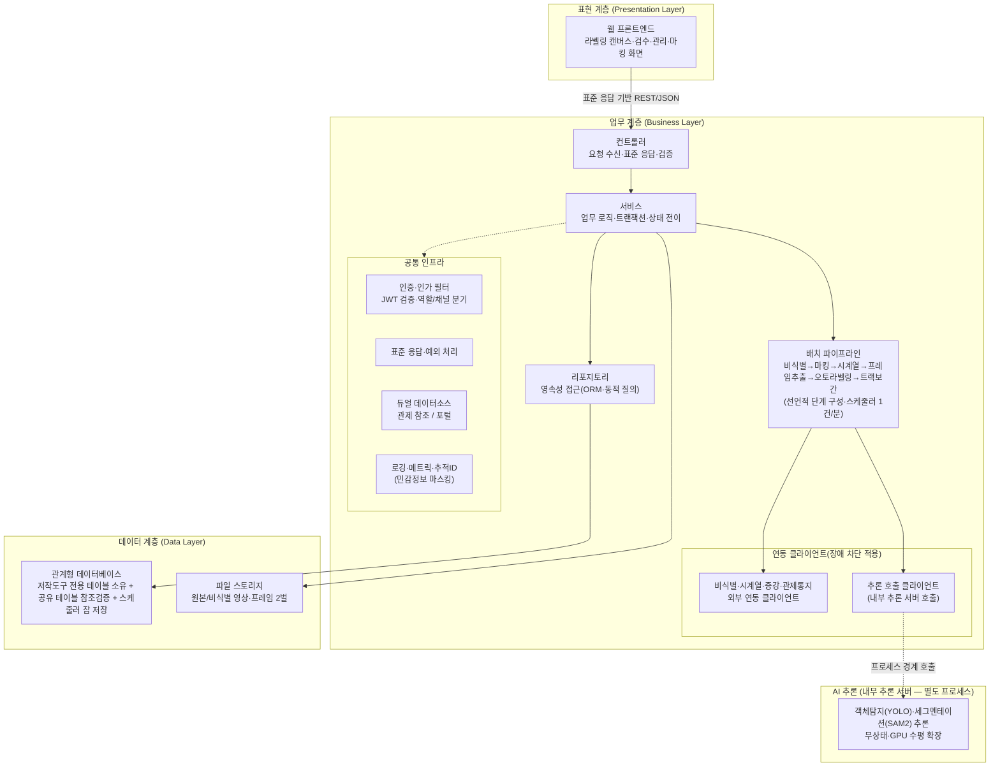
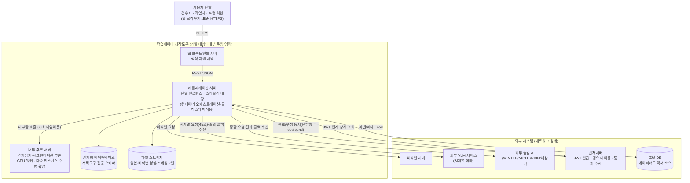
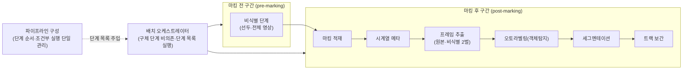
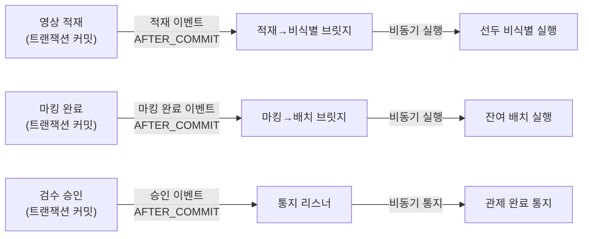
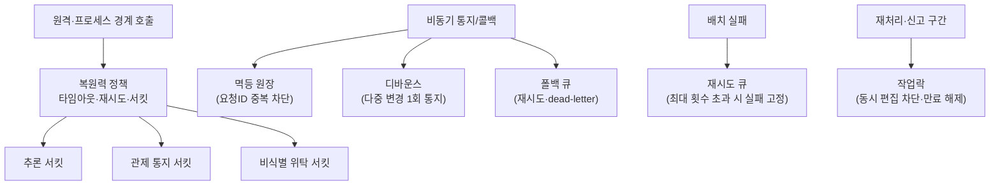
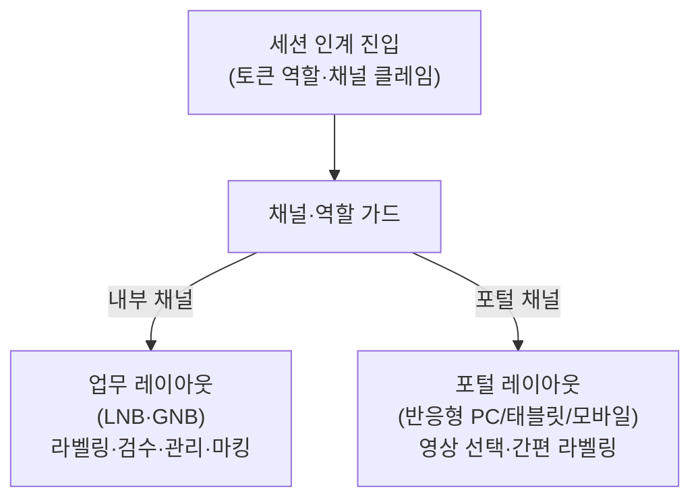
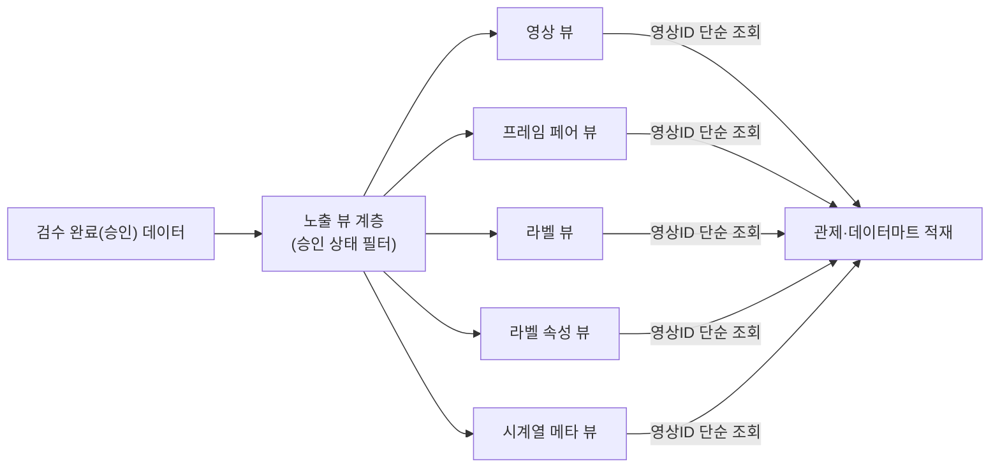

# D5 아키텍처 설계서

## 작성 목적
> 시스템의 품질을 확보하기 위하여 전체시스템에 대한 청사진으로서의 아키텍처를 작성한다. 소프트웨어 아키텍처는 개발 대상 응용 소프트웨어에 대한 아키텍처이며, 시스템 아키텍처는 응용 소프트웨어와 이에 상호작용하는 환경 및 네트워크가 포함된 아키텍처를 의미한다.

## 작성 방법
> 소프트웨어 아키텍처는 선정된 아키텍처 패턴을 중심으로 컴포넌트와 상호작용하는 커넥션 및 가시적인 속성을 표현한다. 시스템 아키텍처는 개발 대상시스템과 상호작용하는 하드웨어, 시스템 소프트웨어 및 네트워크와의 관계를 표현한다. 아키텍처 요구사항 및 구현방안은 아키텍처 관점에서의 시스템의 품질, 보안, 성능, 장애복구 등의 요구사항과 이에 대한 구현방안을 기술한다.

## 산출물 양식

### 제·개정 이력

| 날짜 | 버전 | 작성자 | 승인자 | 내용 |
|------|------|--------|--------|------|
| 2026-06-23 | 1.0 | - | - | LogiCraft 그래프 기반 생성 (/cc-doc-gen) |
| 2026-06-25 | 1.1 | 박찬기 | 김현욱 | 전체 개발범위(R1 외 구현분: 이벤트 비동기 체인·Quartz 잡군·회복성 인프라·듀얼채널 레이아웃·데이터마트 노출계층) 아키텍처 통합 — design-full |

### 헤더

| D5 | 아키텍처 설계서 | | |
|------|------|------|------|
| 시스템명 | AI 기반 지방정부 CCTV 관제지원시스템(2차) | 서브시스템명 | 학습데이터 저작도구 |
| 단계명 | 설계 | 작성일자 | 2026-06-23 / 버전 1.0 |

---

### 1. 소프트웨어 아키텍처

본 시스템은 표현·업무·데이터 계층을 분리한 **레이어드(Layered) 아키텍처**를 채택한 모듈형 단일 애플리케이션이다. 표현 계층(웹 프론트엔드)은 업무 계층(애플리케이션 서버)의 REST 인터페이스만 호출하고, 업무 계층은 컨트롤러 → 서비스 → 리포지토리의 단방향 의존으로 구성한다. 데이터 계층(관계형 데이터베이스·파일 스토리지)은 리포지토리를 통해서만 접근한다. AI 추론은 업무 계층이 오케스트레이션하되, 실제 추론 연산은 **내부 추론 서버**(별도 프로세스, 무상태)로 분리하여 GPU 자원을 격리한다.

> 가시적 속성: 표현↔업무 간 커넥션은 표준 응답 래퍼 기반 REST/JSON, 업무↔데이터는 ORM·동적 질의, 업무↔내부 추론 서버는 프로세스 경계 호출(장애 차단 정책 적용)이다. 외부 연동(비식별·시계열·증강·관제통지)은 전용 연동 클라이언트로 단일화한다.

---

### 2. 시스템 아키텍처

개발 대상시스템(학습데이터 저작도구)은 단일 인스턴스로 배포되는 애플리케이션 서버를 중심으로, **내부 추론 서버**(GPU 워커, 다중 인스턴스 수평 확장 가능)·관계형 데이터베이스·파일 스토리지로 구성한다. 애플리케이션 서버와 내부 추론 서버는 같은 운영 영역의 내부 컴포넌트이며, 외부 시스템(비식별 서버·외부 VLM 서비스·외부 증강 AI·관제서버·포털 DB)과는 네트워크 경계를 두고 연동한다.

> 내부 추론 서버는 외부 시스템이 아니라 저작도구 운영 영역 내부의 추론 인프라이다(무상태·GPU 수평 확장). 외부 시스템은 비식별 서버·외부 VLM 서비스·외부 증강 AI·관제서버·포털 DB의 5종이며, 모든 외부 연동은 네트워크 경계를 넘어 표준 프로토콜로 이루어진다. 배포 환경은 온프레미스 단일 리전, 단일 인스턴스 운영(업무시간 기준)이다.

---

### 3. 주요 아키텍처 메커니즘

> §1·§2의 계층·시스템 구성을 실제로 구동하는 횡단 메커니즘을 기술한다. 각 메커니즘은 §1 업무 계층(배치 파이프라인·공통 인프라·연동 클라이언트)을 구체화하며, §4 아키텍처 요구사항(NFR-001·NFR-004·NFR-006·NFR-007 등)의 구현 기반이 된다.

#### 3.1 선언적 배치 파이프라인

배치 파이프라인은 단계(Step)를 코드로 고정하지 않고 **선언적 단계 목록**으로 구성한다. 오케스트레이터는 구체 단계에 의존하지 않고 등록된 단계 목록을 순서대로 실행하므로, 단계의 추가·제거·재배치는 구성 한 곳에서만 이루어진다. 파이프라인은 마킹을 경계로 **마킹 전(pre-marking)** 과 **마킹 후(post-marking)** 두 구간으로 나뉜다. 마킹 전 구간은 적재 직후 선두 비식별 단계로 구성되고, 마킹 후 구간은 시계열 메타·프레임 추출·오토라벨링(객체탐지·세그멘테이션)·트랙 보간 단계로 구성된다. 각 단계는 실행 조건(컨텍스트 기반 활성화 판정)을 가져 환경별로 일부 단계를 켜고 끌 수 있다.

> 가시적 속성: 오케스트레이터는 단계 인터페이스에만 의존하고 단계 순서는 구성 객체가 보유한다. 단계 재배치가 비즈니스 로직 수정 없이 가능하므로, NFR-001(파이프라인 처리량)의 단계 흐름 변경·조건부 운영을 안전하게 수용한다.

#### 3.2 이벤트 기반 비동기 체인

파이프라인 단계 간 전이는 동기 호출이 아니라 **트랜잭션 커밋 후(AFTER_COMMIT) 도메인 이벤트 + 비동기 실행** 으로 연결한다. 적재 트랜잭션이 커밋되면 적재 이벤트가 발행되고, 커밋 이후 시점에 브릿지가 비동기 실행기로 선두 비식별을 시작한다. 마킹 완료 시에는 마킹 완료 이벤트가 같은 방식으로 잔여 배치(시계열→프레임추출→오토라벨링)를 비동기로 이어가고, 검수 승인 시에는 승인 이벤트가 관제 통지를 발행한다. 이로써 사용자 요청 트랜잭션과 장시간 배치 처리를 분리하여 화면 응답시간(NFR-011)을 보호하고, 커밋 이후에만 후속을 시작하여 데이터 정합성을 보장한다.

> 가시적 속성: 모든 후속 트리거는 커밋 이후 1회 발행되며, 비동기 실행기는 전용 스레드 풀에서 동작하여 요청 스레드를 점유하지 않는다.

#### 3.3 스케줄러 잡 구성 (단일 인스턴스)

주기·재처리 작업은 단일 인스턴스 스케줄러의 잡군으로 운영하며, 잡 상태를 관계형 데이터베이스에 영속화(잡 스토어)하여 재기동 시 미완료 잡을 이어 처리한다. 클러스터링은 적용하지 않으며 동일 잡의 중복 실행은 동시 실행 금지 정책으로 차단한다. 잡군은 관제 학습용 클립 픽업(주기 스캔)·비식별 폴링·배치 실행·배치 재시도·통지 폴백 재시도·초기 스케줄 부트스트랩으로 구성한다.

| 잡 | 역할 | 주기/트리거 | 비고 |
|----|------|------------|------|
| 관제 학습용 클립 스캔 | 공유 테이블에서 학습용 설정 클립을 픽업해 적재(비식별 선두) | 주기(1건/분) | 동시 실행 금지 |
| 비식별 폴링 | 외부 비식별 위탁 건의 완료 상태를 주기 폴링 후 결과 수신 | 주기 | 외부 장애 시 서킷 보호 |
| 배치 실행 | 적재·마킹 이후 파이프라인 단계 구동 | 트리거/주기 | 선언적 파이프라인 구동 |
| 배치 재시도 | 실패 단계의 재시도 큐 처리 | 주기 | 최대 횟수 초과 시 실패 고정 |
| 통지 폴백 재시도 | 관제 통지 실패분 재전송 | 주기 | dead-letter 분리 |
| 스케줄 부트스트랩 | 기동 시 잡 등록·정합 | 기동 1회 | — |

> 단일 인스턴스 처리량·장애 위험은 잡 상태 영속화(재기동 이어처리)와 재시도 잡으로 완화하며, 이는 NFR-001(배치 처리량)·NFR-004(복원력)의 구현 기반이 된다.

#### 3.4 회복성 인프라

외부·프로세스 경계 호출은 단일 복원력 정책(타임아웃·재시도·서킷 브레이커)으로 보호하되, **호출 대상별로 서킷을 분리**하여 한 외부 시스템 장애가 다른 연동으로 전파되지 않게 격리한다(추론 호출·관제 통지·비식별 위탁 서킷 분리). 비동기 통지·콜백 수신은 **멱등 원장**으로 중복 처리를 차단하고, 통지는 **디바운스**(짧은 시간 다중 변경 1회 통지)와 **폴백 큐**(실패분 재시도·dead-letter)로 전달 신뢰성을 확보한다. 배치 실패는 **재시도 큐**로 자동 재처리하되 최대 횟수 초과 시 실패로 고정한다. 비식별 재처리·누락 신고 구간은 **작업락**으로 동시 편집을 차단하고 만료 시 자동 해제한다.

> 서킷 분리·멱등 원장·폴백·재시도 큐·작업락은 NFR-004(복원력)·NFR-005(통지 페이로드 보호)·NFR-007(외부 호출 메트릭)을 구현 수준에서 뒷받침한다.

#### 3.5 듀얼 채널 표현 계층

표현 계층은 내부 채널과 포털(외부) 채널을 **레이아웃·접근 가드로 분기**한다. 내부 채널은 좌측 내비게이션·전역 헤더를 갖춘 업무 레이아웃으로 라벨링·검수·관리·마킹 화면을 제공하고, 포털 채널은 반응형(PC/태블릿/모바일) 레이아웃으로 데이터마트 영상 선택·간편 라벨링 화면을 제공한다. 진입 시 인계 토큰의 역할·채널 클레임으로 레이아웃과 접근 가능한 화면을 결정하며, 포털 경로는 포털 채널 토큰만 허용한다.

> 채널 격리는 NFR-006(포털 웹 접근성)·NFR-013(역할별 접근 통제)·NFR-017(채널 격리 호출 규약)의 표현 계층 구현 기반이다.

#### 3.6 데이터마트 노출 계층

검수 완료(승인) 데이터의 외부 적재는 **읽기 전용 뷰 계층**으로 노출한다. 영상·프레임 페어·라벨·라벨 속성·시계열 메타에 대한 뷰가 검수 완료 상태만 필터링하여 노출하므로, 관제·데이터마트 측은 영상 식별자로 단순 조회 후 적재한다. 뷰는 멱등 정의(재정의 가능)로 운영되어 스키마 재적용에 안전하며, 비식별 영상 경로는 저장 경로 컨벤션 치환으로 도출한다.

> 뷰 계층은 §2 외부 시스템(관제서버·데이터마트)에 대한 조회 인터페이스 제공 책임을 구체화하며, 통지(§3.2 승인 이벤트→통지) 수신 후 상세 조회 경로로 연계된다.

#### 3.7 시스템 설정 캐시

자주 조회되지만 변경 빈도가 낮은 시스템 설정은 **화이트리스트 키 기반 로컬 캐시(TTL)** 로 운영한다. 허용된 설정 키만 캐시 대상이 되며, TTL 만료로 자동 갱신되어 무기한 캐시를 두지 않는다. 이로써 설정 조회 부하를 줄이고 화면 응답시간(NFR-011)·자원 효율(NFR-012)에 기여한다.

---

### 4. 아키텍처 요구사항 및 구현방안

> 아키텍처 관점에서 시스템에 크게 영향을 주는 품질·보안·성능·장애복구 요구사항과 구현방안을 사용자 요구사항 정의서의 비기능 요구사항(NFR) 1건당 1표로 기술한다.

#### [성능] 배치 파이프라인 처리량

| 요구사항 ID | NFR-001 |
|---------|---|
| 요구사항 내용 | 비식별 → 마킹(비식별 영상) → 시계열 메타 → 프레임 추출 → 오토라벨링(객체탐지·세그멘테이션) → 트랙 보간으로 이어지는 배치 파이프라인을 단일 인스턴스 스케줄러(클러스터 미적용)에서 **1건/분 이상** 처리 기준으로 운영한다. |
| 구현방안 | 배치 단계를 선언적 파이프라인으로 구성하여 단계 재배치(비식별 선두)·조건부 실행을 한 곳에서 관리하고, 스케줄러가 1분 주기로 1건씩 유입한다. 품질목표 수준: 처리율 ≥ 1건/분. 단계별 처리 소요시간·처리 건수를 메트릭으로 수집하고 집계 대시보드로 모니터링한다. 단일 인스턴스 처리량 한계(배치 단일 인스턴스 장애 위험)는 잡 상태를 데이터베이스에 영속화하여 재기동 시 미완료 잡을 이어 처리하는 방식으로 완화한다. |

#### [성능·확장성] 이미지 학습데이터 처리 규모

| 요구사항 ID | NFR-002 |
|---------|---|
| 요구사항 내용 | 저작도구는 라벨링·검수·버전관리 대상으로 **이미지 학습데이터 10만 장** 규모를 수용한다. (핵심 산출물 목표 SFR-16) |
| 구현방안 | 프레임 원천 테이블의 누적 건수를 적재 규모 기준으로 설계하고, 목록·조회는 전수 조회를 금지하고 페이징을 필수 적용한다. 품질목표 수준: 누적 이미지 ≥ 100,000장. 대용량 누적에 대비해 조회 컬럼 인덱스와 페이징(커서 기반 검토)으로 응답 성능을 유지한다. |

#### [성능·확장성] 영상 학습데이터 처리 규모

| 요구사항 ID | NFR-003 |
|---------|---|
| 요구사항 내용 | 저작도구는 **30초 이상 영상 학습데이터 5,000건** 규모를 수용한다(작업 단위 = 영상 1건). (핵심 산출물 목표 SFR-17) |
| 구현방안 | 원시 영상 테이블의 누적 건수를 적재 규모 기준으로 설계하고, 영상 1건을 작업 단위로 하는 적재·배정·검수 흐름으로 운영한다. 품질목표 수준: 누적 영상 ≥ 5,000건. 원본과 비식별 영상을 별도 경로에 동시 저장하여 스토리지 규모를 산정한다. |

#### [가용성·장애복구] 외부 연동 및 내부 추론 호출 복원력

| 요구사항 ID | NFR-004 |
|---------|---|
| 요구사항 내용 | **외부 연동(비식별·시계열(VLM)·증강·관제 통지)** 과 **내부 추론 서버(객체탐지·세그멘테이션) 호출** 등 모든 원격·프로세스 경계 호출에 타임아웃·재시도·서킷 브레이커(장애 차단)를 적용해 복원력을 확보한다. 외부 연동은 비식별·시계열·증강·관제통지 4종이며, 내부 추론 서버는 저작도구 내부 추론 인프라로서 외부 연동과 구분한다. |
| 구현방안 | 외부 연동(비식별·시계열·증강·관제통지)과 내부 추론 서버 호출 모두에 동일한 복원력 정책(타임아웃·재시도·서킷 브레이커)을 적용한다 — 외부 시스템이 아니어도 프로세스 경계를 넘는 호출이므로 동일 기준으로 보호한다. 품질목표 수준: 원격·프로세스 경계 연동에 대한 복원력 적용률 100%, 시계열 호출 45초·내부 추론 호출 60초 타임아웃. 외부 서비스 장애 시에도 파이프라인 전면 중단을 막고, 비식별 실패 영상은 실패 상태로 표시한 뒤 재시도 큐로 보내며 원본은 절대 삭제하지 않는다. 연동별 복원력 정책 적용 여부와 외부 호출 소요시간 메트릭으로 측정한다. |

#### [보안] 민감정보 보호

| 요구사항 ID | NFR-005 |
|---------|---|
| 요구사항 내용 | 개인정보·토큰을 로그에 출력하지 않는다. 영상은 암호화 저장하고 비식별 처리 이력을 영상 단위로 기록하며, 관제 통지 페이로드에 개인정보·토큰·원본(비-비식별) 이미지를 포함하지 않는다. (민감정보 노출 0건) |
| 구현방안 | 로깅 계층에 민감 필드 마스킹을 적용해 개인정보·토큰의 평문 출력을 차단한다. 품질목표 수준: 민감정보 로그/페이로드 노출 0건. 영상은 암호화 저장하고, 외부 통지 페이로드는 메타·수정 요약만 담아 본문·원본 이미지·토큰을 배제한다. 로그·통지 페이로드에 대해 정적 보안 점검(개인정보 노출 탐지)을 수행해 검증한다. |

#### [접근성] 포털 웹 접근성

| 요구사항 ID | NFR-006 |
|---------|---|
| 요구사항 내용 | 포털(외부 채널)은 반응형 웹(PC/태블릿/모바일)으로 제공하며 **웹 접근성 지침(WCAG 2.1 AA)** 을 준수한다. |
| 구현방안 | 포털 화면을 반응형으로 설계하고 시맨틱 마크업·대체 텍스트·키보드 접근·색상 외 정보 전달 등 접근성 지침을 적용한다. 품질목표 수준: WCAG 2.1 AA 준수. 접근성 자동 점검 도구와 수동 검수로 준수 여부를 확인한다. |

#### [관찰가능성] 메트릭·추적성

| 요구사항 ID | NFR-007 |
|---------|---|
| 요구사항 내용 | 화면/API 응답시간·배치 처리량·외부 호출을 메트릭으로 수집하고, 모든 요청에 추적ID를 부여해 로그와 외부 호출 헤더로 전파한다. (핵심 이벤트 메트릭 수집률 100%) |
| 구현방안 | 애플리케이션 메트릭 수집기로 API 응답시간·배치 처리량·외부 호출 메트릭을 수집해 모니터링 시스템으로 노출한다. 품질목표 수준: 핵심 이벤트 메트릭 수집률 100%. 요청 진입 시 추적ID를 생성해 로그 컨텍스트에 심고 외부 호출 헤더로 전파하여 분산 추적을 가능하게 한다. |

#### [규정 준수·품질] 학습데이터 단계별 품질관리 기준 (수집·제작·검수)

| 요구사항 ID | RQ-QUR-03-01 |
|---------|---|
| 요구사항 내용 | 학습데이터 구축의 수집·제작·검수 각 단계별 수행기준을 수립하고 품질관리 방안을 제시한다. 검수 이력·승인 버전이 시스템에서 확인 가능해야 한다. |
| 구현방안 | 수집(적재 검증)·제작(비식별→마킹→오토라벨링)·검수(승인/반려) 단계별 수행기준을 수립하고, 검수 승인 시점에 라벨 전체를 스냅샷으로 버전 관리(페이로드 해시 기준)한다. 품질목표 수준: 전 단계 수행기준 수립 + 검수 이력·승인 버전 시스템 확인 가능. 검수 승인 데이터만 학습데이터로 확정하며, 검수 이력·승인 버전을 시스템에서 추적한다. |

#### [규정 준수·품질] 학습데이터 종류·제작방법별 품질관리 기준

| 요구사항 ID | RQ-QUR-03-02 |
|---------|---|
| 요구사항 내용 | 학습데이터 종류 및 제작 방법(라벨링 방식·활용 기법)별 품질관리 기준을 수립한다. |
| 구현방안 | 바운딩박스·폴리곤·세그멘테이션·트래킹 등 라벨링 방식별 라벨 규격·검수 기준과, 오토라벨링·시계열 메타 검토·생성형 증강 4종(WINTER/NIGHT/RAIN/해상도)별 제작기법 품질관리 기준을 수립한다. 품질목표 수준: 라벨링 방식별·제작기법별 기준 수립 + 검수 워크플로우 적용. 이미지 10만 장·영상 5,000건 목표(NFR-002·NFR-003)와 연계해 관리한다. |

#### [규정 준수·품질] 학습데이터 값 검증·정합성 (공공데이터 품질진단 기준)

| 요구사항 ID | RQ-DAR-06-02 |
|---------|---|
| 요구사항 내용 | 제공 학습데이터의 원본 정합성을 검증하고, 공공데이터 품질진단 기준 및 업무규칙(BR)에 따른 값 검증으로 오류 입력을 차단하며 오류유형별 조치 이력을 관리한다. |
| 구현방안 | 라벨 저장·검수 시 좌표 범위·필수 속성·코드 정합 등 업무규칙 기반 값 검증으로 오류 입력을 차단하고, 원본 정합성 검증과 오류데이터 반려·재작업 및 오류유형별 조치 이력을 관리한다. 품질목표 수준: 오류 라벨 입력 차단 + 오류유형별 조치 이력 관리. 공공데이터 품질진단 기준을 준수하고 검증 항목 정의서를 제출한다. |

#### [성능] 화면 응답시간 기준

| 요구사항 ID | NFR-011 |
|---------|---|
| 요구사항 내용 | 라벨링·검수·마킹·목록 등 전 화면의 페이지 응답속도를 **3초 이하**로 유지한다. 10초 이상 지연 예상 작업은 진행 안내(프로그레스)·취소 기능을 제공하고, 오류는 3초 이내 조치 가능한 메시지로 제시한다. |
| 구현방안 | 주요 화면·조회의 응답시간을 3초 이하로 설계하고, 대용량 질의·대량 라벨 조회 등 장시간 작업은 진행 안내와 취소 기능을 제공한다. 품질목표 수준: 페이지·조회 응답시간 ≤ 3초. 입력 형식 오류·처리 오류는 표준 에러 응답 포맷으로 3초 이내 메시지를 제시하며, 성능테스트로 기준 충족을 확인한다. |

#### [성능] 시스템 자원 효율

| 요구사항 ID | NFR-012 |
|---------|---|
| 요구사항 내용 | 시스템 자원(CPU·메모리) 평균 사용률을 **80% 이하**로 유지하고, 장시간 배치·스트리밍 구간의 메모리 누수를 방지한다. |
| 구현방안 | 배치 파이프라인(프레임 추출·추론 호출)·스케줄러 워커의 자원 사용을 관리하고, 듀얼 데이터소스(관제 참조/포털)의 커넥션 풀을 분리·최적화한다. 품질목표 수준: CPU·메모리 평균 사용률 ≤ 80%, 메모리 누수 부재. 로그아웃·토큰 만료 시 세션 자원을 정리하며, 자원 사용률을 메트릭으로 모니터링하고 부하테스트로 검증한다. |

#### [보안] 세션·접근 통제

| 요구사항 ID | NFR-013 |
|---------|---|
| 요구사항 내용 | 전 화면·API에 역할별 접근 통제를 적용하고 만료 세션을 차단한다. 로그아웃·토큰 만료 시 세션을 종료하고 상위 시스템 로그인 페이지로 리다이렉트하며, 관리 화면은 검수자 전용으로 한다. |
| 구현방안 | 인증·인가 필터가 인계된 토큰을 검증하여 만료·위조 토큰을 거부하고 상위 시스템 로그인으로 유도한다. 품질목표 수준: 전 화면·API 역할별 통제 + 만료 토큰 차단. 역할(검수자/작업자/포털회원)·채널 클레임 기반으로 페이지·API 접근을 구분하고, 관리 화면은 검수자 전용으로 비인가자 노출을 차단한다. 로그인 실패 제한·동시 로그인 차단은 인증 발급 주체(관제/포털)의 책임이며 저작도구는 토큰 검증만 담당한다. 권한 없는 접근 403·만료/위조 토큰 401 응답을 통합테스트로 확인한다. |

#### [보안] 시큐어코딩·취약점 점검

| 요구사항 ID | NFR-014 |
|---------|---|
| 요구사항 내용 | SW 개발보안(시큐어코딩) 가이드를 준수해 개발하고, 개발 소스 전체에 보안약점 진단을 1회 이상 실시하며 모의해킹 점검(웹 취약점 표준 항목) 지적사항을 보완 완료한다. |
| 구현방안 | 행정·공공기관 정보시스템 구축·운영 지침의 SW 개발보안 가이드를 준수하여 개발하고, 정적 보안 분석으로 소스 전체를 점검한다. 품질목표 수준: 소스 전체 진단 1회 이상 + 지적사항 보완 완료. 웹 취약점 표준 항목(공통 웹 취약점·국가 권고 항목) 기준으로 모의해킹을 점검하고 결과 지적사항을 후속 보완한다. 진단 결과서·보완조치 내역으로 검증한다. |

#### [규정 준수·품질] 웹표준·크로스브라우징

| 요구사항 ID | NFR-015 |
|---------|---|
| 요구사항 내용 | 비표준 플러그인 없이 표준 웹기술로 전 기능이 동작하고, 3종 이상 브라우저에서 동등 동작하며 표준 마크업·스타일 문법을 준수한다. |
| 구현방안 | 프론트엔드를 표준 웹기술 기반으로 구현하고 라벨링 캔버스도 표준 캔버스 기술로 동작시켜 비표준 플러그인을 배제한다. 품질목표 수준: 3종 이상 브라우저 동등 동작 + 비표준 플러그인 0. 표준 마크업·스타일 문법을 준수해 표준 검증을 통과하고, 포털 화면은 반응형으로 제공한다. 크로스브라우징 테스트와 표준 검증 결과로 확인한다. |

#### [규정 준수·데이터] 데이터 표준 준수

| 요구사항 ID | NFR-016 |
|---------|---|
| 요구사항 내용 | 저작도구 소유 데이터 객체(테이블·컬럼)를 범정부 데이터 표준사전과 정합되게 설계하고, 코드성 데이터는 코드표준화 지침과 정합시키며 라벨링 방식별 데이터 포맷 표준을 정의한다. |
| 구현방안 | 저작도구 전용 테이블·컬럼의 단어·용어·도메인·코드를 범정부 표준 기반 데이터 표준사전과 정합되게 설계하고, 마이그레이션 시 명명규칙을 점검한다. 품질목표 수준: 신규 객체 표준 정합 + 라벨링 방식별 포맷 표준 정의. 라벨링 방식별(바운딩박스·폴리곤·세그멘테이션·트래킹) 라벨 데이터 포맷 표준을 정의한다. 공유 테이블은 관제서버 소유로 참조검증만 수행하며(공유 스키마 변경 충돌은 변경 전 선승인·변경 알림 프로세스로 완화), 표준사전 대비 명명 점검 결과와 포맷 표준 문서로 확인한다. |

#### [보안] API 호출 규약 (기본 경로·토큰 인증·채널 격리)

| 요구사항 ID | NFR-017 |
|---------|---|
| 요구사항 내용 | 모든 API에 일관된 호출 규약(공통 기본 경로, 토큰 인증, 역할·채널 기반 접근 통제, 인증 예외 경로, 표준 응답·페이징)을 적용해 카탈로그만으로 호출을 구성할 수 있게 한다. |
| 구현방안 | 모든 API에 공통 기본 경로를 두고 인증 토큰을 표준 헤더로 전달받아 검증한다(토큰은 저작도구가 발급하지 않고 관제/포털이 발급한 것을 인계, 무상태 운영). 품질목표 수준: 카탈로그만으로 별도 문의 없이 호출 가능한 엔드포인트 비율 100%. 역할 배열·채널 격리(포털 경로는 포털 채널 토큰만 허용)로 접근을 통제하고, 인증 예외 경로(헬스체크·문서·콜백 수신 등)와 콜백의 서명 기반 단독 인증을 정의한다. 양방향 기계간 연동은 미운영(잔존 단방향 통지만 인계 토큰/IP 화이트리스트로 보호). 모든 응답은 표준 래퍼를 사용하고 목록은 페이징을 적용한다. |

> **외부 시스템 본체 범위 명시**: 외부 VLM 서비스·생성형 증강 AI·영상 합성 모델·데이터마트 본체는 저작도구 범위 외(외부 시스템 책임)이다. 저작도구는 외부 VLM 시계열 호출 연동, 외부 증강 결과 수신·검수, 데이터마트 적재용 조회 인터페이스 제공까지만 담당한다.

---

## 항목 설명

- **소프트웨어 아키텍처**: 소프트웨어 아키텍처를 기입한다.
- **시스템 아키텍처**: 시스템 아키텍처를 기입한다.
- **주요 아키텍처 메커니즘**: 계층·시스템 구성을 구동하는 횡단 메커니즘(선언적 배치 파이프라인·이벤트 기반 비동기 체인·스케줄러 잡 구성·회복성 인프라·듀얼 채널 표현 계층·데이터마트 노출 계층·시스템 설정 캐시)을 기술한다.
- **아키텍처 요구사항 및 구현방안**: 아키텍처 관점에서 시스템에 크게 영향을 주는 품질, 보안, 성능, 장애복구 등의 요구사항 및 구현방안을 기술한다.
  - **요구사항 ID**: "사용자 요구사항 정의서"의 관련된 요구사항 ID를 기술한다.
  - **요구사항 내용**: 요구사항 내용을 상세하게 기술한다.
  - **구현방안**: 요구사항 구현방안을 상세하게 기술한다.
