# D1 클래스 설계서

> **ID 표기 규칙(공통)**: 본 산출물의 모든 ID(KLID-AT-UC/CO/DC/DCD/SD/SC/AC/EN/ERD/TB/II/IC/IF/UCD/ACT 등)는 **전체 형식 `KLID-AT-XX-NNN`** 으로 표기한다. 끝부분만(예: `UC-001`) 약식 표기 금지. 범위는 시작 ID만 전체형으로(예: `KLID-AT-UC-001~013`). ※ 요구사항(RQ-SFR-NN-NN)·시스템시험(KLID-ST-NNN)·LogiCraft 원본 ID(SEQ/CDIAG/UC/DFEAT) 등 타 체계 ID는 각 체계 원형 유지.

## 작성 목적
> 소프트웨어 관점이나 설계 관점에서의 클래스 모형을 작성한다. 본 산출물은 R1 사용자 요구사항(SFR-06~09, 16개)에 매핑된 R2 유스케이스(KLID-AT-UC-001~013)와 직접 관련된 설계 클래스만을 대상으로 한다. R1/R2 범위 밖 도메인(사용자/권한, 마킹, 배치 트리거, 포털, 게시판, 통계)은 제외한다.

## 작성 방법
> 설계 클래스를 도출하기 위하여 유스케이스별로 시퀀스도를 작성하고, 거기서 도출된 객체·클래스를 연관관계로 묶어 유스케이스(UCD)별로 설계 클래스도를 작성한다. 설계 클래스도의 클래스·속성·오퍼레이션은 LogiCraft 그래프의 클래스다이어그램(CDIAG-003~013) 도메인 모델과 `backend/src/main/java/kr/co/cudo/authoring/` 실제 코드(Controller→Service→Repository→Entity)를 정합하여 도출하였다. 시퀀스도(§2)는 LogiCraft 에 등록된 유스케이스별 시퀀스(SEQ-001~013)를 PlantUML 로 옮긴다.

## 제·개정 이력

| 날짜 | 버전 | 제·개정 내역 | 작성자 | 검토자 |
|------|------|------------|--------|--------|
| 2026-06-02 | 1.0 | LogiCraft 그래프 기반 자동 생성 (/cc-doc-gen) — R2 유스케이스(KLID-AT-UC-001~013) 매핑 설계 클래스 도출. §1 설계 클래스 목록(UCD별 5종)·§2 시퀀스도(UC별 13종, SEQ-001~013)·§3 설계 클래스도(UCD별 5종)·§4 설계 클래스 정의(클래스별) 기술. class_diagram(CDIAG-003~013) 도메인 모델 + backend 코드 정합 | 박찬기 | 김현욱 |

## 헤더

| D1 | 클래스 설계서 |
|-------|---------|
| 시스템명 | AI 기반 지방정부 CCTV 관제지원시스템(2차) | 서브시스템명 | 학습데이터 저작도구 (AT) |
| 단계명 | 설계 | 작성일자 | 2026-06-02 | 버전 | 1.0 |

> **버전 출처**: LogiCraft 그래프 기반 자동 생성 (/cc-doc-gen)

---

## 1. 설계 클래스 목록

> **CBD 양식: 설계 클래스 목록은 유스케이스(UCD)별로 작성한다.** §3 설계 클래스도(KLID-AT-DCD-001~005)와 1:1로 대응하며, 각 UCD에 관여하는 클래스만 나열한다. 레이어는 Controller / Service / Repository / Entity / Client(외부 연동) / Listener / DTO·Util 로 구분한다.
> 영상/프레임·라벨·시스템설정 등 **공유 클래스는 관련 UCD 목록에 중복 등재**된다(유스케이스별 작성 특성). 설계 클래스 ID(KLID-AT-DC-NNN)는 전 UCD에 걸쳐 유일하다.

### 1.1 KLID-AT-DCD-001 데이터 증강 (KLID-AT-UC-001, KLID-AT-UC-002, KLID-AT-UC-003, KLID-AT-UC-010)

| 설계 클래스 ID | 설계 클래스명 | 레이어 | 관련 유스케이스 ID |
|------------|---------|------|-------------|
| KLID-AT-DC-001 | AugmentController | Controller | KLID-AT-UC-001, KLID-AT-UC-010 |
| KLID-AT-DC-002 | AugmentRequestService | Service | KLID-AT-UC-001 |
| KLID-AT-DC-003 | AugmentReviewService | Service | KLID-AT-UC-010 |
| KLID-AT-DC-004 | AugmentResultService | Service(Webhook) | KLID-AT-UC-002 |
| KLID-AT-DC-005 | LabelIntegrityCalculator | Service(Util) | KLID-AT-UC-002 |
| KLID-AT-DC-006 | ExternalAugmentClient | Client | KLID-AT-UC-001, KLID-AT-UC-010 |
| KLID-AT-DC-007 | VideoResolutionService | Service | KLID-AT-UC-003 |
| KLID-AT-DC-008 | LsDataAug | Entity | KLID-AT-UC-002, KLID-AT-UC-010 |
| KLID-AT-DC-009 | LsDataAugRvw | Entity | KLID-AT-UC-010 |
| KLID-AT-DC-010 | LsDataAugLblMap | Entity | KLID-AT-UC-002, KLID-AT-UC-003 |
| KLID-AT-DC-011 | LsDataAugRepository | Repository | KLID-AT-UC-002, KLID-AT-UC-010 |
| KLID-AT-DC-012 | LsDataRaw | Entity | KLID-AT-UC-002, KLID-AT-UC-003, KLID-AT-UC-011 (공유) |
| KLID-AT-DC-013 | LsDataLbl | Entity | KLID-AT-UC-002, KLID-AT-UC-003 (공유) |

### 1.2 KLID-AT-DCD-002 AI 보조 라벨링 (KLID-AT-UC-004, KLID-AT-UC-005, KLID-AT-UC-006)

| 설계 클래스 ID | 설계 클래스명 | 레이어 | 관련 유스케이스 ID |
|------------|---------|------|-------------|
| KLID-AT-DC-014 | LabelController | Controller | KLID-AT-UC-004, KLID-AT-UC-005, KLID-AT-UC-007 (공유) |
| KLID-AT-DC-015 | Sam2TrackService | Service | KLID-AT-UC-004, KLID-AT-UC-005, KLID-AT-UC-006 |
| KLID-AT-DC-016 | TrackInterpolator | Service(Util) | KLID-AT-UC-004 |
| KLID-AT-DC-017 | AiServerClient | Client | KLID-AT-UC-004, KLID-AT-UC-005 |
| KLID-AT-DC-018 | LabelAccessGuard | Service(Guard) | KLID-AT-UC-004, KLID-AT-UC-005, KLID-AT-UC-008 (공유) |
| KLID-AT-DC-019 | Sam2TrackRequest | DTO | KLID-AT-UC-004, KLID-AT-UC-005 |
| KLID-AT-DC-020 | Sam2TrackResponseDto | DTO | KLID-AT-UC-004, KLID-AT-UC-005 |
| KLID-AT-DC-013 | LsDataLbl | Entity | KLID-AT-UC-004, KLID-AT-UC-005 (공유) |
| KLID-AT-DC-021 | LsDataLblRepository | Repository | KLID-AT-UC-004, KLID-AT-UC-007 (공유) |
| KLID-AT-DC-040 | SystemConfigController | Controller | KLID-AT-UC-006, KLID-AT-UC-013 |
| KLID-AT-DC-041 | SystemConfigService | Service | KLID-AT-UC-006, KLID-AT-UC-013 |
| KLID-AT-DC-042 | LsSystemConfig | Entity | KLID-AT-UC-006, KLID-AT-UC-013 |

> SystemConfig(KLID-AT-DC-040~042)는 라벨링 정밀도(KLID-AT-UC-006, `POLYGON_SIMPLIFY_TOLERANCE`)와 비식별 옵션(KLID-AT-UC-013) 설정 키를 함께 관리한다(KLID-AT-UC-013은 KLID-AT-UCD-005 비식별 흐름에서도 참조). LogiCraft CDIAG-012 기반.

### 1.3 KLID-AT-DCD-003 라벨 저장·버전관리 (KLID-AT-UC-007, KLID-AT-UC-008)

| 설계 클래스 ID | 설계 클래스명 | 레이어 | 관련 유스케이스 ID |
|------------|---------|------|-------------|
| KLID-AT-DC-014 | LabelController | Controller | KLID-AT-UC-007 (공유) |
| KLID-AT-DC-022 | LabelService | Service | KLID-AT-UC-007 |
| KLID-AT-DC-013 | LsDataLbl | Entity | KLID-AT-UC-007 (공유) |
| KLID-AT-DC-021 | LsDataLblRepository | Repository | KLID-AT-UC-007 (공유) |
| KLID-AT-DC-023 | VersionController | Controller | KLID-AT-UC-007, KLID-AT-UC-008 |
| KLID-AT-DC-024 | VersionService | Service | KLID-AT-UC-007, KLID-AT-UC-008 |
| KLID-AT-DC-018 | LabelAccessGuard | Service(Guard) | KLID-AT-UC-008 (공유) |
| KLID-AT-DC-025 | LsLabelVersion | Entity | KLID-AT-UC-007, KLID-AT-UC-008 |
| KLID-AT-DC-026 | LsLabelVersionRepository | Repository | KLID-AT-UC-007, KLID-AT-UC-008 |
| KLID-AT-DC-027 | LabelDiffDto | DTO | KLID-AT-UC-008 |
| KLID-AT-DC-028 | VersionItem | DTO | KLID-AT-UC-007, KLID-AT-UC-008 |

> 버전 스냅샷은 **검수 승인(APPROVED) 시점**에 `ReviewService.approve` → `VersionService.commitApproved` 로 생성된다(라벨 저장 시점 아님 — LogiCraft CDIAG-004 SaveReason=APPROVED/ROLLBACK 정정 반영). 라벨링 작업 임시저장은 `LS_DATA_LBL` 현재본 upsert + FE undo/redo 로 처리한다.

### 1.4 KLID-AT-DCD-004 검수 (KLID-AT-UC-010, KLID-AT-UC-012)

| 설계 클래스 ID | 설계 클래스명 | 레이어 | 관련 유스케이스 ID |
|------------|---------|------|-------------|
| KLID-AT-DC-029 | ReviewController | Controller | KLID-AT-UC-010, KLID-AT-UC-012 |
| KLID-AT-DC-030 | ReviewService | Service | KLID-AT-UC-010, KLID-AT-UC-012 |
| KLID-AT-DC-031 | ReviewStateMachine | Service(Domain) | KLID-AT-UC-010 |
| KLID-AT-DC-032 | LsRawDataStatus | Entity | KLID-AT-UC-009, KLID-AT-UC-010 (공유) |
| KLID-AT-DC-033 | LsDataIssue | Entity | KLID-AT-UC-010 |
| KLID-AT-DC-001 | AugmentController | Controller | KLID-AT-UC-010 (공유 — 증강 결과 검수) |
| KLID-AT-DC-003 | AugmentReviewService | Service | KLID-AT-UC-010 (공유 — 증강 결과 검수) |

> KLID-AT-UC-010(증강 영상 활용 여부 검수)은 일반 영상 검수(ReviewService)와 별도로 증강 결과 검수(AugmentReviewService) 경로를 가진다. KLID-AT-UC-012(비식별 결과·이력 검토)는 외부 비식별 솔루션으로 이관(LogiCraft UC-012 deprecated)되어 저작도구 잔존 책임은 검수 워크플로우 컨텍스트에서만 다룬다.

### 1.5 KLID-AT-DCD-005 비식별 + 데이터마트 통지 (KLID-AT-UC-009, KLID-AT-UC-011, KLID-AT-UC-013)

| 설계 클래스 ID | 설계 클래스명 | 레이어 | 관련 유스케이스 ID |
|------------|---------|------|-------------|
| KLID-AT-DC-034 | ControlNotifyEventListener | Listener | KLID-AT-UC-009 |
| KLID-AT-DC-035 | ControlNotifyService | Service | KLID-AT-UC-009 |
| KLID-AT-DC-036 | ControlNotifyClient | Client | KLID-AT-UC-009 |
| KLID-AT-DC-037 | TaskModifiedEvent | DTO(Event) | KLID-AT-UC-009 |
| KLID-AT-DC-038 | LsControlNotifyFallback | Entity | KLID-AT-UC-009 |
| KLID-AT-DC-039 | DeidentifyResultService | Service(Webhook) | KLID-AT-UC-011 |
| KLID-AT-DC-043 | DeidentController | Controller | KLID-AT-UC-011 |
| KLID-AT-DC-044 | DeidentifyClient | Client | KLID-AT-UC-011 |
| KLID-AT-DC-045 | DeidentifyStep | Service(BatchStep) | KLID-AT-UC-011 |
| KLID-AT-DC-046 | LsDeidentProcLog | Entity | KLID-AT-UC-011 |
| KLID-AT-DC-047 | LsWebhookIdempotency | Entity | KLID-AT-UC-011 |
| KLID-AT-DC-040 | SystemConfigController | Controller | KLID-AT-UC-013 (공유 — 비식별 옵션 설정) |
| KLID-AT-DC-041 | SystemConfigService | Service | KLID-AT-UC-013 (공유 — 비식별 옵션 설정) |
| KLID-AT-DC-042 | LsSystemConfig | Entity | KLID-AT-UC-013 (공유) |
| KLID-AT-DC-032 | LsRawDataStatus | Entity | KLID-AT-UC-009 (공유) |
| KLID-AT-DC-012 | LsDataRaw | Entity | KLID-AT-UC-011 (공유) |

> **참고 (코드 정합)**:
> - `LsDataLbl`(KLID-AT-DC-013, LS_DATA_LBL)·`LsDataLblRepository`(KLID-AT-DC-021)·`LsDataSrcRepository` 는 label 도메인이 아니라 **batch 패키지**에 위치한다(`batch/entity/LsDataLbl.java`, `batch/repository/LsDataLblRepository.java`). label·review·augment 도메인은 batch 산출물(라벨/프레임)을 공유 참조한다. §1 표의 레이어 분류는 클래스 책임 기준이며 물리 패키지가 아니다.
> - SAM2 추적·외곽 밀착(KLID-AT-UC-004/005)은 `LabelController.sam2Track()` → `Sam2TrackService.track()` 로 진입한다(단독 Sam2TrackController 클래스 없음).
> - KLID-AT-UC-002(증강 결과 수신)은 webhook `AugmentResultService.handle()` 에서 멱등·SSRF 검증 후 새 영상(`LsDataRaw.createFromAugment`, PENDING)·라벨 복사(`LsDataLbl.copyForNewSrc`)·메타 복사를 수행한다.
> - KLID-AT-UC-003(해상도 변경)은 `VideoResolutionService.changeResolution()` 가 검수완료 원본을 프리셋 배율로 리사이즈해 새 PENDING 영상 + 라벨 좌표 스케일 복사를 수행한다.
> - KLID-AT-UC-011(비식별)의 실제 처리 흐름은 배치 `DeidentifyStep`(외부 위탁) + webhook `DeidentifyResultService`(결과 인계)이며, `DeidentController.reprocess()` 는 현재 202 placeholder(후속 큐 적재 예정) 단계다.

---

## 2. 시퀀스도

> **CBD 양식: 시퀀스도는 유스케이스별로 작성한다.** LogiCraft 에 등록된 SEQ-001~013(UC별 1개)을 PlantUML 로 옮긴다. SEQ-001 은 영상수집 파이프라인 전체 흐름(설계 타깃·planned 순서)으로, KLID-AT-UC-002(증강 결과 적재)·KLID-AT-UC-011(비식별) 의 배치 컨텍스트를 제공한다.

### 2.0 영상수집 파이프라인 (설계 타깃, 배치 컨텍스트) — SEQ-001

| 시퀀스도 ID | KLID-AT-SD-001 | 시퀀스도명 | 영상수집 파이프라인 — 비식별·마킹부터 트랙 보간까지 |
|---------|---|-------|---|
| 관련 유스케이스 ID | (배치 컨텍스트) KLID-AT-UC-011 비식별 / KLID-AT-UC-002 증강 적재 연계 |
| 주요 액터 | 적재(관리화면 업로드), 작업자(마킹), 외부 VLM, 비식별 서버, ai-server(YOLO/SAM2) |
| 주요 클래스 | BatchOrchestrator, DeidentifyStep, DeidentifyClient, FFmpeg, AiServerClient |

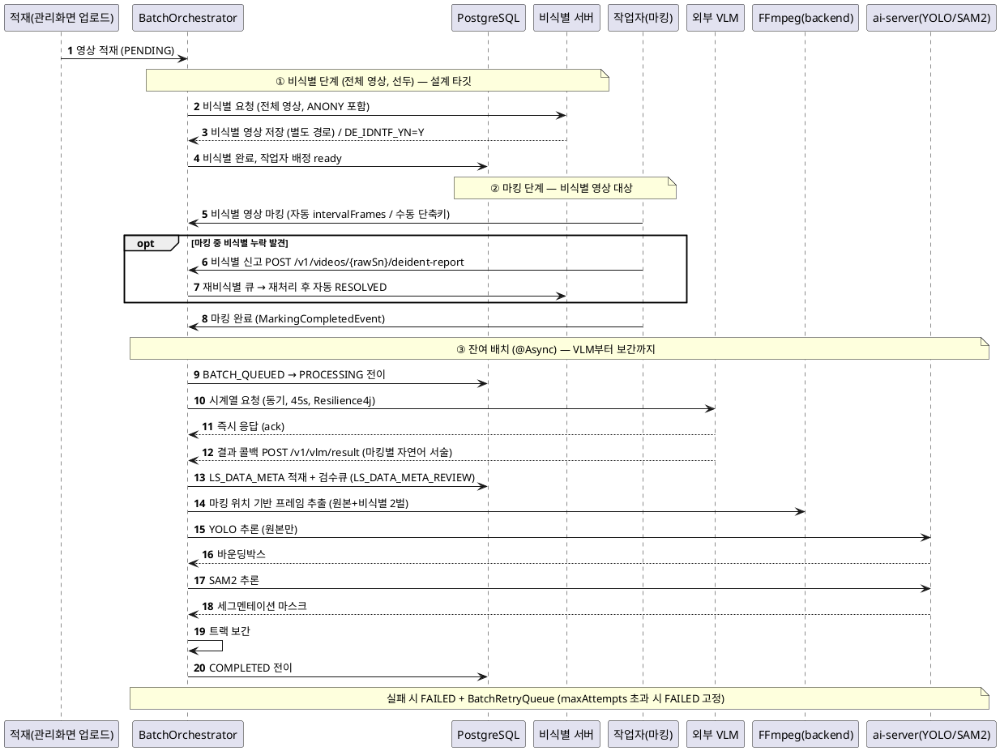

### 2.1 증강 영상 생성 요청 (KLID-AT-UC-001) — SEQ-002

| 시퀀스도 ID | KLID-AT-SD-002 | 시퀀스도명 | 증강 영상 생성 요청 — REVIEWER 요청부터 외부 SFR-07 위임까지 |
|---------|---|-------|---|
| 관련 유스케이스 ID | KLID-AT-UC-001 |
| 주요 액터 | 검수자(REVIEWER), 외부 생성형AI(SFR-07) |
| 주요 클래스 | AugmentController, AugmentRequestService, ExternalAugmentClient |

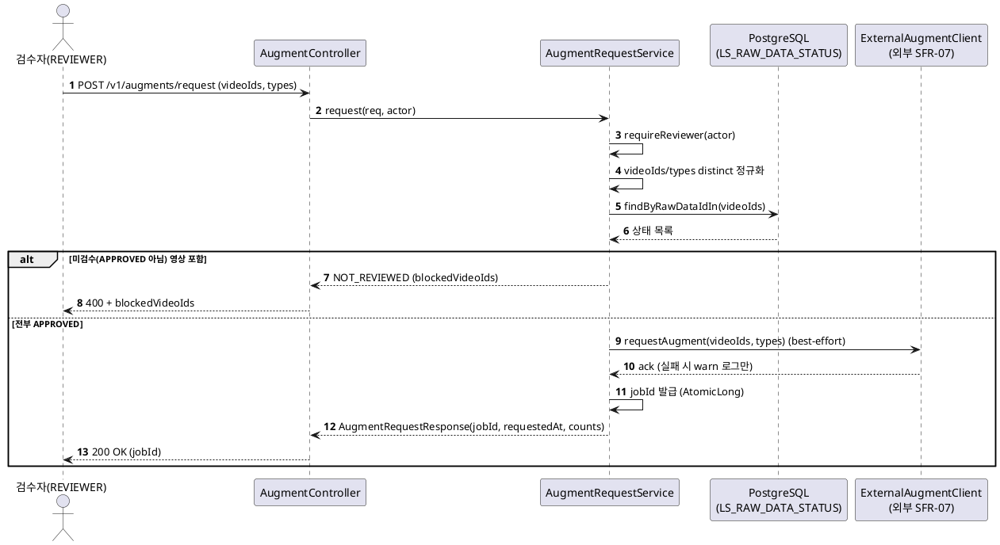

### 2.2 증강 결과 수신·등록 (KLID-AT-UC-002) — SEQ-003

| 시퀀스도 ID | KLID-AT-SD-003 | 시퀀스도명 | 증강 결과 수신·등록 — 외부 콜백부터 새 영상 생성까지 |
|---------|---|-------|---|
| 관련 유스케이스 ID | KLID-AT-UC-002 |
| 주요 액터 | 외부 생성형AI(SFR-07) |
| 주요 클래스 | AugmentResultController, AugmentResultService, WebhookIdempotencyLedger, LsDataAug, LsDataRaw, LsDataLbl |

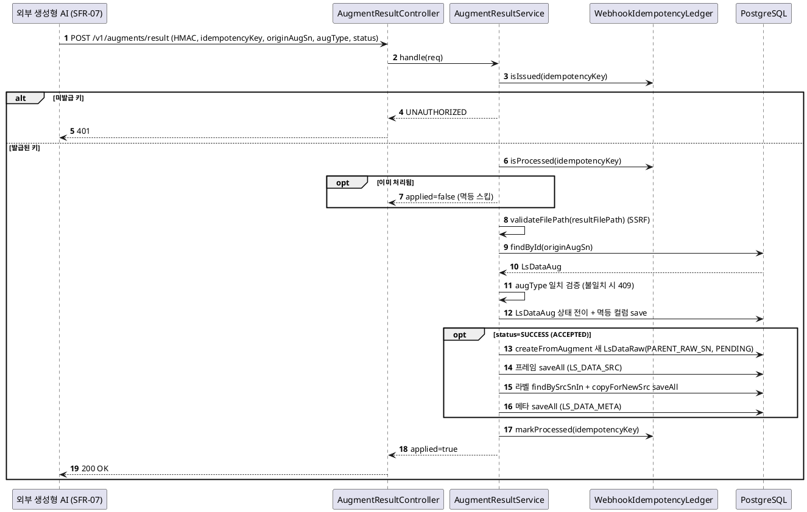

### 2.3 해상도 변경 수행 (KLID-AT-UC-003) — SEQ-004

| 시퀀스도 ID | KLID-AT-SD-004 | 시퀀스도명 | 해상도 변경 수행 — 프리셋 리사이즈부터 라벨 스케일 복사까지 |
|---------|---|-------|---|
| 관련 유스케이스 ID | KLID-AT-UC-003 |
| 주요 액터 | 검수자(REVIEWER) |
| 주요 클래스 | VideoController, VideoResolutionService, FFmpeg, LsDataRaw, LsDataLbl |

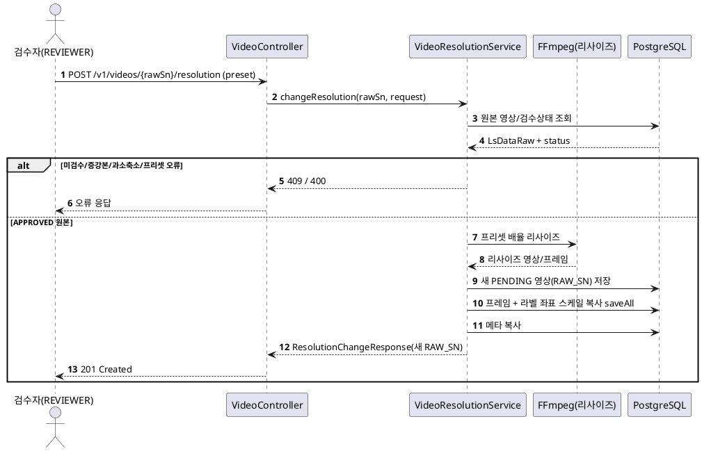

### 2.4 객체 자동 추적 (KLID-AT-UC-004) — SEQ-005

| 시퀀스도 ID | KLID-AT-SD-005 | 시퀀스도명 | 객체 자동 추적 — SAM2 시드부터 트랙 전파·보간까지 |
|---------|---|-------|---|
| 관련 유스케이스 ID | KLID-AT-UC-004 |
| 주요 액터 | 라벨링 작업자(WORKER), ai-server(SAM2) |
| 주요 클래스 | LabelController, Sam2TrackService, LabelAccessGuard, AiServerClient, LsDataLblRepository |

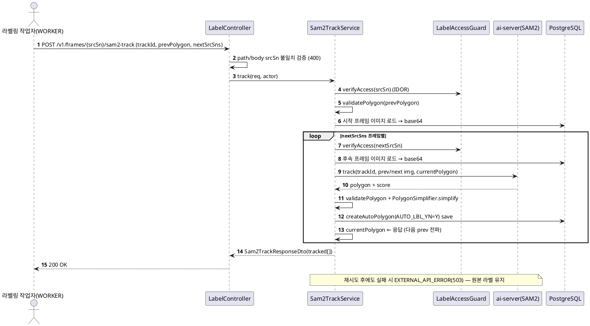

### 2.5 객체 외곽 경계 자동 밀착 (KLID-AT-UC-005) — SEQ-006

| 시퀀스도 ID | KLID-AT-SD-006 | 시퀀스도명 | 객체 외곽 경계 자동 밀착 — 시드 송신부터 폴리곤 밀착까지 |
|---------|---|-------|---|
| 관련 유스케이스 ID | KLID-AT-UC-005 |
| 주요 액터 | 라벨링 작업자(WORKER), ai-server(SAM2) |
| 주요 클래스 | LabelController, Sam2TrackService, LabelAccessGuard, AiServerClient |

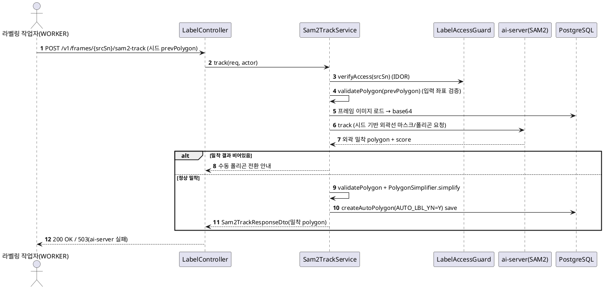

### 2.6 라벨링 정밀도 조절 (KLID-AT-UC-006) — SEQ-007

| 시퀀스도 ID | KLID-AT-SD-007 | 시퀀스도명 | 라벨링 정밀도 조절 — 설정 변경부터 SAM2 단순화 적용까지 |
|---------|---|-------|---|
| 관련 유스케이스 ID | KLID-AT-UC-006 |
| 주요 액터 | 검수자(REVIEWER) |
| 주요 클래스 | SystemConfigController, SystemConfigService, Caffeine 캐시, Sam2TrackService |

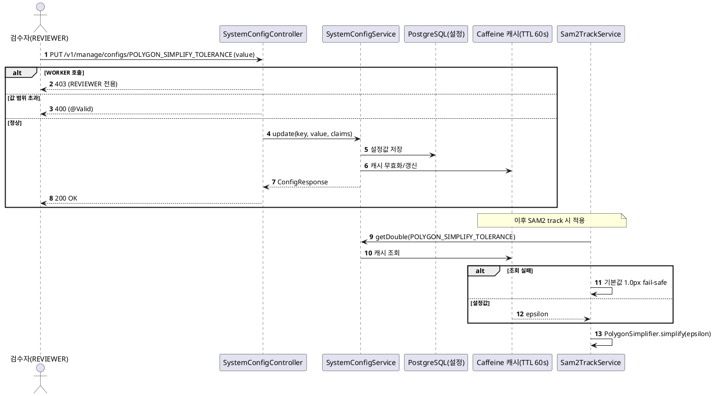

### 2.7 라벨 버전 저장·이력 추적 (KLID-AT-UC-007) — SEQ-008

| 시퀀스도 ID | KLID-AT-SD-008 | 시퀀스도명 | 라벨 버전 저장·이력 추적 — 검수 승인 시점 스냅샷 생성 |
|---------|---|-------|---|
| 관련 유스케이스 ID | KLID-AT-UC-007 |
| 주요 액터 | 검수자(REVIEWER) |
| 주요 클래스 | ReviewController, ReviewService, VersionService, LsLabelVersion, ApplicationEventPublisher |

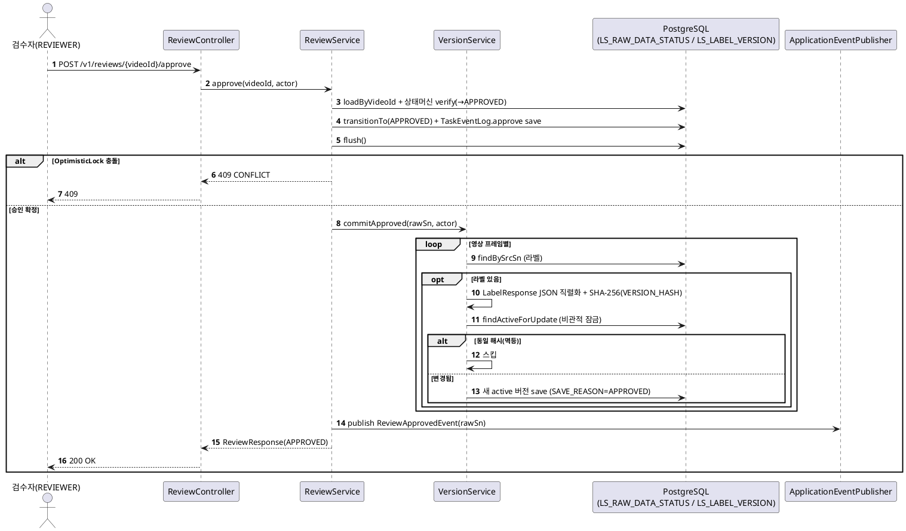

### 2.8 버전 비교·복구 (KLID-AT-UC-008) — SEQ-009

| 시퀀스도 ID | KLID-AT-SD-009 | 시퀀스도명 | 버전 비교·복구 — DB 스냅샷 diff부터 롤백 active 복원까지 |
|---------|---|-------|---|
| 관련 유스케이스 ID | KLID-AT-UC-008 |
| 주요 액터 | 검수자(REVIEWER), 라벨링 작업자(WORKER) |
| 주요 클래스 | VersionController, VersionService, LabelAccessGuard, LsLabelVersion |

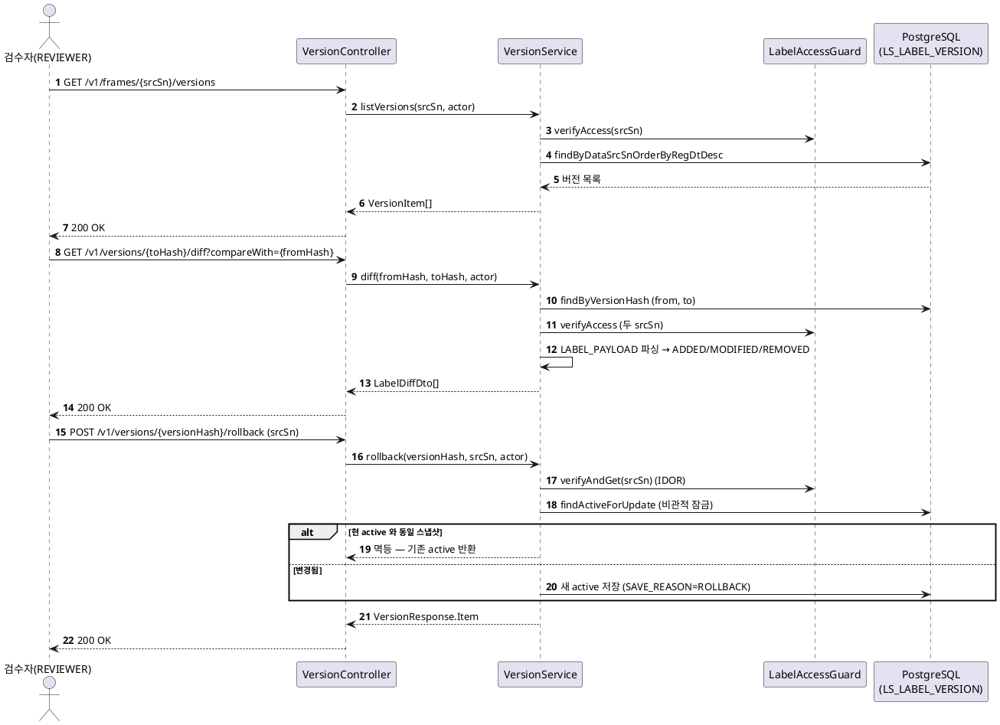

### 2.9 데이터마트 수정 통지 (KLID-AT-UC-009) — SEQ-010

| 시퀀스도 ID | KLID-AT-SD-010 | 시퀀스도명 | 데이터마트 수정 통지 — 검수완료 후 수정부터 TASK_MODIFIED push까지 |
|---------|---|-------|---|
| 관련 유스케이스 ID | KLID-AT-UC-009 |
| 주요 액터 | 검수자/작업자, 관제서버[외부] |
| 주요 클래스 | LabelController, LabelService, ControlNotifyEventListener, ControlNotifyDebouncer, ControlNotifyService, ControlNotifyClient |

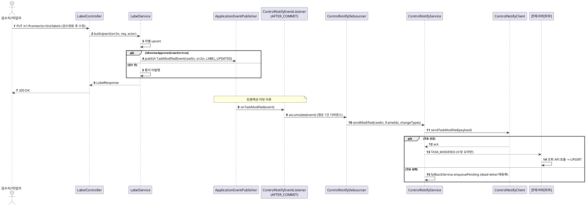

### 2.10 증강 영상 활용 여부 검수 (KLID-AT-UC-010) — SEQ-011

| 시퀀스도 ID | KLID-AT-SD-011 | 시퀀스도명 | 증강 영상 활용 여부 검수 — PENDING 조회부터 승인/반려까지 |
|---------|---|-------|---|
| 관련 유스케이스 ID | KLID-AT-UC-010 |
| 주요 액터 | 검수자(REVIEWER) |
| 주요 클래스 | AugmentController, AugmentReviewService, LsDataAug, LsDataAugRvw, ExternalAugmentClient |

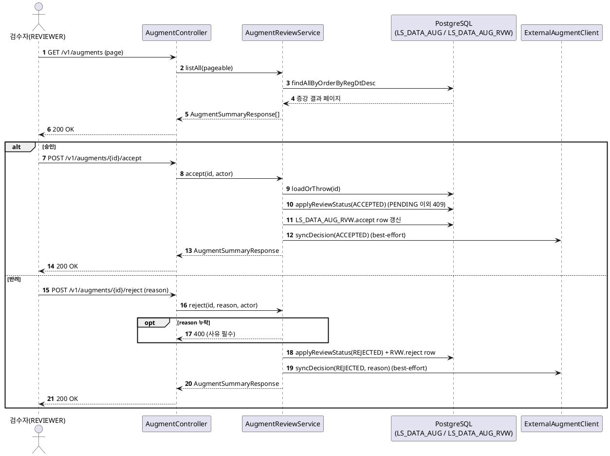

### 2.11 비식별 처리 요청 (KLID-AT-UC-011) — SEQ-012

| 시퀀스도 ID | KLID-AT-SD-012 | 시퀀스도명 | 비식별 처리 요청 — 재처리 요청부터 외부 솔루션 결과 콜백까지 |
|---------|---|-------|---|
| 관련 유스케이스 ID | KLID-AT-UC-011 |
| 주요 액터 | 검수자(REVIEWER), 외부 비식별 솔루션 |
| 주요 클래스 | DeidentController, DeidentifyStep, DeidentifyClient, DeidentifyResultController, DeidentifyResultService, LsDataRaw |

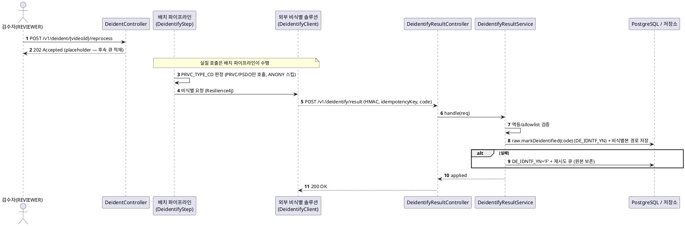

### 2.12 비식별 옵션 설정 (KLID-AT-UC-013) — SEQ-013

| 시퀀스도 ID | KLID-AT-SD-013 | 시퀀스도명 | 비식별 옵션 설정 — 관리 화면 설정 저장 |
|---------|---|-------|---|
| 관련 유스케이스 ID | KLID-AT-UC-013 |
| 주요 액터 | 검수자(REVIEWER) |
| 주요 클래스 | SystemConfigController, SystemConfigService, Caffeine 캐시 |

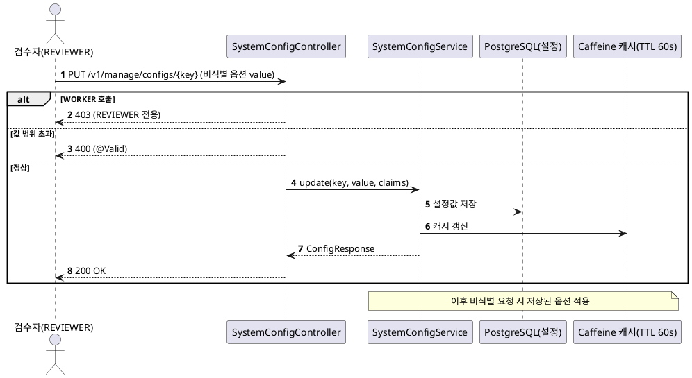

> **참고**: KLID-AT-UC-012(비식별 결과·이력 검토)는 외부 비식별 솔루션으로 이관(LogiCraft UC-012 deprecated)되어 독립 시퀀스도를 작성하지 않는다. 저작도구 잔존 책임(비식별 처리 위탁·결과 인계)은 KLID-AT-SD-012(KLID-AT-UC-011)에 통합되어 표현된다.

---

## 3. 설계 클래스도

> **CBD 양식: 설계 클래스도는 유스케이스(UCD)별로 작성한다.** §1 설계 클래스 목록(KLID-AT-DCD-001~005)과 1:1 대응한다. 클래스·속성·오퍼레이션·연관관계는 LogiCraft 클래스다이어그램(CDIAG-003~013) 도메인 모델 + backend 코드 정합으로 도출한다.

### 3.1 데이터 증강 클래스도

| 설계 클래스도 ID | KLID-AT-DCD-001 | 설계 클래스도명 | 데이터 증강(요청·결과 수신·해상도 변경·검수) |
|-----------|---|---------|---|
| 관련 유스케이스 ID | KLID-AT-UC-001, KLID-AT-UC-002, KLID-AT-UC-003, KLID-AT-UC-010 |
| LogiCraft 근거 | CDIAG-010 (데이터 증강 도메인 모델), DFEAT-029/030 |

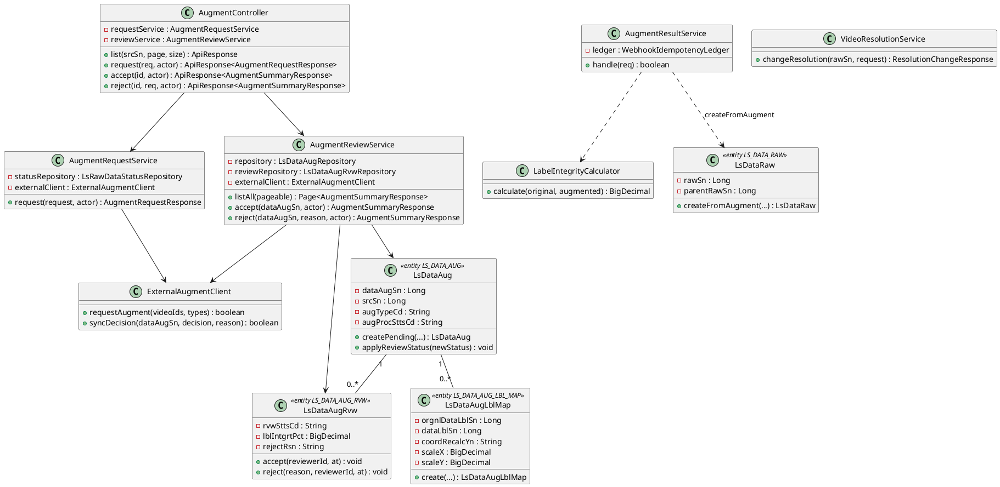

### 3.2 AI 보조 라벨링 클래스도

| 설계 클래스도 ID | KLID-AT-DCD-002 | 설계 클래스도명 | AI 보조 라벨링(추적·밀착·정밀도) |
|-----------|---|---------|---|
| 관련 유스케이스 ID | KLID-AT-UC-004, KLID-AT-UC-005, KLID-AT-UC-006 |
| LogiCraft 근거 | CDIAG-005 (AI 보조 라벨링 도메인 모델), CDIAG-012 (시스템 설정), DFEAT-018/019/020/045 |

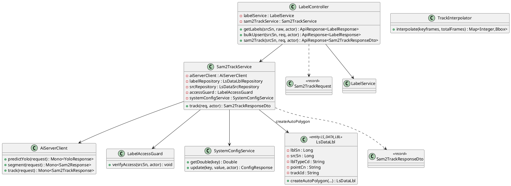

### 3.3 라벨 저장·버전관리 클래스도

| 설계 클래스도 ID | KLID-AT-DCD-003 | 설계 클래스도명 | 라벨 저장·버전관리(승인 시 스냅샷·이력·diff·롤백) |
|-----------|---|---------|---|
| 관련 유스케이스 ID | KLID-AT-UC-007, KLID-AT-UC-008 |
| LogiCraft 근거 | CDIAG-004 (라벨링 도메인 모델, SaveReason=APPROVED/ROLLBACK), DFEAT-012/014/015/016/017 |

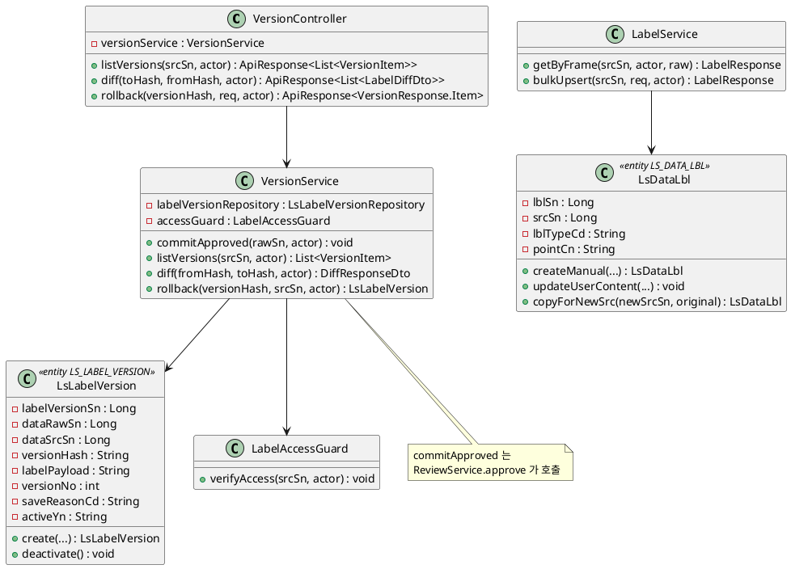

### 3.4 검수 클래스도

| 설계 클래스도 ID | KLID-AT-DCD-004 | 설계 클래스도명 | 검수 워크플로우(상태 머신·승인·반려·증강 검수) |
|-----------|---|---------|---|
| 관련 유스케이스 ID | KLID-AT-UC-010, KLID-AT-UC-012 |
| LogiCraft 근거 | CDIAG-006 (검수 도메인 모델), CDIAG-010 (증강 검수), DFEAT-021/023/024/025 |

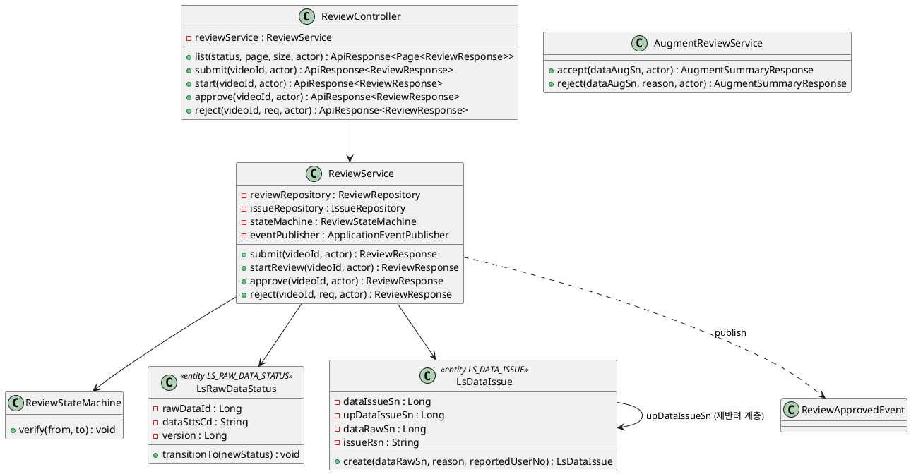

### 3.5 비식별 + 데이터마트 통지 클래스도

| 설계 클래스도 ID | KLID-AT-DCD-005 | 설계 클래스도명 | 비식별 처리 + 데이터마트 통지 + 비식별 옵션 설정 |
|-----------|---|---------|---|
| 관련 유스케이스 ID | KLID-AT-UC-009, KLID-AT-UC-011, KLID-AT-UC-013 |
| LogiCraft 근거 | CDIAG-003 (비식별화 도메인 모델), CDIAG-013 (관제 통지 도메인 모델), CDIAG-012 (시스템 설정), DFEAT-041/042/046/047/048/045 |

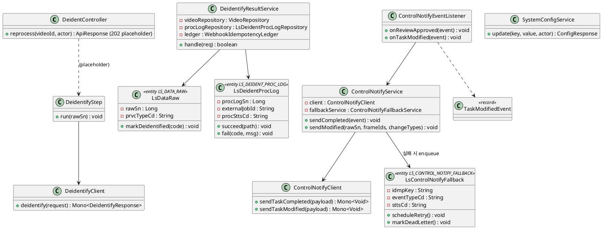

---

## 4. 설계 클래스 정의

> **CBD 양식: 설계 클래스 정의는 클래스별로 작성한다.** 도메인 대표 Service·Entity·Client 위주로 정의한다. 속성·오퍼레이션은 LogiCraft 클래스다이어그램(CDIAG-003~013) 도메인 모델과 실제 코드 필드·메서드 시그니처를 정합한다. 엔티티 속성은 행안부 표준 약어가 반영된 현재 코드 컬럼명(예: `regDt`, `mdfcnDt`, `rejectRsn`, `versionHash`, `pointCn`)을 사용한다.

### 4.1 AugmentReviewService (KLID-AT-DC-003)

| 설계 클래스 ID | KLID-AT-DC-003 | 설계 클래스명 | AugmentReviewService |
|-----------|---|---------|---|
| **속성** |
| 속성명 | 가시성 | 타입 | 기본값 | 설명 |
| AUG_ORDER | private(static) | Map<String,Integer> | WINTER/NIGHT/RAIN/RESOLUTION | UI 표시용 4종 정렬 순서 |
| repository | private | LsDataAugRepository | - | 증강 결과 Repository |
| reviewRepository | private | LsDataAugRvwRepository | - | 증강 검수 Repository |
| externalClient | private | ExternalAugmentClient | - | 외부 SFR-07 통보 클라이언트 |
| **오퍼레이션** |
| 오퍼레이션명 | 가시성 | 파라미터 | 반환타입 | 설명 |
| listAll | public | Pageable pageable | Page<AugmentSummaryResponse> | 전체 증강 결과 페이징 조회 |
| findBySource | public | Long srcSn | List<AugmentSummaryResponse> | 원본 영상의 4종 증강 결과 묶음 조회 |
| accept | public | Long dataAugSn, TokenClaims actor | AugmentSummaryResponse | 증강 결과 승인(PENDING→ACCEPTED, REVIEWER) |
| reject | public | Long dataAugSn, String reason, TokenClaims actor | AugmentSummaryResponse | 증강 결과 반려(사유 필수, PENDING→REJECTED) |
| requireReviewer | private | TokenClaims actor | void | REVIEWER 권한 이중 검증 |

### 4.2 AugmentRequestService (KLID-AT-DC-002)

| 설계 클래스 ID | KLID-AT-DC-002 | 설계 클래스명 | AugmentRequestService |
|-----------|---|---------|---|
| **속성** |
| 속성명 | 가시성 | 타입 | 기본값 | 설명 |
| statusRepository | private | LsRawDataStatusRepository | - | 영상 검수 상태 조회 |
| externalClient | private | ExternalAugmentClient | - | 외부 SFR-07 요청 클라이언트 |
| jobIdSeq | private | AtomicLong | currentTimeMillis() | placeholder jobId 시퀀스 |
| **오퍼레이션** |
| 오퍼레이션명 | 가시성 | 파라미터 | 반환타입 | 설명 |
| request | public | AugmentRequestRequest request, TokenClaims actor | AugmentRequestResponse | 검수 완료(APPROVED) 영상만 증강 요청(미검수 포함 시 NOT_REVIEWED) |
| findBlockedVideoIds | private | List<Long> videoIds | List<Long> | 미검수/미존재 영상 ID 목록 |

### 4.3 AugmentResultService (KLID-AT-DC-004)

| 설계 클래스 ID | KLID-AT-DC-004 | 설계 클래스명 | AugmentResultService (webhook) |
|-----------|---|---------|---|
| **속성** |
| 속성명 | 가시성 | 타입 | 기본값 | 설명 |
| ledger | private | WebhookIdempotencyLedger | - | 멱등 allowlist/처리 마킹 |
| videoRepository | private | VideoRepository | - | 새 영상(LS_DATA_RAW) 생성 |
| labelRepository | private | LsDataLblRepository | - | 원본 라벨 IN-조회 + 복사 저장 |
| **오퍼레이션** |
| 오퍼레이션명 | 가시성 | 파라미터 | 반환타입 | 설명 |
| handle | public | AugmentResultRequest req | boolean | 결과 인계(멱등·SSRF·augType 검증 → SUCCESS 시 새 PENDING 영상 + 라벨/프레임/메타 복사) |
| validateFilePath | private | String filePath | void | 결과 경로 URL 형식 시 SSRF 차단 |

### 4.4 Sam2TrackService (KLID-AT-DC-015)

| 설계 클래스 ID | KLID-AT-DC-015 | 설계 클래스명 | Sam2TrackService |
|-----------|---|---------|---|
| **속성** |
| 속성명 | 가시성 | 타입 | 기본값 | 설명 |
| aiServerClient | private | AiServerClient | - | ai-server SAM2 추론 호출 |
| labelRepository | private | LsDataLblRepository | - | 추적 결과 라벨 저장 |
| srcRepository | private | LsDataSrcRepository | - | 프레임(이미지) 조회 |
| accessGuard | private | LabelAccessGuard | - | 본인 배정 검증(IDOR 방어) |
| systemConfigService | private | SystemConfigService | - | 정밀도(epsilon) 설정 조회 |
| DEFAULT_SIMPLIFY_TOLERANCE | private(static) | double | 1.0 | 설정 누락 시 폴백 epsilon(px) |
| storageRawPath | private | String | ./storage/raw | 원본 프레임 이미지 기준 경로 |
| **오퍼레이션** |
| 오퍼레이션명 | 가시성 | 파라미터 | 반환타입 | 설명 |
| track | public | Sam2TrackRequest req, TokenClaims actor | Sam2TrackResponseDto | SAM2 추적 전파(시드→후속 프레임), 폴리곤 단순화·저장(추론 실패 시 EXTERNAL_API_ERROR) |
| validatePolygon | private | List<List<Double>> polygon, String fieldName | void | 좌표 [x,y]·음수 검증(CWE-20) |
| readSimplifyTolerance | private | - | double | epsilon 조회(실패 시 1.0 fail-safe) |
| encodeImageToBase64 | private | Path baseDir, String filePath | String | 프레임 이미지 base64 인코딩(경로 순회 차단) |

### 4.5 TrackInterpolator (KLID-AT-DC-016)

| 설계 클래스 ID | KLID-AT-DC-016 | 설계 클래스명 | TrackInterpolator |
|-----------|---|---------|---|
| **속성** |
| (상태 없음 — Spring 의존성 없는 순수 도메인 보간기. CVAT 포팅) | - | - | - | - |
| **오퍼레이션** |
| 오퍼레이션명 | 가시성 | 파라미터 | 반환타입 | 설명 |
| interpolate | public | List<Keyframe> keyframes, int totalFrames | Map<Integer,Bbox> | 키프레임 사이 BBOX 선형 보간(outside 마커 시 종료) |

### 4.6 VersionService (KLID-AT-DC-024)

| 설계 클래스 ID | KLID-AT-DC-024 | 설계 클래스명 | VersionService |
|-----------|---|---------|---|
| **속성** |
| 속성명 | 가시성 | 타입 | 기본값 | 설명 |
| MAX_PAYLOAD_BYTES | public(static) | int | 1MB | 스냅샷 페이로드 최대 크기(CWE-770) |
| labelVersionRepository | private | LsLabelVersionRepository | - | 버전 스냅샷 Repository |
| accessGuard | private | LabelAccessGuard | - | srcSn 소유/배정 검증(IDOR) |
| videoRepository | private | VideoRepository | - | 영상 조회 |
| workLockService | private | WorkLockService | - | 비식별 재처리 중 잠금 검증 |
| **오퍼레이션** |
| 오퍼레이션명 | 가시성 | 파라미터 | 반환타입 | 설명 |
| commitApproved | public | Long rawSn, TokenClaims actor | void | 검수 승인 시 영상 프레임별 스냅샷 저장(SHA-256 versionHash, 동일 페이로드 멱등 스킵, SAVE_REASON=APPROVED) |
| listVersions | public | Long srcSn, TokenClaims actor | List<VersionItem> | 버전 이력 최신순 조회 |
| diff | public | String fromHash, String toHash, TokenClaims actor | DiffResponseDto | 두 스냅샷 ADDED/REMOVED/MODIFIED 산출 |
| rollback | public | String versionHash, Long srcSn, TokenClaims actor | LsLabelVersion | 대상 검수완료 스냅샷을 새 active 버전으로 복원(비관적 잠금, SAVE_REASON=ROLLBACK) |

### 4.7 LsLabelVersion (KLID-AT-DC-025)

| 설계 클래스 ID | KLID-AT-DC-025 | 설계 클래스명 | LsLabelVersion (LS_LABEL_VERSION) |
|-----------|---|---------|---|
| **속성** |
| 속성명 | 가시성 | 타입 | 기본값 | 설명 |
| labelVersionSn | private | Long | (IDENTITY) | 버전 PK |
| dataRawSn | private | Long | - | 영상 SN |
| dataSrcSn | private | Long | - | 프레임 SN |
| versionHash | private | String(64) | - | payload SHA-256(버전 식별자, 멱등) |
| labelPayload | private | String(TEXT) | - | 라벨 전체 스냅샷 JSON(diff/rollback 원천) |
| versionNo | private | int | - | 프레임 내 버전 번호 |
| saveReasonCd | private | String | - | 저장 사유(APPROVED/ROLLBACK) |
| activeYn | private | String | Y | 활성 여부 |
| regId | private | String | - | 등록자 |
| regDt | private | LocalDateTime | now() | 등록 일시 |
| **오퍼레이션** |
| 오퍼레이션명 | 가시성 | 파라미터 | 반환타입 | 설명 |
| create | public(static) | rawSn, srcSn, versionHash, labelPayload, versionNo, saveReasonCd, regId | LsLabelVersion | 활성(Y) 버전 생성 |
| deactivate | public | - | void | 활성→비활성(N) 전환 |

### 4.8 ReviewService (KLID-AT-DC-030)

| 설계 클래스 ID | KLID-AT-DC-030 | 설계 클래스명 | ReviewService |
|-----------|---|---------|---|
| **속성** |
| 속성명 | 가시성 | 타입 | 기본값 | 설명 |
| reviewRepository | private | ReviewRepository | - | 검수 상태(LS_RAW_DATA_STATUS) 조회 |
| issueRepository | private | IssueRepository | - | 반려 이슈 저장 |
| stateMachine | private | ReviewStateMachine | - | 상태 전이 검증 |
| versionService | private | VersionService | - | 승인 시 commitApproved 호출 |
| eventPublisher | private | ApplicationEventPublisher | - | 승인 시 ReviewApprovedEvent 발행 |
| **오퍼레이션** |
| 오퍼레이션명 | 가시성 | 파라미터 | 반환타입 | 설명 |
| list | public | String status, Pageable pageable, TokenClaims actor | Page<ReviewResponse> | 상태별 검수 목록(REVIEWER) |
| submit | public | Long videoId, TokenClaims actor | ReviewResponse | WORKER 검수 제출(→PENDING) |
| startReview | public | Long videoId, TokenClaims actor | ReviewResponse | 검수 시작(PENDING→IN_REVIEW) |
| approve | public | Long videoId, TokenClaims actor | ReviewResponse | 승인(IN_REVIEW→APPROVED, 낙관적 잠금) + commitApproved 스냅샷 |
| reject | public | Long videoId, RejectRequest req, TokenClaims actor | ReviewResponse | 반려(IN_REVIEW→REJECTED, 사유 필수+이슈 INSERT) |

### 4.9 ReviewStateMachine (KLID-AT-DC-031)

| 설계 클래스 ID | KLID-AT-DC-031 | 설계 클래스명 | ReviewStateMachine |
|-----------|---|---------|---|
| **속성** |
| 속성명 | 가시성 | 타입 | 기본값 | 설명 |
| ALLOWED | private(static) | Map<String,Set<String>> | ASSIGNED→PENDING / PENDING→IN_REVIEW / IN_REVIEW→APPROVED,REJECTED / REJECTED→PENDING | 허용 전이 표 |
| **오퍼레이션** |
| 오퍼레이션명 | 가시성 | 파라미터 | 반환타입 | 설명 |
| verify | public | String from, String to | void | 전이 검증(APPROVED→* CONFLICT, 미허용 INVALID_INPUT) |

### 4.10 LsDataLbl (KLID-AT-DC-013)

| 설계 클래스 ID | KLID-AT-DC-013 | 설계 클래스명 | LsDataLbl (LS_DATA_LBL) |
|-----------|---|---------|---|
| **패키지** | `kr.co.cudo.authoring.batch.entity` (batch 패키지 소속 — label·review·augment 도메인이 공유 참조) |
| **속성** |
| 속성명 | 가시성 | 타입 | 기본값 | 설명 |
| lblSn | private | Long | (IDENTITY) | 라벨 PK |
| srcSn | private | Long | - | 프레임 FK(LS_DATA_SRC) |
| lblTypeCd | private | String | - | 라벨 타입(BBOX/POLYGON/SEGMENT/TRACK) |
| labelId | private | Long | - | LS_LABEL 마스터 FK(null 허용) |
| labelNm | private | String | - | 라벨명 |
| pointCn | private | String(TEXT) | - | 좌표 직렬화 JSON |
| trackId | private | String | - | 트래커 객체 ID(TRCK_ID, null 허용) |
| autoLblYn | private | String(@Transient) | - | 자동/수동 여부(AI 정보 테이블 분리 저장용) |
| confScore | private | BigDecimal(@Transient) | - | 신뢰도(0.0~1.0 clamp) |
| regUserNo | private | Long | - | 등록자 |
| regDt | private | LocalDateTime | now() | 등록 일시 |
| mdfcnDt | private | LocalDateTime | - | 수정 일시 |
| **오퍼레이션** |
| 오퍼레이션명 | 가시성 | 파라미터 | 반환타입 | 설명 |
| createAutoBbox | public(static) | srcSn, labelId, label, pointsJson, confScore, trackId | LsDataLbl | YOLO 자동 BBOX(AUTO_LBL_YN='Y') |
| createAutoInterpolatedBbox | public(static) | srcSn, labelId, label, pointsJson, confScore, trackId | LsDataLbl | 트랙 보간 자동 생성 BBOX(LBL_SRC_CD='INTERPOLATED') |
| createAutoPolygon | public(static) | srcSn, labelId, label, pointsJson, confScore | LsDataLbl | SAM2 자동 폴리곤 |
| createManual | public(static) | srcSn, lblTypeCd, labelId, label, pointsJson, regUserNo | LsDataLbl | 사용자 수동 라벨(AUTO_LBL_YN='N') |
| updateUserContent | public | lblTypeCd, labelId, label, pointsJson | void | 좌표/타입/라벨명 수정 |
| copyForNewSrc | public(static) | newSrcSn, original | LsDataLbl | 증강·해상도변경 새 영상용 라벨 복사(KLID-AT-UC-002/003) |

### 4.11 DeidentifyResultService (KLID-AT-DC-039)

| 설계 클래스 ID | KLID-AT-DC-039 | 설계 클래스명 | DeidentifyResultService |
|-----------|---|---------|---|
| **속성** |
| 속성명 | 가시성 | 타입 | 기본값 | 설명 |
| videoRepository | private | VideoRepository | - | 영상(LS_DATA_RAW) 조회·상태 갱신 |
| procLogRepository | private | LsDeidentProcLogRepository | - | 비식별 처리 이력 upsert |
| ledger | private | WebhookIdempotencyLedger | - | 멱등 allowlist/처리 마킹 |
| **오퍼레이션** |
| 오퍼레이션명 | 가시성 | 파라미터 | 반환타입 | 설명 |
| handle | public | DeidentifyResultRequest req | boolean | 결과 인계(allowlist·멱등·SSRF 검증→markDeidentified→이력 적재) |
| validateFilePath | private | String filePath | void | 결과 경로 URL 형식 시 SSRF 차단 |

### 4.12 ControlNotifyService (KLID-AT-DC-035)

| 설계 클래스 ID | KLID-AT-DC-035 | 설계 클래스명 | ControlNotifyService |
|-----------|---|---------|---|
| **속성** |
| 속성명 | 가시성 | 타입 | 기본값 | 설명 |
| client | private | ControlNotifyClient | - | 관제서버 outbound 클라이언트 |
| fallbackService | private | ControlNotifyFallbackService | - | 통지 실패 재등록 큐(폴백) |
| metrics | private | ControlNotifyMetrics | - | 통지 성공/실패 메트릭 |
| **오퍼레이션** |
| 오퍼레이션명 | 가시성 | 파라미터 | 반환타입 | 설명 |
| sendCompleted | public | ReviewApprovedEvent event | void | TASK_COMPLETED 전송(실패 시 폴백 큐) |
| sendModified | public | Long rawSn, List<Long> frameIds, List<String> changeTypes | void | TASK_MODIFIED 전송(수정 요약만, 실패 시 폴백 큐) |

### 4.13 SystemConfigService (KLID-AT-DC-041)

| 설계 클래스 ID | KLID-AT-DC-041 | 설계 클래스명 | SystemConfigService |
|-----------|---|---------|---|
| **속성** |
| 속성명 | 가시성 | 타입 | 기본값 | 설명 |
| repository | private | LsSystemConfigRepository | - | 설정 키-값(LS_SYSTEM_CONFIG) Repository |
| cache | private | Cache (Caffeine) | TTL 60s | 설정 로컬 캐시 |
| ALLOWED_KEYS | private(static) | Set<String> | 화이트리스트 | 등록·갱신 허용 설정 키 |
| **오퍼레이션** |
| 오퍼레이션명 | 가시성 | 파라미터 | 반환타입 | 설명 |
| getInt | public | String key | Integer | 정수 설정 조회(캐시) |
| getDouble | public | String key | Double | 실수 설정 조회(예: POLYGON_SIMPLIFY_TOLERANCE) |
| getString | public | String key | String | 문자열 설정 조회 |
| update | public | String key, String value, TokenClaims actor | ConfigResponse | 설정 갱신(REVIEWER 전용, CONFIG_TYPE_CD 검증, 캐시 무효화) |

### 4.14 LsDataAug (KLID-AT-DC-008)

| 설계 클래스 ID | KLID-AT-DC-008 | 설계 클래스명 | LsDataAug (LS_DATA_AUG) |
|-----------|---|---------|---|
| **속성** |
| 속성명 | 가시성 | 타입 | 기본값 | 설명 |
| dataAugSn | private | Long | (IDENTITY) | 증강 결과 PK |
| srcSn | private | Long | - | 원본 영상 SN |
| augTypeCd | private | String | - | 증강 유형(WINTER/NIGHT/RAIN/RESOLUTION) |
| augProcSttsCd | private | String | PENDING | 증강 처리 상태(PENDING/ACCEPTED/REJECTED) |
| lblIntgrtPct | private | BigDecimal(@Transient) | - | 라벨 무결성률(LS_DATA_AUG_RVW 위임) |
| regDt | private | LocalDateTime | now() | 등록 일시 |
| regUserNo | private | String | - | 등록자 |
| idmpKey | private | String | - | webhook 멱등 키(IDMP_KEY) |
| otsdJobId | private | String | - | 외부 작업 ID(OTSD_JOB_ID) |
| retryCount | private | int | 0 | 재시도 횟수 |
| deadLetterAt | private | LocalDateTime | - | 영구 실패 마킹 시점 |
| **오퍼레이션** |
| 오퍼레이션명 | 가시성 | 파라미터 | 반환타입 | 설명 |
| createPending | public(static) | srcSn, augTypeCd, lblIntgrtPct, regUserNo | LsDataAug | PENDING 증강 결과 신규 생성 |
| applyReviewStatus | public | String newStatus | void | 검수 상태 동기 반영(PENDING 이외 시 CONFLICT) |
| incrementRetry | public | - | void | 재시도 횟수 1 증가 |
| markDeadLetter | public | - | void | dead-letter 마킹 |

---

## 부록 A. 시퀀스도 ↔ 유스케이스 매핑 (D2 참조용)

| 시퀀스도 ID | LogiCraft 원본 | 시퀀스도명 | 관련 유스케이스 ID |
|---------|---|-------|-------------|
| KLID-AT-SD-001 | SEQ-001 | 영상수집 파이프라인(비식별·마킹부터 트랙 보간까지, 설계 타깃) | (배치 컨텍스트) KLID-AT-UC-011 / KLID-AT-UC-002 |
| KLID-AT-SD-002 | SEQ-002 | 증강 영상 생성 요청 | KLID-AT-UC-001 |
| KLID-AT-SD-003 | SEQ-003 | 증강 결과 수신·등록 | KLID-AT-UC-002 |
| KLID-AT-SD-004 | SEQ-004 | 해상도 변경 수행 | KLID-AT-UC-003 |
| KLID-AT-SD-005 | SEQ-005 | 객체 자동 추적(SAM2 Track 전파) | KLID-AT-UC-004 |
| KLID-AT-SD-006 | SEQ-006 | 객체 외곽 경계 자동 밀착(SAM2 Snap) | KLID-AT-UC-005 |
| KLID-AT-SD-007 | SEQ-007 | 라벨링 정밀도 조절 | KLID-AT-UC-006 |
| KLID-AT-SD-008 | SEQ-008 | 라벨 버전 저장·이력 추적(승인 시 스냅샷) | KLID-AT-UC-007 |
| KLID-AT-SD-009 | SEQ-009 | 버전 비교(diff)·복구(rollback) | KLID-AT-UC-008 |
| KLID-AT-SD-010 | SEQ-010 | 데이터마트 수정 통지(TASK_MODIFIED) | KLID-AT-UC-009 |
| KLID-AT-SD-011 | SEQ-011 | 증강 영상 활용 여부 검수 | KLID-AT-UC-010 |
| KLID-AT-SD-012 | SEQ-012 | 비식별 처리 위탁·결과 인계 | KLID-AT-UC-011 |
| KLID-AT-SD-013 | SEQ-013 | 비식별 옵션 설정(관리 화면) | KLID-AT-UC-013 |

## 부록 B. 설계 클래스도 ↔ 유스케이스 매핑

| 설계 클래스도 ID | LogiCraft 근거(CDIAG) | 설계 클래스도명 | 관련 유스케이스 ID |
|-----------|---|---------|-------------|
| KLID-AT-DCD-001 | CDIAG-010 | 데이터 증강(요청·결과 수신·해상도 변경·검수) | KLID-AT-UC-001, KLID-AT-UC-002, KLID-AT-UC-003, KLID-AT-UC-010 |
| KLID-AT-DCD-002 | CDIAG-005, CDIAG-012 | AI 보조 라벨링(추적·밀착·정밀도) | KLID-AT-UC-004, KLID-AT-UC-005, KLID-AT-UC-006 |
| KLID-AT-DCD-003 | CDIAG-004 | 라벨 저장·버전관리 | KLID-AT-UC-007, KLID-AT-UC-008 |
| KLID-AT-DCD-004 | CDIAG-006, CDIAG-010 | 검수 워크플로우(승인·반려·증강 검수) | KLID-AT-UC-010, KLID-AT-UC-012 |
| KLID-AT-DCD-005 | CDIAG-003, CDIAG-013, CDIAG-012 | 비식별 + 데이터마트 통지 + 비식별 옵션 설정 | KLID-AT-UC-009, KLID-AT-UC-011, KLID-AT-UC-013 |

## 부록 C. 빈 셀·정보 부족 항목

> "값 없음"은 `-` 로 표기했다. 아래는 본 산출물 작성 시 정보 부족으로 비운 항목이다.

- **TrackInterpolator 속성(§4.5)**: 상태 없는 순수 보간기로 인스턴스 속성이 없어 `-` 처리(CVAT 포팅 무상태 유틸).
- **KLID-AT-UC-012 (비식별 결과·이력 검토)**: LogiCraft UC-012 deprecated(외부 비식별 솔루션 이관). 독립 시퀀스도(§2) 미작성 — KLID-AT-SD-012(KLID-AT-UC-011)에 잔존 책임 통합. §1.4/§3.4 에서는 검수 컨텍스트 매핑만 유지.
- **KLID-AT-UC-014/015 (개인정보 보호대책·분류체계)**: RQ-SFR-09-06/07 범위 외 삭제(LogiCraft deprecated)로 본 산출물 전 범위에서 제외.
- **LogiCraft class_diagram 도메인 모델 vs 코드 구현 클래스**: §3/§4 의 설계 클래스명은 backend 실제 구현 클래스(예: `LsDataAug`, `AugmentReviewService`)를 사용하고, CDIAG 의 도메인 모델명(예: `DataAugmentation`, `DataLabel`)은 부록 B 의 근거로만 참조했다. 두 표현은 동일 엔티티의 도메인/구현 관점 차이이며, 컬럼·메서드 시그니처는 코드 기준으로 확정했다.
