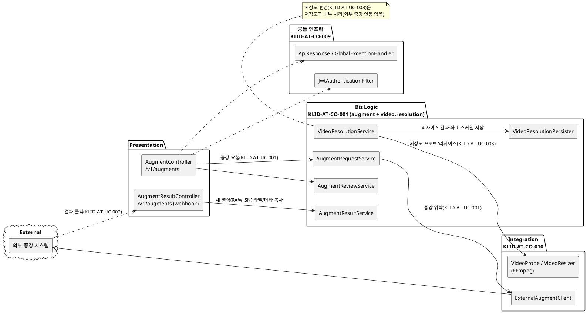
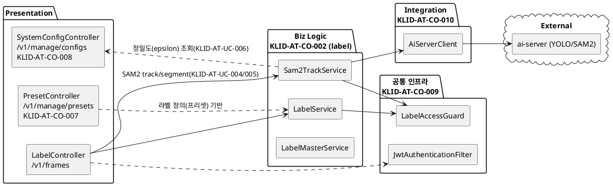
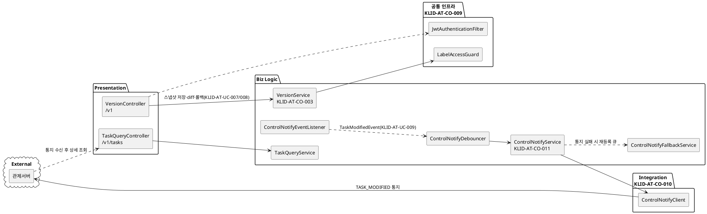
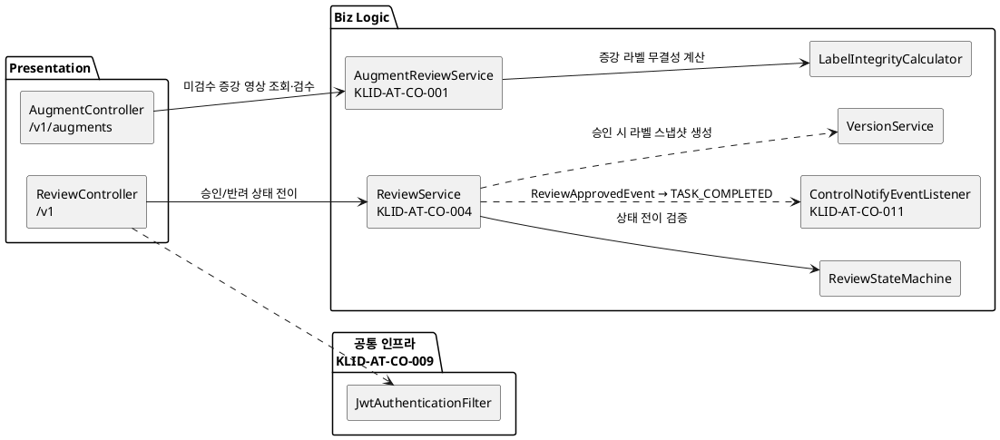
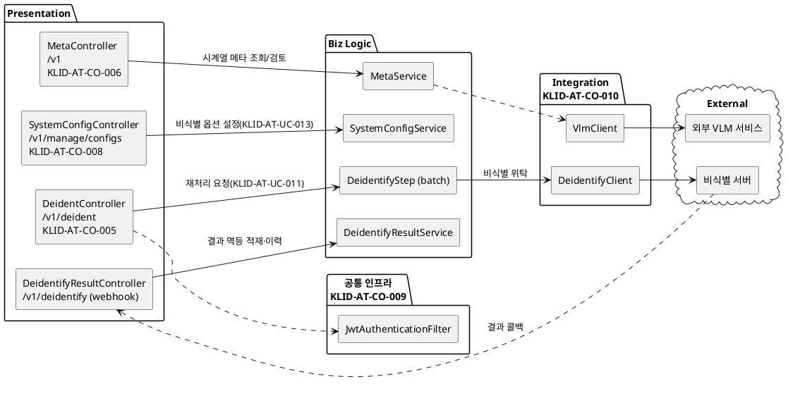

# D3 컴포넌트 설계서

> **ID 표기 규칙(공통)**: 본 산출물의 모든 ID(KLID-AT-UC/CO/DC/DCD/SD/SC/AC/EN/ERD/TB/II/IC/IF/UCD/ACT 등)는 **전체 형식 `KLID-AT-XX-NNN`** 으로 표기한다. 끝부분만(예: `UC-001`) 약식 표기 금지. 범위는 시작 ID만 전체형으로(예: `KLID-AT-UC-001~013`). ※ 요구사항(RQ-SFR-NN-NN)·시스템시험(KLID-ST-NNN) 등 타 체계 ID는 각 체계 원형 유지. LogiCraft 원본 ID(CMP/MOD/DOMAIN/UC)는 그래프 추적용으로 원형(예: `CMP-004`, `MOD-006`)을 병기한다.

## 작성 목적
> 설계 클래스 모형에서 도출한 클래스들을 C&V(공통성과 변경성) 기준에 따라 그룹핑하여 컴포넌트를 식별하여 패키지도를 작성하고 식별한 컴포넌트의 내부 클래스 및 인터페이스의 명세를 기술한다.

## 작성 방법
> 클래스를 그룹핑하여 도출한 컴포넌트의 패키지도를 작성하고, 식별한 컴포넌트의 목록을 작성한다. 또한 각각의 컴포넌트에 포함하고 있는 내부 클래스들을 명세하고, 인터페이스는 사용자에게 제공하는 오퍼레이션별로 상세한 명세를 작성한다.

> 본 산출물은 R1 사용자 요구사항(SFR-06~09, 16개)에 매핑된 R2 유스케이스(KLID-AT-UC-001~013, 단 KLID-AT-UC-012 폐기)와 직접 관련된 컴포넌트만을 대상으로 한다. R1/R2 범위 밖 도메인(사용자/권한·마킹·배치 트리거·포털 일반·게시판·통계·영상 목록)은 본 명세에서 제외한다. 단, 인증·표준 응답·예외 처리 등 R2 유스케이스 실행에 필수인 공통 인프라와 외부 연동 클라이언트는 별도 컴포넌트로 포함한다. 컴포넌트 구조도(§1)·컴포넌트 명세(§3)·인터페이스 명세(§4)는 LogiCraft C4 컴포넌트 다이어그램 9종(CMP-001~009, 실제 backend 생성자 의존성에서 도출)과 code_module 21종(MOD-*)을 출처로 한다.

---

## 산출물 양식

### 제·개정 이력

| 날짜 | 버전 | 제·개정 내역 | 작성자 | 검토자 |
|------|------|------------|--------|--------|
| 2026-05-31 | 1.0 | 최초 작성 — R2 유스케이스 매핑 컴포넌트(증강·라벨링·버전관리·검수·비식별·시계열메타·프리셋·시스템설정 + 공통 인프라 + 외부 연동) 식별·명세 | 박찬기 | 김현욱 |
| 2026-06-02 | 1.0 | **LogiCraft 그래프 기반 자동 생성 (/cc-doc-gen)** — C4 컴포넌트 다이어그램 9종(CMP-001~009, 실제 backend 생성자 의존성 도출)·code_module 21종(MOD-*)·use_case 12종을 출처로 전면 재생성. §1 컴포넌트 구조도를 유스케이스(UCD)별 5종으로 작성. KLID-AT-UC-012(비식별 결과·이력 검토)는 외부 솔루션 이관으로 폐기(deprecated) 반영. KLID-AT-CO-001(배치) 설명에 설계 타깃 파이프라인 순서(비식별 선두, planned) 반영 | 박찬기(LogiCraft 자동 생성) | 김현욱 |

### 헤더

| D3 | 컴포넌트 설계서 |
|-------|----------|
| 시스템명 | AI 기반 지방정부 CCTV 관제지원시스템(2차) | 서브시스템명 | 학습데이터 저작도구 (AT) |
| 단계명  | 설계 | 작성일자 | 2026-06-02 | 버전 | 1.0 |

---

## 1. 컴포넌트 구조도

> **CBD 양식: 컴포넌트 구조도는 유스케이스(UCD)별로 작성한다.** R2 유스케이스 다이어그램 5종(KLID-AT-UCD-001~005) 단위로 각각의 구조도를 작성하며, 각 도면에는 해당 UCD에 관여하는 컴포넌트만 포함한다. 의존관계는 Layer(Presentation → Biz Logic → 공통 인프라/Integration → External) 단방향으로 표시한다. 각 도면은 LogiCraft C4 컴포넌트 다이어그램(CMP-NNN, 실제 backend 생성자 의존성에서 도출)을 출처로 한다.
> 공통 인프라(KLID-AT-CO-009)는 전 UCD에 횡단 적용되므로 각 도면에 인증/표준응답/IDOR 가드를 공통으로 포함한다.

### 1.1 KLID-AT-UCD-001 데이터 증강 및 해상도 변경 (출처 CMP-007)

| 컴포넌트 ID | KLID-AT-CO-001, KLID-AT-CO-010, KLID-AT-CO-009 | 컴포넌트명 | 데이터 증강 / 외부 연동 / 공통 인프라 |
|----------|---|---------|---|
| 관련 유스케이스 ID | KLID-AT-UC-001(증강 영상 생성 요청), KLID-AT-UC-002(증강 결과 수신·등록), KLID-AT-UC-003(해상도 변경 수행) |

### 1.2 KLID-AT-UCD-002 AI 보조 라벨링 (출처 CMP-004)

| 컴포넌트 ID | KLID-AT-CO-002, KLID-AT-CO-007, KLID-AT-CO-008, KLID-AT-CO-010, KLID-AT-CO-009 | 컴포넌트명 | 라벨링 / 프리셋 / 시스템설정 / 외부 연동 / 공통 인프라 |
|----------|---|---------|---|
| 관련 유스케이스 ID | KLID-AT-UC-004(객체 자동 추적), KLID-AT-UC-005(객체 외곽 경계 자동 밀착), KLID-AT-UC-006(라벨링 정밀도 조절) |

### 1.3 KLID-AT-UCD-003 라벨 버전관리 및 데이터마트 동기화 (출처 CMP-006, CMP-009)

| 컴포넌트 ID | KLID-AT-CO-003, KLID-AT-CO-011, KLID-AT-CO-010, KLID-AT-CO-009 | 컴포넌트명 | 버전관리 / 관제 통지 / 외부 연동 / 공통 인프라 |
|----------|---|---------|---|
| 관련 유스케이스 ID | KLID-AT-UC-007(라벨 버전 저장·이력 추적), KLID-AT-UC-008(버전 비교·복구), KLID-AT-UC-009(데이터마트 수정 통지) |

### 1.4 KLID-AT-UCD-004 증강 영상 활용 여부 검수 (출처 CMP-005, CMP-007)

| 컴포넌트 ID | KLID-AT-CO-004, KLID-AT-CO-001, KLID-AT-CO-011, KLID-AT-CO-009 | 컴포넌트명 | 검수 / 데이터 증강 / 관제 통지 / 공통 인프라 |
|----------|---|---------|---|
| 관련 유스케이스 ID | KLID-AT-UC-010(증강 영상 활용 여부 검수) |

### 1.5 KLID-AT-UCD-005 영상 비식별화 처리 및 옵션 설정 (출처 CMP-003, CMP-008)

| 컴포넌트 ID | KLID-AT-CO-005, KLID-AT-CO-006, KLID-AT-CO-008, KLID-AT-CO-010, KLID-AT-CO-009 | 컴포넌트명 | 비식별 / 시계열 메타 / 시스템설정 / 외부 연동 / 공통 인프라 |
|----------|---|---------|---|
| 관련 유스케이스 ID | KLID-AT-UC-011(비식별 처리 요청), KLID-AT-UC-013(비식별 옵션 설정) ※ KLID-AT-UC-012(비식별 결과·이력 검토)는 외부 솔루션 이관으로 폐기 |

> 의존 방향 요약: 전 UCD 공통으로 Presentation(Controller) → Biz Logic(Service/Domain) → 공통 인프라/Integration(외부 연동 Client) → External(외부 시스템) 단방향. 검수 Service(ReviewService)는 승인 시 버전 Service(VersionService)에 스냅샷 생성을 위임한다(KLID-AT-UCD-004 → KLID-AT-UCD-003). 검수 승인/라벨·메타 수정은 도메인 이벤트(ApplicationEventPublisher: ReviewApprovedEvent / TaskModifiedEvent)를 발행하고 관제 통지 컴포넌트(KLID-AT-CO-011)가 비동기 수신·디바운스 후 1회 통지한다(KLID-AT-UCD-003/004). 공통 인프라(KLID-AT-CO-009)는 전 UCD 횡단 적용된다. 비식별 파이프라인 단계(DeidentifyStep)는 배치 컴포넌트(KLID-AT-CO-012)의 단계이며, 설계 타깃 순서상 비식별이 선두로 재배치된다(planned, §3.1 부록 참조).

---

## 2. 컴포넌트 목록

| 컴포넌트ID | 컴포넌트명 (LogiCraft 원본) | 개요 | 관련 유스케이스 ID |
|---------|---------|------|-------------|
| KLID-AT-CO-001 | 데이터 증강·해상도 컴포넌트 (augment + video.resolution / CMP-007, MOD-013) | 외부 생성형 AI 증강 요청(검수 완료 영상만), 증강 결과 수신·새 영상(RAW_SN) 등록·원본 라벨/메타 복사, 증강 영상 활용 여부 검수, 해상도 변경(FFmpeg 리사이즈·좌표 스케일) | KLID-AT-UC-001, KLID-AT-UC-002, KLID-AT-UC-003, KLID-AT-UC-010 |
| KLID-AT-CO-002 | 라벨링 컴포넌트 (label / CMP-004, MOD-006) | 라벨 CRUD(임시저장 upsert)·라벨 속성·마스터 코드 관리, SAM2 기반 객체 자동 추적·외곽 밀착(정밀도 적용) 추론, LabelAccessGuard 본인 배정 검증 | KLID-AT-UC-004, KLID-AT-UC-005, KLID-AT-UC-006 |
| KLID-AT-CO-003 | 버전관리 컴포넌트 (version / CMP-006, MOD-007) | 검수 승인(APPROVED) 시점 라벨 전체 스냅샷(JSON) DB 저장(VERSION_HASH SHA-256), 검수완료 버전 간 diff, 롤백 (외부 VCS 미사용) | KLID-AT-UC-007, KLID-AT-UC-008 |
| KLID-AT-CO-004 | 검수 컴포넌트 (review / CMP-005, MOD-009) | 검수 워크플로우 상태머신(PENDING/IN_REVIEW/APPROVED/REJECTED), 승인 시 버전 스냅샷·완료 이벤트(ReviewApprovedEvent) 발행 | KLID-AT-UC-010 |
| KLID-AT-CO-005 | 비식별 컴포넌트 (deident + webhook.deidentify + label / CMP-003, MOD-005) | 비식별 재처리 요청 진입점, 외부 비식별 위탁(DeidentifyStep)·결과 콜백 멱등 적재·처리 로그/리포트 기록 | KLID-AT-UC-011 |
| KLID-AT-CO-006 | 시계열 메타 컴포넌트 (meta + webhook.vlm / CMP-008, MOD-010) | 외부 VLM 시계열 위탁·콜백 적재(LS_DATA_META)·검수큐 진입, REVIEWER 메타 조회·수정·검토(승인/반려), 수정 시 TaskModifiedEvent 발행 | KLID-AT-UC-011 (검토 맥락 보조) |
| KLID-AT-CO-007 | 라벨 프리셋 컴포넌트 (preset / MOD-008) | 라벨링 프리셋(라벨 코드·이벤트 매핑) 관리 — 자동 추적·밀착 라벨링의 라벨 정의 기반 | KLID-AT-UC-004, KLID-AT-UC-005 (라벨 정의 기반) |
| KLID-AT-CO-008 | 시스템 설정 컴포넌트 (sysconfig / MOD-016) | 폴리곤 단순화 정밀도(POLYGON_SIMPLIFY_TOLERANCE)·비식별 옵션 등 화이트리스트 설정 조회·갱신(Caffeine 캐시 TTL 60s) | KLID-AT-UC-006, KLID-AT-UC-013 |
| KLID-AT-CO-009 | 공통 인프라 컴포넌트 (common / MOD-019) | 표준 응답(ApiResponse), JWT 인증 필터, 전역 예외 처리, 프레임 접근 가드(IDOR 방어) | KLID-AT-UC-001 ~ KLID-AT-UC-013 (공통) |
| KLID-AT-CO-010 | 외부 연동 컴포넌트 (common.client / augment.integration) | ai-server·VLM·비식별·관제·생성형 AI 외부 시스템 호출 클라이언트(Resilience4j 적용) | KLID-AT-UC-001, KLID-AT-UC-002, KLID-AT-UC-004, KLID-AT-UC-005, KLID-AT-UC-009, KLID-AT-UC-011 |
| KLID-AT-CO-011 | 관제 통지 컴포넌트 (controlnotify / CMP-009, MOD-015) | 검수 완료/수정 이벤트 수신 → 디바운스 → 관제서버 outbound 통지(TASK_COMPLETED/MODIFIED, 수정 요약만) 발행·실패 폴백 + 관제 조회 API(TaskQuery) | KLID-AT-UC-009 |
| KLID-AT-CO-012 | 배치 파이프라인 컴포넌트 (batch / CMP-001) | 단일 영상 파이프라인 단계(비식별·VLM·프레임추출·YOLO·SAM2·트랙보간) 순차 구동 — KLID-AT-UC-011 비식별 단계의 호출 컨텍스트 | KLID-AT-UC-011 (배치 단계 컨텍스트) |

> R1/R2 범위 밖이나 그래프상 식별된 CMP-002(마킹)는 배치 트리거 도메인으로 본 명세 대상에서 제외한다(작성 목적 §3 범위 정의 참조). CMP-009 중 작업배정(AssignmentController)·포털(PortalLabelController) 구성요소는 KLID-AT-CO-011 통지 컴포넌트와 같은 다이어그램에 묶여 있으나, R2 유스케이스(UC-009 통지)와 직접 관련된 controlnotify·TaskQuery 구성요소만 KLID-AT-CO-011로 채택한다.

---

## 3. 컴포넌트 명세

> 컴포넌트별로 1개씩 작성한다. 내부 클래스·인터페이스 클래스는 LogiCraft C4 컴포넌트 다이어그램(CMP-NNN)의 components·relationships(실제 backend 생성자 의존성 도출)에서 도출한다.

### 3.1 데이터 증강·해상도 컴포넌트

| 컴포넌트 ID | KLID-AT-CO-001 | 컴포넌트명 | 데이터 증강·해상도 컴포넌트 (augment + video.resolution / CMP-007) |
|----------|---|---------|---|
| 컴포넌트 개요 | 외부 SFR-07 생성형 AI 증강 요청(검수 완료 영상만), 외부 콜백으로 증강 결과 수신·새 영상(RAW_SN) 등록·원본 프레임/라벨/메타 복사, 증강 영상 활용 여부 검수(LabelIntegrityCalculator 활용), 해상도 변경 증강(FFmpeg 프로브/리사이즈·라벨 좌표 스케일)을 담당. 증강 본체는 외부 책임이며 본 컴포넌트는 요청·수신·검수·해상도 변경 처리만 수행. |

| **내부 클래스** | | |
| ID | 클래스명 | 설명 |
|----|--------|------|
| KLID-AT-IC-001 | AugmentController | 증강 요청·결과 검수 REST 엔드포인트 (`/v1/augments`) |
| KLID-AT-IC-002 | AugmentRequestService | 검수 완료(APPROVED) 영상에 대한 외부 증강 요청 (WINTER/NIGHT/RAIN/RESOLUTION) |
| KLID-AT-IC-003 | AugmentReviewService | 증강 결과 검수 — LabelIntegrityCalculator로 증강 라벨 무결성 계산 |
| KLID-AT-IC-004 | LabelIntegrityCalculator | 증강 라벨 무결성 계산 |
| KLID-AT-IC-005 | AugmentResultController | 외부 증강 결과 수신 webhook (`POST /v1/augments`) |
| KLID-AT-IC-006 | AugmentResultService | 수신 결과 멱등 처리 + 새 영상·프레임·라벨·메타 적재 |
| KLID-AT-IC-007 | VideoResolutionService | 해상도 변경 증강 오케스트레이션 (VideoProbe/VideoResizer/Persister 조합) |
| KLID-AT-IC-008 | VideoResolutionPersister | 리사이즈 영상·프레임·라벨(좌표 스케일) 저장 |
| KLID-AT-IC-009 | LsDataAug / LsDataAugRvw | 증강 결과·증강 검수 엔티티 |

| **인터페이스 클래스** | | | |
| ID | 인터페이스명 | 오퍼레이션명 | 구분 (Serviced/Required) |
|----|----------|----------|------------------------|
| KLID-AT-IF-001 | AugmentController | request / accept / reject / list | Serviced |
| KLID-AT-IF-002 | AugmentResultController | receive | Serviced |
| KLID-AT-IF-003 | ExternalAugmentClient | requestAugment / syncDecision | Required |
| KLID-AT-IF-022 | VideoProbe / VideoResizer (FFmpeg) | probe / resize | Required |

> ※ **배치 파이프라인 순서 메모**: 배치 컴포넌트(KLID-AT-CO-012, CMP-001)의 **설계 타깃 단계 순서는 ①비식별(DeidentifyStep, 전체 영상·마킹 선행) → ②VLM → ③프레임추출 → ④YOLO → ⑤SAM2 → ⑥트랙보간**으로 비식별이 선두로 재배치된다. 단 현재 코드는 구 순서(VLM → 비식별 → …)로 구현되어 있으며 비식별 선두 재배치는 설계 확정·코드 미반영(planned) 상태다.

### 3.2 라벨링 컴포넌트

| 컴포넌트 ID | KLID-AT-CO-002 | 컴포넌트명 | 라벨링 컴포넌트 (label / CMP-004) |
|----------|---|---------|---|
| 컴포넌트 개요 | 프레임별 라벨 CRUD(임시저장 upsert)·라벨 속성·마스터 코드 관리와 SAM2 기반 객체 자동 추적·외곽 경계 자동 밀착 대화형 세그멘테이션을 제공. 추론 결과 폴리곤은 시스템 설정 epsilon(정밀도)으로 단순화. 모든 진입점에서 LabelAccessGuard로 본인 배정 검증(IDOR 방어). |

| **내부 클래스** | | |
| ID | 클래스명 | 설명 |
|----|--------|------|
| KLID-AT-IC-010 | LabelController | 라벨 편집·임시저장·SAM2 트랙 REST 엔드포인트 (`/v1/frames`) |
| KLID-AT-IC-011 | LabelService | 라벨 CRUD·임시저장 upsert, 수정 시 TaskModifiedEvent 발행 |
| KLID-AT-IC-012 | Sam2TrackService | SAM2 대화형 트랙 세그멘테이션, 응답 폴리곤 epsilon 단순화 후 자동 라벨 저장 |
| KLID-AT-IC-013 | LabelAttrService / LabelAttrValueService | 라벨 속성 정의·속성값 관리 |
| KLID-AT-IC-014 | LabelMasterService | 라벨 마스터(LS_LABEL) 라벨명↔ID 매핑 |
| KLID-AT-IC-015 | FrameImageController | 프레임 이미지 서빙 (접근 권한 검증) |
| KLID-AT-IC-016 | LsLabel / LsDataLbl ※ | 라벨 마스터·프레임 라벨 엔티티 |

> ※ **패키지 경계 메모**: `LsDataLbl`(및 `LsDataLblRepository`)은 라벨링 컴포넌트가 아니라 **batch 패키지** 소속이며, 라벨링 컴포넌트가 공유 참조한다. `LsLabel`(라벨 마스터)만 label 패키지 소속이다.

| **인터페이스 클래스** | | | |
| ID | 인터페이스명 | 오퍼레이션명 | 구분 (Serviced/Required) |
|----|----------|----------|------------------------|
| KLID-AT-IF-004 | LabelController | getLabels / bulkUpsert / sam2Track | Serviced |
| KLID-AT-IF-005 | AiServerClient | track / segment / predictYolo | Required |
| KLID-AT-IF-006 | LabelAccessGuard | verifyAccess / verifyAndGet | Required |

### 3.3 버전관리 컴포넌트

| 컴포넌트 ID | KLID-AT-CO-003 | 컴포넌트명 | 버전관리 컴포넌트 (version / CMP-006) |
|----------|---|---------|---|
| 컴포넌트 개요 | 검수 승인(APPROVED) 시점에 영상 단위 라벨 전체 스냅샷(JSON)을 SHA-256 해시(VERSION_HASH)와 함께 DB(LS_LABEL_VERSION)에 저장하고, 검수완료 버전 간 diff(ADDED/MODIFIED/REMOVED)·롤백을 앱에서 직접 계산. 외부 VCS 미사용. ReviewService가 승인 시 본 컴포넌트를 호출한다. |

| **내부 클래스** | | |
| ID | 클래스명 | 설명 |
|----|--------|------|
| KLID-AT-IC-017 | VersionController | 버전 목록·상세·diff·롤백 REST 엔드포인트 (`/v1`) |
| KLID-AT-IC-018 | VersionService | 승인 시 스냅샷 commit(멱등), listVersions, diff(라벨 단위 비교), rollback(새 active 복원) |
| KLID-AT-IC-019 | LsLabelVersion / LsDataLblHstry ※ | 라벨 버전 스냅샷·라벨 변경 이력 엔티티 |
| KLID-AT-IC-020 | DiffResponseDto / LabelDiffDto / VersionItem | diff·버전 항목 응답 DTO |

> ※ **패키지 경계 메모**: `LsLabelVersion`·`LsDataLblHstry`는 version 패키지 소속이다. 스냅샷·diff의 원천 데이터인 프레임 라벨 엔티티 `LsDataLbl` 자체는 **batch 패키지** 소속이며 본 컴포넌트가 공유 참조한다.

| **인터페이스 클래스** | | | |
| ID | 인터페이스명 | 오퍼레이션명 | 구분 (Serviced/Required) |
|----|----------|----------|------------------------|
| KLID-AT-IF-007 | VersionController | listVersions / diff / rollback | Serviced |
| KLID-AT-IF-008 | VersionService | commit / diff / rollback | Serviced |

### 3.4 검수 컴포넌트

| 컴포넌트 ID | KLID-AT-CO-004 | 컴포넌트명 | 검수 컴포넌트 (review / CMP-005) |
|----------|---|---------|---|
| 컴포넌트 개요 | 검수 워크플로우 상태머신(PENDING→IN_REVIEW→APPROVED/REJECTED)을 구동. WORKER 제출, REVIEWER 시작/승인/반려. 승인 시 VersionService로 라벨 스냅샷을 생성하고 ReviewApprovedEvent를 발행하여 관제 통지를 트리거. 증강 영상 검수(KLID-AT-UC-010)의 상태 전이 기반. |

| **내부 클래스** | | |
| ID | 클래스명 | 설명 |
|----|--------|------|
| KLID-AT-IC-021 | ReviewController | 검수 목록·상세·프레임·이슈 조회 + 제출/시작/승인/반려 REST 엔드포인트 (`/v1`) |
| KLID-AT-IC-022 | ReviewService | 검수 상태 전이 처리 + 이벤트 로그 기록 + 승인 시 VersionService 호출·ReviewApprovedEvent 발행 |
| KLID-AT-IC-023 | ReviewStateMachine | 허용 상태 전이 검증 (잘못된 전이 INVALID_INPUT, APPROVED→* CONFLICT) |
| KLID-AT-IC-024 | ReviewApprovedEvent | 승인(=작업완료) 도메인 이벤트 — 관제 통지 트리거 |
| KLID-AT-IC-025 | LsDataIssue | 반려 사유(검수 이슈) 엔티티 |

| **인터페이스 클래스** | | | |
| ID | 인터페이스명 | 오퍼레이션명 | 구분 (Serviced/Required) |
|----|----------|----------|------------------------|
| KLID-AT-IF-009 | ReviewController | submit / startReview / approve / reject / list | Serviced |
| KLID-AT-IF-010 | ReviewService | approve / reject / submit | Serviced |

### 3.5 비식별 컴포넌트

| 컴포넌트 ID | KLID-AT-CO-005 | 컴포넌트명 | 비식별 컴포넌트 (deident + webhook.deidentify + label / CMP-003) |
|----------|---|---------|---|
| 컴포넌트 개요 | 배치 DeidentifyStep이 DeidentifyClient로 외부 비식별 서버에 위탁하고, 외부 서버는 `/v1/deidentify` 콜백(DeidentifyResultController → DeidentifyResultService)으로 결과를 회신·멱등 적재한다. 비식별 실패 신고·재트라이 메타는 DeidentReportService(label 패키지)가 다루며, deident.DeidentController는 재처리 placeholder 엔드포인트. |

| **내부 클래스** | | |
| ID | 클래스명 | 설명 |
|----|--------|------|
| KLID-AT-IC-026 | DeidentController | 비식별 재처리 요청 REST 엔드포인트 placeholder (`/v1/deident`) |
| KLID-AT-IC-027 | DeidentifyStep | 배치 2단계 — 외부 비식별 위탁·결과 경로 반환·처리 로그 기록 (batch.step) |
| KLID-AT-IC-028 | DeidentifyResultController | 외부 비식별 결과 수신 webhook (`/v1/deidentify`) |
| KLID-AT-IC-029 | DeidentifyResultService | 콜백 멱등 적재·비식별 상태 갱신·처리 로그 기록 |
| KLID-AT-IC-030 | DeidentReportController / DeidentReportService ※ | 비식별 실패 신고·재트라이 큐 적재·알림 (label 패키지) |
| KLID-AT-IC-031 | LsDeidentProcLog / LsDeidentReport | 비식별 처리 로그·리포트 엔티티 |

| **인터페이스 클래스** | | | |
| ID | 인터페이스명 | 오퍼레이션명 | 구분 (Serviced/Required) |
|----|----------|----------|------------------------|
| KLID-AT-IF-011 | DeidentController | reprocess | Serviced |
| KLID-AT-IF-023 | DeidentifyResultController | receive | Serviced |
| KLID-AT-IF-012 | DeidentifyClient | deidentify | Required |

> ※ **컴포넌트 경계 메모**: `DeidentReportController`·`DeidentReportService`(`label.controller`/`label.service`)는 deident 패키지가 아니라 **label 패키지** 소속이다(`/v1/labels`). 라벨링 작업자의 미비식별 구간 신고 흐름으로, 외부 비식별 위탁·결과 수신(deident/webhook)과 책임이 구분된다.
> ※ **UC 폐기 메모**: KLID-AT-UC-012(비식별 결과·이력 검토)는 외부 솔루션 프로그램으로 이관되어 폐기(deprecated)되었으므로 본 컴포넌트의 결과·이력 조회 오퍼레이션은 명세에서 제외한다.

### 3.6 시계열 메타 컴포넌트

| 컴포넌트 ID | KLID-AT-CO-006 | 컴포넌트명 | 시계열 메타 컴포넌트 (meta + webhook.vlm / CMP-008) |
|----------|---|---------|---|
| 컴포넌트 개요 | 배치 VlmTimeseriesStep이 VlmClient로 외부 VLM에 시계열 위탁하고, 외부 VLM이 `/v1/vlm/result` 콜백(VlmResultController → VlmResultService)으로 회신하면 LS_DATA_META 적재 + 검수큐(LS_DATA_META_REVIEW) 진입. REVIEWER가 메타 조회·수정·검토(승인/반려)하며 수정 시 TaskModifiedEvent 발행. 메타 자동 생성은 외부 시스템 책임. |

| **내부 클래스** | | |
| ID | 클래스명 | 설명 |
|----|--------|------|
| KLID-AT-IC-032 | MetaController | 프레임 메타 조회/수정 + 메타 검토 승인/반려 REST 엔드포인트 (`/v1`) |
| KLID-AT-IC-033 | MetaService | 메타 조회·수정(이벤트 발행), 메타 검토 승인/반려 (REVIEWER 전용) |
| KLID-AT-IC-034 | VlmTimeseriesStep | 배치 1단계 — 외부 VLM 시계열 위탁 (마킹 포함 콜백 전달, batch.step) |
| KLID-AT-IC-035 | VlmResultController / VlmResultService | 외부 VLM 결과 콜백 수신·멱등 적재·검수큐 진입 (webhook.vlm) |
| KLID-AT-IC-036 | LsDataMeta / LsDataMetaReview | 시계열 메타·메타 검토 엔티티 |

| **인터페이스 클래스** | | | |
| ID | 인터페이스명 | 오퍼레이션명 | 구분 (Serviced/Required) |
|----|----------|----------|------------------------|
| KLID-AT-IF-013 | MetaController | getMeta / updateMeta / approveReview / rejectReview | Serviced |
| KLID-AT-IF-024 | VlmResultController | receive | Serviced |
| KLID-AT-IF-014 | VlmClient | submitTimeseries | Required |

### 3.7 라벨 프리셋 컴포넌트

| 컴포넌트 ID | KLID-AT-CO-007 | 컴포넌트명 | 라벨 프리셋 컴포넌트 (preset / MOD-008) |
|----------|---|---------|---|
| 컴포넌트 개요 | 라벨링 작업의 라벨 코드 집합(라벨별 BBOX/POLYGON 토글)과 이벤트 1:1 매핑을 정의하는 프리셋을 REVIEWER가 관리. 자동 추적·밀착 라벨링(KLID-AT-UC-004/005)의 라벨 정의 기반. (`/v1/manage/presets`) |

| **내부 클래스** | | |
| ID | 클래스명 | 설명 |
|----|--------|------|
| KLID-AT-IC-037 | PresetController | 프리셋 조회/등록/수정/삭제/복제 REST 엔드포인트 (Mass Assignment 방어 DTO) |
| KLID-AT-IC-038 | PresetService | 프리셋 생성/수정/삭제/복제 + 이벤트 매핑 UNIQUE 충돌 CONFLICT 변환 |
| KLID-AT-IC-039 | LsLabelPreset / LsLabelPresetCode | 프리셋 Aggregate·프리셋 코드 엔티티 |

| **인터페이스 클래스** | | | |
| ID | 인터페이스명 | 오퍼레이션명 | 구분 (Serviced/Required) |
|----|----------|----------|------------------------|
| KLID-AT-IF-015 | PresetController | create / update / delete / clone / list | Serviced |

> ※ LogiCraft C4 컴포넌트 다이어그램(CMP-*)에는 preset 전용 도면이 별도 등록되지 않았다. 내부 클래스·오퍼레이션은 code_module MOD-008(preset 패키지)과 backup D3 기반으로 명세한다 — 부록 B 빈 셀 메모 참조.

### 3.8 시스템 설정 컴포넌트

| 컴포넌트 ID | KLID-AT-CO-008 | 컴포넌트명 | 시스템 설정 컴포넌트 (sysconfig / MOD-016) |
|----------|---|---------|---|
| 컴포넌트 개요 | 폴리곤 단순화 정밀도(POLYGON_SIMPLIFY_TOLERANCE)·비식별 옵션 등 화이트리스트 설정 키의 조회·갱신을 REVIEWER 전용으로 제공. Caffeine 캐시(TTL 60s)로 핫 패스 가속, 갱신 시 캐시 무효화. 라벨링 정밀도 조절(KLID-AT-UC-006)·비식별 옵션 설정(KLID-AT-UC-013)의 설정 저장소. |

| **내부 클래스** | | |
| ID | 클래스명 | 설명 |
|----|--------|------|
| KLID-AT-IC-040 | SystemConfigController | 설정 전체 조회/단건 수정 REST 엔드포인트 (`/v1/manage/configs`) |
| KLID-AT-IC-041 | SystemConfigService | 타입별 범위 검증, getInt/getDouble/getString(캐시), update(캐시 무효화) |
| KLID-AT-IC-042 | LsSystemConfig / ConfigKeys | 시스템 설정 엔티티·허용 키/범위 상수 |

| **인터페이스 클래스** | | | |
| ID | 인터페이스명 | 오퍼레이션명 | 구분 (Serviced/Required) |
|----|----------|----------|------------------------|
| KLID-AT-IF-016 | SystemConfigController | list / update | Serviced |
| KLID-AT-IF-017 | SystemConfigService | update / getDouble | Serviced |

> ※ LogiCraft C4 컴포넌트 다이어그램(CMP-*)에는 sysconfig 전용 도면이 별도 등록되지 않았다. 내부 클래스·오퍼레이션은 code_module MOD-016(sysconfig 패키지)과 backup D3 기반으로 명세한다 — 부록 B 빈 셀 메모 참조.

### 3.9 공통 인프라 컴포넌트

| 컴포넌트 ID | KLID-AT-CO-009 | 컴포넌트명 | 공통 인프라 컴포넌트 (common / MOD-019) |
|----------|---|---------|---|
| 컴포넌트 개요 | 모든 R2 유스케이스 API의 공통 횡단 인프라. 표준 응답 래퍼(ApiResponse), 관제/포털 JWT 검증 필터, 전역 예외 처리(에러코드 정규화), 프레임 접근 가드(IDOR 일차 차단)를 제공. |

| **내부 클래스** | | |
| ID | 클래스명 | 설명 |
|----|--------|------|
| KLID-AT-IC-043 | ApiResponse | 표준 응답 래퍼 record (success/data/message/errorCode) |
| KLID-AT-IC-044 | JwtAuthenticationFilter | JWT 검증 → TokenClaims(role/channel) → SecurityContext 설정 |
| KLID-AT-IC-045 | GlobalExceptionHandler | CustomException/검증/접근거부 등 예외를 ApiResponse로 정규화 |
| KLID-AT-IC-046 | CustomException / ErrorCode | 비즈니스 예외 + 에러코드 enum |
| KLID-AT-IC-047 | LabelAccessGuard | 프레임(SRC_SN) 단위 본인 배정 검증 (REVIEWER 통과 / WORKER 본인 배정) |
| KLID-AT-IC-048 | TokenClaims | 토큰 클레임 (sub/role/channel/exp) |

| **인터페이스 클래스** | | | |
| ID | 인터페이스명 | 오퍼레이션명 | 구분 (Serviced/Required) |
|----|----------|----------|------------------------|
| KLID-AT-IF-018 | JwtAuthenticationFilter | doFilterInternal | Serviced |
| KLID-AT-IF-019 | GlobalExceptionHandler | handleCustom / handleValidation | Serviced |

### 3.10 외부 연동 컴포넌트

| 컴포넌트 ID | KLID-AT-CO-010 | 컴포넌트명 | 외부 연동 컴포넌트 (common.client / augment.integration) |
|----------|---|---------|---|
| 컴포넌트 개요 | ai-server(YOLO/SAM2)·외부 VLM 시계열·비식별 솔루션·관제서버·생성형 AI 증강 시스템을 호출하는 클라이언트 집합. WebClient + Resilience4j(타임아웃/재시도/서킷 브레이커) 적용, 멱등 키 단일 발급 책임. |

| **내부 클래스** | | |
| ID | 클래스명 | 설명 |
|----|--------|------|
| KLID-AT-IC-049 | AiServerClient | ai-server 추론 호출 (SAM2 track/segment, YOLO predict) |
| KLID-AT-IC-050 | VlmClient | 외부 VLM 시계열 분석 비동기 위탁 (멱등 키, 응답 무결성 검증) |
| KLID-AT-IC-051 | DeidentifyClient | 외부 비식별 솔루션 위탁 호출 (멱등 키 사전 기록) |
| KLID-AT-IC-052 | ControlNotifyClient | 관제서버 TASK_COMPLETED/MODIFIED outbound 통지 |
| KLID-AT-IC-053 | ExternalAugmentClient | 외부 생성형 AI 증강 요청·결정 동기화 (현재 mock) |

| **인터페이스 클래스** | | | |
| ID | 인터페이스명 | 오퍼레이션명 | 구분 (Serviced/Required) |
|----|----------|----------|------------------------|
| KLID-AT-IF-005 | AiServerClient | track / segment / predictYolo | Required |
| KLID-AT-IF-012 | DeidentifyClient | deidentify | Required |
| KLID-AT-IF-014 | VlmClient | submitTimeseries | Required |
| KLID-AT-IF-020 | ControlNotifyClient | sendTaskCompleted / sendTaskModified | Required |
| KLID-AT-IF-003 | ExternalAugmentClient | requestAugment / syncDecision | Required |

### 3.11 관제 통지 컴포넌트

| 컴포넌트 ID | KLID-AT-CO-011 | 컴포넌트명 | 관제 통지 컴포넌트 (controlnotify / CMP-009) |
|----------|---|---------|---|
| 컴포넌트 개요 | 검수 완료(ReviewApprovedEvent) 및 라벨/메타 수정(TaskModifiedEvent) 이벤트를 ControlNotifyEventListener가 수신 → Debouncer(영상 1건 단위 1회) → ControlNotifyService → ControlNotifyClient로 관제서버 outbound 통지(TASK_COMPLETED/MODIFIED, 수정 요약만)를 발행. 전송 실패 시 ControlNotifyFallbackService가 dead-letter 재등록. 관제 수신 후 상세 조회용 API(TaskQueryController) 제공. |

| **내부 클래스** | | |
| ID | 클래스명 | 설명 |
|----|--------|------|
| KLID-AT-IC-054 | ControlNotifyEventListener | 승인·수정 이벤트 수신 → 통지 트리거 |
| KLID-AT-IC-055 | ControlNotifyDebouncer | 영상 단위 디바운스 후 1회 통지 |
| KLID-AT-IC-056 | ControlNotifyService | outbound 통지 발행 (idempotency·metrics) + 실패 폴백 적재 |
| KLID-AT-IC-057 | ControlNotifyFallbackService | 통지 실패 시 dead-letter 재등록 큐 |
| KLID-AT-IC-058 | TaskQueryController / TaskQueryService | 관제 수신 후 영상·프레임·라벨·메타 상세 조회 API (`/v1/tasks`) |
| KLID-AT-IC-059 | TaskCompletedPayload / TaskModifiedPayload | 통지 페이로드 DTO (메타·수정 요약만, 본문 미포함) |

| **인터페이스 클래스** | | | |
| ID | 인터페이스명 | 오퍼레이션명 | 구분 (Serviced/Required) |
|----|----------|----------|------------------------|
| KLID-AT-IF-020 | ControlNotifyClient | sendTaskCompleted / sendTaskModified | Required |
| KLID-AT-IF-021 | TaskQueryController | getSummary / getLabels / getMeta | Serviced |

### 3.12 배치 파이프라인 컴포넌트

| 컴포넌트 ID | KLID-AT-CO-012 | 컴포넌트명 | 배치 파이프라인 컴포넌트 (batch / CMP-001) |
|----------|---|---------|---|
| 컴포넌트 개요 | 단일 영상(rawSn) 파이프라인 단계를 순차 구동하는 오케스트레이터. 마킹 완료(MarkingBatchBridge AFTER_COMMIT → AsyncBatchRunner) 또는 Quartz(BatchQuartzJob)가 BatchOrchestrator.process(rawSn)를 구동하며, 각 Step은 REQUIRES_NEW 트랜잭션, 실패 시 BatchRetryQueue 재처리. **설계 타깃 단계 순서: ①비식별(DeidentifyStep, 선두) → ②VLM → ③프레임추출 → ④YOLO → ⑤SAM2 → ⑥트랙보간** (planned — 현행 코드는 구 순서). R2 범위에서는 비식별 처리 요청(KLID-AT-UC-011)의 호출 컨텍스트로 포함한다. |

| **내부 클래스** | | |
| ID | 클래스명 | 설명 |
|----|--------|------|
| KLID-AT-IC-060 | BatchOrchestrator | 단일 영상 파이프라인 단계 순차 구동 (NOT_SUPPORTED 트랜잭션) |
| KLID-AT-IC-061 | DeidentifyStep | ①비식별 단계 (PRVC/PSDO/ANONY, 결과 경로 반환) — 타깃 순서 선두 |
| KLID-AT-IC-062 | VlmTimeseriesStep | ②VLM 시계열 위탁 단계 (마킹 포함 runWithMarking) |
| KLID-AT-IC-063 | FfmpegFrameExtractor | ③마킹 위치 기반 원본+비식별 2벌 프레임 추출 |
| KLID-AT-IC-064 | YoloAutolabelStep / Sam2SegmentStep / TrackInterpolationStep | ④~⑥ 오토라벨·세그멘테이션·트랙 보간 단계 |
| KLID-AT-IC-065 | BatchStatusService / BatchRetryQueue | 단계 전이 기록·재처리 큐 |
| KLID-AT-IC-066 | MarkingBatchBridge / AsyncBatchRunner / BatchQuartzJob | 배치 트리거(이벤트/스케줄)·비동기 러너 |

| **인터페이스 클래스** | | | |
| ID | 인터페이스명 | 오퍼레이션명 | 구분 (Serviced/Required) |
|----|----------|----------|------------------------|
| KLID-AT-IF-025 | BatchOrchestrator | process | Serviced |
| KLID-AT-IF-012 | DeidentifyClient | deidentify | Required |
| KLID-AT-IF-014 | VlmClient | submitTimeseries | Required |
| KLID-AT-IF-005 | AiServerClient | track / segment / predictYolo | Required |

---

## 4. 인터페이스 명세

> 인터페이스별로, 그 인터페이스의 오퍼레이션 개수만큼 작성한다. 주요 인터페이스(외부 클라이언트 5종 + 핵심 도메인 서비스)의 오퍼레이션별 상세 명세. 실제 메서드 시그니처 기반.

### 4.1 AiServerClient (KLID-AT-IF-005)

| 인터페이스 ID | KLID-AT-IF-005 | 인터페이스명 | AiServerClient |
|---------|---|---------|---|
| 오퍼레이션명 | track |
| 오퍼레이션 개요 | ai-server SAM2 트래킹(`POST /infer/sam2/track`)을 호출하여 시드 폴리곤 기반 객체 추적/외곽 밀착 결과를 받는다. |
| 사전조건 | aiServerWebClient 가용, 요청 폴리곤·이미지(base64)가 유효. ai 서킷 브레이커 CLOSED. |
| 사후조건 | SAM2 추론 폴리곤·trackId·score가 담긴 Sam2TrackResponse가 비동기(Mono) 반환된다. 실패 시 재시도·서킷 브레이커 동작. |
| 파라미터 | Sam2TrackRequest request (trackId, prevImageB64, nextImageB64, polygon) |
| 반환값 | Mono\<Sam2TrackResponse\> (timeout 60s, Retry + CircuitBreaker 적용) |

| 인터페이스 ID | KLID-AT-IF-005 | 인터페이스명 | AiServerClient |
|---------|---|---------|---|
| 오퍼레이션명 | segment |
| 오퍼레이션 개요 | ai-server SAM2 세그멘테이션(`POST /infer/sam2/segment`)을 호출한다. |
| 사전조건 | aiServerWebClient 가용, 시드 입력 유효. |
| 사후조건 | 마스크/폴리곤 결과 Sam2Response가 반환된다. |
| 파라미터 | Sam2Request request |
| 반환값 | Mono\<Sam2Response\> (timeout 60s) |

### 4.2 VlmClient (KLID-AT-IF-014)

| 인터페이스 ID | KLID-AT-IF-014 | 인터페이스명 | VlmClient |
|---------|---|---------|---|
| 오퍼레이션명 | submitTimeseries |
| 오퍼레이션 개요 | 영상 1건의 시계열 메타 분석을 외부 VLM 서비스에 비동기 위탁한다. 결과 상세는 별도 webhook(`/v1/vlm/result`)으로 수신. |
| 사전조건 | request가 not-null. `vlm.client.enabled=true`면 외부 호출, false면 즉시 SKIPPED 반환. |
| 사후조건 | 외부가 수락한 externalJobId·idempotencyKey·status(ACCEPTED/QUEUED/REJECTED/SKIPPED)가 검증되어 반환된다. idempotencyKey 미지정 시 UUID 자동 발급. |
| 파라미터 | VlmTimeseriesRequest request (rawSn, videoUri, idempotencyKey, callbackUrl, eventName, marks) |
| 반환값 | Mono\<VlmTimeseriesResponse\> (timeout 45s, Retry + CircuitBreaker) |

### 4.3 DeidentifyClient (KLID-AT-IF-012)

| 인터페이스 ID | KLID-AT-IF-012 | 인터페이스명 | DeidentifyClient |
|---------|---|---------|---|
| 오퍼레이션명 | deidentify |
| 오퍼레이션 개요 | 외부 비식별 솔루션(`POST /api/v1/deidentify`)에 비식별 처리를 위탁한다. 결과는 webhook(`/v1/deidentify`)으로 수신. |
| 사전조건 | 대상 영상 PRVC_TYPE_CD가 비식별 대상(PRVC/PSDO). deidentifyWebClient 가용. |
| 사후조건 | idempotencyKey가 allowlist에 사전 기록(channel=DEIDENTIFY)되고 외부에 위탁 요청이 전송된다. 미지정 시 UUID 발급. |
| 파라미터 | DeidentifyRequest request (sourcePath, targetPath, idempotencyKey) |
| 반환값 | Mono\<DeidentifyResponse\> (timeout 60s, Retry + CircuitBreaker) |

### 4.4 ControlNotifyClient (KLID-AT-IF-020)

| 인터페이스 ID | KLID-AT-IF-020 | 인터페이스명 | ControlNotifyClient |
|---------|---|---------|---|
| 오퍼레이션명 | sendTaskCompleted |
| 오퍼레이션 개요 | 검수 완료(APPROVED) 영상에 대해 관제서버 inbound(`POST /api/v1/notify`)로 TASK_COMPLETED 통지를 전송한다. |
| 사전조건 | `authoring.control-notify.enabled=true`. 페이로드에 PII/토큰/본문 미포함. |
| 사후조건 | 관제서버에 메타만 담긴 완료 통지가 전송된다. 실패 시 호출 측에서 폴백 큐 적재. |
| 파라미터 | TaskCompletedPayload payload (eventType, rawSn, reviewedAt, frame/label 카운트, requestId) |
| 반환값 | Mono\<Void\> (timeout 10s, Retry + CircuitBreaker) |

| 인터페이스 ID | KLID-AT-IF-020 | 인터페이스명 | ControlNotifyClient |
|---------|---|---------|---|
| 오퍼레이션명 | sendTaskModified |
| 오퍼레이션 개요 | 검수 완료 후 라벨/메타 수정 발생 시 관제서버로 TASK_MODIFIED 통지(수정 요약만)를 전송한다. |
| 사전조건 | 대상 영상이 APPROVED 이력 보유 + 수정 발생. enabled=true. |
| 사후조건 | 변경 프레임 목록·변경 종류(LABEL_ADDED/UPDATED/DELETED, META_UPDATED)·요약 카운트가 담긴 수정 통지가 전송된다(본문 미포함). |
| 파라미터 | TaskModifiedPayload payload (eventType, rawSn, modifiedAt, frameIds, changeTypes, requestId) |
| 반환값 | Mono\<Void\> (timeout 10s, Retry + CircuitBreaker) |

### 4.5 ExternalAugmentClient (KLID-AT-IF-003)

| 인터페이스 ID | KLID-AT-IF-003 | 인터페이스명 | ExternalAugmentClient |
|---------|---|---------|---|
| 오퍼레이션명 | requestAugment |
| 오퍼레이션 개요 | 검수 완료 영상 목록과 증강 유형(WINTER/NIGHT/RAIN/RESOLUTION)을 외부 생성형 AI 증강 시스템에 통보한다. |
| 사전조건 | videoIds가 모두 APPROVED. (현재 외부 미연결 — mock ack) |
| 사후조건 | 외부 시스템에 증강 요청이 전달된다(best-effort, 실패해도 호출자 트랜잭션 영향 없음). |
| 파라미터 | List\<Long\> videoIds, List\<String\> types |
| 반환값 | boolean (외부 ack 여부) |

| 인터페이스 ID | KLID-AT-IF-003 | 인터페이스명 | ExternalAugmentClient |
|---------|---|---------|---|
| 오퍼레이션명 | syncDecision |
| 오퍼레이션 개요 | 증강 결과 검수 결정(ACCEPT/REJECT)을 외부 시스템에 통보한다. |
| 사전조건 | 대상 증강 결과(dataAugSn) 존재. |
| 사후조건 | 외부 시스템에 결정이 통보된다(best-effort). |
| 파라미터 | Long dataAugSn, String decision, String reasonOrNull |
| 반환값 | boolean (외부 ack 여부) |

### 4.6 VersionService (KLID-AT-IF-008)

| 인터페이스 ID | KLID-AT-IF-008 | 인터페이스명 | VersionService |
|---------|---|---------|---|
| 오퍼레이션명 | commit |
| 오퍼레이션 개요 | 검수 승인 시 현재 라벨 상태(JSON 스냅샷)를 새 active 버전으로 DB 저장하고 versionHash(SHA-256)를 반환한다. |
| 사전조건 | actor 인증됨. srcSn에 대한 접근 권한(LabelAccessGuard) 통과. 영상이 비식별 재처리 중 아님. 페이로드 ≤ 1MB. |
| 사후조건 | 새 LS_LABEL_VERSION row(active)가 생성된다. 동일 페이로드 재커밋이면 멱등(기존 해시 반환). |
| 파라미터 | Long srcSn, String labelsJson, TokenClaims actor |
| 반환값 | String versionHash |

| 인터페이스 ID | KLID-AT-IF-008 | 인터페이스명 | VersionService |
|---------|---|---------|---|
| 오퍼레이션명 | diff |
| 오퍼레이션 개요 | 두 검수완료 버전(versionHash)의 라벨 스냅샷을 라벨 단위로 비교해 ADDED/MODIFIED/REMOVED 차이를 산출한다. |
| 사전조건 | from/to 해시가 유효(hex ≤64)하고 두 버전 모두 접근 권한 통과. |
| 사후조건 | 라벨 단위 diff 리스트가 반환된다(다른 프레임이면 빈 결과). 파싱 실패는 빈 리스트(장애 격리). |
| 파라미터 | String fromHash, String toHash, TokenClaims actor |
| 반환값 | DiffResponseDto (labels: List\<LabelDiffDto\>) |

| 인터페이스 ID | KLID-AT-IF-008 | 인터페이스명 | VersionService |
|---------|---|---------|---|
| 오퍼레이션명 | rollback |
| 오퍼레이션 개요 | 지정 검수완료 버전(versionHash) 스냅샷을 새 active 버전(saveReason=ROLLBACK)으로 복원한다. |
| 사전조건 | actor 인증 + srcSn 접근 권한(REVIEWER 전체/WORKER 본인 배정). 대상 버전 존재. |
| 사후조건 | 대상 스냅샷이 새 active 버전으로 기록된다. 동일 스냅샷이면 멱등(기존 active 반환). |
| 파라미터 | String versionHash, Long srcSn, TokenClaims actor |
| 반환값 | LsLabelVersion (새 active 버전) |

### 4.7 ReviewService (KLID-AT-IF-010)

| 인터페이스 ID | KLID-AT-IF-010 | 인터페이스명 | ReviewService |
|---------|---|---------|---|
| 오퍼레이션명 | approve |
| 오퍼레이션 개요 | REVIEWER가 검수를 승인한다(IN_REVIEW→APPROVED). 승인 시 VersionService로 라벨 스냅샷을 생성하고 관제 완료 통지 이벤트(ReviewApprovedEvent)를 발행한다. |
| 사전조건 | actor가 REVIEWER. 대상 영상 상태가 IN_REVIEW(상태머신 검증). |
| 사후조건 | 상태가 APPROVED로 전이되고 이벤트 로그 기록 + 스냅샷 생성 + ReviewApprovedEvent 발행. 동시 승인 시 낙관적 잠금 충돌 → CONFLICT(409). |
| 파라미터 | Long videoId, TokenClaims actor |
| 반환값 | ReviewResponse |

| 인터페이스 ID | KLID-AT-IF-010 | 인터페이스명 | ReviewService |
|---------|---|---------|---|
| 오퍼레이션명 | reject |
| 오퍼레이션 개요 | REVIEWER가 검수를 반려한다(IN_REVIEW→REJECTED). 사유 필수, LS_DATA_ISSUE 신규 INSERT. |
| 사전조건 | actor가 REVIEWER. 상태가 IN_REVIEW. 반려 사유 not-blank. |
| 사후조건 | 상태가 REJECTED로 전이되고 반려 사유(이슈)가 기록된다(직전 반려 있으면 계층 연결). |
| 파라미터 | Long videoId, RejectRequest req, TokenClaims actor |
| 반환값 | ReviewResponse |

### 4.8 Sam2TrackService (KLID-AT-IF-004 보조)

| 인터페이스 ID | KLID-AT-IF-004 | 인터페이스명 | Sam2TrackService |
|---------|---|---------|---|
| 오퍼레이션명 | track |
| 오퍼레이션 개요 | 시작 프레임 시드 폴리곤을 후속 프레임으로 SAM2 추적·외곽 밀착 전파하고, 응답 폴리곤을 설정 epsilon으로 단순화(정밀도 적용)하여 자동 라벨로 저장한다. |
| 사전조건 | actor 인증 + 시작·후속 모든 프레임 접근 권한(LabelAccessGuard) 통과. prevPolygon 좌표 유효(≥3점, 음수 불가). nextSrcSns ≤ 50. |
| 사후조건 | 후속 프레임마다 AUTO_LBL_YN='Y' 폴리곤 라벨이 저장되고 추적 결과(TrackedItem 목록)가 반환된다. ai-server 실패 시 EXTERNAL_API_ERROR. |
| 파라미터 | Sam2TrackRequest req (srcSn, trackId, prevPolygon, label, nextSrcSns), TokenClaims actor |
| 반환값 | Sam2TrackResponseDto (tracked: List\<TrackedItem\>) |

### 4.9 SystemConfigService (KLID-AT-IF-017)

| 인터페이스 ID | KLID-AT-IF-017 | 인터페이스명 | SystemConfigService |
|---------|---|---------|---|
| 오퍼레이션명 | update |
| 오퍼레이션 개요 | 라벨링 정밀도(POLYGON_SIMPLIFY_TOLERANCE)·비식별 옵션 등 화이트리스트 설정 키의 값을 갱신하고 캐시를 무효화한다. |
| 사전조건 | actor가 REVIEWER(이중 검증). key가 ALLOWED 화이트리스트 포함. 값이 타입별 범위 검증 통과. |
| 사후조건 | 설정값이 갱신되고 sysconfig 캐시가 전체 무효화되어 다음 조회에서 새 값 반영. |
| 파라미터 | String key, String value, TokenClaims actor |
| 반환값 | ConfigResponse |

| 인터페이스 ID | KLID-AT-IF-017 | 인터페이스명 | SystemConfigService |
|---------|---|---------|---|
| 오퍼레이션명 | getDouble |
| 오퍼레이션 개요 | DECIMAL 타입 설정 키(예: 폴리곤 단순화 epsilon)를 캐시 조회한다. SAM2 정밀도 적용 시 호출. |
| 사전조건 | key 존재 + CONFIG_TYPE_CD='DECIMAL'. |
| 사후조건 | 설정값(Double)이 반환된다(캐시 hit 시 DB 미조회). 누락/오류 시 호출 측 fail-safe 폴백. |
| 파라미터 | String key |
| 반환값 | Double |

---

## 부록 A. 컴포넌트 ID ↔ 명 ↔ 관련 UC 전체 목록 (R3 참조용)

| 컴포넌트 ID | 컴포넌트명 (LogiCraft 원본) | 관련 유스케이스 ID |
|---|---|---|
| KLID-AT-CO-001 | 데이터 증강·해상도 컴포넌트 (CMP-007, MOD-013) | KLID-AT-UC-001, KLID-AT-UC-002, KLID-AT-UC-003, KLID-AT-UC-010 |
| KLID-AT-CO-002 | 라벨링 컴포넌트 (CMP-004, MOD-006) | KLID-AT-UC-004, KLID-AT-UC-005, KLID-AT-UC-006 |
| KLID-AT-CO-003 | 버전관리 컴포넌트 (CMP-006, MOD-007) | KLID-AT-UC-007, KLID-AT-UC-008 |
| KLID-AT-CO-004 | 검수 컴포넌트 (CMP-005, MOD-009) | KLID-AT-UC-010 |
| KLID-AT-CO-005 | 비식별 컴포넌트 (CMP-003, MOD-005) | KLID-AT-UC-011 |
| KLID-AT-CO-006 | 시계열 메타 컴포넌트 (CMP-008, MOD-010) | KLID-AT-UC-011 (검토 보조) |
| KLID-AT-CO-007 | 라벨 프리셋 컴포넌트 (MOD-008) | KLID-AT-UC-004, KLID-AT-UC-005 |
| KLID-AT-CO-008 | 시스템 설정 컴포넌트 (MOD-016) | KLID-AT-UC-006, KLID-AT-UC-013 |
| KLID-AT-CO-009 | 공통 인프라 컴포넌트 (MOD-019) | KLID-AT-UC-001 ~ KLID-AT-UC-013 (공통) |
| KLID-AT-CO-010 | 외부 연동 컴포넌트 (common.client / augment.integration) | KLID-AT-UC-001, KLID-AT-UC-002, KLID-AT-UC-004, KLID-AT-UC-005, KLID-AT-UC-009, KLID-AT-UC-011 |
| KLID-AT-CO-011 | 관제 통지 컴포넌트 (CMP-009, MOD-015) | KLID-AT-UC-009 |
| KLID-AT-CO-012 | 배치 파이프라인 컴포넌트 (CMP-001) | KLID-AT-UC-011 (배치 단계 컨텍스트) |

> **UC 커버리지 메모**:
> - KLID-AT-UC-012(비식별 결과·이력 검토, UC-012)는 외부 비식별 솔루션 프로그램으로 이관되어 **폐기(deprecated, 2026-06-02)**. 본 명세에서 비식별 결과·이력 조회 오퍼레이션은 제외했다.
> - 구 KLID-AT-UC-014(개인정보 보호대책)·KLID-AT-UC-015(개인정보 유형 분류체계)는 대응 요구사항 RQ-SFR-09-06/07이 보안·인프라 책임으로 범위 외 삭제되어 폐기되었다. 저작도구가 보유하는 민감정보 보호 책임(영상 암호화 저장·로그 마스킹 등)은 NFR-005로 유지되며, 그 적용 지점은 공통 인프라(KLID-AT-CO-009)에 횡단 흡수된다.

## 부록 B. 출처·빈 셀(데이터 부족) 메모

- **출처 인벤토리**: LogiCraft C4 컴포넌트 다이어그램 9종(CMP-001~009, 활성, 폐기 0건) / code_module 21종(MOD-001~021, 활성) / use_case 12종 활성(UC-001~011, UC-013) + 폐기 3종(UC-012/014/015) — 본 산출물은 R1 SFR 16개에 매핑된 UC-001~011·UC-013 중 폐기 UC-012를 제외한 12종을 대상으로 한다.
- **빈 셀 — preset/sysconfig 전용 C4 도면 미존재 (KLID-AT-CO-007, KLID-AT-CO-008)**: LogiCraft에 preset·sysconfig 전용 diagram_c4_component가 등록되지 않았다(9종 CMP 중 해당 도면 없음). 두 컴포넌트의 내부 클래스·인터페이스(§3.7, §3.8)는 code_module(MOD-008, MOD-016)과 직전 backup D3 명세를 출처로 채웠다. C4 도면 보강 필요.
- **빈 셀 — 컴포넌트 components의 implementation.status**: 9종 CMP 다이어그램의 모든 component implementation.status가 `planned`(progress 0)로, 구현 진척·연결 code_module/record가 비어 있다("-"). 진척 데이터는 후속 mark_implementation 보강 필요.
- **빈 셀 — depicts_dfeats / referenced_items**: 9종 CMP 모두 `depicts_dfeats`·`referenced_items`가 빈 배열이라 다이어그램→도메인기능/요구사항 직접 링크가 비어 있다("-"). UC↔SFR 추적은 use_case neighbors(FEAT/AC/SEQ/DOMAIN)로 보강했으나 다이어그램 레벨 추적 링크는 미보강.
- **CMP-001 배치 순서 divergence**: KLID-AT-CO-012(배치) 설명은 설계 타깃 순서(비식별 선두)를 반영했다. 현행 코드는 구 순서(VLM → 비식별)이며 재배치는 planned(코드 미반영). §1.5·§3.1·§3.12에 명시.
- **범위 외 식별 컴포넌트**: CMP-002(마킹), CMP-009의 작업배정·포털 구성요소는 R1/R2 범위 밖(마킹·배정·포털 일반)으로 컴포넌트 명세 본문에서 제외했다(§2 하단 메모 참조).
