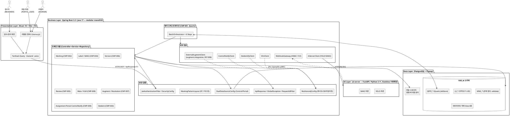
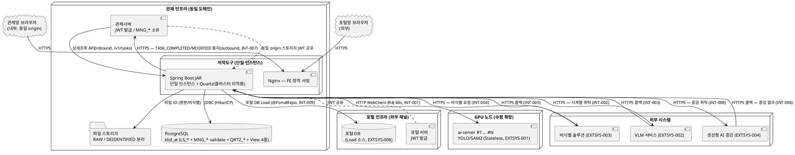

# D5 아키텍처 설계서

> **ID 표기 규칙(공통)**: 본 산출물의 AT 산출물 ID(KLID-AT-IC/IF 등)는 **전체 형식 `KLID-AT-XX-NNN`** 으로 표기한다. ※ LogiCraft 원본 ID(NFR/RISK/CMP/CTX/CNT/ADR)·요구사항(RQ-SFR-NN-NN) 등 타 체계 ID는 각 체계 원형 유지.

## 작성 목적
> 시스템의 품질을 확보하기 위하여 전체시스템에 대한 청사진으로서의 아키텍처를 작성한다. 소프트웨어 아키텍처는 개발 대상 응용 소프트웨어에 대한 아키텍처이며, 시스템 아키텍처는 응용 소프트웨어와 이에 상호작용하는 환경 및 네트워크가 포함된 아키텍처를 의미한다.

## 작성 방법
> 소프트웨어 아키텍처는 선정된 아키텍처 패턴을 중심으로 컴포넌트와 상호작용하는 커넥션 및 가시적인 속성을 표현한다. 시스템 아키텍처는 개발 대상시스템과 상호작용하는 하드웨어, 시스템 소프트웨어 및 네트워크와의 관계를 표현한다. 아키텍처 요구사항 및 구현방안은 아키텍처 관점에서의 시스템의 품질, 보안, 성능, 장애복구 등의 요구사항과 이에 대한 구현방안을 기술한다.

---

## 제·개정 이력

| 날짜 | 버전 | 제·개정 내역 | 작성자 | 검토자 |
|------|------|------------|--------|--------|
| 2026-06-02 | 1.0 | LogiCraft 그래프 기반 자동 생성 (/cc-doc-gen) — modular monolith 4-tier 소프트웨어 아키텍처, on-premise 단일 인스턴스(Quartz 클러스터 미적용) 시스템 아키텍처, C4 컴포넌트 뷰(CMP-001~009, 9종) 신규 수록, 품질속성↔NFR 매핑(NFR-001~007)·RISK 대응표(RISK-001~005). NFR-001 배치 파이프라인 순서를 설계 타깃(비식별 선두 재배치)으로 반영. CTX-001(컨텍스트)·CNT-001(컨테이너) 정형 다이어그램 참조. DB는 PostgreSQL 단일 인스턴스로 확정(템플릿 MariaDB/MaxScale 전제 미적용). 관제 단방향 outbound 통지 보유, 양방향 M2M deprecated | 박찬기 | 김현욱 |

## 헤더

| D5 | 아키텍처 설계서 |
|-------|---------|
| 시스템명 | AI 기반 지방정부 CCTV 관제지원시스템(2차) | 서브시스템명 | 학습데이터 저작도구 |
| 단계명 | 설계 | 작성일자 | 2026-06-02 | 버전 | 1.0 |

> **C4 컴포넌트 참조(LogiCraft diagram_c4_component)**: CMP-001 배치 파이프라인 · CMP-002 마킹 · CMP-003 비식별 · CMP-004 라벨링 · CMP-005 검수 · CMP-006 버전관리 · CMP-007 데이터 증강·영상 해상도 · CMP-008 VLM 메타 · CMP-009 배정·포털·관제 통지 (§1.4 참조). 컨텍스트 CTX-001 · 컨테이너 CNT-001.

---

## 1. 소프트웨어 아키텍처

### 1.1 아키텍처 패턴

본 저작도구는 **모듈러 모놀리식(modular monolith) + 계층형(Layered) 4-tier 아키텍처**를 채택한다. Presentation(React/Vite) → Business(Spring Boot — Controller·Service·Repository) → Data(PostgreSQL + Flyway)의 전통적 3계층에, AI 추론을 분리한 **AI Layer(ai-server — YOLO/SAM2/VLM)** 를 추가하여 GPU 자원 경합을 격리한다. 계층 간 호출은 **단방향(상위→하위)** 만 허용한다.

- Business Layer는 단일 배포 단위 내에서 도메인 중심 패키지로 분할된다(`kr.co.cudo.authoring.{domain}.{controller|service|repository|entity|dto}`). 배치·마킹·비식별·라벨링·검수·버전관리·증강·VLM메타·배정·포털·관제통지 모듈로 응집한다(§1.4 C4 컴포넌트 뷰).
- Controller는 DTO만 다루고 Entity를 직접 노출하지 않으며, Service에 `@Transactional`(조회 `readOnly=true`)을, Repository에 JPA/QueryDSL만 둔다.
- AI Layer는 Stateless 추론 전용(인증·DB·상태 없음)이며, Business Layer가 오케스트레이션 주체로서 `AiServerClient`(WebClient)로 호출한다.

### 1.2 소프트웨어 아키텍처 다이어그램

### 1.3 공통 인프라 책임

| 공통 인프라 | 구현 패키지 | 책임 |
|------------|------------|------|
| 인증 필터 / 인가(RBAC) / HMAC 웹훅 필터 | `common.security` · `auth` · `webhook` | 관제/포털 발급 JWT 디코드 → `TokenClaims` → `SecurityContext`, `role`+`channel` 기반 RBAC(`@PreAuthorize`)·RoleHierarchy·허용경로 화이트리스트, 콜백 HmacWebhookFilter |
| 표준 응답 / 전역 예외 / 헬스 / 메트릭 / traceId | `common.response` · `common.exception` · `observability` | `ApiResponse<T>` 래핑, `ErrorCode`+`@RestControllerAdvice`(스택트레이스 비노출), RequestIdFilter(MDC traceId), Micrometer/Prometheus (NFR-007) |
| 듀얼 데이터소스 | `common.datasource` | Control/Portal EntityManager·TransactionManager 분리(`@ControlRepo`/`@PortalRepo`) — INT-009 포털 Load |
| 로그 마스킹 | `common.logging` | Logback MaskingPatternLayout — PII/토큰 마스킹, 개행 제거(Log Injection 방지) (NFR-005) |
| 외부 연동 클라이언트 | `common.client` | AiServer/Deidentify/Vlm/ControlNotify WebClient + Resilience4j(재시도/CB/타임아웃) (NFR-004). ※ 증강 위탁 클라이언트 `ExternalAugmentClient`는 Augment 도메인 패키지 `augment.integration`에 위치(INT-008, 현 단계 mock placeholder) |
| 웹훅 수신 게이트웨이 | `webhook` | Deidentify/VLM/Augment 결과 수신 + HMAC 서명 검증 + 멱등성 보장(WebhookIdempotencyLedger) |

### 1.4 컴포넌트 뷰 (C4 Component — LogiCraft CMP-001~009)

> 실제 backend 패키지 구조의 생성자 의존성에서 도출한 9종 컴포넌트. 각 모듈은 Controller→Service→Repository로 응집하며, 외부 연동은 `common.client` 어댑터(+ `augment.integration`)를 경유한다.

| CMP ID | 모듈 | 핵심 컴포넌트 | 외부 의존 |
|--------|------|--------------|----------|
| CMP-001 | batch (배치 파이프라인) | BatchQuartzJob, MarkingBatchBridge(AFTER_COMMIT), AsyncBatchRunner, BatchOrchestrator + 6 Step(Deident·VLM·Ffmpeg·YOLO·SAM2·TrackInterp), BatchStatusService, BatchRetryQueue | VlmClient, DeidentifyClient, AiServerClient → ai-server/VLM/비식별 |
| CMP-002 | marking (마킹) | MarkingController(`/v1/videos/{rawSn}/markings`), MarkingService, MarkingCompletedEvent, MarkingBatchBridge | VideoRepository, AsyncBatchRunner(batch) |
| CMP-003 | deident (비식별) | DeidentifyStep(batch), DeidentifyResultController(`/v1/deidentify`), DeidentifyResultService, DeidentReportController/Service | DeidentifyClient → 비식별 서버, NotificationService |
| CMP-004 | label (라벨링) | LabelController(`/v1/frames`), LabelService, Sam2TrackService, LabelAttr/Master/AttrValue, LabelAccessGuard(IDOR 방지), FrameImageController | AiServerClient → ai-server(SAM2), WorkLockService(auth) |
| CMP-005 | review (검수) | ReviewController(`/v1`), ReviewService, ReviewStateMachine(PENDING/IN_REVIEW/APPROVED/REJECTED), ReviewApprovedEvent | VersionService(승인 시 스냅샷), ControlNotifyEventListener |
| CMP-006 | version (버전관리) | VersionController(`/v1`), VersionService(스냅샷 SHA-256·diff·롤백), LsLabelVersionRepository, LsDataLblHstryRepository | ReviewService(승인 트리거), WorkLockService |
| CMP-007 | augment + video.resolution | AugmentController(`/v1/augments`), AugmentRequest/ReviewService, AugmentResultController(콜백), AugmentResultService, VideoResolutionService(VideoProbe/Resizer/Persister) | ExternalAugmentClient → 외부 증강, LabelCoordinateScaler |
| CMP-008 | meta + webhook.vlm (VLM 메타) | VlmTimeseriesStep(batch), VlmResultController(`/v1/vlm`), VlmResultService(→LS_DATA_META + 검수큐), MetaController/Service, WebhookIdempotencyLedger | VlmClient(R4J 45s) → 외부 VLM |
| CMP-009 | assignment + portal + controlnotify | AssignmentController(`/v1/assignments`)/Service, PortalLabelController(`/v1/portal`)/Service, TaskQueryController(`/v1/tasks`, 관제 inbound 조회), ControlNotifyEventListener/Debouncer/Service/FallbackService | ControlNotifyClient → 관제서버 |

> 배치 단계 순서(CMP-001 설계 타깃): ①비식별(DeidentifyStep, 전체 영상·마킹 선행) → [작업자가 비식별 영상에서 마킹] → ②VLM(VlmTimeseriesStep) → ③프레임추출(FfmpegFrameExtractor, 마킹위치 원본+비식별 2벌) → ④YOLO(YoloAutolabelStep, 원본만) → ⑤SAM2(Sam2SegmentStep) → ⑥트랙보간(TrackInterpolationStep). 각 Step REQUIRES_NEW, 실패 시 BatchRetryQueue. ⚠ 현행 코드는 구 순서(VLM→비식별→…) 구현 — 비식별 선두 재배치는 설계 확정·코드 미반영(planned, CMP-001/NFR-001 divergence 명시).

---

## 2. 시스템 아키텍처

### 2.1 배포 토폴로지

저작도구는 **on-premise 단일 인스턴스** 로 배포한다. 여기서 "단일 인스턴스"는 **배치 스케줄러(Quartz) 클러스터를 적용하지 않는다는 의미**(배치 단일화, RISK-005 배치 SPOF 참조)다. 저작도구는 독립 로그인 UI가 없어 관제서버(내부)·포털(외부)이 발급한 JWT를 인계받아 진입하며, **관제서버와 동일 웹 도메인(동일 origin)** 으로 운영되어 브라우저 스토리지(localStorage/sessionStorage)로 JWT를 인계받아 단일 검증 로직(`JwtAuthenticationFilter`)으로 처리한다(URL `?token=` 미사용). 이로써 **M2M 사용자 인증 인프라가 불필요**하다(ADR-007). 잔존 저작도구→관제 outbound 통지는 인계토큰/IP 화이트리스트로 보호한다.

GPU 부하가 큰 **ai-server는 Stateless 추론으로 N개 수평 확장**한다(GPU Worker 별도 프로세스). DB는 **PostgreSQL 단일 인스턴스**(`klid_at` 스키마)로 운영하며, 원본·비식별 파일은 별도 경로로 분리 저장한다.

> ⚠ DB는 PostgreSQL로 확정(CLAUDE.md). 템플릿의 MariaDB 10.11 + MaxScale(Read/Write Split) 전제는 본 시스템에 적용하지 않는다.

### 2.2 시스템 아키텍처 다이어그램

> 정형 다이어그램 참조(LogiCraft): 시스템 컨텍스트 **CTX-001**, 컨테이너 **CNT-001**. 아래 PlantUML은 배포 토폴로지를 본 산출물 형식으로 표현한 것이다.

### 2.3 노드 구성 및 확장 전략

| 노드 | 구성 | 확장 전략 |
|------|------|----------|
| 애플리케이션 노드 | FE(Nginx) + BE(Spring Boot 단일 인스턴스 + Quartz) — 관제 인프라에 배포, 동일 origin JWT 공유 | 수직 확장 (Quartz 클러스터 미적용 — RISK-005) |
| GPU 노드 | ai-server N개 (Stateless, EXTSYS-001) | **수평 확장** (GPU Worker 별도 프로세스 — RISK-003 완화) |
| 데이터 노드 | PostgreSQL 단일 인스턴스(klid_at) + 파일 스토리지(원본/비식별 분리) | 수직 확장 + 정기 백업 |
| 포털 DB | 포털 인프라(EXTSYS-006, 읽기 위주 Load) | 포털팀 소유 |

### 2.4 환경별 접속 정보

| 환경 | BE | ai-server | FE | DB | 비고 |
|:----:|:---|:---|:---|:---|:-----|
| local | localhost:8080 | localhost:9300 | localhost:5173 | PostgreSQL (Docker/Testcontainers) | `gradlew bootRun` / `uvicorn` / `vite` |
| dev | (dev BE) | (dev AI) | (dev FE) | (dev PostgreSQL) | |
| stg | (stg BE) | (stg AI) | (stg FE) | (stg PostgreSQL) | |
| prd | (prd BE) | (prd AI) | (prd FE) | (prd PostgreSQL) | 시크릿은 환경변수/Vault |

> 환경 분기는 Spring Profile(`SPRING_PROFILES_ACTIVE`)과 `application-{local,dev,stg,prd}.yml`로 처리하며, 코드 내 환경 분기를 금지한다. 외부 접속 정보·시크릿(`CONTROL_DB_*`, `PORTAL_DB_*`, `JWT_SECRET`, `DEIDENTIFY_API_URL`, `AI_SERVER_URL`, `STORAGE_*`)은 환경변수로 주입한다.

### 2.5 데이터 소유·연동 정책

- `klid_at` 스키마에서 **저작도구 전용 LS_\* 테이블은 자체 소유·구성**하고, 관제서버 재사용 **MNG_\* 9개는 `ddl-auto=validate`로 읽기 위주 참조**한다(RISK-002).
- **Quartz `QRTZ_*`** 는 PostgreSQL JobStore(`PostgreSQLDelegate`, BYTEA)로 운영한다.
- 데이터마트 적재용 **View 4종**(`V_COMPLETED_VIDEO/FRAME/LABEL/META`)을 `CREATE OR REPLACE VIEW`(멱등)로 제공하여 검수 완료(`APPROVED`) 영상만 노출한다. 관제서버는 통지 수신 후 RAW_SN 으로 4 View 단순 SELECT → 영상 1건=1 row UPSERT.

---

## 3. 아키텍처 요구사항 및 구현방안

> R1 요구사항 중 **아키텍처에 영향을 주는 항목**만 품질 속성(성능·규모 / 가용성 / 보안 / 사용성 / 운영)별로 정리한다. 추적성은 LogiCraft NFR-001~007 에 anchoring한다.

### 3.0 품질 속성 ↔ NFR 매핑 (PRIMARY, LogiCraft NFR-001~007)

| NFR ID | 품질 속성(category) | 목표(metric / target) | 측정 방법 | 본서 반영 절 |
|--------|----------|------|----------|------------|
| NFR-001 | performance | 배치 파이프라인 처리율 ≥ 1건/분 (Quartz 단일 인스턴스, 클러스터 미적용) | Micrometer Timer/Counter(배치 1건 소요·건수), Prometheus | §3.1·§3.2 |
| NFR-002 | scalability | 누적 이미지 학습데이터 ≥ 100,000장(SFR-16) | LS_DATA_SRC(프레임) 누적 건수 집계 | §3.1 |
| NFR-003 | scalability | 누적 영상 학습데이터 ≥ 5,000건(30초+, SFR-17) | LS_DATA_RAW 누적 건수 집계 | §3.1 |
| NFR-004 | availability | 외부 API 연동 Resilience4j 적용률 = 100% (VLM 45s·ai-server 60s) | common.client.* 빈별 R4J 정책 점검 + Micrometer external.api.duration | §3.2 |
| NFR-005 | security | 민감정보(PII·토큰) 로그/페이로드 노출 = 0건 | Logback 마스킹 점검 + 정적검사(Fortify/CodeQL Privacy Violation) | §3.3 |
| NFR-006 | accessibility | 포털 웹 = WCAG 2.1 AA (반응형 PC/태블릿/모바일) | 접근성 자동 점검(axe 등) + 수동 검수 | §3.4 |
| NFR-007 | observability | 핵심 이벤트(API·배치·외부호출) 메트릭 수집률 = 100% | `/actuator/prometheus` 노출 메트릭 + 로그 traceId 포함 여부 | §3.5 |

### 3.1 성능·규모 (Performance / Scalability — NFR-001, NFR-002, NFR-003)

| 요구사항 ID | NFR-001, NFR-002, NFR-003 (RQ-SFR-09-01 배치, SFR-16/17 규모) |
|---------|---|
| 요구사항 내용 | 배치 파이프라인(비식별→마킹→VLM→FFmpeg→YOLO→SAM2→트랙보간)을 ≥1건/분으로 안정 처리하고, 이미지 10만장·영상 5,000건 규모를 수용한다. |
| 구현방안 | BatchOrchestration(CMP-001)의 Spring Boot Quartz(PostgreSQL JobStore)로 **단일 인스턴스 1건/분** 처리한다. Marking(CMP-002) 완료 시 `MarkingCompletedEvent → MarkingBatchBridge(AFTER_COMMIT) → BATCH_QUEUED` 전이 + `@Async` 자동 시작. **설계 타깃 단계 순서는 비식별 선두 재배치**(①비식별 → 작업자 마킹(비식별 영상) → ②VLM → ③FFmpeg 마킹위치 프레임추출(원본+비식별 2벌) → ④YOLO(원본만) → ⑤SAM2 → ⑥트랙보간)로 확정되었다(NFR-001 v3). 오토라벨링은 **원본 이미지에만 실행**하고 좌표 동일성을 이용해 비식별본과 결과를 공유(중복 추론 제거). 각 Step REQUIRES_NEW, 실패 시 BatchRetryQueue. 누적 규모는 LS_DATA_SRC(프레임)·LS_DATA_RAW(영상) 집계로 측정한다. ⚠ 현행 코드는 구 순서(VLM→비식별) 구현 — 비식별 선두 재배치는 코드 미반영(planned). |

### 3.2 가용성 / 장애복구 (Availability / Resilience — NFR-004)

| 요구사항 ID | NFR-004 (RQ-SFR-09-01, 09-03, 08-06) |
|---------|---|
| 요구사항 내용 | 모든 외부 연동(비식별·ai-server·VLM·증강·관제통지)에 Resilience4j 타임아웃/재시도/서킷브레이커를 적용(100%)하고, 비식별 실패 시 재시도하며 **원본은 어떤 경우에도 삭제하지 않는다.** 검수 완료/수정 통지가 관제서버로 신뢰성 있게 전달되어야 한다(단방향 outbound). |
| 구현방안 | ExternalClients(`common.client`)의 AiServer/Deidentify/Vlm/ControlNotify WebClient에 Resilience4j(VLM 45s·ai-server 60s)를 적용한다. 비식별(CMP-003) 실패 시 영상 상태를 `DE_IDNTF_YN='F'`로 마킹하고 **재시도 큐 + dead-letter(DLQ)** 로 격리하며 원본 파일은 절대 삭제하지 않는다. 처리 결과·이력(LS_DEIDENT_PROC_LOG)은 영상 단위로 기록한다. 관제 통지(CMP-009 ControlNotify)는 `TASK_COMPLETED`/`TASK_MODIFIED`를 영상 단위로 비동기 push하며 **requestId idempotency + dead-letter + 재등록(fallback) 큐 + Resilience4j**로 전달 실패에 대비한다(양방향 M2M은 deprecated, 인계토큰/IP 화이트리스트 보호). |

### 3.3 보안 (Security — NFR-005)

| 요구사항 ID | NFR-005 (RQ-SFR-09-01, 09-02 비식별 + CLAUDE.md/security.md 민감정보 보호) |
|---------|---|
| 요구사항 내용 | 개인정보·토큰을 로그/통지 페이로드에 노출하지 않고(0건), 영상을 암호화 저장하며, 외부 비식별 솔루션을 연동하여 개인정보를 비식별화하고 원본·비식별본을 별도 보관한다. |
| 구현방안 | (1) **인증/인가** — 저작도구는 독립 로그인 UI 없이 관제/포털이 발급한 동일 JWT 를 `JwtAuthenticationFilter`로 단일 검증하고, `SecurityConfig`에서 `role`+`channel` 기반 RBAC(`@PreAuthorize("hasRole('REVIEWER')")`)·RoleHierarchy·허용경로 화이트리스트를 적용한다. JWT 는 `alg:none` 금지·`exp` 필수·HS256 256bit 이상. 본인 배정 프레임만 편집 가능하도록 LabelAccessGuard(CMP-004)로 IDOR 방지. (2) **로그 마스킹** — Logback MaskingPatternLayout으로 PII·토큰·요청 본문을 마스킹하고 개행을 제거(Log Injection 방지)한다. (3) **비식별/암호화** — 영상 `PRVC_TYPE_CD ∈ {PRVC, PSDO}` 일 때만 외부 비식별 위탁(ANONY는 원본만), 원본/비식별본을 `STORAGE_RAW_PATH`/`STORAGE_DEIDENTIFIED_PATH`로 동시 분리·암호화 저장, 경로 정규화(`Path.normalize()`로 `..` 순회 차단). 콜백은 HMAC + timestamp + idempotencyKey allowlist로 인증하고 호출 URL은 환경변수 allowlist로 고정(SSRF 방지). (4) **OWASP** — DTO 바인딩(Mass Assignment 차단), `ApiResponse`/`GlobalExceptionHandler`로 스택트레이스 비노출, 응답 보안헤더. 관제 통지 페이로드에 PII·토큰·원본 비-비식별 이미지 포함 금지. |

### 3.4 사용성 (Accessibility — NFR-006)

| 요구사항 ID | NFR-006 (포털 외부 채널) |
|---------|---|
| 요구사항 내용 | 포털(외부 채널)은 반응형 웹(PC/태블릿/모바일)으로 제공하며 WCAG 2.1 AA를 준수한다. |
| 구현방안 | PortalChannel(CMP-009)은 데이터마트 영상 선택·기존 라벨 Load·사용자별 적재(원본 미수정) 기능을 반응형 React UI로 제공한다. 색상만으로 정보 전달 금지·시맨틱 태그·label 연결 등 접근성 규칙을 적용하고, axe 등 자동 점검 + 수동 검수로 WCAG 2.1 AA를 검증한다. 포털은 오토라벨링·VLM·버전관리·검수·업로드 미제공(ADR-013). |

### 3.5 운영·관찰가능성 (Observability — NFR-007)

| 요구사항 ID | NFR-007 |
|---------|---|
| 요구사항 내용 | API 응답시간·배치 처리량·외부 API 호출을 Micrometer+Prometheus로 수집(100%)하고, 모든 요청에 traceId를 부여하여 로그·외부 호출에 전파한다. |
| 구현방안 | ObservabilityCommon(`observability` 패키지)이 Micrometer + Prometheus로 비즈니스 이벤트(배치 처리량·외부 API duration·통지 발행)를 커스텀 메트릭으로 수집하고 `/actuator/prometheus`로 노출한다(운영은 health/info/metrics/prometheus 최소 노출). RequestIdFilter가 모든 요청에 `traceId`를 MDC로 부여하고 `X-Trace-Id` 헤더로 외부 호출에 전파하며, 로그 패턴에 `[%X{traceId:-}]`를 포함한다. GPU 자원 모니터링 포인트(RISK-003)도 메트릭으로 확보한다. |

### 3.6 아키텍처 리스크 및 대응 (LogiCraft RISK-001~005)

| RISK ID | 리스크 | 영향/확률 | 대응(완화) | 비상(우발) | 상태 | 관련 절 |
|---------|--------|:--------:|-----------|-----------|:----:|--------|
| RISK-001 | 외부 연동 서비스 장애 — VLM·비식별·ai-server·증강 장애 시 배치 중단·지연 | 4 / 3 | 모든 외부 호출 R4J 타임아웃/재시도/CB(VLM 45s·ai-server 60s). 비식별 실패 시 `DE_IDNTF_YN='F'` + 재시도 큐, 원본 삭제 금지 | 최대 재시도 후 실패 알림, 영상 `FAILED` 전이 후 수동 재처리 | open | §3.1·§3.2·§3.3 |
| RISK-002 | MNG_* 공유 스키마 변경 충돌 — 관제측 변경 시 `ddl-auto=validate` 실패로 기동 불가 | 4 / 2 | MNG_* 변경 시 Flyway 전 관제서버팀 선승인·변경 알림 프로세스. LS_* 와 소유 분리 | 기동 실패 시 엔티티 매핑 수정 + 해당 테이블 validate 제외 핫픽스 후 재기동 | open | §2.5 |
| RISK-003 | ai-server GPU 자원 경합 — YOLO/SAM2/VLM GPU 공유로 동시 요청 지연·타임아웃 | 3 / 3 | ai-server를 GPU Worker 별도 프로세스로 수평 확장, GPU 모니터링 포인트. 배치 Quartz 1건/분 유입 제어 | GPU 포화 감지 시 배치 유입 속도 조절 / 추론 요청 큐잉 | open | §2.3·§3.1·§3.5 |
| RISK-004 | 양방향 M2M 통합 deprecated — 재구축 시 별도 설계·비용 | 3 / 2 | 잔존 outbound 통지만 인계토큰/IP 화이트리스트로 단방향 운영. 상세는 관제서버가 조회 API pull. 사용자 인증은 동일 origin JWT 공유로 대체(ADR-007) | 양방향 재구축 요구 시 M2M 인증 인프라 별도 설계 ADR 수립 | accepted | §2.1·§3.2 |
| RISK-005 | 배치 단일 인스턴스 SPOF — Spring Boot+Quartz 단일 인스턴스(클러스터 미적용) 장애 시 배치 전면 중단 | 3 / 2 | 배치 실패 재처리 정책(최대 재시도·실패 알림). Quartz JobStore(PostgreSQL)로 잡 상태 영속화 → 재기동 시 이어 처리 | 인스턴스 재기동 후 QRTZ_* JobStore 기반 미완료 잡 재개 | open | §2.1·§2.3 |

> 영향/확률은 LogiCraft RISK 의 impact/probability(1~5) 원값이다. RISK-005(배치 SPOF)는 §2.1의 "단일 인스턴스 = Quartz 클러스터 미적용" 결정의 직접 귀결이다.

---

## 항목 설명

- **소프트웨어 아키텍처**: §1 — 모듈러 모놀리식 계층형 4-tier 패턴, 공통 인프라, C4 컴포넌트 뷰(CMP-001~009).
- **시스템 아키텍처**: §2 — on-premise 단일 인스턴스(Quartz 클러스터 미적용) 배포 토폴로지, 환경별 접속 정보, 데이터 소유·연동 정책.
- **아키텍처 요구사항 및 구현방안**: §3 — R1 아키텍처 영향 요구사항을 품질 속성별로 NFR-001~007 에 anchoring하여 구현방안과 함께 기술, RISK-001~005 대응표.

## 작성 시 참고사항

> - **출처(LogiCraft)**: nfr NFR-001~007(품질 속성·target·measurement), risk RISK-001~005(mitigation/contingency), diagram_c4_context CTX-001 · diagram_c4_container CNT-001 · diagram_c4_component CMP-001~009(9종). kickoff facts: modular monolith, single PostgreSQL, on-premise single-instance batch(Quartz no cluster), Resilience4j, ai-server stateless 수평확장.
> - **ID 체계**: AT 산출물 ID `KLID-AT-XX-NNN`(전체형), LogiCraft 원본 `NFR/RISK/CMP/CTX/CNT/ADR-NNN`(원형), 요구사항 `RQ-SFR-NN-NN`.
> - **DB 확정**: PostgreSQL 단일 인스턴스로 확정(CLAUDE.md). 템플릿 작성참고의 MariaDB 10.11 + MaxScale 전제는 미적용. 버전관리도 DB 스냅샷 기반(외부 VCS/Gitea 미사용).
> - **설계 divergence(명시)**: NFR-001/CMP-001 의 비식별 선두 배치 파이프라인 순서는 설계 확정이나 현행 코드는 구 순서(VLM→비식별) 구현(planned). CMP-001~009 는 status=draft(컴포넌트 뷰 정형화 단계).
> - **범위 정합**: 생성형 AI 본체·VLM 모델 본체·영상 합성 본체·데이터마트 구축은 외부 시스템 책임이며, 저작도구는 연동·검수·버전관리·통지 책임만 보유한다(CLAUDE.md).

---

## 부록 — 빈 셀 / 정보 부족 항목

| 항목 | 상태 | 사유 |
|------|------|------|
| NFR `applies_to_domains/apis/features` | 비움 | LogiCraft NFR data 의 해당 링크 배열이 모두 빈 값(미연결) — 추후 보완 필요 |
| RISK `affects` | 비움 | LogiCraft RISK data 의 affects 배열이 모두 빈 값 — 추후 보완 필요 |
| CMP-001~009 status | draft | 컴포넌트 뷰 정형화 단계(approved 미전이) |
| 배치 파이프라인 순서(코드) | divergence | 설계 타깃(비식별 선두) ≠ 현행 코드(VLM 선두) — planned, NFR-001/CMP-001 명시 |
| 환경별 접속 정보(dev/stg/prd) | "-" 표기 | CLAUDE.md 미공개(시크릿/Vault) — 환경변수 주입 |
