# D8 엔티티 관계 모형 설계서

> **ID 표기 규칙(공통)**: 본 산출물의 모든 ID(KLID-AT-UC/CO/DC/DCD/SD/SC/AC/EN/ERD/TB/II/IC/IF/UCD/ACT 등)는 **전체 형식 `KLID-AT-XX-NNN`** 으로 표기한다. 끝부분만(예: `EN-001`) 약식 표기 금지. 범위는 시작 ID만 전체형으로(예: `KLID-AT-EN-001~004`). ※ LogiCraft 원본 ERD ID(ERD-010 등)는 원형을 유지한다. 요구사항(RQ-SFR-NN-NN)·시스템시험(KLID-ST-NNN) 등 타 체계 ID는 각 체계 원형 유지.

## 작성 목적
> 시스템의 요구사항을 만족하기 위한 주요 엔티티 및 엔티티간의 관계를 표현하고 엔티티에 대한 명세를 기술한다.

## 작성 방법
> 논리적 데이터 모델링을 통한 엔티티 관계 모형도(ERD)를 작성하여 엔티티를 식별한다. 식별한 엔티티는 각각 상세한 명세를 작성한다.

> **생성 출처 / 진실원**: 본 설계서는 LogiCraft 그래프의 활성 `erd` ITEM 12종(ERD-010~021)을 1차 진실원으로 자동 생성(`/cc-doc-gen`)했으며, 컬럼명·타입·길이·제약은 `backend/src/main/resources/db/migration/*.sql`(Flyway V0~V54) 및 `backend/src/main/java/kr/co/cudo/authoring/**/entity/*.java` 의 실제 `@Column` 매핑과 교차 확인했다. DBMS=PostgreSQL, 스키마=`klid_at`. 추측 컬럼은 두지 않으며, 정보 부족 칸은 "-" 로 표기한다.

> **작성 범위**: 저작도구가 소유·운영하는 활성 `LS_*` 테이블 전체(37종). 사용자/권한 등 관제서버 소유 공유 `MNG_*` 9종, Quartz 스케줄러 `QRTZ_*` 11종, 데이터마트 적재 View(`V_COMPLETED_*`)는 본 엔티티 모형의 대상이 아니므로 제외한다(부록 참조).

## 산출물 양식

### 제·개정 이력

| 날짜 | 버전 | 제·개정 내역 | 작성자 | 검토자 |
|------|------|------------|--------|--------|
| 2026-06-02 | 1.0 | LogiCraft 그래프 기반 자동 생성(`/cc-doc-gen`) — 활성 ERD ITEM 12종(ERD-010~021)에서 12개 ERD·37개 엔티티 명세 재생성. Flyway/엔티티 교차 검증 | 박찬기 | 김현욱 |

### 헤더

| D8 | 엔티티 관계 모형 설계서 |
|-------|-------------|
| 시스템명 | AI 기반 지방정부 CCTV 관제지원시스템(2차) | 서브시스템명 | 학습데이터 저작도구 |
| 단계명 | 설계 | 작성일자 | 2026-06-02 | 버전 | 1.0 |

> DBMS: **PostgreSQL** / 스키마: **klid_at** (저작도구 전용 LS_* 테이블 자체 소유)

---

## 1. 엔티티 관계도(ERD)

본 설계서는 도메인별로 12개의 ERD로 분리하여 작성한다. ERD ID는 LogiCraft 원본 ID(원형)를 유지한다.

| ERD ID | ERD 명 |
|--------|-------|
| ERD-012 | 영상·프레임 수집 (영상 수신 + 키프레임 추출 + 이력) |
| ERD-010 | 라벨링 (라벨 객체 + AI 정보 + 속성값 + 메타 + 메타 검토) |
| ERD-019 | 라벨 마스터·버전관리 (라벨 풀 + 속성 + 프리셋 + DB 스냅샷 버전) |
| ERD-013 | 마킹 (자동/수동 이벤트 식별) |
| ERD-017 | 비식별 (외부 비식별 처리 이력 + 누락 신고) |
| ERD-015 | 검수·영상상태 (적재 등록 + 진행 상태 + 반려 이슈) |
| ERD-014 | 작업 배정 (영상 단위 배정 + 재배정 이력 + 이벤트 로그) |
| ERD-011 | 데이터 증강 (증강 결과 + 검수 + 라벨 매핑 + 내보내기) |
| ERD-018 | 포털 (포털 사용자 작업 라벨) |
| ERD-016 | 시스템 설정 (시스템 설정 K/V + 전역 메타 K/V) |
| ERD-020 | 배치·작업 인프라 (배치 처리 이력 + 작업 잠금 + 마감 정의) |
| ERD-021 | 관제 통지 (단방향 통지 fallback 큐 + webhook 멱등 원장) |

> 참고: 관계선의 `RAW_SN`/`DATA_RAW_SN`, `SRC_SN`/`DATA_SRC_SN`, `LBL_SN`/`DATA_LBL_SN` 은 동일 식별자에 대한 테이블별 컬럼 명칭 차이다. 운영 정책상(공유 DB 안정성 우선) 일부 테이블만 물리 FK 제약을 설정하며 나머지는 논리 FK다.

### ERD-012 — 영상·프레임 수집

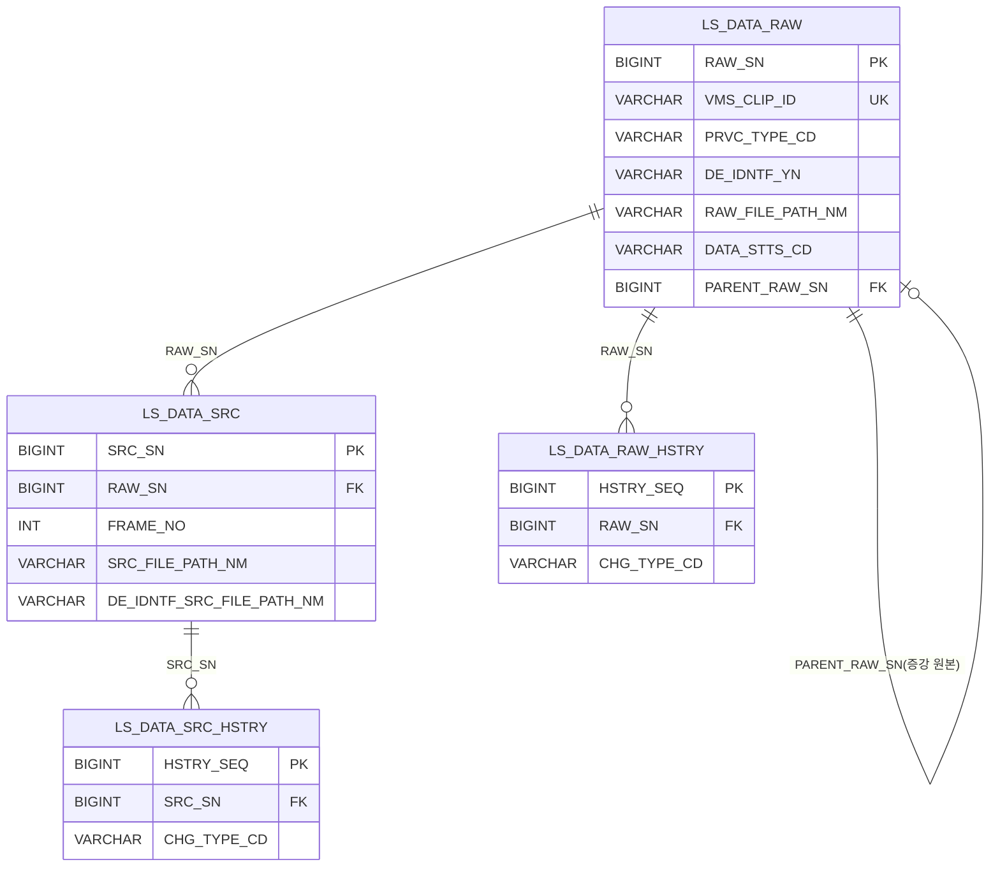

### ERD-010 — 라벨링

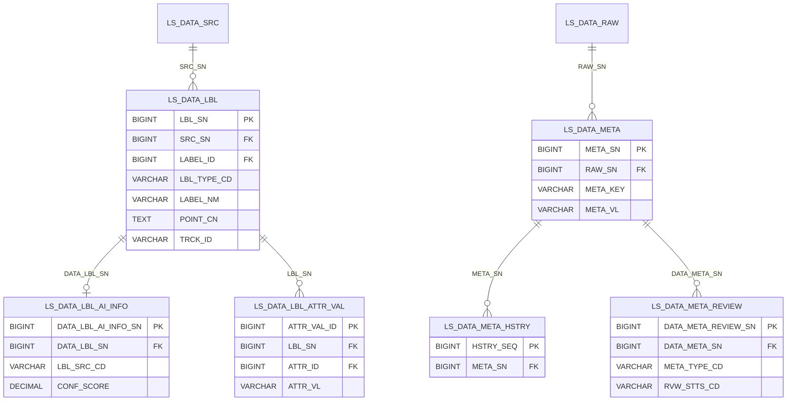

### ERD-019 — 라벨 마스터·버전관리

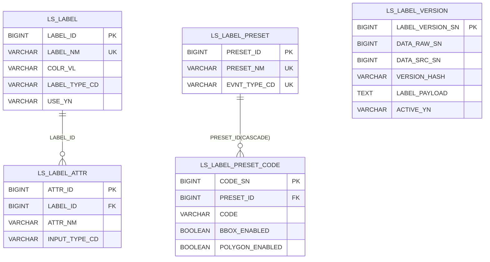

> `LS_LABEL_VERSION` 의 `DATA_RAW_SN`/`DATA_SRC_SN` 은 영상·프레임(ERD-012)에 대한 논리 참조이며 본 ERD 내 물리 관계선은 없다.

### ERD-013 — 마킹

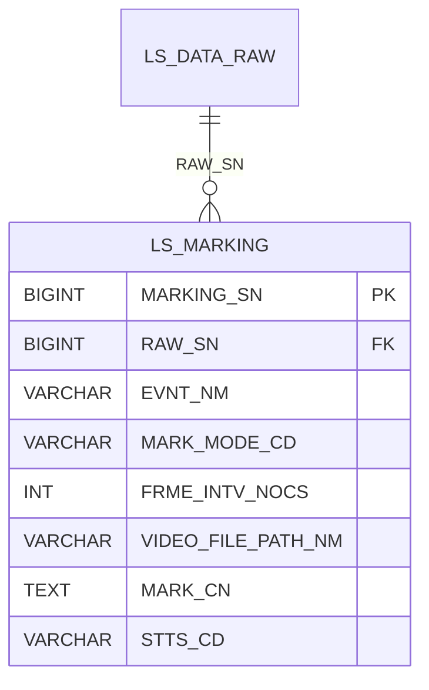

### ERD-017 — 비식별

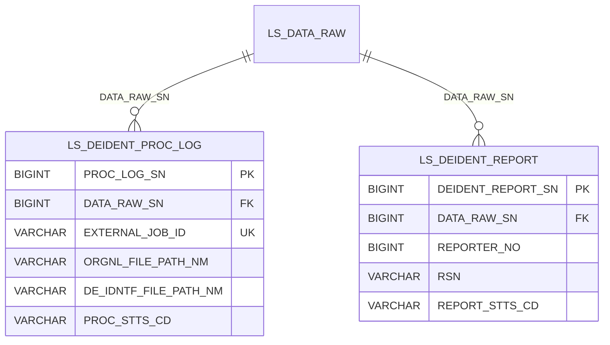

### ERD-015 — 검수·영상상태

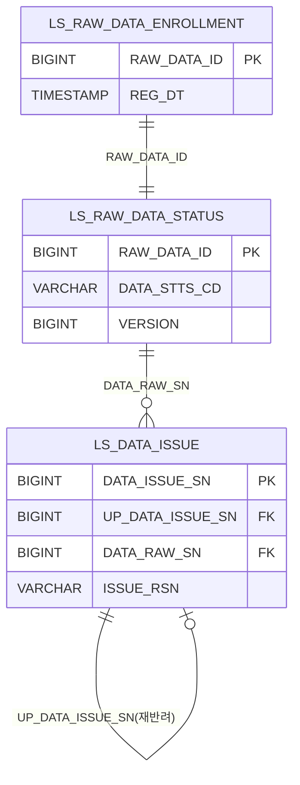

### ERD-014 — 작업 배정

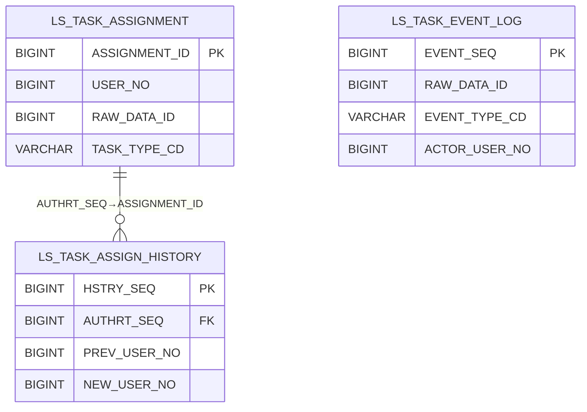

> `LS_TASK_EVENT_LOG` 는 영상(`RAW_DATA_ID`) 단위 라이프사이클 이벤트를 독립 누적하며 배정 테이블과 물리 FK 관계가 없다.

### ERD-011 — 데이터 증강

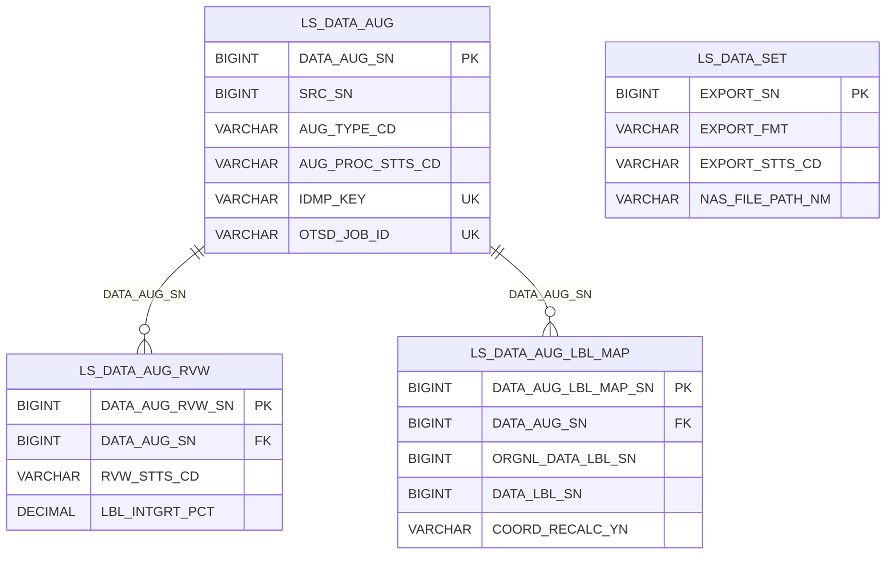

> `LS_DATA_SET`(학습데이터셋 내보내기)은 저작도구 범위 외(폐기 방향)이나 코드(V8·V34)에 잔존하는 테이블이므로 명세에 포함한다. 다른 증강 엔티티와 물리 관계선은 없다.

### ERD-018 — 포털

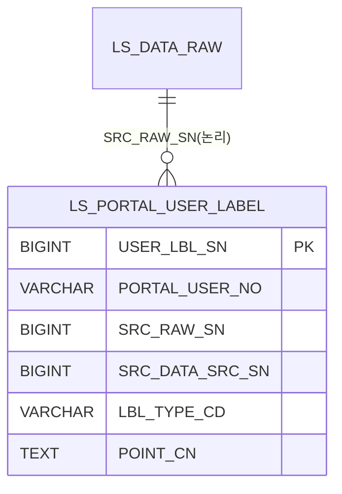

> 포털 작업 라벨은 원본(`LS_DATA_LBL`)을 수정하지 않고 사용자별로 별도 적재되며 데이터마트에 정합되지 않는다(단방향). `SRC_RAW_SN`/`SRC_DATA_SRC_SN` 은 영상·프레임에 대한 논리 참조다.

### ERD-016 — 시스템 설정

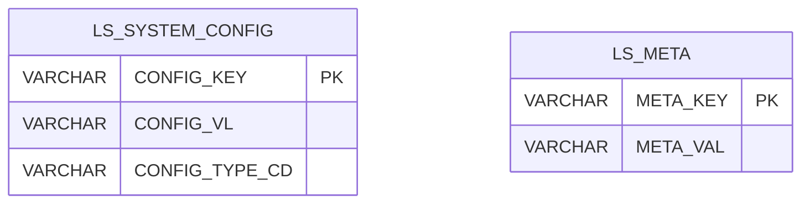

> 두 테이블은 독립 K/V 저장소로 상호 관계가 없다.

### ERD-020 — 배치·작업 인프라

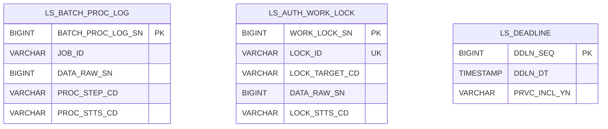

> 세 테이블은 배치 파이프라인 운영 인프라로, 영상(`DATA_RAW_SN`)에 대한 논리 참조만 가지며 상호 물리 관계가 없다.

### ERD-021 — 관제 통지

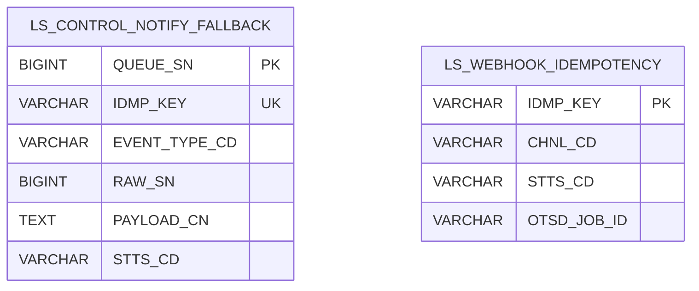

> 두 테이블은 단방향 outbound 통지 영속 큐 / 외부 위탁 webhook 멱등 원장으로 상호 관계가 없다.

---

## 2. 엔티티 명세서

> 엔티티별로 1개씩 작성한다. 속성표 10컬럼(속성명·동의어·타입·길이·NOT NULL·PK·FK·INX·기본값·제약조건)을 채운다. PostgreSQL은 BIGINT/TIMESTAMP/INT/TEXT/BOOLEAN/DECIMAL 등 고정타입의 길이 칸을 비우고 VARCHAR만 길이를 적는다. 물리 FK 미설정 참조는 제약조건 칸에 "논리 FK(대상)" 로 명시한다. 동의어는 LogiCraft `logical_column_name`(논리명) 또는 1차 레거시 컬럼명을 기재하며 없으면 "-".

### KLID-AT-EN-001 — LS_DATA_RAW (원시영상)

| 엔티티 ID | KLID-AT-EN-001 | 엔티티명 | LS_DATA_RAW (원시영상) |
|---------|---|-------|---|
| 관련 클래스 ID | KLID-AT-DC-001 (LsDataRaw) | 관련 클래스명 | LsDataRaw |
| 엔티티 설명 | 라벨링 대상 원시 영상/이미지 메타(작업 단위=영상 1건, RAW_SN). VMS_CLIP_ID 유니크로 동일 클립 재수신 시 upsert. PRVC_TYPE_CD 에 따라 PRVC_YN 자동 산출. 증강 결과는 새 RAW 로 생성하며 PARENT_RAW_SN 으로 원본 참조. | |

| 속성명 | 동의어 | 타입 | 길이 | NOT NULL | PK | FK | INX | 기본값 | 제약조건 |
|-------|--------|------|------|--------|------|------|------|-------|--------|
| RAW_SN | 원시영상일련번호 / DATA_RAW_SN | BIGINT | | Y | Y | N | N | IDENTITY | PK |
| VMS_CLIP_ID | VMS클립아이디 | VARCHAR | 128 | Y | N | N | Y | | UK(UK_LS_DATA_RAW_VMS_CLIP) |
| VMS_CCTV_ID | VMS_CCTV아이디 | VARCHAR | 64 | Y | N | N | Y | | IX_LS_DATA_RAW_CCTV |
| EVNT_TYPE_CD | 이벤트유형코드 | VARCHAR | 32 | N | N | N | N | | |
| LCLGV_CD | 기관코드 | VARCHAR | 32 | N | N | N | N | | |
| PRVC_TYPE_CD | 개인정보유형코드 | VARCHAR | 16 | Y | N | N | N | | PRVC/PSDO/ANONY |
| PRVC_YN | 개인정보포함여부 | VARCHAR | 1 | Y | N | N | N | N | PRVC_TYPE_CD 파생 |
| DE_IDNTF_YN | 비식별여부 | VARCHAR | 1 | Y | N | N | N | N | Y/F/N |
| RAW_FILE_PATH_NM | 원시파일경로명 / RAW_FILE_PATH | VARCHAR | 500 | Y | N | N | N | | 원본 경로(불변) |
| SHT_DT | 촬영일시 | TIMESTAMP | | N | N | N | N | | |
| DURATION_SEC | 영상길이초 / VDO_LEN | INT | | N | N | N | N | | |
| PARENT_RAW_SN | 원본원시영상일련번호 | BIGINT | | N | N | Y | Y | | 논리 FK(self, V46), IDX_LDR_PARENT |
| DATA_STTS_CD | 데이터상태코드 | VARCHAR | 32 | Y | N | N | Y | PENDING | IX_LS_DATA_RAW_STTS |
| REG_DT | 등록일시 | TIMESTAMP | | Y | N | N | N | CURRENT_TIMESTAMP | |
| MDFCN_DT | 수정일시 | TIMESTAMP | | N | N | N | N | | |

### KLID-AT-EN-002 — LS_DATA_SRC (프레임원천)

| 엔티티 ID | KLID-AT-EN-002 | 엔티티명 | LS_DATA_SRC (프레임원천) |
|---------|---|-------|---|
| 관련 클래스 ID | KLID-AT-DC-002 (LsDataSrc) | 관련 클래스명 | LsDataSrc |
| 엔티티 설명 | 영상에서 추출한 키프레임(FRAME_EXTRACT 단계 산출). 원본/비식별 프레임을 같은 row 의 경로/비식별경로로 관리. (RAW_SN, FRAME_NO) 유니크. | |

| 속성명 | 동의어 | 타입 | 길이 | NOT NULL | PK | FK | INX | 기본값 | 제약조건 |
|-------|--------|------|------|--------|------|------|------|-------|--------|
| SRC_SN | 프레임원천일련번호 / DATA_SRC_SN | BIGINT | | Y | Y | N | N | IDENTITY | PK |
| RAW_SN | 원시영상일련번호 / DATA_RAW_SN | BIGINT | | Y | N | Y | Y | | FK→LS_DATA_RAW(CASCADE), IX_LS_DATA_SRC_RAW |
| FRAME_NO | 프레임번호 / FRM_NO | INT | | Y | N | N | Y | | UK(RAW_SN,FRAME_NO) |
| SRC_FILE_PATH_NM | 원천파일경로명 / SRC_FILE_PATH | VARCHAR | 500 | Y | N | N | N | | 원본 프레임 경로 |
| DE_IDNTF_SRC_FILE_PATH_NM | 비식별원천파일경로명 / SRC_BKUP_FILE_PATH | VARCHAR | 1000 | N | N | N | N | | 비식별 프레임 경로 |
| SHT_DT | 촬영일시 | TIMESTAMP | | N | N | N | N | | |
| REG_DT | 등록일시 | TIMESTAMP | | Y | N | N | N | CURRENT_TIMESTAMP | |
| UPD_DT | 수정일시 / MDFCN_DT | TIMESTAMP | | N | N | N | N | | |

### KLID-AT-EN-003 — LS_DATA_RAW_HSTRY (원시영상이력)

| 엔티티 ID | KLID-AT-EN-003 | 엔티티명 | LS_DATA_RAW_HSTRY (원시영상이력) |
|---------|---|-------|---|
| 관련 클래스 ID | KLID-AT-DC-003 (LsDataRawHstry) | 관련 클래스명 | LsDataRawHstry |
| 엔티티 설명 | 영상 변경 이력. INGEST(신규/갱신)·STATUS_CHANGE 등 변경 사유 + 상태 전이(PREV/NEW_STTS_CD)만 기록하는 슬림 구조. | |

| 속성명 | 동의어 | 타입 | 길이 | NOT NULL | PK | FK | INX | 기본값 | 제약조건 |
|-------|--------|------|------|--------|------|------|------|-------|--------|
| HSTRY_SEQ | 이력일련번호 / DATA_RAW_HSTRY_SN | BIGINT | | Y | Y | N | N | IDENTITY | PK |
| RAW_SN | 원시영상일련번호 / DATA_RAW_SN | BIGINT | | Y | N | Y | Y | | 논리 FK→LS_DATA_RAW, IX_LS_DATA_RAW_HSTRY_RAW |
| CHG_TYPE_CD | 변경유형코드 / ACTION_TYPE_CD | VARCHAR | 16 | Y | N | N | N | | INGEST_NEW/INGEST_UPD/STATUS_CHANGE |
| PREV_STTS_CD | 이전상태코드 | VARCHAR | 32 | N | N | N | N | | |
| NEW_STTS_CD | 변경상태코드 | VARCHAR | 32 | N | N | N | N | | |
| CHG_USER_NO | 변경사용자번호 | BIGINT | | N | N | N | N | | 시스템 변경 시 NULL |
| CHG_DT | 변경일시 / ACTION_DT | TIMESTAMP | | Y | N | N | N | CURRENT_TIMESTAMP | |

### KLID-AT-EN-004 — LS_DATA_SRC_HSTRY (프레임원천이력)

| 엔티티 ID | KLID-AT-EN-004 | 엔티티명 | LS_DATA_SRC_HSTRY (프레임원천이력) |
|---------|---|-------|---|
| 관련 클래스 ID | KLID-AT-DC-004 (LsDataSrcHstry) | 관련 클래스명 | LsDataSrcHstry |
| 엔티티 설명 | 프레임 변경 이력. CREATED(생성)·DEID_ATTACHED(비식별경로 연결) 등 사유 기록(base 미러링 없음). | |

| 속성명 | 동의어 | 타입 | 길이 | NOT NULL | PK | FK | INX | 기본값 | 제약조건 |
|-------|--------|------|------|--------|------|------|------|-------|--------|
| HSTRY_SEQ | 이력일련번호 / DATA_SRC_HSTRY_SN | BIGINT | | Y | Y | N | N | IDENTITY | PK |
| SRC_SN | 프레임원천일련번호 / DATA_SRC_SN | BIGINT | | Y | N | Y | Y | | 논리 FK→LS_DATA_SRC, IX_LS_DATA_SRC_HSTRY_SRC |
| CHG_TYPE_CD | 변경유형코드 / ACTION_TYPE_CD | VARCHAR | 16 | Y | N | N | N | | CREATED/DEID_ATTACHED |
| CHG_USER_NO | 변경사용자번호 | BIGINT | | N | N | N | N | | 시스템 변경 시 NULL |
| CHG_DT | 변경일시 / ACTION_DT | TIMESTAMP | | Y | N | N | N | CURRENT_TIMESTAMP | |

### KLID-AT-EN-005 — LS_DATA_LBL (데이터라벨)

| 엔티티 ID | KLID-AT-EN-005 | 엔티티명 | LS_DATA_LBL (데이터라벨) |
|---------|---|-------|---|
| 관련 클래스 ID | KLID-AT-DC-005 (LsDataLbl) | 관련 클래스명 | LsDataLbl |
| 엔티티 설명 | 현재 라벨 좌표/속성. 프레임 단위(SRC_SN FK) + LBL_TYPE_CD(BBOX/POLYGON/SEGMENT/TRACK). LS_LABEL 마스터 FK(LABEL_ID). AI 출처/신뢰도는 LS_DATA_LBL_AI_INFO 분리. | |

| 속성명 | 동의어 | 타입 | 길이 | NOT NULL | PK | FK | INX | 기본값 | 제약조건 |
|-------|--------|------|------|--------|------|------|------|-------|--------|
| LBL_SN | 라벨일련번호 | BIGINT | | Y | Y | N | N | IDENTITY | PK |
| SRC_SN | 원천일련번호 | BIGINT | | Y | N | Y | Y | | 논리 FK→LS_DATA_SRC, IX_LS_DATA_LBL_SRC |
| LBL_TYPE_CD | 라벨유형코드 | VARCHAR | 16 | Y | N | N | N | | BBOX/POLYGON/SEGMENT/TRACK |
| LABEL_ID | 라벨아이디 | BIGINT | | N | N | Y | Y | | 논리 FK→LS_LABEL(V32), IDX_LS_DATA_LBL_LABEL_ID |
| LABEL_NM | 라벨명 | VARCHAR | 255 | Y | N | N | N | | |
| POINT_CN | 좌표내용 | TEXT | | N | N | N | N | | 도형 좌표 JSON |
| TRCK_ID | 트랙아이디 | VARCHAR | 64 | N | N | N | Y | | IX_LS_DATA_LBL_TRCK_ID |
| REG_USER_NO | 등록사용자번호 | BIGINT | | N | N | N | N | | 자동 라벨은 NULL |
| REG_DT | 등록일시 | TIMESTAMP | | Y | N | N | N | CURRENT_TIMESTAMP | |
| MDFCN_DT | 수정일시 | TIMESTAMP | | N | N | N | N | | |

### KLID-AT-EN-006 — LS_DATA_LBL_AI_INFO (데이터라벨AI정보)

| 엔티티 ID | KLID-AT-EN-006 | 엔티티명 | LS_DATA_LBL_AI_INFO (데이터라벨AI정보) |
|---------|---|-------|---|
| 관련 클래스 ID | KLID-AT-DC-006 (LsDataLblAiInfo) | 관련 클래스명 | LsDataLblAiInfo |
| 엔티티 설명 | AI 라벨 출처/신뢰도 정보. LS_DATA_LBL 은 좌표만 보관하고 AI 추론 출처(YOLO/SAM2/INTERPOLATE/VLM)는 본 테이블로 분리(V23). | |

| 속성명 | 동의어 | 타입 | 길이 | NOT NULL | PK | FK | INX | 기본값 | 제약조건 |
|-------|--------|------|------|--------|------|------|------|-------|--------|
| DATA_LBL_AI_INFO_SN | 데이터라벨AI정보일련번호 | BIGINT | | Y | Y | N | N | IDENTITY | PK |
| DATA_LBL_SN | 데이터라벨일련번호 | BIGINT | | Y | N | Y | Y | | 논리 FK→LS_DATA_LBL.LBL_SN, IDX_..._LBL |
| DATA_RAW_SN | 데이터원시일련번호 | BIGINT | | Y | N | N | Y | | IDX_..._SRC(DATA_RAW_SN,DATA_SRC_SN) |
| DATA_SRC_SN | 데이터원천일련번호 | BIGINT | | Y | N | N | Y | | IDX_..._SRC |
| LBL_SRC_CD | 라벨출처코드 | VARCHAR | 20 | Y | N | N | Y | | YOLO/SAM2/INTERPOLATE/VLM, IDX_..._SRC_CD |
| MODEL_NM | 모델명 | VARCHAR | 100 | N | N | N | N | | |
| MDL_VER | 모델버전 | VARCHAR | 50 | N | N | N | N | | |
| CONF_SCORE | 신뢰도점수 | DECIMAL | (6,5) | N | N | N | N | | 0.0~1.0 |
| AUTO_LBL_YN | 자동라벨여부 | VARCHAR | 1 | Y | N | N | N | Y | |
| REG_ID | 등록아이디 | VARCHAR | 30 | N | N | N | N | | |
| REG_DT | 등록일시 | TIMESTAMP | | Y | N | N | N | CURRENT_TIMESTAMP | |
| MDFCN_ID | 수정아이디 | VARCHAR | 30 | N | N | N | N | | |
| MDFCN_DT | 수정일시 | TIMESTAMP | | N | N | N | N | | |

### KLID-AT-EN-007 — LS_DATA_LBL_ATTR_VAL (데이터라벨속성값)

| 엔티티 ID | KLID-AT-EN-007 | 엔티티명 | LS_DATA_LBL_ATTR_VAL (데이터라벨속성값) |
|---------|---|-------|---|
| 관련 클래스 ID | KLID-AT-DC-007 (LsDataLblAttrVal) | 관련 클래스명 | LsDataLblAttrVal |
| 엔티티 설명 | 객체별 속성값(CVAT-Like 라벨 풀 포팅). 라벨링된 객체(LBL_SN) 단위로 LS_LABEL_ATTR 의 값을 저장(V33). (LBL_SN, ATTR_ID) UNIQUE — upsert 키. | |

| 속성명 | 동의어 | 타입 | 길이 | NOT NULL | PK | FK | INX | 기본값 | 제약조건 |
|-------|--------|------|------|--------|------|------|------|-------|--------|
| ATTR_VAL_ID | 속성값아이디 | BIGINT | | Y | Y | N | N | IDENTITY | PK |
| LBL_SN | 라벨일련번호 | BIGINT | | Y | N | Y | Y | | 논리 FK→LS_DATA_LBL.LBL_SN, UK(LBL_SN,ATTR_ID) |
| ATTR_ID | 속성아이디 | BIGINT | | Y | N | Y | N | | 논리 FK→LS_LABEL_ATTR.ATTR_ID |
| ATTR_VL | 속성값 | VARCHAR | 1000 | N | N | N | N | | H2 reserved 회피명 |
| REG_DT | 등록일시 | TIMESTAMP | | Y | N | N | N | CURRENT_TIMESTAMP | |
| MDFCN_DT | 수정일시 | TIMESTAMP | | N | N | N | N | | |

### KLID-AT-EN-008 — LS_DATA_META (데이터메타)

| 엔티티 ID | KLID-AT-EN-008 | 엔티티명 | LS_DATA_META (데이터메타) |
|---------|---|-------|---|
| 관련 클래스 ID | KLID-AT-DC-008 (LsDataMeta) | 관련 클래스명 | LsDataMeta |
| 엔티티 설명 | 영상/프레임 메타 값. RAW_SN FK + (RAW_SN, META_KEY) UK 의 단순 K/V. 비동기 표준 컬럼(V42) 보유. 외부 생성 여부/검토 상태는 LS_DATA_META_REVIEW 분리. | |

| 속성명 | 동의어 | 타입 | 길이 | NOT NULL | PK | FK | INX | 기본값 | 제약조건 |
|-------|--------|------|------|--------|------|------|------|-------|--------|
| META_SN | 메타일련번호 | BIGINT | | Y | Y | N | N | IDENTITY | PK |
| RAW_SN | 원시일련번호 | BIGINT | | Y | N | Y | Y | | 논리 FK→LS_DATA_RAW, IX_LS_DATA_META_RAW |
| META_KEY | 메타키 | VARCHAR | 64 | Y | N | N | Y | | UK(RAW_SN,META_KEY) |
| META_VL | 메타값 | VARCHAR | 2000 | N | N | N | N | | H2 reserved 회피명 |
| REG_DT | 등록일시 | TIMESTAMP | | Y | N | N | N | CURRENT_TIMESTAMP | |
| MDFCN_DT | 수정일시 | TIMESTAMP | | N | N | N | N | | |
| IDEMPOTENCY_KEY | 멱등키 | VARCHAR | 64 | N | N | N | Y | | UK(uk_meta_idempotency_key) |
| EXTERNAL_JOB_ID | 외부작업아이디 | VARCHAR | 128 | N | N | N | Y | | UK(uk_meta_external_job_id) |
| RETRY_COUNT | 재시도횟수 | INT | | Y | N | N | N | 0 | |
| DEAD_LETTER_AT | 영구실패시점 | TIMESTAMP | | N | N | N | N | | |

### KLID-AT-EN-009 — LS_DATA_META_HSTRY (데이터메타이력)

| 엔티티 ID | KLID-AT-EN-009 | 엔티티명 | LS_DATA_META_HSTRY (데이터메타이력) |
|---------|---|-------|---|
| 관련 클래스 ID | KLID-AT-DC-009 (LsDataMetaHstry) | 관련 클래스명 | LsDataMetaHstry |
| 엔티티 설명 | LS_DATA_META 변경 이력(이전값/신규값). META_SN + PREV_VL/NEW_VL/CHG_USER_NO/CHG_DT 만 보관하는 경량 이력. | |

| 속성명 | 동의어 | 타입 | 길이 | NOT NULL | PK | FK | INX | 기본값 | 제약조건 |
|-------|--------|------|------|--------|------|------|------|-------|--------|
| HSTRY_SEQ | 이력일련번호 | BIGINT | | Y | Y | N | N | IDENTITY | PK |
| META_SN | 메타일련번호 | BIGINT | | Y | N | Y | Y | | 논리 FK→LS_DATA_META, IX_LS_DATA_META_HSTRY_META |
| PREV_VL | 이전값 | VARCHAR | 2000 | N | N | N | N | | |
| NEW_VL | 신규값 | VARCHAR | 2000 | N | N | N | N | | |
| CHG_USER_NO | 변경사용자번호 | BIGINT | | N | N | N | N | | |
| CHG_DT | 변경일시 | TIMESTAMP | | Y | N | N | N | CURRENT_TIMESTAMP | |

### KLID-AT-EN-010 — LS_DATA_META_REVIEW (데이터메타검토)

| 엔티티 ID | KLID-AT-EN-010 | 엔티티명 | LS_DATA_META_REVIEW (데이터메타검토) |
|---------|---|-------|---|
| 관련 클래스 ID | KLID-AT-DC-010 (LsDataMetaReview) | 관련 클래스명 | LsDataMetaReview |
| 엔티티 설명 | 외부/자동 생성 메타데이터 검토 상태(V27). LS_DATA_META 는 값(K/V)만 저장하고 본 테이블에서 외부 생성 여부 + 검토 상태(PENDING/APPROVED/REJECTED)를 관리. | |

| 속성명 | 동의어 | 타입 | 길이 | NOT NULL | PK | FK | INX | 기본값 | 제약조건 |
|-------|--------|------|------|--------|------|------|------|-------|--------|
| DATA_META_REVIEW_SN | 데이터메타검토일련번호 | BIGINT | | Y | Y | N | N | IDENTITY | PK |
| DATA_META_SN | 데이터메타일련번호 | BIGINT | | Y | N | Y | Y | | 논리 FK→LS_DATA_META.META_SN, IDX_..._META |
| DATA_RAW_SN | 데이터원시일련번호 | BIGINT | | Y | N | N | Y | | IDX_..._TARGET(DATA_RAW_SN,DATA_SRC_SN) |
| DATA_SRC_SN | 데이터원천일련번호 | BIGINT | | N | N | N | Y | | 영상 단위 메타는 NULL |
| META_TYPE_CD | 메타유형코드 | VARCHAR | 20 | Y | N | N | Y | | VLM/EXTERNAL, IDX_..._STTS |
| SRC_SYS_CD | 생성시스템코드 | VARCHAR | 20 | N | N | N | N | | AI_SERVER/CONTROL_SERVER/PORTAL |
| RVW_STTS_CD | 검토상태코드 | VARCHAR | 20 | Y | N | N | Y | | AUTO_GENERATED/PENDING/APPROVED/REJECTED |
| RVW_ID | 검토아이디 | VARCHAR | 30 | N | N | N | N | | |
| RVW_DT | 검토일시 | TIMESTAMP | | N | N | N | N | | |
| REJECT_RSN | 반려사유 | VARCHAR | 1000 | N | N | N | N | | REJECTED 시 필수 |
| REG_ID | 등록아이디 | VARCHAR | 30 | N | N | N | N | | |
| REG_DT | 등록일시 | TIMESTAMP | | Y | N | N | N | CURRENT_TIMESTAMP | |
| MDFCN_ID | 수정아이디 | VARCHAR | 30 | N | N | N | N | | |
| MDFCN_DT | 수정일시 | TIMESTAMP | | N | N | N | N | | |

### KLID-AT-EN-011 — LS_LABEL (라벨마스터)

| 엔티티 ID | KLID-AT-EN-011 | 엔티티명 | LS_LABEL (라벨마스터) |
|---------|---|-------|---|
| 관련 클래스 ID | KLID-AT-DC-011 (LsLabel) | 관련 클래스명 | LsLabel |
| 엔티티 설명 | 저작도구 전역 단일 라벨 풀 마스터(CVAT-Like). 라벨 이름·색상·도형 타입을 정의. REVIEWER CRUD, WORKER 조회만. soft delete(USE_YN='N')만 지원. (V34 PJT_ID 제거, LABEL_NM 전역 UNIQUE) | |

| 속성명 | 동의어 | 타입 | 길이 | NOT NULL | PK | FK | INX | 기본값 | 제약조건 |
|-------|--------|------|------|--------|------|------|------|-------|--------|
| LABEL_ID | 라벨식별자 | BIGINT | | Y | Y | N | N | IDENTITY | PK |
| LABEL_NM | 라벨명 / NAME | VARCHAR | 64 | Y | N | N | Y | | UK(UK_LS_LABEL_NAME) |
| COLR_VL | 색상값 / COLOR | VARCHAR | 7 | Y | N | N | N | | #RRGGBB hex |
| LABEL_TYPE_CD | 라벨유형코드 | VARCHAR | 16 | Y | N | N | N | | BBOX/POLYGON/POINT |
| SORT_SEQ | 정렬순서 / SORT_NO | INT | | Y | N | N | Y | 0 | IDX_LS_LABEL_USE(USE_YN,SORT_SEQ) |
| USE_YN | 사용여부 | VARCHAR | 1 | Y | N | N | Y | Y | soft delete |
| REG_ID | 등록자식별자 | VARCHAR | 30 | N | N | N | N | | |
| REG_DT | 등록일시 | TIMESTAMP | | Y | N | N | N | CURRENT_TIMESTAMP | |
| MDFCN_ID | 수정자식별자 | VARCHAR | 30 | N | N | N | N | | |
| MDFCN_DT | 수정일시 | TIMESTAMP | | N | N | N | N | | |

### KLID-AT-EN-012 — LS_LABEL_ATTR (라벨속성정의)

| 엔티티 ID | KLID-AT-EN-012 | 엔티티명 | LS_LABEL_ATTR (라벨속성정의) |
|---------|---|-------|---|
| 관련 클래스 ID | KLID-AT-DC-012 (LsLabelAttr) | 관련 클래스명 | LsLabelAttr |
| 엔티티 설명 | 라벨별 속성(Attribute) 정의 — CVAT AttributeSpec 동등 구조(V33). 라벨 내 (LABEL_ID, ATTR_NM) UNIQUE. soft delete 지원. | |

| 속성명 | 동의어 | 타입 | 길이 | NOT NULL | PK | FK | INX | 기본값 | 제약조건 |
|-------|--------|------|------|--------|------|------|------|-------|--------|
| ATTR_ID | 속성식별자 | BIGINT | | Y | Y | N | N | IDENTITY | PK |
| LABEL_ID | 라벨식별자 | BIGINT | | Y | N | Y | Y | | FK→LS_LABEL.LABEL_ID, UK(LABEL_ID,ATTR_NM), IDX_LS_LABEL_ATTR |
| ATTR_NM | 속성명 | VARCHAR | 64 | Y | N | N | Y | | UK(LABEL_ID,ATTR_NM) |
| INPUT_TYPE_CD | 입력유형코드 | VARCHAR | 16 | Y | N | N | N | | TEXT/SELECT/CHECKBOX/RADIO/NUMBER |
| VALUES_CN | 옵션목록내용 | VARCHAR | 1000 | N | N | N | N | | SELECT/CHECKBOX/RADIO 시 필수 |
| DFLT_VL | 기본값 | VARCHAR | 255 | N | N | N | N | | |
| MUTABLE_YN | 가변여부 | VARCHAR | 1 | Y | N | N | N | Y | 프레임별 가변 여부 |
| SORT_SEQ | 정렬순서 | INT | | Y | N | N | Y | 0 | IDX_LS_LABEL_ATTR(LABEL_ID,USE_YN,SORT_SEQ) |
| USE_YN | 사용여부 | VARCHAR | 1 | Y | N | N | Y | Y | soft delete |
| REG_ID | 등록자식별자 | VARCHAR | 30 | N | N | N | N | | |
| REG_DT | 등록일시 | TIMESTAMP | | Y | N | N | N | CURRENT_TIMESTAMP | |
| MDFCN_ID | 수정자식별자 | VARCHAR | 30 | N | N | N | N | | |
| MDFCN_DT | 수정일시 | TIMESTAMP | | N | N | N | N | | |

### KLID-AT-EN-013 — LS_LABEL_PRESET (라벨프리셋)

| 엔티티 ID | KLID-AT-EN-013 | 엔티티명 | LS_LABEL_PRESET (라벨프리셋) |
|---------|---|-------|---|
| 관련 클래스 ID | KLID-AT-DC-013 (LsLabelPreset) | 관련 클래스명 | LsLabelPreset |
| 엔티티 설명 | 라벨링 프리셋 Aggregate Root. 자주 쓰는 라벨 코드 묶음을 프리셋으로 정의하고, 선택적으로 이벤트 타입 1건에 1:1 매핑(V15). | |

| 속성명 | 동의어 | 타입 | 길이 | NOT NULL | PK | FK | INX | 기본값 | 제약조건 |
|-------|--------|------|------|--------|------|------|------|-------|--------|
| PRESET_ID | 프리셋식별자 | BIGINT | | Y | Y | N | N | IDENTITY | PK |
| PRESET_NM | 프리셋명 | VARCHAR | 64 | Y | N | N | Y | | UK(UK_LS_LABEL_PRESET_NAME) |
| EXPLN | 설명 | VARCHAR | 500 | N | N | N | N | | |
| EVNT_TYPE_CD | 이벤트유형코드 | VARCHAR | 32 | N | N | N | Y | | UK(UK_LS_LABEL_PRESET_EVNT, V15) |
| REG_DT | 등록일시 | TIMESTAMP | | Y | N | N | N | CURRENT_TIMESTAMP | |
| MDFCN_DT | 수정일시 | TIMESTAMP | | Y | N | N | N | CURRENT_TIMESTAMP | |

### KLID-AT-EN-014 — LS_LABEL_PRESET_CODE (라벨프리셋코드)

| 엔티티 ID | KLID-AT-EN-014 | 엔티티명 | LS_LABEL_PRESET_CODE (라벨프리셋코드) |
|---------|---|-------|---|
| 관련 클래스 ID | KLID-AT-DC-014 (LsLabelPresetCode) | 관련 클래스명 | LsLabelPresetCode |
| 엔티티 설명 | 프리셋에 포함된 라벨 코드(LS_LABEL_PRESET Aggregate 내부 엔티티). 코드별 BBOX/POLYGON 어노테이션 토글 보유(V16). Root 의 replaceCodes 통해서만 변경. | |

| 속성명 | 동의어 | 타입 | 길이 | NOT NULL | PK | FK | INX | 기본값 | 제약조건 |
|-------|--------|------|------|--------|------|------|------|-------|--------|
| CODE_SN | 코드일련번호 | BIGINT | | Y | Y | N | N | IDENTITY | PK |
| PRESET_ID | 프리셋식별자 | BIGINT | | Y | N | Y | Y | | FK→LS_LABEL_PRESET(CASCADE), UK(PRESET_ID,CODE), IDX_..._PRESET |
| CODE | 라벨코드 | VARCHAR | 32 | Y | N | N | Y | | UK(PRESET_ID,CODE) |
| SORT_SEQ | 정렬순서 | INT | | Y | N | N | N | 0 | |
| BBOX_ENABLED | 바운딩박스활성여부 | BOOLEAN | | Y | N | N | N | TRUE | CHECK(BBOX_ENABLED OR POLYGON_ENABLED) |
| POLYGON_ENABLED | 폴리곤활성여부 | BOOLEAN | | Y | N | N | N | TRUE | CHECK(BBOX_ENABLED OR POLYGON_ENABLED) |

### KLID-AT-EN-015 — LS_LABEL_VERSION (라벨버전)

| 엔티티 ID | KLID-AT-EN-015 | 엔티티명 | LS_LABEL_VERSION (라벨버전) |
|---------|---|-------|---|
| 관련 클래스 ID | KLID-AT-DC-015 (LsLabelVersion) | 관련 클래스명 | LsLabelVersion |
| 엔티티 설명 | 라벨 DB 스냅샷 버전관리(V53 — Gitea→DB 전환). 외부 VCS 미사용. 라벨 전체 JSON 스냅샷(LABEL_PAYLOAD) 보관, VERSION_HASH(payload SHA-256 hex)로 멱등 식별. diff/rollback 은 BE 계산. | |

| 속성명 | 동의어 | 타입 | 길이 | NOT NULL | PK | FK | INX | 기본값 | 제약조건 |
|-------|--------|------|------|--------|------|------|------|-------|--------|
| LABEL_VERSION_SN | 라벨버전일련번호 | BIGINT | | Y | Y | N | N | IDENTITY | PK |
| DATA_RAW_SN | 원본데이터일련번호 | BIGINT | | Y | N | N | Y | | 논리 FK→LS_DATA_RAW, IDX_..._TARGET |
| DATA_SRC_SN | 소스프레임일련번호 | BIGINT | | N | N | N | Y | | UK(DATA_SRC_SN,VERSION_HASH) |
| VERSION_HASH | 버전해시 | VARCHAR | 64 | N | N | N | Y | | payload SHA-256, UK(DATA_SRC_SN,VERSION_HASH) (V53) |
| LABEL_PAYLOAD | 라벨페이로드 | TEXT | | N | N | N | N | | 라벨 전체 JSON 스냅샷(V53) |
| VERSION_NO | 버전번호 | INT | | Y | N | N | N | | |
| SAVE_REASON_CD | 저장사유코드 | VARCHAR | 20 | N | N | N | N | | MANUAL/BATCH/ROLLBACK |
| ACTIVE_YN | 활성여부 | VARCHAR | 1 | Y | N | N | Y | Y | IDX_..._TARGET(DATA_RAW_SN,DATA_SRC_SN,ACTIVE_YN) |
| REG_ID | 등록자식별자 | VARCHAR | 30 | N | N | N | N | | |
| REG_DT | 등록일시 | TIMESTAMP | | Y | N | N | N | CURRENT_TIMESTAMP | |

### KLID-AT-EN-016 — LS_MARKING (영상마킹)

| 엔티티 ID | KLID-AT-EN-016 | 엔티티명 | LS_MARKING (영상마킹) |
|---------|---|-------|---|
| 관련 클래스 ID | KLID-AT-DC-016 (LsMarking) | 관련 클래스명 | LsMarking |
| 엔티티 설명 | 영상별 자동/수동 이벤트 식별 마킹(V45). 영상 1건(RAW_SN)에 N건 생성 가능. 마킹 결과(이벤트명+영상경로+marks)를 VLM 시계열 콜백으로 전달. 상태 전이 PENDING→VLM_REQUESTED→VLM_COMPLETED. | |

| 속성명 | 동의어 | 타입 | 길이 | NOT NULL | PK | FK | INX | 기본값 | 제약조건 |
|-------|--------|------|------|--------|------|------|------|-------|--------|
| MARKING_SN | 마킹일련번호 | BIGINT | | Y | Y | N | N | IDENTITY | PK |
| RAW_SN | 원천영상일련번호 | BIGINT | | Y | N | Y | Y | | 논리 FK→LS_DATA_RAW(restrict), IDX_LM_RAW |
| EVNT_NM | 이벤트명 / EVENT_NAME | VARCHAR | 100 | Y | N | N | N | | |
| MARK_MODE_CD | 마킹모드코드 / MARKING_MODE | VARCHAR | 16 | Y | N | N | N | | AUTO/MANUAL |
| FRME_INTV_NOCS | 프레임간격수 / INTERVAL_FRAMES | INT | | N | N | N | N | | AUTO 시 1 이상 필수 |
| VIDEO_FILE_PATH_NM | 영상파일경로명 / VIDEO_PATH | VARCHAR | 500 | Y | N | N | N | | |
| MARK_CN | 마킹내용 / MARKS | TEXT | | Y | N | N | N | | marks 배열 JSON |
| STTS_CD | 상태코드 / STATUS | VARCHAR | 16 | Y | N | N | N | PENDING | PENDING/VLM_REQUESTED/VLM_COMPLETED |
| CREATED_BY | 생성자번호 | BIGINT | | N | N | N | N | | |
| REG_DT | 등록일시 / CREATED_AT | TIMESTAMP | | Y | N | N | N | CURRENT_TIMESTAMP | |
| MDFCN_DT | 수정일시 / UPDATED_AT | TIMESTAMP | | Y | N | N | N | CURRENT_TIMESTAMP | |

### KLID-AT-EN-017 — LS_DEIDENT_PROC_LOG (비식별처리로그)

| 엔티티 ID | KLID-AT-EN-017 | 엔티티명 | LS_DEIDENT_PROC_LOG (비식별처리로그) |
|---------|---|-------|---|
| 관련 클래스 ID | KLID-AT-DC-017 (LsDeidentProcLog) | 관련 클래스명 | LsDeidentProcLog |
| 엔티티 설명 | DeidentifyStep 이 영상 단위로 기록하는 외부 비식별 솔루션 API 호출 이력(V29). EXTERNAL_JOB_ID UNIQUE 로 동일 작업 재인계 시 단일 row upsert 갱신(race condition 차단). | |

| 속성명 | 동의어 | 타입 | 길이 | NOT NULL | PK | FK | INX | 기본값 | 제약조건 |
|-------|--------|------|------|--------|------|------|------|-------|--------|
| PROC_LOG_SN | 비식별처리로그식별자 | BIGINT | | Y | Y | N | N | IDENTITY | PK |
| DATA_RAW_SN | 원천영상식별자 | BIGINT | | Y | N | Y | Y | | 논리 FK→LS_DATA_RAW(restrict), IDX_..._RAW |
| REQ_ID | 내부요청식별자 | VARCHAR | 64 | N | N | N | N | | traceId 계열 |
| EXTERNAL_JOB_ID | 외부작업식별자 | VARCHAR | 128 | N | N | N | Y | | UK(UK_LS_DEIDENT_PROC_LOG_EXT_JOB, V40) |
| ORGNL_FILE_PATH_NM | 원본파일경로명 | VARCHAR | 1000 | Y | N | N | N | | |
| DE_IDNTF_FILE_PATH_NM | 비식별파일경로명 | VARCHAR | 1000 | N | N | N | N | | |
| PROC_STTS_CD | 처리상태코드 | VARCHAR | 20 | Y | N | N | Y | | REQUESTED/SUCCEEDED/FAILED, IDX_..._STTS |
| REQ_DT | 요청일시 | TIMESTAMP | | Y | N | N | N | CURRENT_TIMESTAMP | |
| RES_DT | 응답일시 | TIMESTAMP | | N | N | N | N | | |
| ERROR_CD | 오류코드 | VARCHAR | 50 | N | N | N | N | | FAILED 시 |
| ERROR_MSG | 오류메시지 | VARCHAR | 1000 | N | N | N | N | | FAILED 시 |
| REG_ID | 등록자ID | VARCHAR | 30 | N | N | N | N | | |
| REG_DT | 등록일시 | TIMESTAMP | | Y | N | N | N | CURRENT_TIMESTAMP | |
| MDFCN_ID | 수정자ID | VARCHAR | 30 | N | N | N | N | | |
| MDFCN_DT | 수정일시 | TIMESTAMP | | N | N | N | N | | |

### KLID-AT-EN-018 — LS_DEIDENT_REPORT (비식별누락신고)

| 엔티티 ID | KLID-AT-EN-018 | 엔티티명 | LS_DEIDENT_REPORT (비식별누락신고) |
|---------|---|-------|---|
| 관련 클래스 ID | KLID-AT-DC-018 (LsDeidentReport) | 관련 클래스명 | LsDeidentReport |
| 엔티티 설명 | 라벨러(작업자)가 비식별 누락을 신고하는 전용 테이블(V21 생성 → V30 슬림화). 시스템 처리 이력은 LS_DEIDENT_PROC_LOG 로 이전되고 본 테이블은 신고자·사유·신고 상태·신고/해소 일시만 보유. | |

| 속성명 | 동의어 | 타입 | 길이 | NOT NULL | PK | FK | INX | 기본값 | 제약조건 |
|-------|--------|------|------|--------|------|------|------|-------|--------|
| DEIDENT_REPORT_SN | 비식별신고식별자 | BIGINT | | Y | Y | N | N | IDENTITY | PK |
| DATA_RAW_SN | 원천영상식별자 | BIGINT | | Y | N | Y | Y | | 논리 FK→LS_DATA_RAW(restrict), IDX_..._RAW |
| REPORTER_NO | 신고자번호 | BIGINT | | N | N | N | N | | |
| RSN | 신고사유 / REASON | VARCHAR | 1000 | N | N | N | N | | |
| REPORT_STTS_CD | 신고상태코드 | VARCHAR | 16 | N | N | N | Y | | OPEN/RESOLVED/DISMISSED, IDX_..._REPORT |
| REPORT_DT | 신고일시 | TIMESTAMP | | N | N | N | Y | | IDX_..._REPORT(REPORT_STTS_CD,REPORT_DT) |
| RESOLVED_DT | 해소일시 | TIMESTAMP | | N | N | N | N | | |
| REG_ID | 등록자ID | VARCHAR | 30 | N | N | N | N | | |
| REG_DT | 등록일시 | TIMESTAMP | | Y | N | N | N | CURRENT_TIMESTAMP | |
| MDFCN_ID | 수정자ID | VARCHAR | 30 | N | N | N | N | | |
| MDFCN_DT | 수정일시 | TIMESTAMP | | N | N | N | N | | |

### KLID-AT-EN-019 — LS_RAW_DATA_ENROLLMENT (영상적재등록)

| 엔티티 ID | KLID-AT-EN-019 | 엔티티명 | LS_RAW_DATA_ENROLLMENT (영상적재등록) |
|---------|---|-------|---|
| 관련 클래스 ID | KLID-AT-DC-019 (LsRawDataEnrollment) | 관련 클래스명 | LsRawDataEnrollment |
| 엔티티 설명 | 영상(원천 데이터) 적재 등록 매핑(V36). 1차 LS_PJT_DATA_MPNG 에서 PJT_ID 제거 후 영상 단위로 대체. 영상 1건당 1 row. | |

| 속성명 | 동의어 | 타입 | 길이 | NOT NULL | PK | FK | INX | 기본값 | 제약조건 |
|-------|--------|------|------|--------|------|------|------|-------|--------|
| RAW_DATA_ID | 영상식별자 | BIGINT | | Y | Y | N | N | | PK, 논리 FK→LS_DATA_RAW.RAW_SN |
| REG_DT | 등록일시 | TIMESTAMP | | Y | N | N | N | CURRENT_TIMESTAMP | |

### KLID-AT-EN-020 — LS_RAW_DATA_STATUS (영상진행상태)

| 엔티티 ID | KLID-AT-EN-020 | 엔티티명 | LS_RAW_DATA_STATUS (영상진행상태) |
|---------|---|-------|---|
| 관련 클래스 ID | KLID-AT-DC-020 (LsRawDataStatus) | 관련 클래스명 | LsRawDataStatus |
| 엔티티 설명 | 영상별 배치/검수 진행 상태(V36, V5 VERSION 추가). 1차 LS_PJT_DATA_STTS 에서 PJT_ID 제거 후 영상 단위 대체. 검수 APPROVED 전이 시 관제서버 TASK_COMPLETED 통지 트리거. 낙관적 잠금(@Version). | |

| 속성명 | 동의어 | 타입 | 길이 | NOT NULL | PK | FK | INX | 기본값 | 제약조건 |
|-------|--------|------|------|--------|------|------|------|-------|--------|
| RAW_DATA_ID | 영상식별자 | BIGINT | | Y | Y | N | N | | PK, 논리 FK→LS_DATA_RAW.RAW_SN |
| DATA_STTS_CD | 데이터상태유형 | VARCHAR | 32 | Y | N | N | Y | PENDING | IX_LS_RAW_DATA_STATUS_STTS(V38) |
| STP_CYCL | 단계주기 | INT | | Y | N | N | N | 0 | |
| IGI_CYCL | 검수주기 | INT | | Y | N | N | N | 0 | |
| UPD_DT | 수정일시 | TIMESTAMP | | Y | N | N | N | CURRENT_TIMESTAMP | |
| VERSION | 버전 | BIGINT | | Y | N | N | N | 0 | @Version 낙관적 잠금(V5) |

### KLID-AT-EN-021 — LS_DATA_ISSUE (검수반려사유)

| 엔티티 ID | KLID-AT-EN-021 | 엔티티명 | LS_DATA_ISSUE (검수반려사유) |
|---------|---|-------|---|
| 관련 클래스 ID | KLID-AT-DC-021 (LsDataIssue) | 관련 클래스명 | LsDataIssue |
| 엔티티 설명 | 검수 반려 사유(V5). 영상 단위(DATA_RAW_SN) 반려, 좌표 컬럼 없음. UP_DATA_ISSUE_SN 자기참조로 동일 영상 재반려 시 직전 반려를 가리키는 계층형. | |

| 속성명 | 동의어 | 타입 | 길이 | NOT NULL | PK | FK | INX | 기본값 | 제약조건 |
|-------|--------|------|------|--------|------|------|------|-------|--------|
| DATA_ISSUE_SN | 반려사유식별자 | BIGINT | | Y | Y | N | N | IDENTITY | PK |
| UP_DATA_ISSUE_SN | 상위반려사유식별자 | BIGINT | | N | N | Y | Y | | 논리 FK(self), IX_LS_DATA_ISSUE_UP |
| DATA_RAW_SN | 영상식별자 | BIGINT | | Y | N | Y | Y | | 논리 FK→LS_DATA_RAW.RAW_SN, IX_LS_DATA_ISSUE_VIDEO |
| ISSUE_RSN | 반려사유내용 | VARCHAR | 1000 | N | N | N | N | | |
| REPORTED_USER_NO | 반려작성자번호 | VARCHAR | 50 | N | N | N | Y | | IX_LS_DATA_ISSUE_REPORTER |
| REG_DT | 등록일시 | TIMESTAMP | | Y | N | N | N | CURRENT_TIMESTAMP | |

### KLID-AT-EN-022 — LS_TASK_ASSIGNMENT (작업배정)

| 엔티티 ID | KLID-AT-EN-022 | 엔티티명 | LS_TASK_ASSIGNMENT (작업배정) |
|---------|---|-------|---|
| 관련 클래스 ID | KLID-AT-DC-022 (LsTaskAssignment) | 관련 클래스명 | LsTaskAssignment |
| 엔티티 설명 | 작업자/검수자 영상 단위 배정(V36). REVIEWER 가 WORKER 에게 LABELER 배정. (RAW_DATA_ID, USER_NO, TASK_TYPE_CD) 유니크로 중복 배정 차단. | |

| 속성명 | 동의어 | 타입 | 길이 | NOT NULL | PK | FK | INX | 기본값 | 제약조건 |
|-------|--------|------|------|--------|------|------|------|-------|--------|
| ASSIGNMENT_ID | 배정식별자 | BIGINT | | Y | Y | N | N | IDENTITY | PK |
| USER_NO | 배정대상사용자번호 | BIGINT | | Y | N | N | Y | | UK(RAW_DATA_ID,USER_NO,TASK_TYPE_CD), IX_..._USER |
| RAW_DATA_ID | 원본영상식별자 | BIGINT | | Y | N | N | Y | | 논리 FK→LS_DATA_RAW.RAW_SN, IX_..._RAW |
| TASK_TYPE_CD | 작업유형코드 | VARCHAR | 32 | Y | N | N | Y | | LABELER/REVIEWER |
| REG_USER_NO | 등록자사용자번호 | BIGINT | | Y | N | N | N | | 배정 권한자(REVIEWER) |
| REG_DT | 등록일시 | TIMESTAMP | | Y | N | N | N | CURRENT_TIMESTAMP | |

### KLID-AT-EN-023 — LS_TASK_ASSIGN_HISTORY (작업배정이력)

| 엔티티 ID | KLID-AT-EN-023 | 엔티티명 | LS_TASK_ASSIGN_HISTORY (작업배정이력) |
|---------|---|-------|---|
| 관련 클래스 ID | KLID-AT-DC-023 (LsTaskAssignHistory) | 관련 클래스명 | LsTaskAssignHistory |
| 엔티티 설명 | 재배정 이력(V36). 작업자 변경 시 이전→신규 사용자와 변경자를 기록. AUTHRT_SEQ 는 배정(ASSIGNMENT_ID) 값을 매핑(컬럼명은 운영 매핑 키 보존). | |

| 속성명 | 동의어 | 타입 | 길이 | NOT NULL | PK | FK | INX | 기본값 | 제약조건 |
|-------|--------|------|------|--------|------|------|------|-------|--------|
| HSTRY_SEQ | 이력식별자 | BIGINT | | Y | Y | N | N | IDENTITY | PK |
| AUTHRT_SEQ | 배정식별자 | BIGINT | | Y | N | Y | Y | | 논리 FK→LS_TASK_ASSIGNMENT.ASSIGNMENT_ID, IX_..._AUTHRT |
| RAW_DATA_ID | 원본영상식별자 | BIGINT | | Y | N | N | N | | |
| PREV_USER_NO | 이전사용자번호 | BIGINT | | Y | N | N | N | | |
| NEW_USER_NO | 신규사용자번호 | BIGINT | | Y | N | N | N | | |
| TASK_TYPE_CD | 작업유형코드 | VARCHAR | 32 | Y | N | N | N | | LABELER/REVIEWER |
| CHG_USER_NO | 변경자사용자번호 | BIGINT | | Y | N | N | N | | REVIEWER |
| CHG_DT | 변경일시 | TIMESTAMP | | Y | N | N | N | CURRENT_TIMESTAMP | |

### KLID-AT-EN-024 — LS_TASK_EVENT_LOG (작업이벤트로그)

| 엔티티 ID | KLID-AT-EN-024 | 엔티티명 | LS_TASK_EVENT_LOG (작업이벤트로그) |
|---------|---|-------|---|
| 관련 클래스 ID | KLID-AT-DC-024 (LsTaskEventLog) | 관련 클래스명 | LsTaskEventLog |
| 엔티티 설명 | 작업(영상) 단위 라이프사이클 이벤트 누적 로그(V36, SCR-TASK-003). 배정/재배정/검수 제출/승인/반려를 단일 테이블에 시간순 누적해 통합 타임라인 제공. | |

| 속성명 | 동의어 | 타입 | 길이 | NOT NULL | PK | FK | INX | 기본값 | 제약조건 |
|-------|--------|------|------|--------|------|------|------|-------|--------|
| EVENT_SEQ | 이벤트식별자 | BIGINT | | Y | Y | N | N | IDENTITY | PK |
| RAW_DATA_ID | 원본영상식별자 | BIGINT | | Y | N | N | Y | | IX_..._RAW(RAW_DATA_ID,OCRN_DT) |
| EVENT_TYPE_CD | 이벤트유형코드 | VARCHAR | 32 | Y | N | N | N | | ASSIGN/REASSIGN/SUBMIT/APPROVE/REJECT |
| ACTOR_USER_NO | 행위자사용자번호 | BIGINT | | Y | N | N | Y | | IX_..._ACTOR |
| SUBJECT_USER_NO | 대상사용자번호 | BIGINT | | N | N | N | N | | 승인/반려 시 NULL |
| PREV_USER_NO | 이전사용자번호 | BIGINT | | N | N | N | N | | 재배정 외 NULL |
| RSN | 사유 | VARCHAR | 500 | N | N | N | N | | REJECT 시 필수 |
| OCRN_DT | 발생일시 | TIMESTAMP | | Y | N | N | Y | CURRENT_TIMESTAMP | IX_..._RAW(RAW_DATA_ID,OCRN_DT) |

### KLID-AT-EN-025 — LS_DATA_AUG (데이터증강)

| 엔티티 ID | KLID-AT-EN-025 | 엔티티명 | LS_DATA_AUG (데이터증강) |
|---------|---|-------|---|
| 관련 클래스 ID | KLID-AT-DC-025 (LsDataAug) | 관련 클래스명 | LsDataAug |
| 엔티티 설명 | 외부 SFR-07 시스템이 생성한 4종 증강 결과(WINTER/NIGHT/RAIN/RESOLUTION). 영상 단위(SRC_SN) 관리, 검수 결과는 LS_DATA_AUG_RVW 분리. 비동기 표준 컬럼 4종(V42). | |

| 속성명 | 동의어 | 타입 | 길이 | NOT NULL | PK | FK | INX | 기본값 | 제약조건 |
|-------|--------|------|------|--------|------|------|------|-------|--------|
| DATA_AUG_SN | 데이터증강일련번호 | BIGINT | | Y | Y | N | N | IDENTITY | PK |
| SRC_SN | 원천일련번호 | BIGINT | | Y | N | N | Y | | 논리 FK→LS_DATA_RAW.RAW_SN, IDX_..._SRC(SRC_SN,AUG_TYPE_CD) |
| AUG_TYPE_CD | 증강유형코드 | VARCHAR | 20 | Y | N | N | Y | | WINTER/NIGHT/RAIN/RESOLUTION |
| AUG_PROC_STTS_CD | 증강처리상태코드 | VARCHAR | 20 | Y | N | N | Y | PENDING | PENDING/ACCEPTED/REJECTED, IDX_..._STTS |
| LBL_INTGRT_PCT | 라벨무결성비율 | DECIMAL | (5,2) | N | N | N | N | | @Transient(결과 AUG_RVW 이관), V7 물리 잔존 |
| REJECT_RSN | 반려사유 | VARCHAR | 500 | N | N | N | N | | @Transient, V7 물리 잔존 |
| DCSN_USER_NO | 결정사용자번호 | VARCHAR | 50 | N | N | N | N | | @Transient, V7 물리 잔존 |
| DCSN_DT | 결정일시 | TIMESTAMP | | N | N | N | N | | @Transient, V7 물리 잔존 |
| REG_DT | 등록일시 | TIMESTAMP | | Y | N | N | N | CURRENT_TIMESTAMP | |
| REG_USER_NO | 등록사용자번호 | VARCHAR | 50 | N | N | N | N | | |
| IDMP_KEY | 멱등키 | VARCHAR | 64 | N | N | N | Y | | UK(uk_aug_idempotency_key, V42) |
| OTSD_JOB_ID | 외부작업식별자 | VARCHAR | 128 | N | N | N | Y | | UK(uk_aug_external_job_id, V42) |
| RETRY_COUNT | 재시도수 | INT | | Y | N | N | N | 0 | V42 |
| DEAD_LETTER_AT | 영구실패시점 | TIMESTAMP | | N | N | N | N | | V42 |

### KLID-AT-EN-026 — LS_DATA_AUG_RVW (데이터증강검수)

| 엔티티 ID | KLID-AT-EN-026 | 엔티티명 | LS_DATA_AUG_RVW (데이터증강검수) |
|---------|---|-------|---|
| 관련 클래스 ID | KLID-AT-DC-026 (LsDataAugRvw) | 관련 클래스명 | LsDataAugRvw |
| 엔티티 설명 | 증강 데이터 검수 결과(V25). 증강 파일 생성 상태는 LS_DATA_AUG 에, 검수 결과(상태·정합률·반려사유·검수자)는 본 테이블 분리. | |

| 속성명 | 동의어 | 타입 | 길이 | NOT NULL | PK | FK | INX | 기본값 | 제약조건 |
|-------|--------|------|------|--------|------|------|------|-------|--------|
| DATA_AUG_RVW_SN | 데이터증강검수일련번호 | BIGINT | | Y | Y | N | N | IDENTITY | PK |
| DATA_AUG_SN | 데이터증강일련번호 | BIGINT | | Y | N | Y | Y | | 논리 FK→LS_DATA_AUG, IDX_..._AUG |
| DATA_RAW_SN | 데이터원시일련번호 | BIGINT | | Y | N | N | Y | | IDX_..._TARGET(DATA_RAW_SN,DATA_SRC_SN) |
| DATA_SRC_SN | 데이터원천일련번호 | BIGINT | | Y | N | N | Y | | IDX_..._TARGET |
| RVW_STTS_CD | 검수상태코드 | VARCHAR | 20 | Y | N | N | Y | | PENDING/ACCEPTED/REJECTED, IDX_..._STTS |
| LBL_INTGRT_PCT | 라벨무결성비율 | DECIMAL | (5,2) | N | N | N | N | | 좌표 0.7 + 카테고리 0.3 |
| REJECT_RSN | 반려사유 | VARCHAR | 1000 | N | N | N | N | | REJECTED 시 필수 |
| RVW_ID | 검수아이디 | VARCHAR | 30 | N | N | N | N | | |
| RVW_DT | 검수일시 | TIMESTAMP | | N | N | N | N | | |
| REG_ID | 등록아이디 | VARCHAR | 30 | N | N | N | N | | |
| REG_DT | 등록일시 | TIMESTAMP | | Y | N | N | N | CURRENT_TIMESTAMP | |
| MDFCN_ID | 수정아이디 | VARCHAR | 30 | N | N | N | N | | |
| MDFCN_DT | 수정일시 | TIMESTAMP | | N | N | N | N | | |

### KLID-AT-EN-027 — LS_DATA_AUG_LBL_MAP (데이터증강라벨매핑)

| 엔티티 ID | KLID-AT-EN-027 | 엔티티명 | LS_DATA_AUG_LBL_MAP (데이터증강라벨매핑) |
|---------|---|-------|---|
| 관련 클래스 ID | KLID-AT-DC-027 (LsDataAugLblMap) | 관련 클래스명 | LsDataAugLblMap |
| 엔티티 설명 | 증강 데이터-라벨 매핑(V26). 해상도 유지(COORD_RECALC_YN='N')/저하(SCALE_X/Y) 증강 시 좌표 재계산 정보 저장. | |

| 속성명 | 동의어 | 타입 | 길이 | NOT NULL | PK | FK | INX | 기본값 | 제약조건 |
|-------|--------|------|------|--------|------|------|------|-------|--------|
| DATA_AUG_LBL_MAP_SN | 데이터증강라벨매핑일련번호 | BIGINT | | Y | Y | N | N | IDENTITY | PK |
| DATA_AUG_SN | 데이터증강일련번호 | BIGINT | | Y | N | Y | Y | | 논리 FK→LS_DATA_AUG, IDX_..._AUG |
| ORGNL_DATA_LBL_SN | 원본데이터라벨일련번호 | BIGINT | | N | N | N | Y | | 증강 전 원본 라벨, IDX_..._ORGNL |
| DATA_LBL_SN | 데이터라벨일련번호 | BIGINT | | Y | N | N | Y | | 증강 결과 라벨, IDX_..._LBL |
| COORD_RECALC_YN | 좌표재계산여부 | VARCHAR | 1 | Y | N | N | N | N | Y/N |
| SCALE_X | X축스케일비율 | DECIMAL | (10,6) | N | N | N | N | | |
| SCALE_Y | Y축스케일비율 | DECIMAL | (10,6) | N | N | N | N | | |
| REG_ID | 등록아이디 | VARCHAR | 30 | N | N | N | N | | |
| REG_DT | 등록일시 | TIMESTAMP | | Y | N | N | N | CURRENT_TIMESTAMP | |

### KLID-AT-EN-028 — LS_DATA_SET (학습데이터셋내보내기)

| 엔티티 ID | KLID-AT-EN-028 | 엔티티명 | LS_DATA_SET (학습데이터셋내보내기) |
|---------|---|-------|---|
| 관련 클래스 ID | KLID-AT-DC-028 (LsDataSet) | 관련 클래스명 | LsDataSet |
| 엔티티 설명 | 학습데이터셋 내보내기(EXPORT) 작업(V8·V34). 본체는 NAS 디렉토리까지만 생성하고 데이터마트 검색·다운로드는 외부 책임(SFR-13 제외). 내보내기는 범위 외 폐기 방향이나 코드 잔존 테이블이므로 반영. | |

| 속성명 | 동의어 | 타입 | 길이 | NOT NULL | PK | FK | INX | 기본값 | 제약조건 |
|-------|--------|------|------|--------|------|------|------|-------|--------|
| EXPORT_SN | 내보내기일련번호 / DATA_SET_SN | BIGINT | | Y | Y | N | N | IDENTITY | PK |
| EXPORT_FMT | 내보내기포맷 | VARCHAR | 20 | Y | N | N | N | | YOLO/COCO |
| EXPORT_STTS_CD | 내보내기상태코드 | VARCHAR | 20 | Y | N | N | Y | PENDING | IDX_LS_DATA_SET_STTS(EXPORT_STTS_CD,REGISTERED_AT) |
| NAS_FILE_PATH_NM | NAS파일경로명 | VARCHAR | 500 | N | N | N | N | | |
| ERR_MSG | 오류메시지 | VARCHAR | 1000 | N | N | N | N | | FAILED 시 |
| PRCS_DT | 처리일시 | TIMESTAMP | | N | N | N | N | | |
| REGISTERED_USER_NO | 등록사용자번호 | VARCHAR | 50 | N | N | N | N | | |
| REGISTERED_AT | 등록일시 | TIMESTAMP | | Y | N | N | Y | CURRENT_TIMESTAMP | IDX_LS_DATA_SET_STTS |

### KLID-AT-EN-029 — LS_PORTAL_USER_LABEL (포털사용자작업라벨)

| 엔티티 ID | KLID-AT-EN-029 | 엔티티명 | LS_PORTAL_USER_LABEL (포털사용자작업라벨) |
|---------|---|-------|---|
| 관련 클래스 ID | KLID-AT-DC-029 (LsPortalUserLabel) | 관련 클래스명 | LsPortalUserLabel |
| 엔티티 설명 | 포털 사용자 간편 라벨링 작업 데이터(V47). 관제 제공 데이터마트 영상 선택 후 기존 라벨을 수정·저장하되 원본(LS_DATA_LBL) 미수정 — 사용자 수정분 별도 적재(데이터마트 미정합). PORTAL_USER_NO 로 본인 데이터만 접근(IDOR 차단). | |

| 속성명 | 동의어 | 타입 | 길이 | NOT NULL | PK | FK | INX | 기본값 | 제약조건 |
|-------|--------|------|------|--------|------|------|------|-------|--------|
| USER_LBL_SN | 사용자라벨식별자 | BIGINT | | Y | Y | N | N | IDENTITY | PK |
| PORTAL_USER_NO | 포털사용자번호 | VARCHAR | 100 | Y | N | N | Y | | 포털 토큰 sub, IDX_LPUL_USER(PORTAL_USER_NO,SRC_RAW_SN) |
| SRC_RAW_SN | 원천영상식별자 | BIGINT | | Y | N | N | Y | | 논리 FK→LS_DATA_RAW.RAW_SN |
| SRC_DATA_SRC_SN | 원천프레임식별자 | BIGINT | | Y | N | N | Y | | 논리 FK→LS_DATA_SRC.SRC_SN, IDX_LPUL_SRC |
| LBL_TYPE_CD | 라벨유형코드 | VARCHAR | 16 | Y | N | N | N | | BBOX/POLYGON/SEGMENT/TRACK |
| LABEL_NM | 라벨명 | VARCHAR | 255 | N | N | N | N | | |
| POINT_CN | 좌표내용 | TEXT | | N | N | N | N | | 도형 점 배열 JSON |
| REG_DT | 등록일시 | TIMESTAMP | | Y | N | N | N | CURRENT_TIMESTAMP | |
| MDFCN_DT | 수정일시 | TIMESTAMP | | Y | N | N | N | CURRENT_TIMESTAMP | |

### KLID-AT-EN-030 — LS_SYSTEM_CONFIG (시스템설정)

| 엔티티 ID | KLID-AT-EN-030 | 엔티티명 | LS_SYSTEM_CONFIG (시스템설정) |
|---------|---|-------|---|
| 관련 클래스 ID | KLID-AT-DC-030 (LsSystemConfig) | 관련 클래스명 | LsSystemConfig |
| 엔티티 설명 | 시스템 설정 키-값 저장소(V11). 편집 가능 키 화이트리스트(4종) 운영 파라미터만 등록·갱신. Caffeine 로컬 캐시(TTL 60s) 조회. | |

| 속성명 | 동의어 | 타입 | 길이 | NOT NULL | PK | FK | INX | 기본값 | 제약조건 |
|-------|--------|------|------|--------|------|------|------|-------|--------|
| CONFIG_KEY | 설정키 | VARCHAR | 100 | Y | Y | N | N | | PK |
| CONFIG_VL | 설정값 | VARCHAR | 500 | N | N | N | N | | |
| CONFIG_TYPE_CD | 설정유형코드 | VARCHAR | 20 | Y | N | N | N | | STRING/NUMBER/BOOLEAN/JSON |
| EXPLN | 설명 | VARCHAR | 500 | N | N | N | N | | |
| MDFR_ID | 수정자ID | VARCHAR | 50 | N | N | N | N | | |
| MDFCN_DT | 수정일시 | TIMESTAMP | | Y | N | N | N | CURRENT_TIMESTAMP | |

### KLID-AT-EN-031 — LS_META (저작도구전역메타)

| 엔티티 ID | KLID-AT-EN-031 | 엔티티명 | LS_META (저작도구전역메타) |
|---------|---|-------|---|
| 관련 클래스 ID | KLID-AT-DC-031 (LsMeta) | 관련 클래스명 | LsMeta |
| 엔티티 설명 | 저작도구 전역 메타 키-값 저장소(V36). 1차 LS_PJT_META 에서 PJT_ID 제거 후 신규 명칭으로 복제. | |

| 속성명 | 동의어 | 타입 | 길이 | NOT NULL | PK | FK | INX | 기본값 | 제약조건 |
|-------|--------|------|------|--------|------|------|------|-------|--------|
| META_KEY | 메타키 | VARCHAR | 64 | Y | Y | N | N | | PK |
| META_VAL | 메타값 | VARCHAR | 2000 | N | N | N | N | | |

### KLID-AT-EN-032 — LS_BATCH_PROC_LOG (배치처리이력)

| 엔티티 ID | KLID-AT-EN-032 | 엔티티명 | LS_BATCH_PROC_LOG (배치처리이력) |
|---------|---|-------|---|
| 관련 클래스 ID | KLID-AT-DC-032 (LsBatchProcLog) | 관련 클래스명 | LsBatchProcLog |
| 엔티티 설명 | 배치 파이프라인 단계별 처리 이력(V12). 영상/프레임 단위 단계·상태·재시도·오류·요청/응답 페이로드 적재. | |

| 속성명 | 동의어 | 타입 | 길이 | NOT NULL | PK | FK | INX | 기본값 | 제약조건 |
|-------|--------|------|------|--------|------|------|------|-------|--------|
| BATCH_PROC_LOG_SN | 배치처리이력일련번호 | BIGINT | | Y | Y | N | N | IDENTITY | PK |
| JOB_ID | 작업ID | VARCHAR | 64 | Y | N | N | Y | | IDX_..._JOB |
| DATA_RAW_SN | 원본데이터일련번호 | BIGINT | | N | N | N | Y | | IDX_..._RAW |
| DATA_SRC_SN | 소스데이터일련번호 | BIGINT | | N | N | N | Y | | IDX_..._SRC |
| PROC_STEP_CD | 처리단계코드 | VARCHAR | 30 | Y | N | N | Y | | MARKING/VLM/DEIDENTIFY/FRAME/YOLO/SAM2/COMPLETED/FAILED, IDX_..._STEP_STTS |
| PROC_STTS_CD | 처리상태코드 | VARCHAR | 20 | Y | N | N | Y | | STARTED/COMPLETED/FAILED |
| START_DT | 시작일시 | TIMESTAMP | | N | N | N | N | | |
| END_DT | 종료일시 | TIMESTAMP | | N | N | N | N | | |
| RTRY_CNT | 재시도횟수 | INT | | Y | N | N | N | 0 | |
| ERROR_CD | 오류코드 | VARCHAR | 50 | N | N | N | N | | |
| ERROR_MSG | 오류메시지 | VARCHAR | 1000 | N | N | N | N | | |
| REQ_PAYLOAD_CN | 요청페이로드내용 | TEXT | | N | N | N | N | | |
| RES_PAYLOAD_CN | 응답페이로드내용 | TEXT | | N | N | N | N | | |
| REG_ID | 등록자ID | VARCHAR | 30 | N | N | N | N | | |
| REG_DT | 등록일시 | TIMESTAMP | | Y | N | N | N | CURRENT_TIMESTAMP | |
| MDFCN_ID | 수정자ID | VARCHAR | 30 | N | N | N | N | | |
| MDFCN_DT | 수정일시 | TIMESTAMP | | N | N | N | N | | |

### KLID-AT-EN-033 — LS_AUTH_WORK_LOCK (저작도구작업잠금)

| 엔티티 ID | KLID-AT-EN-033 | 엔티티명 | LS_AUTH_WORK_LOCK (저작도구작업잠금) |
|---------|---|-------|---|
| 관련 클래스 ID | KLID-AT-DC-033 (LsAuthWorkLock) | 관련 클래스명 | LsAuthWorkLock |
| 엔티티 설명 | 저작도구 작업 잠금(V22). 재비식별 등 작업 동안 영상/프레임을 잠금. LOCK_ID(UUID) UNIQUE. | |

| 속성명 | 동의어 | 타입 | 길이 | NOT NULL | PK | FK | INX | 기본값 | 제약조건 |
|-------|--------|------|------|--------|------|------|------|-------|--------|
| WORK_LOCK_SN | 작업잠금일련번호 | BIGINT | | Y | Y | N | N | IDENTITY | PK |
| LOCK_TARGET_CD | 잠금대상코드 | VARCHAR | 20 | Y | N | N | Y | | RAW, IDX_..._TARGET |
| DATA_RAW_SN | 원본데이터일련번호 | BIGINT | | N | N | N | Y | | IDX_..._TARGET(LOCK_TARGET_CD,DATA_RAW_SN,DATA_SRC_SN) |
| DATA_SRC_SN | 소스데이터일련번호 | BIGINT | | N | N | N | Y | | IDX_..._TARGET |
| LOCK_STTS_CD | 잠금상태코드 | VARCHAR | 20 | Y | N | N | Y | | LOCKED/RELEASED, IDX_..._STTS(LOCK_STTS_CD,EXPIRE_DT) |
| LOCK_ID | 잠금식별자 | VARCHAR | 64 | Y | N | N | Y | | UK(UK_LS_AUTH_WORK_LOCK_ID) |
| LOCK_OWNER_ID | 잠금소유자ID | VARCHAR | 30 | N | N | N | N | | |
| LOCK_DT | 잠금일시 | TIMESTAMP | | Y | N | N | N | | |
| EXPIRE_DT | 만료일시 | TIMESTAMP | | N | N | N | Y | | 기본 6시간, IDX_..._STTS |
| RELEASE_DT | 해제일시 | TIMESTAMP | | N | N | N | N | | |
| RELEASE_RSN | 해제사유 | VARCHAR | 500 | N | N | N | N | | |
| REG_ID | 등록자ID | VARCHAR | 30 | N | N | N | N | | |
| REG_DT | 등록일시 | TIMESTAMP | | Y | N | N | N | CURRENT_TIMESTAMP | |
| MDFCN_ID | 수정자ID | VARCHAR | 30 | N | N | N | N | | |
| MDFCN_DT | 수정일시 | TIMESTAMP | | N | N | N | N | | |

### KLID-AT-EN-034 — LS_DEADLINE (마감정의)

| 엔티티 ID | KLID-AT-EN-034 | 엔티티명 | LS_DEADLINE (마감정의) |
|---------|---|-------|---|
| 관련 클래스 ID | KLID-AT-DC-034 (LsDeadline) | 관련 클래스명 | LsDeadline |
| 엔티티 설명 | 데드라인 정의(V36). 비식별 유형(익명/가명/개인정보) 포함 여부별 마감 일시. 1차 LS_PJT_DDLN 에서 PJT_ID 제거 후 신규 명칭 복제. | |

| 속성명 | 동의어 | 타입 | 길이 | NOT NULL | PK | FK | INX | 기본값 | 제약조건 |
|-------|--------|------|------|--------|------|------|------|-------|--------|
| DDLN_SEQ | 마감일련번호 | BIGINT | | Y | Y | N | N | | PK(비-IDENTITY, V1 정의 유지) |
| DDLN_DT | 마감일시 | TIMESTAMP | | N | N | N | N | | |
| ANONY_INCL_YN | 익명포함여부 | VARCHAR | 1 | Y | N | N | N | N | |
| PSDO_INCL_YN | 가명포함여부 | VARCHAR | 1 | Y | N | N | N | N | |
| PRVC_INCL_YN | 개인정보포함여부 | VARCHAR | 1 | Y | N | N | N | N | |
| REG_DT | 등록일시 | TIMESTAMP | | Y | N | N | N | CURRENT_TIMESTAMP | |

### KLID-AT-EN-035 — LS_CONTROL_NOTIFY_FALLBACK (관제통지fallback큐)

| 엔티티 ID | KLID-AT-EN-035 | 엔티티명 | LS_CONTROL_NOTIFY_FALLBACK (관제통지fallback큐) |
|---------|---|-------|---|
| 관련 클래스 ID | KLID-AT-DC-035 (LsControlNotifyFallback) | 관련 클래스명 | LsControlNotifyFallback |
| 엔티티 설명 | 검수 완료(TASK_COMPLETED)/검수 후 수정(TASK_MODIFIED) outbound 통지의 영속 백킹 스토어(V44). 전송 실패 시 지수 백오프 재시도, 최대 횟수 초과 시 DEAD_LETTER 격리. | |

| 속성명 | 동의어 | 타입 | 길이 | NOT NULL | PK | FK | INX | 기본값 | 제약조건 |
|-------|--------|------|------|--------|------|------|------|-------|--------|
| QUEUE_SN | 큐일련번호 | BIGINT | | Y | Y | N | N | IDENTITY | PK |
| IDMP_KEY | 멱등키 | VARCHAR | 64 | Y | N | N | Y | | UK(UK_LCNF_IDEMPOTENCY) |
| EVENT_TYPE_CD | 이벤트유형 | VARCHAR | 32 | Y | N | N | N | | TASK_COMPLETED/TASK_MODIFIED |
| RAW_SN | 원본영상식별자 | BIGINT | | Y | N | N | N | | 논리 FK→LS_DATA_RAW.RAW_SN |
| PAYLOAD_CN | 페이로드내용 | TEXT | | Y | N | N | N | | 요약만(본문 미포함) |
| RTRY_CNT | 재시도횟수 | INT | | Y | N | N | N | 0 | |
| MAX_RTRY_CNT | 최대재시도횟수 | INT | | Y | N | N | N | 5 | 초과 시 DEAD_LETTER |
| STTS_CD | 상태 | VARCHAR | 16 | Y | N | N | Y | PENDING | PENDING/RETRYING/SUCCEEDED/DEAD_LETTER, IDX_LCNF_STATUS |
| LAST_ERR_MSG | 마지막오류메시지 | VARCHAR | 2000 | N | N | N | N | | 마스킹 후 truncate 저장 |
| NEXT_RTRY_DT | 다음재시도일시 | TIMESTAMP | | N | N | N | Y | | IDX_LCNF_STATUS(STTS_CD,NEXT_RTRY_DT) |
| DLQ_DT | 사장큐진입일시 | TIMESTAMP | | N | N | N | N | | |
| REG_DT | 등록일시 | TIMESTAMP | | Y | N | N | N | CURRENT_TIMESTAMP | |
| MDFCN_DT | 수정일시 | TIMESTAMP | | Y | N | N | N | CURRENT_TIMESTAMP | |

### KLID-AT-EN-036 — LS_WEBHOOK_IDEMPOTENCY (Webhook멱등원장)

| 엔티티 ID | KLID-AT-EN-036 | 엔티티명 | LS_WEBHOOK_IDEMPOTENCY (Webhook멱등원장) |
|---------|---|-------|---|
| 관련 클래스 ID | KLID-AT-DC-036 (LsWebhookIdempotency) | 관련 클래스명 | LsWebhookIdempotency |
| 엔티티 설명 | 외부 시스템(비식별 SW/VLM/증강) 위탁 시 발급한 멱등키 추적 영속 원장(V39). 인메모리 구현을 영속화하여 재시작·멀티 인스턴스 중복 적재 차단. | |

| 속성명 | 동의어 | 타입 | 길이 | NOT NULL | PK | FK | INX | 기본값 | 제약조건 |
|-------|--------|------|------|--------|------|------|------|-------|--------|
| IDMP_KEY | 멱등키 | VARCHAR | 64 | Y | Y | N | N | | PK |
| CHNL_CD | 채널 | VARCHAR | 32 | Y | N | N | Y | | DEIDENTIFY/VLM/AUGMENT, IDX_..._CH_STATE |
| STTS_CD | 상태 | VARCHAR | 16 | Y | N | N | Y | | ISSUED/PROCESSED/FAILED, IDX_..._CH_STATE |
| OTSD_JOB_ID | 외부작업식별자 | VARCHAR | 128 | N | N | N | Y | | IDX_..._EXT_JOB |
| APLY_DT | 적용일시 | TIMESTAMP | | N | N | N | N | | PROCESSED 시 |
| REG_DT | 등록일시 | TIMESTAMP | | Y | N | N | N | CURRENT_TIMESTAMP | |
| MDFCN_DT | 수정일시 | TIMESTAMP | | Y | N | N | N | CURRENT_TIMESTAMP | |

---

## 부록 A. 범위 외 참조 엔티티

본 엔티티 모형의 대상이 아닌 외부 소유/인프라 객체는 명세를 두지 않고 목록으로만 둔다.

| 구분 | 객체 | 비고 |
|------|------|------|
| 관제서버 공유 | MNG_* 테이블 9종(사용자/권한 등) | 관제서버팀 소유. `ddl-auto=validate` 읽기 전용 참조 — LS_* 엔티티가 USER_NO 등으로 논리 참조 |
| 스케줄러 인프라 | QRTZ_* 테이블 11종 | Quartz PostgreSQL JobStore(PostgreSQLDelegate). 인프라 제공, 저작도구 설계 대상 아님 |
| 데이터마트 적재 View | V_COMPLETED_VIDEO / V_COMPLETED_FRAME / V_COMPLETED_LABEL / V_COMPLETED_LABEL_ATTR / V_COMPLETED_META (V52) | 검수완료 영상만 노출하는 읽기 전용 파생 객체 — 엔티티 아님 |

## 부록 B. 비고

- 관련 클래스 ID(KLID-AT-DC-NNN)는 D1(클래스 설계서)의 설계 클래스와의 매핑을 위해 엔티티-클래스 1:1 대응으로 부여했다. D1 의 실제 DC 번호와 정합 여부는 D1 갱신 시 재확인이 필요하다(추정 매핑 — 정보 부족 시 보완 대상).
- 물리 FK 제약은 운영 정책(공유 DB 안정성 우선)상 대부분 미설정이며 ID 참조다. 본 명세의 FK 칸 'Y'는 논리적 참조 관계를, 제약조건 칸은 실제 DB 제약(물리 FK/UK/CHECK) 또는 "논리 FK(대상)"를 구분 표기했다.
- 진실원 정합 메모: `LS_DATA_AUG_LBL_MAP` 의 원본 라벨 컬럼은 Flyway V26 기준 `ORGNL_DATA_LBL_SN`(인덱스 `IDX_LS_DATA_AUG_LBL_MAP_ORGNL`)이 정본이다. LogiCraft ERD-011 ITEM 의 인덱스 메타에 구명 `ORGN_DATA_LBL_SN` 표기가 잔존하나 본 설계서는 마이그레이션을 진실원으로 채택했다.
