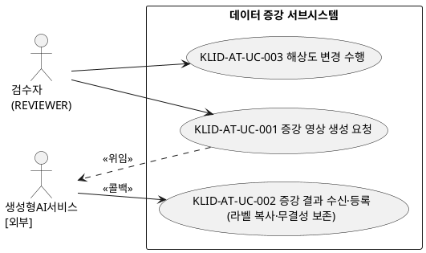
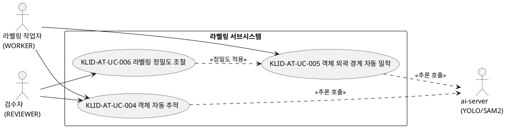
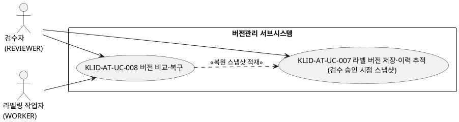
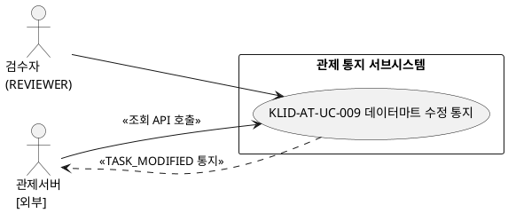
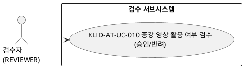
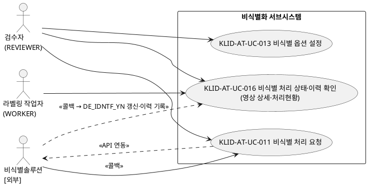

# R2 유스케이스 명세서

> **ID 표기 규칙(공통)**: 본 산출물의 모든 ID(KLID-AT-UC/CO/DC/DCD/SD/SC/AC/EN/ERD/TB/II/IC/IF/UCD/ACT 등)는 **전체 형식 `KLID-AT-XX-NNN`** 으로 표기한다. 끝부분만(예: `UC-001`) 약식 표기 금지. 범위는 시작 ID만 전체형으로(예: `KLID-AT-UC-001~013`). ※ 요구사항(RQ-SFR-NN-NN)·시스템시험(KLID-ST-NNN) 등 타 체계 ID, 그리고 LogiCraft 원본 ID(REQ/DFEAT/SCREEN/SEQ/FEAT)는 각 체계 원형을 유지한다.

## 작성 목적
> 시스템의 요구사항에 대하여 액터와 시스템 활동 및 상호간의 활동에 대하여 순서화된 시나리오를 상세하게 기술하고, 유스케이스의 이름, 액터, 그들 간의 연관관계를 보여주는 시스템 환경을 다이어그램으로도 표현한다. 또한 주요한 유스케이스에 대하여 대상 시스템과 액터 간의 오퍼레이션을 상세하게 표시하는 시스템 시퀀스 다이어그램 및 오퍼레이션의 약정을 나타낼 수 있는데 이 부분은 필수 산출물에 포함되지 않으며 선택적으로 작성할 수 있다. 본 산출물은 R1 사용자 요구사항 정의서의 기능 요구사항(RQ-SFR-06~09)에 매핑되는 유스케이스만을 대상으로 한다.

## 작성 방법
> 유스케이스는 시나리오를 구체적인 언어표현으로 기술하고, 유스케이스 다이어그램은 PlantUML(@startuml/@enduml)로 작성한다. 본 산출물은 LogiCraft 설계 그래프(use_case·acceptance·permission_role·diagram_sequence ITEM)를 진실원으로 자동 생성하였다(/cc-doc-gen). 유스케이스별 시퀀스 다이어그램(SEQ-002~013)이 별도 존재하며, 각 유스케이스 기술서의 「관련 시퀀스」에 해당 SEQ ID를 참조한다.

## 제·개정 이력

| 날짜 | 버전 | 제·개정 내역 | 작성자 | 검토자 |
|------|------|------------|--------|--------|
| 2026-06-02 | 1.0 | LogiCraft 그래프 기반 자동 생성 (/cc-doc-gen) — R1 사용자 요구사항(SFR-06~09)에 매핑되는 활성 유스케이스 13건(KLID-AT-UC-001~011, 013, 016) 도출·기술. UC-012(비식별 결과·이력 검토 — deep 검토)는 외부 비식별 솔루션 프로그램으로 이관(LogiCraft deprecated)되어 제외. UC-014/015(개인정보 보호대책·분류체계)는 RQ-SFR-09-06/09-07의 R1 범위 외 삭제에 따라 제외. 라벨 버전 스냅샷 트리거를 검수 승인(APPROVED) 시점으로 정합(commit 28db2ee). 유스케이스별 시퀀스(SEQ-002~013) 참조 추가. **UC-016 비식별 상태·이력 확인 추가 (09-03/09-05 추적성 복구)** — 폐기된 deep 검토 UC-012를 대체하는 저작도구 보유 경량(retained-scope) 유스케이스로, 영상 상세/처리현황 화면의 비식별 상태·이력 가시성만 반영하고 deep 검토 UI는 범위 외 유지 | 박찬기 | 김현욱 |

## 헤더

| R2 | 유스케이스 명세서 |
|-------|------------|
| 시스템명 | AI 기반 지방정부 CCTV 관제지원시스템(2차) | 서브시스템명 | 학습데이터 저작도구 (AT) |
| 단계명 | 설계 | 작성일자 | 2026-06-02 | 버전 | 1.0 |

---

## 1. 서브시스템 목록

> R1 요구사항(SFR-06~09)이 걸치는 활성 서브시스템 위주로 기재한다. CLAUDE.md의 전체 10개 서브시스템 중 R1 요구사항과 직접 매핑이 없는 사용자/권한(KLID-AT-SS-001)·마킹(KLID-AT-SS-002)·배치 파이프라인(KLID-AT-SS-003)·시계열 메타(KLID-AT-SS-005)·포털(KLID-AT-SS-010)은 본 명세 범위에서 제외한다. (※ 비식별 결과·이력 deep 검토 유스케이스가 외부 솔루션으로 이관되면서 비식별화 서브시스템은 처리 요청·옵션 설정과 경량 상태·이력 확인만 잔존한다.)

| 서브시스템 ID | 서브시스템명 | 서브시스템 설명 |
|------------|---------|-----------|
| KLID-AT-SS-004 | 비식별화 | 외부 비식별 솔루션을 연동하여 영상 내 개인정보를 비식별 처리(요청·결과 저장)하고, 솔루션 옵션을 관리 화면에서 설정하며, 영상 단위 비식별 처리 상태·이력을 화면에서 확인한다(deep 검토 UI는 외부 솔루션 이관). (RQ-SFR-09-01·02·03·04·05) |
| KLID-AT-SS-006 | 라벨링 | 바운딩박스/폴리곤/세그멘테이션 라벨링과 AI 보조(객체 자동 추적·외곽 경계 밀착·정밀도 조절)를 제공한다. (RQ-SFR-08-01~03) |
| KLID-AT-SS-007 | 검수 | REVIEWER가 증강 영상의 학습데이터 활용 여부를 승인·반려한다. (RQ-SFR-07-03) |
| KLID-AT-SS-008 | 버전관리 | 검수 승인(APPROVED) 시점에 라벨 전체 스냅샷(JSON)을 DB에 적재하고, 버전 비교(diff)·복구(rollback)를 제공한다. (RQ-SFR-08-04·05) |
| KLID-AT-SS-009 | 데이터 증강 | 외부 생성형 AI가 만든 증강 영상을 새 영상으로 수신·등록하고 원본 라벨을 복사(무결성 보존)하며, 저작도구가 직접 수행하는 해상도 변경을 포함한다. (RQ-SFR-06-03, 07-01, 07-02) |
| KLID-AT-SS-011 | 관제 통지 | 검수 완료 후 라벨이 수정되면 관제서버로 TASK_MODIFIED 통지를 단방향 발행하여 데이터마트 재동기화를 연계한다. (RQ-SFR-08-06) |

---

## 2. 유스케이스 다이어그램(UCD)

### 2.1 데이터 증강 서브시스템 UCD

| UCD ID | KLID-AT-UCD-001 | UCD 명 | 데이터 증강 및 해상도 변경 |
|--------|---|-------|---|
| 관련 서브시스템 ID | KLID-AT-SS-009 | 관련 서브시스템명 | 데이터 증강 |

### 2.2 라벨링 서브시스템 UCD

| UCD ID | KLID-AT-UCD-002 | UCD 명 | AI 보조 라벨링 |
|--------|---|-------|---|
| 관련 서브시스템 ID | KLID-AT-SS-006 | 관련 서브시스템명 | 라벨링 |

### 2.3 버전관리 서브시스템 UCD

| UCD ID | KLID-AT-UCD-003 | UCD 명 | 라벨 버전관리 |
|--------|---|-------|---|
| 관련 서브시스템 ID | KLID-AT-SS-008 | 관련 서브시스템명 | 버전관리 |

### 2.4 관제 통지 서브시스템 UCD

| UCD ID | KLID-AT-UCD-004 | UCD 명 | 데이터마트 수정 통지 |
|--------|---|-------|---|
| 관련 서브시스템 ID | KLID-AT-SS-011 | 관련 서브시스템명 | 관제 통지 |

### 2.5 검수 서브시스템 UCD

| UCD ID | KLID-AT-UCD-005 | UCD 명 | 증강 영상 활용 여부 검수 |
|--------|---|-------|---|
| 관련 서브시스템 ID | KLID-AT-SS-007 | 관련 서브시스템명 | 검수 |

### 2.6 비식별화 서브시스템 UCD

| UCD ID | KLID-AT-UCD-006 | UCD 명 | 영상 비식별 처리·옵션 설정·상태 확인 |
|--------|---|-------|---|
| 관련 서브시스템 ID | KLID-AT-SS-004 | 관련 서브시스템명 | 비식별화 |

> **비식별 결과·이력 deep 검토(구 KLID-AT-UC-012)**: 원본/비식별 좌우 비교·영역 메타 검증 등 deep 검토 UI는 시나리오 변경으로 외부 비식별 솔루션 프로그램으로 이관되어 본 명세에서 제외한다(LogiCraft `UC-012`/`AC-012` deprecated). 단, 저작도구가 실제 보유하는 **경량 상태·이력 가시성**(영상 단위 DE_IDNTF_YN·배치 DEIDENTIFY 단계 확인, 처리 이력 기록)은 **KLID-AT-UC-016**으로 신규 분리하여 RQ-SFR-09-03/09-05 추적성을 복구하였다(AC-016 검증).

---

## 3. 유스케이스 목록

> 검수기준(AC)은 LogiCraft `AC-NNN.derived_from_use_cases` 진실원에 따라 **UC-NNN ↔ AC-NNN 1:1**로 매핑된다. 관련 시퀀스(SEQ)는 LogiCraft `diagram_sequence`의 `realizes(SEQ→UC)` 링크에서 도출하였다.

| 유스케이스 ID | 유스케이스명 | 유스케이스 설명 | 관련 액터(ACT) | 검수기준(AC) | 관련 UCD ID | 관련 시퀀스(SEQ) | 관련 요구사항 ID |
|------------|---------|-----------|------------|-----------|-----------|-----------|-------------|
| KLID-AT-UC-001 | 증강 영상 생성 요청 | REVIEWER가 원본 영상에 대해 날씨·계절·시간 증강(WINTER/NIGHT/RAIN)을 외부 생성형 AI 서비스로 위임 요청한다. | KLID-AT-ACT-01 / KLID-AT-ACT-07 | KLID-AT-AC-001 | KLID-AT-UCD-001 | SEQ-002 | RQ-SFR-07-01 |
| KLID-AT-UC-002 | 증강 결과 수신·등록 | 외부가 생성한 증강 영상을 새 영상(RAW_SN)으로 등록하고 원본 라벨/메타를 복사하여 무결성을 보존하며 PENDING으로 적재한다. | KLID-AT-ACT-01 / KLID-AT-ACT-07 | KLID-AT-AC-002 | KLID-AT-UCD-001 | SEQ-003 | RQ-SFR-07-01, RQ-SFR-07-02 |
| KLID-AT-UC-003 | 해상도 변경 수행 | 저작도구가 영상의 해상도를 직접 변경하고 라벨 좌표 정합을 보존하여 새 영상으로 저장한다. | KLID-AT-ACT-01 | KLID-AT-AC-003 | KLID-AT-UCD-001 | SEQ-004 | RQ-SFR-06-03, RQ-SFR-07-02 |
| KLID-AT-UC-004 | 객체 자동 추적 | 사용자가 지정한 객체를 이어지는 프레임에서 AI(SAM2)가 자동 추적하여 위치·경계를 갱신하고 트랙 보간으로 빈 프레임을 채운다. | KLID-AT-ACT-02 / KLID-AT-ACT-01 / KLID-AT-ACT-05 | KLID-AT-AC-004 | KLID-AT-UCD-002 | SEQ-005 | RQ-SFR-08-01 |
| KLID-AT-UC-005 | 객체 외곽 경계 자동 밀착 | AI(SAM2)가 객체 외곽선을 인식해 바운딩박스/폴리곤을 경계에 자동 밀착(Snap)시킨다. | KLID-AT-ACT-02 / KLID-AT-ACT-05 | KLID-AT-AC-005 | KLID-AT-UCD-002 | SEQ-006 | RQ-SFR-08-02 |
| KLID-AT-UC-006 | 라벨링 정밀도 조절 | REVIEWER가 폴리곤 단순화 정밀도(epsilon) 설정을 조절하여 밀착/세그멘테이션 결과의 경계 세밀함(점 수)을 제어한다. | KLID-AT-ACT-01 | KLID-AT-AC-006 | KLID-AT-UCD-002 | SEQ-007 | RQ-SFR-08-03 |
| KLID-AT-UC-007 | 라벨 버전 저장·이력 추적 | 검수 승인(APPROVED) 시점에 영상 단위 라벨 전체 스냅샷(JSON)을 해시 식별자(VERSION_HASH)와 함께 DB에 적재하고 변경이력을 기록한다. | KLID-AT-ACT-01 | KLID-AT-AC-007 | KLID-AT-UCD-003 | SEQ-008 | RQ-SFR-08-04 |
| KLID-AT-UC-008 | 버전 비교·복구 | 두 버전의 DB 스냅샷을 비교(diff)하여 차이를 표시하고, 선택한 버전을 새 active 버전으로 복구(rollback)한다. | KLID-AT-ACT-01 / KLID-AT-ACT-02 | KLID-AT-AC-008 | KLID-AT-UCD-003 | SEQ-009 | RQ-SFR-08-05 |
| KLID-AT-UC-009 | 데이터마트 수정 통지 | 검수 완료 후 라벨이 수정되면 관제서버로 TASK_MODIFIED 통지(수정 요약만)를 단방향 발행해 데이터마트 재동기화가 가능하게 한다. | KLID-AT-ACT-01 / KLID-AT-ACT-06 | KLID-AT-AC-009 | KLID-AT-UCD-004 | SEQ-010 | RQ-SFR-08-06 |
| KLID-AT-UC-010 | 증강 영상 활용 여부 검수 | REVIEWER가 미검수(PENDING) 상태로 들어온 증강 영상을 확인해 학습데이터 활용 여부를 승인/반려한다. | KLID-AT-ACT-01 | KLID-AT-AC-010 | KLID-AT-UCD-005 | SEQ-011 | RQ-SFR-07-03 |
| KLID-AT-UC-011 | 비식별 처리 요청 | 비식별 대상 영상(PRVC/PSDO)에 대해 외부 비식별 솔루션 API를 연동 호출하여 개인정보를 비식별하고 원본·비식별본을 각각 저장한다. | KLID-AT-ACT-01 / KLID-AT-ACT-04 | KLID-AT-AC-011 | KLID-AT-UCD-006 | SEQ-012 | RQ-SFR-09-01, RQ-SFR-09-02 |
| KLID-AT-UC-013 | 비식별 옵션 설정 | 외부 비식별 솔루션이 제공하는 옵션을 관리 화면(/manage/*)에서 설정·저장한다. | KLID-AT-ACT-01 | KLID-AT-AC-013 | KLID-AT-UCD-006 | SEQ-013 | RQ-SFR-09-04 |
| KLID-AT-UC-016 | 비식별 처리 상태·이력 확인 | REVIEWER/WORKER가 영상 상세(SCREEN-009)·처리 현황(SCREEN-008) 화면에서 영상 단위 비식별 처리 상태(DE_IDNTF_YN)·배치 DEIDENTIFY 단계를 확인하고, 외부 비식별 SW 콜백 시 처리 이력(LS_DEIDENT_PROC_LOG)이 기록된다. deep 검토 UI는 범위 외. | KLID-AT-ACT-01 / KLID-AT-ACT-02 / KLID-AT-ACT-04 | KLID-AT-AC-016 | KLID-AT-UCD-006 | (미정의) | RQ-SFR-09-03, RQ-SFR-09-05 |

> **UC 미생성/제외 항목**
> - **RQ-SFR-06-04** (이미지·영상 생성 프롬프트 편의성 개선): 프롬프트 입력·생성 화면은 외부 생성형 AI 시스템 기능으로, 저작도구는 제공하지 않으므로 유스케이스를 생성하지 않는다.
> - **RQ-SFR-09-03 / RQ-SFR-09-05** (비식별 결과·이력 검토·확인): deep 검토(원본/비식별 좌우 비교 등)는 구 KLID-AT-UC-012가 외부 비식별 솔루션 프로그램으로 이관(LogiCraft deprecated)되었으나, 저작도구 보유 경량 상태·이력 가시성은 **KLID-AT-UC-016**으로 복구되어 본 요구사항 추적성을 충족한다.
> - **RQ-SFR-09-06 / RQ-SFR-09-07** (개인정보 보호대책·유형 분류체계): R1에서 보안·인프라 책임으로 범위 외 삭제되어 대응 UC-014/015가 함께 제거되었다(저작도구 민감정보 보호 책임은 NFR-005로 유지).

---

## 4. 액터 목록

> **액터 ID 체계(ACT-NN)**: 액터 ID는 검수기준(Acceptance, AC-NNN)과의 네임스페이스 충돌을 피하기 위해 `KLID-AT-ACT-NN` 형식을 사용한다. 인간 사용자 액터는 LogiCraft `permission_role`(ROLE-001~003)에서, 시스템·외부 액터는 각 UC의 `actor`/`secondary_actors` 필드에서 도출하였다.

| 액터 ID | 액터명 | 액터유형 (주요/보조/숨은) | 액터설명 |
|--------|------|-------------------|------|
| KLID-AT-ACT-01 | 검수자 (REVIEWER) | 주요 | 1차 ADMIN 역할 폐지로 사용자·시스템 관리 권한을 통합 보유. 증강 요청·결과 검수(승인/반려), 비식별 요청·옵션 설정, 라벨 버전 비교·복구, 데이터마트 수정 통지 등 관리·검수 행위를 수행한다. UI 호칭 '검수자', 관리 화면 URL `/manage/*`. (ROLE-001) |
| KLID-AT-ACT-02 | 라벨링 작업자 (WORKER) | 주요 | 본인 배정 영상의 라벨 수정·검수 제출 권한 보유. AI 보조 라벨링(객체 추적·외곽 밀착), 라벨 버전 복구(본인 배정)를 수행한다. 본인 배정 외 프레임 편집은 403. (ROLE-002) |
| KLID-AT-ACT-03 | 포털 회원 (PORTAL_USER) | 주요 | 포털 채널 사용자. 본 명세의 R1 요구사항(SFR-06~09)에는 직접 참여 유스케이스가 없어 참조용으로만 기재한다. (ROLE-003) |
| KLID-AT-ACT-04 | 비식별솔루션 | 보조 | [외부] 발주기관이 제공하는 영상 비식별 솔루션. 비식별 API 호출에 응답하고 처리 결과를 콜백(HMAC+idempotencyKey)으로 전달한다. |
| KLID-AT-ACT-05 | ai-server (YOLO/SAM2) | 보조 | [내부 인프라] 저작도구 운영팀이 운영하는 Stateless 추론 서버. 객체 자동 추적(SAM2)·외곽 밀착·세그멘테이션 추론을 수행한다. |
| KLID-AT-ACT-06 | 관제서버 | 보조 | [외부] 데이터마트 수정 통지(TASK_MODIFIED)를 수신하고 저작도구 조회 API(GET /v1/tasks/{rawSn}/...)로 상세 데이터를 가져가 데이터마트를 재동기화(UPSERT)한다. |
| KLID-AT-ACT-07 | 생성형AI서비스 | 보조 | [외부] 날씨·계절·시간 증강 영상을 생성하여 콜백(POST /v1/augments/result)으로 반환하는 외부 생성형 AI 시스템(SFR-07 책임). |

---

## 5. 유스케이스 기술서

<table>
<tr><td>유스케이스 ID</td><td>KLID-AT-UC-001</td><td>유스케이스명</td><td>증강 영상 생성 요청</td></tr>
<tr><td colspan="4">
<b>1. 주요 액터</b> 
&emsp;- 검수자(REVIEWER) 
&emsp;- (보조) 생성형AI서비스[외부]  
<b>2. 이해관계자와 관심사항</b> 
&emsp;- REVIEWER는 원본 영상에 날씨·계절·시간 변형 증강이 손쉽게 생성 위임되길 원한다. 
&emsp;- 발주기관은 증강 생성 본체가 외부 시스템 책임으로 분리되길 원한다.  
<b>3. 전제조건</b> 
&emsp;- 원본 영상(RAW_SN)이 존재한다. 
&emsp;- REVIEWER로 인증되어 있다.  
<b>4. 종료조건</b> 
&emsp;- 외부 서비스에 증강 작업이 위임되고 결과 콜백을 대기한다.  
<b>5. 기본 시나리오</b> 
&emsp;1. REVIEWER가 증강 대상 원본 영상과 증강 종류(WINTER/NIGHT/RAIN)를 선택한다. 
&emsp;2. 시스템(ExternalAugmentClient)이 외부 생성형 AI 서비스에 증강 생성을 위임 요청한다. 
&emsp;3. 외부 서비스가 요청을 수락하고 비동기로 증강을 수행한다(결과는 KLID-AT-UC-002 콜백). 
&emsp;4. 본 유스케이스는 종료한다.  
<b>6. 대안 시나리오</b> 
&emsp;- (정의된 대안 흐름 없음)  
<b>7. 구현 시 고려 사항</b> 
&emsp;- 증강 본체는 외부 SFR-07 책임이며 저작도구는 요청·수신·검수만 담당한다(ADR-004). 
&emsp;- 증강 종류에서 RESOLUTION은 제외되며(별도 해상도 변경 UC-003로 분리), 외부 연동은 Resilience4j를 적용한다.  
<b>8. 발생 빈도</b> 
&emsp;- 중간 — 증강 정책에 따라 비정기 발생.  
<b>9. 관련 시퀀스</b> 
&emsp;- SEQ-002 (증강 영상 생성 요청 — REVIEWER 요청부터 외부 SFR-07 위임까지)
</td></tr>
</table>

 

<table>
<tr><td>유스케이스 ID</td><td>KLID-AT-UC-002</td><td>유스케이스명</td><td>증강 결과 수신·등록</td></tr>
<tr><td colspan="4">
<b>1. 주요 액터</b> 
&emsp;- 검수자(REVIEWER) 
&emsp;- (보조) 생성형AI서비스[외부]  
<b>2. 이해관계자와 관심사항</b> 
&emsp;- 발주기관은 날씨·계절·시간이 변형된 증강 영상이 학습데이터로 적재되길 원한다. 
&emsp;- WORKER/REVIEWER는 증강 영상의 라벨이 원본과 정합되어 보존되길 원한다(무결성).  
<b>3. 전제조건</b> 
&emsp;- 원본 영상(parentRawSn)과 라벨/메타가 존재한다. 
&emsp;- 외부 서비스가 증강 완료 후 콜백을 전송한다.  
<b>4. 종료조건</b> 
&emsp;- 새 영상(RAW_SN)이 PENDING으로 등록되고 원본 라벨/메타가 복사된다.  
<b>5. 기본 시나리오</b> 
&emsp;1. 외부 서비스가 `POST /v1/augments/result` (HMAC + idempotencyKey)로 증강 결과를 전송한다. 
&emsp;2. 시스템이 새 영상(RAW_SN)을 생성하고 PARENT_RAW_SN에 원본을 연결한다. 
&emsp;3. 원본 라벨/메타 JSON을 새 영상에 복사하여 좌표·속성을 보존한다. 
&emsp;4. 새 영상을 미검수(PENDING)로 적재한다(이후 KLID-AT-UC-010 검수). 
&emsp;5. 본 유스케이스는 종료한다.  
<b>6. 대안 시나리오</b> 
&emsp;<b>가. 해상도 변경 증강</b> (트리거: 해상도만 변경된 경우) 
&emsp;&emsp;1. 이미지 해상도만 변경 저장하고 라벨 좌표 정합을 보존한다(KLID-AT-UC-003 연계). 
&emsp;<b>나. 콜백 검증 실패</b> (트리거: parentRawSn 부재 또는 페이로드 무효) 
&emsp;&emsp;1. 등록을 거부하고 실패를 기록한다.  
<b>7. 구현 시 고려 사항</b> 
&emsp;- 증강 결과는 항상 새 RAW_SN으로 생성되며 원본은 변경하지 않는다(ADR-004). 
&emsp;- 콜백 엔드포인트는 HMAC 시그니처 + idempotencyKey allowlist로 보호한다(양방향 M2M 인증 미운영).  
<b>8. 발생 빈도</b> 
&emsp;- 중간 — 증강 요청 건수에 비례.  
<b>9. 관련 시퀀스</b> 
&emsp;- SEQ-003 (증강 결과 수신·등록 — 외부 콜백부터 새 영상 생성까지)
</td></tr>
</table>

 

<table>
<tr><td>유스케이스 ID</td><td>KLID-AT-UC-003</td><td>유스케이스명</td><td>해상도 변경 수행</td></tr>
<tr><td colspan="4">
<b>1. 주요 액터</b> 
&emsp;- 검수자(REVIEWER)  
<b>2. 이해관계자와 관심사항</b> 
&emsp;- 발주기관은 해상도 변경 증강이 저작도구 내에서 직접 수행되어 라벨 정합이 보장되길 원한다.  
<b>3. 전제조건</b> 
&emsp;- 원본 영상과 라벨이 존재한다. 
&emsp;- REVIEWER로 인증되어 있다.  
<b>4. 종료조건</b> 
&emsp;- 해상도 변경된 새 영상이 라벨 좌표 정합과 함께 저장된다.  
<b>5. 기본 시나리오</b> 
&emsp;1. REVIEWER가 해상도 변경 대상 영상과 목표 해상도를 지정한다. 
&emsp;2. 시스템이 이미지 해상도를 변경하고 라벨 좌표를 스케일 정합 보존한다. 
&emsp;3. 결과를 새 영상(RAW_SN)으로 저장한다(원본 미변경). 
&emsp;4. 본 유스케이스는 종료한다.  
<b>6. 대안 시나리오</b> 
&emsp;- (정의된 대안 흐름 없음)  
<b>7. 구현 시 고려 사항</b> 
&emsp;- 생성형 AI 본체와 달리 해상도 변경은 저작도구가 직접 수행한다(ADR-004 예외). 
&emsp;- 해상도 변경 시 라벨 좌표 정합을 스케일 변환으로 보존한다.  
<b>8. 발생 빈도</b> 
&emsp;- 중간 — 해상도 증강 요청 시 발생.  
<b>9. 관련 시퀀스</b> 
&emsp;- SEQ-004 (해상도 변경 수행 — 프리셋 리사이즈부터 라벨 스케일 복사까지)
</td></tr>
</table>

 

<table>
<tr><td>유스케이스 ID</td><td>KLID-AT-UC-004</td><td>유스케이스명</td><td>객체 자동 추적</td></tr>
<tr><td colspan="4">
<b>1. 주요 액터</b> 
&emsp;- 라벨링 작업자(WORKER) 
&emsp;- (보조) 검수자(REVIEWER), ai-server(YOLO/SAM2)  
<b>2. 이해관계자와 관심사항</b> 
&emsp;- WORKER는 한 번 지정한 객체가 이후 프레임에서 자동으로 따라가져 반복 작업이 줄어들길 원한다. 
&emsp;- 발주기관은 라벨링 정확도(위치·경계)가 향상되길 원한다. 
&emsp;- ai-server는 GPU 자원 경합 없이 안정적으로 추론 요청을 처리하길 원한다.  
<b>3. 전제조건</b> 
&emsp;- 유효한 JWT(REVIEWER 또는 WORKER)로 인증되어 있다. 
&emsp;- 대상 프레임(SRC_SN)과 추적 시작 객체(bbox/seed)가 존재한다.  
<b>4. 종료조건</b> 
&emsp;- 후속 프레임에 추적된 객체 위치·경계가 갱신·저장된다.  
<b>5. 기본 시나리오</b> 
&emsp;1. WORKER가 추적할 객체(시드 마스크/박스)와 추적 구간을 지정한다. 
&emsp;2. 시스템은 `POST /v1/frames/{srcSn}/sam2-track` 으로 Sam2TrackRequest를 받는다(path/body srcSn 불일치 시 400). 
&emsp;3. AiServerClient(Resilience4j)로 ai-server(SAM2) 추론을 요청한다. 
&emsp;4. ai-server가 구간 프레임별 위치·경계를 추론·반환한다. 
&emsp;5. 트랙 보간 알고리즘으로 빈 프레임을 보간해 응답을 구성한다. 
&emsp;6. 결과를 캔버스에 표시하고 사용자가 저장하면 라벨로 반영한다. 
&emsp;7. 본 유스케이스는 종료한다.  
<b>6. 대안 시나리오</b> 
&emsp;<b>가. ai-server 호출 실패/타임아웃</b> (트리거: 재시도 후에도 실패) 
&emsp;&emsp;1. 서킷 브레이커 동작, 사용자에게 추적 실패 안내(원본 라벨 유지). 
&emsp;<b>나. 추적 결과 부정확</b> (트리거: 결과 부정확) 
&emsp;&emsp;1. 사용자가 키프레임을 수동 보정 후 보간 재계산한다.  
<b>7. 구현 시 고려 사항</b> 
&emsp;- 오토라벨링은 원본 이미지에만 실행하고 비식별본은 동일 해상도이므로 좌표를 공유한다. 
&emsp;- ai-server는 수평 확장 가능하며 호출 타임아웃 + CircuitBreaker를 적용한다. 
&emsp;- 트랙 보간은 CVAT track-interpolation 알고리즘을 Java로 포팅한 구현을 사용한다(DFEAT-020).  
<b>8. 발생 빈도</b> 
&emsp;- 높음 — 영상 라벨링 작업 중 객체별로 수시 발생.  
<b>9. 관련 시퀀스</b> 
&emsp;- SEQ-005 (객체 자동 추적 — SAM2 시드부터 트랙 전파·보간까지)
</td></tr>
</table>

 

<table>
<tr><td>유스케이스 ID</td><td>KLID-AT-UC-005</td><td>유스케이스명</td><td>객체 외곽 경계 자동 밀착</td></tr>
<tr><td colspan="4">
<b>1. 주요 액터</b> 
&emsp;- 라벨링 작업자(WORKER) 
&emsp;- (보조) ai-server(YOLO/SAM2)  
<b>2. 이해관계자와 관심사항</b> 
&emsp;- WORKER는 대략적으로 친 박스가 객체 외곽선에 자동으로 달라붙어 정밀하게 보정되길 원한다. 
&emsp;- 발주기관은 경계 라벨 품질이 균일하게 유지되길 원한다.  
<b>3. 전제조건</b> 
&emsp;- 인증되어 있고 대상 프레임(SRC_SN)과 초기 bbox가 존재한다.  
<b>4. 종료조건</b> 
&emsp;- 객체 외곽선에 밀착된 폴리곤/마스크 좌표가 반환된다.  
<b>5. 기본 시나리오</b> 
&emsp;1. WORKER가 객체 주변에 대략의 시드(박스/마스크)를 지정한다. 
&emsp;2. 시스템은 `POST /v1/frames/{srcSn}/sam2-track` 으로 시드를 ai-server(SAM2)에 송신한다. 
&emsp;3. ai-server가 외곽선 기반 마스크/폴리곤을 산출·반환한다. 
&emsp;4. Sam2TrackService가 응답 폴리곤을 외곽선 밀착 형태로 구성한다. 
&emsp;5. 밀착 결과를 캔버스에 적용한다. 
&emsp;6. 본 유스케이스는 종료한다.  
<b>6. 대안 시나리오</b> 
&emsp;<b>가. 외곽 인식 실패</b> (트리거: 밀착 결과 비어있음) 
&emsp;&emsp;1. 사용자가 수동 폴리곤으로 전환해 작업한다. 
&emsp;<b>나. 추론 호출 실패</b> (트리거: 재시도 후 실패) 
&emsp;&emsp;1. 503 안내, 기존 시드 유지.  
<b>7. 구현 시 고려 사항</b> 
&emsp;- MASK↔RLE↔Polygon 변환(CVAT 포팅)을 통해 마스크와 폴리곤 표현을 상호 변환한다(DFEAT-018). 
&emsp;- 폴리곤 점 수는 POLYGON_SIMPLIFY_TOLERANCE(Douglas-Peucker epsilon) 설정으로 제어한다(KLID-AT-UC-006과 연계).  
<b>8. 발생 빈도</b> 
&emsp;- 높음 — 정밀 라벨링 시 박스마다 자주 호출.  
<b>9. 관련 시퀀스</b> 
&emsp;- SEQ-006 (객체 외곽 경계 자동 밀착 — 시드 송신부터 폴리곤 밀착까지)
</td></tr>
</table>

 

<table>
<tr><td>유스케이스 ID</td><td>KLID-AT-UC-006</td><td>유스케이스명</td><td>라벨링 정밀도 조절</td></tr>
<tr><td colspan="4">
<b>1. 주요 액터</b> 
&emsp;- 검수자(REVIEWER)  
<b>2. 이해관계자와 관심사항</b> 
&emsp;- REVIEWER는 객체/장면 특성에 맞춰 라벨 정밀도(경계 세밀함·점 수)를 직접 조절하길 원한다. 
&emsp;- WORKER는 조절된 정밀도가 밀착/추적 결과에 일관 적용되길 원한다.  
<b>3. 전제조건</b> 
&emsp;- REVIEWER로 인증되어 있고 폴리곤 단순화 설정 키가 존재한다.  
<b>4. 종료조건</b> 
&emsp;- 조절된 정밀도가 적용된 라벨 결과가 반환된다.  
<b>5. 기본 시나리오</b> 
&emsp;1. REVIEWER가 `PUT /v1/manage/configs/{key}` 로 POLYGON_SIMPLIFY_TOLERANCE를 조절한다. 
&emsp;2. 시스템이 설정값을 저장하고 캐시(TTL 60s)에 반영한다. 
&emsp;3. 이후 SAM2 track/밀착 시 설정 epsilon으로 폴리곤 점 수를 단순화한다. 
&emsp;4. 설정 조회 실패 시 기본값(1.0px)으로 fail-safe 폴백한다. 
&emsp;5. 본 유스케이스는 종료한다.  
<b>6. 대안 시나리오</b> 
&emsp;<b>가. 값 범위 초과</b> (트리거: 허용 형식/범위 초과) 
&emsp;&emsp;1. @Valid 검증으로 400 반환·안내. 
&emsp;<b>나. 권한 부족</b> (트리거: WORKER 호출) 
&emsp;&emsp;1. 설정 변경은 REVIEWER 전용이므로 403 반환.  
<b>7. 구현 시 고려 사항</b> 
&emsp;- 정밀도(epsilon)는 시스템 설정(sysconfig) 키로 관리되며 미지정/오류 시 기본값으로 폴백한다. 
&emsp;- 설정은 Caffeine 캐시(TTL 60s)로 조회 비용을 줄인다.  
<b>8. 발생 빈도</b> 
&emsp;- 중간 — 작업 특성에 따라 세션 단위로 조정.  
<b>9. 관련 시퀀스</b> 
&emsp;- SEQ-007 (라벨링 정밀도 조절 — 설정 변경부터 SAM2 단순화 적용까지)
</td></tr>
</table>

 

<table>
<tr><td>유스케이스 ID</td><td>KLID-AT-UC-007</td><td>유스케이스명</td><td>라벨 버전 저장·이력 추적</td></tr>
<tr><td colspan="4">
<b>1. 주요 액터</b> 
&emsp;- 검수자(REVIEWER)  
<b>2. 이해관계자와 관심사항</b> 
&emsp;- 발주기관은 학습데이터로 확정된 단위(검수완료)만 버전으로 적재되어 추적성이 보장되길 원한다. 
&emsp;- REVIEWER는 승인 시점 라벨 스냅샷이 자동 저장되길 원한다.  
<b>3. 전제조건</b> 
&emsp;- 대상 영상의 라벨이 검수 제출되어 검수 대기 상태다. 
&emsp;- REVIEWER로 인증되어 있다.  
<b>4. 종료조건</b> 
&emsp;- 검수 승인된 라벨 스냅샷이 VERSION_HASH로 식별되어 DB에 적재된다.  
<b>5. 기본 시나리오</b> 
&emsp;1. REVIEWER가 영상 단위 검수를 승인(APPROVED) 처리한다. 
&emsp;2. 시스템이 승인 시점에 라벨 전체 스냅샷(JSON)을 LS_LABEL_VERSION.LABEL_PAYLOAD에 적재한다(SAVE_REASON='APPROVED'). 
&emsp;3. payload SHA-256(VERSION_HASH)로 버전을 식별한다(동일 payload는 동일 해시로 중복 식별). 
&emsp;4. LS_DATA_LBL_HSTRY에 변경이력을 기록한다. 
&emsp;5. 본 유스케이스는 종료한다.  
<b>6. 대안 시나리오</b> 
&emsp;- (정의된 대안 흐름 없음)  
<b>7. 구현 시 고려 사항</b> 
&emsp;- 라벨 저장 시점에는 버전을 생성하지 않으며, 학습데이터로 확정된 단위(검수완료)만 버전 대상이다(트리거 이동 commit 28db2ee — ReviewService approval). 
&emsp;- 외부 VCS(Gitea) 미사용 DB 스냅샷 방식이다(ADR-009).  
<b>8. 발생 빈도</b> 
&emsp;- 중간 — 영상 단위 검수 승인 시마다 발생.  
<b>9. 관련 시퀀스</b> 
&emsp;- SEQ-008 (라벨 버전 저장·이력 추적 — 검수 승인 시점 스냅샷 생성)
</td></tr>
</table>

 

<table>
<tr><td>유스케이스 ID</td><td>KLID-AT-UC-008</td><td>유스케이스명</td><td>버전 비교·복구</td></tr>
<tr><td colspan="4">
<b>1. 주요 액터</b> 
&emsp;- 검수자(REVIEWER) 
&emsp;- (보조) 라벨링 작업자(WORKER)  
<b>2. 이해관계자와 관심사항</b> 
&emsp;- 사용자는 두 버전의 라벨 차이를 명확히 비교하고, 필요 시 이전 버전으로 안전하게 되돌리길 원한다. 
&emsp;- 발주기관은 학습데이터 변경 추적성과 복원 가능성을 원한다.  
<b>3. 전제조건</b> 
&emsp;- 대상 프레임(SRC_SN)에 2개 이상 라벨 버전 스냅샷이 존재한다. 
&emsp;- 인증되어 있다(REVIEWER 또는 WORKER).  
<b>4. 종료조건</b> 
&emsp;- diff 표시 / 선택 버전이 새 active 버전으로 복원된다.  
<b>5. 기본 시나리오</b> 
&emsp;1. `GET /v1/frames/{srcSn}/versions` 로 버전 이력을 조회한다. 
&emsp;2. `GET /v1/versions/{version}/diff?compareWith={fromHash}` 로 차이를 요청한다. 
&emsp;3. 두 DB 스냅샷(LABEL_PAYLOAD)을 앱에서 비교해 ADDED/MODIFIED/REMOVED diff를 산출·표시한다. 
&emsp;4. 사용자가 `POST /v1/versions/{version}/rollback` (body srcSn)으로 복구한다. 
&emsp;5. 대상 스냅샷을 새 active 버전으로 LS_LABEL_VERSION에 복원·기록한다(REVIEWER 전체 / WORKER 본인 배정). 
&emsp;6. 본 유스케이스는 종료한다.  
<b>6. 대안 시나리오</b> 
&emsp;<b>가. 동일 페이로드 버전</b> (트리거: 두 버전 VERSION_HASH 동일) 
&emsp;&emsp;1. 변경 없음으로 안내한다. 
&emsp;<b>나. 검수 완료 후 복구</b> (트리거: 복구로 라벨 변경) 
&emsp;&emsp;1. KLID-AT-UC-009(데이터마트 수정 통지)가 트리거된다.  
<b>7. 구현 시 고려 사항</b> 
&emsp;- 버전관리는 DB 스냅샷 기반(외부 VCS 미사용), 버전 식별자는 페이로드 SHA-256 해시(VERSION_HASH)이다(ADR-009). 
&emsp;- 대용량 페이로드 diff는 서버에서 계산하여 전송 데이터를 최소화한다.  
<b>8. 발생 빈도</b> 
&emsp;- 중간 — 검수·수정 과정에서 비정기적으로 발생.  
<b>9. 관련 시퀀스</b> 
&emsp;- SEQ-009 (버전 비교·복구 — DB 스냅샷 diff부터 롤백 active 복원까지)
</td></tr>
</table>

 

<table>
<tr><td>유스케이스 ID</td><td>KLID-AT-UC-009</td><td>유스케이스명</td><td>데이터마트 수정 통지</td></tr>
<tr><td colspan="4">
<b>1. 주요 액터</b> 
&emsp;- 검수자(REVIEWER) 
&emsp;- (보조) 관제서버[외부]  
<b>2. 이해관계자와 관심사항</b> 
&emsp;- 관제서버는 검수 완료 후 라벨이 수정되면 데이터마트를 최신 상태로 재동기화하길 원한다. 
&emsp;- 보안 담당자는 통지 페이로드에 PII·토큰·본문 데이터가 포함되지 않길 원한다.  
<b>3. 전제조건</b> 
&emsp;- 대상 영상(RAW_SN)이 검수 완료(APPROVED) 이력을 가진다. 
&emsp;- 검수 완료 후 라벨/메타 수정이 발생했다.  
<b>4. 종료조건</b> 
&emsp;- TASK_MODIFIED 통지(수정 요약만)가 멱등 발행된다(PII/본문 미포함).  
<b>5. 기본 시나리오</b> 
&emsp;1. 검수 완료 후 라벨/메타가 수정된다. 
&emsp;2. 변경 프레임 목록(SRC_SN+변경 종류)·요약 카운트를 구성한다. 
&emsp;3. ControlNotifyClient(idempotency·재등록 큐·Resilience4j)가 TASK_MODIFIED를 push한다. 
&emsp;4. 관제서버가 조회 API(`GET /v1/tasks/{rawSn}/summary|labels|meta`)로 상세를 가져가 UPSERT한다. 
&emsp;5. 본 유스케이스는 종료한다.  
<b>6. 대안 시나리오</b> 
&emsp;<b>가. 통지 전송 실패</b> (트리거: 재시도 후에도 실패) 
&emsp;&emsp;1. dead-letter/재등록 큐 적재 후 후속 재시도한다. 
&emsp;<b>나. 동일 트랜잭션 다수 변경</b> (트리거: 짧은 시간 내 다수 변경) 
&emsp;&emsp;1. 디바운스 후 영상 1건 단위 1회 통지한다.  
<b>7. 구현 시 고려 사항</b> 
&emsp;- 통지 단위는 영상 1건이며 페이로드는 수정 요약만 포함(라벨/메타 본문 미포함). 
&emsp;- 양방향 M2M 인증은 미운영이며 단방향 outbound 통지 + inbound 조회 API 패턴을 사용한다(ADR-007).  
<b>8. 발생 빈도</b> 
&emsp;- 낮음~중간 — 검수 완료 후 수정 발생 시에만.  
<b>9. 관련 시퀀스</b> 
&emsp;- SEQ-010 (데이터마트 수정 통지 — 검수완료 후 수정부터 TASK_MODIFIED push까지)
</td></tr>
</table>

 

<table>
<tr><td>유스케이스 ID</td><td>KLID-AT-UC-010</td><td>유스케이스명</td><td>증강 영상 활용 여부 검수</td></tr>
<tr><td colspan="4">
<b>1. 주요 액터</b> 
&emsp;- 검수자(REVIEWER)  
<b>2. 이해관계자와 관심사항</b> 
&emsp;- 발주기관은 증강 데이터의 학습데이터 활용 여부를 사람이 확인 후 결정하길 원한다.  
<b>3. 전제조건</b> 
&emsp;- 증강 영상이 미검수(PENDING)로 등록되어 있다(KLID-AT-UC-002 완료). 
&emsp;- REVIEWER로 인증되어 있다.  
<b>4. 종료조건</b> 
&emsp;- 증강 영상이 ACCEPTED(활용) 또는 REJECTED(미활용)로 전이된다.  
<b>5. 기본 시나리오</b> 
&emsp;1. REVIEWER가 `GET /v1/augments` 에서 PENDING 증강 결과를 조회한다. 
&emsp;2. 증강 결과(영상·복사된 라벨)를 확인한다. 
&emsp;3. 활용 가능 시 `POST /v1/augments/{id}/accept` (PENDING→ACCEPTED). 
&emsp;4. 부적합 시 `POST /v1/augments/{id}/reject` (사유 필수, PENDING→REJECTED). 
&emsp;5. 본 유스케이스는 종료한다.  
<b>6. 대안 시나리오</b> 
&emsp;<b>가. 상태 충돌</b> (트리거: PENDING 이외 상태) 
&emsp;&emsp;1. 409 CONFLICT 반환(중복 승인/반려 방지). 
&emsp;<b>나. 사유 누락</b> (트리거: 반려 사유 비어있음) 
&emsp;&emsp;1. 400으로 거부한다.  
<b>7. 구현 시 고려 사항</b> 
&emsp;- 증강 본체는 외부 SFR-07 책임이며 저작도구는 결과 검수(승인/반려)만 담당한다(ADR-004). 
&emsp;- 승인 시 학습데이터 활용 대상이 되며 데이터마트 적재용 View 노출 조건(APPROVED)과 연계된다.  
<b>8. 발생 빈도</b> 
&emsp;- 중간 — 증강 영상 등록 건수에 비례.  
<b>9. 관련 시퀀스</b> 
&emsp;- SEQ-011 (증강 영상 활용 여부 검수 — PENDING 조회부터 승인/반려까지)
</td></tr>
</table>

 

<table>
<tr><td>유스케이스 ID</td><td>KLID-AT-UC-011</td><td>유스케이스명</td><td>비식별 처리 요청</td></tr>
<tr><td colspan="4">
<b>1. 주요 액터</b> 
&emsp;- 검수자(REVIEWER) 
&emsp;- (보조) 비식별솔루션[외부]  
<b>2. 이해관계자와 관심사항</b> 
&emsp;- 발주기관은 수집 영상의 개인정보가 안전하게 비식별되길 원한다. 
&emsp;- 보안 담당자는 원본이 절대 삭제되지 않고 원본·비식별본이 분리 보관되길 원한다.  
<b>3. 전제조건</b> 
&emsp;- 대상 영상 PRVC_TYPE_CD가 'PRVC' 또는 'PSDO'(비식별 대상)이다. 
&emsp;- REVIEWER 인증 + 외부 비식별 솔루션이 가용하다.  
<b>4. 종료조건</b> 
&emsp;- 비식별본이 별도 경로에 저장되고 원본이 보존되며 처리 이력이 영상 단위로 기록된다.  
<b>5. 기본 시나리오</b> 
&emsp;1. REVIEWER가 `POST /v1/deident/{videoId}/reprocess` 로 비식별(재)처리를 요청한다(202 ACCEPTED). 
&emsp;2. DeidentifyClient(Resilience4j)로 외부 비식별 API를 호출한다. 
&emsp;3. 외부 솔루션이 `POST /v1/deidentify/result` (HMAC, idempotencyKey)로 결과를 반환한다. 
&emsp;4. 비식별본을 STORAGE_DEIDENTIFIED_PATH에 저장하고 원본은 유지한다. 
&emsp;5. 처리 이력(DE_IDNTF_YN 등)을 기록한다. 
&emsp;6. 본 유스케이스는 종료한다.  
<b>6. 대안 시나리오</b> 
&emsp;<b>가. 비식별 API 실패</b> (트리거: 외부 호출 실패) 
&emsp;&emsp;1. DE_IDNTF_YN='F'로 마킹하고 재시도 큐에 등록하며 원본은 보존한다. 
&emsp;<b>나. 비식별 비대상(ANONY)</b> (트리거: PRVC_TYPE_CD=ANONY) 
&emsp;&emsp;1. 비식별을 미호출하고 원본만 저장한다.  
<b>7. 구현 시 고려 사항</b> 
&emsp;- 외부 비식별 API는 발주기관 제공 가이드/API에 맞춰 연동하며 타임아웃·재시도·서킷 브레이커를 적용한다(ADR-006). 
&emsp;- 결과 수신 webhook은 HMAC 시그니처 + idempotencyKey allowlist로 인증한다. 
&emsp;- 비식별 처리 이력은 영상 단위로 기록한다.  
<b>8. 발생 빈도</b> 
&emsp;- 중간 — 신규 수집 영상 적재 시 대상 영상마다 발생.  
<b>9. 관련 시퀀스</b> 
&emsp;- SEQ-012 (비식별 처리 요청 — 재처리 요청부터 외부 솔루션 결과 콜백까지)
</td></tr>
</table>

 

<table>
<tr><td>유스케이스 ID</td><td>KLID-AT-UC-013</td><td>유스케이스명</td><td>비식별 옵션 설정</td></tr>
<tr><td colspan="4">
<b>1. 주요 액터</b> 
&emsp;- 검수자(REVIEWER)  
<b>2. 이해관계자와 관심사항</b> 
&emsp;- REVIEWER는 외부 비식별 솔루션이 제공하는 옵션을 관리 화면에서 설정·저장하길 원한다. 
&emsp;- 운영자는 설정한 옵션이 이후 비식별 요청에 일관되게 적용되길 원한다.  
<b>3. 전제조건</b> 
&emsp;- REVIEWER로 인증되어 있다.  
<b>4. 종료조건</b> 
&emsp;- 비식별 옵션이 저장되어 이후 비식별 요청에 반영된다.  
<b>5. 기본 시나리오</b> 
&emsp;1. REVIEWER가 관리(/manage/*) 화면에서 비식별 옵션을 설정한다. 
&emsp;2. 시스템이 옵션을 저장하고 이후 비식별 요청에 적용한다. 
&emsp;3. 본 유스케이스는 종료한다.  
<b>6. 대안 시나리오</b> 
&emsp;- (정의된 대안 흐름 없음 — 권한 부족 시 REVIEWER 전용 403은 공통 정책으로 처리)  
<b>7. 구현 시 고려 사항</b> 
&emsp;- 외부 비식별 솔루션이 제공하는 옵션 항목 스펙은 미정의 단계로, 옵션 스펙 확정 시 시나리오를 보강한다(ADR-006, GAPS). 
&emsp;- 설정 데이터는 시스템 설정(LS_SYSTEM_CONFIG)에 저장한다.  
<b>8. 발생 빈도</b> 
&emsp;- 낮음 — 운영 정책 변경 시에만.  
<b>9. 관련 시퀀스</b> 
&emsp;- SEQ-013 (비식별 옵션 설정 — 관리 화면 설정 저장)
</td></tr>
</table>

 

<table>
<tr><td>유스케이스 ID</td><td>KLID-AT-UC-016</td><td>유스케이스명</td><td>비식별 처리 상태·이력 확인</td></tr>
<tr><td colspan="4">
<b>1. 주요 액터</b> 
&emsp;- 검수자(REVIEWER) 
&emsp;- (보조) 라벨링 작업자(WORKER), 비식별솔루션[외부]  
<b>2. 이해관계자와 관심사항</b> 
&emsp;- REVIEWER/WORKER는 영상 단위 비식별 처리 상태와 배치 진행 단계를 화면에서 한눈에 확인하길 원한다. 
&emsp;- 보안 담당자는 비식별 처리 이력이 영상 단위로 기록되어 추적 가능하길 원한다. 
&emsp;- 발주기관은 deep 검토(원본/비식별 비교·검증)는 외부 비식별 솔루션이 담당하고 저작도구는 상태·이력 가시성만 보유하길 원한다.  
<b>3. 전제조건</b> 
&emsp;- 영상이 적재되어 배치 파이프라인 대상이다. 
&emsp;- 인증되어 있다(REVIEWER 또는 WORKER).  
<b>4. 종료조건</b> 
&emsp;- 영상 단위 비식별 처리 상태(DE_IDNTF_YN)와 배치 비식별 단계가 화면에서 확인된다. 
&emsp;- 비식별 처리 이력이 LS_DEIDENT_PROC_LOG에 기록되어 있다.  
<b>5. 기본 시나리오</b> 
&emsp;1. REVIEWER가 영상 상세 화면(SCREEN-009, /video/:id) 또는 처리 현황 화면(SCREEN-008, /video/status)에 진입한다. 
&emsp;2. 영상 상세의 기본 정보 탭에서 개인정보 분류(PrivacyBadge)와 배치 처리 단계(BatchStageIndicator — DEIDENTIFY 단계 포함)를 확인한다. 
&emsp;3. 처리 현황 화면에서 영상별 배치 단계(StageBadge)와 진행/실패 상태를 확인한다. 
&emsp;4. 외부 비식별 SW가 비식별 처리 완료/실패를 콜백(POST /v1/deidentify/result)으로 인계하면 시스템이 DE_IDNTF_YN을 Y/F로 갱신하고 LS_DEIDENT_PROC_LOG에 처리 이력을 기록한다. 
&emsp;5. 본 유스케이스는 종료한다.  
<b>6. 대안 시나리오</b> 
&emsp;<b>가. 비식별 처리 실패</b> (트리거: 외부 비식별 SW 콜백 status가 SUCCESS가 아님) 
&emsp;&emsp;1. DE_IDNTF_YN을 F로 마킹한다. 
&emsp;&emsp;2. LS_DEIDENT_PROC_LOG에 FAILED 상태와 오류 코드를 기록한다. 
&emsp;&emsp;3. 배치 단계는 FAILED로 표시된다.  
<b>7. 구현 시 고려 사항</b> 
&emsp;- 저작도구가 실제 보유하는 표면만 반영한다: 상태는 영상 상세/처리현황 화면에 노출하고, 처리 이력은 기록(write)만 보유한다. 
&emsp;- 원본/비식별 좌우 비교 등 deep 검토·검증 UI와 처리 이력 상세 조회 전용 화면/API는 외부 비식별 솔루션 프로그램으로 이관(범위 외)되어, 폐기된 UC-012/SCREEN-016·017/API-051·052와 구분된다. 
&emsp;- 상태 표시는 SCREEN-009 기본 정보 탭과 SCREEN-008 현황 테이블로 구현되며, 이력 기록은 DeidentifyResultService/DeidentifyStep 기반이다.  
<b>8. 발생 빈도</b> 
&emsp;- 중간 — 비식별 대상 영상의 처리 진행/완료 확인 시 발생.  
<b>9. 관련 시퀀스</b> 
&emsp;- (전용 시퀀스 미정의) — 비식별 처리 콜백 흐름은 SEQ-012(비식별 처리 요청)와 연계되며, 상태·이력 갱신 부분이 본 UC의 종료조건에 해당한다.
</td></tr>
</table>

---

## 부록 A. R1 요구사항 ↔ 유스케이스 커버리지

| R1 요구사항 ID | 매핑 UC | 비고 |
|---|---|---|
| RQ-SFR-06-03 | KLID-AT-UC-003 | 해상도 변경(저작도구 직접 수행) |
| RQ-SFR-06-04 | (없음) | 프롬프트 편의성 — 저작도구 범위 외 |
| RQ-SFR-07-01 | KLID-AT-UC-001, KLID-AT-UC-002 | 증강 생성 요청·결과 수신등록 |
| RQ-SFR-07-02 | KLID-AT-UC-002, KLID-AT-UC-003 | 라벨 무결성 보존(복사·정합) |
| RQ-SFR-07-03 | KLID-AT-UC-010 | 증강 활용 여부 승인/반려 |
| RQ-SFR-08-01 | KLID-AT-UC-004 | 객체 자동 추적 |
| RQ-SFR-08-02 | KLID-AT-UC-005 | 외곽 경계 자동 밀착 |
| RQ-SFR-08-03 | KLID-AT-UC-006 | 정밀도 조절 |
| RQ-SFR-08-04 | KLID-AT-UC-007 | 버전 저장·이력 추적(검수 승인 시점) |
| RQ-SFR-08-05 | KLID-AT-UC-008 | 버전 비교·복구 |
| RQ-SFR-08-06 | KLID-AT-UC-009 | 데이터마트 수정 통지 |
| RQ-SFR-09-01 | KLID-AT-UC-011 | 비식별 처리 |
| RQ-SFR-09-02 | KLID-AT-UC-011 | 비식별 API 연동 |
| RQ-SFR-09-03 | KLID-AT-UC-016 | 비식별 처리 상태·이력 확인(경량) — deep 검토는 외부 솔루션 이관(구 UC-012 deprecated) |
| RQ-SFR-09-04 | KLID-AT-UC-013 | 비식별 옵션 설정 |
| RQ-SFR-09-05 | KLID-AT-UC-016 | 비식별 처리 상태 확인(경량) — deep 검토는 외부 솔루션 이관(구 UC-012 deprecated) |

---

## 부록 B. 산출물 생성 노트 (정보 부족·정합 메모)

> 본 산출물은 LogiCraft 그래프(project_id 4ece2c3f-8e99-46f5-9580-71108a76e578)의 활성(non-retired) ITEM을 진실원으로 자동 생성하였다(/cc-doc-gen, 2026-06-02).

- **유스케이스 13건 / 검수기준(AC) 13건 / 액터 7종**: 활성 use_case 13건(UC-001~011, 013, 016), 각 UC와 1:1 매핑되는 AC 13건(AC-001~011, 013, 016), 인간 액터 3종(ROLE-001~003) + 시스템·외부 액터 4종.
- **KLID-AT-UC-016(비식별 처리 상태·이력 확인) 신규**: 폐기된 deep 검토 UC-012를 대체하는 저작도구 보유 경량(retained-scope) 유스케이스로, FEAT-006(re-activated)을 실현하고 SCREEN-009(영상 상세)·SCREEN-008(영상 처리 현황)을 참조하며 AC-016으로 검증된다. RQ-SFR-09-03/09-05 추적성을 복구한다.
- **구 KLID-AT-UC-012(비식별 결과·이력 deep 검토) 제외**: LogiCraft `UC-012`가 deprecated(원본/비식별 비교 등 deep 검토 UI를 외부 비식별 솔루션 프로그램으로 이관)되어 §3 목록·§5 기술서에서 제외하였다. 대응 검수기준 `AC-012`도 deprecated 처리되어(고립 AC 정리) 본 명세에 포함하지 않는다. 저작도구 보유 경량 상태·이력 검증은 신규 AC-016이 대체한다.
- **구 KLID-AT-UC-014/015 제외**: RQ-SFR-09-06/09-07의 R1 범위 외 삭제(보안·인프라 책임)에 따라 대응 UC/AC가 deprecated 처리되었다. 저작도구의 민감정보 보호 책임은 NFR-005로 유지된다.
- **관련 화면(SCREEN) / DFEAT 매핑**: KLID-AT-UC-016만 LogiCraft `related_screens`(SCREEN-009 영상 상세·SCREEN-008 영상 처리 현황)를 보유하며, 나머지 UC는 전 건 비어 있어 화면 참조를 기재하지 않았다(D-시리즈 화면설계서에서 보강 필요). DFEAT 링크는 UC-004(DFEAT-020)·UC-005(DFEAT-018)만 존재한다.
- **대안 시나리오 없음(빈 셀 → "-")**: KLID-AT-UC-001·003·007·013은 LogiCraft `alternate_flows`가 비어 있어 「대안 시나리오 없음」으로 표기하였다(추후 보강 가능).
- **KLID-AT-UC-016 시퀀스 미정의**: UC-016은 LogiCraft에 전용 `diagram_sequence`(SEQ→UC realizes 링크)가 없어 §3·§5의 「관련 시퀀스」를 "(미정의)"로 표기하였다. 비식별 콜백 흐름은 SEQ-012(비식별 처리 요청)와 연계되며 상태·이력 갱신이 본 UC의 종료조건에 해당한다(필요 시 전용 SEQ 보강).
- **RQ-SFR 매핑 출처**: UC↔RQ-SFR 직접 링크는 그래프에 없으며 각 UC `description`에 명시된 요구사항 ID를 사용하였다(예: UC-007 → RQ-SFR-08-04). FEAT 경유 매핑은 §3 비고로 갈음.
- **서브시스템 ID 보강**: §1의 KLID-AT-SS-011(관제 통지)는 LogiCraft DOMAIN-016(관제 통지)에 대응하여 본 명세에서 신규 부여하였다(템플릿의 10개 서브시스템 목록에는 없던 도메인 — 정합 시 R1/D5 갱신 권고).
