# D3 컴포넌트 설계서

> **ID 표기 규칙(공통)**: 본 산출물의 모든 ID(KLID-AT-UC/CO/IC/IF/UCD 등)는 **전체 형식 `KLID-AT-XX-NNN`** 으로 표기한다. 끝부분만(예: `UC-001`) 약식 표기 금지. 나열·범위 모두 각 ID를 전체형으로 표기한다(예: `KLID-AT-UC-001 ~ KLID-AT-UC-013`). ※ 요구사항(RQ-SFR-NN-NN)·시스템시험(KLID-ST-NNN) 등 타 체계 ID는 각 체계 원형 유지.

## 작성 목적
> 설계 클래스 모형에서 도출한 클래스들을 C&V(공통성과 변경성) 기준에 따라 그룹핑하여 컴포넌트를 식별하여 패키지도를 작성하고 식별한 컴포넌트의 내부 클래스 및 인터페이스의 명세를 기술한다.

## 작성 방법
> 클래스를 그룹핑하여 도출한 컴포넌트의 패키지도를 작성하고, 식별한 컴포넌트의 목록을 작성한다. 또한 각각의 컴포넌트에 포함하고 있는 내부 클래스들을 명세하고, 인터페이스는 사용자에게 제공하는 오퍼레이션별로 상세한 명세를 작성한다.

## 산출물 양식

### 제·개정 이력

| 날짜 | 버전 | 제·개정 내역 | 작성자 | 검토자 |
|------|------|------------|--------|--------|
| 2026-06-04 | 1.0 | LogiCraft 그래프 기반 자동 생성 (/cc-doc-gen) — R1 v1.17 범위 | claude | - |
| 2026-06-05 | 1.1 | **컴포넌트 도출 단위를 유스케이스 실현 단위로 재편 (UC ↔ CO 1:1)** — 도메인 모듈 단위 9개(CO ↔ UC N:M)를 유스케이스별 13개로 재도출, 컴포넌트 번호를 실현 UC 번호와 정렬(KLID-AT-CO-012/014/015 결번). 컴포넌트 구조도를 컴포넌트별 반복으로 재작성. R1 UC를 실현하지 않는 요소(라벨 CRUD·속성·마스터, 마킹, ai-server 내부) 명세 제외(부록 참조), KLID-AT-IF-006/021 결번, KLID-AT-IF-022(SystemConfigApi) 신설 | 박찬기 | - |

### 헤더

| D3 | 컴포넌트 설계서 |
|-------|----------|
| 시스템명 | AI 기반 지방정부 CCTV 관제지원시스템 구축(2차) | 서브시스템명 | 학습데이터 저작도구 (AT) |
| 단계명  | 설계 | 작성일자 | 2026-06-05 | 버전 | 1.1 |

---

> **컴포넌트 도출 기준 (Critical)**
> - 컴포넌트는 **유스케이스 실현 단위**로 도출한다 — **유스케이스(UC) 1건 ↔ 컴포넌트(CO) 1건 1:1 매핑**.
> - 컴포넌트 번호는 실현 유스케이스 번호와 정렬한다(KLID-AT-CO-001 ↔ KLID-AT-UC-001, …, KLID-AT-CO-016 ↔ KLID-AT-UC-016). R2 유스케이스 결번(KLID-AT-UC-012/014/015)에 맞춰 **KLID-AT-CO-012/014/015도 결번**이다.
> - 복수 컴포넌트에서 재사용되는 공통 클래스(LabelAccessGuard, SystemConfig*, VersionService 등)는 동일 IC ID로 교차 참조한다(중복 정의 금지, ※ 표기).
> - ai-server(YOLO/SAM2 추론, 내부 지원 구성요소)·마킹·라벨 CRUD/속성/마스터는 R1 유스케이스를 직접 실현하지 않으므로 컴포넌트로 도출하지 않는다(부록 참조). ai-server는 각 구조도에 지원 시스템으로 표기하고 제공측 인터페이스(KLID-AT-IF-020)만 명세를 유지한다.
> - **진실원 우선순위**: R1 v1.17 + 현행 코드(커밋 6441fb9) 기준.

---

## 1. 컴포넌트 구조도

> **⟳ 컴포넌트별로 1개씩 반복 작성한다.** 각 구조도의 헤더는 컴포넌트 ID 1건과 해당 컴포넌트가 실현하는 유스케이스 ID 1건의 1:1 매핑을 표기하며, 다이어그램은 컴포넌트 내부 클래스를 Layer(Presentation / Biz Logic / Persistence / Integration)로 구분하고 액터·외부 시스템·인접 컴포넌트는 외부 요소로 표기한다.

### 1.1 KLID-AT-CO-001 — augment.request (증강 영상 생성 요청)

| 컴포넌트 ID | KLID-AT-CO-001 | 컴포넌트명 | augment.request (증강 영상 생성 요청) |
|----------|---|---------|---|
| 관련 유스케이스 ID | KLID-AT-UC-001 |

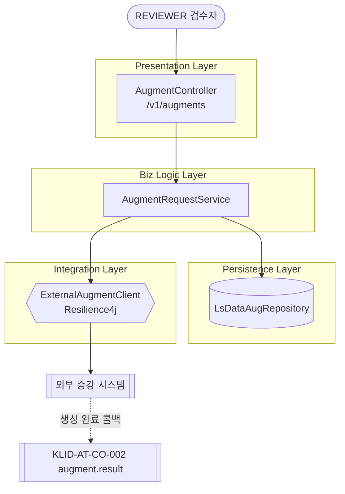

---

### 1.2 KLID-AT-CO-002 — augment.result (증강 결과 수신·등록)

| 컴포넌트 ID | KLID-AT-CO-002 | 컴포넌트명 | augment.result (증강 결과 수신·등록) |
|----------|---|---------|---|
| 관련 유스케이스 ID | KLID-AT-UC-002 |

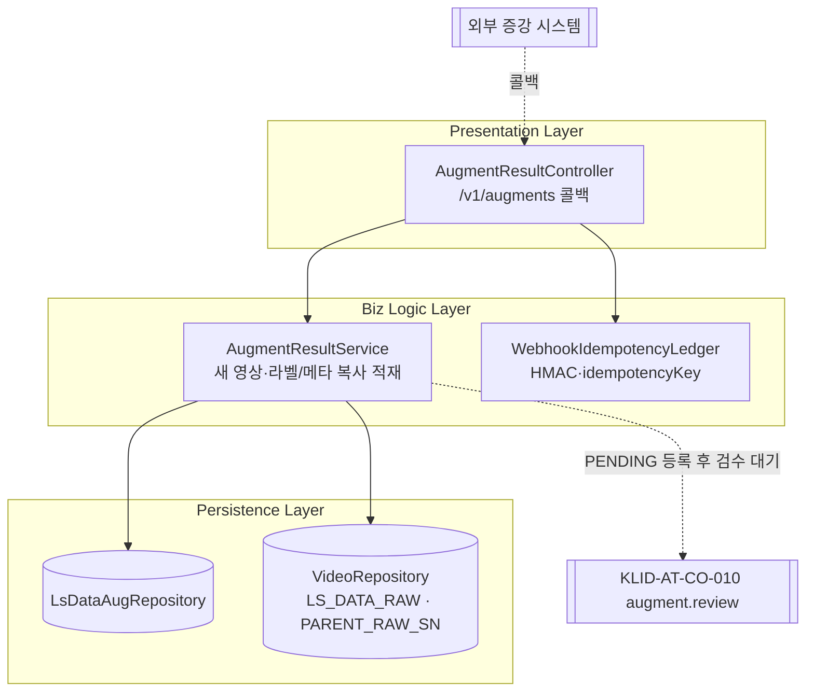

---

### 1.3 KLID-AT-CO-003 — video.resolution (해상도 변경 수행)

| 컴포넌트 ID | KLID-AT-CO-003 | 컴포넌트명 | video.resolution (해상도 변경 수행) |
|----------|---|---------|---|
| 관련 유스케이스 ID | KLID-AT-UC-003 |

> 출처: CMP-007 + backend 코드(`video.service`, `video.entity`) 보강 — `⚠ LogiCraft ITEM 보강 필요`(CMP-007은 VideoProbe/VideoResizer/LabelCoordinateScaler를 별 컴포넌트로 묘사하나 현행 코드는 `ResolutionPreset` enum 화이트리스트 + `LsResolutionExport` 적재 구조).

```mermaid
flowchart TB
  REVIEWER([REVIEWER 검수자])

  subgraph Presentation [Presentation Layer]
    VidCtrl[VideoController<br/>/v1/videos/&#123;rawSn&#125;/resolution]
  end
  subgraph Biz [Biz Logic Layer]
    VidResSvc[VideoResolutionService<br/>loadAndValidate·changeResolution]
    VidResPers[VideoResolutionPersister]
    ResPreset[ResolutionPreset<br/>RES_1080P/720P/480P 화이트리스트]
  end
  subgraph Persistence [Persistence Layer]
    ResExpRepo[(LsResolutionExportRepository)]
    VidRepo[(VideoRepository)]
  end
  subgraph Integration [Integration Layer]
    Ffmpeg{{FFmpeg net.bramp 래퍼}}
  end

  REVIEWER --> VidCtrl
  VidCtrl --> VidResSvc
  VidResSvc --> ResPreset
  VidResSvc --> Ffmpeg
  VidResSvc --> VidResPers
  VidResSvc --> VidRepo
  VidResPers --> ResExpRepo
  VidResPers --> VidRepo
```

---

### 1.4 KLID-AT-CO-004 — label.track (객체 자동 추적)

| 컴포넌트 ID | KLID-AT-CO-004 | 컴포넌트명 | label.track (객체 자동 추적) |
|----------|---|---------|---|
| 관련 유스케이스 ID | KLID-AT-UC-004 |

```mermaid
flowchart TB
  WORKER([WORKER 라벨링 작업자])
  REVIEWER([REVIEWER 검수자])
  AISVR[["ai-server (SAM2)<br/>지원 구성요소 — KLID-AT-IF-020"]]

  subgraph Presentation [Presentation Layer]
    LblCtrl[LabelController<br/>/v1/frames/&#123;srcSn&#125;/sam2-track]
  end
  subgraph Biz [Biz Logic Layer]
    Sam2Track[Sam2TrackService<br/>박스→N프레임 추적 전파·트랙 보간]
    Guard[LabelAccessGuard<br/>IDOR 방지]
  end
  subgraph Persistence [Persistence Layer]
    LblRepo[(LsDataLblRepository)]
  end
  subgraph Integration [Integration Layer]
    AiClient{{AiServerClient<br/>Resilience4j 60s}}
  end

  WORKER --> LblCtrl
  REVIEWER --> LblCtrl
  LblCtrl --> Sam2Track
  Sam2Track --> Guard
  Sam2Track --> AiClient
  Sam2Track --> LblRepo
  AiClient --> AISVR
```

---

### 1.5 KLID-AT-CO-005 — label.segment (객체 외곽 경계 자동 밀착)

| 컴포넌트 ID | KLID-AT-CO-005 | 컴포넌트명 | label.segment (객체 외곽 경계 자동 밀착) |
|----------|---|---------|---|
| 관련 유스케이스 ID | KLID-AT-UC-005 |

> 출처: CMP-004 + backend 코드 보강 — `⚠ LogiCraft ITEM 보강 필요`(CMP-004는 Sam2TrackService만 묘사하며 신규 구현 Sam2SegmentService(`POST /v1/frames/{srcSn}/sam2-segment`)는 ITEM 미반영).

```mermaid
flowchart TB
  WORKER([WORKER 라벨링 작업자])
  REVIEWER([REVIEWER 검수자])
  AISVR[["ai-server (SAM2)<br/>지원 구성요소 — KLID-AT-IF-020"]]

  subgraph Presentation [Presentation Layer]
    LblCtrl[LabelController<br/>/v1/frames/&#123;srcSn&#125;/sam2-segment]
  end
  subgraph Biz [Biz Logic Layer]
    Sam2Seg[Sam2SegmentService<br/>클릭/박스 프롬프트→폴리곤+신뢰도]
    Guard[LabelAccessGuard<br/>IDOR 방지]
    PolySimp[PolygonSimplifier<br/>응답 폴리곤 단순화]
  end
  subgraph Integration [Integration Layer]
    AiClient{{AiServerClient<br/>Resilience4j 60s}}
  end

  WORKER --> LblCtrl
  REVIEWER --> LblCtrl
  LblCtrl --> Sam2Seg
  Sam2Seg --> Guard
  Sam2Seg --> PolySimp
  Sam2Seg --> AiClient
  AiClient --> AISVR
```

---

### 1.6 KLID-AT-CO-006 — label.precision (라벨링 정밀도 조절)

| 컴포넌트 ID | KLID-AT-CO-006 | 컴포넌트명 | label.precision (라벨링 정밀도 조절) |
|----------|---|---------|---|
| 관련 유스케이스 ID | KLID-AT-UC-006 |

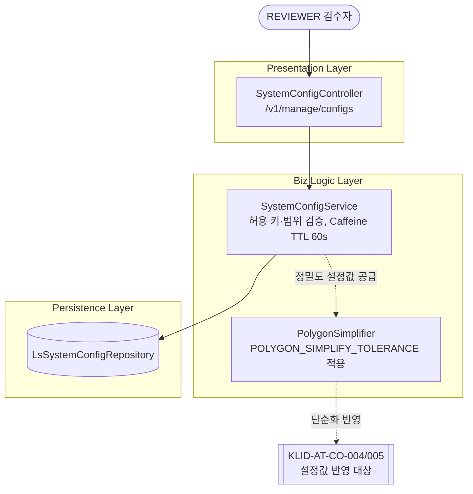

---

### 1.7 KLID-AT-CO-007 — version.snapshot (라벨 버전 저장·이력 추적)

| 컴포넌트 ID | KLID-AT-CO-007 | 컴포넌트명 | version.snapshot (라벨 버전 저장·이력 추적) |
|----------|---|---------|---|
| 관련 유스케이스 ID | KLID-AT-UC-007 |

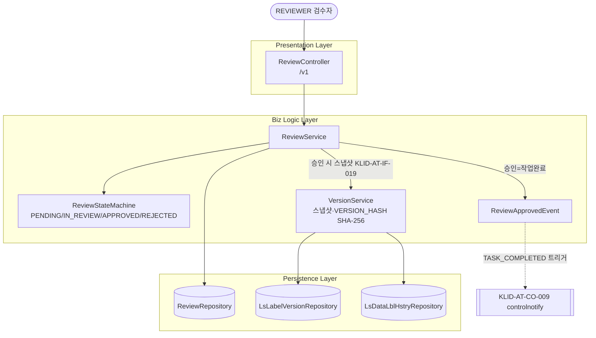

---

### 1.8 KLID-AT-CO-008 — version.compare (버전 비교·복구)

| 컴포넌트 ID | KLID-AT-CO-008 | 컴포넌트명 | version.compare (버전 비교·복구) |
|----------|---|---------|---|
| 관련 유스케이스 ID | KLID-AT-UC-008 |

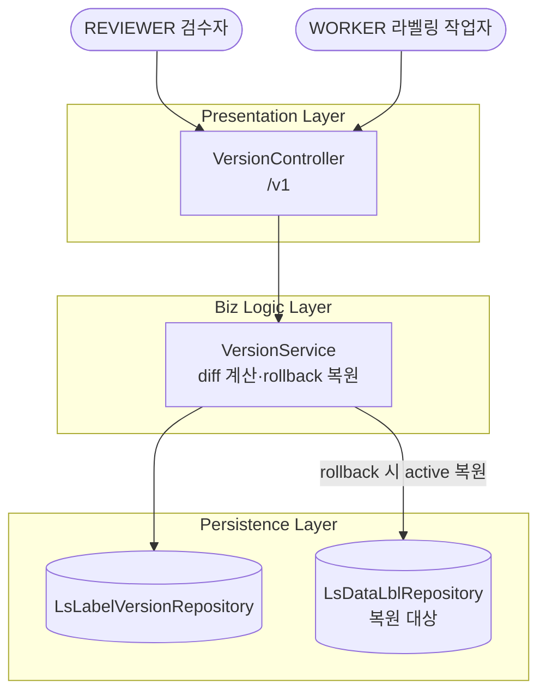

---

### 1.9 KLID-AT-CO-009 — controlnotify (데이터마트 수정 통지)

| 컴포넌트 ID | KLID-AT-CO-009 | 컴포넌트명 | controlnotify (데이터마트 수정 통지) |
|----------|---|---------|---|
| 관련 유스케이스 ID | KLID-AT-UC-009 |

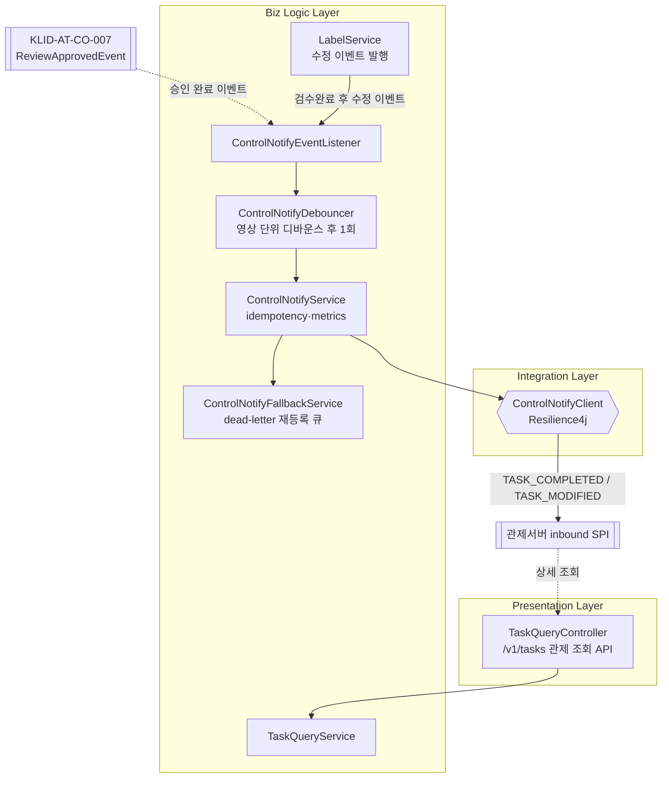

---

### 1.10 KLID-AT-CO-010 — augment.review (증강 영상 활용 여부 검수)

| 컴포넌트 ID | KLID-AT-CO-010 | 컴포넌트명 | augment.review (증강 영상 활용 여부 검수) |
|----------|---|---------|---|
| 관련 유스케이스 ID | KLID-AT-UC-010 |

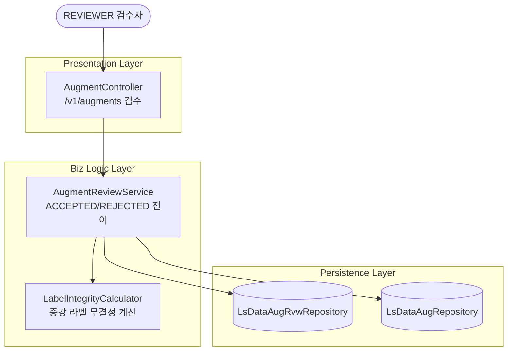

---

### 1.11 KLID-AT-CO-011 — deident.request (비식별 처리 요청)

| 컴포넌트 ID | KLID-AT-CO-011 | 컴포넌트명 | deident.request (비식별 처리 요청) |
|----------|---|---------|---|
| 관련 유스케이스 ID | KLID-AT-UC-011 |

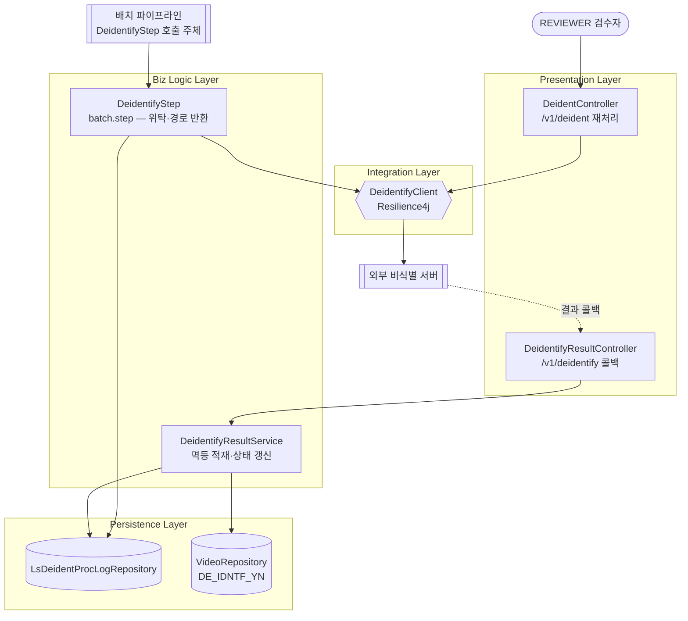

> ⚠ 비식별 파이프라인 순서 주의: 설계 타깃은 **비식별 선두**(비식별 → 마킹 → VLM → 프레임추출 → 오토라벨링)이나 현행 코드는 구 순서(마킹 트리거 → VLM → 비식별 → …) 구현. 비식별 선두 재배치·마킹 비식별영상화는 설계 확정·코드 미반영(planned).

---

### 1.12 KLID-AT-CO-013 — deident.config (비식별 옵션 설정)

| 컴포넌트 ID | KLID-AT-CO-013 | 컴포넌트명 | deident.config (비식별 옵션 설정) |
|----------|---|---------|---|
| 관련 유스케이스 ID | KLID-AT-UC-013 |

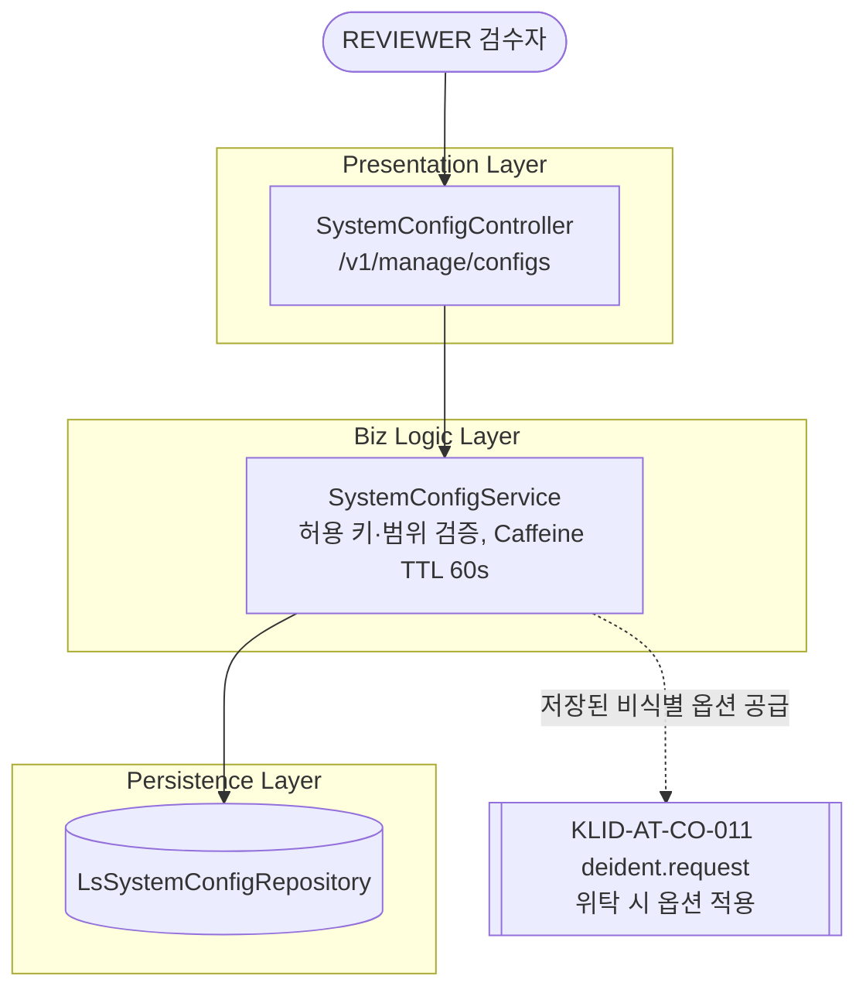

> 구체 옵션 항목은 외부 비식별 솔루션 계약 후 확정(미정) — R2 KLID-AT-UC-013 비고와 동일.

---

### 1.13 KLID-AT-CO-016 — deident.report (비식별 처리 상태·이력 확인)

| 컴포넌트 ID | KLID-AT-CO-016 | 컴포넌트명 | deident.report (비식별 처리 상태·이력 확인) |
|----------|---|---------|---|
| 관련 유스케이스 ID | KLID-AT-UC-016 |

> 출처: CMP-003 + backend 코드(`label.service`, `label.controller`) 보강 — `⚠ LogiCraft ITEM 보강 필요`(CMP-003은 report·재트라이 큐만 묘사하며 OPEN→RESOLVED resolve 오퍼레이션은 ITEM 미반영).

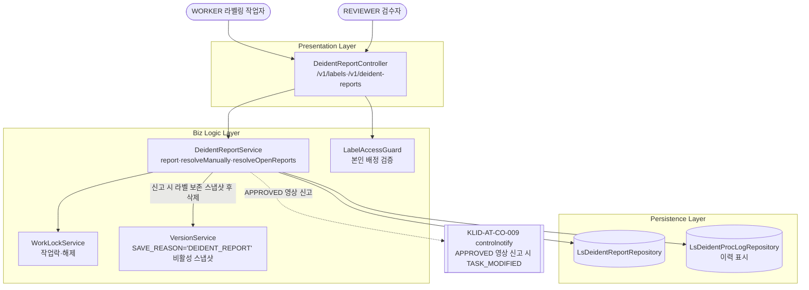

---

## 2. 컴포넌트 목록

> 컴포넌트 ID와 관련 유스케이스 ID는 **1:1**이다(컴포넌트 번호 = 실현 유스케이스 번호, KLID-AT-CO-012/014/015 결번).

| 컴포넌트ID | 컴포넌트명 | 개요 | 관련 유스케이스 ID |
|---------|---------|------|-------------|
| KLID-AT-CO-001 | augment.request (증강 영상 생성 요청) | 원본 영상의 증강(WINTER/NIGHT/RAIN) 생성을 외부 증강 시스템에 위탁(ExternalAugmentClient) | KLID-AT-UC-001 |
| KLID-AT-CO-002 | augment.result (증강 결과 수신·등록) | 외부 증강 결과 콜백 멱등 수신, 새 영상(RAW_SN, PARENT_RAW_SN) 생성·원본 라벨/메타 복사·PENDING 등록 | KLID-AT-UC-002 |
| KLID-AT-CO-003 | video.resolution (해상도 변경 수행) | 표준 하위 해상도 화이트리스트(RES_1080P/720P/480P) FFmpeg 다운스케일 이미지셋 제공(업스케일 거부, 라벨 좌표 미제공) | KLID-AT-UC-003 |
| KLID-AT-CO-004 | label.track (객체 자동 추적) | SAM2 비디오 추적·분할(VOS) — 시작 프레임 박스 지정 → 후속 프레임 위치·경계 자동 갱신 + 트랙 보간 | KLID-AT-UC-004 |
| KLID-AT-CO-005 | label.segment (객체 외곽 경계 자동 밀착) | SAM2 프롬프트(클릭/박스) 분할 — 외곽 경계 밀착 폴리곤+신뢰도 산출·적용 | KLID-AT-UC-005 |
| KLID-AT-CO-006 | label.precision (라벨링 정밀도 조절) | 시스템 설정 허용 키·범위 내 정밀도 파라미터(인식 민감도·경계 세밀함) 관리·자동 라벨링 반영 | KLID-AT-UC-006 |
| KLID-AT-CO-007 | version.snapshot (라벨 버전 저장·이력 추적) | 검수 승인(APPROVED) 시점 영상 단위 라벨 전체 스냅샷(JSON)·VERSION_HASH(SHA-256)·변경이력 기록 | KLID-AT-UC-007 |
| KLID-AT-CO-008 | version.compare (버전 비교·복구) | 검수완료 버전 간 DB 스냅샷 diff 계산·지정 버전 새 active 복원(외부 VCS 미사용) | KLID-AT-UC-008 |
| KLID-AT-CO-009 | controlnotify (데이터마트 수정 통지) | 단방향 outbound TASK_COMPLETED/MODIFIED 통지(영상 단위·본문 미포함·디바운스) + 관제 inbound 상세 조회 API | KLID-AT-UC-009 |
| KLID-AT-CO-010 | augment.review (증강 영상 활용 여부 검수) | PENDING 증강 영상의 활용 여부 검수(ACCEPTED/REJECTED), 라벨 무결성 기준 판단 | KLID-AT-UC-010 |
| KLID-AT-CO-011 | deident.request (비식별 처리 요청) | 외부 비식별 솔루션 위탁(DeidentifyClient)·결과 콜백 멱등 적재·재처리, 원본 보존·별도 경로 저장 | KLID-AT-UC-011 |
| KLID-AT-CO-013 | deident.config (비식별 옵션 설정) | 관리 화면에서 외부 비식별 솔루션 옵션 설정·저장, 후속 위탁 시 적용 | KLID-AT-UC-013 |
| KLID-AT-CO-016 | deident.report (비식별 처리 상태·이력 확인) | 영상 단위 비식별 상태·이력 확인, 누락 신고(라벨 보존 스냅샷 후 삭제+작업락)·수동 비식별 후 resolve | KLID-AT-UC-016 |

---

## 3. 컴포넌트 명세

> **⟳ 컴포넌트별로 1개씩 반복 작성한다.** 복수 컴포넌트 재사용 공통 클래스는 동일 IC ID로 교차 참조한다(※ 표기 — 최초 정의 컴포넌트에서 상세 기술).

### 3.1 KLID-AT-CO-001 — augment.request (증강 영상 생성 요청)

| 컴포넌트 ID | KLID-AT-CO-001 | 컴포넌트명 | augment.request (증강 영상 생성 요청) |
|----------|---|---------|---|
| 컴포넌트 개요 | REVIEWER가 선택한 원본 영상의 증강(WINTER/NIGHT/RAIN) 생성을 외부 증강 시스템에 위탁한다. 증강 레코드(LS_DATA_AUG)를 생성하고 외부 작업 등록 후 콜백을 대기한다. (MOD-013, CMP-007 / KLID-AT-UC-001 실현) |

| **내부 클래스** |
| ID | 클래스명 | 설명 |
|----|--------|------|
| KLID-AT-IC-001 | AugmentController | 증강 요청·결과 검수 엔드포인트(/v1/augments) — 요청 부분 |
| KLID-AT-IC-003 | AugmentRequestService | 외부 증강 요청 위임 |
| KLID-AT-IC-007 | LsDataAugRepository | 증강(LS_DATA_AUG) CRUD |
| KLID-AT-IC-059 | ExternalAugmentClient | 외부 증강 시스템 outbound 호출(Resilience4j) |

| **인터페이스 클래스** |
| ID | 인터페이스명 | 오퍼레이션명 | 구분 (Serviced/Required) |
|----|----------|----------|------------------------|
| KLID-AT-IF-001 | AugmentApi | requestAugment | Serviced |
| KLID-AT-IF-003 | ExternalAugmentPort | invokeAugment | Required |

### 3.2 KLID-AT-CO-002 — augment.result (증강 결과 수신·등록)

| 컴포넌트 ID | KLID-AT-CO-002 | 컴포넌트명 | augment.result (증강 결과 수신·등록) |
|----------|---|---------|---|
| 컴포넌트 개요 | 외부 증강 시스템의 생성 완료 콜백(HMAC·idempotencyKey)을 멱등 수신하여 새 영상(RAW_SN, PARENT_RAW_SN)·프레임·라벨·메타를 적재한다. 새 영상은 미검수(PENDING)로 등록되어 KLID-AT-CO-010 검수 대기 상태가 된다. 원본 라벨·메타를 좌표·속성 그대로 복사해 무결성을 유지한다(RQ-SFR-07-02). (MOD-013, CMP-007 / KLID-AT-UC-002 실현) |

| **내부 클래스** |
| ID | 클래스명 | 설명 |
|----|--------|------|
| KLID-AT-IC-002 | AugmentResultController | 외부 증강 시스템 결과 콜백 수신(/v1/augments) |
| KLID-AT-IC-005 | AugmentResultService | 증강 결과 새 영상·프레임·라벨·메타 적재(멱등성) |
| KLID-AT-IC-060 | WebhookIdempotencyLedger | 콜백 요청 ID 멱등성 원장(LS_WEBHOOK_IDEMPOTENCY) |
| KLID-AT-IC-007 ※ | LsDataAugRepository | 증강(LS_DATA_AUG) CRUD — KLID-AT-CO-001과 공유 |

| **인터페이스 클래스** |
| ID | 인터페이스명 | 오퍼레이션명 | 구분 (Serviced/Required) |
|----|----------|----------|------------------------|
| KLID-AT-IF-002 | AugmentResultCallbackApi | receiveAugmentResult | Serviced |

### 3.3 KLID-AT-CO-003 — video.resolution (해상도 변경 수행)

| 컴포넌트 ID | KLID-AT-CO-003 | 컴포넌트명 | video.resolution (해상도 변경 수행) |
|----------|---|---------|---|
| 컴포넌트 개요 | 해상도 변경 오케스트레이션. 표준 하위 해상도 프리셋(RES_1080P/720P/480P) 화이트리스트로 FFmpeg 다운스케일 이미지셋만 제공한다 — 업스케일(목표 ≥ 원본 높이) 400 거부, 영상(비디오) 재생성 없음, 라벨 좌표 미제공, 결과는 LS_RESOLUTION_EXPORT 1행 추적. (CMP-007 + backend `video.service` 보강 / KLID-AT-UC-003 실현) |

| **내부 클래스** |
| ID | 클래스명 | 설명 |
|----|--------|------|
| KLID-AT-IC-009 | VideoController | 해상도 변경 엔드포인트(/v1/videos/{rawSn}/resolution) |
| KLID-AT-IC-010 | VideoResolutionService | 해상도 변경 오케스트레이션(loadAndValidate·changeResolution) |
| KLID-AT-IC-011 | VideoResolutionPersister | 리사이즈 이미지셋·추적 행 저장 |
| KLID-AT-IC-012 | ResolutionPreset | 표준 하위 해상도 화이트리스트 enum(`⚠ ITEM 보강 필요` — 코드 신규) |
| KLID-AT-IC-013 | LsResolutionExportRepository | 해상도 변경본(LS_RESOLUTION_EXPORT) CRUD(`⚠ ITEM 보강 필요` — 코드 신규) |

| **인터페이스 클래스** |
| ID | 인터페이스명 | 오퍼레이션명 | 구분 (Serviced/Required) |
|----|----------|----------|------------------------|
| KLID-AT-IF-004 | VideoResolutionApi | changeResolution | Serviced |
| KLID-AT-IF-005 | VideoProbeResizePort | probe / resize | Required |

### 3.4 KLID-AT-CO-004 — label.track (객체 자동 추적)

| 컴포넌트 ID | KLID-AT-CO-004 | 컴포넌트명 | label.track (객체 자동 추적) |
|----------|---|---------|---|
| 컴포넌트 개요 | 시작 프레임에서 지정한 객체를 SAM2 비디오 추적·분할(VOS)로 후속 프레임에 전파하여 위치(BBox)·경계(폴리곤)를 자동 갱신하고, 빈 프레임은 트랙 보간으로 채운다(`POST /v1/frames/{srcSn}/sam2-track`). LabelAccessGuard로 본인 배정 프레임만 허용(IDOR 방지). (MOD-006, CMP-004 / KLID-AT-UC-004 실현) |

| **내부 클래스** |
| ID | 클래스명 | 설명 |
|----|--------|------|
| KLID-AT-IC-014 | LabelController | SAM2 트랙/세그먼트 엔드포인트(/v1/frames) |
| KLID-AT-IC-019 | Sam2TrackService | SAM2 대화형 트랙 세그멘테이션·트랙 보간 |
| KLID-AT-IC-024 | LabelAccessGuard | 본인 배정 프레임 편집 권한 검증(IDOR 방지) |
| KLID-AT-IC-028 | LsDataLblRepository | 라벨(LS_DATA_LBL) CRUD |
| KLID-AT-IC-061 | AiServerClient | ai-server 추론 outbound 호출(Resilience4j 60s + CircuitBreaker) |

| **인터페이스 클래스** |
| ID | 인터페이스명 | 오퍼레이션명 | 구분 (Serviced/Required) |
|----|----------|----------|------------------------|
| KLID-AT-IF-007 | Sam2TrackApi | sam2Track | Serviced |
| KLID-AT-IF-010 | AiInferencePort | inferSam2 | Required |

### 3.5 KLID-AT-CO-005 — label.segment (객체 외곽 경계 자동 밀착)

| 컴포넌트 ID | KLID-AT-CO-005 | 컴포넌트명 | label.segment (객체 외곽 경계 자동 밀착) |
|----------|---|---------|---|
| 컴포넌트 개요 | 캔버스에서 클릭(points) 또는 박스(box) 프롬프트로 객체를 지목하면 SAM2 분할이 외곽 경계 밀착 폴리곤+신뢰도를 산출한다(`POST /v1/frames/{srcSn}/sam2-segment`). mock 응답은 FE 자동적용 차단. (CMP-004 + backend 코드 보강 / KLID-AT-UC-005 실현) |

| **내부 클래스** |
| ID | 클래스명 | 설명 |
|----|--------|------|
| KLID-AT-IC-014 ※ | LabelController | 엔드포인트 — KLID-AT-CO-004와 공유 |
| KLID-AT-IC-020 | Sam2SegmentService | SAM2 외곽 자동 밀착 세그먼트(`⚠ ITEM 보강 필요` — 커밋 6441fb9 신규) |
| KLID-AT-IC-024 ※ | LabelAccessGuard | 권한 검증 — KLID-AT-CO-004와 공유 |
| KLID-AT-IC-025 | PolygonSimplifier | 응답 폴리곤 정밀도 단순화(common, Caffeine TTL 60s) |
| KLID-AT-IC-061 ※ | AiServerClient | ai-server 호출 — KLID-AT-CO-004와 공유 |

| **인터페이스 클래스** |
| ID | 인터페이스명 | 오퍼레이션명 | 구분 (Serviced/Required) |
|----|----------|----------|------------------------|
| KLID-AT-IF-008 | Sam2SegmentApi | sam2Segment | Serviced |
| KLID-AT-IF-010 ※ | AiInferencePort | inferSam2 | Required |

### 3.6 KLID-AT-CO-006 — label.precision (라벨링 정밀도 조절)

| 컴포넌트 ID | KLID-AT-CO-006 | 컴포넌트명 | label.precision (라벨링 정밀도 조절) |
|----------|---|---------|---|
| 컴포넌트 개요 | 관리 화면(/manage/*) 시스템 설정에서 인식 민감도·경계 세밀함(POLYGON_SIMPLIFY_TOLERANCE 등) 값을 허용 키·범위 내에서 조정하여 자동 라벨링 정밀도를 제어한다. 범위 밖 값은 거부. 설정값은 PolygonSimplifier 및 추론 파라미터에 반영된다. (KLID-AT-UC-006 실현) |

| **내부 클래스** |
| ID | 클래스명 | 설명 |
|----|--------|------|
| KLID-AT-IC-062 | SystemConfigController | 시스템 설정 엔드포인트(/v1/manage/configs) |
| KLID-AT-IC-063 | SystemConfigService | 허용 키·범위 검증·저장(Caffeine TTL 60s) |
| KLID-AT-IC-064 | LsSystemConfigRepository | 시스템 설정(LS_SYSTEM_CONFIG) CRUD |
| KLID-AT-IC-025 ※ | PolygonSimplifier | 정밀도 설정값 반영 대상 — KLID-AT-CO-005와 공유 |

| **인터페이스 클래스** |
| ID | 인터페이스명 | 오퍼레이션명 | 구분 (Serviced/Required) |
|----|----------|----------|------------------------|
| KLID-AT-IF-022 | SystemConfigApi | getConfigs | Serviced |
| KLID-AT-IF-022 | SystemConfigApi | updateConfig | Serviced |

### 3.7 KLID-AT-CO-007 — version.snapshot (라벨 버전 저장·이력 추적)

| 컴포넌트 ID | KLID-AT-CO-007 | 컴포넌트명 | version.snapshot (라벨 버전 저장·이력 추적) |
|----------|---|---------|---|
| 컴포넌트 개요 | 검수 승인(APPROVED) 시점에 영상 단위 라벨 전체 스냅샷(JSON)을 LS_LABEL_VERSION에 저장(SAVE_REASON='APPROVED', VERSION_HASH SHA-256)하고 변경이력(LS_DATA_LBL_HSTRY)을 함께 기록한다. 검수 워크플로우(제출·승인=작업완료·반려)는 ReviewStateMachine으로 전이를 검증하고 승인 시 ReviewApprovedEvent를 발행한다(→ KLID-AT-CO-009 통지). (MOD-007/009, CMP-005/006 / KLID-AT-UC-007 실현) |

| **내부 클래스** |
| ID | 클래스명 | 설명 |
|----|--------|------|
| KLID-AT-IC-045 | ReviewController | 검수 제출·시작·승인·반려 엔드포인트(/v1) |
| KLID-AT-IC-046 | ReviewService | 검수 워크플로우 — 승인 시 버전 스냅샷·완료 이벤트 발행 |
| KLID-AT-IC-047 | ReviewStateMachine | 검수 상태 전이 검증(PENDING/IN_REVIEW/APPROVED/REJECTED) |
| KLID-AT-IC-048 | ReviewApprovedEvent | 승인(=작업완료) 도메인 이벤트 — 관제 통지 트리거 |
| KLID-AT-IC-049 | ReviewRepository | 검수 레코드 CRUD |
| KLID-AT-IC-031 | VersionService | 승인 시 스냅샷 저장·해시 생성(diff·롤백은 KLID-AT-CO-008) |
| KLID-AT-IC-032 | LsLabelVersionRepository | 라벨 버전 스냅샷(LS_LABEL_VERSION) CRUD |
| KLID-AT-IC-033 | LsDataLblHstryRepository | 라벨 이력(LS_DATA_LBL_HSTRY) 기록 |

| **인터페이스 클래스** |
| ID | 인터페이스명 | 오퍼레이션명 | 구분 (Serviced/Required) |
|----|----------|----------|------------------------|
| KLID-AT-IF-018 | ReviewApi | submitReview | Serviced |
| KLID-AT-IF-018 | ReviewApi | approveReview | Serviced |
| KLID-AT-IF-018 | ReviewApi | rejectReview | Serviced |
| KLID-AT-IF-012 | VersionSnapshotPort | createSnapshot | Serviced |
| KLID-AT-IF-019 | VersionSnapshotPort | createSnapshot | Required |

> 비고: KLID-AT-IF-012(제공측)/KLID-AT-IF-019(소비측)는 구 review↔version 컴포넌트 경계의 협력 인터페이스로, 1:1 재편 후 KLID-AT-CO-007 내부 협력이 되었으나 KLID-AT-CO-016(신고 스냅샷)도 KLID-AT-IF-012를 소비하므로 ID를 유지한다.

### 3.8 KLID-AT-CO-008 — version.compare (버전 비교·복구)

| 컴포넌트 ID | KLID-AT-CO-008 | 컴포넌트명 | version.compare (버전 비교·복구) |
|----------|---|---------|---|
| 컴포넌트 개요 | 검수완료(APPROVED) 버전 간 DB 스냅샷을 앱에서 비교(diff)하고, 지정 버전을 새 active 버전으로 복원(rollback)한다. 외부 VCS 미사용. 복원 시 LS_DATA_LBL 갱신 + 이력 기록. (MOD-007, CMP-006 / KLID-AT-UC-008 실현) |

| **내부 클래스** |
| ID | 클래스명 | 설명 |
|----|--------|------|
| KLID-AT-IC-030 | VersionController | 버전 목록·상세·diff·롤백 엔드포인트(/v1) |
| KLID-AT-IC-031 ※ | VersionService | diff 계산·rollback 복원 — KLID-AT-CO-007과 공유 |
| KLID-AT-IC-032 ※ | LsLabelVersionRepository | 스냅샷 조회 — KLID-AT-CO-007과 공유 |
| KLID-AT-IC-028 ※ | LsDataLblRepository | rollback 시 active 라벨 복원 — KLID-AT-CO-004와 공유 |

| **인터페이스 클래스** |
| ID | 인터페이스명 | 오퍼레이션명 | 구분 (Serviced/Required) |
|----|----------|----------|------------------------|
| KLID-AT-IF-011 | VersionApi | listVersions | Serviced |
| KLID-AT-IF-011 | VersionApi | diffVersions | Serviced |
| KLID-AT-IF-011 | VersionApi | rollbackVersion | Serviced |

### 3.9 KLID-AT-CO-009 — controlnotify (데이터마트 수정 통지)

| 컴포넌트 ID | KLID-AT-CO-009 | 컴포넌트명 | controlnotify (데이터마트 수정 통지) |
|----------|---|---------|---|
| 컴포넌트 개요 | 검수 완료·검수완료 후 수정 시 단방향 outbound TASK_COMPLETED/MODIFIED 통지(영상 단위, 본문 미포함, 디바운스 후 1회)를 관제서버 inbound SPI로 push하고(idempotency·dead-letter·재등록 큐·Resilience4j), 관제서버가 상세를 조회할 inbound API를 제공한다. (MOD-015, CMP-009 관제통지 부분 / KLID-AT-UC-009 실현 — RQ-SFR-08-06 범위 외 처리 후 버전관리 흐름 연계로 운영 유지) |

| **내부 클래스** |
| ID | 클래스명 | 설명 |
|----|--------|------|
| KLID-AT-IC-018 | LabelService | 검수완료 후 라벨 수정 감지·수정 이벤트 발행 |
| KLID-AT-IC-034 | TaskQueryController | 관제서버 inbound 상세 조회 API(/v1/tasks) |
| KLID-AT-IC-035 | TaskQueryService | 영상·프레임·라벨·메타 상세 조회 |
| KLID-AT-IC-036 | ControlNotifyEventListener | 승인·수정 이벤트 수신 → 통지 트리거 |
| KLID-AT-IC-037 | ControlNotifyDebouncer | 영상 단위 디바운스 후 1회 통지 |
| KLID-AT-IC-038 | ControlNotifyService | outbound 통지 발행(idempotency·metrics) |
| KLID-AT-IC-039 | ControlNotifyFallbackService | 통지 실패 시 dead-letter 재등록 큐 |
| KLID-AT-IC-065 | ControlNotifyClient | 관제서버 inbound SPI outbound 호출(Resilience4j) |

| **인터페이스 클래스** |
| ID | 인터페이스명 | 오퍼레이션명 | 구분 (Serviced/Required) |
|----|----------|----------|------------------------|
| KLID-AT-IF-013 | TaskQueryApi | getTaskDetail | Serviced |
| KLID-AT-IF-014 | ControlNotifyPort | notifyTaskCompleted | Required |
| KLID-AT-IF-014 | ControlNotifyPort | notifyTaskModified | Required |

### 3.10 KLID-AT-CO-010 — augment.review (증강 영상 활용 여부 검수)

| 컴포넌트 ID | KLID-AT-CO-010 | 컴포넌트명 | augment.review (증강 영상 활용 여부 검수) |
|----------|---|---------|---|
| 컴포넌트 개요 | REVIEWER가 PENDING 증강 영상을 확인하여 라벨 무결성 기준으로 ACCEPTED(활용) 또는 REJECTED(미활용)로 전이한다. 승인분만 학습데이터로 편입된다. (MOD-013, CMP-005/007 / KLID-AT-UC-010 실현) |

| **내부 클래스** |
| ID | 클래스명 | 설명 |
|----|--------|------|
| KLID-AT-IC-001 ※ | AugmentController | 검수 엔드포인트 — KLID-AT-CO-001과 공유 |
| KLID-AT-IC-004 | AugmentReviewService | 증강 결과 검수(무결성 계산 활용) |
| KLID-AT-IC-006 | LabelIntegrityCalculator | 증강 라벨 무결성 계산 |
| KLID-AT-IC-008 | LsDataAugRvwRepository | 증강 검수(LS_DATA_AUG_RVW) CRUD |

| **인터페이스 클래스** |
| ID | 인터페이스명 | 오퍼레이션명 | 구분 (Serviced/Required) |
|----|----------|----------|------------------------|
| KLID-AT-IF-001 ※ | AugmentApi | reviewAugment | Serviced |

### 3.11 KLID-AT-CO-011 — deident.request (비식별 처리 요청)

| 컴포넌트 ID | KLID-AT-CO-011 | 컴포넌트명 | deident.request (비식별 처리 요청) |
|----------|---|---------|---|
| 컴포넌트 개요 | 외부 비식별 솔루션 위탁(DeidentifyClient)과 결과 콜백 적재. 배치 DeidentifyStep이 위탁하고 외부 서버가 /v1/deidentify 콜백으로 회신하면 처리 로그·비식별 상태를 갱신한다. 비식별본은 별도 경로(STORAGE_DEIDENTIFIED_PATH) 저장, 원본 보존(삭제 금지), 실패 시 DE_IDNTF_YN='F' + 재시도 큐. 재처리(placeholder) 엔드포인트 제공. (MOD-005, CMP-003 / KLID-AT-UC-011 실현) |

| **내부 클래스** |
| ID | 클래스명 | 설명 |
|----|--------|------|
| KLID-AT-IC-040 | DeidentifyResultController | 외부 비식별 서버 콜백 수신(/v1/deidentify) |
| KLID-AT-IC-041 | DeidentController | 재처리 요청(/v1/deident, placeholder) |
| KLID-AT-IC-042 | DeidentifyStep | 배치 단계 — 외부 비식별 위탁·결과 경로 반환·메타 적재 |
| KLID-AT-IC-043 | DeidentifyResultService | 콜백 멱등성 적재 + 비식별 처리 로그 기록 |
| KLID-AT-IC-044 | LsDeidentProcLogRepository | 비식별 처리 로그(LS_DEIDENT_PROC_LOG) CRUD |
| KLID-AT-IC-066 | DeidentifyClient | 외부 비식별 솔루션 outbound 호출(Resilience4j) |

| **인터페이스 클래스** |
| ID | 인터페이스명 | 오퍼레이션명 | 구분 (Serviced/Required) |
|----|----------|----------|------------------------|
| KLID-AT-IF-015 | DeidentifyCallbackApi | receiveDeidentifyResult | Serviced |
| KLID-AT-IF-016 | DeidentReprocessApi | reprocess | Serviced |
| KLID-AT-IF-017 | DeidentifyPort | invokeDeidentify | Required |

### 3.12 KLID-AT-CO-013 — deident.config (비식별 옵션 설정)

| 컴포넌트 ID | KLID-AT-CO-013 | 컴포넌트명 | deident.config (비식별 옵션 설정) |
|----------|---|---------|---|
| 컴포넌트 개요 | REVIEWER가 관리 화면(/manage/*)에서 외부 비식별 솔루션의 옵션을 설정·저장하여 이후 비식별 위탁(KLID-AT-CO-011)에 적용한다. 구체 옵션 항목은 외부 솔루션 계약에 종속(미정 — 계약 후 보강). (KLID-AT-UC-013 실현) |

| **내부 클래스** |
| ID | 클래스명 | 설명 |
|----|--------|------|
| KLID-AT-IC-062 ※ | SystemConfigController | 설정 엔드포인트 — KLID-AT-CO-006과 공유 |
| KLID-AT-IC-063 ※ | SystemConfigService | 허용 키·범위 검증·저장 — KLID-AT-CO-006과 공유 |
| KLID-AT-IC-064 ※ | LsSystemConfigRepository | LS_SYSTEM_CONFIG CRUD — KLID-AT-CO-006과 공유 |

| **인터페이스 클래스** |
| ID | 인터페이스명 | 오퍼레이션명 | 구분 (Serviced/Required) |
|----|----------|----------|------------------------|
| KLID-AT-IF-022 ※ | SystemConfigApi | getConfigs | Serviced |
| KLID-AT-IF-022 ※ | SystemConfigApi | updateConfig | Serviced |

### 3.13 KLID-AT-CO-016 — deident.report (비식별 처리 상태·이력 확인)

| 컴포넌트 ID | KLID-AT-CO-016 | 컴포넌트명 | deident.report (비식별 처리 상태·이력 확인) |
|----------|---|---------|---|
| 컴포넌트 개요 | 영상 단위 비식별 처리 상태(DE_IDNTF_YN)·배치 비식별 단계를 화면에 표시하고, 라벨 작업 중 비식별 누락 신고를 처리한다 — 신고 시 라벨 보존 스냅샷(SAVE_REASON='DEIDENT_REPORT') 후 일괄 삭제 + 작업락, 외부 솔루션 수동 비식별화 후 resolve(OPEN→RESOLVED) + 작업락 해제. APPROVED 영상 신고 시 TASK_MODIFIED 통지(KLID-AT-CO-009 연계). (MOD-005, CMP-003 + backend 코드 보강 / KLID-AT-UC-016 실현) |

| **내부 클래스** |
| ID | 클래스명 | 설명 |
|----|--------|------|
| KLID-AT-IC-026 | DeidentReportController | 비식별 리포트 조회·신고·resolve(/v1/labels·/v1/deident-reports) |
| KLID-AT-IC-027 | DeidentReportService | 비식별 누락 신고·resolveManually·resolveOpenReports |
| KLID-AT-IC-067 | WorkLockService | 신고 시 작업락 적용·resolve 시 해제(LS_AUTH_WORK_LOCK) |
| KLID-AT-IC-068 | LsDeidentReportRepository | 비식별 신고(LS_DEIDENT_REPORT) CRUD |
| KLID-AT-IC-031 ※ | VersionService | 신고 시 비활성 보존 스냅샷 — KLID-AT-CO-007과 공유 |
| KLID-AT-IC-044 ※ | LsDeidentProcLogRepository | 처리 이력 표시 — KLID-AT-CO-011과 공유 |
| KLID-AT-IC-024 ※ | LabelAccessGuard | 본인 배정 검증(타인 영상 신고/해소 403) — KLID-AT-CO-004와 공유 |

| **인터페이스 클래스** |
| ID | 인터페이스명 | 오퍼레이션명 | 구분 (Serviced/Required) |
|----|----------|----------|------------------------|
| KLID-AT-IF-009 | DeidentReportApi | report | Serviced |
| KLID-AT-IF-009 | DeidentReportApi | resolve | Serviced |
| KLID-AT-IF-012 ※ | VersionSnapshotPort | createSnapshot | Required |

---

## 4. 인터페이스 명세

> **⟳ 인터페이스별로, 그 인터페이스의 오퍼레이션 개수만큼 반복 작성한다.** KLID-AT-IF-006(LabelEditApi)·KLID-AT-IF-021(MarkingApi)은 R1 유스케이스를 직접 실현하지 않아 결번 처리(부록 참조), KLID-AT-IF-022(SystemConfigApi)는 1:1 재편 시 신설(R3 ※A 단절 해소).

### 4.1 KLID-AT-IF-001 / requestAugment

| 인터페이스 ID | KLID-AT-IF-001 | 인터페이스명 | AugmentApi |
|---------|---|---------|---|
| 오퍼레이션명 | requestAugment |
| 오퍼레이션 개요 | 원본 영상에 대해 증강 종류(WINTER/NIGHT/RAIN/RESOLUTION)를 지정하여 외부 증강 시스템에 생성 요청을 위탁한다. |
| 사전조건 | REVIEWER 권한 인증, 대상 원본 영상(rawSn) 존재 |
| 사후조건 | 외부 증강 요청 발행, 증강 레코드(LS_DATA_AUG) 생성 |
| 파라미터 | rawSn: Long, augmentType: Enum(WINTER/NIGHT/RAIN/RESOLUTION) |
| 반환값 | ApiResponse&lt;AugmentRequestResponse&gt; |

### 4.2 KLID-AT-IF-001 / reviewAugment

| 인터페이스 ID | KLID-AT-IF-001 | 인터페이스명 | AugmentApi |
|---------|---|---------|---|
| 오퍼레이션명 | reviewAugment |
| 오퍼레이션 개요 | 수신·등록된 증강 결과 영상의 활용 여부를 라벨 무결성 기준으로 검수하여 수락(accept)/거부(reject) 처리한다. |
| 사전조건 | REVIEWER 권한, 증강 결과 영상 등록 완료(PENDING) |
| 사후조건 | LS_DATA_AUG_RVW 검수 상태 갱신(수락/거부), 수락 시 새 영상 라벨링 플로우 진입 |
| 파라미터 | augSn: Long, decision: Enum(ACCEPT/REJECT) |
| 반환값 | ApiResponse&lt;Void&gt; |

### 4.3 KLID-AT-IF-002 / receiveAugmentResult

| 인터페이스 ID | KLID-AT-IF-002 | 인터페이스명 | AugmentResultCallbackApi |
|---------|---|---------|---|
| 오퍼레이션명 | receiveAugmentResult |
| 오퍼레이션 개요 | 외부 증강 시스템이 생성 완료한 증강 결과를 콜백으로 수신하여 새 영상(RAW_SN, PARENT_RAW_SN)·프레임·라벨·메타로 멱등 적재한다. |
| 사전조건 | 유효한 콜백 요청, 요청 ID 멱등성 |
| 사후조건 | 새 영상 미검수(PENDING)로 생성, 원본 라벨/메타 복사 적재 |
| 파라미터 | AugmentResultCallback(requestId, parentRawSn, resultPath, labels) |
| 반환값 | ApiResponse&lt;Void&gt; |

### 4.4 KLID-AT-IF-003 / invokeAugment

| 인터페이스 ID | KLID-AT-IF-003 | 인터페이스명 | ExternalAugmentPort |
|---------|---|---------|---|
| 오퍼레이션명 | invokeAugment |
| 오퍼레이션 개요 | ExternalAugmentClient를 통해 외부 증강 시스템에 증강 작업을 위탁하는 outbound 호출(Resilience4j 적용). |
| 사전조건 | 외부 증강 시스템 URL 구성, 위탁 페이로드 검증 |
| 사후조건 | 외부 작업 등록, 후속 콜백 대기 |
| 파라미터 | AugmentInvokeRequest(rawSn, augmentType, sourcePath) |
| 반환값 | AugmentInvokeAck |

### 4.5 KLID-AT-IF-004 / changeResolution

| 인터페이스 ID | KLID-AT-IF-004 | 인터페이스명 | VideoResolutionApi |
|---------|---|---------|---|
| 오퍼레이션명 | changeResolution |
| 오퍼레이션 개요 | 원본 영상을 표준 하위 해상도 프리셋으로 다운스케일하여 이미지셋으로 제공한다(영상 재생성 없음, 라벨 좌표 미제공). |
| 사전조건 | REVIEWER 권한, rawSn 존재, preset이 화이트리스트(RES_1080P/720P/480P), 목표 해상도 < 원본(업스케일 400 거부) |
| 사후조건 | 다운스케일 이미지셋 생성, LS_RESOLUTION_EXPORT 1행 추적(UK: 원본 RAW_SN + 해상도) |
| 파라미터 | rawSn: Long, ResolutionChangeRequest(preset: ResolutionPreset) |
| 반환값 | ApiResponse&lt;ResolutionChangeResponse&gt; |

### 4.6 KLID-AT-IF-005 / probe·resize

| 인터페이스 ID | KLID-AT-IF-005 | 인터페이스명 | VideoProbeResizePort |
|---------|---|---------|---|
| 오퍼레이션명 | probe / resize |
| 오퍼레이션 개요 | FFmpeg(net.bramp 래퍼)로 영상 해상도를 프로브하고 지정 프리셋으로 리사이즈하는 outbound 포트. |
| 사전조건 | 원본 영상 파일 접근 가능, 대상 프리셋 < 원본 해상도(다운스케일) |
| 사후조건 | 리사이즈 이미지 파일 생성 |
| 파라미터 | sourcePath: String, targetPreset: ResolutionPreset |
| 반환값 | ResizedVideoMeta(path, width, height) |

### 4.7 KLID-AT-IF-007 / sam2Track

| 인터페이스 ID | KLID-AT-IF-007 | 인터페이스명 | Sam2TrackApi |
|---------|---|---------|---|
| 오퍼레이션명 | sam2Track |
| 오퍼레이션 개요 | SAM2 대화형 트랙 세그멘테이션을 요청하여 객체를 프레임 간 자동 추적·분할한다(ai-server 프록시). |
| 사전조건 | WORKER 권한, 본인 배정 프레임(LabelAccessGuard) |
| 사후조건 | 트랙 라벨 저장(LS_DATA_LBL) |
| 파라미터 | srcSn: Long, Sam2TrackRequest |
| 반환값 | ApiResponse&lt;Sam2TrackResponseDto&gt; |

### 4.8 KLID-AT-IF-008 / sam2Segment

| 인터페이스 ID | KLID-AT-IF-008 | 인터페이스명 | Sam2SegmentApi |
|---------|---|---------|---|
| 오퍼레이션명 | sam2Segment |
| 오퍼레이션 개요 | 클릭 좌표(points) 또는 박스(box) 프롬프트로 SAM2 단일 프레임 외곽 자동 밀착 세그먼트를 수행하여 폴리곤+신뢰도를 반환한다(ai-server `/infer/sam2/segment` 프록시). `⚠ ITEM 보강 필요`(커밋 6441fb9 신규). |
| 사전조건 | WORKER 권한, 본인 배정 프레임(LabelAccessGuard), points/box 중 정확히 하나 제공(@AssertTrue), 경로 순회 차단(resolveSafe) |
| 사후조건 | - (응답 폴리곤 좌표를 이미지 실측 범위로 클램프) |
| 파라미터 | srcSn: Long, Sam2SegmentRequest(srcSn, points: List&lt;List&lt;Double&gt;&gt; max100, box: List&lt;Double&gt; size4) |
| 반환값 | ApiResponse&lt;Sam2SegmentResponse&gt; |

### 4.9 KLID-AT-IF-009 / report

| 인터페이스 ID | KLID-AT-IF-009 | 인터페이스명 | DeidentReportApi |
|---------|---|---------|---|
| 오퍼레이션명 | report |
| 오퍼레이션 개요 | 라벨링 단계에서 개인정보 노출(비식별 누락)을 발견한 작업자가 프레임(srcSn) 기준으로 신고한다. 신고 시 작업락 + 재비식별 큐. |
| 사전조건 | 인증, 본인 배정 프레임(LabelAccessGuard) |
| 사후조건 | LS_DEIDENT_REPORT OPEN 생성, 영상 라벨 처리·작업락 적용 |
| 파라미터 | srcSn: Long, DeidentReportRequest(reason) |
| 반환값 | ApiResponse&lt;Long&gt; (rprtSn) |

### 4.10 KLID-AT-IF-009 / resolve

| 인터페이스 ID | KLID-AT-IF-009 | 인터페이스명 | DeidentReportApi |
|---------|---|---------|---|
| 오퍼레이션명 | resolve |
| 오퍼레이션 개요 | 외부 솔루션 수동 비식별화 완료 후 신고를 OPEN→RESOLVED로 전이하고 작업락을 해제한다(resolveManually). 배치 자동 비식별 성공 시 OPEN 신고 일괄 RESOLVED(resolveOpenReports). `⚠ ITEM 보강 필요`. |
| 사전조건 | 인증(rprtSn에 대해 verifyRawAccess), 신고 상태 OPEN(아니면 409) |
| 사후조건 | LS_DEIDENT_REPORT RESOLVED 전이, 작업락 해제 (멱등) |
| 파라미터 | rprtSn: Long |
| 반환값 | ApiResponse&lt;Void&gt; |

### 4.11 KLID-AT-IF-010 / inferSam2 (Required)

| 인터페이스 ID | KLID-AT-IF-010 | 인터페이스명 | AiInferencePort |
|---------|---|---------|---|
| 오퍼레이션명 | inferSam2 |
| 오퍼레이션 개요 | AiServerClient를 통해 ai-server SAM2 추론 엔드포인트를 호출하는 outbound 포트(Resilience4j 60s + CircuitBreaker). |
| 사전조건 | ai-server URL 구성, 프레임 이미지 경로 유효 |
| 사후조건 | 추론 폴리곤/마스크 응답 수신 |
| 파라미터 | Sam2Request(imagePath, points|box) |
| 반환값 | Sam2Response |

### 4.12 KLID-AT-IF-011 / listVersions

| 인터페이스 ID | KLID-AT-IF-011 | 인터페이스명 | VersionApi |
|---------|---|---------|---|
| 오퍼레이션명 | listVersions |
| 오퍼레이션 개요 | 영상 단위 검수완료(APPROVED) 라벨 버전 스냅샷 목록을 조회한다. |
| 사전조건 | 인증, rawSn 접근 권한 |
| 사후조건 | - |
| 파라미터 | rawSn: Long, Pageable |
| 반환값 | ApiResponse&lt;Page&lt;VersionSummary&gt;&gt; |

### 4.13 KLID-AT-IF-011 / diffVersions

| 인터페이스 ID | KLID-AT-IF-011 | 인터페이스명 | VersionApi |
|---------|---|---------|---|
| 오퍼레이션명 | diffVersions |
| 오퍼레이션 개요 | 두 검수완료 버전 스냅샷을 앱에서 비교하여 라벨 변경 diff를 계산한다. |
| 사전조건 | 두 버전 모두 동일 rawSn 소속, 존재 |
| 사후조건 | - |
| 파라미터 | rawSn: Long, fromHash: String, toHash: String |
| 반환값 | ApiResponse&lt;VersionDiff&gt; |

### 4.14 KLID-AT-IF-011 / rollbackVersion

| 인터페이스 ID | KLID-AT-IF-011 | 인터페이스명 | VersionApi |
|---------|---|---------|---|
| 오퍼레이션명 | rollbackVersion |
| 오퍼레이션 개요 | 대상 검수완료 스냅샷을 새 active 버전으로 복원(롤백)한다. |
| 사전조건 | REVIEWER 권한, 대상 버전 존재, 작업 락 |
| 사후조건 | LS_DATA_LBL 복원, 이력(LS_DATA_LBL_HSTRY) 기록 |
| 파라미터 | rawSn: Long, targetHash: String |
| 반환값 | ApiResponse&lt;Void&gt; |

### 4.15 KLID-AT-IF-012 / createSnapshot (Serviced)

| 인터페이스 ID | KLID-AT-IF-012 | 인터페이스명 | VersionSnapshotPort |
|---------|---|---------|---|
| 오퍼레이션명 | createSnapshot |
| 오퍼레이션 개요 | 검수 승인(APPROVED) 시점에 영상 단위 라벨 전체를 JSON 스냅샷으로 저장하고 VERSION_HASH(SHA-256)를 부여한다. ReviewService(KLID-AT-CO-007)·DeidentReportService(KLID-AT-CO-016, SAVE_REASON='DEIDENT_REPORT')가 호출. |
| 사전조건 | 검수 상태 APPROVED 전이 직전·직후 트랜잭션(또는 비식별 신고 트랜잭션) |
| 사후조건 | LS_LABEL_VERSION 신규 행, 동일 페이로드는 동일 해시로 중복 식별 |
| 파라미터 | rawSn: Long, saveReason: String |
| 반환값 | versionHash: String |

### 4.16 KLID-AT-IF-013 / getTaskDetail

| 인터페이스 ID | KLID-AT-IF-013 | 인터페이스명 | TaskQueryApi |
|---------|---|---------|---|
| 오퍼레이션명 | getTaskDetail |
| 오퍼레이션 개요 | 관제서버가 TASK_COMPLETED/MODIFIED 통지 수신 후 영상 단위 상세(영상·프레임·라벨·메타)를 조회하는 inbound API. |
| 사전조건 | 인계 토큰 또는 IP 화이트리스트 통과, rawSn 존재 |
| 사후조건 | - |
| 파라미터 | rawSn: Long |
| 반환값 | ApiResponse&lt;TaskDetailResponse&gt; |

### 4.17 KLID-AT-IF-014 / notifyTaskCompleted (Required)

| 인터페이스 ID | KLID-AT-IF-014 | 인터페이스명 | ControlNotifyPort |
|---------|---|---------|---|
| 오퍼레이션명 | notifyTaskCompleted |
| 오퍼레이션 개요 | 검수 완료(COMPLETED 전이) 시 영상 단위 TASK_COMPLETED 통지(메타만)를 관제서버 inbound SPI로 비동기 push. |
| 사전조건 | 검수 APPROVED→작업 COMPLETED 전이, 요청 ID 멱등성 |
| 사후조건 | outbound 통지 발행, 실패 시 dead-letter 재등록 큐 적재 |
| 파라미터 | TaskCompletedPayload(rawSn, videoMeta, completedAt, frameCount, labelCount, metaCount, requestId) |
| 반환값 | - (비동기) |

### 4.18 KLID-AT-IF-014 / notifyTaskModified (Required)

| 인터페이스 ID | KLID-AT-IF-014 | 인터페이스명 | ControlNotifyPort |
|---------|---|---------|---|
| 오퍼레이션명 | notifyTaskModified |
| 오퍼레이션 개요 | 검수 완료 후 라벨/메타 수정 시 영상 단위 TASK_MODIFIED 통지(수정 요약만)를 push. 디바운스 후 1회 발행. |
| 사전조건 | 동일 작업 ID(rawSn) 검수완료 이력 존재 |
| 사후조건 | 변경 프레임 목록·변경 종류 포함 통지 발행(본문 미포함) |
| 파라미터 | TaskModifiedPayload(rawSn, modifiedAt, changedFrames[srcSn, changeType], summary, requestId) |
| 반환값 | - (비동기) |

### 4.19 KLID-AT-IF-015 / receiveDeidentifyResult

| 인터페이스 ID | KLID-AT-IF-015 | 인터페이스명 | DeidentifyCallbackApi |
|---------|---|---------|---|
| 오퍼레이션명 | receiveDeidentifyResult |
| 오퍼레이션 개요 | 외부 비식별 서버가 처리 완료한 비식별 영상 결과를 /v1/deidentify 콜백으로 수신하여 멱등 적재하고 처리 로그·비식별 상태를 갱신한다. |
| 사전조건 | 유효한 콜백, 요청 멱등성 |
| 사후조건 | LS_DEIDENT_PROC_LOG 기록, LS_DATA_RAW 비식별 상태 갱신 |
| 파라미터 | DeidentifyResultCallback(rawSn, resultPath, status) |
| 반환값 | ApiResponse&lt;Void&gt; |

### 4.20 KLID-AT-IF-016 / reprocess

| 인터페이스 ID | KLID-AT-IF-016 | 인터페이스명 | DeidentReprocessApi |
|---------|---|---------|---|
| 오퍼레이션명 | reprocess |
| 오퍼레이션 개요 | 비식별 재처리 요청 엔드포인트(/v1/deident, placeholder). |
| 사전조건 | 인증, rawSn 존재 |
| 사후조건 | 재비식별 큐 적재 |
| 파라미터 | rawSn: Long |
| 반환값 | ApiResponse&lt;Void&gt; |

### 4.21 KLID-AT-IF-017 / invokeDeidentify (Required)

| 인터페이스 ID | KLID-AT-IF-017 | 인터페이스명 | DeidentifyPort |
|---------|---|---------|---|
| 오퍼레이션명 | invokeDeidentify |
| 오퍼레이션 개요 | DeidentifyClient를 통해 외부 비식별 서버에 영상 비식별을 위탁하는 outbound 호출(Resilience4j). |
| 사전조건 | 비식별 서버 URL 구성, 원본 영상 경로 유효 |
| 사후조건 | 외부 작업 등록, 실패 시 DE_IDNTF_YN='F' 마킹 + 재시도 큐(원본 삭제 금지) |
| 파라미터 | DeidentifyInvokeRequest(rawSn, sourcePath, options) |
| 반환값 | DeidentifyInvokeAck |

### 4.22 KLID-AT-IF-018 / submitReview

| 인터페이스 ID | KLID-AT-IF-018 | 인터페이스명 | ReviewApi |
|---------|---|---------|---|
| 오퍼레이션명 | submitReview |
| 오퍼레이션 개요 | 라벨링 작업자가 라벨 작업 결과를 검수 제출한다(상태 전이 검증). |
| 사전조건 | WORKER 권한, 본인 배정 작업 |
| 사후조건 | 검수 상태 IN_REVIEW 전이 |
| 파라미터 | rawSn: Long |
| 반환값 | ApiResponse&lt;Void&gt; |

### 4.23 KLID-AT-IF-018 / approveReview

| 인터페이스 ID | KLID-AT-IF-018 | 인터페이스명 | ReviewApi |
|---------|---|---------|---|
| 오퍼레이션명 | approveReview |
| 오퍼레이션 개요 | REVIEWER가 검수를 승인(=작업완료)한다. 승인 시 라벨 버전 스냅샷 생성 + ReviewApprovedEvent 발행(관제 통지). |
| 사전조건 | REVIEWER 권한, 상태 IN_REVIEW, ReviewStateMachine 전이 허용 |
| 사후조건 | APPROVED 전이, LS_LABEL_VERSION 스냅샷, 작업 COMPLETED, TASK_COMPLETED 통지 발행 |
| 파라미터 | rawSn: Long |
| 반환값 | ApiResponse&lt;Void&gt; |

### 4.24 KLID-AT-IF-018 / rejectReview

| 인터페이스 ID | KLID-AT-IF-018 | 인터페이스명 | ReviewApi |
|---------|---|---------|---|
| 오퍼레이션명 | rejectReview |
| 오퍼레이션 개요 | REVIEWER가 검수를 반려하고 이슈를 기록한다. |
| 사전조건 | REVIEWER 권한, 상태 IN_REVIEW |
| 사후조건 | REJECTED 전이, 검수 이슈 기록 |
| 파라미터 | rawSn: Long, RejectRequest(issues) |
| 반환값 | ApiResponse&lt;Void&gt; |

### 4.25 KLID-AT-IF-019 / createSnapshot (Required)

| 인터페이스 ID | KLID-AT-IF-019 | 인터페이스명 | VersionSnapshotPort |
|---------|---|---------|---|
| 오퍼레이션명 | createSnapshot |
| 오퍼레이션 개요 | 검수 승인 시 스냅샷 생성을 요청하는 Required 호출(KLID-AT-IF-012의 소비측). 1:1 재편 후 KLID-AT-CO-007 내부 협력이나 멱등 유지를 위해 ID 존치. |
| 사전조건 | 검수 APPROVED 전이 트랜잭션 내 |
| 사후조건 | LS_LABEL_VERSION 스냅샷 생성 |
| 파라미터 | rawSn: Long, saveReason='APPROVED' |
| 반환값 | versionHash: String |

### 4.26 KLID-AT-IF-020 / inferSam2 (Serviced)

| 인터페이스 ID | KLID-AT-IF-020 | 인터페이스명 | InferenceApi |
|---------|---|---------|---|
| 오퍼레이션명 | inferSam2 |
| 오퍼레이션 개요 | ai-server(지원 구성요소 — 컴포넌트 미도출, 부록 참조)가 제공하는 SAM2 세그먼트 추론(/infer/sam2/segment). Stateless. KLID-AT-CO-004/005의 KLID-AT-IF-010 Required에 대응하는 제공측. |
| 사전조건 | 이미지 경로·프롬프트(points|box) 유효 |
| 사후조건 | - |
| 파라미터 | image, points|box |
| 반환값 | polygon, score |

### 4.27 KLID-AT-IF-020 / inferYolo (Serviced)

| 인터페이스 ID | KLID-AT-IF-020 | 인터페이스명 | InferenceApi |
|---------|---|---------|---|
| 오퍼레이션명 | inferYolo |
| 오퍼레이션 개요 | ai-server가 제공하는 YOLO 객체 탐지 추론. 원본 이미지에만 실행, 비식별본과 좌표 공유. 호출 주체(오토라벨링 배치)는 R1 범위 외이나 KLID-AT-CO-006 정밀도 설정값(인식 민감도)의 반영 대상이므로 명세 유지. |
| 사전조건 | 원본 이미지 경로 유효 |
| 사후조건 | - |
| 파라미터 | image |
| 반환값 | detections[bbox, class, score] |

### 4.28 KLID-AT-IF-022 / getConfigs

| 인터페이스 ID | KLID-AT-IF-022 | 인터페이스명 | SystemConfigApi |
|---------|---|---------|---|
| 오퍼레이션명 | getConfigs |
| 오퍼레이션 개요 | 시스템 설정(라벨링 정밀도·비식별 옵션 등) 현재 값 목록을 조회한다(`GET /v1/manage/configs`). KLID-AT-CO-006/KLID-AT-CO-013 공용. |
| 사전조건 | REVIEWER 권한(관리 화면 /manage/*) |
| 사후조건 | - |
| 파라미터 | category: String (optional — PRECISION/DEIDENT 등) |
| 반환값 | ApiResponse&lt;List&lt;SystemConfigResponse&gt;&gt; |

### 4.29 KLID-AT-IF-022 / updateConfig

| 인터페이스 ID | KLID-AT-IF-022 | 인터페이스명 | SystemConfigApi |
|---------|---|---------|---|
| 오퍼레이션명 | updateConfig |
| 오퍼레이션 개요 | 시스템 설정 키의 값을 변경한다(`PUT /v1/manage/configs/{key}`). 허용 키·범위 검증 후 저장하며 범위 밖 값은 400 거부. 저장 값은 Caffeine 캐시(TTL 60s) 경유로 후속 자동 라벨링·비식별 위탁에 반영된다. |
| 사전조건 | REVIEWER 권한, key가 허용 목록에 존재, 값이 허용 범위 내 |
| 사후조건 | LS_SYSTEM_CONFIG 갱신, 후속 처리에 설정값 반영 |
| 파라미터 | key: String, SystemConfigUpdateRequest(value) |
| 반환값 | ApiResponse&lt;Void&gt; |

---

## 부록 — 결번·제외 사유

| 항목 | 사유 |
|------|------|
| KLID-AT-CO-012, KLID-AT-CO-014, KLID-AT-CO-015 (컴포넌트 결번) | 컴포넌트 번호를 실현 유스케이스 번호와 1:1 정렬 — R2 유스케이스 결번(KLID-AT-UC-012/014/015, deprecated UC)에 대응하는 결번 |
| KLID-AT-IF-006 (LabelEditApi 결번) | 라벨 작업 임시저장(saveLabels/getLabels)은 R1 기능 요구사항 유스케이스를 직접 실현하지 않음(R2에 라벨 CRUD UC 없음) — v1.0 명세는 백업 보존 |
| KLID-AT-IF-021 (MarkingApi 결번) | 마킹(saveMarking/completeMarking)은 R1 기능 요구사항 유스케이스를 직접 실현하지 않음 — v1.0 명세는 백업 보존 |
| KLID-AT-IC-015/016/017, KLID-AT-IC-021/022/023, KLID-AT-IC-029 (IC 결번) | 라벨 속성·마스터·프레임 서빙 클래스 — R1 UC 실현 컴포넌트에 미배정 |
| KLID-AT-IC-050 (IC 결번) | IssueRepository(검수 이슈) — 검수 이슈 스레드는 R1 UC 직접 실현 아님 |
| KLID-AT-IC-051~053 (IC 결번) | ai-server 내부(yolo/sam2/vlm router) — ai-server는 지원 구성요소로 컴포넌트 미도출, 제공측 인터페이스(KLID-AT-IF-020)만 명세 유지 |
| KLID-AT-IC-054~058 (IC 결번) | 마킹(MarkingController/Service/Event/Bridge/Repository) — R1 UC 직접 실현 아님 |
| KLID-AT-UC-013 옵션 항목 | 외부 비식별 솔루션 구체 옵션 미정의 — 솔루션 계약·스펙 확정 후 KLID-AT-CO-013·KLID-AT-IF-022 보강 필요 |
| ai-server 다중 인스턴스 | ai-server(YOLO/SAM2)는 GPU Worker 별도 프로세스로 수평 확장 가능 — 배포 관점 상세는 아키텍처 문서 참조 |
