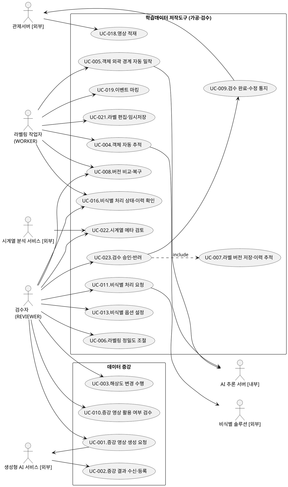

# R2 유스케이스 명세서 — 통합 UCD (A+B)

> **목적**: 기존 `R2-유스케이스명세서.md`는 UCD를 흐름별 2개(가공·검수 14 UC / 데이터 증강 4 UC)로 분리하고, 증강 UCD는 노드가 적어 페이지에서 작게 렌더된다.
> 본 문서는 **(A) 전 액터(8) · 전 유스케이스(18)를 한 장에 모은 단일 통합 UCD** + **(B) `left to right direction` + `scale` 상향으로 페이지 폭을 채우는 와이드 렌더**를 적용한 보충 산출물이다. 유스케이스 목록·기술서(시나리오·전제/종료조건 등)는 기존 `R2-유스케이스명세서.md`를 그대로 따른다.
>
> **렌더 권장**: PlantUML `scale`/`dpi` 적용본. 폭 ≥ 1200px 기준. (plantuml.jar 또는 동등 렌더러 사용)

## 통합 유스케이스 다이어그램 (전 액터 · 전 UC)

| UCD ID | KLID-AT-UCD-ALL | UCD 명 | 학습데이터 저작도구 통합 유스케이스 다이어그램 |
|--------|---|-------|---|
| 관련 서브시스템 | KLID-AT-SS-002~009 | 포함 | 가공·검수 핵심 흐름 + 데이터 증강 흐름 (UCD-001 + UCD-002 통합) |

> 본 통합 UCD는 액터 8종과 유스케이스 18종의 전 관계를 한 장으로 조망한다. 유스케이스별 상세 기술서(주요 액터·이해관계자·전제/종료조건·기본/대안 시나리오·발생 빈도)는 원본 `R2-유스케이스명세서.md`의 "5. 유스케이스 기술서" 절을 그대로 참조한다.
