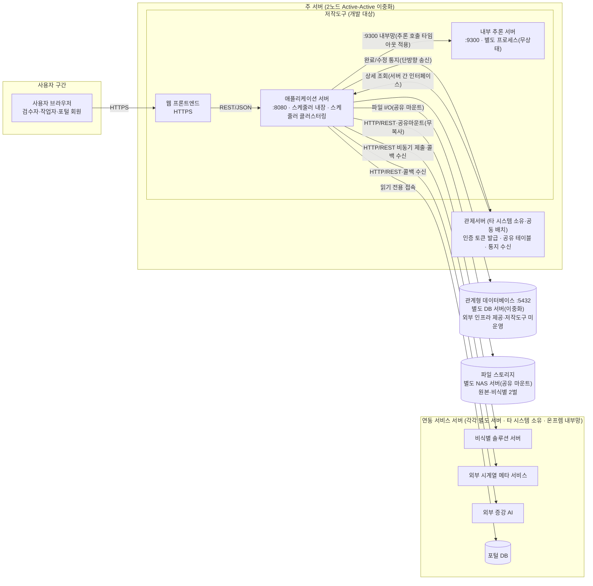
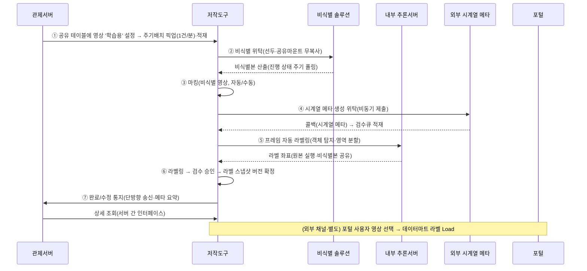
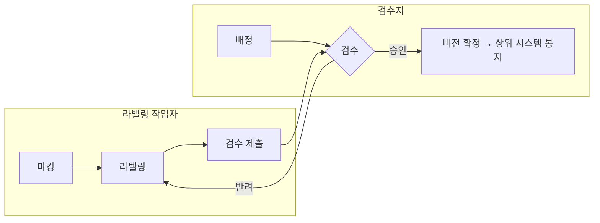
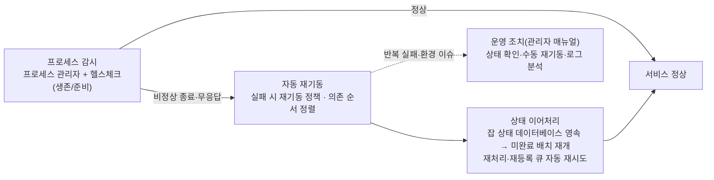
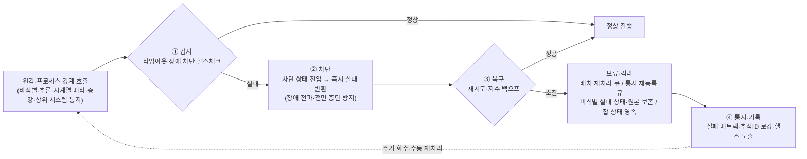

# D5 아키텍처 설계서

## 작성 목적
> 시스템의 품질을 확보하기 위하여 전체시스템에 대한 청사진으로서의 아키텍처를 작성한다. 소프트웨어 아키텍처는 개발 대상 응용 소프트웨어에 대한 아키텍처이며, 시스템 아키텍처는 응용 소프트웨어와 이에 상호작용하는 환경 및 네트워크가 포함된 아키텍처를 의미한다.

## 작성 방법
> 소프트웨어 아키텍처는 선정된 아키텍처 패턴을 중심으로 컴포넌트와 상호작용하는 커넥션 및 가시적인 속성을 표현한다. 시스템 아키텍처는 개발 대상시스템과 상호작용하는 하드웨어, 시스템 소프트웨어 및 네트워크와의 관계를 표현한다. 아키텍처 요구사항 및 구현방안은 아키텍처 관점에서의 시스템의 품질, 보안, 성능, 장애복구 등의 요구사항과 이에 대한 구현방안을 기술한다.

## 산출물 양식

### 제.개정 이력

| 날짜 | 버전 | 작성자 | 승인자 | 내용 |
|------|------|--------|--------|------|
| 2026-08-06 | 1.0 | - | - | LogiCraft 그래프 기반 생성 (/cc-doc-gen) |

### 헤더

| D5 | 아키텍처 설계서 | | |
|------|------|------|------|
| 시스템명 | AI 기반 지방정부 CCTV 관제지원시스템(2차) | 서브시스템명 | 학습데이터 저작도구 |
| 단계명 | 설계 | 작성일자 | 2026-08-06 / 버전 1.0 |

---

### 1. 소프트웨어 아키텍처

본 시스템은 표현·업무·데이터 계층을 분리한 **레이어드(Layered) 아키텍처**를 채택한 모듈형 단일 애플리케이션이다. 표현 계층(웹 프론트엔드)은 업무 계층(애플리케이션 서버)의 REST 인터페이스만 호출하고, 업무 계층은 컨트롤러 → 서비스 → 리포지토리의 단방향 의존으로 구성한다. 데이터 계층(관계형 데이터베이스·파일 스토리지)은 리포지토리를 통해서만 접근한다. AI 추론은 업무 계층이 오케스트레이션하되, 실제 추론 연산은 **내부 추론 서버**(별도 프로세스, 무상태)로 분리하여 추론 연산의 자원 경합을 격리한다.

```html
<div style="font-family:'Malgun Gothic','Apple SD Gothic Neo',sans-serif;max-width:880px;margin:0 auto;color:#1f2937;font-size:13px;">
  <!-- 표현 계층 -->
  <div style="border:2px solid #2563eb;border-radius:8px;background:#eff6ff;padding:10px 14px;">
    <div style="font-weight:bold;color:#1d4ed8;margin-bottom:8px;">표현 계층 (Presentation Layer)</div>
    <div style="background:#ffffff;border:1px solid #93c5fd;border-radius:6px;padding:8px 12px;text-align:center;">
      <b>웹 프론트엔드</b><br><span style="font-size:12px;color:#475569;">라벨링 캔버스 · 검수 · 관리 · 마킹 화면</span>
    </div>
  </div>
  <div style="display:flex;align-items:center;justify-content:center;gap:8px;height:42px;">
    <svg width="24" height="42" viewBox="0 0 24 42"><line x1="12" y1="0" x2="12" y2="30" stroke="#1e40af" stroke-width="3"/><polygon points="4,28 20,28 12,42" fill="#1e40af"/></svg>
    <span style="font-size:12px;font-weight:bold;color:#1e40af;">표준 응답 래퍼 기반 REST/JSON</span>
  </div>
  <!-- 업무 계층 -->
  <div style="border:2px solid #059669;border-radius:8px;background:#ecfdf5;padding:10px 14px;">
    <div style="font-weight:bold;color:#047857;margin-bottom:8px;">업무 계층 (Business Layer) — 애플리케이션 서버</div>
    <div style="display:flex;align-items:center;gap:6px;margin-bottom:8px;">
      <div style="flex:1;background:#ffffff;border:1px solid #6ee7b7;border-radius:6px;padding:7px 8px;text-align:center;"><b>컨트롤러</b><br><span style="font-size:11px;color:#475569;">요청 수신 · 표준 응답 · 검증</span></div>
      <svg width="26" height="14" viewBox="0 0 26 14" style="flex:none;"><line x1="0" y1="7" x2="16" y2="7" stroke="#047857" stroke-width="3"/><polygon points="14,1 14,13 26,7" fill="#047857"/></svg>
      <div style="flex:1;background:#ffffff;border:1px solid #6ee7b7;border-radius:6px;padding:7px 8px;text-align:center;"><b>서비스</b><br><span style="font-size:11px;color:#475569;">업무 로직 · 트랜잭션 · 상태 전이</span></div>
      <svg width="26" height="14" viewBox="0 0 26 14" style="flex:none;"><line x1="0" y1="7" x2="16" y2="7" stroke="#047857" stroke-width="3"/><polygon points="14,1 14,13 26,7" fill="#047857"/></svg>
      <div style="flex:1;background:#ffffff;border:1px solid #6ee7b7;border-radius:6px;padding:7px 8px;text-align:center;"><b>리포지토리</b><br><span style="font-size:11px;color:#475569;">영속성 접근(ORM · 동적 질의)</span></div>
    </div>
    <div style="background:#ffffff;border:1px solid #6ee7b7;border-radius:6px;padding:7px 10px;text-align:center;margin-bottom:8px;">
      <b>배치 파이프라인</b> <span style="font-size:11px;color:#475569;">(선언적 단계 구성 · 스케줄러 1건/분)</span><br>
      <span style="font-size:12px;color:#334155;">비식별 → 마킹 → 시계열 메타 → 프레임 추출 → 자동 라벨링 → 추적 보간</span>
    </div>
    <div style="display:flex;gap:8px;">
      <div style="flex:1.4;border:1px dashed #059669;border-radius:6px;padding:6px 8px;background:#f0fdf4;">
        <div style="font-size:11px;font-weight:bold;color:#047857;margin-bottom:5px;">공통 인프라</div>
        <div style="display:flex;flex-wrap:wrap;gap:5px;">
          <div style="flex:1 1 45%;background:#ffffff;border:1px solid #a7f3d0;border-radius:5px;padding:5px 6px;text-align:center;font-size:11px;">인증·인가 필터<br><span style="color:#64748b;">인증 토큰 검증 · 역할/채널 분기</span></div>
          <div style="flex:1 1 45%;background:#ffffff;border:1px solid #a7f3d0;border-radius:5px;padding:5px 6px;text-align:center;font-size:11px;">표준 응답 · 예외 처리</div>
          <div style="flex:1 1 45%;background:#ffffff;border:1px solid #a7f3d0;border-radius:5px;padding:5px 6px;text-align:center;font-size:11px;">듀얼 데이터소스<br><span style="color:#64748b;">관제 참조 / 포털</span></div>
          <div style="flex:1 1 45%;background:#ffffff;border:1px solid #a7f3d0;border-radius:5px;padding:5px 6px;text-align:center;font-size:11px;">로깅 · 메트릭 · 추적ID<br><span style="color:#64748b;">민감정보 마스킹</span></div>
        </div>
      </div>
      <div style="flex:1;border:1px dashed #059669;border-radius:6px;padding:6px 8px;background:#f0fdf4;">
        <div style="font-size:11px;font-weight:bold;color:#047857;margin-bottom:5px;">연동 클라이언트 (장애 차단 적용)</div>
        <div style="background:#ffffff;border:1px solid #a7f3d0;border-radius:5px;padding:5px 6px;text-align:center;font-size:11px;margin-bottom:5px;">외부 연동 클라이언트<br><span style="color:#64748b;">비식별 · 시계열 메타 · 증강 · 상위 시스템 통지</span></div>
        <div style="background:#ffffff;border:1px solid #a7f3d0;border-radius:5px;padding:5px 6px;text-align:center;font-size:11px;">추론 호출 클라이언트<br><span style="color:#64748b;">내부 추론 서버 호출</span></div>
      </div>
    </div>
  </div>
  <div style="display:flex;">
    <div style="flex:1.4;display:flex;align-items:center;justify-content:center;gap:8px;height:42px;">
      <svg width="24" height="42" viewBox="0 0 24 42"><line x1="12" y1="0" x2="12" y2="30" stroke="#b45309" stroke-width="3"/><polygon points="4,28 20,28 12,42" fill="#b45309"/></svg>
      <span style="font-size:12px;font-weight:bold;color:#b45309;">ORM · 동적 질의 / 파일 입출력</span>
    </div>
    <div style="flex:1;display:flex;align-items:center;justify-content:center;gap:8px;height:42px;">
      <svg width="24" height="42" viewBox="0 0 24 42"><line x1="12" y1="0" x2="12" y2="30" stroke="#6d28d9" stroke-width="3"/><polygon points="4,28 20,28 12,42" fill="#6d28d9"/></svg>
      <span style="font-size:12px;font-weight:bold;color:#6d28d9;">프로세스 경계 호출 (장애 차단 정책)</span>
    </div>
  </div>
  <div style="display:flex;gap:8px;align-items:stretch;">
    <!-- 데이터 계층 -->
    <div style="flex:1.4;border:2px solid #d97706;border-radius:8px;background:#fffbeb;padding:10px 14px;">
      <div style="font-weight:bold;color:#b45309;margin-bottom:8px;">데이터 계층 (Data Layer)</div>
      <div style="display:flex;gap:6px;">
        <div style="flex:1;background:#ffffff;border:1px solid #fcd34d;border-radius:6px;padding:7px 8px;text-align:center;"><b>관계형 데이터베이스</b><br><span style="font-size:11px;color:#475569;">전용 테이블 소유 + 공유 테이블 참조검증 + 스케줄러 잡 저장</span></div>
        <div style="flex:1;background:#ffffff;border:1px solid #fcd34d;border-radius:6px;padding:7px 8px;text-align:center;"><b>파일 스토리지</b><br><span style="font-size:11px;color:#475569;">원본/비식별 영상 · 프레임 2벌</span></div>
      </div>
    </div>
    <!-- AI 추론 -->
    <div style="flex:1;border:2px solid #7c3aed;border-radius:8px;background:#f5f3ff;padding:10px 14px;">
      <div style="font-weight:bold;color:#6d28d9;margin-bottom:8px;">AI 추론 (내부 추론 서버 — 별도 프로세스)</div>
      <div style="background:#ffffff;border:1px solid #c4b5fd;border-radius:6px;padding:7px 8px;text-align:center;"><b>객체 탐지 · 영역 분할 추론</b><br><span style="font-size:11px;color:#475569;">무상태 · 별도 프로세스 · 자원 경합 격리</span></div>
    </div>
  </div>
</div>
```

> 가시적 속성: 표현↔업무 간 커넥션은 표준 응답 래퍼 기반 REST/JSON, 업무↔데이터는 ORM·동적 질의, 업무↔내부 추론 서버는 프로세스 경계 호출(장애 차단 정책 적용)이다. 외부 연동(비식별·시계열 메타·증강·상위 시스템 통지)은 전용 연동 클라이언트로 단일화한다.

---

### 2. 시스템 아키텍처

개발 대상시스템(학습데이터 저작도구)은 **관제서버와 동일한 주 서버에 함께 배치**되며(동일 도메인 운영·브라우저 공유 스토리지 인증 토큰 인계와 정합), 주 서버는 **2노드 Active-Active 이중화**로 구성한다 — 저작도구 애플리케이션은 2노드 동시 기동하고 스케줄러 잡 중복 실행은 스케줄러 클러스터링으로 방지한다. 주 서버 안에서 저작도구는 웹 프론트엔드·애플리케이션 서버·내부 추론 서버(별도 프로세스, 무상태)로 구성된다. **관계형 데이터베이스는 별도 DB 서버(이중화)** 로 외부 인프라가 제공하며(저작도구는 자체 전용 스키마 소유·접속만 담당, DB 서버 운영은 인프라 주체 책임), **파일 스토리지는 별도 NAS 서버**를 공유 마운트로 사용한다. 그 외 연동 서비스(비식별 솔루션 서버·외부 시계열 메타 서비스·외부 증강 AI·포털)는 **각각 별도 서버**에 배치된 타 시스템 소유 시스템으로, 시스템·인터페이스 경계를 두고 연동한다. 관제서버는 주 서버에 함께 배치되지만 타 시스템 소유로서 소유·인터페이스 경계는 유지된다(전체적으로 인터넷·보안 네트워크 경계가 아니라 소유·인터페이스 경계다).

```html
<div style="position:relative;width:880px;height:800px;margin:0 auto;font-family:'Malgun Gothic','Apple SD Gothic Neo',sans-serif;color:#1f2937;font-size:13px;">
  <!-- ===== 연결선 레이어 (SVG — 실제 객체 간 화살표) ===== -->
  <svg width="880" height="800" style="position:absolute;left:0;top:0;" viewBox="0 0 880 800">
    <!-- 사용자 → 웹 프론트엔드 -->
    <line x1="382" y1="78" x2="382" y2="200" stroke="#1e40af" stroke-width="3"/>
    <polygon points="374,198 390,198 382,212" fill="#1e40af"/>
    <!-- 웹 → 앱 -->
    <line x1="460" y1="254" x2="468" y2="254" stroke="#1d4ed8" stroke-width="3"/>
    <polygon points="468,247 468,261 480,254" fill="#1d4ed8"/>
    <!-- 앱 → 내부 추론 -->
    <line x1="655" y1="254" x2="660" y2="254" stroke="#1d4ed8" stroke-width="3"/>
    <polygon points="660,247 660,261 672,254" fill="#1d4ed8"/>
    <!-- 앱(저작도구) → 관제서버 : 완료/수정 통지 -->
    <line x1="290" y1="237" x2="269" y2="237" stroke="#b91c1c" stroke-width="3"/>
    <polygon points="269,230 269,244 255,237" fill="#b91c1c"/>
    <!-- 관제서버 → 앱 : 상세 조회 -->
    <line x1="255" y1="277" x2="276" y2="277" stroke="#b91c1c" stroke-width="3"/>
    <polygon points="276,270 276,284 290,277" fill="#b91c1c"/>
    <!-- 앱 → DB 서버 -->
    <polyline points="530,306 530,368 215,368 215,388" fill="none" stroke="#b45309" stroke-width="3"/>
    <polygon points="207,386 223,386 215,400" fill="#b45309"/>
    <!-- 앱 → NAS 서버 -->
    <polyline points="610,306 610,368 665,368 665,388" fill="none" stroke="#b45309" stroke-width="3"/>
    <polygon points="657,386 673,386 665,400" fill="#b45309"/>
    <!-- 앱 → 연동 서비스 4종 (우측 트렁크 분기) -->
    <polyline points="640,306 640,338 866,338 866,575 137,575 137,638" fill="none" stroke="#991b1b" stroke-width="3"/>
    <polygon points="129,636 145,636 137,650" fill="#991b1b"/>
    <line x1="342" y1="575" x2="342" y2="638" stroke="#991b1b" stroke-width="3"/>
    <polygon points="334,636 350,636 342,650" fill="#991b1b"/>
    <line x1="547" y1="575" x2="547" y2="638" stroke="#991b1b" stroke-width="3"/>
    <polygon points="539,636 555,636 547,650" fill="#991b1b"/>
    <line x1="752" y1="575" x2="752" y2="638" stroke="#991b1b" stroke-width="3"/>
    <polygon points="744,636 760,636 752,650" fill="#991b1b"/>
    <!-- 시계열·증강 → 앱 : 결과 콜백(상행) -->
    <line x1="374" y1="650" x2="374" y2="616" stroke="#0e7490" stroke-width="2.5" stroke-dasharray="5,3"/>
    <polygon points="367,618 381,618 374,604" fill="#0e7490"/>
    <line x1="579" y1="650" x2="579" y2="616" stroke="#0e7490" stroke-width="2.5" stroke-dasharray="5,3"/>
    <polygon points="572,618 586,618 579,604" fill="#0e7490"/>
  </svg>
  <!-- ===== 노드 레이어 ===== -->
  <!-- 사용자 단말 -->
  <div style="position:absolute;left:20px;top:0;width:840px;height:78px;border:2px solid #475569;border-radius:8px;background:#f8fafc;padding:8px 14px;box-sizing:border-box;">
    <div style="font-weight:bold;color:#334155;">사용자 단말</div>
    <div style="text-align:center;"><b>웹 브라우저 (표준 HTTPS)</b> <span style="font-size:12px;color:#475569;">— 검수자 · 작업자 · 포털 회원</span></div>
  </div>
  <div style="position:absolute;left:398px;top:92px;background:#ffffff;border:1px solid #93c5fd;border-radius:4px;padding:2px 8px;font-size:11px;color:#1e40af;font-weight:bold;">HTTPS · 인증 토큰 인계 (브라우저 공유 스토리지 → 요청 헤더)</div>
  <!-- 주 서버 -->
  <div style="position:absolute;left:20px;top:130px;width:840px;height:196px;border:3px double #2563eb;border-radius:8px;background:#eff6ff;padding:8px 14px;box-sizing:border-box;">
    <div style="font-weight:bold;color:#1d4ed8;">주 서버 <span style="background:#1d4ed8;color:#ffffff;border-radius:4px;padding:1px 8px;font-size:11px;">2노드 Active-Active 이중화</span> <span style="font-size:12px;color:#475569;">— 관제서버 + 저작도구 공동 배치</span></div>
  </div>
  <div style="position:absolute;left:40px;top:185px;width:215px;height:120px;background:#ffffff;border:1px solid #fca5a5;border-radius:6px;padding:7px 8px;box-sizing:border-box;text-align:center;">
    <b>관제서버</b> <span style="font-size:10px;background:#fee2e2;color:#991b1b;border-radius:3px;padding:0 5px;">타 시스템 소유</span><br>
    <span style="font-size:11px;color:#475569;">인증 토큰 발급 · 공유 테이블(학습용 설정)<br>완료/수정 통지 수신<br>상세 조회 주체(서버 간 인터페이스)</span>
  </div>
  <div style="position:absolute;left:255px;top:217px;width:36px;text-align:center;font-size:10px;color:#b91c1c;font-weight:bold;">통지</div>
  <div style="position:absolute;left:255px;top:283px;width:36px;text-align:center;font-size:10px;color:#b91c1c;font-weight:bold;">조회</div>
  <div style="position:absolute;left:290px;top:158px;width:550px;height:155px;border:2px solid #2563eb;border-radius:6px;background:#dbeafe;padding:6px 8px;box-sizing:border-box;">
    <div style="font-size:12px;font-weight:bold;color:#1d4ed8;">학습데이터 저작도구 (개발 대상)</div>
  </div>
  <div style="position:absolute;left:305px;top:212px;width:155px;height:84px;background:#ffffff;border:1px solid #93c5fd;border-radius:6px;padding:6px 7px;box-sizing:border-box;text-align:center;"><b>웹 프론트엔드</b><br><span style="font-size:11px;color:#475569;">정적 자원 서빙</span></div>
  <div style="position:absolute;left:480px;top:200px;width:175px;height:106px;background:#ffffff;border:1px solid #93c5fd;border-radius:6px;padding:6px 7px;box-sizing:border-box;text-align:center;"><b>애플리케이션 서버</b><br><span style="font-size:11px;color:#475569;">2노드 동시 기동 · 스케줄러 내장<br>스케줄러 클러스터링<br>(잡 중복 방지)</span></div>
  <div style="position:absolute;left:672px;top:212px;width:152px;height:84px;background:#ffffff;border:1px solid #93c5fd;border-radius:6px;padding:6px 7px;box-sizing:border-box;text-align:center;"><b>내부 추론 서버</b><br><span style="font-size:11px;color:#475569;">객체 탐지·영역 분할<br>별도 프로세스 · 무상태</span></div>
  <!-- 연동 라벨 (앱→DB / 앱→NAS) -->
  <div style="position:absolute;left:235px;top:346px;background:#ffffff;border:1px solid #fcd34d;border-radius:4px;padding:2px 8px;font-size:11px;color:#b45309;font-weight:bold;">DB 접속 (스키마 소유 · 커넥션 복원력)</div>
  <div style="position:absolute;left:620px;top:346px;background:#ffffff;border:1px solid #fcd34d;border-radius:4px;padding:2px 8px;font-size:11px;color:#b45309;font-weight:bold;">파일 I/O (공유 마운트)</div>
  <!-- DB / NAS -->
  <div style="position:absolute;left:20px;top:400px;width:390px;height:118px;border:2px solid #d97706;border-radius:8px;background:#fffbeb;padding:8px 14px;box-sizing:border-box;">
    <div style="font-weight:bold;color:#b45309;">DB 서버 <span style="background:#b45309;color:#ffffff;border-radius:4px;padding:1px 8px;font-size:11px;">별도 서버 · 이중화</span></div>
    <div style="text-align:center;margin-top:4px;"><b>관계형 데이터베이스</b><br><span style="font-size:11px;color:#475569;">외부 인프라 제공 — 저작도구는 자체 스키마 소유·접속만<br>(DB 서버 운영·백업/복구는 인프라 주체 책임)</span></div>
  </div>
  <div style="position:absolute;left:470px;top:400px;width:390px;height:118px;border:2px solid #d97706;border-radius:8px;background:#fffbeb;padding:8px 14px;box-sizing:border-box;">
    <div style="font-weight:bold;color:#b45309;">NAS 서버 <span style="background:#b45309;color:#ffffff;border-radius:4px;padding:1px 8px;font-size:11px;">별도 서버</span></div>
    <div style="text-align:center;margin-top:4px;"><b>파일 스토리지</b><br><span style="font-size:11px;color:#475569;">원본·비식별 영상/프레임 2벌<br>(공유 마운트로 접근)</span></div>
  </div>
  <!-- 트렁크 라벨 -->
  <div style="position:absolute;left:190px;top:552px;background:#ffffff;border:1px solid #fca5a5;border-radius:4px;padding:2px 10px;font-size:11px;color:#991b1b;font-weight:bold;">HTTP/REST 위탁 호출 (포털 DB는 읽기 전용 접속) — 시스템·인터페이스 경계(온프렘 내부망)</div>
  <!-- 연동 서비스 밴드 -->
  <div style="position:absolute;left:20px;top:600px;width:840px;height:190px;border:2px solid #b91c1c;border-radius:8px;background:#fef2f2;padding:8px 14px;box-sizing:border-box;">
    <div style="font-weight:bold;color:#991b1b;">연동 서비스 서버 <span style="background:#991b1b;color:#ffffff;border-radius:4px;padding:1px 8px;font-size:11px;">각각 별도 서버</span> <span style="font-size:12px;color:#475569;">— 타 시스템 소유 · 온프렘 내부망</span></div>
  </div>
  <div style="position:absolute;left:40px;top:650px;width:195px;height:120px;background:#ffffff;border:1px solid #fca5a5;border-radius:6px;padding:6px 7px;box-sizing:border-box;text-align:center;font-size:12px;"><b>비식별 솔루션 서버</b><br><span style="font-size:11px;color:#475569;">비식별 처리 위탁<br>(공유 마운트 무복사 ·<br>진행상태 폴링)</span></div>
  <div style="position:absolute;left:245px;top:650px;width:195px;height:120px;background:#ffffff;border:1px solid #fca5a5;border-radius:6px;padding:6px 7px;box-sizing:border-box;text-align:center;font-size:12px;"><b>외부 시계열 메타 서비스</b><br><span style="font-size:11px;color:#475569;">시계열 메타 생성 위탁<br>(비동기 제출)<br>결과는 콜백 회신</span></div>
  <div style="position:absolute;left:450px;top:650px;width:195px;height:120px;background:#ffffff;border:1px solid #fca5a5;border-radius:6px;padding:6px 7px;box-sizing:border-box;text-align:center;font-size:12px;"><b>외부 증강 AI</b><br><span style="font-size:11px;color:#475569;">생성형 증강 3종<br>(동절기·야간·강우)<br>결과는 콜백 회신</span></div>
  <div style="position:absolute;left:655px;top:650px;width:195px;height:120px;background:#ffffff;border:1px solid #fca5a5;border-radius:6px;padding:6px 7px;box-sizing:border-box;text-align:center;font-size:12px;"><b>포털</b><br><span style="font-size:11px;color:#475569;">포털 DB<br>(데이터마트 적재 소스)<br>라벨/메타 Load</span></div>
  <!-- 콜백 라벨 -->
  <div style="position:absolute;left:383px;top:612px;font-size:10px;color:#0e7490;font-weight:bold;">콜백</div>
  <div style="position:absolute;left:588px;top:612px;font-size:10px;color:#0e7490;font-weight:bold;">콜백</div>
</div>
```

> 내부 추론 서버는 외부 시스템이 아니라 저작도구 운영 영역 내부의 추론 인프라이다(주 서버 내 별도 프로세스·무상태). 연동 시스템은 비식별 솔루션 서버·외부 시계열 메타 서비스·외부 증강 AI·관제서버·포털 DB의 5종으로 모두 타 시스템 소유이며, **관제서버는 주 서버에 저작도구와 공동 배치**(동일 도메인·공유 DB)되고 나머지는 온프레미스 내부망의 **각각 별도 서버**에 배치된다(포털은 외부 채널로 포털 DB 직접 접속). 저작도구와의 경계는 인터넷·보안 네트워크 경계가 아니라 시스템·소유·인터페이스 경계이며, 연동은 내부망 표준 프로토콜로 이루어진다.
>
> **인증 토큰 인계 경로**: 저작도구는 토큰을 발급하지 않고 관제서버(내부)/포털(외부)이 발급한 인증 토큰을 인계받는다. 관제서버와는 동일 도메인 운영이라 **브라우저 공유 스토리지로 토큰이 전달**되고, 사용자 브라우저가 저작도구로 보내는 요청 헤더에 실려 온다(서버 간 직접 토큰 전달 채널 아님). 관제서버→저작도구의 서버 간 호출은 통지 수신 후의 **상세 데이터 조회**에 한한다.
>
> **배포 토폴로지**: 배포는 온프레미스 단일 리전·**주 서버 2노드 Active-Active 이중화**(관제서버 공동 배치)이다. 저작도구 애플리케이션은 2노드에서 동시 기동하며, 스케줄러 잡 중복 실행은 **스케줄러 클러스터링(데이터베이스 잡 저장소 잠금 기반)** 으로 방지한다. **DB는 별도 DB 서버 이중화**로 외부 인프라가 제공하고, 파일 스토리지는 별도 NAS 서버를 공유 마운트로 사용한다. 내부 추론 서버는 무상태 프로세스로 필요 시 다중 기동해 확장 가능하다.

#### 2-1. 하드웨어 구성 및 망 연계 (서버 관점)

개발 대상시스템은 온프레미스 내부망(단일 리전)의 서버군으로 구성한다. **주 서버(2노드 Active-Active 이중화)에 관제서버(타 시스템 소유)와 저작도구가 함께 배치**되고, 사용자 단말은 표준 HTTPS로 웹 프론트엔드에 접속하며, 애플리케이션 서버가 **별도 서버로 분리된 데이터베이스(이중화)·파일 스토리지(NAS)** 와 **각각 별도 서버에 배치된 연동 서비스**를 내부망으로 호출한다. 내부 추론 서버는 주 서버 내 별도 프로세스(무상태)로 구동해 추론 연산의 자원 경합을 격리한다. 서버 간 통신은 내부망 표준 프로토콜(REST/JSON·데이터베이스 접속·파일 I/O)이며, 외부 인터넷 경계가 아닌 시스템·소유 경계를 둔다.

| 구성요소 | 배치 | 역할 | 프로세스·런타임 | 통신 포트 | 자원·확장성 | 비고 |
|---|---|---|---|---|---|---|
| 웹 프론트엔드 | 주 서버(이중화 2노드) | 정적 자원 서빙(라벨링·검수·관리·마킹 화면) | 웹 서버(정적 번들) | HTTPS(사용자 노출) | 무상태 | 애플리케이션 서버 인터페이스만 호출 |
| 애플리케이션 서버 | 주 서버(이중화 2노드) | 업무 로직·오케스트레이션·배치 스케줄러 내장 | Java 애플리케이션 런타임 | 8080(내부·헬스체크) | **2노드 Active-Active 동시 기동** — 스케줄러 잡 중복은 스케줄러 클러스터링(데이터베이스 잡 저장소 잠금)으로 방지 | 스케줄러 1건/분 |
| 내부 추론 서버 | 주 서버 내 별도 프로세스 | 객체 탐지·영역 분할 추론 | Python 런타임(무상태) | 9300(내부) | 무상태 · 필요 시 다중 프로세스 확장 · 추론 연산 자원 경합 격리 | 인증·상태·DB 없음 |
| 관제서버 | 주 서버(공동 배치) | 인증 토큰 발급 · 공유 테이블 · 통지 수신 | (타 시스템 소유) | 내부 | - | 소유·인터페이스 경계 유지 |
| 관계형 데이터베이스 | **별도 DB 서버(이중화)** | 저작도구 전용 스키마 + 공유 테이블 참조검증 + 스케줄러 잡 저장 | PostgreSQL | 5432 | 저작도구는 커넥션 풀 분리(관제 참조/포털)만 담당 | **외부 인프라 제공(저작도구 미운영)** — 가용성·백업은 DB 운영 주체 |
| 파일 스토리지 | **별도 NAS 서버** | 원본·비식별 영상/프레임 2벌 저장 | 파일시스템(공유 마운트) | 파일 I/O | 용량 산정: 이미지 10만 장·영상 5,000건 기준 | 비식별 실패 시 원본 보존 |
| 연동 서비스 | **각각 별도 서버** | 비식별 솔루션 · 외부 시계열 메타 · 외부 증강 AI · 포털 | (타 시스템 소유) | 내부망 HTTP/REST·데이터베이스 접속 | - | 시스템·인터페이스 경계 |



> 서버 관점 요약: **주 서버는 2노드 Active-Active 이중화**로, 관제서버(타 시스템 소유)와 저작도구(웹 프론트엔드·애플리케이션 서버·내부 추론 서버)가 함께 배치된다. 저작도구 애플리케이션은 2노드에서 동시 기동하며 스케줄러 잡 중복 실행은 **스케줄러 클러스터링(데이터베이스 잡 저장소 잠금)** 으로 방지한다. **관계형 데이터베이스는 별도 DB 서버(이중화)** 로 외부 인프라가 제공하고(저작도구 미운영), **파일 스토리지는 별도 NAS 서버**를 공유 마운트로 사용한다. 내부 추론 서버는 주 서버 내 별도 프로세스(무상태)로 추론 연산의 자원 경합을 격리하고 필요 시 다중 프로세스로 확장한다. 그 외 연동 서비스(비식별 솔루션·외부 시계열 메타·외부 증강 AI·포털)는 각각 별도 서버로, 저작도구와는 시스템·인터페이스 경계로만 구분한다.

#### 2-2. 인터페이스 구성

시스템 경계를 넘는 연동 인터페이스는 외부 위탁·콜백(비식별·시계열 메타·증강), 관제서버 단방향 통지, 포털 DB Load, 내부 추론 호출로 구성한다. 아키텍처 레벨 요약은 아래와 같으며, 속성·데이터 규격 상세는 **D4 인터페이스 설계서**를 따른다.

| 인터페이스 ID | 명칭 | 방향 | 방식 | 상대 시스템 | 처리형태·빈도 |
|---|---|---|---|---|---|
| KLID-AT-II-001 | 비식별 처리 위탁 | 송신 | HTTP/REST·공유마운트 | 비식별 솔루션 서버 | Online·1회/영상 |
| KLID-AT-II-002 | 비식별 진행 상태 폴링 | 송신 | HTTP/REST | 비식별 솔루션 서버 | Batch·주기 폴링 |
| KLID-AT-II-003 | 시계열 메타 생성 위탁 | 송신(비동기 제출) | HTTP/REST | 외부 시계열 메타 서비스 | Online·1회/영상 |
| KLID-AT-II-004 | 시계열 메타 결과 콜백 수신 | 수신 | HTTP/REST | 외부 시계열 메타 서비스 | Online·1회/영상 |
| KLID-AT-II-005 | 외부 증강 생성 위탁 | 송신 | HTTP/REST | 외부 증강 AI | Online·1회/증강요청 |
| KLID-AT-II-006 | 증강 결과 콜백 수신 | 수신 | HTTP/REST | 외부 증강 AI | Online·1회/증강결과 |
| KLID-AT-II-007 | 상위 시스템 완료/수정 통지 | 송신(단방향) | HTTP/REST | 관제서버 | Online·1회/검수완료·수정 |
| KLID-AT-II-008 | 포털 DB Load | 수신(읽기) | 데이터베이스 접속 | 포털 DB | Online·수시 |
| KLID-AT-II-009 | 자동 라벨링(객체 탐지) | 송신 | HTTP/REST | 내부 추론 서버 | Online·1회/프레임 |
| KLID-AT-II-010 | 자동 라벨링(객체 추적) | 송신 | HTTP/REST | 내부 추론 서버 | Online·1회/프레임 |
| KLID-AT-II-011 | 대화형 영역 분할 | 송신 | HTTP/REST | 내부 추론 서버 | Online·대화형 요청 시 |
| KLID-AT-II-012 | 영역 분할 기반 객체 추적 | 송신 | HTTP/REST | 내부 추론 서버 | Online·1회/프레임 |

> 인터페이스 구성 요약: 외부 연동(KLID-AT-II-001~007)은 개인정보 보호를 위해 **비식별 영상만 전달**하고 통지 페이로드는 메타·변경 요약만 담는다(라벨 본문·비식별 전 원본 이미지·인증 토큰 미포함). 콜백 수신(KLID-AT-II-004·006)은 진위 검증(메시지 인증)과 멱등 처리로 보호하고, 상위 시스템 통지(KLID-AT-II-007)는 멱등 처리·실패 재등록 큐·인계 토큰 또는 접근 주소 허용목록으로 보호한다. 내부 추론(KLID-AT-II-009~012)은 저작도구가 자체 운영하는 무상태 추론 인프라 호출로, 외부 위탁이 아니라 프로세스 경계 내부 연동이다. 각 인터페이스의 원격·프로세스 경계 호출 복원력은 §3의 **장애 발생·대응 프로세스**에서 통제한다.

#### 2-3. 주변 시스템 연계 관계

저작도구는 독립 실행 시스템이 아니라 관제 플랫폼 안에서 **관제서버·비식별 솔루션·외부 시계열 메타 서비스·외부 증강 AI·포털**과 연계하고, 내부에 **추론 서버**를 두어 동작한다. 연계 대상별 소유·관계·연동 방향·트리거를 정리하면 다음과 같다(인터페이스 규격 상세는 §2-2·D4, 장애 시 복원력은 §3을 따른다).

| 연계 대상 | 소유 | 관계·역할 | 저작도구 기준 방향 | 방식 | 트리거·시점 |
|---|---|---|---|---|---|
| 관제서버 | 타 시스템(주 서버 공동 배치·동일 도메인) | 인증 토큰 발급 주체(관제 채널)·공유 테이블 소유·학습용 영상 설정 소스·완료/수정 통지 수신·상세 조회 주체 | 수신(토큰 인계)·읽기(공유 테이블)·**송신(통지)**·수신(조회요청) | 브라우저 공유 스토리지·데이터베이스 읽기·HTTP/REST | 로그인 인계 / 학습용 설정→주기배치 픽업(1건/분) / 검수 완료·수정 시 통지 |
| 비식별 솔루션 | 타 시스템(발주기관 제공) | 영상 비식별 처리 위탁 대상(처리 흐름 선두) | **송신(위탁)**·송신(폴링)·수신(산출물) | HTTP/REST·공유마운트(무복사) | 영상 적재 직후 자동 / 진행상태 주기 폴링 |
| 외부 시계열 메타 서비스 | 타 시스템 | 시계열 메타 생성 위탁·결과 콜백 | 송신(비동기 제출)·수신(콜백) | HTTP/REST | 마킹 완료 후 배치 |
| 외부 증강 AI | 타 시스템 | 생성형 증강 3종(동절기·야간·강우) 위탁·결과 새 영상 수신 | 송신(위탁)·수신(콜백) | HTTP/REST | 증강 요청 시 |
| 포털 | 타 시스템(외부 채널) | 데이터마트 영상의 라벨/메타 Load 원천(포털 DB) | 수신(읽기 Load) | 데이터베이스 접속(포털 DB) | 포털 사용자 영상 선택 시 |
| 내부 추론 서버 | **저작도구 자체** | 자동 라벨링 추론 인프라(외부 아님·무상태·주 서버 내 별도 프로세스) | 송신(추론 호출) | HTTP/REST(프로세스 경계) | 프레임 자동 라벨링·대화형 분할 요청 시 |

관계별 상세 서술:
- **관제서버** — 저작도구와 **주 서버 공동 배치·동일 도메인·공유 테이블 참조**로 가장 밀접하다(물리 배치는 같은 서버이나 소유·인터페이스 경계는 유지). ① 인증은 관제가 발급한 인증 토큰을 인계받고(브라우저 공유 스토리지), ② 영상 적재는 관제가 공유 테이블에서 영상을 "학습용"으로 설정하면 저작도구 주기 배치가 픽업해 적재하며(수신 인터페이스·서버 간 인증 없이 공유 테이블 읽기 기반), ③ 검수 완료·수정 시 저작도구가 **단방향 송신 통지**(완료/수정 통지, 메타·변경 요약만)를 보내고, ④ 관제는 통지 수신 후 저작도구 조회 인터페이스로 상세를 가져간다. 양방향 서버 간 인증 인프라는 운영하지 않으며 통지는 인계 토큰 또는 접근 주소 허용목록으로 보호한다. 공유 저장소는 관제 인프라 정합에 따라 **PostgreSQL**이며, 저작도구는 소유 테이블만 자체 구성하고 공유 테이블은 참조검증만 한다.
- **비식별 솔루션** — 처리 흐름 **선두** 위탁 대상으로, 영상 적재 직후 자동 호출된다. 공유 마운트(무복사)로 원본을 전달하고 솔루션이 산출 경로에 비식별본을 직접 생성하며, 진행 상태를 주기 폴링한다. 산출 파일 경로는 솔루션이 통보한 값을 그대로 기록해 사용한다(경로·파일명을 조합·추측하지 않는다). 실패 영상은 실패 상태 표시 후 원본을 보존한 채 외부 솔루션으로 수동 재비식별한다.
- **외부 시계열 메타 서비스** — 마킹 결과(이벤트명·마크 배열)를 **비동기로 제출**하면 시계열 메타를 생성해 콜백으로 회신한다. 제출은 처리 흐름을 붙잡지 않으며 응답이 유실된 미회수 건은 주기 점검으로 회수한다. 저작도구는 결과를 검수 대상으로 적재한다(시계열 메타 분석 모델 본체는 범위 외, 생성 위탁 연동만 보유).
- **외부 증강 AI** — 증강 요청 시 새 영상을 생성해 회신하며, 결과는 원본과 다른 새 작업 영상으로 **미검수 상태로 시작**한다(원본 라벨/메타 복사). **해상도 변경(RQ-SFR-06-03)은 외부 위탁이 아니라 저작도구가 직접 수행**하지만, 증강과 동일하게 표준 해상도 3종마다 새 파생영상을 생성해 동일한 미검수→배정→검수 흐름에 태운다(비디오는 원본(비식별) 복사, 프레임 이미지와 라벨 좌표만 배율 재계산). 파생영상에는 비식별 전 원본이 존재하지 않고 비식별본만 존재하며, 파생영상에서 다시 파생을 만들지 않는다(파생 깊이 1 고정).
- **포털** — 외부 채널로, 관제→데이터마트→포털 DB로 적재된(관제 책임) 영상을 포털 사용자가 선택하면 기존 라벨/메타를 Load한다. 저장은 사용자 작업본으로 별도 적재되고 데이터마트에는 반영되지 않는다(단방향).
- **내부 추론 서버** — 유일하게 **저작도구가 소유·운영**하는 내부 추론 인프라다. 외부 위탁이 아니라 프로세스 경계 호출이며, 추론 연산의 자원 경합 격리를 위해 별도 프로세스(필요 시 다중 프로세스 확장)로 분리한다.

아래 시퀀스는 영상 1건이 적재부터 완료 통지까지 각 시스템을 어떤 순서로 거치는지를 보여준다(연계 관계의 시간 흐름).



#### 2-4. 권한 인증 방안 및 사용 프로세스

**권한 인증 방안** — 저작도구는 자체 로그인 화면·토큰 발급이 없다. 관제서버(내부 채널)와 포털(외부 채널)이 **동일 인증 토큰 발급 서버**로 발급한 토큰을 인계받아 단일 검증 로직으로 처리한다.


- 인증: 인계 토큰의 **서명·만료를 검증**하고 실패 시 상위 시스템 로그인으로 유도한다. 인증 시크릿은 환경변수로 주입하며 소스에 하드코딩하지 않는다.
- 인가: 역할(검수자 REVIEWER / 라벨링 작업자 WORKER / 포털 회원 PORTAL_USER) + 채널 클레임으로 화면·인터페이스 접근을 분기한다. 관리 화면은 검수자 전용이며, 사용자·시스템 설정 등 관리 권한은 검수자에 통합된다(별도 시스템 관리자 역할 없음).
- 저작도구는 인계 토큰의 **검증만** 담당한다. 로그인 실패 횟수 제한·동시 로그인 차단은 발급 주체(관제/포털)의 책임이다.

**사용 프로세스**(역할별) — 저작도구 진입 후 각 역할이 수행하는 업무 흐름은 다음과 같다.

| 역할 | 사용 흐름 |
|---|---|
| 라벨링 작업자(WORKER) | 관제 로그인(토큰 인계) → 저작도구 진입 → 배정 영상 확인 → **비식별 완료 영상** 마킹(자동=프레임 간격·수동=단축키) → 라벨링(자동 라벨링·영역 분할 보조) → 검수 제출 |
| 검수자(REVIEWER) | 관리 화면 진입 → 작업자 배정/재배정 → 제출 건 검수(승인/반려) → **승인 시 라벨 전체 스냅샷 버전 확정** → 상위 시스템 완료 통지 |
| 포털 회원(PORTAL_USER) | 포털 로그인 → 데이터마트 영상 선택 → 기존 라벨/메타 Load → 수정 → 본인 작업본 저장·기간 내 다운로드(자동 라벨링·검수·버전관리 없음) |



#### 2-5. 소프트웨어 구성요소 종류·버전·설치 경로

시스템을 구성하는 웹서버(WEB)·애플리케이션 서버(WAS)·런타임·추론 서버·추론 모델·데이터베이스의 종류·버전·설치 경로를 기술한다. 버전은 빌드·의존성 잠금 기준이며, 설치 경로는 온프레미스(폐쇄망) 설치 패키지 기준이다(컨테이너 배포 시 경로는 이미지 내부 기준으로 상이).

| 구분 | 소프트웨어 / 모델 | 종류·버전 | 설치 경로(온프레미스) |
|---|---|---|---|
| WEB(웹서버) | Caddy(온프렘)·nginx(컨테이너) | 프론트엔드 정적 번들 서빙 | `/opt/klid/web/{dist,Caddyfile}` |
| WAS(애플리케이션) | 내장 서블릿 컨테이너 | 애플리케이션 프레임워크 **3.3.0** · 공통 기본 경로 `/api` · :8080 | `/opt/klid/app/klid-backend.jar` |
| 런타임(WAS) | Java 실행환경(Temurin) | **17** | `/opt/klid/runtime/jre` |
| 런타임(추론) | Python | **3.11**(기반 이미지 종속·각주1) | `/opt/klid/runtime/python` · 가상환경 `/opt/klid/ai/venv` |
| 런타임(영상) | 영상 처리 엔진(정적 번들) | Java 래퍼 **0.8.0** | `/opt/klid/runtime/ffmpeg` |
| 추론 서버 | Python 웹 프레임워크 · 애플리케이션 서버 | **0.137** · **0.49** | `/opt/klid/ai/app` · :9300 |
| 추론 모델 | 객체 탐지 모델 | 경량 추론 런타임 **1.27** | `/opt/klid/ai/weights` |
| 추론 모델 | 영역 분할 모델 | 오픈소스 분할 추론 구현체 | `/opt/klid/ai/weights` |
| 추론 모델 | 탐지·추적 모델 | 트랜스포머 추론 라이브러리 **5.12** · 딥러닝 프레임워크 **2.5.1**(컨테이너)/**2.12**(호스트·각주2) | `/opt/klid/ai/weights` · 모델 캐시 |
| DB | PostgreSQL(외부 인프라 제공) | 호환 버전 **16** | 외부 제공·저작도구 미설치 — 접속 정보는 환경설정으로 주입. 온프렘 번들 데이터베이스는 폐쇄망 단독 설치 옵션 |

**주요 라이브러리 버전(애플리케이션 서버)** — 위 WAS 상세:

| 라이브러리 | 버전 | 라이브러리 | 버전 |
|---|---|---|---|
| 애플리케이션 프레임워크(Spring Framework) | 6.1.8 | 보안 프레임워크(Spring Security) | 6.3.0 |
| 영속성 프레임워크(Hibernate ORM) | 6.5.2 | 동적 질의 라이브러리(QueryDSL) | 5.1.0 |
| 인증 토큰 라이브러리 | 0.12.6 | DB 마이그레이션 도구(Flyway) | 플러그인 10.13.0 / 런타임 10.10.0(각주3) |
| 장애 차단(서킷 브레이커) 라이브러리 | 2.2.0 | 잡 스케줄러 | 2.3.2 |
| 객체 매핑 라이브러리 | 1.5.5 | 코드 생성 유틸리티 | 1.18.32 |
| 메트릭 수집 라이브러리 | 1.13.0 | 인터페이스 문서화 라이브러리 | 2.5.0 |
| PostgreSQL 데이터베이스 드라이버 | 42.7.3 | 로컬 캐시 라이브러리 | 3.1.8 |

**프론트엔드**: React **18.3.1** · TypeScript **5.9** · Vite **5.4** · 서버 상태 관리 라이브러리 **5.x** · 클라이언트 상태 관리 라이브러리 **4.5** · 라우터 **6.30** · HTTP 클라이언트 라이브러리 **1.x** · CSS 유틸리티 프레임워크 **3.4** · 캔버스 라이브러리 **9.3**(Node **20** 빌드 런타임).

> **각주1 (Python 버전)**: 저장소에 Python 버전 고정 파일이 없고, 추론 서버 기반 이미지에 포함된 **Python 3.11** 이 실효 버전이다.
> **각주2 (딥러닝 프레임워크 버전)**: 의존성 잠금 파일은 2.12.0(영상 처리 확장 0.27.0)으로 고정되나, 컨테이너 배포는 기반 이미지의 **2.5.1** 을 사용한다(설치 스크립트가 잠금 파일에서 해당 계열을 제외). 호스트 직접 설치 경로에서는 잠금 값이 적용된다.
> **각주3 (마이그레이션 도구 버전)**: 마이그레이션 실행 런타임은 애플리케이션 프레임워크 3.3.0 의존성 관리가 지정하는 **10.10.0**, 빌드 시 플러그인은 **10.13.0** 이다.

---

### 3. 아키텍처 요구사항 및 구현방안

<!-- hwpx:ignore-start -->
### 아키텍처 요구사항 및 구현방안
- 사용: [[KLID_AT_사용자요구사항정의서#본문 — 비기능 요구사항(NFR)]]
<!-- hwpx:ignore-end -->

> 아키텍처 관점에서 시스템에 크게 영향을 주는 품질·보안·성능·장애복구 요구사항과 구현방안을 **사용자 요구사항 정의서(R1)에 정의된 비기능 요구사항** 1건당 1표로 기술한다(요구사항 ID·나열 순서는 R1 비기능 요구사항 표와 정합). 대상은 **발주처 요구사항에서 유래한 비기능 항목**(`NFR-008`~`NFR-021`, 14건)이며, R1 비기능 표의 저작도구 **자체 도출분**(`NFR-001`~`NFR-007`)은 발주처 요구 대응 항목이 아니므로 본 절의 표 대상에서 제외한다 — 자체 도출분이 다루는 배치 처리량·연동 복원력·민감정보 보호·관측성은 §1~§2 아키텍처 구성과 아래 「서비스 프로세스 장애 대응」·「장애 발생·대응 프로세스」 절에서 설계로 반영한다. 장애복구 관점은 표 뒤의 두 서술 절이 아키텍처 수준으로 상세화한다.

#### [품질·준수성] 학습데이터 단계별 품질관리 기준 (수집·제작·검수)

| 요구사항 ID | NFR-008 |
|---------|---|
| 요구사항 내용 | 학습데이터 구축과 관련하여 **수집부터 제작, 검수까지 각 단계별 수행기준**을 수립하고 품질 관리 방안을 제시한다. 검수 이력·승인 버전이 시스템에서 확인 가능해야 한다. |
| 구현방안 | 수집(적재 검증)·제작(비식별→마킹→자동 라벨링)·검수(승인/반려) 단계별 수행기준을 수립하고, 검수 승인 시점에 영상 단위 라벨 전체를 스냅샷으로 적재해 페이로드 해시로 버전을 식별한다. 검수 승인 데이터만 학습데이터로 확정하며 반려 사유·재작업 이력과 단계별 품질지표(반려율 등)로 품질을 관리한다. 품질목표 수준: 전 단계 수행기준 수립 + 검수 이력·승인 버전 시스템 확인 가능. 단계별 수행기준 문서와 시스템의 검수 이력·승인 버전 조회 결과로 확인한다. |

#### [품질·준수성] 학습데이터 종류·제작방법별 품질관리 기준

| 요구사항 ID | NFR-009 |
|---------|---|
| 요구사항 내용 | 학습데이터 종류 및 **제작 방법(라벨링 방식·활용 기법)별 품질 관리 기준**을 수립한다. |
| 구현방안 | 바운딩박스·폴리곤·세그멘테이션·트래킹 등 라벨링 방식별 라벨 규격·검수 기준과, 자동 라벨링·시계열 메타 검토·외부 증강 3종·해상도 파생 등 제작기법별 품질관리 기준을 수립하여 검수 워크플로우에 적용한다. 품질목표 수준: 라벨링 방식별·제작기법별 기준 수립 + 검수 워크플로우 적용. 이미지 10만 장·영상 5,000건의 산출물 규모 목표와 연계해 관리하며, 라벨링 방식별 품질관리 기준 문서와 검수 워크플로우 적용 여부로 확인한다. |

#### [데이터·준수성] 학습데이터 값 검증·정합성 (공공데이터 품질진단 기준)

| 요구사항 ID | NFR-010 |
|---------|---|
| 요구사항 내용 | 시스템에서 생성되는 데이터 외에 **제공되는** 학습데이터에 대한 진단·검증을 수행한다. 원본 데이터와의 정합성을 검증하고 **공공데이터 범정부 품질진단 기준 및 업무규칙**에 따른 값 검증을 수행하며, 오류데이터 개선·영향도·유형별 조치를 관리한다. |
| 구현방안 | 라벨 저장·검수 시 좌표 범위·필수 속성·코드 정합 등 업무규칙 기반 값 검증으로 오류 입력을 차단하고, 원본 정합성 검증과 오류데이터 반려·재작업 및 오류유형별 조치 이력을 관리한다. 외부에서 수신한 결과(시계열 메타·증강 결과)는 적재 전 형식·범위를 검증하고 검수큐를 거쳐야만 확정 데이터에 편입되게 한다. 품질목표 수준: 오류 라벨 입력 차단 + 오류유형별 조치 이력 관리. 공공데이터 품질진단 기준을 준수하고 값 검증·오류 차단 동작과 검증 항목 정의서로 확인한다. |

#### [성능] 화면 응답시간 기준

| 요구사항 ID | NFR-011 |
|---------|---|
| 요구사항 내용 | 라벨링·검수·마킹·목록 등 저작도구 전 화면의 페이지 응답속도를 **3초 이하**로 한다(초과가 불가피한 경우 발주기관과 협의). |
| 구현방안 | 라우트 단위 지연 로딩과 번들 분할로 초기 로딩 용량을 감축하고, 목록·조회 인터페이스는 페이징을 필수 적용하며 조회 조건 컬럼에 인덱스를 설계한다. 연관 데이터는 일괄 조회로 묶어 반복 질의를 제거하고, 변경 빈도가 낮은 코드성 데이터는 만료 시간을 둔 캐시로 처리한다. 프레임 이미지 서빙은 데이터베이스 트랜잭션 밖에서 수행해 커넥션 점유를 방지한다. 품질목표 수준: 페이지·조회 응답시간 ≤ 3초. 주요 화면·조회를 대상으로 성능시험을 수행해 응답시간을 확인하며, 초과가 불가피한 항목은 발주기관과 협의한다. |

#### [성능] 시스템 자원 효율

| 요구사항 ID | NFR-012 |
|---------|---|
| 요구사항 내용 | 시스템 자원(CPU·메모리)의 평균 사용률을 **80% 이하**로 유지한다. 배치 처리·스케줄러 워커의 자원 관리, 데이터소스별 커넥션 풀 분리 최적화, 메모리 누수 방지, 세션 자원 정리를 포함한다. |
| 구현방안 | 배치 유입을 분당 1건으로 제어하고 추론 호출을 별도 프로세스로 분리해 추론 연산의 자원 경합을 애플리케이션 서버에서 격리한다. 데이터소스(관제 참조/포털)별 커넥션 풀을 분리·최적화하고, 대용량 파일 입출력은 스트리밍으로 처리해 메모리 상주를 억제하며, 로그아웃·토큰 만료 시 세션 자원을 정리한다. 품질목표 수준: CPU·메모리 평균 사용률 ≤ 80%(본격 사용시기 모의추정 기준), 메모리 누수 부재. 자원 사용률 메트릭 모니터링과 부하시험 결과로 확인한다. 위험 대응: 추론 자원 경합(발생가능성 보통·영향 중간)은 추론 서버 다중 프로세스 확장과 배치 유입 속도 조절로 완화한다. |

#### [보안] 세션·계정 보안대책

| 요구사항 ID | NFR-013 |
|---------|---|
| 요구사항 내용 | 로그아웃·토큰 만료 시 세션을 종료하고 **만료 토큰을 거부**하며 상위 시스템(관제·포털) 로그인 페이지로 이동시킨다. 인증정보·시크릿은 소스코드에 하드코딩하지 않고 **환경변수로 주입**하며 민감정보를 암호화한다. 관리 화면 등 권한 페이지는 비인가자에게 노출하지 않는다. |
| 구현방안 | 인증 필터가 인계 토큰의 서명·만료를 검증하여 만료·위조 토큰을 거부하고 상위 시스템 로그인으로 유도한다. 인증 시크릿·접속 정보는 환경변수로 주입하고 설정 파일에도 평문으로 두지 않으며, 영상·민감정보는 암호화 저장한다. 관리 화면은 검수자 전용으로 제한해 비인가자에게 노출하지 않는다. 인증·인가 예외는 거부(fail-closed)를 기본값으로 처리해 장애 상황에서 권한 우회가 발생하지 않게 한다. 로그인 실패 제한·동시 로그인 차단은 발급 주체(관제/포털)의 책임이며 저작도구는 토큰 검증만 담당한다. 품질목표 수준: 만료·위조 토큰 차단 100%, 시크릿 하드코딩 0건. 만료·위조 토큰 거부와 관리 화면 비인가 접근 차단을 통합시험으로 확인한다. |

#### [보안] 시큐어코딩(SW 개발보안)

| 요구사항 ID | NFR-014 |
|---------|---|
| 요구사항 내용 | **'행정기관 및 공공기관 정보시스템 구축·운영 지침' 제50조**에 의거한 소프트웨어 개발보안(시큐어코딩) 절차를 준수하여 개발하고, **정적 보안 분석으로 소스를 상시 점검**한다. |
| 구현방안 | 개발보안 가이드를 준수하여 설계·구현하고, 질의 파라미터 바인딩·입력 검증·경로 순회 차단·출력 인코딩·안전한 난수와 해시 사용 등 항목을 코딩 규칙으로 강제한다. 정적 보안 분석을 상시 적용해 신규 취약 패턴을 조기 검출하고 지적사항을 조치한다. 오류 응답에는 스택 추적·내부 경로·스키마 정보를 포함하지 않는다. 품질목표 수준: 개발보안 가이드 준수 + 정적 분석 상시 적용. 정적 분석 결과와 시큐어코딩 점검 내역으로 확인한다. |

#### [품질·준수성] 웹표준·크로스브라우징

| 요구사항 ID | NFR-015 |
|---------|---|
| 요구사항 내용 | 비표준 기술(플러그인) 없이 **웹표준 기반**으로 전 기능이 동작하고, **3종 이상** 브라우저에서 동등하게 동작하며 표준 마크업·스타일 문법을 준수한다. 포털 화면은 PC·태블릿·모바일 반응형으로 제공한다. |
| 구현방안 | 프론트엔드를 표준 웹기술 기반으로 구현하고 라벨링 캔버스도 표준 캔버스 기술로 동작시켜 비표준 플러그인을 배제한다. 표준 마크업·스타일 문법을 준수해 표준 검증을 통과하고, 포털 화면은 반응형으로 제공한다. 품질목표 수준: 3종 이상 브라우저 동등 동작 + 비표준 플러그인 0건. 크로스브라우징 시험과 표준 마크업·스타일 검증 결과로 확인한다. |

#### [데이터·준수성] 데이터 표준 준수

| 요구사항 ID | NFR-016 |
|---------|---|
| 요구사항 내용 | 저작도구가 소유하는 데이터 객체(테이블·컬럼)의 **단어·용어·도메인·코드를 범정부 표준 기반 데이터 표준사전과 정합**되게 설계하고, 라벨링 방식별 **라벨 데이터 포맷 표준**을 정의한다. |
| 구현방안 | 신규 데이터 객체의 물리명은 표준사전에 등록된 단어의 약어 조합으로만 구성하고, 데이터 타입·길이는 표준 도메인 값을 그대로 채택한다(임의 약어·임의 크기 금지). 적용 우선순위는 범정부 공통표준 → 사업 표준 → 신규 등록 순으로 하며, 마이그레이션 작성 시점에 명명규칙 점검을 강제한다. 라벨링 방식별(바운딩박스·폴리곤·세그멘테이션·트래킹) 라벨 데이터 포맷 표준을 정의한다. 공유 테이블은 관제서버 소유로 참조검증만 수행한다. 품질목표 수준: 신규 데이터 객체 표준 정합 + 라벨링 방식별 포맷 표준 정의. 표준사전 대비 명명 점검 결과와 라벨 포맷 표준 문서로 확인한다. 위험 대응: 공유 스키마 변경 충돌(발생가능성 낮음·영향 큼)은 변경 전 소유 조직 선승인과 변경 알림 절차, 전용 테이블과의 소유 분리로 완화한다. |

#### [인터페이스·보안] 인터페이스 호출 규약 (공통 기본 경로·인증·채널 격리)

| 요구사항 ID | NFR-017 |
|---------|---|
| 요구사항 내용 | 저작도구가 제공하는 인터페이스의 **공통 호출 규약**을 정의한다. 모든 경로 앞에 공통 기본 경로가 붙고, 인증은 상위 시스템(관제·포털)이 발급한 인증 토큰을 인계받아 검증하는 방식이며, **역할·채널 클레임으로 접근을 분기**하고 표준 응답·페이징 규약을 따른다. |
| 구현방안 | 공통 기본 경로·인증 토큰 전달 방식·역할/채널 접근 규칙·인증 예외 경로·표준 응답 및 페이징 규약을 전역 규약 1건으로 명세하고, 인터페이스 문서 화면에서 직접 시험 호출할 수 있게 한다. 내부 채널과 포털 채널은 채널 클레임으로 상호 격리하여 한 채널의 토큰으로 다른 채널 자원에 접근하지 못하게 한다. 하위호환을 위해 신규 파라미터는 선택 항목으로만 추가하고 기존 기본값을 바꾸지 않으며, 정렬 키는 허용목록 매핑으로만 해석한다. 품질목표 수준: 규약만으로 호출 구성 가능한 인터페이스 비율 100%. 인터페이스 카탈로그와 본 규약만으로 별도 문의 없이 호출을 구성할 수 있음을 확인한다. |

#### [성능] 기능 수행 지연 사전 안내

| 요구사항 ID | NFR-018 |
|---------|---|
| 요구사항 내용 | **10초 이상** 소요가 예상되는 대용량 질의·장시간 작업은 팝업·진행 표시 등으로 작업의 시작과 끝을 예측할 수 있도록 사전 안내하고 **취소 기능**을 제공한다. |
| 구현방안 | 대용량 질의·대량 라벨 조회·배치 트리거·증강 요청 등 장시간 작업에 진행 표시와 취소 수단을 제공하고 예상 소요를 사전 안내한다. 외부 위탁처럼 완료 시점을 서버가 확정할 수 없는 작업은 제출 접수 사실과 진행 상태를 화면에 표시하여 사용자가 끝을 예측할 수 있게 한다. 품질목표 수준: 지연 작업 진행 안내·취소 제공률 100%. 지연 작업 시나리오로 진행 안내·취소 동작을 확인한다. |

#### [성능] 오류 응답 속도

| 요구사항 ID | NFR-019 |
|---------|---|
| 요구사항 내용 | 사용자가 입력한 데이터 형식의 오류 등은 입력 후 **3초 이내**에 적절한 오류 메시지를 사용자에게 제시한다. 입력 형식 오류·처리 오류는 표준 오류 응답 형식으로 제시한다. |
| 구현방안 | 요청 진입 시점에 입력 검증을 수행하고 표준 응답 래퍼의 오류 코드·메시지 체계로 즉시 안내한다. 오류 메시지는 사용자가 조치할 수 있는 표현으로 작성하고, 스택 추적·내부 경로 등 기술 정보를 포함하지 않는다. 상태를 알려주는 응답 코드가 시스템 내부 상태의 단서가 되지 않도록 사유가 같은 거부는 같은 코드·같은 문구로 통일한다. 품질목표 수준: 오류 메시지 표시 ≤ 3초. 검증 실패 케이스로 응답 시간과 메시지를 확인한다. |

#### [보안] 역할별 접근제어

| 요구사항 ID | NFR-020 |
|---------|---|
| 요구사항 내용 | 전 화면·인터페이스에 사용자 권한(역할)에 따른 **접근제어**를 적용하고, **관리 화면은 검수자 전용**으로 하며 사용이 만료된 계정과 불필요한 권한을 차단한다. |
| 구현방안 | 역할(검수자·라벨링 작업자·포털 회원 3종)과 채널 클레임 기반으로 화면·인터페이스 접근을 구분하고, 관리 화면은 검수자 전용으로 제한한다. 식별자만으로 타인 자원에 접근하지 못하도록 라벨·프레임·영상 등 자원 접근 시 **소유·배정 관계를 함께 검증**하고, 본인 배정이 아닌 자원의 편집 요청은 거부한다. 허용 경로는 허용목록 방식으로 명시 관리하고, 별도 시스템 관리자 역할을 두지 않아 관리 권한이 분산되지 않게 한다. 품질목표 수준: 역할별 접근 통제율 100%. 권한 없는 역할의 화면·인터페이스 접근이 거부되는지 통합시험으로 확인한다. |

#### [보안] 취약점 점검·모의해킹

| 요구사항 ID | NFR-021 |
|---------|---|
| 요구사항 내용 | 개발된 소스코드 전체에 대해 **보안약점 진단·모의해킹 등 취약점 점검을 1회 이상** 실시하고 지적사항을 보완 완료한다. **웹 취약점 표준 항목** 기준으로 수행한다. |
| 구현방안 | 소스 전체 보안약점 진단과 웹 취약점 표준 항목(공통 웹 취약점·국가 권고 항목) 기준 모의해킹을 1회 이상 수행하고, 지적사항을 보완한 뒤 결과서를 제출한다. 진단 대상에는 인증·인가, 입력 검증, 파일 업로드·경로 처리, 외부 연동 호출, 응답 헤더 설정(콘텐츠 유형 스니핑 차단·프레임 삽입 차단·전송 보안)을 포함한다. 품질목표 수준: 진단·모의해킹 ≥ 1회 + 지적사항 보완 완료. 진단 결과서·모의해킹 결과서와 지적사항 보완조치 내역으로 확인한다. |

> **외부 시스템 본체 범위 명시**: 외부 시계열 메타 분석 서비스·생성형 증강 AI·영상 합성 모델·데이터마트 본체는 저작도구 범위 외(외부 시스템 책임)이다. 저작도구는 시계열 메타 생성 위탁 연동, 외부 증강 결과 수신·검수, 데이터마트 적재용 조회 인터페이스 제공까지만 담당한다.

#### [가용성·장애복구] 서비스 프로세스 장애 대응

저작도구가 **운영하는** 서비스 프로세스(웹서버·애플리케이션 서버·내부 추론 서버)의 비정상 종료·무응답, 그리고 **외부 인프라로 제공되는 데이터베이스와의 연결 장애**에 대해 **프로세스 감시 → 자동 재기동 → 상태 이어처리 → 운영 조치**로 대응한다. (외부 연동·추론 "호출"의 장애 차단은 아래 「장애 발생·대응 프로세스」가, 본 절은 저작도구가 운영하는 서비스 프로세스의 생존·복구를 다룬다.)

| 구성요소(서비스) | 감지 | 자동 복구 | 상태 보존·이어처리 |
|---|---|---|---|
| 애플리케이션 서버(WAS) | 생존·준비 상태 헬스체크 + 프로세스 관리자 감시 | 비정상 종료 시 자동 재기동(재기동 간격 적용)·의존 서비스(데이터베이스 가용·추론) 준비 후 기동 | 스케줄러 잡 상태를 데이터베이스 잡 저장소에 영속 → 재기동 시 미완료 배치 이어처리 |
| 내부 추론 서버 | 헬스체크(:9300) + 프로세스 감시 | 자동 재기동·무상태라 즉시 복귀·다중 인스턴스로 대체 처리 | 무상태(보존 대상 없음) — 실패 호출은 상위(애플리케이션 서버) 재시도로 복구 |
| 웹서버(WEB) | 헬스체크(정적 응답) + 프로세스 감시 | 자동 재기동 | 무상태(정적 서빙) |
| 관계형 데이터베이스(외부 인프라 제공·저작도구 미운영) | 커넥션 상태 감시(연동 관점) | **커넥션 복원력**: 재연결·커넥션 풀 재확보, 데이터베이스 장애 시 배치 보류 후 자동 복구 | 데이터베이스 서버 가용성·재기동·백업/복구는 **외부 인프라 운영 주체** 책임 |



- **데이터베이스 책임 경계**: 관계형 데이터베이스는 **외부 인프라로 제공**되며 저작도구가 운영·관리하지 않는다. 저작도구는 자체 전용 스키마 소유와 **접속·커넥션 복원력**(재연결·풀 관리, 데이터베이스 장애 시 배치 보류 후 복구)만 담당하고, 데이터베이스 서버의 가용성·재기동·백업/복구는 인프라 운영 주체 책임이다. (온프레미스 번들 데이터베이스는 폐쇄망 단독 설치 편의 옵션이며, 운영 환경에서 외부 데이터베이스 사용 시 관리는 인프라 주체를 따른다.)
- **자동 재기동**: 저작도구가 운영하는 서비스(웹·애플리케이션·추론)는 프로세스 관리자의 실패 시 자동 재기동 정책으로 비정상 종료에 대응하며, 의존 순서(데이터베이스 가용 → 추론 → 애플리케이션 → 웹)와 기동 여유(대용량 컨텍스트·스키마 마이그레이션 고려)를 정렬한다. 외부 데이터베이스가 미가용이면 애플리케이션은 데이터베이스 가용 후 기동되도록 정렬된다.
- **상태 이어처리(무손실 복구)**: 애플리케이션 재기동 시 진행 중이던 배치는 유실되지 않는다 — 스케줄러 잡 상태가 데이터베이스에 영속돼 재기동 후 미완료 잡을 이어 처리하고, 실패 단계는 배치 재처리 큐·상위 시스템 통지 재등록 큐로 자동 재시도된다. 응답이 오지 않은 외부 위탁 건은 주기 점검이 회수한다. 비식별 실패 영상은 원본을 보존한 채 실패 상태로 격리된다.
- **fail-secure 기본값**: 인증·인가 등 보안성 예외는 거부(fail-closed)로 처리해 장애 상황에서 권한 우회가 발생하지 않도록 한다.
- **이중화(2노드 Active-Active) 무중단성**: 주 서버는 2노드 Active-Active 이중화로 동시 기동하므로, 한 노드의 애플리케이션 프로세스 장애 구간에도 나머지 노드가 서비스를 지속한다(장애 노드는 자동 재기동으로 복귀). 스케줄러 잡은 스케줄러 클러스터링(데이터베이스 잡 저장소 잠금)으로 중복 실행 없이 한 노드에서만 수행되며, 잡 상태가 데이터베이스에 영속돼 노드 절체 시에도 미완료 배치를 이어 처리한다. 클러스터링은 트리거 중복 발화만 방지하므로, 잡 내부의 동시 처리 경합은 조건부 갱신 기반 원자적 선점으로 별도 차단한다. 추론 서버는 무상태 프로세스로 필요 시 다중 기동해 대체 처리한다.
- **운영 조치 연계**: 프로세스 상태 확인·수동 재기동·로그 분석 등 **운영 조치 절차는 관리자(운영) 매뉴얼**(온프레미스 운영 런북)에서 상세화한다.

#### [가용성·장애복구] 장애 발생·대응 프로세스

외부 연동·내부 추론 등 모든 원격·프로세스 경계 호출의 복원력(타임아웃·재시도·장애 차단) 확보를 **감지 → 차단 → 복구 → 통지·기록**의 4단계 프로세스로 구체화한다. 모든 원격·프로세스 경계 호출(비식별·내부 추론·시계열 메타·증강·상위 시스템 통지)에 동일 프로세스를 적용해, 외부 서비스 장애가 처리 흐름 전면 중단으로 번지지 않도록 한다.



| 단계 | 메커니즘 | 적용 대상 | 설계 근거 |
|---|---|---|---|
| ① 감지 | 호출 타임아웃 | 비식별·내부 추론·시계열 메타·상위 시스템 통지 전 연동 | 응답 없는 호출이 처리 흐름을 무기한 점유하지 않게 하고, 지연을 '거짓 완료'로 오인하지 않는다 |
| ① 감지 | 장애 차단(서킷 브레이커) | 연동 클라이언트 전체 | 실패율·최근 호출 구간 기준으로 차단 상태에 진입하고 일정 시간 후 반개방으로 회복을 시험한다 |
| ① 감지 | 헬스체크 | 앱 생존 + 연동별 상태 | 생존 프로브와 연동별 상태 지표를 분리해 장애 지점을 식별한다 |
| ② 차단 | 즉시 실패 반환 | 차단 상태 구간 | 장애 서비스 호출을 즉시 실패시켜 처리 흐름 전면 중단을 방지한다 |
| ③ 복구 | 자동 재시도 | 전 연동 | 지수 백오프를 적용한 제한 횟수 재시도로 일시적 실패를 흡수한다 |
| ③ 복구 | 배치 재처리 큐 | 배치 처리 단계 실패 | 재처리 큐와 스케줄러 재시도 잡으로 실패 단계를 재개한다(재시도 상한 적용) |
| ③ 복구 | 잡 상태 영속 | 스케줄러 잡 | 데이터베이스 잡 저장소에 상태를 영속해 재기동·노드 절체 시 미완료 잡을 이어 처리한다 |
| ③ 복구 | 미회수 건 주기 회수 | 비동기 외부 위탁(시계열 메타·비식별) | 응답·콜백이 오지 않은 건을 주기 점검이 회수하며, 수락 대기와 결과 대기를 서로 다른 임계로 구분한다 |
| ③ 복구 | 통지 재등록 큐 | 완료/수정 통지 | 실패분을 재등록 큐에 보관하고 스케줄 재시도한다(요청 식별자 기반 멱등 처리) |
| ③ 복구 | 비식별 실패 처리 | 비식별 위탁 | 실패 상태로 표시하고 **원본을 절대 삭제하지 않으며** 외부 솔루션 수동 재비식별 경로로 넘긴다 |
| ④ 통지·기록 | 메트릭·추적ID·헬스 | 전체 | 실패 카운트·소요시간 메트릭, 추적 식별자 로깅, 헬스 상태 노출로 장애를 관측 가능하게 한다 |

> 프로세스 요약: 재시도가 소진돼도 데이터는 유실 없이 **격리 보존**된다 — 배치 실패는 재처리 큐로, 상위 시스템 통지 실패는 재등록 큐로, 비식별 실패는 실패 상태 표시 후 원본을 보존한 채 수동 재비식별 경로로 넘긴다. 응답이 오지 않아 실패 기록조차 남지 않는 비동기 위탁 건은 주기 회수가 유일한 복구 경로이므로 반드시 확보한다. 스케줄러 잡 상태는 데이터베이스에 영속돼 인스턴스 재기동·노드 절체 시 미완료 작업을 이어 처리한다. 인증·인가 실패 등 보안성 예외는 fail-secure(거부) 기본값으로 처리한다.

---

## 항목 설명

- **소프트웨어 아키텍처**: 소프트웨어 아키텍처를 기입한다(레이어·컴포넌트 구성 관점).
- **시스템 아키텍처**: 시스템 아키텍처를 기입한다(응용 소프트웨어 + 하드웨어·네트워크·연동 관점).
  - **하드웨어 구성 및 망 연계**: 서버 관점의 구성요소·프로세스·포트·자원/확장성과 망 구성(내부 운영망·연동 시스템망·사용자 구간)을 기술한다.
  - **인터페이스 구성**: 시스템 경계를 넘는 연동 인터페이스를 아키텍처 레벨로 요약한다(상세 규격은 D4 인터페이스 설계서).
  - **주변 시스템 연계 관계**: 관제서버·비식별 솔루션·시계열 메타·증강·포털·내부 추론 등 연계 대상별 소유·관계·연동 방향·트리거와 영상 생애주기 흐름을 기술한다.
  - **권한 인증 방안 및 사용 프로세스**: 인증 토큰 인계·검증·역할 기반 인가 방안과 역할별(라벨링 작업자·검수자·포털 회원) 사용 프로세스를 기술한다.
  - **소프트웨어 구성요소 종류·버전·설치 경로**: WEB/WAS·런타임·추론 서버·추론 모델·데이터베이스의 종류·버전과 설치 경로를 기술한다(장애 발생 시 조치·프로세스 상태 확인 절차는 관리자(운영) 매뉴얼에서 상세화).
- **아키텍처 요구사항 및 구현방안**: 아키텍처 관점에서 시스템에 크게 영향을 주는 품질, 보안, 성능, 장애복구 등의 요구사항 및 구현방안을 기술한다.
  - **서비스 프로세스 장애 대응**: 웹·애플리케이션·추론·데이터베이스 서비스 프로세스 자체의 비정상 종료에 대한 감시·자동 재기동·상태 이어처리·운영 조치 연계를 기술한다(운영 조치 상세는 관리자 매뉴얼).
  - **장애 발생·대응 프로세스**: (외부·프로세스 경계 호출) 감지→차단→복구→통지·기록의 장애 대응 흐름과 단계별 메커니즘을 기술한다.
  - **요구사항 ID**: "사용자 요구사항 정의서"의 관련된 요구사항 ID를 기술한다.
  - **요구사항 내용**: 요구사항 내용을 상세하게 기술한다.
  - **구현방안**: 요구사항 구현방안을 상세하게 기술한다.

## 작성 시 참고사항

> **ID 체계 (프로젝트 공식)**
> - 프로젝트 ID: `KLID`
> - 서브시스템 ID (저작도구): `AT`
> - 산출물 파일명: `KLID_AT_아키텍처설계서_Rev {버전}`
> - 본 산출물에서 참조하는 ID:
>   - 요구사항 ID: **R1 사용자요구사항정의서에 실존하는 비기능 ID 중 발주처 요구사항 유래 항목만** (`NFR-008`~`NFR-021`). 자체 도출분(`NFR-001`~`NFR-007`)은 §3 표 대상이 아니다. 나열 순서는 R1 비기능 요구사항 표 순서를 따르며, 연속번호를 채우기 위해 없는 ID를 생성하지 않는다.
>   - 인터페이스 ID: `KLID-AT-II-NNN` — D4 인터페이스 설계서 참조
>   - 컴포넌트 ID: `KLID-AT-CO-NNN` — D3 컴포넌트 설계서 참조

## 부록 — 빈 셀·범위·판단 근거

### 1. 빈 셀(`-`) 처리 사유

| 위치 | 사유 |
|------|------|
| §2-1 관제서버 행의 '자원·확장성' | 관제서버는 타 시스템 소유로 저작도구가 자원·확장 정책을 정하지 않는다(성격상 부재). |
| §2-1 연동 서비스 행의 '자원·확장성' | 각 연동 서비스는 타 시스템 소유이므로 자원·확장 정책이 본 설계 범위 밖이다(성격상 부재). |
| 제·개정 이력 작성자·승인자 | 초기 생성 기준선으로 담당자 배정 전이며, 확정 시 보완한다. |

### 2. 요구사항 대상 범위

- §3에 기술한 비기능 요구사항은 R1 사용자요구사항정의서의 **`NFR-008`~`NFR-021` 14건**이며 이 구간에 결번은 없다. 발주처 원본 비기능 ID(`RQ-PER-*`·`RQ-QUR-*`·`RQ-SER-*`·`RQ-DAR-*`·`RQ-COR-*`)는 R1 비기능 표의 비고 칸에 병기되어 있으므로 본 설계서에서는 R1 ID 체계로만 인용한다.
- **`NFR-001`~`NFR-007` 은 §3 표 대상에서 의도적으로 제외**한다. 이 7건은 발주처 요구사항이 아닌 저작도구 **자체 도출분**(배치 파이프라인 처리량·이미지/영상 처리 규모·외부 연동 복원력·민감정보 보호·포털 웹 접근성·메트릭 추적성)이며, §3은 발주처 요구사항 유래 항목만 기술한다는 것이 확정 기준이다. 누락이 아니라 범위 판단에 따른 제외이며, 해당 항목의 설계 반영은 §1 소프트웨어 아키텍처(계층·공통 인프라·연동 클라이언트)·§2-1 하드웨어 구성·§2-2 인터페이스 구성과 §3 서술형 2절(「서비스 프로세스 장애 대응」·「장애 발생·대응 프로세스」)이 담당한다.
- 기능 요구사항(`RQ-SFR-NN-NN`)은 아키텍처 관점 요구가 아니므로 §3 대상이 아니며, §2-3에서 관련 기능 설계와의 접점만 인용한다.

### 3. 다이어그램 표현 방식

- §1 레이어 배치도와 §2 시스템 구성도는 **정적 HTML** 로 작성한다(자동 레이아웃 도구를 쓰면 레이어 밴드 내 컴포넌트 박스가 눌려 판독성이 떨어지므로 좌표 고정 배치를 채택). 인라인 스타일로 자기완결하며 외부 자원을 참조하지 않는다.
- 시퀀스·흐름도 계열(§2-1 망구성도, §2-3 영상 생애주기, §2-4 인증·사용 프로세스, §3 장애 대응 흐름)은 자동 레이아웃 다이어그램 표기를 사용한다.

### 4. 문서 간 사용관계 링크

- 본 설계서는 R1 사용자요구사항정의서의 비기능 요구사항을 인용(사용)하며, 인터페이스 상세는 D4 인터페이스 설계서, 컴포넌트 상세는 D3 컴포넌트 설계서를 참조한다.
