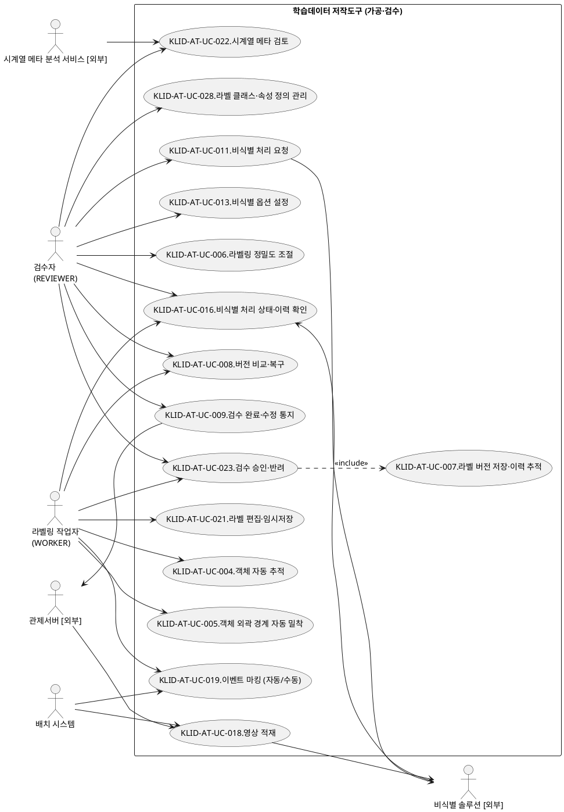
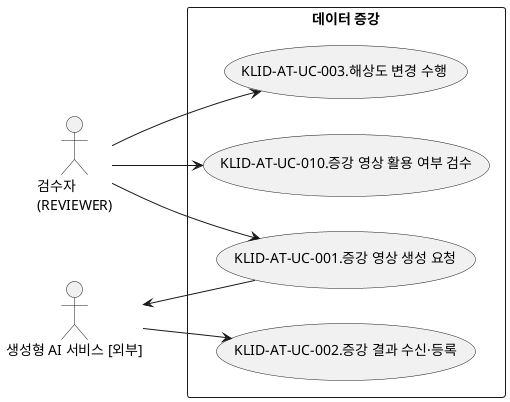

# R2 유스케이스 명세서

> **ID 표기 규칙(공통)**: 본 산출물의 모든 ID(KLID-AT-UC/ACT/AC/UCD/SS 등)는 **전체 형식 `KLID-AT-XX-NNN`** 으로 표기한다. 끝부분만(예: `UC-001`) 약식 표기 금지. 범위는 시작 ID만 전체형으로(예: `KLID-AT-UC-001~013`). ※ 요구사항(RQ-SFR-NN-NN·NFR-NNN) 등 타 체계 ID는 각 체계 원형 유지.

## 작성 목적
> 시스템의 요구사항에 대하여 액터와 시스템 활동 및 상호간의 활동에 대하여 순서화된 시나리오를 상세하게 기술하고, 유스케이스의 이름, 액터, 그들 간의 연관관계를 보여주는 시스템 환경을 다이어그램으로도 표현한다. 또한 주요한 유스케이스에 대하여 대상 시스템과 액터 간의 오퍼레이션을 상세하게 표시하는 시스템 시퀀스 다이어그램 및 오퍼레이션의 약정을 나타낼 수 있는데 이 부분은 필수 산출물에 포함되지 않으며 선택적으로 작성할 수 있다.

## 작성 방법
> 유스케이스는 시나리오를 구체적인 언어표현으로 기술하고, 유스케이스 다이어그램은 그림으로 작성하며 작성도구를 사용할 수 있다.

## 산출물 양식

### 제.개정 이력

| 날짜 | 버전 | 작성자 | 승인자 | 내용 |
|------|------|--------|--------|------|
| 2026-08-06 | 1.0 | - | - | LogiCraft 그래프 기반 생성 (/cc-doc-gen) |

### 헤더

| R2 | 유스케이스 명세서 |
|-------|------------|
| 시스템명 | AI 기반 지방정부 CCTV 관제지원시스템(2차) | 서브시스템명 | 학습데이터 저작도구 |
| 단계명  | 분석 | 작성일자 | 2026-08-06 | 버전 | 1.0 |

### 1. 서브시스템 목록

| 서브시스템 ID | 서브시스템명 | 서브시스템 설명 |
|------------|---------|-----------|
| KLID-AT-SS-002 | 마킹 | 비식별 영상에서 자동(프레임 간격)·수동(단축키) 방식으로 이벤트 시점을 식별·마킹하고, 마킹 완료를 신호로 잔여 배치 처리를 시작한다. |
| KLID-AT-SS-003 | 배치 파이프라인 | 학습 대상으로 인입된 영상을 적재하고 비식별 → 마킹 → 시계열 메타 → 프레임 추출 → 자동 라벨링 → 추적 보간 단계를 주기적으로 순차 처리한다. |
| KLID-AT-SS-004 | 비식별화 | 외부 비식별 솔루션 연동으로 전체 영상의 개인정보를 비식별하고, 옵션 설정·처리 상태/이력 확인·누락 신고 및 해소를 제공한다. |
| KLID-AT-SS-005 | 시계열 메타 | 외부 시계열 메타 분석 서비스가 생성한 결과를 적재하여 검수자가 검토·수정·승인하고, 승인된 메타만 확정 데이터로 노출한다. |
| KLID-AT-SS-006 | 라벨링 | 프레임에 바운딩박스·폴리곤·세그멘테이션 라벨과 객체 속성값을 편집하고, 객체 자동 추적·외곽 경계 자동 밀착·정밀도 조절과 라벨 클래스·속성 정의 관리를 제공한다. |
| KLID-AT-SS-007 | 검수 | 작업자가 제출한 영상 단위 작업과 파생영상 활용 여부를 검수자가 승인·반려하고, 반려 사유를 기록해 재작업으로 되돌린다. |
| KLID-AT-SS-008 | 버전관리 | 검수 승인 시점의 라벨 스냅샷을 저장·이력 추적하고, 버전 비교·복구와 상위 시스템 완료·수정 통지를 수행한다. |
| KLID-AT-SS-009 | 데이터 증강 | 외부 생성형 AI 서비스에 증강 생성을 위탁하고 결과를 새 영상으로 수신·등록하며, 표준 해상도 파생영상 생성을 내부에서 직접 수행한다. |

> 사용자/권한 서브시스템과 포털 서브시스템은 본 명세서의 유스케이스 범위에서 제외한다(사유는 「부록 3」 참조).

### 2. 유스케이스 다이어그램(UCD)

#### KLID-AT-UCD-001 가공·검수 핵심 흐름

| UCD ID | KLID-AT-UCD-001 | UCD 명 | 가공·검수 핵심 흐름 |
|--------|---|-------|---|
| 관련 서브시스템 ID | KLID-AT-SS-002~008 | 관련 서브시스템명 | 마킹 · 배치 파이프라인 · 비식별화 · 시계열 메타 · 라벨링 · 검수 · 버전관리 |

#### KLID-AT-UCD-002 데이터 증강·파생영상 흐름

| UCD ID | KLID-AT-UCD-002 | UCD 명 | 데이터 증강·파생영상 흐름 |
|--------|---|-------|---|
| 관련 서브시스템 ID | KLID-AT-SS-009 | 관련 서브시스템명 | 데이터 증강 |

### 3. 유스케이스 목록

| 유스케이스 ID | 유스케이스명 | 유스케이스 설명 | 관련 액터 ID | 관련 UCD ID | 검수기준(AC) ID | 관련 요구사항 ID |
|------------|---------|-----------|----------|-----------|-------------|-------------|
| KLID-AT-UC-018 | 영상 적재 | 관제서버가 학습 대상 영상 정보를 저작도구 인입 원장에 등록하면 주기 배치가 미처리 인입 건을 픽업해 영상 1건으로 적재하고 비식별(선두) 단계부터 배치 파이프라인 대상으로 등록한다. | KLID-AT-ACT-005, KLID-AT-ACT-004 | KLID-AT-UCD-001 | - | RQ-SFR-11-04 |
| KLID-AT-UC-011 | 비식별 처리 요청 | 적재된 전체 영상을 외부 비식별 솔루션에 위탁해 개인정보를 비식별하고, 원본과 비식별본을 각각 별도 경로에 저장하며 처리 이력을 영상 단위로 기록한다. | KLID-AT-ACT-001, KLID-AT-ACT-006 | KLID-AT-UCD-001 | KLID-AT-AC-011, KLID-AT-AC-019, KLID-AT-AC-023 | RQ-SFR-09-01, RQ-SFR-09-02, RQ-SFR-11-06 |
| KLID-AT-UC-013 | 비식별 옵션 설정 | 외부 비식별 솔루션이 제공하는 옵션을 관리 화면에서 설정·저장하여 이후 비식별 요청에 반영한다. | KLID-AT-ACT-001 | KLID-AT-UCD-001 | KLID-AT-AC-013 | RQ-SFR-09-04 |
| KLID-AT-UC-016 | 비식별 처리 상태·이력 확인 | 영상 단위 비식별 처리 상태와 배치 처리 단계를 화면에서 확인하고, 마킹·라벨 작업 중 발견한 비식별 누락을 신고한 뒤 수동 비식별화 완료 시 신고를 해소한다. | KLID-AT-ACT-001, KLID-AT-ACT-002, KLID-AT-ACT-006 | KLID-AT-UCD-001 | KLID-AT-AC-016, KLID-AT-AC-019 | RQ-SFR-09-03, RQ-SFR-09-05, RQ-SFR-11-06 |
| KLID-AT-UC-019 | 이벤트 마킹 (자동/수동) | 비식별 영상을 재생하며 자동(프레임 간격) 또는 수동(단축키)으로 이벤트 시점을 마킹하고, 마킹 완료를 신호로 잔여 배치 처리를 시작한다. | KLID-AT-ACT-002, KLID-AT-ACT-004 | KLID-AT-UCD-001 | - | RQ-SFR-11-04, RQ-SFR-17 |
| KLID-AT-UC-022 | 시계열 메타 검토 | 외부 시계열 메타 분석 서비스가 회신한 결과를 검수큐에서 검토·수정하고 승인 또는 반려하여 승인된 메타만 확정 데이터에 포함시킨다. | KLID-AT-ACT-001, KLID-AT-ACT-008 | KLID-AT-UCD-001 | KLID-AT-AC-024 | RQ-SFR-11-10, RQ-SFR-17 |
| KLID-AT-UC-021 | 라벨 편집·임시저장 | 배정받은 영상의 프레임에 바운딩박스·폴리곤·세그멘테이션 라벨과 객체 속성값을 편집하고 작업본을 임시저장한다(학습데이터 버전은 생성하지 않는다). | KLID-AT-ACT-002 | KLID-AT-UCD-001 | KLID-AT-AC-017, KLID-AT-AC-020, KLID-AT-AC-021, KLID-AT-AC-023, KLID-AT-AC-024 | RQ-SFR-11-04, RQ-SFR-11-08, RQ-SFR-16, RQ-SFR-17 |
| KLID-AT-UC-004 | 객체 자동 추적 | 시작 프레임에서 지정한 객체를 후속 프레임으로 자동 추적·전파하여 위치(바운딩박스)와 경계(폴리곤)를 갱신하고, 결과가 없는 중간 프레임은 추적 보간으로 채운다. | KLID-AT-ACT-002, KLID-AT-ACT-001 | KLID-AT-UCD-001 | KLID-AT-AC-004 | RQ-SFR-08-01 |
| KLID-AT-UC-005 | 객체 외곽 경계 자동 밀착 | 클릭(포인트) 또는 박스로 객체를 한 번 지정하면 외곽 경계 폴리곤과 신뢰도를 산출하여 경계에 밀착된 라벨로 적용한다. | KLID-AT-ACT-002 | KLID-AT-UCD-001 | KLID-AT-AC-005 | RQ-SFR-08-02 |
| KLID-AT-UC-006 | 라벨링 정밀도 조절 | 폴리곤 단순화 정밀도를 시스템 설정으로 조절하여 이후 자동 추적·자동 밀착 결과의 경계 세밀함(점 수)을 제어한다. | KLID-AT-ACT-001, KLID-AT-ACT-002 | KLID-AT-UCD-001 | KLID-AT-AC-006 | RQ-SFR-08-03 |
| KLID-AT-UC-028 | 라벨 클래스·속성 정의 관리 | 라벨 마스터와 속성 정의를 등록·수정·삭제하여 라벨링 화면·자동 라벨링 후보·프리셋이 참조하는 단일 기준을 유지한다. | KLID-AT-ACT-001 | KLID-AT-UCD-001 | - | RQ-SFR-11-08, NFR-016 |
| KLID-AT-UC-023 | 검수 승인·반려 | 작업자가 제출한 영상 단위 작업의 라벨·메타를 검토하여 승인(=작업 완료) 또는 반려하고, 반려 시 사유를 기록해 재작업으로 되돌린다. | KLID-AT-ACT-001, KLID-AT-ACT-002 | KLID-AT-UCD-001 | KLID-AT-AC-022 | RQ-SFR-11-10 |
| KLID-AT-UC-007 | 라벨 버전 저장·이력 추적 | 검수 승인 시점에 영상 단위 라벨 전체 스냅샷을 저장하고 페이로드 해시로 버전을 식별하며 변경이력을 기록한다. | KLID-AT-ACT-001 | KLID-AT-UCD-001 | KLID-AT-AC-007 | RQ-SFR-08-04 |
| KLID-AT-UC-008 | 버전 비교·복구 | 버전 스냅샷을 현재 작업본 또는 다른 버전 스냅샷과 비교해 추가·수정·삭제 차이를 표시하고, 선택한 버전으로 복구한다. | KLID-AT-ACT-001, KLID-AT-ACT-002 | KLID-AT-UCD-001 | KLID-AT-AC-008 | RQ-SFR-08-05 |
| KLID-AT-UC-009 | 검수 완료·수정 통지 | 검수 완료 시 완료 통지를, 검수 완료 후 라벨·메타 수정 시 수정 통지를 상위 시스템으로 단방향 발행하여 데이터마트 동기화가 가능하게 한다. | KLID-AT-ACT-001, KLID-AT-ACT-005 | KLID-AT-UCD-001 | KLID-AT-AC-009 | RQ-SFR-08-04, RQ-SFR-08-05 |
| KLID-AT-UC-001 | 증강 영상 생성 요청 | 검수 완료 영상과 생성 조건을 외부 생성형 AI 서비스에 위탁하여 날씨·계절·시간 증강 3종(동절기·야간·강우) 영상 생성을 요청한다. | KLID-AT-ACT-001, KLID-AT-ACT-007 | KLID-AT-UCD-002 | KLID-AT-AC-001, KLID-AT-AC-018 | RQ-SFR-07-01, RQ-SFR-11-05 |
| KLID-AT-UC-002 | 증강 결과 수신·등록 | 외부가 생성한 증강 결과를 수신하여 원본을 참조하는 새 영상으로 등록하고, 원본 라벨·메타를 좌표·속성 보존하여 복사한 뒤 미검수 상태로 적재한다. | KLID-AT-ACT-001, KLID-AT-ACT-007 | KLID-AT-UCD-002 | KLID-AT-AC-002, KLID-AT-AC-018, KLID-AT-AC-021 | RQ-SFR-07-01, RQ-SFR-07-02, RQ-SFR-11-09 |
| KLID-AT-UC-003 | 해상도 변경 수행 | 표준 해상도 3종 프리셋마다 새 파생영상을 생성하여 영상 파일은 원본(비식별) 사본으로 두고 프레임 이미지만 목표 해상도로 리스케일하며 라벨 좌표를 배율로 재계산해 적재한다. | KLID-AT-ACT-001 | KLID-AT-UCD-002 | KLID-AT-AC-003 | RQ-SFR-06-03, RQ-SFR-07-02 |
| KLID-AT-UC-010 | 증강 영상 활용 여부 검수 | 미검수 상태의 증강 결과를 확인하여 학습데이터 활용(채택) 또는 미활용(폐기)을 선택하고, 채택된 파생영상만 작업 대상으로 등재한다. | KLID-AT-ACT-001 | KLID-AT-UCD-002 | KLID-AT-AC-010 | RQ-SFR-07-03, RQ-SFR-11-09 |

### 4. 액터 목록

| 액터 ID | 액터명 | 액터유형 (주요/보조/숨은) | 액터설명 |
|--------|------|-------------------|------|
| KLID-AT-ACT-001 | 검수자(REVIEWER) | 주요 | 관리 권한이 통합된 역할이다. 사용자 관리·시스템 설정, 작업자 배정·재배정·배정 이력 조회, 검수 승인·반려, 증강 요청과 결과 활용 여부 검수, 비식별 요청·옵션 설정, 시계열 메타 검토, 버전 비교·복구를 수행한다. 별도의 시스템 관리자 역할은 두지 않는다. |
| KLID-AT-ACT-002 | 라벨링 작업자(WORKER) | 주요 | 본인에게 배정된 영상에 한하여 이벤트 마킹, 라벨 편집·임시저장, 자동 추적·자동 밀착 보조 기능 사용, 검수 제출, 비식별 누락 신고와 비식별 상태·버전 이력 조회를 수행한다. 본인 배정 외 자원 접근은 거부된다. |
| KLID-AT-ACT-003 | 포털 회원(PORTAL_USER) | 주요 | 외부 채널(포털)의 이용자다. 데이터마트 영상을 선택해 기존 라벨을 확인·수정하고 본인 작업 데이터를 기간 내 다운로드하며, 본인 자산을 업로드해 수동 라벨링한다. 저장 시 원본과 데이터마트는 변경되지 않는다(단방향). 포털 채널 유스케이스는 본 명세서의 기능 요구사항 기준선 범위 밖이다(「부록 3」 참조). |
| KLID-AT-ACT-004 | 배치 시스템 | 보조 | 인입 영상 픽업·적재와 비식별 → 마킹 → 시계열 메타 → 프레임 추출 → 자동 라벨링 → 추적 보간 단계를 주기적으로 처리하는 내부 자동 액터다. 클러스터 스케줄러로 노드 간 중복 발화를 방지한다. |
| KLID-AT-ACT-005 | 관제서버[외부] | 보조 | 학습 대상 영상 정보를 저작도구 인입 원장에 등록하고, 완료·수정 통지를 수신한 뒤 저작도구 조회 인터페이스로 상세를 가져가는 외부 시스템이다. |
| KLID-AT-ACT-006 | 비식별 솔루션[외부] | 보조 | 영상의 개인정보를 비식별 처리하는 외부 솔루션이다(발주기관 직접 구매·제공). 결과 상세 검토는 이 솔루션이 제공하는 검토 화면에서 수행한다. |
| KLID-AT-ACT-007 | 생성형 AI 서비스[외부] | 보조 | 증강 영상 생성을 위탁받아 수행하고 결과를 회신하는 외부 시스템이다. 생성 본체는 외부 책임이며 저작도구는 요청·수신·등록·검수만 담당한다. |
| KLID-AT-ACT-008 | 시계열 메타 분석 서비스[외부] | 보조 | 마킹 결과를 전달받아 영상의 시계열 메타를 생성하고 결과를 회신하는 외부 시스템이다. 모델 학습·조정·프롬프트 관리는 외부 책임이다. |

> AI 추론 서버·데이터베이스·스케줄러는 저작도구 운영팀이 직접 운영하는 내부 인프라이므로 액터로 표기하지 않고 서브시스템 내부 의존성으로 표현한다.

### 5. 유스케이스 기술서

<table>
<tr><td>유스케이스 ID</td><td>KLID-AT-UC-018</td><td>유스케이스명</td><td>영상 적재</td></tr>
<tr><td colspan="4">
<b>1. 주요 액터</b> 
&emsp;- 관제서버[외부], 배치 시스템  
<b>2. 이해관계자와 관심사항</b> 
&emsp;- 관제서버는 학습 대상으로 지정한 영상이 수작업 없이 자동 적재·전처리되길 원한다. 
&emsp;- 저작도구 운영자는 라벨링·검수 워크플로우의 원천 데이터가 누락 없이 확보되길 원한다. 
&emsp;- 발주기관은 적재 대상과 실제 영상 파일이 일치하여 유실이 발생하지 않길 원한다.  
<b>3. 전제조건</b> 
&emsp;- 관제서버가 저작도구의 인입 원장에 학습 대상 영상 정보를 등록할 수 있다. 
&emsp;- 영상 파일이 공유 저장소의 지정 경로에 배치된다(등록 시점과 파일 배치 시점은 어긋날 수 있다). 
&emsp;- 배치 처리는 별도의 사용자 인증을 요구하지 않는다.  
<b>4. 종료조건</b> 
&emsp;- 영상 1건이 적재되고 작업 상태가 미처리로 초기화된다. 
&emsp;- 해당 영상이 비식별(선두) 단계부터 배치 파이프라인 처리 대상이 된다.  
<b>5. 기본 시나리오</b> 
&emsp;1. 관제서버가 학습 대상 영상 정보를 인입 원장에 1건으로 등록한다(영상 식별자 중복 등록은 제약으로 차단된다). 
&emsp;2. 주기 배치가 미처리 상태이면서 재시도 시각이 도래한 인입 건을 수신 순서대로 조회하여 처리 대상으로 확보한다. 
&emsp;3. 시스템이 등록된 경로에 영상 파일이 실제로 존재하는지 검증한다. 
&emsp;4. 시스템이 영상 1건을 적재하고 원본 경로·메타·이벤트 유형을 기록하며 작업 상태를 미처리로 초기화한다. 
&emsp;5. 시스템이 인입 건을 처리 완료로 종결하고 적재된 영상 식별자를 기록한다. 
&emsp;6. 적재 완료를 신호로 비식별 위탁이 비동기로 시작되어 비식별(선두) 단계부터 배치 파이프라인이 자동 진행된다. 
&emsp;7. 본 유스케이스는 종료한다.  
<b>6. 대안 시나리오</b> 
&emsp;<b>가. 대상 없음</b> 
&emsp;&emsp;1. 배치 주기에 미처리 인입 건이 없으면 무처리로 종료한다. 
&emsp;<b>나. 영상 파일 미도착</b> 
&emsp;&emsp;1. 인입 건은 있으나 파일이 아직 없으면 실패로 처리하지 않고 미처리 상태로 둔다. 
&emsp;&emsp;2. 최초 관측 시각을 기록해 대기 예산의 기준으로 삼는다(등록 시각은 과거 시각일 수 있어 사용하지 않는다). 
&emsp;&emsp;3. 재시도 시각을 뒤로 밀어 고착된 건이 처리 순서 앞자리를 잠식하지 못하게 한다. 
&emsp;&emsp;4. 대기 상한을 초과하면 종결하고 관측 로그를 남긴다. 
&emsp;<b>다. 중복 등록</b> 
&emsp;&emsp;1. 동일 영상 식별자로 재등록되면 유일성 제약이 중복을 차단한다(영상 1건당 인입 1건). 
&emsp;<b>라. 비식별 실패</b> 
&emsp;&emsp;1. 비식별 솔루션 오류 시 영상 상태를 실패로 표시하고 원본을 보존하며 재처리 대상으로 둔다. 
&emsp;<b>마. 재처리 요청</b> 
&emsp;&emsp;1. 검수자가 적재 실패 건을 다시 돌리면 처리 상태를 미처리로 되돌리고 대기 예산을 초기화한다.  
<b>7. 구현 시 고려 사항</b> 
&emsp;- 배치 처리량 기준(분당 1건 이상)과 노드 절체 시 이어받기를 만족해야 한다(NFR-001). 
&emsp;- 인입 건이 보인다는 사실이 파일 존재를 보장하지 않으므로 파일 실재 검증을 선행한다(NFR-010). 
&emsp;- 적재 이후 처리 진행 상황은 추적 식별자와 메트릭으로 관측 가능해야 한다(NFR-007).  
<b>8. 발생 빈도</b> 
&emsp;- 주기 배치마다 발생하며 학습 대상 영상 1건당 1회 수행된다.
</td></tr>
</table>

<table>
<tr><td>유스케이스 ID</td><td>KLID-AT-UC-011</td><td>유스케이스명</td><td>비식별 처리 요청</td></tr>
<tr><td colspan="4">
<b>1. 주요 액터</b> 
&emsp;- 검수자(REVIEWER) 
&emsp;- 보조 액터: 비식별 솔루션[외부], 배치 시스템  
<b>2. 이해관계자와 관심사항</b> 
&emsp;- 발주기관은 수집된 영상의 개인정보가 안전하게 비식별되길 원한다. 
&emsp;- 검수자는 비식별본이 확보되어 마킹·라벨링 작업이 지연 없이 시작되길 원한다. 
&emsp;- 저작도구 운영자는 실패 시에도 원본이 절대 삭제되지 않길 원한다.  
<b>3. 전제조건</b> 
&emsp;- 대상 영상이 적재되어 있다(처리 대상 게이팅 없이 전체 영상이 비식별 대상이다). 
&emsp;- 재처리를 수동으로 요청하는 경우 검수자로 인증되어 있다. 
&emsp;- 외부 비식별 솔루션이 가용하다.  
<b>4. 종료조건</b> 
&emsp;- 비식별본이 별도 경로에 저장되고 원본은 그대로 보존된다. 
&emsp;- 비식별 처리 이력이 영상 단위로 기록된다.  
<b>5. 기본 시나리오</b> 
&emsp;1. 영상 적재 완료를 신호로 비식별 위탁이 자동 시작되거나, 검수자가 비식별 재처리를 요청한다(요청은 즉시 접수 응답으로 반환된다). 
&emsp;2. 시스템이 외부 비식별 솔루션의 연동 규격에 맞춰 영상을 업로드하고 비식별 처리를 위탁한다. 
&emsp;3. 위탁 요청은 처리 흐름을 붙잡지 않는 비동기 제출로 개시하고, 대기 원장에 위탁 상태를 선기록한다. 
&emsp;4. 주기 점검이 외부 솔루션의 진행 상태를 조회하여 완료를 감지하고 결과를 회수한다. 
&emsp;5. 시스템이 비식별본을 지정 저장 경로에 보관하고, 외부 솔루션이 통보한 결과 파일 경로를 그대로 기록한다. 
&emsp;6. 시스템이 비식별 처리 여부와 처리 이력을 영상 단위로 기록하고 마킹 가능 상태로 전이한다. 
&emsp;7. 본 유스케이스는 종료한다.  
<b>6. 대안 시나리오</b> 
&emsp;<b>가. 비식별 연동 실패</b> 
&emsp;&emsp;1. 영상의 비식별 상태를 실패로 표시하고 재시도 대상으로 등록하며 원본을 보존한다. 
&emsp;&emsp;2. 실패 상태와 오류 정보를 처리 이력에 기록한다. 
&emsp;<b>나. 응답 유실</b> 
&emsp;&emsp;1. 수락 응답도 결과 회신도 관측되지 않은 건은 미결 회수 점검이 주기적으로 다시 집어 재위탁한다. 
&emsp;&emsp;2. 수락 대기 창과 결과 대기 창을 구분해 정상 위탁 건을 잘못 회수하지 않는다. 
&emsp;<b>다. 비식별 누락 신고 구간</b> 
&emsp;&emsp;1. 해당 영상이 비식별 재처리 대기 상태이면 외부 위탁을 개시하지 않고 보류한다.  
<b>7. 구현 시 고려 사항</b> 
&emsp;- 외부 연동에 타임아웃·재시도·장애 차단을 적용하고 위탁은 비동기로 제출한다(NFR-004). 
&emsp;- 결과 파일명은 솔루션마다 다르므로 조합·추측하지 않고 통보된 경로 값을 사용한다(NFR-004). 
&emsp;- 원본과 비식별본을 각각 별도 경로에 저장하고 영상은 암호화 보관하며 처리 이력을 영상 단위로 남긴다(NFR-005). 
&emsp;- 비식별이 처리 흐름의 선두 단계이므로 마킹·라벨링 화면에는 비식별본만 제공한다(NFR-005).  
<b>8. 발생 빈도</b> 
&emsp;- 적재된 영상 1건당 1회 자동 수행되며, 누락 해소 등으로 재처리가 필요할 때 추가 수행된다.
</td></tr>
</table>

<table>
<tr><td>유스케이스 ID</td><td>KLID-AT-UC-013</td><td>유스케이스명</td><td>비식별 옵션 설정</td></tr>
<tr><td colspan="4">
<b>1. 주요 액터</b> 
&emsp;- 검수자(REVIEWER)  
<b>2. 이해관계자와 관심사항</b> 
&emsp;- 검수자는 영상 특성에 맞는 비식별 강도·범위를 지정할 수 있길 원한다. 
&emsp;- 발주기관은 비식별 옵션이 권한 있는 담당자만 변경할 수 있길 원한다.  
<b>3. 전제조건</b> 
&emsp;- 검수자로 인증되어 있다. 
&emsp;- 설정 가능한 옵션 항목이 외부 비식별 솔루션 규격으로 정의되어 있다.  
<b>4. 종료조건</b> 
&emsp;- 비식별 옵션이 저장되어 이후 비식별 요청에 반영된다.  
<b>5. 기본 시나리오</b> 
&emsp;1. 검수자가 관리 화면에서 비식별 옵션을 조회한다. 
&emsp;2. 검수자가 옵션 값을 변경하고 저장한다. 
&emsp;3. 시스템이 값 범위를 검증한 뒤 설정을 저장하고 이후 비식별 요청에 적용한다. 
&emsp;4. 본 유스케이스는 종료한다.  
<b>6. 대안 시나리오</b> 
&emsp;<b>가. 권한 부족</b> 
&emsp;&emsp;1. 검수자가 아닌 역할의 변경 요청은 거부한다. 
&emsp;<b>나. 허용 범위 초과</b> 
&emsp;&emsp;1. 형식·범위 검증에 실패하면 저장하지 않고 오류 메시지를 안내한다.  
<b>7. 구현 시 고려 사항</b> 
&emsp;- 관리 화면은 검수자 전용으로 제한하고 비인가 접근을 차단한다(NFR-020). 
&emsp;- 검증 실패는 표준 오류 응답 형식으로 즉시 안내한다(NFR-019). 
&emsp;- 구체 옵션 항목은 외부 비식별 솔루션 규격 확정 시 보완한다.  
<b>8. 발생 빈도</b> 
&emsp;- 운영 정책 변경 시 비정기적으로 발생한다(낮음).
</td></tr>
</table>

<table>
<tr><td>유스케이스 ID</td><td>KLID-AT-UC-016</td><td>유스케이스명</td><td>비식별 처리 상태·이력 확인</td></tr>
<tr><td colspan="4">
<b>1. 주요 액터</b> 
&emsp;- 검수자(REVIEWER), 라벨링 작업자(WORKER) 
&emsp;- 보조 액터: 비식별 솔루션[외부]  
<b>2. 이해관계자와 관심사항</b> 
&emsp;- 검수자는 영상별 비식별 처리 상태와 진행 단계를 한눈에 파악하길 원한다. 
&emsp;- 라벨링 작업자는 작업 중 발견한 개인정보 노출을 즉시 신고하고 조치 결과를 확인하길 원한다. 
&emsp;- 발주기관은 누락이 확인된 영상이 조치 완료 전까지 노출되지 않길 원한다.  
<b>3. 전제조건</b> 
&emsp;- 영상이 적재되어 배치 파이프라인 대상이다. 
&emsp;- 인증되어 있으며 라벨링 작업자는 본인 배정 영상만 신고·해소할 수 있다.  
<b>4. 종료조건</b> 
&emsp;- 영상 단위 비식별 처리 상태와 배치 처리 단계가 화면에서 확인된다. 
&emsp;- 신고 접수 시 해당 영상이 작업 잠금·비식별 실패 상태로 표시되고 라벨과 개인정보 판정 값은 보존된다. 
&emsp;- 해소 처리 시 잠금이 해제되고 보존된 기존 라벨을 그대로 이어서 사용한다. 
&emsp;- 비식별 처리 이력이 영상 단위로 기록된다.  
<b>5. 기본 시나리오</b> 
&emsp;1. 검수자가 영상 상세 화면 또는 처리 현황 화면에서 비식별 상태와 배치 처리 단계를 확인한다. 
&emsp;2. 라벨링 작업자가 마킹 또는 라벨 작업 중 개인정보 노출(얼굴·번호판 미처리 등)을 발견하고 사유와 함께 신고한다. 
&emsp;3. 시스템이 해당 영상을 작업 잠금하고 비식별 상태를 실패로 표시한다. 이때 작업자가 만든 라벨과 개인정보 판정 값은 삭제하지 않고 보존한다. 
&emsp;4. 시스템이 신고 구간 동안 해당 영상의 라벨 조회·저장, 영상 스트리밍, 프레임 이미지 열람, 개인정보 판정 저장을 차단한다. 
&emsp;5. 작업자 또는 검수자가 외부 비식별 솔루션으로 수동 비식별화를 수행한다. 
&emsp;6. 담당자가 신고를 해소 처리하면 시스템이 잠금을 해제하고 비식별 상태를 정상으로 복원한다. 
&emsp;7. 시스템이 신고 단계에 따라 재개 지점을 정한다 — 마킹 단계 신고는 마킹부터 다시 수행하고, 라벨링 단계 신고는 프레임 이미지를 다시 생성한 뒤 보존된 라벨로 라벨링을 이어간다. 
&emsp;8. 외부 비식별 처리 결과가 회수되면 비식별 상태를 갱신하고 처리 이력을 기록한다. 
&emsp;9. 본 유스케이스는 종료한다.  
<b>6. 대안 시나리오</b> 
&emsp;<b>가. 중복 신고</b> 
&emsp;&emsp;1. 이미 재처리 대기로 잠긴 영상에 다시 신고하면 충돌로 거부한다. 
&emsp;<b>나. 이미 처리된 신고의 재해소</b> 
&emsp;&emsp;1. 접수 상태가 아닌 신고를 다시 해소하려 하면 충돌로 거부한다. 
&emsp;<b>다. 마킹 단계 신고의 접수 조건</b> 
&emsp;&emsp;1. 마킹 단계 신고는 마킹 가능 상태일 때만 접수하며, 그 외 상태에서는 전제조건 불충족으로 거부한다. 
&emsp;&emsp;2. 거부 사유는 영상의 처리 단계를 유추하게 하지 않도록 단일 문구로 안내한다. 
&emsp;<b>라. 파생영상 신고</b> 
&emsp;&emsp;1. 증강·해상도 파생영상은 원본의 비식별 결과를 복사한 결과물이므로 신고를 접수하지 않고 사유를 안내한다. 
&emsp;<b>마. 검수 완료 영상 신고</b> 
&emsp;&emsp;1. 검수 완료 영상에 신고가 접수되면 상위 시스템으로 수정 통지를 발행한다. 
&emsp;<b>바. 비식별 처리 실패</b> 
&emsp;&emsp;1. 외부 처리 결과가 성공이 아니면 비식별 상태를 실패로 표시하고 실패 사유를 처리 이력에 기록한다. 
&emsp;<b>사. 타인 배정 영상 접근</b> 
&emsp;&emsp;1. 라벨링 작업자가 본인 배정이 아닌 영상을 신고·해소하려 하면 거부한다.  
<b>7. 구현 시 고려 사항</b> 
&emsp;- 신고 구간의 차단은 인가 검사 이후 평가하는 전제조건이며 역할과 무관하게 적용한다(NFR-020). 
&emsp;- 라벨 좌표는 개인정보의 위치를 특정하는 정보이므로 신고 구간에는 조회·저장을 함께 차단한다(NFR-005). 
&emsp;- 개인정보가 포함될 수 있는 미디어 응답은 브라우저에 저장되지 않도록 하여 신고 직후에도 재노출되지 않게 한다(NFR-005). 
&emsp;- 신고·해소 처리는 다중 노드 동시 실행에서 한 번만 수행되도록 원자적으로 확보한다(NFR-001). 
&emsp;- 영상 목록·상세에는 개인정보 유무를 표시하지 않는다(상위 시스템 수신값 부재).  
<b>8. 발생 빈도</b> 
&emsp;- 상태 확인은 작업 시 상시 발생하고, 누락 신고는 예외적으로 발생한다(낮음).
</td></tr>
</table>

<table>
<tr><td>유스케이스 ID</td><td>KLID-AT-UC-019</td><td>유스케이스명</td><td>이벤트 마킹 (자동/수동)</td></tr>
<tr><td colspan="4">
<b>1. 주요 액터</b> 
&emsp;- 라벨링 작업자(WORKER) 
&emsp;- 보조 액터: 배치 시스템  
<b>2. 이해관계자와 관심사항</b> 
&emsp;- 라벨링 작업자는 이벤트 발생 시점을 빠르고 정확하게 표시하길 원한다. 
&emsp;- 검수자는 마킹 결과를 근거로 후속 자동 처리가 정확한 구간에서 수행되길 원한다. 
&emsp;- 발주기관은 마킹 화면에서 비식별 처리 전 원본이 노출되지 않길 원한다.  
<b>3. 전제조건</b> 
&emsp;- 대상 영상의 비식별이 완료되어 마킹 가능 상태다. 
&emsp;- 라벨링 작업자로 인증되어 있고 본인에게 배정된 영상이다.  
<b>4. 종료조건</b> 
&emsp;- 마킹 결과가 저장된다. 
&emsp;- 잔여 배치 처리(시계열 메타 → 프레임 추출 → 자동 라벨링)가 시작된다.  
<b>5. 기본 시나리오</b> 
&emsp;1. 라벨링 작업자가 마킹 화면에서 비식별 영상을 재생한다(구간 이어보기와 배속 조절을 지원한다). 
&emsp;2. 라벨링 작업자가 수동 단축키로 이벤트 시점을 표시하거나 자동(프레임 간격) 방식으로 일괄 마킹한다. 
&emsp;3. 시스템이 마킹 결과를 저장한다. 
&emsp;4. 라벨링 작업자가 마킹을 완료 처리한다. 
&emsp;5. 시스템이 마킹 완료를 신호로 잔여 배치 처리를 시작하고 영상의 작업 상태를 전이한다. 
&emsp;6. 본 유스케이스는 종료한다.  
<b>6. 대안 시나리오</b> 
&emsp;<b>가. 마킹 중 비식별 누락 발견</b> 
&emsp;&emsp;1. 영상 단위로 비식별 누락을 신고한다(KLID-AT-UC-016 연계). 
&emsp;&emsp;2. 신고가 접수되면 해당 영상의 마킹이 중단되고 해소 후 마킹부터 다시 수행한다. 
&emsp;<b>나. 비식별 미완료 영상 접근</b> 
&emsp;&emsp;1. 비식별본이 없으면 영상을 제공하지 않아 원본 노출을 차단한다.  
<b>7. 구현 시 고려 사항</b> 
&emsp;- 마킹 화면은 항상 비식별 영상만 제공하며 비식별본이 유효하지 않으면 재생을 허용하지 않는다(NFR-005). 
&emsp;- 영상 재생은 구간 요청을 지원해 대용량 영상에서도 응답 기준을 만족해야 한다(NFR-011). 
&emsp;- 마킹 완료 신호는 커밋 이후 발행하여 후속 배치가 미확정 데이터를 읽지 않게 한다(NFR-001).  
<b>8. 발생 빈도</b> 
&emsp;- 영상 1건당 1회 수행되며 재비식별 해소 시 재수행될 수 있다.
</td></tr>
</table>

<table>
<tr><td>유스케이스 ID</td><td>KLID-AT-UC-022</td><td>유스케이스명</td><td>시계열 메타 검토</td></tr>
<tr><td colspan="4">
<b>1. 주요 액터</b> 
&emsp;- 검수자(REVIEWER) 
&emsp;- 보조 액터: 시계열 메타 분석 서비스[외부]  
<b>2. 이해관계자와 관심사항</b> 
&emsp;- 검수자는 외부에서 생성된 시계열 메타의 오류를 직접 바로잡을 수 있길 원한다. 
&emsp;- 발주기관은 승인된 메타만 학습데이터에 포함되길 원한다.  
<b>3. 전제조건</b> 
&emsp;- 마킹 결과가 외부 시계열 메타 분석 서비스에 위탁되어 결과가 회신되었다. 
&emsp;- 검수자로 인증되어 있다.  
<b>4. 종료조건</b> 
&emsp;- 승인된 시계열 메타만 확정 데이터로 노출된다. 
&emsp;- 검수자의 수정 내용이 메타에 반영된다.  
<b>5. 기본 시나리오</b> 
&emsp;1. 외부 시계열 메타 분석 서비스가 분석 결과를 회신한다. 
&emsp;2. 시스템이 결과를 메타 저장소에 적재하고 검수큐에 진입시킨다. 
&emsp;3. 검수자가 메타 검토 화면에서 시계열 메타를 검토하고 필요 시 수정한다. 
&emsp;4. 검수자가 승인 또는 반려하여 검수 상태를 전이한다. 
&emsp;5. 본 유스케이스는 종료한다.  
<b>6. 대안 시나리오</b> 
&emsp;<b>가. 분석 결과 부정확</b> 
&emsp;&emsp;1. 검수자가 메타를 직접 수정한 뒤 승인하거나 반려 처리한다. 
&emsp;<b>나. 결과 미회신</b> 
&emsp;&emsp;1. 수락 응답도 결과 회신도 없는 건은 미결 회수 점검이 다시 위탁하여 메타 결손을 방지한다. 
&emsp;<b>다. 비식별 누락 신고 구간</b> 
&emsp;&emsp;1. 신고 구간의 영상은 외부 위탁을 보류하고 해소 시 재위탁한다.  
<b>7. 구현 시 고려 사항</b> 
&emsp;- 외부 위탁은 처리 흐름을 붙잡지 않는 비동기 제출로 개시하고 미회수 건은 주기 점검으로 회수한다(NFR-004). 
&emsp;- 위탁 대상 매체는 비식별본이므로 신고 구간에는 전송을 보류해야 한다(NFR-005). 
&emsp;- 시계열 메타 생성 본체는 외부 시스템 책임이며 저작도구는 결과 검토·수정·승인만 담당한다.  
<b>8. 발생 빈도</b> 
&emsp;- 마킹이 완료된 영상 1건당 1회 이상 발생한다.
</td></tr>
</table>

<table>
<tr><td>유스케이스 ID</td><td>KLID-AT-UC-021</td><td>유스케이스명</td><td>라벨 편집·임시저장</td></tr>
<tr><td colspan="4">
<b>1. 주요 액터</b> 
&emsp;- 라벨링 작업자(WORKER)  
<b>2. 이해관계자와 관심사항</b> 
&emsp;- 라벨링 작업자는 작업 중 손실 없이 작업본을 저장하고 이어서 작업하길 원한다. 
&emsp;- 검수자는 제출 전 작업본이 학습데이터 버전으로 확정되지 않길 원한다. 
&emsp;- 발주기관은 라벨 값이 업무규칙에 맞게 검증되어 오류 데이터가 유입되지 않길 원한다.  
<b>3. 전제조건</b> 
&emsp;- 대상 영상이 본인에게 배정되어 있다. 
&emsp;- 프레임 이미지가 추출되어 있다.  
<b>4. 종료조건</b> 
&emsp;- 작업본 라벨과 속성값이 영속 저장된다. 
&emsp;- 저장 이벤트 단위의 변경이력이 기록된다. 
&emsp;- 학습데이터 버전은 생성되지 않는다(검수 승인 시 KLID-AT-UC-007이 생성한다).  
<b>5. 기본 시나리오</b> 
&emsp;1. 라벨링 작업자가 라벨링 화면에 진입하고 시스템이 본인 배정 여부를 검증한다. 
&emsp;2. 라벨링 작업자가 캔버스에서 바운딩박스·폴리곤·세그멘테이션을 생성·수정한다(라벨 클래스는 라벨 마스터를 기준으로 선택한다). 
&emsp;3. 라벨링 작업자가 객체별 속성값과 촬영환경·이벤트 메타를 입력한다. 
&emsp;4. 시스템이 좌표 범위·필수 속성·코드 정합을 검증한다. 
&emsp;5. 시스템이 저장 시 프레임의 작업본을 전체 교체 방식으로 반영하고 속성값을 함께 저장한다. 
&emsp;6. 시스템이 저장 이벤트 기준으로 추가·수정·삭제 변경이력을 기록한다. 
&emsp;7. 본 유스케이스는 종료한다.  
<b>6. 대안 시나리오</b> 
&emsp;<b>가. 타인 배정 자원 접근</b> 
&emsp;&emsp;1. 본인 배정이 아닌 프레임을 편집하려 하면 거부한다. 
&emsp;<b>나. 검수 완료 영상 수정</b> 
&emsp;&emsp;1. 동일 작업 식별자를 유지한 채 저장하고 상위 시스템으로 수정 통지를 발행한다(KLID-AT-UC-009 연계). 
&emsp;<b>다. 비식별 누락 신고 구간</b> 
&emsp;&emsp;1. 신고 구간의 영상은 라벨 조회·저장을 모두 차단한다. 
&emsp;<b>라. 값 검증 실패</b> 
&emsp;&emsp;1. 저장을 거부하고 조치 가능한 오류 메시지를 안내한다.  
<b>7. 구현 시 고려 사항</b> 
&emsp;- 라벨링 캔버스에는 비식별 프레임을 제공하며 원본 프레임은 화면 동선으로 제공하지 않는다(NFR-005). 
&emsp;- 라벨 값 검증으로 오류 데이터 입력을 차단하고 오류 유형별 조치 이력을 관리한다(NFR-010). 
&emsp;- 프레임·썸네일 조회가 반복되므로 응답시간 기준을 만족하도록 조회를 최적화한다(NFR-011). 
&emsp;- 웹표준 캔버스로 구성하여 비표준 플러그인 없이 동작해야 한다(NFR-015).  
<b>8. 발생 빈도</b> 
&emsp;- 작업 세션 중 상시 발생한다(프레임 단위 다회).
</td></tr>
</table>

<table>
<tr><td>유스케이스 ID</td><td>KLID-AT-UC-004</td><td>유스케이스명</td><td>객체 자동 추적</td></tr>
<tr><td colspan="4">
<b>1. 주요 액터</b> 
&emsp;- 라벨링 작업자(WORKER) 
&emsp;- 보조 액터: 검수자(REVIEWER)  
<b>2. 이해관계자와 관심사항</b> 
&emsp;- 라벨링 작업자는 반복 작업 없이 연속 프레임의 객체 위치·경계가 자동으로 갱신되길 원한다. 
&emsp;- 검수자는 자동 추적 결과가 사람의 보정을 거쳐 정확도를 확보하길 원한다.  
<b>3. 전제조건</b> 
&emsp;- 인증되어 있으며 라벨링 작업자는 본인 배정 프레임만 대상으로 한다. 
&emsp;- 대상 프레임과 추적 시작 객체 지정(박스·시드)이 선행되어 있다.  
<b>4. 종료조건</b> 
&emsp;- 후속 프레임에 추적된 객체 위치와 경계가 자동 라벨로 갱신·저장된다. 
&emsp;- 결과가 없는 중간 프레임이 추적 보간으로 채워진다.  
<b>5. 기본 시나리오</b> 
&emsp;1. 라벨링 작업자가 시작 프레임에서 추적할 객체를 박스로 지정한다. 
&emsp;2. 라벨링 작업자가 추적 구간을 지정하여 자동 추적을 요청한다. 
&emsp;3. 시스템이 요청 대상과 권한을 검증한 뒤 내부 AI 추론 서버에 추적 전파를 요청한다. 
&emsp;4. AI 추론 서버가 후속 프레임의 위치(바운딩박스)와 경계(폴리곤)를 전파하여 반환한다. 
&emsp;5. 시스템이 좌표를 이미지 실측 크기 범위로 검증한 뒤 자동 라벨로 저장한다. 
&emsp;6. 시스템이 추적 보간으로 결과가 없는 중간 프레임을 채운다. 
&emsp;7. 라벨링 작업자가 키프레임을 확인·보정하고 저장한다. 
&emsp;8. 본 유스케이스는 종료한다.  
<b>6. 대안 시나리오</b> 
&emsp;<b>가. 추론 호출 실패·응답 지연</b> 
&emsp;&emsp;1. 장애 차단이 동작하여 추적 실패를 안내하고 기존 라벨을 그대로 유지한다. 
&emsp;<b>나. 가림·장면 전환·빠른 이동으로 정확도 저하</b> 
&emsp;&emsp;1. 라벨링 작업자가 키프레임을 수동 보정한 뒤 보간을 재계산한다. 
&emsp;<b>다. 요청 대상 불일치</b> 
&emsp;&emsp;1. 요청 경로의 프레임과 본문의 프레임이 다르면 거부한다. 
&emsp;<b>라. 타인 배정 프레임 요청</b> 
&emsp;&emsp;1. 본인 배정이 아닌 프레임에 대한 요청은 거부한다.  
<b>7. 구현 시 고려 사항</b> 
&emsp;- 추적 결과의 출력 형태는 사용자가 선택한 객체의 라벨 형태를 따른다. 
&emsp;- AI 추론 호출에 타임아웃·재시도·장애 차단을 적용한다(NFR-004). 
&emsp;- 반환 좌표는 이미지 실측 크기 상한으로 검증한 뒤 적용한다(NFR-010). 
&emsp;- 장시간 소요가 예상되는 구간 추적은 진행 안내와 취소 수단을 제공한다(NFR-018).  
<b>8. 발생 빈도</b> 
&emsp;- 라벨 작업 중 객체 단위로 수시 발생한다.
</td></tr>
</table>

<table>
<tr><td>유스케이스 ID</td><td>KLID-AT-UC-005</td><td>유스케이스명</td><td>객체 외곽 경계 자동 밀착</td></tr>
<tr><td colspan="4">
<b>1. 주요 액터</b> 
&emsp;- 라벨링 작업자(WORKER)  
<b>2. 이해관계자와 관심사항</b> 
&emsp;- 라벨링 작업자는 클릭 한 번으로 객체 외곽에 밀착된 경계를 얻어 작업량을 줄이길 원한다. 
&emsp;- 검수자는 밀착 결과가 검증된 좌표 범위 안에서만 적용되길 원한다.  
<b>3. 전제조건</b> 
&emsp;- 인증되어 있으며 라벨링 작업자는 본인 배정 프레임만 대상으로 한다. 
&emsp;- 대상 프레임과 초기 지정(클릭 또는 박스)이 존재한다.  
<b>4. 종료조건</b> 
&emsp;- 객체 외곽선에 밀착된 폴리곤 좌표와 신뢰도가 산출되어 라벨로 적용된다.  
<b>5. 기본 시나리오</b> 
&emsp;1. 라벨링 작업자가 캔버스에서 분할 도구를 선택하고 객체를 클릭 또는 박스로 지목한다. 
&emsp;2. 시스템이 클릭·박스 중 정확히 하나만 지정되었는지 검증한다. 
&emsp;3. 시스템이 내부 AI 추론 서버에 영역 분할을 요청한다. 
&emsp;4. AI 추론 서버가 외곽선 기반 폴리곤과 신뢰도를 산출하여 반환한다. 
&emsp;5. 시스템이 좌표를 이미지 실측 크기 범위로 검증한 뒤 설정된 정밀도로 폴리곤을 단순화한다. 
&emsp;6. 시스템이 밀착 결과를 캔버스에 적용한다. 
&emsp;7. 본 유스케이스는 종료한다.  
<b>6. 대안 시나리오</b> 
&emsp;<b>가. 외곽 인식 실패</b> 
&emsp;&emsp;1. 결과가 비어 있으면 라벨링 작업자가 수동 폴리곤 작성으로 전환한다. 
&emsp;<b>나. 추론 호출 실패</b> 
&emsp;&emsp;1. 외부 연동 오류로 안내하고 기존 지정 상태를 유지한다. 
&emsp;<b>다. 지정 방식 오류</b> 
&emsp;&emsp;1. 클릭과 박스를 동시에 지정하거나 둘 다 누락하면 거부한다. 
&emsp;<b>라. 타인 배정 프레임 요청</b> 
&emsp;&emsp;1. 본인 배정이 아닌 프레임에 대한 요청은 거부한다.  
<b>7. 구현 시 고려 사항</b> 
&emsp;- 경계가 모호하거나 객체가 중첩된 구간은 사용자 보정을 전제로 한다. 
&emsp;- 산출 좌표는 이미지 실측 크기 범위 내로 검증한 뒤 적용한다(NFR-010). 
&emsp;- 자동 추적(KLID-AT-UC-004)과는 상호작용 방식이 구분된다. 
&emsp;- 추론 호출에 타임아웃·재시도·장애 차단을 적용한다(NFR-004).  
<b>8. 발생 빈도</b> 
&emsp;- 라벨 작업 중 객체 단위로 수시 발생한다.
</td></tr>
</table>

<table>
<tr><td>유스케이스 ID</td><td>KLID-AT-UC-006</td><td>유스케이스명</td><td>라벨링 정밀도 조절</td></tr>
<tr><td colspan="4">
<b>1. 주요 액터</b> 
&emsp;- 검수자(REVIEWER) 
&emsp;- 보조 액터: 라벨링 작업자(WORKER)  
<b>2. 이해관계자와 관심사항</b> 
&emsp;- 검수자는 데이터 특성에 맞게 경계 세밀함의 기본값을 통제하길 원한다. 
&emsp;- 라벨링 작업자는 개별 작업 상황에 맞춰 일시적으로 정밀도를 바꿔보길 원한다.  
<b>3. 전제조건</b> 
&emsp;- 검수자로 인증되어 있고 폴리곤 단순화 설정 항목이 존재한다.  
<b>4. 종료조건</b> 
&emsp;- 조절된 정밀도가 이후 자동 밀착·자동 추적 결과의 경계 점 수에 반영된다.  
<b>5. 기본 시나리오</b> 
&emsp;1. 검수자가 관리 화면에서 폴리곤 단순화 정밀도를 조절한다(영속 기본값). 
&emsp;2. 시스템이 값 범위를 검증한 뒤 설정을 저장하고 애플리케이션 캐시에 반영한다. 
&emsp;3. 이후 자동 추적·자동 밀착 결과의 폴리곤 점 수가 설정된 정밀도로 단순화된다. 
&emsp;4. 라벨링 작업자가 라벨링 화면의 보조 도구에서 정밀도와 신뢰도 임계를 요청 단위로 1회성 조정한다(저장되지 않는다). 
&emsp;5. 본 유스케이스는 종료한다.  
<b>6. 대안 시나리오</b> 
&emsp;<b>가. 허용 범위 초과</b> 
&emsp;&emsp;1. 형식·범위 검증에 실패하면 저장하지 않고 오류 메시지를 안내한다. 
&emsp;<b>나. 권한 부족</b> 
&emsp;&emsp;1. 설정 변경은 검수자 전용이므로 그 외 역할의 요청은 거부한다. 
&emsp;<b>다. 설정 조회 실패</b> 
&emsp;&emsp;1. 안전 기본값으로 폴백하여 기능이 중단되지 않게 한다.  
<b>7. 구현 시 고려 사항</b> 
&emsp;- 설정 캐시는 만료 시간을 두고 갱신되며 변경 시 즉시 반영되어야 한다. 
&emsp;- 설정 조회 실패 시 안전한 기본값으로 동작해야 한다(NFR-014). 
&emsp;- 관리 화면은 검수자 전용으로 제한한다(NFR-020).  
<b>8. 발생 빈도</b> 
&emsp;- 기본값 조절은 비정기적으로 발생하고(낮음), 1회성 조정은 작업 중 수시 발생한다.
</td></tr>
</table>

<table>
<tr><td>유스케이스 ID</td><td>KLID-AT-UC-028</td><td>유스케이스명</td><td>라벨 클래스·속성 정의 관리</td></tr>
<tr><td colspan="4">
<b>1. 주요 액터</b> 
&emsp;- 검수자(REVIEWER)  
<b>2. 이해관계자와 관심사항</b> 
&emsp;- 검수자는 사업에서 사용하는 라벨 클래스와 속성 항목을 직접 정의·유지하길 원한다. 
&emsp;- 라벨링 작업자는 화면에서 선택 가능한 라벨과 속성이 항상 최신 기준과 일치하길 원한다. 
&emsp;- 발주기관은 라벨 데이터 포맷이 표준으로 관리되길 원한다.  
<b>3. 전제조건</b> 
&emsp;- 검수자로 인증되어 있다.  
<b>4. 종료조건</b> 
&emsp;- 라벨 마스터·속성 정의의 변경이 라벨링 화면과 자동 라벨링 후보·프리셋에 즉시 반영된다.  
<b>5. 기본 시나리오</b> 
&emsp;1. 검수자가 관리 화면에서 라벨 마스터 목록을 조회한다. 
&emsp;2. 검수자가 라벨명·라벨 형태·자동 검출 클래스 매핑을 지정하여 라벨을 신규 등록한다. 
&emsp;3. 검수자가 기존 라벨의 형태·매핑을 수정하면 이를 참조하는 프리셋에 즉시 반영된다. 
&emsp;4. 검수자가 라벨별 속성 정의를 등록·수정·삭제한다. 
&emsp;5. 검수자가 사용하지 않는 라벨을 삭제한다. 
&emsp;6. 본 유스케이스는 종료한다.  
<b>6. 대안 시나리오</b> 
&emsp;<b>가. 기준에 연결되지 않은 프리셋 항목</b> 
&emsp;&emsp;1. 라벨 마스터에 연결되지 않은 항목은 오류 없이 미연결 상태로 표시한다(자동 생성·삭제하지 않는다). 
&emsp;<b>나. 자동 검출 매핑 미지정</b> 
&emsp;&emsp;1. 검출 클래스 매핑이 없는 라벨은 목록에 표시하되 자동 검출 대상으로 선택할 수 없다. 
&emsp;<b>다. 권한 부족</b> 
&emsp;&emsp;1. 검수자가 아닌 역할의 관리 기능 호출은 거부한다.  
<b>7. 구현 시 고려 사항</b> 
&emsp;- 라벨 마스터를 단일 기준으로 삼아 라벨명·형태를 복사 저장하지 않고 참조 해석한다. 
&emsp;- 자동 검출 대상은 서버가 매핑 허용 목록과 교집합만 사용하며 화면 요청을 그대로 신뢰하지 않는다(NFR-020). 
&emsp;- 라벨링 방식별 라벨 데이터 포맷 표준과 정합되게 관리한다(NFR-016).  
<b>8. 발생 빈도</b> 
&emsp;- 사업 초기 정의 후 비정기적으로 발생한다(낮음).
</td></tr>
</table>

<table>
<tr><td>유스케이스 ID</td><td>KLID-AT-UC-023</td><td>유스케이스명</td><td>검수 승인·반려</td></tr>
<tr><td colspan="4">
<b>1. 주요 액터</b> 
&emsp;- 검수자(REVIEWER) 
&emsp;- 보조 액터: 라벨링 작업자(WORKER)  
<b>2. 이해관계자와 관심사항</b> 
&emsp;- 검수자는 영상 단위로 라벨·메타 품질을 판단하고 승인 또는 반려하길 원한다. 
&emsp;- 라벨링 작업자는 반려 사유를 명확히 확인하고 재작업하길 원한다. 
&emsp;- 발주기관은 검수 승인 데이터만 학습데이터로 확정되길 원한다.  
<b>3. 전제조건</b> 
&emsp;- 라벨링 작업자가 라벨링을 완료하고 검수를 제출했다. 
&emsp;- 검수자로 인증되어 있다.  
<b>4. 종료조건</b> 
&emsp;- 승인 시 작업이 완료 상태로 전이되고 라벨 버전 스냅샷과 완료 통지가 존재한다. 
&emsp;- 반려 시 반려 사유가 기록되고 작업이 재작업 상태가 된다.  
<b>5. 기본 시나리오</b> 
&emsp;1. 라벨링 작업자가 작업을 검수 제출하고 제출 이력이 기록된다. 
&emsp;2. 검수자가 제출된 영상의 라벨·메타를 검토한다. 
&emsp;3. 검수자가 승인하면 시스템이 작업 상태를 완료로 전이한다. 
&emsp;4. 시스템이 라벨 버전 스냅샷을 생성한다(KLID-AT-UC-007 포함). 
&emsp;5. 시스템이 학습데이터 산출물을 생성하고 성공을 확인한 뒤 상위 시스템으로 완료 통지를 발행한다(KLID-AT-UC-009 연계). 
&emsp;6. 본 유스케이스는 종료한다.  
<b>6. 대안 시나리오</b> 
&emsp;<b>가. 반려</b> 
&emsp;&emsp;1. 검수자가 반려 사유를 기록하고 반려 이력을 남긴다. 
&emsp;&emsp;2. 라벨링 작업자가 수정 후 재제출한다. 
&emsp;<b>나. 재제출 반복</b> 
&emsp;&emsp;1. 승인될 때까지 제출·반려를 반복한다(단일 승인이며 2차 검수는 두지 않는다). 
&emsp;<b>다. 검수 완료 후 수정</b> 
&emsp;&emsp;1. 동일 작업 식별자를 유지한 채 수정 통지를 발행한다(KLID-AT-UC-009 연계). 
&emsp;&emsp;2. 재검수·재승인 시 새 버전 스냅샷이 추가된다(KLID-AT-UC-007 연계). 
&emsp;<b>라. 산출물 생성 실패</b> 
&emsp;&emsp;1. 통지를 보류하고 재생성이 성공한 시점에 통지를 재개한다. 
&emsp;<b>마. 파생영상 검수</b> 
&emsp;&emsp;1. 내부 생성물인 해상도 파생영상은 활용 여부 판단 대상이 아니며 승인·반려를 수행하지 않는다.  
<b>7. 구현 시 고려 사항</b> 
&emsp;- 승인은 작업 완료를 뜻하며 승인 데이터만 학습데이터로 확정된다(NFR-008). 
&emsp;- 자동 라벨링·시계열 메타 결과는 검수큐에 적재하여 검토를 보조한다(NFR-009). 
&emsp;- 검수 이력과 승인 버전은 시스템에서 조회 가능해야 한다(NFR-008). 
&emsp;- 산출물 생성이 통지보다 먼저 완료되어야 상위 시스템이 구 버전을 가져가지 않는다(NFR-004).  
<b>8. 발생 빈도</b> 
&emsp;- 영상 1건당 1회 이상 발생하며 반려 시 반복된다.
</td></tr>
</table>

<table>
<tr><td>유스케이스 ID</td><td>KLID-AT-UC-007</td><td>유스케이스명</td><td>라벨 버전 저장·이력 추적</td></tr>
<tr><td colspan="4">
<b>1. 주요 액터</b> 
&emsp;- 검수자(REVIEWER)  
<b>2. 이해관계자와 관심사항</b> 
&emsp;- 발주기관은 누가 언제 무엇을 바꿨는지 추적 가능하길 원한다. 
&emsp;- 검수자는 확정된 학습데이터 단위만 버전으로 남길 원한다.  
<b>3. 전제조건</b> 
&emsp;- 대상 영상의 라벨이 검수 제출되어 검수 대기 상태다. 
&emsp;- 검수자로 인증되어 있다.  
<b>4. 종료조건</b> 
&emsp;- 검수 승인된 라벨 스냅샷이 페이로드 해시로 식별되어 저장된다. 
&emsp;- 변경이력이 기록된다.  
<b>5. 기본 시나리오</b> 
&emsp;1. 검수자가 영상 단위 검수를 승인 처리한다. 
&emsp;2. 시스템이 승인 시점의 영상 단위 라벨 전체 스냅샷을 저장한다(저장 사유는 검수 승인이다). 
&emsp;3. 시스템이 페이로드 해시로 버전을 식별한다(동일 페이로드는 동일 해시로 중복 식별한다). 
&emsp;4. 시스템이 라벨 변경이력을 기록한다. 
&emsp;5. 본 유스케이스는 종료한다.  
<b>6. 대안 시나리오</b> 
&emsp;<b>가. 동일 내용 재승인</b> 
&emsp;&emsp;1. 동일 해시로 식별되어 중복 버전을 생성하지 않는다. 
&emsp;<b>나. 작업 중 임시저장</b> 
&emsp;&emsp;1. 작업본 저장 시점에는 버전 스냅샷을 생성하지 않는다.  
<b>7. 구현 시 고려 사항</b> 
&emsp;- 버전관리는 데이터베이스 스냅샷 기반이며 외부 형상관리도구를 사용하지 않는다. 
&emsp;- 작업 임시저장(작업본)과 학습데이터 버전(확정본)은 별개 계층이다. 
&emsp;- 승인 버전과 검수 이력은 품질관리 근거로 조회 가능해야 한다(NFR-008).  
<b>8. 발생 빈도</b> 
&emsp;- 검수 승인 시마다 발생한다(영상 1건당 1회 이상).
</td></tr>
</table>

<table>
<tr><td>유스케이스 ID</td><td>KLID-AT-UC-008</td><td>유스케이스명</td><td>버전 비교·복구</td></tr>
<tr><td colspan="4">
<b>1. 주요 액터</b> 
&emsp;- 검수자(REVIEWER) 
&emsp;- 보조 액터: 라벨링 작업자(WORKER)  
<b>2. 이해관계자와 관심사항</b> 
&emsp;- 검수자는 버전 간 변경 내용을 한눈에 확인하고 필요 시 되돌리길 원한다. 
&emsp;- 라벨링 작업자는 승인 이후 자신이 무엇을 바꿨는지 확인하길 원한다. 
&emsp;- 발주기관은 복구가 이력으로 남아 추적 가능하길 원한다.  
<b>3. 전제조건</b> 
&emsp;- 대상 프레임에 1건 이상 라벨 버전 스냅샷이 존재한다. 
&emsp;- 인증되어 있다.  
<b>4. 종료조건</b> 
&emsp;- 기준 버전과 비교 대상의 차이가 표시된다(차이가 없으면 변경 없음으로 안내한다). 
&emsp;- 복구 시 대상 스냅샷이 다시 활성 버전이 되고 라벨 본문이 작업본으로 복원되며 복구 행위가 이력에 남는다.  
<b>5. 기본 시나리오</b> 
&emsp;1. 사용자가 대상 프레임의 버전 이력을 조회한다. 
&emsp;2. 사용자가 버전 1건을 선택하면 시스템이 해당 스냅샷과 현재 작업본의 차이를 산출한다. 
&emsp;3. 사용자가 버전 2건을 선택하면 시스템이 두 스냅샷 간의 차이를 산출한다. 
&emsp;4. 시스템이 추가·수정·삭제 차이를 화면에 표시한다. 
&emsp;5. 검수자가 복구 대상 버전을 선택해 복구를 요청한다. 
&emsp;6. 시스템이 대상 스냅샷을 다시 활성 버전으로 전환하고 라벨 본문을 작업본으로 복원한다(새 버전을 적층하지 않는다). 
&emsp;7. 시스템이 복구 수행자·시각·대상 버전을 이력에 기록한다. 
&emsp;8. 본 유스케이스는 종료한다.  
<b>6. 대안 시나리오</b> 
&emsp;<b>가. 승인 버전이 1건뿐</b> 
&emsp;&emsp;1. 두 버전 비교는 대상이 없어 제공하지 않는다. 
&emsp;&emsp;2. 1건 선택으로 현재 작업본과 비교해 승인 이후 변경분을 표시한다. 
&emsp;<b>나. 변경 없음</b> 
&emsp;&emsp;1. 빈 목록이 아니라 변경 없음 안내를 표시한다. 
&emsp;<b>다. 동일 페이로드 버전</b> 
&emsp;&emsp;1. 두 버전의 해시가 같으면 변경 없음으로 안내한다. 
&emsp;<b>라. 손상된 버전 스냅샷</b> 
&emsp;&emsp;1. 작업본 비교 요청에서 스냅샷의 라벨 목록이 정상 형식이 아니면 오류로 거부한다(빈 결과로 표시하면 변경 없음으로 오인되기 때문이다). 
&emsp;<b>마. 비식별 누락 신고 구간</b> 
&emsp;&emsp;1. 대상 영상이 비식별 재처리 대기 상태이면 비교·복구를 차단한다. 
&emsp;<b>바. 멱등 복구</b> 
&emsp;&emsp;1. 현재 활성 버전이 이미 대상 스냅샷이면 아무 것도 변경하지 않는다. 
&emsp;<b>사. 검수 완료 후 복구</b> 
&emsp;&emsp;1. 복구로 라벨이 변경되면 상위 시스템으로 수정 통지를 발행한다(KLID-AT-UC-009 연계).  
<b>7. 구현 시 고려 사항</b> 
&emsp;- 비교는 데이터베이스 스냅샷을 애플리케이션에서 대조하여 산출하며 외부 형상관리도구에 의존하지 않는다. 
&emsp;- 작업본 비교용 데이터는 승인 스냅샷과 동일한 방식으로 생성해야 오탐이 발생하지 않는다. 
&emsp;- 복구 시 라벨 식별자와 자동 라벨 여부·신뢰도·출처·추적 식별자를 보존 복원한다(NFR-010). 
&emsp;- 라벨 좌표는 개인정보의 위치를 특정하는 정보이므로 신고 구간에는 차단한다(NFR-005).  
<b>8. 발생 빈도</b> 
&emsp;- 비교는 검수·재작업 시 수시 발생하고 복구는 예외적으로 발생한다(낮음).
</td></tr>
</table>

<table>
<tr><td>유스케이스 ID</td><td>KLID-AT-UC-009</td><td>유스케이스명</td><td>검수 완료·수정 통지</td></tr>
<tr><td colspan="4">
<b>1. 주요 액터</b> 
&emsp;- 검수자(REVIEWER) 
&emsp;- 보조 액터: 관제서버[외부]  
<b>2. 이해관계자와 관심사항</b> 
&emsp;- 관제서버는 검수 완료·수정 사실을 지체 없이 전달받아 데이터마트를 동기화하길 원한다. 
&emsp;- 발주기관은 통지 내용에 개인정보나 원본 데이터가 포함되지 않길 원한다. 
&emsp;- 저작도구 운영자는 통지가 유실 없이 한 번만 반영되길 원한다.  
<b>3. 전제조건</b> 
&emsp;- 대상 영상이 검수 완료 이력을 가진다. 
&emsp;- 수정 통지의 경우 검수 완료 후 라벨·메타 수정이 발생했다. 
&emsp;- 학습데이터 산출물 생성이 성공했다.  
<b>4. 종료조건</b> 
&emsp;- 완료 통지 또는 수정 통지가 영상 1건 단위로 중복 없이 발행된다. 
&emsp;- 통지 내용에 개인정보·인증 정보·라벨 본문이 포함되지 않는다.  
<b>5. 기본 시나리오</b> 
&emsp;1. 검수자가 영상 단위 검수를 승인(완료)한다. 
&emsp;2. 시스템이 완료 통지 내용을 구성한다(이벤트 종류, 작업 식별자, 영상 메타, 검수 완료 일시, 프레임 개수, 라벨·메타 결과 요약 건수, 요청 식별자, 이벤트 분류·범주, 생성형 데이터 여부). 
&emsp;3. 시스템이 상위 시스템 수신 지점으로 통지를 비동기 발행한다(요청 식별자로 중복 반영을 방지한다). 
&emsp;4. 검수 완료 후 라벨·메타가 수정되면 시스템이 수정 통지 내용을 구성한다(이벤트 종류, 작업 식별자, 최종 수정 일시, 변경 프레임 목록과 변경 종류, 변경 요약 건수, 요청 식별자, 버전 설명). 
&emsp;5. 시스템이 동일한 방식으로 수정 통지를 발행한다(짧은 시간 내 다수 변경은 모아서 영상 1건 단위 1회 발행한다). 
&emsp;6. 관제서버가 통지를 수신한 뒤 저작도구 조회 인터페이스로 상세를 가져가 데이터마트에 반영한다. 
&emsp;7. 본 유스케이스는 종료한다.  
<b>6. 대안 시나리오</b> 
&emsp;<b>가. 통지 전송 실패</b> 
&emsp;&emsp;1. 실패 보관 큐에 적재한 뒤 후속 재시도로 발행을 재개한다. 
&emsp;<b>나. 동일 시점 다수 변경</b> 
&emsp;&emsp;1. 변경을 모아 영상 1건 단위로 1회만 통지한다. 
&emsp;<b>다. 산출물 생성 실패</b> 
&emsp;&emsp;1. 통지를 보류하고 재생성이 성공한 시점에 통지를 재개한다. 
&emsp;<b>라. 검수 완료 영상의 비식별 누락 신고</b> 
&emsp;&emsp;1. 신고 접수 사실을 수정 통지로 알리고, 해소 후 산출물을 재생성한 뒤 다시 통지한다.  
<b>7. 구현 시 고려 사항</b> 
&emsp;- 통지는 저작도구에서 상위 시스템으로 향하는 단방향이며 양방향 기계 간 인증 연동은 사용하지 않는다(NFR-017). 
&emsp;- 통지 내용에 개인정보·인증 정보·비식별 처리 전 원본 이미지를 포함하지 않는다(NFR-005). 
&emsp;- 필수 항목은 값이 없어도 항목 자체를 유지하고, 선택 항목은 값이 없으면 전송하지 않는다(NFR-017). 
&emsp;- 통지 대상은 영상 1건 단위이며 라벨·이미지 1건 단위로는 통지하지 않는다. 
&emsp;- 검수 완료 후 수정 시에도 동일 작업 식별자를 유지하며 새 작업 식별자를 발급하지 않는다.  
<b>8. 발생 빈도</b> 
&emsp;- 완료 통지는 영상 1건당 1회, 수정 통지는 승인 이후 수정 발생 시마다 발생한다.
</td></tr>
</table>

<table>
<tr><td>유스케이스 ID</td><td>KLID-AT-UC-001</td><td>유스케이스명</td><td>증강 영상 생성 요청</td></tr>
<tr><td colspan="4">
<b>1. 주요 액터</b> 
&emsp;- 검수자(REVIEWER) 
&emsp;- 보조 액터: 생성형 AI 서비스[외부]  
<b>2. 이해관계자와 관심사항</b> 
&emsp;- 검수자는 다양한 환경(동절기·야간·강우) 학습데이터를 손쉽게 확보하길 원한다. 
&emsp;- 발주기관은 생성 조건이 기록되어 결과물의 근거를 확인할 수 있길 원한다.  
<b>3. 전제조건</b> 
&emsp;- 원본 영상이 존재하고 검수가 완료되어 있다. 
&emsp;- 검수자로 인증되어 있다. 
&emsp;- 대상 영상이 파생영상이 아니다.  
<b>4. 종료조건</b> 
&emsp;- 외부 생성형 AI 서비스에 증강 작업이 위탁되고 결과 회신을 대기한다. 
&emsp;- 요청 시 입력한 생성 조건 원문이 보관된다.  
<b>5. 기본 시나리오</b> 
&emsp;1. 검수자가 증강 대상 원본 영상과 증강 종류(동절기·야간·강우 중 사전 정의 3종)를 선택한다. 
&emsp;2. 검수자가 생성 조건 5개 항목(시간·계절·날씨·지형·심각도)을 입력한다(전부 필수). 
&emsp;3. 시스템이 필수 여부·공백·길이 상한을 검증하고 보이지 않는 문자를 제거한다. 
&emsp;4. 시스템이 외부 생성형 AI 서비스에 증강 생성을 위탁 요청하고 생성 조건 원문을 보관한다. 
&emsp;5. 외부 서비스가 요청을 수락하고 비동기로 증강을 수행한다(결과는 KLID-AT-UC-002에서 수신한다). 
&emsp;6. 본 유스케이스는 종료한다.  
<b>6. 대안 시나리오</b> 
&emsp;<b>가. 파생영상 대상 요청</b> 
&emsp;&emsp;1. 파생영상은 증강 요청 대상이 될 수 없어 거부한다(파생 깊이 1 고정, 영구 조건이므로 재시도 여지가 없다). 
&emsp;&emsp;2. 원본으로 유도하지 않고 사유만 안내한다. 
&emsp;<b>나. 비식별 누락 신고 구간</b> 
&emsp;&emsp;1. 신고 구간에는 외부 위탁을 거부한다(해소되면 재요청이 가능한 일시 조건이다). 
&emsp;<b>다. 사전 정의 외 증강 종류</b> 
&emsp;&emsp;1. 허용 목록 밖의 종류는 거부한다. 
&emsp;<b>라. 생성 조건 누락</b> 
&emsp;&emsp;1. 5개 항목 중 하나라도 비어 있으면 거부한다. 
&emsp;<b>마. 동일 조건 재요청</b> 
&emsp;&emsp;1. 생성 결과가 매회 달라지므로 동일 조건 재요청을 허용한다(중복 차단을 두지 않는다).  
<b>7. 구현 시 고려 사항</b> 
&emsp;- 생성형 증강 본체는 외부 시스템 책임이며 저작도구는 요청·수신·등록·검수만 담당한다. 
&emsp;- 생성 조건은 가공 없이 그대로 전달되므로 값 자체를 서버가 좁히지 않는다(검증은 필수·공백·상한·비가시 문자 제거로 한정한다). 
&emsp;- 증강 종류는 생성 조건 문자열에서 파생하지 않고 별도의 허용 목록으로만 판정한다(NFR-010). 
&emsp;- 연속 클릭 등 오조작 방어는 화면에서 담당한다. 
&emsp;- 해상도 변경은 외부 위탁이 아니라 저작도구 내부에서 수행하므로 증강 종류에서 제외한다. 
&emsp;- 외부 위탁 호출에 타임아웃·재시도·장애 차단을 적용한다(NFR-004).  
<b>8. 발생 빈도</b> 
&emsp;- 검수 완료 영상 단위로 필요 시 발생하며 동일 조건 재요청이 반복될 수 있다.
</td></tr>
</table>

<table>
<tr><td>유스케이스 ID</td><td>KLID-AT-UC-002</td><td>유스케이스명</td><td>증강 결과 수신·등록</td></tr>
<tr><td colspan="4">
<b>1. 주요 액터</b> 
&emsp;- 검수자(REVIEWER) 
&emsp;- 보조 액터: 생성형 AI 서비스[외부]  
<b>2. 이해관계자와 관심사항</b> 
&emsp;- 발주기관은 증강 전후 라벨의 무결성이 보존되길 원한다. 
&emsp;- 검수자는 생성 결과가 즉시 검수 가능한 상태로 등재되길 원한다. 
&emsp;- 관제서버는 파생영상에서도 비식별 영상 경로를 정상적으로 찾아갈 수 있길 원한다.  
<b>3. 전제조건</b> 
&emsp;- 원본 영상과 라벨·메타가 존재한다. 
&emsp;- 외부 서비스가 증강 완료 후 결과를 회신한다. 
&emsp;- 원본의 비식별본이 존재한다.  
<b>4. 종료조건</b> 
&emsp;- 새 영상이 원본 참조와 함께 등록되고 미검수 상태로 적재된다. 
&emsp;- 원본 라벨·메타가 좌표·속성을 보존한 채 복사된다.  
<b>5. 기본 시나리오</b> 
&emsp;1. 외부 서비스가 증강 결과를 회신한다(메시지 인증과 중복 방지 식별자를 포함한다). 
&emsp;2. 시스템이 회신 내용을 검증하고 원본 참조를 확인한다. 
&emsp;3. 시스템이 새 영상을 생성하고 원본 영상 참조를 기록한다. 
&emsp;4. 시스템이 원본의 비식별 영상 파일을 파생영상 전용 경로로 복사하고 그 경로를 파생영상의 영상 경로로 기록한다(원본 경로로 대체하지 않는다). 
&emsp;5. 시스템이 원본 라벨·메타를 좌표·속성 보존하여 새 영상에 복사한다(증강 3종은 원본과 해상도가 같아 좌표를 변환하지 않는다). 
&emsp;6. 시스템이 촬영환경·개인정보 판정 메타를 생성 시점에 원본 값으로 계승한다. 
&emsp;7. 시스템이 새 영상을 미검수 상태로 적재한다(이후 KLID-AT-UC-010 검수). 
&emsp;8. 본 유스케이스는 종료한다.  
<b>6. 대안 시나리오</b> 
&emsp;<b>가. 회신 검증 실패</b> 
&emsp;&emsp;1. 원본 참조가 없거나 내용이 유효하지 않으면 등록을 거부하고 실패를 기록한다. 
&emsp;<b>나. 원본 비식별본 부재</b> 
&emsp;&emsp;1. 비식별 영상 파일이 없으면 파생 비디오 복사가 불가능하므로 등록하지 않는다. 
&emsp;<b>다. 동일 결과 재수신</b> 
&emsp;&emsp;1. 중복 방지 식별자로 판별하여 중복 등록을 방지한다. 
&emsp;<b>라. 동일 조건 다건 결과</b> 
&emsp;&emsp;1. 같은 영상·같은 종류의 파생이 여러 건 공존할 수 있으므로 파생 식별자를 요청 건별로 유일하게 부여한다. 
&emsp;<b>마. 해상도 변경</b> 
&emsp;&emsp;1. 해상도 변경은 외부 위탁이 아니라 저작도구 내부에서 수행한다(KLID-AT-UC-003).  
<b>7. 구현 시 고려 사항</b> 
&emsp;- 파생영상에는 비식별 처리 전 원본이 존재하지 않고 비식별 사본만 존재한다. 
&emsp;- 비식별 영상 파일명은 솔루션이 정하므로 조합·추측하지 않고 기록된 경로 값을 읽어 사용한다(NFR-004). 
&emsp;- 파생영상의 영상 기술 메타는 재인코딩이 없으므로 원본과 동일한 것이 정상이다. 
&emsp;- 결과물 구분의 유일한 기준은 요청 시 입력한 생성 조건 원문이므로 조회 경로에 노출한다. 
&emsp;- 회신 수신 지점은 메시지 인증으로 보호한다(NFR-005).  
<b>8. 발생 빈도</b> 
&emsp;- 증강 요청 1건당 1회 발생한다.
</td></tr>
</table>

<table>
<tr><td>유스케이스 ID</td><td>KLID-AT-UC-003</td><td>유스케이스명</td><td>해상도 변경 수행</td></tr>
<tr><td colspan="4">
<b>1. 주요 액터</b> 
&emsp;- 검수자(REVIEWER)  
<b>2. 이해관계자와 관심사항</b> 
&emsp;- 발주기관은 표준 해상도별 학습데이터를 확보하길 원한다. 
&emsp;- 검수자는 해상도 파생에도 라벨 좌표가 정확히 맞춰져 제공되길 원한다.  
<b>3. 전제조건</b> 
&emsp;- 원본 영상과 라벨이 존재한다. 
&emsp;- 원본의 비식별본과 비식별 프레임이 존재한다. 
&emsp;- 검수자로 인증되어 있고 대상 영상이 파생영상이 아니다.  
<b>4. 종료조건</b> 
&emsp;- 1건 이상 생성에 성공하면 파생영상 목록과 배율로 재계산된 라벨이 생성된다(원본은 보존된다).  
<b>5. 기본 시나리오</b> 
&emsp;1. 검수자가 대상 영상과 목표 해상도 프리셋을 지정한다(미지정 시 표준 3종 전체가 대상이다). 
&emsp;2. 시스템이 원본과 동일한 해상도인 프리셋은 대상에서 제외하고 나머지 프리셋마다 새 파생영상을 예약한다. 
&emsp;3. 시스템이 영상 파일은 원본(비식별) 사본으로 복사하고 재인코딩하지 않는다. 
&emsp;4. 시스템이 프레임 이미지만 목표 해상도로 리스케일한다(축소·확대 모두 허용한다). 
&emsp;5. 시스템이 라벨·이미지 좌표를 가로·세로 배율로 재계산하여 파생영상에 적재한다(바운딩박스·폴리곤·세그멘테이션·키포인트 전 종류가 대상이다). 
&emsp;6. 시스템이 확정 처리에 성공한 파생영상을 생성 완료 상태로 전이한다. 
&emsp;7. 파생영상이 미검수 상태로 배정·라벨 확인·검수 흐름에 진입한다. 
&emsp;8. 본 유스케이스는 종료한다.  
<b>6. 대안 시나리오</b> 
&emsp;<b>가. 대상 프리셋 전부 제외</b> 
&emsp;&emsp;1. 지정한 프리셋이 모두 원본과 동일 해상도이면 생성 대상이 없어 거부한다. 
&emsp;<b>나. 일부 프리셋 생성 실패</b> 
&emsp;&emsp;1. 1건 이상 성공하면 성공으로 처리하고 실패한 프리셋의 예약은 삭제한다. 
&emsp;&emsp;2. 전부 실패하면 오류로 처리한다. 
&emsp;<b>다. 동일 프리셋 중복 요청</b> 
&emsp;&emsp;1. 내부 결정론적 처리이므로 같은 프리셋을 중복 생성하지 않는다. 
&emsp;<b>라. 파생영상 대상 요청</b> 
&emsp;&emsp;1. 파생영상은 다시 파생 대상이 될 수 없어 거부한다(파생 깊이 1 고정). 
&emsp;<b>마. 비식별 산출물 부재·교체</b> 
&emsp;&emsp;1. 비식별 영상·프레임이 없으면 원본으로 대체하지 않고 처리를 중단한다. 
&emsp;&emsp;2. 처리 도중 원본의 비식별본이 교체되면 서로 다른 버전이 섞이지 않도록 중단한다.  
<b>7. 구현 시 고려 사항</b> 
&emsp;- 해상도 변경은 외부 위탁이 아니라 저작도구 내부에서 수행한다. 
&emsp;- 표준 해상도 3종만 허용하며 사전 정의 목록을 고정한다. 
&emsp;- 파생영상은 증강 결과와 동일한 저장 구조로 관리하되, 내부 생성물이므로 활용 여부 판단(승인·반려) 대상이 아니다. 
&emsp;- 어떤 경로에서도 비식별 처리 전 원본으로 대체하지 않는다(NFR-005). 
&emsp;- 장시간 소요가 예상되므로 진행 안내와 취소 수단을 제공한다(NFR-018).  
<b>8. 발생 빈도</b> 
&emsp;- 원본 영상 1건당 최대 3건 생성되며 필요 시 수행한다(낮음).
</td></tr>
</table>

<table>
<tr><td>유스케이스 ID</td><td>KLID-AT-UC-010</td><td>유스케이스명</td><td>증강 영상 활용 여부 검수</td></tr>
<tr><td colspan="4">
<b>1. 주요 액터</b> 
&emsp;- 검수자(REVIEWER)  
<b>2. 이해관계자와 관심사항</b> 
&emsp;- 검수자는 생성 결과를 확인해 학습데이터로 쓸지 직접 판단하길 원한다. 
&emsp;- 발주기관은 폐기 결정이 즉시 반영되고 되돌릴 여지도 남길 원한다.  
<b>3. 전제조건</b> 
&emsp;- 증강 영상이 미검수 상태로 등록되어 있다(KLID-AT-UC-002 완료). 
&emsp;- 검수자로 인증되어 있다.  
<b>4. 종료조건</b> 
&emsp;- 증강 영상이 활용(채택) 또는 미활용(폐기)으로 전이된다. 
&emsp;- 채택된 파생영상만 작업목록·배정 대상으로 등재된다.  
<b>5. 기본 시나리오</b> 
&emsp;1. 검수자가 미검수 증강 결과 목록을 조회한다(요청 시 입력한 생성 조건이 함께 표시된다). 
&emsp;2. 검수자가 증강 결과 영상과 복사된 라벨을 확인한다. 
&emsp;3. 활용 가능하면 검수자가 채택 처리한다. 
&emsp;4. 부적합하면 검수자가 사유를 입력하여 폐기 처리한다. 
&emsp;5. 시스템이 채택된 파생영상만 작업 대상으로 등재하고 폐기된 파생영상은 즉시 작업 대상에서 제외한다. 
&emsp;6. 유예기간(기본 7일)이 지나면 시스템이 폐기된 파생영상의 데이터와 산출 파일을 정리한다. 
&emsp;7. 본 유스케이스는 종료한다.  
<b>6. 대안 시나리오</b> 
&emsp;<b>가. 상태 충돌</b> 
&emsp;&emsp;1. 이미 판단이 끝난 결과에 다시 채택·폐기를 시도하면 충돌로 거부한다. 
&emsp;<b>나. 폐기 사유 누락</b> 
&emsp;&emsp;1. 사유가 비어 있으면 거부한다. 
&emsp;<b>다. 유예기간 내 복구</b> 
&emsp;&emsp;1. 폐기 결정을 되돌리면 폐기 표식이 해제되고 다시 채택·폐기를 선택할 수 있다. 
&emsp;&emsp;2. 되돌린 이력(수행자·시각·사유)을 기록한다. 
&emsp;<b>라. 해상도 파생영상</b> 
&emsp;&emsp;1. 내부 생성물이므로 활용 여부 판단 대상이 아니며 작업 대상 등재에서 예외로 처리한다.  
<b>7. 구현 시 고려 사항</b> 
&emsp;- 생성 성공 여부(외부 처리 결과)와 사람의 활용 여부 판단은 서로 다른 항목으로 분리 관리한다. 
&emsp;- 작업 대상 등재 판정은 활용 여부 판단 결과를 기준으로 한다. 
&emsp;- 폐기 정리는 파생영상·폐기·유예 경과 세 조건을 모두 충족할 때만 수행하고 삭제 문장 자체에 조건을 포함한다(NFR-014). 
&emsp;- 유예기간 설정이 유효하지 않으면 기동을 중단하여 즉시 삭제로 전락하지 않게 한다(NFR-014). 
&emsp;- 정리는 데이터를 먼저 반영한 뒤 파일을 삭제한다.  
<b>8. 발생 빈도</b> 
&emsp;- 증강 결과 1건당 1회 발생한다.
</td></tr>
</table>

## 항목 설명

### 서브시스템 목록
> 전체 시스템에 대하여 한 개의 표로 작성한다.

- **서브시스템 ID**: 서브시스템별로 유일한 ID를 부여하여 기입한다.
- **서브시스템명**: 서브시스템의 이름을 기입한다.
- **서브시스템 설명**: 서브시스템에 대한 설명을 간략하게 기입한다.

### 유스케이스 다이어그램(UCD)
> 서브시스템별로 작성한다.

- **UCD ID**: 유스케이스 다이어그램별로 유일한 ID를 부여하여 기입한다.
- **UCD 명**: 유스케이스 다이어그램의 이름을 기입한다.
- **관련 서브시스템 ID**: 유스케이스 다이어그램이 속하는 서브시스템 ID를 기입한다.
- **관련 서브시스템명**: 유스케이스 다이어그램이 속하는 서브시스템명을 기입한다.

### 유스케이스 목록
> 서브시스템별로 작성한다.

- **유스케이스 ID**: 유스케이스별로 유일한 ID를 부여하여 기입한다.
- **유스케이스명**: 유스케이스의 이름을 기입한다.
- **유스케이스 설명**: 유스케이스에 대한 설명을 간략히 기입한다.
- **관련 액터 ID**: 관련된 액터 ID를 기입한다.
- **관련 UCD ID**: 관련된 UCD ID를 기입한다.
- **검수기준(AC) ID**: 해당 유스케이스의 완료를 판정하는 검수기준 ID를 기입한다.
- **관련 요구사항 ID**: "사용자 요구사항 정의서"의 관련된 요구사항 ID를 기입한다.

### 액터 목록
> 서브시스템별로 작성한다.

- **액터 ID**: 액터별로 유일한 ID를 부여하여 기입한다.
- **액터명**: 액터의 이름을 기입한다.
- **액터 유형**: 가) 주요 액터: 서비스를 사용하여 사용자의 목적을 수행하는 액터. 나) 보조 액터: 서비스를 지원하는 액터, 주로 컴퓨터 시스템이지만 조직이나 사람일수도 있다. 다) 숨은 액터: 주요 액터나 보조 액터도 아니지만 유스케이스의 행위에서 이해관계를 가진다.
- **액터설명**: 액터에 대한 설명을 간략히 기입한다.

### 유스케이스 기술서
> 유스케이스별로 작성한다.

- **유스케이스ID**: 유스케이스 ID를 기입한다.
- **유스케이스명**: 유스케이스 이름을 기입한다.
- **주요 액터**: 목적을 수행하는 시스템의 서비스를 호출하는 주된 액터를 기술한다.
- **이해관계자와 관심사항**: 유스케이스 내에 있어야 하는 사람, 조직, 컴퓨터 시스템들과 이들이 시스템에 대하여 요구하는 사항을 기술한다.
- **전제조건**: 시나리오가 유스케이스에서 시작되기 전에 항상 참이어야 하는 조건을 기술한다.
- **종료조건**: 유스케이스의 주요 성공 시나리오나 다른 대안 경로의 성공적인 완료 후에 참이어야 하는 조건을 기술한다.
- **기본 시나리오**: 이해관계자의 관심사항을 충족시키는 일반적인 성공 경로를 기술한다.
- **대안 시나리오**: 성공과 실패의 경우에 관한 모든 시나리오나 분기를 기술한다. 주요 성공 시나리오 항목보다 확장 항목이 더 길고 복잡한 경우가 대부분이다.
- **구현 시 고려 사항**: 비기능적 요구사항, 품질 속성, 설계 제약사항들이 유스케이스와 관련되면 기술한다. 어떤 기능에 대하여 구현하는 기술적 변화가 있을 경우, 데이터구조의 변화가능성 등도 기재한다.
- **발생 빈도**: 유스케이스가 발생하는 빈도 유형을 기술한다.

## 작성 시 참고사항

> **ID 체계 (프로젝트 공식)**
> - 프로젝트 ID: `KLID`
> - 서브시스템 ID (저작도구): `AT`
> - 산출물 파일명: `KLID_AT_유스케이스명세서_Rev {버전}`
> - 본 산출물에서 사용하는 ID:
>   - 유스케이스 ID: `KLID-AT-UC-NNN` (예: `KLID-AT-UC-001`)
>   - 액터 ID: `KLID-AT-ACT-NNN` (예: `KLID-AT-ACT-001`)
>   - 검수기준 ID: `KLID-AT-AC-NNN` (예: `KLID-AT-AC-001`)
>   - UCD ID: `KLID-AT-UCD-NNN` (예: `KLID-AT-UCD-001`)
>   - 서브시스템 ID: `KLID-AT-SS-NNN` (예: `KLID-AT-SS-002`)
>   - 관련 요구사항 ID: **R1 실존 ID만** — `RQ-SFR-NN-NN`(기능) · `NFR-NNN`(비기능)
> - 유스케이스 다이어그램은 PlantUML로 작성하며, 타원(유스케이스) 표기는 `KLID-AT-UC-NNN.유스케이스명` 형식으로 유스케이스 목록과 1:1 대응시킨다.
> - 후속 산출물(R3·D1~D3·D8 등)이 인용하는 유스케이스 ID는 **본 명세서에 실존하는 ID만** 사용한다.

## 부록 — 빈 셀·범위·결번 처리 사유

### 1. 빈 셀(`-`) 처리 사유

| 위치 | 사유 |
|------|------|
| KLID-AT-UC-018 검수기준(AC) ID | 영상 적재는 후속 가공 유스케이스의 전제 단계로, 별도 검수기준 항목이 정의되어 있지 않다(성격상 부재). 적재 결과의 검증은 비식별·라벨링 유스케이스의 검수기준에서 함께 확인한다. |
| KLID-AT-UC-019 검수기준(AC) ID | 마킹은 시계열 메타·프레임 추출의 선행 단계로, 검증이 `KLID-AT-AC-024`(영상 학습데이터 가공)에 통합되어 있어 전용 검수기준이 정의되어 있지 않다(성격상 부재). |
| KLID-AT-UC-028 검수기준(AC) ID | 라벨 클래스·속성 정의는 라벨링 유스케이스의 기준 데이터를 제공하는 관리 기능으로, 전용 검수기준이 정의되어 있지 않다(후속 보완 대상). |
| 제·개정 이력 작성자·승인자 | 초기 생성 기준선으로 담당자 배정 전이며, 확정 시 보완한다. |

### 2. 유스케이스 ID 결번

- 본 명세서의 유스케이스 ID는 설계 그래프의 유스케이스 번호를 그대로 승계하며 재채번하지 않는다. 후속 산출물(요구사항추적표·클래스설계서·사용자인터페이스설계서·컴포넌트설계서·엔티티관계모형설계서)이 이 번호에 동조한다.
- 확정 결번: `KLID-AT-UC-012`, `KLID-AT-UC-014`, `KLID-AT-UC-015`, `KLID-AT-UC-017`, `KLID-AT-UC-020`, `KLID-AT-UC-025`, `KLID-AT-UC-026`. 해당 번호에 대응하는 유스케이스는 존재하지 않으며, 번호 연속성을 맞추기 위해 임의로 메우지 않는다.
- 범위 제외로 본 명세서에 수록하지 않은 번호: `KLID-AT-UC-024`, `KLID-AT-UC-027`(사유는 아래 3항). 두 번호는 다른 유스케이스에 재사용하지 않는다.
- 액터 ID는 `KLID-AT-ACT-001`~`KLID-AT-ACT-008`이 연속이며 결번이 없다.
- UCD ID는 `KLID-AT-UCD-001`~`KLID-AT-UCD-002`가 연속이며 결번이 없다.

### 3. 범위 외(제외) 유스케이스

본 명세서는 「사용자 요구사항 정의서」의 기능 요구사항(SFR)을 실현하는 유스케이스만 수록한다. 아래 유스케이스는 기능 요구사항 기준선에 대응 항목이 없어 제외하였다.

| 제외 유스케이스 | 명칭 | 제외 사유 |
|---|---|---|
| KLID-AT-UC-024 | 포털 라벨 작업(조회·수정·다운로드) | 포털(외부 채널)은 기능 요구사항 기준선에 대응 항목이 없다. 포털에 대한 요구는 비기능 요구사항 `NFR-006`(포털 웹 접근성)으로만 존재하므로 기능 유스케이스로 수록하지 않는다. 포털 저장 데이터는 원본·데이터마트에 반영되지 않는 단방향 사용자별 작업 데이터다. |
| KLID-AT-UC-027 | 포털 자산 업로드·수동 라벨링 | 위와 동일하다. 내부 가공 파이프라인·데이터마트와 완전히 분리된 포털 전용 경로이며 자동 라벨링·검수·버전관리를 제공하지 않는다. |

- 액터 `KLID-AT-ACT-003`(포털 회원)은 저작도구가 운영하는 채널의 이용자이므로 액터 목록에는 유지하되, 위 사유로 대응 유스케이스는 수록하지 않았다.
- 서브시스템 목록에서 사용자/권한 서브시스템을 제외한 사유: 저작도구는 자체 로그인 화면을 두지 않고 상위 시스템(관제·포털)이 발급한 인증 토큰을 인계받아 검증만 수행하므로, 인증 자체를 실현하는 기능 유스케이스가 존재하지 않는다(관련 요구는 `NFR-013`·`NFR-017`·`NFR-020`으로 관리한다). 포털 서브시스템 제외 사유는 위 표와 같다.
- **존치 항목(각주)**: `KLID-AT-UC-009`(검수 완료·수정 통지)는 데이터마트 구축·검색이 외부 제공 시스템 책임이어서 기능 요구사항에서 제외된 영역과 인접하나, 「사용자 요구사항 정의서」 부록에 *"검수 완료 후 수정 발생 시 상위 시스템으로 보내는 완료·수정 통지는 버전관리(`RQ-SFR-08-04`·`RQ-SFR-08-05`) 흐름의 운영 책임으로 유지된다"* 로 명시되어 있으므로 존치한다.

### 4. 문서 간 사용관계 링크

- 본 명세서가 인용하는 요구사항 ID는 「사용자 요구사항 정의서」의 기능 요구사항 22건·비기능 요구사항 21건 범위 내에서만 사용하였으며, 정의서에 없는 요구사항 ID를 신규로 만들지 않았다.
- 화면·시퀀스·클래스 등 설계 단계 산출물과의 사용관계 링크는 해당 산출물이 확정된 이후에 부여한다. 현 시점에 대상 항목명이 확정되지 않은 링크는 추측으로 기입하지 않는다.
