# D3 컴포넌트 설계서

> **ID 표기 규칙(공통)**: 본 산출물의 모든 ID(KLID-AT-UC/CO/DC/DCD/SD/SC/AC/EN/ERD/TB/II/IC/IF/UCD/ACT 등)는 **전체 형식 `KLID-AT-XX-NNN`** 으로 표기한다. 끝부분만(예: `UC-001`) 약식 표기 금지. 범위는 시작 ID만 전체형으로(예: `KLID-AT-UC-001~013`). ※ 요구사항(RQ-SFR-NN-NN)·시스템시험(KLID-ST-NNN) 등 타 체계 ID는 각 체계 원형 유지.

## 작성 목적
> 설계 클래스 모형에서 도출한 클래스들을 C&V(공통성과 변경성) 기준에 따라 그룹핑하여 컴포넌트를 식별하여 패키지도를 작성하고 식별한 컴포넌트의 내부 클래스 및 인터페이스의 명세를 기술한다.

## 작성 방법
> 클래스를 그룹핑하여 도출한 컴포넌트의 패키지도를 작성하고, 식별한 컴포넌트의 목록을 작성한다. 또한 각각의 컴포넌트에 포함하고 있는 내부 클래스들을 명세하고, 인터페이스는 사용자에게 제공하는 오퍼레이션별로 상세한 명세를 작성한다.

## 산출물 양식

### 제.개정 이력

| 날짜 | 버전 | 작성자 | 승인자 | 내용 |
|------|------|--------|--------|------|
| 2026-08-06 | 1.0 | - | - | LogiCraft 그래프 기반 생성 (/cc-doc-gen) |

### 헤더

| D3 | 컴포넌트 설계서 |
|-------|----------|
| 시스템명 | AI 기반 지방정부 CCTV 관제지원시스템(2차) | 서브시스템명 | 학습데이터 저작도구 |
| 단계명  | 설계       | 작성일자   | 2026-08-06 | 버전 | 1.0 |

> **컴포넌트 도출 원칙**: 컴포넌트는 유스케이스 실현 단위로 도출하며 **유스케이스 1건당 컴포넌트 1건(UC ↔ CO 1:1)** 이다. 「유스케이스 명세서」의 활성 유스케이스 19건에 대응하여 컴포넌트 19건을 식별하고, 컴포넌트 번호는 실현 유스케이스 번호와 정렬한다(예: `KLID-AT-CO-003` ↔ `KLID-AT-UC-003`). 유스케이스 결번(`KLID-AT-UC-012`·`014`·`015`·`017`·`020`·`025`·`026`)에 맞춰 컴포넌트 번호도 결번 처리한다. 도메인 단위·유스케이스 다이어그램 단위로 컴포넌트를 묶지 않는다.
>
> **내부 클래스 ID 일관성 (Critical)**: 본 산출물의 내부 클래스 ID는 「클래스 설계서」의 **설계 클래스 ID(`KLID-AT-DC-NNN`)를 그대로 재사용**한다. 동일 클래스는 클래스 설계서·본 산출물·엔티티관계모형 설계서 전반에서 같은 ID를 가지며, 컴포넌트별로 독자 번호를 부여하지 않는다. 공통·기반 클래스는 별도 컴포넌트로 식별하지 않고, 이를 사용하는 컴포넌트의 내부 클래스로 **동일 ID를 교차 참조**한다(중복 정의 금지).
>
> **인터페이스 클래스 ID 체계**: 본 산출물의 인터페이스 클래스 ID(`KLID-AT-IC-NNN`)는 컴포넌트가 제공(Serviced)하거나 요청(Required)하는 오퍼레이션 묶음의 식별자이며, 「3. 컴포넌트 명세」의 인터페이스 클래스 표와 「4. 인터페이스 명세」 블록에서 동일하게 교차 참조한다. 「인터페이스 설계서」의 시스템 간 연동 ID(`KLID-AT-II-NNN`)와는 **별개 체계**이며, 두 체계는 ID를 상호 인용하지 않되 외부 연동 서술의 내용은 정합한다.

---

## 1. 컴포넌트 구조도

> **⟳ 유스케이스별로 1개씩 반복 작성한다.** 다이어그램은 **해당 유스케이스 범위를 구성하는 컴포넌트 박스(«component») 사이의 의존관계(dependency)** 를 계층(Biz Logic·Integration)으로 구분해 표시한다. 박스 = 컴포넌트, 점선 화살표 = 의존이다. 액터·외부 시스템은 외부 박스로 표기하며, 컴포넌트의 **내부 클래스는 본 구조도에 분해해 그리지 않고** 「3. 컴포넌트 명세 → 내부 클래스 표」에 텍스트로 기재한다. Integration Layer는 외부·내부 연동 경계가 존재하는 유스케이스에만 표시한다.

<!-- hwpx:ignore-start -->
### 증강 생성 요청 컴포넌트 구조도
- 사용: [[KLID_AT_클래스설계서#3.1 KLID-AT-DCD-001 — 증강 영상 생성 요청]]
- 사용: [[KLID_AT_컴포넌트설계서#KLID-AT-CO-001 — 증강 생성 요청 컴포넌트]]
<!-- hwpx:ignore-end -->

### 1.1 KLID-AT-CO-001 — 증강 생성 요청 컴포넌트

| 컴포넌트 ID | KLID-AT-CO-001 | 컴포넌트명 | 증강 생성 요청 컴포넌트 |
|----------|---|---------|---|
| 관련 유스케이스 ID | KLID-AT-UC-001 (증강 영상 생성 요청) |

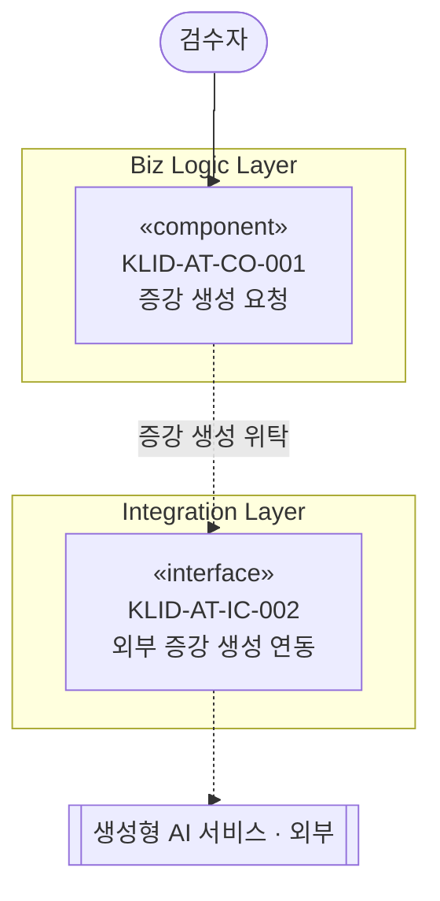
```mermaid
%%{init: {'flowchart': {'curve': 'stepBefore'}}}%%
flowchart TD
    ACT1([검수자])
    EXT1[[생성형 AI 서비스 · 외부]]
    subgraph BIZ1["Biz Logic Layer"]
        CO001["«component»<br/>KLID-AT-CO-001<br/>증강 생성 요청"]
    end
    subgraph INT1["Integration Layer"]
        IFA1["«interface»<br/>KLID-AT-IC-002<br/>외부 증강 생성 연동"]
    end
    ACT1 --> CO001
    CO001 -. 증강 생성 위탁 .-> IFA1
    IFA1 -.-> EXT1
```

<!-- hwpx:ignore-start -->
### 증강 결과 수신·등록 컴포넌트 구조도
- 사용: [[KLID_AT_클래스설계서#3.2 KLID-AT-DCD-002 — 증강 결과 수신·등록]]
- 사용: [[KLID_AT_컴포넌트설계서#KLID-AT-CO-002 — 증강 결과 수신·등록 컴포넌트]]
<!-- hwpx:ignore-end -->

### 1.2 KLID-AT-CO-002 — 증강 결과 수신·등록 컴포넌트

| 컴포넌트 ID | KLID-AT-CO-002 | 컴포넌트명 | 증강 결과 수신·등록 컴포넌트 |
|----------|---|---------|---|
| 관련 유스케이스 ID | KLID-AT-UC-002 (증강 결과 수신·등록) |

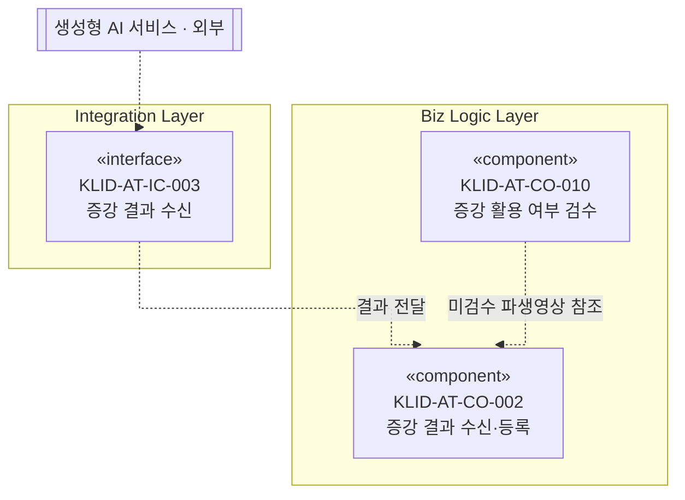
```mermaid
%%{init: {'flowchart': {'curve': 'stepBefore'}}}%%
flowchart TD
    EXT2[[생성형 AI 서비스 · 외부]]
    subgraph INT2["Integration Layer"]
        IFB2["«interface»<br/>KLID-AT-IC-003<br/>증강 결과 수신"]
    end
    subgraph BIZ2["Biz Logic Layer"]
        CO002["«component»<br/>KLID-AT-CO-002<br/>증강 결과 수신·등록"]
        CO010A["«component»<br/>KLID-AT-CO-010<br/>증강 활용 여부 검수"]
    end
    EXT2 -.-> IFB2
    IFB2 -. 결과 전달 .-> CO002
    CO010A -. 미검수 파생영상 참조 .-> CO002
```

<!-- hwpx:ignore-start -->
### 해상도 변경 컴포넌트 구조도
- 사용: [[KLID_AT_클래스설계서#3.3 KLID-AT-DCD-003 — 해상도 변경 수행]]
- 사용: [[KLID_AT_컴포넌트설계서#KLID-AT-CO-003 — 해상도 변경 컴포넌트]]
<!-- hwpx:ignore-end -->

### 1.3 KLID-AT-CO-003 — 해상도 변경 컴포넌트

| 컴포넌트 ID | KLID-AT-CO-003 | 컴포넌트명 | 해상도 변경 컴포넌트 |
|----------|---|---------|---|
| 관련 유스케이스 ID | KLID-AT-UC-003 (해상도 변경 수행) |

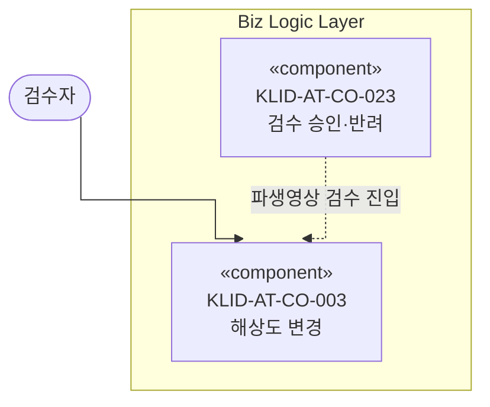
```mermaid
%%{init: {'flowchart': {'curve': 'stepBefore'}}}%%
flowchart TD
    ACT3([검수자])
    subgraph BIZ3["Biz Logic Layer"]
        CO003["«component»<br/>KLID-AT-CO-003<br/>해상도 변경"]
        CO023A["«component»<br/>KLID-AT-CO-023<br/>검수 승인·반려"]
    end
    ACT3 --> CO003
    CO023A -. 파생영상 검수 진입 .-> CO003
```

<!-- hwpx:ignore-start -->
### 객체 자동 추적 컴포넌트 구조도
- 사용: [[KLID_AT_클래스설계서#3.4 KLID-AT-DCD-004 — 객체 자동 추적]]
- 사용: [[KLID_AT_컴포넌트설계서#KLID-AT-CO-004 — 객체 자동 추적 컴포넌트]]
<!-- hwpx:ignore-end -->

### 1.4 KLID-AT-CO-004 — 객체 자동 추적 컴포넌트

| 컴포넌트 ID | KLID-AT-CO-004 | 컴포넌트명 | 객체 자동 추적 컴포넌트 |
|----------|---|---------|---|
| 관련 유스케이스 ID | KLID-AT-UC-004 (객체 자동 추적) |

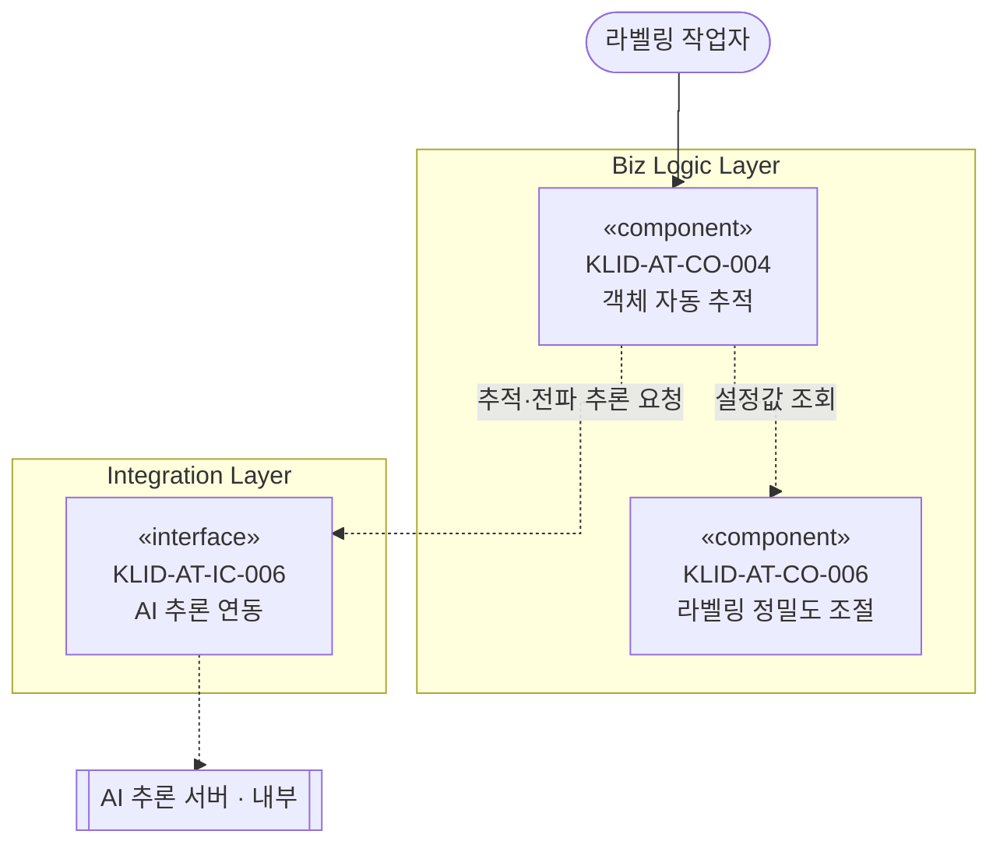
```mermaid
%%{init: {'flowchart': {'curve': 'stepBefore'}}}%%
flowchart TD
    ACT4([라벨링 작업자])
    EXT4[[AI 추론 서버 · 내부]]
    subgraph BIZ4["Biz Logic Layer"]
        CO004["«component»<br/>KLID-AT-CO-004<br/>객체 자동 추적"]
        CO006A["«component»<br/>KLID-AT-CO-006<br/>라벨링 정밀도 조절"]
    end
    subgraph INT4["Integration Layer"]
        IFC4["«interface»<br/>KLID-AT-IC-006<br/>AI 추론 연동"]
    end
    ACT4 --> CO004
    CO004 -. 설정값 조회 .-> CO006A
    CO004 -. 추적·전파 추론 요청 .-> IFC4
    IFC4 -.-> EXT4
```

<!-- hwpx:ignore-start -->
### 객체 외곽 경계 자동 밀착 컴포넌트 구조도
- 사용: [[KLID_AT_클래스설계서#3.5 KLID-AT-DCD-005 — 객체 외곽 경계 자동 밀착]]
- 사용: [[KLID_AT_컴포넌트설계서#KLID-AT-CO-005 — 객체 외곽 경계 자동 밀착 컴포넌트]]
<!-- hwpx:ignore-end -->

### 1.5 KLID-AT-CO-005 — 객체 외곽 경계 자동 밀착 컴포넌트

| 컴포넌트 ID | KLID-AT-CO-005 | 컴포넌트명 | 객체 외곽 경계 자동 밀착 컴포넌트 |
|----------|---|---------|---|
| 관련 유스케이스 ID | KLID-AT-UC-005 (객체 외곽 경계 자동 밀착) |

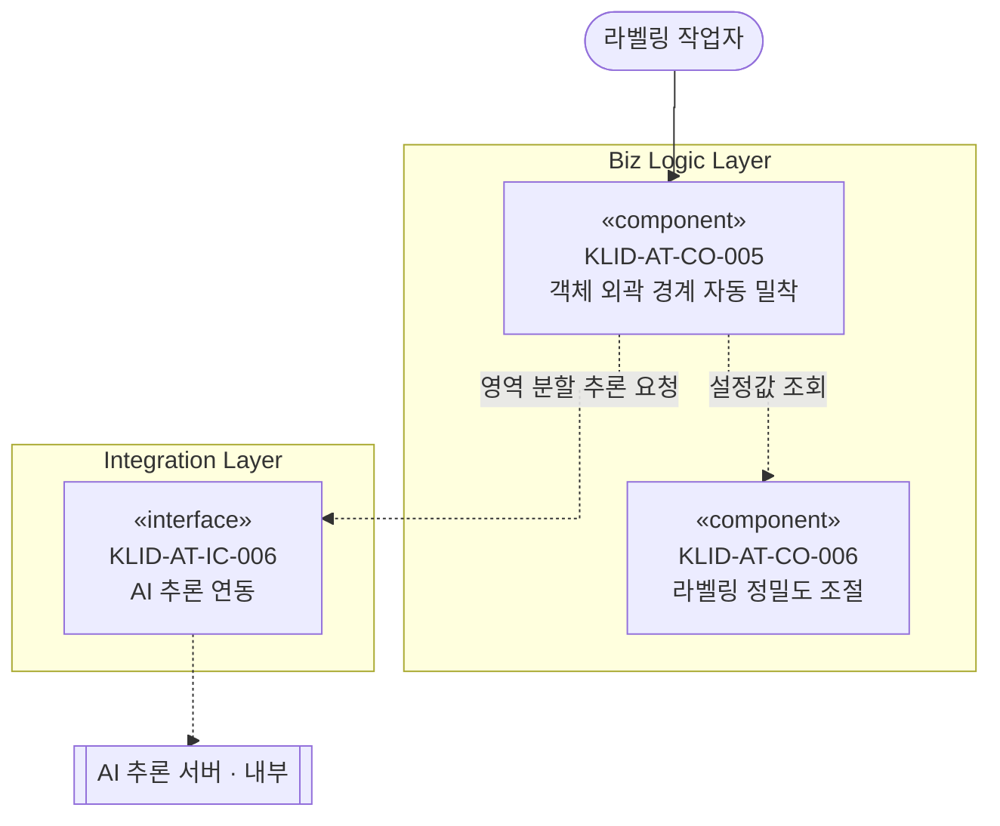
```mermaid
%%{init: {'flowchart': {'curve': 'stepBefore'}}}%%
flowchart TD
    ACT5([라벨링 작업자])
    EXT5[[AI 추론 서버 · 내부]]
    subgraph BIZ5["Biz Logic Layer"]
        CO005["«component»<br/>KLID-AT-CO-005<br/>객체 외곽 경계 자동 밀착"]
        CO006B["«component»<br/>KLID-AT-CO-006<br/>라벨링 정밀도 조절"]
    end
    subgraph INT5["Integration Layer"]
        IFC5["«interface»<br/>KLID-AT-IC-006<br/>AI 추론 연동"]
    end
    ACT5 --> CO005
    CO005 -. 설정값 조회 .-> CO006B
    CO005 -. 영역 분할 추론 요청 .-> IFC5
    IFC5 -.-> EXT5
```

<!-- hwpx:ignore-start -->
### 라벨링 정밀도 조절 컴포넌트 구조도
- 사용: [[KLID_AT_클래스설계서#3.6 KLID-AT-DCD-006 — 라벨링 정밀도 조절]]
- 사용: [[KLID_AT_컴포넌트설계서#KLID-AT-CO-006 — 라벨링 정밀도 조절 컴포넌트]]
<!-- hwpx:ignore-end -->

### 1.6 KLID-AT-CO-006 — 라벨링 정밀도 조절 컴포넌트

| 컴포넌트 ID | KLID-AT-CO-006 | 컴포넌트명 | 라벨링 정밀도 조절 컴포넌트 |
|----------|---|---------|---|
| 관련 유스케이스 ID | KLID-AT-UC-006 (라벨링 정밀도 조절) |

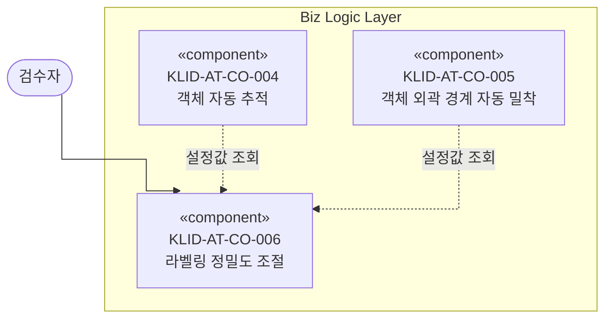
```mermaid
%%{init: {'flowchart': {'curve': 'stepBefore'}}}%%
flowchart TD
    ACT6([검수자])
    subgraph BIZ6["Biz Logic Layer"]
        CO006["«component»<br/>KLID-AT-CO-006<br/>라벨링 정밀도 조절"]
        CO004B["«component»<br/>KLID-AT-CO-004<br/>객체 자동 추적"]
        CO005B["«component»<br/>KLID-AT-CO-005<br/>객체 외곽 경계 자동 밀착"]
    end
    ACT6 --> CO006
    CO004B -. 설정값 조회 .-> CO006
    CO005B -. 설정값 조회 .-> CO006
```

<!-- hwpx:ignore-start -->
### 라벨 버전 저장 컴포넌트 구조도
- 사용: [[KLID_AT_클래스설계서#3.7 KLID-AT-DCD-007 — 라벨 버전 저장·이력 추적]]
- 사용: [[KLID_AT_컴포넌트설계서#KLID-AT-CO-007 — 라벨 버전 저장 컴포넌트]]
<!-- hwpx:ignore-end -->

### 1.7 KLID-AT-CO-007 — 라벨 버전 저장 컴포넌트

| 컴포넌트 ID | KLID-AT-CO-007 | 컴포넌트명 | 라벨 버전 저장 컴포넌트 |
|----------|---|---------|---|
| 관련 유스케이스 ID | KLID-AT-UC-007 (라벨 버전 저장·이력 추적) |

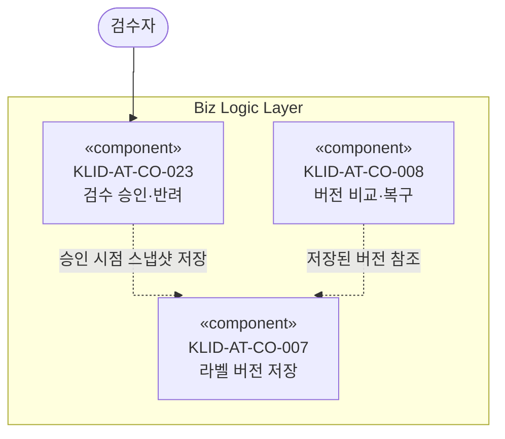
```mermaid
%%{init: {'flowchart': {'curve': 'stepBefore'}}}%%
flowchart TD
    ACT7([검수자])
    subgraph BIZ7["Biz Logic Layer"]
        CO023B["«component»<br/>KLID-AT-CO-023<br/>검수 승인·반려"]
        CO007["«component»<br/>KLID-AT-CO-007<br/>라벨 버전 저장"]
        CO008A["«component»<br/>KLID-AT-CO-008<br/>버전 비교·복구"]
    end
    ACT7 --> CO023B
    CO023B -. 승인 시점 스냅샷 저장 .-> CO007
    CO008A -. 저장된 버전 참조 .-> CO007
```

<!-- hwpx:ignore-start -->
### 버전 비교·복구 컴포넌트 구조도
- 사용: [[KLID_AT_클래스설계서#3.8 KLID-AT-DCD-008 — 버전 비교·복구]]
- 사용: [[KLID_AT_컴포넌트설계서#KLID-AT-CO-008 — 버전 비교·복구 컴포넌트]]
<!-- hwpx:ignore-end -->

### 1.8 KLID-AT-CO-008 — 버전 비교·복구 컴포넌트

| 컴포넌트 ID | KLID-AT-CO-008 | 컴포넌트명 | 버전 비교·복구 컴포넌트 |
|----------|---|---------|---|
| 관련 유스케이스 ID | KLID-AT-UC-008 (버전 비교·복구) |

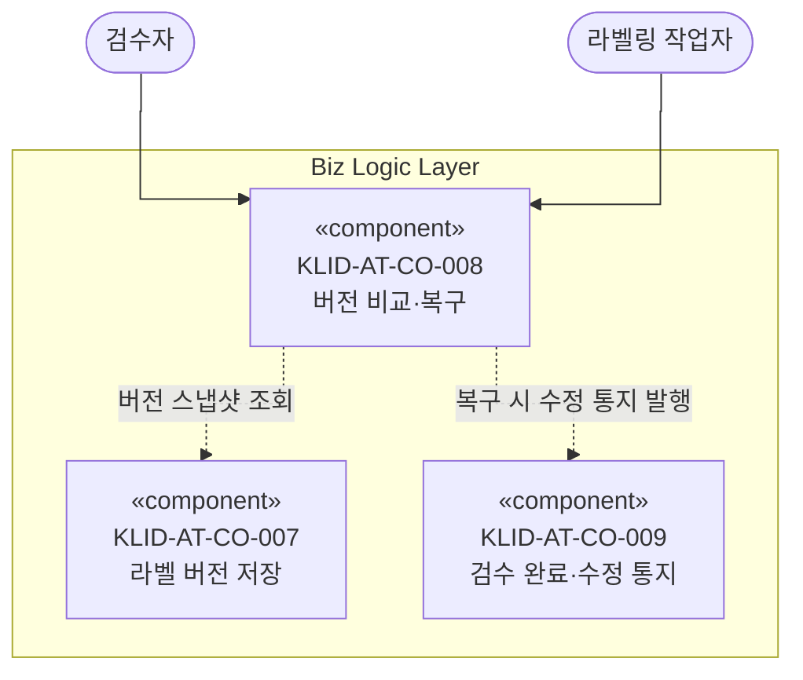
```mermaid
%%{init: {'flowchart': {'curve': 'stepBefore'}}}%%
flowchart TD
    ACT8A([검수자])
    ACT8B([라벨링 작업자])
    subgraph BIZ8["Biz Logic Layer"]
        CO008["«component»<br/>KLID-AT-CO-008<br/>버전 비교·복구"]
        CO007A["«component»<br/>KLID-AT-CO-007<br/>라벨 버전 저장"]
        CO009A["«component»<br/>KLID-AT-CO-009<br/>검수 완료·수정 통지"]
    end
    ACT8A --> CO008
    ACT8B --> CO008
    CO008 -. 버전 스냅샷 조회 .-> CO007A
    CO008 -. 복구 시 수정 통지 발행 .-> CO009A
```

<!-- hwpx:ignore-start -->
### 검수 완료·수정 통지 컴포넌트 구조도
- 사용: [[KLID_AT_클래스설계서#3.9 KLID-AT-DCD-009 — 검수 완료·수정 통지]]
- 사용: [[KLID_AT_컴포넌트설계서#KLID-AT-CO-009 — 검수 완료·수정 통지 컴포넌트]]
<!-- hwpx:ignore-end -->

### 1.9 KLID-AT-CO-009 — 검수 완료·수정 통지 컴포넌트

| 컴포넌트 ID | KLID-AT-CO-009 | 컴포넌트명 | 검수 완료·수정 통지 컴포넌트 |
|----------|---|---------|---|
| 관련 유스케이스 ID | KLID-AT-UC-009 (검수 완료·수정 통지) |

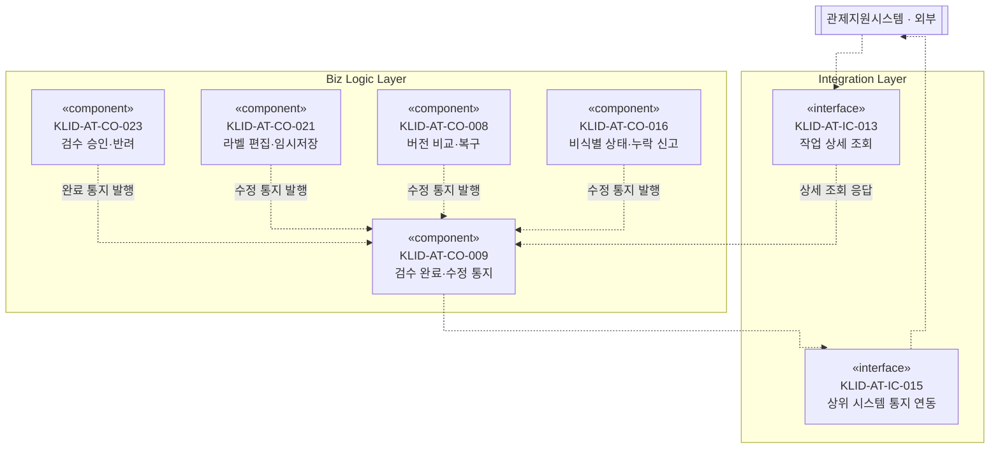
```mermaid
%%{init: {'flowchart': {'curve': 'stepBefore'}}}%%
flowchart TD
    EXT9[[관제지원시스템 · 외부]]
    subgraph BIZ9["Biz Logic Layer"]
        CO023C["«component»<br/>KLID-AT-CO-023<br/>검수 승인·반려"]
        CO021A["«component»<br/>KLID-AT-CO-021<br/>라벨 편집·임시저장"]
        CO008B["«component»<br/>KLID-AT-CO-008<br/>버전 비교·복구"]
        CO016A["«component»<br/>KLID-AT-CO-016<br/>비식별 상태·누락 신고"]
        CO009["«component»<br/>KLID-AT-CO-009<br/>검수 완료·수정 통지"]
    end
    subgraph INT9["Integration Layer"]
        IFD9["«interface»<br/>KLID-AT-IC-015<br/>상위 시스템 통지 연동"]
        IFE9["«interface»<br/>KLID-AT-IC-013<br/>작업 상세 조회"]
    end
    CO023C -. 완료 통지 발행 .-> CO009
    CO021A -. 수정 통지 발행 .-> CO009
    CO008B -. 수정 통지 발행 .-> CO009
    CO016A -. 수정 통지 발행 .-> CO009
    CO009 -.-> IFD9
    IFD9 -.-> EXT9
    EXT9 -.-> IFE9
    IFE9 -. 상세 조회 응답 .-> CO009
```

<!-- hwpx:ignore-start -->
### 증강 활용 여부 검수 컴포넌트 구조도
- 사용: [[KLID_AT_클래스설계서#3.10 KLID-AT-DCD-010 — 증강 영상 활용 여부 검수]]
- 사용: [[KLID_AT_컴포넌트설계서#KLID-AT-CO-010 — 증강 활용 여부 검수 컴포넌트]]
<!-- hwpx:ignore-end -->

### 1.10 KLID-AT-CO-010 — 증강 활용 여부 검수 컴포넌트

| 컴포넌트 ID | KLID-AT-CO-010 | 컴포넌트명 | 증강 활용 여부 검수 컴포넌트 |
|----------|---|---------|---|
| 관련 유스케이스 ID | KLID-AT-UC-010 (증강 영상 활용 여부 검수) |

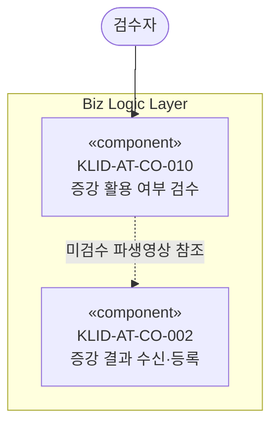
```mermaid
%%{init: {'flowchart': {'curve': 'stepBefore'}}}%%
flowchart TD
    ACT10([검수자])
    subgraph BIZ10["Biz Logic Layer"]
        CO010["«component»<br/>KLID-AT-CO-010<br/>증강 활용 여부 검수"]
        CO002A["«component»<br/>KLID-AT-CO-002<br/>증강 결과 수신·등록"]
    end
    ACT10 --> CO010
    CO010 -. 미검수 파생영상 참조 .-> CO002A
```

<!-- hwpx:ignore-start -->
### 비식별 처리 요청 컴포넌트 구조도
- 사용: [[KLID_AT_클래스설계서#3.11 KLID-AT-DCD-011 — 비식별 처리 요청]]
- 사용: [[KLID_AT_컴포넌트설계서#KLID-AT-CO-011 — 비식별 처리 요청 컴포넌트]]
<!-- hwpx:ignore-end -->

### 1.11 KLID-AT-CO-011 — 비식별 처리 요청 컴포넌트

| 컴포넌트 ID | KLID-AT-CO-011 | 컴포넌트명 | 비식별 처리 요청 컴포넌트 |
|----------|---|---------|---|
| 관련 유스케이스 ID | KLID-AT-UC-011 (비식별 처리 요청) |

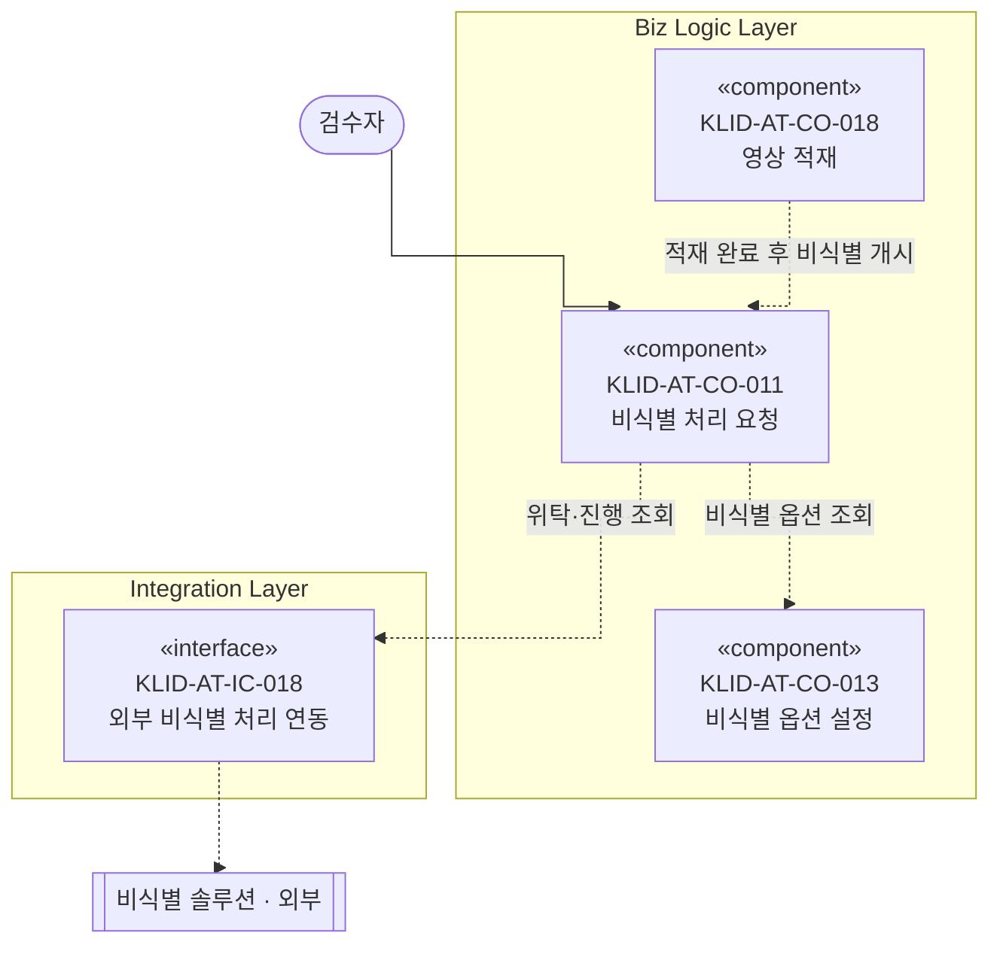
```mermaid
%%{init: {'flowchart': {'curve': 'stepBefore'}}}%%
flowchart TD
    ACT11([검수자])
    EXT11[[비식별 솔루션 · 외부]]
    subgraph BIZ11["Biz Logic Layer"]
        CO018A["«component»<br/>KLID-AT-CO-018<br/>영상 적재"]
        CO011["«component»<br/>KLID-AT-CO-011<br/>비식별 처리 요청"]
        CO013A["«component»<br/>KLID-AT-CO-013<br/>비식별 옵션 설정"]
    end
    subgraph INT11["Integration Layer"]
        IFF11["«interface»<br/>KLID-AT-IC-018<br/>외부 비식별 처리 연동"]
    end
    ACT11 --> CO011
    CO018A -. 적재 완료 후 비식별 개시 .-> CO011
    CO011 -. 비식별 옵션 조회 .-> CO013A
    CO011 -. 위탁·진행 조회 .-> IFF11
    IFF11 -.-> EXT11
```

<!-- hwpx:ignore-start -->
### 비식별 옵션 설정 컴포넌트 구조도
- 사용: [[KLID_AT_클래스설계서#3.12 KLID-AT-DCD-013 — 비식별 옵션 설정]]
- 사용: [[KLID_AT_컴포넌트설계서#KLID-AT-CO-013 — 비식별 옵션 설정 컴포넌트]]
<!-- hwpx:ignore-end -->

### 1.12 KLID-AT-CO-013 — 비식별 옵션 설정 컴포넌트

| 컴포넌트 ID | KLID-AT-CO-013 | 컴포넌트명 | 비식별 옵션 설정 컴포넌트 |
|----------|---|---------|---|
| 관련 유스케이스 ID | KLID-AT-UC-013 (비식별 옵션 설정) |

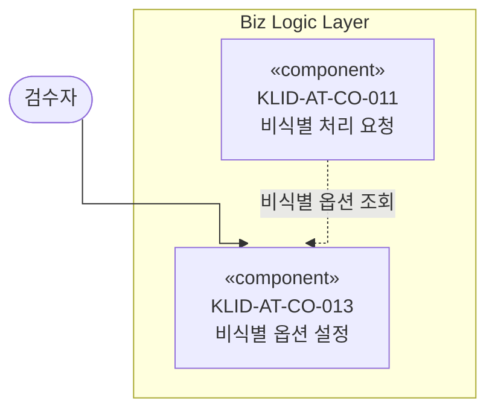
```mermaid
%%{init: {'flowchart': {'curve': 'stepBefore'}}}%%
flowchart TD
    ACT13([검수자])
    subgraph BIZ13["Biz Logic Layer"]
        CO013["«component»<br/>KLID-AT-CO-013<br/>비식별 옵션 설정"]
        CO011A["«component»<br/>KLID-AT-CO-011<br/>비식별 처리 요청"]
    end
    ACT13 --> CO013
    CO011A -. 비식별 옵션 조회 .-> CO013
```

<!-- hwpx:ignore-start -->
### 비식별 상태·누락 신고 컴포넌트 구조도
- 사용: [[KLID_AT_클래스설계서#3.13 KLID-AT-DCD-016 — 비식별 처리 상태·이력 확인]]
- 사용: [[KLID_AT_컴포넌트설계서#KLID-AT-CO-016 — 비식별 상태·누락 신고 컴포넌트]]
<!-- hwpx:ignore-end -->

### 1.13 KLID-AT-CO-016 — 비식별 상태·누락 신고 컴포넌트

| 컴포넌트 ID | KLID-AT-CO-016 | 컴포넌트명 | 비식별 상태·누락 신고 컴포넌트 |
|----------|---|---------|---|
| 관련 유스케이스 ID | KLID-AT-UC-016 (비식별 처리 상태·이력 확인) |

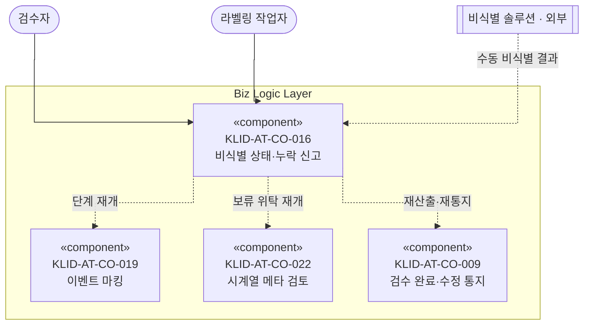
```mermaid
%%{init: {'flowchart': {'curve': 'stepBefore'}}}%%
flowchart TD
    ACT16A([검수자])
    ACT16B([라벨링 작업자])
    EXT16[[비식별 솔루션 · 외부]]
    subgraph BIZ16["Biz Logic Layer"]
        CO016["«component»<br/>KLID-AT-CO-016<br/>비식별 상태·누락 신고"]
        CO019A["«component»<br/>KLID-AT-CO-019<br/>이벤트 마킹"]
        CO022A["«component»<br/>KLID-AT-CO-022<br/>시계열 메타 검토"]
        CO009B["«component»<br/>KLID-AT-CO-009<br/>검수 완료·수정 통지"]
    end
    ACT16A --> CO016
    ACT16B --> CO016
    EXT16 -. 수동 비식별 결과 .-> CO016
    CO016 -. 단계 재개 .-> CO019A
    CO016 -. 보류 위탁 재개 .-> CO022A
    CO016 -. 재산출·재통지 .-> CO009B
```

<!-- hwpx:ignore-start -->
### 영상 적재 컴포넌트 구조도
- 사용: [[KLID_AT_클래스설계서#3.14 KLID-AT-DCD-018 — 영상 적재]]
- 사용: [[KLID_AT_컴포넌트설계서#KLID-AT-CO-018 — 영상 적재 컴포넌트]]
<!-- hwpx:ignore-end -->

### 1.14 KLID-AT-CO-018 — 영상 적재 컴포넌트

| 컴포넌트 ID | KLID-AT-CO-018 | 컴포넌트명 | 영상 적재 컴포넌트 |
|----------|---|---------|---|
| 관련 유스케이스 ID | KLID-AT-UC-018 (영상 적재) |

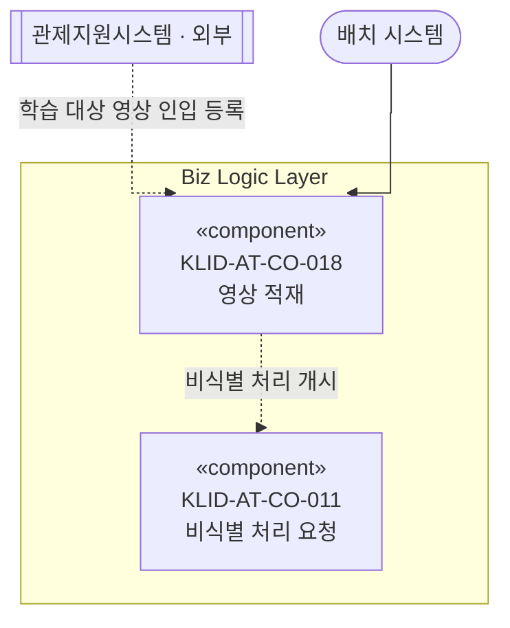
```mermaid
%%{init: {'flowchart': {'curve': 'stepBefore'}}}%%
flowchart TD
    ACT18([배치 시스템])
    EXT18[[관제지원시스템 · 외부]]
    subgraph BIZ18["Biz Logic Layer"]
        CO018["«component»<br/>KLID-AT-CO-018<br/>영상 적재"]
        CO011B["«component»<br/>KLID-AT-CO-011<br/>비식별 처리 요청"]
    end
    EXT18 -. 학습 대상 영상 인입 등록 .-> CO018
    ACT18 --> CO018
    CO018 -. 비식별 처리 개시 .-> CO011B
```

<!-- hwpx:ignore-start -->
### 이벤트 마킹 컴포넌트 구조도
- 사용: [[KLID_AT_클래스설계서#3.15 KLID-AT-DCD-019 — 이벤트 마킹 (자동/수동)]]
- 사용: [[KLID_AT_컴포넌트설계서#KLID-AT-CO-019 — 이벤트 마킹 컴포넌트]]
<!-- hwpx:ignore-end -->

### 1.15 KLID-AT-CO-019 — 이벤트 마킹 컴포넌트

| 컴포넌트 ID | KLID-AT-CO-019 | 컴포넌트명 | 이벤트 마킹 컴포넌트 |
|----------|---|---------|---|
| 관련 유스케이스 ID | KLID-AT-UC-019 (이벤트 마킹 (자동/수동)) |

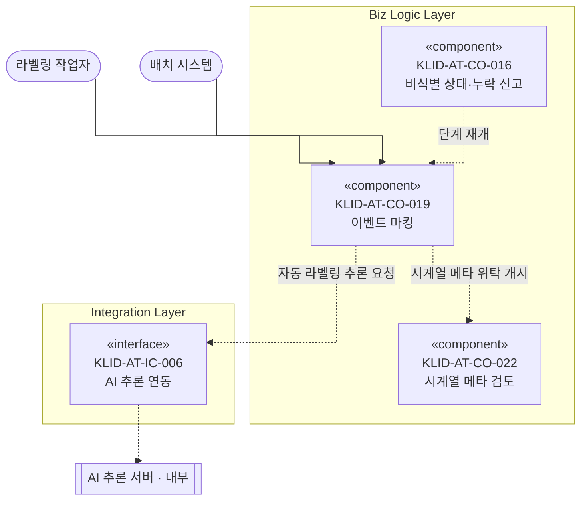
```mermaid
%%{init: {'flowchart': {'curve': 'stepBefore'}}}%%
flowchart TD
    ACT19A([라벨링 작업자])
    ACT19B([배치 시스템])
    EXT19[[AI 추론 서버 · 내부]]
    subgraph BIZ19["Biz Logic Layer"]
        CO019["«component»<br/>KLID-AT-CO-019<br/>이벤트 마킹"]
        CO022B["«component»<br/>KLID-AT-CO-022<br/>시계열 메타 검토"]
        CO016B["«component»<br/>KLID-AT-CO-016<br/>비식별 상태·누락 신고"]
    end
    subgraph INT19["Integration Layer"]
        IFC19["«interface»<br/>KLID-AT-IC-006<br/>AI 추론 연동"]
    end
    ACT19A --> CO019
    ACT19B --> CO019
    CO016B -. 단계 재개 .-> CO019
    CO019 -. 시계열 메타 위탁 개시 .-> CO022B
    CO019 -. 자동 라벨링 추론 요청 .-> IFC19
    IFC19 -.-> EXT19
```

<!-- hwpx:ignore-start -->
### 라벨 편집·임시저장 컴포넌트 구조도
- 사용: [[KLID_AT_클래스설계서#3.16 KLID-AT-DCD-021 — 라벨 편집·임시저장]]
- 사용: [[KLID_AT_컴포넌트설계서#KLID-AT-CO-021 — 라벨 편집·임시저장 컴포넌트]]
<!-- hwpx:ignore-end -->

### 1.16 KLID-AT-CO-021 — 라벨 편집·임시저장 컴포넌트

| 컴포넌트 ID | KLID-AT-CO-021 | 컴포넌트명 | 라벨 편집·임시저장 컴포넌트 |
|----------|---|---------|---|
| 관련 유스케이스 ID | KLID-AT-UC-021 (라벨 편집·임시저장) |

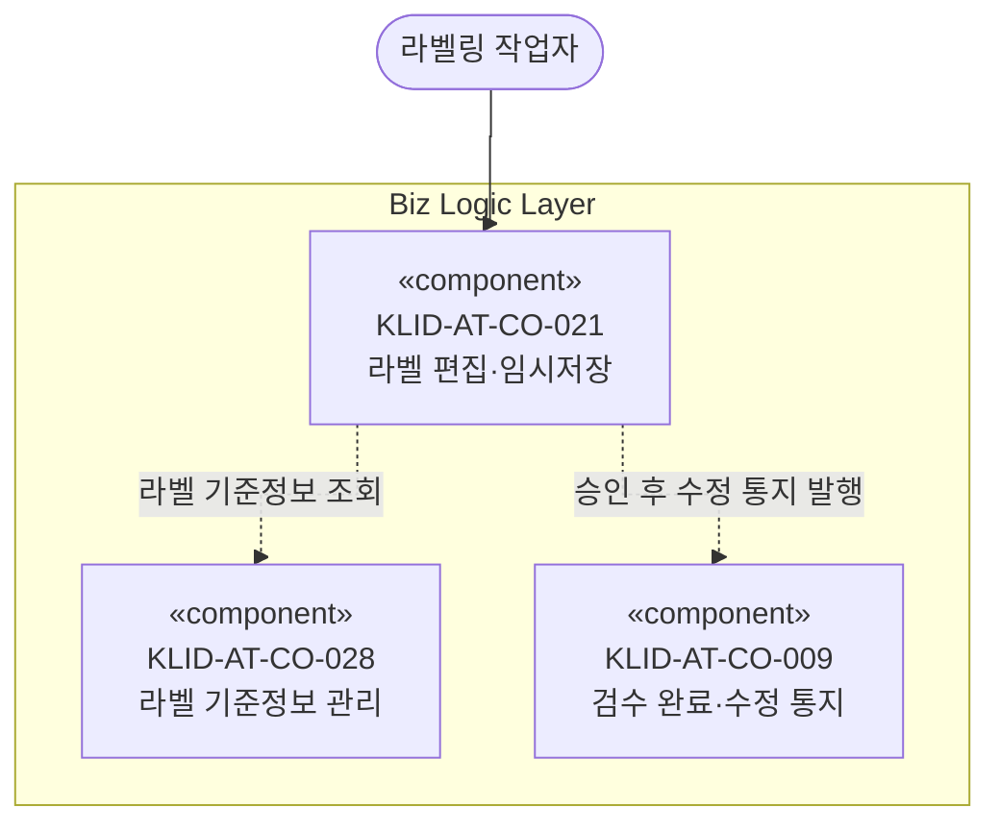
```mermaid
%%{init: {'flowchart': {'curve': 'stepBefore'}}}%%
flowchart TD
    ACT21([라벨링 작업자])
    subgraph BIZ21["Biz Logic Layer"]
        CO021["«component»<br/>KLID-AT-CO-021<br/>라벨 편집·임시저장"]
        CO028A["«component»<br/>KLID-AT-CO-028<br/>라벨 기준정보 관리"]
        CO009C["«component»<br/>KLID-AT-CO-009<br/>검수 완료·수정 통지"]
    end
    ACT21 --> CO021
    CO021 -. 라벨 기준정보 조회 .-> CO028A
    CO021 -. 승인 후 수정 통지 발행 .-> CO009C
```

<!-- hwpx:ignore-start -->
### 시계열 메타 검토 컴포넌트 구조도
- 사용: [[KLID_AT_클래스설계서#3.17 KLID-AT-DCD-022 — 시계열 메타 검토]]
- 사용: [[KLID_AT_컴포넌트설계서#KLID-AT-CO-022 — 시계열 메타 검토 컴포넌트]]
<!-- hwpx:ignore-end -->

### 1.17 KLID-AT-CO-022 — 시계열 메타 검토 컴포넌트

| 컴포넌트 ID | KLID-AT-CO-022 | 컴포넌트명 | 시계열 메타 검토 컴포넌트 |
|----------|---|---------|---|
| 관련 유스케이스 ID | KLID-AT-UC-022 (시계열 메타 검토) |

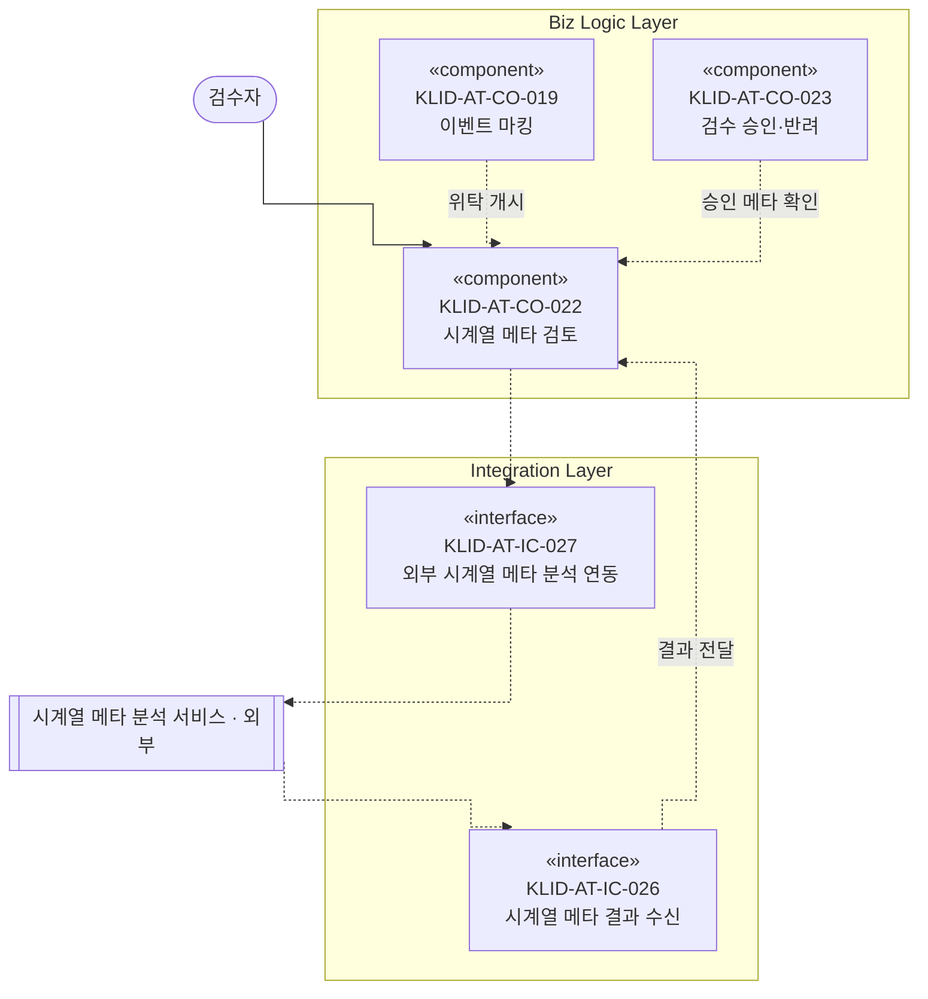
```mermaid
%%{init: {'flowchart': {'curve': 'stepBefore'}}}%%
flowchart TD
    ACT22([검수자])
    EXT22[[시계열 메타 분석 서비스 · 외부]]
    subgraph BIZ22["Biz Logic Layer"]
        CO019B["«component»<br/>KLID-AT-CO-019<br/>이벤트 마킹"]
        CO022["«component»<br/>KLID-AT-CO-022<br/>시계열 메타 검토"]
        CO023D["«component»<br/>KLID-AT-CO-023<br/>검수 승인·반려"]
    end
    subgraph INT22["Integration Layer"]
        IFG22["«interface»<br/>KLID-AT-IC-027<br/>외부 시계열 메타 분석 연동"]
        IFH22["«interface»<br/>KLID-AT-IC-026<br/>시계열 메타 결과 수신"]
    end
    ACT22 --> CO022
    CO019B -. 위탁 개시 .-> CO022
    CO022 -.-> IFG22
    IFG22 -.-> EXT22
    EXT22 -.-> IFH22
    IFH22 -. 결과 전달 .-> CO022
    CO023D -. 승인 메타 확인 .-> CO022
```

<!-- hwpx:ignore-start -->
### 검수 승인·반려 컴포넌트 구조도
- 사용: [[KLID_AT_클래스설계서#3.18 KLID-AT-DCD-023 — 검수 승인·반려]]
- 사용: [[KLID_AT_컴포넌트설계서#KLID-AT-CO-023 — 검수 승인·반려 컴포넌트]]
<!-- hwpx:ignore-end -->

### 1.18 KLID-AT-CO-023 — 검수 승인·반려 컴포넌트

| 컴포넌트 ID | KLID-AT-CO-023 | 컴포넌트명 | 검수 승인·반려 컴포넌트 |
|----------|---|---------|---|
| 관련 유스케이스 ID | KLID-AT-UC-023 (검수 승인·반려) |

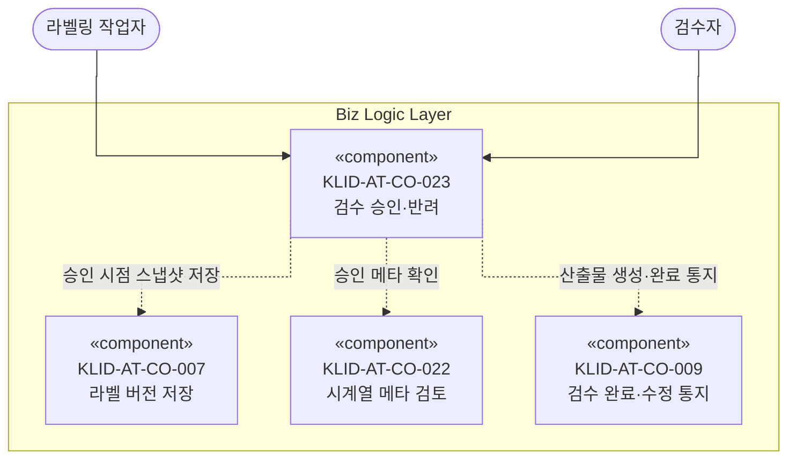
```mermaid
%%{init: {'flowchart': {'curve': 'stepBefore'}}}%%
flowchart TD
    ACT23A([검수자])
    ACT23B([라벨링 작업자])
    subgraph BIZ23["Biz Logic Layer"]
        CO023["«component»<br/>KLID-AT-CO-023<br/>검수 승인·반려"]
        CO007B["«component»<br/>KLID-AT-CO-007<br/>라벨 버전 저장"]
        CO022C["«component»<br/>KLID-AT-CO-022<br/>시계열 메타 검토"]
        CO009D["«component»<br/>KLID-AT-CO-009<br/>검수 완료·수정 통지"]
    end
    ACT23B --> CO023
    ACT23A --> CO023
    CO023 -. 승인 시점 스냅샷 저장 .-> CO007B
    CO023 -. 승인 메타 확인 .-> CO022C
    CO023 -. 산출물 생성·완료 통지 .-> CO009D
```

<!-- hwpx:ignore-start -->
### 라벨 기준정보 관리 컴포넌트 구조도
- 사용: [[KLID_AT_클래스설계서#3.19 KLID-AT-DCD-028 — 라벨 클래스·속성 정의 관리]]
- 사용: [[KLID_AT_컴포넌트설계서#KLID-AT-CO-028 — 라벨 기준정보 관리 컴포넌트]]
<!-- hwpx:ignore-end -->

### 1.19 KLID-AT-CO-028 — 라벨 기준정보 관리 컴포넌트

| 컴포넌트 ID | KLID-AT-CO-028 | 컴포넌트명 | 라벨 기준정보 관리 컴포넌트 |
|----------|---|---------|---|
| 관련 유스케이스 ID | KLID-AT-UC-028 (라벨 클래스·속성 정의 관리) |

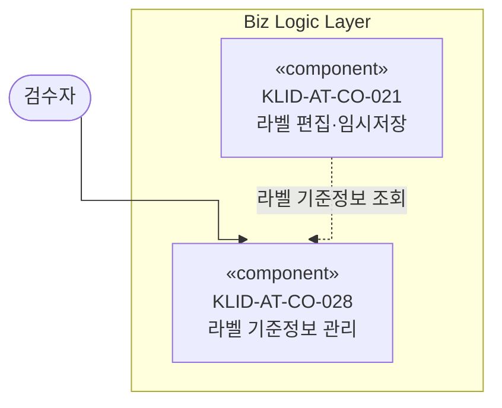
```mermaid
%%{init: {'flowchart': {'curve': 'stepBefore'}}}%%
flowchart TD
    ACT28([검수자])
    subgraph BIZ28["Biz Logic Layer"]
        CO028["«component»<br/>KLID-AT-CO-028<br/>라벨 기준정보 관리"]
        CO021B["«component»<br/>KLID-AT-CO-021<br/>라벨 편집·임시저장"]
    end
    ACT28 --> CO028
    CO021B -. 라벨 기준정보 조회 .-> CO028
```

---

## 2. 컴포넌트 목록

| 컴포넌트ID | 컴포넌트명 | 개요 | 관련 유스케이스 ID |
|---------|---------|------|-------------|
| KLID-AT-CO-001 | 증강 생성 요청 컴포넌트 | 검수 완료 원본 영상과 증강 종류·생성 조건을 검증하여 외부 생성형 AI 서비스에 증강 생성을 위탁하고 위탁 작업을 대기 상태로 등록한다. | KLID-AT-UC-001 |
| KLID-AT-CO-002 | 증강 결과 수신·등록 컴포넌트 | 외부가 회신한 증강 결과를 중복 없이 수신해 원본을 참조하는 새 영상으로 등록하고, 원본 라벨·메타를 좌표·속성 보존하여 복사한 뒤 미검수 상태로 적재한다. | KLID-AT-UC-002 |
| KLID-AT-CO-003 | 해상도 변경 컴포넌트 | 표준 해상도 프리셋마다 파생영상을 생성한다. 영상 파일은 비식별본을 재인코딩 없이 복사하고 프레임 이미지만 목표 해상도로 리스케일하며 라벨 좌표를 배율로 재계산해 적재한다. | KLID-AT-UC-003 |
| KLID-AT-CO-004 | 객체 자동 추적 컴포넌트 | 시작 프레임에서 지정한 객체를 후속 프레임으로 전파해 위치와 경계를 자동 라벨로 갱신하고, 결과가 없는 중간 프레임을 보간으로 채운다. | KLID-AT-UC-004 |
| KLID-AT-CO-005 | 객체 외곽 경계 자동 밀착 컴포넌트 | 클릭 또는 박스 지정을 받아 객체 외곽 경계 폴리곤과 신뢰도를 산출하고, 좌표를 실측 크기 범위로 검증한 뒤 설정된 정밀도로 단순화해 라벨에 적용한다. | KLID-AT-UC-005 |
| KLID-AT-CO-006 | 라벨링 정밀도 조절 컴포넌트 | 폴리곤 단순화 정밀도를 시스템 설정으로 관리하고, 자동 추적·자동 밀착이 참조하는 설정값 조회를 제공한다. | KLID-AT-UC-006 |
| KLID-AT-CO-007 | 라벨 버전 저장 컴포넌트 | 검수 승인 시점의 영상 단위 라벨 전체 스냅샷을 저장하고 페이로드 해시로 버전을 식별하며 변경이력을 기록한다. | KLID-AT-UC-007 |
| KLID-AT-CO-008 | 버전 비교·복구 컴포넌트 | 버전 스냅샷을 현재 작업본 또는 다른 스냅샷과 비교해 추가·수정·삭제 차이를 산출하고, 선택 버전을 다시 활성 버전으로 전환해 라벨 본문을 복원한다. | KLID-AT-UC-008 |
| KLID-AT-CO-009 | 검수 완료·수정 통지 컴포넌트 | 학습데이터 산출물을 생성하고 성공 후 완료·수정 통지를 영상 1건 단위로 상위 시스템에 단방향 발행하며, 상위 시스템의 상세 조회 요청에 응답한다. | KLID-AT-UC-009 |
| KLID-AT-CO-010 | 증강 활용 여부 검수 컴포넌트 | 미검수 증강 결과의 활용(채택)·미활용(폐기)을 판단해 작업 대상 등재 여부를 결정하고, 유예기간 경과 후 폐기 파생영상을 정리한다. | KLID-AT-UC-010 |
| KLID-AT-CO-011 | 비식별 처리 요청 컴포넌트 | 적재된 전체 영상을 외부 비식별 솔루션에 위탁하고 주기 조회로 완료를 감지해 결과 경로를 기록하며, 원본을 보존한 채 마킹 가능 상태로 전이한다. | KLID-AT-UC-011 |
| KLID-AT-CO-013 | 비식별 옵션 설정 컴포넌트 | 외부 비식별 솔루션이 제공하는 옵션을 관리 화면에서 조회·검증·저장하고, 이후 비식별 위탁 요청이 참조하도록 제공한다. | KLID-AT-UC-013 |
| KLID-AT-CO-016 | 비식별 상태·누락 신고 컴포넌트 | 영상 단위 비식별 상태·이력을 제공하고 누락 신고를 접수해 작업을 잠그며, 수동 비식별 완료 후 해소 처리로 잠금을 풀고 신고 단계에 따라 처리를 재개한다. | KLID-AT-UC-016 |
| KLID-AT-CO-018 | 영상 적재 컴포넌트 | 상위 시스템이 등록한 인입 건을 주기 배치가 픽업해 파일 실재를 검증한 뒤 영상 1건으로 적재하고, 비식별 선두 단계를 자동 개시한다. | KLID-AT-UC-018 |
| KLID-AT-CO-019 | 이벤트 마킹 컴포넌트 | 비식별 영상을 구간 요청 방식으로 제공하고 자동(프레임 간격)·수동(단축키) 마킹 결과를 저장하며, 마킹 완료를 신호로 잔여 배치 처리를 개시한다. | KLID-AT-UC-019 |
| KLID-AT-CO-021 | 라벨 편집·임시저장 컴포넌트 | 배정된 프레임의 도형 라벨과 객체 속성값을 검증·저장하고 저장 이벤트 단위 변경이력을 기록한다(학습데이터 버전은 생성하지 않는다). | KLID-AT-UC-021 |
| KLID-AT-CO-022 | 시계열 메타 검토 컴포넌트 | 외부 시계열 메타 분석 서비스에 생성을 위탁하고 회신 결과를 적재해 검수 대기열에 진입시키며, 검수자의 검토·수정·승인·반려를 처리한다. | KLID-AT-UC-022 |
| KLID-AT-CO-023 | 검수 승인·반려 컴포넌트 | 제출된 영상 단위 작업의 라벨·메타를 검수자가 승인 또는 반려하도록 처리하고, 승인 시 작업을 완료로 전이하며 스냅샷 저장·산출물 생성·완료 통지를 연계한다. | KLID-AT-UC-023 |
| KLID-AT-CO-028 | 라벨 기준정보 관리 컴포넌트 | 라벨 클래스와 속성 정의를 등록·수정·삭제해 라벨링 화면·자동 라벨링 후보·프리셋이 참조하는 단일 기준을 유지하고 기준정보 조회를 제공한다. | KLID-AT-UC-028 |

---

## 3. 컴포넌트 명세

> **⟳ 컴포넌트별로 1개씩 반복 작성한다.** 복수 컴포넌트가 재사용하는 공통 클래스는 동일 내부 클래스 ID(= 설계 클래스 ID `KLID-AT-DC-NNN`)로 교차 참조하며 중복 정의하지 않는다. 인터페이스도 동일 인터페이스 클래스 ID(`KLID-AT-IC-NNN`)를 제공(Serviced)·요청(Required) 양쪽에서 교차 참조한다.

<!-- hwpx:ignore-start -->
### 증강 생성 요청 컴포넌트 명세
- 사용: [[KLID_AT_컴포넌트설계서#4.1 KLID-AT-IC-001 — 증강 요청 인터페이스]]
- 사용: [[KLID_AT_컴포넌트설계서#4.2 KLID-AT-IC-002 — 외부 증강 생성 연동 인터페이스]]
<!-- hwpx:ignore-end -->

### KLID-AT-CO-001 — 증강 생성 요청 컴포넌트

| 컴포넌트 ID | KLID-AT-CO-001 | 컴포넌트명 | 증강 생성 요청 컴포넌트 |
|----------|---|---------|---|
| 컴포넌트 개요 | 검수 완료 원본 영상과 증강 종류(동절기·야간·강우)·생성 조건 5개 항목을 검증하여 외부 생성형 AI 서비스에 증강 생성을 위탁하고, 위탁 작업을 대기 상태로 등록하며 생성 조건 원문을 보관한다. 파생영상 대상 요청과 비식별 재처리 대기 구간의 요청은 거부한다. |

| **내부 클래스** |||
| ID | 클래스명 | 설명 |
|----|--------|------|
| KLID-AT-DC-115 | AugmentController | 증강 요청·활용 여부 검수 진입점을 제공한다. |
| KLID-AT-DC-116 | AugmentRequestService | 대상 적격성과 생성 조건을 검증하고 증강 위탁을 개시한다. |
| KLID-AT-DC-117 | AugmentJobSubmitService | 외부 위탁을 제출하고 수락 결과를 기록한다. |
| KLID-AT-DC-118 | AugmentGenerationClient | 외부 생성형 AI 증강 서비스 연동 계약이다. |
| KLID-AT-DC-119 | AugmentJob | 위탁 작업의 중복 방지 식별자·외부 작업 식별자·상태를 보유한다. |
| KLID-AT-DC-120 | DataAugmentation | 증강·해상도 파생 1건의 종류·생성 조건 원문·처리 상태·파생영상 참조를 보유한다. |
| KLID-AT-DC-013 | DataRaw | 영상 1건의 원본 경로·메타·이벤트 유형·비식별 여부·파생 관계를 보유하는 영상 엔티티다. |
| KLID-AT-DC-003 | DeidentReportGate | 대상 영상이 비식별 재처리 대기 상태인지 판정하여 해당 구간의 조회·저장·외부 위탁을 차단한다. |
| KLID-AT-DC-001 | TokenClaims | 상위 시스템이 발급한 인증 토큰에서 해석한 사용자 식별자·역할·채널 정보를 보유한다. |

| **인터페이스 클래스** ||||
| ID | 인터페이스명 | 오퍼레이션명 | 구분 (Serviced/Required) |
|----|----------|----------|------------------------|
| KLID-AT-IC-001 | 증강 요청 인터페이스 | 증강 생성 요청 | Serviced |
| KLID-AT-IC-002 | 외부 증강 생성 연동 인터페이스 | 증강 생성 위탁 | Required |
| KLID-AT-IC-002 | 외부 증강 생성 연동 인터페이스 | 증강 위탁 취소 | Required |

<!-- hwpx:ignore-start -->
### 증강 결과 수신·등록 컴포넌트 명세
- 사용: [[KLID_AT_컴포넌트설계서#4.3 KLID-AT-IC-003 — 증강 결과 수신 인터페이스]]
<!-- hwpx:ignore-end -->

### KLID-AT-CO-002 — 증강 결과 수신·등록 컴포넌트

| 컴포넌트 ID | KLID-AT-CO-002 | 컴포넌트명 | 증강 결과 수신·등록 컴포넌트 |
|----------|---|---------|---|
| 컴포넌트 개요 | 외부가 회신한 증강 진행·종결 상태를 중복 없이 수신해 성공 종결 시 원본을 참조하는 새 영상으로 등록한다. 원본의 비식별 영상 파일을 파생 전용 경로로 복사해 파생영상의 영상 경로로 기록하고, 원본 라벨·메타를 좌표·속성 보존하여 복사한 뒤 미검수 상태로 적재한다. |

| **내부 클래스** |||
| ID | 클래스명 | 설명 |
|----|--------|------|
| KLID-AT-DC-121 | AugmentCallbackController | 증강 결과 수신 진입점을 제공한다. |
| KLID-AT-DC-122 | AugmentResultService | 회신 내용을 검증해 새 영상으로 등록하고 라벨·메타를 복사한다. |
| KLID-AT-DC-124 | WebhookIdempotency | 수신 요청의 중복 방지 식별자와 처리 상태를 보유한다. |
| KLID-AT-DC-120 | DataAugmentation | 증강·해상도 파생 1건의 종류·생성 조건 원문·처리 상태·파생영상 참조를 보유한다. |
| KLID-AT-DC-123 | DataAugmentationLabelMap | 원본 라벨과 파생 라벨의 대응 관계와 좌표 재계산 배율을 보유한다. |
| KLID-AT-DC-013 | DataRaw | 영상 1건의 원본 경로·메타·이벤트 유형·비식별 여부·파생 관계를 보유하는 영상 엔티티다. |
| KLID-AT-DC-014 | DataSrc | 영상에서 추출한 프레임 1건의 번호와 원본·비식별 이미지 경로를 보유한다. |
| KLID-AT-DC-057 | DataLabel | 라벨 1건의 형태·좌표·라벨 클래스·추적 식별자를 보유한다. |
| KLID-AT-DC-081 | DataMeta | 영상의 구간별 시계열 메타 항목을 보유한다. |
| KLID-AT-DC-036 | DeidentProcLog | 영상 단위 비식별 처리 이력과 결과 파일 경로를 보유한다. |

| **인터페이스 클래스** ||||
| ID | 인터페이스명 | 오퍼레이션명 | 구분 (Serviced/Required) |
|----|----------|----------|------------------------|
| KLID-AT-IC-003 | 증강 결과 수신 인터페이스 | 증강 결과 수신 | Serviced |

<!-- hwpx:ignore-start -->
### 해상도 변경 컴포넌트 명세
- 사용: [[KLID_AT_컴포넌트설계서#4.4 KLID-AT-IC-004 — 해상도 파생 생성 인터페이스]]
<!-- hwpx:ignore-end -->

### KLID-AT-CO-003 — 해상도 변경 컴포넌트

| 컴포넌트 ID | KLID-AT-CO-003 | 컴포넌트명 | 해상도 변경 컴포넌트 |
|----------|---|---------|---|
| 컴포넌트 개요 | 표준 해상도 3종 프리셋마다 새 파생영상을 생성한다. 영상 파일은 비식별본을 재인코딩 없이 복사하고 프레임 이미지만 목표 해상도로 리스케일(축소·확대)하며, 라벨·이미지 좌표를 가로·세로 배율로 재계산해 적재한다. 프리셋별 부분 실패를 격리하고 비식별 산출물이 없거나 처리 도중 교체되면 원본으로 대체하지 않고 중단한다. |

| **내부 클래스** |||
| ID | 클래스명 | 설명 |
|----|--------|------|
| KLID-AT-DC-132 | VideoController | 영상 조회·해상도 파생 생성 요청의 진입점을 제공한다. |
| KLID-AT-DC-133 | VideoResolutionService | 표준 해상도 프리셋별 파생 생성을 조정하고 부분 실패를 격리한다. |
| KLID-AT-DC-134 | ResolutionSnapshotService | 원본과 비식별 산출물의 실재를 검증하고 기준 해상도를 실측한다. |
| KLID-AT-DC-135 | ResolutionDerivativeService | 프리셋별 파생영상 예약과 확정 처리를 위임한다. |
| KLID-AT-DC-136 | ResolutionPersistService | 파생영상·프레임·라벨을 배율로 재계산해 적재하고 확정 상태로 전이한다. |
| KLID-AT-DC-137 | ImageRescaler | 프레임 이미지를 목표 해상도로 리스케일하고 크기를 측정한다. |
| KLID-AT-DC-138 | VideoFileCopier | 비식별 영상 파일을 재인코딩 없이 파생 경로로 복사한다. |
| KLID-AT-DC-120 | DataAugmentation | 증강·해상도 파생 1건의 종류·생성 조건 원문·처리 상태·파생영상 참조를 보유한다. |
| KLID-AT-DC-123 | DataAugmentationLabelMap | 원본 라벨과 파생 라벨의 대응 관계와 좌표 재계산 배율을 보유한다. |
| KLID-AT-DC-013 | DataRaw | 영상 1건의 원본 경로·메타·이벤트 유형·비식별 여부·파생 관계를 보유하는 영상 엔티티다. |
| KLID-AT-DC-014 | DataSrc | 영상에서 추출한 프레임 1건의 번호와 원본·비식별 이미지 경로를 보유한다. |
| KLID-AT-DC-057 | DataLabel | 라벨 1건의 형태·좌표·라벨 클래스·추적 식별자를 보유한다. |
| KLID-AT-DC-036 | DeidentProcLog | 영상 단위 비식별 처리 이력과 결과 파일 경로를 보유한다. |

| **인터페이스 클래스** ||||
| ID | 인터페이스명 | 오퍼레이션명 | 구분 (Serviced/Required) |
|----|----------|----------|------------------------|
| KLID-AT-IC-004 | 해상도 파생 생성 인터페이스 | 해상도 파생영상 생성 요청 | Serviced |

<!-- hwpx:ignore-start -->
### 객체 자동 추적 컴포넌트 명세
- 사용: [[KLID_AT_컴포넌트설계서#4.5 KLID-AT-IC-005 — 객체 자동 추적 인터페이스]]
- 사용: [[KLID_AT_컴포넌트설계서#4.6 KLID-AT-IC-006 — AI 추론 연동 인터페이스]]
- 사용: [[KLID_AT_컴포넌트설계서#4.7 KLID-AT-IC-007 — 시스템 설정값 조회 인터페이스]]
<!-- hwpx:ignore-end -->

### KLID-AT-CO-004 — 객체 자동 추적 컴포넌트

| 컴포넌트 ID | KLID-AT-CO-004 | 컴포넌트명 | 객체 자동 추적 컴포넌트 |
|----------|---|---------|---|
| 컴포넌트 개요 | 시작 프레임에서 지정한 객체를 후속 프레임으로 전파해 위치(바운딩박스)와 경계(폴리곤)를 자동 라벨로 갱신한다. 반환 좌표를 이미지 실측 크기 범위로 검증하고 설정된 정밀도로 경계를 단순화하며, 결과가 없는 중간 프레임은 추적 보간으로 채운다. 본인 배정이 아닌 프레임 요청은 거부한다. |

| **내부 클래스** |||
| ID | 클래스명 | 설명 |
|----|--------|------|
| KLID-AT-DC-055 | LabelController | 라벨 조회·저장과 보조 라벨링 요청의 진입점을 제공한다. |
| KLID-AT-DC-070 | ObjectTrackService | 지정 객체를 후속 프레임으로 전파하는 자동 추적을 오케스트레이션한다. |
| KLID-AT-DC-002 | LabelAccessGuard | 요청자가 대상 프레임·영상에 배정된 작업자인지 검증하여 타인 자원 접근을 차단한다. |
| KLID-AT-DC-008 | AiInferenceClient | 내부 AI 추론 서버 연동 계약이며 타임아웃·재시도·장애 차단 정책이 적용된다. |
| KLID-AT-DC-007 | PolygonSimplifier | 설정된 정밀도에 따라 폴리곤 좌표의 점 수를 단순화한다. |
| KLID-AT-DC-005 | SystemConfigService | 시스템 설정값을 조회·검증·저장하고 만료 시간을 둔 캐시로 제공한다. |
| KLID-AT-DC-057 | DataLabel | 라벨 1건의 형태·좌표·라벨 클래스·추적 식별자를 보유한다. |
| KLID-AT-DC-068 | DataLabelAiInfo | 자동 라벨의 생성 여부·신뢰도·출처를 보유한다. |
| KLID-AT-DC-027 | TrackInterpolator | 두 키프레임 사이의 좌표를 보간해 중간 프레임 좌표를 산출한다. |

| **인터페이스 클래스** ||||
| ID | 인터페이스명 | 오퍼레이션명 | 구분 (Serviced/Required) |
|----|----------|----------|------------------------|
| KLID-AT-IC-005 | 객체 자동 추적 인터페이스 | 객체 자동 추적 요청 | Serviced |
| KLID-AT-IC-006 | AI 추론 연동 인터페이스 | 객체 추적 추론 요청 | Required |
| KLID-AT-IC-006 | AI 추론 연동 인터페이스 | 분할 전파 추론 요청 | Required |
| KLID-AT-IC-007 | 시스템 설정값 조회 인터페이스 | 설정값 조회 | Required |

<!-- hwpx:ignore-start -->
### 객체 외곽 경계 자동 밀착 컴포넌트 명세
- 사용: [[KLID_AT_컴포넌트설계서#4.8 KLID-AT-IC-008 — 객체 외곽 경계 밀착 인터페이스]]
- 사용: [[KLID_AT_컴포넌트설계서#4.6 KLID-AT-IC-006 — AI 추론 연동 인터페이스]]
- 사용: [[KLID_AT_컴포넌트설계서#4.7 KLID-AT-IC-007 — 시스템 설정값 조회 인터페이스]]
<!-- hwpx:ignore-end -->

### KLID-AT-CO-005 — 객체 외곽 경계 자동 밀착 컴포넌트

| 컴포넌트 ID | KLID-AT-CO-005 | 컴포넌트명 | 객체 외곽 경계 자동 밀착 컴포넌트 |
|----------|---|---------|---|
| 컴포넌트 개요 | 클릭(포인트) 또는 박스로 지정된 객체의 외곽 경계 폴리곤과 신뢰도를 산출해 경계에 밀착된 라벨로 적용한다. 클릭과 박스가 동시에 지정되거나 둘 다 누락되면 거부하고, 산출 좌표는 이미지 실측 크기 범위로 검증한 뒤 설정된 정밀도로 단순화한다. |

| **내부 클래스** |||
| ID | 클래스명 | 설명 |
|----|--------|------|
| KLID-AT-DC-055 | LabelController | 라벨 조회·저장과 보조 라벨링 요청의 진입점을 제공한다. |
| KLID-AT-DC-071 | BoundarySegmentService | 클릭·박스 지정을 받아 외곽 경계 폴리곤 산출을 오케스트레이션한다. |
| KLID-AT-DC-002 | LabelAccessGuard | 요청자가 대상 프레임·영상에 배정된 작업자인지 검증하여 타인 자원 접근을 차단한다. |
| KLID-AT-DC-008 | AiInferenceClient | 내부 AI 추론 서버 연동 계약이며 타임아웃·재시도·장애 차단 정책이 적용된다. |
| KLID-AT-DC-007 | PolygonSimplifier | 설정된 정밀도에 따라 폴리곤 좌표의 점 수를 단순화한다. |
| KLID-AT-DC-005 | SystemConfigService | 시스템 설정값을 조회·검증·저장하고 만료 시간을 둔 캐시로 제공한다. |

| **인터페이스 클래스** ||||
| ID | 인터페이스명 | 오퍼레이션명 | 구분 (Serviced/Required) |
|----|----------|----------|------------------------|
| KLID-AT-IC-008 | 객체 외곽 경계 밀착 인터페이스 | 외곽 경계 밀착 요청 | Serviced |
| KLID-AT-IC-006 | AI 추론 연동 인터페이스 | 영역 분할 추론 요청 | Required |
| KLID-AT-IC-007 | 시스템 설정값 조회 인터페이스 | 설정값 조회 | Required |

<!-- hwpx:ignore-start -->
### 라벨링 정밀도 조절 컴포넌트 명세
- 사용: [[KLID_AT_컴포넌트설계서#4.9 KLID-AT-IC-009 — 라벨링 정밀도 설정 인터페이스]]
- 사용: [[KLID_AT_컴포넌트설계서#4.7 KLID-AT-IC-007 — 시스템 설정값 조회 인터페이스]]
<!-- hwpx:ignore-end -->

### KLID-AT-CO-006 — 라벨링 정밀도 조절 컴포넌트

| 컴포넌트 ID | KLID-AT-CO-006 | 컴포넌트명 | 라벨링 정밀도 조절 컴포넌트 |
|----------|---|---------|---|
| 컴포넌트 개요 | 폴리곤 단순화 정밀도를 검수자 전용 관리 기능으로 조회·검증·저장하고 만료 시간을 둔 캐시로 반영한다. 자동 추적·자동 밀착이 참조하는 설정값 조회를 제공하며, 조회 실패 시 안전 기본값으로 폴백하여 기능이 중단되지 않게 한다. |

| **내부 클래스** |||
| ID | 클래스명 | 설명 |
|----|--------|------|
| KLID-AT-DC-004 | SystemConfigController | 시스템 설정 조회·변경 요청의 진입점을 제공한다. |
| KLID-AT-DC-005 | SystemConfigService | 시스템 설정값을 조회·검증·저장하고 만료 시간을 둔 캐시로 제공한다. |
| KLID-AT-DC-006 | SystemConfig | 설정 항목의 키·값·자료형·기본값을 보유하는 설정 엔티티다. |
| KLID-AT-DC-007 | PolygonSimplifier | 설정된 정밀도에 따라 폴리곤 좌표의 점 수를 단순화한다. |
| KLID-AT-DC-070 | ObjectTrackService | 지정 객체를 후속 프레임으로 전파하는 자동 추적을 오케스트레이션한다. |
| KLID-AT-DC-071 | BoundarySegmentService | 클릭·박스 지정을 받아 외곽 경계 폴리곤 산출을 오케스트레이션한다. |

| **인터페이스 클래스** ||||
| ID | 인터페이스명 | 오퍼레이션명 | 구분 (Serviced/Required) |
|----|----------|----------|------------------------|
| KLID-AT-IC-009 | 라벨링 정밀도 설정 인터페이스 | 라벨링 정밀도 조회 | Serviced |
| KLID-AT-IC-009 | 라벨링 정밀도 설정 인터페이스 | 라벨링 정밀도 변경 | Serviced |
| KLID-AT-IC-007 | 시스템 설정값 조회 인터페이스 | 설정값 조회 | Serviced |

<!-- hwpx:ignore-start -->
### 라벨 버전 저장 컴포넌트 명세
- 사용: [[KLID_AT_컴포넌트설계서#4.10 KLID-AT-IC-010 — 라벨 버전 저장 인터페이스]]
<!-- hwpx:ignore-end -->

### KLID-AT-CO-007 — 라벨 버전 저장 컴포넌트

| 컴포넌트 ID | KLID-AT-CO-007 | 컴포넌트명 | 라벨 버전 저장 컴포넌트 |
|----------|---|---------|---|
| 컴포넌트 개요 | 검수 승인 시점에 영상 단위 라벨 전체 스냅샷을 저장하고 페이로드 해시로 버전을 식별한다. 동일 페이로드는 동일 해시로 중복 식별해 중복 버전을 만들지 않으며, 작업 임시저장 시점에는 버전을 생성하지 않는다. 버전관리는 데이터베이스 스냅샷 기반이며 외부 형상관리도구에 의존하지 않는다. |

| **내부 클래스** |||
| ID | 클래스명 | 설명 |
|----|--------|------|
| KLID-AT-DC-093 | ReviewService | 검수 제출·승인·반려를 처리하고 작업 상태를 전이한다. |
| KLID-AT-DC-086 | VersionService | 승인 시점 라벨 스냅샷을 저장하고 버전 비교·복구를 수행한다. |
| KLID-AT-DC-088 | LabelContentHasher | 스냅샷 내용을 정규화해 버전 식별 해시를 산출한다. |
| KLID-AT-DC-087 | LabelVersion | 영상 단위 라벨 스냅샷과 페이로드 해시·활성 여부를 보유한다. |
| KLID-AT-DC-060 | DataLabelHistory | 저장 이벤트 단위의 라벨 추가·수정·삭제 이력을 보유한다. |
| KLID-AT-DC-057 | DataLabel | 라벨 1건의 형태·좌표·라벨 클래스·추적 식별자를 보유한다. |

| **인터페이스 클래스** ||||
| ID | 인터페이스명 | 오퍼레이션명 | 구분 (Serviced/Required) |
|----|----------|----------|------------------------|
| KLID-AT-IC-010 | 라벨 버전 저장 인터페이스 | 승인 시점 라벨 스냅샷 저장 | Serviced |

<!-- hwpx:ignore-start -->
### 버전 비교·복구 컴포넌트 명세
- 사용: [[KLID_AT_컴포넌트설계서#4.11 KLID-AT-IC-011 — 버전 비교·복구 인터페이스]]
- 사용: [[KLID_AT_컴포넌트설계서#4.14 KLID-AT-IC-014 — 완료·수정 통지 발행 인터페이스]]
<!-- hwpx:ignore-end -->

### KLID-AT-CO-008 — 버전 비교·복구 컴포넌트

| 컴포넌트 ID | KLID-AT-CO-008 | 컴포넌트명 | 버전 비교·복구 컴포넌트 |
|----------|---|---------|---|
| 컴포넌트 개요 | 버전 이력을 조회하고 버전 1건 선택 시 현재 작업본과, 2건 선택 시 두 스냅샷 간 추가·수정·삭제 차이를 산출한다. 복구는 대상 스냅샷을 다시 활성 버전으로 전환하고 라벨 본문을 작업본으로 복원하며 새 버전을 적층하지 않는다. 비식별 재처리 대기 구간에서는 비교·복구를 차단한다. |

| **내부 클래스** |||
| ID | 클래스명 | 설명 |
|----|--------|------|
| KLID-AT-DC-085 | VersionController | 버전 이력 조회·비교·복구 요청의 진입점을 제공한다. |
| KLID-AT-DC-086 | VersionService | 승인 시점 라벨 스냅샷을 저장하고 버전 비교·복구를 수행한다. |
| KLID-AT-DC-087 | LabelVersion | 영상 단위 라벨 스냅샷과 페이로드 해시·활성 여부를 보유한다. |
| KLID-AT-DC-089 | LabelDiff | 두 비교 대상 간 추가·수정·삭제 차이를 표현한다. |
| KLID-AT-DC-002 | LabelAccessGuard | 요청자가 대상 프레임·영상에 배정된 작업자인지 검증하여 타인 자원 접근을 차단한다. |
| KLID-AT-DC-003 | DeidentReportGate | 대상 영상이 비식별 재처리 대기 상태인지 판정하여 해당 구간의 조회·저장·외부 위탁을 차단한다. |
| KLID-AT-DC-057 | DataLabel | 라벨 1건의 형태·좌표·라벨 클래스·추적 식별자를 보유한다. |
| KLID-AT-DC-060 | DataLabelHistory | 저장 이벤트 단위의 라벨 추가·수정·삭제 이력을 보유한다. |

| **인터페이스 클래스** ||||
| ID | 인터페이스명 | 오퍼레이션명 | 구분 (Serviced/Required) |
|----|----------|----------|------------------------|
| KLID-AT-IC-011 | 버전 비교·복구 인터페이스 | 버전 이력 조회 | Serviced |
| KLID-AT-IC-011 | 버전 비교·복구 인터페이스 | 버전 간 비교 | Serviced |
| KLID-AT-IC-011 | 버전 비교·복구 인터페이스 | 현재 작업본 비교 | Serviced |
| KLID-AT-IC-011 | 버전 비교·복구 인터페이스 | 버전 복구 | Serviced |
| KLID-AT-IC-014 | 완료·수정 통지 발행 인터페이스 | 검수 후 수정 통지 발행 | Required |

<!-- hwpx:ignore-start -->
### 검수 완료·수정 통지 컴포넌트 명세
- 사용: [[KLID_AT_컴포넌트설계서#4.12 KLID-AT-IC-012 — 학습데이터 산출 인터페이스]]
- 사용: [[KLID_AT_컴포넌트설계서#4.13 KLID-AT-IC-013 — 작업 상세 조회 인터페이스]]
- 사용: [[KLID_AT_컴포넌트설계서#4.14 KLID-AT-IC-014 — 완료·수정 통지 발행 인터페이스]]
- 사용: [[KLID_AT_컴포넌트설계서#4.15 KLID-AT-IC-015 — 상위 시스템 통지 연동 인터페이스]]
<!-- hwpx:ignore-end -->

### KLID-AT-CO-009 — 검수 완료·수정 통지 컴포넌트

| 컴포넌트 ID | KLID-AT-CO-009 | 컴포넌트명 | 검수 완료·수정 통지 컴포넌트 |
|----------|---|---------|---|
| 컴포넌트 개요 | 승인·수정 시점의 학습데이터 산출물을 새 버전으로 생성하고, 산출 성공을 확인한 뒤 완료 통지 또는 수정 통지를 영상 1건 단위로 상위 시스템에 단방향 발행한다. 짧은 시간 내 다수 변경은 1회로 병합하고 전송 실패분은 재전송 대기열로 이관하며, 상위 시스템의 상세 조회 요청에 응답한다. 통지 내용에는 개인정보·인증 정보·라벨 본문을 싣지 않는다. |

| **내부 클래스** |||
| ID | 클래스명 | 설명 |
|----|--------|------|
| KLID-AT-DC-096 | ReviewApprovedEvent | 검수 승인 확정 사실을 후속 처리에 전달하는 도메인 이벤트다. |
| KLID-AT-DC-110 | TaskModifiedEvent | 검수 완료 후 수정 사실을 후속 처리에 전달하는 도메인 이벤트다. |
| KLID-AT-DC-100 | DatasetExportService | 승인·수정 시점의 학습데이터 산출물을 새 버전 폴더로 생성한다. |
| KLID-AT-DC-101 | DatasetExport | 산출 원장(산출 경로·상태·용량·프레임 수)을 보유한다. |
| KLID-AT-DC-102 | ControlNotifyEventListener | 승인·수정 이벤트를 수신해 통지 발행을 개시한다. |
| KLID-AT-DC-103 | ControlNotifyDebouncer | 짧은 시간 내 다수 변경을 모아 영상 1건 단위 1회 통지로 병합한다. |
| KLID-AT-DC-104 | ControlNotifyService | 통지 발행을 조정하고 실패분을 재전송 대기열로 이관한다. |
| KLID-AT-DC-105 | ControlNotifyPayloadFactory | 통지 전달 항목을 상대 시스템 규격에 맞게 구성한다. |
| KLID-AT-DC-106 | ControlNotifyClient | 상위 시스템 통지 수신 지점 연동 계약이다. |
| KLID-AT-DC-107 | ControlNotifyFallback | 통지 실패 시 대기열 적재·재전송·사후처리 이관을 담당한다. |
| KLID-AT-DC-108 | TaskQueryController | 상위 시스템의 작업 상세 조회 진입점을 제공한다. |
| KLID-AT-DC-109 | TaskQueryService | 통지 대상 작업의 상세 데이터를 조회해 제공한다. |

| **인터페이스 클래스** ||||
| ID | 인터페이스명 | 오퍼레이션명 | 구분 (Serviced/Required) |
|----|----------|----------|------------------------|
| KLID-AT-IC-012 | 학습데이터 산출 인터페이스 | 학습데이터 산출물 생성 | Serviced |
| KLID-AT-IC-013 | 작업 상세 조회 인터페이스 | 검수 완료 작업 상세 조회 | Serviced |
| KLID-AT-IC-014 | 완료·수정 통지 발행 인터페이스 | 검수 완료 통지 발행 | Serviced |
| KLID-AT-IC-014 | 완료·수정 통지 발행 인터페이스 | 검수 후 수정 통지 발행 | Serviced |
| KLID-AT-IC-015 | 상위 시스템 통지 연동 인터페이스 | 검수 완료 통지 발신 | Required |
| KLID-AT-IC-015 | 상위 시스템 통지 연동 인터페이스 | 검수 후 수정 통지 발신 | Required |

<!-- hwpx:ignore-start -->
### 증강 활용 여부 검수 컴포넌트 명세
- 사용: [[KLID_AT_컴포넌트설계서#4.16 KLID-AT-IC-016 — 증강 활용 여부 검수 인터페이스]]
<!-- hwpx:ignore-end -->

### KLID-AT-CO-010 — 증강 활용 여부 검수 컴포넌트

| 컴포넌트 ID | KLID-AT-CO-010 | 컴포넌트명 | 증강 활용 여부 검수 컴포넌트 |
|----------|---|---------|---|
| 컴포넌트 개요 | 미검수 증강 결과를 생성 조건과 함께 조회하고 학습데이터 활용(채택) 또는 미활용(폐기)을 판단한다. 채택된 파생영상만 작업목록·배정 대상으로 등재하고, 폐기 결정은 유예기간 내 되돌릴 수 있으며 유예 경과 후 데이터와 산출 파일을 정리한다. 내부 생성물인 해상도 파생영상은 판단 대상에서 제외한다. |

| **내부 클래스** |||
| ID | 클래스명 | 설명 |
|----|--------|------|
| KLID-AT-DC-115 | AugmentController | 증강 요청·활용 여부 검수 진입점을 제공한다. |
| KLID-AT-DC-125 | AugmentReviewService | 증강 결과의 활용(채택)·미활용(폐기) 판단을 처리한다. |
| KLID-AT-DC-126 | DataAugmentationReview | 활용 여부 판단 결과·판단자·판단 일시·사유를 보유한다. |
| KLID-AT-DC-120 | DataAugmentation | 증강·해상도 파생 1건의 종류·생성 조건 원문·처리 상태·파생영상 참조를 보유한다. |
| KLID-AT-DC-127 | AugmentDiscardService | 폐기 표식과 유예기간을 관리하고 복구를 처리한다. |
| KLID-AT-DC-128 | AugmentDiscardPurgeSweeper | 유예기간이 지난 폐기 파생영상의 데이터와 산출 파일을 정리한다. |
| KLID-AT-DC-013 | DataRaw | 영상 1건의 원본 경로·메타·이벤트 유형·비식별 여부·파생 관계를 보유하는 영상 엔티티다. |

| **인터페이스 클래스** ||||
| ID | 인터페이스명 | 오퍼레이션명 | 구분 (Serviced/Required) |
|----|----------|----------|------------------------|
| KLID-AT-IC-016 | 증강 활용 여부 검수 인터페이스 | 증강 결과 목록 조회 | Serviced |
| KLID-AT-IC-016 | 증강 활용 여부 검수 인터페이스 | 증강 결과 채택 | Serviced |
| KLID-AT-IC-016 | 증강 활용 여부 검수 인터페이스 | 증강 결과 폐기 | Serviced |
| KLID-AT-IC-016 | 증강 활용 여부 검수 인터페이스 | 폐기 결정 복구 | Serviced |

<!-- hwpx:ignore-start -->
### 비식별 처리 요청 컴포넌트 명세
- 사용: [[KLID_AT_컴포넌트설계서#4.17 KLID-AT-IC-017 — 비식별 처리 개시 인터페이스]]
- 사용: [[KLID_AT_컴포넌트설계서#4.18 KLID-AT-IC-018 — 외부 비식별 처리 연동 인터페이스]]
- 사용: [[KLID_AT_컴포넌트설계서#4.19 KLID-AT-IC-019 — 비식별 옵션 설정 인터페이스]]
<!-- hwpx:ignore-end -->

### KLID-AT-CO-011 — 비식별 처리 요청 컴포넌트

| 컴포넌트 ID | KLID-AT-CO-011 | 컴포넌트명 | 비식별 처리 요청 컴포넌트 |
|----------|---|---------|---|
| 컴포넌트 개요 | 적재된 전체 영상을 처리 흐름의 선두 단계로 외부 비식별 솔루션에 위탁한다. 위탁은 처리 흐름을 붙잡지 않는 비동기 제출로 개시하고 대기 원장에 상태를 선기록하며, 주기 조회로 완료를 감지해 통보된 결과 경로를 그대로 기록한다. 원본은 실패 시에도 삭제하지 않고 보존하며 성공 시 마킹 가능 상태로 전이한다. |

| **내부 클래스** |||
| ID | 클래스명 | 설명 |
|----|--------|------|
| KLID-AT-DC-030 | DeidentController | 비식별 처리·재처리 요청의 진입점을 제공한다. |
| KLID-AT-DC-020 | BatchOrchestrator | 영상 1건의 파이프라인 단계를 순차 구동하고 단계별 상태를 전이한다. |
| KLID-AT-DC-022 | BatchStep | 파이프라인 처리 단계의 공통 계약(실행 조건·실행·결과)이다. |
| KLID-AT-DC-031 | DeidentifyStep | 파이프라인 선두에서 비식별 위탁을 수행하는 처리 단계다. |
| KLID-AT-DC-032 | AsyncDeidentifyRunner | 비식별 처리를 호출 흐름과 분리해 비동기로 실행한다. |
| KLID-AT-DC-033 | DeidentSubmitService | 위탁 대기 원장을 선기록하고 외부 위탁 제출을 개시한다. |
| KLID-AT-DC-034 | DeidentPollJob | 외부 비식별 진행 상태를 주기 조회해 완료를 감지하고 결과를 회수한다. |
| KLID-AT-DC-035 | DeidentifyClient | 외부 비식별 솔루션 연동 계약이다. |
| KLID-AT-DC-036 | DeidentProcLog | 영상 단위 비식별 처리 이력과 결과 파일 경로를 보유한다. |
| KLID-AT-DC-013 | DataRaw | 영상 1건의 원본 경로·메타·이벤트 유형·비식별 여부·파생 관계를 보유하는 영상 엔티티다. |
| KLID-AT-DC-018 | BatchProcLog | 배치 단계별 처리 결과·사유를 기록하는 처리 로그다. |
| KLID-AT-DC-003 | DeidentReportGate | 대상 영상이 비식별 재처리 대기 상태인지 판정하여 해당 구간의 조회·저장·외부 위탁을 차단한다. |

| **인터페이스 클래스** ||||
| ID | 인터페이스명 | 오퍼레이션명 | 구분 (Serviced/Required) |
|----|----------|----------|------------------------|
| KLID-AT-IC-017 | 비식별 처리 개시 인터페이스 | 비식별 처리 개시 | Serviced |
| KLID-AT-IC-017 | 비식별 처리 개시 인터페이스 | 비식별 재처리 요청 | Serviced |
| KLID-AT-IC-018 | 외부 비식별 처리 연동 인터페이스 | 비식별 처리 위탁 | Required |
| KLID-AT-IC-018 | 외부 비식별 처리 연동 인터페이스 | 비식별 진행 상태 조회 | Required |
| KLID-AT-IC-019 | 비식별 옵션 설정 인터페이스 | 비식별 옵션 조회 | Required |

<!-- hwpx:ignore-start -->
### 비식별 옵션 설정 컴포넌트 명세
- 사용: [[KLID_AT_컴포넌트설계서#4.19 KLID-AT-IC-019 — 비식별 옵션 설정 인터페이스]]
<!-- hwpx:ignore-end -->

### KLID-AT-CO-013 — 비식별 옵션 설정 컴포넌트

| 컴포넌트 ID | KLID-AT-CO-013 | 컴포넌트명 | 비식별 옵션 설정 컴포넌트 |
|----------|---|---------|---|
| 컴포넌트 개요 | 외부 비식별 솔루션이 제공하는 옵션(마스킹 종류·범위·결과 품질·결과 포맷 등)을 검수자 전용 관리 기능으로 조회하고, 형식·범위를 검증한 뒤 저장하여 이후 비식별 위탁 요청이 참조하도록 제공한다. 검증에 실패하면 저장하지 않고 오류를 안내한다. |

| **내부 클래스** |||
| ID | 클래스명 | 설명 |
|----|--------|------|
| KLID-AT-DC-004 | SystemConfigController | 시스템 설정 조회·변경 요청의 진입점을 제공한다. |
| KLID-AT-DC-005 | SystemConfigService | 시스템 설정값을 조회·검증·저장하고 만료 시간을 둔 캐시로 제공한다. |
| KLID-AT-DC-006 | SystemConfig | 설정 항목의 키·값·자료형·기본값을 보유하는 설정 엔티티다. |
| KLID-AT-DC-035 | DeidentifyClient | 외부 비식별 솔루션 연동 계약이며 설정된 옵션이 위탁 요청 항목으로 반영된다. |

| **인터페이스 클래스** ||||
| ID | 인터페이스명 | 오퍼레이션명 | 구분 (Serviced/Required) |
|----|----------|----------|------------------------|
| KLID-AT-IC-019 | 비식별 옵션 설정 인터페이스 | 비식별 옵션 조회 | Serviced |
| KLID-AT-IC-019 | 비식별 옵션 설정 인터페이스 | 비식별 옵션 저장 | Serviced |

<!-- hwpx:ignore-start -->
### 비식별 상태·누락 신고 컴포넌트 명세
- 사용: [[KLID_AT_컴포넌트설계서#4.20 KLID-AT-IC-020 — 비식별 상태·누락 신고 인터페이스]]
- 사용: [[KLID_AT_컴포넌트설계서#4.22 KLID-AT-IC-022 — 이벤트 마킹 인터페이스]]
- 사용: [[KLID_AT_컴포넌트설계서#4.25 KLID-AT-IC-025 — 시계열 메타 위탁 개시 인터페이스]]
- 사용: [[KLID_AT_컴포넌트설계서#4.12 KLID-AT-IC-012 — 학습데이터 산출 인터페이스]]
- 사용: [[KLID_AT_컴포넌트설계서#4.14 KLID-AT-IC-014 — 완료·수정 통지 발행 인터페이스]]
<!-- hwpx:ignore-end -->

### KLID-AT-CO-016 — 비식별 상태·누락 신고 컴포넌트

| 컴포넌트 ID | KLID-AT-CO-016 | 컴포넌트명 | 비식별 상태·누락 신고 컴포넌트 |
|----------|---|---------|---|
| 컴포넌트 개요 | 영상 단위 비식별 처리 상태와 배치 처리 단계를 제공하고, 작업 중 발견된 개인정보 노출 신고를 접수해 작업을 잠그고 비식별 상태를 실패로 표시한다. 신고 구간에는 라벨 조회·저장, 영상·프레임 제공, 개인정보 판정 저장을 차단하되 이미 작성된 라벨과 판정 값은 보존한다. 해소 처리 시 잠금을 풀고 신고 단계(마킹·라벨링)에 따라 재개 지점을 정한다. |

| **내부 클래스** |||
| ID | 클래스명 | 설명 |
|----|--------|------|
| KLID-AT-DC-037 | DeidentReportController | 비식별 누락 신고·해소 요청의 진입점을 제공한다. |
| KLID-AT-DC-038 | DeidentReportService | 신고를 접수·해소하고 작업 잠금과 비식별 상태를 전이한다. |
| KLID-AT-DC-039 | DeidentReport | 신고 1건의 대상 영상·신고 단계·사유·처리 상태를 보유한다. |
| KLID-AT-DC-040 | WorkLockService | 영상 단위 작업 잠금을 설정·해제하고 만료된 잠금을 회수한다. |
| KLID-AT-DC-041 | WorkLock | 작업 잠금의 대상·소유자·만료 시각을 보유한다. |
| KLID-AT-DC-042 | DeidentStageResumeService | 신고 해소 후 신고 단계에 따라 마킹 또는 프레임 재생성 지점부터 처리를 재개한다. |
| KLID-AT-DC-003 | DeidentReportGate | 대상 영상이 비식별 재처리 대기 상태인지 판정하여 해당 구간의 조회·저장·외부 위탁을 차단한다. |
| KLID-AT-DC-002 | LabelAccessGuard | 요청자가 대상 프레임·영상에 배정된 작업자인지 검증하여 타인 자원 접근을 차단한다. |
| KLID-AT-DC-036 | DeidentProcLog | 영상 단위 비식별 처리 이력과 결과 파일 경로를 보유한다. |
| KLID-AT-DC-013 | DataRaw | 영상 1건의 원본 경로·메타·이벤트 유형·비식별 여부·파생 관계를 보유하는 영상 엔티티다. |
| KLID-AT-DC-018 | BatchProcLog | 배치 단계별 처리 결과·사유를 기록하는 처리 로그다. |
| KLID-AT-DC-110 | TaskModifiedEvent | 검수 완료 후 수정 사실을 후속 처리에 전달하는 도메인 이벤트다. |

| **인터페이스 클래스** ||||
| ID | 인터페이스명 | 오퍼레이션명 | 구분 (Serviced/Required) |
|----|----------|----------|------------------------|
| KLID-AT-IC-020 | 비식별 상태·누락 신고 인터페이스 | 비식별 처리 상태·이력 조회 | Serviced |
| KLID-AT-IC-020 | 비식별 상태·누락 신고 인터페이스 | 비식별 누락 신고 접수 | Serviced |
| KLID-AT-IC-020 | 비식별 상태·누락 신고 인터페이스 | 비식별 누락 신고 해소 | Serviced |
| KLID-AT-IC-022 | 이벤트 마킹 인터페이스 | 비식별 재처리 후 단계 재개 | Required |
| KLID-AT-IC-025 | 시계열 메타 위탁 개시 인터페이스 | 시계열 메타 생성 위탁 개시 | Required |
| KLID-AT-IC-012 | 학습데이터 산출 인터페이스 | 학습데이터 산출물 생성 | Required |
| KLID-AT-IC-014 | 완료·수정 통지 발행 인터페이스 | 검수 후 수정 통지 발행 | Required |

<!-- hwpx:ignore-start -->
### 영상 적재 컴포넌트 명세
- 사용: [[KLID_AT_컴포넌트설계서#4.21 KLID-AT-IC-021 — 영상 적재 인터페이스]]
- 사용: [[KLID_AT_컴포넌트설계서#4.17 KLID-AT-IC-017 — 비식별 처리 개시 인터페이스]]
<!-- hwpx:ignore-end -->

### KLID-AT-CO-018 — 영상 적재 컴포넌트

| 컴포넌트 ID | KLID-AT-CO-018 | 컴포넌트명 | 영상 적재 컴포넌트 |
|----------|---|---------|---|
| 컴포넌트 개요 | 상위 시스템이 인입 원장에 등록한 학습 대상 영상을 주기 배치가 수신 순서대로 픽업해 파일 실재를 검증한 뒤 영상 1건으로 적재하고 작업 상태를 미처리로 초기화한다. 파일 미도착 건은 실패로 처리하지 않고 대기 예산 안에서 재시도하며, 적재 확정 시점에 비식별 선두 단계를 비동기로 개시한다. |

| **내부 클래스** |||
| ID | 클래스명 | 설명 |
|----|--------|------|
| KLID-AT-DC-010 | DataIngest | 상위 시스템이 등록한 학습 대상 영상 인입 원장 항목을 보유한다. |
| KLID-AT-DC-011 | ControlIngestScanJob | 주기적으로 미처리 인입 건을 조회해 적재 처리를 개시하는 배치 작업이다. |
| KLID-AT-DC-012 | TrainingVideoIngestService | 인입 건의 파일 실재를 검증하고 영상 1건으로 적재하며 인입 건을 종결한다. |
| KLID-AT-DC-013 | DataRaw | 영상 1건의 원본 경로·메타·이벤트 유형·비식별 여부·파생 관계를 보유하는 영상 엔티티다. |
| KLID-AT-DC-015 | RawDataStatus | 영상 단위 작업·검수 워크플로우 상태를 보유한다. |
| KLID-AT-DC-016 | DataRawHistory | 영상 적재·상태 변경 이력을 보유한다. |
| KLID-AT-DC-017 | IngestDeidentifyBridge | 적재 확정 시점에 비식별 처리 개시를 비동기로 연결한다. |
| KLID-AT-DC-018 | BatchProcLog | 배치 단계별 처리 결과·사유를 기록하는 처리 로그다. |

| **인터페이스 클래스** ||||
| ID | 인터페이스명 | 오퍼레이션명 | 구분 (Serviced/Required) |
|----|----------|----------|------------------------|
| KLID-AT-IC-021 | 영상 적재 인터페이스 | 인입 영상 적재 | Serviced |
| KLID-AT-IC-017 | 비식별 처리 개시 인터페이스 | 비식별 처리 개시 | Required |

<!-- hwpx:ignore-start -->
### 이벤트 마킹 컴포넌트 명세
- 사용: [[KLID_AT_컴포넌트설계서#4.22 KLID-AT-IC-022 — 이벤트 마킹 인터페이스]]
- 사용: [[KLID_AT_컴포넌트설계서#4.6 KLID-AT-IC-006 — AI 추론 연동 인터페이스]]
- 사용: [[KLID_AT_컴포넌트설계서#4.25 KLID-AT-IC-025 — 시계열 메타 위탁 개시 인터페이스]]
<!-- hwpx:ignore-end -->

### KLID-AT-CO-019 — 이벤트 마킹 컴포넌트

| 컴포넌트 ID | KLID-AT-CO-019 | 컴포넌트명 | 이벤트 마킹 컴포넌트 |
|----------|---|---------|---|
| 컴포넌트 개요 | 비식별 영상만 구간 요청 방식으로 제공하고 자동(프레임 간격)·수동(단축키) 마킹 결과를 저장한다. 마킹 완료를 커밋 이후에 신호로 발행해 잔여 배치 처리(시계열 메타 위탁 → 프레임 추출 → 자동 라벨링 → 추적 보간)를 비동기로 개시하며, 비식별 재처리 대기 구간에서는 재생과 마킹을 허용하지 않는다. |

| **내부 클래스** |||
| ID | 클래스명 | 설명 |
|----|--------|------|
| KLID-AT-DC-045 | MarkingController | 마킹 저장·완료 요청의 진입점을 제공한다. |
| KLID-AT-DC-046 | MarkingService | 자동·수동 마킹 결과를 저장하고 마킹 완료를 확정한다. |
| KLID-AT-DC-047 | Marking | 영상 단위 마킹 작업의 상태와 이벤트 정보를 보유한다. |
| KLID-AT-DC-048 | MarkContent | 마킹 시점 목록 등 마킹 본문을 보유한다. |
| KLID-AT-DC-019 | VideoStreamService | 비식별 영상을 구간 요청 방식으로 제공하며 비식별본이 없으면 제공하지 않는다. |
| KLID-AT-DC-049 | MarkingBatchBridge | 마킹 완료 확정 이후 잔여 배치 처리를 비동기로 개시한다. |
| KLID-AT-DC-020 | BatchOrchestrator | 영상 1건의 파이프라인 단계를 순차 구동하고 단계별 상태를 전이한다. |
| KLID-AT-DC-021 | BatchPipeline | 실행할 처리 단계의 구성과 순서를 선언적으로 보유한다. |
| KLID-AT-DC-023 | FrameExtractStep | 마킹 위치를 기준으로 원본·비식별 프레임 이미지를 추출한다. |
| KLID-AT-DC-024 | AutoLabelDetectionStep | 추출된 프레임에서 객체를 자동 탐지해 자동 라벨로 적재한다. |
| KLID-AT-DC-025 | AutoLabelSegmentStep | 자동 탐지 결과의 외곽 경계를 산출해 자동 라벨을 보강한다. |
| KLID-AT-DC-026 | TrackInterpolationStep | 자동 라벨의 추적 식별자를 기준으로 결과가 없는 중간 프레임을 보간한다. |
| KLID-AT-DC-027 | TrackInterpolator | 두 키프레임 사이의 좌표를 보간해 중간 프레임 좌표를 산출한다. |
| KLID-AT-DC-068 | DataLabelAiInfo | 자동 라벨의 생성 여부·신뢰도·출처를 보유한다. |
| KLID-AT-DC-013 | DataRaw | 영상 1건의 원본 경로·메타·이벤트 유형·비식별 여부·파생 관계를 보유하는 영상 엔티티다. |
| KLID-AT-DC-003 | DeidentReportGate | 대상 영상이 비식별 재처리 대기 상태인지 판정하여 해당 구간의 조회·저장·외부 위탁을 차단한다. |

| **인터페이스 클래스** ||||
| ID | 인터페이스명 | 오퍼레이션명 | 구분 (Serviced/Required) |
|----|----------|----------|------------------------|
| KLID-AT-IC-022 | 이벤트 마킹 인터페이스 | 마킹 저장 | Serviced |
| KLID-AT-IC-022 | 이벤트 마킹 인터페이스 | 마킹 완료 처리 | Serviced |
| KLID-AT-IC-022 | 이벤트 마킹 인터페이스 | 비식별 재처리 후 단계 재개 | Serviced |
| KLID-AT-IC-006 | AI 추론 연동 인터페이스 | 객체 탐지 추론 요청 | Required |
| KLID-AT-IC-006 | AI 추론 연동 인터페이스 | 영역 분할 추론 요청 | Required |
| KLID-AT-IC-025 | 시계열 메타 위탁 개시 인터페이스 | 시계열 메타 생성 위탁 개시 | Required |

<!-- hwpx:ignore-start -->
### 라벨 편집·임시저장 컴포넌트 명세
- 사용: [[KLID_AT_컴포넌트설계서#4.23 KLID-AT-IC-023 — 라벨 편집 인터페이스]]
- 사용: [[KLID_AT_컴포넌트설계서#4.24 KLID-AT-IC-024 — 라벨 기준정보 조회 인터페이스]]
- 사용: [[KLID_AT_컴포넌트설계서#4.14 KLID-AT-IC-014 — 완료·수정 통지 발행 인터페이스]]
<!-- hwpx:ignore-end -->

### KLID-AT-CO-021 — 라벨 편집·임시저장 컴포넌트

| 컴포넌트 ID | KLID-AT-CO-021 | 컴포넌트명 | 라벨 편집·임시저장 컴포넌트 |
|----------|---|---------|---|
| 컴포넌트 개요 | 본인에게 배정된 프레임의 바운딩박스·폴리곤·세그멘테이션 라벨과 객체 속성값을 편집·검증·저장한다. 저장은 프레임 단위 전체 교체 방식이며 저장 이벤트 기준으로 추가·수정·삭제 변경이력을 기록한다. 학습데이터 버전은 생성하지 않고, 검수 완료 영상 수정 시 동일 작업 식별자를 유지한 채 수정 통지를 연계한다. |

| **내부 클래스** |||
| ID | 클래스명 | 설명 |
|----|--------|------|
| KLID-AT-DC-055 | LabelController | 라벨 조회·저장과 보조 라벨링 요청의 진입점을 제공한다. |
| KLID-AT-DC-056 | LabelService | 프레임 라벨을 전체 교체 방식으로 저장하고 변경이력을 기록한다. |
| KLID-AT-DC-057 | DataLabel | 라벨 1건의 형태·좌표·라벨 클래스·추적 식별자를 보유한다. |
| KLID-AT-DC-058 | DataLabelAttrValue | 라벨별 속성값을 보유한다. |
| KLID-AT-DC-059 | LabelAttrValueService | 속성 정의에 따라 속성값을 검증·저장한다. |
| KLID-AT-DC-060 | DataLabelHistory | 저장 이벤트 단위의 라벨 추가·수정·삭제 이력을 보유한다. |
| KLID-AT-DC-063 | Label | 라벨 클래스의 명칭·형태·자동 검출 매핑을 보유하는 기준 엔티티다. |
| KLID-AT-DC-066 | LabelAttr | 라벨 속성 정의의 명칭·자료형·필수 여부·선택값을 보유한다. |
| KLID-AT-DC-014 | DataSrc | 영상에서 추출한 프레임 1건의 번호와 원본·비식별 이미지 경로를 보유한다. |
| KLID-AT-DC-002 | LabelAccessGuard | 요청자가 대상 프레임·영상에 배정된 작업자인지 검증하여 타인 자원 접근을 차단한다. |
| KLID-AT-DC-003 | DeidentReportGate | 대상 영상이 비식별 재처리 대기 상태인지 판정하여 해당 구간의 조회·저장·외부 위탁을 차단한다. |
| KLID-AT-DC-110 | TaskModifiedEvent | 검수 완료 후 수정 사실을 후속 처리에 전달하는 도메인 이벤트다. |

| **인터페이스 클래스** ||||
| ID | 인터페이스명 | 오퍼레이션명 | 구분 (Serviced/Required) |
|----|----------|----------|------------------------|
| KLID-AT-IC-023 | 라벨 편집 인터페이스 | 프레임 라벨 조회 | Serviced |
| KLID-AT-IC-023 | 라벨 편집 인터페이스 | 프레임 라벨 저장 | Serviced |
| KLID-AT-IC-023 | 라벨 편집 인터페이스 | 라벨 속성값 저장 | Serviced |
| KLID-AT-IC-024 | 라벨 기준정보 조회 인터페이스 | 라벨 클래스·속성 정의 조회 | Required |
| KLID-AT-IC-014 | 완료·수정 통지 발행 인터페이스 | 검수 후 수정 통지 발행 | Required |

<!-- hwpx:ignore-start -->
### 시계열 메타 검토 컴포넌트 명세
- 사용: [[KLID_AT_컴포넌트설계서#4.25 KLID-AT-IC-025 — 시계열 메타 위탁 개시 인터페이스]]
- 사용: [[KLID_AT_컴포넌트설계서#4.26 KLID-AT-IC-026 — 시계열 메타 결과 수신 인터페이스]]
- 사용: [[KLID_AT_컴포넌트설계서#4.27 KLID-AT-IC-027 — 외부 시계열 메타 분석 연동 인터페이스]]
- 사용: [[KLID_AT_컴포넌트설계서#4.28 KLID-AT-IC-028 — 시계열 메타 검토 인터페이스]]
<!-- hwpx:ignore-end -->

### KLID-AT-CO-022 — 시계열 메타 검토 컴포넌트

| 컴포넌트 ID | KLID-AT-CO-022 | 컴포넌트명 | 시계열 메타 검토 컴포넌트 |
|----------|---|---------|---|
| 컴포넌트 개요 | 마킹 결과를 근거로 외부 시계열 메타 분석 서비스에 생성을 위탁하고(비동기 제출), 회신된 구간별 서술을 검증·적재해 검수 대기열에 진입시킨다. 검수자가 검토·수정·승인·반려하며 승인된 메타만 확정 데이터로 노출한다. 비식별 재처리 대기 구간에는 위탁을 보류하고 해소 시 재위탁한다. |

| **내부 클래스** |||
| ID | 클래스명 | 설명 |
|----|--------|------|
| KLID-AT-DC-075 | TimeseriesMetaStep | 마킹 결과를 근거로 외부 시계열 메타 생성 위탁을 개시하는 처리 단계다. |
| KLID-AT-DC-076 | TimeseriesMetaClient | 외부 시계열 메타 분석 서비스 연동 계약이다. |
| KLID-AT-DC-077 | TimeseriesMetaResultController | 시계열 메타 결과 수신 진입점을 제공한다. |
| KLID-AT-DC-078 | TimeseriesMetaResultService | 수신 결과를 검증·적재하고 검수 대기열에 진입시킨다. |
| KLID-AT-DC-079 | MetaController | 시계열 메타 조회·수정·검수 요청의 진입점을 제공한다. |
| KLID-AT-DC-080 | MetaService | 시계열 메타를 조회·수정하고 검수 상태를 전이한다. |
| KLID-AT-DC-081 | DataMeta | 영상의 구간별 시계열 메타 항목을 보유한다. |
| KLID-AT-DC-082 | DataMetaReview | 시계열 메타의 검수 상태·검수자·사유를 보유한다. |
| KLID-AT-DC-083 | DataMetaHistory | 시계열 메타 변경 이력을 보유한다. |
| KLID-AT-DC-047 | Marking | 영상 단위 마킹 작업의 상태와 이벤트 정보를 보유한다. |
| KLID-AT-DC-003 | DeidentReportGate | 대상 영상이 비식별 재처리 대기 상태인지 판정하여 해당 구간의 조회·저장·외부 위탁을 차단한다. |

| **인터페이스 클래스** ||||
| ID | 인터페이스명 | 오퍼레이션명 | 구분 (Serviced/Required) |
|----|----------|----------|------------------------|
| KLID-AT-IC-025 | 시계열 메타 위탁 개시 인터페이스 | 시계열 메타 생성 위탁 개시 | Serviced |
| KLID-AT-IC-026 | 시계열 메타 결과 수신 인터페이스 | 시계열 메타 결과 수신 | Serviced |
| KLID-AT-IC-028 | 시계열 메타 검토 인터페이스 | 시계열 메타 조회 | Serviced |
| KLID-AT-IC-028 | 시계열 메타 검토 인터페이스 | 시계열 메타 수정 | Serviced |
| KLID-AT-IC-028 | 시계열 메타 검토 인터페이스 | 시계열 메타 승인·반려 | Serviced |
| KLID-AT-IC-027 | 외부 시계열 메타 분석 연동 인터페이스 | 시계열 메타 생성 위탁 | Required |

<!-- hwpx:ignore-start -->
### 검수 승인·반려 컴포넌트 명세
- 사용: [[KLID_AT_컴포넌트설계서#4.29 KLID-AT-IC-029 — 검수 처리 인터페이스]]
- 사용: [[KLID_AT_컴포넌트설계서#4.10 KLID-AT-IC-010 — 라벨 버전 저장 인터페이스]]
- 사용: [[KLID_AT_컴포넌트설계서#4.12 KLID-AT-IC-012 — 학습데이터 산출 인터페이스]]
- 사용: [[KLID_AT_컴포넌트설계서#4.14 KLID-AT-IC-014 — 완료·수정 통지 발행 인터페이스]]
- 사용: [[KLID_AT_컴포넌트설계서#4.28 KLID-AT-IC-028 — 시계열 메타 검토 인터페이스]]
<!-- hwpx:ignore-end -->

### KLID-AT-CO-023 — 검수 승인·반려 컴포넌트

| 컴포넌트 ID | KLID-AT-CO-023 | 컴포넌트명 | 검수 승인·반려 컴포넌트 |
|----------|---|---------|---|
| 컴포넌트 개요 | 라벨링 작업자가 제출한 영상 단위 작업의 라벨·메타를 검수자가 검토하여 승인 또는 반려한다. 승인은 작업 완료를 뜻하며 작업 상태를 완료로 전이하고 라벨 버전 스냅샷 저장·학습데이터 산출·완료 통지를 연계한다. 반려 시 사유를 기록해 재작업 상태로 되돌린다(단일 승인이며 2차 검수는 두지 않는다). |

| **내부 클래스** |||
| ID | 클래스명 | 설명 |
|----|--------|------|
| KLID-AT-DC-092 | ReviewController | 검수 제출·승인·반려 요청의 진입점을 제공한다. |
| KLID-AT-DC-093 | ReviewService | 검수 제출·승인·반려를 처리하고 작업 상태를 전이한다. |
| KLID-AT-DC-015 | RawDataStatus | 영상 단위 작업·검수 워크플로우 상태를 보유한다. |
| KLID-AT-DC-094 | DataIssue | 반려 사유 등 검수 지적 사항을 보유한다. |
| KLID-AT-DC-095 | TaskEventLog | 작업·검수 행위의 감사 이력을 보유한다. |
| KLID-AT-DC-086 | VersionService | 승인 시점 라벨 스냅샷을 저장하고 버전 비교·복구를 수행한다. |
| KLID-AT-DC-080 | MetaService | 시계열 메타를 조회·수정하고 검수 상태를 전이한다. |
| KLID-AT-DC-096 | ReviewApprovedEvent | 검수 승인 확정 사실을 후속 처리에 전달하는 도메인 이벤트다. |
| KLID-AT-DC-100 | DatasetExportService | 승인·수정 시점의 학습데이터 산출물을 새 버전 폴더로 생성한다. |

| **인터페이스 클래스** ||||
| ID | 인터페이스명 | 오퍼레이션명 | 구분 (Serviced/Required) |
|----|----------|----------|------------------------|
| KLID-AT-IC-029 | 검수 처리 인터페이스 | 검수 제출 | Serviced |
| KLID-AT-IC-029 | 검수 처리 인터페이스 | 검수 승인 | Serviced |
| KLID-AT-IC-029 | 검수 처리 인터페이스 | 검수 반려 | Serviced |
| KLID-AT-IC-010 | 라벨 버전 저장 인터페이스 | 승인 시점 라벨 스냅샷 저장 | Required |
| KLID-AT-IC-012 | 학습데이터 산출 인터페이스 | 학습데이터 산출물 생성 | Required |
| KLID-AT-IC-014 | 완료·수정 통지 발행 인터페이스 | 검수 완료 통지 발행 | Required |
| KLID-AT-IC-028 | 시계열 메타 검토 인터페이스 | 시계열 메타 조회 | Required |

<!-- hwpx:ignore-start -->
### 라벨 기준정보 관리 컴포넌트 명세
- 사용: [[KLID_AT_컴포넌트설계서#4.30 KLID-AT-IC-030 — 라벨 기준정보 관리 인터페이스]]
- 사용: [[KLID_AT_컴포넌트설계서#4.24 KLID-AT-IC-024 — 라벨 기준정보 조회 인터페이스]]
<!-- hwpx:ignore-end -->

### KLID-AT-CO-028 — 라벨 기준정보 관리 컴포넌트

| 컴포넌트 ID | KLID-AT-CO-028 | 컴포넌트명 | 라벨 기준정보 관리 컴포넌트 |
|----------|---|---------|---|
| 컴포넌트 개요 | 라벨 클래스(명칭·라벨 형태·자동 검출 클래스 매핑)와 라벨별 속성 정의를 등록·수정·삭제한다. 라벨 마스터를 단일 기준으로 삼아 라벨명·형태를 복사 저장하지 않고 참조 해석하므로 변경이 라벨링 화면과 자동 라벨링 후보·프리셋에 즉시 반영된다. 검출 매핑이 없는 라벨은 표시하되 자동 검출 대상으로 선택할 수 없다. |

| **내부 클래스** |||
| ID | 클래스명 | 설명 |
|----|--------|------|
| KLID-AT-DC-061 | LabelMasterController | 라벨 클래스 관리 요청의 진입점을 제공한다. |
| KLID-AT-DC-062 | LabelMasterService | 라벨 클래스를 등록·수정·삭제하고 자동 검출 클래스 매핑을 관리한다. |
| KLID-AT-DC-063 | Label | 라벨 클래스의 명칭·형태·자동 검출 매핑을 보유하는 기준 엔티티다. |
| KLID-AT-DC-064 | LabelAttrController | 라벨 속성 정의 관리 요청의 진입점을 제공한다. |
| KLID-AT-DC-065 | LabelAttrService | 라벨별 속성 정의를 등록·수정·삭제한다. |
| KLID-AT-DC-066 | LabelAttr | 라벨 속성 정의의 명칭·자료형·필수 여부·선택값을 보유한다. |
| KLID-AT-DC-067 | PresetLabelLookupService | 자동 라벨링 프리셋이 참조하는 라벨 클래스를 기준 엔티티에서 해석한다. |

| **인터페이스 클래스** ||||
| ID | 인터페이스명 | 오퍼레이션명 | 구분 (Serviced/Required) |
|----|----------|----------|------------------------|
| KLID-AT-IC-030 | 라벨 기준정보 관리 인터페이스 | 라벨 클래스 등록·수정 | Serviced |
| KLID-AT-IC-030 | 라벨 기준정보 관리 인터페이스 | 라벨 클래스 삭제 | Serviced |
| KLID-AT-IC-030 | 라벨 기준정보 관리 인터페이스 | 라벨 속성 정의 등록·수정 | Serviced |
| KLID-AT-IC-030 | 라벨 기준정보 관리 인터페이스 | 라벨 속성 정의 삭제 | Serviced |
| KLID-AT-IC-024 | 라벨 기준정보 조회 인터페이스 | 라벨 클래스·속성 정의 조회 | Serviced |

---

## 4. 인터페이스 명세

> **⟳ 인터페이스별로, 그 인터페이스의 오퍼레이션 개수만큼 반복 작성한다.** 인터페이스 30건 × 오퍼레이션 합계 59건에 대한 명세이며, 복수 컴포넌트가 공유하는 인터페이스는 제공(Serviced) 컴포넌트에서 1회만 정의하고 요청(Required) 컴포넌트는 동일 ID로 교차 참조한다.

### 4.1 KLID-AT-IC-001 — 증강 요청 인터페이스

| 인페이스 ID | KLID-AT-IC-001 | 인터페이스명 | 증강 요청 인터페이스 |
|---------|---|---------|---|
| 오퍼레이션명 | 증강 생성 요청 |
| 오퍼레이션 개요 | 검수 완료 원본 영상과 증강 종류·생성 조건을 받아 외부 생성형 AI 서비스에 증강 생성을 위탁한다. |
| 사전조건 | 요청자가 검수자로 인증되어 있고, 대상 영상이 검수 완료 상태이며 파생영상이 아니고 비식별 재처리 대기 상태가 아니다. |
| 사후조건 | 증강 작업이 위탁 대기 상태로 등록되고 생성 조건 원문이 보관된다. 결과는 증강 결과 수신 인터페이스로 별도 회신된다. |
| 파라미터 | 대상 원본 영상 식별자, 증강 종류 목록(동절기·야간·강우 중 선택), 생성 조건 5개 항목(시간·계절·날씨·지형·심각도), 요청자 정보 |
| 반환값 | 등록된 증강 작업 식별자와 접수 결과 |

### 4.2 KLID-AT-IC-002 — 외부 증강 생성 연동 인터페이스

| 인페이스 ID | KLID-AT-IC-002 | 인터페이스명 | 외부 증강 생성 연동 인터페이스 |
|---------|---|---------|---|
| 오퍼레이션명 | 증강 생성 위탁 |
| 오퍼레이션 개요 | 비식별 프레임 경로 목록과 생성 조건을 외부 생성형 AI 시스템에 전달하여 증강 생성을 위탁한다. |
| 사전조건 | 대상 영상의 비식별 프레임이 존재하고 요청 단위 중복 방지 식별자가 발급되어 있다. |
| 사후조건 | 외부 시스템이 요청을 접수하고 외부 작업 식별자를 회신하며, 그 값이 결과 수신의 대조 키로 보관된다. |
| 파라미터 | 중복 방지 식별자, 요청 채널·요청자 식별자, 이벤트 유형, 작업 종류·생성 방식 구분, 비식별 프레임 경로와 순번 목록(요청 1건당 최대 100장), 생성 조건 원문, 결과 회신 주소 |
| 반환값 | 요청 식별자, 외부 작업 식별자, 접수 상태 |

| 인페이스 ID | KLID-AT-IC-002 | 인터페이스명 | 외부 증강 생성 연동 인터페이스 |
|---------|---|---------|---|
| 오퍼레이션명 | 증강 위탁 취소 |
| 오퍼레이션 개요 | 접수된 외부 증강 작업의 취소를 요청한다. |
| 사전조건 | 외부 작업 식별자가 확보되어 있고 해당 작업이 아직 종결되지 않았다. |
| 사후조건 | 취소 수락 여부가 위탁 작업 상태에 반영된다. |
| 파라미터 | 외부 작업 식별자 |
| 반환값 | 취소 수락 여부 |

### 4.3 KLID-AT-IC-003 — 증강 결과 수신 인터페이스

| 인페이스 ID | KLID-AT-IC-003 | 인터페이스명 | 증강 결과 수신 인터페이스 |
|---------|---|---------|---|
| 오퍼레이션명 | 증강 결과 수신 |
| 오퍼레이션 개요 | 외부 생성형 AI 시스템이 전달한 증강 진행·종결 상태를 수신하여 성공 종결 시 원본을 참조하는 새 영상으로 등록한다. |
| 사전조건 | 호출 출처가 허용 목록에 포함되고 전달된 중복 방지 식별자가 저작도구의 발급 이력을 가지며, 원본의 비식별 영상이 존재한다. |
| 사후조건 | 성공 종결 시 새 영상이 원본 참조와 함께 미검수 상태로 등록되고 원본 라벨·메타가 좌표·속성 보존하여 복사된다. 중복 수신은 반영 없이 흡수된다. |
| 파라미터 | 중복 방지 식별자, 외부 작업 식별자, 처리 상태·진행률·현재 단계, 생성 결과 프레임 경로와 순번 목록, 실패 시 오류 코드·메시지 |
| 반환값 | 실제 반영 여부 |

### 4.4 KLID-AT-IC-004 — 해상도 파생 생성 인터페이스

| 인페이스 ID | KLID-AT-IC-004 | 인터페이스명 | 해상도 파생 생성 인터페이스 |
|---------|---|---------|---|
| 오퍼레이션명 | 해상도 파생영상 생성 요청 |
| 오퍼레이션 개요 | 표준 해상도 프리셋마다 파생영상을 생성하고 프레임 이미지를 리스케일하며 라벨 좌표를 배율로 재계산해 적재한다. |
| 사전조건 | 요청자가 검수자로 인증되어 있고 대상 영상이 파생영상이 아니며, 원본의 비식별 영상과 비식별 프레임이 실재한다. |
| 사후조건 | 1건 이상 생성에 성공하면 파생영상이 생성 완료 상태로 전이되어 미검수 상태로 작업 흐름에 진입한다. 원본은 보존되고 실패한 프리셋의 예약은 삭제된다. |
| 파라미터 | 대상 원본 영상 식별자, 목표 해상도 프리셋 목록(미지정 시 표준 3종 전체) |
| 반환값 | 생성된 파생영상 목록(파생영상 식별자·목표 해상도 구분·가로·세로·상태) |

### 4.5 KLID-AT-IC-005 — 객체 자동 추적 인터페이스

| 인페이스 ID | KLID-AT-IC-005 | 인터페이스명 | 객체 자동 추적 인터페이스 |
|---------|---|---------|---|
| 오퍼레이션명 | 객체 자동 추적 요청 |
| 오퍼레이션 개요 | 시작 프레임에서 지정한 객체를 후속 프레임으로 전파하여 위치와 경계를 자동 라벨로 갱신하고 중간 프레임을 보간으로 채운다. |
| 사전조건 | 요청자가 대상 프레임의 배정 작업자이거나 검수자이며, 요청 경로의 프레임과 본문의 프레임이 일치하고 추적 시작 객체 지정이 존재한다. |
| 사후조건 | 후속 프레임에 추적 결과가 자동 라벨로 저장되고 결과가 없는 중간 프레임이 보간으로 채워진다. 추론 실패 시 기존 라벨은 그대로 유지된다. |
| 파라미터 | 시작 프레임 식별자, 시작 객체 지정 영역, 추적 대상 후속 프레임 목록, 신뢰도 임계·정밀도 1회성 조정값 |
| 반환값 | 프레임별 추적 결과 목록(위치·경계 좌표·추적 식별자·신뢰도) |

### 4.6 KLID-AT-IC-006 — AI 추론 연동 인터페이스

| 인페이스 ID | KLID-AT-IC-006 | 인터페이스명 | AI 추론 연동 인터페이스 |
|---------|---|---------|---|
| 오퍼레이션명 | 객체 탐지 추론 요청 |
| 오퍼레이션 개요 | 프레임 이미지에서 학습 대상 객체를 탐지해 라벨 후보와 경계 좌표·신뢰도를 얻는다. |
| 사전조건 | 추론 대상 프레임 이미지가 확보되어 있고 탐지 대상 클래스 허용 목록이 확정되어 있다. |
| 사후조건 | 탐지 결과가 자동 라벨 후보로 반환된다(추론 서버는 상태를 보관하지 않는다). |
| 파라미터 | 프레임 이미지 부호화 데이터, 탐지 대상 클래스 목록, 신뢰도 임계 |
| 반환값 | 탐지 객체 목록(라벨 클래스·경계 좌표·신뢰도) |

| 인페이스 ID | KLID-AT-IC-006 | 인터페이스명 | AI 추론 연동 인터페이스 |
|---------|---|---------|---|
| 오퍼레이션명 | 객체 추적 추론 요청 |
| 오퍼레이션 개요 | 연속 프레임 간 동일 객체를 연결해 추적 식별자를 유지한다. |
| 사전조건 | 영상 식별자와 프레임 순번이 전달되며 순번이 처음이면 추적 상태가 초기화된다. |
| 사후조건 | 프레임별 객체에 추적 식별자가 부여되어 반환된다. |
| 파라미터 | 영상 식별자, 프레임 순번, 프레임 이미지 부호화 데이터 |
| 반환값 | 추적 객체 목록(추적 식별자·경계 좌표·신뢰도) |

| 인페이스 ID | KLID-AT-IC-006 | 인터페이스명 | AI 추론 연동 인터페이스 |
|---------|---|---------|---|
| 오퍼레이션명 | 영역 분할 추론 요청 |
| 오퍼레이션 개요 | 사용자의 클릭 또는 박스 지정을 받아 객체 외곽 경계 폴리곤과 신뢰도를 산출한다. |
| 사전조건 | 클릭과 박스 중 정확히 하나만 지정되어 있다. |
| 사후조건 | 외곽 경계 폴리곤과 신뢰도가 반환되며 좌표는 이미지 실측 크기 범위로 검증된 뒤 적용된다. |
| 파라미터 | 프레임 이미지 부호화 데이터, 클릭 좌표 또는 박스 영역 |
| 반환값 | 외곽 경계 폴리곤 좌표와 신뢰도 |

| 인페이스 ID | KLID-AT-IC-006 | 인터페이스명 | AI 추론 연동 인터페이스 |
|---------|---|---------|---|
| 오퍼레이션명 | 분할 전파 추론 요청 |
| 오퍼레이션 개요 | 이전 프레임의 경계를 다음 프레임으로 전파하고 동일 추적 식별자를 유지한다. |
| 사전조건 | 이전 프레임의 경계와 추적 식별자가 존재한다. |
| 사후조건 | 전파된 경계가 동일 추적 식별자로 반환되며, 추론 실패 시 기존 경계를 그대로 반환해 라벨을 보존한다. |
| 파라미터 | 이전 프레임 경계 좌표, 추적 식별자, 전파 대상 프레임 이미지 부호화 데이터 |
| 반환값 | 전파된 경계 좌표와 추적 식별자 |

### 4.7 KLID-AT-IC-007 — 시스템 설정값 조회 인터페이스

| 인페이스 ID | KLID-AT-IC-007 | 인터페이스명 | 시스템 설정값 조회 인터페이스 |
|---------|---|---------|---|
| 오퍼레이션명 | 설정값 조회 |
| 오퍼레이션 개요 | 폴리곤 단순화 정밀도 등 시스템 설정값을 조회해 다른 컴포넌트에 제공한다. |
| 사전조건 | 조회 대상 설정 항목이 정의되어 있다. |
| 사후조건 | 유효한 설정값이 반환되며, 조회에 실패하면 안전 기본값이 반환되어 기능이 중단되지 않는다. |
| 파라미터 | 설정 항목 키 |
| 반환값 | 설정값(미설정 시 기본값) |

### 4.8 KLID-AT-IC-008 — 객체 외곽 경계 밀착 인터페이스

| 인페이스 ID | KLID-AT-IC-008 | 인터페이스명 | 객체 외곽 경계 밀착 인터페이스 |
|---------|---|---------|---|
| 오퍼레이션명 | 외곽 경계 밀착 요청 |
| 오퍼레이션 개요 | 클릭 또는 박스로 지정한 객체의 외곽 경계 폴리곤과 신뢰도를 산출하여 경계에 밀착된 라벨로 적용한다. |
| 사전조건 | 요청자가 대상 프레임의 배정 작업자이며 클릭과 박스 중 정확히 하나만 지정되어 있다. |
| 사후조건 | 산출 좌표가 이미지 실측 크기 범위로 검증되고 설정된 정밀도로 단순화된 폴리곤이 반환된다. 결과가 비어 있으면 수동 작성으로 전환한다. |
| 파라미터 | 대상 프레임 식별자, 클릭 좌표 또는 박스 영역, 신뢰도 임계·정밀도 1회성 조정값 |
| 반환값 | 외곽 경계 폴리곤 좌표와 신뢰도 |

### 4.9 KLID-AT-IC-009 — 라벨링 정밀도 설정 인터페이스

| 인페이스 ID | KLID-AT-IC-009 | 인터페이스명 | 라벨링 정밀도 설정 인터페이스 |
|---------|---|---------|---|
| 오퍼레이션명 | 라벨링 정밀도 조회 |
| 오퍼레이션 개요 | 현재 적용 중인 폴리곤 단순화 정밀도 기본값을 관리 화면에 제공한다. |
| 사전조건 | 요청자가 검수자로 인증되어 있다. |
| 사후조건 | 현재 정밀도 값과 허용 범위가 반환된다. |
| 파라미터 | - |
| 반환값 | 현재 정밀도 값과 허용 범위 |

| 인페이스 ID | KLID-AT-IC-009 | 인터페이스명 | 라벨링 정밀도 설정 인터페이스 |
|---------|---|---------|---|
| 오퍼레이션명 | 라벨링 정밀도 변경 |
| 오퍼레이션 개요 | 폴리곤 단순화 정밀도 기본값을 변경하여 이후 자동 추적·자동 밀착 결과의 경계 세밀함을 제어한다. |
| 사전조건 | 요청자가 검수자로 인증되어 있고 변경 값이 허용 범위 안에 있다. |
| 사후조건 | 변경된 값이 저장되고 설정 캐시에 반영되어 이후 요청부터 적용된다. 검증 실패 시 저장하지 않는다. |
| 파라미터 | 변경할 정밀도 값 |
| 반환값 | 저장 결과와 반영된 정밀도 값 |

### 4.10 KLID-AT-IC-010 — 라벨 버전 저장 인터페이스

| 인페이스 ID | KLID-AT-IC-010 | 인터페이스명 | 라벨 버전 저장 인터페이스 |
|---------|---|---------|---|
| 오퍼레이션명 | 승인 시점 라벨 스냅샷 저장 |
| 오퍼레이션 개요 | 검수 승인 시점의 영상 단위 라벨 전체 스냅샷을 저장하고 페이로드 해시로 버전을 식별한다. |
| 사전조건 | 대상 영상이 검수 승인 처리 중이며 저장 사유가 검수 승인이다. |
| 사후조건 | 스냅샷이 해시와 함께 저장되고 라벨 변경이력이 기록된다. 동일 페이로드는 동일 해시로 중복 식별되어 중복 버전을 만들지 않는다. |
| 파라미터 | 대상 영상 식별자, 승인 처리자 정보 |
| 반환값 | 생성 또는 식별된 버전 해시와 저장 여부 |

### 4.11 KLID-AT-IC-011 — 버전 비교·복구 인터페이스

| 인페이스 ID | KLID-AT-IC-011 | 인터페이스명 | 버전 비교·복구 인터페이스 |
|---------|---|---------|---|
| 오퍼레이션명 | 버전 이력 조회 |
| 오퍼레이션 개요 | 대상 프레임·영상에 저장된 라벨 버전 스냅샷 이력을 시간순으로 제공한다. |
| 사전조건 | 인증되어 있고 대상 영상이 비식별 재처리 대기 상태가 아니다. |
| 사후조건 | 버전 해시·저장 사유·저장 일시·활성 여부를 포함한 이력이 반환된다. |
| 파라미터 | 대상 프레임 식별자 또는 영상 식별자, 조회 범위 |
| 반환값 | 버전 이력 목록 |

| 인페이스 ID | KLID-AT-IC-011 | 인터페이스명 | 버전 비교·복구 인터페이스 |
|---------|---|---------|---|
| 오퍼레이션명 | 버전 간 비교 |
| 오퍼레이션 개요 | 선택한 두 버전 스냅샷을 대조하여 라벨의 추가·수정·삭제 차이를 산출한다. |
| 사전조건 | 비교 대상 두 버전이 현재 이력에 실재하며 대상 영상이 비식별 재처리 대기 상태가 아니다. |
| 사후조건 | 추가·수정·삭제 차이 목록이 반환되며, 두 버전의 해시가 같으면 변경 없음으로 안내된다. |
| 파라미터 | 기준 버전 해시, 비교 대상 버전 해시 |
| 반환값 | 차이 목록(추가·수정·삭제 구분과 대상 라벨) |

| 인페이스 ID | KLID-AT-IC-011 | 인터페이스명 | 버전 비교·복구 인터페이스 |
|---------|---|---------|---|
| 오퍼레이션명 | 현재 작업본 비교 |
| 오퍼레이션 개요 | 선택한 버전 스냅샷과 현재 작업본을 대조하여 승인 이후 변경분을 산출한다. |
| 사전조건 | 기준 버전이 현재 이력에 실재하고 스냅샷의 라벨 목록이 정상 형식이며, 대상 영상이 비식별 재처리 대기 상태가 아니다. |
| 사후조건 | 승인 이후 변경분이 반환되고 변경이 없으면 변경 없음으로 안내된다. 스냅샷이 손상된 경우 빈 결과가 아니라 오류로 거부한다. |
| 파라미터 | 기준 버전 해시 |
| 반환값 | 차이 목록(추가·수정·삭제 구분과 대상 라벨) |

| 인페이스 ID | KLID-AT-IC-011 | 인터페이스명 | 버전 비교·복구 인터페이스 |
|---------|---|---------|---|
| 오퍼레이션명 | 버전 복구 |
| 오퍼레이션 개요 | 선택한 버전 스냅샷을 다시 활성 버전으로 전환하고 라벨 본문을 작업본으로 복원한다. |
| 사전조건 | 요청자가 검수자로 인증되어 있고 복구 대상 버전이 실재하며 대상 영상이 비식별 재처리 대기 상태가 아니다. |
| 사후조건 | 대상 스냅샷이 활성 버전이 되고 라벨 본문이 라벨 식별자·자동 라벨 여부·신뢰도·출처·추적 식별자까지 보존 복원되며 복구 이력이 기록된다. 새 버전은 적층하지 않고, 이미 대상 스냅샷이 활성이면 아무 것도 변경하지 않는다. |
| 파라미터 | 복구 대상 버전 해시, 복구 수행자 정보 |
| 반환값 | 복구 결과와 활성 버전 해시 |

### 4.12 KLID-AT-IC-012 — 학습데이터 산출 인터페이스

| 인페이스 ID | KLID-AT-IC-012 | 인터페이스명 | 학습데이터 산출 인터페이스 |
|---------|---|---------|---|
| 오퍼레이션명 | 학습데이터 산출물 생성 |
| 오퍼레이션 개요 | 검수 승인 또는 승인 후 수정 시점의 학습데이터 산출물을 새 버전으로 전량 재생성한다. |
| 사전조건 | 대상 영상이 검수 승인 이력을 가지며 비식별 재처리 대기 상태가 아니다. |
| 사후조건 | 새 버전 산출물이 영상 루트 아래에 생성되고 산출 원장에 경로·상태·용량·프레임 수가 기록된다. 이전 버전은 삭제하지 않는다. 산출이 실패하면 통지를 보류하고 재산출 성공 시점에 재개한다. |
| 파라미터 | 대상 영상 식별자, 산출 사유(승인·수정) |
| 반환값 | 산출 상태와 산출 폴더 경로 |

### 4.13 KLID-AT-IC-013 — 작업 상세 조회 인터페이스

| 인페이스 ID | KLID-AT-IC-013 | 인터페이스명 | 작업 상세 조회 인터페이스 |
|---------|---|---------|---|
| 오퍼레이션명 | 검수 완료 작업 상세 조회 |
| 오퍼레이션 개요 | 통지를 수신한 상위 시스템이 작업 식별자로 상세 데이터를 조회할 수 있도록 제공한다. |
| 사전조건 | 요청자가 인가된 상위 시스템이고 대상 작업이 검수 완료 이력을 가진다. |
| 사후조건 | 영상 메타·프레임 구성·검수 결과 요약이 반환된다. 비식별 재처리 대기 구간의 라벨 본문 조회는 차단된다. |
| 파라미터 | 작업 식별자(영상 식별자), 조회 범위 |
| 반환값 | 작업 상세 정보 |

### 4.14 KLID-AT-IC-014 — 완료·수정 통지 발행 인터페이스

| 인페이스 ID | KLID-AT-IC-014 | 인터페이스명 | 완료·수정 통지 발행 인터페이스 |
|---------|---|---------|---|
| 오퍼레이션명 | 검수 완료 통지 발행 |
| 오퍼레이션 개요 | 검수 승인으로 작업이 완료된 사실을 통지 대상으로 등록하여 상위 시스템 발신을 개시한다. |
| 사전조건 | 대상 영상의 작업 상태가 완료로 전이되었고 학습데이터 산출이 성공했다. |
| 사후조건 | 완료 통지가 영상 1건 단위로 중복 없이 발행 대기에 등록되며 요청 식별자로 중복 반영이 방지된다. |
| 파라미터 | 대상 영상 식별자, 검수 완료 일시, 결과 요약 건수 |
| 반환값 | 발행 접수 결과 |

| 인페이스 ID | KLID-AT-IC-014 | 인터페이스명 | 완료·수정 통지 발행 인터페이스 |
|---------|---|---------|---|
| 오퍼레이션명 | 검수 후 수정 통지 발행 |
| 오퍼레이션 개요 | 검수 완료 후 라벨·메타가 수정된 사실을 통지 대상으로 등록하여 상위 시스템 발신을 개시한다. |
| 사전조건 | 대상 영상이 검수 완료 이력을 가지고 승인 이후 수정이 발생했으며 산출물 재생성이 성공했다. |
| 사후조건 | 수정 통지가 영상 1건 단위로 발행 대기에 등록된다. 짧은 시간 내 다수 변경은 1회로 병합되고 동일 작업 식별자가 유지된다. |
| 파라미터 | 대상 영상 식별자, 변경 프레임 목록과 변경 종류, 최종 수정 일시 |
| 반환값 | 발행 접수 결과 |

### 4.15 KLID-AT-IC-015 — 상위 시스템 통지 연동 인터페이스

| 인페이스 ID | KLID-AT-IC-015 | 인터페이스명 | 상위 시스템 통지 연동 인터페이스 |
|---------|---|---------|---|
| 오퍼레이션명 | 검수 완료 통지 발신 |
| 오퍼레이션 개요 | 영상 단위 검수 완료 요약을 상위 시스템 수신 지점으로 단방향 발신한다. |
| 사전조건 | 발행 대기에 등록된 완료 통지가 있고 학습데이터 산출이 성공했다. |
| 사후조건 | 상위 시스템이 접수 응답을 회신하고 발신 이력이 기록된다. 실패분은 재전송 대기열에 적재되어 재시도되며 상한 초과 시 사후처리 대기열로 이관된다. |
| 파라미터 | 작업 식별자, 이벤트 유형·분류·범주 코드, 지자체 코드·지자체명, 영상 길이, 프레임 수, 생성형 데이터 여부, 요청 식별자(필수 항목은 값이 없어도 항목을 유지한다) |
| 반환값 | 상위 시스템의 접수 상태와 데이터셋 버전 식별자 |

| 인페이스 ID | KLID-AT-IC-015 | 인터페이스명 | 상위 시스템 통지 연동 인터페이스 |
|---------|---|---------|---|
| 오퍼레이션명 | 검수 후 수정 통지 발신 |
| 오퍼레이션 개요 | 검수 완료 후 수정 요약을 상위 시스템 수신 지점으로 단방향 발신한다. |
| 사전조건 | 발행 대기에 등록된 수정 통지가 있고 산출물 재생성이 성공했다. |
| 사후조건 | 상위 시스템이 접수 응답을 회신하고 수신측이 마지막 상태로 갱신한다. 재전송·사후처리 정책은 완료 통지와 동일하다. |
| 파라미터 | 작업 식별자, 변경 이미지·라벨 파일명 목록, 버전 설명(값이 없으면 전송하지 않는다), 요청 식별자 |
| 반환값 | 상위 시스템의 접수 상태와 데이터셋 버전 정보 |

### 4.16 KLID-AT-IC-016 — 증강 활용 여부 검수 인터페이스

| 인페이스 ID | KLID-AT-IC-016 | 인터페이스명 | 증강 활용 여부 검수 인터페이스 |
|---------|---|---------|---|
| 오퍼레이션명 | 증강 결과 목록 조회 |
| 오퍼레이션 개요 | 활용 여부 판단이 필요한 증강 결과를 요청 시 입력한 생성 조건과 함께 제공한다. |
| 사전조건 | 요청자가 검수자로 인증되어 있다. |
| 사후조건 | 미판단 증강 결과 목록이 생성 조건 원문과 함께 반환된다(같은 영상·같은 종류의 결과가 여러 건 공존할 수 있다). |
| 파라미터 | 조회 조건(대상 영상·증강 종류·판단 상태), 페이지 정보 |
| 반환값 | 증강 결과 목록과 전체 건수 |

| 인페이스 ID | KLID-AT-IC-016 | 인터페이스명 | 증강 활용 여부 검수 인터페이스 |
|---------|---|---------|---|
| 오퍼레이션명 | 증강 결과 채택 |
| 오퍼레이션 개요 | 증강 결과를 학습데이터로 활용하기로 판단하여 작업 대상으로 등재한다. |
| 사전조건 | 요청자가 검수자로 인증되어 있고 대상 증강 결과가 아직 판단되지 않았다. |
| 사후조건 | 활용 여부가 채택으로 기록되고 해당 파생영상이 작업목록·배정 대상으로 등재된다. |
| 파라미터 | 대상 증강 결과 식별자, 판단자 정보 |
| 반환값 | 판단 결과와 등재 여부 |

| 인페이스 ID | KLID-AT-IC-016 | 인터페이스명 | 증강 활용 여부 검수 인터페이스 |
|---------|---|---------|---|
| 오퍼레이션명 | 증강 결과 폐기 |
| 오퍼레이션 개요 | 증강 결과를 학습데이터로 쓰지 않기로 판단하여 작업 대상에서 제외한다. |
| 사전조건 | 요청자가 검수자로 인증되어 있고 폐기 사유가 입력되었으며 대상 증강 결과가 아직 판단되지 않았다. |
| 사후조건 | 활용 여부가 폐기로 기록되고 해당 파생영상이 즉시 작업 대상에서 제외되며, 유예기간 경과 후 데이터와 산출 파일이 정리된다. |
| 파라미터 | 대상 증강 결과 식별자, 폐기 사유, 판단자 정보 |
| 반환값 | 판단 결과와 유예 만료 시점 |

| 인페이스 ID | KLID-AT-IC-016 | 인터페이스명 | 증강 활용 여부 검수 인터페이스 |
|---------|---|---------|---|
| 오퍼레이션명 | 폐기 결정 복구 |
| 오퍼레이션 개요 | 유예기간 내에 폐기 결정을 되돌려 다시 채택·폐기를 선택할 수 있게 한다. |
| 사전조건 | 요청자가 검수자로 인증되어 있고 대상이 폐기 상태이며 유예기간이 지나지 않았다. |
| 사후조건 | 폐기 표식이 해제되고 활용 여부 판단이 재개되며, 되돌린 이력(수행자·시각·사유)이 기록된다. |
| 파라미터 | 대상 증강 결과 식별자, 복구 사유, 수행자 정보 |
| 반환값 | 복구 결과 |

### 4.17 KLID-AT-IC-017 — 비식별 처리 개시 인터페이스

| 인페이스 ID | KLID-AT-IC-017 | 인터페이스명 | 비식별 처리 개시 인터페이스 |
|---------|---|---------|---|
| 오퍼레이션명 | 비식별 처리 개시 |
| 오퍼레이션 개요 | 적재된 영상에 대해 처리 흐름 선두의 비식별 위탁을 비동기로 개시한다. |
| 사전조건 | 대상 영상이 적재되어 있고 비식별 재처리 대기 상태가 아니다. |
| 사후조건 | 위탁 대기 원장에 상태가 선기록되고 외부 위탁 제출이 개시된다. 성공 시 마킹 가능 상태로 전이하고 실패 시 원본을 보존한 채 실패로 표시한다. |
| 파라미터 | 대상 영상 식별자 |
| 반환값 | 접수 결과 |

| 인페이스 ID | KLID-AT-IC-017 | 인터페이스명 | 비식별 처리 개시 인터페이스 |
|---------|---|---------|---|
| 오퍼레이션명 | 비식별 재처리 요청 |
| 오퍼레이션 개요 | 검수자가 실패하거나 재처리가 필요한 영상의 비식별을 다시 요청한다. |
| 사전조건 | 요청자가 검수자로 인증되어 있고 대상 영상이 적재되어 있다. |
| 사후조건 | 즉시 접수 응답이 반환되고 재위탁이 개시된다. 재위탁 시 이전 산출물을 먼저 정리해 구 결과를 회수하지 않는다. |
| 파라미터 | 대상 영상 식별자, 요청자 정보 |
| 반환값 | 접수 결과 |

### 4.18 KLID-AT-IC-018 — 외부 비식별 처리 연동 인터페이스

| 인페이스 ID | KLID-AT-IC-018 | 인터페이스명 | 외부 비식별 처리 연동 인터페이스 |
|---------|---|---------|---|
| 오퍼레이션명 | 비식별 처리 위탁 |
| 오퍼레이션 개요 | 원본 영상이 놓인 입력 경로와 결과 저장 경로를 지정해 외부 비식별 솔루션에 마스킹 처리를 위탁한다. |
| 사전조건 | 원본 영상이 공유 저장소에 실재하고 위탁 대상 프로젝트명이 영상 식별자로 유일하게 조합되어 있다. |
| 사후조건 | 외부 솔루션이 비식별 프로젝트를 생성하고 프로젝트 식별자를 회신하며, 그 값이 진행 조회의 조회 키로 보관된다. 영상 본문은 전송하지 않는다. |
| 파라미터 | 원본 입력 경로, 결과 저장 경로, 프로젝트명, 요청자 식별자, 대상 파일 목록, 마스킹 종류·범위·결과 품질·결과 포맷 등 설정된 옵션 |
| 반환값 | 처리 결과 코드와 비식별 프로젝트 식별자 |

| 인페이스 ID | KLID-AT-IC-018 | 인터페이스명 | 외부 비식별 처리 연동 인터페이스 |
|---------|---|---------|---|
| 오퍼레이션명 | 비식별 진행 상태 조회 |
| 오퍼레이션 개요 | 위탁한 비식별 작업의 진행·완료 상태를 주기적으로 조회해 완료를 감지하고 결과를 회수한다. |
| 사전조건 | 비식별 프로젝트 식별자가 확보되어 있다. |
| 사후조건 | 완료 상태이면 결과 파일의 실재와 크기를 검증한 뒤에만 비식별 완료로 전이하고 통보된 결과 경로를 그대로 기록한다. 시도·경과 상한을 넘기면 실패로 종결한다. |
| 파라미터 | 요청자 식별자, 비식별 프로젝트 식별자 |
| 반환값 | 처리 상태, 진행률, 결과 파일 경로, 총 프레임 수, 시작·종료 일시 |

### 4.19 KLID-AT-IC-019 — 비식별 옵션 설정 인터페이스

| 인페이스 ID | KLID-AT-IC-019 | 인터페이스명 | 비식별 옵션 설정 인터페이스 |
|---------|---|---------|---|
| 오퍼레이션명 | 비식별 옵션 조회 |
| 오퍼레이션 개요 | 현재 저장된 비식별 옵션 값과 허용 범위를 제공한다. |
| 사전조건 | 요청자가 검수자로 인증되어 있거나 비식별 위탁을 준비하는 내부 처리다. |
| 사후조건 | 저장된 옵션 값이 반환되며 미설정 항목은 규격 기본값으로 안내된다. |
| 파라미터 | - |
| 반환값 | 비식별 옵션 항목별 현재 값과 허용 범위 |

| 인페이스 ID | KLID-AT-IC-019 | 인터페이스명 | 비식별 옵션 설정 인터페이스 |
|---------|---|---------|---|
| 오퍼레이션명 | 비식별 옵션 저장 |
| 오퍼레이션 개요 | 관리 화면에서 변경한 비식별 옵션을 검증한 뒤 저장하여 이후 위탁 요청에 반영한다. |
| 사전조건 | 요청자가 검수자로 인증되어 있고 변경 값이 형식·허용 범위를 만족한다. |
| 사후조건 | 옵션이 저장되어 이후 비식별 위탁 요청에 반영된다. 검증 실패 시 저장하지 않고 오류를 안내한다. |
| 파라미터 | 변경할 옵션 항목과 값 |
| 반환값 | 저장 결과와 반영된 옵션 값 |

### 4.20 KLID-AT-IC-020 — 비식별 상태·누락 신고 인터페이스

| 인페이스 ID | KLID-AT-IC-020 | 인터페이스명 | 비식별 상태·누락 신고 인터페이스 |
|---------|---|---------|---|
| 오퍼레이션명 | 비식별 처리 상태·이력 조회 |
| 오퍼레이션 개요 | 영상 단위 비식별 처리 상태와 배치 처리 단계, 처리 이력을 제공한다. |
| 사전조건 | 인증되어 있으며 라벨링 작업자는 본인 배정 영상만 조회한다. |
| 사후조건 | 비식별 처리 상태·배치 단계·처리 이력이 반환된다. 영상 목록·상세에 개인정보 유무는 표시하지 않는다. |
| 파라미터 | 대상 영상 식별자 또는 조회 조건, 페이지 정보 |
| 반환값 | 비식별 상태·배치 단계·처리 이력 목록 |

| 인페이스 ID | KLID-AT-IC-020 | 인터페이스명 | 비식별 상태·누락 신고 인터페이스 |
|---------|---|---------|---|
| 오퍼레이션명 | 비식별 누락 신고 접수 |
| 오퍼레이션 개요 | 마킹 또는 라벨 작업 중 발견한 개인정보 노출을 사유와 함께 신고한다. |
| 사전조건 | 요청자가 본인 배정 영상의 작업자이거나 검수자이며, 대상이 파생영상이 아니고 이미 재처리 대기로 잠기지 않았다. 마킹 단계 신고는 마킹 가능 상태일 때만 접수한다. |
| 사후조건 | 영상이 작업 잠금되고 비식별 상태가 실패로 표시되며, 신고 구간의 라벨 조회·저장·영상 및 프레임 제공·개인정보 판정 저장이 차단된다. 이미 작성된 라벨과 판정 값은 보존한다. 검수 완료 영상이면 수정 통지를 발행한다. |
| 파라미터 | 대상 영상 또는 프레임 식별자, 신고 단계 구분(마킹·라벨링), 신고 사유, 신고자 정보 |
| 반환값 | 신고 접수 결과와 신고 식별자 |

| 인페이스 ID | KLID-AT-IC-020 | 인터페이스명 | 비식별 상태·누락 신고 인터페이스 |
|---------|---|---------|---|
| 오퍼레이션명 | 비식별 누락 신고 해소 |
| 오퍼레이션 개요 | 외부 솔루션으로 수동 비식별화를 마친 뒤 신고를 해소하여 작업을 재개할 수 있게 한다. |
| 사전조건 | 요청자가 본인 배정 영상의 작업자이거나 검수자이며 대상 신고가 접수 상태다. |
| 사후조건 | 신고가 해소 상태로 전이되어 작업 잠금이 풀리고 비식별 상태가 정상으로 복원되며 차단이 자동 해제된다. 신고 단계에 따라 마킹부터 다시 수행하거나 프레임을 다시 생성한 뒤 보존된 라벨로 라벨링을 이어간다. 다중 노드에서도 1회만 수행된다. |
| 파라미터 | 대상 신고 식별자, 처리자 정보 |
| 반환값 | 해소 결과와 재개 지점 구분 |

### 4.21 KLID-AT-IC-021 — 영상 적재 인터페이스

| 인페이스 ID | KLID-AT-IC-021 | 인터페이스명 | 영상 적재 인터페이스 |
|---------|---|---------|---|
| 오퍼레이션명 | 인입 영상 적재 |
| 오퍼레이션 개요 | 미처리 인입 건을 수신 순서대로 픽업해 영상 1건으로 적재하고 배치 파이프라인 대상으로 등록한다. |
| 사전조건 | 인입 원장에 미처리 상태이면서 재시도 시각이 도래한 항목이 있고, 등록된 경로에 영상 파일이 실재한다. |
| 사후조건 | 영상 1건이 적재되어 작업 상태가 미처리로 초기화되고 인입 건이 처리 완료로 종결되며 비식별 선두 단계가 자동 개시된다. 파일 미도착 건은 실패로 처리하지 않고 대기 예산 안에서 재시도한다. |
| 파라미터 | 1회 처리 건수 상한 |
| 반환값 | 적재된 영상 식별자 목록과 처리 건수 |

### 4.22 KLID-AT-IC-022 — 이벤트 마킹 인터페이스

| 인페이스 ID | KLID-AT-IC-022 | 인터페이스명 | 이벤트 마킹 인터페이스 |
|---------|---|---------|---|
| 오퍼레이션명 | 마킹 저장 |
| 오퍼레이션 개요 | 자동(프레임 간격) 또는 수동(단축키)으로 지정한 이벤트 시점 목록을 저장한다. |
| 사전조건 | 대상 영상의 비식별이 완료되어 마킹 가능 상태이고, 요청자가 본인 배정 영상의 라벨링 작업자이며 비식별 재처리 대기 상태가 아니다. |
| 사후조건 | 마킹 결과가 저장되고 이후 완료 처리 대상이 된다. |
| 파라미터 | 대상 영상 식별자, 마킹 방식 구분(자동·수동), 자동 방식의 프레임 간격 또는 수동 방식의 시점 목록 |
| 반환값 | 저장된 마킹 시점 목록 |

| 인페이스 ID | KLID-AT-IC-022 | 인터페이스명 | 이벤트 마킹 인터페이스 |
|---------|---|---------|---|
| 오퍼레이션명 | 마킹 완료 처리 |
| 오퍼레이션 개요 | 마킹 작업을 완료로 확정하고 잔여 배치 처리를 개시한다. |
| 사전조건 | 대상 영상에 저장된 마킹 결과가 있고 비식별이 완료되어 있다. |
| 사후조건 | 마킹이 완료로 확정되고 커밋 이후 발행된 신호로 잔여 배치 처리(시계열 메타 위탁 → 프레임 추출 → 자동 라벨링 → 추적 보간)가 비동기로 시작되며 영상의 작업 상태가 전이된다. |
| 파라미터 | 대상 영상 식별자, 처리자 정보 |
| 반환값 | 완료 처리 결과와 전이된 상태 |

| 인페이스 ID | KLID-AT-IC-022 | 인터페이스명 | 이벤트 마킹 인터페이스 |
|---------|---|---------|---|
| 오퍼레이션명 | 비식별 재처리 후 단계 재개 |
| 오퍼레이션 개요 | 비식별 누락 신고가 해소된 영상을 신고 단계에 맞는 재개 지점으로 되돌린다. |
| 사전조건 | 대상 영상의 신고가 해소 처리되었고 신고 단계가 확인된다(단계 미상은 재개하지 않는다). |
| 사후조건 | 마킹 단계 신고는 배치 단계를 마킹 가능 상태로 되감고 활성 마킹을 종결해 재마킹이 가능해진다. 라벨링 단계 신고는 프레임 이미지만 다시 생성하여 프레임 식별자와 기존 라벨을 보존한 채 라벨링을 이어간다. |
| 파라미터 | 대상 영상 식별자, 신고 단계 구분 |
| 반환값 | 재개 처리 결과 |

### 4.23 KLID-AT-IC-023 — 라벨 편집 인터페이스

| 인페이스 ID | KLID-AT-IC-023 | 인터페이스명 | 라벨 편집 인터페이스 |
|---------|---|---------|---|
| 오퍼레이션명 | 프레임 라벨 조회 |
| 오퍼레이션 개요 | 대상 프레임에 저장된 작업본 라벨과 속성값을 조회한다. |
| 사전조건 | 요청자가 대상 프레임의 배정 작업자이거나 검수자이며 대상 영상이 비식별 재처리 대기 상태가 아니다. |
| 사후조건 | 라벨 목록과 속성값이 반환된다. 비식별 재처리 대기 구간에서는 역할과 무관하게 차단된다. |
| 파라미터 | 대상 프레임 식별자 |
| 반환값 | 라벨 목록(형태·좌표·라벨 클래스·추적 식별자·자동 라벨 여부)과 속성값 |

| 인페이스 ID | KLID-AT-IC-023 | 인터페이스명 | 라벨 편집 인터페이스 |
|---------|---|---------|---|
| 오퍼레이션명 | 프레임 라벨 저장 |
| 오퍼레이션 개요 | 프레임의 작업본 라벨을 전체 교체 방식으로 저장하고 변경이력을 기록한다. |
| 사전조건 | 요청자가 대상 프레임의 배정 작업자이며 좌표 범위·필수 속성·코드 정합 검증을 통과하고, 대상 영상이 비식별 재처리 대기 상태가 아니다. |
| 사후조건 | 작업본 라벨이 영속 저장되고 저장 이벤트 기준의 추가·수정·삭제 변경이력이 기록된다. 학습데이터 버전은 생성하지 않으며, 검수 완료 영상이면 동일 작업 식별자로 수정 통지를 연계한다. |
| 파라미터 | 대상 프레임 식별자, 라벨 목록(형태·좌표·라벨 클래스·추적 식별자) |
| 반환값 | 저장 결과와 저장된 라벨 목록 |

| 인페이스 ID | KLID-AT-IC-023 | 인터페이스명 | 라벨 편집 인터페이스 |
|---------|---|---------|---|
| 오퍼레이션명 | 라벨 속성값 저장 |
| 오퍼레이션 개요 | 객체별 속성값과 촬영환경·이벤트 메타를 속성 정의에 따라 검증해 저장한다. |
| 사전조건 | 대상 라벨이 존재하고 속성 정의가 등록되어 있으며 요청자가 배정 작업자다. |
| 사후조건 | 속성값이 저장되고 변경이력에 반영된다. 필수 속성 누락·자료형 불일치·허용값 위반은 저장을 거부한다. |
| 파라미터 | 대상 라벨 식별자, 속성 항목별 입력값 |
| 반환값 | 저장 결과와 저장된 속성값 |

### 4.24 KLID-AT-IC-024 — 라벨 기준정보 조회 인터페이스

| 인페이스 ID | KLID-AT-IC-024 | 인터페이스명 | 라벨 기준정보 조회 인터페이스 |
|---------|---|---------|---|
| 오퍼레이션명 | 라벨 클래스·속성 정의 조회 |
| 오퍼레이션 개요 | 라벨링 화면·자동 라벨링 후보·프리셋이 참조하는 라벨 클래스와 속성 정의를 단일 기준에서 제공한다. |
| 사전조건 | 인증되어 있고 라벨 마스터에 활성 라벨이 등록되어 있다. |
| 사후조건 | 라벨명·라벨 형태·자동 검출 매핑 여부와 라벨별 속성 정의가 반환된다. 기준에 연결되지 않은 항목은 오류 없이 미연결로 표시된다. |
| 파라미터 | 조회 조건(활성 여부·라벨 형태·자동 검출 대상 여부) |
| 반환값 | 라벨 클래스 목록과 라벨별 속성 정의 목록 |

### 4.25 KLID-AT-IC-025 — 시계열 메타 위탁 개시 인터페이스

| 인페이스 ID | KLID-AT-IC-025 | 인터페이스명 | 시계열 메타 위탁 개시 인터페이스 |
|---------|---|---------|---|
| 오퍼레이션명 | 시계열 메타 생성 위탁 개시 |
| 오퍼레이션 개요 | 마킹 결과를 근거로 외부 시계열 메타 분석 서비스 위탁을 비동기로 개시한다. |
| 사전조건 | 대상 영상의 마킹이 완료되어 있고 비식별 영상 경로가 기록되어 있으며 비식별 재처리 대기 상태가 아니다. |
| 사후조건 | 위탁 제출이 개시되고 수락 여부는 별도로 기록된다. 비식별 재처리 대기 구간이면 위탁하지 않고 보류 사유를 기록했다가 해소 시 재위탁한다. 아무 신호도 없는 건은 주기 점검이 회수한다. |
| 파라미터 | 대상 영상 식별자, 마킹 결과 참조 |
| 반환값 | 위탁 개시 결과(개시·보류 구분) |

### 4.26 KLID-AT-IC-026 — 시계열 메타 결과 수신 인터페이스

| 인페이스 ID | KLID-AT-IC-026 | 인터페이스명 | 시계열 메타 결과 수신 인터페이스 |
|---------|---|---------|---|
| 오퍼레이션명 | 시계열 메타 결과 수신 |
| 오퍼레이션 개요 | 외부 분석 서비스가 생성한 구간별 서술을 수신해 적재하고 검수 대기열에 진입시킨다. |
| 사전조건 | 호출 출처가 허용 목록에 포함되고 전달된 요청 식별자가 저작도구의 발급 이력을 가진다. |
| 사후조건 | 완료 결과는 구간 1건당 1행으로 적재되고 검토 대기 상태로 검수 대기열에 등록된다. 실패 결과는 적재 없이 실패로 종결하며 동일 요청 식별자 재수신은 중복 없이 흡수한다. |
| 파라미터 | 요청 식별자, 처리 상태, 구간별 시작·종료 초와 서술, 실패 시 오류 코드·메시지 |
| 반환값 | 실제 반영 여부와 요청 식별자 |

### 4.27 KLID-AT-IC-027 — 외부 시계열 메타 분석 연동 인터페이스

| 인페이스 ID | KLID-AT-IC-027 | 인터페이스명 | 외부 시계열 메타 분석 연동 인터페이스 |
|---------|---|---------|---|
| 오퍼레이션명 | 시계열 메타 생성 위탁 |
| 오퍼레이션 개요 | 마킹이 완료된 비식별 영상의 경로와 프레임 선택 방식을 전달해 구간별 상황 서술 생성을 외부에 위탁한다. |
| 사전조건 | 비식별 영상 경로가 확보되어 있고 위탁 상관관계 키가 발급되어 있으며 대상 영상이 비식별 재처리 대기 상태가 아니다. |
| 사후조건 | 외부 서비스가 수락 응답을 회신하고 결과 상세는 결과 회신 주소로 별도 전달된다. 수락 대기 창과 결과 대기 창을 구분해 미회수 건을 주기 점검으로 회수한다. |
| 파라미터 | 상관관계 키, 매체 종류·매체 지정 방식, 비식별 영상 경로, 프레임 선택 방식과 기준 초당 프레임(또는 선택 프레임 목록), 결과 회신 주소 |
| 반환값 | 요청 식별자와 수락 상태 |

### 4.28 KLID-AT-IC-028 — 시계열 메타 검토 인터페이스

| 인페이스 ID | KLID-AT-IC-028 | 인터페이스명 | 시계열 메타 검토 인터페이스 |
|---------|---|---------|---|
| 오퍼레이션명 | 시계열 메타 조회 |
| 오퍼레이션 개요 | 영상의 구간별 시계열 메타와 검수 상태를 조회한다. |
| 사전조건 | 인증되어 있고 대상 영상에 적재된 시계열 메타가 있다. |
| 사후조건 | 구간별 서술과 검수 상태가 반환된다. 확정 데이터 조회에는 승인된 메타만 포함된다. |
| 파라미터 | 대상 영상 식별자, 조회 범위(검수 상태 필터 포함) |
| 반환값 | 구간별 시계열 메타 목록과 검수 상태 |

| 인페이스 ID | KLID-AT-IC-028 | 인터페이스명 | 시계열 메타 검토 인터페이스 |
|---------|---|---------|---|
| 오퍼레이션명 | 시계열 메타 수정 |
| 오퍼레이션 개요 | 외부에서 생성된 구간 서술의 오류를 검수자가 직접 바로잡는다. |
| 사전조건 | 요청자가 검수자로 인증되어 있고 대상 메타가 검토 대기 또는 반려 상태다. |
| 사후조건 | 수정 내용이 메타에 반영되고 변경 이력이 기록된다. |
| 파라미터 | 대상 메타 항목 식별자, 수정할 구간 서술 |
| 반환값 | 수정 결과와 반영된 메타 항목 |

| 인페이스 ID | KLID-AT-IC-028 | 인터페이스명 | 시계열 메타 검토 인터페이스 |
|---------|---|---------|---|
| 오퍼레이션명 | 시계열 메타 승인·반려 |
| 오퍼레이션 개요 | 검토를 마친 시계열 메타를 승인하거나 반려하여 검수 상태를 전이한다. |
| 사전조건 | 요청자가 검수자로 인증되어 있고 대상 메타가 검토 대기 상태이며 반려 시 사유가 입력되었다. |
| 사후조건 | 승인된 메타만 확정 데이터로 노출되고 반려 메타는 사유와 함께 재검토 대상으로 남는다. |
| 파라미터 | 대상 메타 항목 식별자, 판정 구분(승인·반려), 반려 사유, 검수자 정보 |
| 반환값 | 전이된 검수 상태 |

### 4.29 KLID-AT-IC-029 — 검수 처리 인터페이스

| 인페이스 ID | KLID-AT-IC-029 | 인터페이스명 | 검수 처리 인터페이스 |
|---------|---|---------|---|
| 오퍼레이션명 | 검수 제출 |
| 오퍼레이션 개요 | 라벨링 작업자가 완료한 영상 단위 작업을 검수 대상으로 제출한다. |
| 사전조건 | 요청자가 본인 배정 영상의 라벨링 작업자이고 작업 상태가 제출 가능한 상태다. |
| 사후조건 | 작업이 검수 대기 상태로 전이되고 제출 이력이 기록된다. |
| 파라미터 | 대상 영상 식별자, 제출자 정보 |
| 반환값 | 전이된 작업 상태 |

| 인페이스 ID | KLID-AT-IC-029 | 인터페이스명 | 검수 처리 인터페이스 |
|---------|---|---------|---|
| 오퍼레이션명 | 검수 승인 |
| 오퍼레이션 개요 | 제출된 작업의 라벨·메타를 검토한 결과를 승인 처리하여 작업을 완료로 확정한다. |
| 사전조건 | 요청자가 검수자로 인증되어 있고 대상 작업이 검수 대기 상태다. |
| 사후조건 | 작업 상태가 완료로 전이되고 라벨 버전 스냅샷이 저장되며, 학습데이터 산출 성공 후 완료 통지가 발행된다. 산출이 실패하면 통지를 보류했다가 재산출 성공 시점에 재개한다. |
| 파라미터 | 대상 영상 식별자, 검수자 정보, 검수 의견 |
| 반환값 | 전이된 작업 상태와 생성된 버전 식별 정보 |

| 인페이스 ID | KLID-AT-IC-029 | 인터페이스명 | 검수 처리 인터페이스 |
|---------|---|---------|---|
| 오퍼레이션명 | 검수 반려 |
| 오퍼레이션 개요 | 제출된 작업을 반려하고 사유를 기록해 재작업 상태로 되돌린다. |
| 사전조건 | 요청자가 검수자로 인증되어 있고 대상 작업이 검수 대기 상태이며 반려 사유가 입력되었다. |
| 사후조건 | 작업이 재작업 상태로 전이되고 반려 사유와 이력이 기록되어 작업자가 수정 후 재제출할 수 있다. |
| 파라미터 | 대상 영상 식별자, 반려 사유, 검수자 정보 |
| 반환값 | 전이된 작업 상태 |

### 4.30 KLID-AT-IC-030 — 라벨 기준정보 관리 인터페이스

| 인페이스 ID | KLID-AT-IC-030 | 인터페이스명 | 라벨 기준정보 관리 인터페이스 |
|---------|---|---------|---|
| 오퍼레이션명 | 라벨 클래스 등록·수정 |
| 오퍼레이션 개요 | 라벨명·라벨 형태·자동 검출 클래스 매핑을 지정해 라벨 클래스를 신규 등록하거나 수정한다. |
| 사전조건 | 요청자가 검수자로 인증되어 있고 자동 검출 매핑은 허용 목록 안의 값이며 활성 라벨 기준으로 중복되지 않는다. |
| 사후조건 | 라벨 기준정보가 저장되고 이를 참조하는 라벨링 화면·자동 라벨링 후보·프리셋에 즉시 반영된다. |
| 파라미터 | 라벨 식별자(수정 시), 라벨명, 라벨 형태 구분, 자동 검출 클래스 매핑, 활성 여부 |
| 반환값 | 저장된 라벨 기준정보 |

| 인페이스 ID | KLID-AT-IC-030 | 인터페이스명 | 라벨 기준정보 관리 인터페이스 |
|---------|---|---------|---|
| 오퍼레이션명 | 라벨 클래스 삭제 |
| 오퍼레이션 개요 | 사용하지 않는 라벨 클래스를 삭제한다. |
| 사전조건 | 요청자가 검수자로 인증되어 있고 대상 라벨이 사용 중이 아니다. |
| 사후조건 | 라벨 기준정보가 삭제되고, 이를 참조하던 프리셋 항목은 자동 삭제되지 않고 미연결로 표시된다. |
| 파라미터 | 대상 라벨 식별자 |
| 반환값 | 삭제 결과 |

| 인페이스 ID | KLID-AT-IC-030 | 인터페이스명 | 라벨 기준정보 관리 인터페이스 |
|---------|---|---------|---|
| 오퍼레이션명 | 라벨 속성 정의 등록·수정 |
| 오퍼레이션 개요 | 라벨별 속성 항목의 명칭·자료형·필수 여부·선택값을 등록하거나 수정한다. |
| 사전조건 | 요청자가 검수자로 인증되어 있고 대상 라벨이 존재하며 자료형·선택값 구성이 유효하다. |
| 사후조건 | 속성 정의가 저장되어 라벨링 화면의 속성 입력과 값 검증에 즉시 반영된다. |
| 파라미터 | 대상 라벨 식별자, 속성 항목 식별자(수정 시), 속성명, 자료형, 필수 여부, 선택값 목록 |
| 반환값 | 저장된 속성 정의 |

| 인페이스 ID | KLID-AT-IC-030 | 인터페이스명 | 라벨 기준정보 관리 인터페이스 |
|---------|---|---------|---|
| 오퍼레이션명 | 라벨 속성 정의 삭제 |
| 오퍼레이션 개요 | 사용하지 않는 라벨 속성 정의를 삭제한다. |
| 사전조건 | 요청자가 검수자로 인증되어 있고 대상 속성 정의가 존재한다. |
| 사후조건 | 속성 정의가 삭제되어 이후 라벨링 화면의 속성 입력 항목에서 제외된다. |
| 파라미터 | 대상 속성 항목 식별자 |
| 반환값 | 삭제 결과 |

---

## 항목 설명

### 컴포넌트 구조도
> 유스케이스별로 작성한다.

- **컴포넌트 ID**: 컴포넌트별로 유일한 ID를 부여하여 기입한다.
- **컴포넌트명**: 컴포넌트 이름을 부여하여 기입한다.
- **관련 유스케이스 ID**: 본 산출물이 관련되는 "유스케이스 명세서"의 유스케이스 ID를 기입한다. (컴포넌트 ID와 1:1 — 유스케이스 1건당 컴포넌트 1건)

### 컴포넌트 목록
> 유스케이스별로 작성한다.

- **컴포넌트 ID**: 컴포넌트 ID를 기입한다.
- **컴포넌트명**: 컴포넌트 이름을 기입한다.
- **개요**: 컴포넌트에 대한 설명을 간략히 기입한다.
- **관련 유스케이스 ID**: 본 산출물이 관련되는 "유스케이스 명세서"의 유스케이스 ID를 기입한다. (컴포넌트 ID와 1:1 — 유스케이스 1건당 컴포넌트 1건)

### 컴포넌트 명세
> 컴포넌트별로 작성한다.

- **컴포넌트 ID**: 컴포넌트 ID를 기입한다.
- **컴포넌트명**: 컴포넌트 이름을 기입한다.
- **컴포넌트 개요**: 컴포넌트에 대한 설명을 간략히 기입한다.
- **내부 클래스 ID**: 컴포넌트에 속한 내부 클래스별로 유일한 ID를 기입한다. (이 ID는 설계 클래스 ID와 일관성을 가져야 한다.)
- **내부 클래스명**: 컴포넌트에 속한 내부 클래스의 명칭을 기입한다.
- **내부 클래스 설명**: 컴포넌트에 속한 내부 클래스에 대한 설명을 간략하게 기입한다.
- **인터페이스 클래스 ID**: 컴포넌트에 속한 인터페이스 클래스별로 유일한 ID를 기입한다.
- **인터페이스명**: 컴포넌트에 속한 인터페이스의 명칭을 기입한다.
- **오퍼레이션명**: 인터페이스에 속한 오퍼레이션명을 기술한다.
- **구분**: 인터페이스의 오퍼레이션에 대한 서비스를 제공하는 오퍼레이션(Serviced)과 서비스를 요청하는 오퍼레이션(Required)으로 구분하여 기술한다.

### 인터페이스 명세
> 인터페이스별로 오퍼레이션 개수만큼 작성한다.

- **인터페이스 ID**: 컴포넌트의 인터페이스별로 유일한 ID를 부여하여 기입한다.
- **인터페이스명**: 컴포넌트의 인터페이스별 이름을 부여하여 기입한다.
- **오퍼레이션명**: 인터페이스에 속한 오퍼레이션명을 기술한다.
- **오퍼레이션 개요**: 오퍼레이션이 제공하는 또는 요청하는 서비스의 기능 및 역할을 간략하게 기술한다.
- **사전조건**: 오퍼레이션이 작동하기 전에 항상 참이어야 하는 조건을 기술한다.
- **사후조건**: 오퍼레이션이 작동한 후에 항상 참이어야 하는 조건을 기술한다.
- **파라미터**: 오퍼레이션이 가지는 파라미터를 기술한다.
- **반환값**: 오퍼레이션이 작동후 제공하는 반환값이 있는 경우 그 값을 기술한다.

## 작성 시 참고사항

> **ID 체계 (프로젝트 공식)**
> - 프로젝트 ID: `KLID`
> - 서브시스템 ID (저작도구): `AT`
> - 산출물 파일명: `KLID_AT_컴포넌트설계서_Rev {버전}`
> - 본 산출물에서 사용하는 ID:
>   - 컴포넌트 ID: `KLID-AT-CO-NNN` (예: `KLID-AT-CO-001`)
>   - 내부 클래스 ID: `KLID-AT-DC-NNN` (예: `KLID-AT-DC-001`) — **설계 클래스(D1) ID를 재사용**하여 일관성을 유지한다
>   - 인터페이스 클래스 ID: `KLID-AT-IC-NNN` (예: `KLID-AT-IC-001`) — 「3. 컴포넌트 명세」 인터페이스 클래스 표와 「4. 인터페이스 명세」 블록에서 동일하게 교차 참조한다
>   - 관련 유스케이스 ID: `KLID-AT-UC-NNN` (R2 참조)
>
> - 본 프로젝트의 컴포넌트는 **R2 유스케이스 1건당 1개(UC ↔ CO 1:1)** 로 도출한다. 컴포넌트 번호는 실현 유스케이스 번호와 정렬하고(예: `KLID-AT-CO-003` ↔ `KLID-AT-UC-003`), R2 유스케이스 결번에 맞춰 컴포넌트 번호도 결번 처리한다. 도메인 패키지는 컴포넌트 내부 클래스의 출처로만 사용하며 도메인 단위로 컴포넌트를 묶지 않는다.
> - 컴포넌트 구조도는 시스템을 구성하는 컴포넌트 간의 의존관계(dependency)를 Layer(Biz Logic, Integration)로 구분하여 표시한다.
> - 공통 패키지의 공통 클래스는 별도 컴포넌트로 식별하지 않는다(컴포넌트 내부 클래스 표에 공통 인프라 클래스를 중복 나열하지 않는다). 단, 두 컴포넌트가 동일 공통 인터페이스를 사용하면 동일 인터페이스 클래스 ID(IC)를 교차 참조한다(중복 정의 금지).
> - 외부 연동 클라이언트(AI 추론 연동·비식별 연동·시계열 메타 분석 연동·상위 시스템 통지 연동·외부 증강 생성 연동)는 인터페이스 클래스로 명세한다.

## 부록 — 채번·범위·빈 셀 처리 사유

### 1. 컴포넌트 채번과 결번

- 컴포넌트 19건은 「유스케이스 명세서」의 활성 유스케이스 19건과 1:1 대응하며, 번호는 실현 유스케이스 번호를 그대로 승계한다.
- 확정 결번: `KLID-AT-CO-012` · `KLID-AT-CO-014` · `KLID-AT-CO-015` · `KLID-AT-CO-017` · `KLID-AT-CO-020` · `KLID-AT-CO-025` · `KLID-AT-CO-026`. 대응 유스케이스가 존재하지 않으므로 번호 연속성을 맞추기 위해 임의로 메우지 않는다.
- 범위 제외로 수록하지 않은 번호: `KLID-AT-CO-024` · `KLID-AT-CO-027`(포털 채널 유스케이스에 대응하는 번호). 두 번호는 다른 컴포넌트에 재사용하지 않는다.

### 2. 내부 클래스 ID(설계 클래스 ID 재사용) 현황

- 내부 클래스 ID는 「클래스 설계서」의 설계 클래스 ID(`KLID-AT-DC-NNN`) 111건을 그대로 재사용했으며, 본 산출물에서 신규 채번한 내부 클래스는 없다.
- 사용 번호 구간: `KLID-AT-DC-001~008`(공통·기반) · `010~019`(영상·프레임 수집) · `020~027`(배치 파이프라인) · `030~042`(비식별화) · `045~049`(마킹) · `055~068`(라벨링) · `070~071`(라벨링 보조) · `075~083`(시계열 메타) · `085~089`(버전관리) · `092~096`(검수) · `100~110`(산출물·통지) · `115~128`(데이터 증강) · `132~138`(해상도 파생).
- 공통·기반 클래스(인증 정보 해석, 배정 접근 검증, 비식별 신고 판정, 시스템 설정, 폴리곤 단순화, AI 추론 연동 등)는 이를 사용하는 복수 컴포넌트의 내부 클래스 표에 **동일 ID로 교차 등장**하며 중복 정의하지 않는다.

### 3. 인터페이스 클래스 채번

- 인터페이스 클래스 30건(`KLID-AT-IC-001~030`)은 연속이며 결번이 없다. 오퍼레이션 합계는 59건이다.
- 제공(Serviced) 인터페이스는 소유 컴포넌트에서 1회만 정의하고, 다른 컴포넌트가 이를 사용할 때는 동일 ID를 요청(Required)으로 교차 참조한다. 이에 따라 「3. 컴포넌트 명세」의 인터페이스 클래스 표에는 같은 ID가 제공·요청 양쪽에 나타난다.
- 외부 시스템과의 연동 인터페이스는 `KLID-AT-IC-002`(외부 생성형 AI 증강) · `KLID-AT-IC-003`(외부 생성형 AI 결과 수신) · `KLID-AT-IC-015`(관제지원시스템 통지) · `KLID-AT-IC-018`(외부 비식별 솔루션) · `KLID-AT-IC-026`·`KLID-AT-IC-027`(외부 시계열 메타 분석 서비스) · `KLID-AT-IC-006`(내부 AI 추론 서버)이며, 서술 내용은 「인터페이스 설계서」의 시스템 간 연동 명세와 정합한다. 단 두 산출물의 ID 체계는 별개이므로 상호 인용하지 않는다.

### 4. 범위 외(제외) 영역

| 제외 영역 | 제외 사유 |
|---|---|
| 사용자·권한 관리 | 저작도구는 자체 로그인 화면을 두지 않고 상위 시스템(관제·포털)이 발급한 인증 토큰을 인계받아 검증만 수행하므로, 이를 실현하는 기능 유스케이스가 존재하지 않는다. 토큰 해석·배정 접근 검증은 별도 컴포넌트가 아니라 각 컴포넌트의 공통 내부 클래스로 배치했다. |
| 통계·현황 집계 | 기능 요구사항 기준선에 대응 항목이 없어 유스케이스로 식별되지 않았으므로 컴포넌트로 도출하지 않았다. |
| 포털(외부 채널) | 포털 라벨 작업과 포털 자산 업로드는 기능 요구사항 기준선에 대응 항목이 없어 유스케이스 범위에서 제외되었다(관련 요구는 비기능 요구사항으로만 존재). 내부 가공 파이프라인·데이터마트와 완전히 분리된 경로이며 자동 라벨링·검수·버전관리를 제공하지 않는다. |

### 5. 빈 셀(`-`) 처리 사유

| 위치 | 사유 |
|------|------|
| 제·개정 이력 작성자·승인자 | 초기 생성 기준선으로 담당자 배정 전이며, 확정 시 보완한다. |
| `KLID-AT-IC-009` 정밀도 조회·`KLID-AT-IC-019` 옵션 조회의 파라미터 | 시스템 전역 설정을 조회하는 오퍼레이션으로 입력 파라미터가 존재하지 않는다(성격상 부재). |

### 6. 문서 간 사용관계

- 각 컴포넌트는 「유스케이스 명세서」의 유스케이스 1건, 「클래스 설계서」의 설계 클래스도 1건과 1:1로 대응한다.
- 컴포넌트 내부 클래스 구성은 「클래스 설계서」 §1 설계 클래스 목록의 유스케이스별 구성과 동일하며, 본 산출물에서 임의로 추가·삭제하지 않았다.
- 외부 연동 인터페이스의 전달 항목·응답 규격 상세는 「인터페이스 설계서」에 기술되어 있으며, 본 산출물은 오퍼레이션 단위의 사전·사후조건과 파라미터·반환값만 기술한다.
