# D1 클래스 설계서

> **ID 표기 규칙(공통)**: 본 산출물의 모든 ID(KLID-AT-UC/CO/DC/DCD/SD/SC/AC/EN/ERD/TB/II/IC/IF/UCD/ACT 등)는 **전체 형식 `KLID-AT-XX-NNN`** 으로 표기한다. 끝부분만(예: `UC-001`) 약식 표기 금지. 범위는 시작 ID만 전체형으로(예: `KLID-AT-UC-001~013`). ※ 요구사항(RQ-SFR-NN-NN)·시스템시험(KLID-ST-NNN) 등 타 체계 ID는 각 체계 원형 유지.

## 작성 목적
> 소프트웨어 관점이나 설계 관점에서의 클래스 모형을 작성한다.

## 작성 방법
> 설계 클래스를 도출하기 위하여 우선 유스케이스별로 시퀀스도를 작성하며, 여기에서 도출된 객체 및 클래스를 연관관계를 이용하여 유스케이스별로 클래스도를 작성한다. 설계 클래스도에서는 클래스명, 속성 및 오퍼레이션을 명확하고 구체적으로 표현하여야 하고 각각의 클래스는 상세한 명세를 기술한다.

## 산출물 양식

### 제.개정 이력

| 날짜 | 버전 | 작성자 | 승인자 | 내용 |
|------|------|--------|--------|------|
| 2026-08-06 | 1.0 | - | - | LogiCraft 그래프 기반 생성 (/cc-doc-gen) |

### 헤더

| D1 | 클래스 설계서 |
|-------|---------|
| 시스템명 | AI 기반 지방정부 CCTV 관제지원시스템(2차) | 서브시스템명 | 학습데이터 저작도구 |
| 단계명  | 설계      | 작성일자   | 2026-08-06 | 버전 | 1.0 |

> 본 설계서는 「유스케이스 명세서」(R2)의 유스케이스를 실현 단위로 삼아, 유스케이스별 시퀀스도(§2)와 설계 클래스도(§3)를 각각 1:1로 작성하고 거기에서 도출된 설계 클래스를 §1 목록과 §4 정의로 기술한다. 설계 클래스 ID(`KLID-AT-DC-NNN`)는 「컴포넌트 설계서」(D3)의 내부 클래스 ID·「엔티티관계모형 설계서」(D8)의 관련 클래스 ID와 동일 체계이며, 동일한 클래스는 문서를 가로질러 동일 ID로 참조한다. 시퀀스도 ID(`KLID-AT-SD-NNN`)와 설계 클래스도 ID(`KLID-AT-DCD-NNN`)는 실현 유스케이스 번호와 정렬하며 유스케이스가 결번인 번호는 동일하게 결번 처리한다.

---

## 1. 설계 클래스 목록

> 유스케이스별로 1개씩 작성한다. 공통 클래스는 동일한 설계 클래스 ID로 복수 목록에 교차 등장하며 중복 정의하지 않는다.

### 1.1 KLID-AT-UC-001 — 증강 영상 생성 요청

| 설계 클래스 ID | 설계 클래스명 | 관련 유스케이스ID |
|------------|---------|-------------|
| KLID-AT-DC-115 | AugmentController | KLID-AT-UC-001 |
| KLID-AT-DC-116 | AugmentRequestService | KLID-AT-UC-001 |
| KLID-AT-DC-117 | AugmentJobSubmitService | KLID-AT-UC-001 |
| KLID-AT-DC-118 | AugmentGenerationClient | KLID-AT-UC-001 |
| KLID-AT-DC-119 | AugmentJob | KLID-AT-UC-001 |
| KLID-AT-DC-120 | DataAugmentation | KLID-AT-UC-001 |
| KLID-AT-DC-013 | DataRaw | KLID-AT-UC-001 |
| KLID-AT-DC-003 | DeidentReportGate | KLID-AT-UC-001 |
| KLID-AT-DC-001 | TokenClaims | KLID-AT-UC-001 |

### 1.2 KLID-AT-UC-002 — 증강 결과 수신·등록

| 설계 클래스 ID | 설계 클래스명 | 관련 유스케이스ID |
|------------|---------|-------------|
| KLID-AT-DC-121 | AugmentCallbackController | KLID-AT-UC-002 |
| KLID-AT-DC-122 | AugmentResultService | KLID-AT-UC-002 |
| KLID-AT-DC-124 | WebhookIdempotency | KLID-AT-UC-002 |
| KLID-AT-DC-120 | DataAugmentation | KLID-AT-UC-002 |
| KLID-AT-DC-123 | DataAugmentationLabelMap | KLID-AT-UC-002 |
| KLID-AT-DC-013 | DataRaw | KLID-AT-UC-002 |
| KLID-AT-DC-014 | DataSrc | KLID-AT-UC-002 |
| KLID-AT-DC-057 | DataLabel | KLID-AT-UC-002 |
| KLID-AT-DC-081 | DataMeta | KLID-AT-UC-002 |
| KLID-AT-DC-036 | DeidentProcLog | KLID-AT-UC-002 |

### 1.3 KLID-AT-UC-003 — 해상도 변경 수행

| 설계 클래스 ID | 설계 클래스명 | 관련 유스케이스ID |
|------------|---------|-------------|
| KLID-AT-DC-132 | VideoController | KLID-AT-UC-003 |
| KLID-AT-DC-133 | VideoResolutionService | KLID-AT-UC-003 |
| KLID-AT-DC-134 | ResolutionSnapshotService | KLID-AT-UC-003 |
| KLID-AT-DC-135 | ResolutionDerivativeService | KLID-AT-UC-003 |
| KLID-AT-DC-136 | ResolutionPersistService | KLID-AT-UC-003 |
| KLID-AT-DC-137 | ImageRescaler | KLID-AT-UC-003 |
| KLID-AT-DC-138 | VideoFileCopier | KLID-AT-UC-003 |
| KLID-AT-DC-120 | DataAugmentation | KLID-AT-UC-003 |
| KLID-AT-DC-123 | DataAugmentationLabelMap | KLID-AT-UC-003 |
| KLID-AT-DC-013 | DataRaw | KLID-AT-UC-003 |
| KLID-AT-DC-014 | DataSrc | KLID-AT-UC-003 |
| KLID-AT-DC-057 | DataLabel | KLID-AT-UC-003 |
| KLID-AT-DC-036 | DeidentProcLog | KLID-AT-UC-003 |

### 1.4 KLID-AT-UC-004 — 객체 자동 추적

| 설계 클래스 ID | 설계 클래스명 | 관련 유스케이스ID |
|------------|---------|-------------|
| KLID-AT-DC-055 | LabelController | KLID-AT-UC-004 |
| KLID-AT-DC-070 | ObjectTrackService | KLID-AT-UC-004 |
| KLID-AT-DC-002 | LabelAccessGuard | KLID-AT-UC-004 |
| KLID-AT-DC-008 | AiInferenceClient | KLID-AT-UC-004 |
| KLID-AT-DC-007 | PolygonSimplifier | KLID-AT-UC-004 |
| KLID-AT-DC-005 | SystemConfigService | KLID-AT-UC-004 |
| KLID-AT-DC-057 | DataLabel | KLID-AT-UC-004 |
| KLID-AT-DC-068 | DataLabelAiInfo | KLID-AT-UC-004 |
| KLID-AT-DC-027 | TrackInterpolator | KLID-AT-UC-004 |

### 1.5 KLID-AT-UC-005 — 객체 외곽 경계 자동 밀착

| 설계 클래스 ID | 설계 클래스명 | 관련 유스케이스ID |
|------------|---------|-------------|
| KLID-AT-DC-055 | LabelController | KLID-AT-UC-005 |
| KLID-AT-DC-071 | BoundarySegmentService | KLID-AT-UC-005 |
| KLID-AT-DC-002 | LabelAccessGuard | KLID-AT-UC-005 |
| KLID-AT-DC-008 | AiInferenceClient | KLID-AT-UC-005 |
| KLID-AT-DC-007 | PolygonSimplifier | KLID-AT-UC-005 |
| KLID-AT-DC-005 | SystemConfigService | KLID-AT-UC-005 |

### 1.6 KLID-AT-UC-006 — 라벨링 정밀도 조절

| 설계 클래스 ID | 설계 클래스명 | 관련 유스케이스ID |
|------------|---------|-------------|
| KLID-AT-DC-004 | SystemConfigController | KLID-AT-UC-006 |
| KLID-AT-DC-005 | SystemConfigService | KLID-AT-UC-006 |
| KLID-AT-DC-006 | SystemConfig | KLID-AT-UC-006 |
| KLID-AT-DC-007 | PolygonSimplifier | KLID-AT-UC-006 |
| KLID-AT-DC-070 | ObjectTrackService | KLID-AT-UC-006 |
| KLID-AT-DC-071 | BoundarySegmentService | KLID-AT-UC-006 |

### 1.7 KLID-AT-UC-007 — 라벨 버전 저장·이력 추적

| 설계 클래스 ID | 설계 클래스명 | 관련 유스케이스ID |
|------------|---------|-------------|
| KLID-AT-DC-093 | ReviewService | KLID-AT-UC-007 |
| KLID-AT-DC-086 | VersionService | KLID-AT-UC-007 |
| KLID-AT-DC-088 | LabelContentHasher | KLID-AT-UC-007 |
| KLID-AT-DC-087 | LabelVersion | KLID-AT-UC-007 |
| KLID-AT-DC-060 | DataLabelHistory | KLID-AT-UC-007 |
| KLID-AT-DC-057 | DataLabel | KLID-AT-UC-007 |

### 1.8 KLID-AT-UC-008 — 버전 비교·복구

| 설계 클래스 ID | 설계 클래스명 | 관련 유스케이스ID |
|------------|---------|-------------|
| KLID-AT-DC-085 | VersionController | KLID-AT-UC-008 |
| KLID-AT-DC-086 | VersionService | KLID-AT-UC-008 |
| KLID-AT-DC-087 | LabelVersion | KLID-AT-UC-008 |
| KLID-AT-DC-089 | LabelDiff | KLID-AT-UC-008 |
| KLID-AT-DC-002 | LabelAccessGuard | KLID-AT-UC-008 |
| KLID-AT-DC-003 | DeidentReportGate | KLID-AT-UC-008 |
| KLID-AT-DC-057 | DataLabel | KLID-AT-UC-008 |
| KLID-AT-DC-060 | DataLabelHistory | KLID-AT-UC-008 |

### 1.9 KLID-AT-UC-009 — 검수 완료·수정 통지

| 설계 클래스 ID | 설계 클래스명 | 관련 유스케이스ID |
|------------|---------|-------------|
| KLID-AT-DC-096 | ReviewApprovedEvent | KLID-AT-UC-009 |
| KLID-AT-DC-110 | TaskModifiedEvent | KLID-AT-UC-009 |
| KLID-AT-DC-100 | DatasetExportService | KLID-AT-UC-009 |
| KLID-AT-DC-101 | DatasetExport | KLID-AT-UC-009 |
| KLID-AT-DC-102 | ControlNotifyEventListener | KLID-AT-UC-009 |
| KLID-AT-DC-103 | ControlNotifyDebouncer | KLID-AT-UC-009 |
| KLID-AT-DC-104 | ControlNotifyService | KLID-AT-UC-009 |
| KLID-AT-DC-105 | ControlNotifyPayloadFactory | KLID-AT-UC-009 |
| KLID-AT-DC-106 | ControlNotifyClient | KLID-AT-UC-009 |
| KLID-AT-DC-107 | ControlNotifyFallback | KLID-AT-UC-009 |
| KLID-AT-DC-108 | TaskQueryController | KLID-AT-UC-009 |
| KLID-AT-DC-109 | TaskQueryService | KLID-AT-UC-009 |

### 1.10 KLID-AT-UC-010 — 증강 영상 활용 여부 검수

| 설계 클래스 ID | 설계 클래스명 | 관련 유스케이스ID |
|------------|---------|-------------|
| KLID-AT-DC-115 | AugmentController | KLID-AT-UC-010 |
| KLID-AT-DC-125 | AugmentReviewService | KLID-AT-UC-010 |
| KLID-AT-DC-126 | DataAugmentationReview | KLID-AT-UC-010 |
| KLID-AT-DC-120 | DataAugmentation | KLID-AT-UC-010 |
| KLID-AT-DC-127 | AugmentDiscardService | KLID-AT-UC-010 |
| KLID-AT-DC-128 | AugmentDiscardPurgeSweeper | KLID-AT-UC-010 |
| KLID-AT-DC-013 | DataRaw | KLID-AT-UC-010 |

### 1.11 KLID-AT-UC-011 — 비식별 처리 요청

| 설계 클래스 ID | 설계 클래스명 | 관련 유스케이스ID |
|------------|---------|-------------|
| KLID-AT-DC-030 | DeidentController | KLID-AT-UC-011 |
| KLID-AT-DC-020 | BatchOrchestrator | KLID-AT-UC-011 |
| KLID-AT-DC-022 | BatchStep | KLID-AT-UC-011 |
| KLID-AT-DC-031 | DeidentifyStep | KLID-AT-UC-011 |
| KLID-AT-DC-032 | AsyncDeidentifyRunner | KLID-AT-UC-011 |
| KLID-AT-DC-033 | DeidentSubmitService | KLID-AT-UC-011 |
| KLID-AT-DC-034 | DeidentPollJob | KLID-AT-UC-011 |
| KLID-AT-DC-035 | DeidentifyClient | KLID-AT-UC-011 |
| KLID-AT-DC-036 | DeidentProcLog | KLID-AT-UC-011 |
| KLID-AT-DC-013 | DataRaw | KLID-AT-UC-011 |
| KLID-AT-DC-018 | BatchProcLog | KLID-AT-UC-011 |
| KLID-AT-DC-003 | DeidentReportGate | KLID-AT-UC-011 |

### 1.12 KLID-AT-UC-013 — 비식별 옵션 설정

| 설계 클래스 ID | 설계 클래스명 | 관련 유스케이스ID |
|------------|---------|-------------|
| KLID-AT-DC-004 | SystemConfigController | KLID-AT-UC-013 |
| KLID-AT-DC-005 | SystemConfigService | KLID-AT-UC-013 |
| KLID-AT-DC-006 | SystemConfig | KLID-AT-UC-013 |
| KLID-AT-DC-035 | DeidentifyClient | KLID-AT-UC-013 |

### 1.13 KLID-AT-UC-016 — 비식별 처리 상태·이력 확인

| 설계 클래스 ID | 설계 클래스명 | 관련 유스케이스ID |
|------------|---------|-------------|
| KLID-AT-DC-037 | DeidentReportController | KLID-AT-UC-016 |
| KLID-AT-DC-038 | DeidentReportService | KLID-AT-UC-016 |
| KLID-AT-DC-039 | DeidentReport | KLID-AT-UC-016 |
| KLID-AT-DC-040 | WorkLockService | KLID-AT-UC-016 |
| KLID-AT-DC-041 | WorkLock | KLID-AT-UC-016 |
| KLID-AT-DC-042 | DeidentStageResumeService | KLID-AT-UC-016 |
| KLID-AT-DC-003 | DeidentReportGate | KLID-AT-UC-016 |
| KLID-AT-DC-002 | LabelAccessGuard | KLID-AT-UC-016 |
| KLID-AT-DC-036 | DeidentProcLog | KLID-AT-UC-016 |
| KLID-AT-DC-013 | DataRaw | KLID-AT-UC-016 |
| KLID-AT-DC-018 | BatchProcLog | KLID-AT-UC-016 |
| KLID-AT-DC-110 | TaskModifiedEvent | KLID-AT-UC-016 |

### 1.14 KLID-AT-UC-018 — 영상 적재

| 설계 클래스 ID | 설계 클래스명 | 관련 유스케이스ID |
|------------|---------|-------------|
| KLID-AT-DC-010 | DataIngest | KLID-AT-UC-018 |
| KLID-AT-DC-011 | ControlIngestScanJob | KLID-AT-UC-018 |
| KLID-AT-DC-012 | TrainingVideoIngestService | KLID-AT-UC-018 |
| KLID-AT-DC-013 | DataRaw | KLID-AT-UC-018 |
| KLID-AT-DC-015 | RawDataStatus | KLID-AT-UC-018 |
| KLID-AT-DC-016 | DataRawHistory | KLID-AT-UC-018 |
| KLID-AT-DC-017 | IngestDeidentifyBridge | KLID-AT-UC-018 |
| KLID-AT-DC-018 | BatchProcLog | KLID-AT-UC-018 |

### 1.15 KLID-AT-UC-019 — 이벤트 마킹 (자동/수동)

| 설계 클래스 ID | 설계 클래스명 | 관련 유스케이스ID |
|------------|---------|-------------|
| KLID-AT-DC-045 | MarkingController | KLID-AT-UC-019 |
| KLID-AT-DC-046 | MarkingService | KLID-AT-UC-019 |
| KLID-AT-DC-047 | Marking | KLID-AT-UC-019 |
| KLID-AT-DC-048 | MarkContent | KLID-AT-UC-019 |
| KLID-AT-DC-019 | VideoStreamService | KLID-AT-UC-019 |
| KLID-AT-DC-049 | MarkingBatchBridge | KLID-AT-UC-019 |
| KLID-AT-DC-020 | BatchOrchestrator | KLID-AT-UC-019 |
| KLID-AT-DC-021 | BatchPipeline | KLID-AT-UC-019 |
| KLID-AT-DC-023 | FrameExtractStep | KLID-AT-UC-019 |
| KLID-AT-DC-024 | AutoLabelDetectionStep | KLID-AT-UC-019 |
| KLID-AT-DC-025 | AutoLabelSegmentStep | KLID-AT-UC-019 |
| KLID-AT-DC-026 | TrackInterpolationStep | KLID-AT-UC-019 |
| KLID-AT-DC-027 | TrackInterpolator | KLID-AT-UC-019 |
| KLID-AT-DC-068 | DataLabelAiInfo | KLID-AT-UC-019 |
| KLID-AT-DC-013 | DataRaw | KLID-AT-UC-019 |
| KLID-AT-DC-003 | DeidentReportGate | KLID-AT-UC-019 |

### 1.16 KLID-AT-UC-021 — 라벨 편집·임시저장

| 설계 클래스 ID | 설계 클래스명 | 관련 유스케이스ID |
|------------|---------|-------------|
| KLID-AT-DC-055 | LabelController | KLID-AT-UC-021 |
| KLID-AT-DC-056 | LabelService | KLID-AT-UC-021 |
| KLID-AT-DC-057 | DataLabel | KLID-AT-UC-021 |
| KLID-AT-DC-058 | DataLabelAttrValue | KLID-AT-UC-021 |
| KLID-AT-DC-059 | LabelAttrValueService | KLID-AT-UC-021 |
| KLID-AT-DC-060 | DataLabelHistory | KLID-AT-UC-021 |
| KLID-AT-DC-063 | Label | KLID-AT-UC-021 |
| KLID-AT-DC-066 | LabelAttr | KLID-AT-UC-021 |
| KLID-AT-DC-014 | DataSrc | KLID-AT-UC-021 |
| KLID-AT-DC-002 | LabelAccessGuard | KLID-AT-UC-021 |
| KLID-AT-DC-003 | DeidentReportGate | KLID-AT-UC-021 |
| KLID-AT-DC-110 | TaskModifiedEvent | KLID-AT-UC-021 |

### 1.17 KLID-AT-UC-022 — 시계열 메타 검토

| 설계 클래스 ID | 설계 클래스명 | 관련 유스케이스ID |
|------------|---------|-------------|
| KLID-AT-DC-075 | TimeseriesMetaStep | KLID-AT-UC-022 |
| KLID-AT-DC-076 | TimeseriesMetaClient | KLID-AT-UC-022 |
| KLID-AT-DC-077 | TimeseriesMetaResultController | KLID-AT-UC-022 |
| KLID-AT-DC-078 | TimeseriesMetaResultService | KLID-AT-UC-022 |
| KLID-AT-DC-079 | MetaController | KLID-AT-UC-022 |
| KLID-AT-DC-080 | MetaService | KLID-AT-UC-022 |
| KLID-AT-DC-081 | DataMeta | KLID-AT-UC-022 |
| KLID-AT-DC-082 | DataMetaReview | KLID-AT-UC-022 |
| KLID-AT-DC-083 | DataMetaHistory | KLID-AT-UC-022 |
| KLID-AT-DC-047 | Marking | KLID-AT-UC-022 |
| KLID-AT-DC-003 | DeidentReportGate | KLID-AT-UC-022 |

### 1.18 KLID-AT-UC-023 — 검수 승인·반려

| 설계 클래스 ID | 설계 클래스명 | 관련 유스케이스ID |
|------------|---------|-------------|
| KLID-AT-DC-092 | ReviewController | KLID-AT-UC-023 |
| KLID-AT-DC-093 | ReviewService | KLID-AT-UC-023 |
| KLID-AT-DC-015 | RawDataStatus | KLID-AT-UC-023 |
| KLID-AT-DC-094 | DataIssue | KLID-AT-UC-023 |
| KLID-AT-DC-095 | TaskEventLog | KLID-AT-UC-023 |
| KLID-AT-DC-086 | VersionService | KLID-AT-UC-023 |
| KLID-AT-DC-080 | MetaService | KLID-AT-UC-023 |
| KLID-AT-DC-096 | ReviewApprovedEvent | KLID-AT-UC-023 |
| KLID-AT-DC-100 | DatasetExportService | KLID-AT-UC-023 |

### 1.19 KLID-AT-UC-028 — 라벨 클래스·속성 정의 관리

| 설계 클래스 ID | 설계 클래스명 | 관련 유스케이스ID |
|------------|---------|-------------|
| KLID-AT-DC-061 | LabelMasterController | KLID-AT-UC-028 |
| KLID-AT-DC-062 | LabelMasterService | KLID-AT-UC-028 |
| KLID-AT-DC-063 | Label | KLID-AT-UC-028 |
| KLID-AT-DC-064 | LabelAttrController | KLID-AT-UC-028 |
| KLID-AT-DC-065 | LabelAttrService | KLID-AT-UC-028 |
| KLID-AT-DC-066 | LabelAttr | KLID-AT-UC-028 |
| KLID-AT-DC-067 | PresetLabelLookupService | KLID-AT-UC-028 |

---

## 2. 시퀀스도

> 유스케이스별로 1개씩 작성한다. 시퀀스도 번호는 실현 유스케이스 번호와 정렬한다.

### 2.1 KLID-AT-SD-001 — 증강 영상 생성 요청

| 시퀀스도 ID | KLID-AT-SD-001 | 시퀀스도명 | 증강 영상 생성 요청 |
|---------|---|-------|---|
| 관련 유스케이스 ID | KLID-AT-UC-001 |
| 주요 액터 | 검수자(REVIEWER), 생성형 AI 서비스[외부] | 주요 클래스 | AugmentController, AugmentRequestService, AugmentJobSubmitService, AugmentGenerationClient, AugmentJob, DataAugmentation |

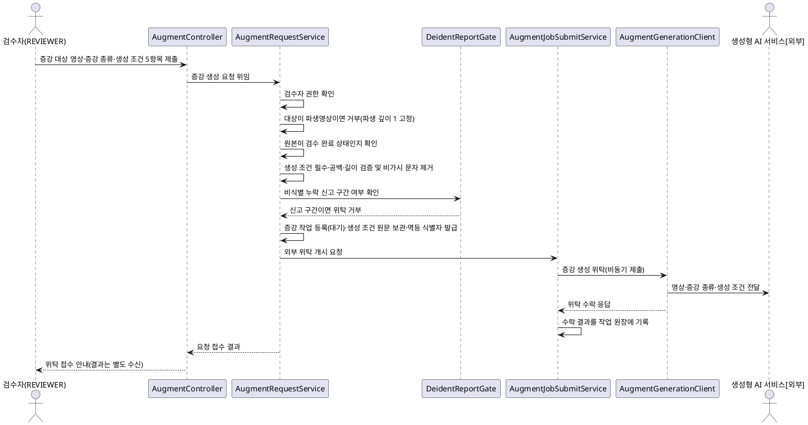
```plantuml
@startuml
actor "검수자(REVIEWER)" as RV
participant "AugmentController" as C
participant "AugmentRequestService" as S
participant "DeidentReportGate" as G
participant "AugmentJobSubmitService" as J
participant "AugmentGenerationClient" as X
actor "생성형 AI 서비스[외부]" as EX

RV -> C : 증강 대상 영상·증강 종류·생성 조건 5항목 제출
C -> S : 증강 생성 요청 위임
S -> S : 검수자 권한 확인
S -> S : 대상이 파생영상이면 거부(파생 깊이 1 고정)
S -> S : 원본이 검수 완료 상태인지 확인
S -> S : 생성 조건 필수·공백·길이 검증 및 비가시 문자 제거
S -> G : 비식별 누락 신고 구간 여부 확인
G --> S : 신고 구간이면 위탁 거부
S -> S : 증강 작업 등록(대기)·생성 조건 원문 보관·멱등 식별자 발급
S -> J : 외부 위탁 개시 요청
J -> X : 증강 생성 위탁(비동기 제출)
X -> EX : 영상·증강 종류·생성 조건 전달
X --> J : 위탁 수락 응답
J -> J : 수락 결과를 작업 원장에 기록
S --> C : 요청 접수 결과
C --> RV : 위탁 접수 안내(결과는 별도 수신)
@enduml
```

### 2.2 KLID-AT-SD-002 — 증강 결과 수신·등록

| 시퀀스도 ID | KLID-AT-SD-002 | 시퀀스도명 | 증강 결과 수신·등록 |
|---------|---|-------|---|
| 관련 유스케이스 ID | KLID-AT-UC-002 |
| 주요 액터 | 생성형 AI 서비스[외부] | 주요 클래스 | AugmentCallbackController, AugmentResultService, WebhookIdempotency, DataRaw, DataSrc, DataLabel, DataAugmentationLabelMap |

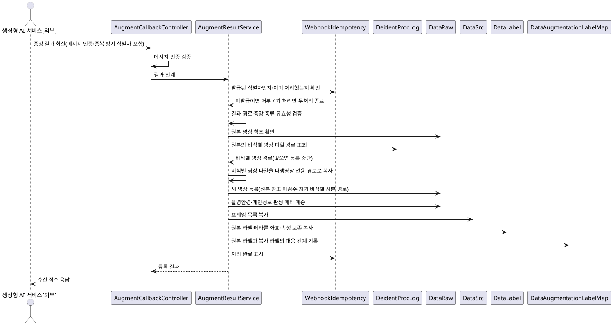
```plantuml
@startuml
actor "생성형 AI 서비스[외부]" as EX
participant "AugmentCallbackController" as C
participant "AugmentResultService" as S
participant "WebhookIdempotency" as ID
participant "DeidentProcLog" as DP
participant "DataRaw" as RAW
participant "DataSrc" as SRC
participant "DataLabel" as LBL
participant "DataAugmentationLabelMap" as MAP

EX -> C : 증강 결과 회신(메시지 인증·중복 방지 식별자 포함)
C -> C : 메시지 인증 검증
C -> S : 결과 인계
S -> ID : 발급된 식별자인지·이미 처리했는지 확인
ID --> S : 미발급이면 거부 / 기 처리면 무처리 종료
S -> S : 결과 경로·증강 종류 유효성 검증
S -> RAW : 원본 영상 참조 확인
S -> DP : 원본의 비식별 영상 파일 경로 조회
DP --> S : 비식별 영상 경로(없으면 등록 중단)
S -> S : 비식별 영상 파일을 파생영상 전용 경로로 복사
S -> RAW : 새 영상 등록(원본 참조·미검수·자기 비식별 사본 경로)
S -> RAW : 촬영환경·개인정보 판정 메타 계승
S -> SRC : 프레임 목록 복사
S -> LBL : 원본 라벨·메타를 좌표·속성 보존 복사
S -> MAP : 원본 라벨과 복사 라벨의 대응 관계 기록
S -> ID : 처리 완료 표시
S --> C : 등록 결과
C --> EX : 수신 접수 응답
@enduml
```

### 2.3 KLID-AT-SD-003 — 해상도 변경 수행

| 시퀀스도 ID | KLID-AT-SD-003 | 시퀀스도명 | 해상도 변경 수행 |
|---------|---|-------|---|
| 관련 유스케이스 ID | KLID-AT-UC-003 |
| 주요 액터 | 검수자(REVIEWER) | 주요 클래스 | VideoController, VideoResolutionService, ResolutionSnapshotService, ResolutionDerivativeService, ResolutionPersistService, ImageRescaler, VideoFileCopier |

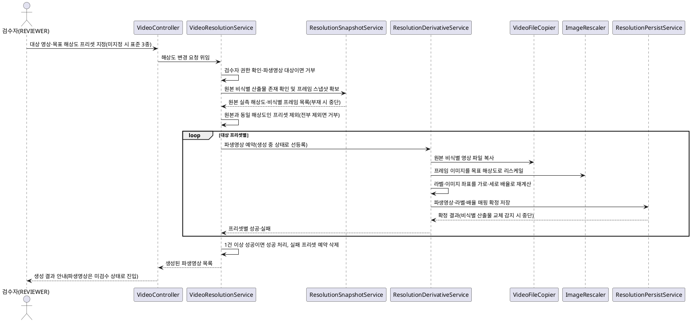
```plantuml
@startuml
actor "검수자(REVIEWER)" as RV
participant "VideoController" as C
participant "VideoResolutionService" as S
participant "ResolutionSnapshotService" as SNAP
participant "ResolutionDerivativeService" as DRV
participant "VideoFileCopier" as CP
participant "ImageRescaler" as RS
participant "ResolutionPersistService" as PS

RV -> C : 대상 영상·목표 해상도 프리셋 지정(미지정 시 표준 3종)
C -> S : 해상도 변경 요청 위임
S -> S : 검수자 권한 확인·파생영상 대상이면 거부
S -> SNAP : 원본 비식별 산출물 존재 확인 및 프레임 스냅샷 확보
SNAP --> S : 원본 실측 해상도·비식별 프레임 목록(부재 시 중단)
S -> S : 원본과 동일 해상도인 프리셋 제외(전부 제외면 거부)
loop 대상 프리셋별
  S -> DRV : 파생영상 예약(생성 중 상태로 선등록)
  DRV -> CP : 원본 비식별 영상 파일 복사
  DRV -> RS : 프레임 이미지를 목표 해상도로 리스케일
  DRV -> DRV : 라벨·이미지 좌표를 가로·세로 배율로 재계산
  DRV -> PS : 파생영상·라벨·배율 매핑 확정 저장
  PS --> DRV : 확정 결과(비식별 산출물 교체 감지 시 중단)
  DRV --> S : 프리셋별 성공·실패
end
S -> S : 1건 이상 성공이면 성공 처리, 실패 프리셋 예약 삭제
S --> C : 생성된 파생영상 목록
C --> RV : 생성 결과 안내(파생영상은 미검수 상태로 진입)
@enduml
```

### 2.4 KLID-AT-SD-004 — 객체 자동 추적

| 시퀀스도 ID | KLID-AT-SD-004 | 시퀀스도명 | 객체 자동 추적 |
|---------|---|-------|---|
| 관련 유스케이스 ID | KLID-AT-UC-004 |
| 주요 액터 | 라벨링 작업자(WORKER) | 주요 클래스 | LabelController, ObjectTrackService, LabelAccessGuard, AiInferenceClient, PolygonSimplifier, DataLabel, TrackInterpolator |

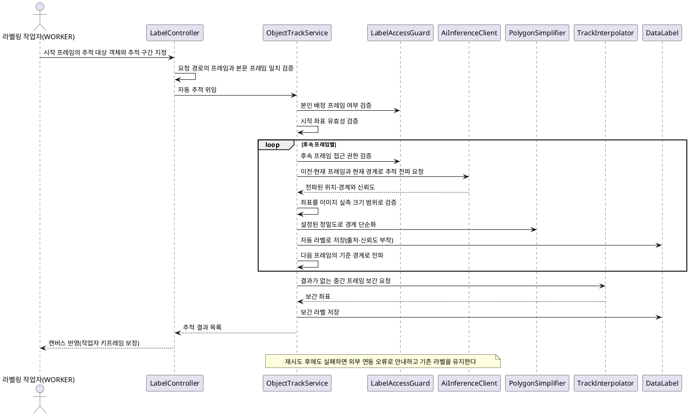
```plantuml
@startuml
actor "라벨링 작업자(WORKER)" as WK
participant "LabelController" as C
participant "ObjectTrackService" as S
participant "LabelAccessGuard" as G
participant "AiInferenceClient" as AI
participant "PolygonSimplifier" as PS
participant "TrackInterpolator" as IP
participant "DataLabel" as LBL

WK -> C : 시작 프레임의 추적 대상 객체와 추적 구간 지정
C -> C : 요청 경로의 프레임과 본문 프레임 일치 검증
C -> S : 자동 추적 위임
S -> G : 본인 배정 프레임 여부 검증
S -> S : 시작 좌표 유효성 검증
loop 후속 프레임별
  S -> G : 후속 프레임 접근 권한 검증
  S -> AI : 이전·현재 프레임과 현재 경계로 추적 전파 요청
  AI --> S : 전파된 위치·경계와 신뢰도
  S -> S : 좌표를 이미지 실측 크기 범위로 검증
  S -> PS : 설정된 정밀도로 경계 단순화
  S -> LBL : 자동 라벨로 저장(출처·신뢰도 부착)
  S -> S : 다음 프레임의 기준 경계로 전파
end
S -> IP : 결과가 없는 중간 프레임 보간 요청
IP --> S : 보간 좌표
S -> LBL : 보간 라벨 저장
S --> C : 추적 결과 목록
C --> WK : 캔버스 반영(작업자 키프레임 보정)
note over S, AI : 재시도 후에도 실패하면 외부 연동 오류로 안내하고 기존 라벨을 유지한다
@enduml
```

### 2.5 KLID-AT-SD-005 — 객체 외곽 경계 자동 밀착

| 시퀀스도 ID | KLID-AT-SD-005 | 시퀀스도명 | 객체 외곽 경계 자동 밀착 |
|---------|---|-------|---|
| 관련 유스케이스 ID | KLID-AT-UC-005 |
| 주요 액터 | 라벨링 작업자(WORKER) | 주요 클래스 | LabelController, BoundarySegmentService, LabelAccessGuard, AiInferenceClient, PolygonSimplifier, SystemConfigService |

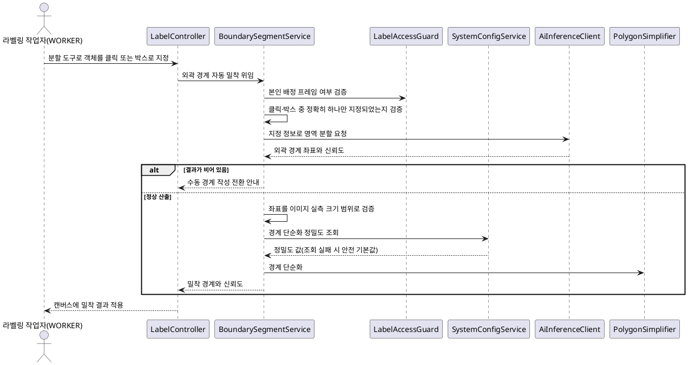
```plantuml
@startuml
actor "라벨링 작업자(WORKER)" as WK
participant "LabelController" as C
participant "BoundarySegmentService" as S
participant "LabelAccessGuard" as G
participant "SystemConfigService" as CF
participant "AiInferenceClient" as AI
participant "PolygonSimplifier" as PS

WK -> C : 분할 도구로 객체를 클릭 또는 박스로 지정
C -> S : 외곽 경계 자동 밀착 위임
S -> G : 본인 배정 프레임 여부 검증
S -> S : 클릭·박스 중 정확히 하나만 지정되었는지 검증
S -> AI : 지정 정보로 영역 분할 요청
AI --> S : 외곽 경계 좌표와 신뢰도
alt 결과가 비어 있음
  S --> C : 수동 경계 작성 전환 안내
else 정상 산출
  S -> S : 좌표를 이미지 실측 크기 범위로 검증
  S -> CF : 경계 단순화 정밀도 조회
  CF --> S : 정밀도 값(조회 실패 시 안전 기본값)
  S -> PS : 경계 단순화
  S --> C : 밀착 경계와 신뢰도
end
C --> WK : 캔버스에 밀착 결과 적용
@enduml
```

### 2.6 KLID-AT-SD-006 — 라벨링 정밀도 조절

| 시퀀스도 ID | KLID-AT-SD-006 | 시퀀스도명 | 라벨링 정밀도 조절 |
|---------|---|-------|---|
| 관련 유스케이스 ID | KLID-AT-UC-006 |
| 주요 액터 | 검수자(REVIEWER), 라벨링 작업자(WORKER) | 주요 클래스 | SystemConfigController, SystemConfigService, SystemConfig, PolygonSimplifier |

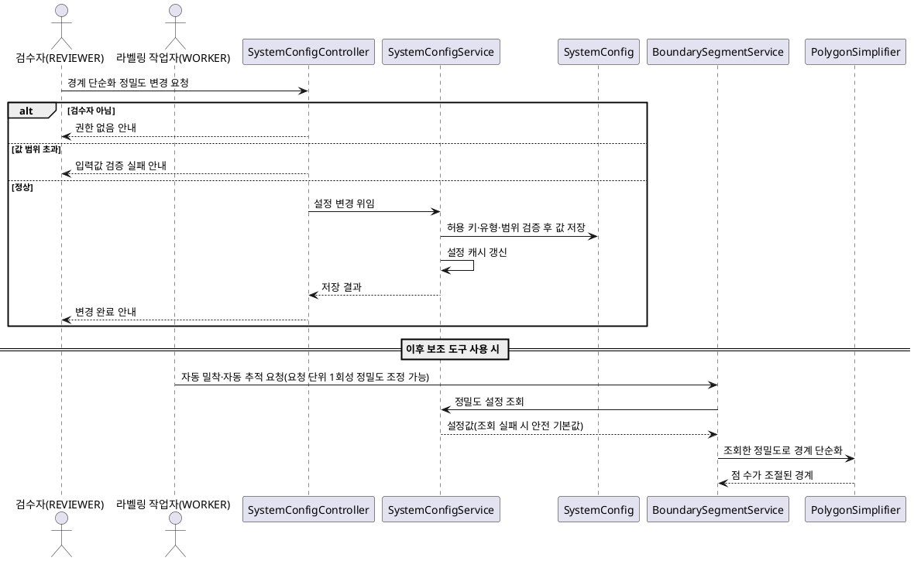
```plantuml
@startuml
actor "검수자(REVIEWER)" as RV
actor "라벨링 작업자(WORKER)" as WK
participant "SystemConfigController" as C
participant "SystemConfigService" as S
participant "SystemConfig" as E
participant "BoundarySegmentService" as SEG
participant "PolygonSimplifier" as PS

RV -> C : 경계 단순화 정밀도 변경 요청
alt 검수자 아님
  C --> RV : 권한 없음 안내
else 값 범위 초과
  C --> RV : 입력값 검증 실패 안내
else 정상
  C -> S : 설정 변경 위임
  S -> E : 허용 키·유형·범위 검증 후 값 저장
  S -> S : 설정 캐시 갱신
  S --> C : 저장 결과
  C --> RV : 변경 완료 안내
end
== 이후 보조 도구 사용 시 ==
WK -> SEG : 자동 밀착·자동 추적 요청(요청 단위 1회성 정밀도 조정 가능)
SEG -> S : 정밀도 설정 조회
S --> SEG : 설정값(조회 실패 시 안전 기본값)
SEG -> PS : 조회한 정밀도로 경계 단순화
PS --> SEG : 점 수가 조절된 경계
@enduml
```

### 2.7 KLID-AT-SD-007 — 라벨 버전 저장·이력 추적

| 시퀀스도 ID | KLID-AT-SD-007 | 시퀀스도명 | 라벨 버전 저장·이력 추적 |
|---------|---|-------|---|
| 관련 유스케이스 ID | KLID-AT-UC-007 |
| 주요 액터 | 검수자(REVIEWER) | 주요 클래스 | ReviewService, VersionService, LabelContentHasher, LabelVersion, DataLabelHistory |

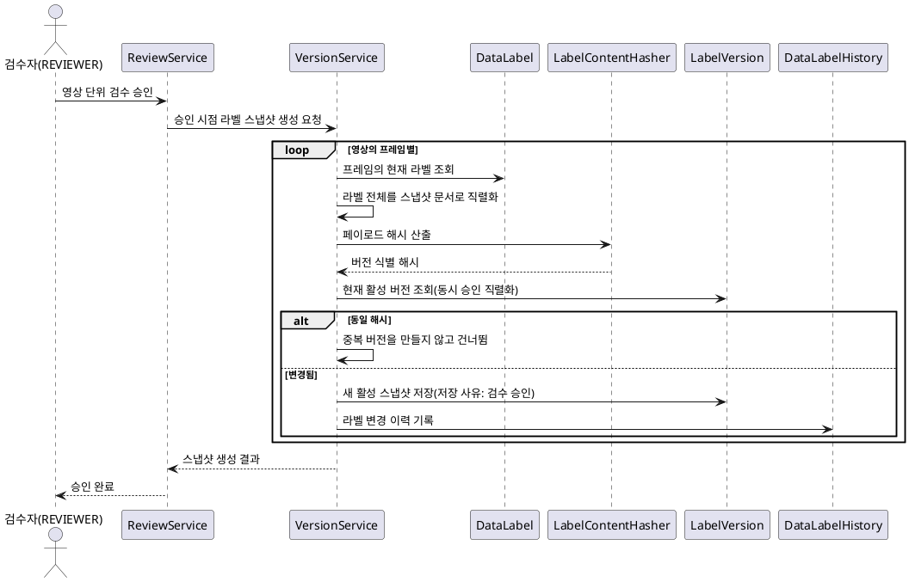
```plantuml
@startuml
actor "검수자(REVIEWER)" as RV
participant "ReviewService" as RS
participant "VersionService" as VS
participant "DataLabel" as LBL
participant "LabelContentHasher" as H
participant "LabelVersion" as VER
participant "DataLabelHistory" as HIS

RV -> RS : 영상 단위 검수 승인
RS -> VS : 승인 시점 라벨 스냅샷 생성 요청
loop 영상의 프레임별
  VS -> LBL : 프레임의 현재 라벨 조회
  VS -> VS : 라벨 전체를 스냅샷 문서로 직렬화
  VS -> H : 페이로드 해시 산출
  H --> VS : 버전 식별 해시
  VS -> VER : 현재 활성 버전 조회(동시 승인 직렬화)
  alt 동일 해시
    VS -> VS : 중복 버전을 만들지 않고 건너뜀
  else 변경됨
    VS -> VER : 새 활성 스냅샷 저장(저장 사유: 검수 승인)
    VS -> HIS : 라벨 변경 이력 기록
  end
end
VS --> RS : 스냅샷 생성 결과
RS --> RV : 승인 완료
@enduml
```

### 2.8 KLID-AT-SD-008 — 버전 비교·복구

| 시퀀스도 ID | KLID-AT-SD-008 | 시퀀스도명 | 버전 비교·복구 |
|---------|---|-------|---|
| 관련 유스케이스 ID | KLID-AT-UC-008 |
| 주요 액터 | 검수자(REVIEWER), 라벨링 작업자(WORKER) | 주요 클래스 | VersionController, VersionService, LabelVersion, LabelDiff, LabelAccessGuard, DeidentReportGate |

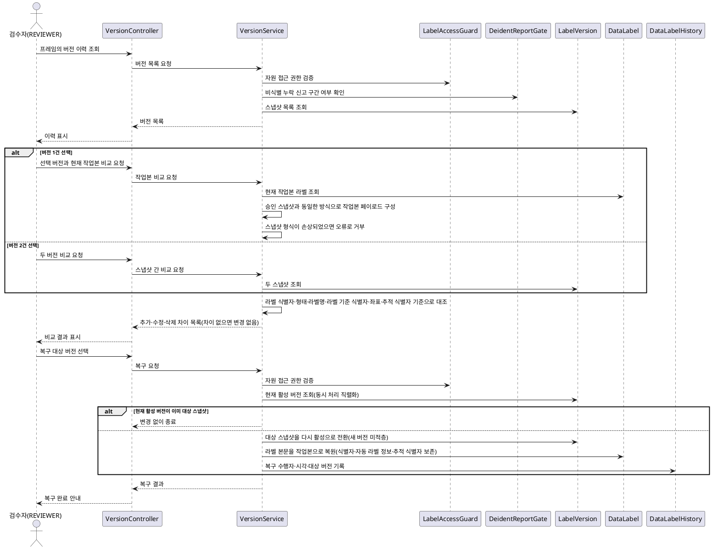
```plantuml
@startuml
actor "검수자(REVIEWER)" as RV
participant "VersionController" as C
participant "VersionService" as S
participant "LabelAccessGuard" as G
participant "DeidentReportGate" as DG
participant "LabelVersion" as VER
participant "DataLabel" as LBL
participant "DataLabelHistory" as HIS

RV -> C : 프레임의 버전 이력 조회
C -> S : 버전 목록 요청
S -> G : 자원 접근 권한 검증
S -> DG : 비식별 누락 신고 구간 여부 확인
S -> VER : 스냅샷 목록 조회
S --> C : 버전 목록
C --> RV : 이력 표시

alt 버전 1건 선택
  RV -> C : 선택 버전과 현재 작업본 비교 요청
  C -> S : 작업본 비교 요청
  S -> LBL : 현재 작업본 라벨 조회
  S -> S : 승인 스냅샷과 동일한 방식으로 작업본 페이로드 구성
  S -> S : 스냅샷 형식이 손상되었으면 오류로 거부
else 버전 2건 선택
  RV -> C : 두 버전 비교 요청
  C -> S : 스냅샷 간 비교 요청
  S -> VER : 두 스냅샷 조회
end
S -> S : 라벨 식별자·형태·라벨명·라벨 기준 식별자·좌표·추적 식별자 기준으로 대조
S --> C : 추가·수정·삭제 차이 목록(차이 없으면 변경 없음)
C --> RV : 비교 결과 표시

RV -> C : 복구 대상 버전 선택
C -> S : 복구 요청
S -> G : 자원 접근 권한 검증
S -> VER : 현재 활성 버전 조회(동시 처리 직렬화)
alt 현재 활성 버전이 이미 대상 스냅샷
  S --> C : 변경 없이 종료
else
  S -> VER : 대상 스냅샷을 다시 활성으로 전환(새 버전 미적층)
  S -> LBL : 라벨 본문을 작업본으로 복원(식별자·자동 라벨 정보·추적 식별자 보존)
  S -> HIS : 복구 수행자·시각·대상 버전 기록
end
S --> C : 복구 결과
C --> RV : 복구 완료 안내
@enduml
```

### 2.9 KLID-AT-SD-009 — 검수 완료·수정 통지

| 시퀀스도 ID | KLID-AT-SD-009 | 시퀀스도명 | 검수 완료·수정 통지 |
|---------|---|-------|---|
| 관련 유스케이스 ID | KLID-AT-UC-009 |
| 주요 액터 | 검수자(REVIEWER), 관제서버[외부] | 주요 클래스 | DatasetExportService, ControlNotifyEventListener, ControlNotifyDebouncer, ControlNotifyService, ControlNotifyPayloadFactory, ControlNotifyClient, ControlNotifyFallback, TaskQueryService |

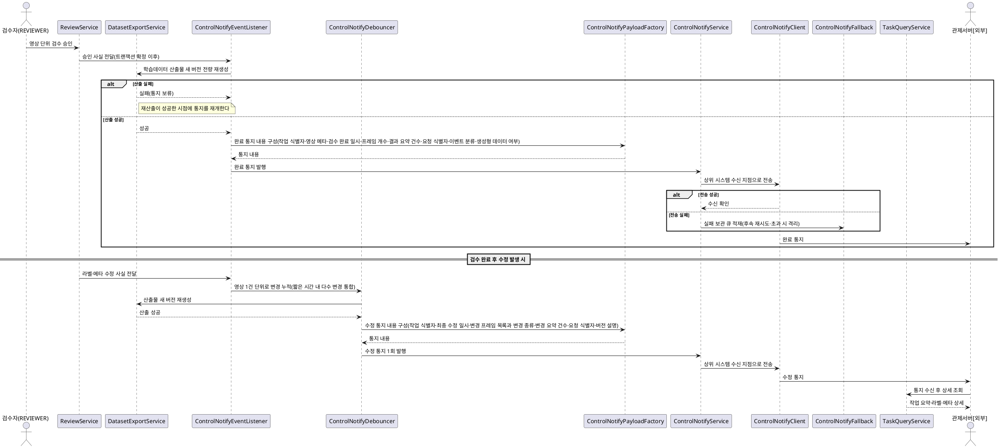
```plantuml
@startuml
actor "검수자(REVIEWER)" as RV
participant "ReviewService" as RS
participant "DatasetExportService" as EXP
participant "ControlNotifyEventListener" as EL
participant "ControlNotifyDebouncer" as DB
participant "ControlNotifyPayloadFactory" as PF
participant "ControlNotifyService" as NS
participant "ControlNotifyClient" as CL
participant "ControlNotifyFallback" as FB
participant "TaskQueryService" as TQ
actor "관제서버[외부]" as CTL

RV -> RS : 영상 단위 검수 승인
RS -> EL : 승인 사실 전달(트랜잭션 확정 이후)
EL -> EXP : 학습데이터 산출물 새 버전 전량 재생성
alt 산출 실패
  EXP --> EL : 실패(통지 보류)
  note right of EXP : 재산출이 성공한 시점에 통지를 재개한다
else 산출 성공
  EXP --> EL : 성공
  EL -> PF : 완료 통지 내용 구성(작업 식별자·영상 메타·검수 완료 일시·프레임 개수·결과 요약 건수·요청 식별자·이벤트 분류·생성형 데이터 여부)
  PF --> EL : 통지 내용
  EL -> NS : 완료 통지 발행
  NS -> CL : 상위 시스템 수신 지점으로 전송
  alt 전송 성공
    CL --> NS : 수신 확인
  else 전송 실패
    NS -> FB : 실패 보관 큐 적재(후속 재시도·초과 시 격리)
  end
  CL -> CTL : 완료 통지
end

== 검수 완료 후 수정 발생 시 ==
RS -> EL : 라벨·메타 수정 사실 전달
EL -> DB : 영상 1건 단위로 변경 누적(짧은 시간 내 다수 변경 통합)
DB -> EXP : 산출물 새 버전 재생성
EXP --> DB : 산출 성공
DB -> PF : 수정 통지 내용 구성(작업 식별자·최종 수정 일시·변경 프레임 목록과 변경 종류·변경 요약 건수·요청 식별자·버전 설명)
PF --> DB : 통지 내용
DB -> NS : 수정 통지 1회 발행
NS -> CL : 상위 시스템 수신 지점으로 전송
CL -> CTL : 수정 통지
CTL -> TQ : 통지 수신 후 상세 조회
TQ --> CTL : 작업 요약·라벨·메타 상세
@enduml
```

### 2.10 KLID-AT-SD-010 — 증강 영상 활용 여부 검수

| 시퀀스도 ID | KLID-AT-SD-010 | 시퀀스도명 | 증강 영상 활용 여부 검수 |
|---------|---|-------|---|
| 관련 유스케이스 ID | KLID-AT-UC-010 |
| 주요 액터 | 검수자(REVIEWER) | 주요 클래스 | AugmentController, AugmentReviewService, DataAugmentationReview, AugmentDiscardService, AugmentDiscardPurgeSweeper |

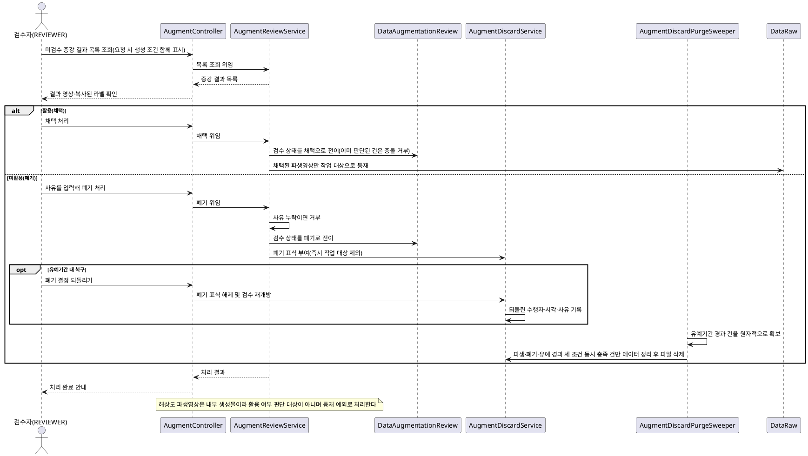
```plantuml
@startuml
actor "검수자(REVIEWER)" as RV
participant "AugmentController" as C
participant "AugmentReviewService" as S
participant "DataAugmentationReview" as RVW
participant "AugmentDiscardService" as DS
participant "AugmentDiscardPurgeSweeper" as SW
participant "DataRaw" as RAW

RV -> C : 미검수 증강 결과 목록 조회(요청 시 생성 조건 함께 표시)
C -> S : 목록 조회 위임
S --> C : 증강 결과 목록
C --> RV : 결과 영상·복사된 라벨 확인

alt 활용(채택)
  RV -> C : 채택 처리
  C -> S : 채택 위임
  S -> RVW : 검수 상태를 채택으로 전이(이미 판단된 건은 충돌 거부)
  S -> RAW : 채택된 파생영상만 작업 대상으로 등재
else 미활용(폐기)
  RV -> C : 사유를 입력해 폐기 처리
  C -> S : 폐기 위임
  S -> S : 사유 누락이면 거부
  S -> RVW : 검수 상태를 폐기로 전이
  S -> DS : 폐기 표식 부여(즉시 작업 대상 제외)
  opt 유예기간 내 복구
    RV -> C : 폐기 결정 되돌리기
    C -> DS : 폐기 표식 해제 및 검수 재개방
    DS -> DS : 되돌린 수행자·시각·사유 기록
  end
  SW -> SW : 유예기간 경과 건을 원자적으로 확보
  SW -> DS : 파생·폐기·유예 경과 세 조건 동시 충족 건만 데이터 정리 후 파일 삭제
end
S --> C : 처리 결과
C --> RV : 처리 완료 안내
note over S : 해상도 파생영상은 내부 생성물이라 활용 여부 판단 대상이 아니며 등재 예외로 처리한다
@enduml
```

### 2.11 KLID-AT-SD-011 — 비식별 처리 요청

| 시퀀스도 ID | KLID-AT-SD-011 | 시퀀스도명 | 비식별 처리 요청 |
|---------|---|-------|---|
| 관련 유스케이스 ID | KLID-AT-UC-011 |
| 주요 액터 | 검수자(REVIEWER), 비식별 솔루션[외부], 배치 시스템 | 주요 클래스 | DeidentController, BatchOrchestrator, DeidentifyStep, AsyncDeidentifyRunner, DeidentSubmitService, DeidentPollJob, DeidentifyClient, DeidentProcLog |

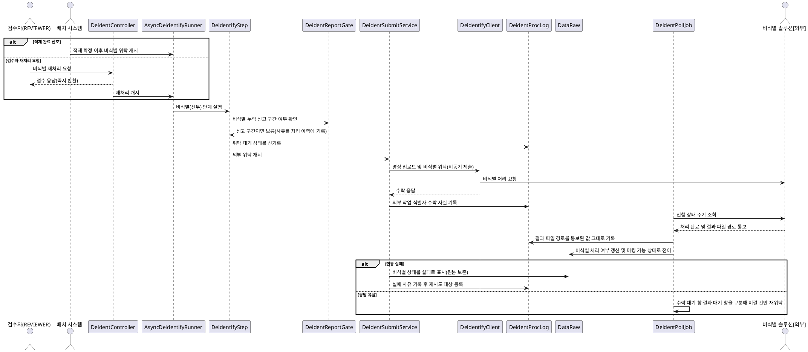
```plantuml
@startuml
actor "검수자(REVIEWER)" as RV
actor "배치 시스템" as BAT
participant "DeidentController" as C
participant "AsyncDeidentifyRunner" as RUN
participant "DeidentifyStep" as ST
participant "DeidentReportGate" as G
participant "DeidentSubmitService" as SUB
participant "DeidentifyClient" as CL
participant "DeidentProcLog" as LOG
participant "DataRaw" as RAW
participant "DeidentPollJob" as POLL
actor "비식별 솔루션[외부]" as EX

alt 적재 완료 신호
  BAT -> RUN : 적재 확정 이후 비식별 위탁 개시
else 검수자 재처리 요청
  RV -> C : 비식별 재처리 요청
  C --> RV : 접수 응답(즉시 반환)
  C -> RUN : 재처리 개시
end
RUN -> ST : 비식별(선두) 단계 실행
ST -> G : 비식별 누락 신고 구간 여부 확인
G --> ST : 신고 구간이면 보류(사유를 처리 이력에 기록)
ST -> LOG : 위탁 대기 상태를 선기록
ST -> SUB : 외부 위탁 개시
SUB -> CL : 영상 업로드 및 비식별 위탁(비동기 제출)
CL -> EX : 비식별 처리 요청
CL --> SUB : 수락 응답
SUB -> LOG : 외부 작업 식별자·수락 사실 기록
POLL -> EX : 진행 상태 주기 조회
EX --> POLL : 처리 완료 및 결과 파일 경로 통보
POLL -> LOG : 결과 파일 경로를 통보된 값 그대로 기록
POLL -> RAW : 비식별 처리 여부 갱신 및 마킹 가능 상태로 전이
alt 연동 실패
  SUB -> RAW : 비식별 상태를 실패로 표시(원본 보존)
  SUB -> LOG : 실패 사유 기록 후 재시도 대상 등록
else 응답 유실
  POLL -> POLL : 수락 대기 창·결과 대기 창을 구분해 미결 건만 재위탁
end
@enduml
```

### 2.12 KLID-AT-SD-013 — 비식별 옵션 설정

| 시퀀스도 ID | KLID-AT-SD-013 | 시퀀스도명 | 비식별 옵션 설정 |
|---------|---|-------|---|
| 관련 유스케이스 ID | KLID-AT-UC-013 |
| 주요 액터 | 검수자(REVIEWER) | 주요 클래스 | SystemConfigController, SystemConfigService, SystemConfig, DeidentifyClient |

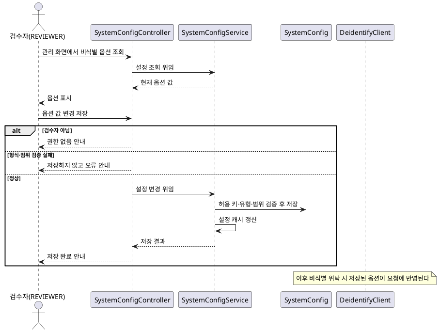
```plantuml
@startuml
actor "검수자(REVIEWER)" as RV
participant "SystemConfigController" as C
participant "SystemConfigService" as S
participant "SystemConfig" as E
participant "DeidentifyClient" as CL

RV -> C : 관리 화면에서 비식별 옵션 조회
C -> S : 설정 조회 위임
S --> C : 현재 옵션 값
C --> RV : 옵션 표시
RV -> C : 옵션 값 변경 저장
alt 검수자 아님
  C --> RV : 권한 없음 안내
else 형식·범위 검증 실패
  C --> RV : 저장하지 않고 오류 안내
else 정상
  C -> S : 설정 변경 위임
  S -> E : 허용 키·유형·범위 검증 후 저장
  S -> S : 설정 캐시 갱신
  S --> C : 저장 결과
  C --> RV : 저장 완료 안내
end
note over CL : 이후 비식별 위탁 시 저장된 옵션이 요청에 반영된다
@enduml
```

### 2.13 KLID-AT-SD-016 — 비식별 처리 상태·이력 확인

| 시퀀스도 ID | KLID-AT-SD-016 | 시퀀스도명 | 비식별 처리 상태·이력 확인 |
|---------|---|-------|---|
| 관련 유스케이스 ID | KLID-AT-UC-016 |
| 주요 액터 | 검수자(REVIEWER), 라벨링 작업자(WORKER), 비식별 솔루션[외부] | 주요 클래스 | DeidentReportController, DeidentReportService, DeidentReport, WorkLockService, WorkLock, DeidentStageResumeService, DeidentReportGate |

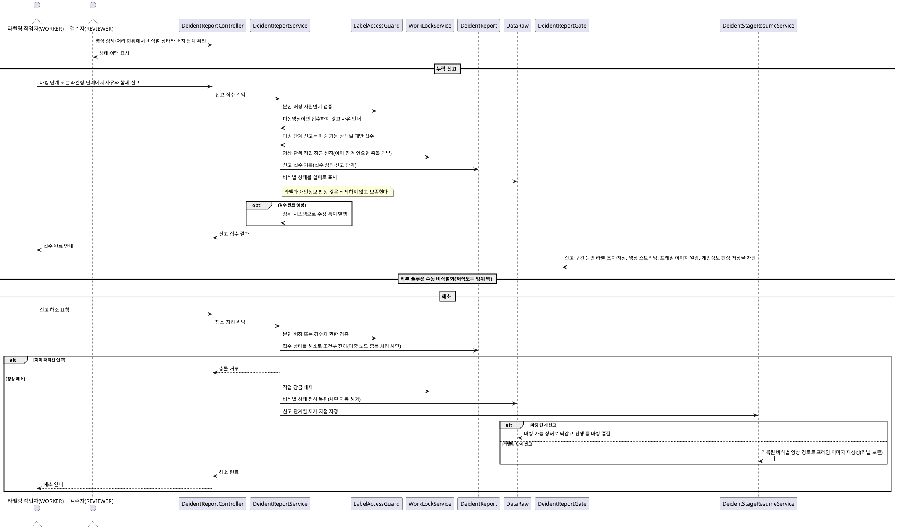
```plantuml
@startuml
actor "라벨링 작업자(WORKER)" as WK
actor "검수자(REVIEWER)" as RV
participant "DeidentReportController" as C
participant "DeidentReportService" as S
participant "LabelAccessGuard" as G
participant "WorkLockService" as WL
participant "DeidentReport" as REP
participant "DataRaw" as RAW
participant "DeidentReportGate" as GATE
participant "DeidentStageResumeService" as RES

RV -> C : 영상 상세·처리 현황에서 비식별 상태와 배치 단계 확인
C --> RV : 상태·이력 표시

== 누락 신고 ==
WK -> C : 마킹 단계 또는 라벨링 단계에서 사유와 함께 신고
C -> S : 신고 접수 위임
S -> G : 본인 배정 자원인지 검증
S -> S : 파생영상이면 접수하지 않고 사유 안내
S -> S : 마킹 단계 신고는 마킹 가능 상태일 때만 접수
S -> WL : 영상 단위 작업 잠금 선점(이미 잠겨 있으면 충돌 거부)
S -> REP : 신고 접수 기록(접수 상태·신고 단계)
S -> RAW : 비식별 상태를 실패로 표시
note right of S : 라벨과 개인정보 판정 값은 삭제하지 않고 보존한다
opt 검수 완료 영상
  S -> S : 상위 시스템으로 수정 통지 발행
end
S --> C : 신고 접수 결과
C --> WK : 접수 완료 안내
GATE -> GATE : 신고 구간 동안 라벨 조회·저장, 영상 스트리밍, 프레임 이미지 열람, 개인정보 판정 저장을 차단

== 외부 솔루션 수동 비식별화(저작도구 범위 밖) ==

== 해소 ==
WK -> C : 신고 해소 요청
C -> S : 해소 처리 위임
S -> G : 본인 배정 또는 검수자 권한 검증
S -> REP : 접수 상태를 해소로 조건부 전이(다중 노드 중복 처리 차단)
alt 이미 처리된 신고
  S --> C : 충돌 거부
else 정상 해소
  S -> WL : 작업 잠금 해제
  S -> RAW : 비식별 상태 정상 복원(차단 자동 해제)
  S -> RES : 신고 단계별 재개 지점 지정
  alt 마킹 단계 신고
    RES -> RAW : 마킹 가능 상태로 되감고 진행 중 마킹 종결
  else 라벨링 단계 신고
    RES -> RES : 기록된 비식별 영상 경로로 프레임 이미지 재생성(라벨 보존)
  end
  S --> C : 해소 완료
  C --> WK : 해소 안내
end
@enduml
```

### 2.14 KLID-AT-SD-018 — 영상 적재

| 시퀀스도 ID | KLID-AT-SD-018 | 시퀀스도명 | 영상 적재 |
|---------|---|-------|---|
| 관련 유스케이스 ID | KLID-AT-UC-018 |
| 주요 액터 | 관제서버[외부], 배치 시스템 | 주요 클래스 | DataIngest, ControlIngestScanJob, TrainingVideoIngestService, DataRaw, RawDataStatus, DataRawHistory, IngestDeidentifyBridge |

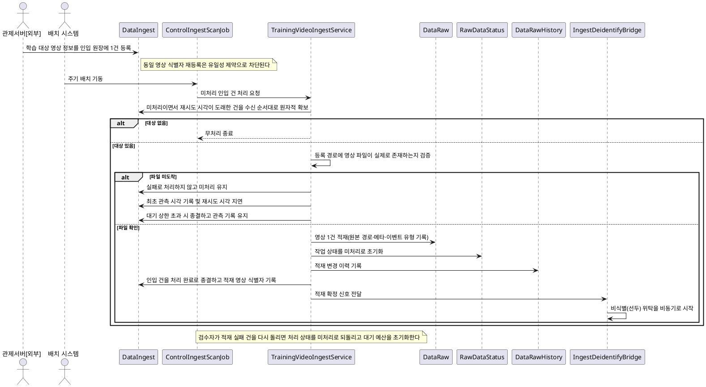
```plantuml
@startuml
actor "관제서버[외부]" as CTL
actor "배치 시스템" as BAT
participant "DataIngest" as ING
participant "ControlIngestScanJob" as JOB
participant "TrainingVideoIngestService" as S
participant "DataRaw" as RAW
participant "RawDataStatus" as ST
participant "DataRawHistory" as HIS
participant "IngestDeidentifyBridge" as BR

CTL -> ING : 학습 대상 영상 정보를 인입 원장에 1건 등록
note right of ING : 동일 영상 식별자 재등록은 유일성 제약으로 차단된다
BAT -> JOB : 주기 배치 기동
JOB -> S : 미처리 인입 건 처리 요청
S -> ING : 미처리이면서 재시도 시각이 도래한 건을 수신 순서대로 원자적 확보
alt 대상 없음
  S --> JOB : 무처리 종료
else 대상 있음
  S -> S : 등록 경로에 영상 파일이 실제로 존재하는지 검증
  alt 파일 미도착
    S -> ING : 실패로 처리하지 않고 미처리 유지
    S -> ING : 최초 관측 시각 기록 및 재시도 시각 지연
    S -> ING : 대기 상한 초과 시 종결하고 관측 기록 유지
  else 파일 확인
    S -> RAW : 영상 1건 적재(원본 경로·메타·이벤트 유형 기록)
    S -> ST : 작업 상태를 미처리로 초기화
    S -> HIS : 적재 변경 이력 기록
    S -> ING : 인입 건을 처리 완료로 종결하고 적재 영상 식별자 기록
    S -> BR : 적재 확정 신호 전달
    BR -> BR : 비식별(선두) 위탁을 비동기로 시작
  end
end
note over S : 검수자가 적재 실패 건을 다시 돌리면 처리 상태를 미처리로 되돌리고 대기 예산을 초기화한다
@enduml
```

### 2.15 KLID-AT-SD-019 — 이벤트 마킹 (자동/수동)

| 시퀀스도 ID | KLID-AT-SD-019 | 시퀀스도명 | 이벤트 마킹 (자동/수동) |
|---------|---|-------|---|
| 관련 유스케이스 ID | KLID-AT-UC-019 |
| 주요 액터 | 라벨링 작업자(WORKER), 배치 시스템 | 주요 클래스 | MarkingController, MarkingService, Marking, MarkContent, VideoStreamService, MarkingBatchBridge, BatchOrchestrator |

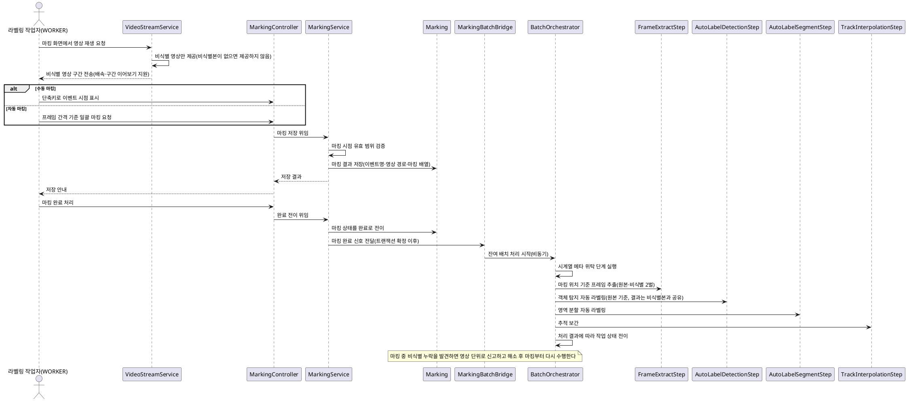
```plantuml
@startuml
actor "라벨링 작업자(WORKER)" as WK
participant "VideoStreamService" as VS
participant "MarkingController" as C
participant "MarkingService" as S
participant "Marking" as M
participant "MarkingBatchBridge" as BR
participant "BatchOrchestrator" as BO
participant "FrameExtractStep" as FE
participant "AutoLabelDetectionStep" as DET
participant "AutoLabelSegmentStep" as SEG
participant "TrackInterpolationStep" as IP

WK -> VS : 마킹 화면에서 영상 재생 요청
VS -> VS : 비식별 영상만 제공(비식별본이 없으면 제공하지 않음)
VS --> WK : 비식별 영상 구간 전송(배속·구간 이어보기 지원)
alt 수동 마킹
  WK -> C : 단축키로 이벤트 시점 표시
else 자동 마킹
  WK -> C : 프레임 간격 기준 일괄 마킹 요청
end
C -> S : 마킹 저장 위임
S -> S : 마킹 시점 유효 범위 검증
S -> M : 마킹 결과 저장(이벤트명·영상 경로·마킹 배열)
S --> C : 저장 결과
C --> WK : 저장 안내
WK -> C : 마킹 완료 처리
C -> S : 완료 전이 위임
S -> M : 마킹 상태를 완료로 전이
S -> BR : 마킹 완료 신호 전달(트랜잭션 확정 이후)
BR -> BO : 잔여 배치 처리 시작(비동기)
BO -> BO : 시계열 메타 위탁 단계 실행
BO -> FE : 마킹 위치 기준 프레임 추출(원본·비식별 2벌)
BO -> DET : 객체 탐지 자동 라벨링(원본 기준, 결과는 비식별본과 공유)
BO -> SEG : 영역 분할 자동 라벨링
BO -> IP : 추적 보간
BO -> BO : 처리 결과에 따라 작업 상태 전이
note over BR : 마킹 중 비식별 누락을 발견하면 영상 단위로 신고하고 해소 후 마킹부터 다시 수행한다
@enduml
```

### 2.16 KLID-AT-SD-021 — 라벨 편집·임시저장

| 시퀀스도 ID | KLID-AT-SD-021 | 시퀀스도명 | 라벨 편집·임시저장 |
|---------|---|-------|---|
| 관련 유스케이스 ID | KLID-AT-UC-021 |
| 주요 액터 | 라벨링 작업자(WORKER) | 주요 클래스 | LabelController, LabelService, DataLabel, DataLabelAttrValue, LabelAttrValueService, DataLabelHistory, LabelAccessGuard, DeidentReportGate |

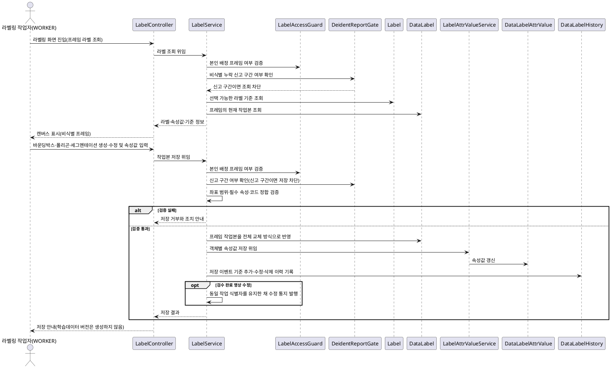
```plantuml
@startuml
actor "라벨링 작업자(WORKER)" as WK
participant "LabelController" as C
participant "LabelService" as S
participant "LabelAccessGuard" as G
participant "DeidentReportGate" as GATE
participant "Label" as MST
participant "DataLabel" as LBL
participant "LabelAttrValueService" as AV
participant "DataLabelAttrValue" as VAL
participant "DataLabelHistory" as HIS

WK -> C : 라벨링 화면 진입(프레임 라벨 조회)
C -> S : 라벨 조회 위임
S -> G : 본인 배정 프레임 여부 검증
S -> GATE : 비식별 누락 신고 구간 여부 확인
GATE --> S : 신고 구간이면 조회 차단
S -> MST : 선택 가능한 라벨 기준 조회
S -> LBL : 프레임의 현재 작업본 조회
S --> C : 라벨·속성값·기준 정보
C --> WK : 캔버스 표시(비식별 프레임)
WK -> C : 바운딩박스·폴리곤·세그멘테이션 생성·수정 및 속성값 입력
C -> S : 작업본 저장 위임
S -> G : 본인 배정 프레임 여부 검증
S -> GATE : 신고 구간 여부 확인(신고 구간이면 저장 차단)
S -> S : 좌표 범위·필수 속성·코드 정합 검증
alt 검증 실패
  S --> C : 저장 거부와 조치 안내
else 검증 통과
  S -> LBL : 프레임 작업본을 전체 교체 방식으로 반영
  S -> AV : 객체별 속성값 저장 위임
  AV -> VAL : 속성값 갱신
  S -> HIS : 저장 이벤트 기준 추가·수정·삭제 이력 기록
  opt 검수 완료 영상 수정
    S -> S : 동일 작업 식별자를 유지한 채 수정 통지 발행
  end
  S --> C : 저장 결과
end
C --> WK : 저장 안내(학습데이터 버전은 생성하지 않음)
@enduml
```

### 2.17 KLID-AT-SD-022 — 시계열 메타 검토

| 시퀀스도 ID | KLID-AT-SD-022 | 시퀀스도명 | 시계열 메타 검토 |
|---------|---|-------|---|
| 관련 유스케이스 ID | KLID-AT-UC-022 |
| 주요 액터 | 검수자(REVIEWER), 시계열 메타 분석 서비스[외부] | 주요 클래스 | TimeseriesMetaStep, TimeseriesMetaClient, TimeseriesMetaResultController, TimeseriesMetaResultService, MetaController, MetaService, DataMeta, DataMetaReview |

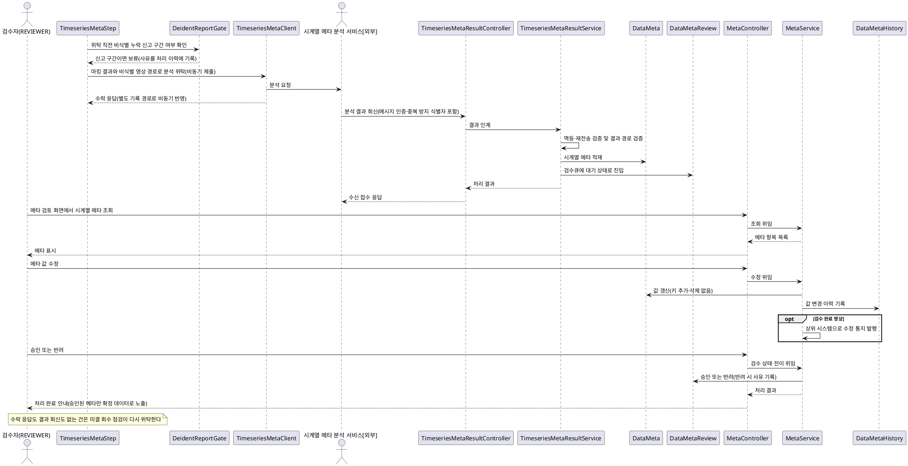
```plantuml
@startuml
actor "검수자(REVIEWER)" as RV
participant "TimeseriesMetaStep" as ST
participant "DeidentReportGate" as GATE
participant "TimeseriesMetaClient" as CL
actor "시계열 메타 분석 서비스[외부]" as EX
participant "TimeseriesMetaResultController" as RC
participant "TimeseriesMetaResultService" as RS
participant "DataMeta" as META
participant "DataMetaReview" as RVW
participant "MetaController" as C
participant "MetaService" as S
participant "DataMetaHistory" as HIS

ST -> GATE : 위탁 직전 비식별 누락 신고 구간 여부 확인
GATE --> ST : 신고 구간이면 보류(사유를 처리 이력에 기록)
ST -> CL : 마킹 결과와 비식별 영상 경로로 분석 위탁(비동기 제출)
CL -> EX : 분석 요청
CL --> ST : 수락 응답(별도 기록 경로로 비동기 반영)
EX -> RC : 분석 결과 회신(메시지 인증·중복 방지 식별자 포함)
RC -> RS : 결과 인계
RS -> RS : 멱등·재전송 검증 및 결과 경로 검증
RS -> META : 시계열 메타 적재
RS -> RVW : 검수큐에 대기 상태로 진입
RS --> RC : 처리 결과
RC --> EX : 수신 접수 응답
RV -> C : 메타 검토 화면에서 시계열 메타 조회
C -> S : 조회 위임
S --> C : 메타 항목 목록
C --> RV : 메타 표시
RV -> C : 메타 값 수정
C -> S : 수정 위임
S -> META : 값 갱신(키 추가·삭제 없음)
S -> HIS : 값 변경 이력 기록
opt 검수 완료 영상
  S -> S : 상위 시스템으로 수정 통지 발행
end
RV -> C : 승인 또는 반려
C -> S : 검수 상태 전이 위임
S -> RVW : 승인 또는 반려(반려 시 사유 기록)
S --> C : 처리 결과
C --> RV : 처리 완료 안내(승인된 메타만 확정 데이터로 노출)
note over ST : 수락 응답도 결과 회신도 없는 건은 미결 회수 점검이 다시 위탁한다
@enduml
```

### 2.18 KLID-AT-SD-023 — 검수 승인·반려

| 시퀀스도 ID | KLID-AT-SD-023 | 시퀀스도명 | 검수 승인·반려 |
|---------|---|-------|---|
| 관련 유스케이스 ID | KLID-AT-UC-023 |
| 주요 액터 | 검수자(REVIEWER), 라벨링 작업자(WORKER) | 주요 클래스 | ReviewController, ReviewService, RawDataStatus, DataIssue, TaskEventLog, VersionService, DatasetExportService |

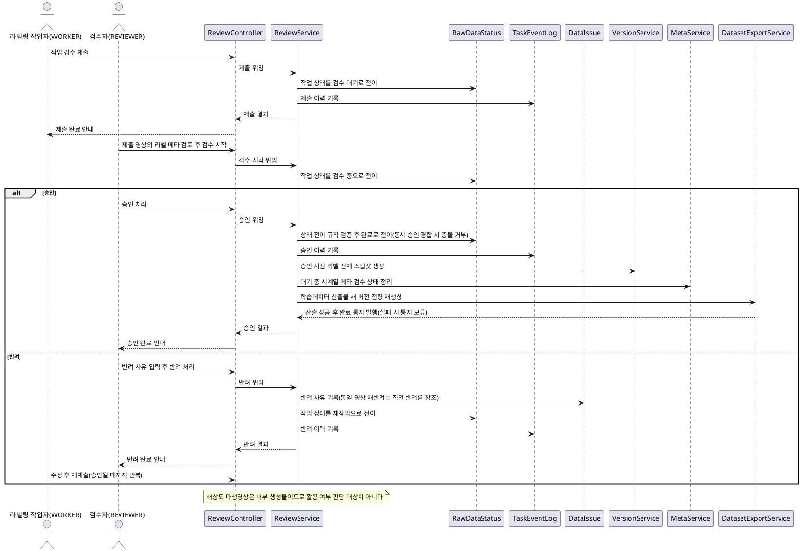
```plantuml
@startuml
actor "라벨링 작업자(WORKER)" as WK
actor "검수자(REVIEWER)" as RV
participant "ReviewController" as C
participant "ReviewService" as S
participant "RawDataStatus" as ST
participant "TaskEventLog" as EV
participant "DataIssue" as ISS
participant "VersionService" as VS
participant "MetaService" as MS
participant "DatasetExportService" as EXP

WK -> C : 작업 검수 제출
C -> S : 제출 위임
S -> ST : 작업 상태를 검수 대기로 전이
S -> EV : 제출 이력 기록
S --> C : 제출 결과
C --> WK : 제출 완료 안내
RV -> C : 제출 영상의 라벨·메타 검토 후 검수 시작
C -> S : 검수 시작 위임
S -> ST : 작업 상태를 검수 중으로 전이

alt 승인
  RV -> C : 승인 처리
  C -> S : 승인 위임
  S -> ST : 상태 전이 규칙 검증 후 완료로 전이(동시 승인 경합 시 충돌 거부)
  S -> EV : 승인 이력 기록
  S -> VS : 승인 시점 라벨 전체 스냅샷 생성
  S -> MS : 대기 중 시계열 메타 검수 상태 정리
  S -> EXP : 학습데이터 산출물 새 버전 전량 재생성
  EXP --> S : 산출 성공 후 완료 통지 발행(실패 시 통지 보류)
  S --> C : 승인 결과
  C --> RV : 승인 완료 안내
else 반려
  RV -> C : 반려 사유 입력 후 반려 처리
  C -> S : 반려 위임
  S -> ISS : 반려 사유 기록(동일 영상 재반려는 직전 반려를 참조)
  S -> ST : 작업 상태를 재작업으로 전이
  S -> EV : 반려 이력 기록
  S --> C : 반려 결과
  C --> RV : 반려 완료 안내
  WK -> C : 수정 후 재제출(승인될 때까지 반복)
end
note over S : 해상도 파생영상은 내부 생성물이므로 활용 여부 판단 대상이 아니다
@enduml
```

### 2.19 KLID-AT-SD-028 — 라벨 클래스·속성 정의 관리

| 시퀀스도 ID | KLID-AT-SD-028 | 시퀀스도명 | 라벨 클래스·속성 정의 관리 |
|---------|---|-------|---|
| 관련 유스케이스 ID | KLID-AT-UC-028 |
| 주요 액터 | 검수자(REVIEWER) | 주요 클래스 | LabelMasterController, LabelMasterService, Label, LabelAttrController, LabelAttrService, LabelAttr, PresetLabelLookupService |

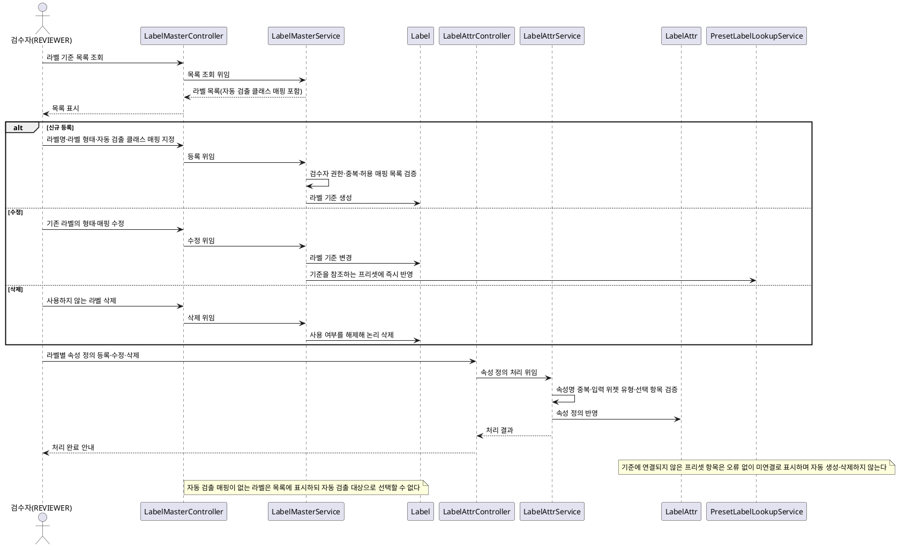
```plantuml
@startuml
actor "검수자(REVIEWER)" as RV
participant "LabelMasterController" as MC
participant "LabelMasterService" as MS
participant "Label" as MST
participant "LabelAttrController" as AC
participant "LabelAttrService" as AS
participant "LabelAttr" as ATTR
participant "PresetLabelLookupService" as PL

RV -> MC : 라벨 기준 목록 조회
MC -> MS : 목록 조회 위임
MS --> MC : 라벨 목록(자동 검출 클래스 매핑 포함)
MC --> RV : 목록 표시
alt 신규 등록
  RV -> MC : 라벨명·라벨 형태·자동 검출 클래스 매핑 지정
  MC -> MS : 등록 위임
  MS -> MS : 검수자 권한·중복·허용 매핑 목록 검증
  MS -> MST : 라벨 기준 생성
else 수정
  RV -> MC : 기존 라벨의 형태·매핑 수정
  MC -> MS : 수정 위임
  MS -> MST : 라벨 기준 변경
  MS -> PL : 기준을 참조하는 프리셋에 즉시 반영
else 삭제
  RV -> MC : 사용하지 않는 라벨 삭제
  MC -> MS : 삭제 위임
  MS -> MST : 사용 여부를 해제해 논리 삭제
end
RV -> AC : 라벨별 속성 정의 등록·수정·삭제
AC -> AS : 속성 정의 처리 위임
AS -> AS : 속성명 중복·입력 위젯 유형·선택 항목 검증
AS -> ATTR : 속성 정의 반영
AS --> AC : 처리 결과
AC --> RV : 처리 완료 안내
note over PL : 기준에 연결되지 않은 프리셋 항목은 오류 없이 미연결로 표시하며 자동 생성·삭제하지 않는다
note over MS : 자동 검출 매핑이 없는 라벨은 목록에 표시하되 자동 검출 대상으로 선택할 수 없다
@enduml
```

---

## 3. 설계 클래스도

> 유스케이스별로 1개씩 작성한다. 설계 클래스도 번호는 실현 유스케이스 번호와 정렬하며, 각 클래스도에는 해당 유스케이스를 실현하는 클래스만 포함한다.

<!-- hwpx:ignore-start -->
### 증강 영상 생성 요청 (KLID-AT-DCD-001)
- 사용: [[KLID_AT_클래스설계서#2.1 KLID-AT-SD-001 — 증강 영상 생성 요청]]
<!-- hwpx:ignore-end -->

### 3.1 KLID-AT-DCD-001 — 증강 영상 생성 요청

| 설계 클래스도 ID | KLID-AT-DCD-001 | 설계 클래스도명 | 증강 영상 생성 요청 |
|-----------|---|---------|---|
| 관련 유스케이스 ID | KLID-AT-UC-001 |

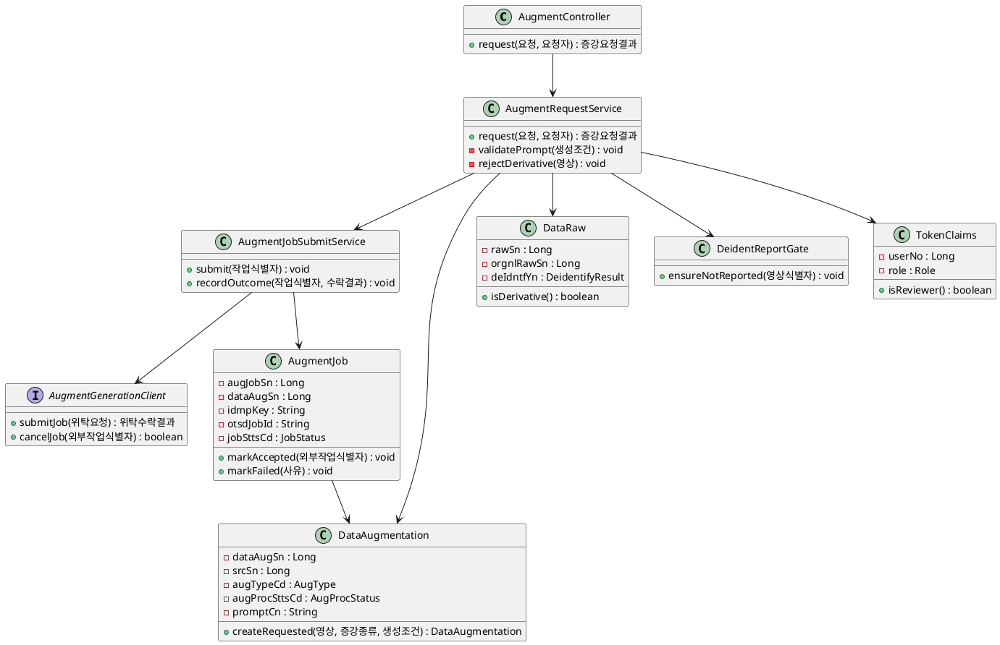
```plantuml
@startuml
class AugmentController {
  +request(요청, 요청자) : 증강요청결과
}
class AugmentRequestService {
  +request(요청, 요청자) : 증강요청결과
  -validatePrompt(생성조건) : void
  -rejectDerivative(영상) : void
}
class AugmentJobSubmitService {
  +submit(작업식별자) : void
  +recordOutcome(작업식별자, 수락결과) : void
}
interface AugmentGenerationClient {
  +submitJob(위탁요청) : 위탁수락결과
  +cancelJob(외부작업식별자) : boolean
}
class AugmentJob {
  -augJobSn : Long
  -dataAugSn : Long
  -idmpKey : String
  -otsdJobId : String
  -jobSttsCd : JobStatus
  +markAccepted(외부작업식별자) : void
  +markFailed(사유) : void
}
class DataAugmentation {
  -dataAugSn : Long
  -srcSn : Long
  -augTypeCd : AugType
  -augProcSttsCd : AugProcStatus
  -promptCn : String
  +createRequested(영상, 증강종류, 생성조건) : DataAugmentation
}
class DataRaw {
  -rawSn : Long
  -orgnlRawSn : Long
  -deIdntfYn : DeidentifyResult
  +isDerivative() : boolean
}
class DeidentReportGate {
  +ensureNotReported(영상식별자) : void
}
class TokenClaims {
  -userNo : Long
  -role : Role
  +isReviewer() : boolean
}
AugmentController --> AugmentRequestService
AugmentRequestService --> DeidentReportGate
AugmentRequestService --> DataRaw
AugmentRequestService --> DataAugmentation
AugmentRequestService --> AugmentJobSubmitService
AugmentRequestService --> TokenClaims
AugmentJobSubmitService --> AugmentGenerationClient
AugmentJobSubmitService --> AugmentJob
AugmentJob --> DataAugmentation
@enduml
```

<!-- hwpx:ignore-start -->
### 증강 결과 수신·등록 (KLID-AT-DCD-002)
- 사용: [[KLID_AT_클래스설계서#2.2 KLID-AT-SD-002 — 증강 결과 수신·등록]]
<!-- hwpx:ignore-end -->

### 3.2 KLID-AT-DCD-002 — 증강 결과 수신·등록

| 설계 클래스도 ID | KLID-AT-DCD-002 | 설계 클래스도명 | 증강 결과 수신·등록 |
|-----------|---|---------|---|
| 관련 유스케이스 ID | KLID-AT-UC-002 |

```plantuml
@startuml
class AugmentCallbackController {
  +receive(결과회신) : 수신결과
}
class AugmentResultService {
  +handle(결과회신) : boolean
  -copyDeidentifiedVideo(원본, 파생) : String
  -copyLabels(원본프레임, 파생프레임) : void
}
class WebhookIdempotency {
  -idmpKey : String
  -chnlCd : WebhookChannel
  -sttsCd : IdempotencyStatus
  +markProcessed() : void
}
class DataAugmentation {
  -dataAugSn : Long
  -augProcSttsCd : AugProcStatus
  -newRawSn : Long
  +accept(파생영상식별자) : void
  +rejectByResult(사유) : void
}
class DataRaw {
  -rawSn : Long
  -orgnlRawSn : Long
  -rawFilePathNm : String
  -srcType : SourceType
  +createFromAugment(원본, 증강종류) : DataRaw
  +copyPrivacyMetaFrom(원본) : void
}
class DataSrc {
  -srcSn : Long
  -rawSn : Long
  -frameNo : Integer
  -deIdntfSrcFilePathNm : String
}
class DataLabel {
  -lblSn : Long
  -srcSn : Long
  -pointCn : String
  +copyForNewFrame(신규프레임) : DataLabel
}
class DataAugmentationLabelMap {
  -dataAugLblMapSn : Long
  -orgnlDataLblSn : Long
  -dataLblSn : Long
  -coordRecalcYn : String
  +create(증강, 원본라벨, 신규라벨) : DataAugmentationLabelMap
}
class DataMeta {
  -metaSn : Long
  -rawSn : Long
  -metaKey : String
  -metaVl : String
}
class DeidentProcLog {
  -procLogSn : Long
  -dataRawSn : Long
  -deIdntfFilePathNm : String
}
AugmentCallbackController --> AugmentResultService
AugmentResultService --> WebhookIdempotency
AugmentResultService --> DataAugmentation
AugmentResultService --> DeidentProcLog
AugmentResultService --> DataRaw
AugmentResultService --> DataSrc
AugmentResultService --> DataLabel
AugmentResultService --> DataAugmentationLabelMap
AugmentResultService --> DataMeta
DataRaw "1" *-- "N" DataSrc
DataSrc "1" *-- "N" DataLabel
@enduml
```

<!-- hwpx:ignore-start -->
### 해상도 변경 수행 (KLID-AT-DCD-003)
- 사용: [[KLID_AT_클래스설계서#2.3 KLID-AT-SD-003 — 해상도 변경 수행]]
<!-- hwpx:ignore-end -->

### 3.3 KLID-AT-DCD-003 — 해상도 변경 수행

| 설계 클래스도 ID | KLID-AT-DCD-003 | 설계 클래스도명 | 해상도 변경 수행 |
|-----------|---|---------|---|
| 관련 유스케이스 ID | KLID-AT-UC-003 |

```plantuml
@startuml
class VideoController {
  +changeResolution(영상식별자, 요청, 요청자) : 파생영상목록
}
class VideoResolutionService {
  +changeResolution(영상식별자, 요청, 요청자) : 파생영상목록
  -loadAndValidate(영상식별자) : DataRaw
  -selectPresets(원본해상도, 요청프리셋) : List
}
class ResolutionSnapshotService {
  +capture(영상식별자) : 프레임스냅샷
  -requireDeidentifiedArtifacts(영상) : void
}
class ResolutionDerivativeService {
  +create(원본, 프리셋, 스냅샷) : 파생영상
  -rescaleFrames(스냅샷, 목표해상도) : List
  -recalculateLabelCoordinates(라벨목록, 배율) : List
}
class ResolutionPersistService {
  +persist(파생영상, 프레임, 라벨, 배율) : void
  -abortOnArtifactReplacement(스냅샷) : void
}
class ImageRescaler {
  +rescale(원본이미지경로, 목표해상도, 출력경로) : void
}
class VideoFileCopier {
  +copy(원본경로, 대상경로) : void
}
class DataAugmentation {
  -dataAugSn : Long
  -augTypeCd : AugType
  -augProcSttsCd : AugProcStatus
  -newRawSn : Long
}
class DataAugmentationLabelMap {
  -coordRecalcYn : String
  -scaleX : BigDecimal
  -scaleY : BigDecimal
}
class DataRaw {
  -rawSn : Long
  -orgnlRawSn : Long
  +isDerivative() : boolean
  +hasDeidentArtifact() : boolean
}
class DataSrc {
  -srcSn : Long
  -frameNo : Integer
  -deIdntfSrcFilePathNm : String
}
class DataLabel {
  -lblSn : Long
  -pointCn : String
  +scaleCoordinates(가로배율, 세로배율) : DataLabel
}
class DeidentProcLog {
  -deIdntfFilePathNm : String
}
VideoController --> VideoResolutionService
VideoResolutionService --> ResolutionSnapshotService
VideoResolutionService --> ResolutionDerivativeService
VideoResolutionService --> DataRaw
ResolutionSnapshotService --> DataSrc
ResolutionSnapshotService --> DeidentProcLog
ResolutionDerivativeService --> VideoFileCopier
ResolutionDerivativeService --> ImageRescaler
ResolutionDerivativeService --> DataLabel
ResolutionDerivativeService --> ResolutionPersistService
ResolutionPersistService --> DataAugmentation
ResolutionPersistService --> DataAugmentationLabelMap
@enduml
```

<!-- hwpx:ignore-start -->
### 객체 자동 추적 (KLID-AT-DCD-004)
- 사용: [[KLID_AT_클래스설계서#2.4 KLID-AT-SD-004 — 객체 자동 추적]]
<!-- hwpx:ignore-end -->

### 3.4 KLID-AT-DCD-004 — 객체 자동 추적

| 설계 클래스도 ID | KLID-AT-DCD-004 | 설계 클래스도명 | 객체 자동 추적 |
|-----------|---|---------|---|
| 관련 유스케이스 ID | KLID-AT-UC-004 |

```plantuml
@startuml
class LabelController {
  +track(프레임식별자, 요청, 요청자) : 추적결과
}
class ObjectTrackService {
  +track(요청, 요청자) : 추적결과
  -validatePolygon(좌표) : void
  -readSimplifyTolerance() : double
}
class LabelAccessGuard {
  +verifyAccess(프레임식별자, 요청자) : void
  +verifyAndGet(프레임식별자, 요청자) : DataSrc
}
interface AiInferenceClient {
  +track(추적요청) : 추적응답
  +detect(탐지요청) : 탐지응답
  +segment(분할요청) : 분할응답
}
class PolygonSimplifier {
  +simplify(좌표목록, 허용오차) : List
}
class SystemConfigService {
  +getDouble(설정키) : double
}
class TrackInterpolator {
  +interpolate(키프레임목록, 대상프레임, 도형유형) : List
  +interpolateRotation(시작각, 종료각, 비율) : double
}
class DataLabel {
  -lblSn : Long
  -srcSn : Long
  -lblTypeCd : LabelType
  -pointCn : String
  -trckId : String
  +createAutoShape(프레임, 좌표, 추적식별자) : DataLabel
}
class DataLabelAiInfo {
  -dataLblAiInfoSn : Long
  -dataLblSn : Long
  -lblSrcCd : LabelSource
  -confScore : BigDecimal
  -autoLblYn : String
  +ofTracking(라벨식별자, 신뢰도) : DataLabelAiInfo
  +ofInterpolation(라벨식별자) : DataLabelAiInfo
}
LabelController --> ObjectTrackService
ObjectTrackService --> LabelAccessGuard
ObjectTrackService --> AiInferenceClient
ObjectTrackService --> SystemConfigService
ObjectTrackService --> PolygonSimplifier
ObjectTrackService --> TrackInterpolator
ObjectTrackService --> DataLabel
DataLabel "1" *-- "N" DataLabelAiInfo
@enduml
```

<!-- hwpx:ignore-start -->
### 객체 외곽 경계 자동 밀착 (KLID-AT-DCD-005)
- 사용: [[KLID_AT_클래스설계서#2.5 KLID-AT-SD-005 — 객체 외곽 경계 자동 밀착]]
<!-- hwpx:ignore-end -->

### 3.5 KLID-AT-DCD-005 — 객체 외곽 경계 자동 밀착

| 설계 클래스도 ID | KLID-AT-DCD-005 | 설계 클래스도명 | 객체 외곽 경계 자동 밀착 |
|-----------|---|---------|---|
| 관련 유스케이스 ID | KLID-AT-UC-005 |

```plantuml
@startuml
class LabelController {
  +segment(프레임식별자, 요청, 요청자) : 분할결과
}
class BoundarySegmentService {
  +segment(요청, 요청자) : 분할결과
  -requireExactlyOneSeed(클릭, 박스) : void
  -validateBounds(좌표, 이미지크기) : void
}
class LabelAccessGuard {
  +verifyAndGet(프레임식별자, 요청자) : DataSrc
}
interface AiInferenceClient {
  +segment(분할요청) : 분할응답
}
class PolygonSimplifier {
  +simplify(좌표목록, 허용오차) : List
}
class SystemConfigService {
  +getDouble(설정키) : double
}
LabelController --> BoundarySegmentService
BoundarySegmentService --> LabelAccessGuard
BoundarySegmentService --> AiInferenceClient
BoundarySegmentService --> SystemConfigService
BoundarySegmentService --> PolygonSimplifier
@enduml
```

<!-- hwpx:ignore-start -->
### 라벨링 정밀도 조절 (KLID-AT-DCD-006)
- 사용: [[KLID_AT_클래스설계서#2.6 KLID-AT-SD-006 — 라벨링 정밀도 조절]]
<!-- hwpx:ignore-end -->

### 3.6 KLID-AT-DCD-006 — 라벨링 정밀도 조절

| 설계 클래스도 ID | KLID-AT-DCD-006 | 설계 클래스도명 | 라벨링 정밀도 조절 |
|-----------|---|---------|---|
| 관련 유스케이스 ID | KLID-AT-UC-006 |

```plantuml
@startuml
class SystemConfigController {
  +list() : 설정목록
  +update(설정키, 요청, 요청자) : 설정결과
}
class SystemConfigService {
  +getDouble(설정키) : double
  +getInt(설정키) : int
  +update(설정키, 값, 요청자) : 설정결과
  -validateByType(유형, 값) : void
  -evictCache(설정키) : void
}
class SystemConfig {
  -configKey : String
  -configVl : String
  -configTypeCd : ConfigType
  -expln : String
  +updateValue(값) : void
  +validateValue() : boolean
}
class PolygonSimplifier {
  +simplify(좌표목록, 허용오차) : List
}
class ObjectTrackService {
  -readSimplifyTolerance() : double
}
class BoundarySegmentService {
  -readSimplifyTolerance() : double
}
SystemConfigController --> SystemConfigService
SystemConfigService --> SystemConfig
ObjectTrackService --> SystemConfigService
BoundarySegmentService --> SystemConfigService
ObjectTrackService --> PolygonSimplifier
BoundarySegmentService --> PolygonSimplifier
@enduml
```

<!-- hwpx:ignore-start -->
### 라벨 버전 저장·이력 추적 (KLID-AT-DCD-007)
- 사용: [[KLID_AT_클래스설계서#2.7 KLID-AT-SD-007 — 라벨 버전 저장·이력 추적]]
<!-- hwpx:ignore-end -->

### 3.7 KLID-AT-DCD-007 — 라벨 버전 저장·이력 추적

| 설계 클래스도 ID | KLID-AT-DCD-007 | 설계 클래스도명 | 라벨 버전 저장·이력 추적 |
|-----------|---|---------|---|
| 관련 유스케이스 ID | KLID-AT-UC-007 |

```plantuml
@startuml
class ReviewService {
  +approve(영상식별자, 요청자) : 검수결과
}
class VersionService {
  +commitApproved(영상식별자, 요청자) : 커밋결과
  -buildPayload(프레임식별자) : String
}
class LabelContentHasher {
  +hash(스냅샷문서) : String
  +appendLabels(라벨목록) : void
}
class LabelVersion {
  -labelVersionSn : Long
  -dataRawSn : Long
  -dataSrcSn : Long
  -versionHash : String
  -labelPayload : String
  -versionNo : Integer
  -saveReasonCd : SaveReason
  -activeYn : String
  +create(영상, 프레임, 해시, 페이로드, 사유) : LabelVersion
  +activate() : void
  +deactivate() : void
}
class DataLabelHistory {
  -lblHstrySn : Long
  -lblSn : Long
  -srcSn : Long
  -chgKindCd : ChangeKind
  +record(라벨식별자, 프레임식별자, 변경종류) : DataLabelHistory
}
class DataLabel {
  -lblSn : Long
  -srcSn : Long
  -pointCn : String
}
ReviewService --> VersionService
VersionService --> LabelContentHasher
VersionService --> LabelVersion
VersionService --> DataLabelHistory
VersionService --> DataLabel
LabelVersion ..> DataLabel : 스냅샷 대상
@enduml
```

<!-- hwpx:ignore-start -->
### 버전 비교·복구 (KLID-AT-DCD-008)
- 사용: [[KLID_AT_클래스설계서#2.8 KLID-AT-SD-008 — 버전 비교·복구]]
<!-- hwpx:ignore-end -->

### 3.8 KLID-AT-DCD-008 — 버전 비교·복구

| 설계 클래스도 ID | KLID-AT-DCD-008 | 설계 클래스도명 | 버전 비교·복구 |
|-----------|---|---------|---|
| 관련 유스케이스 ID | KLID-AT-UC-008 |

```plantuml
@startuml
class VersionController {
  +listVersions(프레임식별자, 요청자) : 버전목록
  +diff(기준버전, 비교버전, 요청자) : 차이목록
  +diffWithWorking(기준버전, 요청자) : 차이목록
  +rollback(대상버전, 요청, 요청자) : 복구결과
}
class VersionService {
  +listVersions(프레임식별자, 요청자) : 버전목록
  +diff(기준버전, 비교버전, 요청자) : 차이목록
  +diffWithWorking(기준버전, 요청자) : 차이목록
  +rollback(대상버전, 프레임식별자, 요청자) : LabelVersion
  -computeLabelDiffs(기준페이로드, 비교페이로드) : List
}
class LabelVersion {
  -versionHash : String
  -labelPayload : String
  -activeYn : String
  +activate() : void
  +deactivate() : void
}
class LabelDiff {
  -changeType : DiffType
  -frameId : Long
  -objectId : Long
  -before : 라벨형상
  -after : 라벨형상
}
class LabelAccessGuard {
  +verifyAccess(프레임식별자, 요청자) : void
}
class DeidentReportGate {
  +ensureNotReported(영상식별자) : void
}
class DataLabel {
  -lblSn : Long
  -pointCn : String
  -trckId : String
  +restoreFrom(스냅샷항목) : DataLabel
}
class DataLabelHistory {
  +recordRollback(대상버전, 수행자) : DataLabelHistory
}
VersionController --> VersionService
VersionService --> LabelAccessGuard
VersionService --> DeidentReportGate
VersionService --> LabelVersion
VersionService --> DataLabel
VersionService --> DataLabelHistory
VersionService ..> LabelDiff
@enduml
```

<!-- hwpx:ignore-start -->
### 검수 완료·수정 통지 (KLID-AT-DCD-009)
- 사용: [[KLID_AT_클래스설계서#2.9 KLID-AT-SD-009 — 검수 완료·수정 통지]]
<!-- hwpx:ignore-end -->

### 3.9 KLID-AT-DCD-009 — 검수 완료·수정 통지

| 설계 클래스도 ID | KLID-AT-DCD-009 | 설계 클래스도명 | 검수 완료·수정 통지 |
|-----------|---|---------|---|
| 관련 유스케이스 ID | KLID-AT-UC-009 |

```plantuml
@startuml
class ReviewApprovedEvent {
  -rawSn : Long
  -reviewerNo : Long
  -approvedAt : DateTime
}
class TaskModifiedEvent {
  -rawSn : Long
  -srcSn : Long
  -changeType : ChangeType
  -exportRegenerated : boolean
}
class DatasetExportService {
  +regenerate(영상식별자) : 산출결과
  +isSucceeded(영상식별자) : boolean
}
class DatasetExport {
  -datasetExportSn : Long
  -dataRawSn : Long
  -outputPathNm : String
  -outputSttsCd : ExportStatus
  -frmeCnt : Integer
  -dataEtblCpct : Long
}
class ControlNotifyEventListener {
  +onReviewApproved(승인이벤트) : void
  +onTaskModified(수정이벤트) : void
}
class ControlNotifyDebouncer {
  +accumulate(수정이벤트) : void
  +flush(영상식별자) : void
}
class ControlNotifyPayloadFactory {
  +buildCompleted(영상식별자) : 완료통지내용
  +buildModified(영상식별자, 변경집합) : 수정통지내용
}
class ControlNotifyService {
  +sendCompleted(영상식별자) : void
  +sendModified(영상식별자, 변경집합) : void
}
interface ControlNotifyClient {
  +sendCompleted(통지내용) : boolean
  +sendModified(통지내용) : boolean
}
class ControlNotifyFallback {
  -queueSn : Long
  -idmpKey : String
  -eventTypeCd : NotifyEventType
  -sttsCd : NotifyQueueStatus
  -rtryCnt : Integer
  -nextRtryDt : DateTime
  +markSucceeded() : void
  +scheduleRetry() : void
  +markDeadLetter() : void
}
class TaskQueryController {
  +getSummary(작업식별자) : 작업요약
  +getLabels(작업식별자) : 라벨목록
  +getMeta(작업식별자) : 메타목록
}
class TaskQueryService {
  +summarize(작업식별자) : 작업요약
  +findLabels(작업식별자) : 라벨목록
  +findMeta(작업식별자) : 메타목록
}
ControlNotifyEventListener --> ReviewApprovedEvent
ControlNotifyEventListener --> TaskModifiedEvent
ControlNotifyEventListener --> DatasetExportService
ControlNotifyEventListener --> ControlNotifyDebouncer
ControlNotifyEventListener --> ControlNotifyService
ControlNotifyDebouncer --> ControlNotifyService
ControlNotifyService --> ControlNotifyPayloadFactory
ControlNotifyService --> ControlNotifyClient
ControlNotifyService --> ControlNotifyFallback
DatasetExportService --> DatasetExport
TaskQueryController --> TaskQueryService
@enduml
```

<!-- hwpx:ignore-start -->
### 증강 영상 활용 여부 검수 (KLID-AT-DCD-010)
- 사용: [[KLID_AT_클래스설계서#2.10 KLID-AT-SD-010 — 증강 영상 활용 여부 검수]]
<!-- hwpx:ignore-end -->

### 3.10 KLID-AT-DCD-010 — 증강 영상 활용 여부 검수

| 설계 클래스도 ID | KLID-AT-DCD-010 | 설계 클래스도명 | 증강 영상 활용 여부 검수 |
|-----------|---|---------|---|
| 관련 유스케이스 ID | KLID-AT-UC-010 |

```plantuml
@startuml
class AugmentController {
  +list(페이지) : 증강결과목록
  +accept(증강식별자, 요청자) : 증강결과
  +reject(증강식별자, 요청, 요청자) : 증강결과
}
class AugmentReviewService {
  +listAll(페이지) : 증강결과목록
  +accept(증강식별자, 요청자) : 증강결과
  +reject(증강식별자, 사유, 요청자) : 증강결과
}
class DataAugmentationReview {
  -dataAugRvwSn : Long
  -dataAugSn : Long
  -rvwSttsCd : ReviewStatus
  -rejectRsn : String
  -rvwId : String
  -rvwDt : DateTime
  +approve(검수자) : void
  +reject(사유, 검수자) : void
  +ensurePending() : void
}
class DataAugmentation {
  -dataAugSn : Long
  -augTypeCd : AugType
  -augProcSttsCd : AugProcStatus
  -promptCn : String
  -newRawSn : Long
}
class AugmentDiscardService {
  +discard(증강식별자, 사유, 요청자) : void
  +restore(증강식별자, 사유, 요청자) : void
}
class AugmentDiscardPurgeSweeper {
  +sweep() : int
  -claim(대상) : boolean
  -purge(파생영상식별자) : void
}
class DataRaw {
  -rawSn : Long
  -orgnlRawSn : Long
  +isDerivative() : boolean
}
AugmentController --> AugmentReviewService
AugmentReviewService --> DataAugmentationReview
AugmentReviewService --> DataAugmentation
AugmentReviewService --> AugmentDiscardService
AugmentDiscardService --> DataAugmentationReview
AugmentDiscardPurgeSweeper --> AugmentDiscardService
AugmentDiscardPurgeSweeper --> DataRaw
DataAugmentation "1" -- "0..1" DataAugmentationReview
@enduml
```

<!-- hwpx:ignore-start -->
### 비식별 처리 요청 (KLID-AT-DCD-011)
- 사용: [[KLID_AT_클래스설계서#2.11 KLID-AT-SD-011 — 비식별 처리 요청]]
<!-- hwpx:ignore-end -->

### 3.11 KLID-AT-DCD-011 — 비식별 처리 요청

| 설계 클래스도 ID | KLID-AT-DCD-011 | 설계 클래스도명 | 비식별 처리 요청 |
|-----------|---|---------|---|
| 관련 유스케이스 ID | KLID-AT-UC-011 |

```plantuml
@startuml
class DeidentController {
  +reprocess(영상식별자) : 접수결과
}
class BatchOrchestrator {
  +process(영상식별자) : void
}
interface BatchStep {
  +stage() : BatchStage
  +execute(처리맥락) : void
  +isEnabled(처리맥락) : boolean
}
class DeidentifyStep {
  +stage() : BatchStage
  +execute(처리맥락) : void
}
class AsyncDeidentifyRunner {
  +run(영상식별자) : void
}
class DeidentSubmitService {
  +submit(영상식별자) : void
  +poll() : int
  -recordOutcome(영상식별자, 수락결과) : void
}
class DeidentPollJob {
  +execute() : void
}
interface DeidentifyClient {
  +createProject(비식별요청) : 위탁수락결과
  +getStatus(외부작업식별자) : 진행상태
}
class DeidentProcLog {
  -procLogSn : Long
  -dataRawSn : Long
  -reqId : String
  -externalJobId : String
  -orgnlFilePathNm : String
  -deIdntfFilePathNm : String
  -procSttsCd : DeidentProcStatus
  +succeed(결과파일경로) : void
  +fail(오류코드, 오류내용) : void
  +attachExternalJobId(외부작업식별자) : void
}
class DataRaw {
  -rawSn : Long
  -deIdntfYn : DeidentifyResult
  -dataSttsCd : DataStage
  +markDeidentifyFailed() : void
  +needsDeidentify() : boolean
}
class BatchProcLog {
  -batchProcLogSn : Long
  -procStepCd : BatchStage
  -procSttsCd : ProcStatus
  -rtryCnt : Integer
  +complete() : void
  +fail(오류코드, 오류내용) : void
}
class DeidentReportGate {
  +ensureNotReported(영상식별자) : void
}
DeidentController --> AsyncDeidentifyRunner
BatchOrchestrator --> BatchStep
BatchStep <|.. DeidentifyStep
AsyncDeidentifyRunner --> DeidentifyStep
DeidentifyStep --> DeidentReportGate
DeidentifyStep --> DeidentSubmitService
DeidentifyStep --> BatchProcLog
DeidentSubmitService --> DeidentifyClient
DeidentSubmitService --> DeidentProcLog
DeidentSubmitService --> DataRaw
DeidentPollJob --> DeidentSubmitService
@enduml
```

<!-- hwpx:ignore-start -->
### 비식별 옵션 설정 (KLID-AT-DCD-013)
- 사용: [[KLID_AT_클래스설계서#2.12 KLID-AT-SD-013 — 비식별 옵션 설정]]
<!-- hwpx:ignore-end -->

### 3.12 KLID-AT-DCD-013 — 비식별 옵션 설정

| 설계 클래스도 ID | KLID-AT-DCD-013 | 설계 클래스도명 | 비식별 옵션 설정 |
|-----------|---|---------|---|
| 관련 유스케이스 ID | KLID-AT-UC-013 |

```plantuml
@startuml
class SystemConfigController {
  +list() : 설정목록
  +get(설정키) : 설정항목
  +update(설정키, 요청, 요청자) : 설정결과
}
class SystemConfigService {
  +findAll() : 설정목록
  +update(설정키, 값, 요청자) : 설정결과
  -requireAllowedKey(설정키) : void
  -validateByType(유형, 값) : void
}
class SystemConfig {
  -configKey : String
  -configVl : String
  -configTypeCd : ConfigType
  -expln : String
  -mdfrId : String
  +updateValue(값) : void
}
interface DeidentifyClient {
  +createProject(비식별요청) : 위탁수락결과
}
SystemConfigController --> SystemConfigService
SystemConfigService --> SystemConfig
DeidentifyClient ..> SystemConfigService : 위탁 시 옵션 조회
@enduml
```

<!-- hwpx:ignore-start -->
### 비식별 처리 상태·이력 확인 (KLID-AT-DCD-016)
- 사용: [[KLID_AT_클래스설계서#2.13 KLID-AT-SD-016 — 비식별 처리 상태·이력 확인]]
<!-- hwpx:ignore-end -->

### 3.13 KLID-AT-DCD-016 — 비식별 처리 상태·이력 확인

| 설계 클래스도 ID | KLID-AT-DCD-016 | 설계 클래스도명 | 비식별 처리 상태·이력 확인 |
|-----------|---|---------|---|
| 관련 유스케이스 ID | KLID-AT-UC-016 |

```plantuml
@startuml
class DeidentReportController {
  +reportByFrame(프레임식별자, 요청, 요청자) : 신고식별자
  +reportByVideo(영상식별자, 요청, 요청자) : 신고식별자
  +resolve(신고식별자, 요청자) : void
  +listReports(조건, 페이지, 요청자) : 신고목록
}
class DeidentReportService {
  +report(프레임식별자, 사유, 요청자) : Long
  +reportByVideo(영상식별자, 사유, 요청자) : Long
  +resolveManually(신고식별자, 요청자) : void
  -rejectDerivative(영상) : void
  -requireMarkingStage(영상) : void
}
class DeidentReport {
  -deidentReportSn : Long
  -dataRawSn : Long
  -reporterNo : Long
  -rsn : String
  -reportSttsCd : ReportStatus
  -dclrStpCd : ReportStage
  -reportDt : DateTime
  -resolvedDt : DateTime
  +resolve() : void
}
class WorkLockService {
  +lockRawForRedeident(영상식별자, 소유자) : WorkLock
  +releaseRaw(영상식별자, 사유) : void
  +isRawLocked(영상식별자) : boolean
}
class WorkLock {
  -workLockSn : Long
  -dataRawSn : Long
  -lockSttsCd : LockStatus
  -lockId : String
  -expireDt : DateTime
  +release(사유) : void
  +isExpired() : boolean
}
class DeidentStageResumeService {
  +resume(신고, 영상식별자) : void
  -rewindToMarking(영상식별자) : void
  -reattachDeidentifiedFrames(영상식별자) : void
}
class DeidentReportGate {
  +ensureNotReported(영상식별자) : void
  +isReported(영상식별자) : boolean
}
class LabelAccessGuard {
  +verifyAndGet(프레임식별자, 요청자) : DataSrc
  +verifyRawAccess(영상식별자, 요청자) : void
}
class DataRaw {
  -rawSn : Long
  -deIdntfYn : DeidentifyResult
  -dataSttsCd : DataStage
}
class DeidentProcLog {
  -procSttsCd : DeidentProcStatus
  -deIdntfFilePathNm : String
}
class BatchProcLog {
  -procStepCd : BatchStage
  -procSttsCd : ProcStatus
}
class TaskModifiedEvent {
  -rawSn : Long
  -changeType : ChangeType
}
DeidentReportController --> DeidentReportService
DeidentReportService --> LabelAccessGuard
DeidentReportService --> WorkLockService
DeidentReportService --> DeidentReport
DeidentReportService --> DataRaw
DeidentReportService --> DeidentStageResumeService
DeidentReportService ..> TaskModifiedEvent
WorkLockService --> WorkLock
DeidentReportGate --> DataRaw
DeidentStageResumeService --> DeidentProcLog
DeidentReportService --> BatchProcLog
@enduml
```

<!-- hwpx:ignore-start -->
### 영상 적재 (KLID-AT-DCD-018)
- 사용: [[KLID_AT_클래스설계서#2.14 KLID-AT-SD-018 — 영상 적재]]
<!-- hwpx:ignore-end -->

### 3.14 KLID-AT-DCD-018 — 영상 적재

| 설계 클래스도 ID | KLID-AT-DCD-018 | 설계 클래스도명 | 영상 적재 |
|-----------|---|---------|---|
| 관련 유스케이스 ID | KLID-AT-UC-018 |

```plantuml
@startuml
class DataIngest {
  -ingestSn : Long
  -rawSn : Long
  -vmsClipId : String
  -cctvNm : String
  -rgnNm : String
  -evntNm : String
  -filePathNm : String
  -procSttsCd : IngestStatus
  -firstSeenDt : DateTime
  -nextRtryDt : DateTime
  +claim() : boolean
  +complete(적재영상식별자) : void
  +deferRetry(다음시각) : void
}
class ControlIngestScanJob {
  +execute() : void
}
class TrainingVideoIngestService {
  +scanAndIngest() : int
  +reclaimTimedOut() : Integer
  -verifyFileExists(경로) : boolean
}
class DataRaw {
  -rawSn : Long
  -vmsClipId : String
  -evntTypeCd : String
  -rawFilePathNm : String
  -shtDt : DateTime
  -durationSec : Integer
  -dataSttsCd : DataStage
  +createFromIngest(인입건) : DataRaw
  +changeStage(단계) : void
}
class RawDataStatus {
  -rawDataId : Long
  -dataSttsCd : WorkStatus
  -version : Long
  +initializePending() : void
  +assignToWorker() : void
}
class DataRawHistory {
  -hstrySeq : Long
  -rawSn : Long
  -chgTypeCd : RawChangeType
  -prevSttsCd : String
  -newSttsCd : String
  +record(영상식별자, 변경사유) : DataRawHistory
}
class IngestDeidentifyBridge {
  +onVideoIngested(적재이벤트) : void
}
class BatchProcLog {
  -procStepCd : BatchStage
  -procSttsCd : ProcStatus
}
ControlIngestScanJob --> TrainingVideoIngestService
TrainingVideoIngestService --> DataIngest
TrainingVideoIngestService --> DataRaw
TrainingVideoIngestService --> RawDataStatus
TrainingVideoIngestService --> DataRawHistory
TrainingVideoIngestService --> IngestDeidentifyBridge
TrainingVideoIngestService --> BatchProcLog
DataIngest ..> DataRaw : 적재 대상
@enduml
```

<!-- hwpx:ignore-start -->
### 이벤트 마킹 (KLID-AT-DCD-019)
- 사용: [[KLID_AT_클래스설계서#2.15 KLID-AT-SD-019 — 이벤트 마킹 (자동/수동)]]
<!-- hwpx:ignore-end -->

### 3.15 KLID-AT-DCD-019 — 이벤트 마킹 (자동/수동)

| 설계 클래스도 ID | KLID-AT-DCD-019 | 설계 클래스도명 | 이벤트 마킹 (자동/수동) |
|-----------|---|---------|---|
| 관련 유스케이스 ID | KLID-AT-UC-019 |

```plantuml
@startuml
class MarkingController {
  +create(영상식별자, 요청, 요청자) : 마킹결과
}
class MarkingService {
  +create(영상식별자, 요청, 요청자) : 마킹결과
  +generateAutoMarks(재생길이, 프레임간격, 초당프레임) : String
  +validateManualMarks(마킹목록, 재생길이, 초당프레임, 영상식별자) : void
}
class Marking {
  -markingSn : Long
  -rawSn : Long
  -evntNm : String
  -markModeCd : MarkMode
  -frmeIntvNocs : Integer
  -videoFilePathNm : String
  -markCn : MarkContent
  -sttsCd : MarkingStatus
  +complete() : void
  +requestTimeseriesMeta() : void
  +markMetaCompleted() : void
}
class MarkContent {
  -marks : List
  +toJson() : String
}
class VideoStreamService {
  +stream(영상식별자, 구간요청) : 영상스트림
  -requireDeidentified(영상) : void
}
class MarkingBatchBridge {
  +onMarkingCompleted(마킹완료이벤트) : void
}
class BatchOrchestrator {
  +process(영상식별자) : void
}
class BatchPipeline {
  -steps : List
  +run(처리맥락) : void
}
class FrameExtractStep {
  +execute(처리맥락) : void
}
class AutoLabelDetectionStep {
  +execute(처리맥락) : void
}
class AutoLabelSegmentStep {
  +execute(처리맥락) : void
}
class TrackInterpolationStep {
  +execute(처리맥락) : void
}
class TrackInterpolator {
  +interpolate(키프레임목록, 대상프레임, 도형유형) : List
}
class DataLabelAiInfo {
  -lblSrcCd : LabelSource
  -confScore : BigDecimal
  -autoLblYn : String
}
class DataRaw {
  -rawSn : Long
  -deIdntfYn : DeidentifyResult
  -dataSttsCd : DataStage
}
class DeidentReportGate {
  +ensureNotReported(영상식별자) : void
}
MarkingController --> MarkingService
MarkingService --> Marking
Marking *-- MarkContent
MarkingService --> MarkingBatchBridge
MarkingService --> DataRaw
VideoStreamService --> DataRaw
VideoStreamService --> DeidentReportGate
MarkingBatchBridge --> BatchOrchestrator
BatchOrchestrator --> BatchPipeline
BatchPipeline --> FrameExtractStep
BatchPipeline --> AutoLabelDetectionStep
BatchPipeline --> AutoLabelSegmentStep
BatchPipeline --> TrackInterpolationStep
TrackInterpolationStep --> TrackInterpolator
AutoLabelDetectionStep --> DataLabelAiInfo
AutoLabelSegmentStep --> DataLabelAiInfo
@enduml
```

<!-- hwpx:ignore-start -->
### 라벨 편집·임시저장 (KLID-AT-DCD-021)
- 사용: [[KLID_AT_클래스설계서#2.16 KLID-AT-SD-021 — 라벨 편집·임시저장]]
<!-- hwpx:ignore-end -->

### 3.16 KLID-AT-DCD-021 — 라벨 편집·임시저장

| 설계 클래스도 ID | KLID-AT-DCD-021 | 설계 클래스도명 | 라벨 편집·임시저장 |
|-----------|---|---------|---|
| 관련 유스케이스 ID | KLID-AT-UC-021 |

```plantuml
@startuml
class LabelController {
  +getByFrame(프레임식별자, 요청자) : 라벨목록
  +bulkUpsert(프레임식별자, 요청, 요청자) : 라벨목록
  +getHistory(프레임식별자, 페이지, 요청자) : 이력목록
}
class LabelService {
  +getByFrame(프레임식별자, 요청자) : 라벨목록
  +bulkUpsert(프레임식별자, 요청, 요청자) : 라벨목록
  +getHistory(프레임식별자, 페이지, 요청자) : 이력목록
  -validateShapes(라벨목록, 이미지크기) : void
}
class DataLabel {
  -lblSn : Long
  -srcSn : Long
  -lblTypeCd : LabelType
  -labelId : Long
  -labelNm : String
  -pointCn : String
  -trckId : String
  +updatePoints(좌표) : void
  +changeLabel(라벨기준식별자, 라벨명) : void
}
class DataLabelAttrValue {
  -attrValId : Long
  -lblSn : Long
  -attrId : Long
  -attrVl : String
  +changeValue(값) : void
}
class LabelAttrValueService {
  +list(라벨식별자) : 속성값목록
  +upsert(라벨식별자, 속성값목록) : void
}
class DataLabelHistory {
  -lblHstrySn : Long
  -lblSn : Long
  -srcSn : Long
  -chgKindCd : ChangeKind
  +record(라벨식별자, 프레임식별자, 변경종류) : DataLabelHistory
}
class Label {
  -labelId : Long
  -labelNm : String
  -labelTypeCd : LabelMasterType
  -dtctTypeCd : String
}
class LabelAttr {
  -attrId : Long
  -labelId : Long
  -attrNm : String
  -inputTypeCd : AttrInputType
}
class DataSrc {
  -srcSn : Long
  -rawSn : Long
  -frameNo : Integer
  -deIdntfSrcFilePathNm : String
}
class LabelAccessGuard {
  +verifyAndGet(프레임식별자, 요청자) : DataSrc
}
class DeidentReportGate {
  +ensureNotReported(영상식별자) : void
}
class TaskModifiedEvent {
  -rawSn : Long
  -srcSn : Long
  -changeType : ChangeType
}
LabelController --> LabelService
LabelService --> LabelAccessGuard
LabelService --> DeidentReportGate
LabelService --> DataSrc
LabelService --> DataLabel
LabelService --> LabelAttrValueService
LabelService --> DataLabelHistory
LabelService ..> TaskModifiedEvent
LabelAttrValueService --> DataLabelAttrValue
DataLabel --> Label
DataLabelAttrValue --> LabelAttr
DataLabel "1" *-- "N" DataLabelAttrValue
@enduml
```

<!-- hwpx:ignore-start -->
### 시계열 메타 검토 (KLID-AT-DCD-022)
- 사용: [[KLID_AT_클래스설계서#2.17 KLID-AT-SD-022 — 시계열 메타 검토]]
<!-- hwpx:ignore-end -->

### 3.17 KLID-AT-DCD-022 — 시계열 메타 검토

| 설계 클래스도 ID | KLID-AT-DCD-022 | 설계 클래스도명 | 시계열 메타 검토 |
|-----------|---|---------|---|
| 관련 유스케이스 ID | KLID-AT-UC-022 |

```plantuml
@startuml
class TimeseriesMetaStep {
  +stage() : BatchStage
  +execute(처리맥락) : void
  +run(영상식별자) : 위탁수락결과
  +runWithMarking(영상식별자, 마킹) : 위탁수락결과
}
interface TimeseriesMetaClient {
  +submitTimeseries(위탁요청) : 위탁수락결과
  +isEnabled() : boolean
}
class TimeseriesMetaResultController {
  +receive(결과회신) : 수신결과
}
class TimeseriesMetaResultService {
  +handle(결과회신) : boolean
  -validateFilePath(경로) : void
}
class MetaController {
  +getMeta(프레임식별자, 요청자) : 메타목록
  +updateMeta(프레임식별자, 요청, 요청자) : 메타목록
  +approveReview(검수식별자, 요청자) : void
  +rejectReview(검수식별자, 요청, 요청자) : void
}
class MetaService {
  +getByFrame(프레임식별자, 요청자) : 메타목록
  +update(프레임식별자, 요청, 요청자) : 메타목록
  +approveReview(검수식별자, 요청자) : void
  +rejectReview(검수식별자, 사유, 요청자) : void
}
class DataMeta {
  -metaSn : Long
  -rawSn : Long
  -metaKey : String
  -metaVl : String
  +create(영상식별자, 항목키, 값) : DataMeta
  +updateValue(값) : void
}
class DataMetaReview {
  -dataMetaReviewSn : Long
  -dataMetaSn : Long
  -metaTypeCd : String
  -rvwSttsCd : MetaReviewStatus
  -rejectRsn : String
  +approve(검수자, 시각) : void
  +reject(사유, 검수자, 시각) : void
}
class DataMetaHistory {
  -hstrySeq : Long
  -metaSn : Long
  -prevVl : String
  -newVl : String
  +record(메타식별자, 이전값, 신규값, 변경자) : DataMetaHistory
}
class Marking {
  -markingSn : Long
  -sttsCd : MarkingStatus
  +markMetaCompleted() : void
}
class DeidentReportGate {
  +ensureNotReported(영상식별자) : void
}
TimeseriesMetaStep --> DeidentReportGate
TimeseriesMetaStep --> TimeseriesMetaClient
TimeseriesMetaStep --> Marking
TimeseriesMetaResultController --> TimeseriesMetaResultService
TimeseriesMetaResultService --> DataMeta
TimeseriesMetaResultService --> DataMetaReview
TimeseriesMetaResultService --> Marking
MetaController --> MetaService
MetaService --> DataMeta
MetaService --> DataMetaReview
MetaService --> DataMetaHistory
DataMetaReview --> DataMeta
DataMetaHistory --> DataMeta
@enduml
```

<!-- hwpx:ignore-start -->
### 검수 승인·반려 (KLID-AT-DCD-023)
- 사용: [[KLID_AT_클래스설계서#2.18 KLID-AT-SD-023 — 검수 승인·반려]]
<!-- hwpx:ignore-end -->

### 3.18 KLID-AT-DCD-023 — 검수 승인·반려

| 설계 클래스도 ID | KLID-AT-DCD-023 | 설계 클래스도명 | 검수 승인·반려 |
|-----------|---|---------|---|
| 관련 유스케이스 ID | KLID-AT-UC-023 |

```plantuml
@startuml
class ReviewController {
  +list(조건, 페이지, 요청자) : 검수목록
  +detail(영상식별자, 요청자) : 검수상세
  +submit(영상식별자, 요청자) : 검수결과
  +start(영상식별자, 요청자) : 검수결과
  +approve(영상식별자, 요청, 요청자) : 검수결과
  +reject(영상식별자, 요청, 요청자) : 검수결과
}
class ReviewService {
  +list(조건, 페이지, 요청자) : 검수목록
  +getDetail(영상식별자, 요청자) : 검수상세
  +submit(영상식별자, 요청자) : 검수결과
  +startReview(영상식별자, 요청자) : 검수결과
  +approve(영상식별자, 요청, 요청자) : 검수결과
  +reject(영상식별자, 요청, 요청자) : 검수결과
}
class RawDataStatus {
  -rawDataId : Long
  -dataSttsCd : WorkStatus
  -version : Long
  +submitForReview() : void
  +startReview() : void
  +approve(검수자) : void
  +reject(반려사유) : void
}
class DataIssue {
  -dataIssueSn : Long
  -upDataIssueSn : Long
  -dataRawSn : Long
  -issueRsn : String
  +report(영상식별자, 사유, 신고자) : DataIssue
  +linkPrevious(직전반려식별자) : void
}
class TaskEventLog {
  -eventSeq : Long
  -rawDataId : Long
  -eventTypeCd : TaskEventType
  -actorUserNo : Long
  -rsn : String
  +record(영상식별자, 이벤트유형, 수행자) : TaskEventLog
}
class VersionService {
  +commitApproved(영상식별자, 요청자) : 커밋결과
}
class MetaService {
  +autoApproveOnVideoApproval(영상식별자, 검수자) : void
}
class ReviewApprovedEvent {
  -rawSn : Long
  -reviewerNo : Long
}
class DatasetExportService {
  +regenerate(영상식별자) : 산출결과
}
ReviewController --> ReviewService
ReviewService --> RawDataStatus
ReviewService --> DataIssue
ReviewService --> TaskEventLog
ReviewService --> VersionService
ReviewService --> MetaService
ReviewService ..> ReviewApprovedEvent
ReviewApprovedEvent ..> DatasetExportService
DataIssue --> DataIssue : 직전 반려
@enduml
```

<!-- hwpx:ignore-start -->
### 라벨 클래스·속성 정의 관리 (KLID-AT-DCD-028)
- 사용: [[KLID_AT_클래스설계서#2.19 KLID-AT-SD-028 — 라벨 클래스·속성 정의 관리]]
<!-- hwpx:ignore-end -->

### 3.19 KLID-AT-DCD-028 — 라벨 클래스·속성 정의 관리

| 설계 클래스도 ID | KLID-AT-DCD-028 | 설계 클래스도명 | 라벨 클래스·속성 정의 관리 |
|-----------|---|---------|---|
| 관련 유스케이스 ID | KLID-AT-UC-028 |

```plantuml
@startuml
class LabelMasterController {
  +list() : 라벨목록
  +detectCandidates() : 검출후보목록
  +create(요청, 요청자) : 라벨
  +update(라벨식별자, 요청, 요청자) : 라벨
  +delete(라벨식별자, 요청자) : void
}
class LabelMasterService {
  +list() : 라벨목록
  +listDetectCandidates() : 검출후보목록
  +create(요청, 등록자) : 라벨
  +update(라벨식별자, 요청, 변경자) : 라벨
  +delete(라벨식별자, 변경자) : void
  +findLabelIdByDetectType(검출클래스) : Long
  +mappedDetectClasses() : Set
}
class Label {
  -labelId : Long
  -labelNm : String
  -colrVl : String
  -labelTypeCd : LabelMasterType
  -dtctTypeCd : String
  -sortSeq : Integer
  -usageYn : String
  +rename(라벨명) : void
  +changeColor(색상) : void
  +changeDetectType(검출클래스) : void
  +softDelete() : void
}
class LabelAttrController {
  +listAttrs(라벨식별자) : 속성정의목록
  +createAttr(라벨식별자, 요청, 요청자) : 속성정의
  +updateAttr(라벨식별자, 속성식별자, 요청, 요청자) : 속성정의
  +deleteAttr(라벨식별자, 속성식별자, 요청자) : void
}
class LabelAttrService {
  +list(라벨식별자) : 속성정의목록
  +create(라벨식별자, 요청, 등록자) : 속성정의
  +update(라벨식별자, 속성식별자, 요청, 변경자) : 속성정의
  +delete(라벨식별자, 속성식별자, 변경자) : void
}
class LabelAttr {
  -attrId : Long
  -labelId : Long
  -attrNm : String
  -inputTypeCd : AttrInputType
  -valuesCn : String
  -dfltVl : String
  -mutableYn : String
  -usageYn : String
  +updateOptions(선택항목) : void
  +softDelete() : void
}
class PresetLabelLookupService {
  +resolveLabels(프리셋식별자) : 프리셋라벨목록
  +isLinked(프리셋항목) : boolean
}
LabelMasterController --> LabelMasterService
LabelMasterService --> Label
LabelAttrController --> LabelAttrService
LabelAttrService --> LabelAttr
Label "1" *-- "N" LabelAttr
PresetLabelLookupService --> Label
@enduml
```

---

## 4. 설계 클래스 정의

> 클래스별로 1개씩 작성한다. 속성과 오퍼레이션을 명세한다.

### 4.1 공통·기반 클래스

#### KLID-AT-DC-001 — TokenClaims

| 설계 클래스 ID | KLID-AT-DC-001 | 설계 클래스명 | TokenClaims |
|-----------|---|---------|---|
| **속성** |
| 속성명 | 가시성 | 타입 | 기본값 | 설명 |
| userNo | private | Long | - | 상위 시스템이 발급한 토큰에서 확인한 사용자 식별자 |
| role | private | 열거형(Role) | - | 검수자·라벨링 작업자·포털 회원 중 하나의 역할 |
| channel | private | 열거형(Channel) | - | 관제 채널·포털 채널 구분 |
| issuer | private | String | - | 토큰 발급 주체 |
| expiresAt | private | DateTime | - | 토큰 만료 시각 |
| **오퍼레이션** |
| 오퍼레이션명 | 가시성 | 파라미터 | 반환타입 | 설명 |
| isReviewer | public | - | boolean | 요청자가 검수자 역할인지 판정한다 |
| isWorker | public | - | boolean | 요청자가 라벨링 작업자 역할인지 판정한다 |
| isExpired | public | - | boolean | 토큰 유효기간이 지났는지 판정한다 |

#### KLID-AT-DC-002 — LabelAccessGuard

| 설계 클래스 ID | KLID-AT-DC-002 | 설계 클래스명 | LabelAccessGuard |
|-----------|---|---------|---|
| **속성** |
| 속성명 | 가시성 | 타입 | 기본값 | 설명 |
| - | - | - | - | 상태를 보유하지 않는 접근 검증 컴포넌트 |
| **오퍼레이션** |
| 오퍼레이션명 | 가시성 | 파라미터 | 반환타입 | 설명 |
| verifyAccess | public | 프레임 식별자, 요청자 | void | 검수자는 전체, 라벨링 작업자는 본인 배정 자원만 접근하도록 제한한다 |
| verifyAndGet | public | 프레임 식별자, 요청자 | DataSrc | 접근 권한을 검증한 뒤 대상 프레임을 반환한다 |
| verifyRawAccess | public | 영상 식별자, 요청자 | void | 영상 단위 자원에 대한 접근 권한을 검증한다 |

#### KLID-AT-DC-003 — DeidentReportGate

| 설계 클래스 ID | KLID-AT-DC-003 | 설계 클래스명 | DeidentReportGate |
|-----------|---|---------|---|
| **속성** |
| 속성명 | 가시성 | 타입 | 기본값 | 설명 |
| videoRepository | private | 영상 저장소 | - | 영상의 비식별 상태 조회 경로 |
| **오퍼레이션** |
| 오퍼레이션명 | 가시성 | 파라미터 | 반환타입 | 설명 |
| isReported | public | 영상 식별자 | boolean | 비식별 재처리 대기 상태인지 판정한다 |
| ensureNotReported | public | 영상 식별자 | void | 재처리 대기 구간이면 전제조건 불충족으로 처리를 중단한다. 인가 검사 이후 평가하며 역할과 무관하게 적용한다 |
| ensureNotReportedByFrame | public | 프레임 식별자 | void | 프레임이 속한 영상 기준으로 동일 판정을 수행한다 |

#### KLID-AT-DC-004 — SystemConfigController

| 설계 클래스 ID | KLID-AT-DC-004 | 설계 클래스명 | SystemConfigController |
|-----------|---|---------|---|
| **속성** |
| 속성명 | 가시성 | 타입 | 기본값 | 설명 |
| systemConfigService | private | 시스템 설정 서비스 | - | 설정 조회·변경 처리 위임 대상 |
| **오퍼레이션** |
| 오퍼레이션명 | 가시성 | 파라미터 | 반환타입 | 설명 |
| list | public | - | 설정 목록 | 관리 화면에 노출할 설정 항목을 조회한다 |
| get | public | 설정 키 | 설정 항목 | 설정 항목 1건을 조회한다 |
| update | public | 설정 키, 변경 요청, 요청자 | 설정 결과 | 검수자만 설정을 변경할 수 있도록 제한하고 변경을 위임한다 |

#### KLID-AT-DC-005 — SystemConfigService

| 설계 클래스 ID | KLID-AT-DC-005 | 설계 클래스명 | SystemConfigService |
|-----------|---|---------|---|
| **속성** |
| 속성명 | 가시성 | 타입 | 기본값 | 설명 |
| configRepository | private | 설정 저장소 | - | 설정 영속 저장소 |
| configCache | private | 설정 캐시 | - | 조회 빈도가 높은 설정을 만료 시간과 함께 보관하는 지역 캐시 |
| allowedKeys | private | Set | - | 등록·변경이 허용된 설정 키 목록 |
| **오퍼레이션** |
| 오퍼레이션명 | 가시성 | 파라미터 | 반환타입 | 설명 |
| findAll | public | - | List | 전체 설정 항목을 조회한다 |
| getInt | public | 설정 키 | Integer | 정수형 설정값을 캐시 경유로 조회한다 |
| getDouble | public | 설정 키 | Double | 실수형 설정값(경계 단순화 정밀도 등)을 조회한다. 조회 실패 시 안전 기본값으로 폴백한다 |
| getString | public | 설정 키 | String | 문자열 설정값을 조회한다 |
| update | public | 설정 키, 값, 요청자 | 설정 결과 | 허용 키·값 유형·범위를 검증해 저장하고 캐시를 갱신한다 |
| requireAllowedKey | private | 설정 키 | void | 허용 목록 밖의 키는 변경을 거부한다 |

#### KLID-AT-DC-006 — SystemConfig

| 설계 클래스 ID | KLID-AT-DC-006 | 설계 클래스명 | SystemConfig |
|-----------|---|---------|---|
| **속성** |
| 속성명 | 가시성 | 타입 | 기본값 | 설명 |
| configKey | private | String | - | 설정 항목 키(식별자) |
| configVl | private | String | - | 설정 값 |
| configTypeCd | private | 열거형(ConfigType) | - | 값 유형(문자열·정수·실수·논리·구조화 문서) |
| expln | private | String | - | 설정 항목 설명 |
| mdfrId | private | String | - | 최종 변경자 |
| mdfcnDt | private | DateTime | - | 최종 변경 일시 |
| **오퍼레이션** |
| 오퍼레이션명 | 가시성 | 파라미터 | 반환타입 | 설명 |
| updateValue | public | 값, 변경자 | void | 설정 값을 변경하고 변경자·변경 일시를 갱신한다 |
| validateValue | public | - | boolean | 값 유형에 맞는 형식·범위인지 검증한다 |

#### KLID-AT-DC-007 — PolygonSimplifier

| 설계 클래스 ID | KLID-AT-DC-007 | 설계 클래스명 | PolygonSimplifier |
|-----------|---|---------|---|
| **속성** |
| 속성명 | 가시성 | 타입 | 기본값 | 설명 |
| - | - | - | - | 상태를 보유하지 않는 좌표 변환 유틸리티 |
| **오퍼레이션** |
| 오퍼레이션명 | 가시성 | 파라미터 | 반환타입 | 설명 |
| simplify | public | 좌표 목록, 허용오차 | List | 설정된 정밀도에 맞춰 경계 좌표의 점 수를 줄인다 |
| pointCount | public | 좌표 목록 | Integer | 경계 좌표의 점 개수를 반환한다 |

#### KLID-AT-DC-008 — AiInferenceClient

| 설계 클래스 ID | KLID-AT-DC-008 | 설계 클래스명 | AiInferenceClient |
|-----------|---|---------|---|
| **속성** |
| 속성명 | 가시성 | 타입 | 기본값 | 설명 |
| - | - | - | - | 내부 추론 서버 호출 계약(인터페이스)으로 인스턴스 상태를 갖지 않는다 |
| **오퍼레이션** |
| 오퍼레이션명 | 가시성 | 파라미터 | 반환타입 | 설명 |
| detect | public | 탐지 요청 | 탐지 결과 | 객체 탐지 추론을 요청한다. 타임아웃·재시도·장애 차단 정책이 적용된다 |
| segment | public | 분할 요청 | 분할 결과 | 외곽 경계 영역 분할 추론을 요청한다 |
| track | public | 추적 요청 | 추적 결과 | 후속 프레임으로의 객체 추적 전파를 요청한다 |
| isEnabled | public | - | boolean | 추론 연동 사용 여부를 반환한다 |

### 4.2 영상·프레임 수집·적재 클래스

#### KLID-AT-DC-010 — DataIngest

| 설계 클래스 ID | KLID-AT-DC-010 | 설계 클래스명 | DataIngest |
|-----------|---|---------|---|
| **속성** |
| 속성명 | 가시성 | 타입 | 기본값 | 설명 |
| ingestSn | private | Long | - | 인입 건 식별자 |
| rawSn | private | Long | - | 적재 완료 후 연결된 영상 식별자 |
| vmsClipId | private | String | - | 상위 시스템의 영상 식별값(유일) |
| cctvNm | private | String | - | 촬영 장치 명칭 |
| rgnNm | private | String | - | 지자체 명칭 |
| evntNm | private | String | - | 이벤트 명칭 |
| evntTypeCd | private | String | - | 이벤트 유형 코드 |
| filePathNm | private | String | - | 공유 저장소의 영상 파일 경로 |
| fileFmt | private | String | - | 영상 파일 형식 |
| procSttsCd | private | 열거형(IngestStatus) | 미처리 | 인입 건 처리 상태 |
| firstSeenDt | private | DateTime | - | 최초 관측 시각(대기 예산의 기준) |
| nextRtryDt | private | DateTime | - | 다음 처리 시도 시각 |
| **오퍼레이션** |
| 오퍼레이션명 | 가시성 | 파라미터 | 반환타입 | 설명 |
| claim | public | - | boolean | 미처리 건을 원자적으로 확보해 다중 노드 중복 처리를 막는다 |
| complete | public | 적재 영상 식별자 | void | 인입 건을 처리 완료로 종결하고 적재 영상 식별자를 기록한다 |
| deferRetry | public | 다음 시도 시각 | void | 파일 미도착 건의 재시도 시각을 뒤로 밀어 처리 순서를 잠식하지 않게 한다 |
| markFirstSeen | public | 관측 시각 | void | 최초 관측 시각을 기록한다 |

#### KLID-AT-DC-011 — ControlIngestScanJob

| 설계 클래스 ID | KLID-AT-DC-011 | 설계 클래스명 | ControlIngestScanJob |
|-----------|---|---------|---|
| **속성** |
| 속성명 | 가시성 | 타입 | 기본값 | 설명 |
| ingestService | private | 영상 적재 서비스 | - | 인입 건 처리 위임 대상 |
| **오퍼레이션** |
| 오퍼레이션명 | 가시성 | 파라미터 | 반환타입 | 설명 |
| execute | public | 실행 맥락 | void | 주기 스케줄에 따라 미처리 인입 건 적재를 기동한다. 클러스터 스케줄러가 노드 간 중복 발화를 막는다 |

#### KLID-AT-DC-012 — TrainingVideoIngestService

| 설계 클래스 ID | KLID-AT-DC-012 | 설계 클래스명 | TrainingVideoIngestService |
|-----------|---|---------|---|
| **속성** |
| 속성명 | 가시성 | 타입 | 기본값 | 설명 |
| ingestRepository | private | 인입 원장 저장소 | - | 인입 건 조회·상태 전이 |
| videoRepository | private | 영상 저장소 | - | 영상 적재 |
| statusRepository | private | 작업 상태 저장소 | - | 작업 상태 초기화 |
| waitBudget | private | Integer | - | 파일 미도착 대기 상한 |
| **오퍼레이션** |
| 오퍼레이션명 | 가시성 | 파라미터 | 반환타입 | 설명 |
| scanAndIngest | public | - | Integer | 미처리 인입 건을 수신 순서대로 확보해 영상으로 적재하고 처리 건수를 반환한다 |
| reclaimTimedOut | public | - | Integer | 처리 중 상태로 고착된 건을 회수해 재처리 대상으로 되돌린다 |
| verifyFileExists | private | 파일 경로 | boolean | 등록된 경로에 영상 파일이 실제로 존재하는지 검증한다 |
| requeue | public | 인입 건 식별자 | void | 적재 실패 건을 미처리로 되돌리고 대기 예산을 초기화한다 |

#### KLID-AT-DC-013 — DataRaw

| 설계 클래스 ID | KLID-AT-DC-013 | 설계 클래스명 | DataRaw |
|-----------|---|---------|---|
| **속성** |
| 속성명 | 가시성 | 타입 | 기본값 | 설명 |
| rawSn | private | Long | - | 영상 식별자이자 작업 식별자 |
| vmsClipId | private | String | - | 상위 시스템의 영상 식별값(유일) |
| evntTypeCd | private | String | - | 이벤트 유형 코드 |
| lclgvCd | private | String | - | 지자체 코드 |
| prvcTypeCd | private | 열거형(PrivacyType) | - | 개인정보 유형. 비식별 대상 판정에만 사용하며 목록·상세에 표시하지 않는다 |
| deIdntfYn | private | 열거형(DeidentifyResult) | 미수행 | 비식별 처리 결과(수행·미수행·실패 또는 재처리 대기) |
| rawFilePathNm | private | String | - | 영상 파일 경로. 파생영상에는 자기 비식별 사본 경로를 기록한다 |
| shtDt | private | DateTime | - | 촬영 일시 |
| durationSec | private | Integer | - | 재생 길이(초) |
| orgnlRawSn | private | Long | - | 파생영상이 참조하는 원본 영상 식별자. 값이 있으면 파생영상이며 파생 깊이는 1로 고정한다 |
| srcType | private | 열거형(SourceType) | 수집 | 영상 출처(수집·증강 파생·생성) |
| dataSttsCd | private | 열거형(DataStage) | 미처리 | 배치 처리 단계 |
| anonyInclYn | private | String | - | 익명 처리 포함 여부(영상 축 판정) |
| psdoInclYn | private | String | - | 가명 처리 포함 여부(영상 축 판정) |
| prvcInclYn | private | String | - | 개인정보 포함 여부(영상 축 판정) |
| **오퍼레이션** |
| 오퍼레이션명 | 가시성 | 파라미터 | 반환타입 | 설명 |
| createFromIngest | public | 인입 건 | DataRaw | 인입 건 정보로 영상 1건을 적재한다 |
| createFromAugment | public | 원본 영상, 증강 종류 | DataRaw | 원본을 참조하는 파생영상을 생성한다 |
| changeStage | public | 처리 단계 | void | 배치 처리 단계를 전이한다 |
| markDeidentifyFailed | public | - | void | 비식별 결과를 실패로 표시한다. 원본은 삭제하지 않는다 |
| needsDeidentify | public | - | boolean | 비식별 위탁 대상인지 판정한다 |
| hasDeidentArtifact | public | - | boolean | 비식별 산출물이 존재하는 상태인지 판정한다 |
| isDerivative | public | - | boolean | 파생영상 여부를 판정한다 |
| copyPrivacyMetaFrom | public | 원본 영상 | void | 파생영상 생성 시점에 원본의 개인정보 판정과 촬영환경을 1회 계승한다 |

#### KLID-AT-DC-014 — DataSrc

| 설계 클래스 ID | KLID-AT-DC-014 | 설계 클래스명 | DataSrc |
|-----------|---|---------|---|
| **속성** |
| 속성명 | 가시성 | 타입 | 기본값 | 설명 |
| srcSn | private | Long | - | 프레임 식별자 |
| rawSn | private | Long | - | 소속 영상 식별자 |
| frmeNo | private | Integer | - | 추출 순번 |
| vdoFrmeNo | private | Integer | - | 영상 내 실제 프레임 위치 |
| srcFilePathNm | private | String | - | 원본 프레임 이미지 경로 |
| deIdntfSrcFilePathNm | private | String | - | 비식별 프레임 이미지 경로 |
| anonyInclYn | private | String | - | 익명 처리 포함 여부(프레임 축 판정) |
| psdoInclYn | private | String | - | 가명 처리 포함 여부(프레임 축 판정) |
| prvcInclYn | private | String | - | 개인정보 포함 여부(프레임 축 판정) |
| shtDt | private | DateTime | - | 프레임 촬영 시각 |
| **오퍼레이션** |
| 오퍼레이션명 | 가시성 | 파라미터 | 반환타입 | 설명 |
| create | public | 영상 식별자, 추출 순번, 프레임 위치, 이미지 경로 | DataSrc | 추출된 프레임을 생성한다 |
| attachDeidentifiedPath | public | 비식별 이미지 경로 | void | 비식별 프레임 경로를 연결한다. 기존 프레임 식별자를 유지해 라벨 연결이 끊어지지 않게 한다 |
| updatePrivacyMeta | public | 개인정보 판정 3항목 | void | 프레임 축 개인정보 판정을 갱신한다 |

#### KLID-AT-DC-015 — RawDataStatus

| 설계 클래스 ID | KLID-AT-DC-015 | 설계 클래스명 | RawDataStatus |
|-----------|---|---------|---|
| **속성** |
| 속성명 | 가시성 | 타입 | 기본값 | 설명 |
| rawDataId | private | Long | - | 영상 식별자(작업 단위) |
| dataSttsCd | private | 열거형(WorkStatus) | 미처리 | 작업·검수 워크플로우 상태 |
| stpCycl | private | Integer | 0 | 처리 회차 |
| igiCycl | private | Integer | 0 | 검수 회차 |
| version | private | Long | - | 동시 승인 경합을 막는 낙관적 잠금 값 |
| updDt | private | DateTime | - | 최종 변경 일시 |
| **오퍼레이션** |
| 오퍼레이션명 | 가시성 | 파라미터 | 반환타입 | 설명 |
| initializePending | public | 영상 식별자 | RawDataStatus | 적재 시점에 작업 상태를 미처리로 초기화한다 |
| assignToWorker | public | 작업자 식별자 | void | 작업 배정 상태로 전이한다 |
| submitForReview | public | - | void | 검수 대기 상태로 전이한다 |
| startReview | public | - | void | 검수 중 상태로 전이한다 |
| approve | public | 검수자 식별자 | void | 승인(작업 완료) 상태로 전이한다. 이 전이는 검수 승인에서만 발생한다 |
| reject | public | 반려 사유 | void | 재작업 상태로 전이한다 |
| incrementReviewCycle | public | - | void | 검수 회차를 증가시킨다 |

#### KLID-AT-DC-016 — DataRawHistory

| 설계 클래스 ID | KLID-AT-DC-016 | 설계 클래스명 | DataRawHistory |
|-----------|---|---------|---|
| **속성** |
| 속성명 | 가시성 | 타입 | 기본값 | 설명 |
| hstrySeq | private | Long | - | 이력 순번 |
| rawSn | private | Long | - | 대상 영상 식별자 |
| chgTypeCd | private | 열거형(RawChangeType) | - | 변경 사유(신규 인입·인입 갱신·상태 변경) |
| prevSttsCd | private | String | - | 변경 전 상태 |
| newSttsCd | private | String | - | 변경 후 상태 |
| chgUserNo | private | Long | - | 변경 수행자 |
| chgDt | private | DateTime | - | 변경 일시 |
| **오퍼레이션** |
| 오퍼레이션명 | 가시성 | 파라미터 | 반환타입 | 설명 |
| record | public | 영상 식별자, 변경 사유, 이전 상태, 신규 상태, 수행자 | DataRawHistory | 영상 변경 이력을 남긴다 |

#### KLID-AT-DC-017 — IngestDeidentifyBridge

| 설계 클래스 ID | KLID-AT-DC-017 | 설계 클래스명 | IngestDeidentifyBridge |
|-----------|---|---------|---|
| **속성** |
| 속성명 | 가시성 | 타입 | 기본값 | 설명 |
| deidentifyRunner | private | 비식별 실행기 | - | 비식별(선두) 단계 실행 위임 대상 |
| **오퍼레이션** |
| 오퍼레이션명 | 가시성 | 파라미터 | 반환타입 | 설명 |
| onVideoIngested | public | 적재 완료 사실 | void | 적재가 확정된 이후 비식별 위탁을 시작한다. 확정 이전에 실행하면 후속 처리가 미확정 데이터를 읽게 되므로 커밋 이후에만 동작한다 |

#### KLID-AT-DC-018 — BatchProcLog

| 설계 클래스 ID | KLID-AT-DC-018 | 설계 클래스명 | BatchProcLog |
|-----------|---|---------|---|
| **속성** |
| 속성명 | 가시성 | 타입 | 기본값 | 설명 |
| batchProcLogSn | private | Long | - | 처리 이력 식별자 |
| jobId | private | String | - | 배치 실행 식별자 |
| dataRawSn | private | Long | - | 대상 영상 식별자 |
| dataSrcSn | private | Long | - | 대상 프레임 식별자 |
| procStepCd | private | 열거형(BatchStage) | - | 처리 단계 |
| procSttsCd | private | 열거형(ProcStatus) | 시작 | 단계 처리 상태 |
| startDt | private | DateTime | - | 단계 시작 일시 |
| endDt | private | DateTime | - | 단계 종료 일시 |
| rtryCnt | private | Integer | 0 | 재시도 횟수 |
| errorCd | private | String | - | 오류 코드 |
| errorMsg | private | String | - | 오류 내용 |
| **오퍼레이션** |
| 오퍼레이션명 | 가시성 | 파라미터 | 반환타입 | 설명 |
| complete | public | - | void | 단계를 정상 종료로 기록한다 |
| fail | public | 오류 코드, 오류 내용 | void | 단계를 실패로 기록한다 |
| skip | public | 보류 사유 | void | 전제조건 미충족으로 단계를 보류하고 사유를 남긴다 |
| incrementRetry | public | - | void | 재시도 횟수를 증가시킨다 |

#### KLID-AT-DC-019 — VideoStreamService

| 설계 클래스 ID | KLID-AT-DC-019 | 설계 클래스명 | VideoStreamService |
|-----------|---|---------|---|
| **속성** |
| 속성명 | 가시성 | 타입 | 기본값 | 설명 |
| videoRepository | private | 영상 저장소 | - | 영상 조회 |
| deidentLogRepository | private | 비식별 이력 저장소 | - | 비식별 영상 파일 경로 조회 |
| reportGate | private | 신고 차단 판정기 | - | 재처리 대기 구간 차단 |
| **오퍼레이션** |
| 오퍼레이션명 | 가시성 | 파라미터 | 반환타입 | 설명 |
| stream | public | 영상 식별자, 구간 요청 | 영상 스트림 | 비식별 영상을 구간 단위로 전송한다. 브라우저에 저장되지 않도록 응답을 구성한다 |
| resolveStreamSource | private | 영상 | String | 기록된 비식별 영상 경로를 읽어 재생 원본을 정한다. 파일명을 조합·추측하지 않는다 |
| requireDeidentified | private | 영상 | void | 비식별본이 유효하지 않으면 영상을 제공하지 않아 원본 노출을 차단한다 |

### 4.3 배치 파이프라인 클래스

#### KLID-AT-DC-020 — BatchOrchestrator

| 설계 클래스 ID | KLID-AT-DC-020 | 설계 클래스명 | BatchOrchestrator |
|-----------|---|---------|---|
| **속성** |
| 속성명 | 가시성 | 타입 | 기본값 | 설명 |
| pipeline | private | 처리 파이프라인 | - | 실행할 단계 구성 |
| transitionService | private | 상태 전이 서비스 | - | 처리 시작·완료·실패 상태 전이 |
| retryQueue | private | 재처리 큐 | - | 실패 건 재시도 등록 |
| **오퍼레이션** |
| 오퍼레이션명 | 가시성 | 파라미터 | 반환타입 | 설명 |
| process | public | 영상 식별자 | void | 파이프라인 단계를 순서대로 실행하고 결과에 따라 작업 상태를 전이한다. 각 단계는 독립 트랜잭션으로 격리한다 |
| retry | public | 영상 식별자 | void | 실패 건을 재처리 대상으로 되돌린다 |

#### KLID-AT-DC-021 — BatchPipeline

| 설계 클래스 ID | KLID-AT-DC-021 | 설계 클래스명 | BatchPipeline |
|-----------|---|---------|---|
| **속성** |
| 속성명 | 가시성 | 타입 | 기본값 | 설명 |
| steps | private | List | - | 순서대로 실행할 처리 단계 목록. 단계 구성은 한 곳에서 재배치한다 |
| **오퍼레이션** |
| 오퍼레이션명 | 가시성 | 파라미터 | 반환타입 | 설명 |
| run | public | 처리 맥락 | void | 실행 조건을 만족하는 단계를 선언된 순서대로 실행한다 |
| stages | public | - | List | 파이프라인이 포함하는 처리 단계 목록을 반환한다 |

#### KLID-AT-DC-022 — BatchStep

| 설계 클래스 ID | KLID-AT-DC-022 | 설계 클래스명 | BatchStep |
|-----------|---|---------|---|
| **속성** |
| 속성명 | 가시성 | 타입 | 기본값 | 설명 |
| - | - | - | - | 처리 단계 계약(인터페이스)으로 인스턴스 상태를 갖지 않는다 |
| **오퍼레이션** |
| 오퍼레이션명 | 가시성 | 파라미터 | 반환타입 | 설명 |
| stage | public | - | 열거형(BatchStage) | 단계 종류를 반환한다 |
| execute | public | 처리 맥락 | void | 단계 처리를 수행한다 |
| isEnabled | public | 처리 맥락 | boolean | 조건부 실행 여부를 판정한다 |

#### KLID-AT-DC-023 — FrameExtractStep

| 설계 클래스 ID | KLID-AT-DC-023 | 설계 클래스명 | FrameExtractStep |
|-----------|---|---------|---|
| **속성** |
| 속성명 | 가시성 | 타입 | 기본값 | 설명 |
| frameExtractor | private | 프레임 추출기 | - | 영상에서 프레임 이미지를 추출하는 컴포넌트 |
| frameRepository | private | 프레임 저장소 | - | 추출 프레임 영속 저장소 |
| **오퍼레이션** |
| 오퍼레이션명 | 가시성 | 파라미터 | 반환타입 | 설명 |
| stage | public | - | 열거형(BatchStage) | 프레임 추출 단계를 반환한다 |
| execute | public | 처리 맥락 | void | 마킹 위치를 기준으로 원본·비식별 2벌의 프레임 이미지를 추출해 등록한다 |

#### KLID-AT-DC-024 — AutoLabelDetectionStep

| 설계 클래스 ID | KLID-AT-DC-024 | 설계 클래스명 | AutoLabelDetectionStep |
|-----------|---|---------|---|
| **속성** |
| 속성명 | 가시성 | 타입 | 기본값 | 설명 |
| inferenceClient | private | 추론 호출 클라이언트 | - | 객체 탐지 추론 요청 |
| presetLookupService | private | 프리셋 라벨 조회 서비스 | - | 검출 클래스와 라벨 기준의 대응 확인 |
| labelPersister | private | 자동 라벨 적재기 | - | 탐지 결과 저장 |
| **오퍼레이션** |
| 오퍼레이션명 | 가시성 | 파라미터 | 반환타입 | 설명 |
| stage | public | - | 열거형(BatchStage) | 객체 탐지 자동 라벨링 단계를 반환한다 |
| execute | public | 처리 맥락 | void | 원본 프레임에 대해 탐지 추론을 수행하고 결과를 자동 라벨로 저장한다. 좌표는 동일하므로 비식별본과 공유한다 |

#### KLID-AT-DC-025 — AutoLabelSegmentStep

| 설계 클래스 ID | KLID-AT-DC-025 | 설계 클래스명 | AutoLabelSegmentStep |
|-----------|---|---------|---|
| **속성** |
| 속성명 | 가시성 | 타입 | 기본값 | 설명 |
| inferenceClient | private | 추론 호출 클라이언트 | - | 영역 분할 추론 요청 |
| polygonSimplifier | private | 경계 단순화기 | - | 설정 정밀도로 경계 점 수 조절 |
| **오퍼레이션** |
| 오퍼레이션명 | 가시성 | 파라미터 | 반환타입 | 설명 |
| stage | public | - | 열거형(BatchStage) | 영역 분할 자동 라벨링 단계를 반환한다 |
| execute | public | 처리 맥락 | void | 탐지 결과를 기반으로 외곽 경계를 산출해 자동 라벨로 저장한다 |

#### KLID-AT-DC-026 — TrackInterpolationStep

| 설계 클래스 ID | KLID-AT-DC-026 | 설계 클래스명 | TrackInterpolationStep |
|-----------|---|---------|---|
| **속성** |
| 속성명 | 가시성 | 타입 | 기본값 | 설명 |
| interpolator | private | 추적 보간기 | - | 중간 프레임 좌표 산출 |
| labelRepository | private | 라벨 저장소 | - | 보간 라벨 저장 |
| **오퍼레이션** |
| 오퍼레이션명 | 가시성 | 파라미터 | 반환타입 | 설명 |
| stage | public | - | 열거형(BatchStage) | 추적 보간 단계를 반환한다 |
| execute | public | 처리 맥락 | void | 결과가 없는 중간 프레임을 보간해 채운다 |

#### KLID-AT-DC-027 — TrackInterpolator

| 설계 클래스 ID | KLID-AT-DC-027 | 설계 클래스명 | TrackInterpolator |
|-----------|---|---------|---|
| **속성** |
| 속성명 | 가시성 | 타입 | 기본값 | 설명 |
| - | - | - | - | 상태를 보유하지 않는 좌표 산출 유틸리티 |
| **오퍼레이션** |
| 오퍼레이션명 | 가시성 | 파라미터 | 반환타입 | 설명 |
| interpolate | public | 키프레임 목록, 대상 프레임, 도형 유형 | List | 키프레임 사이의 중간 프레임 좌표를 선형 보간으로 산출한다. 추적 시작 이전·종료 이후는 인접 키프레임 값을 전파한다 |
| interpolateRotation | public | 시작 각도, 종료 각도, 진행 비율 | Double | 회전 각도를 최단 경로로 보간한다 |

### 4.4 비식별화 클래스

#### KLID-AT-DC-030 — DeidentController

| 설계 클래스 ID | KLID-AT-DC-030 | 설계 클래스명 | DeidentController |
|-----------|---|---------|---|
| **속성** |
| 속성명 | 가시성 | 타입 | 기본값 | 설명 |
| deidentifyRunner | private | 비식별 실행기 | - | 재처리 개시 위임 대상 |
| **오퍼레이션** |
| 오퍼레이션명 | 가시성 | 파라미터 | 반환타입 | 설명 |
| reprocess | public | 영상 식별자, 요청자 | 접수 결과 | 검수자의 비식별 재처리 요청을 접수하고 즉시 접수 응답을 반환한다. 실제 처리는 비동기로 진행한다 |

#### KLID-AT-DC-031 — DeidentifyStep

| 설계 클래스 ID | KLID-AT-DC-031 | 설계 클래스명 | DeidentifyStep |
|-----------|---|---------|---|
| **속성** |
| 속성명 | 가시성 | 타입 | 기본값 | 설명 |
| submitService | private | 비식별 위탁 서비스 | - | 외부 위탁 개시 |
| reportGate | private | 신고 차단 판정기 | - | 재처리 대기 구간 보류 판정 |
| procLogRepository | private | 비식별 이력 저장소 | - | 처리 이력 기록 |
| **오퍼레이션** |
| 오퍼레이션명 | 가시성 | 파라미터 | 반환타입 | 설명 |
| stage | public | - | 열거형(BatchStage) | 비식별 단계를 반환한다. 파이프라인의 선두 단계다 |
| execute | public | 처리 맥락 | void | 전체 영상을 대상으로 비식별 위탁을 개시한다. 재처리 대기 구간이면 실패가 아니라 보류로 처리하고 사유를 이력에 남긴다 |

#### KLID-AT-DC-032 — AsyncDeidentifyRunner

| 설계 클래스 ID | KLID-AT-DC-032 | 설계 클래스명 | AsyncDeidentifyRunner |
|-----------|---|---------|---|
| **속성** |
| 속성명 | 가시성 | 타입 | 기본값 | 설명 |
| deidentifyStep | private | 비식별 단계 | - | 실제 처리 위임 대상 |
| **오퍼레이션** |
| 오퍼레이션명 | 가시성 | 파라미터 | 반환타입 | 설명 |
| run | public | 영상 식별자 | void | 호출 흐름을 붙잡지 않고 별도 실행 흐름에서 비식별 단계를 수행한다 |

#### KLID-AT-DC-033 — DeidentSubmitService

| 설계 클래스 ID | KLID-AT-DC-033 | 설계 클래스명 | DeidentSubmitService |
|-----------|---|---------|---|
| **속성** |
| 속성명 | 가시성 | 타입 | 기본값 | 설명 |
| deidentifyClient | private | 비식별 위탁 클라이언트 | - | 외부 비식별 솔루션 호출 |
| procLogRepository | private | 비식별 이력 저장소 | - | 위탁 대기·수락·완료 기록 |
| videoRepository | private | 영상 저장소 | - | 비식별 상태 전이 |
| **오퍼레이션** |
| 오퍼레이션명 | 가시성 | 파라미터 | 반환타입 | 설명 |
| submit | public | 영상 식별자 | void | 위탁 대기 이력을 선기록한 뒤 외부 위탁을 개시한다. 처리 흐름을 붙잡지 않는 비동기 제출이다 |
| poll | public | - | Integer | 위탁 건의 진행 상태를 조회해 완료를 감지하고 결과를 회수한다 |
| recordOutcome | private | 영상 식별자, 수락 결과 | void | 수락 여부와 외부 작업 식별자를 이력에 비동기로 기록한다 |
| reclaimPending | public | - | Integer | 수락 응답도 결과 회신도 없는 미결 건을 회수해 재위탁한다. 수락 대기 창과 결과 대기 창을 구분해 정상 위탁 건을 빼앗지 않는다 |

#### KLID-AT-DC-034 — DeidentPollJob

| 설계 클래스 ID | KLID-AT-DC-034 | 설계 클래스명 | DeidentPollJob |
|-----------|---|---------|---|
| **속성** |
| 속성명 | 가시성 | 타입 | 기본값 | 설명 |
| submitService | private | 비식별 위탁 서비스 | - | 진행 상태 조회·결과 회수 위임 |
| **오퍼레이션** |
| 오퍼레이션명 | 가시성 | 파라미터 | 반환타입 | 설명 |
| execute | public | 실행 맥락 | void | 주기적으로 외부 처리 진행 상태를 조회하고 완료 건의 결과를 회수한다 |

#### KLID-AT-DC-035 — DeidentifyClient

| 설계 클래스 ID | KLID-AT-DC-035 | 설계 클래스명 | DeidentifyClient |
|-----------|---|---------|---|
| **속성** |
| 속성명 | 가시성 | 타입 | 기본값 | 설명 |
| - | - | - | - | 외부 비식별 솔루션 연동 계약(인터페이스)으로 인스턴스 상태를 갖지 않는다 |
| **오퍼레이션** |
| 오퍼레이션명 | 가시성 | 파라미터 | 반환타입 | 설명 |
| createProject | public | 비식별 위탁 요청 | 위탁 수락 결과 | 영상과 설정된 비식별 옵션을 전달해 처리를 위탁한다. 타임아웃·재시도·장애 차단 정책이 적용되며 비동기로 제출한다 |
| getStatus | public | 외부 작업 식별자 | 진행 상태 | 위탁 건의 진행 상태와 결과 파일 경로를 조회한다 |
| isEnabled | public | - | boolean | 비식별 연동 사용 여부를 반환한다 |

#### KLID-AT-DC-036 — DeidentProcLog

| 설계 클래스 ID | KLID-AT-DC-036 | 설계 클래스명 | DeidentProcLog |
|-----------|---|---------|---|
| **속성** |
| 속성명 | 가시성 | 타입 | 기본값 | 설명 |
| procLogSn | private | Long | - | 처리 이력 식별자 |
| dataRawSn | private | Long | - | 대상 영상 식별자 |
| reqId | private | String | - | 요청 식별자 |
| externalJobId | private | String | - | 외부 솔루션이 부여한 작업 식별자(유일) |
| orgnlFilePathNm | private | String | - | 원본 영상 경로 |
| deIdntfFilePathNm | private | String | - | 외부 솔루션이 통보한 비식별 결과 파일 경로 |
| procSttsCd | private | 열거형(DeidentProcStatus) | 요청 | 처리 상태(요청·성공·실패) |
| reqDt | private | DateTime | - | 요청 일시 |
| resDt | private | DateTime | - | 결과 수신 일시 |
| errorCd | private | String | - | 오류 코드 |
| errorMsg | private | String | - | 오류 내용 |
| **오퍼레이션** |
| 오퍼레이션명 | 가시성 | 파라미터 | 반환타입 | 설명 |
| succeed | public | 결과 파일 경로 | void | 통보된 결과 파일 경로를 그대로 기록하고 성공으로 전이한다. 파일명을 조합·추측하지 않는다 |
| fail | public | 오류 코드, 오류 내용 | void | 실패로 전이하고 사유를 남긴다 |
| attachExternalJobId | public | 외부 작업 식별자 | void | 외부 작업 식별자를 연결해 동일 작업 재인계 시 단일 이력으로 유지한다 |

#### KLID-AT-DC-037 — DeidentReportController

| 설계 클래스 ID | KLID-AT-DC-037 | 설계 클래스명 | DeidentReportController |
|-----------|---|---------|---|
| **속성** |
| 속성명 | 가시성 | 타입 | 기본값 | 설명 |
| reportService | private | 누락 신고 서비스 | - | 신고 접수·해소 위임 대상 |
| **오퍼레이션** |
| 오퍼레이션명 | 가시성 | 파라미터 | 반환타입 | 설명 |
| reportByVideo | public | 영상 식별자, 신고 요청, 요청자 | Long | 마킹 단계에서 영상 단위로 비식별 누락을 신고한다 |
| reportByFrame | public | 프레임 식별자, 신고 요청, 요청자 | Long | 라벨링 단계에서 프레임 기준으로 비식별 누락을 신고한다 |
| resolve | public | 신고 식별자, 요청자 | void | 수동 비식별화 완료 후 신고를 해소 처리한다 |
| listReports | public | 조회 조건, 페이지 정보, 요청자 | 신고 목록 | 신고 이력을 페이지 단위로 조회한다 |

#### KLID-AT-DC-038 — DeidentReportService

| 설계 클래스 ID | KLID-AT-DC-038 | 설계 클래스명 | DeidentReportService |
|-----------|---|---------|---|
| **속성** |
| 속성명 | 가시성 | 타입 | 기본값 | 설명 |
| accessGuard | private | 접근 권한 검증기 | - | 본인 배정 자원 여부 검증 |
| workLockService | private | 작업 잠금 서비스 | - | 영상 단위 작업 잠금 선점·해제 |
| reportRepository | private | 신고 저장소 | - | 신고 접수·상태 전이 |
| resumeService | private | 단계 재개 서비스 | - | 해소 후 재개 지점 처리 |
| **오퍼레이션** |
| 오퍼레이션명 | 가시성 | 파라미터 | 반환타입 | 설명 |
| report | public | 프레임 식별자, 사유, 요청자 | Long | 라벨링 단계 신고를 접수하고 작업 잠금과 비식별 실패 표시를 적용한다. 라벨과 개인정보 판정 값은 보존한다 |
| reportByVideo | public | 영상 식별자, 사유, 요청자 | Long | 마킹 단계 신고를 접수한다. 마킹 가능 상태일 때만 접수하며 그 외에는 전제조건 불충족으로 거부한다 |
| resolveManually | public | 신고 식별자, 요청자 | void | 접수 상태를 해소로 조건부 전이하고 잠금 해제·비식별 상태 복원·단계별 재개를 수행한다 |
| rejectDerivative | private | 영상 | void | 파생영상은 신고를 접수하지 않고 사유만 안내한다 |
| requireMarkingStage | private | 영상 | void | 마킹 단계 신고의 접수 조건을 검증한다 |

#### KLID-AT-DC-039 — DeidentReport

| 설계 클래스 ID | KLID-AT-DC-039 | 설계 클래스명 | DeidentReport |
|-----------|---|---------|---|
| **속성** |
| 속성명 | 가시성 | 타입 | 기본값 | 설명 |
| deidentReportSn | private | Long | - | 신고 식별자 |
| dataRawSn | private | Long | - | 대상 영상 식별자 |
| reporterNo | private | Long | - | 신고자 |
| rsn | private | String | - | 신고 사유 |
| reportSttsCd | private | 열거형(ReportStatus) | 접수 | 신고 처리 상태(접수·해소·기각) |
| dclrStpCd | private | 열거형(ReportStage) | - | 신고 단계(마킹·라벨링). 값이 없는 과거 신고는 재개 대상에서 제외한다 |
| reportDt | private | DateTime | - | 신고 일시 |
| resolvedDt | private | DateTime | - | 해소 일시 |
| **오퍼레이션** |
| 오퍼레이션명 | 가시성 | 파라미터 | 반환타입 | 설명 |
| report | public | 영상 식별자, 사유, 신고자, 신고 단계 | DeidentReport | 신고를 접수 상태로 생성한다 |
| resolve | public | - | void | 접수 상태를 해소로 전이한다 |

#### KLID-AT-DC-040 — WorkLockService

| 설계 클래스 ID | KLID-AT-DC-040 | 설계 클래스명 | WorkLockService |
|-----------|---|---------|---|
| **속성** |
| 속성명 | 가시성 | 타입 | 기본값 | 설명 |
| lockRepository | private | 작업 잠금 저장소 | - | 잠금 선점·해제 |
| lockTimeout | private | Integer | 6시간 | 잠금 자동 만료 시간 |
| **오퍼레이션** |
| 오퍼레이션명 | 가시성 | 파라미터 | 반환타입 | 설명 |
| lockRawForRedeident | public | 영상 식별자, 소유자 | WorkLock | 비식별 재처리를 위해 영상 단위 잠금을 선점한다. 이미 잠겨 있으면 충돌로 거부한다 |
| releaseRaw | public | 영상 식별자, 해제 사유 | void | 잠금을 해제한다 |
| isRawLocked | public | 영상 식별자 | boolean | 영상이 잠겨 있는지 판정한다 |
| sweepExpired | public | - | Integer | 만료된 잠금을 회수한다 |

#### KLID-AT-DC-041 — WorkLock

| 설계 클래스 ID | KLID-AT-DC-041 | 설계 클래스명 | WorkLock |
|-----------|---|---------|---|
| **속성** |
| 속성명 | 가시성 | 타입 | 기본값 | 설명 |
| workLockSn | private | Long | - | 잠금 식별자 |
| lockTargetCd | private | 열거형(LockTarget) | 영상 | 잠금 대상 유형 |
| dataRawSn | private | Long | - | 대상 영상 식별자 |
| lockSttsCd | private | 열거형(LockStatus) | 잠금 | 잠금 상태 |
| lockId | private | String | - | 잠금 유일 식별값 |
| lockOwnerId | private | String | - | 잠금 소유자 |
| lockDt | private | DateTime | - | 잠금 일시 |
| expireDt | private | DateTime | - | 잠금 만료 일시 |
| releaseDt | private | DateTime | - | 해제 일시 |
| releaseRsn | private | String | - | 해제 사유 |
| **오퍼레이션** |
| 오퍼레이션명 | 가시성 | 파라미터 | 반환타입 | 설명 |
| release | public | 해제 사유 | void | 잠금을 해제 상태로 전이한다 |
| isExpired | public | - | boolean | 만료 여부를 판정한다 |

#### KLID-AT-DC-042 — DeidentStageResumeService

| 설계 클래스 ID | KLID-AT-DC-042 | 설계 클래스명 | DeidentStageResumeService |
|-----------|---|---------|---|
| **속성** |
| 속성명 | 가시성 | 타입 | 기본값 | 설명 |
| videoRepository | private | 영상 저장소 | - | 배치 단계 되감기 |
| markingRepository | private | 마킹 저장소 | - | 진행 중 마킹 종결 |
| deidentFrameAttacher | private | 비식별 프레임 연결기 | - | 기존 프레임 식별자를 유지한 채 프레임 이미지 갱신 |
| **오퍼레이션** |
| 오퍼레이션명 | 가시성 | 파라미터 | 반환타입 | 설명 |
| resume | public | 신고, 영상 식별자 | void | 신고 단계에 따라 재개 지점을 정한다. 단계 값이 없으면 재개를 수행하지 않는다 |
| rewindToMarking | private | 영상 식별자 | void | 배치 단계를 마킹 가능 상태로 되감고 진행 중 마킹을 종결해 재마킹이 가능하게 한다 |
| reattachDeidentifiedFrames | private | 영상 식별자 | void | 기록된 비식별 영상 경로에서 프레임 이미지를 다시 생성해 기존 프레임에 연결한다. 프레임 식별자를 유지해 라벨을 보존한다 |

---

### 4.5 마킹 클래스

#### KLID-AT-DC-045 — MarkingController

| 설계 클래스 ID | KLID-AT-DC-045 | 설계 클래스명 | MarkingController |
|-----------|---|---------|---|
| **속성** |
| 속성명 | 가시성 | 타입 | 기본값 | 설명 |
| markingService | private | 마킹 서비스 | - | 마킹 저장·완료 처리 위임 대상 |
| **오퍼레이션** |
| 오퍼레이션명 | 가시성 | 파라미터 | 반환타입 | 설명 |
| create | public | 영상 식별자, 마킹 요청, 요청자 | 마킹 결과 | 자동(프레임 간격) 또는 수동(단축키) 마킹 결과를 저장한다 |
| complete | public | 영상 식별자, 요청자 | 마킹 결과 | 마킹을 완료 처리하여 잔여 배치 처리를 시작하게 한다 |

#### KLID-AT-DC-046 — MarkingService

| 설계 클래스 ID | KLID-AT-DC-046 | 설계 클래스명 | MarkingService |
|-----------|---|---------|---|
| **속성** |
| 속성명 | 가시성 | 타입 | 기본값 | 설명 |
| markingRepository | private | 마킹 저장소 | - | 마킹 영속 저장소 |
| videoRepository | private | 영상 저장소 | - | 마킹 가능 상태 확인 |
| batchBridge | private | 배치 연계 컴포넌트 | - | 마킹 완료 신호 전달 |
| **오퍼레이션** |
| 오퍼레이션명 | 가시성 | 파라미터 | 반환타입 | 설명 |
| create | public | 영상 식별자, 마킹 요청, 요청자 | 마킹 결과 | 마킹 결과를 검증해 저장한다 |
| complete | public | 영상 식별자, 요청자 | 마킹 결과 | 마킹 상태를 완료로 전이하고 완료 신호를 발행한다 |
| generateAutoMarks | public | 재생 길이, 프레임 간격, 초당 프레임 수 | String | 프레임 간격 기준으로 자동 마킹 시점 배열을 생성한다 |
| validateManualMarks | public | 마킹 목록, 재생 길이, 초당 프레임 수, 영상 식별자 | void | 수동 마킹 시점이 재생 구간 안에 있는지 검증한다 |

#### KLID-AT-DC-047 — Marking

| 설계 클래스 ID | KLID-AT-DC-047 | 설계 클래스명 | Marking |
|-----------|---|---------|---|
| **속성** |
| 속성명 | 가시성 | 타입 | 기본값 | 설명 |
| markingSn | private | Long | - | 마킹 식별자 |
| rawSn | private | Long | - | 대상 영상 식별자 |
| evntNm | private | String | - | 이벤트 명칭 |
| markModeCd | private | 열거형(MarkMode) | - | 마킹 모드(자동·수동) |
| frmeIntvNocs | private | Integer | - | 자동 마킹의 프레임 간격 |
| videoFilePathNm | private | String | - | 마킹 대상 비식별 영상 경로 |
| markCn | private | MarkContent | - | 마킹 시점 배열 |
| sttsCd | private | 열거형(MarkingStatus) | 대기 | 마킹 상태(대기·메타 위탁·메타 완료) |
| createdBy | private | Long | - | 마킹 수행자 |
| **오퍼레이션** |
| 오퍼레이션명 | 가시성 | 파라미터 | 반환타입 | 설명 |
| complete | public | - | void | 마킹을 완료 상태로 전이한다 |
| requestTimeseriesMeta | public | - | void | 시계열 메타 위탁 상태로 전이한다 |
| markMetaCompleted | public | - | void | 시계열 메타 수신 완료 상태로 전이한다 |
| skip | public | 사유 | void | 재비식별 등으로 무효화된 마킹을 종결해 재마킹을 허용한다 |
| toCallbackPayload | public | - | 위탁 요청 내용 | 이벤트명·영상 경로·마킹 배열로 위탁 요청 내용을 구성한다 |

#### KLID-AT-DC-048 — MarkContent

| 설계 클래스 ID | KLID-AT-DC-048 | 설계 클래스명 | MarkContent |
|-----------|---|---------|---|
| **속성** |
| 속성명 | 가시성 | 타입 | 기본값 | 설명 |
| marks | private | List | - | 마킹 시점(프레임 위치·재생 시각) 목록. 불변 값 객체다 |
| **오퍼레이션** |
| 오퍼레이션명 | 가시성 | 파라미터 | 반환타입 | 설명 |
| toJson | public | - | String | 마킹 시점 배열을 저장·전송용 문서로 직렬화한다 |
| size | public | - | Integer | 마킹 건수를 반환한다 |

#### KLID-AT-DC-049 — MarkingBatchBridge

| 설계 클래스 ID | KLID-AT-DC-049 | 설계 클래스명 | MarkingBatchBridge |
|-----------|---|---------|---|
| **속성** |
| 속성명 | 가시성 | 타입 | 기본값 | 설명 |
| batchRunner | private | 배치 실행기 | - | 잔여 배치 처리 개시 위임 대상 |
| **오퍼레이션** |
| 오퍼레이션명 | 가시성 | 파라미터 | 반환타입 | 설명 |
| onMarkingCompleted | public | 마킹 완료 사실 | void | 마킹이 확정된 이후 잔여 배치 처리를 별도 실행 흐름으로 시작한다. 확정 이전에 실행하면 후속 처리가 미확정 데이터를 읽게 되므로 커밋 이후에만 동작한다 |

### 4.6 라벨링 클래스

#### KLID-AT-DC-055 — LabelController

| 설계 클래스 ID | KLID-AT-DC-055 | 설계 클래스명 | LabelController |
|-----------|---|---------|---|
| **속성** |
| 속성명 | 가시성 | 타입 | 기본값 | 설명 |
| labelService | private | 라벨 서비스 | - | 라벨 조회·저장 위임 대상 |
| objectTrackService | private | 객체 추적 서비스 | - | 자동 추적 위임 대상 |
| boundarySegmentService | private | 경계 밀착 서비스 | - | 자동 밀착 위임 대상 |
| **오퍼레이션** |
| 오퍼레이션명 | 가시성 | 파라미터 | 반환타입 | 설명 |
| getByFrame | public | 프레임 식별자, 요청자 | 라벨 목록 | 프레임의 현재 작업본 라벨과 속성값을 조회한다 |
| bulkUpsert | public | 프레임 식별자, 저장 요청, 요청자 | 라벨 목록 | 프레임 작업본을 전체 교체 방식으로 저장한다 |
| getHistory | public | 프레임 식별자, 페이지 정보, 요청자 | 이력 목록 | 저장 이벤트 단위의 라벨 변경 이력을 조회한다 |
| track | public | 프레임 식별자, 추적 요청, 요청자 | 추적 결과 | 지정 객체의 자동 추적을 요청한다. 경로와 본문의 프레임이 다르면 거부한다 |
| segment | public | 프레임 식별자, 분할 요청, 요청자 | 분할 결과 | 외곽 경계 자동 밀착을 요청한다 |

#### KLID-AT-DC-056 — LabelService

| 설계 클래스 ID | KLID-AT-DC-056 | 설계 클래스명 | LabelService |
|-----------|---|---------|---|
| **속성** |
| 속성명 | 가시성 | 타입 | 기본값 | 설명 |
| accessGuard | private | 접근 권한 검증기 | - | 본인 배정 프레임 여부 검증 |
| reportGate | private | 신고 차단 판정기 | - | 재처리 대기 구간 조회·저장 차단 |
| labelRepository | private | 라벨 저장소 | - | 작업본 라벨 영속 저장소 |
| attrValueService | private | 속성값 서비스 | - | 객체별 속성값 저장 |
| historyRepository | private | 라벨 이력 저장소 | - | 변경 이력 기록 |
| **오퍼레이션** |
| 오퍼레이션명 | 가시성 | 파라미터 | 반환타입 | 설명 |
| getByFrame | public | 프레임 식별자, 요청자 | 라벨 목록 | 접근 권한과 재처리 대기 여부를 확인한 뒤 작업본을 조회한다 |
| bulkUpsert | public | 프레임 식별자, 저장 요청, 요청자 | 라벨 목록 | 좌표 범위·필수 속성·코드 정합을 검증하고 작업본을 전체 교체 방식으로 저장한다. 학습데이터 버전은 생성하지 않는다 |
| getHistory | public | 프레임 식별자, 페이지 정보, 요청자 | 이력 목록 | 저장 이벤트 기준 변경 이력을 조회한다 |
| validateShapes | private | 라벨 목록, 이미지 크기 | void | 좌표가 이미지 실측 크기 범위 안에 있는지 검증한다 |
| publishModifiedIfApproved | private | 영상 식별자, 프레임 식별자 | void | 검수 완료 영상 수정 시 동일 작업 식별자를 유지한 채 수정 통지를 발행한다 |

#### KLID-AT-DC-057 — DataLabel

| 설계 클래스 ID | KLID-AT-DC-057 | 설계 클래스명 | DataLabel |
|-----------|---|---------|---|
| **속성** |
| 속성명 | 가시성 | 타입 | 기본값 | 설명 |
| lblSn | private | Long | - | 라벨 식별자 |
| srcSn | private | Long | - | 소속 프레임 식별자 |
| lblTypeCd | private | 열거형(LabelType) | - | 라벨 도형 유형(바운딩박스·폴리곤·세그멘테이션·추적) |
| labelId | private | Long | - | 참조하는 라벨 기준 식별자 |
| labelNm | private | String | - | 표시용 라벨명 |
| pointCn | private | String | - | 좌표 목록 |
| trckId | private | String | - | 추적 객체 식별자 |
| regUserNo | private | Long | - | 등록자 |
| regDt | private | DateTime | - | 등록 일시 |
| mdfcnDt | private | DateTime | - | 최종 변경 일시 |
| **오퍼레이션** |
| 오퍼레이션명 | 가시성 | 파라미터 | 반환타입 | 설명 |
| updatePoints | public | 좌표 목록 | void | 라벨 좌표를 갱신한다 |
| changeLabel | public | 라벨 기준 식별자, 라벨명 | void | 참조하는 라벨 기준을 변경한다 |
| createAutoShape | public | 프레임, 좌표, 추적 식별자 | DataLabel | 자동 산출된 도형을 라벨로 생성한다 |
| copyForNewFrame | public | 신규 프레임 | DataLabel | 파생영상 생성 시 좌표·속성을 보존하여 복사한다 |
| scaleCoordinates | public | 가로 배율, 세로 배율 | DataLabel | 해상도 파생 시 좌표를 배율로 재계산한다 |
| restoreFrom | public | 스냅샷 항목 | DataLabel | 복구 시 라벨 식별자·자동 라벨 정보·추적 식별자를 보존하여 작업본을 되돌린다 |
| isAutoLabeled | public | - | boolean | 자동 생성된 라벨인지 판정한다 |

#### KLID-AT-DC-058 — DataLabelAttrValue

| 설계 클래스 ID | KLID-AT-DC-058 | 설계 클래스명 | DataLabelAttrValue |
|-----------|---|---------|---|
| **속성** |
| 속성명 | 가시성 | 타입 | 기본값 | 설명 |
| attrValId | private | Long | - | 속성값 식별자 |
| lblSn | private | Long | - | 대상 라벨 식별자 |
| attrId | private | Long | - | 참조 속성 정의 식별자 |
| attrVl | private | String | - | 속성값 |
| regDt | private | DateTime | - | 등록 일시 |
| mdfcnDt | private | DateTime | - | 최종 변경 일시 |
| **오퍼레이션** |
| 오퍼레이션명 | 가시성 | 파라미터 | 반환타입 | 설명 |
| changeValue | public | 값 | void | 객체별 속성값을 변경한다 |

#### KLID-AT-DC-059 — LabelAttrValueService

| 설계 클래스 ID | KLID-AT-DC-059 | 설계 클래스명 | LabelAttrValueService |
|-----------|---|---------|---|
| **속성** |
| 속성명 | 가시성 | 타입 | 기본값 | 설명 |
| attrValueRepository | private | 속성값 저장소 | - | 객체별 속성값 영속 저장소 |
| attrRepository | private | 속성 정의 저장소 | - | 속성 정의 조회·검증 |
| **오퍼레이션** |
| 오퍼레이션명 | 가시성 | 파라미터 | 반환타입 | 설명 |
| list | public | 라벨 식별자 | 속성값 목록 | 라벨 객체의 속성값을 조회한다 |
| upsert | public | 라벨 식별자, 속성값 목록 | void | 속성 정의와 정합을 확인하고 속성값을 등록·갱신한다 |

#### KLID-AT-DC-060 — DataLabelHistory

| 설계 클래스 ID | KLID-AT-DC-060 | 설계 클래스명 | DataLabelHistory |
|-----------|---|---------|---|
| **속성** |
| 속성명 | 가시성 | 타입 | 기본값 | 설명 |
| lblHstrySn | private | Long | - | 라벨 이력 식별자 |
| lblSn | private | Long | - | 대상 라벨 식별자 |
| srcSn | private | Long | - | 대상 프레임 식별자 |
| chgKindCd | private | 열거형(ChangeKind) | - | 변경 종류(추가·수정·삭제) |
| regId | private | String | - | 변경 수행자 |
| registeredAt | private | DateTime | - | 변경 일시 |
| **오퍼레이션** |
| 오퍼레이션명 | 가시성 | 파라미터 | 반환타입 | 설명 |
| record | public | 라벨 식별자, 프레임 식별자, 변경 종류, 수행자 | DataLabelHistory | 저장 이벤트 기준으로 변경 이력을 남긴다. 개인정보는 저장하지 않는다 |
| recordRollback | public | 대상 버전 식별값, 수행자 | DataLabelHistory | 복구 행위(수행자·시각·대상 버전)를 기록한다 |

#### KLID-AT-DC-061 — LabelMasterController

| 설계 클래스 ID | KLID-AT-DC-061 | 설계 클래스명 | LabelMasterController |
|-----------|---|---------|---|
| **속성** |
| 속성명 | 가시성 | 타입 | 기본값 | 설명 |
| labelMasterService | private | 라벨 기준 서비스 | - | 라벨 기준 관리 위임 대상 |
| **오퍼레이션** |
| 오퍼레이션명 | 가시성 | 파라미터 | 반환타입 | 설명 |
| list | public | - | 라벨 목록 | 라벨 기준 목록을 조회한다 |
| detectCandidates | public | - | 검출 후보 목록 | 자동 검출 후보 라벨을 조회한다. 검출 클래스 매핑이 없는 라벨은 표시하되 선택할 수 없다 |
| create | public | 등록 요청, 요청자 | 라벨 | 라벨 기준을 신규 등록한다 |
| update | public | 라벨 식별자, 변경 요청, 요청자 | 라벨 | 라벨명·형태·검출 클래스 매핑을 변경한다 |
| delete | public | 라벨 식별자, 요청자 | void | 사용하지 않는 라벨을 논리 삭제한다 |

#### KLID-AT-DC-062 — LabelMasterService

| 설계 클래스 ID | KLID-AT-DC-062 | 설계 클래스명 | LabelMasterService |
|-----------|---|---------|---|
| **속성** |
| 속성명 | 가시성 | 타입 | 기본값 | 설명 |
| labelRepository | private | 라벨 기준 저장소 | - | 라벨 기준 영속 저장소 |
| detectClassAllowlist | private | Set | - | 자동 검출에 사용할 수 있는 클래스 허용 목록 |
| **오퍼레이션** |
| 오퍼레이션명 | 가시성 | 파라미터 | 반환타입 | 설명 |
| list | public | - | 라벨 목록 | 사용 중인 라벨 기준을 정렬 순서대로 조회한다 |
| listDetectCandidates | public | - | 검출 후보 목록 | 자동 검출 후보를 라벨 기준으로 조회한다 |
| create | public | 등록 요청, 등록자 | 라벨 | 라벨명 중복과 허용 매핑을 검증해 라벨 기준을 생성한다 |
| update | public | 라벨 식별자, 변경 요청, 변경자 | 라벨 | 라벨 기준을 변경한다. 라벨명·형태를 복사 저장하지 않으므로 참조하는 프리셋에 즉시 반영된다 |
| delete | public | 라벨 식별자, 변경자 | void | 라벨 기준을 논리 삭제한다 |
| findLabelIdByDetectType | public | 검출 클래스 | Long | 검출 클래스에 매핑된 라벨 기준을 조회한다 |
| mappedDetectClasses | public | - | Set | 매핑이 지정된 검출 클래스 목록을 반환한다. 화면 요청은 이 허용 목록과 교집합만 사용한다 |

#### KLID-AT-DC-063 — Label

| 설계 클래스 ID | KLID-AT-DC-063 | 설계 클래스명 | Label |
|-----------|---|---------|---|
| **속성** |
| 속성명 | 가시성 | 타입 | 기본값 | 설명 |
| labelId | private | Long | - | 라벨 기준 식별자 |
| labelNm | private | String | - | 라벨명 |
| colrVl | private | String | - | 화면 표시 색상 |
| labelTypeCd | private | 열거형(LabelMasterType) | - | 라벨 형태(바운딩박스·폴리곤·포인트) |
| dtctTypeCd | private | String | - | 자동 검출 클래스 매핑값. 미지정이면 자동 검출 대상이 아니다 |
| sortSeq | private | Integer | - | 표시 정렬 순서 |
| usageYn | private | String | Y | 사용 여부(논리 삭제 표식) |
| **오퍼레이션** |
| 오퍼레이션명 | 가시성 | 파라미터 | 반환타입 | 설명 |
| rename | public | 라벨명 | void | 라벨명을 변경한다 |
| changeColor | public | 색상 | void | 표시 색상을 변경한다 |
| changeDetectType | public | 검출 클래스 | void | 자동 검출 클래스 매핑을 변경한다 |
| addAttribute | public | 속성 정의 | void | 라벨별 속성 정의를 추가한다 |
| softDelete | public | - | void | 사용 여부를 해제해 논리 삭제한다 |

#### KLID-AT-DC-064 — LabelAttrController

| 설계 클래스 ID | KLID-AT-DC-064 | 설계 클래스명 | LabelAttrController |
|-----------|---|---------|---|
| **속성** |
| 속성명 | 가시성 | 타입 | 기본값 | 설명 |
| labelAttrService | private | 속성 정의 서비스 | - | 속성 정의 관리 위임 대상 |
| attrValueService | private | 속성값 서비스 | - | 객체별 속성값 조회·저장 위임 대상 |
| **오퍼레이션** |
| 오퍼레이션명 | 가시성 | 파라미터 | 반환타입 | 설명 |
| listAttrs | public | 라벨 식별자 | 속성 정의 목록 | 라벨별 속성 정의를 조회한다 |
| createAttr | public | 라벨 식별자, 등록 요청, 요청자 | 속성 정의 | 속성 정의를 등록한다 |
| updateAttr | public | 라벨 식별자, 속성 식별자, 변경 요청, 요청자 | 속성 정의 | 속성 정의를 변경한다 |
| deleteAttr | public | 라벨 식별자, 속성 식별자, 요청자 | void | 속성 정의를 논리 삭제한다 |
| listAttrValues | public | 라벨 식별자 | 속성값 목록 | 객체별 속성값을 조회한다 |
| upsertAttrValues | public | 라벨 식별자, 속성값 목록 | void | 객체별 속성값을 등록·갱신한다 |

#### KLID-AT-DC-065 — LabelAttrService

| 설계 클래스 ID | KLID-AT-DC-065 | 설계 클래스명 | LabelAttrService |
|-----------|---|---------|---|
| **속성** |
| 속성명 | 가시성 | 타입 | 기본값 | 설명 |
| attrRepository | private | 속성 정의 저장소 | - | 속성 정의 영속 저장소 |
| labelRepository | private | 라벨 기준 저장소 | - | 소속 라벨 존재 확인 |
| **오퍼레이션** |
| 오퍼레이션명 | 가시성 | 파라미터 | 반환타입 | 설명 |
| list | public | 라벨 식별자 | 속성 정의 목록 | 라벨의 속성 정의를 조회한다 |
| create | public | 라벨 식별자, 등록 요청, 등록자 | 속성 정의 | 속성명 중복·입력 위젯 유형·선택 항목을 검증해 정의를 생성한다 |
| update | public | 라벨 식별자, 속성 식별자, 변경 요청, 변경자 | 속성 정의 | 속성 정의를 변경한다 |
| delete | public | 라벨 식별자, 속성 식별자, 변경자 | void | 속성 정의를 논리 삭제한다 |

#### KLID-AT-DC-066 — LabelAttr

| 설계 클래스 ID | KLID-AT-DC-066 | 설계 클래스명 | LabelAttr |
|-----------|---|---------|---|
| **속성** |
| 속성명 | 가시성 | 타입 | 기본값 | 설명 |
| attrId | private | Long | - | 속성 정의 식별자 |
| labelId | private | Long | - | 소속 라벨 기준 식별자 |
| attrNm | private | String | - | 속성명(라벨 내 유일) |
| inputTypeCd | private | 열거형(AttrInputType) | - | 입력 위젯 유형(텍스트·숫자·선택·체크·라디오) |
| valuesCn | private | String | - | 선택 항목 목록 |
| dfltVl | private | String | - | 기본값 |
| mutableYn | private | String | Y | 프레임 간 값 변경 허용 여부 |
| usageYn | private | String | Y | 사용 여부(논리 삭제 표식) |
| **오퍼레이션** |
| 오퍼레이션명 | 가시성 | 파라미터 | 반환타입 | 설명 |
| updateOptions | public | 선택 항목 | void | 선택 항목 목록을 갱신한다 |
| softDelete | public | - | void | 사용 여부를 해제해 논리 삭제한다 |

#### KLID-AT-DC-067 — PresetLabelLookupService

| 설계 클래스 ID | KLID-AT-DC-067 | 설계 클래스명 | PresetLabelLookupService |
|-----------|---|---------|---|
| **속성** |
| 속성명 | 가시성 | 타입 | 기본값 | 설명 |
| presetRepository | private | 프리셋 저장소 | - | 프리셋 항목 조회 |
| labelMasterService | private | 라벨 기준 서비스 | - | 라벨 기준 실시간 조회 |
| **오퍼레이션** |
| 오퍼레이션명 | 가시성 | 파라미터 | 반환타입 | 설명 |
| resolveLabels | public | 프리셋 식별자 | 프리셋 라벨 목록 | 프리셋 항목을 라벨 기준으로 실시간 해석해 라벨명·형태를 얻는다 |
| isLinked | public | 프리셋 항목 | boolean | 라벨 기준에 연결된 항목인지 판정한다. 연결되지 않은 항목은 오류 없이 미연결로 표시하며 자동 생성·삭제하지 않는다 |

#### KLID-AT-DC-068 — DataLabelAiInfo

| 설계 클래스 ID | KLID-AT-DC-068 | 설계 클래스명 | DataLabelAiInfo |
|-----------|---|---------|---|
| **속성** |
| 속성명 | 가시성 | 타입 | 기본값 | 설명 |
| dataLblAiInfoSn | private | Long | - | 자동 라벨 정보 식별자 |
| dataLblSn | private | Long | - | 대상 라벨 식별자 |
| dataRawSn | private | Long | - | 소속 영상 식별자 |
| dataSrcSn | private | Long | - | 소속 프레임 식별자 |
| lblSrcCd | private | 열거형(LabelSource) | - | 라벨 출처(객체 탐지·영역 분할·추적 보간·시계열 메타) |
| modelNm | private | String | - | 산출에 사용한 처리 구성 명칭 |
| mdlVer | private | String | - | 처리 구성 버전 |
| confScore | private | BigDecimal | - | 산출 신뢰도(0.0~1.0). 보간으로 채운 값은 0.0이다 |
| autoLblYn | private | String | Y | 자동 라벨 여부 |
| **오퍼레이션** |
| 오퍼레이션명 | 가시성 | 파라미터 | 반환타입 | 설명 |
| ofDetection | public | 라벨 식별자, 처리 구성, 버전, 신뢰도 | DataLabelAiInfo | 객체 탐지 산출 라벨의 출처 정보를 생성한다 |
| ofSegmentation | public | 라벨 식별자, 처리 구성, 신뢰도 | DataLabelAiInfo | 영역 분할 산출 라벨의 출처 정보를 생성한다 |
| ofTracking | public | 라벨 식별자, 신뢰도 | DataLabelAiInfo | 추적 전파 산출 라벨의 출처 정보를 생성한다 |
| ofInterpolation | public | 라벨 식별자 | DataLabelAiInfo | 보간으로 채운 라벨의 출처 정보를 생성한다 |
| isInterpolated | public | - | boolean | 보간으로 채운 라벨인지 판정한다 |

### 4.7 라벨링 보조(자동 추적·자동 밀착) 클래스

#### KLID-AT-DC-070 — ObjectTrackService

| 설계 클래스 ID | KLID-AT-DC-070 | 설계 클래스명 | ObjectTrackService |
|-----------|---|---------|---|
| **속성** |
| 속성명 | 가시성 | 타입 | 기본값 | 설명 |
| accessGuard | private | 접근 권한 검증기 | - | 시작·후속 프레임 접근 권한 검증 |
| inferenceClient | private | 추론 호출 클라이언트 | - | 추적 전파 요청 |
| polygonSimplifier | private | 경계 단순화기 | - | 산출 경계 점 수 조절 |
| systemConfigService | private | 시스템 설정 서비스 | - | 정밀도 설정 조회 |
| interpolator | private | 추적 보간기 | - | 결과가 없는 중간 프레임 보간 |
| maxFrames | private | Integer | - | 1회 요청으로 전파할 후속 프레임 상한 |
| **오퍼레이션** |
| 오퍼레이션명 | 가시성 | 파라미터 | 반환타입 | 설명 |
| track | public | 추적 요청, 요청자 | 추적 결과 | 시작 객체를 후속 프레임으로 전파해 위치와 경계를 자동 라벨로 저장한다. 출력 형태는 선택한 객체의 라벨 형태를 따른다 |
| validatePolygon | private | 좌표, 이미지 크기 | void | 좌표가 이미지 실측 크기 범위 안에 있는지 검증한다 |
| readSimplifyTolerance | private | - | Double | 경계 단순화 정밀도를 조회한다. 조회 실패 시 안전 기본값으로 폴백한다 |

#### KLID-AT-DC-071 — BoundarySegmentService

| 설계 클래스 ID | KLID-AT-DC-071 | 설계 클래스명 | BoundarySegmentService |
|-----------|---|---------|---|
| **속성** |
| 속성명 | 가시성 | 타입 | 기본값 | 설명 |
| accessGuard | private | 접근 권한 검증기 | - | 본인 배정 프레임 여부 검증 |
| inferenceClient | private | 추론 호출 클라이언트 | - | 영역 분할 요청 |
| polygonSimplifier | private | 경계 단순화기 | - | 산출 경계 점 수 조절 |
| systemConfigService | private | 시스템 설정 서비스 | - | 정밀도 설정 조회 |
| **오퍼레이션** |
| 오퍼레이션명 | 가시성 | 파라미터 | 반환타입 | 설명 |
| segment | public | 분할 요청, 요청자 | 분할 결과 | 클릭 또는 박스 지정으로 외곽 경계와 신뢰도를 산출해 캔버스에 적용할 결과를 반환한다 |
| requireExactlyOneSeed | private | 클릭 지정, 박스 지정 | void | 클릭과 박스를 동시에 지정하거나 둘 다 누락하면 거부한다 |
| readSimplifyTolerance | private | - | Double | 경계 단순화 정밀도를 조회한다. 조회 실패 시 안전 기본값으로 폴백한다 |

### 4.8 시계열 메타 클래스

#### KLID-AT-DC-075 — TimeseriesMetaStep

| 설계 클래스 ID | KLID-AT-DC-075 | 설계 클래스명 | TimeseriesMetaStep |
|-----------|---|---------|---|
| **속성** |
| 속성명 | 가시성 | 타입 | 기본값 | 설명 |
| metaClient | private | 시계열 메타 위탁 클라이언트 | - | 외부 분석 서비스 위탁 |
| reportGate | private | 신고 차단 판정기 | - | 재처리 대기 구간 보류 판정 |
| procLogRepository | private | 배치 처리 이력 저장소 | - | 보류·수락 사실 기록 |
| **오퍼레이션** |
| 오퍼레이션명 | 가시성 | 파라미터 | 반환타입 | 설명 |
| stage | public | - | 열거형(BatchStage) | 시계열 메타 위탁 단계를 반환한다 |
| execute | public | 처리 맥락 | void | 마킹 결과와 비식별 영상 경로로 분석을 위탁한다. 처리 흐름을 붙잡지 않는 비동기 제출이며 확정적으로 말하는 사실은 제출 개시뿐이다 |
| run | public | 영상 식별자 | 위탁 수락 결과 | 마킹 없이 영상 단위로 위탁을 개시한다 |
| runWithMarking | public | 영상 식별자, 마킹 | 위탁 수락 결과 | 마킹 결과를 함께 실어 위탁을 개시한다 |
| withhold | private | 영상 식별자, 사유 | void | 재처리 대기 구간이면 실패가 아니라 보류로 기록해 해소 후 재위탁 대상으로 남긴다 |

#### KLID-AT-DC-076 — TimeseriesMetaClient

| 설계 클래스 ID | KLID-AT-DC-076 | 설계 클래스명 | TimeseriesMetaClient |
|-----------|---|---------|---|
| **속성** |
| 속성명 | 가시성 | 타입 | 기본값 | 설명 |
| - | - | - | - | 외부 시계열 메타 분석 서비스 연동 계약(인터페이스)으로 인스턴스 상태를 갖지 않는다 |
| **오퍼레이션** |
| 오퍼레이션명 | 가시성 | 파라미터 | 반환타입 | 설명 |
| submitTimeseries | public | 위탁 요청 | 위탁 수락 결과 | 분석을 위탁한다. 타임아웃·재시도·장애 차단 정책이 적용되며 수락 여부만 동기로 확인하고 결과는 별도 회신으로 받는다 |
| isEnabled | public | - | boolean | 시계열 메타 연동 사용 여부를 반환한다 |

#### KLID-AT-DC-077 — TimeseriesMetaResultController

| 설계 클래스 ID | KLID-AT-DC-077 | 설계 클래스명 | TimeseriesMetaResultController |
|-----------|---|---------|---|
| **속성** |
| 속성명 | 가시성 | 타입 | 기본값 | 설명 |
| resultService | private | 결과 인계 서비스 | - | 결과 처리 위임 대상 |
| **오퍼레이션** |
| 오퍼레이션명 | 가시성 | 파라미터 | 반환타입 | 설명 |
| receive | public | 결과 회신 | 수신 결과 | 외부 분석 결과를 수신한다. 수신 지점은 메시지 인증으로 보호한다 |

#### KLID-AT-DC-078 — TimeseriesMetaResultService

| 설계 클래스 ID | KLID-AT-DC-078 | 설계 클래스명 | TimeseriesMetaResultService |
|-----------|---|---------|---|
| **속성** |
| 속성명 | 가시성 | 타입 | 기본값 | 설명 |
| metaRepository | private | 메타 저장소 | - | 시계열 메타 적재 |
| metaReviewRepository | private | 메타 검수 저장소 | - | 검수큐 진입 |
| markingRepository | private | 마킹 저장소 | - | 마킹 상태 전이 |
| **오퍼레이션** |
| 오퍼레이션명 | 가시성 | 파라미터 | 반환타입 | 설명 |
| handle | public | 결과 회신 | boolean | 멱등·재전송 여부와 결과 경로를 검증한 뒤 메타를 적재하고 검수큐에 대기 상태로 진입시킨다 |
| validateFilePath | private | 결과 파일 경로 | void | 허용된 저장 경로인지 검증해 외부 자원 접근을 차단한다 |

#### KLID-AT-DC-079 — MetaController

| 설계 클래스 ID | KLID-AT-DC-079 | 설계 클래스명 | MetaController |
|-----------|---|---------|---|
| **속성** |
| 속성명 | 가시성 | 타입 | 기본값 | 설명 |
| metaService | private | 메타 서비스 | - | 메타 조회·수정·검수 위임 대상 |
| **오퍼레이션** |
| 오퍼레이션명 | 가시성 | 파라미터 | 반환타입 | 설명 |
| getMeta | public | 프레임 식별자, 요청자 | 메타 목록 | 프레임의 시계열 메타를 조회한다 |
| updateMeta | public | 프레임 식별자, 수정 요청, 요청자 | 메타 목록 | 메타 값을 수정한다 |
| approveReview | public | 메타 검수 식별자, 요청자 | void | 시계열 메타를 승인한다 |
| rejectReview | public | 메타 검수 식별자, 반려 요청, 요청자 | void | 시계열 메타를 반려하고 사유를 기록한다 |

#### KLID-AT-DC-080 — MetaService

| 설계 클래스 ID | KLID-AT-DC-080 | 설계 클래스명 | MetaService |
|-----------|---|---------|---|
| **속성** |
| 속성명 | 가시성 | 타입 | 기본값 | 설명 |
| metaRepository | private | 메타 저장소 | - | 메타 조회·수정 |
| metaReviewRepository | private | 메타 검수 저장소 | - | 검수 상태 전이 |
| metaHistoryRepository | private | 메타 이력 저장소 | - | 값 변경 이력 기록 |
| maxItems | private | Integer | 100 | 1회 수정 가능한 항목 상한 |
| **오퍼레이션** |
| 오퍼레이션명 | 가시성 | 파라미터 | 반환타입 | 설명 |
| getByFrame | public | 프레임 식별자, 요청자 | 메타 목록 | 접근 권한을 검증하고 프레임의 시계열 메타를 조회한다 |
| update | public | 프레임 식별자, 수정 요청, 요청자 | 메타 목록 | 항목 값만 수정한다. 항목 추가·삭제는 허용하지 않는다 |
| approveReview | public | 메타 검수 식별자, 요청자 | void | 검수 상태를 승인으로 전이한다. 승인된 메타만 확정 데이터로 노출된다 |
| rejectReview | public | 메타 검수 식별자, 사유, 요청자 | void | 검수 상태를 반려로 전이하고 사유를 기록한다 |
| autoApproveOnVideoApproval | public | 영상 식별자, 검수자 | void | 영상 검수 승인 시 대기 중인 메타 검수 상태를 정리한다 |

#### KLID-AT-DC-081 — DataMeta

| 설계 클래스 ID | KLID-AT-DC-081 | 설계 클래스명 | DataMeta |
|-----------|---|---------|---|
| **속성** |
| 속성명 | 가시성 | 타입 | 기본값 | 설명 |
| metaSn | private | Long | - | 메타 항목 식별자 |
| rawSn | private | Long | - | 소속 영상 식별자 |
| metaKey | private | String | - | 메타 항목 키(영상 내 유일) |
| metaVl | private | String | - | 메타 항목 값 |
| idempotencyKey | private | String | - | 위탁 중복 방지 식별자 |
| externalJobId | private | String | - | 외부 작업 식별자 |
| retryCount | private | Integer | 0 | 재시도 횟수 |
| deadLetterAt | private | DateTime | - | 재시도 상한 초과 격리 시각 |
| **오퍼레이션** |
| 오퍼레이션명 | 가시성 | 파라미터 | 반환타입 | 설명 |
| create | public | 영상 식별자, 항목 키, 값 | DataMeta | 메타 항목을 생성한다 |
| updateValue | public | 값 | void | 메타 항목 값을 갱신한다 |
| assignExternalJobId | public | 외부 작업 식별자 | void | 외부 작업 식별자를 연결한다 |
| incrementRetryCount | public | - | void | 재시도 횟수를 증가시킨다 |
| markDeadLetter | public | - | void | 재시도 상한을 초과한 항목을 격리 표시한다 |

#### KLID-AT-DC-082 — DataMetaReview

| 설계 클래스 ID | KLID-AT-DC-082 | 설계 클래스명 | DataMetaReview |
|-----------|---|---------|---|
| **속성** |
| 속성명 | 가시성 | 타입 | 기본값 | 설명 |
| dataMetaReviewSn | private | Long | - | 메타 검수 식별자 |
| dataMetaSn | private | Long | - | 대상 메타 항목 식별자 |
| dataRawSn | private | Long | - | 소속 영상 식별자 |
| dataSrcSn | private | Long | - | 소속 프레임 식별자 |
| metaTypeCd | private | String | - | 메타 종류(시계열·외부 제공) |
| srcSysCd | private | String | - | 메타 생성 출처 시스템 |
| rvwSttsCd | private | 열거형(MetaReviewStatus) | 대기 | 검수 상태(자동 생성·대기·승인·반려) |
| rvwId | private | String | - | 검수자 |
| rvwDt | private | DateTime | - | 검수 일시 |
| rejectRsn | private | String | - | 반려 사유 |
| **오퍼레이션** |
| 오퍼레이션명 | 가시성 | 파라미터 | 반환타입 | 설명 |
| createPending | public | 메타 항목, 영상, 프레임, 메타 종류, 출처 | DataMetaReview | 검수큐에 대기 상태로 진입시킨다 |
| approve | public | 검수자, 시각 | void | 검수 상태를 승인으로 전이한다 |
| reject | public | 사유, 검수자, 시각 | void | 검수 상태를 반려로 전이한다 |
| ensureReviewable | private | - | void | 이미 처리된 건의 재처리를 차단한다 |

#### KLID-AT-DC-083 — DataMetaHistory

| 설계 클래스 ID | KLID-AT-DC-083 | 설계 클래스명 | DataMetaHistory |
|-----------|---|---------|---|
| **속성** |
| 속성명 | 가시성 | 타입 | 기본값 | 설명 |
| hstrySeq | private | Long | - | 이력 순번 |
| metaSn | private | Long | - | 대상 메타 항목 식별자 |
| prevVl | private | String | - | 변경 전 값 |
| newVl | private | String | - | 변경 후 값 |
| chgUserNo | private | Long | - | 변경 수행자 |
| chgDt | private | DateTime | - | 변경 일시 |
| **오퍼레이션** |
| 오퍼레이션명 | 가시성 | 파라미터 | 반환타입 | 설명 |
| record | public | 메타 항목 식별자, 이전 값, 신규 값, 수행자 | DataMetaHistory | 메타 값 변경 이력을 남긴다 |

---

### 4.9 버전관리 클래스

#### KLID-AT-DC-085 — VersionController

| 설계 클래스 ID | KLID-AT-DC-085 | 설계 클래스명 | VersionController |
|-----------|---|---------|---|
| **속성** |
| 속성명 | 가시성 | 타입 | 기본값 | 설명 |
| versionService | private | 버전 서비스 | - | 버전 조회·비교·복구 위임 대상 |
| **오퍼레이션** |
| 오퍼레이션명 | 가시성 | 파라미터 | 반환타입 | 설명 |
| listVersions | public | 프레임 식별자, 요청자 | 버전 목록 | 프레임의 버전 이력을 조회한다 |
| diff | public | 기준 버전, 비교 버전, 요청자 | 차이 목록 | 두 버전 스냅샷 간의 차이를 조회한다 |
| diffWithWorking | public | 기준 버전, 요청자 | 차이 목록 | 버전 스냅샷과 현재 작업본의 차이를 조회한다. 승인 버전이 1건뿐인 프레임도 승인 이후 변경분을 확인할 수 있다 |
| rollback | public | 대상 버전, 복구 요청, 요청자 | 복구 결과 | 선택한 버전으로 복구한다. 검수자는 전체, 라벨링 작업자는 본인 배정 범위로 제한한다 |

#### KLID-AT-DC-086 — VersionService

| 설계 클래스 ID | KLID-AT-DC-086 | 설계 클래스명 | VersionService |
|-----------|---|---------|---|
| **속성** |
| 속성명 | 가시성 | 타입 | 기본값 | 설명 |
| accessGuard | private | 접근 권한 검증기 | - | 자원 접근 권한 검증 |
| reportGate | private | 신고 차단 판정기 | - | 재처리 대기 구간 비교·복구 차단 |
| versionRepository | private | 버전 저장소 | - | 스냅샷 조회·저장 |
| labelRepository | private | 라벨 저장소 | - | 작업본 조회·복원 |
| historyRepository | private | 라벨 이력 저장소 | - | 복구 행위 기록 |
| maxPayloadSize | private | Integer | - | 스냅샷 문서 크기 상한 |
| maxLabels | private | Integer | 500 | 비교 결과 응답 항목 상한 |
| **오퍼레이션** |
| 오퍼레이션명 | 가시성 | 파라미터 | 반환타입 | 설명 |
| commitApproved | public | 영상 식별자, 요청자 | 커밋 결과 | 검수 승인 시점에 영상 단위 라벨 전체 스냅샷을 저장한다. 동일 페이로드는 동일 해시로 식별되어 중복 버전을 만들지 않는다 |
| listVersions | public | 프레임 식별자, 요청자 | 버전 목록 | 프레임의 스냅샷 목록을 최신순으로 조회한다 |
| diff | public | 기준 버전, 비교 버전, 요청자 | 차이 목록 | 두 스냅샷을 대조해 추가·수정·삭제 차이를 산출한다 |
| diffWithWorking | public | 기준 버전, 요청자 | 차이 목록 | 스냅샷과 현재 작업본을 대조한다. 작업본 문서는 승인 스냅샷과 동일한 방식으로 구성하며 형식이 손상된 스냅샷은 오류로 거부한다 |
| rollback | public | 대상 버전, 프레임 식별자, 요청자 | LabelVersion | 대상 스냅샷을 다시 활성으로 전환하고 라벨 본문을 작업본으로 복원한다. 새 버전을 적층하지 않으며 이미 활성이면 아무 것도 바꾸지 않는다 |
| computeLabelDiffs | private | 기준 문서, 비교 문서 | List | 라벨 식별자·형태·라벨명·라벨 기준 식별자·좌표·추적 식별자를 기준으로 차이를 산출한다 |

#### KLID-AT-DC-087 — LabelVersion

| 설계 클래스 ID | KLID-AT-DC-087 | 설계 클래스명 | LabelVersion |
|-----------|---|---------|---|
| **속성** |
| 속성명 | 가시성 | 타입 | 기본값 | 설명 |
| labelVersionSn | private | Long | - | 버전 스냅샷 식별자 |
| dataRawSn | private | Long | - | 소속 영상 식별자 |
| dataSrcSn | private | Long | - | 대상 프레임 식별자 |
| versionHash | private | String | - | 페이로드 해시(프레임 내 유일한 버전 식별값) |
| labelPayload | private | String | - | 라벨 전체 스냅샷 문서 |
| versionNo | private | Integer | - | 버전 순번 |
| saveReasonCd | private | 열거형(SaveReason) | 검수 승인 | 스냅샷 생성 사유 |
| activeYn | private | String | Y | 활성 버전 여부 |
| regId | private | String | - | 생성자 |
| regDt | private | DateTime | - | 생성 일시 |
| **오퍼레이션** |
| 오퍼레이션명 | 가시성 | 파라미터 | 반환타입 | 설명 |
| create | public | 영상, 프레임, 해시, 페이로드, 순번, 사유, 생성자 | LabelVersion | 승인 시점의 확정 스냅샷을 생성한다 |
| activate | public | - | void | 해당 스냅샷을 활성 버전으로 전환한다 |
| deactivate | public | - | void | 활성 표시를 해제한다 |
| sameAs | public | 비교 해시 | boolean | 동일 페이로드 버전인지 판정한다 |

#### KLID-AT-DC-088 — LabelContentHasher

| 설계 클래스 ID | KLID-AT-DC-088 | 설계 클래스명 | LabelContentHasher |
|-----------|---|---------|---|
| **속성** |
| 속성명 | 가시성 | 타입 | 기본값 | 설명 |
| - | - | - | - | 상태를 보유하지 않는 해시 산출 유틸리티 |
| **오퍼레이션** |
| 오퍼레이션명 | 가시성 | 파라미터 | 반환타입 | 설명 |
| appendLabels | public | 라벨 목록 | void | 라벨 식별자·프레임·라벨 기준·형태·라벨명·좌표 수·추적 식별자를 해시 입력으로 편입한다 |
| appendPrivacy | public | 개인정보 판정 항목 | void | 개인정보 판정 값을 해시 입력으로 편입해 상위 시스템 정정 후 재승인이 무시되지 않게 한다 |
| hash | public | - | String | 누적된 입력으로 버전 식별 해시를 산출한다 |

#### KLID-AT-DC-089 — LabelDiff

| 설계 클래스 ID | KLID-AT-DC-089 | 설계 클래스명 | LabelDiff |
|-----------|---|---------|---|
| **속성** |
| 속성명 | 가시성 | 타입 | 기본값 | 설명 |
| changeType | private | 열거형(DiffType) | - | 차이 종류(추가·수정·삭제) |
| frameId | private | Long | - | 대상 프레임 식별자 |
| objectId | private | Long | - | 대상 라벨 식별자 |
| before | private | 라벨 형상 | - | 변경 전 라벨 형상 |
| after | private | 라벨 형상 | - | 변경 후 라벨 형상 |
| **오퍼레이션** |
| 오퍼레이션명 | 가시성 | 파라미터 | 반환타입 | 설명 |
| - | - | - | - | 비교 결과 전달용 불변 객체로 별도 오퍼레이션을 두지 않는다 |

### 4.10 검수 클래스

#### KLID-AT-DC-092 — ReviewController

| 설계 클래스 ID | KLID-AT-DC-092 | 설계 클래스명 | ReviewController |
|-----------|---|---------|---|
| **속성** |
| 속성명 | 가시성 | 타입 | 기본값 | 설명 |
| reviewService | private | 검수 서비스 | - | 검수 워크플로우 위임 대상 |
| **오퍼레이션** |
| 오퍼레이션명 | 가시성 | 파라미터 | 반환타입 | 설명 |
| list | public | 조회 조건, 페이지 정보, 요청자 | 검수 목록 | 검수 대상 목록을 페이지 단위로 조회한다 |
| summary | public | 조회 조건, 요청자 | 검수 요약 | 상태별 집계를 조회한다 |
| detail | public | 영상 식별자, 요청자 | 검수 상세 | 검수 대상 영상의 상세를 조회한다 |
| frames | public | 영상 식별자, 요청자 | 프레임 목록 | 검수 대상 프레임 목록을 조회한다 |
| submit | public | 영상 식별자, 요청자 | 검수 결과 | 작업자가 작업을 검수 제출한다 |
| start | public | 영상 식별자, 요청자 | 검수 결과 | 검수를 시작한다 |
| approve | public | 영상 식별자, 승인 요청, 요청자 | 검수 결과 | 검수를 승인해 작업을 완료 처리한다 |
| reject | public | 영상 식별자, 반려 요청, 요청자 | 검수 결과 | 사유를 기록해 반려한다 |

#### KLID-AT-DC-093 — ReviewService

| 설계 클래스 ID | KLID-AT-DC-093 | 설계 클래스명 | ReviewService |
|-----------|---|---------|---|
| **속성** |
| 속성명 | 가시성 | 타입 | 기본값 | 설명 |
| statusRepository | private | 작업 상태 저장소 | - | 상태 전이 관리 |
| issueRepository | private | 반려 사유 저장소 | - | 반려 사유 기록 |
| eventLogRepository | private | 작업 이벤트 저장소 | - | 제출·승인·반려 이력 기록 |
| versionService | private | 버전 서비스 | - | 승인 시점 스냅샷 생성 |
| metaService | private | 메타 서비스 | - | 대기 중 메타 검수 정리 |
| **오퍼레이션** |
| 오퍼레이션명 | 가시성 | 파라미터 | 반환타입 | 설명 |
| list | public | 조회 조건, 페이지 정보, 요청자 | 검수 목록 | 검수 목록을 시간축 기준으로 조회한다. 정렬 키는 허용 목록으로만 해석한다 |
| summarize | public | 조회 조건, 요청자 | 검수 요약 | 전체 기준 상태별 집계를 산출한다 |
| getDetail | public | 영상 식별자, 요청자 | 검수 상세 | 검수 대상 상세를 조회한다 |
| listFrames | public | 영상 식별자, 요청자 | 프레임 목록 | 검수 대상 프레임을 조회한다 |
| submit | public | 영상 식별자, 요청자 | 검수 결과 | 작업 상태를 검수 대기로 전이하고 제출 이력을 남긴다 |
| startReview | public | 영상 식별자, 요청자 | 검수 결과 | 작업 상태를 검수 중으로 전이한다 |
| approve | public | 영상 식별자, 승인 요청, 요청자 | 검수 결과 | 상태 전이 규칙을 검증해 완료로 전이하고 스냅샷 생성과 산출물 재생성을 연계한다. 동시 승인 경합은 충돌로 거부한다 |
| reject | public | 영상 식별자, 반려 요청, 요청자 | 검수 결과 | 반려 사유를 기록하고 재작업 상태로 되돌린다 |

#### KLID-AT-DC-094 — DataIssue

| 설계 클래스 ID | KLID-AT-DC-094 | 설계 클래스명 | DataIssue |
|-----------|---|---------|---|
| **속성** |
| 속성명 | 가시성 | 타입 | 기본값 | 설명 |
| dataIssueSn | private | Long | - | 반려 사유 식별자 |
| upDataIssueSn | private | Long | - | 직전 반려 식별자(재반려 계층) |
| dataRawSn | private | Long | - | 대상 영상 식별자 |
| issueRsn | private | String | - | 반려 사유 |
| reportedUserNo | private | String | - | 반려 수행자 |
| regDt | private | DateTime | - | 반려 일시 |
| **오퍼레이션** |
| 오퍼레이션명 | 가시성 | 파라미터 | 반환타입 | 설명 |
| report | public | 영상 식별자, 사유, 수행자 | DataIssue | 영상 단위 반려 사유를 기록한다 |
| linkPrevious | public | 직전 반려 식별자 | void | 동일 영상 재반려 시 직전 반려를 참조해 계층으로 연결한다 |

#### KLID-AT-DC-095 — TaskEventLog

| 설계 클래스 ID | KLID-AT-DC-095 | 설계 클래스명 | TaskEventLog |
|-----------|---|---------|---|
| **속성** |
| 속성명 | 가시성 | 타입 | 기본값 | 설명 |
| eventSeq | private | Long | - | 이벤트 순번 |
| rawDataId | private | Long | - | 대상 영상 식별자 |
| eventTypeCd | private | 열거형(TaskEventType) | - | 이벤트 유형(배정·재배정·제출·승인·반려·개인정보 판정 변경) |
| actorUserNo | private | Long | - | 수행자 |
| subjectUserNo | private | Long | - | 대상 사용자 |
| prevUserNo | private | Long | - | 재배정 이전 사용자 |
| rsn | private | String | - | 사유 |
| ocrnDt | private | DateTime | - | 발생 일시 |
| **오퍼레이션** |
| 오퍼레이션명 | 가시성 | 파라미터 | 반환타입 | 설명 |
| record | public | 영상 식별자, 이벤트 유형, 수행자, 사유 | TaskEventLog | 작업 라이프사이클 이벤트를 시간순 단일 타임라인으로 누적한다. 개인정보 판정 값 자체는 남기지 않는다 |

#### KLID-AT-DC-096 — ReviewApprovedEvent

| 설계 클래스 ID | KLID-AT-DC-096 | 설계 클래스명 | ReviewApprovedEvent |
|-----------|---|---------|---|
| **속성** |
| 속성명 | 가시성 | 타입 | 기본값 | 설명 |
| rawSn | private | Long | - | 승인된 영상(작업) 식별자 |
| reviewerNo | private | Long | - | 승인 수행자 |
| approvedAt | private | DateTime | - | 승인 일시 |
| **오퍼레이션** |
| 오퍼레이션명 | 가시성 | 파라미터 | 반환타입 | 설명 |
| - | - | - | - | 사실 전달용 불변 객체로 별도 오퍼레이션을 두지 않는다 |

### 4.11 산출물·상위 시스템 통지 클래스

#### KLID-AT-DC-100 — DatasetExportService

| 설계 클래스 ID | KLID-AT-DC-100 | 설계 클래스명 | DatasetExportService |
|-----------|---|---------|---|
| **속성** |
| 속성명 | 가시성 | 타입 | 기본값 | 설명 |
| exportRepository | private | 산출 원장 저장소 | - | 산출 이력 기록 |
| exportWriter | private | 산출물 작성기 | - | 산출 폴더·문서 생성 |
| reportGate | private | 신고 차단 판정기 | - | 재처리 대기 구간 산출 보류 |
| **오퍼레이션** |
| 오퍼레이션명 | 가시성 | 파라미터 | 반환타입 | 설명 |
| regenerate | public | 영상 식별자 | 산출 결과 | 승인 또는 승인 후 수정 시 학습데이터를 새 버전 폴더로 전량 재생성한다. 이전 버전은 보존한다 |
| isSucceeded | public | 영상 식별자 | boolean | 최신 산출이 성공했는지 판정한다. 통지는 성공 이후에만 발행한다 |
| recoverFailed | public | - | Integer | 실패한 산출을 재산출하고 보류된 통지를 재개한다 |

#### KLID-AT-DC-101 — DatasetExport

| 설계 클래스 ID | KLID-AT-DC-101 | 설계 클래스명 | DatasetExport |
|-----------|---|---------|---|
| **속성** |
| 속성명 | 가시성 | 타입 | 기본값 | 설명 |
| datasetExportSn | private | Long | - | 산출 이력 식별자 |
| dataRawSn | private | Long | - | 대상 영상 식별자 |
| outputPathNm | private | String | - | 산출 폴더 경로(영상 루트). 버전 폴더가 이 아래에 누적된다 |
| outputSttsCd | private | 열거형(ExportStatus) | 진행 | 산출 상태 |
| frmeCnt | private | Integer | 0 | 산출 프레임 개수 |
| dataEtblCpct | private | Long | - | 산출 용량 |
| regDt | private | DateTime | - | 산출 일시 |
| **오퍼레이션** |
| 오퍼레이션명 | 가시성 | 파라미터 | 반환타입 | 설명 |
| succeed | public | 산출 경로, 프레임 개수, 용량 | void | 산출 성공을 기록한다 |
| fail | public | 오류 내용 | void | 산출 실패를 기록해 재산출 대상으로 남긴다 |

#### KLID-AT-DC-102 — ControlNotifyEventListener

| 설계 클래스 ID | KLID-AT-DC-102 | 설계 클래스명 | ControlNotifyEventListener |
|-----------|---|---------|---|
| **속성** |
| 속성명 | 가시성 | 타입 | 기본값 | 설명 |
| exportService | private | 산출물 서비스 | - | 산출물 재생성 |
| debouncer | private | 통지 누적기 | - | 수정 통지 누적·발행 |
| notifyService | private | 통지 서비스 | - | 통지 발행 |
| **오퍼레이션** |
| 오퍼레이션명 | 가시성 | 파라미터 | 반환타입 | 설명 |
| onReviewApproved | public | 승인 사실 | void | 승인 확정 이후 산출물을 재생성하고 성공 시 완료 통지를 발행한다 |
| onTaskModified | public | 수정 사실 | void | 수정 확정 이후 변경을 누적기에 전달한다 |

#### KLID-AT-DC-103 — ControlNotifyDebouncer

| 설계 클래스 ID | KLID-AT-DC-103 | 설계 클래스명 | ControlNotifyDebouncer |
|-----------|---|---------|---|
| **속성** |
| 속성명 | 가시성 | 타입 | 기본값 | 설명 |
| accumulationStore | private | 누적 저장소 | - | 영상별 변경 누적 보관 |
| windowMillis | private | Long | - | 누적 창 길이 |
| **오퍼레이션** |
| 오퍼레이션명 | 가시성 | 파라미터 | 반환타입 | 설명 |
| accumulate | public | 수정 사실 | void | 짧은 시간 내 다수 변경을 영상 1건 단위로 모은다 |
| flush | public | 영상 식별자 | void | 누적 창이 만료되면 변경을 합쳐 1회만 통지를 발행한다 |

#### KLID-AT-DC-104 — ControlNotifyService

| 설계 클래스 ID | KLID-AT-DC-104 | 설계 클래스명 | ControlNotifyService |
|-----------|---|---------|---|
| **속성** |
| 속성명 | 가시성 | 타입 | 기본값 | 설명 |
| payloadFactory | private | 통지 내용 생성기 | - | 통지 내용 구성 |
| notifyClient | private | 통지 전송 클라이언트 | - | 상위 시스템 전송 |
| fallbackService | private | 실패 보관 서비스 | - | 전송 실패 건 적재 |
| **오퍼레이션** |
| 오퍼레이션명 | 가시성 | 파라미터 | 반환타입 | 설명 |
| sendCompleted | public | 영상 식별자 | void | 완료 통지를 영상 1건 단위로 발행한다. 요청 식별자로 중복 반영을 방지한다 |
| sendModified | public | 영상 식별자, 변경 집합 | void | 수정 통지를 영상 1건 단위로 발행한다 |
| handleFailure | private | 통지 내용, 오류 | void | 전송 실패 시 실패 보관 큐에 적재한다 |

#### KLID-AT-DC-105 — ControlNotifyPayloadFactory

| 설계 클래스 ID | KLID-AT-DC-105 | 설계 클래스명 | ControlNotifyPayloadFactory |
|-----------|---|---------|---|
| **속성** |
| 속성명 | 가시성 | 타입 | 기본값 | 설명 |
| videoRepository | private | 영상 저장소 | - | 영상 메타 조회 |
| ingestRepository | private | 인입 원장 저장소 | - | 이벤트 분류·범주 조달 |
| versionExplanationPolicy | private | 버전 설명 정책 | - | 수정 통지의 버전 설명 산출 |
| **오퍼레이션** |
| 오퍼레이션명 | 가시성 | 파라미터 | 반환타입 | 설명 |
| buildCompleted | public | 영상 식별자 | 완료 통지 내용 | 작업 식별자·영상 메타·검수 완료 일시·프레임 개수·결과 요약 건수·요청 식별자·이벤트 분류·이벤트 범주·생성형 데이터 여부로 통지 내용을 구성한다. 필수 항목은 값이 없어도 항목 자체를 유지한다 |
| buildModified | public | 영상 식별자, 변경 집합 | 수정 통지 내용 | 작업 식별자·최종 수정 일시·변경 프레임 목록과 변경 종류·변경 요약 건수·요청 식별자·버전 설명으로 통지 내용을 구성한다. 선택 항목은 값이 없으면 전송하지 않는다 |

#### KLID-AT-DC-106 — ControlNotifyClient

| 설계 클래스 ID | KLID-AT-DC-106 | 설계 클래스명 | ControlNotifyClient |
|-----------|---|---------|---|
| **속성** |
| 속성명 | 가시성 | 타입 | 기본값 | 설명 |
| - | - | - | - | 상위 시스템 통지 연동 계약(인터페이스)으로 인스턴스 상태를 갖지 않는다 |
| **오퍼레이션** |
| 오퍼레이션명 | 가시성 | 파라미터 | 반환타입 | 설명 |
| sendCompleted | public | 완료 통지 내용 | boolean | 완료 통지를 상위 시스템 수신 지점으로 전송한다. 단방향이며 타임아웃·재시도·장애 차단 정책이 적용된다 |
| sendModified | public | 수정 통지 내용 | boolean | 수정 통지를 전송한다. 개인정보·인증 정보·라벨 본문은 포함하지 않는다 |

#### KLID-AT-DC-107 — ControlNotifyFallback

| 설계 클래스 ID | KLID-AT-DC-107 | 설계 클래스명 | ControlNotifyFallback |
|-----------|---|---------|---|
| **속성** |
| 속성명 | 가시성 | 타입 | 기본값 | 설명 |
| queueSn | private | Long | - | 보관 큐 항목 식별자 |
| idmpKey | private | String | - | 중복 반영 방지 식별자 |
| eventTypeCd | private | 열거형(NotifyEventType) | - | 통지 종류(완료·수정) |
| rawSn | private | Long | - | 대상 영상 식별자 |
| payloadCn | private | String | - | 통지 내용 |
| rtryCnt | private | Integer | 0 | 재시도 횟수 |
| maxRtryCnt | private | Integer | - | 재시도 상한 |
| sttsCd | private | 열거형(NotifyQueueStatus) | 대기 | 큐 항목 상태 |
| lastErrMsg | private | String | - | 최근 오류 내용 |
| nextRtryDt | private | DateTime | - | 다음 재시도 시각 |
| dlqDt | private | DateTime | - | 격리 시각 |
| **오퍼레이션** |
| 오퍼레이션명 | 가시성 | 파라미터 | 반환타입 | 설명 |
| markSucceeded | public | - | void | 재전송 성공을 기록한다 |
| scheduleRetry | public | 다음 시각 | void | 점증 간격으로 다음 재시도를 예약한다 |
| markDeadLetter | public | - | void | 재시도 상한을 초과한 항목을 격리한다 |

#### KLID-AT-DC-108 — TaskQueryController

| 설계 클래스 ID | KLID-AT-DC-108 | 설계 클래스명 | TaskQueryController |
|-----------|---|---------|---|
| **속성** |
| 속성명 | 가시성 | 타입 | 기본값 | 설명 |
| taskQueryService | private | 작업 조회 서비스 | - | 상세 조회 위임 대상 |
| **오퍼레이션** |
| 오퍼레이션명 | 가시성 | 파라미터 | 반환타입 | 설명 |
| getSummary | public | 작업 식별자 | 작업 요약 | 상위 시스템이 통지 수신 후 작업 요약을 조회한다 |
| getLabels | public | 작업 식별자 | 라벨 목록 | 작업의 라벨 상세를 조회한다 |
| getMeta | public | 작업 식별자 | 메타 목록 | 작업의 메타 상세를 조회한다 |

#### KLID-AT-DC-109 — TaskQueryService

| 설계 클래스 ID | KLID-AT-DC-109 | 설계 클래스명 | TaskQueryService |
|-----------|---|---------|---|
| **속성** |
| 속성명 | 가시성 | 타입 | 기본값 | 설명 |
| videoRepository | private | 영상 저장소 | - | 작업 요약 조회 |
| labelRepository | private | 라벨 저장소 | - | 라벨 상세 조회 |
| metaRepository | private | 메타 저장소 | - | 메타 상세 조회 |
| reportGate | private | 신고 차단 판정기 | - | 재처리 대기 구간 라벨 본문 조회 차단 |
| **오퍼레이션** |
| 오퍼레이션명 | 가시성 | 파라미터 | 반환타입 | 설명 |
| summarize | public | 작업 식별자 | 작업 요약 | 영상 단위 작업 요약을 조회한다 |
| findLabels | public | 작업 식별자 | 라벨 목록 | 라벨 상세를 조회한다 |
| findMeta | public | 작업 식별자 | 메타 목록 | 승인된 메타를 조회한다 |

#### KLID-AT-DC-110 — TaskModifiedEvent

| 설계 클래스 ID | KLID-AT-DC-110 | 설계 클래스명 | TaskModifiedEvent |
|-----------|---|---------|---|
| **속성** |
| 속성명 | 가시성 | 타입 | 기본값 | 설명 |
| rawSn | private | Long | - | 대상 영상(작업) 식별자 |
| srcSn | private | Long | - | 변경 프레임 식별자 |
| changeType | private | 열거형(ChangeType) | - | 변경 종류(라벨 추가·라벨 수정·라벨 삭제·메타 수정) |
| exportRegenerated | private | boolean | - | 산출물 재생성 여부. 통지에 담을 변경 프레임 범위를 결정한다 |
| **오퍼레이션** |
| 오퍼레이션명 | 가시성 | 파라미터 | 반환타입 | 설명 |
| - | - | - | - | 사실 전달용 불변 객체로 별도 오퍼레이션을 두지 않는다 |

### 4.12 데이터 증강 클래스

#### KLID-AT-DC-115 — AugmentController

| 설계 클래스 ID | KLID-AT-DC-115 | 설계 클래스명 | AugmentController |
|-----------|---|---------|---|
| **속성** |
| 속성명 | 가시성 | 타입 | 기본값 | 설명 |
| augmentRequestService | private | 증강 요청 서비스 | - | 생성 요청 위임 대상 |
| augmentReviewService | private | 증강 검수 서비스 | - | 활용 여부 검수 위임 대상 |
| **오퍼레이션** |
| 오퍼레이션명 | 가시성 | 파라미터 | 반환타입 | 설명 |
| request | public | 생성 요청, 요청자 | 증강 요청 결과 | 증강 대상 영상·증강 종류·생성 조건을 받아 외부 위탁을 요청한다 |
| list | public | 페이지 정보 | 증강 결과 목록 | 증강 결과를 페이지 단위로 조회한다. 요청 시 입력한 생성 조건을 함께 노출한다 |
| accept | public | 증강 식별자, 요청자 | 증강 결과 | 증강 결과를 학습데이터로 채택한다 |
| reject | public | 증강 식별자, 반려 요청, 요청자 | 증강 결과 | 사유를 입력해 증강 결과를 폐기한다 |

#### KLID-AT-DC-116 — AugmentRequestService

| 설계 클래스 ID | KLID-AT-DC-116 | 설계 클래스명 | AugmentRequestService |
|-----------|---|---------|---|
| **속성** |
| 속성명 | 가시성 | 타입 | 기본값 | 설명 |
| videoRepository | private | 영상 저장소 | - | 원본 상태·파생 여부 확인 |
| augmentRepository | private | 증강 저장소 | - | 증강 요청 등록 |
| reportGate | private | 신고 차단 판정기 | - | 재처리 대기 구간 위탁 거부 |
| submitService | private | 증강 위탁 서비스 | - | 외부 위탁 개시 |
| allowedTypes | private | Set | - | 사전 정의 증강 종류 허용 목록 |
| **오퍼레이션** |
| 오퍼레이션명 | 가시성 | 파라미터 | 반환타입 | 설명 |
| request | public | 생성 요청, 요청자 | 증강 요청 결과 | 검수자 권한·검수 완료 여부·파생영상 여부·증강 종류 허용 여부·생성 조건을 검증해 위탁을 개시한다. 동일 조건 재요청은 차단하지 않는다 |
| validatePrompt | private | 생성 조건 | void | 5개 항목의 필수·공백·길이 상한을 검증하고 보이지 않는 문자를 제거한다. 값 자체를 좁히지 않는다 |
| rejectDerivative | private | 영상 | void | 파생영상은 증강 요청 대상이 될 수 없어 거부한다. 파생 깊이는 1로 고정되며 재시도 여지가 없는 영구 조건이다 |

#### KLID-AT-DC-117 — AugmentJobSubmitService

| 설계 클래스 ID | KLID-AT-DC-117 | 설계 클래스명 | AugmentJobSubmitService |
|-----------|---|---------|---|
| **속성** |
| 속성명 | 가시성 | 타입 | 기본값 | 설명 |
| generationClient | private | 증강 생성 클라이언트 | - | 외부 서비스 위탁 |
| jobRepository | private | 증강 작업 저장소 | - | 위탁 상태 원장 |
| reportGate | private | 신고 차단 판정기 | - | 위탁 도중 신고 관측 시 중단 |
| **오퍼레이션** |
| 오퍼레이션명 | 가시성 | 파라미터 | 반환타입 | 설명 |
| submit | public | 증강 작업 식별자 | void | 위탁 대기 상태를 선기록한 뒤 외부 위탁을 개시한다. 재처리 대기 구간이면 사유를 남기고 실패로 종결한다 |
| recordOutcome | public | 증강 작업 식별자, 수락 결과 | void | 수락 여부와 외부 작업 식별자를 원장에 비동기로 기록한다 |
| reclaimPending | public | - | Integer | 수락 응답도 결과 회신도 없는 미결 건을 회수한다 |

#### KLID-AT-DC-118 — AugmentGenerationClient

| 설계 클래스 ID | KLID-AT-DC-118 | 설계 클래스명 | AugmentGenerationClient |
|-----------|---|---------|---|
| **속성** |
| 속성명 | 가시성 | 타입 | 기본값 | 설명 |
| - | - | - | - | 외부 생성형 AI 서비스 연동 계약(인터페이스)으로 인스턴스 상태를 갖지 않는다 |
| **오퍼레이션** |
| 오퍼레이션명 | 가시성 | 파라미터 | 반환타입 | 설명 |
| submitJob | public | 위탁 요청 | 위탁 수락 결과 | 영상·증강 종류·생성 조건 원문을 전달해 증강 생성을 위탁한다. 타임아웃·재시도·장애 차단 정책이 적용된다 |
| getStatus | public | 외부 작업 식별자 | 진행 상태 | 위탁 건의 진행 상태를 조회한다 |
| cancelJob | public | 외부 작업 식별자 | boolean | 진행 중인 위탁을 취소한다 |

#### KLID-AT-DC-119 — AugmentJob

| 설계 클래스 ID | KLID-AT-DC-119 | 설계 클래스명 | AugmentJob |
|-----------|---|---------|---|
| **속성** |
| 속성명 | 가시성 | 타입 | 기본값 | 설명 |
| augJobSn | private | Long | - | 증강 작업 식별자 |
| dataAugSn | private | Long | - | 대상 증강 식별자 |
| idmpKey | private | String | - | 위탁 중복 방지 식별자 |
| otsdJobId | private | String | - | 외부 작업 식별자 |
| jobSttsCd | private | 열거형(JobStatus) | 대기 | 위탁 상태(대기·수락·완료·실패·취소) |
| failRsn | private | String | - | 실패 사유 |
| regDt | private | DateTime | - | 등록 일시 |
| **오퍼레이션** |
| 오퍼레이션명 | 가시성 | 파라미터 | 반환타입 | 설명 |
| markAccepted | public | 외부 작업 식별자 | void | 외부 수락 사실과 작업 식별자를 기록한다 |
| markFailed | public | 사유 | void | 위탁 실패를 기록한다. 재처리 대기 구간 거부도 사유를 남기고 종결한다 |
| markCanceled | public | 사유 | void | 위탁 취소를 기록한다 |

#### KLID-AT-DC-120 — DataAugmentation

| 설계 클래스 ID | KLID-AT-DC-120 | 설계 클래스명 | DataAugmentation |
|-----------|---|---------|---|
| **속성** |
| 속성명 | 가시성 | 타입 | 기본값 | 설명 |
| dataAugSn | private | Long | - | 증강 식별자 |
| srcSn | private | Long | - | 대상 원본 영상 식별자 |
| augTypeCd | private | 열거형(AugType) | - | 증강 종류(동절기·야간·강우 및 표준 해상도 3종). 생성 조건 문자열에서 파생하지 않는다 |
| augProcSttsCd | private | 열거형(AugProcStatus) | 대기 | 생성 결과 상태. 사람의 활용 여부 판단과는 다른 축이다 |
| promptCn | private | String | - | 요청 시 입력한 생성 조건 원문. 같은 영상·같은 종류의 결과를 구분하는 유일한 기준이다 |
| newRawSn | private | Long | - | 생성된 파생영상 식별자 |
| idmpKey | private | String | - | 중복 방지 식별자 |
| otsdJobId | private | String | - | 외부 작업 식별자 |
| retryCount | private | Integer | 0 | 재시도 횟수 |
| regDt | private | DateTime | - | 등록 일시 |
| **오퍼레이션** |
| 오퍼레이션명 | 가시성 | 파라미터 | 반환타입 | 설명 |
| createRequested | public | 영상, 증강 종류, 생성 조건 | DataAugmentation | 증강 요청을 대기 상태로 등록한다 |
| accept | public | 파생영상 식별자 | void | 생성 성공과 파생영상 연결을 기록한다 |
| rejectByResult | public | 사유 | void | 생성 실패를 기록한다 |
| incrementRetry | public | - | void | 재시도 횟수를 증가시킨다 |

#### KLID-AT-DC-121 — AugmentCallbackController

| 설계 클래스 ID | KLID-AT-DC-121 | 설계 클래스명 | AugmentCallbackController |
|-----------|---|---------|---|
| **속성** |
| 속성명 | 가시성 | 타입 | 기본값 | 설명 |
| augmentResultService | private | 증강 결과 서비스 | - | 결과 인계 위임 대상 |
| **오퍼레이션** |
| 오퍼레이션명 | 가시성 | 파라미터 | 반환타입 | 설명 |
| receive | public | 결과 회신 | 수신 결과 | 외부 증강 결과를 수신한다. 수신 지점은 메시지 인증으로 보호한다 |

#### KLID-AT-DC-122 — AugmentResultService

| 설계 클래스 ID | KLID-AT-DC-122 | 설계 클래스명 | AugmentResultService |
|-----------|---|---------|---|
| **속성** |
| 속성명 | 가시성 | 타입 | 기본값 | 설명 |
| idempotencyLedger | private | 멱등 원장 | - | 중복 등록 차단 |
| augmentRepository | private | 증강 저장소 | - | 증강 상태 전이 |
| videoRepository | private | 영상 저장소 | - | 파생영상 등록 |
| deidentLogRepository | private | 비식별 이력 저장소 | - | 원본 비식별 영상 경로 조회 |
| labelMapRepository | private | 라벨 매핑 저장소 | - | 원본과 복사 라벨의 대응 기록 |
| **오퍼레이션** |
| 오퍼레이션명 | 가시성 | 파라미터 | 반환타입 | 설명 |
| handle | public | 결과 회신 | boolean | 멱등 검증과 원본 참조 확인 후 파생영상을 등록한다. 원본 비식별본이 없으면 등록하지 않는다 |
| copyDeidentifiedVideo | private | 원본, 파생 | String | 기록된 비식별 영상 경로를 읽어 파생영상 전용 경로로 복사한다. 경로를 조합·추측하지 않으며 원본 경로로 대체하지 않는다 |
| copyLabels | private | 원본 프레임, 파생 프레임 | void | 원본 라벨·메타를 좌표·속성 보존하여 복사하고 대응 관계를 기록한다 |

#### KLID-AT-DC-123 — DataAugmentationLabelMap

| 설계 클래스 ID | KLID-AT-DC-123 | 설계 클래스명 | DataAugmentationLabelMap |
|-----------|---|---------|---|
| **속성** |
| 속성명 | 가시성 | 타입 | 기본값 | 설명 |
| dataAugLblMapSn | private | Long | - | 라벨 매핑 식별자 |
| dataAugSn | private | Long | - | 대상 증강 식별자 |
| orgnlDataLblSn | private | Long | - | 원본 라벨 식별자 |
| dataLblSn | private | Long | - | 복사된 라벨 식별자 |
| coordRecalcYn | private | String | N | 좌표 재계산 여부. 증강 3종은 해상도가 같아 재계산하지 않는다 |
| scaleX | private | BigDecimal | - | 가로 배율(해상도 파생에서만 사용) |
| scaleY | private | BigDecimal | - | 세로 배율(해상도 파생에서만 사용) |
| **오퍼레이션** |
| 오퍼레이션명 | 가시성 | 파라미터 | 반환타입 | 설명 |
| create | public | 증강, 원본 라벨, 복사 라벨, 재계산 여부, 배율 | DataAugmentationLabelMap | 원본과 복사 라벨의 대응 관계를 기록한다 |

#### KLID-AT-DC-124 — WebhookIdempotency

| 설계 클래스 ID | KLID-AT-DC-124 | 설계 클래스명 | WebhookIdempotency |
|-----------|---|---------|---|
| **속성** |
| 속성명 | 가시성 | 타입 | 기본값 | 설명 |
| idmpKey | private | String | - | 발급 멱등 식별자 |
| chnlCd | private | 열거형(WebhookChannel) | - | 위탁 채널(비식별·시계열 메타·증강) |
| sttsCd | private | 열거형(IdempotencyStatus) | 발급 | 처리 상태(발급·처리 완료·실패) |
| otsdJobId | private | String | - | 외부 작업 식별자 |
| aplyDt | private | DateTime | - | 반영 일시 |
| **오퍼레이션** |
| 오퍼레이션명 | 가시성 | 파라미터 | 반환타입 | 설명 |
| isIssued | public | 멱등 식별자 | boolean | 우리가 발급한 식별자인지 판정한다 |
| markProcessed | public | - | void | 처리 완료로 전이해 재전송 시 중복 등록을 막는다 |
| markFailed | public | 사유 | void | 처리 실패를 기록한다 |

#### KLID-AT-DC-125 — AugmentReviewService

| 설계 클래스 ID | KLID-AT-DC-125 | 설계 클래스명 | AugmentReviewService |
|-----------|---|---------|---|
| **속성** |
| 속성명 | 가시성 | 타입 | 기본값 | 설명 |
| augmentRepository | private | 증강 저장소 | - | 증강 결과 조회 |
| reviewRepository | private | 증강 검수 저장소 | - | 활용 여부 판단 상태 전이 |
| discardService | private | 폐기 서비스 | - | 폐기 표식 처리 |
| **오퍼레이션** |
| 오퍼레이션명 | 가시성 | 파라미터 | 반환타입 | 설명 |
| listAll | public | 페이지 정보 | 증강 결과 목록 | 증강 결과를 최신순으로 조회한다 |
| accept | public | 증강 식별자, 요청자 | 증강 결과 | 활용(채택)으로 전이한다. 생성 결과 상태와는 별개 항목으로 관리한다 |
| reject | public | 증강 식별자, 사유, 요청자 | 증강 결과 | 미활용(폐기)으로 전이한다. 사유가 비어 있으면 거부한다 |
| isEnrollable | public | 파생영상 식별자 | boolean | 작업 대상 등재 가능 여부를 활용 여부 판단 결과로 판정한다. 해상도 파생영상은 검수 대상이 아니므로 통과 예외로 처리한다 |

#### KLID-AT-DC-126 — DataAugmentationReview

| 설계 클래스 ID | KLID-AT-DC-126 | 설계 클래스명 | DataAugmentationReview |
|-----------|---|---------|---|
| **속성** |
| 속성명 | 가시성 | 타입 | 기본값 | 설명 |
| dataAugRvwSn | private | Long | - | 증강 검수 식별자 |
| dataAugSn | private | Long | - | 대상 증강 식별자 |
| dataRawSn | private | Long | - | 원본 영상 식별자 |
| dataSrcSn | private | Long | - | 대상 프레임 식별자 |
| rvwSttsCd | private | 열거형(ReviewStatus) | 대기 | 활용 여부 판단 상태(대기·채택·폐기) |
| lblIntgrtPct | private | BigDecimal | - | 라벨 무결성 비율 |
| rejectRsn | private | String | - | 폐기 사유 |
| rvwId | private | String | - | 검수자 |
| rvwDt | private | DateTime | - | 검수 일시 |
| **오퍼레이션** |
| 오퍼레이션명 | 가시성 | 파라미터 | 반환타입 | 설명 |
| approve | public | 검수자 | void | 활용(채택)으로 전이한다 |
| reject | public | 사유, 검수자 | void | 미활용(폐기)으로 전이한다 |
| reopen | public | 사유, 수행자 | void | 폐기 결정을 되돌려 다시 채택·폐기를 고를 수 있게 한다. 되돌린 이력을 남긴다 |
| ensurePending | private | - | void | 이미 판단이 끝난 건의 재처리를 차단한다 |

#### KLID-AT-DC-127 — AugmentDiscardService

| 설계 클래스 ID | KLID-AT-DC-127 | 설계 클래스명 | AugmentDiscardService |
|-----------|---|---------|---|
| **속성** |
| 속성명 | 가시성 | 타입 | 기본값 | 설명 |
| discardRepository | private | 폐기 표식 저장소 | - | 폐기 표식 등록·해제 |
| reviewRepository | private | 증강 검수 저장소 | - | 검수 재개방 처리 |
| graceDays | private | Integer | 7 | 실삭제 유예기간(일). 값이 유효하지 않으면 기동을 중단한다 |
| **오퍼레이션** |
| 오퍼레이션명 | 가시성 | 파라미터 | 반환타입 | 설명 |
| discard | public | 증강 식별자, 사유, 요청자 | void | 폐기 표식을 부여해 즉시 작업 대상에서 제외한다 |
| restore | public | 증강 식별자, 사유, 요청자 | void | 폐기 표식을 해제하고 검수를 재개방한다. 되돌린 수행자·시각·사유를 기록한다 |
| purge | public | 파생영상 식별자 | void | 파생영상·폐기·유예 경과 세 조건을 동시에 충족할 때만 데이터를 정리하고 파일을 삭제한다. 데이터를 먼저 반영한 뒤 파일을 삭제한다 |

#### KLID-AT-DC-128 — AugmentDiscardPurgeSweeper

| 설계 클래스 ID | KLID-AT-DC-128 | 설계 클래스명 | AugmentDiscardPurgeSweeper |
|-----------|---|---------|---|
| **속성** |
| 속성명 | 가시성 | 타입 | 기본값 | 설명 |
| discardService | private | 폐기 서비스 | - | 실삭제 위임 대상 |
| **오퍼레이션** |
| 오퍼레이션명 | 가시성 | 파라미터 | 반환타입 | 설명 |
| sweep | public | - | Integer | 유예기간이 지난 폐기 파생영상을 정리하고 처리 건수를 반환한다 |
| claim | private | 대상 | boolean | 조건부 갱신으로 대상을 원자적으로 확보해 다중 노드 중복 실행을 막는다 |

### 4.13 해상도 파생 클래스

#### KLID-AT-DC-132 — VideoController

| 설계 클래스 ID | KLID-AT-DC-132 | 설계 클래스명 | VideoController |
|-----------|---|---------|---|
| **속성** |
| 속성명 | 가시성 | 타입 | 기본값 | 설명 |
| videoQueryService | private | 영상 조회 서비스 | - | 영상 목록·상세 조회 |
| videoStreamService | private | 영상 스트리밍 서비스 | - | 비식별 영상 전송 |
| videoResolutionService | private | 해상도 변경 서비스 | - | 해상도 파생 생성 |
| **오퍼레이션** |
| 오퍼레이션명 | 가시성 | 파라미터 | 반환타입 | 설명 |
| list | public | 조회 조건, 페이지 정보 | 영상 목록 | 영상 목록을 시간축 기준으로 조회한다. 필터·집계는 전체 기준으로 처리한다 |
| getOne | public | 영상 식별자 | 영상 상세 | 영상 1건의 상세를 조회한다. 파생 여부를 함께 제공해 화면이 불가 동선을 미리 막을 수 있게 한다 |
| streamVideo | public | 영상 식별자, 구간 요청 | 영상 스트림 | 비식별 영상을 구간 단위로 전송한다 |
| changeResolution | public | 영상 식별자, 변경 요청, 요청자 | 파생영상 목록 | 표준 해상도 프리셋별 파생영상 생성을 요청한다 |

#### KLID-AT-DC-133 — VideoResolutionService

| 설계 클래스 ID | KLID-AT-DC-133 | 설계 클래스명 | VideoResolutionService |
|-----------|---|---------|---|
| **속성** |
| 속성명 | 가시성 | 타입 | 기본값 | 설명 |
| snapshotService | private | 스냅샷 서비스 | - | 원본 비식별 산출물 확보 |
| derivativeService | private | 파생 생성 서비스 | - | 프리셋별 파생영상 생성 |
| presets | private | List | - | 표준 해상도 3종 고정 프리셋 |
| **오퍼레이션** |
| 오퍼레이션명 | 가시성 | 파라미터 | 반환타입 | 설명 |
| changeResolution | public | 영상 식별자, 변경 요청, 요청자 | 파생영상 목록 | 대상 프리셋별로 파생영상을 생성한다. 1건 이상 성공하면 성공으로 처리하고 전부 실패하면 오류로 처리한다 |
| loadAndValidate | private | 영상 식별자 | DataRaw | 검수자 권한과 파생영상 여부를 확인한다. 파생영상은 다시 파생 대상이 될 수 없어 거부한다 |
| selectPresets | private | 원본 해상도, 요청 프리셋 | List | 원본과 동일 해상도인 프리셋을 제외한다. 전부 제외되면 생성 대상이 없어 거부한다 |

#### KLID-AT-DC-134 — ResolutionSnapshotService

| 설계 클래스 ID | KLID-AT-DC-134 | 설계 클래스명 | ResolutionSnapshotService |
|-----------|---|---------|---|
| **속성** |
| 속성명 | 가시성 | 타입 | 기본값 | 설명 |
| frameRepository | private | 프레임 저장소 | - | 비식별 프레임 목록 조회 |
| deidentLogRepository | private | 비식별 이력 저장소 | - | 비식별 영상 경로 조회 |
| **오퍼레이션** |
| 오퍼레이션명 | 가시성 | 파라미터 | 반환타입 | 설명 |
| capture | public | 영상 식별자 | 프레임 스냅샷 | 원본 실측 해상도와 비식별 프레임 목록을 확보한다 |
| requireDeidentifiedArtifacts | private | 영상 | void | 비식별 영상·프레임이 없으면 원본으로 대체하지 않고 처리를 중단한다 |

#### KLID-AT-DC-135 — ResolutionDerivativeService

| 설계 클래스 ID | KLID-AT-DC-135 | 설계 클래스명 | ResolutionDerivativeService |
|-----------|---|---------|---|
| **속성** |
| 속성명 | 가시성 | 타입 | 기본값 | 설명 |
| videoFileCopier | private | 영상 파일 복사기 | - | 비식별 영상 사본 생성 |
| imageRescaler | private | 이미지 리스케일러 | - | 프레임 이미지 해상도 변환 |
| persistService | private | 확정 저장 서비스 | - | 파생영상·라벨 확정 |
| concurrencyLimit | private | Integer | - | 동시 수행 상한 |
| **오퍼레이션** |
| 오퍼레이션명 | 가시성 | 파라미터 | 반환타입 | 설명 |
| create | public | 원본, 프리셋, 스냅샷 | 파생영상 | 파생영상을 생성 중 상태로 예약한 뒤 영상 사본·프레임 리스케일·라벨 좌표 재계산을 수행한다 |
| rescaleFrames | private | 스냅샷, 목표 해상도 | List | 프레임 이미지만 목표 해상도로 변환한다. 축소·확대를 모두 허용하며 영상은 재인코딩하지 않는다 |
| recalculateLabelCoordinates | private | 라벨 목록, 배율 | List | 바운딩박스·폴리곤·세그멘테이션·키포인트 좌표를 가로·세로 배율로 재계산한다 |

#### KLID-AT-DC-136 — ResolutionPersistService

| 설계 클래스 ID | KLID-AT-DC-136 | 설계 클래스명 | ResolutionPersistService |
|-----------|---|---------|---|
| **속성** |
| 속성명 | 가시성 | 타입 | 기본값 | 설명 |
| videoRepository | private | 영상 저장소 | - | 파생영상 확정 |
| labelRepository | private | 라벨 저장소 | - | 재계산 라벨 적재 |
| labelMapRepository | private | 라벨 매핑 저장소 | - | 배율 매핑 기록 |
| **오퍼레이션** |
| 오퍼레이션명 | 가시성 | 파라미터 | 반환타입 | 설명 |
| persist | public | 파생영상, 프레임, 라벨, 배율 | void | 파생영상을 생성 완료 상태로 확정하고 라벨·배율 매핑을 저장한다 |
| abortOnArtifactReplacement | private | 스냅샷 | void | 처리 도중 원본 비식별본이 교체되었으면 서로 다른 버전이 섞이지 않도록 중단한다 |
| removeReservation | public | 파생영상 식별자 | void | 확정에 실패한 예약을 삭제한다 |

#### KLID-AT-DC-137 — ImageRescaler

| 설계 클래스 ID | KLID-AT-DC-137 | 설계 클래스명 | ImageRescaler |
|-----------|---|---------|---|
| **속성** |
| 속성명 | 가시성 | 타입 | 기본값 | 설명 |
| - | - | - | - | 상태를 보유하지 않는 이미지 변환 컴포넌트 |
| **오퍼레이션** |
| 오퍼레이션명 | 가시성 | 파라미터 | 반환타입 | 설명 |
| rescale | public | 원본 이미지 경로, 목표 해상도, 출력 경로 | void | 종횡비를 보존해 프레임 이미지를 목표 해상도로 변환한다. 경로 순회를 차단하도록 저장 경로를 검증한다 |

#### KLID-AT-DC-138 — VideoFileCopier

| 설계 클래스 ID | KLID-AT-DC-138 | 설계 클래스명 | VideoFileCopier |
|-----------|---|---------|---|
| **속성** |
| 속성명 | 가시성 | 타입 | 기본값 | 설명 |
| - | - | - | - | 상태를 보유하지 않는 파일 복사 컴포넌트 |
| **오퍼레이션** |
| 오퍼레이션명 | 가시성 | 파라미터 | 반환타입 | 설명 |
| copy | public | 원본 경로, 대상 경로 | void | 원본 비식별 영상 파일을 파생영상 전용 경로로 복사한다. 재인코딩하지 않으며 저장 경로를 검증한다 |

---

## 항목 설명

### 설계 클래스 목록
> 유스케이스별로 작성한다.

- **설계 클래스 ID**: 설계 클래스별로 유일한 ID를 부여하여 기입한다.
- **설계 클래스명**: 설계 클래스의 이름을 부여하여 기입한다.
- **관련 유스케이스 ID**: 본 산출물이 관련되는 "유스케이스 명세서"의 유스케이스 ID를 기입한다.

### 시퀀스도
> 유스케이스별로 작성한다.

- **시퀀스도 ID**: 시퀀스도별로 유일한 ID를 부여하여 기입한다.
- **시퀀스도명**: 시퀀스도의 이름을 부여하여 기입한다.
- **관련 유스케이스 ID**: 본 산출물이 관련되는 "유스케이스 명세서"의 유스케이스 ID를 기입한다.
- **주요액터**: 본 산출물과 관련되는 액터들을 기입한다.
- **주요 클래스**: 본 산출물과 관련되는 클래스들을 기입한다.

### 설계 클래스도
> 유스케이스별로 작성한다.

- **설계 클래스도 ID**: 설계 클래스도별로 유일한 ID를 부여하여 기입한다.
- **설계 클래스도명**: 설계 클래스도의 이름을 부여하여 기입한다.
- **관련 유스케이스 ID**: 본 산출물이 관련되는 "유스케이스 명세서"의 유스케이스 ID를 기입한다.

### 설계 클래스 정의
> 클래스별로 작성한다.

- **설계 클래스ID**: 정의하고자 하는 설계 클래스ID를 기입한다.
- **설계 클래스명**: 정의하고자 하는 설계 클래스명을 기입한다.
- **속성명**: 속성의 정확한 명칭을 기입한다.
- **가시성**: 속성의 가시성의 유형을 기입한다.
- **타입**: 속성의 타입을 기입한다.
- **기본값**: 속성이 기본값을 가질 경우 그 값을 기술한다.
- **설명**: 속성의 의미와 역할을 기술한다.
- **오퍼레이션명**: 오퍼레이션의 정확한 명칭을 기입한다.
- **가시성**: 오퍼레이션의 가시성의 유형을 기입한다.
- **파라미터**: 오퍼레이션이 파라미터를 가질 경우 기입한다.
- **반환타입**: 오퍼레이션이 반환값을 제공할 경우 그 타입을 기술한다.
- **설명**: 오퍼레이션의 의미와 역할을 기술한다.

## 작성 시 참고사항

> **ID 체계 (프로젝트 공식)**
> - 프로젝트 ID: `KLID`
> - 서브시스템 ID (저작도구): `AT`
> - 산출물 파일명: `KLID_AT_클래스설계서_Rev {버전}`
> - 본 산출물에서 사용하는 ID:
>   - 설계 클래스 ID: `KLID-AT-DC-NNN` (예: `KLID-AT-DC-001`)
>   - 시퀀스도 ID: `KLID-AT-SD-NNN` (예: `KLID-AT-SD-001`)
>   - 설계 클래스도 ID: `KLID-AT-DCD-NNN` (예: `KLID-AT-DCD-001`)
>   - 관련 유스케이스 ID: `KLID-AT-UC-NNN` (R2 참조)
>
> - 시퀀스도·설계 클래스도는 PlantUML(`@startuml`/`@enduml`)로 작성한다.
> - 설계 클래스도는 **유스케이스별로 1개씩** 작성하며 클래스도 번호는 실현 유스케이스 번호와 정렬한다. 각 클래스도에는 해당 유스케이스를 실현하는 클래스만 포함하고, 도메인 구분은 클래스의 출처로만 사용한다.
> - 계층 구조(제어 → 서비스 → 저장소)를 반영하여 클래스 간 연관관계를 표현한다.
> - 가시성은 `public`, `private`, `protected`, `package` 중 선택한다.

## 부록 — 시퀀스도 보유 현황·결번·빈 셀 사유

### 1. 유스케이스별 시퀀스도 보유 현황

| 유스케이스 ID | 유스케이스명 | 설계 그래프 원천 시퀀스도 | 본 산출물 시퀀스도 | 도출 근거 |
|---|---|:---:|:---:|---|
| KLID-AT-UC-001 | 증강 영상 생성 요청 | 보유 | KLID-AT-SD-001 | 원천 시퀀스도 + 확정 정책(파생 깊이 1 고정, 생성 조건 5항목 필수, 중복 요청 허용) 반영 |
| KLID-AT-UC-002 | 증강 결과 수신·등록 | 보유 | KLID-AT-SD-002 | 원천 시퀀스도 + 확정 정책(파생영상 비식별 사본 복사, 원본 경로 대체 금지) 반영 |
| KLID-AT-UC-003 | 해상도 변경 수행 | 보유 | KLID-AT-SD-003 | 원천 시퀀스도는 단일 산출 이력 방식이라 폐기된 흐름이므로, 확정 정책(프리셋별 파생영상 생성·업스케일 허용·증강 저장모델 통합)으로 재작성 |
| KLID-AT-UC-004 | 객체 자동 추적 | 보유 | KLID-AT-SD-004 | 원천 시퀀스도 + 추적 보간 연계 보강 |
| KLID-AT-UC-005 | 객체 외곽 경계 자동 밀착 | 보유 | KLID-AT-SD-005 | 원천 시퀀스도 |
| KLID-AT-UC-006 | 라벨링 정밀도 조절 | 보유 | KLID-AT-SD-006 | 원천 시퀀스도 |
| KLID-AT-UC-007 | 라벨 버전 저장·이력 추적 | 보유 | KLID-AT-SD-007 | 원천 시퀀스도 |
| KLID-AT-UC-008 | 버전 비교·복구 | 보유 | KLID-AT-SD-008 | 원천 시퀀스도 + 확정 정책(작업본 비교 축 신설, 복구는 대상 스냅샷 재활성) 반영 |
| KLID-AT-UC-009 | 검수 완료·수정 통지 | 보유 | KLID-AT-SD-009 | 원천 시퀀스도 + 확정 정책(산출물 성공 이후 통지, 실패 시 보류) 반영 |
| KLID-AT-UC-010 | 증강 영상 활용 여부 검수 | 보유 | KLID-AT-SD-010 | 원천 시퀀스도 + 확정 정책(생성 결과 축과 활용 여부 판단 축 분리, 유예 후 실삭제) 반영 |
| KLID-AT-UC-011 | 비식별 처리 요청 | 보유 | KLID-AT-SD-011 | 원천 시퀀스도 + 확정 정책(전체 영상 비식별, 비동기 제출, 미결 회수) 반영 |
| KLID-AT-UC-013 | 비식별 옵션 설정 | 보유 | KLID-AT-SD-013 | 원천 시퀀스도 |
| KLID-AT-UC-016 | 비식별 처리 상태·이력 확인 | 보유 | KLID-AT-SD-016 | 원천 시퀀스도 + 확정 정책(라벨·개인정보 판정 보존, 신고 단계별 재개) 반영 |
| KLID-AT-UC-018 | 영상 적재 | 미보유 | KLID-AT-SD-018 | 영상 수집 파이프라인 시퀀스도의 적재·비식별 구간과 영상·프레임 수집 도메인 모델(인입 원장·적재 서비스·적재 연계) 및 유스케이스 기술서 기본·대안 시나리오에서 흐름이 확정되어 작성 |
| KLID-AT-UC-019 | 이벤트 마킹 (자동/수동) | 미보유 | KLID-AT-SD-019 | 영상 수집 파이프라인 시퀀스도의 마킹·잔여 배치 구간과 마킹 도메인 모델(마킹 애그리거트·상태 전이) 및 배치 파이프라인 구성에서 흐름이 확정되어 작성 |
| KLID-AT-UC-021 | 라벨 편집·임시저장 | 미보유 | KLID-AT-SD-021 | 수정 통지 시퀀스도의 라벨 저장 구간과 라벨링 도메인 모델(작업 임시저장과 학습데이터 버전의 2계층 분리)에서 흐름이 확정되어 작성 |
| KLID-AT-UC-022 | 시계열 메타 검토 | 미보유 | KLID-AT-SD-022 | 시계열 메타 도메인 모델이 위탁·결과 수신·검수큐 진입·검토 승인까지의 협력 관계를 명시하고 있어 그에 근거해 작성 |
| KLID-AT-UC-023 | 검수 승인·반려 | 미보유 | KLID-AT-SD-023 | 버전 저장 시퀀스도의 승인 구간과 검수 도메인 모델(상태 전이 소유권·계층형 반려 사유)에서 흐름이 확정되어 작성 |
| KLID-AT-UC-028 | 라벨 클래스·속성 정의 관리 | 미보유 | KLID-AT-SD-028 | 라벨링 도메인 모델의 라벨 기준·속성 정의 애그리거트와 라벨 기준 관리 모듈 구성에서 관리 흐름이 확정되어 작성 |

- 설계 그래프의 원천 시퀀스도 14건 중 13건이 위 유스케이스에 1:1 대응하며, 나머지 1건(영상 수집 파이프라인 전 구간)은 여러 유스케이스에 걸쳐 있어 단독 시퀀스도로 수록하지 않고 `KLID-AT-SD-018`·`KLID-AT-SD-019`의 도출 근거로 사용하였다.
- 원천 시퀀스도의 서술이 프로젝트 확정 정책과 어긋나는 경우 확정 정책을 우선하여 재작성하였다(위 표의 "도출 근거" 참조).

### 2. 식별자 정렬 및 결번

- 설계 클래스도(`KLID-AT-DCD-NNN`)와 시퀀스도(`KLID-AT-SD-NNN`)는 「유스케이스 명세서」(R2)의 활성 유스케이스 19건과 1:1로 정렬한다.
- 유스케이스 결번(`KLID-AT-UC-012`·`KLID-AT-UC-014`·`KLID-AT-UC-015`·`KLID-AT-UC-017`·`KLID-AT-UC-020`·`KLID-AT-UC-025`·`KLID-AT-UC-026`)은 설계 클래스도·시퀀스도에서도 동일하게 결번 처리하며 임의로 메우지 않는다.
- 범위 제외 유스케이스(`KLID-AT-UC-024`·`KLID-AT-UC-027`, 포털 채널)의 번호는 다른 항목에 재사용하지 않는다.
- 설계 클래스 ID(`KLID-AT-DC-NNN`)는 기능 영역별로 번호 구간을 나누어 부여하였으며, 구간 사이의 미사용 번호는 후속 클래스 추가를 위한 여유분이다(공통·기반 001~008 / 영상·프레임 수집 010~019 / 배치 파이프라인 020~027 / 비식별화 030~042 / 마킹 045~049 / 라벨링 055~068 / 라벨링 보조 070~071 / 시계열 메타 075~083 / 버전관리 085~089 / 검수 092~096 / 산출물·통지 100~110 / 데이터 증강 115~128 / 해상도 파생 132~138).
- 설계 클래스 ID는 「컴포넌트 설계서」(D3)의 내부 클래스 ID, 「엔티티관계모형 설계서」(D8)의 관련 클래스 ID와 동일 체계이며 별도 채번하지 않는다.

### 3. 빈 셀(`-`) 사유

| 위치 | 사유 |
|---|---|
| 제·개정 이력 작성자·승인자 | 초기 생성 기준선으로 담당자 배정 전이며 확정 시 보완한다. |
| 접근 검증기·유틸리티·연동 계약 클래스의 속성 표 | 상태를 보유하지 않는 컴포넌트이거나 외부 연동 계약(인터페이스)이므로 인스턴스 속성이 성립하지 않는다(성격상 부재). |
| 사실 전달용 객체(`KLID-AT-DC-089`·`KLID-AT-DC-096`·`KLID-AT-DC-110`)의 오퍼레이션 표 | 값 전달 목적의 불변 객체로 별도 오퍼레이션을 두지 않는다(성격상 부재). |
| 속성 표의 기본값 열 | 기본값을 갖지 않는 속성은 값을 기입하지 않는다(성격상 부재). |

### 4. 문서 간 사용관계 링크

- 본 설계서 내부의 설계 클래스도와 시퀀스도는 동일 유스케이스를 실현하는 짝이므로 사용관계 링크를 부여하였다.
- 설계 클래스와 물리 테이블 사이의 사용관계 링크는 「엔티티관계모형 설계서」(D8)·「데이터베이스 설계서」(D9)의 항목명이 확정된 이후에 부여한다. 현 시점에 대상 항목명이 확정되지 않은 링크는 추측으로 기입하지 않는다.
- 본 설계서가 인용하는 유스케이스 ID는 「유스케이스 명세서」(R2)에 실존하는 ID만 사용하였으며 신규로 만들지 않았다.
