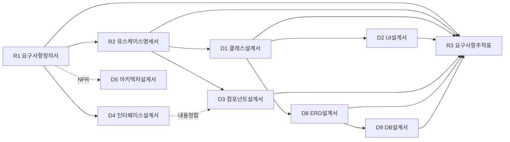

<!-- obsidian-index -->
# KLID 학습데이터 저작도구 — CBD 설계 산출물 MOC

> 시스템: **AI 기반 지방정부 CCTV 관제지원시스템(2차)** / 서브시스템: **학습데이터 저작도구**
> ID prefix: `KLID-AT-` · 생성일 2026-08-06 · LogiCraft 그래프 기반 전체 재생성 (`/cc-doc-gen`)
>
> ⚠ 이 파일은 **개발용 지식그래프 계층**이다. hwpx 제출본 변환 대상에서 제외한다.

## 산출물

| 코드 | 산출물 | 문서 | 규모 | 핵심 채번 |
|:---:|---|---|---:|---|
| **R1** | 사용자 요구사항 정의서 | [[KLID_AT_사용자요구사항정의서]] | 49KB | 기능 22 · `NFR-001~021` |
| **R2** | 유스케이스 명세서 | [[KLID_AT_유스케이스명세서]] | 85KB | `UC` 19 · `ACT` 8 · `UCD` 2 |
| **R3** | 요구사항 추적표 | [[KLID_AT_요구사항추적표]] | 52KB | 매트릭스 22행 |
| **D1** | 클래스 설계서 | [[KLID_AT_클래스설계서]] | 218KB | `DC` 111 · `SD` 19 · `DCD` 19 |
| **D2** | 사용자 인터페이스 설계서 | [[KLID_AT_사용자인터페이스설계서]] | 112KB | `SC` 11 · `OUT` 2 |
| **D3** | 컴포넌트 설계서 | [[KLID_AT_컴포넌트설계서]] | 140KB | `CO` 19 · `IC` 30 |
| **D4** | 인터페이스 설계서 | [[KLID_AT_인터페이스설계서]] | 82KB | `II` 14 |
| **D5** | 아키텍처 설계서 | [[KLID_AT_아키텍처설계서]] | 82KB | NFR 21표 |
| **D8** | 엔티티 관계 모형 설계서 | [[KLID_AT_엔티티관계모형설계서]] | 122KB | `EN` 63 · `ERD` 17 |
| **D9** | 데이터베이스 설계서 | [[KLID_AT_데이터베이스설계서]] | 144KB | `TB` 63 · `ID` 63 · 컬럼 665 |

## 문서 간 의존 그래프



생성 순서는 이 의존을 따른다: `R1 → R2 → D4 → D1 → (D2 ∥ D3) → D8 → D9`, `D5`는 R1 확정 후 임의 시점, **`R3`는 반드시 최후**.

## 추적성 사슬

```
RQ-SFR-NN-NN  →  KLID-AT-UC-NNN  →  ┬ KLID-AT-SC-NNN (화면)
                                     ├ KLID-AT-CO-NNN (컴포넌트) → KLID-AT-IC-NNN (인터페이스 클래스)
                                     ├ KLID-AT-DC-NNN (설계 클래스) → KLID-AT-EN-NNN → KLID-AT-TB-NNN
                                     └ KLID-AT-SD-NNN / KLID-AT-DCD-NNN (시퀀스도·클래스도)
```

- **ID 동조 규칙**: `UC` = `SD` = `DCD` = `CO` 번호 동일(결번까지 동조) · `EN` = `TB` 번호 동일 · D3 내부 클래스는 D1 `DC` ID **재사용**(별개 채번 금지).
- **결번**(재사용 금지): UC·SD·DCD·CO `012` `014` `015` `017` `020` `025` `026` / 범위 제외 `024` `027`.

## 범위 밖 (이번 재생성 대상 아님)

D6 총괄시험계획서 · D7 시스템시험시나리오 · D10 통합시험시나리오 · D11 단위시험케이스 · D12 데이터전환및초기데이터설계서 · I 계열(구현) · T 계열(시험 결과).
→ LogiCraft 설계 데이터로 도출 불가. 직전 판은 `docs/design/.bak-20260806-071158/` 에 보존돼 있다.
