# D2 사용자 인터페이스 설계서 (CBD 양식)

## 제·개정 이력

| 날짜 | 버전 | 작성자 | 승인자 | 내용 |
|------|------|--------|--------|------|
| 2026-05-21 | 1.0 | 박찬기 | - | 최초 작성 (전체 26화면) |
| 2026-05-26 | 1.1 | ck.park | - | V2.0 마킹 화면(SC-027) 추가, CBD 양식 대조 |
| 2026-05-26 | 2.0 | ck.park | - | CBD 양식 전면 재작성 — PlantUML Salt 와이어프레임 전체 27화면 추가 |

---

| D2 | 사용자 인터페이스 설계서 |
|----|------------------------|
| 시스템명 | 기반 지방정부 관제지원시스템 구축(2차) AI CCTV | 서브시스템명 | AI CCTV 학습데이터 저작도구 (KLID-AT-SS-001) |
| 단계명   | 설계 | 작성일자 | 2026-05-26 | 버전 | 2.0 |

---

## 1. 사용자 인터페이스 구조도

본 도구는 **2개 채널 + 1개 공통 진입점**으로 구성된다.
- **INTERNAL 채널**: 저작도구 내부 사용자(REVIEWER / WORKER)용. `AppLayout`(LNB + GNB) 적용
- **PORTAL 채널**: 외부 포털사용자(PORTAL_USER)용. `PortalLayout`(모바일 친화, LNB 없음)
- **공통**: `/ingress` (관제·포털서버 JWT 인계), `/forbidden`, `/role-claim` (role 자가 부여)

| 업무 영역 (Level 1) | Level 2 | Level 3 | Level 4 |
|-------------------|---------|---------|---------|
| **공통 (Public)** | | | |
| | 세션 진입 | | |
| | 권한 자가 부여 | | |
| **내부채널 (INTERNAL)** | | | |
| | 대시보드 | | |
| | 영상 관리 | 영상 목록 (완료) | |
| | | 영상 처리 상태 | |
| | | 영상 상세 | |
| | 작업 관리 | 내 작업 목록 | |
| | | 작업 배정 | |
| | 마킹 | 마킹 화면 | |
| | 라벨링 | 라벨링 캔버스 | |
| | 오토라벨 결과 | 오토라벨 요약 | |
| | | 시계열 메타 검토 | |
| | 비식별화 | 비식별 목록 | |
| | | 비식별 상세 | |
| | 검수 | 검수 대기 목록 | |
| | | 검수 상세 | |
| | 데이터 증강 | 증강 요청 | |
| | | 증강 결과 | |
| | 통계 | 작업자 통계 | |
| | | 전체 통계 | |
| | 버전 이력 | 이력 조회 | |
| | 관리 | 사용자 관리 | |
| | | 시스템 설정 | |
| | | 프리셋 관리 | |
| | 개발 전용 | 오토라벨 테스트 | |
| **포털채널 (PORTAL)** | | | |
| | 포털 홈 | | |
| | 포털 라벨링 | | |

---

## 2. 사용자 인터페이스 목록

### 2.1 화면

| 화면 ID | 화면명 | 관련 유스케이스 ID |
|---|---|---|
| KLID-AT-SC-001 | 세션 진입(SessionIngress) | KLID-AT-UC-013 |
| KLID-AT-SC-002 | 권한 자가 부여(RoleClaim) | KLID-AT-UC-013 |
| KLID-AT-SC-003 | 대시보드(Dashboard) | KLID-AT-UC-001 |
| KLID-AT-SC-004 | 완료 영상 목록(VideoList) | KLID-AT-UC-001 |
| KLID-AT-SC-005 | 영상 처리 상태(VideoStatus) | KLID-AT-UC-001 |
| KLID-AT-SC-006 | 영상 상세(VideoDetail) | KLID-AT-UC-001 |
| KLID-AT-SC-007 | 내 작업 목록(TaskList) | KLID-AT-UC-008 |
| KLID-AT-SC-008 | 라벨링 캔버스(Labeling) | KLID-AT-UC-006, KLID-AT-UC-010, KLID-AT-UC-003 |
| KLID-AT-SC-009 | 오토라벨 요약(AutoLabelSummary) | KLID-AT-UC-001 |
| KLID-AT-SC-010 | 시계열 메타 검토(MetaReview) | KLID-AT-UC-005 |
| KLID-AT-SC-011 | 비식별 영상 목록(DeidentList) | KLID-AT-UC-003 |
| KLID-AT-SC-012 | 비식별 영상 상세(DeidentDetail) | KLID-AT-UC-003 |
| KLID-AT-SC-013 | 검수 목록(ReviewList) | KLID-AT-UC-009 |
| KLID-AT-SC-014 | 검수 상세(ReviewDetail) | KLID-AT-UC-009, KLID-AT-UC-014 |
| KLID-AT-SC-015 | 버전 이력(History) | KLID-AT-UC-010 |
| KLID-AT-SC-016 | 워커 통계(WorkerStat) | - |
| KLID-AT-SC-017 | 전체 통계(OverallStat) | - |
| KLID-AT-SC-018 | 증강 요청(AugmentRequest) | KLID-AT-UC-011 |
| KLID-AT-SC-019 | 증강 결과(AugmentResult) | KLID-AT-UC-011 |
| KLID-AT-SC-020 | 사용자 관리(UserManage) | - |
| KLID-AT-SC-021 | 시스템 설정(SystemSettings) | - |
| KLID-AT-SC-022 | 라벨 프리셋(PresetList) | KLID-AT-UC-007 |
| KLID-AT-SC-023 | 포털 홈(PortalHome) | KLID-AT-UC-012 |
| KLID-AT-SC-024 | 포털 라벨링(PortalLabeling) | KLID-AT-UC-012 |
| KLID-AT-SC-025 | 작업 배정(TaskAssign) | KLID-AT-UC-008 |
| KLID-AT-SC-026 | 개발자 오토라벨 테스트(DevAutolabelTest) | - |
| KLID-AT-SC-027 | 마킹(Marking) | KLID-AT-UC-001 |

### 2.2 출력물

| 출력물 ID | 출력물명 | 관련 유스케이스 ID |
|---|---|---|
| KLID-AT-PR-001 | 통계 리포트 CSV(`/v1/stats/report`) | - |
| KLID-AT-PR-002 | Gitea Diff Patch(`/v1/versions/{commit}/diff`) | KLID-AT-UC-010 |
| KLID-AT-PR-003 | 검수 결과 요약 화면 인쇄(브라우저 print) | KLID-AT-UC-009 |
| KLID-AT-PR-004 | 증강 결과 미리보기 이미지 묶음 | KLID-AT-UC-011 |

---

## 3. 화면 상세 설계

### 3.1 KLID-AT-SC-001 세션 진입(SessionIngress)

<table>
<tr><td>화면 ID</td><td>KLID-AT-SC-001</td><td>화면명</td><td>세션 진입(SessionIngress)</td></tr>
<tr><td>관련 유스케이스 ID</td><td colspan="3">KLID-AT-UC-013</td></tr>
<tr><td>관련 시퀀스도 ID</td><td colspan="3">KLID-AT-SD-007</td></tr>
<tr><td>화면유형</td><td>입력(쿼리 파라미터 처리)</td><td>메뉴경로</td><td>`/ingress` (외부 진입점)</td></tr>
<tr><td>화면개요</td><td colspan="3">관제서버·포털서버와 동일 도메인 운영. 브라우저 스토리지(localStorage/sessionStorage) 공유를 통해 JWT를 전달. 토큰을 SecurityContext에 등록하고 채널·역할에 따라 적합한 시작 화면으로 자동 이동.</td></tr>
</table>

**화면 레이아웃**

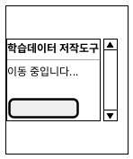

**입출력 항목**

| 항목명 | 컨트롤명 | 타입 및 길이 | 속성 | Validation Check |
|---|---|---|---|---|
| token | hidden | String(<=4096) | I/H | 필수, JWT 형식, HS256 |
| issuer | hidden | String | I/H | 허용 issuer만 |
| 이동 안내 텍스트 | label | - | O | "이동 중입니다..." |
| 오류 안내 | label | - | O | 401 시 표시 |

**처리 내용**

1. 브라우저 스토리지에서 `token` 읽기 → `JwtAuthenticationFilter` 사전 검증 (KLID-AT-SD-007)
2. 통과 시 `channel`(INTERNAL/PORTAL) + `role` 분기 → INTERNAL+REVIEWER → `/dashboard`, INTERNAL+WORKER → `/task`, PORTAL_USER → `/portal`
3. 실패 시 `/forbidden` 으로 redirect + 발급자 로그인 URL 안내

**기술적 고려사항**

동일 도메인 브라우저 스토리지 공유 방식이므로 URL 쿼리 파라미터 미사용. CSP `default-src 'self'`.

---

### 3.2 KLID-AT-SC-002 권한 자가 부여(RoleClaim)

<table>
<tr><td>화면 ID</td><td>KLID-AT-SC-002</td><td>화면명</td><td>권한 자가 부여(RoleClaim)</td></tr>
<tr><td>관련 유스케이스 ID</td><td colspan="3">KLID-AT-UC-013</td></tr>
<tr><td>관련 시퀀스도 ID</td><td colspan="3">KLID-AT-SD-007</td></tr>
<tr><td>화면유형</td><td>입력</td><td>메뉴경로</td><td>`/role-claim`</td></tr>
<tr><td>화면개요</td><td colspan="3">인증은 완료되었으나 role 클레임이 없는 사용자가 관리자 공유 패스워드를 입력하여 WORKER 또는 REVIEWER 역할을 자가 부여하는 화면.</td></tr>
</table>

**화면 레이아웃**

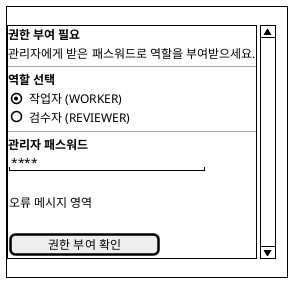

**입출력 항목**

| 항목명 | 컨트롤명 | 타입 및 길이 | 속성 | Validation Check |
|---|---|---|---|---|
| 역할 선택 | Radio(radiogroup) | enum | I | WORKER / REVIEWER 중 선택 필수 |
| 관리자 패스워드 | Input(password) | String | I | 필수, autoComplete="new-password", 평문 로그 금지 |
| 오류 안내 | label(role=alert) | - | O | 401·409·429 별 사용자 메시지 |
| 권한 부여 확인 | Button(submit) | - | I | 역할 미선택 또는 패스워드 공백 시 disabled |

**처리 내용**

1. 폼 제출 → `POST /v1/auth/role-claim { role, adminPassword }`
2. 성공 시 채널·역할에 따라 자동 이동 (REVIEWER → `/dashboard`, WORKER → `/task`)
3. 401: 패스워드 불일치 안내, 409: 이미 역할 보유 안내, 429: rate limit 초과 안내

**기술적 고려사항**

패스워드는 `type="password"` + `autoComplete="new-password"`로 단말 캐싱 방지. `console.log` 및 sessionStorage 저장 금지(보안정책).

---

### 3.3 KLID-AT-SC-003 대시보드(Dashboard)

<table>
<tr><td>화면 ID</td><td>KLID-AT-SC-003</td><td>화면명</td><td>대시보드</td></tr>
<tr><td>관련 유스케이스 ID</td><td colspan="3">KLID-AT-UC-001</td></tr>
<tr><td>관련 시퀀스도 ID</td><td colspan="3">KLID-AT-SD-001</td></tr>
<tr><td>화면유형</td><td>조회</td><td>메뉴경로</td><td>`홈 > 대시보드`</td></tr>
<tr><td>화면개요</td><td colspan="3">처리 대기/완료/반려 영상 건수 KPI, 이벤트별 이미지·영상 데이터 분포, 최근 완료 영상 목록, WORKER 한정 내 작업 현황.</td></tr>
</table>

**화면 레이아웃**

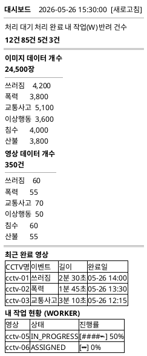

**입출력 항목**

| 항목명 | 컨트롤명 | 타입 및 길이 | 속성 | Validation Check |
|---|---|---|---|---|
| KPI 카드(처리 대기/완료/내 작업/반려) | KpiCard | int | O | WORKER 4카드, REVIEWER 3카드 |
| 이미지 데이터 분포 | Card + 이벤트 6종 | - | O | 이벤트별 건수 |
| 영상 데이터 분포 | Card + 이벤트 6종 | - | O | 이벤트별 건수 |
| 최근 완료 영상 | DataTable | - | O | CCTV명/이벤트/길이/완료일 |
| 내 작업 현황 | DataTable | - | O | WORKER 전용 |
| 새로고침 | Button | - | I | 30초 자동 polling |

**처리 내용**

`GET /v1/stats/summary` → `DashboardSummaryResponse` KPI·분포 카드 렌더. `GET /v1/videos?size=5&sort=capturedAt,desc` → 최근 완료 영상. WORKER: `GET /v1/tasks/board?workerId={myId}&size=5` → 내 작업 현황. polling 30s.

**기술적 고려사항**

react-query staleTime 30s, GET 401 → `/ingress` 재진입.

---

### 3.4 KLID-AT-SC-004 완료 영상 목록(VideoList)

<table>
<tr><td>화면 ID</td><td>KLID-AT-SC-004</td><td>화면명</td><td>완료 영상 목록</td></tr>
<tr><td>관련 유스케이스 ID</td><td colspan="3">KLID-AT-UC-001</td></tr>
<tr><td>관련 시퀀스도 ID</td><td colspan="3">-</td></tr>
<tr><td>화면유형</td><td>조회</td><td>메뉴경로</td><td>`영상 > 완료 영상`</td></tr>
<tr><td>화면개요</td><td colspan="3">관제서버에서 인계받은 영상의 배치 처리 상태와 단계를 확인하는 테이블 뷰. 필터, 다중 선택, 페이지네이션 제공.</td></tr>
</table>

**화면 레이아웃**

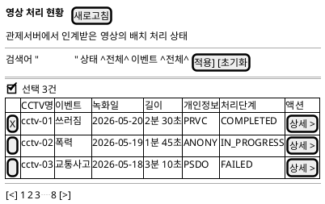

**입출력 항목**

| 항목명 | 컨트롤명 | 타입 및 길이 | 속성 | Validation Check |
|---|---|---|---|---|
| 검색어 | input text | String(<=100) | I/E | XSS sanitize |
| 상태 필터 | Select | enum | I/E | 전체/PENDING/IN_PROGRESS/COMPLETED/FAILED |
| 이벤트 필터 | Select | enum | I/E | 6종 이벤트 |
| 전체 선택 | checkbox | bool | I/E | 현재 페이지 행만 |
| 결과 그리드 | DataTable | - | O | CCTV명/이벤트/녹화일/길이/개인정보/처리단계/액션 |
| 상세 보기 | Button(ghost) | - | I | → `/video/:id` |
| 페이지 | Pagination | int | I/E | size=20, 최대 7페이지 표시 |

**처리 내용**

`GET /v1/videos?page=&size=&sort=&q=&eventTypeCd=&dataSttsCd=` → 페이지 렌더. 행 클릭 시 `/video/:id` 이동.

**기술적 고려사항**

searchParams 기반 URL 동기화. 필터 변경 시 page=0 리셋. VideoFilters 컴포넌트 분리.

---

### 3.5 KLID-AT-SC-005 영상 처리 상태(VideoStatus)

<table>
<tr><td>화면 ID</td><td>KLID-AT-SC-005</td><td>화면명</td><td>영상 처리 상태(VideoStatus)</td></tr>
<tr><td>관련 유스케이스 ID</td><td colspan="3">KLID-AT-UC-001</td></tr>
<tr><td>관련 시퀀스도 ID</td><td colspan="3">-</td></tr>
<tr><td>화면유형</td><td>조회</td><td>메뉴경로</td><td>`영상 > 처리 현황`</td></tr>
<tr><td>화면개요</td><td colspan="3">배치 파이프라인에서 처리 중인 영상의 실시간 처리 현황을 표 형식으로 표시. 5초 자동 폴링. KPI 3개(처리 중/완료/실패) + 전체 목록 테이블 제공.</td></tr>
</table>

**화면 레이아웃**

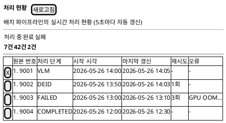

**입출력 항목**

| 항목명 | 컨트롤명 | 타입 및 길이 | 속성 | Validation Check |
|---|---|---|---|---|
| 처리 중 건수 | KpiCard | int | O | - |
| 완료 건수 | KpiCard | int | O | - |
| 실패 건수 | KpiCard | int | O | - |
| 전체 선택 체크박스 | checkbox | bool | I/E | - |
| 원본 번호 | text | int | O | - |
| 처리 단계 | StageBadge | enum | O | PENDING/VLM/DEID/FRAME/YOLO/SAM2/COMPLETED/FAILED |
| 시작 시각 | text | datetime | O | - |
| 마지막 갱신 시각 | text | datetime | O | - |
| 재시도 횟수 | text | int | O | 0이면 '-' 표시 |
| 오류 메시지 | text | String(<=30) | O | 30자 초과 시 말줄임 처리 |
| 새로고침 | Button | - | I | refetch + videos 캐시 무효화 |

**처리 내용**

`GET /v1/batch/status` → `BatchStageProgress[]` → KPI 집계 + 테이블 렌더. 5초 폴링.

**기술적 고려사항**

react-query refetchInterval=5000. 오류 메시지 full-text는 title 속성으로 hover 시 표시.

---

### 3.6 KLID-AT-SC-006 영상 상세(VideoDetail)

<table>
<tr><td>화면 ID</td><td>KLID-AT-SC-006</td><td>화면명</td><td>영상 상세(VideoDetail)</td></tr>
<tr><td>관련 유스케이스 ID</td><td colspan="3">KLID-AT-UC-001</td></tr>
<tr><td>관련 시퀀스도 ID</td><td colspan="3">-</td></tr>
<tr><td>화면유형</td><td>조회</td><td>메뉴경로</td><td>`/video/:id`</td></tr>
<tr><td>화면개요</td><td colspan="3">개별 영상의 상세 정보를 3개 탭(기본 정보 / 프레임 미리보기 / 오토라벨 결과)으로 구성. 헤더 카드에서 CCTV명, 이벤트 유형, 처리 상태, 버전관리 이동 버튼 제공.</td></tr>
</table>

**화면 레이아웃**

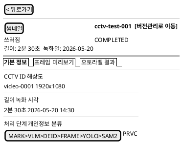

**입출력 항목**

| 항목명 | 컨트롤명 | 타입 및 길이 | 속성 | Validation Check |
|---|---|---|---|---|
| 썸네일 이미지 | AuthImage | - | O | 프레임 없으면 "미리보기 없음" placeholder |
| CCTV명 | text | String | O | - |
| 이벤트 유형 | EventTypeBadge | enum | O | - |
| 처리 상태 | StatusBadge | enum | O | - |
| 버전관리로 이동 | Button | - | I | → `/history/{id}` |
| 탭 선택 | Tabs | enum | I/E | 기본 정보 / 프레임 미리보기 / 오토라벨 결과 |
| [기본 정보] 메타 카드 | Card Grid | - | O | CCTV ID/해상도/길이/녹화 시각/처리 단계/개인정보 |
| [프레임] 프레임 그리드 | AuthImage Grid | - | O | 클릭 시 Lightbox 모달 |
| [오토라벨] 처리 정보 | Card x4 | - | O | 총 라벨/오토라벨 수/비율/상태 |
| [오토라벨] 신뢰도 분포 | 막대 차트 | - | O | 0.9+/0.7~0.9/<0.7 구간 |
| [오토라벨] 라벨별 분포 | 가로 막대 | - | O | 상위 10개 표시 |
| 뒤로가기 | Button | - | I | navigate(-1) |

**처리 내용**

`GET /v1/videos/{id}` → 헤더·기본정보 렌더. 오토라벨 탭: `GET /v1/videos/{id}/labels/auto`. id가 숫자가 아니면 ErrorState 표시.

**기술적 고려사항**

id는 Number.parseInt + isFinite 검증. AuthImage는 인증 헤더 포함 요청으로 프레임 이미지 보호.

---

### 3.7 KLID-AT-SC-007 내 작업 목록(TaskList)

<table>
<tr><td>화면 ID</td><td>KLID-AT-SC-007</td><td>화면명</td><td>내 작업 목록(TaskList)</td></tr>
<tr><td>관련 유스케이스 ID</td><td colspan="3">KLID-AT-UC-008</td></tr>
<tr><td>관련 시퀀스도 ID</td><td colspan="3">KLID-AT-SD-005</td></tr>
<tr><td>화면유형</td><td>조회 + 입력(배정)</td><td>메뉴경로</td><td>`작업 > 내 작업`</td></tr>
<tr><td>화면개요</td><td colspan="3">REVIEWER: 처리 완료 영상에 대한 작업자 배정·재배정·일괄배정. WORKER: 본인에게 배정된 작업 목록 조회 및 작업 시작 진입. KPI 4카드 + 필터 + 다중 선택 테이블.</td></tr>
</table>

**화면 레이아웃**

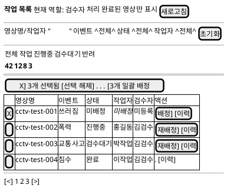

**입출력 항목**

| 항목명 | 컨트롤명 | 타입 및 길이 | 속성 | Validation Check |
|---|---|---|---|---|
| 검색어 | Input text | String | I/E | 영상명/작업자명 필터 |
| 이벤트 유형 필터 | Select | String | I/E | 목록에서 unique 수집 |
| 상태 필터 | Select | enum | I/E | 전체/미배정/대기/진행중/검수대기/완료/반려 |
| 작업자 필터 | Select | int | I/E | REVIEWER만 표시 |
| 행 체크박스 | checkbox | bool | I/E | 다중 선택용 |
| 일괄 배정 바 | 액션 바 | - | O/I | 1건 이상 선택 시 노출 |
| 영상명 | DataTable 컬럼 | String | O | - |
| 이벤트 유형 | EventTypeBadge | enum | O | - |
| 상태 | StatusBadge | enum | O | - |
| 작업자·검수자 | text | String | O | 미배정이면 italic |
| 배정/재배정 | Button(ghost) | - | I | COMPLETED 행은 미노출 |
| 이력 | Button(ghost) | - | I | HistoryDrawer 오픈 |
| WORKER: 작업 | Button(ghost) | - | I | → `/label/{firstSrcSn}` |

**처리 내용**

REVIEWER: `GET /v1/tasks/board?status=COMPLETED&page=&size=` → 목록 렌더. 배정: `POST /v1/assignments { workerId, rawDataIds }`. 재배정: `PATCH /v1/assignments/{id} { workerId }`. WORKER: `GET /v1/tasks?page=&size=` → 본인 배정 작업만.

**기술적 고려사항**

COMPLETED(검수 승인 완료) 행은 재배정 버튼 미노출. `/users` API는 REVIEWER만 호출(enabled 가드).

---

### 3.8 KLID-AT-SC-008 라벨링 캔버스(Labeling)

<table>
<tr><td>화면 ID</td><td>KLID-AT-SC-008</td><td>화면명</td><td>라벨링 캔버스</td></tr>
<tr><td>관련 유스케이스 ID</td><td colspan="3">KLID-AT-UC-006, KLID-AT-UC-010, KLID-AT-UC-003</td></tr>
<tr><td>관련 시퀀스도 ID</td><td colspan="3">KLID-AT-SD-004</td></tr>
<tr><td>화면유형</td><td>입력·갱신·삭제</td><td>메뉴경로</td><td>`/label/{srcSn}` (풀스크린)</td></tr>
<tr><td>화면개요</td><td colspan="3">konva 기반 라벨링 캔버스. BBox/Polygon/Mask 도구, 프레임 타임라인, 좌측 객체 리스트, 우측 속성·이슈 패널, 단축키, 자동 저장.</td></tr>
</table>

**화면 레이아웃**

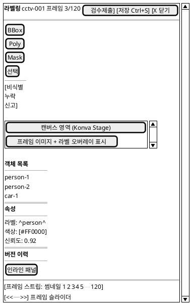

**입출력 항목**

| 항목명 | 컨트롤명 | 타입 및 길이 | 속성 | Validation Check |
|---|---|---|---|---|
| 프레임 이미지 | Konva.Image | - | O | resolveFrameImageType(RAW/DEID) |
| 라벨 오브젝트 | Konva.Shape | - | I/O/E | 좌표 점 <=1000개 (CWE-770) |
| 도구 선택 | Toolbar | enum | I/E | BBox/Polygon/Mask/Select |
| 라벨 마스터 | Dropdown | string | I/E | LabelMasterService.list() |
| 속성 입력 | Form | - | I/E | LabelAttrService.list() |
| 비식별 오류 신고 | Button | - | I | UC-003 트리거 |
| SAM2 N프레임 전파 | Button | - | I | POST /v1/frames/{srcSn}/sam2-track |
| 저장 | Button(Ctrl+S) | - | I | 좌표 검증 후 bulkUpsert |
| 이전·다음 프레임 | Button(←→) | - | I | 키보드 단축키 |
| 검수 제출 | Button | - | I | WORKER 전용 |

**처리 내용**

- GET `/v1/frames/{srcSn}/labels` → 캔버스 렌더 (KLID-AT-SD-004)
- 편집 후 Ctrl+S → PUT `/v1/frames/{srcSn}/labels` (좌표 검증 + Gitea 자동 커밋)
- 비식별 오류 신고 → POST `/v1/labels/{srcSn}/deident-report` (KLID-AT-SD-006)

**기술적 고려사항**

konva 별도 청크, useReducer로 변경 이력 관리, dirty 상태 페이지 이탈 가드. 풀스크린 다크 UI (AppLayout 밖).

---

### 3.9 KLID-AT-SC-009 오토라벨 요약(AutoLabelSummary)

<table>
<tr><td>화면 ID</td><td>KLID-AT-SC-009</td><td>화면명</td><td>오토라벨 요약(AutoLabelSummary)</td></tr>
<tr><td>관련 유스케이스 ID</td><td colspan="3">KLID-AT-UC-001</td></tr>
<tr><td>관련 시퀀스도 ID</td><td colspan="3">-</td></tr>
<tr><td>화면유형</td><td>조회</td><td>메뉴경로</td><td>`/auto/{videoId}`</td></tr>
<tr><td>화면개요</td><td colspan="3">YOLO/SAM2 오토라벨링 결과 요약. 처리 정보, 신뢰도 구간 분포, 라벨별 분포, 낮은 신뢰도 프레임 목록 제공.</td></tr>
</table>

**화면 레이아웃**

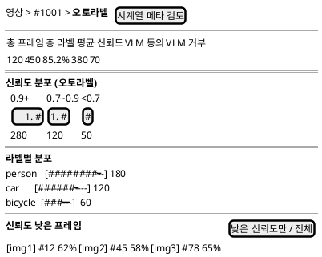

**입출력 항목**

| 항목명 | 컨트롤명 | 타입 및 길이 | 속성 | Validation Check |
|---|---|---|---|---|
| 총 프레임 수 | Field | int | O | - |
| 총 라벨 수 | Field | int | O | - |
| 평균 신뢰도 | Field | float | O | % 변환 표시 |
| VLM 동의/거부 수 | Field | int | O | - |
| 신뢰도 분포 | ConfidenceDistribution | - | O | buckets 기반 막대 렌더 |
| 라벨별 분포 | 가로 막대 목록 | - | O | 상위 10개 |
| 낮은 신뢰도 프레임 | 썸네일 그리드 | - | O | frameNo + confidence% 표시 |
| 필터 토글 | Button | bool | I/E | 70% 미만 프레임만 / 전체 토글 |
| 시계열 메타 검토 | Button | - | I | → `/auto/{videoId}/meta` |

**처리 내용**

`GET /v1/videos/{videoId}/auto-summary` → 요약 렌더. BE placeholder(status=PENDING, buckets 없음) 감지 시 "배치 처리 대기 중" 안내 표시.

**기술적 고려사항**

videoId는 number 검증. 이미지 URL은 BE 응답값 그대로 사용(사용자 입력 반영 X).

---

### 3.10 KLID-AT-SC-010 시계열 메타 검토(MetaReview)

<table>
<tr><td>화면 ID</td><td>KLID-AT-SC-010</td><td>화면명</td><td>시계열 메타 검토</td></tr>
<tr><td>관련 유스케이스 ID</td><td colspan="3">KLID-AT-UC-005</td></tr>
<tr><td>관련 시퀀스도 ID</td><td colspan="3">KLID-AT-SD-010</td></tr>
<tr><td>화면유형</td><td>조회·갱신</td><td>메뉴경로</td><td>`/auto/{videoId}/meta`</td></tr>
<tr><td>화면개요</td><td colspan="3">VLM 시계열 결과 검토·수정. 좌측: 프레임 미리보기 + 상태 변화 타임라인. 우측: VLM 객체 검증 카드 + 환경/이벤트 메타 편집 폼.</td></tr>
</table>

**화면 레이아웃**

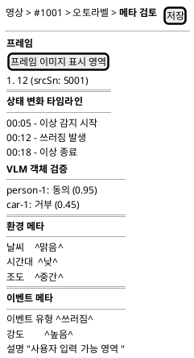

**입출력 항목**

| 항목명 | 컨트롤명 | 타입 및 길이 | 속성 | Validation Check |
|---|---|---|---|---|
| 프레임 이미지 | img | - | O | BE 응답 URL |
| 상태 변화 타임라인 | StateChangeTimeline | - | O | 시간순 이벤트 |
| VLM 검증 결과 | VlmVerificationCard | - | O | 동의/거부 표시 |
| 날씨 | Select | enum | I/E | CLEAR/RAIN/SNOW/CLOUDY/FOG |
| 시간대 | Select | enum | I/E | DAY/NIGHT/DAWN/DUSK |
| 조도 | Select | enum | I/E | LOW/MID/HIGH |
| 이벤트 유형 | Select | String(<=32) | I/E | - |
| 강도 | Select | enum | I/E | LOW/MID/HIGH |
| 설명 | Textarea | String(<=500) | I/E | XSS sanitize |
| 저장 | Button | - | I | PUT /v1/frames/{srcSn}/meta |

**처리 내용**

`GET /v1/frames/{srcSn}/meta` → 좌우 패널 렌더. 수정 후 저장 → `PUT /v1/frames/{srcSn}/meta` (zod 검증 후 호출).

**기술적 고려사항**

dirty 상태 추적으로 변경 없으면 저장 비활성. srcSn은 쿼리파라미터 `?srcSn=N`으로 전달.

---

### 3.11 KLID-AT-SC-011 비식별 영상 목록(DeidentList)

<table>
<tr><td>화면 ID</td><td>KLID-AT-SC-011</td><td>화면명</td><td>비식별 영상 목록(DeidentList)</td></tr>
<tr><td>관련 유스케이스 ID</td><td colspan="3">KLID-AT-UC-003</td></tr>
<tr><td>관련 시퀀스도 ID</td><td colspan="3">-</td></tr>
<tr><td>화면유형</td><td>조회</td><td>메뉴경로</td><td>`비식별 > 비식별 결과`</td></tr>
<tr><td>화면개요</td><td colspan="3">비식별화 처리가 완료되었거나 실패한 영상 목록. 비식별 대상 여부·처리 상태 필터 및 진행 프레임 수 표시.</td></tr>
</table>

**화면 레이아웃**

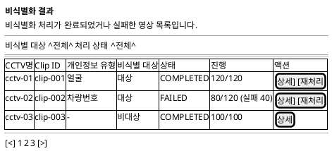

**입출력 항목**

| 항목명 | 컨트롤명 | 타입 및 길이 | 속성 | Validation Check |
|---|---|---|---|---|
| 비식별 대상 필터 | Select | enum | I/E | 전체/대상(Y)/비대상(N) |
| 처리 상태 필터 | Select | enum | I/E | 전체/PENDING/IN_PROGRESS/COMPLETED/FAILED |
| DataTable 컬럼 | 각종 | - | O | CCTV명/Clip ID/개인정보유형/대상/상태/진행/액션 |
| 상세 버튼 | Button(ghost) | - | I | → `/deident/{videoId}` |
| 재처리 버튼 | Button(outline) | - | I | REVIEWER + prvcYn=Y 행에만 노출 |

**처리 내용**

`GET /v1/deident?prvcYn=&status=&page=&size=` → DataTable 렌더. 재처리 클릭 → `POST /v1/deident/{videoId}/reprocess` → 성공 토스트 + 목록 재조회.

**기술적 고려사항**

검색 입력은 axios params로 전달(XSS 방지). IDOR 방어는 BE에서 수행.

---

### 3.12 KLID-AT-SC-012 비식별 영상 상세(DeidentDetail)

<table>
<tr><td>화면 ID</td><td>KLID-AT-SC-012</td><td>화면명</td><td>비식별 영상 상세</td></tr>
<tr><td>관련 유스케이스 ID</td><td colspan="3">KLID-AT-UC-003</td></tr>
<tr><td>관련 시퀀스도 ID</td><td colspan="3">KLID-AT-SD-006</td></tr>
<tr><td>화면유형</td><td>조회·갱신</td><td>메뉴경로</td><td>`/deident/{videoId}`</td></tr>
<tr><td>화면개요</td><td colspan="3">비식별화 영상 단위 비교. 처리 정보 5컬럼 + 12프레임 그리드 + 좌우(원본/비식별) 비교 + 처리 이력.</td></tr>
</table>

**화면 레이아웃**

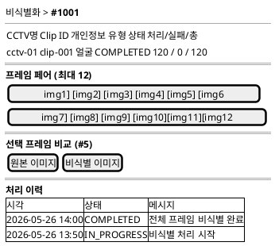

**입출력 항목**

| 항목명 | 컨트롤명 | 타입 및 길이 | 속성 | Validation Check |
|---|---|---|---|---|
| 처리 정보 | Field x5 | - | O | CCTV명/Clip ID/개인정보유형/상태/프레임수 |
| 프레임 그리드 | FrameGrid12 | - | I/O | 클릭 시 좌우 비교 갱신 |
| 좌우 비교 | SideBySideCompare | - | O | 원본/비식별 50:50 |
| 처리 이력 | ProcessHistoryList | - | O | 시각/상태/메시지 |

**처리 내용**

`GET /v1/deident/{videoId}/detail` → 처리 정보·프레임·이력 렌더. REVIEWER가 재처리 클릭 → `POST /v1/deident/{videoId}/reprocess`.

**기술적 고려사항**

videoId number 검증. 이미지 URL은 BE 응답값만 사용.

---

### 3.13 KLID-AT-SC-013 검수 목록(ReviewList)

<table>
<tr><td>화면 ID</td><td>KLID-AT-SC-013</td><td>화면명</td><td>검수 목록</td></tr>
<tr><td>관련 유스케이스 ID</td><td colspan="3">KLID-AT-UC-009</td></tr>
<tr><td>관련 시퀀스도 ID</td><td colspan="3">KLID-AT-SD-005</td></tr>
<tr><td>화면유형</td><td>조회</td><td>메뉴경로</td><td>`검수 > 검수 대기`</td></tr>
<tr><td>화면개요</td><td colspan="3">작업자가 제출한 라벨링 결과를 검수하는 REVIEWER 전용 목록. KPI 4종 + 검색·상태 필터 + DataTable.</td></tr>
</table>

**화면 레이아웃**

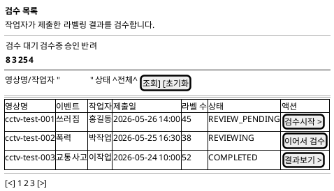

**입출력 항목**

| 항목명 | 컨트롤명 | 타입 및 길이 | 속성 | Validation Check |
|---|---|---|---|---|
| KPI 카드 | KpiCard x4 | int | O | 검수 대기/검수중/승인/반려 |
| 검색어 | input text | String | I/E | 영상명/작업자명 |
| 상태 필터 | Select | enum | I/E | 전체/REVIEW_PENDING/REVIEWING/COMPLETED/REJECTED |
| DataTable | 각종 컬럼 | - | O | 영상명/이벤트/작업자/제출일/라벨수/상태/액션 |
| 검수 시작 | Button | - | I | → `/review/{id}` |

**처리 내용**

`GET /v1/reviews?page=&size=&sort=` → DataTable 렌더. 검수 시작 클릭 → `/review/{id}` 이동.

**기술적 고려사항**

URL searchParams로 페이지 파라미터만 전달 (axios 자동 URL 인코딩 — XSS 방어). REVIEWER 역할 검증은 라우터 RoleGuard.

---

### 3.14 KLID-AT-SC-014 검수 상세(ReviewDetail)

<table>
<tr><td>화면 ID</td><td>KLID-AT-SC-014</td><td>화면명</td><td>검수 상세</td></tr>
<tr><td>관련 유스케이스 ID</td><td colspan="3">KLID-AT-UC-009, KLID-AT-UC-014</td></tr>
<tr><td>관련 시퀀스도 ID</td><td colspan="3">KLID-AT-SD-005, KLID-AT-SD-011</td></tr>
<tr><td>화면유형</td><td>조회·갱신</td><td>메뉴경로</td><td>`/review/{id}`</td></tr>
<tr><td>화면개요</td><td colspan="3">3분할 풀스크린 검수 화면. 좌측: 읽기 전용 Konva 캔버스. 우측: 객체 목록/속성/검수 메모. 하단: 프레임 타임라인 + 승인/반려 액션 바.</td></tr>
</table>

**화면 레이아웃**

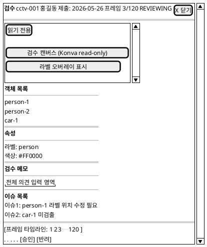

**입출력 항목**

| 항목명 | 컨트롤명 | 타입 및 길이 | 속성 | Validation Check |
|---|---|---|---|---|
| 영상 메타 | Header | - | O | 영상명·CCTV·작업자·제출일 |
| 프레임 타임라인 | FrameTimeline | - | I/E | 프레임 선택 |
| 라벨 캔버스 | LabelCanvas | - | O | konva read-only |
| 객체 리스트 | ObjectListPanel | - | O | 클릭 시 캔버스 포커스 |
| 객체 속성 | ObjectAttributesPanel | - | O | 라벨 속성 표시 |
| 검수 메모 | ReviewMemoPanel | Textarea | I/E | <=2000자 |
| 이슈 목록 | IssueSidebar | - | I/E | 코멘트·심각도 |
| 승인 | Button | - | I | ConfirmDialog 경유 → POST `/v1/reviews/{videoId}/approve` |
| 반려 | Button(+사유) | - | I | RejectModal → reason 필수 |

**처리 내용**

승인 시 `ReviewService.approve()` → 상태 전이(COMPLETED) → `ReviewApprovedEvent` 발행(비동기) → 관제서버 TASK_COMPLETED 통지(KLID-AT-SD-011).

**기술적 고려사항**

풀스크린 3분할 그리드(1fr 360px / 64px 1fr auto). 낙관적 잠금(409) 시 재조회 안내 토스트.

---

### 3.15 KLID-AT-SC-015 버전 이력(History)

<table>
<tr><td>화면 ID</td><td>KLID-AT-SC-015</td><td>화면명</td><td>버전 이력(Gitea Diff)</td></tr>
<tr><td>관련 유스케이스 ID</td><td colspan="3">KLID-AT-UC-010</td></tr>
<tr><td>관련 시퀀스도 ID</td><td colspan="3">KLID-AT-SD-004</td></tr>
<tr><td>화면유형</td><td>조회</td><td>메뉴경로</td><td>`/history/{videoId}`</td></tr>
<tr><td>화면개요</td><td colspan="3">Gitea 기반 라벨 버전 관리. 커밋 타임라인 + Diff 뷰어 + 롤백 기능.</td></tr>
</table>

**화면 레이아웃**

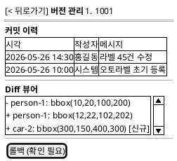

**입출력 항목**

| 항목명 | 컨트롤명 | 타입 및 길이 | 속성 | Validation Check |
|---|---|---|---|---|
| 커밋 타임라인 | Timeline | - | O | 작성자·시각·메시지 |
| Diff 뷰어 | DiffViewer | - | O | 라벨 add/mod/del 색상 |
| 롤백 | Button(+확인) | - | I | POST `/v1/versions/{commit}/rollback` |

**처리 내용**

`GET /v1/videos/{videoId}/versions` → 커밋 타임라인. `GET /v1/versions/{commit}/diff` → Diff 뷰어. 롤백: ConfirmDialog → POST.

**기술적 고려사항**

commit hash는 BE에서 SHA hex 검증. FE는 단순 전달.

---

### 3.16 KLID-AT-SC-016 워커 통계(WorkerStat)

<table>
<tr><td>화면 ID</td><td>KLID-AT-SC-016</td><td>화면명</td><td>워커 통계(WorkerStat)</td></tr>
<tr><td>관련 유스케이스 ID</td><td colspan="3">-</td></tr>
<tr><td>관련 시퀀스도 ID</td><td colspan="3">-</td></tr>
<tr><td>화면유형</td><td>조회</td><td>메뉴경로</td><td>`통계 > 작업자 통계`</td></tr>
<tr><td>화면개요</td><td colspan="3">작업자별 작업 통계. REVIEWER는 작업자 선택 가능, WORKER는 본인 고정. KPI 4 + Secondary 2 + 일별 차트 + 월별 표.</td></tr>
</table>

**화면 레이아웃**

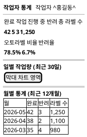

**입출력 항목**

| 항목명 | 컨트롤명 | 타입 및 길이 | 속성 | Validation Check |
|---|---|---|---|---|
| 작업자 선택 | Select | int | I/E | REVIEWER 전용. WORKER는 본인 고정 |
| KPI 카드 x4 | KpiCard | int | O | 완료/진행중/반려/총 라벨 수 |
| 오토라벨 비율 | 보조 카드 | float | O | % 변환. isFinite 검증 |
| 반려율 | 보조 카드 | float | O | 10% 초과 시 빨간색 강조 |
| 일별 작업량 차트 | DailyCompletionChart | - | O | 최근 30일 |
| 월별 통계 표 | table | - | O | 월/완료/반려/라벨 수 |

**처리 내용**

REVIEWER: `GET /v1/stats/workers/{workerId}`. WORKER: 본인 ID 고정 → 동일 API 호출. `/users?role=WORKER`는 REVIEWER만 호출.

**기술적 고려사항**

WORKER 화면에서 `/users` API 호출 차단(403 방지). autoLabelRate/rejectRate는 Number.isFinite 검증 후 렌더.

---

### 3.17 KLID-AT-SC-017 전체 통계(OverallStat)

<table>
<tr><td>화면 ID</td><td>KLID-AT-SC-017</td><td>화면명</td><td>전체 구축 현황(OverallStat)</td></tr>
<tr><td>관련 유스케이스 ID</td><td colspan="3">-</td></tr>
<tr><td>관련 시퀀스도 ID</td><td colspan="3">-</td></tr>
<tr><td>화면유형</td><td>조회</td><td>메뉴경로</td><td>`통계 > 전체 통계` (REVIEWER 전용)</td></tr>
<tr><td>화면개요</td><td colspan="3">시스템 전체 학습 데이터 구축 현황. 누적 이미지·영상, 처리 현황 5카드, 일별 작업량, 이벤트 분포, 작업자별 현황. CSV 다운로드.</td></tr>
</table>

**화면 레이아웃**

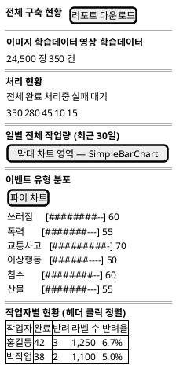

**입출력 항목**

| 항목명 | 컨트롤명 | 타입 및 길이 | 속성 | Validation Check |
|---|---|---|---|---|
| 누적 이미지 수 | 카드 | int | O | - |
| 누적 영상 수 | 카드 | int | O | - |
| 처리 현황 5카드 | 카드 그리드 | int x5 | O | 전체/완료/처리중/실패/대기 |
| 일별 작업량 | SimpleBarChart | - | O | 최근 30일 |
| 이벤트 분포 | SimplePieChart + 가로막대 | - | O | 6종 고정 슬롯 |
| 작업자별 현황 | WorkerStatsTable | - | O | 컬럼 헤더 클릭 정렬 |
| 리포트 다운로드 | Button | - | I | GET /v1/stats/report?type=MONTH → CSV |

**처리 내용**

`GET /v1/stats/overall` → 각 섹션 렌더. 다운로드: `downloadReport('MONTH')` → Blob → `<a>` 자동 클릭.

**기술적 고려사항**

이벤트 분포는 6종 고정 슬롯으로 데이터 누락 시에도 6개 항목 렌더. 파일명은 고정 prefix + ISO 날짜(사용자 입력 미반영).

---

### 3.18 KLID-AT-SC-018 증강 요청(AugmentRequest)

<table>
<tr><td>화면 ID</td><td>KLID-AT-SC-018</td><td>화면명</td><td>증강 요청</td></tr>
<tr><td>관련 유스케이스 ID</td><td colspan="3">KLID-AT-UC-011</td></tr>
<tr><td>관련 시퀀스도 ID</td><td colspan="3">KLID-AT-SD-008</td></tr>
<tr><td>화면유형</td><td>입력</td><td>메뉴경로</td><td>`/augment`</td></tr>
<tr><td>화면개요</td><td colspan="3">검수 완료(승인) 영상에 4종 증강(겨울/야간/비/해상도)을 요청. 2단계: 유형 선택 → 영상 선택 + 최근 이력 잡 카드.</td></tr>
</table>

**화면 레이아웃**

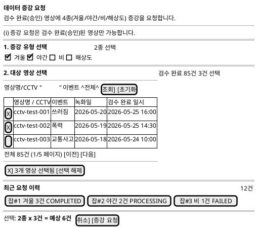

**입출력 항목**

| 항목명 | 컨트롤명 | 타입 및 길이 | 속성 | Validation Check |
|---|---|---|---|---|
| 증강 유형 카드 | AugmentTypeCard x4 | enum | I/E | WINTER/NIGHT/RAIN/RESOLUTION |
| 영상 검색 | Input + Select | String | I/E | 영상명/CCTV/ID + 이벤트 필터 |
| 영상 테이블 | DataTable | - | I/O | 체크박스 다중 선택 |
| 최근 이력 | JobCard x6 | - | O | jobId/유형/건수/상태 |
| 증강 요청 | Button | - | I | POST `/v1/augments/request` |

**처리 내용**

영상 목록: `GET /v1/videos?dataSttsCd=COMPLETED&reviewStatusCd=APPROVED&page=&size=20`. 증강 요청: `POST /v1/augments/request { videoIds, types }`. 성공 시 → `/augment/result/{jobId}`.

**기술적 고려사항**

REVIEWER만 진입. videoIds는 number[]로 변환. types는 enum allowlist 강제.

---

### 3.19 KLID-AT-SC-019 증강 결과(AugmentResult)

<table>
<tr><td>화면 ID</td><td>KLID-AT-SC-019</td><td>화면명</td><td>증강 결과(AugmentResult)</td></tr>
<tr><td>관련 유스케이스 ID</td><td colspan="3">KLID-AT-UC-011</td></tr>
<tr><td>관련 시퀀스도 ID</td><td colspan="3">KLID-AT-SD-008</td></tr>
<tr><td>화면유형</td><td>조회·갱신</td><td>메뉴경로</td><td>`/augment/result/:jobId`</td></tr>
<tr><td>화면개요</td><td colspan="3">데이터 증강 작업 결과 확인. 작업 요약 카드 + 라벨 무결성 + 영상별 증강 유형 탭 + 프레임 그리드 + 좌우 비교 + 채택/거부.</td></tr>
</table>

**화면 레이아웃**

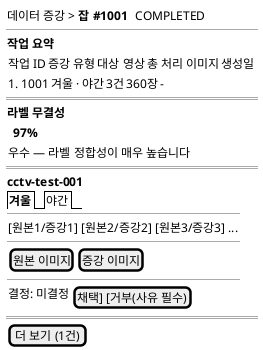

**입출력 항목**

| 항목명 | 컨트롤명 | 타입 및 길이 | 속성 | Validation Check |
|---|---|---|---|---|
| 작업 요약 | dl 필드 | - | O | jobId/증강유형/영상수/이미지수 |
| 라벨 무결성 | text(%) | float | O | 95%+ 녹색/85%+ 노란색/미만 빨간색 |
| 진행률 바 | ProgressBar | int | O | COMPLETED가 아닐 때만 노출 |
| 영상별 섹션 | VideoSection | - | O | 2건 초과 시 "더 보기" 버튼 |
| 증강 유형 탭 | Tabs | enum | I/E | 영상 내 증강 유형별 탭 |
| 프레임 그리드 | FrameGrid12 | - | O | 원본/증강 이미지 쌍 |
| 좌우 비교 | SideBySideCompare | - | I/O | 원본/증강 |
| 채택 | Button | - | I | POST `/v1/augments/{id}/accept` |
| 거부 | Button(+사유) | - | I | POST `/v1/augments/{id}/reject` |

**처리 내용**

`GET /v1/augments/result/{jobId}` → 영상별 그룹핑 → 섹션 렌더. 채택/거부 각각 mutation 후 성공 토스트.

**기술적 고려사항**

jobId는 number 검증. 이미지 URL은 BE 응답값만 사용. 결과 비어있으면 PROCESSING, 무결성 0이면 FAILED로 status 파생.

---

### 3.20 KLID-AT-SC-020 사용자 관리(UserManage)

<table>
<tr><td>화면 ID</td><td>KLID-AT-SC-020</td><td>화면명</td><td>사용자 관리(UserManage)</td></tr>
<tr><td>관련 유스케이스 ID</td><td colspan="3">-</td></tr>
<tr><td>관련 시퀀스도 ID</td><td colspan="3">-</td></tr>
<tr><td>화면유형</td><td>조회·갱신</td><td>메뉴경로</td><td>`/manage/users` (REVIEWER 전용)</td></tr>
<tr><td>화면개요</td><td colspan="3">시스템 사용자 목록 조회·관리. 검색, 역할·상태 필터, 활성/비활성 토글, 역할 변경.</td></tr>
</table>

**화면 레이아웃**

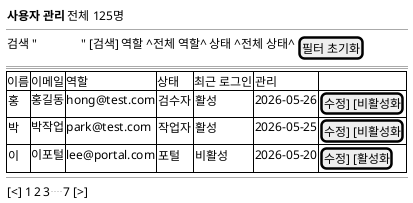

**입출력 항목**

| 항목명 | 컨트롤명 | 타입 및 길이 | 속성 | Validation Check |
|---|---|---|---|---|
| 검색어 | Input text | String | I/E | Enter 키로도 검색 |
| 역할 필터 | Select | enum | I/E | 전체/검수자/작업자/포털 |
| 상태 필터 | Select | enum | I/E | 전체/활성/비활성 |
| DataTable | 각종 컬럼 | - | O | 이름(아바타)/이메일/역할(컬러배지)/상태/최근로그인/관리 |
| 수정 | Button(ghost) | - | I | 역할·상태 수정 Modal 오픈 |
| 활성화/비활성화 | Button(ghost) | - | I | ConfirmDialog 경유 후 PATCH |
| [수정 Modal] 역할 | Select | enum | I/E | REVIEWER/WORKER/PORTAL_USER |
| [수정 Modal] 상태 | Select | enum | I/E | 활성/비활성 |

**처리 내용**

`GET /v1/users?keyword=&page=&size=` → DataTable. PATCH `/v1/users/{userNo} { useYn, role }` → 캐시 무효화 + 성공 토스트.

**기술적 고려사항**

useYn/role은 TypeScript 리터럴 유니온 + BE @Pattern 화이트리스트 이중 검증. 역할·상태 필터는 클라이언트 사이드 추가 필터.

---

### 3.21 KLID-AT-SC-021 시스템 설정(SystemSettings)

<table>
<tr><td>화면 ID</td><td>KLID-AT-SC-021</td><td>화면명</td><td>시스템 설정(SystemSettings)</td></tr>
<tr><td>관련 유스케이스 ID</td><td colspan="3">-</td></tr>
<tr><td>관련 시퀀스도 ID</td><td colspan="3">-</td></tr>
<tr><td>화면유형</td><td>조회·갱신</td><td>메뉴경로</td><td>`/manage/settings` (REVIEWER 전용)</td></tr>
<tr><td>화면개요</td><td colspan="3">시스템 설정을 3개 영역으로 구분: 편집 가능(FFmpeg/Batch/YOLO), 실시간 모니터링(Health), 위험 액션(placeholder).</td></tr>
</table>

**화면 레이아웃**

```plantuml
@startsalt
{
  { <b>시스템 설정 }
  { FFmpeg/배치 파라미터 · 외부 연동 헬스 · 위험 구역 }
  ==
  {
    <b>편집 가능 — DB 영속화
    {
      {
        <b>FFmpeg 설정
        프레임 간격: "30    "
        출력 포맷:   "jpg   "
        [저장]
      }
      |
      {
        <b>배치 설정
        동시 처리 수: "3     "
        타임아웃(초): "300   "
        [저장]
      }
    }
    {
      {
        <b>YOLO 설정
        신뢰도 임계: "0.5   "
        모델 경로:   "/models/yolo"
        [저장]
      }
    }
  }
  ==
  {
    <b>실시간 모니터링 (5초 폴링)
    {#
      서비스       | 상태   | 응답시간
      AI Server    | {UP}   | 45ms
      Gitea        | {UP}   | 120ms
      Deidentify   | {DOWN} | timeout
    }
  }
  ==
  {
    <b>위험 액션
    { [시스템 초기화 (placeholder)] }
  }
}
@endsalt
```

**입출력 항목**

| 항목명 | 컨트롤명 | 타입 및 길이 | 속성 | Validation Check |
|---|---|---|---|---|
| FFmpeg 설정 | FFmpegConfigCard | - | I/E | 독립 저장 PATCH /v1/sysconfig/ffmpeg |
| 배치 설정 | BatchConfigCard | - | I/E | 독립 저장 PATCH /v1/sysconfig/batch |
| YOLO 설정 | YoloConfigCard | - | I/E | 독립 저장 PATCH /v1/sysconfig/yolo |
| 헬스 상태 | HealthStatusList | - | O | 5초 폴링. read-only |
| 위험 액션 | DangerActions | - | I | placeholder. 확인 절차 필수 |

**처리 내용**

`GET /v1/sysconfig` → 카드 초기값 주입. 각 카드 독립 저장(PATCH). HealthStatusList는 `GET /v1/health/services` 5초 폴링.

**기술적 고려사항**

REVIEWER만 진입(RoleGuard). 각 설정 카드는 독립 저장으로 의도치 않은 일괄 덮어쓰기 방지.

---

### 3.22 KLID-AT-SC-022 라벨 프리셋(PresetList)

<table>
<tr><td>화면 ID</td><td>KLID-AT-SC-022</td><td>화면명</td><td>라벨 프리셋</td></tr>
<tr><td>관련 유스케이스 ID</td><td colspan="3">KLID-AT-UC-007</td></tr>
<tr><td>관련 시퀀스도 ID</td><td colspan="3">-</td></tr>
<tr><td>화면유형</td><td>입력·갱신·삭제</td><td>메뉴경로</td><td>`/manage/presets`</td></tr>
<tr><td>화면개요</td><td colspan="3">라벨 코드 프리셋 관리. 2열 카드 그리드 + 클라이언트 페이지네이션. CRUD + 이벤트 타입 매핑.</td></tr>
</table>

**화면 레이아웃**

```plantuml
@startsalt
{
  { <b>프리셋 관리 | 전체 12개 | . | [+ 프리셋 추가] }
  ==
  {
    {
      <b>사람 기본 | {쓰러짐}
      { {person} {face} {body} } 3개
      생성: 2026-05-20 | 수정: 2026-05-25
      [수정] [삭제]
    }
    |
    {
      <b>차량 기본 | {교통사고}
      { {car} {truck} {bus} {plate} } 4개
      생성: 2026-05-18 | 수정: 2026-05-24
      [수정] [삭제]
    }
  }
  {
    {
      <b>자연재해 | {침수}
      { {water} {debris} } 2개
      생성: 2026-05-15 | 수정: 2026-05-22
      [수정] [삭제]
    }
    |
    {
      <b>화재 | {산불}
      { {fire} {smoke} } 2개
      생성: 2026-05-12 | 수정: 2026-05-20
      [수정] [삭제]
    }
  }
  --
  { [<] 1 | 2 [>] }
}
@endsalt
```

**입출력 항목**

| 항목명 | 컨트롤명 | 타입 및 길이 | 속성 | Validation Check |
|---|---|---|---|---|
| 프리셋 카드 그리드 | Card Grid | - | O | 이름·이벤트타입·라벨코드·생성/수정일 |
| 프리셋 추가 | Button | - | I | 빈 프리셋 생성 |
| 이벤트 타입 | Select | enum | I/E | 1:1 매핑 검증(중복 시 409) |
| 라벨 코드 | Chip[] | string[] | I/E | 최대 6종 |
| 수정 | Button(ghost) | - | I | PresetEditModal 오픈 |
| 삭제 | Button(ghost) | - | I | ConfirmDialog 경유 |

**처리 내용**

`GET /v1/manage/presets` → 카드 그리드. `POST /v1/manage/presets` → 추가. `PUT /v1/manage/presets/{id}` → 수정. `DELETE /v1/manage/presets/{id}` → 삭제. 409 CONFLICT(이벤트 중복) 시 BE 메시지 표시.

**기술적 고려사항**

라벨 항목 최대 6종 제한(zod presetSchema). 클라이언트 페이지네이션(10건/페이지).

---

### 3.23 KLID-AT-SC-023 포털 홈(PortalHome)

<table>
<tr><td>화면 ID</td><td>KLID-AT-SC-023</td><td>화면명</td><td>포털 홈</td></tr>
<tr><td>관련 유스케이스 ID</td><td colspan="3">KLID-AT-UC-012</td></tr>
<tr><td>관련 시퀀스도 ID</td><td colspan="3">KLID-AT-SD-009</td></tr>
<tr><td>화면유형</td><td>조회·입력</td><td>메뉴경로</td><td>`/portal`</td></tr>
<tr><td>화면개요</td><td colspan="3">포털 메인 페이지. Hero 섹션 + KPI 2 + 2단계 카드(업로드/라벨링) + 내 업로드 목록. TUS 재개 업로드 지원.</td></tr>
</table>

**화면 레이아웃**

```plantuml
@startsalt
{
  {SI
    <b>AI 학습데이터 작성 포털
    영상/이미지 업로드, 간편 라벨링, 오토라벨링 체험
  }
  ==
  {
    { 업로드 수  | 라벨링 완료 }
    { <b>12건    | <b>8건     }
  }
  ==
  {
    {
      <b>1. 업로드
      영상 또는 이미지를 업로드하세요
      ---
      [ 파일을 드래그하거나 클릭하여 선택 ]
      ---
      파일명.mp4 [####------] 45%
      [일시정지] [취소]
    }
    |
    {
      <b>2. 라벨링
      업로드한 데이터에 라벨을 추가하세요
      라벨링 필요 <b>4건
      ---
      [시작하기 >]
    }
  }
  ==
  {
    <b>내 업로드
    {#
      파일명      | 상태              | 업로드일
      video01.mp4 | AUTOLABEL_DONE    | 2026-05-26
      video02.mp4 | COMPLETED         | 2026-05-25
      video03.mov | AUTOLABEL_PENDING | 2026-05-24
    }
  }
}
@endsalt
```

**입출력 항목**

| 항목명 | 컨트롤명 | 타입 및 길이 | 속성 | Validation Check |
|---|---|---|---|---|
| KPI 카드 | KpiCard x2 | int | O | 업로드 수/라벨링 완료 |
| TUS 업로드 | UploadDropzone | file | I | <=5GB, mp4/mov/avi |
| 업로드 진행 | UploadProgressItem | - | O | 상태/진행률/일시정지/재개/취소 |
| 라벨링 시작 | Button | - | I | → `/portal/label/{srcSn}` |
| 내 업로드 목록 | MyUploadList | - | O | 파일명/상태/업로드일 |

**처리 내용**

`GET /v1/portal/uploads` → 내 업로드 목록. TUS: `OPTIONS/POST /v1/portal/uploads` (Tus 프로토콜). 라벨링 진입: 첫 번째 미완료 건 srcSn으로 이동.

**기술적 고려사항**

TUS(Tus.io) 청크 업로드. 1MB 단위 chunk + 재개 가능. 모바일 친화(PortalLayout). 사용자 작업 데이터는 `LS_PORTAL_USER_LABEL`에 별도 적재(원본 미수정).

---

### 3.24 KLID-AT-SC-024 포털 라벨링(PortalLabeling)

<table>
<tr><td>화면 ID</td><td>KLID-AT-SC-024</td><td>화면명</td><td>포털 간편 라벨링</td></tr>
<tr><td>관련 유스케이스 ID</td><td colspan="3">KLID-AT-UC-012</td></tr>
<tr><td>관련 시퀀스도 ID</td><td colspan="3">KLID-AT-SD-009</td></tr>
<tr><td>화면유형</td><td>입력·갱신</td><td>메뉴경로</td><td>`/portal/label/{id}`</td></tr>
<tr><td>화면개요</td><td colspan="3">LabelingPage 재사용(포털 모드). 히스토리/검수제출/VLM/메타 탭 미노출. 오토라벨 버튼 추가.</td></tr>
</table>

**화면 레이아웃**

```plantuml
@startsalt
{
  { . | . | [오토라벨(YOLO)] }
  ==
  {SI
    { <b>라벨링 | 포털 모드 | 프레임 1/30 | [저장 Ctrl+S] [X 닫기] }
    ==
    {
      {
        [BBox]
        [Poly]
        [선택]
      }
      |
      {SI
        [   캔버스 영역 (포털용 간소화)   ]
      }
      |
      {
        <b>객체 목록
        ---
        person-1
        car-1
        ===
        <b>속성
        ---
        라벨: ^person^
      }
    }
    ==
    { [프레임 스트립: 1 | 2 | ... | 30] }
  }
}
@endsalt
```

**입출력 항목**

| 항목명 | 컨트롤명 | 타입 및 길이 | 속성 | Validation Check |
|---|---|---|---|---|
| 본인 영상 캔버스 | LabelCanvas | - | I/O/E | 소유자 검증 통과만 |
| 오토라벨 | Button | - | I | POST `/v1/portal/autolabel` (YOLO) |
| 라벨 수락 | Button | - | I | POST `/v1/portal/labels` |
| 메뉴 단순화 | - | - | - | 검수/버전/메타 노출 X |

**처리 내용**

LabelingPage 재사용. 포털 채널은 `useAuthStore.channel='PORTAL'`에서 자동 분기. 오토라벨: POST → 결과 반영 후 key 갱신으로 리렌더.

**기술적 고려사항**

모바일 친화 — `PortalLayout` 사용, 768px 이하 단축키 미표시, 캔버스 핀치 줌 지원.

---

### 3.25 KLID-AT-SC-025 작업 배정(TaskAssign)

<table>
<tr><td>화면 ID</td><td>KLID-AT-SC-025</td><td>화면명</td><td>작업 배정(TaskAssign)</td></tr>
<tr><td>관련 유스케이스 ID</td><td colspan="3">KLID-AT-UC-008</td></tr>
<tr><td>관련 시퀀스도 ID</td><td colspan="3">KLID-AT-SD-005</td></tr>
<tr><td>화면유형</td><td>조회·입력·갱신</td><td>메뉴경로</td><td>`/task/assign` (REVIEWER 전용)</td></tr>
<tr><td>화면개요</td><td colspan="3">KLID-AT-SC-007(TaskList)의 REVIEWER 시각과 동일. 별도 라우트로 진입하는 작업 배정 전용 화면(Placeholder — Phase 4+).</td></tr>
</table>

**화면 레이아웃**

```plantuml
@startsalt
{
  { <b>작업 배정 (REVIEWER 전용) }
  --
  {SI
    이 화면은 TaskListPage의 REVIEWER 시각과 동일합니다.
    /task 에서 REVIEWER로 로그인하면
    동일한 배정·재배정·일괄배정 기능을 사용할 수 있습니다.
    ---
    KLID-AT-SC-007 참조
  }
}
@endsalt
```

**입출력 항목**

KLID-AT-SC-007(TaskList) REVIEWER 시각과 동일. 상세 항목은 3.7절 참조.

**처리 내용**

KLID-AT-SC-007과 동일한 API 호출 (`GET /v1/tasks/board`, `POST /v1/assignments`, `PATCH /v1/assignments/{id}`).

**기술적 고려사항**

현재 Placeholder 상태. TaskListPage의 REVIEWER 시각으로 통합 운영 가능.

---

### 3.26 KLID-AT-SC-026 개발자 오토라벨 테스트(DevAutolabelTest)

<table>
<tr><td>화면 ID</td><td>KLID-AT-SC-026</td><td>화면명</td><td>영상 업로드(DevAutolabelTest)</td></tr>
<tr><td>관련 유스케이스 ID</td><td colspan="3">-</td></tr>
<tr><td>관련 시퀀스도 ID</td><td colspan="3">-</td></tr>
<tr><td>화면유형</td><td>입력</td><td>메뉴경로</td><td>`/dev/autolabel-test` (REVIEWER 전용, 개발/검수용)</td></tr>
<tr><td>화면개요</td><td colspan="3">영상 파일과 메타데이터를 입력하여 배치 파이프라인을 수동 실행하는 개발/검수 전용 화면. 실행 후 2초 폴링으로 파이프라인 진행 상황 가시화.</td></tr>
</table>

**화면 레이아웃**

```plantuml
@startsalt
{
  { <b>영상 업로드 (개발/검수 전용) }
  ==
  {
    영상 파일    [파일 선택] (mp4/webm/mov/avi, 500MB)
    ---
    VMS Clip ID  "clip-test-001      "
    CCTV ID      "cctv-001           "
    이벤트       ^쓰러짐 (FALL)^
    지자체코드   "11680              "
    ---
    개인정보 유형
    (X) ANONY (비식별 대상 아님)
    ( ) PRVC (개인정보 포함)
    ( ) PSDO (가명 정보)
    ---
    녹화 시각    "2026-05-26T14:00   "
    ---
    실행 단계 선택
    [X] 프레임 추출 [X] 비식별 [X] YOLO [X] SAM2
    ---
    { [초기화] [실행] }
  }
  ==
  {
    <b>실행 결과
    rawSn: {#9001} | 상태: PROCESSING...
    파일 경로: /storage/raw/9001.mp4
    프레임 수: 120 | 트리거: 2026-05-26 14:05
    ---
    단계별 상태:
    { FRAME: COMPLETED | DEID: IN_PROGRESS | YOLO: PENDING | SAM2: PENDING }
    ---
    [영상 상세 보기 >]
  }
}
@endsalt
```

**입출력 항목**

| 항목명 | 컨트롤명 | 타입 및 길이 | 속성 | Validation Check |
|---|---|---|---|---|
| 영상 파일 | input[file] | File | I | 필수. accept: mp4/webm/mov/avi. 최대 500MB |
| vmsClipId | Input text | String(1~64) | I | 필수. 영문/숫자/-/_ |
| cctvId | Input text | String | I | 필수 |
| eventTypeCd | Select | enum | I | 필수. 6종 |
| localGovCd | Input text | String(1~10) | I | 필수. 숫자만. 기본 11680 |
| prvcTypeCd | Radio | enum | I | 필수. ANONY/PRVC/PSDO |
| capturedAt | input[datetime-local] | datetime | I | 필수 |
| 실행 단계 선택 | checkbox x4 | bool | I/E | 기본 모두 ON |
| 실행 | Button(submit) | - | I | 필수 항목 미입력 시 disabled |
| [결과] rawSn | Badge | int | O | 제출 성공 후 표시 |
| [결과] 파이프라인 상태 | text + Spinner | String | O | COMPLETED/FAILED 도달 전까지 폴링 |
| [결과] 단계별 상태 | Badge 목록 | - | O | name·status·progress(%) |
| [결과] 영상 상세 보기 | Link | - | I | → `/video/{rawSn}` |

**처리 내용**

`POST /api/v1/dev/autolabel-test` (multipart: file + meta JSON) → `{ rawSn, savedFilePath, pipelineStatus, startedAt }`. 이후 `GET /v1/videos/{rawSn}` 2초 폴링 → stages 표시. COMPLETED/FAILED 도달 시 폴링 중단.

**기술적 고려사항**

file input accept로 확장자 1차 가드, BE가 본 검증. 사용자 입력 `console.log` 금지. durationSec은 BE ffprobe 자동 추출(1~7200초 검증).

---

### 3.27 KLID-AT-SC-027 마킹(Marking)

<table>
<tr><td>화면 ID</td><td>KLID-AT-SC-027</td><td>화면명</td><td>마킹(Marking)</td></tr>
<tr><td>관련 유스케이스 ID</td><td colspan="3">KLID-AT-UC-001</td></tr>
<tr><td>관련 시퀀스도 ID</td><td colspan="3">-</td></tr>
<tr><td>화면유형</td><td>입력·갱신·삭제</td><td>메뉴경로</td><td>`/marking/{rawSn}`</td></tr>
<tr><td>화면개요</td><td colspan="3">영상 재생 + 자동/수동 모드로 이벤트 시점 마킹. 수동 모드: Space로 현재 프레임 마킹. 자동 모드: 프레임 간격 기반 마킹. 마킹 결과를 VLM에 콜백으로 전달.</td></tr>
</table>

**화면 레이아웃**

```plantuml
@startsalt
{
  { <b>마킹 — 영상 #9001 }
  ==
  {SI
    [         영상 플레이어 (VideoPlayer)         ]
    [  00:12 / 02:30  [재생] [일시정지]           ]
  }
  ==
  { [마킹 타임라인: |--*----*--*-----------|  ] }
  ==
  {
    모드  (X) 수동 (MANUAL)  ( ) 자동 (AUTO)
    이벤트명 "쓰러짐          "
    간격(초) "10              " (AUTO 전용)
    { [지우기] [제출] }
  }
  ==
  {
    <b>현재 마킹 (3건)
    { {F12 (00:12)} {F45 (00:45)} {F78 (01:18)} }
  }
  ==
  {
    <b>저장된 마킹
    {#
      SN  | 이벤트명 | 모드   | 마크 수 | 액션
      101 | 쓰러짐   | MANUAL | 5       | [삭제]
      102 | 폭력     | AUTO   | 15      | [삭제]
    }
  }
}
@endsalt
```

**입출력 항목**

| 항목명 | 컨트롤명 | 타입 및 길이 | 속성 | Validation Check |
|---|---|---|---|---|
| 영상 플레이어 | VideoPlayer | - | O | /api/v1/videos/{rawSn}/stream |
| 마킹 타임라인 | MarkingTimeline | - | O | 마크 위치 시각화 |
| 모드 선택 | Radio | enum | I | MANUAL/AUTO |
| 이벤트명 | Input text | String | I | 필수. XSS sanitize |
| 간격(초) | Input number | int | I/E | AUTO 모드 전용. 기본 10 |
| 마크 추가 | 키보드(Space) | - | I | MANUAL 모드에서 현재 프레임 추가 |
| 마크 삭제 | 키보드(Delete) | - | I | 선택된 마크 삭제 |
| 제출 | Button / Enter | - | I | POST /v1/markings |
| 현재 마킹 | Chip 목록 | - | O | frameIndex + timestamp 표시 |
| 저장된 마킹 목록 | MarkingList | - | O | SN/이벤트명/모드/마크수/삭제 |

**처리 내용**

- MANUAL: 사용자가 Space 키로 현재 프레임 마크 → 제출 시 `POST /v1/markings { eventName, markingMode: 'MANUAL', marks: [...] }`
- AUTO: 프레임 간격 기반 → 제출 시 `POST /v1/markings { eventName, markingMode: 'AUTO', intervalSec }`
- 저장된 마킹 삭제: `DELETE /v1/markings/{sn}`
- 마킹 완료 후 배치 파이프라인에서 VLM 콜백으로 시계열 결과 수신

**기술적 고려사항**

단축키: Space(마크 추가), Delete(마크 삭제), Enter(제출). input/textarea/select 포커스 시 단축키 비활성. rawSn number 검증.

---

## 부록 — 화면-API 매핑 요약

| 화면 ID | 주요 호출 API |
|---|---|
| KLID-AT-SC-001 | (브라우저 스토리지 읽기 — JWT 인계) |
| KLID-AT-SC-002 | POST /v1/auth/role-claim |
| KLID-AT-SC-003 | GET /v1/stats/summary, GET /v1/videos, GET /v1/tasks/board |
| KLID-AT-SC-004 | GET /v1/videos |
| KLID-AT-SC-005 | GET /v1/batch/status |
| KLID-AT-SC-006 | GET /v1/videos/{id}, GET /v1/videos/{id}/labels/auto |
| KLID-AT-SC-007 | GET /v1/tasks/board, POST /v1/assignments, PATCH /v1/assignments/{id} |
| KLID-AT-SC-008 | GET·PUT /v1/frames/{srcSn}/labels, POST /v1/frames/{srcSn}/sam2-track |
| KLID-AT-SC-009 | GET /v1/videos/{videoId}/auto-summary |
| KLID-AT-SC-010 | GET·PUT /v1/frames/{srcSn}/meta |
| KLID-AT-SC-011 | GET /v1/deident, POST /v1/deident/{videoId}/reprocess |
| KLID-AT-SC-012 | GET /v1/deident/{videoId}/detail |
| KLID-AT-SC-013 | GET /v1/reviews |
| KLID-AT-SC-014 | GET /v1/reviews/{id}, POST approve/reject/start |
| KLID-AT-SC-015 | GET /v1/videos/{videoId}/versions, GET /v1/versions/{commit}/diff |
| KLID-AT-SC-016 | GET /v1/stats/workers/{workerId}, GET /v1/users?role=WORKER |
| KLID-AT-SC-017 | GET /v1/stats/overall, GET /v1/stats/report?type=MONTH |
| KLID-AT-SC-018 | GET /v1/videos, POST /v1/augments/request |
| KLID-AT-SC-019 | GET /v1/augments/result/{jobId}, POST /v1/augments/{id}/accept\|reject |
| KLID-AT-SC-020 | GET /v1/users, PATCH /v1/users/{userNo} |
| KLID-AT-SC-021 | GET /v1/sysconfig, PATCH /v1/sysconfig/*, GET /v1/health/services |
| KLID-AT-SC-022 | GET·POST·PUT·DELETE /v1/manage/presets |
| KLID-AT-SC-023 | GET /v1/portal/uploads, OPTIONS·POST /v1/portal/uploads (TUS) |
| KLID-AT-SC-024 | POST /v1/portal/autolabel, POST /v1/portal/labels |
| KLID-AT-SC-025 | (KLID-AT-SC-007 REVIEWER 시각과 동일) |
| KLID-AT-SC-026 | POST /api/v1/dev/autolabel-test, GET /v1/videos/{rawSn} |
| KLID-AT-SC-027 | GET /v1/markings, POST /v1/markings, DELETE /v1/markings/{sn} |
