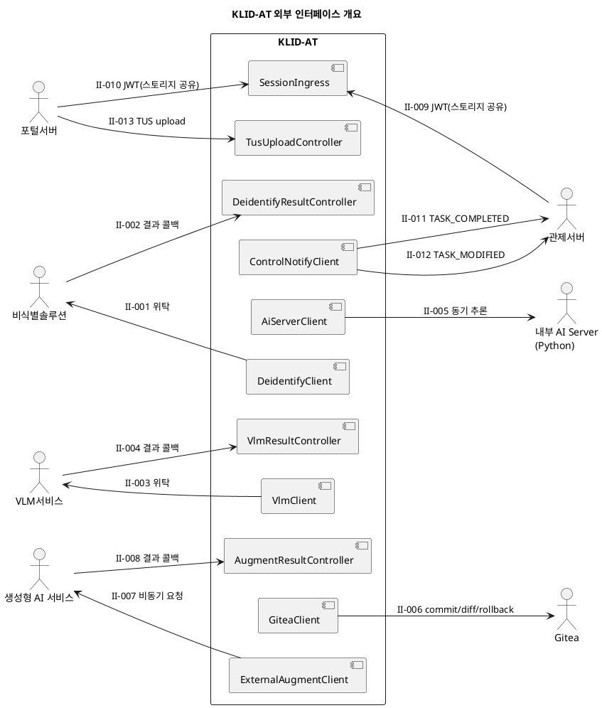

# D4. 인터페이스 설계서

## ▣ 제·개정 이력

| 날짜 | 버전 | 작성자 | 승인자 | 내용 |
|------|------|--------|--------|------|
| 2026-05-21 | 1.0 | 박찬기 | - | 최초 작성 — 외부 시스템 연동 인터페이스 위주 |
| 2026-05-27 | 1.1 | 박찬기 | - | CBD 양식 변환, 전체 14건 인터페이스 반영 |

---

| D4 | 인터페이스 설계서 |
|-------|-----------|
| 시스템명 | 기반 지방정부 관제지원시스템 구축(2차) AI CCTV | 서브시스템명 | AI CCTV 학습데이터 저작도구 (KLID-AT-SS-001) |
| 단계명 | 설계 | 작성일자 | 2026-05-27 | 버전 | 1.1 |

> 본 산출물은 본 도구와 **외부 시스템** 간의 인터페이스(Outbound 위탁 + Inbound 결과 수신 + 인증 토큰 + 통지) 14건을 정의한다. 내부 컴포넌트 간 인터페이스(`IxxxService`)는 D3 컴포넌트설계서 4장 참조.

---

## 1. 인터페이스 목록

| 인터페이스번호 | 송신 일련번호 | 송신 시스템명 | 송신 프로그램 ID | 전달 처리형태 | 전달 인터페이스방식 | 전달 발생빈도 | 수신 상대 담당자 | 수신 프로그램 ID | 수신시스템명 | 수신 일련번호 | 관련 요구사항 ID | 비고 |
|---------|---------|---------|-----------|---------|-----------|---------|----------|-----------|--------|---------|------------|------|
| KLID-AT-II-001 | 1 | KLID-AT (BatchOrchestrator) | DeidentifyClient | Online(Async) | HTTPS REST | 1/영상당 | 비식별솔루션 운영팀 | DeidentSolution.submit | 비식별솔루션 | 1 | RQ-SFR-09-01 | Idempotency-Key 발급 |
| KLID-AT-II-002 | 1 | 비식별솔루션 | DeidentSolution.callback | Online(Async) | HTTPS REST + HMAC | 1/영상당 | KLID-AT 운영팀 | DeidentifyResultController | KLID-AT | 1 | RQ-SFR-09-01 | 결과 콜백 |
| KLID-AT-II-003 | 1 | KLID-AT (MarkingService) | VlmClient | Online(Async, Callback) | HTTPS REST | 1/마킹당 | VLM서비스 운영팀 | VlmService.submitTimeseries | VLM서비스 | 1 | RQ-SFR-03-02 | V2.0: 마킹 기반 콜백 비동기 |
| KLID-AT-II-004 | 1 | VLM서비스 | VlmService.callback | Online(Async) | HTTPS REST + HMAC | 1/영상당 | KLID-AT 운영팀 | VlmResultController | KLID-AT | 1 | RQ-SFR-03-02 | 결과 콜백 |
| KLID-AT-II-005 | 1 | KLID-AT (Batch/Sam2Track) | AiServerClient | Online(Sync) | HTTPS REST | 1/프레임 | 내부 운영팀 | ai-server (YOLO/SAM2) | AI Server | 1 | RQ-SFR-08-01 | 내부 동기 |
| KLID-AT-II-006 | 1 | KLID-AT (VersionService) | GiteaClient | Online(Sync) | HTTPS REST | 1/라벨 저장 | DevOps | Gitea Server | Gitea | 1 | RQ-SFR-08-02 | CALL_TIMEOUT 60s |
| KLID-AT-II-007 | 1 | KLID-AT (AugmentRequestService) | ExternalAugmentClient | Online(Async) | HTTPS REST | 검수완료 영상별 | 생성형AI 운영팀 | AugmentService.submit | 생성형 AI 서비스 | 1 | RQ-SFR-07-01 | 요청 ID 발급 |
| KLID-AT-II-008 | 1 | 생성형 AI 서비스 | AugmentService.callback | Online(Async) | HTTPS REST + HMAC | 검수완료 영상별 | KLID-AT 운영팀 | AugmentResultController | KLID-AT | 1 | RQ-SFR-07-01 | 결과 콜백 |
| KLID-AT-II-009 | 1 | 관제서버 | ControlServer.issueJwt | Online | 동일 도메인 브라우저 스토리지 공유 + JWT(HS256) | 세션당 1 | 관제서버 운영팀 | JwtAuthenticationFilter | KLID-AT | 1 | RQ-SFR-09-02 | INTERNAL 채널, 동일 도메인 |
| KLID-AT-II-010 | 1 | 포털서버 | PortalServer.issueJwt | Online | HTTPS Redirect + JWT(HS256) | 세션당 1 | 포털서버 운영팀 | SessionIngressPage → JwtAuthenticationFilter | KLID-AT | 1 | RQ-SFR-15-07 | PORTAL 채널 |
| KLID-AT-II-011 | 1 | KLID-AT (ControlNotifyClient) | notifyTaskCompleted | Online(Async) | HTTPS REST + Idempotency | 검수승인 시마다 | 관제서버 운영팀 | ControlServer./tasks/{rawSn}/completed | 관제서버 | 1 | RQ-SFR-08-03 | |
| KLID-AT-II-012 | 1 | KLID-AT (ControlNotifyClient) | notifyTaskModified | Online(Async, Debounced) | HTTPS REST + Idempotency | 60s 윈도우당 최대 1회 | 관제서버 운영팀 | ControlServer./tasks/{rawSn}/modified | 관제서버 | 1 | RQ-SFR-08-03 | 수정 요약만, 관제가 조회 |
| KLID-AT-II-013 | 1 | 포털사용자 | PortalUploader (TUS client) | Online | HTTPS + TUS Protocol | 영상 업로드 시 | KLID-AT 운영팀 | TusUploadController | KLID-AT | 1 | RQ-SFR-15-07 | 1MB chunk |
| KLID-AT-II-014 | 1 | KLID-AT (RoleClaim) | (내부) | Online | DB | 신규 로그인 1회 | - | RoleClaimService | KLID-AT | 1 | RQ-SFR-09-02 | 내부 |

---

## 2. 인터페이스 명세

### 2.1 KLID-AT-II-001  비식별 처리 위탁 (Outbound)

| 인터페이스번호 | KLID-AT-II-001 | 시스템명 | KLID-AT → 비식별솔루션 |
|---------|---|-------|---|

| **데이터송신시스템** | | | | | **데이터수신시스템** | | | | |
|---|---|---|---|---|---|---|---|---|---|
| 데이터 저장소명 | 속성명 | 데이터타입 | 길이 | 송신 프로그램 ID | 데이터 저장소명 | 속성명 | 데이터타입 | 길이 | 수신 프로그램 ID |
| DeidentifyRequest | rawVideoUrl | String | 1024 | DeidentifyClient.deidentify | (외부 처리큐) | sourceUrl | String | 1024 | POST /api/v1/deidentify |
| DeidentifyRequest | callbackUrl | String | 1024 | | | callbackUrl | String | 1024 | |
| DeidentifyRequest | requestId | UUID | 36 | | | requestId (Idempotency-Key) | UUID | 36 | |
| DeidentifyRequest | options.blurFace | boolean | 1 | | | options.blurFace | boolean | 1 | |
| DeidentifyRequest | options.blurPlate | boolean | 1 | | | options.blurPlate | boolean | 1 | |
| DeidentifyRequest | options.strength | int | 4 | | | options.strength | int | 4 | |

---

### 2.2 KLID-AT-II-002  비식별 결과 수신 (Inbound)

| 인터페이스번호 | KLID-AT-II-002 | 시스템명 | 비식별솔루션 → KLID-AT |
|---------|---|-------|---|

> 인증: HMAC-SHA256 (X-Signature), 멱등성: Idempotency-Key (requestId)

| **데이터송신시스템** | | | | | **데이터수신시스템** | | | | |
|---|---|---|---|---|---|---|---|---|---|
| 데이터 저장소명 | 속성명 | 데이터타입 | 길이 | 송신 프로그램 ID | 데이터 저장소명 | 속성명 | 데이터타입 | 길이 | 수신 프로그램 ID |
| (외부 콜백) | requestId | UUID | 36 | DeidentSolution.callback | DeidentifyResultRequest | requestId | String | 36 | DeidentifyResultController.handle |
| | status | enum | 16 | | | status | String | 16 | |
| | deidVideoUrl | String | 1024 | | | deidVideoUrl | String | 1024 | |
| | occurredAt | ISO-8601 | 32 | | | occurredAt | OffsetDateTime | - | |
| | error.code | String | 64 | | | error.code | String | 64 | |
| | error.message | String | 512 | | | error.message | String | 512 | |

---

### 2.3 KLID-AT-II-003  VLM 시계열 분석 위탁 (Outbound)

| 인터페이스번호 | KLID-AT-II-003 | 시스템명 | KLID-AT → VLM서비스 |
|---------|---|-------|---|

| **데이터송신시스템** | | | | | **데이터수신시스템** | | | | |
|---|---|---|---|---|---|---|---|---|---|
| 데이터 저장소명 | 속성명 | 데이터타입 | 길이 | 송신 프로그램 ID | 데이터 저장소명 | 속성명 | 데이터타입 | 길이 | 수신 프로그램 ID |
| VlmTimeseriesRequest | rawSn | long | 19 | VlmClient.submitTimeseries | (VLM 처리큐) | sourceId | string | 32 | POST /api/v1/timeseries |
| | rawVideoUrl | String | 1024 | | | sourceUrl | String | 1024 | |
| | callbackUrl | String | 1024 | | | callbackUrl | String | 1024 | |
| | requestId | UUID | 36 | | | requestId | UUID | 36 | |
| | eventName | String | 100 | | | eventName | String | 100 | V2.0: 마킹 이벤트명 |
| | marks | JSON | - | | | marks | JSON | - | V2.0: [{frameIndex, timestamp}] |

---

### 2.4 KLID-AT-II-004  VLM 시계열 분석 결과 수신 (Inbound)

| 인터페이스번호 | KLID-AT-II-004 | 시스템명 | VLM서비스 → KLID-AT |
|---------|---|-------|---|

> 인증: HMAC-SHA256, 멱등성: Idempotency-Key

| **데이터송신시스템** | | | | | **데이터수신시스템** | | | | |
|---|---|---|---|---|---|---|---|---|---|
| 데이터 저장소명 | 속성명 | 데이터타입 | 길이 | 송신 프로그램 ID | 데이터 저장소명 | 속성명 | 데이터타입 | 길이 | 수신 프로그램 ID |
| (VLM 콜백) | requestId | UUID | 36 | VlmService.callback | VlmResultRequest | requestId | String | 36 | VlmResultController.handle |
| | sourceId / rawSn | long | 19 | | | rawSn | long | 19 | |
| | frames[].frameNo | int | 6 | | | frames[].frameNo | int | 6 | |
| | frames[].caption | String | 2000 | | | frames[].caption | String | 2000 | |
| | frames[].objects[] | Array | - | | | frames[].objects[] | Array | - | |
| | frames[].environment | String | 64 | | | frames[].environment | String | 64 | |
| | occurredAt | ISO-8601 | 32 | | | occurredAt | OffsetDateTime | - | |

---

### 2.5 KLID-AT-II-005  내부 AI 서버 추론 (Outbound, Sync)

| 인터페이스번호 | KLID-AT-II-005 | 시스템명 | KLID-AT → AI Server |
|---------|---|-------|---|

> 방식: 동기 HTTP, CircuitBreaker, Retry / 타임아웃: 30s (운영)

| **데이터송신시스템** | | | | | **데이터수신시스템** | | | | |
|---|---|---|---|---|---|---|---|---|---|
| 데이터 저장소명 | 속성명 | 데이터타입 | 길이 | 송신 프로그램 ID | 데이터 저장소명 | 속성명 | 데이터타입 | 길이 | 수신 프로그램 ID |
| YoloRequest | imageUrl | String | 1024 | AiServerClient.predictYolo | (ai-server) | image_url | String | 1024 | POST /predict/yolo |
| | classFilter[] | String[] | 64 | | | class_filter | String[] | 64 | |
| | confThreshold | float | 4 | | | conf_threshold | float | 4 | |

---

### 2.6 KLID-AT-II-006  Gitea 라벨 커밋 (Outbound, Sync)

| 인터페이스번호 | KLID-AT-II-006 | 시스템명 | KLID-AT → Gitea |
|---------|---|-------|---|

> 인증: Personal Access Token (Bearer) / 타임아웃: 60s (CALL), 70s (BLOCK)

| **데이터송신시스템** | | | | | **데이터수신시스템** | | | | |
|---|---|---|---|---|---|---|---|---|---|
| 데이터 저장소명 | 속성명 | 데이터타입 | 길이 | 송신 프로그램 ID | 데이터 저장소명 | 속성명 | 데이터타입 | 길이 | 수신 프로그램 ID |
| GiteaCommitRequest | repo | String | 100 | GiteaClient.commit | Gitea Repository | repo | String | 100 | Gitea REST API |
| | branch | String | 100 | | | branch | String | 100 | |
| | filePath | String | 256 | | | path | String | 256 | |
| | message | String | 256 | | | message | String | 256 | |
| | content (base64) | String | - | | | content | String | - | |
| | author.name | String | 100 | | | author.name | String | 100 | |
| | author.email | String | 100 | | | author.email | String | 100 | |

---

### 2.7 KLID-AT-II-007  증강 비동기 요청 (Outbound)

| 인터페이스번호 | KLID-AT-II-007 | 시스템명 | KLID-AT → 생성형 AI 서비스 |
|---------|---|-------|---|

| **데이터송신시스템** | | | | | **데이터수신시스템** | | | | |
|---|---|---|---|---|---|---|---|---|---|
| 데이터 저장소명 | 속성명 | 데이터타입 | 길이 | 송신 프로그램 ID | 데이터 저장소명 | 속성명 | 데이터타입 | 길이 | 수신 프로그램 ID |
| AugmentSubmitRequest | jobId | long | 19 | ExternalAugmentClient.submit | (외부 처리큐) | jobId | long | 19 | POST /api/v1/augment |
| | sourceSrcSn[] | long[] | - | | | sources[] | long[] | - | |
| | augmentTypes[] | String[] | 32 | | | augmentTypes[] | String[] | 32 | |
| | callbackUrl | String | 1024 | | | callbackUrl | String | 1024 | |
| | requestId | UUID | 36 | | | requestId (Idempotency-Key) | UUID | 36 | |

---

### 2.8 KLID-AT-II-008  증강 결과 수신 (Inbound)

| 인터페이스번호 | KLID-AT-II-008 | 시스템명 | 생성형 AI 서비스 → KLID-AT |
|---------|---|-------|---|

| **데이터송신시스템** | | | | | **데이터수신시스템** | | | | |
|---|---|---|---|---|---|---|---|---|---|
| 데이터 저장소명 | 속성명 | 데이터타입 | 길이 | 송신 프로그램 ID | 데이터 저장소명 | 속성명 | 데이터타입 | 길이 | 수신 프로그램 ID |
| (외부 콜백) | jobId | long | 19 | AugmentService.callback | AugmentResultRequest | jobId | long | 19 | AugmentResultController.handle |
| | requestId | UUID | 36 | | | requestId | UUID | 36 | |
| | augments[].dataAugSn | long | 19 | | | augments[].dataAugSn | long | 19 | |
| | augments[].sourceSrcSn | long | 19 | | | augments[].sourceSrcSn | long | 19 | |
| | augments[].augmentType | String | 32 | | | augments[].augmentType | String | 32 | |
| | augments[].resultUrl | String | 1024 | | | augments[].resultUrl | String | 1024 | |

---

### 2.9 KLID-AT-II-009  관제서버 JWT 인계 (Inbound)

| 인터페이스번호 | KLID-AT-II-009 | 시스템명 | 관제서버 → KLID-AT |
|---------|---|-------|---|

> 방식: 동일 도메인 브라우저 스토리지(localStorage/sessionStorage) 공유 — 관제서버가 저장한 JWT를 저작도구가 읽음. URL 쿼리 파라미터(`?token=`) 미사용
> 알고리즘: HS256 (HMAC SHA-256)

| **데이터송신시스템** | | | | | **데이터수신시스템** | | | | |
|---|---|---|---|---|---|---|---|---|---|
| 데이터 저장소명 | 속성명 | 데이터타입 | 길이 | 송신 프로그램 ID | 데이터 저장소명 | 속성명 | 데이터타입 | 길이 | 수신 프로그램 ID |
| JWT Claims | iss | String | 100 | ControlServer.issueJwt | TokenClaims | issuer | String | 100 | JwtAuthenticationFilter |
| | sub | String | 100 | | | userNo | String | 100 | |
| | aud | String | 100 | | | audience | String | 100 | (값: klid-at) |
| | exp | NumericDate | 10 | | | expiration | Instant | - | (15분 기본) |
| | iat | NumericDate | 10 | | | issuedAt | Instant | - | |
| | jti | UUID | 36 | | | jwtId | String | 36 | (재사용 방지) |
| | channel | String | 16 | | | channel | Channel | 16 | INTERNAL |
| | role | String | 16 | | | role | Role | 16 | REVIEWER / WORKER |
| | name | String | 100 | | | displayName | String | 100 | (선택) |

---

### 2.10 KLID-AT-II-010  포털서버 JWT 인계 (Inbound)

| 인터페이스번호 | KLID-AT-II-010 | 시스템명 | 포털서버 → KLID-AT |
|---------|---|-------|---|

> 방식: 동일 도메인 브라우저 스토리지 공유 (II-009와 동일 패턴)
> 알고리즘: HS256

| **데이터송신시스템** | | | | | **데이터수신시스템** | | | | |
|---|---|---|---|---|---|---|---|---|---|
| 데이터 저장소명 | 속성명 | 데이터타입 | 길이 | 송신 프로그램 ID | 데이터 저장소명 | 속성명 | 데이터타입 | 길이 | 수신 프로그램 ID |
| JWT Claims | iss | String | 100 | PortalServer.issueJwt | TokenClaims | issuer | String | 100 | JwtAuthenticationFilter |
| | sub | String | 100 | | | userNo (portalUserNo) | String | 100 | |
| | channel | String | 16 | | | channel | Channel | 16 | PORTAL |
| | role | String | 16 | | | role | Role | 16 | PORTAL_USER |
| | portalSessionId | String | 64 | | | portalSessionId | String | 64 | (추가 클레임) |

> 기타 클레임(aud, exp, iat, jti, name)은 II-009와 동일 구조.

---

### 2.11 KLID-AT-II-011  TASK_COMPLETED 통지 (Outbound)

| 인터페이스번호 | KLID-AT-II-011 | 시스템명 | KLID-AT → 관제서버 |
|---------|---|-------|---|

> 인증: Authorization: Bearer <KLID-AT 발급 JWT>, 멱등성: X-Request-ID 헤더 (UUID)
> 보안 규약: 원본/비식별 이미지 절대 미포함 (CWE-359)

| **데이터송신시스템** | | | | | **데이터수신시스템** | | | | |
|---|---|---|---|---|---|---|---|---|---|
| 데이터 저장소명 | 속성명 | 데이터타입 | 길이 | 송신 프로그램 ID | 데이터 저장소명 | 속성명 | 데이터타입 | 길이 | 수신 프로그램 ID |
| ControlNotifyPayload | eventType | String | 20 | ControlNotifyClient.notifyTaskCompleted | (관제서버 수신) | eventType | String | 20 | POST /api/v1/tasks/{rawSn}/completed |
| | rawSn | long | 19 | | | rawSn | long | 19 | |
| | videoId | long | 19 | | | videoId | long | 19 | |
| | reviewerNo | long | 19 | | | reviewerNo | long | 19 | |
| | approvedAt | ISO-8601 | 32 | | | approvedAt | ISO-8601 | 32 | |
| | summary.totalFrames | int | 10 | | | summary.totalFrames | int | 10 | |
| | summary.labeledFrames | int | 10 | | | summary.labeledFrames | int | 10 | |
| | summary.issueCount | int | 10 | | | summary.issueCount | int | 10 | |

---

### 2.12 KLID-AT-II-012  TASK_MODIFIED 통지 (Outbound)

| 인터페이스번호 | KLID-AT-II-012 | 시스템명 | KLID-AT → 관제서버 |
|---------|---|-------|---|

> 디바운스: 60초 (ControlNotifyDebouncer)
> 조회 패턴: 관제서버가 통지 수신 후 저작도구 API를 호출하여 상세 데이터 직접 조회
> 수정 요약만 전달 — 라벨/메타 본문 미포함

| **데이터송신시스템** | | | | | **데이터수신시스템** | | | | |
|---|---|---|---|---|---|---|---|---|---|
| 데이터 저장소명 | 속성명 | 데이터타입 | 길이 | 송신 프로그램 ID | 데이터 저장소명 | 속성명 | 데이터타입 | 길이 | 수신 프로그램 ID |
| ControlNotifyPayload | eventType | String | 20 | ControlNotifyClient.notifyTaskModified | (관제서버 수신) | eventType | String | 20 | POST /api/v1/tasks/{rawSn}/modified |
| | rawSn | long | 19 | | | rawSn | long | 19 | |
| | occurredAt | ISO-8601 | 32 | | | occurredAt | ISO-8601 | 32 | |
| | lastModifiedAt | ISO-8601 | 32 | | | lastModifiedAt | ISO-8601 | 32 | |
| | frameIds | long[] | - | | | frameIds | long[] | - | 누적 변경 프레임 |
| | changeTypes | String[] | - | | | changeTypes | String[] | - | LABEL_ADDED/UPDATED/DELETED/META_UPDATED |

> 관제서버는 통지의 `rawSn` + `frameIds`를 기반으로 저작도구 조회 API를 호출하여 필요한 라벨/메타 상세 데이터를 취득한다.

---

### 2.13 KLID-AT-II-013  포털 TUS 업로드 (Inbound)

| 인터페이스번호 | KLID-AT-II-013 | 시스템명 | 포털사용자 → KLID-AT |
|---------|---|-------|---|

> 방식: HTTPS, TUS Protocol (RFC tus.io v1.0.0), 인증: PORTAL JWT 필수

| **데이터송신시스템** | | | | | **데이터수신시스템** | | | | |
|---|---|---|---|---|---|---|---|---|---|
| 데이터 저장소명 | 속성명 | 데이터타입 | 길이 | 송신 프로그램 ID | 데이터 저장소명 | 속성명 | 데이터타입 | 길이 | 수신 프로그램 ID |
| TUS Headers | Upload-Length | int (bytes) | - | (브라우저) Tus.io 클라이언트 | TusCreateRequest | uploadLength | long | - | TusUploadController |
| | Upload-Metadata | base64 | - | | | filename, contentType, portalUserNo | String | - | |
| | Tus-Resumable | String | 5 | | | tusVersion | String | 5 | (값: 1.0.0) |

> 응답: `Location: /v1/portal/uploads/{fileId}` + 청크 업로드 PATCH 진행

---

### 2.14 KLID-AT-II-014  Role 자가 부여 (내부)

| 인터페이스번호 | KLID-AT-II-014 | 시스템명 | KLID-AT (내부) |
|---------|---|-------|---|

> 제약: 인증 통과 + role 미부여 사용자 한정

| **데이터송신시스템** | | | | | **데이터수신시스템** | | | | |
|---|---|---|---|---|---|---|---|---|---|
| 데이터 저장소명 | 속성명 | 데이터타입 | 길이 | 송신 프로그램 ID | 데이터 저장소명 | 속성명 | 데이터타입 | 길이 | 수신 프로그램 ID |
| RoleClaimRequest | desiredRole | String | 16 | RoleClaimController | MNG_ACCT_USER_AUTHRT | AUTHRT_CD | String | 16 | RoleClaimService |
| | reason | String | 200 | | | (감사 로그) | String | 200 | |

---

## 3. 외부 시스템 연동 다이어그램

