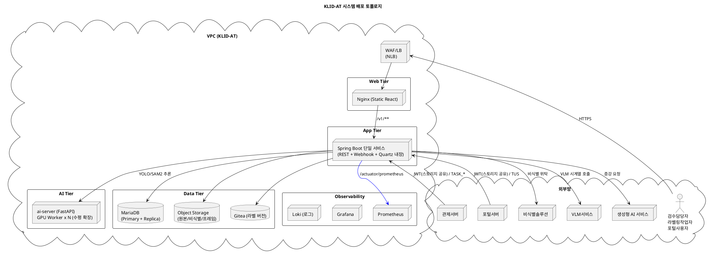

# D5. 아키텍처 설계서

## ▣ 제·개정 이력

| 날짜 | 버전 | 작성자 | 승인자 | 내용 |
|------|------|--------|--------|------|
| 2026-05-21 | 1.0 | 박찬기 | - | 최초 작성 — klid-label (backend Spring Boot 3.3 / frontend React 18 / ai-server FastAPI) 기반 |
| 2026-05-27 | 1.1 | 박찬기 | - | CBD 양식 변환, 아키텍처 요구사항 및 구현방안 보완 |

---

| D5 | 아키텍처 설계서 |
|-------|---------|
| 시스템명 | 기반 지방정부 관제지원시스템 구축(2차) AI CCTV | 서브시스템명 | AI CCTV 학습데이터 저작도구 (KLID-AT-SS-001) |
| 단계명 | 설계 | 작성일자 | 2026-05-27 | 버전 | 1.1 |

---

## 1. 소프트웨어 아키텍처

### 1.1 아키텍처 스타일

- **DDD(Domain-Driven Design) Layered Architecture** + **Hexagonal Ports/Adapters** 혼합
- **Pipeline-and-Filter** (배치 파이프라인) + **Event-Driven** (도메인 이벤트) + **Reactive** (외부 클라이언트 WebClient)

### 1.2 설계 원칙

| 원칙 | 적용 방법 |
|------|----------|
| 단방향 의존 | Presentation → Application → Domain → Infrastructure (역방향 금지) |
| 도메인 중심 패키지 | `kr.co.cudo.authoring.{domain}.{controller\|service\|repository\|entity\|dto}` |
| 포트/어댑터 분리 | 외부 시스템 연동은 `common.client.*` 어댑터로 격리, 비즈니스 로직과 분리 |
| Stateless 서비스 | JWT 기반 인증, 서버 세션 미사용, 무중단 배포 가능 |
| Fail-safe 원칙 | 외부 장애 시 폴백 큐로 데이터 유실 방지, DB 우선 저장 후 비동기 후처리 |

### 1.3 주요 아키텍처 결정사항 (Architecture Decisions)

| AD | 결정 | 근거 |
|---|---|---|
| AD-01 | Spring Boot 3.3 + Java 17 (Backend) | 발주 표준 + LTS, jjwt 0.12 호환 |
| AD-02 | React 18 + Vite + TS + TanStack Query (Frontend) | 코드 스플리팅·캐시·낙관적 업데이트 |
| AD-03 | FastAPI + ultralytics(YOLO/SAM2) (AI Server) | Python 생태계 모델 사용 |
| AD-04 | WebClient + Resilience4j CB/Retry | 외부 시스템 장애 격리 |
| AD-05 | Quartz Scheduler (DB 백킹) | 단일 인스턴스 서비스 배포 (클러스터 미적용) |
| AD-06 | 멱등성 원장(InMemory/Persistent) | 외부 콜백 중복 차단 (Webhook 표준) |
| AD-07 | Gitea 자동 커밋 + 폴백 큐(메모리+DB) | 라벨 데이터 유실 방지 |
| AD-08 | JWT(HS256, 채널·역할 클레임) + ChannelGuard | 외부 발급 토큰 검증 + 채널 격리 |
| AD-09 | Flyway 마이그레이션 | 스키마 진화 추적성 |
| AD-10 | OpenAPI 3 + openapi-typescript | FE 타입 자동 생성 |
| AD-11 | 라벨 좌표 점 <=1000개 (CWE-770) | DoS 방어 |
| AD-12 | HMAC-SHA256 웹훅 서명 검증 | 외부 콜백 위조 차단 |
| AD-13 | 관제서버 통지 별도 컴포넌트 | 강결합 분리, 디바운스·폴백 분리 |

### 1.4 소프트웨어 계층도

```plantuml
@startuml KLID-AT-Software-Architecture
title KLID-AT 소프트웨어 아키텍처
skinparam defaultFontName "Malgun Gothic"
skinparam componentStyle rectangle

rectangle "Presentation Layer" {
  [REST Controllers]\n(31개)
  [Webhook Controllers]\n(3개)
  [TUS Controller]
}

rectangle "Application Layer (Domain Services)" {
  [Label/Version/Review/Assignment]
  [Meta/Augment/Portal]
  [Batch Orchestrator + Steps]
  [Stats/Preset/SystemConfig]
  [Marking]
  [Notification (interface)]
}

rectangle "Domain Layer" {
  [Entities (JPA 42개)]
  [Value Objects (TokenClaims, BatchStage...)]
  [State Machines]
}

rectangle "Infrastructure (Outbound Adapters)" {
  [WebClient Adapters\n(Ai/Deidentify/Vlm/Gitea/Augment)]
  [Idempotency Ledger]
  [Resilience4j CB/Retry]
  [Fallback Queues]
  [Quartz Scheduler]
  [JPA/QueryDSL Repositories]
  [Flyway Migration]
  [Caffeine Cache]
  [Micrometer/Prometheus]
}

rectangle "Cross-Cutting" {
  [Spring Security\n(JWT/HMAC/RBAC)]
  [GlobalExceptionHandler]
  [RequestIdFilter\n(MDC)]
  [Logback JSON Encoder]
}

[REST Controllers] --> [Label/Version/Review/Assignment]
[REST Controllers] --> [Meta/Augment/Portal]
[REST Controllers] --> [Marking]
[Webhook Controllers] --> [Idempotency Ledger]
[Webhook Controllers] --> [Application Layer (Domain Services)]
[Label/Version/Review/Assignment] --> [Entities (JPA 42개)]
[Batch Orchestrator + Steps] --> [WebClient Adapters\n(Ai/Deidentify/Vlm/Gitea/Augment)]
[Label/Version/Review/Assignment] --> [WebClient Adapters\n(Ai/Deidentify/Vlm/Gitea/Augment)]
[Marking] --> [WebClient Adapters\n(Ai/Deidentify/Vlm/Gitea/Augment)]
@enduml
```

### 1.5 기술 스택

| 계층 | 기술 |
|------|------|
| **Backend** | Spring Boot 3.3.0 / Java 17 / Spring Security 6 / Spring Data JPA + QueryDSL 5.1 / MapStruct 1.5 / Quartz / Resilience4j 2.2 / Spring WebFlux WebClient / jjwt 0.12 / Flyway 10.13 / Caffeine / Micrometer Prometheus / Logback + logstash-encoder / FFmpeg wrapper 0.8 / springdoc-openapi 2.5 |
| **Frontend** | React 18.3 + Vite 5.2 + TypeScript 5.4 / React Router 6.22 / TanStack Query 5.28 / axios 1.6 / zustand 4.5 / Konva 9.3 + react-konva / TailwindCSS 3.4 / react-hook-form + zod / recharts / tus-js-client 4.3 / Playwright e2e + Vitest |
| **AI Server** | FastAPI 0.110 + uvicorn / ultralytics(YOLO/SAM2) / PyTorch 2.2 + torchvision / OpenCV 4.9 / Pillow |
| **DB** | MariaDB 10.11.13 (LTS) / MaxScale 24.02.5 (Read/Write Split) / H2 (테스트) / Flyway 마이그레이션 / Quartz 스키마(QRTZ_*) 호환 |
| **Infra** | Nginx / Docker / GPU 노드(ai-server) / Prometheus / Grafana / Loki |

---

## 2. 시스템 아키텍처

### 2.1 시스템 구성도



### 2.2 네트워크 보안 영역

| 영역 | 구성 | 접근 정책 |
|------|------|----------|
| DMZ | WAF/LB | 외부 HTTPS 수신 |
| Web Tier | Nginx (정적 자산) | LB에서만 접근 |
| App Tier | Spring Boot (비공개망) | 외부 접근 차단, 외부 API 호출은 NAT |
| AI Tier | ai-server (GPU) | App Tier에서만 접근 (보안그룹 제한) |
| Data Tier | MariaDB / Object Storage / Gitea | App Tier에서만 접근 (보안그룹 제한) |

> 외부 시스템 통신: 전송구간 TLS 1.2+ 강제, 웹훅 수신은 HMAC 서명 검증, JWT 알고리즘 HS256 고정(`none`/`RS256` 거부)

### 2.3 환경별 배포 차이

| 항목 | local | dev | stg | prd |
|---|---|---|---|---|
| DB | H2 | MariaDB(공유) | MariaDB | MariaDB(HA) |
| Quartz | 단일 | 단일 | 단일 | 단일 |
| VLM enabled | false | false | true | true |
| ControlNotify | false | false | true | true |
| 멱등성 원장 | InMemory | Persistent | Persistent | Persistent |
| 폴백 큐(Gitea) | Memory | Persistent | Persistent | Persistent |
| WebhookIdempotencyLedger | InMemory | Persistent | Persistent | Persistent |
| DevTokenController | enabled | enabled | disabled | disabled |
| AutolabelTestController | enabled | enabled | disabled | disabled |

---

## 3. 아키텍처 요구사항 및 구현방안

### RQ-NFR-PRF-01  성능 — 라벨 저장 / 영상 목록 응답시간

<table>
<tr><td>요구사항 ID</td><td>RQ-NFR-PRF-01</td></tr>
<tr><td>요구사항 내용</td><td>라벨 저장 응답시간 1초 이하(p95), 영상 목록 조회 2초 이하(p95)</td></tr>
<tr><td>구현방안</td><td>(1) DB 인덱스 최적화 — 영상 IDX_LD_VIDEO_STATUS, 라벨 IDX_LBL_SRC 등 핵심 컬럼 인덱스 적용<br>(2) WebClient 비동기 + Reactor — 외부 API 호출 시 비동기 논블로킹 처리로 스레드 점유 최소화<br>(3) `@Transactional(readOnly=true)` 일관 적용 — 조회 전용 트랜잭션으로 Hibernate dirty-checking 비용 제거<br>(4) Caffeine 캐시 — 시스템 설정 TTL 60s 로컬 캐시로 반복 DB 조회 감소</td></tr>
</table>

---

### RQ-NFR-PRF-02  성능 — 자동 파이프라인 처리량

<table>
<tr><td>요구사항 ID</td><td>RQ-NFR-PRF-02</td></tr>
<tr><td>요구사항 내용</td><td>자동 파이프라인 처리량 50건/시간 이상</td></tr>
<tr><td>구현방안</td><td>(1) Quartz 단일 인스턴스 Job 처리 — 1건/분 순차 처리<br>(2) ai-server GPU Worker 다중 프로세스 수평 확장 — GPU 병목 분산<br>(3) V2.0 파이프라인 7단계: 마킹→VLM(콜백 비동기)→비식별→프레임추출(마킹 위치)→YOLO(원본만)→SAM2→보간<br>(4) 단계별 비동기 위탁 — VLM/비식별 결과를 콜백으로 수신하여 파이프라인 블로킹 최소화</td></tr>
</table>

---

### RQ-NFR-SEC-01  보안 — 외부 발급 JWT 검증

<table>
<tr><td>요구사항 ID</td><td>RQ-NFR-SEC-01</td></tr>
<tr><td>요구사항 내용</td><td>외부 발급 JWT 검증, 자체 로그인 미보유. 관제서버/포털서버가 발급한 JWT를 검증하여 인증</td></tr>
<tr><td>구현방안</td><td>(1) JwtAuthenticationFilter — HS256 알고리즘 고정, `alg:none` 거부<br>(2) JwtIssuerValidator — 허용 issuer 화이트리스트 기반 검증<br>(3) Replay 방지 — `jti` 클레임 + `exp` 만료 검증<br>(4) 동일 도메인 브라우저 스토리지 공유 방식으로 JWT 전달 (URL 쿼리 파라미터 미사용)</td></tr>
</table>

---

### RQ-NFR-SEC-02  보안 — 채널·역할 분리

<table>
<tr><td>요구사항 ID</td><td>RQ-NFR-SEC-02</td></tr>
<tr><td>요구사항 내용</td><td>INTERNAL(관제) 채널과 PORTAL(포털) 채널 간 역할 및 데이터 접근 격리</td></tr>
<tr><td>구현방안</td><td>(1) ChannelGuard + RoleGuard 이중 적용 (Frontend Route Guard)<br>(2) `@PreAuthorize` + 메서드 레벨 가드 (Backend)<br>(3) 포털 사용자는 본인 데이터만 접근 가능 (소유자 검증)</td></tr>
</table>

---

### RQ-NFR-SEC-03  보안 — 웹훅 콜백 위조 차단

<table>
<tr><td>요구사항 ID</td><td>RQ-NFR-SEC-03</td></tr>
<tr><td>요구사항 내용</td><td>외부 시스템(비식별/VLM/증강)의 웹훅 콜백이 위조되지 않도록 보안</td></tr>
<tr><td>구현방안</td><td>(1) HmacWebhookFilter — HMAC-SHA256 서명 검증 (X-Signature 헤더)<br>(2) 멱등성 원장(WebhookIdempotencyLedger) — requestId 기반 중복 콜백 차단</td></tr>
</table>

---

### RQ-NFR-SEC-04  보안 — IDOR 방어

<table>
<tr><td>요구사항 ID</td><td>RQ-NFR-SEC-04</td></tr>
<tr><td>요구사항 내용</td><td>라벨 및 프레임 데이터에 대한 IDOR(Insecure Direct Object Reference) 방어</td></tr>
<tr><td>구현방안</td><td>LabelAccessGuard (`verifyAndGet`) — 모든 라벨 read/write 진입점에서 적용 (LabelService, Sam2TrackService, VersionService, DeidentReportService, FrameImageController, PortalLabelService 등)</td></tr>
</table>

---

### RQ-NFR-SEC-05  보안 — DoS 방어

<table>
<tr><td>요구사항 ID</td><td>RQ-NFR-SEC-05</td></tr>
<tr><td>요구사항 내용</td><td>좌표 점 수 및 페이로드 크기 제한으로 서비스 거부 공격 방어</td></tr>
<tr><td>구현방안</td><td>(1) LabelService.MAX_POINTS_PER_LABEL = 1000 (CWE-770 준수)<br>(2) ControlNotifyClient CHUNK_THRESHOLD_BYTES = 64KB (페이로드 크기 제한)</td></tr>
</table>

---

### RQ-NFR-SEC-06  보안 — 로그 인젝션·개인정보 노출 방지

<table>
<tr><td>요구사항 ID</td><td>RQ-NFR-SEC-06</td></tr>
<tr><td>요구사항 내용</td><td>로그에 개행 문자 주입(CWE-117) 및 개인정보 노출(CWE-359) 방지</td></tr>
<tr><td>구현방안</td><td>(1) LogNotificationService.sanitize — 개행 제거 + 200자 절단<br>(2) VlmClient.safeForLog — 민감 필드 마스킹<br>(3) Logback MaskingPatternLayout — 전역 민감 정보 마스킹</td></tr>
</table>

---

### RQ-NFR-REL-01  신뢰성 — 외부 시스템 장애 시 데이터 유실 0건

<table>
<tr><td>요구사항 ID</td><td>RQ-NFR-REL-01</td></tr>
<tr><td>요구사항 내용</td><td>외부 시스템(Gitea, 관제서버 등) 장애 시에도 데이터 유실 없이 복구</td></tr>
<tr><td>구현방안</td><td>(1) Resilience4j CircuitBreaker + Retry + Fallback Queue<br>(2) Gitea 폴백: GiteaCommitFallbackQueue(메모리) + GiteaFallbackQueueService(DB 영속)<br>(3) 관제서버 통지 폴백: ControlNotifyFallbackQueue(DB 영속, max=5 exp backoff)<br>(4) DB 우선 저장 원칙 — 라벨은 DB에 먼저 저장, Gitea 커밋은 후처리</td></tr>
</table>

---

### RQ-NFR-REL-02  신뢰성 — 콜백 중복 처리 차단

<table>
<tr><td>요구사항 ID</td><td>RQ-NFR-REL-02</td></tr>
<tr><td>요구사항 내용</td><td>외부 시스템의 동일 콜백 중복 수신 시 멱등성 보장</td></tr>
<tr><td>구현방안</td><td>WebhookIdempotencyLedger — InMemory(local/dev) + Persistent(stg/prd) 2중 구현. requestId 기반 checkAndMark</td></tr>
</table>

---

### RQ-NFR-REL-03  신뢰성 — 비식별 처리 누락 0건

<table>
<tr><td>요구사항 ID</td><td>RQ-NFR-REL-03</td></tr>
<tr><td>요구사항 내용</td><td>비식별 정책이 적용된 영상은 예외 없이 비식별 처리 보장</td></tr>
<tr><td>구현방안</td><td>BatchOrchestrator 분기 없이 모든 영상에 DeidentifyStep 무조건 실행</td></tr>
</table>

---

### RQ-NFR-REL-04  신뢰성 — 라벨 우선 저장

<table>
<tr><td>요구사항 ID</td><td>RQ-NFR-REL-04</td></tr>
<tr><td>요구사항 내용</td><td>Gitea 장애 시에도 라벨 데이터가 DB에 유실 없이 저장</td></tr>
<tr><td>구현방안</td><td>LabelService: DB upsert 성공 후 VersionService.commit 호출. 실패 시 폴백 큐로 비동기 재시도</td></tr>
</table>

---

### RQ-NFR-AVL-01  가용성 — 무중단 배포

<table>
<tr><td>요구사항 ID</td><td>RQ-NFR-AVL-01</td></tr>
<tr><td>요구사항 내용</td><td>App Tier 무중단 배포 (RollingUpdate)</td></tr>
<tr><td>구현방안</td><td>(1) Stateless Spring Boot — JWT 기반 인증, 서버 세션 미사용<br>(2) DB connection pool 적정값(HikariCP) — graceful shutdown 지원</td></tr>
</table>

---

### RQ-NFR-AVL-02  가용성 — 24x7 가용성

<table>
<tr><td>요구사항 ID</td><td>RQ-NFR-AVL-02</td></tr>
<tr><td>요구사항 내용</td><td>24x7 가용성, MTTR 30분 이하</td></tr>
<tr><td>구현방안</td><td>(1) Spring Boot 단일 서비스 + systemd 자동 재시작<br>(2) MariaDB Primary-Replica 구성 (MaxScale Read/Write Split)<br>(3) 헬스 엔드포인트 (/health, /actuator/health) 기반 모니터링</td></tr>
</table>

---

### RQ-NFR-OBS-01  관찰가능성 — 요청 추적

<table>
<tr><td>요구사항 ID</td><td>RQ-NFR-OBS-01</td></tr>
<tr><td>요구사항 내용</td><td>모든 요청에 대한 분산 추적 지원</td></tr>
<tr><td>구현방안</td><td>(1) RequestIdFilter — X-Request-ID MDC 주입<br>(2) JSON 구조 로그 (logstash-encoder) — 구조화된 로그 수집</td></tr>
</table>

---

### RQ-NFR-OBS-02  관찰가능성 — 핵심 지표 수집

<table>
<tr><td>요구사항 ID</td><td>RQ-NFR-OBS-02</td></tr>
<tr><td>요구사항 내용</td><td>파이프라인 처리율, 외부 API 호출 상태, 폴백 큐 깊이 등 핵심 지표 수집</td></tr>
<tr><td>구현방안</td><td>Micrometer + Prometheus (/actuator/prometheus)<br>수집 지표: 파이프라인 처리율, CB 상태, 웹훅 중복률, 라벨 저장 p95, Gitea 폴백 큐 깊이, ControlNotify dead letter 수</td></tr>
</table>

---

### RQ-NFR-MAI-01  유지보수성 — 스키마 진화 추적

<table>
<tr><td>요구사항 ID</td><td>RQ-NFR-MAI-01</td></tr>
<tr><td>요구사항 내용</td><td>DB 스키마 변경 이력을 버전으로 관리하고 추적 가능</td></tr>
<tr><td>구현방안</td><td>Flyway 마이그레이션 (V1__init.sql, V2__... 누적), `flyway.lockAllConfigurations` 의존성 잠금</td></tr>
</table>

---

### RQ-NFR-MAI-02  유지보수성 — API 변경 클라이언트 자동 반영

<table>
<tr><td>요구사항 ID</td><td>RQ-NFR-MAI-02</td></tr>
<tr><td>요구사항 내용</td><td>Backend API 변경 시 Frontend 타입을 자동으로 동기화</td></tr>
<tr><td>구현방안</td><td>OpenAPI 3 (springdoc) → openapi-typescript → FE 타입 자동 생성 (`scripts/gen-api-types.sh`)</td></tr>
</table>

---

### RQ-NFR-DAT-01  데이터 — 라벨 변경 이력 영구 보존

<table>
<tr><td>요구사항 ID</td><td>RQ-NFR-DAT-01</td></tr>
<tr><td>요구사항 내용</td><td>라벨 변경 이력을 영구적으로 보존하고 롤백 가능</td></tr>
<tr><td>구현방안</td><td>(1) Gitea 자동 커밋 — 라벨 저장마다 새 커밋, 롤백 시에도 새 커밋 추가 (기존 이력 보존)<br>(2) LS_LABEL_VERSION 테이블 — 커밋 해시·시각·작성자 기록</td></tr>
</table>

---

### RQ-NFR-DAT-02  데이터 — 원본/비식별 영상 분리 저장

<table>
<tr><td>요구사항 ID</td><td>RQ-NFR-DAT-02</td></tr>
<tr><td>요구사항 내용</td><td>원본 영상과 비식별 영상을 물리적으로 분리 저장하고 접근 권한 분리</td></tr>
<tr><td>구현방안</td><td>Object Storage 별도 prefix (raw/, deid/), 접근 권한 분리(IAM)</td></tr>
</table>

---

### RQ-NFR-COM-01  준수 — 발주처 표준 ID 체계

<table>
<tr><td>요구사항 ID</td><td>RQ-NFR-COM-01</td></tr>
<tr><td>요구사항 내용</td><td>발주처 표준 ID 체계를 모든 산출물에 일관 적용</td></tr>
<tr><td>구현방안</td><td>KLID-AT-* / KLID-IT-* / KLID-ST-* 접두어 일관 적용</td></tr>
</table>

---

## 4. 핵심 비기능 시나리오

### 시나리오 1 — Gitea 장애 상황

- **이벤트**: WORKER 라벨 저장 직후 Gitea 5xx (네트워크 단절)
- **응답**: VersionService.commit → GiteaClient(CB Open) → 메모리 폴백 큐 적재 → 30초 후 영속 폴백 큐로 승격(stg/prd) → GiteaFallbackRetryJob 5분마다 재시도 → 복구 시 자동 커밋
- **사용자 영향**: 라벨 저장은 성공(DB 우선 저장 원칙), 버전 이력만 지연 생성
- **측정 지표**: `gitea_fallback_queue_depth`, `gitea_commit_p95`

### 시나리오 2 — 외부 비식별 솔루션 장애

- **이벤트**: 비식별 위탁 후 응답 없음 (타임아웃)
- **응답**: DeidentifyClient(Retry max=3 + CB Open) → BatchRetryQueue.enqueue → 운영팀 알림 → 원본 영상은 절대 삭제하지 않음(정책)
- **측정 지표**: `batch_failed_count{stage=DEIDENTIFY}`, `cb_state{name=deidentify}`

### 시나리오 3 — 동일 비식별 결과 중복 콜백

- **이벤트**: 비식별 솔루션이 같은 requestId 로 2회 콜백
- **응답**: HmacWebhookFilter 통과 → DeidentifyResultController → WebhookIdempotencyLedger.checkAndMark(requestId) → 2번째 호출은 no-op + 200 OK 반환
- **측정 지표**: `webhook_duplicate_count{source=deidentify}`

### 시나리오 4 — JWT 만료 (세션 유지 중)

- **이벤트**: 사용자 작업 중 JWT 만료(exp 초과)
- **응답**: JwtAuthenticationFilter → 401 → Frontend axios 인터셉터 → `/ingress` 재진입 → 발급자(관제/포털) 재인증 redirect

### 시나리오 5 — TASK_MODIFIED 폭주 (UC-015)

- **이벤트**: WORKER 가 60초 내 같은 영상 라벨 10회 수정
- **응답**: 매 수정마다 `TaskModifiedEvent` 발행 → ControlNotifyDebouncer.register(rawSn, frameId) → 60초 윈도우 후 1회만 ControlNotifyClient.notifyTaskModified 호출 (frameIds 누적 전송)
- **측정 지표**: `control_notify_inflight`, `control_notify_sent_total{eventType=TASK_MODIFIED}`
