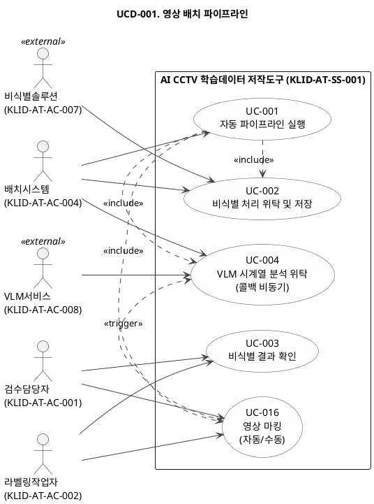
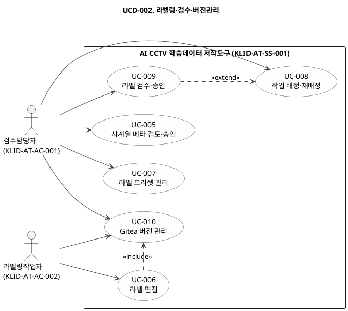
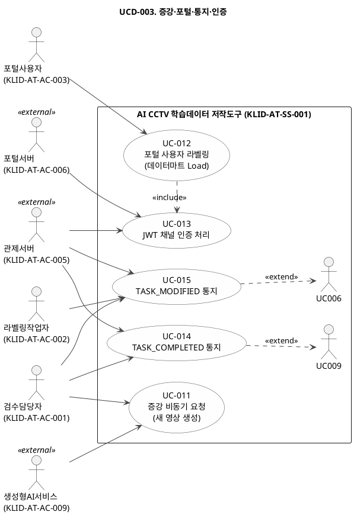

# R2 유스케이스 명세서

## 제.개정 이력

| 날짜 | 버전 | 작성자 | 승인자 | 내용 |
|------|------|--------|--------|------|
| 2026-05-27 | 1.0 | - | - | 최초 작성 |

---

| R2 | 유스케이스 명세서 |
|-------|--------------|
| 시스템명 | AI 기반 지방정부 CCTV 관제지원시스템 구축(2차) | 서브시스템명 | AI CCTV 학습데이터 저작도구 |
| 단계명  | 분석 | 작성일자 | 2026-05-27 | 버전 | 1.0 |

---

## 1. 서브시스템 목록

| 서브시스템 ID | 서브시스템명 | 서브시스템 설명 |
|---|---|---|
| KLID-AT-SS-001 | AI CCTV 학습데이터 저작도구 | AI CCTV 영상의 V2.0 자동 파이프라인 처리(마킹→VLM콜백→비식별→프레임추출→YOLO(원본)→SAM2), 라벨링·검수·증강(새 영상)·포털(데이터마트 Load)을 담당하는 서브시스템 |

---

## 2. 유스케이스 다이어그램(UCD)

### UCD-001. 영상 배치 파이프라인

| UCD ID | KLID-AT-UCD-001 | UCD 명 | 영상 배치 파이프라인 |
|---|---|---|---|
| 관련 서브시스템 ID | KLID-AT-SS-001 | 관련 서브시스템명 | AI CCTV 학습데이터 저작도구 |

---

### UCD-002. 라벨링·검수·버전관리

| UCD ID | KLID-AT-UCD-002 | UCD 명 | 라벨링·검수·버전관리 |
|---|---|---|---|
| 관련 서브시스템 ID | KLID-AT-SS-001 | 관련 서브시스템명 | AI CCTV 학습데이터 저작도구 |

---

### UCD-003. 증강·포털·통지·인증

| UCD ID | KLID-AT-UCD-003 | UCD 명 | 증강·포털·통지·인증 |
|---|---|---|---|
| 관련 서브시스템 ID | KLID-AT-SS-001 | 관련 서브시스템명 | AI CCTV 학습데이터 저작도구 |

---

## 3. 유스케이스 목록

| 유스케이스 ID | 유스케이스명 | 유스케이스 설명 | 관련액터 ID | 관련 UCD ID | 관련 요구사항 ID |
|---|---|---|---|---|---|
| KLID-AT-UC-001 | 자동 파이프라인 실행 | 1분 간격 Quartz 스케줄러가 처리 대기 영상 1건을 V2.0 파이프라인(마킹→VLM(콜백)→비식별→프레임추출(마킹 위치)→YOLO(원본만)→SAM2→보간) 순서로 자동 처리한다. 마킹은 자동/수동 모드 지원. | KLID-AT-AC-004 | KLID-AT-UCD-001 | RQ-SFR-08-01, RQ-SFR-09-01 |
| KLID-AT-UC-002 | 비식별 처리 위탁 및 저장 | 배치시스템이 외부 비식별 솔루션에 비동기 처리를 위탁하고 완료 결과를 수신하여 원본·비식별본을 각각 저장한다. | KLID-AT-AC-004, KLID-AT-AC-007 | KLID-AT-UCD-001 | RQ-SFR-09-01 |
| KLID-AT-UC-003 | 비식별 결과 확인 | 라벨링작업자가 작업 중 비식별 오류(얼굴·번호판 미처리 등)를 발견하여 신고하면, 검수담당자가 신고된 영상을 확인하고 비식별 재처리 배치를 재실행한다. | KLID-AT-AC-002, KLID-AT-AC-001 | KLID-AT-UCD-001 | RQ-SFR-09-01 |
| KLID-AT-UC-004 | VLM 시계열 분석 위탁 | 마킹 완료 후 마킹 결과(이벤트명+영상경로+marks)를 외부 VLM 서비스에 콜백 비동기 위탁하고, 결과를 시계열 메타 테이블에 적재하여 검수담당자 검토 큐에 노출한다. | KLID-AT-AC-004, KLID-AT-AC-008 | KLID-AT-UCD-001 | RQ-SFR-03-02 |
| KLID-AT-UC-005 | 시계열 메타 검토·승인 | 검수담당자가 프레임별 시계열 메타(VLM 또는 외부인계)를 검토하고 승인(APPROVED) 또는 반려(REJECTED) 결정을 내린다. | KLID-AT-AC-001 | KLID-AT-UCD-002 | RQ-SFR-03-01, RQ-SFR-03-02 |
| KLID-AT-UC-006 | 라벨 편집 | 라벨링작업자가 배정된 프레임의 라벨을 도구(BBox·폴리곤·마스크 등)를 사용하여 작성·수정·삭제하고 저장한다. | KLID-AT-AC-002 | KLID-AT-UCD-002 | RQ-SFR-08-01 |
| KLID-AT-UC-007 | 라벨 프리셋 관리 | 검수담당자가 이벤트 타입별 1:1 라벨 프리셋을 등록·복제·수정하고, 변경 시 영향받는 작업을 추적한다. | KLID-AT-AC-001 | KLID-AT-UCD-002 | RQ-SFR-08-01 |
| KLID-AT-UC-008 | 작업 배정·재배정 | 검수담당자가 자동 처리 완료 영상을 라벨링작업자에게 배정하거나 재배정한다. 완료된 작업은 재배정을 차단한다. | KLID-AT-AC-001 | KLID-AT-UCD-002 | RQ-SFR-08-01 |
| KLID-AT-UC-009 | 라벨 검수·승인 | 검수담당자가 라벨링작업자가 완료한 라벨을 프레임 단위로 검수하고 승인(APPROVED) 또는 반려(REJECTED) 결정을 내린다. | KLID-AT-AC-001 | KLID-AT-UCD-002 | RQ-SFR-08-01 |
| KLID-AT-UC-010 | Gitea 버전 관리 | 라벨 저장 시 Gitea에 자동 커밋하여 버전 이력을 생성하고, 검수담당자가 커밋 단위 이력을 조회하거나 특정 시점으로 롤백한다. | KLID-AT-AC-002, KLID-AT-AC-001 | KLID-AT-UCD-002 | RQ-SFR-08-02 |
| KLID-AT-UC-011 | 증강 비동기 요청 및 검토 | 검수담당자가 검수 완료 영상에 증강을 비동기 요청. 결과 수신 시 새 영상(RAW_SN) 생성 + 원본 라벨/메타 복사. 해상도 증강은 이미지만 변경. 새 영상은 미검수 상태로 시작하여 작업자 배정·수정·검수 플로우를 따른다. 완료 시 새 영상 ID로 관제서버 통지. | KLID-AT-AC-001, KLID-AT-AC-009 | KLID-AT-UCD-003 | RQ-SFR-07-01 |
| KLID-AT-UC-012 | 포털 사용자 간편 라벨링 | 관제서버→데이터마트→포털 DB 적재 데이터를 Load하여 라벨링 화면에 표시. 사용자 수정 시 원본 미수정, LS_PORTAL_USER_LABEL에 사용자별 작업 데이터 별도 적재. 다운로드는 사용자 작업 데이터 기준. | KLID-AT-AC-003 | KLID-AT-UCD-003 | RQ-SFR-15-07 |
| KLID-AT-UC-013 | JWT 채널 인증 처리 | 관제서버 또는 포털서버가 발급한 JWT를 본 도구가 검증하고, 채널·역할에 따라 사용자를 적합한 화면으로 진입 처리한다. | KLID-AT-AC-005, KLID-AT-AC-006 | KLID-AT-UCD-003 | RQ-SFR-09-02 |
| KLID-AT-UC-014 | TASK_COMPLETED 통지 | 검수 승인으로 영상이 COMPLETED 상태로 전이될 때, 관제서버에 TASK_COMPLETED 이벤트를 비동기 통지한다. | KLID-AT-AC-001, KLID-AT-AC-005 | KLID-AT-UCD-003 | RQ-SFR-08-03 |
| KLID-AT-UC-015 | TASK_MODIFIED 통지 | COMPLETED 상태 영상의 라벨·메타 수정 시 디바운서를 통해 관제서버에 TASK_MODIFIED 이벤트를 비동기 통지한다. | KLID-AT-AC-001, KLID-AT-AC-002, KLID-AT-AC-005 | KLID-AT-UCD-003 | RQ-SFR-08-03 |
| KLID-AT-UC-016 | 영상 마킹 | 작업자가 영상에서 이벤트 발생 시점을 자동(프레임 간격) 또는 수동(키보드 단축키)으로 마킹한다. 마킹 결과(이벤트명+영상경로+marks)는 VLM 시계열 분석 위탁에 사용된다. | KLID-AT-AC-002, KLID-AT-AC-001 | KLID-AT-UCD-001 | RQ-SFR-08-01 |

---

## 4. 액터 목록

| 액터 ID | 액터명 | 액터유형 (주요/보조/숨은) | 액터설명 |
|---|---|---|---|
| KLID-AT-AC-001 | 검수담당자 | 주요 | 검수 권한 보유 내부 사용자. 작업 배정·검수 결정·라벨 마스터 관리·증강 검토·메타 검토·버전 롤백 등 전반적인 감독 기능 담당. |
| KLID-AT-AC-002 | 라벨링작업자 | 주요 | 라벨링 작업자. 본인에게 배정된 프레임의 라벨 편집 권한만 보유. 소유자 검증(IDOR 방어)으로 타인 작업 접근 차단. |
| KLID-AT-AC-003 | 포털사용자 | 주요 | AI 영상학습 포털 서버가 인증한 외부 사용자. 본인 데이터에 대한 간편 라벨링만 제공. 검수·버전관리·VLM 메타 기능 미제공. |
| KLID-AT-AC-004 | 배치시스템 | 보조 | 영상 처리 파이프라인 자동화 시스템(Quartz 스케줄러 기반). 인간 액터가 아닌 시스템 액터. 1분 간격으로 영상 1건씩 처리. |
| KLID-AT-AC-005 | 관제서버 | 보조 | [외부] JWT 발급 및 TASK_COMPLETED/TASK_MODIFIED 이벤트 수신 주체. 관제지원시스템 서브시스템. |
| KLID-AT-AC-006 | 포털서버 | 보조 | [외부] 포털 사용자에게 JWT를 발급하는 AI 영상학습 포털 서버. |
| KLID-AT-AC-007 | 비식별솔루션 | 보조 | [외부] 비식별 처리 전문 외부 솔루션(분리발주). 배치시스템이 비동기로 작업 위탁. |
| KLID-AT-AC-008 | VLM서비스 | 보조 | [외부] 영상 시계열 분석 전문 외부 AI 서비스. 배치시스템이 비동기로 분석 위탁. |
| KLID-AT-AC-009 | 생성형AI서비스 | 보조 | [외부] 데이터 증강 처리를 담당하는 외부 생성형 AI 서비스. |

---

## 5. 유스케이스 기술서

---

### KLID-AT-UC-001. 자동 파이프라인 실행

| 유스케이스 ID | KLID-AT-UC-001 | 유스케이스명 | 자동 파이프라인 실행 |
|---|---|---|---|

**1. 주요 액터**

배치시스템

**2. 이해관계자와 관심사항**

- 운영팀은 영상 처리 현황(처리 중·완료·오류)을 실시간으로 파악하길 원한다.
- 검수담당자는 파이프라인 완료 후 즉시 검수 대기 목록에서 확인하길 원한다.
- 개발팀은 로컬 환경에서 자동 스케줄을 비활성하고 수동으로 트리거하길 원한다.

**3. 전제조건**

- 영상이 처리 대기(PENDING) 상태로 적재되어 있다.
- 영상 인입은 외부 시스템 책임이다.

**4. 종료조건**

- 영상이 완료(COMPLETED) 또는 오류(FAILED) 상태로 전환된다.
- 단계별 처리 이력이 기록된다.

**5. 기본 시나리오**

1. 스케줄러 트리거로 처리 대기 영상 1건을 선점한다 (선점 락).
2. VLM 시계열 분석 단계 — 외부 VLM 서비스에 비동기 위탁한다.
3. 비식별 단계 — 모든 영상에 예외 없이 외부 비식별 솔루션을 호출한다.
4. 프레임 추출 단계 — FFmpeg으로 프레임을 추출하고 소스 이미지 테이블에 적재한다.
5. YOLO 자동 라벨 단계 — 내부 AI 서버에 YOLO 객체 감지를 요청한다.
6. SAM2 세그멘테이션 단계 — 내부 AI 서버에 SAM2 경계 생성을 요청한다.
7. 처리 완료(COMPLETED) 상태로 전환하고 이력을 기록한다.
8. 본 유스케이스는 종료한다.

**6. 대안 시나리오**

**가. 단계 실패**
1. 지수 백오프 방식으로 최대 3회 재시도한다.
2. 재시도 실패 시 오류(FAILED) 상태로 전환하고 처리 이력에 실패 단계·사유를 기록한다.

**7. 구현 시 고려 사항**

- 처리 순서 고정: VLM(시계열추출) → 비식별 → 프레임추출 → YOLO → SAM2
- 비식별은 분기 없이 모든 영상에 무조건 적용한다.
- 선점 락으로 동일 영상 중복 처리를 방지한다.

**8. 발생 빈도**

1분 간격 지속 발생

---

### KLID-AT-UC-002. 비식별 처리 위탁 및 저장

| 유스케이스 ID | KLID-AT-UC-002 | 유스케이스명 | 비식별 처리 위탁 및 저장 |
|---|---|---|---|

**1. 주요 액터**

배치시스템, 비식별솔루션

**2. 이해관계자와 관심사항**

- 개인정보보호팀은 모든 영상에 비식별 처리가 누락 없이 적용되길 원한다.
- 운영팀은 원본과 비식별본이 각각 안전하게 별도 경로에 보존되길 원한다.
- 운영팀은 비식별 솔루션 장애 시에도 원본 영상이 절대 유실되지 않길 원한다.

**3. 전제조건**

- 영상이 VLM 시계열 분석 단계를 완료한 상태이다.

**4. 종료조건**

- 원본과 비식별본이 각각 별도 경로에 저장된다.

**5. 기본 시나리오**

1. 배치시스템이 외부 비식별 솔루션에 비동기 처리 작업을 등록한다 (요청 ID 발급).
2. 외부 비식별 솔루션이 처리 완료 후 결과를 본 도구에 통지한다.
3. 본 도구가 원본과 비식별본을 각각 별도 경로에 동시 저장한다.
4. 처리 결과와 이력을 프레임 단위로 기록한다.
5. 본 유스케이스는 종료한다.

**6. 대안 시나리오**

**가. 미응답·실패**
1. 처리 실패로 마킹하고 재등록 큐에 적재한다.
2. 원본 영상은 절대 삭제하지 않는다.

**나. 동일 요청 ID 재인계**
1. Idempotency 키로 중복 처리를 방지한다.

**7. 구현 시 고려 사항**

- 비식별은 분기 없이 모든 영상에 적용한다 (예외 없음).
- 솔루션 옵션(블러 강도·대상 객체 등)은 검수담당자 화면에서 설정한다.
- 서킷브레이커(Resilience4j)를 적용하여 외부 솔루션 장애 전파를 차단한다.

**8. 발생 빈도**

파이프라인 내 영상 1건 처리 시마다 1회 발생

---

### KLID-AT-UC-003. 비식별 결과 확인

| 유스케이스 ID | KLID-AT-UC-003 | 유스케이스명 | 비식별 결과 확인 |
|---|---|---|---|

**1. 주요 액터**

검수담당자, 라벨링작업자

**2. 이해관계자와 관심사항**

- 라벨링작업자는 라벨링 작업 중 비식별 누락 프레임을 즉시 신고하여 비식별을 다시 요청하길 원한다.
- 검수담당자는 신고된 영상을 한 곳에서 확인하고 배치 재실행을 간편하게 요청하길 원한다.

**3. 전제조건**

- 라벨링작업자가 해당 영상에 라벨링 작업 중이다.
- 해당 영상의 비식별 처리가 이미 1회 이상 수행된 상태이다.

**4. 종료조건**

- 비식별 오류 신고가 접수되어 신고 이력이 기록된다.
- 해당 영상이 비식별 재처리 배치 파이프라인에 재등록된다.
- 재처리 완료 후 영상 상태가 갱신된다.

**5. 기본 시나리오**

1. 라벨링작업자가 라벨링 작업 중 프레임에서 비식별 오류(얼굴·번호판 미처리 등)를 발견한다.
2. 작업자가 해당 영상에 비식별 오류 신고를 접수한다.
3. 시스템이 신고 이력을 기록하고 검수담당자 알림 큐에 노출한다.
4. 검수담당자가 신고된 영상 목록을 확인하고 오류 내용을 검토한다.
5. 검수담당자가 해당 영상에 대해 비식별 재처리(배치 재실행)를 요청한다.
6. 시스템이 해당 영상을 비식별 처리 배치 파이프라인에 재등록한다.
7. 재처리 완료 후 영상 상태가 갱신되고 처리 이력이 기록된다.
8. 본 유스케이스는 종료한다.

**6. 대안 시나리오**

**가. 재처리 중 재차 실패**
1. 오류(FAILED) 상태로 전환하고 실패 사유를 이력에 기록한다.
2. 검수담당자에게 재처리 실패 알림을 발송한다.

**나. 중복 신고**
1. 동일 영상에 이미 신고가 접수된 경우 중복 신고로 처리하고 기존 신고 이력을 안내한다.

**7. 구현 시 고려 사항**

- 비식별 재처리는 기존 파이프라인과 동일한 배치 프로세스를 사용한다.
- 신고 이력(신고자·시각·오류 설명)은 영상 단위로 누적 관리된다.
- 재처리 요청 권한은 검수담당자에게만 부여된다.

**8. 발생 빈도**

라벨링 작업 중 비식별 오류 발견 시 수시 발생

---

### KLID-AT-UC-004. VLM 시계열 분석 위탁

| 유스케이스 ID | KLID-AT-UC-004 | 유스케이스명 | VLM 시계열 분석 위탁 |
|---|---|---|---|

**1. 주요 액터**

배치시스템, VLM서비스

**2. 이해관계자와 관심사항**

- 검수담당자는 VLM 결과를 즉시 검토 큐에서 확인하길 원한다.
- 운영팀은 VLM 처리 실패를 빠르게 감지하고 재처리하길 원한다.

**3. 전제조건**

- 영상이 처리 대기(PENDING) 상태로 적재되어 있다.
- VLM은 파이프라인의 첫 번째 처리 단계이다.

**4. 종료조건**

- 시계열 메타가 메타 테이블에 적재된다.

**5. 기본 시나리오**

1. 배치시스템이 외부 VLM 서비스에 시계열 분석 비동기 작업을 등록한다 (요청 ID 발급).
2. 외부 VLM 서비스가 처리 완료 후 결과를 본 도구에 통지한다.
3. 결과를 시계열 메타 테이블(VLM 타입)에 적재한다.
4. 메타 검토 테이블에 검토 대기 상태로 생성하여 검수담당자 검토 큐에 노출한다.
5. 본 유스케이스는 종료한다.

**6. 대안 시나리오**

**가. 미응답·실패**
1. 재등록 큐에 적재한다.
2. 동일 요청 ID 재인계 시 중복 처리를 방지한다.

**7. 구현 시 고려 사항**

- 비식별 이력은 프레임 단위로 조회 가능하다.
- 솔루션 옵션 변경은 이후 처리분에만 적용된다.

**8. 발생 빈도**

파이프라인 내 영상 1건 처리 시마다 1회 발생

---

### KLID-AT-UC-005. 시계열 메타 검토·승인

| 유스케이스 ID | KLID-AT-UC-005 | 유스케이스명 | 시계열 메타 검토·승인 |
|---|---|---|---|

**1. 주요 액터**

검수담당자

**2. 이해관계자와 관심사항**

- 검수담당자는 프레임별 메타를 빠르게 검토하고 승인·반려 결정을 내리길 원한다.
- 검수담당자는 메타가 없는 프레임에 직접 내용을 입력할 수 있길 원한다.

**3. 전제조건**

- VLM 서비스 또는 외부 시스템이 시계열 메타를 검토 대기 상태로 적재한 상태이다.

**4. 종료조건**

- 프레임별 메타가 승인(APPROVED) 또는 반려(REJECTED) 상태로 전환된다.

**5. 기본 시나리오**

1. 검수담당자가 메타 검토 화면에 접속한다.
2. 프레임별 자연어 설명·객체 카테고리·환경 조건을 조회한다.
3. 내용을 확인하고 필요 시 수정한다.
4. 메타 검토 상태를 승인(APPROVED) 또는 반려(REJECTED)로 전환한다.
5. 본 유스케이스는 종료한다.

**6. 대안 시나리오**

**가. 메타 없는 프레임**
1. 검수담당자가 직접 메타를 입력한다.

**7. 구현 시 고려 사항**

- 본 서비스는 검토·수정·확정 화면만 제공한다.

**8. 발생 빈도**

영상 처리 완료 후 검수담당자 검토 시마다 발생

---

### KLID-AT-UC-006. 라벨 편집

| 유스케이스 ID | KLID-AT-UC-006 | 유스케이스명 | 라벨 편집 |
|---|---|---|---|

**1. 주요 액터**

라벨링작업자

**2. 이해관계자와 관심사항**

- 라벨링작업자는 배정된 작업의 라벨을 직관적인 도구로 빠르게 작성·수정하길 원한다.
- 라벨링작업자는 저장 후 즉시 버전 이력이 자동 생성되길 원한다 (별도 조작 불필요).
- 라벨링작업자는 실수로 타인의 작업을 수정하지 않도록 보호받길 원한다.

**3. 전제조건**

- 검수담당자가 라벨링작업자에게 작업을 배정한 상태이다.

**4. 종료조건**

- 라벨이 DB에 저장되고 Gitea 버전 커밋이 수행된다.

**5. 기본 시나리오**

1. 라벨링작업자가 배정된 작업의 라벨링 화면에 진입한다.
2. 시스템이 소유자 검증을 수행한다 (본인 배정 작업 여부 확인).
3. 영상 프레임과 기존 라벨이 캔버스에 렌더링된다.
4. 라벨링작업자가 도구를 선택하여 라벨을 작성·수정·삭제한다.
5. 변경 내역이 실시간으로 추적된다.
6. 라벨링작업자가 저장을 실행하면 라벨이 DB에 저장되고 Gitea에 자동 커밋된다.
7. 본 유스케이스는 종료한다.

**6. 대안 시나리오**

**가. 타인 배정 작업 접근 시도**
1. 소유자 검증 실패 오류가 반환된다.

**나. 좌표 점 1,000개 초과**
1. 경고 메시지가 표시되고 저장이 차단된다.

**7. 구현 시 고려 사항**

- 도구별 키보드 단축키를 지원한다.
- 라벨 저장 시 Gitea 자동 커밋 연계.
- 좌표 점 최대 1,000개 제한.

**8. 발생 빈도**

라벨링작업자 작업 시간 중 빈번하게 발생

---

### KLID-AT-UC-007. 라벨 프리셋 관리

| 유스케이스 ID | KLID-AT-UC-007 | 유스케이스명 | 라벨 프리셋 관리 |
|---|---|---|---|

**1. 주요 액터**

검수담당자

**2. 이해관계자와 관심사항**

- 검수담당자는 이벤트 타입별 라벨 구성을 기존 프리셋에서 빠르게 복제·수정하길 원한다.
- 검수담당자는 프리셋 변경 시 영향받는 작업 목록을 파악하길 원한다.
- 관리자는 이벤트 타입별 1:1 매핑 제약이 자동 검증되길 원한다.

**3. 전제조건**

- 검수담당자가 라벨 프리셋 관리 화면에 접속한 상태이다.

**4. 종료조건**

- 이벤트 타입별 1:1 프리셋이 등록·수정된다.
- 복제 기반 신규 프리셋이 생성된다.

**5. 기본 시나리오**

1. 검수담당자가 라벨 프리셋 관리 화면에 접속한다.
2. 이벤트 타입별 1:1 매핑된 프리셋 목록을 조회한다.
3. 기존 프리셋을 선택하여 복제한다 (또는 빈 프리셋을 신규 생성한다).
4. 복제된 프리셋에서 라벨 코드(라벨·속성 매핑)를 추가·수정·삭제한다.
5. 저장하면 이벤트 타입과 1:1 매핑된 프리셋이 확정된다.
6. 영향받는 라벨링 작업 추적 결과를 확인한다.
7. 본 유스케이스는 종료한다.

**6. 대안 시나리오**

**가. 처음부터 신규 생성**
1. 복제 없이 빈 프리셋에서 직접 라벨 코드를 추가한다.

**7. 구현 시 고려 사항**

- 이벤트 타입별 1:1 매핑 제약 (동일 이벤트 타입에 프리셋 중복 등록 불가).
- 프리셋 변경 시 영향받는 작업 목록이 자동 표시된다.

**8. 발생 빈도**

프로젝트 설정 변경 시 수시 발생

---

### KLID-AT-UC-008. 작업 배정·재배정

| 유스케이스 ID | KLID-AT-UC-008 | 유스케이스명 | 작업 배정·재배정 |
|---|---|---|---|

**1. 주요 액터**

검수담당자

**2. 이해관계자와 관심사항**

- 검수담당자는 작업 보드에서 미배정 영상을 한눈에 파악하고 빠르게 배정하길 원한다.
- 검수담당자는 완료된 작업이 실수로 재배정되지 않도록 이중 차단을 원한다.
- 검수담당자는 배정 이력을 보관하여 추적할 수 있길 원한다.

**3. 전제조건**

- 검수담당자가 시스템에 로그인한 상태이다.
- 배정 대상 영상이 자동 처리 완료 상태이다.

**4. 종료조건**

- 작업 배정 레코드가 저장된다.
- 영상 상태가 배정됨으로 전환된다.

**5. 기본 시나리오**

1. 검수담당자가 작업 보드에서 미배정 영상을 선택한다.
2. 담당 라벨링작업자를 지정하여 배정 요청을 처리한다.
3. 작업 배정 레코드가 저장되고 영상 상태가 배정됨으로 전환된다.
4. 본 유스케이스는 종료한다.

**6. 대안 시나리오**

**가. 재배정**
1. 기존 배정 이력을 보관하고 신규 배정을 처리한다.

**나. 완료 작업 재배정 시도**
1. 화면에서 비활성 처리되고 서버에서 재배정이 거절된다.

**7. 구현 시 고려 사항**

- 검수담당자 역할만 배정 권한을 보유한다.
- 배정 이력 조회도 검수담당자 권한이다.
- 완료 작업 재배정 이중 차단 (프론트엔드 비활성 + 서버 검증).

**8. 발생 빈도**

영상 처리 완료 시마다 배정 발생 (일 수회~수십 회)

---

### KLID-AT-UC-009. 라벨 검수·승인

| 유스케이스 ID | KLID-AT-UC-009 | 유스케이스명 | 라벨 검수·승인 |
|---|---|---|---|

**1. 주요 액터**

검수담당자

**2. 이해관계자와 관심사항**

- 검수담당자는 라벨 품질을 프레임 단위로 꼼꼼히 검수하길 원한다.
- 검수담당자는 반려 시 사유를 라벨링작업자에게 명확히 전달하길 원한다.
- 운영팀은 두 명의 검수담당자가 동시에 같은 항목을 편집하지 않도록 보호받길 원한다.

**3. 전제조건**

- 라벨링작업자가 라벨 작업을 완료하여 검수 대기 상태이다.
- 검수담당자가 시스템에 로그인한 상태이다.

**4. 종료조건**

- 영상이 승인(APPROVED) 또는 반려(REJECTED) 상태로 전환된다.
- 검수 완료 일시가 기록된다.

**5. 기본 시나리오**

1. 검수담당자가 검수 상세 화면에 진입한다 (낙관적 잠금 적용).
2. 프레임·라벨·이슈를 조회한다.
3. 이슈 코멘트를 작성한다.
4. 승인 결정: 영상 상태를 승인(APPROVED)으로 전환하고 검수 완료 일시를 기록한다.
5. 본 유스케이스는 종료한다.

**6. 대안 시나리오**

**가. 반려 결정**
1. 반려 사유를 입력하고 반려(REJECTED)로 전환한다.
2. 라벨링작업자에게 재작업을 안내한다.

**나. 동시 접근 충돌 (낙관적 잠금)**
1. 409 Conflict 응답이 반환된다.
2. 화면에서 재조회를 안내한다.

**7. 구현 시 고려 사항**

- 검수 승인 완료 영상만 증강 요청(UC-011) 가능하다.
- 낙관적 잠금으로 동시 편집을 방지한다.

**8. 발생 빈도**

라벨링작업자 작업 완료 시마다 발생 (일 수회~수십 회)

---

### KLID-AT-UC-010. Gitea 버전 관리

| 유스케이스 ID | KLID-AT-UC-010 | 유스케이스명 | Gitea 버전 관리 |
|---|---|---|---|

**1. 주요 액터**

라벨링작업자 (자동 커밋 트리거, 이력 조회 및 롤백), 검수담당자 (이력 조회 및 롤백)

**2. 이해관계자와 관심사항**

- 라벨링작업자는 라벨 저장 시 자동으로 버전이 생성되길 원한다 (별도 조작 불필요).
- 라벨링작업자는 본인 작업의 이력을 조회하고 필요 시 롤백하길 원한다.
- 검수담당자는 라벨 변경 이력을 커밋 단위로 조회하고 특정 시점으로 롤백하길 원한다.
- 운영팀은 Gitea 장애 시에도 라벨 데이터가 유실되지 않길 원한다.

**3. 전제조건**

- (자동 커밋) 라벨링작업자가 라벨 저장을 트리거한 상태이다.
- (이력 조회·롤백) Gitea에 커밋 이력이 존재한다.

**4. 종료조건**

- Gitea에 커밋이 생성되고 커밋 해시가 DB에 기록된다.
- 롤백 시 특정 시점의 라벨 상태로 복구되고 새 커밋이 생성된다.

**5. 기본 시나리오**
**[ 자동 커밋 ]**
1. 라벨링작업자가 저장을 실행하면 라벨이 DB에 upsert 처리된다.
2. 외부 Gitea에 동기 방식으로 커밋 요청을 전송한다 (프레임 수·변화 건수 포함 메시지).
3. 수신된 커밋 해시를 버전 이력 테이블에 기록한다.
**[ 이력 조회·롤백 ]**
4. 라벨링작업자 또는 검수담당자가 버전 이력 목록을 조회한다.
5. 특정 커밋을 선택하여 라벨 단위 변경 내역(추가/수정/삭제)을 조회한다.
6. 필요 시 해당 커밋으로 롤백을 요청하면 Gitea에서 복원하고 새 커밋을 생성한다.
7. 본 유스케이스는 종료한다.

**6. 대안 시나리오**

**가. 롤백 실패 (Gitea 오류)**
1. 에러 메시지가 표시되고 현재 상태가 유지된다.

**7. 구현 시 고려 사항**

- Gitea 동기 방식, 타임아웃 70초.
- 라벨 DB 우선 저장 원칙 (커밋 실패해도 라벨 유실 없음).
- 서킷브레이커(Resilience4j) 적용, 운영 환경에서 활성.
- 롤백 시에도 새 커밋으로 처리하여 기존 이력이 삭제되지 않는다.
- 이력 조회 및 롤백은 라벨링작업자·검수담당자 모두 가능하다.

**8. 발생 빈도**

자동 커밋: 라벨 저장 시마다 발생 / 이력 조회·롤백: 이슈 발생 또는 검수 반려 후 수시 발생

---

### KLID-AT-UC-011. 증강 비동기 요청

| 유스케이스 ID | KLID-AT-UC-011 | 유스케이스명 | 증강 비동기 요청 |
|---|---|---|---|

**1. 주요 액터**

검수담당자, 생성형AI서비스

**2. 이해관계자와 관심사항**

- 검수담당자는 검수 완료 영상에만 증강을 요청하길 원한다.
- 운영팀은 증강 결과가 누락 없이 결과 테이블에 적재되길 원한다.
- 운영팀은 비정상 증강 결과 수신 시 데드레터 큐로 안전하게 처리하길 원한다.

**3. 전제조건**

- 영상이 검수 승인 완료(COMPLETED) 상태이다.

**4. 종료조건**

- 증강 요청이 생성된다.
- 외부 AI 처리 결과가 수신되어 증강 결과 테이블에 적재된다.

**5. 기본 시나리오**

1. 검수담당자가 증강 요청 화면에 접속한다 (검수 완료 영상만 선택 가능).
2. 증강 조건을 선택한 후 외부 생성형 AI 시스템에 비동기 작업을 등록한다 (요청 ID 발급).
3. 외부 시스템 처리 완료 시 결과를 본 도구 수신 인터페이스로 전달한다.
4. 본 도구가 요청 ID를 매핑하여 증강 결과 테이블에 적재한다.
5. 본 유스케이스는 종료한다.

**6. 대안 시나리오**

**가. 미완료 영상 선택 시도**
1. 오류 안내가 반환되고 서버에서도 완료 상태를 재검증한다.

**나. 비정상 페이로드 수신**
1. 데드레터 큐로 처리된다.

**7. 구현 시 고려 사항**

- 생성형 AI 모델 본체·프롬프트 UI는 외부 책임이다.
- 증강 결과 적재만 본 도구가 담당한다 (결과 검토·수락·거절 기능 미제공).
- 검수 완료 상태 이중 검증 (프론트엔드 + 서버).

**8. 발생 빈도**

검수 완료 영상에 증강이 필요한 경우 수시 발생

---

### KLID-AT-UC-012. 포털 사용자 간편 라벨링

| 유스케이스 ID | KLID-AT-UC-012 | 유스케이스명 | 포털 사용자 간편 라벨링 |
|---|---|---|---|

**1. 주요 액터**

포털사용자

**2. 이해관계자와 관심사항**

- 포털사용자는 복잡한 절차 없이 본인 영상의 라벨을 쉽게 확인·수정하길 원한다.
- 포털사용자는 타인의 데이터에 접근할 수 없도록 보호받길 원한다.
- 개발팀은 포털 채널에서는 라벨링 외 기능(검수·버전관리 등)을 제공하지 않도록 분리하길 원한다.

**3. 전제조건**

- 포털사용자가 포털서버에서 로그인·영상 업로드를 완료한 상태이다.
- 포털서버 발급 JWT로 본 도구에 진입한 상태이다.

**4. 종료조건**

- 포털사용자가 본인 데이터에 대해 간편 라벨링을 수행한다.

**5. 기본 시나리오**

1. 포털 채널 가드 및 역할 가드 검증을 통과한다.
2. 포털 라벨링 화면에 진입한다.
3. YOLO+SAM2 오토라벨링 결과가 표시된다.
4. 포털사용자가 본인 데이터 라벨을 조회·수정한다 (소유자 검증 적용).
5. 본 유스케이스는 종료한다.

**6. 대안 시나리오**

**가. 인증 토큰 검증 실패**
1. 포털서버 로그인 페이지로 redirect한다.

**나. 타인 데이터 접근 시도**
1. 소유자 검증 실패 오류가 반환된다.

**7. 구현 시 고려 사항**

- 검수·버전관리·VLM 메타·업로드·다운로드는 포털 외부 책임이며 본 도구에서 미제공한다.
- 포털사용자는 포털 채널 한정 기능만 접근 가능하다.

**8. 발생 빈도**

포털사용자가 라벨링을 수행할 때마다 발생

---

### KLID-AT-UC-013. JWT 채널 인증 처리

| 유스케이스 ID | KLID-AT-UC-013 | 유스케이스명 | JWT 채널 인증 처리 |
|---|---|---|---|

**1. 주요 액터**

관제서버, 포털서버

**2. 이해관계자와 관심사항**

- 관제서버·포털서버는 발급한 JWT가 본 도구에서 안전하게 검증되길 원한다.
- 운영팀은 채널별 화면 접근이 명확히 분리되길 원한다 (내부채널 vs 포털채널).
- 보안팀은 검증 실패 시 적절한 오류 응답과 redirect가 이루어지길 원한다.

**3. 전제조건**

- 관제서버 또는 포털서버가 사용자에게 JWT를 발급한 상태이다.

**4. 종료조건**

- 사용자가 채널·역할에 따른 화면으로 진입한다.

**5. 기본 시나리오**

1. 관제서버 또는 포털서버가 사용자에게 JWT를 발급한다.
2. 사용자를 본 도구의 진입점으로 redirect한다 (토큰 전달).
3. 본 도구의 JWT 인증 필터가 토큰을 검증한다.
4. 토큰의 채널·역할에 따라 분기한다.
  - 내부 채널 + 검수담당자/라벨링작업자 → 관제 채널 화면
  - 포털 채널 + 포털사용자 → 포털 채널 화면
5. 본 유스케이스는 종료한다.

**6. 대안 시나리오**

**가. 세션 만료**
1. 각 상위 시스템(관제서버/포털서버) 로그인 페이지로 redirect한다.

**나. 토큰 검증 실패**
1. 401 오류가 반환된다.

**7. 구현 시 고려 사항**

- 본 도구는 자체 로그인이 없다. 관제서버/포털서버 JWT를 인계받아 사용한다.
- 채널·역할 이중 검증 필수 (JwtChannelGuard + RoleGuard).

**8. 발생 빈도**

사용자 진입 시마다 발생 (세션당 1회)

---

### KLID-AT-UC-014. TASK_COMPLETED 통지

| 유스케이스 ID | KLID-AT-UC-014 | 유스케이스명 | TASK_COMPLETED 통지 |
|---|---|---|---|

**1. 주요 액터**

검수담당자, 관제서버 (이벤트 수신)

**2. 이해관계자와 관심사항**

- 관제서버는 영상이 COMPLETED 상태로 전이될 때 즉시 이벤트를 수신하길 원한다.
- 운영팀은 통지 누락 없이 모든 완료 영상에 대해 이벤트가 발송되길 원한다.

**3. 전제조건**

- 검수담당자가 라벨 검수 승인을 완료한 상태이다.

**4. 종료조건**

- TASK_COMPLETED 메시지가 관제서버에 비동기 통지된다.
- 송신 이력이 감사 테이블에 기록된다.

**5. 기본 시나리오**

1. 검수 승인으로 영상 상태가 COMPLETED로 전이된다.
2. 도메인 이벤트가 발행된다.
3. TASK_COMPLETED 메시지를 비동기 큐에 등록한다.
4. 페이로드를 관제서버에 전송한다 (이벤트 타입 + 영상 ID + 완료 일시 + 요청 ID).
5. 송신 이력을 감사 테이블에 기록한다.
6. 본 유스케이스는 종료한다.

**6. 대안 시나리오**

**가. 송신 실패**
1. 데드레터 큐 및 재등록 큐에 적재한다 (Idempotency).

**7. 구현 시 고려 사항**

- PII·원본·비식별 이미지는 페이로드에 포함하지 않는다.
- 검수 승인 이벤트와 1:1 매핑하여 통지한다.

**8. 발생 빈도**

검수 승인 완료 시마다 발생

---

### KLID-AT-UC-015. TASK_MODIFIED 통지

| 유스케이스 ID | KLID-AT-UC-015 | 유스케이스명 | TASK_MODIFIED 통지 |
|---|---|---|---|

**1. 주요 액터**

검수담당자, 라벨링작업자 (수정 유발), 관제서버 (이벤트 수신)

**2. 이해관계자와 관심사항**

- 관제서버는 COMPLETED 영상의 수정 사항을 실시간으로 수신하길 원한다.
- 운영팀은 짧은 시간 내 다수 수정이 발생해도 통지가 과도하게 발생하지 않길 원한다.
- 보안팀은 PII·원본 이미지가 페이로드에 포함되지 않길 원한다.

**3. 전제조건**

- 영상이 COMPLETED 상태이다.
- 검수담당자 또는 라벨링작업자가 라벨 또는 메타를 수정한 상태이다.

**4. 종료조건**

- TASK_MODIFIED 메시지가 관제서버에 비동기 통지된다.
- 송신 이력이 감사 테이블에 기록된다.

**5. 기본 시나리오**

1. 라벨/메타 서비스가 COMPLETED 영상 변경 커밋 후 도메인 이벤트를 발행한다.
2. 디바운서가 동일 영상 ID에 대한 변경을 60초 동안 누적한다.
3. 최종 수정 기준으로 TASK_MODIFIED 메시지를 비동기 큐에 등록한다.
4. 페이로드를 전송한다 (이벤트 타입 + 영상 ID + 최종 수정 일시 + 요청 ID + 변경 프레임 목록).
5. 송신 이력을 감사 테이블에 기록한다.
6. 본 유스케이스는 종료한다.

**6. 대안 시나리오**

**가. 추가 수정 발생 (디바운스 윈도우 내)**
1. 윈도우를 갱신하고 마지막 수정 기준으로 1회 통지한다.

**나. 페이로드 크기 초과**
1. 변경 프레임을 분할 송신한다 (동일 요청 ID + 분할 인덱스/전체).

**다. 송신 실패**
1. 데드레터 큐 및 재등록 큐에 적재한다 (Idempotency).

**7. 구현 시 고려 사항**

- PII·원본·비식별 이미지는 페이로드에 포함하지 않는다.
- 디바운서(기본 60초)로 과도한 통지를 방지한다.
- 버전/시퀀스 번호 발행 없음 — 동일 ID로 최신 상태를 통지한다.

**8. 발생 빈도**

COMPLETED 영상 수정 시마다 발생 (수정 빈도에 따라 변동)

---

### KLID-AT-UC-016. 영상 마킹

| 유스케이스 ID | KLID-AT-UC-016 | 유스케이스명 | 영상 마킹 |
|---|---|---|---|

**1. 주요 액터**

라벨링작업자, 검수담당자

**2. 이해관계자와 관심사항**

- 라벨링작업자는 영상 재생 중 이벤트 시점을 빠르고 정확하게 마킹하길 원한다.
- 검수담당자는 영상별 마킹 모드(자동/수동)를 설정하고, 마킹 결과를 관리하길 원한다.
- 운영팀은 마킹 결과가 VLM 시계열 분석 위탁 시 정확하게 전달되길 원한다.

**3. 전제조건**

- 영상이 시스템에 적재되어 있다.
- 영상별 마킹 모드(자동/수동)가 설정되어 있다.

**4. 종료조건**

- 마킹 결과(이벤트명 + 영상경로 + marks 배열)가 저장된다.
- 마킹 결과가 VLM 시계열 분석 위탁(UC-004)에 사용 가능한 상태가 된다.

**5. 기본 시나리오**
**[ 자동 마킹 모드 ]**
1. 배치시스템이 영상의 마킹 모드가 '자동'임을 확인한다.
2. 설정된 프레임 간격 기준으로 자동으로 마킹 포인트를 생성한다.
3. 마킹 결과(이벤트명 + 영상경로 + marks 배열)를 저장한다.
4. 마킹 완료 후 VLM 시계열 분석 위탁을 트리거한다.
5. 본 유스케이스는 종료한다.
**[ 수동 마킹 모드 ]**
6. 라벨링작업자 또는 검수담당자가 마킹 화면에 진입한다.
7. 영상을 재생하면서 이벤트 발생 시점에 키보드 단축키로 마킹한다.
8. 마킹된 시점의 프레임 번호·타임스탬프·이벤트명이 목록에 추가된다.
9. 마킹 완료 후 저장하면 마킹 결과가 DB에 기록된다.
10. VLM 시계열 분석 위탁을 트리거한다.
11. 본 유스케이스는 종료한다.

**6. 대안 시나리오**

**가. 마킹 포인트 수정**
1. 작업자가 기존 마킹 포인트를 선택하여 시점·이벤트명을 수정하거나 삭제한다.

**나. 마킹 모드 변경**
1. 검수담당자가 영상의 마킹 모드를 자동↔수동으로 변경한다.
2. 기존 마킹 결과 유지 여부를 확인한 후 모드를 전환한다.

**7. 구현 시 고려 사항**

- 자동 마킹은 파이프라인 내에서 배치시스템이 실행하며, 수동 마킹은 작업자가 UI에서 직접 수행한다.
- 마킹 결과 포맷: 이벤트명 + 영상경로 + marks 배열(각 mark: 프레임 번호, 타임스탬프).
- 수동 마킹 시 키보드 단축키(Space 등)를 지원하여 빠른 마킹이 가능하다.
- 마킹 완료 시 VLM 콜백 비동기 위탁이 자동 트리거된다.

**8. 발생 빈도**

파이프라인 내 영상 1건 처리 시마다 1회(자동) 또는 작업자 수동 마킹 시 수시 발생

---
