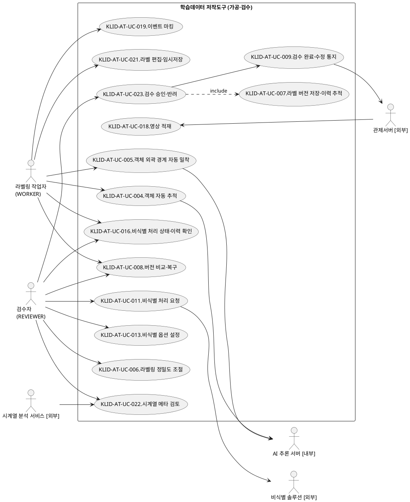
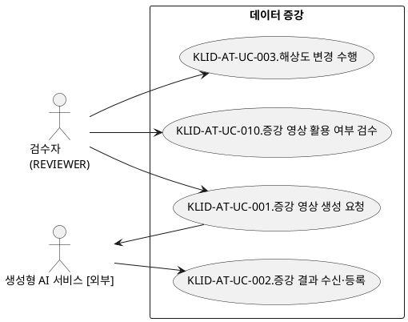
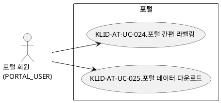
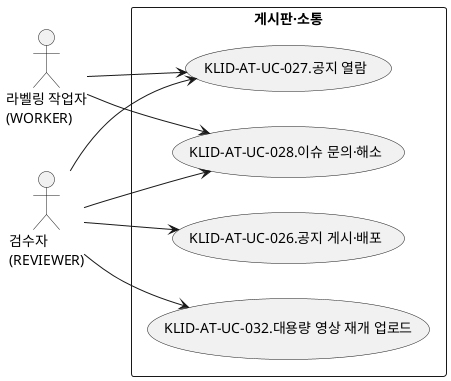

# R2 유스케이스 명세서

> **ID 표기 규칙(공통)**: 본 산출물의 모든 ID(KLID-AT-UC/AC/UCD/SS 등)는 **전체 형식 `KLID-AT-XX-NNN`** 으로 표기한다. 끝부분만(예: `UC-001`) 약식 표기 금지. 범위는 시작 ID만 전체형으로(예: `KLID-AT-UC-001~013`). ※ 요구사항(RQ-SFR-NN-NN·NFR-NNN) 등 타 체계 ID는 각 체계 원형 유지.

## 작성 목적
> 시스템의 요구사항에 대하여 액터와 시스템 활동 및 상호간의 활동에 대하여 순서화된 시나리오를 상세하게 기술하고, 유스케이스의 이름, 액터, 그들 간의 연관관계를 보여주는 시스템 환경을 다이어그램으로도 표현한다. 또한 주요한 유스케이스에 대하여 대상 시스템과 액터 간의 오퍼레이션을 상세하게 표시하는 시스템 시퀀스 다이어그램 및 오퍼레이션의 약정을 나타낼 수 있는데 이 부분은 필수 산출물에 포함되지 않으며 선택적으로 작성할 수 있다.

## 작성 방법
> 유스케이스는 시나리오를 구체적인 언어표현으로 기술하고, 유스케이스 다이어그램은 그림으로 작성하며 작성도구를 사용할 수 있다.

## 산출물 양식

### 제.개정 이력

| 날짜 | 버전 | 작성자 | 승인자 | 내용 |
|------|------|--------|--------|------|
| 2026-06-23 | 1.0 | - | - | LogiCraft 그래프 기반 생성 (/cc-doc-gen) |
| 2026-06-25 | 1.1 | 박찬기 | 김현욱 | 전체 개발범위(R1 외 구현분) 유스케이스 통합 — design-full |

### 헤더

| R2 | 유스케이스 명세서 |
|-------|------------|
| 시스템명 | AI 기반 지방정부 CCTV 관제지원시스템(2차) | 서브시스템명 | 학습데이터 저작도구 |
| 단계명  | 분석 | 작성일자 | 2026-06-23 | 버전 | 1.0 |

### 1. 서브시스템 목록

| 서브시스템 ID | 서브시스템명 | 서브시스템 설명 |
|------------|---------|-----------|
| KLID-AT-SS-002 | 마킹 | 비식별 영상에서 자동/수동으로 이벤트 시점을 식별·마킹하고 후속 배치를 시작한다. |
| KLID-AT-SS-003 | 배치 파이프라인 | 학습용 설정 영상을 적재하고 비식별·마킹·시계열 메타·프레임추출·자동 라벨링·추적 보간 단계를 순차 처리한다. |
| KLID-AT-SS-004 | 비식별화 | 외부 비식별 솔루션 연동으로 전체 영상의 개인정보를 비식별하고 옵션 설정·상태/이력 확인·누락 신고를 제공한다. |
| KLID-AT-SS-005 | 시계열 메타 | 외부 시계열 분석 서비스 결과를 적재하여 검수자가 검토·수정·승인한다. |
| KLID-AT-SS-006 | 라벨링 | 프레임에 바운딩박스/폴리곤/세그멘테이션 라벨과 속성을 편집하고 자동 추적·외곽 밀착·정밀도 조절을 제공한다. |
| KLID-AT-SS-007 | 검수 | 작업자가 제출한 영상 단위 작업과 증강 결과를 검수자가 승인/반려한다. |
| KLID-AT-SS-008 | 버전관리 | 검수 승인 시점 라벨 스냅샷을 저장·이력 추적하고 버전 비교·복구와 관제 통지를 수행한다. |
| KLID-AT-SS-009 | 데이터 증강 | 외부 생성형 AI에 증강 생성을 위탁하고 결과를 새 영상으로 수신·등록하며 해상도 변경을 직접 수행한다. |
| KLID-AT-SS-010 | 포털 | 외부 포털 회원이 데이터마트 영상을 선택하고 기존 라벨을 Load해 간편 라벨링·사용자별 별도 저장·다운로드한다(원본·데이터마트 미수정, 단방향). |
| KLID-AT-SS-011 | 게시판(공지·가이드라인) | 검수자가 공지/가이드라인을 작성·발행·고정하고 첨부를 보안 저장하며, 전체 사용자가 열람·다운로드한다. |
| KLID-AT-SS-012 | 이슈 소통 | 영상 단위로 검수자↔작업자가 문의(INQUIRY)·답변·해소 스레드와 코멘트로 양방향 소통한다. |
| KLID-AT-SS-013 | 데이터마트 노출 | 검수 완료(승인) 영상만 노출하는 적재용 View를 제공하여 관제서버가 통지 수신 후 단순 조회로 마트에 적재한다. |

### 2. 유스케이스 다이어그램(UCD)

#### KLID-AT-UCD-001 가공·검수 핵심 흐름

| UCD ID | KLID-AT-UCD-001 | UCD 명 | 가공·검수 핵심 흐름 |
|--------|---|-------|---|
| 관련 서브시스템 ID | KLID-AT-SS-002~008 | 관련 서브시스템명 | 마킹·배치 파이프라인·비식별화·시계열 메타·라벨링·검수·버전관리 |

#### KLID-AT-UCD-002 데이터 증강 흐름

| UCD ID | KLID-AT-UCD-002 | UCD 명 | 데이터 증강 흐름 |
|--------|---|-------|---|
| 관련 서브시스템 ID | KLID-AT-SS-009 | 관련 서브시스템명 | 데이터 증강 |

#### KLID-AT-UCD-003 포털 채널 흐름

| UCD ID | KLID-AT-UCD-003 | UCD 명 | 포털 채널 흐름 |
|--------|---|-------|---|
| 관련 서브시스템 ID | KLID-AT-SS-010 | 관련 서브시스템명 | 포털 |

#### KLID-AT-UCD-004 게시판·소통 흐름

| UCD ID | KLID-AT-UCD-004 | UCD 명 | 게시판·소통 흐름 |
|--------|---|-------|---|
| 관련 서브시스템 ID | KLID-AT-SS-011, KLID-AT-SS-012 | 관련 서브시스템명 | 게시판(공지·가이드라인)·이슈 소통 |

### 3. 유스케이스 목록

| 유스케이스 ID | 유스케이스명 | 유스케이스 설명 | 관련액터 ID | 관련 UCD ID | 관련 요구사항 ID |
|------------|---------|-----------|----------|-----------|-------------|
| KLID-AT-UC-018 | 영상 적재 (관제 학습용 설정) | 관제서버가 공유 데이터에서 영상을 학습용으로 설정하면 주기 배치가 픽업해 적재하고 배치 파이프라인 대상으로 등록한다. | KLID-AT-AC-004, KLID-AT-AC-006 | KLID-AT-UCD-001 | RQ-SFR-11-04 |
| KLID-AT-UC-011 | 비식별 처리 요청 | 전체 영상을 외부 비식별 솔루션에 위탁해 개인정보를 비식별하고 원본·비식별본을 각각 저장한다. | KLID-AT-AC-002, KLID-AT-AC-005 | KLID-AT-UCD-001 | RQ-SFR-09-01, RQ-SFR-09-02, RQ-SFR-11-06 |
| KLID-AT-UC-013 | 비식별 옵션 설정 | 외부 비식별 솔루션이 제공하는 옵션을 관리 화면에서 설정·저장한다. | KLID-AT-AC-002 | KLID-AT-UCD-001 | RQ-SFR-09-04 |
| KLID-AT-UC-016 | 비식별 처리 상태·이력 확인 | 영상 단위 비식별 상태·이력을 확인하고, 라벨 작업 중 비식별 누락을 신고·해소한다. | KLID-AT-AC-002, KLID-AT-AC-001, KLID-AT-AC-005 | KLID-AT-UCD-001 | RQ-SFR-09-03, RQ-SFR-09-05, RQ-SFR-11-06 |
| KLID-AT-UC-019 | 이벤트 마킹 (자동/수동) | 비식별 영상에서 자동(프레임 간격)/수동(단축키) 마킹으로 이벤트 시점을 식별하고 완료 시 잔여 배치를 시작한다. | KLID-AT-AC-001, KLID-AT-AC-006 | KLID-AT-UCD-001 | RQ-SFR-17, RQ-SFR-11-04 |
| KLID-AT-UC-022 | 시계열 메타 검토 | 외부 시계열 분석 결과를 검수큐에서 검토·수정·승인한다. | KLID-AT-AC-002, KLID-AT-AC-007 | KLID-AT-UCD-001 | RQ-SFR-17, RQ-SFR-11-10 |
| KLID-AT-UC-021 | 라벨 편집·임시저장 | 배정받은 영상 프레임에 라벨과 객체 속성값을 편집하고 작업본을 임시저장한다. | KLID-AT-AC-001 | KLID-AT-UCD-001 | RQ-SFR-11-08, RQ-SFR-16, RQ-SFR-17 |
| KLID-AT-UC-004 | 객체 자동 추적 | 시작 프레임에서 지정한 객체를 후속 프레임에서 자동 추적하여 위치·경계를 갱신한다. | KLID-AT-AC-001, KLID-AT-AC-007 | KLID-AT-UCD-001 | RQ-SFR-08-01 |
| KLID-AT-UC-005 | 객체 외곽 경계 자동 밀착 | 클릭/박스 1회 지정으로 외곽선을 인식해 경계에 밀착된 폴리곤을 자동 산출한다. | KLID-AT-AC-001, KLID-AT-AC-007 | KLID-AT-UCD-001 | RQ-SFR-08-02 |
| KLID-AT-UC-006 | 라벨링 정밀도 조절 | 폴리곤 단순화 정밀도를 조절하여 분할·밀착 결과의 경계 세밀함을 제어한다. | KLID-AT-AC-002 | KLID-AT-UCD-001 | RQ-SFR-08-03 |
| KLID-AT-UC-023 | 검수 승인·반려 | 작업자가 제출한 영상 단위 작업을 검수하여 승인(=작업 완료) 또는 반려한다. | KLID-AT-AC-002, KLID-AT-AC-001 | KLID-AT-UCD-001 | RQ-SFR-11-10 |
| KLID-AT-UC-007 | 라벨 버전 저장·이력 추적 | 검수 승인 시점에 영상 단위 라벨 전체 스냅샷을 해시 식별자와 함께 저장하고 이력을 기록한다. | KLID-AT-AC-002 | KLID-AT-UCD-001 | RQ-SFR-08-04 |
| KLID-AT-UC-008 | 버전 비교·복구 | 두 버전의 스냅샷을 비교(diff)하고 선택 버전을 새 활성 버전으로 복구한다. | KLID-AT-AC-002, KLID-AT-AC-001 | KLID-AT-UCD-001 | RQ-SFR-08-05 |
| KLID-AT-UC-009 | 검수 완료·수정 통지 | 검수 완료 시 완료 통지, 검수 완료 후 수정 시 수정 통지를 관제서버로 단방향 발행한다. | KLID-AT-AC-002, KLID-AT-AC-004 | KLID-AT-UCD-001 | RQ-SFR-08-04, RQ-SFR-08-05 |
| KLID-AT-UC-001 | 증강 영상 생성 요청 | 원본 영상에 대해 날씨·계절·시간 증강 생성을 외부 생성형 AI 서비스로 요청한다. | KLID-AT-AC-002, KLID-AT-AC-003 | KLID-AT-UCD-002 | RQ-SFR-07-01, RQ-SFR-11-05 |
| KLID-AT-UC-002 | 증강 결과 수신·등록 | 외부가 생성한 증강 영상을 새 영상으로 등록하고 원본 라벨/메타를 복사하여 보존한다. | KLID-AT-AC-002, KLID-AT-AC-003 | KLID-AT-UCD-002 | RQ-SFR-07-01, RQ-SFR-07-02, RQ-SFR-11-09 |
| KLID-AT-UC-003 | 해상도 변경 수행 | 원본보다 낮은 표준 하위 해상도로 다운스케일하여 이미지셋으로 제공한다(업스케일·라벨 좌표 미제공). | KLID-AT-AC-002 | KLID-AT-UCD-002 | RQ-SFR-06-03 |
| KLID-AT-UC-010 | 증강 영상 활용 여부 검수 | 미검수 증강 영상을 확인해 학습데이터 활용 여부를 승인/반려한다. | KLID-AT-AC-002 | KLID-AT-UCD-002 | RQ-SFR-07-03, RQ-SFR-11-09 |
| KLID-AT-UC-024 | 포털 간편 라벨링 | 포털 회원이 데이터마트 영상을 선택해 기존 라벨을 Load·편집하고 본인 작업 데이터로 별도 저장한다(원본·데이터마트 미수정). | KLID-AT-AC-008 | KLID-AT-UCD-003 | 활성 / R1 매핑 없음(NFR-006 접근성 연계) |
| KLID-AT-UC-025 | 포털 데이터 다운로드 | 포털 회원이 본인 작업 데이터를 기간 내 다운로드한다. | KLID-AT-AC-008 | KLID-AT-UCD-003 | 활성 / R1 매핑 없음 |
| KLID-AT-UC-026 | 공지 게시·배포 | 검수자가 공지/가이드라인을 작성(임시저장)·첨부 업로드·발행·고정하여 사용자에게 배포한다. | KLID-AT-AC-002 | KLID-AT-UCD-004 | 활성 / R1 매핑 없음 |
| KLID-AT-UC-027 | 공지 열람 | 작업자·검수자가 발행된 공지 목록·상세를 열람하고 첨부를 다운로드한다. | KLID-AT-AC-001, KLID-AT-AC-002 | KLID-AT-UCD-004 | 활성 / R1 매핑 없음 |
| KLID-AT-UC-028 | 이슈 문의·해소 | 영상 단위로 작업자·검수자가 문의(INQUIRY)를 작성·코멘트·해소하는 양방향 스레드를 운영한다. | KLID-AT-AC-001, KLID-AT-AC-002 | KLID-AT-UCD-001 | 활성 / R1 매핑 없음(검수 반려 이력은 RQ-SFR-11-10) |
| KLID-AT-UC-029 | 데이터마트 적재용 조회 | 관제서버가 완료·수정 통지 수신 후 검수 완료 영상만 노출하는 적재용 View를 작업 ID로 조회하여 마트에 적재한다. | KLID-AT-AC-004 | KLID-AT-UCD-001 | RQ-SFR-08-04, RQ-SFR-08-05 (구현 식별자 보강) |
| KLID-AT-UC-030 | 라벨 속성 정의·입력 | 검수자가 라벨 마스터별 속성 스펙을 정의하고 작업자가 라벨링 시 객체별 속성값을 입력한다. | KLID-AT-AC-002, KLID-AT-AC-001 | KLID-AT-UCD-001 | RQ-SFR-08, RQ-SFR-11-08 (속성 확장) |
| KLID-AT-UC-031 | 라벨 프리셋 관리 | 검수자가 라벨 코드 그룹 프리셋을 생성·복제하고 라벨링 화면에 적용한다. | KLID-AT-AC-002 | KLID-AT-UCD-001 | 활성 / R1 매핑 없음 |
| KLID-AT-UC-032 | 대용량 영상 재개 업로드 (deprecated) | 관리 화면에서 대용량 영상을 청크 재개 업로드 세션으로 적재한다(1차 적재 경로 아님·폐지 예정). | KLID-AT-AC-002 | KLID-AT-UCD-004 | 비활성(deprecated) / 1차 적재는 KLID-AT-UC-018 |

### 4. 액터 목록

| 액터 ID | 액터명 | 액터유형 (주요/보조/숨은) | 액터설명 |
|--------|------|-------------------|------|
| KLID-AT-AC-001 | 라벨링 작업자(WORKER) | 주요 | 본인에게 배정된 영상의 마킹·라벨 편집·검수 제출·버전 저장·비식별 누락 신고를 수행한다. |
| KLID-AT-AC-002 | 검수자(REVIEWER) | 주요 | 작업 배정, 검수 승인/반려, 증강 요청·검수, 비식별 요청·옵션 설정, 시계열 메타 검토, 버전 비교·복구, 시스템 설정을 수행한다(관리 권한 통합). |
| KLID-AT-AC-003 | 생성형 AI 서비스[외부] | 보조 | 증강 영상 생성을 위탁받아 수행하고 결과를 회신하는 외부 시스템이다. |
| KLID-AT-AC-004 | 관제서버[외부] | 보조 | 공유 데이터에서 영상을 학습용으로 설정하고, 완료·수정 통지를 수신하여 상세를 조회하는 외부 시스템이다. |
| KLID-AT-AC-005 | 비식별 솔루션[외부] | 보조 | 영상의 개인정보를 비식별 처리하는 외부 솔루션이다(발주기관 제공). |
| KLID-AT-AC-006 | 배치 시스템 | 보조 | 학습용 영상 픽업·적재와 비식별·마킹·메타·프레임추출·자동 라벨링 단계를 주기적으로 처리하는 내부 자동 시스템이다. |
| KLID-AT-AC-007 | 시계열 분석·AI 추론 서비스 | 보조 | 시계열 메타 분석과 객체 추적·외곽 분할 추론을 제공하는 외부/내부 추론 시스템이다. |
| KLID-AT-AC-008 | 포털 회원(PORTAL_USER) | 주요 | 외부 포털 채널로 진입하여 데이터마트 영상을 선택하고 기존 라벨을 확인·수정하여 본인 작업 데이터로 별도 저장·다운로드하는 외부 사용자다(오토라벨링·검수·버전관리·업로드 미제공). |

### 5. 유스케이스 기술서

<table>
<tr><td>유스케이스 ID</td><td>KLID-AT-UC-018</td><td>유스케이스명</td><td>영상 적재 (관제 학습용 설정)</td></tr>
<tr><td colspan="4">
<b>1. 주요 액터</b> 
&emsp;- 관제서버[외부], 배치 시스템  
<b>2. 이해관계자와 관심사항</b> 
&emsp;- 관제서버는 학습용으로 지정한 영상이 수작업 없이 자동 적재·전처리되길 원한다. 
&emsp;- 저작도구는 라벨링·검수 워크플로우의 원천 데이터를 확보하길 원한다.  
<b>3. 전제조건</b> 
&emsp;- 관제서버와 저작도구가 동일 데이터를 공유한다. 
&emsp;- 관제서버가 대상 영상을 학습용으로 설정했다. 
&emsp;- 배치 처리는 인증을 요구하지 않는다.  
<b>4. 종료조건</b> 
&emsp;- 영상 1건이 적재되고 작업 상태가 미처리로 초기화되며 비식별(선두) 단계부터 배치 파이프라인 대상이 된다.  
<b>5. 기본 시나리오</b> 
&emsp;1. 관제서버가 공유 데이터에서 특정 영상을 학습용으로 설정한다. 
&emsp;2. 주기 배치가 학습용으로 설정된 미적재 영상을 공유 데이터에서 조회한다. 
&emsp;3. 시스템이 조회된 영상을 1건 등록하고 원본 경로·메타를 기록하며 작업 상태를 미처리로 초기화한다. 
&emsp;4. 비식별화 솔루션을 비동기로 위탁 호출하여 비식별(선두) 단계부터 배치 파이프라인이 자동 진행된다. 
&emsp;5. 본 유스케이스는 종료한다.  
<b>6. 대안 시나리오</b> 
&emsp;<b>가. 대상 없음</b> 
&emsp;&emsp;1. 배치 주기에 학습용 미적재 영상이 없으면 무처리로 종료한다. 
&emsp;<b>나. 비식별 실패</b> 
&emsp;&emsp;1. 비식별화 솔루션 오류 시 영상 상태를 실패로 표시하고 원본을 보존하며 재처리 대상으로 둔다.  
<b>7. 구현 시 고려 사항</b> 
&emsp;- 수신 연동 인터페이스·양방향 기계 간 인증을 사용하지 않고 공유 데이터 읽기 기반으로 적재한다(NFR-005). 
&emsp;- 포털 사용자 업로드는 제공하지 않는다.  
<b>8. 발생 빈도</b> 
&emsp;- 주기 배치마다 발생(분당 처리 기준, NFR-001).
</td></tr>
</table>

<table>
<tr><td>유스케이스 ID</td><td>KLID-AT-UC-011</td><td>유스케이스명</td><td>비식별 처리 요청</td></tr>
<tr><td colspan="4">
<b>1. 주요 액터</b> 
&emsp;- 검수자(REVIEWER), 비식별 솔루션[외부]  
<b>2. 이해관계자와 관심사항</b> 
&emsp;- 검수자는 수집 영상의 개인정보가 안전하게 비식별되길 원한다. 
&emsp;- 발주기관은 원본이 어떤 경우에도 보존되길 원한다.  
<b>3. 전제조건</b> 
&emsp;- 대상 영상이 적재되어 있다(전체 영상 비식별 대상). 
&emsp;- 검수자로 인증되어 있고 외부 비식별 솔루션이 가용하다.  
<b>4. 종료조건</b> 
&emsp;- 비식별본이 별도 경로에 저장되고 원본이 보존되며 처리 이력이 영상 단위로 기록된다.  
<b>5. 기본 시나리오</b> 
&emsp;1. 검수자가 비식별(재)처리를 요청한다(요청 수락). 
&emsp;2. 시스템이 외부 비식별 솔루션에 위탁한다(영상 업로드 후 비식별 작업 생성). 
&emsp;3. 주기 조회로 완료를 감지하고 결과를 회수한다. 
&emsp;4. 비식별본을 비식별 저장 경로에 저장하고 원본은 유지한다. 
&emsp;5. 처리 이력을 기록한다. 
&emsp;6. 본 유스케이스는 종료한다.  
<b>6. 대안 시나리오</b> 
&emsp;<b>가. 비식별 처리 실패</b> 
&emsp;&emsp;1. 비식별 상태를 실패로 마킹하고 재시도 큐에 등록하며 원본을 보존한다.  
<b>7. 구현 시 고려 사항</b> 
&emsp;- 외부 연동에 타임아웃·재시도·서킷 브레이커를 적용한다(NFR-004). 
&emsp;- 비식별은 배치 파이프라인의 선두 단계이며 전체 영상을 대상으로 한다.  
<b>8. 발생 빈도</b> 
&emsp;- 영상 적재 직후 자동 1회, 누락 신고 시 수동 발생.
</td></tr>
</table>

<table>
<tr><td>유스케이스 ID</td><td>KLID-AT-UC-013</td><td>유스케이스명</td><td>비식별 옵션 설정</td></tr>
<tr><td colspan="4">
<b>1. 주요 액터</b> 
&emsp;- 검수자(REVIEWER)  
<b>2. 이해관계자와 관심사항</b> 
&emsp;- 검수자는 외부 비식별 솔루션이 제공하는 옵션을 관리 화면에서 설정하길 원한다.  
<b>3. 전제조건</b> 
&emsp;- 검수자로 인증되어 있다.  
<b>4. 종료조건</b> 
&emsp;- 비식별 옵션이 저장되어 이후 비식별 요청에 반영된다.  
<b>5. 기본 시나리오</b> 
&emsp;1. 검수자가 관리 화면에서 비식별 옵션을 설정한다. 
&emsp;2. 시스템이 옵션을 저장하고 이후 비식별 요청에 적용한다. 
&emsp;3. 본 유스케이스는 종료한다.  
<b>6. 대안 시나리오</b> 
&emsp;- 해당 없음.  
<b>7. 구현 시 고려 사항</b> 
&emsp;- 옵션 설정은 관리 화면(검수자 전용)에서만 가능하다(NFR-013).  
<b>8. 발생 빈도</b> 
&emsp;- 운영 정책 변경 시 비정기 발생.
</td></tr>
</table>

<table>
<tr><td>유스케이스 ID</td><td>KLID-AT-UC-016</td><td>유스케이스명</td><td>비식별 처리 상태·이력 확인</td></tr>
<tr><td colspan="4">
<b>1. 주요 액터</b> 
&emsp;- 검수자(REVIEWER), 라벨링 작업자(WORKER), 외부 비식별 솔루션  
<b>2. 이해관계자와 관심사항</b> 
&emsp;- 검수자·작업자는 영상별 비식별 상태와 배치 진행을 확인하길 원한다. 
&emsp;- 작업자는 비식별 누락을 발견하면 신고하여 안전하게 처리되길 원한다.  
<b>3. 전제조건</b> 
&emsp;- 영상이 적재되어 배치 파이프라인 대상이다. 
&emsp;- 검수자 또는 작업자로 인증되어 있다.  
<b>4. 종료조건</b> 
&emsp;- 영상 단위 비식별 상태와 배치 단계가 화면에서 확인된다. 
&emsp;- 신고 시 해당 영상 전체 라벨이 복원 가능 스냅샷 기록 후 삭제되고 영상이 잠긴다. 
&emsp;- 수동 비식별화 완료 후 신고가 해소되고 작업락이 해제된다.  
<b>5. 기본 시나리오</b> 
&emsp;1. 검수자가 영상 상세 또는 처리 현황 화면에서 비식별 상태와 배치 단계를 확인한다. 
&emsp;2. 작업자가 라벨 작업 중 비식별 누락(얼굴/번호판 미블러 등)을 발견하면 신고한다(본인 배정 영상만). 
&emsp;3. 시스템이 해당 영상 전체 라벨을 삭제 전 복원용 스냅샷 + 변경이력으로 보존한 뒤 일괄 삭제하고 작업락 및 비식별 실패 상태로 마킹한다. 검수 완료된 영상이면 수정 통지를 발행한다. 
&emsp;4. 작업자·검수자가 외부 솔루션으로 수동 비식별화를 수행한다. 
&emsp;5. 신고를 해소한다(신고 상태를 처리완료로 전이하고 작업락을 해제한다). 
&emsp;6. 외부 비식별 솔루션의 배치 비식별이 완료/실패하면 비식별 상태를 갱신하고 처리 이력을 기록한다. 
&emsp;7. 본 유스케이스는 종료한다.  
<b>6. 대안 시나리오</b> 
&emsp;<b>가. 이미 잠금·중복 신고</b> 
&emsp;&emsp;1. 이미 재비식별 진행 중인 영상에 재신고하면 충돌로 거부한다. 
&emsp;<b>나. 이미 처리된 신고 해소</b> 
&emsp;&emsp;1. 처리완료 상태가 아닌 신고를 재해소하면 충돌로 거부한다. 
&emsp;<b>다. 비식별 처리 실패</b> 
&emsp;&emsp;1. 외부 비식별 결과가 성공이 아니면 비식별 상태를 실패로 마킹하고 실패 상태·오류 코드를 이력에 기록한다.  
<b>7. 구현 시 고려 사항</b> 
&emsp;- 자동 재비식별 큐는 폐기되고 외부 솔루션 수동 비식별화로 대체한다. 
&emsp;- 작업자는 본인 배정 영상만 신고할 수 있으며 타인 배정 접근은 차단한다(NFR-013).  
<b>8. 발생 빈도</b> 
&emsp;- 상태 확인은 수시, 누락 신고는 비정기 발생.
</td></tr>
</table>

<table>
<tr><td>유스케이스 ID</td><td>KLID-AT-UC-019</td><td>유스케이스명</td><td>이벤트 마킹 (자동/수동)</td></tr>
<tr><td colspan="4">
<b>1. 주요 액터</b> 
&emsp;- 라벨링 작업자(WORKER), 배치 시스템  
<b>2. 이해관계자와 관심사항</b> 
&emsp;- 작업자는 영상을 재생하며 이벤트 시점을 빠르게 마킹하길 원한다. 
&emsp;- 시스템은 시계열 분석과 프레임 추출이 이벤트 위치 기반으로 수행되길 원한다.  
<b>3. 전제조건</b> 
&emsp;- 영상이 적재되어 있다. 
&emsp;- 작업자로 인증되어 있다(본인 배정 영상).  
<b>4. 종료조건</b> 
&emsp;- 마킹 결과가 저장되고 잔여 배치 파이프라인이 시작된다.  
<b>5. 기본 시나리오</b> 
&emsp;1. 작업자가 마킹 화면에서 비식별 영상을 구간 스트리밍·배속 조절하며 재생한다. 
&emsp;2. 수동(마킹/삭제 단축키) 또는 자동(프레임 간격)으로 이벤트 시점을 마킹한다. 
&emsp;3. 시스템이 마킹을 저장한다. 
&emsp;4. 작업자가 마킹을 완료한다. 
&emsp;5. 시스템이 마킹 완료 시점에 잔여 배치(시계열 메타→프레임추출→자동 라벨링)를 시작하고 작업 상태를 전이한다. 
&emsp;6. 본 유스케이스는 종료한다.  
<b>6. 대안 시나리오</b> 
&emsp;<b>가. 마킹 중 비식별 누락 발견</b> 
&emsp;&emsp;1. 영상 기준으로 비식별 누락을 신고한다(설계 타깃).  
<b>7. 구현 시 고려 사항</b> 
&emsp;- 마킹 화면은 항상 비식별 영상을 서빙하며 비식별 미완료 시 원본 노출을 차단한다(NFR-005). 
&emsp;- 마킹 결과(이벤트명·영상경로·마킹 배열)는 시계열 분석으로 전달된다.  
<b>8. 발생 빈도</b> 
&emsp;- 영상 1건당 1회 이상.
</td></tr>
</table>

<table>
<tr><td>유스케이스 ID</td><td>KLID-AT-UC-022</td><td>유스케이스명</td><td>시계열 메타 검토</td></tr>
<tr><td colspan="4">
<b>1. 주요 액터</b> 
&emsp;- 검수자(REVIEWER), 외부 시계열 분석 서비스  
<b>2. 이해관계자와 관심사항</b> 
&emsp;- 검수자는 시계열 메타의 오류를 수정·승인하길 원한다. 
&emsp;- 시스템은 검증된 메타만 학습데이터에 포함되길 원한다.  
<b>3. 전제조건</b> 
&emsp;- 마킹 결과가 시계열 분석으로 전달되어 결과가 수신되었다.  
<b>4. 종료조건</b> 
&emsp;- 승인된 메타만 데이터마트 적재용으로 노출된다. 
&emsp;- 메타 변경이 반영되어 있다.  
<b>5. 기본 시나리오</b> 
&emsp;1. 외부 시계열 분석 서비스가 분석 결과를 회신한다. 
&emsp;2. 시스템이 메타를 적재하고 검수큐에 진입시킨다. 
&emsp;3. 검수자가 메타 검토 화면에서 시계열 메타를 검토하고 필요 시 수정한다. 
&emsp;4. 검수자가 승인 또는 반려한다(검수 상태 전이). 
&emsp;5. 본 유스케이스는 종료한다.  
<b>6. 대안 시나리오</b> 
&emsp;<b>가. 시계열 결과 오류</b> 
&emsp;&emsp;1. 검수자가 메타를 직접 수정 후 승인하거나 반려 처리한다.  
<b>7. 구현 시 고려 사항</b> 
&emsp;- 시계열 분석 본체는 외부 책임이며 저작도구는 결과 적재·검토 연동만 보유한다. 
&emsp;- 승인된 메타만 데이터마트 적재용 뷰에 노출된다.  
<b>8. 발생 빈도</b> 
&emsp;- 영상 1건당 1회 이상(메타 단위 다수).
</td></tr>
</table>

<table>
<tr><td>유스케이스 ID</td><td>KLID-AT-UC-021</td><td>유스케이스명</td><td>라벨 편집·임시저장</td></tr>
<tr><td colspan="4">
<b>1. 주요 액터</b> 
&emsp;- 라벨링 작업자(WORKER)  
<b>2. 이해관계자와 관심사항</b> 
&emsp;- 작업자는 프레임에 도형과 속성을 편집하고 안전하게 임시저장하길 원한다. 
&emsp;- 작업자는 검수 제출 전까지 작업본을 잃지 않길 원한다.  
<b>3. 전제조건</b> 
&emsp;- 영상이 본인에게 배정되어 있다. 
&emsp;- 프레임이 추출되어 있다.  
<b>4. 종료조건</b> 
&emsp;- 작업본이 영속되어 있다. 
&emsp;- 학습데이터 버전은 생성되지 않았다(검수 승인 시 생성).  
<b>5. 기본 시나리오</b> 
&emsp;1. 작업자가 라벨링 화면에 진입한다(본인 배정 검증, 타인 배정 시 거부). 
&emsp;2. 캔버스에서 바운딩박스/폴리곤/세그멘테이션을 생성·수정한다(라벨 마스터 코드 기반). 
&emsp;3. 객체별 속성값을 입력한다(속성 정의 기반). 
&emsp;4. 저장 시 작업본을 영속한다(버전 스냅샷 미생성 — 임시저장). 
&emsp;5. 본 유스케이스는 종료한다.  
<b>6. 대안 시나리오</b> 
&emsp;<b>가. 타인 배정 접근</b> 
&emsp;&emsp;1. 본인 배정이 아닌 프레임 편집을 시도하면 접근을 거부한다. 
&emsp;<b>나. 검수 완료된 영상 수정</b> 
&emsp;&emsp;1. 동일 작업 ID를 유지하여 저장하고 수정 통지를 발행한다.  
<b>7. 구현 시 고려 사항</b> 
&emsp;- 2계층 분리: 임시저장(작업본 영속, 되돌리기는 화면 세션)과 학습데이터 버전(검수 승인 시점)을 구분한다. 
&emsp;- 본인 배정만 편집 가능하며 타인 배정 접근은 차단한다(NFR-013).  
<b>8. 발생 빈도</b> 
&emsp;- 라벨링 작업 중 수시 발생.
</td></tr>
</table>

<table>
<tr><td>유스케이스 ID</td><td>KLID-AT-UC-004</td><td>유스케이스명</td><td>객체 자동 추적</td></tr>
<tr><td colspan="4">
<b>1. 주요 액터</b> 
&emsp;- 라벨링 작업자(WORKER), AI 추론 서비스  
<b>2. 이해관계자와 관심사항</b> 
&emsp;- 작업자는 객체를 한 번 지정하면 후속 프레임이 자동 추적되길 원한다.  
<b>3. 전제조건</b> 
&emsp;- 유효 인증(검수자 또는 작업자)되어 있다. 
&emsp;- 대상 프레임과 추적 시작 객체 지정이 선행되어 있다.  
<b>4. 종료조건</b> 
&emsp;- 후속 프레임에 추적된 객체 위치·경계가 갱신·저장된다.  
<b>5. 기본 시나리오</b> 
&emsp;1. 작업자가 시작 프레임에서 추적할 객체를 박스로 지정한다. 
&emsp;2. 시스템이 AI 추론 호출로 객체 추적을 요청한다(본인 미배정 프레임 접근 차단). 
&emsp;3. AI 추론 서비스가 후속 프레임에 위치(바운딩박스)·경계(폴리곤)를 전파·반환한다. 
&emsp;4. 시스템이 자동 라벨로 저장한다(좌표 상한 검증). 
&emsp;5. 추적 보간으로 빈 프레임을 채운다. 
&emsp;6. 작업자가 키프레임을 확인·보정하고 저장한다. 
&emsp;7. 본 유스케이스는 종료한다.  
<b>6. 대안 시나리오</b> 
&emsp;<b>가. AI 추론 호출 실패/타임아웃</b> 
&emsp;&emsp;1. 서킷 브레이커가 동작하고 추적 실패를 안내하며 원본 라벨을 유지한다. 
&emsp;<b>나. 가림·장면전환·빠른 이동 시 정확도 저하</b> 
&emsp;&emsp;1. 작업자가 키프레임을 수동 보정한 후 보간을 재계산한다.  
<b>7. 구현 시 고려 사항</b> 
&emsp;- 자동 라벨링은 원본 프레임에만 실행하고 비식별본은 좌표를 공유한다. 
&emsp;- 본인 미배정 프레임 접근은 차단한다(NFR-013).  
<b>8. 발생 빈도</b> 
&emsp;- 영상 라벨링 중 객체 단위로 다수 발생.
</td></tr>
</table>

<table>
<tr><td>유스케이스 ID</td><td>KLID-AT-UC-005</td><td>유스케이스명</td><td>객체 외곽 경계 자동 밀착</td></tr>
<tr><td colspan="4">
<b>1. 주요 액터</b> 
&emsp;- 라벨링 작업자(WORKER), AI 추론 서비스  
<b>2. 이해관계자와 관심사항</b> 
&emsp;- 작업자는 클릭/박스 한 번으로 객체 외곽에 밀착된 라벨을 얻길 원한다.  
<b>3. 전제조건</b> 
&emsp;- 인증되어 있고(작업자는 본인 배정 프레임) 대상 프레임과 초기 지정(클릭/박스)이 존재한다.  
<b>4. 종료조건</b> 
&emsp;- 객체 외곽선에 밀착된 폴리곤/마스크 좌표가 반환된다.  
<b>5. 기본 시나리오</b> 
&emsp;1. 작업자가 캔버스에서 외곽 밀착 도구로 객체를 클릭(포인트) 또는 드래그(박스)로 지목한다. 
&emsp;2. 시스템이 AI 추론 호출로 외곽 분할을 요청한다(클릭 또는 박스 정확히 1개). 
&emsp;3. AI 추론 서비스가 외곽선 기반 폴리곤과 신뢰도를 산출·반환한다. 
&emsp;4. 응답 폴리곤을 이미지 실측 상한까지 좌표 검증 후 폴리곤 단순화로 정리한다. 
&emsp;5. 밀착 결과를 캔버스에 적용한다. 
&emsp;6. 본 유스케이스는 종료한다.  
<b>6. 대안 시나리오</b> 
&emsp;<b>가. 외곽 인식 실패</b> 
&emsp;&emsp;1. 작업자가 수동 폴리곤으로 전환해 작업한다. 
&emsp;<b>나. 추론 호출 실패</b> 
&emsp;&emsp;1. 호출 실패를 안내하고 기존 지정을 유지한다.  
<b>7. 구현 시 고려 사항</b> 
&emsp;- 외곽 분할은 원본 프레임 이미지에만 실행하고 비식별본은 좌표를 공유한다. 
&emsp;- 추론 응답이 검증 미통과(테스트용 응답 등)이면 자동 적용을 차단한다.  
<b>8. 발생 빈도</b> 
&emsp;- 라벨링 중 객체 단위로 다수 발생.
</td></tr>
</table>

<table>
<tr><td>유스케이스 ID</td><td>KLID-AT-UC-006</td><td>유스케이스명</td><td>라벨링 정밀도 조절</td></tr>
<tr><td colspan="4">
<b>1. 주요 액터</b> 
&emsp;- 검수자(REVIEWER)  
<b>2. 이해관계자와 관심사항</b> 
&emsp;- 검수자는 분할·밀착 결과 경계의 세밀함을 제어하길 원한다.  
<b>3. 전제조건</b> 
&emsp;- 검수자로 인증되어 있고 폴리곤 단순화 설정 키가 존재한다.  
<b>4. 종료조건</b> 
&emsp;- 조절된 정밀도가 적용된 라벨 결과가 반환된다.  
<b>5. 기본 시나리오</b> 
&emsp;1. 검수자가 시스템 설정에서 폴리곤 단순화 정밀도를 조절한다. 
&emsp;2. 시스템이 설정값을 저장하고 애플리케이션 캐시에 반영한다. 
&emsp;3. 이후 추적·밀착 시 설정 정밀도로 폴리곤 점 수를 단순화한다. 
&emsp;4. 설정 조회 실패 시 기본값으로 안전하게 폴백한다. 
&emsp;5. 본 유스케이스는 종료한다.  
<b>6. 대안 시나리오</b> 
&emsp;<b>가. 값 범위 초과</b> 
&emsp;&emsp;1. 검증 실패로 거부하고 안내한다. 
&emsp;<b>나. 권한 부족</b> 
&emsp;&emsp;1. 설정 변경은 검수자 전용이므로 작업자 호출은 거부한다.  
<b>7. 구현 시 고려 사항</b> 
&emsp;- 설정은 애플리케이션 캐시(만료 60초)로 관리하고 조회 실패 시 기본값으로 폴백한다.  
<b>8. 발생 빈도</b> 
&emsp;- 운영 정책 조정 시 비정기 발생.
</td></tr>
</table>

<table>
<tr><td>유스케이스 ID</td><td>KLID-AT-UC-023</td><td>유스케이스명</td><td>검수 승인·반려</td></tr>
<tr><td colspan="4">
<b>1. 주요 액터</b> 
&emsp;- 검수자(REVIEWER), 라벨링 작업자(WORKER)  
<b>2. 이해관계자와 관심사항</b> 
&emsp;- 검수자는 제출된 라벨링 작업을 검토해 승인·반려하길 원한다. 
&emsp;- 시스템은 검증된 작업만 학습데이터로 확정되길 원한다.  
<b>3. 전제조건</b> 
&emsp;- 작업자가 라벨링을 완료하고 검수 제출했다.  
<b>4. 종료조건</b> 
&emsp;- 승인 시 작업이 완료되고 버전 스냅샷과 완료 통지가 존재한다. 
&emsp;- 반려 시 반려 사유가 기록되고 작업이 재작업 상태가 된다.  
<b>5. 기본 시나리오</b> 
&emsp;1. 작업자가 작업을 검수 제출한다(제출 이벤트 기록). 
&emsp;2. 검수자가 제출된 영상의 라벨·메타를 검토한다. 
&emsp;3. 승인 시 작업 상태를 완료로 전이하고 버전 스냅샷을 생성하며(KLID-AT-UC-007 포함) 완료 통지를 발행하고 승인 이벤트를 기록한다. 
&emsp;4. 또는 반려 시 반려 사유를 기록하고 반려 이벤트를 기록하며 작업자가 재작업한다. 
&emsp;5. 본 유스케이스는 종료한다.  
<b>6. 대안 시나리오</b> 
&emsp;<b>가. 재제출 반복</b> 
&emsp;&emsp;1. 작업자가 재제출하고 승인까지 반복한다(1인 승인, 2차 검수 없음). 
&emsp;<b>나. 검수완료 후 수정</b> 
&emsp;&emsp;1. 동일 작업 ID를 유지하고 수정 통지를 발행하며, 재검수·재승인 시 새 버전 스냅샷을 추가한다.  
<b>7. 구현 시 고려 사항</b> 
&emsp;- 검수 승인 = 작업 완료이며 작업 상태의 완료 전이는 검수 승인 시점에만 발생한다. 
&emsp;- 검수는 1인 승인 반복 방식이다(2차 검수 폐지).  
<b>8. 발생 빈도</b> 
&emsp;- 영상 1건당 1회 이상(반려 시 반복).
</td></tr>
</table>

<table>
<tr><td>유스케이스 ID</td><td>KLID-AT-UC-007</td><td>유스케이스명</td><td>라벨 버전 저장·이력 추적</td></tr>
<tr><td colspan="4">
<b>1. 주요 액터</b> 
&emsp;- 검수자(REVIEWER)  
<b>2. 이해관계자와 관심사항</b> 
&emsp;- 검수자·발주기관은 학습데이터로 확정된 단위의 변경이력이 추적되길 원한다.  
<b>3. 전제조건</b> 
&emsp;- 대상 영상의 라벨이 검수 제출되어 검수 대기 상태다. 
&emsp;- 검수자로 인증되어 있다.  
<b>4. 종료조건</b> 
&emsp;- 검수 승인된 라벨 스냅샷이 해시 식별자로 식별되어 저장된다.  
<b>5. 기본 시나리오</b> 
&emsp;1. 검수자가 영상 단위 검수를 승인 처리한다. 
&emsp;2. 시스템이 승인 시점에 라벨 전체 스냅샷을 적재한다(저장 사유: 검수 승인). 
&emsp;3. 페이로드 해시로 버전을 식별한다(동일 페이로드는 동일 해시로 중복 식별). 
&emsp;4. 변경이력을 기록한다. 
&emsp;5. 본 유스케이스는 종료한다.  
<b>6. 대안 시나리오</b> 
&emsp;- 해당 없음.  
<b>7. 구현 시 고려 사항</b> 
&emsp;- 라벨 저장 시점에는 버전을 생성하지 않으며 검수 완료 단위만 버전 대상이다. 
&emsp;- 외부 형상관리도구 없이 데이터베이스 스냅샷 방식으로 관리한다.  
<b>8. 발생 빈도</b> 
&emsp;- 검수 승인 시마다 발생.
</td></tr>
</table>

<table>
<tr><td>유스케이스 ID</td><td>KLID-AT-UC-008</td><td>유스케이스명</td><td>버전 비교·복구</td></tr>
<tr><td colspan="4">
<b>1. 주요 액터</b> 
&emsp;- 검수자(REVIEWER), 라벨링 작업자(WORKER)  
<b>2. 이해관계자와 관심사항</b> 
&emsp;- 검수자는 두 버전의 차이를 비교하고 필요 시 이전 버전으로 되돌리길 원한다.  
<b>3. 전제조건</b> 
&emsp;- 대상 프레임에 2개 이상 라벨 버전 스냅샷이 존재한다. 
&emsp;- 인증되어 있다.  
<b>4. 종료조건</b> 
&emsp;- 차이가 표시되거나 선택 버전이 새 활성 버전으로 복원된다.  
<b>5. 기본 시나리오</b> 
&emsp;1. 버전 이력을 조회한다. 
&emsp;2. 두 버전의 차이를 요청한다. 
&emsp;3. 시스템이 두 스냅샷을 비교해 추가·수정·삭제 차이를 산출·표시한다. 
&emsp;4. 검수자가 대상 버전으로 복구를 요청한다. 
&emsp;5. 시스템이 대상 스냅샷을 새 활성 버전으로 복원·기록한다. 
&emsp;6. 본 유스케이스는 종료한다.  
<b>6. 대안 시나리오</b> 
&emsp;<b>가. 동일 페이로드 버전</b> 
&emsp;&emsp;1. 두 버전 해시가 동일하면 변경 없음으로 안내한다. 
&emsp;<b>나. 검수 완료 후 복구</b> 
&emsp;&emsp;1. 복구로 라벨이 변경되면 수정 통지(KLID-AT-UC-009)를 발생시킨다.  
<b>7. 구현 시 고려 사항</b> 
&emsp;- 검수완료 버전 간 비교·복구이며 데이터베이스 스냅샷을 앱에서 비교한다. 
&emsp;- 복구는 검수자 전체, 작업자는 본인 배정으로 제한한다(NFR-013).  
<b>8. 발생 빈도</b> 
&emsp;- 검수·수정 검토 시 비정기 발생.
</td></tr>
</table>

<table>
<tr><td>유스케이스 ID</td><td>KLID-AT-UC-009</td><td>유스케이스명</td><td>검수 완료·수정 통지</td></tr>
<tr><td colspan="4">
<b>1. 주요 액터</b> 
&emsp;- 검수자(REVIEWER), 관제서버[외부]  
<b>2. 이해관계자와 관심사항</b> 
&emsp;- 관제서버는 검수 완료·수정 사실을 통지받아 데이터마트를 동기화하길 원한다. 
&emsp;- 발주기관은 통지에 민감정보가 포함되지 않길 원한다.  
<b>3. 전제조건</b> 
&emsp;- 대상 영상이 검수 완료 이력을 가진다(또는 검수 완료 후 수정 발생).  
<b>4. 종료조건</b> 
&emsp;- 통지(요약만)가 멱등 발행된다(개인정보·본문 미포함).  
<b>5. 기본 시나리오</b> 
&emsp;1. 검수자가 영상 단위 검수를 승인(완료)한다. 
&emsp;2. 시스템이 완료 통지 페이로드(이벤트 타입·작업 ID·영상 메타·검수 완료 일시·프레임 개수·결과 요약 카운트·요청 ID)를 구성한다. 
&emsp;3. 시스템이 관제서버 수신 인터페이스로 비동기 발송한다(요청 ID 멱등·재등록 큐 적용). 
&emsp;4. 검수 완료 후 라벨/메타가 수정되면 변경 프레임 목록·요약 카운트로 수정 통지 페이로드를 구성한다. 
&emsp;5. 동일 방식으로 수정 통지를 발송한다(짧은 시간 다수 변경은 합산 후 영상 1건 단위 1회). 
&emsp;6. 관제서버가 통지 수신 후 조회 인터페이스로 상세를 가져가 데이터마트에 반영한다. 
&emsp;7. 본 유스케이스는 종료한다.  
<b>6. 대안 시나리오</b> 
&emsp;<b>가. 통지 전송 실패</b> 
&emsp;&emsp;1. 미발송 큐에 적재한 뒤 후속 재시도한다. 
&emsp;<b>나. 동일 트랜잭션 다수 변경</b> 
&emsp;&emsp;1. 합산 후 영상 1건 단위 1회 통지한다.  
<b>7. 구현 시 고려 사항</b> 
&emsp;- 양방향 기계 간 통합은 미운영하며 단방향 발송 + 수신측 조회 인터페이스 패턴을 사용한다. 
&emsp;- 페이로드에 개인정보·토큰·라벨/메타 본문을 포함하지 않는다(요약만, NFR-005).  
<b>8. 발생 빈도</b> 
&emsp;- 검수 완료·완료 후 수정 시마다 발생.
</td></tr>
</table>

<table>
<tr><td>유스케이스 ID</td><td>KLID-AT-UC-001</td><td>유스케이스명</td><td>증강 영상 생성 요청</td></tr>
<tr><td colspan="4">
<b>1. 주요 액터</b> 
&emsp;- 검수자(REVIEWER), 생성형 AI 서비스[외부]  
<b>2. 이해관계자와 관심사항</b> 
&emsp;- 검수자는 다양한 환경 영상을 외부 증강으로 확보하길 원한다.  
<b>3. 전제조건</b> 
&emsp;- 원본 영상이 존재한다. 
&emsp;- 검수자로 인증되어 있다.  
<b>4. 종료조건</b> 
&emsp;- 외부 서비스에 증강 작업이 위탁되고 결과 회신을 대기한다.  
<b>5. 기본 시나리오</b> 
&emsp;1. 검수자가 증강 대상 원본 영상과 증강 종류(WINTER/NIGHT/RAIN)를 선택한다. 
&emsp;2. 시스템이 외부 생성형 AI 서비스에 증강 생성을 위탁 요청한다. 
&emsp;3. 외부 서비스가 요청을 수락하고 비동기로 증강을 수행한다(결과는 KLID-AT-UC-002 회신). 
&emsp;4. 본 유스케이스는 종료한다.  
<b>6. 대안 시나리오</b> 
&emsp;- 해당 없음.  
<b>7. 구현 시 고려 사항</b> 
&emsp;- 증강 생성 본체는 외부 책임이며 저작도구는 요청·수신·검수만 담당한다. 
&emsp;- 해상도 변경은 외부 위탁 유형에서 제외하고 저작도구가 직접 수행한다(KLID-AT-UC-003).  
<b>8. 발생 빈도</b> 
&emsp;- 환경 데이터 확보 시 비정기 발생.
</td></tr>
</table>

<table>
<tr><td>유스케이스 ID</td><td>KLID-AT-UC-002</td><td>유스케이스명</td><td>증강 결과 수신·등록</td></tr>
<tr><td colspan="4">
<b>1. 주요 액터</b> 
&emsp;- 검수자(REVIEWER), 생성형 AI 서비스[외부]  
<b>2. 이해관계자와 관심사항</b> 
&emsp;- 검수자는 증강 결과가 원본과 연결된 새 영상으로 등록되고 원본 라벨이 보존되길 원한다.  
<b>3. 전제조건</b> 
&emsp;- 원본 영상과 라벨/메타가 존재한다. 
&emsp;- 외부 서비스가 증강 완료 후 결과를 회신한다.  
<b>4. 종료조건</b> 
&emsp;- 새 영상이 미검수로 등록되고 원본 라벨/메타가 복사된다.  
<b>5. 기본 시나리오</b> 
&emsp;1. 외부 서비스가 증강 결과를 회신한다(서명·중복 방지 키 포함). 
&emsp;2. 시스템이 새 영상을 생성하고 원본 참조를 연결한다. 
&emsp;3. 원본 라벨/메타를 새 영상에 복사하여 좌표·속성을 보존한다. 
&emsp;4. 새 영상을 미검수로 적재한다(이후 KLID-AT-UC-010 검수). 
&emsp;5. 본 유스케이스는 종료한다.  
<b>6. 대안 시나리오</b> 
&emsp;<b>가. 해상도 변경본</b> 
&emsp;&emsp;1. 원본보다 낮은 해상도 이미지셋으로 제공하며 라벨 좌표는 제공하지 않는다(KLID-AT-UC-003 연계). 
&emsp;<b>나. 회신 검증 실패</b> 
&emsp;&emsp;1. 원본 참조 부재 또는 페이로드 무효 시 등록을 거부하고 실패를 기록한다.  
<b>7. 구현 시 고려 사항</b> 
&emsp;- 외부 증강 3종은 해상도가 동일하여 라벨 좌표를 그대로 복사한다. 
&emsp;- 새 영상은 미검수로 시작하여 별도 검수·통지 단위가 된다.  
<b>8. 발생 빈도</b> 
&emsp;- 증강 요청 건당 1회.
</td></tr>
</table>

<table>
<tr><td>유스케이스 ID</td><td>KLID-AT-UC-003</td><td>유스케이스명</td><td>해상도 변경 수행</td></tr>
<tr><td colspan="4">
<b>1. 주요 액터</b> 
&emsp;- 검수자(REVIEWER)  
<b>2. 이해관계자와 관심사항</b> 
&emsp;- 검수자는 하위 해상도 이미지셋을 직접 산출하길 원한다.  
<b>3. 전제조건</b> 
&emsp;- 원본 영상과 라벨이 존재한다. 
&emsp;- 검수자로 인증되어 있다.  
<b>4. 종료조건</b> 
&emsp;- 원본보다 낮은 해상도의 이미지셋이 생성된다(라벨 좌표 미제공, 원본 보존).  
<b>5. 기본 시나리오</b> 
&emsp;1. 검수자가 해상도 변경 대상 영상과 목표 하위 해상도(예: 720p)를 지정한다. 
&emsp;2. 시스템이 원본보다 낮은 해상도로 프레임 이미지를 다운스케일한다. 
&emsp;3. 결과를 이미지셋으로 제공한다(영상 재생성 없음, 라벨 좌표 미제공, 원본 미변경). 
&emsp;4. 본 유스케이스는 종료한다.  
<b>6. 대안 시나리오</b> 
&emsp;<b>가. 업스케일 요청</b> 
&emsp;&emsp;1. 원본보다 높은 해상도 요청은 거부한다.  
<b>7. 구현 시 고려 사항</b> 
&emsp;- 표준 하위 해상도 화이트리스트만 허용하고 영상은 재생성하지 않는다. 
&emsp;- 라벨 좌표는 변환·제공하지 않으며 새 영상을 생성하지 않는다.  
<b>8. 발생 빈도</b> 
&emsp;- 하위 해상도 데이터 필요 시 비정기 발생.
</td></tr>
</table>

<table>
<tr><td>유스케이스 ID</td><td>KLID-AT-UC-010</td><td>유스케이스명</td><td>증강 영상 활용 여부 검수</td></tr>
<tr><td colspan="4">
<b>1. 주요 액터</b> 
&emsp;- 검수자(REVIEWER)  
<b>2. 이해관계자와 관심사항</b> 
&emsp;- 검수자는 증강 결과를 확인해 학습데이터 활용 여부를 결정하길 원한다.  
<b>3. 전제조건</b> 
&emsp;- 증강 영상이 미검수로 등록되어 있다(KLID-AT-UC-002 완료). 
&emsp;- 검수자로 인증되어 있다.  
<b>4. 종료조건</b> 
&emsp;- 증강 영상이 활용(승인) 또는 미활용(반려)으로 전이된다.  
<b>5. 기본 시나리오</b> 
&emsp;1. 검수자가 미검수 증강 결과를 조회한다. 
&emsp;2. 증강 결과(영상·복사된 라벨)를 확인한다. 
&emsp;3. 활용 가능 시 승인 처리한다(미검수→활용). 
&emsp;4. 부적합 시 사유를 입력해 반려 처리한다(미검수→미활용). 
&emsp;5. 본 유스케이스는 종료한다.  
<b>6. 대안 시나리오</b> 
&emsp;<b>가. 상태 충돌</b> 
&emsp;&emsp;1. 미검수 이외 상태에서 중복 승인/반려 시 충돌로 거부한다. 
&emsp;<b>나. 사유 누락</b> 
&emsp;&emsp;1. 반려 사유가 비어있으면 거부한다.  
<b>7. 구현 시 고려 사항</b> 
&emsp;- 증강 본체는 외부 책임이며 저작도구는 결과 검수만 담당한다. 
&emsp;- 승인 결과만 데이터마트 적재용 노출 조건과 연계된다.  
<b>8. 발생 빈도</b> 
&emsp;- 증강 결과 등록 건당 1회.
</td></tr>
</table>

<table>
<tr><td>유스케이스 ID</td><td>KLID-AT-UC-024</td><td>유스케이스명</td><td>포털 간편 라벨링</td></tr>
<tr><td colspan="4">
<b>1. 주요 액터</b> 
&emsp;- 포털 회원(PORTAL_USER)  
<b>2. 이해관계자와 관심사항</b> 
&emsp;- 포털 회원은 데이터마트 영상을 선택해 기존 라벨을 확인·수정하고 본인 작업으로 저장하길 원한다. 
&emsp;- 발주기관은 포털 작업이 원본·데이터마트를 변경하지 않고 단방향으로만 적재되길 원한다.  
<b>3. 전제조건</b> 
&emsp;- 포털 인계 토큰으로 인증되어 있다. 
&emsp;- 관제서버가 제공한 데이터마트 영상이 포털 데이터에 적재되어 있다.  
<b>4. 종료조건</b> 
&emsp;- 사용자별 라벨이 별도로 적재되고 원본·데이터마트는 변경되지 않는다.  
<b>5. 기본 시나리오</b> 
&emsp;1. 포털 회원이 데이터마트 영상 목록을 조회하고 영상을 선택한다. 
&emsp;2. 시스템이 선택 영상의 기존 라벨/메타를 Load하여 라벨링 화면에 표시한다. 
&emsp;3. 회원이 캔버스에서 라벨을 확인·수정한다. 
&emsp;4. 저장 시 시스템이 사용자별 작업 데이터로 별도 적재한다(원본·데이터마트 미수정). 
&emsp;5. 본 유스케이스는 종료한다.  
<b>6. 대안 시나리오</b> 
&emsp;<b>가. 타 사용자 작업 접근</b> 
&emsp;&emsp;1. 본인 작업이 아닌 사용자 라벨 조회를 시도하면 접근을 거부한다. 
&emsp;<b>나. 미제공 기능 진입</b> 
&emsp;&emsp;1. 오토라벨링·시계열 메타·버전관리·검수·업로드 진입을 시도하면 차단한다.  
<b>7. 구현 시 고려 사항</b> 
&emsp;- 포털 저장은 단방향이며 데이터마트에 정합·반영하지 않는다. 
&emsp;- 본인 작업 데이터만 조회·다운로드하며 타인 작업 접근은 차단한다(NFR-013). 
&emsp;- 포털은 오토라벨링·VLM·버전관리·검수·업로드를 제공하지 않는다. 
&emsp;- 반응형 웹과 접근성 기준을 준수한다(NFR-006).  
<b>8. 발생 빈도</b> 
&emsp;- 포털 회원 작업 중 수시 발생.
</td></tr>
</table>

<table>
<tr><td>유스케이스 ID</td><td>KLID-AT-UC-025</td><td>유스케이스명</td><td>포털 데이터 다운로드</td></tr>
<tr><td colspan="4">
<b>1. 주요 액터</b> 
&emsp;- 포털 회원(PORTAL_USER)  
<b>2. 이해관계자와 관심사항</b> 
&emsp;- 포털 회원은 본인이 작업한 라벨 데이터를 기간 내 내려받길 원한다.  
<b>3. 전제조건</b> 
&emsp;- 포털로 인증되어 있고 본인 작업 데이터가 존재한다.  
<b>4. 종료조건</b> 
&emsp;- 본인 작업 데이터 기준으로 내보내기가 제공된다.  
<b>5. 기본 시나리오</b> 
&emsp;1. 포털 회원이 본인 작업 데이터 다운로드를 요청한다. 
&emsp;2. 시스템이 본인 작업분만 조회하여 다운로드를 제공한다(기간 내). 
&emsp;3. 본 유스케이스는 종료한다.  
<b>6. 대안 시나리오</b> 
&emsp;<b>가. 타 사용자 데이터 요청</b> 
&emsp;&emsp;1. 본인 작업이 아닌 데이터 요청은 거부한다.  
<b>7. 구현 시 고려 사항</b> 
&emsp;- 다운로드는 사용자 작업 데이터 기준이며 기여도 점수 개념은 없다. 
&emsp;- 본인 작업 데이터만 내보내며 타인 접근은 차단한다(NFR-013).  
<b>8. 발생 빈도</b> 
&emsp;- 작업 완료 후 비정기 발생.
</td></tr>
</table>

<table>
<tr><td>유스케이스 ID</td><td>KLID-AT-UC-026</td><td>유스케이스명</td><td>공지 게시·배포</td></tr>
<tr><td colspan="4">
<b>1. 주요 액터</b> 
&emsp;- 검수자(REVIEWER)  
<b>2. 이해관계자와 관심사항</b> 
&emsp;- 검수자는 공지·가이드라인을 작성해 작업자에게 배포하길 원한다. 
&emsp;- 시스템은 첨부가 안전하게 저장되길 원한다.  
<b>3. 전제조건</b> 
&emsp;- 검수자로 인증되어 있다.  
<b>4. 종료조건</b> 
&emsp;- 발행된 공지가 사용자에게 노출되고 첨부가 보안 저장된다.  
<b>5. 기본 시나리오</b> 
&emsp;1. 검수자가 공지/가이드라인을 작성한다(임시저장 상태). 
&emsp;2. 필요 시 첨부 파일을 업로드한다(확장자 허용목록·고유 파일명·경로 검증). 
&emsp;3. 검수자가 공지를 발행한다(발행 시 작업자에게 노출). 
&emsp;4. 필요 시 공지를 상단 고정한다. 
&emsp;5. 본 유스케이스는 종료한다.  
<b>6. 대안 시나리오</b> 
&emsp;<b>가. 발행 취소</b> 
&emsp;&emsp;1. 발행된 공지를 발행취소하면 비노출로 전환한다(멱등). 
&emsp;<b>나. 비허용 첨부</b> 
&emsp;&emsp;1. 허용목록 외 확장자·경로순회 파일명 업로드는 거부한다.  
<b>7. 구현 시 고려 사항</b> 
&emsp;- 공지 작성·발행은 검수자 전용이다(NFR-013). 
&emsp;- 첨부는 고유 파일명으로 저장하고 삭제 시 물리 파일을 동시 삭제한다.  
<b>8. 발생 빈도</b> 
&emsp;- 운영 안내 시 비정기 발생.
</td></tr>
</table>

<table>
<tr><td>유스케이스 ID</td><td>KLID-AT-UC-027</td><td>유스케이스명</td><td>공지 열람</td></tr>
<tr><td colspan="4">
<b>1. 주요 액터</b> 
&emsp;- 라벨링 작업자(WORKER), 검수자(REVIEWER)  
<b>2. 이해관계자와 관심사항</b> 
&emsp;- 사용자는 발행된 공지·가이드라인을 열람하고 첨부를 내려받길 원한다.  
<b>3. 전제조건</b> 
&emsp;- 발행된 공지가 존재하고 사용자로 인증되어 있다.  
<b>4. 종료조건</b> 
&emsp;- 공지가 열람되고 첨부 다운로드 권한이 통제된다.  
<b>5. 기본 시나리오</b> 
&emsp;1. 사용자가 공지 목록을 조회한다(고정글 상단 정렬). 
&emsp;2. 사용자가 공지 상세를 열람한다. 
&emsp;3. 필요 시 첨부를 다운로드한다(권한 통제). 
&emsp;4. 본 유스케이스는 종료한다.  
<b>6. 대안 시나리오</b> 
&emsp;<b>가. 미발행 공지 접근</b> 
&emsp;&emsp;1. 임시저장(미발행) 공지는 일반 사용자에게 노출하지 않는다.  
<b>7. 구현 시 고려 사항</b> 
&emsp;- 임시저장 공지는 발행 후에만 작업자에게 노출된다.  
<b>8. 발생 빈도</b> 
&emsp;- 작업 진입 시 수시 발생.
</td></tr>
</table>

<table>
<tr><td>유스케이스 ID</td><td>KLID-AT-UC-028</td><td>유스케이스명</td><td>이슈 문의·해소</td></tr>
<tr><td colspan="4">
<b>1. 주요 액터</b> 
&emsp;- 라벨링 작업자(WORKER), 검수자(REVIEWER)  
<b>2. 이해관계자와 관심사항</b> 
&emsp;- 작업자·검수자는 영상 단위로 문의·답변을 주고받아 작업 이슈를 해소하길 원한다.  
<b>3. 전제조건</b> 
&emsp;- 대상 영상의 작업/검수가 진행 중이고 인증되어 있다.  
<b>4. 종료조건</b> 
&emsp;- 이슈 스레드 상태가 전이되고 코멘트 이력이 보존된다.  
<b>5. 기본 시나리오</b> 
&emsp;1. 작업자 또는 검수자가 영상 단위 문의(INQUIRY)를 작성한다(미해결 상태). 
&emsp;2. 상대가 코멘트로 답변한다(답변됨 상태로 전이). 
&emsp;3. 추가 코멘트로 스레드를 이어간다. 
&emsp;4. 이슈를 해소한다(해소됨 상태로 전이). 
&emsp;5. 본 유스케이스는 종료한다.  
<b>6. 대안 시나리오</b> 
&emsp;<b>가. 잘못된 역할 작성</b> 
&emsp;&emsp;1. 허용 역할(작업자/검수자) 외 코멘트 작성은 거부한다. 
&emsp;<b>나. 이미 해소된 이슈</b> 
&emsp;&emsp;1. 해소된 이슈를 재해소하면 충돌로 거부한다.  
<b>7. 구현 시 고려 사항</b> 
&emsp;- 검수 반려 이력(REJECTION)과 별도로 문의(INQUIRY) 유형 스레드를 운영한다. 
&emsp;- 코멘트 작성자 역할을 검증한다(NFR-013).  
<b>8. 발생 빈도</b> 
&emsp;- 작업·검수 중 비정기 발생.
</td></tr>
</table>

<table>
<tr><td>유스케이스 ID</td><td>KLID-AT-UC-029</td><td>유스케이스명</td><td>데이터마트 적재용 조회</td></tr>
<tr><td colspan="4">
<b>1. 주요 액터</b> 
&emsp;- 관제서버[외부]  
<b>2. 이해관계자와 관심사항</b> 
&emsp;- 관제서버는 검수 완료 영상의 메타·프레임·라벨·속성·시계열 메타를 단순 조회로 마트에 적재하길 원한다. 
&emsp;- 시스템은 검수 완료 영상만 노출되길 원한다.  
<b>3. 전제조건</b> 
&emsp;- 완료(또는 수정) 통지를 수신했다(KLID-AT-UC-009 연계). 
&emsp;- 대상 영상이 검수 완료(승인) 상태다.  
<b>4. 종료조건</b> 
&emsp;- 검수 완료 영상만 적재용 조회에 노출된다.  
<b>5. 기본 시나리오</b> 
&emsp;1. 관제서버가 완료·수정 통지를 수신한다. 
&emsp;2. 관제서버가 작업 ID로 적재용 조회 인터페이스(영상·프레임·라벨·라벨 속성·시계열 메타)를 조회한다. 
&emsp;3. 시스템이 검수 완료(승인) 영상만 노출하여 결과를 반환한다(멱등 조회). 
&emsp;4. 관제서버가 영상 1건을 마트에 단순 적재(갱신)한다. 
&emsp;5. 본 유스케이스는 종료한다.  
<b>6. 대안 시나리오</b> 
&emsp;<b>가. 미완료 영상 조회</b> 
&emsp;&emsp;1. 검수 완료가 아닌 영상은 적재용 조회에 노출되지 않는다.  
<b>7. 구현 시 고려 사항</b> 
&emsp;- 적재용 조회는 검수 완료 필터를 항상 적용하며 멱등하게 동작한다. 
&emsp;- 비식별 영상 경로는 저장 경로 컨벤션 치환으로 도출한다. 
&emsp;- 데이터마트 구축·검색·다운로드 본체는 외부 시스템 책임이며 저작도구는 적재용 조회만 제공한다.  
<b>8. 발생 빈도</b> 
&emsp;- 완료·수정 통지 수신 시마다 발생.
</td></tr>
</table>

<table>
<tr><td>유스케이스 ID</td><td>KLID-AT-UC-030</td><td>유스케이스명</td><td>라벨 속성 정의·입력</td></tr>
<tr><td colspan="4">
<b>1. 주요 액터</b> 
&emsp;- 검수자(REVIEWER), 라벨링 작업자(WORKER)  
<b>2. 이해관계자와 관심사항</b> 
&emsp;- 검수자는 라벨별 속성 스펙을 정의하길 원한다. 
&emsp;- 작업자는 객체별 속성값을 라벨링 시 입력하길 원한다.  
<b>3. 전제조건</b> 
&emsp;- 라벨 마스터 코드가 존재한다. 
&emsp;- 검수자(정의) 또는 작업자(입력)로 인증되어 있다.  
<b>4. 종료조건</b> 
&emsp;- 속성 스펙이 정의되고 객체별 속성값이 적재된다.  
<b>5. 기본 시나리오</b> 
&emsp;1. 검수자가 라벨 마스터별 속성 스펙(입력 타입·기본값·변경 가능 여부 등)을 정의한다. 
&emsp;2. 작업자가 라벨링 화면에서 객체를 선택하고 속성값을 입력한다. 
&emsp;3. 시스템이 객체별 속성값을 일괄 저장(upsert)한다. 
&emsp;4. 본 유스케이스는 종료한다.  
<b>6. 대안 시나리오</b> 
&emsp;<b>가. 정의되지 않은 속성 입력</b> 
&emsp;&emsp;1. 속성 정의에 없는 값을 입력하면 거부한다.  
<b>7. 구현 시 고려 사항</b> 
&emsp;- 속성 정의 변경은 검수자 전용이다(NFR-013). 
&emsp;- 속성값은 데이터마트 적재용 조회(라벨 속성)에 반영된다.  
<b>8. 발생 빈도</b> 
&emsp;- 라벨링 작업 중 객체 단위로 다수 발생.
</td></tr>
</table>

<table>
<tr><td>유스케이스 ID</td><td>KLID-AT-UC-031</td><td>유스케이스명</td><td>라벨 프리셋 관리</td></tr>
<tr><td colspan="4">
<b>1. 주요 액터</b> 
&emsp;- 검수자(REVIEWER)  
<b>2. 이해관계자와 관심사항</b> 
&emsp;- 검수자는 라벨 코드 그룹을 프리셋으로 묶어 작업 효율을 높이길 원한다.  
<b>3. 전제조건</b> 
&emsp;- 검수자로 인증되어 있다.  
<b>4. 종료조건</b> 
&emsp;- 프리셋과 코드 멤버가 저장되어 라벨링 화면에 적용된다.  
<b>5. 기본 시나리오</b> 
&emsp;1. 검수자가 라벨 프리셋을 생성한다. 
&emsp;2. 프리셋에 라벨 코드를 추가한다. 
&emsp;3. 필요 시 기존 프리셋을 복제한다(코드 멤버 복사). 
&emsp;4. 라벨링 화면에서 프리셋을 적용한다. 
&emsp;5. 본 유스케이스는 종료한다.  
<b>6. 대안 시나리오</b> 
&emsp;<b>가. 권한 부족</b> 
&emsp;&emsp;1. 프리셋 관리는 검수자 전용이므로 작업자 호출은 거부한다.  
<b>7. 구현 시 고려 사항</b> 
&emsp;- 프리셋 복제 시 코드 멤버를 함께 복사한다. 
&emsp;- 프리셋 관리는 검수자 전용 관리 화면에서 수행한다(NFR-013).  
<b>8. 발생 빈도</b> 
&emsp;- 라벨 체계 변경 시 비정기 발생.
</td></tr>
</table>

<table>
<tr><td>유스케이스 ID</td><td>KLID-AT-UC-032</td><td>유스케이스명</td><td>대용량 영상 재개 업로드 (deprecated)</td></tr>
<tr><td colspan="4">
<b>1. 주요 액터</b> 
&emsp;- 검수자(REVIEWER)  
<b>2. 이해관계자와 관심사항</b> 
&emsp;- 검수자는 대용량 영상을 중단·재개 가능한 청크 업로드로 적재하길 원한다.  
<b>3. 전제조건</b> 
&emsp;- 관리 화면에 진입해 있고 검수자로 인증되어 있다.  
<b>4. 종료조건</b> 
&emsp;- 업로드 세션이 완료되거나 중단 후 재개된다(1차 적재 경로 아님).  
<b>5. 기본 시나리오</b> 
&emsp;1. 검수자가 업로드 세션을 생성한다. 
&emsp;2. 청크를 순차 전송한다(오프셋 갱신). 
&emsp;3. 중단 시 오프셋을 조회하여 이어서 전송한다. 
&emsp;4. 모든 청크 전송이 완료되면 세션을 종료한다. 
&emsp;5. 본 유스케이스는 종료한다.  
<b>6. 대안 시나리오</b> 
&emsp;<b>가. 세션 만료</b> 
&emsp;&emsp;1. 만료된 업로드 세션은 폐기한다.  
<b>7. 구현 시 고려 사항</b> 
&emsp;- 본 유스케이스는 폐지 예정(deprecated)이며 1차 적재 경로로 사용하지 않는다. 영상 1차 적재는 관제 학습용 설정 기반 적재(KLID-AT-UC-018)로 수행한다. 
&emsp;- 포털 사용자 업로드는 제공하지 않는다.  
<b>8. 발생 빈도</b> 
&emsp;- 폐지 예정(미사용).
</td></tr>
</table>

## 항목 설명

### 서브시스템 목록
> 전체 시스템에 대하여 한 개의 표로 작성한다.

- **서브시스템 ID**: 서브시스템별로 유일한 ID를 부여하여 기입한다.
- **서브시스템명**: 서브시스템의 이름을 기입한다.
- **서브시스템 설명**: 서브시스템에 대한 설명을 간략하게 기입한다.

### 유스케이스 다이어그램(UCD)
> 서브시스템별로 작성한다.

- **UCD ID**: 유스케이스 다이어그램별로 유일한 ID를 부여하여 기입한다.
- **UCD 명**: 유스케이스 다이어그램의 이름을 기입한다.
- **관련 서브시스템 ID**: 유스케이스 다이어그램이 속하는 서브시스템 ID를 기입한다.
- **관련 서브시스템명**: 유스케이스 다이어그램이 속하는 서브시스템명을 기입한다.

### 유스케이스 목록
> 서브시스템별로 작성한다.

- **유스케이스 ID**: 유스케이스별로 유일한 ID를 부여하여 기입한다.
- **유스케이스명**: 유스케이스의 이름을 기입한다.
- **유스케이스 설명**: 유스케이스에 대한 설명을 간략히 기입한다.
- **관련액터 ID**: 관련된 액터 ID를 기입한다.
- **관련UCD ID**: 관련된 UCD ID를 기입한다.
- **관련요구사항 ID**: "사용자 요구사항 정의서"의 관련된 요구사항 ID를 기입한다.

### 액터 목록
> 서브시스템별로 작성한다.

- **액터 ID**: 액터별로 유일한 ID를 부여하여 기입한다.
- **액터명**: 액터의 이름을 기입한다.
- **액터 유형**: 가) 주요 액터: 서비스를 사용하여 사용자의 목적을 수행하는 액터. 나) 보조 액터: 서비스를 지원하는 액터, 주로 컴퓨터 시스템이지만 조직이나 사람일수도 있다. 다) 숨은 액터: 주요 액터나 보조 액터도 아니지만 유스케이스의 행위에서 이해관계를 가진다.
- **액터설명**: 액터에 대한 설명을 간략히 기입한다.

### 유스케이스 기술서
> 유스케이스별로 작성한다.

- **유스케이스ID**: 유스케이스 ID를 기입한다.
- **유스케이스명**: 유스케이스 이름을 기입한다.
- **주요 액터**: 목적을 수행하는 시스템의 서비스를 호출하는 주된 액터를 기술한다.
- **이해관계자와 관심사항**: 유스케이스 내에 있어야 하는 사람, 조직, 컴퓨터 시스템들과 이들이 시스템에 대하여 요구하는 사항을 기술한다.
- **전제조건**: 시나리오가 유스케이스에서 시작되기 전에 항상 참이어야 하는 조건을 기술한다.
- **종료조건**: 유스케이스의 주요 성공 시나리오나 다른 대안 경로의 성공적인 완료 후에 참이어야 하는 조건을 기술한다.
- **기본 시나리오**: 이해관계자의 관심사항을 충족시키는 일반적인 성공 경로를 기술한다.
- **대안 시나리오**: 성공과 실패의 경우에 관한 모든 시나리오나 분기를 기술한다. 주요 성공 시나리오 항목보다 확장 항목이 더 길고 복잡한 경우가 대부분이다.
- **구현 시 고려 사항**: 비기능적 요구사항, 품질 속성, 설계 제약사항들이 유스케이스와 관련되면 기술한다. 어떤 기능에 대하여 구현하는 기술적 변화가 있을 경우, 데이터구조의 변화가능성 등도 기재한다.
- **발생 빈도**: 유스케이스가 발생하는 빈도 유형을 기술한다.

## 부록 — 빈 셀 및 범위 처리 사유

- **서브시스템 KLID-AT-SS-001(사용자/권한) 미수록**: 사용자/권한은 별도 기능 유스케이스가 없고 접근 통제는 비기능 NFR-013으로 다루므로 서브시스템 목록에서 제외하였다. ※ 포털(KLID-AT-SS-010)은 전체 개발범위 통합판(design-full)에서 실제 구현분으로 수록하였다(KLID-AT-UC-024/025).
- **관련 AC가 없는 유스케이스의 AC 셀**: 일부 유스케이스(영상 적재·이벤트 마킹·라벨 편집·검수 승인 등)는 해당 SFR(11/16/17 계열)의 검수기준이 요구사항 단위의 포괄 기준으로 정의되어 1:1 대응 AC가 별도로 존재하지 않는다. 이 경우 인접 검수기준 ID를 참조로 기재하였다.
- **제·개정 이력 작성자/승인자 `-`**: 초기 생성 기준선으로 담당자 배정 전이며, 확정 시 보완한다.
- **전체 개발범위 통합(design-full) 수록**: R1 공식 제출본에서 운영 워크플로우로 분리(제외)했던 포털 라벨 작업·라벨 프리셋 관리 등은 본 통합판에서 실제 구현분으로 KLID-AT-UC-024~UC-032 로 수록하였다(신규 ID는 UC-024부터 연속). 단 대용량 영상 재개 업로드(KLID-AT-UC-032)는 폐지 예정(deprecated)으로, 1차 적재 경로는 관제 학습용 설정 기반 적재(KLID-AT-UC-018)이다.
- **R1 외 자가선언 유스케이스의 요구사항 ID**: 포털(UC-024/025)·게시판(UC-026/027)·이슈 소통(UC-028)·프리셋(UC-031)은 R1 SFR 추적이 없어 "활성 / R1 매핑 없음"으로 표기하였다(가짜 요구사항 ID 미부여). 데이터마트 적재용 조회(UC-029)·라벨 속성(UC-030)은 기존 SFR(RQ-SFR-08 계열)의 구현 식별자 보강이다.
- **여전히 제외되는 유스케이스**: 올가미 경계 지정(KLID-AT-UC-017)은 RQ-SFR-08-01이 객체 추적·분할(KLID-AT-UC-004)로 재해석되어 제외하였다. 비식별 결과·이력 검토(KLID-AT-UC-012)·개인정보 보호대책 적용(KLID-AT-UC-014)·개인정보 유형 분류체계 관리(KLID-AT-UC-015)는 외부 솔루션·보안 인프라 책임으로 제외하였다.
