# D1 클래스 설계서

## 제.개정 이력

| 날짜 | 버전 | 제·개정 내역 | 작성자 | 검토자 |
|------|------|------------|--------|--------|
| 2026-05-21 | 1.0 | 최초 작성 (klid-label 소스 및 R2 유스케이스 명세서 v1.0 기반) | 박찬기 | - |
| 2026-05-27 | 1.1 | CBD 양식 전환 (UC-016 영상 마킹 반영) | 박찬기 | - |

---

| D1 | 클래스 설계서 |
|-------|---------|
| 시스템명 | AI 기반 지방정부 CCTV 관제지원시스템 구축(2차) | 서브시스템명 | AI CCTV 학습데이터 저작도구 (KLID-AT-SS-001~010, 전체) |
| 단계명  | 설계 | 작성일자 | 2026-05-27 | 버전 | 1.1 |

---

## 1. 설계 클래스 목록

| 설계 클래스 ID | 설계 클래스명 | 관련 유스케이스ID |
|---|---|---|
| KLID-AT-DC-001 | AiServerClient | KLID-AT-UC-001 |
| KLID-AT-DC-002 | DeidentifyClient | KLID-AT-UC-001, KLID-AT-UC-002 |
| KLID-AT-DC-003 | VlmClient | KLID-AT-UC-001, KLID-AT-UC-004 |
| KLID-AT-DC-004 | GiteaClient | KLID-AT-UC-010 |
| KLID-AT-DC-005 | ExternalAugmentClient | KLID-AT-UC-011 |
| KLID-AT-DC-006 | JwtAuthenticationFilter | KLID-AT-UC-013 |
| KLID-AT-DC-007 | HmacWebhookFilter | KLID-AT-UC-002, KLID-AT-UC-004, KLID-AT-UC-011 |
| KLID-AT-DC-008 | SecurityConfig | KLID-AT-UC-013 |
| KLID-AT-DC-009 | WebhookIdempotencyLedger | KLID-AT-UC-002, KLID-AT-UC-004, KLID-AT-UC-011 |
| KLID-AT-DC-010 | BatchOrchestrator | KLID-AT-UC-001 |
| KLID-AT-DC-011 | VlmTimeseriesStep | KLID-AT-UC-001, KLID-AT-UC-004 |
| KLID-AT-DC-012 | DeidentifyStep | KLID-AT-UC-001, KLID-AT-UC-002 |
| KLID-AT-DC-013 | FfmpegFrameExtractor | KLID-AT-UC-001 |
| KLID-AT-DC-014 | YoloAutolabelStep | KLID-AT-UC-001 |
| KLID-AT-DC-015 | Sam2SegmentStep | KLID-AT-UC-001 |
| KLID-AT-DC-016 | TrackInterpolationStep | KLID-AT-UC-001 |
| KLID-AT-DC-017 | BatchStatusService | KLID-AT-UC-001 |
| KLID-AT-DC-018 | LabelingBatchQueueService | KLID-AT-UC-001 |
| KLID-AT-DC-019 | DeidentifyResultService | KLID-AT-UC-002 |
| KLID-AT-DC-020 | VlmResultService | KLID-AT-UC-004 |
| KLID-AT-DC-021 | AugmentResultService | KLID-AT-UC-011 |
| KLID-AT-DC-022 | LabelService | KLID-AT-UC-006 |
| KLID-AT-DC-023 | LabelAccessGuard | KLID-AT-UC-006, KLID-AT-UC-012 |
| KLID-AT-DC-024 | LabelMasterService | KLID-AT-UC-007 |
| KLID-AT-DC-025 | LabelAttrService | KLID-AT-UC-007 |
| KLID-AT-DC-026 | Sam2TrackService | KLID-AT-UC-006 |
| KLID-AT-DC-027 | DeidentReportService | KLID-AT-UC-003 |
| KLID-AT-DC-028 | VersionService | KLID-AT-UC-006, KLID-AT-UC-010 |
| KLID-AT-DC-029 | GiteaPathPolicy | KLID-AT-UC-010 |
| KLID-AT-DC-030 | GiteaCommitFallbackQueue | KLID-AT-UC-010 |
| KLID-AT-DC-031 | GiteaFallbackQueueService | KLID-AT-UC-010 |
| KLID-AT-DC-032 | MetaService | KLID-AT-UC-005 |
| KLID-AT-DC-033 | PresetService | KLID-AT-UC-007 |
| KLID-AT-DC-034 | AugmentRequestService | KLID-AT-UC-011 |
| KLID-AT-DC-035 | AugmentReviewService | KLID-AT-UC-011 |
| KLID-AT-DC-036 | AssignmentService | KLID-AT-UC-008 |
| KLID-AT-DC-037 | TaskBoardService | KLID-AT-UC-008 |
| KLID-AT-DC-038 | ReviewService | KLID-AT-UC-009, KLID-AT-UC-014 |
| KLID-AT-DC-039 | ReviewStateMachine | KLID-AT-UC-009 |
| KLID-AT-DC-040 | PortalLabelService | KLID-AT-UC-012 |
| KLID-AT-DC-041 | PortalAutolabelService | KLID-AT-UC-012 |
| KLID-AT-DC-042 | PortalUploadService | KLID-AT-UC-012 |
| KLID-AT-DC-043 | TusService | KLID-AT-UC-012 |
| KLID-AT-DC-044 | WorkLockService | KLID-AT-UC-003 |
| KLID-AT-DC-045 | NotificationService | KLID-AT-UC-003, KLID-AT-UC-014, KLID-AT-UC-015 |
| KLID-AT-DC-046 | QualityCheckService | KLID-AT-UC-009 |
| KLID-AT-DC-047 | VideoQueryService | KLID-AT-UC-008, KLID-AT-UC-009 |
| KLID-AT-DC-048 | StatsService | - |
| KLID-AT-DC-049 | ControlNotifyClient | KLID-AT-UC-014, KLID-AT-UC-015 |
| KLID-AT-DC-050 | ControlNotifyDebouncer | KLID-AT-UC-015 |
| KLID-AT-DC-051 | ControlNotifyFallbackQueue | KLID-AT-UC-014, KLID-AT-UC-015 |
| KLID-AT-DC-052 | ControlNotifyEventListener | KLID-AT-UC-014, KLID-AT-UC-015 |
| KLID-AT-DC-053 | MarkingService | KLID-AT-UC-016, KLID-AT-UC-001 |
| KLID-AT-DC-054 | MarkingController | KLID-AT-UC-016, KLID-AT-UC-001 |
| KLID-AT-DC-055 | MarkingStep | KLID-AT-UC-001 |
| KLID-AT-DC-056 | TaskQueryController | KLID-AT-UC-014 |
| KLID-AT-DC-057 | TaskQueryService | KLID-AT-UC-014 |

---

## 2. 시퀀스도

### KLID-AT-SD-001. 영상 자동 처리 파이프라인

| 시퀀스도 ID | KLID-AT-SD-001 | 시퀀스도명 | 영상 자동 처리 파이프라인 |
|---|---|---|---|
| 관련 유스케이스 ID | KLID-AT-UC-001 |
| 주요 액터 | KLID-AT-AC-004 (배치시스템) | 주요 클래스 | BatchOrchestrator, MarkingStep, VlmTimeseriesStep, DeidentifyStep, FfmpegFrameExtractor, YoloAutolabelStep, Sam2SegmentStep, TrackInterpolationStep, BatchStatusService, LabelingBatchQueueService |

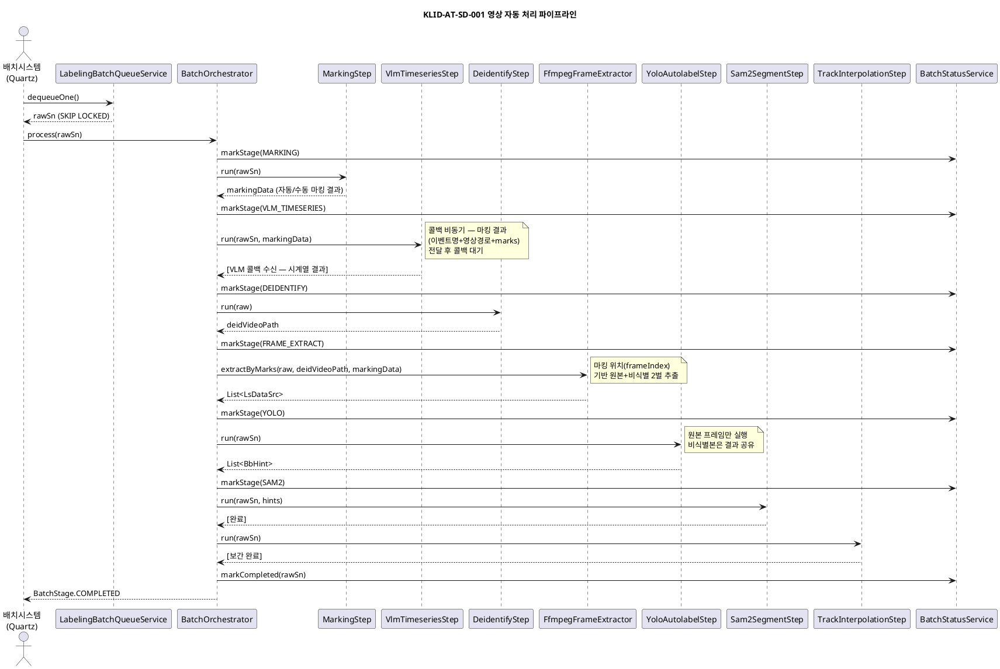

---

### KLID-AT-SD-002. 비식별 처리 위탁 및 결과 수신

| 시퀀스도 ID | KLID-AT-SD-002 | 시퀀스도명 | 비식별 처리 위탁 및 결과 수신 |
|---|---|---|---|
| 관련 유스케이스 ID | KLID-AT-UC-002 |
| 주요 액터 | KLID-AT-AC-004 (배치시스템), KLID-AT-AC-007 (비식별솔루션) | 주요 클래스 | DeidentifyStep, DeidentifyClient, DeidentifyResultController, DeidentifyResultService, WebhookIdempotencyLedger, HmacWebhookFilter |

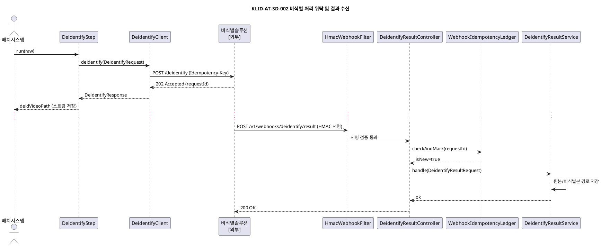

---

### KLID-AT-SD-003. VLM 시계열 분석 비동기 위탁

| 시퀀스도 ID | KLID-AT-SD-003 | 시퀀스도명 | VLM 시계열 분석 비동기 위탁 |
|---|---|---|---|
| 관련 유스케이스 ID | KLID-AT-UC-004 |
| 주요 액터 | KLID-AT-AC-004 (배치시스템), KLID-AT-AC-008 (VLM서비스) | 주요 클래스 | VlmTimeseriesStep, VlmClient, VlmResultController, VlmResultService, MetaService |

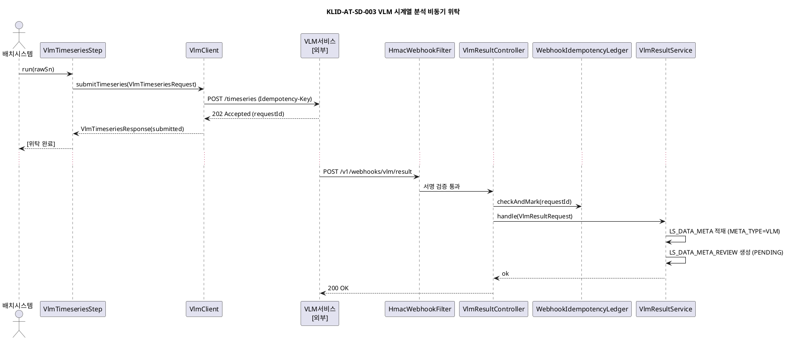

---

### KLID-AT-SD-004. 라벨 편집 및 Gitea 자동 커밋

| 시퀀스도 ID | KLID-AT-SD-004 | 시퀀스도명 | 라벨 편집 및 Gitea 자동 커밋 |
|---|---|---|---|
| 관련 유스케이스 ID | KLID-AT-UC-006, KLID-AT-UC-010 |
| 주요 액터 | KLID-AT-AC-002 (라벨링작업자) | 주요 클래스 | LabelController, LabelService, LabelAccessGuard, VersionService, GiteaPathPolicy, GiteaClient, GiteaCommitFallbackQueue |

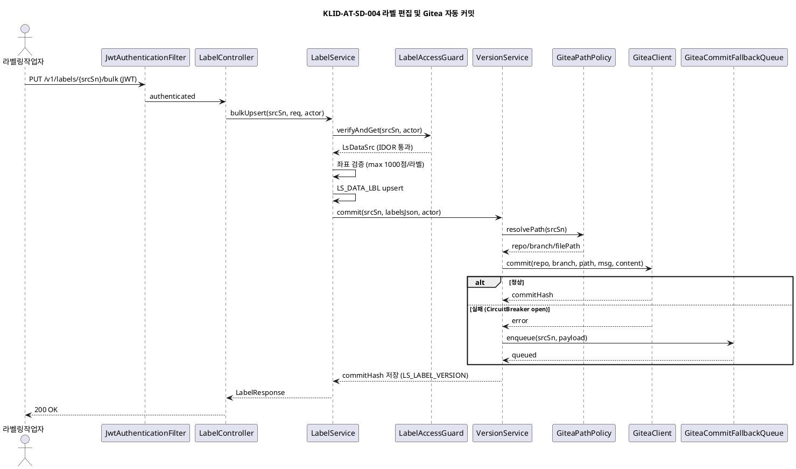

---

### KLID-AT-SD-005. 작업 배정 및 라벨 검수 승인

| 시퀀스도 ID | KLID-AT-SD-005 | 시퀀스도명 | 작업 배정 및 라벨 검수 승인 |
|---|---|---|---|
| 관련 유스케이스 ID | KLID-AT-UC-008, KLID-AT-UC-009, KLID-AT-UC-014 |
| 주요 액터 | KLID-AT-AC-001 (검수담당자) | 주요 클래스 | AssignmentController, AssignmentService, ReviewController, ReviewService, ReviewStateMachine, NotificationService |

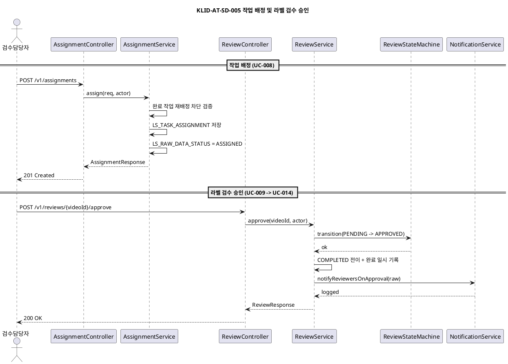

---

### KLID-AT-SD-006. 비식별 오류 신고 및 재처리

| 시퀀스도 ID | KLID-AT-SD-006 | 시퀀스도명 | 비식별 오류 신고 및 재처리 |
|---|---|---|---|
| 관련 유스케이스 ID | KLID-AT-UC-003 |
| 주요 액터 | KLID-AT-AC-002 (라벨링작업자), KLID-AT-AC-001 (검수담당자) | 주요 클래스 | DeidentReportController, DeidentReportService, WorkLockService, BatchRetryQueue, NotificationService |

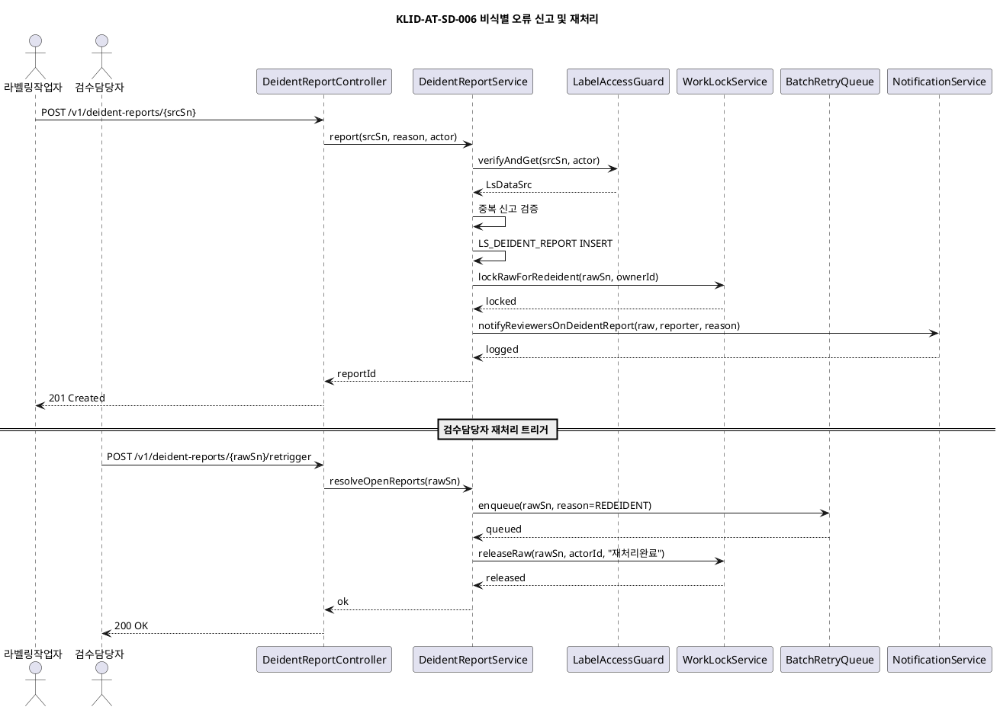

---

### KLID-AT-SD-007. JWT 채널 인증 및 라우팅

| 시퀀스도 ID | KLID-AT-SD-007 | 시퀀스도명 | JWT 채널 인증 및 라우팅 |
|---|---|---|---|
| 관련 유스케이스 ID | KLID-AT-UC-013 |
| 주요 액터 | KLID-AT-AC-005 (관제서버), KLID-AT-AC-006 (포털서버) | 주요 클래스 | JwtAuthenticationFilter, JwtKeyResolver, JwtIssuerValidator, JwtClaimResolver, SecurityConfig, TokenClaims |

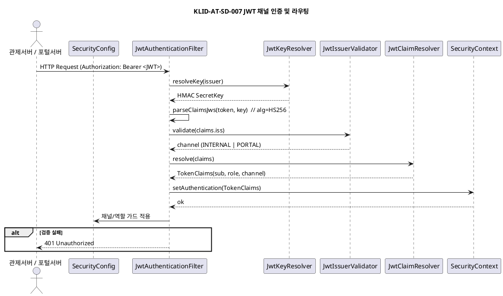

---

### KLID-AT-SD-008. 증강 비동기 요청 및 결과 수신/검토

| 시퀀스도 ID | KLID-AT-SD-008 | 시퀀스도명 | 증강 비동기 요청 및 결과 수신/검토 |
|---|---|---|---|
| 관련 유스케이스 ID | KLID-AT-UC-011 |
| 주요 액터 | KLID-AT-AC-001 (검수담당자), KLID-AT-AC-009 (생성형 AI 서비스) | 주요 클래스 | AugmentController, AugmentRequestService, ExternalAugmentClient, AugmentResultController, AugmentResultService, AugmentReviewService |

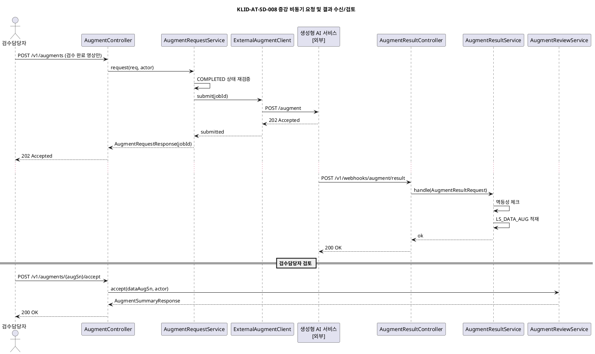

---

### KLID-AT-SD-009. 포털 사용자 간편 라벨링

| 시퀀스도 ID | KLID-AT-SD-009 | 시퀀스도명 | 포털 사용자 간편 라벨링 |
|---|---|---|---|
| 관련 유스케이스 ID | KLID-AT-UC-012 |
| 주요 액터 | KLID-AT-AC-003 (포털사용자) | 주요 클래스 | JwtAuthenticationFilter, PortalLabelController, PortalLabelService, PortalAutolabelService, PortalUploadService, AiServerClient |

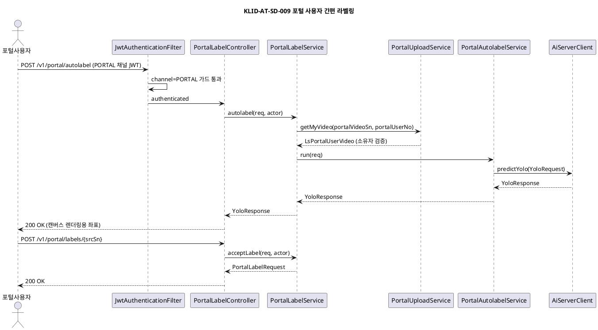

---

### KLID-AT-SD-010. 시계열 메타 검토 및 승인

| 시퀀스도 ID | KLID-AT-SD-010 | 시퀀스도명 | 시계열 메타 검토 및 승인 |
|---|---|---|---|
| 관련 유스케이스 ID | KLID-AT-UC-005 |
| 주요 액터 | KLID-AT-AC-001 (검수담당자) | 주요 클래스 | MetaController, MetaService |

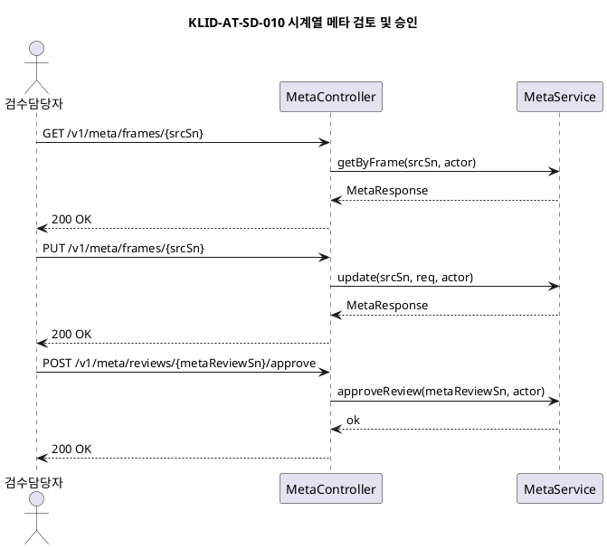

---

### KLID-AT-SD-011. TASK_COMPLETED 관제서버 통지

| 시퀀스도 ID | KLID-AT-SD-011 | 시퀀스도명 | TASK_COMPLETED 관제서버 통지 |
|---|---|---|---|
| 관련 유스케이스 ID | KLID-AT-UC-014 |
| 주요 액터 | KLID-AT-AC-001 (검수담당자), KLID-AT-AC-005 (관제서버) | 주요 클래스 | ReviewService, ControlNotifyEventListener, ControlNotifyClient, ControlNotifyFallbackQueue |

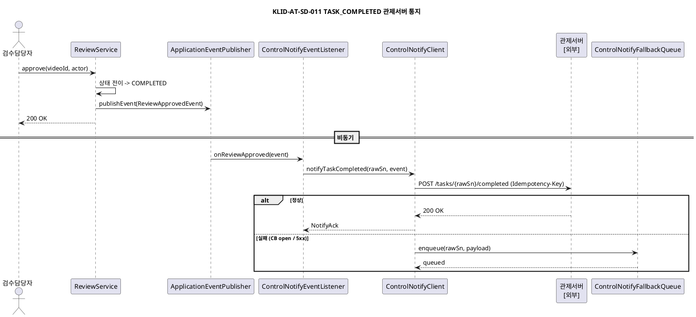

---

### KLID-AT-SD-012. TASK_MODIFIED 디바운스 통지

| 시퀀스도 ID | KLID-AT-SD-012 | 시퀀스도명 | TASK_MODIFIED 디바운스 통지 |
|---|---|---|---|
| 관련 유스케이스 ID | KLID-AT-UC-015 |
| 주요 액터 | KLID-AT-AC-002 (라벨링작업자), KLID-AT-AC-001 (검수담당자), KLID-AT-AC-005 (관제서버) | 주요 클래스 | LabelService, MetaService, ControlNotifyEventListener, ControlNotifyDebouncer, ControlNotifyClient |

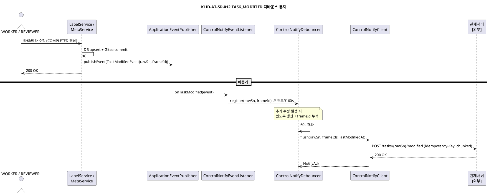

---

### KLID-AT-SD-013. 영상 마킹 (자동/수동)

| 시퀀스도 ID | KLID-AT-SD-013 | 시퀀스도명 | 영상 마킹 (자동/수동) |
|---|---|---|---|
| 관련 유스케이스 ID | KLID-AT-UC-016 |
| 주요 액터 | KLID-AT-AC-002 (라벨링작업자), KLID-AT-AC-001 (검수담당자) | 주요 클래스 | MarkingController, MarkingService |

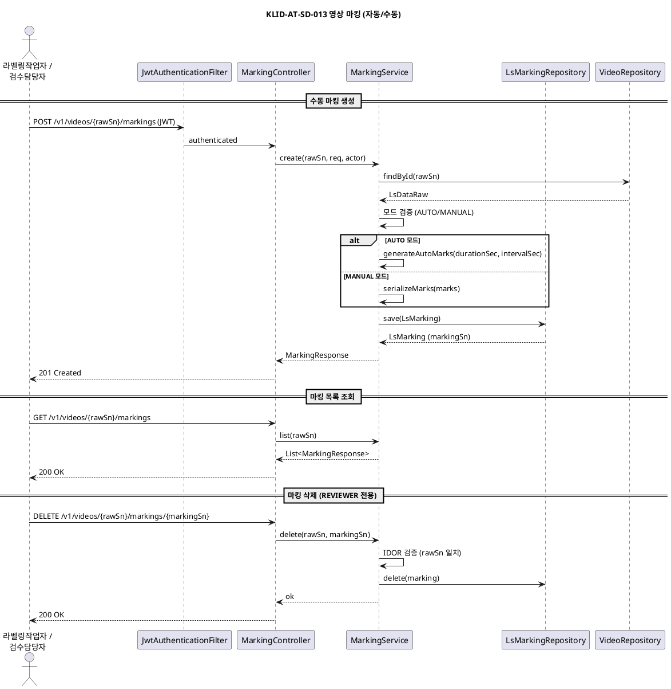

---

### KLID-AT-SD-014. 관제서버 조회 API

| 시퀀스도 ID | KLID-AT-SD-014 | 시퀀스도명 | 관제서버 조회 API |
|---|---|---|---|
| 관련 유스케이스 ID | KLID-AT-UC-014 |
| 주요 액터 | KLID-AT-AC-005 (관제서버) | 주요 클래스 | TaskQueryController, TaskQueryService |

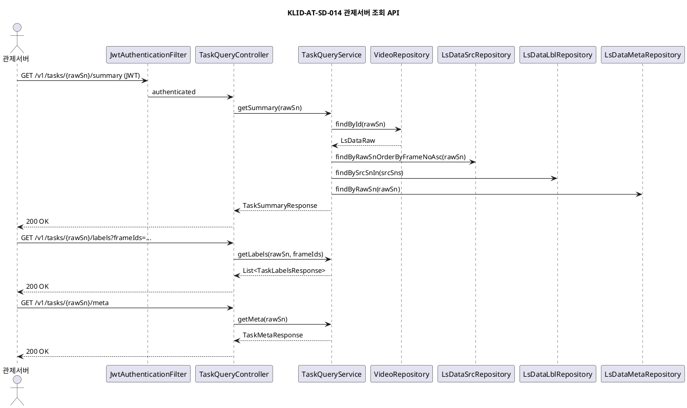

---

## 3. 설계 클래스도

### KLID-AT-DCD-001. 배치 파이프라인 계층

| 설계 클래스도 ID | KLID-AT-DCD-001 | 설계 클래스도명 | 배치 파이프라인 계층 |
|---|---|---|---|
| 관련 유스케이스 ID | KLID-AT-UC-001, KLID-AT-UC-002, KLID-AT-UC-004 |

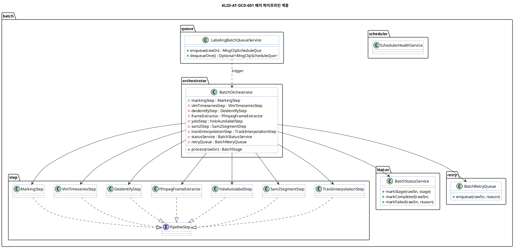

---

### KLID-AT-DCD-002. 외부 연동 클라이언트 계층

| 설계 클래스도 ID | KLID-AT-DCD-002 | 설계 클래스도명 | 외부 연동 클라이언트 계층 |
|---|---|---|---|
| 관련 유스케이스 ID | KLID-AT-UC-001, KLID-AT-UC-002, KLID-AT-UC-004, KLID-AT-UC-010, KLID-AT-UC-011 |

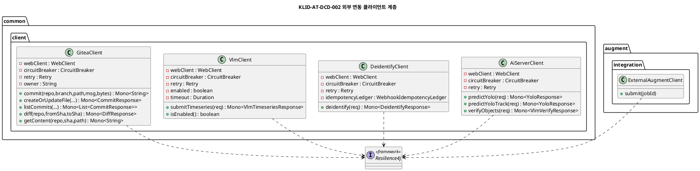

---

### KLID-AT-DCD-003. 웹훅 결과 수신 계층

| 설계 클래스도 ID | KLID-AT-DCD-003 | 설계 클래스도명 | 웹훅 결과 수신 계층 |
|---|---|---|---|
| 관련 유스케이스 ID | KLID-AT-UC-002, KLID-AT-UC-004, KLID-AT-UC-011 |

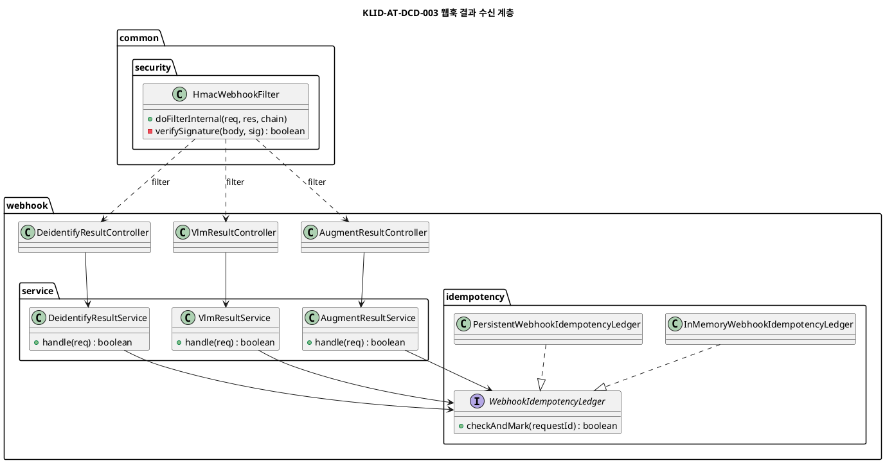

---

### KLID-AT-DCD-004. 라벨링/버전관리 서비스 계층

| 설계 클래스도 ID | KLID-AT-DCD-004 | 설계 클래스도명 | 라벨링/버전관리 서비스 계층 |
|---|---|---|---|
| 관련 유스케이스 ID | KLID-AT-UC-006, KLID-AT-UC-007, KLID-AT-UC-010 |

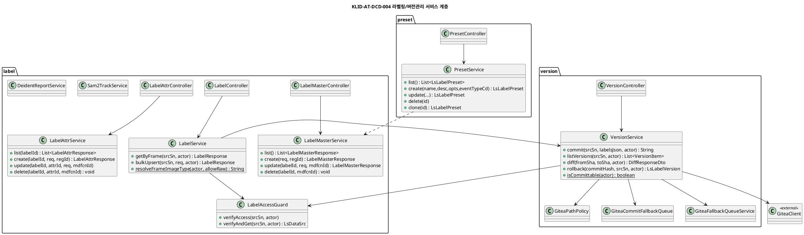

---

### KLID-AT-DCD-005. 배정/검수/통지 서비스 계층

| 설계 클래스도 ID | KLID-AT-DCD-005 | 설계 클래스도명 | 배정/검수/통지 서비스 계층 |
|---|---|---|---|
| 관련 유스케이스 ID | KLID-AT-UC-008, KLID-AT-UC-009, KLID-AT-UC-014, KLID-AT-UC-015 |

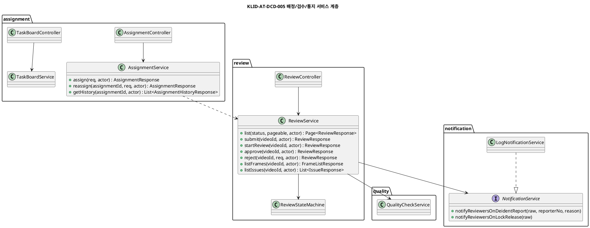

---

### KLID-AT-DCD-006. 포털 서비스 계층

| 설계 클래스도 ID | KLID-AT-DCD-006 | 설계 클래스도명 | 포털 서비스 계층 |
|---|---|---|---|
| 관련 유스케이스 ID | KLID-AT-UC-012 |

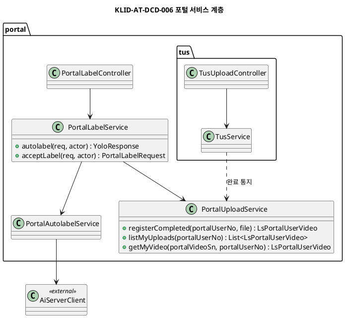

---

### KLID-AT-DCD-007. 인증/보안 계층

| 설계 클래스도 ID | KLID-AT-DCD-007 | 설계 클래스도명 | 인증/보안 계층 |
|---|---|---|---|
| 관련 유스케이스 ID | KLID-AT-UC-013 |

```plantuml
@startuml KLID-AT-DCD-007
title KLID-AT-DCD-007 인증/보안 계층
skinparam defaultFontName "Malgun Gothic"

package "common.security" {
  class SecurityConfig <<@Configuration>> {
    + securityFilterChain(http) : SecurityFilterChain
    + corsConfigurationSource() : CorsConfigurationSource
  }
  class JwtAuthenticationFilter {
    - keyResolver : JwtKeyResolver
    - issuerValidator : JwtIssuerValidator
    # doFilterInternal(req, res, chain)
  }
  class HmacWebhookFilter
  class JwtKeyResolver {
    + resolveKey(issuer) : SecretKey
  }
  class SecretKeyResolver
  class TokenClaims {
    + sub : String
    + role : Role
    + channel : Channel
  }
  enum Role {
    REVIEWER
    WORKER
    PORTAL_USER
  }
  enum Channel {
    INTERNAL
    PORTAL
  }
  class RoleHierarchy
  class LocalProfileGuard
}
package "auth.jwt" {
  class JwtIssuerValidator {
    + validate(issuer) : Channel
  }
  class JwtClaimResolver {
    + resolve(claims) : TokenClaims
  }
}
package "auth.service" {
  class WorkLockService {
    + lockRawForRedeident(rawSn, ownerId)
    + isRawLocked(rawSn) : boolean
    + releaseRaw(rawSn, actorId, reason) : int
  }
  class RoleClaimService
}

SecurityConfig --> JwtAuthenticationFilter : registers
SecurityConfig --> HmacWebhookFilter : registers
JwtAuthenticationFilter --> JwtKeyResolver
JwtAuthenticationFilter --> JwtIssuerValidator
JwtAuthenticationFilter --> JwtClaimResolver
JwtKeyResolver ..> SecretKeyResolver
@enduml
```

---

### KLID-AT-DCD-008. 메타/증강 서비스 계층

| 설계 클래스도 ID | KLID-AT-DCD-008 | 설계 클래스도명 | 메타/증강 서비스 계층 |
|---|---|---|---|
| 관련 유스케이스 ID | KLID-AT-UC-005, KLID-AT-UC-011 |

```plantuml
@startuml KLID-AT-DCD-008
title KLID-AT-DCD-008 메타/증강 서비스 계층
skinparam defaultFontName "Malgun Gothic"

package "meta" {
  class MetaController
  class MetaService {
    + getByFrame(srcSn, actor) : MetaResponse
    + update(srcSn, req, actor) : MetaResponse
    + approveReview(metaReviewSn, actor)
    + rejectReview(metaReviewSn, reason, actor)
  }
}
package "augment" {
  class AugmentController
  class AugmentRequestService {
    + request(req, actor) : AugmentRequestResponse
  }
  class AugmentReviewService {
    + listAll(pageable) : Page<AugmentSummaryResponse>
    + findBySource(srcSn) : List<AugmentSummaryResponse>
    + accept(dataAugSn, actor) : AugmentSummaryResponse
    + reject(dataAugSn, reason, actor) : AugmentSummaryResponse
  }
}
package "augment.integration" {
  class ExternalAugmentClient
}

MetaController --> MetaService
AugmentController --> AugmentRequestService
AugmentController --> AugmentReviewService
AugmentRequestService --> ExternalAugmentClient
@enduml
```

---

### KLID-AT-DCD-009. 외부 통지(관제서버) 계층

| 설계 클래스도 ID | KLID-AT-DCD-009 | 설계 클래스도명 | 외부 통지(관제서버) 계층 |
|---|---|---|---|
| 관련 유스케이스 ID | KLID-AT-UC-014, KLID-AT-UC-015 |

```plantuml
@startuml KLID-AT-DCD-009
title KLID-AT-DCD-009 외부 통지(관제서버) 계층
skinparam defaultFontName "Malgun Gothic"

package "notification.control" {
  class ControlNotifyClient {
    - webClient : WebClient
    - controlServerBaseUrl : String
    - circuitBreaker : CircuitBreaker
    - retry : Retry
    - debouncer : ControlNotifyDebouncer
    - fallbackQueue : ControlNotifyFallbackQueue
    - enabled : boolean
    + notifyTaskCompleted(rawSn, event) : Mono<NotifyAck>
    + notifyTaskModified(rawSn, frameIds) : Mono<NotifyAck>
    - splitIntoChunks(payload) : List<ControlNotifyPayload>
  }
  class ControlNotifyDebouncer {
    - windowMs : long = 60000
    - inflight : Map<Long, DebounceEntry>
    + register(rawSn, frameId) : void
    + flush() : List<ControlNotifyPayload>
  }
  class ControlNotifyFallbackQueue {
    + enqueue(rawSn, payload) : void
    + retryNext() : int
  }
  class ControlNotifyEventListener {
    + onReviewApproved(ReviewApprovedEvent) : void
    + onTaskModified(TaskModifiedEvent) : void
  }
}
package "controlnotify.controller" {
  class TaskQueryController {
    + getSummary(rawSn) : TaskSummaryResponse
    + getLabels(rawSn, frameIds) : List<TaskLabelsResponse>
    + getMeta(rawSn) : TaskMetaResponse
  }
}
package "controlnotify.service" {
  class TaskQueryService {
    + getSummary(rawSn) : TaskSummaryResponse
    + getLabels(rawSn, frameIds) : List<TaskLabelsResponse>
    + getMeta(rawSn) : TaskMetaResponse
  }
}
class ReviewService
class LabelService
class MetaService

ReviewService ..> ControlNotifyEventListener : publish ReviewApprovedEvent
LabelService ..> ControlNotifyEventListener : publish TaskModifiedEvent
MetaService ..> ControlNotifyEventListener : publish TaskModifiedEvent
ControlNotifyEventListener --> ControlNotifyClient
ControlNotifyClient --> ControlNotifyDebouncer
ControlNotifyClient --> ControlNotifyFallbackQueue
TaskQueryController --> TaskQueryService
@enduml
```

---

### KLID-AT-DCD-010. 마킹 서비스 계층

| 설계 클래스도 ID | KLID-AT-DCD-010 | 설계 클래스도명 | 마킹 서비스 계층 |
|---|---|---|---|
| 관련 유스케이스 ID | KLID-AT-UC-016, KLID-AT-UC-001 |

```plantuml
@startuml KLID-AT-DCD-010
title KLID-AT-DCD-010 마킹 서비스 계층
skinparam defaultFontName "Malgun Gothic"

package "marking" {
  class MarkingController {
    + create(rawSn, req, actor) : MarkingResponse
    + list(rawSn) : List<MarkingResponse>
    + get(rawSn, markingSn) : MarkingResponse
    + delete(rawSn, markingSn) : void
  }
  class MarkingService {
    - markingRepository : LsMarkingRepository
    - videoRepository : VideoRepository
    - objectMapper : ObjectMapper
    + create(rawSn, req, actor) : MarkingResponse
    + list(rawSn) : List<MarkingResponse>
    + get(rawSn, markingSn) : MarkingResponse
    + delete(rawSn, markingSn) : void
    ~ generateAutoMarks(durationSec, intervalSec) : String
    ~ serializeMarks(marks) : String
  }
  class LsMarking <<entity>> {
    - markingSn : Long
    - rawSn : Long
    - eventName : String
    - mode : String
    - intervalSec : Integer
    - videoPath : String
    - marksJson : String
    + {static} createAuto(...) : LsMarking
    + {static} createManual(...) : LsMarking
  }
}

package "batch.step" {
  class MarkingStep {
    + run(rawSn) : MarkingData
  }
}

MarkingController --> MarkingService
MarkingService --> LsMarking
MarkingStep ..> MarkingService : 배치 모드
@enduml
```

---

### KLID-AT-DCD-011. 통합 설계 클래스도 (Overview)

| 설계 클래스도 ID | KLID-AT-DCD-011 | 설계 클래스도명 | 통합 설계 클래스도 |
|---|---|---|---|
| 관련 유스케이스 ID | KLID-AT-UC-001 ~ KLID-AT-UC-016 |

```plantuml
@startuml KLID-AT-DCD-011
title KLID-AT-DCD-011 통합 설계 클래스도
skinparam defaultFontName "Malgun Gothic"
skinparam classBackgroundColor #FFFFFF
skinparam classBorderColor #2E75B6
skinparam packageStyle rectangle

package "Infra -- External Clients" {
  class AiServerClient
  class DeidentifyClient
  class VlmClient
  class GiteaClient
  class ExternalAugmentClient
}
package "Infra -- Security" {
  class JwtAuthenticationFilter
  class HmacWebhookFilter
  class SecurityConfig
}
package "Application -- Batch" {
  class BatchOrchestrator
  class LabelingBatchQueueService
  class BatchStatusService
}
package "Application -- Marking" {
  class MarkingService
  class MarkingController
  class MarkingStep
}
package "Application -- Webhook" {
  class DeidentifyResultService
  class VlmResultService
  class AugmentResultService
  class WebhookIdempotencyLedger <<interface>>
}
package "Application -- Label" {
  class LabelService
  class LabelMasterService
  class LabelAttrService
  class LabelAccessGuard
  class Sam2TrackService
  class DeidentReportService
}
package "Application -- Version" {
  class VersionService
}
package "Application -- Review/Assignment" {
  class AssignmentService
  class TaskBoardService
  class ReviewService
  class PresetService
}
package "Application -- Meta/Augment" {
  class MetaService
  class AugmentRequestService
  class AugmentReviewService
}
package "Application -- Portal" {
  class PortalLabelService
  class PortalUploadService
  class TusService
}
package "Application -- Support" {
  class WorkLockService
  class NotificationService <<interface>>
  class QualityCheckService
  class VideoQueryService
  class StatsService
}
package "Application -- Control Notify" {
  class ControlNotifyClient
  class ControlNotifyDebouncer
  class ControlNotifyFallbackQueue
  class ControlNotifyEventListener
  class TaskQueryController
  class TaskQueryService
}

BatchOrchestrator --> DeidentifyClient
BatchOrchestrator --> VlmClient
BatchOrchestrator --> AiServerClient
BatchOrchestrator --> MarkingStep
MarkingStep ..> MarkingService
LabelService --> VersionService
LabelService --> LabelAccessGuard
VersionService --> GiteaClient
ReviewService --> NotificationService
DeidentReportService --> WorkLockService
DeidentReportService --> NotificationService
DeidentifyResultService --> WebhookIdempotencyLedger
VlmResultService --> WebhookIdempotencyLedger
AugmentResultService --> WebhookIdempotencyLedger
AugmentRequestService --> ExternalAugmentClient
PortalLabelService --> AiServerClient
ReviewService ..> ControlNotifyEventListener : ReviewApprovedEvent
LabelService ..> ControlNotifyEventListener : TaskModifiedEvent
MetaService ..> ControlNotifyEventListener : TaskModifiedEvent
ControlNotifyEventListener --> ControlNotifyClient
ControlNotifyClient --> ControlNotifyDebouncer
ControlNotifyClient --> ControlNotifyFallbackQueue
TaskQueryController --> TaskQueryService
@enduml
```

---

## 4. 설계 클래스 정의

### KLID-AT-DC-001. AiServerClient

| 설계 클래스 ID | KLID-AT-DC-001 | 설계 클래스명 | AiServerClient |
|---|---|---|---|

**속성**

| 속성명 | 가시성 | 타입 | 기본값 | 설명 |
|---|---|---|---|---|
| webClient | private | WebClient | | Spring WebFlux HTTP 클라이언트 |
| circuitBreaker | private | CircuitBreaker | | Resilience4j 서킷브레이커 |
| retry | private | Retry | | Resilience4j 재시도 정책 |

**오퍼레이션**

| 오퍼레이션명 | 가시성 | 파라미터 | 반환타입 | 설명 |
|---|---|---|---|---|
| predictYolo | public | YoloRequest | Mono\<YoloResponse\> | YOLO 객체 감지 요청 |
| predictYoloTrack | public | YoloTrackRequest | Mono\<YoloResponse\> | YOLO 트랙 추론 |
| verifyObjects | public | VlmVerifyRequest | Mono\<VlmVerifyResponse\> | VLM 객체 검증 |

---

### KLID-AT-DC-002. DeidentifyClient

| 설계 클래스 ID | KLID-AT-DC-002 | 설계 클래스명 | DeidentifyClient |
|---|---|---|---|

**속성**

| 속성명 | 가시성 | 타입 | 기본값 | 설명 |
|---|---|---|---|---|
| webClient | private | WebClient | | WebFlux HTTP 클라이언트 |
| circuitBreaker | private | CircuitBreaker | | Resilience4j CB |
| retry | private | Retry | | Resilience4j Retry |
| idempotencyLedger | private | WebhookIdempotencyLedger | | 중복 결과 방지 원장 |

**오퍼레이션**

| 오퍼레이션명 | 가시성 | 파라미터 | 반환타입 | 설명 |
|---|---|---|---|---|
| deidentify | public | DeidentifyRequest | Mono\<DeidentifyResponse\> | 비식별 작업 비동기 위탁 (Idempotency-Key 발급) |

---

### KLID-AT-DC-003. VlmClient

| 설계 클래스 ID | KLID-AT-DC-003 | 설계 클래스명 | VlmClient |
|---|---|---|---|

**속성**

| 속성명 | 가시성 | 타입 | 기본값 | 설명 |
|---|---|---|---|---|
| webClient | private | WebClient | | WebFlux HTTP 클라이언트 |
| circuitBreaker | private | CircuitBreaker | | Resilience4j CB |
| retry | private | Retry | | Resilience4j Retry |
| enabled | private | boolean | false | 기능 플래그 (운영 결정) |
| timeout | private | Duration | | API 호출 타임아웃 |

**오퍼레이션**

| 오퍼레이션명 | 가시성 | 파라미터 | 반환타입 | 설명 |
|---|---|---|---|---|
| submitTimeseries | public | VlmTimeseriesRequest | Mono\<VlmTimeseriesResponse\> | VLM 시계열 분석 비동기 위탁 |
| isEnabled | public | - | boolean | 기능 활성 여부 |
| safeForLog | public | String | String (static) | 로그 인젝션 방어 정규화 |

---

### KLID-AT-DC-004. GiteaClient

| 설계 클래스 ID | KLID-AT-DC-004 | 설계 클래스명 | GiteaClient |
|---|---|---|---|

**속성**

| 속성명 | 가시성 | 타입 | 기본값 | 설명 |
|---|---|---|---|---|
| webClient | private | WebClient | | WebFlux HTTP 클라이언트 |
| circuitBreaker | private | CircuitBreaker | | CB (50%/window10/wait30s) |
| retry | private | Retry | | Retry max=3 exp backoff |
| owner | private | String | | Gitea 리포지터리 owner |

**오퍼레이션**

| 오퍼레이션명 | 가시성 | 파라미터 | 반환타입 | 설명 |
|---|---|---|---|---|
| commit | public | repo, branch, path, message, byte[] | Mono\<String\> | 커밋 생성 (hash 반환) |
| createOrUpdateFile | public | repo, path, contentBase64, message, author, branch | Mono\<CommitResponse\> | 파일 생성/갱신 |
| getCommit | public | repo, sha | Mono\<CommitResponse\> | 단일 커밋 조회 |
| listCommits | public | repo, path, limit | Mono\<List\<CommitResponse\>\> | 커밋 이력 |
| diff | public | repo, fromSha, toSha | Mono\<DiffResponse\> | 두 커밋 간 diff |
| getContent | public | repo, sha, path | Mono\<String\> | 특정 커밋 파일 본문 조회 |

---

### KLID-AT-DC-005. ExternalAugmentClient

| 설계 클래스 ID | KLID-AT-DC-005 | 설계 클래스명 | ExternalAugmentClient |
|---|---|---|---|

**속성**

| 속성명 | 가시성 | 타입 | 기본값 | 설명 |
|---|---|---|---|---|
| webClient | private | WebClient | | WebFlux HTTP 클라이언트 |

**오퍼레이션**

| 오퍼레이션명 | 가시성 | 파라미터 | 반환타입 | 설명 |
|---|---|---|---|---|
| submit | public | jobId | void | 외부 생성형 AI 비동기 증강 요청 |

---

### KLID-AT-DC-006. JwtAuthenticationFilter

| 설계 클래스 ID | KLID-AT-DC-006 | 설계 클래스명 | JwtAuthenticationFilter |
|---|---|---|---|

**속성**

| 속성명 | 가시성 | 타입 | 기본값 | 설명 |
|---|---|---|---|---|
| keyResolver | private | JwtKeyResolver | | HMAC 서명 키 해석기 |
| issuerValidator | private | JwtIssuerValidator | | Issuer(관제/포털) 검증기 |
| ALLOWED_ALG | private | String | 'HS256' | 허용 JWT 알고리즘 |

**오퍼레이션**

| 오퍼레이션명 | 가시성 | 파라미터 | 반환타입 | 설명 |
|---|---|---|---|---|
| doFilterInternal | protected | HttpServletRequest, HttpServletResponse, FilterChain | void | JWT 파싱/검증/SecurityContext 설정 |

---

### KLID-AT-DC-007. HmacWebhookFilter

| 설계 클래스 ID | KLID-AT-DC-007 | 설계 클래스명 | HmacWebhookFilter |
|---|---|---|---|

**속성**

| 속성명 | 가시성 | 타입 | 기본값 | 설명 |
|---|---|---|---|---|
| secret | private | byte[] | 설정값 | 웹훅 HMAC 공유 시크릿 |

**오퍼레이션**

| 오퍼레이션명 | 가시성 | 파라미터 | 반환타입 | 설명 |
|---|---|---|---|---|
| doFilterInternal | protected | HttpServletRequest, HttpServletResponse, FilterChain | void | /v1/webhooks/* 경로 HMAC-SHA256 서명 검증 |

---

### KLID-AT-DC-008. SecurityConfig

| 설계 클래스 ID | KLID-AT-DC-008 | 설계 클래스명 | SecurityConfig |
|---|---|---|---|

**속성**

| 속성명 | 가시성 | 타입 | 기본값 | 설명 |
|---|---|---|---|---|
| jwtFilter | private | JwtAuthenticationFilter | | JWT 인증 필터 |
| hmacFilter | private | HmacWebhookFilter | | 웹훅 HMAC 필터 |

**오퍼레이션**

| 오퍼레이션명 | 가시성 | 파라미터 | 반환타입 | 설명 |
|---|---|---|---|---|
| securityFilterChain | public | HttpSecurity | SecurityFilterChain @Bean | Spring Security 체인 설정 (RBAC) |
| corsConfigurationSource | public | - | CorsConfigurationSource @Bean | CORS 정책 Bean |

---

### KLID-AT-DC-009. WebhookIdempotencyLedger (interface)

| 설계 클래스 ID | KLID-AT-DC-009 | 설계 클래스명 | WebhookIdempotencyLedger (interface) |
|---|---|---|---|

**오퍼레이션**

| 오퍼레이션명 | 가시성 | 파라미터 | 반환타입 | 설명 |
|---|---|---|---|---|
| checkAndMark | public | requestId | boolean | 신규(true)/중복(false) -- 멱등성 보장 |

> 구현체: `InMemoryWebhookIdempotencyLedger`(로컬), `PersistentWebhookIdempotencyLedger`(stg/prd)

---

### KLID-AT-DC-010. BatchOrchestrator

| 설계 클래스 ID | KLID-AT-DC-010 | 설계 클래스명 | BatchOrchestrator |
|---|---|---|---|

**속성**

| 속성명 | 가시성 | 타입 | 기본값 | 설명 |
|---|---|---|---|---|
| markingStep | private | MarkingStep | | 마킹 Step (신규) |
| vlmTimeseriesStep | private | VlmTimeseriesStep | | VLM 시계열 분석 Step |
| deidentifyStep | private | DeidentifyStep | | 비식별 Step (모든 영상 무조건) |
| frameExtractor | private | FfmpegFrameExtractor | | FFmpeg 프레임 추출 Step |
| yoloStep | private | YoloAutolabelStep | | YOLO 오토라벨 Step |
| sam2Step | private | Sam2SegmentStep | | SAM2 세그멘테이션 Step |
| trackInterpolationStep | private | TrackInterpolationStep | | 트랙 선형 보간 Step |
| statusService | private | BatchStatusService | | 단계별 상태 전이 서비스 |
| retryQueue | private | BatchRetryQueue | | 실패 재시도 큐 (max=3 exp backoff) |
| videoRepository | private | VideoRepository | | 영상 레포지터리 |

**오퍼레이션**

| 오퍼레이션명 | 가시성 | 파라미터 | 반환타입 | 설명 |
|---|---|---|---|---|
| process | public | rawSn | BatchStage | 단일 영상 파이프라인 실행 (마킹->VLM(콜백)->비식별->프레임추출(마킹 위치)->YOLO(원본만)->SAM2->보간) |

---

### KLID-AT-DC-011. VlmTimeseriesStep

| 설계 클래스 ID | KLID-AT-DC-011 | 설계 클래스명 | VlmTimeseriesStep |
|---|---|---|---|

**속성**

| 속성명 | 가시성 | 타입 | 기본값 | 설명 |
|---|---|---|---|---|
| vlmClient | private | VlmClient | | 외부 VLM 서비스 클라이언트 |

**오퍼레이션**

| 오퍼레이션명 | 가시성 | 파라미터 | 반환타입 | 설명 |
|---|---|---|---|---|
| run | public | rawSn | void | VLM 시계열 분석 비동기 위탁 |

---

### KLID-AT-DC-012. DeidentifyStep

| 설계 클래스 ID | KLID-AT-DC-012 | 설계 클래스명 | DeidentifyStep |
|---|---|---|---|

**속성**

| 속성명 | 가시성 | 타입 | 기본값 | 설명 |
|---|---|---|---|---|
| deidentifyClient | private | DeidentifyClient | | 외부 비식별 솔루션 클라이언트 |

**오퍼레이션**

| 오퍼레이션명 | 가시성 | 파라미터 | 반환타입 | 설명 |
|---|---|---|---|---|
| run | public | LsDataRaw | String (deidVideoPath) | 비식별 위탁 + 결과 경로 반환 |

---

### KLID-AT-DC-013. FfmpegFrameExtractor

| 설계 클래스 ID | KLID-AT-DC-013 | 설계 클래스명 | FfmpegFrameExtractor |
|---|---|---|---|

**오퍼레이션**

| 오퍼레이션명 | 가시성 | 파라미터 | 반환타입 | 설명 |
|---|---|---|---|---|
| extractBoth | public | LsDataRaw, deidVideoPath | List\<LsDataSrc\> | 원본/비식별본 동시 프레임 추출 |

---

### KLID-AT-DC-014. YoloAutolabelStep

| 설계 클래스 ID | KLID-AT-DC-014 | 설계 클래스명 | YoloAutolabelStep |
|---|---|---|---|

**속성**

| 속성명 | 가시성 | 타입 | 기본값 | 설명 |
|---|---|---|---|---|
| aiServerClient | private | AiServerClient | | 내부 AI 서버 |

**오퍼레이션**

| 오퍼레이션명 | 가시성 | 파라미터 | 반환타입 | 설명 |
|---|---|---|---|---|
| run | public | rawSn | List\<BbHint\> | YOLO 객체 감지 결과 (BBox 힌트) |

---

### KLID-AT-DC-015. Sam2SegmentStep

| 설계 클래스 ID | KLID-AT-DC-015 | 설계 클래스명 | Sam2SegmentStep |
|---|---|---|---|

**속성**

| 속성명 | 가시성 | 타입 | 기본값 | 설명 |
|---|---|---|---|---|
| aiServerClient | private | AiServerClient | | 내부 AI 서버 |

**오퍼레이션**

| 오퍼레이션명 | 가시성 | 파라미터 | 반환타입 | 설명 |
|---|---|---|---|---|
| run | public | rawSn, hints | void | SAM2 경계 생성/저장 |

---

### KLID-AT-DC-016. TrackInterpolationStep

| 설계 클래스 ID | KLID-AT-DC-016 | 설계 클래스명 | TrackInterpolationStep |
|---|---|---|---|

**오퍼레이션**

| 오퍼레이션명 | 가시성 | 파라미터 | 반환타입 | 설명 |
|---|---|---|---|---|
| run | public | rawSn | void | 트랙 선형 보간 처리 |

---

### KLID-AT-DC-017. BatchStatusService

| 설계 클래스 ID | KLID-AT-DC-017 | 설계 클래스명 | BatchStatusService |
|---|---|---|---|

**오퍼레이션**

| 오퍼레이션명 | 가시성 | 파라미터 | 반환타입 | 설명 |
|---|---|---|---|---|
| markStage | public | rawSn, BatchStage | void | 단계 상태 전이 기록 |
| markCompleted | public | rawSn | void | COMPLETED 전이 |
| markFailed | public | rawSn, reason | void | FAILED 전이 + 사유 기록 |

---

### KLID-AT-DC-018. LabelingBatchQueueService

| 설계 클래스 ID | KLID-AT-DC-018 | 설계 클래스명 | LabelingBatchQueueService |
|---|---|---|---|

**속성**

| 속성명 | 가시성 | 타입 | 기본값 | 설명 |
|---|---|---|---|---|
| repository | private | MngClipScheduleQueRepository | | 배치 큐 레포지터리 |

**오퍼레이션**

| 오퍼레이션명 | 가시성 | 파라미터 | 반환타입 | 설명 |
|---|---|---|---|---|
| enqueue | public | rawSn | MngClipScheduleQue @Transactional | 처리 대기 큐 적재 |
| dequeueOne | public | - | Optional\<MngClipScheduleQue\> @Transactional | 큐 1건 선점 (SKIP LOCKED) |

---

### KLID-AT-DC-019. DeidentifyResultService

| 설계 클래스 ID | KLID-AT-DC-019 | 설계 클래스명 | DeidentifyResultService |
|---|---|---|---|

**속성**

| 속성명 | 가시성 | 타입 | 기본값 | 설명 |
|---|---|---|---|---|
| videoRepository | private | VideoRepository | | 영상 레포지터리 |
| procLogRepository | private | LsDeidentProcLogRepository | | 비식별 처리 로그 레포지터리 |
| ledger | private | WebhookIdempotencyLedger | | 멱등성 원장 |

**오퍼레이션**

| 오퍼레이션명 | 가시성 | 파라미터 | 반환타입 | 설명 |
|---|---|---|---|---|
| handle | public | DeidentifyResultRequest | boolean | 비식별 결과 수신/저장 (멱등성 보장) |

---

### KLID-AT-DC-020. VlmResultService

| 설계 클래스 ID | KLID-AT-DC-020 | 설계 클래스명 | VlmResultService |
|---|---|---|---|

**속성**

| 속성명 | 가시성 | 타입 | 기본값 | 설명 |
|---|---|---|---|---|
| metaRepository | private | LsDataMetaRepository | | 메타 레포지터리 |
| reviewRepository | private | LsDataMetaReviewRepository | | 메타 검토 레포지터리 |
| videoRepository | private | VideoRepository | | 영상 레포지터리 |
| ledger | private | WebhookIdempotencyLedger | | 멱등성 원장 |

**오퍼레이션**

| 오퍼레이션명 | 가시성 | 파라미터 | 반환타입 | 설명 |
|---|---|---|---|---|
| handle | public | VlmResultRequest | boolean | VLM 시계열 메타 적재 + 검토 대기 생성 |

---

### KLID-AT-DC-021. AugmentResultService

| 설계 클래스 ID | KLID-AT-DC-021 | 설계 클래스명 | AugmentResultService |
|---|---|---|---|

**속성**

| 속성명 | 가시성 | 타입 | 기본값 | 설명 |
|---|---|---|---|---|
| augRepository | private | LsDataAugRepository | | 증강 결과 레포지터리 |
| ledger | private | WebhookIdempotencyLedger | | 멱등성 원장 |

**오퍼레이션**

| 오퍼레이션명 | 가시성 | 파라미터 | 반환타입 | 설명 |
|---|---|---|---|---|
| handle | public | AugmentResultRequest | boolean | 증강 결과 적재 (요청 ID 매핑) |

---

### KLID-AT-DC-022. LabelService

| 설계 클래스 ID | KLID-AT-DC-022 | 설계 클래스명 | LabelService |
|---|---|---|---|

**속성**

| 속성명 | 가시성 | 타입 | 기본값 | 설명 |
|---|---|---|---|---|
| labelRepository | private | LsDataLblRepository | | 라벨 레포지터리 |
| aiInfoRepository | private | LsDataLblAiInfoRepository | | AI 메타 레포지터리 |
| srcRepository | private | LsDataSrcRepository | | 프레임 레포지터리 |
| videoRepository | private | VideoRepository | | 영상 레포지터리 |
| workLockService | private | WorkLockService | | 비식별 재처리 잠금 서비스 |
| accessGuard | private | LabelAccessGuard | | IDOR 접근 가드 |
| lsLabelRepository | private | LsLabelRepository | | 라벨 마스터 레포지터리 |
| versionService | private | VersionService | | Gitea 커밋 훅 |
| objectMapper | private | ObjectMapper | | JSON 직렬화 |
| MAX_POINTS_PER_LABEL | public | int | 1000 | CWE-770 좌표 점 상한 |

**오퍼레이션**

| 오퍼레이션명 | 가시성 | 파라미터 | 반환타입 | 설명 |
|---|---|---|---|---|
| getByFrame | public | srcSn, TokenClaims | LabelResponse | 프레임 라벨 조회 (IDOR 검증) |
| getByFrame | public | srcSn, TokenClaims, allowRaw | LabelResponse | 원본 허용 여부 포함 조회 |
| bulkUpsert | public | srcSn, LabelBulkUpsertRequest, TokenClaims | LabelResponse @Transactional | 라벨 일괄 upsert + Gitea 커밋 |
| resolveFrameImageType | public | actor, allowRaw | String (static) | RAW/DEID 이미지 타입 결정 |

---

### KLID-AT-DC-023. LabelAccessGuard

| 설계 클래스 ID | KLID-AT-DC-023 | 설계 클래스명 | LabelAccessGuard |
|---|---|---|---|

**속성**

| 속성명 | 가시성 | 타입 | 기본값 | 설명 |
|---|---|---|---|---|
| srcRepository | private | LsDataSrcRepository | | 프레임 레포지터리 |
| authrtRepository | private | LsTaskAssignmentRepository | | 배정 레포지터리 |

**오퍼레이션**

| 오퍼레이션명 | 가시성 | 파라미터 | 반환타입 | 설명 |
|---|---|---|---|---|
| verifyAccess | public | srcSn, TokenClaims | void | 접근 가드 검증 (IDOR 차단) |
| verifyAndGet | public | srcSn, TokenClaims | LsDataSrc | 검증 통과 시 프레임 반환 |
| parseUserNo | public | sub | Long | JWT sub -> userNo 변환 |

---

### KLID-AT-DC-024. LabelMasterService

| 설계 클래스 ID | KLID-AT-DC-024 | 설계 클래스명 | LabelMasterService |
|---|---|---|---|

**속성**

| 속성명 | 가시성 | 타입 | 기본값 | 설명 |
|---|---|---|---|---|
| labelRepository | private | LsLabelRepository | | 라벨 마스터 레포지터리 |

**오퍼레이션**

| 오퍼레이션명 | 가시성 | 파라미터 | 반환타입 | 설명 |
|---|---|---|---|---|
| list | public | - | List\<LabelMasterResponse\> | 라벨 마스터 목록 |
| create | public | LabelMasterRequest, regId | LabelMasterResponse @Transactional | 라벨 등록 |
| update | public | labelId, LabelMasterRequest, mdfcnId | LabelMasterResponse @Transactional | 라벨 수정 |
| delete | public | labelId, mdfcnId | void @Transactional | 라벨 비활성 처리 |

---

### KLID-AT-DC-025. LabelAttrService

| 설계 클래스 ID | KLID-AT-DC-025 | 설계 클래스명 | LabelAttrService |
|---|---|---|---|

**속성**

| 속성명 | 가시성 | 타입 | 기본값 | 설명 |
|---|---|---|---|---|
| attrRepository | private | LsLabelAttrRepository | | 라벨 속성 레포지터리 |
| labelRepository | private | LsLabelRepository | | 라벨 마스터 레포지터리 |

**오퍼레이션**

| 오퍼레이션명 | 가시성 | 파라미터 | 반환타입 | 설명 |
|---|---|---|---|---|
| list | public | labelId | List\<LabelAttrResponse\> | 속성 목록 조회 |
| create | public | labelId, LabelAttrRequest, regId | LabelAttrResponse @Transactional | 속성 등록 |
| update | public | labelId, attrId, LabelAttrRequest, mdfcnId | LabelAttrResponse @Transactional | 속성 수정 |
| delete | public | labelId, attrId, mdfcnId | void @Transactional | 속성 삭제 |

---

### KLID-AT-DC-026. Sam2TrackService

| 설계 클래스 ID | KLID-AT-DC-026 | 설계 클래스명 | Sam2TrackService |
|---|---|---|---|

**속성**

| 속성명 | 가시성 | 타입 | 기본값 | 설명 |
|---|---|---|---|---|
| aiServerClient | private | AiServerClient | | 내부 AI 서버 |
| labelRepository | private | LsDataLblRepository | | 라벨 레포지터리 |
| srcRepository | private | LsDataSrcRepository | | 프레임 레포지터리 |
| accessGuard | private | LabelAccessGuard | | IDOR 가드 |
| labelMasterService | private | LabelMasterService | | 라벨 마스터 |
| objectMapper | private | ObjectMapper | | JSON 직렬화 |

**오퍼레이션**

| 오퍼레이션명 | 가시성 | 파라미터 | 반환타입 | 설명 |
|---|---|---|---|---|
| track | public | srcSn, Sam2TrackRequest, actor | Sam2TrackResponseDto | N프레임 자동 전파 |

---

### KLID-AT-DC-027. DeidentReportService

| 설계 클래스 ID | KLID-AT-DC-027 | 설계 클래스명 | DeidentReportService |
|---|---|---|---|

**속성**

| 속성명 | 가시성 | 타입 | 기본값 | 설명 |
|---|---|---|---|---|
| accessGuard | private | LabelAccessGuard | | IDOR 가드 |
| videoRepository | private | VideoRepository | | 영상 레포지터리 |
| reportRepository | private | LsDeidentReportRepository | | 신고 레포지터리 |
| retryQueue | private | BatchRetryQueue | | 재처리 큐 |
| notificationService | private | NotificationService | | 알림 서비스 |
| workLockService | private | WorkLockService | | 작업 잠금 |

**오퍼레이션**

| 오퍼레이션명 | 가시성 | 파라미터 | 반환타입 | 설명 |
|---|---|---|---|---|
| report | public | srcSn, reason, actor | Long @Transactional | 비식별 누락 신고 접수 |
| resolveOpenReports | public | rawSn | int @Transactional | 미해결 신고 일괄 종결 |

---

### KLID-AT-DC-028. VersionService

| 설계 클래스 ID | KLID-AT-DC-028 | 설계 클래스명 | VersionService |
|---|---|---|---|

**속성**

| 속성명 | 가시성 | 타입 | 기본값 | 설명 |
|---|---|---|---|---|
| labelVersionRepository | private | LsLabelVersionRepository | | 라벨 버전 레포지터리 |
| giteaClient | private | GiteaClient | | Gitea REST 클라이언트 |
| pathPolicy | private | GiteaPathPolicy | | Gitea 경로 정책 |
| fallbackQueue | private | GiteaCommitFallbackQueue | | 메모리 폴백 큐 |
| accessGuard | private | LabelAccessGuard | | IDOR 가드 |
| videoRepository | private | VideoRepository | | 영상 레포지터리 |
| workLockService | private | WorkLockService | | 작업 잠금 |
| objectMapper | private | ObjectMapper | | JSON 직렬화 |
| persistentFallbackQueue | private | GiteaFallbackQueueService | | DB 영속 폴백 큐 (stg/prd) |

**오퍼레이션**

| 오퍼레이션명 | 가시성 | 파라미터 | 반환타입 | 설명 |
|---|---|---|---|---|
| commit | public | srcSn, labelsJson, actor | String | 라벨 JSON Gitea 커밋 (hash 반환) |
| listVersions | public | srcSn, actor | List\<VersionItem\> | 버전 이력 목록 |
| diff | public | fromSha, toSha, actor | DiffResponseDto | 두 커밋 간 라벨 diff |
| rollback | public | commitHash, srcSn, actor | LsLabelVersion | 특정 커밋으로 롤백 |
| isCommittable | public | actor | boolean (static) | 포털 채널 skip 여부 |

---

### KLID-AT-DC-029. GiteaPathPolicy

| 설계 클래스 ID | KLID-AT-DC-029 | 설계 클래스명 | GiteaPathPolicy |
|---|---|---|---|

**오퍼레이션**

| 오퍼레이션명 | 가시성 | 파라미터 | 반환타입 | 설명 |
|---|---|---|---|---|
| resolvePath | public | srcSn | GiteaPath(repo,branch,path) | 커밋 경로 결정 |

---

### KLID-AT-DC-030. GiteaCommitFallbackQueue

| 설계 클래스 ID | KLID-AT-DC-030 | 설계 클래스명 | GiteaCommitFallbackQueue |
|---|---|---|---|

**오퍼레이션**

| 오퍼레이션명 | 가시성 | 파라미터 | 반환타입 | 설명 |
|---|---|---|---|---|
| enqueue | public | srcSn, payload | void | 메모리 폴백 큐 적재 |
| drain | public | - | List\<Pending\> | 누적 폴백 일괄 처리 |

---

### KLID-AT-DC-031. GiteaFallbackQueueService

| 설계 클래스 ID | KLID-AT-DC-031 | 설계 클래스명 | GiteaFallbackQueueService |
|---|---|---|---|

**오퍼레이션**

| 오퍼레이션명 | 가시성 | 파라미터 | 반환타입 | 설명 |
|---|---|---|---|---|
| enqueue | public | srcSn, payload | void @Transactional | DB 영속 폴백 큐 적재 |
| retryNext | public | - | int @Transactional | 미처리 폴백 재시도 |

---

### KLID-AT-DC-032. MetaService

| 설계 클래스 ID | KLID-AT-DC-032 | 설계 클래스명 | MetaService |
|---|---|---|---|

**속성**

| 속성명 | 가시성 | 타입 | 기본값 | 설명 |
|---|---|---|---|---|
| metaRepository | private | LsDataMetaRepository | | 메타 레포지터리 |
| srcRepository | private | LsDataSrcRepository | | 프레임 레포지터리 |
| authrtRepository | private | LsTaskAssignmentRepository | | 배정 레포지터리 (접근 검증) |
| metaReviewRepository | private | LsDataMetaReviewRepository | | 메타 검토 레포지터리 |

**오퍼레이션**

| 오퍼레이션명 | 가시성 | 파라미터 | 반환타입 | 설명 |
|---|---|---|---|---|
| getByFrame | public | srcSn, actor | MetaResponse | 프레임 메타 조회 |
| update | public | srcSn, MetaUpdateRequest, actor | MetaResponse @Transactional | 메타 수정 |
| approveReview | public | metaReviewSn, actor | void @Transactional | 메타 검토 승인 |
| rejectReview | public | metaReviewSn, reason, actor | void @Transactional | 메타 검토 반려 |

---

### KLID-AT-DC-033. PresetService

| 설계 클래스 ID | KLID-AT-DC-033 | 설계 클래스명 | PresetService |
|---|---|---|---|

**속성**

| 속성명 | 가시성 | 타입 | 기본값 | 설명 |
|---|---|---|---|---|
| presetRepository | private | LsLabelPresetRepository | | 프리셋 레포지터리 |

**오퍼레이션**

| 오퍼레이션명 | 가시성 | 파라미터 | 반환타입 | 설명 |
|---|---|---|---|---|
| list | public | - | List\<LsLabelPreset\> | 프리셋 목록 |
| create | public | name, description, options, eventTypeCd | LsLabelPreset @Transactional | 프리셋 등록 (이벤트 1:1 검증) |
| update | public | id, name, description, options, eventTypeCd | LsLabelPreset @Transactional | 프리셋 수정 |
| delete | public | id | void @Transactional | 프리셋 삭제 |
| clone | public | id | LsLabelPreset @Transactional | 프리셋 복제 |

---

### KLID-AT-DC-034. AugmentRequestService

| 설계 클래스 ID | KLID-AT-DC-034 | 설계 클래스명 | AugmentRequestService |
|---|---|---|---|

**속성**

| 속성명 | 가시성 | 타입 | 기본값 | 설명 |
|---|---|---|---|---|
| statusRepository | private | LsRawDataStatusRepository | | 영상 상태 레포지터리 |
| externalClient | private | ExternalAugmentClient | | 외부 생성형 AI 클라이언트 |
| jobIdSeq | private | AtomicLong | currentTimeMillis | 요청 ID 시퀀스 |

**오퍼레이션**

| 오퍼레이션명 | 가시성 | 파라미터 | 반환타입 | 설명 |
|---|---|---|---|---|
| request | public | AugmentRequestRequest, actor | AugmentRequestResponse | 증강 비동기 요청 (검수 완료 영상 한정) |

---

### KLID-AT-DC-035. AugmentReviewService

| 설계 클래스 ID | KLID-AT-DC-035 | 설계 클래스명 | AugmentReviewService |
|---|---|---|---|

**속성**

| 속성명 | 가시성 | 타입 | 기본값 | 설명 |
|---|---|---|---|---|
| repository | private | LsDataAugRepository | | 증강 결과 레포지터리 |
| reviewRepository | private | LsDataAugRvwRepository | | 증강 검수 레포지터리 |
| externalClient | private | ExternalAugmentClient | | 외부 클라이언트 |

**오퍼레이션**

| 오퍼레이션명 | 가시성 | 파라미터 | 반환타입 | 설명 |
|---|---|---|---|---|
| listAll | public | Pageable | Page\<AugmentSummaryResponse\> | 증강 목록 페이징 |
| findBySource | public | srcSn | List\<AugmentSummaryResponse\> | 원본별 증강 결과 |
| accept | public | dataAugSn, actor | AugmentSummaryResponse @Transactional | 증강 수락 |
| reject | public | dataAugSn, reason, actor | AugmentSummaryResponse @Transactional | 증강 거절 |

---

### KLID-AT-DC-036. AssignmentService

| 설계 클래스 ID | KLID-AT-DC-036 | 설계 클래스명 | AssignmentService |
|---|---|---|---|

**속성**

| 속성명 | 가시성 | 타입 | 기본값 | 설명 |
|---|---|---|---|---|
| authrtRepository | private | LsTaskAssignmentRepository | | 배정 레포지터리 |
| hstryRepository | private | LsTaskAssignHistoryRepository | | 이력 레포지터리 |
| dataSttsRepository | private | LsRawDataStatusRepository | | 영상 상태 레포지터리 |
| taskEventLogRepository | private | LsTaskEventLogRepository | | 이벤트 로그 |
| userRepository | private | UserRepository | | 사용자 |
| dataSrcRepository | private | LsDataSrcRepository | | 프레임 레포지터리 |
| videoRepository | private | VideoRepository | | 영상 레포지터리 |

**오퍼레이션**

| 오퍼레이션명 | 가시성 | 파라미터 | 반환타입 | 설명 |
|---|---|---|---|---|
| assign | public | AssignmentCreateRequest, actor | AssignmentResponse @Transactional | WORKER 작업 배정 (완료 작업 차단) |
| reassign | public | assignmentId, ReassignRequest, actor | AssignmentResponse @Transactional | 재배정 (이력 보관) |
| getHistory | public | assignmentId, actor | List\<AssignmentHistoryResponse\> | 배정 이력 조회 |

---

### KLID-AT-DC-037. TaskBoardService

| 설계 클래스 ID | KLID-AT-DC-037 | 설계 클래스명 | TaskBoardService |
|---|---|---|---|

**오퍼레이션**

| 오퍼레이션명 | 가시성 | 파라미터 | 반환타입 | 설명 |
|---|---|---|---|---|
| board | public | Pageable, filter, actor | TaskBoardResponse | 작업 보드(미배정/진행/완료) 조회 |

---

### KLID-AT-DC-038. ReviewService

| 설계 클래스 ID | KLID-AT-DC-038 | 설계 클래스명 | ReviewService |
|---|---|---|---|

**속성**

| 속성명 | 가시성 | 타입 | 기본값 | 설명 |
|---|---|---|---|---|
| reviewRepository | private | ReviewRepository | | 검수 레포지터리 |
| issueRepository | private | IssueRepository | | 이슈 레포지터리 |
| authrtRepository | private | LsTaskAssignmentRepository | | 배정 레포지터리 |
| taskEventLogRepository | private | LsTaskEventLogRepository | | 이벤트 로그 |
| stateMachine | private | ReviewStateMachine | | 검수 상태 전이 |
| srcRepository | private | LsDataSrcRepository | | 프레임 레포지터리 |
| labelRepository | private | LsDataLblRepository | | 라벨 레포지터리 |
| videoRepository | private | VideoRepository | | 영상 레포지터리 |
| userRepository | private | UserRepository | | 사용자 |
| objectMapper | private | ObjectMapper | | JSON 직렬화 |

**오퍼레이션**

| 오퍼레이션명 | 가시성 | 파라미터 | 반환타입 | 설명 |
|---|---|---|---|---|
| list | public | status, Pageable, actor | Page\<ReviewResponse\> | 검수 목록 |
| getDetail | public | videoId, actor | ReviewResponse | 검수 상세 |
| listFrames | public | videoId, actor | FrameListResponse | 검수 프레임 목록 |
| listIssues | public | videoId, actor | List\<IssueResponse\> | 검수 이슈 목록 |
| submit | public | videoId, actor | ReviewResponse @Transactional | 작업 제출 (WORKER->REVIEWER) |
| startReview | public | videoId, actor | ReviewResponse @Transactional | 검수 시작 |
| approve | public | videoId, actor | ReviewResponse @Transactional | 검수 승인 -> COMPLETED |
| reject | public | videoId, RejectRequest, actor | ReviewResponse @Transactional | 검수 반려 |

---

### KLID-AT-DC-039. ReviewStateMachine

| 설계 클래스 ID | KLID-AT-DC-039 | 설계 클래스명 | ReviewStateMachine |
|---|---|---|---|

**오퍼레이션**

| 오퍼레이션명 | 가시성 | 파라미터 | 반환타입 | 설명 |
|---|---|---|---|---|
| transition | public | from, to | void | 검수 상태 전이 검증/실행 |

---

### KLID-AT-DC-040. PortalLabelService

| 설계 클래스 ID | KLID-AT-DC-040 | 설계 클래스명 | PortalLabelService |
|---|---|---|---|

**속성**

| 속성명 | 가시성 | 타입 | 기본값 | 설명 |
|---|---|---|---|---|
| portalUploadService | private | PortalUploadService | | 업로드 소유자 검증 |
| portalAutolabelService | private | PortalAutolabelService | | 오토라벨 서비스 |

**오퍼레이션**

| 오퍼레이션명 | 가시성 | 파라미터 | 반환타입 | 설명 |
|---|---|---|---|---|
| autolabel | public | PortalAutolabelRequest, actor | YoloResponse | 본인 데이터 오토라벨링 (YOLO+SAM2) |
| acceptLabel | public | PortalLabelRequest, actor | PortalLabelRequest | 본인 데이터 라벨 수락 |

---

### KLID-AT-DC-041. PortalAutolabelService

| 설계 클래스 ID | KLID-AT-DC-041 | 설계 클래스명 | PortalAutolabelService |
|---|---|---|---|

**속성**

| 속성명 | 가시성 | 타입 | 기본값 | 설명 |
|---|---|---|---|---|
| aiServerClient | private | AiServerClient | | 내부 AI 서버 |

**오퍼레이션**

| 오퍼레이션명 | 가시성 | 파라미터 | 반환타입 | 설명 |
|---|---|---|---|---|
| run | public | PortalAutolabelRequest | YoloResponse | YOLO 추론 위임 |

---

### KLID-AT-DC-042. PortalUploadService

| 설계 클래스 ID | KLID-AT-DC-042 | 설계 클래스명 | PortalUploadService |
|---|---|---|---|

**속성**

| 속성명 | 가시성 | 타입 | 기본값 | 설명 |
|---|---|---|---|---|
| repository | private | PortalUserVideoRepository | | 포털 사용자 영상 레포지터리 |

**오퍼레이션**

| 오퍼레이션명 | 가시성 | 파라미터 | 반환타입 | 설명 |
|---|---|---|---|---|
| registerCompleted | public | portalUserNo, TusFile | LsPortalUserVideo @Transactional | TUS 완료 영상 영속화 |
| listMyUploads | public | portalUserNo | List\<LsPortalUserVideo\> | 본인 업로드 목록 |
| getMyVideo | public | portalVideoSn, portalUserNo | LsPortalUserVideo | 본인 영상 상세 (소유자 검증) |

---

### KLID-AT-DC-043. TusService

| 설계 클래스 ID | KLID-AT-DC-043 | 설계 클래스명 | TusService |
|---|---|---|---|

**오퍼레이션**

| 오퍼레이션명 | 가시성 | 파라미터 | 반환타입 | 설명 |
|---|---|---|---|---|
| createUpload | public | TusCreateRequest, actor | TusFile | TUS 업로드 세션 생성 |
| patch | public | uploadId, chunk, offset | TusFile | 청크 업로드 처리 |
| onComplete | public | uploadId, actor | LsPortalUserVideo | 업로드 완료 후크 |

---

### KLID-AT-DC-044. WorkLockService

| 설계 클래스 ID | KLID-AT-DC-044 | 설계 클래스명 | WorkLockService |
|---|---|---|---|

**속성**

| 속성명 | 가시성 | 타입 | 기본값 | 설명 |
|---|---|---|---|---|
| repository | private | LsAuthWorkLockRepository | | 작업 잠금 레포지터리 |

**오퍼레이션**

| 오퍼레이션명 | 가시성 | 파라미터 | 반환타입 | 설명 |
|---|---|---|---|---|
| lockRawForRedeident | public | rawSn, ownerId | void @Transactional | 비식별 재처리 잠금 획득 |
| isRawLocked | public | rawSn | boolean @Transactional(readOnly) | 잠금 상태 조회 |
| releaseRaw | public | rawSn, actorId, reason | int @Transactional | 잠금 해제 |

---

### KLID-AT-DC-045. NotificationService (interface)

| 설계 클래스 ID | KLID-AT-DC-045 | 설계 클래스명 | NotificationService (interface) |
|---|---|---|---|

**오퍼레이션**

| 오퍼레이션명 | 가시성 | 파라미터 | 반환타입 | 설명 |
|---|---|---|---|---|
| notifyReviewersOnDeidentReport | public | LsDataRaw, reporterNo, reason | void | 비식별 누락 신고 알림 |
| notifyReviewersOnLockRelease | public | LsDataRaw | void | 재비식별 성공 -> 잠금 해제 알림 |

> 구현체: `LogNotificationService` (CWE-117 sanitize, CWE-359 길이 절단). 외부 메일/슬랙/WS 채널은 향후 확장.

---

### KLID-AT-DC-046. QualityCheckService

| 설계 클래스 ID | KLID-AT-DC-046 | 설계 클래스명 | QualityCheckService |
|---|---|---|---|

**오퍼레이션**

| 오퍼레이션명 | 가시성 | 파라미터 | 반환타입 | 설명 |
|---|---|---|---|---|
| check | public | srcSn | QualityCheckResult | 라벨 무결성/충돌 자동 검사 |

---

### KLID-AT-DC-047. VideoQueryService

| 설계 클래스 ID | KLID-AT-DC-047 | 설계 클래스명 | VideoQueryService |
|---|---|---|---|

**오퍼레이션**

| 오퍼레이션명 | 가시성 | 파라미터 | 반환타입 | 설명 |
|---|---|---|---|---|
| list | public | Pageable, dataSttsCd, reviewStatusCd | Page\<VideoSummaryResponse\> | 영상 목록 페이징 |
| getOne | public | rawSn | VideoDetailResponse | 영상 상세 |
| getAutoLabels | public | rawSn | AutoLabelResultResponse | YOLO/SAM2 자동 라벨 결과 |

---

### KLID-AT-DC-048. StatsService

| 설계 클래스 ID | KLID-AT-DC-048 | 설계 클래스명 | StatsService |
|---|---|---|---|

**오퍼레이션**

| 오퍼레이션명 | 가시성 | 파라미터 | 반환타입 | 설명 |
|---|---|---|---|---|
| getSummary | public | actor | DashboardSummaryResponse | 대시보드 요약 통계 |
| getWorkerSummary | public | actor, workerId | WorkerStatSummaryResponse | WORKER 개인 통계 |
| getOverallSummary | public | - | OverallStatSummaryResponse | 전체 통계 요약 |

---

### KLID-AT-DC-049. ControlNotifyClient

| 설계 클래스 ID | KLID-AT-DC-049 | 설계 클래스명 | ControlNotifyClient |
|---|---|---|---|

**속성**

| 속성명 | 가시성 | 타입 | 기본값 | 설명 |
|---|---|---|---|---|
| webClient | private | WebClient | | WebFlux HTTP 클라이언트 |
| controlServerBaseUrl | private | String | 설정값 | 관제서버 Base URL (application.yml) |
| circuitBreaker | private | CircuitBreaker | | Resilience4j CB (50%/window10/wait30s) |
| retry | private | Retry | | Retry max=3 exp backoff |
| debouncer | private | ControlNotifyDebouncer | | TASK_MODIFIED 디바운서 |
| fallbackQueue | private | ControlNotifyFallbackQueue | | 통지 실패 폴백 큐 |
| enabled | private | boolean | false | 기능 플래그 (운영 결정) |
| CHUNK_THRESHOLD_BYTES | private | int | 65536 | 페이로드 분할 임계값 (64KB) |
| IDEMPOTENCY_HEADER | private | String | 'Idempotency-Key' | 멱등성 요청 ID 헤더 |

**오퍼레이션**

| 오퍼레이션명 | 가시성 | 파라미터 | 반환타입 | 설명 |
|---|---|---|---|---|
| notifyTaskCompleted | public | rawSn, ReviewApprovedEvent | Mono\<NotifyAck\> | TASK_COMPLETED 통지 (메타만, PII 제외) |
| notifyTaskModified | public | rawSn, List\<Long\> frameIds | Mono\<NotifyAck\> | TASK_MODIFIED 통지 (변경 프레임 포함) |
| splitIntoChunks | private | ControlNotifyPayload | List\<ControlNotifyPayload\> | 대용량 페이로드 분할 (동일 requestId + chunkIndex) |
| isEnabled | public | - | boolean | 기능 활성 여부 |

---

### KLID-AT-DC-050. ControlNotifyDebouncer

| 설계 클래스 ID | KLID-AT-DC-050 | 설계 클래스명 | ControlNotifyDebouncer |
|---|---|---|---|

**속성**

| 속성명 | 가시성 | 타입 | 기본값 | 설명 |
|---|---|---|---|---|
| windowMs | private | long | 60000 | 디바운스 윈도우 (60초) |
| inflight | private | ConcurrentMap\<Long, DebounceEntry\> | | rawSn별 누적 변경 프레임 + 윈도우 시작 시각 |

**오퍼레이션**

| 오퍼레이션명 | 가시성 | 파라미터 | 반환타입 | 설명 |
|---|---|---|---|---|
| register | public | rawSn, frameId | void | 변경 프레임 누적 + 윈도우 갱신 |
| flush | public | - | List\<ControlNotifyPayload\> | 윈도우 만료된 항목 일괄 추출 (스케줄러 호출) |
| size | public | - | int | 대기 중 항목 수 (메트릭) |

---

### KLID-AT-DC-051. ControlNotifyFallbackQueue

| 설계 클래스 ID | KLID-AT-DC-051 | 설계 클래스명 | ControlNotifyFallbackQueue |
|---|---|---|---|

**속성**

| 속성명 | 가시성 | 타입 | 기본값 | 설명 |
|---|---|---|---|---|
| repository | private | LsControlNotifyFallbackRepository | | DB 영속 폴백 큐 |
| MAX_RETRY | private | int | 5 | 최대 재시도 횟수 |

**오퍼레이션**

| 오퍼레이션명 | 가시성 | 파라미터 | 반환타입 | 설명 |
|---|---|---|---|---|
| enqueue | public | rawSn, payload | void @Transactional | 통지 실패 시 폴백 적재 |
| retryNext | public | - | int @Transactional | 다음 미처리 항목 재시도 (스케줄러 호출) |

---

### KLID-AT-DC-052. ControlNotifyEventListener

| 설계 클래스 ID | KLID-AT-DC-052 | 설계 클래스명 | ControlNotifyEventListener |
|---|---|---|---|

**속성**

| 속성명 | 가시성 | 타입 | 기본값 | 설명 |
|---|---|---|---|---|
| notifyClient | private | ControlNotifyClient | | 통지 클라이언트 |

**오퍼레이션**

| 오퍼레이션명 | 가시성 | 파라미터 | 반환타입 | 설명 |
|---|---|---|---|---|
| onReviewApproved | public | ReviewApprovedEvent | void | TASK_COMPLETED 비동기 통지 트리거 |
| onTaskModified | public | TaskModifiedEvent | void | TASK_MODIFIED 디바운서 등록 |

---

### KLID-AT-DC-053. MarkingService

| 설계 클래스 ID | KLID-AT-DC-053 | 설계 클래스명 | MarkingService |
|---|---|---|---|

**속성**

| 속성명 | 가시성 | 타입 | 기본값 | 설명 |
|---|---|---|---|---|
| markingRepository | private | LsMarkingRepository | | 마킹 레포지터리 |
| videoRepository | private | VideoRepository | | 영상 레포지터리 |
| objectMapper | private | ObjectMapper | | JSON 직렬화 |

**오퍼레이션**

| 오퍼레이션명 | 가시성 | 파라미터 | 반환타입 | 설명 |
|---|---|---|---|---|
| create | public | rawSn, MarkingRequest, TokenClaims | MarkingResponse @Transactional | 마킹 생성 (AUTO/MANUAL 모드) |
| list | public | rawSn | List\<MarkingResponse\> | 영상별 마킹 목록 조회 |
| get | public | rawSn, markingSn | MarkingResponse | 마킹 단건 조회 (IDOR 검증) |
| delete | public | rawSn, markingSn | void @Transactional | 마킹 삭제 (IDOR 검증) |
| generateAutoMarks | package | durationSec, intervalSec | String | 자동 모드 marks JSON 생성 |
| serializeMarks | package | List\<MarkItem\> | String | marks 목록 JSON 직렬화 |

---

### KLID-AT-DC-054. MarkingController

| 설계 클래스 ID | KLID-AT-DC-054 | 설계 클래스명 | MarkingController |
|---|---|---|---|

**속성**

| 속성명 | 가시성 | 타입 | 기본값 | 설명 |
|---|---|---|---|---|
| markingService | private | MarkingService | | 마킹 비즈니스 로직 서비스 |

**오퍼레이션**

| 오퍼레이션명 | 가시성 | 파라미터 | 반환타입 | 설명 |
|---|---|---|---|---|
| create | public | rawSn, MarkingRequest, TokenClaims | ApiResponse\<MarkingResponse\> | POST /v1/videos/{rawSn}/markings -- 마킹 생성 |
| list | public | rawSn | ApiResponse\<List\<MarkingResponse\>\> | GET /v1/videos/{rawSn}/markings -- 마킹 목록 |
| get | public | rawSn, markingSn | ApiResponse\<MarkingResponse\> | GET /v1/videos/{rawSn}/markings/{markingSn} -- 단건 조회 |
| delete | public | rawSn, markingSn | ApiResponse\<Void\> | DELETE /v1/videos/{rawSn}/markings/{markingSn} -- 삭제 (REVIEWER 전용) |

---

### KLID-AT-DC-055. MarkingStep

| 설계 클래스 ID | KLID-AT-DC-055 | 설계 클래스명 | MarkingStep |
|---|---|---|---|

**오퍼레이션**

| 오퍼레이션명 | 가시성 | 파라미터 | 반환타입 | 설명 |
|---|---|---|---|---|
| run | public | rawSn | MarkingData | 배치 파이프라인 내 마킹 실행 (자동/수동 마킹 결과 반환) |

---

### KLID-AT-DC-056. TaskQueryController

| 설계 클래스 ID | KLID-AT-DC-056 | 설계 클래스명 | TaskQueryController |
|---|---|---|---|

**속성**

| 속성명 | 가시성 | 타입 | 기본값 | 설명 |
|---|---|---|---|---|
| taskQueryService | private | TaskQueryService | | 관제서버 조회 서비스 |

**오퍼레이션**

| 오퍼레이션명 | 가시성 | 파라미터 | 반환타입 | 설명 |
|---|---|---|---|---|
| getSummary | public | rawSn | ApiResponse\<TaskSummaryResponse\> | GET /v1/tasks/{rawSn}/summary -- 영상별 요약 |
| getLabels | public | rawSn, frameIds | ApiResponse\<List\<TaskLabelsResponse\>\> | GET /v1/tasks/{rawSn}/labels -- 라벨 목록 |
| getMeta | public | rawSn | ApiResponse\<TaskMetaResponse\> | GET /v1/tasks/{rawSn}/meta -- 메타데이터 |

---

### KLID-AT-DC-057. TaskQueryService

| 설계 클래스 ID | KLID-AT-DC-057 | 설계 클래스명 | TaskQueryService |
|---|---|---|---|

**속성**

| 속성명 | 가시성 | 타입 | 기본값 | 설명 |
|---|---|---|---|---|
| videoRepository | private | VideoRepository | | 영상 레포지터리 |
| srcRepository | private | LsDataSrcRepository | | 프레임 레포지터리 |
| lblRepository | private | LsDataLblRepository | | 라벨 레포지터리 |
| metaRepository | private | LsDataMetaRepository | | 메타 레포지터리 |

**오퍼레이션**

| 오퍼레이션명 | 가시성 | 파라미터 | 반환타입 | 설명 |
|---|---|---|---|---|
| getSummary | public | rawSn | TaskSummaryResponse | 영상별 요약 (프레임 수/라벨 수/메타 수/상태/최종 수정일) |
| getLabels | public | rawSn, frameIds | List\<TaskLabelsResponse\> | 영상별 라벨 목록 (선택적 프레임 필터) |
| getMeta | public | rawSn | TaskMetaResponse | 영상별 메타데이터 K/V 목록 |
