# D1 클래스 설계서

> **ID 표기 규칙(공통)**: 본 산출물의 모든 ID(KLID-AT-UC/CO/DC/DCD/SD/SC/AC/EN/ERD/TB/II/IC/IF/UCD/ACT 등)는 **전체 형식 `KLID-AT-XX-NNN`** 으로 표기한다. 끝부분만(예: `UC-001`) 약식 표기 금지. 범위는 시작 ID만 전체형으로(예: `KLID-AT-UC-001~013`). ※ 요구사항(RQ-SFR-NN-NN)·시스템시험(KLID-ST-NNN) 등 타 체계 ID는 각 체계 원형 유지.

## 작성 목적
> 소프트웨어 관점이나 설계 관점에서의 클래스 모형을 작성한다.

## 작성 방법
> 설계 클래스를 도출하기 위하여 우선 유스케이스별로 시퀀스도를 작성하며, 여기에서 도출된 객체 및 클래스를 연관관계를 이용하여 유스케이스별로 클래스도를 작성한다. 설계 클래스도에서는 클래스명, 속성 및 오퍼레이션을 명확하고 구체적으로 표현하여야 하고 각각의 클래스는 상세한 명세를 기술한다.

## 산출물 양식

### 제·개정 이력

| 날짜 | 버전 | 제·개정 내역 | 작성자 | 검토자 |
|------|------|------------|--------|--------|
| 2026-06-09 | 1.0 | LogiCraft 그래프 기반 생성 | - | - |

### 헤더

| D1 | 클래스 설계서 |
|-------|---------|
| 시스템명 | AI 기반 지방정부 CCTV 관제지원시스템 구축(2차) | 서브시스템명 | 학습데이터 저작도구 (AT) |
| 단계명 | 설계 | 작성일자 | 2026-06-09 | 버전 | 1.0 |

---

> **유스케이스 ↔ 설계 클래스도 대응**: 본 산출물은 활성 유스케이스 13건(`KLID-AT-UC-001~011`, `KLID-AT-UC-013`, `KLID-AT-UC-016`)을 대상으로 한다. KLID-AT-UC-012/014/015/017~026은 범위 분리·폐기되어 제외한다. 설계 클래스도(DCD)·시퀀스도(SD) 번호는 실현 유스케이스 번호에 동조하며(KLID-AT-UC-009→KLID-AT-DCD-009/KLID-AT-SD-009 등), 유스케이스 결번(KLID-AT-UC-012/014/015) 시 도식 번호도 결번 처리한다.

---

## 1. 설계 클래스 목록

> **⟳ 유스케이스별로 1개씩 반복 작성한다.** (전역 1개 목록으로 통합하지 않는다. 공통 클래스는 동일 설계 클래스 ID로 복수 목록에 교차 등장 — 중복 정의 금지.)

### 1.1 KLID-AT-UC-001 (증강 영상 생성 요청)

| 설계 클래스 ID | 설계 클래스명 | 관련 유스케이스ID |
|------------|---------|-------------|
| KLID-AT-DC-001 | AugmentController | KLID-AT-UC-001 |
| KLID-AT-DC-002 | AugmentRequestService | KLID-AT-UC-001 |
| KLID-AT-DC-003 | ExternalAugmentClient | KLID-AT-UC-001 |
| KLID-AT-DC-004 | LsRawDataStatusRepository | KLID-AT-UC-001 |
| KLID-AT-DC-033 | LsRawDataStatus | KLID-AT-UC-001 |

### 1.2 KLID-AT-UC-002 (증강 결과 수신·등록)

| 설계 클래스 ID | 설계 클래스명 | 관련 유스케이스ID |
|------------|---------|-------------|
| KLID-AT-DC-005 | AugmentResultController | KLID-AT-UC-002 |
| KLID-AT-DC-007 | AugmentResultService | KLID-AT-UC-002 |
| KLID-AT-DC-006 | LsDataAug | KLID-AT-UC-002 |
| KLID-AT-DC-008 | LsDataAugLblMap | KLID-AT-UC-002 |
| KLID-AT-DC-009 | WebhookIdempotencyLedger | KLID-AT-UC-002 |
| KLID-AT-DC-010 | LsDataRaw | KLID-AT-UC-002 |

### 1.3 KLID-AT-UC-003 (해상도 변경 수행)

| 설계 클래스 ID | 설계 클래스명 | 관련 유스케이스ID |
|------------|---------|-------------|
| KLID-AT-DC-011 | VideoController | KLID-AT-UC-003 |
| KLID-AT-DC-012 | VideoResolutionService | KLID-AT-UC-003 |
| KLID-AT-DC-013 | VideoResolutionPersister | KLID-AT-UC-003 |
| KLID-AT-DC-019 | LsResolutionExport | KLID-AT-UC-003 |
| KLID-AT-DC-010 | LsDataRaw | KLID-AT-UC-003 |

### 1.4 KLID-AT-UC-004 (객체 자동 추적)

| 설계 클래스 ID | 설계 클래스명 | 관련 유스케이스ID |
|------------|---------|-------------|
| KLID-AT-DC-014 | LabelController | KLID-AT-UC-004 |
| KLID-AT-DC-015 | Sam2TrackService | KLID-AT-UC-004 |
| KLID-AT-DC-016 | LabelAccessGuard | KLID-AT-UC-004 |
| KLID-AT-DC-018 | AiServerClient | KLID-AT-UC-004 |
| KLID-AT-DC-017 | LsDataLbl | KLID-AT-UC-004 |
| KLID-AT-DC-038 | LsDataLblAiInfo | KLID-AT-UC-004 |

### 1.5 KLID-AT-UC-005 (객체 외곽 경계 자동 밀착)

| 설계 클래스 ID | 설계 클래스명 | 관련 유스케이스ID |
|------------|---------|-------------|
| KLID-AT-DC-014 | LabelController | KLID-AT-UC-005 |
| KLID-AT-DC-015 | Sam2TrackService | KLID-AT-UC-005 |
| KLID-AT-DC-020 | Sam2SegmentService | KLID-AT-UC-005 |
| KLID-AT-DC-016 | LabelAccessGuard | KLID-AT-UC-005 |
| KLID-AT-DC-018 | AiServerClient | KLID-AT-UC-005 |
| KLID-AT-DC-017 | LsDataLbl | KLID-AT-UC-005 |

### 1.6 KLID-AT-UC-006 (라벨링 정밀도 조절)

| 설계 클래스 ID | 설계 클래스명 | 관련 유스케이스ID |
|------------|---------|-------------|
| KLID-AT-DC-024 | SystemConfigController | KLID-AT-UC-006 |
| KLID-AT-DC-025 | SystemConfigService | KLID-AT-UC-006 |
| KLID-AT-DC-026 | LsSystemConfig | KLID-AT-UC-006 |
| KLID-AT-DC-015 | Sam2TrackService | KLID-AT-UC-006 |

### 1.7 KLID-AT-UC-007 (라벨 버전 저장·이력 추적)

| 설계 클래스 ID | 설계 클래스명 | 관련 유스케이스ID |
|------------|---------|-------------|
| KLID-AT-DC-027 | ReviewController | KLID-AT-UC-007 |
| KLID-AT-DC-031 | ReviewService | KLID-AT-UC-007 |
| KLID-AT-DC-029 | VersionService | KLID-AT-UC-007 |
| KLID-AT-DC-030 | LsLabelVersion | KLID-AT-UC-007 |
| KLID-AT-DC-033 | LsRawDataStatus | KLID-AT-UC-007 |
| KLID-AT-DC-032 | ReviewStateMachine | KLID-AT-UC-007 |
| KLID-AT-DC-028 | LsDataLblHstry | KLID-AT-UC-007 |

### 1.8 KLID-AT-UC-008 (버전 비교·복구)

| 설계 클래스 ID | 설계 클래스명 | 관련 유스케이스ID |
|------------|---------|-------------|
| KLID-AT-DC-034 | VersionController | KLID-AT-UC-008 |
| KLID-AT-DC-029 | VersionService | KLID-AT-UC-008 |
| KLID-AT-DC-016 | LabelAccessGuard | KLID-AT-UC-008 |
| KLID-AT-DC-030 | LsLabelVersion | KLID-AT-UC-008 |

### 1.9 KLID-AT-UC-009 (검수 완료·수정 통지) ※

> ※ RQ-SFR-08-06은 R1 범위 외이나, 본 통지는 검수완료·버전관리 흐름의 운영 책임으로 유지된다(R1 직접 대응 없음).

| 설계 클래스 ID | 설계 클래스명 | 관련 유스케이스ID |
|------------|---------|-------------|
| KLID-AT-DC-047 | LabelService | KLID-AT-UC-009 |
| KLID-AT-DC-031 | ReviewService | KLID-AT-UC-009 |
| KLID-AT-DC-040 | ControlNotifyEventListener | KLID-AT-UC-009 |
| KLID-AT-DC-041 | ControlNotifyDebouncer | KLID-AT-UC-009 |
| KLID-AT-DC-042 | ControlNotifyService | KLID-AT-UC-009 |
| KLID-AT-DC-043 | ControlNotifyClient | KLID-AT-UC-009 |
| KLID-AT-DC-044 | LsControlNotifyFallback | KLID-AT-UC-009 |
| KLID-AT-DC-045 | TaskQueryController | KLID-AT-UC-009 |
| KLID-AT-DC-033 | LsRawDataStatus | KLID-AT-UC-009 |

### 1.10 KLID-AT-UC-010 (증강 영상 활용 여부 검수)

| 설계 클래스 ID | 설계 클래스명 | 관련 유스케이스ID |
|------------|---------|-------------|
| KLID-AT-DC-001 | AugmentController | KLID-AT-UC-010 |
| KLID-AT-DC-021 | AugmentReviewService | KLID-AT-UC-010 |
| KLID-AT-DC-006 | LsDataAug | KLID-AT-UC-010 |
| KLID-AT-DC-022 | LsDataAugRvw | KLID-AT-UC-010 |
| KLID-AT-DC-003 | ExternalAugmentClient | KLID-AT-UC-010 |

### 1.11 KLID-AT-UC-011 (비식별 처리 요청)

| 설계 클래스 ID | 설계 클래스명 | 관련 유스케이스ID |
|------------|---------|-------------|
| KLID-AT-DC-035 | DeidentController | KLID-AT-UC-011 |
| KLID-AT-DC-036 | DeidentifyResultController | KLID-AT-UC-011 |
| KLID-AT-DC-037 | DeidentifyResultService | KLID-AT-UC-011 |
| KLID-AT-DC-023 | DeidentifyClient | KLID-AT-UC-011 |
| KLID-AT-DC-010 | LsDataRaw | KLID-AT-UC-011 |
| KLID-AT-DC-039 | LsDeidentProcLog | KLID-AT-UC-011 |

### 1.12 KLID-AT-UC-013 (비식별 옵션 설정)

| 설계 클래스 ID | 설계 클래스명 | 관련 유스케이스ID |
|------------|---------|-------------|
| KLID-AT-DC-024 | SystemConfigController | KLID-AT-UC-013 |
| KLID-AT-DC-025 | SystemConfigService | KLID-AT-UC-013 |
| KLID-AT-DC-026 | LsSystemConfig | KLID-AT-UC-013 |

### 1.13 KLID-AT-UC-016 (비식별 처리 상태·이력 확인)

| 설계 클래스 ID | 설계 클래스명 | 관련 유스케이스ID |
|------------|---------|-------------|
| KLID-AT-DC-048 | DeidentReportController | KLID-AT-UC-016 |
| KLID-AT-DC-049 | DeidentReportService | KLID-AT-UC-016 |
| KLID-AT-DC-016 | LabelAccessGuard | KLID-AT-UC-016 |
| KLID-AT-DC-050 | WorkLockService | KLID-AT-UC-016 |
| KLID-AT-DC-029 | VersionService | KLID-AT-UC-016 |
| KLID-AT-DC-046 | LsDeidentReport | KLID-AT-UC-016 |
| KLID-AT-DC-051 | LsAuthWorkLock | KLID-AT-UC-016 |
| KLID-AT-DC-030 | LsLabelVersion | KLID-AT-UC-016 |

---

## 2. 시퀀스도

> **⟳ 유스케이스별로 1개씩 반복 작성한다.** (시퀀스도 번호 = 실현 유스케이스 번호 동조, 결번 동조)

### 2.1 KLID-AT-SD-001 — 증강 영상 생성 요청

| 시퀀스도 ID | KLID-AT-SD-001 | 시퀀스도명 | 증강 영상 생성 요청 |
|---------|---|-------|---|
| 관련 유스케이스 ID | KLID-AT-UC-001 |
| 주요 액터 | 검수자(REVIEWER), 생성형AI서비스[외부] |
| 주요 클래스 | AugmentController, AugmentRequestService, LsRawDataStatusRepository, ExternalAugmentClient |

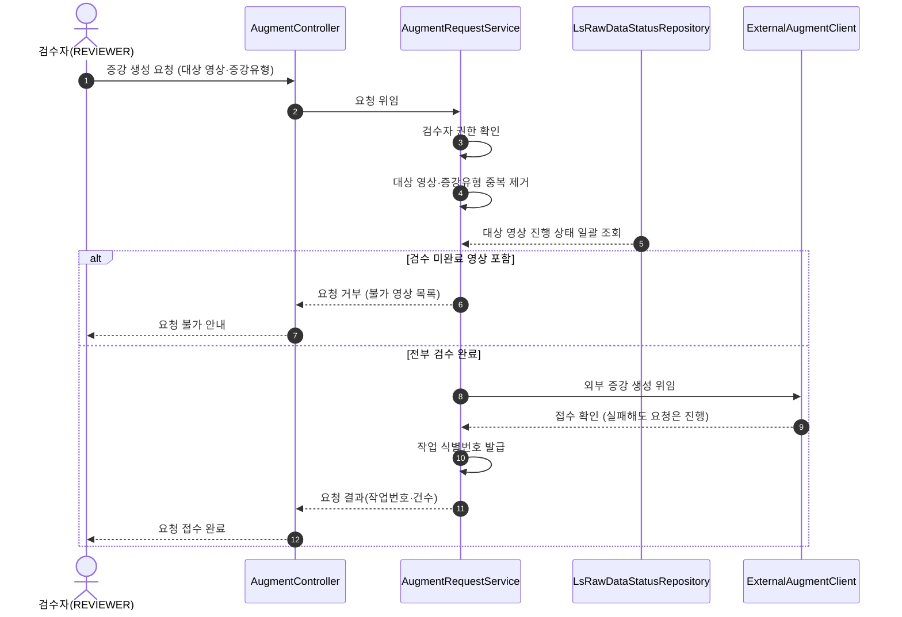
```mermaid
sequenceDiagram
    autonumber
    actor RV as 검수자(REVIEWER)
    participant AC as AugmentController
    participant ARS as AugmentRequestService
    participant DB as LsRawDataStatusRepository
    participant EX as ExternalAugmentClient
    RV->>AC: 증강 생성 요청 (대상 영상·증강유형)
    AC->>ARS: 요청 위임
    ARS->>ARS: 검수자 권한 확인
    ARS->>ARS: 대상 영상·증강유형 중복 제거
    DB-->>ARS: 대상 영상 진행 상태 일괄 조회
    alt 검수 미완료 영상 포함
        ARS-->>AC: 요청 거부 (불가 영상 목록)
        AC-->>RV: 요청 불가 안내
    else 전부 검수 완료
        ARS->>EX: 외부 증강 생성 위임
        EX-->>ARS: 접수 확인 (실패해도 요청은 진행)
        ARS->>ARS: 작업 식별번호 발급
        ARS-->>AC: 요청 결과(작업번호·건수)
        AC-->>RV: 요청 접수 완료
    end
```

### 2.2 KLID-AT-SD-002 — 증강 결과 수신·등록

| 시퀀스도 ID | KLID-AT-SD-002 | 시퀀스도명 | 증강 결과 수신·등록 |
|---------|---|-------|---|
| 관련 유스케이스 ID | KLID-AT-UC-002 |
| 주요 액터 | 생성형AI서비스[외부] |
| 주요 클래스 | AugmentResultController, AugmentResultService, WebhookIdempotencyLedger, LsDataAug, LsDataRaw, LsDataAugLblMap |

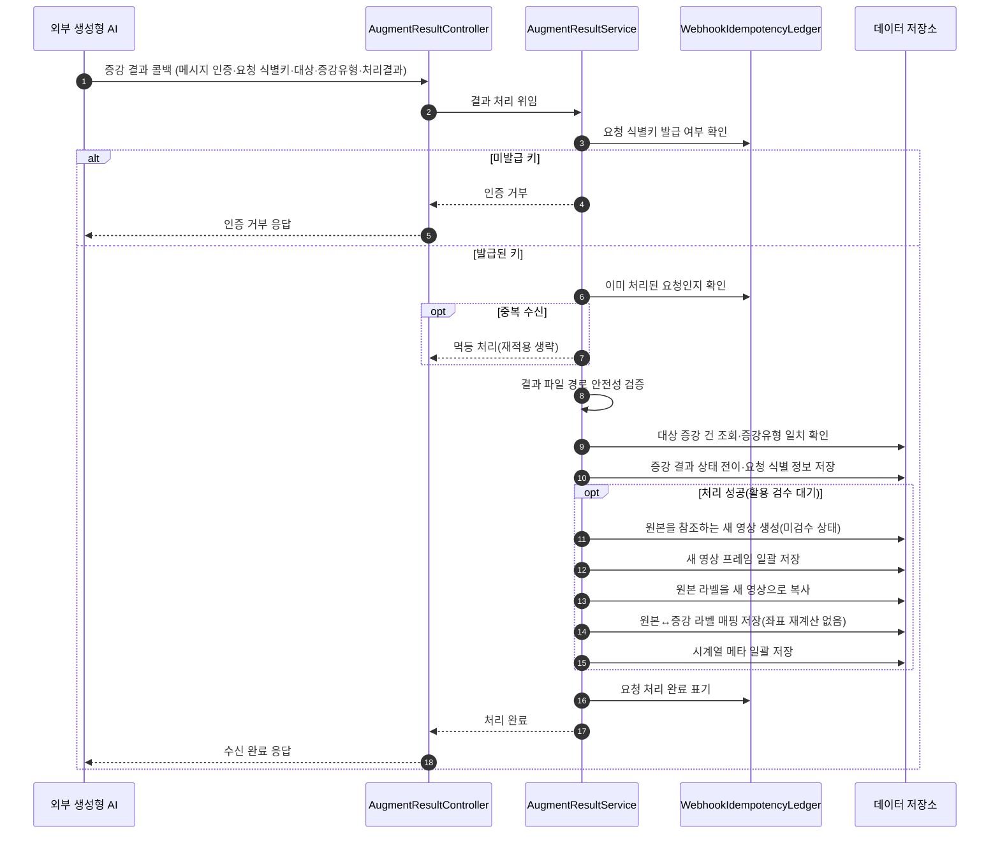
```mermaid
sequenceDiagram
    autonumber
    participant EX as 외부 생성형 AI
    participant ARC as AugmentResultController
    participant ARS as AugmentResultService
    participant LG as WebhookIdempotencyLedger
    participant DB as 데이터 저장소
    EX->>ARC: 증강 결과 콜백 (메시지 인증·요청 식별키·대상·증강유형·처리결과)
    ARC->>ARS: 결과 처리 위임
    ARS->>LG: 요청 식별키 발급 여부 확인
    alt 미발급 키
        ARS-->>ARC: 인증 거부
        ARC-->>EX: 인증 거부 응답
    else 발급된 키
        ARS->>LG: 이미 처리된 요청인지 확인
        opt 중복 수신
            ARS-->>ARC: 멱등 처리(재적용 생략)
        end
        ARS->>ARS: 결과 파일 경로 안전성 검증
        ARS->>DB: 대상 증강 건 조회·증강유형 일치 확인
        ARS->>DB: 증강 결과 상태 전이·요청 식별 정보 저장
        opt 처리 성공(활용 검수 대기)
            ARS->>DB: 원본을 참조하는 새 영상 생성(미검수 상태)
            ARS->>DB: 새 영상 프레임 일괄 저장
            ARS->>DB: 원본 라벨을 새 영상으로 복사
            ARS->>DB: 원본↔증강 라벨 매핑 저장(좌표 재계산 없음)
            ARS->>DB: 시계열 메타 일괄 저장
        end
        ARS->>LG: 요청 처리 완료 표기
        ARS-->>ARC: 처리 완료
        ARC-->>EX: 수신 완료 응답
    end
```

### 2.3 KLID-AT-SD-003 — 해상도 변경 수행

| 시퀀스도 ID | KLID-AT-SD-003 | 시퀀스도명 | 해상도 변경 |
|---------|---|-------|---|
| 관련 유스케이스 ID | KLID-AT-UC-003 |
| 주요 액터 | 검수자(REVIEWER) |
| 주요 클래스 | VideoController, VideoResolutionService, VideoResolutionPersister, LsResolutionExport, LsDataRaw |

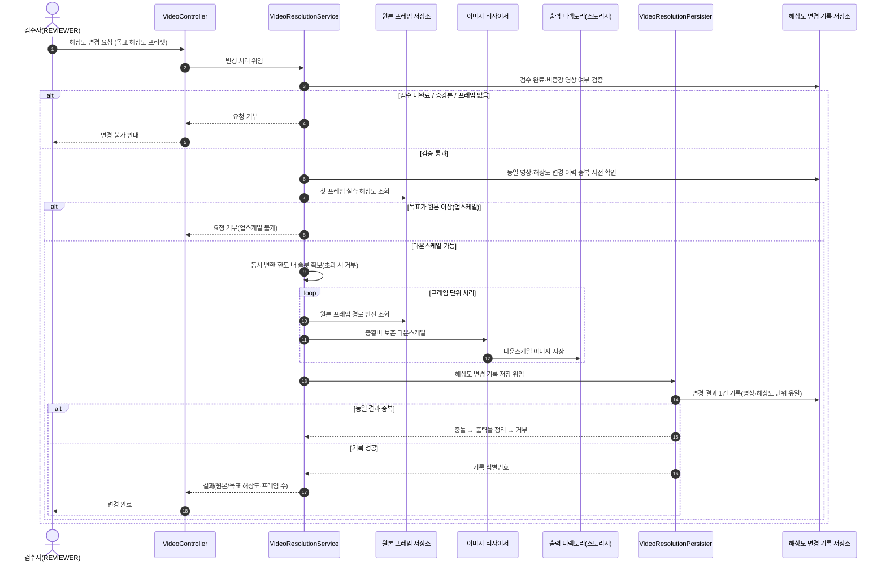
```mermaid
sequenceDiagram
    autonumber
    actor RV as 검수자(REVIEWER)
    participant VC as VideoController
    participant VRS as VideoResolutionService
    participant SRC as 원본 프레임 저장소
    participant RZ as 이미지 리사이저
    participant FS as 출력 디렉토리(스토리지)
    participant VP as VideoResolutionPersister
    participant DB as 해상도 변경 기록 저장소
    RV->>VC: 해상도 변경 요청 (목표 해상도 프리셋)
    VC->>VRS: 변경 처리 위임
    VRS->>DB: 검수 완료·비증강 영상 여부 검증
    alt 검수 미완료 / 증강본 / 프레임 없음
        VRS-->>VC: 요청 거부
        VC-->>RV: 변경 불가 안내
    else 검증 통과
        VRS->>DB: 동일 영상·해상도 변경 이력 중복 사전 확인
        VRS->>SRC: 첫 프레임 실측 해상도 조회
        alt 목표가 원본 이상(업스케일)
            VRS-->>VC: 요청 거부(업스케일 불가)
        else 다운스케일 가능
            VRS->>VRS: 동시 변환 한도 내 슬롯 확보(초과 시 거부)
            loop 프레임 단위 처리
                VRS->>SRC: 원본 프레임 경로 안전 조회
                VRS->>RZ: 종횡비 보존 다운스케일
                RZ->>FS: 다운스케일 이미지 저장
            end
            VRS->>VP: 해상도 변경 기록 저장 위임
            VP->>DB: 변경 결과 1건 기록(영상·해상도 단위 유일)
            alt 동일 결과 중복
                VP-->>VRS: 충돌 → 출력물 정리 → 거부
            else 기록 성공
                VP-->>VRS: 기록 식별번호
                VRS-->>VC: 결과(원본/목표 해상도·프레임 수)
                VC-->>RV: 변경 완료
            end
        end
    end
```

### 2.4 KLID-AT-SD-004 — 객체 자동 추적

| 시퀀스도 ID | KLID-AT-SD-004 | 시퀀스도명 | 객체 자동 추적 |
|---------|---|-------|---|
| 관련 유스케이스 ID | KLID-AT-UC-004 |
| 주요 액터 | 라벨링 작업자(WORKER), AI 추론 서버 |
| 주요 클래스 | LabelController, Sam2TrackService, LabelAccessGuard, AiServerClient, LsDataLbl |

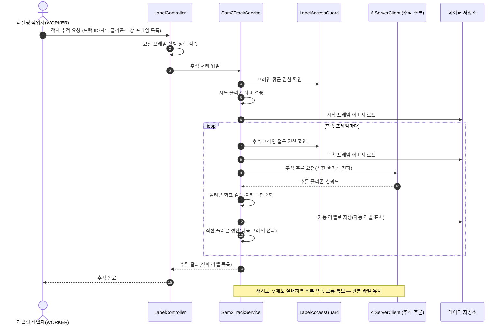
```mermaid
sequenceDiagram
    autonumber
    actor WK as 라벨링 작업자(WORKER)
    participant LC as LabelController
    participant STS as Sam2TrackService
    participant AG as LabelAccessGuard
    participant AI as AiServerClient (추적 추론)
    participant DB as 데이터 저장소
    WK->>LC: 객체 추적 요청 (트랙 ID·시드 폴리곤·대상 프레임 목록)
    LC->>LC: 요청 프레임 식별 정합 검증
    LC->>STS: 추적 처리 위임
    STS->>AG: 프레임 접근 권한 확인
    STS->>STS: 시드 폴리곤 좌표 검증
    STS->>DB: 시작 프레임 이미지 로드
    loop 후속 프레임마다
        STS->>AG: 후속 프레임 접근 권한 확인
        STS->>DB: 후속 프레임 이미지 로드
        STS->>AI: 추적 추론 요청(직전 폴리곤 전파)
        AI-->>STS: 추론 폴리곤·신뢰도
        STS->>STS: 폴리곤 좌표 검증·폴리곤 단순화
        STS->>DB: 자동 라벨로 저장(자동 라벨 표시)
        STS->>STS: 직전 폴리곤 갱신(다음 프레임 전파)
    end
    STS-->>LC: 추적 결과(전파 라벨 목록)
    LC-->>WK: 추적 완료
    Note over STS,AI: 재시도 후에도 실패하면 외부 연동 오류 통보 — 원본 라벨 유지
```

### 2.5 KLID-AT-SD-005 — 객체 외곽 경계 자동 밀착

| 시퀀스도 ID | KLID-AT-SD-005 | 시퀀스도명 | 객체 외곽 경계 자동 밀착 |
|---------|---|-------|---|
| 관련 유스케이스 ID | KLID-AT-UC-005 |
| 주요 액터 | 라벨링 작업자(WORKER), AI 추론 서버 |
| 주요 클래스 | LabelController, Sam2SegmentService, Sam2TrackService, LabelAccessGuard, AiServerClient, LsDataLbl |

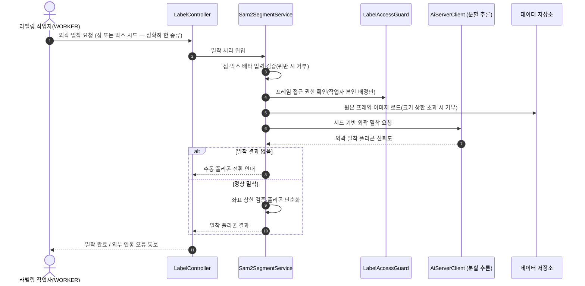
```mermaid
sequenceDiagram
    autonumber
    actor WK as 라벨링 작업자(WORKER)
    participant LC as LabelController
    participant SSS as Sam2SegmentService
    participant AG as LabelAccessGuard
    participant AI as AiServerClient (분할 추론)
    participant DB as 데이터 저장소
    WK->>LC: 외곽 밀착 요청 (점 또는 박스 시드 — 정확히 한 종류)
    LC->>SSS: 밀착 처리 위임
    SSS->>SSS: 점·박스 배타 입력 검증(위반 시 거부)
    SSS->>AG: 프레임 접근 권한 확인(작업자 본인 배정만)
    SSS->>DB: 원본 프레임 이미지 로드(크기 상한 초과 시 거부)
    SSS->>AI: 시드 기반 외곽 밀착 요청
    AI-->>SSS: 외곽 밀착 폴리곤·신뢰도
    alt 밀착 결과 없음
        SSS-->>LC: 수동 폴리곤 전환 안내
    else 정상 밀착
        SSS->>SSS: 좌표 상한 검증·폴리곤 단순화
        SSS-->>LC: 밀착 폴리곤 결과
    end
    LC-->>WK: 밀착 완료 / 외부 연동 오류 통보
```

### 2.6 KLID-AT-SD-006 — 라벨링 정밀도 조절

| 시퀀스도 ID | KLID-AT-SD-006 | 시퀀스도명 | 라벨링 정밀도 조절 |
|---------|---|-------|---|
| 관련 유스케이스 ID | KLID-AT-UC-006 |
| 주요 액터 | 검수자(REVIEWER) |
| 주요 클래스 | SystemConfigController, SystemConfigService, LsSystemConfig, Sam2TrackService |

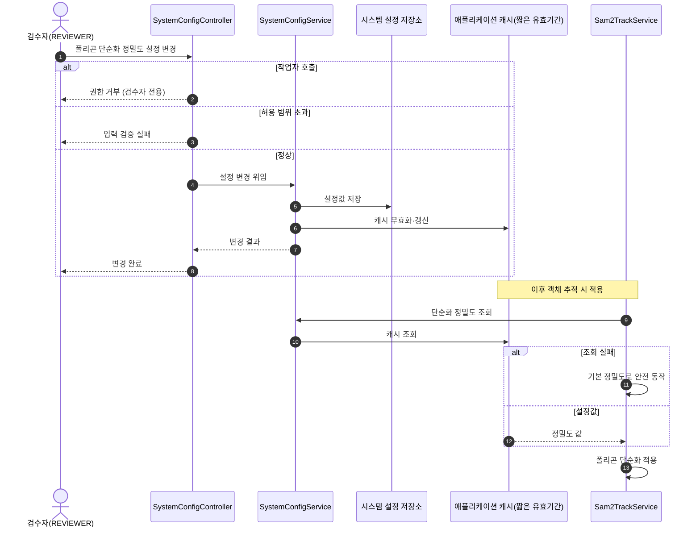
```mermaid
sequenceDiagram
    autonumber
    actor RV as 검수자(REVIEWER)
    participant SCC as SystemConfigController
    participant SCS as SystemConfigService
    participant DB as 시스템 설정 저장소
    participant CA as 애플리케이션 캐시(짧은 유효기간)
    participant STS as Sam2TrackService
    RV->>SCC: 폴리곤 단순화 정밀도 설정 변경
    alt 작업자 호출
        SCC-->>RV: 권한 거부 (검수자 전용)
    else 허용 범위 초과
        SCC-->>RV: 입력 검증 실패
    else 정상
        SCC->>SCS: 설정 변경 위임
        SCS->>DB: 설정값 저장
        SCS->>CA: 캐시 무효화·갱신
        SCS-->>SCC: 변경 결과
        SCC-->>RV: 변경 완료
    end
    Note over STS,CA: 이후 객체 추적 시 적용
    STS->>SCS: 단순화 정밀도 조회
    SCS->>CA: 캐시 조회
    alt 조회 실패
        STS->>STS: 기본 정밀도로 안전 동작
    else 설정값
        CA-->>STS: 정밀도 값
    end
    STS->>STS: 폴리곤 단순화 적용
```

### 2.7 KLID-AT-SD-007 — 라벨 버전 저장·이력 추적

| 시퀀스도 ID | KLID-AT-SD-007 | 시퀀스도명 | 라벨 버전 저장·이력 추적 |
|---------|---|-------|---|
| 관련 유스케이스 ID | KLID-AT-UC-007 |
| 주요 액터 | 검수자(REVIEWER) |
| 주요 클래스 | ReviewController, ReviewService, ReviewStateMachine, VersionService, LsLabelVersion, LsRawDataStatus |

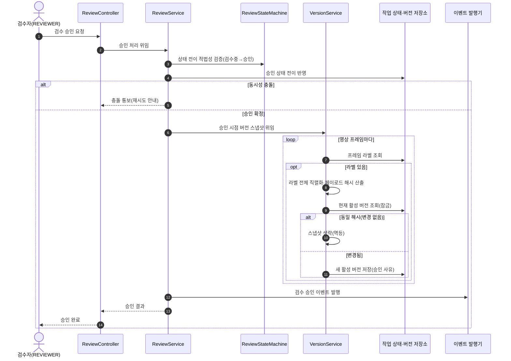
```mermaid
sequenceDiagram
    autonumber
    actor RV as 검수자(REVIEWER)
    participant RC as ReviewController
    participant RS as ReviewService
    participant SM as ReviewStateMachine
    participant VS as VersionService
    participant DB as 작업 상태·버전 저장소
    participant EP as 이벤트 발행기
    RV->>RC: 검수 승인 요청
    RC->>RS: 승인 처리 위임
    RS->>SM: 상태 전이 적법성 검증(검수중→승인)
    RS->>DB: 승인 상태 전이 반영
    alt 동시성 충돌
        RS-->>RC: 충돌 통보(재시도 안내)
    else 승인 확정
        RS->>VS: 승인 시점 버전 스냅샷 위임
        loop 영상 프레임마다
            VS->>DB: 프레임 라벨 조회
            opt 라벨 있음
                VS->>VS: 라벨 전체 직렬화·페이로드 해시 산출
                VS->>DB: 현재 활성 버전 조회(잠금)
                alt 동일 해시(변경 없음)
                    VS->>VS: 스냅샷 생략(멱등)
                else 변경됨
                    VS->>DB: 새 활성 버전 저장(승인 사유)
                end
            end
        end
        RS->>EP: 검수 승인 이벤트 발행
        RS-->>RC: 승인 결과
        RC-->>RV: 승인 완료
    end
```

### 2.8 KLID-AT-SD-008 — 버전 비교·복구

| 시퀀스도 ID | KLID-AT-SD-008 | 시퀀스도명 | 버전 비교·복구 |
|---------|---|-------|---|
| 관련 유스케이스 ID | KLID-AT-UC-008 |
| 주요 액터 | 검수자(REVIEWER), 라벨링 작업자(WORKER) |
| 주요 클래스 | VersionController, VersionService, LabelAccessGuard, LsLabelVersion |

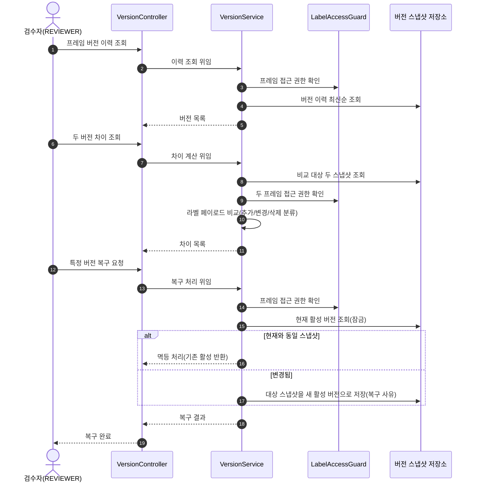
```mermaid
sequenceDiagram
    autonumber
    actor RV as 검수자(REVIEWER)
    participant VC as VersionController
    participant VS as VersionService
    participant AG as LabelAccessGuard
    participant DB as 버전 스냅샷 저장소
    RV->>VC: 프레임 버전 이력 조회
    VC->>VS: 이력 조회 위임
    VS->>AG: 프레임 접근 권한 확인
    VS->>DB: 버전 이력 최신순 조회
    VS-->>VC: 버전 목록
    RV->>VC: 두 버전 차이 조회
    VC->>VS: 차이 계산 위임
    VS->>DB: 비교 대상 두 스냅샷 조회
    VS->>AG: 두 프레임 접근 권한 확인
    VS->>VS: 라벨 페이로드 비교(추가/변경/삭제 분류)
    VS-->>VC: 차이 목록
    RV->>VC: 특정 버전 복구 요청
    VC->>VS: 복구 처리 위임
    VS->>AG: 프레임 접근 권한 확인
    VS->>DB: 현재 활성 버전 조회(잠금)
    alt 현재와 동일 스냅샷
        VS-->>VC: 멱등 처리(기존 활성 반환)
    else 변경됨
        VS->>DB: 대상 스냅샷을 새 활성 버전으로 저장(복구 사유)
    end
    VS-->>VC: 복구 결과
    VC-->>RV: 복구 완료
```

### 2.9 KLID-AT-SD-009 — 검수 완료·수정 통지

| 시퀀스도 ID | KLID-AT-SD-009 | 시퀀스도명 | 검수 완료·수정 통지 |
|---------|---|-------|---|
| 관련 유스케이스 ID | KLID-AT-UC-009 |
| 주요 액터 | 검수자/작업자, 관제서버[외부] |
| 주요 클래스 | LabelService, ControlNotifyEventListener, ControlNotifyDebouncer, ControlNotifyService, ControlNotifyClient, LsControlNotifyFallback, TaskQueryController |

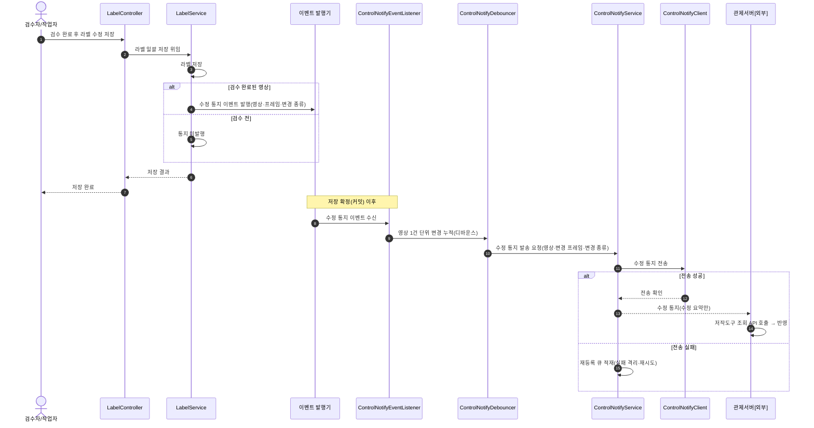
```mermaid
sequenceDiagram
    autonumber
    actor RV as 검수자/작업자
    participant LC as LabelController
    participant LS as LabelService
    participant EP as 이벤트 발행기
    participant EL as ControlNotifyEventListener
    participant DBn as ControlNotifyDebouncer
    participant CNS as ControlNotifyService
    participant CC as ControlNotifyClient
    participant CTL as 관제서버[외부]
    RV->>LC: 검수 완료 후 라벨 수정 저장
    LC->>LS: 라벨 일괄 저장 위임
    LS->>LS: 라벨 저장
    alt 검수 완료된 영상
        LS->>EP: 수정 통지 이벤트 발행(영상·프레임·변경 종류)
    else 검수 전
        LS->>LS: 통지 미발행
    end
    LS-->>LC: 저장 결과
    LC-->>RV: 저장 완료
    Note over EP,EL: 저장 확정(커밋) 이후
    EP->>EL: 수정 통지 이벤트 수신
    EL->>DBn: 영상 1건 단위 변경 누적(디바운스)
    DBn->>CNS: 수정 통지 발송 요청(영상·변경 프레임·변경 종류)
    CNS->>CC: 수정 통지 전송
    alt 전송 성공
        CC-->>CNS: 전송 확인
        CNS-->>CTL: 수정 통지(수정 요약만)
        CTL->>CTL: 저작도구 조회 API 호출 → 반영
    else 전송 실패
        CNS->>CNS: 재등록 큐 적재(실패 격리·재시도)
    end
```

### 2.10 KLID-AT-SD-010 — 증강 영상 활용 여부 검수

| 시퀀스도 ID | KLID-AT-SD-010 | 시퀀스도명 | 증강 영상 활용 여부 검수 |
|---------|---|-------|---|
| 관련 유스케이스 ID | KLID-AT-UC-010 |
| 주요 액터 | 검수자(REVIEWER) |
| 주요 클래스 | AugmentController, AugmentReviewService, LsDataAug, LsDataAugRvw, ExternalAugmentClient |

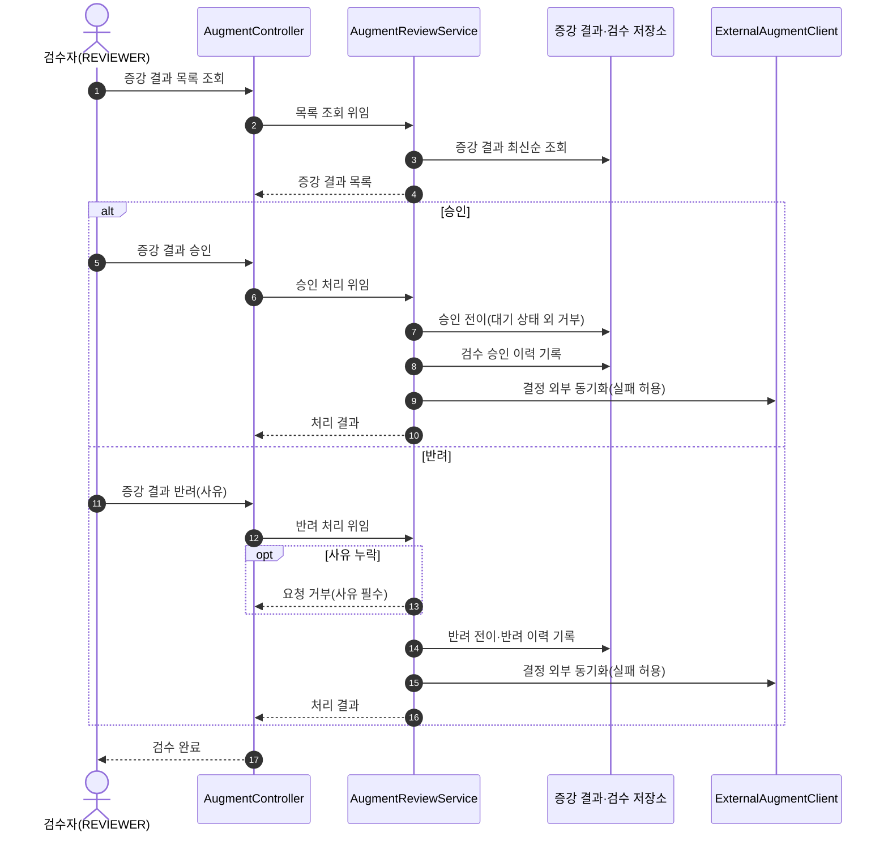
```mermaid
sequenceDiagram
    autonumber
    actor RV as 검수자(REVIEWER)
    participant AC as AugmentController
    participant ARS as AugmentReviewService
    participant DB as 증강 결과·검수 저장소
    participant EX as ExternalAugmentClient
    RV->>AC: 증강 결과 목록 조회
    AC->>ARS: 목록 조회 위임
    ARS->>DB: 증강 결과 최신순 조회
    ARS-->>AC: 증강 결과 목록
    alt 승인
        RV->>AC: 증강 결과 승인
        AC->>ARS: 승인 처리 위임
        ARS->>DB: 승인 전이(대기 상태 외 거부)
        ARS->>DB: 검수 승인 이력 기록
        ARS->>EX: 결정 외부 동기화(실패 허용)
        ARS-->>AC: 처리 결과
    else 반려
        RV->>AC: 증강 결과 반려(사유)
        AC->>ARS: 반려 처리 위임
        opt 사유 누락
            ARS-->>AC: 요청 거부(사유 필수)
        end
        ARS->>DB: 반려 전이·반려 이력 기록
        ARS->>EX: 결정 외부 동기화(실패 허용)
        ARS-->>AC: 처리 결과
    end
    AC-->>RV: 검수 완료
```

### 2.11 KLID-AT-SD-011 — 비식별 처리 요청

| 시퀀스도 ID | KLID-AT-SD-011 | 시퀀스도명 | 비식별 처리 요청 |
|---------|---|-------|---|
| 관련 유스케이스 ID | KLID-AT-UC-011 |
| 주요 액터 | 검수자(REVIEWER), 비식별솔루션[외부] |
| 주요 클래스 | DeidentController, DeidentifyClient, DeidentifyResultController, DeidentifyResultService, LsDataRaw, LsDeidentProcLog |

> 본 시퀀스의 요청 진입점은 후속 처리 적재용 접수 단계이며, 실질 비식별 호출은 배치 파이프라인의 비식별 단계가 수행한다. 비식별을 파이프라인 선두로 배치하고 전체 영상을 비식별 대상으로 삼는다.

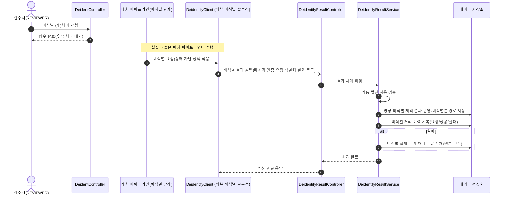
```mermaid
sequenceDiagram
    autonumber
    actor RV as 검수자(REVIEWER)
    participant DC as DeidentController
    participant BO as 배치 파이프라인(비식별 단계)
    participant DE as DeidentifyClient (외부 비식별 솔루션)
    participant DRC as DeidentifyResultController
    participant DRS as DeidentifyResultService
    participant DB as 데이터 저장소
    RV->>DC: 비식별 (재)처리 요청
    DC-->>RV: 접수 완료(후속 처리 대기)
    Note over BO,DE: 실질 호출은 배치 파이프라인이 수행
    BO->>DE: 비식별 요청(장애 차단 정책 적용)
    DE--)DRC: 비식별 결과 콜백(메시지 인증·요청 식별키·결과 코드)
    DRC->>DRS: 결과 처리 위임
    DRS->>DRS: 멱등·발신 허용 검증
    DRS->>DB: 영상 비식별 처리 결과 반영·비식별본 경로 저장
    DRS->>DB: 비식별 처리 이력 기록(요청/성공/실패)
    alt 실패
        DRS->>DB: 비식별 실패 표기·재시도 큐 적재(원본 보존)
    end
    DRS-->>DRC: 처리 완료
    DRC-->>DE: 수신 완료 응답
```

### 2.12 KLID-AT-SD-013 — 비식별 옵션 설정

| 시퀀스도 ID | KLID-AT-SD-013 | 시퀀스도명 | 비식별 옵션 설정 |
|---------|---|-------|---|
| 관련 유스케이스 ID | KLID-AT-UC-013 |
| 주요 액터 | 검수자(REVIEWER) |
| 주요 클래스 | SystemConfigController, SystemConfigService, LsSystemConfig |

> KLID-AT-SD-012는 폐기 유스케이스(KLID-AT-UC-012)에 동조하여 결번 처리한다.

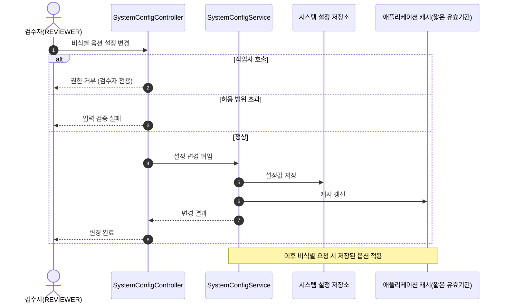
```mermaid
sequenceDiagram
    autonumber
    actor RV as 검수자(REVIEWER)
    participant SCC as SystemConfigController
    participant SCS as SystemConfigService
    participant DB as 시스템 설정 저장소
    participant CA as 애플리케이션 캐시(짧은 유효기간)
    RV->>SCC: 비식별 옵션 설정 변경
    alt 작업자 호출
        SCC-->>RV: 권한 거부 (검수자 전용)
    else 허용 범위 초과
        SCC-->>RV: 입력 검증 실패
    else 정상
        SCC->>SCS: 설정 변경 위임
        SCS->>DB: 설정값 저장
        SCS->>CA: 캐시 갱신
        SCS-->>SCC: 변경 결과
        SCC-->>RV: 변경 완료
    end
    Note over SCS,CA: 이후 비식별 요청 시 저장된 옵션 적용
```

### 2.13 KLID-AT-SD-016 — 비식별 처리 상태·이력 확인 (누락 신고·수동 해소)

| 시퀀스도 ID | KLID-AT-SD-016 | 시퀀스도명 | 비식별 누락 신고·수동 해소 |
|---------|---|-------|---|
| 관련 유스케이스 ID | KLID-AT-UC-016 |
| 주요 액터 | 라벨링 작업자(WORKER), 검수자(REVIEWER), 외부 비식별 SW |
| 주요 클래스 | DeidentReportController, DeidentReportService, LabelAccessGuard, WorkLockService, VersionService, LsDeidentReport, LsAuthWorkLock |

> KLID-AT-SD-014/015는 폐기 유스케이스(KLID-AT-UC-014/015)에 동조하여 결번 처리한다.

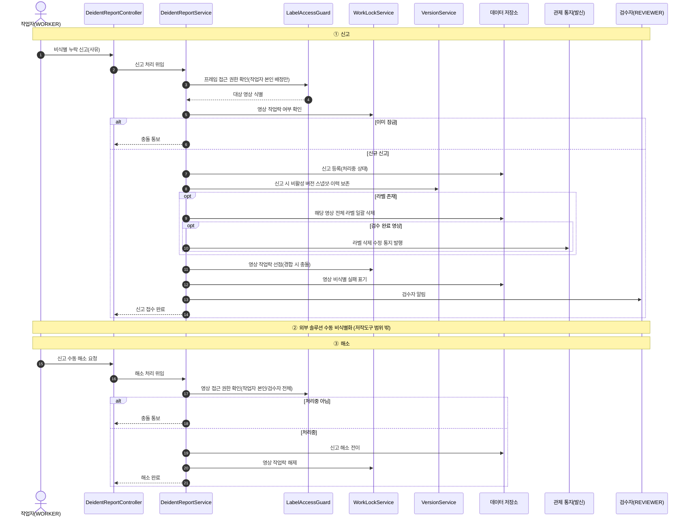
```mermaid
sequenceDiagram
    autonumber
    actor WK as 작업자(WORKER)
    participant DRC as DeidentReportController
    participant DRS as DeidentReportService
    participant AG as LabelAccessGuard
    participant WL as WorkLockService
    participant VS as VersionService
    participant DB as 데이터 저장소
    participant CN as 관제 통지(발신)
    participant RV as 검수자(REVIEWER)
    Note over WK,RV: ① 신고
    WK->>DRC: 비식별 누락 신고(사유)
    DRC->>DRS: 신고 처리 위임
    DRS->>AG: 프레임 접근 권한 확인(작업자 본인 배정만)
    AG-->>DRS: 대상 영상 식별
    DRS->>WL: 영상 작업락 여부 확인
    alt 이미 잠금
        DRS-->>DRC: 충돌 통보
    else 신규 신고
        DRS->>DB: 신고 등록(처리중 상태)
        DRS->>VS: 신고 시 비활성 버전 스냅샷·이력 보존
        opt 라벨 존재
            DRS->>DB: 해당 영상 전체 라벨 일괄 삭제
            opt 검수 완료 영상
                DRS->>CN: 라벨 삭제 수정 통지 발행
            end
        end
        DRS->>WL: 영상 작업락 선점(경합 시 충돌)
        DRS->>DB: 영상 비식별 실패 표기
        DRS->>RV: 검수자 알림
        DRS-->>DRC: 신고 접수 완료
    end
    Note over WK,RV: ② 외부 솔루션 수동 비식별화 (저작도구 범위 밖)
    Note over WK,RV: ③ 해소
    WK->>DRC: 신고 수동 해소 요청
    DRC->>DRS: 해소 처리 위임
    DRS->>AG: 영상 접근 권한 확인(작업자 본인/검수자 전체)
    alt 처리중 아님
        DRS-->>DRC: 충돌 통보
    else 처리중
        DRS->>DB: 신고 해소 전이
        DRS->>WL: 영상 작업락 해제
        DRS-->>DRC: 해소 완료
    end
```

---

## 3. 설계 클래스도

> **⟳ 유스케이스별로 1개씩 반복 작성한다.** (설계 클래스도 ID ↔ 관련 유스케이스 ID는 1:1, 번호 동조·결번 동조)

### 3.1 KLID-AT-DCD-001 — 증강 영상 생성 요청 실현 클래스

| 설계 클래스도 ID | KLID-AT-DCD-001 | 설계 클래스도명 | 증강 영상 생성 요청 실현 클래스 |
|-----------|---|---------|---|
| 관련 유스케이스 ID | KLID-AT-UC-001 |

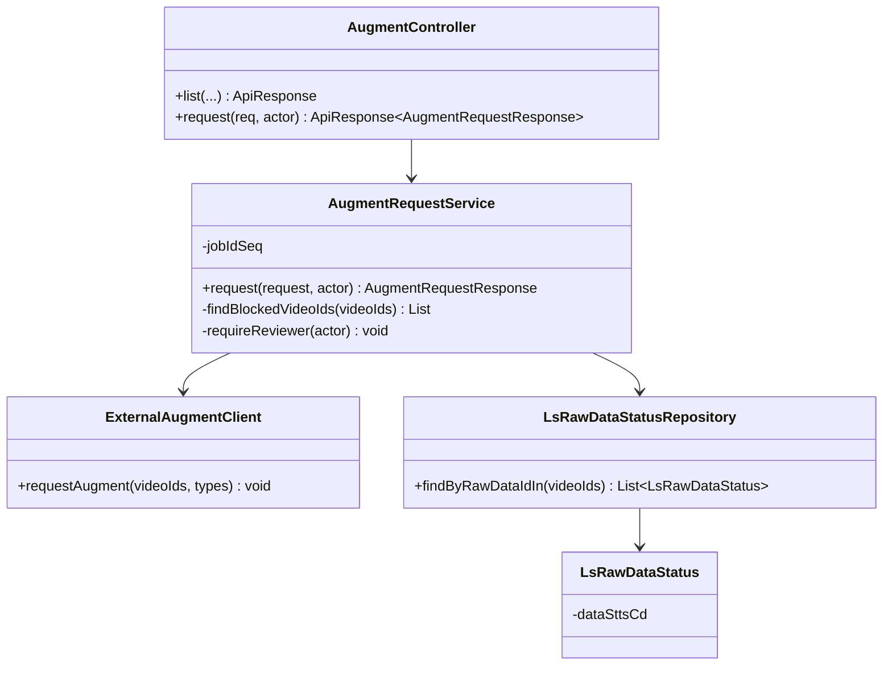
```mermaid
classDiagram
    class AugmentController {
        +list(...) ApiResponse
        +request(req, actor) ApiResponse~AugmentRequestResponse~
    }
    class AugmentRequestService {
        -jobIdSeq
        +request(request, actor) AugmentRequestResponse
        -findBlockedVideoIds(videoIds) List
        -requireReviewer(actor) void
    }
    class ExternalAugmentClient {
        +requestAugment(videoIds, types) void
    }
    class LsRawDataStatusRepository {
        +findByRawDataIdIn(videoIds) List~LsRawDataStatus~
    }
    class LsRawDataStatus {
        -dataSttsCd
    }
    AugmentController --> AugmentRequestService
    AugmentRequestService --> LsRawDataStatusRepository
    AugmentRequestService --> ExternalAugmentClient
    LsRawDataStatusRepository --> LsRawDataStatus
```

### 3.2 KLID-AT-DCD-002 — 증강 결과 수신·등록 실현 클래스

| 설계 클래스도 ID | KLID-AT-DCD-002 | 설계 클래스도명 | 증강 결과 수신·등록 실현 클래스 |
|-----------|---|---------|---|
| 관련 유스케이스 ID | KLID-AT-UC-002 |

```mermaid
classDiagram
    class AugmentResultController {
        +receive(req) ApiResponse
    }
    class AugmentResultService {
        +handle(req) boolean
        -createAugmentedVideo(aug, req) void
        -buildAugLabelMaps(aug, originals, ...) List~LsDataAugLblMap~
        -validateFilePath(filePath) void
    }
    class WebhookIdempotencyLedger {
        +isIssued(key) boolean
        +isProcessed(key) boolean
        +markProcessed(key) void
    }
    class LsDataAug {
        -augProcSttsCd
        +applyReviewStatus(newStatus) void
        +assignIdempotencyKey(key) void
    }
    class LsDataAugLblMap {
        +create(...) LsDataAugLblMap
    }
    class LsDataRaw {
        +createFromAugment(parentRawSn) LsDataRaw
    }
    AugmentResultController --> AugmentResultService
    AugmentResultService --> WebhookIdempotencyLedger
    AugmentResultService --> LsDataAug
    AugmentResultService --> LsDataRaw
    AugmentResultService --> LsDataAugLblMap
    LsDataAug "1" --> "0..*" LsDataAugLblMap
```

### 3.3 KLID-AT-DCD-003 — 해상도 변경 수행 실현 클래스

| 설계 클래스도 ID | KLID-AT-DCD-003 | 설계 클래스도명 | 해상도 변경 수행 실현 클래스 |
|-----------|---|---------|---|
| 관련 유스케이스 ID | KLID-AT-UC-003 |

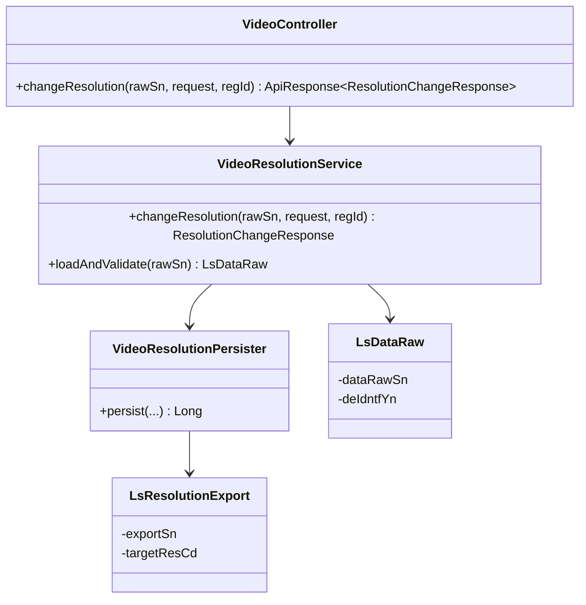
```mermaid
classDiagram
    class VideoController {
        +changeResolution(rawSn, request, regId) ApiResponse~ResolutionChangeResponse~
    }
    class VideoResolutionService {
        +changeResolution(rawSn, request, regId) ResolutionChangeResponse
        +loadAndValidate(rawSn) LsDataRaw
    }
    class VideoResolutionPersister {
        +persist(...) Long
    }
    class LsResolutionExport {
        -exportSn
        -targetResCd
    }
    class LsDataRaw {
        -dataRawSn
        -deIdntfYn
    }
    VideoController --> VideoResolutionService
    VideoResolutionService --> VideoResolutionPersister
    VideoResolutionService --> LsDataRaw
    VideoResolutionPersister --> LsResolutionExport
```

### 3.4 KLID-AT-DCD-004 — 객체 자동 추적 실현 클래스

| 설계 클래스도 ID | KLID-AT-DCD-004 | 설계 클래스도명 | 객체 자동 추적 실현 클래스 |
|-----------|---|---------|---|
| 관련 유스케이스 ID | KLID-AT-UC-004 |

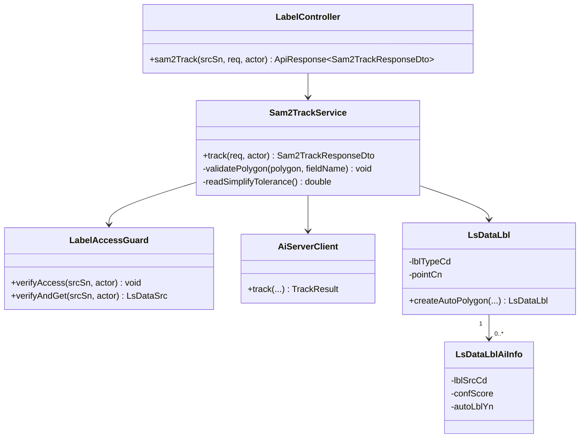
```mermaid
classDiagram
    class LabelController {
        +sam2Track(srcSn, req, actor) ApiResponse~Sam2TrackResponseDto~
    }
    class Sam2TrackService {
        +track(req, actor) Sam2TrackResponseDto
        -validatePolygon(polygon, fieldName) void
        -readSimplifyTolerance() double
    }
    class LabelAccessGuard {
        +verifyAccess(srcSn, actor) void
        +verifyAndGet(srcSn, actor) LsDataSrc
    }
    class AiServerClient {
        +track(...) TrackResult
    }
    class LsDataLbl {
        -lblTypeCd
        -pointCn
        +createAutoPolygon(...) LsDataLbl
    }
    class LsDataLblAiInfo {
        -lblSrcCd
        -confScore
        -autoLblYn
    }
    LabelController --> Sam2TrackService
    Sam2TrackService --> LabelAccessGuard
    Sam2TrackService --> AiServerClient
    Sam2TrackService --> LsDataLbl
    LsDataLbl "1" --> "0..*" LsDataLblAiInfo
```

### 3.5 KLID-AT-DCD-005 — 객체 외곽 경계 자동 밀착 실현 클래스

| 설계 클래스도 ID | KLID-AT-DCD-005 | 설계 클래스도명 | 객체 외곽 경계 자동 밀착 실현 클래스 |
|-----------|---|---------|---|
| 관련 유스케이스 ID | KLID-AT-UC-005 |

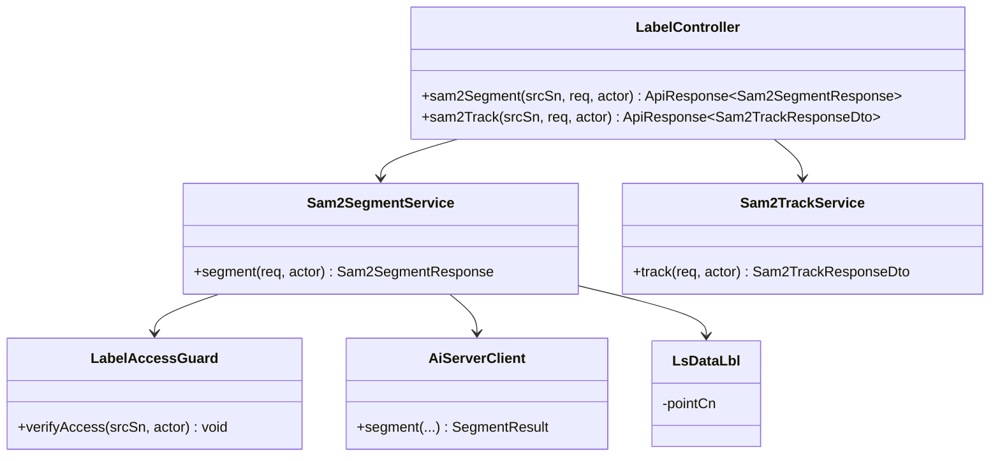
```mermaid
classDiagram
    class LabelController {
        +sam2Segment(srcSn, req, actor) ApiResponse~Sam2SegmentResponse~
        +sam2Track(srcSn, req, actor) ApiResponse~Sam2TrackResponseDto~
    }
    class Sam2SegmentService {
        +segment(req, actor) Sam2SegmentResponse
    }
    class Sam2TrackService {
        +track(req, actor) Sam2TrackResponseDto
    }
    class LabelAccessGuard {
        +verifyAccess(srcSn, actor) void
    }
    class AiServerClient {
        +segment(...) SegmentResult
    }
    class LsDataLbl {
        -pointCn
    }
    LabelController --> Sam2SegmentService
    LabelController --> Sam2TrackService
    Sam2SegmentService --> LabelAccessGuard
    Sam2SegmentService --> AiServerClient
    Sam2SegmentService --> LsDataLbl
```

### 3.6 KLID-AT-DCD-006 — 라벨링 정밀도 조절 실현 클래스

| 설계 클래스도 ID | KLID-AT-DCD-006 | 설계 클래스도명 | 라벨링 정밀도 조절 실현 클래스 |
|-----------|---|---------|---|
| 관련 유스케이스 ID | KLID-AT-UC-006 |

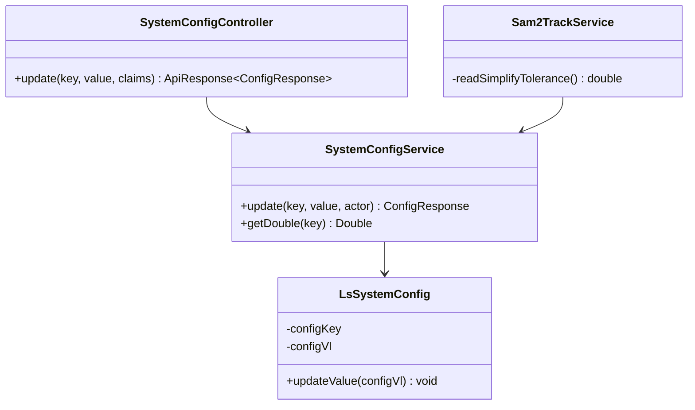
```mermaid
classDiagram
    class SystemConfigController {
        +update(key, value, claims) ApiResponse~ConfigResponse~
    }
    class SystemConfigService {
        +update(key, value, actor) ConfigResponse
        +getDouble(key) Double
    }
    class LsSystemConfig {
        -configKey
        -configVl
        +updateValue(configVl) void
    }
    class Sam2TrackService {
        -readSimplifyTolerance() double
    }
    SystemConfigController --> SystemConfigService
    SystemConfigService --> LsSystemConfig
    Sam2TrackService --> SystemConfigService
```

### 3.7 KLID-AT-DCD-007 — 라벨 버전 저장·이력 추적 실현 클래스

| 설계 클래스도 ID | KLID-AT-DCD-007 | 설계 클래스도명 | 라벨 버전 저장·이력 추적 실현 클래스 |
|-----------|---|---------|---|
| 관련 유스케이스 ID | KLID-AT-UC-007 |

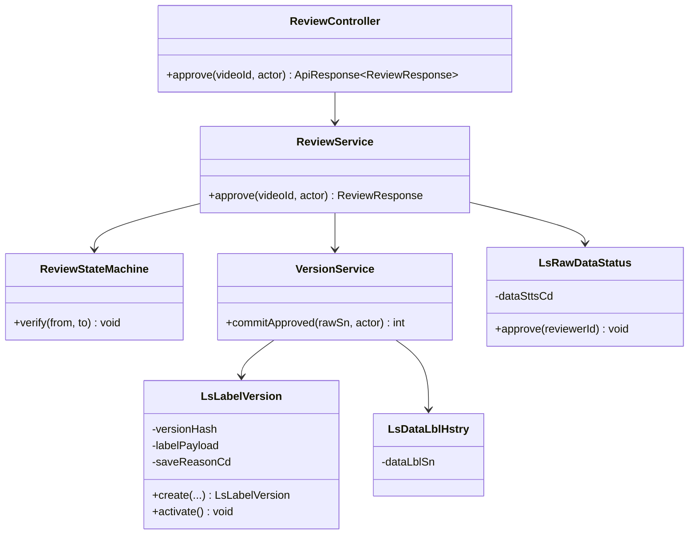
```mermaid
classDiagram
    class ReviewController {
        +approve(videoId, actor) ApiResponse~ReviewResponse~
    }
    class ReviewService {
        +approve(videoId, actor) ReviewResponse
    }
    class ReviewStateMachine {
        +verify(from, to) void
    }
    class VersionService {
        +commitApproved(rawSn, actor) int
    }
    class LsLabelVersion {
        -versionHash
        -labelPayload
        -saveReasonCd
        +create(...) LsLabelVersion
        +activate() void
    }
    class LsRawDataStatus {
        -dataSttsCd
        +approve(reviewerId) void
    }
    class LsDataLblHstry {
        -dataLblSn
    }
    ReviewController --> ReviewService
    ReviewService --> ReviewStateMachine
    ReviewService --> VersionService
    ReviewService --> LsRawDataStatus
    VersionService --> LsLabelVersion
    VersionService --> LsDataLblHstry
```

### 3.8 KLID-AT-DCD-008 — 버전 비교·복구 실현 클래스

| 설계 클래스도 ID | KLID-AT-DCD-008 | 설계 클래스도명 | 버전 비교·복구 실현 클래스 |
|-----------|---|---------|---|
| 관련 유스케이스 ID | KLID-AT-UC-008 |

```mermaid
classDiagram
    class VersionController {
        +listVersions(srcSn, actor) ApiResponse~List~
        +diff(toHash, fromHash, actor) ApiResponse~List~
        +rollback(versionHash, srcSn, actor) ApiResponse~Item~
    }
    class VersionService {
        +listVersions(srcSn, actor) List~VersionItem~
        +diff(fromHash, toHash, actor) DiffResponseDto
        +rollback(versionHash, srcSn, actor) LsLabelVersion
    }
    class LabelAccessGuard {
        +verifyAccess(srcSn, actor) void
        +verifyAndGet(srcSn, actor) LsDataSrc
    }
    class LsLabelVersion {
        -versionHash
        -activeYn
        +deactivate() void
        +activate() void
    }
    VersionController --> VersionService
    VersionService --> LabelAccessGuard
    VersionService --> LsLabelVersion
```

### 3.9 KLID-AT-DCD-009 — 검수 완료·수정 통지 실현 클래스

| 설계 클래스도 ID | KLID-AT-DCD-009 | 설계 클래스도명 | 검수 완료·수정 통지 실현 클래스 |
|-----------|---|---------|---|
| 관련 유스케이스 ID | KLID-AT-UC-009 |

```mermaid
classDiagram
    class LabelService {
        +bulkUpsert(srcSn, req, actor) LabelResponse
    }
    class ControlNotifyEventListener {
        +onReviewApproved(event) void
        +onTaskModified(event) void
    }
    class ControlNotifyDebouncer {
        +accumulate(event) void
        +flushExpiredWindows() void
    }
    class ControlNotifyService {
        +sendCompleted(event) void
        +sendModified(rawSn, frameIds, changeTypes) void
    }
    class ControlNotifyClient {
        +sendTaskCompleted(payload) void
        +sendTaskModified(payload) void
    }
    class LsControlNotifyFallback {
        -sttsCd
        +scheduleRetry() void
        +markDeadLetter() void
    }
    class TaskQueryController {
        +getSummary(rawSn) ApiResponse
        +getLabels(rawSn) ApiResponse
        +getMeta(rawSn) ApiResponse
    }
    LabelService --> ControlNotifyEventListener : event
    ControlNotifyEventListener --> ControlNotifyDebouncer
    ControlNotifyDebouncer --> ControlNotifyService
    ControlNotifyService --> ControlNotifyClient
    ControlNotifyService --> LsControlNotifyFallback
```

### 3.10 KLID-AT-DCD-010 — 증강 영상 활용 여부 검수 실현 클래스

| 설계 클래스도 ID | KLID-AT-DCD-010 | 설계 클래스도명 | 증강 영상 활용 여부 검수 실현 클래스 |
|-----------|---|---------|---|
| 관련 유스케이스 ID | KLID-AT-UC-010 |

```mermaid
classDiagram
    class AugmentController {
        +list(...) ApiResponse
        +accept(id, actor) ApiResponse~AugmentSummaryResponse~
        +reject(id, reason, actor) ApiResponse~AugmentSummaryResponse~
    }
    class AugmentReviewService {
        +listAll(pageable) Page~AugmentSummaryResponse~
        +accept(dataAugSn, actor) AugmentSummaryResponse
        +reject(dataAugSn, reason, actor) AugmentSummaryResponse
    }
    class LsDataAug {
        -augProcSttsCd
        +applyReviewStatus(newStatus) void
    }
    class LsDataAugRvw {
        -rvwSttsCd
        +approve() void
        +reject() void
    }
    class ExternalAugmentClient {
        +syncDecision(...) void
    }
    AugmentController --> AugmentReviewService
    AugmentReviewService --> LsDataAug
    AugmentReviewService --> LsDataAugRvw
    AugmentReviewService --> ExternalAugmentClient
    LsDataAug "1" --> "0..*" LsDataAugRvw
```

### 3.11 KLID-AT-DCD-011 — 비식별 처리 요청 실현 클래스

| 설계 클래스도 ID | KLID-AT-DCD-011 | 설계 클래스도명 | 비식별 처리 요청 실현 클래스 |
|-----------|---|---------|---|
| 관련 유스케이스 ID | KLID-AT-UC-011 |

```mermaid
classDiagram
    class DeidentController {
        +reprocess(videoId) ApiResponse~Void~
    }
    class DeidentifyClient {
        +deidentify(request) DeidentifyResponse
    }
    class DeidentifyResultController {
        +receive(req) ApiResponse
    }
    class DeidentifyResultService {
        +handle(req) boolean
    }
    class LsDataRaw {
        -deIdntfYn
        +markDeidentified(code) void
    }
    class LsDeidentProcLog {
        -procSttsCd
        +succeed(deIdntfFilePathNm) void
        +fail(errorCd, errorMsg) void
    }
    DeidentController --> DeidentifyClient
    DeidentifyResultController --> DeidentifyResultService
    DeidentifyResultService --> LsDataRaw
    DeidentifyResultService --> LsDeidentProcLog
```

### 3.12 KLID-AT-DCD-013 — 비식별 옵션 설정 실현 클래스

| 설계 클래스도 ID | KLID-AT-DCD-013 | 설계 클래스도명 | 비식별 옵션 설정 실현 클래스 |
|-----------|---|---------|---|
| 관련 유스케이스 ID | KLID-AT-UC-013 |

> KLID-AT-DCD-012는 폐기 유스케이스(KLID-AT-UC-012)에 동조하여 결번 처리한다.

```mermaid
classDiagram
    class SystemConfigController {
        +list() ApiResponse~List~
        +update(key, value, claims) ApiResponse~ConfigResponse~
    }
    class SystemConfigService {
        +listAll() List~ConfigResponse~
        +update(key, value, actor) ConfigResponse
        +getString(key) String
    }
    class LsSystemConfig {
        -configKey
        -configVl
        -configTypeCd
        +updateValue(configVl) void
        +validateValue() boolean
    }
    SystemConfigController --> SystemConfigService
    SystemConfigService --> LsSystemConfig
```

### 3.13 KLID-AT-DCD-016 — 비식별 처리 상태·이력 확인 실현 클래스

| 설계 클래스도 ID | KLID-AT-DCD-016 | 설계 클래스도명 | 비식별 처리 상태·이력 확인(누락 신고·수동 해소) 실현 클래스 |
|-----------|---|---------|---|
| 관련 유스케이스 ID | KLID-AT-UC-016 |

> KLID-AT-DCD-012/014/015는 폐기 유스케이스에 동조하여 결번 처리한다.

```mermaid
classDiagram
    class DeidentReportController {
        +report(srcSn, body, actor) ApiResponse
        +resolve(rprtSn, actor) ApiResponse
        +list(...) ApiResponse~Page~
    }
    class DeidentReportService {
        +report(srcSn, reason, actor) Long
        +resolveManually(rprtSn, actor) void
        +resolveOpenReports(rawSn) int
    }
    class LabelAccessGuard {
        +verifyAndGet(srcSn, actor) LsDataSrc
        +verifyRawAccess(rawSn, actor) void
    }
    class WorkLockService {
        +lockRawForRedeident(rawSn, ownerId) void
        +releaseRaw(rawSn) void
        +isRawLocked(rawSn) boolean
    }
    class VersionService {
        +snapshotDeidentReport(rawSn, actor) boolean
    }
    class LsDeidentReport {
        -reportSttsCd
        +resolve() void
        +dismiss() void
    }
    class LsAuthWorkLock {
        -lockSttsCd
        +lockRawForRedeident(rawSn, ownerId) LsAuthWorkLock
        +release(actorId, reason) void
    }
    class LsLabelVersion {
        -saveReasonCd
        +createInactiveRawSnapshot(...) LsLabelVersion
    }
    DeidentReportController --> DeidentReportService
    DeidentReportService --> LabelAccessGuard
    DeidentReportService --> WorkLockService
    DeidentReportService --> VersionService
    DeidentReportService --> LsDeidentReport
    WorkLockService --> LsAuthWorkLock
    VersionService --> LsLabelVersion
```

---

## 4. 설계 클래스 정의

> **⟳ 클래스별로 1개씩 반복 작성한다.** (속성·오퍼레이션 명세 포함. 공통 클래스는 1회만 정의한다. '타입'은 추상 설계 타입으로, '설명'은 역할·의미로 기술한다.)

### KLID-AT-DC-001 — AugmentController

| 설계 클래스 ID | KLID-AT-DC-001 | 설계 클래스명 | AugmentController |
|-----------|---|---------|---|
| **속성** |

| 속성명 | 가시성 | 타입 | 기본값 | 설명 |
|-------|------|------|-------|------|
| augmentRequestService | private | 증강 요청 서비스 | - | 증강 생성 요청 위임 |
| augmentReviewService | private | 증강 검수 서비스 | - | 증강 활용 검수 위임 |

| **오퍼레이션** |

| 오퍼레이션명 | 가시성 | 파라미터 | 반환타입 | 설명 |
|----------|------|---------|--------|------|
| list | public | 페이지 정보, 원본 영상 | 응답 래퍼 | 증강 결과 목록을 조회한다 |
| request | public | 증강 요청 정보, 사용자 정보 | 응답 래퍼 | 검수자가 증강 생성을 요청한다 |
| result | public | 작업번호 | 응답 래퍼 | 증강 작업 결과를 조회한다 |
| accept | public | 증강 식별번호, 사용자 정보 | 응답 래퍼 | 증강 결과를 활용 승인한다 |
| reject | public | 증강 식별번호, 사유, 사용자 정보 | 응답 래퍼 | 증강 결과를 활용 반려한다 |

### KLID-AT-DC-002 — AugmentRequestService

| 설계 클래스 ID | KLID-AT-DC-002 | 설계 클래스명 | AugmentRequestService |
|-----------|---|---------|---|
| **속성** |

| 속성명 | 가시성 | 타입 | 기본값 | 설명 |
|-------|------|------|-------|------|
| jobIdSeq | private | 원자적 카운터 | 기동 시각 | 작업 식별번호 발급기 |
| rawDataStatusRepository | private | 영상 진행 상태 저장소 | - | 대상 영상 진행 상태 조회 |
| externalAugmentClient | private | 외부 증강 클라이언트 | - | 외부 증강 위임 |

| **오퍼레이션** |

| 오퍼레이션명 | 가시성 | 파라미터 | 반환타입 | 설명 |
|----------|------|---------|--------|------|
| request | public | 증강 요청 정보, 사용자 정보 | 증강 요청 결과 | 권한·검수완료 검증 후 외부 위임·작업번호를 발급한다 |
| findBlockedVideoIds | private | 영상 식별번호 목록 | 영상 식별번호 목록 | 검수 미완료 영상을 추려낸다 |
| requireReviewer | private | 사용자 정보 | void | 검수자 권한을 확인한다 |
| sanitize | private (static) | 문자열 | 문자열 | 로그·입력값을 정화한다 |

### KLID-AT-DC-003 — ExternalAugmentClient

| 설계 클래스 ID | KLID-AT-DC-003 | 설계 클래스명 | ExternalAugmentClient |
|-----------|---|---------|---|
| **속성** |

| 속성명 | 가시성 | 타입 | 기본값 | 설명 |
|-------|------|------|-------|------|
| webClient | private | 외부 호출 클라이언트 | - | 외부 증강 시스템 호출 |

| **오퍼레이션** |

| 오퍼레이션명 | 가시성 | 파라미터 | 반환타입 | 설명 |
|----------|------|---------|--------|------|
| requestAugment | public | 영상 목록, 증강유형 | void | 외부 생성형 AI에 증강 생성을 위임한다(실패 허용) |
| syncDecision | public | 증강 식별번호, 결정, 사유 | void | 증강 검수 결정을 외부에 동기화한다(실패 허용) |

### KLID-AT-DC-004 — LsRawDataStatusRepository

| 설계 클래스 ID | KLID-AT-DC-004 | 설계 클래스명 | LsRawDataStatusRepository |
|-----------|---|---------|---|
| **속성** | (저장소 인터페이스 — 속성 없음) |

| **오퍼레이션** |

| 오퍼레이션명 | 가시성 | 파라미터 | 반환타입 | 설명 |
|----------|------|---------|--------|------|
| findByRawDataIdIn | public | 영상 식별번호 목록 | 진행 상태 목록 | 영상 목록의 진행 상태를 일괄 조회한다 |
| findById | public | 영상 식별번호 | 진행 상태(선택적) | 영상 진행 상태를 단건 조회한다 |

### KLID-AT-DC-005 — AugmentResultController

| 설계 클래스 ID | KLID-AT-DC-005 | 설계 클래스명 | AugmentResultController |
|-----------|---|---------|---|
| **속성** |

| 속성명 | 가시성 | 타입 | 기본값 | 설명 |
|-------|------|------|-------|------|
| augmentResultService | private | 증강 결과 수신 서비스 | - | 증강 결과 수신 처리 위임 |

| **오퍼레이션** |

| 오퍼레이션명 | 가시성 | 파라미터 | 반환타입 | 설명 |
|----------|------|---------|--------|------|
| receive | public | 증강 결과 정보 | 응답 래퍼 | 외부 증강 결과 콜백을 수신한다(메시지 인증 검증) |

### KLID-AT-DC-006 — LsDataAug

| 설계 클래스 ID | KLID-AT-DC-006 | 설계 클래스명 | LsDataAug |
|-----------|---|---------|---|
| **속성** |

| 속성명 | 가시성 | 타입 | 기본값 | 설명 |
|-------|------|------|-------|------|
| dataAugSn | private | 식별자 | - | 증강 결과 식별번호(읽기전용) |
| srcSn | private | 식별자 | - | 증강 대상 영상 참조 |
| augTypeCd | private | 문자(코드) | - | 증강유형(WINTER/NIGHT/RAIN) |
| augProcSttsCd | private | 문자(코드) | - | 처리상태(대기/승인/반려) |
| lblIntgrtPct | private | 숫자 | - | 라벨 무결성 비율 |
| rejectRsn | private | 문자 | - | 반려 사유 |
| dcsnUserNo | private | 문자 | - | 결정 사용자 번호 |
| dcsnDt | private | 날짜시간 | - | 결정 일시 |
| idempotencyKey | private | 문자 | - | 비동기 요청 멱등키 |
| externalJobId | private | 문자 | - | 외부 작업 식별번호 |
| retryCount | private | 숫자 | 0 | 재시도 횟수 |
| deadLetterAt | private | 날짜시간 | - | 실패 격리 일시 |

| **오퍼레이션** |

| 오퍼레이션명 | 가시성 | 파라미터 | 반환타입 | 설명 |
|----------|------|---------|--------|------|
| createPending | public (static) | 영상, 증강유형, ... | 증강 결과 | 대기 상태 증강 결과를 생성한다 |
| applyReviewStatus | public | 새 상태 | void | 검수 상태를 전이한다(대기 외 전이 시 충돌) |
| assignIdempotencyKey | public | 멱등키 | void | 멱등키를 부여한다 |
| assignExternalJobId | public | 외부 작업번호 | void | 외부 작업번호를 부여한다 |
| incrementRetryCount | public | - | void | 재시도 횟수를 증가시킨다 |
| markDeadLetter | public | - | void | 실패 격리로 표기한다 |

### KLID-AT-DC-007 — AugmentResultService

| 설계 클래스 ID | KLID-AT-DC-007 | 설계 클래스명 | AugmentResultService |
|-----------|---|---------|---|
| **속성** |

| 속성명 | 가시성 | 타입 | 기본값 | 설명 |
|-------|------|------|-------|------|
| logUnsafePattern | private (static) | 형식 검증 규칙 | 개행 문자 | 로그 위변조 방지 정화 규칙 |
| idempotencyLedger | private | 멱등 원장 | - | 요청 멱등 검증 |

| **오퍼레이션** |

| 오퍼레이션명 | 가시성 | 파라미터 | 반환타입 | 설명 |
|----------|------|---------|--------|------|
| handle | public | 증강 결과 정보 | 적용 여부 | 멱등·경로 안전성·증강유형 검증 후 상태 전이·신규 영상을 생성한다 |
| createAugmentedVideo | private | 증강 결과, 결과 정보 | void | 새 영상·프레임·라벨·매핑·메타를 동일 작업으로 저장한다 |
| buildAugLabelMaps | private (static) | 증강 결과, 원본, ... | 라벨 매핑 목록 | 원본↔증강 라벨 매핑을 생성한다(좌표 재계산 없음) |
| validateFilePath | private | 파일 경로 | void | 결과 파일 경로의 안전성을 검증한다 |

### KLID-AT-DC-008 — LsDataAugLblMap

| 설계 클래스 ID | KLID-AT-DC-008 | 설계 클래스명 | LsDataAugLblMap |
|-----------|---|---------|---|
| **속성** |

| 속성명 | 가시성 | 타입 | 기본값 | 설명 |
|-------|------|------|-------|------|
| dataAugLblMapSn | private | 식별자 | - | 매핑 식별번호(읽기전용) |
| dataAugSn | private | 식별자 | - | 증강 결과 참조 |
| orgnlDataLblSn | private | 식별자 | - | 원본 라벨 참조 |
| dataLblSn | private | 식별자 | - | 증강 라벨 참조 |
| coordRecalcYn | private | 문자(여부) | 'N' | 좌표 재계산 여부(외부 증강 3종은 미재계산) |
| scaleX | private | 숫자 | - | 가로 스케일(해상도 변동 시) |
| scaleY | private | 숫자 | - | 세로 스케일(해상도 변동 시) |

| **오퍼레이션** |

| 오퍼레이션명 | 가시성 | 파라미터 | 반환타입 | 설명 |
|----------|------|---------|--------|------|
| create | public (static) | 증강 결과, 원본 라벨, 증강 라벨, 재계산 여부, 스케일, 등록자 | 라벨 매핑 | 원본↔증강 라벨 매핑을 생성한다 |

### KLID-AT-DC-009 — WebhookIdempotencyLedger

| 설계 클래스 ID | KLID-AT-DC-009 | 설계 클래스명 | WebhookIdempotencyLedger |
|-----------|---|---------|---|
| **속성** |

| 속성명 | 가시성 | 타입 | 기본값 | 설명 |
|-------|------|------|-------|------|
| repository | private | 멱등 원장 저장소 | - | 멱등 원장 영속 |

| **오퍼레이션** |

| 오퍼레이션명 | 가시성 | 파라미터 | 반환타입 | 설명 |
|----------|------|---------|--------|------|
| isIssued | public | 요청 식별키 | 발급 여부 | 허용된 발급 키인지 확인한다 |
| isProcessed | public | 요청 식별키 | 처리 여부 | 이미 처리된 요청(재수신)인지 확인한다 |
| markProcessed | public | 요청 식별키 | void | 처리 완료로 표기한다 |

### KLID-AT-DC-010 — LsDataRaw

| 설계 클래스 ID | KLID-AT-DC-010 | 설계 클래스명 | LsDataRaw |
|-----------|---|---------|---|
| **속성** |

| 속성명 | 가시성 | 타입 | 기본값 | 설명 |
|-------|------|------|-------|------|
| dataRawSn | private | 식별자 | - | 영상 식별번호(읽기전용, 작업 식별자) |
| parentRawSn | private | 식별자 | - | 증강 원본 영상 참조 |
| deIdntfYn | private | 문자(코드) | - | 비식별 처리 여부 |
| dataSttsCd | private | 문자(코드) | - | 배치 단계 상태 |

| **오퍼레이션** |

| 오퍼레이션명 | 가시성 | 파라미터 | 반환타입 | 설명 |
|----------|------|---------|--------|------|
| createFromAugment | public (static) | 원본 영상, ... | 영상 | 증강 결과로 새 영상을 생성한다(미검수 상태) |
| markDeidentified | public | 결과 코드 | void | 비식별 결과 코드를 반영한다 |

### KLID-AT-DC-011 — VideoController

| 설계 클래스 ID | KLID-AT-DC-011 | 설계 클래스명 | VideoController |
|-----------|---|---------|---|
| **속성** |

| 속성명 | 가시성 | 타입 | 기본값 | 설명 |
|-------|------|------|-------|------|
| videoResolutionService | private | 해상도 변경 서비스 | - | 해상도 변경 위임 |
| videoQueryService | private | 영상 조회 서비스 | - | 영상 조회 위임 |

| **오퍼레이션** |

| 오퍼레이션명 | 가시성 | 파라미터 | 반환타입 | 설명 |
|----------|------|---------|--------|------|
| list | public | 페이지 정보, 필터 | 응답 래퍼 | 영상 목록을 조회한다 |
| getOne | public | 영상 식별번호 | 응답 래퍼 | 영상 상세를 조회한다 |
| changeResolution | public | 영상 식별번호, 해상도 요청, 등록자 | 응답 래퍼 | 검수자가 해상도 변경을 수행한다 |
| streamVideo | public | 영상 식별번호, 요청 헤더 | 스트리밍 응답 | 비식별 영상을 구간 단위로 스트리밍한다 |

### KLID-AT-DC-012 — VideoResolutionService

| 설계 클래스 ID | KLID-AT-DC-012 | 설계 클래스명 | VideoResolutionService |
|-----------|---|---------|---|
| **속성** |

| 속성명 | 가시성 | 타입 | 기본값 | 설명 |
|-------|------|------|-------|------|
| persister | private | 해상도 변경 기록 영속자 | - | 변경 기록을 독립 작업 단위로 영속 |
| concurrencyGate | private | 동시 실행 제한 | 공정 정책 | 동시 변환 상한 제어 |

| **오퍼레이션** |

| 오퍼레이션명 | 가시성 | 파라미터 | 반환타입 | 설명 |
|----------|------|---------|--------|------|
| changeResolution | public | 영상 식별번호, 해상도 요청, 등록자 | 변경 결과 | 검수완료·비증강·다운스케일을 검증한 뒤 프레임을 다운스케일하고 변경을 기록한다 |
| loadAndValidate | public | 영상 식별번호 | 영상 | 적격(검수완료+비증강) 영상을 검증·로드한다 |

### KLID-AT-DC-013 — VideoResolutionPersister

| 설계 클래스 ID | KLID-AT-DC-013 | 설계 클래스명 | VideoResolutionPersister |
|-----------|---|---------|---|
| **속성** |

| 속성명 | 가시성 | 타입 | 기본값 | 설명 |
|-------|------|------|-------|------|
| exportRepository | private | 해상도 변경 기록 저장소 | - | 변경 기록 영속 |

| **오퍼레이션** |

| 오퍼레이션명 | 가시성 | 파라미터 | 반환타입 | 설명 |
|----------|------|---------|--------|------|
| persist | public | 변경 메타 | 식별번호 | 변경 기록 1건을 독립 작업으로 저장한다(영상·해상도 단위 중복 시 충돌) |

### KLID-AT-DC-014 — LabelController

| 설계 클래스 ID | KLID-AT-DC-014 | 설계 클래스명 | LabelController |
|-----------|---|---------|---|
| **속성** |

| 속성명 | 가시성 | 타입 | 기본값 | 설명 |
|-------|------|------|-------|------|
| labelService | private | 라벨 서비스 | - | 라벨 조회·저장 위임 |
| sam2TrackService | private | 추적 서비스 | - | 객체 추적 위임 |
| sam2SegmentService | private | 분할 서비스 | - | 외곽 밀착 위임 |

| **오퍼레이션** |

| 오퍼레이션명 | 가시성 | 파라미터 | 반환타입 | 설명 |
|----------|------|---------|--------|------|
| getLabels | public | 프레임 식별번호, 사용자 정보 | 응답 래퍼 | 프레임 라벨을 조회한다 |
| bulkUpsert | public | 프레임 식별번호, 라벨 일괄 요청, 사용자 정보 | 응답 래퍼 | 프레임 라벨을 일괄 저장한다 |
| sam2Track | public | 프레임 식별번호, 추적 요청, 사용자 정보 | 응답 래퍼 | 객체 추적을 수행한다(요청 정합 검증) |
| sam2Segment | public | 프레임 식별번호, 분할 요청, 사용자 정보 | 응답 래퍼 | 외곽 밀착을 수행한다 |

### KLID-AT-DC-015 — Sam2TrackService

| 설계 클래스 ID | KLID-AT-DC-015 | 설계 클래스명 | Sam2TrackService |
|-----------|---|---------|---|
| **속성** |

| 속성명 | 가시성 | 타입 | 기본값 | 설명 |
|-------|------|------|-------|------|
| aiServerClient | private | AI 추론 클라이언트 | - | 추적 추론 호출 |
| accessGuard | private | 접근 권한 검증기 | - | 프레임 소유 권한 검증 |
| systemConfigService | private | 시스템 설정 서비스 | - | 단순화 정밀도 설정 조회 |

| **오퍼레이션** |

| 오퍼레이션명 | 가시성 | 파라미터 | 반환타입 | 설명 |
|----------|------|---------|--------|------|
| track | public | 추적 요청, 사용자 정보 | 추적 결과 | 프레임을 순회하며 추적을 전파·단순화하고 자동 라벨을 저장한다 |
| validatePolygon | private | 폴리곤 좌표, 필드명 | void | 폴리곤 좌표를 실측 상한으로 검증한다 |
| readSimplifyTolerance | private | - | 정밀도 값 | 단순화 정밀도를 조회한다(실패 시 기본값으로 안전 동작) |
| clampScore | private | 신뢰도 | 숫자 | 신뢰도 값을 허용 범위로 보정한다 |

### KLID-AT-DC-016 — LabelAccessGuard

| 설계 클래스 ID | KLID-AT-DC-016 | 설계 클래스명 | LabelAccessGuard |
|-----------|---|---------|---|
| **속성** |

| 속성명 | 가시성 | 타입 | 기본값 | 설명 |
|-------|------|------|-------|------|
| dataSrcRepository | private | 프레임·영상 저장소 | - | 소유 검증 조회 |

| **오퍼레이션** |

| 오퍼레이션명 | 가시성 | 파라미터 | 반환타입 | 설명 |
|----------|------|---------|--------|------|
| verifyAccess | public | 프레임 식별번호, 사용자 정보 | void | 프레임 접근 권한을 검증한다(검수자 전체/작업자 본인) |
| verifyAndGet | public | 프레임 식별번호, 사용자 정보 | 프레임 | 접근 검증 후 프레임을 반환한다 |
| verifyRawAccess | public | 영상 식별번호, 사용자 정보 | void | 영상 단위 접근 권한을 검증한다 |
| parseUserNo | public | 토큰 주체 | 사용자 번호 | 토큰 주체로부터 사용자 번호를 도출한다 |

### KLID-AT-DC-017 — LsDataLbl

| 설계 클래스 ID | KLID-AT-DC-017 | 설계 클래스명 | LsDataLbl |
|-----------|---|---------|---|
| **속성** |

| 속성명 | 가시성 | 타입 | 기본값 | 설명 |
|-------|------|------|-------|------|
| lblSn | private | 식별자 | - | 라벨 식별번호(읽기전용) |
| srcSn | private | 식별자 | - | 프레임 참조 |
| lblTypeCd | private | 문자(코드) | - | 도형 유형(박스/폴리곤/세그먼트/트랙) |
| labelId | private | 식별자 | - | 라벨 마스터 참조 |
| pointCn | private | 문자(좌표) | - | 좌표 내용 |
| trckId | private | 문자 | - | 트랙 식별자(추적 객체 식별) |

| **오퍼레이션** |

| 오퍼레이션명 | 가시성 | 파라미터 | 반환타입 | 설명 |
|----------|------|---------|--------|------|
| createAutoPolygon | public (static) | 프레임, 폴리곤, ... | 라벨 | 자동 라벨 폴리곤을 생성한다(자동 라벨 표시) |
| updatePoints | public | 좌표 내용 | void | 좌표를 갱신한다 |
| copyForNewSrc | public | 새 프레임 식별번호 | 라벨 | 신규 프레임으로 라벨을 복사한다(증강 수신) |

### KLID-AT-DC-018 — AiServerClient

| 설계 클래스 ID | KLID-AT-DC-018 | 설계 클래스명 | AiServerClient |
|-----------|---|---------|---|
| **속성** |

| 속성명 | 가시성 | 타입 | 기본값 | 설명 |
|-------|------|------|-------|------|
| webClient | private | 외부 호출 클라이언트 | - | AI 추론 서버 호출(호출 시간 제한) |

| **오퍼레이션** |

| 오퍼레이션명 | 가시성 | 파라미터 | 반환타입 | 설명 |
|----------|------|---------|--------|------|
| track | public | 트랙 식별자, 직전/후속 이미지, 폴리곤 | 추적 결과 | 추적 추론을 호출한다(장애 차단 정책 적용) |
| segment | public | 이미지, 점/박스 시드 | 분할 결과 | 분할 추론을 호출한다 |

### KLID-AT-DC-019 — LsResolutionExport

| 설계 클래스 ID | KLID-AT-DC-019 | 설계 클래스명 | LsResolutionExport |
|-----------|---|---------|---|
| **속성** |

| 속성명 | 가시성 | 타입 | 기본값 | 설명 |
|-------|------|------|-------|------|
| exportSn | private | 식별자 | - | 해상도 변경 기록 식별번호(읽기전용) |
| dataRawSn | private | 식별자 | - | 원본 영상 참조 |
| targetResCd | private | 문자(코드) | - | 목표 해상도 코드(1080P/720P/480P) |
| frameCount | private | 숫자 | - | 다운스케일 프레임 수 |
| outputPath | private | 문자 | - | 출력 디렉토리 경로 |

| **오퍼레이션** |

| 오퍼레이션명 | 가시성 | 파라미터 | 반환타입 | 설명 |
|----------|------|---------|--------|------|
| create | public (static) | 영상, 목표 해상도, 프레임 수, 출력 경로 | 변경 기록 | 해상도 변경 기록을 생성한다(영상·해상도 단위 유일) |

### KLID-AT-DC-020 — Sam2SegmentService

| 설계 클래스 ID | KLID-AT-DC-020 | 설계 클래스명 | Sam2SegmentService |
|-----------|---|---------|---|
| **속성** |

| 속성명 | 가시성 | 타입 | 기본값 | 설명 |
|-------|------|------|-------|------|
| aiServerClient | private | AI 추론 클라이언트 | - | 분할 추론 호출 |
| accessGuard | private | 접근 권한 검증기 | - | 프레임 소유 권한 검증 |

| **오퍼레이션** |

| 오퍼레이션명 | 가시성 | 파라미터 | 반환타입 | 설명 |
|----------|------|---------|--------|------|
| segment | public | 분할 요청, 사용자 정보 | 분할 결과 | 점/박스 시드(정확히 한 종류)로 외곽 밀착 폴리곤을 산출·검증·단순화한다 |

### KLID-AT-DC-021 — AugmentReviewService

| 설계 클래스 ID | KLID-AT-DC-021 | 설계 클래스명 | AugmentReviewService |
|-----------|---|---------|---|
| **속성** |

| 속성명 | 가시성 | 타입 | 기본값 | 설명 |
|-------|------|------|-------|------|
| augRepository | private | 증강 결과 저장소 | - | 증강 결과 조회·저장 |
| reviewRepository | private | 증강 검수 저장소 | - | 검수 이력 저장 |
| externalAugmentClient | private | 외부 증강 클라이언트 | - | 외부 결정 동기화 |

| **오퍼레이션** |

| 오퍼레이션명 | 가시성 | 파라미터 | 반환타입 | 설명 |
|----------|------|---------|--------|------|
| listAll | public | 페이지 정보 | 증강 결과 페이지 | 증강 결과를 페이징 조회한다 |
| findBySource | public | 원본 영상 | 증강 결과 목록 | 원본 영상 기준 증강 결과를 조회한다 |
| accept | public | 증강 식별번호, 사용자 정보 | 처리 결과 | 활용 승인한다(대기 상태 외 충돌) |
| reject | public | 증강 식별번호, 사유, 사용자 정보 | 처리 결과 | 활용 반려한다(사유 필수) |

### KLID-AT-DC-022 — LsDataAugRvw

| 설계 클래스 ID | KLID-AT-DC-022 | 설계 클래스명 | LsDataAugRvw |
|-----------|---|---------|---|
| **속성** |

| 속성명 | 가시성 | 타입 | 기본값 | 설명 |
|-------|------|------|-------|------|
| dataAugRvwSn | private | 식별자 | - | 검수 식별번호(읽기전용) |
| dataAugSn | private | 식별자 | - | 증강 결과 참조 |
| rvwSttsCd | private | 문자(코드) | - | 검수 상태(대기/승인/반려) |
| lblIntgrtPct | private | 숫자 | - | 라벨 무결성 비율 |
| rejectRsn | private | 문자 | - | 반려 사유 |
| rvwId | private | 문자 | - | 검수자 식별자 |
| rvwDt | private | 날짜시간 | - | 검수 일시 |

| **오퍼레이션** |

| 오퍼레이션명 | 가시성 | 파라미터 | 반환타입 | 설명 |
|----------|------|---------|--------|------|
| approve | public | - | void | 검수 승인으로 전이한다 |
| reject | public | - | void | 검수 반려로 전이한다 |

### KLID-AT-DC-023 — DeidentifyClient

| 설계 클래스 ID | KLID-AT-DC-023 | 설계 클래스명 | DeidentifyClient |
|-----------|---|---------|---|
| **속성** |

| 속성명 | 가시성 | 타입 | 기본값 | 설명 |
|-------|------|------|-------|------|
| webClient | private | 외부 호출 클라이언트 | - | 외부 비식별 솔루션 호출 |

| **오퍼레이션** |

| 오퍼레이션명 | 가시성 | 파라미터 | 반환타입 | 설명 |
|----------|------|---------|--------|------|
| deidentify | public | 비식별 요청 | 비동기 결과 | 외부 비식별을 호출한다(호출 시간 제한·재시도·장애 차단 적용) |

### KLID-AT-DC-024 — SystemConfigController

| 설계 클래스 ID | KLID-AT-DC-024 | 설계 클래스명 | SystemConfigController |
|-----------|---|---------|---|
| **속성** |

| 속성명 | 가시성 | 타입 | 기본값 | 설명 |
|-------|------|------|-------|------|
| systemConfigService | private | 시스템 설정 서비스 | - | 설정 조회·변경 위임 |

| **오퍼레이션** |

| 오퍼레이션명 | 가시성 | 파라미터 | 반환타입 | 설명 |
|----------|------|---------|--------|------|
| list | public | - | 응답 래퍼 | 시스템 설정 목록을 조회한다 |
| update | public | 설정 키, 값, 사용자 정보 | 응답 래퍼 | 검수자가 설정을 변경한다 |

### KLID-AT-DC-025 — SystemConfigService

| 설계 클래스 ID | KLID-AT-DC-025 | 설계 클래스명 | SystemConfigService |
|-----------|---|---------|---|
| **속성** |

| 속성명 | 가시성 | 타입 | 기본값 | 설명 |
|-------|------|------|-------|------|
| configRepository | private | 설정 저장소 | - | 설정값 영속 |
| cache | private | 애플리케이션 캐시 | 짧은 유효기간 | 설정값 로컬 캐시 |

| **오퍼레이션** |

| 오퍼레이션명 | 가시성 | 파라미터 | 반환타입 | 설명 |
|----------|------|---------|--------|------|
| listAll | public | - | 설정 목록 | 전체 설정을 조회한다 |
| getInt | public | 설정 키 | 정수 | 정수 설정값을 조회한다(캐시) |
| getDouble | public | 설정 키 | 실수 | 실수 설정값을 조회한다(정밀도 등) |
| getString | public | 설정 키 | 문자열 | 문자열 설정값을 조회한다 |
| update | public | 설정 키, 값, 사용자 정보 | 변경 결과 | 허용 키 값을 저장하고 캐시를 갱신한다 |

### KLID-AT-DC-026 — LsSystemConfig

| 설계 클래스 ID | KLID-AT-DC-026 | 설계 클래스명 | LsSystemConfig |
|-----------|---|---------|---|
| **속성** |

| 속성명 | 가시성 | 타입 | 기본값 | 설명 |
|-------|------|------|-------|------|
| configKey | private | 문자(키) | - | 설정 키(읽기전용) |
| configVl | private | 문자 | - | 설정 값 |
| configTypeCd | private | 문자(코드) | - | 값 유형(JSON/숫자/문자/논리) |
| expln | private | 문자 | - | 설정 설명 |
| mdfrId | private | 문자 | - | 수정자 식별자 |
| mdfcnDt | private | 날짜시간 | - | 수정 일시 |

| **오퍼레이션** |

| 오퍼레이션명 | 가시성 | 파라미터 | 반환타입 | 설명 |
|----------|------|---------|--------|------|
| updateValue | public | 설정 값 | void | 설정 값을 변경한다 |
| validateValue | public | - | 검증 결과 | 값 유형별로 설정 값을 검증한다 |

### KLID-AT-DC-027 — ReviewController

| 설계 클래스 ID | KLID-AT-DC-027 | 설계 클래스명 | ReviewController |
|-----------|---|---------|---|
| **속성** |

| 속성명 | 가시성 | 타입 | 기본값 | 설명 |
|-------|------|------|-------|------|
| reviewService | private | 검수 서비스 | - | 검수 처리 위임 |

| **오퍼레이션** |

| 오퍼레이션명 | 가시성 | 파라미터 | 반환타입 | 설명 |
|----------|------|---------|--------|------|
| submit | public | 영상 식별번호, 사용자 정보 | 응답 래퍼 | 검수를 제출한다 |
| start | public | 영상 식별번호, 사용자 정보 | 응답 래퍼 | 검수를 시작한다 |
| approve | public | 영상 식별번호, 사용자 정보 | 응답 래퍼 | 검수를 승인한다 |
| reject | public | 영상 식별번호, 반려 요청, 사용자 정보 | 응답 래퍼 | 검수를 반려한다(사유 필수) |

### KLID-AT-DC-028 — LsDataLblHstry

| 설계 클래스 ID | KLID-AT-DC-028 | 설계 클래스명 | LsDataLblHstry |
|-----------|---|---------|---|
| **속성** |

| 속성명 | 가시성 | 타입 | 기본값 | 설명 |
|-------|------|------|-------|------|
| hstrySn | private | 식별자 | - | 이력 식별번호(읽기전용) |
| dataLblSn | private | 식별자 | - | 라벨 참조 |
| changeTypeCd | private | 문자(코드) | - | 변경 종류 |
| regDt | private | 날짜시간 | - | 이력 일시 |

| **오퍼레이션** |

| 오퍼레이션명 | 가시성 | 파라미터 | 반환타입 | 설명 |
|----------|------|---------|--------|------|
| of | public (static) | 라벨, 변경 종류 | 이력 | 라벨 변경 이력을 생성한다 |

### KLID-AT-DC-029 — VersionService

| 설계 클래스 ID | KLID-AT-DC-029 | 설계 클래스명 | VersionService |
|-----------|---|---------|---|
| **속성** |

| 속성명 | 가시성 | 타입 | 기본값 | 설명 |
|-------|------|------|-------|------|
| versionRepository | private | 버전 스냅샷 저장소 | - | 버전 스냅샷 영속 |
| accessGuard | private | 접근 권한 검증기 | - | 프레임 소유 권한 검증 |
| serializer | private | 직렬화 처리 | - | 라벨 페이로드 직렬화 |

| **오퍼레이션** |

| 오퍼레이션명 | 가시성 | 파라미터 | 반환타입 | 설명 |
|----------|------|---------|--------|------|
| commitApproved | public | 영상 식별번호, 사용자 정보 | 생성 건수 | 검수 승인 시 프레임별 스냅샷을 생성한다(페이로드 해시 기반 멱등) |
| snapshotDeidentReport | public | 영상 식별번호, 사용자 정보 | 생성 여부 | 비식별 신고 시 비활성 스냅샷을 생성한다 |
| listVersions | public | 프레임 식별번호, 사용자 정보 | 버전 목록 | 버전 이력을 조회한다 |
| diff | public | 비교 기준 해시, 대상 해시, 사용자 정보 | 차이 결과 | 두 스냅샷을 비교한다(추가/변경/삭제) |
| rollback | public | 버전 해시, 프레임 식별번호, 사용자 정보 | 버전 | 대상 스냅샷을 새 활성 버전으로 복구한다(복구 사유) |
| isCommittable | public (static) | 사용자 정보 | 가능 여부 | 버전 생성 권한을 판정한다 |

### KLID-AT-DC-030 — LsLabelVersion

| 설계 클래스 ID | KLID-AT-DC-030 | 설계 클래스명 | LsLabelVersion |
|-----------|---|---------|---|
| **속성** |

| 속성명 | 가시성 | 타입 | 기본값 | 설명 |
|-------|------|------|-------|------|
| labelVersionSn | private | 식별자 | - | 버전 식별번호(읽기전용) |
| dataRawSn | private | 식별자 | - | 영상 참조 |
| dataSrcSn | private | 식별자 | - | 프레임 참조 |
| versionHash | private | 문자(해시) | - | 페이로드 해시 식별자 |
| labelPayload | private | 문자(스냅샷) | - | 라벨 전체 스냅샷 |
| versionNo | private | 숫자 | - | 버전 순번 |
| saveReasonCd | private | 문자(코드) | - | 저장 사유(승인/복구/비식별신고) |
| activeYn | private | 문자(여부) | - | 활성 여부 |

| **오퍼레이션** |

| 오퍼레이션명 | 가시성 | 파라미터 | 반환타입 | 설명 |
|----------|------|---------|--------|------|
| create | public (static) | 영상, 프레임, 해시, 페이로드, 저장 사유 | 버전 | 활성 버전 스냅샷을 생성한다 |
| createInactiveRawSnapshot | public (static) | 영상, 해시, 페이로드 | 버전 | 비활성(신고) 스냅샷을 생성한다 |
| activate | public | - | void | 활성으로 전이한다 |
| deactivate | public | - | void | 비활성으로 전이한다 |

### KLID-AT-DC-031 — ReviewService

| 설계 클래스 ID | KLID-AT-DC-031 | 설계 클래스명 | ReviewService |
|-----------|---|---------|---|
| **속성** |

| 속성명 | 가시성 | 타입 | 기본값 | 설명 |
|-------|------|------|-------|------|
| statusRepository | private | 영상 진행 상태 저장소 | - | 작업 상태 영속 |
| stateMachine | private | 검수 상태기 | - | 상태 전이 검증 |
| versionService | private | 버전 서비스 | - | 승인 시 스냅샷 위임 |
| eventPublisher | private | 이벤트 발행기 | - | 검수 승인 이벤트 발행 |

| **오퍼레이션** |

| 오퍼레이션명 | 가시성 | 파라미터 | 반환타입 | 설명 |
|----------|------|---------|--------|------|
| submit | public | 영상 식별번호, 사용자 정보 | 처리 결과 | 검수 제출로 전이한다 |
| startReview | public | 영상 식별번호, 사용자 정보 | 처리 결과 | 검수 시작으로 전이한다 |
| approve | public | 영상 식별번호, 사용자 정보 | 처리 결과 | 승인 전이·스냅샷·이벤트를 발행한다(동시성 충돌 시 거부) |
| reject | public | 영상 식별번호, 반려 요청, 사용자 정보 | 처리 결과 | 반려 전이·반려 사유를 기록한다 |

### KLID-AT-DC-032 — ReviewStateMachine

| 설계 클래스 ID | KLID-AT-DC-032 | 설계 클래스명 | ReviewStateMachine |
|-----------|---|---------|---|
| **속성** |

| 속성명 | 가시성 | 타입 | 기본값 | 설명 |
|-------|------|------|-------|------|
| transitions | private (static) | 전이 규칙표 | 허용 전이표 | 상태 전이 허용 규칙 |

| **오퍼레이션** |

| 오퍼레이션명 | 가시성 | 파라미터 | 반환타입 | 설명 |
|----------|------|---------|--------|------|
| verify | public | 시작 상태, 목표 상태 | void | 상태 전이의 적법성을 검증한다(위반 시 예외) |

### KLID-AT-DC-033 — LsRawDataStatus

| 설계 클래스 ID | KLID-AT-DC-033 | 설계 클래스명 | LsRawDataStatus |
|-----------|---|---------|---|
| **속성** |

| 속성명 | 가시성 | 타입 | 기본값 | 설명 |
|-------|------|------|-------|------|
| rawDataId | private | 식별자 | - | 영상 식별번호(읽기전용) |
| dataSttsCd | private | 문자(코드) | - | 작업/검수 상태(대기~완료/실패) |
| stpCycl | private | 숫자 | - | 제출 회차 |
| igiCycl | private | 숫자 | - | 검수 회차 |
| version | private | 숫자 | - | 동시성 제어용 버전(낙관적 잠금) |

| **오퍼레이션** |

| 오퍼레이션명 | 가시성 | 파라미터 | 반환타입 | 설명 |
|----------|------|---------|--------|------|
| assignToWorker | public | - | void | 작업자 배정으로 전이한다 |
| submitForReview | public | - | void | 검수 제출로 전이한다 |
| approve | public | 검수자 식별번호 | void | 승인으로 전이한다(완료 통지 트리거) |
| reject | public | 반려 사유 | void | 반려로 전이한다 |
| incrementReviewCycle | public | - | void | 검수 회차를 증가시킨다 |

### KLID-AT-DC-034 — VersionController

| 설계 클래스 ID | KLID-AT-DC-034 | 설계 클래스명 | VersionController |
|-----------|---|---------|---|
| **속성** |

| 속성명 | 가시성 | 타입 | 기본값 | 설명 |
|-------|------|------|-------|------|
| versionService | private | 버전 서비스 | - | 버전 비교·복구 위임 |

| **오퍼레이션** |

| 오퍼레이션명 | 가시성 | 파라미터 | 반환타입 | 설명 |
|----------|------|---------|--------|------|
| listVersions | public | 프레임 식별번호, 사용자 정보 | 응답 래퍼 | 버전 이력을 조회한다 |
| diff | public | 대상 해시, 비교 기준 해시, 사용자 정보 | 응답 래퍼 | 버전 차이를 조회한다 |
| rollback | public | 버전 해시, 프레임 식별번호, 사용자 정보 | 응답 래퍼 | 버전을 복구한다 |

### KLID-AT-DC-035 — DeidentController

| 설계 클래스 ID | KLID-AT-DC-035 | 설계 클래스명 | DeidentController |
|-----------|---|---------|---|
| **속성** | (요청 접수 진입점 — 의존 없음) |

| **오퍼레이션** |

| 오퍼레이션명 | 가시성 | 파라미터 | 반환타입 | 설명 |
|----------|------|---------|--------|------|
| reprocess | public | 영상 식별번호 | 응답 래퍼 | 검수자가 비식별 (재)처리를 접수한다(후속 처리 대기) |

### KLID-AT-DC-036 — DeidentifyResultController

| 설계 클래스 ID | KLID-AT-DC-036 | 설계 클래스명 | DeidentifyResultController |
|-----------|---|---------|---|
| **속성** |

| 속성명 | 가시성 | 타입 | 기본값 | 설명 |
|-------|------|------|-------|------|
| deidentifyResultService | private | 비식별 결과 서비스 | - | 비식별 결과 수신 처리 위임 |

| **오퍼레이션** |

| 오퍼레이션명 | 가시성 | 파라미터 | 반환타입 | 설명 |
|----------|------|---------|--------|------|
| receive | public | 비식별 결과 정보 | 응답 래퍼 | 외부 비식별 결과 콜백을 수신한다(메시지 인증 검증) |

### KLID-AT-DC-037 — DeidentifyResultService

| 설계 클래스 ID | KLID-AT-DC-037 | 설계 클래스명 | DeidentifyResultService |
|-----------|---|---------|---|
| **속성** |

| 속성명 | 가시성 | 타입 | 기본값 | 설명 |
|-------|------|------|-------|------|
| rawRepository | private | 영상 저장소 | - | 영상 비식별 상태 갱신 |
| procLogRepository | private | 비식별 이력 저장소 | - | 비식별 처리 이력 영속 |
| idempotencyLedger | private | 멱등 원장 | - | 요청 멱등 검증 |

| **오퍼레이션** |

| 오퍼레이션명 | 가시성 | 파라미터 | 반환타입 | 설명 |
|----------|------|---------|--------|------|
| handle | public | 비식별 결과 정보 | 적용 여부 | 멱등 검증 후 비식별 결과를 반영·이력 기록한다(실패 시 실패 표기·재시도 큐) |

### KLID-AT-DC-038 — LsDataLblAiInfo

| 설계 클래스 ID | KLID-AT-DC-038 | 설계 클래스명 | LsDataLblAiInfo |
|-----------|---|---------|---|
| **속성** |

| 속성명 | 가시성 | 타입 | 기본값 | 설명 |
|-------|------|------|-------|------|
| dataLblAiInfoSn | private | 식별자 | - | AI 정보 식별번호(읽기전용) |
| dataLblSn | private | 식별자 | - | 대상 라벨 참조 |
| lblSrcCd | private | 문자(코드) | - | 라벨 출처(추적/분할/보간/시계열) |
| modelNm | private | 문자 | - | 모델명 |
| mdlVer | private | 문자 | - | 모델 버전 |
| confScore | private | 숫자 | - | 추론 신뢰도(0.0~1.0) |
| autoLblYn | private | 문자(여부) | - | 자동 라벨 여부 |

| **오퍼레이션** |

| 오퍼레이션명 | 가시성 | 파라미터 | 반환타입 | 설명 |
|----------|------|---------|--------|------|
| ofSegmentation | public (static) | 라벨, 모델명, 신뢰도 | AI 정보 | 분할 출처 정보를 생성한다 |
| ofInterpolation | public (static) | 라벨 | AI 정보 | 보간 출처 정보를 생성한다(신뢰도 0.0) |
| updateConfidence | public | 신뢰도 | void | 신뢰도를 갱신한다 |
| isInterpolated | public | - | 여부 | 보간 항목 여부를 판정한다 |

### KLID-AT-DC-039 — LsDeidentProcLog

| 설계 클래스 ID | KLID-AT-DC-039 | 설계 클래스명 | LsDeidentProcLog |
|-----------|---|---------|---|
| **속성** |

| 속성명 | 가시성 | 타입 | 기본값 | 설명 |
|-------|------|------|-------|------|
| procLogSn | private | 식별자 | - | 이력 식별번호(읽기전용) |
| dataRawSn | private | 식별자 | - | 영상 참조 |
| externalJobId | private | 문자 | - | 외부 작업 식별번호(유일) |
| orgnlFilePathNm | private | 문자 | - | 원본 경로 |
| deIdntfFilePathNm | private | 문자 | - | 비식별본 경로 |
| procSttsCd | private | 문자(코드) | - | 처리 상태(요청/성공/실패) |
| errorCd | private | 문자(코드) | - | 오류 코드 |

| **오퍼레이션** |

| 오퍼레이션명 | 가시성 | 파라미터 | 반환타입 | 설명 |
|----------|------|---------|--------|------|
| succeed | public | 비식별본 경로 | void | 성공 처리·비식별본 경로를 기록한다 |
| fail | public | 오류 코드, 오류 메시지 | void | 실패 처리·오류를 기록한다 |
| attachExternalJobId | public | 외부 작업번호 | void | 외부 작업번호를 연결한다 |

### KLID-AT-DC-040 — ControlNotifyEventListener

| 설계 클래스 ID | KLID-AT-DC-040 | 설계 클래스명 | ControlNotifyEventListener |
|-----------|---|---------|---|
| **속성** |

| 속성명 | 가시성 | 타입 | 기본값 | 설명 |
|-------|------|------|-------|------|
| notifyService | private | 통지 서비스 | - | 완료 통지 발송 위임 |
| debouncer | private | 디바운서 | - | 수정 통지 누적 위임 |

| **오퍼레이션** |

| 오퍼레이션명 | 가시성 | 파라미터 | 반환타입 | 설명 |
|----------|------|---------|--------|------|
| onReviewApproved | public | 검수 승인 이벤트 | void | 저장 확정 이후 완료 통지를 발송한다 |
| onTaskModified | public | 수정 통지 이벤트 | void | 저장 확정 이후 수정 통지를 디바운스 누적한다 |

### KLID-AT-DC-041 — ControlNotifyDebouncer

| 설계 클래스 ID | KLID-AT-DC-041 | 설계 클래스명 | ControlNotifyDebouncer |
|-----------|---|---------|---|
| **속성** |

| 속성명 | 가시성 | 타입 | 기본값 | 설명 |
|-------|------|------|-------|------|
| notifyService | private | 통지 서비스 | - | 만료 시 발송 위임 |
| windows | private | 디바운스 윈도우 맵 | - | 영상 단위 디바운스 윈도우 |

| **오퍼레이션** |

| 오퍼레이션명 | 가시성 | 파라미터 | 반환타입 | 설명 |
|----------|------|---------|--------|------|
| accumulate | public | 수정 통지 이벤트 | void | 영상 1건 단위로 변경을 누적한다 |
| flushExpiredWindows | public | - | void | 만료된 윈도우의 통지를 발송한다 |
| flushAll | public | - | void | 전체 윈도우를 발송한다(종료 시) |

### KLID-AT-DC-042 — ControlNotifyService

| 설계 클래스 ID | KLID-AT-DC-042 | 설계 클래스명 | ControlNotifyService |
|-----------|---|---------|---|
| **속성** |

| 속성명 | 가시성 | 타입 | 기본값 | 설명 |
|-------|------|------|-------|------|
| notifyClient | private | 통지 클라이언트 | - | 관제 통지 발신 |
| fallbackService | private | 재등록 큐 서비스 | - | 전송 실패 시 격리 처리 |

| **오퍼레이션** |

| 오퍼레이션명 | 가시성 | 파라미터 | 반환타입 | 설명 |
|----------|------|---------|--------|------|
| sendCompleted | public | 검수 승인 이벤트 | void | 완료 통지 페이로드를 구성·전송한다 |
| sendModified | public | 영상, 변경 프레임, 변경 종류 | void | 수정 통지 페이로드를 구성·전송한다(실패 시 재등록 큐 적재) |

### KLID-AT-DC-043 — ControlNotifyClient

| 설계 클래스 ID | KLID-AT-DC-043 | 설계 클래스명 | ControlNotifyClient |
|-----------|---|---------|---|
| **속성** |

| 속성명 | 가시성 | 타입 | 기본값 | 설명 |
|-------|------|------|-------|------|
| callTimeout | public (static) | 시간 간격 | 호출 제한 시간 | 호출 타임아웃 |
| blockTimeout | public (static) | 시간 간격 | 대기 제한 시간 | 응답 대기 타임아웃 |
| webClient | private | 외부 호출 클라이언트 | - | 관제 통지 호출 |

| **오퍼레이션** |

| 오퍼레이션명 | 가시성 | 파라미터 | 반환타입 | 설명 |
|----------|------|---------|--------|------|
| sendTaskCompleted | public | 완료 페이로드 | 비동기 결과 | 관제 수신 인터페이스로 완료 통지를 보낸다(비동기) |
| sendTaskModified | public | 수정 페이로드 | 비동기 결과 | 관제 수신 인터페이스로 수정 통지를 보낸다(비동기) |

### KLID-AT-DC-044 — LsControlNotifyFallback

| 설계 클래스 ID | KLID-AT-DC-044 | 설계 클래스명 | LsControlNotifyFallback |
|-----------|---|---------|---|
| **속성** |

| 속성명 | 가시성 | 타입 | 기본값 | 설명 |
|-------|------|------|-------|------|
| queueSn | private | 식별자 | - | 큐 식별번호(읽기전용) |
| idmpKey | private | 문자 | - | 멱등키 |
| eventTypeCd | private | 문자(코드) | - | 이벤트유형(완료/수정) |
| rawSn | private | 식별자 | - | 영상 참조 |
| payloadCn | private | 문자 | - | 통지 페이로드 |
| rtryCnt | private | 숫자 | 0 | 재시도 횟수 |
| sttsCd | private | 문자(코드) | - | 큐 상태(대기/재시도/성공/격리) |
| nextRtryDt | private | 날짜시간 | - | 다음 재시도 일시 |

| **오퍼레이션** |

| 오퍼레이션명 | 가시성 | 파라미터 | 반환타입 | 설명 |
|----------|------|---------|--------|------|
| markSucceeded | public | - | void | 성공으로 표기한다 |
| scheduleRetry | public | - | void | 점증 지연 재시도를 예약한다 |
| markDeadLetter | public | - | void | 최대 초과 시 격리로 표기한다 |

### KLID-AT-DC-045 — TaskQueryController

| 설계 클래스 ID | KLID-AT-DC-045 | 설계 클래스명 | TaskQueryController |
|-----------|---|---------|---|
| **속성** |

| 속성명 | 가시성 | 타입 | 기본값 | 설명 |
|-------|------|------|-------|------|
| taskQueryService | private | 작업 조회 서비스 | - | 관제 조회 응답 위임 |

| **오퍼레이션** |

| 오퍼레이션명 | 가시성 | 파라미터 | 반환타입 | 설명 |
|----------|------|---------|--------|------|
| getSummary | public | 영상 식별번호 | 응답 래퍼 | 작업 요약을 조회한다 |
| getLabels | public | 영상 식별번호 | 응답 래퍼 | 작업 라벨 상세를 조회한다 |
| getMeta | public | 영상 식별번호 | 응답 래퍼 | 작업 시계열 메타를 조회한다 |

### KLID-AT-DC-046 — LsDeidentReport

| 설계 클래스 ID | KLID-AT-DC-046 | 설계 클래스명 | LsDeidentReport |
|-----------|---|---------|---|
| **속성** |

| 속성명 | 가시성 | 타입 | 기본값 | 설명 |
|-------|------|------|-------|------|
| deidentReportSn | private | 식별자 | - | 신고 식별번호(읽기전용) |
| dataRawSn | private | 식별자 | - | 신고 대상 영상 |
| reporterNo | private | 식별자 | - | 신고자 번호 |
| rsn | private | 문자 | - | 신고 사유 |
| reportSttsCd | private | 문자(코드) | - | 신고 상태(처리중/해소/기각) |
| reportDt | private | 날짜시간 | - | 신고 일시 |
| resolvedDt | private | 날짜시간 | - | 해소 일시 |

| **오퍼레이션** |

| 오퍼레이션명 | 가시성 | 파라미터 | 반환타입 | 설명 |
|----------|------|---------|--------|------|
| resolve | public | - | void | 신고 해소로 전이한다 |
| dismiss | public | - | void | 신고 기각으로 전이한다 |

### KLID-AT-DC-047 — LabelService

| 설계 클래스 ID | KLID-AT-DC-047 | 설계 클래스명 | LabelService |
|-----------|---|---------|---|
| **속성** |

| 속성명 | 가시성 | 타입 | 기본값 | 설명 |
|-------|------|------|-------|------|
| labelRepository | private | 라벨 저장소 | - | 라벨 좌표 영속 |
| accessGuard | private | 접근 권한 검증기 | - | 프레임 소유 권한 검증 |
| eventPublisher | private | 이벤트 발행기 | - | 수정 통지 이벤트 발행 |

| **오퍼레이션** |

| 오퍼레이션명 | 가시성 | 파라미터 | 반환타입 | 설명 |
|----------|------|---------|--------|------|
| getByFrame | public | 프레임 식별번호, 사용자 정보 | 라벨 결과 | 프레임 라벨을 조회한다 |
| getByFrame | public | 프레임 식별번호, 사용자 정보, 원본 허용 여부 | 라벨 결과 | 원본 허용 옵션을 포함해 조회한다 |
| bulkUpsert | public | 프레임 식별번호, 라벨 일괄 요청, 사용자 정보 | 라벨 결과 | 라벨을 일괄 저장한다(검수완료 후 수정 시 수정 통지 발행) |
| resolveFrameImageType | public (static) | 사용자 정보, 원본 허용 여부 | 이미지 유형 | 프레임 이미지 유형을 결정한다 |

### KLID-AT-DC-048 — DeidentReportController

| 설계 클래스 ID | KLID-AT-DC-048 | 설계 클래스명 | DeidentReportController |
|-----------|---|---------|---|
| **속성** |

| 속성명 | 가시성 | 타입 | 기본값 | 설명 |
|-------|------|------|-------|------|
| deidentReportService | private | 비식별 신고 서비스 | - | 신고·해소 처리 위임 |

| **오퍼레이션** |

| 오퍼레이션명 | 가시성 | 파라미터 | 반환타입 | 설명 |
|----------|------|---------|--------|------|
| list | public | 페이지 정보, 필터 | 응답 래퍼 | 신고 목록을 조회한다 |
| report | public | 프레임 식별번호, 신고 내용, 사용자 정보 | 응답 래퍼 | 비식별 누락을 신고한다 |
| resolve | public | 신고 식별번호, 사용자 정보 | 응답 래퍼 | 신고를 수동 해소한다 |

### KLID-AT-DC-049 — DeidentReportService

| 설계 클래스 ID | KLID-AT-DC-049 | 설계 클래스명 | DeidentReportService |
|-----------|---|---------|---|
| **속성** |

| 속성명 | 가시성 | 타입 | 기본값 | 설명 |
|-------|------|------|-------|------|
| reportRepository | private | 신고 저장소 | - | 신고 영속 |
| accessGuard | private | 접근 권한 검증기 | - | 프레임·영상 소유 권한 검증 |
| workLockService | private | 작업락 서비스 | - | 영상 작업락 선점·해제 |
| versionService | private | 버전 서비스 | - | 신고 시 비활성 스냅샷 위임 |

| **오퍼레이션** |

| 오퍼레이션명 | 가시성 | 파라미터 | 반환타입 | 설명 |
|----------|------|---------|--------|------|
| report | public | 프레임 식별번호, 사유, 사용자 정보 | 신고 식별번호 | 신고·스냅샷·라벨 삭제·작업락·비식별 실패 표기·통지를 수행한다 |
| resolveManually | public | 신고 식별번호, 사용자 정보 | void | 수동 해소(처리중→해소)·작업락을 해제한다 |
| listReports | public | 필터, 페이지 정보 | 신고 목록 | 신고 목록을 조회한다 |
| resolveOpenReports | public | 영상 식별번호 | 해소 건수 | 배치 비식별 성공 시 처리중 신고를 일괄 해소한다 |

### KLID-AT-DC-050 — WorkLockService

| 설계 클래스 ID | KLID-AT-DC-050 | 설계 클래스명 | WorkLockService |
|-----------|---|---------|---|
| **속성** |

| 속성명 | 가시성 | 타입 | 기본값 | 설명 |
|-------|------|------|-------|------|
| workLockRepository | private | 작업락 저장소 | - | 작업락 영속 |

| **오퍼레이션** |

| 오퍼레이션명 | 가시성 | 파라미터 | 반환타입 | 설명 |
|----------|------|---------|--------|------|
| lockRawForRedeident | public | 영상 식별번호, 소유자 | void | 영상 단위 작업락을 선점한다(경합 시 충돌) |
| releaseRaw | public | 영상 식별번호 | void | 작업락을 해제한다 |
| isRawLocked | public | 영상 식별번호 | 잠금 여부 | 영상 잠금 여부를 조회한다 |

### KLID-AT-DC-051 — LsAuthWorkLock

| 설계 클래스 ID | KLID-AT-DC-051 | 설계 클래스명 | LsAuthWorkLock |
|-----------|---|---------|---|
| **속성** |

| 속성명 | 가시성 | 타입 | 기본값 | 설명 |
|-------|------|------|-------|------|
| workLockSn | private | 식별자 | - | 작업락 식별번호(읽기전용) |
| lockTargetCd | private | 문자(코드) | - | 잠금 대상 구분 |
| dataRawSn | private | 식별자 | - | 잠금 영상 참조 |
| lockSttsCd | private | 문자(코드) | - | 잠금 상태(잠김/해제) |
| lockId | private | 문자 | - | 잠금 식별자 |
| lockOwnerId | private | 문자 | - | 잠금 소유자 |
| expireDt | private | 날짜시간 | - | 만료 일시 |
| releaseDt | private | 날짜시간 | - | 해제 일시 |

| **오퍼레이션** |

| 오퍼레이션명 | 가시성 | 파라미터 | 반환타입 | 설명 |
|----------|------|---------|--------|------|
| lockRawForRedeident | public (static) | 영상 식별번호, 소유자 | 작업락 | 영상 단위 작업락을 생성한다 |
| release | public | 해제자, 사유 | void | 작업락을 해제한다 |

## 항목 설명

### 설계 클래스 목록
> 유스케이스별로 작성한다.

- **설계 클래스 ID**: 설계 클래스별로 유일한 ID를 부여하여 기입한다.
- **설계 클래스명**: 설계 클래스의 이름을 부여하여 기입한다.
- **관련 유스케이스 ID**: 본 산출물이 관련되는 "유스케이스 명세서"의 유스케이스 ID를 기입한다.

### 시퀀스도
> 유스케이스별로 작성한다.

- **시퀀스도 ID**: 시퀀스도별로 유일한 ID를 부여하여 기입한다.
- **시퀀스도명**: 시퀀스도의 이름을 부여하여 기입한다.
- **관련 유스케이스 ID**: 본 산출물이 관련되는 "유스케이스 명세서"의 유스케이스 ID를 기입한다.
- **주요액터**: 본 산출물과 관련되는 액터들을 기입한다.
- **주요 클래스**: 본 산출물과 관련되는 클래스들을 기입한다.

### 설계 클래스도
> 유스케이스별로 작성한다.

- **설계 클래스도 ID**: 설계 클래스도별로 유일한 ID를 부여하여 기입한다.
- **설계 클래스도명**: 설계 클래스도의 이름을 부여하여 기입한다.
- **관련 유스케이스 ID**: 본 산출물이 관련되는 "유스케이스 명세서"의 유스케이스 ID를 기입한다.

### 설계 클래스 정의
> 클래스별로 작성한다.

- **설계 클래스ID**: 정의하고자 하는 설계 클래스ID를 기입한다.
- **설계 클래스명**: 정의하고자 하는 설계 클래스명을 기입한다.
- **속성명**: 속성의 정확한 명칭을 기입한다.
- **가시성**: 속성의 가시성의 유형을 기입한다.
- **타입**: 속성의 타입을 기입한다.
- **기본값**: 속성이 기본값을 가질 경우 그 값을 기술한다.
- **설명**: 속성의 의미와 역할을 기술한다.
- **오퍼레이션명**: 오퍼레이션의 정확한 명칭을 기입한다.
- **가시성**: 오퍼레이션의 가시성의 유형을 기입한다.
- **파라미터**: 오퍼레이션이 파라미터를 가질 경우 기입한다.
- **반환타입**: 오퍼레이션이 반환값을 제공할 경우 그 타입을 기술한다.
- **설명**: 오퍼레이션의 의미와 역할을 기술한다.

## 부록 — 빈 셀·결번·교차 클래스 사유

### 공통 설계 클래스 (복수 유스케이스 교차 등장)

> 아래 공통 클래스는 동일 `KLID-AT-DC-NNN` ID로 복수 유스케이스 목록(§1)에 교차 등장한다(중복 정의 금지). 정의는 §4에 1회만 기술한다.

| 설계 클래스 ID | 설계 클래스명 | 계층 | 교차 등장 유스케이스 |
|------------|---------|------|------------------|
| KLID-AT-DC-001 | AugmentController | 제어 | KLID-AT-UC-001, KLID-AT-UC-010 |
| KLID-AT-DC-003 | ExternalAugmentClient | 연동 | KLID-AT-UC-001, KLID-AT-UC-010 |
| KLID-AT-DC-006 | LsDataAug | 도형 | KLID-AT-UC-002, KLID-AT-UC-010 |
| KLID-AT-DC-010 | LsDataRaw | 도형 | KLID-AT-UC-002, KLID-AT-UC-003, KLID-AT-UC-011 |
| KLID-AT-DC-014 | LabelController | 제어 | KLID-AT-UC-004, KLID-AT-UC-005 |
| KLID-AT-DC-015 | Sam2TrackService | 응용 | KLID-AT-UC-004, KLID-AT-UC-005, KLID-AT-UC-006 |
| KLID-AT-DC-016 | LabelAccessGuard | 응용 | KLID-AT-UC-004, KLID-AT-UC-005, KLID-AT-UC-008, KLID-AT-UC-016 |
| KLID-AT-DC-017 | LsDataLbl | 도형 | KLID-AT-UC-004, KLID-AT-UC-005 |
| KLID-AT-DC-018 | AiServerClient | 연동 | KLID-AT-UC-004, KLID-AT-UC-005 |
| KLID-AT-DC-024 | SystemConfigController | 제어 | KLID-AT-UC-006, KLID-AT-UC-013 |
| KLID-AT-DC-025 | SystemConfigService | 응용 | KLID-AT-UC-006, KLID-AT-UC-013 |
| KLID-AT-DC-026 | LsSystemConfig | 도형 | KLID-AT-UC-006, KLID-AT-UC-013 |
| KLID-AT-DC-029 | VersionService | 응용 | KLID-AT-UC-007, KLID-AT-UC-008, KLID-AT-UC-016 |
| KLID-AT-DC-030 | LsLabelVersion | 도형 | KLID-AT-UC-007, KLID-AT-UC-008, KLID-AT-UC-016 |
| KLID-AT-DC-031 | ReviewService | 응용 | KLID-AT-UC-007, KLID-AT-UC-009 |
| KLID-AT-DC-033 | LsRawDataStatus | 도형 | KLID-AT-UC-001, KLID-AT-UC-007, KLID-AT-UC-009 |

### 빈 셀·결번·각주

- **빈 셀 처리**: 본 산출물에는 추측으로 채운 셀이 없으며, 존재하지 않는 값은 `-`로 표기하였다. `KLID-AT-DC-004`(저장소 인터페이스)·`KLID-AT-DC-035`(요청 접수 진입점)는 속성이 없어 해당 표를 비움 표기하였다.
- **번호 결번 동조**: 폐기 유스케이스(KLID-AT-UC-012/014/015)에 동조하여 시퀀스도(KLID-AT-SD-012/014/015)·설계 클래스도(KLID-AT-DCD-012/014/015) 번호를 결번 처리하였다.
- **KLID-AT-UC-009 각주**: 검수 완료·수정 통지는 R1 요구사항(RQ-SFR-08-06이 R1 범위 외)에 직접 대응하지 않으나, 검수완료·버전관리 흐름의 운영 책임으로 본 산출물에 포함하였다.
- **KLID-AT-UC-011 각주**: 비식별을 파이프라인 선두로 배치하고 전체 영상을 비식별 대상으로 삼는다.
- **설계 클래스 ID 체계**: 본 산출물의 설계 클래스 ID(`KLID-AT-DC-NNN`)는 컴포넌트설계서(D3)의 내부 클래스 ID, 엔티티관계모형설계서(D8)의 관련 클래스 ID와 동일 체계로, 동일 클래스는 동일 ID를 사용한다.
