# D1 클래스 설계서

## 작성 목적
> 소프트웨어 관점이나 설계 관점에서의 클래스 모형을 작성한다. 본 산출물은 R1 사용자 요구사항(SFR-06~09, 16개)에 매핑된 R2 유스케이스(KLID-AT-UC-001~013)와 직접 관련된 설계 클래스만을 대상으로 한다. R1/R2 범위 밖 도메인(사용자/권한, 마킹, 배치 트리거, 포털, 게시판, 통계)은 제외한다.

## 작성 방법
> 설계 클래스를 도출하기 위하여 유스케이스별로 시퀀스도를 작성하고, 거기서 도출된 객체·클래스를 연관관계로 묶어 설계 클래스도를 작성한다. 모든 클래스·속성·오퍼레이션은 `backend/src/main/java/kr/co/cudo/authoring/` 의 실제 코드에서 도출하였다. 시퀀스도·클래스도는 PlantUML(`@startuml`/`@enduml`)로 작성한다.

## 제·개정 이력

| 날짜 | 버전 | 제·개정 내역 | 작성자 | 검토자 |
|------|------|------------|--------|--------|
| 2026-05-31 | 1.0 | 최초 작성 — R2 유스케이스(UC-001~015) 매핑 설계 클래스 도출. 실제 코드 기반 시퀀스도 6종·클래스도 5종·클래스 정의 12종 기술 | 박찬기 | 김현욱 |
| 2026-06-02 | 1.1 | RQ-SFR-09-06·09-07(UC-014/015) 범위 외 삭제 반영 — SFR 18→16개, 대상 UC UC-001~013. DC-041(SystemConfigService)·DC-042(LsSystemConfig)의 UC-014/015 매핑 제거(UC-006·UC-013만 유지), 관련 참고 주석 정리. 두 설정 클래스는 정밀도(UC-006)·비식별 옵션(UC-013) 키 관리 용도로 유지 | 박찬기 | 김현욱 |
| 2026-06-02 | 1.2 | **§1 설계 클래스 목록을 CBD 양식대로 유스케이스(UCD)별로 재작성** — 기존 전역 1개 표(DC-001~042)를 §3 클래스도(DCD-001~005)와 1:1 대응하는 5개 UCD별 목록(§1.1~§1.5)으로 분할, 공유 클래스는 `(공유)`로 중복 등재. §2 시퀀스도(UC별)·§3 클래스도(UCD별)·§4 클래스 정의(클래스별)는 이미 양식 준수하여 유지 | 박찬기 | 김현욱 |

## 헤더

| D1 | 클래스 설계서 |
|-------|---------|
| 시스템명 | AI 기반 지방정부 CCTV 관제지원시스템 구축(2차) | 서브시스템명 | 학습데이터 저작도구 (AT) |
| 단계명 | 설계 | 작성일자 | 2026-06-02 | 버전 | 1.2 |

---

## 1. 설계 클래스 목록

> **CBD 양식: 설계 클래스 목록은 유스케이스(UCD)별로 작성한다.** §3 설계 클래스도(DCD-001~005)와 1:1로 대응하며, 각 UCD에 관여하는 클래스만 나열한다. 레이어는 Controller / Service / Repository / Entity / Client(외부 연동) / Listener / DTO·Util 로 구분한다.
> 영상/프레임·라벨·시스템설정 등 **공유 클래스는 관련 UCD 목록에 중복 등재**된다(유스케이스별 작성 특성).

### 1.1 DCD-001 데이터 증강 (UC-001, UC-002, UC-003, UC-010)

| 설계 클래스 ID | 설계 클래스명 | 레이어 | 관련 유스케이스 ID |
|------------|---------|------|-------------|
| KLID-AT-DC-001 | AugmentController | Controller | KLID-AT-UC-001, UC-002, UC-010 |
| KLID-AT-DC-002 | AugmentRequestService | Service | KLID-AT-UC-001 |
| KLID-AT-DC-003 | AugmentReviewService | Service | KLID-AT-UC-002, UC-010 |
| KLID-AT-DC-004 | LabelIntegrityCalculator | Service(Util) | KLID-AT-UC-002 |
| KLID-AT-DC-005 | ExternalAugmentClient | Client | KLID-AT-UC-001, UC-002 |
| KLID-AT-DC-006 | LsDataAug | Entity | KLID-AT-UC-002, UC-010 |
| KLID-AT-DC-007 | LsDataAugRvw | Entity | KLID-AT-UC-010 |
| KLID-AT-DC-008 | LsDataAugLblMap | Entity | KLID-AT-UC-002, UC-003 |
| KLID-AT-DC-009 | LsDataAugRepository | Repository | KLID-AT-UC-002, UC-010 |
| KLID-AT-DC-010 | LsDataAugRvwRepository | Repository | KLID-AT-UC-010 |
| KLID-AT-DC-039 | LsDataRaw | Entity | KLID-AT-UC-002, UC-011 (공유) |

### 1.2 DCD-002 AI 보조 라벨링 (UC-004, UC-005, UC-006)

| 설계 클래스 ID | 설계 클래스명 | 레이어 | 관련 유스케이스 ID |
|------------|---------|------|-------------|
| KLID-AT-DC-011 | LabelController | Controller | KLID-AT-UC-004, UC-005, UC-007 (공유) |
| KLID-AT-DC-012 | Sam2TrackService | Service | KLID-AT-UC-004, UC-005, UC-006 |
| KLID-AT-DC-013 | TrackInterpolator | Service(Util) | KLID-AT-UC-004 |
| KLID-AT-DC-014 | AiServerClient | Client | KLID-AT-UC-004, UC-005 |
| KLID-AT-DC-015 | Sam2TrackRequest | DTO | KLID-AT-UC-004, UC-005 |
| KLID-AT-DC-016 | Sam2TrackResponseDto | DTO | KLID-AT-UC-004, UC-005 |
| KLID-AT-DC-018 | LsDataLbl | Entity | KLID-AT-UC-004, UC-005, UC-007 (공유) |
| KLID-AT-DC-019 | LsDataLblRepository | Repository | KLID-AT-UC-004, UC-007 (공유) |
| KLID-AT-DC-040 | SystemConfigController | Controller | KLID-AT-UC-006, UC-013 |
| KLID-AT-DC-041 | SystemConfigService | Service | KLID-AT-UC-006, UC-013 |
| KLID-AT-DC-042 | LsSystemConfig | Entity | KLID-AT-UC-006, UC-013 |

> SystemConfig(DC-040~042)는 라벨링 정밀도(UC-006)와 비식별 옵션(UC-013) 설정 키를 함께 관리한다(UC-013은 UCD-005 비식별 흐름에서도 참조).

### 1.3 DCD-003 라벨 저장·버전관리 (UC-007, UC-008)

| 설계 클래스 ID | 설계 클래스명 | 레이어 | 관련 유스케이스 ID |
|------------|---------|------|-------------|
| KLID-AT-DC-011 | LabelController | Controller | KLID-AT-UC-007 (공유) |
| KLID-AT-DC-017 | LabelService | Service | KLID-AT-UC-007 |
| KLID-AT-DC-018 | LsDataLbl | Entity | KLID-AT-UC-007 (공유) |
| KLID-AT-DC-019 | LsDataLblRepository | Repository | KLID-AT-UC-007 (공유) |
| KLID-AT-DC-020 | VersionController | Controller | KLID-AT-UC-007, UC-008 |
| KLID-AT-DC-021 | VersionService | Service | KLID-AT-UC-007, UC-008 |
| KLID-AT-DC-022 | LsLabelVersion | Entity | KLID-AT-UC-007, UC-008 |
| KLID-AT-DC-023 | LsLabelVersionRepository | Repository | KLID-AT-UC-007, UC-008 |
| KLID-AT-DC-024 | LabelDiffDto | DTO | KLID-AT-UC-008 |
| KLID-AT-DC-025 | VersionItem | DTO | KLID-AT-UC-007, UC-008 |

### 1.4 DCD-004 검수 (UC-010, UC-012)

| 설계 클래스 ID | 설계 클래스명 | 레이어 | 관련 유스케이스 ID |
|------------|---------|------|-------------|
| KLID-AT-DC-026 | ReviewController | Controller | KLID-AT-UC-010, UC-012 |
| KLID-AT-DC-027 | ReviewService | Service | KLID-AT-UC-010, UC-012 |
| KLID-AT-DC-028 | ReviewStateMachine | Service(Domain) | KLID-AT-UC-010 |
| KLID-AT-DC-029 | LsRawDataStatus | Entity | KLID-AT-UC-009, UC-010 (공유) |
| KLID-AT-DC-030 | LsDataIssue | Entity | KLID-AT-UC-010 |

### 1.5 DCD-005 비식별 + 데이터마트 통지 (UC-009, UC-011, UC-012)

| 설계 클래스 ID | 설계 클래스명 | 레이어 | 관련 유스케이스 ID |
|------------|---------|------|-------------|
| KLID-AT-DC-031 | ControlNotifyEventListener | Listener | KLID-AT-UC-009 |
| KLID-AT-DC-032 | ControlNotifyService | Service | KLID-AT-UC-009 |
| KLID-AT-DC-033 | ControlNotifyClient | Client | KLID-AT-UC-009 |
| KLID-AT-DC-034 | TaskModifiedEvent | DTO(Event) | KLID-AT-UC-009 |
| KLID-AT-DC-035 | DeidentController | Controller | KLID-AT-UC-011, UC-012 |
| KLID-AT-DC-036 | DeidentifyClient | Client | KLID-AT-UC-011 |
| KLID-AT-DC-037 | DeidentifyResultService | Service | KLID-AT-UC-011, UC-012 |
| KLID-AT-DC-038 | DeidentifyStep | Service(BatchStep) | KLID-AT-UC-011 |
| KLID-AT-DC-029 | LsRawDataStatus | Entity | KLID-AT-UC-009 (공유) |
| KLID-AT-DC-039 | LsDataRaw | Entity | KLID-AT-UC-011 (공유) |

> 설계 클래스 ID는 전 UCD에 걸쳐 유일하다(DC-001~042). 동일 클래스가 여러 UCD에 관여하면 각 UCD 목록에 `(공유)` 로 중복 등재한다.

> **참고 (코드 정합)**:
> - **패키지 소속 정정**: `LsDataLbl`(DC-018, LS_DATA_LBL)·`LsDataLblRepository`(DC-019)·`LsDataSrcRepository` 는 label 도메인이 아니라 **batch 패키지**에 위치한다(`batch/entity/LsDataLbl.java`, `batch/repository/LsDataLblRepository.java`, `batch/repository/LsDataSrcRepository.java`). label·review·augment 도메인은 batch 산출물(라벨/프레임)을 공유 참조한다. 위 §1 표의 레이어 분류는 클래스 책임 기준이며 물리 패키지가 아니다.
> - SAM2 추적·외곽 밀착(UC-004/005)은 `LabelController.sam2Track()` → `Sam2TrackService.track()` 로 진입한다(단독 Sam2TrackController 클래스는 없음).
> - UC-003(해상도 변경)은 증강 결과 라벨 매핑(LsDataAugLblMap, DC-008)의 `coordRecalcYn/scaleX/scaleY` 와 라벨 복사(`LsDataLbl.copyForNewSrc`)에 흡수된다.
> - UC-011(비식별)의 실제 처리 흐름은 배치 `DeidentifyStep`(외부 위탁) + webhook `DeidentifyResultService`(결과 인계)이며, `DeidentController` 는 현재 조회 placeholder 단계다.
> - SystemConfig(DC-040~042)는 라벨링 정밀도(UC-006)·비식별 옵션(UC-013) 설정 키 관리 용도다. (구 UC-014/015 매핑은 RQ-SFR-09-06/07 범위 외 삭제로 제거됨 — 2026-06-02)

---

## 2. 시퀀스도

### 2.1 객체 자동 추적 (UC-004)

| 시퀀스도 ID | KLID-AT-SD-001 | 시퀀스도명 | 객체 자동 추적 (SAM2 Track 전파) |
|---------|---|-------|---|
| 관련 유스케이스 ID | KLID-AT-UC-004 |
| 주요 액터 | 라벨링 작업자(WORKER), ai-server(YOLO/SAM2) |
| 주요 클래스 | LabelController, Sam2TrackService, LabelAccessGuard, AiServerClient, SystemConfigService, LsDataLblRepository |

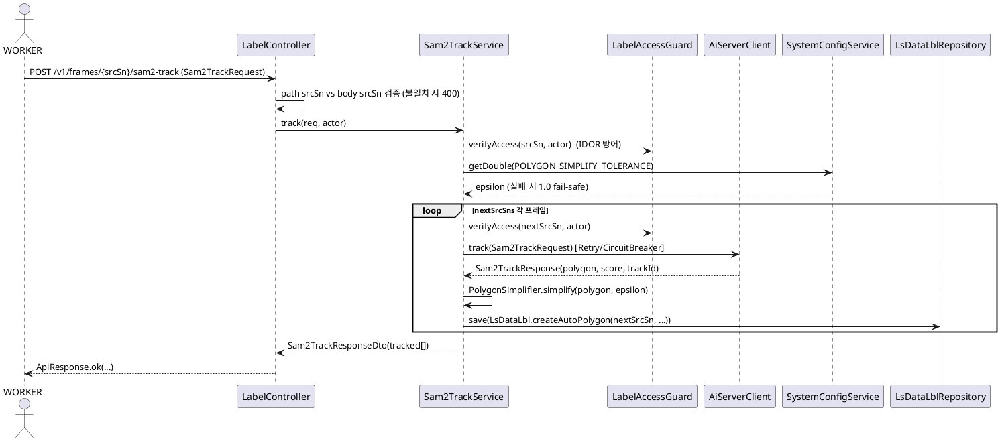

### 2.2 객체 외곽 경계 자동 밀착 (UC-005)

| 시퀀스도 ID | KLID-AT-SD-002 | 시퀀스도명 | 객체 외곽 경계 자동 밀착 (SAM2 Snap) |
|---------|---|-------|---|
| 관련 유스케이스 ID | KLID-AT-UC-005 |
| 주요 액터 | 라벨링 작업자(WORKER), ai-server(YOLO/SAM2) |
| 주요 클래스 | LabelController, Sam2TrackService, AiServerClient, SystemConfigService |

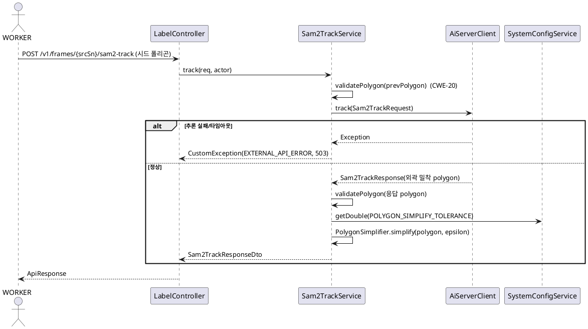

### 2.3 증강 결과 수신·등록 (UC-002)

| 시퀀스도 ID | KLID-AT-SD-003 | 시퀀스도명 | 증강 결과 수신·등록 (라벨 복사·무결성) |
|---------|---|-------|---|
| 관련 유스케이스 ID | KLID-AT-UC-002 |
| 주요 액터 | 생성형AI서비스[외부], 검수자(REVIEWER) |
| 주요 클래스 | AugmentReviewService, LsDataAug, LsDataAugLblMap, LabelIntegrityCalculator, LsDataAugRepository |

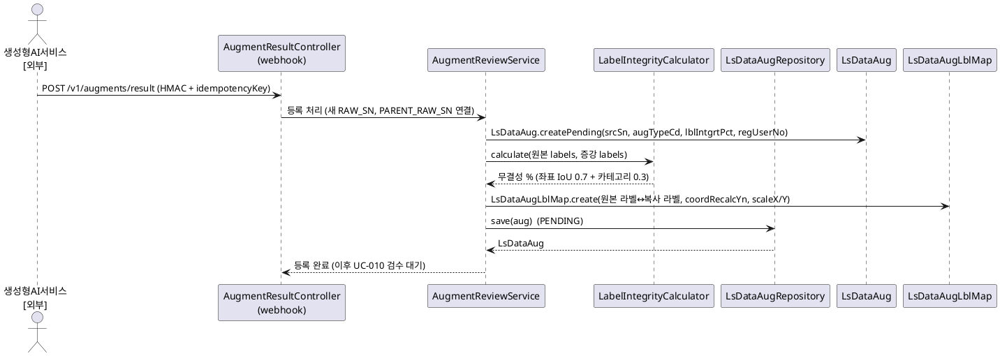

### 2.4 버전 비교·복구 (UC-008)

| 시퀀스도 ID | KLID-AT-SD-004 | 시퀀스도명 | 버전 비교(diff)·복구(rollback) |
|---------|---|-------|---|
| 관련 유스케이스 ID | KLID-AT-UC-008 |
| 주요 액터 | 검수자(REVIEWER), 라벨링 작업자(WORKER) |
| 주요 클래스 | VersionController, VersionService, LabelAccessGuard, LsLabelVersion, LsLabelVersionRepository |

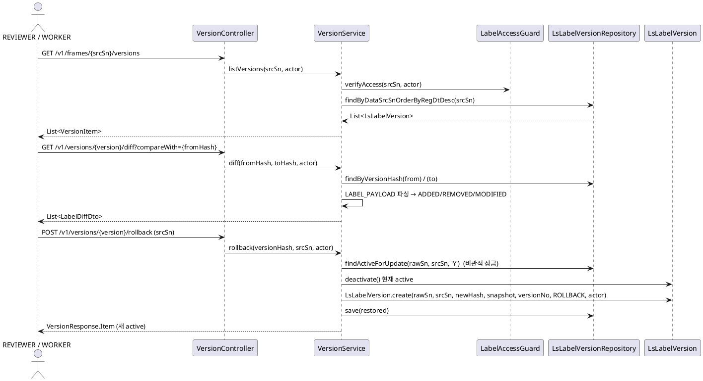

### 2.5 데이터마트 수정 통지 (UC-009)

| 시퀀스도 ID | KLID-AT-SD-005 | 시퀀스도명 | 데이터마트 수정 통지 (TASK_MODIFIED) |
|---------|---|-------|---|
| 관련 유스케이스 ID | KLID-AT-UC-009 |
| 주요 액터 | 검수자(REVIEWER), 관제서버[외부] |
| 주요 클래스 | TaskModifiedEvent, ControlNotifyEventListener, ControlNotifyDebouncer, ControlNotifyService, ControlNotifyClient |

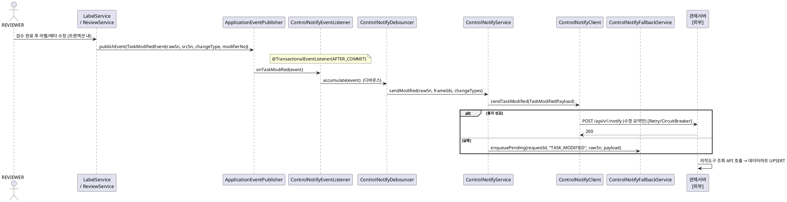

### 2.6 비식별 처리 요청·결과 수신 (UC-011)

| 시퀀스도 ID | KLID-AT-SD-006 | 시퀀스도명 | 비식별 처리 위탁·결과 인계 |
|---------|---|-------|---|
| 관련 유스케이스 ID | KLID-AT-UC-011 |
| 주요 액터 | 검수자(REVIEWER), 비식별솔루션[외부] |
| 주요 클래스 | DeidentifyStep, DeidentifyClient, DeidentifyResultService, WebhookIdempotencyLedger, LsDataRaw |

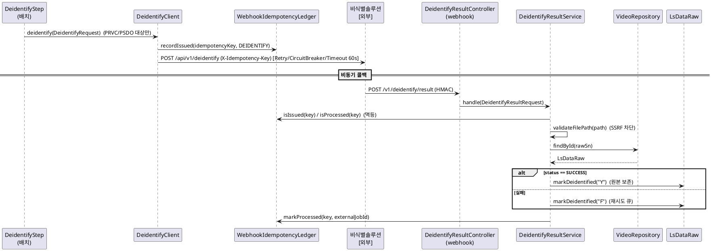

---

## 3. 설계 클래스도

### 3.1 데이터 증강 클래스도

| 설계 클래스도 ID | KLID-AT-DCD-001 | 설계 클래스도명 | 데이터 증강(요청·결과 수신·검수) |
|-----------|---|---------|---|
| 관련 유스케이스 ID | KLID-AT-UC-001, UC-002, UC-003, UC-010 |

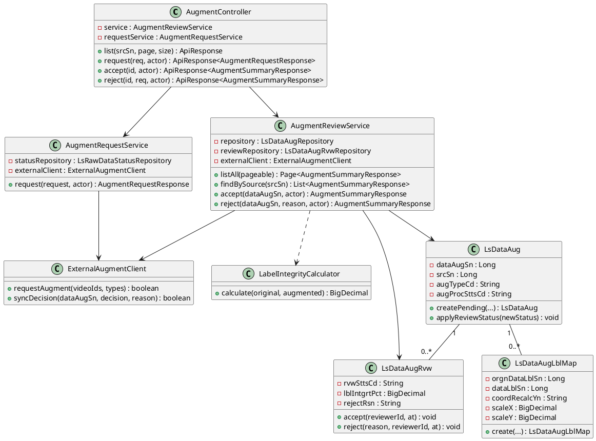

### 3.2 AI 보조 라벨링 클래스도

| 설계 클래스도 ID | KLID-AT-DCD-002 | 설계 클래스도명 | AI 보조 라벨링(추적·밀착·정밀도) |
|-----------|---|---------|---|
| 관련 유스케이스 ID | KLID-AT-UC-004, UC-005, UC-006 |

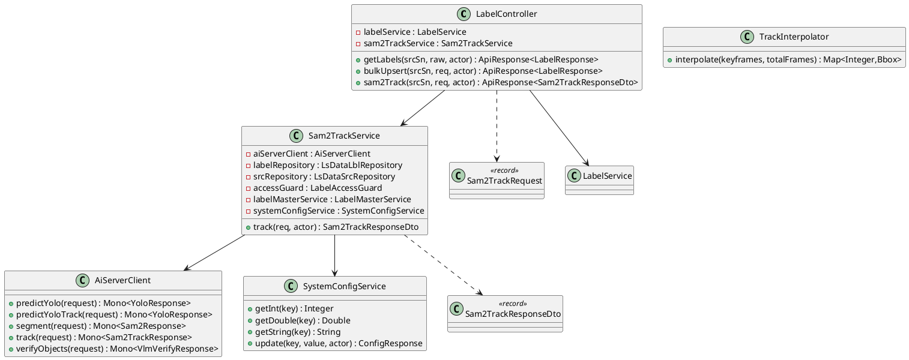

### 3.3 라벨 저장·버전관리 클래스도

| 설계 클래스도 ID | KLID-AT-DCD-003 | 설계 클래스도명 | 라벨 저장·버전관리(커밋·이력·diff·롤백) |
|-----------|---|---------|---|
| 관련 유스케이스 ID | KLID-AT-UC-007, UC-008 |

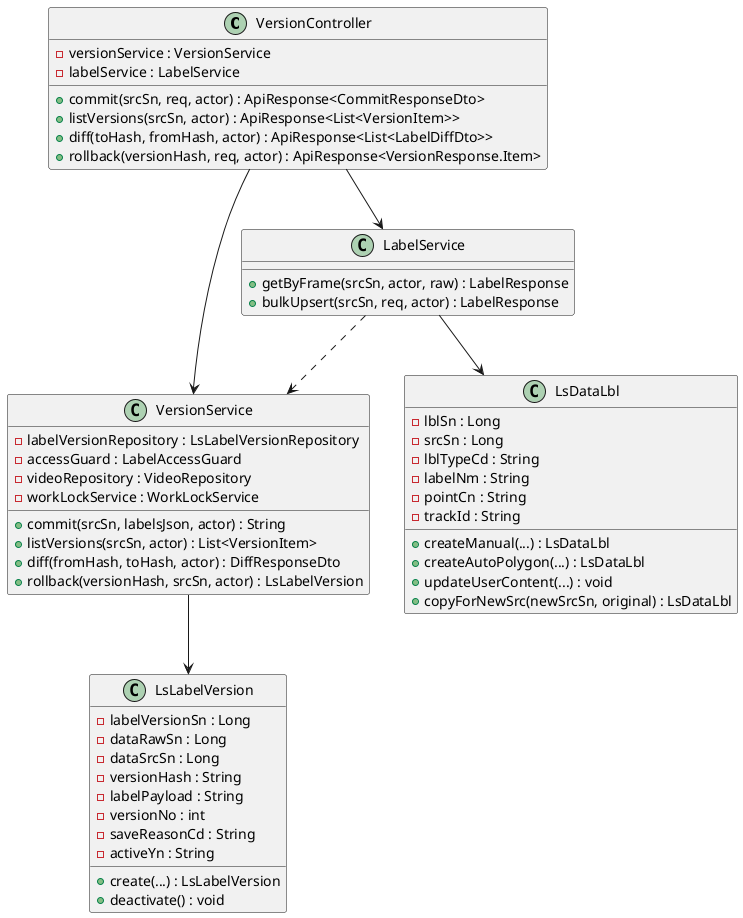

### 3.4 검수 클래스도

| 설계 클래스도 ID | KLID-AT-DCD-004 | 설계 클래스도명 | 검수 워크플로우(상태 머신·승인·반려) |
|-----------|---|---------|---|
| 관련 유스케이스 ID | KLID-AT-UC-010, UC-012 |

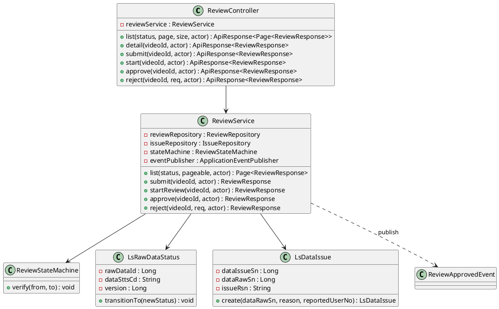

### 3.5 비식별 + 데이터마트 통지 클래스도

| 설계 클래스도 ID | KLID-AT-DCD-005 | 설계 클래스도명 | 비식별 처리 + 데이터마트 통지 |
|-----------|---|---------|---|
| 관련 유스케이스 ID | KLID-AT-UC-009, UC-011, UC-012 |

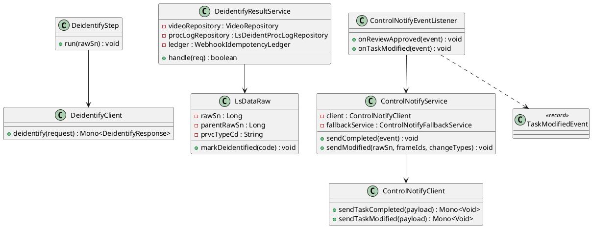

---

## 4. 설계 클래스 정의

> 도메인 대표 Service·Entity·Client 위주로 정의한다. 속성·오퍼레이션은 실제 코드 필드·메서드 시그니처를 따른다. 엔티티 속성은 행안부 표준 약어가 반영된 현재 코드 컬럼명(예: `regDt`, `mdfcnDt`, `rejectRsn`, `labelNm`, `versionHash`, `pointCn`)을 사용한다.

### 4.1 AugmentReviewService (KLID-AT-DC-003)

| 설계 클래스 ID | KLID-AT-DC-003 | 설계 클래스명 | AugmentReviewService |
|-----------|---|---------|---|
| **속성** |
| 속성명 | 가시성 | 타입 | 기본값 | 설명 |
| AUG_ORDER | private(static) | Map<String,Integer> | WINTER/NIGHT/RAIN/RESOLUTION | UI 표시용 4종 정렬 순서 |
| repository | private | LsDataAugRepository | - | 증강 결과 Repository |
| reviewRepository | private | LsDataAugRvwRepository | - | 증강 검수 Repository |
| externalClient | private | ExternalAugmentClient | - | 외부 SFR-07 통보 클라이언트 |
| **오퍼레이션** |
| 오퍼레이션명 | 가시성 | 파라미터 | 반환타입 | 설명 |
| listAll | public | Pageable pageable | Page<AugmentSummaryResponse> | 전체 증강 결과 페이징 조회 |
| findBySource | public | Long srcSn | List<AugmentSummaryResponse> | 원본 영상의 4종 증강 결과 묶음 조회 |
| accept | public | Long dataAugSn, TokenClaims actor | AugmentSummaryResponse | 증강 결과 승인(PENDING→ACCEPTED, REVIEWER) |
| reject | public | Long dataAugSn, String reason, TokenClaims actor | AugmentSummaryResponse | 증강 결과 반려(사유 필수, PENDING→REJECTED) |
| requireReviewer | private | TokenClaims actor | void | REVIEWER 권한 이중 검증 |

### 4.2 AugmentRequestService (KLID-AT-DC-002)

| 설계 클래스 ID | KLID-AT-DC-002 | 설계 클래스명 | AugmentRequestService |
|-----------|---|---------|---|
| **속성** |
| 속성명 | 가시성 | 타입 | 기본값 | 설명 |
| statusRepository | private | LsRawDataStatusRepository | - | 영상 검수 상태 조회 |
| externalClient | private | ExternalAugmentClient | - | 외부 SFR-07 요청 클라이언트 |
| jobIdSeq | private | AtomicLong | currentTimeMillis() | placeholder jobId 시퀀스 |
| **오퍼레이션** |
| 오퍼레이션명 | 가시성 | 파라미터 | 반환타입 | 설명 |
| request | public | AugmentRequestRequest request, TokenClaims actor | AugmentRequestResponse | 검수 완료(APPROVED) 영상만 증강 요청(미검수 포함 시 NOT_REVIEWED) |
| findBlockedVideoIds | private | List<Long> videoIds | List<Long> | 미검수/미존재 영상 ID 목록 |

### 4.3 LsDataAug (KLID-AT-DC-006)

| 설계 클래스 ID | KLID-AT-DC-006 | 설계 클래스명 | LsDataAug (LS_DATA_AUG) |
|-----------|---|---------|---|
| **속성** |
| 속성명 | 가시성 | 타입 | 기본값 | 설명 |
| dataAugSn | private | Long | (IDENTITY) | 증강 결과 PK |
| srcSn | private | Long | - | 원본 영상 SN |
| augTypeCd | private | String | - | 증강 유형(WINTER/NIGHT/RAIN/RESOLUTION) |
| augProcSttsCd | private | String | PENDING | 증강 처리 상태(PENDING/ACCEPTED/REJECTED) |
| lblIntgrtPct | private | BigDecimal(@Transient) | - | 라벨 무결성률(LS_DATA_AUG_RVW 위임) |
| regDt | private | LocalDateTime | now() | 등록 일시 |
| regUserNo | private | String | - | 등록자 |
| idempotencyKey | private | String | - | webhook 멱등 키(IDMP_KEY) |
| externalJobId | private | String | - | 외부 작업 ID(OTSD_JOB_ID) |
| retryCount | private | int | 0 | 재시도 횟수 |
| deadLetterAt | private | LocalDateTime | - | 영구 실패 마킹 시점 |
| **오퍼레이션** |
| 오퍼레이션명 | 가시성 | 파라미터 | 반환타입 | 설명 |
| createPending | public(static) | srcSn, augTypeCd, lblIntgrtPct, regUserNo | LsDataAug | PENDING 증강 결과 신규 생성 |
| applyReviewStatus | public | String newStatus | void | 검수 상태 동기 반영(PENDING 이외 시 CONFLICT) |
| assignIdempotencyKey | public | String key | void | 멱등 키 할당 |
| incrementRetryCount | public | - | void | 재시도 횟수 1 증가 |
| markDeadLetter | public | - | void | dead-letter 마킹 |

### 4.4 Sam2TrackService (KLID-AT-DC-012)

| 설계 클래스 ID | KLID-AT-DC-012 | 설계 클래스명 | Sam2TrackService |
|-----------|---|---------|---|
| **속성** |
| 속성명 | 가시성 | 타입 | 기본값 | 설명 |
| aiServerClient | private | AiServerClient | - | ai-server SAM2 추론 호출 |
| labelRepository | private | LsDataLblRepository | - | 추적 결과 라벨 저장 |
| srcRepository | private | LsDataSrcRepository | - | 프레임(이미지) 조회 |
| accessGuard | private | LabelAccessGuard | - | 본인 배정 검증(IDOR 방어) |
| labelMasterService | private | LabelMasterService | - | 라벨명→LS_LABEL PK 매핑 |
| systemConfigService | private | SystemConfigService | - | 정밀도(epsilon) 설정 조회 |
| DEFAULT_SIMPLIFY_TOLERANCE | private(static) | double | 1.0 | 설정 누락 시 폴백 epsilon(px) |
| storageRawPath | private | String | ./storage/raw | 원본 프레임 이미지 기준 경로 |
| **오퍼레이션** |
| 오퍼레이션명 | 가시성 | 파라미터 | 반환타입 | 설명 |
| track | public | Sam2TrackRequest req, TokenClaims actor | Sam2TrackResponseDto | SAM2 추적 전파(시드→후속 프레임), 폴리곤 단순화·저장(추론 실패 시 EXTERNAL_API_ERROR) |
| validatePolygon | private | List<List<Double>> polygon, String fieldName | void | 좌표 [x,y]·음수 검증(CWE-20) |
| readSimplifyTolerance | private | - | double | epsilon 조회(실패 시 1.0 fail-safe) |
| encodeImageToBase64 | private | Path baseDir, String filePath | String | 프레임 이미지 base64 인코딩(경로 순회 차단) |

### 4.5 TrackInterpolator (KLID-AT-DC-013)

| 설계 클래스 ID | KLID-AT-DC-013 | 설계 클래스명 | TrackInterpolator |
|-----------|---|---------|---|
| **속성** |
| (상태 없음 — Spring 의존성 없는 순수 도메인 보간기. CVAT 포팅) | - | - | - | - |
| **오퍼레이션** |
| 오퍼레이션명 | 가시성 | 파라미터 | 반환타입 | 설명 |
| interpolate | public | List<Keyframe> keyframes, int totalFrames | Map<Integer,Bbox> | 키프레임 사이 BBOX 선형 보간(outside 마커 시 종료) |

### 4.6 VersionService (KLID-AT-DC-021)

| 설계 클래스 ID | KLID-AT-DC-021 | 설계 클래스명 | VersionService |
|-----------|---|---------|---|
| **속성** |
| 속성명 | 가시성 | 타입 | 기본값 | 설명 |
| MAX_PAYLOAD_BYTES | public(static) | int | 1MB | 스냅샷 페이로드 최대 크기(CWE-770) |
| labelVersionRepository | private | LsLabelVersionRepository | - | 버전 스냅샷 Repository |
| accessGuard | private | LabelAccessGuard | - | srcSn 소유/배정 검증(IDOR) |
| videoRepository | private | VideoRepository | - | 영상 조회 |
| workLockService | private | WorkLockService | - | 비식별 재처리 중 잠금 검증 |
| **오퍼레이션** |
| 오퍼레이션명 | 가시성 | 파라미터 | 반환타입 | 설명 |
| commit | public | Long srcSn, String labelsJson, TokenClaims actor | String | 라벨 스냅샷 저장(SHA-256 versionHash, 동일 페이로드 멱등) |
| listVersions | public | Long srcSn, TokenClaims actor | List<VersionItem> | 버전 이력 최신순 조회 |
| diff | public | String fromHash, String toHash, TokenClaims actor | DiffResponseDto | 두 스냅샷 ADDED/REMOVED/MODIFIED 산출 |
| rollback | public | String versionHash, Long srcSn, TokenClaims actor | LsLabelVersion | 대상 스냅샷을 새 active 버전으로 복원(비관적 잠금) |
| isCommittable | public(static) | TokenClaims actor | boolean | PORTAL 채널 커밋 차단 판정 |

### 4.7 LsLabelVersion (KLID-AT-DC-022)

| 설계 클래스 ID | KLID-AT-DC-022 | 설계 클래스명 | LsLabelVersion (LS_LABEL_VERSION) |
|-----------|---|---------|---|
| **속성** |
| 속성명 | 가시성 | 타입 | 기본값 | 설명 |
| labelVersionSn | private | Long | (IDENTITY) | 버전 PK |
| dataRawSn | private | Long | - | 영상 SN |
| dataSrcSn | private | Long | - | 프레임 SN |
| versionHash | private | String(64) | - | payload SHA-256(버전 식별자, 멱등) |
| labelPayload | private | String(TEXT) | - | 라벨 전체 스냅샷 JSON(diff/rollback 원천) |
| versionNo | private | int | - | 프레임 내 버전 번호 |
| saveReasonCd | private | String | - | 저장 사유(MANUAL/ROLLBACK/BATCH) |
| activeYn | private | String | Y | 활성 여부 |
| regId | private | String | - | 등록자 |
| regDt | private | LocalDateTime | now() | 등록 일시 |
| **오퍼레이션** |
| 오퍼레이션명 | 가시성 | 파라미터 | 반환타입 | 설명 |
| create | public(static) | rawSn, srcSn, versionHash, labelPayload, versionNo, saveReasonCd, regId | LsLabelVersion | 활성(Y) 버전 생성 |
| deactivate | public | - | void | 활성→비활성(N) 전환 |

### 4.8 ReviewService (KLID-AT-DC-027)

| 설계 클래스 ID | KLID-AT-DC-027 | 설계 클래스명 | ReviewService |
|-----------|---|---------|---|
| **속성** |
| 속성명 | 가시성 | 타입 | 기본값 | 설명 |
| reviewRepository | private | ReviewRepository | - | 검수 상태(LS_RAW_DATA_STATUS) 조회 |
| issueRepository | private | IssueRepository | - | 반려 이슈 저장 |
| stateMachine | private | ReviewStateMachine | - | 상태 전이 검증 |
| authrtRepository | private | LsTaskAssignmentRepository | - | 작업 배정(LS_TASK_ASSIGNMENT) 조회 |
| taskEventLogRepository | private | LsTaskEventLogRepository | - | 검수 이벤트 로그 기록 |
| srcRepository | private | LsDataSrcRepository(batch) | - | 프레임(LS_DATA_SRC) 조회 |
| labelRepository | private | LsDataLblRepository(batch) | - | 라벨(LS_DATA_LBL) 조회 |
| videoRepository | private | VideoRepository | - | 영상(LS_DATA_RAW) 조회 |
| userRepository | private | UserRepository | - | 작업자 정보 조회 |
| objectMapper | private | ObjectMapper | - | 페이로드 직렬화 |
| eventPublisher | private | ApplicationEventPublisher | - | 승인 시 ReviewApprovedEvent 발행 |
| **오퍼레이션** |
| 오퍼레이션명 | 가시성 | 파라미터 | 반환타입 | 설명 |
| list | public | String status, Pageable pageable, TokenClaims actor | Page<ReviewResponse> | 상태별 검수 목록(REVIEWER) |
| submit | public | Long videoId, TokenClaims actor | ReviewResponse | WORKER 검수 제출(→PENDING) |
| startReview | public | Long videoId, TokenClaims actor | ReviewResponse | 검수 시작(PENDING→IN_REVIEW) |
| approve | public | Long videoId, TokenClaims actor | ReviewResponse | 승인(IN_REVIEW→APPROVED, 낙관적 잠금) |
| reject | public | Long videoId, RejectRequest req, TokenClaims actor | ReviewResponse | 반려(IN_REVIEW→REJECTED, 사유 필수+이슈 INSERT) |

### 4.9 ReviewStateMachine (KLID-AT-DC-028)

| 설계 클래스 ID | KLID-AT-DC-028 | 설계 클래스명 | ReviewStateMachine |
|-----------|---|---------|---|
| **속성** |
| 속성명 | 가시성 | 타입 | 기본값 | 설명 |
| ALLOWED | private(static) | Map<String,Set<String>> | ASSIGNED→PENDING / PENDING→IN_REVIEW / IN_REVIEW→APPROVED,REJECTED / REJECTED→PENDING | 허용 전이 표 |
| **오퍼레이션** |
| 오퍼레이션명 | 가시성 | 파라미터 | 반환타입 | 설명 |
| verify | public | String from, String to | void | 전이 검증(APPROVED→* CONFLICT, 미허용 INVALID_INPUT) |

### 4.10 LsDataLbl (KLID-AT-DC-018)

| 설계 클래스 ID | KLID-AT-DC-018 | 설계 클래스명 | LsDataLbl (LS_DATA_LBL) |
|-----------|---|---------|---|
| **패키지** | `kr.co.cudo.authoring.batch.entity` (batch 패키지 소속 — label 도메인이 공유 참조) |
| **속성** |
| 속성명 | 가시성 | 타입 | 기본값 | 설명 |
| lblSn | private | Long | (IDENTITY) | 라벨 PK |
| srcSn | private | Long | - | 프레임 FK(LS_DATA_SRC) |
| lblTypeCd | private | String | - | 라벨 타입(BBOX/POLYGON/SEGMENT/TRACK) |
| labelId | private | Long | - | LS_LABEL 마스터 FK(null 허용) |
| labelNm | private | String | - | 라벨명 |
| pointCn | private | String(TEXT) | - | 좌표 직렬화 JSON |
| trackId | private | String | - | 트래커 객체 ID(TRCK_ID, null 허용) |
| autoLblYn | private | String(@Transient) | - | 자동/수동 여부(AI 정보 테이블 분리 저장용) |
| confScore | private | BigDecimal(@Transient) | - | 신뢰도(0.0~1.0 clamp) |
| regUserNo | private | Long | - | 등록자 |
| regDt | private | LocalDateTime | now() | 등록 일시 |
| mdfcnDt | private | LocalDateTime | - | 수정 일시 |
| **오퍼레이션** |
| 오퍼레이션명 | 가시성 | 파라미터 | 반환타입 | 설명 |
| createAutoBbox | public(static) | srcSn, labelId, label, pointsJson, confScore, trackId | LsDataLbl | YOLO 자동 BBOX(AUTO_LBL_YN='Y') |
| createAutoInterpolatedBbox | public(static) | srcSn, labelId, label, pointsJson, confScore, trackId | LsDataLbl | 트랙 보간 자동 생성 BBOX(LBL_SRC_CD='INTERPOLATED', Phase 3) |
| createAutoPolygon | public(static) | srcSn, labelId, label, pointsJson, confScore | LsDataLbl | SAM2 자동 폴리곤 |
| createManual | public(static) | srcSn, lblTypeCd, labelId, label, pointsJson, regUserNo | LsDataLbl | 사용자 수동 라벨(AUTO_LBL_YN='N') |
| updateUserContent | public | lblTypeCd, labelId, label, pointsJson | void | 좌표/타입/라벨명 수정 |
| copyForNewSrc | public(static) | newSrcSn, original | LsDataLbl | 증강 새 영상용 라벨 복사(UC-002/003) |
| updateConfScore | public | BigDecimal newScore | void | 신뢰도 갱신(0.0~1.0) |

### 4.11 DeidentifyResultService (KLID-AT-DC-037)

| 설계 클래스 ID | KLID-AT-DC-037 | 설계 클래스명 | DeidentifyResultService |
|-----------|---|---------|---|
| **속성** |
| 속성명 | 가시성 | 타입 | 기본값 | 설명 |
| videoRepository | private | VideoRepository | - | 영상(LS_DATA_RAW) 조회·상태 갱신 |
| procLogRepository | private | LsDeidentProcLogRepository | - | 비식별 처리 이력 upsert |
| ledger | private | WebhookIdempotencyLedger | - | 멱등 allowlist/처리 마킹 |
| **오퍼레이션** |
| 오퍼레이션명 | 가시성 | 파라미터 | 반환타입 | 설명 |
| handle | public | DeidentifyResultRequest req | boolean | 결과 인계(allowlist·멱등·SSRF 검증→markDeidentified→이력 적재) |
| validateFilePath | private | String filePath | void | 결과 경로 URL 형식 시 SSRF 차단 |

### 4.12 ControlNotifyService (KLID-AT-DC-032)

| 설계 클래스 ID | KLID-AT-DC-032 | 설계 클래스명 | ControlNotifyService |
|-----------|---|---------|---|
| **속성** |
| 속성명 | 가시성 | 타입 | 기본값 | 설명 |
| client | private | ControlNotifyClient | - | 관제서버 outbound 클라이언트 |
| fallbackService | private | ControlNotifyFallbackService | - | 통지 실패 재등록 큐(폴백) |
| metrics | private | ControlNotifyMetrics | - | 통지 성공/실패 메트릭 |
| **오퍼레이션** |
| 오퍼레이션명 | 가시성 | 파라미터 | 반환타입 | 설명 |
| sendCompleted | public | ReviewApprovedEvent event | void | TASK_COMPLETED 전송(실패 시 폴백 큐) |
| sendModified | public | Long rawSn, List<Long> frameIds, List<String> changeTypes | void | TASK_MODIFIED 전송(수정 요약만, 실패 시 폴백 큐) |

---

## 부록 A. 시퀀스도 ↔ 유스케이스 매핑 (D2 참조용)

| 시퀀스도 ID | 시퀀스도명 | 관련 유스케이스 ID |
|---------|-------|-------------|
| KLID-AT-SD-001 | 객체 자동 추적 (SAM2 Track 전파) | KLID-AT-UC-004 |
| KLID-AT-SD-002 | 객체 외곽 경계 자동 밀착 (SAM2 Snap) | KLID-AT-UC-005 |
| KLID-AT-SD-003 | 증강 결과 수신·등록 (라벨 복사·무결성) | KLID-AT-UC-002 |
| KLID-AT-SD-004 | 버전 비교(diff)·복구(rollback) | KLID-AT-UC-008 |
| KLID-AT-SD-005 | 데이터마트 수정 통지 (TASK_MODIFIED) | KLID-AT-UC-009 |
| KLID-AT-SD-006 | 비식별 처리 위탁·결과 인계 | KLID-AT-UC-011 |

## 부록 B. 설계 클래스도 ↔ 유스케이스 매핑

| 설계 클래스도 ID | 설계 클래스도명 | 관련 유스케이스 ID |
|-----------|---------|-------------|
| KLID-AT-DCD-001 | 데이터 증강(요청·결과 수신·검수) | UC-001, UC-002, UC-003, UC-010 |
| KLID-AT-DCD-002 | AI 보조 라벨링(추적·밀착·정밀도) | UC-004, UC-005, UC-006 |
| KLID-AT-DCD-003 | 라벨 저장·버전관리 | UC-007, UC-008 |
| KLID-AT-DCD-004 | 검수 워크플로우(승인·반려) | UC-010, UC-012 |
| KLID-AT-DCD-005 | 비식별 + 데이터마트 통지 | UC-009, UC-011, UC-012 |
