# D1 클래스 설계서

> **ID 표기 규칙(공통)**: 본 산출물의 모든 ID(KLID-AT-UC/CO/DC/DCD/SD/SC/AC/EN/ERD/TB/II/IC/IF/UCD/ACT 등)는 **전체 형식 `KLID-AT-XX-NNN`** 으로 표기한다. 끝부분만(예: `UC-001`) 약식 표기 금지. 범위는 시작 ID만 전체형으로(예: `KLID-AT-UC-001~013`). ※ 요구사항(RQ-SFR-NN-NN)·시스템시험(KLID-ST-NNN) 등 타 체계 ID는 각 체계 원형 유지.

## 작성 목적
> 소프트웨어 관점이나 설계 관점에서의 클래스 모형을 작성한다.

## 작성 방법
> 설계 클래스를 도출하기 위하여 우선 유스케이스별로 시퀀스도를 작성하며, 여기에서 도출된 객체 및 클래스를 연관관계를 이용하여 유스케이스별로 클래스도를 작성한다. 설계 클래스도에서는 클래스명, 속성 및 오퍼레이션을 명확하고 구체적으로 표현하여야 하고 각각의 클래스는 상세한 명세를 기술한다.

## 산출물 양식

### 제·개정 이력

| 날짜 | 버전 | 제·개정 내역 | 작성자 | 검토자 |
|------|------|------------|--------|--------|
| 2026-06-08 | 1.0 | LogiCraft 그래프 기반 생성 (/cc-doc-gen) — 신 R2(R1 항목 한정, UC 13건) 동기화 기준 | /cc-doc-gen | - |

### 헤더

| D1 | 클래스 설계서 |
|-------|---------|
| 시스템명 | AI 기반 지방정부 CCTV 관제지원시스템 구축(2차) | 서브시스템명 | 학습데이터 저작도구 (AT) |
| 단계명 | 설계 | 작성일자 | 2026-06-08 | 버전 | 1.0 |

---

> **본 산출물의 클래스 출처**: 설계 클래스(`KLID-AT-DC-NNN`)는 `backend/src/main/java/kr/co/cudo/authoring/` 패키지 구조에서 실측 도출하였다. 도형 클래스(Entity/Enum/VO)는 LogiCraft 클래스도 모델에서, 응용 클래스(Controller/Service/Client)는 백엔드 소스의 실제 시그니처에서 도출한다. 시퀀스도는 Mermaid `sequenceDiagram` 표기를 사용한다.
>
> **유스케이스 ↔ 설계 클래스도 대응**: 본 산출물은 활성 유스케이스 13건(`KLID-AT-UC-001~011`, `KLID-AT-UC-013`, `KLID-AT-UC-016`)을 대상으로 한다. KLID-AT-UC-012/014/015/017~026은 범위 분리·폐기되어 제외한다. 설계 클래스도(DCD)·시퀀스도(SD) 번호는 실현 유스케이스 번호에 동조하며(KLID-AT-UC-009→KLID-AT-DCD-009/KLID-AT-SD-009 등), 유스케이스 결번(KLID-AT-UC-012/014/015) 시 도식 번호도 결번 처리한다.

#### 공통 설계 클래스 인덱스 (교차 등장)

> 아래 공통 클래스는 동일 `KLID-AT-DC-NNN` ID로 복수 유스케이스 목록에 교차 등장한다(중복 정의 금지). 정의는 §4에 1회만 기술한다.

| 설계 클래스 ID | 설계 클래스명 | 계층 | 교차 등장 유스케이스 |
|------------|---------|------|------------------|
| KLID-AT-DC-001 | AugmentController | Controller | KLID-AT-UC-001, KLID-AT-UC-010 |
| KLID-AT-DC-006 | LsDataAug | Entity | KLID-AT-UC-001, KLID-AT-UC-002, KLID-AT-UC-010 |
| KLID-AT-DC-014 | LabelController | Controller | KLID-AT-UC-004, KLID-AT-UC-005 |
| KLID-AT-DC-015 | Sam2TrackService | Service | KLID-AT-UC-004, KLID-AT-UC-005, KLID-AT-UC-006 |
| KLID-AT-DC-016 | LabelAccessGuard | Service | KLID-AT-UC-004, KLID-AT-UC-005, KLID-AT-UC-008, KLID-AT-UC-016 |
| KLID-AT-DC-018 | AiServerClient | Client | KLID-AT-UC-004, KLID-AT-UC-005 |
| KLID-AT-DC-024 | SystemConfigController | Controller | KLID-AT-UC-006, KLID-AT-UC-013 |
| KLID-AT-DC-025 | SystemConfigService | Service | KLID-AT-UC-006, KLID-AT-UC-013 |
| KLID-AT-DC-026 | LsSystemConfig | Entity | KLID-AT-UC-006, KLID-AT-UC-013 |
| KLID-AT-DC-029 | VersionService | Service | KLID-AT-UC-007, KLID-AT-UC-008, KLID-AT-UC-016 |
| KLID-AT-DC-030 | LsLabelVersion | Entity | KLID-AT-UC-007, KLID-AT-UC-008, KLID-AT-UC-016 |
| KLID-AT-DC-031 | ReviewService | Service | KLID-AT-UC-007, KLID-AT-UC-009 |
| KLID-AT-DC-033 | LsRawDataStatus | Entity | KLID-AT-UC-007, KLID-AT-UC-009 |
| KLID-AT-DC-046 | LsDeidentReport | Entity | KLID-AT-UC-016 |
| KLID-AT-DC-047 | LabelService | Service | KLID-AT-UC-009 |

---

## 1. 설계 클래스 목록

> **⟳ 유스케이스별로 1개씩 반복 작성한다.** (전역 1개 목록으로 통합하지 않는다. 공통 클래스는 동일 설계 클래스 ID로 복수 목록에 교차 등장 — 중복 정의 금지.)

### 1.1 KLID-AT-UC-001 (증강 영상 생성 요청)

| 설계 클래스 ID | 설계 클래스명 | 관련 유스케이스ID |
|------------|---------|-------------|
| KLID-AT-DC-001 | AugmentController | KLID-AT-UC-001 |
| KLID-AT-DC-002 | AugmentRequestService | KLID-AT-UC-001 |
| KLID-AT-DC-003 | ExternalAugmentClient | KLID-AT-UC-001 |
| KLID-AT-DC-004 | LsRawDataStatusRepository | KLID-AT-UC-001 |
| KLID-AT-DC-033 | LsRawDataStatus | KLID-AT-UC-001 |

### 1.2 KLID-AT-UC-002 (증강 결과 수신·등록)

| 설계 클래스 ID | 설계 클래스명 | 관련 유스케이스ID |
|------------|---------|-------------|
| KLID-AT-DC-005 | AugmentResultController | KLID-AT-UC-002 |
| KLID-AT-DC-007 | AugmentResultService | KLID-AT-UC-002 |
| KLID-AT-DC-006 | LsDataAug | KLID-AT-UC-002 |
| KLID-AT-DC-008 | LsDataAugLblMap | KLID-AT-UC-002 |
| KLID-AT-DC-009 | WebhookIdempotencyLedger | KLID-AT-UC-002 |
| KLID-AT-DC-010 | LsDataRaw | KLID-AT-UC-002 |

### 1.3 KLID-AT-UC-003 (해상도 변경 수행)

| 설계 클래스 ID | 설계 클래스명 | 관련 유스케이스ID |
|------------|---------|-------------|
| KLID-AT-DC-011 | VideoController | KLID-AT-UC-003 |
| KLID-AT-DC-012 | VideoResolutionService | KLID-AT-UC-003 |
| KLID-AT-DC-013 | VideoResolutionPersister | KLID-AT-UC-003 |
| KLID-AT-DC-019 | LsResolutionExport | KLID-AT-UC-003 |
| KLID-AT-DC-010 | LsDataRaw | KLID-AT-UC-003 |

### 1.4 KLID-AT-UC-004 (객체 자동 추적)

| 설계 클래스 ID | 설계 클래스명 | 관련 유스케이스ID |
|------------|---------|-------------|
| KLID-AT-DC-014 | LabelController | KLID-AT-UC-004 |
| KLID-AT-DC-015 | Sam2TrackService | KLID-AT-UC-004 |
| KLID-AT-DC-016 | LabelAccessGuard | KLID-AT-UC-004 |
| KLID-AT-DC-018 | AiServerClient | KLID-AT-UC-004 |
| KLID-AT-DC-017 | LsDataLbl | KLID-AT-UC-004 |
| KLID-AT-DC-038 | LsDataLblAiInfo | KLID-AT-UC-004 |

### 1.5 KLID-AT-UC-005 (객체 외곽 경계 자동 밀착)

| 설계 클래스 ID | 설계 클래스명 | 관련 유스케이스ID |
|------------|---------|-------------|
| KLID-AT-DC-014 | LabelController | KLID-AT-UC-005 |
| KLID-AT-DC-015 | Sam2TrackService | KLID-AT-UC-005 |
| KLID-AT-DC-020 | Sam2SegmentService | KLID-AT-UC-005 |
| KLID-AT-DC-016 | LabelAccessGuard | KLID-AT-UC-005 |
| KLID-AT-DC-018 | AiServerClient | KLID-AT-UC-005 |
| KLID-AT-DC-017 | LsDataLbl | KLID-AT-UC-005 |

### 1.6 KLID-AT-UC-006 (라벨링 정밀도 조절)

| 설계 클래스 ID | 설계 클래스명 | 관련 유스케이스ID |
|------------|---------|-------------|
| KLID-AT-DC-024 | SystemConfigController | KLID-AT-UC-006 |
| KLID-AT-DC-025 | SystemConfigService | KLID-AT-UC-006 |
| KLID-AT-DC-026 | LsSystemConfig | KLID-AT-UC-006 |
| KLID-AT-DC-015 | Sam2TrackService | KLID-AT-UC-006 |

### 1.7 KLID-AT-UC-007 (라벨 버전 저장·이력 추적)

| 설계 클래스 ID | 설계 클래스명 | 관련 유스케이스ID |
|------------|---------|-------------|
| KLID-AT-DC-027 | ReviewController | KLID-AT-UC-007 |
| KLID-AT-DC-031 | ReviewService | KLID-AT-UC-007 |
| KLID-AT-DC-029 | VersionService | KLID-AT-UC-007 |
| KLID-AT-DC-030 | LsLabelVersion | KLID-AT-UC-007 |
| KLID-AT-DC-033 | LsRawDataStatus | KLID-AT-UC-007 |
| KLID-AT-DC-032 | ReviewStateMachine | KLID-AT-UC-007 |
| KLID-AT-DC-028 | LsDataLblHstry | KLID-AT-UC-007 |

### 1.8 KLID-AT-UC-008 (버전 비교·복구)

| 설계 클래스 ID | 설계 클래스명 | 관련 유스케이스ID |
|------------|---------|-------------|
| KLID-AT-DC-034 | VersionController | KLID-AT-UC-008 |
| KLID-AT-DC-029 | VersionService | KLID-AT-UC-008 |
| KLID-AT-DC-016 | LabelAccessGuard | KLID-AT-UC-008 |
| KLID-AT-DC-030 | LsLabelVersion | KLID-AT-UC-008 |

### 1.9 KLID-AT-UC-009 (검수 완료·수정 통지) ※

> ※ RQ-SFR-08-06은 R1 범위 외이나, 본 통지는 검수완료·버전관리 흐름의 운영 책임으로 유지된다(R1 직접 대응 없음).

| 설계 클래스 ID | 설계 클래스명 | 관련 유스케이스ID |
|------------|---------|-------------|
| KLID-AT-DC-047 | LabelService | KLID-AT-UC-009 |
| KLID-AT-DC-031 | ReviewService | KLID-AT-UC-009 |
| KLID-AT-DC-040 | ControlNotifyEventListener | KLID-AT-UC-009 |
| KLID-AT-DC-041 | ControlNotifyDebouncer | KLID-AT-UC-009 |
| KLID-AT-DC-042 | ControlNotifyService | KLID-AT-UC-009 |
| KLID-AT-DC-043 | ControlNotifyClient | KLID-AT-UC-009 |
| KLID-AT-DC-044 | LsControlNotifyFallback | KLID-AT-UC-009 |
| KLID-AT-DC-045 | TaskQueryController | KLID-AT-UC-009 |
| KLID-AT-DC-033 | LsRawDataStatus | KLID-AT-UC-009 |

### 1.10 KLID-AT-UC-010 (증강 영상 활용 여부 검수)

| 설계 클래스 ID | 설계 클래스명 | 관련 유스케이스ID |
|------------|---------|-------------|
| KLID-AT-DC-001 | AugmentController | KLID-AT-UC-010 |
| KLID-AT-DC-021 | AugmentReviewService | KLID-AT-UC-010 |
| KLID-AT-DC-006 | LsDataAug | KLID-AT-UC-010 |
| KLID-AT-DC-022 | LsDataAugRvw | KLID-AT-UC-010 |
| KLID-AT-DC-003 | ExternalAugmentClient | KLID-AT-UC-010 |

### 1.11 KLID-AT-UC-011 (비식별 처리 요청)

| 설계 클래스 ID | 설계 클래스명 | 관련 유스케이스ID |
|------------|---------|-------------|
| KLID-AT-DC-035 | DeidentController | KLID-AT-UC-011 |
| KLID-AT-DC-036 | DeidentifyResultController | KLID-AT-UC-011 |
| KLID-AT-DC-037 | DeidentifyResultService | KLID-AT-UC-011 |
| KLID-AT-DC-023 | DeidentifyClient | KLID-AT-UC-011 |
| KLID-AT-DC-010 | LsDataRaw | KLID-AT-UC-011 |
| KLID-AT-DC-039 | LsDeidentProcLog | KLID-AT-UC-011 |

### 1.12 KLID-AT-UC-013 (비식별 옵션 설정)

| 설계 클래스 ID | 설계 클래스명 | 관련 유스케이스ID |
|------------|---------|-------------|
| KLID-AT-DC-024 | SystemConfigController | KLID-AT-UC-013 |
| KLID-AT-DC-025 | SystemConfigService | KLID-AT-UC-013 |
| KLID-AT-DC-026 | LsSystemConfig | KLID-AT-UC-013 |

### 1.13 KLID-AT-UC-016 (비식별 처리 상태·이력 확인)

| 설계 클래스 ID | 설계 클래스명 | 관련 유스케이스ID |
|------------|---------|-------------|
| KLID-AT-DC-048 | DeidentReportController | KLID-AT-UC-016 |
| KLID-AT-DC-049 | DeidentReportService | KLID-AT-UC-016 |
| KLID-AT-DC-016 | LabelAccessGuard | KLID-AT-UC-016 |
| KLID-AT-DC-050 | WorkLockService | KLID-AT-UC-016 |
| KLID-AT-DC-029 | VersionService | KLID-AT-UC-016 |
| KLID-AT-DC-046 | LsDeidentReport | KLID-AT-UC-016 |
| KLID-AT-DC-051 | LsAuthWorkLock | KLID-AT-UC-016 |
| KLID-AT-DC-030 | LsLabelVersion | KLID-AT-UC-016 |

---

## 2. 시퀀스도

> **⟳ 유스케이스별로 1개씩 반복 작성한다.** (시퀀스도 번호 = 실현 유스케이스 번호 동조, 결번 동조)

### 2.1 KLID-AT-SD-001 — 증강 영상 생성 요청

| 시퀀스도 ID | KLID-AT-SD-001 | 시퀀스도명 | 증강 영상 생성 요청 (REVIEWER 요청 → 외부 위임) |
|---------|---|-------|---|
| 관련 유스케이스 ID | KLID-AT-UC-001 |
| 주요 액터 | 검수자(REVIEWER), 생성형AI서비스[외부] |
| 주요 클래스 | AugmentController, AugmentRequestService, LsRawDataStatusRepository, ExternalAugmentClient |

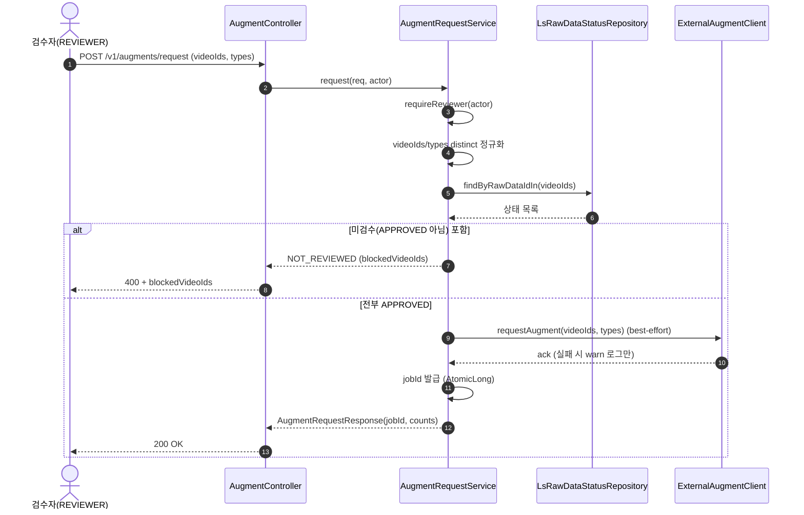
```mermaid
sequenceDiagram
    autonumber
    actor RV as 검수자(REVIEWER)
    participant AC as AugmentController
    participant ARS as AugmentRequestService
    participant DB as LsRawDataStatusRepository
    participant EX as ExternalAugmentClient
    RV->>AC: POST /v1/augments/request (videoIds, types)
    AC->>ARS: request(req, actor)
    ARS->>ARS: requireReviewer(actor)
    ARS->>ARS: videoIds/types distinct 정규화
    ARS->>DB: findByRawDataIdIn(videoIds)
    DB-->>ARS: 상태 목록
    alt 미검수(APPROVED 아님) 포함
        ARS-->>AC: NOT_REVIEWED (blockedVideoIds)
        AC-->>RV: 400 + blockedVideoIds
    else 전부 APPROVED
        ARS->>EX: requestAugment(videoIds, types) (best-effort)
        EX-->>ARS: ack (실패 시 warn 로그만)
        ARS->>ARS: jobId 발급 (AtomicLong)
        ARS-->>AC: AugmentRequestResponse(jobId, counts)
        AC-->>RV: 200 OK
    end
```

### 2.2 KLID-AT-SD-002 — 증강 결과 수신·등록

| 시퀀스도 ID | KLID-AT-SD-002 | 시퀀스도명 | 증강 결과 수신·등록 (외부 콜백 → 새 영상 생성) |
|---------|---|-------|---|
| 관련 유스케이스 ID | KLID-AT-UC-002 |
| 주요 액터 | 생성형AI서비스[외부] |
| 주요 클래스 | AugmentResultController, AugmentResultService, WebhookIdempotencyLedger, LsDataAug, LsDataRaw, LsDataAugLblMap |

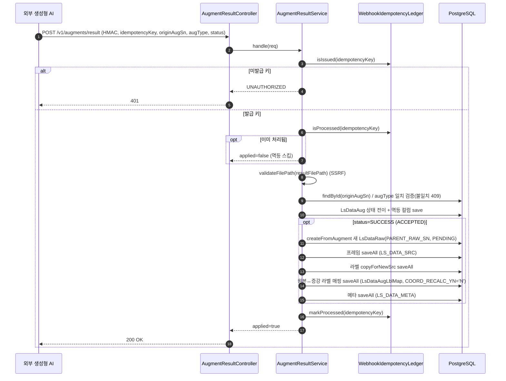
```mermaid
sequenceDiagram
    autonumber
    participant EX as 외부 생성형 AI
    participant ARC as AugmentResultController
    participant ARS as AugmentResultService
    participant LG as WebhookIdempotencyLedger
    participant DB as PostgreSQL
    EX->>ARC: POST /v1/augments/result (HMAC, idempotencyKey, originAugSn, augType, status)
    ARC->>ARS: handle(req)
    ARS->>LG: isIssued(idempotencyKey)
    alt 미발급 키
        ARS-->>ARC: UNAUTHORIZED
        ARC-->>EX: 401
    else 발급 키
        ARS->>LG: isProcessed(idempotencyKey)
        opt 이미 처리됨
            ARS-->>ARC: applied=false (멱등 스킵)
        end
        ARS->>ARS: validateFilePath(resultFilePath) (SSRF)
        ARS->>DB: findById(originAugSn) / augType 일치 검증(불일치 409)
        ARS->>DB: LsDataAug 상태 전이 + 멱등 컬럼 save
        opt status=SUCCESS (ACCEPTED)
            ARS->>DB: createFromAugment 새 LsDataRaw(PARENT_RAW_SN, PENDING)
            ARS->>DB: 프레임 saveAll (LS_DATA_SRC)
            ARS->>DB: 라벨 copyForNewSrc saveAll
            ARS->>DB: 원본↔증강 라벨 매핑 saveAll (LsDataAugLblMap, COORD_RECALC_YN='N')
            ARS->>DB: 메타 saveAll (LS_DATA_META)
        end
        ARS->>LG: markProcessed(idempotencyKey)
        ARS-->>ARC: applied=true
        ARC-->>EX: 200 OK
    end
```

### 2.3 KLID-AT-SD-003 — 해상도 변경 수행

| 시퀀스도 ID | KLID-AT-SD-003 | 시퀀스도명 | 해상도 변경 (표준 하위 해상도 이미지셋 다운스케일·EXPORT 기록) |
|---------|---|-------|---|
| 관련 유스케이스 ID | KLID-AT-UC-003 |
| 주요 액터 | 검수자(REVIEWER) |
| 주요 클래스 | VideoController, VideoResolutionService, VideoResolutionPersister, LsResolutionExport, LsDataRaw |

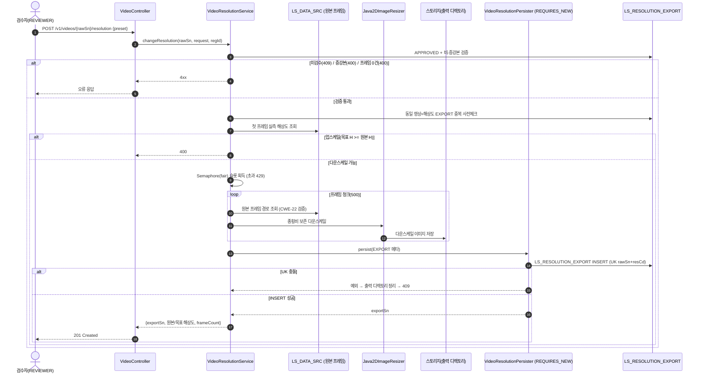
```mermaid
sequenceDiagram
    autonumber
    actor RV as 검수자(REVIEWER)
    participant VC as VideoController
    participant VRS as VideoResolutionService
    participant SRC as LS_DATA_SRC (원본 프레임)
    participant RZ as Java2DImageResizer
    participant FS as 스토리지(출력 디렉토리)
    participant VP as VideoResolutionPersister (REQUIRES_NEW)
    participant DB as LS_RESOLUTION_EXPORT
    RV->>VC: POST /v1/videos/{rawSn}/resolution {preset}
    VC->>VRS: changeResolution(rawSn, request, regId)
    VRS->>DB: APPROVED + 비-증강본 검증
    alt 미검수(409) / 증강본(400) / 프레임 0건(400)
        VRS-->>VC: 4xx
        VC-->>RV: 오류 응답
    else 검증 통과
        VRS->>DB: 동일 영상+해상도 EXPORT 중복 사전체크
        VRS->>SRC: 첫 프레임 실측 해상도 조회
        alt 업스케일(목표 H >= 원본 H)
            VRS-->>VC: 400
        else 다운스케일 가능
            VRS->>VRS: Semaphore(fair) 슬롯 획득 (초과 429)
            loop 프레임 청크(500)
                VRS->>SRC: 원본 프레임 경로 조회 (CWE-22 검증)
                VRS->>RZ: 종횡비 보존 다운스케일
                RZ->>FS: 다운스케일 이미지 저장
            end
            VRS->>VP: persist(EXPORT 메타)
            VP->>DB: LS_RESOLUTION_EXPORT INSERT (UK rawSn+resCd)
            alt UK 충돌
                VP-->>VRS: 예외 → 출력 디렉토리 정리 → 409
            else INSERT 성공
                VP-->>VRS: exportSn
                VRS-->>VC: {exportSn, 원본/목표 해상도, frameCount}
                VC-->>RV: 201 Created
            end
        end
    end
```

### 2.4 KLID-AT-SD-004 — 객체 자동 추적

| 시퀀스도 ID | KLID-AT-SD-004 | 시퀀스도명 | 객체 자동 추적 (SAM2 시드 → 트랙 전파·보간) |
|---------|---|-------|---|
| 관련 유스케이스 ID | KLID-AT-UC-004 |
| 주요 액터 | 라벨링 작업자(WORKER), ai-server(SAM2) |
| 주요 클래스 | LabelController, Sam2TrackService, LabelAccessGuard, AiServerClient, LsDataLbl |

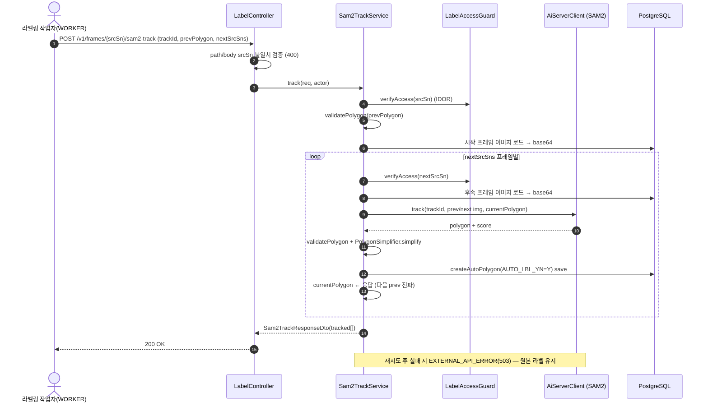
```mermaid
sequenceDiagram
    autonumber
    actor WK as 라벨링 작업자(WORKER)
    participant LC as LabelController
    participant STS as Sam2TrackService
    participant AG as LabelAccessGuard
    participant AI as AiServerClient (SAM2)
    participant DB as PostgreSQL
    WK->>LC: POST /v1/frames/{srcSn}/sam2-track (trackId, prevPolygon, nextSrcSns)
    LC->>LC: path/body srcSn 불일치 검증 (400)
    LC->>STS: track(req, actor)
    STS->>AG: verifyAccess(srcSn) (IDOR)
    STS->>STS: validatePolygon(prevPolygon)
    STS->>DB: 시작 프레임 이미지 로드 → base64
    loop nextSrcSns 프레임별
        STS->>AG: verifyAccess(nextSrcSn)
        STS->>DB: 후속 프레임 이미지 로드 → base64
        STS->>AI: track(trackId, prev/next img, currentPolygon)
        AI-->>STS: polygon + score
        STS->>STS: validatePolygon + PolygonSimplifier.simplify
        STS->>DB: createAutoPolygon(AUTO_LBL_YN=Y) save
        STS->>STS: currentPolygon ← 응답 (다음 prev 전파)
    end
    STS-->>LC: Sam2TrackResponseDto(tracked[])
    LC-->>WK: 200 OK
    Note over STS,AI: 재시도 후 실패 시 EXTERNAL_API_ERROR(503) — 원본 라벨 유지
```

### 2.5 KLID-AT-SD-005 — 객체 외곽 경계 자동 밀착

| 시퀀스도 ID | KLID-AT-SD-005 | 시퀀스도명 | 객체 외곽 경계 자동 밀착 (시드 송신 → 폴리곤 밀착) |
|---------|---|-------|---|
| 관련 유스케이스 ID | KLID-AT-UC-005 |
| 주요 액터 | 라벨링 작업자(WORKER), ai-server(SAM2) |
| 주요 클래스 | LabelController, Sam2SegmentService, Sam2TrackService, LabelAccessGuard, AiServerClient, LsDataLbl |

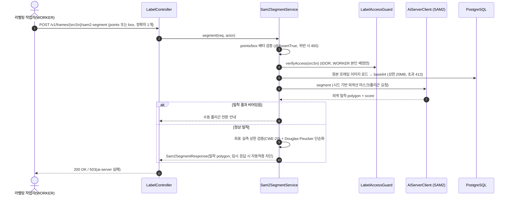
```mermaid
sequenceDiagram
    autonumber
    actor WK as 라벨링 작업자(WORKER)
    participant LC as LabelController
    participant SSS as Sam2SegmentService
    participant AG as LabelAccessGuard
    participant AI as AiServerClient (SAM2)
    participant DB as PostgreSQL
    WK->>LC: POST /v1/frames/{srcSn}/sam2-segment (points 또는 box, 정확히 1개)
    LC->>SSS: segment(req, actor)
    SSS->>SSS: points/box 배타 검증 (@AssertTrue, 위반 시 400)
    SSS->>AG: verifyAccess(srcSn) (IDOR, WORKER 본인 배정만)
    SSS->>DB: 원본 프레임 이미지 로드 → base64 (상한 20MB, 초과 413)
    SSS->>AI: segment (시드 기반 외곽선 마스크/폴리곤 요청)
    AI-->>SSS: 외곽 밀착 polygon + score
    alt 밀착 결과 비어있음
        SSS-->>LC: 수동 폴리곤 전환 안내
    else 정상 밀착
        SSS->>SSS: 좌표 실측 상한 검증(CWE-20) + Douglas-Peucker 단순화
        SSS-->>LC: Sam2SegmentResponse(밀착 polygon, 임시 응답 시 자동적용 차단)
    end
    LC-->>WK: 200 OK / 503(ai-server 실패)
```

### 2.6 KLID-AT-SD-006 — 라벨링 정밀도 조절

| 시퀀스도 ID | KLID-AT-SD-006 | 시퀀스도명 | 라벨링 정밀도 조절 (설정 변경 → SAM2 단순화 적용) |
|---------|---|-------|---|
| 관련 유스케이스 ID | KLID-AT-UC-006 |
| 주요 액터 | 검수자(REVIEWER) |
| 주요 클래스 | SystemConfigController, SystemConfigService, LsSystemConfig, Sam2TrackService |

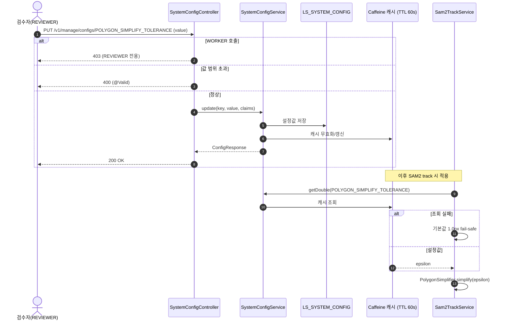
```mermaid
sequenceDiagram
    autonumber
    actor RV as 검수자(REVIEWER)
    participant SCC as SystemConfigController
    participant SCS as SystemConfigService
    participant DB as LS_SYSTEM_CONFIG
    participant CA as Caffeine 캐시 (TTL 60s)
    participant STS as Sam2TrackService
    RV->>SCC: PUT /v1/manage/configs/POLYGON_SIMPLIFY_TOLERANCE (value)
    alt WORKER 호출
        SCC-->>RV: 403 (REVIEWER 전용)
    else 값 범위 초과
        SCC-->>RV: 400 (@Valid)
    else 정상
        SCC->>SCS: update(key, value, claims)
        SCS->>DB: 설정값 저장
        SCS->>CA: 캐시 무효화/갱신
        SCS-->>SCC: ConfigResponse
        SCC-->>RV: 200 OK
    end
    Note over STS,CA: 이후 SAM2 track 시 적용
    STS->>SCS: getDouble(POLYGON_SIMPLIFY_TOLERANCE)
    SCS->>CA: 캐시 조회
    alt 조회 실패
        STS->>STS: 기본값 1.0px fail-safe
    else 설정값
        CA-->>STS: epsilon
    end
    STS->>STS: PolygonSimplifier.simplify(epsilon)
```

### 2.7 KLID-AT-SD-007 — 라벨 버전 저장·이력 추적

| 시퀀스도 ID | KLID-AT-SD-007 | 시퀀스도명 | 라벨 버전 저장·이력 추적 (검수 승인 시점 스냅샷 생성) |
|---------|---|-------|---|
| 관련 유스케이스 ID | KLID-AT-UC-007 |
| 주요 액터 | 검수자(REVIEWER) |
| 주요 클래스 | ReviewController, ReviewService, ReviewStateMachine, VersionService, LsLabelVersion, LsRawDataStatus |

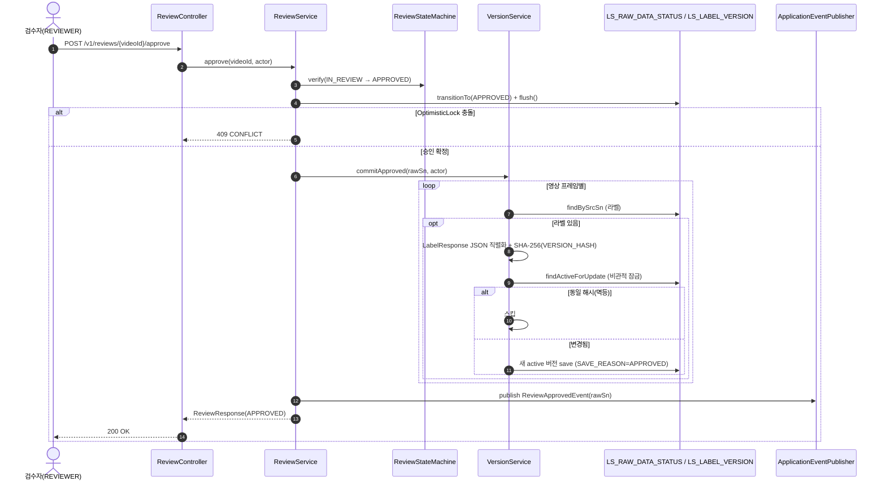
```mermaid
sequenceDiagram
    autonumber
    actor RV as 검수자(REVIEWER)
    participant RC as ReviewController
    participant RS as ReviewService
    participant SM as ReviewStateMachine
    participant VS as VersionService
    participant DB as LS_RAW_DATA_STATUS / LS_LABEL_VERSION
    participant EP as ApplicationEventPublisher
    RV->>RC: POST /v1/reviews/{videoId}/approve
    RC->>RS: approve(videoId, actor)
    RS->>SM: verify(IN_REVIEW → APPROVED)
    RS->>DB: transitionTo(APPROVED) + flush()
    alt OptimisticLock 충돌
        RS-->>RC: 409 CONFLICT
    else 승인 확정
        RS->>VS: commitApproved(rawSn, actor)
        loop 영상 프레임별
            VS->>DB: findBySrcSn (라벨)
            opt 라벨 있음
                VS->>VS: LabelResponse JSON 직렬화 + SHA-256(VERSION_HASH)
                VS->>DB: findActiveForUpdate (비관적 잠금)
                alt 동일 해시(멱등)
                    VS->>VS: 스킵
                else 변경됨
                    VS->>DB: 새 active 버전 save (SAVE_REASON=APPROVED)
                end
            end
        end
        RS->>EP: publish ReviewApprovedEvent(rawSn)
        RS-->>RC: ReviewResponse(APPROVED)
        RC-->>RV: 200 OK
    end
```

### 2.8 KLID-AT-SD-008 — 버전 비교·복구

| 시퀀스도 ID | KLID-AT-SD-008 | 시퀀스도명 | 버전 비교·복구 (DB 스냅샷 diff → 롤백 active 복원) |
|---------|---|-------|---|
| 관련 유스케이스 ID | KLID-AT-UC-008 |
| 주요 액터 | 검수자(REVIEWER), 라벨링 작업자(WORKER) |
| 주요 클래스 | VersionController, VersionService, LabelAccessGuard, LsLabelVersion |

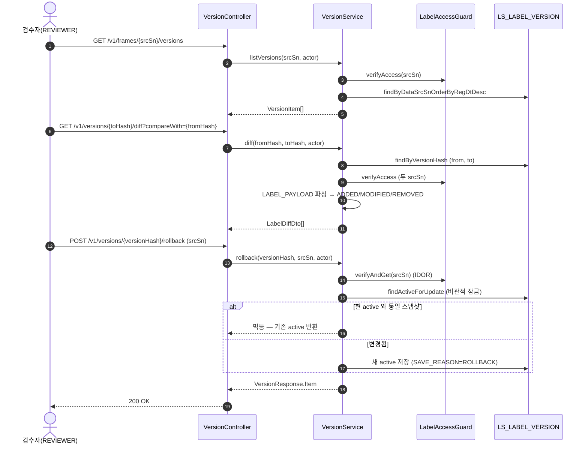
```mermaid
sequenceDiagram
    autonumber
    actor RV as 검수자(REVIEWER)
    participant VC as VersionController
    participant VS as VersionService
    participant AG as LabelAccessGuard
    participant DB as LS_LABEL_VERSION
    RV->>VC: GET /v1/frames/{srcSn}/versions
    VC->>VS: listVersions(srcSn, actor)
    VS->>AG: verifyAccess(srcSn)
    VS->>DB: findByDataSrcSnOrderByRegDtDesc
    VS-->>VC: VersionItem[]
    RV->>VC: GET /v1/versions/{toHash}/diff?compareWith={fromHash}
    VC->>VS: diff(fromHash, toHash, actor)
    VS->>DB: findByVersionHash (from, to)
    VS->>AG: verifyAccess (두 srcSn)
    VS->>VS: LABEL_PAYLOAD 파싱 → ADDED/MODIFIED/REMOVED
    VS-->>VC: LabelDiffDto[]
    RV->>VC: POST /v1/versions/{versionHash}/rollback (srcSn)
    VC->>VS: rollback(versionHash, srcSn, actor)
    VS->>AG: verifyAndGet(srcSn) (IDOR)
    VS->>DB: findActiveForUpdate (비관적 잠금)
    alt 현 active 와 동일 스냅샷
        VS-->>VC: 멱등 — 기존 active 반환
    else 변경됨
        VS->>DB: 새 active 저장 (SAVE_REASON=ROLLBACK)
    end
    VS-->>VC: VersionResponse.Item
    VC-->>RV: 200 OK
```

### 2.9 KLID-AT-SD-009 — 검수 완료·수정 통지

| 시퀀스도 ID | KLID-AT-SD-009 | 시퀀스도명 | 검수 완료·수정 통지 (검수완료 후 수정 → TASK_MODIFIED push) |
|---------|---|-------|---|
| 관련 유스케이스 ID | KLID-AT-UC-009 |
| 주요 액터 | 검수자/작업자, 관제서버[외부] |
| 주요 클래스 | LabelService, ControlNotifyEventListener, ControlNotifyDebouncer, ControlNotifyService, ControlNotifyClient, LsControlNotifyFallback, TaskQueryController |

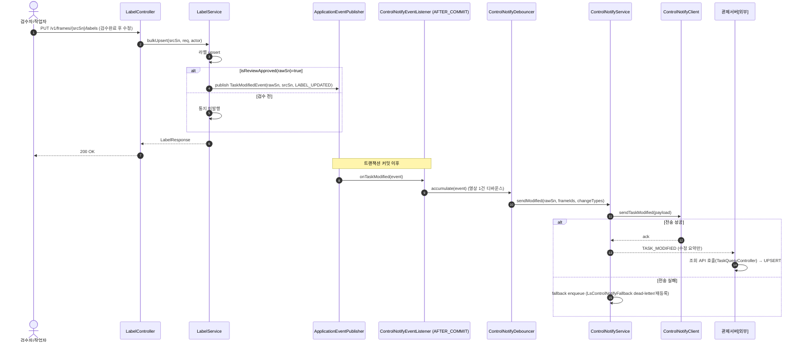
```mermaid
sequenceDiagram
    autonumber
    actor RV as 검수자/작업자
    participant LC as LabelController
    participant LS as LabelService
    participant EP as ApplicationEventPublisher
    participant EL as ControlNotifyEventListener (AFTER_COMMIT)
    participant DBn as ControlNotifyDebouncer
    participant CNS as ControlNotifyService
    participant CC as ControlNotifyClient
    participant CTL as 관제서버[외부]
    RV->>LC: PUT /v1/frames/{srcSn}/labels (검수완료 후 수정)
    LC->>LS: bulkUpsert(srcSn, req, actor)
    LS->>LS: 라벨 upsert
    alt isReviewApproved(rawSn)=true
        LS->>EP: publish TaskModifiedEvent(rawSn, srcSn, LABEL_UPDATED)
    else 검수 전
        LS->>LS: 통지 미발행
    end
    LS-->>LC: LabelResponse
    LC-->>RV: 200 OK
    Note over EP,EL: 트랜잭션 커밋 이후
    EP->>EL: onTaskModified(event)
    EL->>DBn: accumulate(event) (영상 1건 디바운스)
    DBn->>CNS: sendModified(rawSn, frameIds, changeTypes)
    CNS->>CC: sendTaskModified(payload)
    alt 전송 성공
        CC-->>CNS: ack
        CNS-->>CTL: TASK_MODIFIED (수정 요약만)
        CTL->>CTL: 조회 API 호출(TaskQueryController) → UPSERT
    else 전송 실패
        CNS->>CNS: fallback enqueue (LsControlNotifyFallback dead-letter/재등록)
    end
```

### 2.10 KLID-AT-SD-010 — 증강 영상 활용 여부 검수

| 시퀀스도 ID | KLID-AT-SD-010 | 시퀀스도명 | 증강 영상 활용 여부 검수 (PENDING 조회 → 승인/반려) |
|---------|---|-------|---|
| 관련 유스케이스 ID | KLID-AT-UC-010 |
| 주요 액터 | 검수자(REVIEWER) |
| 주요 클래스 | AugmentController, AugmentReviewService, LsDataAug, LsDataAugRvw, ExternalAugmentClient |

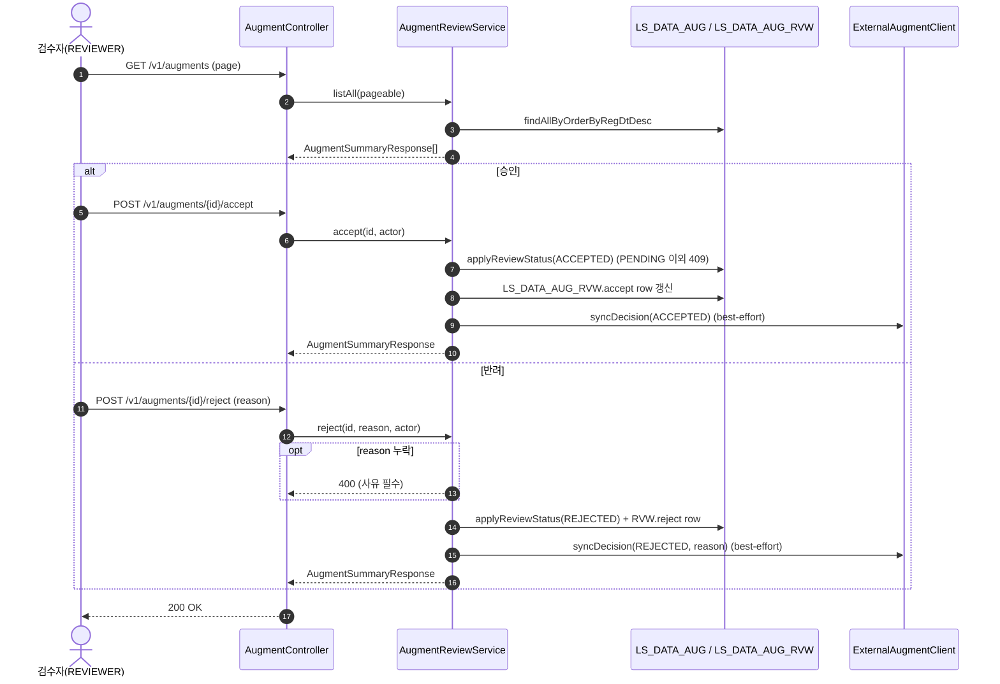
```mermaid
sequenceDiagram
    autonumber
    actor RV as 검수자(REVIEWER)
    participant AC as AugmentController
    participant ARS as AugmentReviewService
    participant DB as LS_DATA_AUG / LS_DATA_AUG_RVW
    participant EX as ExternalAugmentClient
    RV->>AC: GET /v1/augments (page)
    AC->>ARS: listAll(pageable)
    ARS->>DB: findAllByOrderByRegDtDesc
    ARS-->>AC: AugmentSummaryResponse[]
    alt 승인
        RV->>AC: POST /v1/augments/{id}/accept
        AC->>ARS: accept(id, actor)
        ARS->>DB: applyReviewStatus(ACCEPTED) (PENDING 이외 409)
        ARS->>DB: LS_DATA_AUG_RVW.accept row 갱신
        ARS->>EX: syncDecision(ACCEPTED) (best-effort)
        ARS-->>AC: AugmentSummaryResponse
    else 반려
        RV->>AC: POST /v1/augments/{id}/reject (reason)
        AC->>ARS: reject(id, reason, actor)
        opt reason 누락
            ARS-->>AC: 400 (사유 필수)
        end
        ARS->>DB: applyReviewStatus(REJECTED) + RVW.reject row
        ARS->>EX: syncDecision(REJECTED, reason) (best-effort)
        ARS-->>AC: AugmentSummaryResponse
    end
    AC-->>RV: 200 OK
```

### 2.11 KLID-AT-SD-011 — 비식별 처리 요청

| 시퀀스도 ID | KLID-AT-SD-011 | 시퀀스도명 | 비식별 처리 요청 (재처리 요청 → 외부 솔루션 결과 콜백) |
|---------|---|-------|---|
| 관련 유스케이스 ID | KLID-AT-UC-011 |
| 주요 액터 | 검수자(REVIEWER), 비식별솔루션[외부] |
| 주요 클래스 | DeidentController, DeidentifyClient, DeidentifyResultController, DeidentifyResultService, LsDataRaw, LsDeidentProcLog |

> 본 시퀀스의 요청 진입점(DeidentController.reprocess)은 후속 큐 적재용 진입점(202)이며, 실질 비식별 호출은 배치 파이프라인 비식별 단계(DeidentifyStep)가 수행한다. 비식별을 파이프라인 선두로 재배치하고 전체 영상을 비식별 대상으로 삼는 정책은 설계 확정 사항이며, 현행 코드의 비식별 단계는 구 호출 조건(PRVC/PSDO 영상 한정)을 구현한 상태이다.

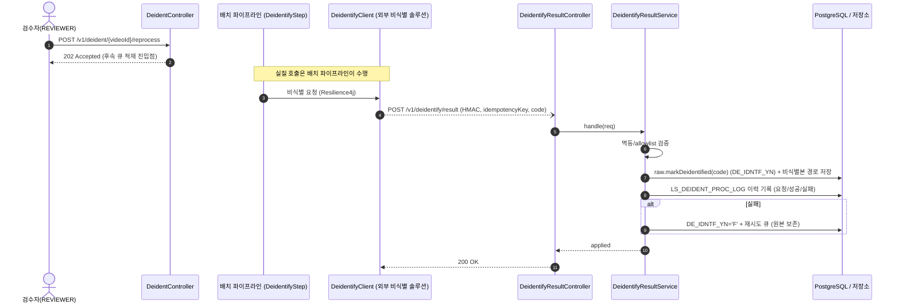
```mermaid
sequenceDiagram
    autonumber
    actor RV as 검수자(REVIEWER)
    participant DC as DeidentController
    participant BO as 배치 파이프라인 (DeidentifyStep)
    participant DE as DeidentifyClient (외부 비식별 솔루션)
    participant DRC as DeidentifyResultController
    participant DRS as DeidentifyResultService
    participant DB as PostgreSQL / 저장소
    RV->>DC: POST /v1/deident/{videoId}/reprocess
    DC-->>RV: 202 Accepted (후속 큐 적재 진입점)
    Note over BO,DE: 실질 호출은 배치 파이프라인이 수행
    BO->>DE: 비식별 요청 (Resilience4j)
    DE--)DRC: POST /v1/deidentify/result (HMAC, idempotencyKey, code)
    DRC->>DRS: handle(req)
    DRS->>DRS: 멱등/allowlist 검증
    DRS->>DB: raw.markDeidentified(code) (DE_IDNTF_YN) + 비식별본 경로 저장
    DRS->>DB: LS_DEIDENT_PROC_LOG 이력 기록 (요청/성공/실패)
    alt 실패
        DRS->>DB: DE_IDNTF_YN='F' + 재시도 큐 (원본 보존)
    end
    DRS-->>DRC: applied
    DRC-->>DE: 200 OK
```

### 2.12 KLID-AT-SD-013 — 비식별 옵션 설정

| 시퀀스도 ID | KLID-AT-SD-013 | 시퀀스도명 | 비식별 옵션 설정 (관리 화면 설정 저장) |
|---------|---|-------|---|
| 관련 유스케이스 ID | KLID-AT-UC-013 |
| 주요 액터 | 검수자(REVIEWER) |
| 주요 클래스 | SystemConfigController, SystemConfigService, LsSystemConfig |

> KLID-AT-SD-012는 폐기 유스케이스(KLID-AT-UC-012)에 동조하여 결번 처리한다.

```mermaid
sequenceDiagram
    autonumber
    actor RV as 검수자(REVIEWER)
    participant SCC as SystemConfigController
    participant SCS as SystemConfigService
    participant DB as LS_SYSTEM_CONFIG
    participant CA as Caffeine 캐시 (TTL 60s)
    RV->>SCC: PUT /v1/manage/configs/{key} (비식별 옵션 value)
    alt WORKER 호출
        SCC-->>RV: 403 (REVIEWER 전용)
    else 값 범위 초과
        SCC-->>RV: 400 (@Valid)
    else 정상
        SCC->>SCS: update(key, value, claims)
        SCS->>DB: 설정값 저장
        SCS->>CA: 캐시 갱신
        SCS-->>SCC: ConfigResponse
        SCC-->>RV: 200 OK
    end
    Note over SCS,CA: 이후 비식별 요청 시 저장된 옵션 적용
```

### 2.13 KLID-AT-SD-016 — 비식별 처리 상태·이력 확인 (누락 신고·수동 해소)

| 시퀀스도 ID | KLID-AT-SD-016 | 시퀀스도명 | 비식별 누락 신고·수동 해소 (신고 → RESOLVED) |
|---------|---|-------|---|
| 관련 유스케이스 ID | KLID-AT-UC-016 |
| 주요 액터 | 라벨링 작업자(WORKER), 검수자(REVIEWER), 외부 비식별 SW |
| 주요 클래스 | DeidentReportController, DeidentReportService, LabelAccessGuard, WorkLockService, VersionService, LsDeidentReport, LsAuthWorkLock |

> KLID-AT-SD-014/015는 폐기 유스케이스(KLID-AT-UC-014/015)에 동조하여 결번 처리한다.

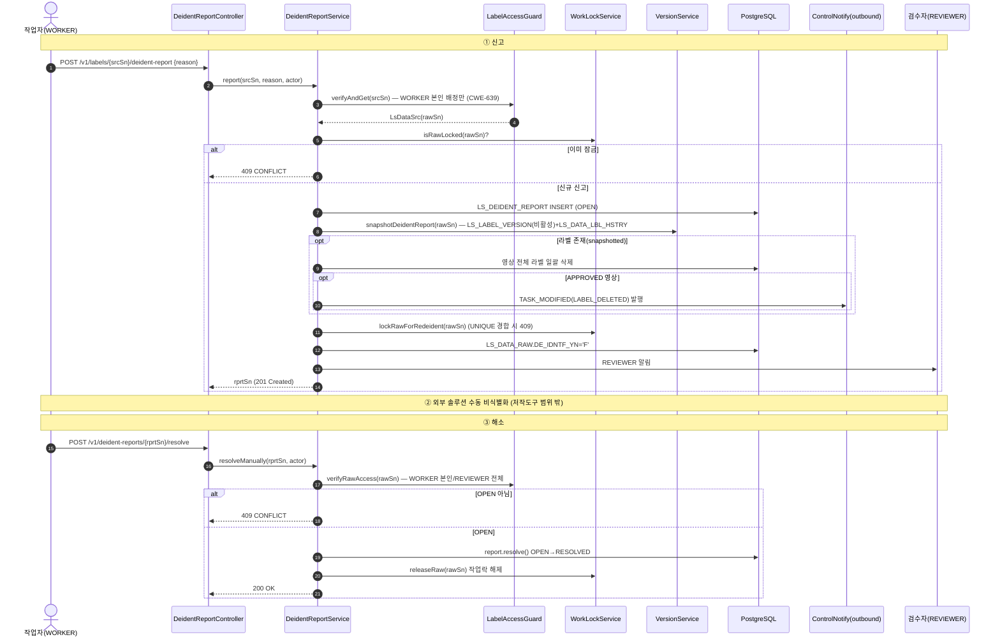
```mermaid
sequenceDiagram
    autonumber
    actor WK as 작업자(WORKER)
    participant DRC as DeidentReportController
    participant DRS as DeidentReportService
    participant AG as LabelAccessGuard
    participant WL as WorkLockService
    participant VS as VersionService
    participant DB as PostgreSQL
    participant CN as ControlNotify(outbound)
    participant RV as 검수자(REVIEWER)
    Note over WK,RV: ① 신고
    WK->>DRC: POST /v1/labels/{srcSn}/deident-report {reason}
    DRC->>DRS: report(srcSn, reason, actor)
    DRS->>AG: verifyAndGet(srcSn) — WORKER 본인 배정만 (CWE-639)
    AG-->>DRS: LsDataSrc(rawSn)
    DRS->>WL: isRawLocked(rawSn)?
    alt 이미 잠금
        DRS-->>DRC: 409 CONFLICT
    else 신규 신고
        DRS->>DB: LS_DEIDENT_REPORT INSERT (OPEN)
        DRS->>VS: snapshotDeidentReport(rawSn) — LS_LABEL_VERSION(비활성)+LS_DATA_LBL_HSTRY
        opt 라벨 존재(snapshotted)
            DRS->>DB: 영상 전체 라벨 일괄 삭제
            opt APPROVED 영상
                DRS->>CN: TASK_MODIFIED(LABEL_DELETED) 발행
            end
        end
        DRS->>WL: lockRawForRedeident(rawSn) (UNIQUE 경합 시 409)
        DRS->>DB: LS_DATA_RAW.DE_IDNTF_YN='F'
        DRS->>RV: REVIEWER 알림
        DRS-->>DRC: rprtSn (201 Created)
    end
    Note over WK,RV: ② 외부 솔루션 수동 비식별화 (저작도구 범위 밖)
    Note over WK,RV: ③ 해소
    WK->>DRC: POST /v1/deident-reports/{rprtSn}/resolve
    DRC->>DRS: resolveManually(rprtSn, actor)
    DRS->>AG: verifyRawAccess(rawSn) — WORKER 본인/REVIEWER 전체
    alt OPEN 아님
        DRS-->>DRC: 409 CONFLICT
    else OPEN
        DRS->>DB: report.resolve() OPEN→RESOLVED
        DRS->>WL: releaseRaw(rawSn) 작업락 해제
        DRS-->>DRC: 200 OK
    end
```

---

## 3. 설계 클래스도

> **⟳ 유스케이스별로 1개씩 반복 작성한다.** (설계 클래스도 ID ↔ 관련 유스케이스 ID는 1:1, 번호 동조·결번 동조)

### 3.1 KLID-AT-DCD-001 — 증강 영상 생성 요청 실현 클래스

| 설계 클래스도 ID | KLID-AT-DCD-001 | 설계 클래스도명 | 증강 영상 생성 요청 실현 클래스 |
|-----------|---|---------|---|
| 관련 유스케이스 ID | KLID-AT-UC-001 |

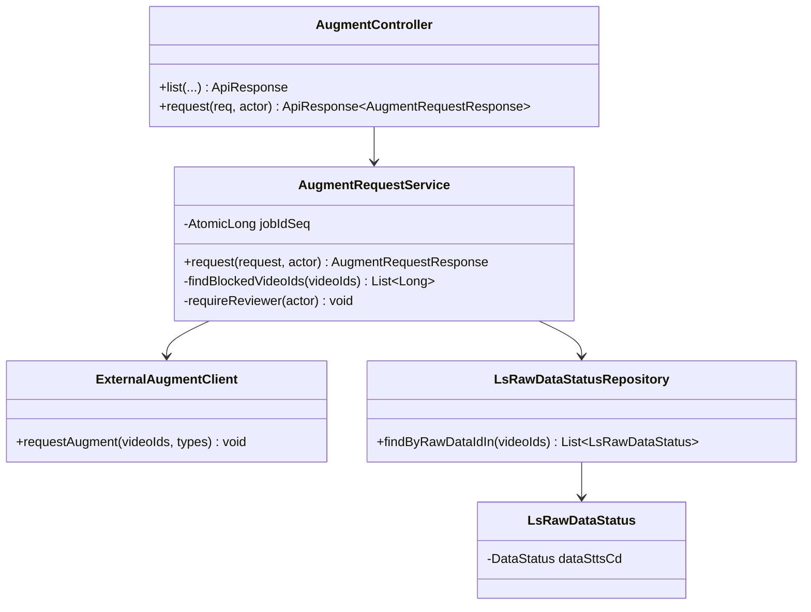
```mermaid
classDiagram
    class AugmentController {
        +list(...) ApiResponse
        +request(req, actor) ApiResponse~AugmentRequestResponse~
    }
    class AugmentRequestService {
        -AtomicLong jobIdSeq
        +request(request, actor) AugmentRequestResponse
        -findBlockedVideoIds(videoIds) List~Long~
        -requireReviewer(actor) void
    }
    class ExternalAugmentClient {
        +requestAugment(videoIds, types) void
    }
    class LsRawDataStatusRepository {
        +findByRawDataIdIn(videoIds) List~LsRawDataStatus~
    }
    class LsRawDataStatus {
        -DataStatus dataSttsCd
    }
    AugmentController --> AugmentRequestService
    AugmentRequestService --> LsRawDataStatusRepository
    AugmentRequestService --> ExternalAugmentClient
    LsRawDataStatusRepository --> LsRawDataStatus
```

### 3.2 KLID-AT-DCD-002 — 증강 결과 수신·등록 실현 클래스

| 설계 클래스도 ID | KLID-AT-DCD-002 | 설계 클래스도명 | 증강 결과 수신·등록 실현 클래스 |
|-----------|---|---------|---|
| 관련 유스케이스 ID | KLID-AT-UC-002 |

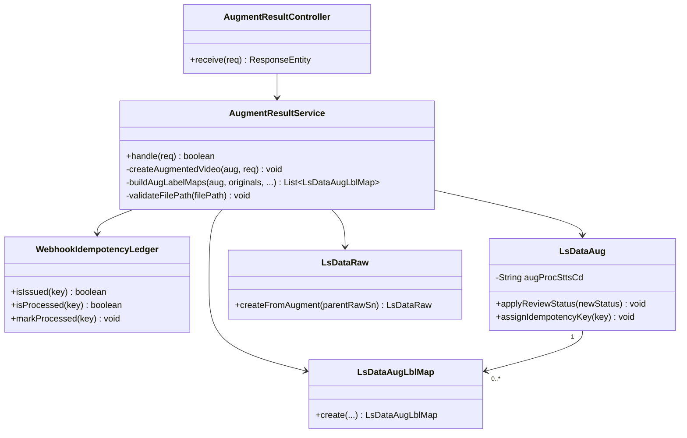
```mermaid
classDiagram
    class AugmentResultController {
        +receive(req) ResponseEntity
    }
    class AugmentResultService {
        +handle(req) boolean
        -createAugmentedVideo(aug, req) void
        -buildAugLabelMaps(aug, originals, ...) List~LsDataAugLblMap~
        -validateFilePath(filePath) void
    }
    class WebhookIdempotencyLedger {
        +isIssued(key) boolean
        +isProcessed(key) boolean
        +markProcessed(key) void
    }
    class LsDataAug {
        -String augProcSttsCd
        +applyReviewStatus(newStatus) void
        +assignIdempotencyKey(key) void
    }
    class LsDataAugLblMap {
        +create(...) LsDataAugLblMap
    }
    class LsDataRaw {
        +createFromAugment(parentRawSn) LsDataRaw
    }
    AugmentResultController --> AugmentResultService
    AugmentResultService --> WebhookIdempotencyLedger
    AugmentResultService --> LsDataAug
    AugmentResultService --> LsDataRaw
    AugmentResultService --> LsDataAugLblMap
    LsDataAug "1" --> "0..*" LsDataAugLblMap
```

### 3.3 KLID-AT-DCD-003 — 해상도 변경 수행 실현 클래스

| 설계 클래스도 ID | KLID-AT-DCD-003 | 설계 클래스도명 | 해상도 변경 수행 실현 클래스 |
|-----------|---|---------|---|
| 관련 유스케이스 ID | KLID-AT-UC-003 |

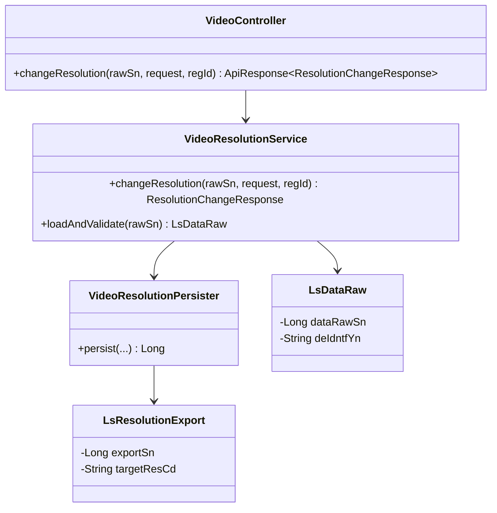
```mermaid
classDiagram
    class VideoController {
        +changeResolution(rawSn, request, regId) ApiResponse~ResolutionChangeResponse~
    }
    class VideoResolutionService {
        +changeResolution(rawSn, request, regId) ResolutionChangeResponse
        +loadAndValidate(rawSn) LsDataRaw
    }
    class VideoResolutionPersister {
        +persist(...) Long
    }
    class LsResolutionExport {
        -Long exportSn
        -String targetResCd
    }
    class LsDataRaw {
        -Long dataRawSn
        -String deIdntfYn
    }
    VideoController --> VideoResolutionService
    VideoResolutionService --> VideoResolutionPersister
    VideoResolutionService --> LsDataRaw
    VideoResolutionPersister --> LsResolutionExport
```

### 3.4 KLID-AT-DCD-004 — 객체 자동 추적 실현 클래스

| 설계 클래스도 ID | KLID-AT-DCD-004 | 설계 클래스도명 | 객체 자동 추적 실현 클래스 |
|-----------|---|---------|---|
| 관련 유스케이스 ID | KLID-AT-UC-004 |

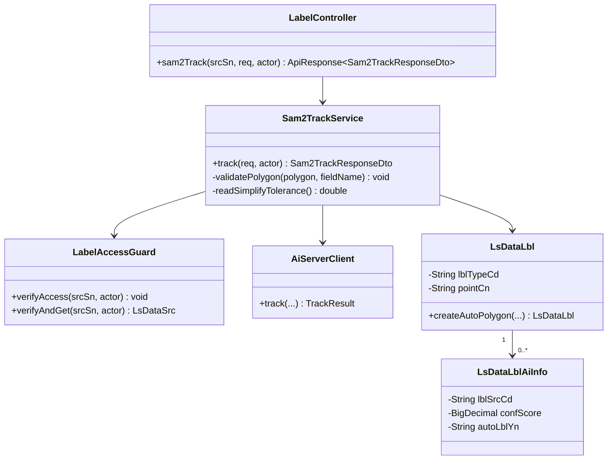
```mermaid
classDiagram
    class LabelController {
        +sam2Track(srcSn, req, actor) ApiResponse~Sam2TrackResponseDto~
    }
    class Sam2TrackService {
        +track(req, actor) Sam2TrackResponseDto
        -validatePolygon(polygon, fieldName) void
        -readSimplifyTolerance() double
    }
    class LabelAccessGuard {
        +verifyAccess(srcSn, actor) void
        +verifyAndGet(srcSn, actor) LsDataSrc
    }
    class AiServerClient {
        +track(...) TrackResult
    }
    class LsDataLbl {
        -String lblTypeCd
        -String pointCn
        +createAutoPolygon(...) LsDataLbl
    }
    class LsDataLblAiInfo {
        -String lblSrcCd
        -BigDecimal confScore
        -String autoLblYn
    }
    LabelController --> Sam2TrackService
    Sam2TrackService --> LabelAccessGuard
    Sam2TrackService --> AiServerClient
    Sam2TrackService --> LsDataLbl
    LsDataLbl "1" --> "0..*" LsDataLblAiInfo
```

### 3.5 KLID-AT-DCD-005 — 객체 외곽 경계 자동 밀착 실현 클래스

| 설계 클래스도 ID | KLID-AT-DCD-005 | 설계 클래스도명 | 객체 외곽 경계 자동 밀착 실현 클래스 |
|-----------|---|---------|---|
| 관련 유스케이스 ID | KLID-AT-UC-005 |

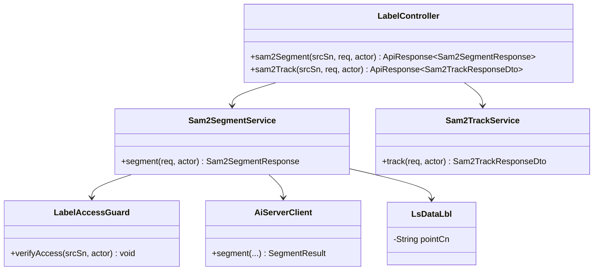
```mermaid
classDiagram
    class LabelController {
        +sam2Segment(srcSn, req, actor) ApiResponse~Sam2SegmentResponse~
        +sam2Track(srcSn, req, actor) ApiResponse~Sam2TrackResponseDto~
    }
    class Sam2SegmentService {
        +segment(req, actor) Sam2SegmentResponse
    }
    class Sam2TrackService {
        +track(req, actor) Sam2TrackResponseDto
    }
    class LabelAccessGuard {
        +verifyAccess(srcSn, actor) void
    }
    class AiServerClient {
        +segment(...) SegmentResult
    }
    class LsDataLbl {
        -String pointCn
    }
    LabelController --> Sam2SegmentService
    LabelController --> Sam2TrackService
    Sam2SegmentService --> LabelAccessGuard
    Sam2SegmentService --> AiServerClient
    Sam2SegmentService --> LsDataLbl
```

### 3.6 KLID-AT-DCD-006 — 라벨링 정밀도 조절 실현 클래스

| 설계 클래스도 ID | KLID-AT-DCD-006 | 설계 클래스도명 | 라벨링 정밀도 조절 실현 클래스 |
|-----------|---|---------|---|
| 관련 유스케이스 ID | KLID-AT-UC-006 |

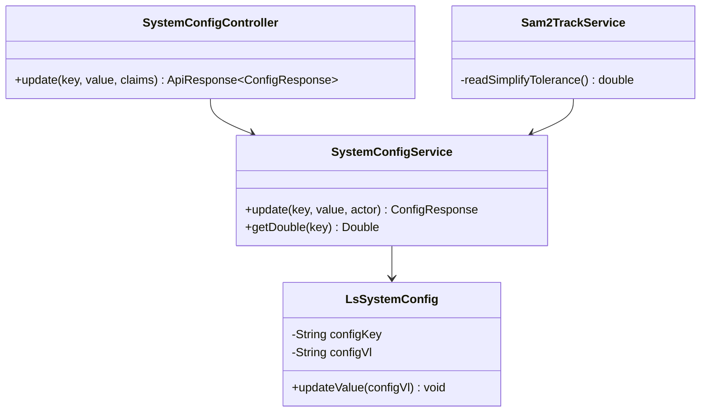
```mermaid
classDiagram
    class SystemConfigController {
        +update(key, value, claims) ApiResponse~ConfigResponse~
    }
    class SystemConfigService {
        +update(key, value, actor) ConfigResponse
        +getDouble(key) Double
    }
    class LsSystemConfig {
        -String configKey
        -String configVl
        +updateValue(configVl) void
    }
    class Sam2TrackService {
        -readSimplifyTolerance() double
    }
    SystemConfigController --> SystemConfigService
    SystemConfigService --> LsSystemConfig
    Sam2TrackService --> SystemConfigService
```

### 3.7 KLID-AT-DCD-007 — 라벨 버전 저장·이력 추적 실현 클래스

| 설계 클래스도 ID | KLID-AT-DCD-007 | 설계 클래스도명 | 라벨 버전 저장·이력 추적 실현 클래스 |
|-----------|---|---------|---|
| 관련 유스케이스 ID | KLID-AT-UC-007 |

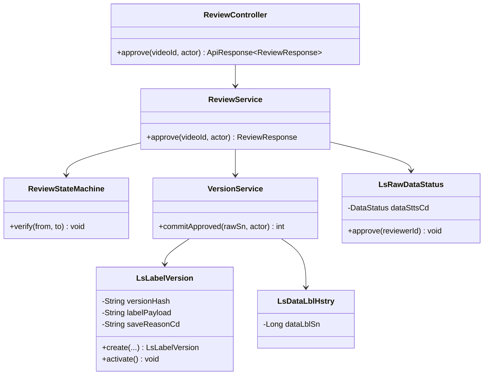
```mermaid
classDiagram
    class ReviewController {
        +approve(videoId, actor) ApiResponse~ReviewResponse~
    }
    class ReviewService {
        +approve(videoId, actor) ReviewResponse
    }
    class ReviewStateMachine {
        +verify(from, to) void
    }
    class VersionService {
        +commitApproved(rawSn, actor) int
    }
    class LsLabelVersion {
        -String versionHash
        -String labelPayload
        -String saveReasonCd
        +create(...) LsLabelVersion
        +activate() void
    }
    class LsRawDataStatus {
        -DataStatus dataSttsCd
        +approve(reviewerId) void
    }
    class LsDataLblHstry {
        -Long dataLblSn
    }
    ReviewController --> ReviewService
    ReviewService --> ReviewStateMachine
    ReviewService --> VersionService
    ReviewService --> LsRawDataStatus
    VersionService --> LsLabelVersion
    VersionService --> LsDataLblHstry
```

### 3.8 KLID-AT-DCD-008 — 버전 비교·복구 실현 클래스

| 설계 클래스도 ID | KLID-AT-DCD-008 | 설계 클래스도명 | 버전 비교·복구 실현 클래스 |
|-----------|---|---------|---|
| 관련 유스케이스 ID | KLID-AT-UC-008 |

```mermaid
classDiagram
    class VersionController {
        +listVersions(srcSn, actor) ApiResponse~List~
        +diff(toHash, fromHash, actor) ApiResponse~List~
        +rollback(versionHash, srcSn, actor) ApiResponse~Item~
    }
    class VersionService {
        +listVersions(srcSn, actor) List~VersionItem~
        +diff(fromHash, toHash, actor) DiffResponseDto
        +rollback(versionHash, srcSn, actor) LsLabelVersion
    }
    class LabelAccessGuard {
        +verifyAccess(srcSn, actor) void
        +verifyAndGet(srcSn, actor) LsDataSrc
    }
    class LsLabelVersion {
        -String versionHash
        -String activeYn
        +deactivate() void
        +activate() void
    }
    VersionController --> VersionService
    VersionService --> LabelAccessGuard
    VersionService --> LsLabelVersion
```

### 3.9 KLID-AT-DCD-009 — 검수 완료·수정 통지 실현 클래스

| 설계 클래스도 ID | KLID-AT-DCD-009 | 설계 클래스도명 | 검수 완료·수정 통지 실현 클래스 |
|-----------|---|---------|---|
| 관련 유스케이스 ID | KLID-AT-UC-009 |

```mermaid
classDiagram
    class LabelService {
        +bulkUpsert(srcSn, req, actor) LabelResponse
    }
    class ControlNotifyEventListener {
        +onReviewApproved(event) void
        +onTaskModified(event) void
    }
    class ControlNotifyDebouncer {
        +accumulate(event) void
        +flushExpiredWindows() void
    }
    class ControlNotifyService {
        +sendCompleted(event) void
        +sendModified(rawSn, frameIds, changeTypes) void
    }
    class ControlNotifyClient {
        +sendTaskCompleted(payload) Mono~Void~
        +sendTaskModified(payload) Mono~Void~
    }
    class LsControlNotifyFallback {
        -NotifyQueueStatus sttsCd
        +scheduleRetry() void
        +markDeadLetter() void
    }
    class TaskQueryController {
        +getSummary(rawSn) ApiResponse
        +getLabels(rawSn) ApiResponse
        +getMeta(rawSn) ApiResponse
    }
    LabelService --> ControlNotifyEventListener : event
    ControlNotifyEventListener --> ControlNotifyDebouncer
    ControlNotifyDebouncer --> ControlNotifyService
    ControlNotifyService --> ControlNotifyClient
    ControlNotifyService --> LsControlNotifyFallback
```

### 3.10 KLID-AT-DCD-010 — 증강 영상 활용 여부 검수 실현 클래스

| 설계 클래스도 ID | KLID-AT-DCD-010 | 설계 클래스도명 | 증강 영상 활용 여부 검수 실현 클래스 |
|-----------|---|---------|---|
| 관련 유스케이스 ID | KLID-AT-UC-010 |

```mermaid
classDiagram
    class AugmentController {
        +list(...) ApiResponse
        +accept(id, actor) ApiResponse~AugmentSummaryResponse~
        +reject(id, reason, actor) ApiResponse~AugmentSummaryResponse~
    }
    class AugmentReviewService {
        +listAll(pageable) Page~AugmentSummaryResponse~
        +accept(dataAugSn, actor) AugmentSummaryResponse
        +reject(dataAugSn, reason, actor) AugmentSummaryResponse
    }
    class LsDataAug {
        -String augProcSttsCd
        +applyReviewStatus(newStatus) void
    }
    class LsDataAugRvw {
        -String rvwSttsCd
        +approve() void
        +reject() void
    }
    class ExternalAugmentClient {
        +syncDecision(...) void
    }
    AugmentController --> AugmentReviewService
    AugmentReviewService --> LsDataAug
    AugmentReviewService --> LsDataAugRvw
    AugmentReviewService --> ExternalAugmentClient
    LsDataAug "1" --> "0..*" LsDataAugRvw
```

### 3.11 KLID-AT-DCD-011 — 비식별 처리 요청 실현 클래스

| 설계 클래스도 ID | KLID-AT-DCD-011 | 설계 클래스도명 | 비식별 처리 요청 실현 클래스 |
|-----------|---|---------|---|
| 관련 유스케이스 ID | KLID-AT-UC-011 |

```mermaid
classDiagram
    class DeidentController {
        +reprocess(videoId) ApiResponse~Void~
    }
    class DeidentifyClient {
        +deidentify(request) Mono~DeidentifyResponse~
    }
    class DeidentifyResultController {
        +receive(req) ResponseEntity
    }
    class DeidentifyResultService {
        +handle(req) boolean
    }
    class LsDataRaw {
        -String deIdntfYn
        +markDeidentified(code) void
    }
    class LsDeidentProcLog {
        -String procSttsCd
        +succeed(deIdntfFilePathNm) void
        +fail(errorCd, errorMsg) void
    }
    DeidentController --> DeidentifyClient
    DeidentifyResultController --> DeidentifyResultService
    DeidentifyResultService --> LsDataRaw
    DeidentifyResultService --> LsDeidentProcLog
```

### 3.12 KLID-AT-DCD-013 — 비식별 옵션 설정 실현 클래스

| 설계 클래스도 ID | KLID-AT-DCD-013 | 설계 클래스도명 | 비식별 옵션 설정 실현 클래스 |
|-----------|---|---------|---|
| 관련 유스케이스 ID | KLID-AT-UC-013 |

> KLID-AT-DCD-012는 폐기 유스케이스(KLID-AT-UC-012)에 동조하여 결번 처리한다.

```mermaid
classDiagram
    class SystemConfigController {
        +list() ApiResponse~List~
        +update(key, value, claims) ApiResponse~ConfigResponse~
    }
    class SystemConfigService {
        +listAll() List~ConfigResponse~
        +update(key, value, actor) ConfigResponse
        +getString(key) String
    }
    class LsSystemConfig {
        -String configKey
        -String configVl
        -String configTypeCd
        +updateValue(configVl) void
        +validateValue() boolean
    }
    SystemConfigController --> SystemConfigService
    SystemConfigService --> LsSystemConfig
```

### 3.13 KLID-AT-DCD-016 — 비식별 처리 상태·이력 확인 실현 클래스

| 설계 클래스도 ID | KLID-AT-DCD-016 | 설계 클래스도명 | 비식별 처리 상태·이력 확인(누락 신고·수동 해소) 실현 클래스 |
|-----------|---|---------|---|
| 관련 유스케이스 ID | KLID-AT-UC-016 |

> KLID-AT-DCD-012/014/015는 폐기 유스케이스에 동조하여 결번 처리한다.

```mermaid
classDiagram
    class DeidentReportController {
        +report(srcSn, body, actor) ResponseEntity
        +resolve(rprtSn, actor) ResponseEntity
        +list(...) ApiResponse~Page~
    }
    class DeidentReportService {
        +report(srcSn, reason, actor) Long
        +resolveManually(rprtSn, actor) void
        +resolveOpenReports(rawSn) int
    }
    class LabelAccessGuard {
        +verifyAndGet(srcSn, actor) LsDataSrc
        +verifyRawAccess(rawSn, actor) void
    }
    class WorkLockService {
        +lockRawForRedeident(rawSn, ownerId) void
        +releaseRaw(rawSn) void
        +isRawLocked(rawSn) boolean
    }
    class VersionService {
        +snapshotDeidentReport(rawSn, actor) boolean
    }
    class LsDeidentReport {
        -String reportSttsCd
        +resolve() void
        +dismiss() void
    }
    class LsAuthWorkLock {
        -String lockSttsCd
        +lockRawForRedeident(rawSn, ownerId) LsAuthWorkLock
        +release(actorId, reason) void
    }
    class LsLabelVersion {
        -String saveReasonCd
        +createInactiveRawSnapshot(...) LsLabelVersion
    }
    DeidentReportController --> DeidentReportService
    DeidentReportService --> LabelAccessGuard
    DeidentReportService --> WorkLockService
    DeidentReportService --> VersionService
    DeidentReportService --> LsDeidentReport
    WorkLockService --> LsAuthWorkLock
    VersionService --> LsLabelVersion
```

---

## 4. 설계 클래스 정의

> **⟳ 클래스별로 1개씩 반복 작성한다.** (속성·오퍼레이션 명세 포함. 공통 클래스는 1회만 정의한다.)

### KLID-AT-DC-001 — AugmentController

| 설계 클래스 ID | KLID-AT-DC-001 | 설계 클래스명 | AugmentController |
|-----------|---|---------|---|
| **속성** |

| 속성명 | 가시성 | 타입 | 기본값 | 설명 |
|-------|------|------|-------|------|
| augmentRequestService | private | AugmentRequestService | - | 증강 요청 위임 서비스 |
| augmentReviewService | private | AugmentReviewService | - | 증강 검수 서비스 |

| **오퍼레이션** |

| 오퍼레이션명 | 가시성 | 파라미터 | 반환타입 | 설명 |
|----------|------|---------|--------|------|
| list | public | Pageable, srcSn | ApiResponse | 증강 결과 목록 조회(GET /v1/augments) |
| request | public | AugmentRequestRequest, TokenClaims | ApiResponse&lt;AugmentRequestResponse&gt; | 증강 생성 요청(POST /v1/augments/request, REVIEWER) |
| result | public | Long jobId | ApiResponse&lt;Map&gt; | 증강 작업 결과 조회(GET /v1/augments/{jobId}/result) |
| accept | public | Long id, TokenClaims | ApiResponse&lt;AugmentSummaryResponse&gt; | 증강 결과 승인(POST /v1/augments/{id}/accept) |
| reject | public | Long id, reason, TokenClaims | ApiResponse&lt;AugmentSummaryResponse&gt; | 증강 결과 반려(POST /v1/augments/{id}/reject) |

### KLID-AT-DC-002 — AugmentRequestService

| 설계 클래스 ID | KLID-AT-DC-002 | 설계 클래스명 | AugmentRequestService |
|-----------|---|---------|---|
| **속성** |

| 속성명 | 가시성 | 타입 | 기본값 | 설명 |
|-------|------|------|-------|------|
| jobIdSeq | private | AtomicLong | System.currentTimeMillis() | 작업 ID 시퀀스 발급기 |
| rawDataStatusRepository | private | LsRawDataStatusRepository | - | 영상 진행 상태 조회 |
| externalAugmentClient | private | ExternalAugmentClient | - | 외부 증강 위임 클라이언트 |

| **오퍼레이션** |

| 오퍼레이션명 | 가시성 | 파라미터 | 반환타입 | 설명 |
|----------|------|---------|--------|------|
| request | public | AugmentRequestRequest, TokenClaims | AugmentRequestResponse | REVIEWER 검증·APPROVED 검증 후 외부 위임·jobId 발급 |
| findBlockedVideoIds | private | List&lt;Long&gt; | List&lt;Long&gt; | 미검수(APPROVED 아님) 영상 ID 추출 |
| requireReviewer | private | TokenClaims | void | REVIEWER 권한 검증 |
| sanitize | private (static) | String | String | 로그/입력 정화 |

### KLID-AT-DC-003 — ExternalAugmentClient

| 설계 클래스 ID | KLID-AT-DC-003 | 설계 클래스명 | ExternalAugmentClient |
|-----------|---|---------|---|
| **속성** |

| 속성명 | 가시성 | 타입 | 기본값 | 설명 |
|-------|------|------|-------|------|
| webClient | private | WebClient | - | 외부 증강 시스템 호출용 WebFlux 클라이언트 |

| **오퍼레이션** |

| 오퍼레이션명 | 가시성 | 파라미터 | 반환타입 | 설명 |
|----------|------|---------|--------|------|
| requestAugment | public | videoIds, types | void | 외부 생성형 AI에 증강 생성 위임(best-effort, Resilience4j) |
| syncDecision | public | augSn, decision, reason | void | 증강 검수 결과(ACCEPTED/REJECTED) 외부 동기화(best-effort) |

### KLID-AT-DC-004 — LsRawDataStatusRepository

| 설계 클래스 ID | KLID-AT-DC-004 | 설계 클래스명 | LsRawDataStatusRepository |
|-----------|---|---------|---|
| **속성** | (인터페이스 — 속성 없음) |

| **오퍼레이션** |

| 오퍼레이션명 | 가시성 | 파라미터 | 반환타입 | 설명 |
|----------|------|---------|--------|------|
| findByRawDataIdIn | public | List&lt;Long&gt; | List&lt;LsRawDataStatus&gt; | 영상 ID 목록의 진행 상태 일괄 조회 |
| findById | public | Long | Optional&lt;LsRawDataStatus&gt; | 영상 진행 상태 단건 조회 |

### KLID-AT-DC-005 — AugmentResultController

| 설계 클래스 ID | KLID-AT-DC-005 | 설계 클래스명 | AugmentResultController |
|-----------|---|---------|---|
| **속성** |

| 속성명 | 가시성 | 타입 | 기본값 | 설명 |
|-------|------|------|-------|------|
| augmentResultService | private | AugmentResultService | - | 증강 결과 수신 처리 서비스 |

| **오퍼레이션** |

| 오퍼레이션명 | 가시성 | 파라미터 | 반환타입 | 설명 |
|----------|------|---------|--------|------|
| receive | public | AugmentResultRequest | ResponseEntity&lt;ApiResponse&lt;Map&gt;&gt; | 외부 증강 결과 콜백 수신(POST /v1/augments/result, HMAC) |

### KLID-AT-DC-006 — LsDataAug

| 설계 클래스 ID | KLID-AT-DC-006 | 설계 클래스명 | LsDataAug |
|-----------|---|---------|---|
| **속성** |

| 속성명 | 가시성 | 타입 | 기본값 | 설명 |
|-------|------|------|-------|------|
| dataAugSn | private | Long | - | 증강 결과 PK(읽기전용) |
| srcSn | private | Long | - | 증강 대상 영상(SRC_SN) |
| augTypeCd | private | String | - | 증강유형(WINTER/NIGHT/RAIN) |
| augProcSttsCd | private | String | - | 처리상태(PENDING/ACCEPTED/REJECTED) |
| lblIntgrtPct | private | BigDecimal | - | 라벨 무결성 비율 |
| rejectRsn | private | String | - | 반려 사유 |
| dcsnUserNo | private | String | - | 결정 사용자 번호 |
| dcsnDt | private | LocalDateTime | - | 결정 일시 |
| idempotencyKey | private | String | - | 비동기 멱등키 |
| externalJobId | private | String | - | 외부 작업 ID |
| retryCount | private | int | 0 | 재시도 횟수 |
| deadLetterAt | private | LocalDateTime | - | dead-letter 격리 일시 |

| **오퍼레이션** |

| 오퍼레이션명 | 가시성 | 파라미터 | 반환타입 | 설명 |
|----------|------|---------|--------|------|
| createPending | public (static) | srcSn, augTypeCd, ... | LsDataAug | PENDING 상태 증강 결과 생성 |
| applyReviewStatus | public | String newStatus | void | 검수 상태 전이(PENDING 이외 전이 시 충돌) |
| assignIdempotencyKey | public | String | void | 멱등키 부여 |
| assignExternalJobId | public | String | void | 외부 작업 ID 부여 |
| incrementRetryCount | public | - | void | 재시도 횟수 증가 |
| markDeadLetter | public | - | void | dead-letter 격리 표기 |

### KLID-AT-DC-007 — AugmentResultService

| 설계 클래스 ID | KLID-AT-DC-007 | 설계 클래스명 | AugmentResultService |
|-----------|---|---------|---|
| **속성** |

| 속성명 | 가시성 | 타입 | 기본값 | 설명 |
|-------|------|------|-------|------|
| LOG_UNSAFE | private (static) | Pattern | `[\r\n\t]` | 로그 위변조 방지 정규식 |
| idempotencyLedger | private | WebhookIdempotencyLedger | - | 멱등 원장 |

| **오퍼레이션** |

| 오퍼레이션명 | 가시성 | 파라미터 | 반환타입 | 설명 |
|----------|------|---------|--------|------|
| handle | public | AugmentResultRequest | boolean | 멱등·SSRF·augType 검증 후 상태 전이·신규 영상 생성 |
| createAugmentedVideo | private | LsDataAug, AugmentResultRequest | void | 새 영상·프레임·라벨·매핑·메타 동일 트랜잭션 저장 |
| buildAugLabelMaps | private (static) | aug, originals, ... | List&lt;LsDataAugLblMap&gt; | 원본↔증강 라벨 매핑 생성(COORD_RECALC_YN='N') |
| validateFilePath | private | String | void | 결과 파일 경로 SSRF 검증 |

### KLID-AT-DC-008 — LsDataAugLblMap

| 설계 클래스 ID | KLID-AT-DC-008 | 설계 클래스명 | LsDataAugLblMap |
|-----------|---|---------|---|
| **속성** |

| 속성명 | 가시성 | 타입 | 기본값 | 설명 |
|-------|------|------|-------|------|
| dataAugLblMapSn | private | Long | - | 매핑 PK(읽기전용) |
| dataAugSn | private | Long | - | 증강 결과 참조 |
| orgnlDataLblSn | private | Long | - | 원본 라벨 참조 |
| dataLblSn | private | Long | - | 증강 라벨 참조 |
| coordRecalcYn | private | String | 'N' | 좌표 재계산 여부(외부 증강 3종 'N') |
| scaleX | private | BigDecimal | - | X 스케일(해상도 저하 시) |
| scaleY | private | BigDecimal | - | Y 스케일(해상도 저하 시) |

| **오퍼레이션** |

| 오퍼레이션명 | 가시성 | 파라미터 | 반환타입 | 설명 |
|----------|------|---------|--------|------|
| create | public (static) | dataAugSn, orgnlDataLblSn, dataLblSn, coordRecalculated, scaleX, scaleY, regId | LsDataAugLblMap | 원본↔증강 라벨 매핑 생성 |

### KLID-AT-DC-009 — WebhookIdempotencyLedger

| 설계 클래스 ID | KLID-AT-DC-009 | 설계 클래스명 | WebhookIdempotencyLedger |
|-----------|---|---------|---|
| **속성** |

| 속성명 | 가시성 | 타입 | 기본값 | 설명 |
|-------|------|------|-------|------|
| repository | private | LsWebhookIdempotencyRepository | - | 멱등 원장 영속 저장소 |

| **오퍼레이션** |

| 오퍼레이션명 | 가시성 | 파라미터 | 반환타입 | 설명 |
|----------|------|---------|--------|------|
| isIssued | public | String key | boolean | allowlist 발급 키 여부 |
| isProcessed | public | String key | boolean | 이미 처리(replay) 여부 |
| markProcessed | public | String key | void | 처리 완료 표기 |

### KLID-AT-DC-010 — LsDataRaw

| 설계 클래스 ID | KLID-AT-DC-010 | 설계 클래스명 | LsDataRaw |
|-----------|---|---------|---|
| **속성** |

| 속성명 | 가시성 | 타입 | 기본값 | 설명 |
|-------|------|------|-------|------|
| dataRawSn | private | Long | - | 영상 PK(읽기전용, 작업 식별자) |
| parentRawSn | private | Long | - | 증강 원본 참조(PARENT_RAW_SN) |
| deIdntfYn | private | String | - | 비식별 처리 여부(Y/F) |
| dataSttsCd | private | String | - | 배치 단계 상태 |

| **오퍼레이션** |

| 오퍼레이션명 | 가시성 | 파라미터 | 반환타입 | 설명 |
|----------|------|---------|--------|------|
| createFromAugment | public (static) | parentRawSn, ... | LsDataRaw | 증강 결과로 새 영상 생성(PENDING) |
| markDeidentified | public | String code | void | 비식별 결과 코드 반영(DE_IDNTF_YN) |

### KLID-AT-DC-011 — VideoController

| 설계 클래스 ID | KLID-AT-DC-011 | 설계 클래스명 | VideoController |
|-----------|---|---------|---|
| **속성** |

| 속성명 | 가시성 | 타입 | 기본값 | 설명 |
|-------|------|------|-------|------|
| videoResolutionService | private | VideoResolutionService | - | 해상도 변경 서비스 |
| videoQueryService | private | VideoQueryService | - | 영상 조회 서비스 |

| **오퍼레이션** |

| 오퍼레이션명 | 가시성 | 파라미터 | 반환타입 | 설명 |
|----------|------|---------|--------|------|
| list | public | Pageable, 필터 | ApiResponse&lt;Page&gt; | 영상 목록 조회 |
| getOne | public | Long rawSn | ApiResponse&lt;VideoDetailResponse&gt; | 영상 상세 조회 |
| changeResolution | public | Long rawSn, ResolutionChangeRequest, regId | ApiResponse&lt;ResolutionChangeResponse&gt; | 해상도 변경(POST /v1/videos/{rawSn}/resolution, REVIEWER, 201) |
| streamVideo | public | Long rawSn, HttpHeaders | ResponseEntity&lt;ResourceRegion&gt; | 비식별 영상 스트리밍(Range 지원) |

### KLID-AT-DC-012 — VideoResolutionService

| 설계 클래스 ID | KLID-AT-DC-012 | 설계 클래스명 | VideoResolutionService |
|-----------|---|---------|---|
| **속성** |

| 속성명 | 가시성 | 타입 | 기본값 | 설명 |
|-------|------|------|-------|------|
| persister | private | VideoResolutionPersister | - | EXPORT 메타 영속(REQUIRES_NEW) |
| concurrencyGate | private | Semaphore | fair | 동시 변환 상한 제어 |

| **오퍼레이션** |

| 오퍼레이션명 | 가시성 | 파라미터 | 반환타입 | 설명 |
|----------|------|---------|--------|------|
| changeResolution | public | Long rawSn, ResolutionChangeRequest, String regId | ResolutionChangeResponse | APPROVED·비증강·다운스케일 검증 후 프레임 다운스케일·EXPORT 기록 |
| loadAndValidate | public | Long rawSn | LsDataRaw | 영상 적격(APPROVED+비증강) 검증·로드 |

### KLID-AT-DC-013 — VideoResolutionPersister

| 설계 클래스 ID | KLID-AT-DC-013 | 설계 클래스명 | VideoResolutionPersister |
|-----------|---|---------|---|
| **속성** |

| 속성명 | 가시성 | 타입 | 기본값 | 설명 |
|-------|------|------|-------|------|
| exportRepository | private | LsResolutionExportRepository | - | EXPORT 영속 저장소 |

| **오퍼레이션** |

| 오퍼레이션명 | 가시성 | 파라미터 | 반환타입 | 설명 |
|----------|------|---------|--------|------|
| persist | public | EXPORT 메타 | Long | LS_RESOLUTION_EXPORT 1행 INSERT(REQUIRES_NEW, UK 충돌 시 409) |

### KLID-AT-DC-014 — LabelController

| 설계 클래스 ID | KLID-AT-DC-014 | 설계 클래스명 | LabelController |
|-----------|---|---------|---|
| **속성** |

| 속성명 | 가시성 | 타입 | 기본값 | 설명 |
|-------|------|------|-------|------|
| labelService | private | LabelService | - | 라벨 CRUD 서비스 |
| sam2TrackService | private | Sam2TrackService | - | SAM2 트랙 서비스 |
| sam2SegmentService | private | Sam2SegmentService | - | SAM2 세그먼트 서비스 |

| **오퍼레이션** |

| 오퍼레이션명 | 가시성 | 파라미터 | 반환타입 | 설명 |
|----------|------|---------|--------|------|
| getLabels | public | Long srcSn, TokenClaims | ApiResponse&lt;LabelResponse&gt; | 프레임 라벨 조회(GET /v1/frames/{srcSn}/labels) |
| bulkUpsert | public | Long srcSn, LabelBulkUpsertRequest, TokenClaims | ApiResponse&lt;LabelResponse&gt; | 프레임 라벨 일괄 저장(PUT) |
| sam2Track | public | Long srcSn, Sam2TrackRequest, TokenClaims | ApiResponse&lt;Sam2TrackResponseDto&gt; | SAM2 트랙 전파(POST .../sam2-track, path/body 불일치 400) |
| sam2Segment | public | Long srcSn, Sam2SegmentRequest, TokenClaims | ApiResponse&lt;Sam2SegmentResponse&gt; | SAM2 외곽 밀착(POST .../sam2-segment) |

### KLID-AT-DC-015 — Sam2TrackService

| 설계 클래스 ID | KLID-AT-DC-015 | 설계 클래스명 | Sam2TrackService |
|-----------|---|---------|---|
| **속성** |

| 속성명 | 가시성 | 타입 | 기본값 | 설명 |
|-------|------|------|-------|------|
| aiServerClient | private | AiServerClient | - | ai-server(SAM2) 호출 |
| accessGuard | private | LabelAccessGuard | - | IDOR 접근 검증 |
| systemConfigService | private | SystemConfigService | - | 단순화 epsilon 설정 조회 |

| **오퍼레이션** |

| 오퍼레이션명 | 가시성 | 파라미터 | 반환타입 | 설명 |
|----------|------|---------|--------|------|
| track | public | Sam2TrackRequest, TokenClaims | Sam2TrackResponseDto | 프레임 루프 트랙 전파·단순화·AUTO 라벨 저장 |
| validatePolygon | private | List&lt;List&lt;Double&gt;&gt;, String | void | 폴리곤 좌표 실측 상한 검증(CWE-20) |
| readSimplifyTolerance | private | - | double | epsilon 조회(실패 시 1.0px fail-safe) |
| clampScore | private | double | BigDecimal | 신뢰도 범위 클램프 |

### KLID-AT-DC-016 — LabelAccessGuard

| 설계 클래스 ID | KLID-AT-DC-016 | 설계 클래스명 | LabelAccessGuard |
|-----------|---|---------|---|
| **속성** |

| 속성명 | 가시성 | 타입 | 기본값 | 설명 |
|-------|------|------|-------|------|
| dataSrcRepository | private | LsDataSrcRepository | - | 프레임/영상 소유 검증 조회 |

| **오퍼레이션** |

| 오퍼레이션명 | 가시성 | 파라미터 | 반환타입 | 설명 |
|----------|------|---------|--------|------|
| verifyAccess | public | Long srcSn, TokenClaims | void | 프레임 접근 권한 검증(REVIEWER 전체/WORKER 본인) |
| verifyAndGet | public | Long srcSn, TokenClaims | LsDataSrc | 접근 검증 후 프레임 반환 |
| verifyRawAccess | public | Long rawSn, TokenClaims | void | 영상 단위 접근 권한 검증 |
| parseUserNo | public | String sub | Long | 토큰 subject → 사용자 번호 |

### KLID-AT-DC-017 — LsDataLbl

| 설계 클래스 ID | KLID-AT-DC-017 | 설계 클래스명 | LsDataLbl |
|-----------|---|---------|---|
| **속성** |

| 속성명 | 가시성 | 타입 | 기본값 | 설명 |
|-------|------|------|-------|------|
| lblSn | private | Long | - | 라벨 PK(읽기전용) |
| srcSn | private | Long | - | 프레임 참조 |
| lblTypeCd | private | String | - | 도형 유형(BBOX/POLYGON/SEGMENT/TRACK) |
| labelId | private | Long | - | 라벨 마스터 참조 |
| pointCn | private | String | - | 좌표 내용(JSON) |
| trckId | private | String | - | 트랙 ID(추적 객체 식별) |

| **오퍼레이션** |

| 오퍼레이션명 | 가시성 | 파라미터 | 반환타입 | 설명 |
|----------|------|---------|--------|------|
| createAutoPolygon | public (static) | srcSn, polygon, ... | LsDataLbl | 자동 라벨 폴리곤 생성(AUTO_LBL_YN='Y') |
| updatePoints | public | String pointCn | void | 좌표 갱신 |
| copyForNewSrc | public | Long newSrcSn | LsDataLbl | 신규 프레임으로 라벨 복사(증강 수신) |

### KLID-AT-DC-018 — AiServerClient

| 설계 클래스 ID | KLID-AT-DC-018 | 설계 클래스명 | AiServerClient |
|-----------|---|---------|---|
| **속성** |

| 속성명 | 가시성 | 타입 | 기본값 | 설명 |
|-------|------|------|-------|------|
| webClient | private | WebClient | - | ai-server 호출 클라이언트(타임아웃 60s) |

| **오퍼레이션** |

| 오퍼레이션명 | 가시성 | 파라미터 | 반환타입 | 설명 |
|----------|------|---------|--------|------|
| track | public | trackId, prevImg, nextImg, polygon | TrackResult | SAM2 트랙 추론(Resilience4j CircuitBreaker) |
| segment | public | image, points/box | SegmentResult | SAM2 세그먼트 추론 |

### KLID-AT-DC-019 — LsResolutionExport

| 설계 클래스 ID | KLID-AT-DC-019 | 설계 클래스명 | LsResolutionExport |
|-----------|---|---------|---|
| **속성** |

| 속성명 | 가시성 | 타입 | 기본값 | 설명 |
|-------|------|------|-------|------|
| exportSn | private | Long | - | EXPORT PK(읽기전용) |
| dataRawSn | private | Long | - | 원본 영상 참조 |
| targetResCd | private | String | - | 목표 해상도 코드(RES_1080P/720P/480P) |
| frameCount | private | Integer | - | 다운스케일 프레임 수 |
| outputPath | private | String | - | 출력 디렉토리 경로 |

| **오퍼레이션** |

| 오퍼레이션명 | 가시성 | 파라미터 | 반환타입 | 설명 |
|----------|------|---------|--------|------|
| create | public (static) | rawSn, targetResCd, frameCount, outputPath | LsResolutionExport | EXPORT 행 생성(UK: rawSn+targetResCd) |

### KLID-AT-DC-020 — Sam2SegmentService

| 설계 클래스 ID | KLID-AT-DC-020 | 설계 클래스명 | Sam2SegmentService |
|-----------|---|---------|---|
| **속성** |

| 속성명 | 가시성 | 타입 | 기본값 | 설명 |
|-------|------|------|-------|------|
| aiServerClient | private | AiServerClient | - | ai-server(SAM2 segment) 프록시 |
| accessGuard | private | LabelAccessGuard | - | IDOR 접근 검증 |

| **오퍼레이션** |

| 오퍼레이션명 | 가시성 | 파라미터 | 반환타입 | 설명 |
|----------|------|---------|--------|------|
| segment | public | Sam2SegmentRequest, TokenClaims | Sam2SegmentResponse | points/box(정확히 1개) 외곽 밀착 폴리곤 산출·검증·단순화 |

### KLID-AT-DC-021 — AugmentReviewService

| 설계 클래스 ID | KLID-AT-DC-021 | 설계 클래스명 | AugmentReviewService |
|-----------|---|---------|---|
| **속성** |

| 속성명 | 가시성 | 타입 | 기본값 | 설명 |
|-------|------|------|-------|------|
| augRepository | private | LsDataAugRepository | - | 증강 결과 저장소 |
| reviewRepository | private | LsDataAugRvwRepository | - | 증강 검수 저장소 |
| externalAugmentClient | private | ExternalAugmentClient | - | 외부 결정 동기화 |

| **오퍼레이션** |

| 오퍼레이션명 | 가시성 | 파라미터 | 반환타입 | 설명 |
|----------|------|---------|--------|------|
| listAll | public | Pageable | Page&lt;AugmentSummaryResponse&gt; | 증강 결과 페이징 조회 |
| findBySource | public | Long srcSn | List&lt;AugmentSummaryResponse&gt; | 원본 영상 기준 증강 결과 조회 |
| accept | public | Long dataAugSn, TokenClaims | AugmentSummaryResponse | 승인(PENDING→ACCEPTED, 이외 409) |
| reject | public | Long dataAugSn, String reason, TokenClaims | AugmentSummaryResponse | 반려(사유 필수, PENDING→REJECTED) |

### KLID-AT-DC-022 — LsDataAugRvw

| 설계 클래스 ID | KLID-AT-DC-022 | 설계 클래스명 | LsDataAugRvw |
|-----------|---|---------|---|
| **속성** |

| 속성명 | 가시성 | 타입 | 기본값 | 설명 |
|-------|------|------|-------|------|
| dataAugRvwSn | private | Long | - | 검수 PK(읽기전용) |
| dataAugSn | private | Long | - | 증강 결과 참조 |
| rvwSttsCd | private | String | - | 검수 상태(PENDING/ACCEPTED/REJECTED) |
| lblIntgrtPct | private | BigDecimal | - | 라벨 무결성 비율 |
| rejectRsn | private | String | - | 반려 사유 |
| rvwId | private | String | - | 검수자 ID |
| rvwDt | private | LocalDateTime | - | 검수 일시 |

| **오퍼레이션** |

| 오퍼레이션명 | 가시성 | 파라미터 | 반환타입 | 설명 |
|----------|------|---------|--------|------|
| approve | public | - | void | 검수 승인 전이 |
| reject | public | - | void | 검수 반려 전이 |

### KLID-AT-DC-023 — DeidentifyClient

| 설계 클래스 ID | KLID-AT-DC-023 | 설계 클래스명 | DeidentifyClient |
|-----------|---|---------|---|
| **속성** |

| 속성명 | 가시성 | 타입 | 기본값 | 설명 |
|-------|------|------|-------|------|
| webClient | private | WebClient | - | 외부 비식별 솔루션 호출(Resilience4j) |

| **오퍼레이션** |

| 오퍼레이션명 | 가시성 | 파라미터 | 반환타입 | 설명 |
|----------|------|---------|--------|------|
| deidentify | public | DeidentifyRequest | Mono&lt;DeidentifyResponse&gt; | 외부 비식별 API 호출(타임아웃·재시도·서킷 브레이커) |

### KLID-AT-DC-024 — SystemConfigController

| 설계 클래스 ID | KLID-AT-DC-024 | 설계 클래스명 | SystemConfigController |
|-----------|---|---------|---|
| **속성** |

| 속성명 | 가시성 | 타입 | 기본값 | 설명 |
|-------|------|------|-------|------|
| systemConfigService | private | SystemConfigService | - | 시스템 설정 서비스 |

| **오퍼레이션** |

| 오퍼레이션명 | 가시성 | 파라미터 | 반환타입 | 설명 |
|----------|------|---------|--------|------|
| list | public | - | ApiResponse&lt;List&lt;ConfigResponse&gt;&gt; | 설정 목록 조회(GET /v1/manage/configs) |
| update | public | String key, value, TokenClaims | ApiResponse&lt;ConfigResponse&gt; | 설정 변경(PUT /v1/manage/configs/{key}, REVIEWER) |

### KLID-AT-DC-025 — SystemConfigService

| 설계 클래스 ID | KLID-AT-DC-025 | 설계 클래스명 | SystemConfigService |
|-----------|---|---------|---|
| **속성** |

| 속성명 | 가시성 | 타입 | 기본값 | 설명 |
|-------|------|------|-------|------|
| configRepository | private | LsSystemConfigRepository | - | 설정 저장소 |
| cache | private | Cache | Caffeine(TTL 60s) | 설정 로컬 캐시 |

| **오퍼레이션** |

| 오퍼레이션명 | 가시성 | 파라미터 | 반환타입 | 설명 |
|----------|------|---------|--------|------|
| listAll | public | - | List&lt;ConfigResponse&gt; | 전체 설정 조회 |
| getInt | public | String key | Integer | 정수 설정값 조회(캐시) |
| getDouble | public | String key | Double | 실수 설정값 조회(epsilon 등) |
| getString | public | String key | String | 문자열 설정값 조회 |
| update | public | String key, value, TokenClaims | ConfigResponse | 화이트리스트 키 값 저장·캐시 갱신 |

### KLID-AT-DC-026 — LsSystemConfig

| 설계 클래스 ID | KLID-AT-DC-026 | 설계 클래스명 | LsSystemConfig |
|-----------|---|---------|---|
| **속성** |

| 속성명 | 가시성 | 타입 | 기본값 | 설명 |
|-------|------|------|-------|------|
| configKey | private | String | - | 설정 키(PK, 읽기전용) |
| configVl | private | String | - | 설정 값 |
| configTypeCd | private | String | - | 값 유형(JSON/NUMBER/STRING/BOOLEAN) |
| expln | private | String | - | 설정 설명 |
| mdfrId | private | String | - | 수정자 ID |
| mdfcnDt | private | LocalDateTime | - | 수정 일시 |

| **오퍼레이션** |

| 오퍼레이션명 | 가시성 | 파라미터 | 반환타입 | 설명 |
|----------|------|---------|--------|------|
| updateValue | public | String configVl | void | 설정 값 변경 |
| validateValue | public | - | boolean | CONFIG_TYPE_CD 유형별 값 검증 |

### KLID-AT-DC-027 — ReviewController

| 설계 클래스 ID | KLID-AT-DC-027 | 설계 클래스명 | ReviewController |
|-----------|---|---------|---|
| **속성** |

| 속성명 | 가시성 | 타입 | 기본값 | 설명 |
|-------|------|------|-------|------|
| reviewService | private | ReviewService | - | 검수 서비스 |

| **오퍼레이션** |

| 오퍼레이션명 | 가시성 | 파라미터 | 반환타입 | 설명 |
|----------|------|---------|--------|------|
| submit | public | Long videoId, TokenClaims | ApiResponse&lt;ReviewResponse&gt; | 검수 제출(ASSIGNED→PENDING) |
| start | public | Long videoId, TokenClaims | ApiResponse&lt;ReviewResponse&gt; | 검수 시작(→IN_REVIEW) |
| approve | public | Long videoId, TokenClaims | ApiResponse&lt;ReviewResponse&gt; | 검수 승인(→APPROVED) |
| reject | public | Long videoId, RejectRequest, TokenClaims | ApiResponse&lt;ReviewResponse&gt; | 검수 반려(→REJECTED, 사유 필수) |

### KLID-AT-DC-028 — LsDataLblHstry

| 설계 클래스 ID | KLID-AT-DC-028 | 설계 클래스명 | LsDataLblHstry |
|-----------|---|---------|---|
| **속성** |

| 속성명 | 가시성 | 타입 | 기본값 | 설명 |
|-------|------|------|-------|------|
| hstrySn | private | Long | - | 이력 PK(읽기전용) |
| dataLblSn | private | Long | - | 라벨 참조 |
| changeTypeCd | private | String | - | 변경 종류 |
| regDt | private | LocalDateTime | - | 이력 일시 |

| **오퍼레이션** |

| 오퍼레이션명 | 가시성 | 파라미터 | 반환타입 | 설명 |
|----------|------|---------|--------|------|
| of | public (static) | dataLblSn, changeTypeCd | LsDataLblHstry | 라벨 변경 이력 생성 |

### KLID-AT-DC-029 — VersionService

| 설계 클래스 ID | KLID-AT-DC-029 | 설계 클래스명 | VersionService |
|-----------|---|---------|---|
| **속성** |

| 속성명 | 가시성 | 타입 | 기본값 | 설명 |
|-------|------|------|-------|------|
| versionRepository | private | LsLabelVersionRepository | - | 버전 스냅샷 저장소 |
| accessGuard | private | LabelAccessGuard | - | IDOR 접근 검증 |
| objectMapper | private | ObjectMapper | - | 라벨 페이로드 JSON 직렬화 |

| **오퍼레이션** |

| 오퍼레이션명 | 가시성 | 파라미터 | 반환타입 | 설명 |
|----------|------|---------|--------|------|
| commitApproved | public | Long rawSn, TokenClaims | int | 검수 승인 시 프레임별 스냅샷 생성(SHA-256 멱등) |
| snapshotDeidentReport | public | Long rawSn, TokenClaims | boolean | 비식별 신고 시 비활성 스냅샷 생성 |
| listVersions | public | Long srcSn, TokenClaims | List&lt;VersionItem&gt; | 버전 이력 조회 |
| diff | public | String fromHash, toHash, TokenClaims | DiffResponseDto | 두 스냅샷 앱 비교(ADDED/MODIFIED/REMOVED) |
| rollback | public | String versionHash, Long srcSn, TokenClaims | LsLabelVersion | 대상 스냅샷 새 active 복원(SAVE_REASON=ROLLBACK) |
| isCommittable | public (static) | TokenClaims | boolean | 버전 생성 권한 판정 |

### KLID-AT-DC-030 — LsLabelVersion

| 설계 클래스 ID | KLID-AT-DC-030 | 설계 클래스명 | LsLabelVersion |
|-----------|---|---------|---|
| **속성** |

| 속성명 | 가시성 | 타입 | 기본값 | 설명 |
|-------|------|------|-------|------|
| labelVersionSn | private | Long | - | 버전 PK(읽기전용) |
| dataRawSn | private | Long | - | 영상 참조 |
| dataSrcSn | private | Long | - | 프레임 참조 |
| versionHash | private | String | - | 페이로드 SHA-256 식별자 |
| labelPayload | private | String | - | 라벨 전체 스냅샷(JSON) |
| versionNo | private | int | - | 버전 순번 |
| saveReasonCd | private | String | - | 저장 사유(APPROVED/ROLLBACK/DEIDENT_REPORT) |
| activeYn | private | String | - | 활성 여부 |

| **오퍼레이션** |

| 오퍼레이션명 | 가시성 | 파라미터 | 반환타입 | 설명 |
|----------|------|---------|--------|------|
| create | public (static) | rawSn, srcSn, versionHash, labelPayload, saveReason | LsLabelVersion | 활성 버전 스냅샷 생성 |
| createInactiveRawSnapshot | public (static) | rawSn, versionHash, labelPayload | LsLabelVersion | 비활성(신고) 스냅샷 생성 |
| activate | public | - | void | active 전이 |
| deactivate | public | - | void | 비활성 전이 |

### KLID-AT-DC-031 — ReviewService

| 설계 클래스 ID | KLID-AT-DC-031 | 설계 클래스명 | ReviewService |
|-----------|---|---------|---|
| **속성** |

| 속성명 | 가시성 | 타입 | 기본값 | 설명 |
|-------|------|------|-------|------|
| statusRepository | private | LsRawDataStatusRepository | - | 영상 진행 상태 저장소 |
| stateMachine | private | ReviewStateMachine | - | 검수 상태 전이 검증 |
| versionService | private | VersionService | - | 승인 시 스냅샷 위임 |
| eventPublisher | private | ApplicationEventPublisher | - | ReviewApprovedEvent 발행 |

| **오퍼레이션** |

| 오퍼레이션명 | 가시성 | 파라미터 | 반환타입 | 설명 |
|----------|------|---------|--------|------|
| submit | public | Long videoId, TokenClaims | ReviewResponse | 검수 제출 전이 |
| startReview | public | Long videoId, TokenClaims | ReviewResponse | 검수 시작 전이 |
| approve | public | Long videoId, TokenClaims | ReviewResponse | 승인 전이·스냅샷·이벤트 발행(낙관적 잠금 409) |
| reject | public | Long videoId, RejectRequest, TokenClaims | ReviewResponse | 반려 전이·반려 사유 기록 |

### KLID-AT-DC-032 — ReviewStateMachine

| 설계 클래스 ID | KLID-AT-DC-032 | 설계 클래스명 | ReviewStateMachine |
|-----------|---|---------|---|
| **속성** |

| 속성명 | 가시성 | 타입 | 기본값 | 설명 |
|-------|------|------|-------|------|
| transitions | private (static) | Map | 허용 전이표 | 상태 전이 허용 규칙 |

| **오퍼레이션** |

| 오퍼레이션명 | 가시성 | 파라미터 | 반환타입 | 설명 |
|----------|------|---------|--------|------|
| verify | public | String from, String to | void | 상태 전이 적법성 검증(위반 시 예외) |

### KLID-AT-DC-033 — LsRawDataStatus

| 설계 클래스 ID | KLID-AT-DC-033 | 설계 클래스명 | LsRawDataStatus |
|-----------|---|---------|---|
| **속성** |

| 속성명 | 가시성 | 타입 | 기본값 | 설명 |
|-------|------|------|-------|------|
| rawDataId | private | Long | - | 영상 PK(읽기전용) |
| dataSttsCd | private | String | - | 작업/검수 상태(PENDING~COMPLETED/FAILED) |
| stpCycl | private | Integer | - | 제출 회차 |
| igiCycl | private | Integer | - | 검수 회차 |
| version | private | Long | - | 낙관적 잠금 버전(@Version) |

| **오퍼레이션** |

| 오퍼레이션명 | 가시성 | 파라미터 | 반환타입 | 설명 |
|----------|------|---------|--------|------|
| assignToWorker | public | - | void | 작업자 배정 전이(→ASSIGNED) |
| submitForReview | public | - | void | 검수 제출 전이 |
| approve | public | Long reviewerId | void | 승인 전이(→APPROVED, 통지 트리거) |
| reject | public | DataIssue | void | 반려 전이(→REJECTED) |
| incrementReviewCycle | public | - | void | 검수 회차 증가 |

### KLID-AT-DC-034 — VersionController

| 설계 클래스 ID | KLID-AT-DC-034 | 설계 클래스명 | VersionController |
|-----------|---|---------|---|
| **속성** |

| 속성명 | 가시성 | 타입 | 기본값 | 설명 |
|-------|------|------|-------|------|
| versionService | private | VersionService | - | 버전 비교·복구 서비스 |

| **오퍼레이션** |

| 오퍼레이션명 | 가시성 | 파라미터 | 반환타입 | 설명 |
|----------|------|---------|--------|------|
| listVersions | public | Long srcSn, TokenClaims | ApiResponse&lt;List&lt;VersionItem&gt;&gt; | 버전 이력 조회(GET /v1/frames/{srcSn}/versions) |
| diff | public | String toHash, fromHash, TokenClaims | ApiResponse&lt;List&lt;LabelDiffDto&gt;&gt; | 버전 차이 조회(GET /v1/versions/{version}/diff) |
| rollback | public | String versionHash, Long srcSn, TokenClaims | ApiResponse&lt;VersionResponse.Item&gt; | 버전 복구(POST /v1/versions/{version}/rollback) |

### KLID-AT-DC-035 — DeidentController

| 설계 클래스 ID | KLID-AT-DC-035 | 설계 클래스명 | DeidentController |
|-----------|---|---------|---|
| **속성** | (요청 진입점 — 의존 없음) |

| **오퍼레이션** |

| 오퍼레이션명 | 가시성 | 파라미터 | 반환타입 | 설명 |
|----------|------|---------|--------|------|
| reprocess | public | long videoId | ApiResponse&lt;Void&gt; | 비식별 (재)처리 요청 진입점(POST /v1/deident/{videoId}/reprocess, REVIEWER, 202) |

### KLID-AT-DC-036 — DeidentifyResultController

| 설계 클래스 ID | KLID-AT-DC-036 | 설계 클래스명 | DeidentifyResultController |
|-----------|---|---------|---|
| **속성** |

| 속성명 | 가시성 | 타입 | 기본값 | 설명 |
|-------|------|------|-------|------|
| deidentifyResultService | private | DeidentifyResultService | - | 비식별 결과 수신 처리 서비스 |

| **오퍼레이션** |

| 오퍼레이션명 | 가시성 | 파라미터 | 반환타입 | 설명 |
|----------|------|---------|--------|------|
| receive | public | DeidentifyResultRequest | ResponseEntity | 외부 비식별 결과 콜백 수신(POST /v1/deidentify/result, HMAC) |

### KLID-AT-DC-037 — DeidentifyResultService

| 설계 클래스 ID | KLID-AT-DC-037 | 설계 클래스명 | DeidentifyResultService |
|-----------|---|---------|---|
| **속성** |

| 속성명 | 가시성 | 타입 | 기본값 | 설명 |
|-------|------|------|-------|------|
| rawRepository | private | LsDataRawRepository | - | 영상 비식별 상태 갱신 |
| procLogRepository | private | LsDeidentProcLogRepository | - | 비식별 처리 이력 저장 |
| idempotencyLedger | private | WebhookIdempotencyLedger | - | 멱등 검증 |

| **오퍼레이션** |

| 오퍼레이션명 | 가시성 | 파라미터 | 반환타입 | 설명 |
|----------|------|---------|--------|------|
| handle | public | DeidentifyResultRequest | boolean | 멱등 검증 후 DE_IDNTF_YN 갱신·비식별본 경로 저장·이력 기록(실패 시 'F'+재시도 큐) |

### KLID-AT-DC-038 — LsDataLblAiInfo

| 설계 클래스 ID | KLID-AT-DC-038 | 설계 클래스명 | LsDataLblAiInfo |
|-----------|---|---------|---|
| **속성** |

| 속성명 | 가시성 | 타입 | 기본값 | 설명 |
|-------|------|------|-------|------|
| dataLblAiInfoSn | private | Long | - | AI 정보 PK(읽기전용) |
| dataLblSn | private | Long | - | 대상 라벨 참조 |
| lblSrcCd | private | String | - | 라벨 출처(YOLO/SAM2/INTERPOLATE/VLM) |
| modelNm | private | String | - | 모델명 |
| mdlVer | private | String | - | 모델 버전 |
| confScore | private | BigDecimal | - | 추론 신뢰도(0.0~1.0) |
| autoLblYn | private | String | - | 자동 라벨 여부 |

| **오퍼레이션** |

| 오퍼레이션명 | 가시성 | 파라미터 | 반환타입 | 설명 |
|----------|------|---------|--------|------|
| ofSegmentation | public (static) | dataLblSn, modelNm, confScore | LsDataLblAiInfo | 세그멘테이션 출처 정보 생성 |
| ofInterpolation | public (static) | dataLblSn | LsDataLblAiInfo | 보간 출처 정보 생성(CONF_SCORE=0.0) |
| updateConfidence | public | BigDecimal confScore | void | 신뢰도 갱신 |
| isInterpolated | public | - | boolean | 보간 row 여부 |

### KLID-AT-DC-039 — LsDeidentProcLog

| 설계 클래스 ID | KLID-AT-DC-039 | 설계 클래스명 | LsDeidentProcLog |
|-----------|---|---------|---|
| **속성** |

| 속성명 | 가시성 | 타입 | 기본값 | 설명 |
|-------|------|------|-------|------|
| procLogSn | private | Long | - | 이력 PK(읽기전용) |
| dataRawSn | private | Long | - | 영상 참조 |
| externalJobId | private | String | - | 외부 작업 ID(UNIQUE upsert) |
| orgnlFilePathNm | private | String | - | 원본 경로 |
| deIdntfFilePathNm | private | String | - | 비식별본 경로 |
| procSttsCd | private | String | - | 처리 상태(REQUESTED/SUCCEEDED/FAILED) |
| errorCd | private | String | - | 오류 코드 |

| **오퍼레이션** |

| 오퍼레이션명 | 가시성 | 파라미터 | 반환타입 | 설명 |
|----------|------|---------|--------|------|
| succeed | public | String deIdntfFilePathNm | void | 성공 처리·비식별본 경로 기록 |
| fail | public | String errorCd, errorMsg | void | 실패 처리·오류 기록 |
| attachExternalJobId | public | String externalJobId | void | 외부 작업 ID 연결 |

### KLID-AT-DC-040 — ControlNotifyEventListener

| 설계 클래스 ID | KLID-AT-DC-040 | 설계 클래스명 | ControlNotifyEventListener |
|-----------|---|---------|---|
| **속성** |

| 속성명 | 가시성 | 타입 | 기본값 | 설명 |
|-------|------|------|-------|------|
| notifyService | private | ControlNotifyService | - | 완료 통지 발송 |
| debouncer | private | ControlNotifyDebouncer | - | 수정 통지 디바운스 누적 |

| **오퍼레이션** |

| 오퍼레이션명 | 가시성 | 파라미터 | 반환타입 | 설명 |
|----------|------|---------|--------|------|
| onReviewApproved | public | ReviewApprovedEvent | void | 커밋 이후 TASK_COMPLETED 발송(AFTER_COMMIT) |
| onTaskModified | public | TaskModifiedEvent | void | 커밋 이후 수정 통지 디바운스 누적(AFTER_COMMIT) |

### KLID-AT-DC-041 — ControlNotifyDebouncer

| 설계 클래스 ID | KLID-AT-DC-041 | 설계 클래스명 | ControlNotifyDebouncer |
|-----------|---|---------|---|
| **속성** |

| 속성명 | 가시성 | 타입 | 기본값 | 설명 |
|-------|------|------|-------|------|
| notifyService | private | ControlNotifyService | - | 디바운스 만료 시 발송 위임 |
| windows | private | Map&lt;Long, DebouncedWindow&gt; | - | 영상 단위 디바운스 윈도우 |

| **오퍼레이션** |

| 오퍼레이션명 | 가시성 | 파라미터 | 반환타입 | 설명 |
|----------|------|---------|--------|------|
| accumulate | public | TaskModifiedEvent | void | 영상 1건 단위 변경 누적 |
| flushExpiredWindows | public | - | void | 만료 윈도우 통지 발송 |
| flushAll | public | - | void | 전체 윈도우 발송(종료 시) |

### KLID-AT-DC-042 — ControlNotifyService

| 설계 클래스 ID | KLID-AT-DC-042 | 설계 클래스명 | ControlNotifyService |
|-----------|---|---------|---|
| **속성** |

| 속성명 | 가시성 | 타입 | 기본값 | 설명 |
|-------|------|------|-------|------|
| notifyClient | private | ControlNotifyClient | - | 관제 통지 HTTP 클라이언트 |
| fallbackService | private | ControlNotifyFallbackService | - | 전송 실패 시 dead-letter 큐 |

| **오퍼레이션** |

| 오퍼레이션명 | 가시성 | 파라미터 | 반환타입 | 설명 |
|----------|------|---------|--------|------|
| sendCompleted | public | ReviewApprovedEvent | void | TASK_COMPLETED 페이로드 빌드·전송 |
| sendModified | public | Long rawSn, frameIds, changeTypes | void | TASK_MODIFIED 페이로드 빌드·전송(실패 시 fallback enqueue) |

### KLID-AT-DC-043 — ControlNotifyClient

| 설계 클래스 ID | KLID-AT-DC-043 | 설계 클래스명 | ControlNotifyClient |
|-----------|---|---------|---|
| **속성** |

| 속성명 | 가시성 | 타입 | 기본값 | 설명 |
|-------|------|------|-------|------|
| CALL_TIMEOUT | public (static) | Duration | 10s | 호출 타임아웃 |
| BLOCK_TIMEOUT | public (static) | Duration | 15s | 블록 타임아웃 |
| webClient | private | WebClient | - | 관제 통지 WebClient |

| **오퍼레이션** |

| 오퍼레이션명 | 가시성 | 파라미터 | 반환타입 | 설명 |
|----------|------|---------|--------|------|
| sendTaskCompleted | public | TaskCompletedPayload | Mono&lt;Void&gt; | 관제 inbound SPI로 완료 통지(비동기) |
| sendTaskModified | public | TaskModifiedPayload | Mono&lt;Void&gt; | 관제 inbound SPI로 수정 통지(비동기) |

### KLID-AT-DC-044 — LsControlNotifyFallback

| 설계 클래스 ID | KLID-AT-DC-044 | 설계 클래스명 | LsControlNotifyFallback |
|-----------|---|---------|---|
| **속성** |

| 속성명 | 가시성 | 타입 | 기본값 | 설명 |
|-------|------|------|-------|------|
| queueSn | private | Long | - | 큐 PK(읽기전용) |
| idmpKey | private | String | - | 멱등키 |
| eventTypeCd | private | String | - | 이벤트유형(TASK_COMPLETED/MODIFIED) |
| rawSn | private | Long | - | 영상 참조 |
| payloadCn | private | String | - | 통지 페이로드 |
| rtryCnt | private | Integer | 0 | 재시도 횟수 |
| sttsCd | private | String | - | 큐 상태(PENDING/RETRYING/SUCCEEDED/DEAD_LETTER) |
| nextRtryDt | private | LocalDateTime | - | 다음 재시도 일시 |

| **오퍼레이션** |

| 오퍼레이션명 | 가시성 | 파라미터 | 반환타입 | 설명 |
|----------|------|---------|--------|------|
| markSucceeded | public | - | void | 성공 표기 |
| scheduleRetry | public | - | void | 지수 백오프 재시도 예약 |
| markDeadLetter | public | - | void | 최대 초과 시 dead-letter 격리 |

### KLID-AT-DC-045 — TaskQueryController

| 설계 클래스 ID | KLID-AT-DC-045 | 설계 클래스명 | TaskQueryController |
|-----------|---|---------|---|
| **속성** |

| 속성명 | 가시성 | 타입 | 기본값 | 설명 |
|-------|------|------|-------|------|
| taskQueryService | private | TaskQueryService | - | 관제 조회 응답 서비스 |

| **오퍼레이션** |

| 오퍼레이션명 | 가시성 | 파라미터 | 반환타입 | 설명 |
|----------|------|---------|--------|------|
| getSummary | public | Long rawSn | ApiResponse&lt;TaskSummaryResponse&gt; | 작업 요약 조회(GET /v1/tasks/{rawSn}/summary) |
| getLabels | public | Long rawSn | ApiResponse&lt;List&lt;TaskLabelsResponse&gt;&gt; | 작업 라벨 상세 조회 |
| getMeta | public | Long rawSn | ApiResponse&lt;TaskMetaResponse&gt; | 작업 메타 조회 |

### KLID-AT-DC-046 — LsDeidentReport

| 설계 클래스 ID | KLID-AT-DC-046 | 설계 클래스명 | LsDeidentReport |
|-----------|---|---------|---|
| **속성** |

| 속성명 | 가시성 | 타입 | 기본값 | 설명 |
|-------|------|------|-------|------|
| deidentReportSn | private | Long | - | 신고 PK(읽기전용) |
| dataRawSn | private | Long | - | 신고 대상 영상 |
| reporterNo | private | Long | - | 신고자 번호 |
| rsn | private | String | - | 신고 사유 |
| reportSttsCd | private | String | - | 신고 상태(OPEN/RESOLVED/DISMISSED) |
| reportDt | private | LocalDateTime | - | 신고 일시 |
| resolvedDt | private | LocalDateTime | - | 해소 일시 |

| **오퍼레이션** |

| 오퍼레이션명 | 가시성 | 파라미터 | 반환타입 | 설명 |
|----------|------|---------|--------|------|
| resolve | public | - | void | 신고 해소 전이(OPEN→RESOLVED) |
| dismiss | public | - | void | 신고 기각 전이(OPEN→DISMISSED) |

### KLID-AT-DC-047 — LabelService

| 설계 클래스 ID | KLID-AT-DC-047 | 설계 클래스명 | LabelService |
|-----------|---|---------|---|
| **속성** |

| 속성명 | 가시성 | 타입 | 기본값 | 설명 |
|-------|------|------|-------|------|
| labelRepository | private | LsDataLblRepository | - | 라벨 좌표 저장소 |
| accessGuard | private | LabelAccessGuard | - | IDOR 접근 검증 |
| eventPublisher | private | ApplicationEventPublisher | - | TaskModifiedEvent 발행 |

| **오퍼레이션** |

| 오퍼레이션명 | 가시성 | 파라미터 | 반환타입 | 설명 |
|----------|------|---------|--------|------|
| getByFrame | public | Long srcSn, TokenClaims | LabelResponse | 프레임 라벨 조회 |
| getByFrame | public | Long srcSn, TokenClaims, boolean allowRaw | LabelResponse | 원본 허용 옵션 포함 조회 |
| bulkUpsert | public | Long srcSn, LabelBulkUpsertRequest, TokenClaims | LabelResponse | 라벨 일괄 저장(APPROVED 후 수정 시 TaskModifiedEvent 발행) |
| resolveFrameImageType | public (static) | TokenClaims, boolean | String | 프레임 이미지 유형 결정 |

### KLID-AT-DC-048 — DeidentReportController

| 설계 클래스 ID | KLID-AT-DC-048 | 설계 클래스명 | DeidentReportController |
|-----------|---|---------|---|
| **속성** |

| 속성명 | 가시성 | 타입 | 기본값 | 설명 |
|-------|------|------|-------|------|
| deidentReportService | private | DeidentReportService | - | 비식별 신고·해소 서비스 |

| **오퍼레이션** |

| 오퍼레이션명 | 가시성 | 파라미터 | 반환타입 | 설명 |
|----------|------|---------|--------|------|
| list | public | Pageable, 필터 | ApiResponse&lt;Page&lt;DeidentReportListResponse&gt;&gt; | 신고 목록 조회(GET /v1/deident-reports) |
| report | public | Long srcSn, body, TokenClaims | ResponseEntity&lt;ApiResponse&lt;Long&gt;&gt; | 비식별 누락 신고(POST /v1/labels/{srcSn}/deident-report, 201) |
| resolve | public | Long rprtSn, TokenClaims | ResponseEntity&lt;ApiResponse&lt;Void&gt;&gt; | 신고 수동 해소(POST /v1/deident-reports/{rprtSn}/resolve) |

### KLID-AT-DC-049 — DeidentReportService

| 설계 클래스 ID | KLID-AT-DC-049 | 설계 클래스명 | DeidentReportService |
|-----------|---|---------|---|
| **속성** |

| 속성명 | 가시성 | 타입 | 기본값 | 설명 |
|-------|------|------|-------|------|
| reportRepository | private | LsDeidentReportRepository | - | 신고 저장소 |
| accessGuard | private | LabelAccessGuard | - | IDOR 접근 검증 |
| workLockService | private | WorkLockService | - | 영상 작업락 선점·해제 |
| versionService | private | VersionService | - | 신고 시 비활성 스냅샷 위임 |

| **오퍼레이션** |

| 오퍼레이션명 | 가시성 | 파라미터 | 반환타입 | 설명 |
|----------|------|---------|--------|------|
| report | public | Long srcSn, String reason, TokenClaims | Long | 신고·스냅샷·라벨 삭제·작업락·DE_IDNTF_YN='F'·통지 |
| resolveManually | public | Long rprtSn, TokenClaims | void | 수동 해소(OPEN→RESOLVED, 작업락 해제) |
| listReports | public | 필터, Pageable | Page&lt;DeidentReportListResponse&gt; | 신고 목록 조회 |
| resolveOpenReports | public | Long rawSn | int | 배치 비식별 성공 시 OPEN 신고 일괄 해소 |

### KLID-AT-DC-050 — WorkLockService

| 설계 클래스 ID | KLID-AT-DC-050 | 설계 클래스명 | WorkLockService |
|-----------|---|---------|---|
| **속성** |

| 속성명 | 가시성 | 타입 | 기본값 | 설명 |
|-------|------|------|-------|------|
| workLockRepository | private | LsAuthWorkLockRepository | - | 작업락 저장소 |

| **오퍼레이션** |

| 오퍼레이션명 | 가시성 | 파라미터 | 반환타입 | 설명 |
|----------|------|---------|--------|------|
| lockRawForRedeident | public | Long rawSn, String ownerId | void | 영상 단위 작업락 선점(UNIQUE 경합 시 409) |
| releaseRaw | public | Long rawSn | void | 작업락 해제(LOCKED→RELEASED) |
| isRawLocked | public | Long rawSn | boolean | 영상 잠금 여부 조회 |

### KLID-AT-DC-051 — LsAuthWorkLock

| 설계 클래스 ID | KLID-AT-DC-051 | 설계 클래스명 | LsAuthWorkLock |
|-----------|---|---------|---|
| **속성** |

| 속성명 | 가시성 | 타입 | 기본값 | 설명 |
|-------|------|------|-------|------|
| workLockSn | private | Long | - | 작업락 PK(읽기전용) |
| lockTargetCd | private | String | - | 잠금 대상 구분 |
| dataRawSn | private | Long | - | 잠금 영상 참조 |
| lockSttsCd | private | String | - | 잠금 상태(LOCKED/RELEASED) |
| lockId | private | String | - | UUID 잠금 식별자 |
| lockOwnerId | private | String | - | 잠금 소유자 |
| expireDt | private | LocalDateTime | - | 만료 일시(6시간) |
| releaseDt | private | LocalDateTime | - | 해제 일시 |

| **오퍼레이션** |

| 오퍼레이션명 | 가시성 | 파라미터 | 반환타입 | 설명 |
|----------|------|---------|--------|------|
| lockRawForRedeident | public (static) | Long rawSn, String ownerId | LsAuthWorkLock | 영상 단위 작업락 생성 |
| release | public | String actorId, String reason | void | 작업락 해제 |

---

## 항목 설명

### 설계 클래스 목록
> 유스케이스별로 작성한다.

- **설계 클래스 ID**: 설계 클래스별로 유일한 ID를 부여하여 기입한다.
- **설계 클래스명**: 설계 클래스의 이름을 부여하여 기입한다.
- **관련 유스케이스 ID**: 본 산출물이 관련되는 "유스케이스 명세서"의 유스케이스 ID를 기입한다.

### 시퀀스도
> 유스케이스별로 작성한다.

- **시퀀스도 ID**: 시퀀스도별로 유일한 ID를 부여하여 기입한다.
- **시퀀스도명**: 시퀀스도의 이름을 부여하여 기입한다.
- **관련 유스케이스 ID**: 본 산출물이 관련되는 "유스케이스 명세서"의 유스케이스 ID를 기입한다.
- **주요액터**: 본 산출물과 관련되는 액터들을 기입한다.
- **주요 클래스**: 본 산출물과 관련되는 클래스들을 기입한다.

### 설계 클래스도
> 유스케이스별로 작성한다.

- **설계 클래스도 ID**: 설계 클래스도별로 유일한 ID를 부여하여 기입한다.
- **설계 클래스도명**: 설계 클래스도의 이름을 부여하여 기입한다.
- **관련 유스케이스 ID**: 본 산출물이 관련되는 "유스케이스 명세서"의 유스케이스 ID를 기입한다.

### 설계 클래스 정의
> 클래스별로 작성한다.

- **설계 클래스ID**: 정의하고자 하는 설계 클래스ID를 기입한다.
- **설계 클래스명**: 정의하고자 하는 설계 클래스명을 기입한다.
- **속성명**: 속성의 정확한 명칭을 기입한다.
- **가시성**: 속성의 가시성의 유형을 기입한다.
- **타입**: 속성의 타입을 기입한다.
- **기본값**: 속성이 기본값을 가질 경우 그 값을 기술한다.
- **설명**: 속성의 의미와 역할을 기술한다.
- **오퍼레이션명**: 오퍼레이션의 정확한 명칭을 기입한다.
- **가시성**: 오퍼레이션의 가시성의 유형을 기입한다.
- **파라미터**: 오퍼레이션이 파라미터를 가질 경우 기입한다.
- **반환타입**: 오퍼레이션이 반환값을 제공할 경우 그 타입을 기술한다.
- **설명**: 오퍼레이션의 의미와 역할을 기술한다.

## 부록 — 빈 셀·결번·생성 기준 사유

- **빈 셀 처리**: 본 산출물에는 추측으로 채운 셀이 없으며, 존재하지 않는 값은 `-`로 표기하였다(예: 인터페이스/요청 진입점 클래스의 속성 부재). `KLID-AT-DC-004`(Repository 인터페이스)·`KLID-AT-DC-035`(요청 진입점)는 속성이 없어 해당 표를 비움 표기하였다.
- **번호 결번 동조**: 폐기 유스케이스(KLID-AT-UC-012/014/015)에 동조하여 시퀀스도(KLID-AT-SD-012/014/015)·설계 클래스도(KLID-AT-DCD-012/014/015) 번호를 결번 처리하였다.
- **KLID-AT-UC-009 각주**: 검수 완료·수정 통지(TASK_COMPLETED/TASK_MODIFIED)는 R1 요구사항(RQ-SFR-08-06이 R1 범위 외)에 직접 대응하지 않으나, 검수완료·버전관리 흐름의 운영 책임으로 본 산출물에 포함하였다.
- **KLID-AT-UC-011 설계/구현 정합 주석**: 비식별을 파이프라인 선두로 재배치하고 전체 영상(ANONY 포함)을 비식별 대상으로 삼는 정책은 설계 확정 사항이다(시퀀스도 상단 주석 참조).
- **도출 출처**: 도형 클래스(Entity/Enum/VO)는 LogiCraft 클래스도 모델 + 백엔드 엔티티 소스, 응용 클래스(Controller/Service/Client/Listener)는 백엔드 소스(`backend/src/main/java/kr/co/cudo/authoring/**`)의 실제 시그니처에서 실측 도출하였다. 일부 파라미터/반환 타입은 메서드 시그니처 가독성을 위해 핵심 인자만 표기하였다.
