# D1 클래스 설계서

> **ID 표기 규칙(공통)**: 본 산출물의 모든 ID(KLID-AT-UC/DC/DCD/SD/UCD 등)는 **전체 형식 `KLID-AT-XX-NNN`** 으로 표기한다. 끝부분만(예: `UC-001`) 약식 표기 금지. ※ 요구사항(RQ-SFR-NN-NN) 등 타 체계 ID는 각 체계 원형 유지.

## 작성 목적
> 소프트웨어 관점이나 설계 관점에서의 클래스 모형을 작성한다.

## 작성 방법
> 설계 클래스를 도출하기 위하여 우선 유스케이스별로 시퀀스도를 작성하며, 여기에서 도출된 객체 및 클래스를 연관관계를 이용하여 유스케이스별로 클래스도를 작성한다. 설계 클래스도에서는 클래스명, 속성 및 오퍼레이션을 명확하고 구체적으로 표현하여야 하고 각각의 클래스는 상세한 명세를 기술한다.

### 제·개정 이력

| 날짜 | 버전 | 제·개정 내역 | 작성자 | 검토자 |
|------|------|------------|--------|--------|
| 2026-06-05 | 1.0 | LogiCraft 그래프 기반 자동 생성 (/cc-doc-gen) — R1 기능 요구사항 범위(SFR 실현 UC 13건), UC ↔ DCD 1:1 반복 구성·DC 채번 체계(구 문서 v1.2 확정 컨벤션) 계승 | /cc-doc-gen | - |
| 2026-06-05 | 1.1 | **시퀀스도(SD) ID를 UC 번호 동조로 재채번** — 구 SD-002~014(LogiCraft SEQ 유래)를 SD 번호 = 실현 UC 번호로 정렬(KLID-AT-SD-001~011/013/016, UC 결번과 동조하여 SD-012/014/015 결번). DCD 결번 원칙과 통일, 001부터 시작 | 박찬기 | - |
| 2026-06-05 | 1.2 | **내부 관리 표기 정화** — 도구 관리 메모(ITEM 보강)·커밋 해시·내부 다이어그램 ID(CDIAG 등)·구현 현황 비고(planned)를 제거 또는 일반 명칭화, 비식별 시퀀스를 확정 규칙(전체 영상 비식별)으로 정합 | 박찬기 | - |
| 2026-06-05 | 1.3 | **LsDataSrc 설계 클래스 등재(KLID-AT-DC-047)** — 시퀀스도(KLID-AT-SD-016)·클래스도(KLID-AT-DCD-004/016)·오퍼레이션 정의(KLID-AT-DC-019 verifyAndGet 반환 타입)에 등장하나 §1 목록·§4 정의에 누락되어 있던 프레임원천 엔티티 클래스를 정식 등재. D8 KLID-AT-EN-012(LS_DATA_SRC) 관련 클래스 매핑 연결 | 박찬기 | - |
| 2026-06-05 | 1.4 | **증강 라벨 매핑·작업락 엔티티 클래스 등재(KLID-AT-DC-048/049)** — D8 정합 검토에서 관련 유스케이스 ID는 있으나 관련 클래스 ID가 `- ※`인 엔티티 2건(KLID-AT-EN-009 LS_DATA_AUG_LBL_MAP, KLID-AT-EN-034 LS_AUTH_WORK_LOCK)을 해소. ① LsDataAugLblMap(KLID-AT-DC-048) — KLID-AT-UC-002 라벨 복사 시 원본↔증강 라벨 매핑 영속(미사용이던 쓰기 경로를 코드 구현으로 정합), ② LsAuthWorkLock(KLID-AT-DC-049) — KLID-AT-UC-016 WorkLockService(KLID-AT-DC-045)의 작업락 영속 모델. KLID-AT-SD-002·KLID-AT-DCD-002/016 도식 반영, D8 KLID-AT-EN-009/034 관련 클래스 매핑 연결 | 박찬기 | - |
| 2026-06-05 | 1.5 | **유스케이스 확대(KLID-AT-UC-018~026) 대응** — 핵심 운영 기능(영상 적재·이벤트 마킹·작업 배정·라벨 편집/임시저장·VLM 메타 검토·검수 승인/반려·포털 라벨·라벨 프리셋·배치 파이프라인)을 실현하는 신규 유스케이스 9건에 대해 §1 목록·§2 시퀀스도(KLID-AT-SD-018~026)·§3 설계 클래스도(KLID-AT-DCD-018~026)·§4 정의를 신설. 더불어 기존 UC 매핑 누락 엔티티 클래스 6건(KLID-AT-DC-050~055: LsDataLblAttrVal/LsDataMeta/LsTaskAssignment/LsTaskEventLog/LsRawDataStatus/LsLabel)을 해당 기존 UC 목록·핵심 도식·부록 매트릭스에 등재. 신규 설계 클래스는 KLID-AT-DC-056~096 연번 채번. D8 소유 테이블 전수 매핑 정합(R2 vNext 동조). UC 결번 012/014/015/017과 동조하여 KLID-AT-SD/DCD-017도 결번 | 박찬기 | - |

### 헤더

| D1 | 클래스 설계서 |
|-------|---------|
| 시스템명 | AI 기반 지방정부 CCTV 관제지원시스템 구축(2차) | 서브시스템명 | 학습데이터 저작도구 (AT) |
| 단계명 | 설계 | 작성일자 | 2026-06-05 | 버전 | 1.5 |

---

> **CBD 4섹션 반복 구성 안내**
> - 본 산출물은 **유스케이스(UC)** 단위로 §1 설계 클래스 목록·§2 시퀀스도·§3 설계 클래스도를, **클래스** 단위로 §4 설계 클래스 정의를 반복 작성한다(전역 통합 금지). 작성 방법 원문 기준: "유스케이스별로 시퀀스도를 작성하며 … 유스케이스별로 클래스도를 작성한다".
> - **설계 클래스도(DCD)·시퀀스도(SD) ID ↔ 유스케이스(UC) ID는 1:1**: DCD·SD 번호는 실현 유스케이스 번호와 정렬한다(KLID-AT-DCD-001/KLID-AT-SD-001 ↔ KLID-AT-UC-001, …, KLID-AT-DCD-026/KLID-AT-SD-026 ↔ KLID-AT-UC-026). R2 유스케이스 결번(KLID-AT-UC-012/014/015/017)에 맞춰 **KLID-AT-DCD-012/014/015/017·KLID-AT-SD-012/014/015/017도 결번**이다. ※ UCD(유스케이스 다이어그램)는 유스케이스가 아니며 반복 단위가 아니다.
> - **근거 우선순위**: R1 v1.17 + 현행 코드 기준. 도메인 모델 다이어그램과 코드가 충돌하면 코드 기준으로 기술한다.
> - 시퀀스 다이어그램은 Mermaid `sequenceDiagram` 표기로 작성한다. SD ID는 본 문서 자체 채번(SD 번호 = 실현 UC 번호)이다. (영상수집 파이프라인 교차 시나리오는 R1 UC 미실현으로 본 설계서 범위 외)

---

## 1. 설계 클래스 목록

> **⟳ 유스케이스별로 1개씩 반복 작성한다.** (전역 1개 목록으로 통합하지 않는다 — ※ UCD(유스케이스 다이어그램) 그룹 단위로 묶지 않는다)
> 복수 유스케이스에서 재사용되는 공통 클래스(LabelAccessGuard, SystemConfig*, VersionService, LsDataRaw 등)는 동일 DC ID로 각 목록에 교차 등장한다(중복 정의 금지).

### 1-1. KLID-AT-UC-001 증강 영상 생성 요청

| 설계 클래스 ID | 설계 클래스명 | 관련 유스케이스ID |
|------------|---------|-------------|
| KLID-AT-DC-001 | AugmentController | KLID-AT-UC-001 |
| KLID-AT-DC-002 | AugmentRequestService | KLID-AT-UC-001 |
| KLID-AT-DC-003 | ExternalAugmentClient | KLID-AT-UC-001 |
| KLID-AT-DC-054 | LsRawDataStatus | KLID-AT-UC-001 |

### 1-2. KLID-AT-UC-002 증강 결과 수신·등록

| 설계 클래스 ID | 설계 클래스명 | 관련 유스케이스ID |
|------------|---------|-------------|
| KLID-AT-DC-004 | AugmentResultController | KLID-AT-UC-002 |
| KLID-AT-DC-005 | AugmentResultService | KLID-AT-UC-002 |
| KLID-AT-DC-006 | WebhookIdempotencyLedger | KLID-AT-UC-002 |
| KLID-AT-DC-007 | LsDataAug | KLID-AT-UC-002 |
| KLID-AT-DC-015 | LsDataRaw | KLID-AT-UC-002 |
| KLID-AT-DC-048 | LsDataAugLblMap | KLID-AT-UC-002 |
| KLID-AT-DC-051 | LsDataMeta | KLID-AT-UC-002 |

### 1-3. KLID-AT-UC-003 해상도 변경 수행

| 설계 클래스 ID | 설계 클래스명 | 관련 유스케이스ID |
|------------|---------|-------------|
| KLID-AT-DC-010 | VideoController | KLID-AT-UC-003 |
| KLID-AT-DC-011 | VideoResolutionService | KLID-AT-UC-003 |
| KLID-AT-DC-012 | VideoResolutionPersister | KLID-AT-UC-003 |
| KLID-AT-DC-013 | ImageResizer (port) / Java2DImageResizer | KLID-AT-UC-003 |
| KLID-AT-DC-014 | LsResolutionExport | KLID-AT-UC-003 |
| KLID-AT-DC-015 | LsDataRaw | KLID-AT-UC-003 |
| KLID-AT-DC-054 | LsRawDataStatus | KLID-AT-UC-003 |

### 1-4. KLID-AT-UC-004 객체 자동 추적

| 설계 클래스 ID | 설계 클래스명 | 관련 유스케이스ID |
|------------|---------|-------------|
| KLID-AT-DC-016 | LabelController | KLID-AT-UC-004 |
| KLID-AT-DC-017 | Sam2TrackService | KLID-AT-UC-004 |
| KLID-AT-DC-019 | LabelAccessGuard | KLID-AT-UC-004 |
| KLID-AT-DC-020 | AiServerClient | KLID-AT-UC-004 |
| KLID-AT-DC-022 | LsDataLbl | KLID-AT-UC-004 |
| KLID-AT-DC-023 | LsDataLblAiInfo | KLID-AT-UC-004 |
| KLID-AT-DC-047 | LsDataSrc | KLID-AT-UC-004 |
| KLID-AT-DC-052 | LsTaskAssignment | KLID-AT-UC-004 |

### 1-5. KLID-AT-UC-005 객체 외곽 경계 자동 밀착

| 설계 클래스 ID | 설계 클래스명 | 관련 유스케이스ID |
|------------|---------|-------------|
| KLID-AT-DC-016 | LabelController | KLID-AT-UC-005 |
| KLID-AT-DC-017 | Sam2TrackService | KLID-AT-UC-005 |
| KLID-AT-DC-018 | Sam2SegmentService | KLID-AT-UC-005 |
| KLID-AT-DC-019 | LabelAccessGuard | KLID-AT-UC-005 |
| KLID-AT-DC-020 | AiServerClient | KLID-AT-UC-005 |
| KLID-AT-DC-021 | PolygonSimplifier | KLID-AT-UC-005 |
| KLID-AT-DC-052 | LsTaskAssignment | KLID-AT-UC-005 |

### 1-6. KLID-AT-UC-006 라벨링 정밀도 조절

| 설계 클래스 ID | 설계 클래스명 | 관련 유스케이스ID |
|------------|---------|-------------|
| KLID-AT-DC-024 | SystemConfigController | KLID-AT-UC-006 |
| KLID-AT-DC-025 | SystemConfigService | KLID-AT-UC-006 |
| KLID-AT-DC-026 | LsSystemConfig | KLID-AT-UC-006 |
| KLID-AT-DC-017 | Sam2TrackService (설정값 반영 대상) | KLID-AT-UC-006 |
| KLID-AT-DC-021 | PolygonSimplifier (설정값 반영 대상) | KLID-AT-UC-006 |

### 1-7. KLID-AT-UC-007 라벨 버전 저장·이력 추적

| 설계 클래스 ID | 설계 클래스명 | 관련 유스케이스ID |
|------------|---------|-------------|
| KLID-AT-DC-027 | ReviewController | KLID-AT-UC-007 |
| KLID-AT-DC-028 | ReviewService | KLID-AT-UC-007 |
| KLID-AT-DC-030 | VersionService | KLID-AT-UC-007 |
| KLID-AT-DC-031 | LsLabelVersion | KLID-AT-UC-007 |
| KLID-AT-DC-052 | LsTaskAssignment | KLID-AT-UC-007 |
| KLID-AT-DC-053 | LsTaskEventLog | KLID-AT-UC-007 |

### 1-8. KLID-AT-UC-008 버전 비교·복구

| 설계 클래스 ID | 설계 클래스명 | 관련 유스케이스ID |
|------------|---------|-------------|
| KLID-AT-DC-029 | VersionController | KLID-AT-UC-008 |
| KLID-AT-DC-030 | VersionService | KLID-AT-UC-008 |
| KLID-AT-DC-031 | LsLabelVersion | KLID-AT-UC-008 |
| KLID-AT-DC-019 | LabelAccessGuard | KLID-AT-UC-008 |
| KLID-AT-DC-052 | LsTaskAssignment | KLID-AT-UC-008 |

### 1-9. KLID-AT-UC-009 데이터마트 수정 통지

| 설계 클래스 ID | 설계 클래스명 | 관련 유스케이스ID |
|------------|---------|-------------|
| KLID-AT-DC-032 | LabelService | KLID-AT-UC-009 |
| KLID-AT-DC-033 | ControlNotifyEventListener | KLID-AT-UC-009 |
| KLID-AT-DC-034 | ControlNotifyDebouncer | KLID-AT-UC-009 |
| KLID-AT-DC-035 | ControlNotifyService | KLID-AT-UC-009 |
| KLID-AT-DC-036 | ControlNotifyClient | KLID-AT-UC-009 |
| KLID-AT-DC-037 | TaskModifiedEvent | KLID-AT-UC-009 |
| KLID-AT-DC-054 | LsRawDataStatus | KLID-AT-UC-009 |
| KLID-AT-DC-055 | LsLabel | KLID-AT-UC-009 |

### 1-10. KLID-AT-UC-010 증강 영상 활용 여부 검수

| 설계 클래스 ID | 설계 클래스명 | 관련 유스케이스ID |
|------------|---------|-------------|
| KLID-AT-DC-001 | AugmentController | KLID-AT-UC-010 |
| KLID-AT-DC-008 | AugmentReviewService | KLID-AT-UC-010 |
| KLID-AT-DC-009 | LsDataAugRvw | KLID-AT-UC-010 |
| KLID-AT-DC-007 | LsDataAug | KLID-AT-UC-010 |

### 1-11. KLID-AT-UC-011 비식별 처리 요청

| 설계 클래스 ID | 설계 클래스명 | 관련 유스케이스ID |
|------------|---------|-------------|
| KLID-AT-DC-038 | DeidentController | KLID-AT-UC-011 |
| KLID-AT-DC-039 | DeidentifyResultController | KLID-AT-UC-011 |
| KLID-AT-DC-040 | DeidentifyResultService | KLID-AT-UC-011 |
| KLID-AT-DC-041 | LsDeidentProcLog | KLID-AT-UC-011 |
| KLID-AT-DC-046 | DeidentifyClient | KLID-AT-UC-011 |
| KLID-AT-DC-006 | WebhookIdempotencyLedger | KLID-AT-UC-011 |
| KLID-AT-DC-015 | LsDataRaw | KLID-AT-UC-011 |

### 1-12. KLID-AT-UC-013 비식별 옵션 설정

| 설계 클래스 ID | 설계 클래스명 | 관련 유스케이스ID |
|------------|---------|-------------|
| KLID-AT-DC-024 | SystemConfigController | KLID-AT-UC-013 |
| KLID-AT-DC-025 | SystemConfigService | KLID-AT-UC-013 |
| KLID-AT-DC-026 | LsSystemConfig | KLID-AT-UC-013 |

### 1-13. KLID-AT-UC-016 비식별 처리 상태·이력 확인

| 설계 클래스 ID | 설계 클래스명 | 관련 유스케이스ID |
|------------|---------|-------------|
| KLID-AT-DC-042 | DeidentReportController | KLID-AT-UC-016 |
| KLID-AT-DC-043 | DeidentReportService | KLID-AT-UC-016 |
| KLID-AT-DC-044 | LsDeidentReport | KLID-AT-UC-016 |
| KLID-AT-DC-045 | WorkLockService | KLID-AT-UC-016 |
| KLID-AT-DC-019 | LabelAccessGuard | KLID-AT-UC-016 |
| KLID-AT-DC-030 | VersionService | KLID-AT-UC-016 |
| KLID-AT-DC-015 | LsDataRaw | KLID-AT-UC-016 |
| KLID-AT-DC-047 | LsDataSrc | KLID-AT-UC-016 |
| KLID-AT-DC-049 | LsAuthWorkLock | KLID-AT-UC-016 |
| KLID-AT-DC-050 | LsDataLblAttrVal | KLID-AT-UC-016 |
| KLID-AT-DC-052 | LsTaskAssignment | KLID-AT-UC-016 |
| KLID-AT-DC-054 | LsRawDataStatus | KLID-AT-UC-016 |

### 1-14. KLID-AT-UC-018 영상 적재(관리 화면 업로드)

| 설계 클래스 ID | 설계 클래스명 | 관련 유스케이스ID |
|------------|---------|-------------|
| KLID-AT-DC-015 | LsDataRaw | KLID-AT-UC-018 |
| KLID-AT-DC-054 | LsRawDataStatus | KLID-AT-UC-018 |

> 비고: 관리 화면 업로드/TUS 재개 가능 업로드 컨트롤러는 현행 코드에 미구현(planned)이다. 적재 단위 영상은 엔티티 정적 팩토리 `LsDataRaw.createFromIngest(...)`(KLID-AT-DC-015)로 생성되며 적재 시 `LsRawDataStatus.initial(rawSn)`(KLID-AT-DC-054)로 PENDING 상태 row가 동반된다. 진입 컨트롤러/서비스 실명이 코드에 없으므로 §1·도식에는 검증된 엔티티 클래스만 등재하고 진입 클래스는 날조하지 않는다.

### 1-15. KLID-AT-UC-019 이벤트 마킹(자동/수동)

| 설계 클래스 ID | 설계 클래스명 | 관련 유스케이스ID |
|------------|---------|-------------|
| KLID-AT-DC-056 | MarkingController | KLID-AT-UC-019 |
| KLID-AT-DC-057 | MarkingService | KLID-AT-UC-019 |
| KLID-AT-DC-058 | MarkingBatchBridge | KLID-AT-UC-019 |
| KLID-AT-DC-059 | MarkingCompletedEvent | KLID-AT-UC-019 |
| KLID-AT-DC-060 | LsMarking | KLID-AT-UC-019 |
| KLID-AT-DC-054 | LsRawDataStatus | KLID-AT-UC-019 |

### 1-16. KLID-AT-UC-020 작업 배정·재배정·이력 조회

| 설계 클래스 ID | 설계 클래스명 | 관련 유스케이스ID |
|------------|---------|-------------|
| KLID-AT-DC-061 | AssignmentController | KLID-AT-UC-020 |
| KLID-AT-DC-062 | TaskBoardController | KLID-AT-UC-020 |
| KLID-AT-DC-063 | AssignmentService | KLID-AT-UC-020 |
| KLID-AT-DC-064 | TaskBoardService | KLID-AT-UC-020 |
| KLID-AT-DC-052 | LsTaskAssignment | KLID-AT-UC-020 |
| KLID-AT-DC-065 | LsTaskAssignHistory | KLID-AT-UC-020 |
| KLID-AT-DC-053 | LsTaskEventLog | KLID-AT-UC-020 |
| KLID-AT-DC-054 | LsRawDataStatus | KLID-AT-UC-020 |

### 1-17. KLID-AT-UC-021 라벨 편집·임시저장

| 설계 클래스 ID | 설계 클래스명 | 관련 유스케이스ID |
|------------|---------|-------------|
| KLID-AT-DC-016 | LabelController | KLID-AT-UC-021 |
| KLID-AT-DC-032 | LabelService | KLID-AT-UC-021 |
| KLID-AT-DC-066 | LabelAttrValueService | KLID-AT-UC-021 |
| KLID-AT-DC-019 | LabelAccessGuard | KLID-AT-UC-021 |
| KLID-AT-DC-022 | LsDataLbl | KLID-AT-UC-021 |
| KLID-AT-DC-050 | LsDataLblAttrVal | KLID-AT-UC-021 |
| KLID-AT-DC-055 | LsLabel | KLID-AT-UC-021 |
| KLID-AT-DC-067 | LsLabelAttr | KLID-AT-UC-021 |
| KLID-AT-DC-068 | LsDataLblHstry | KLID-AT-UC-021 |

### 1-18. KLID-AT-UC-022 VLM 시계열 메타 검토

| 설계 클래스 ID | 설계 클래스명 | 관련 유스케이스ID |
|------------|---------|-------------|
| KLID-AT-DC-069 | MetaController | KLID-AT-UC-022 |
| KLID-AT-DC-070 | VlmResultController | KLID-AT-UC-022 |
| KLID-AT-DC-071 | VlmResultService | KLID-AT-UC-022 |
| KLID-AT-DC-072 | MetaService | KLID-AT-UC-022 |
| KLID-AT-DC-006 | WebhookIdempotencyLedger | KLID-AT-UC-022 |
| KLID-AT-DC-051 | LsDataMeta | KLID-AT-UC-022 |
| KLID-AT-DC-073 | LsDataMetaReview | KLID-AT-UC-022 |
| KLID-AT-DC-054 | LsRawDataStatus | KLID-AT-UC-022 |

### 1-19. KLID-AT-UC-023 검수 승인·반려

| 설계 클래스 ID | 설계 클래스명 | 관련 유스케이스ID |
|------------|---------|-------------|
| KLID-AT-DC-027 | ReviewController | KLID-AT-UC-023 |
| KLID-AT-DC-028 | ReviewService | KLID-AT-UC-023 |
| KLID-AT-DC-074 | IssueController | KLID-AT-UC-023 |
| KLID-AT-DC-075 | IssueThreadService | KLID-AT-UC-023 |
| KLID-AT-DC-076 | ReviewStateMachine | KLID-AT-UC-023 |
| KLID-AT-DC-030 | VersionService | KLID-AT-UC-023 |
| KLID-AT-DC-054 | LsRawDataStatus | KLID-AT-UC-023 |
| KLID-AT-DC-053 | LsTaskEventLog | KLID-AT-UC-023 |
| KLID-AT-DC-077 | LsDataIssue | KLID-AT-UC-023 |

### 1-20. KLID-AT-UC-024 포털 라벨 작업(조회·수정·다운로드)

| 설계 클래스 ID | 설계 클래스명 | 관련 유스케이스ID |
|------------|---------|-------------|
| KLID-AT-DC-078 | PortalLabelController | KLID-AT-UC-024 |
| KLID-AT-DC-079 | PortalLabelService | KLID-AT-UC-024 |
| KLID-AT-DC-022 | LsDataLbl | KLID-AT-UC-024 |
| KLID-AT-DC-080 | LsPortalUserLabel | KLID-AT-UC-024 |

### 1-21. KLID-AT-UC-025 라벨 프리셋 관리

| 설계 클래스 ID | 설계 클래스명 | 관련 유스케이스ID |
|------------|---------|-------------|
| KLID-AT-DC-081 | PresetController | KLID-AT-UC-025 |
| KLID-AT-DC-082 | PresetService | KLID-AT-UC-025 |
| KLID-AT-DC-083 | PresetLabelLookupService | KLID-AT-UC-025 |
| KLID-AT-DC-084 | LsLabelPreset | KLID-AT-UC-025 |
| KLID-AT-DC-085 | LsLabelPresetCode | KLID-AT-UC-025 |

### 1-22. KLID-AT-UC-026 배치 파이프라인 처리

| 설계 클래스 ID | 설계 클래스명 | 관련 유스케이스ID |
|------------|---------|-------------|
| KLID-AT-DC-086 | BatchOrchestrator | KLID-AT-UC-026 |
| KLID-AT-DC-087 | DeidentifyStep | KLID-AT-UC-026 |
| KLID-AT-DC-088 | VlmTimeseriesStep | KLID-AT-UC-026 |
| KLID-AT-DC-089 | FfmpegFrameExtractor | KLID-AT-UC-026 |
| KLID-AT-DC-090 | YoloAutolabelStep | KLID-AT-UC-026 |
| KLID-AT-DC-091 | Sam2SegmentStep | KLID-AT-UC-026 |
| KLID-AT-DC-092 | TrackInterpolationStep | KLID-AT-UC-026 |
| KLID-AT-DC-093 | BatchStatusService | KLID-AT-UC-026 |
| KLID-AT-DC-094 | BatchStatusController | KLID-AT-UC-026 |
| KLID-AT-DC-095 | LsBatchProcLog | KLID-AT-UC-026 |
| KLID-AT-DC-096 | LsDataSrcHstry | KLID-AT-UC-026 |
| KLID-AT-DC-047 | LsDataSrc | KLID-AT-UC-026 |
| KLID-AT-DC-060 | LsMarking | KLID-AT-UC-026 |
| KLID-AT-DC-054 | LsRawDataStatus | KLID-AT-UC-026 |

---

## 2. 시퀀스도

> **⟳ 유스케이스별로 1개씩 반복 작성한다.**
> **SD ID = 실현 UC 번호** (KLID-AT-SD-001 ↔ KLID-AT-UC-001, …). R2 UC 결번에 동조하여 **KLID-AT-SD-012/014/015는 결번**이다.

### 2-1. KLID-AT-SD-001 — 증강 영상 생성 요청

| 시퀀스도 ID | KLID-AT-SD-001 | 시퀀스도명 | 증강 영상 생성 요청 |
|---------|---|-------|---|
| 관련 유스케이스 ID | KLID-AT-UC-001 |
| 주요 액터 | 검수자(REVIEWER) | 주요 클래스 | AugmentController, AugmentRequestService, LsRawDataStatusRepository, ExternalAugmentClient |

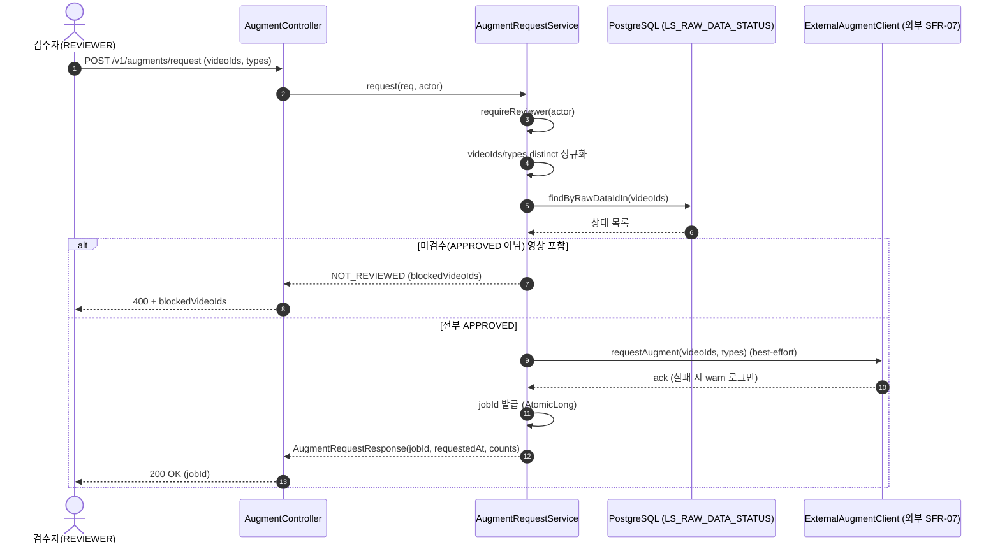
```mermaid
sequenceDiagram
    autonumber
    actor RV as 검수자(REVIEWER)
    participant AC as AugmentController
    participant ARS as AugmentRequestService
    participant DB as PostgreSQL (LS_RAW_DATA_STATUS)
    participant EX as ExternalAugmentClient (외부 SFR-07)

    RV->>AC: POST /v1/augments/request (videoIds, types)
    AC->>ARS: request(req, actor)
    ARS->>ARS: requireReviewer(actor)
    ARS->>ARS: videoIds/types distinct 정규화
    ARS->>DB: findByRawDataIdIn(videoIds)
    DB-->>ARS: 상태 목록
    alt 미검수(APPROVED 아님) 영상 포함
        ARS-->>AC: NOT_REVIEWED (blockedVideoIds)
        AC-->>RV: 400 + blockedVideoIds
    else 전부 APPROVED
        ARS->>EX: requestAugment(videoIds, types) (best-effort)
        EX-->>ARS: ack (실패 시 warn 로그만)
        ARS->>ARS: jobId 발급 (AtomicLong)
        ARS-->>AC: AugmentRequestResponse(jobId, requestedAt, counts)
        AC-->>RV: 200 OK (jobId)
    end
```

### 2-2. KLID-AT-SD-002 — 증강 결과 수신·등록

| 시퀀스도 ID | KLID-AT-SD-002 | 시퀀스도명 | 증강 결과 수신·등록 |
|---------|---|-------|---|
| 관련 유스케이스 ID | KLID-AT-UC-002 |
| 주요 액터 | 외부 생성형 AI(SFR-07) | 주요 클래스 | AugmentResultController, AugmentResultService, WebhookIdempotencyLedger, LsDataAug, LsDataRaw, LsDataAugLblMap |

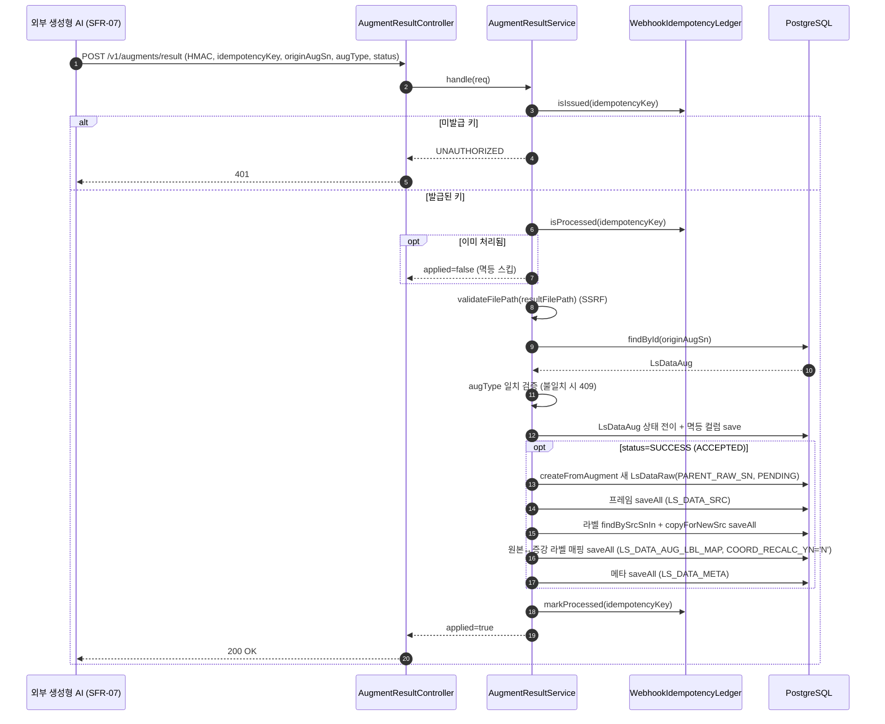
```mermaid
sequenceDiagram
    autonumber
    participant EX as 외부 생성형 AI (SFR-07)
    participant ARC as AugmentResultController
    participant ARS as AugmentResultService
    participant LG as WebhookIdempotencyLedger
    participant DB as PostgreSQL

    EX->>ARC: POST /v1/augments/result (HMAC, idempotencyKey, originAugSn, augType, status)
    ARC->>ARS: handle(req)
    ARS->>LG: isIssued(idempotencyKey)
    alt 미발급 키
        ARS-->>ARC: UNAUTHORIZED
        ARC-->>EX: 401
    else 발급된 키
        ARS->>LG: isProcessed(idempotencyKey)
        opt 이미 처리됨
            ARS-->>ARC: applied=false (멱등 스킵)
        end
        ARS->>ARS: validateFilePath(resultFilePath) (SSRF)
        ARS->>DB: findById(originAugSn)
        DB-->>ARS: LsDataAug
        ARS->>ARS: augType 일치 검증 (불일치 시 409)
        ARS->>DB: LsDataAug 상태 전이 + 멱등 컬럼 save
        opt status=SUCCESS (ACCEPTED)
            ARS->>DB: createFromAugment 새 LsDataRaw(PARENT_RAW_SN, PENDING)
            ARS->>DB: 프레임 saveAll (LS_DATA_SRC)
            ARS->>DB: 라벨 findBySrcSnIn + copyForNewSrc saveAll
            ARS->>DB: 원본↔증강 라벨 매핑 saveAll (LS_DATA_AUG_LBL_MAP, COORD_RECALC_YN='N')
            ARS->>DB: 메타 saveAll (LS_DATA_META)
        end
        ARS->>LG: markProcessed(idempotencyKey)
        ARS-->>ARC: applied=true
        ARC-->>EX: 200 OK
    end
```

### 2-3. KLID-AT-SD-003 — 해상도 변경 수행

| 시퀀스도 ID | KLID-AT-SD-003 | 시퀀스도명 | 해상도 변경 |
|---------|---|-------|---|
| 관련 유스케이스 ID | KLID-AT-UC-003 |
| 주요 액터 | 검수자(REVIEWER) | 주요 클래스 | VideoController, VideoResolutionService, Java2DImageResizer, VideoResolutionPersister, LsResolutionExport |

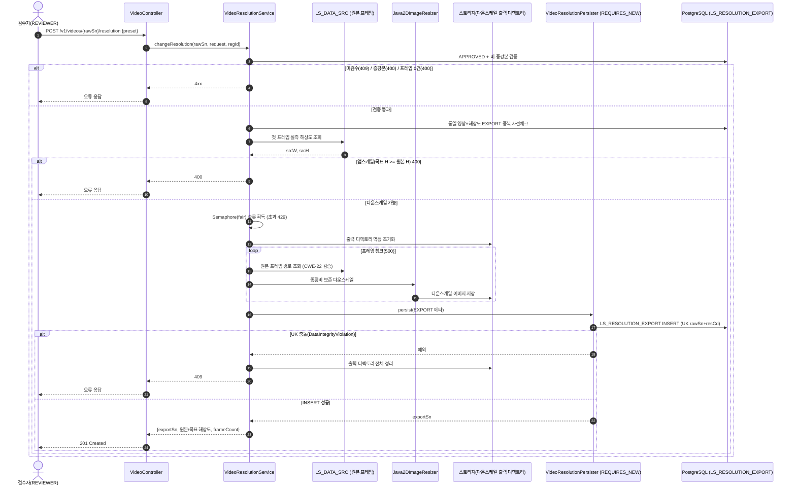
```mermaid
sequenceDiagram
    autonumber
    actor RV as 검수자(REVIEWER)
    participant VC as VideoController
    participant VRS as VideoResolutionService
    participant SRC as LS_DATA_SRC (원본 프레임)
    participant RZ as Java2DImageResizer
    participant FS as 스토리지(다운스케일 출력 디렉토리)
    participant VP as VideoResolutionPersister (REQUIRES_NEW)
    participant DB as PostgreSQL (LS_RESOLUTION_EXPORT)

    RV->>VC: POST /v1/videos/{rawSn}/resolution {preset}
    VC->>VRS: changeResolution(rawSn, request, regId)
    VRS->>DB: APPROVED + 비-증강본 검증
    alt 미검수(409) / 증강본(400) / 프레임 0건(400)
        VRS-->>VC: 4xx
        VC-->>RV: 오류 응답
    else 검증 통과
        VRS->>DB: 동일 영상+해상도 EXPORT 중복 사전체크
        VRS->>SRC: 첫 프레임 실측 해상도 조회
        SRC-->>VRS: srcW, srcH
        alt 업스케일(목표 H >= 원본 H) 400
            VRS-->>VC: 400
            VC-->>RV: 오류 응답
        else 다운스케일 가능
            VRS->>VRS: Semaphore(fair) 슬롯 획득 (초과 429)
            VRS->>FS: 출력 디렉토리 멱등 초기화
            loop 프레임 청크(500)
                VRS->>SRC: 원본 프레임 경로 조회 (CWE-22 검증)
                VRS->>RZ: 종횡비 보존 다운스케일
                RZ->>FS: 다운스케일 이미지 저장
            end
            VRS->>VP: persist(EXPORT 메타)
            VP->>DB: LS_RESOLUTION_EXPORT INSERT (UK rawSn+resCd)
            alt UK 충돌(DataIntegrityViolation)
                VP-->>VRS: 예외
                VRS->>FS: 출력 디렉토리 전체 정리
                VRS-->>VC: 409
                VC-->>RV: 오류 응답
            else INSERT 성공
                VP-->>VRS: exportSn
                VRS-->>VC: {exportSn, 원본/목표 해상도, frameCount}
                VC-->>RV: 201 Created
            end
        end
    end
```

### 2-4. KLID-AT-SD-004 — 객체 자동 추적

| 시퀀스도 ID | KLID-AT-SD-004 | 시퀀스도명 | 객체 자동 추적 |
|---------|---|-------|---|
| 관련 유스케이스 ID | KLID-AT-UC-004 |
| 주요 액터 | 라벨링 작업자(WORKER) | 주요 클래스 | LabelController, Sam2TrackService, LabelAccessGuard, AiServerClient, LsDataLbl |

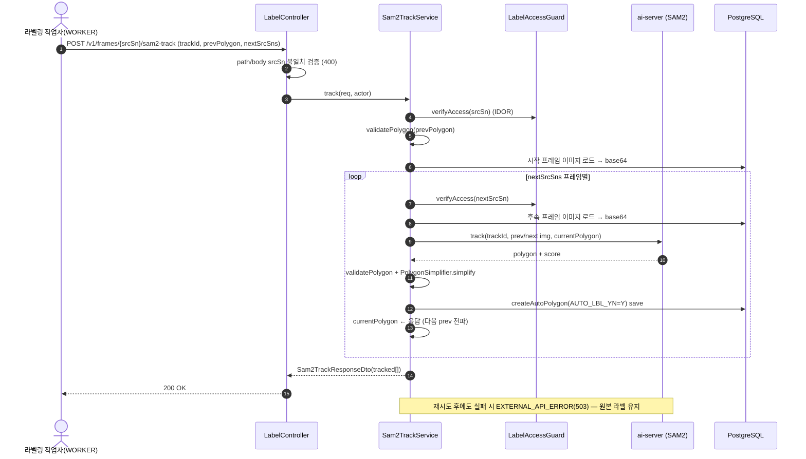
```mermaid
sequenceDiagram
    autonumber
    actor WK as 라벨링 작업자(WORKER)
    participant LC as LabelController
    participant STS as Sam2TrackService
    participant AG as LabelAccessGuard
    participant AI as ai-server (SAM2)
    participant DB as PostgreSQL

    WK->>LC: POST /v1/frames/{srcSn}/sam2-track (trackId, prevPolygon, nextSrcSns)
    LC->>LC: path/body srcSn 불일치 검증 (400)
    LC->>STS: track(req, actor)
    STS->>AG: verifyAccess(srcSn) (IDOR)
    STS->>STS: validatePolygon(prevPolygon)
    STS->>DB: 시작 프레임 이미지 로드 → base64
    loop nextSrcSns 프레임별
        STS->>AG: verifyAccess(nextSrcSn)
        STS->>DB: 후속 프레임 이미지 로드 → base64
        STS->>AI: track(trackId, prev/next img, currentPolygon)
        AI-->>STS: polygon + score
        STS->>STS: validatePolygon + PolygonSimplifier.simplify
        STS->>DB: createAutoPolygon(AUTO_LBL_YN=Y) save
        STS->>STS: currentPolygon ← 응답 (다음 prev 전파)
    end
    STS-->>LC: Sam2TrackResponseDto(tracked[])
    LC-->>WK: 200 OK
    Note over STS,AI: 재시도 후에도 실패 시 EXTERNAL_API_ERROR(503) — 원본 라벨 유지
```

### 2-5. KLID-AT-SD-005 — 객체 외곽 경계 자동 밀착

| 시퀀스도 ID | KLID-AT-SD-005 | 시퀀스도명 | 객체 외곽 경계 자동 밀착 |
|---------|---|-------|---|
| 관련 유스케이스 ID | KLID-AT-UC-005 |
| 주요 액터 | 라벨링 작업자(WORKER) | 주요 클래스 | LabelController, Sam2TrackService, LabelAccessGuard, AiServerClient, PolygonSimplifier |

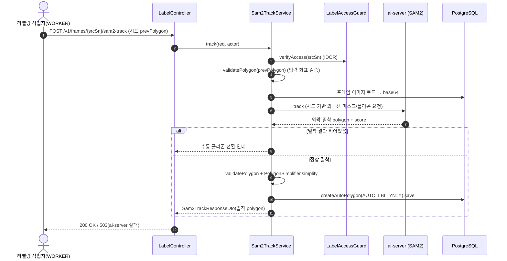
```mermaid
sequenceDiagram
    autonumber
    actor WK as 라벨링 작업자(WORKER)
    participant LC as LabelController
    participant STS as Sam2TrackService
    participant AG as LabelAccessGuard
    participant AI as ai-server (SAM2)
    participant DB as PostgreSQL

    WK->>LC: POST /v1/frames/{srcSn}/sam2-track (시드 prevPolygon)
    LC->>STS: track(req, actor)
    STS->>AG: verifyAccess(srcSn) (IDOR)
    STS->>STS: validatePolygon(prevPolygon) (입력 좌표 검증)
    STS->>DB: 프레임 이미지 로드 → base64
    STS->>AI: track (시드 기반 외곽선 마스크/폴리곤 요청)
    AI-->>STS: 외곽 밀착 polygon + score
    alt 밀착 결과 비어있음
        STS-->>LC: 수동 폴리곤 전환 안내
    else 정상 밀착
        STS->>STS: validatePolygon + PolygonSimplifier.simplify
        STS->>DB: createAutoPolygon(AUTO_LBL_YN=Y) save
        STS-->>LC: Sam2TrackResponseDto(밀착 polygon)
    end
    LC-->>WK: 200 OK / 503(ai-server 실패)
```

> 비고: SAM2 클릭/박스 분할(`POST /v1/frames/{srcSn}/sam2-segment`, Sam2SegmentService)은 본 KLID-AT-UC-005를 실현하는 별도 진입점이다(stateless 프록시, BE 미저장). 시퀀스 흐름은 위 sam2-track과 동일 구조이며, Sam2SegmentService는 §4에 별도 정의한다.

### 2-6. KLID-AT-SD-006 — 라벨링 정밀도 조절

| 시퀀스도 ID | KLID-AT-SD-006 | 시퀀스도명 | 라벨링 정밀도 조절 |
|---------|---|-------|---|
| 관련 유스케이스 ID | KLID-AT-UC-006 |
| 주요 액터 | 검수자(REVIEWER) | 주요 클래스 | SystemConfigController, SystemConfigService, Sam2TrackService, PolygonSimplifier |

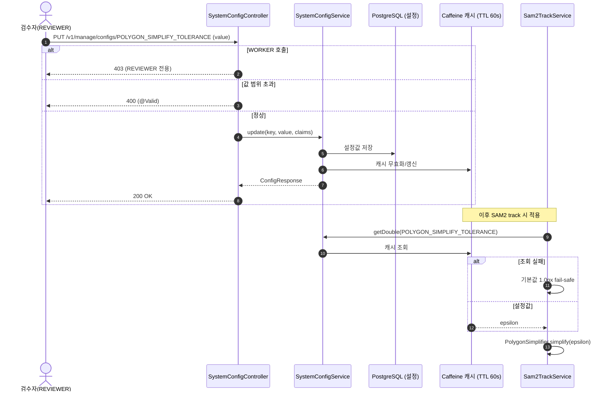
```mermaid
sequenceDiagram
    autonumber
    actor RV as 검수자(REVIEWER)
    participant SCC as SystemConfigController
    participant SCS as SystemConfigService
    participant DB as PostgreSQL (설정)
    participant CA as Caffeine 캐시 (TTL 60s)
    participant STS as Sam2TrackService

    RV->>SCC: PUT /v1/manage/configs/POLYGON_SIMPLIFY_TOLERANCE (value)
    alt WORKER 호출
        SCC-->>RV: 403 (REVIEWER 전용)
    else 값 범위 초과
        SCC-->>RV: 400 (@Valid)
    else 정상
        SCC->>SCS: update(key, value, claims)
        SCS->>DB: 설정값 저장
        SCS->>CA: 캐시 무효화/갱신
        SCS-->>SCC: ConfigResponse
        SCC-->>RV: 200 OK
    end
    Note over STS,CA: 이후 SAM2 track 시 적용
    STS->>SCS: getDouble(POLYGON_SIMPLIFY_TOLERANCE)
    SCS->>CA: 캐시 조회
    alt 조회 실패
        STS->>STS: 기본값 1.0px fail-safe
    else 설정값
        CA-->>STS: epsilon
    end
    STS->>STS: PolygonSimplifier.simplify(epsilon)
```

### 2-7. KLID-AT-SD-007 — 라벨 버전 저장·이력 추적

| 시퀀스도 ID | KLID-AT-SD-007 | 시퀀스도명 | 라벨 버전 저장·이력 추적 |
|---------|---|-------|---|
| 관련 유스케이스 ID | KLID-AT-UC-007 |
| 주요 액터 | 검수자(REVIEWER) | 주요 클래스 | ReviewController, ReviewService, VersionService, LsLabelVersion, ApplicationEventPublisher |

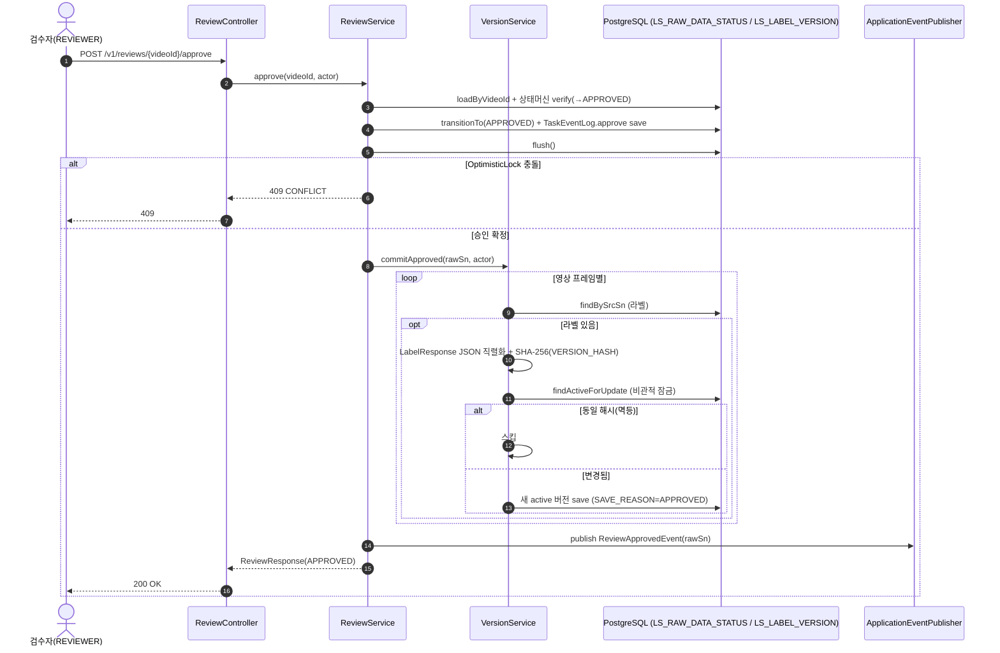
```mermaid
sequenceDiagram
    autonumber
    actor RV as 검수자(REVIEWER)
    participant RC as ReviewController
    participant RS as ReviewService
    participant VS as VersionService
    participant DB as PostgreSQL (LS_RAW_DATA_STATUS / LS_LABEL_VERSION)
    participant EP as ApplicationEventPublisher

    RV->>RC: POST /v1/reviews/{videoId}/approve
    RC->>RS: approve(videoId, actor)
    RS->>DB: loadByVideoId + 상태머신 verify(→APPROVED)
    RS->>DB: transitionTo(APPROVED) + TaskEventLog.approve save
    RS->>DB: flush()
    alt OptimisticLock 충돌
        RS-->>RC: 409 CONFLICT
        RC-->>RV: 409
    else 승인 확정
        RS->>VS: commitApproved(rawSn, actor)
        loop 영상 프레임별
            VS->>DB: findBySrcSn (라벨)
            opt 라벨 있음
                VS->>VS: LabelResponse JSON 직렬화 + SHA-256(VERSION_HASH)
                VS->>DB: findActiveForUpdate (비관적 잠금)
                alt 동일 해시(멱등)
                    VS->>VS: 스킵
                else 변경됨
                    VS->>DB: 새 active 버전 save (SAVE_REASON=APPROVED)
                end
            end
        end
        RS->>EP: publish ReviewApprovedEvent(rawSn)
        RS-->>RC: ReviewResponse(APPROVED)
        RC-->>RV: 200 OK
    end
```

### 2-8. KLID-AT-SD-008 — 버전 비교·복구

| 시퀀스도 ID | KLID-AT-SD-008 | 시퀀스도명 | 버전 비교·복구 |
|---------|---|-------|---|
| 관련 유스케이스 ID | KLID-AT-UC-008 |
| 주요 액터 | 검수자(REVIEWER) | 주요 클래스 | VersionController, VersionService, LabelAccessGuard, LsLabelVersion |

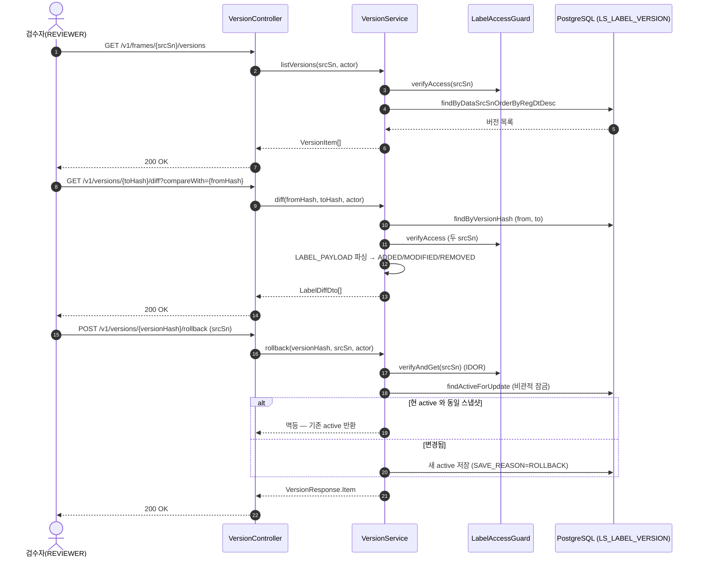
```mermaid
sequenceDiagram
    autonumber
    actor RV as 검수자(REVIEWER)
    participant VC as VersionController
    participant VS as VersionService
    participant AG as LabelAccessGuard
    participant DB as PostgreSQL (LS_LABEL_VERSION)

    RV->>VC: GET /v1/frames/{srcSn}/versions
    VC->>VS: listVersions(srcSn, actor)
    VS->>AG: verifyAccess(srcSn)
    VS->>DB: findByDataSrcSnOrderByRegDtDesc
    DB-->>VS: 버전 목록
    VS-->>VC: VersionItem[]
    VC-->>RV: 200 OK

    RV->>VC: GET /v1/versions/{toHash}/diff?compareWith={fromHash}
    VC->>VS: diff(fromHash, toHash, actor)
    VS->>DB: findByVersionHash (from, to)
    VS->>AG: verifyAccess (두 srcSn)
    VS->>VS: LABEL_PAYLOAD 파싱 → ADDED/MODIFIED/REMOVED
    VS-->>VC: LabelDiffDto[]
    VC-->>RV: 200 OK

    RV->>VC: POST /v1/versions/{versionHash}/rollback (srcSn)
    VC->>VS: rollback(versionHash, srcSn, actor)
    VS->>AG: verifyAndGet(srcSn) (IDOR)
    VS->>DB: findActiveForUpdate (비관적 잠금)
    alt 현 active 와 동일 스냅샷
        VS-->>VC: 멱등 — 기존 active 반환
    else 변경됨
        VS->>DB: 새 active 저장 (SAVE_REASON=ROLLBACK)
    end
    VS-->>VC: VersionResponse.Item
    VC-->>RV: 200 OK
```

### 2-9. KLID-AT-SD-009 — 데이터마트 수정 통지

| 시퀀스도 ID | KLID-AT-SD-009 | 시퀀스도명 | 데이터마트 수정 통지 |
|---------|---|-------|---|
| 관련 유스케이스 ID | KLID-AT-UC-009 |
| 주요 액터 | 검수자/작업자 | 주요 클래스 | LabelController, LabelService, ControlNotifyEventListener, ControlNotifyDebouncer, ControlNotifyService, ControlNotifyClient |

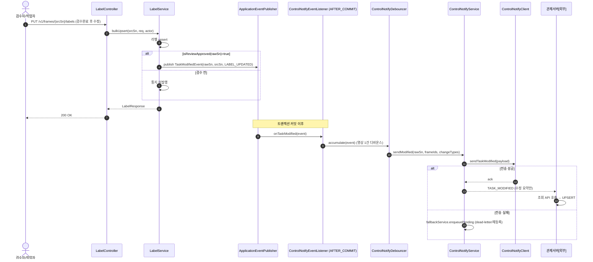
```mermaid
sequenceDiagram
    autonumber
    actor RV as 검수자/작업자
    participant LC as LabelController
    participant LS as LabelService
    participant EP as ApplicationEventPublisher
    participant EL as ControlNotifyEventListener (AFTER_COMMIT)
    participant DBn as ControlNotifyDebouncer
    participant CNS as ControlNotifyService
    participant CC as ControlNotifyClient
    participant CTL as 관제서버[외부]

    RV->>LC: PUT /v1/frames/{srcSn}/labels (검수완료 후 수정)
    LC->>LS: bulkUpsert(srcSn, req, actor)
    LS->>LS: 라벨 upsert
    alt isReviewApproved(rawSn)=true
        LS->>EP: publish TaskModifiedEvent(rawSn, srcSn, LABEL_UPDATED)
    else 검수 전
        LS->>LS: 통지 미발행
    end
    LS-->>LC: LabelResponse
    LC-->>RV: 200 OK
    Note over EP,EL: 트랜잭션 커밋 이후
    EP->>EL: onTaskModified(event)
    EL->>DBn: accumulate(event) (영상 1건 디바운스)
    DBn->>CNS: sendModified(rawSn, frameIds, changeTypes)
    CNS->>CC: sendTaskModified(payload)
    alt 전송 성공
        CC-->>CNS: ack
        CNS-->>CTL: TASK_MODIFIED (수정 요약만)
        CTL->>CTL: 조회 API 호출 → UPSERT
    else 전송 실패
        CNS->>CNS: fallbackService.enqueuePending (dead-letter/재등록)
    end
```

### 2-10. KLID-AT-SD-010 — 증강 영상 활용 여부 검수

| 시퀀스도 ID | KLID-AT-SD-010 | 시퀀스도명 | 증강 영상 활용 여부 검수 |
|---------|---|-------|---|
| 관련 유스케이스 ID | KLID-AT-UC-010 |
| 주요 액터 | 검수자(REVIEWER) | 주요 클래스 | AugmentController, AugmentReviewService, LsDataAug, LsDataAugRvw, ExternalAugmentClient |

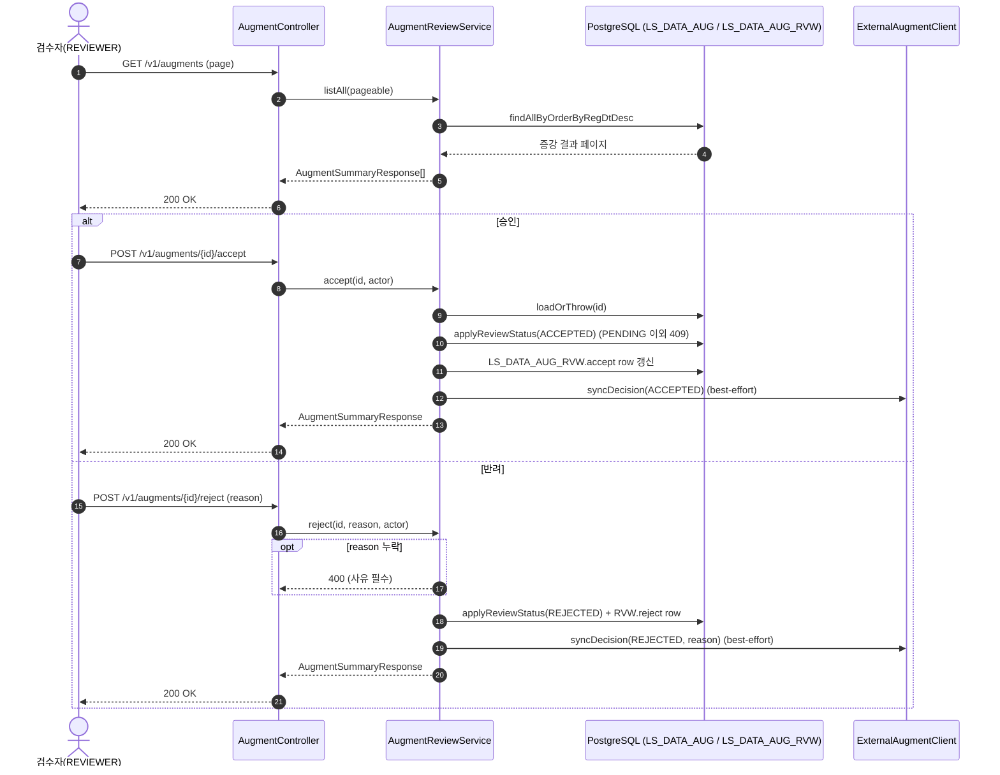
```mermaid
sequenceDiagram
    autonumber
    actor RV as 검수자(REVIEWER)
    participant AC as AugmentController
    participant ARS as AugmentReviewService
    participant DB as PostgreSQL (LS_DATA_AUG / LS_DATA_AUG_RVW)
    participant EX as ExternalAugmentClient

    RV->>AC: GET /v1/augments (page)
    AC->>ARS: listAll(pageable)
    ARS->>DB: findAllByOrderByRegDtDesc
    DB-->>ARS: 증강 결과 페이지
    ARS-->>AC: AugmentSummaryResponse[]
    AC-->>RV: 200 OK

    alt 승인
        RV->>AC: POST /v1/augments/{id}/accept
        AC->>ARS: accept(id, actor)
        ARS->>DB: loadOrThrow(id)
        ARS->>DB: applyReviewStatus(ACCEPTED) (PENDING 이외 409)
        ARS->>DB: LS_DATA_AUG_RVW.accept row 갱신
        ARS->>EX: syncDecision(ACCEPTED) (best-effort)
        ARS-->>AC: AugmentSummaryResponse
        AC-->>RV: 200 OK
    else 반려
        RV->>AC: POST /v1/augments/{id}/reject (reason)
        AC->>ARS: reject(id, reason, actor)
        opt reason 누락
            ARS-->>AC: 400 (사유 필수)
        end
        ARS->>DB: applyReviewStatus(REJECTED) + RVW.reject row
        ARS->>EX: syncDecision(REJECTED, reason) (best-effort)
        ARS-->>AC: AugmentSummaryResponse
        AC-->>RV: 200 OK
    end
```

### 2-11. KLID-AT-SD-011 — 비식별 처리 요청

| 시퀀스도 ID | KLID-AT-SD-011 | 시퀀스도명 | 비식별 처리 요청 |
|---------|---|-------|---|
| 관련 유스케이스 ID | KLID-AT-UC-011 |
| 주요 액터 | 검수자(REVIEWER) | 주요 클래스 | DeidentController, DeidentifyResultController, DeidentifyResultService, DeidentifyClient, LsDeidentProcLog |

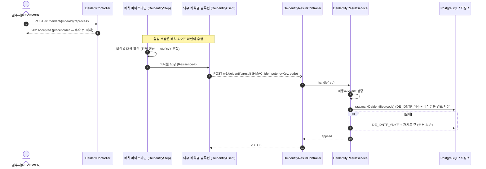
```mermaid
sequenceDiagram
    autonumber
    actor RV as 검수자(REVIEWER)
    participant DC as DeidentController
    participant BO as 배치 파이프라인 (DeidentifyStep)
    participant DE as 외부 비식별 솔루션 (DeidentifyClient)
    participant DRC as DeidentifyResultController
    participant DRS as DeidentifyResultService
    participant DB as PostgreSQL / 저장소

    RV->>DC: POST /v1/deident/{videoId}/reprocess
    DC-->>RV: 202 Accepted (placeholder — 후속 큐 적재)
    Note over BO,DE: 실질 호출은 배치 파이프라인이 수행
    BO->>BO: 비식별 대상 확인 (전체 영상 — ANONY 포함)
    BO->>DE: 비식별 요청 (Resilience4j)
    DE--)DRC: POST /v1/deidentify/result (HMAC, idempotencyKey, code)
    DRC->>DRS: handle(req)
    DRS->>DRS: 멱등/allowlist 검증
    DRS->>DB: raw.markDeidentified(code) (DE_IDNTF_YN) + 비식별본 경로 저장
    alt 실패
        DRS->>DB: DE_IDNTF_YN='F' + 재시도 큐 (원본 보존)
    end
    DRS-->>DRC: applied
    DRC-->>DE: 200 OK
```

### 2-12. KLID-AT-SD-013 — 비식별 옵션 설정

| 시퀀스도 ID | KLID-AT-SD-013 | 시퀀스도명 | 비식별 옵션 설정 |
|---------|---|-------|---|
| 관련 유스케이스 ID | KLID-AT-UC-013 |
| 주요 액터 | 검수자(REVIEWER) | 주요 클래스 | SystemConfigController, SystemConfigService, LsSystemConfig |

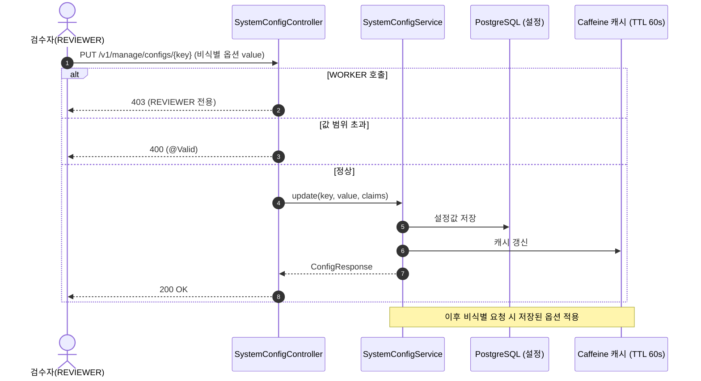
```mermaid
sequenceDiagram
    autonumber
    actor RV as 검수자(REVIEWER)
    participant SCC as SystemConfigController
    participant SCS as SystemConfigService
    participant DB as PostgreSQL (설정)
    participant CA as Caffeine 캐시 (TTL 60s)

    RV->>SCC: PUT /v1/manage/configs/{key} (비식별 옵션 value)
    alt WORKER 호출
        SCC-->>RV: 403 (REVIEWER 전용)
    else 값 범위 초과
        SCC-->>RV: 400 (@Valid)
    else 정상
        SCC->>SCS: update(key, value, claims)
        SCS->>DB: 설정값 저장
        SCS->>CA: 캐시 갱신
        SCS-->>SCC: ConfigResponse
        SCC-->>RV: 200 OK
    end
    Note over SCS,CA: 이후 비식별 요청 시 저장된 옵션 적용
```

> 비고: 비식별 옵션 전용 엔드포인트는 없으며 일반 시스템 설정 키-값 관리 경로(`/v1/manage/configs/{key}`)를 공유한다(SystemConfigController·SystemConfigService 재사용).

### 2-13. KLID-AT-SD-016 — 비식별 누락 신고·수동 해소

| 시퀀스도 ID | KLID-AT-SD-016 | 시퀀스도명 | 비식별 누락 신고·수동 해소 |
|---------|---|-------|---|
| 관련 유스케이스 ID | KLID-AT-UC-016 |
| 주요 액터 | 작업자(WORKER), 검수자(REVIEWER) | 주요 클래스 | DeidentReportController, DeidentReportService, LabelAccessGuard, WorkLockService, VersionService, LsDataLblRepository, ControlNotify |

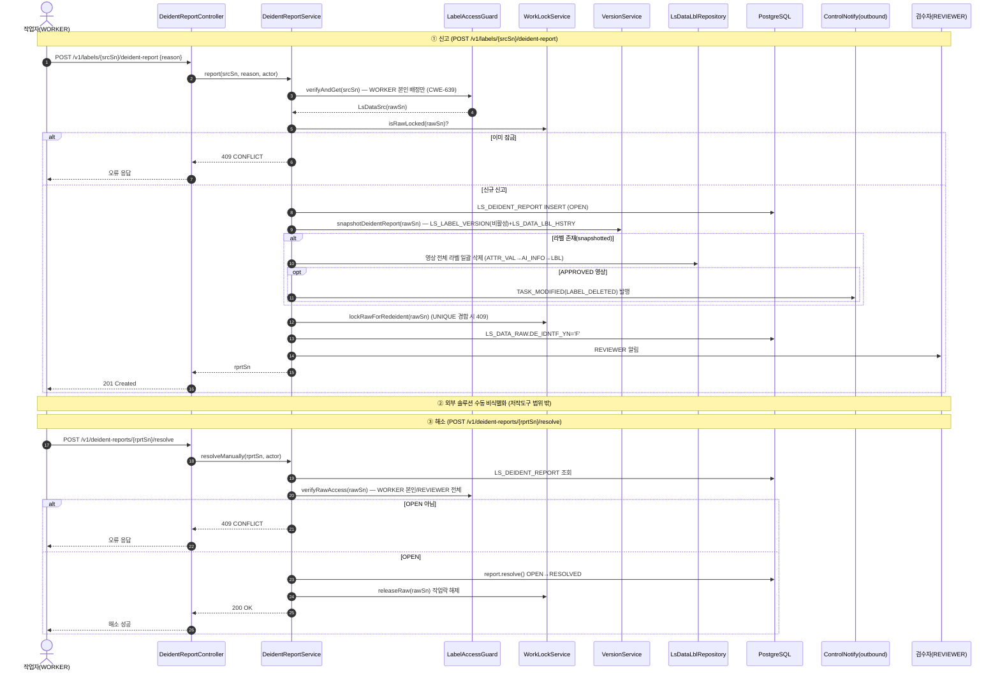
```mermaid
sequenceDiagram
    autonumber
    actor WK as 작업자(WORKER)
    participant DRC as DeidentReportController
    participant DRS as DeidentReportService
    participant AG as LabelAccessGuard
    participant WL as WorkLockService
    participant VS as VersionService
    participant LBL as LsDataLblRepository
    participant DB as PostgreSQL
    participant CN as ControlNotify(outbound)
    participant RV as 검수자(REVIEWER)

    Note over WK,RV: ① 신고 (POST /v1/labels/{srcSn}/deident-report)
    WK->>DRC: POST /v1/labels/{srcSn}/deident-report {reason}
    DRC->>DRS: report(srcSn, reason, actor)
    DRS->>AG: verifyAndGet(srcSn) — WORKER 본인 배정만 (CWE-639)
    AG-->>DRS: LsDataSrc(rawSn)
    DRS->>WL: isRawLocked(rawSn)?
    alt 이미 잠금
        DRS-->>DRC: 409 CONFLICT
        DRC-->>WK: 오류 응답
    else 신규 신고
        DRS->>DB: LS_DEIDENT_REPORT INSERT (OPEN)
        DRS->>VS: snapshotDeidentReport(rawSn) — LS_LABEL_VERSION(비활성)+LS_DATA_LBL_HSTRY
        alt 라벨 존재(snapshotted)
            DRS->>LBL: 영상 전체 라벨 일괄 삭제 (ATTR_VAL→AI_INFO→LBL)
            opt APPROVED 영상
                DRS->>CN: TASK_MODIFIED(LABEL_DELETED) 발행
            end
        end
        DRS->>WL: lockRawForRedeident(rawSn) (UNIQUE 경합 시 409)
        DRS->>DB: LS_DATA_RAW.DE_IDNTF_YN='F'
        DRS->>RV: REVIEWER 알림
        DRS-->>DRC: rprtSn
        DRC-->>WK: 201 Created
    end

    Note over WK,RV: ② 외부 솔루션 수동 비식별화 (저작도구 범위 밖)

    Note over WK,RV: ③ 해소 (POST /v1/deident-reports/{rprtSn}/resolve)
    WK->>DRC: POST /v1/deident-reports/{rprtSn}/resolve
    DRC->>DRS: resolveManually(rprtSn, actor)
    DRS->>DB: LS_DEIDENT_REPORT 조회
    DRS->>AG: verifyRawAccess(rawSn) — WORKER 본인/REVIEWER 전체
    alt OPEN 아님
        DRS-->>DRC: 409 CONFLICT
        DRC-->>WK: 오류 응답
    else OPEN
        DRS->>DB: report.resolve() OPEN→RESOLVED
        DRS->>WL: releaseRaw(rawSn) 작업락 해제
        DRS-->>DRC: 200 OK
        DRC-->>WK: 해소 성공
    end
```

> 비고: 신고는 라벨링 단계(`POST /v1/labels/{srcSn}/deident-report`, srcSn 기준)와 마킹 단계(`POST /v1/videos/{rawSn}/deident-report`, rawSn 기준) 양쪽에서 가능하다.

### 2-14. KLID-AT-SD-018 — 영상 적재(관리 화면 업로드)

| 시퀀스도 ID | KLID-AT-SD-018 | 시퀀스도명 | 영상 적재(관리 화면 업로드) |
|---------|---|-------|---|
| 관련 유스케이스 ID | KLID-AT-UC-018 |
| 주요 액터 | 검수자(REVIEWER) | 주요 클래스 | LsDataRaw, LsRawDataStatus |

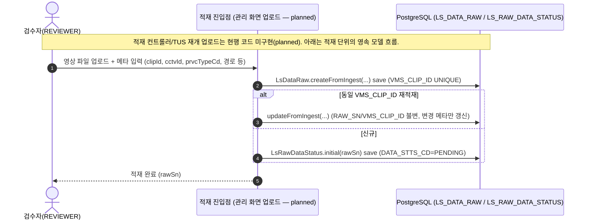
```mermaid
sequenceDiagram
    autonumber
    actor RV as 검수자(REVIEWER)
    participant UP as 적재 진입점 (관리 화면 업로드 — planned)
    participant DB as PostgreSQL (LS_DATA_RAW / LS_RAW_DATA_STATUS)

    Note over RV,DB: 적재 컨트롤러/TUS 재개 업로드는 현행 코드 미구현(planned). 아래는 적재 단위의 영속 모델 흐름.
    RV->>UP: 영상 파일 업로드 + 메타 입력 (clipId, cctvId, prvcTypeCd, 경로 등)
    UP->>DB: LsDataRaw.createFromIngest(...) save (VMS_CLIP_ID UNIQUE)
    alt 동일 VMS_CLIP_ID 재적재
        UP->>DB: updateFromIngest(...) (RAW_SN/VMS_CLIP_ID 불변, 변경 메타만 갱신)
    else 신규
        UP->>DB: LsRawDataStatus.initial(rawSn) save (DATA_STTS_CD=PENDING)
    end
    UP-->>RV: 적재 완료 (rawSn)
```

> 비고: 진입 컨트롤러/서비스가 코드에 없어 클래스명을 날조하지 않는다. 적재 단위 영상은 `LsDataRaw.createFromIngest`로 생성되고, 작업 상태 row는 `LsRawDataStatus.initial`로 PENDING 시작한다(검증된 엔티티 메서드 기준). 이후 배정(KLID-AT-UC-020)·마킹(KLID-AT-UC-019)으로 흐른다.

### 2-15. KLID-AT-SD-019 — 이벤트 마킹(자동/수동)

| 시퀀스도 ID | KLID-AT-SD-019 | 시퀀스도명 | 이벤트 마킹(자동/수동) |
|---------|---|-------|---|
| 관련 유스케이스 ID | KLID-AT-UC-019 |
| 주요 액터 | 라벨링 작업자(WORKER) | 주요 클래스 | MarkingController, MarkingService, MarkingCompletedEvent, MarkingBatchBridge, LsMarking, LsRawDataStatus |

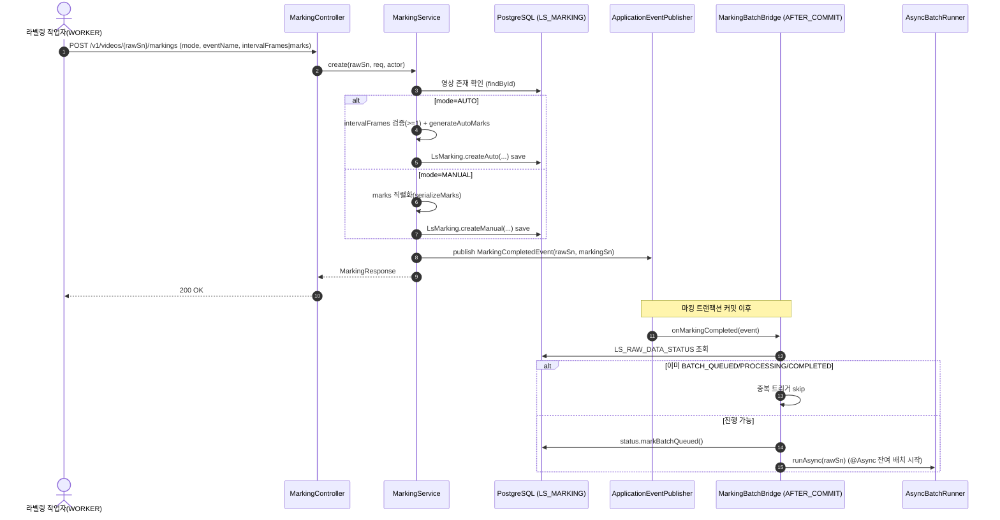
```mermaid
sequenceDiagram
    autonumber
    actor WK as 라벨링 작업자(WORKER)
    participant MC as MarkingController
    participant MS as MarkingService
    participant DB as PostgreSQL (LS_MARKING)
    participant EP as ApplicationEventPublisher
    participant BR as MarkingBatchBridge (AFTER_COMMIT)
    participant AB as AsyncBatchRunner

    WK->>MC: POST /v1/videos/{rawSn}/markings (mode, eventName, intervalFrames|marks)
    MC->>MS: create(rawSn, req, actor)
    MS->>DB: 영상 존재 확인 (findById)
    alt mode=AUTO
        MS->>MS: intervalFrames 검증(>=1) + generateAutoMarks
        MS->>DB: LsMarking.createAuto(...) save
    else mode=MANUAL
        MS->>MS: marks 직렬화(serializeMarks)
        MS->>DB: LsMarking.createManual(...) save
    end
    MS->>EP: publish MarkingCompletedEvent(rawSn, markingSn)
    MS-->>MC: MarkingResponse
    MC-->>WK: 200 OK
    Note over EP,BR: 마킹 트랜잭션 커밋 이후
    EP->>BR: onMarkingCompleted(event)
    BR->>DB: LS_RAW_DATA_STATUS 조회
    alt 이미 BATCH_QUEUED/PROCESSING/COMPLETED
        BR->>BR: 중복 트리거 skip
    else 진행 가능
        BR->>DB: status.markBatchQueued()
        BR->>AB: runAsync(rawSn) (@Async 잔여 배치 시작)
    end
```

> 비고(설계 타깃 vs 현행 코드 divergence): R2 설계 타깃 파이프라인은 ⭐비식별(전체 영상) → 마킹(비식별 영상) → VLM → 프레임추출 → 오토라벨링 순이며 마킹은 비식별 영상 대상이다. **현행 코드는 마킹 완료(MarkingCompletedEvent)가 전체 배치(VLM→비식별→프레임추출→오토라벨링)의 트리거**이며 `LsRawDataStatus.markBatchQueued()`(BATCH_QUEUED 전이)로 잔여 배치를 @Async 시작한다(구 순서). 비식별 선두 재배치는 설계 확정·코드 미반영(planned).

### 2-16. KLID-AT-SD-020 — 작업 배정·재배정·이력 조회

| 시퀀스도 ID | KLID-AT-SD-020 | 시퀀스도명 | 작업 배정·재배정·이력 조회 |
|---------|---|-------|---|
| 관련 유스케이스 ID | KLID-AT-UC-020 |
| 주요 액터 | 검수자(REVIEWER) | 주요 클래스 | AssignmentController, AssignmentService, LsTaskAssignment, LsTaskAssignHistory, LsTaskEventLog, LsRawDataStatus |

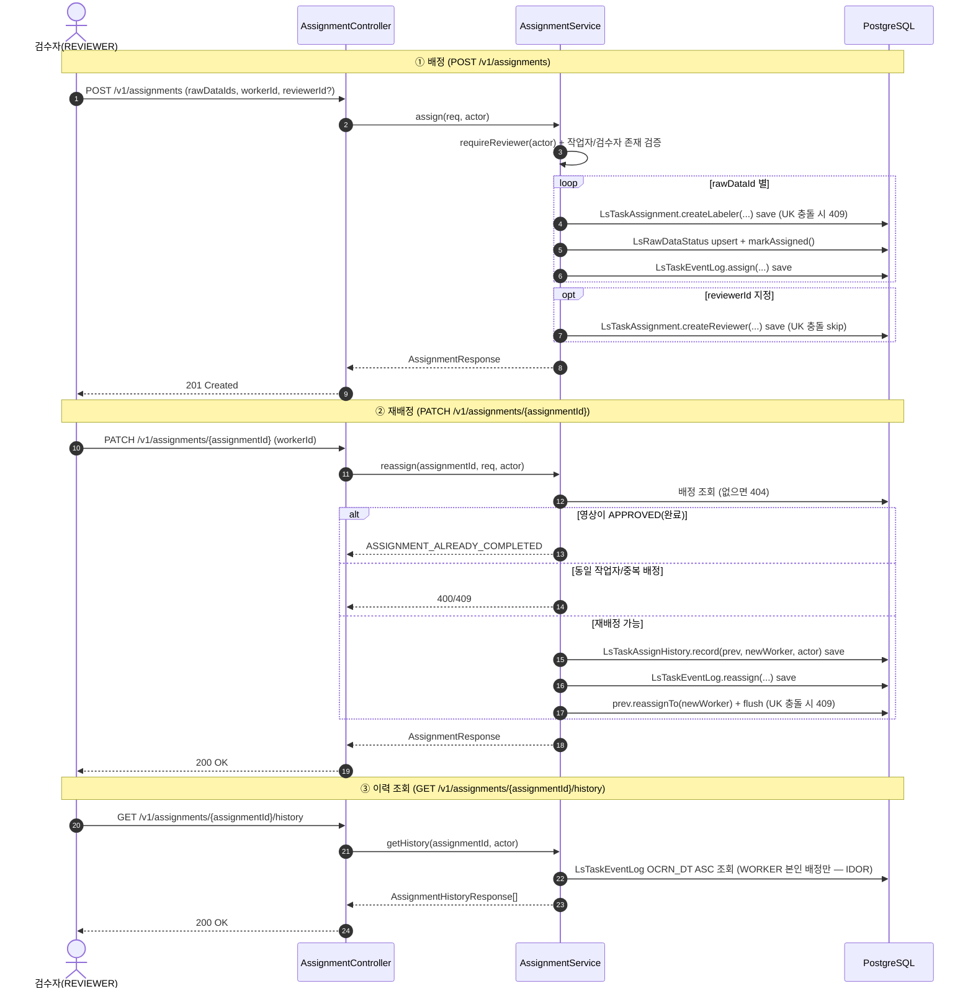
```mermaid
sequenceDiagram
    autonumber
    actor RV as 검수자(REVIEWER)
    participant AC as AssignmentController
    participant AS as AssignmentService
    participant DB as PostgreSQL

    Note over RV,DB: ① 배정 (POST /v1/assignments)
    RV->>AC: POST /v1/assignments (rawDataIds, workerId, reviewerId?)
    AC->>AS: assign(req, actor)
    AS->>AS: requireReviewer(actor) + 작업자/검수자 존재 검증
    loop rawDataId 별
        AS->>DB: LsTaskAssignment.createLabeler(...) save (UK 충돌 시 409)
        AS->>DB: LsRawDataStatus upsert + markAssigned()
        AS->>DB: LsTaskEventLog.assign(...) save
    end
    opt reviewerId 지정
        AS->>DB: LsTaskAssignment.createReviewer(...) save (UK 충돌 skip)
    end
    AS-->>AC: AssignmentResponse
    AC-->>RV: 201 Created

    Note over RV,DB: ② 재배정 (PATCH /v1/assignments/{assignmentId})
    RV->>AC: PATCH /v1/assignments/{assignmentId} (workerId)
    AC->>AS: reassign(assignmentId, req, actor)
    AS->>DB: 배정 조회 (없으면 404)
    alt 영상이 APPROVED(완료)
        AS-->>AC: ASSIGNMENT_ALREADY_COMPLETED
    else 동일 작업자/중복 배정
        AS-->>AC: 400/409
    else 재배정 가능
        AS->>DB: LsTaskAssignHistory.record(prev, newWorker, actor) save
        AS->>DB: LsTaskEventLog.reassign(...) save
        AS->>DB: prev.reassignTo(newWorker) + flush (UK 충돌 시 409)
    end
    AS-->>AC: AssignmentResponse
    AC-->>RV: 200 OK

    Note over RV,DB: ③ 이력 조회 (GET /v1/assignments/{assignmentId}/history)
    RV->>AC: GET /v1/assignments/{assignmentId}/history
    AC->>AS: getHistory(assignmentId, actor)
    AS->>DB: LsTaskEventLog OCRN_DT ASC 조회 (WORKER 본인 배정만 — IDOR)
    AS-->>AC: AssignmentHistoryResponse[]
    AC-->>RV: 200 OK
```

### 2-17. KLID-AT-SD-021 — 라벨 편집·임시저장

| 시퀀스도 ID | KLID-AT-SD-021 | 시퀀스도명 | 라벨 편집·임시저장 |
|---------|---|-------|---|
| 관련 유스케이스 ID | KLID-AT-UC-021 |
| 주요 액터 | 라벨링 작업자(WORKER) | 주요 클래스 | LabelController, LabelService, LabelAttrValueService, LabelAccessGuard, LsDataLbl, LsDataLblAttrVal, LsLabel, LsLabelAttr |

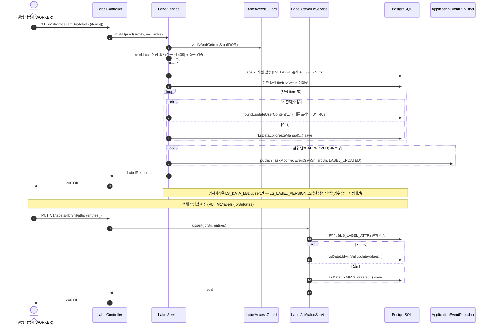
```mermaid
sequenceDiagram
    autonumber
    actor WK as 라벨링 작업자(WORKER)
    participant LC as LabelController
    participant LS as LabelService
    participant AG as LabelAccessGuard
    participant AV as LabelAttrValueService
    participant DB as PostgreSQL
    participant EP as ApplicationEventPublisher

    WK->>LC: PUT /v1/frames/{srcSn}/labels (items[])
    LC->>LS: bulkUpsert(srcSn, req, actor)
    LS->>AG: verifyAndGet(srcSn) (IDOR)
    LS->>LS: workLock 잠금 확인(잠금 시 409) + 좌표 검증
    LS->>DB: labelId 사전 검증 (LS_LABEL 존재 + USE_YN='Y')
    LS->>DB: 기존 라벨 findBySrcSn 인덱싱
    loop 요청 item 별
        alt id 존재(수정)
            LS->>DB: found.updateUserContent(...) (다른 프레임 ID면 403)
        else 신규
            LS->>DB: LsDataLbl.createManual(...) save
        end
    end
    opt 검수 완료(APPROVED) 후 수정
        LS->>EP: publish TaskModifiedEvent(rawSn, srcSn, LABEL_UPDATED)
    end
    LS-->>LC: LabelResponse
    LC-->>WK: 200 OK
    Note over LS,DB: 임시저장은 LS_DATA_LBL upsert만 — LS_LABEL_VERSION 스냅샷 생성 안 함(검수 승인 시점에만)

    Note over WK,DB: 객체 속성값 편집 (PUT /v1/labels/{lblSn}/attrs)
    WK->>LC: PUT /v1/labels/{lblSn}/attrs (entries[])
    LC->>AV: upsert(lblSn, entries)
    AV->>DB: 라벨/속성(LS_LABEL_ATTR) 일치 검증
    alt 기존 값
        AV->>DB: LsDataLblAttrVal.updateValue(...)
    else 신규
        AV->>DB: LsDataLblAttrVal.create(...) save
    end
    AV-->>LC: void
    LC-->>WK: 200 OK
```

### 2-18. KLID-AT-SD-022 — VLM 시계열 메타 검토

| 시퀀스도 ID | KLID-AT-SD-022 | 시퀀스도명 | VLM 시계열 메타 검토 |
|---------|---|-------|---|
| 관련 유스케이스 ID | KLID-AT-UC-022 |
| 주요 액터 | 외부 VLM 서버(콜백), 검수자(REVIEWER) | 주요 클래스 | VlmResultController, VlmResultService, MetaController, MetaService, WebhookIdempotencyLedger, LsDataMeta, LsDataMetaReview |

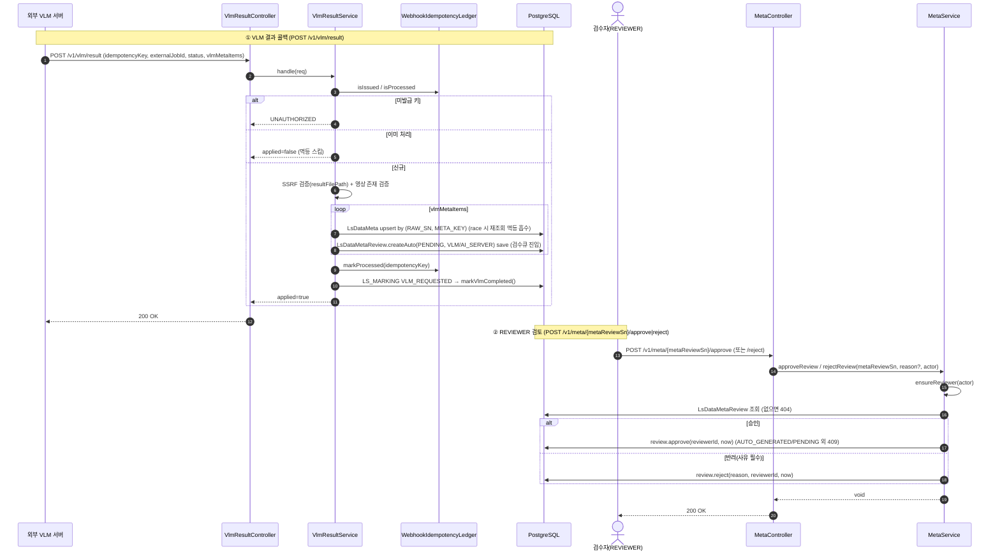
```mermaid
sequenceDiagram
    autonumber
    participant VLM as 외부 VLM 서버
    participant VRC as VlmResultController
    participant VRS as VlmResultService
    participant LG as WebhookIdempotencyLedger
    participant DB as PostgreSQL
    actor RV as 검수자(REVIEWER)
    participant MC as MetaController
    participant MS as MetaService

    Note over VLM,DB: ① VLM 결과 콜백 (POST /v1/vlm/result)
    VLM->>VRC: POST /v1/vlm/result (idempotencyKey, externalJobId, status, vlmMetaItems)
    VRC->>VRS: handle(req)
    VRS->>LG: isIssued / isProcessed
    alt 미발급 키
        VRS-->>VRC: UNAUTHORIZED
    else 이미 처리
        VRS-->>VRC: applied=false (멱등 스킵)
    else 신규
        VRS->>VRS: SSRF 검증(resultFilePath) + 영상 존재 검증
        loop vlmMetaItems
            VRS->>DB: LsDataMeta upsert by (RAW_SN, META_KEY) (race 시 재조회 멱등 흡수)
            VRS->>DB: LsDataMetaReview.createAuto(PENDING, VLM/AI_SERVER) save (검수큐 진입)
        end
        VRS->>LG: markProcessed(idempotencyKey)
        VRS->>DB: LS_MARKING VLM_REQUESTED → markVlmCompleted()
        VRS-->>VRC: applied=true
    end
    VRC-->>VLM: 200 OK

    Note over RV,DB: ② REVIEWER 검토 (POST /v1/meta/{metaReviewSn}/approve|reject)
    RV->>MC: POST /v1/meta/{metaReviewSn}/approve (또는 /reject)
    MC->>MS: approveReview / rejectReview(metaReviewSn, reason?, actor)
    MS->>MS: ensureReviewer(actor)
    MS->>DB: LsDataMetaReview 조회 (없으면 404)
    alt 승인
        MS->>DB: review.approve(reviewerId, now) (AUTO_GENERATED/PENDING 외 409)
    else 반려(사유 필수)
        MS->>DB: review.reject(reason, reviewerId, now)
    end
    MS-->>MC: void
    MC-->>RV: 200 OK
```

> 비고: 프레임 메타 직접 수정은 `PUT /v1/frames/{srcSn}/meta`(MetaService.update)이며, 검수 완료(APPROVED) 후 수정 시 TaskModifiedEvent(META_UPDATED)를 발행한다(KLID-AT-UC-009 연계).

### 2-19. KLID-AT-SD-023 — 검수 승인·반려

| 시퀀스도 ID | KLID-AT-SD-023 | 시퀀스도명 | 검수 승인·반려 |
|---------|---|-------|---|
| 관련 유스케이스 ID | KLID-AT-UC-023 |
| 주요 액터 | 검수자(REVIEWER) | 주요 클래스 | ReviewController, ReviewService, ReviewStateMachine, VersionService, IssueThreadService, LsRawDataStatus, LsTaskEventLog, LsDataIssue |

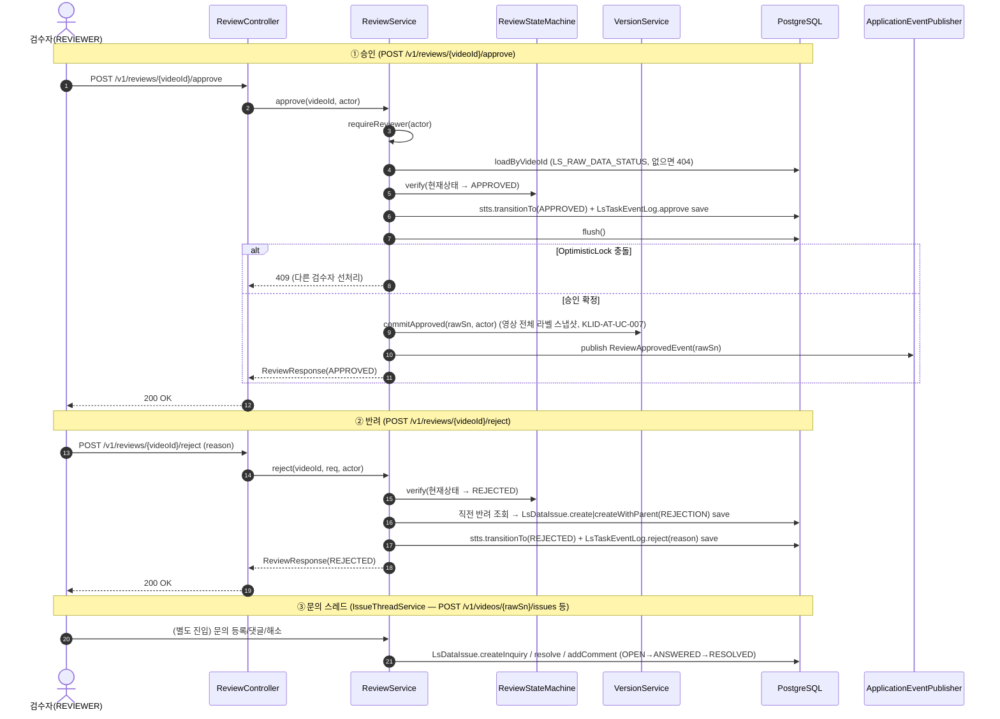
```mermaid
sequenceDiagram
    autonumber
    actor RV as 검수자(REVIEWER)
    participant RC as ReviewController
    participant RS as ReviewService
    participant SM as ReviewStateMachine
    participant VS as VersionService
    participant DB as PostgreSQL
    participant EP as ApplicationEventPublisher

    Note over RV,DB: ① 승인 (POST /v1/reviews/{videoId}/approve)
    RV->>RC: POST /v1/reviews/{videoId}/approve
    RC->>RS: approve(videoId, actor)
    RS->>RS: requireReviewer(actor)
    RS->>DB: loadByVideoId (LS_RAW_DATA_STATUS, 없으면 404)
    RS->>SM: verify(현재상태 → APPROVED)
    RS->>DB: stts.transitionTo(APPROVED) + LsTaskEventLog.approve save
    RS->>DB: flush()
    alt OptimisticLock 충돌
        RS-->>RC: 409 (다른 검수자 선처리)
    else 승인 확정
        RS->>VS: commitApproved(rawSn, actor) (영상 전체 라벨 스냅샷, KLID-AT-UC-007)
        RS->>EP: publish ReviewApprovedEvent(rawSn)
        RS-->>RC: ReviewResponse(APPROVED)
    end
    RC-->>RV: 200 OK

    Note over RV,DB: ② 반려 (POST /v1/reviews/{videoId}/reject)
    RV->>RC: POST /v1/reviews/{videoId}/reject (reason)
    RC->>RS: reject(videoId, req, actor)
    RS->>SM: verify(현재상태 → REJECTED)
    RS->>DB: 직전 반려 조회 → LsDataIssue.create|createWithParent(REJECTION) save
    RS->>DB: stts.transitionTo(REJECTED) + LsTaskEventLog.reject(reason) save
    RS-->>RC: ReviewResponse(REJECTED)
    RC-->>RV: 200 OK

    Note over RV,DB: ③ 문의 스레드 (IssueThreadService — POST /v1/videos/{rawSn}/issues 등)
    RV->>RS: (별도 진입) 문의 등록/댓글/해소
    RS->>DB: LsDataIssue.createInquiry / resolve / addComment (OPEN→ANSWERED→RESOLVED)
```

> 비고: 검수 승인(APPROVED)은 KLID-AT-UC-007(라벨 버전 스냅샷)의 트리거이며, `VersionService.commitApproved`가 동일 트랜잭션에서 영상 전체 라벨 스냅샷을 생성한다. 문의 스레드(INQUIRY)는 IssueThreadService가 `LsDataIssue` 상태 머신(OPEN→ANSWERED→RESOLVED)으로 관리하며 검수 반려 이력(REJECTION)과 동일 테이블에 누적된다.

### 2-20. KLID-AT-SD-024 — 포털 라벨 작업(조회·수정·다운로드)

| 시퀀스도 ID | KLID-AT-SD-024 | 시퀀스도명 | 포털 라벨 작업 |
|---------|---|-------|---|
| 관련 유스케이스 ID | KLID-AT-UC-024 |
| 주요 액터 | 포털 회원(PORTAL_USER) | 주요 클래스 | PortalLabelController, PortalLabelService, LsDataLbl, LsPortalUserLabel |

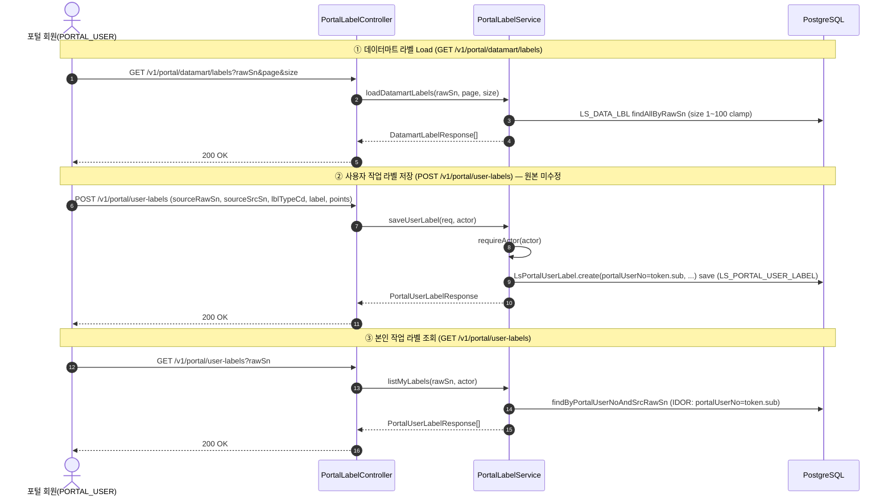
```mermaid
sequenceDiagram
    autonumber
    actor PU as 포털 회원(PORTAL_USER)
    participant PC as PortalLabelController
    participant PS as PortalLabelService
    participant DB as PostgreSQL

    Note over PU,DB: ① 데이터마트 라벨 Load (GET /v1/portal/datamart/labels)
    PU->>PC: GET /v1/portal/datamart/labels?rawSn&page&size
    PC->>PS: loadDatamartLabels(rawSn, page, size)
    PS->>DB: LS_DATA_LBL findAllByRawSn (size 1~100 clamp)
    PS-->>PC: DatamartLabelResponse[]
    PC-->>PU: 200 OK

    Note over PU,DB: ② 사용자 작업 라벨 저장 (POST /v1/portal/user-labels) — 원본 미수정
    PU->>PC: POST /v1/portal/user-labels (sourceRawSn, sourceSrcSn, lblTypeCd, label, points)
    PC->>PS: saveUserLabel(req, actor)
    PS->>PS: requireActor(actor)
    PS->>DB: LsPortalUserLabel.create(portalUserNo=token.sub, ...) save (LS_PORTAL_USER_LABEL)
    PS-->>PC: PortalUserLabelResponse
    PC-->>PU: 200 OK

    Note over PU,DB: ③ 본인 작업 라벨 조회 (GET /v1/portal/user-labels)
    PU->>PC: GET /v1/portal/user-labels?rawSn
    PC->>PS: listMyLabels(rawSn, actor)
    PS->>DB: findByPortalUserNoAndSrcRawSn (IDOR: portalUserNo=token.sub)
    PS-->>PC: PortalUserLabelResponse[]
    PC-->>PU: 200 OK
```

> 비고: 포털은 데이터마트 영상 선택 전용으로 오토라벨링·VLM·버전관리·검수·업로드를 제공하지 않는다(ADR-013). 사용자 수정분은 원본/데이터마트에 반영되지 않고 LS_PORTAL_USER_LABEL에만 단방향 적재된다.

### 2-21. KLID-AT-SD-025 — 라벨 프리셋 관리

| 시퀀스도 ID | KLID-AT-SD-025 | 시퀀스도명 | 라벨 프리셋 관리 |
|---------|---|-------|---|
| 관련 유스케이스 ID | KLID-AT-UC-025 |
| 주요 액터 | 검수자(REVIEWER), 시스템(배치) | 주요 클래스 | PresetController, PresetService, PresetLabelLookupService, LsLabelPreset, LsLabelPresetCode |

```mermaid
sequenceDiagram
    autonumber
    actor RV as 검수자(REVIEWER)
    participant PC as PresetController
    participant PS as PresetService
    participant DB as PostgreSQL (LS_LABEL_PRESET / LS_LABEL_PRESET_CODE)
    participant PL as PresetLabelLookupService
    participant BO as 배치(YOLO 라벨 정책)

    Note over RV,DB: ① 생성 (POST /v1/manage/presets)
    RV->>PC: POST /v1/manage/presets (name, description, options[], eventTypeCd?)
    PC->>PS: create(name, description, options, eventTypeCd)
    PS->>DB: 이름 중복 검사 (existsByPresetNm → 409)
    PS->>DB: LsLabelPreset.createWithOptions(...) saveAndFlush (이벤트 UK 충돌 시 409)
    Note over PS,DB: Aggregate Root가 replaceCodes로 LsLabelPresetCode 내부 엔티티 동기화
    PS-->>PC: LsLabelPreset
    PC-->>RV: 201 Created

    Note over RV,DB: ② 수정 (PUT /v1/manage/presets/{id})
    RV->>PC: PUT /v1/manage/presets/{id} (name, options[], eventTypeCd?)
    PC->>PS: update(id, ...)
    PS->>DB: 조회(없으면 404) + 이름 중복(presetIdNot, 409)
    PS->>DB: updateBasics + replaceCodes(smart diff) + assignToEvent
    PS->>DB: saveAndFlush (이벤트 UK 충돌 시 409)
    PS-->>PC: LsLabelPreset
    PC-->>RV: 200 OK

    Note over BO,DB: ③ 배치 이벤트→토글 조회 (PresetLabelLookupService)
    BO->>PL: togglesFor(eventTypeCd)
    PL->>DB: EVNT_TYPE_CD 매핑 프리셋 조회 → 코드별 BBOX/POLYGON 토글
    PL-->>BO: Optional<Map<code, AnnotationToggle>>
```

### 2-22. KLID-AT-SD-026 — 배치 파이프라인 처리

| 시퀀스도 ID | KLID-AT-SD-026 | 시퀀스도명 | 배치 파이프라인 처리 |
|---------|---|-------|---|
| 관련 유스케이스 ID | KLID-AT-UC-026 |
| 주요 액터 | 시스템(Quartz/@Async) | 주요 클래스 | BatchOrchestrator, DeidentifyStep, VlmTimeseriesStep, FfmpegFrameExtractor, YoloAutolabelStep, Sam2SegmentStep, TrackInterpolationStep, BatchStatusService, LsBatchProcLog, LsDataSrcHstry |

```mermaid
sequenceDiagram
    autonumber
    participant SCH as 트리거(MarkingBatchBridge/@Async, Quartz 재처리)
    participant BO as BatchOrchestrator
    participant ST as BatchStatusService
    participant DB as PostgreSQL
    participant VL as VlmTimeseriesStep
    participant DE as DeidentifyStep
    participant FE as FfmpegFrameExtractor
    participant YO as YoloAutolabelStep
    participant SA as Sam2SegmentStep
    participant TI as TrackInterpolationStep

    SCH->>BO: process(rawSn)
    BO->>DB: LS_RAW_DATA_STATUS transitionTo(PROCESSING)
    BO->>ST: markStage(MARKING) → LsBatchProcLog
    BO->>DB: LS_MARKING 조회(findByRawSnOrderByRegDtDesc)
    BO->>ST: markStage(VLM)
    BO->>VL: runWithMarking(rawSn, marking) | run(rawSn) (45s, disabled 시 SKIPPED)
    BO->>ST: markStage(DEIDENTIFY)
    BO->>DE: run(raw) → 비식별본 경로 (DE_IDNTF_YN 'Y'/'F')
    BO->>ST: markStage(FRAME_EXTRACT)
    alt 마킹 없음
        BO-->>SCH: INVALID_INPUT (파이프라인 중단)
    else 마킹 있음
        BO->>FE: extractByMarks(raw, deidVideoPath, marks)
        FE->>DB: LsDataSrc save (원본+비식별 2벌) + LsDataSrcHstry.recordCreated/recordDeidAttached
        BO->>ST: markStage(YOLO) → YO.run(rawSn) (BBOX 힌트)
        BO->>SA: markStage(SAM2) → run(rawSn, hints)
        BO->>TI: markStage(INTERPOLATE) → run(rawSn) (트랙 보간)
        BO->>DB: LS_RAW_DATA_STATUS transitionTo(COMPLETED) + LsDataRaw.changeStatus(COMPLETED)
        BO->>ST: markCompleted(rawSn)
    end
    alt RuntimeException
        BO->>ST: markFailed(rawSn, cause) + LS_RAW_DATA_STATUS transitionTo(FAILED)
        BO->>BO: retryQueue.enqueueIfRetryable(rawSn)
    end
```

> 비고(설계 타깃 vs 현행 코드 divergence): R2 설계 타깃 순서는 ⭐비식별(선두) → 마킹(비식별 영상) → VLM → FFmpeg(마킹 위치) → YOLO(원본만) → SAM2 → 보간이다. **현행 코드의 `BatchOrchestrator.process()` 실행 순서는 MARKING(조회) → VLM → DEIDENTIFY → FRAME_EXTRACT → YOLO → SAM2 → INTERPOLATE**로, 비식별이 VLM 뒤에 있고 마킹은 배치 전에 이미 완료된 트리거다(KLID-AT-SD-019). 비식별 선두 재배치·마킹 비식별영상화는 설계 확정·코드 미반영(planned)이므로 본 SD는 현행 코드 실행 순서를 도식화한다.

---

## 3. 설계 클래스도

> **⟳ 유스케이스별로 1개씩 반복 작성한다.** (작성 방법 원문: "유스케이스별로 클래스도를 작성한다")
> **DCD ID ↔ UC ID 1:1**: 설계 클래스도 번호는 실현 유스케이스 번호와 정렬(KLID-AT-DCD-012/014/015 결번). 공통 클래스는 복수 클래스도에 동일 클래스명으로 등장한다.

### 3-1. KLID-AT-DCD-001 — 증강 영상 생성 요청 (KLID-AT-UC-001)

| 설계 클래스도 ID | KLID-AT-DCD-001 | 설계 클래스도명 | 증강 영상 생성 요청 |
|-----------|---|---------|---|
| 관련 유스케이스 ID | KLID-AT-UC-001 |

> 근거: 데이터 증강 도메인 모델 + 코드(AugmentRequestService, ExternalAugmentClient).

```mermaid
classDiagram
    class AugmentController {
        +request(req, actor) AugmentRequestResponse
    }
    class AugmentRequestService {
        -AtomicLong jobIdSeq
        +request(req, actor) AugmentRequestResponse
    }
    class ExternalAugmentClient {
        +requestAugment(videoIds, types) void
    }

    AugmentController --> AugmentRequestService
    AugmentRequestService --> ExternalAugmentClient
```

### 3-2. KLID-AT-DCD-002 — 증강 결과 수신·등록 (KLID-AT-UC-002)

| 설계 클래스도 ID | KLID-AT-DCD-002 | 설계 클래스도명 | 증강 결과 수신·등록 |
|-----------|---|---------|---|
| 관련 유스케이스 ID | KLID-AT-UC-002 |

> 근거: 데이터 증강·영상 도메인 모델(LsDataRaw)·증강 라벨 매핑 모델(LsDataAugLblMap) + 코드(AugmentResultService, WebhookIdempotencyLedger).

```mermaid
classDiagram
    class AugmentResultController {
        +receive(req) ApiResponse
    }
    class AugmentResultService {
        +handle(req) boolean
    }
    class WebhookIdempotencyLedger {
        <<interface>>
        +isIssued(key) boolean
        +isProcessed(key) boolean
        +markProcessed(key, jobId) void
    }
    class LsDataAug {
        -Long dataAugSn
        -Long srcSn
        -String augTypeCd
        -String augProcSttsCd
        +applyReviewStatus(status) void
        +markDeadLetter() void
    }
    class LsDataRaw {
        -Long rawSn
        -Long parentRawSn
        -String dataSttsCd
        +createFromAugment(parent, path, augType) LsDataRaw
    }
    class LsDataAugLblMap {
        -Long dataAugLblMapSn
        -Long dataAugSn
        -Long orgnlDataLblSn
        -Long dataLblSn
        -String coordRecalcYn
        +create(augSn, orgnlLblSn, lblSn, recalc, sx, sy, regId)$ LsDataAugLblMap
    }
    class LsDataMeta {
        -Long metaSn
        -Long rawSn
        -String metaKey
        -String metaVl
        +create(rawSn, metaKey, metaVl)$ LsDataMeta
    }

    AugmentResultController --> AugmentResultService
    AugmentResultService --> WebhookIdempotencyLedger
    AugmentResultService --> LsDataAug
    AugmentResultService --> LsDataRaw
    AugmentResultService --> LsDataAugLblMap : 라벨 복사 매핑 saveAll
    AugmentResultService --> LsDataMeta : 메타 복사 saveAll
    LsDataAugLblMap "0..*" --> "1" LsDataAug : DATA_AUG_SN
    LsDataMeta "0..*" --> "1" LsDataRaw : RAW_SN
```

> v1.5 보강: 증강 결과 수신 시 원본 메타 복사 경로의 LsDataMeta(KLID-AT-DC-051)를 등재(기존 UC 매핑 누락 해소, AugmentResultService 코드 기준). 전 DCD에 LsDataMeta를 추가하지 않고 흐름 핵심(증강 메타 복사·KLID-AT-UC-022 검토)만 도식화하여 비대화를 방지한다.

### 3-3. KLID-AT-DCD-003 — 해상도 변경 수행 (KLID-AT-UC-003)

| 설계 클래스도 ID | KLID-AT-DCD-003 | 설계 클래스도명 | 해상도 변경 수행 |
|-----------|---|---------|---|
| 관련 유스케이스 ID | KLID-AT-UC-003 |

> 근거: 도메인 모델 + 코드(VideoResolution* 계열). 해상도 변경은 외부 위탁이 아닌 저작도구 내부 수행(R1 v1.8) — 코드 기준으로 도식화.

```mermaid
classDiagram
    class VideoController {
        +changeResolution(rawSn, req, actor) ResolutionChangeResponse
    }
    class VideoResolutionService {
        -int FRAME_CHUNK_SIZE
        -Semaphore resizeSemaphore
        +changeResolution(rawSn, req, regId) ResolutionChangeResponse
        +loadAndValidate(rawSn) LsDataRaw
    }
    class VideoResolutionPersister {
        +persist(parent, preset, dir, srcW, srcH, tgtW, tgtH, cnt, regId) ResolutionChangeResponse
    }
    class ImageResizer {
        <<interface>>
        +resize(src, dst, w, h) void
        +readDimensions(src) int[]
    }
    class LsResolutionExport {
        -Long resExportSn
        -Long dataRawSn
        -String targetResCd
    }
    class LsDataRaw {
        -Long rawSn
        -String dataSttsCd
    }

    VideoController --> VideoResolutionService
    VideoResolutionService --> ImageResizer
    VideoResolutionService --> VideoResolutionPersister
    VideoResolutionService --> LsDataRaw
    VideoResolutionPersister --> LsResolutionExport
    VideoResolutionPersister --> LsDataRaw
    LsResolutionExport "0..*" --> "1" LsDataRaw : DATA_RAW_SN
```

### 3-4. KLID-AT-DCD-004 — 객체 자동 추적 (KLID-AT-UC-004)

| 설계 클래스도 ID | KLID-AT-DCD-004 | 설계 클래스도명 | 객체 자동 추적 |
|-----------|---|---------|---|
| 관련 유스케이스 ID | KLID-AT-UC-004 |

> 근거: AI 보조 라벨링 도메인 모델(LS_DATA_LBL_AI_INFO) + 코드(Sam2TrackService).

```mermaid
classDiagram
    class LabelController {
        +sam2Track(srcSn, req, actor) Sam2TrackResponseDto
    }
    class Sam2TrackService {
        -double DEFAULT_SIMPLIFY_TOLERANCE
        +track(req, actor) Sam2TrackResponseDto
    }
    class LabelAccessGuard {
        +verifyAccess(srcSn, actor) void
        +verifyAndGet(srcSn, actor) LsDataSrc
    }
    class AiServerClient {
        +track(req) Mono~Sam2TrackResponse~
    }
    class LsDataLbl {
        -Long lblSn
        -Long srcSn
        -String lblTypeCd
        +createAutoPolygon(srcSn, labelId, name, points, score)$ LsDataLbl
    }
    class LsDataLblAiInfo {
        -Long dataLblAiInfoSn
        -String lblSrcCd
        -BigDecimal confScore
    }
    class LsDataSrc {
        -Long srcSn
        -Long rawSn
        -int frameNo
        -String srcFilePathNm
    }

    LabelController --> Sam2TrackService
    Sam2TrackService --> LabelAccessGuard
    Sam2TrackService --> AiServerClient
    Sam2TrackService --> LsDataLbl
    LsDataLblAiInfo "0..*" --> "1" LsDataLbl : DATA_LBL_SN
    LabelAccessGuard --> LsDataSrc : verifyAndGet(srcSn)
```

### 3-5. KLID-AT-DCD-005 — 객체 외곽 경계 자동 밀착 (KLID-AT-UC-005)

| 설계 클래스도 ID | KLID-AT-DCD-005 | 설계 클래스도명 | 객체 외곽 경계 자동 밀착 |
|-----------|---|---------|---|
| 관련 유스케이스 ID | KLID-AT-UC-005 |

> 근거: AI 보조 라벨링 도메인 모델 + 코드(Sam2TrackService sam2-track 밀착 흐름, Sam2SegmentService sam2-segment 별도 진입점 — KLID-AT-SD-005 비고 참조). Sam2SegmentService는 stateless 프록시로 DB 미저장(`readOnly` 트랜잭션).

```mermaid
classDiagram
    class LabelController {
        +sam2Track(srcSn, req, actor) Sam2TrackResponseDto
        +sam2Segment(srcSn, req, actor) Sam2SegmentResponse
    }
    class Sam2TrackService {
        +track(req, actor) Sam2TrackResponseDto
    }
    class Sam2SegmentService {
        -int MIN_POLYGON_POINTS
        -long maxImageBytes
        +segment(req, actor) Sam2SegmentResponse
    }
    class LabelAccessGuard {
        +verifyAccess(srcSn, actor) void
    }
    class AiServerClient {
        +track(req) Mono~Sam2TrackResponse~
        +segment(req) Mono~Sam2Response~
    }
    class PolygonSimplifier {
        +simplify(points, epsilon)$ List~Point~
    }

    LabelController --> Sam2TrackService
    LabelController --> Sam2SegmentService
    Sam2TrackService --> LabelAccessGuard
    Sam2TrackService --> AiServerClient
    Sam2TrackService --> PolygonSimplifier
    Sam2SegmentService --> LabelAccessGuard
    Sam2SegmentService --> AiServerClient
    Sam2SegmentService --> PolygonSimplifier
```

### 3-6. KLID-AT-DCD-006 — 라벨링 정밀도 조절 (KLID-AT-UC-006)

| 설계 클래스도 ID | KLID-AT-DCD-006 | 설계 클래스도명 | 라벨링 정밀도 조절 |
|-----------|---|---------|---|
| 관련 유스케이스 ID | KLID-AT-UC-006 |

> 근거: 시스템 설정 도메인 모델 + 코드(SystemConfigService). Sam2TrackService·PolygonSimplifier는 설정값 반영 대상으로 표기.

```mermaid
classDiagram
    class SystemConfigController {
        +update(key, req, actor) ConfigResponse
        +listAll() List~ConfigResponse~
    }
    class SystemConfigService {
        +getInt(key) Integer
        +getDouble(key) Double
        +update(key, value, actor) ConfigResponse
    }
    class LsSystemConfig {
        -String configKey
        -String configVl
        -String configTypeCd
        +updateValue(value, modifier) void
    }
    class Sam2TrackService {
        <<설정값 반영 대상>>
    }
    class PolygonSimplifier {
        <<설정값 반영 대상>>
        +simplify(points, epsilon)$ List~Point~
    }

    SystemConfigController --> SystemConfigService
    SystemConfigService --> LsSystemConfig
    Sam2TrackService --> SystemConfigService : 정밀도 설정값 조회
    Sam2TrackService --> PolygonSimplifier
```

### 3-7. KLID-AT-DCD-007 — 라벨 버전 저장·이력 추적 (KLID-AT-UC-007)

| 설계 클래스도 ID | KLID-AT-DCD-007 | 설계 클래스도명 | 라벨 버전 저장·이력 추적 |
|-----------|---|---------|---|
| 관련 유스케이스 ID | KLID-AT-UC-007 |

> 근거: 라벨링 도메인 모델(LsLabelVersion/SaveReason) + 코드(VersionService.commitApproved).

```mermaid
classDiagram
    class ReviewController {
        +approve(videoId, actor) ReviewResponse
    }
    class ReviewService {
        +approve(videoId, actor) ReviewResponse
    }
    class VersionService {
        +int MAX_PAYLOAD_BYTES
        +commitApproved(rawSn, actor) int
    }
    class LsLabelVersion {
        -Long labelVersionSn
        -String versionHash
        -String labelPayload
        -String saveReasonCd
        -String activeYn
        +create(...)$ LsLabelVersion
        +deactivate() void
    }
    class LsTaskEventLog {
        -Long eventSeq
        -Long rawDataId
        -String eventTypeCd
        +approve(rawDataId, reviewerUserNo)$ LsTaskEventLog
    }
    class LsTaskAssignment {
        -Long assignmentId
        -Long rawDataId
        -String taskTypeCd
    }

    ReviewController --> ReviewService
    ReviewService --> VersionService : 승인 시 스냅샷
    ReviewService --> LsTaskEventLog : 승인 이벤트 누적
    ReviewService --> LsTaskAssignment : 배정 검증
    VersionService --> LsLabelVersion
```

> v1.5 보강: 승인 흐름에 통합 이벤트 로그 LsTaskEventLog(KLID-AT-DC-053)와 배정 검증의 LsTaskAssignment(KLID-AT-DC-052)를 등재(기존 UC 매핑 누락 해소, ReviewService 코드 기준).

### 3-8. KLID-AT-DCD-008 — 버전 비교·복구 (KLID-AT-UC-008)

| 설계 클래스도 ID | KLID-AT-DCD-008 | 설계 클래스도명 | 버전 비교·복구 |
|-----------|---|---------|---|
| 관련 유스케이스 ID | KLID-AT-UC-008 |

> 근거: 라벨링 도메인 모델 + 코드(VersionService.diff/rollback).

```mermaid
classDiagram
    class VersionController {
        +listVersions(srcSn, actor) List~VersionItem~
        +diff(toHash, compareWith, actor) DiffResponseDto
        +rollback(versionHash, req, actor) VersionResponse
    }
    class VersionService {
        +listVersions(srcSn, actor) List~VersionItem~
        +diff(fromHash, toHash, actor) DiffResponseDto
        +rollback(versionHash, srcSn, actor) LsLabelVersion
    }
    class LsLabelVersion {
        -Long labelVersionSn
        -String versionHash
        -String activeYn
        +deactivate() void
    }
    class LabelAccessGuard {
        +verifyRawAccess(rawSn, actor) void
    }

    VersionController --> VersionService
    VersionService --> LabelAccessGuard
    VersionService --> LsLabelVersion
```

### 3-9. KLID-AT-DCD-009 — 데이터마트 수정 통지 (KLID-AT-UC-009)

| 설계 클래스도 ID | KLID-AT-DCD-009 | 설계 클래스도명 | 데이터마트 수정 통지 |
|-----------|---|---------|---|
| 관련 유스케이스 ID | KLID-AT-UC-009 |

> 근거: 관제 통지 도메인 모델(LS_CONTROL_NOTIFY_FALLBACK) + 코드. `ControlNotifyEventListener`/`ControlNotifyDebouncer`/`ControlNotifyService`/`TaskModifiedEvent` 등 행위 클래스는 코드 기준으로 도출.

```mermaid
classDiagram
    class LabelService {
        +bulkUpsert(srcSn, req, actor) LabelResponse
    }
    class TaskModifiedEvent {
        -Long rawSn
        -Long srcSn
        -ChangeType changeType
    }
    class ControlNotifyEventListener {
        +onTaskModified(event) void
    }
    class ControlNotifyDebouncer {
        +accumulate(event) void
    }
    class ControlNotifyService {
        +sendModified(rawSn, frameIds, changeTypes) void
    }
    class ControlNotifyClient {
        +sendTaskModified(payload) void
        +sendTaskCompleted(payload) void
    }
    class LsRawDataStatus {
        -Long rawDataId
        -String dataSttsCd
        +transitionTo(newStatus) void
    }
    class LsLabel {
        -Long labelId
        -String labelNm
        -String useYn
    }

    LabelService --> TaskModifiedEvent : 수정 이벤트 발행
    LabelService --> LsRawDataStatus : APPROVED 판정(isReviewApproved)
    LabelService --> LsLabel : labelId 마스터 검증
    ControlNotifyEventListener --> TaskModifiedEvent : 수신
    ControlNotifyEventListener --> ControlNotifyDebouncer
    ControlNotifyDebouncer --> ControlNotifyService
    ControlNotifyService --> ControlNotifyClient
```

> v1.5 보강: 수정 통지 발행 조건 판정의 LsRawDataStatus(KLID-AT-DC-054)와 라벨 마스터 검증의 LsLabel(KLID-AT-DC-055)을 등재(기존 UC 매핑 누락 해소, LabelService.isReviewApproved/validateAndLoadLabels 코드 기준).

### 3-10. KLID-AT-DCD-010 — 증강 영상 활용 여부 검수 (KLID-AT-UC-010)

| 설계 클래스도 ID | KLID-AT-DCD-010 | 설계 클래스도명 | 증강 영상 활용 여부 검수 |
|-----------|---|---------|---|
| 관련 유스케이스 ID | KLID-AT-UC-010 |

> 근거: 데이터 증강 도메인 모델(LS_DATA_AUG/LS_DATA_AUG_RVW) + 코드(AugmentReviewService).

```mermaid
classDiagram
    class AugmentController {
        +list(pageable) Page~AugmentSummaryResponse~
        +accept(id, actor) AugmentSummaryResponse
        +reject(id, reason, actor) AugmentSummaryResponse
    }
    class AugmentReviewService {
        +listAll(pageable) Page~AugmentSummaryResponse~
        +accept(dataAugSn, actor) AugmentSummaryResponse
        +reject(dataAugSn, reason, actor) AugmentSummaryResponse
    }
    class LsDataAug {
        -Long dataAugSn
        -String augProcSttsCd
        +applyReviewStatus(status) void
    }
    class LsDataAugRvw {
        -Long dataAugRvwSn
        +accept(actorId, dt) void
        +reject(reason, actorId, dt) void
    }

    AugmentController --> AugmentReviewService
    AugmentReviewService --> LsDataAug
    AugmentReviewService --> LsDataAugRvw
    LsDataAugRvw "0..*" --> "1" LsDataAug : DATA_AUG_SN
```

### 3-11. KLID-AT-DCD-011 — 비식별 처리 요청 (KLID-AT-UC-011)

| 설계 클래스도 ID | KLID-AT-DCD-011 | 설계 클래스도명 | 비식별 처리 요청 |
|-----------|---|---------|---|
| 관련 유스케이스 ID | KLID-AT-UC-011 |

> 근거: 비식별화 도메인 모델(LS_DEIDENT_PROC_LOG) + 코드(DeidentifyResultService, DeidentifyClient — KLID-AT-SD-011 주요 클래스 정합 보강, KLID-AT-DC-046 신규 부여).

```mermaid
classDiagram
    class DeidentController {
        +reprocess(videoId, actor) ApiResponse
    }
    class DeidentifyResultController {
        +receive(req) ApiResponse
    }
    class DeidentifyResultService {
        +handle(req) boolean
    }
    class DeidentifyClient {
        +deidentify(req) Mono~DeidentifyAck~
    }
    class WebhookIdempotencyLedger {
        <<interface>>
        +isIssued(key) boolean
        +markProcessed(key, jobId) void
    }
    class LsDeidentProcLog {
        -Long procLogSn
        -Long dataRawSn
        -String externalJobId
        -String procSttsCd
        +request(...)$ LsDeidentProcLog
        +succeed(path) void
        +fail(code, msg) void
    }
    class LsDataRaw {
        +markDeidentified(code) void
    }

    DeidentController --> DeidentifyClient : 재처리 위탁
    DeidentifyResultController --> DeidentifyResultService
    DeidentifyResultService --> WebhookIdempotencyLedger
    DeidentifyResultService --> LsDeidentProcLog
    DeidentifyResultService --> LsDataRaw
    LsDeidentProcLog "0..*" --> "1" LsDataRaw : DATA_RAW_SN
```

### 3-12. KLID-AT-DCD-013 — 비식별 옵션 설정 (KLID-AT-UC-013)

| 설계 클래스도 ID | KLID-AT-DCD-013 | 설계 클래스도명 | 비식별 옵션 설정 |
|-----------|---|---------|---|
| 관련 유스케이스 ID | KLID-AT-UC-013 |

> 근거: 시스템 설정 도메인 모델(SystemConfig) + 코드(SystemConfigService). 구체 옵션 항목은 외부 비식별 솔루션 계약 후 확정(미정).

```mermaid
classDiagram
    class SystemConfigController {
        +update(key, req, actor) ConfigResponse
        +listAll() List~ConfigResponse~
    }
    class SystemConfigService {
        +update(key, value, actor) ConfigResponse
    }
    class LsSystemConfig {
        -String configKey
        -String configVl
        -String configTypeCd
        +updateValue(value, modifier) void
    }

    SystemConfigController --> SystemConfigService
    SystemConfigService --> LsSystemConfig
```

### 3-13. KLID-AT-DCD-016 — 비식별 처리 상태·이력 확인 (KLID-AT-UC-016)

| 설계 클래스도 ID | KLID-AT-DCD-016 | 설계 클래스도명 | 비식별 처리 상태·이력 확인 |
|-----------|---|---------|---|
| 관련 유스케이스 ID | KLID-AT-UC-016 |

> 근거: 비식별화 도메인 모델(LS_DEIDENT_REPORT)·작업락 모델(AuthWorkLock) + 코드(DeidentReportService, WorkLockService).

```mermaid
classDiagram
    class DeidentReportController {
        +report(srcSn, req, actor) Long
        +resolveManually(rprtSn, actor) void
    }
    class DeidentReportService {
        +report(srcSn, reason, actor) Long
        +resolveManually(rprtSn, actor) void
        +resolveOpenReports(rawSn) int
    }
    class LsDeidentReport {
        -Long deidentReportSn
        -Long dataRawSn
        -String reportSttsCd
        +createReport(rawSn, reporterNo, reason)$ LsDeidentReport
        +resolve() void
        +dismiss() void
    }
    class WorkLockService {
        +isRawLocked(rawSn) boolean
        +lockRawForRedeident(rawSn, owner) void
        +releaseRaw(rawSn, owner, reason) void
    }
    class LsAuthWorkLock {
        -Long workLockSn
        -String lockTargetCd
        -Long dataRawSn
        -String lockSttsCd
        +lockRawForRedeident(rawSn, ownerId)$ LsAuthWorkLock
        +release(actorId, reason) void
    }
    class LabelAccessGuard {
        +verifyAndGet(srcSn, actor) LsDataSrc
        +verifyRawAccess(rawSn, actor) void
    }
    class LsDataSrc {
        -Long srcSn
        -Long rawSn
        -String deIdntfSrcFilePathNm
    }
    class VersionService {
        +snapshotDeidentReport(rawSn, actor) boolean
    }
    class LsDataRaw {
        +markDeidentified(code) void
    }
    class LsDataLblAttrVal {
        -Long attrValId
        -Long lblSn
        -Long attrId
        +create(lblSn, attrId, value)$ LsDataLblAttrVal
    }
    class LsRawDataStatus {
        -Long rawDataId
        -String dataSttsCd
        +transitionTo(newStatus) void
    }
    class LsDataLblHstry {
        -Long lblHstrySn
        -Long lblSn
        -Long srcSn
        +recordDeletion(lblSn, srcSn)$ LsDataLblHstry
    }

    DeidentReportController --> DeidentReportService
    DeidentReportService --> LabelAccessGuard
    DeidentReportService --> WorkLockService
    DeidentReportService --> VersionService : 신고 시 보존 스냅샷
    DeidentReportService --> LsDeidentReport
    DeidentReportService --> LsDataRaw
    DeidentReportService --> LsRawDataStatus : APPROVED 판정(통지 분기)
    DeidentReportService --> LsDataLblAttrVal : 영상 전체 라벨 삭제(ATTR_VAL)
    DeidentReportService --> LsDataLblHstry : 삭제 직전 이력 saveAll
    WorkLockService --> LsAuthWorkLock : 작업락 선점/해제 영속
    LsAuthWorkLock "0..*" --> "1" LsDataRaw : DATA_RAW_SN
    LsDeidentReport "0..*" --> "1" LsDataRaw : DATA_RAW_SN
    LabelAccessGuard --> LsDataSrc : verifyAndGet(srcSn)
```

> v1.5 보강: 비식별 신고 시 영상 전체 라벨 삭제 경로의 LsDataLblAttrVal(KLID-AT-DC-050), APPROVED 통지 분기의 LsRawDataStatus(KLID-AT-DC-054), 삭제 직전 이력 기록의 LsDataLblHstry(KLID-AT-DC-068)를 등재(DeidentReportService.deleteAllVideoLabels/recordDeletionHistory 코드 기준 — 최신 구현 반영). LsDataLblHstry 정의는 §4(KLID-AT-UC-021 라벨 편집)에서 상세 기술한다.

### 3-14. KLID-AT-DCD-018 — 영상 적재(관리 화면 업로드) (KLID-AT-UC-018)

| 설계 클래스도 ID | KLID-AT-DCD-018 | 설계 클래스도명 | 영상 적재(관리 화면 업로드) |
|-----------|---|---------|---|
| 관련 유스케이스 ID | KLID-AT-UC-018 |

> 근거: 영상 도메인 모델 + 코드(LsDataRaw 정적 팩토리, LsRawDataStatus.initial). 관리 화면 업로드/TUS 컨트롤러는 현행 코드 미구현(planned)이므로 진입 클래스는 도식화하지 않고 검증된 엔티티 영속 모델만 표현한다(날조 금지).

```mermaid
classDiagram
    class LsDataRaw {
        -Long rawSn
        -String vmsClipId
        -String prvcTypeCd
        -String dataSttsCd
        +createFromIngest(clipId, cctvId, evntType, lclgv, prvcType, path, shtDt, durationSec)$ LsDataRaw
        +updateFromIngest(...) void
    }
    class LsRawDataStatus {
        -Long rawDataId
        -String dataSttsCd
        +initial(rawDataId)$ LsRawDataStatus
        +markAssigned() void
    }

    LsRawDataStatus "1" --> "1" LsDataRaw : RAW_DATA_ID = RAW_SN
```

### 3-15. KLID-AT-DCD-019 — 이벤트 마킹(자동/수동) (KLID-AT-UC-019)

| 설계 클래스도 ID | KLID-AT-DCD-019 | 설계 클래스도명 | 이벤트 마킹(자동/수동) |
|-----------|---|---------|---|
| 관련 유스케이스 ID | KLID-AT-UC-019 |

> 근거: 마킹 도메인 모델(LS_MARKING) + 코드(MarkingService, MarkingBatchBridge). 마킹 완료 이벤트가 잔여 배치를 AFTER_COMMIT @Async 트리거하는 흐름은 현행 코드 기준(KLID-AT-SD-019 divergence 비고 참조).

```mermaid
classDiagram
    class MarkingController {
        +create(rawSn, req, actor) MarkingResponse
        +list(rawSn) List~MarkingResponse~
    }
    class MarkingService {
        +create(rawSn, req, actor) MarkingResponse
        +list(rawSn) List~MarkingResponse~
    }
    class MarkingCompletedEvent {
        -Long rawSn
        -Long markingSn
    }
    class MarkingBatchBridge {
        +onMarkingCompleted(event) void
    }
    class LsMarking {
        -Long markingSn
        -Long rawSn
        -String markModeCd
        -String sttsCd
        +createAuto(rawSn, eventName, intervalFrames, videoPath, marksJson, createdBy)$ LsMarking
        +createManual(rawSn, eventName, videoPath, marksJson, createdBy)$ LsMarking
        +markVlmRequested() void
        +markVlmCompleted() void
    }
    class LsRawDataStatus {
        -String dataSttsCd
        +markBatchQueued() void
    }

    MarkingController --> MarkingService
    MarkingService --> LsMarking
    MarkingService --> MarkingCompletedEvent : 발행
    MarkingBatchBridge --> MarkingCompletedEvent : 수신(AFTER_COMMIT)
    MarkingBatchBridge --> LsRawDataStatus : markBatchQueued
    LsMarking "0..*" --> "1" LsRawDataStatus : RAW_SN
```

### 3-16. KLID-AT-DCD-020 — 작업 배정·재배정·이력 조회 (KLID-AT-UC-020)

| 설계 클래스도 ID | KLID-AT-DCD-020 | 설계 클래스도명 | 작업 배정·재배정·이력 조회 |
|-----------|---|---------|---|
| 관련 유스케이스 ID | KLID-AT-UC-020 |

> 근거: 작업 배정 도메인 모델 + 코드(AssignmentService, TaskBoardService). 배정/재배정/검수 이벤트를 LsTaskEventLog 단일 타임라인에 누적한다.

```mermaid
classDiagram
    class AssignmentController {
        +create(req, actor) AssignmentResponse
        +reassign(assignmentId, req, actor) AssignmentResponse
        +history(assignmentId, actor) List~AssignmentHistoryResponse~
    }
    class TaskBoardController {
        +board(status, actor, pageable) Page~TaskBoardItemResponse~
    }
    class AssignmentService {
        +assign(req, actor) AssignmentResponse
        +reassign(assignmentId, req, actor) AssignmentResponse
        +getHistory(assignmentId, actor) List~AssignmentHistoryResponse~
    }
    class TaskBoardService {
        +listBoard(status, actor, pageable) Page~TaskBoardItemResponse~
    }
    class LsTaskAssignment {
        -Long assignmentId
        -Long userNo
        -Long rawDataId
        -String taskTypeCd
        +createLabeler(rawDataId, workerNo, actorNo)$ LsTaskAssignment
        +createReviewer(rawDataId, reviewerNo, actorNo)$ LsTaskAssignment
        +reassignTo(newWorkerNo) void
    }
    class LsTaskAssignHistory {
        -Long hstrySeq
        -Long authrtSeq
        -Long prevUserNo
        -Long newUserNo
        +record(prev, newUserNo, chgUserNo)$ LsTaskAssignHistory
    }
    class LsTaskEventLog {
        -Long eventSeq
        -String eventTypeCd
        +assign(rawDataId, actor, subjectWorker)$ LsTaskEventLog
        +reassign(rawDataId, actor, newWorker, prevWorker)$ LsTaskEventLog
    }
    class LsRawDataStatus {
        +markAssigned() void
    }

    AssignmentController --> AssignmentService
    TaskBoardController --> TaskBoardService
    AssignmentService --> LsTaskAssignment
    AssignmentService --> LsTaskAssignHistory : 재배정 이력
    AssignmentService --> LsTaskEventLog : 통합 이벤트 로그
    AssignmentService --> LsRawDataStatus : 배정 시 markAssigned
```

### 3-17. KLID-AT-DCD-021 — 라벨 편집·임시저장 (KLID-AT-UC-021)

| 설계 클래스도 ID | KLID-AT-DCD-021 | 설계 클래스도명 | 라벨 편집·임시저장 |
|-----------|---|---------|---|
| 관련 유스케이스 ID | KLID-AT-UC-021 |

> 근거: 라벨링 도메인 모델 + 코드(LabelService.bulkUpsert, LabelAttrValueService.upsert). 임시저장은 LS_DATA_LBL upsert만 수행하고 버전 스냅샷은 검수 승인 시점에만 생성한다(SFR-08). LsDataLblHstry는 비식별 신고 시 삭제 이력 기록에 사용(KLID-AT-DCD-016 교차).

```mermaid
classDiagram
    class LabelController {
        +bulkUpsert(srcSn, req, actor) LabelResponse
        +getLabels(srcSn, actor) LabelResponse
    }
    class LabelService {
        +bulkUpsert(srcSn, req, actor) LabelResponse
        +getByFrame(srcSn, actor) LabelResponse
    }
    class LabelAttrValueService {
        +upsert(lblSn, entries) void
        +findByLblSn(lblSn) List~LabelAttrValueResponse~
    }
    class LabelAccessGuard {
        +verifyAndGet(srcSn, actor) LsDataSrc
    }
    class LsDataLbl {
        -Long lblSn
        -Long srcSn
        -String lblTypeCd
        +createManual(srcSn, lblTypeCd, labelId, label, pointsJson, actorNo)$ LsDataLbl
        +updateUserContent(lblTypeCd, labelId, label, pointsJson) void
    }
    class LsDataLblAttrVal {
        -Long attrValId
        -Long lblSn
        -Long attrId
        +create(lblSn, attrId, value)$ LsDataLblAttrVal
        +updateValue(value) void
    }
    class LsLabel {
        -Long labelId
        -String labelNm
        -String useYn
    }
    class LsLabelAttr {
        -Long attrId
        -Long labelId
        -String attrNm
        -String inputTypeCd
    }
    class LsDataLblHstry {
        -Long lblHstrySn
        +recordDeletion(lblSn, srcSn)$ LsDataLblHstry
    }

    LabelController --> LabelService
    LabelController --> LabelAttrValueService
    LabelService --> LabelAccessGuard
    LabelService --> LsDataLbl
    LabelService --> LsLabel : labelId 검증
    LabelAttrValueService --> LsDataLblAttrVal
    LabelAttrValueService --> LsLabelAttr : 라벨↔속성 일치 검증
    LsDataLblAttrVal "0..*" --> "1" LsDataLbl : LBL_SN
    LsLabelAttr "0..*" --> "1" LsLabel : LABEL_ID
    LsDataLblHstry ..> LsDataLbl : 삭제 이력(비식별 신고)
```

### 3-18. KLID-AT-DCD-022 — VLM 시계열 메타 검토 (KLID-AT-UC-022)

| 설계 클래스도 ID | KLID-AT-DCD-022 | 설계 클래스도명 | VLM 시계열 메타 검토 |
|-----------|---|---------|---|
| 관련 유스케이스 ID | KLID-AT-UC-022 |

> 근거: 메타 도메인 모델(LS_DATA_META/LS_DATA_META_REVIEW) + 코드(VlmResultService.handle, MetaService.approveReview/rejectReview). 외부 VLM 결과는 콜백으로 수신·적재 후 검수큐(PENDING) 진입, REVIEWER가 승인/반려.

```mermaid
classDiagram
    class VlmResultController {
        +receive(req) ApiResponse
    }
    class VlmResultService {
        +handle(req) boolean
    }
    class MetaController {
        +updateMeta(srcSn, req, actor) MetaResponse
        +approveReview(metaReviewSn, actor) void
        +rejectReview(metaReviewSn, req, actor) void
    }
    class MetaService {
        +update(srcSn, req, actor) MetaResponse
        +approveReview(metaReviewSn, actor) void
        +rejectReview(metaReviewSn, reason, actor) void
    }
    class WebhookIdempotencyLedger {
        <<interface>>
        +isIssued(key) boolean
        +isProcessed(key) boolean
        +markProcessed(key, jobId) void
    }
    class LsDataMeta {
        -Long metaSn
        -Long rawSn
        -String metaKey
        -String metaVl
        +create(rawSn, metaKey, metaVl)$ LsDataMeta
        +updateValue(newVal) void
    }
    class LsDataMetaReview {
        -Long dataMetaReviewSn
        -Long dataMetaSn
        -String metaTypeCd
        -String rvwSttsCd
        +createAuto(metaSn, rawSn, srcSn, metaType, srcSys, rvwStts)$ LsDataMetaReview
        +approve(reviewerId, at) void
        +reject(reason, reviewerId, at) void
    }

    VlmResultController --> VlmResultService
    VlmResultService --> WebhookIdempotencyLedger
    VlmResultService --> LsDataMeta : upsert by (RAW_SN, META_KEY)
    VlmResultService --> LsDataMetaReview : 검수큐 진입(PENDING)
    MetaController --> MetaService
    MetaService --> LsDataMeta : 프레임 메타 수정
    MetaService --> LsDataMetaReview : approve/reject
    LsDataMetaReview "0..*" --> "1" LsDataMeta : DATA_META_SN
```

### 3-19. KLID-AT-DCD-023 — 검수 승인·반려 (KLID-AT-UC-023)

| 설계 클래스도 ID | KLID-AT-DCD-023 | 설계 클래스도명 | 검수 승인·반려 |
|-----------|---|---------|---|
| 관련 유스케이스 ID | KLID-AT-UC-023 |

> 근거: 검수 도메인 모델 + 코드(ReviewService, ReviewStateMachine, IssueThreadService). 승인 시 VersionService 스냅샷(KLID-AT-UC-007)을 동일 트랜잭션에서 트리거. 반려/문의는 LsDataIssue 단일 테이블에 누적.

```mermaid
classDiagram
    class ReviewController {
        +approve(videoId, actor) ReviewResponse
        +reject(videoId, req, actor) ReviewResponse
        +submit(videoId, actor) ReviewResponse
        +start(videoId, actor) ReviewResponse
    }
    class ReviewService {
        +approve(videoId, actor) ReviewResponse
        +reject(videoId, req, actor) ReviewResponse
    }
    class ReviewStateMachine {
        +verify(from, to) void
    }
    class VersionService {
        +commitApproved(rawSn, actor) int
    }
    class IssueThreadService {
        +createInquiry(rawSn, req, actor) IssueThreadResponse
        +addComment(issueSn, req, actor) IssueCommentResponse
        +resolve(issueSn, actor) void
    }
    class LsRawDataStatus {
        -String dataSttsCd
        +transitionTo(newStatus) void
    }
    class LsTaskEventLog {
        +approve(rawDataId, reviewerUserNo)$ LsTaskEventLog
        +reject(rawDataId, reviewerUserNo, rsn)$ LsTaskEventLog
    }
    class LsDataIssue {
        -Long dataIssueSn
        -String issueTypeCd
        -String issueSttsCd
        +create(rawSn, reason, reportedUserNo)$ LsDataIssue
        +createInquiry(rawSn, content, reportedUserNo, srcSn)$ LsDataIssue
        +markAnswered() void
        +resolve() void
    }

    ReviewController --> ReviewService
    ReviewService --> ReviewStateMachine : 상태 전이 검증
    ReviewService --> VersionService : 승인 시 스냅샷
    ReviewService --> LsRawDataStatus : transitionTo
    ReviewService --> LsTaskEventLog : 승인/반려 이벤트
    ReviewService --> LsDataIssue : 반려 사유(REJECTION)
    IssueThreadService --> LsDataIssue : 문의(INQUIRY) 상태 머신
```

### 3-20. KLID-AT-DCD-024 — 포털 라벨 작업 (KLID-AT-UC-024)

| 설계 클래스도 ID | KLID-AT-DCD-024 | 설계 클래스도명 | 포털 라벨 작업 |
|-----------|---|---------|---|
| 관련 유스케이스 ID | KLID-AT-UC-024 |

> 근거: 포털 도메인 모델(LS_PORTAL_USER_LABEL) + 코드(PortalLabelService). 원본(LS_DATA_LBL) Load만 하고 사용자 수정분은 LS_PORTAL_USER_LABEL에 단방향 적재(ADR-013).

```mermaid
classDiagram
    class PortalLabelController {
        +loadDatamartLabels(rawSn, page, size) List~DatamartLabelResponse~
        +saveUserLabel(req, actor) PortalUserLabelResponse
        +listMyLabels(rawSn, actor) List~PortalUserLabelResponse~
    }
    class PortalLabelService {
        +loadDatamartLabels(rawSn, page, size) List~DatamartLabelResponse~
        +saveUserLabel(req, actor) PortalUserLabelResponse
        +listMyLabels(rawSn, actor) List~PortalUserLabelResponse~
    }
    class LsDataLbl {
        -Long lblSn
        -Long srcSn
    }
    class LsPortalUserLabel {
        -Long userLblSn
        -String portalUserNo
        -Long srcRawSn
        -Long srcDataSrcSn
        -String lblTypeCd
        +create(portalUserNo, srcRawSn, srcDataSrcSn, lblTypeCd, labelNm, pointCn)$ LsPortalUserLabel
    }

    PortalLabelController --> PortalLabelService
    PortalLabelService --> LsDataLbl : 데이터마트 라벨 Load(읽기)
    PortalLabelService --> LsPortalUserLabel : 사용자 작업 라벨 적재(쓰기, 단방향)
```

### 3-21. KLID-AT-DCD-025 — 라벨 프리셋 관리 (KLID-AT-UC-025)

| 설계 클래스도 ID | KLID-AT-DCD-025 | 설계 클래스도명 | 라벨 프리셋 관리 |
|-----------|---|---------|---|
| 관련 유스케이스 ID | KLID-AT-UC-025 |

> 근거: 프리셋 도메인 모델 + 코드(PresetService, PresetLabelLookupService). LsLabelPreset이 Aggregate Root이며 LsLabelPresetCode는 내부 엔티티로 replaceCodes를 통해서만 변경한다.

```mermaid
classDiagram
    class PresetController {
        +list() List~PresetResponse~
        +create(req) PresetResponse
        +update(id, req) PresetResponse
        +delete(id) void
        +clone(id) PresetResponse
    }
    class PresetService {
        +list() List~LsLabelPreset~
        +create(name, description, options, eventTypeCd) LsLabelPreset
        +update(id, name, description, options, eventTypeCd) LsLabelPreset
        +delete(id) void
        +clone(id) LsLabelPreset
    }
    class PresetLabelLookupService {
        +togglesFor(eventTypeCd) Optional~Map~
    }
    class LsLabelPreset {
        <<Aggregate Root>>
        -Long presetId
        -String presetNm
        -String eventTypeCd
        -List~LsLabelPresetCode~ codes
        +createWithOptions(name, description, specs, eventTypeCd)$ LsLabelPreset
        +replaceCodes(newSpecs) void
        +assignToEvent(eventTypeCd) void
    }
    class LsLabelPresetCode {
        -Long codeSn
        -String code
        -int sortOrder
        -boolean bboxEnabled
        -boolean polygonEnabled
    }

    PresetController --> PresetService
    PresetService --> LsLabelPreset
    PresetLabelLookupService --> LsLabelPreset : 이벤트→토글 조회
    LsLabelPreset "1" *-- "0..*" LsLabelPresetCode : codes(orphanRemoval)
```

### 3-22. KLID-AT-DCD-026 — 배치 파이프라인 처리 (KLID-AT-UC-026)

| 설계 클래스도 ID | KLID-AT-DCD-026 | 설계 클래스도명 | 배치 파이프라인 처리 |
|-----------|---|---------|---|
| 관련 유스케이스 ID | KLID-AT-UC-026 |

> 근거: 배치 도메인 모델 + 코드(BatchOrchestrator + 각 Step). 단계별 처리 이력은 LsBatchProcLog, 프레임 생성/비식별 연결 이력은 LsDataSrcHstry에 기록(KLID-AT-SD-026 divergence 비고 참조 — 현행 실행 순서 기준).

```mermaid
classDiagram
    class BatchStatusController {
        +status(limit) List~BatchStageProgress~
    }
    class BatchOrchestrator {
        +process(rawSn) BatchStage
    }
    class BatchStatusService {
        +markStage(rawSn, stage) void
        +markCompleted(rawSn) void
        +markFailed(rawSn, cause) void
    }
    class DeidentifyStep {
        +run(raw) String
    }
    class VlmTimeseriesStep {
        +run(rawSn) VlmTimeseriesResponse
        +runWithMarking(rawSn, marking) VlmTimeseriesResponse
    }
    class FfmpegFrameExtractor {
        +extractByMarks(raw, deidVideoPath, marks) List~LsDataSrc~
    }
    class YoloAutolabelStep {
        +run(rawSn) List~BbHint~
    }
    class Sam2SegmentStep {
        +run(rawSn, upstreamHints) int
    }
    class TrackInterpolationStep {
        +run(rawSn) int
    }
    class LsBatchProcLog {
        -Long batchProcLogSn
        -String jobId
        -String procStepCd
        -String procSttsCd
        +create(rawSn, stage)$ LsBatchProcLog
        +updateStage(stage) void
        +fail(cause) void
    }
    class LsDataSrcHstry {
        -Long hstrySeq
        -Long srcSn
        -String chgTypeCd
        +recordCreated(srcSn)$ LsDataSrcHstry
        +recordDeidAttached(srcSn)$ LsDataSrcHstry
    }
    class LsRawDataStatus {
        +transitionTo(newStatus) void
    }

    BatchStatusController --> BatchStatusService
    BatchOrchestrator --> BatchStatusService
    BatchOrchestrator --> VlmTimeseriesStep
    BatchOrchestrator --> DeidentifyStep
    BatchOrchestrator --> FfmpegFrameExtractor
    BatchOrchestrator --> YoloAutolabelStep
    BatchOrchestrator --> Sam2SegmentStep
    BatchOrchestrator --> TrackInterpolationStep
    BatchOrchestrator --> LsRawDataStatus : PROCESSING/COMPLETED/FAILED
    BatchStatusService --> LsBatchProcLog
    FfmpegFrameExtractor --> LsDataSrcHstry : 프레임 생성/비식별 연결 이력
```

---

## 4. 설계 클래스 정의

> **⟳ 클래스별로 1개씩 반복 작성한다.** (속성·오퍼레이션 명세 — backend 코드 도출, R1 SFR 관련 도메인 한정)

### 4-1. KLID-AT-DC-002 AugmentRequestService

| 설계 클래스 ID | KLID-AT-DC-002 | 설계 클래스명 | AugmentRequestService |
|-----------|---|---------|---|
| **속성** |
| 속성명 | 가시성 | 타입 | 기본값 | 설명 |
|-------|------|------|-------|------|
| statusRepository | private | LsRawDataStatusRepository | - | 검수 상태(APPROVED) 조회 |
| externalClient | private | ExternalAugmentClient | - | 외부 SFR-07 증강 시스템 호출 |
| jobIdSeq | private | AtomicLong | System.currentTimeMillis() | placeholder jobId 시퀀스 |
| **오퍼레이션** |
| 오퍼레이션명 | 가시성 | 파라미터 | 반환타입 | 설명 |
|----------|------|---------|--------|------|
| request | public | AugmentRequestRequest, TokenClaims | AugmentRequestResponse | REVIEWER 검증 → distinct 정규화 → APPROVED 검증(미검수 시 NOT_REVIEWED) → 외부 best-effort 호출 → jobId 발급 |
| findBlockedVideoIds | private | List\<Long\> | List\<Long\> | 미검수/미존재 영상 ID 목록(입력 순서 유지) |
| requireReviewer | private | TokenClaims | void | REVIEWER 권한 이중 검증(아니면 FORBIDDEN/UNAUTHORIZED) |

### 4-2. KLID-AT-DC-005 AugmentResultService

| 설계 클래스 ID | KLID-AT-DC-005 | 설계 클래스명 | AugmentResultService |
|-----------|---|---------|---|
| **속성** |
| 속성명 | 가시성 | 타입 | 기본값 | 설명 |
|-------|------|------|-------|------|
| augRepository | private | LsDataAugRepository | - | 증강 결과 행 조회/저장 |
| ledger | private | WebhookIdempotencyLedger | - | 멱등키 allowlist/처리 마킹 |
| videoRepository | private | VideoRepository | - | 원본 영상 조회/새 영상 저장 |
| srcRepository | private | LsDataSrcRepository | - | 프레임 조회/복사 |
| lblRepository | private | LsDataLblRepository | - | 라벨 IN-조회/복사 |
| metaRepository | private | LsDataMetaRepository | - | 메타 조회/복사 |
| augLblMapRepository | private | LsDataAugLblMapRepository | - | 원본↔증강 라벨 매핑 일괄 저장 |
| **오퍼레이션** |
| 오퍼레이션명 | 가시성 | 파라미터 | 반환타입 | 설명 |
|----------|------|---------|--------|------|
| handle | public | AugmentResultRequest | boolean | 멱등 allowlist/replay → SSRF 검증 → augType 일치 검증 → 상태 전이 → ACCEPTED 시 새 영상 생성. true=신규/false=멱등 스킵 |
| createAugmentedVideo | private | LsDataAug, AugmentResultRequest | void | createFromAugment(PARENT_RAW_SN, PENDING) + 프레임/라벨/메타 saveAll 복사 + 원본↔증강 라벨 매핑 saveAll(LS_DATA_AUG_LBL_MAP, 동일 트랜잭션) |
| applyAugStateAndAsyncColumns | private(static) | LsDataAug, AugmentResultRequest, String | void | PENDING일 때만 상태 전이 + 멱등/외부작업 ID 할당 |
| validateFilePath | private | String | void | resultFilePath URL이면 SSRF(ExternalUrlValidator) 검증 |

### 4-3. KLID-AT-DC-008 AugmentReviewService

| 설계 클래스 ID | KLID-AT-DC-008 | 설계 클래스명 | AugmentReviewService |
|-----------|---|---------|---|
| **속성** |
| 속성명 | 가시성 | 타입 | 기본값 | 설명 |
|-------|------|------|-------|------|
| AUG_ORDER | private(static) | Map\<String,Integer\> | WINTER/NIGHT/RAIN/RESOLUTION | UI 정렬 순서(기존 데이터 호환) |
| repository | private | LsDataAugRepository | - | 증강 결과 조회/페이징 |
| reviewRepository | private | LsDataAugRvwRepository | - | 검수 row(LS_DATA_AUG_RVW) upsert |
| externalClient | private | ExternalAugmentClient | - | 결정 결과 외부 best-effort 동기화 |
| **오퍼레이션** |
| 오퍼레이션명 | 가시성 | 파라미터 | 반환타입 | 설명 |
|----------|------|---------|--------|------|
| listAll | public | Pageable | Page\<AugmentSummaryResponse\> | 증강 결과 전체 페이징 조회(최신순) |
| findBySource | public | Long(srcSn) | List\<AugmentSummaryResponse\> | 원본 영상 4종 증강 묶음 조회(UI 순서) |
| accept | public | Long(dataAugSn), TokenClaims | AugmentSummaryResponse | REVIEWER 승인 PENDING→ACCEPTED + RVW row + 외부 동기화 |
| reject | public | Long, String(reason), TokenClaims | AugmentSummaryResponse | REVIEWER 반려 PENDING→REJECTED(사유 필수) + RVW row + 외부 동기화 |

### 4-4. KLID-AT-DC-007 LsDataAug

| 설계 클래스 ID | KLID-AT-DC-007 | 설계 클래스명 | LsDataAug (LS_DATA_AUG) |
|-----------|---|---------|---|
| **속성** |
| 속성명 | 가시성 | 타입 | 기본값 | 설명 |
|-------|------|------|-------|------|
| dataAugSn | private | Long | - | 증강 결과 PK(IDENTITY) |
| srcSn | private | Long | - | 원본 프레임(영상 단위) FK |
| augTypeCd | private | String | - | 증강유형(WINTER/NIGHT/RAIN, RESOLUTION은 호환용) |
| augProcSttsCd | private | String | - | 처리상태(PENDING/ACCEPTED/REJECTED) |
| idempotencyKey | private | String | - | 위탁 멱등키(UNIQUE, 비동기 표준 컬럼) |
| externalJobId | private | String | - | 외부 작업 ID(UNIQUE) |
| retryCount | private | int | 0 | 재시도 횟수 |
| deadLetterAt | private | LocalDateTime | - | 영구 실패(dead-letter) 마킹 시점 |
| regDt / regUserNo | private | LocalDateTime / String | - | 등록 일시/등록자 |
| **오퍼레이션** |
| 오퍼레이션명 | 가시성 | 파라미터 | 반환타입 | 설명 |
|----------|------|---------|--------|------|
| createPending | public(static) | srcSn, augTypeCd, lblIntgrtPct, regUserNo | LsDataAug | PENDING 신규 등록 |
| applyReviewStatus | public | String(newStatus) | void | PENDING일 때만 ACCEPTED/REJECTED 전이(이외 CONFLICT) |
| assignIdempotencyKey | public | String | void | 멱등키 할당(setter 금지 패턴) |
| assignExternalJobId | public | String | void | 외부 작업 ID 할당 |
| incrementRetryCount | public | - | void | 재시도 횟수 +1 |
| markDeadLetter | public | - | void | dead-letter 진입 마킹 |

### 4-5. KLID-AT-DC-011 VideoResolutionService

| 설계 클래스 ID | KLID-AT-DC-011 | 설계 클래스명 | VideoResolutionService |
|-----------|---|---------|---|
| **속성** |
| 속성명 | 가시성 | 타입 | 기본값 | 설명 |
|-------|------|------|-------|------|
| FRAME_CHUNK_SIZE | private(static) | int | 500 | 프레임 청크 순회 크기(대용량) |
| videoRepository | private | VideoRepository | - | 영상 조회 |
| statusRepository | private | LsRawDataStatusRepository | - | APPROVED 검증 |
| srcRepository | private | LsDataSrcRepository | - | 프레임 조회/실측 |
| exportRepository | private | LsResolutionExportRepository | - | EXPORT 중복 체크 |
| imageResizer | private | ImageResizer | - | 종횡비 보존 다운스케일 포트 |
| persister | private | VideoResolutionPersister | - | EXPORT INSERT(REQUIRES_NEW) |
| storageRawPath | private | String | ./storage/raw | 저장 base 경로(CWE-22 검증 기준) |
| resizeMaxConcurrent | private | int | 2 | 동시 다운스케일 상한(DoS) |
| resizeSemaphore | private(volatile) | Semaphore | - | 공정(fair) 동시 실행 제한 |
| **오퍼레이션** |
| 오퍼레이션명 | 가시성 | 파라미터 | 반환타입 | 설명 |
|----------|------|---------|--------|------|
| changeResolution | public | Long(rawSn), ResolutionChangeRequest, String(regId) | ResolutionChangeResponse | 검증 → 다운스케일(트랜잭션 밖) → EXPORT INSERT. 부분 실패 시 디렉토리 정리 |
| loadAndValidate | public | Long(rawSn) | LsDataRaw | APPROVED + 비-증강본(PARENT_RAW_SN=null) 검증 |
| downscaleAllFrames | private | rawSn, base, outputDir, targetW, targetH, frameTotal | int | 프레임 청크 순회 다운스케일(frameCount 반환) |
| acquireResizeSlot | private | - | void | Semaphore 슬롯 획득(타임아웃 초과 시 429) |
| resolveSafeSrc / resolveSafeOutputDir | private | Path, ... | Path | normalize + base 검증(CWE-22) |

### 4-6. KLID-AT-DC-012 VideoResolutionPersister

| 설계 클래스 ID | KLID-AT-DC-012 | 설계 클래스명 | VideoResolutionPersister |
|-----------|---|---------|---|
| **속성** |
| 속성명 | 가시성 | 타입 | 기본값 | 설명 |
|-------|------|------|-------|------|
| exportRepository | private | LsResolutionExportRepository | - | EXPORT 행 저장 |
| **오퍼레이션** |
| 오퍼레이션명 | 가시성 | 파라미터 | 반환타입 | 설명 |
|----------|------|---------|--------|------|
| persist | public | parent, preset, outputDirPath, srcW, srcH, targetW, targetH, frameCount, regId | ResolutionChangeResponse | REQUIRES_NEW 트랜잭션으로 LS_RESOLUTION_EXPORT 1행 INSERT(UK 경합 시 DataIntegrityViolation→상위 409) |

### 4-7. KLID-AT-DC-013 ImageResizer / Java2DImageResizer

| 설계 클래스 ID | KLID-AT-DC-013 | 설계 클래스명 | ImageResizer (port) / Java2DImageResizer |
|-----------|---|---------|---|
| **속성** |
| 속성명 | 가시성 | 타입 | 기본값 | 설명 |
|-------|------|------|-------|------|
| (interface) | - | - | - | 구현체 Java2DImageResizer는 BufferedImage + Graphics2D(BILINEAR) 사용 |
| **오퍼레이션** |
| 오퍼레이션명 | 가시성 | 파라미터 | 반환타입 | 설명 |
|----------|------|---------|--------|------|
| resize | public | Path(src), Path(dst), int(targetW), int(targetH) | void | 종횡비 보존 다운스케일하여 dst에 저장 |
| readDimensions | public | Path(src) | int[] | 이미지 실측 해상도 [width, height](업스케일 거부용) |

### 4-8. KLID-AT-DC-014 LsResolutionExport

| 설계 클래스 ID | KLID-AT-DC-014 | 설계 클래스명 | LsResolutionExport (LS_RESOLUTION_EXPORT) |
|-----------|---|---------|---|
| **속성** |
| 속성명 | 가시성 | 타입 | 기본값 | 설명 |
|-------|------|------|-------|------|
| resExportSn | private | Long | - | PK(IDENTITY) |
| dataRawSn | private | Long | - | 원본 영상 FK |
| targetResCd | private | String | - | 타겟 해상도 코드(RES_1080P/720P/480P) |
| orgnlW / orgnlH | private | Integer | - | 원본 실측 해상도 |
| targetW / targetH | private | Integer | - | 타겟 해상도(종횡비 보존, 짝수 보정) |
| frameCnt | private | Integer | - | 다운스케일 프레임 개수 |
| outputDirPath | private | String | - | 출력 디렉토리 경로 |
| regId / regDt | private | String / LocalDateTime | now() | 등록자/등록 일시 |
| **오퍼레이션** |
| 오퍼레이션명 | 가시성 | 파라미터 | 반환타입 | 설명 |
|----------|------|---------|--------|------|
| create | public(static) | dataRawSn, targetResCd, orgnlW/H, targetW/H, frameCnt, outputDirPath, regId | LsResolutionExport | EXPORT 행 생성 팩토리. UNIQUE(DATA_RAW_SN, TARGET_RES_CD) |

### 4-9. KLID-AT-DC-017 Sam2TrackService

| 설계 클래스 ID | KLID-AT-DC-017 | 설계 클래스명 | Sam2TrackService |
|-----------|---|---------|---|
| **속성** |
| 속성명 | 가시성 | 타입 | 기본값 | 설명 |
|-------|------|------|-------|------|
| aiServerClient | private | AiServerClient | - | ai-server SAM2 track 호출 |
| labelRepository | private | LsDataLblRepository | - | AUTO 폴리곤 라벨 저장 |
| srcRepository | private | LsDataSrcRepository | - | 프레임 이미지 경로 조회 |
| accessGuard | private | LabelAccessGuard | - | IDOR 검증(시작/후속 프레임) |
| labelMasterService | private | LabelMasterService | - | 라벨명→LS_LABEL PK 매핑 |
| systemConfigService | private | SystemConfigService | - | POLYGON_SIMPLIFY_TOLERANCE 조회 |
| objectMapper | private | ObjectMapper | - | 좌표 JSON 직렬화 |
| DEFAULT_SIMPLIFY_TOLERANCE | private(static) | double | 1.0 | 설정 조회 실패 시 fallback epsilon(px) |
| storageRawPath | private | String | ./storage/raw | 이미지 base 경로(CWE-22) |
| **오퍼레이션** |
| 오퍼레이션명 | 가시성 | 파라미터 | 반환타입 | 설명 |
|----------|------|---------|--------|------|
| track | public | Sam2TrackRequest, TokenClaims | Sam2TrackResponseDto | 시작/후속 프레임 IDOR 검증 → nextSrcSns 루프 AiServerClient.track → 응답 폴리곤 검증+단순화 → createAutoPolygon 저장, 이전 응답을 다음 prev로 전파 |
| validatePolygon | private | List\<List\<Double\>\>, String | void | [x,y] 형식·음수 차단(CWE-20) |
| encodeImageToBase64 | private | Path, String | String | 원본 프레임 base64 인코딩(CWE-22 검증) |
| readSimplifyTolerance | private | - | double | sysconfig epsilon 조회(실패 시 fail-safe 1.0) |

### 4-10. KLID-AT-DC-018 Sam2SegmentService

| 설계 클래스 ID | KLID-AT-DC-018 | 설계 클래스명 | Sam2SegmentService |
|-----------|---|---------|---|
| **속성** |
| 속성명 | 가시성 | 타입 | 기본값 | 설명 |
|-------|------|------|-------|------|
| aiServerClient | private | AiServerClient | - | ai-server SAM2 segment 호출 |
| srcRepository | private | LsDataSrcRepository | - | 프레임 이미지 조회 |
| accessGuard | private | LabelAccessGuard | - | IDOR 검증 |
| systemConfigService | private | SystemConfigService | - | POLYGON_SIMPLIFY_TOLERANCE 조회 |
| objectMapper | private | ObjectMapper | - | 직렬화 |
| DEFAULT_SIMPLIFY_TOLERANCE | private(static) | double | 1.0 | fallback epsilon |
| MIN_POLYGON_POINTS | private(static) | int | 3 | 폴리곤 최소 정점 수 |
| maxImageBytes | private | long | 20971520 | 이미지 크기 상한(API4, 초과 시 413) |
| **오퍼레이션** |
| 오퍼레이션명 | 가시성 | 파라미터 | 반환타입 | 설명 |
|----------|------|---------|--------|------|
| segment | public | Sam2SegmentRequest, TokenClaims | Sam2SegmentResponse | IDOR 검증 → 원본 이미지 크기/실측 검증 → ai-server segment → 좌표 경계 검증 → 단순화(3점 미만 시 원본 유지). stateless 프록시(BE 미저장) |
| validatePolygon | private | List\<List\<Double\>\>, int(w), int(h) | void | 정점≥3 + 이미지 경계 이하 검증(외부 응답 불신) |
| readImageSize | private | Path | int[] | 이미지 실측 해상도(손상 시 400) |

### 4-11. KLID-AT-DC-019 LabelAccessGuard

| 설계 클래스 ID | KLID-AT-DC-019 | 설계 클래스명 | LabelAccessGuard |
|-----------|---|---------|---|
| **속성** |
| 속성명 | 가시성 | 타입 | 기본값 | 설명 |
|-------|------|------|-------|------|
| srcRepository | private | LsDataSrcRepository | - | 프레임 조회(rawSn 획득) |
| authrtRepository | private | LsTaskAssignmentRepository | - | WORKER LABELER 배정 검증 |
| **오퍼레이션** |
| 오퍼레이션명 | 가시성 | 파라미터 | 반환타입 | 설명 |
|----------|------|---------|--------|------|
| verifyAccess | public | Long(srcSn), TokenClaims | void | 프레임 단위 IDOR 검증(REVIEWER 통과/WORKER 본인 배정만) |
| verifyAndGet | public | Long(srcSn), TokenClaims | LsDataSrc | 동일 인가 + 조회된 LsDataSrc 반환(N+1 회피) |
| verifyRawAccess | public | Long(rawSn), TokenClaims | void | 영상(rawSn) 단위 인가(srcSn 없는 resolve 경로용) |
| parseUserNo | public | String(sub) | Long | 토큰 subject→userNo 변환(형식 오류 시 UNAUTHORIZED) |

### 4-12. KLID-AT-DC-022 LsDataLbl

| 설계 클래스 ID | KLID-AT-DC-022 | 설계 클래스명 | LsDataLbl (LS_DATA_LBL) |
|-----------|---|---------|---|
| **속성** |
| 속성명 | 가시성 | 타입 | 기본값 | 설명 |
|-------|------|------|-------|------|
| lblSn | private | Long | - | 라벨 PK |
| srcSn | private | Long | - | 프레임 FK |
| lblTypeCd | private | String | - | 도형 유형(BBOX/POLYGON/SEGMENT/TRACK) |
| labelId | private | Long | - | LS_LABEL 마스터 참조 |
| pointCn | private | String | - | 좌표 JSON |
| trckId | private | String | - | 트래커 부여 객체 ID |
| **오퍼레이션** |
| 오퍼레이션명 | 가시성 | 파라미터 | 반환타입 | 설명 |
|----------|------|---------|--------|------|
| createAutoPolygon | public(static) | srcSn, labelId, name, pointsJson, score | LsDataLbl | AUTO_LBL_YN='Y' POLYGON 자동 라벨 생성(SAM2 결과) |
| copyForNewSrc | public(static) | Long(newSrcSn), LsDataLbl | LsDataLbl | 증강 새 영상으로 라벨 복사 |
| updatePoints | public | String(pointCn) | void | 좌표 변경 |
| isAutoLabeled | public | - | boolean | 자동 라벨 여부 |

> 비고: 본 표는 R1 AI 라벨링 흐름(SAM2 자동 라벨 + 증강 복사) 관련 메서드를 우선 기재했다.

### 4-13. KLID-AT-DC-025 SystemConfigService

| 설계 클래스 ID | KLID-AT-DC-025 | 설계 클래스명 | SystemConfigService |
|-----------|---|---------|---|
| **속성** |
| 속성명 | 가시성 | 타입 | 기본값 | 설명 |
|-------|------|------|-------|------|
| repository | private | LsSystemConfigRepository | - | 설정 키-값 조회/저장 |
| **오퍼레이션** |
| 오퍼레이션명 | 가시성 | 파라미터 | 반환타입 | 설명 |
|----------|------|---------|--------|------|
| listAll | public | - | List\<ConfigResponse\> | 화이트리스트 키만 전체 조회 |
| getInt | public | String(key) | Integer | NUMBER 타입 캐시 조회(Caffeine TTL 60s) |
| getDouble | public | String(key) | Double | DECIMAL 타입 캐시 조회(POLYGON_SIMPLIFY_TOLERANCE 등) |
| getString | public | String(key) | String | STRING 타입 캐시 조회 |
| update | public | String(key), String(value), TokenClaims | ConfigResponse | REVIEWER 검증 → 화이트리스트/타입·범위 검증 → 저장 → 캐시 전체 무효화 |

### 4-14. KLID-AT-DC-026 LsSystemConfig

| 설계 클래스 ID | KLID-AT-DC-026 | 설계 클래스명 | LsSystemConfig (LS_SYSTEM_CONFIG) |
|-----------|---|---------|---|
| **속성** |
| 속성명 | 가시성 | 타입 | 기본값 | 설명 |
|-------|------|------|-------|------|
| configKey | private | String | - | 설정 키(화이트리스트, PK) |
| configVl | private | String | - | 설정 값 |
| configTypeCd | private | String | - | 값 유형(JSON/NUMBER/DECIMAL/STRING/BOOLEAN) |
| expln | private | String | - | 설명 |
| mdfrId / mdfcnDt | private | String / LocalDateTime | - | 수정자/수정 일시 |
| **오퍼레이션** |
| 오퍼레이션명 | 가시성 | 파라미터 | 반환타입 | 설명 |
|----------|------|---------|--------|------|
| updateValue | public | String(value), String(modifier) | void | 값 갱신 + 수정자/일시 기록 |

> 비고: 설정 타입은 JSON/NUMBER/STRING/BOOLEAN 외에 DECIMAL 범위 검증(getDouble/validateDecimalRange)도 처리한다.

### 4-15. KLID-AT-DC-030 VersionService

| 설계 클래스 ID | KLID-AT-DC-030 | 설계 클래스명 | VersionService |
|-----------|---|---------|---|
| **속성** |
| 속성명 | 가시성 | 타입 | 기본값 | 설명 |
|-------|------|------|-------|------|
| MAX_PAYLOAD_BYTES | public(static) | int | 1048576 | 스냅샷 페이로드 최대 크기(CWE-770) |
| labelVersionRepository | private | LsLabelVersionRepository | - | 버전 스냅샷 저장/조회 |
| accessGuard | private | LabelAccessGuard | - | list/diff/rollback IDOR 검증 |
| videoRepository | private | VideoRepository | - | 영상 조회 |
| srcRepository | private | LsDataSrcRepository | - | 프레임 순회 |
| labelRepository | private | LsDataLblRepository | - | 프레임별 라벨 조회 |
| objectMapper | private | ObjectMapper | - | 라벨 JSON 직렬화/diff 파싱 |
| **오퍼레이션** |
| 오퍼레이션명 | 가시성 | 파라미터 | 반환타입 | 설명 |
|----------|------|---------|--------|------|
| commitApproved | public | Long(rawSn), TokenClaims | int | 검수 승인 시 프레임별 라벨 스냅샷 생성(SHA-256 멱등, SAVE_REASON=APPROVED). 생성 버전 수 반환 |
| snapshotDeidentReport | public | Long(rawSn), TokenClaims | boolean | 비식별 신고 시 영상 전체 라벨 비활성 스냅샷(DEIDENT_REPORT, ACTIVE_YN='N') |
| listVersions | public | Long(srcSn), TokenClaims | List\<VersionItem\> | 프레임 버전 목록(최신순) |
| diff | public | String(fromHash), String(toHash), TokenClaims | DiffResponseDto | LABEL_PAYLOAD 파싱 → ADDED/MODIFIED/REMOVED(다른 srcSn이면 빈 결과) |
| rollback | public | String(versionHash), Long(srcSn), TokenClaims | LsLabelVersion | 대상 스냅샷을 새 active 복원(멱등, SAVE_REASON=ROLLBACK) |
| isCommittable | public(static) | TokenClaims | boolean | PORTAL 채널 제외 판정 |

### 4-16. KLID-AT-DC-031 LsLabelVersion

| 설계 클래스 ID | KLID-AT-DC-031 | 설계 클래스명 | LsLabelVersion (LS_LABEL_VERSION) |
|-----------|---|---------|---|
| **속성** |
| 속성명 | 가시성 | 타입 | 기본값 | 설명 |
|-------|------|------|-------|------|
| labelVersionSn | private | Long | - | PK(IDENTITY) |
| dataRawSn | private | Long | - | 영상 FK |
| dataSrcSn | private | Long | - | 프레임 FK(영상 단위 스냅샷은 null) |
| versionHash | private | String | - | 페이로드 SHA-256(hex, 멱등 식별) |
| labelPayload | private | String(TEXT) | - | 라벨 전체 JSON 스냅샷(diff/rollback 원천) |
| versionNo | private | int | - | 버전 번호 |
| saveReasonCd | private | String | - | 생성 사유(APPROVED/ROLLBACK/BATCH/DEIDENT_REPORT) |
| activeYn | private | String | - | active 여부(Y/N) |
| regId / regDt | private | String / LocalDateTime | now() | 등록자/등록 일시 |
| **오퍼레이션** |
| 오퍼레이션명 | 가시성 | 파라미터 | 반환타입 | 설명 |
|----------|------|---------|--------|------|
| create | public(static) | rawSn, srcSn, versionHash, labelPayload, versionNo, saveReasonCd, regId | LsLabelVersion | active(Y) 프레임 스냅샷 생성 |
| createInactiveRawSnapshot | public(static) | rawSn, versionHash, labelPayload, versionNo, saveReasonCd, regId | LsLabelVersion | 영상 단위 비활성(N) 복원용 스냅샷(비식별 신고) |
| deactivate | public | - | void | active_yn='N' 전환 |

> 비고: 도메인 모델의 `LabelVersion`은 `computeHash`/`diff`/`activate` 메서드를 도메인 모델로 표현하나, 현행 코드는 해시 계산·diff를 VersionService에 두고 엔티티는 상태(create/deactivate)만 담당한다(코드 기준).

### 4-17. KLID-AT-DC-040 DeidentifyResultService

| 설계 클래스 ID | KLID-AT-DC-040 | 설계 클래스명 | DeidentifyResultService |
|-----------|---|---------|---|
| **속성** |
| 속성명 | 가시성 | 타입 | 기본값 | 설명 |
|-------|------|------|-------|------|
| videoRepository | private | VideoRepository | - | 영상 조회/비식별 토글 |
| procLogRepository | private | LsDeidentProcLogRepository | - | 처리 로그 upsert |
| ledger | private | WebhookIdempotencyLedger | - | 멱등 allowlist/마킹 |
| **오퍼레이션** |
| 오퍼레이션명 | 가시성 | 파라미터 | 반환타입 | 설명 |
|----------|------|---------|--------|------|
| handle | public | DeidentifyResultRequest | boolean | 멱등 allowlist/replay → SSRF 검증 → markDeidentified(Y/F) → LS_DEIDENT_PROC_LOG upsert(externalJobId UNIQUE race 흡수). true=신규/false=멱등 스킵 |
| applyProcLogStatus | private(static) | LsDeidentProcLog, DeidentifyResultRequest | void | SUCCESS면 succeed(path), 아니면 fail(code, msg) |
| validateFilePath | private | String | void | deidentifiedFilePath URL이면 SSRF 검증 |

### 4-18. KLID-AT-DC-041 LsDeidentProcLog

| 설계 클래스 ID | KLID-AT-DC-041 | 설계 클래스명 | LsDeidentProcLog (LS_DEIDENT_PROC_LOG) |
|-----------|---|---------|---|
| **속성** |
| 속성명 | 가시성 | 타입 | 기본값 | 설명 |
|-------|------|------|-------|------|
| procLogSn | private | Long | - | PK |
| dataRawSn | private | Long | - | 영상 FK |
| externalJobId | private | String | - | 외부 작업 ID(UNIQUE — 재인계 단일 row upsert) |
| orgnlFilePathNm / deIdntfFilePathNm | private | String | - | 원본/비식별본 경로 |
| procSttsCd | private | String | - | 처리 상태(REQUESTED/SUCCEEDED/FAILED) |
| reqDt / resDt | private | LocalDateTime | - | 요청/응답 일시 |
| errorCd / errorMsg | private | String | - | 오류 코드/메시지 |
| **오퍼레이션** |
| 오퍼레이션명 | 가시성 | 파라미터 | 반환타입 | 설명 |
|----------|------|---------|--------|------|
| request | public(static) | rawSn, reqId, orgnlPath, externalJobId, ... | LsDeidentProcLog | REQUESTED 로그 생성 |
| succeed | public | String(deIdntfFilePathNm) | void | SUCCEEDED + 비식별본 경로 기록 |
| fail | public | String(errorCd), String(errorMsg) | void | FAILED + 오류 기록 |

### 4-19. KLID-AT-DC-043 DeidentReportService

| 설계 클래스 ID | KLID-AT-DC-043 | 설계 클래스명 | DeidentReportService |
|-----------|---|---------|---|
| **속성** |
| 속성명 | 가시성 | 타입 | 기본값 | 설명 |
|-------|------|------|-------|------|
| accessGuard | private | LabelAccessGuard | - | IDOR(srcSn/rawSn) 검증 |
| videoRepository | private | VideoRepository | - | 영상 로드/DE_IDNTF_YN |
| reportRepository | private | LsDeidentReportRepository | - | 신고 row 저장/조회 |
| notificationService | private | NotificationService | - | REVIEWER 알림 |
| workLockService | private | WorkLockService | - | 영상 작업락 선점/해제 |
| versionService | private | VersionService | - | 삭제 전 복원 스냅샷 |
| labelRepository / attrValRepository / aiInfoRepository | private | (repositories) | - | 영상 전체 라벨 bulk 삭제 |
| rawDataStatusRepository | private | LsRawDataStatusRepository | - | APPROVED 판정 |
| eventPublisher | private | ApplicationEventPublisher | - | TASK_MODIFIED 발행 |
| **오퍼레이션** |
| 오퍼레이션명 | 가시성 | 파라미터 | 반환타입 | 설명 |
|----------|------|---------|--------|------|
| report | public | Long(srcSn), String(reason), TokenClaims | Long(rprtSn) | 권한검사 → 잠금 선점검 → 신고 OPEN 저장 → 영상 전체 라벨 스냅샷+삭제 → 작업락+DE_IDNTF_YN='F' → APPROVED면 TASK_MODIFIED(LABEL_DELETED) → REVIEWER 알림 |
| resolveManually | public | Long(rprtSn), TokenClaims | void | 외부 수동 비식별화 후 OPEN→RESOLVED + 작업락 해제(verifyRawAccess IDOR) |
| resolveOpenReports | public | Long(rawSn) | int | 배치 자동 재비식별 성공 시 OPEN 신고 일괄 RESOLVED |
| deleteAllVideoLabels | private | Long(rawSn) | void | ATTR_VAL→AI_INFO→LBL 순 bulk 삭제(고아 방지) |

### 4-20. KLID-AT-DC-044 LsDeidentReport

| 설계 클래스 ID | KLID-AT-DC-044 | 설계 클래스명 | LsDeidentReport (LS_DEIDENT_REPORT) |
|-----------|---|---------|---|
| **속성** |
| 속성명 | 가시성 | 타입 | 기본값 | 설명 |
|-------|------|------|-------|------|
| deidentReportSn | private | Long | - | PK(getRprtSn 호환 getter) |
| dataRawSn | private | Long | - | 영상 FK(getRawSn 호환 getter) |
| reporterNo | private | Long | - | 신고자 번호 |
| rsn | private | String | - | 신고 사유(로그 미출력) |
| reportSttsCd | private | String | - | 신고 상태(OPEN/RESOLVED/DISMISSED) |
| reportDt / resolvedDt | private | LocalDateTime | - | 신고/해소 일시 |
| regId / regDt / mdfcnId / mdfcnDt | private | String / LocalDateTime | - | audit |
| **오퍼레이션** |
| 오퍼레이션명 | 가시성 | 파라미터 | 반환타입 | 설명 |
|----------|------|---------|--------|------|
| createReport | public(static) | rawSn, reporterNo, reason | LsDeidentReport | OPEN 신고 생성 |
| resolve | public | - | void | OPEN→RESOLVED + RESOLVED_DT 기록 |
| dismiss | public | - | void | 신고 기각(DISMISSED) |

### 4-21. KLID-AT-DC-015 LsDataRaw

| 설계 클래스 ID | KLID-AT-DC-015 | 설계 클래스명 | LsDataRaw (LS_DATA_RAW) |
|-----------|---|---------|---|
| **속성** |
| 속성명 | 가시성 | 타입 | 기본값 | 설명 |
|-------|------|------|-------|------|
| rawSn | private | Long | - | 영상 PK(=작업 단위 ID) |
| vmsClipId | private | String | - | VMS 클립 ID(UNIQUE — 재수신 upsert) |
| prvcTypeCd | private | String | - | 개인정보 유형(PRVC/PSDO/ANONY) |
| deIdntfYn | private | String | - | 비식별 결과(Y/N/F) |
| rawFilePathNm | private | String | - | 원본 영상 경로 |
| parentRawSn | private | Long | - | 증강 원본 자기참조(PARENT_RAW_SN) |
| dataSttsCd | private | String | - | 배치 단계 상태(PENDING/BATCH_QUEUED/PROCESSING/COMPLETED/FAILED) |
| **오퍼레이션** |
| 오퍼레이션명 | 가시성 | 파라미터 | 반환타입 | 설명 |
|----------|------|---------|--------|------|
| createFromAugment | public(static) | LsDataRaw(parent), String(path), String(augType) | LsDataRaw | 증강 새 영상(PARENT_RAW_SN, PENDING) 생성 |
| markDeidentified | public | String(code) | void | DE_IDNTF_YN 갱신(Y/F) |
| changeStatus | public | DataStatus | void | 배치 단계 상태 전이 |
| isDeidentifyTarget | public | - | boolean | PRVC/PSDO 비식별 대상 판정 |

### 4-22. KLID-AT-DC-047 LsDataSrc

| 설계 클래스 ID | KLID-AT-DC-047 | 설계 클래스명 | LsDataSrc (LS_DATA_SRC) |
|-----------|---|---------|---|
| **속성** |
| 속성명 | 가시성 | 타입 | 기본값 | 설명 |
|-------|------|------|-------|------|
| srcSn | private | Long | - | 프레임원천 PK |
| rawSn | private | Long | - | 영상 FK(논리) — UK(rawSn, frameNo) |
| frameNo | private | int | - | 프레임 번호(0-base) |
| srcFilePathNm | private | String | - | 원본 프레임 이미지 경로 |
| deIdntfSrcFilePathNm | private | String | - | 비식별 프레임 경로(연결 시 UPD_DT 갱신) |
| shtDt | private | LocalDateTime | - | 프레임 촬영 일시 |
| regDt / updDt | private | LocalDateTime | - | audit |
| **오퍼레이션** |
| 오퍼레이션명 | 가시성 | 파라미터 | 반환타입 | 설명 |
|----------|------|---------|--------|------|
| create | public(static) | Long(rawSn), int(frameNo), String(srcFilePathNm), LocalDateTime(shtDt) | LsDataSrc | 프레임원천 생성(정적 팩토리) |
| attachDeidPath | public | String(deidFilePath) | void | 비식별 프레임 경로 연결 |
| getDeidFilePath | public | - | String | 비식별 프레임 경로 조회 |

### 4-23. KLID-AT-DC-048 LsDataAugLblMap

| 설계 클래스 ID | KLID-AT-DC-048 | 설계 클래스명 | LsDataAugLblMap (LS_DATA_AUG_LBL_MAP) |
|-----------|---|---------|---|
| **속성** |
| 속성명 | 가시성 | 타입 | 기본값 | 설명 |
|-------|------|------|-------|------|
| dataAugLblMapSn | private | Long | - | 매핑 PK |
| dataAugSn | private | Long | - | 증강 FK(논리)→LS_DATA_AUG |
| orgnlDataLblSn | private | Long | - | 증강 전 원본 라벨 SN |
| dataLblSn | private | Long | - | 증강 결과(복사본) 라벨 SN |
| coordRecalcYn | private | String | N | 좌표 재계산 여부(외부 증강 3종 해상도 동일 → 'N') |
| scaleX / scaleY | private | BigDecimal | - | 해상도 저하 시 좌표 재계산 비율(현행 미사용 → null) |
| regId / regDt | private | String / LocalDateTime | - | audit |
| **오퍼레이션** |
| 오퍼레이션명 | 가시성 | 파라미터 | 반환타입 | 설명 |
|----------|------|---------|--------|------|
| create | public(static) | Long(dataAugSn), Long(orgnlDataLblSn), Long(dataLblSn), boolean(coordRecalculated), BigDecimal(scaleX), BigDecimal(scaleY), String(regId) | LsDataAugLblMap | 매핑 생성(정적 팩토리, COORD_RECALC_YN Y/N 자기 검증) |

### 4-24. KLID-AT-DC-049 LsAuthWorkLock

| 설계 클래스 ID | KLID-AT-DC-049 | 설계 클래스명 | LsAuthWorkLock (LS_AUTH_WORK_LOCK) |
|-----------|---|---------|---|
| **속성** |
| 속성명 | 가시성 | 타입 | 기본값 | 설명 |
|-------|------|------|-------|------|
| workLockSn | private | Long | - | 작업락 PK |
| lockTargetCd | private | String | - | 잠금 대상(RAW=영상 단위) |
| dataRawSn / dataSrcSn | private | Long | - | 영상/프레임 FK(논리) — RAW 잠금은 dataRawSn 사용 |
| lockSttsCd | private | String | - | 잠금 상태(LOCKED/RELEASED) |
| lockId | private | String | - | 잠금 식별자(UUID) |
| lockOwnerId | private | String | - | 잠금 소유자 |
| lockDt / expireDt | private | LocalDateTime | - | 잠금 일시 / 만료 일시(선점 후 6시간) |
| releaseDt / releaseRsn | private | LocalDateTime / String | - | 해제 일시/사유 |
| regId / regDt / mdfcnId / mdfcnDt | private | String / LocalDateTime | - | audit |
| **오퍼레이션** |
| 오퍼레이션명 | 가시성 | 파라미터 | 반환타입 | 설명 |
|----------|------|---------|--------|------|
| lockRawForRedeident | public(static) | Long(rawSn), String(ownerId) | LsAuthWorkLock | 재비식별 작업락 생성(LOCKED, UUID lockId, 6h 만료) — 비식별 누락 신고 시 영상 잠금 |
| release | public | String(actorId), String(reason) | void | LOCKED→RELEASED 전이 + 해제 일시/사유 기록 |

### 4-25. KLID-AT-DC-050 LsDataLblAttrVal

| 설계 클래스 ID | KLID-AT-DC-050 | 설계 클래스명 | LsDataLblAttrVal (LS_DATA_LBL_ATTR_VAL) |
|-----------|---|---------|---|
| **속성** |
| 속성명 | 가시성 | 타입 | 기본값 | 설명 |
|-------|------|------|-------|------|
| attrValId | private | Long | - | 속성값 PK(IDENTITY) |
| lblSn | private | Long | - | 라벨(LS_DATA_LBL.LBL_SN) FK |
| attrId | private | Long | - | 속성 정의(LS_LABEL_ATTR.ATTR_ID) FK. (LBL_SN, ATTR_ID) UNIQUE — upsert 키 |
| value | private | String | - | 속성값(컬럼 ATTR_VL, 1000자 이내) |
| regDt / mdfcnDt | private | LocalDateTime | - | 등록/수정 일시(@PrePersist/@PreUpdate) |
| **오퍼레이션** |
| 오퍼레이션명 | 가시성 | 파라미터 | 반환타입 | 설명 |
|----------|------|---------|--------|------|
| create | public(static) | Long(lblSn), Long(attrId), String(value) | LsDataLblAttrVal | 신규 속성값 INSERT 팩토리 |
| updateValue | public | String(value) | void | 기존 속성값 value 만 갱신 |

### 4-26. KLID-AT-DC-051 LsDataMeta

| 설계 클래스 ID | KLID-AT-DC-051 | 설계 클래스명 | LsDataMeta (LS_DATA_META) |
|-----------|---|---------|---|
| **속성** |
| 속성명 | 가시성 | 타입 | 기본값 | 설명 |
|-------|------|------|-------|------|
| metaSn | private | Long | - | 메타 PK(IDENTITY) |
| rawSn | private | Long | - | 영상(LS_DATA_RAW) FK. (RAW_SN, META_KEY) UNIQUE |
| metaKey | private | String | - | 메타 키(64자) |
| metaVl | private | String | - | 메타 값(2000자) |
| idempotencyKey | private | String | - | 위탁 멱등키(UNIQUE — 동시 인계 race 차단) |
| externalJobId | private | String | - | 외부 작업 ID(UNIQUE) |
| retryCount | private | int | 0 | 재시도 횟수 |
| deadLetterAt | private | LocalDateTime | - | 영구 실패(dead-letter) 마킹 시점 |
| regDt / mdfcnDt | private | LocalDateTime | - | 등록/수정 일시 |
| **오퍼레이션** |
| 오퍼레이션명 | 가시성 | 파라미터 | 반환타입 | 설명 |
|----------|------|---------|--------|------|
| create | public(static) | Long(rawSn), String(metaKey), String(metaVl) | LsDataMeta | K/V 메타 생성 팩토리 |
| updateValue | public | String(newVal) | void | 메타 값 갱신 + 수정 일시 |
| assignIdempotencyKey / assignExternalJobId | public | String | void | 비동기 표준 컬럼 할당(setter 금지 패턴) |
| incrementRetryCount / markDeadLetter | public | - | void | 재시도 +1 / dead-letter 진입 마킹 |

> 비고: 외부 생성 여부·검토 상태는 본 엔티티가 아닌 LsDataMetaReview(KLID-AT-DC-073)에 분리 저장한다.

### 4-27. KLID-AT-DC-052 LsTaskAssignment

| 설계 클래스 ID | KLID-AT-DC-052 | 설계 클래스명 | LsTaskAssignment (LS_TASK_ASSIGNMENT) |
|-----------|---|---------|---|
| **속성** |
| 속성명 | 가시성 | 타입 | 기본값 | 설명 |
|-------|------|------|-------|------|
| assignmentId | private | Long | - | 배정 PK(IDENTITY) |
| userNo | private | Long | - | 배정 대상 사용자 번호 |
| rawDataId | private | Long | - | 영상(=작업 단위) ID. (RAW_DATA_ID, USER_NO, TASK_TYPE_CD) UNIQUE |
| taskTypeCd | private | String | - | 작업 유형(LABELER/REVIEWER) |
| regUserNo | private | Long | - | 등록자(배정 수행 REVIEWER) |
| regDt | private | LocalDateTime | - | 등록 일시 |
| **오퍼레이션** |
| 오퍼레이션명 | 가시성 | 파라미터 | 반환타입 | 설명 |
|----------|------|---------|--------|------|
| createLabeler | public(static) | Long(rawDataId), Long(workerNo), Long(actorNo) | LsTaskAssignment | LABELER 배정 생성 |
| createReviewer | public(static) | Long(rawDataId), Long(reviewerNo), Long(actorNo) | LsTaskAssignment | REVIEWER 배정 생성 |
| reassignTo | public | Long(newWorkerNo) | void | 재배정 — userNo 교체 |

### 4-28. KLID-AT-DC-053 LsTaskEventLog

| 설계 클래스 ID | KLID-AT-DC-053 | 설계 클래스명 | LsTaskEventLog (LS_TASK_EVENT_LOG) |
|-----------|---|---------|---|
| **속성** |
| 속성명 | 가시성 | 타입 | 기본값 | 설명 |
|-------|------|------|-------|------|
| eventSeq | private | Long | - | 이벤트 PK(IDENTITY) |
| rawDataId | private | Long | - | 영상(작업 단위) ID |
| eventTypeCd | private | String | - | 이벤트 유형(ASSIGN/REASSIGN/SUBMIT/APPROVE/REJECT) |
| actorUserNo | private | Long | - | 행위자 |
| subjectUserNo | private | Long | - | 대상자(배정된 작업자 등) |
| prevUserNo | private | Long | - | 이전 작업자(재배정 시) |
| rsn | private | String | - | 사유(반려 시 필수) |
| ocrnDt | private | LocalDateTime | - | 발생 일시 |
| **오퍼레이션** |
| 오퍼레이션명 | 가시성 | 파라미터 | 반환타입 | 설명 |
|----------|------|---------|--------|------|
| assign | public(static) | rawDataId, actorUserNo, subjectWorkerNo | LsTaskEventLog | 최초 배정 이벤트 |
| reassign | public(static) | rawDataId, actorUserNo, newWorkerNo, prevWorkerNo | LsTaskEventLog | 재배정 이벤트 |
| submit | public(static) | rawDataId, workerUserNo | LsTaskEventLog | 검수 제출 이벤트 |
| approve | public(static) | rawDataId, reviewerUserNo | LsTaskEventLog | 검수 승인 이벤트 |
| reject | public(static) | rawDataId, reviewerUserNo, rsn | LsTaskEventLog | 검수 반려 이벤트(사유 포함) |

> 비고: 배정/재배정/검수 제출·승인·반려를 단일 테이블에 시간순 누적하여 통합 타임라인(SCR-TASK-003)을 제공한다.

### 4-29. KLID-AT-DC-054 LsRawDataStatus

| 설계 클래스 ID | KLID-AT-DC-054 | 설계 클래스명 | LsRawDataStatus (LS_RAW_DATA_STATUS) |
|-----------|---|---------|---|
| **속성** |
| 속성명 | 가시성 | 타입 | 기본값 | 설명 |
|-------|------|------|-------|------|
| rawDataId | private | Long | - | 영상(작업 단위) ID(PK, =RAW_SN) |
| dataSttsCd | private | String | - | 작업 상태(PENDING/ASSIGNED/BATCH_QUEUED/PROCESSING/IN_REVIEW/COMPLETED/FAILED/APPROVED/REJECTED) |
| stpCycl / igiCycl | private | int | 0 | 단계/회차 카운트 |
| updDt | private | LocalDateTime | - | 갱신 일시 |
| version | private | Long | - | 낙관적 잠금(@Version, CWE-362 동시 승인 방어) |
| **오퍼레이션** |
| 오퍼레이션명 | 가시성 | 파라미터 | 반환타입 | 설명 |
|----------|------|---------|--------|------|
| initial | public(static) | Long(rawDataId) | LsRawDataStatus | PENDING 초기 상태 row 생성(적재 시) |
| markAssigned | public | - | void | ASSIGNED 전이(배정 시) |
| markBatchQueued | public | - | void | BATCH_QUEUED 전이(마킹 완료 트리거) |
| transitionTo | public | String(newStatus) | void | 검수/배치 상태 전이(전이 검증은 ReviewStateMachine 책임) |

### 4-30. KLID-AT-DC-055 LsLabel

| 설계 클래스 ID | KLID-AT-DC-055 | 설계 클래스명 | LsLabel (LS_LABEL) |
|-----------|---|---------|---|
| **속성** |
| 속성명 | 가시성 | 타입 | 기본값 | 설명 |
|-------|------|------|-------|------|
| labelId | private | Long | - | 라벨 마스터 PK(IDENTITY) |
| labelNm | private | String | - | 라벨 이름(64자, UNIQUE) |
| colrVl | private | String | - | 색상값(대문자 #RRGGBB) |
| labelTypeCd | private | String | - | 도형 유형(BBOX/POLYGON/POINT) |
| sortSeq | private | Integer | 0 | 목록 정렬 순서 |
| useYn | private | String | Y | 사용 여부(soft delete — 'N') |
| regId / regDt / mdfcnId / mdfcnDt | private | String / LocalDateTime | - | audit |
| **오퍼레이션** |
| 오퍼레이션명 | 가시성 | 파라미터 | 반환타입 | 설명 |
|----------|------|---------|--------|------|
| create | public(static) | labelNm, colrVl, labelTypeCd, sortSeq, regId | LsLabel | 새 라벨 생성(USE_YN='Y') |
| update | public | labelNm, colrVl, labelTypeCd, sortSeq, mdfcnId | void | 라벨 정보 수정 |
| softDelete | public | String(mdfcnId) | void | USE_YN='N' soft delete(hard delete 금지) |

> 비고: 저작도구 전역 단일 라벨 풀. 라벨 편집(KLID-AT-UC-021)·통지(KLID-AT-UC-009)에서 labelId 유효성(존재 + USE_YN='Y')을 검증한다.

### 4-31. KLID-AT-DC-057 MarkingService

| 설계 클래스 ID | KLID-AT-DC-057 | 설계 클래스명 | MarkingService |
|-----------|---|---------|---|
| **속성** |
| 속성명 | 가시성 | 타입 | 기본값 | 설명 |
|-------|------|------|-------|------|
| markingRepository | private | LsMarkingRepository | - | 마킹 저장/조회 |
| videoRepository | private | VideoRepository | - | 영상 존재 검증 |
| objectMapper | private | ObjectMapper | - | marks JSON 직렬화 |
| eventPublisher | private | ApplicationEventPublisher | - | MarkingCompletedEvent 발행 |
| **오퍼레이션** |
| 오퍼레이션명 | 가시성 | 파라미터 | 반환타입 | 설명 |
|----------|------|---------|--------|------|
| create | public | Long(rawSn), MarkingRequest, TokenClaims | MarkingResponse | 영상 검증 → AUTO(intervalFrames≥1, generateAutoMarks)/MANUAL(marks 직렬화) 분기 → LsMarking save → MarkingCompletedEvent 발행 |
| list | public | Long(rawSn) | List\<MarkingResponse\> | 영상별 마킹 목록 |

### 4-32. KLID-AT-DC-058 MarkingBatchBridge

| 설계 클래스 ID | KLID-AT-DC-058 | 설계 클래스명 | MarkingBatchBridge |
|-----------|---|---------|---|
| **속성** |
| 속성명 | 가시성 | 타입 | 기본값 | 설명 |
|-------|------|------|-------|------|
| SKIP_STATUSES | private(static) | Set\<String\> | {BATCH_QUEUED, PROCESSING, COMPLETED} | 중복 트리거 방지 상태 집합 |
| statusRepository | private | LsRawDataStatusRepository | - | 작업 상태 조회/전이 |
| batchStatusService | private | BatchStatusService | - | 단계 로그(PENDING) 기록 |
| asyncBatchRunner | private | AsyncBatchRunner | - | 잔여 배치 @Async 실행 |
| **오퍼레이션** |
| 오퍼레이션명 | 가시성 | 파라미터 | 반환타입 | 설명 |
|----------|------|---------|--------|------|
| onMarkingCompleted | public | MarkingCompletedEvent | void | @TransactionalEventListener(AFTER_COMMIT) — 상태 row 확인 → 이미 진행 중이면 skip, 아니면 markBatchQueued + markStage(PENDING) + runAsync(rawSn) |

### 4-33. KLID-AT-DC-060 LsMarking

| 설계 클래스 ID | KLID-AT-DC-060 | 설계 클래스명 | LsMarking (LS_MARKING) |
|-----------|---|---------|---|
| **속성** |
| 속성명 | 가시성 | 타입 | 기본값 | 설명 |
|-------|------|------|-------|------|
| markingSn | private | Long | - | 마킹 PK(IDENTITY) |
| rawSn | private | Long | - | 영상 FK |
| evntNm | private | String | - | 이벤트명(100자) |
| markModeCd | private | String | - | 마킹 모드(AUTO/MANUAL) |
| frmeIntvNocs | private | Integer | - | 프레임 간격 수(AUTO 모드만, ≥1) |
| videoFilePathNm | private | String | - | 영상 경로(NAS) |
| markCn | private | String(TEXT) | - | marks 배열 JSON |
| sttsCd | private | String | PENDING | 상태(PENDING/VLM_REQUESTED/VLM_COMPLETED) |
| createdBy | private | Long | - | 생성자 사용자 번호 |
| regDt / mdfcnDt | private | LocalDateTime | - | 등록/수정 일시 |
| **오퍼레이션** |
| 오퍼레이션명 | 가시성 | 파라미터 | 반환타입 | 설명 |
|----------|------|---------|--------|------|
| createAuto | public(static) | rawSn, eventName, intervalFrames, videoPath, marksJson, createdBy | LsMarking | 자동 마킹 생성(intervalFrames 자기 검증) |
| createManual | public(static) | rawSn, eventName, videoPath, marksJson, createdBy | LsMarking | 수동 마킹 생성 |
| markVlmRequested / markVlmCompleted | public | - | void | VLM 요청/완료 상태 전이 |

### 4-34. KLID-AT-DC-063 AssignmentService

| 설계 클래스 ID | KLID-AT-DC-063 | 설계 클래스명 | AssignmentService |
|-----------|---|---------|---|
| **속성** |
| 속성명 | 가시성 | 타입 | 기본값 | 설명 |
|-------|------|------|-------|------|
| authrtRepository | private | LsTaskAssignmentRepository | - | 배정 저장/조회 |
| hstryRepository | private | LsTaskAssignHistoryRepository | - | 재배정 이력 저장 |
| dataSttsRepository | private | LsRawDataStatusRepository | - | 작업 상태 전이(markAssigned) |
| taskEventLogRepository | private | LsTaskEventLogRepository | - | 통합 이벤트 로그 |
| userRepository | private | UserRepository | - | 작업자/검수자 존재 검증 |
| dataSrcRepository / videoRepository | private | (repositories) | - | 영상/프레임 조회 |
| **오퍼레이션** |
| 오퍼레이션명 | 가시성 | 파라미터 | 반환타입 | 설명 |
|----------|------|---------|--------|------|
| assign | public | AssignmentCreateRequest, TokenClaims | AssignmentResponse | REVIEWER 검증 → rawDataId별 LABELER 배정(UK 충돌 409) + markAssigned + 이벤트 로그 + 옵션 REVIEWER 동시 배정 |
| reassign | public | Long(assignmentId), ReassignRequest, TokenClaims | AssignmentResponse | APPROVED 차단 + 중복 사전검사 → 이력 record + reassign 이벤트 + reassignTo(UK 충돌 409) |
| getHistory | public | Long(assignmentId), TokenClaims | List\<AssignmentHistoryResponse\> | 영상 단위 통합 이벤트 이력(OCRN_DT ASC, WORKER 본인 배정만 — IDOR) |

### 4-35. KLID-AT-DC-065 LsTaskAssignHistory

| 설계 클래스 ID | KLID-AT-DC-065 | 설계 클래스명 | LsTaskAssignHistory (LS_TASK_ASSIGN_HISTORY) |
|-----------|---|---------|---|
| **속성** |
| 속성명 | 가시성 | 타입 | 기본값 | 설명 |
|-------|------|------|-------|------|
| hstrySeq | private | Long | - | 이력 PK(IDENTITY) |
| authrtSeq | private | Long | - | 배정 SN(ASSIGNMENT_ID 매핑 — 운영 backfill 키 보존) |
| rawDataId | private | Long | - | 영상 ID |
| prevUserNo / newUserNo | private | Long | - | 이전/새 작업자 |
| taskTypeCd | private | String | - | 작업 유형 |
| chgUserNo | private | Long | - | 변경 수행자 |
| chgDt | private | LocalDateTime | - | 변경 일시 |
| **오퍼레이션** |
| 오퍼레이션명 | 가시성 | 파라미터 | 반환타입 | 설명 |
|----------|------|---------|--------|------|
| record | public(static) | LsTaskAssignment(prev), Long(newUserNo), Long(chgUserNo) | LsTaskAssignHistory | 재배정 이력 생성(prev에서 authrtSeq/rawDataId/prevUserNo/taskTypeCd 추출) |

### 4-36. KLID-AT-DC-066 LabelAttrValueService

| 설계 클래스 ID | KLID-AT-DC-066 | 설계 클래스명 | LabelAttrValueService |
|-----------|---|---------|---|
| **속성** |
| 속성명 | 가시성 | 타입 | 기본값 | 설명 |
|-------|------|------|-------|------|
| valueRepository | private | LsDataLblAttrValRepository | - | 속성값 upsert |
| attrRepository | private | LsLabelAttrRepository | - | 속성 정의 조회 |
| labelRowRepository | private | LsDataLblRepository | - | 라벨 행 조회(LABEL_ID 일치 검증) |
| **오퍼레이션** |
| 오퍼레이션명 | 가시성 | 파라미터 | 반환타입 | 설명 |
|----------|------|---------|--------|------|
| upsert | public | Long(lblSn), List\<Entry\> | void | 라벨↔속성 LABEL_ID 일치 검증 → (LBL_SN, ATTR_ID) 기준 create 또는 updateValue |
| findByLblSn | public | Long(lblSn) | List\<LabelAttrValueResponse\> | 라벨의 속성값 목록 조회 |

### 4-37. KLID-AT-DC-067 LsLabelAttr

| 설계 클래스 ID | KLID-AT-DC-067 | 설계 클래스명 | LsLabelAttr (LS_LABEL_ATTR) |
|-----------|---|---------|---|
| **속성** |
| 속성명 | 가시성 | 타입 | 기본값 | 설명 |
|-------|------|------|-------|------|
| attrId | private | Long | - | 속성 정의 PK(IDENTITY) |
| labelId | private | Long | - | 라벨(LS_LABEL) FK. (LABEL_ID, ATTR_NM) UNIQUE |
| attrNm | private | String | - | 속성 이름(64자) |
| inputTypeCd | private | String | - | 입력 유형(SELECT/CHECKBOX/RADIO/NUMBER/TEXT) |
| valuesCn | private | String | - | 옵션 목록 JSON(SELECT/CHECKBOX/RADIO 필수) |
| dfltVl | private | String | - | 기본값 |
| mutableYn | private | String | Y | 프레임별 변경 허용 여부 |
| sortSeq | private | Integer | 0 | 정렬 순서 |
| useYn | private | String | Y | 사용 여부(soft delete) |
| regId / regDt / mdfcnId / mdfcnDt | private | String / LocalDateTime | - | audit |
| **오퍼레이션** |
| 오퍼레이션명 | 가시성 | 파라미터 | 반환타입 | 설명 |
|----------|------|---------|--------|------|
| create | public(static) | labelId, attrNm, inputTypeCd, valuesCn, dfltVl, mutableYn, sortSeq, regId | LsLabelAttr | 속성 정의 생성 |
| update | public | attrNm, inputTypeCd, valuesCn, dfltVl, mutableYn, sortSeq, mdfcnId | void | 속성 정의 수정 |
| softDelete | public | String(mdfcnId) | void | USE_YN='N' soft delete |

### 4-38. KLID-AT-DC-068 LsDataLblHstry

| 설계 클래스 ID | KLID-AT-DC-068 | 설계 클래스명 | LsDataLblHstry (LS_DATA_LBL_HSTRY) |
|-----------|---|---------|---|
| **속성** |
| 속성명 | 가시성 | 타입 | 기본값 | 설명 |
|-------|------|------|-------|------|
| lblHstrySn | private | Long | - | 이력 PK(IDENTITY) |
| lblSn | private | Long | - | 삭제 대상 라벨 LS_DATA_LBL.LBL_SN |
| srcSn | private | Long | - | 라벨이 속한 프레임 LS_DATA_SRC.SRC_SN |
| registeredAt | private | LocalDateTime | - | 기록 일시 |
| **오퍼레이션** |
| 오퍼레이션명 | 가시성 | 파라미터 | 반환타입 | 설명 |
|----------|------|---------|--------|------|
| recordDeletion | public(static) | Long(lblSn), Long(srcSn) | LsDataLblHstry | 라벨 삭제 이력 기록 — 비식별 누락 신고 시 영상 전체 라벨 삭제 직전 DeidentReportService가 호출(매핑 컬럼만 기록, 사유·토큰 등 PII 미저장 — CWE-359) |

> 비고: 라벨 버전(스냅샷)은 LS_LABEL_VERSION(KLID-AT-DC-031)이, 신고 사유는 LS_DEIDENT_REPORT(KLID-AT-DC-044)가 보존한다. 본 이력은 "어떤 라벨이 어느 프레임에서 삭제되었는가"의 식별만 보존한다(최신 구현 반영 — DeidentReportService.recordDeletionHistory의 saveAll).

### 4-39. KLID-AT-DC-071 VlmResultService

| 설계 클래스 ID | KLID-AT-DC-071 | 설계 클래스명 | VlmResultService |
|-----------|---|---------|---|
| **속성** |
| 속성명 | 가시성 | 타입 | 기본값 | 설명 |
|-------|------|------|-------|------|
| metaRepository | private | LsDataMetaRepository | - | 메타 upsert(by RAW_SN+META_KEY) |
| reviewRepository | private | LsDataMetaReviewRepository | - | 검수큐(PENDING) row 생성 |
| videoRepository | private | VideoRepository | - | 영상 존재 검증 |
| ledger | private | WebhookIdempotencyLedger | - | 멱등 allowlist/마킹 |
| markingRepository | private | LsMarkingRepository | - | 마킹 VLM_COMPLETED 전이 |
| **오퍼레이션** |
| 오퍼레이션명 | 가시성 | 파라미터 | 반환타입 | 설명 |
|----------|------|---------|--------|------|
| handle | public | VlmResultRequest | boolean | 멱등 allowlist/replay → SSRF(resultFilePath) → 영상 검증 → SUCCESS면 metaItems upsert(race 재조회 흡수) + LsDataMetaReview(PENDING) 생성 → markProcessed → 마킹 VLM_COMPLETED 전이. true=신규/false=멱등 스킵 |

### 4-40. KLID-AT-DC-072 MetaService

| 설계 클래스 ID | KLID-AT-DC-072 | 설계 클래스명 | MetaService |
|-----------|---|---------|---|
| **속성** |
| 속성명 | 가시성 | 타입 | 기본값 | 설명 |
|-------|------|------|-------|------|
| metaRepository | private | LsDataMetaRepository | - | 프레임 메타 조회/수정 |
| srcRepository | private | LsDataSrcRepository | - | 프레임(rawSn) 해석 |
| authrtRepository | private | LsTaskAssignmentRepository | - | WORKER 본인 배정 검증(IDOR) |
| metaReviewRepository | private | LsDataMetaReviewRepository | - | 검토 승인/반려 |
| eventPublisher | private | ApplicationEventPublisher | - | TASK_MODIFIED(META_UPDATED) 발행 |
| rawDataStatusRepository | private | LsRawDataStatusRepository | - | APPROVED 판정 |
| **오퍼레이션** |
| 오퍼레이션명 | 가시성 | 파라미터 | 반환타입 | 설명 |
|----------|------|---------|--------|------|
| update | public | Long(srcSn), MetaUpdateRequest, TokenClaims | MetaResponse | IDOR 검증 → 메타 값 갱신 → APPROVED 후 수정 시 META_UPDATED 통지 |
| approveReview | public | Long(metaReviewSn), TokenClaims | void | REVIEWER 검증 → LsDataMetaReview.approve |
| rejectReview | public | Long(metaReviewSn), String(reason), TokenClaims | void | REVIEWER 검증 → LsDataMetaReview.reject(사유 필수) |

### 4-41. KLID-AT-DC-073 LsDataMetaReview

| 설계 클래스 ID | KLID-AT-DC-073 | 설계 클래스명 | LsDataMetaReview (LS_DATA_META_REVIEW) |
|-----------|---|---------|---|
| **속성** |
| 속성명 | 가시성 | 타입 | 기본값 | 설명 |
|-------|------|------|-------|------|
| dataMetaReviewSn | private | Long | - | 검토 PK(IDENTITY) |
| dataMetaSn | private | Long | - | 메타(LS_DATA_META) FK |
| dataRawSn | private | Long | - | 영상 FK |
| dataSrcSn | private | Long | - | 프레임 FK(선택) |
| metaTypeCd | private | String | - | 메타 유형(VLM/EXTERNAL) |
| srcSysCd | private | String | - | 생성 시스템(AI_SERVER/CONTROL_SERVER/PORTAL) |
| rvwSttsCd | private | String | - | 검토 상태(AUTO_GENERATED/PENDING/APPROVED/REJECTED) |
| rvwId / rvwDt | private | String / LocalDateTime | - | 검토자/검토 일시 |
| rejectRsn | private | String | - | 반려 사유(sanitize — 제어문자 제거) |
| regId / regDt / mdfcnId / mdfcnDt | private | String / LocalDateTime | - | audit |
| **오퍼레이션** |
| 오퍼레이션명 | 가시성 | 파라미터 | 반환타입 | 설명 |
|----------|------|---------|--------|------|
| createAuto | public(static) | dataMetaSn, dataRawSn, dataSrcSn, metaTypeCd, srcSysCd, rvwSttsCd | LsDataMetaReview | 자동/외부 메타 검토 row 생성 |
| approve | public | String(reviewerId), LocalDateTime(at) | void | PENDING/AUTO_GENERATED → APPROVED(이외 409) |
| reject | public | String(reason), String(reviewerId), LocalDateTime(at) | void | → REJECTED(사유 필수, Log Injection sanitize) |

### 4-42. KLID-AT-DC-075 IssueThreadService

| 설계 클래스 ID | KLID-AT-DC-075 | 설계 클래스명 | IssueThreadService |
|-----------|---|---------|---|
| **속성** |
| 속성명 | 가시성 | 타입 | 기본값 | 설명 |
|-------|------|------|-------|------|
| issueRepository | private | IssueRepository | - | 이슈 저장/조회 |
| commentRepository | private | IssueCommentRepository | - | 댓글 저장/조회(N+1 회피 IN 조회) |
| assignmentRepository | private | LsTaskAssignmentRepository | - | WORKER 배정/작성자 접근 검증(IDOR) |
| srcRepository | private | LsDataSrcRepository | - | srcSn↔rawSn 소속 검증 |
| **오퍼레이션** |
| 오퍼레이션명 | 가시성 | 파라미터 | 반환타입 | 설명 |
|----------|------|---------|--------|------|
| createInquiry | public | Long(rawSn), IssueCreateRequest, TokenClaims | IssueThreadResponse | 권한 검증 + 프레임 소속 검증 → LsDataIssue.createInquiry(OPEN) |
| listThreads | public | Long(rawSn), TokenClaims | List\<IssueThreadResponse\> | 반려+문의 통합 스레드(REG_DT ASC) + 댓글 IN 조회 매핑 |
| addComment | public | Long(issueSn), IssueCommentRequest, TokenClaims | IssueCommentResponse | IDOR 재검증 → assertCommentable → 댓글 저장 → REVIEWER 답변 시 OPEN→ANSWERED |
| resolve | public | Long(issueSn), TokenClaims | void | REVIEWER 전용 OPEN/ANSWERED→RESOLVED(멱등) |

### 4-43. KLID-AT-DC-077 LsDataIssue

| 설계 클래스 ID | KLID-AT-DC-077 | 설계 클래스명 | LsDataIssue (LS_DATA_ISSUE) |
|-----------|---|---------|---|
| **속성** |
| 속성명 | 가시성 | 타입 | 기본값 | 설명 |
|-------|------|------|-------|------|
| dataIssueSn | private | Long | - | 이슈 PK(IDENTITY) |
| upDataIssueSn | private | Long | - | 상위 이슈 자기참조(계층형) |
| dataRawSn | private | Long | - | 영상 FK |
| issueRsn | private | String | - | 사유/내용(1000자) |
| reportedUserNo | private | String | - | 작성자 |
| issueTypeCd | private | String | - | 유형(REJECTION 반려 이력 / INQUIRY 문의) |
| issueSttsCd | private | String | - | 상태(OPEN/ANSWERED/RESOLVED) |
| srcSn | private | Long | - | 프레임 선택 참조(NULL 가능) |
| version | private | Long | - | 낙관적 잠금(@Version) |
| regDt | private | LocalDateTime | - | 등록 일시 |
| **오퍼레이션** |
| 오퍼레이션명 | 가시성 | 파라미터 | 반환타입 | 설명 |
|----------|------|---------|--------|------|
| create / createWithParent | public(static) | dataRawSn, reason, reportedUserNo, (upDataIssueSn) | LsDataIssue | 검수 반려(REJECTION, RESOLVED 고정) 생성 |
| createInquiry | public(static) | dataRawSn, content, reportedUserNo, srcSn | LsDataIssue | 작업자 문의(INQUIRY, OPEN) 생성 |
| markAnswered | public | - | void | INQUIRY OPEN→ANSWERED(멱등) |
| resolve | public | - | void | OPEN/ANSWERED→RESOLVED(멱등) |
| assertCommentable | public | - | void | RESOLVED INQUIRY 댓글 차단(409) |

### 4-44. KLID-AT-DC-079 PortalLabelService

| 설계 클래스 ID | KLID-AT-DC-079 | 설계 클래스명 | PortalLabelService |
|-----------|---|---------|---|
| **속성** |
| 속성명 | 가시성 | 타입 | 기본값 | 설명 |
|-------|------|------|-------|------|
| lblRepository | private | LsDataLblRepository | - | 데이터마트 라벨 Load(읽기) |
| srcRepository | private | LsDataSrcRepository | - | 프레임 조회 |
| userLabelRepository | private | LsPortalUserLabelRepository | - | 사용자 작업 라벨 적재(쓰기) |
| **오퍼레이션** |
| 오퍼레이션명 | 가시성 | 파라미터 | 반환타입 | 설명 |
|----------|------|---------|--------|------|
| loadDatamartLabels | public | Long(rawSn), int(page), int(size) | List\<DatamartLabelResponse\> | 기존 저장 라벨 Load(size 1~100 clamp, 페이지 슬라이스) |
| saveUserLabel | public | PortalUserLabelRequest, TokenClaims | PortalUserLabelResponse | 원본 미수정 — LsPortalUserLabel(portalUserNo=token.sub)에 별도 적재 |
| listMyLabels | public | Long(rawSn), TokenClaims | List\<PortalUserLabelResponse\> | 본인 작업 라벨 조회(IDOR: portalUserNo=token.sub) |

### 4-45. KLID-AT-DC-080 LsPortalUserLabel

| 설계 클래스 ID | KLID-AT-DC-080 | 설계 클래스명 | LsPortalUserLabel (LS_PORTAL_USER_LABEL) |
|-----------|---|---------|---|
| **속성** |
| 속성명 | 가시성 | 타입 | 기본값 | 설명 |
|-------|------|------|-------|------|
| userLblSn | private | Long | - | PK(IDENTITY) |
| portalUserNo | private | String | - | 포털 사용자 번호(=token.sub) |
| srcRawSn | private | Long | - | 원본 영상 FK |
| srcDataSrcSn | private | Long | - | 원본 프레임 FK |
| lblTypeCd | private | String | - | 도형 유형 |
| labelNm | private | String | - | 라벨명 |
| pointCn | private | String(TEXT) | - | 좌표 JSON |
| regDt / mdfcnDt | private | LocalDateTime | - | 등록/수정 일시 |
| **오퍼레이션** |
| 오퍼레이션명 | 가시성 | 파라미터 | 반환타입 | 설명 |
|----------|------|---------|--------|------|
| create | public(static) | portalUserNo, srcRawSn, srcDataSrcSn, lblTypeCd, labelNm, pointCn | LsPortalUserLabel | 사용자 작업 라벨 생성(원본 미수정 단방향 적재) |

### 4-46. KLID-AT-DC-082 PresetService

| 설계 클래스 ID | KLID-AT-DC-082 | 설계 클래스명 | PresetService |
|-----------|---|---------|---|
| **속성** |
| 속성명 | 가시성 | 타입 | 기본값 | 설명 |
|-------|------|------|-------|------|
| presetRepository | private | LsLabelPresetRepository | - | 프리셋 Aggregate 저장/조회 |
| **오퍼레이션** |
| 오퍼레이션명 | 가시성 | 파라미터 | 반환타입 | 설명 |
|----------|------|---------|--------|------|
| list | public | - | List\<LsLabelPreset\> | 프리셋 목록(presetId DESC) |
| create | public | name, description, List\<LabelCodeOptionDto\>, eventTypeCd | LsLabelPreset | 이름 중복 검사 → createWithOptions → saveAndFlush(이벤트 UK 충돌 409) |
| update | public | long(id), name, description, options, eventTypeCd | LsLabelPreset | 조회 → 이름 중복 → updateBasics + replaceCodes + assignToEvent → saveAndFlush(409) |
| delete | public | long(id) | void | 존재 시 삭제(멱등) |
| clone | public | long(id) | LsLabelPreset | 옵션 복사 + 이벤트 매핑 미상속(null)으로 복제 |

### 4-47. KLID-AT-DC-084 LsLabelPreset

| 설계 클래스 ID | KLID-AT-DC-084 | 설계 클래스명 | LsLabelPreset (LS_LABEL_PRESET) — Aggregate Root |
|-----------|---|---------|---|
| **속성** |
| 속성명 | 가시성 | 타입 | 기본값 | 설명 |
|-------|------|------|-------|------|
| presetId | private | Long | - | PK(IDENTITY) |
| presetNm | private | String | - | 프리셋 이름(64자) |
| expln | private | String | - | 설명(500자) |
| eventTypeCd | private | String | - | 매핑 이벤트 타입(UNIQUE — 이벤트 1개=프리셋 1개, null=미매핑) |
| codes | private | List\<LsLabelPresetCode\> | [] | 내부 코드 엔티티(cascade ALL, orphanRemoval, EAGER, SORT ASC) |
| regDt / mdfcnDt | private | LocalDateTime | - | 등록/수정 일시 |
| **오퍼레이션** |
| 오퍼레이션명 | 가시성 | 파라미터 | 반환타입 | 설명 |
|----------|------|---------|--------|------|
| createWithOptions | public(static) | name, description, List\<LabelCodeSpec\>, eventTypeCd | LsLabelPreset | 옵션 명시 생성 팩토리 |
| replaceCodes | public | List\<LabelCodeSpec\> | void | 스마트 diff(INSERT-before-DELETE 충돌 회피)로 내부 코드 교체 |
| assignToEvent | public | String(eventTypeCd) | void | 이벤트 매핑 갱신(null/blank→미매핑) |
| updateBasics | public | name, description | void | 이름/설명 갱신 |
| codeValues | public | - | List\<String\> | 코드 문자열 목록(불변) |

> 비고: LsLabelPresetCode(KLID-AT-DC-085)는 본 Aggregate 내부 엔티티이며 외부 직접 변경 금지 — replaceCodes를 통해서만 접근한다(DDD Aggregate 원칙).

### 4-48. KLID-AT-DC-086 BatchOrchestrator

| 설계 클래스 ID | KLID-AT-DC-086 | 설계 클래스명 | BatchOrchestrator |
|-----------|---|---------|---|
| **속성** |
| 속성명 | 가시성 | 타입 | 기본값 | 설명 |
|-------|------|------|-------|------|
| vlmTimeseriesStep | private | VlmTimeseriesStep | - | VLM 시계열 위탁 |
| frameExtractor | private | FfmpegFrameExtractor | - | 마킹 위치 프레임 추출 |
| deidentifyStep | private | DeidentifyStep | - | 비식별 위탁 |
| yoloStep / sam2Step / trackInterpolationStep | private | (steps) | - | 오토라벨링/보간 |
| statusService | private | BatchStatusService | - | 단계 로그 |
| retryQueue | private | BatchRetryQueue | - | 실패 재처리 큐 |
| videoRepository / markingRepository / rawDataStatusRepository | private | (repositories) | - | 영상/마킹/작업 상태 |
| objectMapper | private | ObjectMapper | - | marks 파싱 |
| **오퍼레이션** |
| 오퍼레이션명 | 가시성 | 파라미터 | 반환타입 | 설명 |
|----------|------|---------|--------|------|
| process | public | Long(rawSn) | BatchStage | 작업 상태 PROCESSING 전이 → MARKING 조회 → VLM → DEIDENTIFY → FRAME_EXTRACT(마킹 0건 시 중단) → YOLO → SAM2 → INTERPOLATE → COMPLETED. 실패 시 markFailed + FAILED 전이 + 재처리 큐 (현행 코드 실행 순서, KLID-AT-SD-026 divergence 비고) |

### 4-49. KLID-AT-DC-093 BatchStatusService

| 설계 클래스 ID | KLID-AT-DC-093 | 설계 클래스명 | BatchStatusService |
|-----------|---|---------|---|
| **오퍼레이션** |
| 오퍼레이션명 | 가시성 | 파라미터 | 반환타입 | 설명 |
|----------|------|---------|--------|------|
| markStage | public | Long(rawSn), BatchStage | void | 단계 진입 시 LsBatchProcLog 생성/갱신 |
| markCompleted | public | Long(rawSn) | void | COMPLETED 단계 기록 |
| recordVlmTimeseriesResult | public | Long(rawSn), String(resPayloadJson) | void | VLM 위탁 응답(externalJobId/status) RES_PAYLOAD_CN 적재 |
| markFailed | public | Long(rawSn), Throwable | void | FAILED 단계 + 오류 기록 |
| currentStage | public | Long(rawSn) | BatchStage | 현재 단계 조회 |
| recent | public | int(limit) | List\<BatchStageProgress\> | 최근 처리 현황 |

### 4-50. KLID-AT-DC-095 LsBatchProcLog

| 설계 클래스 ID | KLID-AT-DC-095 | 설계 클래스명 | LsBatchProcLog (LS_BATCH_PROC_LOG) |
|-----------|---|---------|---|
| **속성** |
| 속성명 | 가시성 | 타입 | 기본값 | 설명 |
|-------|------|------|-------|------|
| batchProcLogSn | private | Long | - | PK(IDENTITY) |
| jobId | private | String | - | 작업 ID("RAW-"+rawSn) |
| dataRawSn / dataSrcSn | private | Long | - | 영상/프레임 FK |
| procStepCd | private | String | - | 처리 단계(BatchStage name) |
| procSttsCd | private | String | - | 처리 상태(STARTED/COMPLETED/FAILED) |
| startDt / endDt | private | LocalDateTime | - | 시작/종료 일시 |
| rtryCnt | private | int | 0 | 재시도 횟수 |
| errorCd / errorMsg | private | String | - | 오류 코드/메시지 |
| reqPayloadCn / resPayloadCn | private | String | - | 요청/응답 payload(VLM externalJobId 역추적) |
| regId / regDt / mdfcnId / mdfcnDt | private | String / LocalDateTime | - | audit |
| **오퍼레이션** |
| 오퍼레이션명 | 가시성 | 파라미터 | 반환타입 | 설명 |
|----------|------|---------|--------|------|
| create | public(static) | Long(rawSn), BatchStage | LsBatchProcLog | STARTED 로그 생성 |
| updateStage | public | BatchStage | void | 단계 갱신(COMPLETED 시 END_DT 기록) |
| fail | public | Throwable | void | FAILED + 오류 기록 |
| incrementRetry | public | - | void | 재시도 +1 |
| setResPayloadCn | public | String | void | 외부 응답 JSON 적재(VLM 위탁 역추적) |

### 4-51. KLID-AT-DC-096 LsDataSrcHstry

| 설계 클래스 ID | KLID-AT-DC-096 | 설계 클래스명 | LsDataSrcHstry (LS_DATA_SRC_HSTRY) |
|-----------|---|---------|---|
| **속성** |
| 속성명 | 가시성 | 타입 | 기본값 | 설명 |
|-------|------|------|-------|------|
| hstrySeq | private | Long | - | PK(IDENTITY) |
| srcSn | private | Long | - | 프레임(LS_DATA_SRC) FK |
| chgTypeCd | private | String | - | 변경 유형(CREATED/DEID_ATTACHED) |
| chgUserNo | private | Long | - | 변경자(배치는 null) |
| chgDt | private | LocalDateTime | - | 변경 일시 |
| **오퍼레이션** |
| 오퍼레이션명 | 가시성 | 파라미터 | 반환타입 | 설명 |
|----------|------|---------|--------|------|
| recordCreated | public(static) | Long(srcSn) | LsDataSrcHstry | 프레임 생성 이력(FFmpeg 추출 시) |
| recordDeidAttached | public(static) | Long(srcSn) | LsDataSrcHstry | 비식별 프레임 경로 연결 이력 |

---

## 부록 — UC↔SD↔DCD↔DC 추적 매트릭스

> 설계 클래스도(DCD)·시퀀스도(SD)는 유스케이스(UC)와 **1:1**이다(DCD·SD 번호 = UC 번호, KLID-AT-DCD-012/014/015/017·KLID-AT-SD-012/014/015/017 결번).

| 유스케이스 | 시퀀스도 | 설계 클래스도 (1:1) | 주요 설계 클래스(DC) |
|-----------|---------|------------------|---------------------|
| KLID-AT-UC-001 | KLID-AT-SD-001 | KLID-AT-DCD-001 | KLID-AT-DC-001, KLID-AT-DC-002, KLID-AT-DC-003, KLID-AT-DC-054 |
| KLID-AT-UC-002 | KLID-AT-SD-002 | KLID-AT-DCD-002 | KLID-AT-DC-004, KLID-AT-DC-005, KLID-AT-DC-006, KLID-AT-DC-007, KLID-AT-DC-015, KLID-AT-DC-048, KLID-AT-DC-051 |
| KLID-AT-UC-003 | KLID-AT-SD-003 | KLID-AT-DCD-003 | KLID-AT-DC-010, KLID-AT-DC-011, KLID-AT-DC-012, KLID-AT-DC-013, KLID-AT-DC-014, KLID-AT-DC-015, KLID-AT-DC-054 |
| KLID-AT-UC-004 | KLID-AT-SD-004 | KLID-AT-DCD-004 | KLID-AT-DC-016, KLID-AT-DC-017, KLID-AT-DC-019, KLID-AT-DC-020, KLID-AT-DC-022, KLID-AT-DC-023, KLID-AT-DC-047, KLID-AT-DC-052 |
| KLID-AT-UC-005 | KLID-AT-SD-005 | KLID-AT-DCD-005 | KLID-AT-DC-016, KLID-AT-DC-017, KLID-AT-DC-018, KLID-AT-DC-019, KLID-AT-DC-020, KLID-AT-DC-021, KLID-AT-DC-052 |
| KLID-AT-UC-006 | KLID-AT-SD-006 | KLID-AT-DCD-006 | KLID-AT-DC-024, KLID-AT-DC-025, KLID-AT-DC-026, KLID-AT-DC-017, KLID-AT-DC-021 |
| KLID-AT-UC-007 | KLID-AT-SD-007 | KLID-AT-DCD-007 | KLID-AT-DC-027, KLID-AT-DC-028, KLID-AT-DC-030, KLID-AT-DC-031, KLID-AT-DC-052, KLID-AT-DC-053 |
| KLID-AT-UC-008 | KLID-AT-SD-008 | KLID-AT-DCD-008 | KLID-AT-DC-029, KLID-AT-DC-030, KLID-AT-DC-031, KLID-AT-DC-019, KLID-AT-DC-052 |
| KLID-AT-UC-009 | KLID-AT-SD-009 | KLID-AT-DCD-009 | KLID-AT-DC-032, KLID-AT-DC-033, KLID-AT-DC-034, KLID-AT-DC-035, KLID-AT-DC-036, KLID-AT-DC-037, KLID-AT-DC-054, KLID-AT-DC-055 |
| KLID-AT-UC-010 | KLID-AT-SD-010 | KLID-AT-DCD-010 | KLID-AT-DC-001, KLID-AT-DC-008, KLID-AT-DC-009, KLID-AT-DC-007 |
| KLID-AT-UC-011 | KLID-AT-SD-011 | KLID-AT-DCD-011 | KLID-AT-DC-038, KLID-AT-DC-039, KLID-AT-DC-040, KLID-AT-DC-041, KLID-AT-DC-046, KLID-AT-DC-006, KLID-AT-DC-015 |
| KLID-AT-UC-013 | KLID-AT-SD-013 | KLID-AT-DCD-013 | KLID-AT-DC-024, KLID-AT-DC-025, KLID-AT-DC-026 |
| KLID-AT-UC-016 | KLID-AT-SD-016 | KLID-AT-DCD-016 | KLID-AT-DC-042, KLID-AT-DC-043, KLID-AT-DC-044, KLID-AT-DC-045, KLID-AT-DC-019, KLID-AT-DC-030, KLID-AT-DC-015, KLID-AT-DC-047, KLID-AT-DC-049, KLID-AT-DC-050, KLID-AT-DC-052, KLID-AT-DC-054, KLID-AT-DC-068 |
| KLID-AT-UC-018 | KLID-AT-SD-018 | KLID-AT-DCD-018 | KLID-AT-DC-015, KLID-AT-DC-054 |
| KLID-AT-UC-019 | KLID-AT-SD-019 | KLID-AT-DCD-019 | KLID-AT-DC-056, KLID-AT-DC-057, KLID-AT-DC-058, KLID-AT-DC-059, KLID-AT-DC-060, KLID-AT-DC-054 |
| KLID-AT-UC-020 | KLID-AT-SD-020 | KLID-AT-DCD-020 | KLID-AT-DC-061, KLID-AT-DC-062, KLID-AT-DC-063, KLID-AT-DC-064, KLID-AT-DC-052, KLID-AT-DC-065, KLID-AT-DC-053, KLID-AT-DC-054 |
| KLID-AT-UC-021 | KLID-AT-SD-021 | KLID-AT-DCD-021 | KLID-AT-DC-016, KLID-AT-DC-032, KLID-AT-DC-066, KLID-AT-DC-019, KLID-AT-DC-022, KLID-AT-DC-050, KLID-AT-DC-055, KLID-AT-DC-067, KLID-AT-DC-068 |
| KLID-AT-UC-022 | KLID-AT-SD-022 | KLID-AT-DCD-022 | KLID-AT-DC-069, KLID-AT-DC-070, KLID-AT-DC-071, KLID-AT-DC-072, KLID-AT-DC-006, KLID-AT-DC-051, KLID-AT-DC-073, KLID-AT-DC-054 |
| KLID-AT-UC-023 | KLID-AT-SD-023 | KLID-AT-DCD-023 | KLID-AT-DC-027, KLID-AT-DC-028, KLID-AT-DC-074, KLID-AT-DC-075, KLID-AT-DC-076, KLID-AT-DC-030, KLID-AT-DC-054, KLID-AT-DC-053, KLID-AT-DC-077 |
| KLID-AT-UC-024 | KLID-AT-SD-024 | KLID-AT-DCD-024 | KLID-AT-DC-078, KLID-AT-DC-079, KLID-AT-DC-022, KLID-AT-DC-080 |
| KLID-AT-UC-025 | KLID-AT-SD-025 | KLID-AT-DCD-025 | KLID-AT-DC-081, KLID-AT-DC-082, KLID-AT-DC-083, KLID-AT-DC-084, KLID-AT-DC-085 |
| KLID-AT-UC-026 | KLID-AT-SD-026 | KLID-AT-DCD-026 | KLID-AT-DC-086, KLID-AT-DC-087, KLID-AT-DC-088, KLID-AT-DC-089, KLID-AT-DC-090, KLID-AT-DC-091, KLID-AT-DC-092, KLID-AT-DC-093, KLID-AT-DC-094, KLID-AT-DC-095, KLID-AT-DC-096, KLID-AT-DC-047, KLID-AT-DC-060, KLID-AT-DC-054 |

> **빈 셀 현황**: 본 산출물에 미기재(빈) 셀 없음 — 모든 표 셀이 코드·설계 근거로 채워짐. §4는 R1 SFR + 핵심 운영 기능 실현 클래스 **51종**(서비스·핵심 엔티티 위주)을 정의했으며, 컨트롤러·DTO·Repository 등 보조 클래스는 §1 목록과 §3 도식에만 표기(상세 명세 생략).
> **v1.5 보정**: 신규 유스케이스 9건(KLID-AT-UC-018~026)에 대해 §1 목록·KLID-AT-SD-018~026·KLID-AT-DCD-018~026·§4 정의 신설(신규 설계 클래스 KLID-AT-DC-056~096). 기존 UC 매핑 누락 엔티티 클래스 6건(KLID-AT-DC-050~055)을 해당 기존 UC(001/002/003/004/005/007/008/009/016) 목록·핵심 도식(KLID-AT-DCD-002/007/009/016)·부록에 등재. KLID-AT-UC-018(영상 적재)은 관리 화면 업로드/TUS 컨트롤러가 현행 코드 미구현(planned)이라 검증된 엔티티 클래스(KLID-AT-DC-015/054)만 등재하고 진입 클래스는 날조하지 않았다. KLID-AT-SD/DCD-017은 UC 결번과 동조하여 결번. D8 소유 테이블 전수 매핑 정합(R2 vNext 동조).
> **v1.4 보정**: KLID-AT-UC-002에 KLID-AT-DC-048(LsDataAugLblMap), KLID-AT-UC-016에 KLID-AT-DC-049(LsAuthWorkLock) 추가 — KLID-AT-SD-002·KLID-AT-DCD-002/016 도식 정합. D8 KLID-AT-EN-009/034 관련 클래스 매핑 연결.
> **v1.3 보정**: KLID-AT-UC-004·KLID-AT-UC-016에 KLID-AT-DC-047(LsDataSrc) 추가 — KLID-AT-DCD-004/016 도식·KLID-AT-SD-016·KLID-AT-DC-019(verifyAndGet) 정합.
> **v1.2 매트릭스 보정**: KLID-AT-UC-005에 KLID-AT-DC-020(AiServerClient) 추가(KLID-AT-SD-005 주요 클래스 정합), KLID-AT-UC-003에 KLID-AT-DC-015 추가(§1 목록 정합), KLID-AT-UC-011에 KLID-AT-DC-046(DeidentifyClient 신규 부여)·KLID-AT-DC-006·KLID-AT-DC-015 추가(KLID-AT-SD-011 주요 클래스·KLID-AT-DCD-011 도식 정합).
