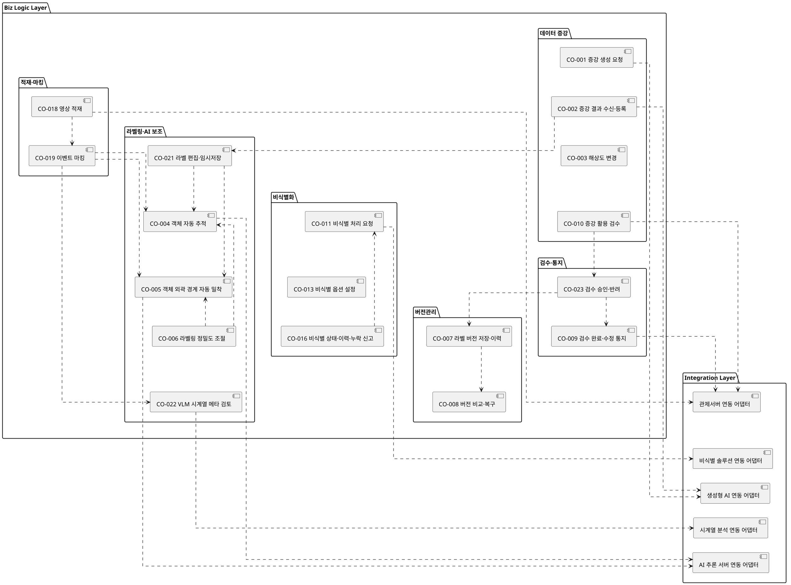

# D3 컴포넌트 설계서 — 통합 구조도 (A+B)

> **목적**: 기존 `D3-컴포넌트설계서.md`는 컴포넌트별로 잘게 분할된 18개 소형 다이어그램으로 구성되어, CBD 표준 양식이 한 페이지에 크게 잡아두는 "컴포넌트 구조도" 칸을 채우지 못한다.
> 본 문서는 **(A) 18개 컴포넌트 전체를 하나의 패키지도로 통합** + **(B) 페이지 폭을 채우는 와이드 렌더**를 적용한 보충 산출물이다.
> **CBD 작성 사례 정합(D3)**: 컴포넌트 구조도는 ① **Biz Logic / Integration 2개 레이어**를 중첩 사각형으로 구분하고 ② 그 안의 **«component» 간 의존관계(dependency)를 점선 화살표**로 표시하며 ③ **액터·외부 시스템을 액터로 그리지 않고** 외부 연동도 Integration Layer의 «component»(연동 어댑터)로 표현한다(작성 사례 p50 주석: "컴포넌트간의 의존관계를 Layer로 구분 표시"). 액터-유스케이스 관계는 R2 UCD가 담당한다.
> 컴포넌트별 내부 클래스·인터페이스 명세는 원본 `D3-컴포넌트설계서.md`를 따른다.

## 1. 통합 컴포넌트 구조도 (Biz Logic / Integration 레이어 · 컴포넌트 의존관계)

| 통합 다이어그램 ID | KLID-AT-CO-ALL | 명칭 | 학습데이터 저작도구 컴포넌트 통합 구조도 |
|---|---|---|---|
| 포함 컴포넌트 | Biz Logic 18종 + Integration 연동 5종 | 표기 | «component» 패키지도 · 의존관계(점선) |

> ※ 시스템을 구성하는 컴포넌트 간의 의존관계(dependency)를 Layer(Biz Logic / Integration)로 구분하여 표시한다. 외부 시스템(관제서버·비식별 솔루션·생성형 AI·시계열 분석·AI 추론 서버)과의 연동은 Integration Layer의 연동 어댑터 «component»로 표현하며, 액터-유스케이스 관계는 R2 유스케이스 명세서의 UCD가 담당한다.

## 2. 레이어·컴포넌트 매핑

| 레이어 | 컴포넌트 | 외부 연동(Integration) |
|---|---|---|
| Biz Logic · 적재/마킹 | CO-018 영상 적재 · CO-019 이벤트 마킹 | 관제서버 연동 |
| Biz Logic · 비식별화 | CO-011 비식별 처리 요청 · CO-013 비식별 옵션 설정 · CO-016 비식별 상태·이력·누락 신고 | 비식별 솔루션 연동 |
| Biz Logic · 라벨링/AI | CO-021 라벨 편집·임시저장 · CO-004 자동 추적 · CO-005 외곽 밀착 · CO-006 정밀도 조절 · CO-022 VLM 메타 검토 | AI 추론 서버 연동 · 시계열 분석 연동 |
| Biz Logic · 검수/통지 | CO-023 검수 승인·반려 · CO-009 검수 완료·수정 통지 | 관제서버 연동 |
| Biz Logic · 버전관리 | CO-007 라벨 버전 저장·이력 · CO-008 버전 비교·복구 | (내부 DB 스냅샷) |
| Biz Logic · 데이터 증강 | CO-001 증강 생성 요청 · CO-002 증강 결과 수신·등록 · CO-003 해상도 변경 · CO-010 증강 활용 검수 | 생성형 AI 연동 · 관제서버 연동 |
| Integration | 관제서버 / 비식별 솔루션 / 생성형 AI / 시계열 분석 / AI 추론 서버 연동 어댑터 | — |

> 컴포넌트별 상세(내부 클래스·인터페이스 클래스·오퍼레이션·Serviced/Required)는 원본 `D3-컴포넌트설계서.md`의 각 컴포넌트 명세 절을 참조한다.
