# D3 컴포넌트 설계서

> **ID 표기 규칙(공통)**: 본 산출물의 모든 ID(KLID-AT-UC/CO/DC/SD/SC/AC/EN/ERD/TB/II/IF/UCD/ACT 등)는 **전체 형식 `KLID-AT-XX-NNN`** 으로 표기한다. 끝부분만(예: `UC-001`) 약식 표기 금지. 범위는 시작 ID만 전체형으로(예: `KLID-AT-UC-001~013`). ※ 요구사항(RQ-SFR-NN-NN)·시스템시험(KLID-ST-NNN) 등 타 체계 ID는 각 체계 원형 유지.

## 작성 목적
> 설계 클래스 모형에서 도출한 클래스들을 C&V(공통성과 변경성) 기준에 따라 그룹핑하여 컴포넌트를 식별하여 패키지도를 작성하고 식별한 컴포넌트의 내부 클래스 및 인터페이스의 명세를 기술한다.

## 작성 방법
> 클래스를 그룹핑하여 도출한 컴포넌트의 패키지도를 작성하고, 식별한 컴포넌트의 목록을 작성한다. 또한 각각의 컴포넌트에 포함하고 있는 내부 클래스들을 명세하고, 인터페이스는 사용자에게 제공하는 오퍼레이션별로 상세한 명세를 작성한다.

## 산출물 양식

### 제.개정 이력

| 날짜 | 버전 | 제·개정 내역 | 작성자 | 검토자 |
|------|------|------------|--------|--------|
| 2026-06-09 | 1.0 | LogiCraft 그래프 기반 생성 (/cc-doc-gen) | - | - |

### 헤더

| D3 | 컴포넌트 설계서 |
|-------|----------|
| 시스템명 | AI 기반 지방정부 CCTV 관제지원시스템 구축(2차) | 서브시스템명 | 학습데이터 저작도구 (AT) |
| 단계명  | 설계       | 작성일자   | 2026-06-09 | 버전 | 1.0 |

> **컴포넌트 도출 원칙**: 컴포넌트는 유스케이스 실현 단위로 도출하며 **유스케이스 1건당 컴포넌트 1건(UC ↔ CO 1:1)** 이다. 활성 유스케이스 13건(KLID-AT-UC-001~011, 013, 016)당 컴포넌트 1건을 식별하고, 컴포넌트 번호는 실현 유스케이스 번호와 정렬한다(예: KLID-AT-CO-003 ↔ KLID-AT-UC-003). 유스케이스 결번(KLID-AT-UC-012/014/015)에 맞춰 컴포넌트 번호도 결번 처리한다. 도메인 단위로 컴포넌트를 묶지 않는다. 공통 기반 요소는 별도 컴포넌트로 식별하지 않고, 이를 사용하는 컴포넌트의 내부 클래스로 **동일 설계 클래스 ID(KLID-AT-DC-NNN)** 를 교차 참조한다(중복 정의 금지).
>
> **내부 클래스 ID 일관성 (Critical)**: 본 산출물의 내부 클래스 ID는 **클래스설계서(D1)의 설계 클래스 ID(KLID-AT-DC-NNN)와 동일 체계**를 사용한다. 동일 클래스는 D1·D3·엔티티관계모형설계서(D8) 전반에서 같은 ID를 가지며, 컴포넌트별로 독자 번호를 부여하지 않는다.

### 1. 컴포넌트 구조도

> **⟳ 컴포넌트별로 1개씩 반복 작성한다.** 다이어그램은 해당 컴포넌트의 내부 클래스를 계층(Biz Logic·Integration·Persistence)별 의존관계로 표시하고, 액터·외부 시스템·인접 컴포넌트는 외부 요소로 표기한다.

#### KLID-AT-CO-001 — 증강 생성 요청 컴포넌트

| 컴포넌트 ID | KLID-AT-CO-001 | 컴포넌트명 | 증강 생성 요청 컴포넌트 |
|----------|---|---------|---|
| 관련 유스케이스 ID | KLID-AT-UC-001 (증강 영상 생성 요청) |

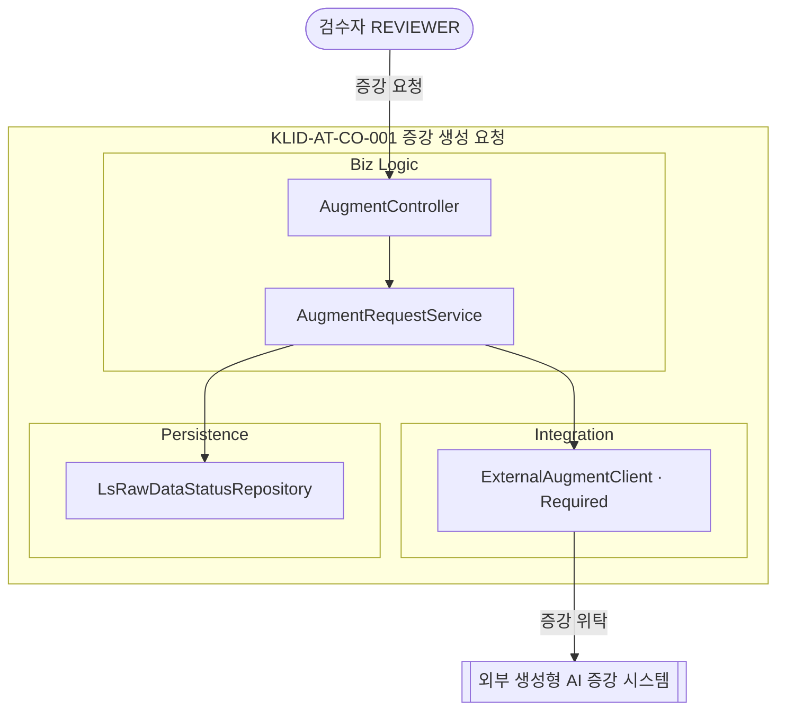

#### KLID-AT-CO-002 — 증강 결과 수신·등록 컴포넌트

| 컴포넌트 ID | KLID-AT-CO-002 | 컴포넌트명 | 증강 결과 수신·등록 컴포넌트 |
|----------|---|---------|---|
| 관련 유스케이스 ID | KLID-AT-UC-002 (증강 결과 수신·등록) |

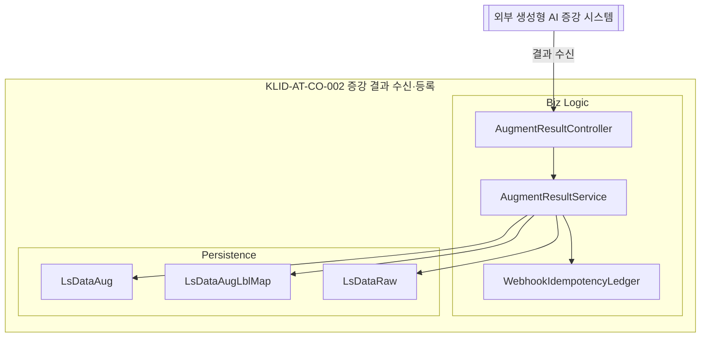

#### KLID-AT-CO-003 — 해상도 변경 컴포넌트

| 컴포넌트 ID | KLID-AT-CO-003 | 컴포넌트명 | 해상도 변경 컴포넌트 |
|----------|---|---------|---|
| 관련 유스케이스 ID | KLID-AT-UC-003 (해상도 변경 수행) |

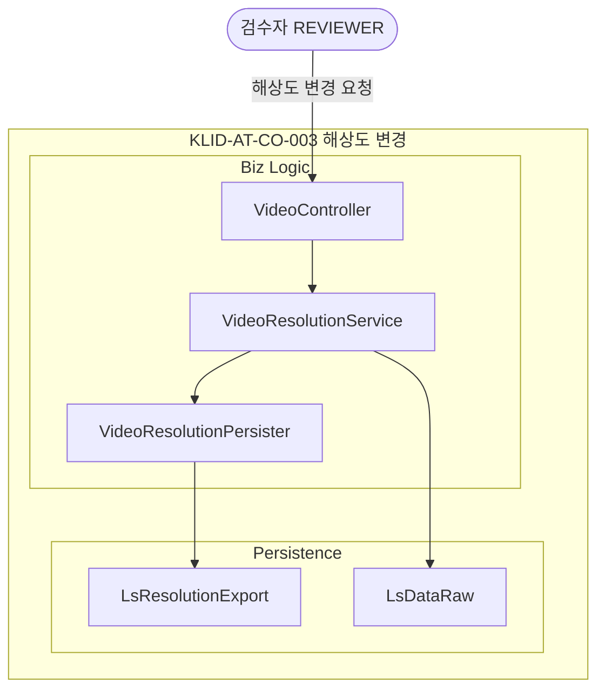

#### KLID-AT-CO-004 — 객체 자동 추적 컴포넌트

| 컴포넌트 ID | KLID-AT-CO-004 | 컴포넌트명 | 객체 자동 추적 컴포넌트 |
|----------|---|---------|---|
| 관련 유스케이스 ID | KLID-AT-UC-004 (객체 자동 추적) |

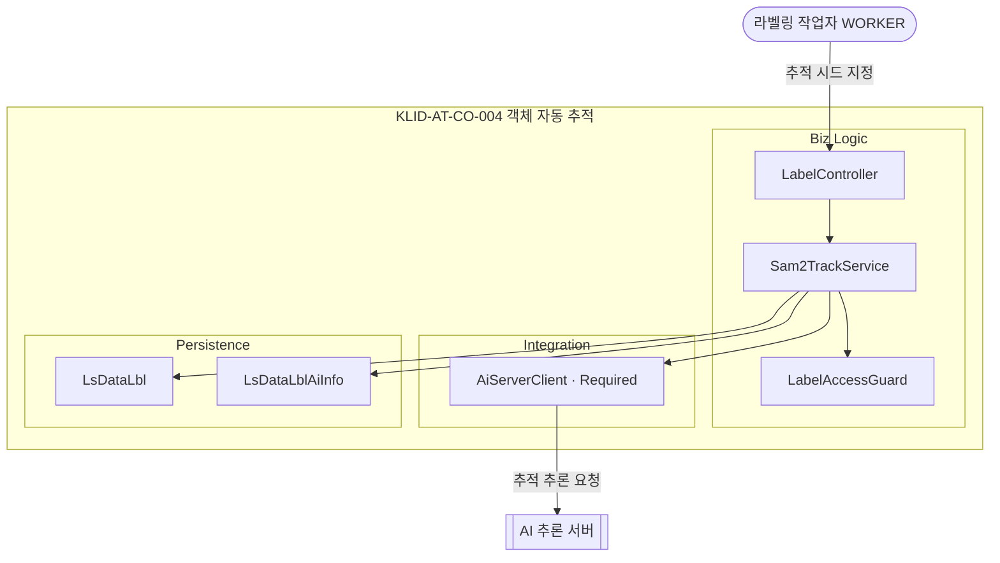

#### KLID-AT-CO-005 — 객체 외곽 경계 자동 밀착 컴포넌트

| 컴포넌트 ID | KLID-AT-CO-005 | 컴포넌트명 | 객체 외곽 경계 자동 밀착 컴포넌트 |
|----------|---|---------|---|
| 관련 유스케이스 ID | KLID-AT-UC-005 (객체 외곽 경계 자동 밀착) |

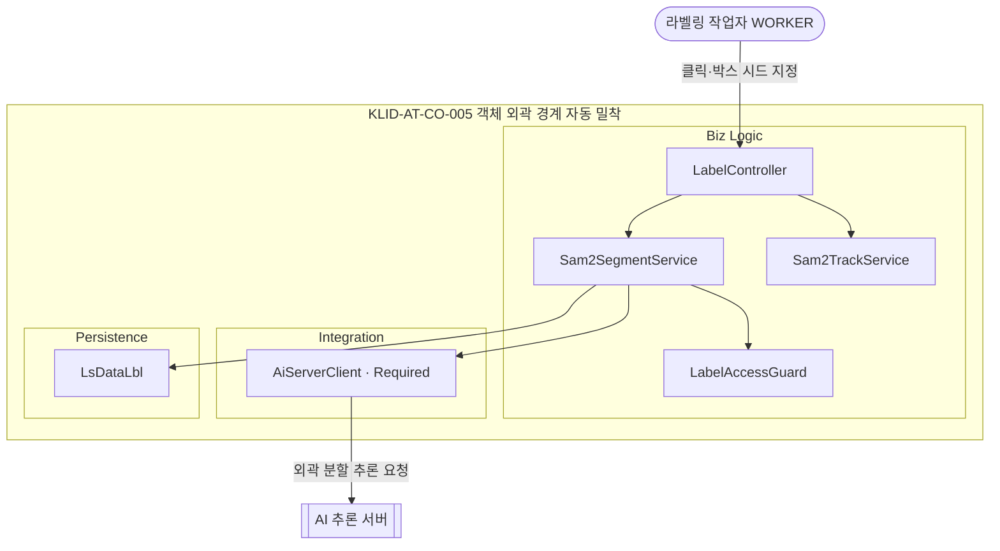

#### KLID-AT-CO-006 — 라벨링 정밀도 조절 컴포넌트

| 컴포넌트 ID | KLID-AT-CO-006 | 컴포넌트명 | 라벨링 정밀도 조절 컴포넌트 |
|----------|---|---------|---|
| 관련 유스케이스 ID | KLID-AT-UC-006 (라벨링 정밀도 조절) |

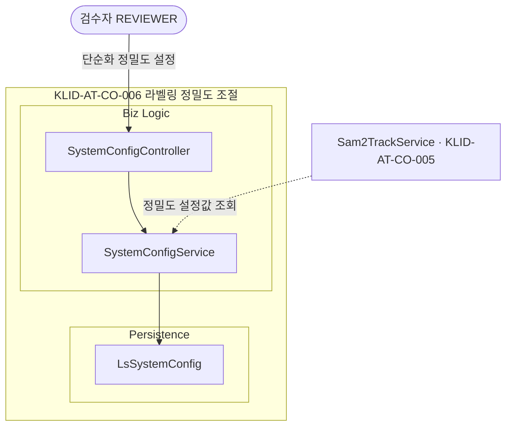

#### KLID-AT-CO-007 — 라벨 버전 저장 컴포넌트

| 컴포넌트 ID | KLID-AT-CO-007 | 컴포넌트명 | 라벨 버전 저장 컴포넌트 |
|----------|---|---------|---|
| 관련 유스케이스 ID | KLID-AT-UC-007 (라벨 버전 저장·이력 추적) |

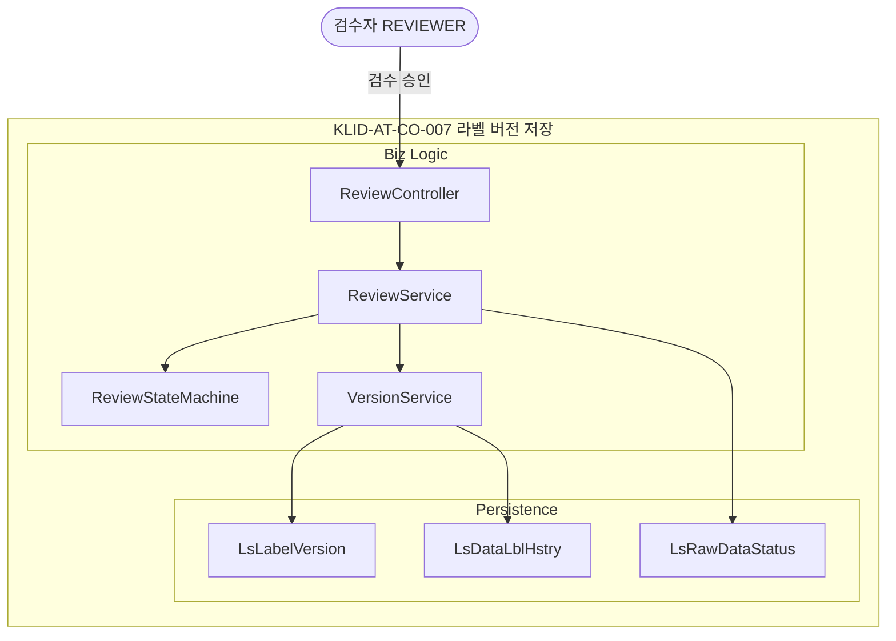

#### KLID-AT-CO-008 — 버전 비교·복구 컴포넌트

| 컴포넌트 ID | KLID-AT-CO-008 | 컴포넌트명 | 버전 비교·복구 컴포넌트 |
|----------|---|---------|---|
| 관련 유스케이스 ID | KLID-AT-UC-008 (버전 비교·복구) |

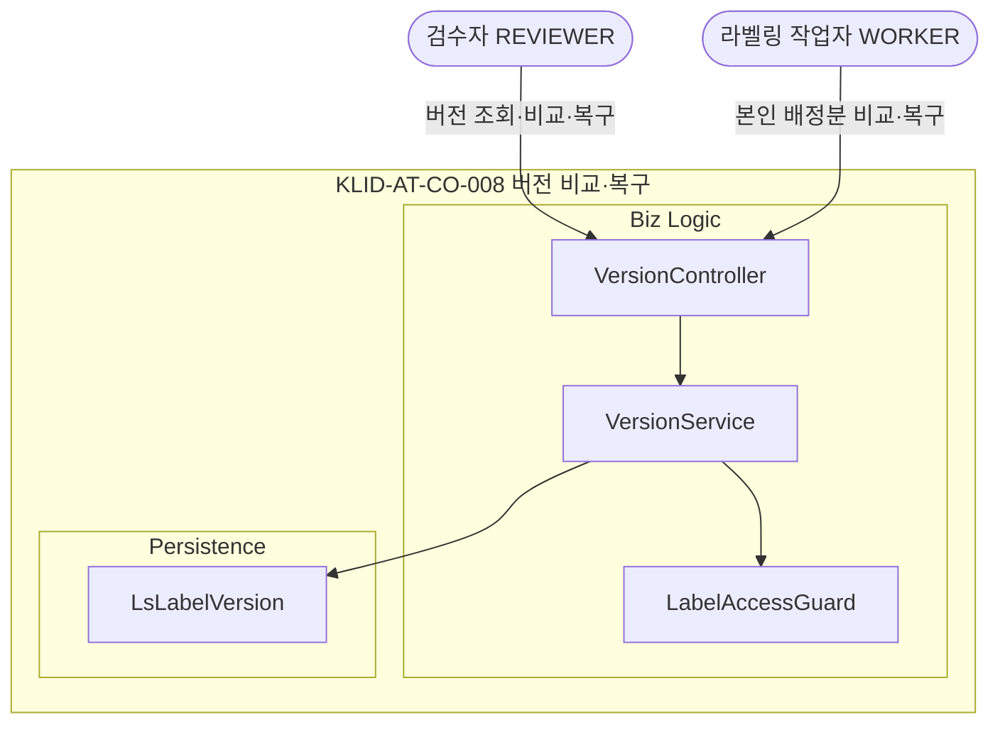

#### KLID-AT-CO-009 — 검수 완료·수정 통지 컴포넌트

| 컴포넌트 ID | KLID-AT-CO-009 | 컴포넌트명 | 검수 완료·수정 통지 컴포넌트 |
|----------|---|---------|---|
| 관련 유스케이스 ID | KLID-AT-UC-009 (검수 완료·수정 통지) |

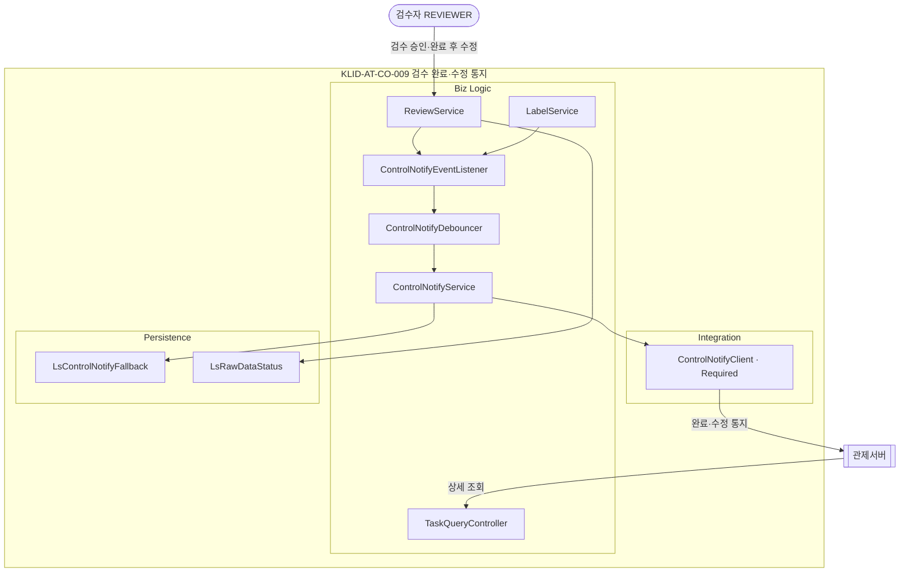

#### KLID-AT-CO-010 — 증강 영상 활용 검수 컴포넌트

| 컴포넌트 ID | KLID-AT-CO-010 | 컴포넌트명 | 증강 영상 활용 검수 컴포넌트 |
|----------|---|---------|---|
| 관련 유스케이스 ID | KLID-AT-UC-010 (증강 영상 활용 여부 검수) |

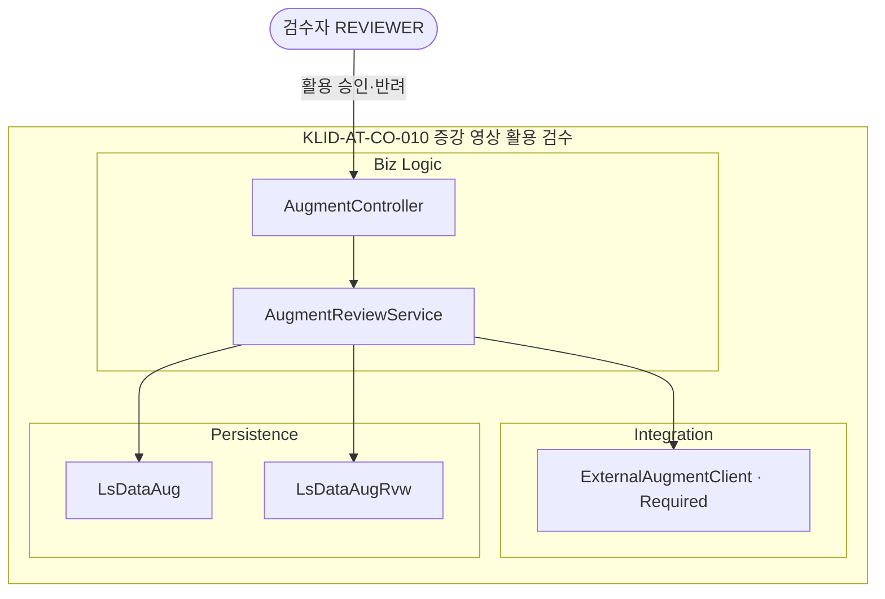

#### KLID-AT-CO-011 — 비식별 처리 요청 컴포넌트

| 컴포넌트 ID | KLID-AT-CO-011 | 컴포넌트명 | 비식별 처리 요청 컴포넌트 |
|----------|---|---------|---|
| 관련 유스케이스 ID | KLID-AT-UC-011 (비식별 처리 요청) |

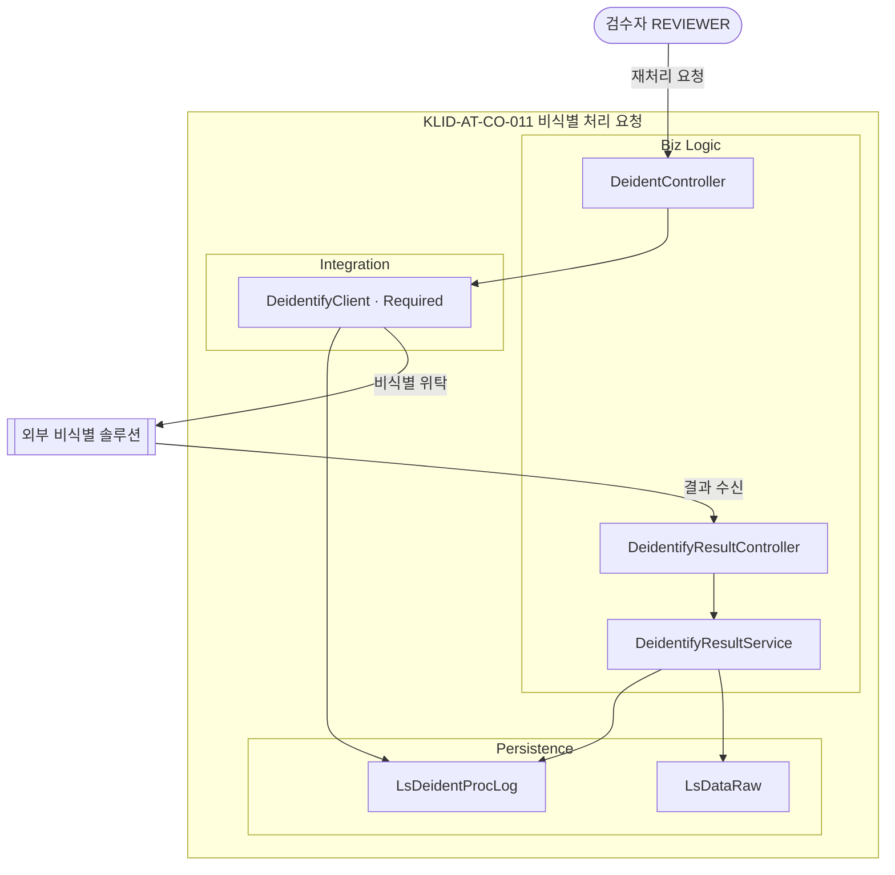

#### KLID-AT-CO-013 — 비식별 옵션 설정 컴포넌트

| 컴포넌트 ID | KLID-AT-CO-013 | 컴포넌트명 | 비식별 옵션 설정 컴포넌트 |
|----------|---|---------|---|
| 관련 유스케이스 ID | KLID-AT-UC-013 (비식별 옵션 설정) |

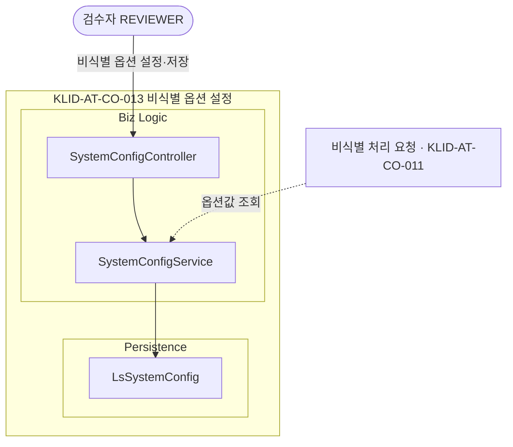

#### KLID-AT-CO-016 — 비식별 상태·신고 확인 컴포넌트

| 컴포넌트 ID | KLID-AT-CO-016 | 컴포넌트명 | 비식별 상태·신고 확인 컴포넌트 |
|----------|---|---------|---|
| 관련 유스케이스 ID | KLID-AT-UC-016 (비식별 처리 상태·이력 확인) |

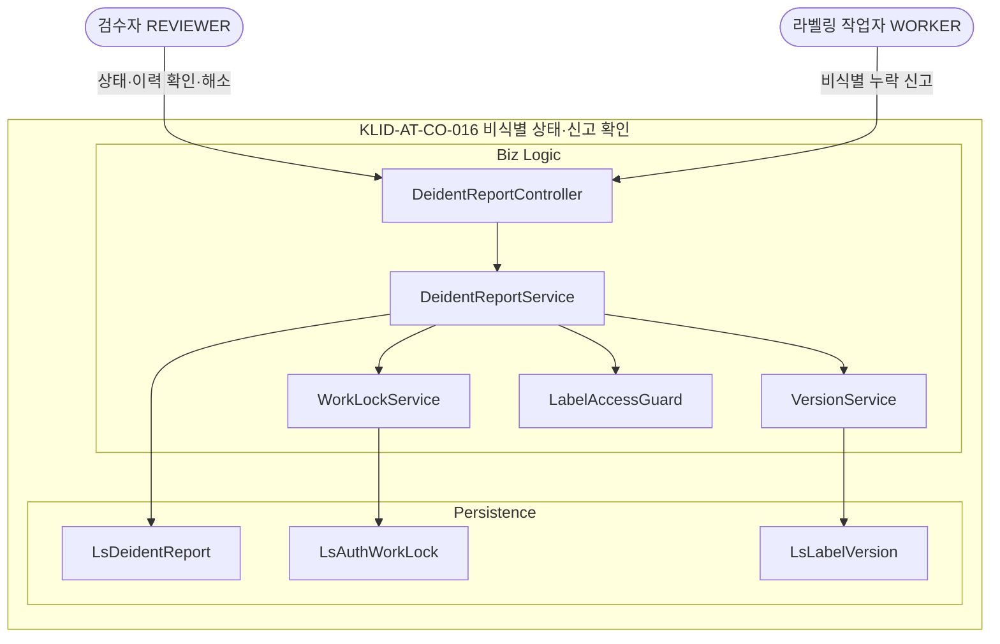

### 2. 컴포넌트 목록

| 컴포넌트ID | 컴포넌트명 | 개요 | 관련 유스케이스 ID |
|---------|---------|------|-------------|
| KLID-AT-CO-001 | 증강 생성 요청 컴포넌트 | 검수자가 원본 영상에 대해 날씨·계절·시간 증강(WINTER/NIGHT/RAIN)을 외부 생성형 AI 시스템으로 위탁 요청한다 | KLID-AT-UC-001 |
| KLID-AT-CO-002 | 증강 결과 수신·등록 컴포넌트 | 외부 증강 결과를 중복 없이 수신해 새 영상(원본 참조 유지)을 등록하고 원본 라벨·메타를 복사한 뒤 미검수 상태로 적재한다 | KLID-AT-UC-002 |
| KLID-AT-CO-003 | 해상도 변경 컴포넌트 | 영상을 표준 하위 해상도로 다운스케일한 프레임 이미지셋을 제공한다(업스케일 거부, 라벨 좌표 미제공, 원본 보존) | KLID-AT-UC-003 |
| KLID-AT-CO-004 | 객체 자동 추적 컴포넌트 | 시작 프레임의 시드 박스를 AI 추론 서버로 후속 프레임에 전파해 위치·경계를 추적·갱신하고 트랙 보간으로 빈 프레임을 채운다 | KLID-AT-UC-004 |
| KLID-AT-CO-005 | 객체 외곽 경계 자동 밀착 컴포넌트 | 클릭·박스 시드를 AI 추론 서버로 전달해 외곽선 기반 폴리곤과 신뢰도를 산출하고 경계에 밀착시킨다 | KLID-AT-UC-005 |
| KLID-AT-CO-006 | 라벨링 정밀도 조절 컴포넌트 | 검수자가 폴리곤 단순화 정밀도를 설정하면 이후 외곽 분할 결과의 폴리곤 점 수가 조절된다(설정 캐시 적용, 조회 실패 시 기본값 적용) | KLID-AT-UC-006 |
| KLID-AT-CO-007 | 라벨 버전 저장 컴포넌트 | 검수 승인 시점에 영상 단위 라벨 전체 스냅샷을 학습데이터 버전으로 적재하고 페이로드 해시로 식별·이력 기록한다 | KLID-AT-UC-007 |
| KLID-AT-CO-008 | 버전 비교·복구 컴포넌트 | 검수완료 버전 간 스냅샷을 비교해 차이를 표시하고 선택 버전을 새 활성 버전으로 복구한다 | KLID-AT-UC-008 |
| KLID-AT-CO-009 | 검수 완료·수정 통지 컴포넌트 | 영상 단위 검수 워크플로우를 처리하고 승인(완료) 시 완료 통지, 완료 후 수정 시 수정 통지를 관제서버로 단방향 전송한다(요약만, 본문·개인정보 미포함) | KLID-AT-UC-009 |
| KLID-AT-CO-010 | 증강 영상 활용 검수 컴포넌트 | 미검수 증강 영상을 확인해 학습데이터 활용 여부를 승인·반려(사유 필수)한다 | KLID-AT-UC-010 |
| KLID-AT-CO-011 | 비식별 처리 요청 컴포넌트 | 전체 영상을 외부 비식별 솔루션으로 위탁하고 비식별본을 별도 경로에 저장하며 원본을 보존한다(결과 중복 없이 수신, 실패 시 재시도 큐) | KLID-AT-UC-011 |
| KLID-AT-CO-013 | 비식별 옵션 설정 컴포넌트 | 외부 비식별 솔루션이 제공하는 옵션을 관리 화면에서 검수자가 설정·저장해 이후 비식별 요청에 적용한다 | KLID-AT-UC-013 |
| KLID-AT-CO-016 | 비식별 상태·신고 확인 컴포넌트 | 영상 단위 비식별 처리 상태·이력을 확인하고, 비식별 누락 신고 시 작업락·전체 라벨 비활성 스냅샷 후 삭제·수동 해소를 처리한다 | KLID-AT-UC-016 |

> ※ 컴포넌트 번호 KLID-AT-CO-012/014/015는 실현 유스케이스 결번(KLID-AT-UC-012/014/015 폐기)에 동조하여 결번 처리한다.

### 3. 컴포넌트 명세

> **⟳ 컴포넌트별로 1개씩 반복 작성한다.** 내부 클래스 ID는 클래스설계서(D1)의 설계 클래스 ID(KLID-AT-DC-NNN)와 동일하며, 공통 클래스 재사용은 동일 ID로 교차 참조한다(중복 정의 금지). 외부 연동 어댑터(AiServerClient·DeidentifyClient·ControlNotifyClient·ExternalAugmentClient)는 인터페이스 클래스(Required)로 명세한다.

#### KLID-AT-CO-001 — 증강 생성 요청 컴포넌트

| 컴포넌트 ID | KLID-AT-CO-001 | 컴포넌트명 | 증강 생성 요청 컴포넌트 |
|----------|---|---------|---|
| 컴포넌트 개요 | 검수자가 원본 영상·증강 종류를 선택해 외부 생성형 AI 증강 시스템에 비동기 생성을 위탁 요청한다. 생성 본체는 외부 책임이며 결과는 KLID-AT-CO-002 수신 흐름으로 받는다. |

| **내부 클래스** | | |
| ID | 클래스명 | 설명 |
|----|--------|------|
| KLID-AT-DC-001 | AugmentController | 증강 요청·결과 검수 요청을 받는 진입점 |
| KLID-AT-DC-002 | AugmentRequestService | 외부 증강 생성 위탁을 오케스트레이션한다 |
| KLID-AT-DC-004 | LsRawDataStatusRepository | 영상 진행 상태 조회·갱신 저장소 |
| KLID-AT-DC-033 | LsRawDataStatus | 작업·검수 진행 상태 도형 클래스 |

| **인터페이스 클래스** | | | |
| ID | 인터페이스명 | 오퍼레이션명 | 구분 (Serviced/Required) |
|----|----------|----------|------------------------|
| KLID-AT-IF-001 | 증강 요청 인터페이스 | requestAugment | Serviced |
| KLID-AT-IF-012 | 외부 증강 위탁 연동 | requestAugment | Required |

#### KLID-AT-CO-002 — 증강 결과 수신·등록 컴포넌트

| 컴포넌트 ID | KLID-AT-CO-002 | 컴포넌트명 | 증강 결과 수신·등록 컴포넌트 |
|----------|---|---------|---|
| 컴포넌트 개요 | 외부 증강 결과를 중복 없이 수신해 새 영상(원본 참조 유지)을 생성하고 원본 라벨·메타를 복사한 뒤 미검수 상태로 적재한다. |

| **내부 클래스** | | |
| ID | 클래스명 | 설명 |
|----|--------|------|
| KLID-AT-DC-005 | AugmentResultController | 외부 증강 시스템 결과 수신 진입점 |
| KLID-AT-DC-007 | AugmentResultService | 결과를 중복 없이 적재하고 새 영상·프레임·라벨·메타를 등록한다 |
| KLID-AT-DC-009 | WebhookIdempotencyLedger | 결과 수신 중복 차단 원장 |
| KLID-AT-DC-006 | LsDataAug | 증강 결과 도형 클래스 |
| KLID-AT-DC-008 | LsDataAugLblMap | 증강 영상↔라벨 매핑 도형 클래스 |
| KLID-AT-DC-010 | LsDataRaw | 영상 메타(원본 참조 포함) 도형 클래스 |

| **인터페이스 클래스** | | | |
| ID | 인터페이스명 | 오퍼레이션명 | 구분 (Serviced/Required) |
|----|----------|----------|------------------------|
| KLID-AT-IF-009 | 증강 결과 수신 인터페이스 | onAugmentResult | Serviced |

#### KLID-AT-CO-003 — 해상도 변경 컴포넌트

| 컴포넌트 ID | KLID-AT-CO-003 | 컴포넌트명 | 해상도 변경 컴포넌트 |
|----------|---|---------|---|
| 컴포넌트 개요 | 영상을 원본보다 낮은 표준 하위 해상도로 다운스케일한 프레임 이미지셋을 제공한다. 업스케일은 거부하고, 영상 재생성·라벨 좌표 변환을 하지 않으며 원본을 보존한다. |

| **내부 클래스** | | |
| ID | 클래스명 | 설명 |
|----|--------|------|
| KLID-AT-DC-011 | VideoController | 영상 조회·스트리밍·해상도 변경 진입점 |
| KLID-AT-DC-012 | VideoResolutionService | 해상도 변경을 검증·실행하는 오케스트레이션 |
| KLID-AT-DC-013 | VideoResolutionPersister | 리사이즈 결과 이미지셋·추적 레코드를 저장한다 |
| KLID-AT-DC-019 | LsResolutionExport | 해상도 변경 추적 도형 클래스 |
| KLID-AT-DC-010 | LsDataRaw | 영상 메타 도형 클래스 — KLID-AT-CO-002 공유 |

| **인터페이스 클래스** | | | |
| ID | 인터페이스명 | 오퍼레이션명 | 구분 (Serviced/Required) |
|----|----------|----------|------------------------|
| KLID-AT-IF-002 | 해상도 변경 인터페이스 | changeResolution | Serviced |

#### KLID-AT-CO-004 — 객체 자동 추적 컴포넌트

| 컴포넌트 ID | KLID-AT-CO-004 | 컴포넌트명 | 객체 자동 추적 컴포넌트 |
|----------|---|---------|---|
| 컴포넌트 개요 | 시작 프레임의 시드 박스를 AI 추론 서버로 후속 프레임에 전파해 위치·경계를 추적·갱신하고(자동 라벨로 표시) 트랙 보간으로 빈 프레임을 채운다. 본인 미배정 프레임 접근은 거부한다. |

| **내부 클래스** | | |
| ID | 클래스명 | 설명 |
|----|--------|------|
| KLID-AT-DC-014 | LabelController | 프레임별 라벨 편집·추적·분할 요청 진입점 |
| KLID-AT-DC-015 | Sam2TrackService | 대화형 추적 전파·트랙 보간 처리 |
| KLID-AT-DC-016 | LabelAccessGuard | 본인 배정 프레임 편집 권한 검증 |
| KLID-AT-DC-018 | AiServerClient | AI 추론 호출 어댑터 |
| KLID-AT-DC-017 | LsDataLbl | 라벨 좌표 도형 클래스 |
| KLID-AT-DC-038 | LsDataLblAiInfo | 자동 라벨 부가정보 도형 클래스 |

| **인터페이스 클래스** | | | |
| ID | 인터페이스명 | 오퍼레이션명 | 구분 (Serviced/Required) |
|----|----------|----------|------------------------|
| KLID-AT-IF-003 | 객체 추적 인터페이스 | trackBySam2 | Serviced |
| KLID-AT-IF-013 | AI 추론 연동(추적) | track | Required |

#### KLID-AT-CO-005 — 객체 외곽 경계 자동 밀착 컴포넌트

| 컴포넌트 ID | KLID-AT-CO-005 | 컴포넌트명 | 객체 외곽 경계 자동 밀착 컴포넌트 |
|----------|---|---------|---|
| 컴포넌트 개요 | 클릭(포인트)·박스 시드를 AI 추론 서버로 전달해 외곽선 기반 폴리곤과 신뢰도를 산출하고, 좌표 유효성 검증·폴리곤 단순화 후 경계에 밀착시킨다(원본 프레임에만 실행, 비식별본 좌표 공유). |

| **내부 클래스** | | |
| ID | 클래스명 | 설명 |
|----|--------|------|
| KLID-AT-DC-014 | LabelController | 외곽 분할 요청 진입점 — KLID-AT-CO-004 공유 |
| KLID-AT-DC-020 | Sam2SegmentService | 외곽 분할 처리(시드 배타 검증·좌표 상한 검증·단순화) |
| KLID-AT-DC-015 | Sam2TrackService | 추적 처리 — KLID-AT-CO-004 공유 |
| KLID-AT-DC-016 | LabelAccessGuard | 접근 권한 검증 — KLID-AT-CO-004 공유 |
| KLID-AT-DC-018 | AiServerClient | AI 추론 호출 어댑터 — KLID-AT-CO-004 공유 |
| KLID-AT-DC-017 | LsDataLbl | 라벨 좌표 도형 클래스 — KLID-AT-CO-004 공유 |

| **인터페이스 클래스** | | | |
| ID | 인터페이스명 | 오퍼레이션명 | 구분 (Serviced/Required) |
|----|----------|----------|------------------------|
| KLID-AT-IF-004 | 외곽 분할 인터페이스 | segmentBySam2 | Serviced |
| KLID-AT-IF-014 | AI 추론 연동(분할) | segment | Required |

#### KLID-AT-CO-006 — 라벨링 정밀도 조절 컴포넌트

| 컴포넌트 ID | KLID-AT-CO-006 | 컴포넌트명 | 라벨링 정밀도 조절 컴포넌트 |
|----------|---|---------|---|
| 컴포넌트 개요 | 검수자가 시스템 설정에서 폴리곤 단순화 정밀도를 조절하면 이후 외곽 분할 결과의 폴리곤 점 수가 단순화된다. 설정은 짧은 만료시간의 애플리케이션 캐시에 보관하며 조회 실패 시 기본값으로 안전하게 동작한다. |

| **내부 클래스** | | |
| ID | 클래스명 | 설명 |
|----|--------|------|
| KLID-AT-DC-024 | SystemConfigController | 시스템 설정 목록·수정 진입점 |
| KLID-AT-DC-025 | SystemConfigService | 설정 저장·조회(캐시 적용, 실패 시 기본값 폴백) |
| KLID-AT-DC-026 | LsSystemConfig | 시스템 설정 도형 클래스 |
| KLID-AT-DC-015 | Sam2TrackService | 단순화 정밀도 설정값 소비 — KLID-AT-CO-004 공유 |

| **인터페이스 클래스** | | | |
| ID | 인터페이스명 | 오퍼레이션명 | 구분 (Serviced/Required) |
|----|----------|----------|------------------------|
| KLID-AT-IF-005 | 시스템 설정 인터페이스 | updateConfig | Serviced |

#### KLID-AT-CO-007 — 라벨 버전 저장 컴포넌트

| 컴포넌트 ID | KLID-AT-CO-007 | 컴포넌트명 | 라벨 버전 저장 컴포넌트 |
|----------|---|---------|---|
| 컴포넌트 개요 | 검수 승인 시점에 영상 단위 라벨 전체 스냅샷을 학습데이터 버전으로 적재하고 페이로드 해시로 식별한다. 외부 형상관리 도구를 사용하지 않는 데이터베이스 스냅샷 방식이며, 라벨 저장 시점에는 버전을 생성하지 않는다. |

| **내부 클래스** | | |
| ID | 클래스명 | 설명 |
|----|--------|------|
| KLID-AT-DC-027 | ReviewController | 검수 처리 진입점 |
| KLID-AT-DC-031 | ReviewService | 검수 워크플로우 — 승인 시 스냅샷 생성 트리거 |
| KLID-AT-DC-032 | ReviewStateMachine | 검수 상태 전이 검증 |
| KLID-AT-DC-029 | VersionService | 승인 시 라벨 전체 스냅샷 저장·해시 생성 |
| KLID-AT-DC-030 | LsLabelVersion | 라벨 버전 스냅샷 도형 클래스 |
| KLID-AT-DC-028 | LsDataLblHstry | 라벨 이력 도형 클래스 |
| KLID-AT-DC-033 | LsRawDataStatus | 작업·검수 진행 상태 도형 클래스 — KLID-AT-CO-001 공유 |

| **인터페이스 클래스** | | | |
| ID | 인터페이스명 | 오퍼레이션명 | 구분 (Serviced/Required) |
|----|----------|----------|------------------------|
| KLID-AT-IF-006 | 버전 스냅샷 내부 인터페이스 | commitApproved | Serviced |

#### KLID-AT-CO-008 — 버전 비교·복구 컴포넌트

| 컴포넌트 ID | KLID-AT-CO-008 | 컴포넌트명 | 버전 비교·복구 컴포넌트 |
|----------|---|---------|---|
| 컴포넌트 개요 | 두 검수완료 버전의 스냅샷을 비교해 추가·변경·삭제 차이를 산출·표시하고, 대상 스냅샷을 새 활성 버전으로 복원한다(검수자 전체, 작업자 본인 배정분). |

| **내부 클래스** | | |
| ID | 클래스명 | 설명 |
|----|--------|------|
| KLID-AT-DC-034 | VersionController | 버전 목록·비교·복구 진입점 |
| KLID-AT-DC-029 | VersionService | 버전 차이 산출·복구 — KLID-AT-CO-007 공유 |
| KLID-AT-DC-016 | LabelAccessGuard | 접근 권한 검증 — KLID-AT-CO-004 공유 |
| KLID-AT-DC-030 | LsLabelVersion | 버전 스냅샷 도형 클래스 — KLID-AT-CO-007 공유 |

| **인터페이스 클래스** | | | |
| ID | 인터페이스명 | 오퍼레이션명 | 구분 (Serviced/Required) |
|----|----------|----------|------------------------|
| KLID-AT-IF-007 | 버전 비교·복구 인터페이스 | listVersions | Serviced |
| KLID-AT-IF-007 | 버전 비교·복구 인터페이스 | diffVersions | Serviced |
| KLID-AT-IF-007 | 버전 비교·복구 인터페이스 | rollbackVersion | Serviced |

#### KLID-AT-CO-009 — 검수 완료·수정 통지 컴포넌트

| 컴포넌트 ID | KLID-AT-CO-009 | 컴포넌트명 | 검수 완료·수정 통지 컴포넌트 |
|----------|---|---------|---|
| 컴포넌트 개요 | 영상 단위 검수 워크플로우를 처리하고, 승인(완료) 시 완료 이벤트를 발행해 완료 통지를, 완료 후 수정 시 수정 통지를 관제서버로 단방향 비동기 전송한다(요약만, 개인정보·본문 미포함, 영상 단위 디바운스). 관제서버는 통지 수신 후 상세 조회 인터페이스로 보강한다. |

| **내부 클래스** | | |
| ID | 클래스명 | 설명 |
|----|--------|------|
| KLID-AT-DC-031 | ReviewService | 검수 워크플로우 — 승인 시 완료 통지 트리거 |
| KLID-AT-DC-047 | LabelService | 완료 후 라벨 수정 시 수정 통지 트리거 |
| KLID-AT-DC-040 | ControlNotifyEventListener | 완료·수정 이벤트 수신 후 통지 트리거 |
| KLID-AT-DC-041 | ControlNotifyDebouncer | 영상 단위 디바운스 후 1회 통지 |
| KLID-AT-DC-042 | ControlNotifyService | 통지 발행(요청 단위 중복 차단·지표 수집) |
| KLID-AT-DC-043 | ControlNotifyClient | 관제서버 통지 호출 어댑터 |
| KLID-AT-DC-044 | LsControlNotifyFallback | 통지 실패 재등록 큐 도형 클래스 |
| KLID-AT-DC-045 | TaskQueryController | 관제서버의 상세 조회 진입점 |
| KLID-AT-DC-033 | LsRawDataStatus | 작업·검수 진행 상태 도형 클래스 — KLID-AT-CO-001 공유 |

| **인터페이스 클래스** | | | |
| ID | 인터페이스명 | 오퍼레이션명 | 구분 (Serviced/Required) |
|----|----------|----------|------------------------|
| KLID-AT-IF-008 | 검수 승인·반려 인터페이스 | approveReview | Serviced |
| KLID-AT-IF-008 | 검수 승인·반려 인터페이스 | rejectReview | Serviced |
| KLID-AT-IF-010 | 관제 완료 통지 연동 | sendTaskCompleted | Required |
| KLID-AT-IF-011 | 관제 수정 통지 연동 | sendTaskModified | Required |

#### KLID-AT-CO-010 — 증강 영상 활용 검수 컴포넌트

| 컴포넌트 ID | KLID-AT-CO-010 | 컴포넌트명 | 증강 영상 활용 검수 컴포넌트 |
|----------|---|---------|---|
| 컴포넌트 개요 | 검수자가 미검수 증강 결과 목록을 조회·확인 후 활용 승인 또는 반려(사유 필수)한다. 증강 본체는 외부 책임이며 저작도구는 결과 검수만 담당한다. |

| **내부 클래스** | | |
| ID | 클래스명 | 설명 |
|----|--------|------|
| KLID-AT-DC-001 | AugmentController | 증강 결과 검수 진입점 — KLID-AT-CO-001 공유 |
| KLID-AT-DC-021 | AugmentReviewService | 증강 결과 활용 검수(승인 시 새 영상 활성화) |
| KLID-AT-DC-006 | LsDataAug | 증강 결과 도형 클래스 — KLID-AT-CO-002 공유 |
| KLID-AT-DC-022 | LsDataAugRvw | 증강 검수 도형 클래스 |
| KLID-AT-DC-003 | ExternalAugmentClient | 외부 증강 위탁 어댑터 — KLID-AT-CO-001 공유 |

| **인터페이스 클래스** | | | |
| ID | 인터페이스명 | 오퍼레이션명 | 구분 (Serviced/Required) |
|----|----------|----------|------------------------|
| KLID-AT-IF-015 | 증강 검수 인터페이스 | acceptAugment | Serviced |
| KLID-AT-IF-015 | 증강 검수 인터페이스 | rejectAugment | Serviced |

#### KLID-AT-CO-011 — 비식별 처리 요청 컴포넌트

| 컴포넌트 ID | KLID-AT-CO-011 | 컴포넌트명 | 비식별 처리 요청 컴포넌트 |
|----------|---|---------|---|
| 컴포넌트 개요 | 전체 영상을 외부 비식별 솔루션에 위탁 호출하고, 비식별본을 별도 경로에 저장하며 원본을 보존한다. 결과는 중복 없이 수신하고 실패 시 비식별 실패 상태로 표시·재시도 큐에 등록한다(원본 절대 삭제 금지). |

| **내부 클래스** | | |
| ID | 클래스명 | 설명 |
|----|--------|------|
| KLID-AT-DC-035 | DeidentController | 비식별 재처리 요청 진입점 |
| KLID-AT-DC-036 | DeidentifyResultController | 외부 비식별 솔루션 결과 수신 진입점 |
| KLID-AT-DC-037 | DeidentifyResultService | 결과를 중복 없이 적재하고 처리 이력을 기록한다 |
| KLID-AT-DC-023 | DeidentifyClient | 외부 비식별 위탁 호출 어댑터 |
| KLID-AT-DC-039 | LsDeidentProcLog | 비식별 처리 이력 도형 클래스 |
| KLID-AT-DC-010 | LsDataRaw | 영상 비식별 상태 도형 클래스 — KLID-AT-CO-002 공유 |

| **인터페이스 클래스** | | | |
| ID | 인터페이스명 | 오퍼레이션명 | 구분 (Serviced/Required) |
|----|----------|----------|------------------------|
| KLID-AT-IF-016 | 비식별 재처리 인터페이스 | reprocess | Serviced |
| KLID-AT-IF-017 | 비식별 결과 수신 인터페이스 | onDeidentifyResult | Serviced |
| KLID-AT-IF-018 | 외부 비식별 위탁 연동 | deidentify | Required |

#### KLID-AT-CO-013 — 비식별 옵션 설정 컴포넌트

| 컴포넌트 ID | KLID-AT-CO-013 | 컴포넌트명 | 비식별 옵션 설정 컴포넌트 |
|----------|---|---------|---|
| 컴포넌트 개요 | 외부 비식별 솔루션이 제공하는 옵션을 관리 화면에서 검수자가 설정·저장해 이후 비식별 요청에 적용한다. |

| **내부 클래스** | | |
| ID | 클래스명 | 설명 |
|----|--------|------|
| KLID-AT-DC-024 | SystemConfigController | 시스템 설정 수정 진입점 — KLID-AT-CO-006 공유 |
| KLID-AT-DC-025 | SystemConfigService | 옵션 저장·조회 — KLID-AT-CO-006 공유 |
| KLID-AT-DC-026 | LsSystemConfig | 시스템 설정 도형 클래스 — KLID-AT-CO-006 공유 |

| **인터페이스 클래스** | | | |
| ID | 인터페이스명 | 오퍼레이션명 | 구분 (Serviced/Required) |
|----|----------|----------|------------------------|
| KLID-AT-IF-005 | 시스템 설정 인터페이스 | updateConfig | Serviced |

#### KLID-AT-CO-016 — 비식별 상태·신고 확인 컴포넌트

| 컴포넌트 ID | KLID-AT-CO-016 | 컴포넌트명 | 비식별 상태·신고 확인 컴포넌트 |
|----------|---|---------|---|
| 컴포넌트 개요 | 영상 단위 비식별 처리 상태·이력을 확인하고, 작업자가 비식별 누락을 신고하면 작업락과 함께 해당 영상 전체 라벨을 비활성 스냅샷으로 보존 후 삭제하며, 외부 솔루션 수동 비식별화 후 해소 시 작업락을 해제한다. 검수완료 영상 신고 시 수정 통지를 발행한다. |

| **내부 클래스** | | |
| ID | 클래스명 | 설명 |
|----|--------|------|
| KLID-AT-DC-048 | DeidentReportController | 비식별 상태 확인·신고·해소 진입점 |
| KLID-AT-DC-049 | DeidentReportService | 신고·전체 라벨 비활성 스냅샷·삭제·수동 해소 처리 |
| KLID-AT-DC-050 | WorkLockService | 작업락 설정·해제(재신고 차단) |
| KLID-AT-DC-029 | VersionService | 삭제 전 비활성 스냅샷 생성 — KLID-AT-CO-007 공유 |
| KLID-AT-DC-016 | LabelAccessGuard | 본인 배정 검증 — KLID-AT-CO-004 공유 |
| KLID-AT-DC-046 | LsDeidentReport | 비식별 신고 도형 클래스 |
| KLID-AT-DC-051 | LsAuthWorkLock | 작업락 도형 클래스 |
| KLID-AT-DC-030 | LsLabelVersion | 버전 스냅샷 도형 클래스 — KLID-AT-CO-007 공유 |

| **인터페이스 클래스** | | | |
| ID | 인터페이스명 | 오퍼레이션명 | 구분 (Serviced/Required) |
|----|----------|----------|------------------------|
| KLID-AT-IF-019 | 비식별 신고·해소 인터페이스 | reportDeident | Serviced |
| KLID-AT-IF-019 | 비식별 신고·해소 인터페이스 | resolveDeident | Serviced |

### 4. 인터페이스 명세

> **⟳ 인터페이스별로, 그 인터페이스의 오퍼레이션 개수만큼 반복 작성한다.** 외부 연동(Required) 인터페이스의 내용은 인터페이스 설계서(D4)의 연동 명세와 정합한다(IF와 II는 별개 체계이며 상호 ID를 인용하지 않는다).

#### KLID-AT-IF-001 — 증강 요청 인터페이스

| 인터페이스 ID | KLID-AT-IF-001 | 인터페이스명 | 증강 요청 인터페이스 |
|---------|---|---------|---|
| 오퍼레이션명 | requestAugment |
| 오퍼레이션 개요 | 검수자가 원본 영상·증강 종류(WINTER/NIGHT/RAIN)를 선택해 외부 증강 생성을 위탁 요청한다 |
| 사전조건 | 원본 영상이 존재하고 검수자로 인증되어 있다 |
| 사후조건 | 외부 증강 시스템에 생성 작업이 위탁되고 결과 수신을 대기한다 |
| 파라미터 | 증강 대상 영상 목록, 증강 종류 목록, 인증 주체(검수자) |
| 반환값 | 증강 요청 결과(작업 식별·접수 상태) |

#### KLID-AT-IF-002 — 해상도 변경 인터페이스

| 인터페이스 ID | KLID-AT-IF-002 | 인터페이스명 | 해상도 변경 인터페이스 |
|---------|---|---------|---|
| 오퍼레이션명 | changeResolution |
| 오퍼레이션 개요 | 영상을 표준 하위 해상도로 다운스케일한 프레임 이미지셋을 생성한다 |
| 사전조건 | 원본 영상이 존재하고 검수자로 인증되어 있으며 목표 해상도가 원본보다 낮다 |
| 사후조건 | 하위 해상도 이미지셋이 생성되고 해상도 변경 추적 레코드 1건으로 기록된다(라벨 좌표 미제공, 원본 보존) |
| 파라미터 | 대상 영상 식별자, 목표 해상도, 등록자 |
| 반환값 | 생성 결과·이미지셋 경로. 업스케일 요청은 거부 |

#### KLID-AT-IF-003 — 객체 추적 인터페이스

| 인터페이스 ID | KLID-AT-IF-003 | 인터페이스명 | 객체 추적 인터페이스 |
|---------|---|---------|---|
| 오퍼레이션명 | trackBySam2 |
| 오퍼레이션 개요 | 시작 프레임의 시드 박스를 후속 프레임으로 전파해 위치·경계를 추적·갱신한다 |
| 사전조건 | 인증(검수자/작업자 본인 배정)되어 있고 대상 프레임·추적 시드가 존재한다 |
| 사후조건 | 후속 프레임에 추적된 객체 위치·경계가 자동 라벨로 저장된다 |
| 파라미터 | 대상 프레임 식별자(경로·본문 일치), 추적 시드 정보 |
| 반환값 | 트랙 전파 결과(폴리곤·트랙 식별). 식별자 불일치 시 거부, 미배정 접근 시 거부 |

#### KLID-AT-IF-004 — 외곽 분할 인터페이스

| 인터페이스 ID | KLID-AT-IF-004 | 인터페이스명 | 외곽 분할 인터페이스 |
|---------|---|---------|---|
| 오퍼레이션명 | segmentBySam2 |
| 오퍼레이션 개요 | 클릭·박스 시드로 외곽선 기반 폴리곤과 신뢰도를 산출해 경계에 밀착시킨다 |
| 사전조건 | 인증(검수자/작업자 본인 배정)되어 있고 대상 프레임·초기 시드(클릭 또는 박스)가 존재한다 |
| 사후조건 | 외곽선에 밀착된 폴리곤·마스크 좌표가 반환된다(좌표 상한 검증·단순화 적용) |
| 파라미터 | 대상 프레임 식별자, 초기 시드(클릭 또는 박스 중 정확히 하나) |
| 반환값 | 폴리곤·신뢰도. 시드가 동시 제공·동시 부재 시 거부 |

#### KLID-AT-IF-005 — 시스템 설정 인터페이스

| 인터페이스 ID | KLID-AT-IF-005 | 인터페이스명 | 시스템 설정 인터페이스 |
|---------|---|---------|---|
| 오퍼레이션명 | updateConfig |
| 오퍼레이션 개요 | 시스템 설정 값을 갱신한다(폴리곤 단순화 정밀도·비식별 옵션 등) |
| 사전조건 | 검수자로 인증되어 있고 설정 항목이 존재한다 |
| 사후조건 | 설정값이 저장되고 캐시에 반영되어 이후 요청에 적용된다 |
| 파라미터 | 설정 항목 식별자, 설정 값 |
| 반환값 | 갱신된 설정. 형식·범위 초과 시 거부, 작업자 호출 시 권한 거부 |

#### KLID-AT-IF-006 — 버전 스냅샷 내부 인터페이스

| 인터페이스 ID | KLID-AT-IF-006 | 인터페이스명 | 버전 스냅샷 내부 인터페이스 |
|---------|---|---------|---|
| 오퍼레이션명 | commitApproved |
| 오퍼레이션 개요 | 검수 승인 시점에 영상 단위 라벨 전체 스냅샷을 적재하고 해시로 식별한다 |
| 사전조건 | 대상 영상의 라벨이 검수 제출되어 승인 처리되는 시점이다 |
| 사후조건 | 학습데이터 버전에 스냅샷이 페이로드 해시로 적재되고 이력이 기록된다 |
| 파라미터 | 대상 영상 식별자, 승인 컨텍스트(검수 승인 스냅샷) |
| 반환값 | 생성된 버전 식별자(페이로드 해시). 동일 페이로드는 동일 해시로 중복 식별 |

#### KLID-AT-IF-007 — 버전 비교·복구 인터페이스

| 인터페이스 ID | KLID-AT-IF-007 | 인터페이스명 | 버전 비교·복구 인터페이스 |
|---------|---|---------|---|
| 오퍼레이션명 | listVersions |
| 오퍼레이션 개요 | 프레임 단위 버전 이력 목록을 조회한다 |
| 사전조건 | 인증되어 있고 대상 프레임에 버전 스냅샷이 존재한다 |
| 사후조건 | 버전 이력 목록이 반환된다 |
| 파라미터 | 대상 프레임 식별자 |
| 반환값 | 버전 이력 목록 |

| 인터페이스 ID | KLID-AT-IF-007 | 인터페이스명 | 버전 비교·복구 인터페이스 |
|---------|---|---------|---|
| 오퍼레이션명 | diffVersions |
| 오퍼레이션 개요 | 두 검수완료 버전의 스냅샷을 비교해 추가·변경·삭제 차이를 산출한다 |
| 사전조건 | 인증되어 있고 비교 대상 두 버전이 존재한다 |
| 사후조건 | 두 버전 간 라벨 차이가 반환된다(동일 버전은 변경 없음 안내) |
| 파라미터 | 기준 버전 식별자, 비교 버전 식별자 |
| 반환값 | 라벨 차이 목록 |

| 인터페이스 ID | KLID-AT-IF-007 | 인터페이스명 | 버전 비교·복구 인터페이스 |
|---------|---|---------|---|
| 오퍼레이션명 | rollbackVersion |
| 오퍼레이션 개요 | 선택 버전 스냅샷을 새 활성 버전으로 복원한다 |
| 사전조건 | 인증(검수자 전체/작업자 본인 배정)되어 있고 대상 스냅샷이 존재한다 |
| 사후조건 | 대상 스냅샷이 새 활성 버전으로 복원·기록된다(검수완료 후 복구 시 수정 통지 연계) |
| 파라미터 | 대상 버전 식별자, 대상 프레임 식별자 |
| 반환값 | 복원된 버전 |

#### KLID-AT-IF-008 — 검수 승인·반려 인터페이스

| 인터페이스 ID | KLID-AT-IF-008 | 인터페이스명 | 검수 승인·반려 인터페이스 |
|---------|---|---------|---|
| 오퍼레이션명 | approveReview |
| 오퍼레이션 개요 | 영상 단위 검수를 승인(=작업완료) 처리하고 버전 스냅샷·완료 이벤트를 발행한다 |
| 사전조건 | 검수자로 인증되어 있고 대상이 검수 대기 상태이며 상태 전이가 유효하다 |
| 사후조건 | 작업·검수 상태가 검수완료로 전이되고 라벨 스냅샷 생성·완료 통지가 트리거된다 |
| 파라미터 | 검수 대상 식별자, 인증 주체(검수자) |
| 반환값 | 검수 결과(승인 상태). 무효 전이 시 차단 |

| 인터페이스 ID | KLID-AT-IF-008 | 인터페이스명 | 검수 승인·반려 인터페이스 |
|---------|---|---------|---|
| 오퍼레이션명 | rejectReview |
| 오퍼레이션 개요 | 영상 단위 검수를 반려 처리한다 |
| 사전조건 | 검수자로 인증되어 있고 대상이 검수 대기 상태다 |
| 사후조건 | 검수 상태가 반려로 전이되고 작업자 재작업 흐름으로 회귀한다 |
| 파라미터 | 검수 대상 식별자, 반려 사유, 인증 주체(검수자) |
| 반환값 | 검수 결과(반려 상태) |

#### KLID-AT-IF-009 — 증강 결과 수신 인터페이스

| 인터페이스 ID | KLID-AT-IF-009 | 인터페이스명 | 증강 결과 수신 인터페이스 |
|---------|---|---------|---|
| 오퍼레이션명 | onAugmentResult |
| 오퍼레이션 개요 | 외부 증강 시스템의 결과를 중복 없이 수신해 새 영상을 등록하고 원본 라벨·메타를 복사한다 |
| 사전조건 | 원본 영상과 라벨·메타가 존재하고 결과 무결성·중복 식별 정보가 유효하다 |
| 사후조건 | 새 영상이 미검수 상태로 등록되고 원본 라벨·메타가 복사된다 |
| 파라미터 | 증강 결과 정보(중복 식별 정보, 외부 작업 식별, 처리 상태, 원본 증강 식별, 증강 종류, 결과 파일 경로) |
| 반환값 | 수신 확인(중복 처리 결과). 원본 참조 부재·페이로드 무효 시 등록 거부 |

#### KLID-AT-IF-010 — 관제 완료 통지 연동

| 인터페이스 ID | KLID-AT-IF-010 | 인터페이스명 | 관제 완료 통지 연동 |
|---------|---|---------|---|
| 오퍼레이션명 | sendTaskCompleted |
| 오퍼레이션 개요 | 검수 승인 시점에 영상 단위 완료 통지(요약·메타만)를 관제서버로 단방향 비동기 전송한다 |
| 사전조건 | 대상 영상이 검수 완료 상태이며 완료 이벤트가 발행되었다 |
| 사후조건 | 완료 통지가 요청 단위 중복 차단으로 발행된다(라벨·메타 본문·개인정보 미포함, 실패 시 재등록 큐) |
| 파라미터 | 완료 통지 요약(이벤트 종류, 작업 식별, 검수자, 완료 일시, 프레임 개수, 라벨 프레임 수, 요청 식별) |
| 반환값 | 없음. 관제는 수신 후 조회 인터페이스로 상세 보강 |

#### KLID-AT-IF-011 — 관제 수정 통지 연동

| 인터페이스 ID | KLID-AT-IF-011 | 인터페이스명 | 관제 수정 통지 연동 |
|---------|---|---------|---|
| 오퍼레이션명 | sendTaskModified |
| 오퍼레이션 개요 | 검수 완료 후 라벨·메타 수정 시 영상 단위 수정 통지(변경 요약만)를 관제서버로 단방향 전송한다 |
| 사전조건 | 대상 영상이 검수 완료 이력을 가지고 완료 후 수정이 발생했다 |
| 사후조건 | 수정 통지가 발행된다(동일 작업 식별 유지, 버전 업 아님, 짧은 시간 다수 변경은 디바운스 후 1회) |
| 파라미터 | 수정 통지 요약(이벤트 종류, 작업 식별, 마지막 수정 일시, 변경 프레임 목록, 변경 종류, 요청 식별) |
| 반환값 | 없음. 본문·개인정보 미포함 |

#### KLID-AT-IF-012 — 외부 증강 위탁 연동

| 인터페이스 ID | KLID-AT-IF-012 | 인터페이스명 | 외부 증강 위탁 연동 |
|---------|---|---------|---|
| 오퍼레이션명 | requestAugment |
| 오퍼레이션 개요 | 외부 생성형 AI 증강 시스템에 날씨·계절·시간 증강(WINTER/NIGHT/RAIN) 생성을 위탁한다 |
| 사전조건 | 증강 대상 영상이 식별되어 있고 외부 증강 시스템이 가용하다 |
| 사후조건 | 외부 시스템에 증강 작업이 비동기 위탁되고 결과는 별도 수신 흐름으로 받는다 |
| 파라미터 | 증강 대상 영상 목록, 증강 종류 목록(WINTER/NIGHT/RAIN) |
| 반환값 | 위탁 접수 결과. 해상도 변경은 외부 위탁 대상이 아님(내부 기능) |

#### KLID-AT-IF-013 — AI 추론 연동(추적)

| 인터페이스 ID | KLID-AT-IF-013 | 인터페이스명 | AI 추론 연동(추적) |
|---------|---|---------|---|
| 오퍼레이션명 | track |
| 오퍼레이션 개요 | AI 추론 서버에 이전 프레임 폴리곤을 다음 프레임으로 전파하는 추적 추론을 요청한다 |
| 사전조건 | 대상 프레임 이미지·이전 폴리곤이 준비되어 있고 AI 추론 서버가 가용하다 |
| 사후조건 | 다음 프레임의 추적 폴리곤·신뢰도가 반환된다 |
| 파라미터 | 트랙 식별, 이전 프레임 이미지, 다음 프레임 이미지, 이전 폴리곤 |
| 반환값 | 추적 폴리곤·신뢰도. 재시도 후 실패 시 장애 차단(서킷) 동작·추적 실패 안내 |

#### KLID-AT-IF-014 — AI 추론 연동(분할)

| 인터페이스 ID | KLID-AT-IF-014 | 인터페이스명 | AI 추론 연동(분할) |
|---------|---|---------|---|
| 오퍼레이션명 | segment |
| 오퍼레이션 개요 | AI 추론 서버에 클릭·박스 시드 기반 외곽선 분할 추론을 요청한다 |
| 사전조건 | 대상 프레임 이미지·시드(클릭 또는 박스)가 준비되어 있고 AI 추론 서버가 가용하다 |
| 사후조건 | 외곽선 기반 폴리곤·신뢰도가 반환된다 |
| 파라미터 | 프레임 이미지, 시드(클릭 또는 박스) |
| 반환값 | 폴리곤·신뢰도. 실패 시 분할 불가 안내 |

#### KLID-AT-IF-015 — 증강 검수 인터페이스

| 인터페이스 ID | KLID-AT-IF-015 | 인터페이스명 | 증강 검수 인터페이스 |
|---------|---|---------|---|
| 오퍼레이션명 | acceptAugment |
| 오퍼레이션 개요 | 미검수 증강 영상을 활용 가능으로 승인한다 |
| 사전조건 | 증강 영상이 미검수로 등록되어 있고 검수자로 인증되어 있다 |
| 사후조건 | 증강 영상이 활용 상태로 전이된다(데이터마트 노출 조건 연계) |
| 파라미터 | 증강 결과 식별자, 인증 주체 |
| 반환값 | 증강 검수 결과 요약. 미검수 이외 상태는 충돌로 거부 |

| 인터페이스 ID | KLID-AT-IF-015 | 인터페이스명 | 증강 검수 인터페이스 |
|---------|---|---------|---|
| 오퍼레이션명 | rejectAugment |
| 오퍼레이션 개요 | 부적합한 증강 영상을 사유와 함께 반려한다 |
| 사전조건 | 증강 영상이 미검수이고 검수자로 인증되어 있으며 반려 사유가 제공된다 |
| 사후조건 | 증강 영상이 미활용 상태로 전이된다 |
| 파라미터 | 증강 결과 식별자, 반려 사유(필수), 인증 주체 |
| 반환값 | 증강 검수 결과 요약. 사유 누락 시 거부, 미검수 이외 충돌 거부 |

#### KLID-AT-IF-016 — 비식별 재처리 인터페이스

| 인터페이스 ID | KLID-AT-IF-016 | 인터페이스명 | 비식별 재처리 인터페이스 |
|---------|---|---------|---|
| 오퍼레이션명 | reprocess |
| 오퍼레이션 개요 | 대상 영상의 비식별(재)처리를 요청한다(전체 영상) |
| 사전조건 | 대상 영상이 적재되어 있고 검수자 인증·외부 비식별 솔루션이 가용하다 |
| 사후조건 | 외부 비식별 위탁이 접수된다 |
| 파라미터 | 대상 영상 식별자 |
| 반환값 | 접수 확인. 결과 상세는 별도 수신 흐름으로 받음 |

#### KLID-AT-IF-017 — 비식별 결과 수신 인터페이스

| 인터페이스 ID | KLID-AT-IF-017 | 인터페이스명 | 비식별 결과 수신 인터페이스 |
|---------|---|---------|---|
| 오퍼레이션명 | onDeidentifyResult |
| 오퍼레이션 개요 | 외부 비식별 솔루션의 결과를 중복 없이 수신해 비식별본 경로·이력을 기록한다 |
| 사전조건 | 결과 무결성·중복 식별 정보가 유효하고 대상 영상이 존재한다 |
| 사후조건 | 성공 시 비식별본 경로·이력이 기록되고, 실패 시 비식별 실패 상태로 표시·재시도 큐에 등록된다(원본 보존) |
| 파라미터 | 비식별 결과 정보(중복 식별 정보, 외부 작업 식별, 처리 상태, 대상 영상 식별, 비식별본 경로, 처리 영역) |
| 반환값 | 수신 확인(중복 처리 결과) |

#### KLID-AT-IF-018 — 외부 비식별 위탁 연동

| 인터페이스 ID | KLID-AT-IF-018 | 인터페이스명 | 외부 비식별 위탁 연동 |
|---------|---|---------|---|
| 오퍼레이션명 | deidentify |
| 오퍼레이션 개요 | 외부 비식별 솔루션에 원본→비식별본 경로 기반 비식별 처리를 위탁한다 |
| 사전조건 | 위탁 직전 중복 식별 정보의 사전 기록이 완료되고 외부 솔루션이 가용하다 |
| 사후조건 | 외부 솔루션에 비식별 작업이 위탁되고 결과는 별도 수신 흐름으로 받는다 |
| 파라미터 | 원본 경로, 대상 경로, 중복 식별 정보 |
| 반환값 | 처리 상태·결과 경로. 영상 경로 등 민감 정보는 로그 미출력 |

#### KLID-AT-IF-019 — 비식별 신고·해소 인터페이스

| 인터페이스 ID | KLID-AT-IF-019 | 인터페이스명 | 비식별 신고·해소 인터페이스 |
|---------|---|---------|---|
| 오퍼레이션명 | reportDeident |
| 오퍼레이션 개요 | 라벨 작업 중 비식별 누락을 신고해 작업락·전체 라벨 비활성 스냅샷 후 삭제를 트리거한다 |
| 사전조건 | 인증되어 있고(작업자는 본인 배정 영상만) 대상 프레임이 존재한다 |
| 사후조건 | 신고가 개방 상태로 생성되고 해당 영상 전체 라벨이 비활성 스냅샷·삭제되며 작업락·비식별 실패 상태가 설정된다. 검수완료 영상이면 수정 통지(라벨 삭제)가 발행된다 |
| 파라미터 | 대상 프레임 식별자, 신고 내용, 인증 주체 |
| 반환값 | 생성된 신고 식별자. 미배정 신고는 접근 거부, 이미 잠금 시 충돌 거부 |

| 인터페이스 ID | KLID-AT-IF-019 | 인터페이스명 | 비식별 신고·해소 인터페이스 |
|---------|---|---------|---|
| 오퍼레이션명 | resolveDeident |
| 오퍼레이션 개요 | 외부 솔루션 수동 비식별화 완료 후 신고를 해소한다 |
| 사전조건 | 신고가 개방 상태이고 인증(작업자 본인 배정/검수자 전체)되어 있다 |
| 사후조건 | 신고가 개방→해소로 전이되고 작업락이 해제된다 |
| 파라미터 | 신고 식별자, 인증 주체 |
| 반환값 | 없음(해소 확인). 개방 상태가 아니면 충돌 거부 |

## 부록 — 빈 셀(`-`)·미확정·표기 사유

| 항목 | 사유 |
|------|------|
| 컴포넌트 번호 결번(KLID-AT-CO-012/014/015) | 실현 유스케이스 결번(KLID-AT-UC-012 비식별 결과·이력 검토 폐기, KLID-AT-UC-014 개인정보 보호대책·KLID-AT-UC-015 분류체계 관리 범위 외 삭제)에 동조하여 컴포넌트 번호도 결번 처리. UC ↔ CO 1:1 정합 유지 |
| 내부 클래스 ID 체계 | 내부 클래스 ID는 클래스설계서(D1)의 설계 클래스 ID(KLID-AT-DC-NNN)와 동일하게 부여하여 D1·D3·D8 간 추적 일관성을 유지한다(컴포넌트별 독자 번호 미부여) |
| Required 인터페이스(KLID-AT-IF-010~014, 018) | 외부 연동 어댑터(관제 통지·AI 추론·외부 증강 위탁·외부 비식별 위탁)가 제공하는 외부 호출 오퍼레이션. 송수신 데이터 규격·외부 담당자는 인터페이스 설계서(D4)의 연동 명세와 정합하며, 외부 시스템 채번·담당자는 연동 협의 시 확정 |
| KLID-AT-IF-001(Serviced) ↔ KLID-AT-IF-012(Required) 동명 오퍼레이션 | requestAugment는 진입점 제공(Serviced)과 외부 위탁 어댑터 요청(Required)의 양면이 동일 명칭을 가지며, 구분(Serviced/Required) 컬럼으로 식별한다 |
