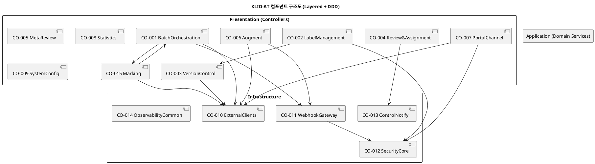

# D3. 컴포넌트 설계서

## ▣ 제·개정 이력

| 날짜 | 버전 | 제·개정 내역 | 작성자 | 검토자 |
|------|------|------------|--------|--------|
| 2026-05-21 | 1.0 | 최초 작성 (klid-label 패키지 구조 + DDD 계층 기반 그룹핑) | 박찬기 | - |
| 2026-05-27 | 1.1 | CBD 양식 변환, Marking(CO-015) 컴포넌트 명세 보완 | 박찬기 | - |

---

| D3 | 컴포넌트 설계서 |
|-------|----------|
| 시스템명 | AI 기반 지방정부 CCTV 관제지원시스템 구축(2차) | 서브시스템명 | AI CCTV 학습데이터 저작도구 (KLID-AT-SS-001~010, 전체) |
| 단계명 | 설계 | 작성일자 | 2026-05-27 | 버전 | 1.1 |

---

## 1. 컴포넌트 구조도

C&V(공통성·변경성) 기준으로 패키지를 그룹핑하여 **15개 컴포넌트**로 분리. 의존 방향은 단방향(Application → Infra).

| 컴포넌트 ID | KLID-AT-CO-001 ~ CO-015 | 컴포넌트명 | 전체 컴포넌트 구조 |
|----------|---|---------|---|
| 관련 유스케이스 ID | KLID-AT-UC-001 ~ UC-015 |

---

## 2. 컴포넌트 목록

| 컴포넌트 ID | 컴포넌트명 | 개요 | 관련 유스케이스 ID |
|---------|---------|------|-------------|
| KLID-AT-CO-001 | BatchOrchestration | Quartz 트리거 → 마킹→VLM(콜백)→비식별→프레임추출(마킹 위치)→YOLO(원본만)→SAM2→보간 7단계 자동 파이프라인 오케스트레이션 | KLID-AT-UC-001, UC-002, UC-004 |
| KLID-AT-CO-002 | LabelManagement | 라벨/라벨마스터/속성 CRUD, IDOR 가드, SAM2 트랙 보조 | KLID-AT-UC-006, UC-007 |
| KLID-AT-CO-003 | VersionControl | Gitea 자동 커밋·diff·롤백, 폴백 큐(메모리+DB) | KLID-AT-UC-010 |
| KLID-AT-CO-004 | Review&Assignment | 작업 배정·재배정(완료작업 차단), 검수 상태 전이(StateMachine), 내부 알림, TASK_COMPLETED 이벤트 발행 | KLID-AT-UC-008, UC-009 |
| KLID-AT-CO-005 | MetaReview | VLM 시계열 메타 조회·수정·승인·반려 | KLID-AT-UC-005 |
| KLID-AT-CO-006 | Augment | 외부 생성형 AI 비동기 요청·검토. 증강 결과 = 새 영상(RAW_SN) 생성 + 라벨 복사 | KLID-AT-UC-011 |
| KLID-AT-CO-007 | PortalChannel | TUS 업로드 + 데이터마트 영상 Load + 사용자 작업 별도 적재(LS_PORTAL_USER_LABEL) | KLID-AT-UC-012 |
| KLID-AT-CO-008 | Statistics | 대시보드 요약, 워커/전체 통계, CSV 리포트 | - |
| KLID-AT-CO-009 | SystemConfig | 시스템 설정값 조회·갱신, 헬스, 라벨 프리셋 | - |
| KLID-AT-CO-010 | ExternalClients | AiServer/Deidentify/Vlm/Gitea/ExternalAugment WebClient + Resilience4j | KLID-AT-UC-001~004, UC-010, UC-011 |
| KLID-AT-CO-011 | WebhookGateway | Deidentify/VLM/Augment 결과 수신 + HMAC 서명 검증 + 멱등성 보장 | KLID-AT-UC-002, UC-004, UC-011 |
| KLID-AT-CO-012 | SecurityCore | JWT 인증 필터, HMAC 웹훅 필터, SecurityConfig, Role/Channel/RoleHierarchy | KLID-AT-UC-013 |
| KLID-AT-CO-013 | ControlNotify | 관제서버 TASK_COMPLETED/MODIFIED 통지 (디바운스·폴백·이벤트 리스너) | KLID-AT-UC-014, UC-015 |
| KLID-AT-CO-014 | ObservabilityCommon | RequestIdFilter, Health, Metrics, 공통 예외 처리 | - |
| KLID-AT-CO-015 | Marking | 영상별 자동/수동 마킹, VLM 콜백 요청, 마킹 CRUD API | KLID-AT-UC-001 |

---

## 3. 컴포넌트 명세

### 3.1 KLID-AT-CO-001 BatchOrchestration

| 컴포넌트 ID | KLID-AT-CO-001 | 컴포넌트명 | BatchOrchestration |
|----------|---|---------|---|
| 컴포넌트 개요 | Quartz 스케줄러가 처리 대기 영상을 1건씩 선점하여 7단계 파이프라인(마킹→VLM→비식별→프레임추출→YOLO→SAM2→보간)을 실행. 실패 시 지수 백오프 재시도 큐 적재. |

**내부 클래스**

| ID | 클래스명 | 설명 |
|----|--------|------|
| KLID-AT-IC-001 | BatchOrchestrator | 7단계 순차 호출, 단계별 상태 전이 기록 |
| KLID-AT-IC-002 | VlmTimeseriesStep | VLM 비동기 위탁 |
| KLID-AT-IC-003 | DeidentifyStep | 비식별 위탁 + 결과 경로 |
| KLID-AT-IC-004 | FfmpegFrameExtractor | 원본·비식별본 프레임 추출 |
| KLID-AT-IC-005 | YoloAutolabelStep | YOLO 추론 |
| KLID-AT-IC-006 | Sam2SegmentStep | SAM2 세그멘테이션 |
| KLID-AT-IC-007 | TrackInterpolationStep | 트랙 선형 보간 |
| KLID-AT-IC-008 | BatchStatusService | 단계 상태 전이 기록 |
| KLID-AT-IC-009 | BatchRetryQueue | 실패 재시도 큐 (max=3 exp backoff) |
| KLID-AT-IC-010 | LabelingBatchQueueService | 대기 큐 선점/적재 |

**인터페이스 클래스**

| ID | 인터페이스명 | 오퍼레이션명 | 구분 |
|----|----------|----------|------------------------|
| KLID-AT-IF-001 | IBatchOrchestrator | process(rawSn) | Serviced |
| KLID-AT-IF-002 | IPipelineStep | run(...) | Serviced |
| KLID-AT-IF-003 | IAiServerClient | predictYolo/track/verifyObjects | Required |
| KLID-AT-IF-004 | IDeidentifyClient | deidentify | Required |
| KLID-AT-IF-005 | IVlmClient | submitTimeseries | Required |

---

### 3.2 KLID-AT-CO-002 LabelManagement

| 컴포넌트 ID | KLID-AT-CO-002 | 컴포넌트명 | LabelManagement |
|----------|---|---------|---|
| 컴포넌트 개요 | 라벨 CRUD + 좌표 검증(<=1000점) + IDOR 가드 + 라벨 마스터·속성 관리 + SAM2 N프레임 자동 전파. |

**내부 클래스**

| ID | 클래스명 | 설명 |
|----|--------|------|
| KLID-AT-IC-011 | LabelController | `/v1/frames/{srcSn}/labels` |
| KLID-AT-IC-012 | LabelMasterController | `/v1/manage/labels` |
| KLID-AT-IC-013 | LabelAttrController | `/v1/manage/labels/{labelId}/attrs` |
| KLID-AT-IC-014 | FrameImageController | `/v1/frames/{srcSn}/image` (스트림) |
| KLID-AT-IC-015 | DeidentReportController | `/v1/labels/{srcSn}/deident-report` |
| KLID-AT-IC-016 | LabelService | 라벨 영속·Gitea 커밋 트리거 |
| KLID-AT-IC-017 | LabelMasterService | 라벨 마스터 CRUD |
| KLID-AT-IC-018 | LabelAttrService | 속성 CRUD |
| KLID-AT-IC-019 | LabelAccessGuard | IDOR 방어 |
| KLID-AT-IC-020 | Sam2TrackService | N프레임 폴리곤 전파 |
| KLID-AT-IC-021 | DeidentReportService | 비식별 누락 신고 |

**인터페이스 클래스**

| ID | 인터페이스명 | 오퍼레이션명 | 구분 |
|----|----------|----------|------------------------|
| KLID-AT-IF-006 | ILabelService | getByFrame, bulkUpsert | Serviced |
| KLID-AT-IF-007 | ILabelAccessGuard | verifyAccess, verifyAndGet | Serviced |
| KLID-AT-IF-008 | IVersionService | commit | Required |
| KLID-AT-IF-009 | IAiServerClient | track (SAM2) | Required |

---

### 3.3 KLID-AT-CO-003 VersionControl

| 컴포넌트 ID | KLID-AT-CO-003 | 컴포넌트명 | VersionControl |
|----------|---|---------|---|
| 컴포넌트 개요 | Gitea 자동 커밋, 이력 조회, diff, 롤백. 장애 시 메모리+DB 폴백 큐로 데이터 유실 방지. |

**내부 클래스**

| ID | 클래스명 | 설명 |
|----|--------|------|
| KLID-AT-IC-022 | VersionController | `/v1/frames/{srcSn}/versions`, `/v1/versions/{commit}/diff`·rollback |
| KLID-AT-IC-023 | VersionService | 커밋·diff·롤백 |
| KLID-AT-IC-024 | GiteaPathPolicy | 경로 정책 |
| KLID-AT-IC-025 | GiteaCommitFallbackQueue | 메모리 폴백 |
| KLID-AT-IC-026 | GiteaFallbackQueueService | DB 영속 폴백 |
| KLID-AT-IC-027 | GiteaCommitRetryJob | 폴백 재시도 잡 |
| KLID-AT-IC-028 | GiteaSchedulingConfig | 스케줄링 빈 등록 |

**인터페이스 클래스**

| ID | 인터페이스명 | 오퍼레이션명 | 구분 |
|----|----------|----------|------------------------|
| KLID-AT-IF-010 | IVersionService | commit, listVersions, diff, rollback | Serviced |
| KLID-AT-IF-011 | IGiteaClient | commit, createOrUpdateFile, listCommits, diff, getContent | Required |

---

### 3.4 KLID-AT-CO-004 Review&Assignment

| 컴포넌트 ID | KLID-AT-CO-004 | 컴포넌트명 | Review&Assignment |
|----------|---|---------|---|
| 컴포넌트 개요 | 작업 배정·재배정(완료작업 차단), 검수 상태 전이(StateMachine), 내부 REVIEWER 알림, TASK_COMPLETED 이벤트 발행. |

**내부 클래스**

| ID | 클래스명 | 설명 |
|----|--------|------|
| KLID-AT-IC-029 | AssignmentController | `/v1/assignments` |
| KLID-AT-IC-030 | TaskBoardController | `/v1/tasks/board` |
| KLID-AT-IC-031 | AssignmentService | 배정·재배정·이력 |
| KLID-AT-IC-032 | TaskBoardService | 작업 보드 조회 |
| KLID-AT-IC-033 | ReviewController | `/v1/reviews/...` |
| KLID-AT-IC-034 | ReviewService | 검수 워크플로우 |
| KLID-AT-IC-035 | ReviewStateMachine | 상태 전이 검증 |
| KLID-AT-IC-036 | NotificationService | 내부 REVIEWER 알림 인터페이스 |
| KLID-AT-IC-037 | LogNotificationService | 로그 기반 구현 |

**인터페이스 클래스**

| ID | 인터페이스명 | 오퍼레이션명 | 구분 |
|----|----------|----------|------------------------|
| KLID-AT-IF-012 | IAssignmentService | assign, reassign, getHistory | Serviced |
| KLID-AT-IF-013 | IReviewService | list, getDetail, approve, reject, submit, startReview | Serviced |
| KLID-AT-IF-014 | INotificationService | notifyReviewersOnDeidentReport, onLockRelease | Required |
| KLID-AT-IF-015 | IControlNotifyClient | notifyTaskCompleted | Required |

---

### 3.5 KLID-AT-CO-005 MetaReview

| 컴포넌트 ID | KLID-AT-CO-005 | 컴포넌트명 | MetaReview |
|----------|---|---------|---|
| 컴포넌트 개요 | VLM·외부 메타 조회·수정·승인·반려. UC-005 전담. |

**내부 클래스**

| ID | 클래스명 | 설명 |
|----|--------|------|
| KLID-AT-IC-038 | MetaController | `/v1/frames/{srcSn}/meta`, `/v1/meta/{metaReviewSn}/approve\|reject` |
| KLID-AT-IC-039 | MetaService | 메타 CRUD + 승인/반려 |

**인터페이스 클래스**

| ID | 인터페이스명 | 오퍼레이션명 | 구분 |
|----|----------|----------|------------------------|
| KLID-AT-IF-016 | IMetaService | getByFrame, update, approveReview, rejectReview | Serviced |

---

### 3.6 KLID-AT-CO-006 Augment

| 컴포넌트 ID | KLID-AT-CO-006 | 컴포넌트명 | Augment |
|----------|---|---------|---|
| 컴포넌트 개요 | 검수 완료 영상에 한해 외부 생성형 AI 비동기 요청, 웹훅으로 결과 수신, 검토(수락/거절). |

**내부 클래스**

| ID | 클래스명 | 설명 |
|----|--------|------|
| KLID-AT-IC-040 | AugmentController | `/v1/augments` |
| KLID-AT-IC-041 | AugmentRequestService | 비동기 요청 |
| KLID-AT-IC-042 | AugmentReviewService | 검토 |
| KLID-AT-IC-043 | ExternalAugmentClient | 외부 클라이언트 |
| KLID-AT-IC-044 | AugmentResultController | `/v1/augments/result` (웹훅) |
| KLID-AT-IC-045 | AugmentResultService | 결과 적재 + 멱등성 |

**인터페이스 클래스**

| ID | 인터페이스명 | 오퍼레이션명 | 구분 |
|----|----------|----------|------------------------|
| KLID-AT-IF-017 | IAugmentRequestService | request | Serviced |
| KLID-AT-IF-018 | IAugmentReviewService | listAll, findBySource, accept, reject | Serviced |
| KLID-AT-IF-019 | IExternalAugmentClient | submit | Required |
| KLID-AT-IF-020 | IAugmentResultService | handle | Serviced (Webhook) |

---

### 3.7 KLID-AT-CO-007 PortalChannel

| 컴포넌트 ID | KLID-AT-CO-007 | 컴포넌트명 | PortalChannel |
|----------|---|---------|---|
| 컴포넌트 개요 | 포털서버 JWT 사용자 한정. TUS 업로드, 본인 데이터 오토라벨링, 라벨 수락. |

**내부 클래스**

| ID | 클래스명 | 설명 |
|----|--------|------|
| KLID-AT-IC-046 | PortalLabelController | `/v1/portal/{uploads, autolabel, labels}` |
| KLID-AT-IC-047 | PortalLabelService | 본인 데이터 라우팅 |
| KLID-AT-IC-048 | PortalAutolabelService | YOLO 추론 위임 |
| KLID-AT-IC-049 | PortalUploadService | 포털 영상 영속화 |
| KLID-AT-IC-050 | TusUploadController | `/v1/portal/uploads` (TUS 프로토콜) |
| KLID-AT-IC-051 | TusService | TUS 세션·청크 처리 |

**인터페이스 클래스**

| ID | 인터페이스명 | 오퍼레이션명 | 구분 |
|----|----------|----------|------------------------|
| KLID-AT-IF-021 | IPortalLabelService | autolabel, acceptLabel | Serviced |
| KLID-AT-IF-022 | IPortalUploadService | registerCompleted, listMyUploads, getMyVideo | Serviced |
| KLID-AT-IF-023 | ITusService | createUpload, patch, onComplete | Serviced |

---

### 3.8 KLID-AT-CO-008 Statistics

| 컴포넌트 ID | KLID-AT-CO-008 | 컴포넌트명 | Statistics |
|----------|---|---------|---|
| 컴포넌트 개요 | 대시보드 요약, 워커/전체 통계, CSV 리포트. |

**내부 클래스**

| ID | 클래스명 | 설명 |
|----|--------|------|
| KLID-AT-IC-052 | StatsController | `/v1/stats/{summary, worker, overall, report}` |
| KLID-AT-IC-053 | StatsService | 통계 산출 |
| KLID-AT-IC-054 | VideoQueryService | 영상 목록·상세 |

**인터페이스 클래스**

| ID | 인터페이스명 | 오퍼레이션명 | 구분 |
|----|----------|----------|------------------------|
| KLID-AT-IF-024 | IStatsService | getSummary, getWorkerSummary, getOverallSummary | Serviced |
| KLID-AT-IF-025 | IVideoQueryService | list, getOne, getAutoLabels | Serviced |

---

### 3.9 KLID-AT-CO-009 SystemConfig

| 컴포넌트 ID | KLID-AT-CO-009 | 컴포넌트명 | SystemConfig |
|----------|---|---------|---|
| 컴포넌트 개요 | 시스템 설정값 조회/갱신, 운영 헬스, 라벨 프리셋. |

**내부 클래스**

| ID | 클래스명 | 설명 |
|----|--------|------|
| KLID-AT-IC-055 | SystemConfigController | `/v1/manage/configs` |
| KLID-AT-IC-056 | SystemConfigService | 설정 CRUD |
| KLID-AT-IC-057 | ManageHealthController | `/v1/manage/health` |
| KLID-AT-IC-058 | PresetController | `/v1/manage/presets` |
| KLID-AT-IC-059 | PresetService | 프리셋 CRUD |

**인터페이스 클래스**

| ID | 인터페이스명 | 오퍼레이션명 | 구분 |
|----|----------|----------|------------------------|
| KLID-AT-IF-026 | ISystemConfigService | list, update | Serviced |
| KLID-AT-IF-027 | IPresetService | list, create, update, delete, clone | Serviced |

---

### 3.10 KLID-AT-CO-010 ExternalClients

| 컴포넌트 ID | KLID-AT-CO-010 | 컴포넌트명 | ExternalClients |
|----------|---|---------|---|
| 컴포넌트 개요 | 외부 HTTP 클라이언트 5종(WebClient + Resilience4j CB/Retry). |

**내부 클래스**

| ID | 클래스명 | 설명 |
|----|--------|------|
| KLID-AT-IC-060 | AiServerClient | 내부 AI 서버 (YOLO/SAM2/VLM-verify) |
| KLID-AT-IC-061 | DeidentifyClient | 외부 비식별 |
| KLID-AT-IC-062 | VlmClient | 외부 VLM |
| KLID-AT-IC-063 | GiteaClient | Gitea REST |
| KLID-AT-IC-064 | ExternalAugmentClient | 외부 생성형 AI |
| KLID-AT-IC-065 | WebClientConfig | WebClient 빈 설정 |

**인터페이스 클래스**

| ID | 인터페이스명 | 오퍼레이션명 | 구분 |
|----|----------|----------|------------------------|
| KLID-AT-IF-028 | IAiServerClient | predictYolo, predictYoloTrack, verifyObjects | Serviced |
| KLID-AT-IF-029 | IDeidentifyClient | deidentify | Serviced |
| KLID-AT-IF-030 | IVlmClient | submitTimeseries, isEnabled | Serviced |
| KLID-AT-IF-031 | IGiteaClient | commit, diff, listCommits, getContent | Serviced |
| KLID-AT-IF-032 | IExternalAugmentClient | submit | Serviced |

---

### 3.11 KLID-AT-CO-011 WebhookGateway

| 컴포넌트 ID | KLID-AT-CO-011 | 컴포넌트명 | WebhookGateway |
|----------|---|---------|---|
| 컴포넌트 개요 | 외부 시스템(비식별·VLM·증강) 결과 수신 + HMAC 서명 검증 + 멱등성 보장. |

**내부 클래스**

| ID | 클래스명 | 설명 |
|----|--------|------|
| KLID-AT-IC-066 | DeidentifyResultController | `/v1/deidentify/result` |
| KLID-AT-IC-067 | VlmResultController | `/v1/vlm/result` |
| KLID-AT-IC-068 | AugmentResultController | `/v1/augments/result` |
| KLID-AT-IC-069 | DeidentifyResultService | 결과 적재 |
| KLID-AT-IC-070 | VlmResultService | 메타 적재 |
| KLID-AT-IC-071 | AugmentResultService | 증강 결과 적재 |
| KLID-AT-IC-072 | WebhookIdempotencyLedger | 멱등성 인터페이스 |
| KLID-AT-IC-073 | InMemoryWebhookIdempotencyLedger | 로컬 구현 |
| KLID-AT-IC-074 | PersistentWebhookIdempotencyLedger | DB 영속 구현 |

**인터페이스 클래스**

| ID | 인터페이스명 | 오퍼레이션명 | 구분 |
|----|----------|----------|------------------------|
| KLID-AT-IF-033 | IWebhookIdempotencyLedger | checkAndMark | Serviced |

---

### 3.12 KLID-AT-CO-012 SecurityCore

| 컴포넌트 ID | KLID-AT-CO-012 | 컴포넌트명 | SecurityCore |
|----------|---|---------|---|
| 컴포넌트 개요 | JWT 인증 필터, HMAC 웹훅 필터, RBAC, 채널·역할 가드, 작업 잠금. |

**내부 클래스**

| ID | 클래스명 | 설명 |
|----|--------|------|
| KLID-AT-IC-075 | SecurityConfig | Spring Security 체인 |
| KLID-AT-IC-076 | JwtAuthenticationFilter | JWT 파싱·검증 |
| KLID-AT-IC-077 | HmacWebhookFilter | 웹훅 HMAC 서명 검증 |
| KLID-AT-IC-078 | JwtKeyResolver | HMAC 키 해석 |
| KLID-AT-IC-079 | JwtIssuerValidator | issuer 검증 → Channel |
| KLID-AT-IC-080 | JwtClaimResolver | claims → TokenClaims |
| KLID-AT-IC-081 | RoleHierarchy | 역할 계층(REVIEWER>WORKER) |
| KLID-AT-IC-082 | Role / Channel / TokenClaims | enum/value |
| KLID-AT-IC-083 | LocalProfileGuard | local 프로필 한정 가드 |
| KLID-AT-IC-084 | WorkLockService | 작업 잠금 |
| KLID-AT-IC-085 | SessionController | `/v1/me` |
| KLID-AT-IC-086 | RoleClaimController | `/v1/auth/role-claim` |
| KLID-AT-IC-087 | RoleClaimService | role 자가 부여 |

**인터페이스 클래스**

| ID | 인터페이스명 | 오퍼레이션명 | 구분 |
|----|----------|----------|------------------------|
| KLID-AT-IF-034 | ISecurityConfig | securityFilterChain, corsConfigurationSource | Serviced |
| KLID-AT-IF-035 | IWorkLockService | lockRawForRedeident, isRawLocked, releaseRaw | Serviced |
| KLID-AT-IF-036 | IRoleClaimService | claim | Serviced |

---

### 3.13 KLID-AT-CO-013 ControlNotify

| 컴포넌트 ID | KLID-AT-CO-013 | 컴포넌트명 | ControlNotify |
|----------|---|---------|---|
| 컴포넌트 개요 | 검수 승인·라벨/메타 수정 이벤트를 받아 관제서버에 비동기 통지. |

**내부 클래스**

| ID | 클래스명 | 설명 |
|----|--------|------|
| KLID-AT-IC-088 | ControlNotifyClient | 통지 HTTP 클라이언트 |
| KLID-AT-IC-089 | ControlNotifyDebouncer | 60s 디바운서 |
| KLID-AT-IC-090 | ControlNotifyFallbackQueue | DB 영속 폴백 큐 |
| KLID-AT-IC-091 | ControlNotifyEventListener | 도메인 이벤트 리스너 |
| KLID-AT-IC-092 | ControlNotifyAsyncConfig | 전용 Executor |
| KLID-AT-IC-093 | ControlNotifyProperties | @ConfigurationProperties("control.notify") |

**인터페이스 클래스**

| ID | 인터페이스명 | 오퍼레이션명 | 구분 |
|----|----------|----------|------------------------|
| KLID-AT-IF-037 | IControlNotifyClient | notifyTaskCompleted, notifyTaskModified | Serviced |
| KLID-AT-IF-038 | IControlNotifyDebouncer | register, flush | Serviced |
| KLID-AT-IF-039 | IControlNotifyFallbackQueue | enqueue, retryNext | Serviced |
| KLID-AT-IF-040 | IExternalControlServer | POST /tasks/{rawSn}/completed, /modified | Required (외부) |

---

### 3.14 KLID-AT-CO-014 ObservabilityCommon

| 컴포넌트 ID | KLID-AT-CO-014 | 컴포넌트명 | ObservabilityCommon |
|----------|---|---------|---|
| 컴포넌트 개요 | 요청 ID 추적, 헬스 엔드포인트, Micrometer 메트릭, 전역 예외 처리. |

**내부 클래스**

| ID | 클래스명 | 설명 |
|----|--------|------|
| KLID-AT-IC-094 | RequestIdFilter | X-Request-ID MDC 주입 |
| KLID-AT-IC-095 | HealthController | `/health` |
| KLID-AT-IC-096 | ObservabilityMetricsConfig | Micrometer Bean |
| KLID-AT-IC-097 | CustomException / ErrorCode | 도메인 예외 |
| KLID-AT-IC-098 | GlobalExceptionHandler | `@RestControllerAdvice` |

**인터페이스 클래스**

| ID | 인터페이스명 | 오퍼레이션명 | 구분 |
|----|----------|----------|------------------------|
| KLID-AT-IF-041 | IHealth | health() | Serviced |

---

### 3.15 KLID-AT-CO-015 Marking

| 컴포넌트 ID | KLID-AT-CO-015 | 컴포넌트명 | Marking |
|----------|---|---------|---|
| 컴포넌트 개요 | 영상별 자동/수동 마킹 모드 설정. 자동 마킹은 프레임 간격 기반, 수동 마킹은 작업자 키보드 단축키로 이벤트 시점 마킹. 마킹 결과(이벤트명 + 영상경로 + marks 배열)를 VLM에 콜백 형태로 전달. |

**내부 클래스**

| ID | 클래스명 | 설명 |
|----|--------|------|
| KLID-AT-IC-099 | MarkingController | `/v1/markings` — 마킹 CRUD API |
| KLID-AT-IC-100 | MarkingService | 마킹 생성·수정·삭제·목록 + VLM 콜백 요청 트리거 |
| KLID-AT-IC-101 | LsMarking | 마킹 엔티티 (rawSn, markMode, eventName, marks JSON) |
| KLID-AT-IC-102 | LsMarkingRepository | JPA Repository |

**인터페이스 클래스**

| ID | 인터페이스명 | 오퍼레이션명 | 구분 |
|----|----------|----------|------------------------|
| KLID-AT-IF-042 | IMarkingService | create, update, delete, listByRawSn | Serviced |
| KLID-AT-IF-043 | IVlmClient | submitTimeseries (marks 포함) | Required |

---

## 4. 인터페이스 명세

### KLID-AT-IF-001  IBatchOrchestrator.process

| 인터페이스 ID | KLID-AT-IF-001 | 인터페이스명 | IBatchOrchestrator |
|---------|---|---------|---|
| 오퍼레이션명 | process |
| 오퍼레이션 개요 | 단일 영상에 대해 마킹→VLM→비식별→프레임추출→YOLO→SAM2→보간 7단계 파이프라인을 순차 실행하고 BatchStage 결과 반환 |
| 사전조건 | rawSn 영상이 PENDING 상태로 MNG_CLIP_SCHEDULE_QUE에 적재되어 있음 |
| 사후조건 | BatchStage = COMPLETED 또는 FAILED, 단계별 상태 이력 기록됨 |
| 파라미터 | Long rawSn |
| 반환값 | BatchStage |

---

### KLID-AT-IF-002  IPipelineStep.run

| 인터페이스 ID | KLID-AT-IF-002 | 인터페이스명 | IPipelineStep |
|---------|---|---------|---|
| 오퍼레이션명 | run |
| 오퍼레이션 개요 | 파이프라인 개별 단계(VLM/비식별/프레임추출/YOLO/SAM2/보간) 공통 실행 계약. BatchOrchestrator가 각 Step을 호출할 때 사용 |
| 사전조건 | rawSn 영상 존재, 이전 단계 완료 |
| 사후조건 | 해당 단계 처리 완료, 다음 단계 진입 가능 상태 |
| 파라미터 | Long rawSn (단계별 추가 파라미터 존재 가능) |
| 반환값 | void |

---

### KLID-AT-IF-003  IAiServerClient (BatchOrchestration Required)

| 인터페이스 ID | KLID-AT-IF-003 | 인터페이스명 | IAiServerClient |
|---------|---|---------|---|
| 오퍼레이션명 | predictYolo, predictYoloTrack, verifyObjects |
| 오퍼레이션 개요 | 배치 파이프라인(YOLO 오토라벨·트랙·SAM2 검증) 단계에서 내부 AI 서버를 호출하는 Required 의존 인터페이스 |
| 사전조건 | AI 서버 reachable, Resilience4j CB Closed 상태 |
| 사후조건 | 추론 결과 반환 또는 CB Open 시 fallback 응답 |
| 파라미터 | YoloRequest / TrackRequest / VerifyRequest |
| 반환값 | Mono\<YoloResponse\> / Mono\<TrackResponse\> |

---

### KLID-AT-IF-004  IDeidentifyClient (BatchOrchestration Required)

| 인터페이스 ID | KLID-AT-IF-004 | 인터페이스명 | IDeidentifyClient |
|---------|---|---------|---|
| 오퍼레이션명 | deidentify |
| 오퍼레이션 개요 | 배치 파이프라인 비식별 단계에서 외부 비식별 솔루션을 호출하는 Required 의존 인터페이스 |
| 사전조건 | 원본 영상 경로 유효, 외부 비식별 서버 reachable |
| 사후조건 | 비동기 처리 요청 완료, 결과는 웹훅으로 수신 |
| 파라미터 | DeidentifyRequest (rawSn, filePath, idempotencyKey) |
| 반환값 | Mono\<DeidentifyResponse\> |

---

### KLID-AT-IF-005  IVlmClient (BatchOrchestration Required)

| 인터페이스 ID | KLID-AT-IF-005 | 인터페이스명 | IVlmClient |
|---------|---|---------|---|
| 오퍼레이션명 | submitTimeseries |
| 오퍼레이션 개요 | 배치 파이프라인 VLM 단계에서 외부 VLM 서버에 시계열 메타 분석을 비동기 위탁하는 Required 인터페이스 |
| 사전조건 | VLM 서버 reachable, control.vlm.enabled=true |
| 사후조건 | 비동기 처리 요청 완료, 결과는 웹훅으로 수신 |
| 파라미터 | VlmTimeseriesRequest (rawSn, videoPath) |
| 반환값 | Mono\<VlmSubmitResponse\> |

---

### KLID-AT-IF-006  ILabelService.bulkUpsert

| 인터페이스 ID | KLID-AT-IF-006 | 인터페이스명 | ILabelService |
|---------|---|---------|---|
| 오퍼레이션명 | bulkUpsert |
| 오퍼레이션 개요 | 한 프레임의 라벨을 일괄 upsert + Gitea 자동 커밋. IDOR 가드 + 좌표 점 <=1000 검증 |
| 사전조건 | actor 가 해당 프레임 소유자(WORKER 본인 배정) 또는 REVIEWER |
| 사후조건 | LS_DATA_LBL upsert + LS_LABEL_VERSION 커밋 해시 INSERT |
| 파라미터 | Long srcSn, LabelBulkUpsertRequest req, TokenClaims actor |
| 반환값 | LabelResponse |

---

### KLID-AT-IF-007  ILabelAccessGuard.verifyAccess

| 인터페이스 ID | KLID-AT-IF-007 | 인터페이스명 | ILabelAccessGuard |
|---------|---|---------|---|
| 오퍼레이션명 | verifyAccess, verifyAndGet |
| 오퍼레이션 개요 | 프레임·라벨 IDOR 방어. 요청 actor가 해당 데이터에 접근 권한이 있는지 검증 |
| 사전조건 | srcSn 프레임 존재 |
| 사후조건 | 권한 없으면 403 예외 발생, 있으면 pass-through |
| 파라미터 | Long srcSn, TokenClaims actor |
| 반환값 | void (verifyAccess) / LsDataSrc (verifyAndGet) |

---

### KLID-AT-IF-008  IVersionService.commit (LabelManagement Required)

| 인터페이스 ID | KLID-AT-IF-008 | 인터페이스명 | IVersionService |
|---------|---|---------|---|
| 오퍼레이션명 | commit |
| 오퍼레이션 개요 | LabelManagement가 라벨 저장 직후 Gitea 버전 커밋을 트리거하는 Required 의존 인터페이스 |
| 사전조건 | 라벨 저장 완료 |
| 사후조건 | Gitea 커밋 해시 반환, LS_LABEL_VERSION INSERT |
| 파라미터 | Long srcSn, String saveReason, TokenClaims actor |
| 반환값 | LsLabelVersion |

---

### KLID-AT-IF-009  IAiServerClient.track (LabelManagement Required)

| 인터페이스 ID | KLID-AT-IF-009 | 인터페이스명 | IAiServerClient |
|---------|---|---------|---|
| 오퍼레이션명 | track (SAM2 N프레임 전파) |
| 오퍼레이션 개요 | LabelManagement에서 SAM2 N프레임 자동 전파를 위해 AI 서버를 호출하는 Required 인터페이스 |
| 사전조건 | srcSn 프레임 존재, SAM2 모델 로드됨 |
| 사후조건 | N프레임에 대한 폴리곤 결과 반환 |
| 파라미터 | TrackRequest (srcSn, points, frameCount) |
| 반환값 | Mono\<TrackResponse\> |

---

### KLID-AT-IF-010  IVersionService.rollback

| 인터페이스 ID | KLID-AT-IF-010 | 인터페이스명 | IVersionService |
|---------|---|---------|---|
| 오퍼레이션명 | rollback |
| 오퍼레이션 개요 | 특정 Gitea 커밋 시점으로 라벨을 복원하고 새 커밋 생성 |
| 사전조건 | commitHash 존재, actor 권한 검증 통과 |
| 사후조건 | DB 라벨 복원 + 새 커밋 추가 (기존 이력 보존) |
| 파라미터 | String commitHash, Long srcSn, TokenClaims actor |
| 반환값 | LsLabelVersion |

---

### KLID-AT-IF-011  IGiteaClient (VersionControl Required)

| 인터페이스 ID | KLID-AT-IF-011 | 인터페이스명 | IGiteaClient |
|---------|---|---------|---|
| 오퍼레이션명 | commit, createOrUpdateFile, listCommits, diff, getContent |
| 오퍼레이션 개요 | VersionControl이 Gitea REST API를 호출하기 위한 Required 의존 인터페이스. 커밋·파일생성·이력조회·diff·내용조회 포함 |
| 사전조건 | Gitea 서버 reachable, 인증 토큰 유효 |
| 사후조건 | 각 오퍼레이션별 결과 반환 또는 CB Open 시 폴백 큐 적재 |
| 파라미터 | (오퍼레이션별 상이) repo, branch, path, message, content 등 |
| 반환값 | Mono\<String\> (commitHash) / Mono\<List\<Commit\>\> 등 |

---

### KLID-AT-IF-012  IAssignmentService.assign

| 인터페이스 ID | KLID-AT-IF-012 | 인터페이스명 | IAssignmentService |
|---------|---|---------|---|
| 오퍼레이션명 | assign, reassign, getHistory |
| 오퍼레이션 개요 | WORKER에 영상 작업 배정·재배정, 배정 이력 조회. 완료된 작업(COMPLETED)에는 배정 차단 |
| 사전조건 | actor 가 REVIEWER, rawSn 영상 존재, WORKER 계정 활성 상태 |
| 사후조건 | LS_TASK_ASSIGNMENT INSERT/UPDATE, 재배정 시 LS_TASK_ASSIGN_HISTORY INSERT |
| 파라미터 | AssignmentCreateRequest / ReassignRequest, TokenClaims actor |
| 반환값 | AssignmentResponse / List\<AssignmentHistoryResponse\> |

---

### KLID-AT-IF-013  IReviewService.approve

| 인터페이스 ID | KLID-AT-IF-013 | 인터페이스명 | IReviewService |
|---------|---|---------|---|
| 오퍼레이션명 | approve |
| 오퍼레이션 개요 | 영상 검수 승인 → COMPLETED 전이 → ReviewApprovedEvent 발행 |
| 사전조건 | actor 가 REVIEWER, 영상이 IN_REVIEW 상태 |
| 사후조건 | LS_RAW_DATA_STATUS=COMPLETED, 검수 완료 일시 기록, ReviewApprovedEvent 발행 |
| 파라미터 | Long videoId, TokenClaims actor |
| 반환값 | ReviewResponse |

---

### KLID-AT-IF-014  INotificationService (Review&Assignment Required)

| 인터페이스 ID | KLID-AT-IF-014 | 인터페이스명 | INotificationService |
|---------|---|---------|---|
| 오퍼레이션명 | notifyReviewersOnDeidentReport, notifyReviewersOnLockRelease |
| 오퍼레이션 개요 | 비식별 누락 신고 및 재비식별 완료 시 REVIEWER에게 내부 알림을 발송하는 Required 인터페이스 |
| 사전조건 | 신고 또는 잠금 해제 이벤트 발생 |
| 사후조건 | 로그 기반 알림 출력 (향후 외부 메일/슬랙 확장 가능) |
| 파라미터 | LsDataRaw, Long reporterNo, String reason |
| 반환값 | void |

---

### KLID-AT-IF-015  IControlNotifyClient (Review&Assignment Required)

| 인터페이스 ID | KLID-AT-IF-015 | 인터페이스명 | IControlNotifyClient |
|---------|---|---------|---|
| 오퍼레이션명 | notifyTaskCompleted |
| 오퍼레이션 개요 | 검수 승인 후 관제서버에 TASK_COMPLETED를 통지하기 위한 Required 의존 인터페이스 |
| 사전조건 | control.notify.enabled=true |
| 사후조건 | 통지 완료 또는 폴백 큐 적재 |
| 파라미터 | Long rawSn, ReviewApprovedEvent event |
| 반환값 | Mono\<NotifyAck\> |

---

### KLID-AT-IF-016  IMetaService.approveReview

| 인터페이스 ID | KLID-AT-IF-016 | 인터페이스명 | IMetaService |
|---------|---|---------|---|
| 오퍼레이션명 | approveReview |
| 오퍼레이션 개요 | 시계열 메타 검토 승인 |
| 사전조건 | metaReviewSn 존재, actor REVIEWER |
| 사후조건 | LS_DATA_META_REVIEW.STATUS = APPROVED |
| 파라미터 | Long metaReviewSn, TokenClaims actor |
| 반환값 | void |

---

### KLID-AT-IF-017  IAugmentRequestService.request

| 인터페이스 ID | KLID-AT-IF-017 | 인터페이스명 | IAugmentRequestService |
|---------|---|---------|---|
| 오퍼레이션명 | request |
| 오퍼레이션 개요 | 검수 완료 영상에 대해 외부 생성형 AI에 비동기 증강 요청 등록 |
| 사전조건 | rawSn 영상 COMPLETED 상태, actor REVIEWER |
| 사후조건 | LS_DATA_AUG INSERT (STATUS=RECEIVED), 외부 AI 서버에 비동기 요청 전송 |
| 파라미터 | Long rawSn, TokenClaims actor |
| 반환값 | AugmentResponse |

---

### KLID-AT-IF-018  IAugmentReviewService.accept

| 인터페이스 ID | KLID-AT-IF-018 | 인터페이스명 | IAugmentReviewService |
|---------|---|---------|---|
| 오퍼레이션명 | listAll, findBySource, accept, reject |
| 오퍼레이션 개요 | 증강 결과 목록 조회 및 수락/거절. 수락 시 원본 라벨로 병합, 거절 시 상태 REJECTED |
| 사전조건 | DATA_AUG_SN 존재, actor REVIEWER |
| 사후조건 | accept: LS_DATA_AUG_LBL_MAP 생성 + STATUS=ACCEPTED / reject: STATUS=REJECTED |
| 파라미터 | Long augSn, TokenClaims actor |
| 반환값 | AugmentReviewResponse |

---

### KLID-AT-IF-019  IExternalAugmentClient.submit (Augment Required)

| 인터페이스 ID | KLID-AT-IF-019 | 인터페이스명 | IExternalAugmentClient |
|---------|---|---------|---|
| 오퍼레이션명 | submit |
| 오퍼레이션 개요 | 외부 생성형 AI 서버에 비동기 증강 작업을 위탁하는 Required 인터페이스 |
| 사전조건 | 외부 AI 서버 reachable |
| 사후조건 | 비동기 요청 전송 완료, 결과는 웹훅으로 수신 |
| 파라미터 | Long jobId |
| 반환값 | void |

---

### KLID-AT-IF-020  IAugmentResultService.handle (Webhook)

| 인터페이스 ID | KLID-AT-IF-020 | 인터페이스명 | IAugmentResultService |
|---------|---|---------|---|
| 오퍼레이션명 | handle |
| 오퍼레이션 개요 | 외부 생성형 AI 웹훅으로 수신된 증강 결과를 DB에 적재 (멱등성 보장) |
| 사전조건 | HMAC 서명 검증 통과, requestId 비중복 |
| 사후조건 | LS_DATA_AUG UPDATE (결과 URL·STATUS=ACCEPTED), 멱등성 마킹 |
| 파라미터 | AugmentResultRequest |
| 반환값 | boolean |

---

### KLID-AT-IF-021  IPortalLabelService.autolabel

| 인터페이스 ID | KLID-AT-IF-021 | 인터페이스명 | IPortalLabelService |
|---------|---|---------|---|
| 오퍼레이션명 | autolabel |
| 오퍼레이션 개요 | 포털 사용자 본인 영상에 대한 YOLO+SAM2 오토라벨 결과 반환 |
| 사전조건 | actor.channel=PORTAL, 본인 영상 소유자 검증 통과 |
| 사후조건 | 좌표 결과 반환 (DB 저장 없음, 수락 시 acceptLabel) |
| 파라미터 | PortalAutolabelRequest req, TokenClaims actor |
| 반환값 | YoloResponse |

---

### KLID-AT-IF-022  IPortalUploadService.registerCompleted

| 인터페이스 ID | KLID-AT-IF-022 | 인터페이스명 | IPortalUploadService |
|---------|---|---------|---|
| 오퍼레이션명 | registerCompleted, listMyUploads, getMyVideo |
| 오퍼레이션 개요 | TUS 업로드 완료 후 포털 사용자 영상 DB 영속화, 본인 업로드 목록·상세 조회 (소유자 검증) |
| 사전조건 | TUS 업로드 완료 훅 수신 |
| 사후조건 | LS_PORTAL_USER_VIDEO INSERT |
| 파라미터 | String portalUserNo, TusFile (registerCompleted) / Long portalVideoSn (getMyVideo) |
| 반환값 | LsPortalUserVideo / List\<LsPortalUserVideo\> |

---

### KLID-AT-IF-023  ITusService.createUpload

| 인터페이스 ID | KLID-AT-IF-023 | 인터페이스명 | ITusService |
|---------|---|---------|---|
| 오퍼레이션명 | createUpload, patch, onComplete |
| 오퍼레이션 개요 | TUS 프로토콜 기반 대용량 영상 청크 업로드 세션 관리. 업로드 완료 시 onComplete 훅으로 영속화 |
| 사전조건 | actor.channel=PORTAL |
| 사후조건 | 업로드 완료 시 IPortalUploadService.registerCompleted 호출 |
| 파라미터 | TusCreateRequest (createUpload) / String uploadId, byte[] chunk, long offset (patch) |
| 반환값 | TusFile / LsPortalUserVideo |

---

### KLID-AT-IF-024  IStatsService.getSummary

| 인터페이스 ID | KLID-AT-IF-024 | 인터페이스명 | IStatsService |
|---------|---|---------|---|
| 오퍼레이션명 | getSummary, getWorkerSummary, getOverallSummary |
| 오퍼레이션 개요 | 대시보드 요약 통계(전체), 워커 개인 통계, 전체 통합 통계 산출 |
| 사전조건 | actor 권한 확인 (REVIEWER: getSummary/getOverallSummary, WORKER: getWorkerSummary 본인만) |
| 사후조건 | 집계 쿼리 실행 후 응답 반환 |
| 파라미터 | TokenClaims actor / Long workerId |
| 반환값 | DashboardSummaryResponse / WorkerStatSummaryResponse / OverallStatSummaryResponse |

---

### KLID-AT-IF-025  IVideoQueryService.list

| 인터페이스 ID | KLID-AT-IF-025 | 인터페이스명 | IVideoQueryService |
|---------|---|---------|---|
| 오퍼레이션명 | list, getOne, getAutoLabels |
| 오퍼레이션 개요 | 영상 목록 페이징 조회, 영상 상세 조회, 자동 라벨 결과 조회 |
| 사전조건 | actor 권한 확인 |
| 사후조건 | 쿼리 결과 페이징 반환 |
| 파라미터 | Pageable, String dataSttsCd, String reviewStatusCd / Long rawSn |
| 반환값 | Page\<VideoSummaryResponse\> / VideoDetailResponse / AutoLabelResultResponse |

---

### KLID-AT-IF-026  ISystemConfigService.list

| 인터페이스 ID | KLID-AT-IF-026 | 인터페이스명 | ISystemConfigService |
|---------|---|---------|---|
| 오퍼레이션명 | list, update |
| 오퍼레이션 개요 | 시스템 설정 키-값 전체 조회 및 갱신. REVIEWER 전용 |
| 사전조건 | actor REVIEWER 권한 |
| 사후조건 | LS_SYSTEM_CONFIG 조회 / UPDATE |
| 파라미터 | (list: 없음) / (update: String configKey, String configVal) |
| 반환값 | List\<SystemConfigResponse\> / void |

---

### KLID-AT-IF-027  IPresetService.list

| 인터페이스 ID | KLID-AT-IF-027 | 인터페이스명 | IPresetService |
|---------|---|---------|---|
| 오퍼레이션명 | list, create, update, delete, clone |
| 오퍼레이션 개요 | 라벨 프리셋(이벤트 유형별 라벨 셋) CRUD 및 복제. 이벤트당 1:1 UQ 제약 관리 |
| 사전조건 | actor REVIEWER 권한 (create/update/delete/clone) |
| 사후조건 | LS_LABEL_PRESET / LS_LABEL_PRESET_CODE INSERT·UPDATE·DELETE |
| 파라미터 | (create: PresetCreateRequest) / (update: Long presetId, PresetUpdateRequest) 등 |
| 반환값 | PresetResponse / List\<PresetResponse\> |

---

### KLID-AT-IF-028  IAiServerClient.predictYolo

| 인터페이스 ID | KLID-AT-IF-028 | 인터페이스명 | IAiServerClient |
|---------|---|---------|---|
| 오퍼레이션명 | predictYolo |
| 오퍼레이션 개요 | 내부 AI 서버 YOLO 객체 감지 호출 (CB/Retry) |
| 사전조건 | AI 서버 reachable |
| 사후조건 | YoloResponse(bboxes, conf, classId) 반환 또는 CB Open 시 fallback |
| 파라미터 | YoloRequest |
| 반환값 | Mono\<YoloResponse\> |

---

### KLID-AT-IF-029  IDeidentifyClient.deidentify

| 인터페이스 ID | KLID-AT-IF-029 | 인터페이스명 | IDeidentifyClient |
|---------|---|---------|---|
| 오퍼레이션명 | deidentify |
| 오퍼레이션 개요 | 외부 비식별 솔루션에 비동기 처리 위탁 (Idempotency-Key 발급) |
| 사전조건 | 원본 영상 경로 유효 |
| 사후조건 | 외부 요청 ID 발급, 결과는 비동기 웹훅 수신 |
| 파라미터 | DeidentifyRequest |
| 반환값 | Mono\<DeidentifyResponse\> |

---

### KLID-AT-IF-030  IVlmClient.submitTimeseries

| 인터페이스 ID | KLID-AT-IF-030 | 인터페이스명 | IVlmClient |
|---------|---|---------|---|
| 오퍼레이션명 | submitTimeseries, isEnabled |
| 오퍼레이션 개요 | 외부 VLM 서버에 시계열 분석을 비동기 위탁. isEnabled로 기능 플래그 확인 |
| 사전조건 | VLM 서버 reachable, control.vlm.enabled=true |
| 사후조건 | 요청 제출 완료, 결과는 웹훅 수신 |
| 파라미터 | VlmTimeseriesRequest |
| 반환값 | Mono\<VlmSubmitResponse\> / boolean |

---

### KLID-AT-IF-031  IGiteaClient.commit

| 인터페이스 ID | KLID-AT-IF-031 | 인터페이스명 | IGiteaClient |
|---------|---|---------|---|
| 오퍼레이션명 | commit |
| 오퍼레이션 개요 | Gitea 리포지터리에 파일 커밋 (hash 반환) |
| 사전조건 | Gitea 인증 토큰 유효 |
| 사후조건 | Gitea 리포에 새 커밋 추가, hash 반환. 실패 시 CB Open / Fallback Queue |
| 파라미터 | String repo, String branch, String path, String message, byte[] content |
| 반환값 | Mono\<String\> (commitHash) |

---

### KLID-AT-IF-032  IExternalAugmentClient.submit

| 인터페이스 ID | KLID-AT-IF-032 | 인터페이스명 | IExternalAugmentClient |
|---------|---|---------|---|
| 오퍼레이션명 | submit |
| 오퍼레이션 개요 | 외부 생성형 AI 서버에 증강 작업 비동기 위탁 (ExternalClients 컴포넌트 제공) |
| 사전조건 | 외부 생성형 AI 서버 reachable, CB Closed |
| 사후조건 | 비동기 요청 전송, 결과는 웹훅(IF-020)으로 수신 |
| 파라미터 | Long jobId |
| 반환값 | void |

---

### KLID-AT-IF-033  IWebhookIdempotencyLedger.checkAndMark

| 인터페이스 ID | KLID-AT-IF-033 | 인터페이스명 | IWebhookIdempotencyLedger |
|---------|---|---------|---|
| 오퍼레이션명 | checkAndMark |
| 오퍼레이션 개요 | requestId 가 신규(true)면 마킹 후 true, 이미 처리됐으면 false |
| 사전조건 | requestId non-null |
| 사후조건 | 첫 호출 시 LS_WEBHOOK_IDEMPOTENCY INSERT, 이후 호출은 no-op |
| 파라미터 | String requestId |
| 반환값 | boolean |

---

### KLID-AT-IF-034  ISecurityConfig.securityFilterChain

| 인터페이스 ID | KLID-AT-IF-034 | 인터페이스명 | ISecurityConfig |
|---------|---|---------|---|
| 오퍼레이션명 | securityFilterChain |
| 오퍼레이션 개요 | Spring Security 필터 체인 빈 등록 (JWT + HMAC + RBAC) |
| 사전조건 | JwtAuthenticationFilter, HmacWebhookFilter 빈 등록 |
| 사후조건 | HTTP 요청에 인증/인가 필터 체인 적용 |
| 파라미터 | HttpSecurity http |
| 반환값 | SecurityFilterChain |

---

### KLID-AT-IF-035  IWorkLockService.lockRawForRedeident

| 인터페이스 ID | KLID-AT-IF-035 | 인터페이스명 | IWorkLockService |
|---------|---|---------|---|
| 오퍼레이션명 | lockRawForRedeident, isRawLocked, releaseRaw |
| 오퍼레이션 개요 | 비식별 재처리 중 해당 영상에 대한 작업 잠금 획득·조회·해제 (UQ 제약 1영상 1잠금) |
| 사전조건 | rawSn 영상 존재 |
| 사후조건 | LS_AUTH_WORK_LOCK INSERT (lock) / DELETE (release) |
| 파라미터 | Long rawSn, String ownerId (lock/release) |
| 반환값 | void (lock) / boolean (isLocked) / int (release) |

---

### KLID-AT-IF-036  IRoleClaimService.claim

| 인터페이스 ID | KLID-AT-IF-036 | 인터페이스명 | IRoleClaimService |
|---------|---|---------|---|
| 오퍼레이션명 | claim |
| 오퍼레이션 개요 | local 프로필 전용 역할 자가 부여. JWT에 없는 역할을 테스트 목적으로 임시 클레임 |
| 사전조건 | Spring profile=local, actor 인증됨 |
| 사후조건 | MNG_ACCT_USER_AUTHRT에 역할 매핑 INSERT (idempotent) |
| 파라미터 | String roleCd, TokenClaims actor |
| 반환값 | void |

---

### KLID-AT-IF-037  IControlNotifyClient.notifyTaskCompleted

| 인터페이스 ID | KLID-AT-IF-037 | 인터페이스명 | IControlNotifyClient |
|---------|---|---------|---|
| 오퍼레이션명 | notifyTaskCompleted, notifyTaskModified |
| 오퍼레이션 개요 | 영상 검수 승인 시 관제서버에 TASK_COMPLETED 비동기 통지 / 라벨·메타 수정 이벤트 디바운서 등록 후 TASK_MODIFIED 통지 |
| 사전조건 | control.notify.enabled=true, rawSn 영상 COMPLETED |
| 사후조건 | 관제서버 ACK 수신 또는 폴백 큐 적재 |
| 파라미터 | Long rawSn, ReviewApprovedEvent event |
| 반환값 | Mono\<NotifyAck\> |

---

### KLID-AT-IF-038  IControlNotifyDebouncer.register

| 인터페이스 ID | KLID-AT-IF-038 | 인터페이스명 | IControlNotifyDebouncer |
|---------|---|---------|---|
| 오퍼레이션명 | register, flush |
| 오퍼레이션 개요 | TASK_MODIFIED 이벤트 디바운싱. register로 변경 프레임 누적, flush로 60초 윈도우 만료 항목 일괄 추출 |
| 사전조건 | rawSn 영상 존재 |
| 사후조건 | register: inflight 맵에 프레임 누적 / flush: 만료 항목 추출 후 맵에서 제거 |
| 파라미터 | Long rawSn, Long frameId (register) / - (flush) |
| 반환값 | void (register) / List\<ControlNotifyPayload\> (flush) |

---

### KLID-AT-IF-039  IControlNotifyFallbackQueue.enqueue

| 인터페이스 ID | KLID-AT-IF-039 | 인터페이스명 | IControlNotifyFallbackQueue |
|---------|---|---------|---|
| 오퍼레이션명 | enqueue, retryNext |
| 오퍼레이션 개요 | 관제서버 통지 실패 시 DB 영속 폴백 큐 적재 및 재시도 (max=5 exp backoff) |
| 사전조건 | 통지 실패 또는 CB Open 발생 |
| 사후조건 | enqueue: LS_CONTROL_NOTIFY_FALLBACK INSERT / retryNext: 미처리 항목 재통지 시도 |
| 파라미터 | Long rawSn, ControlNotifyPayload payload (enqueue) |
| 반환값 | void (enqueue) / int 재시도 건수 (retryNext) |

---

### KLID-AT-IF-040  IExternalControlServer (Required, 외부)

| 인터페이스 ID | KLID-AT-IF-040 | 인터페이스명 | IExternalControlServer |
|---------|---|---------|---|
| 오퍼레이션명 | POST /api/v1/tasks/{rawSn}/completed, POST /api/v1/tasks/{rawSn}/modified |
| 오퍼레이션 개요 | 관제서버의 수신 엔드포인트 계약. KLID가 호출하는 외부 Required 인터페이스 |
| 사전조건 | 관제서버 reachable, Idempotency-Key 헤더 포함 |
| 사후조건 | 관제서버 측 데이터 갱신, HTTP 200 ACK 반환 |
| 파라미터 | Long rawSn (path), ControlNotifyPayload (body), Idempotency-Key (header) |
| 반환값 | NotifyAck (HTTP 200) |

---

### KLID-AT-IF-041  IHealth.health

| 인터페이스 ID | KLID-AT-IF-041 | 인터페이스명 | IHealth |
|---------|---|---------|---|
| 오퍼레이션명 | health |
| 오퍼레이션 개요 | 시스템 헬스 엔드포인트. 인증 없이 접근 가능하며 DB/외부서비스 연결 상태 반환 |
| 사전조건 | 없음 (인증 불필요) |
| 사후조건 | 없음 (조회 전용) |
| 파라미터 | 없음 |
| 반환값 | HealthResponse { status: UP/DOWN, db: UP/DOWN, ... } |

---

### KLID-AT-IF-042  IMarkingService.create

| 인터페이스 ID | KLID-AT-IF-042 | 인터페이스명 | IMarkingService |
|---------|---|---------|---|
| 오퍼레이션명 | create, update, delete, listByRawSn |
| 오퍼레이션 개요 | 영상별 마킹(이벤트 시점) 생성·수정·삭제·목록 조회. 마킹 완료 시 VLM 콜백 요청 트리거 |
| 사전조건 | rawSn 영상 존재, actor 가 해당 영상 배정자 또는 REVIEWER |
| 사후조건 | LS_MARKING INSERT/UPDATE/DELETE, VLM 위탁 시 콜백 URL 포함 요청 발송 |
| 파라미터 | Long rawSn, MarkingRequest req, TokenClaims actor |
| 반환값 | MarkingResponse / List\<MarkingResponse\> |

---

### KLID-AT-IF-043  IVlmClient.submitTimeseries (Marking Required)

| 인터페이스 ID | KLID-AT-IF-043 | 인터페이스명 | IVlmClient |
|---------|---|---------|---|
| 오퍼레이션명 | submitTimeseries (marks 포함) |
| 오퍼레이션 개요 | Marking 컴포넌트에서 마킹 완료 후 VLM 서버에 시계열 분석을 비동기 위탁하는 Required 인터페이스. marks 배열 포함 |
| 사전조건 | VLM 서버 reachable, 마킹 데이터 존재 |
| 사후조건 | 비동기 처리 요청 완료, 결과는 웹훅으로 수신 |
| 파라미터 | VlmTimeseriesRequest (rawSn, videoPath, eventName, marks[]) |
| 반환값 | Mono\<VlmSubmitResponse\> |
