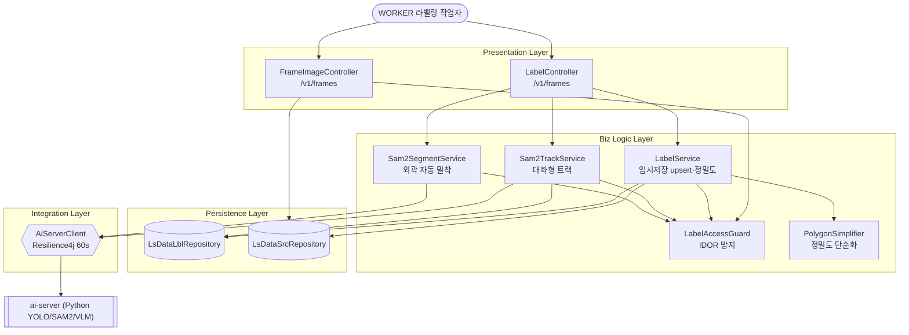
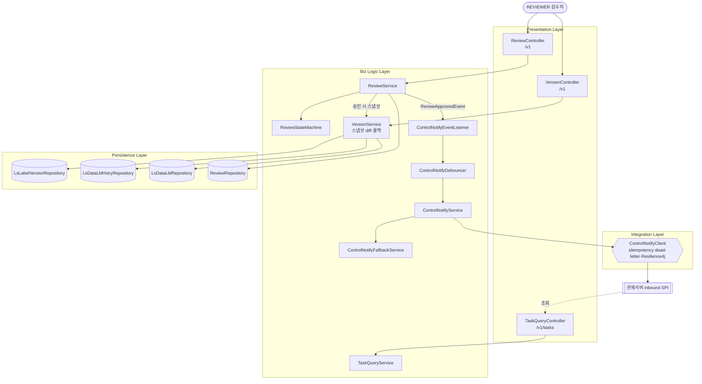

# D3 컴포넌트 설계서

> **ID 표기 규칙(공통)**: 본 산출물의 모든 ID(KLID-AT-UC/CO/IC/IF/UCD 등)는 **전체 형식 `KLID-AT-XX-NNN`** 으로 표기한다. 끝부분만(예: `UC-001`) 약식 표기 금지. 범위는 시작 ID만 전체형으로(예: `KLID-AT-UC-001~013`). ※ 요구사항(RQ-SFR-NN-NN)·시스템시험(KLID-ST-NNN) 등 타 체계 ID는 각 체계 원형 유지.

## 작성 목적
> 설계 클래스 모형에서 도출한 클래스들을 C&V(공통성과 변경성) 기준에 따라 그룹핑하여 컴포넌트를 식별하여 패키지도를 작성하고 식별한 컴포넌트의 내부 클래스 및 인터페이스의 명세를 기술한다.

## 작성 방법
> 클래스를 그룹핑하여 도출한 컴포넌트의 패키지도를 작성하고, 식별한 컴포넌트의 목록을 작성한다. 또한 각각의 컴포넌트에 포함하고 있는 내부 클래스들을 명세하고, 인터페이스는 사용자에게 제공하는 오퍼레이션별로 상세한 명세를 작성한다.

## 산출물 양식

### 제·개정 이력

| 날짜 | 버전 | 제·개정 내역 | 작성자 | 검토자 |
|------|------|------------|--------|--------|
| 2026-06-04 | 1.0 | LogiCraft 그래프 기반 자동 생성 (/cc-doc-gen) — R1 v1.17 범위 | claude | - |

### 헤더

| D3 | 컴포넌트 설계서 |
|-------|----------|
| 시스템명 | AI 기반 지방정부 CCTV 관제지원시스템 구축(2차) | 서브시스템명 | 학습데이터 저작도구 (AT) |
| 단계명  | 설계 | 작성일자 | 2026-06-04 | 버전 | 1.0 |

---

## 1. 컴포넌트 구조도

> **⟳ 유스케이스(UCD)별로 1개씩 반복 작성한다.** 본 산출물은 4개 UCD 그룹별로 구조도를 작성한다. 각 구조도에는 해당 UCD에 관여하는 컴포넌트만 포함하며, 의존관계를 Layer(Presentation / Biz Logic / Persistence / Integration)로 구분한다.

### 1.1 UCD 그룹 정의

| UCD ID | UCD명 | 관련 유스케이스 ID |
|--------|-------|------------------|
| KLID-AT-UCD-001 | 데이터 증강·해상도 변경 | KLID-AT-UC-001, KLID-AT-UC-002, KLID-AT-UC-003, KLID-AT-UC-010 |
| KLID-AT-UCD-002 | AI 라벨링 보조 (VOS·분할·정밀도) | KLID-AT-UC-004, KLID-AT-UC-005, KLID-AT-UC-006 |
| KLID-AT-UCD-003 | 버전관리·수정 통지 | KLID-AT-UC-007, KLID-AT-UC-008, KLID-AT-UC-009 |
| KLID-AT-UCD-004 | 비식별화 | KLID-AT-UC-011, KLID-AT-UC-013, KLID-AT-UC-016 |

---

### 1.2 KLID-AT-UCD-001 — 데이터 증강·해상도 변경

| 컴포넌트 ID | KLID-AT-CO-001, KLID-AT-CO-002, KLID-AT-CO-007 | 컴포넌트명 | 증강(augment)·영상해상도(video.resolution)·검수(review) |
|----------|---|---------|---|
| 관련 유스케이스 ID | KLID-AT-UC-001, KLID-AT-UC-002, KLID-AT-UC-003, KLID-AT-UC-010 |

> 출처: CMP-007(증강·해상도 C4), CMP-005(검수 C4). VideoResolutionService/Persister·ResolutionPreset·LsResolutionExport는 backend 코드(`video.service`, `video.entity`)에서 보강 — `⚠ LogiCraft ITEM 보강 필요`(CMP-007은 VideoProbe/VideoResizer/LabelCoordinateScaler를 별 컴포넌트로 묘사하나 현행 코드는 `ResolutionPreset` enum 화이트리스트 + `LsResolutionExport` 적재 구조).

```mermaid
flowchart TB
  REVIEWER([REVIEWER 검수자])
  EXT_AUG[["외부 증강 시스템"]]

  subgraph Presentation [Presentation Layer]
    AugCtrl[AugmentController<br/>/v1/augments]
    AugResCtrl[AugmentResultController<br/>/v1/augments 콜백]
    VidCtrl[VideoController<br/>/v1/videos/&#123;rawSn&#125;/resolution]
    RvwCtrl[ReviewController<br/>/v1]
  end

  subgraph Biz [Biz Logic Layer]
    AugReqSvc[AugmentRequestService]
    AugRvwSvc[AugmentReviewService]
    AugResSvc[AugmentResultService]
    LblIntegrity[LabelIntegrityCalculator]
    VidResSvc[VideoResolutionService]
    VidResPers[VideoResolutionPersister]
    RvwSvc[ReviewService]
  end

  subgraph Persistence [Persistence Layer]
    AugRepo[(LsDataAugRepository)]
    AugRvwRepo[(LsDataAugRvwRepository)]
    ResExpRepo[(LsResolutionExportRepository)]
    VidRepo[(VideoRepository)]
  end

  subgraph Integration [Integration Layer]
    ExtAugClient{{ExternalAugmentClient}}
    Ffmpeg{{FFmpeg net.bramp 래퍼}}
  end

  REVIEWER --> AugCtrl
  REVIEWER --> VidCtrl
  REVIEWER --> RvwCtrl
  AugCtrl --> AugReqSvc
  AugCtrl --> AugRvwSvc
  AugReqSvc --> ExtAugClient
  ExtAugClient --> EXT_AUG
  AugRvwSvc --> LblIntegrity
  AugRvwSvc --> AugRepo
  AugRvwSvc --> AugRvwRepo
  EXT_AUG -.콜백.-> AugResCtrl
  AugResCtrl --> AugResSvc
  AugResSvc --> VidRepo
  AugResSvc --> AugRepo
  VidCtrl --> VidResSvc
  VidResSvc --> Ffmpeg
  VidResSvc --> VidResPers
  VidResSvc --> VidRepo
  VidResPers --> ResExpRepo
  VidResPers --> VidRepo
  RvwCtrl --> RvwSvc
```

---

### 1.3 KLID-AT-UCD-002 — AI 라벨링 보조 (VOS·분할·정밀도)

| 컴포넌트 ID | KLID-AT-CO-003, KLID-AT-CO-008 | 컴포넌트명 | 라벨링(label)·AI추론서버(ai-server) |
|----------|---|---------|---|
| 관련 유스케이스 ID | KLID-AT-UC-004, KLID-AT-UC-005, KLID-AT-UC-006 |

> 출처: CMP-004(라벨링 C4), MOD-020(ai-server). Sam2SegmentService·Sam2SegmentRequest/Response·PolygonSimplifier(정밀도 조절)는 backend 코드(`label.service`, `common`)에서 보강 — `⚠ LogiCraft ITEM 보강 필요`(CMP-004는 Sam2TrackService만 묘사하며 신규 구현 Sam2SegmentService(`POST /v1/frames/{srcSn}/sam2-segment`)는 ITEM 미반영).

---

### 1.4 KLID-AT-UCD-003 — 버전관리·수정 통지

| 컴포넌트 ID | KLID-AT-CO-004, KLID-AT-CO-007, KLID-AT-CO-005 | 컴포넌트명 | 버전관리(version)·검수(review)·관제통지(controlnotify) |
|----------|---|---------|---|
| 관련 유스케이스 ID | KLID-AT-UC-007, KLID-AT-UC-008, KLID-AT-UC-009 |

> 출처: CMP-006(버전관리 C4), CMP-005(검수 C4), CMP-009(배정·포털·관제통지 C4 중 관제통지 부분). 검수 승인(APPROVED) → VersionService 스냅샷 + ReviewApprovedEvent → 관제 통지 흐름.

---

### 1.5 KLID-AT-UCD-004 — 비식별화

| 컴포넌트 ID | KLID-AT-CO-006, KLID-AT-CO-009, KLID-AT-CO-003 | 컴포넌트명 | 비식별(deident)·마킹(marking)·라벨링(label, 리포트) |
|----------|---|---------|---|
| 관련 유스케이스 ID | KLID-AT-UC-011, KLID-AT-UC-013, KLID-AT-UC-016 |

> 출처: CMP-003(비식별 C4), CMP-002(마킹 C4). DeidentReportService.resolveManually/resolveOpenReports + `POST /v1/deident-reports/{rprtSn}/resolve`는 backend 코드(`label.service`, `label.controller`)에서 보강 — `⚠ LogiCraft ITEM 보강 필요`(CMP-003은 report·재트라이 큐만 묘사하며 OPEN→RESOLVED resolve 오퍼레이션은 ITEM 미반영).

```mermaid
flowchart TB
  WORKER([WORKER 작업자])
  DEID[["외부 비식별 서버"]]

  subgraph Presentation [Presentation Layer]
    DeidResCtrl[DeidentifyResultController<br/>/v1/deidentify 콜백]
    DeidRptCtrl[DeidentReportController<br/>/v1/labels·/v1/deident-reports]
    DeidCtrl[DeidentController<br/>/v1/deident]
    MarkCtrl[MarkingController<br/>/v1/videos/&#123;rawSn&#125;/markings]
  end

  subgraph Biz [Biz Logic Layer]
    DeidStep[DeidentifyStep<br/>batch.step]
    DeidResSvc[DeidentifyResultService]
    DeidRptSvc[DeidentReportService<br/>report·resolveManually·resolveOpenReports]
    MarkSvc[MarkingService]
    MarkBridge[MarkingBatchBridge<br/>AFTER_COMMIT]
  end

  subgraph Persistence [Persistence Layer]
    ProcLogRepo[(LsDeidentProcLogRepository)]
    RptRepo[(LsDeidentReportRepository)]
    MarkRepo[(LsMarkingRepository)]
    VidRepo[(VideoRepository)]
  end

  subgraph Integration [Integration Layer]
    DeidClient{{DeidentifyClient<br/>Resilience4j}}
  end

  DeidStep --> DeidClient
  DeidClient --> DEID
  DEID -.콜백.-> DeidResCtrl
  DeidResCtrl --> DeidResSvc
  DeidResSvc --> ProcLogRepo
  DeidResSvc --> VidRepo
  DeidStep --> ProcLogRepo
  DeidStep --> DeidRptSvc
  WORKER --> DeidRptCtrl
  DeidRptCtrl --> DeidRptSvc
  DeidRptSvc --> RptRepo
  DeidCtrl --> DeidClient
  WORKER --> MarkCtrl
  MarkCtrl --> MarkSvc
  MarkSvc --> MarkRepo
  MarkSvc --> VidRepo
  MarkSvc -->|MarkingCompletedEvent| MarkBridge
```

> ⚠ 비식별 파이프라인 순서 주의: 설계 타깃은 **비식별 선두**(비식별 → 마킹 → VLM → 프레임추출 → 오토라벨링)이나 현행 코드는 구 순서(마킹 트리거 → VLM → 비식별 → …) 구현. 비식별 선두 재배치·마킹 비식별영상화는 설계 확정·코드 미반영(planned).

---

## 2. 컴포넌트 목록

| 컴포넌트ID | 컴포넌트명 | 개요 | 관련 유스케이스 ID |
|---------|---------|------|-------------|
| KLID-AT-CO-001 | augment (데이터 증강) | 외부 증강 시스템 연동(ExternalAugmentClient), 요청·결과 수신(새 영상 생성)·수락/거부 검수 | KLID-AT-UC-001, KLID-AT-UC-002, KLID-AT-UC-010 |
| KLID-AT-CO-002 | video.resolution (영상 해상도) | 해상도 변경 증강 오케스트레이션 — FFmpeg 리사이즈·라벨 좌표 스케일·새 영상 적재 | KLID-AT-UC-003 |
| KLID-AT-CO-003 | label (라벨링) | 프레임 라벨 CRUD(임시저장 upsert), 속성·마스터, SAM2 트랙/세그먼트, 정밀도 조절, 비식별 리포트 | KLID-AT-UC-004, KLID-AT-UC-005, KLID-AT-UC-006, KLID-AT-UC-016 |
| KLID-AT-CO-004 | version (버전관리) | 검수 승인 시 라벨 전체 스냅샷(LS_LABEL_VERSION)·해시 생성·diff·롤백(외부 VCS 미사용) | KLID-AT-UC-007, KLID-AT-UC-008 |
| KLID-AT-CO-005 | controlnotify (관제 통지) | 단방향 outbound TASK_COMPLETED/MODIFIED 통지 + inbound 상세 조회 API, idempotency·dead-letter | KLID-AT-UC-009 |
| KLID-AT-CO-006 | deident (비식별화) | 외부 비식별 솔루션 위탁(DeidentifyClient)·콜백 결과 적재·재처리 | KLID-AT-UC-011, KLID-AT-UC-013, KLID-AT-UC-016 |
| KLID-AT-CO-007 | review (검수) | 검수 워크플로우(목록·상세·제출·시작·승인=작업완료·반려), 상태머신·승인 통지 트리거 | KLID-AT-UC-009, KLID-AT-UC-010 |
| KLID-AT-CO-008 | ai-server (Python 추론) | Stateless 추론 전용(YOLO/SAM2/VLM 어댑터). Spring Boot가 AiServerClient로 호출 | KLID-AT-UC-004, KLID-AT-UC-005 |
| KLID-AT-CO-009 | marking (마킹) | 자동(프레임 간격)/수동 이벤트 시점 마킹 CRUD, 완료 시 배치 트리거(MarkingCompletedEvent) | KLID-AT-UC-011 |

---

## 3. 컴포넌트 명세

> **⟳ 컴포넌트별로 1개씩 반복 작성한다.**

### 3.1 KLID-AT-CO-001 — augment (데이터 증강)

| 컴포넌트 ID | KLID-AT-CO-001 | 컴포넌트명 | augment (데이터 증강) |
|----------|---|---------|---|
| 컴포넌트 개요 | 데이터 증강 도메인 패키지. 증강 요청(WINTER/NIGHT/RAIN/RESOLUTION)을 외부 증강 시스템에 위탁하고, 콜백으로 수신한 결과를 새 영상(RAW_SN, PARENT_RAW_SN)으로 적재하며, 증강 결과의 활용 여부를 검수한다. (MOD-013, CMP-007) |

| **내부 클래스** |
| ID | 클래스명 | 설명 |
|----|--------|------|
| KLID-AT-IC-001 | AugmentController | 증강 요청·결과 검수 엔드포인트(/v1/augments) |
| KLID-AT-IC-002 | AugmentResultController | 외부 증강 시스템 결과 콜백 수신(/v1/augments) |
| KLID-AT-IC-003 | AugmentRequestService | 외부 증강 요청 위임 |
| KLID-AT-IC-004 | AugmentReviewService | 증강 결과 검수(무결성 계산 활용) |
| KLID-AT-IC-005 | AugmentResultService | 증강 결과 새 영상·프레임·라벨·메타 적재(멱등성) |
| KLID-AT-IC-006 | LabelIntegrityCalculator | 증강 라벨 무결성 계산 |
| KLID-AT-IC-007 | LsDataAugRepository | 증강(LS_DATA_AUG) CRUD |
| KLID-AT-IC-008 | LsDataAugRvwRepository | 증강 검수(LS_DATA_AUG_RVW) CRUD |

| **인터페이스 클래스** |
| ID | 인터페이스명 | 오퍼레이션명 | 구분 (Serviced/Required) |
|----|----------|----------|------------------------|
| KLID-AT-IF-001 | AugmentApi | requestAugment | Serviced |
| KLID-AT-IF-001 | AugmentApi | reviewAugment | Serviced |
| KLID-AT-IF-002 | AugmentResultCallbackApi | receiveAugmentResult | Serviced |
| KLID-AT-IF-003 | ExternalAugmentPort | invokeAugment | Required |

### 3.2 KLID-AT-CO-002 — video.resolution (영상 해상도)

| 컴포넌트 ID | KLID-AT-CO-002 | 컴포넌트명 | video.resolution (영상 해상도) |
|----------|---|---------|---|
| 컴포넌트 개요 | 해상도 변경 증강 오케스트레이션. 표준 하위 해상도 프리셋(RES_1080P/720P/480P) 화이트리스트로 FFmpeg 다운스케일·라벨 좌표 스케일·새 영상(LS_RESOLUTION_EXPORT) 적재. (CMP-007 + backend `video.service` 보강) |

| **내부 클래스** |
| ID | 클래스명 | 설명 |
|----|--------|------|
| KLID-AT-IC-009 | VideoController | 해상도 변경 엔드포인트(/v1/videos/{rawSn}/resolution) |
| KLID-AT-IC-010 | VideoResolutionService | 해상도 변경 증강 오케스트레이션(loadAndValidate·changeResolution) |
| KLID-AT-IC-011 | VideoResolutionPersister | 리사이즈 영상·프레임·라벨(좌표 스케일) 저장 |
| KLID-AT-IC-012 | ResolutionPreset | 표준 하위 해상도 화이트리스트 enum(`⚠ ITEM 보강 필요` — 코드 신규) |
| KLID-AT-IC-013 | LsResolutionExportRepository | 해상도 변경본(LS_RESOLUTION_EXPORT) CRUD(`⚠ ITEM 보강 필요` — 코드 신규) |

| **인터페이스 클래스** |
| ID | 인터페이스명 | 오퍼레이션명 | 구분 (Serviced/Required) |
|----|----------|----------|------------------------|
| KLID-AT-IF-004 | VideoResolutionApi | changeResolution | Serviced |
| KLID-AT-IF-005 | VideoProbeResizePort | probe / resize | Required |

### 3.3 KLID-AT-CO-003 — label (라벨링)

| 컴포넌트 ID | KLID-AT-CO-003 | 컴포넌트명 | label (라벨링) |
|----------|---|---------|---|
| 컴포넌트 개요 | 프레임별 라벨 CRUD(임시저장 upsert), 라벨 속성·마스터 코드 관리, SAM2 대화형 트랙·외곽 자동 밀착(세그먼트), 폴리곤 정밀도 조절, 비식별 누락 신고. LabelAccessGuard로 본인 배정 프레임만 편집 허용(IDOR 방지). (MOD-006, CMP-004) |

| **내부 클래스** |
| ID | 클래스명 | 설명 |
|----|--------|------|
| KLID-AT-IC-014 | LabelController | 프레임 라벨 편집·임시저장·SAM2 트랙/세그먼트 엔드포인트(/v1/frames) |
| KLID-AT-IC-015 | LabelAttrController | 라벨 속성·속성값 엔드포인트 |
| KLID-AT-IC-016 | LabelMasterController | 라벨 마스터 코드 관리(/v1/manage/labels) |
| KLID-AT-IC-017 | FrameImageController | 프레임 이미지 서빙(접근 권한 검증) |
| KLID-AT-IC-018 | LabelService | 라벨 CRUD·임시저장 upsert, 수정 이벤트 발행 |
| KLID-AT-IC-019 | Sam2TrackService | SAM2 대화형 트랙 세그멘테이션 |
| KLID-AT-IC-020 | Sam2SegmentService | SAM2 외곽 자동 밀착(세그먼트)(`⚠ ITEM 보강 필요` — 커밋 6441fb9 신규) |
| KLID-AT-IC-021 | LabelAttrService | 라벨 속성 정의 관리 |
| KLID-AT-IC-022 | LabelAttrValueService | 라벨 속성값 관리 |
| KLID-AT-IC-023 | LabelMasterService | 라벨 마스터 코드 서비스 |
| KLID-AT-IC-024 | LabelAccessGuard | 본인 배정 프레임 편집 권한 검증(IDOR 방지) |
| KLID-AT-IC-025 | PolygonSimplifier | 폴리곤 정밀도 단순화(common, Caffeine TTL 60s) |
| KLID-AT-IC-026 | DeidentReportController | 비식별 리포트 조회·신고·resolve(/v1/labels·/v1/deident-reports) |
| KLID-AT-IC-027 | DeidentReportService | 비식별 실패 신고·재트라이·OPEN↔RESOLVED resolve |
| KLID-AT-IC-028 | LsDataLblRepository | 라벨(LS_DATA_LBL) CRUD |
| KLID-AT-IC-029 | LsDataSrcRepository | 프레임(LS_DATA_SRC) 조회 |

| **인터페이스 클래스** |
| ID | 인터페이스명 | 오퍼레이션명 | 구분 (Serviced/Required) |
|----|----------|----------|------------------------|
| KLID-AT-IF-006 | LabelEditApi | saveLabels | Serviced |
| KLID-AT-IF-006 | LabelEditApi | getLabels | Serviced |
| KLID-AT-IF-007 | Sam2TrackApi | sam2Track | Serviced |
| KLID-AT-IF-008 | Sam2SegmentApi | sam2Segment | Serviced |
| KLID-AT-IF-009 | DeidentReportApi | report | Serviced |
| KLID-AT-IF-009 | DeidentReportApi | resolve | Serviced |
| KLID-AT-IF-010 | AiInferencePort | inferSam2 | Required |

### 3.4 KLID-AT-CO-004 — version (버전관리)

| 컴포넌트 ID | KLID-AT-CO-004 | 컴포넌트명 | version (버전관리) |
|----------|---|---------|---|
| 컴포넌트 개요 | 검수 승인(APPROVED) 시점에 영상 단위 라벨 전체 스냅샷(JSON)을 LS_LABEL_VERSION에 저장(VERSION_HASH SHA-256)하고, 검수완료 버전 간 diff 계산·롤백을 제공한다(외부 VCS 미사용). (MOD-007, CMP-006) |

| **내부 클래스** |
| ID | 클래스명 | 설명 |
|----|--------|------|
| KLID-AT-IC-030 | VersionController | 버전 목록·상세·diff·롤백 엔드포인트(/v1) |
| KLID-AT-IC-031 | VersionService | 승인 시 스냅샷 저장·해시 생성·diff·롤백 |
| KLID-AT-IC-032 | LsLabelVersionRepository | 라벨 버전 스냅샷(LS_LABEL_VERSION) CRUD |
| KLID-AT-IC-033 | LsDataLblHstryRepository | 라벨 이력(LS_DATA_LBL_HSTRY) 기록 |

| **인터페이스 클래스** |
| ID | 인터페이스명 | 오퍼레이션명 | 구분 (Serviced/Required) |
|----|----------|----------|------------------------|
| KLID-AT-IF-011 | VersionApi | listVersions | Serviced |
| KLID-AT-IF-011 | VersionApi | diffVersions | Serviced |
| KLID-AT-IF-011 | VersionApi | rollbackVersion | Serviced |
| KLID-AT-IF-012 | VersionSnapshotPort | createSnapshot | Serviced |

### 3.5 KLID-AT-CO-005 — controlnotify (관제 통지)

| 컴포넌트 ID | KLID-AT-CO-005 | 컴포넌트명 | controlnotify (관제 통지) |
|----------|---|---------|---|
| 컴포넌트 개요 | 검수 완료·수정 시 단방향 outbound TASK_COMPLETED/MODIFIED 통지(영상 단위, 본문 미포함)를 관제서버 inbound SPI로 push하고(idempotency·dead-letter·재등록 큐·Resilience4j), 관제서버가 상세를 조회할 inbound API를 제공한다. (MOD-015, CMP-009 관제통지 부분) |

| **내부 클래스** |
| ID | 클래스명 | 설명 |
|----|--------|------|
| KLID-AT-IC-034 | TaskQueryController | 관제서버 inbound 상세 조회 API(/v1/tasks) |
| KLID-AT-IC-035 | TaskQueryService | 영상·프레임·라벨·메타 상세 조회 |
| KLID-AT-IC-036 | ControlNotifyEventListener | 승인·수정 이벤트 수신 → 통지 트리거 |
| KLID-AT-IC-037 | ControlNotifyDebouncer | 영상 단위 디바운스 후 1회 통지 |
| KLID-AT-IC-038 | ControlNotifyService | outbound 통지 발행(idempotency·metrics) |
| KLID-AT-IC-039 | ControlNotifyFallbackService | 통지 실패 시 dead-letter 재등록 큐 |

| **인터페이스 클래스** |
| ID | 인터페이스명 | 오퍼레이션명 | 구분 (Serviced/Required) |
|----|----------|----------|------------------------|
| KLID-AT-IF-013 | TaskQueryApi | getTaskDetail | Serviced |
| KLID-AT-IF-014 | ControlNotifyPort | notifyTaskCompleted | Required |
| KLID-AT-IF-014 | ControlNotifyPort | notifyTaskModified | Required |

### 3.6 KLID-AT-CO-006 — deident (비식별화)

| 컴포넌트 ID | KLID-AT-CO-006 | 컴포넌트명 | deident (비식별화) |
|----------|---|---------|---|
| 컴포넌트 개요 | 외부 비식별 솔루션 위탁(DeidentifyClient)과 결과 콜백 적재. 배치 DeidentifyStep이 위탁하고 외부 서버가 /v1/deidentify 콜백으로 회신하면 처리 로그·비식별 상태를 갱신한다. 재처리(placeholder) 엔드포인트 제공. (MOD-005, CMP-003) |

| **내부 클래스** |
| ID | 클래스명 | 설명 |
|----|--------|------|
| KLID-AT-IC-040 | DeidentifyResultController | 외부 비식별 서버 콜백 수신(/v1/deidentify) |
| KLID-AT-IC-041 | DeidentController | 재처리 요청(/v1/deident, placeholder) |
| KLID-AT-IC-042 | DeidentifyStep | 배치 단계 — 외부 비식별 위탁·결과 경로 반환·메타 적재 |
| KLID-AT-IC-043 | DeidentifyResultService | 콜백 멱등성 적재 + 비식별 처리 로그 기록 |
| KLID-AT-IC-044 | LsDeidentProcLogRepository | 비식별 처리 로그(LS_DEIDENT_PROC_LOG) CRUD |

| **인터페이스 클래스** |
| ID | 인터페이스명 | 오퍼레이션명 | 구분 (Serviced/Required) |
|----|----------|----------|------------------------|
| KLID-AT-IF-015 | DeidentifyCallbackApi | receiveDeidentifyResult | Serviced |
| KLID-AT-IF-016 | DeidentReprocessApi | reprocess | Serviced |
| KLID-AT-IF-017 | DeidentifyPort | invokeDeidentify | Required |

### 3.7 KLID-AT-CO-007 — review (검수)

| 컴포넌트 ID | KLID-AT-CO-007 | 컴포넌트명 | review (검수) |
|----------|---|---------|---|
| 컴포넌트 개요 | 검수 목록·상세·프레임·이슈·제출·시작·승인(=작업완료)·반려 워크플로우. ReviewStateMachine으로 상태 전이를 검증하고, 승인 시 VersionService 스냅샷 생성 + ReviewApprovedEvent 발행(→ 관제 통지). 단일 검수(1인 승인까지 반복). (MOD-009, CMP-005) |

| **내부 클래스** |
| ID | 클래스명 | 설명 |
|----|--------|------|
| KLID-AT-IC-045 | ReviewController | 검수 목록·상세·제출·시작·승인·반려 엔드포인트(/v1) |
| KLID-AT-IC-046 | ReviewService | 검수 워크플로우 — 승인 시 버전 스냅샷·완료 이벤트 발행 |
| KLID-AT-IC-047 | ReviewStateMachine | 검수 상태 전이 검증(PENDING/IN_REVIEW/APPROVED/REJECTED) |
| KLID-AT-IC-048 | ReviewApprovedEvent | 승인(=작업완료) 도메인 이벤트 — 관제 통지 트리거 |
| KLID-AT-IC-049 | ReviewRepository | 검수 레코드 CRUD |
| KLID-AT-IC-050 | IssueRepository | 검수 이슈 CRUD |

| **인터페이스 클래스** |
| ID | 인터페이스명 | 오퍼레이션명 | 구분 (Serviced/Required) |
|----|----------|----------|------------------------|
| KLID-AT-IF-018 | ReviewApi | submitReview | Serviced |
| KLID-AT-IF-018 | ReviewApi | approveReview | Serviced |
| KLID-AT-IF-018 | ReviewApi | rejectReview | Serviced |
| KLID-AT-IF-019 | VersionSnapshotPort | createSnapshot | Required |

### 3.8 KLID-AT-CO-008 — ai-server (Python 추론)

| 컴포넌트 ID | KLID-AT-CO-008 | 컴포넌트명 | ai-server (Python 추론) |
|----------|---|---------|---|
| 컴포넌트 개요 | Python FastAPI 추론 서버(YOLO/SAM2/VLM 어댑터). Stateless 추론 전용, 상태/인증/DB 없음. Spring Boot가 AiServerClient(Resilience4j 60s + CircuitBreaker)로 호출. routers/{yolo,sam2,vlm}. (MOD-020) |

| **내부 클래스** |
| ID | 클래스명 | 설명 |
|----|--------|------|
| KLID-AT-IC-051 | sam2 router | SAM2 추론 엔드포인트(/infer/sam2/segment 등) |
| KLID-AT-IC-052 | yolo router | YOLO 객체 탐지 추론 엔드포인트 |
| KLID-AT-IC-053 | vlm router | 외부 VLM 호출 어댑터 엔드포인트 |

| **인터페이스 클래스** |
| ID | 인터페이스명 | 오퍼레이션명 | 구분 (Serviced/Required) |
|----|----------|----------|------------------------|
| KLID-AT-IF-020 | InferenceApi | inferSam2 | Serviced |
| KLID-AT-IF-020 | InferenceApi | inferYolo | Serviced |

### 3.9 KLID-AT-CO-009 — marking (마킹)

| 컴포넌트 ID | KLID-AT-CO-009 | 컴포넌트명 | marking (마킹) |
|----------|---|---------|---|
| 컴포넌트 개요 | 자동(프레임 간격)/수동 이벤트 시점 마킹 CRUD. 마킹 완료 시 MarkingCompletedEvent 발행 → MarkingBatchBridge(AFTER_COMMIT)가 잔여 배치(VLM→프레임추출→오토라벨링)를 비동기 시작. (MOD-004, CMP-002) |

| **내부 클래스** |
| ID | 클래스명 | 설명 |
|----|--------|------|
| KLID-AT-IC-054 | MarkingController | 마킹 CRUD·완료 엔드포인트(/v1/videos/{rawSn}/markings) |
| KLID-AT-IC-055 | MarkingService | 자동/수동 마킹 저장·완료 처리·이벤트 발행 |
| KLID-AT-IC-056 | MarkingCompletedEvent | 마킹 완료 도메인 이벤트(ApplicationEventPublisher) |
| KLID-AT-IC-057 | MarkingBatchBridge | 이벤트 수신 → BATCH_QUEUED 전이 후 비동기 배치 시작 |
| KLID-AT-IC-058 | LsMarkingRepository | 마킹(LS_MARKING) CRUD |

| **인터페이스 클래스** |
| ID | 인터페이스명 | 오퍼레이션명 | 구분 (Serviced/Required) |
|----|----------|----------|------------------------|
| KLID-AT-IF-021 | MarkingApi | saveMarking | Serviced |
| KLID-AT-IF-021 | MarkingApi | completeMarking | Serviced |

---

## 4. 인터페이스 명세

> **⟳ 인터페이스별로, 그 인터페이스의 오퍼레이션 개수만큼 반복 작성한다.**

### 4.1 KLID-AT-IF-001 / requestAugment

| 인터페이스 ID | KLID-AT-IF-001 | 인터페이스명 | AugmentApi |
|---------|---|---------|---|
| 오퍼레이션명 | requestAugment |
| 오퍼레이션 개요 | 원본 영상에 대해 증강 종류(WINTER/NIGHT/RAIN/RESOLUTION)를 지정하여 외부 증강 시스템에 생성 요청을 위탁한다. |
| 사전조건 | REVIEWER 권한 인증, 대상 원본 영상(rawSn) 존재 |
| 사후조건 | 외부 증강 요청 발행, 증강 레코드(LS_DATA_AUG) 생성 |
| 파라미터 | rawSn: Long, augmentType: Enum(WINTER/NIGHT/RAIN/RESOLUTION) |
| 반환값 | ApiResponse&lt;AugmentRequestResponse&gt; |

### 4.2 KLID-AT-IF-001 / reviewAugment

| 인터페이스 ID | KLID-AT-IF-001 | 인터페이스명 | AugmentApi |
|---------|---|---------|---|
| 오퍼레이션명 | reviewAugment |
| 오퍼레이션 개요 | 수신·등록된 증강 결과 영상의 활용 여부를 라벨 무결성 기준으로 검수하여 수락(accept)/거부(reject) 처리한다. |
| 사전조건 | REVIEWER 권한, 증강 결과 영상 등록 완료(PENDING) |
| 사후조건 | LS_DATA_AUG_RVW 검수 상태 갱신(수락/거부), 수락 시 새 영상 라벨링 플로우 진입 |
| 파라미터 | augSn: Long, decision: Enum(ACCEPT/REJECT) |
| 반환값 | ApiResponse&lt;Void&gt; |

### 4.3 KLID-AT-IF-002 / receiveAugmentResult

| 인터페이스 ID | KLID-AT-IF-002 | 인터페이스명 | AugmentResultCallbackApi |
|---------|---|---------|---|
| 오퍼레이션명 | receiveAugmentResult |
| 오퍼레이션 개요 | 외부 증강 시스템이 생성 완료한 증강 결과를 콜백으로 수신하여 새 영상(RAW_SN, PARENT_RAW_SN)·프레임·라벨·메타로 멱등 적재한다. |
| 사전조건 | 유효한 콜백 요청, 요청 ID 멱등성 |
| 사후조건 | 새 영상 미검수(PENDING)로 생성, 원본 라벨/메타 복사 적재 |
| 파라미터 | AugmentResultCallback(requestId, parentRawSn, resultPath, labels) |
| 반환값 | ApiResponse&lt;Void&gt; |

### 4.4 KLID-AT-IF-003 / invokeAugment

| 인터페이스 ID | KLID-AT-IF-003 | 인터페이스명 | ExternalAugmentPort |
|---------|---|---------|---|
| 오퍼레이션명 | invokeAugment |
| 오퍼레이션 개요 | ExternalAugmentClient를 통해 외부 증강 시스템에 증강 작업을 위탁하는 outbound 호출(Resilience4j 적용). |
| 사전조건 | 외부 증강 시스템 URL 구성, 위탁 페이로드 검증 |
| 사후조건 | 외부 작업 등록, 후속 콜백 대기 |
| 파라미터 | AugmentInvokeRequest(rawSn, augmentType, sourcePath) |
| 반환값 | AugmentInvokeAck |

### 4.5 KLID-AT-IF-004 / changeResolution

| 인터페이스 ID | KLID-AT-IF-004 | 인터페이스명 | VideoResolutionApi |
|---------|---|---------|---|
| 오퍼레이션명 | changeResolution |
| 오퍼레이션 개요 | 원본 영상을 표준 하위 해상도 프리셋으로 다운스케일하여 새 영상으로 저장하고 라벨 좌표를 스케일한다. |
| 사전조건 | REVIEWER 권한, rawSn 존재, preset이 화이트리스트(RES_1080P/720P/480P) |
| 사후조건 | 리사이즈 영상·프레임·라벨 저장(LS_RESOLUTION_EXPORT), 다운스케일만 허용 |
| 파라미터 | rawSn: Long, ResolutionChangeRequest(preset: ResolutionPreset) |
| 반환값 | ApiResponse&lt;ResolutionChangeResponse&gt; |

### 4.6 KLID-AT-IF-005 / probe·resize

| 인터페이스 ID | KLID-AT-IF-005 | 인터페이스명 | VideoProbeResizePort |
|---------|---|---------|---|
| 오퍼레이션명 | probe / resize |
| 오퍼레이션 개요 | FFmpeg(net.bramp 래퍼)로 영상 해상도를 프로브하고 지정 프리셋으로 리사이즈하는 outbound 포트. |
| 사전조건 | 원본 영상 파일 접근 가능, 대상 프리셋 < 원본 해상도(다운스케일) |
| 사후조건 | 리사이즈 영상 파일 생성 |
| 파라미터 | sourcePath: String, targetPreset: ResolutionPreset |
| 반환값 | ResizedVideoMeta(path, width, height) |

### 4.7 KLID-AT-IF-006 / saveLabels

| 인터페이스 ID | KLID-AT-IF-006 | 인터페이스명 | LabelEditApi |
|---------|---|---------|---|
| 오퍼레이션명 | saveLabels |
| 오퍼레이션 개요 | 프레임 단위 라벨 작업본을 임시저장(upsert)한다. 학습데이터 버전 스냅샷은 생성하지 않는다. |
| 사전조건 | WORKER 권한, 본인 배정 프레임(LabelAccessGuard 통과), 작업 락 보유 |
| 사후조건 | LS_DATA_LBL upsert, 라벨 수정 이벤트 발행 |
| 파라미터 | srcSn: Long, LabelSaveRequest(labels) |
| 반환값 | ApiResponse&lt;Void&gt; |

### 4.8 KLID-AT-IF-006 / getLabels

| 인터페이스 ID | KLID-AT-IF-006 | 인터페이스명 | LabelEditApi |
|---------|---|---------|---|
| 오퍼레이션명 | getLabels |
| 오퍼레이션 개요 | 지정 프레임의 현재 라벨 목록을 조회한다. |
| 사전조건 | 인증, 프레임 접근 권한 |
| 사후조건 | - |
| 파라미터 | srcSn: Long |
| 반환값 | ApiResponse&lt;List&lt;LabelResponse&gt;&gt; |

### 4.9 KLID-AT-IF-007 / sam2Track

| 인터페이스 ID | KLID-AT-IF-007 | 인터페이스명 | Sam2TrackApi |
|---------|---|---------|---|
| 오퍼레이션명 | sam2Track |
| 오퍼레이션 개요 | SAM2 대화형 트랙 세그멘테이션을 요청하여 객체를 프레임 간 자동 추적·분할한다(ai-server 프록시). |
| 사전조건 | WORKER 권한, 본인 배정 프레임(LabelAccessGuard) |
| 사후조건 | 트랙 라벨 저장(LS_DATA_LBL) |
| 파라미터 | srcSn: Long, Sam2TrackRequest |
| 반환값 | ApiResponse&lt;Sam2TrackResponseDto&gt; |

### 4.10 KLID-AT-IF-008 / sam2Segment

| 인터페이스 ID | KLID-AT-IF-008 | 인터페이스명 | Sam2SegmentApi |
|---------|---|---------|---|
| 오퍼레이션명 | sam2Segment |
| 오퍼레이션 개요 | 클릭 좌표(points) 또는 박스(box) 프롬프트로 SAM2 단일 프레임 외곽 자동 밀착 세그먼트를 수행하여 폴리곤+신뢰도를 반환한다(ai-server `/infer/sam2/segment` 프록시). `⚠ ITEM 보강 필요`(커밋 6441fb9 신규). |
| 사전조건 | WORKER 권한, 본인 배정 프레임(LabelAccessGuard), points/box 중 정확히 하나 제공(@AssertTrue), 경로 순회 차단(resolveSafe) |
| 사후조건 | - (응답 폴리곤 좌표를 이미지 실측 범위로 클램프) |
| 파라미터 | srcSn: Long, Sam2SegmentRequest(srcSn, points: List&lt;List&lt;Double&gt;&gt; max100, box: List&lt;Double&gt; size4) |
| 반환값 | ApiResponse&lt;Sam2SegmentResponse&gt; |

### 4.11 KLID-AT-IF-009 / report

| 인터페이스 ID | KLID-AT-IF-009 | 인터페이스명 | DeidentReportApi |
|---------|---|---------|---|
| 오퍼레이션명 | report |
| 오퍼레이션 개요 | 라벨링 단계에서 개인정보 노출(비식별 누락)을 발견한 작업자가 프레임(srcSn) 기준으로 신고한다. 신고 시 작업락 + 재비식별 큐. |
| 사전조건 | 인증, 본인 배정 프레임(LabelAccessGuard) |
| 사후조건 | LS_DEIDENT_REPORT OPEN 생성, 영상 라벨 처리·작업락 적용 |
| 파라미터 | srcSn: Long, DeidentReportRequest(reason) |
| 반환값 | ApiResponse&lt;Long&gt; (rprtSn) |

### 4.12 KLID-AT-IF-009 / resolve

| 인터페이스 ID | KLID-AT-IF-009 | 인터페이스명 | DeidentReportApi |
|---------|---|---------|---|
| 오퍼레이션명 | resolve |
| 오퍼레이션 개요 | 외부 솔루션 수동 비식별화 완료 후 신고를 OPEN→RESOLVED로 전이하고 작업락을 해제한다(resolveManually). 배치 자동 비식별 성공 시 OPEN 신고 일괄 RESOLVED(resolveOpenReports). `⚠ ITEM 보강 필요`. |
| 사전조건 | 인증(rprtSn에 대해 verifyRawAccess), 신고 상태 OPEN(아니면 409) |
| 사후조건 | LS_DEIDENT_REPORT RESOLVED 전이, 작업락 해제 (멱등) |
| 파라미터 | rprtSn: Long |
| 반환값 | ApiResponse&lt;Void&gt; |

### 4.13 KLID-AT-IF-010 / inferSam2 (Required)

| 인터페이스 ID | KLID-AT-IF-010 | 인터페이스명 | AiInferencePort |
|---------|---|---------|---|
| 오퍼레이션명 | inferSam2 |
| 오퍼레이션 개요 | AiServerClient를 통해 ai-server SAM2 추론 엔드포인트를 호출하는 outbound 포트(Resilience4j 60s + CircuitBreaker). |
| 사전조건 | ai-server URL 구성, 프레임 이미지 경로 유효 |
| 사후조건 | 추론 폴리곤/마스크 응답 수신 |
| 파라미터 | Sam2Request(imagePath, points|box) |
| 반환값 | Sam2Response |

### 4.14 KLID-AT-IF-011 / listVersions

| 인터페이스 ID | KLID-AT-IF-011 | 인터페이스명 | VersionApi |
|---------|---|---------|---|
| 오퍼레이션명 | listVersions |
| 오퍼레이션 개요 | 영상 단위 검수완료(APPROVED) 라벨 버전 스냅샷 목록을 조회한다. |
| 사전조건 | 인증, rawSn 접근 권한 |
| 사후조건 | - |
| 파라미터 | rawSn: Long, Pageable |
| 반환값 | ApiResponse&lt;Page&lt;VersionSummary&gt;&gt; |

### 4.15 KLID-AT-IF-011 / diffVersions

| 인터페이스 ID | KLID-AT-IF-011 | 인터페이스명 | VersionApi |
|---------|---|---------|---|
| 오퍼레이션명 | diffVersions |
| 오퍼레이션 개요 | 두 검수완료 버전 스냅샷을 앱에서 비교하여 라벨 변경 diff를 계산한다. |
| 사전조건 | 두 버전 모두 동일 rawSn 소속, 존재 |
| 사후조건 | - |
| 파라미터 | rawSn: Long, fromHash: String, toHash: String |
| 반환값 | ApiResponse&lt;VersionDiff&gt; |

### 4.16 KLID-AT-IF-011 / rollbackVersion

| 인터페이스 ID | KLID-AT-IF-011 | 인터페이스명 | VersionApi |
|---------|---|---------|---|
| 오퍼레이션명 | rollbackVersion |
| 오퍼레이션 개요 | 대상 검수완료 스냅샷을 새 active 버전으로 복원(롤백)한다. |
| 사전조건 | REVIEWER 권한, 대상 버전 존재, 작업 락 |
| 사후조건 | LS_DATA_LBL 복원, 이력(LS_DATA_LBL_HSTRY) 기록 |
| 파라미터 | rawSn: Long, targetHash: String |
| 반환값 | ApiResponse&lt;Void&gt; |

### 4.17 KLID-AT-IF-012 / createSnapshot (Serviced)

| 인터페이스 ID | KLID-AT-IF-012 | 인터페이스명 | VersionSnapshotPort |
|---------|---|---------|---|
| 오퍼레이션명 | createSnapshot |
| 오퍼레이션 개요 | 검수 승인(APPROVED) 시점에 영상 단위 라벨 전체를 JSON 스냅샷으로 저장하고 VERSION_HASH(SHA-256)를 부여한다. ReviewService가 호출. |
| 사전조건 | 검수 상태 APPROVED 전이 직전·직후 트랜잭션 |
| 사후조건 | LS_LABEL_VERSION 신규 행(SAVE_REASON='APPROVED'), 동일 페이로드는 동일 해시로 중복 식별 |
| 파라미터 | rawSn: Long, saveReason: String |
| 반환값 | versionHash: String |

### 4.18 KLID-AT-IF-013 / getTaskDetail

| 인터페이스 ID | KLID-AT-IF-013 | 인터페이스명 | TaskQueryApi |
|---------|---|---------|---|
| 오퍼레이션명 | getTaskDetail |
| 오퍼레이션 개요 | 관제서버가 TASK_COMPLETED/MODIFIED 통지 수신 후 영상 단위 상세(영상·프레임·라벨·메타)를 조회하는 inbound API. |
| 사전조건 | 인계 토큰 또는 IP 화이트리스트 통과, rawSn 존재 |
| 사후조건 | - |
| 파라미터 | rawSn: Long |
| 반환값 | ApiResponse&lt;TaskDetailResponse&gt; |

### 4.19 KLID-AT-IF-014 / notifyTaskCompleted (Required)

| 인터페이스 ID | KLID-AT-IF-014 | 인터페이스명 | ControlNotifyPort |
|---------|---|---------|---|
| 오퍼레이션명 | notifyTaskCompleted |
| 오퍼레이션 개요 | 검수 완료(COMPLETED 전이) 시 영상 단위 TASK_COMPLETED 통지(메타만)를 관제서버 inbound SPI로 비동기 push. |
| 사전조건 | 검수 APPROVED→작업 COMPLETED 전이, 요청 ID 멱등성 |
| 사후조건 | outbound 통지 발행, 실패 시 dead-letter 재등록 큐 적재 |
| 파라미터 | TaskCompletedPayload(rawSn, videoMeta, completedAt, frameCount, labelCount, metaCount, requestId) |
| 반환값 | - (비동기) |

### 4.20 KLID-AT-IF-014 / notifyTaskModified (Required)

| 인터페이스 ID | KLID-AT-IF-014 | 인터페이스명 | ControlNotifyPort |
|---------|---|---------|---|
| 오퍼레이션명 | notifyTaskModified |
| 오퍼레이션 개요 | 검수 완료 후 라벨/메타 수정 시 영상 단위 TASK_MODIFIED 통지(수정 요약만)를 push. 디바운스 후 1회 발행. |
| 사전조건 | 동일 작업 ID(rawSn) 검수완료 이력 존재 |
| 사후조건 | 변경 프레임 목록·변경 종류 포함 통지 발행(본문 미포함) |
| 파라미터 | TaskModifiedPayload(rawSn, modifiedAt, changedFrames[srcSn, changeType], summary, requestId) |
| 반환값 | - (비동기) |

### 4.21 KLID-AT-IF-015 / receiveDeidentifyResult

| 인터페이스 ID | KLID-AT-IF-015 | 인터페이스명 | DeidentifyCallbackApi |
|---------|---|---------|---|
| 오퍼레이션명 | receiveDeidentifyResult |
| 오퍼레이션 개요 | 외부 비식별 서버가 처리 완료한 비식별 영상 결과를 /v1/deidentify 콜백으로 수신하여 멱등 적재하고 처리 로그·비식별 상태를 갱신한다. |
| 사전조건 | 유효한 콜백, 요청 멱등성 |
| 사후조건 | LS_DEIDENT_PROC_LOG 기록, LS_DATA_RAW 비식별 상태 갱신 |
| 파라미터 | DeidentifyResultCallback(rawSn, resultPath, status) |
| 반환값 | ApiResponse&lt;Void&gt; |

### 4.22 KLID-AT-IF-016 / reprocess

| 인터페이스 ID | KLID-AT-IF-016 | 인터페이스명 | DeidentReprocessApi |
|---------|---|---------|---|
| 오퍼레이션명 | reprocess |
| 오퍼레이션 개요 | 비식별 재처리 요청 엔드포인트(/v1/deident, placeholder). |
| 사전조건 | 인증, rawSn 존재 |
| 사후조건 | 재비식별 큐 적재 |
| 파라미터 | rawSn: Long |
| 반환값 | ApiResponse&lt;Void&gt; |

### 4.23 KLID-AT-IF-017 / invokeDeidentify (Required)

| 인터페이스 ID | KLID-AT-IF-017 | 인터페이스명 | DeidentifyPort |
|---------|---|---------|---|
| 오퍼레이션명 | invokeDeidentify |
| 오퍼레이션 개요 | DeidentifyClient를 통해 외부 비식별 서버에 영상 비식별을 위탁하는 outbound 호출(Resilience4j). |
| 사전조건 | 비식별 서버 URL 구성, 원본 영상 경로 유효 |
| 사후조건 | 외부 작업 등록, 실패 시 DE_IDNTF_YN='F' 마킹 + 재시도 큐(원본 삭제 금지) |
| 파라미터 | DeidentifyInvokeRequest(rawSn, sourcePath, options) |
| 반환값 | DeidentifyInvokeAck |

### 4.24 KLID-AT-IF-018 / submitReview

| 인터페이스 ID | KLID-AT-IF-018 | 인터페이스명 | ReviewApi |
|---------|---|---------|---|
| 오퍼레이션명 | submitReview |
| 오퍼레이션 개요 | 라벨링 작업자가 라벨 작업 결과를 검수 제출한다(상태 전이 검증). |
| 사전조건 | WORKER 권한, 본인 배정 작업 |
| 사후조건 | 검수 상태 IN_REVIEW 전이 |
| 파라미터 | rawSn: Long |
| 반환값 | ApiResponse&lt;Void&gt; |

### 4.25 KLID-AT-IF-018 / approveReview

| 인터페이스 ID | KLID-AT-IF-018 | 인터페이스명 | ReviewApi |
|---------|---|---------|---|
| 오퍼레이션명 | approveReview |
| 오퍼레이션 개요 | REVIEWER가 검수를 승인(=작업완료)한다. 승인 시 라벨 버전 스냅샷 생성 + ReviewApprovedEvent 발행(관제 통지). |
| 사전조건 | REVIEWER 권한, 상태 IN_REVIEW, ReviewStateMachine 전이 허용 |
| 사후조건 | APPROVED 전이, LS_LABEL_VERSION 스냅샷, 작업 COMPLETED, TASK_COMPLETED 통지 발행 |
| 파라미터 | rawSn: Long |
| 반환값 | ApiResponse&lt;Void&gt; |

### 4.26 KLID-AT-IF-018 / rejectReview

| 인터페이스 ID | KLID-AT-IF-018 | 인터페이스명 | ReviewApi |
|---------|---|---------|---|
| 오퍼레이션명 | rejectReview |
| 오퍼레이션 개요 | REVIEWER가 검수를 반려하고 이슈를 기록한다. |
| 사전조건 | REVIEWER 권한, 상태 IN_REVIEW |
| 사후조건 | REJECTED 전이, 검수 이슈 기록 |
| 파라미터 | rawSn: Long, RejectRequest(issues) |
| 반환값 | ApiResponse&lt;Void&gt; |

### 4.27 KLID-AT-IF-019 / createSnapshot (Required)

| 인터페이스 ID | KLID-AT-IF-019 | 인터페이스명 | VersionSnapshotPort |
|---------|---|---------|---|
| 오퍼레이션명 | createSnapshot |
| 오퍼레이션 개요 | review 컴포넌트가 승인 시 version 컴포넌트의 스냅샷 생성을 요청하는 Required 호출(KLID-AT-IF-012의 소비측). |
| 사전조건 | 검수 APPROVED 전이 트랜잭션 내 |
| 사후조건 | LS_LABEL_VERSION 스냅샷 생성 |
| 파라미터 | rawSn: Long, saveReason='APPROVED' |
| 반환값 | versionHash: String |

### 4.28 KLID-AT-IF-020 / inferSam2 (Serviced)

| 인터페이스 ID | KLID-AT-IF-020 | 인터페이스명 | InferenceApi |
|---------|---|---------|---|
| 오퍼레이션명 | inferSam2 |
| 오퍼레이션 개요 | ai-server가 제공하는 SAM2 세그먼트 추론(/infer/sam2/segment). Stateless. |
| 사전조건 | 이미지 경로·프롬프트(points|box) 유효 |
| 사후조건 | - |
| 파라미터 | image, points|box |
| 반환값 | polygon, score |

### 4.29 KLID-AT-IF-020 / inferYolo (Serviced)

| 인터페이스 ID | KLID-AT-IF-020 | 인터페이스명 | InferenceApi |
|---------|---|---------|---|
| 오퍼레이션명 | inferYolo |
| 오퍼레이션 개요 | ai-server가 제공하는 YOLO 객체 탐지 추론. 원본 이미지에만 실행, 비식별본과 좌표 공유. |
| 사전조건 | 원본 이미지 경로 유효 |
| 사후조건 | - |
| 파라미터 | image |
| 반환값 | detections[bbox, class, score] |

### 4.30 KLID-AT-IF-021 / saveMarking

| 인터페이스 ID | KLID-AT-IF-021 | 인터페이스명 | MarkingApi |
|---------|---|---------|---|
| 오퍼레이션명 | saveMarking |
| 오퍼레이션 개요 | 비식별 영상에서 자동(프레임 간격)/수동 이벤트 시점 마킹을 저장한다. |
| 사전조건 | WORKER 권한, 대상 영상(rawSn) 비식별 완료 |
| 사후조건 | LS_MARKING 저장 |
| 파라미터 | rawSn: Long, MarkingSaveRequest(marks, intervalFrames) |
| 반환값 | ApiResponse&lt;Void&gt; |

### 4.31 KLID-AT-IF-021 / completeMarking

| 인터페이스 ID | KLID-AT-IF-021 | 인터페이스명 | MarkingApi |
|---------|---|---------|---|
| 오퍼레이션명 | completeMarking |
| 오퍼레이션 개요 | 마킹을 완료 처리하면 MarkingCompletedEvent를 발행하여(AFTER_COMMIT) 잔여 배치(VLM→프레임추출→오토라벨링)를 비동기 시작한다. |
| 사전조건 | WORKER 권한, 마킹 1건 이상 존재 |
| 사후조건 | BATCH_QUEUED 전이, @Async 배치 시작 |
| 파라미터 | rawSn: Long |
| 반환값 | ApiResponse&lt;Void&gt; |

---

> **빈 셀 안내**: KLID-AT-IF-006(getLabels)·KLID-AT-IF-008(sam2Segment)·KLID-AT-IF-011(listVersions/diffVersions)·KLID-AT-IF-020(inferSam2/inferYolo)의 사후조건은 조회·추론 오퍼레이션 특성상 상태 변경이 없어 `-`로 표기(빈 셀 7건). 그 외 셀은 모두 채움.
