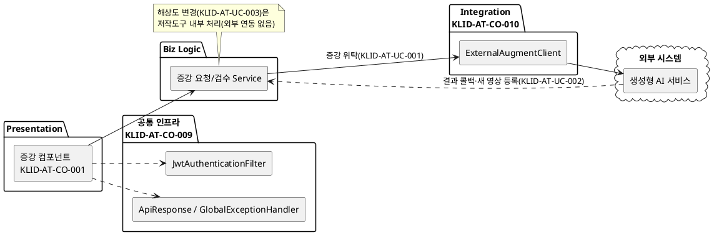
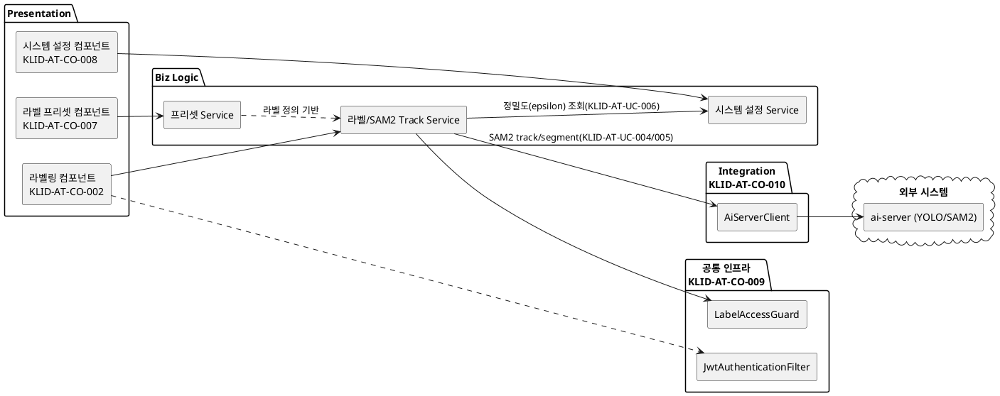
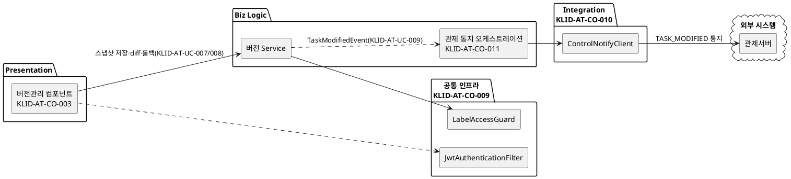
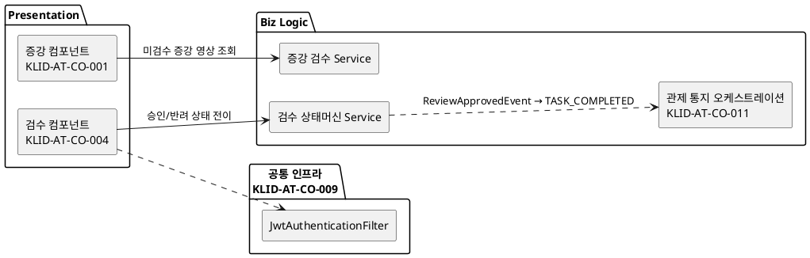
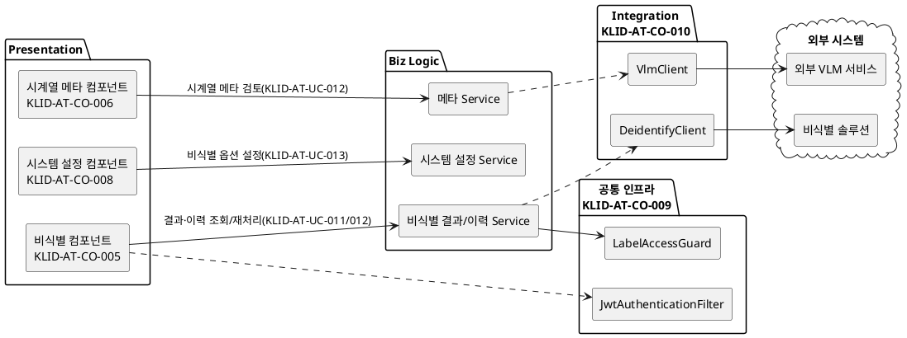

# D3 컴포넌트 설계서

## 작성 목적
> 설계 클래스 모형에서 도출한 클래스들을 C&V(공통성과 변경성) 기준에 따라 그룹핑하여 컴포넌트를 식별하여 패키지도를 작성하고 식별한 컴포넌트의 내부 클래스 및 인터페이스의 명세를 기술한다.

## 작성 방법
> 클래스를 그룹핑하여 도출한 컴포넌트의 패키지도를 작성하고, 식별한 컴포넌트의 목록을 작성한다. 또한 각각의 컴포넌트에 포함하고 있는 내부 클래스들을 명세하고, 인터페이스는 사용자에게 제공하는 오퍼레이션별로 상세한 명세를 작성한다.

> 본 산출물은 R1 사용자 요구사항(SFR-06~09, 16개)에 매핑된 R2 유스케이스(KLID-AT-UC-001~013)와 직접 관련된 컴포넌트만을 대상으로 한다. R1/R2 범위 밖 도메인(사용자/권한·마킹·배치 트리거·포털·게시판·통계·영상 목록)은 본 명세에서 제외한다. 단, 인증·표준 응답·예외 처리 등 R2 유스케이스 실행에 필수인 공통 인프라와 외부 연동 클라이언트는 별도 컴포넌트로 포함한다.

---

## 산출물 양식

### 제·개정 이력

| 날짜 | 버전 | 제·개정 내역 | 작성자 | 검토자 |
|------|------|------------|--------|--------|
| 2026-05-31 | 1.0 | 최초 작성 — R2 유스케이스(KLID-AT-UC-001~015) 매핑 컴포넌트(증강·라벨링·버전관리·검수·비식별·시계열메타·프리셋·시스템설정 + 공통 인프라 + 외부 연동) 식별·명세. 실제 도메인 패키지 코드 기반 도출 | 박찬기 | 김현욱 |
| 2026-06-02 | 1.1 | RQ-SFR-09-06·09-07(KLID-AT-UC-014/015) 범위 외 삭제 반영 — SFR 18→16개, 대상 UC KLID-AT-UC-001~013. KLID-AT-CO-009(공통 인프라) 커버리지 범위를 KLID-AT-UC-001~013으로 갱신, KLID-AT-UC-014/015 커버리지 메모 제거. 전용 컴포넌트는 본래 식별되지 않았으므로 컴포넌트 목록 자체는 불변 | 박찬기 | 김현욱 |
| 2026-06-02 | 1.2 | **§1 컴포넌트 구조도를 CBD 양식대로 유스케이스(UCD)별 5종으로 재작성** — 기존 전역 1개 통합 도면을 KLID-AT-UCD-001(증강)·002(라벨링)·003(버전관리)·004(검수)·005(비식별) 단위로 분할, 각 도면에 해당 UCD 관여 컴포넌트만 포함. §2 목록·§3 컴포넌트별 명세·§4 인터페이스별×오퍼레이션 명세는 이미 양식을 준수하여 그대로 유지 | 박찬기 | 김현욱 |

### 헤더

| D3 | 컴포넌트 설계서 |
|-------|----------|
| 시스템명 | AI 기반 지방정부 CCTV 관제지원시스템 구축(2차) | 서브시스템명 | 학습데이터 저작도구 (AT) |
| 단계명  | 설계 | 작성일자 | 2026-06-02 | 버전 | 1.2 |

---

## 1. 컴포넌트 구조도

> **CBD 양식: 컴포넌트 구조도는 유스케이스(UCD)별로 작성한다.** R2 유스케이스 다이어그램 5종(KLID-AT-UCD-001~005) 단위로 각각의 구조도를 작성하며, 각 도면에는 해당 UCD에 관여하는 컴포넌트만 포함한다. 의존관계는 Layer(Presentation → Biz Logic → 공통 인프라/Integration) 단방향으로 표시한다.
> 공통 인프라(KLID-AT-CO-009)는 전 UCD에 횡단 적용되므로 각 도면에 인증/표준응답/IDOR 가드를 공통으로 포함한다.

### 1.1 KLID-AT-UCD-001 데이터 증강 및 해상도 변경

| 컴포넌트 ID | KLID-AT-CO-001, KLID-AT-CO-010, KLID-AT-CO-009 | 컴포넌트명 | 증강 / 외부 연동 / 공통 인프라 |
|----------|---|---------|---|
| 관련 유스케이스 ID | KLID-AT-UC-001(증강 요청), KLID-AT-UC-002(결과 수신·등록), KLID-AT-UC-003(해상도 변경) |

### 1.2 KLID-AT-UCD-002 AI 보조 라벨링

| 컴포넌트 ID | KLID-AT-CO-002, KLID-AT-CO-007, KLID-AT-CO-008, KLID-AT-CO-010, KLID-AT-CO-009 | 컴포넌트명 | 라벨링 / 프리셋 / 시스템설정 / 외부 연동 / 공통 인프라 |
|----------|---|---------|---|
| 관련 유스케이스 ID | KLID-AT-UC-004(객체 자동 추적), KLID-AT-UC-005(외곽 밀착), KLID-AT-UC-006(정밀도 조절) |

### 1.3 KLID-AT-UCD-003 라벨 버전관리 및 데이터마트 동기화

| 컴포넌트 ID | KLID-AT-CO-003, KLID-AT-CO-011, KLID-AT-CO-010, KLID-AT-CO-009 | 컴포넌트명 | 버전관리 / 관제 통지 / 외부 연동 / 공통 인프라 |
|----------|---|---------|---|
| 관련 유스케이스 ID | KLID-AT-UC-007(버전 저장·이력), KLID-AT-UC-008(비교·복구), KLID-AT-UC-009(데이터마트 수정 통지) |

### 1.4 KLID-AT-UCD-004 증강 영상 활용 여부 검수

| 컴포넌트 ID | KLID-AT-CO-004, KLID-AT-CO-001, KLID-AT-CO-011, KLID-AT-CO-009 | 컴포넌트명 | 검수 / 증강 / 관제 통지 / 공통 인프라 |
|----------|---|---------|---|
| 관련 유스케이스 ID | KLID-AT-UC-010(증강 영상 활용 여부 검수) |

### 1.5 KLID-AT-UCD-005 영상 비식별화 처리 및 관리

| 컴포넌트 ID | KLID-AT-CO-005, KLID-AT-CO-006, KLID-AT-CO-008, KLID-AT-CO-010, KLID-AT-CO-009 | 컴포넌트명 | 비식별 / 시계열 메타 / 시스템설정 / 외부 연동 / 공통 인프라 |
|----------|---|---------|---|
| 관련 유스케이스 ID | KLID-AT-UC-011(비식별 처리 요청), KLID-AT-UC-012(결과·이력 검토), KLID-AT-UC-013(옵션 설정) |

> 의존 방향 요약: 전 UCD 공통으로 Presentation(Controller) → Biz Logic(Service/Domain) → 공통 인프라/Integration(외부 연동 Client) 단방향. 버전관리 Service 는 라벨 스냅샷 직렬화를 위해 라벨 Service 에 `@Lazy` 로 의존(순환 해소, KLID-AT-UCD-003). 검수 승인/라벨·메타 수정은 도메인 이벤트(ApplicationEventPublisher)를 발행하고 관제 통지 컴포넌트(KLID-AT-CO-011)가 비동기 수신한다(KLID-AT-UCD-003/004). 공통 인프라(KLID-AT-CO-009)는 전 UCD 횡단 적용된다.

---

## 2. 컴포넌트 목록

| 컴포넌트ID | 컴포넌트명 | 개요 | 관련 유스케이스 ID |
|---------|---------|------|-------------|
| KLID-AT-CO-001 | 데이터 증강 컴포넌트 (augment) | 외부 생성형 AI 증강 요청, 증강 결과 수신·등록(새 영상 생성·라벨 복사), 증강 영상 활용 여부 검수(승인/반려) | KLID-AT-UC-001, KLID-AT-UC-002, KLID-AT-UC-003, KLID-AT-UC-010 |
| KLID-AT-CO-002 | 라벨링 컴포넌트 (label) | 라벨 CRUD(bulk upsert) 및 SAM2 기반 객체 자동 추적·외곽 밀착(정밀도 적용) 추론 | KLID-AT-UC-004, KLID-AT-UC-005, KLID-AT-UC-006 |
| KLID-AT-CO-003 | 버전관리 컴포넌트 (version) | 라벨 전체 스냅샷(JSON) DB 저장, 버전 이력 조회, 두 버전 diff, 롤백 (외부 VCS 미사용) | KLID-AT-UC-007, KLID-AT-UC-008 |
| KLID-AT-CO-004 | 검수 컴포넌트 (review) | 검수 워크플로우 상태머신(제출/시작/승인/반려), 검수 완료(APPROVED) 전이 시 완료 이벤트 발행 | KLID-AT-UC-010 (검수 상태 전이 기반) |
| KLID-AT-CO-005 | 비식별 컴포넌트 (deident) | 비식별 처리 결과·이력 조회, 비식별 재처리 요청 (외부 비식별 솔루션 연동 진입점) | KLID-AT-UC-011, KLID-AT-UC-012, KLID-AT-UC-013 |
| KLID-AT-CO-006 | 시계열 메타 컴포넌트 (meta) | 외부 VLM/외부 시스템 생성 시계열 메타 조회·수정, 메타 검토 승인/반려 | KLID-AT-UC-012 (검토 맥락 보조) |
| KLID-AT-CO-007 | 라벨 프리셋 컴포넌트 (preset) | 라벨링 프리셋(라벨 코드·이벤트 매핑) 관리 — 라벨링 정밀도 작업의 라벨 정의 기반 | KLID-AT-UC-004, KLID-AT-UC-005 (라벨 정의 기반) |
| KLID-AT-CO-008 | 시스템 설정 컴포넌트 (sysconfig) | 폴리곤 단순화 정밀도(POLYGON_SIMPLIFY_TOLERANCE) 등 시스템 설정 조회·갱신(캐시 TTL 60s) | KLID-AT-UC-006 |
| KLID-AT-CO-009 | 공통 인프라 컴포넌트 (common) | 표준 응답(ApiResponse), JWT 인증 필터, 전역 예외 처리, 프레임 접근 가드(IDOR 방어) | KLID-AT-UC-001 ~ KLID-AT-UC-013 (공통) |
| KLID-AT-CO-010 | 외부 연동 컴포넌트 (common.client / augment.integration) | ai-server·VLM·비식별·관제·생성형 AI 외부 시스템 호출 클라이언트(Resilience4j 적용) | KLID-AT-UC-001, KLID-AT-UC-002, KLID-AT-UC-004, KLID-AT-UC-005, KLID-AT-UC-009, KLID-AT-UC-011, KLID-AT-UC-012 |
| KLID-AT-CO-011 | 관제 통지 컴포넌트 (controlnotify) | 검수 완료/수정 이벤트 수신 → 관제서버 outbound 통지(TASK_COMPLETED/MODIFIED) 발행 + 관제 조회 API | KLID-AT-UC-009 |

---

## 3. 컴포넌트 명세

### 3.1 데이터 증강 컴포넌트

| 컴포넌트 ID | KLID-AT-CO-001 | 컴포넌트명 | 데이터 증강 컴포넌트 (augment) |
|----------|---|---------|---|
| 컴포넌트 개요 | 외부 SFR-07 생성형 AI 증강 요청(검수 완료 영상만), 외부 콜백으로 증강 결과 수신·새 영상(RAW_SN) 등록·원본 라벨/메타 복사, 증강 영상 활용 여부 검수(승인/반려)를 담당. 증강 본체는 외부 책임이며 본 컴포넌트는 요청·수신·검수만 수행. |

| **내부 클래스** | | |
| ID | 클래스명 | 설명 |
|----|--------|------|
| KLID-AT-IC-001 | AugmentController | 증강 결과 조회·요청·승인·반려 REST 엔드포인트 (`/v1/augments`) |
| KLID-AT-IC-002 | AugmentRequestService | 검수 완료(APPROVED) 영상에 대한 외부 증강 요청 — 미검수 포함 시 NOT_REVIEWED 거부 |
| KLID-AT-IC-003 | AugmentReviewService | 증강 결과 4종(WINTER/NIGHT/RAIN/RESOLUTION) 승인/반려 검수 |
| KLID-AT-IC-004 | AugmentResultController | 외부 증강 결과 수신 webhook (`POST /v1/augments/result`, HMAC 인증) |
| KLID-AT-IC-005 | AugmentResultService | 수신 결과 멱등 처리 + 성공 시 새 영상 생성·원본 프레임/라벨/메타 복사 |
| KLID-AT-IC-006 | LsDataAug / LsDataAugRvw / LsDataAugLblMap | 증강 결과·증강 검수·증강↔라벨 매핑 엔티티 |

| **인터페이스 클래스** | | | |
| ID | 인터페이스명 | 오퍼레이션명 | 구분 (Serviced/Required) |
|----|----------|----------|------------------------|
| KLID-AT-IF-001 | AugmentController | request / accept / reject / list / result | Serviced |
| KLID-AT-IF-002 | AugmentResultController | receive | Serviced |
| KLID-AT-IF-003 | ExternalAugmentClient | requestAugment / syncDecision | Required |

### 3.2 라벨링 컴포넌트

| 컴포넌트 ID | KLID-AT-CO-002 | 컴포넌트명 | 라벨링 컴포넌트 (label) |
|----------|---|---------|---|
| 컴포넌트 개요 | 프레임 라벨 조회·일괄 저장(bulk upsert)과 SAM2 기반 객체 자동 추적·외곽 경계 자동 밀착 추론을 제공. 추론 결과 폴리곤은 시스템 설정 epsilon(정밀도)으로 단순화. 모든 진입점에서 LabelAccessGuard 로 본인 배정 검증(IDOR 방어). |

| **내부 클래스** | | |
| ID | 클래스명 | 설명 |
|----|--------|------|
| KLID-AT-IC-007 | LabelController | 라벨 조회/일괄 저장/SAM2 Track REST 엔드포인트 (`/v1/frames`) |
| KLID-AT-IC-008 | LabelService | 라벨 bulk upsert(전체 교체), 저장 후 버전 스냅샷 자동 기록 + TaskModifiedEvent 발행 |
| KLID-AT-IC-009 | Sam2TrackService | 시드 폴리곤을 ai-server(SAM2)에 전파 추적, 응답 폴리곤 epsilon 단순화 후 자동 라벨 저장 |
| KLID-AT-IC-010 | LabelMasterService | 라벨 마스터(LS_LABEL) 라벨명↔ID 매핑 |
| KLID-AT-IC-011 | LsLabel / LsDataLbl ※ | 라벨 마스터·프레임 라벨 엔티티 |
| KLID-AT-IC-012 | Sam2TrackRequest / Sam2TrackResponseDto | SAM2 트랙 요청/응답 DTO (srcSn, trackId, prevPolygon, nextSrcSns) |

> ※ **패키지 경계 메모**: `LsDataLbl`(및 `LsDataLblRepository`)은 라벨링 컴포넌트가 아니라 **batch 패키지**(`batch/entity/LsDataLbl.java`, `batch/repository/LsDataLblRepository.java`)에 소속된다. 라벨링 컴포넌트는 batch 산출물(프레임 라벨)을 공유 참조한다. `LsLabel`(라벨 마스터)만 label 패키지 소속이다.

| **인터페이스 클래스** | | | |
| ID | 인터페이스명 | 오퍼레이션명 | 구분 (Serviced/Required) |
|----|----------|----------|------------------------|
| KLID-AT-IF-004 | LabelController | getLabels / bulkUpsert / sam2Track | Serviced |
| KLID-AT-IF-005 | AiServerClient | track / segment / predictYolo | Required |
| KLID-AT-IF-006 | LabelAccessGuard | verifyAccess / verifyAndGet | Required |

### 3.3 버전관리 컴포넌트

| 컴포넌트 ID | KLID-AT-CO-003 | 컴포넌트명 | 버전관리 컴포넌트 (version) |
|----------|---|---------|---|
| 컴포넌트 개요 | 라벨 전체 스냅샷(JSON)을 SHA-256 해시(VERSION_HASH)와 함께 DB(LS_LABEL_VERSION)에 저장하고, 버전 이력 조회·두 버전 diff(ADDED/MODIFIED/REMOVED)·롤백을 앱에서 직접 계산. 외부 VCS 미사용. ACTIVE 비관적 잠금으로 동시성 직렬화. |

| **내부 클래스** | | |
| ID | 클래스명 | 설명 |
|----|--------|------|
| KLID-AT-IC-013 | VersionController | 라벨 커밋/버전 목록/diff/롤백 REST 엔드포인트 (`/v1/frames/{srcSn}/...`, `/v1/versions/...`) |
| KLID-AT-IC-014 | VersionService | 스냅샷 commit(멱등), listVersions, diff(라벨 단위 비교), rollback(새 active 복원) |
| KLID-AT-IC-015 | LsLabelVersion / LsDataLblHstry ※ | 라벨 버전 스냅샷·라벨 변경 이력 엔티티 |
| KLID-AT-IC-016 | DiffResponseDto / LabelDiffDto / VersionItem | diff·버전 항목 응답 DTO |

> ※ **패키지 경계 메모**: `LsLabelVersion`·`LsDataLblHstry` 는 version 패키지(`version/entity/`) 소속이다. 스냅샷·diff 의 원천 데이터인 프레임 라벨 엔티티 `LsDataLbl` 자체는 **batch 패키지**(`batch/entity/LsDataLbl.java`) 소속이며 본 컴포넌트가 공유 참조한다(§3.2 KLID-AT-IC-011 메모 참조).

| **인터페이스 클래스** | | | |
| ID | 인터페이스명 | 오퍼레이션명 | 구분 (Serviced/Required) |
|----|----------|----------|------------------------|
| KLID-AT-IF-007 | VersionController | commit / listVersions / diff / rollback | Serviced |
| KLID-AT-IF-008 | VersionService | commit / diff / rollback | Serviced |

### 3.4 검수 컴포넌트

| 컴포넌트 ID | KLID-AT-CO-004 | 컴포넌트명 | 검수 컴포넌트 (review) |
|----------|---|---------|---|
| 컴포넌트 개요 | 검수 워크플로우 상태머신(ASSIGNED→PENDING→IN_REVIEW→APPROVED/REJECTED)을 구동. WORKER 제출, REVIEWER 시작/승인/반려. 승인 시 낙관적 잠금(충돌 409)과 함께 ReviewApprovedEvent 를 발행하여 관제 통지를 트리거. 증강 영상 검수(KLID-AT-UC-010)의 상태 전이 기반. |

| **내부 클래스** | | |
| ID | 클래스명 | 설명 |
|----|--------|------|
| KLID-AT-IC-017 | ReviewController | 검수 목록/상세/프레임/이슈 조회 + 제출/시작/승인/반려 REST 엔드포인트 (`/v1/reviews`) |
| KLID-AT-IC-018 | ReviewService | 검수 상태 전이 처리 + 이벤트 로그 기록 + ReviewApprovedEvent 발행 |
| KLID-AT-IC-019 | ReviewStateMachine | 허용 상태 전이 검증 (잘못된 전이 INVALID_INPUT, APPROVED→* CONFLICT) |
| KLID-AT-IC-020 | LsDataIssue | 반려 사유(검수 이슈) 엔티티 |

| **인터페이스 클래스** | | | |
| ID | 인터페이스명 | 오퍼레이션명 | 구분 (Serviced/Required) |
|----|----------|----------|------------------------|
| KLID-AT-IF-009 | ReviewController | submit / startReview / approve / reject / list | Serviced |
| KLID-AT-IF-010 | ReviewService | approve / reject / submit | Serviced |

### 3.5 비식별 컴포넌트

| 컴포넌트 ID | KLID-AT-CO-005 | 컴포넌트명 | 비식별 컴포넌트 (deident) |
|----------|---|---------|---|
| 컴포넌트 개요 | 비식별 처리 결과·상태·이력을 영상 단위로 조회하고 REVIEWER 의 비식별 재처리를 요청. 실제 외부 호출은 DeidentifyClient + 결과 수신 webhook(DeidentifyResultController)을 통해 수행. 현재 조회 화면은 placeholder 단계이며 후속 Phase 에서 집계 연동. |

| **내부 클래스** | | |
| ID | 클래스명 | 설명 |
|----|--------|------|
| KLID-AT-IC-021 | DeidentController | 비식별 결과 목록/상세/재처리 요청 REST 엔드포인트 (`/v1/deident`) |
| KLID-AT-IC-022 | DeidentifyResultController | 외부 비식별 결과 수신 webhook (HMAC 인증) |
| KLID-AT-IC-023 | DeidentifyResultService | 비식별 결과 멱등 처리·비식별본 경로 기록·이력 적재 |
| KLID-AT-IC-024 | LsDeidentProcLog / LsDeidentReport | 비식별 처리 로그·리포트 엔티티 |

| **인터페이스 클래스** | | | |
| ID | 인터페이스명 | 오퍼레이션명 | 구분 (Serviced/Required) |
|----|----------|----------|------------------------|
| KLID-AT-IF-011 | DeidentController | list / detail / reprocess | Serviced |
| KLID-AT-IF-012 | DeidentifyClient | deidentify | Required |

> **컴포넌트 경계 메모**: 비식별 관련 클래스 중 `DeidentReportController`·`DeidentReportService`(`label/controller/`, `label/service/`)는 deident 패키지가 아니라 **label 패키지** 소속이다(`/v1/labels/{srcSn}/deident-report`). 이는 라벨링 작업자가 프레임 작업 중 미비식별 구간을 신고하는 작업 흐름으로, 외부 비식별 위탁·결과 수신을 담당하는 본 컴포넌트(`deident` 패키지)와 책임이 구분된다.

### 3.6 시계열 메타 컴포넌트

| 컴포넌트 ID | KLID-AT-CO-006 | 컴포넌트명 | 시계열 메타 컴포넌트 (meta) |
|----------|---|---------|---|
| 컴포넌트 개요 | 외부 VLM/외부 시스템이 생성한 시계열 메타를 조회·수정하고, REVIEWER 가 메타 검토(LS_DATA_META_REVIEW)를 승인/반려. 메타 수정 시 TaskModifiedEvent 발행. 메타 자동 생성은 외부 시스템 책임으로 본 컴포넌트는 검토·수정만 제공. |

| **내부 클래스** | | |
| ID | 클래스명 | 설명 |
|----|--------|------|
| KLID-AT-IC-025 | MetaController | 프레임 메타 조회/수정 + 메타 검토 승인/반려 REST 엔드포인트 |
| KLID-AT-IC-026 | MetaService | 메타 조회·수정(이벤트 발행), 메타 검토 승인/반려 (REVIEWER 전용) |
| KLID-AT-IC-027 | LsDataMeta / LsDataMetaReview / LsDataMetaHstry | 시계열 메타·메타 검토·메타 변경 이력 엔티티 |

| **인터페이스 클래스** | | | |
| ID | 인터페이스명 | 오퍼레이션명 | 구분 (Serviced/Required) |
|----|----------|----------|------------------------|
| KLID-AT-IF-013 | MetaController | getMeta / updateMeta / approveReview / rejectReview | Serviced |
| KLID-AT-IF-014 | VlmClient | submitTimeseries | Required |

### 3.7 라벨 프리셋 컴포넌트

| 컴포넌트 ID | KLID-AT-CO-007 | 컴포넌트명 | 라벨 프리셋 컴포넌트 (preset) |
|----------|---|---------|---|
| 컴포넌트 개요 | 라벨링 작업의 라벨 코드 집합(라벨별 BBOX/POLYGON 토글)과 이벤트 1:1 매핑을 정의하는 프리셋을 REVIEWER 가 관리. 자동 추적·밀착 라벨링(KLID-AT-UC-004/005)의 라벨 정의 기반. (`/v1/manage/presets`) |

| **내부 클래스** | | |
| ID | 클래스명 | 설명 |
|----|--------|------|
| KLID-AT-IC-028 | PresetController | 프리셋 조회/등록/수정/삭제/복제 REST 엔드포인트 (Mass Assignment 방어 DTO) |
| KLID-AT-IC-029 | PresetService | 프리셋 생성/수정/삭제/복제 + 이벤트 매핑 UNIQUE 충돌 CONFLICT 변환 |
| KLID-AT-IC-030 | LsLabelPreset / LsLabelPresetCode | 프리셋 Aggregate·프리셋 코드 엔티티 |

| **인터페이스 클래스** | | | |
| ID | 인터페이스명 | 오퍼레이션명 | 구분 (Serviced/Required) |
|----|----------|----------|------------------------|
| KLID-AT-IF-015 | PresetController | create / update / delete / clone / list | Serviced |

### 3.8 시스템 설정 컴포넌트

| 컴포넌트 ID | KLID-AT-CO-008 | 컴포넌트명 | 시스템 설정 컴포넌트 (sysconfig) |
|----------|---|---------|---|
| 컴포넌트 개요 | 폴리곤 단순화 정밀도(POLYGON_SIMPLIFY_TOLERANCE) 등 화이트리스트 설정 키의 조회·갱신을 REVIEWER 전용으로 제공. Caffeine 캐시(TTL 60s)로 핫 패스 가속, 갱신 시 캐시 무효화. 라벨링 정밀도 조절(KLID-AT-UC-006)의 설정 저장소. |

| **내부 클래스** | | |
| ID | 클래스명 | 설명 |
|----|--------|------|
| KLID-AT-IC-031 | SystemConfigController | 설정 전체 조회/단건 수정 REST 엔드포인트 (`/v1/manage/configs`) |
| KLID-AT-IC-032 | SystemConfigService | 타입별 범위 검증, getInt/getDouble/getString(캐시), update(캐시 무효화) |
| KLID-AT-IC-033 | LsSystemConfig / ConfigKeys | 시스템 설정 엔티티·허용 키/범위 상수 |

| **인터페이스 클래스** | | | |
| ID | 인터페이스명 | 오퍼레이션명 | 구분 (Serviced/Required) |
|----|----------|----------|------------------------|
| KLID-AT-IF-016 | SystemConfigController | list / update | Serviced |
| KLID-AT-IF-017 | SystemConfigService | update / getDouble | Serviced |

### 3.9 공통 인프라 컴포넌트

| 컴포넌트 ID | KLID-AT-CO-009 | 컴포넌트명 | 공통 인프라 컴포넌트 (common) |
|----------|---|---------|---|
| 컴포넌트 개요 | 모든 R2 유스케이스 API 의 공통 횡단 인프라. 표준 응답 래퍼(ApiResponse), 관제/포털 JWT 검증 필터, 전역 예외 처리(에러코드 정규화), 프레임 접근 가드(IDOR 일차 차단)를 제공. |

| **내부 클래스** | | |
| ID | 클래스명 | 설명 |
|----|--------|------|
| KLID-AT-IC-034 | ApiResponse | 표준 응답 래퍼 record (success/data/message/errorCode) |
| KLID-AT-IC-035 | JwtAuthenticationFilter | JWT 검증 → TokenClaims(role/channel) → SecurityContext 설정 |
| KLID-AT-IC-036 | GlobalExceptionHandler | CustomException/검증/접근거부 등 예외를 ApiResponse 로 정규화 |
| KLID-AT-IC-037 | CustomException / ErrorCode | 비즈니스 예외 + 에러코드 enum |
| KLID-AT-IC-038 | LabelAccessGuard | 프레임(SRC_SN) 단위 본인 배정 검증 (REVIEWER 통과 / WORKER 본인 배정) |
| KLID-AT-IC-039 | TokenClaims | 토큰 클레임 (sub/role/channel/exp) |

| **인터페이스 클래스** | | | |
| ID | 인터페이스명 | 오퍼레이션명 | 구분 (Serviced/Required) |
|----|----------|----------|------------------------|
| KLID-AT-IF-018 | JwtAuthenticationFilter | doFilterInternal | Serviced |
| KLID-AT-IF-019 | GlobalExceptionHandler | handleCustom / handleValidation | Serviced |

### 3.10 외부 연동 컴포넌트

| 컴포넌트 ID | KLID-AT-CO-010 | 컴포넌트명 | 외부 연동 컴포넌트 (common.client / augment.integration) |
|----------|---|---------|---|
| 컴포넌트 개요 | ai-server(YOLO/SAM2/VLM verify)·외부 VLM 시계열·비식별 솔루션·관제서버·생성형 AI 증강 시스템을 호출하는 클라이언트 집합. WebClient + Resilience4j(타임아웃/재시도/서킷 브레이커) 적용, 멱등 키 단일 발급 책임. |

| **내부 클래스** | | |
| ID | 클래스명 | 설명 |
|----|--------|------|
| KLID-AT-IC-040 | AiServerClient | ai-server 추론 호출 (SAM2 track/segment, YOLO predict) |
| KLID-AT-IC-041 | VlmClient | 외부 VLM 시계열 분석 비동기 위탁 (멱등 키, 응답 무결성 검증) |
| KLID-AT-IC-042 | DeidentifyClient | 외부 비식별 솔루션 위탁 호출 (멱등 키 사전 기록) |
| KLID-AT-IC-043 | ControlNotifyClient | 관제서버 TASK_COMPLETED/MODIFIED outbound 통지 |
| KLID-AT-IC-044 | ExternalAugmentClient | 외부 생성형 AI 증강 요청·결정 동기화 (현재 mock) |

| **인터페이스 클래스** | | | |
| ID | 인터페이스명 | 오퍼레이션명 | 구분 (Serviced/Required) |
|----|----------|----------|------------------------|
| KLID-AT-IF-005 | AiServerClient | track / segment / predictYolo | Required |
| KLID-AT-IF-012 | DeidentifyClient | deidentify | Required |
| KLID-AT-IF-014 | VlmClient | submitTimeseries | Required |
| KLID-AT-IF-020 | ControlNotifyClient | sendTaskCompleted / sendTaskModified | Required |
| KLID-AT-IF-003 | ExternalAugmentClient | requestAugment / syncDecision | Required |

### 3.11 관제 통지 컴포넌트

| 컴포넌트 ID | KLID-AT-CO-011 | 컴포넌트명 | 관제 통지 컴포넌트 (controlnotify) |
|----------|---|---------|---|
| 컴포넌트 개요 | 검수 완료(ReviewApprovedEvent) 및 라벨/메타 수정(TaskModifiedEvent) 이벤트를 수신하여 관제서버로 단방향 outbound 통지(TASK_COMPLETED/MODIFIED, 수정 요약만)를 발행. 전송 실패 시 폴백 큐 적재·재시도. 관제 수신 후 상세 조회용 API(TaskQueryController) 제공. |

| **내부 클래스** | | |
| ID | 클래스명 | 설명 |
|----|--------|------|
| KLID-AT-IC-045 | ControlNotifyService | 이벤트 → ControlNotifyClient 전송 오케스트레이션 + 실패 폴백 큐 적재 |
| KLID-AT-IC-046 | ControlNotifyEventListener / ControlNotifyDebouncer | 이벤트 수신·디바운스 (영상 1건 단위 1회 통지) |
| KLID-AT-IC-047 | TaskQueryController / TaskQueryService | 관제 수신 후 영상 요약/라벨/메타 상세 조회 API (`/v1/tasks`) |
| KLID-AT-IC-048 | TaskCompletedPayload / TaskModifiedPayload | 통지 페이로드 DTO (메타·수정 요약만, 본문 미포함) |

| **인터페이스 클래스** | | | |
| ID | 인터페이스명 | 오퍼레이션명 | 구분 (Serviced/Required) |
|----|----------|----------|------------------------|
| KLID-AT-IF-020 | ControlNotifyClient | sendTaskCompleted / sendTaskModified | Required |
| KLID-AT-IF-021 | TaskQueryController | getSummary / getLabels / getMeta | Serviced |

---

## 4. 인터페이스 명세

> 주요 인터페이스(외부 클라이언트 4종 + 핵심 도메인 서비스)의 오퍼레이션별 상세 명세. 실제 메서드 시그니처 기반.

### 4.1 AiServerClient (KLID-AT-IF-005)

| 인터페이스 ID | KLID-AT-IF-005 | 인터페이스명 | AiServerClient |
|---------|---|---------|---|
| 오퍼레이션명 | track |
| 오퍼레이션 개요 | ai-server SAM2 트래킹(`POST /infer/sam2/track`)을 호출하여 시드 폴리곤 기반 객체 추적/외곽 밀착 결과를 받는다. |
| 사전조건 | aiServerWebClient 가용, 요청 폴리곤·이미지(base64) 가 유효. ai 서킷 브레이커 CLOSED. |
| 사후조건 | SAM2 추론 폴리곤·trackId·score 가 담긴 Sam2TrackResponse 가 비동기(Mono) 반환된다. 실패 시 재시도·서킷 브레이커 동작. |
| 파라미터 | Sam2TrackRequest request (trackId, prevImageB64, nextImageB64, polygon) |
| 반환값 | Mono\<Sam2TrackResponse\> (timeout 60s, Retry + CircuitBreaker 적용) |

| 인터페이스 ID | KLID-AT-IF-005 | 인터페이스명 | AiServerClient |
|---------|---|---------|---|
| 오퍼레이션명 | segment |
| 오퍼레이션 개요 | ai-server SAM2 세그멘테이션(`POST /infer/sam2/segment`)을 호출한다. |
| 사전조건 | aiServerWebClient 가용, 시드 입력 유효. |
| 사후조건 | 마스크/폴리곤 결과 Sam2Response 가 반환된다. |
| 파라미터 | Sam2Request request |
| 반환값 | Mono\<Sam2Response\> (timeout 60s) |

### 4.2 VlmClient (KLID-AT-IF-014)

| 인터페이스 ID | KLID-AT-IF-014 | 인터페이스명 | VlmClient |
|---------|---|---------|---|
| 오퍼레이션명 | submitTimeseries |
| 오퍼레이션 개요 | 영상 1건의 시계열 메타 분석을 외부 VLM 서비스에 비동기 위탁한다. 결과 상세는 별도 webhook 으로 수신. |
| 사전조건 | request 가 not-null. `vlm.client.enabled=true` 면 외부 호출, false 면 즉시 SKIPPED 반환. |
| 사후조건 | 외부가 수락한 externalJobId·idempotencyKey·status(ACCEPTED/QUEUED/REJECTED/SKIPPED)가 검증되어 반환된다. idempotencyKey 미지정 시 UUID 자동 발급. |
| 파라미터 | VlmTimeseriesRequest request (rawSn, videoUri, idempotencyKey, callbackUrl, eventName, marks) |
| 반환값 | Mono\<VlmTimeseriesResponse\> (timeout 설정값, Retry + CircuitBreaker) |

### 4.3 DeidentifyClient (KLID-AT-IF-012)

| 인터페이스 ID | KLID-AT-IF-012 | 인터페이스명 | DeidentifyClient |
|---------|---|---------|---|
| 오퍼레이션명 | deidentify |
| 오퍼레이션 개요 | 외부 비식별 솔루션(`POST /api/v1/deidentify`)에 비식별 처리를 위탁한다. 결과는 webhook 으로 수신. |
| 사전조건 | 대상 영상 PRVC_TYPE_CD 가 비식별 대상(PRVC/PSDO). deidentifyWebClient 가용. |
| 사후조건 | idempotencyKey 가 allowlist 에 사전 기록(channel=DEIDENTIFY)되고 외부에 위탁 요청이 전송된다. 미지정 시 UUID 발급. |
| 파라미터 | DeidentifyRequest request (sourcePath, targetPath, idempotencyKey) |
| 반환값 | Mono\<DeidentifyResponse\> (timeout 60s, Retry + CircuitBreaker) |

### 4.4 ControlNotifyClient (KLID-AT-IF-020)

| 인터페이스 ID | KLID-AT-IF-020 | 인터페이스명 | ControlNotifyClient |
|---------|---|---------|---|
| 오퍼레이션명 | sendTaskCompleted |
| 오퍼레이션 개요 | 검수 완료(APPROVED) 영상에 대해 관제서버 inbound(`POST /api/v1/notify`)로 TASK_COMPLETED 통지를 전송한다. |
| 사전조건 | `authoring.control-notify.enabled=true`. 페이로드에 PII/토큰/본문 미포함. |
| 사후조건 | 관제서버에 메타만 담긴 완료 통지가 전송된다. 실패 시 호출 측에서 폴백 큐 적재. |
| 파라미터 | TaskCompletedPayload payload (eventType, rawSn, reviewedAt, frame/label 카운트, requestId) |
| 반환값 | Mono\<Void\> (timeout 10s, Retry + CircuitBreaker) |

| 인터페이스 ID | KLID-AT-IF-020 | 인터페이스명 | ControlNotifyClient |
|---------|---|---------|---|
| 오퍼레이션명 | sendTaskModified |
| 오퍼레이션 개요 | 검수 완료 후 라벨/메타 수정 발생 시 관제서버로 TASK_MODIFIED 통지(수정 요약만)를 전송한다. |
| 사전조건 | 대상 영상이 APPROVED 이력 보유 + 수정 발생. enabled=true. |
| 사후조건 | 변경 프레임 목록·변경 종류·요약 카운트가 담긴 수정 통지가 전송된다(본문 미포함). |
| 파라미터 | TaskModifiedPayload payload (eventType, rawSn, modifiedAt, frameIds, changeTypes, requestId) |
| 반환값 | Mono\<Void\> (timeout 10s, Retry + CircuitBreaker) |

### 4.5 ExternalAugmentClient (KLID-AT-IF-003)

| 인터페이스 ID | KLID-AT-IF-003 | 인터페이스명 | ExternalAugmentClient |
|---------|---|---------|---|
| 오퍼레이션명 | requestAugment |
| 오퍼레이션 개요 | 검수 완료 영상 목록과 증강 유형(WINTER/NIGHT/RAIN/RESOLUTION)을 외부 생성형 AI 증강 시스템에 통보한다. |
| 사전조건 | videoIds 가 모두 APPROVED. (현재 외부 미연결 — mock ack) |
| 사후조건 | 외부 시스템에 증강 요청이 전달된다(best-effort, 실패해도 호출자 트랜잭션 영향 없음). |
| 파라미터 | List\<Long\> videoIds, List\<String\> types |
| 반환값 | boolean (외부 ack 여부) |

| 인터페이스 ID | KLID-AT-IF-003 | 인터페이스명 | ExternalAugmentClient |
|---------|---|---------|---|
| 오퍼레이션명 | syncDecision |
| 오퍼레이션 개요 | 증강 결과 검수 결정(ACCEPT/REJECT)을 외부 시스템에 통보한다. |
| 사전조건 | 대상 증강 결과(dataAugSn) 존재. |
| 사후조건 | 외부 시스템에 결정이 통보된다(best-effort). |
| 파라미터 | Long dataAugSn, String decision, String reasonOrNull |
| 반환값 | boolean (외부 ack 여부) |

### 4.6 VersionService (KLID-AT-IF-008)

| 인터페이스 ID | KLID-AT-IF-008 | 인터페이스명 | VersionService |
|---------|---|---------|---|
| 오퍼레이션명 | commit |
| 오퍼레이션 개요 | 현재 라벨 상태(JSON 스냅샷)를 새 active 버전으로 DB 저장하고 versionHash(SHA-256)를 반환한다. |
| 사전조건 | actor 인증됨. srcSn 에 대한 접근 권한(LabelAccessGuard) 통과. 영상이 비식별 재처리 중 아님. 페이로드 ≤ 1MB. |
| 사후조건 | 새 LS_LABEL_VERSION row(active) 가 생성된다. 동일 페이로드 재커밋이면 멱등(기존 해시 반환). |
| 파라미터 | Long srcSn, String labelsJson, TokenClaims actor |
| 반환값 | String versionHash |

| 인터페이스 ID | KLID-AT-IF-008 | 인터페이스명 | VersionService |
|---------|---|---------|---|
| 오퍼레이션명 | diff |
| 오퍼레이션 개요 | 두 버전(versionHash)의 라벨 스냅샷을 라벨 단위로 비교해 ADDED/MODIFIED/REMOVED 차이를 산출한다. |
| 사전조건 | from/to 해시가 유효(hex ≤64)하고 두 버전 모두 접근 권한 통과. |
| 사후조건 | 라벨 단위 diff 리스트가 반환된다(다른 프레임이면 빈 결과). 파싱 실패는 빈 리스트(장애 격리). |
| 파라미터 | String fromHash, String toHash, TokenClaims actor |
| 반환값 | DiffResponseDto (labels: List\<LabelDiffDto\>) |

| 인터페이스 ID | KLID-AT-IF-008 | 인터페이스명 | VersionService |
|---------|---|---------|---|
| 오퍼레이션명 | rollback |
| 오퍼레이션 개요 | 지정 버전(versionHash) 스냅샷을 새 active 버전(saveReason=ROLLBACK)으로 복원한다. |
| 사전조건 | actor 인증 + srcSn 접근 권한(REVIEWER 전체/WORKER 본인 배정). 대상 버전 존재. |
| 사후조건 | 대상 스냅샷이 새 active 버전으로 기록된다. 동일 스냅샷이면 멱등(기존 active 반환). |
| 파라미터 | String versionHash, Long srcSn, TokenClaims actor |
| 반환값 | LsLabelVersion (새 active 버전) |

### 4.7 ReviewService (KLID-AT-IF-010)

| 인터페이스 ID | KLID-AT-IF-010 | 인터페이스명 | ReviewService |
|---------|---|---------|---|
| 오퍼레이션명 | approve |
| 오퍼레이션 개요 | REVIEWER 가 검수를 승인한다(IN_REVIEW→APPROVED). 승인 시 작업 완료로 간주되어 관제 완료 통지 이벤트를 발행한다. |
| 사전조건 | actor 가 REVIEWER. 대상 영상 상태가 IN_REVIEW(상태머신 검증). |
| 사후조건 | 상태가 APPROVED 로 전이되고 이벤트 로그 기록 + ReviewApprovedEvent 발행. 동시 승인 시 낙관적 잠금 충돌 → CONFLICT(409). |
| 파라미터 | Long videoId, TokenClaims actor |
| 반환값 | ReviewResponse |

| 인터페이스 ID | KLID-AT-IF-010 | 인터페이스명 | ReviewService |
|---------|---|---------|---|
| 오퍼레이션명 | reject |
| 오퍼레이션 개요 | REVIEWER 가 검수를 반려한다(IN_REVIEW→REJECTED). 사유 필수, LS_DATA_ISSUE 신규 INSERT. |
| 사전조건 | actor 가 REVIEWER. 상태가 IN_REVIEW. 반려 사유 not-blank. |
| 사후조건 | 상태가 REJECTED 로 전이되고 반려 사유(이슈)가 기록된다(직전 반려 있으면 계층 연결). |
| 파라미터 | Long videoId, RejectRequest req, TokenClaims actor |
| 반환값 | ReviewResponse |

### 4.8 Sam2TrackService (KLID-AT-IF-004 보조)

| 인터페이스 ID | KLID-AT-IF-004 | 인터페이스명 | Sam2TrackService |
|---------|---|---------|---|
| 오퍼레이션명 | track |
| 오퍼레이션 개요 | 시작 프레임 시드 폴리곤을 후속 프레임으로 SAM2 추적·외곽 밀착 전파하고, 응답 폴리곤을 설정 epsilon 으로 단순화(정밀도 적용)하여 자동 라벨로 저장한다. |
| 사전조건 | actor 인증 + 시작·후속 모든 프레임 접근 권한(LabelAccessGuard) 통과. prevPolygon 좌표 유효(≥3점, 음수 불가). nextSrcSns ≤ 50. |
| 사후조건 | 후속 프레임마다 AUTO_LBL_YN='Y' 폴리곤 라벨이 저장되고 추적 결과(TrackedItem 목록)가 반환된다. ai-server 실패 시 EXTERNAL_API_ERROR. |
| 파라미터 | Sam2TrackRequest req (srcSn, trackId, prevPolygon, label, nextSrcSns), TokenClaims actor |
| 반환값 | Sam2TrackResponseDto (tracked: List\<TrackedItem\>) |

### 4.9 SystemConfigService (KLID-AT-IF-017)

| 인터페이스 ID | KLID-AT-IF-017 | 인터페이스명 | SystemConfigService |
|---------|---|---------|---|
| 오퍼레이션명 | update |
| 오퍼레이션 개요 | 라벨링 정밀도(POLYGON_SIMPLIFY_TOLERANCE) 등 화이트리스트 설정 키의 값을 갱신하고 캐시를 무효화한다. |
| 사전조건 | actor 가 REVIEWER(이중 검증). key 가 ALLOWED 화이트리스트 포함. 값이 타입별 범위 검증 통과. |
| 사후조건 | 설정값이 갱신되고 sysconfig 캐시가 전체 무효화되어 다음 조회에서 새 값 반영. |
| 파라미터 | String key, String value, TokenClaims actor |
| 반환값 | ConfigResponse |

| 인터페이스 ID | KLID-AT-IF-017 | 인터페이스명 | SystemConfigService |
|---------|---|---------|---|
| 오퍼레이션명 | getDouble |
| 오퍼레이션 개요 | DECIMAL 타입 설정 키(예: 폴리곤 단순화 epsilon)를 캐시 조회한다. SAM2 정밀도 적용 시 호출. |
| 사전조건 | key 존재 + CONFIG_TYPE_CD='DECIMAL'. |
| 사후조건 | 설정값(Double)이 반환된다(캐시 hit 시 DB 미조회). 누락/오류 시 호출 측 fail-safe 폴백. |
| 파라미터 | String key |
| 반환값 | Double |

---

## 부록 A. 컴포넌트 ID ↔ 명 ↔ 관련 UC 전체 목록 (R3 참조용)

| 컴포넌트 ID | 컴포넌트명 | 관련 유스케이스 ID |
|---|---|---|
| KLID-AT-CO-001 | 데이터 증강 컴포넌트 (augment) | KLID-AT-UC-001, KLID-AT-UC-002, KLID-AT-UC-003, KLID-AT-UC-010 |
| KLID-AT-CO-002 | 라벨링 컴포넌트 (label) | KLID-AT-UC-004, KLID-AT-UC-005, KLID-AT-UC-006 |
| KLID-AT-CO-003 | 버전관리 컴포넌트 (version) | KLID-AT-UC-007, KLID-AT-UC-008 |
| KLID-AT-CO-004 | 검수 컴포넌트 (review) | KLID-AT-UC-010 |
| KLID-AT-CO-005 | 비식별 컴포넌트 (deident) | KLID-AT-UC-011, KLID-AT-UC-012, KLID-AT-UC-013 |
| KLID-AT-CO-006 | 시계열 메타 컴포넌트 (meta) | KLID-AT-UC-012 |
| KLID-AT-CO-007 | 라벨 프리셋 컴포넌트 (preset) | KLID-AT-UC-004, KLID-AT-UC-005 |
| KLID-AT-CO-008 | 시스템 설정 컴포넌트 (sysconfig) | KLID-AT-UC-006 |
| KLID-AT-CO-009 | 공통 인프라 컴포넌트 (common) | KLID-AT-UC-001 ~ KLID-AT-UC-013 (공통) |
| KLID-AT-CO-010 | 외부 연동 컴포넌트 (common.client / augment.integration) | KLID-AT-UC-001, KLID-AT-UC-002, KLID-AT-UC-004, KLID-AT-UC-005, KLID-AT-UC-009, KLID-AT-UC-011, KLID-AT-UC-012 |
| KLID-AT-CO-011 | 관제 통지 컴포넌트 (controlnotify) | KLID-AT-UC-009 |

> **UC 커버리지 메모**: 구 KLID-AT-UC-014(개인정보 보호대책)·KLID-AT-UC-015(개인정보 유형 분류체계)는 대응 요구사항 RQ-SFR-09-06/07이 보안·인프라 책임으로 범위 외 삭제되어(2026-06-02) 본 명세 대상에서 제외되었다. 저작도구가 보유하는 민감정보 보호 책임(영상 암호화 저장·로그 마스킹 등)은 NFR-005로 유지되며, 그 적용 지점은 공통 인프라(KLID-AT-CO-009)에 횡단 흡수된다.
