# D3 컴포넌트 설계서

> **ID 표기 규칙(공통)**: 본 산출물의 모든 ID(KLID-AT-UC/CO/DC/DCD/SD/SC/AC/EN/ERD/TB/II/IC/IF/UCD/ACT 등)는 **전체 형식 `KLID-AT-XX-NNN`** 으로 표기한다. 끝부분만(예: `UC-001`) 약식 표기 금지. 범위는 시작 ID만 전체형으로(예: `KLID-AT-UC-001~013`). ※ 요구사항(RQ-SFR-NN-NN)·시스템시험(KLID-ST-NNN) 등 타 체계 ID는 각 체계 원형 유지.

## 작성 목적
> 설계 클래스 모형에서 도출한 클래스들을 C&V(공통성과 변경성) 기준에 따라 그룹핑하여 컴포넌트를 식별하여 패키지도를 작성하고 식별한 컴포넌트의 내부 클래스 및 인터페이스의 명세를 기술한다.

## 작성 방법
> 클래스를 그룹핑하여 도출한 컴포넌트의 패키지도를 작성하고, 식별한 컴포넌트의 목록을 작성한다. 또한 각각의 컴포넌트에 포함하고 있는 내부 클래스들을 명세하고, 인터페이스는 사용자에게 제공하는 오퍼레이션별로 상세한 명세를 작성한다.

## 산출물 양식

### 제.개정 이력

| 날짜 | 버전 | 제·개정 내역 | 작성자 | 검토자 |
|------|------|------------|--------|--------|
| 2026-06-08 | 1.0 | LogiCraft 그래프 기반 생성 (/cc-doc-gen) — 신 R2(R1 항목 한정, UC 13건) 동기화 기준 | /cc-doc-gen | - |

### 헤더

| D3 | 컴포넌트 설계서 |
|-------|----------|
| 시스템명 | AI 기반 지방정부 CCTV 관제지원시스템 구축(2차) | 서브시스템명 | 학습데이터 저작도구 (AT) |
| 단계명  | 설계       | 작성일자   | 2026-06-08 | 버전 | 1.0 |

> **컴포넌트 도출 원칙**: 컴포넌트는 R2 유스케이스 실현 단위로 도출하며 **유스케이스 1건당 컴포넌트 1건(UC ↔ CO 1:1)** 이다. 활성 유스케이스 13건(KLID-AT-UC-001~011, 013, 016)당 컴포넌트 1건을 식별하고, 컴포넌트 번호는 실현 유스케이스 번호와 정렬한다(예: `KLID-AT-CO-003` ↔ `KLID-AT-UC-003`). 유스케이스 결번(KLID-AT-UC-012/014/015)에 맞춰 컴포넌트 번호도 결번 처리한다. `backend/src/main/java/kr/co/cudo/authoring/` 하위 도메인 패키지는 컴포넌트 내부 클래스의 출처로만 사용하며 도메인 패키지 단위로 컴포넌트를 묶지 않는다. `common/` 패키지의 공통 클래스는 별도 컴포넌트로 식별하지 않고, 이를 사용하는 컴포넌트의 인터페이스/내부 클래스로 동일 ID 교차 참조한다(중복 정의 금지).

### 1. 컴포넌트 구조도

> **⟳ 컴포넌트별로 1개씩 반복 작성한다.** 다이어그램은 해당 컴포넌트의 내부 클래스를 Layer(Biz Logic, Integration, Repository)별 의존관계로 표시하고, 액터·외부 시스템·인접 컴포넌트는 외부 요소로 표기한다.

#### KLID-AT-CO-001 — 증강 생성 요청 컴포넌트

| 컴포넌트 ID | KLID-AT-CO-001 | 컴포넌트명 | 증강 생성 요청 컴포넌트 |
|----------|---|---------|---|
| 관련 유스케이스 ID | KLID-AT-UC-001 (증강 영상 생성 요청) |

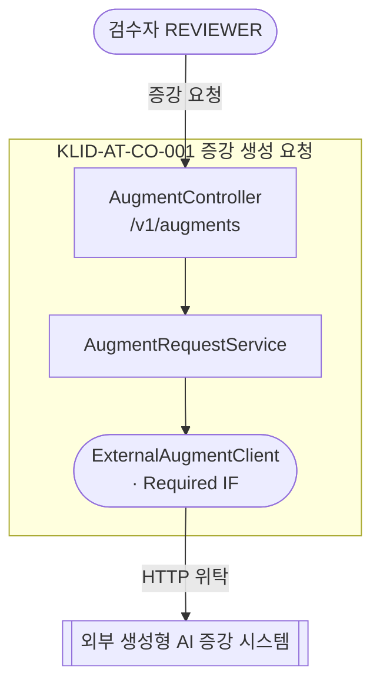

#### KLID-AT-CO-002 — 증강 결과 수신·등록 컴포넌트

| 컴포넌트 ID | KLID-AT-CO-002 | 컴포넌트명 | 증강 결과 수신·등록 컴포넌트 |
|----------|---|---------|---|
| 관련 유스케이스 ID | KLID-AT-UC-002 (증강 결과 수신·등록) |

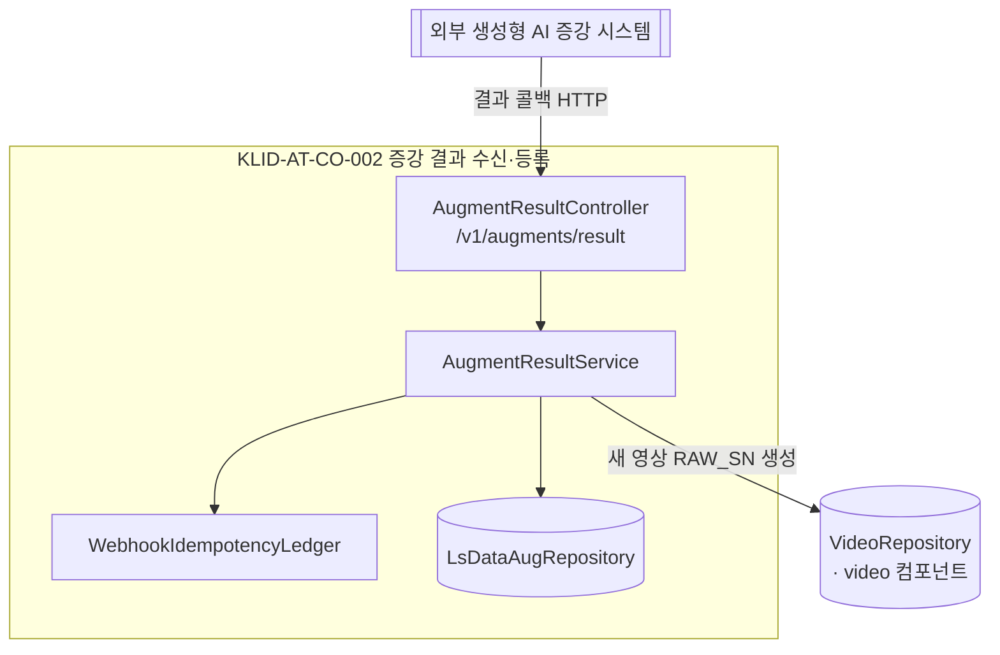

#### KLID-AT-CO-003 — 해상도 변경 컴포넌트

| 컴포넌트 ID | KLID-AT-CO-003 | 컴포넌트명 | 해상도 변경 컴포넌트 |
|----------|---|---------|---|
| 관련 유스케이스 ID | KLID-AT-UC-003 (해상도 변경 수행) |

```mermaid
flowchart TD
    REVIEWER([검수자 REVIEWER])
    subgraph CO003[KLID-AT-CO-003 해상도 변경]
        direction TB
        VC[VideoController<br/>/v1/videos/&#123;rawSn&#125;/resolution]
        VRS[VideoResolutionService]
        VRP[VideoResolutionPersister]
        VP[VideoProbe<br/>· FFmpeg 포트]
        IR[ImageResizer<br/>· 다운스케일 포트]
        VC --> VRS
        VRS --> VP
        VRS --> VRP
        VRP --> IR
    end
    VR[(VideoRepository<br/>· video 컴포넌트)]
    REVIEWER -->|해상도 변경 요청| VC
    VRS --> VR
    VRP --> VR
```

#### KLID-AT-CO-004 — 객체 자동 추적 컴포넌트

| 컴포넌트 ID | KLID-AT-CO-004 | 컴포넌트명 | 객체 자동 추적 컴포넌트 |
|----------|---|---------|---|
| 관련 유스케이스 ID | KLID-AT-UC-004 (객체 자동 추적) |

```mermaid
flowchart TD
    WORKER([라벨링 작업자 WORKER])
    AISVR[[ai-server SAM2 추론 서버]]
    subgraph CO004[KLID-AT-CO-004 객체 자동 추적]
        direction TB
        LC[LabelController<br/>/v1/frames/&#123;srcSn&#125;/sam2-track]
        STS[Sam2TrackService]
        LAG[LabelAccessGuard]
        AISC([AiServerClient<br/>· Required IF])
        LDL[(LsDataLblRepository)]
        LC --> STS
        STS --> LAG
        STS --> AISC
        STS --> LDL
    end
    WORKER -->|트랙 시드 박스| LC
    AISC -->|HTTP 추론| AISVR
```

#### KLID-AT-CO-005 — 객체 외곽 경계 자동 밀착 컴포넌트

| 컴포넌트 ID | KLID-AT-CO-005 | 컴포넌트명 | 객체 외곽 경계 자동 밀착 컴포넌트 |
|----------|---|---------|---|
| 관련 유스케이스 ID | KLID-AT-UC-005 (객체 외곽 경계 자동 밀착) |

```mermaid
flowchart TD
    WORKER([라벨링 작업자 WORKER])
    AISVR[[ai-server SAM2 추론 서버]]
    subgraph CO005[KLID-AT-CO-005 객체 외곽 경계 자동 밀착]
        direction TB
        LC[LabelController<br/>/v1/frames/&#123;srcSn&#125;/sam2-segment]
        SSS[Sam2SegmentService]
        LAG[LabelAccessGuard]
        AISC([AiServerClient<br/>· Required IF])
        LC --> SSS
        SSS --> LAG
        SSS --> AISC
    end
    WORKER -->|클릭/박스 시드| LC
    AISC -->|HTTP 추론| AISVR
```

#### KLID-AT-CO-006 — 라벨링 정밀도 조절 컴포넌트

| 컴포넌트 ID | KLID-AT-CO-006 | 컴포넌트명 | 라벨링 정밀도 조절 컴포넌트 |
|----------|---|---------|---|
| 관련 유스케이스 ID | KLID-AT-UC-006 (라벨링 정밀도 조절) |

```mermaid
flowchart TD
    REVIEWER([검수자 REVIEWER])
    subgraph CO006[KLID-AT-CO-006 라벨링 정밀도 조절]
        direction TB
        SCC[SystemConfigController<br/>/v1/manage/configs/&#123;key&#125;]
        SCS[SystemConfigService<br/>· Caffeine TTL 60s]
        LSC[(LsSystemConfigRepository)]
        SCC --> SCS
        SCS --> LSC
    end
    SSS[Sam2SegmentService<br/>· KLID-AT-CO-005]
    REVIEWER -->|POLYGON_SIMPLIFY_TOLERANCE 조절| SCC
    SSS -.->|epsilon 설정값 조회| SCS
```

#### KLID-AT-CO-007 — 라벨 버전 저장 컴포넌트

| 컴포넌트 ID | KLID-AT-CO-007 | 컴포넌트명 | 라벨 버전 저장 컴포넌트 |
|----------|---|---------|---|
| 관련 유스케이스 ID | KLID-AT-UC-007 (라벨 버전 저장·이력 추적) |

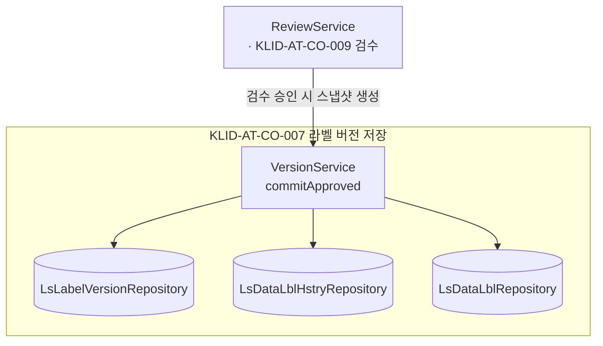

#### KLID-AT-CO-008 — 버전 비교·복구 컴포넌트

| 컴포넌트 ID | KLID-AT-CO-008 | 컴포넌트명 | 버전 비교·복구 컴포넌트 |
|----------|---|---------|---|
| 관련 유스케이스 ID | KLID-AT-UC-008 (버전 비교·복구) |

```mermaid
flowchart TD
    REVIEWER([검수자 REVIEWER])
    WORKER([라벨링 작업자 WORKER])
    subgraph CO008[KLID-AT-CO-008 버전 비교·복구]
        direction TB
        VC[VersionController<br/>/v1/versions/&#123;version&#125;/diff·rollback]
        VS[VersionService<br/>diff·rollback]
        LAG[LabelAccessGuard]
        LLV[(LsLabelVersionRepository)]
        LDL[(LsDataLblRepository)]
        VC --> VS
        VS --> LAG
        VS --> LLV
        VS --> LDL
    end
    REVIEWER -->|버전 조회·diff·롤백| VC
    WORKER -->|본인 배정 diff·롤백| VC
```

#### KLID-AT-CO-009 — 검수 완료·수정 통지 컴포넌트

| 컴포넌트 ID | KLID-AT-CO-009 | 컴포넌트명 | 검수 완료·수정 통지 컴포넌트 |
|----------|---|---------|---|
| 관련 유스케이스 ID | KLID-AT-UC-009 (검수 완료·수정 통지) |

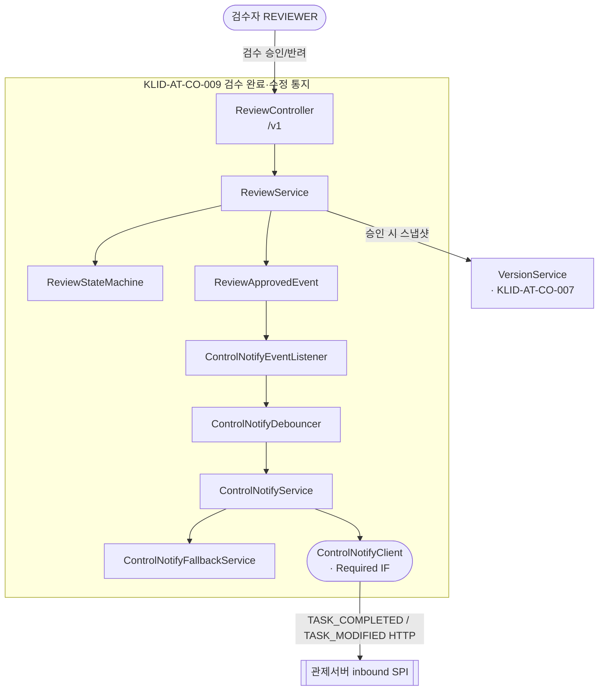

#### KLID-AT-CO-010 — 증강 영상 활용 검수 컴포넌트

| 컴포넌트 ID | KLID-AT-CO-010 | 컴포넌트명 | 증강 영상 활용 검수 컴포넌트 |
|----------|---|---------|---|
| 관련 유스케이스 ID | KLID-AT-UC-010 (증강 영상 활용 여부 검수) |

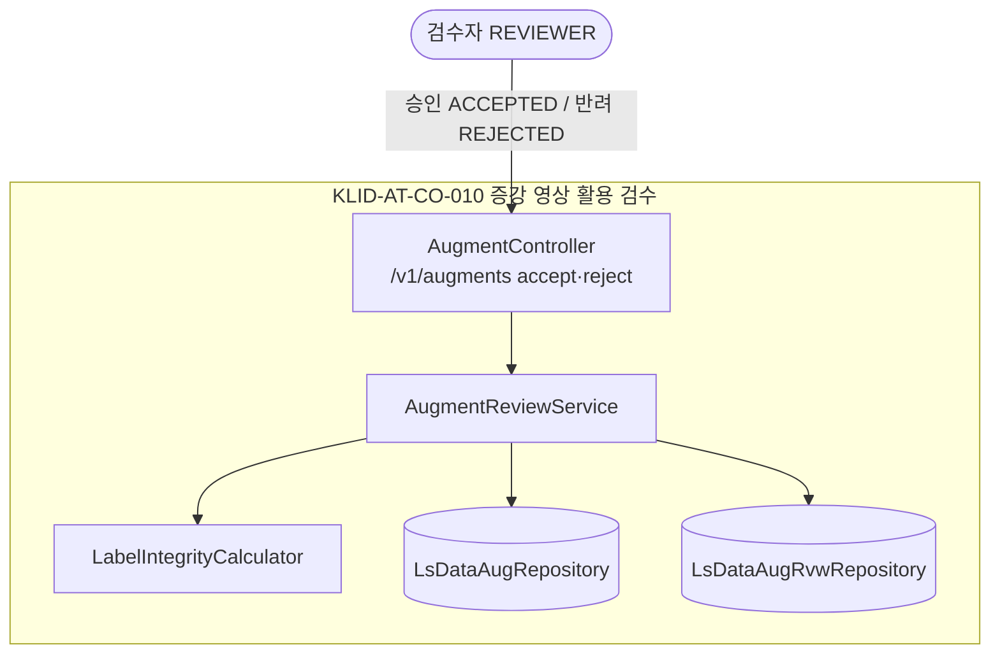

#### KLID-AT-CO-011 — 비식별 처리 요청 컴포넌트

| 컴포넌트 ID | KLID-AT-CO-011 | 컴포넌트명 | 비식별 처리 요청 컴포넌트 |
|----------|---|---------|---|
| 관련 유스케이스 ID | KLID-AT-UC-011 (비식별 처리 요청) |

```mermaid
flowchart TD
    REVIEWER([검수자 REVIEWER])
    DEEXT[[외부 비식별 솔루션]]
    subgraph CO011[KLID-AT-CO-011 비식별 처리 요청]
        direction TB
        DC[DeidentController<br/>/v1/deident/&#123;videoId&#125;/reprocess]
        DS[DeidentifyStep<br/>· 배치 단계]
        DRC[DeidentifyResultController<br/>/v1/deidentify/result]
        DRS[DeidentifyResultService]
        DC2([DeidentifyClient<br/>· Required IF])
        LDPL[(LsDeidentProcLogRepository)]
        DC --> DS
        DS --> DC2
        DS --> LDPL
        DRC --> DRS
        DRS --> LDPL
    end
    VR[(VideoRepository<br/>· video 컴포넌트)]
    REVIEWER -->|재처리 요청| DC
    DC2 -->|비식별 위탁 HTTP| DEEXT
    DEEXT -->|결과 콜백 HTTP| DRC
    DRS -->|비식별 상태 갱신| VR
```

#### KLID-AT-CO-013 — 비식별 옵션 설정 컴포넌트

| 컴포넌트 ID | KLID-AT-CO-013 | 컴포넌트명 | 비식별 옵션 설정 컴포넌트 |
|----------|---|---------|---|
| 관련 유스케이스 ID | KLID-AT-UC-013 (비식별 옵션 설정) |

```mermaid
flowchart TD
    REVIEWER([검수자 REVIEWER])
    subgraph CO013[KLID-AT-CO-013 비식별 옵션 설정]
        direction TB
        SCC[SystemConfigController<br/>/v1/manage/configs/&#123;key&#125;]
        SCS[SystemConfigService]
        LSC[(LsSystemConfigRepository)]
        SCC --> SCS
        SCS --> LSC
    end
    DS[DeidentifyStep<br/>· KLID-AT-CO-011]
    REVIEWER -->|비식별 옵션 설정·저장| SCC
    DS -.->|옵션값 조회| SCS
```

#### KLID-AT-CO-016 — 비식별 상태·신고 확인 컴포넌트

| 컴포넌트 ID | KLID-AT-CO-016 | 컴포넌트명 | 비식별 상태·신고 확인 컴포넌트 |
|----------|---|---------|---|
| 관련 유스케이스 ID | KLID-AT-UC-016 (비식별 처리 상태·이력 확인) |

```mermaid
flowchart TD
    REVIEWER([검수자 REVIEWER])
    WORKER([라벨링 작업자 WORKER])
    subgraph CO016[KLID-AT-CO-016 비식별 상태·신고 확인]
        direction TB
        DRC[DeidentReportController<br/>/v1/labels/&#123;srcSn&#125;/deident-report]
        DRS[DeidentReportService]
        WLS[WorkLockService]
        LDR[(LsDeidentReportRepository)]
        LDPL[(LsDeidentProcLogRepository)]
        DRC --> DRS
        DRS --> WLS
        DRS --> LDR
        DRS --> LDPL
    end
    VS[VersionService<br/>· KLID-AT-CO-007 스냅샷]
    REVIEWER -->|상태·이력 확인·해소| DRC
    WORKER -->|비식별 누락 신고| DRC
    DRS -->|삭제 전 비활성 스냅샷| VS
```

### 2. 컴포넌트 목록

| 컴포넌트ID | 컴포넌트명 | 개요 | 관련 유스케이스 ID |
|---------|---------|------|-------------|
| KLID-AT-CO-001 | 증강 생성 요청 컴포넌트 | REVIEWER가 원본 영상에 대해 날씨·계절·시간 증강(WINTER/NIGHT/RAIN)을 외부 생성형 AI 시스템으로 위임 요청한다 | KLID-AT-UC-001 |
| KLID-AT-CO-002 | 증강 결과 수신·등록 컴포넌트 | 외부 증강 결과 콜백을 멱등 수신해 새 영상(RAW_SN, PARENT_RAW_SN 참조)을 등록하고 원본 라벨/메타를 복사한 뒤 미검수(PENDING)로 적재한다 | KLID-AT-UC-002 |
| KLID-AT-CO-003 | 해상도 변경 컴포넌트 | 영상을 표준 하위 해상도로 다운스케일한 프레임 이미지셋을 제공한다(업스케일 거부, 라벨 좌표 미제공, 원본 보존) | KLID-AT-UC-003 |
| KLID-AT-CO-004 | 객체 자동 추적 컴포넌트 | 시작 프레임의 시드 박스를 ai-server(SAM2)로 후속 프레임에 전파해 위치·경계를 추적·갱신하고 트랙 보간으로 빈 프레임을 채운다 | KLID-AT-UC-004 |
| KLID-AT-CO-005 | 객체 외곽 경계 자동 밀착 컴포넌트 | 클릭/박스 시드를 ai-server(SAM2 segment)로 프록시해 외곽선 기반 폴리곤+신뢰도를 산출하고 경계에 밀착시킨다 | KLID-AT-UC-005 |
| KLID-AT-CO-006 | 라벨링 정밀도 조절 컴포넌트 | REVIEWER가 폴리곤 단순화 정밀도(POLYGON_SIMPLIFY_TOLERANCE)를 설정하면 이후 SAM2 결과의 폴리곤 점 수가 조절된다(Caffeine TTL 60s, 실패 시 1.0px 폴백) | KLID-AT-UC-006 |
| KLID-AT-CO-007 | 라벨 버전 저장 컴포넌트 | 검수 승인(APPROVED) 시점에 영상 단위 라벨 전체 스냅샷(JSON)을 LS_LABEL_VERSION에 적재하고 VERSION_HASH(SHA-256)로 식별·이력 기록한다 | KLID-AT-UC-007 |
| KLID-AT-CO-008 | 버전 비교·복구 컴포넌트 | 검수완료 버전 간 DB 스냅샷을 앱에서 비교(diff)해 차이를 표시하고 선택 버전을 새 active 버전으로 복구(rollback)한다 | KLID-AT-UC-008 |
| KLID-AT-CO-009 | 검수 완료·수정 통지 컴포넌트 | 영상 단위 검수 워크플로우(상태머신)를 처리하고 승인(완료) 시 TASK_COMPLETED, 완료 후 수정 시 TASK_MODIFIED를 관제서버로 단방향 통지한다(요약만, 본문·PII 미포함) | KLID-AT-UC-009 |
| KLID-AT-CO-010 | 증강 영상 활용 검수 컴포넌트 | 미검수(PENDING) 증강 영상을 확인해 학습데이터 활용 여부를 승인(ACCEPTED)/반려(REJECTED, 사유 필수)한다 | KLID-AT-UC-010 |
| KLID-AT-CO-011 | 비식별 처리 요청 컴포넌트 | 전체 영상(ANONY 포함)을 외부 비식별 솔루션으로 위탁 호출하고 비식별본을 별도 경로에 저장하며 원본을 보존한다(콜백 멱등 수신, 실패 시 재시도 큐) | KLID-AT-UC-011 |
| KLID-AT-CO-013 | 비식별 옵션 설정 컴포넌트 | 외부 비식별 솔루션이 제공하는 옵션을 관리 화면에서 REVIEWER가 설정·저장해 이후 비식별 요청에 적용한다 | KLID-AT-UC-013 |
| KLID-AT-CO-016 | 비식별 상태·신고 확인 컴포넌트 | 영상 단위 비식별 처리 상태/이력을 확인하고, 비식별 누락 신고 시 작업락·전체 라벨 비활성 스냅샷 후 삭제·수동 해소를 처리한다 | KLID-AT-UC-016 |

> ※ 컴포넌트 번호 KLID-AT-CO-012/014/015는 실현 유스케이스 결번(KLID-AT-UC-012/014/015 deprecated)에 동조하여 결번 처리한다.

### 3. 컴포넌트 명세

> **⟳ 컴포넌트별로 1개씩 반복 작성한다.** 공통 클래스 재사용은 동일 `KLID-AT-IC-NNN` 교차 참조한다(중복 정의 금지). 외부 연동 클라이언트(AiServerClient·DeidentifyClient·VlmClient·ControlNotifyClient·ExternalAugmentClient)는 인터페이스 클래스(Required)로 명세한다.

#### KLID-AT-CO-001 — 증강 생성 요청 컴포넌트

| 컴포넌트 ID | KLID-AT-CO-001 | 컴포넌트명 | 증강 생성 요청 컴포넌트 |
|----------|---|---------|---|
| 컴포넌트 개요 | REVIEWER가 원본 영상·증강 종류를 선택해 외부 생성형 AI 증강 시스템에 비동기 생성을 위임 요청한다. 생성 본체는 외부 책임이며 결과는 KLID-AT-CO-002 콜백으로 수신한다. |

| **내부 클래스** | | |
| ID | 클래스명 | 설명 |
|----|--------|------|
| KLID-AT-IC-001 | AugmentController | 증강 요청·결과 검수 엔드포인트(`/v1/augments`) |
| KLID-AT-IC-002 | AugmentRequestService | 외부 증강 생성 위탁 오케스트레이션(WINTER/NIGHT/RAIN) |

| **인터페이스 클래스** | | | |
| ID | 인터페이스명 | 오퍼레이션명 | 구분 (Serviced/Required) |
|----|----------|----------|------------------------|
| KLID-AT-IF-001 | 증강 요청 API | requestAugment | Serviced |
| KLID-AT-IF-012 | 외부 증강 위탁 연동 | requestAugment | Required |

#### KLID-AT-CO-002 — 증강 결과 수신·등록 컴포넌트

| 컴포넌트 ID | KLID-AT-CO-002 | 컴포넌트명 | 증강 결과 수신·등록 컴포넌트 |
|----------|---|---------|---|
| 컴포넌트 개요 | 외부 증강 결과 콜백을 멱등 수신(HMAC)해 새 영상(RAW_SN, PARENT_RAW_SN 참조)을 생성하고 원본 라벨/메타를 복사한 뒤 미검수(PENDING)로 적재한다. |

| **내부 클래스** | | |
| ID | 클래스명 | 설명 |
|----|--------|------|
| KLID-AT-IC-003 | AugmentResultController | 외부 증강 시스템 결과 콜백 수신 컨트롤러 |
| KLID-AT-IC-004 | AugmentResultService | 콜백 멱등 적재 → 새 영상·프레임·라벨·메타 적재 |
| KLID-AT-IC-005 | WebhookIdempotencyLedger | 콜백 멱등성 원장(중복 콜백 차단) |
| KLID-AT-IC-006 | LsDataAugRepository | 증강(LS_DATA_AUG) CRUD |
| KLID-AT-IC-007 | VideoRepository | 영상 메타(LS_DATA_RAW, PARENT_RAW_SN) — video 컴포넌트 공유 |

| **인터페이스 클래스** | | | |
| ID | 인터페이스명 | 오퍼레이션명 | 구분 (Serviced/Required) |
|----|----------|----------|------------------------|
| KLID-AT-IF-009 | 증강 결과 콜백 API | onAugmentResult | Serviced |

#### KLID-AT-CO-003 — 해상도 변경 컴포넌트

| 컴포넌트 ID | KLID-AT-CO-003 | 컴포넌트명 | 해상도 변경 컴포넌트 |
|----------|---|---------|---|
| 컴포넌트 개요 | 영상을 원본보다 낮은 표준 하위 해상도로 다운스케일한 프레임 이미지셋을 제공한다. 업스케일은 거부하고, 영상 재생성·라벨 좌표 변환을 하지 않으며 원본을 보존한다. |

| **내부 클래스** | | |
| ID | 클래스명 | 설명 |
|----|--------|------|
| KLID-AT-IC-008 | VideoController | 영상 조회·스트리밍·해상도 변경 엔드포인트(`/v1/videos`) |
| KLID-AT-IC-009 | VideoResolutionService | 해상도 변경 오케스트레이션(다운스케일 검증·실행) |
| KLID-AT-IC-010 | VideoResolutionPersister | 리사이즈 결과 이미지셋·추적 레코드(LS_RESOLUTION_EXPORT) 저장 |
| KLID-AT-IC-011 | VideoProbe | 영상 해상도 프로브 포트(FFmpeg) |
| KLID-AT-IC-012 | ImageResizer | 프레임 이미지 다운스케일 포트 |
| KLID-AT-IC-007 | VideoRepository | 영상 메타 조회 — video 컴포넌트 공유 |

| **인터페이스 클래스** | | | |
| ID | 인터페이스명 | 오퍼레이션명 | 구분 (Serviced/Required) |
|----|----------|----------|------------------------|
| KLID-AT-IF-002 | 해상도 변경 API | changeResolution | Serviced |

#### KLID-AT-CO-004 — 객체 자동 추적 컴포넌트

| 컴포넌트 ID | KLID-AT-CO-004 | 컴포넌트명 | 객체 자동 추적 컴포넌트 |
|----------|---|---------|---|
| 컴포넌트 개요 | 시작 프레임의 시드 박스를 ai-server(SAM2)로 후속 프레임에 전파해 위치(BBox)·경계(폴리곤)를 추적·갱신하고(AUTO_LBL_YN='Y') 트랙 보간으로 빈 프레임을 채운다. 본인 미배정 프레임 접근은 IDOR 차단한다. |

| **내부 클래스** | | |
| ID | 클래스명 | 설명 |
|----|--------|------|
| KLID-AT-IC-013 | LabelController | 프레임별 라벨 편집·SAM2 트랙/세그먼트 엔드포인트(`/v1/frames`) |
| KLID-AT-IC-014 | Sam2TrackService | SAM2 대화형 트랙 세그멘테이션·트랙 보간 |
| KLID-AT-IC-015 | LabelAccessGuard | 본인 배정 프레임 편집 권한 검증(IDOR 방지) |
| KLID-AT-IC-016 | LsDataLblRepository | 라벨(LS_DATA_LBL) CRUD |

| **인터페이스 클래스** | | | |
| ID | 인터페이스명 | 오퍼레이션명 | 구분 (Serviced/Required) |
|----|----------|----------|------------------------|
| KLID-AT-IF-003 | SAM2 트랙 API | trackBySam2 | Serviced |
| KLID-AT-IF-013 | ai-server 추론 연동 | track | Required |

#### KLID-AT-CO-005 — 객체 외곽 경계 자동 밀착 컴포넌트

| 컴포넌트 ID | KLID-AT-CO-005 | 컴포넌트명 | 객체 외곽 경계 자동 밀착 컴포넌트 |
|----------|---|---------|---|
| 컴포넌트 개요 | 클릭(포인트)/박스 시드를 ai-server(SAM2 segment)로 프록시해 외곽선 기반 폴리곤+신뢰도를 산출하고, 실측 좌표 검증·Douglas-Peucker 단순화 후 경계에 밀착시킨다(원본 프레임에만 실행, 비식별본 좌표 공유). |

| **내부 클래스** | | |
| ID | 클래스명 | 설명 |
|----|--------|------|
| KLID-AT-IC-013 | LabelController | SAM2 세그먼트 엔드포인트(`/v1/frames/{srcSn}/sam2-segment`) — KLID-AT-CO-004 공유 |
| KLID-AT-IC-017 | Sam2SegmentService | SAM2 분할 프록시(points/box 배타 검증, 좌표 상한 검증, 단순화) |
| KLID-AT-IC-015 | LabelAccessGuard | 접근 권한 검증 — KLID-AT-CO-004 공유 |

| **인터페이스 클래스** | | | |
| ID | 인터페이스명 | 오퍼레이션명 | 구분 (Serviced/Required) |
|----|----------|----------|------------------------|
| KLID-AT-IF-004 | SAM2 분할 API | segmentBySam2 | Serviced |
| KLID-AT-IF-014 | ai-server 추론 연동 | segment | Required |

#### KLID-AT-CO-006 — 라벨링 정밀도 조절 컴포넌트

| 컴포넌트 ID | KLID-AT-CO-006 | 컴포넌트명 | 라벨링 정밀도 조절 컴포넌트 |
|----------|---|---------|---|
| 컴포넌트 개요 | REVIEWER가 시스템 설정에서 폴리곤 단순화 정밀도(POLYGON_SIMPLIFY_TOLERANCE, Douglas-Peucker epsilon)를 조절하면 이후 SAM2 결과의 폴리곤 점 수가 단순화된다. 설정은 Caffeine 캐시(TTL 60s), 조회 실패 시 기본값(1.0px) fail-safe. |

| **내부 클래스** | | |
| ID | 클래스명 | 설명 |
|----|--------|------|
| KLID-AT-IC-018 | SystemConfigController | 시스템 설정 목록·수정 엔드포인트(`/v1/manage/configs`) |
| KLID-AT-IC-019 | SystemConfigService | 설정 저장·조회(Caffeine 캐시 TTL 60s, fail-safe 폴백) |
| KLID-AT-IC-017 | Sam2SegmentService | epsilon 설정값 소비 — KLID-AT-CO-005 공유 |

| **인터페이스 클래스** | | | |
| ID | 인터페이스명 | 오퍼레이션명 | 구분 (Serviced/Required) |
|----|----------|----------|------------------------|
| KLID-AT-IF-005 | 시스템 설정 API | updateConfig | Serviced |

#### KLID-AT-CO-007 — 라벨 버전 저장 컴포넌트

| 컴포넌트 ID | KLID-AT-CO-007 | 컴포넌트명 | 라벨 버전 저장 컴포넌트 |
|----------|---|---------|---|
| 컴포넌트 개요 | 검수 승인(APPROVED) 시점에 영상 단위 라벨 전체 스냅샷(JSON)을 LS_LABEL_VERSION.LABEL_PAYLOAD에 적재하고 VERSION_HASH(payload SHA-256)로 식별한다(SAVE_REASON='APPROVED'). 외부 VCS 미사용 DB 스냅샷 방식이며 라벨 저장 시점에는 버전을 생성하지 않는다. |

| **내부 클래스** | | |
| ID | 클래스명 | 설명 |
|----|--------|------|
| KLID-AT-IC-020 | VersionService | 승인 시 라벨 전체 스냅샷 저장·해시 생성(commitApproved) |
| KLID-AT-IC-021 | LsLabelVersionRepository | 라벨 버전 스냅샷(LS_LABEL_VERSION) CRUD |
| KLID-AT-IC-022 | LsDataLblHstryRepository | 라벨 이력(LS_DATA_LBL_HSTRY) 기록 |
| KLID-AT-IC-016 | LsDataLblRepository | 라벨 조회 — KLID-AT-CO-004 공유 |

| **인터페이스 클래스** | | | |
| ID | 인터페이스명 | 오퍼레이션명 | 구분 (Serviced/Required) |
|----|----------|----------|------------------------|
| KLID-AT-IF-006 | 버전 스냅샷 내부 인터페이스 | commitApproved | Serviced |

#### KLID-AT-CO-008 — 버전 비교·복구 컴포넌트

| 컴포넌트 ID | KLID-AT-CO-008 | 컴포넌트명 | 버전 비교·복구 컴포넌트 |
|----------|---|---------|---|
| 컴포넌트 개요 | 두 검수완료 버전(from/to 해시)의 DB 스냅샷을 앱에서 비교해 ADDED/MODIFIED/REMOVED diff를 산출·표시하고, 대상 스냅샷을 새 active 버전으로 복원한다(REVIEWER 전체 / WORKER 본인 배정). |

| **내부 클래스** | | |
| ID | 클래스명 | 설명 |
|----|--------|------|
| KLID-AT-IC-023 | VersionController | 버전 목록·diff·롤백 엔드포인트(`/v1/versions`, `/v1/frames/{srcSn}/versions`) |
| KLID-AT-IC-020 | VersionService | 버전 diff 산출·롤백 복원 — KLID-AT-CO-007 공유 |
| KLID-AT-IC-021 | LsLabelVersionRepository | 스냅샷 저장·조회 — KLID-AT-CO-007 공유 |
| KLID-AT-IC-015 | LabelAccessGuard | 접근 권한 검증 — KLID-AT-CO-004 공유 |

| **인터페이스 클래스** | | | |
| ID | 인터페이스명 | 오퍼레이션명 | 구분 (Serviced/Required) |
|----|----------|----------|------------------------|
| KLID-AT-IF-007 | 버전 비교·복구 API | listVersions | Serviced |
| KLID-AT-IF-007 | 버전 비교·복구 API | diffVersions | Serviced |
| KLID-AT-IF-007 | 버전 비교·복구 API | rollbackVersion | Serviced |

#### KLID-AT-CO-009 — 검수 완료·수정 통지 컴포넌트

| 컴포넌트 ID | KLID-AT-CO-009 | 컴포넌트명 | 검수 완료·수정 통지 컴포넌트 |
|----------|---|---------|---|
| 컴포넌트 개요 | 영상 단위 검수 워크플로우를 상태머신으로 처리하고, 승인(완료) 시 ReviewApprovedEvent를 발행해 TASK_COMPLETED, 완료 후 수정 시 TASK_MODIFIED를 관제서버 inbound SPI로 단방향 비동기 통지한다(요약만, PII·본문 미포함, 영상 단위 디바운스). |

| **내부 클래스** | | |
| ID | 클래스명 | 설명 |
|----|--------|------|
| KLID-AT-IC-024 | ReviewController | 검수 목록·상세·제출·시작·승인·반려 엔드포인트(`/v1`) |
| KLID-AT-IC-025 | ReviewService | 검수 워크플로우 — 승인 시 스냅샷·완료 이벤트 발행 |
| KLID-AT-IC-026 | ReviewStateMachine | 검수 상태 전이 검증(PENDING/IN_REVIEW/APPROVED/REJECTED) |
| KLID-AT-IC-027 | ReviewApprovedEvent | 승인(=작업완료) 도메인 이벤트 — 통지 트리거 |
| KLID-AT-IC-028 | ControlNotifyEventListener | 승인·수정 이벤트 수신 → 통지 트리거 |
| KLID-AT-IC-029 | ControlNotifyDebouncer | 영상 단위 디바운스 후 1회 통지 |
| KLID-AT-IC-030 | ControlNotifyService | outbound 통지 발행(requestId 멱등·metrics) |
| KLID-AT-IC-031 | ControlNotifyFallbackService | 통지 실패 시 dead-letter 재등록 큐 |
| KLID-AT-IC-020 | VersionService | 승인 시 스냅샷 생성 — KLID-AT-CO-007 공유 |

| **인터페이스 클래스** | | | |
| ID | 인터페이스명 | 오퍼레이션명 | 구분 (Serviced/Required) |
|----|----------|----------|------------------------|
| KLID-AT-IF-008 | 검수 승인·반려 API | approveReview | Serviced |
| KLID-AT-IF-008 | 검수 승인·반려 API | rejectReview | Serviced |
| KLID-AT-IF-010 | 관제 완료 통지 연동 | sendTaskCompleted | Required |
| KLID-AT-IF-011 | 관제 수정 통지 연동 | sendTaskModified | Required |

#### KLID-AT-CO-010 — 증강 영상 활용 검수 컴포넌트

| 컴포넌트 ID | KLID-AT-CO-010 | 컴포넌트명 | 증강 영상 활용 검수 컴포넌트 |
|----------|---|---------|---|
| 컴포넌트 개요 | REVIEWER가 미검수(PENDING) 증강 결과 목록을 조회·확인 후 accept(PENDING→ACCEPTED) 또는 reject(사유 필수, PENDING→REJECTED)한다. 증강 본체는 외부 책임이며 저작도구는 결과 검수만 담당한다. |

| **내부 클래스** | | |
| ID | 클래스명 | 설명 |
|----|--------|------|
| KLID-AT-IC-001 | AugmentController | 증강 결과 검수 엔드포인트(accept/reject) — KLID-AT-CO-001 공유 |
| KLID-AT-IC-032 | AugmentReviewService | 증강 결과 활용 검수(승인 시 새 RAW_SN 활성화) |
| KLID-AT-IC-033 | LabelIntegrityCalculator | 증강 라벨 무결성 계산 |
| KLID-AT-IC-006 | LsDataAugRepository | 증강 조회·상태 전이 — KLID-AT-CO-002 공유 |
| KLID-AT-IC-034 | LsDataAugRvwRepository | 증강 검수(LS_DATA_AUG_RVW) CRUD |

| **인터페이스 클래스** | | | |
| ID | 인터페이스명 | 오퍼레이션명 | 구분 (Serviced/Required) |
|----|----------|----------|------------------------|
| KLID-AT-IF-015 | 증강 검수 API | acceptAugment | Serviced |
| KLID-AT-IF-015 | 증강 검수 API | rejectAugment | Serviced |

#### KLID-AT-CO-011 — 비식별 처리 요청 컴포넌트

| 컴포넌트 ID | KLID-AT-CO-011 | 컴포넌트명 | 비식별 처리 요청 컴포넌트 |
|----------|---|---------|---|
| 컴포넌트 개요 | 전체 영상(ANONY 포함)을 DeidentifyClient로 외부 비식별 솔루션에 위탁 호출하고, 비식별본을 STORAGE_DEIDENTIFIED_PATH에 저장하며 원본을 보존한다. 결과 콜백은 HMAC+멱등 수신하고 실패 시 DE_IDNTF_YN='F' 마킹·재시도 큐에 등록한다(원본 절대 삭제 금지). |

| **내부 클래스** | | |
| ID | 클래스명 | 설명 |
|----|--------|------|
| KLID-AT-IC-035 | DeidentController | 비식별 재처리 요청 엔드포인트(`/v1/deident/{videoId}/reprocess`) |
| KLID-AT-IC-036 | DeidentifyStep | 배치 비식별 단계 — 외부 위탁·결과 경로 반환 |
| KLID-AT-IC-037 | DeidentifyResultController | 외부 비식별 솔루션 결과 콜백 수신(`/v1/deidentify/result`) |
| KLID-AT-IC-038 | DeidentifyResultService | 콜백 멱등 적재 + 비식별 결과 처리 로그 기록 |
| KLID-AT-IC-039 | LsDeidentProcLogRepository | 비식별 처리 로그(LS_DEIDENT_PROC_LOG) CRUD |
| KLID-AT-IC-007 | VideoRepository | 비식별 상태(LS_DATA_RAW) 갱신 — video 컴포넌트 공유 |

| **인터페이스 클래스** | | | |
| ID | 인터페이스명 | 오퍼레이션명 | 구분 (Serviced/Required) |
|----|----------|----------|------------------------|
| KLID-AT-IF-016 | 비식별 재처리 API | reprocess | Serviced |
| KLID-AT-IF-017 | 비식별 결과 콜백 API | onDeidentifyResult | Serviced |
| KLID-AT-IF-018 | 외부 비식별 위탁 연동 | deidentify | Required |

#### KLID-AT-CO-013 — 비식별 옵션 설정 컴포넌트

| 컴포넌트 ID | KLID-AT-CO-013 | 컴포넌트명 | 비식별 옵션 설정 컴포넌트 |
|----------|---|---------|---|
| 컴포넌트 개요 | 외부 비식별 솔루션이 제공하는 옵션을 관리 화면(`/manage/*`)에서 REVIEWER가 설정·저장해 이후 비식별 요청에 적용한다. |

| **내부 클래스** | | |
| ID | 클래스명 | 설명 |
|----|--------|------|
| KLID-AT-IC-018 | SystemConfigController | 시스템 설정 수정 엔드포인트 — KLID-AT-CO-006 공유 |
| KLID-AT-IC-019 | SystemConfigService | 옵션 저장·조회 — KLID-AT-CO-006 공유 |
| KLID-AT-IC-036 | DeidentifyStep | 비식별 옵션 소비 — KLID-AT-CO-011 공유 |

| **인터페이스 클래스** | | | |
| ID | 인터페이스명 | 오퍼레이션명 | 구분 (Serviced/Required) |
|----|----------|----------|------------------------|
| KLID-AT-IF-005 | 시스템 설정 API | updateConfig | Serviced |

#### KLID-AT-CO-016 — 비식별 상태·신고 확인 컴포넌트

| 컴포넌트 ID | KLID-AT-CO-016 | 컴포넌트명 | 비식별 상태·신고 확인 컴포넌트 |
|----------|---|---------|---|
| 컴포넌트 개요 | 영상 단위 비식별 처리 상태(DE_IDNTF_YN)와 처리 이력을 확인하고, 작업자가 비식별 누락을 신고하면 작업락 + 해당 영상 전체 라벨을 비활성 스냅샷(SAVE_REASON='DEIDENT_REPORT') 기록 후 삭제하며, 외부 솔루션 수동 비식별화 후 resolve로 OPEN→RESOLVED 전이·작업락 해제한다. APPROVED 영상 신고 시 TASK_MODIFIED 통지를 발행한다. |

| **내부 클래스** | | |
| ID | 클래스명 | 설명 |
|----|--------|------|
| KLID-AT-IC-040 | DeidentReportController | 비식별 리포트 조회·신고·해소 엔드포인트(`/v1/labels/{srcSn}/deident-report`, `/v1/deident-reports`) |
| KLID-AT-IC-041 | DeidentReportService | 신고·전체 라벨 비활성 스냅샷·삭제·수동 해소 처리 |
| KLID-AT-IC-042 | WorkLockService | 작업락 설정·해제(재신고 차단) |
| KLID-AT-IC-043 | LsDeidentReportRepository | 비식별 리포트(LS_DEIDENT_REPORT) CRUD |
| KLID-AT-IC-039 | LsDeidentProcLogRepository | 처리 이력 조회 — KLID-AT-CO-011 공유 |
| KLID-AT-IC-020 | VersionService | 삭제 전 비활성 스냅샷 생성 — KLID-AT-CO-007 공유 |

| **인터페이스 클래스** | | | |
| ID | 인터페이스명 | 오퍼레이션명 | 구분 (Serviced/Required) |
|----|----------|----------|------------------------|
| KLID-AT-IF-019 | 비식별 신고·해소 API | reportDeident | Serviced |
| KLID-AT-IF-019 | 비식별 신고·해소 API | resolveDeident | Serviced |

### 4. 인터페이스 명세

> **⟳ 인터페이스별로, 그 인터페이스의 오퍼레이션 개수만큼 반복 작성한다.** 외부 연동(Required) 인터페이스의 내용은 D4 인터페이스 설계서의 연동 명세와 정합한다(IF와 II는 별개 체계이며 상호 ID를 인용하지 않는다).

#### KLID-AT-IF-001 — 증강 요청 API

| 인터페이스 ID | KLID-AT-IF-001 | 인터페이스명 | 증강 요청 API |
|---------|---|---------|---|
| 오퍼레이션명 | requestAugment |
| 오퍼레이션 개요 | REVIEWER가 원본 영상·증강 종류(WINTER/NIGHT/RAIN)를 선택해 외부 증강 생성을 위임 요청한다 |
| 사전조건 | 원본 영상(RAW_SN)이 존재하고 REVIEWER로 인증되어 있다 |
| 사후조건 | 외부 증강 시스템에 생성 작업이 위임되고 결과 콜백을 대기한다 |
| 파라미터 | 증강 요청 DTO(videoIds: List&lt;Long&gt;, types: List&lt;String&gt;), 인증 주체(REVIEWER) |
| 반환값 | 증강 요청 결과(작업 식별·접수 상태) |

#### KLID-AT-IF-002 — 해상도 변경 API

| 인터페이스 ID | KLID-AT-IF-002 | 인터페이스명 | 해상도 변경 API |
|---------|---|---------|---|
| 오퍼레이션명 | changeResolution |
| 오퍼레이션 개요 | 영상을 표준 하위 해상도로 다운스케일한 프레임 이미지셋을 생성한다 |
| 사전조건 | 원본 영상이 존재하고 REVIEWER로 인증되어 있으며 목표 해상도가 원본보다 낮다 |
| 사후조건 | 하위 해상도 이미지셋이 생성되고 LS_RESOLUTION_EXPORT 1행으로 추적된다(라벨 좌표 미제공, 원본 보존) |
| 파라미터 | rawSn(Long), ResolutionChangeRequest(목표 해상도), 등록자(regId) |
| 반환값 | ResolutionChangeResponse(생성 결과·이미지셋 경로). 업스케일 요청은 400으로 거부 |

#### KLID-AT-IF-003 — SAM2 트랙 API

| 인터페이스 ID | KLID-AT-IF-003 | 인터페이스명 | SAM2 트랙 API |
|---------|---|---------|---|
| 오퍼레이션명 | trackBySam2 |
| 오퍼레이션 개요 | 시작 프레임의 시드 박스를 후속 프레임으로 전파해 위치·경계를 추적·갱신한다 |
| 사전조건 | 인증(REVIEWER/WORKER 본인 배정)되어 있고 대상 프레임(SRC_SN)·추적 시드가 존재한다 |
| 사후조건 | 후속 프레임에 추적된 객체 위치·경계가 자동 라벨(AUTO_LBL_YN='Y')로 저장된다 |
| 파라미터 | srcSn(Long, path/body 일치), Sam2TrackRequest |
| 반환값 | 트랙 전파 결과(폴리곤·track_id). path/body srcSn 불일치 시 400, 미배정 시 IDOR 차단 |

#### KLID-AT-IF-004 — SAM2 분할 API

| 인터페이스 ID | KLID-AT-IF-004 | 인터페이스명 | SAM2 분할 API |
|---------|---|---------|---|
| 오퍼레이션명 | segmentBySam2 |
| 오퍼레이션 개요 | 클릭/박스 시드로 외곽선 기반 폴리곤+신뢰도를 산출해 경계에 밀착시킨다 |
| 사전조건 | 인증(REVIEWER/WORKER 본인 배정)되어 있고 대상 프레임(SRC_SN)·초기 시드(클릭 또는 박스)가 존재한다 |
| 사후조건 | 외곽선에 밀착된 폴리곤/마스크 좌표가 반환된다(좌표 상한 검증·단순화 적용) |
| 파라미터 | srcSn(Long), Sam2SegmentRequest(points 또는 box 정확히 1개) |
| 반환값 | 폴리곤+신뢰도. points/box 동시·동시 부재 시 400, mock 응답은 FE 자동적용 차단 |

#### KLID-AT-IF-005 — 시스템 설정 API

| 인터페이스 ID | KLID-AT-IF-005 | 인터페이스명 | 시스템 설정 API |
|---------|---|---------|---|
| 오퍼레이션명 | updateConfig |
| 오퍼레이션 개요 | 시스템 설정 키 값을 갱신한다(폴리곤 단순화 정밀도·비식별 옵션 등) |
| 사전조건 | REVIEWER로 인증되어 있고 설정 키가 존재한다 |
| 사후조건 | 설정값이 저장되고 캐시(TTL 60s)에 반영되어 이후 요청에 적용된다 |
| 파라미터 | key(String), 설정 값 DTO |
| 반환값 | ConfigResponse(갱신된 설정). 형식/범위 초과 400, WORKER 호출 403 |

#### KLID-AT-IF-006 — 버전 스냅샷 내부 인터페이스

| 인터페이스 ID | KLID-AT-IF-006 | 인터페이스명 | 버전 스냅샷 내부 인터페이스 |
|---------|---|---------|---|
| 오퍼레이션명 | commitApproved |
| 오퍼레이션 개요 | 검수 승인 시점에 영상 단위 라벨 전체 스냅샷(JSON)을 적재하고 해시로 식별한다 |
| 사전조건 | 대상 영상의 라벨이 검수 제출되어 승인 처리되는 시점이다 |
| 사후조건 | LS_LABEL_VERSION에 스냅샷이 VERSION_HASH(SHA-256)로 적재되고 이력이 기록된다 |
| 파라미터 | 대상 영상 식별자(rawSn), 승인 컨텍스트(SAVE_REASON='APPROVED') |
| 반환값 | 생성된 버전 식별자(VERSION_HASH). 동일 payload는 동일 해시로 중복 식별 |

#### KLID-AT-IF-007 — 버전 비교·복구 API

| 인터페이스 ID | KLID-AT-IF-007 | 인터페이스명 | 버전 비교·복구 API |
|---------|---|---------|---|
| 오퍼레이션명 | listVersions |
| 오퍼레이션 개요 | 프레임 단위 버전 이력 목록을 조회한다 |
| 사전조건 | 인증되어 있고 대상 프레임(SRC_SN)에 버전 스냅샷이 존재한다 |
| 사후조건 | 버전 이력 목록이 반환된다 |
| 파라미터 | srcSn(Long) |
| 반환값 | 버전 이력 목록(VersionItem) |

| 인터페이스 ID | KLID-AT-IF-007 | 인터페이스명 | 버전 비교·복구 API |
|---------|---|---------|---|
| 오퍼레이션명 | diffVersions |
| 오퍼레이션 개요 | 두 검수완료 버전의 DB 스냅샷을 비교해 ADDED/MODIFIED/REMOVED diff를 산출한다 |
| 사전조건 | 인증되어 있고 비교 대상 두 버전(from/to 해시)이 존재한다 |
| 사후조건 | 두 버전 간 라벨 차이(diff)가 반환된다(동일 해시는 변경 없음 안내) |
| 파라미터 | toHash(String, path), compareWith(fromHash, query) |
| 반환값 | 라벨 diff 목록(LabelDiffDto) |

| 인터페이스 ID | KLID-AT-IF-007 | 인터페이스명 | 버전 비교·복구 API |
|---------|---|---------|---|
| 오퍼레이션명 | rollbackVersion |
| 오퍼레이션 개요 | 선택 버전 스냅샷을 새 active 버전으로 복원한다 |
| 사전조건 | 인증(REVIEWER 전체/WORKER 본인 배정)되어 있고 대상 스냅샷이 존재한다 |
| 사후조건 | 대상 스냅샷이 새 active 버전으로 복원·기록된다(검수완료 후 복구 시 TASK_MODIFIED 통지 연계) |
| 파라미터 | versionHash(String, path), srcSn(body) |
| 반환값 | 복원된 버전(VersionResponse.Item) |

#### KLID-AT-IF-008 — 검수 승인·반려 API

| 인터페이스 ID | KLID-AT-IF-008 | 인터페이스명 | 검수 승인·반려 API |
|---------|---|---------|---|
| 오퍼레이션명 | approveReview |
| 오퍼레이션 개요 | 영상 단위 검수를 승인(=작업완료) 처리하고 버전 스냅샷·완료 이벤트를 발행한다 |
| 사전조건 | REVIEWER로 인증되어 있고 대상이 검수 대기 상태이며 상태 전이가 유효하다 |
| 사후조건 | 작업/검수 상태가 APPROVED로 전이되고 라벨 스냅샷 생성·TASK_COMPLETED 통지가 트리거된다 |
| 파라미터 | 검수 대상 식별자, 인증 주체(REVIEWER) |
| 반환값 | 검수 결과(승인 상태). 무효 전이 시 차단 |

| 인터페이스 ID | KLID-AT-IF-008 | 인터페이스명 | 검수 승인·반려 API |
|---------|---|---------|---|
| 오퍼레이션명 | rejectReview |
| 오퍼레이션 개요 | 영상 단위 검수를 반려 처리한다 |
| 사전조건 | REVIEWER로 인증되어 있고 대상이 검수 대기 상태다 |
| 사후조건 | 검수 상태가 REJECTED로 전이되고 작업자 재작업 흐름으로 회귀한다 |
| 파라미터 | 검수 대상 식별자, 반려 사유, 인증 주체(REVIEWER) |
| 반환값 | 검수 결과(반려 상태) |

#### KLID-AT-IF-009 — 증강 결과 콜백 API

| 인터페이스 ID | KLID-AT-IF-009 | 인터페이스명 | 증강 결과 콜백 API |
|---------|---|---------|---|
| 오퍼레이션명 | onAugmentResult |
| 오퍼레이션 개요 | 외부 증강 시스템의 결과 콜백을 멱등 수신해 새 영상을 등록하고 원본 라벨/메타를 복사한다 |
| 사전조건 | 원본 영상(PARENT_RAW_SN)과 라벨/메타가 존재하고 콜백 HMAC·멱등키가 유효하다 |
| 사후조건 | 새 영상(RAW_SN)이 PENDING으로 등록되고 원본 라벨/메타가 복사된다 |
| 파라미터 | AugmentResult 콜백 DTO(idempotencyKey, externalJobId, status, originAugSn, augType, resultFilePath) |
| 반환값 | 수신 확인(멱등 처리 결과). parentRawSn 부재·페이로드 무효 시 등록 거부 |

#### KLID-AT-IF-010 — 관제 완료 통지 연동

| 인터페이스 ID | KLID-AT-IF-010 | 인터페이스명 | 관제 완료 통지 연동 |
|---------|---|---------|---|
| 오퍼레이션명 | sendTaskCompleted |
| 오퍼레이션 개요 | 검수 승인 시점에 영상 단위 완료 통지(요약·메타만)를 관제서버 inbound SPI로 단방향 비동기 push한다 |
| 사전조건 | 대상 영상이 검수 완료(APPROVED) 상태이며 완료 이벤트가 발행되었다 |
| 사후조건 | TASK_COMPLETED 통지가 requestId 멱등으로 발행된다(라벨/메타 본문·PII 미포함, 실패 시 재등록 큐) |
| 파라미터 | TASK_COMPLETED 페이로드(eventType, rawSn, reviewerName, approvedAt, totalFrames, labeledFrames, requestId) |
| 반환값 | 없음(toBodilessEntity). 관제는 수신 후 조회 API로 상세 보강 |

#### KLID-AT-IF-011 — 관제 수정 통지 연동

| 인터페이스 ID | KLID-AT-IF-011 | 인터페이스명 | 관제 수정 통지 연동 |
|---------|---|---------|---|
| 오퍼레이션명 | sendTaskModified |
| 오퍼레이션 개요 | 검수 완료 후 라벨/메타 수정 시 영상 단위 수정 통지(변경 요약만)를 관제서버로 단방향 push한다 |
| 사전조건 | 대상 영상이 검수 완료(APPROVED) 이력을 가지고 완료 후 수정이 발생했다 |
| 사후조건 | TASK_MODIFIED 통지가 발행된다(동일 작업 ID 유지, 버전 업 아님, 짧은 시간 다수 변경은 디바운스 후 1회) |
| 파라미터 | TASK_MODIFIED 페이로드(eventType, rawSn, lastModifiedAt, frameIds, changeTypes, requestId) |
| 반환값 | 없음. 본문·PII 미포함 |

#### KLID-AT-IF-012 — 외부 증강 위탁 연동

| 인터페이스 ID | KLID-AT-IF-012 | 인터페이스명 | 외부 증강 위탁 연동 |
|---------|---|---------|---|
| 오퍼레이션명 | requestAugment |
| 오퍼레이션 개요 | 외부 생성형 AI 증강 시스템에 날씨·계절·시간 증강(WINTER/NIGHT/RAIN) 생성을 위탁한다 |
| 사전조건 | 증강 대상 영상이 식별되어 있고 외부 증강 시스템이 가용하다 |
| 사후조건 | 외부 시스템에 증강 작업이 비동기 위탁되고 결과는 별도 콜백으로 수신된다 |
| 파라미터 | videoIds(List&lt;Long&gt;), types(List&lt;String&gt;: WINTER/NIGHT/RAIN) |
| 반환값 | 위탁 접수 결과. 해상도 변경은 외부 위탁 대상이 아님(내부 기능) |

#### KLID-AT-IF-013 — ai-server 추론 연동(트랙)

| 인터페이스 ID | KLID-AT-IF-013 | 인터페이스명 | ai-server 추론 연동(트랙) |
|---------|---|---------|---|
| 오퍼레이션명 | track |
| 오퍼레이션 개요 | ai-server(SAM2)에 이전 프레임 폴리곤을 다음 프레임으로 전파하는 추적 추론을 요청한다 |
| 사전조건 | 대상 프레임 이미지·이전 폴리곤이 준비되어 있고 ai-server가 가용하다 |
| 사후조건 | 다음 프레임의 추적 폴리곤·신뢰도가 반환된다 |
| 파라미터 | Sam2TrackRequest(track_id, prev_image_b64, next_image_b64, prev_polygon) |
| 반환값 | Sam2TrackResponse(track_id, polygon, score). 재시도 후 실패 시 서킷 브레이커 동작·추적 실패 안내 |

#### KLID-AT-IF-014 — ai-server 추론 연동(분할)

| 인터페이스 ID | KLID-AT-IF-014 | 인터페이스명 | ai-server 추론 연동(분할) |
|---------|---|---------|---|
| 오퍼레이션명 | segment |
| 오퍼레이션 개요 | ai-server(SAM2)에 클릭/박스 프롬프트 기반 외곽선 분할 추론을 요청한다 |
| 사전조건 | 대상 프레임 이미지·시드(클릭 또는 박스)가 준비되어 있고 ai-server가 가용하다 |
| 사후조건 | 외곽선 기반 폴리곤+신뢰도가 반환된다 |
| 파라미터 | Sam2Request(image_b64, points 또는 box) |
| 반환값 | Sam2Response(polygon, score, mock). mock 응답 FE 자동적용 차단, 실패 시 503 안내 |

#### KLID-AT-IF-015 — 증강 검수 API

| 인터페이스 ID | KLID-AT-IF-015 | 인터페이스명 | 증강 검수 API |
|---------|---|---------|---|
| 오퍼레이션명 | acceptAugment |
| 오퍼레이션 개요 | 미검수(PENDING) 증강 영상을 활용 가능으로 승인한다 |
| 사전조건 | 증강 영상이 PENDING으로 등록되어 있고 REVIEWER로 인증되어 있다 |
| 사후조건 | 증강 영상이 ACCEPTED(활용)로 전이된다(데이터마트 노출 조건 연계) |
| 파라미터 | id(Long, 증강 결과 PK), 인증 주체(actor) |
| 반환값 | AugmentSummaryResponse. PENDING 이외 상태는 409 CONFLICT |

| 인터페이스 ID | KLID-AT-IF-015 | 인터페이스명 | 증강 검수 API |
|---------|---|---------|---|
| 오퍼레이션명 | rejectAugment |
| 오퍼레이션 개요 | 부적합한 증강 영상을 사유와 함께 반려한다 |
| 사전조건 | 증강 영상이 PENDING이고 REVIEWER로 인증되어 있으며 반려 사유가 제공된다 |
| 사후조건 | 증강 영상이 REJECTED(미활용)로 전이된다 |
| 파라미터 | id(Long), reason(String, 필수), 인증 주체(actor) |
| 반환값 | AugmentSummaryResponse. 사유 누락 시 400, PENDING 이외 409 |

#### KLID-AT-IF-016 — 비식별 재처리 API

| 인터페이스 ID | KLID-AT-IF-016 | 인터페이스명 | 비식별 재처리 API |
|---------|---|---------|---|
| 오퍼레이션명 | reprocess |
| 오퍼레이션 개요 | 대상 영상의 비식별(재)처리를 요청한다(전체 영상, ANONY 포함) |
| 사전조건 | 대상 영상이 적재되어 있고 REVIEWER 인증·외부 비식별 솔루션이 가용하다 |
| 사후조건 | 외부 비식별 위탁이 접수된다(202) |
| 파라미터 | videoId(long) |
| 반환값 | 없음(접수 확인). 결과 상세는 콜백으로 수신 |

#### KLID-AT-IF-017 — 비식별 결과 콜백 API

| 인터페이스 ID | KLID-AT-IF-017 | 인터페이스명 | 비식별 결과 콜백 API |
|---------|---|---------|---|
| 오퍼레이션명 | onDeidentifyResult |
| 오퍼레이션 개요 | 외부 비식별 솔루션의 결과 콜백을 멱등 수신해 비식별본 경로·이력을 기록한다 |
| 사전조건 | 콜백 HMAC·멱등키가 유효하고 대상 영상(rawSn)이 존재한다 |
| 사후조건 | 성공 시 비식별본 경로·이력이 기록되고, 실패 시 DE_IDNTF_YN='F' 마킹·재시도 큐 등록(원본 보존) |
| 파라미터 | DeidentifyResult 콜백 DTO(idempotencyKey, externalJobId, status, rawSn, deidentifiedFilePath, processedRegions) |
| 반환값 | 수신 확인(멱등 처리 결과) |

#### KLID-AT-IF-018 — 외부 비식별 위탁 연동

| 인터페이스 ID | KLID-AT-IF-018 | 인터페이스명 | 외부 비식별 위탁 연동 |
|---------|---|---------|---|
| 오퍼레이션명 | deidentify |
| 오퍼레이션 개요 | 외부 비식별 솔루션에 원본→비식별본 경로 기반 비식별 처리를 위탁한다 |
| 사전조건 | 위탁 직전 멱등키 allowlist 사전기록이 완료되고 외부 솔루션이 가용하다 |
| 사후조건 | 외부 솔루션에 비식별 작업이 위탁되고 결과는 별도 콜백으로 수신된다 |
| 파라미터 | DeidentifyRequest(sourcePath, targetPath, idempotencyKey) |
| 반환값 | DeidentifyResponse(status, resultPath). PII 경로 로그 출력 금지(멱등키만 로그) |

#### KLID-AT-IF-019 — 비식별 신고·해소 API

| 인터페이스 ID | KLID-AT-IF-019 | 인터페이스명 | 비식별 신고·해소 API |
|---------|---|---------|---|
| 오퍼레이션명 | reportDeident |
| 오퍼레이션 개요 | 라벨 작업 중 비식별 누락을 신고해 작업락·전체 라벨 비활성 스냅샷 후 삭제를 트리거한다 |
| 사전조건 | 인증되어 있고(WORKER는 본인 배정 영상만) 대상 프레임(srcSn)이 존재한다 |
| 사후조건 | LS_DEIDENT_REPORT OPEN 생성 + 해당 영상 전체 라벨 비활성 스냅샷·삭제 + 작업락 + DE_IDNTF_YN='F'. APPROVED 영상이면 TASK_MODIFIED(LABEL_DELETED) 통지 발행 |
| 파라미터 | srcSn(Long), 신고 내용 DTO, 인증 주체 |
| 반환값 | 생성된 신고 식별자(rprtSn). 미배정 신고는 IDOR 차단, 이미 잠금 시 409 |

| 인터페이스 ID | KLID-AT-IF-019 | 인터페이스명 | 비식별 신고·해소 API |
|---------|---|---------|---|
| 오퍼레이션명 | resolveDeident |
| 오퍼레이션 개요 | 외부 솔루션 수동 비식별화 완료 후 신고를 해소한다 |
| 사전조건 | 신고가 OPEN 상태이고 인증(WORKER 본인 배정/REVIEWER 전체)되어 있다 |
| 사후조건 | 신고가 OPEN→RESOLVED로 전이되고 작업락이 해제된다 |
| 파라미터 | rprtSn(Long), 인증 주체 |
| 반환값 | 없음(해소 확인). OPEN 아니면 409 CONFLICT |

## 부록 — 빈 셀(`-`)·미확정·표기 사유

| 항목 | 사유 |
|------|------|
| 컴포넌트 번호 결번(KLID-AT-CO-012/014/015) | 실현 유스케이스 결번(KLID-AT-UC-012 비식별 결과·이력 deep 검토 폐기, KLID-AT-UC-014 개인정보 보호대책·KLID-AT-UC-015 분류체계 관리 범위 외 삭제)에 동조하여 컴포넌트 번호도 결번 처리. UC ↔ CO 1:1 정합 유지 |
| Required 인터페이스(KLID-AT-IF-010~014, 018) | 외부 연동 클라이언트(ControlNotifyClient·AiServerClient·ExternalAugmentClient·DeidentifyClient)가 제공하는 외부 호출 오퍼레이션. 송수신 데이터 규격·외부 담당자는 D4 인터페이스 설계서의 연동 명세와 정합하며, 외부 시스템 채번·담당자는 연동 협의 시 확정(D4 부록 참조) |
| LsSystemConfigRepository 등 일부 Repository 정확 클래스명 | 구조도에는 역할 기준 명칭으로 표기. SystemConfigService가 시스템 설정 영속을 담당하며 물리 Repository 클래스명은 sysconfig 패키지 구현 기준 |
| KLID-AT-IF-001(Serviced) ↔ KLID-AT-IF-012(Required) 동명 오퍼레이션 | requestAugment는 컨트롤러 제공(Serviced)과 외부 위탁 어댑터 요청(Required)의 양면이 동일 명칭을 가지며, 구분(Serviced/Required) 컬럼으로 식별한다 |
