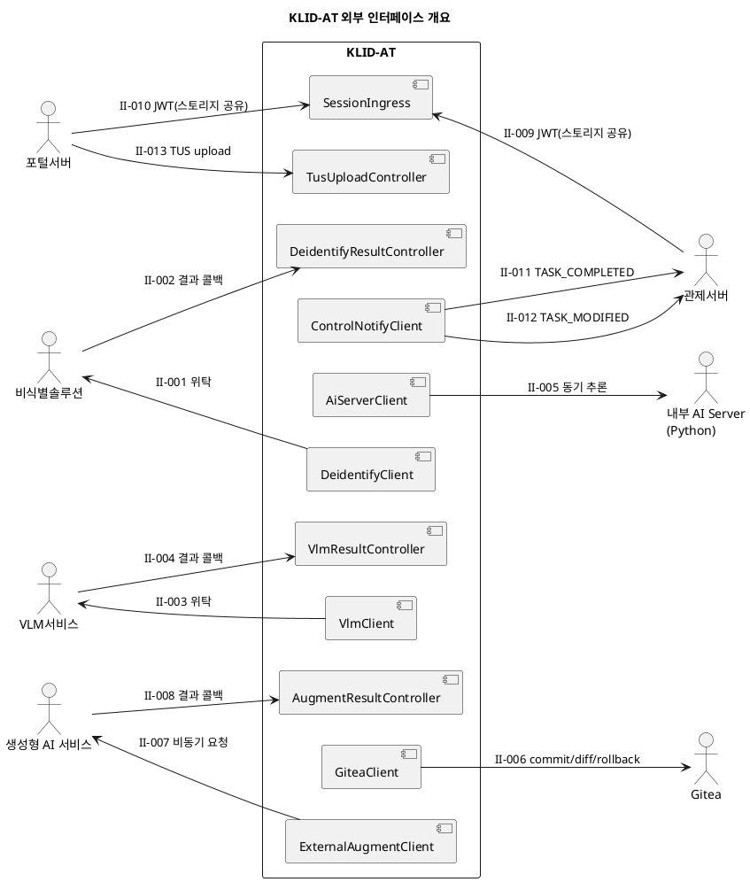

# D4. 인터페이스 정의서

## ▣ 제·개정 이력

| 날짜 | 버전 | 작성자 | 승인자 | 내용 |
|---|---|---|---|---|
| 2026-05-21 | 1.0 | 박찬기 | - | 최초 작성 — 외부 시스템 연동 인터페이스 위주, 반영 |

---

| 시스템명 | 기반 지방정부 관제지원시스템 구축(2차) AI CCTV | 서브시스템명 | AI CCTV 학습데이터 저작도구 (KLID-AT-SS-001) |
|---|---|---|---|
| **단계명** | 설계 | **작성일자 / 버전** | 2026-05-21 / 1.0 |

> 본 산출물은 본 도구와 **외부 시스템** 간의 인터페이스(Outbound 위탁 + Inbound 결과 수신 + 인증 토큰 + 통지) 14건을 정의한다. 내부 컴포넌트 간 인터페이스(`IxxxService`)는 D3 컴포넌트설계서 § 4 참조.

---

## 1. 인터페이스 목록

| 인터페이스 번호 | 일련번호 | 송신 시스템명 | 송신 프로그램 ID | 처리형태 | 인터페이스 방식 | 발생빈도 | 상대 담당자 | 수신 프로그램 ID | 수신 시스템명 | 일련번호 | 관련 요구사항 ID | 비고 |
|---|---|---|---|---|---|---|---|---|---|---|---|---|
| KLID-AT-II-001 | 1 | KLID-AT (BatchOrchestrator) | DeidentifyClient | Online(Async) | HTTPS REST | 1 / 영상당 | 비식별솔루션 운영팀 | DeidentSolution.submit | 비식별솔루션 | 1 | RQ-SFR-09-01 | Idempotency-Key 발급 |
| KLID-AT-II-002 | 1 | 비식별솔루션 | DeidentSolution.callback | Online(Async) | HTTPS REST + HMAC | 1 / 영상당 | KLID-AT 운영팀 | DeidentifyResultController | KLID-AT | 1 | RQ-SFR-09-01 | 결과 콜백 |
| KLID-AT-II-003 | 1 | KLID-AT (MarkingService) | VlmClient | Online(Async, Callback) | HTTPS REST | 1 / 마킹당 | VLM서비스 운영팀 | VlmService.submitTimeseries | VLM서비스 | 1 | RQ-SFR-03-02 | V2.0: 마킹 기반 콜백 비동기 |
| KLID-AT-II-004 | 1 | VLM서비스 | VlmService.callback | Online(Async) | HTTPS REST + HMAC | 1 / 영상당 | KLID-AT 운영팀 | VlmResultController | KLID-AT | 1 | RQ-SFR-03-02 | 결과 콜백 |
| KLID-AT-II-005 | 1 | KLID-AT (Batch/Sam2Track) | AiServerClient | Online(Sync) | HTTPS REST | 1 / 프레임 | 내부 운영팀 | ai-server (YOLO/SAM2) | AI Server | 1 | RQ-SFR-08-01 | 내부 동기 |
| KLID-AT-II-006 | 1 | KLID-AT (VersionService) | GiteaClient | Online(Sync) | HTTPS REST | 1 / 라벨 저장 | DevOps | Gitea Server | Gitea | 1 | RQ-SFR-08-02 | CALL_TIMEOUT 60s |
| KLID-AT-II-007 | 1 | KLID-AT (AugmentRequestService) | ExternalAugmentClient | Online(Async) | HTTPS REST | 검수완료 영상별 | 생성형AI 운영팀 | AugmentService.submit | 생성형 AI 서비스 | 1 | RQ-SFR-07-01 | 요청 ID 발급 |
| KLID-AT-II-008 | 1 | 생성형 AI 서비스 | AugmentService.callback | Online(Async) | HTTPS REST + HMAC | 검수완료 영상별 | KLID-AT 운영팀 | AugmentResultController | KLID-AT | 1 | RQ-SFR-07-01 | 결과 콜백 |
| KLID-AT-II-009 | 1 | 관제서버 | ControlServer.issueJwt | Online | 동일 도메인 브라우저 스토리지 공유 + JWT(HS256) | 세션당 1 | 관제서버 운영팀 | JwtAuthenticationFilter | KLID-AT | 1 | RQ-SFR-09-02 | INTERNAL 채널, 동일 도메인 |
| KLID-AT-II-010 | 1 | 포털서버 | PortalServer.issueJwt | Online | HTTPS Redirect + JWT(HS256) | 세션당 1 | 포털서버 운영팀 | SessionIngressPage → JwtAuthenticationFilter | KLID-AT | 1 | RQ-SFR-15-07 | PORTAL 채널 |
| KLID-AT-II-011 | 1 | KLID-AT (ControlNotifyClient) | notifyTaskCompleted | Online(Async) | HTTPS REST + Idempotency | 검수승인 시마다 | 관제서버 운영팀 | ControlServer./tasks/{rawSn}/completed | 관제서버 | 1 | RQ-SFR-08-03 |
| KLID-AT-II-012 | 1 | KLID-AT (ControlNotifyClient) | notifyTaskModified | Online(Async, Debounced) | HTTPS REST + Idempotency | 60s 윈도우당 최대 1회 | 관제서버 운영팀 | ControlServer./tasks/{rawSn}/modified | 관제서버 | 1 | RQ-SFR-08-03 | 수정 요약만, 관제가 조회 |
| KLID-AT-II-013 | 1 | 포털사용자 | PortalUploader (TUS client) | Online | HTTPS + TUS Protocol | 영상 업로드 시 | KLID-AT 운영팀 | TusUploadController | KLID-AT | 1 | RQ-SFR-15-07 | 1MB chunk |
| KLID-AT-II-014 | 1 | KLID-AT (RoleClaim) | (내부) | Online | DB | 신규 로그인 1회 | - | RoleClaimService | KLID-AT | 1 | RQ-SFR-09-02 | 내부 |

---

## 2. 인터페이스 명세

### 2.1 KLID-AT-II-001  비식별 처리 위탁 (Outbound)

| 인터페이스 번호 | KLID-AT-II-001 | | |
|---|---|---|---|---|
| **데이터 송신 시스템** | KLID-AT | | **데이터 수신 시스템** | 비식별솔루션 |
| **시스템명** | KLID-AT | | **시스템명** | 외부 비식별솔루션 |
| **데이터저장소명** | DeidentifyRequest (DTO) | | **데이터저장소명** | (외부 처리큐) |
| **송신 프로그램 ID** | DeidentifyClient.deidentify | | **수신 프로그램 ID** | POST /api/v1/deidentify |

**속성 명세**

| 송신 속성명 | 데이터 타입 | 길이 | → | 수신 속성명 | 데이터 타입 | 길이 |
|---|---|---|---|---|---|---|
| rawVideoUrl | String | 1024 | → | sourceUrl | String | 1024 |
| callbackUrl | String | 1024 | → | callbackUrl | String | 1024 |
| requestId | UUID | 36 | → | requestId (Idempotency-Key) | UUID | 36 |
| options.blurFace | boolean | 1 | → | options.blurFace | boolean | 1 |
| options.blurPlate | boolean | 1 | → | options.blurPlate | boolean | 1 |
| options.strength | int | 4 | → | options.strength | int | 4 |

### 2.2 KLID-AT-II-002  비식별 결과 수신 (Inbound)

| 인터페이스 번호 | KLID-AT-II-002 | | |
|---|---|---|---|---|
| **데이터 송신 시스템** | 비식별솔루션 | | **데이터 수신 시스템** | KLID-AT |
| **송신 프로그램 ID** | DeidentSolution.callback | | **수신 프로그램 ID** | DeidentifyResultController.handle |
| **인증** | HMAC-SHA256 (X-Signature) | | **멱등성** | Idempotency-Key (requestId) |

**속성 명세**

| 송신 속성명 | 데이터 타입 | 길이 | → | 수신 속성명 (DeidentifyResultRequest) | 데이터 타입 | 길이 |
|---|---|---|---|---|---|---|
| requestId | UUID | 36 | → | requestId | String | 36 |
| status | enum | 16 | → | status | String | 16 |
| deidVideoUrl | String | 1024 | → | deidVideoUrl | String | 1024 |
| occurredAt | ISO-8601 | 32 | → | occurredAt | OffsetDateTime | - |
| error.code | String | 64 | → | error.code | String | 64 |
| error.message | String | 512 | → | error.message | String | 512 |

### 2.3 KLID-AT-II-003  VLM 시계열 분석 위탁 (Outbound)

| 인터페이스 번호 | KLID-AT-II-003 | | |
|---|---|---|---|---|
| **데이터 송신 시스템** | KLID-AT | | **데이터 수신 시스템** | VLM서비스 |
| **송신 프로그램 ID** | VlmClient.submitTimeseries | | **수신 프로그램 ID** | POST /api/v1/timeseries |

**속성 명세**

| 송신 속성명 | 타입 | 길이 | → | 수신 속성명 | 타입 | 길이 |
|---|---|---|---|---|---|---|
| rawSn | long | 19 | → | sourceId | string | 32 |
| rawVideoUrl | String | 1024 | → | sourceUrl | String | 1024 |
| callbackUrl | String | 1024 | → | callbackUrl | String | 1024 |
| requestId (Idempotency-Key) | UUID | 36 | → | requestId | UUID | 36 |
| eventName | String | 100 | → | eventName | String | 100 | V2.0: 마킹 이벤트명 |
| marks | JSON | - | → | marks | JSON | - | V2.0: 마킹 정보 [{frameIndex, timestamp}] |

### 2.4 KLID-AT-II-004  VLM 시계열 분석 결과 수신 (Inbound)

| 인터페이스 번호 | KLID-AT-II-004 | | |
|---|---|---|---|---|
| **송신 프로그램 ID** | VlmService.callback | | **수신 프로그램 ID** | VlmResultController.handle |
| **인증** | HMAC-SHA256 | | **멱등성** | Idempotency-Key |

**속성 명세**

| 송신 속성명 | 타입 | 길이 | → | 수신 속성명 (VlmResultRequest) |
|---|---|---|---|---|
| requestId | UUID | 36 | → | requestId |
| sourceId / rawSn | long | 19 | → | rawSn |
| frames[].frameNo | int | 6 | → | frames[].frameNo |
| frames[].caption | String | 2000 | → | frames[].caption |
| frames[].objects[] | Array | - | → | frames[].objects[] |
| frames[].environment | String | 64 | → | frames[].environment |
| occurredAt | ISO-8601 | 32 | → | occurredAt |

### 2.5 KLID-AT-II-005  내부 AI 서버 추론 (Outbound, Sync)

| 인터페이스 번호 | KLID-AT-II-005 | | |
|---|---|---|---|---|
| **송신 프로그램 ID** | AiServerClient.predictYolo / track / verifyObjects | | **수신 프로그램 ID** | ai-server (Python/FastAPI) |
| **방식** | 동기 HTTP, CircuitBreaker, Retry | | **타임아웃** | 30s (운영) |

**속성 명세 (predictYolo)**

| 송신 속성명 | 타입 | 길이 | → | 수신 속성명 |
|---|---|---|---|---|
| imageUrl | String | 1024 | → | image_url |
| classFilter[] | String[] | 64 | → | class_filter |
| confThreshold | float | 4 | → | conf_threshold |

### 2.6 KLID-AT-II-006  Gitea 라벨 커밋 (Outbound, Sync)

| 인터페이스 번호 | KLID-AT-II-006 | | |
|---|---|---|---|---|
| **송신 프로그램 ID** | GiteaClient.commit / createOrUpdateFile / diff / listCommits / rollback | | **수신 프로그램 ID** | Gitea REST API |
| **인증** | Personal Access Token (Bearer) | | **타임아웃** | 60s (CALL), 70s (BLOCK) |

**속성 명세 (commit)**

| 송신 속성명 | 타입 | 길이 | → | 수신 속성명 (Gitea) |
|---|---|---|---|---|
| repo | String | 100 | → | repo |
| branch | String | 100 | → | branch |
| filePath | String | 256 | → | path |
| message | String | 256 | → | message |
| content (base64) | String | - | → | content |
| author.name | String | 100 | → | author.name |
| author.email | String | 100 | → | author.email |

### 2.7 KLID-AT-II-007  증강 비동기 요청 (Outbound)

| 인터페이스 번호 | KLID-AT-II-007 | | |
|---|---|---|---|---|
| **송신 프로그램 ID** | ExternalAugmentClient.submit | | **수신 프로그램 ID** | 생성형 AI 서비스 POST /api/v1/augment |

**속성 명세**

| 송신 속성명 | 타입 | 길이 | → | 수신 속성명 |
|---|---|---|---|---|
| jobId | long | 19 | → | jobId |
| sourceSrcSn[] | long[] | - | → | sources[] |
| augmentTypes[] | String[] | 32 | → | augmentTypes[] |
| callbackUrl | String | 1024 | → | callbackUrl |
| requestId (Idempotency-Key) | UUID | 36 | → | requestId |

### 2.8 KLID-AT-II-008  증강 결과 수신 (Inbound)

| 인터페이스 번호 | KLID-AT-II-008 | | |
|---|---|---|---|---|
| **송신 프로그램 ID** | AugmentService.callback | | **수신 프로그램 ID** | AugmentResultController.handle |

**속성 명세**

| 송신 속성명 | 타입 | 길이 | → | 수신 속성명 (AugmentResultRequest) |
|---|---|---|---|---|
| jobId | long | 19 | → | jobId |
| requestId | UUID | 36 | → | requestId |
| augments[].dataAugSn | long | 19 | → | augments[].dataAugSn |
| augments[].sourceSrcSn | long | 19 | → | augments[].sourceSrcSn |
| augments[].augmentType | String | 32 | → | augments[].augmentType |
| augments[].resultUrl | String | 1024 | → | augments[].resultUrl |

### 2.9 KLID-AT-II-009  관제서버 JWT 인계 (Inbound)

| 인터페이스 번호 | KLID-AT-II-009 | | |
|---|---|---|---|---|
| **송신 프로그램 ID** | ControlServer.issueJwt | | **수신 프로그램 ID** | JwtAuthenticationFilter |
| **방식** | 동일 도메인 브라우저 스토리지(localStorage/sessionStorage) 공유 — 관제서버가 저장한 JWT를 저작도구가 읽음. URL 쿼리 파라미터(`?token=`) 미사용 | | **알고리즘** | HS256 (HMAC SHA-256) |

**JWT Claims 명세**

| Claim | 타입 | 길이 | 필수 | 설명 |
|---|---|---|---|---|
| iss | String | 100 | Y | 발급자 식별자 (예: `control-server`) |
| sub | String | 100 | Y | 사용자 식별자 (userNo) |
| aud | String | 100 | Y | `klid-at` |
| exp | NumericDate | 10 | Y | 만료 (15분 기본) |
| iat | NumericDate | 10 | Y | 발급 시각 |
| jti | UUID | 36 | Y | JWT ID (재사용 방지) |
| channel | String | 16 | Y | `INTERNAL` |
| role | String | 16 | Y | `REVIEWER` / `WORKER` |
| name | String | 100 | N | 표시 이름 |

### 2.10 KLID-AT-II-010  포털서버 JWT 인계 (Inbound)

| 인터페이스 번호 | KLID-AT-II-010 | | |
|---|---|---|---|---|
| **송신 프로그램 ID** | PortalServer.issueJwt | | **수신 프로그램 ID** | JwtAuthenticationFilter |
| **방식** | 동일 도메인 브라우저 스토리지 공유 (II-009와 동일 패턴) | | **알고리즘** | HS256 |

**JWT Claims 명세**: KLID-AT-II-009 와 동일 구조 (`channel=PORTAL`, `role=PORTAL_USER`, `sub=portalUserNo`). 추가로 `portalSessionId` 클레임 포함.

### 2.11 KLID-AT-II-011  TASK_COMPLETED 통지 (Outbound)

| 인터페이스 번호 | KLID-AT-II-011 | | |
|---|---|---|---|---|
| **송신 프로그램 ID** | ControlNotifyClient.notifyTaskCompleted | | **수신 프로그램 ID** | ControlServer POST `/api/v1/tasks/{rawSn}/completed` |
| **인증** | Authorization: Bearer <KLID-AT 발급 JWT> | | **멱등성** | `X-Request-ID` 헤더 (UUID) |

**속성 명세**

| 송신 속성명 | 타입 | 길이 | 설명 |
|---|---|---|---|
| eventType | String | 20 | "TASK_COMPLETED" |
| rawSn | long | 19 | 영상 ID |
| videoId | long | 19 | 영상 식별자 |
| reviewerNo | long | 19 | 승인자 |
| approvedAt | ISO-8601 | 32 | 승인 시각 |
| summary.totalFrames | int | 10 | 전체 프레임 수 |
| summary.labeledFrames | int | 10 | 라벨된 프레임 수 |
| summary.issueCount | int | 10 | 미해결 이슈 수 |

**보안 규약**: 원본/비식별 이미지 절대 미포함 (CWE-359).

### 2.12 KLID-AT-II-012  TASK_MODIFIED 통지 (Outbound)

| 인터페이스 번호 | KLID-AT-II-012 | | |
|---|---|---|---|---|
| **송신 프로그램 ID** | ControlNotifyClient.notifyTaskModified | | **수신 프로그램 ID** | ControlServer POST `/api/v1/tasks/{rawSn}/modified` |
| **디바운스** | 60초 (ControlNotifyDebouncer) | | **조회 패턴** | 관제서버가 통지 수신 후 저작도구 API를 호출하여 상세 데이터 직접 조회 |

**속성 명세 (수정 요약만 전달 — 라벨/메타 본문 미포함)**

| 송신 속성명 | 타입 | 길이 | 설명 |
|---|---|---|---|
| eventType | String | 20 | "TASK_MODIFIED" |
| rawSn | long | 19 | 수정된 영상 ID |
| occurredAt | ISO-8601 | 32 | 윈도우 시작 시각 |
| lastModifiedAt | ISO-8601 | 32 | 최종 수정 시각 |
| frameIds | long[] | - | 누적 변경 프레임 SRC_SN 목록 |
| changeTypes | String[] | - | 변경 종류 (`LABEL_ADDED`, `LABEL_UPDATED`, `LABEL_DELETED`, `META_UPDATED`) |

> 관제서버는 통지의 `rawSn` + `frameIds`를 기반으로 저작도구 조회 API를 호출하여 필요한 라벨/메타 상세 데이터를 취득한다.

### 2.13 KLID-AT-II-013  포털 TUS 업로드 (Inbound)

| 인터페이스 번호 | KLID-AT-II-013 | | |
|---|---|---|---|---|
| **송신 프로그램 ID** | (브라우저) Tus.io 클라이언트 | | **수신 프로그램 ID** | TusUploadController |
| **방식** | HTTPS, TUS Protocol (RFC tus.io v1.0.0) | | **인증** | PORTAL JWT 필수 |

**속성 명세 (POST 생성)**

| 송신 헤더/속성 | 타입 | 설명 |
|---|---|---|
| Upload-Length | int (bytes) | 전체 파일 크기 |
| Upload-Metadata | base64 | filename, contentType, portalUserNo |
| Tus-Resumable | String("1.0.0") | 프로토콜 버전 |

**응답**: `Location: /v1/portal/uploads/{fileId}` + 청크 업로드 PATCH 진행

### 2.14 KLID-AT-II-014  Role 자가 부여 (내부)

| 인터페이스 번호 | KLID-AT-II-014 | | |
|---|---|---|---|---|
| **송신 프로그램 ID** | RoleClaimController | | **수신 프로그램 ID** | RoleClaimService → MngAcctUserAuthrt |
| **방식** | POST /v1/auth/role-claim | | **제약** | 인증 통과 + role 미부여 사용자 한정 |

**속성 명세**

| 송신 속성명 | 타입 | 길이 | 설명 |
|---|---|---|---|
| desiredRole | String | 16 | "WORKER" / "REVIEWER" |
| reason | String | 200 | 사유 (감사 로그) |

---

## 3. 외부 시스템 연동 다이어그램 (참고)

