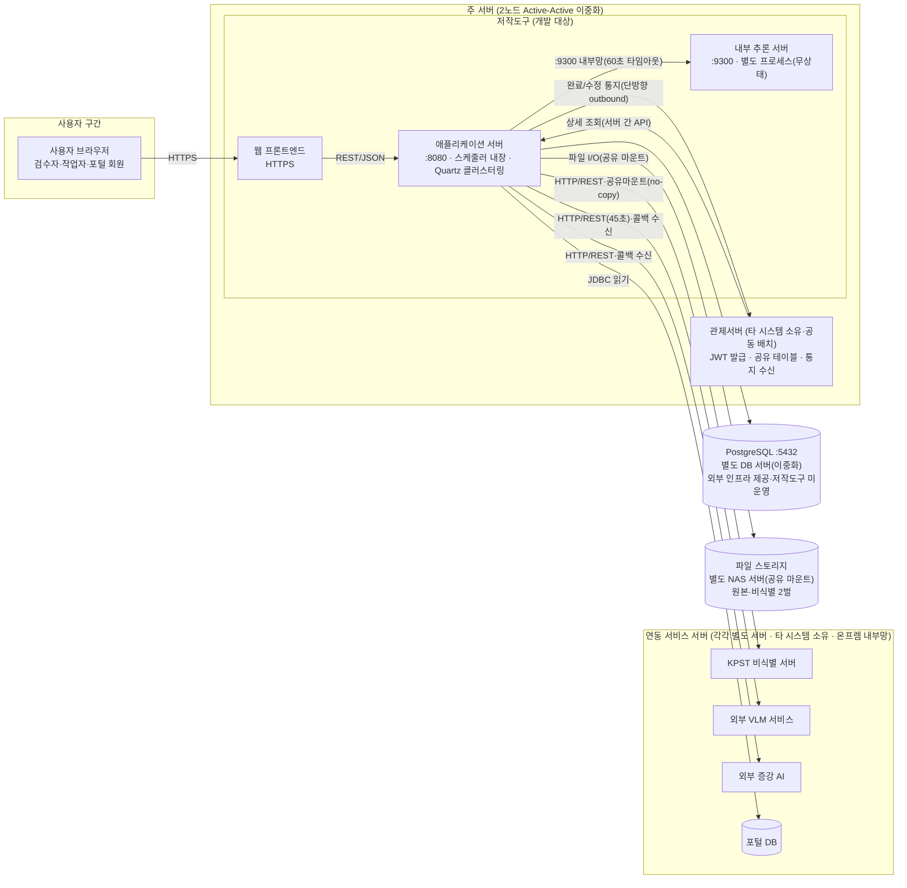
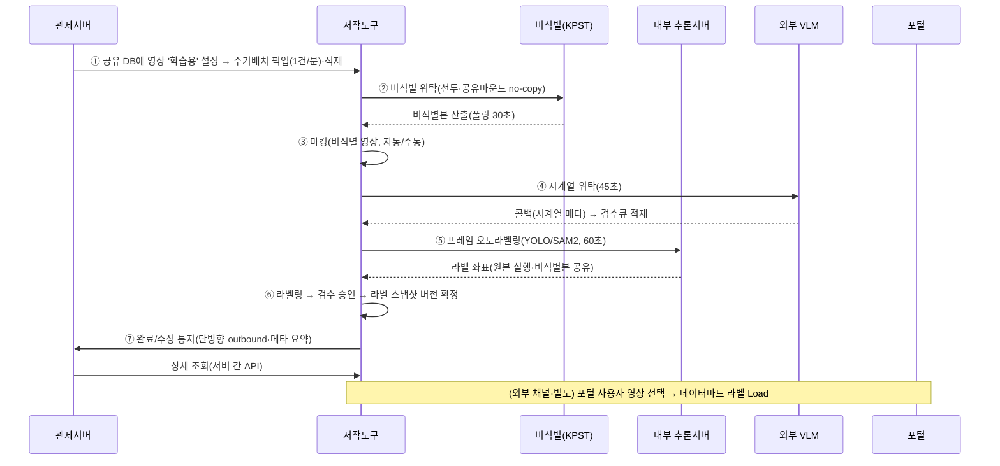
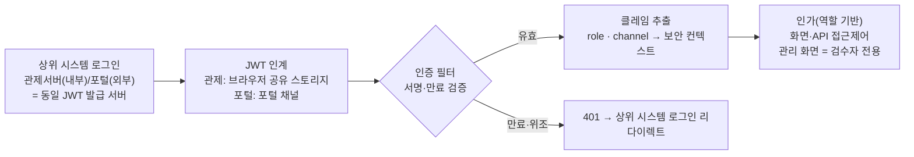
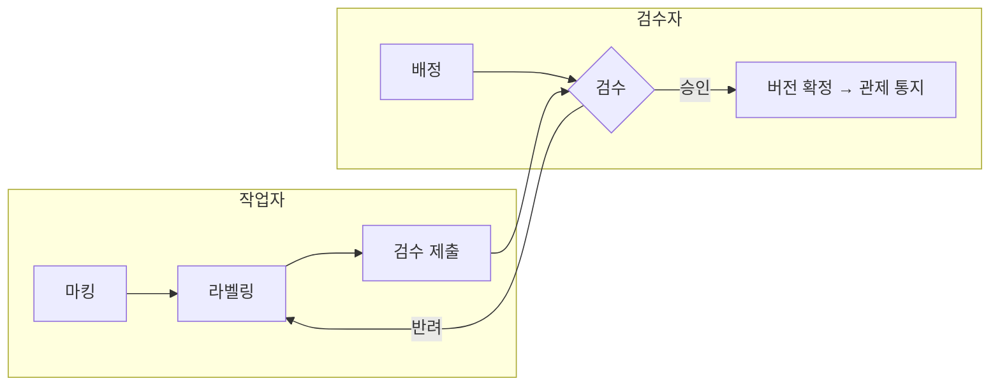
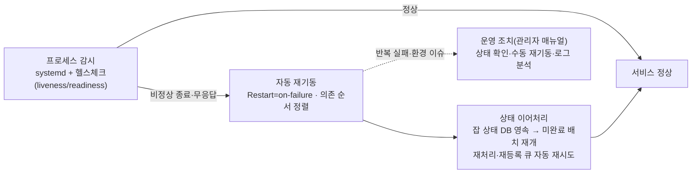
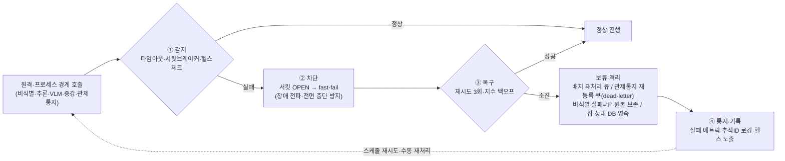

# D5 아키텍처 설계서

## 작성 목적
> 시스템의 품질을 확보하기 위하여 전체시스템에 대한 청사진으로서의 아키텍처를 작성한다. 소프트웨어 아키텍처는 개발 대상 응용 소프트웨어에 대한 아키텍처이며, 시스템 아키텍처는 응용 소프트웨어와 이에 상호작용하는 환경 및 네트워크가 포함된 아키텍처를 의미한다.

## 작성 방법
> 소프트웨어 아키텍처는 선정된 아키텍처 패턴을 중심으로 컴포넌트와 상호작용하는 커넥션 및 가시적인 속성을 표현한다. 시스템 아키텍처는 개발 대상시스템과 상호작용하는 하드웨어, 시스템 소프트웨어 및 네트워크와의 관계를 표현한다. 아키텍처 요구사항 및 구현방안은 아키텍처 관점에서의 시스템의 품질, 보안, 성능, 장애복구 등의 요구사항과 이에 대한 구현방안을 기술한다.

## 산출물 양식

### 제·개정 이력

| 날짜 | 버전 | 작성자 | 승인자 | 내용 |
|------|------|--------|--------|------|
| 2026-06-23 | 1.0 | - | - | LogiCraft 그래프 기반 생성 (/cc-doc-gen) |
| 2026-07-01 | 1.1 | - | - | 검토 반영: §2 이중화(Quartz 클러스터링) 옵션 명시·JWT 인계 경로 정정, §3 NFR-004 baseline 재분류 각주·증강 연동 현행 각주, NFR-011/RQ-DAR-06-02 조건절 보강 |
| 2026-07-03 | 1.2 | - | - | CBD 표준(NIA 2011.12) 정합 검토 반영: §3 도입문 대상 범위를 실제(NFR + RQ-QUR/RQ-DAR)로 확장, "요구사항 내용" 볼드 규칙을 핵심 정량목표·준수표준 기준으로 통일(NFR-005/007/015 보강). 구조·다이어그램·요구사항 ID 추적성은 v1.1과 동일(무변경) |
| 2026-07-03 | 1.3 | - | - | §2 시스템 경계 표현 정정: 온프레미스 배포 정합에 맞춰 '외부 시스템(네트워크 경계)'→'연동 시스템(타 시스템 소유·온프렘 내부망)'. 관제서버 동일 도메인·공유 DB, 포털 외부 채널(포털 DB 직접 접속) 명시. 인터넷·보안 경계가 아닌 시스템·인터페이스 경계임을 반영 |
| 2026-07-03 | 1.4 | - | - | §3 요구사항 ID 정합: 내부 임의 번호 NFR-011~017(7행)을 요구사항정의서(발주처 엑셀) 원본 비기능 ID로 교체하되 **비기능 1건당 1행(1:1)** 으로 분리(7→11행). RQ-PER-02-01(화면 응답)·RQ-PER-03-01(지연 사전안내)·RQ-PER-04-01(오류 응답)·RQ-PER-05-01(자원 효율)·RQ-SER-01-01(세션·계정 보안)·RQ-SER-02-01(역할별 접근제어)·RQ-SER-03-01(시큐어코딩)·RQ-SER-04-01(취약점 점검)·RQ-COR-04-01(웹표준)·RQ-DAR-01-01(데이터 표준)·RQ-SIR-01-01(UX/UI·API 호출 표준). 각 행 구현방안 개별 작성. 인접 품질 행이 이미 쓰던 RQ-QUR/RQ-DAR 체계와 통일. NFR-001~007은 저작도구 자체 도출분으로 유지 |
| 2026-07-03 | 1.5 | - | - | §3 정합 검토 반영: ① 'UX/UI·API 호출 표준' 행 삭제(11→10행) — 저작도구 API 호출 규약은 내부 설계규약으로 발주처 엑셀 비기능 요구에 대응 ID가 없어(SIR-01은 화면 UX/UI 표준 항목으로 성격 상이) 매핑 불성립분을 제거. ② 자원 효율 행 ID를 RQ-PER-05-01→RQ-PER-05-03으로 정정 — PER-05-01은 발주처 제공 가상화 인프라(HW/솔루션) 영역이고 저작도구 SW 자원효율 기여분은 PER-05-03이므로 |
| 2026-07-06 | 1.6 | - | - | §3 비기능 요구사항 나열 순서를 사용자 요구사항 정의서(발주처 엑셀 '요구사항정의서(비기능)' 시트) 순서에 정합: RQ-* 13건을 성능(PER)→품질(QUR)→데이터(DAR)→보안(SER)→제약(COR) 순으로 재배열(데이터 계열 내부는 DAR-01-01→DAR-06-02 순). NFR-001~007(저작도구 자체 도출분)은 앞 블록으로 유지. 요구사항 내용·구현방안 본문은 무변경 — 나열 순서만 조정 |
| 2026-07-06 | 1.7 | - | - | 4관점 보강: §2에 **2-1 하드웨어 구성 및 망 연계(서버 관점)**(서버·프로세스·포트·자원/확장성 표 + 망구성도) 및 **2-2 인터페이스 구성**(D4 인터페이스 12종 아키텍처 레벨 요약표) 신설, §3에 **[가용성·장애복구] 장애 발생·대응 프로세스**(감지→차단→복구→통지·기록 흐름도 + 메커니즘 매핑표) 신설. 실제 구성/설정(docker-compose 서버 토폴로지, Resilience4j 타임아웃·서킷브레이커·재시도, 배치 재처리 큐·관제통지 재등록(dead-letter) fallback, D4 인터페이스 목록)과 정합. 기존 §1·§3 요구사항 표·다이어그램은 무변경 |
| 2026-07-08 | 1.8 | - | - | 발주처 보완요청(KLID_PF 아키텍처설계서 Rev1.1 검토) 반영: §2에 **2-3 주변 시스템 연계 관계**(관제서버·비식별(KPST)·외부 VLM·외부 증강·포털·내부 추론 6종 관계표 + 영상 생애주기 시퀀스 다이어그램)·**2-4 권한 인증 방안 및 사용 프로세스**(JWT 인계·검증·역할 인가 흐름도 + 역할별 사용 프로세스)·**2-5 소프트웨어 구성요소 종류·버전·설치 경로**(WEB/WAS/런타임/추론서버/추론모델/DB 버전·온프레미스 설치경로 + 주요 라이브러리 버전표) 신설. §3에 **[가용성·장애복구] 서비스 프로세스 장애 대응**(웹·애플리케이션·추론·DB 서비스 자체의 감시→자동 재기동(systemd Restart=on-failure)→상태 이어처리(잡 상태 DB 영속·재처리/재등록 큐)→운영 조치 연계) 신설 — 기존 「장애 발생·대응 프로세스」(외부·프로세스 경계 호출)와 구분. 관제 인프라도 PostgreSQL 정합(공유 저장소 PG 전환). 운영 조치·프로세스 상태 확인 절차 상세는 관리자(운영) 매뉴얼로 분리 기술. §1 및 기존 다이어그램은 무변경 |
| 2026-07-14 | 1.9 | - | - | §3 요구사항 ID 출처 기준 확정(사용자 결정): 비기능은 사용자 요구사항 정의서(R1)·요구사항 추적표(R3) 실존 항목만 기술하고 그 외 관리용 ID는 제외. 이에 따라 ① 자체 도출분 NFR-001~007(7표) 제거, ② R1에 없는 발주처 엑셀 직참조 ID 행(RQ-PER-02-01/03-01/04-01/05-03·RQ-SER-01-01/02-01/03-01/04-01·RQ-COR-04-01·RQ-DAR-01-01, 10표)을 R1 실존 ID 7표(NFR-011 화면응답·NFR-012 자원효율·NFR-013 세션·접근통제·NFR-014 시큐어코딩·취약점·NFR-015 웹표준·NFR-016 데이터표준·NFR-017 API 호출 규약)로 병합·재구성(구현방안 본문은 기존 행에서 병합 승계, NFR-017은 v1.5 제외분을 R1 ID 기준으로 복원), ③ RQ-QUR-03-01/03-02·RQ-DAR-06-02 3표는 R1 실존으로 유지. §3 나열 순서 = R1 비기능 표 순서. 장애복구 2절(서술형)은 유지하되 제거된 NFR-004 참조를 서술로 치환. 결과 §3 = ID 표 10건 + 서술형 2절. 아울러 §1 레이어 배치도·§2 시스템 구성도를 Mermaid → **정적 HTML(html 펜스 코드블록)** 로 전환(hwpx 렌더 표준 정합 — 시퀀스·흐름도 계열은 Mermaid 유지) |
| 2026-07-14 | 1.10 | - | - | 물리 배치·이중화 확정 반영(사용자 확인): ① **주 서버 = 관제서버 + 저작도구 공동 배치, 2노드 Active-Active 이중화**(앱 2노드 동시 기동 — Quartz 클러스터링으로 잡 중복 방지, 구 '기본 단일 인스턴스·이중화 옵션' 서술 대체), ② **DB = 별도 DB 서버(이중화)**, **파일 스토리지 = 별도 NAS 서버(공유 마운트)**, ③ 연동 서비스(비식별·VLM·증강·포털)는 각각 별도 서버(관제서버는 연동 시스템망에서 주 서버로 이동), ④ GPU 탑재 명시 제거(추론 서버는 '주 서버 내 별도 프로세스·무상태·자원 경합 격리'로 기술). §2 본문·구성도(HTML)·2-1 표·망구성도·2-3 관계표·배포 토폴로지·장애 대응 절 정합. §1·§2 구성도의 연결을 **객체 간 실제 화살표(인라인 SVG 연결선)** 로 표현(라벨 배지 방식 대체 — 렌더 검증 완료) |

### 헤더

| D5 | 아키텍처 설계서 | | |
|------|------|------|------|
| 시스템명 | AI 기반 지방정부 CCTV 관제지원시스템(2차) | 서브시스템명 | 학습데이터 저작도구 |
| 단계명 | 설계 | 작성일자 | 2026-07-14 / 버전 1.10 |

---

### 1. 소프트웨어 아키텍처

본 시스템은 표현·업무·데이터 계층을 분리한 **레이어드(Layered) 아키텍처**를 채택한 모듈형 단일 애플리케이션이다. 표현 계층(웹 프론트엔드)은 업무 계층(애플리케이션 서버)의 REST 인터페이스만 호출하고, 업무 계층은 컨트롤러 → 서비스 → 리포지토리의 단방향 의존으로 구성한다. 데이터 계층(관계형 데이터베이스·파일 스토리지)은 리포지토리를 통해서만 접근한다. AI 추론은 업무 계층이 오케스트레이션하되, 실제 추론 연산은 **내부 추론 서버**(별도 프로세스, 무상태)로 분리하여 추론 연산의 자원 경합을 격리한다.

```html
<div style="font-family:'Malgun Gothic','Apple SD Gothic Neo',sans-serif;max-width:880px;margin:0 auto;color:#1f2937;font-size:13px;">
  <!-- 표현 계층 -->
  <div style="border:2px solid #2563eb;border-radius:8px;background:#eff6ff;padding:10px 14px;">
    <div style="font-weight:bold;color:#1d4ed8;margin-bottom:8px;">표현 계층 (Presentation Layer)</div>
    <div style="background:#ffffff;border:1px solid #93c5fd;border-radius:6px;padding:8px 12px;text-align:center;">
      <b>웹 프론트엔드</b><br><span style="font-size:12px;color:#475569;">라벨링 캔버스 · 검수 · 관리 · 마킹 화면</span>
    </div>
  </div>
  <div style="display:flex;align-items:center;justify-content:center;gap:8px;height:42px;">
    <svg width="24" height="42" viewBox="0 0 24 42"><line x1="12" y1="0" x2="12" y2="30" stroke="#1e40af" stroke-width="3"/><polygon points="4,28 20,28 12,42" fill="#1e40af"/></svg>
    <span style="font-size:12px;font-weight:bold;color:#1e40af;">표준 응답 래퍼 기반 REST/JSON</span>
  </div>
  <!-- 업무 계층 -->
  <div style="border:2px solid #059669;border-radius:8px;background:#ecfdf5;padding:10px 14px;">
    <div style="font-weight:bold;color:#047857;margin-bottom:8px;">업무 계층 (Business Layer) — 애플리케이션 서버</div>
    <div style="display:flex;align-items:center;gap:6px;margin-bottom:8px;">
      <div style="flex:1;background:#ffffff;border:1px solid #6ee7b7;border-radius:6px;padding:7px 8px;text-align:center;"><b>컨트롤러</b><br><span style="font-size:11px;color:#475569;">요청 수신 · 표준 응답 · 검증</span></div>
      <svg width="26" height="14" viewBox="0 0 26 14" style="flex:none;"><line x1="0" y1="7" x2="16" y2="7" stroke="#047857" stroke-width="3"/><polygon points="14,1 14,13 26,7" fill="#047857"/></svg>
      <div style="flex:1;background:#ffffff;border:1px solid #6ee7b7;border-radius:6px;padding:7px 8px;text-align:center;"><b>서비스</b><br><span style="font-size:11px;color:#475569;">업무 로직 · 트랜잭션 · 상태 전이</span></div>
      <svg width="26" height="14" viewBox="0 0 26 14" style="flex:none;"><line x1="0" y1="7" x2="16" y2="7" stroke="#047857" stroke-width="3"/><polygon points="14,1 14,13 26,7" fill="#047857"/></svg>
      <div style="flex:1;background:#ffffff;border:1px solid #6ee7b7;border-radius:6px;padding:7px 8px;text-align:center;"><b>리포지토리</b><br><span style="font-size:11px;color:#475569;">영속성 접근(ORM · 동적 질의)</span></div>
    </div>
    <div style="background:#ffffff;border:1px solid #6ee7b7;border-radius:6px;padding:7px 10px;text-align:center;margin-bottom:8px;">
      <b>배치 파이프라인</b> <span style="font-size:11px;color:#475569;">(선언적 단계 구성 · 스케줄러 1건/분)</span><br>
      <span style="font-size:12px;color:#334155;">비식별 → 마킹 → 시계열 → 프레임추출 → 오토라벨링 → 트랙보간</span>
    </div>
    <div style="display:flex;gap:8px;">
      <div style="flex:1.4;border:1px dashed #059669;border-radius:6px;padding:6px 8px;background:#f0fdf4;">
        <div style="font-size:11px;font-weight:bold;color:#047857;margin-bottom:5px;">공통 인프라</div>
        <div style="display:flex;flex-wrap:wrap;gap:5px;">
          <div style="flex:1 1 45%;background:#ffffff;border:1px solid #a7f3d0;border-radius:5px;padding:5px 6px;text-align:center;font-size:11px;">인증·인가 필터<br><span style="color:#64748b;">JWT 검증 · 역할/채널 분기</span></div>
          <div style="flex:1 1 45%;background:#ffffff;border:1px solid #a7f3d0;border-radius:5px;padding:5px 6px;text-align:center;font-size:11px;">표준 응답 · 예외 처리</div>
          <div style="flex:1 1 45%;background:#ffffff;border:1px solid #a7f3d0;border-radius:5px;padding:5px 6px;text-align:center;font-size:11px;">듀얼 데이터소스<br><span style="color:#64748b;">관제 참조 / 포털</span></div>
          <div style="flex:1 1 45%;background:#ffffff;border:1px solid #a7f3d0;border-radius:5px;padding:5px 6px;text-align:center;font-size:11px;">로깅 · 메트릭 · 추적ID<br><span style="color:#64748b;">민감정보 마스킹</span></div>
        </div>
      </div>
      <div style="flex:1;border:1px dashed #059669;border-radius:6px;padding:6px 8px;background:#f0fdf4;">
        <div style="font-size:11px;font-weight:bold;color:#047857;margin-bottom:5px;">연동 클라이언트 (장애 차단 적용)</div>
        <div style="background:#ffffff;border:1px solid #a7f3d0;border-radius:5px;padding:5px 6px;text-align:center;font-size:11px;margin-bottom:5px;">외부 연동 클라이언트<br><span style="color:#64748b;">비식별 · 시계열 · 증강 · 관제통지</span></div>
        <div style="background:#ffffff;border:1px solid #a7f3d0;border-radius:5px;padding:5px 6px;text-align:center;font-size:11px;">추론 호출 클라이언트<br><span style="color:#64748b;">내부 추론 서버 호출</span></div>
      </div>
    </div>
  </div>
  <div style="display:flex;">
    <div style="flex:1.4;display:flex;align-items:center;justify-content:center;gap:8px;height:42px;">
      <svg width="24" height="42" viewBox="0 0 24 42"><line x1="12" y1="0" x2="12" y2="30" stroke="#b45309" stroke-width="3"/><polygon points="4,28 20,28 12,42" fill="#b45309"/></svg>
      <span style="font-size:12px;font-weight:bold;color:#b45309;">ORM · 동적 질의 / 파일 입출력</span>
    </div>
    <div style="flex:1;display:flex;align-items:center;justify-content:center;gap:8px;height:42px;">
      <svg width="24" height="42" viewBox="0 0 24 42"><line x1="12" y1="0" x2="12" y2="30" stroke="#6d28d9" stroke-width="3"/><polygon points="4,28 20,28 12,42" fill="#6d28d9"/></svg>
      <span style="font-size:12px;font-weight:bold;color:#6d28d9;">프로세스 경계 호출 (장애 차단 정책)</span>
    </div>
  </div>
  <div style="display:flex;gap:8px;align-items:stretch;">
    <!-- 데이터 계층 -->
    <div style="flex:1.4;border:2px solid #d97706;border-radius:8px;background:#fffbeb;padding:10px 14px;">
      <div style="font-weight:bold;color:#b45309;margin-bottom:8px;">데이터 계층 (Data Layer)</div>
      <div style="display:flex;gap:6px;">
        <div style="flex:1;background:#ffffff;border:1px solid #fcd34d;border-radius:6px;padding:7px 8px;text-align:center;"><b>관계형 데이터베이스</b><br><span style="font-size:11px;color:#475569;">전용 테이블 소유 + 공유 테이블 참조검증 + 스케줄러 잡 저장</span></div>
        <div style="flex:1;background:#ffffff;border:1px solid #fcd34d;border-radius:6px;padding:7px 8px;text-align:center;"><b>파일 스토리지</b><br><span style="font-size:11px;color:#475569;">원본/비식별 영상 · 프레임 2벌</span></div>
      </div>
    </div>
    <!-- AI 추론 -->
    <div style="flex:1;border:2px solid #7c3aed;border-radius:8px;background:#f5f3ff;padding:10px 14px;">
      <div style="font-weight:bold;color:#6d28d9;margin-bottom:8px;">AI 추론 (내부 추론 서버 — 별도 프로세스)</div>
      <div style="background:#ffffff;border:1px solid #c4b5fd;border-radius:6px;padding:7px 8px;text-align:center;"><b>객체탐지 · 세그멘테이션 추론</b><br><span style="font-size:11px;color:#475569;">무상태 · 별도 프로세스 · 자원 경합 격리</span></div>
    </div>
  </div>
</div>
```

> 가시적 속성: 표현↔업무 간 커넥션은 표준 응답 래퍼 기반 REST/JSON, 업무↔데이터는 ORM·동적 질의, 업무↔내부 추론 서버는 프로세스 경계 호출(장애 차단 정책 적용)이다. 외부 연동(비식별·시계열·증강·관제통지)은 전용 연동 클라이언트로 단일화한다.

---

### 2. 시스템 아키텍처

개발 대상시스템(학습데이터 저작도구)은 **관제서버와 동일한 주 서버에 함께 배치**되며(동일 도메인 운영·브라우저 공유 스토리지 JWT 인계와 정합), 주 서버는 **2노드 Active-Active 이중화**로 구성한다 — 저작도구 애플리케이션은 2노드 동시 기동하고 스케줄러 잡 중복 실행은 Quartz 클러스터링으로 방지한다. 주 서버 안에서 저작도구는 웹 프론트엔드·애플리케이션 서버·내부 추론 서버(별도 프로세스, 무상태)로 구성된다. **관계형 데이터베이스는 별도 DB 서버(이중화)** 로 외부 인프라가 제공하며(저작도구는 자체 스키마 LS_* 소유·접속만 담당, DB 서버 운영은 인프라 주체 책임), **파일 스토리지는 별도 NAS 서버**를 공유 마운트로 사용한다. 그 외 연동 서비스(비식별 서버·외부 VLM 서비스·외부 증강 AI·포털)는 **각각 별도 서버**에 배치된 타 시스템 소유 시스템으로, 시스템·인터페이스 경계를 두고 연동한다. 관제서버는 주 서버에 함께 배치되지만 타 시스템 소유로서 소유·인터페이스 경계는 유지된다(전체적으로 인터넷·보안 네트워크 경계가 아니라 소유·인터페이스 경계다).

```html
<div style="position:relative;width:880px;height:800px;margin:0 auto;font-family:'Malgun Gothic','Apple SD Gothic Neo',sans-serif;color:#1f2937;font-size:13px;">
  <!-- ===== 연결선 레이어 (SVG — 실제 객체 간 화살표) ===== -->
  <svg width="880" height="800" style="position:absolute;left:0;top:0;" viewBox="0 0 880 800">
    <!-- 사용자 → 웹 프론트엔드 -->
    <line x1="382" y1="78" x2="382" y2="200" stroke="#1e40af" stroke-width="3"/>
    <polygon points="374,198 390,198 382,212" fill="#1e40af"/>
    <!-- 웹 → 앱 -->
    <line x1="460" y1="254" x2="468" y2="254" stroke="#1d4ed8" stroke-width="3"/>
    <polygon points="468,247 468,261 480,254" fill="#1d4ed8"/>
    <!-- 앱 → 내부 추론 -->
    <line x1="655" y1="254" x2="660" y2="254" stroke="#1d4ed8" stroke-width="3"/>
    <polygon points="660,247 660,261 672,254" fill="#1d4ed8"/>
    <!-- 앱(저작도구) → 관제서버 : 완료/수정 통지 -->
    <line x1="290" y1="237" x2="269" y2="237" stroke="#b91c1c" stroke-width="3"/>
    <polygon points="269,230 269,244 255,237" fill="#b91c1c"/>
    <!-- 관제서버 → 앱 : 상세 조회 -->
    <line x1="255" y1="277" x2="276" y2="277" stroke="#b91c1c" stroke-width="3"/>
    <polygon points="276,270 276,284 290,277" fill="#b91c1c"/>
    <!-- 앱 → DB 서버 -->
    <polyline points="530,306 530,368 215,368 215,388" fill="none" stroke="#b45309" stroke-width="3"/>
    <polygon points="207,386 223,386 215,400" fill="#b45309"/>
    <!-- 앱 → NAS 서버 -->
    <polyline points="610,306 610,368 665,368 665,388" fill="none" stroke="#b45309" stroke-width="3"/>
    <polygon points="657,386 673,386 665,400" fill="#b45309"/>
    <!-- 앱 → 연동 서비스 4종 (우측 트렁크 분기) -->
    <polyline points="640,306 640,338 866,338 866,575 137,575 137,638" fill="none" stroke="#991b1b" stroke-width="3"/>
    <polygon points="129,636 145,636 137,650" fill="#991b1b"/>
    <line x1="342" y1="575" x2="342" y2="638" stroke="#991b1b" stroke-width="3"/>
    <polygon points="334,636 350,636 342,650" fill="#991b1b"/>
    <line x1="547" y1="575" x2="547" y2="638" stroke="#991b1b" stroke-width="3"/>
    <polygon points="539,636 555,636 547,650" fill="#991b1b"/>
    <line x1="752" y1="575" x2="752" y2="638" stroke="#991b1b" stroke-width="3"/>
    <polygon points="744,636 760,636 752,650" fill="#991b1b"/>
    <!-- VLM·증강 → 앱 : 결과 콜백(상행) -->
    <line x1="374" y1="650" x2="374" y2="616" stroke="#0e7490" stroke-width="2.5" stroke-dasharray="5,3"/>
    <polygon points="367,618 381,618 374,604" fill="#0e7490"/>
    <line x1="579" y1="650" x2="579" y2="616" stroke="#0e7490" stroke-width="2.5" stroke-dasharray="5,3"/>
    <polygon points="572,618 586,618 579,604" fill="#0e7490"/>
  </svg>
  <!-- ===== 노드 레이어 ===== -->
  <!-- 사용자 단말 -->
  <div style="position:absolute;left:20px;top:0;width:840px;height:78px;border:2px solid #475569;border-radius:8px;background:#f8fafc;padding:8px 14px;box-sizing:border-box;">
    <div style="font-weight:bold;color:#334155;">사용자 단말</div>
    <div style="text-align:center;"><b>웹 브라우저 (표준 HTTPS)</b> <span style="font-size:12px;color:#475569;">— 검수자 · 작업자 · 포털 회원</span></div>
  </div>
  <div style="position:absolute;left:398px;top:92px;background:#ffffff;border:1px solid #93c5fd;border-radius:4px;padding:2px 8px;font-size:11px;color:#1e40af;font-weight:bold;">HTTPS · JWT 인계 (브라우저 공유 스토리지 → 요청 헤더)</div>
  <!-- 주 서버 -->
  <div style="position:absolute;left:20px;top:130px;width:840px;height:196px;border:3px double #2563eb;border-radius:8px;background:#eff6ff;padding:8px 14px;box-sizing:border-box;">
    <div style="font-weight:bold;color:#1d4ed8;">주 서버 <span style="background:#1d4ed8;color:#ffffff;border-radius:4px;padding:1px 8px;font-size:11px;">2노드 Active-Active 이중화</span> <span style="font-size:12px;color:#475569;">— 관제서버 + 저작도구 공동 배치</span></div>
  </div>
  <div style="position:absolute;left:40px;top:185px;width:215px;height:120px;background:#ffffff;border:1px solid #fca5a5;border-radius:6px;padding:7px 8px;box-sizing:border-box;text-align:center;">
    <b>관제서버</b> <span style="font-size:10px;background:#fee2e2;color:#991b1b;border-radius:3px;padding:0 5px;">타 시스템 소유</span><br>
    <span style="font-size:11px;color:#475569;">JWT 발급 · 공유 테이블(학습용 설정)<br>완료/수정 통지 수신<br>상세 조회 주체(서버 간 API)</span>
  </div>
  <div style="position:absolute;left:255px;top:217px;width:36px;text-align:center;font-size:10px;color:#b91c1c;font-weight:bold;">통지</div>
  <div style="position:absolute;left:255px;top:283px;width:36px;text-align:center;font-size:10px;color:#b91c1c;font-weight:bold;">조회</div>
  <div style="position:absolute;left:290px;top:158px;width:550px;height:155px;border:2px solid #2563eb;border-radius:6px;background:#dbeafe;padding:6px 8px;box-sizing:border-box;">
    <div style="font-size:12px;font-weight:bold;color:#1d4ed8;">학습데이터 저작도구 (개발 대상)</div>
  </div>
  <div style="position:absolute;left:305px;top:212px;width:155px;height:84px;background:#ffffff;border:1px solid #93c5fd;border-radius:6px;padding:6px 7px;box-sizing:border-box;text-align:center;"><b>웹 프론트엔드</b><br><span style="font-size:11px;color:#475569;">정적 자원 서빙</span></div>
  <div style="position:absolute;left:480px;top:200px;width:175px;height:106px;background:#ffffff;border:1px solid #93c5fd;border-radius:6px;padding:6px 7px;box-sizing:border-box;text-align:center;"><b>애플리케이션 서버</b><br><span style="font-size:11px;color:#475569;">2노드 동시 기동 · 스케줄러 내장<br>Quartz 클러스터링<br>(잡 중복 방지)</span></div>
  <div style="position:absolute;left:672px;top:212px;width:152px;height:84px;background:#ffffff;border:1px solid #93c5fd;border-radius:6px;padding:6px 7px;box-sizing:border-box;text-align:center;"><b>내부 추론 서버</b><br><span style="font-size:11px;color:#475569;">객체탐지·세그멘테이션<br>별도 프로세스 · 무상태</span></div>
  <!-- 연동 라벨 (앱→DB / 앱→NAS) -->
  <div style="position:absolute;left:235px;top:346px;background:#ffffff;border:1px solid #fcd34d;border-radius:4px;padding:2px 8px;font-size:11px;color:#b45309;font-weight:bold;">DB 접속 (스키마 소유 · 커넥션 복원력)</div>
  <div style="position:absolute;left:620px;top:346px;background:#ffffff;border:1px solid #fcd34d;border-radius:4px;padding:2px 8px;font-size:11px;color:#b45309;font-weight:bold;">파일 I/O (공유 마운트)</div>
  <!-- DB / NAS -->
  <div style="position:absolute;left:20px;top:400px;width:390px;height:118px;border:2px solid #d97706;border-radius:8px;background:#fffbeb;padding:8px 14px;box-sizing:border-box;">
    <div style="font-weight:bold;color:#b45309;">DB 서버 <span style="background:#b45309;color:#ffffff;border-radius:4px;padding:1px 8px;font-size:11px;">별도 서버 · 이중화</span></div>
    <div style="text-align:center;margin-top:4px;"><b>관계형 데이터베이스</b><br><span style="font-size:11px;color:#475569;">외부 인프라 제공 — 저작도구는 자체 스키마 소유·접속만<br>(DB 서버 운영·백업/복구는 인프라 주체 책임)</span></div>
  </div>
  <div style="position:absolute;left:470px;top:400px;width:390px;height:118px;border:2px solid #d97706;border-radius:8px;background:#fffbeb;padding:8px 14px;box-sizing:border-box;">
    <div style="font-weight:bold;color:#b45309;">NAS 서버 <span style="background:#b45309;color:#ffffff;border-radius:4px;padding:1px 8px;font-size:11px;">별도 서버</span></div>
    <div style="text-align:center;margin-top:4px;"><b>파일 스토리지</b><br><span style="font-size:11px;color:#475569;">원본·비식별 영상/프레임 2벌<br>(공유 마운트로 접근)</span></div>
  </div>
  <!-- 트렁크 라벨 -->
  <div style="position:absolute;left:190px;top:552px;background:#ffffff;border:1px solid #fca5a5;border-radius:4px;padding:2px 10px;font-size:11px;color:#991b1b;font-weight:bold;">HTTP/REST 위탁 호출 (포털 DB는 JDBC 읽기) — 시스템·인터페이스 경계(온프렘 내부망)</div>
  <!-- 연동 서비스 밴드 -->
  <div style="position:absolute;left:20px;top:600px;width:840px;height:190px;border:2px solid #b91c1c;border-radius:8px;background:#fef2f2;padding:8px 14px;box-sizing:border-box;">
    <div style="font-weight:bold;color:#991b1b;">연동 서비스 서버 <span style="background:#991b1b;color:#ffffff;border-radius:4px;padding:1px 8px;font-size:11px;">각각 별도 서버</span> <span style="font-size:12px;color:#475569;">— 타 시스템 소유 · 온프렘 내부망</span></div>
  </div>
  <div style="position:absolute;left:40px;top:650px;width:195px;height:120px;background:#ffffff;border:1px solid #fca5a5;border-radius:6px;padding:6px 7px;box-sizing:border-box;text-align:center;font-size:12px;"><b>비식별 서버</b><br><span style="font-size:11px;color:#475569;">비식별 처리 위탁<br>(공유 마운트 no-copy ·<br>진행상태 폴링)</span></div>
  <div style="position:absolute;left:245px;top:650px;width:195px;height:120px;background:#ffffff;border:1px solid #fca5a5;border-radius:6px;padding:6px 7px;box-sizing:border-box;text-align:center;font-size:12px;"><b>외부 VLM 서비스</b><br><span style="font-size:11px;color:#475569;">시계열 메타 위탁(45초)<br>결과는 콜백 회신</span></div>
  <div style="position:absolute;left:450px;top:650px;width:195px;height:120px;background:#ffffff;border:1px solid #fca5a5;border-radius:6px;padding:6px 7px;box-sizing:border-box;text-align:center;font-size:12px;"><b>외부 증강 AI</b><br><span style="font-size:11px;color:#475569;">생성형 증강 3종<br>(WINTER/NIGHT/RAIN)<br>결과는 콜백 회신</span></div>
  <div style="position:absolute;left:655px;top:650px;width:195px;height:120px;background:#ffffff;border:1px solid #fca5a5;border-radius:6px;padding:6px 7px;box-sizing:border-box;text-align:center;font-size:12px;"><b>포털</b><br><span style="font-size:11px;color:#475569;">포털 DB<br>(데이터마트 적재 소스)<br>라벨/메타 Load</span></div>
  <!-- 콜백 라벨 -->
  <div style="position:absolute;left:383px;top:612px;font-size:10px;color:#0e7490;font-weight:bold;">콜백</div>
  <div style="position:absolute;left:588px;top:612px;font-size:10px;color:#0e7490;font-weight:bold;">콜백</div>
</div>
```

> 내부 추론 서버는 외부 시스템이 아니라 저작도구 운영 영역 내부의 추론 인프라이다(주 서버 내 별도 프로세스·무상태). 연동 시스템은 비식별 서버·외부 VLM 서비스·외부 증강 AI·관제서버·포털 DB의 5종으로 모두 타 시스템 소유이며, **관제서버는 주 서버에 저작도구와 공동 배치**(동일 도메인·공유 DB)되고 나머지는 온프레미스 내부망의 **각각 별도 서버**에 배치된다(포털은 외부 채널로 포털 DB 직접 접속). 저작도구와의 경계는 인터넷·보안 네트워크 경계가 아니라 시스템·소유·인터페이스 경계이며, 연동은 내부망 표준 프로토콜로 이루어진다.
>
> **JWT 인계 경로**: 저작도구는 토큰을 발급하지 않고 관제서버(내부)/포털(외부)이 발급한 JWT를 인계받는다. 관제서버와는 동일 도메인 운영이라 **브라우저 공유 스토리지(localStorage/sessionStorage)로 토큰이 전달**되고, 사용자 브라우저가 저작도구로 보내는 요청 헤더에 실려 온다(서버 간 직접 토큰 전달 채널 아님). 관제서버→저작도구의 서버 간 호출은 통지 수신 후의 **상세 데이터 조회(API 호출)** 에 한한다.
>
> **배포 토폴로지**: 배포는 온프레미스 단일 리전·**주 서버 2노드 Active-Active 이중화**(관제서버 공동 배치)이다. 저작도구 애플리케이션은 2노드에서 동시 기동하며, 스케줄러 잡 중복 실행은 **Quartz 클러스터링(데이터베이스 JobStore 락 기반)** 으로 방지한다. **DB는 별도 DB 서버 이중화**로 외부 인프라가 제공하고, 파일 스토리지는 별도 NAS 서버를 공유 마운트로 사용한다. 내부 추론 서버는 무상태 프로세스로 필요 시 다중 기동해 확장 가능하다.

#### 2-1. 하드웨어 구성 및 망 연계 (서버 관점)

개발 대상시스템은 온프레미스 내부망(단일 리전)의 서버군으로 구성한다. **주 서버(2노드 Active-Active 이중화)에 관제서버(타 시스템 소유)와 저작도구가 함께 배치**되고, 사용자 단말은 표준 HTTPS로 웹 프론트엔드에 접속하며, 애플리케이션 서버가 **별도 서버로 분리된 데이터베이스(이중화)·파일 스토리지(NAS)** 와 **각각 별도 서버에 배치된 연동 서비스**를 내부망으로 호출한다. 내부 추론 서버는 주 서버 내 별도 프로세스(무상태)로 구동해 추론 연산의 자원 경합을 격리한다. 서버 간 통신은 내부망 표준 프로토콜(REST/JSON·JDBC·파일 I/O)이며, 외부 인터넷 경계가 아닌 시스템·소유 경계를 둔다.

| 구성요소 | 배치 | 역할 | 프로세스·런타임 | 통신 포트 | 자원·확장성 | 비고 |
|---|---|---|---|---|---|---|
| 웹 프론트엔드 | 주 서버(이중화 2노드) | 정적 자원 서빙(라벨링·검수·관리·마킹 화면) | 웹 서버(정적 번들) | HTTPS(사용자 노출) | 무상태 | 애플리케이션 서버 REST만 호출 |
| 애플리케이션 서버 | 주 서버(이중화 2노드) | 업무 로직·오케스트레이션·배치 스케줄러 내장 | JVM(Spring Boot) | 8080(내부·헬스체크 liveness) | **2노드 Active-Active 동시 기동** — 스케줄러 잡 중복은 Quartz 클러스터링(DB JobStore 락)으로 방지 | 스케줄러 1건/분 |
| 내부 추론 서버 | 주 서버 내 별도 프로세스 | 객체탐지·세그멘테이션 추론 | Python(무상태) | 9300(내부) | 무상태 · 필요 시 다중 프로세스 확장 · 추론 연산 자원 경합 격리 | 인증·상태·DB 없음 |
| 관제서버 | 주 서버(공동 배치) | JWT 발급 · 공유 테이블 · 통지 수신 | (타 시스템 소유) | 내부 | — | 소유·인터페이스 경계 유지 |
| 관계형 데이터베이스 | **별도 DB 서버(이중화)** | 저작도구 전용 스키마 + 공유 참조검증 + 스케줄러 잡 저장 | PostgreSQL | 5432 | 저작도구는 커넥션 풀 분리(관제 참조/포털)만 담당 | **외부 인프라 제공(저작도구 미운영)** — 가용성·백업은 DB 운영 주체 |
| 파일 스토리지 | **별도 NAS 서버** | 원본·비식별 영상/프레임 2벌 저장 | 파일시스템(공유 마운트) | 파일 I/O | 용량 산정: 이미지 10만 장·영상 5,000건 기준 | 비식별 실패 시 원본 보존 |
| 연동 서비스 | **각각 별도 서버** | 비식별 · 외부 VLM · 외부 증강 AI · 포털 | (타 시스템 소유) | 내부망 HTTP/REST·JDBC | — | 시스템·인터페이스 경계 |



> 서버 관점 요약: **주 서버는 2노드 Active-Active 이중화**로, 관제서버(타 시스템 소유)와 저작도구(웹 프론트엔드·애플리케이션 서버·내부 추론 서버)가 함께 배치된다. 저작도구 애플리케이션은 2노드에서 동시 기동하며 스케줄러 잡 중복 실행은 **Quartz 클러스터링(DB JobStore 락)** 으로 방지한다. **관계형 데이터베이스는 별도 DB 서버(이중화)** 로 외부 인프라가 제공하고(저작도구 미운영), **파일 스토리지는 별도 NAS 서버**를 공유 마운트로 사용한다. 내부 추론 서버는 주 서버 내 별도 프로세스(무상태)로 추론 연산의 자원 경합을 격리하고 필요 시 다중 프로세스로 확장한다. 그 외 연동 서비스(비식별·외부 VLM·외부 증강 AI·포털)는 각각 별도 서버로, 저작도구와는 시스템·인터페이스 경계로만 구분한다.

#### 2-2. 인터페이스 구성

시스템 경계를 넘는 연동 인터페이스는 외부 위탁·콜백(비식별·VLM·증강), 관제서버 단방향 통지, 포털 DB Load, 내부 추론 호출로 구성한다. 아키텍처 레벨 요약은 아래와 같으며, 속성·데이터 규격 상세는 **D4 인터페이스 설계서**를 따른다.

| 인터페이스 ID | 명칭 | 방향 | 방식 | 상대 시스템 | 처리형태·빈도 |
|---|---|---|---|---|---|
| KLID-AT-II-001 | 비식별 처리 위탁 | 송신 | HTTP/REST·공유마운트 | KPST 비식별 서버 | Online·1회/영상 |
| KLID-AT-II-002 | 비식별 진행 상태 폴링 | 송신 | HTTP/REST | KPST 비식별 서버 | Batch·1회/30초 |
| KLID-AT-II-003 | VLM 시계열 위탁 | 송신 | HTTP/REST | 외부 VLM 서비스 | Online·1회/영상 |
| KLID-AT-II-004 | VLM 시계열 결과 콜백 수신 | 수신 | HTTP/REST | 외부 VLM 서비스 | Online·1회/영상 |
| KLID-AT-II-005 | 외부 증강 생성 위탁 | 송신 | HTTP/REST | 외부 증강 AI | Online·1회/증강요청 |
| KLID-AT-II-006 | 증강 결과 콜백 수신 | 수신 | HTTP/REST | 외부 증강 AI | Online·1회/증강결과 |
| KLID-AT-II-007 | 관제서버 완료/수정 통지 | 송신(단방향) | HTTP/REST | 관제서버 | Online·1회/검수완료·수정 |
| KLID-AT-II-008 | 포털 DB Load | 수신(읽기) | JDBC | 포털 DB | Online·수시 |
| KLID-AT-II-009 | 오토라벨링(객체탐지) | 송신 | HTTP/REST | 내부 추론 서버(ai-server) | Online·1회/프레임 |
| KLID-AT-II-010 | 오토라벨링(객체추적) | 송신 | HTTP/REST | 내부 추론 서버(ai-server) | Online·1회/프레임 |
| KLID-AT-II-011 | SAM2 분할 | 송신 | HTTP/REST | 내부 추론 서버(ai-server) | Online·대화형 요청 시 |
| KLID-AT-II-012 | SAM2 추적 | 송신 | HTTP/REST | 내부 추론 서버(ai-server) | Online·1회/프레임 |

> 인터페이스 구성 요약: 외부 연동(II-001~007)은 개인정보 보호를 위해 **비식별 영상만 전달**하고 통지 페이로드는 메타·변경 요약만 담는다(본문·원본 이미지·토큰 미포함). 콜백 수신(II-004·II-006)은 진위 검증(메시지 인증)+멱등 처리, 관제 통지(II-007)는 멱등+실패 재등록 큐+인계 토큰/IP 화이트리스트로 보호한다. 내부 추론(II-009~012)은 저작도구가 자체 운영하는 무상태 추론 인프라 호출로, 외부 위탁이 아니라 프로세스 경계 내부 연동이다. 각 인터페이스의 원격·프로세스 경계 호출 복원력은 §3의 **장애 발생·대응 프로세스**에서 통제한다.

#### 2-3. 주변 시스템 연계 관계

저작도구는 독립 실행 시스템이 아니라 관제 플랫폼 안에서 **관제서버·비식별 솔루션(KPST)·외부 VLM 서비스·외부 증강 AI·포털**과 연계하고, 내부에 **추론 서버**를 두어 동작한다. 연계 대상별 소유·관계·연동 방향·트리거를 정리하면 다음과 같다(인터페이스 규격 상세는 §2-2·D4, 장애 시 복원력은 §3을 따른다).

| 연계 대상 | 소유 | 관계·역할 | 저작도구 기준 방향 | 방식 | 트리거·시점 |
|---|---|---|---|---|---|
| 관제서버 | 타 시스템(주 서버 공동 배치·동일 도메인) | JWT 발급 주체(관제 채널)·공유 DB(MNG_*) 소유·학습용 영상 설정 소스·완료/수정 통지 수신·상세 조회 주체 | 수신(JWT 인계)·READ(공유 DB)·**송신(통지)**·수신(조회요청) | 브라우저 공유 스토리지·JDBC(공유 DB READ)·HTTP/REST | 로그인 인계 / 학습용 설정→주기배치 픽업(1건/분) / 검수 완료·수정 시 통지 |
| 비식별 솔루션(KPST) | 타 시스템 | 영상 비식별 처리 위탁 대상(파이프라인 선두) | **송신(위탁)**·송신(폴링)·수신(산출물) | HTTP/REST·공유마운트(no-copy) | 영상 적재 직후 자동 / 진행상태 30초 폴링 |
| 외부 VLM 서비스 | 타 시스템 | 시계열 메타 생성 위탁·결과 콜백 | 송신(위탁 45초)·수신(콜백) | HTTP/REST | 마킹 완료 후 배치 |
| 외부 증강 AI | 타 시스템 | 생성형 증강 3종(WINTER/NIGHT/RAIN) 위탁·결과 새 영상 수신 | 송신(위탁)·수신(콜백) | HTTP/REST | 증강 요청 시(현행 스텁, §3 각주2) |
| 포털 | 타 시스템(외부 채널) | 데이터마트 영상의 라벨/메타 Load 원천(포털 DB) | 수신(READ Load) | JDBC(포털 DB) | 포털 사용자 영상 선택 시 |
| 내부 추론 서버(ai-server) | **저작도구 자체** | 오토라벨링 추론 인프라(외부 아님·무상태·주 서버 내 별도 프로세스) | 송신(추론 호출 60초) | HTTP/REST(프로세스 경계) | 프레임 오토라벨링·SAM2 요청 시 |

관계별 상세 서술:
- **관제서버** — 저작도구와 **주 서버 공동 배치·동일 도메인·공유 DB**로 가장 밀접하다(물리 배치는 같은 서버이나 소유·인터페이스 경계는 유지). ① 인증은 관제가 발급한 JWT를 인계받고(브라우저 공유 스토리지), ② 영상 적재는 관제가 공유 DB(MNG_*)에서 영상을 "학습용"으로 설정하면 저작도구 주기 배치가 픽업해 적재하며(inbound API·M2M 인증 없이 공유 DB READ 기반), ③ 검수 완료·수정 시 저작도구가 **단방향 outbound 통지**(TASK_COMPLETED/TASK_MODIFIED, 메타·변경 요약만)를 보내고, ④ 관제는 통지 수신 후 저작도구 조회 API로 상세를 가져간다. 양방향 M2M 인증 인프라는 미운영이며 통지는 인계 토큰/IP 화이트리스트로 보호한다. 공유 저장소는 관제 인프라 정합에 따라 **PostgreSQL로 전환**되며, 저작도구는 소유 테이블(LS_*)만 자체 구성하고 공유 MNG_*는 참조검증(validate)만 한다.
- **비식별 솔루션(KPST)** — 파이프라인 **선두** 위탁 대상으로, 영상 적재 직후 자동 호출된다. 공유 마운트(no-copy)로 원본을 전달하고 KPST가 산출 경로에 비식별본을 직접 생성하며, 진행 상태를 폴링한다. 실패 영상은 상태 표시 후 원본을 보존한 채 외부 솔루션으로 수동 재비식별한다.
- **외부 VLM 서비스** — 마킹 결과(이벤트명·마크 배열)를 위탁하면 시계열 메타를 생성해 콜백으로 회신한다. 저작도구는 결과를 검수 대상으로 적재한다(VLM 모델 본체는 범위 외, 시계열 호출 연동만 보유).
- **외부 증강 AI** — 증강 요청 시 새 영상을 생성해 회신하며, 결과는 원본과 다른 새 작업(RAW_SN)으로 **미검수 상태로 시작**한다(원본 라벨/메타 복사). 해상도 변경은 증강이 아니라 저작도구가 직접 수행한다.
- **포털** — 외부 채널로, 관제→데이터마트→포털 DB로 적재된(관제 책임) 영상을 포털 사용자가 선택하면 기존 라벨/메타를 Load한다. 저장은 사용자 작업본으로 별도 적재되고 데이터마트에는 반영되지 않는다(단방향).
- **내부 추론 서버(ai-server)** — 유일하게 **저작도구가 소유·운영**하는 내부 추론 인프라다. 외부 위탁이 아니라 프로세스 경계 호출이며, 추론 연산의 자원 경합 격리를 위해 별도 프로세스(필요 시 다중 프로세스 확장)로 분리한다.

아래 시퀀스는 영상 1건이 적재부터 완료 통지까지 각 시스템을 어떤 순서로 거치는지를 보여준다(연계 관계의 시간 흐름).



#### 2-4. 권한 인증 방안 및 사용 프로세스

**권한 인증 방안** — 저작도구는 자체 로그인 UI·토큰 발급이 없다. 관제서버(내부 채널)와 포털(외부 채널)이 **동일 JWT 발급 서버**로 발급한 토큰을 인계받아 단일 검증 로직으로 처리한다.



- 인증: 인계 토큰의 **서명·만료를 검증**하고 실패 시 상위 시스템 로그인으로 유도한다. JWT 시크릿은 환경변수로 주입하며 소스에 하드코딩하지 않는다.
- 인가: `role`(검수자 REVIEWER / 작업자 WORKER / 포털회원 PORTAL_USER) + `channel` 클레임으로 화면·API 접근을 분기한다. 관리 화면(`/manage/*`)은 검수자 전용이며, 사용자·시스템 설정 등 관리 권한은 검수자에 통합된다(별도 ADMIN 역할 없음).
- 저작도구는 인계 토큰의 **검증만** 담당한다. 로그인 실패 횟수 제한·동시 로그인 차단은 발급 주체(관제/포털)의 책임이다.

**사용 프로세스**(역할별) — 저작도구 진입 후 각 역할이 수행하는 업무 흐름은 다음과 같다.

| 역할 | 사용 흐름 |
|---|---|
| 작업자(WORKER) | 관제 로그인(토큰 인계) → 저작도구 진입 → 배정 영상 확인 → **비식별 완료 영상** 마킹(자동=프레임 간격·수동=단축키) → 라벨링(오토라벨링·SAM2 보조) → 검수 제출 |
| 검수자(REVIEWER) | 관리 화면 진입 → 작업자 배정/재배정 → 제출 건 검수(승인/반려) → **승인 시 라벨 전체 스냅샷 버전 확정** → 관제서버 완료 통지 |
| 포털회원(PORTAL_USER) | 포털 로그인 → 데이터마트 영상 선택 → 기존 라벨/메타 Load → 수정 → 본인 작업본 저장·기간 내 다운로드(업로드·오토라벨링·검수 없음) |



#### 2-5. 소프트웨어 구성요소 종류·버전·설치 경로

시스템을 구성하는 웹서버(WEB)·애플리케이션 서버(WAS)·런타임·추론 서버·추론 모델·데이터베이스의 종류·버전·설치 경로를 기술한다. 버전은 빌드·의존성 잠금(lockfile) 기준이며, 설치 경로는 온프레미스(폐쇄망) 설치 패키지 기준이다(컨테이너 배포 시 경로는 이미지 내부 기준으로 상이).

| 구분 | 소프트웨어 / 모델 | 종류·버전 | 설치 경로(온프레미스) |
|---|---|---|---|
| WEB(웹서버) | Caddy(온프렘)·nginx(컨테이너) | 프론트엔드 정적 번들 서빙 | `/opt/klid/web/{dist,Caddyfile}` |
| WAS(애플리케이션) | Spring Boot 내장 톰캣 | Spring Boot **3.3.0** · 컨텍스트 `/api` · :8080 | `/opt/klid/app/klid-backend.jar` |
| 런타임(WAS) | JRE(Temurin) | **17** | `/opt/klid/runtime/jre` |
| 런타임(추론) | Python | **3.11**(base 이미지 종속·각주3) | `/opt/klid/runtime/python` · venv `/opt/klid/ai/venv` |
| 런타임(영상) | FFmpeg(정적 번들) | net.bramp.ffmpeg **0.8.0** 래퍼 | `/opt/klid/runtime/ffmpeg` |
| 추론 서버 | FastAPI · uvicorn | **0.137** · **0.49** | `/opt/klid/ai/app` · :9300 |
| 추론 모델 | 객체탐지(YOLOX) | onnxruntime **1.27** | `/opt/klid/ai/weights` |
| 추론 모델 | 세그멘테이션(SAM2) | Meta SAM2(git) | `/opt/klid/ai/weights` |
| 추론 모델 | 탐지·추적(RT-DETR/ByteTrack) | transformers **5.12** · torch **2.5.1**(도커)/**2.12**(lock·각주4) | `/opt/klid/ai/weights` · `.hf-cache` |
| DB | PostgreSQL(외부 인프라 제공) | 호환 버전 **16** | 외부 제공·저작도구 미설치 — 접속 정보는 환경설정(`CONTROL_DB_*`·`PORTAL_DB_*`). 온프렘 번들 PG는 폐쇄망 단독 설치 옵션 |

**주요 라이브러리 버전(애플리케이션 서버)** — 위 WAS 상세:

| 라이브러리 | 버전 | 라이브러리 | 버전 |
|---|---|---|---|
| Spring Framework | 6.1.8 | Spring Security | 6.3.0 |
| Hibernate ORM | 6.5.2 | QueryDSL | 5.1.0 |
| JJWT | 0.12.6 | Flyway | 플러그인 10.13.0 / 런타임 10.10.0(각주5) |
| Resilience4j | 2.2.0 | Quartz | 2.3.2 |
| MapStruct | 1.5.5 | Lombok | 1.18.32 |
| Micrometer | 1.13.0 | Springdoc OpenAPI | 2.5.0 |
| PostgreSQL JDBC | 42.7.3 | Caffeine | 3.1.8 |

**프론트엔드**: React **18.3.1** · TypeScript **5.9** · Vite **5.4** · TanStack Query **5.x** · Zustand **4.5** · React Router **6.30** · axios **1.x** · Tailwind **3.4** · konva **9.3**(Node **20** 빌드 런타임).

> **각주3 (Python 버전)**: 저장소에 Python 버전 핀(.python-version 등)이 없고, 추론 서버 base 이미지(pytorch 런타임)에 포함된 **Python 3.11** 이 실효 버전이다.
> **각주4 (torch 버전)**: 의존성 lockfile 은 torch 2.12.0/torchvision 0.27.0 으로 핀되나, 컨테이너 배포는 base 이미지의 **torch 2.5.1** 을 사용한다(설치 스크립트가 lock 에서 torch 계열을 제외). 호스트 직접 설치 경로에서는 lock 값이 적용된다.
> **각주5 (Flyway 버전)**: 마이그레이션 실행 런타임(flyway-core)은 Spring Boot 3.3.0 BOM 이 관리하는 **10.10.0**, 빌드 시 Gradle 플러그인은 **10.13.0** 이다.

---

### 3. 아키텍처 요구사항 및 구현방안

> 아키텍처 관점에서 시스템에 크게 영향을 주는 품질·보안·성능·장애복구 요구사항과 구현방안을 **사용자 요구사항 정의서(R1)에 정의된 비기능 요구사항** 1건당 1표로 기술한다(요구사항 ID·나열 순서는 R1 비기능 요구사항 표와 정합). 장애복구 관점은 표 뒤의 「서비스 프로세스 장애 대응」·「장애 발생·대응 프로세스」 절이 아키텍처 수준으로 상세화한다.

#### [규정 준수·품질] 학습데이터 단계별 품질관리 기준 (수집·제작·검수)

| 요구사항 ID | RQ-QUR-03-01 |
|---------|---|
| 요구사항 내용 | 학습데이터 구축의 수집·제작·검수 각 단계별 수행기준을 수립하고 품질관리 방안을 제시한다. 검수 이력·승인 버전이 시스템에서 확인 가능해야 한다. |
| 구현방안 | 수집(적재 검증)·제작(비식별→마킹→오토라벨링)·검수(승인/반려) 단계별 수행기준을 수립하고, 검수 승인 시점에 라벨 전체를 스냅샷으로 버전 관리(페이로드 해시 기준)한다. 품질목표 수준: 전 단계 수행기준 수립 + 검수 이력·승인 버전 시스템 확인 가능. 검수 승인 데이터만 학습데이터로 확정하며, 검수 이력·승인 버전을 시스템에서 추적한다. |

#### [규정 준수·품질] 학습데이터 종류·제작방법별 품질관리 기준

| 요구사항 ID | RQ-QUR-03-02 |
|---------|---|
| 요구사항 내용 | 학습데이터 종류 및 제작 방법(라벨링 방식·활용 기법)별 품질관리 기준을 수립한다. |
| 구현방안 | 바운딩박스·폴리곤·세그멘테이션·트래킹 등 라벨링 방식별 라벨 규격·검수 기준과, 오토라벨링·시계열 메타 검토·생성형 증강 4종(WINTER/NIGHT/RAIN/해상도)별 제작기법 품질관리 기준을 수립한다. 품질목표 수준: 라벨링 방식별·제작기법별 기준 수립 + 검수 워크플로우 적용. 이미지 10만 장·영상 5,000건 목표와 연계해 관리한다. |

#### [규정 준수·품질] 학습데이터 값 검증·정합성 (공공데이터 품질진단 기준)

| 요구사항 ID | RQ-DAR-06-02 |
|---------|---|
| 요구사항 내용 | 시스템 생성 데이터 외 **제공되는** 학습데이터의 원본 정합성을 검증하고, 공공데이터 품질진단 기준 및 업무규칙(BR)에 따른 값 검증으로 오류 입력을 차단하며 오류유형별 조치 이력을 관리한다. |
| 구현방안 | 라벨 저장·검수 시 좌표 범위·필수 속성·코드 정합 등 업무규칙 기반 값 검증으로 오류 입력을 차단하고, 원본 정합성 검증과 오류데이터 반려·재작업 및 오류유형별 조치 이력을 관리한다. 품질목표 수준: 오류 라벨 입력 차단 + 오류유형별 조치 이력 관리. 공공데이터 품질진단 기준을 준수하고 검증 항목 정의서를 제출한다. |

#### [성능] 화면 응답시간 기준

| 요구사항 ID | NFR-011 |
|---------|---|
| 요구사항 내용 | 라벨링·검수·마킹·목록 등 저작도구 전 화면의 페이지 응답속도를 **3초 이하**로 한다(초과 불가피 시 발주기관 협의). **10초 이상** 지연이 예상되는 대용량 질의·장시간 작업은 진행 안내·취소 기능을 제공하고, 입력·처리 오류는 **3초 이내** 조치 가능한 오류 메시지를 제시한다. |
| 구현방안 | 주요 화면·조회의 응답시간을 3초 이하로 설계하고, 프론트엔드 번들·요청 최적화와 대량 라벨 조회 페이징으로 페이지 용량을 감축한다. 대용량 질의·대량 라벨 조회·배치 트리거 등 장시간 작업에는 진행 안내(프로그레스)와 취소 기능을 제공하며, 입력 형식 오류·처리 오류는 표준 에러 응답 포맷으로 3초 이내 사용자에게 제시한다. 품질목표 수준: 페이지·조회 응답시간 ≤ 3초, 지연 예상 작업 진행 안내·취소 100% 제공, 오류 메시지 표시 ≤ 3초. 성능테스트·지연 작업 시나리오·검증 실패 케이스로 기준 충족을 확인한다. |

#### [성능] 시스템 자원 효율

| 요구사항 ID | NFR-012 |
|---------|---|
| 요구사항 내용 | 시스템 자원(CPU·메모리)의 평균 사용률을 **80% 이하**로 유지한다. 배치 파이프라인·스케줄러 워커의 자원 관리, 듀얼 데이터소스 커넥션 풀 분리 최적화, 메모리 누수 방지, 세션 자원 정리를 포함한다. |
| 구현방안 | 배치 파이프라인(프레임 추출·추론 호출)·스케줄러 워커의 자원 사용을 관리하고, 듀얼 데이터소스(관제 참조/포털)의 커넥션 풀을 분리·최적화한다. 품질목표 수준: CPU·메모리 평균 사용률 ≤ 80%(본격 사용시기 모의추정 기준), 메모리 누수 부재. 로그아웃·토큰 만료 시 세션 자원을 정리하며, 자원 사용률을 메트릭으로 모니터링하고 부하테스트로 검증한다. |

#### [보안] 세션·접근 통제

| 요구사항 ID | NFR-013 |
|---------|---|
| 요구사항 내용 | 로그아웃·토큰 만료 시 세션을 종료하고 만료 토큰을 거부하며 상위 시스템 로그인 페이지로 리다이렉트한다. 역할(검수자/작업자/포털 회원)·채널 기반으로 화면·기능 접근을 구분하고, **관리 화면은 검수자 전용**으로 한다. |
| 구현방안 | 인증·인가 필터가 인계된 토큰을 검증하여 만료·위조 토큰을 거부하고 상위 시스템 로그인으로 유도한다. 역할·채널 클레임 기반으로 페이지·기능 접근을 구분하고 관리 화면은 검수자 전용으로 비인가자 노출을 차단한다. 시크릿은 환경변수로 주입(하드코딩 금지)하고 영상·민감정보는 암호화 저장한다. 로그인 실패 제한·동시 로그인 차단은 인증 발급 주체(관제/포털)의 책임이며 저작도구는 토큰 검증만 담당한다. 품질목표 수준: 만료·위조 토큰 거부 및 비인가 역할 접근 거부 100%, 시크릿 하드코딩 0. 만료/위조 토큰 거부·권한 없는 접근 거부를 통합테스트로 확인한다. |

#### [보안] 시큐어코딩·취약점 점검

| 요구사항 ID | NFR-014 |
|---------|---|
| 요구사항 내용 | 소프트웨어 개발보안(시큐어코딩) 가이드를 준수하여 개발하고('행정기관 및 공공기관 정보시스템 구축·운영 지침' 제50조), 개발 소스코드 전체에 대해 **보안약점 진단을 1회 이상** 실시하며 모의해킹 점검 후 지적사항을 보완한다. |
| 구현방안 | 행정·공공기관 SW 개발보안 가이드를 준수하여 개발하고, 정적 보안 분석으로 소스를 상시 점검한다. 소스 전체 보안약점 진단과 웹 취약점 표준 항목(공통 웹 취약점·국가 권고 항목) 기준 모의해킹을 1회 이상 실시하고 지적사항을 후속 보완한다. 품질목표 수준: 개발보안 가이드 준수, 소스 전체 진단 1회 이상, 지적사항 보완 완료. 보안약점 진단 결과서·모의해킹 결과서와 보완조치 내역으로 검증한다. |

#### [규정 준수·품질] 웹표준·크로스브라우징

| 요구사항 ID | NFR-015 |
|---------|---|
| 요구사항 내용 | 비표준 기술(플러그인) 없이 웹표준 기반으로 전 기능이 동작하고, **3종 이상** 브라우저에서 동등 동작하며 표준 마크업·스타일 문법을 준수한다. |
| 구현방안 | 프론트엔드를 표준 웹기술 기반으로 구현하고 라벨링 캔버스도 표준 캔버스 기술로 동작시켜 비표준 플러그인을 배제한다. 품질목표 수준: 3종 이상 브라우저 동등 동작 + 비표준 플러그인 0. 표준 마크업·스타일 문법을 준수해 표준 검증을 통과하고, 포털 화면은 반응형으로 제공한다. 크로스브라우징 테스트와 표준 검증 결과로 확인한다. |

#### [규정 준수·데이터] 데이터 표준 준수

| 요구사항 ID | NFR-016 |
|---------|---|
| 요구사항 내용 | 저작도구 소유 데이터 객체(테이블·컬럼)의 단어·용어·도메인·코드를 범정부 표준 기반 데이터 표준사전과 정합되게 설계하고, 라벨링 방식별 라벨 데이터 포맷 표준을 정의한다. |
| 구현방안 | 저작도구 전용 테이블·컬럼의 단어·용어·도메인·코드를 범정부 표준 기반 데이터 표준사전과 정합되게 설계하고, 마이그레이션 시 명명규칙을 점검한다. 품질목표 수준: 신규 객체 표준 정합 + 라벨링 방식별 포맷 표준 정의. 라벨링 방식별(바운딩박스·폴리곤·세그멘테이션·트래킹) 라벨 데이터 포맷 표준을 정의한다. 공유 테이블은 관제서버 소유로 참조검증만 수행하며(공유 스키마 변경 충돌은 변경 전 선승인·변경 알림 프로세스로 완화), 표준사전 대비 명명 점검 결과와 포맷 표준 문서로 확인한다. |

#### [인터페이스] API 호출 규약 (인증·채널 격리)

| 요구사항 ID | NFR-017 |
|---------|---|
| 요구사항 내용 | 저작도구 API의 공통 호출 규약을 정의한다. 모든 경로 앞에 공통 기본 경로가 붙고, 인증은 인증 토큰 방식이며(저작도구는 토큰을 발급하지 않고 상위 시스템 발급 토큰을 인계), 역할·채널 클레임으로 접근을 분기하고 표준 응답·페이징 규약을 따른다. |
| 구현방안 | 공통 기본 경로·인증 토큰·역할/채널 접근 규칙·표준 응답/페이징 규약을 전역 호출 규약으로 명세하여 별도 문의 없이 호출을 구성할 수 있게 한다. 품질목표 수준: API 카탈로그·연동 명세만으로 호출 구성 가능. 연동 명세 기반 호출 구성 확인으로 검증한다. |

> **외부 시스템 본체 범위 명시**: 외부 VLM 서비스·생성형 증강 AI·영상 합성 모델·데이터마트 본체는 저작도구 범위 외(외부 시스템 책임)이다. 저작도구는 외부 VLM 시계열 호출 연동, 외부 증강 결과 수신·검수, 데이터마트 적재용 조회 인터페이스 제공까지만 담당한다.

#### [가용성·장애복구] 서비스 프로세스 장애 대응

저작도구가 **운영하는** 서비스 프로세스(웹서버·애플리케이션 서버·내부 추론 서버)의 비정상 종료·무응답, 그리고 **외부 인프라로 제공되는 데이터베이스와의 연결 장애**에 대해 **프로세스 감시 → 자동 재기동 → 상태 이어처리 → 운영 조치**로 대응한다. (외부 연동·추론 "호출"의 장애 차단은 아래 「장애 발생·대응 프로세스」가, 본 절은 저작도구가 운영하는 서비스 프로세스의 생존·복구를 다룬다.)

| 구성요소(서비스) | 감지 | 자동 복구 | 상태 보존·이어처리 |
|---|---|---|---|
| 애플리케이션 서버(WAS) | liveness/readiness 헬스체크 + 프로세스 관리자 감시 | 비정상 종료 시 자동 재기동(재기동 간격 적용)·의존 서비스(DB 가용·추론) 준비 후 기동 | 스케줄러 잡 상태를 DB(JobStore)에 영속 → 재기동 시 미완료 배치 이어처리 |
| 내부 추론 서버 | 헬스체크(:9300) + 프로세스 감시 | 자동 재기동·무상태라 즉시 복귀·다중 인스턴스로 대체 처리 | 무상태(보존 대상 없음) — 실패 호출은 상위(WAS) 재시도로 복구 |
| 웹서버(WEB) | 헬스체크(정적 응답) + 프로세스 감시 | 자동 재기동 | 무상태(정적 서빙) |
| 데이터베이스(외부 인프라 제공·저작도구 미운영) | 커넥션 헬스 감시(연동 관점) | **커넥션 복원력**: 재연결·커넥션 풀 재확보, DB 장애 시 배치 보류 후 자동 복구 | DB 서버 가용성·재기동·백업/복구는 **외부 DB 운영 주체** 책임 |



- **데이터베이스 책임 경계**: 관계형 데이터베이스는 **외부 인프라로 제공**되며 저작도구가 운영·관리하지 않는다. 저작도구는 자체 스키마(LS_*) 소유와 **접속·커넥션 복원력**(재연결·풀 관리, DB 장애 시 배치 보류 후 복구)만 담당하고, DB 서버의 가용성·재기동·백업/복구는 DB 운영(인프라) 주체 책임이다. (온프레미스 번들 PostgreSQL은 폐쇄망 단독 설치 편의 옵션이며, 운영 환경에서 외부 DB 사용 시 DB 관리는 인프라 주체를 따른다.)
- **자동 재기동**: 저작도구가 운영하는 서비스(웹·애플리케이션·추론)는 프로세스 관리자(systemd)의 `Restart=on-failure` 정책으로 비정상 종료 시 자동 재기동되며, 의존 순서(DB 가용 → 추론 → 애플리케이션 → 웹)와 기동 여유(대용량 컨텍스트·Flyway 마이그레이션 고려)를 정렬한다(`Requires`/`After`). 외부 DB가 미가용이면 애플리케이션은 DB 가용 후 기동되도록 정렬된다.
- **상태 이어처리(무손실 복구)**: 애플리케이션 재기동 시 진행 중이던 배치는 유실되지 않는다 — 스케줄러 잡 상태가 데이터베이스에 영속돼 재기동 후 미완료 잡을 이어 처리하고, 실패 단계는 배치 재처리 큐·관제통지 재등록 큐(dead-letter)로 자동 재시도된다. 비식별 실패 영상은 원본을 보존한 채 실패 상태로 격리된다.
- **fail-secure 기본값**: 인증·인가 등 보안성 예외는 거부(fail-closed)로 처리해 장애 상황에서 권한 우회가 발생하지 않도록 한다.
- **이중화(2노드 Active-Active) 무중단성**: 주 서버는 2노드 Active-Active 이중화로 동시 기동하므로, 한 노드의 애플리케이션 프로세스 장애 구간에도 나머지 노드가 서비스를 지속한다(장애 노드는 자동 재기동으로 복귀). 스케줄러 잡은 Quartz 클러스터링(DB JobStore 락)으로 중복 실행 없이 한 노드에서만 수행되며, 잡 상태가 DB에 영속돼 노드 절체 시에도 미완료 배치를 이어 처리한다. 추론 서버는 무상태 프로세스로 필요 시 다중 기동해 대체 처리한다.
- **운영 조치 연계**: 프로세스 상태 확인·수동 재기동·로그 분석 등 **운영 조치 절차는 관리자(운영) 매뉴얼**(온프레미스 운영 런북)에서 상세화한다.

#### [가용성·장애복구] 장애 발생·대응 프로세스

외부 연동·내부 추론 등 모든 원격·프로세스 경계 호출의 복원력(타임아웃·재시도·서킷 브레이커) 확보를 **감지 → 차단 → 복구 → 통지·기록**의 4단계 프로세스로 구체화한다. 모든 원격·프로세스 경계 호출(비식별·내부 추론·VLM·증강·관제 통지)에 동일 프로세스를 적용해, 외부 서비스 장애가 파이프라인 전면 중단으로 번지지 않도록 한다.



| 단계 | 메커니즘 | 적용 대상 | 근거 구성·설정값 |
|---|---|---|---|
| ① 감지 | 타임아웃 | 비식별·추론 60초, VLM 45초, 관제통지 10초, KPST 폴링 240회·180분 상한 | TimeLimiter / WebClient 타임아웃(거짓 완료 방지) |
| ① 감지 | 서킷브레이커 | deid·ai·vlmClient·controlNotify·kpstDeid | 실패율 50%·슬라이딩 윈도우 10·최소 5콜·OPEN 유지 30초 |
| ① 감지 | 헬스체크 | 앱 생존 + 연동별 상태 | liveness 프로브 + 연동 HealthIndicator |
| ② 차단 | fast-fail | 서킷 OPEN 구간 | 장애 서비스 호출 즉시 실패 반환 → 파이프라인 전면 중단 방지 |
| ③ 복구 | 자동 재시도 | 전 연동(deid·ai·vlmClient·controlNotify·kpstDeid) | 최대 3회·지수 백오프(배수 2)·대기 1초 |
| ③ 복구 | 배치 재처리 큐 | 배치 파이프라인 단계 실패 | 재처리 큐 + Quartz 재시도 잡(BATCH_RETRY_MAX=3) |
| ③ 복구 | 잡 상태 DB 영속 | 스케줄러 잡 | PostgreSQL JobStore — 재기동 시 미완료 잡 이어처리 |
| ③ 복구 | 관제통지 재등록 큐(dead-letter) | 완료/수정 통지 | 실패분 fallback 저장 + 스케줄 재시도 잡(멱등·요청 ID) |
| ③ 복구 | 비식별 실패 처리 | 비식별 위탁 | 상태 `DE_IDENT_YN='F'` + **원본 절대 삭제 금지** + 외부 솔루션 수동 재비식별 |
| ④ 통지·기록 | 메트릭·추적ID·헬스 | 전체 | 실패 카운트·소요시간 메트릭, 추적ID 로깅, 헬스 상태 노출 |

> 프로세스 요약: 재시도가 소진돼도 데이터는 유실 없이 **격리 보존**된다 — 배치 실패는 재처리 큐로, 관제 통지 실패는 재등록 큐(dead-letter)로, 비식별 실패는 실패 상태 표시 후 원본을 보존한 채 수동 재비식별 경로로 넘긴다. 스케줄러 잡 상태는 데이터베이스에 영속돼 인스턴스 재기동 시 미완료 작업을 이어 처리한다. 인증·인가 실패 등 보안성 예외는 fail-secure(거부) 기본값으로 처리한다.

---

## 항목 설명

- **소프트웨어 아키텍처**: 소프트웨어 아키텍처를 기입한다(레이어·컴포넌트 구성 관점).
- **시스템 아키텍처**: 시스템 아키텍처를 기입한다(응용 소프트웨어 + 하드웨어·네트워크·연동 관점).
  - **하드웨어 구성 및 망 연계**: 서버 관점의 구성요소·프로세스·포트·자원/확장성과 망 구성(내부 운영망·연동 시스템망·사용자 구간)을 기술한다.
  - **인터페이스 구성**: 시스템 경계를 넘는 연동 인터페이스를 아키텍처 레벨로 요약한다(상세 규격은 D4 인터페이스 설계서).
  - **주변 시스템 연계 관계**: 관제서버·비식별·VLM·증강·포털·내부 추론 등 연계 대상별 소유·관계·연동 방향·트리거와 영상 생애주기 흐름을 기술한다.
  - **권한 인증 방안 및 사용 프로세스**: JWT 인계·검증·역할 기반 인가 방안과 역할별(작업자·검수자·포털회원) 사용 프로세스를 기술한다.
  - **소프트웨어 구성요소 종류·버전·설치 경로**: WEB/WAS·런타임·추론 서버·추론 모델·DB의 종류·버전과 설치 경로를 기술한다(장애 발생 시 조치·프로세스 상태 확인 절차는 관리자(운영) 매뉴얼에서 상세화).
- **아키텍처 요구사항 및 구현방안**: 아키텍처 관점에서 시스템에 크게 영향을 주는 품질, 보안, 성능, 장애복구 등의 요구사항 및 구현방안을 기술한다.
  - **서비스 프로세스 장애 대응**: 웹·애플리케이션·추론·DB 서비스 프로세스 자체의 비정상 종료에 대한 감시·자동 재기동·상태 이어처리·운영 조치 연계를 기술한다(운영 조치 상세는 관리자 매뉴얼).
  - **장애 발생·대응 프로세스**: (외부·프로세스 경계 호출) 감지→차단→복구→통지·기록의 장애 대응 흐름과 단계별 메커니즘을 기술한다.
  - **요구사항 ID**: "사용자 요구사항 정의서"의 관련된 요구사항 ID를 기술한다.
  - **요구사항 내용**: 요구사항 내용을 상세하게 기술한다.
  - **구현방안**: 요구사항 구현방안을 상세하게 기술한다.
