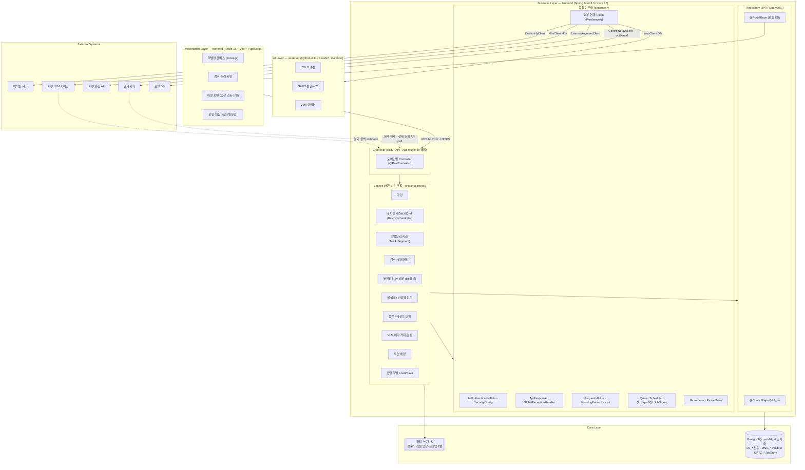

# D5 아키텍처 설계서

## 작성 목적
> 시스템의 품질을 확보하기 위하여 전체시스템에 대한 청사진으로서의 아키텍처를 작성한다. 소프트웨어 아키텍처는 개발 대상 응용 소프트웨어에 대한 아키텍처이며, 시스템 아키텍처는 응용 소프트웨어와 이에 상호작용하는 환경 및 네트워크가 포함된 아키텍처를 의미한다.

## 작성 방법
> 소프트웨어 아키텍처는 선정된 아키텍처 패턴을 중심으로 컴포넌트와 상호작용하는 커넥션 및 가시적인 속성을 표현한다. 시스템 아키텍처는 개발 대상시스템과 상호작용하는 하드웨어, 시스템 소프트웨어 및 네트워크와의 관계를 표현한다. 아키텍처 요구사항 및 구현방안은 아키텍처 관점에서의 시스템의 품질, 보안, 성능, 장애복구 등의 요구사항과 이에 대한 구현방안을 기술한다.

## 산출물 양식

### 제·개정 이력

| 날짜 | 버전 | 제·개정 내역 | 작성자 | 검토자 |
|------|------|------------|--------|--------|
| 2026-06-08 | 1.0 | LogiCraft 그래프 기반 생성 (/cc-doc-gen) — 신 R2(R1 항목 한정, UC 13건) 동기화 기준 | /cc-doc-gen | - |

### 헤더

| D5 | 아키텍처 설계서 |
|-------|---------|
| 시스템명 | AI 기반 지방정부 CCTV 관제지원시스템 구축(2차) | 서브시스템명 | 학습데이터 저작도구 (AT) |
| 단계명 | 설계 | 작성일자 | 2026-06-08 | 버전 | 1.0 |

---

### 1. 소프트웨어 아키텍처

본 시스템은 **레이어드 아키텍처(Layered Architecture)** 패턴을 채택한다. 백엔드(Spring Boot)는 `Controller → Service → Repository` 3계층 단방향 의존을 강제하며, 프레젠테이션(React/Vite), 비즈니스(Spring Boot), 데이터(PostgreSQL), AI 추론(ai-server/FastAPI) 계층으로 분리된다. AI 추론 계층은 인증·상태·DB를 갖지 않는 무상태(stateless) 추론 전용으로 격리하여 GPU 자원 경합을 분리한다.

#### 1.1 레이어 구분 및 컴포넌트 배치



#### 1.2 레이어별 역할

| 계층 | 구성요소 | 기술 | 역할 |
|------|----------|------|------|
| Presentation | frontend | React 18 + Vite 5 + TypeScript 5, konva.js, TanStack Query, Zustand | 라벨링 캔버스, 검수·관리·마킹 화면, 포털 체험 화면. JWT 검증은 BE 위임 |
| Business — Controller | 도메인별 Controller | Spring Web (`@RestController`) | DTO(Request/Response)만 처리, Entity 직접 노출 금지, `ApiResponse<T>` 표준 응답 |
| Business — Service | 도메인 Service | Spring, `@Transactional` | 마킹·배치 오케스트레이션·라벨링·검수·버전관리·비식별·증강·VLM 메타·배정·포털 비즈니스 로직 |
| Business — Repository | `@ControlRepo` / `@PortalRepo` | Spring Data JPA (Hibernate 6) + QueryDSL 5.1 | 듀얼 EntityManager로 klid_at·포털 DB 분리 접근, JPA/QueryDSL만 사용 |
| Business — 공통 인프라 | common.security / response / logging / client / config | Spring Security + JJWT, Resilience4j, Quartz, Micrometer | JWT 검증, 표준 응답·예외, 로그 마스킹, 외부 연동, 배치 스케줄링, 메트릭 |
| Data | PostgreSQL (klid_at) + 파일 스토리지 | PostgreSQL, Flyway 10.13, Filesystem | LS_* 전용 테이블 자체 소유, MNG_* 9종 validate 참조, QRTZ_* JobStore. 원본/비식별 영상·프레임 별도 경로 동시 저장 |
| AI | ai-server | Python 3.11 + FastAPI, ultralytics(YOLO), torch(SAM2) | YOLO/SAM2/VLM 무상태 추론. 인증·DB 없음. Spring Boot가 오케스트레이션 주체 |

> 비즈니스 계층은 LogiCraft 컴포넌트 다이어그램 9종(배치 파이프라인·마킹·비식별·라벨링·검수·버전관리·증강 및 해상도·VLM 메타·배정 및 포털 및 관제 통지)과 백엔드 패키지 구조(`kr.co.cudo.authoring.{marking|batch|label|review|version|deident|augment|meta|assignment|portal|controlnotify|...}`)에서 도출되었다.

---

### 2. 시스템 아키텍처

대상 시스템은 **관제 도메인(내부)** 과 **포털 도메인(외부)** 두 채널로 별도 배포되며, 각 채널은 상위 시스템(관제서버·포털)과 **동일 origin(웹 도메인)** 으로 co-deploy되어 브라우저 스토리지(localStorage/sessionStorage)로 JWT를 공유한다(URL `?token=` 미사용). 저작도구는 독립 로그인 UI를 갖지 않으며, 두 채널 모두 동일 JWT 발급 서버의 토큰을 단일 검증 로직(`JwtAuthenticationFilter`)으로 처리한다.

#### 2.1 시스템 구성도 (HW · 시스템SW · 네트워크 · 외부 시스템)

```mermaid
flowchart TB
    subgraph INTERNAL["관제 도메인 (내부 · 동일 origin)"]
        direction TB
        CTRL_SRV["관제서버\n(JWT 발급 · MNG_* 소유)"]
        subgraph AT_INT["저작도구 (내부 인스턴스)"]
            FE_I["frontend (React/Vite)"]
            BE_I["backend (Spring Boot, :8080)\n+ Quartz 배치 (단일 인스턴스)"]
            AI_I["ai-server (FastAPI, :9300)\nGPU Worker — 수평 확장"]
        end
        DB_I[("PostgreSQL — klid_at\nLS_* + MNG_* validate + QRTZ_*")]
        FS_I[["파일 스토리지\n원본/비식별 2벌"]]
    end

    subgraph EXTERNAL["포털 도메인 (외부 · 동일 origin)"]
        direction TB
        PORTAL_SRV["포털\n(JWT 발급)"]
        subgraph AT_EXT["저작도구 (외부 인스턴스)"]
            FE_E["frontend (체험)"]
            BE_E["backend (체험 API)"]
        end
        DB_PORTAL[("포털 DB\n(Load 소스 · 단방향)")]
    end

    subgraph EXTSYS["외부 시스템"]
        DEID["비식별 솔루션"]
        VLM["외부 VLM 서비스"]
        AUG["생성형 AI (외부 증강)"]
    end

    CTRL_SRV -->|JWT 스토리지 공유| FE_I
    FE_I -->|REST/JSON HTTPS| BE_I
    BE_I -->|JPA/QueryDSL| DB_I
    BE_I -->|read/write| FS_I
    BE_I -->|WebClient 60s| AI_I
    BE_I -->|VlmClient 45s| VLM
    VLM -.->|결과 콜백 webhook| BE_I
    BE_I -->|DeidentifyClient| DEID
    BE_I -->|ExternalAugmentClient / 콜백| AUG
    BE_I -->|ControlNotifyClient · TASK_COMPLETED/MODIFIED\n인계토큰/IP 화이트리스트| CTRL_SRV
    CTRL_SRV -.->|상세 조회 API pull| BE_I

    PORTAL_SRV -->|JWT 스토리지 공유| FE_E
    FE_E -->|REST/JSON HTTPS| BE_E
    BE_E -->|포털 DB Load (읽기)| DB_PORTAL
```

#### 2.2 배포·구성 정보

| 항목 | 내용 |
|------|------|
| 배포 방식 | 채널별(관제/포털) 별도 배포, 각 상위 시스템과 동일 origin co-deploy. Docker/Pod 미사용, Quartz 클러스터 미적용 |
| backend | Spring Boot 3.3 / Java 17, 포트 8080, **단일 인스턴스 서비스**. Quartz PostgreSQL JobStore(`PostgreSQLDelegate`, `isClustered=false`, threadCount 3) |
| ai-server | Python 3.11 / FastAPI, 포트 9300(`AI_SERVER_URL`). GPU Worker 별도 프로세스로 **다중 인스턴스 수평 확장 가능** |
| 데이터베이스 | PostgreSQL — `klid_at` 스키마. LS_* 전용(저작도구 소유), MNG_* 9종 `ddl-auto=validate` 참조, QRTZ_* JobStore. 포털 채널은 포털 DB를 별도 Load 소스로 참조 |
| 파일 스토리지 | Filesystem — 원본(`STORAGE_RAW_PATH`)·비식별(`STORAGE_DEIDENTIFIED_PATH`) 영상·프레임 2벌 동시 저장 |
| 환경(Spring Profile) | local / dev / stg / prd. 민감 정보는 환경변수(`${VAR}`)·Vault 주입 |
| 외부 연동 | 비식별 솔루션, 외부 VLM 서비스(콜백 webhook), 생성형 AI(외부 증강), 관제서버(JWT·통지·조회). 모두 `common.client.*` 빈으로 Resilience4j 적용 |
| 관찰성 | `/actuator/health,info,metrics,prometheus` 노출(운영 환경 최소화), Micrometer + Prometheus 메트릭 수집 |

> 환경별 상세 접속 정보(dev/stg/prd 호스트·포트)는 환경변수·시크릿 관리 대상으로 본 문서에서는 `-`로 표기한다(부록 참조).

---

### 3. 아키텍처 요구사항 및 구현방안

> §3은 R1 비기능 요구사항(NFR) 1건당 1표로 작성한다. 각 표는 요구사항 내용과 구현방안(품질목표 수준·관련 위험 대응·구성)을 포함한다.

#### NFR-001 — 배치 파이프라인 처리량 (성능)

| 요구사항 ID | NFR-001 |
|---------|---|
| 요구사항 내용 | 비식별→마킹(비식별 영상)→VLM→FFmpeg(마킹위치 프레임 추출)→YOLO/SAM2→트랙 보간 배치 파이프라인을 **1건/분 이상**(≥1 건/분) 처리율로 운영한다. Spring Boot + Quartz **단일 인스턴스 서비스**(PostgreSQL JobStore, 클러스터 미적용)를 기준으로 한다. |
| 품질목표 수준 | 처리율 ≥ 1 건/분. 측정: Micrometer Timer/Counter로 배치 1건 처리 소요시간·처리 건수 수집 → Prometheus 집계 |
| 구현방안 | ① Quartz Job(1건/분)으로 영상 단위 배치 유입 제어 — GPU 유입 속도 조절. ② `BatchOrchestrator`가 단계(Step)별 순차 실행, 시작 시 `LsRawDataStatus → PROCESSING`, 실패 시 `FAILED`. ③ ai-server(YOLO/SAM2)는 GPU Worker 별도 프로세스로 수평 확장하여 추론 병목 완화(RISK-003 대응). ④ 단일 인스턴스 SPOF(RISK-005)는 Quartz PostgreSQL JobStore로 잡 상태 영속화 → 재기동 시 미완료 잡 재개, 최대 재시도·실패 알림 정책 적용. |

#### NFR-002 — 이미지 학습데이터 처리 규모 (확장성)

| 요구사항 ID | NFR-002 |
|---------|---|
| 요구사항 내용 | 저작도구는 라벨링·검수·버전관리 대상으로 **이미지 학습데이터 10만 장 이상**(≥100,000 장)을 수용한다(SFR-16). |
| 품질목표 수준 | 누적 이미지(프레임) ≥ 100,000 장. 측정: 프레임 테이블 누적 건수 집계 |
| 구현방안 | ① 모든 목록 조회는 페이징 필수(전체 조회 금지), 대용량 페이징은 No-Offset(커서) 방식 검토. ② 프레임 조회의 N+1 방지(`JOIN FETCH`/`@EntityGraph`/`@BatchSize`), JPA batch insert(`hibernate.jdbc.batch_size`) 적용. ③ WHERE/JOIN/정렬 컬럼 인덱스 확보. ④ konva.js 캔버스 및 프레임 매니페스트(manifest.jsonl, CVAT 포팅)로 대량 프레임 탐색 최적화. |

#### NFR-003 — 영상 학습데이터 처리 규모 (확장성)

| 요구사항 ID | NFR-003 |
|---------|---|
| 요구사항 내용 | 저작도구는 **30초 이상 영상 학습데이터 5,000건 이상**(≥5,000 건)을 수용한다(SFR-17). 작업 단위 = 영상 1건(`LS_DATA_RAW.RAW_SN`). |
| 품질목표 수준 | 누적 영상 ≥ 5,000 건. 측정: 영상 원본 테이블 누적 건수 집계 |
| 구현방안 | ① 영상 적재는 관리 화면 TUS 1.0 재개 가능 업로드(CVAT 포팅) — 대용량 영상 안정 적재. ② 원본·비식별 영상 별도 경로 동시 저장, 프레임은 마킹 위치 기반 추출로 저장량 제어. ③ 영상 단위 작업·검수·버전(스냅샷) 관리로 5,000건 규모의 워크플로우 추적. ④ 배치 1건/분 처리(NFR-001)와 연계하여 점진 적재. |

#### NFR-004 — 외부 API 연동 복원력 (가용성)

| 요구사항 ID | NFR-004 |
|---------|---|
| 요구사항 내용 | 비식별·ai-server·VLM·증강·관제 통지 등 **모든 외부 연동에 Resilience4j 타임아웃/재시도/서킷브레이커를 100% 적용**한다. VLM 45s, ai-server 60s 타임아웃. 비식별 실패 시 `DE_IDNTF_YN='F'` 마킹 + 재시도 큐, 원본 절대 삭제 금지. |
| 품질목표 수준 | 외부 연동 Resilience4j 적용률 = 100%. 측정: `common.client.*` 빈별 정책 적용 점검 + Micrometer `external.api.duration` Timer |
| 구현방안 | ① `DeidentifyClient`/`AiServerClient`/`VlmClient`/`ExternalAugmentClient`/`ControlNotifyClient` 전 빈에 Resilience4j(타임아웃·재시도·CircuitBreaker) 적용. ② 외부 서비스 장애(RISK-001) 시 배치 최대 재시도 후 영상 상태 `FAILED` 전이 + 실패 알림 → 수동 재처리. ③ 비식별 실패는 `DE_IDNTF_YN='F'` 마킹 + 재시도 큐로 격리, 원본 보존. ④ 관제 통지(`ControlNotifyClient`)는 요청 ID idempotency + dead-letter + 재등록 큐로 단방향 outbound 신뢰성 확보(양방향 M2M deprecated, RISK-004). |

#### NFR-005 — 민감정보 보호 (보안)

| 요구사항 ID | NFR-005 |
|---------|---|
| 요구사항 내용 | 개인정보·토큰을 로그·페이로드에 **노출 0건**(=0)으로 유지한다. Logback MaskingPatternLayout 적용, 영상 암호화 저장, 비식별 처리 이력 영상 단위 기록, 관제 통지 페이로드에 PII·토큰·원본 비-비식별 이미지 미포함. |
| 품질목표 수준 | PII·토큰 로그/페이로드 노출 = 0 건. 측정: Logback 마스킹 패턴 점검 + Fortify/CodeQL Privacy Violation 정적 검사 |
| 구현방안 | ① `common.logging`의 Logback MaskingPatternLayout(JSON 인코더)으로 민감 필드 마스킹 — 비밀번호·토큰·전화번호·이메일 등 출력 금지. ② JWT 검증(`JwtAuthenticationFilter`)·역할 기반 접근 제어(`SecurityConfig`, `@PreAuthorize`)로 IDOR/권한 상승 차단. ③ 관제 통지(`TASK_COMPLETED`/`TASK_MODIFIED`)는 메타·수정 요약만 전달, 본문·PII·원본 이미지 제외. ④ 비식별 누락 신고 수동 흐름(`LS_DEIDENT_REPORT`)으로 노출 발견 시 작업락 + 라벨 삭제 + 이력 보존. ⑤ 모든 코드는 Fortify/CodeQL(OWASP 2025 기준) 통과. |

#### NFR-006 — 포털 웹 접근성 (접근성)

| 요구사항 ID | NFR-006 |
|---------|---|
| 요구사항 내용 | 포털(외부 채널)은 **반응형 웹(PC/태블릿/모바일)** 으로 제공하며 **WCAG 2.1 AA**를 준수한다. |
| 품질목표 수준 | 웹 접근성 = WCAG 2.1 AA. 측정: 접근성 자동 점검 도구(axe 등) + 수동 검수 |
| 구현방안 | ① Tailwind CSS 기반 반응형 레이아웃으로 PC/태블릿/모바일 대응. ② 시맨틱 요소·`alt`·`label` 연결·포커스 트래핑·키보드 접근(component 규칙) 적용. ③ 색상 단독 정보 전달 금지(아이콘/텍스트 병행). ④ 포털은 데이터마트 영상 선택·기존 라벨 Load/수정·기간 내 다운로드 전용(ADR-013) — 오토라벨링·VLM·버전관리·업로드 미제공으로 화면 단순화. |

#### NFR-007 — 메트릭·추적성 (관찰성)

| 요구사항 ID | NFR-007 |
|---------|---|
| 요구사항 내용 | API 응답시간·배치 처리량·외부 API 호출을 **Micrometer + Prometheus로 100% 수집**하고, 모든 요청에 traceId를 MDC로 부여하여 로그·외부 호출(`X-Trace-Id`)에 전파한다. |
| 품질목표 수준 | 핵심 이벤트(API·배치·외부 호출) 메트릭 수집률 = 100%. 측정: `/actuator/prometheus` 노출 메트릭 점검 + 로그 traceId 포함 여부 확인 |
| 구현방안 | ① Spring Actuator `/actuator/health,info,metrics,prometheus` 노출(운영은 최소화). ② 커스텀 Micrometer 메트릭 — 배치 처리량/소요시간, 외부 API 호출(성공/실패/응답시간) Timer·Counter. ③ `common.logging.RequestIdFilter`로 traceId(MDC) 부여 + 로그 패턴 `[%X{traceId}]` 포함, 외부 호출 시 `X-Trace-Id` 헤더 전파. ④ GPU 자원 모니터링 포인트 확보(RISK-003)로 ai-server 경합 감지. |

---

## 부록 — 데이터 출처 및 미보유 항목

- **데이터 출처**: 본 산출물은 LogiCraft 그래프(읽기 전용) 비기능 요구사항 7건(NFR-001~007, R1 제출 범위) · 위험 5건(RISK-001~005) · C4 컨텍스트(1) · 컨테이너(1) · 컴포넌트(9) · 배포(1) 다이어그램과 백엔드 코드 구조(`backend/src/main/java/kr/co/cudo/authoring/`), `application.yml`(포트 8080·9300, ddl-auto validate, Quartz PostgreSQL JobStore, Prometheus 노출)을 근거로 작성되었다.
- **§3 범위**: LogiCraft NFR은 총 16건이나, 본 R1 제출본은 R1 비기능 요구사항에 직접 대응하는 7건(성능·확장성·가용성·보안·접근성·관찰성)으로 한정한다. NFR-008~016(학습데이터 단계별/종류별 품질관리·값 검증·화면 응답시간·자원 효율·세션 통제·시큐어코딩·웹표준·데이터 표준)은 KLID_AN 공통 비기능 위임분으로 R1 제출 범위 외이며 본 D5 §3에 포함하지 않았다.
- **미보유 항목(`-` 표기)**:
  - 환경별(dev/stg/prd) 호스트·포트 등 구체 접속 정보 — 환경변수·시크릿 관리 대상으로 본 문서 미기재.
  - 컴포넌트 ID(`KLID-AT-CO-NNN`) 대응 표 — D3 컴포넌트 설계서 소관으로 본 D5에서는 일반 명칭으로 표기.
