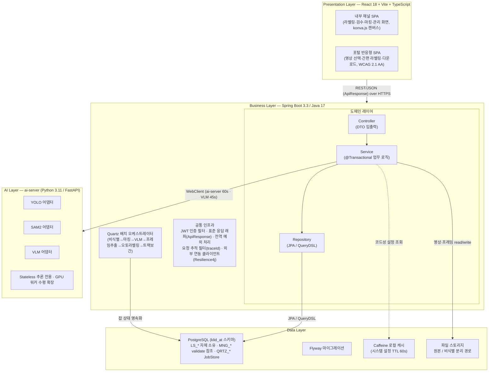
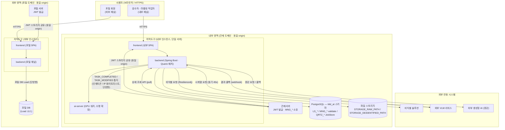

# D5 아키텍처 설계서

> **ID 표기 규칙(공통)**: 본 산출물이 참조하는 요구사항 ID는 비기능 `NFR-NNN`(§3 주 대상), 기능 `RQ-SFR-NN-NN`(R1 참조)을 원형으로 표기한다. 위험 `RISK-NNN`·결정 `ADR-NNN`도 원형 유지. 컴포넌트 ID는 전체형 `KLID-AT-CO-NNN`(D3 참조)으로 표기한다.

## 작성 목적
> 시스템의 품질을 확보하기 위하여 전체시스템에 대한 청사진으로서의 아키텍처를 작성한다. 소프트웨어 아키텍처는 개발 대상 응용 소프트웨어에 대한 아키텍처이며, 시스템 아키텍처는 응용 소프트웨어와 이에 상호작용하는 환경 및 네트워크가 포함된 아키텍처를 의미한다.

## 작성 방법
> 소프트웨어 아키텍처는 선정된 아키텍처 패턴을 중심으로 컴포넌트와 상호작용하는 커넥션 및 가시적인 속성을 표현한다. 시스템 아키텍처는 개발 대상시스템과 상호작용하는 하드웨어, 시스템 소프트웨어 및 네트워크와의 관계를 표현한다. 아키텍처 요구사항 및 구현방안은 아키텍처 관점에서의 시스템의 품질, 보안, 성능, 장애복구 등의 요구사항과 이에 대한 구현방안을 기술한다.

## 산출물 양식

### 제·개정 이력

| 날짜 | 버전 | 제·개정 내역 | 작성자 | 검토자 |
|------|------|------------|--------|--------|
| 2026-06-05 | 1.0 | LogiCraft 그래프 기반 자동 생성 (/cc-doc-gen) — 발주처 3섹션 양식(소프트웨어/시스템 아키텍처 + NFR 16건 구현방안) | /cc-doc-gen | - |

### 헤더

| D5 | 아키텍처 설계서 |
|-------|---------|
| 시스템명 | AI 기반 지방정부 CCTV 관제지원시스템 구축(2차) | 서브시스템명 | 학습데이터 저작도구 (AT) |
| 단계명  | 설계 | 작성일자 | 2026-06-05 | 버전 | 1.0 |

---

## 1. 소프트웨어 아키텍처

학습데이터 저작도구는 **레이어드 아키텍처(Layered Architecture)** 패턴을 채택한다. 사용자 화면(Presentation), 업무 처리(Business), 추론(AI), 데이터(Data)를 책임에 따라 수평 레이어로 분리하고, 상위 레이어가 하위 레이어를 단방향으로 호출한다. 업무 레이어 내부는 Controller → Service → Repository 의 3단 구조로 다시 세분하여, Controller 는 DTO(Request/Response)만 다루고 Entity 직접 노출을 금지한다.

### 1.1 레이어 구성도

### 1.2 패턴 선정 사유

- **관심사 분리**: 화면·업무·추론·데이터의 변경 주기와 기술 스택이 상이하다. 레이어드 패턴으로 각 레이어를 독립 진화시키고, AI 추론(GPU 자원 의존)을 별도 레이어로 격리하여 업무 레이어의 인증·트랜잭션·오케스트레이션과 자원 경합을 분리한다.
- **표준화된 단방향 의존**: 상위 → 하위 단방향 호출만 허용하여 순환 의존을 차단한다. 업무 레이어 내부도 Controller → Service → Repository 단방향으로 고정한다.
- **공통 인프라 일원화**: 인증(JWT 검증 필터), 표준 응답(ApiResponse), 전역 예외 처리, 요청 추적(traceId), 외부 연동(Resilience4j 적용 클라이언트)을 업무 레이어 공통 인프라로 묶어 횡단 관심사를 일관 적용한다.

### 1.3 레이어 간 커넥션

| 구간 | 프로토콜·기술 | 설명 |
|------|---------------|------|
| Presentation → Business | REST/JSON over HTTPS | 모든 응답은 `ApiResponse<T>` 표준 래퍼. 채널별(내부/포털) FE 인스턴스 별도 배포 |
| Business → AI | HTTP(WebClient) | YOLO/SAM2/VLM 추론 요청. ai-server 60s·VLM 45s 타임아웃, Resilience4j 재시도·서킷브레이커 |
| Business → Data(PostgreSQL) | JPA(Hibernate 6) / QueryDSL | LS_* 자체 소유, MNG_* 공유 테이블은 `ddl-auto=validate` 읽기 참조 |
| Business → Data(스토리지) | Filesystem I/O | 원본·비식별 영상/프레임을 분리 경로(STORAGE_RAW_PATH / STORAGE_DEIDENTIFIED_PATH)에 저장 |
| Business(배치) → Data | Quartz PostgreSQL JobStore | 배치 잡 상태를 DB에 영속화(QRTZ_*), 재기동 시 미완료 잡 재개 |

---

## 2. 시스템 아키텍처

학습데이터 저작도구는 **on-premise** 환경에 배포되며, 사용자 인증 채널(내부 관제 / 외부 포털)에 따라 프론트엔드를 **채널별 별도 배포**한다. 두 채널은 인증 발급 주체(관제서버 / 포털)와 **동일 웹 도메인(동일 origin)** 으로 co-deploy 되어, 브라우저 스토리지에 저장된 JWT 를 공유받아 인계한다(별도 로그인 UI 없음). 업무 서버는 단일 인스턴스로 운영하며(Quartz 클러스터 미적용), AI 추론 서버는 GPU 워커를 다중 인스턴스로 수평 확장할 수 있다.

### 2.1 시스템 구성도

### 2.2 구성 요소 설명

| 구분 | 구성 | 비고 |
|------|------|------|
| 하드웨어 | on-premise 서버. 업무 서버 단일 인스턴스 + AI 추론 GPU 워커(다중 인스턴스) | 컨테이너 오케스트레이션·Quartz 클러스터 미적용 |
| 시스템 SW | JVM(Java 17) · Spring Boot 3.3 · Python 3.11/FastAPI · PostgreSQL · Quartz(PostgreSQL JobStore) | 시스템 설정 캐시는 Caffeine(TTL 60s) |
| 데이터베이스 | PostgreSQL(`klid_at` 스키마) — LS_* 자체 소유, MNG_* 9개 공유 테이블 validate 참조, QRTZ_* JobStore | MNG_* 변경 시 관제서버팀 선승인 필수 |
| 스토리지 | 원본(STORAGE_RAW_PATH) / 비식별(STORAGE_DEIDENTIFIED_PATH) 분리 경로 | 영상·프레임 2벌 동시 보관, 원본 절대 삭제 금지 |
| 인증 채널 | 내부(관제 SSO, 동일 origin localStorage JWT 인계) / 외부(포털 SSO) | 채널별 FE 별도 배포, 저작도구 독립 로그인 UI 없음 |
| 외부 연동 | 비식별 솔루션 · 외부 VLM 서비스 · 외부 생성형 AI(증강) · 관제서버(단방향 통지 + 조회 API) · 포털 DB(Load) | 양방향 M2M 통합은 미운영(RISK-004), 잔존 outbound 통지만 단방향 보호 |

---

## 3. 아키텍처 요구사항 및 구현방안

> 아키텍처 관점에서 시스템에 크게 영향을 주는 품질·보안·성능·장애복구 등의 요구사항(NFR-001 ~ NFR-016)을 1건당 1표로 기술한다. 관련 위험(RISK-NNN) 대응을 구현방안에 흡수한다. 목표값·측정방법은 비기능 요구사항 진실원과 일치시킨다.

### 3.1 NFR-001 — 배치 파이프라인 처리량

| 요구사항 ID | NFR-001 (성능 / performance, must) |
|---------|---|
| 요구사항 내용 | 비식별→마킹(비식별 영상)→VLM→FFmpeg(마킹위치 프레임추출)→YOLO/SAM2→트랙보간 배치 파이프라인을 Quartz 단일 인스턴스(PostgreSQL JobStore, 클러스터 미적용)에서 운영한다. **목표값: 배치 파이프라인 처리율 ≥ 1건/분.** 측정: Micrometer Timer/Counter로 배치 1건 처리 소요시간·처리 건수 수집, Prometheus 집계. (설계 타깃 — 비식별 선두 재배치, 마킹은 비식별 영상 대상) |
|  |  |
| 구현방안 | Quartz 스케줄러를 PostgreSQL JobStore 기반 단일 인스턴스로 구성하여 1건/분 페이스로 배치를 유입 제어한다. 배치 오케스트레이터가 단계(비식별→마킹→VLM→프레임추출→오토라벨링→트랙보간)를 순차 진행하며, 외부 추론 호출(YOLO/SAM2/VLM)은 AI 레이어로 위임하여 업무 서버 부하를 분리한다. **RISK-003(GPU 자원 경합) 대응**: 배치 유입을 1건/분으로 묶어 ai-server GPU 추론 요청량을 제어하고, GPU 포화 감지 시 유입 속도를 조절한다. 처리량은 아래 품질목표수준으로 관리한다. |

| 품질목표 항목 | 목표수준 | 측정 방법 |
|------|----------|-----------|
| 배치 파이프라인 처리율 | ≥ 1건/분 | Micrometer Timer(배치 1건 소요시간) + Counter(처리 건수) → Prometheus |
| 배치 유입 제어 | Quartz 1건/분 트리거 | 스케줄러 잡 트리거 주기 점검 |

### 3.2 NFR-002 — 이미지 학습데이터 처리 규모

| 요구사항 ID | NFR-002 (확장성 / scalability, must) |
|---------|---|
| 요구사항 내용 | 저작도구는 라벨링·검수·버전관리 대상으로 이미지 학습데이터를 수용한다. **목표값: 누적 이미지 학습데이터 ≥ 100,000장.** 측정: 프레임(LS_DATA_SRC) 누적 건수 집계. (근거: 핵심 산출물 목표 — 이미지 10만장, SFR-16) |
|  |  |
| 구현방안 | 프레임 단위 라벨 데이터를 PostgreSQL(LS_* 스키마)에 적재하고, 목록·검색 조회는 페이징을 강제하여(전체 조회 금지) 대량 데이터에서도 응답성을 유지한다. 연관 엔티티 조회는 fetch join·@EntityGraph·@BatchSize로 N+1 을 차단하고, WHERE/JOIN/ORDER BY 컬럼에 인덱스를 부여한다. 대량 라벨 적재는 saveAll/batch 처리로 처리량을 확보한다. |

### 3.3 NFR-003 — 영상 학습데이터 처리 규모

| 요구사항 ID | NFR-003 (확장성 / scalability, must) |
|---------|---|
| 요구사항 내용 | 저작도구는 30초 이상 영상 학습데이터를 수용한다(작업 단위 = 영상 1건). **목표값: 누적 영상 학습데이터 ≥ 5,000건.** 측정: 영상(LS_DATA_RAW) 누적 건수 집계. (근거: 핵심 산출물 목표 — 영상 5,000건(30초 이상/건), SFR-17) |
|  |  |
| 구현방안 | 작업 단위를 영상 1건(RAW_SN)으로 고정하여 데이터·통지·버전관리 단위를 일관 적용한다. 영상 스트리밍은 HTTP Range 요청으로 부분 전송하여 대용량 영상의 전송 효율을 확보하고, 원본·비식별본을 분리 경로에 보관한다. 영상 누적 규모 증가에 따른 조회는 페이징과 인덱스로 대응한다. |

### 3.4 NFR-004 — 외부 API 연동 복원력

| 요구사항 ID | NFR-004 (가용성 / availability, must) |
|---------|---|
| 요구사항 내용 | 비식별·ai-server·VLM·증강·관제통지 등 모든 외부 연동에 Resilience4j 타임아웃/재시도/서킷브레이커를 적용한다(VLM 45s, ai-server 60s). 비식별 실패 시 DE_IDNTF_YN='F' 마킹 + 재시도 큐, 원본 삭제 금지. **목표값: 외부 API 연동 Resilience4j 적용률 = 100%.** 측정: 외부 연동 클라이언트별 정책 적용 여부 점검 + Micrometer external.api.duration Timer 수집. |
|  |  |
| 구현방안 | 모든 외부 연동을 전용 클라이언트 빈(비식별·ai-server·VLM·증강·관제통지)으로 통일하고 빈별 Resilience4j 정책(타임아웃·재시도·서킷브레이커)을 의무 적용한다. **RISK-001(외부 연동 서비스 장애) 대응**: 외부 서비스 장애 시 배치 중단·지연을 완충하기 위해 비식별 실패는 DE_IDNTF_YN='F' 마킹 후 재시도 큐로 회수하고 원본은 절대 삭제하지 않으며, 배치 실패 시 최대 재시도 후 실패 알림과 해당 영상 FAILED 전이 후 수동 재처리로 복구한다. SSRF 방어를 위해 외부 호출 URL 은 설정값(base-url) 기반으로 구성하고 사용자 입력 URL 구성을 금지한다. |

| 구성 요소 | 적용 정책 |
|------|-----------|
| 비식별 클라이언트 | 타임아웃·재시도·서킷브레이커 + 실패 시 DE_IDNTF_YN='F' 재시도 큐 |
| ai-server 클라이언트 | 타임아웃 60s + 재시도·서킷브레이커 |
| VLM 클라이언트 | 타임아웃 45s + 재시도·서킷브레이커 |
| 증강 클라이언트 | 타임아웃·재시도·서킷브레이커 + 콜백 수신 |
| 관제통지 클라이언트 | 타임아웃·재시도 + 요청 ID idempotency + dead-letter/재등록 큐 |

### 3.5 NFR-005 — 민감정보 보호

| 요구사항 ID | NFR-005 (보안 / security, must) |
|---------|---|
| 요구사항 내용 | 개인정보·토큰을 로그에 출력하지 않는다(Logback MaskingPatternLayout). 영상은 암호화 저장하고 비식별 처리 이력을 영상 단위로 기록한다. 관제 통지 페이로드에 PII·토큰·원본 비-비식별 이미지를 포함하지 않는다. **목표값: 민감정보(PII·토큰) 로그/페이로드 노출 = 0건.** 측정: Logback 마스킹 패턴 적용 점검 + 로그/통지 페이로드 정적 검사(Privacy Violation). |
|  |  |
| 구현방안 | Logback 마스킹 레이아웃으로 비밀번호·토큰·주민번호·연락처 등 민감 필드를 마스킹하여 로그에 노출되지 않게 한다. 영상은 암호화 저장하고 비식별 처리 이력을 영상 단위로 기록한다. 관제서버 통지 페이로드는 메타·수정 요약만 담고 라벨/메타 본문·PII·토큰·원본 비-비식별 이미지를 포함하지 않으며, 관제서버가 상세는 조회 API 로 별도 pull 한다. 로그/페이로드는 정적 분석(Privacy Violation)으로 노출 0건을 검증한다. |

| 품질목표 항목 | 목표수준 | 측정 방법 |
|------|----------|-----------|
| 민감정보 로그/페이로드 노출 | 0건 | Logback 마스킹 점검 + 정적 분석(Privacy Violation) |
| 통지 페이로드 PII 포함 | 미포함(메타·요약만) | 통지 페이로드 스키마 검토 |

### 3.6 NFR-006 — 포털 웹 접근성

| 요구사항 ID | NFR-006 (접근성 / accessibility, must) |
|---------|---|
| 요구사항 내용 | 포털(외부 채널)은 반응형 웹(PC/태블릿/모바일)으로 제공하며 WCAG 2.1 AA를 준수한다. **목표값: 웹 접근성 준수 수준 = WCAG 2.1 AA.** 측정: 접근성 자동 점검 도구(axe 등) + 수동 검수. |
|  |  |
| 구현방안 | 포털 SPA 를 PC/태블릿/모바일 반응형으로 구현하고, 시맨틱 마크업·라벨 연결(htmlFor)·키보드 조작·색상 외 정보 병행 등 접근성 규칙을 적용한다. 접근성 자동 점검(axe 등)과 수동 검수로 WCAG 2.1 AA 준수를 확인한다. |

### 3.7 NFR-007 — 메트릭·추적성

| 요구사항 ID | NFR-007 (관찰가능성 / observability, must) |
|---------|---|
| 요구사항 내용 | API 응답시간·배치 처리량·외부 API 호출을 Micrometer+Prometheus로 수집하고, 모든 요청에 traceId를 MDC로 부여하여 로그·외부 호출(X-Trace-Id)에 전파한다. **목표값: 핵심 이벤트(API·배치·외부호출) 메트릭 수집률 = 100%.** 측정: /actuator/prometheus 노출 메트릭 점검 + 로그 traceId 포함 여부 확인. |
|  |  |
| 구현방안 | Micrometer + Prometheus 로 API 응답시간·배치 처리량·외부 API 호출 메트릭을 수집하고 `/actuator/prometheus` 로 노출한다. 요청 추적 필터가 모든 요청에 traceId 를 MDC 로 부여하여 로그 패턴(`[%X{traceId}]`)과 외부 호출 헤더(X-Trace-Id)에 전파한다. Actuator 노출 엔드포인트는 운영 환경에서 최소화(health 위주)한다. |

### 3.8 NFR-008 — 학습데이터 단계별 품질관리 기준 (수집·제작·검수)

| 요구사항 ID | NFR-008 (RQ-QUR-03-01, 컴플라이언스 / compliance, must) |
|---------|---|
| 요구사항 내용 | 학습데이터 구축 관련 품질 관리 기준 수립 — 수집부터 제작, 검수까지 각 단계별 수행기준 수립 및 품질 관리 방안 제시(RFP p46, QUR-03). **목표값: 전 단계 수행기준 수립 + 검수 이력·승인 버전이 시스템에서 확인 가능.** 측정: 단계별 수행기준 문서 수립 + 검수 이력(LS_DATA_LBL_HSTRY)·승인 버전(LS_LABEL_VERSION) 시스템 확인. |
|  |  |
| 구현방안 | 수집(업로드 검증)·제작(비식별→마킹→오토라벨링)·검수(검수자 승인/반려) 단계별 수행기준을 수립하고, 검수 승인(APPROVED) 시점에 라벨 전체 스냅샷을 LS_LABEL_VERSION 에 SHA-256 해시로 적재하여 학습데이터 확정 버전을 관리한다. 단계별 검수 이력(LS_DATA_LBL_HSTRY)과 반려율 등 품질지표로 품질을 추적한다. 검수 승인 데이터만 학습데이터로 확정하며, 완료 시점에 관제서버로 TASK_COMPLETED 를 통지한다. |

### 3.9 NFR-009 — 학습데이터 종류·제작방법별 품질관리 기준

| 요구사항 ID | NFR-009 (RQ-QUR-03-02, 컴플라이언스 / compliance, must) |
|---------|---|
| 요구사항 내용 | 학습데이터 종류 및 제작 방법에 따른 품질 관리 기준 수립 — 활용 기법별 품질 관리 기준 수립(RFP p46, QUR-03). **목표값: 라벨링 방식(BBox·폴리곤·세그·트래킹)·제작기법별 기준 수립.** 측정: 라벨링 방식별·제작기법별 품질관리 기준이 검수 워크플로우에 적용됨을 확인. |
|  |  |
| 구현방안 | 바운딩박스·폴리곤·세그멘테이션·트래킹 등 라벨링 방식별 라벨 규격·검수 기준을 정의하고, 오토라벨링(YOLO/SAM2)·VLM 메타 검토·생성형 증강 4종(WINTER/NIGHT/RAIN/RESOLUTION) 등 제작기법별 품질관리 기준을 수립하여 검수 워크플로우에 반영한다. 이미지 10만장·영상 5,000건 목표(NFR-002·NFR-003)와 연계하여 규모 충족을 함께 관리한다. |

### 3.10 NFR-010 — 학습데이터 값 검증·정합성 (공공데이터 품질진단 기준)

| 요구사항 ID | NFR-010 (RQ-DAR-06-02, 컴플라이언스 / compliance, must) |
|---------|---|
| 요구사항 내용 | 시스템에서 생성되는 데이터 외 제공되는 학습데이터에 대한 진단 수행 및 검증 — 원본 정합성 검증, 공공데이터 범정부 품질진단 기준 및 업무규칙(BR)에 따른 값 검증, 오류데이터 개선·영향도·유형별 조치 관리(RFP p57, DAR-06). **목표값: 오류 라벨 입력 차단 + 오류유형별 조치 이력 관리.** 측정: 값 검증·오류 차단 동작 + 오류유형별 조치 이력 관리 확인, 검증 항목 정의서 제출. |
|  |  |
| 구현방안 | 라벨 저장·검수 시 좌표 범위·필수 속성·코드 정합 등 업무규칙(BR) 기반 값 검증을 적용하여 오류 라벨 입력을 차단한다. 외부 제공 학습데이터는 원본 정합성을 검증하고, 오류데이터는 반려·재작업으로 개선하며 오류유형별 조치 이력을 관리한다. 공공데이터 품질진단 기준(공공데이터 품질관리 매뉴얼)에 따른 검증 항목을 정의하여 적용한다. |

### 3.11 NFR-011 — 화면 응답시간 기준

| 요구사항 ID | NFR-011 (성능 / performance, must) |
|---------|---|
| 요구사항 내용 | 라벨링·검수·마킹·목록 등 저작도구 전 화면의 페이지 응답속도를 관리한다. **목표값: 페이지·조회 응답시간 ≤ 3초**(초과 불가피 시 발주기관 협의). 10초 이상 지연 예상 작업은 팝업·프로그레스바로 시작·종료 안내 + 취소 제공, 입력/CRUD 오류는 3초 이내 조치 가능한 오류 메시지 제시. 측정: 주요 화면 응답시간 성능테스트. |
|  |  |
| 구현방안 | 목록·조회 API 에 페이징을 강제하고 N+1 제거·인덱스·프로젝션으로 화면 응답시간을 3초 이하로 관리한다. 대용량 질의·프레임 목록·대량 라벨 조회 등 10초 이상 지연 예상 작업은 진행 상태(프로그레스바)와 시작·종료를 안내하고 취소 기능을 제공한다. 입력 형식 오류·CRUD 오류는 ApiResponse 표준 에러 포맷으로 3초 이내 조치 가능한 메시지를 제시한다. 변경 빈도 낮고 조회 빈도 높은 시스템 설정은 Caffeine 캐시(TTL 60s)로 응답을 단축한다. |

| 품질목표 항목 | 목표수준 | 측정 방법 |
|------|----------|-----------|
| 페이지·조회 응답시간 | ≤ 3초 | 주요 화면 성능테스트 |
| 장시간 작업 안내·취소 | 10초 이상 작업 진행 안내 + 취소 제공 | 진행 안내·취소 동작 확인 |
| 오류 메시지 표시 | ≤ 3초 | 입력/CRUD 오류 메시지 표시 확인 |

### 3.12 NFR-012 — 시스템 자원 효율

| 요구사항 ID | NFR-012 (성능 / performance, must) |
|---------|---|
| 요구사항 내용 | 시스템 자원(CPU·메모리)의 평균 사용률을 관리한다(본격 사용시기 모의추정 기준). **목표값: CPU·메모리 평균 사용률 ≤ 80%.** 배치 파이프라인·Quartz 워커 자원 관리, 듀얼 데이터소스 커넥션 풀 분리 최적화, 메모리 누수 방지, 세션 자원 정리 포함. 측정: Micrometer+Prometheus 모니터링 + 부하테스트. |
|  |  |
| 구현방안 | 배치 파이프라인(FFmpeg 프레임 추출·오토라벨링 호출)과 Quartz 워커의 자원을 모니터링·관리하고, 관제/포털 듀얼 데이터소스의 HikariCP 커넥션 풀을 분리·최적화한다. **RISK-003(GPU 자원 경합) 대응**: GPU 의존 추론을 ai-server 로 격리하여 업무 서버 CPU·메모리 부담을 분리하고, GPU 워커를 수평 확장하여 추론 자원을 분산한다. 장시간 배치·스트리밍 구간의 메모리 누수를 점검하고, 로그아웃/토큰 만료 시 세션 자원을 정리한다. 평균 사용률은 부하테스트로 80% 이하를 확인한다. |

| 품질목표 항목 | 목표수준 | 측정 방법 |
|------|----------|-----------|
| CPU·메모리 평균 사용률 | ≤ 80% | Micrometer+Prometheus 모니터링 + 부하테스트 |
| 메모리 누수 | 부재 | 장시간 배치·스트리밍 구간 점검 |

### 3.13 NFR-013 — 세션·접근 통제

| 요구사항 ID | NFR-013 (보안 / security, must) |
|---------|---|
| 요구사항 내용 | 인증·인가 통제 — 로그아웃·토큰 만료 시 세션 종료(만료 JWT 거부 + 상위 시스템 로그인 페이지 리다이렉트), 역할(REVIEWER/WORKER/PORTAL_USER)·채널 클레임 기반 페이지·API 접근 구분, 관리 화면(/manage/*) REVIEWER 전용. **목표값: 전 화면·API 역할별 통제 + 만료 토큰 차단.** 측정: 비인가 역할 403·만료/위조 토큰 401 통합테스트 확인. ※ 로그인 실패 제한·동시 로그인 차단은 관제/포털 서버 책임. |
|  |  |
| 구현방안 | JWT 인증 필터가 관제/포털 발급 토큰을 단일 검증 로직으로 디코드하여 SecurityContext 에 적재하고, 만료·위조 토큰은 거부(401) 후 상위 시스템 로그인 페이지로 리다이렉트한다. 역할·채널 클레임 기반 접근 제어(@PreAuthorize)로 화면·API 를 분기하고, 관리 화면(/manage/*)은 REVIEWER 전용으로 제한한다. 리소스 접근 시 소유자/권한을 검증(IDOR 차단)한다. 로그인 실패 제한·동시 로그인 차단은 인증 발급 주체(관제/포털) 책임으로, 저작도구는 독립 로그인 UI 없이 JWT 검증·인가만 담당한다. |

### 3.14 NFR-014 — 시큐어코딩·취약점 점검

| 요구사항 ID | NFR-014 (보안 / security, must) |
|---------|---|
| 요구사항 내용 | 소프트웨어 개발보안 절차 준수 및 취약점 점검 — '행정기관 및 공공기관 정보시스템 구축·운영 지침' 제50조 SW 개발보안(시큐어코딩) 가이드 준수, 개발 소스 전체 보안약점 진단 1회 이상 자체 실시, 모의해킹(OWASP 10대·국정원 8대·전자정부 21개 항목), 지적사항 보완. **목표값: 소스 전체 진단 1회 이상 + 지적사항 보완 완료.** 측정: 보안약점 진단 결과서·모의해킹 결과서 + 보완조치 내역. |
|  |  |
| 구현방안 | 전 소스코드를 시큐어코딩 가이드(OWASP Top 10·CWE Top 25 정합)에 따라 개발하고, 정적 분석(Fortify/CodeQL)으로 Injection·SSRF·역직렬화·Path Manipulation·민감정보 노출 등 보안약점을 진단한다. 개발 소스 전체에 대해 보안약점 진단을 1회 이상 자체 실시하고, 모의해킹(OWASP 10대·국정원 홈페이지 8대·전자정부 웹 표준 21개 항목) 결과 지적사항을 후속 보완조치한다. |

### 3.15 NFR-015 — 웹표준·크로스브라우징

| 요구사항 ID | NFR-015 (컴플라이언스 / compliance, must) |
|---------|---|
| 요구사항 내용 | 저작도구 프론트엔드 웹표준 — 액티브X 등 비표준 플러그인 없이 HTML5 기반 전 기능 동작(라벨링 캔버스는 konva.js 웹표준 Canvas), 3종 이상 브라우저 동등 동작, 표준 (X)HTML·CSS 문법 준수(W3C Validation), 포털 화면 반응형. **목표값: 3종 이상 브라우저 동등 동작 + 비표준 플러그인 0.** 측정: 크로스브라우징 테스트(3종 이상) + W3C Markup/CSS Validation. |
|  |  |
| 구현방안 | 프론트엔드(React 18 + TypeScript)를 HTML5 표준 기반으로 구현하고, 라벨링 캔버스는 웹표준 Canvas(konva.js)를 사용하여 비표준 플러그인 없이 동작한다. Chrome·Edge·Firefox 등 3종 이상 브라우저에서 JavaScript·레이아웃·콘텐츠 동등 동작을 보장하고, 표준 (X)HTML·CSS 문법을 준수하여 W3C Markup/CSS Validation 을 통과한다. 포털 화면은 PC/태블릿/모바일 반응형으로 제공한다(NFR-006 접근성과 별개의 표준 관점). |

### 3.16 NFR-016 — 데이터 표준 준수

| 요구사항 ID | NFR-016 (컴플라이언스 / compliance, must) |
|---------|---|
| 요구사항 내용 | 저작도구 소유 데이터 객체의 표준 정합 — LS_* 테이블·컬럼의 단어·용어·도메인·코드를 범정부 표준(공공기관 DB 표준화 지침·공통표준용어) 기반 데이터 표준사전과 정합되게 설계, 코드성 데이터 코드표준화 정합, 라벨링 방식별(BBox·폴리곤·세그·트래킹) 라벨 포맷 표준 정의. **목표값: 신규 객체 표준 정합 + 라벨링 방식별 포맷 표준 정의.** 측정: 데이터 표준사전 대비 LS_* 신규 테이블·컬럼 명명 점검 + 라벨 포맷 표준 문서. ※ MNG_* 공유 테이블은 관제서버 소유 — validate 참조만. |
|  |  |
| 구현방안 | LS_* 전용 테이블·컬럼의 단어·용어·도메인·코드를 범정부 표준 데이터 표준사전과 정합되게 설계하고, Flyway 마이그레이션 시 명명규칙을 점검한다. 코드성 데이터는 행정기관 코드표준화 추진지침에 정합시키고, 라벨링 방식별(BBox·폴리곤·세그멘테이션·트래킹) 라벨 데이터 포맷 표준을 정의한다(NFR-009 품질 기준과 구분되는 데이터/포맷 표준 관점). **RISK-002(공유 스키마 변경 충돌) 대응**: MNG_* 공유 테이블은 관제서버 소유로 `ddl-auto=validate` 참조만 하고, 변경 시 관제서버팀 선승인·변경 알림 프로세스를 거쳐 LS_* 전용 테이블과 소유를 분리한다. |

---

## 부록

### A. 위험(RISK) 흡수 위치

본 §3 구현방안에 흡수된 위험 대응은 다음과 같다.

| 위험 ID | 위험 | 흡수 위치 |
|---------|------|-----------|
| RISK-001 | 외부 연동 서비스 장애 | NFR-004 |
| RISK-002 | 공유 스키마 변경 충돌 | NFR-016 |
| RISK-003 | AI 추론 GPU 자원 경합 | NFR-001, NFR-012 |
| RISK-004 | 양방향 M2M 통합 미운영(accepted) | §2 시스템 아키텍처(단방향 통지 + 조회 API pull) |
| RISK-005 | 배치 단일 인스턴스 단일 장애점 | NFR-001(가용성 관점 — Quartz PostgreSQL JobStore 영속화·재처리 정책) |

> RISK-005(배치 단일 인스턴스 단일 장애점): 배치는 단일 인스턴스로 운영하되, Quartz JobStore(PostgreSQL)로 잡 상태를 영속화하여 인스턴스 재기동 시 미완료 잡을 이어 처리한다. 배치 실패 시 최대 재시도·실패 알림 정책을 적용한다. (NFR-001 운영 전제에 반영)

### B. NFR 출처

- **NFR-001 ~ NFR-007**: R1 사용자요구사항정의서(md)의 비기능 요구사항(NFR) 표에 등재됨 — CLAUDE.md 아키텍처·핵심 산출물 목표·보안/관찰가능성 규칙 근거.
- **NFR-008 ~ NFR-016**: KLID_AN 요구사항정의서(비기능)의 저작도구 담당 위임분(008~010)·공통 적용분(011~016) — R1 사용자요구사항정의서(md) NFR 표에는 추후 등재 예정.
