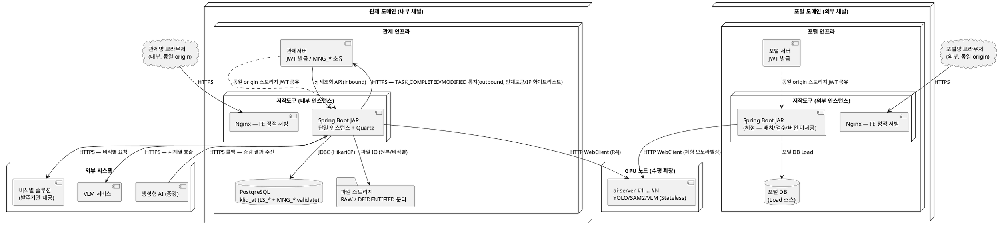

# D5 아키텍처 설계서

## 작성 목적
> 시스템의 품질을 확보하기 위하여 전체시스템에 대한 청사진으로서의 아키텍처를 작성한다. 소프트웨어 아키텍처는 개발 대상 응용 소프트웨어에 대한 아키텍처이며, 시스템 아키텍처는 응용 소프트웨어와 이에 상호작용하는 환경 및 네트워크가 포함된 아키텍처를 의미한다.

## 작성 방법
> 소프트웨어 아키텍처는 선정된 아키텍처 패턴을 중심으로 컴포넌트와 상호작용하는 커넥션 및 가시적인 속성을 표현한다. 시스템 아키텍처는 개발 대상시스템과 상호작용하는 하드웨어, 시스템 소프트웨어 및 네트워크와의 관계를 표현한다. 아키텍처 요구사항 및 구현방안은 아키텍처 관점에서의 시스템의 품질, 보안, 성능, 장애복구 등의 요구사항과 이에 대한 구현방안을 기술한다.

---

## 제·개정 이력

| 날짜 | 버전 | 제·개정 내역 | 작성자 | 검토자 |
|------|------|------------|--------|--------|
| 2026-05-31 | 1.0 | 최초 작성 — 4-tier 소프트웨어 아키텍처(React/Spring Boot/PostgreSQL/ai-server), 시스템 아키텍처(PostgreSQL 단일 인스턴스 + ai-server GPU 수평확장), R1 아키텍처 영향 요구사항 구현방안 정리. 컴포넌트 ID는 D3 컴포넌트 설계서(KLID-AT-CO-001~015) 체계 준용. ※ DB는 PostgreSQL로 확정(R1 v1.2 · CLAUDE.md) — 템플릿의 MariaDB/MaxScale 전제는 미적용 | 박찬기 | 김현욱 |
| 2026-06-01 | 1.1 | 검출 findings 보정 — §2 배포 토폴로지를 ADR-012·DEP-001 **채널별 별도 배포**(관제·포털 도메인 각 1벌, 동일 origin 브라우저 스토리지 JWT 공유, M2M 사용자 인증 불요)로 반영하고 "단일 인스턴스"를 Quartz 클러스터 미적용 의미로 명확화(§2.1~2.3, 다이어그램). §3에 NFR-001~007 매핑표·RISK-001~005 대응표(§3.6, RISK-005 배치 SPOF 포함) 추가, 정형 다이어그램 ID(CTX-001·CNT-001·DEP-001) §2.2 참조 명시. ExternalAugmentClient 위치를 `common/client`(KLID-AT-CO-010)가 아닌 `augment/integration`(INT-008)으로 정정 | 박찬기 | 김현욱 |
| 2026-06-02 | 1.2 | **RQ-SFR-09-06·09-07 범위 외 삭제 반영** — R1 요구사항 18→16건. §3.1 보안 블록을 RQ-SFR-09-06 종속에서 **NFR-005(민감정보 보호, CLAUDE.md/security.md 근거)** 로 재anchoring하여 인증/인가·로그 마스킹·영상 암호화 구현방안은 유지. §3.5를 RQ-SFR-09-07(공개대상 분류체계) 제거 후 DB 컬럼 표준화 책임만으로 재범위화. NFR 매핑표 NFR-005 반영 절 갱신 | 박찬기 | 김현욱 |

## 헤더

| D5 | 아키텍처 설계서 |
|-------|---------|
| 시스템명 | AI 기반 지방정부 CCTV 관제지원시스템 구축(2차) | 서브시스템명 | 학습데이터 저작도구 (AT) |
| 단계명 | 설계 | 작성일자 | 2026-06-02 | 버전 | 1.2 |

> **컴포넌트 ID 참조(D3 컴포넌트 설계서)**: KLID-AT-CO-001 BatchOrchestration · KLID-AT-CO-002 LabelManagement · KLID-AT-CO-003 VersionControl · KLID-AT-CO-004 Review&Assignment · KLID-AT-CO-005 MetaReview · KLID-AT-CO-006 Augment · KLID-AT-CO-007 PortalChannel · KLID-AT-CO-008 Statistics · KLID-AT-CO-009 SystemConfig · KLID-AT-CO-010 ExternalClients · KLID-AT-CO-011 WebhookGateway · KLID-AT-CO-012 SecurityCore · KLID-AT-CO-013 ControlNotify · KLID-AT-CO-014 ObservabilityCommon · KLID-AT-CO-015 Marking

---

## 1. 소프트웨어 아키텍처

### 1.1 아키텍처 패턴

본 저작도구는 **계층형(Layered) 4-tier 아키텍처**를 채택한다. Presentation(React/Vite) → Business(Spring Boot — Controller·Service·Repository) → Data(PostgreSQL + Flyway)의 전통적 3계층에, AI 추론을 분리한 **AI Layer(ai-server — YOLO/SAM2/VLM)** 를 추가하여 GPU 자원 경합을 격리한다. 계층 간 호출은 **단방향(상위→하위)** 만 허용한다.

- Business Layer는 도메인 중심 패키지 구조(`kr.co.cudo.authoring.{domain}.{controller|service|repository|entity|dto}`)를 따른다.
- Controller는 DTO만 다루고 Entity를 직접 노출하지 않으며, Service에 `@Transactional`(조회 `readOnly=true`)을, Repository에 JPA/QueryDSL만 둔다.
- AI Layer는 Stateless 추론 전용(인증·DB·상태 없음)이며, Business Layer가 오케스트레이션 주체로서 `AiServerClient`(WebClient)로 호출한다.

### 1.2 소프트웨어 아키텍처 다이어그램

```plantuml
@startuml
skinparam componentStyle rectangle
skinparam shadowing false

actor "검수자\n(REVIEWER)" as REV
actor "라벨러\n(WORKER)" as WRK
actor "포털 회원\n(PORTAL_USER)" as PU

package "Presentation Layer  (React 18 + Vite + TS)" as PRES {
  [라벨링 캔버스 (konva.js)] as CANVAS
  [검수/관리 화면] as MANAGE
  [TanStack Query · Zustand · axios] as STATE
}

package "Business Layer  (Spring Boot 3.3 / Java 17)" as BIZ {
  package "보안/공통 (SecurityCore KLID-AT-CO-012, ObservabilityCommon KLID-AT-CO-014)" as COMMON {
    [JwtAuthenticationFilter / SecurityConfig (KLID-AT-CO-012)] as JWT
    [ApiResponse / GlobalException / RequestIdFilter (KLID-AT-CO-014)] as APIRES
    [DualDataSourceConfig (Control/Portal)] as DDS
    [MaskingPatternLayout (로그 마스킹)] as MASK
    [Resilience4jConfig (재시도/CB/타임아웃)] as R4J
  }
  package "도메인 (Controller→Service→Repository)" as DOMAIN {
    [Marking (KLID-AT-CO-015)] as MARK
    [LabelManagement / SAM2 (KLID-AT-CO-002)] as LBL
    [VersionControl (KLID-AT-CO-003)] as VER
    [Review&Assignment (KLID-AT-CO-004)] as RVW
    [MetaReview / VLM (KLID-AT-CO-005)] as VLMR
    [Augment (KLID-AT-CO-006)] as AUG
    [PortalChannel (KLID-AT-CO-007)] as PORT
    [Statistics (KLID-AT-CO-008)] as STAT
    [SystemConfig (KLID-AT-CO-009)] as CFG
  }
  package "배치 오케스트레이션 (BatchOrchestration KLID-AT-CO-001, Quartz)" as BATCH {
    [BatchOrchestrator + 7 Steps] as ORCH
  }
  package "외부 연동 (ExternalClients KLID-AT-CO-010 / WebhookGateway KLID-AT-CO-011 / ControlNotify KLID-AT-CO-013)" as CLIENTS {
    [AiServerClient (YOLO/SAM2)] as AIC
    [DeidentifyClient] as DEIDC
    [VlmClient] as VLMC
    [ExternalAugmentClient\n(augment.integration, INT-008)] as AUGC
    [WebhookGateway (HMAC 수신)] as WHG
    [ControlNotifyClient] as CNC
  }
}

package "Data Layer  (PostgreSQL + Flyway)" as DATA {
  database "klid_at 스키마" as PG {
    [LS_* (저작도구 소유)] as LS
    [MNG_* (관제 참조, validate)] as MNG
    [QRTZ_* (Quartz JobStore)] as QRTZ
    [데이터마트 적재 View 4종] as VIEW
  }
  [파일 스토리지\n원본/비식별 분리] as STORE
}

package "AI Layer  (ai-server — FastAPI / Python 3.11)" as AI {
  [YOLO 추론] as YOLO
  [SAM2 추론] as SAM2
  [VLM 호출 어댑터] as VLMADP
}

REV --> MANAGE
WRK --> CANVAS
PU  --> CANVAS
CANVAS --> STATE
MANAGE --> STATE
STATE --> JWT : HTTPS REST / ApiResponse<T>

JWT --> DOMAIN
DOMAIN --> APIRES
DOMAIN --> DDS
DDS --> PG : JPA / QueryDSL (JDBC)
DOMAIN --> STORE
ORCH --> DOMAIN
ORCH --> CLIENTS
QRTZ <--> ORCH
AIC --> AI : HTTP (R4J)
DEIDC ..> R4J
VLMC ..> R4J
CNC ..> R4J
AUGC ..> R4J
@enduml
```

### 1.3 공통 인프라 책임

| 공통 인프라 | 컴포넌트 ID | 구현 패키지 | 책임 |
|------------|:----------:|------------|------|
| 인증 필터 / 인가(RBAC) / HMAC 웹훅 필터 | KLID-AT-CO-012 (SecurityCore) | `common.security` · `auth` | 관제/포털 발급 JWT 디코드 → `TokenClaims` → `SecurityContext`, `role`+`channel` 기반 RBAC(`@PreAuthorize`)·RoleHierarchy·허용경로 화이트리스트 |
| 표준 응답 / 전역 예외 / 헬스 / 메트릭 / traceId | KLID-AT-CO-014 (ObservabilityCommon) | `common.response` · `common.exception` · `observability` | `ApiResponse<T>` 래핑, `ErrorCode`+`@RestControllerAdvice`(스택트레이스 비노출), RequestIdFilter(MDC), Micrometer/Prometheus |
| 듀얼 데이터소스 | (공통 설정) | `common.datasource` | Control/Portal EntityManager·TransactionManager 분리(`@ControlRepo`/`@PortalRepo`) |
| 로그 마스킹 | (공통 설정) | `common.logging` | Logback MaskingPatternLayout — PII/토큰 마스킹, 개행 제거(Log Injection 방지) |
| 외부 연동 클라이언트 | KLID-AT-CO-010 (ExternalClients) | `common.client` | AiServer/Deidentify/Vlm/ControlNotify WebClient + Resilience4j(재시도/CB/타임아웃). ※ 증강 위탁 클라이언트 `ExternalAugmentClient`는 KLID-AT-CO-010이 아닌 Augment 도메인 패키지 `augment.integration`에 위치(INT-008, 현 단계 mock placeholder) |
| 웹훅 수신 게이트웨이 | KLID-AT-CO-011 (WebhookGateway) | `webhook` | Deidentify/VLM/Augment 결과 수신 + HMAC 서명 검증 + 멱등성 보장 |

---

## 2. 시스템 아키텍처

### 2.1 배포 토폴로지

저작도구는 **채널별 별도 배포**한다(ADR-012 · DEP-001). 저작도구는 독립 로그인 UI가 없어 관제서버(내부)·포털(외부)이 발급한 JWT를 인계받아 진입하므로, **관제 도메인과 포털 도메인에 저작도구 인스턴스를 각각 1벌씩 배포**하고 각 인스턴스가 호스트 시스템과 **동일 웹 origin을 공유**한다. 이로써 브라우저 스토리지(localStorage/sessionStorage)로 JWT를 인계받아 단일 검증 로직(`JwtAuthenticationFilter`)으로 처리하며, **M2M 사용자 인증 인프라가 불필요**하다(URL `?token=` 전달은 노출 위험으로 미사용). 관제 채널 인스턴스는 `klid_at`(LS_\* + MNG_\* validate)을, 포털 채널 인스턴스는 포털 DB(Load 소스)를 데이터소스로 사용하여 두 채널의 데이터 경계가 자연 분리된다. 잔존 저작도구→관제 outbound 통지는 인계토큰/IP 화이트리스트로 보호한다(ADR-007).

각 채널 인스턴스 내부에서 저작도구 백엔드는 **Spring Boot 단일 인스턴스**로 배포하되, 여기서 "단일 인스턴스"는 **Quartz 클러스터를 적용하지 않는다는 의미**(배치 스케줄러 단일화)이며 채널 분리 배포(2벌)와는 별개 개념이다(RISK-005 배치 SPOF 참조). GPU 부하가 큰 **ai-server는 Stateless 추론으로 N개 수평 확장**한다. DB는 **PostgreSQL 단일 인스턴스**(채널별 스키마/DB)로 운영하며, 원본·비식별 파일은 별도 경로로 분리 저장한다.

> ⚠ DB는 PostgreSQL로 확정(R1 v1.2 · CLAUDE.md). 템플릿의 MariaDB 10.11 + MaxScale(Read/Write Split) 전제는 본 시스템에 적용하지 않는다.
> ※ 채널별 별도 배포의 정형 근거는 LogiCraft ADR-012(채널별 별도 배포·동일 origin JWT 공유) 및 DEP-001(배포 다이어그램, §2.2 참조)이다. "단일 인스턴스"(Quartz 클러스터 미적용)와 "채널별 2벌 배포"는 서로 다른 축임에 유의한다.

### 2.2 시스템 아키텍처 다이어그램

> 정형 다이어그램 참조(LogiCraft): 시스템 컨텍스트 **CTX-001**, 컨테이너 **CNT-001**, 배포 **DEP-001**(채널별 별도 배포). 아래 PlantUML은 DEP-001을 본 산출물 형식으로 표현한 것이다.

### 2.3 노드 구성 및 확장 전략

| 노드 | 구성 | 확장 전략 |
|------|------|----------|
| 관제 도메인 애플리케이션 노드 | FE(Nginx) + BE(Spring Boot 단일 인스턴스 + Quartz) — 관제 인프라에 배포, 동일 origin JWT 공유 | 수직 확장 (Quartz 클러스터 미적용) |
| 포털 도메인 애플리케이션 노드 | FE(Nginx) + BE(체험 — 배치/검수/버전 미제공) — 포털 인프라에 배포, 동일 origin JWT 공유 | 수직 확장 |
| GPU 노드 | ai-server N개 (Stateless) | **수평 확장** (GPU Worker 별도 프로세스) |
| 데이터 노드 | PostgreSQL 단일 인스턴스(채널별 klid_at / 포털 DB) + 파일 스토리지 | 수직 확장 + 정기 백업 |

> 채널별 별도 배포(ADR-012 · DEP-001): 저작도구 인스턴스를 관제·포털 두 채널에 각각 1벌 배포한다. 채널 간 배포 버전 불일치 시 동작 차이가 발생할 수 있어 릴리스 동기화 프로세스가 필요하다(ADR-012 risk). 각 채널 BE의 "단일 인스턴스"는 Quartz 클러스터 미적용을 의미하며 채널 분리(2벌)와는 별개 축이다.

### 2.4 환경별 접속 정보

| 환경 | BE | ai-server | FE | DB | 비고 |
|:----:|:---|:---|:---|:---|:-----|
| local | localhost:8080 | localhost:9300 | localhost:5173 | PostgreSQL (Docker/Testcontainers) | `gradlew bootRun` / `uvicorn` / `vite` |
| dev | (dev BE) | (dev AI) | (dev FE) | (dev PostgreSQL) | |
| stg | (stg BE) | (stg AI) | (stg FE) | (stg PostgreSQL) | |
| prd | (prd BE) | (prd AI) | (prd FE) | (prd PostgreSQL) | 시크릿은 환경변수/Vault |

> 환경 분기는 Spring Profile(`SPRING_PROFILES_ACTIVE`)과 `application-{local,dev,stg,prd}.yml`로 처리하며, 코드 내 환경 분기를 금지한다. 외부 접속 정보·시크릿(`CONTROL_DB_*`, `PORTAL_DB_*`, `JWT_SECRET`, `DEIDENTIFY_API_URL`, `AI_SERVER_URL`, `STORAGE_*`)은 환경변수로 주입한다.

### 2.5 데이터 소유·연동 정책

- `klid_at` 스키마에서 **저작도구 전용 LS_\* 테이블은 자체 소유·구성**하고, 관제서버 재사용 **MNG_\* 9개는 `ddl-auto=validate`로 읽기 위주 참조**한다.
- **Quartz `QRTZ_*`** 는 PostgreSQL JobStore(`PostgreSQLDelegate`, BYTEA)로 운영한다.
- 데이터마트 적재용 **View 4종**(`V_COMPLETED_VIDEO/FRAME/LABEL/META`)을 `CREATE OR REPLACE VIEW`(멱등)로 제공하여 검수 완료(`APPROVED`) 영상만 노출한다.

---

## 3. 아키텍처 요구사항 및 구현방안

> R1 요구사항 16건 중 **아키텍처에 영향을 주는 항목**만 품질 속성(보안 / 성능 / 가용성·장애복구 / 데이터 정합·버전관리 / 정부표준)별로 정리한다. R1에 없는 일반 기능은 다루지 않는다.

#### 품질 속성 ↔ NFR 매핑 (추적성, LogiCraft NFR-001~007)

| NFR ID | 품질 속성 | 목표 | 본서 반영 절 |
|--------|----------|------|------------|
| NFR-001 | 성능 — 배치 파이프라인 처리량 | 배치 파이프라인 ≥ 1건/분 (Quartz 단일 인스턴스) | §3.2 (RQ-SFR-09-01 배치) |
| NFR-002 | 성능·규모 — 이미지 학습데이터 처리 규모 | 이미지 10만장(SFR-16) | §3.2 |
| NFR-003 | 성능·규모 — 영상 학습데이터 처리 규모 | 영상 5,000건(SFR-17) | §3.2 |
| NFR-004 | 가용성 — 외부 API 연동 복원력 | 외부 연동 Resilience4j 적용률 100% (VLM 45s·ai-server 60s) | §3.1·§3.2·§3.3 |
| NFR-005 | 보안 — 민감정보 보호 | PII·토큰 로그 마스킹·암호화 저장 | §3.1 (보안 — NFR-005, CLAUDE.md/security.md 근거) |
| NFR-006 | 사용성 — 포털 웹 접근성 | 반응형 + WCAG 2.1 AA | §3.5(연관, 포털 채널) |
| NFR-007 | 운영 — 메트릭·추적성 | Micrometer/Prometheus 메트릭·traceId | §3.2·§3.3 (ObservabilityCommon KLID-AT-CO-014) |

### 3.1 보안 (Security)

| 요구사항 ID | RQ-SFR-09-01, RQ-SFR-09-02 |
|---------|---|
| 요구사항 내용 | 발주기관이 제공하는 외부 비식별 솔루션을 연동(API/가이드 기반)하여 수집 영상의 개인정보를 비식별화하고, 원본·비식별본을 각각 별도 보관한다. |
| 구현방안 | ExternalClients(KLID-AT-CO-010)의 `DeidentifyClient`(WebClient + Resilience4j)로 외부 비식별 API를 호출하고, 결과는 WebhookGateway(KLID-AT-CO-011)가 수신한다. 영상 `PRVC_TYPE_CD ∈ {PRVC, PSDO}` 일 때만 비식별을 수행하고 `ANONY`는 원본만 저장한다. 파이프라인 순서상 비식별은 FFmpeg 프레임 추출 이전 단계에서 실행하며, 원본/비식별본을 `STORAGE_RAW_PATH` / `STORAGE_DEIDENTIFIED_PATH` 로 동시 분리 저장한다. 결과 수신 webhook은 HMAC 시그니처 + timestamp + idempotencyKey allowlist로 인증한다. SSRF 방지를 위해 호출 URL은 환경변수 allowlist 로 고정한다. |

| 요구사항 ID | NFR-005 (민감정보 보호) |
|---------|---|
| 요구사항 내용 | 개인정보·토큰을 로그/통지 페이로드에 노출하지 않고(0건), 영상을 암호화 저장한다. ※ 구 RQ-SFR-09-06(개인정보 보호대책)은 보안·인프라 책임으로 R1에서 범위 외 삭제되었으나, 저작도구가 실제 보유·구현하는 민감정보 보호 책임은 **NFR-005(보안 NFR, CLAUDE.md 개인정보 보호·security.md 근거)** 로 유지한다. |
| 구현방안 | (1) **인증/인가** — 저작도구는 독립 로그인 UI 없이 관제/포털이 발급한 동일 JWT 를 SecurityCore(KLID-AT-CO-012)의 `JwtAuthenticationFilter`로 단일 검증하고, `SecurityConfig`에서 `role`+`channel` 기반 RBAC(`@PreAuthorize("hasRole('REVIEWER')")`)·RoleHierarchy·허용경로 화이트리스트를 적용한다. JWT 는 `alg:none` 금지·`exp` 필수·HS256 256bit 이상. (2) **로그 마스킹** — Logback MaskingPatternLayout으로 PII·토큰·요청 본문을 마스킹하고 개행을 제거(Log Injection 방지)한다. (3) **영상 암호화 저장** — 스토리지 암호화 저장 + 경로 정규화(`Path.normalize()`로 `..` 순회 차단). (4) **OWASP 대응** — DTO 바인딩(Mass Assignment 차단), ObservabilityCommon(KLID-AT-CO-014)의 `ApiResponse`/`GlobalExceptionHandler`로 스택트레이스 비노출, 응답 보안헤더(`X-Content-Type-Options`, `X-Frame-Options` 등). ※ 비정상 로그인 차단·계정 정책 등 토큰 발급 주체(관제/포털)·인프라 영역 책임은 저작도구 범위 밖이다. |

### 3.2 성능 (Performance)

| 요구사항 ID | RQ-SFR-08-01, RQ-SFR-08-02, RQ-SFR-08-03 |
|---------|---|
| 요구사항 내용 | (08-01) 지정 객체를 프레임 간 자동 추적하여 위치·경계 갱신, (08-02) 객체 외곽 경계 자동 밀착, (08-03) 라벨링 정밀도(임계값/점 수) 조절. AI 보조 라벨링의 응답 성능이 사용자 체감 품질을 좌우한다. |
| 구현방안 | LabelManagement(KLID-AT-CO-002)가 처리한다. YOLO(객체 검출)·SAM2(외곽 밀착 세그멘테이션) 추론은 **GPU 부하 격리**를 위해 ai-server(FastAPI)에 분리하고 ExternalClients(KLID-AT-CO-010)의 `AiServerClient`로 호출한다. ai-server 는 Stateless 로 **N개 수평 확장**하여 동시 추론 처리량을 확보한다. 추론 호출에는 타임아웃(60s)+Resilience4j 서킷브레이커를 적용해 한 요청의 지연이 전체로 전파되지 않도록 한다. 프레임 간 추적은 CVAT 트랙 보간 알고리즘 포팅(BatchOrchestration KLID-AT-CO-001 내 보간 단계)으로 빈 프레임을 추론 호출 없이 보간하여 부하를 줄이고, 정밀도 조절은 SystemConfig(KLID-AT-CO-009)의 폴리곤 단순화 임계값(`POLYGON_SIMPLIFY_TOLERANCE`, Caffeine TTL 60s 캐시)을 추론 결과 후처리에 적용한다. MASK↔RLE↔Polygon 변환(CVAT 포팅)으로 전송 payload 를 경량화한다. |

| 요구사항 ID | RQ-SFR-09-01 (배치 처리 성능 관점) |
|---------|---|
| 요구사항 내용 | 비식별 포함 배치 파이프라인(마킹→VLM→비식별→FFmpeg→YOLO→SAM2→트랙보간)을 안정적 처리량으로 운영한다. |
| 구현방안 | BatchOrchestration(KLID-AT-CO-001)의 Spring Boot Quartz(PostgreSQL JobStore)로 **단일 인스턴스 1건/분** 처리한다. Marking(KLID-AT-CO-015) 완료 시 `MarkingCompletedEvent → MarkingBatchBridge(AFTER_COMMIT) → BATCH_QUEUED` 전이 + `@Async` 자동 시작. 오토라벨링은 **원본 이미지에만 실행**하고 좌표 동일성을 이용해 비식별본과 결과를 공유(중복 추론 제거). GPU 자원 모니터링 포인트(Micrometer + Prometheus — 배치 처리량/외부 API 응답시간, ObservabilityCommon KLID-AT-CO-014)를 확보한다. |

### 3.3 가용성 / 장애복구 (Availability / Resilience)

| 요구사항 ID | RQ-SFR-09-01, RQ-SFR-09-03 |
|---------|---|
| 요구사항 내용 | 비식별 처리 실패 시 재시도하고 결과·이력을 영상 단위로 기록하며, **원본은 어떤 경우에도 삭제하지 않는다.** |
| 구현방안 | ExternalClients(KLID-AT-CO-010)의 `DeidentifyClient`에 Resilience4j 타임아웃·재시도·서킷브레이커를 적용한다. 실패 시 영상 상태를 `DE_IDNTF_YN='F'`로 마킹하고 **재시도 큐 + dead-letter(DLQ)** 로 격리한다. 처리 결과·이력은 영상 단위로 기록하여 검토·조회할 수 있게 한다. 원본 파일은 보존 정책상 절대 삭제하지 않는다. |

| 요구사항 ID | RQ-SFR-08-06 (통지 신뢰성 관점) |
|---------|---|
| 요구사항 내용 | 검수 완료/수정 통지가 외부(관제서버)로 신뢰성 있게 전달되어야 한다(단방향 outbound). |
| 구현방안 | ControlNotify(KLID-AT-CO-013, `controlnotify` 패키지)의 `ControlNotifyClient`가 `TASK_COMPLETED`/`TASK_MODIFIED` 통지를 영상 단위로 비동기 push 한다. **요청 ID idempotency + dead-letter 큐 + 재등록(fallback) 큐 + Resilience4j** 로 전달 실패에 대비한다. 양방향 M2M 인증은 deprecated 이며 통지는 인계 토큰 또는 IP 화이트리스트로 보호한다. |

### 3.4 데이터 정합 / 버전관리 (Data Integrity / Versioning)

| 요구사항 ID | RQ-SFR-08-04, RQ-SFR-08-05 |
|---------|---|
| 요구사항 내용 | 학습데이터셋의 버전 관리·변경이력 추적, 버전 간 비교(diff) 및 이전 버전 복구(rollback). |
| 구현방안 | **DB 스냅샷 기반 버전관리(외부 VCS/Git 미사용)** 를 채택한다(R1 v1.2 확정). VersionControl(KLID-AT-CO-003, `version` 패키지)이 라벨 저장 시 **전체 스냅샷(JSON)** 을 `LS_LABEL_VERSION.LABEL_PAYLOAD`에 적재하고, 버전 식별자는 payload 의 SHA-256 해시(`VERSION_HASH`)로 동일 payload 중복을 식별한다. diff 는 두 스냅샷을 앱에서 비교 계산하고(`GET /v1/versions/{version}/diff`), rollback 은 대상 스냅샷을 새 active 버전으로 복원한다(`POST /v1/versions/{version}/rollback`). 변경이력은 `LS_DATA_LBL_HSTRY`로 누가·언제·무엇을 변경했는지 추적한다. (해시는 SHA-256 이상 — MD5/SHA-1 금지) |

| 요구사항 ID | RQ-SFR-08-06 |
|---------|---|
| 요구사항 내용 | 검수 완료된 데이터의 라벨 수정 시, 외부 데이터마트가 최신 내용으로 재동기화할 수 있도록 한다(데이터마트 본체는 외부 책임). |
| 구현방안 | 검수 완료(`LsRawDataStatus.dataSttsCd=COMPLETED/APPROVED`) 후 라벨/메타 수정 시 ControlNotify(KLID-AT-CO-013)의 `ControlNotifyClient`가 `TASK_MODIFIED`(수정 요약만 — 변경 프레임 목록 `SRC_SN`·변경 종류·요약 카운트, **본문 미포함**)를 발행한다. 동일 트랜잭션 내 다수 변경은 디바운스 후 영상 1건 단위로 1회 통지한다. 관제서버는 통지 수신 후 데이터마트 적재용 View 4종(`V_COMPLETED_*`)을 RAW_SN 으로 단순 SELECT 하여 영상 1건=1 row UPSERT 로 재동기화한다. PII·토큰·비-비식별 이미지는 페이로드에 포함하지 않는다. |

| 요구사항 ID | RQ-SFR-06-03, RQ-SFR-07-01, RQ-SFR-07-02, RQ-SFR-07-03 |
|---------|---|
| 요구사항 내용 | 외부 생성형 AI 증강 영상을 수신하여 원본과 연결된 **새 영상**으로 등록하고(라벨 무결성 보존), 해상도 변경은 저작도구가 직접 수행하며, 검수자가 학습데이터 활용 여부를 승인/반려한다. |
| 구현방안 | Augment(KLID-AT-CO-006, `augment` 패키지)가 `augment/integration/ExternalAugmentClient`로 증강을 비동기 위탁 요청(INT-008)하고, WebhookGateway(KLID-AT-CO-011)가 결과 콜백(`POST /v1/augments/result`)을 HMAC + timestamp + idempotencyKey allowlist로 검증·수신한다. ※ 증강 위탁 클라이언트는 다른 외부 연동 클라이언트(AiServer/Deidentify/Vlm/ControlNotify)와 달리 `common/client`(KLID-AT-CO-010)가 아닌 Augment 도메인 내부 패키지 `augment/integration`에 위치하며, 현 단계는 외부 미연결 best-effort placeholder(mock ack)다. 증강은 **새 RAW_SN 생성** + `LS_DATA_RAW.PARENT_RAW_SN`으로 원본 참조, 원본의 라벨/메타 JSON 을 새 영상에 복사하여 좌표·속성 무결성을 보존한다(해상도 변경 증강은 저작도구가 해상도만 변경하고 좌표 정합 보존). 새 영상은 **미검수(PENDING)** 로 시작 → 작업자 배정 → Review&Assignment(KLID-AT-CO-004)에서 REVIEWER 가 승인/반려(`accept`/`reject`) → 승인 시 새 영상 ID 로 별도 완료 통지를 발송한다. |

### 3.5 정부표준 (DB 컬럼 표준화, Standards Compliance)

> ※ 구 RQ-SFR-09-07(개인정보 유형 공개대상 분류체계 구축)은 보안·인프라 책임으로 R1에서 범위 외 삭제되었다. 본 절은 저작도구가 보유하는 **DB 컬럼 표준화**(전 LS_* 테이블 공통, 특정 SFR 미종속) 책임만 다룬다.

| 적용 범위 | `klid_at` 스키마 LS_* 테이블 전반 (DB 컬럼 표준화) |
|---------|---|
| 내용 | 정부 표준에 부합하는 DB 컬럼 표준화를 적용한다. |
| 구현방안 | DB 는 **행정안전부 공통표준용어 기반 컬럼 표준화**를 적용하여 `klid_at` 스키마의 LS_\* 테이블 컬럼을 표준 도메인·용어로 명명하고(용어-표준화-매핑표 기준), 모든 마이그레이션은 Flyway + PostgreSQL 표준 SQL 문법으로 작성한다. MNG_\* 공유 테이블 변경 시 관제서버팀 선승인을 거친다. 비식별 호출 조건(`PRVC_TYPE_CD`: PRVC/PSDO만 호출, ANONY 원본만 저장)은 §3.1 비식별(RQ-SFR-09-01)에서 다룬다. |

### 3.6 아키텍처 리스크 및 대응 (LogiCraft RISK-001~005)

| RISK ID | 리스크 | 영향/확률 | 대응(완화) | 비상(우발) | 관련 절 |
|---------|--------|:--------:|-----------|-----------|--------|
| RISK-001 | 외부 연동 서비스 장애 — VLM·비식별·ai-server·증강 장애 시 배치 중단·지연 | 4 / 3 | 모든 외부 호출 Resilience4j 타임아웃/재시도/CB(VLM 45s·ai-server 60s). 비식별 실패 시 `DE_IDNTF_YN='F'` + 재시도 큐, 원본 삭제 금지 | 최대 재시도 후 실패 알림, 영상 `FAILED` 전이 후 수동 재처리 | §3.1·§3.2·§3.3 |
| RISK-002 | MNG_* 공유 스키마 변경 충돌 — 관제측 변경 시 `ddl-auto=validate` 실패로 기동 불가 | 4 / 2 | MNG_* 변경 시 Flyway 전 관제서버팀 선승인·변경 알림 프로세스. LS_* 와 소유 분리 | 기동 실패 시 엔티티 매핑 수정 + 해당 테이블 validate 제외 핫픽스 후 재기동 | §2.5 |
| RISK-003 | ai-server GPU 자원 경합 — YOLO/SAM2/VLM GPU 공유로 동시 요청 지연·타임아웃 | 3 / 3 | ai-server를 GPU Worker 별도 프로세스로 수평 확장, GPU 모니터링 포인트. 배치 Quartz 1건/분 유입 제어 | GPU 포화 감지 시 배치 유입 속도 조절 / 추론 요청 큐잉 | §2.3·§3.2 |
| RISK-004 | 양방향 M2M 통합 deprecated — 재구축 시 별도 설계·비용 (status: accepted) | 3 / 2 | 잔존 outbound 통지만 인계토큰/IP 화이트리스트로 단방향 운영. 상세는 관제서버가 조회 API pull. 사용자 인증은 채널별 co-deploy + 동일 origin JWT 공유로 대체(ADR-012) | 양방향 재구축 요구 시 M2M 인증 인프라 별도 설계 ADR 수립 | §2.1·§3.3 |
| RISK-005 | **배치 단일 인스턴스 SPOF** — Spring Boot+Quartz 단일 인스턴스(클러스터 미적용) 장애 시 배치 전면 중단 | 3 / 2 | 배치 실패 재처리 정책(최대 재시도·실패 알림). Quartz JobStore(PostgreSQL)로 잡 상태 영속화 → 재기동 시 이어 처리 | 인스턴스 재기동 후 QRTZ_* JobStore 기반 미완료 잡 재개 | §2.1·§2.3 |

> RISK-005(배치 SPOF)는 §2.1의 "단일 인스턴스 = Quartz 클러스터 미적용" 결정의 직접 귀결이다. 채널별 별도 배포(2벌)는 사용자 채널 분리를 위한 것으로 배치 가용성과는 별개 축이며, 배치는 관제 채널 인스턴스에서만 동작한다.

---

## 항목 설명

- **소프트웨어 아키텍처**: §1 — 계층형 4-tier 패턴, 컴포넌트 배치 및 공통 인프라.
- **시스템 아키텍처**: §2 — HW/SW/네트워크 배포 토폴로지, 환경별 접속 정보, 데이터 소유·연동 정책.
- **아키텍처 요구사항 및 구현방안**: §3 — R1의 아키텍처 영향 요구사항을 보안/성능/가용성/데이터정합·버전관리/정부표준 품질 속성별로 구현방안과 함께 기술.

## 작성 시 참고사항

> - **ID 체계**: 요구사항 ID `RQ-SFR-NN-NN`(R1 참조), 컴포넌트 ID `KLID-AT-CO-NNN`(D3 컴포넌트 설계서 참조). 아키텍처 결정·품질·리스크·다이어그램은 LogiCraft 정형 ID 참조 — ADR-007(M2M 폐기·단방향 통지)·ADR-012(채널별 별도 배포·동일 origin JWT 공유), NFR-001~007(품질 속성), RISK-001~005(아키텍처 리스크), CTX-001(컨텍스트)·CNT-001(컨테이너)·DEP-001(배포) 다이어그램.
> - **DB 확정**: 본 시스템은 **PostgreSQL** 로 확정(R1 v1.2 · CLAUDE.md). 템플릿 작성참고의 MariaDB 10.11 + MaxScale 전제는 미적용. 버전관리도 DB 스냅샷 기반으로 확정(외부 VCS/Gitea 미사용).
> - **범위 정합**: 생성형 AI 본체·VLM 모델 본체·영상 합성 본체·데이터마트 구축은 외부 시스템 책임이며, 저작도구는 연동·검수·버전관리·통지 책임만 보유한다(CLAUDE.md).
