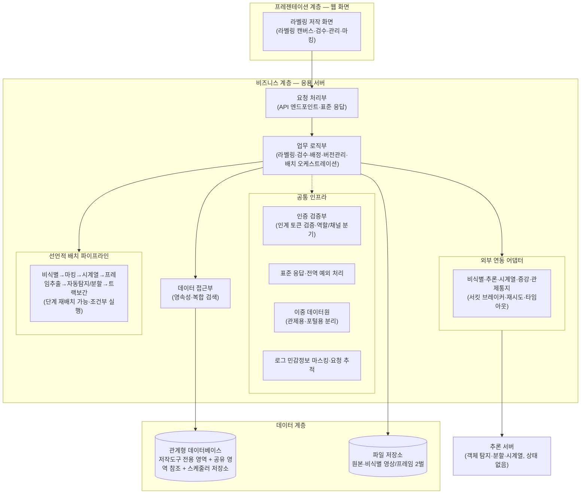
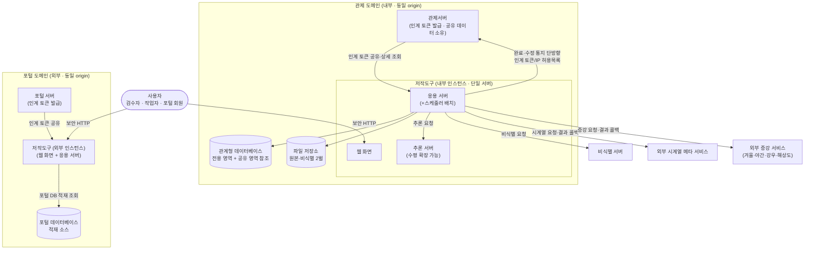

# D5 아키텍처 설계서

## 제·개정 이력

| 날짜 | 버전 | 작성자 | 승인자 | 내용 |
|------|------|--------|--------|------|
| 2026-06-23 | 1.0 | - | - | LogiCraft 그래프 기반 생성 (/cc-doc-gen) |

## 헤더

| D5 | 아키텍처 설계서 |
|-------|---------|
| 시스템명 | AI 기반 지방정부 CCTV 관제지원시스템(2차) | 서브시스템명 | 학습데이터 저작도구 |
| 단계명 | 설계 | 작성일자 | 2026-06-23 | 버전 | 1.0 |

---

## 1. 소프트웨어 아키텍처

본 시스템은 **레이어드(Layered) 아키텍처 패턴**을 중심으로 한 모듈형 단일 애플리케이션이다. 프레젠테이션 계층(웹 화면), 비즈니스 계층(요청 처리·업무 로직·데이터 접근), 데이터 계층(관계형 데이터베이스·파일 저장소)으로 구성하며, 추론 부하는 상태 없는 별도 추론 서버로 분리한다. 비즈니스 계층은 공통 인프라(표준 응답·전역 예외 처리·인증 검증·이중 데이터원·로그 마스킹)와 외부 연동 어댑터, 선언적 배치 파이프라인을 갖춘다.

> **선정 패턴**: 모듈형 단일 응용(modular monolith) + 레이어드. 요청 처리부는 화면이 전달하는 요청/응답 형식만 다루고 업무 데이터를 화면에 직접 노출하지 않으며, 업무 로직부가 업무 규칙·상태 전이·트랜잭션을 전담하고, 데이터 접근부는 영속성·복합 검색만 담당한다. 객체 탐지·분할·시계열 추론은 GPU 자원 격리를 위해 상태 없는 별도 추론 서버로 분리하여 응용 서버가 연동 어댑터로 호출한다.

---

## 2. 시스템 아키텍처

개발 대상 시스템(저작도구)과 상호작용하는 하드웨어·시스템 소프트웨어·네트워크·외부 시스템의 구성은 다음과 같다. 저작도구는 관제 도메인(내부)과 포털 도메인(외부)에 채널별로 별도 배포되며, 각 채널의 상위 시스템과 동일 웹 도메인에서 운영되어 브라우저 저장소를 통한 인계 토큰 공유로 사용자 인증을 대체한다.

> **배포·인프라 특성**: 응용 서버와 스케줄러 배치는 **단일 인스턴스**로 온프레미스 배포한다(스케줄러 클러스터 미적용). 추론 서버는 GPU 작업자 단위로 **다중 인스턴스 수평 확장**이 가능하다. 데이터베이스는 단일 관계형 DB로 저작도구 전용 영역을 자체 소유하고, 관제서버 소유 공유 영역은 읽기 위주로 검증 참조하며, 스케줄러 저장소를 함께 둔다. 원본 영상과 비식별 영상은 별도 경로로 동시 저장한다. 사용자 인증 토큰은 저작도구가 발급하지 않고 관제/포털 상위 시스템이 발급한 것을 인계받아 검증한다. 외부 양방향 연계 인프라는 본 버전에서 미운영하며, 관제서버로의 단방향 완료/수정 통지만 인계 토큰 또는 IP 허용목록으로 보호하여 운영한다.

---

## 3. 아키텍처 요구사항 및 구현방안

> 아키텍처 관점에서 시스템에 크게 영향을 주는 **품질·보안·성능·장애복구** 요구사항과 구현방안을 사용자 요구사항 정의서의 비기능 요구사항(NFR) 1건당 1표로 기술한다.

### 3.1 성능

| 요구사항 ID | NFR-001 |
|---|---|
| 요구사항 내용 | **배치 파이프라인 처리량** — 비식별→마킹(비식별 영상)→시계열→프레임 추출→자동 탐지/분할→트랙 보간으로 이어지는 배치 파이프라인을 분당 1건 이상 처리한다. |
| 구현방안 | 스케줄러 단일 인스턴스에서 분당 1건 기준으로 영상을 픽업해 선언적 파이프라인 단계를 순차 실행한다. 단계 순서는 한 곳에서 재배치 가능하도록 선언적으로 관리하며, 각 단계는 조건부 실행을 지원한다. 처리 소요시간·처리 건수는 응용 메트릭으로 수집하여 집계 모니터링한다. **품질목표 수준**: 처리율 분당 1건 이상. |

| 요구사항 ID | NFR-011 |
|---|---|
| 요구사항 내용 | **화면 응답시간 기준** — 라벨링·검수·마킹·목록 등 전 화면의 페이지 응답속도 3초 이하(초과 불가피 시 발주기관 협의). 10초 이상 지연 예상 작업은 진행 안내·취소 기능을 제공하고, 오류는 3초 이내 조치 가능한 메시지로 제시한다. |
| 구현방안 | 목록 조회는 페이징을 강제하고 복합 검색은 전용 조회 경로로 분리하여 응답을 3초 이내로 유지한다. 대용량 질의·프레임 목록·대량 라벨 조회 등 장시간 작업은 진행 표시·취소를 제공한다. 입력 형식 오류·처리 오류는 표준 응답 형식의 오류 메시지로 즉시 안내한다. 주요 화면 응답시간을 성능 테스트로 검증한다. **품질목표 수준**: 페이지 응답 3초 이하. |

| 요구사항 ID | NFR-012 |
|---|---|
| 요구사항 내용 | **시스템 자원 효율** — 시스템 자원(CPU·메모리) 평균 사용률 80% 이하를 유지하고, 장시간 배치·스트리밍 구간의 메모리 누수를 방지한다. |
| 구현방안 | 배치 파이프라인(프레임 추출·자동 라벨링 호출)과 스케줄러 작업자의 자원을 관리하고, 관제용·포털용 이중 데이터원의 커넥션 풀을 분리 최적화한다. 장시간 배치·스트리밍 구간을 점검하여 자원 누수를 방지하고, 로그아웃·토큰 만료 시 세션 자원을 정리한다. 자원 사용률은 메트릭으로 상시 모니터링하고 부하 테스트로 평균 80% 이하를 확인한다. **품질목표 수준**: CPU·메모리 평균 사용률 80% 이하. |

### 3.2 보안

| 요구사항 ID | NFR-005 |
|---|---|
| 요구사항 내용 | **민감정보 보호** — 개인정보·인증 토큰을 로그·통지 페이로드에 노출하지 않는다(노출 0건). 영상은 암호화 저장하고 비식별 처리 이력을 영상 단위로 기록한다. |
| 구현방안 | 로그 출력 시 민감 필드를 마스킹하고, 영상은 암호화 저장한다. 관제서버 통지 페이로드에는 개인정보·토큰·비-비식별 원본 이미지를 포함하지 않고 메타·수정 요약만 전달한다. 로그·통지 페이로드는 정적 보안 점검으로 개인정보 노출을 검증한다. **품질목표 수준**: 민감정보 로그/페이로드 노출 0건. |

| 요구사항 ID | NFR-013 |
|---|---|
| 요구사항 내용 | **세션·접근 통제** — 전 화면·기능에 역할(검수자/작업자/포털 회원)·채널 기반 접근 통제를 적용하고, 만료·위조 인계 토큰을 차단한다. 관리 화면은 검수자 전용이다. |
| 구현방안 | 인계 토큰 검증부가 만료·위조 토큰을 거부하고, 검증 실패 시 상위 시스템(관제/포털) 로그인 페이지로 리다이렉트한다. 역할·채널 클레임으로 화면·기능 접근을 분기하며 관리 화면은 검수자만 접근하도록 강제한다. 권한 없는 접근은 접근 거부, 만료·위조 토큰은 인증 거부로 응답함을 통합 테스트로 확인한다. 로그인 실패 제한·동시 로그인 차단은 토큰 발급 주체인 상위 시스템 책임이다. **품질목표 수준**: 전 화면·기능 역할별 통제 + 만료 토큰 차단. |

| 요구사항 ID | NFR-014 |
|---|---|
| 요구사항 내용 | **시큐어코딩·취약점 점검** — 소프트웨어 개발보안(시큐어코딩) 지침을 준수해 개발하고, 신규 소스 전체에 대해 보안약점 진단을 1회 이상 실시하며 지적사항을 보완한다. |
| 구현방안 | 행정·공공기관 정보시스템 구축·운영 지침의 소프트웨어 개발보안 가이드를 준수하여 개발하고, 정적 보안 분석 도구로 소스 전체를 진단한다. 모의해킹 점검은 공개 웹 취약점 상위 항목·국가 표준 점검 항목을 대상으로 수행하고 지적사항의 후속 보완조치를 완료한다. 진단 결과서·점검 결과서와 보완조치 내역으로 검증한다. **품질목표 수준**: 소스 전체 진단 1회 이상 + 지적사항 보완 완료. |

| 요구사항 ID | NFR-017 |
|---|---|
| 요구사항 내용 | **API 호출 규약(공통 접근 기준 · 인계 토큰 인증 · 채널 격리)** — 모든 업무 API에 적용되는 전역 접근 규약(공통 기준 경로·인증 헤더·역할/채널 격리·인증 예외 경로)을 정의하여, 인터페이스 카탈로그만으로 별도 문의 없이 호출을 구성할 수 있게 한다. |
| 구현방안 | 모든 업무 API에 공통 기준 경로와 인계 토큰 인증 헤더 규약을 전역으로 적용한다. 역할·채널 클레임 기반 접근 규칙으로 외부(포털) 채널과 내부 채널을 격리하고, 헬스체크·문서·인증 진입 등 인증 예외 경로를 명시 관리한다. 결과 콜백 수신 경로는 토큰 인증을 우회하되 메시지 서명 단독 인증으로 보호하고, 표준 응답 래퍼와 페이징 규약을 일관 적용한다. 통합 미운영 경로는 전면 차단한다. **품질목표 수준**: 카탈로그만으로 호출 가능한 업무 엔드포인트 비율 100%. |

### 3.3 가용성·장애복구

| 요구사항 ID | NFR-004 |
|---|---|
| 요구사항 내용 | **외부 API 연동 복원력** — 비식별·추론·시계열·증강·관제통지 등 모든 외부 연동에 타임아웃·재시도·서킷 브레이커를 적용한다(적용률 100%). |
| 구현방안 | 모든 외부 호출 어댑터에 서킷 브레이커(장애 차단)·재시도·타임아웃을 적용한다(시계열 45초, 추론 60초 타임아웃 기준). 비식별 실패 시 비식별 실패 상태로 표시하고 재시도 큐에 적재하되 원본은 절대 삭제하지 않는다. 외부 호출 소요시간을 메트릭으로 수집한다. **관련 위험 대응**: 외부 연동 서비스 장애 시 배치 파이프라인 중단·지연을 막기 위해 위 복원력 정책을 적용하고, 배치 실패 시 최대 재시도 후 실패 알림과 함께 해당 영상을 실패 상태로 전이시켜 수동 재처리한다. **품질목표 수준**: 외부 연동 복원력 정책 적용률 100%. |

| 요구사항 ID | NFR-007 |
|---|---|
| 요구사항 내용 | **메트릭·추적성** — API 응답시간·배치 처리량·외부 호출을 상시 수집하고, 모든 요청에 추적 ID를 부여하여 로그·외부 호출에 전파한다(핵심 이벤트 수집률 100%). |
| 구현방안 | 핵심 이벤트(API·배치·외부 호출)를 응용 메트릭으로 수집해 표준 메트릭 경로로 노출하고 집계한다. 모든 요청에 추적 ID를 부여하여 로그와 외부 호출 헤더에 전파해 장애 원인 추적성을 확보한다. 메트릭 노출과 로그 추적 ID 포함 여부로 검증한다. **품질목표 수준**: 핵심 이벤트 메트릭 수집률 100%. |

> **장애복구 관점 위험 대응 (구현방안 보강)**: 다음 운영 위험을 위 복원력·추적성 구현방안과 함께 관리한다.
> - **추론 서버 GPU 자원 경합**: 추론 서버를 GPU 작업자 단위 다중 인스턴스로 수평 확장하고 GPU 자원 모니터링 포인트를 확보하며, 배치 유입을 분당 1건으로 제어한다. GPU 포화 감지 시 배치 유입 속도를 조절하거나 추론 요청을 큐잉한다.
> - **배치 단일 인스턴스 중단**: 배치 실패 시 최대 재시도·실패 알림 정책을 두고, 스케줄러 저장소에 작업 상태를 영속화하여 인스턴스 재기동 시 미완료 작업을 이어 처리한다.
> - **공유 스키마 변경 충돌**: 공유 영역 변경 시 마이그레이션 전 관제서버팀 선승인과 변경 알림 절차를 두어 기동 불가를 예방하고, 기동 실패 시 매핑 수정·해당 영역 검증 제외 핫픽스 후 재기동한다.
> - **외부 양방향 연계 미운영**: 양방향 연계 인프라는 본 버전에서 미운영(수용)하며, 잔존 단방향 완료/수정 통지만 인계 토큰 또는 IP 허용목록으로 보호한다. 상세 데이터는 관제서버가 저작도구 조회 기능으로 직접 가져간다. 재구축 요구 시 인증 인프라를 별도 설계한다.

### 3.4 품질·표준 준수

| 요구사항 ID | NFR-002 |
|---|---|
| 요구사항 내용 | **이미지 학습데이터 처리 규모** — 라벨링·검수·버전관리 대상으로 이미지 학습데이터 10만 장 규모를 수용한다. |
| 구현방안 | 프레임 원천 데이터를 누적 적재하고 누적 건수를 집계하여 목표 규모 수용을 확인한다. 대량 적재·조회는 페이징과 일괄 처리로 자원 효율을 확보한다. **품질목표 수준**: 누적 이미지 10만 장 이상. |

| 요구사항 ID | NFR-003 |
|---|---|
| 요구사항 내용 | **영상 학습데이터 처리 규모** — 30초 이상 영상 학습데이터 5,000건 규모를 수용한다(작업 단위 = 영상 1건). |
| 구현방안 | 원시 영상 데이터를 영상 단위로 누적 적재하고 누적 건수를 집계하여 목표 규모 수용을 확인한다. **품질목표 수준**: 누적 영상 5,000건 이상. |

| 요구사항 ID | NFR-006 |
|---|---|
| 요구사항 내용 | **포털 웹 접근성** — 포털(외부 채널)을 반응형 웹(PC/태블릿/모바일)으로 제공하며 웹 콘텐츠 접근성 지침(WCAG 2.1 AA)을 준수한다. |
| 구현방안 | 포털 화면을 PC·태블릿·모바일 반응형으로 구현하고, 접근성 자동 점검 도구와 수동 검수로 WCAG 2.1 AA 준수를 확인한다. **품질목표 수준**: WCAG 2.1 AA 준수. |

| 요구사항 ID | NFR-008 |
|---|---|
| 요구사항 내용 | **학습데이터 단계별 품질관리 기준(수집·제작·검수)** — 수집부터 제작, 검수까지 각 단계별 수행기준을 수립하고 품질 관리 방안을 제시한다. |
| 구현방안 | 수집(업로드 검증)·제작(비식별→마킹→자동 라벨링)·검수(검수자 승인/반려) 단계별 수행기준을 수립한다. 검수 승인 시점에 라벨 전체 스냅샷을 무결성 해시로 버전 관리하고, 단계별 품질지표(반려율 등)와 검수 이력·승인 버전을 시스템에서 확인 가능하게 한다. 검수 승인 데이터만 학습데이터로 확정한다. **품질목표 수준**: 전 단계 수행기준 수립 + 검수 이력·승인 버전 시스템 확인 가능. |

| 요구사항 ID | NFR-009 |
|---|---|
| 요구사항 내용 | **학습데이터 종류·제작방법별 품질관리 기준** — 라벨링 방식·제작 기법별 품질 관리 기준을 수립한다. |
| 구현방안 | 바운딩박스·폴리곤·세그멘테이션·트래킹 등 라벨링 방식별 라벨 규격·검수 기준과, 자동 라벨링·시계열 메타 검토·생성형 증강 4종(겨울/야간/강우/해상도)별 제작 기법 품질관리 기준을 수립하여 검수 워크플로우에 적용한다. 이미지 10만 장·영상 5,000건 목표(NFR-002·NFR-003)와 연계한다. **품질목표 수준**: 라벨링 방식·제작 기법별 기준 수립. |

| 요구사항 ID | NFR-010 |
|---|---|
| 요구사항 내용 | **학습데이터 값 검증·정합성(공공데이터 품질진단 기준)** — 외부 제공 학습데이터의 진단·검증을 수행하고, 업무규칙 기반 값 검증으로 오류 입력을 차단하며, 오류유형별 조치 이력을 관리한다. |
| 구현방안 | 라벨 저장·검수 시 좌표 범위·필수 속성·코드 정합 등 업무규칙 기반 값 검증으로 오류 입력을 차단하고, 원본 정합성 검증과 오류데이터 반려·재작업 및 오류유형별 조치 이력을 관리한다. 공공데이터 품질진단 기준에 따른 검증 항목 정의서를 제출한다. **품질목표 수준**: 오류 라벨 입력 차단 + 오류유형별 조치 이력 관리. |

| 요구사항 ID | NFR-015 |
|---|---|
| 요구사항 내용 | **웹표준·크로스브라우징** — 비표준 플러그인 없이 웹표준 기반으로 전 기능이 동작하고 3종 이상 브라우저에서 동등 동작한다. |
| 구현방안 | 프론트엔드를 비표준 플러그인 없이 표준 웹 기술 기반으로 구현하고(라벨링 캔버스도 표준 캔버스 기반), 표준 마크업·스타일 문법을 준수한다. 3종 이상 브라우저에서 스크립트·레이아웃·콘텐츠 동등 동작을 크로스브라우징 테스트로 확인하고, 포털 화면은 반응형으로 제공한다. **품질목표 수준**: 3종 이상 브라우저 동등 동작 · 비표준 플러그인 0. |

| 요구사항 ID | NFR-016 |
|---|---|
| 요구사항 내용 | **데이터 표준 준수** — 저작도구 소유 데이터 객체의 단어·용어·도메인·코드를 범정부 표준 데이터 표준사전과 정합되게 설계하고, 라벨링 방식별 데이터 포맷 표준을 정의한다. |
| 구현방안 | 저작도구 전용 테이블·컬럼의 명명을 범정부 표준(공공기관 데이터베이스 표준화 지침·공통표준용어) 기반 표준사전과 정합되게 설계하고, 마이그레이션 시 명명규칙을 점검한다. 코드성 데이터는 행정기관 코드표준화 지침과 정합시키고, 라벨링 방식별(바운딩박스·폴리곤·세그멘테이션·트래킹) 라벨 데이터 포맷 표준을 정의한다. 공유 영역은 관제서버 소유로 검증 참조만 한다. **품질목표 수준**: 신규 객체 표준 정합 + 라벨링 방식별 포맷 표준 정의. |

---

## 항목 설명

- **소프트웨어 아키텍처**: 소프트웨어 아키텍처를 기입한다.
- **시스템 아키텍처**: 시스템 아키텍처를 기입한다.
- **아키텍처 요구사항 및 구현방안**: 아키텍처 관점에서 시스템에 크게 영향을 주는 품질, 보안, 성능, 장애복구 등의 요구사항 및 구현방안을 기술한다.
  - **요구사항 ID**: "사용자 요구사항 정의서"의 관련된 요구사항 ID를 기술한다.
  - **요구사항 내용**: 요구사항 내용을 상세하게 기술한다.
  - **구현방안**: 요구사항 구현방안을 상세하게 기술한다.

---

## 부록 — 데이터 부재·제외 사유

- §3 아키텍처 요구사항은 사용자 요구사항 정의서의 비기능 요구사항(NFR) 17건 전수를 품질·보안·성능·가용성/장애복구 4관점으로 분류하여 1건당 1표로 작성하였다. 4관점을 모두 커버한다.
- 외부 시스템 본체(시계열 메타 모델·생성형 증강 모델·추론 모델 학습/파인튜닝·데이터마트)는 저작도구 범위 외로, 본 시스템은 해당 외부 서비스를 연동·호출하는 책임만 보유한다.
- 운영 위험 5건은 별도 행 없이 관련 가용성·장애복구 요구사항(NFR-004·NFR-007)의 구현방안 셀 및 §3.3 위험 대응 보강에 통합 반영하였다.
