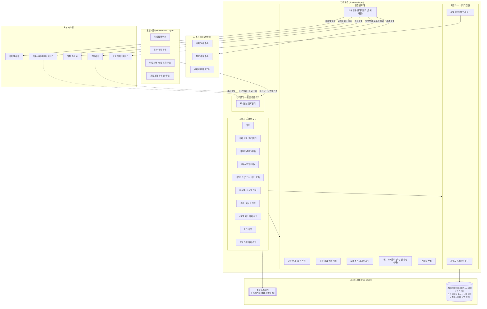
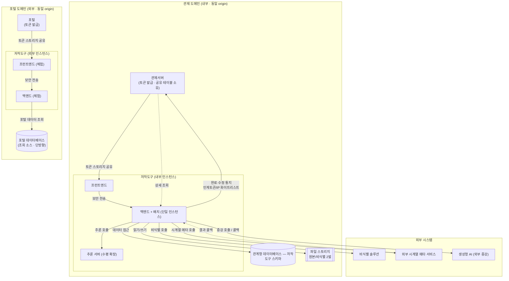

# D5 아키텍처 설계서

## 작성 목적
> 시스템의 품질을 확보하기 위하여 전체시스템에 대한 청사진으로서의 아키텍처를 작성한다. 소프트웨어 아키텍처는 개발 대상 응용 소프트웨어에 대한 아키텍처이며, 시스템 아키텍처는 응용 소프트웨어와 이에 상호작용하는 환경 및 네트워크가 포함된 아키텍처를 의미한다.

## 작성 방법
> 소프트웨어 아키텍처는 선정된 아키텍처 패턴을 중심으로 컴포넌트와 상호작용하는 커넥션 및 가시적인 속성을 표현한다. 시스템 아키텍처는 개발 대상시스템과 상호작용하는 하드웨어, 시스템 소프트웨어 및 네트워크와의 관계를 표현한다. 아키텍처 요구사항 및 구현방안은 아키텍처 관점에서의 시스템의 품질, 보안, 성능, 장애복구 등의 요구사항과 이에 대한 구현방안을 기술한다.

## 산출물 양식

### 제·개정 이력

| 날짜 | 버전 | 제·개정 내역 | 작성자 | 검토자 |
|------|------|------------|--------|--------|
| 2026-06-09 | 1.0 | 최초 작성 | - | - |

### 헤더

| D5 | 아키텍처 설계서 |
|-------|---------|
| 시스템명 | AI 기반 지방정부 CCTV 관제지원시스템 구축(2차) |
| 서브시스템명 | 학습데이터 저작도구 (AT) |
| 단계명 | 설계 |
| 작성일자 | 2026-06-09 |
| 버전 | 1.0 |

---

### 1. 소프트웨어 아키텍처

본 시스템은 **레이어드 아키텍처(Layered Architecture)** 패턴을 채택한다. 백엔드는 표현(Presentation)·업무(Business)·데이터(Data)·AI 추론(AI) 4개 계층으로 분리되며, 업무 계층 내부는 `컨트롤러 → 서비스 → 저장소`의 단방향 의존을 강제한다. AI 추론 계층은 인증·상태·데이터베이스를 갖지 않는 무상태(stateless) 추론 전용으로 격리하여 그래픽 연산 자원(GPU) 경합을 업무 계층과 분리한다.

#### 1.1 레이어 구분 및 컴포넌트 배치

#### 1.2 레이어별 역할

| 계층 | 구성요소 | 역할 |
|------|----------|------|
| 표현 | 프런트엔드 | 라벨링 캔버스, 검수·관리·마킹 화면, 포털 체험 화면. 사용자 인증은 업무 계층에 위임 |
| 업무 — 컨트롤러 | 도메인별 컨트롤러 | 요청·응답 데이터 객체만 처리하고 데이터 모델을 외부에 직접 노출하지 않는다. 모든 응답은 표준 응답 형식을 사용 |
| 업무 — 서비스 | 도메인 서비스 | 마킹·배치 오케스트레이션·라벨링·검수·버전관리·비식별·증강·시계열 메타·배정·포털 업무 로직을 수행하며 트랜잭션 경계를 관리 |
| 업무 — 저장소 | 저작도구 스키마 / 포털 데이터베이스 접근 | 데이터 접근 기술만 사용하며 업무 로직을 포함하지 않는다. 저작도구 스키마와 포털 데이터베이스를 분리 접근 |
| 업무 — 공통 인프라 | 인증·응답·로깅·연동·스케줄·관측 | 토큰 검증, 표준 응답·예외, 로그 마스킹, 외부 연동, 배치 스케줄링, 메트릭 수집을 공통 제공 |
| 데이터 | 관계형 데이터베이스 + 파일 스토리지 | 저작도구 전용 테이블을 자체 소유하고 관제서버 공유 테이블을 읽기 위주로 참조한다. 원본·비식별 영상과 프레임을 별도 경로로 동시 저장 |
| AI 추론 | 추론 서버 | 객체 탐지·분할·추적·시계열 메타 추론을 무상태로 수행한다. 인증·데이터베이스를 갖지 않으며 업무 계층이 오케스트레이션 주체 |

#### 1.3 적용 패턴 및 설계 원칙

- **레이어드 단방향 의존**: 업무 계층은 `컨트롤러 → 서비스 → 저장소` 단방향 흐름을 강제하여 상위 계층 변경이 하위 계층에 전파되지 않도록 한다.
- **추론 격리**: AI 추론을 무상태 별도 계층으로 분리해 자원 경합을 격리하고 추론 계층의 독립 확장을 가능하게 한다.
- **데이터 접근 분리**: 저작도구 전용 스키마와 포털 데이터베이스를 분리된 접근 경로로 운영해 책임 경계를 명확히 한다.
- **외부 연동 단일화**: 모든 외부 호출은 장애 차단(서킷 브레이커)·타임아웃·재시도 정책이 적용된 연동 클라이언트로 통일한다.

---

### 2. 시스템 아키텍처

대상 시스템은 **관제 도메인(내부)** 과 **포털 도메인(외부)** 두 채널로 별도 배포되며, 각 채널은 상위 시스템(관제서버·포털)과 **동일 웹 도메인(origin)** 으로 함께 배포되어 브라우저 스토리지를 통해 인증 토큰을 공유한다. 저작도구는 독립 로그인 화면을 갖지 않으며, 두 채널 모두 동일한 토큰 발급 서버가 발급한 토큰을 단일 검증 로직으로 처리한다.

#### 2.1 시스템 구성도 (하드웨어 · 시스템 소프트웨어 · 네트워크 · 외부 시스템)

#### 2.2 배포·구성 정보

| 항목 | 내용 |
|------|------|
| 배포 방식 | 채널별(관제/포털) 별도 배포, 각 상위 시스템과 동일 웹 도메인으로 함께 배포. 운영 환경은 자체 구축(on-premise) |
| 백엔드 | 단일 인스턴스 서비스. 배치 작업 상태를 관계형 데이터베이스에 영속화하여 재기동 시 미완료 작업을 이어 처리 |
| 추론 서버 | 그래픽 연산 자원(GPU) 작업 단위로 다중 인스턴스 수평 확장 가능 |
| 데이터베이스 | 관계형 데이터베이스(단일). 저작도구 전용 테이블을 자체 소유하고, 관제서버 공유 테이블 9종은 읽기 위주로 참조한다. 배치 작업 상태도 동일 데이터베이스에 영속화. 포털 채널은 포털 데이터베이스를 별도 조회 소스로 참조 |
| 파일 스토리지 | 원본·비식별 영상과 프레임을 별도 경로로 동시 저장 |
| 실행 환경 | 운영·검증·개발·로컬 환경으로 분리하며, 민감 정보는 환경변수·비밀 저장소로 주입 |
| 외부 연동 | 비식별 솔루션, 외부 시계열 메타 서비스(결과 콜백), 생성형 AI(외부 증강), 관제서버(토큰 인계·통지·상세 조회). 모두 장애 차단·타임아웃·재시도 정책이 적용된 연동 클라이언트를 통해 호출 |
| 관찰성 | 헬스체크·메트릭 엔드포인트를 노출(운영 환경은 최소 노출)하고 핵심 이벤트 메트릭을 수집 |

> 환경별 상세 접속 정보(검증·운영 호스트·포트)는 환경변수·비밀 저장소 관리 대상으로 본 문서에서는 기재하지 않는다.

---

### 3. 아키텍처 요구사항 및 구현방안

> 아키텍처 관점에서 시스템에 크게 영향을 주는 품질·보안·성능·장애복구 등의 비기능 요구사항과 그 구현방안을 요구사항 1건당 1표로 기술한다.

| 요구사항 ID | 요구사항 내용 | 구현방안 |
|---------|------------|---------|
| NFR-001 | **배치 파이프라인 처리량(성능).** 비식별 → 마킹(비식별 영상 대상) → 시계열 메타 → 마킹 위치 기반 프레임 추출 → 객체 탐지·분할 → 트랙 보간으로 이어지는 배치 파이프라인을 영상 1건당 1분 이상의 처리율로 운영한다. 배치는 단일 인스턴스 서비스를 기준으로 한다. | 배치 스케줄러가 영상 단위로 1분당 1건씩 작업을 유입시켜 추론 자원의 유입 속도를 조절한다. 오케스트레이터가 파이프라인 단계를 순차 실행하며 단계 진입 시 영상 상태를 '처리 중', 실패 시 '실패'로 전이한다. 추론 서버를 수평 확장하여 추론 병목을 완화하고, 단일 인스턴스 중단(단일 장애점)에 대비해 배치 작업 상태를 데이터베이스에 영속화하여 재기동 시 미완료 작업을 이어 처리하며 최대 재시도·실패 알림 정책을 적용한다. **품질목표 수준**: 처리율 영상 1건/분 이상. 측정은 배치 1건 처리 소요시간·처리 건수 메트릭을 수집·집계하여 검증한다. |
| NFR-002 | **이미지 학습데이터 처리 규모(확장성).** 저작도구는 라벨링·검수·버전관리 대상으로 이미지(프레임) 학습데이터 10만 장 이상을 수용한다. | 모든 목록 조회에 페이징을 적용하고 전체 조회를 금지하며, 대용량 페이징은 커서 기반 방식을 검토한다. 연관 데이터 반복 조회로 인한 성능 저하를 방지하기 위해 연관 일괄 조회·배치 조회 최적화를 적용하고, 대량 저장은 배치 처리한다. 조회·정렬·결합에 사용되는 컬럼에 색인을 확보하고, 프레임 매니페스트로 대량 프레임 탐색을 최적화한다. **품질목표 수준**: 누적 이미지(프레임) 10만 장 이상 수용. 측정은 프레임 누적 건수 집계로 검증한다. |
| NFR-003 | **영상 학습데이터 처리 규모(확장성).** 저작도구는 30초 이상 영상 학습데이터 5,000건 이상을 수용한다. 작업 단위는 영상 1건이다. | 영상 적재는 재개 가능 업로드로 대용량 영상을 안정적으로 수용한다. 원본·비식별 영상을 별도 경로로 동시 저장하고, 프레임은 마킹 위치 기반 추출로 저장량을 제어한다. 영상 단위로 작업·검수·버전(스냅샷)을 관리하여 5,000건 규모의 워크플로우를 추적하며, 배치 1분당 1건 처리(NFR-001)와 연계해 점진 적재한다. **품질목표 수준**: 누적 영상 5,000건 이상 수용. 측정은 영상 원본 누적 건수 집계로 검증한다. |
| NFR-004 | **외부 연동 복원력(가용성·장애복구).** 비식별·추론·시계열 메타·증강·관제 통지 등 모든 외부 연동에 타임아웃·재시도·장애 차단(서킷 브레이커) 정책을 전면 적용한다. 비식별 실패 시 해당 영상을 비식별 실패 상태로 표시하고 재시도 큐에 격리하며 원본은 절대 삭제하지 않는다. | 비식별·추론·시계열 메타·증강·관제 통지 연동 클라이언트 전체에 타임아웃·재시도·장애 차단 정책을 적용한다. 외부 서비스 장애 시 배치는 최대 재시도 후 영상 상태를 '실패'로 전이하고 실패 알림을 발생시켜 수동 재처리로 연결한다. 비식별 실패는 비식별 실패 상태 표시 + 재시도 큐로 격리하고 원본을 보존한다. 관제 통지는 요청 식별자 기반 중복 방지·실패 보관(dead-letter)·재등록 큐로 단방향 발신 신뢰성을 확보한다. 관제·포털과의 양방향 시스템 간 연동은 본 버전에서 운영하지 않으며, 상세 데이터는 관제서버가 저작도구 조회 인터페이스로 직접 조회한다. **품질목표 수준**: 외부 연동 복원력 정책 적용률 100%. 측정은 연동 클라이언트별 정책 적용 점검과 외부 호출 소요시간 메트릭으로 검증한다. |
| NFR-005 | **민감정보 보호(보안).** 개인정보·토큰을 로그·통지 페이로드에 노출하지 않는다(노출 0건). 로그 마스킹을 적용하고 영상을 암호화 저장하며, 비식별 처리 이력을 영상 단위로 기록하고, 관제 통지 페이로드에 개인정보·토큰·원본 비-비식별 이미지를 포함하지 않는다. | 로그 출력 시 민감 필드(비밀번호·토큰·전화번호·이메일 등)를 마스킹 처리하여 출력을 차단한다. 토큰 검증과 역할 기반 접근 제어로 권한 상승·다른 사용자 자원 접근(직접 객체 참조 취약점)을 차단한다. 완료·수정 통지는 메타데이터와 수정 요약만 전달하고 본문·개인정보·원본 이미지를 제외한다. 비식별 누락 신고 흐름으로 노출 발견 시 작업을 잠그고 해당 영상 라벨을 삭제하되 이력을 보존한다. 모든 코드는 정적 보안 분석(국제 보안 표준 기준)을 통과시킨다. **품질목표 수준**: 개인정보·토큰의 로그·페이로드 노출 0건. 측정은 로그 마스킹 적용 점검과 정적 보안 분석(개인정보 노출 점검)으로 검증한다. |
| NFR-006 | **포털 웹 접근성(품질).** 포털(외부 채널)은 반응형 웹(PC/태블릿/모바일)으로 제공하며 웹 접근성 표준(WCAG 2.1 AA)을 준수한다. | 반응형 레이아웃으로 PC·태블릿·모바일에 대응한다. 의미 기반 요소·대체 텍스트·라벨 연결·포커스 이동·키보드 접근을 적용하고, 색상 단독 정보 전달을 금지하여 아이콘·텍스트를 병행한다. 포털은 데이터마트 영상 선택·기존 라벨 조회·수정·기간 내 다운로드 전용으로 화면을 단순화한다. **품질목표 수준**: 웹 접근성 WCAG 2.1 AA 준수. 측정은 접근성 자동 점검 도구와 수동 검수로 검증한다. |
| NFR-007 | **메트릭·추적성(관찰성).** API 응답시간·배치 처리량·외부 호출을 전수 수집하고, 모든 요청에 추적 식별자를 부여하여 로그와 외부 호출에 전파한다. | 헬스체크·메트릭 엔드포인트를 노출(운영 환경은 최소화)하고, 배치 처리량·소요시간과 외부 호출 성공·실패·응답시간을 메트릭으로 수집한다. 모든 요청에 추적 식별자를 부여해 로그 패턴에 포함하고 외부 호출 시 추적 식별자 헤더로 전파한다. 추론 서버의 자원 모니터링 지점을 확보하여 자원 경합을 감지한다. **품질목표 수준**: 핵심 이벤트(API·배치·외부 호출) 메트릭 수집률 100%. 측정은 노출 메트릭 점검과 로그의 추적 식별자 포함 여부로 검증한다. |

---

## 부록 — 적용 범위 및 미기재 항목

- **§3 범위**: 본 제출본은 저작도구 비기능 요구사항에 직접 대응하는 7건(성능·확장성·가용성·보안·접근성·관찰성)으로 한정한다. 학습데이터 단계별/종류별 품질관리·값 검증·화면 응답시간·자원 효율·세션 통제·시큐어코딩·웹표준·데이터 표준 등 공통 비기능 위임분은 상위 시스템 공통 요구사항 소관으로 본 D5 §3에 포함하지 않는다.
- **미기재 항목**:
  - 환경별(검증·운영) 호스트·포트 등 구체 접속 정보 — 환경변수·비밀 저장소 관리 대상으로 본 문서 미기재.
  - 컴포넌트 식별자 대응 표 — 컴포넌트 설계서(D3) 소관으로 본 D5에서는 일반 명칭으로 표기.
