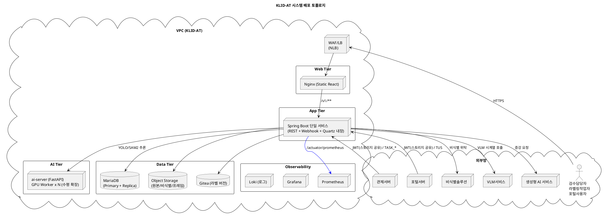

# D5. 아키텍처 설계서

## ▣ 제·개정 이력

| 날짜 | 버전 | 작성자 | 승인자 | 내용 |
|---|---|---|---|---|
| 2026-05-21 | 1.0 | 박찬기 | - | 최초 작성 — klid-label (backend Spring Boot 3.3 / frontend React 18 / ai-server FastAPI) 기반 |

---

| 시스템명 | 기반 지방정부 관제지원시스템 구축(2차) AI CCTV | 서브시스템명 | AI CCTV 학습데이터 저작도구 (KLID-AT-SS-001) |
|---|---|---|---|
| **단계명** | 설계 | **작성일자 / 버전** | 2026-05-21 / 1.0 |

---

## 1. 소프트웨어 아키텍처

### 1.1 아키텍처 스타일

- **DDD(Domain-Driven Design) Layered Architecture** + **Hexagonal Ports/Adapters** 혼합
- **Pipeline-and-Filter**(배치) + **Event-Driven** + **Reactive**(외부 클라이언트)

### 1.2 소프트웨어 계층도

```plantuml
@startuml KLID-AT-Software-Architecture
title KLID-AT 소프트웨어 아키텍처
skinparam defaultFontName "Malgun Gothic"
skinparam componentStyle rectangle

rectangle "Presentation Layer" {
  [REST Controllers]\n(31개)
  [Webhook Controllers]\n(3개)
  [TUS Controller]
}

rectangle "Application Layer (Domain Services)" {
  [Label/Version/Review/Assignment]
  [Meta/Augment/Portal]
  [Batch Orchestrator + Steps]
  [Stats/Preset/SystemConfig]
  [Notification (interface)]
}

rectangle "Domain Layer" {
  [Entities (JPA 42개)]
  [Value Objects (TokenClaims, BatchStage…)]
  [State Machines]
}

rectangle "Infrastructure (Outbound Adapters)" {
  [WebClient Adapters\n(Ai/Deidentify/Vlm/Gitea/Augment)]
  [Idempotency Ledger]
  [Resilience4j CB/Retry]
  [Fallback Queues]
  [Quartz Scheduler]
  [JPA/QueryDSL Repositories]
  [Flyway Migration]
  [Caffeine Cache]
  [Micrometer/Prometheus]
}

rectangle "Cross-Cutting" {
  [Spring Security\n(JWT/HMAC/RBAC)]
  [GlobalExceptionHandler]
  [RequestIdFilter\n(MDC)]
  [Logback JSON Encoder]
}

[REST Controllers] --> [Label/Version/Review/Assignment]
[REST Controllers] --> [Meta/Augment/Portal]
[Webhook Controllers] --> [Idempotency Ledger]
[Webhook Controllers] --> [Application Layer (Domain Services)]
[Label/Version/Review/Assignment] --> [Entities (JPA 42개)]
[Batch Orchestrator + Steps] --> [WebClient Adapters\n(Ai/Deidentify/Vlm/Gitea/Augment)]
[Label/Version/Review/Assignment] --> [WebClient Adapters\n(Ai/Deidentify/Vlm/Gitea/Augment)]
@enduml
```

### 1.3 주요 결정사항 (Architecture Decisions)

| AD | 결정 | 근거 |
|---|---|---|
| AD-01 | Spring Boot 3.3 + Java 17 (Backend) | 발주 표준 + LTS, jjwt 0.12 호환 |
| AD-02 | React 18 + Vite + TS + TanStack Query (Frontend) | 코드 스플리팅·캐시·낙관적 업데이트 |
| AD-03 | FastAPI + ultralytics(YOLO/SAM2) (AI Server) | Python 생태계 모델 사용 |
| AD-04 | WebClient + Resilience4j CB/Retry | 외부 시스템 장애 격리 |
| AD-05 | Quartz Scheduler (DB 백킹) | 단일 인스턴스 서비스 배포 (클러스터 미적용) |
| AD-06 | 멱등성 원장(InMemory/Persistent) | 외부 콜백 중복 차단 (Webhook 표준) |
| AD-07 | Gitea 자동 커밋 + 폴백 큐(메모리+DB) | 라벨 데이터 유실 방지 |
| AD-08 | JWT(HS256, 채널·역할 클레임) + ChannelGuard | 외부 발급 토큰 검증 + 채널 격리 |
| AD-09 | Flyway 마이그레이션 | 스키마 진화 추적성 |
| AD-10 | OpenAPI 3 + openapi-typescript | FE 타입 자동 생성 |
| AD-11 | 라벨 좌표 점 ≤1000개 (CWE-770) | DoS 방어 |
| AD-12 | HMAC-SHA256 웹훅 서명 검증 | 외부 콜백 위조 차단 |
| AD-13 | 관제서버 통지 별도 컴포넌트 | 강결합 분리, 디바운스·폴백 분리 |

---

## 2. 시스템 아키텍처

### 2.1 배포 토폴로지 (TO-BE)



### 2.2 기술 스택

**Backend**: Spring Boot 3.3.0 / Java 17 / Spring Security 6 / Spring Data JPA + QueryDSL 5.1 / MapStruct 1.5 / Quartz / Resilience4j 2.2 / Spring WebFlux WebClient / jjwt 0.12 / Flyway 10.13 / Caffeine / Micrometer Prometheus / Logback + logstash-encoder / FFmpeg wrapper 0.8 / springdoc-openapi 2.5

**Frontend**: React 18.3 + Vite 5.2 + TypeScript 5.4 / React Router 6.22 / TanStack Query 5.28 / axios 1.6 / zustand 4.5 / Konva 9.3 + react-konva / TailwindCSS 3.4 / react-hook-form + zod / recharts / tus-js-client 4.3 / Playwright e2e + Vitest

**AI Server**: FastAPI 0.110 + uvicorn / ultralytics(YOLO/SAM2) / PyTorch 2.2 + torchvision / OpenCV 4.9 / Pillow

**DB**: MariaDB 10.x (운영) / H2 (테스트) / Flyway 마이그레이션 / Quartz 스키마(QRTZ_*) 호환

**Infra**: Nginx, Docker, GPU 노드(ai-server), Prometheus/Grafana/Loki

### 2.3 네트워크 보안 영역

- **DMZ**: WAF/LB
- **Web Tier**: 정적 자산 (Nginx)
- **App Tier**: 비공개망 (외부 접근 차단), 외부 API 호출은 NAT
- **AI/Data Tier**: App Tier 만 접근 가능 (보안그룹 제한)
- **외부 시스템 통신**: 전송구간 TLS 1.2+ 강제, 웹훅 수신은 HMAC 서명 검증, JWT 알고리즘 HS256 고정(`none`/`RS256` 거부)

---

## 3. 아키텍처 요구사항 및 구현방안

### 3.1 요구사항 → 구현방안 매핑

| 요구사항 ID | 요구사항 내용 | 구현방안 |
|---|---|---|
| RQ-NFR-PRF-01 | 라벨 저장 응답시간 ≤ 1초(p95), 영상 목록 ≤ 2초(p95) | (1) DB 인덱스(영상 IDX_LD_VIDEO_STATUS, 라벨 IDX_LBL_SRC) (2) WebClient 비동기 + Reactor (3) `@Transactional(readOnly)` 일관 적용 (4) Caffeine 캐시(시스템 설정 TTL 60s) |
| RQ-NFR-PRF-02 | 자동 파이프라인 처리량 ≥ 50건/시간 | (1) Quartz 단일 인스턴스 Job 처리 (2) ai-server GPU Worker 다중 프로세스 수평 확장 (3) 마킹→VLM(콜백 비동기)→비식별→프레임추출(마킹 위치)→YOLO(원본만)→SAM2→보간 7단계 (4) 단계별 비동기 위탁 |
| RQ-NFR-SEC-01 | 외부 발급 JWT 검증, 자체 로그인 미보유 | JwtAuthenticationFilter(HS256 고정), JwtIssuerValidator(허용 issuer 화이트리스트), Replay 방지(`jti` + 만료) |
| RQ-NFR-SEC-02 | 채널·역할 분리 (INTERNAL vs PORTAL) | ChannelGuard + RoleGuard 이중 적용 (Frontend), `@PreAuthorize` + 메서드 가드 (Backend) |
| RQ-NFR-SEC-03 | 웹훅 콜백 위조 차단 | HmacWebhookFilter (HMAC-SHA256 X-Signature), 멱등성 원장(WebhookIdempotencyLedger) |
| RQ-NFR-SEC-04 | IDOR 방어 (라벨 접근) | LabelAccessGuard (`verifyAndGet`) — 모든 라벨 read/write 진입점에서 적용 (LabelService, Sam2TrackService, VersionService, DeidentReportService, FrameImageController, PortalLabelService 등) |
| RQ-NFR-SEC-05 | DoS 방어 (좌표 점·페이로드 크기) | LabelService.MAX_POINTS_PER_LABEL=1000, ControlNotifyClient CHUNK_THRESHOLD_BYTES=64KB |
| RQ-NFR-SEC-06 | 로그 인젝션·개인정보 노출 방지 | LogNotificationService.sanitize (개행 제거 + 200자 절단, CWE-117/CWE-359), VlmClient.safeForLog |
| RQ-NFR-REL-01 | 외부 시스템 장애 시 데이터 유실 0건 | Resilience4j CircuitBreaker + Retry + Fallback Queue (Gitea: GiteaCommitFallbackQueue + GiteaFallbackQueueService, Control: ControlNotifyFallbackQueue) |
| RQ-NFR-REL-02 | 콜백 중복 처리 차단 | WebhookIdempotencyLedger (메모리 + DB 영속 2 구현) |
| RQ-NFR-REL-03 | 비식별 처리 누락 0건 (정책 강제) | BatchOrchestrator 분기 없이 모든 영상에 DeidentifyStep 무조건 실행 |
| RQ-NFR-REL-04 | 라벨 우선 저장 (Gitea 실패해도 DB 유실 없음) | LabelService: DB upsert 성공 후 VersionService.commit 호출, 실패 시 폴백 큐로 비동기 재시도 |
| RQ-NFR-AVL-01 | App Tier 무중단 배포 (RollingUpdate) | Stateless Spring Boot, 세션 외부화(JWT), DB connection pool 적정값(HikariCP) |
| RQ-NFR-AVL-02 | 24×7 가용성, MTTR ≤ 30분 | Spring Boot 단일 서비스 + systemd 자동 재시작, MariaDB Replica, 헬스 엔드포인트(/health, /actuator/health) |
| RQ-NFR-OBS-01 | 요청 추적 (분산 환경) | RequestIdFilter (X-Request-ID MDC 주입), JSON 구조 로그 |
| RQ-NFR-OBS-02 | 핵심 지표 수집 | Micrometer + Prometheus (/actuator/prometheus), 패널: 파이프라인 처리율, CB 상태, 웹훅 중복률, 라벨 저장 p95, Gitea 폴백 큐 깊이, ControlNotify dead |
| RQ-NFR-MAI-01 | 스키마 진화 추적 | Flyway (V1__init.sql, V2__... 누적), `flyway.lockAllConfigurations` 의존성 잠금 |
| RQ-NFR-MAI-02 | API 변경 클라이언트 자동 반영 | OpenAPI 3 (springdoc) → openapi-typescript → FE 타입 자동 생성 (`scripts/gen-api-types.sh`) |
| RQ-NFR-DAT-01 | 라벨 변경 이력 영구 보존 | Gitea 자동 커밋 (롤백 시에도 새 커밋, 기존 이력 보존), LS_LABEL_VERSION 테이블 |
| RQ-NFR-DAT-02 | 원본/비식별 영상 분리 저장 | Object Storage 별도 prefix (raw/, deid/), 접근 권한 분리(IAM) |
| RQ-NFR-COM-01 | 발주처 표준 ID 체계 준수 | KLID-AT-* / KLID-IT-* / KLID-ST-* 접두어 일관 적용 (`project-klid-id-rules`) |

### 3.2 핵심 비기능 시나리오 (대표 5건)

#### 시나리오 1 — Gitea 장애 상황

- **이벤트**: WORKER 라벨 저장 직후 Gitea 5xx (네트워크 단절)
- **응답**: VersionService.commit → GiteaClient(CB Open) → 메모리 폴백 큐 적재 → 30초 후 영속 폴백 큐로 승격(stg/prd) → GiteaFallbackRetryJob 5분마다 재시도 → 복구 시 자동 커밋
- **사용자 영향**: 라벨 저장은 성공(DB 우선 저장 원칙), 버전 이력만 지연 생성
- **측정 지표**: `gitea_fallback_queue_depth`, `gitea_commit_p95`

#### 시나리오 2 — 외부 비식별 솔루션 장애

- **이벤트**: 비식별 위탁 후 응답 없음 (타임아웃)
- **응답**: DeidentifyClient(Retry max=3 + CB Open) → BatchRetryQueue.enqueue → 운영팀 알림 → 원본 영상은 절대 삭제하지 않음(정책)
- **측정 지표**: `batch_failed_count{stage=DEIDENTIFY}`, `cb_state{name=deidentify}`

#### 시나리오 3 — 동일 비식별 결과 중복 콜백

- **이벤트**: 비식별 솔루션이 같은 requestId 로 2회 콜백
- **응답**: HmacWebhookFilter 통과 → DeidentifyResultController → WebhookIdempotencyLedger.checkAndMark(requestId) → 2번째 호출은 no-op + 200 OK 반환
- **측정 지표**: `webhook_duplicate_count{source=deidentify}`

#### 시나리오 4 — JWT 만료 (세션 유지 중)

- **이벤트**: 사용자 작업 중 JWT 만료(exp 초과)
- **응답**: JwtAuthenticationFilter → 401 → Frontend axios 인터셉터 → `/ingress` 재진입 → 발급자(관제/포털) 재인증 redirect

#### 시나리오 5 — TASK_MODIFIED 폭주 (UC-015)

- **이벤트**: WORKER 가 60초 내 같은 영상 라벨 10회 수정
- **응답**: 매 수정마다 `TaskModifiedEvent` 발행 → ControlNotifyDebouncer.register(rawSn, frameId) → 60초 윈도우 후 1회만 ControlNotifyClient.notifyTaskModified 호출 (frameIds 누적 전송)
- **측정 지표**: `control_notify_inflight`, `control_notify_sent_total{eventType=TASK_MODIFIED}`

### 3.3 환경별 배포 차이

| 항목 | local | dev | stg | prd |
|---|---|---|---|---|
| DB | H2 | MariaDB(공유) | MariaDB | MariaDB(HA) |
| Quartz | 단일 | 단일 | 단일 | 단일 |
| VLM enabled | false | false | true | true |
| ControlNotify | false | false | true | true |
| 멱등성 원장 | InMemory | Persistent | Persistent | Persistent |
| 폴백 큐(Gitea) | Memory | Persistent | Persistent | Persistent |
| WebhookIdempotencyLedger | InMemory | Persistent | Persistent | Persistent |
| DevTokenController | enabled | enabled | disabled | disabled |
| AutolabelTestController | enabled | enabled | disabled | disabled |

### 3.4 향후 확장 (Roadmap)

- 관제서버 통지 컴포넌트(KLID-AT-CO-013) 구현Loki + Grafana 로그 패널 — Phase 13
- 분산 트레이싱(OpenTelemetry) — Phase 14
- 모델 서빙 GPU Autoscaling (ai-server) — Phase 15
