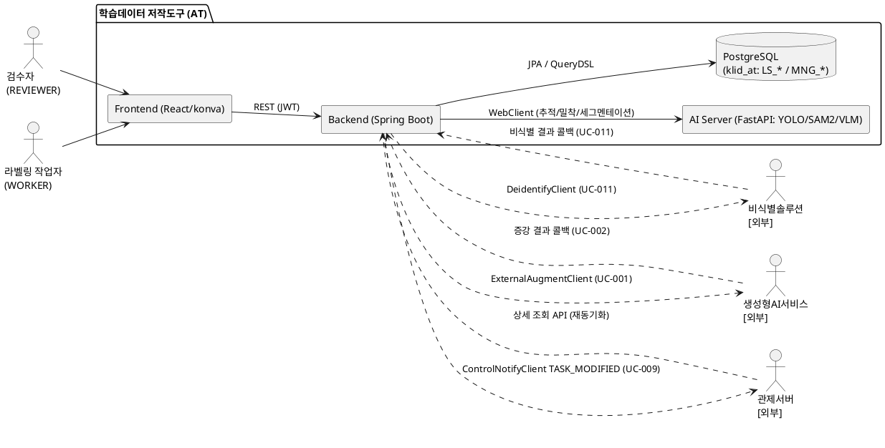

# D6 총괄시험 계획서

## 제·개정 이력

| 날짜 | 버전 | 제·개정 내역 | 작성자 | 검토자 |
|------|------|------------|--------|--------|
| 2026-05-31 | 1.0 | 최초 작성 — R1 사용자 요구사항(SFR-06~09, 18개)에 매핑되는 R2 유스케이스(UC-001~UC-015)에 한정한 단위/통합/시스템/인수 시험 계획 수립. DB는 PostgreSQL 확정(단위시험 Testcontainers-PostgreSQL) | 박찬기 | 김현욱 |

## 헤더

| D6 | 총괄시험 계획서 |
|-------|---------|
| 시스템명 | AI 기반 지방정부 CCTV 관제지원시스템 구축(2차) | 서브시스템명 | 학습데이터 저작도구 (AT) |
| 단계명 | 설계 | 작성일자 | 2026-05-31 | 버전 | 1.0 |

---

> **본 계획의 시험 범위 정의 (Critical)**
> 본 총괄시험 계획서의 시험 대상은 **R1 사용자 요구사항 18개(RQ-SFR-06-03 ~ RQ-SFR-09-07)에 매핑된 R2 유스케이스(UC-001~UC-015)** 에 한정한다. 해당 유스케이스가 걸치는 서브시스템은 **데이터 증강(SS-009) · 라벨링 AI 보조(SS-006) · 버전관리(SS-008) · 검수(SS-007) · 비식별화(SS-004) · 시계열 메타(SS-005)** 의 6개다.
> R1 요구사항과 직접 매핑되지 않는 기능(사용자/권한 SS-001, 마킹 SS-002, 배치 파이프라인 SS-003, 포털 SS-010)은 본 시험 범위에 포함하지 않는다. 단, 인증(JWT 검증)·공통 응답·예외 처리 등 대상 유스케이스 동작에 필수적인 공통 인프라는 시험 전제로 포함한다.
> RQ-SFR-06-04(프롬프트 편의성 개선)는 저작도구 범위 외(외부 생성형 AI 시스템 책임)로 매핑 유스케이스가 없어 시험 대상에서 제외한다.

---

## 1. 시험 대상 시스템

### 1.1 시스템 개요

학습데이터 저작도구(AT)는 다음 3개 응용 시스템으로 구성되며, 본 시험 계획은 **R1 18개 요구사항에 매핑된 6개 서브시스템 범위** 내에서 이 3개 시스템과 외부 인터페이스를 대상으로 한다.

- **Backend (Spring Boot 3.3 / Java 17 / Gradle 8)**: 인증·DB·오케스트레이션·라벨/버전/검수/증강/비식별 CRUD 및 외부 연동을 담당. Spring Data JPA(Hibernate 6) + QueryDSL 5.1, Spring Security + JJWT 0.12, Resilience4j, Spring WebFlux WebClient, MapStruct/Lombok, Springdoc OpenAPI.
- **AI Server (Python 3.11 / FastAPI)**: YOLO/SAM2/VLM 호출 어댑터. Stateless 추론(객체 추적·외곽 밀착·세그멘테이션) 및 외부 VLM 시계열 호출 연동만 담당. 상태·인증·DB 없음.
- **Frontend (React 18 / TypeScript 5 / Vite 5)**: 라벨링 캔버스(konva.js), 증강 검수 화면, 버전 비교/복구 화면, 비식별 결과 검토 화면, 시스템 설정(정밀도) 화면 등. TanStack Query v5 / Zustand / React Router v6 / axios / Tailwind.

**데이터베이스**: PostgreSQL (드라이버 `org.postgresql.Driver`, `klid_at` 스키마). 저작도구 전용 LS_* 테이블은 자체 소유, 관제서버 공유 MNG_* 9개는 `ddl-auto=validate`로 참조. Flyway 10.13(+`flyway-database-postgresql`)로 마이그레이션. Quartz JobStore는 PostgreSQLDelegate(BYTEA).

> 본 도구는 **독립 로그인 UI가 없으며** 관제/포털서버가 발급한 JWT를 인계받아 검증한다. 시험 환경에서는 동일 JWT 발급 서버를 모사하는 토큰 발급 보조(local/dev 한정)로 REVIEWER/WORKER 인증을 모사한다.

### 1.2 하드웨어 구성도

```text
[저작도구(AT) 시험 대상 토폴로지]
├─ Web Tier (Nginx) ............ 정적 React 호스팅 / 리버스 프록시
├─ App Tier (Spring Boot) ...... 단일 인스턴스 서비스 (REST + Webhook 콜백 수신 + Quartz 내장)
│     └─ R1 범위 동작: 증강 결과 수신, 비식별 요청/콜백, 라벨 AI 보조 호출,
│        버전 저장/diff/rollback, 검수 승인/반려, 데이터마트 수정 통지(outbound)
├─ AI Tier (FastAPI + GPU) ..... YOLO/SAM2 추론 + 외부 VLM 호출 어댑터 (수평 확장 가능)
├─ DB Tier (PostgreSQL) ........ klid_at 스키마 (LS_* 자체 소유 + MNG_* validate 참조)
├─ Storage ..................... 원본/비식별/프레임/증강 경로 분리 (STORAGE_RAW_PATH / STORAGE_DEIDENTIFIED_PATH)
└─ Observability ............... Micrometer + Prometheus + Grafana

[외부 시스템 (분리발주 / 타 시스템 책임 — 시험 시 Mock 또는 실연동)]
├─ 비식별 솔루션 [외부] ........ DeidentifyClient 호출 (UC-011/012)
├─ 생성형 AI 서비스 [외부] ..... ExternalAugmentClient 위임 + 결과 콜백 (UC-001/002)
└─ 관제서버 [외부] ............. ControlNotifyClient outbound 통지(TASK_MODIFIED) + inbound 조회 API (UC-009)
```

> 본 도구의 배치(Quartz)는 단일 인스턴스 서비스로 배포되며(클러스터 미적용), GPU 자원은 ai-server에 한정된다. ai-server(YOLO/SAM2)만 다중 인스턴스 수평 확장이 가능하다.

### 1.3 응용 목표시스템 구성도



---

## 2. 가정(Assumptions) 또는 제약사항(Constraints)

- **(가정)** 외부 시스템(비식별 솔루션 · 생성형 AI 서비스 · 외부 VLM 서비스 · 관제서버)은 시험 환경에서 **Mock(WireMock/MockWebServer) 또는 실연동**으로 응답 가능하다. 단위·통합 시험은 Mock 기반을 원칙으로 하고, 시스템·인수 시험 일부 구간은 실연동(또는 운영 동일 모사)으로 검증한다.
- **(가정)** 본 도구는 자체 로그인이 없으므로, 관제/포털서버 발급 JWT를 모사하는 토큰 발급 보조(local/dev 한정)로 REVIEWER/WORKER 권한을 모사하여 시험한다.
- **(가정)** 시스템시험은 운영 환경과 동등한 자원/네트워크(stg)에서 수행한다.
- **(제약)** 외부 비식별 솔루션은 발주기관이 SW 직접구매로 도입·제공하는 항목이며, 가용성/응답 스펙 변동 시 본 도구 SLA에 영향을 줄 수 있다. 본 도구는 Resilience4j(타임아웃/재시도/서킷 브레이커) + 실패 시 `DE_IDNTF_YN='F'` 마킹 + 재시도 큐로 **원본 무손실(원본 절대 삭제 금지)** 만을 책임진다.
- **(제약)** 생성형 AI 본체·VLM 본체·영상 합성 모델 본체·데이터마트는 **저작도구 범위 외(외부 시스템 책임)** 이며, 본 시험은 저작도구 측 연동(요청·콜백 수신·등록·검수·통지)만을 대상으로 한다.
- **(제약)** 관제/포털 **양방향 통합(M2M) 인증 인프라는 deprecated(미운영)**. 단, 저작도구 → 관제서버 **단방향 outbound 통지(TASK_MODIFIED, UC-009)** 와 관제서버 inbound 조회 API는 예외로 보유하며 본 시험 대상에 포함한다. 통지/콜백 보호는 인계 토큰 또는 HMAC 시그니처 + timestamp + idempotencyKey allowlist로 검증한다.
- **(제약)** GPU 자원 한계로 ai-server는 GPU 1대 기준으로 성능을 산정하며, 수평 확장 시 비례 증가로 본다.
- **(범위)** 본 도구는 신규(미배포) 시스템으로, 데이터 전환/마이그레이션 시험은 본 계획에 포함하지 않는다(D12 별도). 인수시험은 운영 환경 동일 환경에서 수행한다.

---

## 3. 시험 전략 (Test Strategy)

### 3.1 시험 범위 (Scope)

> 본 범위는 **R1 18개 요구사항 ↔ R2 15개 유스케이스** 매핑(R2 부록 A)에 한정한다.

| 구분 | 시험 항목 (R1 요구사항 ID / 매핑 UC) |
|------|-------------------------------------|
| 데이터 증강 (SS-009) | 증강 영상 생성 요청(UC-001 / RQ-SFR-07-01), 증강 결과 수신·등록·라벨 복사 무결성(UC-002 / RQ-SFR-07-01·07-02), 해상도 변경 수행(UC-003 / RQ-SFR-06-03·07-02) |
| 라벨링 AI 보조 (SS-006) | 객체 자동 추적(UC-004 / RQ-SFR-08-01), 객체 외곽 경계 자동 밀착(UC-005 / RQ-SFR-08-02), 라벨링 정밀도 조절(UC-006 / RQ-SFR-08-03) |
| 버전관리 (SS-008) | 라벨 버전 저장·이력 추적(UC-007 / RQ-SFR-08-04), 버전 비교·복구(UC-008 / RQ-SFR-08-05), 데이터마트 수정 통지(UC-009 / RQ-SFR-08-06) |
| 검수 (SS-007) | 증강 영상 활용 여부 승인/반려(UC-010 / RQ-SFR-07-03) |
| 비식별화 (SS-004) | 비식별 처리 요청·API 연동(UC-011 / RQ-SFR-09-01·09-02), 비식별 결과·이력 검토·확인(UC-012 / RQ-SFR-09-03·09-05), 비식별 옵션 설정(UC-013 / RQ-SFR-09-04), 개인정보 보호대책 적용(UC-014 / RQ-SFR-09-06), 개인정보 유형 분류체계 관리(UC-015 / RQ-SFR-09-07) |
| 시계열 메타 (SS-005) | 외부 VLM 시계열 호출 연동 결과 적재·검토(UC-012 비식별 결과 검토 맥락 보조 / RQ-SFR-09-03 검토 맥락) |
| 공통(전제) | JWT 검증·역할 기반 접근 제어, `ApiResponse<T>` 표준 응답, GlobalExceptionHandler, 외부 연동 Resilience4j 정책 |
| 시험 제외 | RQ-SFR-06-04(프롬프트 편의성, 범위 외), 사용자/권한·마킹·배치 파이프라인·포털(R1 미매핑) |

### 3.2 개발 단계별 수행할 시험 종류

|         | 단위시험 | 통합시험 | 시스템시험 | 인수시험 |
|---------|----------|----------|------------|----------|
| 시험대상 | 개별 클래스/함수/컴포넌트 (BE Service/Component, FE Component, AI Endpoint) | 컴포넌트 간 연동 + 외부 시스템 모의 연동(비식별/생성형AI/VLM/관제 통지) | R1 범위 유스케이스의 비기능 전반(성능/부하/볼륨/보안) | R1 18개 요구사항 ↔ UC-001~UC-015 전체 시나리오 |
| 목적 | 단위 정확성 (도메인 규칙·경계조건) | 인터페이스 정합성 (정상/오류/타임아웃/CB Open/중복 콜백) | 성능·볼륨·보안 만족기준 충족 | 요구사항 만족도 검증 및 발주처 승인 |
| 테스터 | 응용 개발팀(1차) + 프로젝트 시험팀(2차) | 프로젝트 시험팀 | 프로젝트 시험팀 | 발주처(KLID) + 프로젝트 시험팀 합동 |
| 기준선 | 컴포넌트/클래스 설계(D1, D3) | 인터페이스 설계(D4), 유스케이스 기본/대안 시나리오(R2) | 아키텍처 요구사항(D5), 성능 목표(SFR-16/17) | 사용자 요구사항(R1), 유스케이스(R2) |
| 시험도구 | JUnit 5 + Mockito + Spring Boot Test / Vitest + Testing Library / pytest + httpx | Testcontainers(**PostgreSQL**) + MockWebServer + `@SpringBootTest` | k6/JMeter(부하·성능), OWASP ZAP·Fortify/CodeQL(보안) | Playwright 시나리오 + 수동 확인 |
| 시험환경 | local / dev | dev | stg | stg(운영 동일) |

#### 3.2.1 단위시험

- **대상**: R1 범위 도메인 로직의 개별 단위 — 증강 등록(PARENT_RAW_SN 연결·라벨 복사), 해상도 변경 좌표 정합, SAM2 추적/밀착 응답 매핑·트랙 보간, 폴리곤 단순화(epsilon) 적용, 라벨 버전 스냅샷 해시(VERSION_HASH=SHA-256)·diff 산출, 검수 상태 전이(PENDING→ACCEPTED/REJECTED), 비식별 대상 판별(PRVC_TYPE_CD)·실패 마킹 등.
- **도구**: JUnit 5 + Mockito + Spring Boot Test(Backend), Vitest + Testing Library + jsdom(Frontend), pytest + httpx(AI Server).
- **DB 의존 단위**: **Testcontainers(PostgreSQL)** 로 실제 스키마/제약/인덱스 정합을 검증한다(H2/인메모리 대체 금지 — PostgreSQL 문법·제약 차이 회피).
- **수행**: 개발자(1차 작성·수행) → 프로젝트 시험팀(2차 검토).
- **산출물**: 단위시험 케이스(D11) — `KLID-AT-UT-NNN`, 단위시험 결과서(I2).
- **커버리지 목표**: 라인 80% 이상, 분기 70% 이상(핵심 도메인 서비스 90% 이상).

#### 3.2.2 통합시험

- **대상**: 컴포넌트 간 연동 + 외부 시스템 모의 연동. R1 범위 외부 인터페이스 — 비식별 호출/콜백, 증강 위임/결과 콜백, ai-server 추론 호출, 관제 TASK_MODIFIED 통지 + 조회 API.
- **도구**: Testcontainers(**PostgreSQL**) + MockWebServer(외부 HTTP) + `@SpringBootTest`.
- **시나리오**: 인터페이스별 정상 / 4xx / 5xx / 타임아웃 / 서킷 브레이커 Open / 중복 콜백(idempotencyKey) / HMAC 서명 검증 실패 케이스를 포함한다. UC 기본·대안 시나리오(R2)를 통합 흐름으로 검증한다.
- **수행**: 프로젝트 시험팀.
- **산출물**: 통합시험 시나리오(D10) — `KLID-IT-TS-NNN`, 통합시험 결과서(T1).

#### 3.2.3 시스템시험

- **대상**: R1 범위 유스케이스의 비기능 전반 — 성능/부하/볼륨/보안.
- **도구**: k6/JMeter(부하·성능), OWASP ZAP(DAST), **Fortify SCA / GitHub CodeQL**(SAST), gradle 의존성 취약점 스캔(SCA).
- **성능 목표**: 배치 파이프라인 1건/분 처리, 외부/추론 API 호출 타임아웃 정책 준수(ai-server 60s, VLM 45s), 일반 API 응답 3초 이내.
- **볼륨 목표**: 이미지 학습데이터 10만 장(SFR-16) 라벨 데이터 조회, 영상 학습데이터 5,000건(SFR-17, 30초 이상/건) 관리 시 페이징 응답 기준 충족.
- **보안**: JWT 만료/위변조 처리, 비식별 데이터 접근 통제(IDOR 방지), SQL Injection 방어(파라미터 바인딩), 통지/콜백 페이로드 PII·토큰 미포함 검증, 로그 민감정보 마스킹.
- **수행**: 프로젝트 시험팀.
- **산출물**: 시스템시험 시나리오(D7) — `KLID-ST-NNN`, 시스템시험 결과서(T2).

#### 3.2.4 인수시험

- **대상**: R1 18개 요구사항 ↔ UC-001~UC-015 전체 시나리오를 발주처(KLID) 주도로 운영 동일 환경에서 검증.
- **도구**: Playwright 시나리오 자동화 + 수동 확인.
- **수행**: 발주처 + 사업자 합동.
- **산출물**: 인수시험 시나리오(T6), 인수시험 결과서(T7).

---

## 4. 시험 실행 계획

### 4.1 시험 수행 절차

| 구분 | 프로젝트시험팀 | 응용개발팀 | 테스트환경구축팀 | 산출물 |
|------|---------------|-----------|---------------|--------|
| 테스트계획 | 총괄시험 계획 작성 → 검토 → 시험 교육 | 시험 가능 범위 검토 의견 | — | D6 (본 문서) |
| 단위시험 | 케이스 도출(2차) → 결과 검토 | 케이스 작성(1차) → 수행 → 결함 수정 | local 환경 구축, Testcontainers(PostgreSQL) 셋업 | D11, I2 |
| 통합시험 | 시나리오/케이스 도출 → 수행 → 결함 검토 | 결함 수정 → 결과 확인 | dev 환경 구축, MockWebServer 셋업 | D10, T1 |
| 시스템시험 | 시나리오 도출 → 수행 → 결함 검토 | 결함 수정 → 결과 확인 | stg 환경 구축, 부하/보안 도구 셋업 | D7, T2 |
| 인수시험 | 시나리오 도출 → 수행 지원 → 결과 보고 | 결함 수정 → 결과 확인 | stg 환경(운영 동일) 구축 | T6, T7 |

### 4.2 발견된 문제점(결함)에 대한 수정 절차

1. **결함 등록**: 테스터가 결함 추적 시스템(Jira/Redmine 등)에 등록 — 재현 절차/예상결과/실제결과/로그(민감정보 마스킹 후) 첨부, 관련 UC·요구사항 ID 명기.
2. **결함 검토회**: 개발자/테스터/관련자 참석 → 원인·심각도(치명/높음/보통/낮음)·우선순위 합의.
3. **수정**: 개발자가 해결방안 도출 → 코드 수정 → PR 리뷰(보안 점검 포함) → 머지 → 재배포.
4. **설계 변경 동반 시**: 변경 절차에 따라 관련 설계 산출물(D1~D5, R1/R2) 갱신 후 베이스라인 재태깅.
5. **재시험·회귀**: 테스터가 재시험 → 연관 영역 회귀 시험 → 결함 종료(Close).

### 4.3 시험 툴 사용 계획

| 시험 유형 | 도구 | 비고 |
|-----------|------|------|
| Java 단위 | JUnit 5 + Mockito + Spring Boot Test | build.gradle 표준 |
| Java 통합 | **Testcontainers(PostgreSQL)** + MockWebServer | build.gradle 포함, H2 대체 금지 |
| TS 단위 | Vitest + Testing Library + jsdom | package.json |
| e2e / 인수 | Playwright (chromium) | package.json |
| Python 단위 | pytest + httpx | requirements.txt |
| API 계약 | OpenAPI 3 (Springdoc) + openapi-typescript | BE↔FE 타입 회귀 방지 |
| 부하/성능 | k6 / JMeter | 별도 설치 |
| 보안 (SAST) | **Fortify SCA / GitHub CodeQL (CodeQL)**, SpotBugs+FindSecBugs | CI 통합 |
| 보안 (DAST) | OWASP ZAP | stg 환경 |
| 보안 (SCA) | gradle 의존성 취약점 스캔(Dependabot/Snyk) | lock 파일 검증 |
| 관측성 | Micrometer + Prometheus + Grafana | infra 제공 |

### 4.4 시험 환경 (Environmental Needs)

#### 4.4.1 시험 사이트

- 개발/단위 사이트: 사업자 사옥 (local), 사업자 dev 영역
- 시스템시험 사이트: 발주처 클라우드 stg 영역
- 인수 사이트: 발주처 운영 동일 환경(stg → prd 시뮬레이션)

> CLAUDE.md 환경 정의(local/dev/stg/prd)를 따른다. dev/stg/prd의 구체 접속 IP/포트는 인프라 제공 시점에 확정한다(본 계획 시점 미확정 — 환경명 기준 기술).

#### 4.4.2 하드웨어

| 위치 | 구성 요소 | 모델/사양 | 수량 | 주요사항 |
|------|-----------|-----------|------|----------|
| stg | Web Tier (Nginx) | 2 vCPU / 4GB | 1~N | 정적 React 호스팅 |
| stg | App Tier (Spring Boot) | 4 vCPU / 8GB | 1 | 단일 인스턴스(Quartz 내장, 클러스터 미적용) |
| stg | AI Tier (FastAPI + GPU) | 8 vCPU / 32GB + GPU 1대 | 1+ | YOLO/SAM2 추론, 수평 확장 가능 |
| stg | DB Tier (**PostgreSQL**) | 8 vCPU / 32GB | 1(+Replica) | klid_at 스키마 |
| stg | Object Storage | S3 호환 | 1 | 원본/비식별/프레임/증강 경로 분리 |

#### 4.4.3 소프트웨어

| 위치 | 시스템 소프트웨어 | 내역 | 수량 |
|------|------------------|------|------|
| 전 환경 | OS | Linux (Ubuntu 22.04 LTS) | - |
| App | JDK | 17 (Temurin) | - |
| FE | Node.js | 20 LTS | - |
| AI | Python | 3.11 | - |
| DB | **PostgreSQL** | 드라이버 `org.postgresql.Driver`, UTF-8 | 1 |
| 단위 | Testcontainers | **PostgreSQL 이미지** | - |
| Web | Nginx | 1.24 | - |
| 공통 | Docker | 24+ | - |

#### 4.4.4 기타 시험 환경

- 시험 DB: stg 전용 PostgreSQL 인스턴스(운영 데이터 마스킹 복제본). 단위시험은 Testcontainers(PostgreSQL)로 격리.
- 외부 시스템 모의: WireMock/MockWebServer + 정의된 응답 시나리오(JSON) — 비식별/생성형AI/VLM/관제 통지.
- 인적 자원: 개발자 + 아키텍트 + DBA + 보안 담당자 (시험 기간 상주/온콜).
- 형상: 베이스라인(태그) 등록된 설계 산출물 + 빌드 산출물.

### 4.5 시험 교육 (Training)

| 항목 | 내용 |
|------|------|
| 교육명 | KLID-AT 단위/통합/시스템 시험 수행 방법 (R1 18개 요구사항 범위) |
| 일시 | 시험 착수 1주 전, 총 4시간(2회) |
| 장소 | 사업자 사옥 회의실 / 화상 병행 |
| 대상 | 응용 개발팀 전원 + 프로젝트 시험팀 + 발주처 인수 담당자 |
| 교육자 | 시험 관리자(박찬기), 아키텍트 |
| 내용 | (1) 시험 수행 절차·결함 추적 (2) JUnit/Vitest/pytest 작성법 (3) Testcontainers(PostgreSQL)·MockWebServer 통합시험 (4) Playwright e2e/인수 시나리오 (5) D11/D10/D7 산출물 작성법 |

### 4.6 시험 조직 및 역할

#### 4.6.1 시험 조직

- **시험 관리**: 박찬기(PM 위임) — 총괄/검토.
- **프로젝트 시험팀**: BE 시험 담당, FE 시험 담당, AI 시험 담당, DB 시험 담당.
- **시험환경 구축팀**: SRE/DevOps, DBA, 보안 담당.
- **응용 개발팀**: BE 팀, FE 팀, AI 팀.
- **인수 시험**: 발주처(KLID) 담당자 + 시험팀 합동.

#### 4.6.2 책임 및 역할

| 구분 | 상세업무 | 담당자 |
|------|--------|------|
| 총괄시험 계획 | 시험 전략/범위(R1 18개)/일정/산출물 수립·검토 | 시험 관리자 |
| 단위시험 | 케이스 설계(개발팀 1차, 시험팀 2차), 환경 구축, 커버리지 확인 | 응용 개발팀 + 프로젝트 시험팀 |
| 통합시험 | 시나리오 작성, Mock 환경 구축, 결함 수정/재시험 | 프로젝트 시험팀 + 응용 개발팀 |
| 시스템시험 | 성능/보안 시나리오 설계·수행·보고 | 프로젝트 시험팀 + 시험환경 구축팀 |
| 인수시험 | 시나리오 준비, 발주처 시험 지원, 결과 보고 | 발주처 + 프로젝트 시험팀 + 응용 개발팀 |

### 4.7 시험 수행 일정

| 순번 | 주요활동 | 시험일자(시작) | 완료일자 | 비고 |
|------|--------|--------|--------|------|
| 1 | 총괄시험 계획(D6) 검토/확정 | 2026-05-31 | 2026-06-04 | 본 문서 |
| 2 | 시험 교육 | 2026-06-05 | 2026-06-08 | |
| 3 | 단위시험 케이스(D11) 작성 | 2026-06-05 | 2026-06-15 | KLID-AT-UT-NNN |
| 4 | 통합시험 시나리오(D10) 작성 | 2026-06-05 | 2026-06-15 | KLID-IT-TS-NNN |
| 5 | 시스템시험 시나리오(D7) 작성 | 2026-06-08 | 2026-06-18 | KLID-ST-NNN |
| 6 | 단위시험 환경 구축(local, Testcontainers-PostgreSQL) | 2026-06-08 | 2026-06-12 | |
| 7 | 단위시험 수행·결함 수정 | 2026-06-15 | 2026-06-26 | 커버리지 충족 |
| 8 | 통합시험 환경 구축(dev, MockWebServer) | 2026-06-22 | 2026-06-26 | |
| 9 | 통합시험 수행·결함 수정 | 2026-06-29 | 2026-07-10 | |
| 10 | 시스템시험 환경 구축(stg) | 2026-07-06 | 2026-07-10 | 부하/보안 도구 |
| 11 | 시스템시험 수행·결함 수정 | 2026-07-13 | 2026-07-24 | 성능·볼륨·보안 |
| 12 | 인수시험 시나리오(T6) 작성 | 2026-07-20 | 2026-07-24 | |
| 13 | 인수시험 수행·결함 수정/결과 확인 | 2026-07-27 | 2026-08-07 | UC-001~UC-015 |

### 4.8 시험 산출물

| 시험유형 | 산출물 | 작성자 | 작성시점 |
|--------|------|------|--------|
| 전체 | 총괄시험 계획서 (D6) | 시험 관리자 | 설계 단계 |
| 단위시험 | 단위시험 케이스 (D11) `KLID-AT-UT-NNN` | 응용 개발팀 + 프로젝트 시험팀 | 설계 단계 |
| 단위시험 | 단위시험 결과서 (I2) | 응용 개발팀 | 구현 단계 |
| 통합시험 | 통합시험 시나리오 (D10) `KLID-IT-TS-NNN` | 프로젝트 시험팀 | 설계 단계 |
| 통합시험 | 통합시험 결과서 (T1) | 프로젝트 시험팀 | 시험 단계 |
| 시스템시험 | 시스템시험 시나리오 (D7) `KLID-ST-NNN` | 프로젝트 시험팀 | 설계/시험 단계 |
| 시스템시험 | 시스템시험 결과서 (T2) | 프로젝트 시험팀 | 시험 단계 |
| 인수시험 | 인수시험 시나리오 (T6) | 프로젝트 시험팀 + 발주처 | 시험 단계 |
| 인수시험 | 인수시험 결과서 (T7) | 프로젝트 시험팀 + 발주처 | 시험 단계 |

---

## 5. 통과 기준 요약

| 시험 종류 | 통과 기준 |
|-----------|-----------|
| 단위시험 | 라인 커버리지 ≥ 80%, 분기 ≥ 70%(핵심 도메인 90%+), 등록 결함 100% 종료 |
| 통합시험 | R1 범위 외부 인터페이스 × (정상/오류/타임아웃/CB Open/중복 콜백) 시나리오 100% Pass, 잔존 결함 0건 |
| 시스템시험 | 성능(배치 1건/분, API 3초 이내)·볼륨(이미지 10만 장/영상 5,000건)·보안(Fortify/CodeQL 통과, OWASP) 만족기준 충족 |
| 인수시험 | RQ-SFR-06-03 ~ RQ-SFR-09-07(18개) ↔ UC-001~UC-015 시나리오 100% Pass, 발주처 승인 서명 |

---

## 부록 A. 시험 범위에 포함한 R1 요구사항 ↔ 유스케이스 매핑

| R1 요구사항 ID | 요구사항명(요약) | 매핑 UC | 시험 대상 서브시스템 |
|---|---|---|---|
| RQ-SFR-06-03 | 해상도 변경(저작도구 직접 수행) | UC-003 | 데이터 증강(SS-009) |
| RQ-SFR-07-01 | 증강 학습데이터 자동 생성(연동) | UC-001, UC-002 | 데이터 증강(SS-009) |
| RQ-SFR-07-02 | 증강 라벨 무결성 보존(복사·정합) | UC-002, UC-003 | 데이터 증강(SS-009) |
| RQ-SFR-07-03 | 증강 활용 여부 선택(승인/반려) | UC-010 | 검수(SS-007) |
| RQ-SFR-08-01 | 객체 자동 추적 | UC-004 | 라벨링(SS-006) |
| RQ-SFR-08-02 | 객체 외곽 경계 자동 밀착 | UC-005 | 라벨링(SS-006) |
| RQ-SFR-08-03 | 라벨링 정밀도 조절 | UC-006 | 라벨링(SS-006) |
| RQ-SFR-08-04 | 버전 저장·이력 추적 | UC-007 | 버전관리(SS-008) |
| RQ-SFR-08-05 | 버전 비교·복구 | UC-008 | 버전관리(SS-008) |
| RQ-SFR-08-06 | 데이터마트 수정 통지 | UC-009 | 버전관리(SS-008) |
| RQ-SFR-09-01 | 비식별 처리 | UC-011 | 비식별화(SS-004) |
| RQ-SFR-09-02 | 비식별 API 연동 | UC-011 | 비식별화(SS-004) |
| RQ-SFR-09-03 | 비식별 결과·이력 검토 | UC-012 | 비식별화(SS-004), 시계열 메타(SS-005, 검토 맥락) |
| RQ-SFR-09-04 | 비식별 옵션 설정 | UC-013 | 비식별화(SS-004) |
| RQ-SFR-09-05 | 비식별 결과 확인 | UC-012 | 비식별화(SS-004) |
| RQ-SFR-09-06 | 개인정보 보호대책 | UC-014 | 비식별화(SS-004) |
| RQ-SFR-09-07 | 개인정보 유형 분류체계 | UC-015 | 비식별화(SS-004) |
| RQ-SFR-06-04 | 프롬프트 편의성 개선 | (없음) | **시험 제외 — 저작도구 범위 외** |
