# D8 엔티티 관계 모형 설계서

> **ID 표기 규칙(공통)**: 본 산출물의 모든 ID(KLID-AT-UC/CO/DC/DCD/SD/SC/AC/EN/ERD/TB/II/IC/IF/UCD/ACT 등)는 **전체 형식 `KLID-AT-XX-NNN`** 으로 표기한다. 끝부분만(예: `UC-001`) 약식 표기 금지. 범위는 시작 ID만 전체형으로(예: `KLID-AT-UC-001~013`). ※ 요구사항(RQ-SFR-NN-NN)·시스템시험(KLID-ST-NNN) 등 타 체계 ID는 각 체계 원형 유지.

## 작성 목적
> 시스템의 요구사항을 만족하기 위한 주요 엔티티 및 엔티티간의 관계를 표현하고 엔티티에 대한 명세를 기술한다.

## 작성 방법
> 논리적 데이터 모델링을 통한 엔티티 관계 모형도(ERD)를 작성하여 엔티티를 식별한다. 작성한 엔티티 관계 모형도와 개념적 클래스도를 비교하여 볼 필요가 있다. ERD에서는 엔티티가 모두 속성을 가져야하나 개념 클래스는 속성이 없는 기능만을 가진 클래스가 존재할 수 있다. 식별한 엔티티는 각각 상세한 명세를 작성한다.

## 산출물 양식

### 제.개정 이력

| 날짜 | 버전 | 작성자 | 승인자 | 내용 |
|------|------|--------|--------|------|
| 2026-06-23 | 1.0 | - | - | LogiCraft 그래프 기반 생성 (/cc-doc-gen) |
| 2026-07-20 | 1.1 | - | - | 데이터라벨이력(EN-040/LsDataLblHstry) 용도 확장(R1~R12) — 삭제 전용 감사 → 변경 이력(ADDED/UPDATED/DELETED). 변경종류코드(CHG_KIND_CD)·등록자아이디(REG_ID) 속성 추가(V112), ERD-002 관계 라벨 정정 |
| 2026-07-21 | 1.2 | - | - | 데이터라벨이력(EN-040/LsDataLblHstry) 저장이벤트 재구조화(V114) — '라벨 1건=1행'에서 '저장 이벤트=1행 + diff 페이로드'로 전환. LBL_SN·CHG_KIND_CD 제거, ADD_CNT/MDFCN_CNT/DEL_CNT·CHG_DTL_CN(diff JSON) 추가 |

### 헤더

| D8 | 엔티티 관계 모형 설계서 |
|-------|-------------|
| 시스템명 | AI 기반 지방정부 CCTV 관제지원시스템(2차) | 서브시스템명 | 학습데이터 저작도구 |
| 단계명  | 설계          | 작성일자   | 2026-06-23 | 버전 | 1.0 |

---

### 1. 엔티티 관계도(ERD)

> 저작도구가 직접 소유·구성하는 LS_* 전용 테이블을 도메인별 14개 ERD로 분리하여 작성한다. 모든 엔티티 관계는 작업 단위 식별자인 **원시영상(LS_DATA_RAW.RAW_SN)** 과 **프레임원천(LS_DATA_SRC.SRC_SN)** 을 앵커로 연결된다. 관제서버 공유 스키마(MNG_*)는 물리 설계 비대상으로 §3에서 참조 사실만 기술한다.
>
> **ERD 표기 규칙**: 본 §1 ERD는 엔티티명·속성명을 **한글 논리명**으로 표기한다. 타입은 이해를 돕기 위해 물리 타입(bigint/string/number/date/logical 등 원형)으로 표기하며, 각 엔티티 블록 첫 줄에는 대응하는 D1 설계 클래스를 `%% class: <클래스명> (<KLID-AT-DC-NNN>)` 주석으로 병기한다(D1에 설계 클래스가 없는 부속·이력·인프라 엔티티는 `- ※` 로 표기). 물리 테이블명(LS_*)·물리 컬럼명은 §2 엔티티 명세서의 '동의어' 칸에, 물리 타입·길이·제약·인덱스의 정식 정의는 **D9(데이터베이스설계서)** 에 둔다.

| ERD ID | ERD 명 |
|--------|-------|
| KLID-AT-ERD-001 | 영상·프레임 수집 |
| KLID-AT-ERD-002 | 라벨링 |
| KLID-AT-ERD-003 | 라벨 마스터·버전관리 |
| KLID-AT-ERD-004 | 마킹 |
| KLID-AT-ERD-005 | 비식별 |
| KLID-AT-ERD-006 | 검수·영상상태 |
| KLID-AT-ERD-007 | 작업 배정 |
| KLID-AT-ERD-008 | 이슈 스레드 |
| KLID-AT-ERD-009 | 데이터 증강 |
| KLID-AT-ERD-010 | 배치·작업 인프라 |
| KLID-AT-ERD-011 | 관제 통지 |
| KLID-AT-ERD-012 | 포털 |
| KLID-AT-ERD-013 | 게시판 |
| KLID-AT-ERD-014 | 시스템 설정 |

#### 1.1 KLID-AT-ERD-001 — 영상·프레임 수집

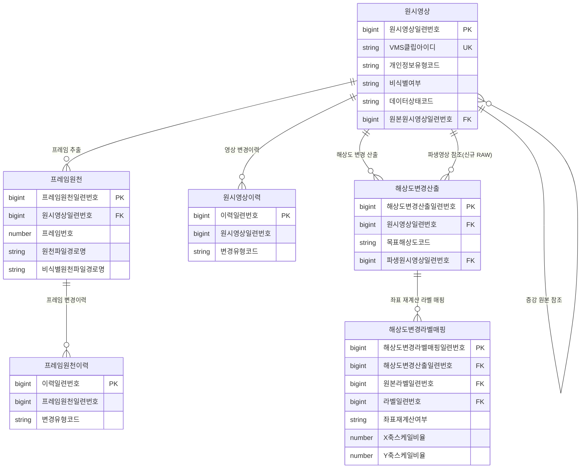

#### 1.2 KLID-AT-ERD-002 — 라벨링

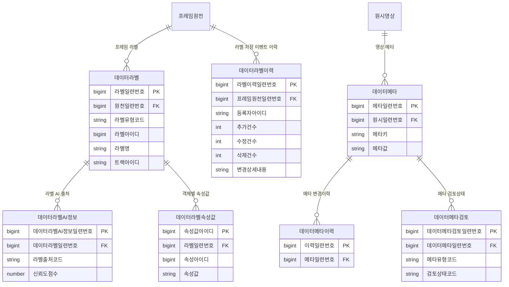

#### 1.3 KLID-AT-ERD-003 — 라벨 마스터·버전관리

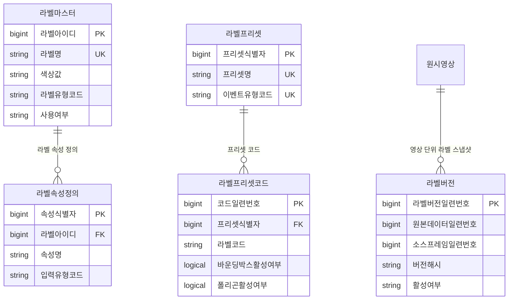

#### 1.4 KLID-AT-ERD-004 — 마킹

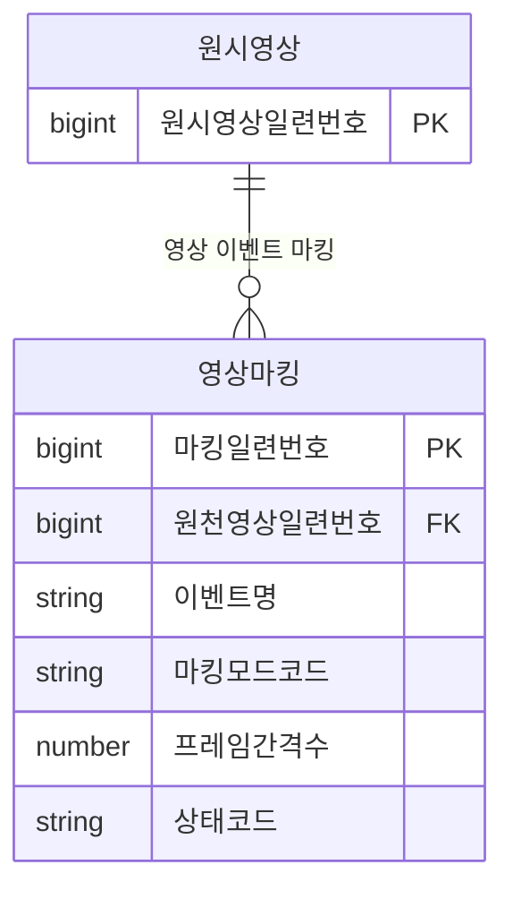

#### 1.5 KLID-AT-ERD-005 — 비식별

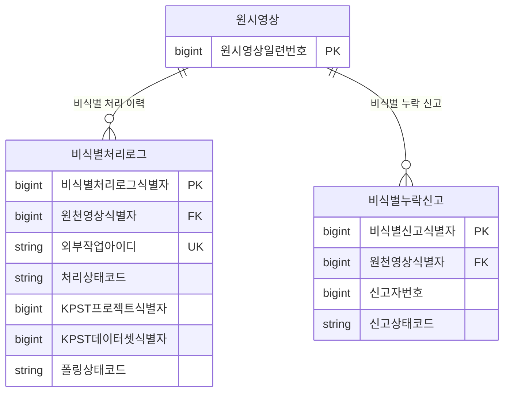

#### 1.6 KLID-AT-ERD-006 — 검수·영상상태

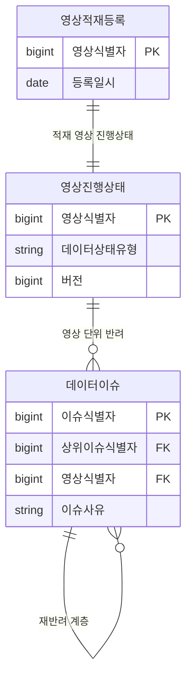

> ※ 데이터이슈(LS_DATA_ISSUE)는 KLID-AT-ERD-008(이슈 스레드)에서 이슈 유형·상태머신·프레임 참조·낙관적 잠금이 확장된다. 본 ERD에는 검수 반려 이력 기준 형태로 표시한다.

#### 1.7 KLID-AT-ERD-007 — 작업 배정

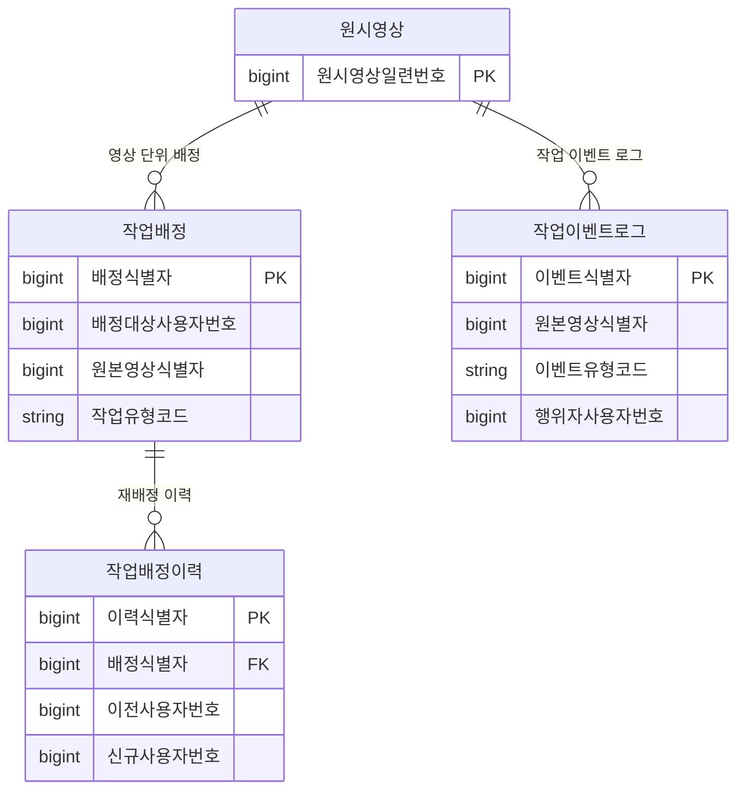

#### 1.8 KLID-AT-ERD-008 — 이슈 스레드

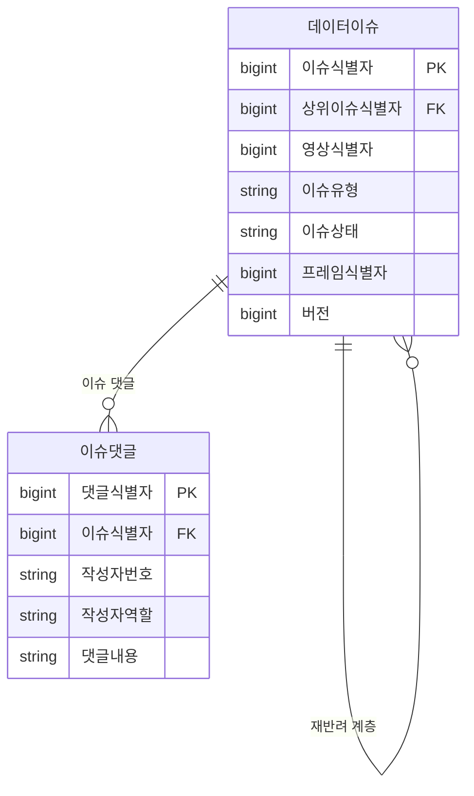

#### 1.9 KLID-AT-ERD-009 — 데이터 증강

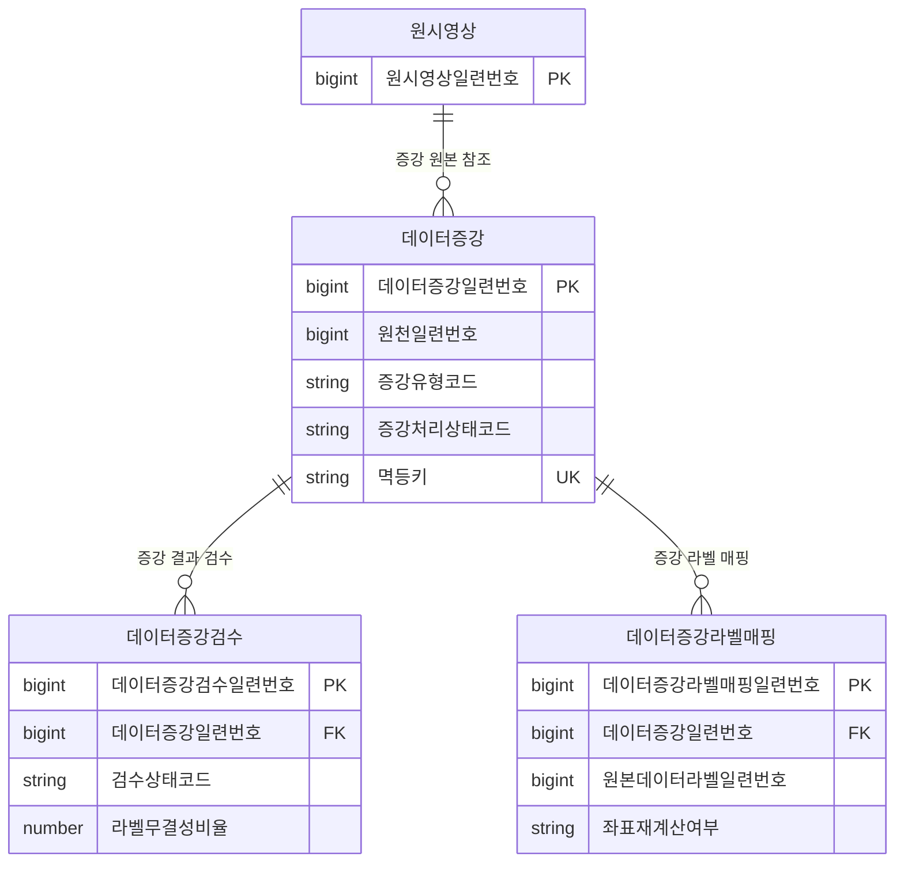

#### 1.10 KLID-AT-ERD-010 — 배치·작업 인프라

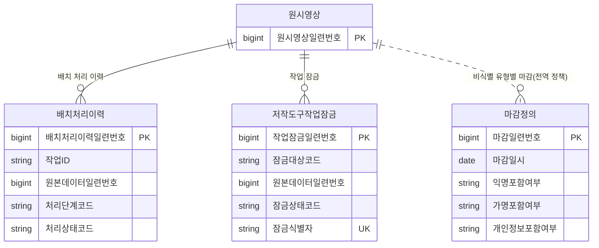

> ※ 마감정의(LS_DEADLINE)는 비식별 유형별 마감 정의로 특정 영상에 종속하지 않는 전역 정책 엔티티이며, 변환 렌더 호환을 위해 앵커 엔티티(원시영상)로의 논리 점선만 표기한다(물리 FK 없음).

#### 1.11 KLID-AT-ERD-011 — 관제 통지

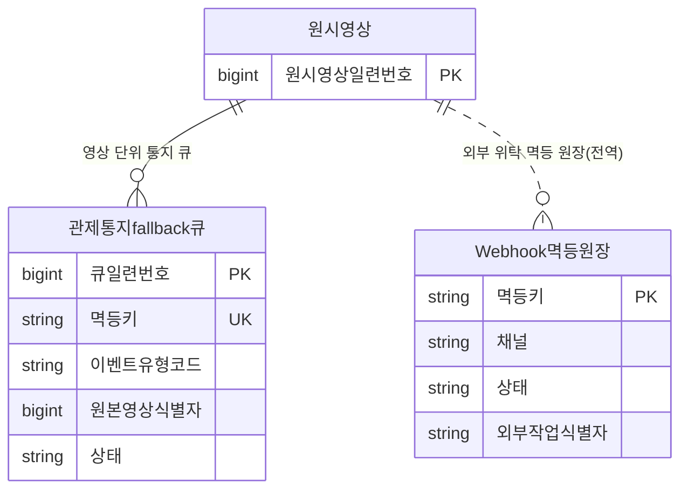

> ※ Webhook멱등원장(LS_WEBHOOK_IDEMPOTENCY)은 외부 위탁(비식별/시계열/증강) 멱등 원장으로 영상에 직접 종속하지 않는 전역 원장이며, 변환 렌더 호환을 위해 앵커 엔티티(원시영상)로의 논리 점선만 표기한다(물리 FK 없음).

#### 1.12 KLID-AT-ERD-012 — 포털

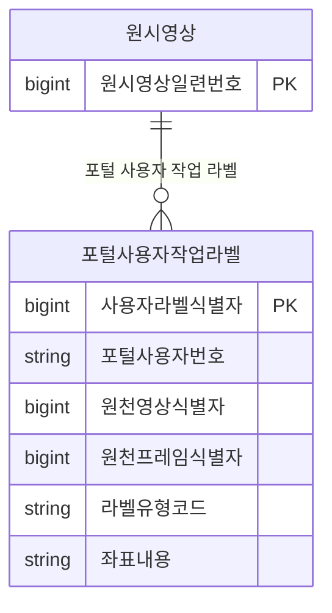

#### 1.13 KLID-AT-ERD-013 — 게시판

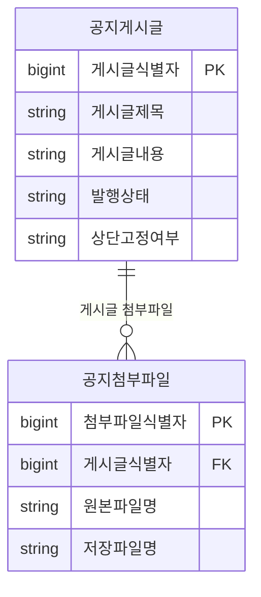

#### 1.14 KLID-AT-ERD-014 — 시스템 설정

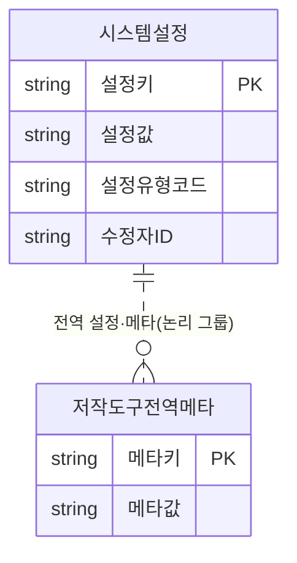

> ※ 시스템설정(LS_SYSTEM_CONFIG)과 저작도구전역메타(LS_META)는 각각 독립적인 키-값 저장소로 물리 FK 가 없으나, 변환 렌더 호환을 위해 동일 설정 도메인의 논리 그룹 관계(점선)로 표기한다.

---

### 2. 엔티티 명세서

> 저작도구 전용 LS_* 엔티티를 ERD 순서로 명세한다. '타입'은 논리 타입(문자/숫자/날짜/논리/이진)으로 표기하며, 물리 DBMS 타입·길이 제약·`ON DELETE`·`CHECK`·인덱스 정의는 D9(데이터베이스설계서)에서 다룬다. '관련 클래스 ID'는 D1(클래스 설계서)의 설계 클래스 ID(`KLID-AT-DC-NNN`)와 동일 체계로 매핑하고, D1에 설계 클래스로 정의되지 않은 부속·이력·인프라 엔티티는 `- ※` + 사유로 표기한다.

#### 2.1 KLID-AT-EN-001 — 원시영상

| 엔티티 ID | KLID-AT-EN-001 | 엔티티명 | 원시영상 |
|---------|---|-------|---|
| 관련 클래스 ID | KLID-AT-DC-012 | 관련 클래스명 | LsDataRaw |
| 관련 유스케이스 ID | KLID-AT-UC-002, KLID-AT-UC-003, KLID-AT-UC-011, KLID-AT-UC-016, KLID-AT-UC-018, KLID-AT-UC-019 |
| 엔티티 설명 | 라벨링 대상 원시 영상 메타(영상 단위 작업). VMS 클립 식별자 유니크로 동일 클립 재수신 시 갱신 처리하며, 개인정보 유형 코드에 따라 개인정보 포함 여부를 자동 산출한다. |

| 속성명 | 동의어 | 타입 | 길이 | NOT NULL (Y/N) | PK (Y/N) | FK (Y/N) | INX (Y/N) | 기본값 | 제약조건 |
|-------|--------|------|------|--------|------|------|------|-------|--------|
| 원시영상일련번호 | RAW_SN | 숫자 | - | Y | Y | N | N | 자동증가 | 작업 단위 식별자 |
| VMS클립아이디 | VMS_CLIP_ID | 문자 | 128 | Y | N | N | Y | - | UNIQUE(재수신 갱신 기준) |
| VMS_CCTV아이디 | VMS_CCTV_ID | 문자 | 64 | Y | N | N | Y | - | 관제 CCTV 식별자 |
| 이벤트유형코드 | EVNT_TYPE_CD | 문자 | 32 | N | N | N | N | - | - |
| 기관코드 | LCLGV_CD | 문자 | 32 | N | N | N | N | - | 지방정부 기관 |
| 개인정보유형코드 | PRVC_TYPE_CD | 문자 | 16 | Y | N | N | N | - | ANONY/PRVC/PSDO |
| 개인정보포함여부 | PRVC_YN | 문자 | 1 | Y | N | N | N | N | 유형코드 파생값 |
| 비식별여부 | DE_IDENT_YN | 문자 | 1 | Y | N | N | N | N | Y/F/N |
| 원시파일경로명 | RAW_FILE_PATH_NM | 문자 | 500 | Y | N | N | N | - | 원본 보존(불변) |
| 촬영일시 | SHT_DT | 날짜 | - | N | N | N | N | - | - |
| 영상길이초 | VDO_LEN_SEC | 숫자 | - | N | N | N | N | - | - |
| 원본원시영상일련번호 | ORGNL_RAW_SN | 숫자 | - | N | N | Y | Y | - | 논리 FK(증강 원본 자기참조) |
| 데이터상태코드 | DATA_STTS_CD | 문자 | 32 | Y | N | N | Y | PENDING | 배치 단계 상태 |
| 등록일시 | REG_DT | 날짜 | - | Y | N | N | N | 현재일시 | - |
| 수정일시 | MDFCN_DT | 날짜 | - | N | N | N | N | - | - |

#### 2.2 KLID-AT-EN-002 — 프레임원천

| 엔티티 ID | KLID-AT-EN-002 | 엔티티명 | 프레임원천 |
|---------|---|-------|---|
| 관련 클래스 ID | KLID-AT-DC-043 | 관련 클래스명 | LsDataSrc |
| 관련 유스케이스 ID | KLID-AT-UC-021, KLID-AT-UC-019 |
| 엔티티 설명 | 영상에서 추출한 키프레임. 원본 프레임 경로와 비식별 프레임 경로를 같은 행에서 짝으로 관리한다. |

| 속성명 | 동의어 | 타입 | 길이 | NOT NULL (Y/N) | PK (Y/N) | FK (Y/N) | INX (Y/N) | 기본값 | 제약조건 |
|-------|--------|------|------|--------|------|------|------|-------|--------|
| 프레임원천일련번호 | SRC_SN | 숫자 | - | Y | Y | N | N | 자동증가 | 프레임 식별자 |
| 원시영상일련번호 | RAW_SN | 숫자 | - | Y | N | Y | Y | - | 논리 FK(→원시영상) |
| 프레임번호 | FRM_NO | 숫자 | - | Y | N | N | Y | - | (RAW_SN,FRM_NO) 유니크 |
| 원천파일경로명 | SRC_FILE_PATH_NM | 문자 | 500 | Y | N | N | N | - | 원본 프레임 경로 |
| 비식별원천파일경로명 | DE_IDNTF_SRC_FILE_PATH_NM | 문자 | 1000 | N | N | N | N | - | 비식별 프레임 경로 |
| 촬영일시 | SHT_DT | 날짜 | - | N | N | N | N | - | - |
| 등록일시 | REG_DT | 날짜 | - | Y | N | N | N | 현재일시 | - |
| 수정일시 | UPD_DT | 날짜 | - | N | N | N | N | - | 비식별 경로 연결 시 갱신 |

#### 2.3 KLID-AT-EN-003 — 원시영상이력

| 엔티티 ID | KLID-AT-EN-003 | 엔티티명 | 원시영상이력 |
|---------|---|-------|---|
| 관련 클래스 ID | - ※ | 관련 클래스명 | - ※ |
| 관련 유스케이스 ID | KLID-AT-UC-018 |
| 엔티티 설명 | 영상 변경 이력. 수집(신규/갱신)·상태 전이 등 변경 사유와 변경 전후 상태를 기록한다. ※ D1에서 별도 설계 클래스로 분리하지 않은 영상 변경 이력 부속 엔티티(원시영상 라이프사이클 추적). |

| 속성명 | 동의어 | 타입 | 길이 | NOT NULL (Y/N) | PK (Y/N) | FK (Y/N) | INX (Y/N) | 기본값 | 제약조건 |
|-------|--------|------|------|--------|------|------|------|-------|--------|
| 이력일련번호 | HSTRY_SEQ | 숫자 | - | Y | Y | N | N | 자동증가 | - |
| 원시영상일련번호 | RAW_SN | 숫자 | - | Y | N | Y | Y | - | 논리 FK(→원시영상) |
| 변경유형코드 | CHG_TYPE_CD | 문자 | 16 | Y | N | N | N | - | 신규수집/재수신갱신 등 |
| 이전상태코드 | PREV_STTS_CD | 문자 | 32 | N | N | N | N | - | 변경 전 상태 |
| 변경상태코드 | NEW_STTS_CD | 문자 | 32 | N | N | N | N | - | 변경 후 상태 |
| 변경사용자번호 | CHG_USER_NO | 숫자 | - | N | N | N | N | - | 시스템 변경 시 미지정 |
| 변경일시 | CHG_DT | 날짜 | - | Y | N | N | N | 현재일시 | - |

#### 2.4 KLID-AT-EN-004 — 프레임원천이력

| 엔티티 ID | KLID-AT-EN-004 | 엔티티명 | 프레임원천이력 |
|---------|---|-------|---|
| 관련 클래스 ID | - ※ | 관련 클래스명 | - ※ |
| 관련 유스케이스 ID | KLID-AT-UC-021 |
| 엔티티 설명 | 프레임 변경 이력. 생성·비식별경로 연결 등 사유를 기록한다. ※ D1에서 별도 설계 클래스로 분리하지 않은 프레임 변경 이력 부속 엔티티. |

| 속성명 | 동의어 | 타입 | 길이 | NOT NULL (Y/N) | PK (Y/N) | FK (Y/N) | INX (Y/N) | 기본값 | 제약조건 |
|-------|--------|------|------|--------|------|------|------|-------|--------|
| 이력일련번호 | HSTRY_SEQ | 숫자 | - | Y | Y | N | N | 자동증가 | - |
| 프레임원천일련번호 | SRC_SN | 숫자 | - | Y | N | Y | Y | - | 논리 FK(→프레임원천) |
| 변경유형코드 | CHG_TYPE_CD | 문자 | 16 | Y | N | N | N | - | 생성/비식별경로연결 |
| 변경사용자번호 | CHG_USER_NO | 숫자 | - | N | N | N | N | - | 시스템 변경 시 미지정 |
| 변경일시 | CHG_DT | 날짜 | - | Y | N | N | N | 현재일시 | - |

#### 2.5 KLID-AT-EN-005 — 해상도변경산출

> **2026-07-21 정책 재반전**: 산출 추적 1행만 남기던 구 역할에서, **파생영상(새 원시영상) 생성 추적** 행으로 의미가 확장됐다. `NEW_RAW_SN`(파생 원시영상 역참조)이 추가되었고, 실제 라벨 좌표 재계산 매핑은 신규 엔티티 `해상도변경라벨매핑`(KLID-AT-EN, LsResolutionLblMap)이 담당한다(V116, `LS_DATA_AUG_LBL_MAP` 미재사용 — DATA_AUG_SN NOT NULL 제약으로 증강 이력 오염 방지).

| 엔티티 ID | KLID-AT-EN-005 | 엔티티명 | 해상도변경산출 |
|---------|---|-------|---|
| 관련 클래스 ID | KLID-AT-DC-017 | 관련 클래스명 | LsResolutionExport |
| 관련 유스케이스 ID | KLID-AT-UC-003 |
| 엔티티 설명 | 검수 완료 원본 영상마다 표준 해상도 3종의 파생영상(새 원시영상)을 생성하는 산출 추적 1건당 1행. 프레임 리스케일·라벨 좌표 재계산은 파생영상(`NEW_RAW_SN`)과 해상도변경라벨매핑에서 실제 수행되며, 본 엔티티는 산출 이력·배율·상태를 추적한다. |

| 속성명 | 동의어 | 타입 | 길이 | NOT NULL (Y/N) | PK (Y/N) | FK (Y/N) | INX (Y/N) | 기본값 | 제약조건 |
|-------|--------|------|------|--------|------|------|------|-------|--------|
| 해상도변경산출일련번호 | RESL_EXPORT_SN | 숫자 | - | Y | Y | N | N | 자동증가 | - |
| 원시영상일련번호 | DATA_RAW_SN | 숫자 | - | Y | N | Y | Y | - | 논리 FK(검수완료·비증강본만) |
| 목표해상도코드 | GOAL_RESL_CD | 문자 | 16 | Y | N | N | N | - | (DATA_RAW_SN,GOAL_RESL_CD) 유니크 |
| 원본가로 | ORGNL_W | 숫자 | - | Y | N | N | N | - | 첫 프레임 실측 |
| 원본세로 | ORGNL_H | 숫자 | - | Y | N | N | N | - | 첫 프레임 실측 |
| 목표가로 | TARGET_W | 숫자 | - | Y | N | N | N | - | 종횡비 보존 산정(업스케일 허용) |
| 목표세로 | TARGET_H | 숫자 | - | Y | N | N | N | - | 프리셋 기준 |
| 프레임개수 | FRAME_CNT | 숫자 | - | Y | N | N | N | - | 리스케일 프레임 수(예약 시 0→확정 시 실측) |
| 출력디렉토리경로 | OUTPUT_DIR_PATH | 문자 | 500 | Y | N | N | N | - | 내부 추적용(응답 미노출) |
| **파생원시영상일련번호** | **NEW_RAW_SN** | **숫자** | **-** | **N** | **N** | **Y** | **Y** | **-** | **(신규 V116) 파생영상 역참조, 예약 커밋 이후 연결** |
| 등록자아이디 | REG_ID | 문자 | 64 | N | N | N | N | - | 감사 추적 |
| 등록일시 | REG_DT | 날짜 | - | Y | N | N | N | 현재일시 | - |

#### 2.5b KLID-AT-EN — 해상도변경라벨매핑 (신규, V116)

| 엔티티 ID | (신규 등록 예정) | 엔티티명 | 해상도변경라벨매핑 |
|---------|---|-------|---|
| 관련 클래스 ID | KLID-AT-DC-025 | 관련 클래스명 | LsResolutionLblMap |
| 관련 유스케이스 ID | KLID-AT-UC-003 |
| 엔티티 설명 | 원본 라벨과 해상도 변경 파생영상 라벨(좌표 스케일 복사본) 간 매핑. 배율(scaleX/scaleY)과 좌표 재계산 여부를 기록한다. `LS_DATA_AUG_LBL_MAP`은 `DATA_AUG_SN NOT NULL` 제약으로 재사용하지 않는다(증강 이력·통계 오염 방지). |

| 속성명 | 동의어 | 타입 | 길이 | NOT NULL (Y/N) | PK (Y/N) | FK (Y/N) | INX (Y/N) | 기본값 | 제약조건 |
|-------|--------|------|------|--------|------|------|------|-------|--------|
| 해상도변경라벨매핑일련번호 | RESL_LBL_MAP_SN | 숫자 | - | Y | Y | N | N | 자동증가 | - |
| 해상도변경산출일련번호 | RESL_EXPORT_SN | 숫자 | - | Y | N | Y | Y | - | 논리 FK(→해상도변경산출) |
| 원본라벨일련번호 | ORGNL_DATA_LBL_SN | 숫자 | - | N | N | Y | Y | - | 논리 FK(→데이터라벨, 원본) |
| 라벨일련번호 | DATA_LBL_SN | 숫자 | - | Y | N | Y | Y | - | 논리 FK(→데이터라벨, 파생 좌표 스케일 복사본) |
| 좌표재계산여부 | COORD_RECALC_YN | 문자 | 1 | Y | N | N | N | 'Y' | 해상도 변경은 항상 'Y' |
| X축스케일비율 | SCALE_X | 숫자 | - | N | N | N | N | - | =목표가로/원본가로 |
| Y축스케일비율 | SCALE_Y | 숫자 | - | N | N | N | N | - | =목표세로/원본세로 |
| 등록자아이디 | REG_ID | 문자 | 30 | N | N | N | N | - | 감사 추적 |
| 등록일시 | REG_DT | 날짜 | - | Y | N | N | N | 현재일시 | - |

#### 2.6 KLID-AT-EN-006 — 데이터라벨

| 엔티티 ID | KLID-AT-EN-006 | 엔티티명 | 데이터라벨 |
|---------|---|-------|---|
| 관련 클래스 ID | KLID-AT-DC-073 | 관련 클래스명 | LsDataLbl |
| 관련 유스케이스 ID | KLID-AT-UC-004, KLID-AT-UC-007, KLID-AT-UC-021 |
| 엔티티 설명 | 현재 라벨 좌표/속성. 프레임 단위로 도형 유형(바운딩박스/폴리곤/세그멘테이션/트랙)별 좌표를 보관하며, 라벨 마스터를 참조한다. AI 출처·신뢰도는 데이터라벨AI정보로 분리한다. |

| 속성명 | 동의어 | 타입 | 길이 | NOT NULL (Y/N) | PK (Y/N) | FK (Y/N) | INX (Y/N) | 기본값 | 제약조건 |
|-------|--------|------|------|--------|------|------|------|-------|--------|
| 라벨일련번호 | LBL_SN | 숫자 | - | Y | Y | N | N | 자동증가 | - |
| 원천일련번호 | SRC_SN | 숫자 | - | Y | N | Y | Y | - | 논리 FK(→프레임원천) |
| 라벨유형코드 | LBL_TYPE_CD | 문자 | 16 | Y | N | N | N | - | BBOX/POLYGON/SEGMENT/TRACK |
| 라벨아이디 | LBL_ID | 숫자 | - | N | N | Y | Y | - | 논리 FK(→라벨마스터) |
| 라벨명 | LBL_NM | 문자 | 255 | Y | N | N | N | - | 라벨명 텍스트 |
| 좌표내용 | POINT_CN | 문자 | - | N | N | N | N | - | 도형 좌표 직렬화 |
| 트랙아이디 | TRCK_ID | 문자 | 64 | N | N | N | Y | - | 자동 추적 객체 ID |
| 등록사용자번호 | REG_USER_NO | 숫자 | - | N | N | N | N | - | 자동 라벨은 미지정 |
| 등록일시 | REG_DT | 날짜 | - | Y | N | N | N | 현재일시 | - |
| 수정일시 | MDFCN_DT | 날짜 | - | N | N | N | N | - | - |

#### 2.7 KLID-AT-EN-007 — 데이터라벨AI정보

| 엔티티 ID | KLID-AT-EN-007 | 엔티티명 | 데이터라벨AI정보 |
|---------|---|-------|---|
| 관련 클래스 ID | KLID-AT-DC-078 | 관련 클래스명 | LsDataLblAiInfo |
| 관련 유스케이스 ID | KLID-AT-UC-004 |
| 엔티티 설명 | AI 라벨 출처/신뢰도 정보. 데이터라벨은 좌표만 보관하고 AI 추론 출처(검출·분할·보간·시계열)와 신뢰도는 본 엔티티로 분리한다. |

| 속성명 | 동의어 | 타입 | 길이 | NOT NULL (Y/N) | PK (Y/N) | FK (Y/N) | INX (Y/N) | 기본값 | 제약조건 |
|-------|--------|------|------|--------|------|------|------|-------|--------|
| 데이터라벨AI정보일련번호 | DATA_LBL_AI_INFO_SN | 숫자 | - | Y | Y | N | N | 자동증가 | - |
| 데이터라벨일련번호 | DATA_LBL_SN | 숫자 | - | Y | N | Y | Y | - | 논리 FK(→데이터라벨) |
| 데이터원시일련번호 | DATA_RAW_SN | 숫자 | - | Y | N | N | Y | - | 영상 식별자 |
| 데이터원천일련번호 | DATA_SRC_SN | 숫자 | - | Y | N | N | Y | - | 프레임 식별자 |
| 라벨출처코드 | LBL_SRC_CD | 문자 | 20 | Y | N | N | Y | - | YOLO/SAM2/INTERPOLATE/VLM |
| 모델명 | MODEL_NM | 문자 | 100 | N | N | N | N | - | 추론 모델명 |
| 모델버전 | MDL_VER | 문자 | 50 | N | N | N | N | - | - |
| 신뢰도점수 | CONF_SCORE | 숫자 | - | N | N | N | N | - | 0.0~1.0(보간 0.0) |
| 자동라벨여부 | AUTO_LBL_YN | 문자 | 1 | Y | N | N | N | Y | - |
| 등록아이디 | REG_ID | 문자 | 30 | N | N | N | N | - | - |
| 등록일시 | REG_DT | 날짜 | - | Y | N | N | N | 현재일시 | - |
| 수정아이디 | MDFCN_ID | 문자 | 30 | N | N | N | N | - | - |
| 수정일시 | MDFCN_DT | 날짜 | - | N | N | N | N | - | - |

#### 2.8 KLID-AT-EN-008 — 데이터라벨속성값

| 엔티티 ID | KLID-AT-EN-008 | 엔티티명 | 데이터라벨속성값 |
|---------|---|-------|---|
| 관련 클래스 ID | KLID-AT-DC-074 | 관련 클래스명 | LsDataLblAttrVal |
| 관련 유스케이스 ID | KLID-AT-UC-021 |
| 엔티티 설명 | 객체별 속성값. 라벨링된 객체 단위로 라벨속성정의의 값을 저장한다. (라벨, 속성) 조합 유니크로 중복을 차단한다. |

| 속성명 | 동의어 | 타입 | 길이 | NOT NULL (Y/N) | PK (Y/N) | FK (Y/N) | INX (Y/N) | 기본값 | 제약조건 |
|-------|--------|------|------|--------|------|------|------|-------|--------|
| 속성값아이디 | ATTR_VAL_ID | 숫자 | - | Y | Y | N | N | 자동증가 | - |
| 라벨일련번호 | LBL_SN | 숫자 | - | Y | N | Y | Y | - | 논리 FK(→데이터라벨) |
| 속성아이디 | ATTR_ID | 숫자 | - | Y | N | Y | N | - | 논리 FK(→라벨속성정의) |
| 속성값 | ATTR_VL | 문자 | 1000 | N | N | N | N | - | (LBL_SN,ATTR_ID) 유니크 |
| 등록일시 | REG_DT | 날짜 | - | Y | N | N | N | 현재일시 | - |
| 수정일시 | MDFCN_DT | 날짜 | - | N | N | N | N | - | - |

#### 2.9 KLID-AT-EN-009 — 데이터메타

| 엔티티 ID | KLID-AT-EN-009 | 엔티티명 | 데이터메타 |
|---------|---|-------|---|
| 관련 클래스 ID | KLID-AT-DC-044 | 관련 클래스명 | LsDataMeta |
| 관련 유스케이스 ID | KLID-AT-UC-022 |
| 엔티티 설명 | 영상/프레임 메타 값. 영상 식별자 기준 키-값 구조이며, 외부 생성 여부·메타 유형·검토 상태는 데이터메타검토로 분리한다. |

| 속성명 | 동의어 | 타입 | 길이 | NOT NULL (Y/N) | PK (Y/N) | FK (Y/N) | INX (Y/N) | 기본값 | 제약조건 |
|-------|--------|------|------|--------|------|------|------|-------|--------|
| 메타일련번호 | META_SN | 숫자 | - | Y | Y | N | N | 자동증가 | - |
| 원시일련번호 | RAW_SN | 숫자 | - | Y | N | Y | Y | - | 논리 FK(→원시영상) |
| 메타키 | META_KEY | 문자 | 64 | Y | N | N | N | - | (RAW_SN,META_KEY) 유니크 |
| 메타값 | META_VL | 문자 | 2000 | N | N | N | N | - | - |
| 등록일시 | REG_DT | 날짜 | - | Y | N | N | N | 현재일시 | - |
| 수정일시 | MDFCN_DT | 날짜 | - | N | N | N | N | - | - |
| 멱등키 | IDMP_KEY | 문자 | 64 | N | N | N | Y | - | 위탁 인계 멱등 식별 |
| 외부작업아이디 | OTSD_JOB_ID | 문자 | 128 | N | N | N | Y | - | 외부 작업 식별 |
| 재시도횟수 | RTRY_NMTM | 숫자 | - | Y | N | N | N | 0 | - |
| 영구실패시점 | DEAD_LETTER_AT | 날짜 | - | N | N | N | N | - | - |

#### 2.10 KLID-AT-EN-010 — 데이터메타이력

| 엔티티 ID | KLID-AT-EN-010 | 엔티티명 | 데이터메타이력 |
|---------|---|-------|---|
| 관련 클래스 ID | - ※ | 관련 클래스명 | - ※ |
| 관련 유스케이스 ID | KLID-AT-UC-022 |
| 엔티티 설명 | 데이터메타 변경 이력(이전값/신규값). ※ D1에서 별도 설계 클래스로 분리하지 않은 메타 변경 이력 부속 엔티티. |

| 속성명 | 동의어 | 타입 | 길이 | NOT NULL (Y/N) | PK (Y/N) | FK (Y/N) | INX (Y/N) | 기본값 | 제약조건 |
|-------|--------|------|------|--------|------|------|------|-------|--------|
| 이력일련번호 | HSTRY_SEQ | 숫자 | - | Y | Y | N | N | 자동증가 | - |
| 메타일련번호 | META_SN | 숫자 | - | Y | N | Y | Y | - | 논리 FK(→데이터메타) |
| 이전값 | PREV_VL | 문자 | 2000 | N | N | N | N | - | - |
| 신규값 | NEW_VL | 문자 | 2000 | N | N | N | N | - | - |
| 변경사용자번호 | CHG_USER_NO | 숫자 | - | N | N | N | N | - | - |
| 변경일시 | CHG_DT | 날짜 | - | Y | N | N | N | 현재일시 | - |

#### 2.11 KLID-AT-EN-011 — 데이터메타검토

| 엔티티 ID | KLID-AT-EN-011 | 엔티티명 | 데이터메타검토 |
|---------|---|-------|---|
| 관련 클래스 ID | KLID-AT-DC-112 | 관련 클래스명 | LsDataMetaReview |
| 관련 유스케이스 ID | KLID-AT-UC-022 |
| 엔티티 설명 | 외부/자동 생성 메타데이터 검토 상태. 데이터메타는 값만 저장하고, 본 엔티티에서 외부 생성 여부와 검토 상태(검토대기/승인/반려/자동생성)를 관리한다. |

| 속성명 | 동의어 | 타입 | 길이 | NOT NULL (Y/N) | PK (Y/N) | FK (Y/N) | INX (Y/N) | 기본값 | 제약조건 |
|-------|--------|------|------|--------|------|------|------|-------|--------|
| 데이터메타검토일련번호 | DATA_META_REVIEW_SN | 숫자 | - | Y | Y | N | N | 자동증가 | - |
| 데이터메타일련번호 | DATA_META_SN | 숫자 | - | Y | N | Y | Y | - | 논리 FK(→데이터메타) |
| 데이터원시일련번호 | DATA_RAW_SN | 숫자 | - | Y | N | N | Y | - | 영상 식별자 |
| 데이터원천일련번호 | DATA_SRC_SN | 숫자 | - | N | N | N | Y | - | 프레임 식별자(영상 메타는 미지정) |
| 메타유형코드 | META_TYPE_CD | 문자 | 20 | Y | N | N | Y | - | VLM/EXTERNAL |
| 생성시스템코드 | SRC_SYS_CD | 문자 | 20 | N | N | N | N | - | AI_SERVER/CONTROL_SERVER/PORTAL |
| 검토상태코드 | RVW_STTS_CD | 문자 | 20 | Y | N | N | Y | - | PENDING/APPROVED/REJECTED/AUTO_GENERATED |
| 검토아이디 | RVW_ID | 문자 | 30 | N | N | N | N | - | 검토자 |
| 검토일시 | RVW_DT | 날짜 | - | N | N | N | N | - | - |
| 반려사유 | REJECT_RSN | 문자 | 1000 | N | N | N | N | - | 반려 시 필수 |
| 등록아이디 | REG_ID | 문자 | 30 | N | N | N | N | - | - |
| 등록일시 | REG_DT | 날짜 | - | Y | N | N | N | 현재일시 | - |
| 수정아이디 | MDFCN_ID | 문자 | 30 | N | N | N | N | - | - |
| 수정일시 | MDFCN_DT | 날짜 | - | N | N | N | N | - | - |

#### 2.12 KLID-AT-EN-012 — 라벨마스터

| 엔티티 ID | KLID-AT-EN-012 | 엔티티명 | 라벨마스터 |
|---------|---|-------|---|
| 관련 클래스 ID | KLID-AT-DC-072 | 관련 클래스명 | LsLabel |
| 관련 유스케이스 ID | KLID-AT-UC-021 |
| 엔티티 설명 | 저작도구 전역 단일 라벨 풀의 마스터. 라벨 이름·색상·도형 타입을 정의하며 작업자가 라벨링 시점에 선택한다. 검수자가 관리하고 작업자는 조회만 한다. 삭제는 비활성 처리만 허용한다. |

| 속성명 | 동의어 | 타입 | 길이 | NOT NULL (Y/N) | PK (Y/N) | FK (Y/N) | INX (Y/N) | 기본값 | 제약조건 |
|-------|--------|------|------|--------|------|------|------|-------|--------|
| 라벨아이디 | LBL_ID | 숫자 | - | Y | Y | N | N | 자동증가 | - |
| 라벨명 | LBL_NM | 문자 | 64 | Y | N | N | Y | - | 전역 UNIQUE |
| 색상값 | COLR_VL | 문자 | 7 | Y | N | N | N | - | 대문자 색상 형식 |
| 라벨유형코드 | LBL_TYPE_CD | 문자 | 16 | Y | N | N | N | - | BBOX/POLYGON/POINT |
| 정렬순서 | SORT_SEQ | 숫자 | - | Y | N | N | N | 0 | - |
| 사용여부 | USE_YN | 문자 | 1 | Y | N | N | Y | Y | 비활성 삭제 플래그 |
| 등록자식별자 | REG_ID | 문자 | 30 | N | N | N | N | - | - |
| 등록일시 | REG_DT | 날짜 | - | Y | N | N | N | 현재일시 | - |
| 수정자식별자 | MDFCN_ID | 문자 | 30 | N | N | N | N | - | - |
| 수정일시 | MDFCN_DT | 날짜 | - | N | N | N | N | - | - |

#### 2.13 KLID-AT-EN-013 — 라벨속성정의

| 엔티티 ID | KLID-AT-EN-013 | 엔티티명 | 라벨속성정의 |
|---------|---|-------|---|
| 관련 클래스 ID | - ※ | 관련 클래스명 | - ※ |
| 관련 유스케이스 ID | KLID-AT-UC-021 |
| 엔티티 설명 | 라벨별 속성(Attribute) 정의. 한 라벨에 대해 라벨링 시 부여할 수 있는 속성과 입력 위젯 유형을 정의한다. 객체별 실제 속성값은 데이터라벨속성값에 저장한다. ※ D1에서 라벨 마스터 집합 내부 부속 엔티티로 별도 설계 클래스를 두지 않음. |

| 속성명 | 동의어 | 타입 | 길이 | NOT NULL (Y/N) | PK (Y/N) | FK (Y/N) | INX (Y/N) | 기본값 | 제약조건 |
|-------|--------|------|------|--------|------|------|------|-------|--------|
| 속성식별자 | ATTR_ID | 숫자 | - | Y | Y | N | N | 자동증가 | - |
| 라벨아이디 | LBL_ID | 숫자 | - | Y | N | Y | Y | - | 논리 FK(→라벨마스터) |
| 속성명 | ATTR_NM | 문자 | 64 | Y | N | N | N | - | (LBL_ID,ATTR_NM) 유니크 |
| 입력유형코드 | INPUT_TYPE_CD | 문자 | 16 | Y | N | N | N | - | TEXT/NUMBER/SELECT/CHECKBOX/RADIO |
| 옵션목록내용 | VALUES_CN | 문자 | 1000 | N | N | N | N | - | 선택형일 때 필수 |
| 기본값 | DFLT_VL | 문자 | 255 | N | N | N | N | - | - |
| 가변여부 | MUTABLE_YN | 문자 | 1 | Y | N | N | N | Y | 프레임별 가변/트랙 고정 |
| 정렬순서 | SORT_SEQ | 숫자 | - | Y | N | N | N | 0 | - |
| 사용여부 | USE_YN | 문자 | 1 | Y | N | N | Y | Y | 비활성 삭제 플래그 |
| 등록자식별자 | REG_ID | 문자 | 30 | N | N | N | N | - | - |
| 등록일시 | REG_DT | 날짜 | - | Y | N | N | N | 현재일시 | - |
| 수정자식별자 | MDFCN_ID | 문자 | 30 | N | N | N | N | - | - |
| 수정일시 | MDFCN_DT | 날짜 | - | N | N | N | N | - | - |

#### 2.14 KLID-AT-EN-014 — 라벨프리셋

| 엔티티 ID | KLID-AT-EN-014 | 엔티티명 | 라벨프리셋 |
|---------|---|-------|---|
| 관련 클래스 ID | - ※ | 관련 클래스명 | - ※ |
| 관련 유스케이스 ID | KLID-AT-UC-021 |
| 엔티티 설명 | 라벨링 프리셋. 자주 쓰는 라벨 코드 묶음을 프리셋으로 정의하고 선택적으로 이벤트 타입 1건에 1:1 매핑한다. ※ D1에서 라벨 마스터 집합 내부 부속 엔티티로 별도 설계 클래스를 두지 않음. |

| 속성명 | 동의어 | 타입 | 길이 | NOT NULL (Y/N) | PK (Y/N) | FK (Y/N) | INX (Y/N) | 기본값 | 제약조건 |
|-------|--------|------|------|--------|------|------|------|-------|--------|
| 프리셋식별자 | PRESET_ID | 숫자 | - | Y | Y | N | N | 자동증가 | - |
| 프리셋명 | PRESET_NM | 문자 | 64 | Y | N | N | Y | - | 전역 UNIQUE |
| 설명 | EXPLN | 문자 | 500 | N | N | N | N | - | - |
| 이벤트유형코드 | EVNT_TYPE_CD | 문자 | 32 | N | N | N | Y | - | UNIQUE(이벤트 1:1) |
| 등록일시 | REG_DT | 날짜 | - | Y | N | N | N | 현재일시 | - |
| 수정일시 | MDFCN_DT | 날짜 | - | Y | N | N | N | 현재일시 | - |

#### 2.15 KLID-AT-EN-015 — 라벨프리셋코드

| 엔티티 ID | KLID-AT-EN-015 | 엔티티명 | 라벨프리셋코드 |
|---------|---|-------|---|
| 관련 클래스 ID | - ※ | 관련 클래스명 | - ※ |
| 관련 유스케이스 ID | KLID-AT-UC-021 |
| 엔티티 설명 | 프리셋에 포함된 라벨 코드. 코드별 바운딩박스/폴리곤 표기 활성 토글을 보유한다. ※ 라벨프리셋 집합 내부 부속 엔티티로 D1에서 별도 설계 클래스를 두지 않음(상위 집합 루트를 통해서만 변경). |

| 속성명 | 동의어 | 타입 | 길이 | NOT NULL (Y/N) | PK (Y/N) | FK (Y/N) | INX (Y/N) | 기본값 | 제약조건 |
|-------|--------|------|------|--------|------|------|------|-------|--------|
| 코드일련번호 | CODE_SN | 숫자 | - | Y | Y | N | N | 자동증가 | - |
| 프리셋식별자 | PRESET_ID | 숫자 | - | Y | N | Y | Y | - | 논리 FK(→라벨프리셋) |
| 라벨코드 | CODE | 문자 | 32 | Y | N | N | N | - | (PRESET_ID,CODE) 유니크 |
| 정렬순서 | SORT_SEQ | 숫자 | - | Y | N | N | N | 0 | - |
| 바운딩박스활성여부 | BBOX_ENABLED | 논리 | - | Y | N | N | N | 참 | 둘 중 1개 이상 활성 |
| 폴리곤활성여부 | POLYGON_ENABLED | 논리 | - | Y | N | N | N | 참 | 둘 중 1개 이상 활성 |

#### 2.16 KLID-AT-EN-016 — 라벨버전

| 엔티티 ID | KLID-AT-EN-016 | 엔티티명 | 라벨버전 |
|---------|---|-------|---|
| 관련 클래스 ID | KLID-AT-DC-092 | 관련 클래스명 | LsLabelVersion |
| 관련 유스케이스 ID | KLID-AT-UC-007, KLID-AT-UC-008 |
| 엔티티 설명 | 라벨 DB 스냅샷 버전관리. 외부 형상관리도구를 사용하지 않으며 라벨 전체 직렬화 스냅샷을 보관하고, 버전 해시로 동일 스냅샷을 멱등 식별한다. 차이 비교·복구는 두 스냅샷의 비교로 계산한다. |

| 속성명 | 동의어 | 타입 | 길이 | NOT NULL (Y/N) | PK (Y/N) | FK (Y/N) | INX (Y/N) | 기본값 | 제약조건 |
|-------|--------|------|------|--------|------|------|------|-------|--------|
| 라벨버전일련번호 | LBL_VERSION_SN | 숫자 | - | Y | Y | N | N | 자동증가 | - |
| 원본데이터일련번호 | DATA_RAW_SN | 숫자 | - | Y | N | N | Y | - | 영상(작업) 식별자 |
| 소스프레임일련번호 | DATA_SRC_SN | 숫자 | - | N | N | N | Y | - | 프레임 식별자 |
| 버전해시 | VERSION_HASH | 문자 | 64 | N | N | N | N | - | (DATA_SRC_SN,VERSION_HASH) 유니크 |
| 라벨페이로드 | LBL_PAYLOAD | 문자 | - | N | N | N | N | - | 라벨 전체 스냅샷 |
| 버전번호 | VERSION_NO | 숫자 | - | Y | N | N | N | - | 증가 |
| 저장사유코드 | SAVE_REASON_CD | 문자 | 20 | N | N | N | N | - | MANUAL/BATCH/ROLLBACK |
| 활성여부 | ACTVTN_YN | 문자 | 1 | Y | N | N | N | Y | 활성 버전 식별 |
| 등록자식별자 | REG_ID | 문자 | 30 | N | N | N | N | - | - |
| 등록일시 | REG_DT | 날짜 | - | Y | N | N | N | 현재일시 | - |

#### 2.17 KLID-AT-EN-017 — 영상마킹

| 엔티티 ID | KLID-AT-EN-017 | 엔티티명 | 영상마킹 |
|---------|---|-------|---|
| 관련 클래스 ID | KLID-AT-DC-062 | 관련 클래스명 | LsMarking |
| 관련 유스케이스 ID | KLID-AT-UC-019 |
| 엔티티 설명 | 영상별 자동/수동 이벤트 식별 마킹 정보. 영상 1건에 N건의 마킹이 생성될 수 있으며, 마킹 결과(이벤트명·영상경로·마킹 배열)를 시계열 메타 콜백으로 전달한다. 상태는 대기→요청됨→완료로 전이한다. |

| 속성명 | 동의어 | 타입 | 길이 | NOT NULL (Y/N) | PK (Y/N) | FK (Y/N) | INX (Y/N) | 기본값 | 제약조건 |
|-------|--------|------|------|--------|------|------|------|-------|--------|
| 마킹일련번호 | MARKING_SN | 숫자 | - | Y | Y | N | N | 자동증가 | - |
| 원천영상일련번호 | RAW_SN | 숫자 | - | Y | N | Y | Y | - | 논리 FK(→원시영상) |
| 이벤트명 | EVNT_NM | 문자 | 100 | Y | N | N | N | - | 시계열 콜백 포함 |
| 마킹모드코드 | MARK_MODE_CD | 문자 | 16 | Y | N | N | N | - | AUTO/MANUAL |
| 프레임간격수 | FRME_INTV_NOCS | 숫자 | - | N | N | N | N | - | 자동 모드 시 필수 |
| 영상파일경로명 | VIDEO_FILE_PATH_NM | 문자 | 500 | Y | N | N | N | - | 시계열 콜백 포함 |
| 마킹내용 | MARK_CN | 문자 | - | Y | N | N | N | - | 마킹 배열 직렬화 |
| 상태코드 | STTS_CD | 문자 | 16 | Y | N | N | N | PENDING | PENDING/VLM_REQUESTED/VLM_COMPLETED |
| 등록사용자번호 | REG_USER_NO | 숫자 | - | N | N | N | N | - | 마킹 생성 작업자 |
| 등록일시 | REG_DT | 날짜 | - | Y | N | N | N | 현재일시 | - |
| 수정일시 | MDFCN_DT | 날짜 | - | Y | N | N | N | 현재일시 | - |

#### 2.18 KLID-AT-EN-018 — 비식별처리로그

| 엔티티 ID | KLID-AT-EN-018 | 엔티티명 | 비식별처리로그 |
|---------|---|-------|---|
| 관련 클래스 ID | KLID-AT-DC-053 | 관련 클래스명 | LsDeidentProcLog |
| 관련 유스케이스 ID | KLID-AT-UC-011 |
| 엔티티 설명 | 영상 단위로 기록하는 외부 비식별 솔루션 위탁 처리 이력. 요청/성공/실패 상태와 원본·비식별 파일 경로, 외부 작업 ID를 보관한다. 외부 작업 ID 유니크로 동일 작업 재인계 시 단일 행 갱신을 보장한다. 외부 비식별 솔루션(KPST) 폴링 모델(위탁→주기 진행조회→다운로드) 진행 속성을 보유한다. |

| 속성명 | 동의어 | 타입 | 길이 | NOT NULL (Y/N) | PK (Y/N) | FK (Y/N) | INX (Y/N) | 기본값 | 제약조건 |
|-------|--------|------|------|--------|------|------|------|-------|--------|
| 비식별처리로그식별자 | PROC_LOG_SN | 숫자 | - | Y | Y | N | N | 자동증가 | - |
| 원천영상식별자 | DATA_RAW_SN | 숫자 | - | Y | N | Y | Y | - | 논리 FK(→원시영상) |
| 내부요청식별자 | REQ_ID | 문자 | 64 | N | N | N | N | - | 내부 호출 추적 |
| 외부작업아이디 | OTSD_JOB_ID | 문자 | 128 | N | N | N | Y | - | UNIQUE(재인계 단일 행) |
| 원본파일경로명 | ORGNL_FILE_PATH_NM | 문자 | 1000 | Y | N | N | N | - | 비식별 대상 원본 경로 |
| 비식별파일경로명 | DE_IDNTF_FILE_PATH_NM | 문자 | 1000 | N | N | N | N | - | 비식별 결과 경로 |
| 처리상태코드 | PROC_STTS_CD | 문자 | 20 | Y | N | N | Y | - | REQUESTED/SUCCEEDED/FAILED |
| 요청일시 | REQ_DT | 날짜 | - | Y | N | N | N | 현재일시 | - |
| 응답일시 | RES_DT | 날짜 | - | N | N | N | N | - | - |
| 오류코드 | ERR_CD | 문자 | 50 | N | N | N | N | - | 실패 시 기록 |
| 오류메시지내용 | ERR_MSG_CN | 문자 | 1000 | N | N | N | N | - | 실패 시 기록 |
| 등록자ID | REG_ID | 문자 | 30 | N | N | N | N | - | - |
| 등록일시 | REG_DT | 날짜 | - | Y | N | N | N | 현재일시 | - |
| 수정자ID | MDFCN_ID | 문자 | 30 | N | N | N | N | - | - |
| 수정일시 | MDFCN_DT | 날짜 | - | N | N | N | N | - | - |
| KPST프로젝트식별자 | KPST_PRJ_ID | 숫자 | - | N | N | N | N | - | 외부 프로젝트(영상 1건=1) |
| KPST데이터셋식별자 | KPST_DATASET_ID | 숫자 | - | N | N | N | N | - | 외부 데이터셋(파일 단위) |
| 폴링상태코드 | POLL_STTS_CD | 문자 | 20 | N | N | N | Y | - | WAITING/POLLING/DOWNLOADED |
| 최종폴링일시 | POLL_LAST_DT | 날짜 | - | N | N | N | N | - | - |
| 폴링시도횟수 | POLL_ATTEMPT_CNT | 숫자 | - | N | N | N | N | 0 | 타임아웃 판정용 |

#### 2.19 KLID-AT-EN-019 — 비식별누락신고

| 엔티티 ID | KLID-AT-EN-019 | 엔티티명 | 비식별누락신고 |
|---------|---|-------|---|
| 관련 클래스 ID | KLID-AT-DC-082 | 관련 클래스명 | LsDeidentReport |
| 관련 유스케이스 ID | KLID-AT-UC-016 |
| 엔티티 설명 | 작업자가 비식별 누락을 신고하는 전용 엔티티. 신고자·사유·신고 상태·신고/해소 일시를 보유하며, 시스템 처리 이력은 비식별처리로그로 분리한다. |

| 속성명 | 동의어 | 타입 | 길이 | NOT NULL (Y/N) | PK (Y/N) | FK (Y/N) | INX (Y/N) | 기본값 | 제약조건 |
|-------|--------|------|------|--------|------|------|------|-------|--------|
| 비식별신고식별자 | DEIDENT_REPORT_SN | 숫자 | - | Y | Y | N | N | 자동증가 | - |
| 원천영상식별자 | DATA_RAW_SN | 숫자 | - | Y | N | Y | Y | - | 논리 FK(→원시영상) |
| 신고자번호 | REPORTER_NO | 숫자 | - | N | N | N | N | - | 신고 작업자 |
| 신고사유 | RSN | 문자 | 1000 | N | N | N | N | - | - |
| 신고상태코드 | REPORT_STTS_CD | 문자 | 16 | N | N | N | Y | - | OPEN/RESOLVED/DISMISSED |
| 신고일시 | REPORT_DT | 날짜 | - | N | N | N | Y | - | - |
| 해소일시 | RESOLVED_DT | 날짜 | - | N | N | N | N | - | 해소/기각 시 기록 |
| 등록자ID | REG_ID | 문자 | 30 | N | N | N | N | - | - |
| 등록일시 | REG_DT | 날짜 | - | Y | N | N | N | 현재일시 | - |
| 수정자ID | MDFCN_ID | 문자 | 30 | N | N | N | N | - | - |
| 수정일시 | MDFCN_DT | 날짜 | - | N | N | N | N | - | - |

#### 2.20 KLID-AT-EN-020 — 영상적재등록

| 엔티티 ID | KLID-AT-EN-020 | 엔티티명 | 영상적재등록 |
|---------|---|-------|---|
| 관련 클래스 ID | - ※ | 관련 클래스명 | - ※ |
| 관련 유스케이스 ID | KLID-AT-UC-018 |
| 엔티티 설명 | 영상(원천 데이터) 적재 등록 매핑. 영상 1건당 1행. ※ D1에서 영상 진행상태 관리(LsRawDataStatus)에 통합되어 별도 설계 클래스를 두지 않은 적재 등록 부속 엔티티. |

| 속성명 | 동의어 | 타입 | 길이 | NOT NULL (Y/N) | PK (Y/N) | FK (Y/N) | INX (Y/N) | 기본값 | 제약조건 |
|-------|--------|------|------|--------|------|------|------|-------|--------|
| 영상식별자 | RAW_DATA_ID | 숫자 | - | Y | Y | Y | N | - | 논리 FK(→원시영상) |
| 등록일시 | REG_DT | 날짜 | - | Y | N | N | N | 현재일시 | - |

#### 2.21 KLID-AT-EN-021 — 영상진행상태

| 엔티티 ID | KLID-AT-EN-021 | 엔티티명 | 영상진행상태 |
|---------|---|-------|---|
| 관련 클래스 ID | KLID-AT-DC-104 | 관련 클래스명 | LsRawDataStatus |
| 관련 유스케이스 ID | KLID-AT-UC-001, KLID-AT-UC-018, KLID-AT-UC-023 |
| 엔티티 설명 | 영상별 배치/검수 진행 상태. 영상 1건당 1행이며 배치·검수 워크플로우 상태 전이의 단일 출처다. 낙관적 잠금 버전으로 동시 승인 경합을 방어하고, 검수 승인 전이 시 관제서버 완료 통지를 트리거한다. |

| 속성명 | 동의어 | 타입 | 길이 | NOT NULL (Y/N) | PK (Y/N) | FK (Y/N) | INX (Y/N) | 기본값 | 제약조건 |
|-------|--------|------|------|--------|------|------|------|-------|--------|
| 영상식별자 | RAW_DATA_ID | 숫자 | - | Y | Y | Y | N | - | 논리 FK(→영상적재등록) |
| 데이터상태유형 | DATA_STTS_CD | 문자 | 32 | Y | N | N | Y | PENDING | 작업/검수 상태 코드 |
| 단계주기 | STP_CYCL | 숫자 | - | Y | N | N | N | 0 | 처리 단계 카운터 |
| 검수주기 | IGI_CYCL | 숫자 | - | Y | N | N | N | 0 | 재검수 카운터 |
| 수정일시 | UPD_DT | 날짜 | - | Y | N | N | N | 현재일시 | - |
| 버전 | VER | 숫자 | - | Y | N | N | N | 0 | 낙관적 잠금 |

#### 2.22 KLID-AT-EN-022 — 데이터이슈

| 엔티티 ID | KLID-AT-EN-022 | 엔티티명 | 데이터이슈 |
|---------|---|-------|---|
| 관련 클래스 ID | KLID-AT-DC-103 | 관련 클래스명 | LsDataIssue |
| 관련 유스케이스 ID | KLID-AT-UC-023 |
| 엔티티 설명 | 영상 단위 이슈. 검수 반려 이력과 작업자 문의를 통합 보관한다. 반려는 생성 시점부터 해소 상태로 고정(이력 성격)되고, 문의는 등록→답변→해소 상태머신 대상이다. 직전 반려 자기참조로 재반려 계층을 구성하며 낙관적 잠금으로 동시성 충돌을 방어한다. |

| 속성명 | 동의어 | 타입 | 길이 | NOT NULL (Y/N) | PK (Y/N) | FK (Y/N) | INX (Y/N) | 기본값 | 제약조건 |
|-------|--------|------|------|--------|------|------|------|-------|--------|
| 이슈식별자 | DATA_ISSUE_SN | 숫자 | - | Y | Y | N | N | 자동증가 | - |
| 상위이슈식별자 | UP_DATA_ISSUE_SN | 숫자 | - | N | N | Y | N | - | 논리 FK(자기참조·재반려) |
| 영상식별자 | DATA_RAW_SN | 숫자 | - | Y | N | Y | N | - | 논리 FK(→원시영상) |
| 이슈사유 | ISSUE_RSN | 문자 | 1000 | N | N | N | N | - | 반려/문의 본문 |
| 작성자번호 | REPORTED_USER_NO | 문자 | 50 | N | N | N | N | - | - |
| 이슈유형 | ISSUE_TYPE_CD | 문자 | 20 | Y | N | N | N | - | REJECTION/INQUIRY |
| 이슈상태 | ISSUE_STTS_CD | 문자 | 20 | Y | N | N | N | - | OPEN/ANSWERED/RESOLVED |
| 프레임식별자 | SRC_SN | 숫자 | - | N | N | N | Y | - | 선택적 프레임 참조 |
| 버전 | VER | 숫자 | - | Y | N | N | N | 0 | 낙관적 잠금 |
| 등록일시 | REG_DT | 날짜 | - | Y | N | N | N | - | - |

#### 2.23 KLID-AT-EN-023 — 이슈댓글

| 엔티티 ID | KLID-AT-EN-023 | 엔티티명 | 이슈댓글 |
|---------|---|-------|---|
| 관련 클래스 ID | - ※ | 관련 클래스명 | - ※ |
| 관련 유스케이스 ID | KLID-AT-UC-023 |
| 엔티티 설명 | 이슈 스레드 양방향 댓글. 작업자/검수자가 작성하며, 검수자 댓글 시 문의 이슈가 등록→답변으로 자동 전이한다. ※ D1에서 데이터이슈 집합 내부 부속 엔티티로 별도 설계 클래스를 두지 않음. |

| 속성명 | 동의어 | 타입 | 길이 | NOT NULL (Y/N) | PK (Y/N) | FK (Y/N) | INX (Y/N) | 기본값 | 제약조건 |
|-------|--------|------|------|--------|------|------|------|-------|--------|
| 댓글식별자 | ISSUE_COMMENT_SN | 숫자 | - | Y | Y | N | N | 자동증가 | - |
| 이슈식별자 | DATA_ISSUE_SN | 숫자 | - | Y | N | Y | Y | - | 논리 FK(→데이터이슈) |
| 작성자번호 | AUTHOR_NO | 문자 | 50 | Y | N | N | Y | - | - |
| 작성자역할 | AUTHOR_ROLE_CD | 문자 | 20 | Y | N | N | N | - | WORKER/REVIEWER |
| 댓글내용 | CMNT_CN | 문자 | 1000 | Y | N | N | N | - | - |
| 등록일시 | REG_DT | 날짜 | - | Y | N | N | N | 현재일시 | - |

#### 2.24 KLID-AT-EN-024 — 작업배정

| 엔티티 ID | KLID-AT-EN-024 | 엔티티명 | 작업배정 |
|---------|---|-------|---|
| 관련 클래스 ID | KLID-AT-DC-105 | 관련 클래스명 | LsTaskAssignment |
| 관련 유스케이스 ID | KLID-AT-UC-023 |
| 엔티티 설명 | 작업자/검수자 영상 단위 배정. 검수자가 작업자에게 라벨링을 배정하고 검수자 배정도 동일 엔티티에서 관리한다. (영상, 사용자, 작업유형) 유니크로 중복 배정을 차단한다. |

| 속성명 | 동의어 | 타입 | 길이 | NOT NULL (Y/N) | PK (Y/N) | FK (Y/N) | INX (Y/N) | 기본값 | 제약조건 |
|-------|--------|------|------|--------|------|------|------|-------|--------|
| 배정식별자 | ASSIGNMENT_ID | 숫자 | - | Y | Y | N | N | 자동증가 | - |
| 배정대상사용자번호 | USER_NO | 숫자 | - | Y | N | N | Y | - | 작업자/검수자 |
| 원본영상식별자 | RAW_DATA_ID | 숫자 | - | Y | N | N | Y | - | 작업 단위(영상) |
| 작업유형코드 | TASK_TYPE_CD | 문자 | 32 | Y | N | N | N | - | LABELER/REVIEWER |
| 등록자사용자번호 | REG_USER_NO | 숫자 | - | Y | N | N | N | - | 배정 권한 보유자 |
| 등록일시 | REG_DT | 날짜 | - | Y | N | N | N | 현재일시 | (RAW_DATA_ID,USER_NO,TASK_TYPE_CD) 유니크 |

#### 2.25 KLID-AT-EN-025 — 작업배정이력

| 엔티티 ID | KLID-AT-EN-025 | 엔티티명 | 작업배정이력 |
|---------|---|-------|---|
| 관련 클래스 ID | - ※ | 관련 클래스명 | - ※ |
| 관련 유스케이스 ID | KLID-AT-UC-023 |
| 엔티티 설명 | 재배정 이력. 작업자 변경 시 이전→신규 사용자와 변경자를 기록한다. ※ D1에서 작업배정 집합 내부 부속 엔티티로 별도 설계 클래스를 두지 않음. |

| 속성명 | 동의어 | 타입 | 길이 | NOT NULL (Y/N) | PK (Y/N) | FK (Y/N) | INX (Y/N) | 기본값 | 제약조건 |
|-------|--------|------|------|--------|------|------|------|-------|--------|
| 이력식별자 | HSTRY_SEQ | 숫자 | - | Y | Y | N | N | 자동증가 | - |
| 배정식별자 | AUTHRT_SEQ | 숫자 | - | Y | N | Y | Y | - | 논리 FK(→작업배정) |
| 원본영상식별자 | RAW_DATA_ID | 숫자 | - | Y | N | N | N | - | 작업 단위(영상) |
| 이전사용자번호 | PREV_USER_NO | 숫자 | - | Y | N | N | N | - | - |
| 신규사용자번호 | NEW_USER_NO | 숫자 | - | Y | N | N | N | - | - |
| 작업유형코드 | TASK_TYPE_CD | 문자 | 32 | Y | N | N | N | - | LABELER/REVIEWER |
| 변경자사용자번호 | CHG_USER_NO | 숫자 | - | Y | N | N | N | - | 재배정 수행자 |
| 변경일시 | CHG_DT | 날짜 | - | Y | N | N | N | 현재일시 | - |

#### 2.26 KLID-AT-EN-026 — 작업이벤트로그

| 엔티티 ID | KLID-AT-EN-026 | 엔티티명 | 작업이벤트로그 |
|---------|---|-------|---|
| 관련 클래스 ID | - ※ | 관련 클래스명 | - ※ |
| 관련 유스케이스 ID | KLID-AT-UC-023 |
| 엔티티 설명 | 작업(영상) 단위 라이프사이클 이벤트 누적 로그. 배정·재배정·검수 제출·승인·반려를 단일 엔티티에 시간순 누적해 통합 타임라인을 제공한다. ※ D1에서 별도 설계 클래스를 두지 않은 작업 이력 부속 엔티티. |

| 속성명 | 동의어 | 타입 | 길이 | NOT NULL (Y/N) | PK (Y/N) | FK (Y/N) | INX (Y/N) | 기본값 | 제약조건 |
|-------|--------|------|------|--------|------|------|------|-------|--------|
| 이벤트식별자 | EVNT_ID | 숫자 | - | Y | Y | N | N | 자동증가 | - |
| 원본영상식별자 | RAW_DATA_ID | 숫자 | - | Y | N | N | Y | - | 작업 단위(영상) |
| 이벤트유형코드 | EVNT_TYPE_CD | 문자 | 32 | Y | N | N | N | - | ASSIGN/REASSIGN/SUBMIT/APPROVE/REJECT |
| 행위자사용자번호 | ACTOR_USER_NO | 숫자 | - | Y | N | N | Y | - | 이벤트 수행자 |
| 대상사용자번호 | SUBJECT_USER_NO | 숫자 | - | N | N | N | N | - | 승인/반려 시 미지정 |
| 이전사용자번호 | PREV_USER_NO | 숫자 | - | N | N | N | N | - | 재배정 시 기록 |
| 사유 | RSN | 문자 | 500 | N | N | N | N | - | 반려 시 필수 |
| 발생일시 | OCRN_DT | 날짜 | - | Y | N | N | N | 현재일시 | - |

#### 2.27 KLID-AT-EN-027 — 데이터증강

| 엔티티 ID | KLID-AT-EN-027 | 엔티티명 | 데이터증강 |
|---------|---|-------|---|
| 관련 클래스 ID | KLID-AT-DC-123 | 관련 클래스명 | LsDataAug |
| 관련 유스케이스 ID | KLID-AT-UC-001, KLID-AT-UC-002, KLID-AT-UC-010 |
| 엔티티 설명 | 외부 시스템이 생성한 4종 증강 결과(겨울/야간/강우/해상도). 영상 단위로 관리하며 증강 파일 생성 상태는 본 엔티티에, 검수 결과는 데이터증강검수에 분리 저장한다. 위탁 인계 멱등키·외부 작업 ID로 비동기 인계 중복을 차단한다. |

| 속성명 | 동의어 | 타입 | 길이 | NOT NULL (Y/N) | PK (Y/N) | FK (Y/N) | INX (Y/N) | 기본값 | 제약조건 |
|-------|--------|------|------|--------|------|------|------|-------|--------|
| 데이터증강일련번호 | DATA_AUG_SN | 숫자 | - | Y | Y | N | N | 자동증가 | - |
| 원천일련번호 | SRC_SN | 숫자 | - | Y | N | Y | Y | - | 논리 FK(증강 원본 영상) |
| 증강유형코드 | AUG_TYPE_CD | 문자 | 20 | Y | N | N | N | - | WINTER/NIGHT/RAIN/RESOLUTION |
| 증강처리상태코드 | AUG_PROC_STTS_CD | 문자 | 20 | Y | N | N | Y | PENDING | PENDING/ACCEPTED/REJECTED |
| 라벨무결성비율 | LBL_INTGRT_PCT | 숫자 | - | N | N | N | N | - | 검수 결과는 증강검수로 이관 |
| 반려사유 | REJECT_RSN | 문자 | 500 | N | N | N | N | - | 검수 결과는 증강검수로 이관 |
| 결정사용자번호 | DCSN_USER_NO | 문자 | 50 | N | N | N | N | - | 검수 결과는 증강검수로 이관 |
| 결정일시 | DCSN_DT | 날짜 | - | N | N | N | N | - | 검수 결과는 증강검수로 이관 |
| 등록일시 | REG_DT | 날짜 | - | Y | N | N | N | 현재일시 | - |
| 등록사용자번호 | REG_USER_NO | 문자 | 50 | N | N | N | N | - | - |
| 멱등키 | IDMP_KEY | 문자 | 64 | N | N | N | Y | - | UNIQUE(인계 중복 차단) |
| 외부작업식별자 | OTSD_JOB_ID | 문자 | 128 | N | N | N | Y | - | UNIQUE |
| 재시도횟수 | RTRY_NMTM | 숫자 | - | Y | N | N | N | 0 | - |
| 영구실패시점 | DEAD_LETTER_AT | 날짜 | - | N | N | N | N | - | - |

#### 2.28 KLID-AT-EN-028 — 데이터증강검수

| 엔티티 ID | KLID-AT-EN-028 | 엔티티명 | 데이터증강검수 |
|---------|---|-------|---|
| 관련 클래스 ID | KLID-AT-DC-125 | 관련 클래스명 | LsDataAugRvw |
| 관련 유스케이스 ID | KLID-AT-UC-010 |
| 엔티티 설명 | 증강 데이터 검수 결과. 증강 파일 생성 상태는 데이터증강에, 검수 결과(상태·라벨 무결성 보존율·반려사유·검수자)는 본 엔티티로 분리한다. |

| 속성명 | 동의어 | 타입 | 길이 | NOT NULL (Y/N) | PK (Y/N) | FK (Y/N) | INX (Y/N) | 기본값 | 제약조건 |
|-------|--------|------|------|--------|------|------|------|-------|--------|
| 데이터증강검수일련번호 | DATA_AUG_RVW_SN | 숫자 | - | Y | Y | N | N | 자동증가 | - |
| 데이터증강일련번호 | DATA_AUG_SN | 숫자 | - | Y | N | Y | Y | - | 논리 FK(→데이터증강) |
| 데이터원시일련번호 | DATA_RAW_SN | 숫자 | - | Y | N | N | Y | - | 검수 대상 영상 |
| 데이터원천일련번호 | DATA_SRC_SN | 숫자 | - | Y | N | N | Y | - | 검수 대상 프레임 |
| 검수상태코드 | RVW_STTS_CD | 문자 | 20 | Y | N | N | Y | - | PENDING/ACCEPTED/REJECTED |
| 라벨무결성비율 | LBL_INTGRT_PCT | 숫자 | - | N | N | N | N | - | 0~100 |
| 반려사유 | REJECT_RSN | 문자 | 1000 | N | N | N | N | - | 반려 시 필수 |
| 검수아이디 | RVW_ID | 문자 | 30 | N | N | N | N | - | 검수자 |
| 검수일시 | RVW_DT | 날짜 | - | N | N | N | N | - | - |
| 등록아이디 | REG_ID | 문자 | 30 | N | N | N | N | - | - |
| 등록일시 | REG_DT | 날짜 | - | Y | N | N | N | 현재일시 | - |
| 수정아이디 | MDFCN_ID | 문자 | 30 | N | N | N | N | - | - |
| 수정일시 | MDFCN_DT | 날짜 | - | N | N | N | N | - | - |

#### 2.29 KLID-AT-EN-029 — 데이터증강라벨매핑

| 엔티티 ID | KLID-AT-EN-029 | 엔티티명 | 데이터증강라벨매핑 |
|---------|---|-------|---|
| 관련 클래스 ID | KLID-AT-DC-124 | 관련 클래스명 | LsDataAugLblMap |
| 관련 유스케이스 ID | KLID-AT-UC-002 |
| 엔티티 설명 | 증강 데이터-라벨 매핑. 해상도 유지/저하 증강 시 원본 라벨과 증강 결과 라벨 간 좌표 재계산 정보를 저장한다. |

| 속성명 | 동의어 | 타입 | 길이 | NOT NULL (Y/N) | PK (Y/N) | FK (Y/N) | INX (Y/N) | 기본값 | 제약조건 |
|-------|--------|------|------|--------|------|------|------|-------|--------|
| 데이터증강라벨매핑일련번호 | DATA_AUG_LBL_MAP_SN | 숫자 | - | Y | Y | N | N | 자동증가 | - |
| 데이터증강일련번호 | DATA_AUG_SN | 숫자 | - | Y | N | Y | Y | - | 논리 FK(→데이터증강) |
| 원본데이터라벨일련번호 | ORGNL_DATA_LBL_SN | 숫자 | - | N | N | N | Y | - | 증강 전 원본 라벨 |
| 데이터라벨일련번호 | DATA_LBL_SN | 숫자 | - | Y | N | N | Y | - | 증강 결과 라벨 |
| 좌표재계산여부 | COORD_RECALC_YN | 문자 | 1 | Y | N | N | N | N | Y(스케일 적용)/N |
| X축스케일비율 | SCALE_X | 숫자 | - | N | N | N | N | - | 해상도 저하 시 |
| Y축스케일비율 | SCALE_Y | 숫자 | - | N | N | N | N | - | 해상도 저하 시 |
| 등록아이디 | REG_ID | 문자 | 30 | N | N | N | N | - | - |
| 등록일시 | REG_DT | 날짜 | - | Y | N | N | N | 현재일시 | - |

#### 2.30 KLID-AT-EN-030 — 배치처리이력

| 엔티티 ID | KLID-AT-EN-030 | 엔티티명 | 배치처리이력 |
|---------|---|-------|---|
| 관련 클래스 ID | - ※ | 관련 클래스명 | - ※ |
| 관련 유스케이스 ID | KLID-AT-UC-018, KLID-AT-UC-019 |
| 엔티티 설명 | 배치 파이프라인 단계별 처리 이력. 영상/프레임 단위로 단계·상태·재시도·오류·요청/응답 페이로드를 적재한다. ※ 배치 오케스트레이션 운영 로그로 D1에서 별도 엔티티 설계 클래스를 두지 않음(처리 행위는 배치 단계 클래스가 담당). |

| 속성명 | 동의어 | 타입 | 길이 | NOT NULL (Y/N) | PK (Y/N) | FK (Y/N) | INX (Y/N) | 기본값 | 제약조건 |
|-------|--------|------|------|--------|------|------|------|-------|--------|
| 배치처리이력일련번호 | BATCH_PROC_LOG_SN | 숫자 | - | Y | Y | N | N | 자동증가 | - |
| 작업ID | JOB_ID | 문자 | 64 | Y | N | N | Y | - | 배치 잡 식별자 |
| 원본데이터일련번호 | DATA_RAW_SN | 숫자 | - | N | N | N | Y | - | 대상 영상 |
| 소스데이터일련번호 | DATA_SRC_SN | 숫자 | - | N | N | N | Y | - | 대상 프레임 |
| 처리단계코드 | PROC_STEP_CD | 문자 | 30 | Y | N | N | Y | - | 파이프라인 단계 |
| 처리상태코드 | PROC_STTS_CD | 문자 | 20 | Y | N | N | Y | - | STARTED/COMPLETED/FAILED |
| 시작일시 | BGNG_DT | 날짜 | - | N | N | N | N | - | - |
| 종료일시 | END_DT | 날짜 | - | N | N | N | N | - | - |
| 재시도횟수 | RTRY_NMTM | 숫자 | - | Y | N | N | N | 0 | - |
| 오류코드 | ERR_CD | 문자 | 50 | N | N | N | N | - | - |
| 오류메시지내용 | ERR_MSG_CN | 문자 | 1000 | N | N | N | N | - | - |
| 요청페이로드내용 | REQ_PAYLOAD_CN | 문자 | - | N | N | N | N | - | 외부 호출 요청 |
| 응답페이로드내용 | RESP_PAYLOAD_CN | 문자 | - | N | N | N | N | - | 외부 호출 응답 |
| 등록자ID | REG_ID | 문자 | 30 | N | N | N | N | - | - |
| 등록일시 | REG_DT | 날짜 | - | Y | N | N | N | 현재일시 | - |
| 수정자ID | MDFCN_ID | 문자 | 30 | N | N | N | N | - | - |
| 수정일시 | MDFCN_DT | 날짜 | - | N | N | N | N | - | - |

#### 2.31 KLID-AT-EN-031 — 저작도구작업잠금

| 엔티티 ID | KLID-AT-EN-031 | 엔티티명 | 저작도구작업잠금 |
|---------|---|-------|---|
| 관련 클래스 ID | - ※ | 관련 클래스명 | - ※ |
| 관련 유스케이스 ID | KLID-AT-UC-016 |
| 엔티티 설명 | 저작도구 작업 잠금. 재비식별 등 작업 동안 영상/프레임을 잠금한다. ※ 작업 잠금은 원시영상 고유 속성이 아니므로 별도 분리한 인프라 엔티티로 D1에서 잠금 관리 서비스가 행위를 담당하고 별도 엔티티 설계 클래스를 두지 않음. |

| 속성명 | 동의어 | 타입 | 길이 | NOT NULL (Y/N) | PK (Y/N) | FK (Y/N) | INX (Y/N) | 기본값 | 제약조건 |
|-------|--------|------|------|--------|------|------|------|-------|--------|
| 작업잠금일련번호 | WORK_LOCK_SN | 숫자 | - | Y | Y | N | N | 자동증가 | - |
| 잠금대상코드 | LOCK_TARGET_CD | 문자 | 20 | Y | N | N | Y | - | RAW |
| 원본데이터일련번호 | DATA_RAW_SN | 숫자 | - | N | N | N | Y | - | 대상 영상 |
| 소스데이터일련번호 | DATA_SRC_SN | 숫자 | - | N | N | N | Y | - | 대상 프레임 |
| 잠금상태코드 | LOCK_STTS_CD | 문자 | 20 | Y | N | N | Y | - | LOCKED/RELEASED |
| 잠금식별자 | LOCK_ID | 문자 | 64 | Y | N | N | Y | - | UNIQUE |
| 잠금소유자ID | LOCK_OWNER_ID | 문자 | 30 | N | N | N | N | - | - |
| 잠금일시 | LOCK_DT | 날짜 | - | Y | N | N | N | - | - |
| 만료일시 | EXPD_DT | 날짜 | - | N | N | N | N | - | 기본 6시간 |
| 해제일시 | RELEASE_DT | 날짜 | - | N | N | N | N | - | - |
| 해제사유 | RELEASE_RSN | 문자 | 500 | N | N | N | N | - | - |
| 등록자ID | REG_ID | 문자 | 30 | N | N | N | N | - | - |
| 등록일시 | REG_DT | 날짜 | - | Y | N | N | N | 현재일시 | - |
| 수정자ID | MDFCN_ID | 문자 | 30 | N | N | N | N | - | - |
| 수정일시 | MDFCN_DT | 날짜 | - | N | N | N | N | - | - |

#### 2.32 KLID-AT-EN-032 — 마감정의

| 엔티티 ID | KLID-AT-EN-032 | 엔티티명 | 마감정의 |
|---------|---|-------|---|
| 관련 클래스 ID | - ※ | 관련 클래스명 | - ※ |
| 관련 유스케이스 ID | - ※ |
| 엔티티 설명 | 데드라인 정의. 비식별 유형(익명/가명/개인정보) 포함 여부별 마감 일시. ※ 운영 정책 데이터로 R1 기능 요구사항 유스케이스에 직접 매핑되지 않으며 D1에서 별도 설계 클래스를 두지 않음. |

| 속성명 | 동의어 | 타입 | 길이 | NOT NULL (Y/N) | PK (Y/N) | FK (Y/N) | INX (Y/N) | 기본값 | 제약조건 |
|-------|--------|------|------|--------|------|------|------|-------|--------|
| 마감일련번호 | DDLN_SEQ | 숫자 | - | Y | Y | N | N | - | - |
| 마감일시 | DDLN_DT | 날짜 | - | N | N | N | N | - | - |
| 익명포함여부 | ANONY_INCL_YN | 문자 | 1 | Y | N | N | N | N | - |
| 가명포함여부 | PSDO_INCL_YN | 문자 | 1 | Y | N | N | N | N | - |
| 개인정보포함여부 | PRVC_INCL_YN | 문자 | 1 | Y | N | N | N | N | - |
| 등록일시 | REG_DT | 날짜 | - | Y | N | N | N | 현재일시 | - |

#### 2.33 KLID-AT-EN-033 — 관제통지fallback큐

| 엔티티 ID | KLID-AT-EN-033 | 엔티티명 | 관제통지fallback큐 |
|---------|---|-------|---|
| 관련 클래스 ID | - ※ | 관련 클래스명 | - ※ |
| 관련 유스케이스 ID | KLID-AT-UC-009 |
| 엔티티 설명 | 검수 완료/검수 후 수정 단방향 통지의 영속 백킹 스토어. 전송 실패 시 재시도하고 최대 횟수 초과 시 사장큐로 격리한다. ※ D1에서 통지 발행 서비스가 행위를 담당하고 본 영속 큐는 별도 엔티티 설계 클래스를 두지 않음. |

| 속성명 | 동의어 | 타입 | 길이 | NOT NULL (Y/N) | PK (Y/N) | FK (Y/N) | INX (Y/N) | 기본값 | 제약조건 |
|-------|--------|------|------|--------|------|------|------|-------|--------|
| 큐일련번호 | QUEUE_SN | 숫자 | - | Y | Y | N | N | 자동증가 | - |
| 멱등키 | IDMP_KEY | 문자 | 64 | Y | N | N | Y | - | UNIQUE(중복 통지 차단) |
| 이벤트유형코드 | EVNT_TYPE_CD | 문자 | 32 | Y | N | N | N | - | TASK_COMPLETED/TASK_MODIFIED |
| 원본영상식별자 | RAW_SN | 숫자 | - | Y | N | N | N | - | 통지 대상 영상 |
| 페이로드내용 | PAYLOAD_CN | 문자 | - | Y | N | N | N | - | 메타·수정 요약(본문 미포함) |
| 재시도횟수 | RTRY_NMTM | 숫자 | - | Y | N | N | N | 0 | - |
| 최대재시도횟수 | MAX_RTRY_NMTM | 숫자 | - | Y | N | N | N | 5 | 초과 시 사장큐 전이 |
| 상태 | STTS_CD | 문자 | 16 | Y | N | N | Y | PENDING | PENDING/RETRYING/SUCCEEDED/DEAD_LETTER |
| 마지막오류메시지내용 | LAST_ERR_MSG_CN | 문자 | 2000 | N | N | N | N | - | 마스킹 후 저장 |
| 다음재시도일시 | NEXT_RTRY_DT | 날짜 | - | N | N | N | Y | - | 성공/사장큐 시 미지정 |
| 사장큐진입일시 | DLQ_DT | 날짜 | - | N | N | N | N | - | - |
| 등록일시 | REG_DT | 날짜 | - | Y | N | N | N | 현재일시 | - |
| 수정일시 | MDFCN_DT | 날짜 | - | Y | N | N | N | 현재일시 | - |

#### 2.34 KLID-AT-EN-034 — Webhook멱등원장

| 엔티티 ID | KLID-AT-EN-034 | 엔티티명 | Webhook멱등원장 |
|---------|---|-------|---|
| 관련 클래스 ID | - ※ | 관련 클래스명 | - ※ |
| 관련 유스케이스 ID | KLID-AT-UC-011 |
| 엔티티 설명 | 외부 시스템(비식별/시계열/증강) 위탁 시 발급한 멱등키를 추적하는 영속 원장. 재시작·다중 인스턴스 환경에서 멱등키 손실·중복 적재를 차단한다. ※ D1에서 외부 연동 클라이언트가 행위를 담당하고 본 원장은 별도 엔티티 설계 클래스를 두지 않음. |

| 속성명 | 동의어 | 타입 | 길이 | NOT NULL (Y/N) | PK (Y/N) | FK (Y/N) | INX (Y/N) | 기본값 | 제약조건 |
|-------|--------|------|------|--------|------|------|------|-------|--------|
| 멱등키 | IDMP_KEY | 문자 | 64 | Y | Y | N | N | - | 동일 키 재요청 차단 |
| 채널 | CHNL_CD | 문자 | 32 | Y | N | N | Y | - | DEIDENTIFY/VLM/AUGMENT |
| 상태 | STTS_CD | 문자 | 16 | Y | N | N | Y | - | ISSUED/PROCESSED/FAILED |
| 외부작업식별자 | OTSD_JOB_ID | 문자 | 128 | N | N | N | Y | - | 외부 발급값 |
| 적용일시 | APLY_DT | 날짜 | - | N | N | N | N | - | 처리 완료 시 기록 |
| 등록일시 | REG_DT | 날짜 | - | Y | N | N | N | 현재일시 | - |
| 수정일시 | MDFCN_DT | 날짜 | - | Y | N | N | N | 현재일시 | - |

#### 2.35 KLID-AT-EN-035 — 포털사용자작업라벨

| 엔티티 ID | KLID-AT-EN-035 | 엔티티명 | 포털사용자작업라벨 |
|---------|---|-------|---|
| 관련 클래스 ID | - ※ | 관련 클래스명 | - ※ |
| 관련 유스케이스 ID | - ※ |
| 엔티티 설명 | 포털 사용자의 간편 라벨링 작업 데이터. 관제 제공 데이터마트 영상을 선택해 기존 라벨을 수정·저장하되 원본을 수정하지 않고 사용자 수정분을 본 엔티티에 별도 적재한다(데이터마트 미정합). 포털 사용자 번호로 본인 데이터만 접근한다. ※ 포털(외부 채널) 전용으로 R1 저작도구 기능 요구사항 유스케이스에 직접 매핑되지 않으며 D1 설계 클래스 범위 외. |

| 속성명 | 동의어 | 타입 | 길이 | NOT NULL (Y/N) | PK (Y/N) | FK (Y/N) | INX (Y/N) | 기본값 | 제약조건 |
|-------|--------|------|------|--------|------|------|------|-------|--------|
| 사용자라벨식별자 | USER_LBL_SN | 숫자 | - | Y | Y | N | N | 자동증가 | - |
| 포털사용자번호 | PORTAL_USER_NO | 문자 | 100 | Y | N | N | Y | - | 본인 데이터 접근 차단키 |
| 원천영상식별자 | SRC_RAW_SN | 숫자 | - | Y | N | N | Y | - | 포털 Load 영상(원본 미수정) |
| 원천프레임식별자 | SRC_DATA_SRC_SN | 숫자 | - | Y | N | N | Y | - | 라벨 부착 프레임 |
| 라벨유형코드 | LBL_TYPE_CD | 문자 | 16 | Y | N | N | N | - | BBOX/POLYGON/SEGMENT/TRACK |
| 라벨명 | LBL_NM | 문자 | 255 | N | N | N | N | - | 라벨 클래스명 |
| 좌표내용 | POINT_CN | 문자 | - | N | N | N | N | - | 도형 좌표 직렬화 |
| 등록일시 | REG_DT | 날짜 | - | Y | N | N | N | 현재일시 | - |
| 수정일시 | MDFCN_DT | 날짜 | - | Y | N | N | N | 현재일시 | - |

#### 2.36 KLID-AT-EN-036 — 공지게시글

| 엔티티 ID | KLID-AT-EN-036 | 엔티티명 | 공지게시글 |
|---------|---|-------|---|
| 관련 클래스 ID | - ※ | 관련 클래스명 | - ※ |
| 관련 유스케이스 ID | - ※ |
| 엔티티 설명 | 공지·가이드라인 게시글 본문. 검수자가 작성·발행하고 작업자는 발행 상태만 열람한다. ※ 게시판은 R1 기능 요구사항 외 추가 결정 기능으로 R2 유스케이스 매핑이 없으며 D1 설계 클래스 범위 외. |

| 속성명 | 동의어 | 타입 | 길이 | NOT NULL (Y/N) | PK (Y/N) | FK (Y/N) | INX (Y/N) | 기본값 | 제약조건 |
|-------|--------|------|------|--------|------|------|------|-------|--------|
| 게시글식별자 | NOTICE_SN | 숫자 | - | Y | Y | N | N | 자동증가 | - |
| 게시글제목 | NOTICE_TITLE | 문자 | 200 | Y | N | N | N | - | - |
| 게시글내용 | NOTICE_CN | 문자 | - | Y | N | N | N | - | - |
| 상단고정여부 | UPEND_FIX_YN | 문자 | 1 | Y | N | N | Y | N | 목록 정렬 우선 |
| 발행상태 | PUB_STTS_CD | 문자 | 16 | Y | N | N | Y | DRAFT | DRAFT/PUBLISHED |
| 발행일시 | PUB_DT | 날짜 | - | N | N | N | N | - | 최초 발행 시 불변 |
| 등록자식별자 | REG_ID | 문자 | 64 | N | N | N | N | - | - |
| 등록일시 | REG_DT | 날짜 | - | Y | N | N | N | - | - |
| 수정자식별자 | MDFR_ID | 문자 | 64 | N | N | N | N | - | - |
| 수정일시 | MDFCN_DT | 날짜 | - | Y | N | N | N | - | - |

#### 2.37 KLID-AT-EN-037 — 공지첨부파일

| 엔티티 ID | KLID-AT-EN-037 | 엔티티명 | 공지첨부파일 |
|---------|---|-------|---|
| 관련 클래스 ID | - ※ | 관련 클래스명 | - ※ |
| 관련 유스케이스 ID | - ※ |
| 엔티티 설명 | 게시글 첨부파일. 안전 저장 파일명과 원본 파일명을 보관하며 경로는 외부 미노출한다. ※ 게시판은 R1 기능 요구사항 외 추가 결정 기능으로 D1 설계 클래스 범위 외. |

| 속성명 | 동의어 | 타입 | 길이 | NOT NULL (Y/N) | PK (Y/N) | FK (Y/N) | INX (Y/N) | 기본값 | 제약조건 |
|-------|--------|------|------|--------|------|------|------|-------|--------|
| 첨부파일식별자 | ATTACH_SN | 숫자 | - | Y | Y | N | N | 자동증가 | - |
| 게시글식별자 | NOTICE_SN | 숫자 | - | Y | N | Y | Y | - | 논리 FK(→공지게시글) |
| 원본파일명 | ORGNL_FILE_NM | 문자 | 255 | Y | N | N | N | - | 다운로드 시 복원 |
| 저장파일명 | STORE_FILE_NM | 문자 | 255 | Y | N | N | N | - | 안전 저장 파일명 |
| 파일경로 | FILE_PATH | 문자 | 500 | Y | N | N | N | - | 외부 미노출 |
| 파일크기 | FILE_SZ | 숫자 | - | Y | N | N | N | - | bytes |
| 등록일시 | REG_DT | 날짜 | - | Y | N | N | N | - | - |

#### 2.38 KLID-AT-EN-038 — 시스템설정

| 엔티티 ID | KLID-AT-EN-038 | 엔티티명 | 시스템설정 |
|---------|---|-------|---|
| 관련 클래스 ID | KLID-AT-DC-141 | 관련 클래스명 | LsSystemConfig |
| 관련 유스케이스 ID | KLID-AT-UC-006, KLID-AT-UC-013 |
| 엔티티 설명 | 시스템 설정 키-값 저장소. 편집 가능 키 화이트리스트의 운영 파라미터만 등록·갱신하며, 애플리케이션 캐시(유효기간 60초)로 조회한다. |

| 속성명 | 동의어 | 타입 | 길이 | NOT NULL (Y/N) | PK (Y/N) | FK (Y/N) | INX (Y/N) | 기본값 | 제약조건 |
|-------|--------|------|------|--------|------|------|------|-------|--------|
| 설정키 | STNG_KEY | 문자 | 100 | Y | Y | N | N | - | 화이트리스트 키만 |
| 설정값 | STNG_VALUE | 문자 | 500 | N | N | N | N | - | 유형에 따라 검증 |
| 설정유형코드 | STNG_TYPE_CD | 문자 | 20 | Y | N | N | N | - | STRING/NUMBER/BOOLEAN/JSON |
| 설명 | EXPLN | 문자 | 500 | N | N | N | N | - | 운영자용 |
| 수정자ID | MDFR_ID | 문자 | 50 | N | N | N | N | - | - |
| 수정일시 | MDFCN_DT | 날짜 | - | Y | N | N | N | 현재일시 | - |

#### 2.39 KLID-AT-EN-039 — 저작도구전역메타

| 엔티티 ID | KLID-AT-EN-039 | 엔티티명 | 저작도구전역메타 |
|---------|---|-------|---|
| 관련 클래스 ID | - ※ | 관련 클래스명 | - ※ |
| 관련 유스케이스 ID | - ※ |
| 엔티티 설명 | 저작도구 전역 메타 키-값 저장소. ※ 운영 메타 저장소로 R1 기능 요구사항 유스케이스에 직접 매핑되지 않으며 D1에서 별도 설계 클래스를 두지 않음. |

| 속성명 | 동의어 | 타입 | 길이 | NOT NULL (Y/N) | PK (Y/N) | FK (Y/N) | INX (Y/N) | 기본값 | 제약조건 |
|-------|--------|------|------|--------|------|------|------|-------|--------|
| 메타키 | META_KEY | 문자 | 64 | Y | Y | N | N | - | - |
| 메타값 | META_VL | 문자 | 2000 | N | N | N | N | - | - |

#### 2.40 KLID-AT-EN-040 — 데이터라벨이력

| 엔티티 ID | KLID-AT-EN-040 | 엔티티명 | 데이터라벨이력 |
|---------|---|-------|---|
| 관련 클래스 ID | KLID-AT-DC-093 | 관련 클래스명 | LsDataLblHstry |
| 관련 유스케이스 ID | KLID-AT-UC-007, KLID-AT-UC-016 |
| 엔티티 설명 | 라벨 **저장 이벤트** 이력 — **저장 클릭 1회 = 1행**(프레임 단위). **재구조화(V114, 2026-07-21)**: 기존 '라벨 1건=1행'(라벨단위 라벨일련번호·변경종류코드)에서 '저장 이벤트=1행 + diff 페이로드'로 전환했다. 한 번의 저장 행위를 1행으로 묶어 종류별 건수(추가수/수정수/삭제수)와 변경 상세 diff(변경상세내용, 항목별 {lblSn, changeKind, labelName, before, after} JSON)를 기록한다. 직전 저장 대비 이전값→새값 diff이며 첫 저장은 전부 추가(ADDED), 저장은 프레임 전체 교체라 요청에서 빠진 라벨은 실제 삭제(DELETED), 무변경 저장은 미기록. 라벨 저장(bulkUpsert)·트랙 삭제·비식별 누락 신고 삭제 모두 같은 저장 이벤트 모델로 프레임당 기록한다. 구 라벨일련번호·변경종류코드 속성은 V114에서 제거했다. SRC_SN(프레임)은 저장 이벤트 앵커로 조회 인덱스를 두며, 원본 라벨은 diff 페이로드의 lblSn 으로만 식별한다(물리 FK 미설정). |

| 속성명 | 동의어 | 타입 | 길이 | NOT NULL (Y/N) | PK (Y/N) | FK (Y/N) | INX (Y/N) | 기본값 | 제약조건 |
|-------|--------|------|------|--------|------|------|------|-------|--------|
| 라벨이력일련번호 | LBL_HSTRY_SN | 숫자 | - | Y | Y | N | N | 자동증가 | 저장 이벤트 식별자 |
| 프레임원천일련번호 | SRC_SN | 숫자 | - | Y | N | N | Y | - | 저장 이벤트가 발생한 프레임(논리 FK→프레임원천) |
| 등록자아이디 | REG_ID | 문자 | 30 | N | N | N | N | - | 작업자 식별자(V112 신설, 신고 경로는 null — PII 미저장) |
| 추가수 | ADD_CNT | 숫자 | - | Y | N | N | N | 0 | 이 저장 이벤트의 추가(ADDED) 라벨 건수(V114) |
| 수정수 | MDFCN_CNT | 숫자 | - | Y | N | N | N | 0 | 이 저장 이벤트의 수정(UPDATED) 라벨 건수(V114) |
| 삭제수 | DEL_CNT | 숫자 | - | Y | N | N | N | 0 | 이 저장 이벤트의 삭제(DELETED) 라벨 건수(V114) |
| 변경상세내용 | CHG_DTL_CN | 문자(대용량) | - | N | N | N | N | - | 변경 상세 diff — List<LabelChange> JSON(항목별 {lblSn, changeKind, labelName, before, after})(V114) |
| 이력기록일시 | REGISTERED_AT | 날짜 | - | Y | N | N | N | - | 저장 이벤트 기록 시점 |

---

### 3. 공유 스키마 참조 (물리 설계 비대상)

> 관제서버가 소유·제공하는 공유 스키마(MNG_*)는 저작도구가 읽기 위주로 참조(검증)만 하며 물리 설계는 D8/D9 산출물 대상이 아니다. 변경 시 관제서버팀 선승인이 필요하다. 아래는 적재 연동 시 참조 사실만 기술한다.

| 참조 스키마 | 용도 | 비고 |
|------------|------|------|
| MNG_CLIP_MASTER | 관제 학습용 영상(클립) 마스터. 주기 배치가 학습용 설정 클립을 픽업해 원시영상으로 적재(KLID-AT-UC-018). | 공유(READ) — 진실원은 관제 공유 클립 ERD에서 관리 |
| MNG_CLIP_EVNT_LST | 관제 클립 이벤트 목록. 적재 시 이벤트 유형·촬영일시를 조인해 보강. | 공유(READ) — 물리 설계 비대상 |

> **저작도구 소유 LS_* 중 D8 엔티티 비대상 (폐지·이관)**: 아래 2개 테이블은 코드에 잔존하나 설계상 D8 엔티티 모델에서 제외한다.
> - `LS_TUS_UPLOAD` — 관리 화면 TUS(재개 가능 업로드)용. 1차 영상 적재가 관제 학습용 설정 기반 픽업으로 대체되어 **폐지 예정**(코드 정리 후속)이므로 엔티티 비대상.
> - `LS_USER_ROLE` — 사용자·권한 매핑. ADR-017 로 사용자·권한 스키마를 관제 공유(MNG_ACCT_*)에 통합·이관(구 사용자·권한 ERD 폐기)하여 저작도구 자체 엔티티 비대상.

---

## 항목 설명

### 엔티티 관계도(ERD)

- **ERD ID**: ERD별로 유일한 ID를 부여하여 기입한다.
- **ERD 명**: ERD의 이름을 부여하여 기입한다.

### 엔티티 명세서

- **엔티티 ID**: 엔티티별로 유일한 ID를 부여하여 기입한다.
- **엔티티명**: 도출된 엔티티의 명칭을 기입한다.
- **관련 클래스 ID/명**: 엔티티에 대응하는 D1 "클래스 설계서"의 설계 클래스 ID(`KLID-AT-DC-NNN`)와 명칭을 기입한다. D1에 설계 클래스로 정의되지 않은 부속·이력·인프라 엔티티는 `- ※` + 사유로 표기한다.
- **관련 유스케이스 ID**: 본 엔티티를 사용하는 "유스케이스 명세서"(R2)의 유스케이스 ID를 기입한다(R1 요구사항 연관은 R2·R3 경유). R1 기능 요구사항 유스케이스가 직접 사용하지 않는 운영·외부채널 엔티티는 `- ※`로 표기한다.
- **엔티티 설명**: 엔티티에 대한 간단한 설명을 기술한다.
- **속성명**: 엔티티 속성을 인식할 수 있는 **한글 논리 명칭**을 기술한다.
- **동의어**: 속성의 **물리 컬럼명(영문)** 을 기술한다(물리 DBMS 타입·길이 등 정식 정의는 D9).
- **타입**: 속성의 타입을 문자, 숫자, 날짜, 논리, 이진 등 논리 타입으로 기술한다(물리 DBMS 타입은 D9).
- **길이**: 속성의 최대 허용 길이를 기술한다(고정 길이 논리 타입은 공란).
- **NOT NULL**: 필수항목 여부를 기술한다.
- **PK(Primary Key)**: 주키를 의미한다.
- **FK(Foreign Key)**: 외래키를 의미한다(물리 제약 미설정 시 제약조건에 "논리 FK" 명시).
- **INX(Index)**: 인덱스를 의미한다.
- **기본값**: 속성의 기본값이 있는 경우에 그 값을 기재한다.
- **제약조건**: 속성의 특이한 제약조건이 있는 경우 기재한다.

## 작성 시 참고사항

> **ID 체계 (프로젝트 공식)**
> - 프로젝트 ID: `KLID`
> - 서브시스템 ID (저작도구): `AT`
> - 산출물 파일명: `KLID_AT_엔티티관계모형설계서_Rev {버전}`
> - 본 산출물에서 사용하는 ID:
>   - ERD ID: `KLID-AT-ERD-NNN` (예: `KLID-AT-ERD-001`)
>   - 엔티티 ID: `KLID-AT-EN-NNN` (예: `KLID-AT-EN-001`)
>   - 관련 클래스 ID: `KLID-AT-DC-NNN` (D1 참조)
> - ERD는 도메인별로 분리하여 작성한다: 영상관리·라벨·마킹·비식별·검수·작업배정·증강·배치·관제통지·포털·게시판·시스템설정 등.
> - 저작도구 전용 LS_* 테이블 전수를 명세한다. 관제서버 공유 MNG_* 스키마는 §3 참조 사실만 기술한다(물리 설계 비대상).
> - 관련 클래스 ID는 D1(클래스 설계서)의 설계 클래스 ID(`KLID-AT-DC-NNN`)와 동일 체계로 매핑한다.
