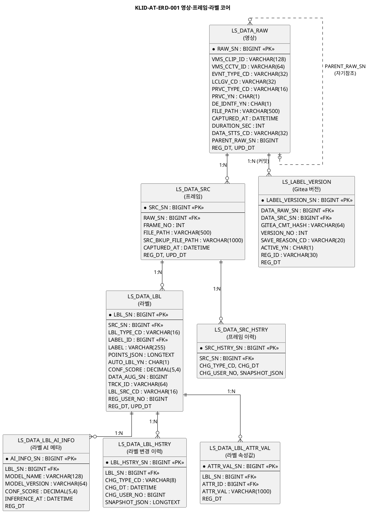
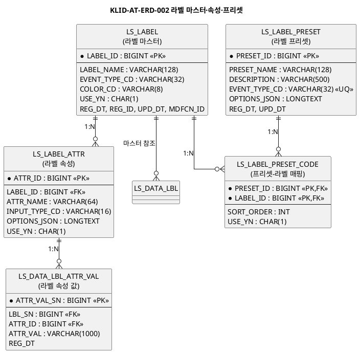
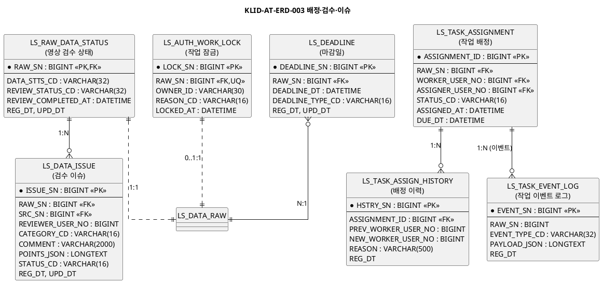
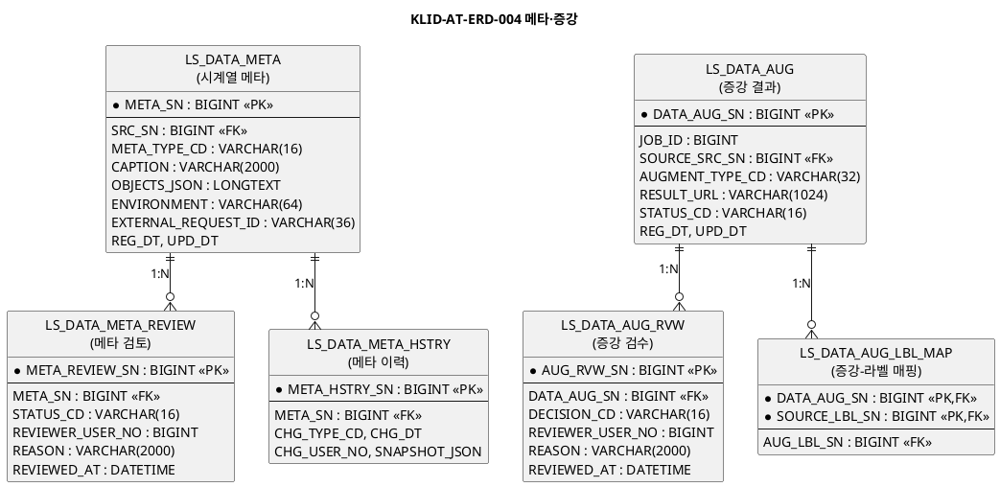
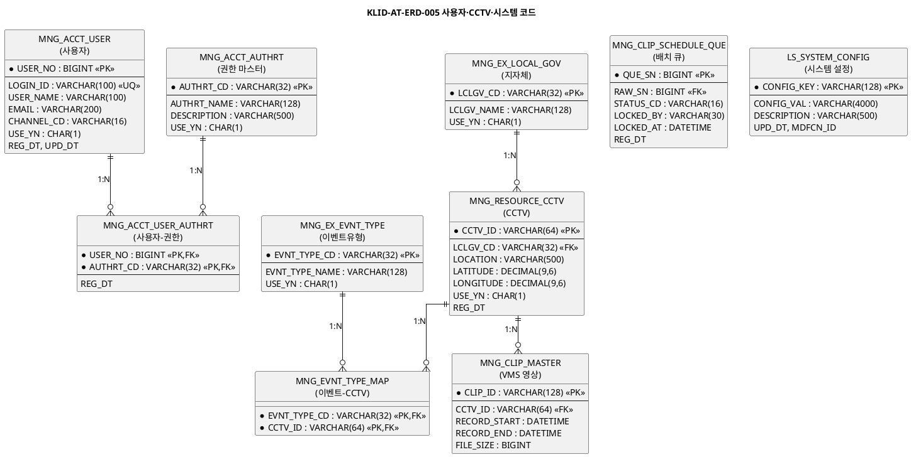
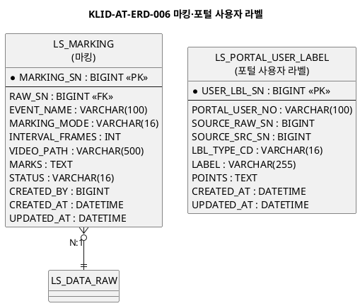
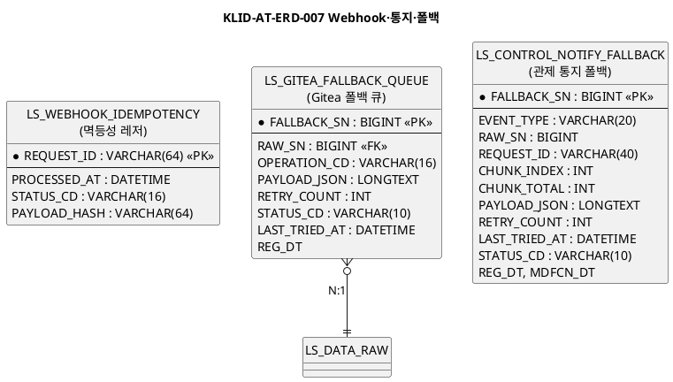

```plantuml
@startuml KLID-AT-ERD-008
title KLID-AT-ERD-008 통합 ERD (Overview)
hide circle
skinparam linetype ortho
skinparam defaultFontName "Malgun Gothic"
skinparam packageStyle rectangle

package "영상·프레임·라벨" as P1 {
  entity LS_DATA_RAW
  entity LS_DATA_SRC
  entity LS_DATA_LBL
  entity LS_LABEL_VERSION
  entity LS_DATA_LBL_AI_INFO
  entity LS_DATA_LBL_HSTRY
  entity LS_DATA_LBL_ATTR_VAL
  entity LS_DATA_SRC_HSTRY
  entity LS_DATA_RAW_HSTRY
}

package "라벨 마스터·프리셋" as P2 {
  entity LS_LABEL
  entity LS_LABEL_ATTR
  entity LS_LABEL_PRESET
  entity LS_LABEL_PRESET_CODE
}

package "배정·검수·이슈" as P3 {
  entity LS_RAW_DATA_STATUS
  entity LS_TASK_ASSIGNMENT
  entity LS_TASK_ASSIGN_HISTORY
  entity LS_DATA_ISSUE
  entity LS_AUTH_WORK_LOCK
  entity LS_TASK_EVENT_LOG
  entity LS_DEADLINE
}

package "메타·증강" as P4 {
  entity LS_DATA_META
  entity LS_DATA_META_REVIEW
  entity LS_DATA_META_HSTRY
  entity LS_DATA_AUG
  entity LS_DATA_AUG_RVW
  entity LS_DATA_AUG_LBL_MAP
}

package "마킹·포털" as P5 {
  entity LS_MARKING
  entity LS_PORTAL_USER_LABEL
  entity LS_PORTAL_USER_VIDEO
}

package "사용자·CCTV·시스템" as P6 {
  entity MNG_ACCT_USER
  entity MNG_ACCT_AUTHRT
  entity MNG_ACCT_USER_AUTHRT
  entity MNG_RESOURCE_CCTV
  entity MNG_EX_LOCAL_GOV
  entity MNG_EX_EVNT_TYPE
  entity MNG_EVNT_TYPE_MAP
  entity MNG_CLIP_MASTER
  entity MNG_CLIP_SCHEDULE_QUE
  entity LS_SYSTEM_CONFIG
  entity LS_META
  entity LS_RAW_DATA_ENROLLMENT
  entity LS_DATA_SET
  entity LS_DEIDENT_PROC_LOG
  entity LS_DEIDENT_REPORT
}

package "Webhook·통지" as P7 {
  entity LS_WEBHOOK_IDEMPOTENCY
  entity LS_GITEA_FALLBACK_QUEUE
  entity LS_CONTROL_NOTIFY_FALLBACK
}

LS_DATA_RAW ||--o{ LS_DATA_SRC
LS_DATA_SRC ||--o{ LS_DATA_LBL
LS_DATA_LBL ||--o{ LS_LABEL_VERSION
LS_LABEL ||--o{ LS_LABEL_ATTR
LS_LABEL_PRESET ||--o{ LS_LABEL_PRESET_CODE
LS_DATA_RAW ||--|| LS_RAW_DATA_STATUS
LS_DATA_RAW ||--o{ LS_TASK_ASSIGNMENT
MNG_ACCT_USER ||--o{ LS_TASK_ASSIGNMENT
LS_DATA_SRC ||--o{ LS_DATA_META
LS_DATA_META ||--o{ LS_DATA_META_REVIEW
LS_DATA_SRC ||--o{ LS_DATA_AUG
LS_DATA_AUG ||--o{ LS_DATA_AUG_RVW
LS_DATA_RAW ||--o{ MNG_CLIP_SCHEDULE_QUE
LS_DATA_RAW ||--o{ LS_DEIDENT_PROC_LOG
LS_DATA_RAW ||--o{ LS_DEIDENT_REPORT
LS_DATA_RAW ||--o{ LS_AUTH_WORK_LOCK
LS_DATA_RAW ||--o{ LS_MARKING
LS_DATA_RAW ||--o{ LS_DEADLINE
@enduml
```

# D8. 엔티티 관계 모형 설계서

## 제.개정 이력

| 날짜 | 버전 | 작성자 | 승인자 | 내용 |
|------|------|--------|--------|------|
| 2026-05-27 | 1.0 | 박찬기 | - | CBD 양식 전환 — V47 기준 45개 테이블 반영 |
| 2026-05-28 | 1.1 | 박찬기 | - | V51 기준 47개 테이블 반영 (LS_* 38개 + MNG_* 9개) — PJT_SN 컬럼 제거, LS_MARKING.INTERVAL_SEC→INTERVAL_FRAMES, VLM_VERIFY 상태 제거 반영 |

---

| D8 | 엔티티 관계 모형 설계서 |
|-------|-------------|
| 시스템명 | 기반 지방정부 관제지원시스템 구축(2차) AI CCTV | 서브시스템명 | AI CCTV 학습데이터 저작도구 (KLID-AT-SS-001) |
| 단계명 | 설계 | 작성일자 | 2026-05-27 | 버전 | 1.0 |

---

## 1. 엔티티 관계도(ERD)

> 가독성을 위해 도메인별로 7개 서브 ERD + 1개 통합 Overview로 분리한다.

### 1.1 ERD 목록

| ERD ID | ERD 명 | 관련 서브시스템 | 엔티티 수 |
|--------|--------|----------------|:---------:|
| KLID-AT-ERD-001 | 영상·프레임·라벨 코어 | 영상관리, 라벨링 | 8 |
| KLID-AT-ERD-002 | 라벨 마스터·속성·프리셋 | 라벨 관리 | 5 |
| KLID-AT-ERD-003 | 배정·검수·이슈 | 작업관리, 검수 | 6 |
| KLID-AT-ERD-004 | 메타·증강 | VLM 메타, 증강 | 6 |
| KLID-AT-ERD-005 | 사용자·CCTV·시스템 | 사용자, 시스템 설정 | 10 |
| KLID-AT-ERD-006 | 마킹·포털 사용자 라벨 | 마킹, 포털 | 2 |
| KLID-AT-ERD-007 | Webhook·통지·폴백 | 외부 연동 | 3 |
| KLID-AT-ERD-008 | 통합 Overview | 전체 | 45 |

---

### 1.2 KLID-AT-ERD-001 영상·프레임·라벨 코어

| ERD ID | KLID-AT-ERD-001 | ERD 명 | 영상·프레임·라벨 코어 |
|--------|---|-------|---|

---

### 1.3 KLID-AT-ERD-002 라벨 마스터·속성·프리셋

| ERD ID | KLID-AT-ERD-002 | ERD 명 | 라벨 마스터·속성·프리셋 |
|--------|---|-------|---|

---

### 1.4 KLID-AT-ERD-003 배정·검수·이슈

| ERD ID | KLID-AT-ERD-003 | ERD 명 | 배정·검수·이슈 |
|--------|---|-------|---|

---

### 1.5 KLID-AT-ERD-004 메타·증강

| ERD ID | KLID-AT-ERD-004 | ERD 명 | 메타·증강 |
|--------|---|-------|---|

---

### 1.6 KLID-AT-ERD-005 사용자·CCTV·시스템

| ERD ID | KLID-AT-ERD-005 | ERD 명 | 사용자·CCTV·시스템 코드 |
|--------|---|-------|---|

---

### 1.7 KLID-AT-ERD-006 마킹·포털 사용자 라벨

| ERD ID | KLID-AT-ERD-006 | ERD 명 | 마킹·포털 사용자 라벨 |
|--------|---|-------|---|

---

### 1.8 KLID-AT-ERD-007 Webhook·통지·폴백

| ERD ID | KLID-AT-ERD-007 | ERD 명 | Webhook·통지·폴백 |
|--------|---|-------|---|

---

### 1.9 KLID-AT-ERD-008 통합 Overview

| ERD ID | KLID-AT-ERD-008 | ERD 명 | 통합 ERD (Overview) |
|--------|---|-------|---|

---

## 2. 엔티티 명세서

### KLID-AT-EN-001 LS_DATA_RAW (영상)

| 엔티티 ID | KLID-AT-EN-001 | 엔티티명 | LS_DATA_RAW |
|---------|---|-------|---|
| 관련 클래스 ID | KLID-AT-DC-047 | 관련 클래스명 | VideoQueryService |
| 엔티티 설명 | 원본 영상 1건. 자동 파이프라인의 단위. 비식별·VLM 등 모든 처리의 root. PARENT_RAW_SN 추가(증강 영상의 원본 참조) |

| 속성명 | 동의어 | 타입 | 길이 | NOT NULL | PK | FK | INX | 기본값 | 제약조건 |
|-------|--------|------|------|:------:|:----:|:----:|:----:|-------|--------|
| RAW_SN | 영상SN | BIGINT | 19 | Y | Y | | | AUTO_INCREMENT | PK |
| VMS_CLIP_ID | | VARCHAR | 128 | Y | | Y(MNG_CLIP_MASTER) | Y | | |
| VMS_CCTV_ID | | VARCHAR | 64 | Y | | Y(MNG_RESOURCE_CCTV) | Y | | |
| EVNT_TYPE_CD | 이벤트유형 | VARCHAR | 32 | | | Y(MNG_EX_EVNT_TYPE) | | | |
| LCLGV_CD | 지자체코드 | VARCHAR | 32 | | | Y(MNG_EX_LOCAL_GOV) | Y | | |
| PRVC_TYPE_CD | 개인정보유형 | VARCHAR | 16 | Y | | | | | |
| PRVC_YN | | CHAR | 1 | Y | | | | 'N' | CHK(Y/N) |
| DE_IDNTF_YN | 비식별여부 | CHAR | 1 | Y | | | | 'N' | CHK(Y/N) |
| FILE_PATH | 원본경로 | VARCHAR | 500 | Y | | | | | |
| CAPTURED_AT | 촬영시각 | DATETIME | - | | | | Y | | |
| DURATION_SEC | 영상길이(초) | INT | 10 | | | | | | |
| DATA_STTS_CD | 영상상태 | VARCHAR | 32 | Y | | | Y | 'PENDING' | CHK in (PENDING,MARKING,VLM,DEIDENTIFY,FRAME,YOLO,SAM2,COMPLETED,FAILED) |
| PARENT_RAW_SN | 원본영상SN | BIGINT | 19 | | | Y(LS_DATA_RAW) | Y | | 증강 영상의 원본 참조. NULL이면 원본 |
| REG_DT | 등록시각 | DATETIME | - | Y | | | | CURRENT_TIMESTAMP | |
| UPD_DT | 수정시각 | DATETIME | - | | | | | | |

### KLID-AT-EN-002 LS_DATA_SRC (프레임)

| 엔티티 ID | KLID-AT-EN-002 | 엔티티명 | LS_DATA_SRC |
|---------|---|-------|---|
| 관련 클래스 ID | KLID-AT-DC-022 | 관련 클래스명 | LabelService |
| 엔티티 설명 | 영상에서 추출된 단일 프레임. 원본 파일 경로와 비식별 처리본 경로를 함께 보관 |

| 속성명 | 동의어 | 타입 | 길이 | NOT NULL | PK | FK | INX | 기본값 | 제약조건 |
|-------|--------|------|------|:------:|:----:|:----:|:----:|-------|--------|
| SRC_SN | 프레임SN | BIGINT | 19 | Y | Y | | | AUTO_INCREMENT | PK |
| RAW_SN | 영상SN | BIGINT | 19 | Y | | Y(LS_DATA_RAW) | Y | | |
| FRAME_NO | 프레임번호 | INT | 10 | Y | | | Y | | |
| FILE_PATH | 원본경로 | VARCHAR | 500 | Y | | | | | |
| SRC_BKUP_FILE_PATH | 비식별본경로 | VARCHAR | 1000 | | | | | | |
| CAPTURED_AT | 촬영시각 | DATETIME | - | | | | | | |
| REG_DT | 등록시각 | DATETIME | - | Y | | | | CURRENT_TIMESTAMP | |
| UPD_DT | 수정시각 | DATETIME | - | | | | | | |

### KLID-AT-EN-003 LS_DATA_LBL (라벨)

| 엔티티 ID | KLID-AT-EN-003 | 엔티티명 | LS_DATA_LBL |
|---------|---|-------|---|
| 관련 클래스 ID | KLID-AT-DC-022 | 관련 클래스명 | LabelService |
| 엔티티 설명 | 프레임별 라벨 어노테이션. BBOX/폴리곤/마스크 좌표·라벨 마스터·AI 자동 여부를 포함 |

| 속성명 | 동의어 | 타입 | 길이 | NOT NULL | PK | FK | INX | 기본값 | 제약조건 |
|-------|--------|------|------|:------:|:----:|:----:|:----:|-------|--------|
| LBL_SN | 라벨SN | BIGINT | 19 | Y | Y | | | AUTO_INCREMENT | PK |
| SRC_SN | 프레임SN | BIGINT | 19 | Y | | Y(LS_DATA_SRC) | Y | | |
| LBL_TYPE_CD | 라벨타입 | VARCHAR | 16 | Y | | | | | CHK in (BBOX,POLYGON,MASK) |
| LABEL_ID | 라벨ID | BIGINT | 19 | | | Y(LS_LABEL) | | | |
| LABEL | 라벨명 | VARCHAR | 255 | Y | | | | | |
| POINTS_JSON | 좌표 | LONGTEXT | - | | | | | | App.MAX_POINTS_PER_LABEL=1000 |
| AUTO_LBL_YN | 자동여부 | CHAR | 1 | | | | | 'N' | CHK(Y/N) |
| CONF_SCORE | 신뢰도 | DECIMAL | 5,4 | | | | | | 0.0~1.0 |
| DATA_AUG_SN | 증강SN | BIGINT | 19 | | | Y(LS_DATA_AUG) | | | |
| TRCK_ID | 트랙ID | VARCHAR | 64 | | | | Y | | |
| LBL_SRC_CD | 라벨소스 | VARCHAR | 16 | | | | | | CHK in (HUMAN,YOLO,SAM2) |
| REG_USER_NO | 등록사용자 | BIGINT | 19 | | | Y(MNG_ACCT_USER) | | | |
| REG_DT | 등록시각 | DATETIME | - | Y | | | | CURRENT_TIMESTAMP | |
| UPD_DT | 수정시각 | DATETIME | - | | | | | | |

### KLID-AT-EN-004 LS_LABEL_VERSION (Gitea 버전)

| 엔티티 ID | KLID-AT-EN-004 | 엔티티명 | LS_LABEL_VERSION |
|---------|---|-------|---|
| 관련 클래스 ID | KLID-AT-DC-030 | 관련 클래스명 | VersionService |
| 엔티티 설명 | Gitea 자동 커밋 hash 영속화. 라벨 롤백·비교의 기준점 |

| 속성명 | 동의어 | 타입 | 길이 | NOT NULL | PK | FK | INX | 기본값 | 제약조건 |
|-------|--------|------|------|:------:|:----:|:----:|:----:|-------|--------|
| LABEL_VERSION_SN | 버전SN | BIGINT | 19 | Y | Y | | | AUTO_INCREMENT | PK |
| DATA_RAW_SN | 영상SN | BIGINT | 19 | Y | | Y(LS_DATA_RAW) | Y | | |
| DATA_SRC_SN | 프레임SN | BIGINT | 19 | | | Y(LS_DATA_SRC) | | | |
| GITEA_CMT_HASH | 커밋해시 | VARCHAR | 64 | Y | | | Y | | UQ |
| VERSION_NO | 버전번호 | INT | 10 | Y | | | | | |
| SAVE_REASON_CD | 저장사유 | VARCHAR | 20 | | | | | | CHK in (EDIT,ROLLBACK) |
| ACTIVE_YN | 활성여부 | CHAR | 1 | Y | | | | 'Y' | CHK(Y/N) |
| REG_ID | 등록자ID | VARCHAR | 30 | | | | | | |
| REG_DT | 등록시각 | DATETIME | - | Y | | | | CURRENT_TIMESTAMP | |

### KLID-AT-EN-005 LS_RAW_DATA_STATUS (영상 검수 상태)

| 엔티티 ID | KLID-AT-EN-005 | 엔티티명 | LS_RAW_DATA_STATUS |
|---------|---|-------|---|
| 관련 클래스 ID | KLID-AT-DC-037 | 관련 클래스명 | ReviewService |
| 엔티티 설명 | 영상별 처리·검수 복합 상태. LS_DATA_RAW와 1:1 관계 |

| 속성명 | 동의어 | 타입 | 길이 | NOT NULL | PK | FK | INX | 기본값 | 제약조건 |
|-------|--------|------|------|:------:|:----:|:----:|:----:|-------|--------|
| RAW_SN | 영상SN | BIGINT | 19 | Y | Y | Y(LS_DATA_RAW) | | | PK+FK |
| DATA_STTS_CD | 처리상태 | VARCHAR | 32 | Y | | | Y | 'PENDING' | |
| REVIEW_STATUS_CD | 검수상태 | VARCHAR | 32 | Y | | | Y | 'NONE' | CHK in (NONE,IN_REVIEW,APPROVED,REJECTED,COMPLETED) |
| REVIEW_COMPLETED_AT | 검수완료시각 | DATETIME | - | | | | | | |
| REG_DT | 등록시각 | DATETIME | - | Y | | | | CURRENT_TIMESTAMP | |
| UPD_DT | 수정시각 | DATETIME | - | | | | | | |

### KLID-AT-EN-006 LS_TASK_ASSIGNMENT (작업 배정)

| 엔티티 ID | KLID-AT-EN-006 | 엔티티명 | LS_TASK_ASSIGNMENT |
|---------|---|-------|---|
| 관련 클래스 ID | KLID-AT-DC-035 | 관련 클래스명 | AssignmentService |
| 엔티티 설명 | WORKER에게 영상 라벨링 작업을 배정하는 레코드 |

| 속성명 | 동의어 | 타입 | 길이 | NOT NULL | PK | FK | INX | 기본값 | 제약조건 |
|-------|--------|------|------|:------:|:----:|:----:|:----:|-------|--------|
| ASSIGNMENT_ID | 배정ID | BIGINT | 19 | Y | Y | | | AUTO_INCREMENT | PK |
| RAW_SN | 영상SN | BIGINT | 19 | Y | | Y(LS_DATA_RAW) | Y | | |
| WORKER_USER_NO | 작업자 | BIGINT | 19 | Y | | Y(MNG_ACCT_USER) | Y | | |
| ASSIGNER_USER_NO | 배정자 | BIGINT | 19 | Y | | Y(MNG_ACCT_USER) | | | |
| STATUS_CD | 상태 | VARCHAR | 16 | Y | | | Y | 'ASSIGNED' | CHK in (ASSIGNED,IN_PROGRESS,DONE,CANCELLED) |
| ASSIGNED_AT | 배정시각 | DATETIME | - | Y | | | | CURRENT_TIMESTAMP | |
| DUE_DT | 마감일 | DATETIME | - | | | | | | |

### KLID-AT-EN-007 LS_DATA_ISSUE (검수 이슈)

| 엔티티 ID | KLID-AT-EN-007 | 엔티티명 | LS_DATA_ISSUE |
|---------|---|-------|---|
| 관련 클래스 ID | KLID-AT-DC-037 | 관련 클래스명 | ReviewService |
| 엔티티 설명 | 검수자가 영상/프레임에 등록한 이슈·코멘트 |

| 속성명 | 동의어 | 타입 | 길이 | NOT NULL | PK | FK | INX | 기본값 | 제약조건 |
|-------|--------|------|------|:------:|:----:|:----:|:----:|-------|--------|
| ISSUE_SN | 이슈SN | BIGINT | 19 | Y | Y | | | AUTO_INCREMENT | PK |
| RAW_SN | 영상SN | BIGINT | 19 | Y | | Y(LS_DATA_RAW) | Y | | |
| SRC_SN | 프레임SN | BIGINT | 19 | | | Y(LS_DATA_SRC) | | | |
| REVIEWER_USER_NO | 검수자 | BIGINT | 19 | Y | | Y(MNG_ACCT_USER) | | | |
| CATEGORY_CD | 카테고리 | VARCHAR | 16 | Y | | | | | |
| COMMENT | 코멘트 | VARCHAR | 2000 | | | | | | |
| POINTS_JSON | 좌표 | LONGTEXT | - | | | | | | |
| STATUS_CD | 상태 | VARCHAR | 16 | Y | | | Y | 'OPEN' | CHK in (OPEN,IN_PROGRESS,RESOLVED,CLOSED) |
| REG_DT | 등록시각 | DATETIME | - | Y | | | | CURRENT_TIMESTAMP | |
| UPD_DT | 수정시각 | DATETIME | - | | | | | | |

### KLID-AT-EN-008 LS_AUTH_WORK_LOCK (작업 잠금)

| 엔티티 ID | KLID-AT-EN-008 | 엔티티명 | LS_AUTH_WORK_LOCK |
|---------|---|-------|---|
| 관련 클래스 ID | KLID-AT-DC-050 | 관련 클래스명 | WorkLockService |
| 엔티티 설명 | 영상 단위 비관적 잠금. 1영상 1잠금 보장 (UQ) |

| 속성명 | 동의어 | 타입 | 길이 | NOT NULL | PK | FK | INX | 기본값 | 제약조건 |
|-------|--------|------|------|:------:|:----:|:----:|:----:|-------|--------|
| LOCK_SN | 잠금SN | BIGINT | 19 | Y | Y | | | AUTO_INCREMENT | PK |
| RAW_SN | 영상SN | BIGINT | 19 | Y | | Y(LS_DATA_RAW) | Y | | UQ(RAW_SN) |
| OWNER_ID | 소유자ID | VARCHAR | 30 | Y | | | | | |
| REASON_CD | 사유코드 | VARCHAR | 16 | | | | | | CHK in (REDEIDENT,LABEL,REVIEW) |
| LOCKED_AT | 잠금시각 | DATETIME | - | Y | | | | CURRENT_TIMESTAMP | |

### KLID-AT-EN-009 LS_DATA_META (메타 정보)

| 엔티티 ID | KLID-AT-EN-009 | 엔티티명 | LS_DATA_META |
|---------|---|-------|---|
| 관련 클래스 ID | KLID-AT-DC-042 | 관련 클래스명 | MetaService |
| 엔티티 설명 | 프레임별 VLM·사람·외부 생성 메타데이터. CAPTION + 객체 목록 JSON |

| 속성명 | 동의어 | 타입 | 길이 | NOT NULL | PK | FK | INX | 기본값 | 제약조건 |
|-------|--------|------|------|:------:|:----:|:----:|:----:|-------|--------|
| META_SN | 메타SN | BIGINT | 19 | Y | Y | | | AUTO_INCREMENT | PK |
| SRC_SN | 프레임SN | BIGINT | 19 | Y | | Y(LS_DATA_SRC) | Y | | |
| META_TYPE_CD | 메타유형 | VARCHAR | 16 | Y | | | Y | | CHK in (VLM,HUMAN,EXT) |
| CAPTION | 캡션 | VARCHAR | 2000 | | | | | | |
| OBJECTS_JSON | 객체목록 | LONGTEXT | - | | | | | | |
| ENVIRONMENT | 환경정보 | VARCHAR | 64 | | | | | | |
| EXTERNAL_REQUEST_ID | 외부요청ID | VARCHAR | 36 | | | | Y | | UQ, UUID 형식 |
| REG_DT | 등록시각 | DATETIME | - | Y | | | | CURRENT_TIMESTAMP | |
| UPD_DT | 수정시각 | DATETIME | - | | | | | | |

### KLID-AT-EN-010 LS_DATA_META_REVIEW (메타 검수)

| 엔티티 ID | KLID-AT-EN-010 | 엔티티명 | LS_DATA_META_REVIEW |
|---------|---|-------|---|
| 관련 클래스 ID | KLID-AT-DC-042 | 관련 클래스명 | MetaService |
| 엔티티 설명 | 메타데이터 검수 결과. PENDING -> APPROVED/REJECTED 흐름 |

| 속성명 | 동의어 | 타입 | 길이 | NOT NULL | PK | FK | INX | 기본값 | 제약조건 |
|-------|--------|------|------|:------:|:----:|:----:|:----:|-------|--------|
| META_REVIEW_SN | 메타검수SN | BIGINT | 19 | Y | Y | | | AUTO_INCREMENT | PK |
| META_SN | 메타SN | BIGINT | 19 | Y | | Y(LS_DATA_META) | Y | | |
| STATUS_CD | 상태 | VARCHAR | 16 | Y | | | Y | 'PENDING' | CHK in (PENDING,APPROVED,REJECTED) |
| REVIEWER_USER_NO | 검수자 | BIGINT | 19 | | | Y(MNG_ACCT_USER) | | | |
| REASON | 사유 | VARCHAR | 2000 | | | | | | |
| REVIEWED_AT | 검수시각 | DATETIME | - | | | | | | |

### KLID-AT-EN-011 LS_DATA_AUG (증강 작업)

| 엔티티 ID | KLID-AT-EN-011 | 엔티티명 | LS_DATA_AUG |
|---------|---|-------|---|
| 관련 클래스 ID | KLID-AT-DC-044 | 관련 클래스명 | AugmentRequestService |
| 엔티티 설명 | 외부 증강 서버에 요청한 증강 단위. 원본 프레임 -> 결과 URL |

| 속성명 | 동의어 | 타입 | 길이 | NOT NULL | PK | FK | INX | 기본값 | 제약조건 |
|-------|--------|------|------|:------:|:----:|:----:|:----:|-------|--------|
| DATA_AUG_SN | 증강SN | BIGINT | 19 | Y | Y | | | AUTO_INCREMENT | PK |
| JOB_ID | 잡ID | BIGINT | 19 | Y | | | Y | | |
| SOURCE_SRC_SN | 원본프레임SN | BIGINT | 19 | Y | | Y(LS_DATA_SRC) | Y | | |
| AUGMENT_TYPE_CD | 증강유형 | VARCHAR | 32 | Y | | | | | |
| RESULT_URL | 결과URL | VARCHAR | 1024 | | | | | | |
| STATUS_CD | 상태 | VARCHAR | 16 | Y | | | Y | 'RECEIVED' | CHK in (RECEIVED,ACCEPTED,REJECTED) |
| REG_DT | 등록시각 | DATETIME | - | Y | | | | CURRENT_TIMESTAMP | |
| UPD_DT | 수정시각 | DATETIME | - | | | | | | |

### KLID-AT-EN-012 LS_LABEL (라벨 마스터)

| 엔티티 ID | KLID-AT-EN-012 | 엔티티명 | LS_LABEL |
|---------|---|-------|---|
| 관련 클래스 ID | KLID-AT-DC-048 | 관련 클래스명 | SystemConfigService |
| 엔티티 설명 | 라벨 클래스 마스터. 이벤트 유형별 색상·사용 여부 관리 |

| 속성명 | 동의어 | 타입 | 길이 | NOT NULL | PK | FK | INX | 기본값 | 제약조건 |
|-------|--------|------|------|:------:|:----:|:----:|:----:|-------|--------|
| LABEL_ID | 라벨ID | BIGINT | 19 | Y | Y | | | AUTO_INCREMENT | PK |
| LABEL_NAME | 라벨명 | VARCHAR | 128 | Y | | | Y | | |
| EVENT_TYPE_CD | 이벤트유형 | VARCHAR | 32 | | | Y(MNG_EX_EVNT_TYPE) | Y | | |
| COLOR_CD | 색상코드 | VARCHAR | 8 | | | | | '#3B82F6' | |
| USE_YN | 사용여부 | CHAR | 1 | Y | | | Y | 'Y' | CHK(Y/N) |
| REG_DT | 등록시각 | DATETIME | - | Y | | | | CURRENT_TIMESTAMP | |
| REG_ID | 등록자ID | VARCHAR | 30 | | | | | | |
| UPD_DT | 수정시각 | DATETIME | - | | | | | | |
| MDFCN_ID | 수정자ID | VARCHAR | 30 | | | | | | |

### KLID-AT-EN-013 LS_LABEL_PRESET (라벨 프리셋)

| 엔티티 ID | KLID-AT-EN-013 | 엔티티명 | LS_LABEL_PRESET |
|---------|---|-------|---|
| 관련 클래스 ID | KLID-AT-DC-049 | 관련 클래스명 | PresetService |
| 엔티티 설명 | 이벤트 유형별 라벨 프리셋. 이벤트당 1:1 UQ 제약 |

| 속성명 | 동의어 | 타입 | 길이 | NOT NULL | PK | FK | INX | 기본값 | 제약조건 |
|-------|--------|------|------|:------:|:----:|:----:|:----:|-------|--------|
| PRESET_ID | 프리셋ID | BIGINT | 19 | Y | Y | | | AUTO_INCREMENT | PK |
| PRESET_NAME | 프리셋명 | VARCHAR | 128 | Y | | | Y | | |
| DESCRIPTION | 설명 | VARCHAR | 500 | | | | | | |
| EVENT_TYPE_CD | 이벤트유형 | VARCHAR | 32 | | | | Y | | UQ(EVENT_TYPE_CD) |
| OPTIONS_JSON | 옵션JSON | LONGTEXT | - | | | | | | |
| REG_DT | 등록시각 | DATETIME | - | | | | | CURRENT_TIMESTAMP | |
| UPD_DT | 수정시각 | DATETIME | - | | | | | | |

### KLID-AT-EN-014 MNG_CLIP_SCHEDULE_QUE (배치 큐)

| 엔티티 ID | KLID-AT-EN-014 | 엔티티명 | MNG_CLIP_SCHEDULE_QUE |
|---------|---|-------|---|
| 관련 클래스 ID | KLID-AT-DC-001 | 관련 클래스명 | BatchOrchestrator |
| 엔티티 설명 | 자동 파이프라인 대기 큐. Quartz SKIP LOCKED 선점 방식으로 중복 처리 방지 |

| 속성명 | 동의어 | 타입 | 길이 | NOT NULL | PK | FK | INX | 기본값 | 제약조건 |
|-------|--------|------|------|:------:|:----:|:----:|:----:|-------|--------|
| QUE_SN | 큐SN | BIGINT | 19 | Y | Y | | | AUTO_INCREMENT | PK |
| RAW_SN | 영상SN | BIGINT | 19 | Y | | Y(LS_DATA_RAW) | Y | | |
| STATUS_CD | 상태 | VARCHAR | 16 | Y | | | Y | 'WAITING' | CHK in (WAITING,PROCESSING,DONE,FAILED) |
| LOCKED_BY | 잠금주체 | VARCHAR | 30 | | | | | | |
| LOCKED_AT | 잠금시각 | DATETIME | - | | | | | | SELECT FOR UPDATE SKIP LOCKED |
| REG_DT | 등록시각 | DATETIME | - | Y | | | | CURRENT_TIMESTAMP | |

### KLID-AT-EN-015 LS_DEIDENT_PROC_LOG (비식별 처리 로그)

| 엔티티 ID | KLID-AT-EN-015 | 엔티티명 | LS_DEIDENT_PROC_LOG |
|---------|---|-------|---|
| 관련 클래스 ID | KLID-AT-DC-010 | 관련 클래스명 | DeidentifyClient |
| 엔티티 설명 | 비식별 서버 요청별 처리 로그. REQUEST_ID UQ로 멱등성 보장 |

| 속성명 | 동의어 | 타입 | 길이 | NOT NULL | PK | FK | INX | 기본값 | 제약조건 |
|-------|--------|------|------|:------:|:----:|:----:|:----:|-------|--------|
| LOG_SN | 로그SN | BIGINT | 19 | Y | Y | | | AUTO_INCREMENT | PK |
| RAW_SN | 영상SN | BIGINT | 19 | Y | | Y(LS_DATA_RAW) | Y | | |
| REQUEST_ID | 요청ID | VARCHAR | 36 | Y | | | | | UQ, UUID 형식 |
| STATUS_CD | 상태 | VARCHAR | 16 | Y | | | Y | | CHK in (REQUESTED,SUCCESS,FAILED) |
| DEID_FILE_PATH | 비식별파일경로 | VARCHAR | 1024 | | | | | | |
| REG_DT | 등록시각 | DATETIME | - | Y | | | | CURRENT_TIMESTAMP | |

### KLID-AT-EN-016 LS_DEIDENT_REPORT (비식별 누락 신고)

| 엔티티 ID | KLID-AT-EN-016 | 엔티티명 | LS_DEIDENT_REPORT |
|---------|---|-------|---|
| 관련 클래스 ID | KLID-AT-DC-022 | 관련 클래스명 | LabelService |
| 엔티티 설명 | 작업자가 프레임에서 발견한 비식별 누락 신고 레코드 |

| 속성명 | 동의어 | 타입 | 길이 | NOT NULL | PK | FK | INX | 기본값 | 제약조건 |
|-------|--------|------|------|:------:|:----:|:----:|:----:|-------|--------|
| REPORT_SN | 신고SN | BIGINT | 19 | Y | Y | | | AUTO_INCREMENT | PK |
| SRC_SN | 프레임SN | BIGINT | 19 | Y | | Y(LS_DATA_SRC) | Y | | |
| RAW_SN | 영상SN | BIGINT | 19 | Y | | Y(LS_DATA_RAW) | Y | | |
| REPORTER_USER_NO | 신고자 | BIGINT | 19 | Y | | Y(MNG_ACCT_USER) | | | |
| REASON | 사유 | VARCHAR | 500 | | | | | | |
| STATUS_CD | 상태 | VARCHAR | 16 | Y | | | Y | | CHK in (OPEN,PROCESSING,RESOLVED) |
| REG_DT | 등록시각 | DATETIME | - | Y | | | | CURRENT_TIMESTAMP | |
| UPD_DT | 수정시각 | DATETIME | - | | | | | | |

### KLID-AT-EN-017 LS_PORTAL_USER_VIDEO (포털 영상 업로드)

| 엔티티 ID | KLID-AT-EN-017 | 엔티티명 | LS_PORTAL_USER_VIDEO |
|---------|---|-------|---|
| 관련 클래스 ID | KLID-AT-DC-046 | 관련 클래스명 | PortalUploadService |
| 엔티티 설명 | 포털 사용자가 TUS 프로토콜로 업로드한 영상 파일 레코드 |

| 속성명 | 동의어 | 타입 | 길이 | NOT NULL | PK | FK | INX | 기본값 | 제약조건 |
|-------|--------|------|------|:------:|:----:|:----:|:----:|-------|--------|
| PORTAL_VIDEO_SN | 포털영상SN | BIGINT | 19 | Y | Y | | | AUTO_INCREMENT | PK |
| PORTAL_USER_NO | 포털사용자NO | VARCHAR | 100 | Y | | | Y | | |
| FILE_PATH | 파일경로 | VARCHAR | 500 | Y | | | | | |
| ORIG_FILE_NAME | 원본파일명 | VARCHAR | 255 | | | | | | |
| FILE_SIZE | 파일크기 | BIGINT | 19 | | | | | | 단위: byte |
| REG_DT | 등록시각 | DATETIME | - | Y | | | | CURRENT_TIMESTAMP | |

### KLID-AT-EN-018 LS_CONTROL_NOTIFY_FALLBACK (관제 통지 폴백)

| 엔티티 ID | KLID-AT-EN-018 | 엔티티명 | LS_CONTROL_NOTIFY_FALLBACK |
|---------|---|-------|---|
| 관련 클래스 ID | KLID-AT-DC-051 | 관련 클래스명 | ControlNotifyFallbackQueue |
| 엔티티 설명 | 관제서버 통지 실패 시 보관용 영속 폴백 큐. PENDING -> SUCCESS/DEAD 상태 관리 |

| 속성명 | 동의어 | 타입 | 길이 | NOT NULL | PK | FK | INX | 기본값 | 제약조건 |
|-------|--------|------|------|:------:|:----:|:----:|:----:|-------|--------|
| FALLBACK_SN | 폴백SN | BIGINT | 19 | Y | Y | | | AUTO_INCREMENT | PK |
| EVENT_TYPE | 이벤트유형 | VARCHAR | 20 | Y | | | | | CHK in (TASK_COMPLETED,TASK_MODIFIED) |
| RAW_SN | 영상SN | BIGINT | 19 | Y | | | Y | | |
| REQUEST_ID | 요청ID | VARCHAR | 40 | Y | | | | | UQ(REQUEST_ID, CHUNK_INDEX) |
| CHUNK_INDEX | 청크인덱스 | INT | 5 | Y | | | | 1 | |
| CHUNK_TOTAL | 청크총개수 | INT | 5 | Y | | | | 1 | |
| PAYLOAD_JSON | 페이로드 | LONGTEXT | - | Y | | | | | |
| RETRY_COUNT | 재시도횟수 | INT | 3 | Y | | | | 0 | max=5 |
| LAST_TRIED_AT | 최근시도시각 | DATETIME | - | | | | Y | | |
| STATUS_CD | 상태 | VARCHAR | 10 | Y | | | Y | 'PENDING' | CHK in (PENDING,SUCCESS,DEAD) |
| REG_DT | 등록시각 | DATETIME | - | Y | | | | CURRENT_TIMESTAMP | |
| MDFCN_DT | 수정시각 | DATETIME | - | | | | | | |

### KLID-AT-EN-019 LS_LABEL_ATTR (라벨 속성 정의)

| 엔티티 ID | KLID-AT-EN-019 | 엔티티명 | LS_LABEL_ATTR |
|---------|---|-------|---|
| 관련 클래스 ID | KLID-AT-DC-049 | 관련 클래스명 | PresetService |
| 엔티티 설명 | 라벨 클래스별 추가 속성 정의 (입력유형·옵션 JSON) |

| 속성명 | 동의어 | 타입 | 길이 | NOT NULL | PK | FK | INX | 기본값 | 제약조건 |
|-------|--------|------|------|:------:|:----:|:----:|:----:|-------|--------|
| ATTR_ID | 속성ID | BIGINT | 19 | Y | Y | | | AUTO_INCREMENT | PK |
| LABEL_ID | 라벨ID | BIGINT | 19 | Y | | Y(LS_LABEL) | Y | | |
| ATTR_NAME | 속성명 | VARCHAR | 64 | Y | | | | | |
| INPUT_TYPE_CD | 입력유형 | VARCHAR | 16 | Y | | | | | CHK in (SELECT,CHECKBOX,RADIO,TEXT,NUMBER) |
| OPTIONS_JSON | 옵션JSON | LONGTEXT | - | | | | | | |
| USE_YN | 사용여부 | CHAR | 1 | Y | | | | 'Y' | CHK(Y/N) |

### KLID-AT-EN-020 LS_DATA_LBL_HSTRY (라벨 변경 이력)

| 엔티티 ID | KLID-AT-EN-020 | 엔티티명 | LS_DATA_LBL_HSTRY |
|---------|---|-------|---|
| 관련 클래스 ID | KLID-AT-DC-022 | 관련 클래스명 | LabelService |
| 엔티티 설명 | 라벨 생성·수정·삭제 이력. SNAPSHOT_JSON으로 변경 전 상태 보관 |

| 속성명 | 동의어 | 타입 | 길이 | NOT NULL | PK | FK | INX | 기본값 | 제약조건 |
|-------|--------|------|------|:------:|:----:|:----:|:----:|-------|--------|
| LBL_HSTRY_SN | 라벨이력SN | BIGINT | 19 | Y | Y | | | AUTO_INCREMENT | PK |
| LBL_SN | 라벨SN | BIGINT | 19 | Y | | Y(LS_DATA_LBL) | Y | | |
| CHG_TYPE_CD | 변경유형 | VARCHAR | 8 | Y | | | | | CHK in (I,U,D) |
| CHG_DT | 변경시각 | DATETIME | - | Y | | | Y | | |
| CHG_USER_NO | 변경자 | BIGINT | 19 | Y | | Y(MNG_ACCT_USER) | | | |
| SNAPSHOT_JSON | 스냅샷JSON | LONGTEXT | - | | | | | | 변경 전 라벨 전체 직렬화 |

### KLID-AT-EN-021 LS_DATA_LBL_AI_INFO (라벨 AI 추론 메타)

| 엔티티 ID | KLID-AT-EN-021 | 엔티티명 | LS_DATA_LBL_AI_INFO |
|---------|---|-------|---|
| 관련 클래스 ID | KLID-AT-DC-005 | 관련 클래스명 | AiServerClient |
| 엔티티 설명 | YOLO/SAM2 자동 라벨에 대한 모델명·버전·신뢰도 메타 |

| 속성명 | 동의어 | 타입 | 길이 | NOT NULL | PK | FK | INX | 기본값 | 제약조건 |
|-------|--------|------|------|:------:|:----:|:----:|:----:|-------|--------|
| AI_INFO_SN | AI정보SN | BIGINT | 19 | Y | Y | | | AUTO_INCREMENT | PK |
| LBL_SN | 라벨SN | BIGINT | 19 | Y | | Y(LS_DATA_LBL) | Y | | |
| MODEL_NAME | 모델명 | VARCHAR | 128 | Y | | | | | |
| MODEL_VERSION | 모델버전 | VARCHAR | 64 | | | | | | |
| CONF_SCORE | 신뢰도 | DECIMAL | 5,4 | | | | | | 0.0~1.0 |
| INFERENCE_AT | 추론시각 | DATETIME | - | | | | | | |
| REG_DT | 등록시각 | DATETIME | - | Y | | | | CURRENT_TIMESTAMP | |

### KLID-AT-EN-022 LS_DATA_LBL_ATTR_VAL (라벨 속성 값)

| 엔티티 ID | KLID-AT-EN-022 | 엔티티명 | LS_DATA_LBL_ATTR_VAL |
|---------|---|-------|---|
| 관련 클래스 ID | KLID-AT-DC-022 | 관련 클래스명 | LabelService |
| 엔티티 설명 | 라벨 인스턴스별 속성 입력값. LS_LABEL_ATTR 정의를 기준으로 저장 |

| 속성명 | 동의어 | 타입 | 길이 | NOT NULL | PK | FK | INX | 기본값 | 제약조건 |
|-------|--------|------|------|:------:|:----:|:----:|:----:|-------|--------|
| ATTR_VAL_SN | 속성값SN | BIGINT | 19 | Y | Y | | | AUTO_INCREMENT | PK |
| LBL_SN | 라벨SN | BIGINT | 19 | Y | | Y(LS_DATA_LBL) | Y | | |
| ATTR_ID | 속성ID | BIGINT | 19 | Y | | Y(LS_LABEL_ATTR) | Y | | |
| ATTR_VAL | 속성값 | VARCHAR | 1000 | Y | | | | | |
| REG_DT | 등록시각 | DATETIME | - | Y | | | | CURRENT_TIMESTAMP | |

### KLID-AT-EN-023 LS_DATA_AUG_RVW (증강 검수)

| 엔티티 ID | KLID-AT-EN-023 | 엔티티명 | LS_DATA_AUG_RVW |
|---------|---|-------|---|
| 관련 클래스 ID | KLID-AT-DC-045 | 관련 클래스명 | AugmentReviewService |
| 엔티티 설명 | 증강 결과 검수 승인/반려 레코드 |

| 속성명 | 동의어 | 타입 | 길이 | NOT NULL | PK | FK | INX | 기본값 | 제약조건 |
|-------|--------|------|------|:------:|:----:|:----:|:----:|-------|--------|
| AUG_RVW_SN | 증강검수SN | BIGINT | 19 | Y | Y | | | AUTO_INCREMENT | PK |
| DATA_AUG_SN | 증강SN | BIGINT | 19 | Y | | Y(LS_DATA_AUG) | Y | | |
| DECISION_CD | 판정 | VARCHAR | 16 | Y | | | | | CHK in (ACCEPTED,REJECTED) |
| REVIEWER_USER_NO | 검수자 | BIGINT | 19 | Y | | Y(MNG_ACCT_USER) | | | |
| REASON | 사유 | VARCHAR | 2000 | | | | | | |
| REVIEWED_AT | 검수시각 | DATETIME | - | Y | | | | CURRENT_TIMESTAMP | |

### KLID-AT-EN-024 LS_DATA_AUG_LBL_MAP (증강-라벨 매핑)

| 엔티티 ID | KLID-AT-EN-024 | 엔티티명 | LS_DATA_AUG_LBL_MAP |
|---------|---|-------|---|
| 관련 클래스 ID | KLID-AT-DC-044 | 관련 클래스명 | AugmentRequestService |
| 엔티티 설명 | 증강 원본 라벨과 생성된 증강 라벨의 매핑 테이블 |

| 속성명 | 동의어 | 타입 | 길이 | NOT NULL | PK | FK | INX | 기본값 | 제약조건 |
|-------|--------|------|------|:------:|:----:|:----:|:----:|-------|--------|
| DATA_AUG_SN | 증강SN | BIGINT | 19 | Y | Y | Y(LS_DATA_AUG) | | | 복합PK |
| SOURCE_LBL_SN | 원본라벨SN | BIGINT | 19 | Y | Y | Y(LS_DATA_LBL) | | | 복합PK |
| AUG_LBL_SN | 증강라벨SN | BIGINT | 19 | Y | | Y(LS_DATA_LBL) | | | |

### KLID-AT-EN-025 LS_DATA_META_HSTRY (메타 변경 이력)

| 엔티티 ID | KLID-AT-EN-025 | 엔티티명 | LS_DATA_META_HSTRY |
|---------|---|-------|---|
| 관련 클래스 ID | KLID-AT-DC-042 | 관련 클래스명 | MetaService |
| 엔티티 설명 | 메타 변경 이력. 12개월 후 cold archive 권장 |

| 속성명 | 동의어 | 타입 | 길이 | NOT NULL | PK | FK | INX | 기본값 | 제약조건 |
|-------|--------|------|------|:------:|:----:|:----:|:----:|-------|--------|
| META_HSTRY_SN | 메타이력SN | BIGINT | 19 | Y | Y | | | AUTO_INCREMENT | PK |
| META_SN | 메타SN | BIGINT | 19 | Y | | Y(LS_DATA_META) | Y | | |
| CHG_TYPE_CD | 변경유형 | VARCHAR | 8 | Y | | | | | CHK in (I,U,D) |
| CHG_DT | 변경시각 | DATETIME | - | Y | | | Y | | |
| CHG_USER_NO | 변경자 | BIGINT | 19 | Y | | Y(MNG_ACCT_USER) | | | |
| SNAPSHOT_JSON | 스냅샷JSON | LONGTEXT | - | | | | | | 변경 전 메타 전체 직렬화 |

### KLID-AT-EN-026 LS_DATA_SRC_HSTRY (프레임 변경 이력)

| 엔티티 ID | KLID-AT-EN-026 | 엔티티명 | LS_DATA_SRC_HSTRY |
|---------|---|-------|---|
| 관련 클래스 ID | KLID-AT-DC-022 | 관련 클래스명 | LabelService |
| 엔티티 설명 | 프레임(원본·비식별본 경로) 변경 이력 |

| 속성명 | 동의어 | 타입 | 길이 | NOT NULL | PK | FK | INX | 기본값 | 제약조건 |
|-------|--------|------|------|:------:|:----:|:----:|:----:|-------|--------|
| SRC_HSTRY_SN | 프레임이력SN | BIGINT | 19 | Y | Y | | | AUTO_INCREMENT | PK |
| SRC_SN | 프레임SN | BIGINT | 19 | Y | | Y(LS_DATA_SRC) | Y | | |
| CHG_TYPE_CD | 변경유형 | VARCHAR | 8 | Y | | | | | CHK in (I,U,D) |
| CHG_DT | 변경시각 | DATETIME | - | Y | | | Y | | |
| CHG_USER_NO | 변경자 | BIGINT | 19 | Y | | Y(MNG_ACCT_USER) | | | |
| SNAPSHOT_JSON | 스냅샷JSON | LONGTEXT | - | | | | | | 변경 전 프레임 정보 직렬화 |

### KLID-AT-EN-027 LS_DATA_RAW_HSTRY (영상 변경 이력)

| 엔티티 ID | KLID-AT-EN-027 | 엔티티명 | LS_DATA_RAW_HSTRY |
|---------|---|-------|---|
| 관련 클래스 ID | KLID-AT-DC-047 | 관련 클래스명 | VideoQueryService |
| 엔티티 설명 | 영상 메타 변경 이력 (상태코드·파일경로 등) |

| 속성명 | 동의어 | 타입 | 길이 | NOT NULL | PK | FK | INX | 기본값 | 제약조건 |
|-------|--------|------|------|:------:|:----:|:----:|:----:|-------|--------|
| RAW_HSTRY_SN | 영상이력SN | BIGINT | 19 | Y | Y | | | AUTO_INCREMENT | PK |
| RAW_SN | 영상SN | BIGINT | 19 | Y | | Y(LS_DATA_RAW) | Y | | |
| CHG_TYPE_CD | 변경유형 | VARCHAR | 8 | Y | | | | | CHK in (I,U,D) |
| CHG_DT | 변경시각 | DATETIME | - | Y | | | Y | | |
| CHG_USER_NO | 변경자 | BIGINT | 19 | Y | | Y(MNG_ACCT_USER) | | | |
| SNAPSHOT_JSON | 스냅샷JSON | LONGTEXT | - | | | | | | 변경 전 영상 정보 직렬화 |

### KLID-AT-EN-028 LS_DATA_SET (데이터셋)

| 엔티티 ID | KLID-AT-EN-028 | 엔티티명 | LS_DATA_SET |
|---------|---|-------|---|
| 관련 클래스 ID | KLID-AT-DC-048 | 관련 클래스명 | SystemConfigService |
| 엔티티 설명 | 라벨 export용 데이터셋. COCO/YOLO/CUSTOM 포맷 지원 |

| 속성명 | 동의어 | 타입 | 길이 | NOT NULL | PK | FK | INX | 기본값 | 제약조건 |
|-------|--------|------|------|:------:|:----:|:----:|:----:|-------|--------|
| DATASET_SN | 데이터셋SN | BIGINT | 19 | Y | Y | | | AUTO_INCREMENT | PK |
| DATASET_NAME | 데이터셋명 | VARCHAR | 128 | Y | | | Y | | |
| DESCRIPTION | 설명 | VARCHAR | 500 | | | | | | |
| FORMAT_CD | 포맷 | VARCHAR | 32 | Y | | | | | CHK in (COCO,YOLO,CUSTOM) |
| CREATED_BY | 생성자 | BIGINT | 19 | Y | | Y(MNG_ACCT_USER) | | | |
| STATUS_CD | 상태 | VARCHAR | 16 | Y | | | Y | 'PENDING' | CHK in (PENDING,BUILDING,DONE,FAILED) |
| FILE_PATH | 파일경로 | VARCHAR | 1024 | | | | | | |
| REG_DT | 등록시각 | DATETIME | - | Y | | | | CURRENT_TIMESTAMP | |

### KLID-AT-EN-029 LS_TASK_ASSIGN_HISTORY (배정 변경 이력)

| 엔티티 ID | KLID-AT-EN-029 | 엔티티명 | LS_TASK_ASSIGN_HISTORY |
|---------|---|-------|---|
| 관련 클래스 ID | KLID-AT-DC-035 | 관련 클래스명 | AssignmentService |
| 엔티티 설명 | 배정 작업자 변경 이력 (재배정·회수 등) |

| 속성명 | 동의어 | 타입 | 길이 | NOT NULL | PK | FK | INX | 기본값 | 제약조건 |
|-------|--------|------|------|:------:|:----:|:----:|:----:|-------|--------|
| HSTRY_SN | 이력SN | BIGINT | 19 | Y | Y | | | AUTO_INCREMENT | PK |
| ASSIGNMENT_ID | 배정ID | BIGINT | 19 | Y | | Y(LS_TASK_ASSIGNMENT) | Y | | |
| PREV_WORKER_USER_NO | 이전작업자 | BIGINT | 19 | | | Y(MNG_ACCT_USER) | | | |
| NEW_WORKER_USER_NO | 신규작업자 | BIGINT | 19 | Y | | Y(MNG_ACCT_USER) | | | |
| REASON | 사유 | VARCHAR | 500 | | | | | | |
| REG_DT | 등록시각 | DATETIME | - | Y | | | | CURRENT_TIMESTAMP | |

### KLID-AT-EN-030 LS_TASK_EVENT_LOG (작업 이벤트 로그)

| 엔티티 ID | KLID-AT-EN-030 | 엔티티명 | LS_TASK_EVENT_LOG |
|---------|---|-------|---|
| 관련 클래스 ID | KLID-AT-DC-035 | 관련 클래스명 | AssignmentService |
| 엔티티 설명 | 작업 관련 이벤트 발생 로그. 12개월 후 cold archive 권장 |

| 속성명 | 동의어 | 타입 | 길이 | NOT NULL | PK | FK | INX | 기본값 | 제약조건 |
|-------|--------|------|------|:------:|:----:|:----:|:----:|-------|--------|
| EVENT_SN | 이벤트SN | BIGINT | 19 | Y | Y | | | AUTO_INCREMENT | PK |
| RAW_SN | 영상SN | BIGINT | 19 | | | Y(LS_DATA_RAW) | Y | | |
| EVENT_TYPE_CD | 이벤트유형 | VARCHAR | 32 | Y | | | | | |
| PAYLOAD_JSON | 페이로드 | LONGTEXT | - | | | | | | |
| REG_DT | 등록시각 | DATETIME | - | Y | | | | CURRENT_TIMESTAMP | |

### KLID-AT-EN-031 LS_DEADLINE (마감일 관리)

| 엔티티 ID | KLID-AT-EN-031 | 엔티티명 | LS_DEADLINE |
|---------|---|-------|---|
| 관련 클래스 ID | KLID-AT-DC-035 | 관련 클래스명 | AssignmentService |
| 엔티티 설명 | 영상별 작업 마감일 설정 및 유형 관리 |

| 속성명 | 동의어 | 타입 | 길이 | NOT NULL | PK | FK | INX | 기본값 | 제약조건 |
|-------|--------|------|------|:------:|:----:|:----:|:----:|-------|--------|
| DEADLINE_SN | 마감SN | BIGINT | 19 | Y | Y | | | AUTO_INCREMENT | PK |
| RAW_SN | 영상SN | BIGINT | 19 | Y | | Y(LS_DATA_RAW) | Y | | |
| DEADLINE_DT | 마감일시 | DATETIME | - | Y | | | | | |
| DEADLINE_TYPE_CD | 마감유형 | VARCHAR | 16 | Y | | | | | CHK in (LABEL,REVIEW,EXPORT) |
| REG_DT | 등록시각 | DATETIME | - | Y | | | | CURRENT_TIMESTAMP | |
| UPD_DT | 수정시각 | DATETIME | - | | | | | | |

### KLID-AT-EN-032 LS_META (메타 마스터)

| 엔티티 ID | KLID-AT-EN-032 | 엔티티명 | LS_META |
|---------|---|-------|---|
| 관련 클래스 ID | KLID-AT-DC-042 | 관련 클래스명 | MetaService |
| 엔티티 설명 | Key-Value 형식의 메타 마스터 테이블. 카테고리별 분류 |

| 속성명 | 동의어 | 타입 | 길이 | NOT NULL | PK | FK | INX | 기본값 | 제약조건 |
|-------|--------|------|------|:------:|:----:|:----:|:----:|-------|--------|
| META_ID | 메타ID | BIGINT | 19 | Y | Y | | | AUTO_INCREMENT | PK |
| META_KEY | 메타키 | VARCHAR | 128 | Y | | | Y | | |
| META_VAL | 메타값 | VARCHAR | 4000 | | | | | | |
| CATEGORY_CD | 카테고리 | VARCHAR | 32 | | | | Y | | |
| REG_DT | 등록시각 | DATETIME | - | Y | | | | CURRENT_TIMESTAMP | |
| UPD_DT | 수정시각 | DATETIME | - | | | | | | |

### KLID-AT-EN-033 LS_RAW_DATA_ENROLLMENT (영상 등록 이력)

| 엔티티 ID | KLID-AT-EN-033 | 엔티티명 | LS_RAW_DATA_ENROLLMENT |
|---------|---|-------|---|
| 관련 클래스 ID | KLID-AT-DC-001 | 관련 클래스명 | BatchOrchestrator |
| 엔티티 설명 | 영상이 시스템에 등록된 채널(관제/포털/수동) 이력 |

| 속성명 | 동의어 | 타입 | 길이 | NOT NULL | PK | FK | INX | 기본값 | 제약조건 |
|-------|--------|------|------|:------:|:----:|:----:|:----:|-------|--------|
| ENROLLMENT_SN | 등록이력SN | BIGINT | 19 | Y | Y | | | AUTO_INCREMENT | PK |
| RAW_SN | 영상SN | BIGINT | 19 | Y | | Y(LS_DATA_RAW) | Y | | |
| ENROLLED_BY | 등록자 | BIGINT | 19 | Y | | Y(MNG_ACCT_USER) | | | |
| ENROLLED_AT | 등록시각 | DATETIME | - | Y | | | | CURRENT_TIMESTAMP | |
| SOURCE_CHANNEL_CD | 등록채널 | VARCHAR | 16 | Y | | | | | CHK in (CONTROL,PORTAL,MANUAL) |

### KLID-AT-EN-034 LS_LABEL_PRESET_CODE (프리셋-라벨 매핑)

| 엔티티 ID | KLID-AT-EN-034 | 엔티티명 | LS_LABEL_PRESET_CODE |
|---------|---|-------|---|
| 관련 클래스 ID | KLID-AT-DC-049 | 관련 클래스명 | PresetService |
| 엔티티 설명 | 라벨 프리셋에 포함된 라벨 목록 매핑 |

| 속성명 | 동의어 | 타입 | 길이 | NOT NULL | PK | FK | INX | 기본값 | 제약조건 |
|-------|--------|------|------|:------:|:----:|:----:|:----:|-------|--------|
| PRESET_ID | 프리셋ID | BIGINT | 19 | Y | Y | Y(LS_LABEL_PRESET) | | | 복합PK |
| LABEL_ID | 라벨ID | BIGINT | 19 | Y | Y | Y(LS_LABEL) | | | 복합PK |
| SORT_ORDER | 정렬순서 | INT | 5 | Y | | | | 0 | |
| USE_YN | 사용여부 | CHAR | 1 | Y | | | | 'Y' | CHK(Y/N) |

### KLID-AT-EN-035 LS_SYSTEM_CONFIG (시스템 설정)

| 엔티티 ID | KLID-AT-EN-035 | 엔티티명 | LS_SYSTEM_CONFIG |
|---------|---|-------|---|
| 관련 클래스 ID | KLID-AT-DC-048 | 관련 클래스명 | SystemConfigService |
| 엔티티 설명 | 시스템 전역 설정 Key-Value 저장소. CONFIG_KEY가 PK |

| 속성명 | 동의어 | 타입 | 길이 | NOT NULL | PK | FK | INX | 기본값 | 제약조건 |
|-------|--------|------|------|:------:|:----:|:----:|:----:|-------|--------|
| CONFIG_KEY | 설정키 | VARCHAR | 128 | Y | Y | | | | PK |
| CONFIG_VAL | 설정값 | VARCHAR | 4000 | Y | | | | | |
| DESCRIPTION | 설명 | VARCHAR | 500 | | | | | | |
| UPD_DT | 수정시각 | DATETIME | - | | | | | CURRENT_TIMESTAMP | |
| MDFCN_ID | 수정자ID | VARCHAR | 30 | | | | | | |

### KLID-AT-EN-036 LS_WEBHOOK_IDEMPOTENCY (웹훅 멱등성)

| 엔티티 ID | KLID-AT-EN-036 | 엔티티명 | LS_WEBHOOK_IDEMPOTENCY |
|---------|---|-------|---|
| 관련 클래스 ID | KLID-AT-DC-052 | 관련 클래스명 | WebhookIdempotencyLedger |
| 엔티티 설명 | 웹훅 요청 중복 처리 방지 멱등성 레저. REQUEST_ID가 PK |

| 속성명 | 동의어 | 타입 | 길이 | NOT NULL | PK | FK | INX | 기본값 | 제약조건 |
|-------|--------|------|------|:------:|:----:|:----:|:----:|-------|--------|
| REQUEST_ID | 요청ID | VARCHAR | 64 | Y | Y | | | | PK |
| PROCESSED_AT | 처리시각 | DATETIME | - | Y | | | | CURRENT_TIMESTAMP | |
| STATUS_CD | 상태 | VARCHAR | 16 | Y | | | | | CHK in (SUCCESS,FAILED) |
| PAYLOAD_HASH | 페이로드해시 | VARCHAR | 64 | | | | Y | | |

### KLID-AT-EN-037 LS_GITEA_FALLBACK_QUEUE (Gitea 폴백 큐)

| 엔티티 ID | KLID-AT-EN-037 | 엔티티명 | LS_GITEA_FALLBACK_QUEUE |
|---------|---|-------|---|
| 관련 클래스 ID | KLID-AT-DC-031 | 관련 클래스명 | GiteaClient |
| 엔티티 설명 | Gitea 커밋/롤백 실패 시 재시도 큐. max 5회 재시도 후 DEAD |

| 속성명 | 동의어 | 타입 | 길이 | NOT NULL | PK | FK | INX | 기본값 | 제약조건 |
|-------|--------|------|------|:------:|:----:|:----:|:----:|-------|--------|
| FALLBACK_SN | 폴백SN | BIGINT | 19 | Y | Y | | | AUTO_INCREMENT | PK |
| RAW_SN | 영상SN | BIGINT | 19 | Y | | Y(LS_DATA_RAW) | Y | | |
| OPERATION_CD | 작업유형 | VARCHAR | 16 | Y | | | | | CHK in (COMMIT,ROLLBACK) |
| PAYLOAD_JSON | 페이로드 | LONGTEXT | - | Y | | | | | |
| RETRY_COUNT | 재시도횟수 | INT | 3 | Y | | | | 0 | max=5 |
| STATUS_CD | 상태 | VARCHAR | 10 | Y | | | Y | 'PENDING' | CHK in (PENDING,SUCCESS,DEAD) |
| LAST_TRIED_AT | 최근시도시각 | DATETIME | - | | | | Y | | |
| REG_DT | 등록시각 | DATETIME | - | Y | | | | CURRENT_TIMESTAMP | |

### KLID-AT-EN-038 MNG_ACCT_USER (사용자)

| 엔티티 ID | KLID-AT-EN-038 | 엔티티명 | MNG_ACCT_USER |
|---------|---|-------|---|
| 관련 클래스 ID | KLID-AT-DC-053 | 관련 클래스명 | RoleClaimService |
| 엔티티 설명 | 시스템 사용자 계정. 관제/포털 채널 구분 관리 |

| 속성명 | 동의어 | 타입 | 길이 | NOT NULL | PK | FK | INX | 기본값 | 제약조건 |
|-------|--------|------|------|:------:|:----:|:----:|:----:|-------|--------|
| USER_NO | 사용자NO | BIGINT | 19 | Y | Y | | | AUTO_INCREMENT | PK |
| LOGIN_ID | 로그인ID | VARCHAR | 100 | Y | | | Y | | UQ |
| USER_NAME | 사용자명 | VARCHAR | 100 | Y | | | | | |
| EMAIL | 이메일 | VARCHAR | 200 | Y | | | | | |
| CHANNEL_CD | 채널 | VARCHAR | 16 | Y | | | | | CHK in (INTERNAL,PORTAL) |
| USE_YN | 사용여부 | CHAR | 1 | Y | | | | 'Y' | CHK(Y/N) |
| REG_DT | 등록시각 | DATETIME | - | Y | | | | CURRENT_TIMESTAMP | |
| UPD_DT | 수정시각 | DATETIME | - | | | | | | |

### KLID-AT-EN-039 MNG_ACCT_AUTHRT (권한 마스터)

| 엔티티 ID | KLID-AT-EN-039 | 엔티티명 | MNG_ACCT_AUTHRT |
|---------|---|-------|---|
| 관련 클래스 ID | KLID-AT-DC-053 | 관련 클래스명 | RoleClaimService |
| 엔티티 설명 | 권한 코드 마스터 (REVIEWER/WORKER/PORTAL_USER 등) |

| 속성명 | 동의어 | 타입 | 길이 | NOT NULL | PK | FK | INX | 기본값 | 제약조건 |
|-------|--------|------|------|:------:|:----:|:----:|:----:|-------|--------|
| AUTHRT_CD | 권한코드 | VARCHAR | 32 | Y | Y | | | | PK |
| AUTHRT_NAME | 권한명 | VARCHAR | 128 | Y | | | | | |
| DESCRIPTION | 설명 | VARCHAR | 500 | | | | | | |
| USE_YN | 사용여부 | CHAR | 1 | Y | | | | 'Y' | CHK(Y/N) |

### KLID-AT-EN-040 MNG_ACCT_USER_AUTHRT (사용자-권한 매핑)

| 엔티티 ID | KLID-AT-EN-040 | 엔티티명 | MNG_ACCT_USER_AUTHRT |
|---------|---|-------|---|
| 관련 클래스 ID | KLID-AT-DC-053 | 관련 클래스명 | RoleClaimService |
| 엔티티 설명 | 사용자와 권한의 N:M 매핑 테이블 |

| 속성명 | 동의어 | 타입 | 길이 | NOT NULL | PK | FK | INX | 기본값 | 제약조건 |
|-------|--------|------|------|:------:|:----:|:----:|:----:|-------|--------|
| USER_NO | 사용자NO | BIGINT | 19 | Y | Y | Y(MNG_ACCT_USER) | | | 복합PK |
| AUTHRT_CD | 권한코드 | VARCHAR | 32 | Y | Y | Y(MNG_ACCT_AUTHRT) | | | 복합PK |
| REG_DT | 등록시각 | DATETIME | - | Y | | | | CURRENT_TIMESTAMP | |

### KLID-AT-EN-041 MNG_RESOURCE_CCTV (CCTV 자원)

| 엔티티 ID | KLID-AT-EN-041 | 엔티티명 | MNG_RESOURCE_CCTV |
|---------|---|-------|---|
| 관련 클래스 ID | KLID-AT-DC-047 | 관련 클래스명 | VideoQueryService |
| 엔티티 설명 | 관할 CCTV 자원 마스터. 지자체 코드와 연계 |

| 속성명 | 동의어 | 타입 | 길이 | NOT NULL | PK | FK | INX | 기본값 | 제약조건 |
|-------|--------|------|------|:------:|:----:|:----:|:----:|-------|--------|
| CCTV_ID | CCTV_ID | VARCHAR | 64 | Y | Y | | | | PK |
| LCLGV_CD | 지자체코드 | VARCHAR | 32 | Y | | Y(MNG_EX_LOCAL_GOV) | Y | | |
| LOCATION | 설치위치 | VARCHAR | 500 | | | | | | |
| LATITUDE | 위도 | DECIMAL | 9,6 | | | | | | |
| LONGITUDE | 경도 | DECIMAL | 9,6 | | | | | | |
| USE_YN | 사용여부 | CHAR | 1 | Y | | | | 'Y' | CHK(Y/N) |
| REG_DT | 등록시각 | DATETIME | - | Y | | | | CURRENT_TIMESTAMP | |

### KLID-AT-EN-042 MNG_EX_LOCAL_GOV (지자체 코드)

| 엔티티 ID | KLID-AT-EN-042 | 엔티티명 | MNG_EX_LOCAL_GOV |
|---------|---|-------|---|
| 관련 클래스 ID | KLID-AT-DC-047 | 관련 클래스명 | VideoQueryService |
| 엔티티 설명 | 지자체 코드 마스터 |

| 속성명 | 동의어 | 타입 | 길이 | NOT NULL | PK | FK | INX | 기본값 | 제약조건 |
|-------|--------|------|------|:------:|:----:|:----:|:----:|-------|--------|
| LCLGV_CD | 지자체코드 | VARCHAR | 32 | Y | Y | | | | PK |
| LCLGV_NAME | 지자체명 | VARCHAR | 128 | Y | | | | | |
| USE_YN | 사용여부 | CHAR | 1 | Y | | | | 'Y' | CHK(Y/N) |

### KLID-AT-EN-043 MNG_EX_EVNT_TYPE / MNG_EVNT_TYPE_MAP / MNG_CLIP_MASTER (코드 마스터 군)

| 엔티티 ID | KLID-AT-EN-043 | 엔티티명 | MNG_EX_EVNT_TYPE 외 2종 |
|---------|---|-------|---|
| 관련 클래스 ID | KLID-AT-DC-047 | 관련 클래스명 | VideoQueryService |
| 엔티티 설명 | 이벤트 유형·CCTV 매핑·VMS 영상 메타 코드 마스터 군. 소형 3종 묶음 |

**MNG_EX_EVNT_TYPE**

| 속성명 | 동의어 | 타입 | 길이 | NOT NULL | PK | FK | INX | 기본값 | 제약조건 |
|-------|--------|------|------|:------:|:----:|:----:|:----:|-------|--------|
| EVNT_TYPE_CD | 이벤트유형코드 | VARCHAR | 32 | Y | Y | | | | PK |
| EVNT_TYPE_NAME | 이벤트유형명 | VARCHAR | 128 | Y | | | | | |
| USE_YN | 사용여부 | CHAR | 1 | Y | | | | 'Y' | CHK(Y/N) |

**MNG_EVNT_TYPE_MAP**

| 속성명 | 동의어 | 타입 | 길이 | NOT NULL | PK | FK | INX | 기본값 | 제약조건 |
|-------|--------|------|------|:------:|:----:|:----:|:----:|-------|--------|
| EVNT_TYPE_CD | 이벤트유형코드 | VARCHAR | 32 | Y | Y | Y(MNG_EX_EVNT_TYPE) | | | 복합PK |
| CCTV_ID | CCTV_ID | VARCHAR | 64 | Y | Y | Y(MNG_RESOURCE_CCTV) | | | 복합PK |

**MNG_CLIP_MASTER**

| 속성명 | 동의어 | 타입 | 길이 | NOT NULL | PK | FK | INX | 기본값 | 제약조건 |
|-------|--------|------|------|:------:|:----:|:----:|:----:|-------|--------|
| CLIP_ID | 영상클립ID | VARCHAR | 128 | Y | Y | | | | PK |
| CCTV_ID | CCTV_ID | VARCHAR | 64 | Y | | Y(MNG_RESOURCE_CCTV) | Y | | |
| RECORD_START | 녹화시작 | DATETIME | - | Y | | | | | |
| RECORD_END | 녹화종료 | DATETIME | - | | | | | | |
| FILE_SIZE | 파일크기 | BIGINT | 19 | | | | | | 단위: byte |

### KLID-AT-EN-044 LS_MARKING (마킹)

| 엔티티 ID | KLID-AT-EN-044 | 엔티티명 | LS_MARKING |
|---------|---|-------|---|
| 관련 클래스 ID | KLID-AT-DC-053 | 관련 클래스명 | MarkingService |
| 엔티티 설명 | 영상별 이벤트 마킹. 자동(프레임 간격) / 수동(작업자 키보드) 모드 지원. VLM 시계열 요청에 사용 |

| 속성명 | 동의어 | 타입 | 길이 | NOT NULL | PK | FK | INX | 기본값 | 제약조건 |
|-------|--------|------|------|:------:|:----:|:----:|:----:|-------|--------|
| MARKING_SN | 마킹SN | BIGINT | 19 | Y | Y | | | AUTO_INCREMENT | PK |
| RAW_SN | 영상SN | BIGINT | 19 | Y | | Y(LS_DATA_RAW) | Y | | |
| EVENT_NAME | 이벤트명 | VARCHAR | 100 | Y | | | | | |
| MARKING_MODE | 마킹모드 | VARCHAR | 16 | Y | | | | | CHK(AUTO/MANUAL) |
| INTERVAL_FRAMES | 프레임간격(프레임수) | INT | 10 | | | | | | 자동모드 시 |
| VIDEO_PATH | NAS경로 | VARCHAR | 500 | Y | | | | | |
| MARKS | 마킹정보 | TEXT | - | Y | | | | | [{frameIndex, timestamp}] |
| STATUS | 마킹상태 | VARCHAR | 16 | Y | | | | 'PENDING' | CHK(PENDING/VLM_REQUESTED/VLM_COMPLETED) |
| CREATED_BY | 생성자 | BIGINT | 19 | | | | | | |
| CREATED_AT | 생성시각 | DATETIME | - | Y | | | | CURRENT_TIMESTAMP | |
| UPDATED_AT | 수정시각 | DATETIME | - | Y | | | | CURRENT_TIMESTAMP | |

### KLID-AT-EN-045 LS_PORTAL_USER_LABEL (포털 사용자 라벨)

| 엔티티 ID | KLID-AT-EN-045 | 엔티티명 | LS_PORTAL_USER_LABEL |
|---------|---|-------|---|
| 관련 클래스 ID | KLID-AT-DC-040 | 관련 클래스명 | PortalLabelService |
| 엔티티 설명 | 포털 사용자의 작업 데이터. 원본 데이터를 수정하지 않고 사용자별로 별도 적재 |

| 속성명 | 동의어 | 타입 | 길이 | NOT NULL | PK | FK | INX | 기본값 | 제약조건 |
|-------|--------|------|------|:------:|:----:|:----:|:----:|-------|--------|
| USER_LBL_SN | 사용자라벨SN | BIGINT | 19 | Y | Y | | | AUTO_INCREMENT | PK |
| PORTAL_USER_NO | 포털사용자번호 | VARCHAR | 100 | Y | | | Y | | |
| SOURCE_RAW_SN | 원본영상SN | BIGINT | 19 | Y | | | Y | | 데이터마트 원본 |
| SOURCE_SRC_SN | 원본프레임SN | BIGINT | 19 | Y | | | | | |
| LBL_TYPE_CD | 라벨유형 | VARCHAR | 16 | Y | | | | | BBOX/POLYGON/MASK |
| LABEL | 라벨명 | VARCHAR | 255 | | | | | | |
| POINTS | 좌표 | TEXT | - | | | | | | JSON |
| CREATED_AT | 생성시각 | DATETIME | - | Y | | | | CURRENT_TIMESTAMP | |
| UPDATED_AT | 수정시각 | DATETIME | - | Y | | | | CURRENT_TIMESTAMP | |

---

> **참고**
> - 본 산출물의 ERD는 `backend/src/main/resources/db/migration/` Flyway V1~V51 마이그레이션 파일에서 테이블 정의를 추출하여 작성하였다 (V49는 의도적 갭).
> - 저작도구 전용 38개 테이블(LS_*) + 관제서버 재사용 9개 테이블(MNG_*) = 총 47개 테이블.
> - 엔티티 ID `KLID-AT-EN-001 ~ EN-043`은 기존 v1.0과 동일. `EN-044`(LS_MARKING), `EN-045`(LS_PORTAL_USER_LABEL)는 신규.
