# D8 엔티티 관계 모형 설계서

> **ID 표기 규칙(공통)**: 본 산출물의 모든 ID(KLID-AT-UC/CO/DC/DCD/SD/SC/AC/EN/ERD/TB/II/IC/IF/UCD/ACT 등)는 **전체 형식 `KLID-AT-XX-NNN`** 으로 표기한다. 끝부분만(예: `UC-001`) 약식 표기 금지. 범위는 시작 ID만 전체형으로(예: `KLID-AT-UC-001~013`). ※ 요구사항(RQ-SFR-NN-NN)·시스템시험(KLID-ST-NNN) 등 타 체계 ID는 각 체계 원형 유지.

## 작성 목적
> 시스템의 요구사항을 만족하기 위한 주요 엔티티 및 엔티티간의 관계를 표현하고 엔티티에 대한 명세를 기술한다.

## 작성 방법
> 논리적 데이터 모델링을 통한 엔티티 관계 모형도(ERD)를 작성하여 엔티티를 식별한다. 작성한 엔티티 관계 모형도와 개념적 클래스도를 비교하여 볼 필요가 있다. ERD에서는 엔티티가 모두 속성을 가져야하나 개념 클래스는 속성이 없는 기능만을 가진 클래스가 존재할 수 있다. 식별한 엔티티는 각각 상세한 명세를 작성한다.

## 산출물 양식

### 제·개정 이력

| 날짜 | 버전 | 제·개정 내역 | 작성자 | 검토자 |
|------|------|------------|--------|--------|
| 2026-06-09 | 1.0 | LogiCraft 그래프 기반 생성 (/cc-doc-gen) | - | - |

### 헤더

| D8 | 엔티티 관계 모형 설계서 |
|-------|-------------|
| 시스템명 | AI 기반 지방정부 CCTV 관제지원시스템 구축(2차) | 서브시스템명 | 학습데이터 저작도구 (AT) |
| 단계명 | 설계 | 작성일자 | 2026-06-09 | 버전 | 1.0 |

---

> **본 산출물의 성격**: 논리 데이터 모델을 기술한다. 엔티티·속성·관계의 업무 의미와 키 구조(주키·외래키·유니크·인덱스 여부)까지를 다루며, 물리 자료형·길이·물리 제약(삭제 연쇄·체크 제약 등)은 데이터베이스 설계서(D9)에서 정의한다. 속성의 '타입' 칸은 논리 타입(문자/숫자/날짜/논리/이진)으로만 표기한다.
>
> **엔티티 범위**: 저작도구가 소유하는 엔티티(`LS_*` 계열) 41종을 전수 기술한다. 데이터 모델 산출물 특성상 활성 유스케이스에서 직접 사용하지 않는 보조 엔티티도 포함한다. 관제서버 공유 엔티티(`MNG_*` 계열)와 스케줄러 인프라 엔티티(`QRTZ_*` 계열)는 인프라가 제공하며 저작도구가 소유하지 않으므로 §2 명세 대상에서 제외하고 §3에 참조 사실만 둔다.
>
> **관련 클래스 ID 매핑 규칙**: 각 엔티티의 "관련 클래스 ID" 행은 **D1 클래스 설계서의 설계 클래스 ID(`KLID-AT-DC-NNN`)와 동일 체계로만 매핑**한다(독자 번호 부여 금지). D1에 엔티티 도형 클래스로 등재된 엔티티만 DC ID를 부여하고, D1 클래스도에 등장하지 않는 보조·이력·인프라 엔티티는 `- ※` + 사유를 표기한다.
>
> **관련 유스케이스 ID 매핑 규칙**: R2 활성 유스케이스 13건(`KLID-AT-UC-001~011`, `KLID-AT-UC-013`, `KLID-AT-UC-016`)과 매핑한다(근거: D1 §1 설계 클래스 목록 + R1→R2→D1→D8 추적성). R1 기능 요구사항 유스케이스가 사용하지 않는 도메인 엔티티는 `- ※` + 사유를 표기한다.

---

## 1. 엔티티 관계도(ERD)

> 저작도구 소유 엔티티를 도메인별로 분리하여 13개 ERD로 작성한다(영상·프레임 수집, 라벨링, 마킹, 데이터 증강, 검수·영상상태, 라벨 마스터·버전관리, 작업 배정, 비식별, 시스템 설정, 포털, 배치·작업 인프라, 관제 통지, 게시판·이슈). 각 ERD는 엔티티와 논리 외래키 기반 관계선을 함께 표현하며, 다른 도메인 ERD의 엔티티를 참조하는 관계는 주석으로 명시한다.

### 1.1 도메인 ERD 목록

| ERD ID | ERD 명 | 주요 엔티티 |
|--------|-------|-----------|
| KLID-AT-ERD-001 | 영상·프레임 수집 ERD | LS_DATA_RAW, LS_DATA_SRC, LS_DATA_RAW_HSTRY, LS_DATA_SRC_HSTRY, LS_RESOLUTION_EXPORT |
| KLID-AT-ERD-002 | 라벨링 ERD | LS_DATA_LBL, LS_DATA_LBL_AI_INFO, LS_DATA_LBL_ATTR_VAL, LS_DATA_META, LS_DATA_META_HSTRY, LS_DATA_META_REVIEW |
| KLID-AT-ERD-003 | 마킹 ERD | LS_MARKING |
| KLID-AT-ERD-004 | 데이터 증강 ERD | LS_DATA_AUG, LS_DATA_AUG_RVW, LS_DATA_AUG_LBL_MAP |
| KLID-AT-ERD-005 | 검수·영상상태 ERD | LS_RAW_DATA_ENROLLMENT, LS_RAW_DATA_STATUS, LS_DATA_ISSUE |
| KLID-AT-ERD-006 | 라벨 마스터·버전관리 ERD | LS_LABEL, LS_LABEL_ATTR, LS_LABEL_PRESET, LS_LABEL_PRESET_CODE, LS_LABEL_VERSION, LS_DATA_LBL_HSTRY |
| KLID-AT-ERD-007 | 작업 배정 ERD | LS_TASK_ASSIGNMENT, LS_TASK_ASSIGN_HISTORY, LS_TASK_EVENT_LOG |
| KLID-AT-ERD-008 | 비식별 ERD | LS_DEIDENT_PROC_LOG, LS_DEIDENT_REPORT |
| KLID-AT-ERD-009 | 시스템 설정 ERD | LS_SYSTEM_CONFIG, LS_META |
| KLID-AT-ERD-010 | 포털 ERD | LS_PORTAL_USER_LABEL |
| KLID-AT-ERD-011 | 배치·작업 인프라 ERD | LS_BATCH_PROC_LOG, LS_AUTH_WORK_LOCK, LS_DEADLINE, LS_TUS_UPLOAD |
| KLID-AT-ERD-012 | 관제 통지 ERD | LS_CONTROL_NOTIFY_FALLBACK, LS_WEBHOOK_IDEMPOTENCY |
| KLID-AT-ERD-013 | 게시판·이슈 ERD | LS_NOTICE, LS_NOTICE_ATTACH, LS_ISSUE_COMMENT |

### 1.2 KLID-AT-ERD-001 — 영상·프레임 수집 ERD

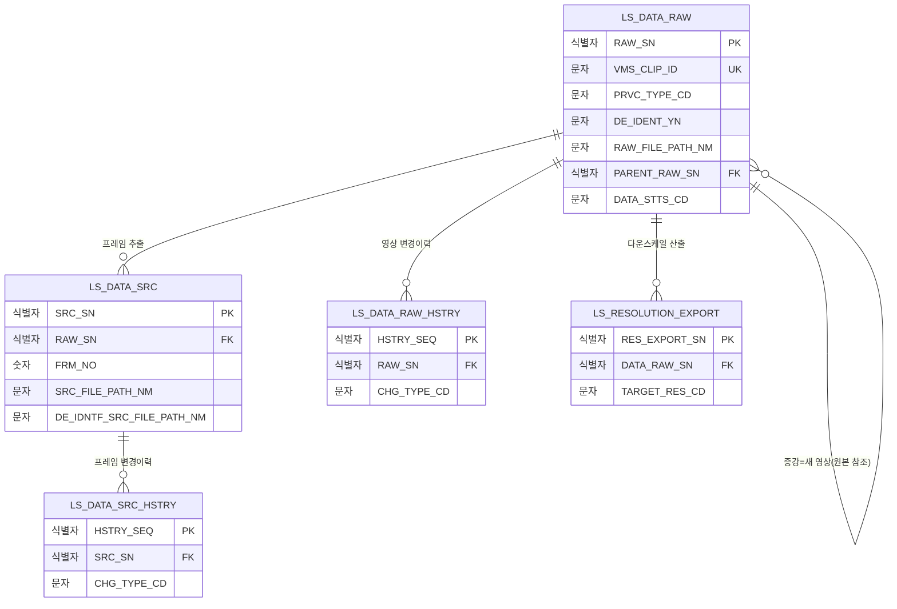

### 1.3 KLID-AT-ERD-002 — 라벨링 ERD

> ※ 크로스도메인 참조: LS_DATA_LBL.SRC_SN→LS_DATA_SRC(영상·프레임 수집 ERD), LS_DATA_LBL.LBL_ID→LS_LABEL(라벨 마스터 ERD), LS_DATA_LBL_ATTR_VAL.ATTR_ID→LS_LABEL_ATTR(라벨 마스터 ERD), LS_DATA_META.RAW_SN→LS_DATA_RAW(영상·프레임 수집 ERD).

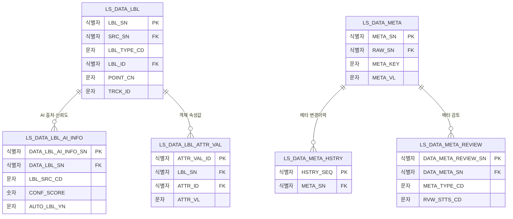

### 1.4 KLID-AT-ERD-003 — 마킹 ERD

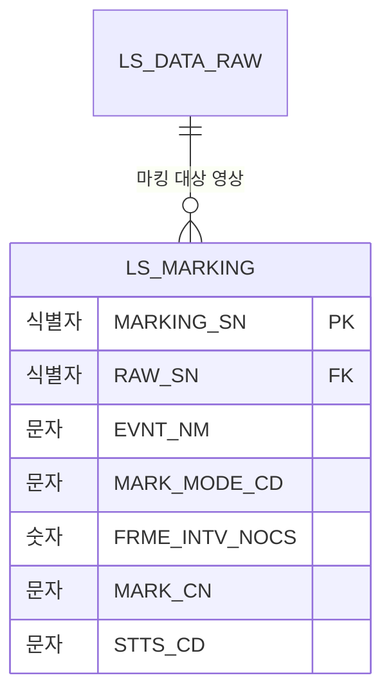

### 1.5 KLID-AT-ERD-004 — 데이터 증강 ERD

> ※ 크로스도메인 참조: LS_DATA_AUG.SRC_SN→LS_DATA_RAW(영상·프레임 수집 ERD), LS_DATA_AUG_LBL_MAP의 원본/증강 라벨 일련번호→LS_DATA_LBL(라벨링 ERD).

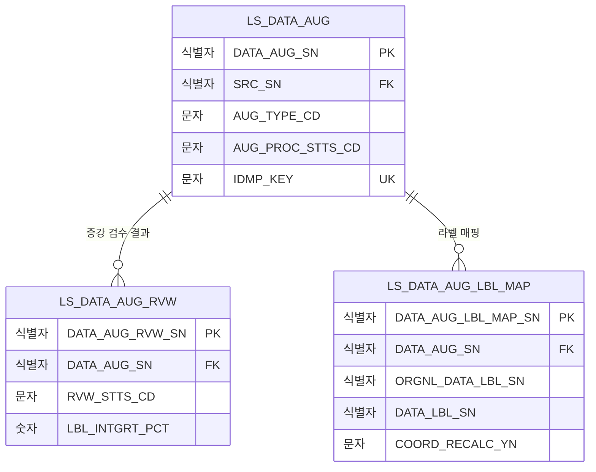

### 1.6 KLID-AT-ERD-005 — 검수·영상상태 ERD

> ※ 크로스도메인 참조: LS_RAW_DATA_ENROLLMENT·LS_RAW_DATA_STATUS의 영상 식별자(RAW_DATA_ID)와 LS_DATA_ISSUE.DATA_RAW_SN은 LS_DATA_RAW(영상·프레임 수집 ERD)를 가리키는 논리 외래키다.

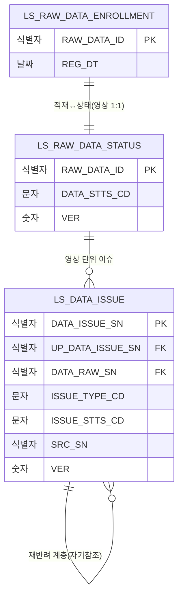

### 1.7 KLID-AT-ERD-006 — 라벨 마스터·버전관리 ERD

> ※ 크로스도메인 참조: LS_LABEL_VERSION의 영상·프레임 일련번호와 LS_DATA_LBL_HSTRY.SRC_SN은 영상·프레임 수집 ERD(LS_DATA_RAW·LS_DATA_SRC)를 가리키는 논리 외래키다.

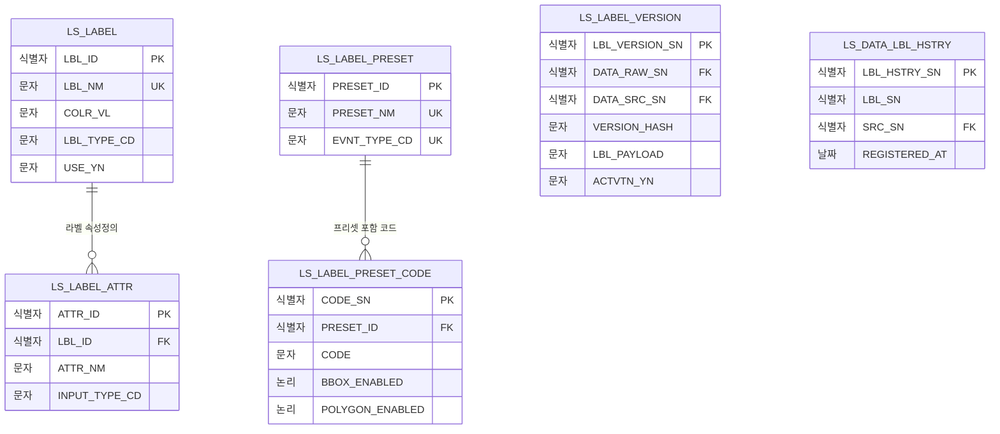

### 1.8 KLID-AT-ERD-007 — 작업 배정 ERD

> ※ 크로스도메인 참조: 각 엔티티의 영상 식별자(RAW_DATA_ID)는 LS_DATA_RAW(영상·프레임 수집 ERD)를, 사용자번호는 관제서버 공유 사용자 엔티티를 가리킨다.

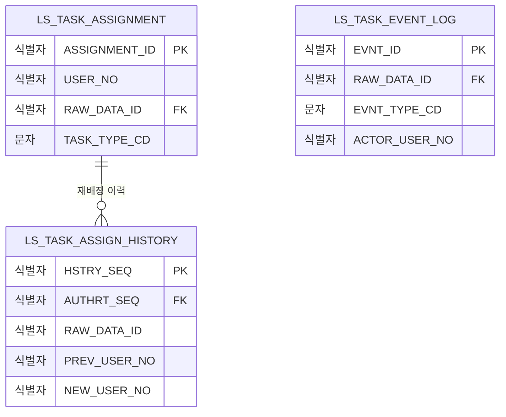

### 1.9 KLID-AT-ERD-008 — 비식별 ERD

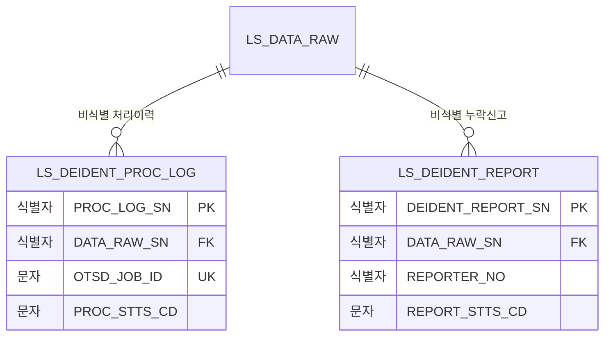

### 1.10 KLID-AT-ERD-009 — 시스템 설정 ERD

> ※ 시스템 설정·전역 메타는 독립 키-값 저장소로, 다른 엔티티와의 외래키 관계가 없다(코드성·운영 파라미터 단독 보관).

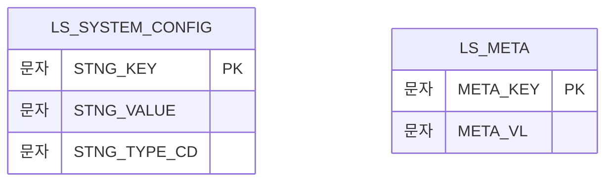

### 1.11 KLID-AT-ERD-010 — 포털 ERD

> ※ 크로스도메인 참조: LS_PORTAL_USER_LABEL.SRC_RAW_SN→LS_DATA_RAW, SRC_DATA_SRC_SN→LS_DATA_SRC(영상·프레임 수집 ERD)를 가리키는 논리 외래키다. 포털 사용자번호는 포털 채널 식별자로 본인 데이터 접근 통제에 사용한다.

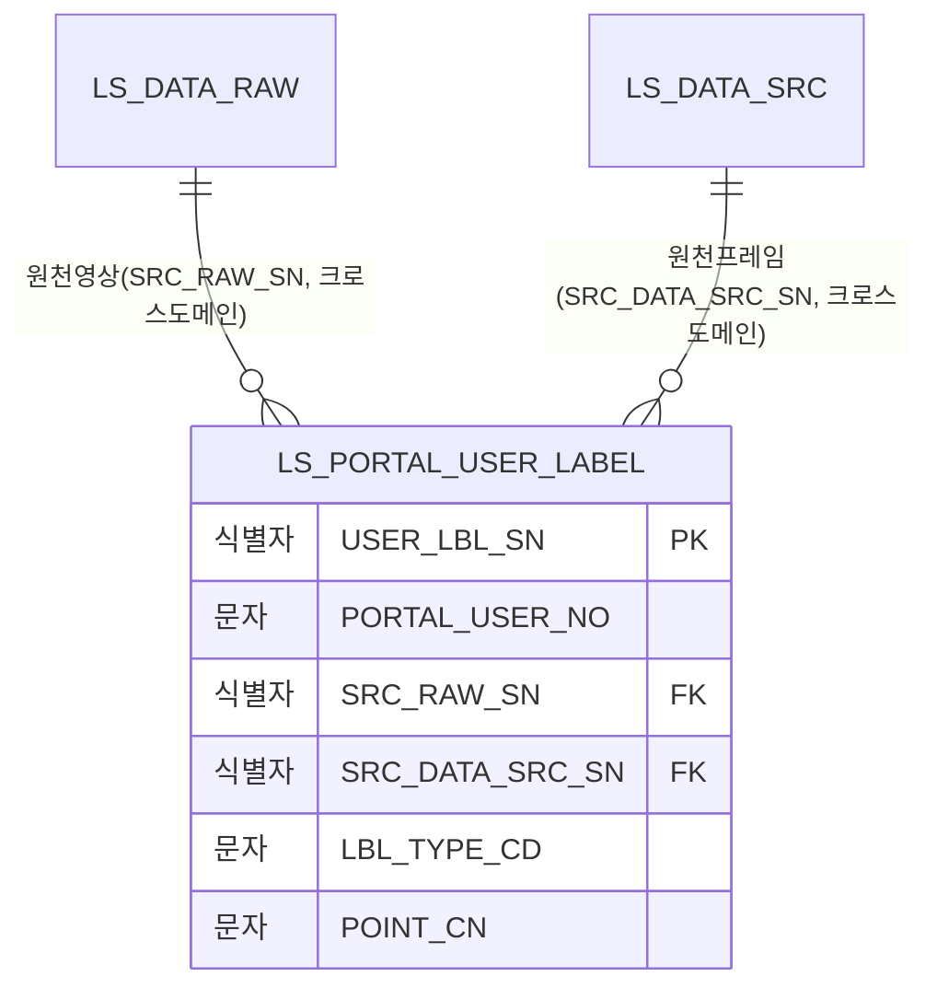

### 1.12 KLID-AT-ERD-011 — 배치·작업 인프라 ERD

> ※ 크로스도메인 참조: LS_BATCH_PROC_LOG.DATA_RAW_SN·LS_AUTH_WORK_LOCK.DATA_RAW_SN·LS_TUS_UPLOAD.RAW_SN은 LS_DATA_RAW(영상·프레임 수집 ERD)를 가리키는 논리 외래키다. LS_DEADLINE은 비식별 유형별 마감 정의로 다른 엔티티와의 외래키 관계가 없다.

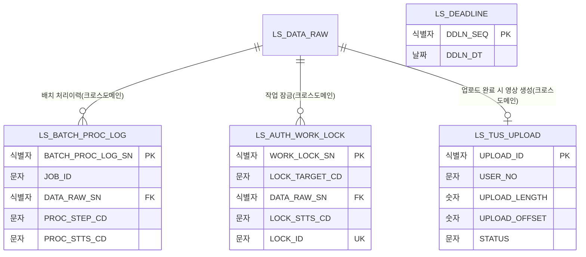

### 1.13 KLID-AT-ERD-012 — 관제 통지 ERD

> ※ 크로스도메인 참조: LS_CONTROL_NOTIFY_FALLBACK.RAW_SN은 LS_DATA_RAW(영상·프레임 수집 ERD)를 가리키는 논리 외래키다. LS_WEBHOOK_IDEMPOTENCY는 외부 위탁 멱등키 원장으로 멱등키 자체가 주키이며 다른 엔티티와의 외래키 관계가 없다.

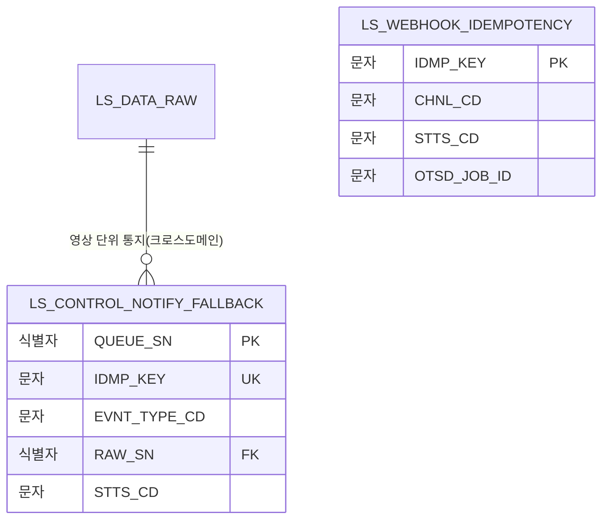

### 1.14 KLID-AT-ERD-013 — 게시판·이슈 ERD

> ※ 크로스도메인 참조: LS_ISSUE_COMMENT.DATA_ISSUE_SN→LS_DATA_ISSUE(검수·영상상태 ERD)를 가리키는 논리 외래키다.

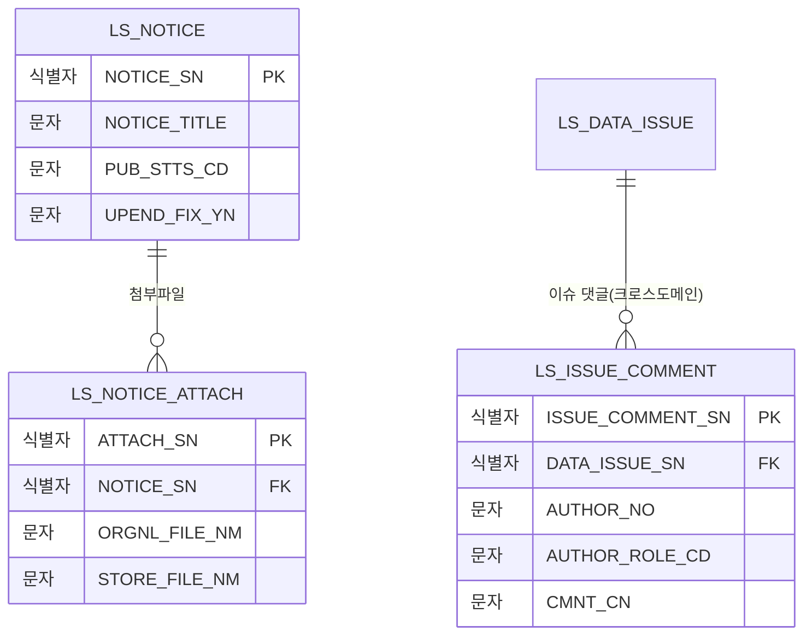

---

## 2. 엔티티 명세서

> 저작도구 소유 엔티티 41종을 전수 기술한다. 속성표는 10컬럼(속성명·동의어·타입·길이·NOT NULL·PK·FK·INX·기본값·제약조건)을 채운다. '타입'은 논리 타입(문자/숫자/날짜/논리/이진)으로만 표기하며, 물리 자료형·최대 길이·물리 삭제 연쇄/체크 제약은 데이터베이스 설계서(D9)에서 정의한다. 물리 외래키 제약을 두지 않고 응용에서 무결성을 관리하는 ID 참조는 제약조건 칸에 "논리 FK"로 명시한다.

### 2.1 KLID-AT-EN-001 — 원시영상

| 엔티티 ID | KLID-AT-EN-001 | 엔티티명 | 원시영상 |
|---------|---|-------|---|
| 관련 클래스 ID | KLID-AT-DC-010 | 관련 클래스명 | LsDataRaw |
| 관련 유스케이스 ID | KLID-AT-UC-002, KLID-AT-UC-003, KLID-AT-UC-011 |
| 엔티티 설명 | 라벨링 대상 원시 영상 메타(영상 단위 작업). VMS 클립 식별자 유니크로 동일 클립 재수신 시 갱신. 개인정보 유형 코드에 따라 개인정보 포함 여부를 자동 산출한다. 증강 결과는 원본 영상 일련번호를 참조하는 새 영상으로 생성한다. |

| 속성명 | 동의어 | 타입 | 길이 | NOT NULL (Y/N) | PK (Y/N) | FK (Y/N) | INX (Y/N) | 기본값 | 제약조건 |
|-------|--------|------|------|--------|------|------|------|-------|--------|
| RAW_SN | 원시영상일련번호 | 숫자 | | Y | Y | N | N | 자동부여 | - |
| VMS_CLIP_ID | VMS클립아이디 | 문자 | | Y | N | N | Y | - | 유니크 |
| VMS_CCTV_ID | VMS_CCTV아이디 | 문자 | | Y | N | N | Y | - | - |
| EVNT_TYPE_CD | 이벤트유형코드 | 문자 | | N | N | N | N | - | - |
| LCLGV_CD | 기관코드 | 문자 | | N | N | N | N | - | - |
| PRVC_TYPE_CD | 개인정보유형코드 | 문자 | | Y | N | N | N | - | 익명/가명/개인정보 |
| PRVC_YN | 개인정보포함여부 | 문자 | | Y | N | N | N | N | 개인정보유형코드 파생 |
| DE_IDENT_YN | 비식별여부 | 문자 | | Y | N | N | N | N | 완료/실패/미수행 |
| RAW_FILE_PATH_NM | 원시파일경로명 | 문자 | | Y | N | N | N | - | 원본 보존 |
| SHT_DT | 촬영일시 | 날짜 | | N | N | N | N | - | - |
| VDO_LEN_SEC | 영상길이초 | 숫자 | | N | N | N | N | - | - |
| PARENT_RAW_SN | 원본원시영상일련번호 | 숫자 | | N | N | Y | Y | - | 논리 FK(원시영상 자기참조), 증강=새 영상 |
| DATA_STTS_CD | 데이터상태코드 | 문자 | | Y | N | N | Y | 대기 | 배치 단계 상태 |
| REG_DT | 등록일시 | 날짜 | | Y | N | N | N | 등록시각 | - |
| MDFCN_DT | 수정일시 | 날짜 | | N | N | N | N | - | - |

### 2.2 KLID-AT-EN-002 — 프레임원천

| 엔티티 ID | KLID-AT-EN-002 | 엔티티명 | 프레임원천 |
|---------|---|-------|---|
| 관련 클래스 ID | - ※ | 관련 클래스명 | - |
| 관련 유스케이스 ID | KLID-AT-UC-004, KLID-AT-UC-005 |
| 엔티티 설명 | 영상에서 추출한 키프레임(프레임 추출 단계 산출). 원본 프레임 경로와 비식별 프레임 경로를 같은 행으로 관리한다. (원시영상, 프레임번호) 조합이 유니크하다. ※ D1 클래스도에 독립 엔티티 도형 클래스로 등재되지 않은 프레임 단위 보조 엔티티. |

| 속성명 | 동의어 | 타입 | 길이 | NOT NULL (Y/N) | PK (Y/N) | FK (Y/N) | INX (Y/N) | 기본값 | 제약조건 |
|-------|--------|------|------|--------|------|------|------|-------|--------|
| SRC_SN | 프레임원천일련번호 | 숫자 | | Y | Y | N | N | 자동부여 | - |
| RAW_SN | 원시영상일련번호 | 숫자 | | Y | N | Y | Y | - | 논리 FK(→원시영상) |
| FRM_NO | 프레임번호 | 숫자 | | Y | N | N | Y | - | (원시영상,프레임번호) 유니크 |
| SRC_FILE_PATH_NM | 원천파일경로명 | 문자 | | Y | N | N | N | - | 원본 프레임 경로 |
| DE_IDNTF_SRC_FILE_PATH_NM | 비식별원천파일경로명 | 문자 | | N | N | N | N | - | 비식별 프레임 경로 |
| SHT_DT | 촬영일시 | 날짜 | | N | N | N | N | - | - |
| REG_DT | 등록일시 | 날짜 | | Y | N | N | N | 등록시각 | - |
| UPD_DT | 수정일시 | 날짜 | | N | N | N | N | - | - |

### 2.3 KLID-AT-EN-003 — 원시영상이력

| 엔티티 ID | KLID-AT-EN-003 | 엔티티명 | 원시영상이력 |
|---------|---|-------|---|
| 관련 클래스 ID | - ※ | 관련 클래스명 | - |
| 관련 유스케이스 ID | - ※ |
| 엔티티 설명 | 영상 변경 이력. 신규/갱신 수집·상태 전이 등 변경 사유와 상태 변화만 기록하는 슬림 이력. ※ 이력 보조 엔티티로 활성 유스케이스가 직접 사용하지 않으며 D1 클래스도에 도형 클래스 미등재. |

| 속성명 | 동의어 | 타입 | 길이 | NOT NULL (Y/N) | PK (Y/N) | FK (Y/N) | INX (Y/N) | 기본값 | 제약조건 |
|-------|--------|------|------|--------|------|------|------|-------|--------|
| HSTRY_SEQ | 이력일련번호 | 숫자 | | Y | Y | N | N | 자동부여 | - |
| RAW_SN | 원시영상일련번호 | 숫자 | | Y | N | Y | Y | - | 논리 FK(→원시영상) |
| CHG_TYPE_CD | 변경유형코드 | 문자 | | Y | N | N | N | - | 신규수집/갱신수집/상태변경 |
| PREV_STTS_CD | 이전상태코드 | 문자 | | N | N | N | N | - | - |
| NEW_STTS_CD | 변경상태코드 | 문자 | | N | N | N | N | - | - |
| CHG_USER_NO | 변경사용자번호 | 숫자 | | N | N | N | N | - | 시스템 변경 시 없음 |
| CHG_DT | 변경일시 | 날짜 | | Y | N | N | N | 등록시각 | - |

### 2.4 KLID-AT-EN-004 — 프레임원천이력

| 엔티티 ID | KLID-AT-EN-004 | 엔티티명 | 프레임원천이력 |
|---------|---|-------|---|
| 관련 클래스 ID | - ※ | 관련 클래스명 | - |
| 관련 유스케이스 ID | - ※ |
| 엔티티 설명 | 프레임 변경 이력. 생성·비식별경로 연결 등 사유를 기록한다. ※ 이력 보조 엔티티로 활성 유스케이스가 직접 사용하지 않으며 D1 클래스도에 도형 클래스 미등재. |

| 속성명 | 동의어 | 타입 | 길이 | NOT NULL (Y/N) | PK (Y/N) | FK (Y/N) | INX (Y/N) | 기본값 | 제약조건 |
|-------|--------|------|------|--------|------|------|------|-------|--------|
| HSTRY_SEQ | 이력일련번호 | 숫자 | | Y | Y | N | N | 자동부여 | - |
| SRC_SN | 프레임원천일련번호 | 숫자 | | Y | N | Y | Y | - | 논리 FK(→프레임원천) |
| CHG_TYPE_CD | 변경유형코드 | 문자 | | Y | N | N | N | - | 생성/비식별경로연결 |
| CHG_USER_NO | 변경사용자번호 | 숫자 | | N | N | N | N | - | 시스템 변경 시 없음 |
| CHG_DT | 변경일시 | 날짜 | | Y | N | N | N | 등록시각 | - |

### 2.5 KLID-AT-EN-005 — 해상도변경산출

| 엔티티 ID | KLID-AT-EN-005 | 엔티티명 | 해상도변경산출 |
|---------|---|-------|---|
| 관련 클래스 ID | KLID-AT-DC-019 | 관련 클래스명 | LsResolutionExport |
| 관련 유스케이스 ID | KLID-AT-UC-003 |
| 엔티티 설명 | 검수 완료 원본 영상의 프레임 이미지셋을 표준 하위 해상도로 다운스케일한 산출 1건당 1행. 영상·라벨·메타·신규 영상 행을 만들지 않고 본 엔티티만 기록한다. (원본 영상, 목표 해상도) 조합이 유니크하다. |

| 속성명 | 동의어 | 타입 | 길이 | NOT NULL (Y/N) | PK (Y/N) | FK (Y/N) | INX (Y/N) | 기본값 | 제약조건 |
|-------|--------|------|------|--------|------|------|------|-------|--------|
| RES_EXPORT_SN | 해상도변경산출일련번호 | 숫자 | | Y | Y | N | N | 자동부여 | - |
| DATA_RAW_SN | 원시영상일련번호 | 숫자 | | Y | N | Y | Y | - | 논리 FK(→원시영상), 검수완료·비증강본만 |
| TARGET_RES_CD | 목표해상도코드 | 문자 | | Y | N | N | Y | - | 표준 하위 해상도 화이트리스트, (원본영상,목표해상도) 유니크 |
| ORGNL_W | 원본가로 | 숫자 | | Y | N | N | N | - | - |
| ORGNL_H | 원본세로 | 숫자 | | Y | N | N | N | - | - |
| TARGET_W | 목표가로 | 숫자 | | Y | N | N | N | - | 종횡비 보존(짝수 보정) |
| TARGET_H | 목표세로 | 숫자 | | Y | N | N | N | - | 프리셋 기준 |
| FRAME_CNT | 프레임개수 | 숫자 | | Y | N | N | N | - | - |
| OUTPUT_DIR_PATH | 출력디렉토리경로 | 문자 | | Y | N | N | N | - | 응답 미노출 |
| REG_ID | 등록자아이디 | 문자 | | N | N | N | N | - | 감사 추적 |
| REG_DT | 등록일시 | 날짜 | | Y | N | N | N | 등록시각 | - |

### 2.6 KLID-AT-EN-006 — 데이터라벨

| 엔티티 ID | KLID-AT-EN-006 | 엔티티명 | 데이터라벨 |
|---------|---|-------|---|
| 관련 클래스 ID | KLID-AT-DC-017 | 관련 클래스명 | LsDataLbl |
| 관련 유스케이스 ID | KLID-AT-UC-004, KLID-AT-UC-005 |
| 엔티티 설명 | 현재 라벨 좌표/속성. 프레임 단위로 보관하며 라벨 유형(바운딩박스/폴리곤/세그먼트/트랙)과 라벨 마스터 참조를 가진다. AI 출처·신뢰도는 데이터라벨AI정보 엔티티로 분리한다. |

| 속성명 | 동의어 | 타입 | 길이 | NOT NULL (Y/N) | PK (Y/N) | FK (Y/N) | INX (Y/N) | 기본값 | 제약조건 |
|-------|--------|------|------|--------|------|------|------|-------|--------|
| LBL_SN | 라벨일련번호 | 숫자 | | Y | Y | N | N | 자동부여 | - |
| SRC_SN | 원천일련번호 | 숫자 | | Y | N | Y | Y | - | 논리 FK(→프레임원천) |
| LBL_TYPE_CD | 라벨유형코드 | 문자 | | Y | N | N | N | - | 바운딩박스/폴리곤/세그먼트/트랙 |
| LBL_ID | 라벨아이디 | 숫자 | | N | N | Y | Y | - | 논리 FK(→라벨마스터), 매칭 실패 시 없음 |
| LBL_NM | 라벨명 | 문자 | | Y | N | N | N | - | - |
| POINT_CN | 좌표내용 | 문자 | | N | N | N | N | - | 도형 좌표(구조화 표현) |
| TRCK_ID | 트랙아이디 | 문자 | | N | N | N | Y | - | 수동/저신뢰 시 없음 |
| REG_USER_NO | 등록사용자번호 | 숫자 | | N | N | N | N | - | 자동 라벨은 없음 |
| REG_DT | 등록일시 | 날짜 | | Y | N | N | N | 등록시각 | - |
| MDFCN_DT | 수정일시 | 날짜 | | N | N | N | N | - | - |

### 2.7 KLID-AT-EN-007 — 데이터라벨AI정보

| 엔티티 ID | KLID-AT-EN-007 | 엔티티명 | 데이터라벨AI정보 |
|---------|---|-------|---|
| 관련 클래스 ID | KLID-AT-DC-038 | 관련 클래스명 | LsDataLblAiInfo |
| 관련 유스케이스 ID | KLID-AT-UC-004 |
| 엔티티 설명 | AI 라벨 출처/신뢰도 정보. 데이터라벨 엔티티는 좌표만 보관하고 AI 추론 출처(객체탐지/분할/보간/시계열)·신뢰도·모델 버전은 본 엔티티로 분리한다. |

| 속성명 | 동의어 | 타입 | 길이 | NOT NULL (Y/N) | PK (Y/N) | FK (Y/N) | INX (Y/N) | 기본값 | 제약조건 |
|-------|--------|------|------|--------|------|------|------|-------|--------|
| DATA_LBL_AI_INFO_SN | 데이터라벨AI정보일련번호 | 숫자 | | Y | Y | N | N | 자동부여 | - |
| DATA_LBL_SN | 데이터라벨일련번호 | 숫자 | | Y | N | Y | Y | - | 논리 FK(→데이터라벨) |
| DATA_RAW_SN | 데이터원시일련번호 | 숫자 | | Y | N | N | Y | - | (원시,원천) 복합 인덱스 |
| DATA_SRC_SN | 데이터원천일련번호 | 숫자 | | Y | N | N | Y | - | - |
| LBL_SRC_CD | 라벨출처코드 | 문자 | | Y | N | N | Y | - | 객체탐지/분할/보간/시계열 |
| MODEL_NM | 모델명 | 문자 | | N | N | N | N | - | - |
| MDL_VER | 모델버전 | 문자 | | N | N | N | N | - | - |
| CONF_SCORE | 신뢰도점수 | 숫자 | | N | N | N | N | - | 0.0~1.0, 보간 행은 0.0 |
| AUTO_LBL_YN | 자동라벨여부 | 문자 | | Y | N | N | N | Y | - |
| REG_ID | 등록아이디 | 문자 | | N | N | N | N | - | - |
| REG_DT | 등록일시 | 날짜 | | Y | N | N | N | 등록시각 | - |
| MDFCN_ID | 수정아이디 | 문자 | | N | N | N | N | - | - |
| MDFCN_DT | 수정일시 | 날짜 | | N | N | N | N | - | - |

### 2.8 KLID-AT-EN-008 — 데이터라벨속성값

| 엔티티 ID | KLID-AT-EN-008 | 엔티티명 | 데이터라벨속성값 |
|---------|---|-------|---|
| 관련 클래스 ID | - ※ | 관련 클래스명 | - |
| 관련 유스케이스 ID | KLID-AT-UC-004, KLID-AT-UC-005 |
| 엔티티 설명 | 객체별 속성값. 라벨링된 객체 단위로 라벨속성정의의 값을 저장한다. (라벨, 속성) 조합이 유니크하며 갱신/삽입 키로 사용한다. ※ 라벨 도메인 보조 엔티티로 D1 클래스도에 독립 도형 클래스 미등재. |

| 속성명 | 동의어 | 타입 | 길이 | NOT NULL (Y/N) | PK (Y/N) | FK (Y/N) | INX (Y/N) | 기본값 | 제약조건 |
|-------|--------|------|------|--------|------|------|------|-------|--------|
| ATTR_VAL_ID | 속성값아이디 | 숫자 | | Y | Y | N | N | 자동부여 | - |
| LBL_SN | 라벨일련번호 | 숫자 | | Y | N | Y | Y | - | 논리 FK(→데이터라벨), (라벨,속성) 유니크 |
| ATTR_ID | 속성아이디 | 숫자 | | Y | N | Y | N | - | 논리 FK(→라벨속성정의) |
| ATTR_VL | 속성값 | 문자 | | N | N | N | N | - | - |
| REG_DT | 등록일시 | 날짜 | | Y | N | N | N | 등록시각 | - |
| MDFCN_DT | 수정일시 | 날짜 | | N | N | N | N | - | - |

### 2.9 KLID-AT-EN-009 — 데이터메타

| 엔티티 ID | KLID-AT-EN-009 | 엔티티명 | 데이터메타 |
|---------|---|-------|---|
| 관련 클래스 ID | - ※ | 관련 클래스명 | - |
| 관련 유스케이스 ID | KLID-AT-UC-002 |
| 엔티티 설명 | 영상/프레임 메타 값. 원시영상 참조 + (원시영상, 메타키) 유니크의 단순 키/값. 외부 생성 여부·메타 유형·검토 상태는 데이터메타검토 엔티티로 분리한다. 비동기 처리용 멱등키·외부작업아이디·재시도·영구실패 표준 속성을 보유한다. ※ 키/값 보조 엔티티로 D1 클래스도에 독립 도형 클래스 미등재. |

| 속성명 | 동의어 | 타입 | 길이 | NOT NULL (Y/N) | PK (Y/N) | FK (Y/N) | INX (Y/N) | 기본값 | 제약조건 |
|-------|--------|------|------|--------|------|------|------|-------|--------|
| META_SN | 메타일련번호 | 숫자 | | Y | Y | N | N | 자동부여 | - |
| RAW_SN | 원시일련번호 | 숫자 | | Y | N | Y | Y | - | 논리 FK(→원시영상), (원시영상,메타키) 유니크 |
| META_KEY | 메타키 | 문자 | | Y | N | N | N | - | - |
| META_VL | 메타값 | 문자 | | N | N | N | N | - | - |
| IDMP_KEY | 멱등키 | 문자 | | N | N | N | N | - | 유니크 |
| OTSD_JOB_ID | 외부작업아이디 | 문자 | | N | N | N | N | - | 유니크 |
| RTRY_NMTM | 재시도횟수 | 숫자 | | Y | N | N | N | 0 | - |
| DEAD_LETTER_AT | 영구실패시점 | 날짜 | | N | N | N | N | - | - |
| REG_DT | 등록일시 | 날짜 | | Y | N | N | N | 등록시각 | - |
| MDFCN_DT | 수정일시 | 날짜 | | N | N | N | N | - | - |

### 2.10 KLID-AT-EN-010 — 데이터메타이력

| 엔티티 ID | KLID-AT-EN-010 | 엔티티명 | 데이터메타이력 |
|---------|---|-------|---|
| 관련 클래스 ID | - ※ | 관련 클래스명 | - |
| 관련 유스케이스 ID | - ※ |
| 엔티티 설명 | 데이터메타 변경 이력(이전값/신규값). ※ 이력 보조 엔티티로 활성 유스케이스가 직접 사용하지 않으며 D1 클래스도에 도형 클래스 미등재. |

| 속성명 | 동의어 | 타입 | 길이 | NOT NULL (Y/N) | PK (Y/N) | FK (Y/N) | INX (Y/N) | 기본값 | 제약조건 |
|-------|--------|------|------|--------|------|------|------|-------|--------|
| HSTRY_SEQ | 이력일련번호 | 숫자 | | Y | Y | N | N | 자동부여 | - |
| META_SN | 메타일련번호 | 숫자 | | Y | N | Y | Y | - | 논리 FK(→데이터메타) |
| PREV_VL | 이전값 | 문자 | | N | N | N | N | - | - |
| NEW_VL | 신규값 | 문자 | | N | N | N | N | - | - |
| CHG_USER_NO | 변경사용자번호 | 숫자 | | N | N | N | N | - | - |
| CHG_DT | 변경일시 | 날짜 | | Y | N | N | N | 등록시각 | - |

### 2.11 KLID-AT-EN-011 — 데이터메타검토

| 엔티티 ID | KLID-AT-EN-011 | 엔티티명 | 데이터메타검토 |
|---------|---|-------|---|
| 관련 클래스 ID | - ※ | 관련 클래스명 | - |
| 관련 유스케이스 ID | KLID-AT-UC-002 |
| 엔티티 설명 | 외부/자동 생성 메타데이터 검토 상태. 데이터메타 엔티티는 값만 저장하고 본 엔티티에서 외부 생성 여부와 검토 상태(검토대기/승인/반려)를 관리한다. ※ 메타 검수 워크플로우 보조 엔티티로 D1 클래스도에 독립 도형 클래스 미등재(시계열 메타 검토는 검수 흐름으로 흡수). |

| 속성명 | 동의어 | 타입 | 길이 | NOT NULL (Y/N) | PK (Y/N) | FK (Y/N) | INX (Y/N) | 기본값 | 제약조건 |
|-------|--------|------|------|--------|------|------|------|-------|--------|
| DATA_META_REVIEW_SN | 데이터메타검토일련번호 | 숫자 | | Y | Y | N | N | 자동부여 | - |
| DATA_META_SN | 데이터메타일련번호 | 숫자 | | Y | N | Y | Y | - | 논리 FK(→데이터메타) |
| DATA_RAW_SN | 데이터원시일련번호 | 숫자 | | Y | N | N | Y | - | (원시,원천) 복합 인덱스 |
| DATA_SRC_SN | 데이터원천일련번호 | 숫자 | | N | N | N | Y | - | 영상 단위 메타는 없음 |
| META_TYPE_CD | 메타유형코드 | 문자 | | Y | N | N | Y | - | 시계열/외부 |
| SRC_SYS_CD | 생성시스템코드 | 문자 | | N | N | N | N | - | AI추론/관제/포털 |
| RVW_STTS_CD | 검토상태코드 | 문자 | | Y | N | N | Y | - | 자동생성/검토대기/승인/반려 |
| RVW_ID | 검토아이디 | 문자 | | N | N | N | N | - | - |
| RVW_DT | 검토일시 | 날짜 | | N | N | N | N | - | - |
| REJECT_RSN | 반려사유 | 문자 | | N | N | N | N | - | 반려 시 필수 |
| REG_ID | 등록아이디 | 문자 | | N | N | N | N | - | - |
| REG_DT | 등록일시 | 날짜 | | Y | N | N | N | 등록시각 | - |
| MDFCN_ID | 수정아이디 | 문자 | | N | N | N | N | - | - |
| MDFCN_DT | 수정일시 | 날짜 | | N | N | N | N | - | - |

### 2.12 KLID-AT-EN-012 — 영상마킹

| 엔티티 ID | KLID-AT-EN-012 | 엔티티명 | 영상마킹 |
|---------|---|-------|---|
| 관련 클래스 ID | - ※ | 관련 클래스명 | - |
| 관련 유스케이스 ID | - ※ |
| 엔티티 설명 | 영상별 자동/수동 이벤트 식별 마킹 정보. 영상 1건에 여러 건의 마킹이 생성될 수 있다. 마킹 결과(이벤트명·영상경로·마크 목록)를 시계열 콜백으로 전달한다. 상태는 대기→요청→완료로 전이한다. ※ 마킹 도메인은 활성 유스케이스 13건에 직접 대응 UC가 없어 미매핑 — 배치 파이프라인 선행 단계로 보유. |

| 속성명 | 동의어 | 타입 | 길이 | NOT NULL (Y/N) | PK (Y/N) | FK (Y/N) | INX (Y/N) | 기본값 | 제약조건 |
|-------|--------|------|------|--------|------|------|------|-------|--------|
| MARKING_SN | 마킹일련번호 | 숫자 | | Y | Y | N | N | 자동부여 | - |
| RAW_SN | 원천영상일련번호 | 숫자 | | Y | N | Y | Y | - | 논리 FK(→원시영상) |
| EVNT_NM | 이벤트명 | 문자 | | Y | N | N | N | - | 콜백 전달 포함 |
| MARK_MODE_CD | 마킹모드코드 | 문자 | | Y | N | N | N | - | 자동/수동 |
| FRME_INTV_NOCS | 프레임간격수 | 숫자 | | N | N | N | N | - | 자동 시 1 이상, 수동 시 없음 |
| VIDEO_FILE_PATH_NM | 영상파일경로명 | 문자 | | Y | N | N | N | - | 콜백 전달 포함 |
| MARK_CN | 마킹내용 | 문자 | | Y | N | N | N | - | 마크 목록(구조화 표현) |
| STTS_CD | 상태코드 | 문자 | | Y | N | N | N | 대기 | 대기/요청/완료 |
| REG_USER_NO | 등록사용자번호 | 숫자 | | N | N | N | N | - | - |
| REG_DT | 등록일시 | 날짜 | | Y | N | N | N | 등록시각 | - |
| MDFCN_DT | 수정일시 | 날짜 | | Y | N | N | N | 등록시각 | - |

### 2.13 KLID-AT-EN-013 — 데이터증강

| 엔티티 ID | KLID-AT-EN-013 | 엔티티명 | 데이터증강 |
|---------|---|-------|---|
| 관련 클래스 ID | KLID-AT-DC-006 | 관련 클래스명 | LsDataAug |
| 관련 유스케이스 ID | KLID-AT-UC-001, KLID-AT-UC-002, KLID-AT-UC-010 |
| 엔티티 설명 | 외부 증강 시스템이 생성한 4종 증강 결과(겨울/야간/우천/해상도). 영상 단위로 관리하며 증강 파일 생성 상태는 본 엔티티, 검수 결과는 데이터증강검수 엔티티로 분리한다(검수 상세 속성은 데이터증강검수로 이관됨). |

| 속성명 | 동의어 | 타입 | 길이 | NOT NULL (Y/N) | PK (Y/N) | FK (Y/N) | INX (Y/N) | 기본값 | 제약조건 |
|-------|--------|------|------|--------|------|------|------|-------|--------|
| DATA_AUG_SN | 데이터증강일련번호 | 숫자 | | Y | Y | N | N | 자동부여 | - |
| SRC_SN | 원천일련번호 | 숫자 | | Y | N | Y | Y | - | 논리 FK(→원시영상), (원천,증강유형) 인덱스 |
| AUG_TYPE_CD | 증강유형코드 | 문자 | | Y | N | N | N | - | 겨울/야간/우천/해상도 |
| AUG_PROC_STTS_CD | 증강처리상태코드 | 문자 | | Y | N | N | Y | 대기 | 대기/승인/반려 |
| IDMP_KEY | 멱등키 | 문자 | | N | N | N | N | - | 유니크 |
| OTSD_JOB_ID | 외부작업식별자 | 문자 | | N | N | N | N | - | 유니크 |
| RTRY_NMTM | 재시도횟수 | 숫자 | | Y | N | N | N | 0 | - |
| DEAD_LETTER_AT | 영구실패시점 | 날짜 | | N | N | N | N | - | - |
| REG_DT | 등록일시 | 날짜 | | Y | N | N | N | 등록시각 | - |
| REG_USER_NO | 등록사용자번호 | 문자 | | N | N | N | N | - | - |

### 2.14 KLID-AT-EN-014 — 데이터증강검수

| 엔티티 ID | KLID-AT-EN-014 | 엔티티명 | 데이터증강검수 |
|---------|---|-------|---|
| 관련 클래스 ID | KLID-AT-DC-022 | 관련 클래스명 | LsDataAugRvw |
| 관련 유스케이스 ID | KLID-AT-UC-010 |
| 엔티티 설명 | 증강 데이터 검수 결과. 증강 파일 생성 상태는 데이터증강 엔티티에, 검수 결과(상태·정합률·반려사유·검수자)는 본 엔티티로 분리한다. |

| 속성명 | 동의어 | 타입 | 길이 | NOT NULL (Y/N) | PK (Y/N) | FK (Y/N) | INX (Y/N) | 기본값 | 제약조건 |
|-------|--------|------|------|--------|------|------|------|-------|--------|
| DATA_AUG_RVW_SN | 데이터증강검수일련번호 | 숫자 | | Y | Y | N | N | 자동부여 | - |
| DATA_AUG_SN | 데이터증강일련번호 | 숫자 | | Y | N | Y | Y | - | 논리 FK(→데이터증강) |
| DATA_RAW_SN | 데이터원시일련번호 | 숫자 | | Y | N | N | Y | - | (원시,원천) 복합 인덱스 |
| DATA_SRC_SN | 데이터원천일련번호 | 숫자 | | Y | N | N | Y | - | - |
| RVW_STTS_CD | 검수상태코드 | 문자 | | Y | N | N | Y | - | 대기/승인/반려 |
| LBL_INTGRT_PCT | 라벨무결성비율 | 숫자 | | N | N | N | N | - | 0~100 |
| REJECT_RSN | 반려사유 | 문자 | | N | N | N | N | - | 반려 시 필수 |
| RVW_ID | 검수아이디 | 문자 | | N | N | N | N | - | - |
| RVW_DT | 검수일시 | 날짜 | | N | N | N | N | - | - |
| REG_ID | 등록아이디 | 문자 | | N | N | N | N | - | - |
| REG_DT | 등록일시 | 날짜 | | Y | N | N | N | 등록시각 | - |
| MDFCN_ID | 수정아이디 | 문자 | | N | N | N | N | - | - |
| MDFCN_DT | 수정일시 | 날짜 | | N | N | N | N | - | - |

### 2.15 KLID-AT-EN-015 — 데이터증강라벨매핑

| 엔티티 ID | KLID-AT-EN-015 | 엔티티명 | 데이터증강라벨매핑 |
|---------|---|-------|---|
| 관련 클래스 ID | KLID-AT-DC-008 | 관련 클래스명 | LsDataAugLblMap |
| 관련 유스케이스 ID | KLID-AT-UC-002 |
| 엔티티 설명 | 증강 데이터-라벨 매핑. 해상도 유지/저하 증강 시 좌표 재계산 정보(축척 비율)를 저장하며 증강 결과 라벨과 원본 라벨 간 매핑을 보관한다. |

| 속성명 | 동의어 | 타입 | 길이 | NOT NULL (Y/N) | PK (Y/N) | FK (Y/N) | INX (Y/N) | 기본값 | 제약조건 |
|-------|--------|------|------|--------|------|------|------|-------|--------|
| DATA_AUG_LBL_MAP_SN | 데이터증강라벨매핑일련번호 | 숫자 | | Y | Y | N | N | 자동부여 | - |
| DATA_AUG_SN | 데이터증강일련번호 | 숫자 | | Y | N | Y | Y | - | 논리 FK(→데이터증강) |
| ORGNL_DATA_LBL_SN | 원본데이터라벨일련번호 | 숫자 | | N | N | N | Y | - | 논리 FK(→데이터라벨), 증강 전 원본 |
| DATA_LBL_SN | 데이터라벨일련번호 | 숫자 | | Y | N | N | Y | - | 논리 FK(→데이터라벨), 증강 결과 |
| COORD_RECALC_YN | 좌표재계산여부 | 문자 | | Y | N | N | N | N | Y(축척 적용)/N(유지) |
| SCALE_X | X축스케일비율 | 숫자 | | N | N | N | N | - | - |
| SCALE_Y | Y축스케일비율 | 숫자 | | N | N | N | N | - | - |
| REG_ID | 등록아이디 | 문자 | | N | N | N | N | - | - |
| REG_DT | 등록일시 | 날짜 | | Y | N | N | N | 등록시각 | - |

### 2.16 KLID-AT-EN-016 — 영상적재등록

| 엔티티 ID | KLID-AT-EN-016 | 엔티티명 | 영상적재등록 |
|---------|---|-------|---|
| 관련 클래스 ID | - ※ | 관련 클래스명 | - |
| 관련 유스케이스 ID | - ※ |
| 엔티티 설명 | 영상(원천 데이터) 적재 등록 매핑. 영상 1건당 1행. ※ 적재 등록 보조 엔티티로 D1 클래스도에 독립 도형 클래스 미등재. |

| 속성명 | 동의어 | 타입 | 길이 | NOT NULL (Y/N) | PK (Y/N) | FK (Y/N) | INX (Y/N) | 기본값 | 제약조건 |
|-------|--------|------|------|--------|------|------|------|-------|--------|
| RAW_DATA_ID | 영상식별자 | 숫자 | | Y | Y | N | N | - | 논리 FK(→원시영상) |
| REG_DT | 등록일시 | 날짜 | | Y | N | N | N | 등록시각 | - |

### 2.17 KLID-AT-EN-017 — 영상진행상태

| 엔티티 ID | KLID-AT-EN-017 | 엔티티명 | 영상진행상태 |
|---------|---|-------|---|
| 관련 클래스 ID | KLID-AT-DC-033 | 관련 클래스명 | LsRawDataStatus |
| 관련 유스케이스 ID | KLID-AT-UC-001, KLID-AT-UC-007, KLID-AT-UC-009 |
| 엔티티 설명 | 영상별 배치/검수 진행 상태. 배치·검수 워크플로우 상태 전이의 단일 출처. 영상 1건당 1행. 버전 속성으로 동시 승인 경합을 방어한다(낙관적 잠금). 검수 승인 전이 시 관제서버 완료 통지를 트리거한다. |

| 속성명 | 동의어 | 타입 | 길이 | NOT NULL (Y/N) | PK (Y/N) | FK (Y/N) | INX (Y/N) | 기본값 | 제약조건 |
|-------|--------|------|------|--------|------|------|------|-------|--------|
| RAW_DATA_ID | 영상식별자 | 숫자 | | Y | Y | N | N | - | 논리 FK(→원시영상) |
| DATA_STTS_CD | 데이터상태유형 | 문자 | | Y | N | N | Y | 대기 | 대기/배치대기/처리중/배정/검수중/승인/반려/완료/실패 |
| STP_CYCL | 단계주기 | 숫자 | | Y | N | N | N | 0 | - |
| IGI_CYCL | 검수주기 | 숫자 | | Y | N | N | N | 0 | - |
| UPD_DT | 수정일시 | 날짜 | | Y | N | N | N | 등록시각 | - |
| VER | 버전 | 숫자 | | Y | N | N | N | 0 | 낙관적 잠금 |

### 2.18 KLID-AT-EN-018 — 데이터이슈

| 엔티티 ID | KLID-AT-EN-018 | 엔티티명 | 데이터이슈 |
|---------|---|-------|---|
| 관련 클래스 ID | - ※ | 관련 클래스명 | - |
| 관련 유스케이스 ID | - ※ |
| 엔티티 설명 | 영상 단위 이슈 — 검수 반려 이력과 작업자 문의를 통합 보관한다. 상위 이슈 자기참조로 재반려 계층을 표현하며 버전 속성으로 낙관적 잠금을 적용한다. ※ 검수 반려·이슈 스레드는 R1 외 추가(ADR-015) 기능으로 활성 유스케이스 13건과 직접 매핑 UC 없음. |

| 속성명 | 동의어 | 타입 | 길이 | NOT NULL (Y/N) | PK (Y/N) | FK (Y/N) | INX (Y/N) | 기본값 | 제약조건 |
|-------|--------|------|------|--------|------|------|------|-------|--------|
| DATA_ISSUE_SN | 이슈식별자 | 숫자 | | Y | Y | N | N | 자동부여 | - |
| UP_DATA_ISSUE_SN | 상위이슈식별자 | 숫자 | | N | N | Y | N | - | 논리 FK(데이터이슈 자기참조), 재반려 계층 |
| DATA_RAW_SN | 영상식별자 | 숫자 | | Y | N | Y | N | - | 논리 FK(→원시영상) |
| ISSUE_RSN | 이슈사유 | 문자 | | N | N | N | N | - | - |
| REPORTED_USER_NO | 작성자번호 | 문자 | | N | N | N | N | - | - |
| ISSUE_TYPE_CD | 이슈유형 | 문자 | | Y | N | N | N | - | 반려/문의 |
| ISSUE_STTS_CD | 이슈상태 | 문자 | | Y | N | N | N | - | 열림/답변/해소 |
| SRC_SN | 프레임식별자 | 숫자 | | N | N | N | Y | - | 프레임 단위 문의(선택) |
| VER | 버전 | 숫자 | | Y | N | N | N | 0 | 낙관적 잠금 |
| REG_DT | 등록일시 | 날짜 | | Y | N | N | N | 등록시각 | - |

### 2.19 KLID-AT-EN-019 — 라벨마스터

| 엔티티 ID | KLID-AT-EN-019 | 엔티티명 | 라벨마스터 |
|---------|---|-------|---|
| 관련 클래스 ID | - ※ | 관련 클래스명 | - |
| 관련 유스케이스 ID | KLID-AT-UC-004, KLID-AT-UC-005 |
| 엔티티 설명 | 저작도구 전역 단일 라벨 풀의 마스터. 라벨 이름·색상·도형 타입을 정의한다. REVIEWER가 등록·수정·삭제하고 WORKER는 조회만 한다. 사용여부 플래그를 통한 논리 삭제만 지원한다. ※ 라벨 풀 마스터로 활성 유스케이스가 라벨 선택에 사용하나 D1 클래스도에 독립 도형 클래스 미등재. |

| 속성명 | 동의어 | 타입 | 길이 | NOT NULL (Y/N) | PK (Y/N) | FK (Y/N) | INX (Y/N) | 기본값 | 제약조건 |
|-------|--------|------|------|--------|------|------|------|-------|--------|
| LBL_ID | 라벨아이디 | 숫자 | | Y | Y | N | N | 자동부여 | - |
| LBL_NM | 라벨명 | 문자 | | Y | N | N | Y | - | 유니크 |
| COLR_VL | 색상값 | 문자 | | Y | N | N | N | - | 색상 표기 규칙 준수 |
| LBL_TYPE_CD | 라벨유형코드 | 문자 | | Y | N | N | N | - | 바운딩박스/폴리곤/포인트 |
| SORT_SEQ | 정렬순서 | 숫자 | | Y | N | N | Y | 0 | - |
| USE_YN | 사용여부 | 문자 | | Y | N | N | Y | Y | 논리 삭제 플래그 |
| REG_ID | 등록자식별자 | 문자 | | N | N | N | N | - | - |
| REG_DT | 등록일시 | 날짜 | | Y | N | N | N | 등록시각 | - |
| MDFCN_ID | 수정자식별자 | 문자 | | N | N | N | N | - | - |
| MDFCN_DT | 수정일시 | 날짜 | | N | N | N | N | - | - |

### 2.20 KLID-AT-EN-020 — 라벨속성정의

| 엔티티 ID | KLID-AT-EN-020 | 엔티티명 | 라벨속성정의 |
|---------|---|-------|---|
| 관련 클래스 ID | - ※ | 관련 클래스명 | - |
| 관련 유스케이스 ID | KLID-AT-UC-004, KLID-AT-UC-005 |
| 엔티티 설명 | 라벨별 속성 정의. 한 라벨에 부여 가능한 속성을 정의하며 객체별 실제값은 데이터라벨속성값 엔티티에 저장한다. 논리 삭제를 지원한다. ※ 라벨 마스터 종속 정의 엔티티로 D1 클래스도에 독립 도형 클래스 미등재. |

| 속성명 | 동의어 | 타입 | 길이 | NOT NULL (Y/N) | PK (Y/N) | FK (Y/N) | INX (Y/N) | 기본값 | 제약조건 |
|-------|--------|------|------|--------|------|------|------|-------|--------|
| ATTR_ID | 속성식별자 | 숫자 | | Y | Y | N | N | 자동부여 | - |
| LBL_ID | 라벨아이디 | 숫자 | | Y | N | Y | Y | - | 논리 FK(→라벨마스터), (라벨,속성명) 유니크 |
| ATTR_NM | 속성명 | 문자 | | Y | N | N | N | - | - |
| INPUT_TYPE_CD | 입력유형코드 | 문자 | | Y | N | N | N | - | 텍스트/선택/체크박스/라디오/숫자 |
| VALUES_CN | 옵션목록내용 | 문자 | | N | N | N | N | - | 선택형 입력 시 필수 |
| DFLT_VL | 기본값 | 문자 | | N | N | N | N | - | - |
| MUTABLE_YN | 가변여부 | 문자 | | Y | N | N | N | Y | Y(프레임별)/N(트랙고정) |
| SORT_SEQ | 정렬순서 | 숫자 | | Y | N | N | Y | 0 | - |
| USE_YN | 사용여부 | 문자 | | Y | N | N | Y | Y | 논리 삭제 플래그 |
| REG_ID | 등록자식별자 | 문자 | | N | N | N | N | - | - |
| REG_DT | 등록일시 | 날짜 | | Y | N | N | N | 등록시각 | - |
| MDFCN_ID | 수정자식별자 | 문자 | | N | N | N | N | - | - |
| MDFCN_DT | 수정일시 | 날짜 | | N | N | N | N | - | - |

### 2.21 KLID-AT-EN-021 — 라벨프리셋

| 엔티티 ID | KLID-AT-EN-021 | 엔티티명 | 라벨프리셋 |
|---------|---|-------|---|
| 관련 클래스 ID | - ※ | 관련 클래스명 | - |
| 관련 유스케이스 ID | - ※ |
| 엔티티 설명 | 라벨링 프리셋. 자주 쓰는 라벨 코드 묶음을 프리셋으로 정의하고 선택적으로 이벤트 타입 1건에 1:1 매핑한다. ※ 라벨 프리셋은 R1 외 라벨 풀 편의 기능으로 활성 유스케이스 13건과 직접 매핑 UC 없음. |

| 속성명 | 동의어 | 타입 | 길이 | NOT NULL (Y/N) | PK (Y/N) | FK (Y/N) | INX (Y/N) | 기본값 | 제약조건 |
|-------|--------|------|------|--------|------|------|------|-------|--------|
| PRESET_ID | 프리셋식별자 | 숫자 | | Y | Y | N | N | 자동부여 | - |
| PRESET_NM | 프리셋명 | 문자 | | Y | N | N | Y | - | 유니크 |
| EXPLN | 설명 | 문자 | | N | N | N | N | - | - |
| EVNT_TYPE_CD | 이벤트유형코드 | 문자 | | N | N | N | Y | - | 유니크, 이벤트 1:1 |
| REG_DT | 등록일시 | 날짜 | | Y | N | N | N | 등록시각 | - |
| MDFCN_DT | 수정일시 | 날짜 | | Y | N | N | N | 등록시각 | - |

### 2.22 KLID-AT-EN-022 — 라벨프리셋코드

| 엔티티 ID | KLID-AT-EN-022 | 엔티티명 | 라벨프리셋코드 |
|---------|---|-------|---|
| 관련 클래스 ID | - ※ | 관련 클래스명 | - |
| 관련 유스케이스 ID | - ※ |
| 엔티티 설명 | 프리셋에 포함된 라벨 코드(라벨프리셋 종속 내부 엔티티). 프리셋을 통해서만 변경하며 코드별 바운딩박스/폴리곤 사용 토글을 보유한다. ※ 프리셋 종속 내부 엔티티로 활성 유스케이스 직접 매핑 UC 없음. |

| 속성명 | 동의어 | 타입 | 길이 | NOT NULL (Y/N) | PK (Y/N) | FK (Y/N) | INX (Y/N) | 기본값 | 제약조건 |
|-------|--------|------|------|--------|------|------|------|-------|--------|
| CODE_SN | 코드일련번호 | 숫자 | | Y | Y | N | N | 자동부여 | - |
| PRESET_ID | 프리셋식별자 | 숫자 | | Y | N | Y | Y | - | 논리 FK(→라벨프리셋) |
| CODE | 라벨코드 | 문자 | | Y | N | N | N | - | (프리셋,코드) 유니크 |
| SORT_SEQ | 정렬순서 | 숫자 | | Y | N | N | N | 0 | - |
| BBOX_ENABLED | 바운딩박스활성여부 | 논리 | | Y | N | N | N | 참 | 바운딩박스·폴리곤 중 최소 1종 활성 |
| POLYGON_ENABLED | 폴리곤활성여부 | 논리 | | Y | N | N | N | 참 | 바운딩박스·폴리곤 중 최소 1종 활성 |

### 2.23 KLID-AT-EN-023 — 라벨버전

| 엔티티 ID | KLID-AT-EN-023 | 엔티티명 | 라벨버전 |
|---------|---|-------|---|
| 관련 클래스 ID | KLID-AT-DC-030 | 관련 클래스명 | LsLabelVersion |
| 관련 유스케이스 ID | KLID-AT-UC-007, KLID-AT-UC-008, KLID-AT-UC-016 |
| 엔티티 설명 | 라벨 DB 스냅샷 버전관리(외부 형상관리도구 미사용). 프레임 단위로 라벨 전체 스냅샷을 보관하고 버전해시로 동일 스냅샷을 멱등 식별한다. 비교/롤백은 두 스냅샷의 비교/복원으로 계산한다. |

| 속성명 | 동의어 | 타입 | 길이 | NOT NULL (Y/N) | PK (Y/N) | FK (Y/N) | INX (Y/N) | 기본값 | 제약조건 |
|-------|--------|------|------|--------|------|------|------|-------|--------|
| LBL_VERSION_SN | 라벨버전일련번호 | 숫자 | | Y | Y | N | N | 자동부여 | - |
| DATA_RAW_SN | 원본데이터일련번호 | 숫자 | | Y | N | Y | Y | - | 논리 FK(→원시영상) |
| DATA_SRC_SN | 소스프레임일련번호 | 숫자 | | N | N | Y | Y | - | 논리 FK(→프레임원천), (프레임,버전해시) 유니크 |
| VERSION_HASH | 버전해시 | 문자 | | N | N | N | Y | - | 스냅샷 페이로드 해시 |
| LBL_PAYLOAD | 라벨페이로드 | 문자 | | N | N | N | N | - | 라벨 전체 스냅샷(구조화 표현) |
| VERSION_NO | 버전번호 | 숫자 | | Y | N | N | N | - | - |
| SAVE_REASON_CD | 저장사유코드 | 문자 | | N | N | N | N | - | 검수승인/롤백/비식별신고 등 |
| ACTVTN_YN | 활성여부 | 문자 | | Y | N | N | Y | Y | 현재 활성 버전 여부 |
| REG_ID | 등록자식별자 | 문자 | | N | N | N | N | - | - |
| REG_DT | 등록일시 | 날짜 | | Y | N | N | N | 등록시각 | - |

### 2.24 KLID-AT-EN-024 — 라벨삭제이력

| 엔티티 ID | KLID-AT-EN-024 | 엔티티명 | 라벨삭제이력 |
|---------|---|-------|---|
| 관련 클래스 ID | KLID-AT-DC-028 | 관련 클래스명 | LsDataLblHstry |
| 관련 유스케이스 ID | KLID-AT-UC-007 |
| 엔티티 설명 | 라벨 삭제 이력. 비식별 누락 신고 시 영상 전체 라벨 삭제 직전 프레임 단위로 이력을 보존한다. 삭제된 라벨의 이력 보존 목적상 데이터라벨 참조는 의도적으로 비제약으로 둔다. |

| 속성명 | 동의어 | 타입 | 길이 | NOT NULL (Y/N) | PK (Y/N) | FK (Y/N) | INX (Y/N) | 기본값 | 제약조건 |
|-------|--------|------|------|--------|------|------|------|-------|--------|
| LBL_HSTRY_SN | 라벨이력일련번호 | 숫자 | | Y | Y | N | N | 자동부여 | - |
| LBL_SN | 라벨일련번호 | 숫자 | | N | N | N | Y | - | 참조 무결성 비제약(이력 보존 목적) |
| SRC_SN | 프레임원천일련번호 | 숫자 | | Y | N | N | Y | - | 논리 FK(→프레임원천) |
| REGISTERED_AT | 이력기록일시 | 날짜 | | Y | N | N | Y | - | (프레임,기록일시) 복합 인덱스 |

### 2.25 KLID-AT-EN-025 — 작업배정

| 엔티티 ID | KLID-AT-EN-025 | 엔티티명 | 작업배정 |
|---------|---|-------|---|
| 관련 클래스 ID | - ※ | 관련 클래스명 | - |
| 관련 유스케이스 ID | - ※ |
| 엔티티 설명 | 작업자/검수자 영상 단위 배정. REVIEWER가 WORKER에게 라벨링 작업을 배정하며 검수자 배정도 동일 엔티티로 관리한다. (영상, 사용자, 작업유형) 조합이 유니크하다. ※ 작업 배정은 R1 외 운영 기능으로 활성 유스케이스 13건과 직접 매핑 UC 없음. |

| 속성명 | 동의어 | 타입 | 길이 | NOT NULL (Y/N) | PK (Y/N) | FK (Y/N) | INX (Y/N) | 기본값 | 제약조건 |
|-------|--------|------|------|--------|------|------|------|-------|--------|
| ASSIGNMENT_ID | 배정식별자 | 숫자 | | Y | Y | N | N | 자동부여 | - |
| USER_NO | 배정대상사용자번호 | 숫자 | | Y | N | N | Y | - | (사용자,작업유형) 인덱스 |
| RAW_DATA_ID | 원본영상식별자 | 숫자 | | Y | N | Y | Y | - | 논리 FK(→원시영상) |
| TASK_TYPE_CD | 작업유형코드 | 문자 | | Y | N | N | N | - | 라벨러/검수자, (영상,사용자,작업유형) 유니크 |
| REG_USER_NO | 등록자사용자번호 | 숫자 | | Y | N | N | N | - | 배정 권한자(REVIEWER) |
| REG_DT | 등록일시 | 날짜 | | Y | N | N | N | 등록시각 | - |

### 2.26 KLID-AT-EN-026 — 작업배정이력

| 엔티티 ID | KLID-AT-EN-026 | 엔티티명 | 작업배정이력 |
|---------|---|-------|---|
| 관련 클래스 ID | - ※ | 관련 클래스명 | - |
| 관련 유스케이스 ID | - ※ |
| 엔티티 설명 | 재배정 이력. 작업자 변경 시 이전→신규 사용자와 변경자를 기록한다. 배정식별자 참조 속성은 운영 데이터 매핑 키 보존을 위해 명칭을 유지한다. ※ 이력 보조 엔티티로 활성 유스케이스 직접 매핑 UC 없음. |

| 속성명 | 동의어 | 타입 | 길이 | NOT NULL (Y/N) | PK (Y/N) | FK (Y/N) | INX (Y/N) | 기본값 | 제약조건 |
|-------|--------|------|------|--------|------|------|------|-------|--------|
| HSTRY_SEQ | 이력식별자 | 숫자 | | Y | Y | N | N | 자동부여 | - |
| AUTHRT_SEQ | 배정식별자 | 숫자 | | Y | N | Y | Y | - | 논리 FK(→작업배정) |
| RAW_DATA_ID | 원본영상식별자 | 숫자 | | Y | N | N | N | - | - |
| PREV_USER_NO | 이전사용자번호 | 숫자 | | Y | N | N | N | - | - |
| NEW_USER_NO | 신규사용자번호 | 숫자 | | Y | N | N | N | - | - |
| TASK_TYPE_CD | 작업유형코드 | 문자 | | Y | N | N | N | - | 라벨러/검수자 |
| CHG_USER_NO | 변경자사용자번호 | 숫자 | | Y | N | N | N | - | REVIEWER |
| CHG_DT | 변경일시 | 날짜 | | Y | N | N | N | 등록시각 | - |

### 2.27 KLID-AT-EN-027 — 작업이벤트로그

| 엔티티 ID | KLID-AT-EN-027 | 엔티티명 | 작업이벤트로그 |
|---------|---|-------|---|
| 관련 클래스 ID | - ※ | 관련 클래스명 | - |
| 관련 유스케이스 ID | - ※ |
| 엔티티 설명 | 작업(영상) 단위 라이프사이클 이벤트 누적 로그. 배정/재배정/검수 제출/승인/반려를 단일 엔티티에 시간순 누적하여 통합 타임라인을 제공한다. ※ 이벤트 로그 보조 엔티티로 활성 유스케이스 직접 매핑 UC 없음. |

| 속성명 | 동의어 | 타입 | 길이 | NOT NULL (Y/N) | PK (Y/N) | FK (Y/N) | INX (Y/N) | 기본값 | 제약조건 |
|-------|--------|------|------|--------|------|------|------|-------|--------|
| EVNT_ID | 이벤트식별자 | 숫자 | | Y | Y | N | N | 자동부여 | - |
| RAW_DATA_ID | 원본영상식별자 | 숫자 | | Y | N | N | Y | - | (영상,발생일시) 인덱스 |
| EVNT_TYPE_CD | 이벤트유형코드 | 문자 | | Y | N | N | N | - | 배정/재배정/제출/승인/반려 |
| ACTOR_USER_NO | 행위자사용자번호 | 숫자 | | Y | N | N | Y | - | - |
| SUBJECT_USER_NO | 대상사용자번호 | 숫자 | | N | N | N | N | - | 승인/반려 시 없음 |
| PREV_USER_NO | 이전사용자번호 | 숫자 | | N | N | N | N | - | 재배정 시만 |
| RSN | 사유 | 문자 | | N | N | N | N | - | 반려 시 필수 |
| OCRN_DT | 발생일시 | 날짜 | | Y | N | N | N | 등록시각 | - |

### 2.28 KLID-AT-EN-028 — 비식별처리로그

| 엔티티 ID | KLID-AT-EN-028 | 엔티티명 | 비식별처리로그 |
|---------|---|-------|---|
| 관련 클래스 ID | KLID-AT-DC-039 | 관련 클래스명 | LsDeidentProcLog |
| 관련 유스케이스 ID | KLID-AT-UC-011 |
| 엔티티 설명 | 비식별 단계가 영상 단위로 기록하는 외부 비식별 솔루션 호출 이력. 요청/성공/실패 상태와 원본·비식별 파일 경로, 외부 작업 식별자를 보관한다. 외부 작업 식별자 유니크로 동일 작업 재인계 시 단일 행으로 갱신한다. |

| 속성명 | 동의어 | 타입 | 길이 | NOT NULL (Y/N) | PK (Y/N) | FK (Y/N) | INX (Y/N) | 기본값 | 제약조건 |
|-------|--------|------|------|--------|------|------|------|-------|--------|
| PROC_LOG_SN | 비식별처리로그식별자 | 숫자 | | Y | Y | N | N | 자동부여 | - |
| DATA_RAW_SN | 원천영상식별자 | 숫자 | | Y | N | Y | Y | - | 논리 FK(→원시영상) |
| REQ_ID | 내부요청식별자 | 문자 | | N | N | N | N | - | 추적 식별자 계열 |
| OTSD_JOB_ID | 외부작업아이디 | 문자 | | N | N | N | Y | - | 유니크 |
| ORGNL_FILE_PATH_NM | 원본파일경로명 | 문자 | | Y | N | N | N | - | - |
| DE_IDNTF_FILE_PATH_NM | 비식별파일경로명 | 문자 | | N | N | N | N | - | - |
| PROC_STTS_CD | 처리상태코드 | 문자 | | Y | N | N | Y | - | 요청/성공/실패 |
| REQ_DT | 요청일시 | 날짜 | | Y | N | N | N | 등록시각 | - |
| RES_DT | 응답일시 | 날짜 | | N | N | N | N | - | - |
| ERR_CD | 오류코드 | 문자 | | N | N | N | N | - | 실패 시 |
| ERR_MSG_CN | 오류메시지내용 | 문자 | | N | N | N | N | - | 실패 시 |
| REG_ID | 등록자ID | 문자 | | N | N | N | N | - | - |
| REG_DT | 등록일시 | 날짜 | | Y | N | N | N | 등록시각 | - |
| MDFCN_ID | 수정자ID | 문자 | | N | N | N | N | - | - |
| MDFCN_DT | 수정일시 | 날짜 | | N | N | N | N | - | - |

### 2.29 KLID-AT-EN-029 — 비식별누락신고

| 엔티티 ID | KLID-AT-EN-029 | 엔티티명 | 비식별누락신고 |
|---------|---|-------|---|
| 관련 클래스 ID | KLID-AT-DC-046 | 관련 클래스명 | LsDeidentReport |
| 관련 유스케이스 ID | KLID-AT-UC-016 |
| 엔티티 설명 | 작업자가 비식별 누락을 신고하는 전용 엔티티. 신고자·사유·신고 상태(열림/해소/기각)·신고/해소 일시를 보유한다. 시스템 처리 이력은 비식별처리로그로 분리한다. |

| 속성명 | 동의어 | 타입 | 길이 | NOT NULL (Y/N) | PK (Y/N) | FK (Y/N) | INX (Y/N) | 기본값 | 제약조건 |
|-------|--------|------|------|--------|------|------|------|-------|--------|
| DEIDENT_REPORT_SN | 비식별신고식별자 | 숫자 | | Y | Y | N | N | 자동부여 | - |
| DATA_RAW_SN | 원천영상식별자 | 숫자 | | Y | N | Y | Y | - | 논리 FK(→원시영상) |
| REPORTER_NO | 신고자번호 | 숫자 | | N | N | N | N | - | - |
| RSN | 신고사유 | 문자 | | N | N | N | N | - | - |
| REPORT_STTS_CD | 신고상태코드 | 문자 | | N | N | N | Y | - | 열림/해소/기각, (상태,신고일시) 인덱스 |
| REPORT_DT | 신고일시 | 날짜 | | N | N | N | Y | - | - |
| RESOLVED_DT | 해소일시 | 날짜 | | N | N | N | N | - | - |
| REG_ID | 등록자ID | 문자 | | N | N | N | N | - | - |
| REG_DT | 등록일시 | 날짜 | | Y | N | N | N | 등록시각 | - |
| MDFCN_ID | 수정자ID | 문자 | | N | N | N | N | - | - |
| MDFCN_DT | 수정일시 | 날짜 | | N | N | N | N | - | - |

### 2.30 KLID-AT-EN-030 — 시스템설정

| 엔티티 ID | KLID-AT-EN-030 | 엔티티명 | 시스템설정 |
|---------|---|-------|---|
| 관련 클래스 ID | KLID-AT-DC-026 | 관련 클래스명 | LsSystemConfig |
| 관련 유스케이스 ID | KLID-AT-UC-006, KLID-AT-UC-013 |
| 엔티티 설명 | 시스템 설정 키-값 저장소. 편집 가능 키 화이트리스트의 운영 파라미터만 등록·갱신한다. 애플리케이션 캐시(TTL 60초)로 조회한다. |

| 속성명 | 동의어 | 타입 | 길이 | NOT NULL (Y/N) | PK (Y/N) | FK (Y/N) | INX (Y/N) | 기본값 | 제약조건 |
|-------|--------|------|------|--------|------|------|------|-------|--------|
| STNG_KEY | 설정키 | 문자 | | Y | Y | N | N | - | 화이트리스트 키만 |
| STNG_VALUE | 설정값 | 문자 | | N | N | N | N | - | 설정유형코드 유형 검증 |
| STNG_TYPE_CD | 설정유형코드 | 문자 | | Y | N | N | N | - | 문자열/숫자/논리/구조화 |
| EXPLN | 설명 | 문자 | | N | N | N | N | - | - |
| MDFR_ID | 수정자ID | 문자 | | N | N | N | N | - | - |
| MDFCN_DT | 수정일시 | 날짜 | | Y | N | N | N | 등록시각 | - |

### 2.31 KLID-AT-EN-031 — 저작도구전역메타

| 엔티티 ID | KLID-AT-EN-031 | 엔티티명 | 저작도구전역메타 |
|---------|---|-------|---|
| 관련 클래스 ID | - ※ | 관련 클래스명 | - |
| 관련 유스케이스 ID | - ※ |
| 엔티티 설명 | 저작도구 전역 메타 키-값 저장소. ※ 전역 키/값 보조 엔티티로 활성 유스케이스 직접 매핑 UC 없음. |

| 속성명 | 동의어 | 타입 | 길이 | NOT NULL (Y/N) | PK (Y/N) | FK (Y/N) | INX (Y/N) | 기본값 | 제약조건 |
|-------|--------|------|------|--------|------|------|------|-------|--------|
| META_KEY | 메타키 | 문자 | | Y | Y | N | N | - | - |
| META_VL | 메타값 | 문자 | | N | N | N | N | - | - |

### 2.32 KLID-AT-EN-032 — 포털사용자작업라벨

| 엔티티 ID | KLID-AT-EN-032 | 엔티티명 | 포털사용자작업라벨 |
|---------|---|-------|---|
| 관련 클래스 ID | - ※ | 관련 클래스명 | - |
| 관련 유스케이스 ID | - ※ |
| 엔티티 설명 | 포털 사용자의 간편 라벨링 작업 데이터. 데이터마트 영상 선택 후 기존 라벨을 수정·저장하되 원본을 수정하지 않고 사용자 수정분을 별도 적재한다(데이터마트 미정합). 포털 사용자번호로 본인 데이터만 접근하도록 통제한다. ※ 포털 채널은 R1 외 외부 채널 기능으로 활성 유스케이스 13건과 직접 매핑 UC 없음. |

| 속성명 | 동의어 | 타입 | 길이 | NOT NULL (Y/N) | PK (Y/N) | FK (Y/N) | INX (Y/N) | 기본값 | 제약조건 |
|-------|--------|------|------|--------|------|------|------|-------|--------|
| USER_LBL_SN | 사용자라벨식별자 | 숫자 | | Y | Y | N | N | 자동부여 | - |
| PORTAL_USER_NO | 포털사용자번호 | 문자 | | Y | N | N | Y | - | 본인 데이터 접근 통제 키, (포털사용자,원천영상) 인덱스 |
| SRC_RAW_SN | 원천영상식별자 | 숫자 | | Y | N | Y | Y | - | 논리 FK(→원시영상) |
| SRC_DATA_SRC_SN | 원천프레임식별자 | 숫자 | | Y | N | Y | Y | - | 논리 FK(→프레임원천) |
| LBL_TYPE_CD | 라벨유형코드 | 문자 | | Y | N | N | N | - | 바운딩박스/폴리곤/세그먼트/트랙 |
| LBL_NM | 라벨명 | 문자 | | N | N | N | N | - | - |
| POINT_CN | 좌표내용 | 문자 | | N | N | N | N | - | 도형 점 배열(구조화 표현) |
| REG_DT | 등록일시 | 날짜 | | Y | N | N | N | 등록시각 | - |
| MDFCN_DT | 수정일시 | 날짜 | | Y | N | N | N | 등록시각 | - |

### 2.33 KLID-AT-EN-033 — 배치처리이력

| 엔티티 ID | KLID-AT-EN-033 | 엔티티명 | 배치처리이력 |
|---------|---|-------|---|
| 관련 클래스 ID | - ※ | 관련 클래스명 | - |
| 관련 유스케이스 ID | - ※ |
| 엔티티 설명 | 배치 파이프라인 단계별 처리 이력. 영상/프레임 단위로 단계·상태·재시도·오류·요청/응답 페이로드를 적재한다. ※ 배치 인프라 이력 엔티티로 활성 유스케이스 직접 매핑 UC 없음. |

| 속성명 | 동의어 | 타입 | 길이 | NOT NULL (Y/N) | PK (Y/N) | FK (Y/N) | INX (Y/N) | 기본값 | 제약조건 |
|-------|--------|------|------|--------|------|------|------|-------|--------|
| BATCH_PROC_LOG_SN | 배치처리이력일련번호 | 숫자 | | Y | Y | N | N | 자동부여 | - |
| JOB_ID | 작업ID | 문자 | | Y | N | N | Y | - | 영상 단위 작업 식별 |
| DATA_RAW_SN | 원본데이터일련번호 | 숫자 | | N | N | Y | Y | - | 논리 FK(→원시영상) |
| DATA_SRC_SN | 소스데이터일련번호 | 숫자 | | N | N | N | Y | - | - |
| PROC_STEP_CD | 처리단계코드 | 문자 | | Y | N | N | Y | - | 마킹/시계열/비식별/프레임추출/객체탐지/분할/완료/실패 |
| PROC_STTS_CD | 처리상태코드 | 문자 | | Y | N | N | Y | - | 시작/완료/실패 |
| BGNG_DT | 시작일시 | 날짜 | | N | N | N | N | - | - |
| END_DT | 종료일시 | 날짜 | | N | N | N | N | - | - |
| RTRY_NMTM | 재시도횟수 | 숫자 | | Y | N | N | N | 0 | - |
| ERR_CD | 오류코드 | 문자 | | N | N | N | N | - | - |
| ERR_MSG_CN | 오류메시지내용 | 문자 | | N | N | N | N | - | - |
| REQ_PAYLOAD_CN | 요청페이로드내용 | 문자 | | N | N | N | N | - | - |
| RES_PAYLOAD_CN | 응답페이로드내용 | 문자 | | N | N | N | N | - | - |
| REG_ID | 등록자ID | 문자 | | N | N | N | N | - | - |
| REG_DT | 등록일시 | 날짜 | | Y | N | N | N | 등록시각 | - |
| MDFCN_ID | 수정자ID | 문자 | | N | N | N | N | - | - |
| MDFCN_DT | 수정일시 | 날짜 | | N | N | N | N | - | - |

### 2.34 KLID-AT-EN-034 — 저작도구작업잠금

| 엔티티 ID | KLID-AT-EN-034 | 엔티티명 | 저작도구작업잠금 |
|---------|---|-------|---|
| 관련 클래스 ID | KLID-AT-DC-051 | 관련 클래스명 | LsAuthWorkLock |
| 관련 유스케이스 ID | KLID-AT-UC-016 |
| 엔티티 설명 | 저작도구 작업 잠금. 재비식별 등 작업 동안 영상/프레임을 잠근다. 잠금식별자 유니크로 잠금을 식별하며 기본 만료는 6시간이다. |

| 속성명 | 동의어 | 타입 | 길이 | NOT NULL (Y/N) | PK (Y/N) | FK (Y/N) | INX (Y/N) | 기본값 | 제약조건 |
|-------|--------|------|------|--------|------|------|------|-------|--------|
| WORK_LOCK_SN | 작업잠금일련번호 | 숫자 | | Y | Y | N | N | 자동부여 | - |
| LOCK_TARGET_CD | 잠금대상코드 | 문자 | | Y | N | N | Y | - | 영상 |
| DATA_RAW_SN | 원본데이터일련번호 | 숫자 | | N | N | Y | Y | - | 논리 FK(→원시영상) |
| DATA_SRC_SN | 소스데이터일련번호 | 숫자 | | N | N | N | Y | - | - |
| LOCK_STTS_CD | 잠금상태코드 | 문자 | | Y | N | N | Y | - | 잠금/해제, (상태,만료일시) 인덱스 |
| LOCK_ID | 잠금식별자 | 문자 | | Y | N | N | Y | - | 유니크 |
| LOCK_OWNER_ID | 잠금소유자ID | 문자 | | N | N | N | N | - | - |
| LOCK_DT | 잠금일시 | 날짜 | | Y | N | N | N | - | - |
| EXPD_DT | 만료일시 | 날짜 | | N | N | N | N | - | 기본 6시간 |
| RELEASE_DT | 해제일시 | 날짜 | | N | N | N | N | - | - |
| RELEASE_RSN | 해제사유 | 문자 | | N | N | N | N | - | 예: 재비식별 |
| REG_ID | 등록자ID | 문자 | | N | N | N | N | - | - |
| REG_DT | 등록일시 | 날짜 | | Y | N | N | N | 등록시각 | - |
| MDFCN_ID | 수정자ID | 문자 | | N | N | N | N | - | - |
| MDFCN_DT | 수정일시 | 날짜 | | N | N | N | N | - | - |

### 2.35 KLID-AT-EN-035 — 마감정의

| 엔티티 ID | KLID-AT-EN-035 | 엔티티명 | 마감정의 |
|---------|---|-------|---|
| 관련 클래스 ID | - ※ | 관련 클래스명 | - |
| 관련 유스케이스 ID | - ※ |
| 엔티티 설명 | 데드라인 정의. 비식별 유형(익명/가명/개인정보) 포함 여부별 마감 일시를 보관한다. ※ 마감 정의 보조 엔티티로 활성 유스케이스 직접 매핑 UC 없음. |

| 속성명 | 동의어 | 타입 | 길이 | NOT NULL (Y/N) | PK (Y/N) | FK (Y/N) | INX (Y/N) | 기본값 | 제약조건 |
|-------|--------|------|------|--------|------|------|------|-------|--------|
| DDLN_SEQ | 마감일련번호 | 숫자 | | Y | Y | N | N | - | - |
| DDLN_DT | 마감일시 | 날짜 | | N | N | N | N | - | - |
| ANONY_INCL_YN | 익명포함여부 | 문자 | | Y | N | N | N | N | Y/N |
| PSDO_INCL_YN | 가명포함여부 | 문자 | | Y | N | N | N | N | Y/N |
| PRVC_INCL_YN | 개인정보포함여부 | 문자 | | Y | N | N | N | N | Y/N |
| REG_DT | 등록일시 | 날짜 | | Y | N | N | N | 등록시각 | - |

### 2.36 KLID-AT-EN-036 — 업로드세션

| 엔티티 ID | KLID-AT-EN-036 | 엔티티명 | 업로드세션 |
|---------|---|-------|---|
| 관련 클래스 ID | - ※ | 관련 클래스명 | - |
| 관련 유스케이스 ID | - ※ |
| 엔티티 설명 | 재개 가능 업로드 세션(관리 화면 대용량 영상 적재). 동시 분할 전송을 직렬화하고 버전 속성으로 낙관적 잠금을 적용하며 상태를 원자적으로 전이한다. 만료 시각(생성 +24시간) 기준 TTL을 둔다. ※ 영상 적재 인프라 엔티티로 활성 유스케이스 13건과 직접 매핑 UC 없음. |

| 속성명 | 동의어 | 타입 | 길이 | NOT NULL (Y/N) | PK (Y/N) | FK (Y/N) | INX (Y/N) | 기본값 | 제약조건 |
|-------|--------|------|------|--------|------|------|------|-------|--------|
| UPLOAD_ID | 업로드세션식별자 | 문자 | | Y | Y | N | N | - | 세션 위치 식별자 노출 |
| USER_NO | 세션소유자번호 | 문자 | | Y | N | N | Y | - | (소유자,상태) 인덱스 |
| UPLOAD_LENGTH | 전체파일크기 | 숫자 | | Y | N | N | N | - | - |
| UPLOAD_OFFSET | 현재오프셋 | 숫자 | | Y | N | N | N | 0 | 동시 전송 직렬화 |
| STATUS | 상태 | 문자 | | Y | N | N | Y | 진행중 | 진행중/완료/만료, (상태,만료시각) 인덱스 |
| FILE_PATH | 임시파일경로 | 문자 | | Y | N | N | N | - | 세션 식별자 기반 |
| FILE_NAME | 표시용파일명 | 문자 | | N | N | N | N | - | - |
| VMS_CLIP_ID | VMS클립아이디 | 문자 | | N | N | N | N | - | 완료 시 영상 합류 메타 |
| CCTV_ID | CCTV아이디 | 문자 | | N | N | N | N | - | - |
| EVENT_TYPE_CD | 이벤트유형코드 | 문자 | | N | N | N | N | - | - |
| LOCAL_GOV_CD | 기관코드 | 문자 | | N | N | N | N | - | - |
| PRVC_TYPE_CD | 개인정보유형코드 | 문자 | | N | N | N | N | - | - |
| CAPTURED_AT | 촬영일시 | 날짜 | | N | N | N | N | - | - |
| RAW_SN | 원시영상일련번호 | 숫자 | | N | N | Y | N | - | 논리 FK(→원시영상), 완료 시 생성 영상(멱등 응답용) |
| EXPIRES_AT | 만료일시 | 날짜 | | Y | N | N | N | - | 생성 +24시간 |
| VERSION | 버전 | 숫자 | | Y | N | N | N | 0 | 낙관적 잠금 |
| REG_DT | 등록일시 | 날짜 | | Y | N | N | N | 등록시각 | - |
| MDFCN_DT | 수정일시 | 날짜 | | Y | N | N | N | 등록시각 | - |

### 2.37 KLID-AT-EN-037 — 관제통지fallback큐

| 엔티티 ID | KLID-AT-EN-037 | 엔티티명 | 관제통지fallback큐 |
|---------|---|-------|---|
| 관련 클래스 ID | KLID-AT-DC-044 | 관련 클래스명 | LsControlNotifyFallback |
| 관련 유스케이스 ID | KLID-AT-UC-009 |
| 엔티티 설명 | 검수 완료/검수 후 수정 통지의 영속 백킹 스토어. 전송 실패 시 지수 백오프로 재시도하고 최대 횟수 초과 시 사장큐로 격리한다. 페이로드는 메타·수정 요약만 보유하며 본문은 포함하지 않는다. |

| 속성명 | 동의어 | 타입 | 길이 | NOT NULL (Y/N) | PK (Y/N) | FK (Y/N) | INX (Y/N) | 기본값 | 제약조건 |
|-------|--------|------|------|--------|------|------|------|-------|--------|
| QUEUE_SN | 큐일련번호 | 숫자 | | Y | Y | N | N | 자동부여 | - |
| IDMP_KEY | 멱등키 | 문자 | | Y | N | N | Y | - | 유니크 |
| EVNT_TYPE_CD | 이벤트유형코드 | 문자 | | Y | N | N | N | - | 작업완료/작업수정 |
| RAW_SN | 원본영상식별자 | 숫자 | | Y | N | Y | N | - | 논리 FK(→원시영상) |
| PAYLOAD_CN | 페이로드내용 | 문자 | | Y | N | N | N | - | 본문 미포함, 요약만 |
| RTRY_NMTM | 재시도횟수 | 숫자 | | Y | N | N | N | 0 | 지수 백오프 |
| MAX_RTRY_NMTM | 최대재시도횟수 | 숫자 | | Y | N | N | N | 5 | 초과 시 사장큐 격리 |
| STTS_CD | 상태 | 문자 | | Y | N | N | Y | 대기 | 대기/재시도/성공/사장큐, (상태,다음재시도일시) 인덱스 |
| LAST_ERR_MSG_CN | 마지막오류메시지내용 | 문자 | | N | N | N | N | - | 마스킹 후 절단 |
| NEXT_RTRY_DT | 다음재시도일시 | 날짜 | | N | N | N | Y | - | - |
| DLQ_DT | 사장큐진입일시 | 날짜 | | N | N | N | N | - | - |
| REG_DT | 등록일시 | 날짜 | | Y | N | N | N | 등록시각 | - |
| MDFCN_DT | 수정일시 | 날짜 | | Y | N | N | N | 등록시각 | - |

### 2.38 KLID-AT-EN-038 — Webhook멱등원장

| 엔티티 ID | KLID-AT-EN-038 | 엔티티명 | Webhook멱등원장 |
|---------|---|-------|---|
| 관련 클래스 ID | - ※ | 관련 클래스명 | - |
| 관련 유스케이스 ID | KLID-AT-UC-002 |
| 엔티티 설명 | 외부 시스템(비식별·시계열·증강) 위탁 시 본 도구가 발급한 멱등키를 추적하는 영속 원장. 재시작·다중 인스턴스 환경에서 허용 목록 손실·중복 적재를 차단한다. ※ D1에서는 멱등 원장이 서비스 클래스(KLID-AT-DC-009)로 등재되며 엔티티 도형 클래스로는 미등재 — 본 엔티티는 그 영속 백킹 스토어. |

| 속성명 | 동의어 | 타입 | 길이 | NOT NULL (Y/N) | PK (Y/N) | FK (Y/N) | INX (Y/N) | 기본값 | 제약조건 |
|-------|--------|------|------|--------|------|------|------|-------|--------|
| IDMP_KEY | 멱등키 | 문자 | | Y | Y | N | N | - | 동일 키 재요청 중복 방지 |
| CHNL_CD | 채널 | 문자 | | Y | N | N | Y | - | 비식별/시계열/증강, (채널,상태) 인덱스 |
| STTS_CD | 상태 | 문자 | | Y | N | N | Y | - | 발급/처리완료/실패 |
| OTSD_JOB_ID | 외부작업식별자 | 문자 | | N | N | N | Y | - | - |
| APLY_DT | 적용일시 | 날짜 | | N | N | N | N | - | 처리완료 시 |
| REG_DT | 등록일시 | 날짜 | | Y | N | N | N | 등록시각 | - |
| MDFCN_DT | 수정일시 | 날짜 | | Y | N | N | N | 등록시각 | - |

### 2.39 KLID-AT-EN-039 — 공지게시글

| 엔티티 ID | KLID-AT-EN-039 | 엔티티명 | 공지게시글 |
|---------|---|-------|---|
| 관련 클래스 ID | - ※ | 관련 클래스명 | - |
| 관련 유스케이스 ID | - ※ |
| 엔티티 설명 | 공지·가이드라인 게시글 본문. REVIEWER가 작성·발행하고 WORKER는 발행본만 열람한다. ※ 게시판은 R1 외 추가(ADR-014) 기능으로 활성 유스케이스 13건과 직접 매핑 UC 없음. |

| 속성명 | 동의어 | 타입 | 길이 | NOT NULL (Y/N) | PK (Y/N) | FK (Y/N) | INX (Y/N) | 기본값 | 제약조건 |
|-------|--------|------|------|--------|------|------|------|-------|--------|
| NOTICE_SN | 게시글식별자 | 숫자 | | Y | Y | N | N | 자동부여 | - |
| NOTICE_TITLE | 게시글제목 | 문자 | | Y | N | N | N | - | - |
| NOTICE_CN | 게시글내용 | 문자 | | Y | N | N | N | - | - |
| UPEND_FIX_YN | 상단고정여부 | 문자 | | Y | N | N | Y | N | Y/N, (발행상태,상단고정,등록일시) 인덱스 |
| PUB_STTS_CD | 발행상태 | 문자 | | Y | N | N | Y | 작성중 | 작성중/발행 |
| PUB_DT | 발행일시 | 날짜 | | N | N | N | N | - | 재발행해도 불변 |
| REG_ID | 등록자식별자 | 문자 | | N | N | N | N | - | - |
| REG_DT | 등록일시 | 날짜 | | Y | N | N | N | - | - |
| MDFR_ID | 수정자식별자 | 문자 | | N | N | N | N | - | - |
| MDFCN_DT | 수정일시 | 날짜 | | Y | N | N | N | - | - |

### 2.40 KLID-AT-EN-040 — 공지첨부파일

| 엔티티 ID | KLID-AT-EN-040 | 엔티티명 | 공지첨부파일 |
|---------|---|-------|---|
| 관련 클래스 ID | - ※ | 관련 클래스명 | - |
| 관련 유스케이스 ID | - ※ |
| 엔티티 설명 | 게시글 첨부파일. 저장 파일명과 원본 파일명을 보관하고 파일 경로는 외부에 노출하지 않는다. 게시글 삭제 시 함께 삭제된다. ※ 게시판 종속 엔티티(ADR-014)로 활성 유스케이스 직접 매핑 UC 없음. |

| 속성명 | 동의어 | 타입 | 길이 | NOT NULL (Y/N) | PK (Y/N) | FK (Y/N) | INX (Y/N) | 기본값 | 제약조건 |
|-------|--------|------|------|--------|------|------|------|-------|--------|
| ATTACH_SN | 첨부파일식별자 | 숫자 | | Y | Y | N | N | 자동부여 | - |
| NOTICE_SN | 게시글식별자 | 숫자 | | Y | N | Y | Y | - | 논리 FK(→공지게시글) |
| ORGNL_FILE_NM | 원본파일명 | 문자 | | Y | N | N | N | - | 다운로드 표시명 복원 |
| STORE_FILE_NM | 저장파일명 | 문자 | | Y | N | N | N | - | 충돌 방지 식별자 기반 |
| FILE_PATH | 파일경로 | 문자 | | Y | N | N | N | - | 외부 미노출 |
| FILE_SZ | 파일크기 | 숫자 | | Y | N | N | N | - | - |
| REG_DT | 등록일시 | 날짜 | | Y | N | N | N | - | - |

### 2.41 KLID-AT-EN-041 — 이슈댓글

| 엔티티 ID | KLID-AT-EN-041 | 엔티티명 | 이슈댓글 |
|---------|---|-------|---|
| 관련 클래스 ID | - ※ | 관련 클래스명 | - |
| 관련 유스케이스 ID | - ※ |
| 엔티티 설명 | 이슈 스레드 양방향 댓글. WORKER/REVIEWER가 작성하며 REVIEWER 댓글 시 문의가 열림에서 답변 상태로 자동 전이한다. ※ 이슈 스레드는 R1 외 추가(ADR-015) 기능으로 활성 유스케이스 13건과 직접 매핑 UC 없음. |

| 속성명 | 동의어 | 타입 | 길이 | NOT NULL (Y/N) | PK (Y/N) | FK (Y/N) | INX (Y/N) | 기본값 | 제약조건 |
|-------|--------|------|------|--------|------|------|------|-------|--------|
| ISSUE_COMMENT_SN | 댓글식별자 | 숫자 | | Y | Y | N | N | 자동부여 | - |
| DATA_ISSUE_SN | 이슈식별자 | 숫자 | | Y | N | Y | Y | - | 논리 FK(→데이터이슈) |
| AUTHOR_NO | 작성자번호 | 문자 | | Y | N | N | Y | - | - |
| AUTHOR_ROLE_CD | 작성자역할 | 문자 | | Y | N | N | N | - | WORKER/REVIEWER |
| CMNT_CN | 댓글내용 | 문자 | | Y | N | N | N | - | - |
| REG_DT | 등록일시 | 날짜 | | Y | N | N | N | 등록시각 | - |

---

## 3. 공유 테이블 (인프라 제공 — 저작도구 소유 아님)

> 아래 엔티티는 관제서버·스케줄러 인프라가 제공하며 저작도구는 읽기 위주로 참조한다. 저작도구 소유 엔티티가 아니므로 본 산출물의 엔티티 명세(§2) 대상에서 제외하고 참조 사실만 기록한다.

| 구분 | 엔티티/스키마 | 비고 |
|------|------------|------|
| 관제서버 공유 | MNG_* (사용자·권한·CCTV·기관 등 9종) | 공유(READ) — 변경 시 관제서버팀 선승인 필수 |
| 스케줄러 | QRTZ_* | 공유(READ/인프라) — 저작도구는 잡 등록만 |

---

## 항목 설명

### 엔티티 관계도(ERD)

- **ERD ID**: ERD별로 유일한 ID를 부여하여 기입한다.
- **ERD 명**: ERD의 이름을 부여하여 기입한다.

### 엔티티 명세서

- **엔티티 ID**: 엔티티별로 유일한 ID(`KLID-AT-EN-NNN`, 오름차순)를 부여하여 기입한다.
- **엔티티명**: 도출된 엔티티의 논리명을 기입한다.
- **관련 클래스 ID/명**: 엔티티에 대응하는 D1 "클래스 설계서"의 설계 클래스 ID(`KLID-AT-DC-NNN`)와 명칭을 기입한다. D1 클래스도에 엔티티 도형 클래스로 미등재된 보조/이력/인프라 엔티티는 `- ※` + 사유를 표기한다.
- **관련 유스케이스 ID**: 본 엔티티를 사용하는 R2 유스케이스 ID를 기입한다. R1 항목 한정 활성 유스케이스 13건이 직접 사용하지 않는 엔티티는 `- ※` + 사유를 표기한다.
- **엔티티 설명**: 엔티티에 대한 간단한 설명을 기술한다.
- **속성명**: 엔티티 속성의 내용과 특성을 인식할 수 있는 명칭을 기술한다.
- **동의어**: 동일한 의미로 사용되지만 하나의 용어로 표준화되지 못한 속성명을 기술한다.
- **타입**: 속성의 논리 타입을 문자/숫자/날짜/논리/이진으로 기술한다. 물리 자료형은 데이터베이스 설계서(D9)에서 정의한다.
- **길이**: 속성의 최대 허용 길이는 물리 설계 사항이므로 본 논리 모델에서는 비우고 데이터베이스 설계서(D9)에서 정의한다.
- **NOT NULL**: 필수항목 여부를 기술한다.
- **PK(Primary Key)**: 주키를 의미한다.
- **FK(Foreign Key)**: 외래키를 의미한다.
- **INX(Index)**: 인덱스 대상 여부를 의미한다.
- **기본값**: 속성의 기본값이 있는 경우 논리 수준으로 기재한다(자동부여·등록시각 등).
- **제약조건**: 유니크·논리 FK·값 도메인 등 논리 제약을 기재한다. 물리 삭제 연쇄·체크 제약 등 물리 제약은 데이터베이스 설계서(D9)에서 정의한다.

---

## 부록. 매핑·작성 보고

### A. DC 매핑 현황 (D1 엔티티 도형 클래스 ↔ 엔티티)

| 엔티티 ID | 엔티티명 | 관련 클래스 ID | 관련 클래스명 |
|---------|-------|------------|---------|
| KLID-AT-EN-001 | 원시영상 | KLID-AT-DC-010 | LsDataRaw |
| KLID-AT-EN-005 | 해상도변경산출 | KLID-AT-DC-019 | LsResolutionExport |
| KLID-AT-EN-006 | 데이터라벨 | KLID-AT-DC-017 | LsDataLbl |
| KLID-AT-EN-007 | 데이터라벨AI정보 | KLID-AT-DC-038 | LsDataLblAiInfo |
| KLID-AT-EN-013 | 데이터증강 | KLID-AT-DC-006 | LsDataAug |
| KLID-AT-EN-014 | 데이터증강검수 | KLID-AT-DC-022 | LsDataAugRvw |
| KLID-AT-EN-015 | 데이터증강라벨매핑 | KLID-AT-DC-008 | LsDataAugLblMap |
| KLID-AT-EN-017 | 영상진행상태 | KLID-AT-DC-033 | LsRawDataStatus |
| KLID-AT-EN-023 | 라벨버전 | KLID-AT-DC-030 | LsLabelVersion |
| KLID-AT-EN-024 | 라벨삭제이력 | KLID-AT-DC-028 | LsDataLblHstry |
| KLID-AT-EN-028 | 비식별처리로그 | KLID-AT-DC-039 | LsDeidentProcLog |
| KLID-AT-EN-029 | 비식별누락신고 | KLID-AT-DC-046 | LsDeidentReport |
| KLID-AT-EN-030 | 시스템설정 | KLID-AT-DC-026 | LsSystemConfig |
| KLID-AT-EN-034 | 저작도구작업잠금 | KLID-AT-DC-051 | LsAuthWorkLock |
| KLID-AT-EN-037 | 관제통지fallback큐 | KLID-AT-DC-044 | LsControlNotifyFallback |

> 총 41개 엔티티 중 15개가 D1 엔티티 도형 클래스(`KLID-AT-DC-NNN`)와 1:1 매핑된다. DC ID는 D1 §1/§4의 설계 클래스 ID와 동일 체계를 그대로 사용했으며 독자 번호를 부여하지 않았다.

### B. DC 미매핑 엔티티 (D1 클래스도 도형 클래스 미등재 — `- ※`)

다음 26개 엔티티는 D1 클래스 설계서의 엔티티 도형 클래스로 등재되지 않아 관련 클래스 ID를 `- ※` 처리했다. 사유는 각 엔티티 명세의 설명 행에 기재했으며 유형별로 다음과 같다.

- **이력/로그 보조 엔티티** (활성 UC가 직접 사용하지 않음): KLID-AT-EN-003(원시영상이력), KLID-AT-EN-004(프레임원천이력), KLID-AT-EN-010(데이터메타이력), KLID-AT-EN-026(작업배정이력), KLID-AT-EN-027(작업이벤트로그), KLID-AT-EN-033(배치처리이력)
- **종속/키-값 보조 엔티티** (Aggregate 내부 또는 단순 키/값): KLID-AT-EN-002(프레임원천), KLID-AT-EN-008(데이터라벨속성값), KLID-AT-EN-009(데이터메타), KLID-AT-EN-011(데이터메타검토), KLID-AT-EN-016(영상적재등록), KLID-AT-EN-019(라벨마스터), KLID-AT-EN-020(라벨속성정의), KLID-AT-EN-021(라벨프리셋), KLID-AT-EN-022(라벨프리셋코드), KLID-AT-EN-031(저작도구전역메타), KLID-AT-EN-035(마감정의)
- **R1 외 추가 도메인** (활성 유스케이스 13건과 직접 대응 UC 없음): KLID-AT-EN-012(영상마킹), KLID-AT-EN-018(데이터이슈), KLID-AT-EN-025(작업배정), KLID-AT-EN-032(포털사용자작업라벨), KLID-AT-EN-036(업로드세션), KLID-AT-EN-039(공지게시글), KLID-AT-EN-040(공지첨부파일), KLID-AT-EN-041(이슈댓글)
- **서비스 백킹 스토어**: KLID-AT-EN-038(Webhook멱등원장 — D1에서 멱등 원장은 서비스 클래스 `KLID-AT-DC-009`로 등재, 엔티티 도형 클래스 아님)

### C. 빈 셀 / 추측 회피 항목

- 본 논리 모델은 엔티티·속성·관계의 업무 의미와 키 구조까지를 기술한다. 값이 없는 칸은 `-`로 표기했다(예: 동의어가 없는 영문 약어 속성, 기본값 없는 선택 속성).
- '길이' 칸은 물리 설계 사항이므로 본 논리 모델에서 비웠다(데이터베이스 설계서 D9에서 정의).
- 데이터증강의 검수 상세 속성(라벨무결성비율·반려사유·결정자·결정일시)은 검수 결과 분리 원칙에 따라 데이터증강검수(KLID-AT-EN-014) 엔티티로 이관했다.

### D. 범위 제외 / 잔여 엔티티 메모

- **공유 엔티티**: `MNG_*` 9종·`QRTZ_*`는 인프라 제공으로 §3에 참조만 두고 엔티티 명세 대상에서 제외했다.
- **데이터이슈의 교차 등장**: 데이터이슈는 검수·영상상태(KLID-AT-ERD-005)와 게시판·이슈(KLID-AT-ERD-013) 두 ERD에 걸쳐 등장하며, 이슈유형·상태머신·프레임참조·낙관적 잠금을 포함한 단일 통합 정의(KLID-AT-EN-018)로 1회만 명세했다.
- 라벨 버전관리는 외부 형상관리도구를 사용하지 않고 DB 스냅샷(라벨버전, KLID-AT-EN-023)으로 관리한다.
