# D8 엔티티 관계 모형 설계서

> **ID 표기 규칙(공통)**: 본 산출물의 모든 ID(KLID-AT-UC/CO/DC/DCD/SD/SC/AC/EN/ERD/TB/II/IC/IF/UCD/ACT 등)는 **전체 형식 `KLID-AT-XX-NNN`** 으로 표기한다. 끝부분만(예: `UC-001`) 약식 표기 금지. 범위는 시작 ID만 전체형으로(예: `KLID-AT-UC-001~013`). ※ 요구사항(RQ-SFR-NN-NN)·시스템시험(KLID-ST-NNN) 등 타 체계 ID는 각 체계 원형 유지.

## 작성 목적
> 시스템의 요구사항을 만족하기 위한 주요 엔티티 및 엔티티간의 관계를 표현하고 엔티티에 대한 명세를 기술한다.

## 작성 방법
> 논리적 데이터 모델링을 통한 엔티티 관계 모형도(ERD)를 작성하여 엔티티를 식별한다. 작성한 엔티티 관계 모형도와 개념적 클래스도를 비교하여 볼 필요가 있다. ERD에서는 엔티티가 모두 속성을 가져야하나 개념 클래스는 속성이 없는 기능만을 가진 클래스가 존재할 수 있다. 식별한 엔티티는 각각 상세한 명세를 작성한다.

## 산출물 양식

### 제·개정 이력

| 날짜 | 버전 | 제·개정 내역 | 작성자 | 검토자 |
|------|------|------------|--------|--------|
| 2026-06-08 | 1.0 | LogiCraft 그래프 기반 생성 (/cc-doc-gen) — 신 R2(R1 항목 한정, UC 13건) 동기화 기준 | /cc-doc-gen | - |

### 헤더

| D8 | 엔티티 관계 모형 설계서 |
|-------|-------------|
| 시스템명 | AI 기반 지방정부 CCTV 관제지원시스템 구축(2차) | 서브시스템명 | 학습데이터 저작도구 (AT) |
| 단계명 | 설계 | 작성일자 | 2026-06-08 | 버전 | 1.0 |

---

> **본 산출물의 엔티티 출처**: 물리 ERD(`backend/src/main/resources/db/migration` Flyway V0~V61)와 JPA 엔티티(`backend/src/main/java/kr/co/cudo/authoring/**/entity`)에서 실측 도출하였다. 저작도구 소유 `LS_*` 테이블은 **D8/D9 범위 추림 비대상** — 활성 유스케이스에서 직접 사용하지 않는 엔티티도 전수 기술한다. 관제서버 공유 `MNG_*`·Quartz `QRTZ_*` 스키마는 인프라가 제공(저작도구 소유 아님)하므로 본 산출물 명세 대상에서 제외하고 §3 공유 테이블 항목에 참조만 둔다.
>
> **관련 클래스 ID 매핑 규칙**: 각 엔티티의 "관련 클래스 ID" 행은 **D1 클래스 설계서의 설계 클래스 ID(`KLID-AT-DC-NNN`)와 동일 체계로만 매핑**한다(독자 번호 부여 금지). D1에 Entity 도형 클래스로 등재된 엔티티만 DC ID를 부여하고, D1 클래스도에 등장하지 않는 보조/이력/인프라 엔티티는 `- ※` + 사유를 표기한다.
>
> **관련 유스케이스 ID 매핑 규칙**: R2 활성 유스케이스 13건(`KLID-AT-UC-001~011`, `KLID-AT-UC-013`, `KLID-AT-UC-016`)과 매핑한다(근거: D1 §1 설계 클래스 목록 + R1→R2→D1→D8 추적성). R1 기능 요구사항 유스케이스가 사용하지 않는 도메인 엔티티는 `- ※` + 사유를 표기한다.

---

## 1. 엔티티 관계도(ERD)

> 저작도구 소유 `LS_*` 엔티티를 도메인별로 분리하여 13개 ERD로 작성한다(영상·프레임 수집, 라벨링, 마킹, 데이터 증강, 검수·영상상태, 라벨 마스터·버전관리, 작업 배정, 비식별, 시스템 설정, 포털, 배치·작업 인프라, 관제 통지, 게시판·이슈). 진실원은 Flyway 마이그레이션과 JPA `@Column` 매핑이다.

### 1.1 도메인 ERD 목록

| ERD ID | ERD 명 | 주요 엔티티 |
|--------|-------|-----------|
| KLID-AT-ERD-001 | 영상·프레임 수집 ERD | LS_DATA_RAW, LS_DATA_SRC, LS_DATA_RAW_HSTRY, LS_DATA_SRC_HSTRY, LS_RESOLUTION_EXPORT |
| KLID-AT-ERD-002 | 라벨링 ERD | LS_DATA_LBL, LS_DATA_LBL_AI_INFO, LS_DATA_LBL_ATTR_VAL, LS_DATA_META, LS_DATA_META_HSTRY, LS_DATA_META_REVIEW |
| KLID-AT-ERD-003 | 마킹 ERD | LS_MARKING |
| KLID-AT-ERD-004 | 데이터 증강 ERD | LS_DATA_AUG, LS_DATA_AUG_RVW, LS_DATA_AUG_LBL_MAP |
| KLID-AT-ERD-005 | 검수·영상상태 ERD | LS_RAW_DATA_ENROLLMENT, LS_RAW_DATA_STATUS, LS_DATA_ISSUE |
| KLID-AT-ERD-006 | 라벨 마스터·버전관리 ERD | LS_LABEL, LS_LABEL_ATTR, LS_LABEL_PRESET, LS_LABEL_PRESET_CODE, LS_LABEL_VERSION, LS_DATA_LBL_HSTRY |
| KLID-AT-ERD-007 | 작업 배정 ERD | LS_TASK_ASSIGNMENT, LS_TASK_ASSIGN_HISTORY, LS_TASK_EVENT_LOG |
| KLID-AT-ERD-008 | 비식별 ERD | LS_DEIDENT_PROC_LOG, LS_DEIDENT_REPORT |
| KLID-AT-ERD-009 | 시스템 설정 ERD | LS_SYSTEM_CONFIG, LS_META |
| KLID-AT-ERD-010 | 포털 ERD | LS_PORTAL_USER_LABEL |
| KLID-AT-ERD-011 | 배치·작업 인프라 ERD | LS_BATCH_PROC_LOG, LS_AUTH_WORK_LOCK, LS_DEADLINE, LS_TUS_UPLOAD |
| KLID-AT-ERD-012 | 관제 통지 ERD | LS_CONTROL_NOTIFY_FALLBACK, LS_WEBHOOK_IDEMPOTENCY |
| KLID-AT-ERD-013 | 게시판·이슈 ERD | LS_NOTICE, LS_NOTICE_ATTACH, LS_ISSUE_COMMENT |

### 1.2 KLID-AT-ERD-001 — 영상·프레임 수집 ERD

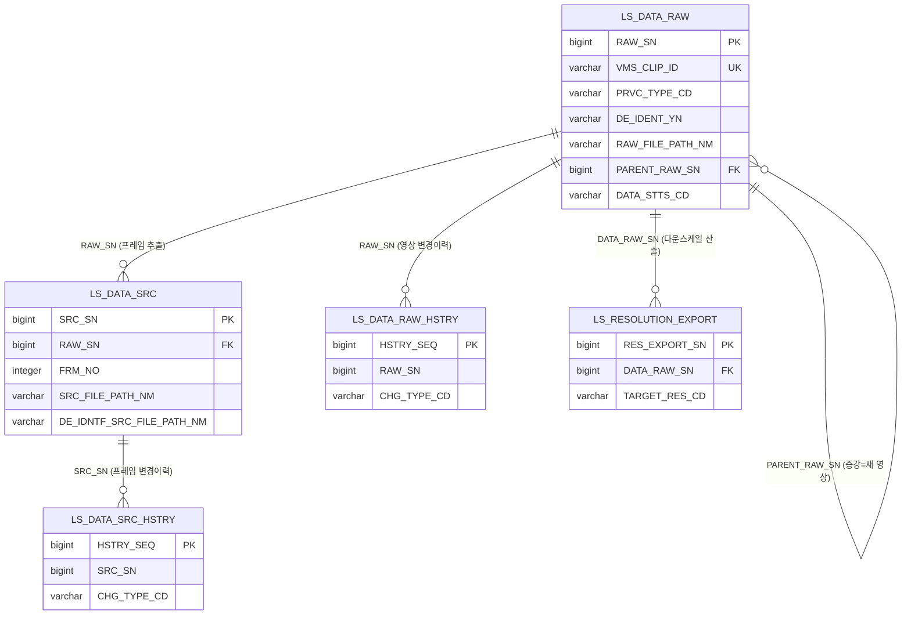

### 1.3 KLID-AT-ERD-002 — 라벨링 ERD

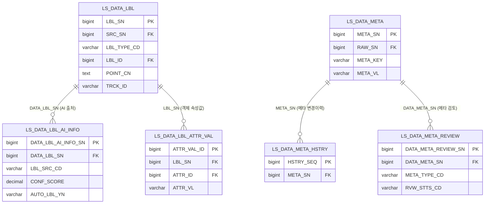

### 1.4 KLID-AT-ERD-003 — 마킹 ERD

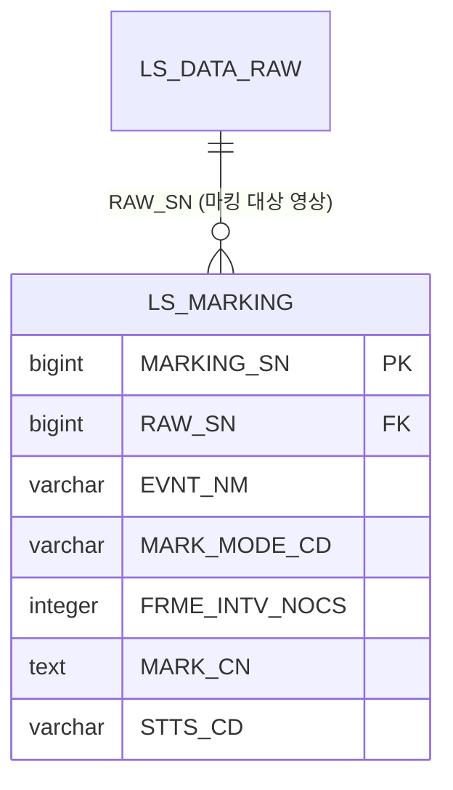

### 1.5 KLID-AT-ERD-004 — 데이터 증강 ERD

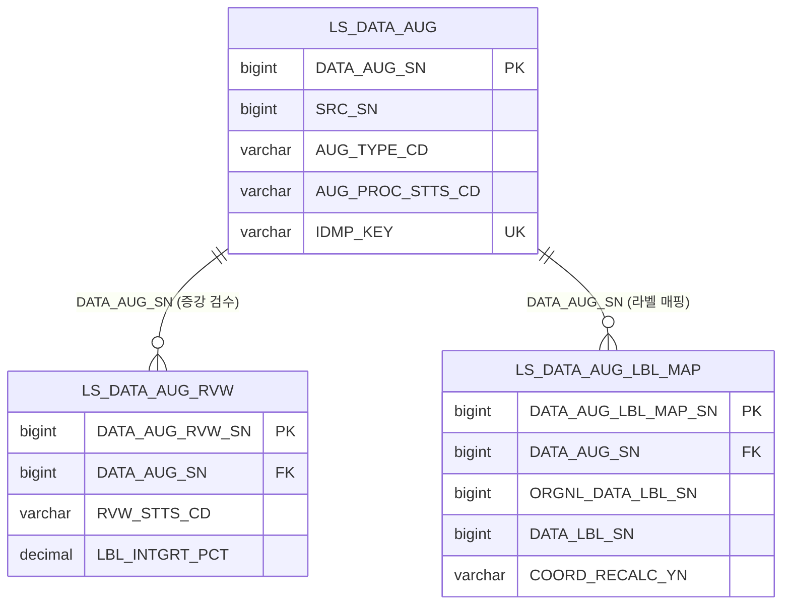

### 1.6 KLID-AT-ERD-005 — 검수·영상상태 ERD

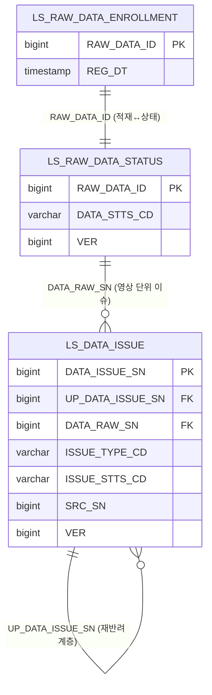

### 1.7 KLID-AT-ERD-006 — 라벨 마스터·버전관리 ERD

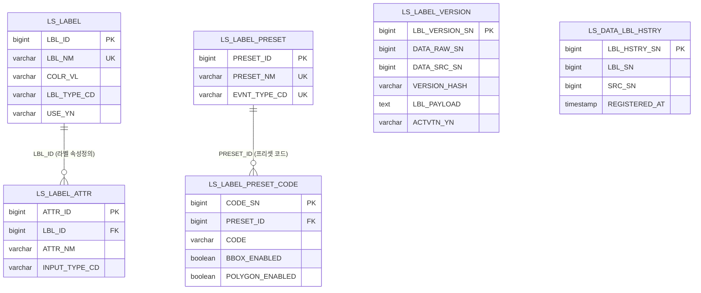

### 1.8 KLID-AT-ERD-007 — 작업 배정 ERD

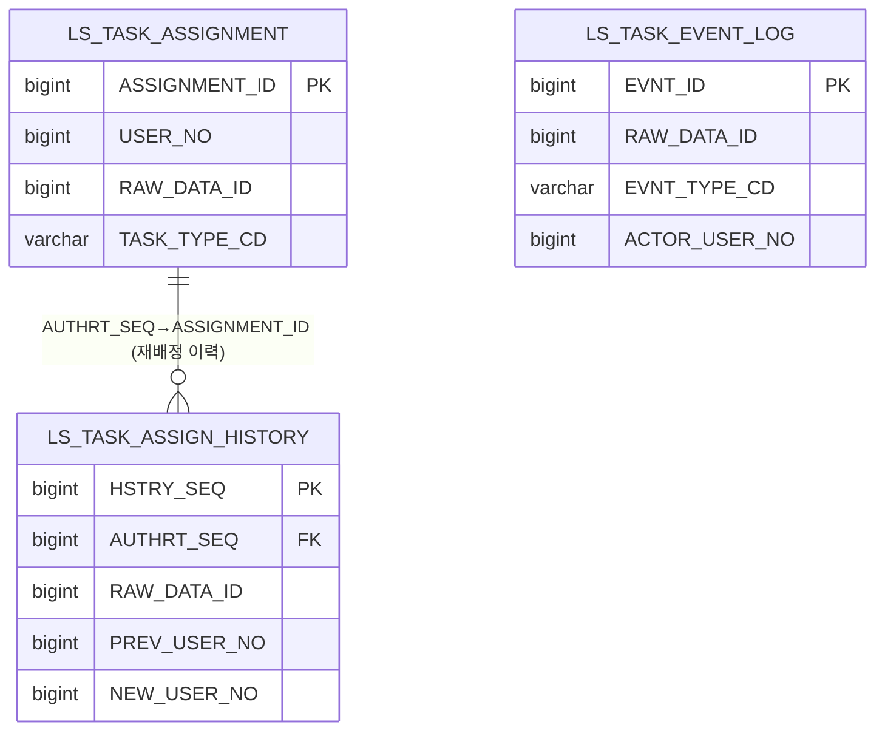

### 1.9 KLID-AT-ERD-008 — 비식별 ERD

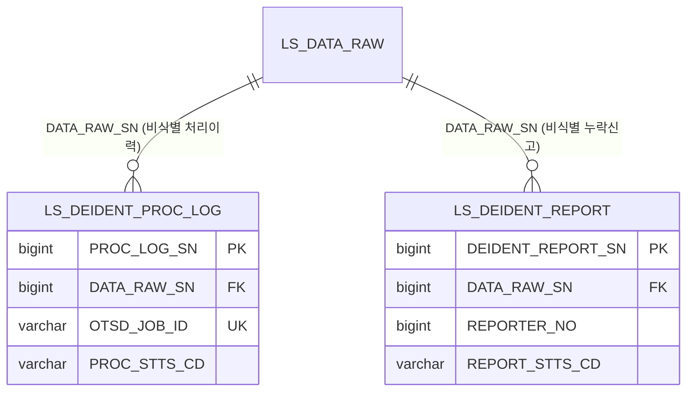

### 1.10 KLID-AT-ERD-009 — 시스템 설정 ERD

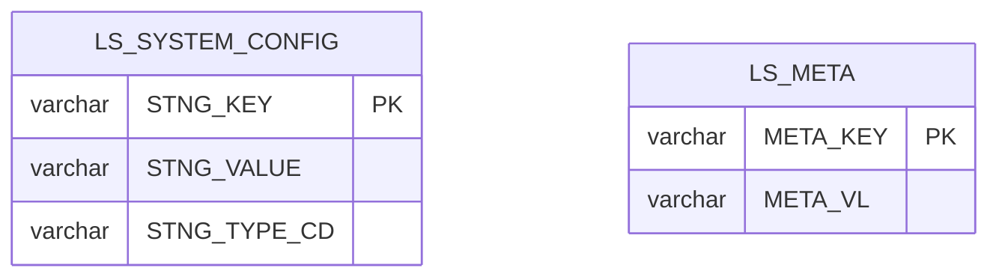

### 1.11 KLID-AT-ERD-010 — 포털 ERD

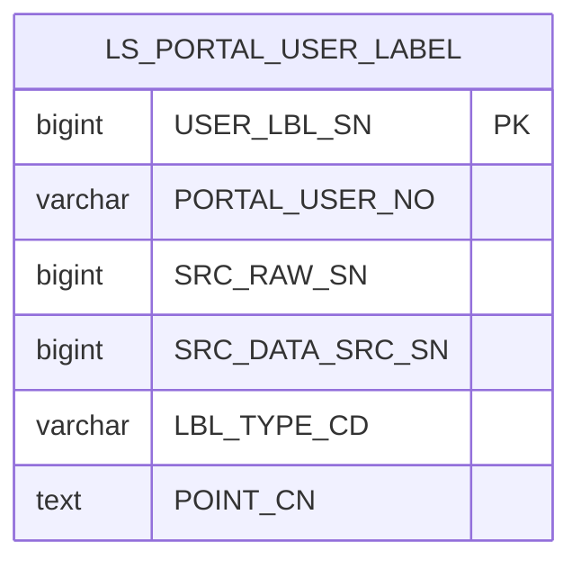

### 1.12 KLID-AT-ERD-011 — 배치·작업 인프라 ERD

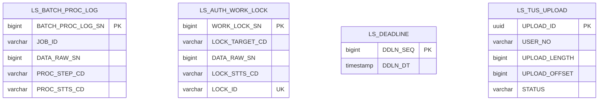

### 1.13 KLID-AT-ERD-012 — 관제 통지 ERD

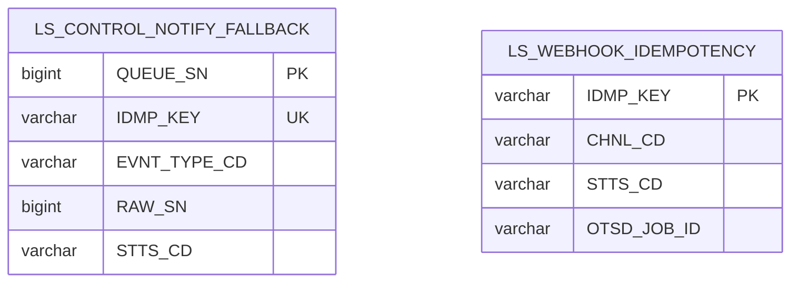

### 1.14 KLID-AT-ERD-013 — 게시판·이슈 ERD

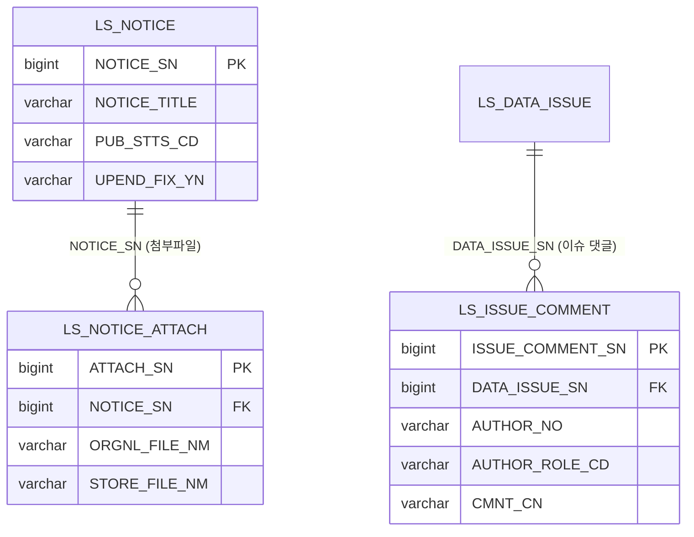

---

## 2. 엔티티 명세서

> 저작도구 소유 `LS_*` 엔티티 41종을 전수 기술한다. 속성표는 10컬럼(속성명·동의어·타입·길이·NOT NULL·PK·FK·INX·기본값·제약조건)을 모두 채우며, PostgreSQL 고정타입(BIGINT/TIMESTAMP/INTEGER/DECIMAL/BOOLEAN/TEXT/UUID)은 길이 칸을 비우고 VARCHAR만 길이를 기재한다. 물리 FK 제약이 미설정된 ID 참조는 제약조건 칸에 "논리 FK"로 명시한다.

### 2.1 KLID-AT-EN-001 — 원시영상

| 엔티티 ID | KLID-AT-EN-001 | 엔티티명 | 원시영상 |
|---------|---|-------|---|
| 관련 클래스 ID | KLID-AT-DC-010 | 관련 클래스명 | LsDataRaw |
| 관련 유스케이스 ID | KLID-AT-UC-002, KLID-AT-UC-003, KLID-AT-UC-011 |
| 엔티티 설명 | 라벨링 대상 원시 영상 메타(영상 단위 작업). VMS_CLIP_ID 유니크로 동일 클립 재수신 시 upsert. PRVC_TYPE_CD에 따라 PRVC_YN 자동 산출. 증강 결과는 PARENT_RAW_SN으로 원본을 참조하는 새 영상. |

| 속성명 | 동의어 | 타입 | 길이 | NOT NULL (Y/N) | PK (Y/N) | FK (Y/N) | INX (Y/N) | 기본값 | 제약조건 |
|-------|--------|------|------|--------|------|------|------|-------|--------|
| RAW_SN | 원시영상일련번호 | BIGINT | | Y | Y | N | N | IDENTITY | - |
| VMS_CLIP_ID | VMS클립아이디 | VARCHAR | 128 | Y | N | N | Y | - | UNIQUE(UK_LS_DATA_RAW_VMS_CLIP) |
| VMS_CCTV_ID | VMS_CCTV아이디 | VARCHAR | 64 | Y | N | N | Y | - | - |
| EVNT_TYPE_CD | 이벤트유형코드 | VARCHAR | 32 | N | N | N | N | - | - |
| LCLGV_CD | 기관코드 | VARCHAR | 32 | N | N | N | N | - | - |
| PRVC_TYPE_CD | 개인정보유형코드 | VARCHAR | 16 | Y | N | N | N | - | ANONY/PRVC/PSDO |
| PRVC_YN | 개인정보포함여부 | VARCHAR | 1 | Y | N | N | N | N | PRVC_TYPE_CD 파생 |
| DE_IDENT_YN | 비식별여부 | VARCHAR | 1 | Y | N | N | N | N | Y/F/N |
| RAW_FILE_PATH_NM | 원시파일경로명 | VARCHAR | 500 | Y | N | N | N | - | 원본 보존 |
| SHT_DT | 촬영일시 | TIMESTAMP | | N | N | N | N | - | - |
| VDO_LEN_SEC | 영상길이초 | INTEGER | | N | N | N | N | - | - |
| PARENT_RAW_SN | 원본원시영상일련번호 | BIGINT | | N | N | Y | Y | - | 논리 FK(→RAW_SN), 증강=새 영상 |
| DATA_STTS_CD | 데이터상태코드 | VARCHAR | 32 | Y | N | N | Y | PENDING | 배치 단계 상태 |
| REG_DT | 등록일시 | TIMESTAMP | | Y | N | N | N | CURRENT_TIMESTAMP | - |
| MDFCN_DT | 수정일시 | TIMESTAMP | | N | N | N | N | - | - |

### 2.2 KLID-AT-EN-002 — 프레임원천

| 엔티티 ID | KLID-AT-EN-002 | 엔티티명 | 프레임원천 |
|---------|---|-------|---|
| 관련 클래스 ID | - ※ | 관련 클래스명 | - |
| 관련 유스케이스 ID | KLID-AT-UC-004, KLID-AT-UC-005 |
| 엔티티 설명 | 영상에서 추출한 키프레임(프레임 추출 단계 산출). 원본 프레임 경로(SRC_FILE_PATH_NM)와 비식별 프레임 경로(DE_IDNTF_SRC_FILE_PATH_NM)를 같은 row로 관리. (RAW_SN, FRM_NO) 유니크. ※ D1 클래스도에 독립 Entity 도형 클래스로 등재되지 않은 프레임 단위 보조 엔티티. |

| 속성명 | 동의어 | 타입 | 길이 | NOT NULL (Y/N) | PK (Y/N) | FK (Y/N) | INX (Y/N) | 기본값 | 제약조건 |
|-------|--------|------|------|--------|------|------|------|-------|--------|
| SRC_SN | 프레임원천일련번호 | BIGINT | | Y | Y | N | N | IDENTITY | - |
| RAW_SN | 원시영상일련번호 | BIGINT | | Y | N | Y | Y | - | FK(→LS_DATA_RAW.RAW_SN, ON DELETE CASCADE) |
| FRM_NO | 프레임번호 | INTEGER | | Y | N | N | Y | - | (RAW_SN,FRM_NO) UNIQUE |
| SRC_FILE_PATH_NM | 원천파일경로명 | VARCHAR | 500 | Y | N | N | N | - | 원본 프레임 경로 |
| DE_IDNTF_SRC_FILE_PATH_NM | 비식별원천파일경로명 | VARCHAR | 1000 | N | N | N | N | - | 비식별 프레임 경로 |
| SHT_DT | 촬영일시 | TIMESTAMP | | N | N | N | N | - | - |
| REG_DT | 등록일시 | TIMESTAMP | | Y | N | N | N | CURRENT_TIMESTAMP | - |
| UPD_DT | 수정일시 | TIMESTAMP | | N | N | N | N | - | - |

### 2.3 KLID-AT-EN-003 — 원시영상이력

| 엔티티 ID | KLID-AT-EN-003 | 엔티티명 | 원시영상이력 |
|---------|---|-------|---|
| 관련 클래스 ID | - ※ | 관련 클래스명 | - |
| 관련 유스케이스 ID | - ※ |
| 엔티티 설명 | 영상 변경 이력. INGEST(신규/갱신)·STATUS_CHANGE 등 변경 사유 + 상태 전이만 기록하는 슬림 이력. ※ 이력 보조 엔티티로 활성 유스케이스가 직접 사용하지 않으며 D1 클래스도에 도형 클래스 미등재. |

| 속성명 | 동의어 | 타입 | 길이 | NOT NULL (Y/N) | PK (Y/N) | FK (Y/N) | INX (Y/N) | 기본값 | 제약조건 |
|-------|--------|------|------|--------|------|------|------|-------|--------|
| HSTRY_SEQ | 이력일련번호 | BIGINT | | Y | Y | N | N | IDENTITY | - |
| RAW_SN | 원시영상일련번호 | BIGINT | | Y | N | Y | Y | - | 논리 FK(→LS_DATA_RAW.RAW_SN) |
| CHG_TYPE_CD | 변경유형코드 | VARCHAR | 16 | Y | N | N | N | - | INGEST_NEW/INGEST_UPD/STATUS_CHANGE |
| PREV_STTS_CD | 이전상태코드 | VARCHAR | 32 | N | N | N | N | - | - |
| NEW_STTS_CD | 변경상태코드 | VARCHAR | 32 | N | N | N | N | - | - |
| CHG_USER_NO | 변경사용자번호 | BIGINT | | N | N | N | N | - | 시스템 변경 시 NULL |
| CHG_DT | 변경일시 | TIMESTAMP | | Y | N | N | N | CURRENT_TIMESTAMP | - |

### 2.4 KLID-AT-EN-004 — 프레임원천이력

| 엔티티 ID | KLID-AT-EN-004 | 엔티티명 | 프레임원천이력 |
|---------|---|-------|---|
| 관련 클래스 ID | - ※ | 관련 클래스명 | - |
| 관련 유스케이스 ID | - ※ |
| 엔티티 설명 | 프레임 변경 이력. CREATED(생성)·DEID_ATTACHED(비식별경로 연결) 등 사유 기록. ※ 이력 보조 엔티티로 활성 유스케이스가 직접 사용하지 않으며 D1 클래스도에 도형 클래스 미등재. |

| 속성명 | 동의어 | 타입 | 길이 | NOT NULL (Y/N) | PK (Y/N) | FK (Y/N) | INX (Y/N) | 기본값 | 제약조건 |
|-------|--------|------|------|--------|------|------|------|-------|--------|
| HSTRY_SEQ | 이력일련번호 | BIGINT | | Y | Y | N | N | IDENTITY | - |
| SRC_SN | 프레임원천일련번호 | BIGINT | | Y | N | Y | Y | - | 논리 FK(→LS_DATA_SRC.SRC_SN) |
| CHG_TYPE_CD | 변경유형코드 | VARCHAR | 16 | Y | N | N | N | - | CREATED/DEID_ATTACHED |
| CHG_USER_NO | 변경사용자번호 | BIGINT | | N | N | N | N | - | 시스템 변경 시 NULL |
| CHG_DT | 변경일시 | TIMESTAMP | | Y | N | N | N | CURRENT_TIMESTAMP | - |

### 2.5 KLID-AT-EN-005 — 해상도변경산출

| 엔티티 ID | KLID-AT-EN-005 | 엔티티명 | 해상도변경산출 |
|---------|---|-------|---|
| 관련 클래스 ID | KLID-AT-DC-019 | 관련 클래스명 | LsResolutionExport |
| 관련 유스케이스 ID | KLID-AT-UC-003 |
| 엔티티 설명 | 검수 완료(APPROVED) 원본 영상의 프레임 이미지셋을 표준 하위 해상도로 다운스케일한 산출 1건당 1행. 영상·라벨·메타·신규 영상 행을 만들지 않으며 본 테이블만 기록. (원본 RAW_SN + 해상도) UK. |

| 속성명 | 동의어 | 타입 | 길이 | NOT NULL (Y/N) | PK (Y/N) | FK (Y/N) | INX (Y/N) | 기본값 | 제약조건 |
|-------|--------|------|------|--------|------|------|------|-------|--------|
| RES_EXPORT_SN | 해상도변경산출일련번호 | BIGINT | | Y | Y | N | N | IDENTITY | - |
| DATA_RAW_SN | 원시영상일련번호 | BIGINT | | Y | N | Y | Y | - | 논리 FK(→LS_DATA_RAW.RAW_SN), APPROVED+비-증강본만 |
| TARGET_RES_CD | 목표해상도코드 | VARCHAR | 16 | Y | N | N | Y | - | RES_1080P/RES_720P/RES_480P, (DATA_RAW_SN,TARGET_RES_CD) UNIQUE |
| ORGNL_W | 원본가로 | INTEGER | | Y | N | N | N | - | - |
| ORGNL_H | 원본세로 | INTEGER | | Y | N | N | N | - | - |
| TARGET_W | 목표가로 | INTEGER | | Y | N | N | N | - | 종횡비 보존(짝수 보정) |
| TARGET_H | 목표세로 | INTEGER | | Y | N | N | N | - | 프리셋 기준 |
| FRAME_CNT | 프레임개수 | INTEGER | | Y | N | N | N | - | - |
| OUTPUT_DIR_PATH | 출력디렉토리경로 | VARCHAR | 500 | Y | N | N | N | - | 응답 미노출 |
| REG_ID | 등록자아이디 | VARCHAR | 64 | N | N | N | N | - | 감사 추적 |
| REG_DT | 등록일시 | TIMESTAMP | | Y | N | N | N | CURRENT_TIMESTAMP | - |

### 2.6 KLID-AT-EN-006 — 데이터라벨

| 엔티티 ID | KLID-AT-EN-006 | 엔티티명 | 데이터라벨 |
|---------|---|-------|---|
| 관련 클래스 ID | KLID-AT-DC-017 | 관련 클래스명 | LsDataLbl |
| 관련 유스케이스 ID | KLID-AT-UC-004, KLID-AT-UC-005 |
| 엔티티 설명 | 현재 라벨 좌표/속성. 프레임 단위(SRC_SN FK) + LBL_TYPE_CD(BBOX/POLYGON/SEGMENT/TRACK). 라벨 마스터 FK(LBL_ID). AI 여부/신뢰도/출처는 LS_DATA_LBL_AI_INFO에 분리. |

| 속성명 | 동의어 | 타입 | 길이 | NOT NULL (Y/N) | PK (Y/N) | FK (Y/N) | INX (Y/N) | 기본값 | 제약조건 |
|-------|--------|------|------|--------|------|------|------|-------|--------|
| LBL_SN | 라벨일련번호 | BIGINT | | Y | Y | N | N | IDENTITY | - |
| SRC_SN | 원천일련번호 | BIGINT | | Y | N | Y | Y | - | 논리 FK(→LS_DATA_SRC.SRC_SN) |
| LBL_TYPE_CD | 라벨유형코드 | VARCHAR | 16 | Y | N | N | N | - | BBOX/POLYGON/SEGMENT/TRACK |
| LBL_ID | 라벨아이디 | BIGINT | | N | N | Y | Y | - | 논리 FK(→LS_LABEL.LBL_ID), 매칭 실패 시 NULL |
| LBL_NM | 라벨명 | VARCHAR | 255 | Y | N | N | N | - | - |
| POINT_CN | 좌표내용 | TEXT | | N | N | N | N | - | 도형 좌표 JSON |
| TRCK_ID | 트랙아이디 | VARCHAR | 64 | N | N | N | Y | - | 수동/저신뢰 시 NULL |
| REG_USER_NO | 등록사용자번호 | BIGINT | | N | N | N | N | - | 자동 라벨은 NULL |
| REG_DT | 등록일시 | TIMESTAMP | | Y | N | N | N | CURRENT_TIMESTAMP | - |
| MDFCN_DT | 수정일시 | TIMESTAMP | | N | N | N | N | - | - |

### 2.7 KLID-AT-EN-007 — 데이터라벨AI정보

| 엔티티 ID | KLID-AT-EN-007 | 엔티티명 | 데이터라벨AI정보 |
|---------|---|-------|---|
| 관련 클래스 ID | KLID-AT-DC-038 | 관련 클래스명 | LsDataLblAiInfo |
| 관련 유스케이스 ID | KLID-AT-UC-004 |
| 엔티티 설명 | AI 라벨 출처/신뢰도 정보. LS_DATA_LBL은 좌표만 보관하고 AI 추론 출처(YOLO/SAM2/INTERPOLATE/VLM)·신뢰도·모델 버전은 본 테이블로 분리. |

| 속성명 | 동의어 | 타입 | 길이 | NOT NULL (Y/N) | PK (Y/N) | FK (Y/N) | INX (Y/N) | 기본값 | 제약조건 |
|-------|--------|------|------|--------|------|------|------|-------|--------|
| DATA_LBL_AI_INFO_SN | 데이터라벨AI정보일련번호 | BIGINT | | Y | Y | N | N | IDENTITY | - |
| DATA_LBL_SN | 데이터라벨일련번호 | BIGINT | | Y | N | Y | Y | - | 논리 FK(→LS_DATA_LBL.LBL_SN) |
| DATA_RAW_SN | 데이터원시일련번호 | BIGINT | | Y | N | N | Y | - | (DATA_RAW_SN,DATA_SRC_SN) 인덱스 |
| DATA_SRC_SN | 데이터원천일련번호 | BIGINT | | Y | N | N | Y | - | - |
| LBL_SRC_CD | 라벨출처코드 | VARCHAR | 20 | Y | N | N | Y | - | YOLO/SAM2/INTERPOLATE/VLM |
| MODEL_NM | 모델명 | VARCHAR | 100 | N | N | N | N | - | - |
| MDL_VER | 모델버전 | VARCHAR | 50 | N | N | N | N | - | - |
| CONF_SCORE | 신뢰도점수 | DECIMAL | 6,5 | N | N | N | N | - | 0.0~1.0, 보간 row는 0.0 |
| AUTO_LBL_YN | 자동라벨여부 | VARCHAR | 1 | Y | N | N | N | Y | - |
| REG_ID | 등록아이디 | VARCHAR | 30 | N | N | N | N | - | - |
| REG_DT | 등록일시 | TIMESTAMP | | Y | N | N | N | CURRENT_TIMESTAMP | - |
| MDFCN_ID | 수정아이디 | VARCHAR | 30 | N | N | N | N | - | - |
| MDFCN_DT | 수정일시 | TIMESTAMP | | N | N | N | N | - | - |

### 2.8 KLID-AT-EN-008 — 데이터라벨속성값

| 엔티티 ID | KLID-AT-EN-008 | 엔티티명 | 데이터라벨속성값 |
|---------|---|-------|---|
| 관련 클래스 ID | - ※ | 관련 클래스명 | - |
| 관련 유스케이스 ID | KLID-AT-UC-004, KLID-AT-UC-005 |
| 엔티티 설명 | 객체별 속성값(CVAT-Like 라벨 풀 포팅). 라벨링된 객체(LBL_SN) 단위로 LS_LABEL_ATTR의 값을 저장. (LBL_SN, ATTR_ID) UNIQUE upsert 키. ※ 라벨 도메인 보조 엔티티로 D1 클래스도에 독립 도형 클래스 미등재. |

| 속성명 | 동의어 | 타입 | 길이 | NOT NULL (Y/N) | PK (Y/N) | FK (Y/N) | INX (Y/N) | 기본값 | 제약조건 |
|-------|--------|------|------|--------|------|------|------|-------|--------|
| ATTR_VAL_ID | 속성값아이디 | BIGINT | | Y | Y | N | N | IDENTITY | - |
| LBL_SN | 라벨일련번호 | BIGINT | | Y | N | Y | Y | - | 논리 FK(→LS_DATA_LBL.LBL_SN), (LBL_SN,ATTR_ID) UNIQUE |
| ATTR_ID | 속성아이디 | BIGINT | | Y | N | Y | N | - | 논리 FK(→LS_LABEL_ATTR.ATTR_ID) |
| ATTR_VL | 속성값 | VARCHAR | 1000 | N | N | N | N | - | - |
| REG_DT | 등록일시 | TIMESTAMP | | Y | N | N | N | CURRENT_TIMESTAMP | - |
| MDFCN_DT | 수정일시 | TIMESTAMP | | N | N | N | N | - | - |

### 2.9 KLID-AT-EN-009 — 데이터메타

| 엔티티 ID | KLID-AT-EN-009 | 엔티티명 | 데이터메타 |
|---------|---|-------|---|
| 관련 클래스 ID | - ※ | 관련 클래스명 | - |
| 관련 유스케이스 ID | KLID-AT-UC-002 |
| 엔티티 설명 | 영상/프레임 메타 값. RAW_SN FK + (RAW_SN, META_KEY) UK의 단순 K/V. 외부 생성 여부/메타 유형/검토 상태는 LS_DATA_META_REVIEW에 분리. 비동기 표준 컬럼(멱등키·외부작업ID·재시도·dead-letter) 보유. ※ K/V 보조 엔티티로 D1 클래스도에 독립 도형 클래스 미등재. |

| 속성명 | 동의어 | 타입 | 길이 | NOT NULL (Y/N) | PK (Y/N) | FK (Y/N) | INX (Y/N) | 기본값 | 제약조건 |
|-------|--------|------|------|--------|------|------|------|-------|--------|
| META_SN | 메타일련번호 | BIGINT | | Y | Y | N | N | IDENTITY | - |
| RAW_SN | 원시일련번호 | BIGINT | | Y | N | Y | Y | - | 논리 FK(→LS_DATA_RAW.RAW_SN), (RAW_SN,META_KEY) UNIQUE |
| META_KEY | 메타키 | VARCHAR | 64 | Y | N | N | N | - | - |
| META_VL | 메타값 | VARCHAR | 2000 | N | N | N | N | - | - |
| IDMP_KEY | 멱등키 | VARCHAR | 64 | N | N | N | N | - | UNIQUE(uk_meta_idempotency_key) |
| OTSD_JOB_ID | 외부작업아이디 | VARCHAR | 128 | N | N | N | N | - | UNIQUE(uk_meta_external_job_id) |
| RTRY_NMTM | 재시도횟수 | INTEGER | | Y | N | N | N | 0 | - |
| DEAD_LETTER_AT | 영구실패시점 | TIMESTAMP | | N | N | N | N | - | - |
| REG_DT | 등록일시 | TIMESTAMP | | Y | N | N | N | CURRENT_TIMESTAMP | - |
| MDFCN_DT | 수정일시 | TIMESTAMP | | N | N | N | N | - | - |

### 2.10 KLID-AT-EN-010 — 데이터메타이력

| 엔티티 ID | KLID-AT-EN-010 | 엔티티명 | 데이터메타이력 |
|---------|---|-------|---|
| 관련 클래스 ID | - ※ | 관련 클래스명 | - |
| 관련 유스케이스 ID | - ※ |
| 엔티티 설명 | LS_DATA_META 변경 이력(이전값/신규값). ※ 이력 보조 엔티티로 활성 유스케이스가 직접 사용하지 않으며 D1 클래스도에 도형 클래스 미등재. |

| 속성명 | 동의어 | 타입 | 길이 | NOT NULL (Y/N) | PK (Y/N) | FK (Y/N) | INX (Y/N) | 기본값 | 제약조건 |
|-------|--------|------|------|--------|------|------|------|-------|--------|
| HSTRY_SEQ | 이력일련번호 | BIGINT | | Y | Y | N | N | IDENTITY | - |
| META_SN | 메타일련번호 | BIGINT | | Y | N | Y | Y | - | 논리 FK(→LS_DATA_META.META_SN) |
| PREV_VL | 이전값 | VARCHAR | 2000 | N | N | N | N | - | - |
| NEW_VL | 신규값 | VARCHAR | 2000 | N | N | N | N | - | - |
| CHG_USER_NO | 변경사용자번호 | BIGINT | | N | N | N | N | - | - |
| CHG_DT | 변경일시 | TIMESTAMP | | Y | N | N | N | CURRENT_TIMESTAMP | - |

### 2.11 KLID-AT-EN-011 — 데이터메타검토

| 엔티티 ID | KLID-AT-EN-011 | 엔티티명 | 데이터메타검토 |
|---------|---|-------|---|
| 관련 클래스 ID | - ※ | 관련 클래스명 | - |
| 관련 유스케이스 ID | KLID-AT-UC-002 |
| 엔티티 설명 | 외부/자동 생성 메타데이터 검토 상태. LS_DATA_META는 값만 저장하고 본 테이블에서 외부 생성 여부 + 검토 상태(PENDING/APPROVED/REJECTED)를 관리. ※ 메타 검수 워크플로우 보조 엔티티로 D1 클래스도에 독립 도형 클래스 미등재(VLM 시계열 메타 검토는 검수 흐름으로 흡수). |

| 속성명 | 동의어 | 타입 | 길이 | NOT NULL (Y/N) | PK (Y/N) | FK (Y/N) | INX (Y/N) | 기본값 | 제약조건 |
|-------|--------|------|------|--------|------|------|------|-------|--------|
| DATA_META_REVIEW_SN | 데이터메타검토일련번호 | BIGINT | | Y | Y | N | N | IDENTITY | - |
| DATA_META_SN | 데이터메타일련번호 | BIGINT | | Y | N | Y | Y | - | 논리 FK(→LS_DATA_META.META_SN) |
| DATA_RAW_SN | 데이터원시일련번호 | BIGINT | | Y | N | N | Y | - | (DATA_RAW_SN,DATA_SRC_SN) 인덱스 |
| DATA_SRC_SN | 데이터원천일련번호 | BIGINT | | N | N | N | Y | - | 영상 단위 메타는 NULL |
| META_TYPE_CD | 메타유형코드 | VARCHAR | 20 | Y | N | N | Y | - | VLM/EXTERNAL |
| SRC_SYS_CD | 생성시스템코드 | VARCHAR | 20 | N | N | N | N | - | AI_SERVER/CONTROL_SERVER/PORTAL |
| RVW_STTS_CD | 검토상태코드 | VARCHAR | 20 | Y | N | N | Y | - | AUTO_GENERATED/PENDING/APPROVED/REJECTED |
| RVW_ID | 검토아이디 | VARCHAR | 30 | N | N | N | N | - | - |
| RVW_DT | 검토일시 | TIMESTAMP | | N | N | N | N | - | - |
| REJECT_RSN | 반려사유 | VARCHAR | 1000 | N | N | N | N | - | REJECTED 시 필수 |
| REG_ID | 등록아이디 | VARCHAR | 30 | N | N | N | N | - | - |
| REG_DT | 등록일시 | TIMESTAMP | | Y | N | N | N | CURRENT_TIMESTAMP | - |
| MDFCN_ID | 수정아이디 | VARCHAR | 30 | N | N | N | N | - | - |
| MDFCN_DT | 수정일시 | TIMESTAMP | | N | N | N | N | - | - |

### 2.12 KLID-AT-EN-012 — 영상마킹

| 엔티티 ID | KLID-AT-EN-012 | 엔티티명 | 영상마킹 |
|---------|---|-------|---|
| 관련 클래스 ID | - ※ | 관련 클래스명 | - |
| 관련 유스케이스 ID | - ※ |
| 엔티티 설명 | 영상별 자동/수동 이벤트 식별 마킹 정보. 영상 1건(RAW_SN)에 N건의 마킹 생성 가능. 마킹 결과(이벤트명 + 영상경로 + marks 배열)를 VLM 시계열 콜백으로 전달. 상태 전이: PENDING→VLM_REQUESTED→VLM_COMPLETED. ※ 마킹 도메인은 활성 유스케이스 13건(R1 항목 한정)에 직접 대응 UC가 없어 미매핑 — 배치 파이프라인 선행 단계로 보유. |

| 속성명 | 동의어 | 타입 | 길이 | NOT NULL (Y/N) | PK (Y/N) | FK (Y/N) | INX (Y/N) | 기본값 | 제약조건 |
|-------|--------|------|------|--------|------|------|------|-------|--------|
| MARKING_SN | 마킹일련번호 | BIGINT | | Y | Y | N | N | IDENTITY | - |
| RAW_SN | 원천영상일련번호 | BIGINT | | Y | N | Y | Y | - | 논리 FK(→LS_DATA_RAW.RAW_SN) |
| EVNT_NM | 이벤트명 | VARCHAR | 100 | Y | N | N | N | - | VLM 콜백 포함 |
| MARK_MODE_CD | 마킹모드코드 | VARCHAR | 16 | Y | N | N | N | - | AUTO/MANUAL |
| FRME_INTV_NOCS | 프레임간격수 | INTEGER | | N | N | N | N | - | AUTO 시 1 이상, MANUAL 시 NULL |
| VIDEO_FILE_PATH_NM | 영상파일경로명 | VARCHAR | 500 | Y | N | N | N | - | VLM 콜백 포함 |
| MARK_CN | 마킹내용 | TEXT | | Y | N | N | N | - | marks 배열 JSON |
| STTS_CD | 상태코드 | VARCHAR | 16 | Y | N | N | N | PENDING | PENDING/VLM_REQUESTED/VLM_COMPLETED |
| REG_USER_NO | 등록사용자번호 | BIGINT | | N | N | N | N | - | - |
| REG_DT | 등록일시 | TIMESTAMP | | Y | N | N | N | CURRENT_TIMESTAMP | - |
| MDFCN_DT | 수정일시 | TIMESTAMP | | Y | N | N | N | CURRENT_TIMESTAMP | - |

### 2.13 KLID-AT-EN-013 — 데이터증강

| 엔티티 ID | KLID-AT-EN-013 | 엔티티명 | 데이터증강 |
|---------|---|-------|---|
| 관련 클래스 ID | KLID-AT-DC-006 | 관련 클래스명 | LsDataAug |
| 관련 유스케이스 ID | KLID-AT-UC-001, KLID-AT-UC-002, KLID-AT-UC-010 |
| 엔티티 설명 | 외부 SFR-07 시스템이 생성한 4종 증강 결과(WINTER/NIGHT/RAIN/RESOLUTION). 영상 단위(SRC_SN)로 관리하며 증강 파일 생성 상태는 본 테이블, 검수 결과는 LS_DATA_AUG_RVW에 분리. 검수 상세 컬럼(LBL_INTGRT_PCT/REJECT_RSN/DCSN_*)은 엔티티 @Transient — 물리 컬럼은 잔존(LS_DATA_AUG_RVW로 이관). |

| 속성명 | 동의어 | 타입 | 길이 | NOT NULL (Y/N) | PK (Y/N) | FK (Y/N) | INX (Y/N) | 기본값 | 제약조건 |
|-------|--------|------|------|--------|------|------|------|-------|--------|
| DATA_AUG_SN | 데이터증강일련번호 | BIGINT | | Y | Y | N | N | IDENTITY | - |
| SRC_SN | 원천일련번호 | BIGINT | | Y | N | N | Y | - | 논리 FK(→LS_DATA_RAW.RAW_SN), (SRC_SN,AUG_TYPE_CD) 인덱스 |
| AUG_TYPE_CD | 증강유형코드 | VARCHAR | 20 | Y | N | N | N | - | WINTER/NIGHT/RAIN/RESOLUTION |
| AUG_PROC_STTS_CD | 증강처리상태코드 | VARCHAR | 20 | Y | N | N | Y | PENDING | PENDING/ACCEPTED/REJECTED |
| LBL_INTGRT_PCT | 라벨무결성비율 | DECIMAL | 5,2 | N | N | N | N | - | @Transient(물리 잔존) |
| REJECT_RSN | 반려사유 | VARCHAR | 500 | N | N | N | N | - | @Transient(물리 잔존) |
| DCSN_USER_NO | 결정사용자번호 | VARCHAR | 50 | N | N | N | N | - | @Transient(물리 잔존) |
| DCSN_DT | 결정일시 | TIMESTAMP | | N | N | N | N | - | @Transient(물리 잔존) |
| REG_DT | 등록일시 | TIMESTAMP | | Y | N | N | N | CURRENT_TIMESTAMP | - |
| REG_USER_NO | 등록사용자번호 | VARCHAR | 50 | N | N | N | N | - | - |
| IDMP_KEY | 멱등키 | VARCHAR | 64 | N | N | N | N | - | UNIQUE(uk_aug_idempotency_key) |
| OTSD_JOB_ID | 외부작업식별자 | VARCHAR | 128 | N | N | N | N | - | UNIQUE(uk_aug_external_job_id) |
| RTRY_NMTM | 재시도횟수 | INTEGER | | Y | N | N | N | 0 | - |
| DEAD_LETTER_AT | 영구실패시점 | TIMESTAMP | | N | N | N | N | - | - |

### 2.14 KLID-AT-EN-014 — 데이터증강검수

| 엔티티 ID | KLID-AT-EN-014 | 엔티티명 | 데이터증강검수 |
|---------|---|-------|---|
| 관련 클래스 ID | KLID-AT-DC-022 | 관련 클래스명 | LsDataAugRvw |
| 관련 유스케이스 ID | KLID-AT-UC-010 |
| 엔티티 설명 | 증강 데이터 검수 결과. 증강 파일 생성 상태는 LS_DATA_AUG에, 검수 결과(상태·정합률·반려사유·검수자)는 본 테이블로 분리. |

| 속성명 | 동의어 | 타입 | 길이 | NOT NULL (Y/N) | PK (Y/N) | FK (Y/N) | INX (Y/N) | 기본값 | 제약조건 |
|-------|--------|------|------|--------|------|------|------|-------|--------|
| DATA_AUG_RVW_SN | 데이터증강검수일련번호 | BIGINT | | Y | Y | N | N | IDENTITY | - |
| DATA_AUG_SN | 데이터증강일련번호 | BIGINT | | Y | N | Y | Y | - | 논리 FK(→LS_DATA_AUG.DATA_AUG_SN) |
| DATA_RAW_SN | 데이터원시일련번호 | BIGINT | | Y | N | N | Y | - | (DATA_RAW_SN,DATA_SRC_SN) 인덱스 |
| DATA_SRC_SN | 데이터원천일련번호 | BIGINT | | Y | N | N | Y | - | - |
| RVW_STTS_CD | 검수상태코드 | VARCHAR | 20 | Y | N | N | Y | - | PENDING/ACCEPTED/REJECTED |
| LBL_INTGRT_PCT | 라벨무결성비율 | DECIMAL | 5,2 | N | N | N | N | - | 0~100 |
| REJECT_RSN | 반려사유 | VARCHAR | 1000 | N | N | N | N | - | REJECTED 시 필수 |
| RVW_ID | 검수아이디 | VARCHAR | 30 | N | N | N | N | - | - |
| RVW_DT | 검수일시 | TIMESTAMP | | N | N | N | N | - | - |
| REG_ID | 등록아이디 | VARCHAR | 30 | N | N | N | N | - | - |
| REG_DT | 등록일시 | TIMESTAMP | | Y | N | N | N | CURRENT_TIMESTAMP | - |
| MDFCN_ID | 수정아이디 | VARCHAR | 30 | N | N | N | N | - | - |
| MDFCN_DT | 수정일시 | TIMESTAMP | | N | N | N | N | - | - |

### 2.15 KLID-AT-EN-015 — 데이터증강라벨매핑

| 엔티티 ID | KLID-AT-EN-015 | 엔티티명 | 데이터증강라벨매핑 |
|---------|---|-------|---|
| 관련 클래스 ID | KLID-AT-DC-008 | 관련 클래스명 | LsDataAugLblMap |
| 관련 유스케이스 ID | KLID-AT-UC-002 |
| 엔티티 설명 | 증강 데이터-라벨 매핑. 해상도 유지(COORD_RECALC_YN='N')/저하(SCALE_X/Y 저장) 증강 시 좌표 재계산 정보를 저장. 증강 결과 라벨과 원본 라벨 간 매핑. |

| 속성명 | 동의어 | 타입 | 길이 | NOT NULL (Y/N) | PK (Y/N) | FK (Y/N) | INX (Y/N) | 기본값 | 제약조건 |
|-------|--------|------|------|--------|------|------|------|-------|--------|
| DATA_AUG_LBL_MAP_SN | 데이터증강라벨매핑일련번호 | BIGINT | | Y | Y | N | N | IDENTITY | - |
| DATA_AUG_SN | 데이터증강일련번호 | BIGINT | | Y | N | Y | Y | - | 논리 FK(→LS_DATA_AUG.DATA_AUG_SN) |
| ORGNL_DATA_LBL_SN | 원본데이터라벨일련번호 | BIGINT | | N | N | N | Y | - | 증강 전 원본 라벨 |
| DATA_LBL_SN | 데이터라벨일련번호 | BIGINT | | Y | N | N | Y | - | 증강 결과 라벨 |
| COORD_RECALC_YN | 좌표재계산여부 | VARCHAR | 1 | Y | N | N | N | N | Y(SCALE 적용)/N(유지) |
| SCALE_X | X축스케일비율 | DECIMAL | 10,6 | N | N | N | N | - | - |
| SCALE_Y | Y축스케일비율 | DECIMAL | 10,6 | N | N | N | N | - | - |
| REG_ID | 등록아이디 | VARCHAR | 30 | N | N | N | N | - | - |
| REG_DT | 등록일시 | TIMESTAMP | | Y | N | N | N | CURRENT_TIMESTAMP | - |

### 2.16 KLID-AT-EN-016 — 영상적재등록

| 엔티티 ID | KLID-AT-EN-016 | 엔티티명 | 영상적재등록 |
|---------|---|-------|---|
| 관련 클래스 ID | - ※ | 관련 클래스명 | - |
| 관련 유스케이스 ID | - ※ |
| 엔티티 설명 | 영상(원천 데이터) 적재 등록 매핑. 영상 1건당 1 row. ※ 적재 등록 보조 엔티티로 D1 클래스도에 독립 도형 클래스 미등재. |

| 속성명 | 동의어 | 타입 | 길이 | NOT NULL (Y/N) | PK (Y/N) | FK (Y/N) | INX (Y/N) | 기본값 | 제약조건 |
|-------|--------|------|------|--------|------|------|------|-------|--------|
| RAW_DATA_ID | 영상식별자 | BIGINT | | Y | Y | N | N | - | 논리 FK(→LS_DATA_RAW.RAW_SN) |
| REG_DT | 등록일시 | TIMESTAMP | | Y | N | N | N | CURRENT_TIMESTAMP | - |

### 2.17 KLID-AT-EN-017 — 영상진행상태

| 엔티티 ID | KLID-AT-EN-017 | 엔티티명 | 영상진행상태 |
|---------|---|-------|---|
| 관련 클래스 ID | KLID-AT-DC-033 | 관련 클래스명 | LsRawDataStatus |
| 관련 유스케이스 ID | KLID-AT-UC-001, KLID-AT-UC-007, KLID-AT-UC-009 |
| 엔티티 설명 | 영상별 배치/검수 진행 상태. 배치·검수 워크플로우 상태 전이의 단일 출처. 영상 1건당 1 row. 낙관적 잠금(VER)으로 동시 승인 경합 방어. 검수 APPROVED 전이 시 관제서버 TASK_COMPLETED 통지 트리거. |

| 속성명 | 동의어 | 타입 | 길이 | NOT NULL (Y/N) | PK (Y/N) | FK (Y/N) | INX (Y/N) | 기본값 | 제약조건 |
|-------|--------|------|------|--------|------|------|------|-------|--------|
| RAW_DATA_ID | 영상식별자 | BIGINT | | Y | Y | N | N | - | 논리 FK(→LS_DATA_RAW.RAW_SN) |
| DATA_STTS_CD | 데이터상태유형 | VARCHAR | 32 | Y | N | N | Y | PENDING | PENDING/BATCH_QUEUED/PROCESSING/ASSIGNED/IN_REVIEW/APPROVED/REJECTED/COMPLETED/FAILED |
| STP_CYCL | 단계주기 | INTEGER | | Y | N | N | N | 0 | - |
| IGI_CYCL | 검수주기 | INTEGER | | Y | N | N | N | 0 | - |
| UPD_DT | 수정일시 | TIMESTAMP | | Y | N | N | N | CURRENT_TIMESTAMP | - |
| VER | 버전 | BIGINT | | Y | N | N | N | 0 | @Version 낙관적 잠금 |

### 2.18 KLID-AT-EN-018 — 데이터이슈

| 엔티티 ID | KLID-AT-EN-018 | 엔티티명 | 데이터이슈 |
|---------|---|-------|---|
| 관련 클래스 ID | - ※ | 관련 클래스명 | - |
| 관련 유스케이스 ID | - ※ |
| 엔티티 설명 | 영상 단위 이슈 — 검수 반려 이력(REJECTION, 생성 시점부터 RESOLVED)과 작업자 문의(INQUIRY, 상태머신 대상)를 통합 보관. UP_DATA_ISSUE_SN 자기참조로 재반려 계층 표현. 낙관적 잠금(VER). ※ 검수 반려·이슈 스레드는 R1 외 추가(ADR-015) 기능으로 활성 유스케이스 13건과 직접 매핑 UC 없음. |

| 속성명 | 동의어 | 타입 | 길이 | NOT NULL (Y/N) | PK (Y/N) | FK (Y/N) | INX (Y/N) | 기본값 | 제약조건 |
|-------|--------|------|------|--------|------|------|------|-------|--------|
| DATA_ISSUE_SN | 이슈식별자 | BIGINT | | Y | Y | N | N | IDENTITY | - |
| UP_DATA_ISSUE_SN | 상위이슈식별자 | BIGINT | | N | N | Y | N | - | 논리 FK(→자기 DATA_ISSUE_SN), 재반려 계층 |
| DATA_RAW_SN | 영상식별자 | BIGINT | | Y | N | Y | N | - | 논리 FK(→LS_DATA_RAW.RAW_SN) |
| ISSUE_RSN | 이슈사유 | VARCHAR | 1000 | N | N | N | N | - | - |
| REPORTED_USER_NO | 작성자번호 | VARCHAR | 50 | N | N | N | N | - | - |
| ISSUE_TYPE_CD | 이슈유형 | VARCHAR | 20 | Y | N | N | N | - | REJECTION/INQUIRY |
| ISSUE_STTS_CD | 이슈상태 | VARCHAR | 20 | Y | N | N | N | - | OPEN/ANSWERED/RESOLVED |
| SRC_SN | 프레임식별자 | BIGINT | | N | N | N | Y | - | 프레임 단위 문의(선택) |
| VER | 버전 | BIGINT | | Y | N | N | N | 0 | @Version 낙관적 잠금 |
| REG_DT | 등록일시 | TIMESTAMP | | Y | N | N | N | - | - |

### 2.19 KLID-AT-EN-019 — 라벨마스터

| 엔티티 ID | KLID-AT-EN-019 | 엔티티명 | 라벨마스터 |
|---------|---|-------|---|
| 관련 클래스 ID | - ※ | 관련 클래스명 | - |
| 관련 유스케이스 ID | KLID-AT-UC-004, KLID-AT-UC-005 |
| 엔티티 설명 | 저작도구 전역 단일 라벨 풀의 마스터. 라벨 이름·색상·도형 타입 정의. REVIEWER가 CRUD, WORKER는 조회만. soft delete(USE_YN='N')만 지원. ※ 라벨 풀 마스터로 활성 유스케이스가 라벨 선택에 사용하나 D1 클래스도에 독립 도형 클래스 미등재. |

| 속성명 | 동의어 | 타입 | 길이 | NOT NULL (Y/N) | PK (Y/N) | FK (Y/N) | INX (Y/N) | 기본값 | 제약조건 |
|-------|--------|------|------|--------|------|------|------|-------|--------|
| LBL_ID | 라벨아이디 | BIGINT | | Y | Y | N | N | IDENTITY | - |
| LBL_NM | 라벨명 | VARCHAR | 64 | Y | N | N | Y | - | UNIQUE(UK_LS_LABEL_NAME) |
| COLR_VL | 색상값 | VARCHAR | 7 | Y | N | N | N | - | 대문자 #RRGGBB |
| LBL_TYPE_CD | 라벨유형코드 | VARCHAR | 16 | Y | N | N | N | - | BBOX/POLYGON/POINT |
| SORT_SEQ | 정렬순서 | INTEGER | | Y | N | N | Y | 0 | - |
| USE_YN | 사용여부 | VARCHAR | 1 | Y | N | N | Y | Y | soft delete 플래그 |
| REG_ID | 등록자식별자 | VARCHAR | 30 | N | N | N | N | - | - |
| REG_DT | 등록일시 | TIMESTAMP | | Y | N | N | N | CURRENT_TIMESTAMP | - |
| MDFCN_ID | 수정자식별자 | VARCHAR | 30 | N | N | N | N | - | - |
| MDFCN_DT | 수정일시 | TIMESTAMP | | N | N | N | N | - | - |

### 2.20 KLID-AT-EN-020 — 라벨속성정의

| 엔티티 ID | KLID-AT-EN-020 | 엔티티명 | 라벨속성정의 |
|---------|---|-------|---|
| 관련 클래스 ID | - ※ | 관련 클래스명 | - |
| 관련 유스케이스 ID | KLID-AT-UC-004, KLID-AT-UC-005 |
| 엔티티 설명 | 라벨별 속성(Attribute) 정의 — CVAT AttributeSpec 동등 구조. 한 라벨에 부여 가능한 속성을 정의하며 객체별 실제값은 LS_DATA_LBL_ATTR_VAL에 저장. soft delete 지원. ※ 라벨 마스터 종속 정의 엔티티로 D1 클래스도에 독립 도형 클래스 미등재. |

| 속성명 | 동의어 | 타입 | 길이 | NOT NULL (Y/N) | PK (Y/N) | FK (Y/N) | INX (Y/N) | 기본값 | 제약조건 |
|-------|--------|------|------|--------|------|------|------|-------|--------|
| ATTR_ID | 속성식별자 | BIGINT | | Y | Y | N | N | IDENTITY | - |
| LBL_ID | 라벨아이디 | BIGINT | | Y | N | Y | Y | - | 논리 FK(→LS_LABEL.LBL_ID), (LBL_ID,ATTR_NM) UNIQUE |
| ATTR_NM | 속성명 | VARCHAR | 64 | Y | N | N | N | - | - |
| INPUT_TYPE_CD | 입력유형코드 | VARCHAR | 16 | Y | N | N | N | - | TEXT/SELECT/CHECKBOX/RADIO/NUMBER |
| VALUES_CN | 옵션목록내용 | VARCHAR | 1000 | N | N | N | N | - | SELECT/CHECKBOX/RADIO 시 필수 |
| DFLT_VL | 기본값 | VARCHAR | 255 | N | N | N | N | - | - |
| MUTABLE_YN | 가변여부 | VARCHAR | 1 | Y | N | N | N | Y | Y(프레임별)/N(트랙고정) |
| SORT_SEQ | 정렬순서 | INTEGER | | Y | N | N | Y | 0 | - |
| USE_YN | 사용여부 | VARCHAR | 1 | Y | N | N | Y | Y | soft delete 플래그 |
| REG_ID | 등록자식별자 | VARCHAR | 30 | N | N | N | N | - | - |
| REG_DT | 등록일시 | TIMESTAMP | | Y | N | N | N | CURRENT_TIMESTAMP | - |
| MDFCN_ID | 수정자식별자 | VARCHAR | 30 | N | N | N | N | - | - |
| MDFCN_DT | 수정일시 | TIMESTAMP | | N | N | N | N | - | - |

### 2.21 KLID-AT-EN-021 — 라벨프리셋

| 엔티티 ID | KLID-AT-EN-021 | 엔티티명 | 라벨프리셋 |
|---------|---|-------|---|
| 관련 클래스 ID | - ※ | 관련 클래스명 | - |
| 관련 유스케이스 ID | - ※ |
| 엔티티 설명 | 라벨링 프리셋 Aggregate Root. 자주 쓰는 라벨 코드 묶음을 프리셋으로 정의하고 선택적으로 이벤트 타입 1건에 1:1 매핑. ※ 라벨 프리셋은 R1 외 라벨 풀 편의 기능으로 활성 유스케이스 13건과 직접 매핑 UC 없음. |

| 속성명 | 동의어 | 타입 | 길이 | NOT NULL (Y/N) | PK (Y/N) | FK (Y/N) | INX (Y/N) | 기본값 | 제약조건 |
|-------|--------|------|------|--------|------|------|------|-------|--------|
| PRESET_ID | 프리셋식별자 | BIGINT | | Y | Y | N | N | IDENTITY | - |
| PRESET_NM | 프리셋명 | VARCHAR | 64 | Y | N | N | Y | - | UNIQUE(UK_LS_LABEL_PRESET_NAME) |
| EXPLN | 설명 | VARCHAR | 500 | N | N | N | N | - | - |
| EVNT_TYPE_CD | 이벤트유형코드 | VARCHAR | 32 | N | N | N | Y | - | UNIQUE(UK_LS_LABEL_PRESET_EVNT), 이벤트 1:1 |
| REG_DT | 등록일시 | TIMESTAMP | | Y | N | N | N | CURRENT_TIMESTAMP | - |
| MDFCN_DT | 수정일시 | TIMESTAMP | | Y | N | N | N | CURRENT_TIMESTAMP | - |

### 2.22 KLID-AT-EN-022 — 라벨프리셋코드

| 엔티티 ID | KLID-AT-EN-022 | 엔티티명 | 라벨프리셋코드 |
|---------|---|-------|---|
| 관련 클래스 ID | - ※ | 관련 클래스명 | - |
| 관련 유스케이스 ID | - ※ |
| 엔티티 설명 | 프리셋에 포함된 라벨 코드(LS_LABEL_PRESET Aggregate 내부 엔티티). Root의 replaceCodes 통해서만 변경. 코드별 BBOX/POLYGON 어노테이션 토글 보유. ※ 프리셋 종속 내부 엔티티로 활성 유스케이스 직접 매핑 UC 없음. |

| 속성명 | 동의어 | 타입 | 길이 | NOT NULL (Y/N) | PK (Y/N) | FK (Y/N) | INX (Y/N) | 기본값 | 제약조건 |
|-------|--------|------|------|--------|------|------|------|-------|--------|
| CODE_SN | 코드일련번호 | BIGINT | | Y | Y | N | N | IDENTITY | - |
| PRESET_ID | 프리셋식별자 | BIGINT | | Y | N | Y | Y | - | FK(→LS_LABEL_PRESET.PRESET_ID, ON DELETE CASCADE) |
| CODE | 라벨코드 | VARCHAR | 32 | Y | N | N | N | - | (PRESET_ID,CODE) UNIQUE |
| SORT_SEQ | 정렬순서 | INTEGER | | Y | N | N | N | 0 | - |
| BBOX_ENABLED | 바운딩박스활성여부 | BOOLEAN | | Y | N | N | N | TRUE | CHECK(BBOX_ENABLED OR POLYGON_ENABLED) |
| POLYGON_ENABLED | 폴리곤활성여부 | BOOLEAN | | Y | N | N | N | TRUE | CHECK(BBOX_ENABLED OR POLYGON_ENABLED) |

### 2.23 KLID-AT-EN-023 — 라벨버전

| 엔티티 ID | KLID-AT-EN-023 | 엔티티명 | 라벨버전 |
|---------|---|-------|---|
| 관련 클래스 ID | KLID-AT-DC-030 | 관련 클래스명 | LsLabelVersion |
| 관련 유스케이스 ID | KLID-AT-UC-007, KLID-AT-UC-008, KLID-AT-UC-016 |
| 엔티티 설명 | 라벨 DB 스냅샷 버전관리. 외부 VCS 미사용. 프레임(DATA_SRC_SN) 단위로 라벨 전체 JSON 스냅샷(LBL_PAYLOAD)을 보관하고 VERSION_HASH(payload SHA-256)로 동일 스냅샷 멱등 식별. diff/rollback은 두 스냅샷 비교/복원으로 계산. |

| 속성명 | 동의어 | 타입 | 길이 | NOT NULL (Y/N) | PK (Y/N) | FK (Y/N) | INX (Y/N) | 기본값 | 제약조건 |
|-------|--------|------|------|--------|------|------|------|-------|--------|
| LBL_VERSION_SN | 라벨버전일련번호 | BIGINT | | Y | Y | N | N | IDENTITY | - |
| DATA_RAW_SN | 원본데이터일련번호 | BIGINT | | Y | N | N | Y | - | 논리 FK(→LS_DATA_RAW.RAW_SN) |
| DATA_SRC_SN | 소스프레임일련번호 | BIGINT | | N | N | N | Y | - | 논리 FK(→LS_DATA_SRC.SRC_SN), (DATA_SRC_SN,VERSION_HASH) UNIQUE |
| VERSION_HASH | 버전해시 | VARCHAR | 64 | N | N | N | Y | - | payload SHA-256 hex |
| LBL_PAYLOAD | 라벨페이로드 | TEXT | | N | N | N | N | - | 라벨 전체 JSON 스냅샷 |
| VERSION_NO | 버전번호 | INTEGER | | Y | N | N | N | - | - |
| SAVE_REASON_CD | 저장사유코드 | VARCHAR | 20 | N | N | N | N | - | APPROVED/ROLLBACK/DEIDENT_REPORT 등 |
| ACTVTN_YN | 활성여부 | VARCHAR | 1 | Y | N | N | Y | Y | 현재 active 버전 여부 |
| REG_ID | 등록자식별자 | VARCHAR | 30 | N | N | N | N | - | - |
| REG_DT | 등록일시 | TIMESTAMP | | Y | N | N | N | CURRENT_TIMESTAMP | - |

### 2.24 KLID-AT-EN-024 — 라벨삭제이력

| 엔티티 ID | KLID-AT-EN-024 | 엔티티명 | 라벨삭제이력 |
|---------|---|-------|---|
| 관련 클래스 ID | KLID-AT-DC-028 | 관련 클래스명 | LsDataLblHstry |
| 관련 유스케이스 ID | KLID-AT-UC-007 |
| 엔티티 설명 | 라벨 삭제 이력. 비식별 누락 신고 시 영상 전체 라벨 삭제 직전 프레임 단위로 이력을 보존한다. 삭제된 라벨의 이력 보존 목적상 LS_DATA_LBL(LBL_SN) FK는 의도적으로 미설정. |

| 속성명 | 동의어 | 타입 | 길이 | NOT NULL (Y/N) | PK (Y/N) | FK (Y/N) | INX (Y/N) | 기본값 | 제약조건 |
|-------|--------|------|------|--------|------|------|------|-------|--------|
| LBL_HSTRY_SN | 라벨이력일련번호 | BIGINT | | Y | Y | N | N | IDENTITY | - |
| LBL_SN | 라벨일련번호 | BIGINT | | N | N | N | Y | - | FK 미설정(이력 보존 목적) |
| SRC_SN | 프레임원천일련번호 | BIGINT | | Y | N | N | Y | - | 논리 FK(→LS_DATA_SRC.SRC_SN) |
| REGISTERED_AT | 이력기록일시 | TIMESTAMP | | Y | N | N | Y | - | (SRC_SN,REGISTERED_AT DESC) 인덱스 |

### 2.25 KLID-AT-EN-025 — 작업배정

| 엔티티 ID | KLID-AT-EN-025 | 엔티티명 | 작업배정 |
|---------|---|-------|---|
| 관련 클래스 ID | - ※ | 관련 클래스명 | - |
| 관련 유스케이스 ID | - ※ |
| 엔티티 설명 | 작업자/검수자 영상 단위 배정. REVIEWER가 WORKER에게 LABELER 배정, REVIEWER 검수자 배정도 동일 테이블. (RAW_DATA_ID, USER_NO, TASK_TYPE_CD) 유니크. ※ 작업 배정은 R1 외 운영 기능으로 활성 유스케이스 13건과 직접 매핑 UC 없음. |

| 속성명 | 동의어 | 타입 | 길이 | NOT NULL (Y/N) | PK (Y/N) | FK (Y/N) | INX (Y/N) | 기본값 | 제약조건 |
|-------|--------|------|------|--------|------|------|------|-------|--------|
| ASSIGNMENT_ID | 배정식별자 | BIGINT | | Y | Y | N | N | IDENTITY | - |
| USER_NO | 배정대상사용자번호 | BIGINT | | Y | N | N | Y | - | (USER_NO,TASK_TYPE_CD) 인덱스 |
| RAW_DATA_ID | 원본영상식별자 | BIGINT | | Y | N | N | Y | - | 논리 FK(→LS_DATA_RAW.RAW_SN) |
| TASK_TYPE_CD | 작업유형코드 | VARCHAR | 32 | Y | N | N | N | - | LABELER/REVIEWER, (RAW_DATA_ID,USER_NO,TASK_TYPE_CD) UNIQUE |
| REG_USER_NO | 등록자사용자번호 | BIGINT | | Y | N | N | N | - | 배정 권한자(REVIEWER) |
| REG_DT | 등록일시 | TIMESTAMP | | Y | N | N | N | CURRENT_TIMESTAMP | - |

### 2.26 KLID-AT-EN-026 — 작업배정이력

| 엔티티 ID | KLID-AT-EN-026 | 엔티티명 | 작업배정이력 |
|---------|---|-------|---|
| 관련 클래스 ID | - ※ | 관련 클래스명 | - |
| 관련 유스케이스 ID | - ※ |
| 엔티티 설명 | 재배정 이력. 작업자 변경 시 이전→신규 사용자와 변경자를 기록. AUTHRT_SEQ는 배정(ASSIGNMENT_ID) 값을 매핑하나 컬럼명은 운영 데이터 매핑 키 보존을 위해 유지. ※ 이력 보조 엔티티로 활성 유스케이스 직접 매핑 UC 없음. |

| 속성명 | 동의어 | 타입 | 길이 | NOT NULL (Y/N) | PK (Y/N) | FK (Y/N) | INX (Y/N) | 기본값 | 제약조건 |
|-------|--------|------|------|--------|------|------|------|-------|--------|
| HSTRY_SEQ | 이력식별자 | BIGINT | | Y | Y | N | N | IDENTITY | - |
| AUTHRT_SEQ | 배정식별자 | BIGINT | | Y | N | Y | Y | - | 논리 FK(→LS_TASK_ASSIGNMENT.ASSIGNMENT_ID) |
| RAW_DATA_ID | 원본영상식별자 | BIGINT | | Y | N | N | N | - | - |
| PREV_USER_NO | 이전사용자번호 | BIGINT | | Y | N | N | N | - | - |
| NEW_USER_NO | 신규사용자번호 | BIGINT | | Y | N | N | N | - | - |
| TASK_TYPE_CD | 작업유형코드 | VARCHAR | 32 | Y | N | N | N | - | LABELER/REVIEWER |
| CHG_USER_NO | 변경자사용자번호 | BIGINT | | Y | N | N | N | - | REVIEWER |
| CHG_DT | 변경일시 | TIMESTAMP | | Y | N | N | N | CURRENT_TIMESTAMP | - |

### 2.27 KLID-AT-EN-027 — 작업이벤트로그

| 엔티티 ID | KLID-AT-EN-027 | 엔티티명 | 작업이벤트로그 |
|---------|---|-------|---|
| 관련 클래스 ID | - ※ | 관련 클래스명 | - |
| 관련 유스케이스 ID | - ※ |
| 엔티티 설명 | 작업(영상) 단위 라이프사이클 이벤트 누적 로그. 배정/재배정/검수 제출/승인/반려를 단일 테이블에 시간순 누적해 통합 타임라인 제공. ※ 이벤트 로그 보조 엔티티로 활성 유스케이스 직접 매핑 UC 없음. |

| 속성명 | 동의어 | 타입 | 길이 | NOT NULL (Y/N) | PK (Y/N) | FK (Y/N) | INX (Y/N) | 기본값 | 제약조건 |
|-------|--------|------|------|--------|------|------|------|-------|--------|
| EVNT_ID | 이벤트식별자 | BIGINT | | Y | Y | N | N | IDENTITY | - |
| RAW_DATA_ID | 원본영상식별자 | BIGINT | | Y | N | N | Y | - | (RAW_DATA_ID,OCRN_DT) 인덱스 |
| EVNT_TYPE_CD | 이벤트유형코드 | VARCHAR | 32 | Y | N | N | N | - | ASSIGN/REASSIGN/SUBMIT/APPROVE/REJECT |
| ACTOR_USER_NO | 행위자사용자번호 | BIGINT | | Y | N | N | Y | - | - |
| SUBJECT_USER_NO | 대상사용자번호 | BIGINT | | N | N | N | N | - | 승인/반려 시 NULL |
| PREV_USER_NO | 이전사용자번호 | BIGINT | | N | N | N | N | - | 재배정 시만 |
| RSN | 사유 | VARCHAR | 500 | N | N | N | N | - | REJECT 시 필수 |
| OCRN_DT | 발생일시 | TIMESTAMP | | Y | N | N | N | CURRENT_TIMESTAMP | - |

### 2.28 KLID-AT-EN-028 — 비식별처리로그

| 엔티티 ID | KLID-AT-EN-028 | 엔티티명 | 비식별처리로그 |
|---------|---|-------|---|
| 관련 클래스 ID | KLID-AT-DC-039 | 관련 클래스명 | LsDeidentProcLog |
| 관련 유스케이스 ID | KLID-AT-UC-011 |
| 엔티티 설명 | 비식별 단계가 영상 단위로 기록하는 외부 비식별 솔루션 API 호출 이력. 요청/성공/실패 상태와 원본·비식별 파일 경로, 외부 작업 ID를 보관. OTSD_JOB_ID UNIQUE로 동일 작업 재인계 시 단일 row upsert. |

| 속성명 | 동의어 | 타입 | 길이 | NOT NULL (Y/N) | PK (Y/N) | FK (Y/N) | INX (Y/N) | 기본값 | 제약조건 |
|-------|--------|------|------|--------|------|------|------|-------|--------|
| PROC_LOG_SN | 비식별처리로그식별자 | BIGINT | | Y | Y | N | N | IDENTITY | - |
| DATA_RAW_SN | 원천영상식별자 | BIGINT | | Y | N | Y | Y | - | 논리 FK(→LS_DATA_RAW.RAW_SN) |
| REQ_ID | 내부요청식별자 | VARCHAR | 64 | N | N | N | N | - | traceId 계열 |
| OTSD_JOB_ID | 외부작업아이디 | VARCHAR | 128 | N | N | N | Y | - | UNIQUE(UK_LS_DEIDENT_PROC_LOG_EXT_JOB) |
| ORGNL_FILE_PATH_NM | 원본파일경로명 | VARCHAR | 1000 | Y | N | N | N | - | - |
| DE_IDNTF_FILE_PATH_NM | 비식별파일경로명 | VARCHAR | 1000 | N | N | N | N | - | - |
| PROC_STTS_CD | 처리상태코드 | VARCHAR | 20 | Y | N | N | Y | - | REQUESTED/SUCCEEDED/FAILED |
| REQ_DT | 요청일시 | TIMESTAMP | | Y | N | N | N | CURRENT_TIMESTAMP | - |
| RES_DT | 응답일시 | TIMESTAMP | | N | N | N | N | - | - |
| ERR_CD | 오류코드 | VARCHAR | 50 | N | N | N | N | - | FAILED 시 |
| ERR_MSG_CN | 오류메시지내용 | VARCHAR | 1000 | N | N | N | N | - | FAILED 시 |
| REG_ID | 등록자ID | VARCHAR | 30 | N | N | N | N | - | - |
| REG_DT | 등록일시 | TIMESTAMP | | Y | N | N | N | CURRENT_TIMESTAMP | - |
| MDFCN_ID | 수정자ID | VARCHAR | 30 | N | N | N | N | - | - |
| MDFCN_DT | 수정일시 | TIMESTAMP | | N | N | N | N | - | - |

### 2.29 KLID-AT-EN-029 — 비식별누락신고

| 엔티티 ID | KLID-AT-EN-029 | 엔티티명 | 비식별누락신고 |
|---------|---|-------|---|
| 관련 클래스 ID | KLID-AT-DC-046 | 관련 클래스명 | LsDeidentReport |
| 관련 유스케이스 ID | KLID-AT-UC-016 |
| 엔티티 설명 | 라벨러(작업자)가 비식별 누락을 신고하는 전용 테이블. 신고자·사유·신고 상태(OPEN/RESOLVED/DISMISSED)·신고/해소 일시를 보유. 시스템 처리 이력은 LS_DEIDENT_PROC_LOG로 분리. |

| 속성명 | 동의어 | 타입 | 길이 | NOT NULL (Y/N) | PK (Y/N) | FK (Y/N) | INX (Y/N) | 기본값 | 제약조건 |
|-------|--------|------|------|--------|------|------|------|-------|--------|
| DEIDENT_REPORT_SN | 비식별신고식별자 | BIGINT | | Y | Y | N | N | IDENTITY | - |
| DATA_RAW_SN | 원천영상식별자 | BIGINT | | Y | N | Y | Y | - | 논리 FK(→LS_DATA_RAW.RAW_SN) |
| REPORTER_NO | 신고자번호 | BIGINT | | N | N | N | N | - | - |
| RSN | 신고사유 | VARCHAR | 1000 | N | N | N | N | - | - |
| REPORT_STTS_CD | 신고상태코드 | VARCHAR | 16 | N | N | N | Y | - | OPEN/RESOLVED/DISMISSED, (REPORT_STTS_CD,REPORT_DT) 인덱스 |
| REPORT_DT | 신고일시 | TIMESTAMP | | N | N | N | Y | - | - |
| RESOLVED_DT | 해소일시 | TIMESTAMP | | N | N | N | N | - | - |
| REG_ID | 등록자ID | VARCHAR | 30 | N | N | N | N | - | - |
| REG_DT | 등록일시 | TIMESTAMP | | Y | N | N | N | CURRENT_TIMESTAMP | - |
| MDFCN_ID | 수정자ID | VARCHAR | 30 | N | N | N | N | - | - |
| MDFCN_DT | 수정일시 | TIMESTAMP | | N | N | N | N | - | - |

### 2.30 KLID-AT-EN-030 — 시스템설정

| 엔티티 ID | KLID-AT-EN-030 | 엔티티명 | 시스템설정 |
|---------|---|-------|---|
| 관련 클래스 ID | KLID-AT-DC-026 | 관련 클래스명 | LsSystemConfig |
| 관련 유스케이스 ID | KLID-AT-UC-006, KLID-AT-UC-013 |
| 엔티티 설명 | 시스템 설정 키-값 저장소. 편집 가능 키 화이트리스트의 운영 파라미터만 등록·갱신. Caffeine 로컬 캐시(TTL 60s)로 조회. |

| 속성명 | 동의어 | 타입 | 길이 | NOT NULL (Y/N) | PK (Y/N) | FK (Y/N) | INX (Y/N) | 기본값 | 제약조건 |
|-------|--------|------|------|--------|------|------|------|-------|--------|
| STNG_KEY | 설정키 | VARCHAR | 100 | Y | Y | N | N | - | 화이트리스트 키만 |
| STNG_VALUE | 설정값 | VARCHAR | 500 | N | N | N | N | - | STNG_TYPE_CD 유형 검증 |
| STNG_TYPE_CD | 설정유형코드 | VARCHAR | 20 | Y | N | N | N | - | STRING/NUMBER/BOOLEAN/JSON |
| EXPLN | 설명 | VARCHAR | 500 | N | N | N | N | - | - |
| MDFR_ID | 수정자ID | VARCHAR | 50 | N | N | N | N | - | - |
| MDFCN_DT | 수정일시 | TIMESTAMP | | Y | N | N | N | CURRENT_TIMESTAMP | - |

### 2.31 KLID-AT-EN-031 — 저작도구전역메타

| 엔티티 ID | KLID-AT-EN-031 | 엔티티명 | 저작도구전역메타 |
|---------|---|-------|---|
| 관련 클래스 ID | - ※ | 관련 클래스명 | - |
| 관련 유스케이스 ID | - ※ |
| 엔티티 설명 | 저작도구 전역 메타 키-값 저장소. ※ 전역 K/V 보조 엔티티로 활성 유스케이스 직접 매핑 UC 없음. |

| 속성명 | 동의어 | 타입 | 길이 | NOT NULL (Y/N) | PK (Y/N) | FK (Y/N) | INX (Y/N) | 기본값 | 제약조건 |
|-------|--------|------|------|--------|------|------|------|-------|--------|
| META_KEY | 메타키 | VARCHAR | 64 | Y | Y | N | N | - | - |
| META_VL | 메타값 | VARCHAR | 2000 | N | N | N | N | - | - |

### 2.32 KLID-AT-EN-032 — 포털사용자작업라벨

| 엔티티 ID | KLID-AT-EN-032 | 엔티티명 | 포털사용자작업라벨 |
|---------|---|-------|---|
| 관련 클래스 ID | - ※ | 관련 클래스명 | - |
| 관련 유스케이스 ID | - ※ |
| 엔티티 설명 | 포털 사용자의 간편 라벨링 작업 데이터. 데이터마트 영상 선택 후 기존 라벨을 수정·저장하되 원본 미수정 — 사용자 수정분을 별도 적재(데이터마트 미정합). PORTAL_USER_NO로 본인 데이터만 접근(IDOR 차단). ※ 포털 채널은 R1 외 외부 채널 기능으로 활성 유스케이스 13건과 직접 매핑 UC 없음. |

| 속성명 | 동의어 | 타입 | 길이 | NOT NULL (Y/N) | PK (Y/N) | FK (Y/N) | INX (Y/N) | 기본값 | 제약조건 |
|-------|--------|------|------|--------|------|------|------|-------|--------|
| USER_LBL_SN | 사용자라벨식별자 | BIGINT | | Y | Y | N | N | IDENTITY | - |
| PORTAL_USER_NO | 포털사용자번호 | VARCHAR | 100 | Y | N | N | Y | - | IDOR 차단 키, (PORTAL_USER_NO,SRC_RAW_SN) 인덱스 |
| SRC_RAW_SN | 원천영상식별자 | BIGINT | | Y | N | N | Y | - | 논리 FK(→LS_DATA_RAW.RAW_SN) |
| SRC_DATA_SRC_SN | 원천프레임식별자 | BIGINT | | Y | N | N | Y | - | 논리 FK(→LS_DATA_SRC.SRC_SN) |
| LBL_TYPE_CD | 라벨유형코드 | VARCHAR | 16 | Y | N | N | N | - | BBOX/POLYGON/SEGMENT/TRACK |
| LBL_NM | 라벨명 | VARCHAR | 255 | N | N | N | N | - | - |
| POINT_CN | 좌표내용 | TEXT | | N | N | N | N | - | 도형 점 배열 JSON |
| REG_DT | 등록일시 | TIMESTAMP | | Y | N | N | N | CURRENT_TIMESTAMP | - |
| MDFCN_DT | 수정일시 | TIMESTAMP | | Y | N | N | N | CURRENT_TIMESTAMP | - |

### 2.33 KLID-AT-EN-033 — 배치처리이력

| 엔티티 ID | KLID-AT-EN-033 | 엔티티명 | 배치처리이력 |
|---------|---|-------|---|
| 관련 클래스 ID | - ※ | 관련 클래스명 | - |
| 관련 유스케이스 ID | - ※ |
| 엔티티 설명 | 배치 파이프라인 단계별 처리 이력. 영상(DATA_RAW_SN)/프레임(DATA_SRC_SN) 단위 단계·상태·재시도·오류·요청/응답 페이로드 적재. ※ 배치 인프라 이력 엔티티로 활성 유스케이스 직접 매핑 UC 없음. |

| 속성명 | 동의어 | 타입 | 길이 | NOT NULL (Y/N) | PK (Y/N) | FK (Y/N) | INX (Y/N) | 기본값 | 제약조건 |
|-------|--------|------|------|--------|------|------|------|-------|--------|
| BATCH_PROC_LOG_SN | 배치처리이력일련번호 | BIGINT | | Y | Y | N | N | IDENTITY | - |
| JOB_ID | 작업ID | VARCHAR | 64 | Y | N | N | Y | - | 예: RAW-{rawSn} |
| DATA_RAW_SN | 원본데이터일련번호 | BIGINT | | N | N | N | Y | - | 논리 FK(→LS_DATA_RAW.RAW_SN) |
| DATA_SRC_SN | 소스데이터일련번호 | BIGINT | | N | N | N | Y | - | - |
| PROC_STEP_CD | 처리단계코드 | VARCHAR | 30 | Y | N | N | Y | - | MARKING/VLM/DEIDENTIFY/FRAME/YOLO/SAM2/COMPLETED/FAILED |
| PROC_STTS_CD | 처리상태코드 | VARCHAR | 20 | Y | N | N | Y | - | STARTED/COMPLETED/FAILED |
| BGNG_DT | 시작일시 | TIMESTAMP | | N | N | N | N | - | - |
| END_DT | 종료일시 | TIMESTAMP | | N | N | N | N | - | - |
| RTRY_NMTM | 재시도횟수 | INTEGER | | Y | N | N | N | 0 | - |
| ERR_CD | 오류코드 | VARCHAR | 50 | N | N | N | N | - | - |
| ERR_MSG_CN | 오류메시지내용 | VARCHAR | 1000 | N | N | N | N | - | - |
| REQ_PAYLOAD_CN | 요청페이로드내용 | TEXT | | N | N | N | N | - | - |
| RES_PAYLOAD_CN | 응답페이로드내용 | TEXT | | N | N | N | N | - | - |
| REG_ID | 등록자ID | VARCHAR | 30 | N | N | N | N | - | - |
| REG_DT | 등록일시 | TIMESTAMP | | Y | N | N | N | CURRENT_TIMESTAMP | - |
| MDFCN_ID | 수정자ID | VARCHAR | 30 | N | N | N | N | - | - |
| MDFCN_DT | 수정일시 | TIMESTAMP | | N | N | N | N | - | - |

### 2.34 KLID-AT-EN-034 — 저작도구작업잠금

| 엔티티 ID | KLID-AT-EN-034 | 엔티티명 | 저작도구작업잠금 |
|---------|---|-------|---|
| 관련 클래스 ID | KLID-AT-DC-051 | 관련 클래스명 | LsAuthWorkLock |
| 관련 유스케이스 ID | KLID-AT-UC-016 |
| 엔티티 설명 | 저작도구 작업 잠금. 재비식별 등 작업 동안 영상/프레임을 잠금. LOCK_ID(UUID) UNIQUE로 잠금 식별. 기본 만료 6시간. |

| 속성명 | 동의어 | 타입 | 길이 | NOT NULL (Y/N) | PK (Y/N) | FK (Y/N) | INX (Y/N) | 기본값 | 제약조건 |
|-------|--------|------|------|--------|------|------|------|-------|--------|
| WORK_LOCK_SN | 작업잠금일련번호 | BIGINT | | Y | Y | N | N | IDENTITY | - |
| LOCK_TARGET_CD | 잠금대상코드 | VARCHAR | 20 | Y | N | N | Y | - | RAW |
| DATA_RAW_SN | 원본데이터일련번호 | BIGINT | | N | N | N | Y | - | 논리 FK(→LS_DATA_RAW.RAW_SN) |
| DATA_SRC_SN | 소스데이터일련번호 | BIGINT | | N | N | N | Y | - | - |
| LOCK_STTS_CD | 잠금상태코드 | VARCHAR | 20 | Y | N | N | Y | - | LOCKED/RELEASED, (LOCK_STTS_CD,EXPD_DT) 인덱스 |
| LOCK_ID | 잠금식별자 | VARCHAR | 64 | Y | N | N | Y | - | UNIQUE(UK_LS_AUTH_WORK_LOCK_ID), UUID |
| LOCK_OWNER_ID | 잠금소유자ID | VARCHAR | 30 | N | N | N | N | - | - |
| LOCK_DT | 잠금일시 | TIMESTAMP | | Y | N | N | N | - | - |
| EXPD_DT | 만료일시 | TIMESTAMP | | N | N | N | N | - | 기본 6시간 |
| RELEASE_DT | 해제일시 | TIMESTAMP | | N | N | N | N | - | - |
| RELEASE_RSN | 해제사유 | VARCHAR | 500 | N | N | N | N | - | 예: REDEIDENT |
| REG_ID | 등록자ID | VARCHAR | 30 | N | N | N | N | - | - |
| REG_DT | 등록일시 | TIMESTAMP | | Y | N | N | N | CURRENT_TIMESTAMP | - |
| MDFCN_ID | 수정자ID | VARCHAR | 30 | N | N | N | N | - | - |
| MDFCN_DT | 수정일시 | TIMESTAMP | | N | N | N | N | - | - |

### 2.35 KLID-AT-EN-035 — 마감정의

| 엔티티 ID | KLID-AT-EN-035 | 엔티티명 | 마감정의 |
|---------|---|-------|---|
| 관련 클래스 ID | - ※ | 관련 클래스명 | - |
| 관련 유스케이스 ID | - ※ |
| 엔티티 설명 | 데드라인 정의. 비식별 유형(익명/가명/개인정보) 포함 여부별 마감 일시. ※ 마감 정의 보조 엔티티로 활성 유스케이스 직접 매핑 UC 없음. |

| 속성명 | 동의어 | 타입 | 길이 | NOT NULL (Y/N) | PK (Y/N) | FK (Y/N) | INX (Y/N) | 기본값 | 제약조건 |
|-------|--------|------|------|--------|------|------|------|-------|--------|
| DDLN_SEQ | 마감일련번호 | BIGINT | | Y | Y | N | N | - | 비-IDENTITY(V1 정의) |
| DDLN_DT | 마감일시 | TIMESTAMP | | N | N | N | N | - | - |
| ANONY_INCL_YN | 익명포함여부 | VARCHAR | 1 | Y | N | N | N | N | Y/N |
| PSDO_INCL_YN | 가명포함여부 | VARCHAR | 1 | Y | N | N | N | N | Y/N |
| PRVC_INCL_YN | 개인정보포함여부 | VARCHAR | 1 | Y | N | N | N | N | Y/N |
| REG_DT | 등록일시 | TIMESTAMP | | Y | N | N | N | CURRENT_TIMESTAMP | - |

### 2.36 KLID-AT-EN-036 — TUS업로드세션

| 엔티티 ID | KLID-AT-EN-036 | 엔티티명 | TUS업로드세션 |
|---------|---|-------|---|
| 관련 클래스 ID | - ※ | 관련 클래스명 | - |
| 관련 유스케이스 ID | - ※ |
| 엔티티 설명 | TUS 1.0 재개 가능 업로드 세션(관리 화면 대용량 영상 적재). 조건부 UPDATE로 동시 PATCH 직렬화, VERSION 낙관적 잠금, STATUS 원자적 전이, EXPIRES_AT TTL(+24h). ※ 영상 적재 인프라 엔티티로 활성 유스케이스 13건과 직접 매핑 UC 없음. |

| 속성명 | 동의어 | 타입 | 길이 | NOT NULL (Y/N) | PK (Y/N) | FK (Y/N) | INX (Y/N) | 기본값 | 제약조건 |
|-------|--------|------|------|--------|------|------|------|-------|--------|
| UPLOAD_ID | 업로드세션식별자 | UUID | | Y | Y | N | N | - | Location 헤더 노출 |
| USER_NO | 세션소유자번호 | VARCHAR | 64 | Y | N | N | Y | - | (USER_NO,STATUS) 인덱스 |
| UPLOAD_LENGTH | 전체파일크기 | BIGINT | | Y | N | N | N | - | - |
| UPLOAD_OFFSET | 현재오프셋 | BIGINT | | Y | N | N | N | 0 | 조건부 UPDATE 직렬화 |
| STATUS | 상태 | VARCHAR | 16 | Y | N | N | Y | IN_PROGRESS | IN_PROGRESS/COMPLETED/EXPIRED, (STATUS,EXPIRES_AT) 인덱스 |
| FILE_PATH | 임시파일경로 | VARCHAR | 500 | Y | N | N | N | - | UUID 강제 |
| FILE_NAME | 표시용파일명 | VARCHAR | 255 | N | N | N | N | - | - |
| VMS_CLIP_ID | VMS클립아이디 | VARCHAR | 64 | N | N | N | N | - | 완료 시 영상 합류 메타 |
| CCTV_ID | CCTV아이디 | VARCHAR | 64 | N | N | N | N | - | - |
| EVENT_TYPE_CD | 이벤트유형코드 | VARCHAR | 32 | N | N | N | N | - | - |
| LOCAL_GOV_CD | 기관코드 | VARCHAR | 10 | N | N | N | N | - | - |
| PRVC_TYPE_CD | 개인정보유형코드 | VARCHAR | 8 | N | N | N | N | - | - |
| CAPTURED_AT | 촬영일시 | TIMESTAMP | | N | N | N | N | - | - |
| RAW_SN | 원시영상일련번호 | BIGINT | | N | N | N | N | - | 완료 시 생성 영상(멱등 응답용) |
| EXPIRES_AT | 만료일시 | TIMESTAMP | | Y | N | N | N | - | 생성 +24h |
| VERSION | 버전 | BIGINT | | Y | N | N | N | 0 | @Version 낙관적 잠금 |
| REG_DT | 등록일시 | TIMESTAMP | | Y | N | N | N | CURRENT_TIMESTAMP | - |
| MDFCN_DT | 수정일시 | TIMESTAMP | | Y | N | N | N | CURRENT_TIMESTAMP | - |

### 2.37 KLID-AT-EN-037 — 관제통지fallback큐

| 엔티티 ID | KLID-AT-EN-037 | 엔티티명 | 관제통지fallback큐 |
|---------|---|-------|---|
| 관련 클래스 ID | KLID-AT-DC-044 | 관련 클래스명 | LsControlNotifyFallback |
| 관련 유스케이스 ID | KLID-AT-UC-009 |
| 엔티티 설명 | 검수 완료(TASK_COMPLETED)/검수 후 수정(TASK_MODIFIED) outbound 통지의 영속 백킹 스토어. 전송 실패 시 지수 백오프 재시도, 최대 횟수 초과 시 DEAD_LETTER 격리. 페이로드는 메타·수정 요약만(본문 미포함). |

| 속성명 | 동의어 | 타입 | 길이 | NOT NULL (Y/N) | PK (Y/N) | FK (Y/N) | INX (Y/N) | 기본값 | 제약조건 |
|-------|--------|------|------|--------|------|------|------|-------|--------|
| QUEUE_SN | 큐일련번호 | BIGINT | | Y | Y | N | N | IDENTITY | - |
| IDMP_KEY | 멱등키 | VARCHAR | 64 | Y | N | N | Y | - | UNIQUE(UK_LCNF_IDEMPOTENCY) |
| EVNT_TYPE_CD | 이벤트유형코드 | VARCHAR | 32 | Y | N | N | N | - | TASK_COMPLETED/TASK_MODIFIED |
| RAW_SN | 원본영상식별자 | BIGINT | | Y | N | N | N | - | 논리 FK(→LS_DATA_RAW.RAW_SN) |
| PAYLOAD_CN | 페이로드내용 | TEXT | | Y | N | N | N | - | 본문 미포함, 요약만 |
| RTRY_NMTM | 재시도횟수 | INTEGER | | Y | N | N | N | 0 | 지수 백오프 |
| MAX_RTRY_NMTM | 최대재시도횟수 | INTEGER | | Y | N | N | N | 5 | 초과 시 DEAD_LETTER |
| STTS_CD | 상태 | VARCHAR | 16 | Y | N | N | Y | PENDING | PENDING/RETRYING/SUCCEEDED/DEAD_LETTER, (STTS_CD,NEXT_RTRY_DT) 인덱스 |
| LAST_ERR_MSG_CN | 마지막오류메시지내용 | VARCHAR | 2000 | N | N | N | N | - | 마스킹 후 truncate |
| NEXT_RTRY_DT | 다음재시도일시 | TIMESTAMP | | N | N | N | Y | - | - |
| DLQ_DT | 사장큐진입일시 | TIMESTAMP | | N | N | N | N | - | - |
| REG_DT | 등록일시 | TIMESTAMP | | Y | N | N | N | CURRENT_TIMESTAMP | - |
| MDFCN_DT | 수정일시 | TIMESTAMP | | Y | N | N | N | CURRENT_TIMESTAMP | - |

### 2.38 KLID-AT-EN-038 — Webhook멱등원장

| 엔티티 ID | KLID-AT-EN-038 | 엔티티명 | Webhook멱등원장 |
|---------|---|-------|---|
| 관련 클래스 ID | - ※ | 관련 클래스명 | - |
| 관련 유스케이스 ID | KLID-AT-UC-002 |
| 엔티티 설명 | 외부 시스템(비식별 SW/VLM/증강) 위탁 시 본 도구가 발급한 멱등키를 추적하는 영속 원장. 재시작·멀티 인스턴스 환경에서 allowlist 손실·중복 적재 차단. ※ 멱등 원장은 D1에서 WebhookIdempotencyLedger(Service, KLID-AT-DC-009)로 등재되며 Entity 도형 클래스로는 미등재 — 본 테이블은 그 영속 백킹 스토어. |

| 속성명 | 동의어 | 타입 | 길이 | NOT NULL (Y/N) | PK (Y/N) | FK (Y/N) | INX (Y/N) | 기본값 | 제약조건 |
|-------|--------|------|------|--------|------|------|------|-------|--------|
| IDMP_KEY | 멱등키 | VARCHAR | 64 | Y | Y | N | N | - | 동일 키 재요청 중복 방지 |
| CHNL_CD | 채널 | VARCHAR | 32 | Y | N | N | Y | - | DEIDENTIFY/VLM/AUGMENT, (CHNL_CD,STTS_CD) 인덱스 |
| STTS_CD | 상태 | VARCHAR | 16 | Y | N | N | Y | - | ISSUED/PROCESSED/FAILED |
| OTSD_JOB_ID | 외부작업식별자 | VARCHAR | 128 | N | N | N | Y | - | - |
| APLY_DT | 적용일시 | TIMESTAMP | | N | N | N | N | - | PROCESSED 시 |
| REG_DT | 등록일시 | TIMESTAMP | | Y | N | N | N | CURRENT_TIMESTAMP | - |
| MDFCN_DT | 수정일시 | TIMESTAMP | | Y | N | N | N | CURRENT_TIMESTAMP | - |

### 2.39 KLID-AT-EN-039 — 공지게시글

| 엔티티 ID | KLID-AT-EN-039 | 엔티티명 | 공지게시글 |
|---------|---|-------|---|
| 관련 클래스 ID | - ※ | 관련 클래스명 | - |
| 관련 유스케이스 ID | - ※ |
| 엔티티 설명 | 공지·가이드라인 게시글 본문. REVIEWER가 작성·발행하고 WORKER는 PUBLISHED만 열람. ※ 게시판은 R1 외 추가(ADR-014) 기능으로 활성 유스케이스 13건과 직접 매핑 UC 없음. |

| 속성명 | 동의어 | 타입 | 길이 | NOT NULL (Y/N) | PK (Y/N) | FK (Y/N) | INX (Y/N) | 기본값 | 제약조건 |
|-------|--------|------|------|--------|------|------|------|-------|--------|
| NOTICE_SN | 게시글식별자 | BIGINT | | Y | Y | N | N | IDENTITY | - |
| NOTICE_TITLE | 게시글제목 | VARCHAR | 200 | Y | N | N | N | - | - |
| NOTICE_CN | 게시글내용 | TEXT | | Y | N | N | N | - | - |
| UPEND_FIX_YN | 상단고정여부 | VARCHAR | 1 | Y | N | N | Y | N | Y/N, (PUB_STTS_CD,UPEND_FIX_YN,REG_DT) 인덱스 |
| PUB_STTS_CD | 발행상태 | VARCHAR | 16 | Y | N | N | Y | DRAFT | DRAFT/PUBLISHED |
| PUB_DT | 발행일시 | TIMESTAMP | | N | N | N | N | - | 재발행해도 불변 |
| REG_ID | 등록자식별자 | VARCHAR | 64 | N | N | N | N | - | - |
| REG_DT | 등록일시 | TIMESTAMP | | Y | N | N | N | - | - |
| MDFR_ID | 수정자식별자 | VARCHAR | 64 | N | N | N | N | - | - |
| MDFCN_DT | 수정일시 | TIMESTAMP | | Y | N | N | N | - | - |

### 2.40 KLID-AT-EN-040 — 공지첨부파일

| 엔티티 ID | KLID-AT-EN-040 | 엔티티명 | 공지첨부파일 |
|---------|---|-------|---|
| 관련 클래스 ID | - ※ | 관련 클래스명 | - |
| 관련 유스케이스 ID | - ※ |
| 엔티티 설명 | 게시글 첨부파일. UUID 기반 저장 파일명 + 원본 파일명 보관, 경로는 외부 DTO 미노출. 게시글 삭제 시 cascade. ※ 게시판 종속 엔티티(ADR-014)로 활성 유스케이스 직접 매핑 UC 없음. |

| 속성명 | 동의어 | 타입 | 길이 | NOT NULL (Y/N) | PK (Y/N) | FK (Y/N) | INX (Y/N) | 기본값 | 제약조건 |
|-------|--------|------|------|--------|------|------|------|-------|--------|
| ATTACH_SN | 첨부파일식별자 | BIGINT | | Y | Y | N | N | IDENTITY | - |
| NOTICE_SN | 게시글식별자 | BIGINT | | Y | N | Y | Y | - | FK(→LS_NOTICE.NOTICE_SN, ON DELETE CASCADE) |
| ORGNL_FILE_NM | 원본파일명 | VARCHAR | 255 | Y | N | N | N | - | Content-Disposition 복원 |
| STORE_FILE_NM | 저장파일명 | VARCHAR | 255 | Y | N | N | N | - | UUID 기반 |
| FILE_PATH | 파일경로 | VARCHAR | 500 | Y | N | N | N | - | 외부 미노출 |
| FILE_SZ | 파일크기 | BIGINT | | Y | N | N | N | - | bytes |
| REG_DT | 등록일시 | TIMESTAMP | | Y | N | N | N | - | - |

### 2.41 KLID-AT-EN-041 — 이슈댓글

| 엔티티 ID | KLID-AT-EN-041 | 엔티티명 | 이슈댓글 |
|---------|---|-------|---|
| 관련 클래스 ID | - ※ | 관련 클래스명 | - |
| 관련 유스케이스 ID | - ※ |
| 엔티티 설명 | 이슈 스레드 양방향 댓글. WORKER/REVIEWER 작성, REVIEWER 댓글 시 INQUIRY OPEN→ANSWERED 자동 전이. ※ 이슈 스레드는 R1 외 추가(ADR-015) 기능으로 활성 유스케이스 13건과 직접 매핑 UC 없음. |

| 속성명 | 동의어 | 타입 | 길이 | NOT NULL (Y/N) | PK (Y/N) | FK (Y/N) | INX (Y/N) | 기본값 | 제약조건 |
|-------|--------|------|------|--------|------|------|------|-------|--------|
| ISSUE_COMMENT_SN | 댓글식별자 | BIGINT | | Y | Y | N | N | IDENTITY | - |
| DATA_ISSUE_SN | 이슈식별자 | BIGINT | | Y | N | Y | Y | - | FK(→LS_DATA_ISSUE.DATA_ISSUE_SN, ON DELETE RESTRICT) |
| AUTHOR_NO | 작성자번호 | VARCHAR | 50 | Y | N | N | Y | - | - |
| AUTHOR_ROLE_CD | 작성자역할 | VARCHAR | 20 | Y | N | N | N | - | WORKER/REVIEWER |
| CMNT_CN | 댓글내용 | VARCHAR | 1000 | Y | N | N | N | - | - |
| REG_DT | 등록일시 | TIMESTAMP | | Y | N | N | N | CURRENT_TIMESTAMP | - |

---

## 3. 공유 테이블 (인프라 제공 — 저작도구 소유 아님)

> 아래 테이블은 관제서버·Quartz 인프라가 제공하며 저작도구는 `ddl-auto=validate`로 읽기 위주 참조한다. 저작도구 소유 엔티티가 아니므로 본 산출물의 엔티티 명세(§2) 대상에서 제외하고 참조 사실만 기록한다.

| 구분 | 테이블/스키마 | 비고 |
|------|------------|------|
| 관제서버 공유 | MNG_* (사용자·권한·CCTV·기관 등 9종) | 공유(READ) — 변경 시 관제서버팀 선승인 필수 |
| Quartz 스케줄러 | QRTZ_* | 공유(READ/인프라) — PostgreSQL JobStore(BYTEA), 저작도구는 잡 등록만 |

---

## 항목 설명

### 엔티티 관계도(ERD)

- **ERD ID**: ERD별로 유일한 ID를 부여하여 기입한다.
- **ERD 명**: ERD의 이름을 부여하여 기입한다.

### 엔티티 명세서

- **엔티티 ID**: 엔티티별로 유일한 ID(`KLID-AT-EN-NNN`, 오름차순)를 부여하여 기입한다.
- **엔티티명**: 도출된 엔티티의 논리명을 기입한다.
- **관련 클래스 ID/명**: 엔티티에 대응하는 D1 "클래스 설계서"의 설계 클래스 ID(`KLID-AT-DC-NNN`)와 명칭을 기입한다. D1 클래스도에 Entity 도형 클래스로 미등재된 보조/이력/인프라 엔티티는 `- ※` + 사유를 표기한다.
- **관련 유스케이스 ID**: 본 엔티티를 사용하는 R2 유스케이스 ID를 기입한다. R1 항목 한정 활성 유스케이스 13건이 직접 사용하지 않는 엔티티는 `- ※` + 사유를 표기한다.
- **엔티티 설명**: 엔티티에 대한 간단한 설명을 기술한다.
- **속성명/동의어/타입/길이/NOT NULL/PK/FK/INX/기본값/제약조건**: 각 속성의 물리 특성을 기술한다. PostgreSQL 고정타입(BIGINT/TIMESTAMP/INTEGER/DECIMAL/BOOLEAN/TEXT/UUID)은 길이 칸을 비우고 VARCHAR만 길이를 기재한다. 물리 FK 제약 미설정 ID 참조는 제약조건 칸에 "논리 FK"로 명시한다.

---

## 부록. 매핑·작성 보고

### A. DC 매핑 현황 (D1 Entity 도형 클래스 ↔ 엔티티)

| 엔티티 ID | 엔티티명 | 관련 클래스 ID | 관련 클래스명 |
|---------|-------|------------|---------|
| KLID-AT-EN-001 | 원시영상 | KLID-AT-DC-010 | LsDataRaw |
| KLID-AT-EN-005 | 해상도변경산출 | KLID-AT-DC-019 | LsResolutionExport |
| KLID-AT-EN-006 | 데이터라벨 | KLID-AT-DC-017 | LsDataLbl |
| KLID-AT-EN-007 | 데이터라벨AI정보 | KLID-AT-DC-038 | LsDataLblAiInfo |
| KLID-AT-EN-013 | 데이터증강 | KLID-AT-DC-006 | LsDataAug |
| KLID-AT-EN-014 | 데이터증강검수 | KLID-AT-DC-022 | LsDataAugRvw |
| KLID-AT-EN-015 | 데이터증강라벨매핑 | KLID-AT-DC-008 | LsDataAugLblMap |
| KLID-AT-EN-017 | 영상진행상태 | KLID-AT-DC-033 | LsRawDataStatus |
| KLID-AT-EN-023 | 라벨버전 | KLID-AT-DC-030 | LsLabelVersion |
| KLID-AT-EN-024 | 라벨삭제이력 | KLID-AT-DC-028 | LsDataLblHstry |
| KLID-AT-EN-028 | 비식별처리로그 | KLID-AT-DC-039 | LsDeidentProcLog |
| KLID-AT-EN-029 | 비식별누락신고 | KLID-AT-DC-046 | LsDeidentReport |
| KLID-AT-EN-030 | 시스템설정 | KLID-AT-DC-026 | LsSystemConfig |
| KLID-AT-EN-034 | 저작도구작업잠금 | KLID-AT-DC-051 | LsAuthWorkLock |
| KLID-AT-EN-037 | 관제통지fallback큐 | KLID-AT-DC-044 | LsControlNotifyFallback |

> 총 41개 엔티티 중 15개가 D1 Entity 도형 클래스(`KLID-AT-DC-NNN`)와 1:1 매핑된다. DC ID는 D1 §1/§4의 설계 클래스 ID와 동일 체계를 그대로 사용했으며 독자 번호를 부여하지 않았다.

### B. DC 미매핑 엔티티 (D1 클래스도 도형 클래스 미등재 — `- ※`)

다음 26개 엔티티는 D1 클래스 설계서의 Entity 도형 클래스로 등재되지 않아 관련 클래스 ID를 `- ※` 처리했다. 사유는 각 엔티티 명세의 설명 행에 기재했으며 유형별로 다음과 같다.

- **이력/로그 보조 엔티티** (활성 UC가 직접 사용하지 않음): KLID-AT-EN-003(원시영상이력), EN-004(프레임원천이력), EN-010(데이터메타이력), EN-026(작업배정이력), EN-027(작업이벤트로그), EN-033(배치처리이력)
- **종속/K-V 보조 엔티티** (Aggregate 내부 또는 단순 K/V): KLID-AT-EN-002(프레임원천), EN-008(데이터라벨속성값), EN-009(데이터메타), EN-011(데이터메타검토), EN-016(영상적재등록), EN-019(라벨마스터), EN-020(라벨속성정의), EN-021(라벨프리셋), EN-022(라벨프리셋코드), EN-031(저작도구전역메타), EN-035(마감정의)
- **R1 외 추가 도메인** (활성 유스케이스 13건과 직접 대응 UC 없음): KLID-AT-EN-012(영상마킹), EN-018(데이터이슈), EN-025(작업배정), EN-032(포털사용자작업라벨), EN-036(TUS업로드세션), EN-039(공지게시글), EN-040(공지첨부파일), EN-041(이슈댓글)
- **Service 백킹 스토어**: KLID-AT-EN-038(Webhook멱등원장 — D1에서 WebhookIdempotencyLedger는 Service `KLID-AT-DC-009`로 등재, Entity 도형 클래스 아님)

### C. 빈 셀 / 추측 회피 항목

- 본 산출물의 모든 속성표 10컬럼은 Flyway 마이그레이션·JPA `@Column` 실측값으로 채웠다. 값이 없는 칸은 `-`로 표기했다(예: 동의어가 없는 영문 약어 컬럼, 기본값 없는 nullable 컬럼).
- `DDLN_SEQ`(마감정의 PK)는 V1 정의를 유지해 비-IDENTITY로 표기했다(코드 실측).
- `LS_DATA_AUG`의 `LBL_INTGRT_PCT`/`REJECT_RSN`/`DCSN_USER_NO`/`DCSN_DT`는 엔티티 `@Transient`로 처리되어 검수 상세가 `LS_DATA_AUG_RVW`로 이관되었으나 물리 컬럼은 잔존하므로 제약조건 칸에 "@Transient(물리 잔존)"으로 명시했다.

### D. 범위 제외 / 잔여 테이블 메모

- **공유 테이블**: `MNG_*` 9종·`QRTZ_*`는 인프라 제공으로 §3에 참조만 두고 엔티티 명세 대상에서 제외했다.
- **잔여(비활성) 테이블 `LS_GITEA_FALLBACK_QUEUE`** (Flyway V41): 라벨 버전관리를 외부 VCS(Gitea 커밋)에서 DB 스냅샷(`LS_LABEL_VERSION`, V53)으로 전면 전환하면서 대응 JPA 엔티티가 제거되었다. 현재 활성 도메인 모델에서 사용되지 않아(엔티티 클래스 부재) 본 산출물 엔티티 명세(§2)에서 제외하고 본 메모에만 기록한다.
- `LS_DATA_ISSUE`는 검수·영상상태(KLID-AT-ERD-005)와 이슈 스레드(KLID-AT-ERD-013) 두 ERD에 걸쳐 등장하며, V57 확장(이슈유형·상태머신·프레임참조·낙관적 잠금) 후의 단일 통합 정의(KLID-AT-EN-018)로 1회만 명세했다.
