# D8 엔티티 관계 모형 설계서

> **ID 표기 규칙(공통)**: 본 산출물의 모든 ID는 **전체 형식 `KLID-AT-XX-NNN`** 으로 표기한다. 약식 표기 금지.

## 작성 목적
> 시스템의 요구사항을 만족하기 위한 주요 엔티티 및 엔티티간의 관계를 표현하고 엔티티에 대한 명세를 기술한다.

## 작성 방법
> 논리적 데이터 모델링을 통한 엔티티 관계 모형도(ERD)를 작성하여 엔티티를 식별한다. 식별한 엔티티는 각각 상세한 명세를 작성한다.

---

### 제.개정 이력

| 날짜 | 버전 | 제·개정 내역 | 작성자 | 검토자 |
|------|------|------------|--------|--------|
| 2026-06-05 | 1.0 | LogiCraft 그래프 기반 자동 생성 (/cc-doc-gen) — 소유 테이블 전수(엔티티 34건), 관련 클래스 ID = D1 설계 클래스 체계 매핑·관련 유스케이스 ID 행 전건 기입(구 문서 v1.2 확정 컨벤션 계승) | /cc-doc-gen | - |
| 2026-06-05 | 1.1 | **KLID-AT-EN-012(LS_DATA_SRC) 관련 클래스·유스케이스 매핑 연결** — D1 v1.3에서 LsDataSrc가 KLID-AT-DC-047로 정식 등재됨에 따라 `- ※` 해소(KLID-AT-UC-004/016 매핑). 잔여 `- ※` 22건은 D1(R1 기능 요구사항 범위)에 설계 클래스가 정의되지 않은 도메인으로 정책상 유지 | 박찬기 | - |
| 2026-06-05 | 1.2 | **소유 테이블 전수 정합** — ① 잔존 LS_DATA_SET(학습데이터셋 내보내기) 제거: Export 범위 외 확정에 따라 KLID-AT-ERD-011 박스·KLID-AT-EN-010 명세 삭제(EN-010 결번, 물리 테이블 정리는 별도 마이그레이션) ② 누락 4건 추가: KLID-AT-EN-035 LS_DATA_LBL_HSTRY(1차 기존 테이블·JPA 매핑 기준), KLID-AT-EN-036/037 LS_NOTICE·LS_NOTICE_ATTACH(게시판 — KLID-AT-ERD-022 신설), KLID-AT-EN-038 LS_ISSUE_COMMENT(이슈 댓글 — KLID-AT-ERD-015 도식 반영). 엔티티 34→37건 | 박찬기 | - |
| 2026-06-05 | 1.3 | **게시판·이슈 채널 산출물 비대상 확정 — v1.2 ② 일부 회수** — KLID-AT-ERD-022·KLID-AT-EN-036/037/038 및 LS_DATA_ISSUE 채널 확장 컬럼 표기를 제외(내부 운영 기능 — 발주처 제출 산출물 반영 대상 아님, 내부 위키로 관리). KLID-AT-EN-035 LS_DATA_LBL_HSTRY는 유지. 엔티티 37→34건(EN-001~035, EN-010 결번) | 박찬기 | - |

---

### 헤더

| D8 | 엔티티 관계 모형 설계서 |
|-------|-------------|
| 시스템명 | AI 기반 지방정부 CCTV 관제지원시스템 구축(2차) | 서브시스템명 | 학습데이터 저작도구 (AT) |
| 단계명 | 설계 | 작성일자 | 2026-06-05 | 버전 | 1.3 |

---

## 1. 엔티티 관계도(ERD)

> **적용 범위**: PostgreSQL `klid_at` 스키마, 활성 ERD 12건(KLID-AT-ERD-010 ~ KLID-AT-ERD-021), deprecated 9건 제외.  
> **표기 규칙**: 물리 FK는 `}o--||` / `}o--o{` 기호로 표현. 논리 FK(물리 제약 미설정)는 `..` 점선으로 표기.

---

### KLID-AT-ERD-010 · 라벨링 ERD

| ERD ID | KLID-AT-ERD-010 | ERD 명 | 라벨링 ERD (고도화, PostgreSQL) |
|--------|---|-------|---|

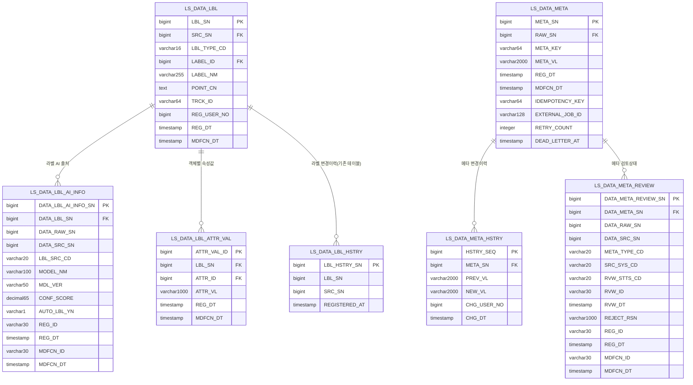

---

### KLID-AT-ERD-011 · 데이터 증강 ERD

| ERD ID | KLID-AT-ERD-011 | ERD 명 | 데이터 증강 ERD (고도화, PostgreSQL) |
|--------|---|-------|---|

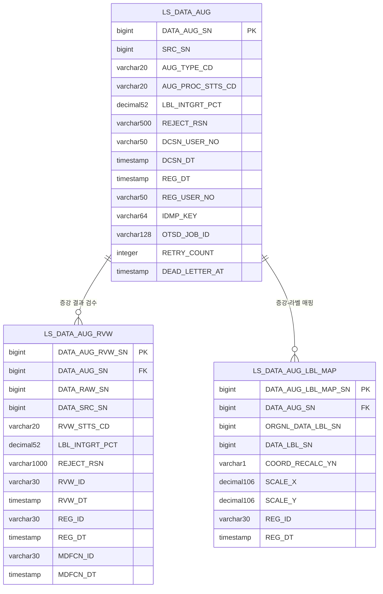

---

### KLID-AT-ERD-012 · 영상·프레임 수집 ERD

| ERD ID | KLID-AT-ERD-012 | ERD 명 | 영상·프레임 수집 ERD (고도화, PostgreSQL) |
|--------|---|-------|---|

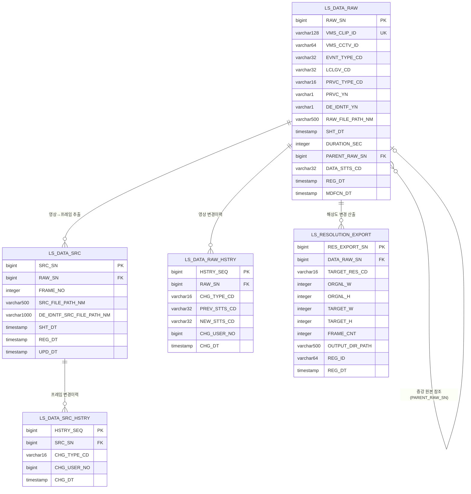

---

### KLID-AT-ERD-013 · 마킹 ERD

| ERD ID | KLID-AT-ERD-013 | ERD 명 | 마킹 ERD (고도화, PostgreSQL) |
|--------|---|-------|---|

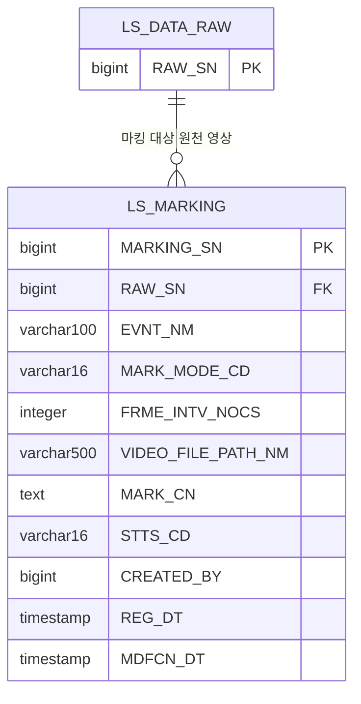

---

### KLID-AT-ERD-014 · 작업 배정 ERD

| ERD ID | KLID-AT-ERD-014 | ERD 명 | 작업 배정 ERD (고도화, PostgreSQL) |
|--------|---|-------|---|

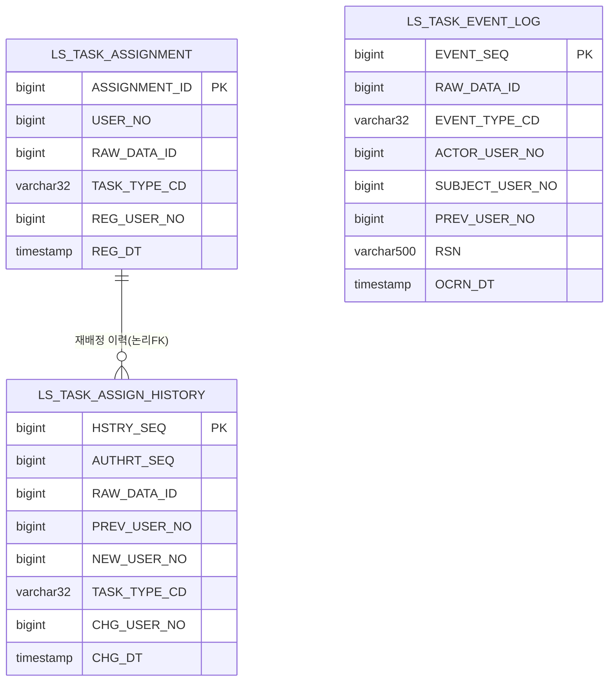

---

### KLID-AT-ERD-015 · 검수·영상상태 ERD

| ERD ID | KLID-AT-ERD-015 | ERD 명 | 검수·영상상태 ERD (고도화, PostgreSQL) |
|--------|---|-------|---|

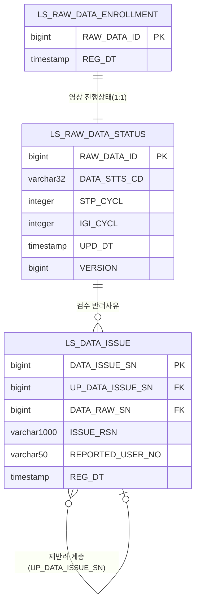

---

### KLID-AT-ERD-016 · 시스템 설정 ERD

| ERD ID | KLID-AT-ERD-016 | ERD 명 | 시스템 설정 ERD (고도화, PostgreSQL) |
|--------|---|-------|---|

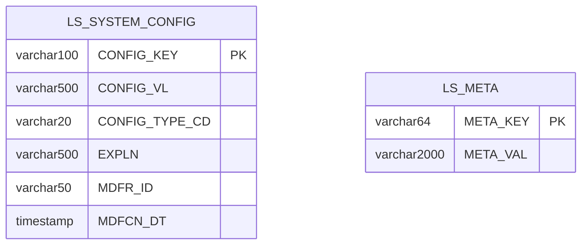

---

### KLID-AT-ERD-017 · 비식별 ERD

| ERD ID | KLID-AT-ERD-017 | ERD 명 | 비식별 ERD (고도화, PostgreSQL) |
|--------|---|-------|---|

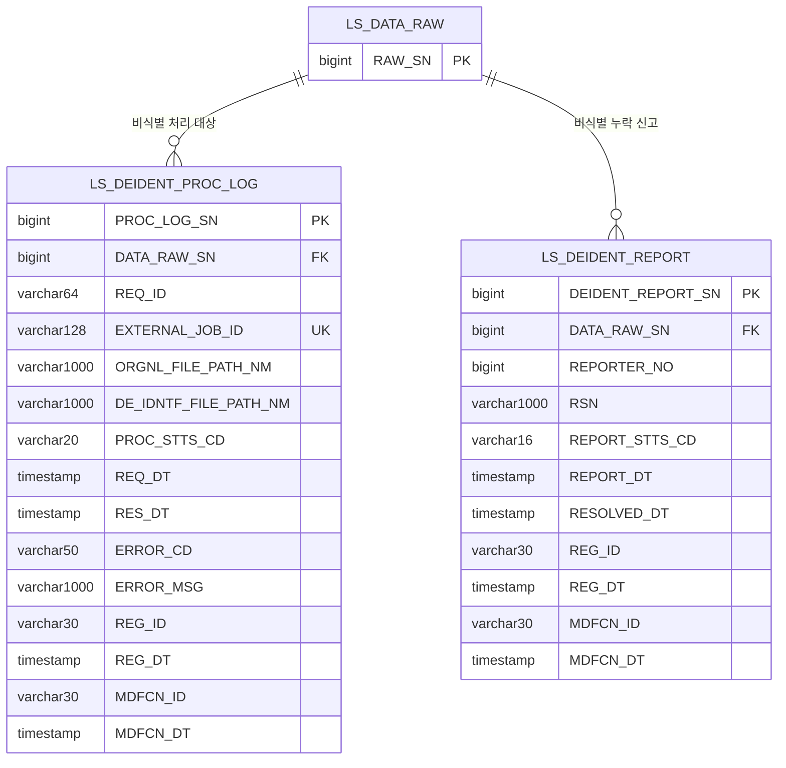

---

### KLID-AT-ERD-018 · 포털 ERD

| ERD ID | KLID-AT-ERD-018 | ERD 명 | 포털 ERD (고도화, PostgreSQL) |
|--------|---|-------|---|

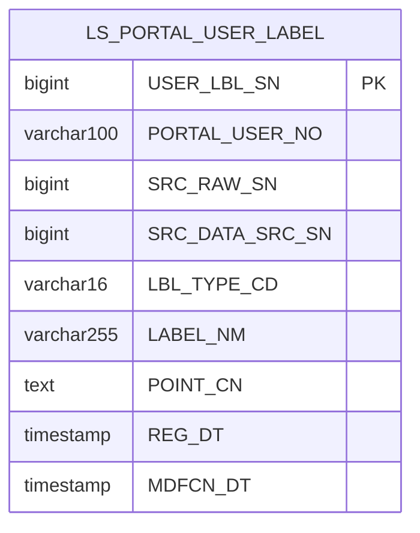

---

### KLID-AT-ERD-019 · 라벨 마스터·버전관리 ERD

| ERD ID | KLID-AT-ERD-019 | ERD 명 | 라벨 마스터·버전관리 ERD (고도화, PostgreSQL) |
|--------|---|-------|---|

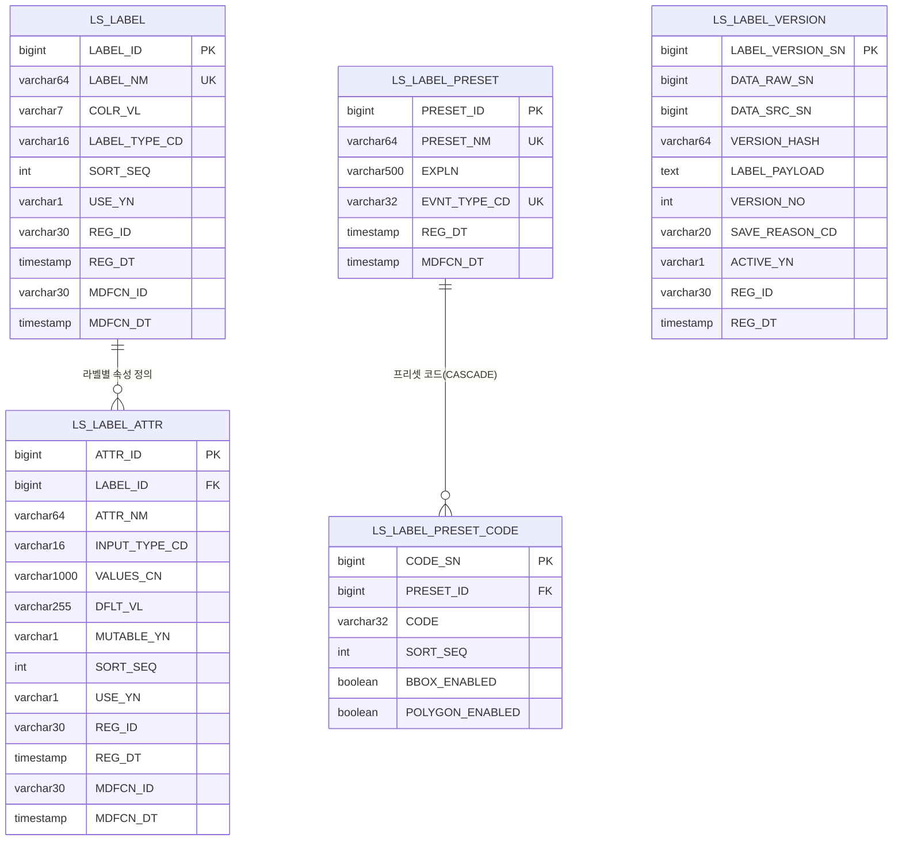

---

### KLID-AT-ERD-020 · 배치·작업 인프라 ERD

| ERD ID | KLID-AT-ERD-020 | ERD 명 | 배치·작업 인프라 ERD (고도화, PostgreSQL) |
|--------|---|-------|---|

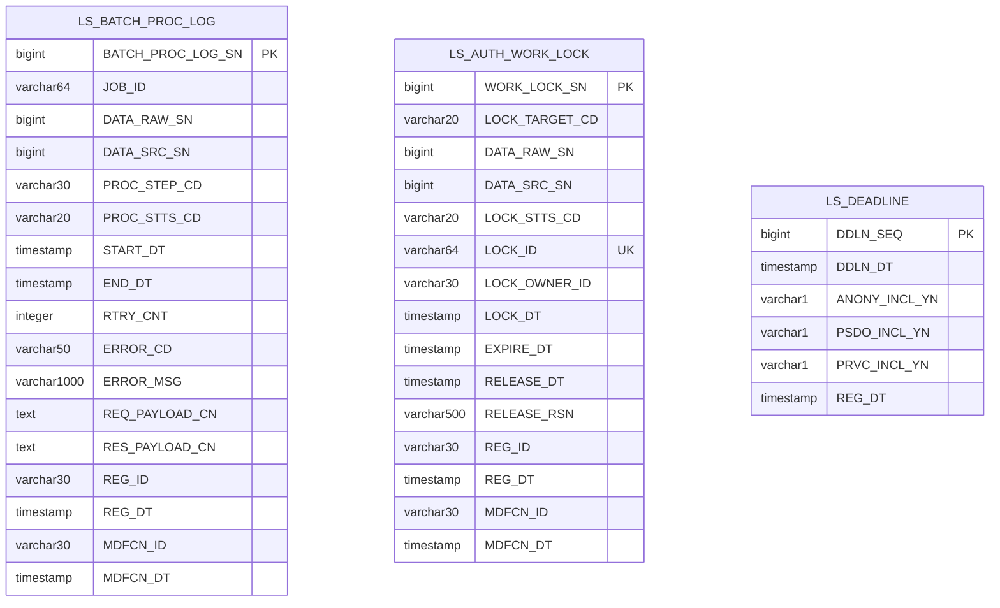

---

### KLID-AT-ERD-021 · 관제 통지 ERD

| ERD ID | KLID-AT-ERD-021 | ERD 명 | 관제 통지 ERD (고도화, PostgreSQL) |
|--------|---|-------|---|

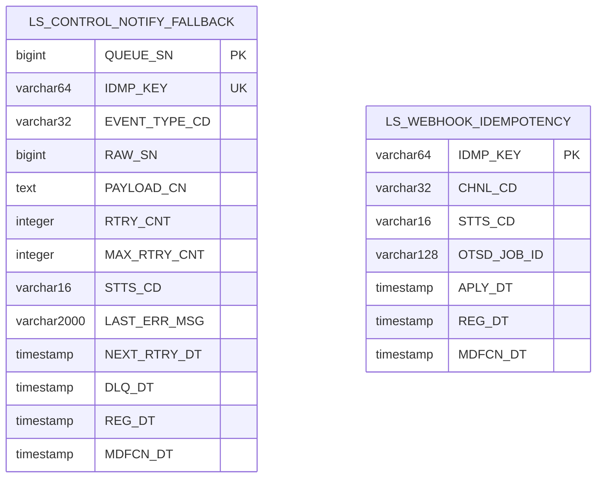

---

## 2. 엔티티 명세서

> **관련 클래스 ID 기준**: D1 클래스설계서(v1.2)의 설계 클래스 ID(`KLID-AT-DC-NNN`)와 매핑한다.
> **관련 유스케이스 ID 기준**: R2 유스케이스명세서의 UC ID와 매핑한다(근거: D1 §1 설계 클래스 목록 + R3 추적표). 요구사항(R1 RQ-SFR) 연관은 R2 §3(UC→RQ) 및 R3 가로 추적표를 경유한다. `- ※`는 R1 기능 요구사항 유스케이스가 사용하지 않는 도메인의 엔티티다. `- ※` 표기는 D1(R1 기능 요구사항 범위)에 설계 클래스가 정의되지 않은 도메인(시계열 메타·마킹·작업배정·검수큐·포털·라벨 마스터/프리셋·배치 인프라 등)의 엔티티로, 관련 클래스명(JPA 엔티티 클래스)만 기재한다.

> **EN ID 배정**: KLID-AT-EN-001 ~ KLID-AT-EN-035 (도메인별 오름차순, **KLID-AT-EN-010 결번** — 구 LS_DATA_SET 범위 외 제외)

---

### KLID-AT-EN-001 · LS_DATA_LBL (데이터라벨)

| 엔티티 ID | KLID-AT-EN-001 | 엔티티명 | LS_DATA_LBL |
|---------|---|-------|---|
| 관련 클래스 ID | KLID-AT-DC-022 | 관련 클래스명 | LsDataLbl |
| 관련 유스케이스 ID | KLID-AT-UC-004, KLID-AT-UC-005 |
| 엔티티 설명 | 현재 라벨 좌표/속성. 프레임 단위(SRC_SN FK) + LBL_TYPE_CD(BBOX/POLYGON/SEGMENT/TRACK). LS_LABEL 마스터 FK(LABEL_ID). AI 여부/신뢰도는 LS_DATA_LBL_AI_INFO 분리. |

| 속성명 | 동의어 | 타입 | 길이 | NOT NULL (Y/N) | PK (Y/N) | FK (Y/N) | INX (Y/N) | 기본값 | 제약조건 |
|-------|--------|------|------|--------|------|------|------|-------|--------|
| LBL_SN | 라벨일련번호 | BIGINT | — | Y | Y | N | Y | IDENTITY | PK, GENERATED BY DEFAULT AS IDENTITY |
| SRC_SN | 원천일련번호 | BIGINT | — | Y | N | Y | Y | — | FK→LS_DATA_SRC(논리), IDX |
| LBL_TYPE_CD | 라벨유형코드 | VARCHAR | 16 | Y | N | N | N | — | BBOX/POLYGON/SEGMENT/TRACK |
| LABEL_ID | 라벨아이디 | BIGINT | — | N | N | Y | Y | — | FK→LS_LABEL(논리), NULL 허용 |
| LABEL_NM | 라벨명 | VARCHAR | 255 | Y | N | N | N | — | — |
| POINT_CN | 좌표내용 | TEXT | — | N | N | N | N | — | 도형 좌표 JSON |
| TRCK_ID | 트랙아이디 | VARCHAR | 64 | N | N | N | Y | — | IDX(IX_LS_DATA_LBL_TRCK_ID) |
| REG_USER_NO | 등록사용자번호 | BIGINT | — | N | N | N | N | — | 수동라벨=사용자번호, 자동=NULL |
| REG_DT | 등록일시 | TIMESTAMP | — | Y | N | N | N | CURRENT_TIMESTAMP | — |
| MDFCN_DT | 수정일시 | TIMESTAMP | — | N | N | N | N | — | — |

---

### KLID-AT-EN-002 · LS_DATA_LBL_AI_INFO (데이터라벨AI정보)

| 엔티티 ID | KLID-AT-EN-002 | 엔티티명 | LS_DATA_LBL_AI_INFO |
|---------|---|-------|---|
| 관련 클래스 ID | KLID-AT-DC-023 | 관련 클래스명 | LsDataLblAiInfo |
| 관련 유스케이스 ID | KLID-AT-UC-004 |
| 엔티티 설명 | AI 라벨 출처/신뢰도 정보. LS_DATA_LBL 은 좌표만 보관하고 AI 추론 출처는 본 테이블로 분리. |

| 속성명 | 동의어 | 타입 | 길이 | NOT NULL (Y/N) | PK (Y/N) | FK (Y/N) | INX (Y/N) | 기본값 | 제약조건 |
|-------|--------|------|------|--------|------|------|------|-------|--------|
| DATA_LBL_AI_INFO_SN | 데이터라벨AI정보일련번호 | BIGINT | — | Y | Y | N | Y | IDENTITY | PK |
| DATA_LBL_SN | 데이터라벨일련번호 | BIGINT | — | Y | N | Y | Y | — | FK→LS_DATA_LBL(논리) |
| DATA_RAW_SN | 데이터원시일련번호 | BIGINT | — | Y | N | N | Y | — | 복합IDX(DATA_RAW_SN,DATA_SRC_SN) |
| DATA_SRC_SN | 데이터원천일련번호 | BIGINT | — | Y | N | N | Y | — | 복합IDX |
| LBL_SRC_CD | 라벨출처코드 | VARCHAR | 20 | Y | N | N | Y | — | YOLO/SAM2/INTERPOLATE/VLM |
| MODEL_NM | 모델명 | VARCHAR | 100 | N | N | N | N | — | — |
| MDL_VER | 모델버전 | VARCHAR | 50 | N | N | N | N | — | — |
| CONF_SCORE | 신뢰도점수 | DECIMAL | 6,5 | N | N | N | N | — | 0.0~1.0 |
| AUTO_LBL_YN | 자동라벨여부 | VARCHAR | 1 | Y | N | N | N | Y | Y/N |
| REG_ID | 등록아이디 | VARCHAR | 30 | N | N | N | N | — | — |
| REG_DT | 등록일시 | TIMESTAMP | — | Y | N | N | N | CURRENT_TIMESTAMP | — |
| MDFCN_ID | 수정아이디 | VARCHAR | 30 | N | N | N | N | — | — |
| MDFCN_DT | 수정일시 | TIMESTAMP | — | N | N | N | N | — | — |

---

### KLID-AT-EN-003 · LS_DATA_LBL_ATTR_VAL (데이터라벨속성값)

| 엔티티 ID | KLID-AT-EN-003 | 엔티티명 | LS_DATA_LBL_ATTR_VAL |
|---------|---|-------|---|
| 관련 클래스 ID | - ※ | 관련 클래스명 | LsDataLblAttrVal |
| 관련 유스케이스 ID | - ※ |
| 엔티티 설명 | 객체별 속성값. 라벨링된 객체(LBL_SN) 단위로 LS_LABEL_ATTR 의 값을 저장. (LBL_SN, ATTR_ID) UNIQUE. |

| 속성명 | 동의어 | 타입 | 길이 | NOT NULL (Y/N) | PK (Y/N) | FK (Y/N) | INX (Y/N) | 기본값 | 제약조건 |
|-------|--------|------|------|--------|------|------|------|-------|--------|
| ATTR_VAL_ID | 속성값아이디 | BIGINT | — | Y | Y | N | Y | IDENTITY | PK |
| LBL_SN | 라벨일련번호 | BIGINT | — | Y | N | Y | Y | — | FK→LS_DATA_LBL(논리), UK(LBL_SN,ATTR_ID) |
| ATTR_ID | 속성아이디 | BIGINT | — | Y | N | Y | Y | — | FK→LS_LABEL_ATTR(논리), UK |
| ATTR_VL | 속성값 | VARCHAR | 1000 | N | N | N | N | — | H2 예약어 회피 컬럼명 |
| REG_DT | 등록일시 | TIMESTAMP | — | Y | N | N | N | CURRENT_TIMESTAMP | — |
| MDFCN_DT | 수정일시 | TIMESTAMP | — | N | N | N | N | — | — |

---

### KLID-AT-EN-004 · LS_DATA_META (데이터메타)

| 엔티티 ID | KLID-AT-EN-004 | 엔티티명 | LS_DATA_META |
|---------|---|-------|---|
| 관련 클래스 ID | - ※ | 관련 클래스명 | LsDataMeta |
| 관련 유스케이스 ID | - ※ |
| 엔티티 설명 | 영상/프레임 메타 값. RAW_SN FK + (RAW_SN, META_KEY) UK 의 단순 K/V. 비동기 표준 컬럼(V42) 포함. |

| 속성명 | 동의어 | 타입 | 길이 | NOT NULL (Y/N) | PK (Y/N) | FK (Y/N) | INX (Y/N) | 기본값 | 제약조건 |
|-------|--------|------|------|--------|------|------|------|-------|--------|
| META_SN | 메타일련번호 | BIGINT | — | Y | Y | N | Y | IDENTITY | PK |
| RAW_SN | 원시일련번호 | BIGINT | — | Y | N | Y | Y | — | FK→LS_DATA_RAW(논리), UK(RAW_SN,META_KEY) |
| META_KEY | 메타키 | VARCHAR | 64 | Y | N | N | Y | — | UK |
| META_VL | 메타값 | VARCHAR | 2000 | N | N | N | N | — | H2 예약어 회피 컬럼명 |
| REG_DT | 등록일시 | TIMESTAMP | — | Y | N | N | N | CURRENT_TIMESTAMP | — |
| MDFCN_DT | 수정일시 | TIMESTAMP | — | N | N | N | N | — | — |
| IDEMPOTENCY_KEY | 멱등키 | VARCHAR | 64 | N | N | N | Y | — | UK(uk_meta_idempotency_key), V42 비동기 표준 |
| EXTERNAL_JOB_ID | 외부작업아이디 | VARCHAR | 128 | N | N | N | Y | — | UK(uk_meta_external_job_id), V42 비동기 표준 |
| RETRY_COUNT | 재시도횟수 | INTEGER | — | Y | N | N | N | 0 | V42 비동기 표준 |
| DEAD_LETTER_AT | 영구실패시점 | TIMESTAMP | — | N | N | N | N | — | V42 비동기 표준 |

---

### KLID-AT-EN-005 · LS_DATA_META_HSTRY (데이터메타이력)

| 엔티티 ID | KLID-AT-EN-005 | 엔티티명 | LS_DATA_META_HSTRY |
|---------|---|-------|---|
| 관련 클래스 ID | - ※ | 관련 클래스명 | LsDataMetaHstry |
| 관련 유스케이스 ID | - ※ |
| 엔티티 설명 | LS_DATA_META 변경 이력. META_SN + PREV_VL/NEW_VL/CHG_USER_NO/CHG_DT 경량 이력. |

| 속성명 | 동의어 | 타입 | 길이 | NOT NULL (Y/N) | PK (Y/N) | FK (Y/N) | INX (Y/N) | 기본값 | 제약조건 |
|-------|--------|------|------|--------|------|------|------|-------|--------|
| HSTRY_SEQ | 이력일련번호 | BIGINT | — | Y | Y | N | Y | IDENTITY | PK |
| META_SN | 메타일련번호 | BIGINT | — | Y | N | Y | Y | — | FK→LS_DATA_META(논리) |
| PREV_VL | 이전값 | VARCHAR | 2000 | N | N | N | N | — | — |
| NEW_VL | 신규값 | VARCHAR | 2000 | N | N | N | N | — | — |
| CHG_USER_NO | 변경사용자번호 | BIGINT | — | N | N | N | N | — | — |
| CHG_DT | 변경일시 | TIMESTAMP | — | Y | N | N | N | CURRENT_TIMESTAMP | — |

---

### KLID-AT-EN-006 · LS_DATA_META_REVIEW (데이터메타검토)

| 엔티티 ID | KLID-AT-EN-006 | 엔티티명 | LS_DATA_META_REVIEW |
|---------|---|-------|---|
| 관련 클래스 ID | - ※ | 관련 클래스명 | LsDataMetaReview |
| 관련 유스케이스 ID | - ※ |
| 엔티티 설명 | 외부/자동 생성 메타데이터 검토 상태. 외부 생성 여부 + 검토 상태(PENDING/APPROVED/REJECTED) 관리. |

| 속성명 | 동의어 | 타입 | 길이 | NOT NULL (Y/N) | PK (Y/N) | FK (Y/N) | INX (Y/N) | 기본값 | 제약조건 |
|-------|--------|------|------|--------|------|------|------|-------|--------|
| DATA_META_REVIEW_SN | 데이터메타검토일련번호 | BIGINT | — | Y | Y | N | Y | IDENTITY | PK |
| DATA_META_SN | 데이터메타일련번호 | BIGINT | — | Y | N | Y | Y | — | FK→LS_DATA_META(논리) |
| DATA_RAW_SN | 데이터원시일련번호 | BIGINT | — | Y | N | N | Y | — | 복합IDX |
| DATA_SRC_SN | 데이터원천일련번호 | BIGINT | — | N | N | N | Y | — | 복합IDX, NULL허용(영상단위 메타) |
| META_TYPE_CD | 메타유형코드 | VARCHAR | 20 | Y | N | N | Y | — | VLM/EXTERNAL |
| SRC_SYS_CD | 생성시스템코드 | VARCHAR | 20 | N | N | N | N | — | AI_SERVER/CONTROL_SERVER/PORTAL |
| RVW_STTS_CD | 검토상태코드 | VARCHAR | 20 | Y | N | N | Y | — | AUTO_GENERATED/PENDING/APPROVED/REJECTED |
| RVW_ID | 검토아이디 | VARCHAR | 30 | N | N | N | N | — | — |
| RVW_DT | 검토일시 | TIMESTAMP | — | N | N | N | N | — | — |
| REJECT_RSN | 반려사유 | VARCHAR | 1000 | N | N | N | N | — | REJECTED 시 필수 |
| REG_ID | 등록아이디 | VARCHAR | 30 | N | N | N | N | — | — |
| REG_DT | 등록일시 | TIMESTAMP | — | Y | N | N | N | CURRENT_TIMESTAMP | — |
| MDFCN_ID | 수정아이디 | VARCHAR | 30 | N | N | N | N | — | — |
| MDFCN_DT | 수정일시 | TIMESTAMP | — | N | N | N | N | — | — |

---

### KLID-AT-EN-007 · LS_DATA_AUG (데이터증강)

| 엔티티 ID | KLID-AT-EN-007 | 엔티티명 | LS_DATA_AUG |
|---------|---|-------|---|
| 관련 클래스 ID | KLID-AT-DC-007 | 관련 클래스명 | LsDataAug |
| 관련 유스케이스 ID | KLID-AT-UC-001, KLID-AT-UC-002, KLID-AT-UC-010 |
| 엔티티 설명 | 외부 SFR-07 시스템이 생성한 4종 증강 결과(WINTER/NIGHT/RAIN/RESOLUTION). 영상 단위(SRC_SN)로 관리. |

| 속성명 | 동의어 | 타입 | 길이 | NOT NULL (Y/N) | PK (Y/N) | FK (Y/N) | INX (Y/N) | 기본값 | 제약조건 |
|-------|--------|------|------|--------|------|------|------|-------|--------|
| DATA_AUG_SN | 데이터증강일련번호 | BIGINT | — | Y | Y | N | Y | IDENTITY | PK |
| SRC_SN | 원천일련번호 | BIGINT | — | Y | N | N | Y | — | 논리FK→LS_DATA_RAW, IDX |
| AUG_TYPE_CD | 증강유형코드 | VARCHAR | 20 | Y | N | N | Y | — | WINTER/NIGHT/RAIN/RESOLUTION |
| AUG_PROC_STTS_CD | 증강처리상태코드 | VARCHAR | 20 | Y | N | N | Y | PENDING | PENDING/ACCEPTED/REJECTED |
| LBL_INTGRT_PCT | 라벨무결성비율 | DECIMAL | 5,2 | N | N | N | N | — | @Transient 메타, 물리컬럼(V7) 잔존 |
| REJECT_RSN | 반려사유 | VARCHAR | 500 | N | N | N | N | — | @Transient, 물리컬럼 잔존 |
| DCSN_USER_NO | 결정사용자번호 | VARCHAR | 50 | N | N | N | N | — | @Transient, 물리컬럼 잔존 |
| DCSN_DT | 결정일시 | TIMESTAMP | — | N | N | N | N | — | @Transient, 물리컬럼 잔존 |
| REG_DT | 등록일시 | TIMESTAMP | — | Y | N | N | N | CURRENT_TIMESTAMP | — |
| REG_USER_NO | 등록사용자번호 | VARCHAR | 50 | N | N | N | N | — | — |
| IDMP_KEY | 멱등키 | VARCHAR | 64 | N | N | N | Y | — | UK(uk_aug_idempotency_key), V42 |
| OTSD_JOB_ID | 외부작업식별자 | VARCHAR | 128 | N | N | N | Y | — | UK(uk_aug_external_job_id), V42 |
| RETRY_COUNT | 재시도수 | INTEGER | — | Y | N | N | N | 0 | V42 비동기 표준 |
| DEAD_LETTER_AT | 영구실패시점 | TIMESTAMP | — | N | N | N | N | — | V42 비동기 표준 |

---

### KLID-AT-EN-008 · LS_DATA_AUG_RVW (데이터증강검수)

| 엔티티 ID | KLID-AT-EN-008 | 엔티티명 | LS_DATA_AUG_RVW |
|---------|---|-------|---|
| 관련 클래스 ID | KLID-AT-DC-009 | 관련 클래스명 | LsDataAugRvw |
| 관련 유스케이스 ID | KLID-AT-UC-010 |
| 엔티티 설명 | 증강 데이터 검수 결과. 검수 결과(상태·정합률·반려사유·검수자)를 LS_DATA_AUG 와 분리 보관. |

| 속성명 | 동의어 | 타입 | 길이 | NOT NULL (Y/N) | PK (Y/N) | FK (Y/N) | INX (Y/N) | 기본값 | 제약조건 |
|-------|--------|------|------|--------|------|------|------|-------|--------|
| DATA_AUG_RVW_SN | 데이터증강검수일련번호 | BIGINT | — | Y | Y | N | Y | IDENTITY | PK |
| DATA_AUG_SN | 데이터증강일련번호 | BIGINT | — | Y | N | Y | Y | — | 논리FK→LS_DATA_AUG |
| DATA_RAW_SN | 데이터원시일련번호 | BIGINT | — | Y | N | N | Y | — | 복합IDX |
| DATA_SRC_SN | 데이터원천일련번호 | BIGINT | — | Y | N | N | Y | — | 복합IDX |
| RVW_STTS_CD | 검수상태코드 | VARCHAR | 20 | Y | N | N | Y | — | PENDING/ACCEPTED/REJECTED |
| LBL_INTGRT_PCT | 라벨무결성비율 | DECIMAL | 5,2 | N | N | N | N | — | 0~100 |
| REJECT_RSN | 반려사유 | VARCHAR | 1000 | N | N | N | N | — | REJECTED 시 필수 |
| RVW_ID | 검수아이디 | VARCHAR | 30 | N | N | N | N | — | — |
| RVW_DT | 검수일시 | TIMESTAMP | — | N | N | N | N | — | — |
| REG_ID | 등록아이디 | VARCHAR | 30 | N | N | N | N | — | — |
| REG_DT | 등록일시 | TIMESTAMP | — | Y | N | N | N | CURRENT_TIMESTAMP | — |
| MDFCN_ID | 수정아이디 | VARCHAR | 30 | N | N | N | N | — | — |
| MDFCN_DT | 수정일시 | TIMESTAMP | — | N | N | N | N | — | — |

---

### KLID-AT-EN-009 · LS_DATA_AUG_LBL_MAP (데이터증강라벨매핑)

| 엔티티 ID | KLID-AT-EN-009 | 엔티티명 | LS_DATA_AUG_LBL_MAP |
|---------|---|-------|---|
| 관련 클래스 ID | - ※ | 관련 클래스명 | LsDataAugLblMap |
| 관련 유스케이스 ID | KLID-AT-UC-002 |
| 엔티티 설명 | 증강 데이터-라벨 매핑. 해상도 저하 증강 시 좌표 재계산(SCALE_X/Y) 정보 보관. |

| 속성명 | 동의어 | 타입 | 길이 | NOT NULL (Y/N) | PK (Y/N) | FK (Y/N) | INX (Y/N) | 기본값 | 제약조건 |
|-------|--------|------|------|--------|------|------|------|-------|--------|
| DATA_AUG_LBL_MAP_SN | 데이터증강라벨매핑일련번호 | BIGINT | — | Y | Y | N | Y | IDENTITY | PK |
| DATA_AUG_SN | 데이터증강일련번호 | BIGINT | — | Y | N | Y | Y | — | 논리FK→LS_DATA_AUG |
| ORGNL_DATA_LBL_SN | 원본데이터라벨일련번호 | BIGINT | — | N | N | N | Y | — | 증강 전 원본 라벨, ORGN→ORGNL 정정(V26) |
| DATA_LBL_SN | 데이터라벨일련번호 | BIGINT | — | Y | N | N | Y | — | 증강 결과 라벨 |
| COORD_RECALC_YN | 좌표재계산여부 | VARCHAR | 1 | Y | N | N | N | N | Y(해상도저하)/N(유지) |
| SCALE_X | X축스케일비율 | DECIMAL | 10,6 | N | N | N | N | — | 해상도저하 시 좌표 재계산용 |
| SCALE_Y | Y축스케일비율 | DECIMAL | 10,6 | N | N | N | N | — | 해상도저하 시 좌표 재계산용 |
| REG_ID | 등록아이디 | VARCHAR | 30 | N | N | N | N | — | — |
| REG_DT | 등록일시 | TIMESTAMP | — | Y | N | N | N | CURRENT_TIMESTAMP | — |

---

### KLID-AT-EN-010 · (결번)

> KLID-AT-EN-010은 구 LS_DATA_SET(학습데이터셋 내보내기)에 배정되었던 번호다. **학습데이터셋 내보내기(Export)는 저작도구 범위 외**로 확정되어 해당 엔티티를 본 설계서에서 제외하고 **결번 처리**한다(기존 번호 재배정 금지). 물리 테이블 정리는 별도 마이그레이션 작업으로 수행한다.

---

### KLID-AT-EN-011 · LS_DATA_RAW (원시영상)

| 엔티티 ID | KLID-AT-EN-011 | 엔티티명 | LS_DATA_RAW |
|---------|---|-------|---|
| 관련 클래스 ID | KLID-AT-DC-015 | 관련 클래스명 | LsDataRaw |
| 관련 유스케이스 ID | KLID-AT-UC-001, KLID-AT-UC-002, KLID-AT-UC-003, KLID-AT-UC-011, KLID-AT-UC-016 |
| 엔티티 설명 | 라벨링 대상 원시 영상 메타. VMS_CLIP_ID 유니크로 동일 클립 재수신 시 upsert. 작업 단위 = 영상 1건(RAW_SN). |

| 속성명 | 동의어 | 타입 | 길이 | NOT NULL (Y/N) | PK (Y/N) | FK (Y/N) | INX (Y/N) | 기본값 | 제약조건 |
|-------|--------|------|------|--------|------|------|------|-------|--------|
| RAW_SN | 원시영상일련번호 | BIGINT | — | Y | Y | N | Y | IDENTITY | PK |
| VMS_CLIP_ID | VMS클립아이디 | VARCHAR | 128 | Y | N | N | Y | — | UK(UK_LS_DATA_RAW_VMS_CLIP) |
| VMS_CCTV_ID | VMS_CCTV아이디 | VARCHAR | 64 | Y | N | N | Y | — | IDX |
| EVNT_TYPE_CD | 이벤트유형코드 | VARCHAR | 32 | N | N | N | N | — | — |
| LCLGV_CD | 기관코드 | VARCHAR | 32 | N | N | N | N | — | 지방정부 기관코드 |
| PRVC_TYPE_CD | 개인정보유형코드 | VARCHAR | 16 | Y | N | N | N | — | ANONY/PRVC/PSDO |
| PRVC_YN | 개인정보포함여부 | VARCHAR | 1 | Y | N | N | N | N | PRVC_TYPE_CD 파생값 |
| DE_IDNTF_YN | 비식별여부 | VARCHAR | 1 | Y | N | N | N | N | Y=성공/F=실패/N=미수행 |
| RAW_FILE_PATH_NM | 원시파일경로명 | VARCHAR | 500 | Y | N | N | N | — | 원본 영상 경로(불변) |
| SHT_DT | 촬영일시 | TIMESTAMP | — | N | N | N | N | — | — |
| DURATION_SEC | 영상길이초 | INTEGER | — | N | N | N | N | — | 영상 길이(초) |
| PARENT_RAW_SN | 원본원시영상일련번호 | BIGINT | — | N | N | Y | Y | — | 자기참조 FK(증강=새영상), V46 |
| DATA_STTS_CD | 데이터상태코드 | VARCHAR | 32 | Y | N | N | Y | PENDING | 배치 단계 상태 |
| REG_DT | 등록일시 | TIMESTAMP | — | Y | N | N | N | CURRENT_TIMESTAMP | — |
| MDFCN_DT | 수정일시 | TIMESTAMP | — | N | N | N | N | — | — |

---

### KLID-AT-EN-012 · LS_DATA_SRC (프레임원천)

| 엔티티 ID | KLID-AT-EN-012 | 엔티티명 | LS_DATA_SRC |
|---------|---|-------|---|
| 관련 클래스 ID | KLID-AT-DC-047 | 관련 클래스명 | LsDataSrc |
| 관련 유스케이스 ID | KLID-AT-UC-004, KLID-AT-UC-016 |
| 엔티티 설명 | 영상에서 추출한 키프레임. 원본/비식별 프레임을 같은 row 의 SRC_FILE_PATH_NM/DE_IDNTF_SRC_FILE_PATH_NM 으로 관리. |

| 속성명 | 동의어 | 타입 | 길이 | NOT NULL (Y/N) | PK (Y/N) | FK (Y/N) | INX (Y/N) | 기본값 | 제약조건 |
|-------|--------|------|------|--------|------|------|------|-------|--------|
| SRC_SN | 프레임원천일련번호 | BIGINT | — | Y | Y | N | Y | IDENTITY | PK |
| RAW_SN | 원시영상일련번호 | BIGINT | — | Y | N | Y | Y | — | FK→LS_DATA_RAW(논리), UK(RAW_SN,FRAME_NO) |
| FRAME_NO | 프레임번호 | INTEGER | — | Y | N | N | Y | — | 0-base, UK |
| SRC_FILE_PATH_NM | 원천파일경로명 | VARCHAR | 500 | Y | N | N | N | — | 원본 프레임 이미지 경로 |
| DE_IDNTF_SRC_FILE_PATH_NM | 비식별원천파일경로명 | VARCHAR | 1000 | N | N | N | N | — | 비식별 프레임 경로, 표준용어 id 1416 |
| SHT_DT | 촬영일시 | TIMESTAMP | — | N | N | N | N | — | 프레임 촬영 일시 |
| REG_DT | 등록일시 | TIMESTAMP | — | Y | N | N | N | CURRENT_TIMESTAMP | — |
| UPD_DT | 수정일시 | TIMESTAMP | — | N | N | N | N | — | 비식별 경로 연결 시 갱신 |

---

### KLID-AT-EN-013 · LS_DATA_RAW_HSTRY (원시영상이력)

| 엔티티 ID | KLID-AT-EN-013 | 엔티티명 | LS_DATA_RAW_HSTRY |
|---------|---|-------|---|
| 관련 클래스 ID | - ※ | 관련 클래스명 | LsDataRawHstry |
| 관련 유스케이스 ID | - ※ |
| 엔티티 설명 | 영상 변경 이력. INGEST·STATUS_CHANGE 등 사유 + 상태 전이(PREV/NEW_STTS_CD) 추적. base 컬럼 미러링 없음. |

| 속성명 | 동의어 | 타입 | 길이 | NOT NULL (Y/N) | PK (Y/N) | FK (Y/N) | INX (Y/N) | 기본값 | 제약조건 |
|-------|--------|------|------|--------|------|------|------|-------|--------|
| HSTRY_SEQ | 이력일련번호 | BIGINT | — | Y | Y | N | Y | IDENTITY | PK |
| RAW_SN | 원시영상일련번호 | BIGINT | — | Y | N | Y | Y | — | 논리FK→LS_DATA_RAW |
| CHG_TYPE_CD | 변경유형코드 | VARCHAR | 16 | Y | N | N | N | — | INGEST_NEW/INGEST_UPD 등 |
| PREV_STTS_CD | 이전상태코드 | VARCHAR | 32 | N | N | N | N | — | 변경 전 DATA_STTS_CD |
| NEW_STTS_CD | 변경상태코드 | VARCHAR | 32 | N | N | N | N | — | 변경 후 DATA_STTS_CD |
| CHG_USER_NO | 변경사용자번호 | BIGINT | — | N | N | N | N | — | 시스템 변경 시 NULL |
| CHG_DT | 변경일시 | TIMESTAMP | — | Y | N | N | N | CURRENT_TIMESTAMP | — |

---

### KLID-AT-EN-014 · LS_DATA_SRC_HSTRY (프레임원천이력)

| 엔티티 ID | KLID-AT-EN-014 | 엔티티명 | LS_DATA_SRC_HSTRY |
|---------|---|-------|---|
| 관련 클래스 ID | - ※ | 관련 클래스명 | LsDataSrcHstry |
| 관련 유스케이스 ID | - ※ |
| 엔티티 설명 | 프레임 변경 이력. CREATED(생성)·DEID_ATTACHED(비식별경로 연결) 등 사유 기록. |

| 속성명 | 동의어 | 타입 | 길이 | NOT NULL (Y/N) | PK (Y/N) | FK (Y/N) | INX (Y/N) | 기본값 | 제약조건 |
|-------|--------|------|------|--------|------|------|------|-------|--------|
| HSTRY_SEQ | 이력일련번호 | BIGINT | — | Y | Y | N | Y | IDENTITY | PK |
| SRC_SN | 프레임원천일련번호 | BIGINT | — | Y | N | Y | Y | — | 논리FK→LS_DATA_SRC |
| CHG_TYPE_CD | 변경유형코드 | VARCHAR | 16 | Y | N | N | N | — | CREATED/DEID_ATTACHED |
| CHG_USER_NO | 변경사용자번호 | BIGINT | — | N | N | N | N | — | 시스템 변경 시 NULL |
| CHG_DT | 변경일시 | TIMESTAMP | — | Y | N | N | N | CURRENT_TIMESTAMP | — |

---

### KLID-AT-EN-015 · LS_RESOLUTION_EXPORT (해상도변경산출)

| 엔티티 ID | KLID-AT-EN-015 | 엔티티명 | LS_RESOLUTION_EXPORT |
|---------|---|-------|---|
| 관련 클래스 ID | KLID-AT-DC-014 | 관련 클래스명 | LsResolutionExport |
| 관련 유스케이스 ID | KLID-AT-UC-003 |
| 엔티티 설명 | 검수 완료(APPROVED) 원본 영상의 프레임 이미지셋을 표준 하위 해상도로 다운스케일한 산출 추적. 1건당 1행. Flyway V55 신규. |

| 속성명 | 동의어 | 타입 | 길이 | NOT NULL (Y/N) | PK (Y/N) | FK (Y/N) | INX (Y/N) | 기본값 | 제약조건 |
|-------|--------|------|------|--------|------|------|------|-------|--------|
| RES_EXPORT_SN | 해상도변경산출일련번호 | BIGINT | — | Y | Y | N | Y | IDENTITY | PK |
| DATA_RAW_SN | 원시영상일련번호 | BIGINT | — | Y | N | Y | Y | — | FK→LS_DATA_RAW(논리), UK(DATA_RAW_SN,TARGET_RES_CD) |
| TARGET_RES_CD | 목표해상도코드 | VARCHAR | 16 | Y | N | N | Y | — | RES_1080P/RES_720P/RES_480P, UK |
| ORGNL_W | 원본가로 | INTEGER | — | Y | N | N | N | — | 원본 가로(px) |
| ORGNL_H | 원본세로 | INTEGER | — | Y | N | N | N | — | 원본 세로(px) |
| TARGET_W | 목표가로 | INTEGER | — | Y | N | N | N | — | 타겟 가로(px), 종횡비 보존 |
| TARGET_H | 목표세로 | INTEGER | — | Y | N | N | N | — | 타겟 세로(px) |
| FRAME_CNT | 프레임개수 | INTEGER | — | Y | N | N | N | — | 다운스케일된 프레임 개수 |
| OUTPUT_DIR_PATH | 출력디렉토리경로 | VARCHAR | 500 | Y | N | N | N | — | 내부 추적용, 응답 미노출 |
| REG_ID | 등록자아이디 | VARCHAR | 64 | N | N | N | N | — | REVIEWER 식별자(감사추적) |
| REG_DT | 등록일시 | TIMESTAMP | — | Y | N | N | N | CURRENT_TIMESTAMP | — |

---

### KLID-AT-EN-016 · LS_MARKING (영상마킹)

| 엔티티 ID | KLID-AT-EN-016 | 엔티티명 | LS_MARKING |
|---------|---|-------|---|
| 관련 클래스 ID | - ※ | 관련 클래스명 | LsMarking |
| 관련 유스케이스 ID | - ※ |
| 엔티티 설명 | 영상별 자동/수동 이벤트 식별 마킹 정보. 마킹 결과(이벤트명+영상경로+marks 배열)를 VLM 시계열 콜백으로 전달. |

| 속성명 | 동의어 | 타입 | 길이 | NOT NULL (Y/N) | PK (Y/N) | FK (Y/N) | INX (Y/N) | 기본값 | 제약조건 |
|-------|--------|------|------|--------|------|------|------|-------|--------|
| MARKING_SN | 마킹일련번호 | BIGINT | — | Y | Y | N | Y | IDENTITY | PK |
| RAW_SN | 원천영상일련번호 | BIGINT | — | Y | N | Y | Y | — | 논리FK→LS_DATA_RAW |
| EVNT_NM | 이벤트명 | VARCHAR | 100 | Y | N | N | N | — | VLM 콜백 페이로드 포함 |
| MARK_MODE_CD | 마킹모드코드 | VARCHAR | 16 | Y | N | N | N | — | AUTO/MANUAL |
| FRME_INTV_NOCS | 프레임간격수 | INTEGER | — | N | N | N | N | — | AUTO 모드 시 1 이상 필수 |
| VIDEO_FILE_PATH_NM | 영상파일경로명 | VARCHAR | 500 | Y | N | N | N | — | VLM 콜백 페이로드 포함 |
| MARK_CN | 마킹내용 | TEXT | — | Y | N | N | N | — | marks 배열 JSON |
| STTS_CD | 상태코드 | VARCHAR | 16 | Y | N | N | N | PENDING | PENDING→VLM_REQUESTED→VLM_COMPLETED |
| CREATED_BY | 생성자번호 | BIGINT | — | N | N | N | N | — | 작업자 번호 |
| REG_DT | 등록일시 | TIMESTAMP | — | Y | N | N | N | CURRENT_TIMESTAMP | — |
| MDFCN_DT | 수정일시 | TIMESTAMP | — | Y | N | N | N | CURRENT_TIMESTAMP | 상태 전이 시 갱신 |

---

### KLID-AT-EN-017 · LS_TASK_ASSIGNMENT (작업배정)

| 엔티티 ID | KLID-AT-EN-017 | 엔티티명 | LS_TASK_ASSIGNMENT |
|---------|---|-------|---|
| 관련 클래스 ID | - ※ | 관련 클래스명 | LsTaskAssignment |
| 관련 유스케이스 ID | - ※ |
| 엔티티 설명 | 작업자/검수자 영상 단위 배정. REVIEWER 가 WORKER 에게 배정. (RAW_DATA_ID, USER_NO, TASK_TYPE_CD) UNIQUE 로 중복 배정 차단. |

| 속성명 | 동의어 | 타입 | 길이 | NOT NULL (Y/N) | PK (Y/N) | FK (Y/N) | INX (Y/N) | 기본값 | 제약조건 |
|-------|--------|------|------|--------|------|------|------|-------|--------|
| ASSIGNMENT_ID | 배정식별자 | BIGINT | — | Y | Y | N | Y | IDENTITY | PK |
| USER_NO | 배정대상사용자번호 | BIGINT | — | Y | N | N | Y | — | 복합IDX(USER_NO,TASK_TYPE_CD) |
| RAW_DATA_ID | 원본영상식별자 | BIGINT | — | Y | N | N | Y | — | 논리FK→LS_DATA_RAW(RAW_SN), UK |
| TASK_TYPE_CD | 작업유형코드 | VARCHAR | 32 | Y | N | N | Y | — | LABELER/REVIEWER, UK |
| REG_USER_NO | 등록자사용자번호 | BIGINT | — | Y | N | N | N | — | 배정 권한 보유자(REVIEWER) |
| REG_DT | 등록일시 | TIMESTAMP | — | Y | N | N | N | CURRENT_TIMESTAMP | — |

---

### KLID-AT-EN-018 · LS_TASK_ASSIGN_HISTORY (작업배정이력)

| 엔티티 ID | KLID-AT-EN-018 | 엔티티명 | LS_TASK_ASSIGN_HISTORY |
|---------|---|-------|---|
| 관련 클래스 ID | - ※ | 관련 클래스명 | LsTaskAssignHistory |
| 관련 유스케이스 ID | - ※ |
| 엔티티 설명 | 재배정 이력. 작업자 변경 시 이전→신규 사용자와 변경자를 기록. |

| 속성명 | 동의어 | 타입 | 길이 | NOT NULL (Y/N) | PK (Y/N) | FK (Y/N) | INX (Y/N) | 기본값 | 제약조건 |
|-------|--------|------|------|--------|------|------|------|-------|--------|
| HSTRY_SEQ | 이력식별자 | BIGINT | — | Y | Y | N | Y | IDENTITY | PK |
| AUTHRT_SEQ | 배정식별자 | BIGINT | — | Y | N | N | Y | — | 논리FK→LS_TASK_ASSIGNMENT(ASSIGNMENT_ID), 컬럼명 운영 보존 |
| RAW_DATA_ID | 원본영상식별자 | BIGINT | — | Y | N | N | N | — | 재배정 대상 영상 |
| PREV_USER_NO | 이전사용자번호 | BIGINT | — | Y | N | N | N | — | 재배정 이전 작업자 |
| NEW_USER_NO | 신규사용자번호 | BIGINT | — | Y | N | N | N | — | 재배정 이후 작업자 |
| TASK_TYPE_CD | 작업유형코드 | VARCHAR | 32 | Y | N | N | N | — | LABELER/REVIEWER |
| CHG_USER_NO | 변경자사용자번호 | BIGINT | — | Y | N | N | N | — | 재배정 수행자(REVIEWER) |
| CHG_DT | 변경일시 | TIMESTAMP | — | Y | N | N | N | CURRENT_TIMESTAMP | — |

---

### KLID-AT-EN-019 · LS_TASK_EVENT_LOG (작업이벤트로그)

| 엔티티 ID | KLID-AT-EN-019 | 엔티티명 | LS_TASK_EVENT_LOG |
|---------|---|-------|---|
| 관련 클래스 ID | - ※ | 관련 클래스명 | LsTaskEventLog |
| 관련 유스케이스 ID | - ※ |
| 엔티티 설명 | 작업(영상) 단위 라이프사이클 이벤트 누적 로그. 배정/재배정/검수 제출/승인/반려를 시간순 누적해 통합 타임라인 제공. |

| 속성명 | 동의어 | 타입 | 길이 | NOT NULL (Y/N) | PK (Y/N) | FK (Y/N) | INX (Y/N) | 기본값 | 제약조건 |
|-------|--------|------|------|--------|------|------|------|-------|--------|
| EVENT_SEQ | 이벤트식별자 | BIGINT | — | Y | Y | N | Y | IDENTITY | PK |
| RAW_DATA_ID | 원본영상식별자 | BIGINT | — | Y | N | N | Y | — | 복합IDX(RAW_DATA_ID,OCRN_DT) |
| EVENT_TYPE_CD | 이벤트유형코드 | VARCHAR | 32 | Y | N | N | N | — | ASSIGN/REASSIGN/SUBMIT/APPROVE/REJECT |
| ACTOR_USER_NO | 행위자사용자번호 | BIGINT | — | Y | N | N | Y | — | IDX(ACTOR_USER_NO) |
| SUBJECT_USER_NO | 대상사용자번호 | BIGINT | — | N | N | N | N | — | 배정/재배정=배정된 작업자, 승인/반려=NULL |
| PREV_USER_NO | 이전사용자번호 | BIGINT | — | N | N | N | N | — | 재배정 시만 기록 |
| RSN | 사유 | VARCHAR | 500 | N | N | N | N | — | REJECT 시 필수 |
| OCRN_DT | 발생일시 | TIMESTAMP | — | Y | N | N | Y | CURRENT_TIMESTAMP | 복합IDX |

---

### KLID-AT-EN-020 · LS_RAW_DATA_ENROLLMENT (영상적재등록)

| 엔티티 ID | KLID-AT-EN-020 | 엔티티명 | LS_RAW_DATA_ENROLLMENT |
|---------|---|-------|---|
| 관련 클래스 ID | - ※ | 관련 클래스명 | LsRawDataEnrollment |
| 관련 유스케이스 ID | - ※ |
| 엔티티 설명 | 영상(원천 데이터) 적재 등록 매핑. 영상 1건당 1 row. RAW_DATA_ID=LS_DATA_RAW.RAW_SN. |

| 속성명 | 동의어 | 타입 | 길이 | NOT NULL (Y/N) | PK (Y/N) | FK (Y/N) | INX (Y/N) | 기본값 | 제약조건 |
|-------|--------|------|------|--------|------|------|------|-------|--------|
| RAW_DATA_ID | 영상식별자 | BIGINT | — | Y | Y | Y | Y | — | PK, 논리FK→LS_DATA_RAW(RAW_SN) |
| REG_DT | 등록일시 | TIMESTAMP | — | Y | N | N | N | CURRENT_TIMESTAMP | — |

---

### KLID-AT-EN-021 · LS_RAW_DATA_STATUS (영상진행상태)

| 엔티티 ID | KLID-AT-EN-021 | 엔티티명 | LS_RAW_DATA_STATUS |
|---------|---|-------|---|
| 관련 클래스 ID | - ※ | 관련 클래스명 | LsRawDataStatus |
| 관련 유스케이스 ID | - ※ |
| 엔티티 설명 | 영상별 배치/검수 진행 상태 단일 출처. VERSION 낙관적 잠금으로 동시 REVIEWER 충돌 차단. |

| 속성명 | 동의어 | 타입 | 길이 | NOT NULL (Y/N) | PK (Y/N) | FK (Y/N) | INX (Y/N) | 기본값 | 제약조건 |
|-------|--------|------|------|--------|------|------|------|-------|--------|
| RAW_DATA_ID | 영상식별자 | BIGINT | — | Y | Y | Y | Y | — | PK, 논리FK→LS_DATA_RAW(RAW_SN) |
| DATA_STTS_CD | 데이터상태유형 | VARCHAR | 32 | Y | N | N | Y | PENDING | PENDING/BATCH_QUEUED/PROCESSING/ASSIGNED/IN_REVIEW/APPROVED/REJECTED/COMPLETED/FAILED |
| STP_CYCL | 단계주기 | INTEGER | — | Y | N | N | N | 0 | 처리 단계 주기 카운터 |
| IGI_CYCL | 검수주기 | INTEGER | — | Y | N | N | N | 0 | 검수(반려/재검수) 주기 카운터 |
| UPD_DT | 수정일시 | TIMESTAMP | — | Y | N | N | N | CURRENT_TIMESTAMP | 상태 최종 갱신 |
| VERSION | 버전 | BIGINT | — | Y | N | N | N | 0 | 낙관적 잠금(@Version), CWE-362 방어 |

---

### KLID-AT-EN-022 · LS_DATA_ISSUE (검수반려사유)

| 엔티티 ID | KLID-AT-EN-022 | 엔티티명 | LS_DATA_ISSUE |
|---------|---|-------|---|
| 관련 클래스 ID | - ※ | 관련 클래스명 | LsDataIssue |
| 관련 유스케이스 ID | - ※ |
| 엔티티 설명 | 검수 반려 사유. 영상 단위(DATA_RAW_SN) 반려. UP_DATA_ISSUE_SN 자기참조로 재반려 계층 형성. |

| 속성명 | 동의어 | 타입 | 길이 | NOT NULL (Y/N) | PK (Y/N) | FK (Y/N) | INX (Y/N) | 기본값 | 제약조건 |
|-------|--------|------|------|--------|------|------|------|-------|--------|
| DATA_ISSUE_SN | 반려사유식별자 | BIGINT | — | Y | Y | N | Y | IDENTITY | PK |
| UP_DATA_ISSUE_SN | 상위반려사유식별자 | BIGINT | — | N | N | Y | Y | — | 자기참조 논리FK, 재반려 시 직전 반려 참조 |
| DATA_RAW_SN | 영상식별자 | BIGINT | — | Y | N | Y | Y | — | 논리FK→LS_DATA_RAW(RAW_SN) |
| ISSUE_RSN | 반려사유내용 | VARCHAR | 1000 | N | N | N | N | — | — |
| REPORTED_USER_NO | 반려작성자번호 | VARCHAR | 50 | N | N | N | Y | — | REVIEWER |
| REG_DT | 등록일시 | TIMESTAMP | — | Y | N | N | N | CURRENT_TIMESTAMP | — |

---

### KLID-AT-EN-023 · LS_SYSTEM_CONFIG (시스템설정)

| 엔티티 ID | KLID-AT-EN-023 | 엔티티명 | LS_SYSTEM_CONFIG |
|---------|---|-------|---|
| 관련 클래스 ID | KLID-AT-DC-026 | 관련 클래스명 | LsSystemConfig |
| 관련 유스케이스 ID | KLID-AT-UC-006, KLID-AT-UC-013 |
| 엔티티 설명 | 시스템 설정 키-값 저장소. 화이트리스트 4종 키만 등록·갱신. Caffeine 로컬 캐시(TTL 60s). |

| 속성명 | 동의어 | 타입 | 길이 | NOT NULL (Y/N) | PK (Y/N) | FK (Y/N) | INX (Y/N) | 기본값 | 제약조건 |
|-------|--------|------|------|--------|------|------|------|-------|--------|
| CONFIG_KEY | 설정키 | VARCHAR | 100 | Y | Y | N | Y | — | PK |
| CONFIG_VL | 설정값 | VARCHAR | 500 | N | N | N | N | — | CONFIG_TYPE_CD 유형에 따라 검증 |
| CONFIG_TYPE_CD | 설정유형코드 | VARCHAR | 20 | Y | N | N | N | — | STRING/NUMBER/BOOLEAN/JSON |
| EXPLN | 설명 | VARCHAR | 500 | N | N | N | N | — | 운영자용 설명 |
| MDFR_ID | 수정자ID | VARCHAR | 50 | N | N | N | N | — | REVIEWER USER_NO 또는 'SYSTEM' |
| MDFCN_DT | 수정일시 | TIMESTAMP | — | Y | N | N | N | CURRENT_TIMESTAMP | — |

---

### KLID-AT-EN-024 · LS_META (저작도구전역메타)

| 엔티티 ID | KLID-AT-EN-024 | 엔티티명 | LS_META |
|---------|---|-------|---|
| 관련 클래스 ID | - ※ | 관련 클래스명 | LsMeta |
| 관련 유스케이스 ID | - ※ |
| 엔티티 설명 | 저작도구 전역 메타 키-값 저장소. LS_PJT_META 에서 PJT_ID 제거 후 신규 명칭으로 복제(V36/V37). |

| 속성명 | 동의어 | 타입 | 길이 | NOT NULL (Y/N) | PK (Y/N) | FK (Y/N) | INX (Y/N) | 기본값 | 제약조건 |
|-------|--------|------|------|--------|------|------|------|-------|--------|
| META_KEY | 메타키 | VARCHAR | 64 | Y | Y | N | Y | — | PK |
| META_VAL | 메타값 | VARCHAR | 2000 | N | N | N | N | — | — |

---

### KLID-AT-EN-025 · LS_DEIDENT_PROC_LOG (비식별처리로그)

| 엔티티 ID | KLID-AT-EN-025 | 엔티티명 | LS_DEIDENT_PROC_LOG |
|---------|---|-------|---|
| 관련 클래스 ID | KLID-AT-DC-041 | 관련 클래스명 | LsDeidentProcLog |
| 관련 유스케이스 ID | KLID-AT-UC-011, KLID-AT-UC-016 |
| 엔티티 설명 | DeidentifyStep 이 영상 단위로 기록하는 외부 비식별 솔루션 API 호출 이력. EXTERNAL_JOB_ID UNIQUE 로 race condition 차단. |

| 속성명 | 동의어 | 타입 | 길이 | NOT NULL (Y/N) | PK (Y/N) | FK (Y/N) | INX (Y/N) | 기본값 | 제약조건 |
|-------|--------|------|------|--------|------|------|------|-------|--------|
| PROC_LOG_SN | 비식별처리로그식별자 | BIGINT | — | Y | Y | N | Y | IDENTITY | PK |
| DATA_RAW_SN | 원천영상식별자 | BIGINT | — | Y | N | Y | Y | — | 논리FK→LS_DATA_RAW(RAW_SN) |
| REQ_ID | 내부요청식별자 | VARCHAR | 64 | N | N | N | N | — | traceId 계열 |
| EXTERNAL_JOB_ID | 외부작업식별자 | VARCHAR | 128 | N | N | N | Y | — | UK(UK_LS_DEIDENT_PROC_LOG_EXT_JOB), V40 |
| ORGNL_FILE_PATH_NM | 원본파일경로명 | VARCHAR | 1000 | Y | N | N | N | — | 표준용어 id 1418, ORGNL 정정(V21/V29/V30) |
| DE_IDNTF_FILE_PATH_NM | 비식별파일경로명 | VARCHAR | 1000 | N | N | N | N | — | 표준용어 id 1417 |
| PROC_STTS_CD | 처리상태코드 | VARCHAR | 20 | Y | N | N | Y | — | REQUESTED/SUCCEEDED/FAILED |
| REQ_DT | 요청일시 | TIMESTAMP | — | Y | N | N | N | CURRENT_TIMESTAMP | 외부 API 호출 일시 |
| RES_DT | 응답일시 | TIMESTAMP | — | N | N | N | N | — | 결과 확정 일시 |
| ERROR_CD | 오류코드 | VARCHAR | 50 | N | N | N | N | — | FAILED 시 기록 |
| ERROR_MSG | 오류메시지 | VARCHAR | 1000 | N | N | N | N | — | FAILED 시 기록 |
| REG_ID | 등록자ID | VARCHAR | 30 | N | N | N | N | — | — |
| REG_DT | 등록일시 | TIMESTAMP | — | Y | N | N | N | CURRENT_TIMESTAMP | — |
| MDFCN_ID | 수정자ID | VARCHAR | 30 | N | N | N | N | — | — |
| MDFCN_DT | 수정일시 | TIMESTAMP | — | N | N | N | N | — | 갱신 시 기록 |

---

### KLID-AT-EN-026 · LS_DEIDENT_REPORT (비식별누락신고)

| 엔티티 ID | KLID-AT-EN-026 | 엔티티명 | LS_DEIDENT_REPORT |
|---------|---|-------|---|
| 관련 클래스 ID | KLID-AT-DC-044 | 관련 클래스명 | LsDeidentReport |
| 관련 유스케이스 ID | KLID-AT-UC-016 |
| 엔티티 설명 | 라벨러(작업자)가 비식별 누락을 신고하는 전용 테이블. 신고자·사유·신고 상태·신고/해소 일시 보유. |

| 속성명 | 동의어 | 타입 | 길이 | NOT NULL (Y/N) | PK (Y/N) | FK (Y/N) | INX (Y/N) | 기본값 | 제약조건 |
|-------|--------|------|------|--------|------|------|------|-------|--------|
| DEIDENT_REPORT_SN | 비식별신고식별자 | BIGINT | — | Y | Y | N | Y | IDENTITY | PK |
| DATA_RAW_SN | 원천영상식별자 | BIGINT | — | Y | N | Y | Y | — | 논리FK→LS_DATA_RAW(RAW_SN) |
| REPORTER_NO | 신고자번호 | BIGINT | — | N | N | N | N | — | 라벨러 번호 |
| RSN | 신고사유 | VARCHAR | 1000 | N | N | N | N | — | — |
| REPORT_STTS_CD | 신고상태코드 | VARCHAR | 16 | N | N | N | Y | — | OPEN/RESOLVED/DISMISSED |
| REPORT_DT | 신고일시 | TIMESTAMP | — | N | N | N | Y | — | 복합IDX(REPORT_STTS_CD,REPORT_DT) |
| RESOLVED_DT | 해소일시 | TIMESTAMP | — | N | N | N | N | — | RESOLVED/DISMISSED 처리 일시 |
| REG_ID | 등록자ID | VARCHAR | 30 | N | N | N | N | — | — |
| REG_DT | 등록일시 | TIMESTAMP | — | Y | N | N | N | CURRENT_TIMESTAMP | — |
| MDFCN_ID | 수정자ID | VARCHAR | 30 | N | N | N | N | — | — |
| MDFCN_DT | 수정일시 | TIMESTAMP | — | N | N | N | N | — | — |

---

### KLID-AT-EN-027 · LS_PORTAL_USER_LABEL (포털사용자작업라벨)

| 엔티티 ID | KLID-AT-EN-027 | 엔티티명 | LS_PORTAL_USER_LABEL |
|---------|---|-------|---|
| 관련 클래스 ID | - ※ | 관련 클래스명 | LsPortalUserLabel |
| 관련 유스케이스 ID | - ※ |
| 엔티티 설명 | 포털 사용자의 간편 라벨링 작업 데이터. 원본(LS_DATA_LBL) 미수정 — 사용자 수정분 별도 적재. PORTAL_USER_NO 로 IDOR 차단. |

| 속성명 | 동의어 | 타입 | 길이 | NOT NULL (Y/N) | PK (Y/N) | FK (Y/N) | INX (Y/N) | 기본값 | 제약조건 |
|-------|--------|------|------|--------|------|------|------|-------|--------|
| USER_LBL_SN | 사용자라벨식별자 | BIGINT | — | Y | Y | N | Y | IDENTITY | PK |
| PORTAL_USER_NO | 포털사용자번호 | VARCHAR | 100 | Y | N | N | Y | — | 포털 발급 토큰 sub 클레임, 복합IDX |
| SRC_RAW_SN | 원천영상식별자 | BIGINT | — | Y | N | N | Y | — | 논리FK→LS_DATA_RAW(RAW_SN), 복합IDX |
| SRC_DATA_SRC_SN | 원천프레임식별자 | BIGINT | — | Y | N | N | Y | — | 논리FK→LS_DATA_SRC(SRC_SN), 복합IDX |
| LBL_TYPE_CD | 라벨유형코드 | VARCHAR | 16 | Y | N | N | N | — | BBOX/POLYGON/SEGMENT/TRACK |
| LABEL_NM | 라벨명 | VARCHAR | 255 | N | N | N | N | — | — |
| POINT_CN | 좌표내용 | TEXT | — | N | N | N | N | — | 도형 좌표 JSON |
| REG_DT | 등록일시 | TIMESTAMP | — | Y | N | N | N | CURRENT_TIMESTAMP | — |
| MDFCN_DT | 수정일시 | TIMESTAMP | — | Y | N | N | N | CURRENT_TIMESTAMP | @PreUpdate 갱신 |

---

### KLID-AT-EN-028 · LS_LABEL (라벨마스터)

| 엔티티 ID | KLID-AT-EN-028 | 엔티티명 | LS_LABEL |
|---------|---|-------|---|
| 관련 클래스 ID | - ※ | 관련 클래스명 | LsLabel |
| 관련 유스케이스 ID | - ※ |
| 엔티티 설명 | 저작도구 전역 단일 라벨 풀 마스터. 라벨명 전역 UNIQUE. soft delete(USE_YN='N')만 지원. |

| 속성명 | 동의어 | 타입 | 길이 | NOT NULL (Y/N) | PK (Y/N) | FK (Y/N) | INX (Y/N) | 기본값 | 제약조건 |
|-------|--------|------|------|--------|------|------|------|-------|--------|
| LABEL_ID | 라벨식별자 | BIGINT | — | Y | Y | N | Y | IDENTITY | PK |
| LABEL_NM | 라벨명 | VARCHAR | 64 | Y | N | N | Y | — | UK(UK_LS_LABEL_NAME), 1~64자 |
| COLR_VL | 색상값 | VARCHAR | 7 | Y | N | N | N | — | 대문자 #RRGGBB hex |
| LABEL_TYPE_CD | 라벨유형코드 | VARCHAR | 16 | Y | N | N | N | — | BBOX/POLYGON/POINT |
| SORT_SEQ | 정렬순서 | INTEGER | — | Y | N | N | Y | 0 | 복합IDX(USE_YN,SORT_SEQ) |
| USE_YN | 사용여부 | VARCHAR | 1 | Y | N | N | Y | Y | Y/N(soft delete), 복합IDX |
| REG_ID | 등록자식별자 | VARCHAR | 30 | N | N | N | N | — | — |
| REG_DT | 등록일시 | TIMESTAMP | — | Y | N | N | N | CURRENT_TIMESTAMP | — |
| MDFCN_ID | 수정자식별자 | VARCHAR | 30 | N | N | N | N | — | — |
| MDFCN_DT | 수정일시 | TIMESTAMP | — | N | N | N | N | — | — |

---

### KLID-AT-EN-029 · LS_LABEL_ATTR (라벨속성정의)

| 엔티티 ID | KLID-AT-EN-029 | 엔티티명 | LS_LABEL_ATTR |
|---------|---|-------|---|
| 관련 클래스 ID | - ※ | 관련 클래스명 | LsLabelAttr |
| 관련 유스케이스 ID | - ※ |
| 엔티티 설명 | 라벨별 속성(Attribute) 정의. CVAT AttributeSpec 동등 구조. 실제 속성값은 LS_DATA_LBL_ATTR_VAL 에 저장. |

| 속성명 | 동의어 | 타입 | 길이 | NOT NULL (Y/N) | PK (Y/N) | FK (Y/N) | INX (Y/N) | 기본값 | 제약조건 |
|-------|--------|------|------|--------|------|------|------|-------|--------|
| ATTR_ID | 속성식별자 | BIGINT | — | Y | Y | N | Y | IDENTITY | PK |
| LABEL_ID | 라벨식별자 | BIGINT | — | Y | N | Y | Y | — | FK→LS_LABEL, UK(LABEL_ID,ATTR_NM) |
| ATTR_NM | 속성명 | VARCHAR | 64 | Y | N | N | Y | — | 라벨 내 UNIQUE, UK |
| INPUT_TYPE_CD | 입력유형코드 | VARCHAR | 16 | Y | N | N | N | — | TEXT/NUMBER/SELECT/CHECKBOX/RADIO |
| VALUES_CN | 옵션목록내용 | VARCHAR | 1000 | N | N | N | N | — | SELECT/CHECKBOX/RADIO 시 필수 |
| DFLT_VL | 기본값 | VARCHAR | 255 | N | N | N | N | — | — |
| MUTABLE_YN | 가변여부 | VARCHAR | 1 | Y | N | N | N | Y | Y=프레임별 가변, N=트랙단위고정 |
| SORT_SEQ | 정렬순서 | INTEGER | — | Y | N | N | Y | 0 | 복합IDX(LABEL_ID,USE_YN,SORT_SEQ) |
| USE_YN | 사용여부 | VARCHAR | 1 | Y | N | N | Y | Y | soft delete |
| REG_ID | 등록자식별자 | VARCHAR | 30 | N | N | N | N | — | — |
| REG_DT | 등록일시 | TIMESTAMP | — | Y | N | N | N | CURRENT_TIMESTAMP | — |
| MDFCN_ID | 수정자식별자 | VARCHAR | 30 | N | N | N | N | — | — |
| MDFCN_DT | 수정일시 | TIMESTAMP | — | N | N | N | N | — | — |

---

### KLID-AT-EN-030 · LS_LABEL_PRESET (라벨프리셋)

| 엔티티 ID | KLID-AT-EN-030 | 엔티티명 | LS_LABEL_PRESET |
|---------|---|-------|---|
| 관련 클래스 ID | - ※ | 관련 클래스명 | LsLabelPreset |
| 관련 유스케이스 ID | - ※ |
| 엔티티 설명 | 라벨링 프리셋 Aggregate Root. 이벤트 타입 1건에 1:1 매핑(EVNT_TYPE_CD). LS_LABEL_PRESET_CODE 는 내부 엔티티. |

| 속성명 | 동의어 | 타입 | 길이 | NOT NULL (Y/N) | PK (Y/N) | FK (Y/N) | INX (Y/N) | 기본값 | 제약조건 |
|-------|--------|------|------|--------|------|------|------|-------|--------|
| PRESET_ID | 프리셋식별자 | BIGINT | — | Y | Y | N | Y | IDENTITY | PK |
| PRESET_NM | 프리셋명 | VARCHAR | 64 | Y | N | N | Y | — | UK(UK_LS_LABEL_PRESET_NAME) |
| EXPLN | 설명 | VARCHAR | 500 | N | N | N | N | — | — |
| EVNT_TYPE_CD | 이벤트유형코드 | VARCHAR | 32 | N | N | N | Y | — | UK(UK_LS_LABEL_PRESET_EVNT), NULL다수허용 |
| REG_DT | 등록일시 | TIMESTAMP | — | Y | N | N | N | CURRENT_TIMESTAMP | — |
| MDFCN_DT | 수정일시 | TIMESTAMP | — | Y | N | N | N | CURRENT_TIMESTAMP | @PrePersist/@PreUpdate |

---

### KLID-AT-EN-031 · LS_LABEL_PRESET_CODE (라벨프리셋코드)

| 엔티티 ID | KLID-AT-EN-031 | 엔티티명 | LS_LABEL_PRESET_CODE |
|---------|---|-------|---|
| 관련 클래스 ID | - ※ | 관련 클래스명 | LsLabelPresetCode |
| 관련 유스케이스 ID | - ※ |
| 엔티티 설명 | 프리셋에 포함된 라벨 코드. Root(LS_LABEL_PRESET) 통해서만 변경. ON DELETE CASCADE. BBOX/POLYGON 어노테이션 토글(V16). |

| 속성명 | 동의어 | 타입 | 길이 | NOT NULL (Y/N) | PK (Y/N) | FK (Y/N) | INX (Y/N) | 기본값 | 제약조건 |
|-------|--------|------|------|--------|------|------|------|-------|--------|
| CODE_SN | 코드일련번호 | BIGINT | — | Y | Y | N | Y | IDENTITY | PK |
| PRESET_ID | 프리셋식별자 | BIGINT | — | Y | N | Y | Y | — | FK→LS_LABEL_PRESET(CASCADE), UK(PRESET_ID,CODE) |
| CODE | 라벨코드 | VARCHAR | 32 | Y | N | N | Y | — | 프리셋 내 UNIQUE, UK |
| SORT_SEQ | 정렬순서 | INTEGER | — | Y | N | N | N | 0 | — |
| BBOX_ENABLED | 바운딩박스활성여부 | BOOLEAN | — | Y | N | N | N | TRUE | CHECK(BBOX_ENABLED OR POLYGON_ENABLED) |
| POLYGON_ENABLED | 폴리곤활성여부 | BOOLEAN | — | Y | N | N | N | TRUE | CHECK(BBOX_ENABLED OR POLYGON_ENABLED) |

---

### KLID-AT-EN-032 · LS_LABEL_VERSION (라벨버전)

| 엔티티 ID | KLID-AT-EN-032 | 엔티티명 | LS_LABEL_VERSION |
|---------|---|-------|---|
| 관련 클래스 ID | KLID-AT-DC-031 | 관련 클래스명 | LsLabelVersion |
| 관련 유스케이스 ID | KLID-AT-UC-007, KLID-AT-UC-008, KLID-AT-UC-016 |
| 엔티티 설명 | 라벨 DB 스냅샷 버전관리. 외부 VCS 미사용. 라벨 전체 JSON 스냅샷(LABEL_PAYLOAD) DB 보관. VERSION_HASH(SHA-256)로 멱등 식별. |

| 속성명 | 동의어 | 타입 | 길이 | NOT NULL (Y/N) | PK (Y/N) | FK (Y/N) | INX (Y/N) | 기본값 | 제약조건 |
|-------|--------|------|------|--------|------|------|------|-------|--------|
| LABEL_VERSION_SN | 라벨버전일련번호 | BIGINT | — | Y | Y | N | Y | IDENTITY | PK |
| DATA_RAW_SN | 원본데이터일련번호 | BIGINT | — | Y | N | N | Y | — | 논리FK→LS_DATA_RAW, 복합IDX |
| DATA_SRC_SN | 소스프레임일련번호 | BIGINT | — | N | N | N | Y | — | 논리FK→LS_DATA_SRC, UK(DATA_SRC_SN,VERSION_HASH) |
| VERSION_HASH | 버전해시 | VARCHAR | 64 | N | N | N | Y | — | LABEL_PAYLOAD SHA-256 hex, UK, V53 |
| LABEL_PAYLOAD | 라벨페이로드 | TEXT | — | N | N | N | N | — | 라벨 전체 JSON 스냅샷, V53 |
| VERSION_NO | 버전번호 | INTEGER | — | Y | N | N | N | — | 증가 순번 |
| SAVE_REASON_CD | 저장사유코드 | VARCHAR | 20 | N | N | N | N | — | BATCH/MANUAL/ROLLBACK |
| ACTIVE_YN | 활성여부 | VARCHAR | 1 | Y | N | N | Y | Y | 현재 활성 버전, 복합IDX |
| REG_ID | 등록자식별자 | VARCHAR | 30 | N | N | N | N | — | — |
| REG_DT | 등록일시 | TIMESTAMP | — | Y | N | N | N | CURRENT_TIMESTAMP | — |

---

### KLID-AT-EN-033 · LS_BATCH_PROC_LOG (배치처리이력)

| 엔티티 ID | KLID-AT-EN-033 | 엔티티명 | LS_BATCH_PROC_LOG |
|---------|---|-------|---|
| 관련 클래스 ID | - ※ | 관련 클래스명 | LsBatchProcLog |
| 관련 유스케이스 ID | - ※ |
| 엔티티 설명 | 배치 파이프라인 단계별 처리 이력. 영상/프레임 단위 단계·상태·재시도·오류·요청/응답 페이로드 적재. |

| 속성명 | 동의어 | 타입 | 길이 | NOT NULL (Y/N) | PK (Y/N) | FK (Y/N) | INX (Y/N) | 기본값 | 제약조건 |
|-------|--------|------|------|--------|------|------|------|-------|--------|
| BATCH_PROC_LOG_SN | 배치처리이력일련번호 | BIGINT | — | Y | Y | N | Y | IDENTITY | PK |
| JOB_ID | 작업ID | VARCHAR | 64 | Y | N | N | Y | — | 배치 잡 식별자 |
| DATA_RAW_SN | 원본데이터일련번호 | BIGINT | — | N | N | N | Y | — | 논리FK→LS_DATA_RAW |
| DATA_SRC_SN | 소스데이터일련번호 | BIGINT | — | N | N | N | Y | — | 논리FK→LS_DATA_SRC |
| PROC_STEP_CD | 처리단계코드 | VARCHAR | 30 | Y | N | N | Y | — | MARKING/DEIDENTIFY/VLM/FRAME/YOLO/SAM2/COMPLETED/FAILED, 복합IDX |
| PROC_STTS_CD | 처리상태코드 | VARCHAR | 20 | Y | N | N | Y | — | STARTED/COMPLETED/FAILED, 복합IDX |
| START_DT | 시작일시 | TIMESTAMP | — | N | N | N | N | — | — |
| END_DT | 종료일시 | TIMESTAMP | — | N | N | N | N | — | — |
| RTRY_CNT | 재시도횟수 | INTEGER | — | Y | N | N | N | 0 | — |
| ERROR_CD | 오류코드 | VARCHAR | 50 | N | N | N | N | — | — |
| ERROR_MSG | 오류메시지 | VARCHAR | 1000 | N | N | N | N | — | — |
| REQ_PAYLOAD_CN | 요청페이로드내용 | TEXT | — | N | N | N | N | — | 외부 호출 요청 JSON |
| RES_PAYLOAD_CN | 응답페이로드내용 | TEXT | — | N | N | N | N | — | 외부 호출 응답 JSON |
| REG_ID | 등록자ID | VARCHAR | 30 | N | N | N | N | — | — |
| REG_DT | 등록일시 | TIMESTAMP | — | Y | N | N | N | CURRENT_TIMESTAMP | — |
| MDFCN_ID | 수정자ID | VARCHAR | 30 | N | N | N | N | — | — |
| MDFCN_DT | 수정일시 | TIMESTAMP | — | N | N | N | N | — | — |

---

### KLID-AT-EN-034 · LS_AUTH_WORK_LOCK (저작도구작업잠금)

| 엔티티 ID | KLID-AT-EN-034 | 엔티티명 | LS_AUTH_WORK_LOCK |
|---------|---|-------|---|
| 관련 클래스 ID | - ※ | 관련 클래스명 | LsAuthWorkLock |
| 관련 유스케이스 ID | KLID-AT-UC-016 |
| 엔티티 설명 | 저작도구 작업 잠금. 재비식별 등 작업 중 영상/프레임을 잠금. LOCK_ID UNIQUE. 기본 만료 6시간. |

| 속성명 | 동의어 | 타입 | 길이 | NOT NULL (Y/N) | PK (Y/N) | FK (Y/N) | INX (Y/N) | 기본값 | 제약조건 |
|-------|--------|------|------|--------|------|------|------|-------|--------|
| WORK_LOCK_SN | 작업잠금일련번호 | BIGINT | — | Y | Y | N | Y | IDENTITY | PK |
| LOCK_TARGET_CD | 잠금대상코드 | VARCHAR | 20 | Y | N | N | Y | — | RAW 등, 복합IDX |
| DATA_RAW_SN | 원본데이터일련번호 | BIGINT | — | N | N | N | Y | — | 논리FK→LS_DATA_RAW, 복합IDX |
| DATA_SRC_SN | 소스데이터일련번호 | BIGINT | — | N | N | N | Y | — | 논리FK→LS_DATA_SRC, 복합IDX |
| LOCK_STTS_CD | 잠금상태코드 | VARCHAR | 20 | Y | N | N | Y | — | LOCKED/RELEASED, 복합IDX(LOCK_STTS_CD,EXPIRE_DT) |
| LOCK_ID | 잠금식별자 | VARCHAR | 64 | Y | N | N | Y | — | UUID, UK(UK_LS_AUTH_WORK_LOCK_ID) |
| LOCK_OWNER_ID | 잠금소유자ID | VARCHAR | 30 | N | N | N | N | — | — |
| LOCK_DT | 잠금일시 | TIMESTAMP | — | Y | N | N | N | — | — |
| EXPIRE_DT | 만료일시 | TIMESTAMP | — | N | N | N | Y | — | 기본 6시간, 복합IDX |
| RELEASE_DT | 해제일시 | TIMESTAMP | — | N | N | N | N | — | — |
| RELEASE_RSN | 해제사유 | VARCHAR | 500 | N | N | N | N | — | 예: REDEIDENT |
| REG_ID | 등록자ID | VARCHAR | 30 | N | N | N | N | — | — |
| REG_DT | 등록일시 | TIMESTAMP | — | Y | N | N | N | CURRENT_TIMESTAMP | — |
| MDFCN_ID | 수정자ID | VARCHAR | 30 | N | N | N | N | — | — |
| MDFCN_DT | 수정일시 | TIMESTAMP | — | N | N | N | N | — | — |

### KLID-AT-EN-035 · LS_DATA_LBL_HSTRY (라벨변경이력)

| 엔티티 ID | KLID-AT-EN-035 | 엔티티명 | LS_DATA_LBL_HSTRY |
|---------|---|-------|---|
| 관련 클래스 ID | - ※ | 관련 클래스명 | LsDataLblHstry |
| 관련 유스케이스 ID | - ※ |
| 엔티티 설명 | 라벨 변경 이력. 1차 시스템부터 운영 중인 **기존 테이블**로 마이그레이션(Flyway) 비관리 — 본 속성 표는 JPA 매핑 컬럼 기준으로 기재한다. 비식별 누락 신고 시 라벨 삭제 이력 보존 등에 사용하며, 학습데이터 버전 스냅샷(LS_LABEL_VERSION)과는 별개 개념이다. |

| 속성명 | 동의어 | 타입 | 길이 | NOT NULL (Y/N) | PK (Y/N) | FK (Y/N) | INX (Y/N) | 기본값 | 제약조건 |
|-------|--------|------|------|--------|------|------|------|-------|--------|
| LBL_HSTRY_SN | 라벨이력일련번호 | BIGINT | — | Y | Y | N | Y | IDENTITY | PK |
| LBL_SN | 라벨일련번호 | BIGINT | — | N | N | Y | N | — | FK→LS_DATA_LBL(논리) |
| SRC_SN | 프레임원천일련번호 | BIGINT | — | Y | N | Y | N | — | FK→LS_DATA_SRC(논리) |
| REGISTERED_AT | 등록일시 | TIMESTAMP | — | Y | N | N | N | — | 이력 기록 일시 |

> **추가 엔티티(LS_DEADLINE·LS_CONTROL_NOTIFY_FALLBACK·LS_WEBHOOK_IDEMPOTENCY)**는 D9 테이블 명세(KLID-AT-TB-035 ~ KLID-AT-TB-037)에 상세 기술하며, 본 엔티티 명세서는 KLID-AT-EN-001 ~ KLID-AT-EN-035 범위(KLID-AT-EN-010 결번)로 작성한다.
> **산출물 비대상 테이블**: 게시판(LS_NOTICE·LS_NOTICE_ATTACH)·이슈 소통 채널(LS_ISSUE_COMMENT 및 LS_DATA_ISSUE의 채널 확장 컬럼)은 **R1 요구사항 외 내부 운영 기능으로 발주처 제출 산출물 반영 대상이 아니다** — 본 설계서에 수록하지 않으며 내부 위키(docs/v2-wiki)로 관리한다.

---

## 작성 시 참고사항

### ID 체계 (프로젝트 공식)
- 프로젝트 ID: `KLID`
- 서브시스템 ID (저작도구): `AT`
- 산출물 파일명: `KLID_AT_엔티티관계모형설계서_Rev 1.2`
- ERD ID: `KLID-AT-ERD-010 ~ KLID-AT-ERD-021` (활성 12건)
- 엔티티 ID: `KLID-AT-EN-001 ~ KLID-AT-EN-035` (KLID-AT-EN-010 결번)

### 행안부 표준용어 표본 검증 결과 (gov_term_search, 15개 표본)

| 컬럼명 | 검증 결과 | 비고 |
|--------|---------|------|
| LABEL_NM (LBL_NM) | 정합 확인 — gov id 3122 `라벨명=LBL_NM` | 본 프로젝트 LABEL_NM 유지(CVAT 포팅 맥락) |
| ORGNL_FILE_PATH_NM | 정합 확인 — gov id 7699 `원본파일경로명=ORGNL_FILE_PATH_NM` | V21/V29/V30 정정 완료 |
| RTRY_CNT (재시도횟수) | gov id 8917 표준약어 `RTRY_NMTM` — 본 프로젝트 RTRY_CNT 유지 | 프로젝트 선행 결정 유지 |
| RSN (사유) | gov 표준 `RSN` 정합 | — |
| EXPLN (설명) | gov 표준 `EXPLN` 정합 | — |
| MDFCN_DT (수정일시) | gov 표준 `MDFCN_DT` 정합 | — |
| REG_DT (등록일시) | gov 표준 `REG_DT` 정합 | — |
| DATA_STTS_CD (데이터상태코드) | gov 도메인 일치 | — |
| FRME_INTV_NOCS (프레임간격수) | gov 표준 약어 체계 일치 (FRME=프레임, INTV=간격, NOCS=수) | — |
| MARK_CN (마킹내용) | gov 표준 CN=내용 도메인 정합 | — |
| EVNT_NM (이벤트명) | gov 표준 EVNT=이벤트, NM=명 정합 | — |
| STTS_CD (상태코드) | gov 표준 STTS=상태, CD=코드 정합 | — |
| IDMP_KEY (멱등키) | gov 미등재 — 사업 표준 약어 채택 | — |
| DE_IDNTF_SRC_FILE_PATH_NM | gov id 1416 표준용어 정합(비식별원천파일경로명) | V4/V52 rename 완료 |
| DE_IDNTF_FILE_PATH_NM | gov id 1417 표준용어 정합(비식별파일경로명) | — |
