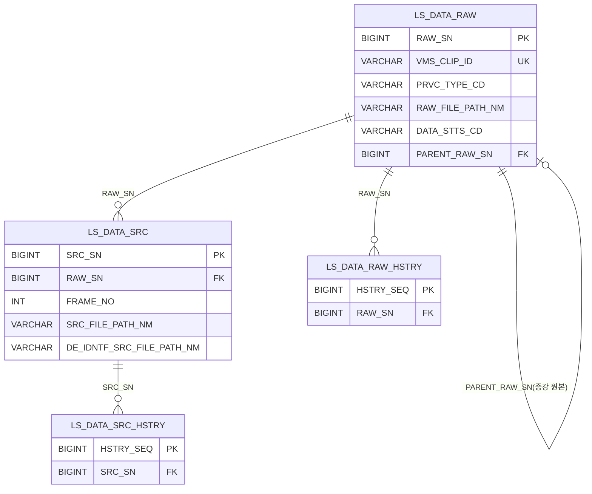
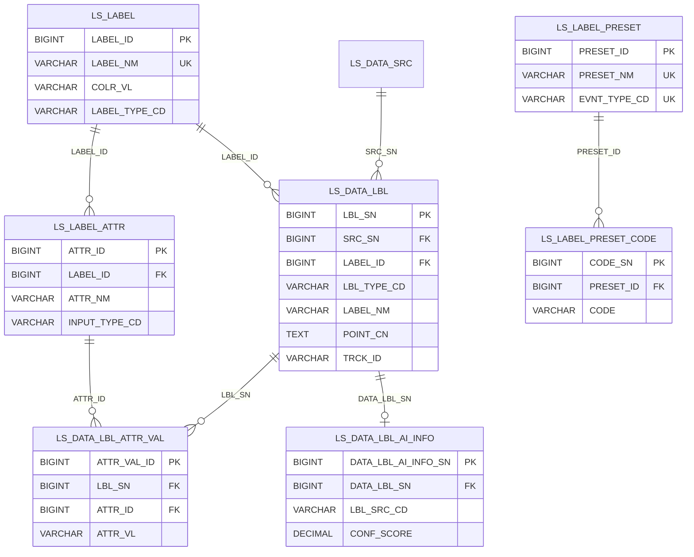
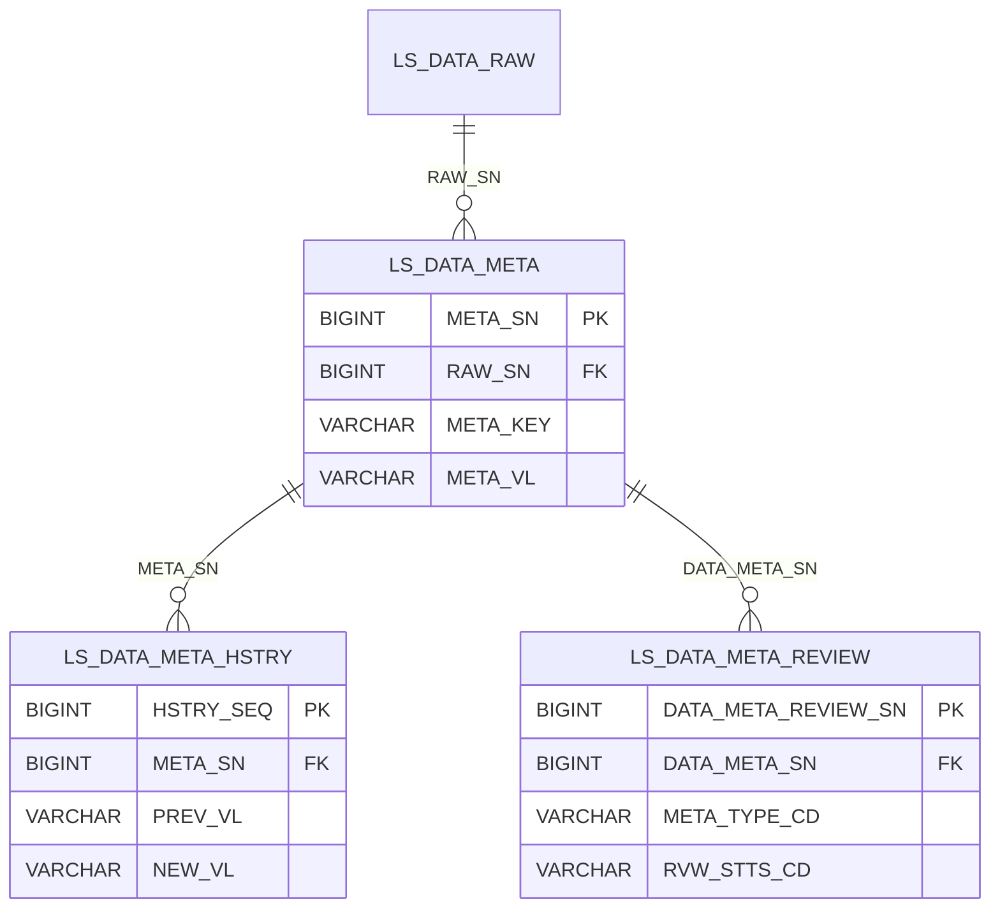
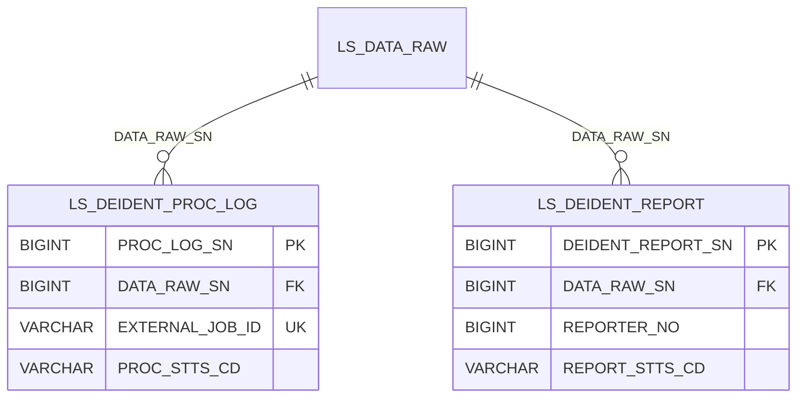
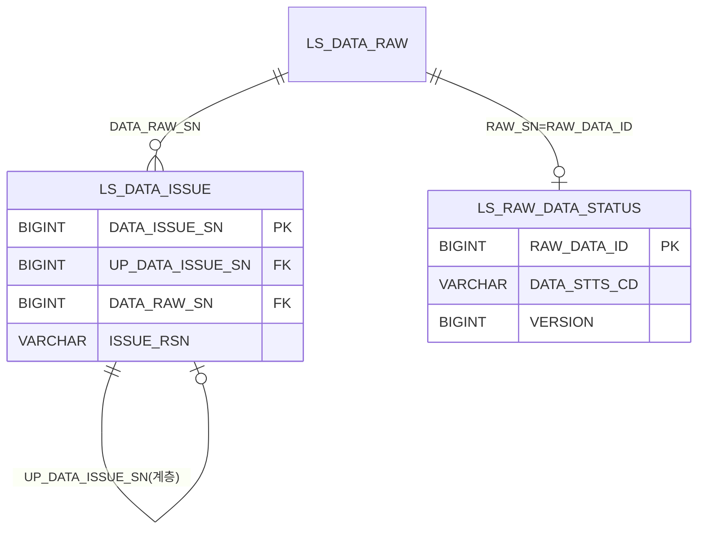
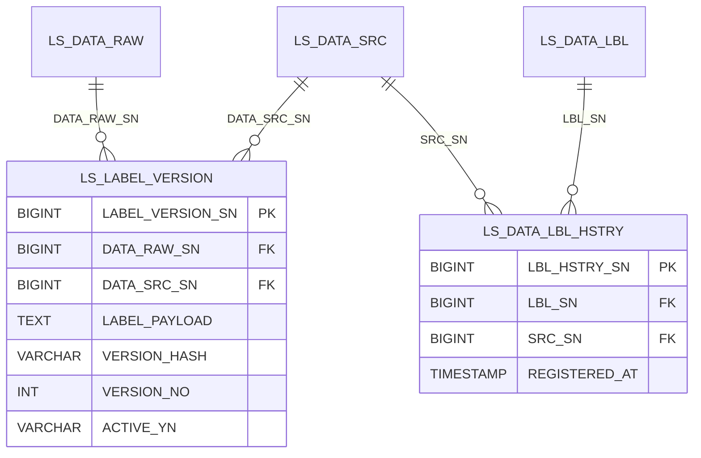
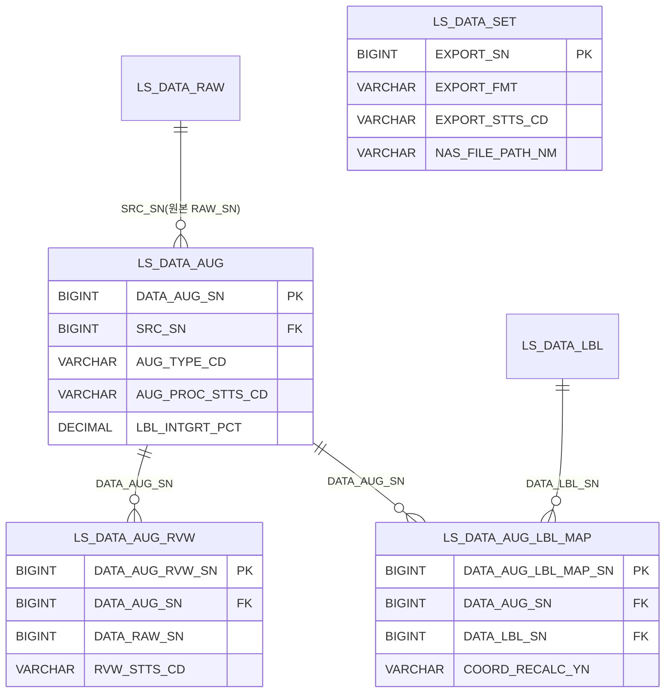

# D8 엔티티 관계 모형 설계서

## 작성 목적
> 시스템의 요구사항을 만족하기 위한 주요 엔티티 및 엔티티간의 관계를 표현하고 엔티티에 대한 명세를 기술한다.

## 작성 방법
> 논리적 데이터 모델링을 통한 엔티티 관계 모형도(ERD)를 작성하여 엔티티를 식별한다. 식별한 엔티티는 각각 상세한 명세를 작성한다.

> **작성 범위 (R1·R2 정합)**: 본 설계서는 R1 요구사항 18개에 매핑된 R2 유스케이스(증강·라벨링·버전관리·검수·비식별·시계열메타)와 직접 관련된 저작도구 전용 `LS_*` 테이블만 대상으로 한다. R1/R2 범위 밖 테이블(사용자/권한 `MNG_*`·마킹 `LS_MARKING`·포털 `LS_PORTAL_*`·시스템설정·게시판·배치로그·`QRTZ_*`)은 본 설계서에서 제외한다. 영상/프레임(`LS_DATA_RAW`, `LS_DATA_SRC`)은 증강·라벨·비식별·메타의 기반 엔티티이므로 포함한다.

> **DB / 진실원**: PostgreSQL `klid_at` 스키마. 컬럼 정의는 `backend/src/main/resources/db/migration/*.sql` (Flyway V0~V54, 최종 상태) 및 `backend/src/main/java/kr/co/cudo/authoring/**/entity/*.java` 의 실제 `@Column(name)` 과 1:1 정합한다. 행안부 표준 rename(REG_DT/MDFCN_DT/REJECT_RSN/LABEL_NM/COLR_VL/POINT_CN/META_VL/ISSUE_RSN/DATA_RAW_SN/SHT_DT/RAW_FILE_PATH_NM 등) 반영 완료 상태를 기준으로 한다.

## 산출물 양식

### 제·개정 이력

| 날짜 | 버전 | 제·개정 내역 | 작성자 | 검토자 |
|------|------|------------|--------|--------|
| 2026-05-31 | 1.0 | 최초 작성 | 박찬기 | 김현욱 |

### 헤더

| D8 | 엔티티 관계 모형 설계서 |
|-------|-------------|
| 시스템명 | AI 기반 지방정부 CCTV 관제지원시스템(2차) | 서브시스템명 | 학습데이터 저작도구(AT) |
| 단계명 | 설계 | 작성일자 | 2026-05-31 | 버전 | 1.0 |

> DBMS: **PostgreSQL** / 스키마: **klid_at** (저작도구 전용 LS_* 테이블 자체 소유)

---

## 1. 엔티티 관계도(ERD)

본 설계서는 도메인별로 7개의 ERD로 분리하여 작성한다.

| ERD ID | ERD 명 |
|--------|-------|
| KLID-AT-ERD-001 | 영상·프레임 (영상 수신 + 키프레임 추출) |
| KLID-AT-ERD-002 | 라벨링 (라벨 풀 + 라벨 객체 + 속성 + 프리셋) |
| KLID-AT-ERD-003 | 시계열 메타 (외부 메타 적재 + VLM 검토) |
| KLID-AT-ERD-004 | 비식별 (비식별 처리 이력 + 신고/리포트) |
| KLID-AT-ERD-005 | 검수 (반려 이슈 + 작업 상태) |
| KLID-AT-ERD-006 | 버전관리 (라벨 스냅샷 버전) |
| KLID-AT-ERD-007 | 데이터 증강 (증강 결과 + 검수 + 라벨 매핑 + 데이터셋) |

> 참고: 관계선의 `RAW_SN` / `DATA_RAW_SN`, `SRC_SN` / `DATA_SRC_SN`, `LBL_SN` / `DATA_LBL_SN` 은 동일 식별자에 대한 테이블별 컬럼 명칭 차이다(운영 정책상 일부 테이블만 FK 제약을 설정, 나머지는 논리 FK).

### KLID-AT-ERD-001 — 영상·프레임

### KLID-AT-ERD-002 — 라벨링

### KLID-AT-ERD-003 — 시계열 메타

### KLID-AT-ERD-004 — 비식별

### KLID-AT-ERD-005 — 검수

### KLID-AT-ERD-006 — 버전관리

### KLID-AT-ERD-007 — 데이터 증강

> `LS_DATA_SET`(학습데이터셋 내보내기)는 증강·라벨 결과를 NAS 디렉토리로 내보내는 작업 엔티티이며, R1/R2 범위상 내보내기(Export) 본체는 외부 시스템 책임이므로 **참고용(범위 경계)** 으로만 포함한다.

---

## 2. 엔티티 명세서

> 동의어 칸: 자바 엔티티 필드명(camelCase) 병기. 타입은 PostgreSQL 컬럼 타입 기준.

---

### KLID-AT-EN-001 · LS_DATA_RAW (원시 영상)

| 엔티티 ID | KLID-AT-EN-001 | 엔티티명 | LS_DATA_RAW |
|---------|---|-------|---|
| 관련 클래스 ID | KLID-AT-DC-001 | 관련 클래스명 | LsDataRaw |
| 엔티티 설명 | 저작도구가 보유한 원시 영상 1건. 증강 결과 영상도 별도 RAW_SN 으로 본 테이블에 생성되며 PARENT_RAW_SN 으로 원본을 참조한다. 라벨/프레임/비식별/메타의 최상위 기준 엔티티. |

| 속성명 | 동의어 | 타입 | 길이 | NOT NULL | PK | FK | INX | 기본값 | 제약조건 |
|-------|--------|------|------|:---:|:---:|:---:|:---:|-------|--------|
| RAW_SN | rawSn | BIGINT | | Y | Y | N | N | IDENTITY | |
| VMS_CLIP_ID | vmsClipId | VARCHAR | 128 | Y | N | N | N | | UK(UK_LS_DATA_RAW_VMS_CLIP) |
| VMS_CCTV_ID | vmsCctvId | VARCHAR | 64 | Y | N | N | Y | | IX_LS_DATA_RAW_CCTV |
| EVNT_TYPE_CD | evntTypeCd | VARCHAR | 32 | N | N | N | N | | |
| LCLGV_CD | lclgvCd | VARCHAR | 32 | N | N | N | N | | |
| PRVC_TYPE_CD | prvcTypeCd | VARCHAR | 16 | Y | N | N | N | | PRVC/PSDO/ANONY |
| PRVC_YN | prvcYn | VARCHAR | 1 | Y | N | N | N | 'N' | |
| DE_IDNTF_YN | deIdntfYn | VARCHAR | 1 | Y | N | N | N | 'N' | |
| RAW_FILE_PATH_NM | rawFilePathNm | VARCHAR | 500 | Y | N | N | N | | |
| SHT_DT | shtDt | TIMESTAMP | | N | N | N | N | | 촬영 일시 |
| DURATION_SEC | durationSec | INT | | N | N | N | N | | |
| DATA_STTS_CD | dataSttsCd | VARCHAR | 32 | Y | N | N | Y | 'PENDING' | IX_LS_DATA_RAW_STTS |
| PARENT_RAW_SN | parentRawSn | BIGINT | | N | N | Y | Y | | 증강 원본 참조(IDX_LDR_PARENT) |
| REG_DT | regDt | TIMESTAMP | | Y | N | N | N | CURRENT_TIMESTAMP | |
| MDFCN_DT | mdfcnDt | TIMESTAMP | | N | N | N | N | | |

---

### KLID-AT-EN-002 · LS_DATA_RAW_HSTRY (영상 상태 이력)

| 엔티티 ID | KLID-AT-EN-002 | 엔티티명 | LS_DATA_RAW_HSTRY |
|---------|---|-------|---|
| 관련 클래스 ID | KLID-AT-DC-002 | 관련 클래스명 | LsDataRawHstry |
| 엔티티 설명 | 영상 상태 전이/변경 이력. |

| 속성명 | 동의어 | 타입 | 길이 | NOT NULL | PK | FK | INX | 기본값 | 제약조건 |
|-------|--------|------|------|:---:|:---:|:---:|:---:|-------|--------|
| HSTRY_SEQ | hstrySeq | BIGINT | | Y | Y | N | N | IDENTITY | |
| RAW_SN | rawSn | BIGINT | | Y | N | Y | Y | | IX_LS_DATA_RAW_HSTRY_RAW |
| CHG_TYPE_CD | chgTypeCd | VARCHAR | 16 | Y | N | N | N | | |
| PREV_STTS_CD | prevSttsCd | VARCHAR | 32 | N | N | N | N | | |
| NEW_STTS_CD | newSttsCd | VARCHAR | 32 | N | N | N | N | | |
| CHG_USER_NO | chgUserNo | BIGINT | | N | N | N | N | | |
| CHG_DT | chgDt | TIMESTAMP | | Y | N | N | N | CURRENT_TIMESTAMP | |

---

### KLID-AT-EN-003 · LS_DATA_SRC (키프레임)

| 엔티티 ID | KLID-AT-EN-003 | 엔티티명 | LS_DATA_SRC |
|---------|---|-------|---|
| 관련 클래스 ID | KLID-AT-DC-003 | 관련 클래스명 | LsDataSrc |
| 엔티티 설명 | 영상에서 추출한 키프레임. FILE_PATH=원본 프레임, BKUP_FILE_PATH=비식별 프레임 페어를 보관한다. 라벨의 직접 기준(SRC_SN). |

| 속성명 | 동의어 | 타입 | 길이 | NOT NULL | PK | FK | INX | 기본값 | 제약조건 |
|-------|--------|------|------|:---:|:---:|:---:|:---:|-------|--------|
| SRC_SN | srcSn | BIGINT | | Y | Y | N | N | IDENTITY | |
| RAW_SN | rawSn | BIGINT | | Y | N | Y | Y | | UK(RAW_SN,FRAME_NO)/IX_LS_DATA_SRC_RAW |
| FRAME_NO | frameNo | INT | | Y | N | N | N | | UK_LS_DATA_SRC_RAW_FRAME |
| SRC_FILE_PATH_NM | srcFilePathNm | VARCHAR | 500 | Y | N | N | N | | 원본 프레임 경로 |
| DE_IDNTF_SRC_FILE_PATH_NM | deIdntfSrcFilePathNm | VARCHAR | 1000 | N | N | N | N | | 비식별 프레임 경로 |
| SHT_DT | shtDt | TIMESTAMP | | N | N | N | N | | |
| REG_DT | regDt | TIMESTAMP | | Y | N | N | N | CURRENT_TIMESTAMP | |
| UPD_DT | updDt | TIMESTAMP | | N | N | N | N | | |

---

### KLID-AT-EN-004 · LS_DATA_SRC_HSTRY (프레임 변경 이력)

| 엔티티 ID | KLID-AT-EN-004 | 엔티티명 | LS_DATA_SRC_HSTRY |
|---------|---|-------|---|
| 관련 클래스 ID | KLID-AT-DC-004 | 관련 클래스명 | LsDataSrcHstry |
| 엔티티 설명 | 키프레임 변경 이력. |

| 속성명 | 동의어 | 타입 | 길이 | NOT NULL | PK | FK | INX | 기본값 | 제약조건 |
|-------|--------|------|------|:---:|:---:|:---:|:---:|-------|--------|
| HSTRY_SEQ | hstrySeq | BIGINT | | Y | Y | N | N | IDENTITY | |
| SRC_SN | srcSn | BIGINT | | Y | N | Y | Y | | IX_LS_DATA_SRC_HSTRY_SRC |
| CHG_TYPE_CD | chgTypeCd | VARCHAR | 16 | Y | N | N | N | | |
| CHG_USER_NO | chgUserNo | BIGINT | | N | N | N | N | | |
| CHG_DT | chgDt | TIMESTAMP | | Y | N | N | N | CURRENT_TIMESTAMP | |

---

### KLID-AT-EN-005 · LS_LABEL (라벨 마스터/라벨 풀)

| 엔티티 ID | KLID-AT-EN-005 | 엔티티명 | LS_LABEL |
|---------|---|-------|---|
| 관련 클래스 ID | KLID-AT-DC-005 | 관련 클래스명 | LsLabel |
| 엔티티 설명 | CVAT-Like 라벨 풀. 라벨 이름·색상·타입을 정의하는 마스터. soft delete(USE_YN). V34 에서 PJT_ID 제거됨. |

| 속성명 | 동의어 | 타입 | 길이 | NOT NULL | PK | FK | INX | 기본값 | 제약조건 |
|-------|--------|------|------|:---:|:---:|:---:|:---:|-------|--------|
| LABEL_ID | labelId | BIGINT | | Y | Y | N | N | IDENTITY | |
| LABEL_NM | labelNm | VARCHAR | 64 | Y | N | N | N | | UK(UK_LS_LABEL_NAME, V34 후 LABEL_NM 단일) |
| COLR_VL | colrVl | VARCHAR | 7 | Y | N | N | N | | 색상값(#RRGGBB) |
| LABEL_TYPE_CD | labelTypeCd | VARCHAR | 16 | Y | N | N | N | | BBOX/POLYGON/POINT |
| SORT_SEQ | sortSeq | INT | | Y | N | N | Y | 0 | IDX_LS_LABEL_USE |
| USE_YN | useYn | VARCHAR | 1 | Y | N | N | Y | 'Y' | |
| REG_ID | regId | VARCHAR | 30 | N | N | N | N | | |
| REG_DT | regDt | TIMESTAMP | | Y | N | N | N | CURRENT_TIMESTAMP | |
| MDFCN_ID | mdfcnId | VARCHAR | 30 | N | N | N | N | | |
| MDFCN_DT | mdfcnDt | TIMESTAMP | | N | N | N | N | | |

---

### KLID-AT-EN-006 · LS_DATA_LBL (라벨 객체)

| 엔티티 ID | KLID-AT-EN-006 | 엔티티명 | LS_DATA_LBL |
|---------|---|-------|---|
| 관련 클래스 ID | KLID-AT-DC-006 | 관련 클래스명 | LsDataLbl |
| 엔티티 설명 | 프레임(SRC_SN) 단위 라벨 객체. 자동(YOLO/SAM2/보간)+수동 라벨. 좌표는 POINT_CN(JSON/TEXT)에 저장. AI 출처/신뢰도는 LS_DATA_LBL_AI_INFO 로 분리. |

| 속성명 | 동의어 | 타입 | 길이 | NOT NULL | PK | FK | INX | 기본값 | 제약조건 |
|-------|--------|------|------|:---:|:---:|:---:|:---:|-------|--------|
| LBL_SN | lblSn | BIGINT | | Y | Y | N | N | IDENTITY | |
| SRC_SN | srcSn | BIGINT | | Y | N | Y | Y | | IX_LS_DATA_LBL_SRC |
| LABEL_ID | labelId | BIGINT | | N | N | Y | Y | | FK_LS_DATA_LBL_LABEL→LS_LABEL / IDX_LS_DATA_LBL_LABEL_ID |
| LBL_TYPE_CD | lblTypeCd | VARCHAR | 16 | Y | N | N | N | | BBOX/POLYGON/SEGMENT/TRACK |
| LABEL_NM | labelNm | VARCHAR | 255 | Y | N | N | N | | (레거시 텍스트, LABEL_ID 로 대체 진행) |
| POINT_CN | pointCn | TEXT | | N | N | N | N | | 좌표 내용(JSON) |
| TRCK_ID | trackId | VARCHAR | 64 | N | N | N | Y | | IX_LS_DATA_LBL_TRCK_ID (자바 필드명 trackId) |
| REG_USER_NO | regUserNo | BIGINT | | N | N | N | N | | |
| REG_DT | regDt | TIMESTAMP | | Y | N | N | N | CURRENT_TIMESTAMP | |
| MDFCN_DT | mdfcnDt | TIMESTAMP | | N | N | N | N | | |

---

### KLID-AT-EN-007 · LS_LABEL_ATTR (라벨 속성 정의)

| 엔티티 ID | KLID-AT-EN-007 | 엔티티명 | LS_LABEL_ATTR |
|---------|---|-------|---|
| 관련 클래스 ID | KLID-AT-DC-007 | 관련 클래스명 | LsLabelAttr |
| 엔티티 설명 | 라벨별 속성(Attribute) 정의. CVAT AttributeSpec 동등 구조(가려짐/방향 등). |

| 속성명 | 동의어 | 타입 | 길이 | NOT NULL | PK | FK | INX | 기본값 | 제약조건 |
|-------|--------|------|------|:---:|:---:|:---:|:---:|-------|--------|
| ATTR_ID | attrId | BIGINT | | Y | Y | N | N | IDENTITY | |
| LABEL_ID | labelId | BIGINT | | Y | N | Y | Y | | FK_LS_LABEL_ATTR_LABEL→LS_LABEL / UK(LABEL_ID,ATTR_NM) |
| ATTR_NM | attrNm | VARCHAR | 64 | Y | N | N | N | | UK_LS_LABEL_ATTR_NAME |
| INPUT_TYPE_CD | inputTypeCd | VARCHAR | 16 | Y | N | N | N | | SELECT/CHECKBOX/RADIO/NUMBER/TEXT |
| VALUES_CN | valuesCn | VARCHAR | 1000 | N | N | N | N | | 옵션 목록(JSON) |
| DFLT_VL | dfltVl | VARCHAR | 255 | N | N | N | N | | |
| MUTABLE_YN | mutableYn | VARCHAR | 1 | Y | N | N | N | 'Y' | |
| SORT_SEQ | sortSeq | INT | | Y | N | N | Y | 0 | IDX_LS_LABEL_ATTR |
| USE_YN | useYn | VARCHAR | 1 | Y | N | N | Y | 'Y' | |
| REG_ID | regId | VARCHAR | 30 | N | N | N | N | | |
| REG_DT | regDt | TIMESTAMP | | Y | N | N | N | CURRENT_TIMESTAMP | |
| MDFCN_ID | mdfcnId | VARCHAR | 30 | N | N | N | N | | |
| MDFCN_DT | mdfcnDt | TIMESTAMP | | N | N | N | N | | |

---

### KLID-AT-EN-008 · LS_DATA_LBL_ATTR_VAL (라벨 객체 속성값)

| 엔티티 ID | KLID-AT-EN-008 | 엔티티명 | LS_DATA_LBL_ATTR_VAL |
|---------|---|-------|---|
| 관련 클래스 ID | KLID-AT-DC-008 | 관련 클래스명 | LsDataLblAttrVal |
| 엔티티 설명 | 라벨 객체(LBL_SN) 단위 속성값. (LBL_SN, ATTR_ID) upsert 키. 컬럼명 ATTR_VL 은 H2 예약어(VALUE) 회피. |

| 속성명 | 동의어 | 타입 | 길이 | NOT NULL | PK | FK | INX | 기본값 | 제약조건 |
|-------|--------|------|------|:---:|:---:|:---:|:---:|-------|--------|
| ATTR_VAL_ID | attrValId | BIGINT | | Y | Y | N | N | IDENTITY | |
| LBL_SN | lblSn | BIGINT | | Y | N | Y | Y | | FK_LS_DATA_LBL_ATTR_LBL→LS_DATA_LBL / IDX_..._VAL_LBL |
| ATTR_ID | attrId | BIGINT | | Y | N | Y | N | | FK_LS_DATA_LBL_ATTR_ATTR→LS_LABEL_ATTR / UK(LBL_SN,ATTR_ID) |
| ATTR_VL | attrVl | VARCHAR | 1000 | N | N | N | N | | 속성값 |
| REG_DT | regDt | TIMESTAMP | | Y | N | N | N | CURRENT_TIMESTAMP | |
| MDFCN_DT | mdfcnDt | TIMESTAMP | | N | N | N | N | | |

---

### KLID-AT-EN-009 · LS_DATA_LBL_AI_INFO (AI 라벨 출처/신뢰도)

| 엔티티 ID | KLID-AT-EN-009 | 엔티티명 | LS_DATA_LBL_AI_INFO |
|---------|---|-------|---|
| 관련 클래스 ID | KLID-AT-DC-009 | 관련 클래스명 | LsDataLblAiInfo |
| 엔티티 설명 | AI 라벨(자동/보간) 출처·모델·신뢰도 정보. LS_DATA_LBL 라벨 1건당 보조 정보. |

| 속성명 | 동의어 | 타입 | 길이 | NOT NULL | PK | FK | INX | 기본값 | 제약조건 |
|-------|--------|------|------|:---:|:---:|:---:|:---:|-------|--------|
| DATA_LBL_AI_INFO_SN | dataLblAiInfoSn | BIGINT | | Y | Y | N | N | IDENTITY | |
| DATA_LBL_SN | dataLblSn | BIGINT | | Y | N | Y | Y | | IDX_..._AI_INFO_LBL (→LS_DATA_LBL.LBL_SN 논리FK) |
| DATA_RAW_SN | dataRawSn | BIGINT | | Y | N | Y | Y | | IDX_..._AI_INFO_SRC |
| DATA_SRC_SN | dataSrcSn | BIGINT | | Y | N | Y | Y | | IDX_..._AI_INFO_SRC |
| LBL_SRC_CD | lblSrcCd | VARCHAR | 20 | Y | N | N | Y | | YOLO/SAM2/INTERPOLATION 등 / IDX_..._SRC_CD |
| MODEL_NM | modelNm | VARCHAR | 100 | N | N | N | N | | |
| MDL_VER | mdlVer | VARCHAR | 50 | N | N | N | N | | |
| CONF_SCORE | confScore | DECIMAL(6,5) | | N | N | N | N | | 신뢰도 |
| AUTO_LBL_YN | autoLblYn | VARCHAR | 1 | Y | N | N | N | 'Y' | |
| REG_ID | regId | VARCHAR | 30 | N | N | N | N | | |
| REG_DT | regDt | TIMESTAMP | | Y | N | N | N | CURRENT_TIMESTAMP | |
| MDFCN_ID | mdfcnId | VARCHAR | 30 | N | N | N | N | | |
| MDFCN_DT | mdfcnDt | TIMESTAMP | | N | N | N | N | | |

---

### KLID-AT-EN-010 · LS_LABEL_PRESET (라벨 프리셋)

| 엔티티 ID | KLID-AT-EN-010 | 엔티티명 | LS_LABEL_PRESET |
|---------|---|-------|---|
| 관련 클래스 ID | KLID-AT-DC-010 | 관련 클래스명 | LsLabelPreset |
| 엔티티 설명 | 이벤트 타입별로 사용할 라벨 코드 묶음(프리셋). EVNT_TYPE_CD 로 이벤트 1:1 매핑. |

| 속성명 | 동의어 | 타입 | 길이 | NOT NULL | PK | FK | INX | 기본값 | 제약조건 |
|-------|--------|------|------|:---:|:---:|:---:|:---:|-------|--------|
| PRESET_ID | presetId | BIGINT | | Y | Y | N | N | IDENTITY | |
| PRESET_NM | presetNm | VARCHAR | 64 | Y | N | N | N | | UK_LS_LABEL_PRESET_NAME |
| EXPLN | expln | VARCHAR | 500 | N | N | N | N | | 설명 |
| EVNT_TYPE_CD | evntTypeCd | VARCHAR | 32 | N | N | N | N | | UK_LS_LABEL_PRESET_EVNT(NULL 다수 허용) |
| REG_DT | regDt | TIMESTAMP | | Y | N | N | N | CURRENT_TIMESTAMP | |
| MDFCN_DT | mdfcnDt | TIMESTAMP | | Y | N | N | N | CURRENT_TIMESTAMP | |

---

### KLID-AT-EN-011 · LS_LABEL_PRESET_CODE (프리셋 라벨 코드)

| 엔티티 ID | KLID-AT-EN-011 | 엔티티명 | LS_LABEL_PRESET_CODE |
|---------|---|-------|---|
| 관련 클래스 ID | KLID-AT-DC-011 | 관련 클래스명 | LsLabelPresetCode |
| 엔티티 설명 | 프리셋에 포함된 라벨 코드. 코드별 BBOX/POLYGON 어노테이션 토글 보유. |

| 속성명 | 동의어 | 타입 | 길이 | NOT NULL | PK | FK | INX | 기본값 | 제약조건 |
|-------|--------|------|------|:---:|:---:|:---:|:---:|-------|--------|
| CODE_SN | codeSn | BIGINT | | Y | Y | N | N | IDENTITY | |
| PRESET_ID | presetId | BIGINT | | Y | N | Y | Y | | FK_..._PRESET→LS_LABEL_PRESET(ON DELETE CASCADE) / IDX_..._CODE_PRESET |
| CODE | code | VARCHAR | 32 | Y | N | N | N | | UK_LS_LABEL_PRESET_CODE(PRESET_ID,CODE) |
| SORT_SEQ | sortSeq | INT | | Y | N | N | N | 0 | |
| BBOX_ENABLED | bboxEnabled | BOOLEAN | | Y | N | N | N | TRUE | CK(BBOX OR POLYGON = TRUE) |
| POLYGON_ENABLED | polygonEnabled | BOOLEAN | | Y | N | N | N | TRUE | CK_..._ANNOTATION |

---

### KLID-AT-EN-012 · LS_DATA_META (시계열 메타)

| 엔티티 ID | KLID-AT-EN-012 | 엔티티명 | LS_DATA_META |
|---------|---|-------|---|
| 관련 클래스 ID | KLID-AT-DC-012 | 관련 클래스명 | LsDataMeta |
| 엔티티 설명 | 영상 단위 시계열 메타(외부 메타 적재 + VLM 객체 검증 보조) 키-값. (RAW_SN, META_KEY) UK. 비동기 표준 컬럼(멱등키/외부 작업ID/재시도/데드레터) 보유. |

| 속성명 | 동의어 | 타입 | 길이 | NOT NULL | PK | FK | INX | 기본값 | 제약조건 |
|-------|--------|------|------|:---:|:---:|:---:|:---:|-------|--------|
| META_SN | metaSn | BIGINT | | Y | Y | N | N | IDENTITY | |
| RAW_SN | rawSn | BIGINT | | Y | N | Y | Y | | UK(RAW_SN,META_KEY)/IX_LS_DATA_META_RAW |
| META_KEY | metaKey | VARCHAR | 64 | Y | N | N | N | | UK_LS_DATA_META_RAW_KEY |
| META_VL | metaVl | VARCHAR | 2000 | N | N | N | N | | 메타값 |
| REG_DT | regDt | TIMESTAMP | | Y | N | N | N | CURRENT_TIMESTAMP | |
| MDFCN_DT | mdfcnDt | TIMESTAMP | | N | N | N | N | | |
| IDEMPOTENCY_KEY | idempotencyKey | VARCHAR | 64 | N | N | N | N | | uk_meta_idempotency_key |
| EXTERNAL_JOB_ID | externalJobId | VARCHAR | 128 | N | N | N | N | | uk_meta_external_job_id |
| RETRY_COUNT | retryCount | INT | | Y | N | N | N | 0 | |
| DEAD_LETTER_AT | deadLetterAt | TIMESTAMP | | N | N | N | N | | |

---

### KLID-AT-EN-013 · LS_DATA_META_HSTRY (메타 변경 이력)

| 엔티티 ID | KLID-AT-EN-013 | 엔티티명 | LS_DATA_META_HSTRY |
|---------|---|-------|---|
| 관련 클래스 ID | KLID-AT-DC-013 | 관련 클래스명 | LsDataMetaHstry |
| 엔티티 설명 | 시계열 메타 값 변경 전/후 이력. |

| 속성명 | 동의어 | 타입 | 길이 | NOT NULL | PK | FK | INX | 기본값 | 제약조건 |
|-------|--------|------|------|:---:|:---:|:---:|:---:|-------|--------|
| HSTRY_SEQ | hstrySeq | BIGINT | | Y | Y | N | N | IDENTITY | |
| META_SN | metaSn | BIGINT | | Y | N | Y | Y | | IX_LS_DATA_META_HSTRY_META |
| PREV_VL | prevVl | VARCHAR | 2000 | N | N | N | N | | |
| NEW_VL | newVl | VARCHAR | 2000 | N | N | N | N | | |
| CHG_USER_NO | chgUserNo | BIGINT | | N | N | N | N | | |
| CHG_DT | chgDt | TIMESTAMP | | Y | N | N | N | CURRENT_TIMESTAMP | |

---

### KLID-AT-EN-014 · LS_DATA_META_REVIEW (메타 검토 상태)

| 엔티티 ID | KLID-AT-EN-014 | 엔티티명 | LS_DATA_META_REVIEW |
|---------|---|-------|---|
| 관련 클래스 ID | KLID-AT-DC-014 | 관련 클래스명 | LsDataMetaReview |
| 엔티티 설명 | 외부 생성 메타(VLM 시계열 등)의 검토 상태. REVIEWER 승인/반려. LS_DATA_META 는 값, 본 테이블은 검토 상태 관리. |

| 속성명 | 동의어 | 타입 | 길이 | NOT NULL | PK | FK | INX | 기본값 | 제약조건 |
|-------|--------|------|------|:---:|:---:|:---:|:---:|-------|--------|
| DATA_META_REVIEW_SN | dataMetaReviewSn | BIGINT | | Y | Y | N | N | IDENTITY | |
| DATA_META_SN | dataMetaSn | BIGINT | | Y | N | Y | Y | | IDX_..._REVIEW_META (→LS_DATA_META.META_SN 논리FK) |
| DATA_RAW_SN | dataRawSn | BIGINT | | Y | N | Y | Y | | IDX_..._REVIEW_TARGET |
| DATA_SRC_SN | dataSrcSn | BIGINT | | N | N | Y | Y | | IDX_..._REVIEW_TARGET |
| META_TYPE_CD | metaTypeCd | VARCHAR | 20 | Y | N | N | Y | | IDX_..._REVIEW_STTS |
| SRC_SYS_CD | srcSysCd | VARCHAR | 20 | N | N | N | N | | 출처 시스템 |
| RVW_STTS_CD | rvwSttsCd | VARCHAR | 20 | Y | N | N | Y | | PENDING/APPROVED/REJECTED |
| RVW_ID | rvwId | VARCHAR | 30 | N | N | N | N | | |
| RVW_DT | rvwDt | TIMESTAMP | | N | N | N | N | | |
| REJECT_RSN | rejectRsn | VARCHAR | 1000 | N | N | N | N | | 반려 사유 |
| REG_ID | regId | VARCHAR | 30 | N | N | N | N | | |
| REG_DT | regDt | TIMESTAMP | | Y | N | N | N | CURRENT_TIMESTAMP | |
| MDFCN_ID | mdfcnId | VARCHAR | 30 | N | N | N | N | | |
| MDFCN_DT | mdfcnDt | TIMESTAMP | | N | N | N | N | | |

---

### KLID-AT-EN-015 · LS_DEIDENT_PROC_LOG (비식별 처리 이력)

| 엔티티 ID | KLID-AT-EN-015 | 엔티티명 | LS_DEIDENT_PROC_LOG |
|---------|---|-------|---|
| 관련 클래스 ID | KLID-AT-DC-015 | 관련 클래스명 | LsDeidentProcLog |
| 엔티티 설명 | 영상 단위 비식별 API 호출 이력(DeidentifyStep 기록). 외부 작업 ID 멱등 처리. |

| 속성명 | 동의어 | 타입 | 길이 | NOT NULL | PK | FK | INX | 기본값 | 제약조건 |
|-------|--------|------|------|:---:|:---:|:---:|:---:|-------|--------|
| PROC_LOG_SN | procLogSn | BIGINT | | Y | Y | N | N | IDENTITY | |
| DATA_RAW_SN | dataRawSn | BIGINT | | Y | N | Y | Y | | IDX_..._PROC_LOG_RAW |
| REQ_ID | reqId | VARCHAR | 64 | N | N | N | N | | 내부 요청 ID |
| ORGNL_FILE_PATH_NM | orgnlFilePathNm | VARCHAR | 1000 | Y | N | N | N | | 원본 경로 |
| DE_IDNTF_FILE_PATH_NM | deIdntfFilePathNm | VARCHAR | 1000 | N | N | N | N | | 비식별 경로 |
| PROC_STTS_CD | procSttsCd | VARCHAR | 20 | Y | N | N | Y | | IDX_..._PROC_LOG_STTS |
| REQ_DT | reqDt | TIMESTAMP | | Y | N | N | N | CURRENT_TIMESTAMP | |
| RES_DT | resDt | TIMESTAMP | | N | N | N | N | | |
| ERROR_CD | errorCd | VARCHAR | 50 | N | N | N | N | | |
| ERROR_MSG | errorMsg | VARCHAR | 1000 | N | N | N | N | | |
| EXTERNAL_JOB_ID | externalJobId | VARCHAR | 128 | N | N | N | Y | | UK_LS_DEIDENT_PROC_LOG_EXT_JOB |
| REG_ID | regId | VARCHAR | 30 | N | N | N | N | | |
| REG_DT | regDt | TIMESTAMP | | Y | N | N | N | CURRENT_TIMESTAMP | |
| MDFCN_ID | mdfcnId | VARCHAR | 30 | N | N | N | N | | |
| MDFCN_DT | mdfcnDt | TIMESTAMP | | N | N | N | N | | |

---

### KLID-AT-EN-016 · LS_DEIDENT_REPORT (비식별 신고/리포트)

| 엔티티 ID | KLID-AT-EN-016 | 엔티티명 | LS_DEIDENT_REPORT |
|---------|---|-------|---|
| 관련 클래스 ID | KLID-AT-DC-016 | 관련 클래스명 | LsDeidentReport |
| 엔티티 설명 | 비식별 미흡 등 사용자 신고/리포트(영상 단위). V30 슬림화로 시스템 처리 이력 컬럼은 LS_DEIDENT_PROC_LOG 로 이전됨. |

| 속성명 | 동의어 | 타입 | 길이 | NOT NULL | PK | FK | INX | 기본값 | 제약조건 |
|-------|--------|------|------|:---:|:---:|:---:|:---:|-------|--------|
| DEIDENT_REPORT_SN | deidentReportSn | BIGINT | | Y | Y | N | N | IDENTITY | |
| DATA_RAW_SN | dataRawSn | BIGINT | | Y | N | Y | Y | | IDX_LS_DEIDENT_REPORT_RAW |
| REPORTER_NO | reporterNo | BIGINT | | N | N | N | N | | 신고자 |
| RSN | rsn | VARCHAR | 1000 | N | N | N | N | | 신고 사유 |
| REPORT_STTS_CD | reportSttsCd | VARCHAR | 16 | N | N | N | Y | | IDX_LS_DEIDENT_REPORT_REPORT |
| REPORT_DT | reportDt | TIMESTAMP | | N | N | N | Y | | |
| RESOLVED_DT | resolvedDt | TIMESTAMP | | N | N | N | N | | |
| REG_ID | regId | VARCHAR | 30 | N | N | N | N | | |
| REG_DT | regDt | TIMESTAMP | | Y | N | N | N | CURRENT_TIMESTAMP | |
| MDFCN_ID | mdfcnId | VARCHAR | 30 | N | N | N | N | | |
| MDFCN_DT | mdfcnDt | TIMESTAMP | | N | N | N | N | | |

---

### KLID-AT-EN-017 · LS_DATA_ISSUE (검수 반려 이슈)

| 엔티티 ID | KLID-AT-EN-017 | 엔티티명 | LS_DATA_ISSUE |
|---------|---|-------|---|
| 관련 클래스 ID | KLID-AT-DC-017 | 관련 클래스명 | LsDataIssue |
| 엔티티 설명 | 검수 반려 사유(영상 단위). UP_DATA_ISSUE_SN 자기참조 계층형. 좌표 컬럼 없음. |

| 속성명 | 동의어 | 타입 | 길이 | NOT NULL | PK | FK | INX | 기본값 | 제약조건 |
|-------|--------|------|------|:---:|:---:|:---:|:---:|-------|--------|
| DATA_ISSUE_SN | dataIssueSn | BIGINT | | Y | Y | N | N | IDENTITY | |
| UP_DATA_ISSUE_SN | upDataIssueSn | BIGINT | | N | N | Y | Y | | 자기참조 / IX_LS_DATA_ISSUE_UP |
| DATA_RAW_SN | dataRawSn | BIGINT | | Y | N | Y | Y | | IX_LS_DATA_ISSUE_VIDEO |
| ISSUE_RSN | issueRsn | VARCHAR | 1000 | N | N | N | N | | 반려 사유 |
| REPORTED_USER_NO | reportedUserNo | VARCHAR | 50 | N | N | N | Y | | IX_LS_DATA_ISSUE_REPORTER |
| REG_DT | regDt | TIMESTAMP | | Y | N | N | N | CURRENT_TIMESTAMP | |

---

### KLID-AT-EN-018 · LS_RAW_DATA_STATUS (영상 작업 상태)

| 엔티티 ID | KLID-AT-EN-018 | 엔티티명 | LS_RAW_DATA_STATUS |
|---------|---|-------|---|
| 관련 클래스 ID | KLID-AT-DC-018 | 관련 클래스명 | LsRawDataStatus |
| 엔티티 설명 | 영상별 작업 진행 상태(검수 워크플로우). DATA_STTS_CD=APPROVED 시 작업 완료. VERSION 은 낙관적 잠금(동시 검수 충돌 방지). V36 신규명 (← LS_PJT_DATA_STTS). |

| 속성명 | 동의어 | 타입 | 길이 | NOT NULL | PK | FK | INX | 기본값 | 제약조건 |
|-------|--------|------|------|:---:|:---:|:---:|:---:|-------|--------|
| RAW_DATA_ID | rawDataId | BIGINT | | Y | Y | Y | N | | =LS_DATA_RAW.RAW_SN |
| DATA_STTS_CD | dataSttsCd | VARCHAR | 32 | Y | N | N | N | 'PENDING' | PENDING/.../APPROVED |
| STP_CYCL | stpCycl | INT | | Y | N | N | N | 0 | |
| IGI_CYCL | igiCycl | INT | | Y | N | N | N | 0 | |
| UPD_DT | updDt | TIMESTAMP | | Y | N | N | N | CURRENT_TIMESTAMP | |
| VERSION | version | BIGINT | | Y | N | N | N | 0 | @Version 낙관적 잠금 |

---

### KLID-AT-EN-019 · LS_LABEL_VERSION (라벨 버전 스냅샷)

| 엔티티 ID | KLID-AT-EN-019 | 엔티티명 | LS_LABEL_VERSION |
|---------|---|-------|---|
| 관련 클래스 ID | KLID-AT-DC-019 | 관련 클래스명 | LsLabelVersion |
| 엔티티 설명 | 라벨 버전관리(DB 스냅샷). V53 에서 Gitea→DB 스냅샷 전면 전환. LABEL_PAYLOAD(전체 JSON) + VERSION_HASH(SHA-256). diff/rollback 기준. |

| 속성명 | 동의어 | 타입 | 길이 | NOT NULL | PK | FK | INX | 기본값 | 제약조건 |
|-------|--------|------|------|:---:|:---:|:---:|:---:|-------|--------|
| LABEL_VERSION_SN | labelVersionSn | BIGINT | | Y | Y | N | N | IDENTITY | |
| DATA_RAW_SN | dataRawSn | BIGINT | | Y | N | Y | Y | | IDX_LS_LABEL_VERSION_TARGET |
| DATA_SRC_SN | dataSrcSn | BIGINT | | N | N | Y | Y | | UK(DATA_SRC_SN,VERSION_HASH) |
| LABEL_PAYLOAD | labelPayload | TEXT | | N | N | N | N | | 라벨 전체 JSON 스냅샷 |
| VERSION_HASH | versionHash | VARCHAR | 64 | N | N | N | N | | UK_LS_LABEL_VERSION_SRC_HASH(SHA-256) |
| VERSION_NO | versionNo | INT | | Y | N | N | N | | |
| SAVE_REASON_CD | saveReasonCd | VARCHAR | 20 | N | N | N | N | | |
| ACTIVE_YN | activeYn | VARCHAR | 1 | Y | N | N | Y | 'Y' | |
| REG_ID | regId | VARCHAR | 30 | N | N | N | N | | |
| REG_DT | regDt | TIMESTAMP | | Y | N | N | N | CURRENT_TIMESTAMP | |

---

### KLID-AT-EN-024 · LS_DATA_LBL_HSTRY (라벨 변경 이력)

| 엔티티 ID | KLID-AT-EN-024 | 엔티티명 | LS_DATA_LBL_HSTRY |
|---------|---|-------|---|
| 관련 클래스 ID | KLID-AT-DC-024 | 관련 클래스명 | LsDataLblHstry |
| 엔티티 설명 | 라벨 저장 시 프레임 단위 변경 발생 기록(LabelController upsert 시 적재). 라벨 버전 스냅샷 본체는 LS_LABEL_VERSION 이 담당하며 본 테이블은 변경 발생 자체를 가볍게 추적. (마이그레이션 V6 는 no-op, 엔티티 매핑으로 존재.) |

| 속성명 | 동의어 | 타입 | 길이 | NOT NULL | PK | FK | INX | 기본값 | 제약조건 |
|-------|--------|------|------|:---:|:---:|:---:|:---:|-------|--------|
| LBL_HSTRY_SN | lblHstrySn | BIGINT | | Y | Y | N | N | IDENTITY | |
| LBL_SN | lblSn | BIGINT | | N | N | Y | N | | (→LS_DATA_LBL.LBL_SN 논리FK) |
| SRC_SN | srcSn | BIGINT | | Y | N | Y | N | | (→LS_DATA_SRC.SRC_SN 논리FK) |
| REGISTERED_AT | registeredAt | TIMESTAMP | | Y | N | N | N | | |

---

### KLID-AT-EN-020 · LS_DATA_AUG (데이터 증강 결과)

| 엔티티 ID | KLID-AT-EN-020 | 엔티티명 | LS_DATA_AUG |
|---------|---|-------|---|
| 관련 클래스 ID | KLID-AT-DC-020 | 관련 클래스명 | LsDataAug |
| 엔티티 설명 | 외부 SFR-07 증강 시스템 산출물. 증강 종류(WINTER/NIGHT/RAIN/RESOLUTION)별 결과 + 라벨 무결성 점수. 본체는 검수만 수행. 비동기 표준 컬럼(IDMP_KEY/OTSD_JOB_ID/RETRY_COUNT/DEAD_LETTER_AT) 보유. |

| 속성명 | 동의어 | 타입 | 길이 | NOT NULL | PK | FK | INX | 기본값 | 제약조건 |
|-------|--------|------|------|:---:|:---:|:---:|:---:|-------|--------|
| DATA_AUG_SN | dataAugSn | BIGINT | | Y | Y | N | N | IDENTITY | |
| SRC_SN | srcSn | BIGINT | | Y | N | Y | Y | | 증강 원본(=LS_DATA_RAW.RAW_SN) / IDX_LS_DATA_AUG_SRC |
| AUG_TYPE_CD | augTypeCd | VARCHAR | 20 | Y | N | N | N | | WINTER/NIGHT/RAIN/RESOLUTION |
| AUG_PROC_STTS_CD | augProcSttsCd | VARCHAR | 20 | Y | N | N | Y | 'PENDING' | PENDING/ACCEPTED/REJECTED / IDX_LS_DATA_AUG_STTS |
| LBL_INTGRT_PCT | lblIntgrtPct | DECIMAL(5,2) | | N | N | N | N | | 라벨 무결성 보존율 |
| REJECT_RSN | rejectRsn | VARCHAR | 500 | N | N | N | N | | 반려 사유 |
| DCSN_USER_NO | dcsnUserNo | VARCHAR | 50 | N | N | N | N | | 결정자 |
| DCSN_DT | dcsnDt | TIMESTAMP | | N | N | N | N | | |
| REG_DT | regDt | TIMESTAMP | | Y | N | N | N | CURRENT_TIMESTAMP | |
| REG_USER_NO | regUserNo | VARCHAR | 50 | N | N | N | N | | |
| IDMP_KEY | idmpKey | VARCHAR | 64 | N | N | N | N | | uk_aug_idempotency_key |
| OTSD_JOB_ID | otsdJobId | VARCHAR | 128 | N | N | N | N | | uk_aug_external_job_id |
| RETRY_COUNT | retryCount | INT | | Y | N | N | N | 0 | |
| DEAD_LETTER_AT | deadLetterAt | TIMESTAMP | | N | N | N | N | | |

---

### KLID-AT-EN-021 · LS_DATA_AUG_RVW (증강 검수 결과)

| 엔티티 ID | KLID-AT-EN-021 | 엔티티명 | LS_DATA_AUG_RVW |
|---------|---|-------|---|
| 관련 클래스 ID | KLID-AT-DC-021 | 관련 클래스명 | LsDataAugRvw |
| 엔티티 설명 | 증강 데이터 검수 결과(SCR-AUG-002). 증강 파일 상태는 LS_DATA_AUG, 검수 결과는 본 테이블로 분리. |

| 속성명 | 동의어 | 타입 | 길이 | NOT NULL | PK | FK | INX | 기본값 | 제약조건 |
|-------|--------|------|------|:---:|:---:|:---:|:---:|-------|--------|
| DATA_AUG_RVW_SN | dataAugRvwSn | BIGINT | | Y | Y | N | N | IDENTITY | |
| DATA_AUG_SN | dataAugSn | BIGINT | | Y | N | Y | Y | | IDX_LS_DATA_AUG_RVW_AUG (→LS_DATA_AUG.DATA_AUG_SN) |
| DATA_RAW_SN | dataRawSn | BIGINT | | Y | N | Y | Y | | IDX_LS_DATA_AUG_RVW_TARGET |
| DATA_SRC_SN | dataSrcSn | BIGINT | | Y | N | Y | Y | | IDX_LS_DATA_AUG_RVW_TARGET |
| RVW_STTS_CD | rvwSttsCd | VARCHAR | 20 | Y | N | N | Y | | IDX_LS_DATA_AUG_RVW_STTS |
| LBL_INTGRT_PCT | lblIntgrtPct | DECIMAL(5,2) | | N | N | N | N | | |
| REJECT_RSN | rejectRsn | VARCHAR | 1000 | N | N | N | N | | |
| RVW_ID | rvwId | VARCHAR | 30 | N | N | N | N | | |
| RVW_DT | rvwDt | TIMESTAMP | | N | N | N | N | | |
| REG_ID | regId | VARCHAR | 30 | N | N | N | N | | |
| REG_DT | regDt | TIMESTAMP | | Y | N | N | N | CURRENT_TIMESTAMP | |
| MDFCN_ID | mdfcnId | VARCHAR | 30 | N | N | N | N | | |
| MDFCN_DT | mdfcnDt | TIMESTAMP | | N | N | N | N | | |

---

### KLID-AT-EN-022 · LS_DATA_AUG_LBL_MAP (증강-라벨 매핑)

| 엔티티 ID | KLID-AT-EN-022 | 엔티티명 | LS_DATA_AUG_LBL_MAP |
|---------|---|-------|---|
| 관련 클래스 ID | KLID-AT-DC-022 | 관련 클래스명 | LsDataAugLblMap |
| 엔티티 설명 | 증강 데이터-라벨 매핑. 해상도 유지/저하 증강 시 좌표 재계산 정보(SCALE_X/Y) 저장. |

| 속성명 | 동의어 | 타입 | 길이 | NOT NULL | PK | FK | INX | 기본값 | 제약조건 |
|-------|--------|------|------|:---:|:---:|:---:|:---:|-------|--------|
| DATA_AUG_LBL_MAP_SN | dataAugLblMapSn | BIGINT | | Y | Y | N | N | IDENTITY | |
| DATA_AUG_SN | dataAugSn | BIGINT | | Y | N | Y | Y | | IDX_..._LBL_MAP_AUG (→LS_DATA_AUG.DATA_AUG_SN) |
| ORGNL_DATA_LBL_SN | orgnlDataLblSn | BIGINT | | N | N | Y | Y | | 원본 라벨 / IDX_..._LBL_MAP_ORGNL |
| DATA_LBL_SN | dataLblSn | BIGINT | | Y | N | Y | Y | | 증강 라벨 / IDX_..._LBL_MAP_LBL (→LS_DATA_LBL.LBL_SN) |
| COORD_RECALC_YN | coordRecalcYn | VARCHAR | 1 | Y | N | N | N | 'N' | |
| SCALE_X | scaleX | DECIMAL(10,6) | | N | N | N | N | | |
| SCALE_Y | scaleY | DECIMAL(10,6) | | N | N | N | N | | |
| REG_ID | regId | VARCHAR | 30 | N | N | N | N | | |
| REG_DT | regDt | TIMESTAMP | | Y | N | N | N | CURRENT_TIMESTAMP | |

---

### KLID-AT-EN-023 · LS_DATA_SET (학습데이터셋 내보내기) — 범위 경계

| 엔티티 ID | KLID-AT-EN-023 | 엔티티명 | LS_DATA_SET |
|---------|---|-------|---|
| 관련 클래스 ID | (D1 미정) | 관련 클래스명 | LsDataSet |
| 엔티티 설명 | 라벨/증강 결과를 NAS 디렉토리(YOLO/COCO)로 내보내는 작업. **범위 외(내보내기 본체는 외부 데이터마트 시스템 책임)** — 본체는 디렉토리 생성까지만. V34 에서 PJT_ID 컬럼 제거됨. 참고용으로만 명세. |

| 속성명 | 동의어 | 타입 | 길이 | NOT NULL | PK | FK | INX | 기본값 | 제약조건 |
|-------|--------|------|------|:---:|:---:|:---:|:---:|-------|--------|
| EXPORT_SN | exportSn | BIGINT | | Y | Y | N | N | IDENTITY | |
| EXPORT_FMT | exportFmt | VARCHAR | 20 | Y | N | N | N | | YOLO/COCO |
| EXPORT_STTS_CD | exportSttsCd | VARCHAR | 20 | Y | N | N | Y | 'PENDING' | PENDING/IN_PROGRESS/COMPLETED/FAILED / IDX_LS_DATA_SET_STTS |
| NAS_FILE_PATH_NM | nasFilePathNm | VARCHAR | 500 | N | N | N | N | | 산출물 디렉토리 |
| ERR_MSG | errMsg | VARCHAR | 1000 | N | N | N | N | | |
| PRCS_DT | prcsDt | TIMESTAMP | | N | N | N | N | | 처리 완료 일시 |
| REGISTERED_USER_NO | registeredUserNo | VARCHAR | 50 | N | N | N | N | | |
| REGISTERED_AT | registeredAt | TIMESTAMP | | Y | N | N | N | CURRENT_TIMESTAMP | |

---

## 3. 엔티티 ID ↔ 엔티티명 매핑표 (R3·D9 참조용)

| 엔티티 ID | 테이블명 | 자바 클래스 | 도메인(ERD) |
|-----------|---------|-----------|------------|
| KLID-AT-EN-001 | LS_DATA_RAW | LsDataRaw | 영상(ERD-001) |
| KLID-AT-EN-002 | LS_DATA_RAW_HSTRY | LsDataRawHstry | 영상(ERD-001) |
| KLID-AT-EN-003 | LS_DATA_SRC | LsDataSrc | 영상(ERD-001) |
| KLID-AT-EN-004 | LS_DATA_SRC_HSTRY | LsDataSrcHstry | 영상(ERD-001) |
| KLID-AT-EN-005 | LS_LABEL | LsLabel | 라벨링(ERD-002) |
| KLID-AT-EN-006 | LS_DATA_LBL | LsDataLbl | 라벨링(ERD-002) |
| KLID-AT-EN-007 | LS_LABEL_ATTR | LsLabelAttr | 라벨링(ERD-002) |
| KLID-AT-EN-008 | LS_DATA_LBL_ATTR_VAL | LsDataLblAttrVal | 라벨링(ERD-002) |
| KLID-AT-EN-009 | LS_DATA_LBL_AI_INFO | LsDataLblAiInfo | 라벨링(ERD-002) |
| KLID-AT-EN-010 | LS_LABEL_PRESET | LsLabelPreset | 라벨링(ERD-002) |
| KLID-AT-EN-011 | LS_LABEL_PRESET_CODE | LsLabelPresetCode | 라벨링(ERD-002) |
| KLID-AT-EN-012 | LS_DATA_META | LsDataMeta | 시계열메타(ERD-003) |
| KLID-AT-EN-013 | LS_DATA_META_HSTRY | LsDataMetaHstry | 시계열메타(ERD-003) |
| KLID-AT-EN-014 | LS_DATA_META_REVIEW | LsDataMetaReview | 시계열메타(ERD-003) |
| KLID-AT-EN-015 | LS_DEIDENT_PROC_LOG | LsDeidentProcLog | 비식별(ERD-004) |
| KLID-AT-EN-016 | LS_DEIDENT_REPORT | LsDeidentReport | 비식별(ERD-004) |
| KLID-AT-EN-017 | LS_DATA_ISSUE | LsDataIssue | 검수(ERD-005) |
| KLID-AT-EN-018 | LS_RAW_DATA_STATUS | LsRawDataStatus | 검수(ERD-005) |
| KLID-AT-EN-019 | LS_LABEL_VERSION | LsLabelVersion | 버전관리(ERD-006) |
| KLID-AT-EN-020 | LS_DATA_AUG | LsDataAug | 증강(ERD-007) |
| KLID-AT-EN-021 | LS_DATA_AUG_RVW | LsDataAugRvw | 증강(ERD-007) |
| KLID-AT-EN-022 | LS_DATA_AUG_LBL_MAP | LsDataAugLblMap | 증강(ERD-007) |
| KLID-AT-EN-023 | LS_DATA_SET | LsDataSet | 증강·내보내기(ERD-007, 범위 경계) |
| KLID-AT-EN-024 | LS_DATA_LBL_HSTRY | LsDataLblHstry | 버전관리(ERD-006) |

---

## 4. 범위 외(제외) 테이블 (참고)

R1/R2 직접 매핑이 없어 본 설계서 명세에서 제외한 저작도구 테이블:

| 테이블 | 사유 |
|--------|------|
| MNG_ACCT_USER / MNG_ACCT_AUTHRT / MNG_ACCT_USER_AUTHRT | 사용자/권한 — 관제서버 소유 마스터(읽기 전용) |
| MNG_CLIP_MASTER / MNG_RESOURCE_CCTV / MNG_EX_EVNT_TYPE(_MAP) / MNG_EX_LOCAL_GOV / MNG_CLIP_SCHEDULE_QUE | 관제 공유 마스터·큐 — 인프라 제공 |
| LS_MARKING | 마킹(자동/수동 이벤트 식별) — R1/R2 외 |
| LS_PORTAL_USER_VIDEO / LS_PORTAL_USER_LABEL | 포털(외부 채널) |
| LS_TASK_ASSIGNMENT / LS_TASK_ASSIGN_HISTORY / LS_TASK_EVENT_LOG | 작업 배정/이력 — 배정 도메인(R1/R2 외) |
| LS_RAW_DATA_ENROLLMENT / LS_META / LS_DEADLINE | 등록 매핑·전역 메타·데드라인(프로젝트 잔여) |
| LS_SYSTEM_CONFIG / LS_BATCH_PROC_LOG / LS_AUTH_WORK_LOCK / LS_WEBHOOK_IDEMPOTENCY / LS_CONTROL_NOTIFY_FALLBACK | 시스템설정·배치로그·잠금·웹훅·통지 폴백(인프라) |
| QRTZ_* (11종) | Quartz 스케줄러 JobStore |
