# D8 엔티티 관계 모형 설계서

> **ID 표기 규칙(공통)**: 본 산출물의 모든 ID(KLID-AT-UC/CO/DC/DCD/SD/SC/AC/EN/ERD/TB/II/IC/IF/UCD/ACT 등)는 **전체 형식 `KLID-AT-XX-NNN`** 으로 표기한다. 끝부분만(예: `UC-001`) 약식 표기 금지. 범위는 시작 ID만 전체형으로(예: `KLID-AT-UC-001~013`). ※ 요구사항(RQ-SFR-NN-NN)·시스템시험(KLID-ST-NNN) 등 타 체계 ID는 각 체계 원형 유지.

## 작성 목적
> 시스템의 요구사항을 만족하기 위한 주요 엔티티 및 엔티티간의 관계를 표현하고 엔티티에 대한 명세를 기술한다.

## 작성 방법
> 논리적 데이터 모델링을 통한 엔티티 관계 모형도(ERD)를 작성하여 엔티티를 식별한다. 작성한 엔티티 관계 모형도와 개념적 클래스도를 비교하여 볼 필요가 있다. ERD에서는 엔티티가 모두 속성을 가져야하나 개념 클래스는 속성이 없는 기능만을 가진 클래스가 존재할 수 있다. 식별한 엔티티는 각각 상세한 명세를 작성한다.

## 산출물 양식

### 제.개정 이력

| 날짜 | 버전 | 작성자 | 승인자 | 내용 |
|------|------|--------|--------|------|
| 2026-08-06 | 1.0 | - | - | LogiCraft 그래프 기반 생성 (/cc-doc-gen) |

### 헤더

| D8 | 엔티티 관계 모형 설계서 |
|-------|-------------|
| 시스템명 | AI 기반 지방정부 CCTV 관제지원시스템(2차) | 서브시스템명 | 학습데이터 저작도구 |
| 단계명  | 설계          | 작성일자   | 2026-08-06 | 버전 | 1.0 |

---

### 1. 엔티티 관계도(ERD)

> 학습데이터 저작도구가 직접 소유·구성하는 엔티티를 업무 도메인별 17개 ERD로 분리하여 작성한다. 모든 엔티티 관계는 작업 단위 식별자인 **원시영상**과 **프레임원천**을 앵커로 연결된다. 관제지원시스템이 소유하는 공유 스키마와 스케줄러 운영 스키마는 물리 설계 비대상이므로 본 산출물의 엔티티 목록에서 제외하고 부록에 참조 사실만 남긴다.
>
> **ERD 표기 규칙**: 엔티티명·속성명은 **논리 업무 한글명**으로 표기하고, 속성 앞의 타입은 이해를 돕기 위한 약식 표기다(정식 타입·길이는 §2 속성표, 물리 저장 정의는 D9 데이터베이스설계서). 실선(`--`)은 참조 무결성이 선언된 관계, **점선(`..`)은 물리 외래키를 선언하지 않은 논리 참조·운영 연관**을 뜻한다.

| ERD ID | ERD 명 |
|--------|-------|
| KLID-AT-ERD-001 | 영상·프레임 수집 |
| KLID-AT-ERD-002 | 라벨링 |
| KLID-AT-ERD-003 | 라벨 마스터·버전관리 |
| KLID-AT-ERD-004 | 마킹 |
| KLID-AT-ERD-005 | 비식별 |
| KLID-AT-ERD-006 | 검수·영상상태 |
| KLID-AT-ERD-007 | 작업 배정 |
| KLID-AT-ERD-008 | 이슈 스레드 |
| KLID-AT-ERD-009 | 데이터 증강 |
| KLID-AT-ERD-010 | 이벤트유형 마스터 |
| KLID-AT-ERD-011 | 학습데이터 산출·메타 동결 |
| KLID-AT-ERD-012 | 관제 통지·외부 위탁 원장 |
| KLID-AT-ERD-013 | 배치·작업 인프라 |
| KLID-AT-ERD-014 | 포털 |
| KLID-AT-ERD-015 | 사용자·권한 |
| KLID-AT-ERD-016 | 게시판 |
| KLID-AT-ERD-017 | 시스템 설정 |

#### 1.1 KLID-AT-ERD-001 — 영상·프레임 수집

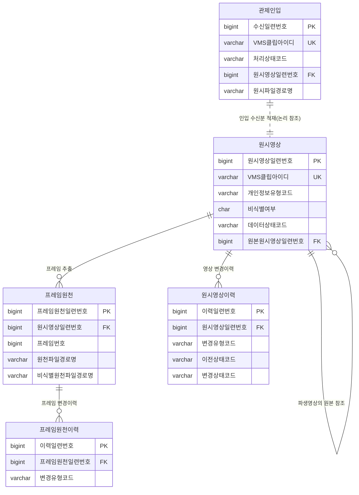
```mermaid
erDiagram
    원시영상 ||--o{ 프레임원천 : "프레임 추출"
    원시영상 ||--o{ 원시영상 : "파생영상의 원본 참조"
    원시영상 ||--o{ 원시영상이력 : "영상 변경이력"
    프레임원천 ||--o{ 프레임원천이력 : "프레임 변경이력"
    관제인입 ||..|| 원시영상 : "인입 수신분 적재(논리 참조)"
    원시영상 {
        bigint 원시영상일련번호 PK
        varchar VMS클립아이디 UK
        varchar 개인정보유형코드
        char 비식별여부
        varchar 데이터상태코드
        bigint 원본원시영상일련번호 FK
    }
    프레임원천 {
        bigint 프레임원천일련번호 PK
        bigint 원시영상일련번호 FK
        bigint 프레임번호
        varchar 원천파일경로명
        varchar 비식별원천파일경로명
    }
    원시영상이력 {
        bigint 이력일련번호 PK
        bigint 원시영상일련번호 FK
        varchar 변경유형코드
        varchar 이전상태코드
        varchar 변경상태코드
    }
    프레임원천이력 {
        bigint 이력일련번호 PK
        bigint 프레임원천일련번호 FK
        varchar 변경유형코드
    }
    관제인입 {
        bigint 수신일련번호 PK
        varchar VMS클립아이디 UK
        varchar 처리상태코드
        bigint 원시영상일련번호 FK
        varchar 원시파일경로명
    }
```

#### 1.2 KLID-AT-ERD-002 — 라벨링

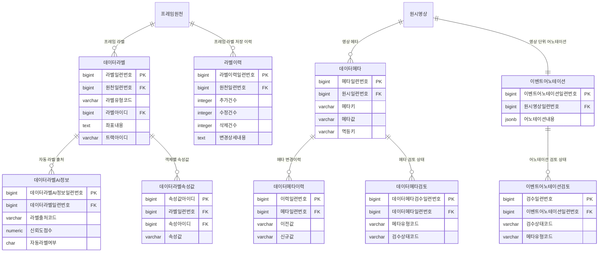
```mermaid
erDiagram
    프레임원천 ||--o{ 데이터라벨 : "프레임 라벨"
    데이터라벨 ||--o{ 데이터라벨AI정보 : "자동 라벨 출처"
    데이터라벨 ||--o{ 데이터라벨속성값 : "객체별 속성값"
    프레임원천 ||--o{ 라벨이력 : "프레임 라벨 저장 이력"
    원시영상 ||--o{ 데이터메타 : "영상 메타"
    데이터메타 ||--o{ 데이터메타이력 : "메타 변경이력"
    데이터메타 ||--o{ 데이터메타검토 : "메타 검토 상태"
    원시영상 ||--|| 이벤트어노테이션 : "영상 단위 어노테이션"
    이벤트어노테이션 ||--o{ 이벤트어노테이션검토 : "어노테이션 검토 상태"
    데이터라벨 {
        bigint 라벨일련번호 PK
        bigint 원천일련번호 FK
        varchar 라벨유형코드
        bigint 라벨아이디 FK
        text 좌표내용
        varchar 트랙아이디
    }
    데이터라벨AI정보 {
        bigint 데이터라벨AI정보일련번호 PK
        bigint 데이터라벨일련번호 FK
        varchar 라벨출처코드
        numeric 신뢰도점수
        char 자동라벨여부
    }
    데이터라벨속성값 {
        bigint 속성값아이디 PK
        bigint 라벨일련번호 FK
        bigint 속성아이디 FK
        varchar 속성값
    }
    라벨이력 {
        bigint 라벨이력일련번호 PK
        bigint 원천일련번호 FK
        integer 추가건수
        integer 수정건수
        integer 삭제건수
        text 변경상세내용
    }
    데이터메타 {
        bigint 메타일련번호 PK
        bigint 원시일련번호 FK
        varchar 메타키
        varchar 메타값
        varchar 멱등키
    }
    데이터메타이력 {
        bigint 이력일련번호 PK
        bigint 메타일련번호 FK
        varchar 이전값
        varchar 신규값
    }
    데이터메타검토 {
        bigint 데이터메타검수일련번호 PK
        bigint 데이터메타일련번호 FK
        varchar 메타유형코드
        varchar 검수상태코드
    }
    이벤트어노테이션 {
        bigint 이벤트어노테이션일련번호 PK
        bigint 원시영상일련번호 FK
        jsonb 어노테이션내용
    }
    이벤트어노테이션검토 {
        bigint 검수일련번호 PK
        bigint 이벤트어노테이션일련번호 FK
        varchar 검수상태코드
        varchar 메타유형코드
    }
```

#### 1.3 KLID-AT-ERD-003 — 라벨 마스터·버전관리

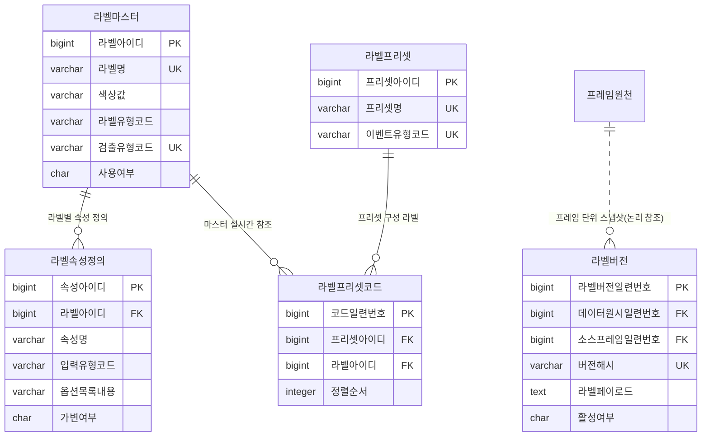
```mermaid
erDiagram
    라벨마스터 ||--o{ 라벨속성정의 : "라벨별 속성 정의"
    라벨프리셋 ||--o{ 라벨프리셋코드 : "프리셋 구성 라벨"
    라벨마스터 ||--o{ 라벨프리셋코드 : "마스터 실시간 참조"
    프레임원천 ||..o{ 라벨버전 : "프레임 단위 스냅샷(논리 참조)"
    라벨마스터 {
        bigint 라벨아이디 PK
        varchar 라벨명 UK
        varchar 색상값
        varchar 라벨유형코드
        varchar 검출유형코드 UK
        char 사용여부
    }
    라벨속성정의 {
        bigint 속성아이디 PK
        bigint 라벨아이디 FK
        varchar 속성명
        varchar 입력유형코드
        varchar 옵션목록내용
        char 가변여부
    }
    라벨프리셋 {
        bigint 프리셋아이디 PK
        varchar 프리셋명 UK
        varchar 이벤트유형코드 UK
    }
    라벨프리셋코드 {
        bigint 코드일련번호 PK
        bigint 프리셋아이디 FK
        bigint 라벨아이디 FK
        integer 정렬순서
    }
    라벨버전 {
        bigint 라벨버전일련번호 PK
        bigint 데이터원시일련번호 FK
        bigint 소스프레임일련번호 FK
        varchar 버전해시 UK
        text 라벨페이로드
        char 활성여부
    }
```

#### 1.4 KLID-AT-ERD-004 — 마킹

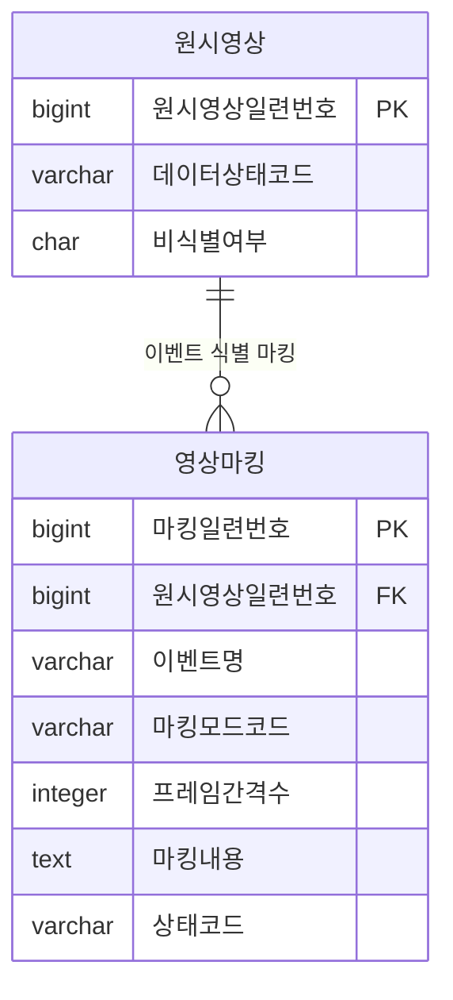
```mermaid
erDiagram
    원시영상 ||--o{ 영상마킹 : "이벤트 식별 마킹"
    원시영상 {
        bigint 원시영상일련번호 PK
        varchar 데이터상태코드
        char 비식별여부
    }
    영상마킹 {
        bigint 마킹일련번호 PK
        bigint 원시영상일련번호 FK
        varchar 이벤트명
        varchar 마킹모드코드
        integer 프레임간격수
        text 마킹내용
        varchar 상태코드
    }
```

#### 1.5 KLID-AT-ERD-005 — 비식별

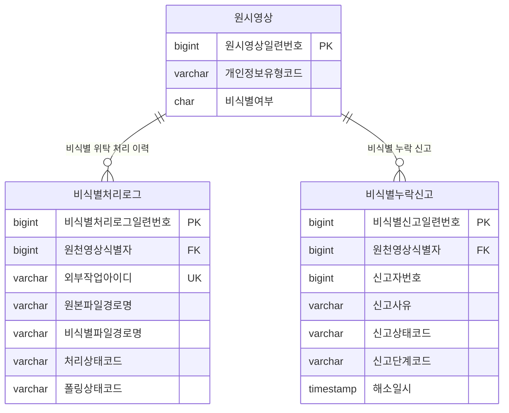
```mermaid
erDiagram
    원시영상 ||--o{ 비식별처리로그 : "비식별 위탁 처리 이력"
    원시영상 ||--o{ 비식별누락신고 : "비식별 누락 신고"
    원시영상 {
        bigint 원시영상일련번호 PK
        varchar 개인정보유형코드
        char 비식별여부
    }
    비식별처리로그 {
        bigint 비식별처리로그일련번호 PK
        bigint 원천영상식별자 FK
        varchar 외부작업아이디 UK
        varchar 원본파일경로명
        varchar 비식별파일경로명
        varchar 처리상태코드
        varchar 폴링상태코드
    }
    비식별누락신고 {
        bigint 비식별신고일련번호 PK
        bigint 원천영상식별자 FK
        bigint 신고자번호
        varchar 신고사유
        varchar 신고상태코드
        varchar 신고단계코드
        timestamp 해소일시
    }
```

#### 1.6 KLID-AT-ERD-006 — 검수·영상상태

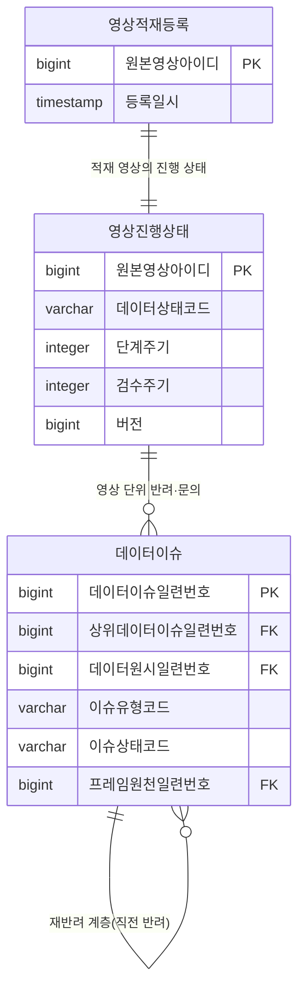
```mermaid
erDiagram
    영상적재등록 ||--|| 영상진행상태 : "적재 영상의 진행 상태"
    영상진행상태 ||--o{ 데이터이슈 : "영상 단위 반려·문의"
    데이터이슈 ||--o{ 데이터이슈 : "재반려 계층(직전 반려)"
    영상적재등록 {
        bigint 원본영상아이디 PK
        timestamp 등록일시
    }
    영상진행상태 {
        bigint 원본영상아이디 PK
        varchar 데이터상태코드
        integer 단계주기
        integer 검수주기
        bigint 버전
    }
    데이터이슈 {
        bigint 데이터이슈일련번호 PK
        bigint 상위데이터이슈일련번호 FK
        bigint 데이터원시일련번호 FK
        varchar 이슈유형코드
        varchar 이슈상태코드
        bigint 프레임원천일련번호 FK
    }
```

#### 1.7 KLID-AT-ERD-007 — 작업 배정

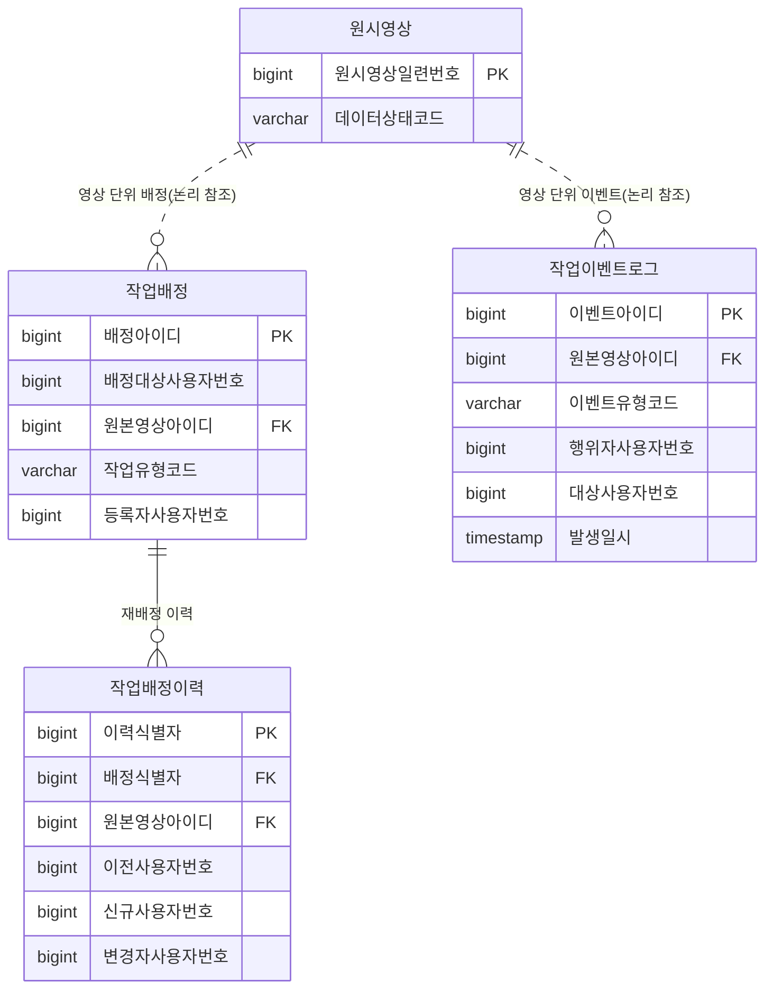
```mermaid
erDiagram
    작업배정 ||--o{ 작업배정이력 : "재배정 이력"
    원시영상 ||..o{ 작업배정 : "영상 단위 배정(논리 참조)"
    원시영상 ||..o{ 작업이벤트로그 : "영상 단위 이벤트(논리 참조)"
    원시영상 {
        bigint 원시영상일련번호 PK
        varchar 데이터상태코드
    }
    작업배정 {
        bigint 배정아이디 PK
        bigint 배정대상사용자번호
        bigint 원본영상아이디 FK
        varchar 작업유형코드
        bigint 등록자사용자번호
    }
    작업배정이력 {
        bigint 이력식별자 PK
        bigint 배정식별자 FK
        bigint 원본영상아이디 FK
        bigint 이전사용자번호
        bigint 신규사용자번호
        bigint 변경자사용자번호
    }
    작업이벤트로그 {
        bigint 이벤트아이디 PK
        bigint 원본영상아이디 FK
        varchar 이벤트유형코드
        bigint 행위자사용자번호
        bigint 대상사용자번호
        timestamp 발생일시
    }
```

#### 1.8 KLID-AT-ERD-008 — 이슈 스레드

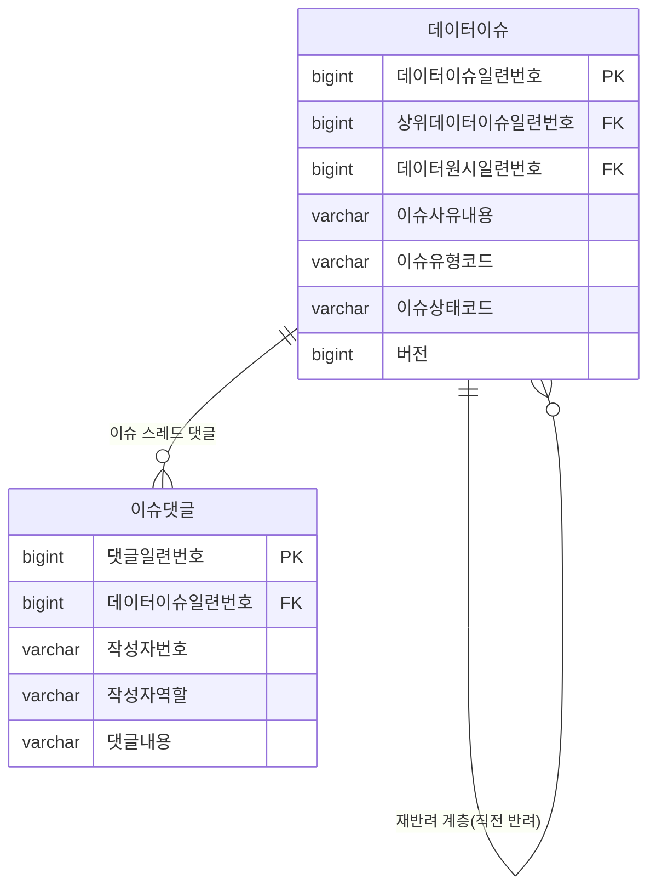
```mermaid
erDiagram
    데이터이슈 ||--o{ 이슈댓글 : "이슈 스레드 댓글"
    데이터이슈 ||--o{ 데이터이슈 : "재반려 계층(직전 반려)"
    데이터이슈 {
        bigint 데이터이슈일련번호 PK
        bigint 상위데이터이슈일련번호 FK
        bigint 데이터원시일련번호 FK
        varchar 이슈사유내용
        varchar 이슈유형코드
        varchar 이슈상태코드
        bigint 버전
    }
    이슈댓글 {
        bigint 댓글일련번호 PK
        bigint 데이터이슈일련번호 FK
        varchar 작성자번호
        varchar 작성자역할
        varchar 댓글내용
    }
```

#### 1.9 KLID-AT-ERD-009 — 데이터 증강

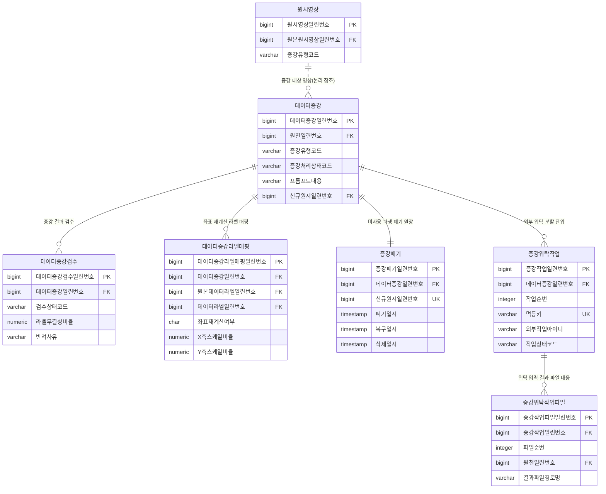
```mermaid
erDiagram
    데이터증강 ||--o{ 데이터증강검수 : "증강 결과 검수"
    데이터증강 ||--o{ 데이터증강라벨매핑 : "좌표 재계산 라벨 매핑"
    데이터증강 ||--|| 증강폐기 : "미사용 파생 폐기 원장"
    데이터증강 ||--o{ 증강위탁작업 : "외부 위탁 분할 단위"
    증강위탁작업 ||--o{ 증강위탁작업파일 : "위탁 입력·결과 파일 대응"
    원시영상 ||..o{ 데이터증강 : "증강 대상 영상(논리 참조)"
    원시영상 {
        bigint 원시영상일련번호 PK
        bigint 원본원시영상일련번호 FK
        varchar 증강유형코드
    }
    데이터증강 {
        bigint 데이터증강일련번호 PK
        bigint 원천일련번호 FK
        varchar 증강유형코드
        varchar 증강처리상태코드
        varchar 프롬프트내용
        bigint 신규원시일련번호 FK
    }
    데이터증강검수 {
        bigint 데이터증강검수일련번호 PK
        bigint 데이터증강일련번호 FK
        varchar 검수상태코드
        numeric 라벨무결성비율
        varchar 반려사유
    }
    데이터증강라벨매핑 {
        bigint 데이터증강라벨매핑일련번호 PK
        bigint 데이터증강일련번호 FK
        bigint 원본데이터라벨일련번호 FK
        bigint 데이터라벨일련번호 FK
        char 좌표재계산여부
        numeric X축스케일비율
        numeric Y축스케일비율
    }
    증강폐기 {
        bigint 증강폐기일련번호 PK
        bigint 데이터증강일련번호 FK
        bigint 신규원시일련번호 UK
        timestamp 폐기일시
        timestamp 복구일시
        timestamp 삭제일시
    }
    증강위탁작업 {
        bigint 증강작업일련번호 PK
        bigint 데이터증강일련번호 FK
        integer 작업순번
        varchar 멱등키 UK
        varchar 외부작업아이디
        varchar 작업상태코드
    }
    증강위탁작업파일 {
        bigint 증강작업파일일련번호 PK
        bigint 증강작업일련번호 FK
        integer 파일순번
        bigint 원천일련번호 FK
        varchar 결과파일경로명
    }
```

#### 1.10 KLID-AT-ERD-010 — 이벤트유형 마스터

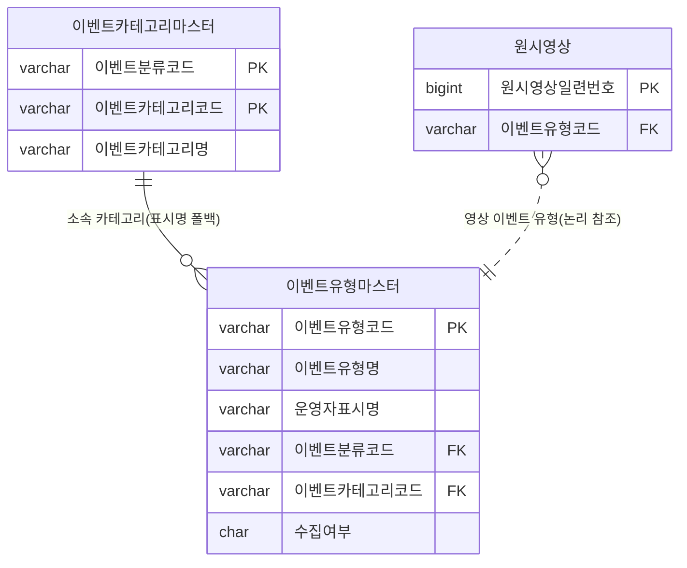
```mermaid
erDiagram
    이벤트카테고리마스터 ||--o{ 이벤트유형마스터 : "소속 카테고리(표시명 폴백)"
    원시영상 }o..|| 이벤트유형마스터 : "영상 이벤트 유형(논리 참조)"
    이벤트유형마스터 {
        varchar 이벤트유형코드 PK
        varchar 이벤트유형명
        varchar 운영자표시명
        varchar 이벤트분류코드 FK
        varchar 이벤트카테고리코드 FK
        char 수집여부
    }
    이벤트카테고리마스터 {
        varchar 이벤트분류코드 PK
        varchar 이벤트카테고리코드 PK
        varchar 이벤트카테고리명
    }
    원시영상 {
        bigint 원시영상일련번호 PK
        varchar 이벤트유형코드 FK
    }
```

#### 1.11 KLID-AT-ERD-011 — 학습데이터 산출·메타 동결

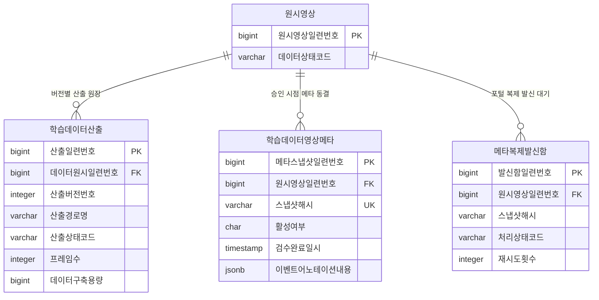
```mermaid
erDiagram
    원시영상 ||--o{ 학습데이터산출 : "버전별 산출 원장"
    원시영상 ||--o{ 학습데이터영상메타 : "승인 시점 메타 동결"
    원시영상 ||--o{ 메타복제발신함 : "포털 복제 발신 대기"
    원시영상 {
        bigint 원시영상일련번호 PK
        varchar 데이터상태코드
    }
    학습데이터산출 {
        bigint 산출일련번호 PK
        bigint 데이터원시일련번호 FK
        integer 산출버전번호
        varchar 산출경로명
        varchar 산출상태코드
        integer 프레임수
        bigint 데이터구축용량
    }
    학습데이터영상메타 {
        bigint 메타스냅샷일련번호 PK
        bigint 원시영상일련번호 FK
        varchar 스냅샷해시 UK
        char 활성여부
        timestamp 검수완료일시
        jsonb 이벤트어노테이션내용
    }
    메타복제발신함 {
        bigint 발신함일련번호 PK
        bigint 원시영상일련번호 FK
        varchar 스냅샷해시
        varchar 처리상태코드
        integer 재시도횟수
    }
```

#### 1.12 KLID-AT-ERD-012 — 관제 통지·외부 위탁 원장

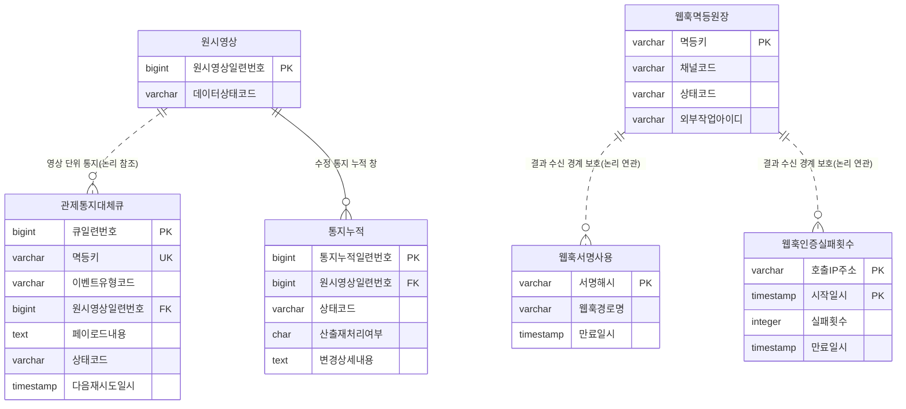
```mermaid
erDiagram
    원시영상 ||..o{ 관제통지대체큐 : "영상 단위 통지(논리 참조)"
    원시영상 ||--o{ 통지누적 : "수정 통지 누적 창"
    웹훅멱등원장 ||..o{ 웹훅서명사용 : "결과 수신 경계 보호(논리 연관)"
    웹훅멱등원장 ||..o{ 웹훅인증실패횟수 : "결과 수신 경계 보호(논리 연관)"
    원시영상 {
        bigint 원시영상일련번호 PK
        varchar 데이터상태코드
    }
    관제통지대체큐 {
        bigint 큐일련번호 PK
        varchar 멱등키 UK
        varchar 이벤트유형코드
        bigint 원시영상일련번호 FK
        text 페이로드내용
        varchar 상태코드
        timestamp 다음재시도일시
    }
    웹훅멱등원장 {
        varchar 멱등키 PK
        varchar 채널코드
        varchar 상태코드
        varchar 외부작업아이디
    }
    통지누적 {
        bigint 통지누적일련번호 PK
        bigint 원시영상일련번호 FK
        varchar 상태코드
        char 산출재처리여부
        text 변경상세내용
    }
    웹훅인증실패횟수 {
        varchar 호출IP주소 PK
        timestamp 시작일시 PK
        integer 실패횟수
        timestamp 만료일시
    }
    웹훅서명사용 {
        varchar 서명해시 PK
        varchar 웹훅경로명
        timestamp 만료일시
    }
```

#### 1.13 KLID-AT-ERD-013 — 배치·작업 인프라

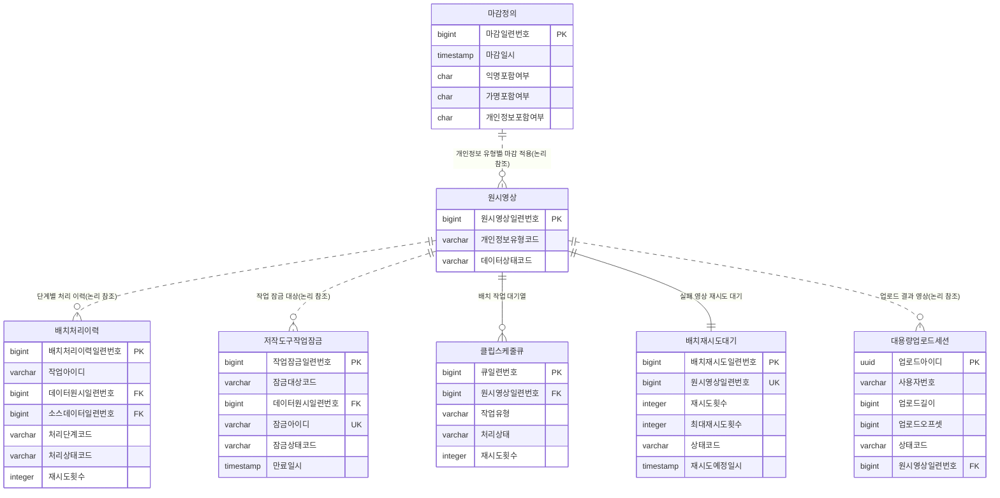
```mermaid
erDiagram
    원시영상 ||..o{ 배치처리이력 : "단계별 처리 이력(논리 참조)"
    원시영상 ||..o{ 저작도구작업잠금 : "작업 잠금 대상(논리 참조)"
    원시영상 ||--o{ 클립스케줄큐 : "배치 작업 대기열"
    원시영상 ||--|| 배치재시도대기 : "실패 영상 재시도 대기"
    원시영상 ||..o{ 대용량업로드세션 : "업로드 결과 영상(논리 참조)"
    마감정의 ||..o{ 원시영상 : "개인정보 유형별 마감 적용(논리 참조)"
    원시영상 {
        bigint 원시영상일련번호 PK
        varchar 개인정보유형코드
        varchar 데이터상태코드
    }
    배치처리이력 {
        bigint 배치처리이력일련번호 PK
        varchar 작업아이디
        bigint 데이터원시일련번호 FK
        bigint 소스데이터일련번호 FK
        varchar 처리단계코드
        varchar 처리상태코드
        integer 재시도횟수
    }
    저작도구작업잠금 {
        bigint 작업잠금일련번호 PK
        varchar 잠금대상코드
        bigint 데이터원시일련번호 FK
        varchar 잠금아이디 UK
        varchar 잠금상태코드
        timestamp 만료일시
    }
    마감정의 {
        bigint 마감일련번호 PK
        timestamp 마감일시
        char 익명포함여부
        char 가명포함여부
        char 개인정보포함여부
    }
    클립스케줄큐 {
        bigint 큐일련번호 PK
        bigint 원시영상일련번호 FK
        varchar 작업유형
        varchar 처리상태
        integer 재시도횟수
    }
    배치재시도대기 {
        bigint 배치재시도일련번호 PK
        bigint 원시영상일련번호 UK
        integer 재시도횟수
        integer 최대재시도횟수
        varchar 상태코드
        timestamp 재시도예정일시
    }
    대용량업로드세션 {
        uuid 업로드아이디 PK
        varchar 사용자번호
        bigint 업로드길이
        bigint 업로드오프셋
        varchar 상태코드
        bigint 원시영상일련번호 FK
    }
```

#### 1.14 KLID-AT-ERD-014 — 포털

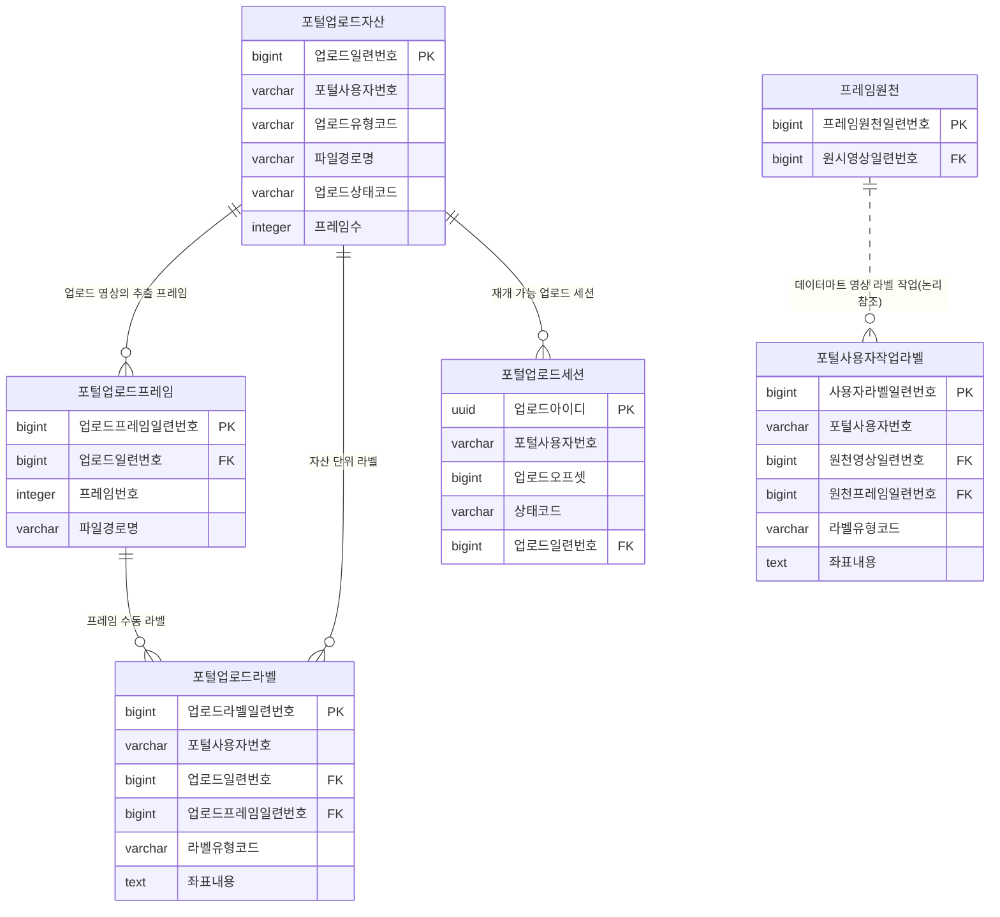
```mermaid
erDiagram
    포털업로드자산 ||--o{ 포털업로드프레임 : "업로드 영상의 추출 프레임"
    포털업로드프레임 ||--o{ 포털업로드라벨 : "프레임 수동 라벨"
    포털업로드자산 ||--o{ 포털업로드라벨 : "자산 단위 라벨"
    포털업로드자산 ||--o{ 포털업로드세션 : "재개 가능 업로드 세션"
    프레임원천 ||..o{ 포털사용자작업라벨 : "데이터마트 영상 라벨 작업(논리 참조)"
    포털사용자작업라벨 {
        bigint 사용자라벨일련번호 PK
        varchar 포털사용자번호
        bigint 원천영상일련번호 FK
        bigint 원천프레임일련번호 FK
        varchar 라벨유형코드
        text 좌표내용
    }
    포털업로드자산 {
        bigint 업로드일련번호 PK
        varchar 포털사용자번호
        varchar 업로드유형코드
        varchar 파일경로명
        varchar 업로드상태코드
        integer 프레임수
    }
    포털업로드프레임 {
        bigint 업로드프레임일련번호 PK
        bigint 업로드일련번호 FK
        integer 프레임번호
        varchar 파일경로명
    }
    포털업로드라벨 {
        bigint 업로드라벨일련번호 PK
        varchar 포털사용자번호
        bigint 업로드일련번호 FK
        bigint 업로드프레임일련번호 FK
        varchar 라벨유형코드
        text 좌표내용
    }
    포털업로드세션 {
        uuid 업로드아이디 PK
        varchar 포털사용자번호
        bigint 업로드오프셋
        varchar 상태코드
        bigint 업로드일련번호 FK
    }
    프레임원천 {
        bigint 프레임원천일련번호 PK
        bigint 원시영상일련번호 FK
    }
```

#### 1.15 KLID-AT-ERD-015 — 사용자·권한

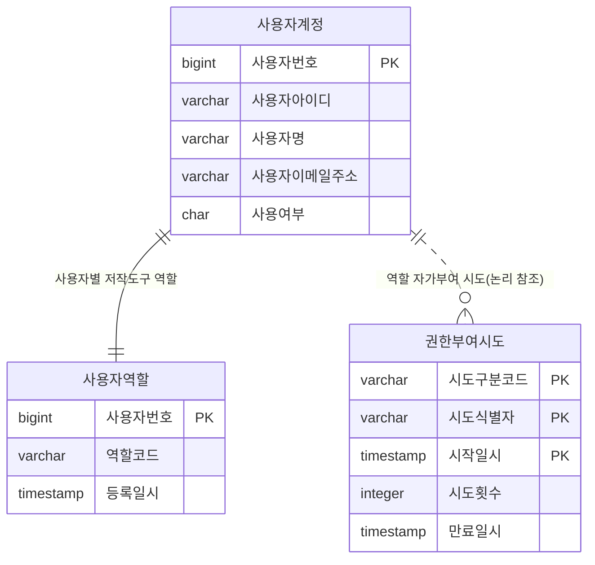
```mermaid
erDiagram
    사용자계정 ||--|| 사용자역할 : "사용자별 저작도구 역할"
    사용자계정 ||..o{ 권한부여시도 : "역할 자가부여 시도(논리 참조)"
    사용자계정 {
        bigint 사용자번호 PK
        varchar 사용자아이디
        varchar 사용자명
        varchar 사용자이메일주소
        char 사용여부
    }
    사용자역할 {
        bigint 사용자번호 PK
        varchar 역할코드
        timestamp 등록일시
    }
    권한부여시도 {
        varchar 시도구분코드 PK
        varchar 시도식별자 PK
        timestamp 시작일시 PK
        integer 시도횟수
        timestamp 만료일시
    }
```

#### 1.16 KLID-AT-ERD-016 — 게시판

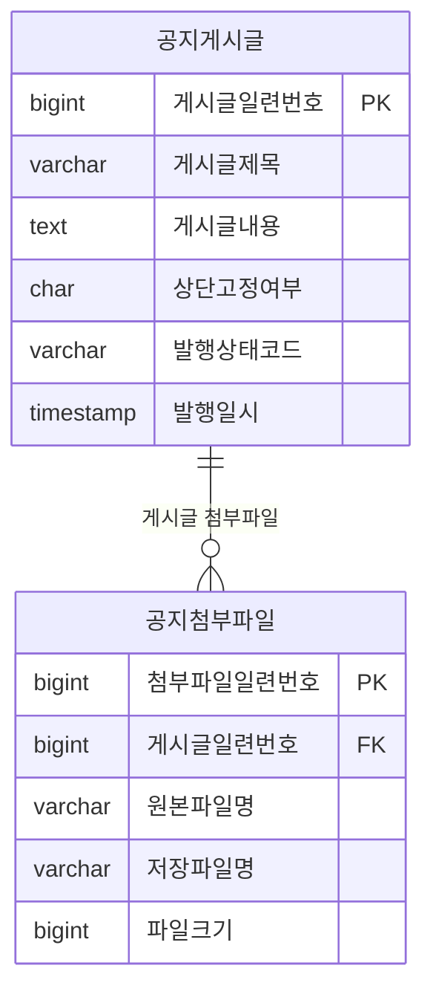
```mermaid
erDiagram
    공지게시글 ||--o{ 공지첨부파일 : "게시글 첨부파일"
    공지게시글 {
        bigint 게시글일련번호 PK
        varchar 게시글제목
        text 게시글내용
        char 상단고정여부
        varchar 발행상태코드
        timestamp 발행일시
    }
    공지첨부파일 {
        bigint 첨부파일일련번호 PK
        bigint 게시글일련번호 FK
        varchar 원본파일명
        varchar 저장파일명
        bigint 파일크기
    }
```

#### 1.17 KLID-AT-ERD-017 — 시스템 설정

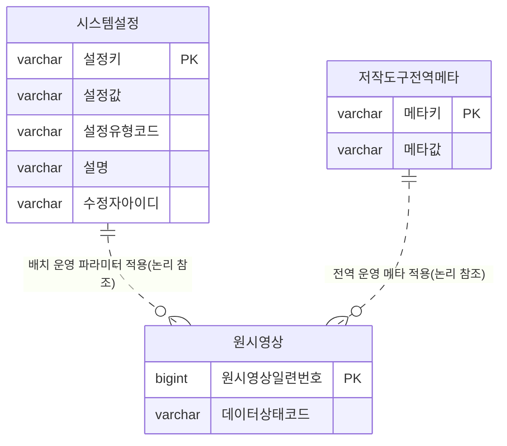
```mermaid
erDiagram
    시스템설정 ||..o{ 원시영상 : "배치 운영 파라미터 적용(논리 참조)"
    저작도구전역메타 ||..o{ 원시영상 : "전역 운영 메타 적용(논리 참조)"
    시스템설정 {
        varchar 설정키 PK
        varchar 설정값
        varchar 설정유형코드
        varchar 설명
        varchar 수정자아이디
    }
    저작도구전역메타 {
        varchar 메타키 PK
        varchar 메타값
    }
    원시영상 {
        bigint 원시영상일련번호 PK
        varchar 데이터상태코드
    }
```

---

### 2. 엔티티 명세서

> 엔티티를 ERD 순서로 오름차순 명세한다. `타입`은 물리 DBMS 타입(PostgreSQL 기준)으로 표기하고 길이는 별도 칸에 기입한다. `동의어`는 표준용어에 정합하지 않은 별칭 속성이 있을 때만 기입한다. `PK`·`FK`·`INX` 칸은 해당하는 경우에만 `Y`를 표기한다. 인덱스 정의·삭제 규칙·검사 제약 등 물리 저장 상세는 D9(데이터베이스설계서)에서 다룬다. `관련 클래스 ID`는 D1(클래스 설계서)의 설계 클래스 ID(`KLID-AT-DC-NNN`)와 동일 체계로 매핑하며, D1에 설계 클래스로 정의되지 않은 부속·이력·인프라 엔티티와 R1 기능 요구사항 유스케이스가 사용하지 않는 도메인 엔티티는 `- ※` + 사유로 표기한다.

<!-- hwpx:ignore-start -->
### 원시영상 (KLID-AT-EN-001)
<!-- hwpx:ignore-end -->

#### 2.1 KLID-AT-EN-001 — 원시영상

| 엔티티 ID | KLID-AT-EN-001 | 엔티티명 | 원시영상 |
|---------|---|-------|---|
| 관련 클래스 ID | KLID-AT-DC-013 | 관련 클래스명 | DataRaw |
| 관련 유스케이스 ID | KLID-AT-UC-001, KLID-AT-UC-002, KLID-AT-UC-003, KLID-AT-UC-010, KLID-AT-UC-011, KLID-AT-UC-016, KLID-AT-UC-018, KLID-AT-UC-019 |
| 엔티티 설명 | 라벨링 대상 원시 영상의 메타 정보. 작업 단위(영상 1건)의 식별자이며 관제 클립 식별자를 유일 키로 두어 동일 클립 재수신 시 갱신 처리한다. 개인정보 유형에 따라 비식별 대상 여부가 결정되고, 증강·해상도 파생영상은 원본 영상을 자기참조로 가리킨다. |

| 속성명 | 동의어 | 타입 | 길이 | NOT NULL (Y/N) | PK (Y/N) | FK (Y/N) | INX (Y/N) | 기본값 | 제약조건 |
|-------|--------|------|------|--------|------|------|------|-------|--------|
| 원시영상일련번호 |  | BIGINT | - | Y | Y |  |  | 자동증가 | - |
| VMS클립아이디 |  | VARCHAR | 128 | Y |  |  | Y | - | UNIQUE(재수신 갱신 기준) |
| VMS_CCTV아이디 |  | VARCHAR | 64 | Y |  |  | Y | - | - |
| 이벤트유형코드 |  | VARCHAR | 20 | N |  |  |  | - | - |
| 지방자치단체코드 |  | VARCHAR | 20 | N |  |  |  | - | - |
| 개인정보유형코드 |  | VARCHAR | 16 | Y |  |  |  | - | 개인정보 유형 3종(비식별불요/개인정보/가명) |
| 개인정보포함여부 |  | CHAR | 1 | Y |  |  |  | N | 개인정보 유형에서 파생 |
| 비식별여부 |  | CHAR | 1 | Y |  |  |  | N | 성공/실패·신고/미수행 |
| 원시파일경로명 |  | VARCHAR | 500 | Y |  |  |  | - | 원본 보존(불변) |
| 촬영일시 |  | TIMESTAMP | - | N |  |  |  | - | - |
| 영상길이초 |  | INTEGER | - | N |  |  |  | - | - |
| 원본원시영상일련번호 |  | BIGINT | - | N |  | Y | Y | - | 논리 FK → 원시영상(자기참조) |
| 데이터상태코드 |  | VARCHAR | 20 | Y |  |  | Y | PENDING | - |
| 등록일시 |  | TIMESTAMP | - | Y |  |  |  | 현재일시 | - |
| 수정일시 |  | TIMESTAMP | - | N |  |  |  | - | - |
| 출처유형코드 |  | VARCHAR | 20 | N |  |  |  | - | 수집/생성/파생 구분 |
| 증강유형코드 |  | VARCHAR | 20 | N |  |  |  | - | 외부 증강 3종 + 해상도 파생 3종 |
| 영상익명정보포함여부 |  | CHAR | 1 | N |  |  |  | - | - |
| 영상가명정보포함여부 |  | CHAR | 1 | N |  |  |  | - | - |
| 영상개인정보포함여부 |  | CHAR | 1 | N |  |  |  | - | 영상 단위 판정(프레임 축과 입도 상이) |
| 영상길이밀리초 |  | BIGINT | - | N |  |  |  | - | - |
| 날씨명 |  | VARCHAR | 20 | N |  |  |  | - | - |
| 주야구분코드 |  | VARCHAR | 20 | N |  |  |  | - | - |
| 계절코드 |  | VARCHAR | 20 | N |  |  |  | - | - |

<!-- hwpx:ignore-start -->
### 프레임원천 (KLID-AT-EN-002)
<!-- hwpx:ignore-end -->

#### 2.2 KLID-AT-EN-002 — 프레임원천

| 엔티티 ID | KLID-AT-EN-002 | 엔티티명 | 프레임원천 |
|---------|---|-------|---|
| 관련 클래스 ID | KLID-AT-DC-014 | 관련 클래스명 | DataSrc |
| 관련 유스케이스 ID | KLID-AT-UC-002, KLID-AT-UC-003, KLID-AT-UC-021 |
| 엔티티 설명 | 영상에서 추출한 키프레임. 원본 프레임 경로와 비식별 프레임 경로를 같은 행에서 짝으로 관리하며 라벨링의 대상 단위가 된다. |

| 속성명 | 동의어 | 타입 | 길이 | NOT NULL (Y/N) | PK (Y/N) | FK (Y/N) | INX (Y/N) | 기본값 | 제약조건 |
|-------|--------|------|------|--------|------|------|------|-------|--------|
| 프레임원천일련번호 |  | BIGINT | - | Y | Y |  |  | 자동증가 | - |
| 원시영상일련번호 |  | BIGINT | - | Y |  | Y | Y | - | 논리 FK → 원시영상 |
| 프레임번호 |  | BIGINT | - | Y |  |  | Y | - | 영상·프레임번호 복합 UNIQUE |
| 원천파일경로명 |  | VARCHAR | 500 | N |  |  |  | - | - |
| 비식별원천파일경로명 |  | VARCHAR | 1000 | N |  |  |  | - | - |
| 촬영일시 |  | TIMESTAMP | - | N |  |  |  | - | - |
| 등록일시 |  | TIMESTAMP | - | Y |  |  |  | 현재일시 | - |
| 수정일시 |  | TIMESTAMP | - | N |  |  |  | - | - |
| 영상프레임번호 |  | BIGINT | - | N |  |  |  | - | - |
| 프레임설명 |  | VARCHAR | 1000 | N |  |  |  | - | - |
| 프레임익명정보포함여부 |  | CHAR | 1 | N |  |  |  | - | - |
| 프레임가명정보포함여부 |  | CHAR | 1 | N |  |  |  | - | - |
| 프레임개인정보포함여부 |  | CHAR | 1 | N |  |  |  | - | - |
| 라벨버전 |  | BIGINT | - | Y |  |  |  | 0 | 라벨 변경 감지용 증가 버전 |

<!-- hwpx:ignore-start -->
### 원시영상이력 (KLID-AT-EN-003)
<!-- hwpx:ignore-end -->

#### 2.3 KLID-AT-EN-003 — 원시영상이력

| 엔티티 ID | KLID-AT-EN-003 | 엔티티명 | 원시영상이력 |
|---------|---|-------|---|
| 관련 클래스 ID | KLID-AT-DC-016 | 관련 클래스명 | DataRawHistory |
| 관련 유스케이스 ID | KLID-AT-UC-018 |
| 엔티티 설명 | 영상 변경 이력. 적재(신규·갱신)·상태 전이 등 변경 사유와 변경 전후 상태를 기록한다. |

| 속성명 | 동의어 | 타입 | 길이 | NOT NULL (Y/N) | PK (Y/N) | FK (Y/N) | INX (Y/N) | 기본값 | 제약조건 |
|-------|--------|------|------|--------|------|------|------|-------|--------|
| 이력일련번호 |  | BIGINT | - | Y | Y |  |  | 자동증가 | - |
| 원시영상일련번호 |  | BIGINT | - | Y |  | Y | Y | - | 논리 FK → 원시영상 |
| 변경유형코드 |  | VARCHAR | 16 | Y |  |  |  | - | - |
| 이전상태코드 |  | VARCHAR | 32 | N |  |  |  | - | - |
| 변경상태코드 |  | VARCHAR | 32 | N |  |  |  | - | - |
| 변경사용자번호 |  | BIGINT | - | N |  |  |  | - | - |
| 변경일시 |  | TIMESTAMP | - | Y |  |  |  | 현재일시 | - |

<!-- hwpx:ignore-start -->
### 프레임원천이력 (KLID-AT-EN-004)
<!-- hwpx:ignore-end -->

#### 2.4 KLID-AT-EN-004 — 프레임원천이력

| 엔티티 ID | KLID-AT-EN-004 | 엔티티명 | 프레임원천이력 |
|---------|---|-------|---|
| 관련 클래스 ID | - ※ | 관련 클래스명 | - ※ |
| 관련 유스케이스 ID | KLID-AT-UC-019 |
| 엔티티 설명 | 프레임 변경 이력. 생성·비식별 경로 연결 등 변경 사유를 기록한다. ※ D1에서 별도 설계 클래스로 분리하지 않은 프레임 변경 이력 부속 엔티티. |

| 속성명 | 동의어 | 타입 | 길이 | NOT NULL (Y/N) | PK (Y/N) | FK (Y/N) | INX (Y/N) | 기본값 | 제약조건 |
|-------|--------|------|------|--------|------|------|------|-------|--------|
| 이력일련번호 |  | BIGINT | - | Y | Y |  |  | 자동증가 | - |
| 프레임원천일련번호 |  | BIGINT | - | Y |  | Y | Y | - | 논리 FK → 프레임원천 |
| 변경유형코드 |  | VARCHAR | 16 | Y |  |  |  | - | - |
| 변경사용자번호 |  | BIGINT | - | N |  |  |  | - | - |
| 변경일시 |  | TIMESTAMP | - | Y |  |  |  | 현재일시 | - |

<!-- hwpx:ignore-start -->
### 관제인입 (KLID-AT-EN-005)
<!-- hwpx:ignore-end -->

#### 2.5 KLID-AT-EN-005 — 관제인입

| 엔티티 ID | KLID-AT-EN-005 | 엔티티명 | 관제인입 |
|---------|---|-------|---|
| 관련 클래스 ID | KLID-AT-DC-010 | 관련 클래스명 | DataIngest |
| 관련 유스케이스 ID | KLID-AT-UC-018 |
| 엔티티 설명 | 관제지원시스템이 학습용 영상 메타를 저작도구에 직접 적재하는 수신 원장. 저작도구 주기 배치가 미처리 행을 집어 원시영상으로 적재하며, 수신 기록은 적재 이후에도 보존한다. |

| 속성명 | 동의어 | 타입 | 길이 | NOT NULL (Y/N) | PK (Y/N) | FK (Y/N) | INX (Y/N) | 기본값 | 제약조건 |
|-------|--------|------|------|--------|------|------|------|-------|--------|
| 수신일련번호 |  | BIGINT | - | Y | Y |  |  | 자동증가 | - |
| 수신일시 |  | TIMESTAMP | - | Y |  |  | Y | 현재일시 | - |
| 처리상태코드 |  | VARCHAR | 20 | Y |  |  |  | PENDING | - |
| 원시영상일련번호 |  | BIGINT | - | N |  | Y |  | - | 논리 FK → 원시영상 |
| 재시도횟수 |  | INTEGER | - | Y |  |  |  | 0 | - |
| 처리일시 |  | TIMESTAMP | - | N |  |  |  | - | - |
| 다음재시도일시 |  | TIMESTAMP | - | N |  |  |  | - | - |
| 에러메시지 |  | VARCHAR | 4000 | N |  |  |  | - | - |
| VMS클립아이디 |  | VARCHAR | 128 | Y |  |  | Y | - | UNIQUE(중복 수신 차단) |
| VMS_CCTV아이디 |  | VARCHAR | 64 | Y |  |  |  | - | - |
| 동영상파일명 |  | VARCHAR | 300 | Y |  |  |  | - | - |
| 원시파일경로명 |  | VARCHAR | 500 | Y |  |  |  | - | - |
| 출처유형코드 |  | VARCHAR | 20 | Y |  |  |  | - | 기본값 미부여(누락 시 적재 거부) |
| 촬영일시 |  | TIMESTAMP | - | N |  |  |  | - | - |
| 파일형식 |  | VARCHAR | 20 | N |  |  |  | - | - |
| 영상코덱 |  | VARCHAR | 20 | N |  |  |  | - | - |
| 파일크기 |  | BIGINT | - | N |  |  |  | - | - |
| 지방자치단체명 |  | VARCHAR | 100 | N |  |  |  | - | - |
| 영상길이초 |  | NUMERIC | 10,0 | N |  |  |  | - | - |
| 프레임재생속도 |  | VARCHAR | 10 | N |  |  |  | - | - |
| 프레임수 |  | NUMERIC | 10,0 | N |  |  |  | - | - |
| 종횡비 |  | VARCHAR | 20 | N |  |  |  | - | - |
| 가로길이 |  | NUMERIC | 10,0 | N |  |  |  | - | - |
| 세로길이 |  | NUMERIC | 10,0 | N |  |  |  | - | - |
| 해상도 |  | VARCHAR | 20 | N |  |  |  | - | - |
| 색심도값 |  | VARCHAR | 20 | N |  |  |  | - | - |
| 화소값 |  | VARCHAR | 20 | N |  |  |  | - | - |
| WGS84위도 |  | NUMERIC | 10,7 | N |  |  |  | - | - |
| WGS84경도 |  | NUMERIC | 10,7 | N |  |  |  | - | - |
| 기관코드 |  | VARCHAR | 20 | N |  |  |  | - | - |
| CCTV명 |  | VARCHAR | 300 | N |  |  |  | - | - |
| CCTV높이 |  | NUMERIC | 4,1 | N |  |  |  | - | - |
| 주감시방향값 |  | INTEGER | - | N |  |  |  | - | - |
| 이벤트아이디 |  | VARCHAR | 50 | N |  |  |  | - | - |
| 이벤트명 |  | VARCHAR | 200 | N |  |  |  | - | - |
| 관제일지내용 |  | VARCHAR | 4000 | N |  |  |  | - | - |
| 지방자치단체코드 |  | VARCHAR | 20 | N |  |  |  | - | - |
| 이벤트유형코드 |  | VARCHAR | 20 | N |  |  |  | - | - |
| 원천익명정보포함여부 |  | CHAR | 1 | N |  |  |  | N | - |
| 원천가명정보포함여부 |  | CHAR | 1 | N |  |  |  | N | - |
| 원천개인정보포함여부 |  | CHAR | 1 | N |  |  |  | Y | - |
| 이벤트분류코드 |  | CHAR | 2 | N |  |  |  | - | - |
| 이벤트카테고리코드 |  | CHAR | 4 | N |  |  |  | - | - |

<!-- hwpx:ignore-start -->
### 데이터라벨 (KLID-AT-EN-006)
<!-- hwpx:ignore-end -->

#### 2.6 KLID-AT-EN-006 — 데이터라벨

| 엔티티 ID | KLID-AT-EN-006 | 엔티티명 | 데이터라벨 |
|---------|---|-------|---|
| 관련 클래스 ID | KLID-AT-DC-057 | 관련 클래스명 | DataLabel |
| 관련 유스케이스 ID | KLID-AT-UC-002, KLID-AT-UC-003, KLID-AT-UC-004, KLID-AT-UC-007, KLID-AT-UC-008, KLID-AT-UC-021 |
| 엔티티 설명 | 프레임 단위 라벨의 현재 좌표와 분류. 사각형·다각형·영역분할·추적 유형별 좌표를 보관하고 라벨 마스터를 참조한다. |

| 속성명 | 동의어 | 타입 | 길이 | NOT NULL (Y/N) | PK (Y/N) | FK (Y/N) | INX (Y/N) | 기본값 | 제약조건 |
|-------|--------|------|------|--------|------|------|------|-------|--------|
| 라벨일련번호 |  | BIGINT | - | Y | Y |  |  | AS | - |
| 원천일련번호 |  | BIGINT | - | Y |  | Y | Y | - | 논리 FK → 프레임원천 |
| 라벨유형코드 |  | VARCHAR | 16 | Y |  |  |  | - | 사각형/다각형/영역분할/추적 |
| 라벨아이디 |  | BIGINT | - | N |  | Y | Y | - | 논리 FK → 라벨마스터 |
| 라벨명 |  | VARCHAR | 80 | Y |  |  |  | - | - |
| 좌표내용 |  | TEXT | - | N |  |  |  | - | - |
| 트랙아이디 |  | VARCHAR | 30 | N |  |  | Y | - | - |
| 등록사용자번호 |  | BIGINT | - | N |  |  |  | - | - |
| 등록일시 |  | TIMESTAMP | - | Y |  |  |  | 현재일시 | - |
| 수정일시 |  | TIMESTAMP | - | N |  |  |  | - | - |

<!-- hwpx:ignore-start -->
### 데이터라벨AI정보 (KLID-AT-EN-007)
<!-- hwpx:ignore-end -->

#### 2.7 KLID-AT-EN-007 — 데이터라벨AI정보

| 엔티티 ID | KLID-AT-EN-007 | 엔티티명 | 데이터라벨AI정보 |
|---------|---|-------|---|
| 관련 클래스 ID | KLID-AT-DC-068 | 관련 클래스명 | DataLabelAiInfo |
| 관련 유스케이스 ID | KLID-AT-UC-004, KLID-AT-UC-019 |
| 엔티티 설명 | 자동 생성 라벨의 출처·모델·신뢰도 정보. 좌표는 데이터라벨이 보관하고 추론 출처 정보는 본 엔티티로 분리한다. |

| 속성명 | 동의어 | 타입 | 길이 | NOT NULL (Y/N) | PK (Y/N) | FK (Y/N) | INX (Y/N) | 기본값 | 제약조건 |
|-------|--------|------|------|--------|------|------|------|-------|--------|
| 데이터라벨AI정보일련번호 |  | BIGINT | - | Y | Y |  |  | AS | - |
| 데이터라벨일련번호 |  | BIGINT | - | Y |  | Y | Y | - | 논리 FK → 데이터라벨 |
| 데이터원시일련번호 |  | BIGINT | - | Y |  | Y | Y | - | 논리 FK → 원시영상 |
| 데이터원천일련번호 |  | BIGINT | - | Y |  | Y | Y | - | 논리 FK → 프레임원천 |
| 라벨출처코드 |  | VARCHAR | 20 | Y |  |  | Y | - | - |
| 모델명 |  | VARCHAR | 100 | N |  |  |  | - | - |
| 모델버전 |  | VARCHAR | 50 | N |  |  |  | - | - |
| 신뢰도점수 |  | NUMERIC | 6,5 | N |  |  |  | - | - |
| 자동라벨여부 |  | CHAR | 1 | Y |  |  |  | Y | - |
| 등록아이디 |  | VARCHAR | 30 | N |  |  |  | - | - |
| 등록일시 |  | TIMESTAMP | - | Y |  |  |  | 현재일시 | - |
| 수정아이디 |  | VARCHAR | 30 | N |  |  |  | - | - |
| 수정일시 |  | TIMESTAMP | - | N |  |  |  | - | - |

<!-- hwpx:ignore-start -->
### 데이터라벨속성값 (KLID-AT-EN-008)
<!-- hwpx:ignore-end -->

#### 2.8 KLID-AT-EN-008 — 데이터라벨속성값

| 엔티티 ID | KLID-AT-EN-008 | 엔티티명 | 데이터라벨속성값 |
|---------|---|-------|---|
| 관련 클래스 ID | KLID-AT-DC-058 | 관련 클래스명 | DataLabelAttrValue |
| 관련 유스케이스 ID | KLID-AT-UC-021 |
| 엔티티 설명 | 라벨링된 객체별 속성값. 라벨 속성 정의에 대응하는 실제 입력값을 객체 단위로 보관한다. |

| 속성명 | 동의어 | 타입 | 길이 | NOT NULL (Y/N) | PK (Y/N) | FK (Y/N) | INX (Y/N) | 기본값 | 제약조건 |
|-------|--------|------|------|--------|------|------|------|-------|--------|
| 속성값아이디 |  | BIGINT | - | Y | Y |  |  | AS | - |
| 라벨일련번호 |  | BIGINT | - | Y |  | Y | Y | - | 논리 FK → 데이터라벨 |
| 속성아이디 |  | BIGINT | - | Y |  | Y | Y | - | 논리 FK → 라벨속성정의 · 라벨·속성 복합 UNIQUE |
| 속성값 |  | VARCHAR | 1000 | N |  |  |  | - | - |
| 등록일시 |  | TIMESTAMP | - | Y |  |  |  | 현재일시 | - |
| 수정일시 |  | TIMESTAMP | - | N |  |  |  | - | - |

<!-- hwpx:ignore-start -->
### 라벨이력 (KLID-AT-EN-009)
<!-- hwpx:ignore-end -->

#### 2.9 KLID-AT-EN-009 — 라벨이력

| 엔티티 ID | KLID-AT-EN-009 | 엔티티명 | 라벨이력 |
|---------|---|-------|---|
| 관련 클래스 ID | KLID-AT-DC-060 | 관련 클래스명 | DataLabelHistory |
| 관련 유스케이스 ID | KLID-AT-UC-007, KLID-AT-UC-008, KLID-AT-UC-021 |
| 엔티티 설명 | 라벨 변경 이력. 저장 이벤트 단위로 대상 라벨과 프레임, 기록 시점을 남긴다. |

| 속성명 | 동의어 | 타입 | 길이 | NOT NULL (Y/N) | PK (Y/N) | FK (Y/N) | INX (Y/N) | 기본값 | 제약조건 |
|-------|--------|------|------|--------|------|------|------|-------|--------|
| 라벨이력일련번호 |  | BIGINT | - | Y | Y |  |  | 자동증가 | - |
| 원천일련번호 |  | BIGINT | - | Y |  | Y | Y | - | 논리 FK → 프레임원천 |
| 등록일시 |  | TIMESTAMP | - | Y |  |  | Y | - | - |
| 등록아이디 |  | VARCHAR | 30 | N |  |  |  | - | - |
| 추가건수 |  | INTEGER | - | Y |  |  |  | 0 | - |
| 수정건수 |  | INTEGER | - | Y |  |  |  | 0 | - |
| 삭제건수 |  | INTEGER | - | Y |  |  |  | 0 | - |
| 변경상세내용 |  | TEXT | - | N |  |  |  | - | - |

<!-- hwpx:ignore-start -->
### 데이터메타 (KLID-AT-EN-010)
<!-- hwpx:ignore-end -->

#### 2.10 KLID-AT-EN-010 — 데이터메타

| 엔티티 ID | KLID-AT-EN-010 | 엔티티명 | 데이터메타 |
|---------|---|-------|---|
| 관련 클래스 ID | KLID-AT-DC-081 | 관련 클래스명 | DataMeta |
| 관련 유스케이스 ID | KLID-AT-UC-002, KLID-AT-UC-022 |
| 엔티티 설명 | 영상 단위 메타 항목의 키-값 저장소. 외부 시계열 메타 분석 결과와 기술 메타를 함께 보관하며 비동기 위탁 추적 항목(멱등키·외부 작업 식별자·재시도)을 포함한다. |

| 속성명 | 동의어 | 타입 | 길이 | NOT NULL (Y/N) | PK (Y/N) | FK (Y/N) | INX (Y/N) | 기본값 | 제약조건 |
|-------|--------|------|------|--------|------|------|------|-------|--------|
| 메타일련번호 |  | BIGINT | - | Y | Y |  |  | AS | - |
| 원시일련번호 |  | BIGINT | - | Y |  | Y | Y | - | 논리 FK → 원시영상 |
| 메타키 |  | VARCHAR | 64 | Y |  |  | Y | - | 영상·메타키 복합 UNIQUE |
| 메타값 |  | VARCHAR | 2000 | N |  |  |  | - | - |
| 등록일시 |  | TIMESTAMP | - | Y |  |  |  | 현재일시 | - |
| 수정일시 |  | TIMESTAMP | - | N |  |  |  | - | - |
| 멱등키 |  | VARCHAR | 128 | N |  |  | Y | - | - |
| 외부작업아이디 |  | VARCHAR | 200 | N |  |  | Y | - | - |
| 재시도횟수 |  | INTEGER | - | Y |  |  |  | 0 | - |
| 영구실패시점 |  | TIMESTAMP | - | N |  |  |  | - | - |

<!-- hwpx:ignore-start -->
### 데이터메타이력 (KLID-AT-EN-011)
<!-- hwpx:ignore-end -->

#### 2.11 KLID-AT-EN-011 — 데이터메타이력

| 엔티티 ID | KLID-AT-EN-011 | 엔티티명 | 데이터메타이력 |
|---------|---|-------|---|
| 관련 클래스 ID | KLID-AT-DC-083 | 관련 클래스명 | DataMetaHistory |
| 관련 유스케이스 ID | KLID-AT-UC-022 |
| 엔티티 설명 | 메타 값의 변경 전·후 값을 남기는 경량 변경 이력. |

| 속성명 | 동의어 | 타입 | 길이 | NOT NULL (Y/N) | PK (Y/N) | FK (Y/N) | INX (Y/N) | 기본값 | 제약조건 |
|-------|--------|------|------|--------|------|------|------|-------|--------|
| 이력일련번호 |  | BIGINT | - | Y | Y |  |  | AS | - |
| 메타일련번호 |  | BIGINT | - | Y |  | Y | Y | - | 논리 FK → 데이터메타 |
| 이전값 |  | VARCHAR | 2000 | N |  |  |  | - | - |
| 신규값 |  | VARCHAR | 2000 | N |  |  |  | - | - |
| 변경사용자번호 |  | BIGINT | - | N |  |  |  | - | - |
| 변경일시 |  | TIMESTAMP | - | Y |  |  |  | 현재일시 | - |

<!-- hwpx:ignore-start -->
### 데이터메타검토 (KLID-AT-EN-012)
<!-- hwpx:ignore-end -->

#### 2.12 KLID-AT-EN-012 — 데이터메타검토

| 엔티티 ID | KLID-AT-EN-012 | 엔티티명 | 데이터메타검토 |
|---------|---|-------|---|
| 관련 클래스 ID | KLID-AT-DC-082 | 관련 클래스명 | DataMetaReview |
| 관련 유스케이스 ID | KLID-AT-UC-022 |
| 엔티티 설명 | 외부·자동 생성 메타의 검토 상태. 값 자체는 데이터메타가 보관하고 검토 상태·검토자·반려 사유를 분리 관리한다. |

| 속성명 | 동의어 | 타입 | 길이 | NOT NULL (Y/N) | PK (Y/N) | FK (Y/N) | INX (Y/N) | 기본값 | 제약조건 |
|-------|--------|------|------|--------|------|------|------|-------|--------|
| 데이터메타검수일련번호 |  | BIGINT | - | Y | Y |  |  | AS | - |
| 데이터메타일련번호 |  | BIGINT | - | Y |  | Y | Y | - | 논리 FK → 데이터메타 |
| 데이터원시일련번호 |  | BIGINT | - | Y |  | Y | Y | - | 논리 FK → 원시영상 |
| 데이터원천일련번호 |  | BIGINT | - | N |  | Y | Y | - | 논리 FK → 프레임원천 |
| 메타유형코드 |  | VARCHAR | 20 | Y |  |  | Y | - | - |
| 생성시스템코드 |  | VARCHAR | 20 | N |  |  |  | - | - |
| 검수상태코드 |  | VARCHAR | 20 | Y |  |  | Y | - | 자동생성/검토대기/승인/반려 |
| 검수아이디 |  | VARCHAR | 30 | N |  |  |  | - | - |
| 검수일시 |  | TIMESTAMP | - | N |  |  |  | - | - |
| 반려사유 |  | VARCHAR | 4000 | N |  |  |  | - | - |
| 등록아이디 |  | VARCHAR | 30 | N |  |  |  | - | - |
| 등록일시 |  | TIMESTAMP | - | Y |  |  |  | 현재일시 | - |
| 수정아이디 |  | VARCHAR | 30 | N |  |  |  | - | - |
| 수정일시 |  | TIMESTAMP | - | N |  |  |  | - | - |

<!-- hwpx:ignore-start -->
### 이벤트어노테이션 (KLID-AT-EN-013)
<!-- hwpx:ignore-end -->

#### 2.13 KLID-AT-EN-013 — 이벤트어노테이션

| 엔티티 ID | KLID-AT-EN-013 | 엔티티명 | 이벤트어노테이션 |
|---------|---|-------|---|
| 관련 클래스 ID | - ※ | 관련 클래스명 | - ※ |
| 관련 유스케이스 ID | KLID-AT-UC-022 |
| 엔티티 설명 | 영상 단위 이벤트 어노테이션(사건 분류·설명·질의응답·근거 객체). 영상 1건당 1건을 보유한다. ※ D1에서 별도 설계 클래스로 분리하지 않은 시계열 메타 부속 엔티티. |

| 속성명 | 동의어 | 타입 | 길이 | NOT NULL (Y/N) | PK (Y/N) | FK (Y/N) | INX (Y/N) | 기본값 | 제약조건 |
|-------|--------|------|------|--------|------|------|------|-------|--------|
| 이벤트어노테이션일련번호 |  | BIGINT | - | Y | Y |  |  | AS | - |
| 원시영상일련번호 |  | BIGINT | - | Y |  | Y | Y | - | 논리 FK → 원시영상 · UNIQUE(영상 1건당 1행) |
| 어노테이션내용 |  | JSONB | - | Y |  |  |  | - | - |
| 등록아이디 |  | VARCHAR | 30 | N |  |  |  | - | - |
| 등록일시 |  | TIMESTAMP | - | Y |  |  |  | 현재일시 | - |
| 수정아이디 |  | VARCHAR | 30 | N |  |  |  | - | - |
| 수정일시 |  | TIMESTAMP | - | N |  |  |  | - | - |

<!-- hwpx:ignore-start -->
### 이벤트어노테이션검토 (KLID-AT-EN-014)
<!-- hwpx:ignore-end -->

#### 2.14 KLID-AT-EN-014 — 이벤트어노테이션검토

| 엔티티 ID | KLID-AT-EN-014 | 엔티티명 | 이벤트어노테이션검토 |
|---------|---|-------|---|
| 관련 클래스 ID | - ※ | 관련 클래스명 | - ※ |
| 관련 유스케이스 ID | KLID-AT-UC-022 |
| 엔티티 설명 | 이벤트 어노테이션의 검토 상태·검토자·반려 사유. ※ D1에서 별도 설계 클래스로 분리하지 않은 검토 상태 부속 엔티티. |

| 속성명 | 동의어 | 타입 | 길이 | NOT NULL (Y/N) | PK (Y/N) | FK (Y/N) | INX (Y/N) | 기본값 | 제약조건 |
|-------|--------|------|------|--------|------|------|------|-------|--------|
| 검수일련번호 |  | BIGINT | - | Y | Y |  |  | 자동증가 | - |
| 이벤트어노테이션일련번호 |  | BIGINT | - | Y |  | Y | Y | - | 논리 FK → 이벤트어노테이션 |
| 검수상태코드 |  | VARCHAR | 20 | Y |  |  | Y | - | 자동생성/검토대기/승인/반려 |
| 메타유형코드 |  | VARCHAR | 20 | N |  |  |  | - | - |
| 검수아이디 |  | VARCHAR | 30 | N |  |  |  | - | - |
| 검수일시 |  | TIMESTAMP | - | N |  |  |  | - | - |
| 반려사유 |  | VARCHAR | 4000 | N |  |  |  | - | - |
| 등록아이디 |  | VARCHAR | 30 | N |  |  |  | - | - |
| 등록일시 |  | TIMESTAMP | - | Y |  |  |  | 현재일시 | - |
| 수정아이디 |  | VARCHAR | 30 | N |  |  |  | - | - |
| 수정일시 |  | TIMESTAMP | - | N |  |  |  | - | - |
| 버전 |  | BIGINT | - | Y |  |  |  | 0 | 낙관적 잠금 |

<!-- hwpx:ignore-start -->
### 라벨마스터 (KLID-AT-EN-015)
<!-- hwpx:ignore-end -->

#### 2.15 KLID-AT-EN-015 — 라벨마스터

| 엔티티 ID | KLID-AT-EN-015 | 엔티티명 | 라벨마스터 |
|---------|---|-------|---|
| 관련 클래스 ID | KLID-AT-DC-063 | 관련 클래스명 | Label |
| 관련 유스케이스 ID | KLID-AT-UC-021, KLID-AT-UC-028 |
| 엔티티 설명 | 저작도구 전역 라벨 풀의 마스터. 라벨명·색상·도형 유형과 자동 탐지 클래스 매핑을 정의하며 사용여부로 논리 삭제한다. |

| 속성명 | 동의어 | 타입 | 길이 | NOT NULL (Y/N) | PK (Y/N) | FK (Y/N) | INX (Y/N) | 기본값 | 제약조건 |
|-------|--------|------|------|--------|------|------|------|-------|--------|
| 라벨아이디 |  | BIGINT | - | Y | Y |  |  | AS | - |
| 라벨명 |  | VARCHAR | 80 | Y |  |  | Y | - | UNIQUE(전역 라벨명) |
| 색상값 |  | VARCHAR | 7 | Y |  |  |  | - | 색상 표기 형식 준수 |
| 라벨유형코드 |  | VARCHAR | 16 | Y |  |  |  | - | - |
| 정렬순서 |  | INTEGER | - | Y |  |  | Y | 0 | - |
| 사용여부 |  | CHAR | 1 | Y |  |  | Y | Y | 사용여부(논리 삭제) |
| 등록아이디 |  | VARCHAR | 30 | N |  |  |  | - | - |
| 등록일시 |  | TIMESTAMP | - | Y |  |  |  | 현재일시 | - |
| 수정아이디 |  | VARCHAR | 30 | N |  |  |  | - | - |
| 수정일시 |  | TIMESTAMP | - | N |  |  |  | - | - |
| 검출유형코드 |  | VARCHAR | 20 | N |  |  | Y | - | UNIQUE(활성 라벨 1:1 매핑) |

<!-- hwpx:ignore-start -->
### 라벨속성정의 (KLID-AT-EN-016)
<!-- hwpx:ignore-end -->

#### 2.16 KLID-AT-EN-016 — 라벨속성정의

| 엔티티 ID | KLID-AT-EN-016 | 엔티티명 | 라벨속성정의 |
|---------|---|-------|---|
| 관련 클래스 ID | KLID-AT-DC-066 | 관련 클래스명 | LabelAttr |
| 관련 유스케이스 ID | KLID-AT-UC-021, KLID-AT-UC-028 |
| 엔티티 설명 | 라벨별 속성 정의. 입력 위젯 유형·선택 옵션·기본값·프레임별 가변 여부를 보관한다. |

| 속성명 | 동의어 | 타입 | 길이 | NOT NULL (Y/N) | PK (Y/N) | FK (Y/N) | INX (Y/N) | 기본값 | 제약조건 |
|-------|--------|------|------|--------|------|------|------|-------|--------|
| 속성아이디 |  | BIGINT | - | Y | Y |  |  | AS | - |
| 라벨아이디 |  | BIGINT | - | Y |  | Y | Y | - | 논리 FK → 라벨마스터 |
| 속성명 |  | VARCHAR | 100 | Y |  |  | Y | - | 라벨·속성명 복합 UNIQUE |
| 입력유형코드 |  | VARCHAR | 16 | Y |  |  |  | - | - |
| 옵션목록내용 |  | VARCHAR | 1000 | N |  |  |  | - | - |
| 기본값 |  | VARCHAR | 255 | N |  |  |  | - | - |
| 가변여부 |  | CHAR | 1 | Y |  |  |  | Y | - |
| 정렬순서 |  | INTEGER | - | Y |  |  | Y | 0 | - |
| 사용여부 |  | CHAR | 1 | Y |  |  | Y | Y | 사용여부(논리 삭제) |
| 등록아이디 |  | VARCHAR | 30 | N |  |  |  | - | - |
| 등록일시 |  | TIMESTAMP | - | Y |  |  |  | 현재일시 | - |
| 수정아이디 |  | VARCHAR | 30 | N |  |  |  | - | - |
| 수정일시 |  | TIMESTAMP | - | N |  |  |  | - | - |

<!-- hwpx:ignore-start -->
### 라벨프리셋 (KLID-AT-EN-017)
<!-- hwpx:ignore-end -->

#### 2.17 KLID-AT-EN-017 — 라벨프리셋

| 엔티티 ID | KLID-AT-EN-017 | 엔티티명 | 라벨프리셋 |
|---------|---|-------|---|
| 관련 클래스 ID | - ※ | 관련 클래스명 | - ※ |
| 관련 유스케이스 ID | KLID-AT-UC-028 |
| 엔티티 설명 | 자주 쓰는 라벨 묶음 정의. 이벤트 유형 1건에 선택적으로 1:1 매핑한다. ※ D1에서 별도 설계 클래스로 분리하지 않은 라벨 마스터 부속 엔티티. |

| 속성명 | 동의어 | 타입 | 길이 | NOT NULL (Y/N) | PK (Y/N) | FK (Y/N) | INX (Y/N) | 기본값 | 제약조건 |
|-------|--------|------|------|--------|------|------|------|-------|--------|
| 프리셋아이디 |  | BIGINT | - | Y | Y |  |  | AS | - |
| 프리셋명 |  | VARCHAR | 64 | Y |  |  | Y | - | UNIQUE(전역 프리셋명) |
| 설명 |  | VARCHAR | 500 | N |  |  |  | - | - |
| 이벤트유형코드 |  | VARCHAR | 20 | N |  | Y | Y | - | 논리 FK → 이벤트유형마스터 · UNIQUE(이벤트 유형 1:1) |
| 등록일시 |  | TIMESTAMP | - | Y |  |  |  | 현재일시 | - |
| 수정일시 |  | TIMESTAMP | - | Y |  |  |  | 현재일시 | - |

<!-- hwpx:ignore-start -->
### 라벨프리셋코드 (KLID-AT-EN-018)
<!-- hwpx:ignore-end -->

#### 2.18 KLID-AT-EN-018 — 라벨프리셋코드

| 엔티티 ID | KLID-AT-EN-018 | 엔티티명 | 라벨프리셋코드 |
|---------|---|-------|---|
| 관련 클래스 ID | - ※ | 관련 클래스명 | - ※ |
| 관련 유스케이스 ID | KLID-AT-UC-028 |
| 엔티티 설명 | 프리셋에 포함된 라벨 항목. 라벨명·형태를 복제 보관하지 않고 라벨 마스터를 참조한다. ※ D1에서 별도 설계 클래스로 분리하지 않은 프리셋 내부 엔티티. |

| 속성명 | 동의어 | 타입 | 길이 | NOT NULL (Y/N) | PK (Y/N) | FK (Y/N) | INX (Y/N) | 기본값 | 제약조건 |
|-------|--------|------|------|--------|------|------|------|-------|--------|
| 코드일련번호 |  | BIGINT | - | Y | Y |  |  | AS | - |
| 프리셋아이디 |  | BIGINT | - | Y |  | Y | Y | - | 논리 FK → 라벨프리셋 |
| 라벨코드 |  | VARCHAR | 32 | N |  |  | Y | - | 프리셋·라벨코드 복합 UNIQUE |
| 정렬순서 |  | INTEGER | - | Y |  |  |  | 0 | - |
| 라벨아이디 |  | BIGINT | - | N |  | Y | Y | - | 논리 FK → 라벨마스터 · 프리셋·라벨 복합 UNIQUE(부분) |

<!-- hwpx:ignore-start -->
### 라벨버전 (KLID-AT-EN-019)
<!-- hwpx:ignore-end -->

#### 2.19 KLID-AT-EN-019 — 라벨버전

| 엔티티 ID | KLID-AT-EN-019 | 엔티티명 | 라벨버전 |
|---------|---|-------|---|
| 관련 클래스 ID | KLID-AT-DC-087 | 관련 클래스명 | LabelVersion |
| 관련 유스케이스 ID | KLID-AT-UC-007, KLID-AT-UC-008 |
| 엔티티 설명 | 검수 승인 시점의 프레임 단위 라벨 전체 스냅샷. 스냅샷 해시로 동일 내용을 멱등 식별하며 버전 비교·복구의 원천이다. |

| 속성명 | 동의어 | 타입 | 길이 | NOT NULL (Y/N) | PK (Y/N) | FK (Y/N) | INX (Y/N) | 기본값 | 제약조건 |
|-------|--------|------|------|--------|------|------|------|-------|--------|
| 라벨버전일련번호 |  | BIGINT | - | Y | Y |  |  | AS | - |
| 데이터원시일련번호 |  | BIGINT | - | Y |  | Y | Y | - | 논리 FK → 원시영상 |
| 소스프레임일련번호 |  | BIGINT | - | N |  | Y | Y | - | 논리 FK → 프레임원천 |
| 버전해시 |  | VARCHAR | 64 | N |  |  | Y | - | 프레임·해시 복합 UNIQUE(멱등) |
| 라벨페이로드 |  | TEXT | - | N |  |  |  | - | - |
| 버전번호 |  | INTEGER | - | Y |  |  |  | - | - |
| 저장사유코드 |  | VARCHAR | 20 | N |  |  |  | - | - |
| 활성여부 |  | CHAR | 1 | Y |  |  | Y | Y | 현재 활성 스냅샷 표시 |
| 등록아이디 |  | VARCHAR | 30 | N |  |  |  | - | - |
| 등록일시 |  | TIMESTAMP | - | Y |  |  |  | 현재일시 | - |

<!-- hwpx:ignore-start -->
### 영상마킹 (KLID-AT-EN-020)
<!-- hwpx:ignore-end -->

#### 2.20 KLID-AT-EN-020 — 영상마킹

| 엔티티 ID | KLID-AT-EN-020 | 엔티티명 | 영상마킹 |
|---------|---|-------|---|
| 관련 클래스 ID | KLID-AT-DC-047 | 관련 클래스명 | Marking |
| 관련 유스케이스 ID | KLID-AT-UC-019, KLID-AT-UC-022 |
| 엔티티 설명 | 영상별 자동·수동 이벤트 식별 마킹. 자동은 프레임 간격 기준으로, 수동은 작업자가 지정한 시점 배열로 마킹 결과를 보관한다. |

| 속성명 | 동의어 | 타입 | 길이 | NOT NULL (Y/N) | PK (Y/N) | FK (Y/N) | INX (Y/N) | 기본값 | 제약조건 |
|-------|--------|------|------|--------|------|------|------|-------|--------|
| 마킹일련번호 |  | BIGINT | - | Y | Y |  |  | AS | - |
| 원시영상일련번호 |  | BIGINT | - | Y |  | Y | Y | - | 논리 FK → 원시영상 |
| 이벤트명 |  | VARCHAR | 200 | Y |  |  |  | - | - |
| 마킹모드코드 |  | VARCHAR | 16 | Y |  |  |  | - | 자동(프레임간격)/수동(작업자 지정) |
| 프레임간격수 |  | INTEGER | - | N |  |  |  | - | 자동 모드일 때 1 이상 필수 |
| 영상파일경로명 |  | VARCHAR | 500 | Y |  |  |  | - | - |
| 마킹내용 |  | TEXT | - | Y |  |  |  | - | - |
| 상태코드 |  | VARCHAR | 16 | Y |  |  |  | PENDING | - |
| 등록사용자번호 |  | BIGINT | - | N |  |  |  | - | - |
| 등록일시 |  | TIMESTAMP | - | Y |  |  |  | 현재일시 | - |
| 수정일시 |  | TIMESTAMP | - | Y |  |  |  | 현재일시 | - |
| 프레임재생속도 |  | DOUBLE PRECISION | - | N |  |  |  | - | - |

<!-- hwpx:ignore-start -->
### 비식별처리로그 (KLID-AT-EN-021)
<!-- hwpx:ignore-end -->

#### 2.21 KLID-AT-EN-021 — 비식별처리로그

| 엔티티 ID | KLID-AT-EN-021 | 엔티티명 | 비식별처리로그 |
|---------|---|-------|---|
| 관련 클래스 ID | KLID-AT-DC-036 | 관련 클래스명 | DeidentProcLog |
| 관련 유스케이스 ID | KLID-AT-UC-002, KLID-AT-UC-003, KLID-AT-UC-011, KLID-AT-UC-016 |
| 엔티티 설명 | 외부 비식별 솔루션 위탁 처리 이력. 요청·진행조회·결과 회수 단계와 원본·비식별 파일 경로, 외부 작업 식별자를 보관한다. |

| 속성명 | 동의어 | 타입 | 길이 | NOT NULL (Y/N) | PK (Y/N) | FK (Y/N) | INX (Y/N) | 기본값 | 제약조건 |
|-------|--------|------|------|--------|------|------|------|-------|--------|
| 비식별처리로그일련번호 |  | BIGINT | - | Y | Y |  |  | AS | - |
| 원천영상식별자 |  | BIGINT | - | Y |  | Y | Y | - | 논리 FK → 원시영상 |
| 내부요청식별자 |  | VARCHAR | 64 | N |  |  |  | - | - |
| 외부작업아이디 |  | VARCHAR | 200 | N |  |  | Y | - | UNIQUE(동일 위탁 갱신 기준) |
| 원본파일경로명 |  | VARCHAR | 1000 | Y |  |  |  | - | - |
| 비식별파일경로명 |  | VARCHAR | 1000 | N |  |  |  | - | - |
| 처리상태코드 |  | VARCHAR | 20 | Y |  |  | Y | - | - |
| 요청일시 |  | TIMESTAMP | - | Y |  |  |  | 현재일시 | - |
| 응답일시 |  | TIMESTAMP | - | N |  |  |  | - | - |
| 오류코드 |  | VARCHAR | 50 | N |  |  |  | - | - |
| 오류메시지내용 |  | VARCHAR | 4000 | N |  |  |  | - | - |
| 등록아이디 |  | VARCHAR | 30 | N |  |  |  | - | - |
| 등록일시 |  | TIMESTAMP | - | Y |  |  |  | 현재일시 | - |
| 수정아이디 |  | VARCHAR | 30 | N |  |  |  | - | - |
| 수정일시 |  | TIMESTAMP | - | N |  |  |  | - | - |
| 비식별화프로젝트아이디 |  | BIGINT | - | N |  |  |  | - | - |
| 비식별화데이터셋아이디 |  | BIGINT | - | N |  |  |  | - | - |
| 폴링상태코드 |  | VARCHAR | 20 | N |  |  | Y | - | - |
| 최종폴링일시 |  | TIMESTAMP | - | N |  |  |  | - | - |
| 폴링시도횟수 |  | INTEGER | - | N |  |  |  | 0 | - |
| 요청종류코드 |  | VARCHAR | 20 | N |  |  |  | - | - |

<!-- hwpx:ignore-start -->
### 비식별누락신고 (KLID-AT-EN-022)
<!-- hwpx:ignore-end -->

#### 2.22 KLID-AT-EN-022 — 비식별누락신고

| 엔티티 ID | KLID-AT-EN-022 | 엔티티명 | 비식별누락신고 |
|---------|---|-------|---|
| 관련 클래스 ID | KLID-AT-DC-039 | 관련 클래스명 | DeidentReport |
| 관련 유스케이스 ID | KLID-AT-UC-016 |
| 엔티티 설명 | 작업자가 접수한 비식별 누락 신고. 신고자·사유·신고 상태와 해소 일시를 보관한다. |

| 속성명 | 동의어 | 타입 | 길이 | NOT NULL (Y/N) | PK (Y/N) | FK (Y/N) | INX (Y/N) | 기본값 | 제약조건 |
|-------|--------|------|------|--------|------|------|------|-------|--------|
| 비식별신고일련번호 |  | BIGINT | - | Y | Y |  |  | AS | - |
| 원천영상식별자 |  | BIGINT | - | Y |  | Y | Y | - | 논리 FK → 원시영상 |
| 신고자번호 |  | BIGINT | - | N |  |  |  | - | - |
| 신고사유 |  | VARCHAR | 1000 | N |  |  |  | - | - |
| 신고상태코드 |  | VARCHAR | 16 | N |  |  | Y | - | - |
| 신고일시 |  | TIMESTAMP | - | N |  |  | Y | - | - |
| 해소일시 |  | TIMESTAMP | - | N |  |  |  | - | - |
| 등록아이디 |  | VARCHAR | 30 | N |  |  |  | - | - |
| 등록일시 |  | TIMESTAMP | - | Y |  |  |  | 현재일시 | - |
| 수정아이디 |  | VARCHAR | 30 | N |  |  |  | - | - |
| 수정일시 |  | TIMESTAMP | - | N |  |  |  | - | - |
| 신고단계코드 |  | VARCHAR | 20 | N |  |  |  | - | - |

<!-- hwpx:ignore-start -->
### 영상적재등록 (KLID-AT-EN-023)
<!-- hwpx:ignore-end -->

#### 2.23 KLID-AT-EN-023 — 영상적재등록

| 엔티티 ID | KLID-AT-EN-023 | 엔티티명 | 영상적재등록 |
|---------|---|-------|---|
| 관련 클래스 ID | - ※ | 관련 클래스명 | - ※ |
| 관련 유스케이스 ID | KLID-AT-UC-018 |
| 엔티티 설명 | 영상 적재 등록 매핑. 영상 1건당 1행을 보유한다. ※ D1에서 별도 설계 클래스로 분리하지 않은 적재 등록 부속 엔티티. |

| 속성명 | 동의어 | 타입 | 길이 | NOT NULL (Y/N) | PK (Y/N) | FK (Y/N) | INX (Y/N) | 기본값 | 제약조건 |
|-------|--------|------|------|--------|------|------|------|-------|--------|
| 원본영상아이디 |  | BIGINT | - | Y | Y |  |  | - | - |
| 등록일시 |  | TIMESTAMP | - | Y |  |  |  | 현재일시 | - |

<!-- hwpx:ignore-start -->
### 영상진행상태 (KLID-AT-EN-024)
<!-- hwpx:ignore-end -->

#### 2.24 KLID-AT-EN-024 — 영상진행상태

| 엔티티 ID | KLID-AT-EN-024 | 엔티티명 | 영상진행상태 |
|---------|---|-------|---|
| 관련 클래스 ID | KLID-AT-DC-015 | 관련 클래스명 | RawDataStatus |
| 관련 유스케이스 ID | KLID-AT-UC-018, KLID-AT-UC-023 |
| 엔티티 설명 | 영상별 작업·검수 진행 상태. 낙관적 잠금 버전으로 동시 승인 경합을 차단한다. |

| 속성명 | 동의어 | 타입 | 길이 | NOT NULL (Y/N) | PK (Y/N) | FK (Y/N) | INX (Y/N) | 기본값 | 제약조건 |
|-------|--------|------|------|--------|------|------|------|-------|--------|
| 원본영상아이디 |  | BIGINT | - | Y | Y | Y |  | - | 논리 FK → 영상적재등록 |
| 데이터상태코드 |  | VARCHAR | 20 | Y |  |  | Y | PENDING | - |
| 단계주기 |  | INTEGER | - | Y |  |  |  | 0 | - |
| 검수주기 |  | INTEGER | - | Y |  |  |  | 0 | - |
| 수정일시 |  | TIMESTAMP | - | Y |  |  |  | 현재일시 | - |
| 버전 |  | BIGINT | - | Y |  |  |  | 0 | 낙관적 잠금 |

<!-- hwpx:ignore-start -->
### 데이터이슈 (KLID-AT-EN-025)
<!-- hwpx:ignore-end -->

#### 2.25 KLID-AT-EN-025 — 데이터이슈

| 엔티티 ID | KLID-AT-EN-025 | 엔티티명 | 데이터이슈 |
|---------|---|-------|---|
| 관련 클래스 ID | KLID-AT-DC-094 | 관련 클래스명 | DataIssue |
| 관련 유스케이스 ID | KLID-AT-UC-023 |
| 엔티티 설명 | 영상 단위 이슈. 검수 반려 이력과 작업자 문의를 통합 보관하며 재반려 시 직전 반려를 계층으로 참조한다. |

| 속성명 | 동의어 | 타입 | 길이 | NOT NULL (Y/N) | PK (Y/N) | FK (Y/N) | INX (Y/N) | 기본값 | 제약조건 |
|-------|--------|------|------|--------|------|------|------|-------|--------|
| 데이터이슈일련번호 |  | BIGINT | - | Y | Y |  |  | - | - |
| 상위데이터이슈일련번호 |  | BIGINT | - | N |  | Y |  | - | 논리 FK → 데이터이슈(자기참조) |
| 데이터원시일련번호 |  | BIGINT | - | Y |  | Y |  | - | 논리 FK → 원시영상 |
| 이슈사유내용 |  | VARCHAR | 1000 | N |  |  |  | - | - |
| 작성자사용자번호 |  | VARCHAR | 50 | N |  |  |  | - | - |
| 이슈유형코드 |  | VARCHAR | 20 | Y |  |  |  | - | 반려/문의 |
| 이슈상태코드 |  | VARCHAR | 20 | Y |  |  |  | - | 접수/답변/해소(역행 불가) |
| 프레임원천일련번호 |  | BIGINT | - | N |  | Y | Y | - | 논리 FK → 프레임원천 |
| 버전 |  | BIGINT | - | Y |  |  |  | 0 | 낙관적 잠금 |
| 등록일시 |  | TIMESTAMP | - | Y |  |  |  | - | - |

<!-- hwpx:ignore-start -->
### 작업배정 (KLID-AT-EN-026)
<!-- hwpx:ignore-end -->

#### 2.26 KLID-AT-EN-026 — 작업배정

| 엔티티 ID | KLID-AT-EN-026 | 엔티티명 | 작업배정 |
|---------|---|-------|---|
| 관련 클래스 ID | - ※ | 관련 클래스명 | - ※ |
| 관련 유스케이스 ID | - ※ |
| 엔티티 설명 | 영상 단위 작업자·검수자 배정. 동일 영상·사용자·작업유형 조합의 중복 배정을 차단한다. ※ R1 기능 요구사항에서 도출된 유스케이스가 직접 사용하지 않는 운영 관리 엔티티(작업 배정은 저작도구 운영 절차로 R2 유스케이스 범위 밖). |

| 속성명 | 동의어 | 타입 | 길이 | NOT NULL (Y/N) | PK (Y/N) | FK (Y/N) | INX (Y/N) | 기본값 | 제약조건 |
|-------|--------|------|------|--------|------|------|------|-------|--------|
| 배정아이디 |  | BIGINT | - | Y | Y |  |  | AS | - |
| 배정대상사용자번호 |  | BIGINT | - | Y |  |  | Y | - | - |
| 원본영상아이디 |  | BIGINT | - | Y |  | Y | Y | - | 논리 FK → 원시영상 |
| 작업유형코드 |  | VARCHAR | 20 | Y |  |  | Y | - | 영상·사용자·작업유형 복합 UNIQUE |
| 등록자사용자번호 |  | BIGINT | - | Y |  |  |  | - | - |
| 등록일시 |  | TIMESTAMP | - | Y |  |  |  | 현재일시 | - |
| 버전 |  | BIGINT | - | Y |  |  |  | 0 | 낙관적 잠금 |

<!-- hwpx:ignore-start -->
### 작업배정이력 (KLID-AT-EN-027)
<!-- hwpx:ignore-end -->

#### 2.27 KLID-AT-EN-027 — 작업배정이력

| 엔티티 ID | KLID-AT-EN-027 | 엔티티명 | 작업배정이력 |
|---------|---|-------|---|
| 관련 클래스 ID | - ※ | 관련 클래스명 | - ※ |
| 관련 유스케이스 ID | - ※ |
| 엔티티 설명 | 재배정 이력. 이전·신규 배정 대상과 변경자를 기록한다. ※ R1 기능 요구사항에서 도출된 유스케이스가 직접 사용하지 않는 운영 관리 부속 엔티티. |

| 속성명 | 동의어 | 타입 | 길이 | NOT NULL (Y/N) | PK (Y/N) | FK (Y/N) | INX (Y/N) | 기본값 | 제약조건 |
|-------|--------|------|------|--------|------|------|------|-------|--------|
| 이력식별자 |  | BIGINT | - | Y | Y |  |  | AS | - |
| 배정식별자 |  | BIGINT | - | Y |  | Y | Y | - | 논리 FK → 작업배정 |
| 원본영상아이디 |  | BIGINT | - | Y |  | Y |  | - | 논리 FK → 원시영상 |
| 이전사용자번호 |  | BIGINT | - | Y |  |  |  | - | - |
| 신규사용자번호 |  | BIGINT | - | Y |  |  |  | - | - |
| 작업유형코드 |  | VARCHAR | 20 | Y |  |  |  | - | - |
| 변경자사용자번호 |  | BIGINT | - | Y |  |  |  | - | - |
| 변경일시 |  | TIMESTAMP | - | Y |  |  |  | 현재일시 | - |

<!-- hwpx:ignore-start -->
### 작업이벤트로그 (KLID-AT-EN-028)
<!-- hwpx:ignore-end -->

#### 2.28 KLID-AT-EN-028 — 작업이벤트로그

| 엔티티 ID | KLID-AT-EN-028 | 엔티티명 | 작업이벤트로그 |
|---------|---|-------|---|
| 관련 클래스 ID | KLID-AT-DC-095 | 관련 클래스명 | TaskEventLog |
| 관련 유스케이스 ID | KLID-AT-UC-023 |
| 엔티티 설명 | 영상 단위 작업 라이프사이클 이벤트 누적 로그. 배정·재배정·검수 제출·승인·반려를 시간순으로 축적한다. |

| 속성명 | 동의어 | 타입 | 길이 | NOT NULL (Y/N) | PK (Y/N) | FK (Y/N) | INX (Y/N) | 기본값 | 제약조건 |
|-------|--------|------|------|--------|------|------|------|-------|--------|
| 이벤트아이디 |  | BIGINT | - | Y | Y |  |  | AS | - |
| 원본영상아이디 |  | BIGINT | - | Y |  | Y | Y | - | 논리 FK → 원시영상 |
| 이벤트유형코드 |  | VARCHAR | 20 | Y |  |  |  | - | - |
| 행위자사용자번호 |  | BIGINT | - | Y |  |  | Y | - | - |
| 대상사용자번호 |  | BIGINT | - | N |  |  |  | - | - |
| 이전사용자번호 |  | BIGINT | - | N |  |  |  | - | - |
| 사유 |  | VARCHAR | 500 | N |  |  |  | - | - |
| 발생일시 |  | TIMESTAMP | - | Y |  |  | Y | 현재일시 | - |

<!-- hwpx:ignore-start -->
### 이슈댓글 (KLID-AT-EN-029)
<!-- hwpx:ignore-end -->

#### 2.29 KLID-AT-EN-029 — 이슈댓글

| 엔티티 ID | KLID-AT-EN-029 | 엔티티명 | 이슈댓글 |
|---------|---|-------|---|
| 관련 클래스 ID | - ※ | 관련 클래스명 | - ※ |
| 관련 유스케이스 ID | KLID-AT-UC-023 |
| 엔티티 설명 | 이슈 스레드의 양방향 댓글. 작성자 역할에 따라 문의 이슈 상태가 자동 전이된다. ※ D1에서 별도 설계 클래스로 분리하지 않은 이슈 부속 엔티티. |

| 속성명 | 동의어 | 타입 | 길이 | NOT NULL (Y/N) | PK (Y/N) | FK (Y/N) | INX (Y/N) | 기본값 | 제약조건 |
|-------|--------|------|------|--------|------|------|------|-------|--------|
| 댓글일련번호 |  | BIGINT | - | Y | Y |  |  | - | - |
| 데이터이슈일련번호 |  | BIGINT | - | Y |  | Y | Y | - | 논리 FK → 데이터이슈 |
| 작성자번호 |  | VARCHAR | 50 | Y |  |  | Y | - | - |
| 작성자역할 |  | VARCHAR | 20 | Y |  |  |  | - | - |
| 댓글내용 |  | VARCHAR | 4000 | Y |  |  |  | - | - |
| 등록일시 |  | TIMESTAMP | - | Y |  |  |  | 현재일시 | - |

<!-- hwpx:ignore-start -->
### 데이터증강 (KLID-AT-EN-030)
<!-- hwpx:ignore-end -->

#### 2.30 KLID-AT-EN-030 — 데이터증강

| 엔티티 ID | KLID-AT-EN-030 | 엔티티명 | 데이터증강 |
|---------|---|-------|---|
| 관련 클래스 ID | KLID-AT-DC-120 | 관련 클래스명 | DataAugmentation |
| 관련 유스케이스 ID | KLID-AT-UC-001, KLID-AT-UC-002, KLID-AT-UC-003, KLID-AT-UC-010 |
| 엔티티 설명 | 증강·해상도 파생 요청 1건. 증강 유형과 생성 결과 상태, 요청 시 생성 조건 원문, 생성된 파생영상 식별자를 보관한다. |

| 속성명 | 동의어 | 타입 | 길이 | NOT NULL (Y/N) | PK (Y/N) | FK (Y/N) | INX (Y/N) | 기본값 | 제약조건 |
|-------|--------|------|------|--------|------|------|------|-------|--------|
| 데이터증강일련번호 |  | BIGINT | - | Y | Y |  |  | 자동증가 | - |
| 원천일련번호 |  | BIGINT | - | Y |  | Y | Y | - | 논리 FK → 원시영상 |
| 증강유형코드 |  | VARCHAR | 20 | Y |  |  | Y | - | 외부 증강 3종 + 해상도 파생 3종 |
| 증강처리상태코드 |  | VARCHAR | 20 | Y |  |  | Y | PENDING | 생성 결과 축(검수 축과 분리) |
| 라벨무결성비율 |  | NUMERIC | 5,2 | N |  |  |  | - | - |
| 결정사용자번호 |  | VARCHAR | 50 | N |  |  |  | - | - |
| 결정일시 |  | TIMESTAMP | - | N |  |  |  | - | - |
| 등록일시 |  | TIMESTAMP | - | Y |  |  | Y | 현재일시 | - |
| 등록사용자번호 |  | VARCHAR | 50 | N |  |  |  | - | - |
| 멱등키 |  | VARCHAR | 128 | N |  |  | Y | - | UNIQUE(중복 인계 차단) |
| 외부작업아이디 |  | VARCHAR | 200 | N |  |  | Y | - | UNIQUE |
| 재시도횟수 |  | INTEGER | - | Y |  |  |  | 0 | - |
| 영구실패시점 |  | TIMESTAMP | - | N |  |  |  | - | - |
| 프롬프트내용 |  | VARCHAR | 4000 | N |  |  |  | - | - |
| 신규원시일련번호 |  | BIGINT | - | N |  | Y |  | - | 논리 FK → 원시영상(파생) |

<!-- hwpx:ignore-start -->
### 데이터증강검수 (KLID-AT-EN-031)
<!-- hwpx:ignore-end -->

#### 2.31 KLID-AT-EN-031 — 데이터증강검수

| 엔티티 ID | KLID-AT-EN-031 | 엔티티명 | 데이터증강검수 |
|---------|---|-------|---|
| 관련 클래스 ID | KLID-AT-DC-126 | 관련 클래스명 | DataAugmentationReview |
| 관련 유스케이스 ID | KLID-AT-UC-010 |
| 엔티티 설명 | 증강 결과의 사용·폐기 결정. 생성 결과 상태와 별개 축으로 검수 상태·검수자·반려 사유를 보관한다. |

| 속성명 | 동의어 | 타입 | 길이 | NOT NULL (Y/N) | PK (Y/N) | FK (Y/N) | INX (Y/N) | 기본값 | 제약조건 |
|-------|--------|------|------|--------|------|------|------|-------|--------|
| 데이터증강검수일련번호 |  | BIGINT | - | Y | Y |  |  | 자동증가 | - |
| 데이터증강일련번호 |  | BIGINT | - | Y |  | Y | Y | - | 논리 FK → 데이터증강 |
| 데이터원시일련번호 |  | BIGINT | - | Y |  | Y | Y | - | 논리 FK → 원시영상 |
| 데이터원천일련번호 |  | BIGINT | - | Y |  | Y | Y | - | 논리 FK → 프레임원천 |
| 검수상태코드 |  | VARCHAR | 20 | Y |  |  | Y | - | 검수 결정 축(생성 결과와 분리) |
| 라벨무결성비율 |  | NUMERIC | 5,2 | N |  |  |  | - | - |
| 반려사유 |  | VARCHAR | 4000 | N |  |  |  | - | - |
| 검수아이디 |  | VARCHAR | 30 | N |  |  |  | - | - |
| 검수일시 |  | TIMESTAMP | - | N |  |  |  | - | - |
| 등록아이디 |  | VARCHAR | 30 | N |  |  |  | - | - |
| 등록일시 |  | TIMESTAMP | - | Y |  |  |  | 현재일시 | - |
| 수정아이디 |  | VARCHAR | 30 | N |  |  |  | - | - |
| 수정일시 |  | TIMESTAMP | - | N |  |  |  | - | - |

<!-- hwpx:ignore-start -->
### 데이터증강라벨매핑 (KLID-AT-EN-032)
<!-- hwpx:ignore-end -->

#### 2.32 KLID-AT-EN-032 — 데이터증강라벨매핑

| 엔티티 ID | KLID-AT-EN-032 | 엔티티명 | 데이터증강라벨매핑 |
|---------|---|-------|---|
| 관련 클래스 ID | KLID-AT-DC-123 | 관련 클래스명 | DataAugmentationLabelMap |
| 관련 유스케이스 ID | KLID-AT-UC-002, KLID-AT-UC-003 |
| 엔티티 설명 | 증강·해상도 파생 시 원본 라벨과 결과 라벨의 대응 관계 및 좌표 배율 재계산 정보. |

| 속성명 | 동의어 | 타입 | 길이 | NOT NULL (Y/N) | PK (Y/N) | FK (Y/N) | INX (Y/N) | 기본값 | 제약조건 |
|-------|--------|------|------|--------|------|------|------|-------|--------|
| 데이터증강라벨매핑일련번호 |  | BIGINT | - | Y | Y |  |  | 자동증가 | - |
| 데이터증강일련번호 |  | BIGINT | - | Y |  | Y | Y | - | 논리 FK → 데이터증강 |
| 원본데이터라벨일련번호 |  | BIGINT | - | N |  | Y | Y | - | 논리 FK → 데이터라벨(원본) |
| 데이터라벨일련번호 |  | BIGINT | - | Y |  | Y | Y | - | 논리 FK → 데이터라벨 |
| 좌표재계산여부 |  | CHAR | 1 | Y |  |  |  | N | - |
| X축스케일비율 |  | NUMERIC | 10,6 | N |  |  |  | - | - |
| Y축스케일비율 |  | NUMERIC | 10,6 | N |  |  |  | - | - |
| 등록아이디 |  | VARCHAR | 30 | N |  |  |  | - | - |
| 등록일시 |  | TIMESTAMP | - | Y |  |  |  | 현재일시 | - |

<!-- hwpx:ignore-start -->
### 증강폐기 (KLID-AT-EN-033)
<!-- hwpx:ignore-end -->

#### 2.33 KLID-AT-EN-033 — 증강폐기

| 엔티티 ID | KLID-AT-EN-033 | 엔티티명 | 증강폐기 |
|---------|---|-------|---|
| 관련 클래스 ID | - ※ | 관련 클래스명 | - ※ |
| 관련 유스케이스 ID | KLID-AT-UC-010 |
| 엔티티 설명 | 미사용 파생영상 폐기 원장. 폐기(논리 삭제)·복구·실삭제 단계와 파일 삭제 결과를 기록한다. ※ D1에서 별도 설계 클래스로 분리하지 않은 폐기 원장 부속 엔티티. |

| 속성명 | 동의어 | 타입 | 길이 | NOT NULL (Y/N) | PK (Y/N) | FK (Y/N) | INX (Y/N) | 기본값 | 제약조건 |
|-------|--------|------|------|--------|------|------|------|-------|--------|
| 증강폐기일련번호 |  | BIGINT | - | Y | Y |  |  | 자동증가 | - |
| 데이터증강일련번호 |  | BIGINT | - | Y |  | Y | Y | - | 논리 FK → 데이터증강 |
| 신규원시일련번호 |  | BIGINT | - | Y |  | Y | Y | - | 논리 FK → 원시영상(파생) · UNIQUE(활성 폐기 1건) |
| 원본원시일련번호 |  | BIGINT | - | N |  | Y |  | - | 논리 FK → 원시영상(원본) |
| 증강유형코드 |  | VARCHAR | 20 | N |  |  |  | - | - |
| 프롬프트내용 |  | VARCHAR | 4000 | N |  |  |  | - | - |
| 폐기일시 |  | TIMESTAMP | - | Y |  |  | Y | - | - |
| 폐기사유 |  | VARCHAR | 4000 | N |  |  |  | - | - |
| 복구일시 |  | TIMESTAMP | - | N |  |  |  | - | - |
| 복구사유 |  | VARCHAR | 4000 | N |  |  |  | - | - |
| 삭제처리일시 |  | TIMESTAMP | - | N |  |  |  | - | - |
| 삭제일시 |  | TIMESTAMP | - | N |  |  |  | - | - |
| 파일삭제일시 |  | TIMESTAMP | - | N |  |  |  | - | - |
| 파일삭제재시도횟수 |  | INTEGER | - | Y |  |  | Y | 0 | - |
| 파일삭제실패일시 |  | TIMESTAMP | - | N |  |  |  | - | - |
| 파일삭제실패사유 |  | VARCHAR | 4000 | N |  |  |  | - | - |
| 동영상파일경로명 |  | VARCHAR | 1000 | N |  |  |  | - | - |
| 등록아이디 |  | VARCHAR | 30 | N |  |  |  | - | - |
| 등록일시 |  | TIMESTAMP | - | Y |  |  |  | 현재일시 | - |
| 수정아이디 |  | VARCHAR | 30 | N |  |  |  | - | - |
| 수정일시 |  | TIMESTAMP | - | N |  |  |  | - | - |

<!-- hwpx:ignore-start -->
### 증강위탁작업 (KLID-AT-EN-034)
<!-- hwpx:ignore-end -->

#### 2.34 KLID-AT-EN-034 — 증강위탁작업

| 엔티티 ID | KLID-AT-EN-034 | 엔티티명 | 증강위탁작업 |
|---------|---|-------|---|
| 관련 클래스 ID | KLID-AT-DC-119 | 관련 클래스명 | AugmentJob |
| 관련 유스케이스 ID | KLID-AT-UC-001 |
| 엔티티 설명 | 외부 증강 서비스 위탁 단위. 요청 1건이 여러 위탁으로 분할될 때 순번·멱등키·외부 작업 식별자·진행 상태를 보관한다. |

| 속성명 | 동의어 | 타입 | 길이 | NOT NULL (Y/N) | PK (Y/N) | FK (Y/N) | INX (Y/N) | 기본값 | 제약조건 |
|-------|--------|------|------|--------|------|------|------|-------|--------|
| 증강작업일련번호 |  | BIGINT | - | Y | Y |  |  | 자동증가 | - |
| 데이터증강일련번호 |  | BIGINT | - | Y |  | Y | Y | - | 논리 FK → 데이터증강 |
| 작업순번 |  | INTEGER | - | Y |  |  | Y | - | - |
| 멱등키 |  | VARCHAR | 128 | Y |  |  | Y | - | UNIQUE |
| 외부작업아이디 |  | VARCHAR | 200 | N |  |  | Y | - | - |
| 작업상태코드 |  | VARCHAR | 20 | Y |  |  |  | - | - |
| 전체건수 |  | INTEGER | - | Y |  |  |  | 0 | - |
| 오류코드 |  | VARCHAR | 50 | N |  |  |  | - | - |
| 오류메시지내용 |  | VARCHAR | 1000 | N |  |  |  | - | - |
| 등록일시 |  | TIMESTAMP | - | Y |  |  |  | 현재일시 | - |
| 수정일시 |  | TIMESTAMP | - | Y |  |  |  | 현재일시 | - |

<!-- hwpx:ignore-start -->
### 증강위탁작업파일 (KLID-AT-EN-035)
<!-- hwpx:ignore-end -->

#### 2.35 KLID-AT-EN-035 — 증강위탁작업파일

| 엔티티 ID | KLID-AT-EN-035 | 엔티티명 | 증강위탁작업파일 |
|---------|---|-------|---|
| 관련 클래스 ID | - ※ | 관련 클래스명 | - ※ |
| 관련 유스케이스 ID | KLID-AT-UC-001, KLID-AT-UC-002 |
| 엔티티 설명 | 위탁에 실어 보낸 입력 프레임과 되돌아온 결과 파일의 순번 대응. ※ D1에서 별도 설계 클래스로 분리하지 않은 위탁 부속 엔티티. |

| 속성명 | 동의어 | 타입 | 길이 | NOT NULL (Y/N) | PK (Y/N) | FK (Y/N) | INX (Y/N) | 기본값 | 제약조건 |
|-------|--------|------|------|--------|------|------|------|-------|--------|
| 증강작업파일일련번호 |  | BIGINT | - | Y | Y |  |  | 자동증가 | - |
| 증강작업일련번호 |  | BIGINT | - | Y |  | Y | Y | - | 논리 FK → 증강위탁작업 |
| 파일순번 |  | INTEGER | - | Y |  |  | Y | - | 위탁·파일순번 복합 UNIQUE |
| 원천일련번호 |  | BIGINT | - | Y |  | Y | Y | - | 논리 FK → 프레임원천 |
| 결과파일경로명 |  | VARCHAR | 500 | N |  |  |  | - | - |
| 등록일시 |  | TIMESTAMP | - | Y |  |  |  | 현재일시 | - |
| 수정일시 |  | TIMESTAMP | - | Y |  |  |  | 현재일시 | - |

<!-- hwpx:ignore-start -->
### 이벤트유형마스터 (KLID-AT-EN-036)
<!-- hwpx:ignore-end -->

#### 2.36 KLID-AT-EN-036 — 이벤트유형마스터

| 엔티티 ID | KLID-AT-EN-036 | 엔티티명 | 이벤트유형마스터 |
|---------|---|-------|---|
| 관련 클래스 ID | - ※ | 관련 클래스명 | - ※ |
| 관련 유스케이스 ID | KLID-AT-UC-018 |
| 엔티티 설명 | 영상 이벤트 유형의 단일 진실원. 관제 수신 명칭과 운영자 표시 명칭을 분리 보관하고 수집 여부로 노출을 제어한다. ※ D1에서 별도 설계 클래스로 분리하지 않은 코드 마스터 엔티티. |

| 속성명 | 동의어 | 타입 | 길이 | NOT NULL (Y/N) | PK (Y/N) | FK (Y/N) | INX (Y/N) | 기본값 | 제약조건 |
|-------|--------|------|------|--------|------|------|------|-------|--------|
| 이벤트유형코드 |  | VARCHAR | 20 | Y | Y |  |  | - | 형식 강제 없음(비규격 코드 허용) |
| 이벤트유형명 |  | VARCHAR | 200 | N |  |  |  | - | - |
| 운영자표시명 |  | VARCHAR | 200 | N |  |  |  | - | - |
| 이벤트분류코드 |  | VARCHAR | 20 | N |  |  |  | - | - |
| 이벤트카테고리코드 |  | VARCHAR | 20 | N |  | Y |  | - | 논리 FK → 이벤트카테고리마스터 |
| 수집여부 |  | CHAR | 1 | Y |  |  |  | Y | - |
| 등록일시 |  | TIMESTAMP | - | Y |  |  |  | 현재일시 | - |

<!-- hwpx:ignore-start -->
### 이벤트카테고리마스터 (KLID-AT-EN-037)
<!-- hwpx:ignore-end -->

#### 2.37 KLID-AT-EN-037 — 이벤트카테고리마스터

| 엔티티 ID | KLID-AT-EN-037 | 엔티티명 | 이벤트카테고리마스터 |
|---------|---|-------|---|
| 관련 클래스 ID | - ※ | 관련 클래스명 | - ※ |
| 관련 유스케이스 ID | KLID-AT-UC-018 |
| 엔티티 설명 | 이벤트 분류·카테고리 마스터. 유형에 고유 명칭이 없을 때 표시명 폴백의 근거가 된다. ※ D1에서 별도 설계 클래스로 분리하지 않은 코드 마스터 엔티티. |

| 속성명 | 동의어 | 타입 | 길이 | NOT NULL (Y/N) | PK (Y/N) | FK (Y/N) | INX (Y/N) | 기본값 | 제약조건 |
|-------|--------|------|------|--------|------|------|------|-------|--------|
| 이벤트분류코드 |  | VARCHAR | 20 | Y | Y |  |  | - | 분류·카테고리 복합 PK |
| 이벤트카테고리코드 |  | VARCHAR | 20 | Y | Y |  |  | - | 분류·카테고리 복합 PK |
| 이벤트카테고리명 |  | VARCHAR | 200 | N |  |  |  | - | - |
| 등록일시 |  | TIMESTAMP | - | Y |  |  |  | 현재일시 | - |

<!-- hwpx:ignore-start -->
### 학습데이터산출 (KLID-AT-EN-038)
<!-- hwpx:ignore-end -->

#### 2.38 KLID-AT-EN-038 — 학습데이터산출

| 엔티티 ID | KLID-AT-EN-038 | 엔티티명 | 학습데이터산출 |
|---------|---|-------|---|
| 관련 클래스 ID | KLID-AT-DC-101 | 관련 클래스명 | DatasetExport |
| 관련 유스케이스 ID | KLID-AT-UC-009 |
| 엔티티 설명 | 검수 승인 영상의 학습데이터 산출 원장. 버전별 산출 경로·상태·프레임 수·산출 용량과 내용 해시를 보관한다. |

| 속성명 | 동의어 | 타입 | 길이 | NOT NULL (Y/N) | PK (Y/N) | FK (Y/N) | INX (Y/N) | 기본값 | 제약조건 |
|-------|--------|------|------|--------|------|------|------|-------|--------|
| 산출일련번호 |  | BIGINT | - | Y | Y |  |  | 자동증가 | - |
| 데이터원시일련번호 |  | BIGINT | - | Y |  | Y | Y | - | 논리 FK → 원시영상 |
| 산출버전번호 |  | INTEGER | - | Y |  |  | Y | - | 영상·산출버전 복합 UNIQUE |
| 산출경로명 |  | VARCHAR | 500 | N |  |  |  | - | - |
| 산출상태코드 |  | VARCHAR | 20 | Y |  |  |  | - | - |
| 프레임수 |  | INTEGER | - | N |  |  |  | - | - |
| 등록일시 |  | TIMESTAMP | - | Y |  |  |  | 현재일시 | - |
| 내용해시 |  | VARCHAR | 64 | N |  |  |  | - | - |
| 재시도횟수 |  | INTEGER | - | Y |  |  |  | 0 | - |
| 재시도일시 |  | TIMESTAMP | - | N |  |  |  | - | - |
| 데이터구축용량 |  | BIGINT | - | N |  |  |  | - | - |

<!-- hwpx:ignore-start -->
### 학습데이터영상메타 (KLID-AT-EN-039)
<!-- hwpx:ignore-end -->

#### 2.39 KLID-AT-EN-039 — 학습데이터영상메타

| 엔티티 ID | KLID-AT-EN-039 | 엔티티명 | 학습데이터영상메타 |
|---------|---|-------|---|
| 관련 클래스 ID | - ※ | 관련 클래스명 | - ※ |
| 관련 유스케이스 ID | KLID-AT-UC-009, KLID-AT-UC-023 |
| 엔티티 설명 | 검수 승인 시점에 동결한 영상 메타 스냅샷. 영상 1건당 활성 스냅샷 1건을 유지하고 재승인 시 새 스냅샷을 덧붙인다. ※ D1에서 별도 설계 클래스로 분리하지 않은 동결 스냅샷 엔티티. |

| 속성명 | 동의어 | 타입 | 길이 | NOT NULL (Y/N) | PK (Y/N) | FK (Y/N) | INX (Y/N) | 기본값 | 제약조건 |
|-------|--------|------|------|--------|------|------|------|-------|--------|
| 메타스냅샷일련번호 |  | BIGINT | - | Y | Y |  |  | 자동증가 | - |
| 원시영상일련번호 |  | BIGINT | - | Y |  | Y | Y | - | 논리 FK → 원시영상 |
| 스냅샷해시 |  | VARCHAR | 64 | Y |  |  | Y | - | 영상·스냅샷해시 복합 UNIQUE |
| 활성여부 |  | CHAR | 1 | Y |  |  | Y | Y | 영상당 활성 1건(부분 UNIQUE) |
| 원본원시영상일련번호 |  | BIGINT | - | N |  | Y |  | - | 논리 FK → 원시영상(원본) |
| VMS클립아이디 |  | VARCHAR | 128 | N |  |  |  | - | - |
| VMS_CCTV아이디 |  | VARCHAR | 64 | N |  |  |  | - | - |
| 원시파일경로명 |  | VARCHAR | 500 | N |  |  |  | - | - |
| 촬영일시 |  | TIMESTAMP | - | N |  |  |  | - | - |
| 영상길이초 |  | INTEGER | - | N |  |  |  | - | - |
| 지방자치단체코드 |  | VARCHAR | 20 | N |  |  |  | - | - |
| 개인정보포함여부 |  | CHAR | 1 | N |  |  |  | - | - |
| 개인정보유형코드 |  | VARCHAR | 16 | N |  |  |  | - | - |
| 비식별여부 |  | CHAR | 1 | N |  |  |  | - | - |
| 인공지능생성여부 |  | CHAR | 1 | N |  |  |  | - | - |
| 이벤트유형코드 |  | VARCHAR | 20 | N |  |  |  | - | - |
| CCTV명 |  | VARCHAR | 255 | N |  |  |  | - | - |
| WGS84위도 |  | NUMERIC | 10,7 | N |  |  |  | - | - |
| WGS84경도 |  | NUMERIC | 10,7 | N |  |  |  | - | - |
| 시도명 |  | VARCHAR | 100 | N |  |  |  | - | - |
| 시군구명 |  | VARCHAR | 100 | N |  |  |  | - | - |
| 파일형식 |  | VARCHAR | 32 | N |  |  |  | - | - |
| 이벤트명 |  | VARCHAR | 255 | N |  |  |  | - | - |
| 영상코덱 |  | VARCHAR | 20 | N |  |  |  | - | - |
| 프레임재생속도 |  | NUMERIC | - | N |  |  |  | - | - |
| 비트율 |  | BIGINT | - | N |  |  |  | - | - |
| 종횡비 |  | NUMERIC | - | N |  |  |  | - | - |
| 해상도 |  | VARCHAR | 32 | N |  |  |  | - | - |
| 영상너비 |  | INTEGER | - | N |  |  |  | - | - |
| 영상높이 |  | INTEGER | - | N |  |  |  | - | - |
| 파일크기 |  | BIGINT | - | N |  |  |  | - | - |
| 주야구분코드 |  | VARCHAR | 8 | N |  |  |  | - | - |
| 계절코드 |  | VARCHAR | 20 | N |  |  |  | - | - |
| 날씨명 |  | VARCHAR | 32 | N |  |  |  | - | - |
| 검수완료일시 |  | TIMESTAMP | - | N |  |  | Y | - | - |
| 등록일시 |  | TIMESTAMP | - | Y |  |  |  | 현재일시 | - |
| 등록아이디 |  | VARCHAR | 30 | N |  |  |  | - | - |
| 이벤트어노테이션내용 |  | JSONB | - | N |  |  |  | - | - |

<!-- hwpx:ignore-start -->
### 메타복제발신함 (KLID-AT-EN-040)
<!-- hwpx:ignore-end -->

#### 2.40 KLID-AT-EN-040 — 메타복제발신함

| 엔티티 ID | KLID-AT-EN-040 | 엔티티명 | 메타복제발신함 |
|---------|---|-------|---|
| 관련 클래스 ID | - ※ | 관련 클래스명 | - ※ |
| 관련 유스케이스 ID | - ※ |
| 엔티티 설명 | 동결된 영상 메타를 포털로 단방향 복제하기 위한 발신 대기 원장. ※ R1 기능 요구사항에서 도출된 유스케이스가 직접 사용하지 않는 포털 채널 연계 인프라 엔티티. |

| 속성명 | 동의어 | 타입 | 길이 | NOT NULL (Y/N) | PK (Y/N) | FK (Y/N) | INX (Y/N) | 기본값 | 제약조건 |
|-------|--------|------|------|--------|------|------|------|-------|--------|
| 발신함일련번호 |  | BIGINT | - | Y | Y |  |  | 자동증가 | - |
| 원시영상일련번호 |  | BIGINT | - | Y |  | Y |  | - | 논리 FK → 원시영상 |
| 스냅샷해시 |  | VARCHAR | 64 | Y |  |  |  | - | - |
| 페이로드내용 | 페이로드(내용 접미 미정합) | TEXT | - | N |  |  |  | - | - |
| 처리상태코드 | 상태(코드 접미 미정합) | VARCHAR | 20 | Y |  |  | Y | PENDING | - |
| 재시도횟수 | 재시도카운트 | INTEGER | - | Y |  |  |  | 0 | - |
| 등록일시 |  | TIMESTAMP | - | Y |  |  | Y | 현재일시 | - |
| 처리일시 |  | TIMESTAMP | - | N |  |  |  | - | - |

<!-- hwpx:ignore-start -->
### 관제통지대체큐 (KLID-AT-EN-041)
<!-- hwpx:ignore-end -->

#### 2.41 KLID-AT-EN-041 — 관제통지대체큐

| 엔티티 ID | KLID-AT-EN-041 | 엔티티명 | 관제통지대체큐 |
|---------|---|-------|---|
| 관련 클래스 ID | KLID-AT-DC-107 | 관련 클래스명 | ControlNotifyFallback |
| 관련 유스케이스 ID | KLID-AT-UC-009 |
| 엔티티 설명 | 관제지원시스템 통지의 영속 대기열. 전송 실패 시 지연 재시도하고 최대 횟수를 초과하면 사장큐로 격리한다. |

| 속성명 | 동의어 | 타입 | 길이 | NOT NULL (Y/N) | PK (Y/N) | FK (Y/N) | INX (Y/N) | 기본값 | 제약조건 |
|-------|--------|------|------|--------|------|------|------|-------|--------|
| 큐일련번호 |  | BIGINT | - | Y | Y |  |  | AS | - |
| 멱등키 |  | VARCHAR | 128 | Y |  |  | Y | - | UNIQUE(중복 통지 차단) |
| 이벤트유형코드 |  | VARCHAR | 20 | Y |  |  |  | - | 검수완료/검수후수정 |
| 원시영상일련번호 |  | BIGINT | - | Y |  | Y |  | - | 논리 FK → 원시영상 |
| 페이로드내용 |  | TEXT | - | Y |  |  |  | - | - |
| 재시도횟수 |  | INTEGER | - | Y |  |  |  | 0 | - |
| 최대재시도횟수 |  | INTEGER | - | Y |  |  |  | 5 | - |
| 상태코드 |  | VARCHAR | 16 | Y |  |  | Y | PENDING | - |
| 마지막오류메시지내용 |  | VARCHAR | 2000 | N |  |  |  | - | - |
| 다음재시도일시 |  | TIMESTAMP | - | N |  |  | Y | - | - |
| 사장큐진입일시 |  | TIMESTAMP | - | N |  |  |  | - | - |
| 등록일시 |  | TIMESTAMP | - | Y |  |  |  | 현재일시 | - |
| 수정일시 |  | TIMESTAMP | - | Y |  |  |  | 현재일시 | - |
| 발송결과코드 |  | VARCHAR | 16 | N |  |  |  | - | - |

<!-- hwpx:ignore-start -->
### 웹훅멱등원장 (KLID-AT-EN-042)
<!-- hwpx:ignore-end -->

#### 2.42 KLID-AT-EN-042 — 웹훅멱등원장

| 엔티티 ID | KLID-AT-EN-042 | 엔티티명 | 웹훅멱등원장 |
|---------|---|-------|---|
| 관련 클래스 ID | KLID-AT-DC-124 | 관련 클래스명 | WebhookIdempotency |
| 관련 유스케이스 ID | KLID-AT-UC-002 |
| 엔티티 설명 | 외부 위탁 시 발급한 멱등키 원장. 동일 결과의 중복 수신·중복 적재를 차단한다. |

| 속성명 | 동의어 | 타입 | 길이 | NOT NULL (Y/N) | PK (Y/N) | FK (Y/N) | INX (Y/N) | 기본값 | 제약조건 |
|-------|--------|------|------|--------|------|------|------|-------|--------|
| 멱등키 |  | VARCHAR | 128 | Y | Y |  |  | - | - |
| 채널코드 |  | VARCHAR | 32 | Y |  |  | Y | - | - |
| 상태코드 |  | VARCHAR | 16 | Y |  |  | Y | - | - |
| 외부작업아이디 |  | VARCHAR | 200 | N |  |  | Y | - | - |
| 적용일시 |  | TIMESTAMP | - | N |  |  |  | - | - |
| 등록일시 |  | TIMESTAMP | - | Y |  |  |  | 현재일시 | - |
| 수정일시 |  | TIMESTAMP | - | Y |  |  |  | 현재일시 | - |
| 원시영상일련번호 |  | BIGINT | - | N |  | Y |  | - | 논리 FK → 원시영상 |

<!-- hwpx:ignore-start -->
### 통지누적 (KLID-AT-EN-043)
<!-- hwpx:ignore-end -->

#### 2.43 KLID-AT-EN-043 — 통지누적

| 엔티티 ID | KLID-AT-EN-043 | 엔티티명 | 통지누적 |
|---------|---|-------|---|
| 관련 클래스 ID | - ※ | 관련 클래스명 | - ※ |
| 관련 유스케이스 ID | KLID-AT-UC-009 |
| 엔티티 설명 | 검수 후 수정 통지의 누적 창. 영상 단위로 변경 내역을 모았다가 1회로 합쳐 발송한다. ※ D1에서 별도 설계 클래스로 분리하지 않은 통지 인프라 엔티티. |

| 속성명 | 동의어 | 타입 | 길이 | NOT NULL (Y/N) | PK (Y/N) | FK (Y/N) | INX (Y/N) | 기본값 | 제약조건 |
|-------|--------|------|------|--------|------|------|------|-------|--------|
| 통지누적일련번호 |  | BIGINT | - | Y | Y |  |  | 자동증가 | - |
| 원시영상일련번호 |  | BIGINT | - | Y |  | Y | Y | - | 논리 FK → 원시영상 · 영상당 열린 창 1건(부분 UNIQUE) |
| 상태코드 |  | VARCHAR | 20 | Y |  |  | Y | PENDING | - |
| 산출재처리여부 |  | CHAR | 1 | Y |  |  |  | N | - |
| 변경상세내용 |  | TEXT | - | Y |  |  |  | 빈 객체 | - |
| 등록일시 |  | TIMESTAMP | - | Y |  |  | Y | 현재일시 | - |
| 수정일시 |  | TIMESTAMP | - | Y |  |  | Y | 현재일시 | - |

<!-- hwpx:ignore-start -->
### 웹훅인증실패횟수 (KLID-AT-EN-044)
<!-- hwpx:ignore-end -->

#### 2.44 KLID-AT-EN-044 — 웹훅인증실패횟수

| 엔티티 ID | KLID-AT-EN-044 | 엔티티명 | 웹훅인증실패횟수 |
|---------|---|-------|---|
| 관련 클래스 ID | - ※ | 관련 클래스명 | - ※ |
| 관련 유스케이스 ID | KLID-AT-UC-002, KLID-AT-UC-011, KLID-AT-UC-022 |
| 엔티티 설명 | 결과 수신 경계의 인증 실패 횟수 집계. 호출 주소·시간 구간 단위로 임계 초과 호출을 차단한다. ※ D1에서 별도 설계 클래스로 분리하지 않은 수신 보호 인프라 엔티티. |

| 속성명 | 동의어 | 타입 | 길이 | NOT NULL (Y/N) | PK (Y/N) | FK (Y/N) | INX (Y/N) | 기본값 | 제약조건 |
|-------|--------|------|------|--------|------|------|------|-------|--------|
| 호출IP주소 |  | VARCHAR | 45 | Y | Y |  |  | - | 호출주소·시작일시 복합 PK |
| 시작일시 |  | TIMESTAMP | - | Y | Y |  |  | - | 호출주소·시작일시 복합 PK |
| 실패횟수 |  | INTEGER | - | Y |  |  |  | 0 | - |
| 만료일시 |  | TIMESTAMP | - | Y |  |  | Y | - | - |
| 등록일시 |  | TIMESTAMP | - | Y |  |  |  | 현재일시 | - |
| 수정일시 |  | TIMESTAMP | - | Y |  |  |  | 현재일시 | - |

<!-- hwpx:ignore-start -->
### 웹훅서명사용 (KLID-AT-EN-045)
<!-- hwpx:ignore-end -->

#### 2.45 KLID-AT-EN-045 — 웹훅서명사용

| 엔티티 ID | KLID-AT-EN-045 | 엔티티명 | 웹훅서명사용 |
|---------|---|-------|---|
| 관련 클래스 ID | - ※ | 관련 클래스명 | - ※ |
| 관련 유스케이스 ID | KLID-AT-UC-002, KLID-AT-UC-011, KLID-AT-UC-022 |
| 엔티티 설명 | 결과 수신 서명의 1회 사용 원장. 동일 서명 재전송을 차단한다. ※ D1에서 별도 설계 클래스로 분리하지 않은 수신 보호 인프라 엔티티. |

| 속성명 | 동의어 | 타입 | 길이 | NOT NULL (Y/N) | PK (Y/N) | FK (Y/N) | INX (Y/N) | 기본값 | 제약조건 |
|-------|--------|------|------|--------|------|------|------|-------|--------|
| 서명해시 |  | VARCHAR | 64 | Y | Y |  |  | - | - |
| 웹훅경로명 |  | VARCHAR | 200 | Y |  |  |  | - | - |
| 만료일시 |  | TIMESTAMP | - | Y |  |  | Y | - | - |
| 등록일시 |  | TIMESTAMP | - | Y |  |  |  | 현재일시 | - |

<!-- hwpx:ignore-start -->
### 배치처리이력 (KLID-AT-EN-046)
<!-- hwpx:ignore-end -->

#### 2.46 KLID-AT-EN-046 — 배치처리이력

| 엔티티 ID | KLID-AT-EN-046 | 엔티티명 | 배치처리이력 |
|---------|---|-------|---|
| 관련 클래스 ID | KLID-AT-DC-018 | 관련 클래스명 | BatchProcLog |
| 관련 유스케이스 ID | KLID-AT-UC-011, KLID-AT-UC-016, KLID-AT-UC-018 |
| 엔티티 설명 | 배치 파이프라인 단계별 처리 이력. 단계·상태·재시도·오류와 외부 호출 요청·응답 내용을 보관한다. |

| 속성명 | 동의어 | 타입 | 길이 | NOT NULL (Y/N) | PK (Y/N) | FK (Y/N) | INX (Y/N) | 기본값 | 제약조건 |
|-------|--------|------|------|--------|------|------|------|-------|--------|
| 배치처리이력일련번호 |  | BIGINT | - | Y | Y |  |  | 자동증가 | - |
| 작업아이디 |  | VARCHAR | 64 | Y |  |  | Y | - | - |
| 데이터원시일련번호 |  | BIGINT | - | N |  | Y | Y | - | 논리 FK → 원시영상 |
| 소스데이터일련번호 |  | BIGINT | - | N |  | Y | Y | - | 논리 FK → 프레임원천 |
| 처리단계코드 |  | VARCHAR | 30 | Y |  |  | Y | - | - |
| 처리상태코드 |  | VARCHAR | 20 | Y |  |  | Y | - | - |
| 시작일시 |  | TIMESTAMP | - | N |  |  |  | - | - |
| 종료일시 |  | TIMESTAMP | - | N |  |  |  | - | - |
| 재시도횟수 |  | INTEGER | - | Y |  |  |  | 0 | - |
| 오류코드 |  | VARCHAR | 50 | N |  |  |  | - | - |
| 오류메시지내용 |  | VARCHAR | 4000 | N |  |  |  | - | - |
| 요청페이로드내용 |  | TEXT | - | N |  |  |  | - | - |
| 응답페이로드내용 |  | TEXT | - | N |  |  |  | - | - |
| 등록아이디 |  | VARCHAR | 30 | N |  |  |  | - | - |
| 등록일시 |  | TIMESTAMP | - | Y |  |  |  | 현재일시 | - |
| 수정아이디 |  | VARCHAR | 30 | N |  |  |  | - | - |
| 수정일시 |  | TIMESTAMP | - | N |  |  |  | - | - |

<!-- hwpx:ignore-start -->
### 저작도구작업잠금 (KLID-AT-EN-047)
<!-- hwpx:ignore-end -->

#### 2.47 KLID-AT-EN-047 — 저작도구작업잠금

| 엔티티 ID | KLID-AT-EN-047 | 엔티티명 | 저작도구작업잠금 |
|---------|---|-------|---|
| 관련 클래스 ID | KLID-AT-DC-041 | 관련 클래스명 | WorkLock |
| 관련 유스케이스 ID | KLID-AT-UC-016 |
| 엔티티 설명 | 재비식별 등 작업 수행 동안 영상·프레임을 잠그는 잠금 원장. 만료 시각으로 자동 회수한다. |

| 속성명 | 동의어 | 타입 | 길이 | NOT NULL (Y/N) | PK (Y/N) | FK (Y/N) | INX (Y/N) | 기본값 | 제약조건 |
|-------|--------|------|------|--------|------|------|------|-------|--------|
| 작업잠금일련번호 |  | BIGINT | - | Y | Y |  |  | 자동증가 | - |
| 잠금대상코드 |  | VARCHAR | 20 | Y |  |  | Y | - | - |
| 데이터원시일련번호 |  | BIGINT | - | N |  | Y | Y | - | 논리 FK → 원시영상 |
| 소스데이터일련번호 |  | BIGINT | - | N |  | Y | Y | - | 논리 FK → 프레임원천 |
| 잠금상태코드 |  | VARCHAR | 20 | Y |  |  | Y | - | - |
| 잠금아이디 |  | VARCHAR | 64 | Y |  |  | Y | - | UNIQUE |
| 잠금소유자아이디 |  | VARCHAR | 30 | N |  |  |  | - | - |
| 잠금일시 |  | TIMESTAMP | - | Y |  |  |  | - | - |
| 만료일시 |  | TIMESTAMP | - | N |  |  | Y | - | - |
| 해제일시 |  | TIMESTAMP | - | N |  |  |  | - | - |
| 해제사유 |  | VARCHAR | 4000 | N |  |  |  | - | - |
| 등록아이디 |  | VARCHAR | 30 | N |  |  |  | - | - |
| 등록일시 |  | TIMESTAMP | - | Y |  |  |  | 현재일시 | - |
| 수정아이디 |  | VARCHAR | 30 | N |  |  |  | - | - |
| 수정일시 |  | TIMESTAMP | - | N |  |  |  | - | - |

<!-- hwpx:ignore-start -->
### 마감정의 (KLID-AT-EN-048)
<!-- hwpx:ignore-end -->

#### 2.48 KLID-AT-EN-048 — 마감정의

| 엔티티 ID | KLID-AT-EN-048 | 엔티티명 | 마감정의 |
|---------|---|-------|---|
| 관련 클래스 ID | - ※ | 관련 클래스명 | - ※ |
| 관련 유스케이스 ID | - ※ |
| 엔티티 설명 | 개인정보 유형별 작업 마감 일시 정의. ※ R1 기능 요구사항에서 도출된 유스케이스가 직접 사용하지 않는 운영 관리 엔티티. |

| 속성명 | 동의어 | 타입 | 길이 | NOT NULL (Y/N) | PK (Y/N) | FK (Y/N) | INX (Y/N) | 기본값 | 제약조건 |
|-------|--------|------|------|--------|------|------|------|-------|--------|
| 마감일련번호 |  | BIGINT | - | Y | Y |  |  | 자동증가 | - |
| 마감일시 |  | TIMESTAMP | - | N |  |  |  | - | - |
| 익명포함여부 |  | CHAR | 1 | Y |  |  |  | N | - |
| 가명포함여부 |  | CHAR | 1 | Y |  |  |  | N | - |
| 개인정보포함여부 |  | CHAR | 1 | Y |  |  |  | N | - |
| 등록일시 |  | TIMESTAMP | - | Y |  |  |  | 현재일시 | - |

<!-- hwpx:ignore-start -->
### 클립스케줄큐 (KLID-AT-EN-049)
<!-- hwpx:ignore-end -->

#### 2.49 KLID-AT-EN-049 — 클립스케줄큐

| 엔티티 ID | KLID-AT-EN-049 | 엔티티명 | 클립스케줄큐 |
|---------|---|-------|---|
| 관련 클래스 ID | - ※ | 관련 클래스명 | - ※ |
| 관련 유스케이스 ID | KLID-AT-UC-019 |
| 엔티티 설명 | 라벨링 배치 작업 대기열. 영상 단위 작업 유형과 처리 상태·재시도 횟수를 보관한다. ※ D1에서 별도 설계 클래스로 분리하지 않은 배치 인프라 엔티티. |

| 속성명 | 동의어 | 타입 | 길이 | NOT NULL (Y/N) | PK (Y/N) | FK (Y/N) | INX (Y/N) | 기본값 | 제약조건 |
|-------|--------|------|------|--------|------|------|------|-------|--------|
| 큐일련번호 |  | BIGINT | - | Y | Y |  |  | 자동증가 | - |
| 원시영상일련번호 |  | BIGINT | - | Y |  | Y | Y | - | 논리 FK → 원시영상 |
| 작업유형 | 작업유형(코드 접미 미정합) | VARCHAR | 32 | Y |  |  |  | - | - |
| 처리상태 | 상태(코드 접미 미정합) | VARCHAR | 16 | Y |  |  | Y | PENDING | - |
| 재시도횟수 | 재시도카운트 | INTEGER | - | Y |  |  |  | 0 | - |
| 등록일시 | 등록시각 | TIMESTAMP | - | Y |  |  |  | 현재일시 | - |
| 시작일시 | 시작시각 | TIMESTAMP | - | N |  |  |  | - | - |
| 완료일시 | 완료시각 | TIMESTAMP | - | N |  |  |  | - | - |
| 최종오류메시지 | 최종오류 | VARCHAR | 2000 | N |  |  |  | - | - |

<!-- hwpx:ignore-start -->
### 배치재시도대기 (KLID-AT-EN-050)
<!-- hwpx:ignore-end -->

#### 2.50 KLID-AT-EN-050 — 배치재시도대기

| 엔티티 ID | KLID-AT-EN-050 | 엔티티명 | 배치재시도대기 |
|---------|---|-------|---|
| 관련 클래스 ID | - ※ | 관련 클래스명 | - ※ |
| 관련 유스케이스 ID | KLID-AT-UC-019 |
| 엔티티 설명 | 배치 실패 영상의 재시도 대기 원장. 재시도 예정 시각과 최대 횟수 초과 여부를 관리한다. ※ D1에서 별도 설계 클래스로 분리하지 않은 배치 인프라 엔티티. |

| 속성명 | 동의어 | 타입 | 길이 | NOT NULL (Y/N) | PK (Y/N) | FK (Y/N) | INX (Y/N) | 기본값 | 제약조건 |
|-------|--------|------|------|--------|------|------|------|-------|--------|
| 배치재시도일련번호 |  | BIGINT | - | Y | Y |  |  | 자동증가 | - |
| 원시영상일련번호 |  | BIGINT | - | Y |  | Y | Y | - | 논리 FK → 원시영상 · UNIQUE(영상당 1건) |
| 재시도횟수 |  | INTEGER | - | Y |  |  |  | 0 | - |
| 최대재시도횟수 |  | INTEGER | - | Y |  |  |  | 3 | - |
| 상태코드 |  | VARCHAR | 16 | Y |  |  | Y | PENDING | - |
| 재시도예정일시 |  | TIMESTAMP | - | N |  |  | Y | - | - |
| 마지막오류메시지내용 |  | VARCHAR | 2000 | N |  |  |  | - | - |
| 등록일시 |  | TIMESTAMP | - | Y |  |  |  | 현재일시 | - |
| 수정일시 |  | TIMESTAMP | - | Y |  |  |  | 현재일시 | - |

<!-- hwpx:ignore-start -->
### 대용량업로드세션 (KLID-AT-EN-051)
<!-- hwpx:ignore-end -->

#### 2.51 KLID-AT-EN-051 — 대용량업로드세션

| 엔티티 ID | KLID-AT-EN-051 | 엔티티명 | 대용량업로드세션 |
|---------|---|-------|---|
| 관련 클래스 ID | - ※ | 관련 클래스명 | - ※ |
| 관련 유스케이스 ID | - ※ |
| 엔티티 설명 | 관리 화면 대용량 영상의 재개 가능 업로드 세션. 진행 오프셋·만료 시각과 적재 결과 영상 식별자를 보관한다. ※ R1 기능 요구사항에서 도출된 유스케이스가 직접 사용하지 않는 관리 화면 업로드 엔티티(영상 1차 적재 경로는 관제 인입이다). |

| 속성명 | 동의어 | 타입 | 길이 | NOT NULL (Y/N) | PK (Y/N) | FK (Y/N) | INX (Y/N) | 기본값 | 제약조건 |
|-------|--------|------|------|--------|------|------|------|-------|--------|
| 업로드아이디 |  | UUID | - | Y | Y |  |  | - | - |
| 사용자번호 |  | VARCHAR | 64 | Y |  |  | Y | - | - |
| 업로드길이 |  | BIGINT | - | Y |  |  |  | - | - |
| 업로드오프셋 |  | BIGINT | - | Y |  |  |  | 0 | - |
| 상태코드 |  | VARCHAR | 16 | Y |  |  | Y | 진행중 | - |
| 파일경로 |  | VARCHAR | 500 | Y |  |  |  | - | - |
| 파일명 |  | VARCHAR | 255 | N |  |  |  | - | - |
| VMS클립아이디 |  | VARCHAR | 128 | N |  |  |  | - | - |
| CCTV아이디 |  | VARCHAR | 64 | N |  |  |  | - | - |
| 이벤트유형코드 |  | VARCHAR | 20 | N |  |  |  | - | - |
| 지방자치단체코드 |  | VARCHAR | 20 | N |  |  |  | - | - |
| 개인정보유형코드 |  | VARCHAR | 8 | N |  |  |  | - | - |
| 촬영일시 |  | TIMESTAMP | - | N |  |  |  | - | - |
| 원시영상일련번호 |  | BIGINT | - | N |  | Y |  | - | 논리 FK → 원시영상 |
| 만료일시 |  | TIMESTAMP | - | Y |  |  | Y | - | - |
| 버전 |  | BIGINT | - | Y |  |  |  | 0 | - |
| 등록일시 |  | TIMESTAMP | - | Y |  |  |  | 현재일시 | - |
| 수정일시 |  | TIMESTAMP | - | Y |  |  |  | 현재일시 | - |

<!-- hwpx:ignore-start -->
### 포털사용자작업라벨 (KLID-AT-EN-052)
<!-- hwpx:ignore-end -->

#### 2.52 KLID-AT-EN-052 — 포털사용자작업라벨

| 엔티티 ID | KLID-AT-EN-052 | 엔티티명 | 포털사용자작업라벨 |
|---------|---|-------|---|
| 관련 클래스 ID | - ※ | 관련 클래스명 | - ※ |
| 관련 유스케이스 ID | - ※ |
| 엔티티 설명 | 포털 사용자의 라벨 작업 데이터. 원본 라벨을 수정하지 않고 사용자별로 분리 적재한다. ※ R1 기능 요구사항에서 도출된 유스케이스가 직접 사용하지 않는 포털 채널 엔티티. |

| 속성명 | 동의어 | 타입 | 길이 | NOT NULL (Y/N) | PK (Y/N) | FK (Y/N) | INX (Y/N) | 기본값 | 제약조건 |
|-------|--------|------|------|--------|------|------|------|-------|--------|
| 사용자라벨일련번호 |  | BIGINT | - | Y | Y |  |  | AS | - |
| 포털사용자번호 |  | VARCHAR | 100 | Y |  |  | Y | - | 본인 데이터 접근 제한 키 |
| 원천영상일련번호 |  | BIGINT | - | Y |  | Y | Y | - | 논리 FK → 원시영상 |
| 원천프레임일련번호 |  | BIGINT | - | Y |  | Y | Y | - | 논리 FK → 프레임원천 |
| 라벨유형코드 |  | VARCHAR | 16 | Y |  |  |  | - | - |
| 라벨명 |  | VARCHAR | 80 | N |  |  |  | - | - |
| 좌표내용 |  | TEXT | - | N |  |  |  | - | - |
| 등록일시 |  | TIMESTAMP | - | Y |  |  |  | 현재일시 | - |
| 수정일시 |  | TIMESTAMP | - | Y |  |  |  | 현재일시 | - |

<!-- hwpx:ignore-start -->
### 포털업로드자산 (KLID-AT-EN-053)
<!-- hwpx:ignore-end -->

#### 2.53 KLID-AT-EN-053 — 포털업로드자산

| 엔티티 ID | KLID-AT-EN-053 | 엔티티명 | 포털업로드자산 |
|---------|---|-------|---|
| 관련 클래스 ID | - ※ | 관련 클래스명 | - ※ |
| 관련 유스케이스 ID | - ※ |
| 엔티티 설명 | 포털 사용자가 직접 업로드한 이미지·영상 자산과 처리 상태. ※ 포털 채널 엔티티(R2 유스케이스 범위 밖). |

| 속성명 | 동의어 | 타입 | 길이 | NOT NULL (Y/N) | PK (Y/N) | FK (Y/N) | INX (Y/N) | 기본값 | 제약조건 |
|-------|--------|------|------|--------|------|------|------|-------|--------|
| 업로드일련번호 |  | BIGINT | - | Y | Y |  |  | 자동증가 | - |
| 포털사용자번호 |  | VARCHAR | 100 | Y |  |  | Y | - | 본인 데이터 접근 제한 키 |
| 업로드유형코드 |  | VARCHAR | 16 | Y |  |  |  | - | - |
| 원본파일명 |  | VARCHAR | 255 | N |  |  |  | - | - |
| 파일경로명 |  | VARCHAR | 500 | N |  |  |  | - | - |
| 파일크기 |  | BIGINT | - | N |  |  |  | - | - |
| 매체유형명 |  | VARCHAR | 100 | N |  |  |  | - | - |
| 업로드상태코드 |  | VARCHAR | 16 | Y |  |  | Y | - | - |
| 영상길이초 |  | DOUBLE PRECISION | - | N |  |  |  | - | - |
| 프레임재생속도 |  | DOUBLE PRECISION | - | N |  |  |  | - | - |
| 프레임수 |  | INTEGER | - | N |  |  |  | - | - |
| 실패사유내용 |  | TEXT | - | N |  |  |  | - | - |
| 등록일시 |  | TIMESTAMP | - | Y |  |  | Y | 현재일시 | - |
| 수정일시 |  | TIMESTAMP | - | Y |  |  | Y | 현재일시 | - |

<!-- hwpx:ignore-start -->
### 포털업로드프레임 (KLID-AT-EN-054)
<!-- hwpx:ignore-end -->

#### 2.54 KLID-AT-EN-054 — 포털업로드프레임

| 엔티티 ID | KLID-AT-EN-054 | 엔티티명 | 포털업로드프레임 |
|---------|---|-------|---|
| 관련 클래스 ID | - ※ | 관련 클래스명 | - ※ |
| 관련 유스케이스 ID | - ※ |
| 엔티티 설명 | 업로드 영상에서 고정 간격으로 추출한 프레임. ※ 포털 채널 부속 엔티티(R2 유스케이스 범위 밖). |

| 속성명 | 동의어 | 타입 | 길이 | NOT NULL (Y/N) | PK (Y/N) | FK (Y/N) | INX (Y/N) | 기본값 | 제약조건 |
|-------|--------|------|------|--------|------|------|------|-------|--------|
| 업로드프레임일련번호 |  | BIGINT | - | Y | Y |  |  | 자동증가 | - |
| 업로드일련번호 |  | BIGINT | - | Y |  | Y | Y | - | 논리 FK → 포털업로드자산 |
| 프레임번호 |  | INTEGER | - | Y |  |  | Y | - | 업로드·프레임번호 복합 UNIQUE |
| 파일경로명 |  | VARCHAR | 500 | Y |  |  |  | - | - |
| 등록일시 |  | TIMESTAMP | - | Y |  |  |  | 현재일시 | - |

<!-- hwpx:ignore-start -->
### 포털업로드라벨 (KLID-AT-EN-055)
<!-- hwpx:ignore-end -->

#### 2.55 KLID-AT-EN-055 — 포털업로드라벨

| 엔티티 ID | KLID-AT-EN-055 | 엔티티명 | 포털업로드라벨 |
|---------|---|-------|---|
| 관련 클래스 ID | - ※ | 관련 클래스명 | - ※ |
| 관련 유스케이스 ID | - ※ |
| 엔티티 설명 | 포털 업로드 자산에 대한 사용자 수동 라벨. ※ 포털 채널 엔티티(R2 유스케이스 범위 밖). |

| 속성명 | 동의어 | 타입 | 길이 | NOT NULL (Y/N) | PK (Y/N) | FK (Y/N) | INX (Y/N) | 기본값 | 제약조건 |
|-------|--------|------|------|--------|------|------|------|-------|--------|
| 업로드라벨일련번호 |  | BIGINT | - | Y | Y |  |  | 자동증가 | - |
| 포털사용자번호 |  | VARCHAR | 100 | Y |  |  | Y | - | 본인 데이터 접근 제한 키 |
| 업로드일련번호 |  | BIGINT | - | Y |  | Y | Y | - | 논리 FK → 포털업로드자산 |
| 업로드프레임일련번호 |  | BIGINT | - | Y |  | Y | Y | - | 논리 FK → 포털업로드프레임 |
| 라벨유형코드 |  | VARCHAR | 16 | Y |  |  |  | - | - |
| 라벨명 |  | VARCHAR | 80 | N |  |  |  | - | - |
| 좌표내용 |  | TEXT | - | N |  |  |  | - | - |
| 등록일시 |  | TIMESTAMP | - | Y |  |  |  | 현재일시 | - |
| 수정일시 |  | TIMESTAMP | - | Y |  |  |  | 현재일시 | - |

<!-- hwpx:ignore-start -->
### 포털업로드세션 (KLID-AT-EN-056)
<!-- hwpx:ignore-end -->

#### 2.56 KLID-AT-EN-056 — 포털업로드세션

| 엔티티 ID | KLID-AT-EN-056 | 엔티티명 | 포털업로드세션 |
|---------|---|-------|---|
| 관련 클래스 ID | - ※ | 관련 클래스명 | - ※ |
| 관련 유스케이스 ID | - ※ |
| 엔티티 설명 | 포털 영상 자산의 재개 가능 업로드 세션. ※ 포털 채널 부속 엔티티(R2 유스케이스 범위 밖). |

| 속성명 | 동의어 | 타입 | 길이 | NOT NULL (Y/N) | PK (Y/N) | FK (Y/N) | INX (Y/N) | 기본값 | 제약조건 |
|-------|--------|------|------|--------|------|------|------|-------|--------|
| 업로드아이디 |  | UUID | - | Y | Y |  |  | - | - |
| 포털사용자번호 |  | VARCHAR | 100 | Y |  |  | Y | - | - |
| 업로드길이 |  | BIGINT | - | Y |  |  |  | - | - |
| 업로드오프셋 |  | BIGINT | - | Y |  |  |  | - | - |
| 상태코드 |  | VARCHAR | 16 | Y |  |  |  | - | - |
| 파일경로명 |  | VARCHAR | 500 | Y |  |  |  | - | - |
| 원본파일명 |  | VARCHAR | 255 | N |  |  |  | - | - |
| 업로드일련번호 |  | BIGINT | - | N |  | Y |  | - | 논리 FK → 포털업로드자산 |
| 만료일시 |  | TIMESTAMP | - | Y |  |  | Y | - | - |
| 버전 |  | BIGINT | - | Y |  |  |  | 0 | - |
| 등록일시 |  | TIMESTAMP | - | Y |  |  |  | 현재일시 | - |
| 수정일시 |  | TIMESTAMP | - | Y |  |  |  | 현재일시 | - |

<!-- hwpx:ignore-start -->
### 사용자계정 (KLID-AT-EN-057)
<!-- hwpx:ignore-end -->

#### 2.57 KLID-AT-EN-057 — 사용자계정

| 엔티티 ID | KLID-AT-EN-057 | 엔티티명 | 사용자계정 |
|---------|---|-------|---|
| 관련 클래스 ID | - ※ | 관련 클래스명 | - ※ |
| 관련 유스케이스 ID | - ※ |
| 엔티티 설명 | 저작도구 사용자 계정. 상위 시스템이 인계한 사용자 정보로 역할 확인 시점에 자동 등록된다. ※ R1 기능 요구사항에서 도출된 유스케이스가 직접 사용하지 않는 사용자·권한 관리 엔티티. |

| 속성명 | 동의어 | 타입 | 길이 | NOT NULL (Y/N) | PK (Y/N) | FK (Y/N) | INX (Y/N) | 기본값 | 제약조건 |
|-------|--------|------|------|--------|------|------|------|-------|--------|
| 사용자번호 |  | BIGINT | - | Y | Y |  |  | - | - |
| 사용자아이디 |  | VARCHAR | 20 | N |  |  |  | - | - |
| 사용자명 |  | VARCHAR | 100 | Y |  |  |  | 빈 문자열 | - |
| 사용자이메일주소 |  | VARCHAR | 320 | N |  |  |  | - | - |
| 사용여부 |  | CHAR | 1 | Y |  |  |  | Y | 사용여부(논리 삭제) |
| 등록일시 |  | TIMESTAMP | - | Y |  |  |  | 현재일시 | - |
| 수정일시 |  | TIMESTAMP | - | N |  |  |  | - | - |

<!-- hwpx:ignore-start -->
### 사용자역할 (KLID-AT-EN-058)
<!-- hwpx:ignore-end -->

#### 2.58 KLID-AT-EN-058 — 사용자역할

| 엔티티 ID | KLID-AT-EN-058 | 엔티티명 | 사용자역할 |
|---------|---|-------|---|
| 관련 클래스 ID | - ※ | 관련 클래스명 | - ※ |
| 관련 유스케이스 ID | - ※ |
| 엔티티 설명 | 사용자별 저작도구 역할(검수자·라벨링 작업자·포털 회원). 사용자당 1건을 보유한다. ※ 사용자·권한 관리 엔티티(R2 유스케이스 범위 밖). |

| 속성명 | 동의어 | 타입 | 길이 | NOT NULL (Y/N) | PK (Y/N) | FK (Y/N) | INX (Y/N) | 기본값 | 제약조건 |
|-------|--------|------|------|--------|------|------|------|-------|--------|
| 사용자번호 |  | BIGINT | - | Y | Y | Y |  | - | 논리 FK → 사용자계정 |
| 역할코드 |  | VARCHAR | 32 | Y |  |  |  | - | 검수자/라벨링작업자/포털회원 |
| 등록일시 |  | TIMESTAMP | - | Y |  |  |  | 현재일시 | - |
| 수정일시 |  | TIMESTAMP | - | N |  |  |  | - | - |

<!-- hwpx:ignore-start -->
### 권한부여시도 (KLID-AT-EN-059)
<!-- hwpx:ignore-end -->

#### 2.59 KLID-AT-EN-059 — 권한부여시도

| 엔티티 ID | KLID-AT-EN-059 | 엔티티명 | 권한부여시도 |
|---------|---|-------|---|
| 관련 클래스 ID | - ※ | 관련 클래스명 | - ※ |
| 관련 유스케이스 ID | - ※ |
| 엔티티 설명 | 역할 자가부여 시도 횟수 원장. 구분·식별자·시간 구간 단위로 임계 초과 시도를 차단한다. ※ 사용자·권한 보호 인프라 엔티티(R2 유스케이스 범위 밖). |

| 속성명 | 동의어 | 타입 | 길이 | NOT NULL (Y/N) | PK (Y/N) | FK (Y/N) | INX (Y/N) | 기본값 | 제약조건 |
|-------|--------|------|------|--------|------|------|------|-------|--------|
| 시도구분코드 |  | VARCHAR | 20 | Y | Y |  |  | - | 구분·식별자·시작일시 복합 PK |
| 시도식별자 |  | VARCHAR | 36 | Y | Y |  |  | - | 구분·식별자·시작일시 복합 PK |
| 시작일시 |  | TIMESTAMP | - | Y | Y |  |  | - | 구분·식별자·시작일시 복합 PK |
| 시도횟수 |  | INTEGER | - | Y |  |  |  | 0 | - |
| 만료일시 |  | TIMESTAMP | - | Y |  |  | Y | - | - |
| 등록일시 |  | TIMESTAMP | - | Y |  |  |  | 현재일시 | - |
| 수정일시 |  | TIMESTAMP | - | Y |  |  |  | 현재일시 | - |

<!-- hwpx:ignore-start -->
### 공지게시글 (KLID-AT-EN-060)
<!-- hwpx:ignore-end -->

#### 2.60 KLID-AT-EN-060 — 공지게시글

| 엔티티 ID | KLID-AT-EN-060 | 엔티티명 | 공지게시글 |
|---------|---|-------|---|
| 관련 클래스 ID | - ※ | 관련 클래스명 | - ※ |
| 관련 유스케이스 ID | - ※ |
| 엔티티 설명 | 공지·가이드라인 게시글. 작성 후 발행 상태로 전환해야 일반 사용자에게 노출된다. ※ R1 기능 요구사항에서 도출된 유스케이스가 직접 사용하지 않는 게시판 엔티티. |

| 속성명 | 동의어 | 타입 | 길이 | NOT NULL (Y/N) | PK (Y/N) | FK (Y/N) | INX (Y/N) | 기본값 | 제약조건 |
|-------|--------|------|------|--------|------|------|------|-------|--------|
| 게시글일련번호 |  | BIGINT | - | Y | Y |  |  | - | - |
| 게시글제목 |  | VARCHAR | 200 | Y |  |  |  | - | - |
| 게시글내용 |  | TEXT | - | Y |  |  |  | - | - |
| 상단고정여부 |  | CHAR | 1 | Y |  |  | Y | N | - |
| 발행상태코드 |  | VARCHAR | 16 | Y |  |  | Y | DRAFT | 작성중/발행 |
| 발행일시 |  | TIMESTAMP | - | N |  |  |  | - | - |
| 등록아이디 |  | VARCHAR | 30 | N |  |  |  | - | - |
| 등록일시 |  | TIMESTAMP | - | Y |  |  | Y | - | - |
| 수정자아이디 |  | VARCHAR | 30 | N |  |  |  | - | - |
| 수정일시 |  | TIMESTAMP | - | Y |  |  |  | - | - |

<!-- hwpx:ignore-start -->
### 공지첨부파일 (KLID-AT-EN-061)
<!-- hwpx:ignore-end -->

#### 2.61 KLID-AT-EN-061 — 공지첨부파일

| 엔티티 ID | KLID-AT-EN-061 | 엔티티명 | 공지첨부파일 |
|---------|---|-------|---|
| 관련 클래스 ID | - ※ | 관련 클래스명 | - ※ |
| 관련 유스케이스 ID | - ※ |
| 엔티티 설명 | 게시글 첨부파일. 원본 파일명과 저장 파일명을 분리 보관한다. ※ 게시판 부속 엔티티(R2 유스케이스 범위 밖). |

| 속성명 | 동의어 | 타입 | 길이 | NOT NULL (Y/N) | PK (Y/N) | FK (Y/N) | INX (Y/N) | 기본값 | 제약조건 |
|-------|--------|------|------|--------|------|------|------|-------|--------|
| 첨부파일일련번호 |  | BIGINT | - | Y | Y |  |  | - | - |
| 게시글일련번호 |  | BIGINT | - | Y |  | Y | Y | - | 논리 FK → 공지게시글 |
| 원본파일명 |  | VARCHAR | 300 | Y |  |  |  | - | - |
| 저장파일명 |  | VARCHAR | 300 | Y |  |  |  | - | - |
| 파일경로 |  | VARCHAR | 1000 | Y |  |  |  | - | - |
| 파일크기 |  | BIGINT | - | Y |  |  |  | - | - |
| 등록일시 |  | TIMESTAMP | - | Y |  |  |  | - | - |

<!-- hwpx:ignore-start -->
### 시스템설정 (KLID-AT-EN-062)
<!-- hwpx:ignore-end -->

#### 2.62 KLID-AT-EN-062 — 시스템설정

| 엔티티 ID | KLID-AT-EN-062 | 엔티티명 | 시스템설정 |
|---------|---|-------|---|
| 관련 클래스 ID | KLID-AT-DC-006 | 관련 클래스명 | SystemConfig |
| 관련 유스케이스 ID | KLID-AT-UC-006, KLID-AT-UC-013 |
| 엔티티 설명 | 운영 파라미터 키-값 저장소. 허용된 설정 키만 등록·갱신하며 값 유형에 따라 검증한다. |

| 속성명 | 동의어 | 타입 | 길이 | NOT NULL (Y/N) | PK (Y/N) | FK (Y/N) | INX (Y/N) | 기본값 | 제약조건 |
|-------|--------|------|------|--------|------|------|------|-------|--------|
| 설정키 |  | VARCHAR | 100 | Y | Y |  |  | - | 허용 설정 키만 등록 |
| 설정값 |  | VARCHAR | 4000 | N |  |  |  | - | - |
| 설정유형코드 |  | VARCHAR | 20 | Y |  |  |  | - | - |
| 설명 |  | VARCHAR | 500 | N |  |  |  | - | - |
| 수정자아이디 |  | VARCHAR | 30 | N |  |  |  | - | - |
| 수정일시 |  | TIMESTAMP | - | Y |  |  |  | 현재일시 | - |

<!-- hwpx:ignore-start -->
### 저작도구전역메타 (KLID-AT-EN-063)
<!-- hwpx:ignore-end -->

#### 2.63 KLID-AT-EN-063 — 저작도구전역메타

| 엔티티 ID | KLID-AT-EN-063 | 엔티티명 | 저작도구전역메타 |
|---------|---|-------|---|
| 관련 클래스 ID | - ※ | 관련 클래스명 | - ※ |
| 관련 유스케이스 ID | - ※ |
| 엔티티 설명 | 저작도구 전역 메타 키-값 저장소. ※ R1 기능 요구사항에서 도출된 유스케이스가 직접 사용하지 않는 운영 메타 엔티티. |

| 속성명 | 동의어 | 타입 | 길이 | NOT NULL (Y/N) | PK (Y/N) | FK (Y/N) | INX (Y/N) | 기본값 | 제약조건 |
|-------|--------|------|------|--------|------|------|------|-------|--------|
| 메타키 |  | VARCHAR | 64 | Y | Y |  |  | - | - |
| 메타값 |  | VARCHAR | 2000 | N |  |  |  | - | - |

---

## 항목 설명

### 엔티티 관계도(ERD)

- **ERD ID**: ERD별로 유일한 ID를 부여하여 기입한다.
- **ERD 명**: ERD의 이름을 부여하여 기입한다.

### 엔티티 명세서

- **엔티티 ID**: 엔티티별로 유일한 ID를 부여하여 기입한다.
- **엔티티명**: 도출된 엔티티의 명칭을 기입한다.
- **관련 클래스 ID/명**: 엔티티에 대응하는 D1 "클래스 설계서"의 설계 클래스 ID(`KLID-AT-DC-NNN`)와 명칭을 기입한다.
- **관련 유스케이스 ID**: 본 엔티티를 사용하는 "유스케이스 명세서"(R2)의 유스케이스 ID를 기입한다(R1 요구사항 연관은 R2·R3 경유).
- **엔티티 설명**: 엔티티에 대한 간단한 설명을 기술한다.
- **속성명**: 논리 업무 한글명을 기입한다.
- **동의어**: 표준화되지 못한 별칭 속성명이 있을 때만 기입하고, 없으면 공란으로 둔다.
- **타입**: 물리 DBMS 타입(PostgreSQL 기준)을 기입한다.
- **길이**: 속성의 최대 허용 길이를 기술한다.
- **NOT NULL**: 필수항목 여부를 `Y`/`N`로 기술한다(필수=`Y`, 선택=`N`).
- **PK(Primary Key)**: 주키인 경우만 `Y`, 아닌 경우 공란.
- **FK(Foreign Key)**: 외래키인 경우만 `Y`, 아닌 경우 공란.
- **INX(Index)**: 인덱스에 포함되는 경우만 `Y`, 아닌 경우 공란.
- **기본값**: 속성의 기본값이 있는 경우에 그 값을 기재한다.
- **제약조건**: 속성의 특이한 제약조건이 있는 경우 기재한다.

## 작성 시 참고사항

> **ID 체계 (프로젝트 공식)**
> - 프로젝트 ID: `KLID`
> - 서브시스템 ID (저작도구): `AT`
> - 산출물 파일명: `KLID_AT_엔티티관계모형설계서_Rev {버전}`
> - 본 산출물에서 사용하는 ID:
>   - ERD ID: `KLID-AT-ERD-NNN`
>   - 엔티티 ID: `KLID-AT-EN-NNN`
>   - 관련 클래스 ID: `KLID-AT-DC-NNN` (D1 참조)

---

## 부록. 데이터 부재·범위 제외 사유

### A. 범위 제외 — 공유 스키마 (물리 설계 비대상)

| 구분 | 대상 | 제외 사유 |
|------|------|-----------|
| 관제지원시스템 공유 스키마 | 관제 소유 영상·CCTV·계정·이벤트 마스터 | 관제지원시스템이 소유·구성하는 공유(READ) 스키마다. 저작도구는 참조만 하며 물리 설계 책임이 없다. 관제 인입 경로 전환에 따라 저작도구의 직접 참조는 관제인입(KLID-AT-EN-005)으로 일원화되었다. |
| 스케줄러 운영 스키마 | 배치 스케줄러 운영 테이블군 | 스케줄러 제품이 정의·제공하는 운영 스키마다. 저작도구가 설계하지 않으며 인프라 구성 산출물에서 다룬다. |
| 공통 코드 | 공통 코드 저장소 | 관제지원시스템과 공유하는 공통 코드 테이블로, 변경 시 관제서버팀 사전 승인이 필요한 공유 자산이다. 저작도구 소유 엔티티가 아니므로 목록에서 제외한다. |

### B. `- ※` 표기 사유 구분

| 표기 위치 | 사유 유형 | 해당 엔티티 |
|-----------|-----------|-------------|
| 관련 클래스 ID | D1에서 별도 설계 클래스로 분리하지 않은 부속·이력·마스터·인프라 엔티티 (성격상 부재) | 각 엔티티 설명의 ※ 문구 참조 |
| 관련 유스케이스 ID | R1 기능 요구사항에서 도출된 R2 유스케이스가 직접 사용하지 않는 도메인 엔티티 — 사용자·권한, 게시판, 포털 채널, 작업 배정 운영, 운영 인프라 (성격상 부재) | 각 엔티티 설명의 ※ 문구 참조 |

### C. 속성표 `-` 표기

- `길이` 칸의 `-` : 고정 길이가 정의되지 않는 타입(정수형·타임스탬프·대용량 텍스트·JSON 등)이다.
- `기본값` 칸의 `-` : 기본값을 정의하지 않은 속성이다.
- `제약조건` 칸의 `-` : 유일성·참조·값 범위 등 별도로 명시할 제약이 없는 속성이다.

### D. 표준용어 정합 확인 필요 속성 (후속 정정 대상)

> 아래 속성은 물리 명칭이 사업 표준용어 조합 규칙에 정합하지 않는다. 본 산출물은 확정된 현행 모델을 기술하는 것이 목적이므로 명칭을 임의로 바꾸지 않고 `동의어` 칸에 별칭으로 표기하며, 정정은 별도 표준 정합 작업에서 수행한다.

| 엔티티 | 속성명 | 확인 필요 사유 |
|--------|--------|----------------|
| 클립스케줄큐 | 작업유형 · 처리상태 · 재시도횟수 · 등록일시 · 시작일시 · 완료일시 · 최종오류메시지 | 코드·횟수·일시 접미 표준어가 적용되지 않은 초기 정의가 잔존한다. |
| 메타복제발신함 | 처리상태코드 · 재시도횟수 · 페이로드내용 | 코드·횟수·내용 접미 표준어가 적용되지 않은 초기 정의가 잔존한다. |
| 통지누적 | 산출재처리여부 | 산출 개념의 표준 약어 확정이 필요하다. |

