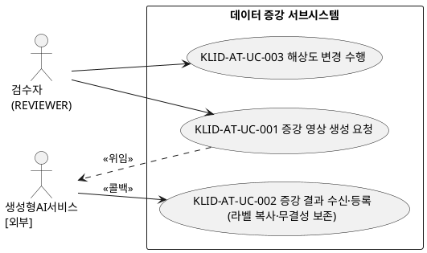
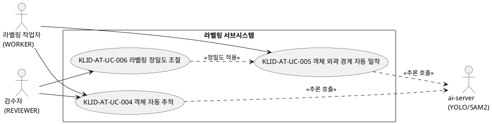
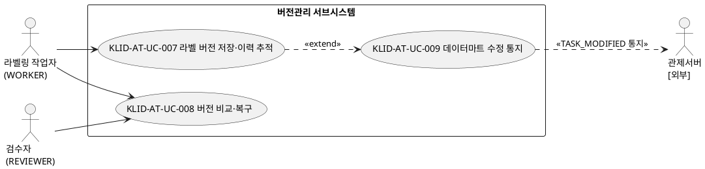
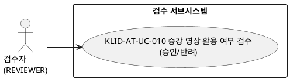
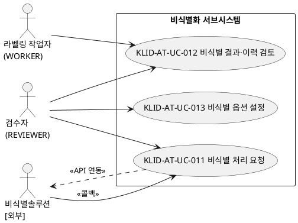

# R2 유스케이스 명세서

## 작성 목적
> 시스템의 요구사항에 대하여 액터와 시스템 활동 및 상호간의 활동에 대하여 순서화된 시나리오를 상세하게 기술하고, 유스케이스의 이름, 액터, 그들 간의 연관관계를 보여주는 시스템 환경을 다이어그램으로도 표현한다. 본 산출물은 R1 사용자 요구사항 정의서의 기능 요구사항(RQ-SFR-06-03 ~ RQ-SFR-09-05)에 매핑되는 유스케이스만을 대상으로 한다.

## 작성 방법
> 유스케이스는 시나리오를 구체적인 언어표현으로 기술하고, 유스케이스 다이어그램은 PlantUML(@startuml/@enduml)로 작성한다.

## 제·개정 이력

| 날짜 | 버전 | 제·개정 내역 | 작성자 | 검토자 |
|------|------|------------|--------|--------|
| 2026-05-31 | 1.0 | 최초 작성 — R1 사용자 요구사항(SFR-06~09, 18개)에 매핑되는 유스케이스 도출·기술 | 박찬기 | 김현욱 |
| 2026-06-01 | 1.1 | §3 유스케이스 목록 컬럼 정정 — 「관련 액터(ACT)」·「검수기준(AC)」 분리, AC를 UC-NNN↔AC-NNN 1:1로 정정(LogiCraft `AC.derived_from_use_cases` 진실원). §4 액터 ID를 `KLID-AT-AC-NNN`→`KLID-AT-ACT-NN`로 재부여(검수기준 AC 네임스페이스 충돌 해소)하고 다이어그램·§3 참조 동기화. KLID-AT-UC-012~015 기술서 보강. LogiCraft MCP 동기화 | 박찬기 | 김현욱 |
| 2026-06-02 | 1.2 | **KLID-AT-UC-014(개인정보 보호대책 적용)·KLID-AT-UC-015(개인정보 유형 분류체계 관리) 삭제** — 대응 요구사항 RQ-SFR-09-06/09-07이 보안·인프라 책임으로 R1에서 범위 외 삭제됨에 따라 연쇄 제거. 비식별화 UCD 다이어그램·§3 목록·UC 상세 기술서·부록 A 커버리지에서 제거. 유스케이스 총 15→13건(KLID-AT-UC-001~013) | 박찬기 | 김현욱 |

## 헤더

| R2 | 유스케이스 명세서 |
|-------|------------|
| 시스템명 | AI 기반 지방정부 CCTV 관제지원시스템 구축(2차) | 서브시스템명 | 학습데이터 저작도구 (AT) |
| 단계명 | 분석 | 작성일자 | 2026-06-02 | 버전 | 1.2 |

---

## 1. 서브시스템 목록

> R1 요구사항(SFR-06~09)이 걸치는 서브시스템 위주로 기재한다. CLAUDE.md의 전체 10개 서브시스템 중 R1 요구사항과 무관한 마킹(KLID-AT-SS-002)·배치 파이프라인(KLID-AT-SS-003)·사용자/권한(KLID-AT-SS-001)은 본 명세 범위에서 제외하며, 포털(KLID-AT-SS-010)은 R1 요구사항 직접 매핑이 없어 제외한다.

| 서브시스템 ID | 서브시스템명 | 서브시스템 설명 |
|------------|---------|-----------|
| KLID-AT-SS-004 | 비식별화 | 외부 비식별 솔루션을 연동하여 영상 내 개인정보를 비식별 처리하고, 처리 결과·이력을 영상 단위로 관리한다. (RQ-SFR-09-01~05) |
| KLID-AT-SS-005 | 시계열 메타 | 외부 VLM 서비스 호출 연동으로 시계열 메타를 적재하고, REVIEWER가 검토·승인/반려한다. (RQ-SFR-09-03 검토 맥락 보조) |
| KLID-AT-SS-006 | 라벨링 | 바운딩박스/폴리곤/세그멘테이션 라벨링과 AI 보조(객체 추적·외곽 밀착·정밀도 조절)를 제공한다. (RQ-SFR-08-01~03) |
| KLID-AT-SS-007 | 검수 | REVIEWER가 라벨/메타/증강 영상의 학습데이터 활용 여부를 승인·반려한다. (RQ-SFR-07-03) |
| KLID-AT-SS-008 | 버전관리 | 라벨 저장 시 전체 스냅샷(JSON)을 DB에 적재하고, 버전 비교(diff)·복구(rollback) 및 데이터마트 수정 통지를 제공한다. (RQ-SFR-08-04~06) |
| KLID-AT-SS-009 | 데이터 증강 | 외부 생성형 AI가 만든 증강 영상을 새 영상으로 수신·등록하고 원본 라벨을 복사(무결성 보존)하며, 저작도구가 직접 수행하는 해상도 변경을 포함한다. (RQ-SFR-06-03, 07-01, 07-02) |

---

## 2. 유스케이스 다이어그램(UCD)

### 2.1 데이터 증강 서브시스템 UCD

| UCD ID | KLID-AT-UCD-001 | UCD 명 | 데이터 증강 및 해상도 변경 |
|--------|---|-------|---|
| 관련 서브시스템 ID | KLID-AT-SS-009 | 관련 서브시스템명 | 데이터 증강 |

### 2.2 라벨링 서브시스템 UCD

| UCD ID | KLID-AT-UCD-002 | UCD 명 | AI 보조 라벨링 |
|--------|---|-------|---|
| 관련 서브시스템 ID | KLID-AT-SS-006 | 관련 서브시스템명 | 라벨링 |

### 2.3 버전관리 서브시스템 UCD

| UCD ID | KLID-AT-UCD-003 | UCD 명 | 라벨 버전관리 및 데이터마트 동기화 |
|--------|---|-------|---|
| 관련 서브시스템 ID | KLID-AT-SS-008 | 관련 서브시스템명 | 버전관리 |

### 2.4 검수 서브시스템 UCD

| UCD ID | KLID-AT-UCD-004 | UCD 명 | 증강 영상 활용 여부 검수 |
|--------|---|-------|---|
| 관련 서브시스템 ID | KLID-AT-SS-007 | 관련 서브시스템명 | 검수 |

### 2.5 비식별화 서브시스템 UCD

| UCD ID | KLID-AT-UCD-005 | UCD 명 | 영상 비식별화 처리 및 관리 |
|--------|---|-------|---|
| 관련 서브시스템 ID | KLID-AT-SS-004 | 관련 서브시스템명 | 비식별화 |

---

## 3. 유스케이스 목록

> **컬럼 정정**: 기존 "관련액터 ID" 컬럼에 검수기준(AC) 코드가 섞여 UC↔AC가 다대다로 잘못 매핑되어 있었다. 본 표는 (1) 「관련 액터」(ACT-NN)와 「검수기준(AC)」(AC-NNN)을 별도 컬럼으로 분리하고, (2) 검수기준은 LogiCraft `AC-NNN.derived_from_use_cases` 진실원에 따라 **UC-NNN ↔ AC-NNN 1:1**로 정정하였다.

| 유스케이스 ID | 유스케이스명 | 유스케이스 설명 | 관련 액터(ACT) | 검수기준(AC) | 관련 UCD ID | 관련 요구사항 ID |
|------------|---------|-----------|------------|-----------|-----------|-------------|
| KLID-AT-UC-001 | 증강 영상 생성 요청 | REVIEWER가 원본 영상에 대해 날씨·계절·시간 증강(WINTER/NIGHT/RAIN 등) 생성을 외부 생성형 AI 서비스로 요청한다. | KLID-AT-ACT-01, KLID-AT-ACT-07 | KLID-AT-AC-001 | KLID-AT-UCD-001 | RQ-SFR-07-01 |
| KLID-AT-UC-002 | 증강 결과 수신·등록 | 외부가 생성한 증강 영상을 새 영상(RAW_SN)으로 등록하고 원본 라벨/메타를 복사하여 무결성을 보존한다. | KLID-AT-ACT-07, KLID-AT-ACT-01 | KLID-AT-AC-002 | KLID-AT-UCD-001 | RQ-SFR-07-01, RQ-SFR-07-02 |
| KLID-AT-UC-003 | 해상도 변경 수행 | 저작도구가 영상의 해상도를 직접 변경하고 라벨 좌표 정합을 보존하여 새 영상으로 저장한다. | KLID-AT-ACT-01 | KLID-AT-AC-003 | KLID-AT-UCD-001 | RQ-SFR-06-03, RQ-SFR-07-02 |
| KLID-AT-UC-004 | 객체 자동 추적 | 사용자가 지정한 객체를 이어지는 프레임에서 AI(SAM2)가 자동 추적하여 위치·경계를 갱신한다. | KLID-AT-ACT-02, KLID-AT-ACT-01, KLID-AT-ACT-05 | KLID-AT-AC-004 | KLID-AT-UCD-002 | RQ-SFR-08-01 |
| KLID-AT-UC-005 | 객체 외곽 경계 자동 밀착 | AI가 객체 외곽선을 인식해 바운딩박스/폴리곤을 경계에 자동 밀착(Snap)시킨다. | KLID-AT-ACT-02, KLID-AT-ACT-05 | KLID-AT-AC-005 | KLID-AT-UCD-002 | RQ-SFR-08-02 |
| KLID-AT-UC-006 | 라벨링 정밀도 조절 | REVIEWER가 폴리곤 단순화 정밀도(epsilon) 설정을 조절하여 밀착/세그멘테이션 결과의 경계 세밀함(점 수)을 제어한다. | KLID-AT-ACT-01 | KLID-AT-AC-006 | KLID-AT-UCD-002 | RQ-SFR-08-03 |
| KLID-AT-UC-007 | 라벨 버전 저장·이력 추적 | 라벨 저장 시 전체 스냅샷(JSON)을 해시 식별자와 함께 DB에 적재하고 변경이력을 기록한다. | KLID-AT-ACT-02 | KLID-AT-AC-007 | KLID-AT-UCD-003 | RQ-SFR-08-04 |
| KLID-AT-UC-008 | 버전 비교·복구 | 두 버전의 DB 스냅샷을 비교(diff)하여 차이를 표시하고, 선택한 버전을 새 active 버전으로 복구(rollback)한다. | KLID-AT-ACT-01, KLID-AT-ACT-02 | KLID-AT-AC-008 | KLID-AT-UCD-003 | RQ-SFR-08-05 |
| KLID-AT-UC-009 | 데이터마트 수정 통지 | 검수 완료 후 라벨이 수정되면 관제서버로 TASK_MODIFIED 통지를 발행해 데이터마트 재동기화가 가능하게 한다. | KLID-AT-ACT-01, KLID-AT-ACT-06 | KLID-AT-AC-009 | KLID-AT-UCD-003 | RQ-SFR-08-06 |
| KLID-AT-UC-010 | 증강 영상 활용 여부 검수 | REVIEWER가 미검수 상태로 들어온 증강 영상을 확인해 학습데이터 활용 여부를 승인/반려한다. | KLID-AT-ACT-01 | KLID-AT-AC-010 | KLID-AT-UCD-004 | RQ-SFR-07-03 |
| KLID-AT-UC-011 | 비식별 처리 요청 | 비식별 대상 영상에 대해 외부 비식별 솔루션 API를 연동 호출하여 개인정보를 비식별하고 원본·비식별본을 각각 저장한다. | KLID-AT-ACT-01, KLID-AT-ACT-04 | KLID-AT-AC-011 | KLID-AT-UCD-005 | RQ-SFR-09-01, RQ-SFR-09-02 |
| KLID-AT-UC-012 | 비식별 결과·이력 검토 | 비식별 처리 결과·상태·리포트를 영상 단위로 검토하고 처리 이력을 조회한다. | KLID-AT-ACT-01, KLID-AT-ACT-02 | KLID-AT-AC-012 | KLID-AT-UCD-005 | RQ-SFR-09-03, RQ-SFR-09-05 |
| KLID-AT-UC-013 | 비식별 옵션 설정 | 외부 비식별 솔루션이 제공하는 옵션을 관리 화면에서 설정·저장한다. | KLID-AT-ACT-01 | KLID-AT-AC-013 | KLID-AT-UCD-005 | RQ-SFR-09-04 |

> **UC 미생성(저작도구 범위 외) 항목**
> - **RQ-SFR-06-04** (이미지·영상 생성 프롬프트 편의성 개선): 프롬프트 입력·생성 화면은 외부 생성형 AI 시스템 기능으로, 저작도구는 제공하지 않으므로 유스케이스를 생성하지 않는다.

---

## 4. 액터 목록

> **액터 ID 체계(ACT-NN)**: 액터 ID는 검수기준(Acceptance, AC-NNN)과의 네임스페이스 충돌을 피하기 위해 `KLID-AT-ACT-NN` 형식을 사용한다. (구 `KLID-AT-AC-NNN` 표기는 폐기) §2 다이어그램·§3 유스케이스 목록의 액터 참조도 본 ID로 동기화한다.

| 액터 ID | 액터명 | 액터유형 (주요/보조/숨은) | 액터설명 |
|--------|------|-------------------|------|
| KLID-AT-ACT-01 | 검수자 (REVIEWER) | 주요 | 사용자·시스템 관리 권한을 통합 보유. 증강 요청·검수 승인/반려, 비식별 요청·옵션 설정, 버전 비교·복구, 수정 통지 등 관리·검수 행위를 수행한다. |
| KLID-AT-ACT-02 | 라벨링 작업자 (WORKER) | 주요 | 라벨 수정·검수 제출 권한 보유. AI 보조 라벨링(추적·밀착·정밀도 조절), 라벨 버전 저장, 비식별/버전 이력 조회를 수행한다. |
| KLID-AT-ACT-03 | 포털 회원 (PORTAL_USER) | 주요 | 포털 채널 사용자. 본 명세의 R1 요구사항(SFR-06~09)에는 직접 참여 유스케이스가 없어 참조용으로만 기재한다. |
| KLID-AT-ACT-04 | 비식별솔루션 | 보조 | [외부] 발주기관이 제공하는 영상 비식별 솔루션. API 호출에 응답하고 처리 결과를 콜백으로 전달한다. |
| KLID-AT-ACT-05 | ai-server (YOLO/SAM2) | 보조 | [내부 인프라] 저작도구 운영팀이 운영하는 Stateless 추론 서버. 객체 추적·외곽 밀착·세그멘테이션 추론을 수행한다. |
| KLID-AT-ACT-06 | 관제서버 | 보조 | [외부] 데이터마트 수정 통지(TASK_MODIFIED)를 수신하고 저작도구 조회 API로 상세 데이터를 가져가 재동기화한다. |
| KLID-AT-ACT-07 | 생성형AI서비스 | 보조 | [외부] 날씨·계절·시간 증강 영상을 생성하여 콜백으로 반환하는 외부 생성형 AI 시스템. |

---

## 5. 유스케이스 기술서

<table>
<tr><td>유스케이스 ID</td><td>KLID-AT-UC-004</td><td>유스케이스명</td><td>객체 자동 추적</td></tr>
<tr><td colspan="4">
<b>1. 주요 액터</b> 
&emsp;- 라벨링 작업자(WORKER), 검수자(REVIEWER)  
<b>2. 이해관계자와 관심사항</b> 
&emsp;- WORKER는 한 번 지정한 객체가 이후 프레임에서 자동으로 따라가져 반복 작업이 줄어들길 원한다. 
&emsp;- 발주기관은 라벨링 정확도(위치·경계)가 향상되길 원한다. 
&emsp;- ai-server는 GPU 자원 경합 없이 안정적으로 추론 요청을 처리하길 원한다.  
<b>3. 전제조건</b> 
&emsp;- 사용자가 유효한 JWT(REVIEWER 또는 WORKER)로 인증되어 있다. 
&emsp;- 대상 프레임(SRC_SN)과 추적 시작 객체(bbox/seed)가 존재한다.  
<b>4. 종료조건</b> 
&emsp;- 후속 프레임들에 추적된 객체의 위치·경계가 갱신되어 반환·저장된다.  
<b>5. 기본 시나리오</b> 
&emsp;1. 사용자가 라벨링 캔버스에서 추적할 객체(시드 마스크/박스)와 추적 구간을 지정한다. 
&emsp;2. 시스템은 `POST /v1/frames/{srcSn}/sam2-track` 으로 Sam2TrackRequest를 받는다(path/body srcSn 불일치 시 400). 
&emsp;3. 시스템은 AiServerClient(Resilience4j 타임아웃/재시도 적용)로 ai-server(SAM2)에 추론을 요청한다. 
&emsp;4. ai-server가 구간 내 프레임별 위치·경계를 추론해 반환한다. 
&emsp;5. 시스템은 트랙 보간 알고리즘으로 빈 프레임을 보간하여 Sam2TrackResponseDto를 구성한다. 
&emsp;6. 시스템은 결과를 캔버스에 표시하고 사용자가 저장하면 라벨로 반영한다. 
&emsp;7. 본 유스케이스는 종료한다.  
<b>6. 대안 시나리오</b> 
&emsp;<b>가. ai-server 호출 실패/타임아웃</b> 
&emsp;&emsp;1. Resilience4j가 재시도 후에도 실패하면 서킷 브레이커가 동작하고 사용자에게 추적 실패를 안내한다(원본 라벨 유지). 
&emsp;<b>나. 추적 결과 부정확</b> 
&emsp;&emsp;1. 사용자가 키프레임을 수동 보정한 뒤 보간(UC 흐름 재호출)으로 재계산한다.  
<b>7. 구현 시 고려 사항</b> 
&emsp;- 오토라벨링은 원본 이미지에만 실행하고 비식별본은 동일 해상도이므로 좌표를 공유한다. 
&emsp;- ai-server는 수평 확장 가능하며 호출 타임아웃 60s + CircuitBreaker를 적용한다. 
&emsp;- 트랙 보간은 CVAT track-interpolation 알고리즘을 Java로 포팅한 구현을 사용한다.  
<b>8. 발생 빈도</b> 
&emsp;- 높음 — 영상 라벨링 작업 중 객체별로 수시 발생.
</td></tr>
</table>

 

<table>
<tr><td>유스케이스 ID</td><td>KLID-AT-UC-005</td><td>유스케이스명</td><td>객체 외곽 경계 자동 밀착</td></tr>
<tr><td colspan="4">
<b>1. 주요 액터</b> 
&emsp;- 라벨링 작업자(WORKER)  
<b>2. 이해관계자와 관심사항</b> 
&emsp;- WORKER는 대략적으로 친 박스가 객체 외곽선에 자동으로 달라붙어 정밀하게 보정되길 원한다. 
&emsp;- 발주기관은 경계 라벨 품질이 균일하게 유지되길 원한다.  
<b>3. 전제조건</b> 
&emsp;- 사용자가 인증되어 있고 대상 프레임(SRC_SN)과 초기 bbox가 존재한다.  
<b>4. 종료조건</b> 
&emsp;- 객체 외곽선에 밀착된 폴리곤/마스크 좌표가 반환된다.  
<b>5. 기본 시나리오</b> 
&emsp;1. 사용자가 객체 주변에 대략의 시드(박스/마스크)를 지정한다. 
&emsp;2. 시스템은 `POST /v1/frames/{srcSn}/sam2-track` 으로 시드를 ai-server(SAM2)에 송신한다. 
&emsp;3. ai-server가 외곽선 기반 마스크/폴리곤을 산출해 반환한다. 
&emsp;4. 시스템(Sam2TrackService)이 응답 폴리곤을 외곽선에 밀착된 형태로 구성한다. 
&emsp;5. 시스템은 밀착 결과를 캔버스에 적용한다. 
&emsp;6. 본 유스케이스는 종료한다.  
<b>6. 대안 시나리오</b> 
&emsp;<b>가. 외곽 인식 실패</b> 
&emsp;&emsp;1. 밀착 결과가 비어 있으면 사용자가 수동 폴리곤으로 전환해 작업한다. 
&emsp;<b>나. 추론 호출 실패</b> 
&emsp;&emsp;1. Resilience4j 재시도 후 실패 시 503으로 안내하고 기존 시드를 유지한다.  
<b>7. 구현 시 고려 사항</b> 
&emsp;- MASK↔RLE↔Polygon 변환(CVAT 포팅)을 통해 마스크와 폴리곤 표현을 상호 변환한다. 
&emsp;- 폴리곤 점 수는 POLYGON_SIMPLIFY_TOLERANCE(Douglas-Peucker epsilon) 설정으로 제어한다(KLID-AT-UC-006과 연계).  
<b>8. 발생 빈도</b> 
&emsp;- 높음 — 정밀 라벨링 시 박스마다 자주 호출.
</td></tr>
</table>

 

<table>
<tr><td>유스케이스 ID</td><td>KLID-AT-UC-006</td><td>유스케이스명</td><td>라벨링 정밀도 조절</td></tr>
<tr><td colspan="4">
<b>1. 주요 액터</b> 
&emsp;- 검수자(REVIEWER)  
<b>2. 이해관계자와 관심사항</b> 
&emsp;- REVIEWER는 객체/장면 특성에 맞춰 라벨 정밀도(경계 세밀함·점 수)를 직접 조절하길 원한다. 
&emsp;- WORKER는 조절된 정밀도가 밀착/추적 결과에 일관 적용되길 원한다.  
<b>3. 전제조건</b> 
&emsp;- REVIEWER로 인증되어 있고 폴리곤 단순화 설정 키가 존재한다.  
<b>4. 종료조건</b> 
&emsp;- 조절된 정밀도 값(threshold·점 수)이 적용된 라벨 결과가 반환된다.  
<b>5. 기본 시나리오</b> 
&emsp;1. REVIEWER가 시스템 설정에서 폴리곤 단순화 정밀도(POLYGON_SIMPLIFY_TOLERANCE)를 `PUT /v1/manage/configs/{key}` 로 조절한다. 
&emsp;2. 시스템은 설정값을 저장하고 캐시(TTL 60s)에 반영한다. 
&emsp;3. 이후 SAM2 track/밀착 시 Sam2TrackService가 설정 epsilon으로 폴리곤 점 수(경계 세밀함)를 단순화한다. 
&emsp;4. 설정 조회 실패 시 기본값(1.0px)으로 fail-safe 폴백한다. 
&emsp;5. 본 유스케이스는 종료한다.  
<b>6. 대안 시나리오</b> 
&emsp;<b>가. 값 범위 초과</b> 
&emsp;&emsp;1. 설정값이 허용 형식/범위를 벗어나면 입력 검증(@Valid)으로 400을 반환하고 안내한다. 
&emsp;<b>나. 권한 부족</b> 
&emsp;&emsp;1. 설정 변경은 REVIEWER 전용이므로 WORKER 호출 시 403을 반환한다.  
<b>7. 구현 시 고려 사항</b> 
&emsp;- 정밀도(epsilon)는 시스템 설정(sysconfig) 키로 관리되며 미지정/오류 시 기본값으로 폴백한다. 
&emsp;- 설정은 Caffeine 캐시(TTL 60s)로 조회 비용을 줄인다.  
<b>8. 발생 빈도</b> 
&emsp;- 중간 — 작업 특성에 따라 세션 단위로 조정.
</td></tr>
</table>

 

<table>
<tr><td>유스케이스 ID</td><td>KLID-AT-UC-002</td><td>유스케이스명</td><td>증강 결과 수신·등록</td></tr>
<tr><td colspan="4">
<b>1. 주요 액터</b> 
&emsp;- 생성형AI서비스[외부] (보조), 검수자(REVIEWER)  
<b>2. 이해관계자와 관심사항</b> 
&emsp;- 발주기관은 날씨·계절·시간이 변형된 증강 영상이 학습데이터로 적재되길 원한다. 
&emsp;- WORKER/REVIEWER는 증강 영상의 라벨이 원본과 정합되어 보존되길 원한다(무결성).  
<b>3. 전제조건</b> 
&emsp;- 원본 영상(parentRawSn)과 그 라벨/메타가 존재한다. 
&emsp;- 외부 생성형 AI 서비스가 증강을 완료하고 콜백을 전송한다.  
<b>4. 종료조건</b> 
&emsp;- 새 영상(RAW_SN)이 PARENT_RAW_SN으로 원본을 참조하며 PENDING(미검수) 상태로 등록되고, 원본 라벨/메타가 복사된다.  
<b>5. 기본 시나리오</b> 
&emsp;1. REVIEWER가 KLID-AT-UC-001로 증강 생성을 요청한다. 
&emsp;2. 외부 서비스가 증강 영상을 생성한 뒤 `POST /v1/augments/result` (HMAC 인증)로 결과를 전송한다(idempotencyKey 멱등). 
&emsp;3. 시스템은 새 영상(RAW_SN)을 생성하고 PARENT_RAW_SN에 원본을 연결한다. 
&emsp;4. 시스템은 원본의 라벨/메타 JSON을 새 영상에 복사하여 좌표·속성을 보존한다. 
&emsp;5. 새 영상을 미검수(PENDING) 상태로 적재한다(이후 KLID-AT-UC-010로 활용 여부 검수). 
&emsp;6. 본 유스케이스는 종료한다.  
<b>6. 대안 시나리오</b> 
&emsp;<b>가. 해상도 변경 증강</b> 
&emsp;&emsp;1. 해상도만 변경된 경우 이미지 해상도만 변경 저장하고 라벨 좌표 정합을 보존한다(KLID-AT-UC-003 연계). 
&emsp;<b>나. 콜백 검증 실패</b> 
&emsp;&emsp;1. parentRawSn이 존재하지 않거나 페이로드가 유효하지 않으면 등록을 거부하고 실패를 기록한다.  
<b>7. 구현 시 고려 사항</b> 
&emsp;- 증강 결과는 항상 새 RAW_SN으로 생성되며 원본은 변경하지 않는다. 
&emsp;- 콜백 엔드포인트는 HMAC 시그니처 + timestamp + idempotencyKey allowlist로 보호한다(양방향 M2M 인증 미운영).  
<b>8. 발생 빈도</b> 
&emsp;- 중간 — 증강 요청 건수에 비례.
</td></tr>
</table>

 

<table>
<tr><td>유스케이스 ID</td><td>KLID-AT-UC-008</td><td>유스케이스명</td><td>버전 비교·복구</td></tr>
<tr><td colspan="4">
<b>1. 주요 액터</b> 
&emsp;- 검수자(REVIEWER), 라벨링 작업자(WORKER)  
<b>2. 이해관계자와 관심사항</b> 
&emsp;- 사용자는 두 버전의 라벨 차이를 명확히 비교하고, 필요 시 이전 버전으로 안전하게 되돌리길 원한다. 
&emsp;- 발주기관은 학습데이터 변경 추적성과 복원 가능성을 원한다.  
<b>3. 전제조건</b> 
&emsp;- 대상 프레임(SRC_SN)에 비교 가능한 2개 이상의 라벨 버전 스냅샷이 존재한다. 
&emsp;- 사용자가 인증되어 있다(REVIEWER 또는 WORKER).  
<b>4. 종료조건</b> 
&emsp;- 비교: 두 버전 간 diff가 화면에 표시된다. 복구: 선택 버전이 새 active 버전으로 복원된다.  
<b>5. 기본 시나리오</b> 
&emsp;1. 사용자가 프레임의 버전 이력(`GET /v1/frames/{srcSn}/versions`)을 조회한다. 
&emsp;2. 두 버전(from/to 해시)을 선택하고 `GET /v1/versions/{version}/diff?compareWith={fromHash}` 로 차이를 요청한다. 
&emsp;3. 시스템은 두 DB 스냅샷(LABEL_PAYLOAD)을 앱에서 비교해 ADDED/MODIFIED/REMOVED diff를 산출·표시한다. 
&emsp;4. 사용자가 복구 대상 버전을 선택하고 `POST /v1/versions/{version}/rollback` (body: srcSn)을 호출한다. 
&emsp;5. 시스템은 대상 스냅샷을 새 active 버전으로 LS_LABEL_VERSION에 복원·기록한다(REVIEWER 전체 / WORKER 본인 배정). 
&emsp;6. 본 유스케이스는 종료한다.  
<b>6. 대안 시나리오</b> 
&emsp;<b>가. 동일 페이로드 버전</b> 
&emsp;&emsp;1. 두 버전의 VERSION_HASH가 동일하면 변경 없음으로 안내한다. 
&emsp;<b>나. 검수 완료 후 복구</b> 
&emsp;&emsp;1. 복구로 라벨이 변경되면 KLID-AT-UC-009(데이터마트 수정 통지)가 트리거된다.  
<b>7. 구현 시 고려 사항</b> 
&emsp;- 버전관리는 DB 스냅샷 기반(외부 VCS 미사용), 버전 식별자는 페이로드 SHA-256 해시(VERSION_HASH)이다. 
&emsp;- 대용량 페이로드 diff는 서버에서 계산하여 전송 데이터를 최소화한다.  
<b>8. 발생 빈도</b> 
&emsp;- 중간 — 검수·수정 과정에서 비정기적으로 발생.
</td></tr>
</table>

 

<table>
<tr><td>유스케이스 ID</td><td>KLID-AT-UC-009</td><td>유스케이스명</td><td>데이터마트 수정 통지</td></tr>
<tr><td colspan="4">
<b>1. 주요 액터</b> 
&emsp;- 검수자(REVIEWER), 관제서버[외부] (보조)  
<b>2. 이해관계자와 관심사항</b> 
&emsp;- 관제서버는 검수 완료 후 라벨이 수정되면 데이터마트를 최신 상태로 재동기화하길 원한다. 
&emsp;- 보안 담당자는 통지 페이로드에 PII·토큰·본문 데이터가 포함되지 않길 원한다.  
<b>3. 전제조건</b> 
&emsp;- 대상 영상(RAW_SN)이 검수 완료(APPROVED) 이력을 가진다. 
&emsp;- 검수 완료 후 라벨/메타 수정이 발생했다.  
<b>4. 종료조건</b> 
&emsp;- 관제서버 inbound SPI로 TASK_MODIFIED 통지(수정 요약만)가 비동기 발행되고, 요청 ID로 멱등 처리된다.  
<b>5. 기본 시나리오</b> 
&emsp;1. 검수 완료 후 라벨/메타가 수정된다. 
&emsp;2. 시스템은 변경 프레임 목록(SRC_SN + 변경 종류)·요약 카운트를 구성한다. 
&emsp;3. ControlNotifyClient가 요청 ID idempotency·재등록 큐·Resilience4j를 적용해 관제서버 inbound SPI로 TASK_MODIFIED를 push한다. 
&emsp;4. 관제서버는 통지를 수신한 뒤 저작도구 조회 API(`GET /v1/tasks/{rawSn}/summary|labels|meta`)로 상세 데이터를 가져가 데이터마트를 UPSERT한다. 
&emsp;5. 본 유스케이스는 종료한다.  
<b>6. 대안 시나리오</b> 
&emsp;<b>가. 통지 전송 실패</b> 
&emsp;&emsp;1. 재시도 후에도 실패하면 dead-letter/재등록 큐에 적재하고 후속 재시도한다. 
&emsp;<b>나. 동일 트랜잭션 다수 변경</b> 
&emsp;&emsp;1. 짧은 시간 내 다수 변경은 디바운스 후 영상 1건 단위로 1회 통지한다.  
<b>7. 구현 시 고려 사항</b> 
&emsp;- 통지 단위는 영상 1건이며 페이로드는 수정 요약만 포함(라벨/메타 본문 미포함). 
&emsp;- 양방향 M2M 인증은 미운영이며 단방향 outbound 통지 + inbound 조회 API 패턴을 사용한다.  
<b>8. 발생 빈도</b> 
&emsp;- 낮음~중간 — 검수 완료 후 수정 발생 시에만.
</td></tr>
</table>

 

<table>
<tr><td>유스케이스 ID</td><td>KLID-AT-UC-010</td><td>유스케이스명</td><td>증강 영상 활용 여부 검수</td></tr>
<tr><td colspan="4">
<b>1. 주요 액터</b> 
&emsp;- 검수자(REVIEWER)  
<b>2. 이해관계자와 관심사항</b> 
&emsp;- 발주기관은 증강 데이터의 학습데이터 활용 여부를 사람이 확인 후 결정하길 원한다.  
<b>3. 전제조건</b> 
&emsp;- 증강 영상이 미검수(PENDING) 상태로 등록되어 있다(KLID-AT-UC-002 완료). 
&emsp;- REVIEWER로 인증되어 있다.  
<b>4. 종료조건</b> 
&emsp;- 증강 영상이 승인(활용) 또는 반려(미활용) 상태로 전이된다.  
<b>5. 기본 시나리오</b> 
&emsp;1. REVIEWER가 증강 결과 목록(`GET /v1/augments`)에서 PENDING 증강 결과를 조회한다. 
&emsp;2. 증강 결과(영상·복사된 라벨)를 확인한다. 
&emsp;3. 활용 가능하면 `POST /v1/augments/{id}/accept` 로 승인한다(PENDING → ACCEPTED). 
&emsp;4. 부적합하면 `POST /v1/augments/{id}/reject` (사유 필수)로 반려한다(PENDING → REJECTED). 
&emsp;5. 본 유스케이스는 종료한다.  
<b>6. 대안 시나리오</b> 
&emsp;<b>가. 상태 충돌</b> 
&emsp;&emsp;1. 대상이 PENDING 이외 상태면 409 CONFLICT를 반환한다(중복 승인/반려 방지). 
&emsp;<b>나. 사유 누락</b> 
&emsp;&emsp;1. 반려 시 사유가 비어 있으면 400으로 거부한다.  
<b>7. 구현 시 고려 사항</b> 
&emsp;- V1.5 정책상 증강 본체는 외부 SFR-07 책임이며 저작도구는 결과 검수(승인/반려)만 담당한다. 
&emsp;- 승인 시 학습데이터 활용 대상이 되며 데이터마트 적재용 View 노출 조건(APPROVED)과 연계된다.  
<b>8. 발생 빈도</b> 
&emsp;- 중간 — 증강 영상 등록 건수에 비례.
</td></tr>
</table>

 

<table>
<tr><td>유스케이스 ID</td><td>KLID-AT-UC-011</td><td>유스케이스명</td><td>비식별 처리 요청</td></tr>
<tr><td colspan="4">
<b>1. 주요 액터</b> 
&emsp;- 검수자(REVIEWER), 비식별솔루션[외부] (보조)  
<b>2. 이해관계자와 관심사항</b> 
&emsp;- 발주기관은 수집 영상의 개인정보가 안전하게 비식별되길 원한다. 
&emsp;- 보안 담당자는 원본이 절대 삭제되지 않고 원본·비식별본이 분리 보관되길 원한다.  
<b>3. 전제조건</b> 
&emsp;- 대상 영상의 PRVC_TYPE_CD가 'PRVC' 또는 'PSDO'(비식별 대상)이다. 
&emsp;- REVIEWER로 인증되어 있고 외부 비식별 솔루션이 가용하다.  
<b>4. 종료조건</b> 
&emsp;- 비식별본이 별도 경로에 저장되고 원본이 보존되며 처리 이력이 영상 단위로 기록된다.  
<b>5. 기본 시나리오</b> 
&emsp;1. REVIEWER가 `POST /v1/deident/{videoId}/reprocess` 로 비식별(재)처리를 요청한다(202 ACCEPTED). 
&emsp;2. 시스템은 DeidentifyClient(Resilience4j)로 외부 비식별 솔루션 API를 호출한다. 
&emsp;3. 외부 솔루션이 비식별을 수행하고 `POST /v1/deidentify/result` (HMAC 인증, idempotencyKey)로 결과를 반환한다. 
&emsp;4. 시스템은 비식별본을 STORAGE_DEIDENTIFIED_PATH에 저장하고 원본은 그대로 유지한다. 
&emsp;5. 처리 이력(DE_IDNTF_YN 등)을 기록한다. 
&emsp;6. 본 유스케이스는 종료한다.  
<b>6. 대안 시나리오</b> 
&emsp;<b>가. 비식별 API 실패</b> 
&emsp;&emsp;1. 실패 시 DE_IDNTF_YN='F'로 마킹하고 재시도 큐에 등록하며 원본은 삭제하지 않는다. 
&emsp;<b>나. 비식별 비대상(ANONY)</b> 
&emsp;&emsp;1. PRVC_TYPE_CD가 'ANONY'면 비식별을 호출하지 않고 원본만 저장한다.  
<b>7. 구현 시 고려 사항</b> 
&emsp;- 외부 비식별 API는 발주기관 제공 가이드/API에 맞춰 연동하며 타임아웃·재시도·서킷 브레이커를 적용한다. 
&emsp;- 결과 수신 webhook은 HMAC 시그니처 + timestamp + idempotencyKey allowlist로 인증한다. 
&emsp;- 비식별 처리 이력은 영상 단위로 기록하며, 일부 비식별 조회 화면은 현재 placeholder 단계로 후속 Phase에서 집계 연동한다.  
<b>8. 발생 빈도</b> 
&emsp;- 중간 — 신규 수집 영상 적재 시 대상 영상마다 발생.
</td></tr>
</table>

 

<table>
<tr><td>유스케이스 ID</td><td>KLID-AT-UC-012</td><td>유스케이스명</td><td>비식별 결과·이력 검토</td></tr>
<tr><td colspan="4">
<b>1. 주요 액터</b> 
&emsp;- 검수자(REVIEWER), 라벨링 작업자(WORKER) (보조)  
<b>2. 이해관계자와 관심사항</b> 
&emsp;- REVIEWER/WORKER는 비식별 처리 결과·상태·리포트를 영상 단위로 확인하고 처리 이력을 추적하길 원한다. 
&emsp;- 보안 담당자는 비식별 처리 이력이 영상 단위로 보존·조회되길 원한다.  
<b>3. 전제조건</b> 
&emsp;- 비식별 처리 결과/이력이 존재한다. 
&emsp;- 사용자가 인증되어 있다.  
<b>4. 종료조건</b> 
&emsp;- 비식별 결과·상태·리포트와 처리 이력이 영상 단위로 검토된다.  
<b>5. 기본 시나리오</b> 
&emsp;1. 사용자가 영상의 비식별 결과·상태를 조회한다. 
&emsp;2. 처리 리포트(LS_DEIDENT_REPORT — 영역 메타 등)를 확인한다. 
&emsp;3. 비식별 처리 이력(LS_DEIDENT_PROC_LOG)을 영상 단위로 조회한다. 
&emsp;4. 본 유스케이스는 종료한다.  
<b>6. 대안 시나리오</b> 
&emsp;<b>가. 결과/이력 없음</b> 
&emsp;&emsp;1. 비식별 처리 이력이 없으면 빈 상태로 안내한다.  
<b>7. 구현 시 고려 사항</b> 
&emsp;- 일부 조회 화면은 현재 placeholder 단계로 후속 Phase에서 집계 연동한다(보강 필요). 
&emsp;- 비식별 처리 이력은 영상 단위로 기록·조회한다.  
<b>8. 발생 빈도</b> 
&emsp;- 중간 — 비식별 처리 결과 확인 시 발생.
</td></tr>
</table>

 

<table>
<tr><td>유스케이스 ID</td><td>KLID-AT-UC-013</td><td>유스케이스명</td><td>비식별 옵션 설정</td></tr>
<tr><td colspan="4">
<b>1. 주요 액터</b> 
&emsp;- 검수자(REVIEWER)  
<b>2. 이해관계자와 관심사항</b> 
&emsp;- REVIEWER는 외부 비식별 솔루션이 제공하는 옵션을 관리 화면에서 설정·저장하길 원한다. 
&emsp;- 운영자는 설정한 옵션이 이후 비식별 요청에 일관되게 적용되길 원한다.  
<b>3. 전제조건</b> 
&emsp;- REVIEWER로 인증되어 있다.  
<b>4. 종료조건</b> 
&emsp;- 비식별 옵션이 저장되어 이후 비식별 요청에 반영된다.  
<b>5. 기본 시나리오</b> 
&emsp;1. REVIEWER가 관리(/manage/*) 화면에서 비식별 옵션을 설정한다. 
&emsp;2. 시스템이 옵션을 저장하고 이후 비식별 요청에 적용한다. 
&emsp;3. 본 유스케이스는 종료한다.  
<b>6. 대안 시나리오</b> 
&emsp;<b>가. 권한 부족</b> 
&emsp;&emsp;1. 옵션 설정은 REVIEWER 전용이므로 WORKER 호출 시 403을 반환한다.  
<b>7. 구현 시 고려 사항</b> 
&emsp;- 외부 비식별 솔루션이 제공하는 옵션 항목 스펙은 미정의 단계로, 옵션 스펙 확정 시 시나리오를 보강한다(GAPS). 
&emsp;- 설정 데이터는 시스템 설정(LS_SYSTEM_CONFIG)에 저장한다.  
<b>8. 발생 빈도</b> 
&emsp;- 낮음 — 운영 정책 변경 시에만.
</td></tr>
</table>

 

> **삭제됨(2026-06-02, v1.2)**: KLID-AT-UC-014(개인정보 보호대책 적용)·KLID-AT-UC-015(개인정보 유형 분류체계 관리) 상세 기술서는 대응 요구사항 RQ-SFR-09-06/09-07의 범위 외 삭제에 따라 제거되었다. 저작도구가 보유하는 민감정보 보호 책임은 NFR-005(보안 NFR)로 유지된다.

---

## 부록 A. R1 요구사항 ↔ 유스케이스 커버리지

| R1 요구사항 ID | 매핑 UC | 비고 |
|---|---|---|
| RQ-SFR-06-03 | KLID-AT-UC-003 | 해상도 변경(저작도구 직접 수행) |
| RQ-SFR-06-04 | (없음) | 프롬프트 편의성 — 저작도구 범위 외 |
| RQ-SFR-07-01 | KLID-AT-UC-001, KLID-AT-UC-002 | 증강 생성 요청·결과 수신등록 |
| RQ-SFR-07-02 | KLID-AT-UC-002, KLID-AT-UC-003 | 라벨 무결성 보존(복사·정합) |
| RQ-SFR-07-03 | KLID-AT-UC-010 | 증강 활용 여부 승인/반려 |
| RQ-SFR-08-01 | KLID-AT-UC-004 | 객체 자동 추적 |
| RQ-SFR-08-02 | KLID-AT-UC-005 | 외곽 경계 자동 밀착 |
| RQ-SFR-08-03 | KLID-AT-UC-006 | 정밀도 조절 |
| RQ-SFR-08-04 | KLID-AT-UC-007 | 버전 저장·이력 추적 |
| RQ-SFR-08-05 | KLID-AT-UC-008 | 버전 비교·복구 |
| RQ-SFR-08-06 | KLID-AT-UC-009 | 데이터마트 수정 통지 |
| RQ-SFR-09-01 | KLID-AT-UC-011 | 비식별 처리 |
| RQ-SFR-09-02 | KLID-AT-UC-011 | 비식별 API 연동 |
| RQ-SFR-09-03 | KLID-AT-UC-012 | 비식별 결과·이력 검토 |
| RQ-SFR-09-04 | KLID-AT-UC-013 | 비식별 옵션 설정 |
| RQ-SFR-09-05 | KLID-AT-UC-012 | 비식별 결과 확인 |
