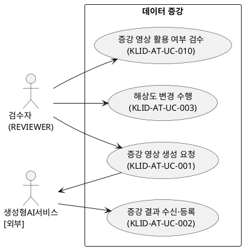
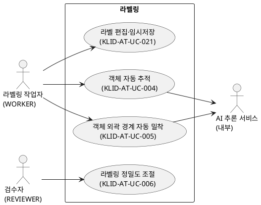
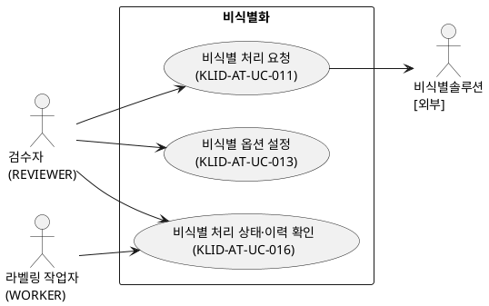
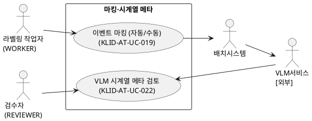
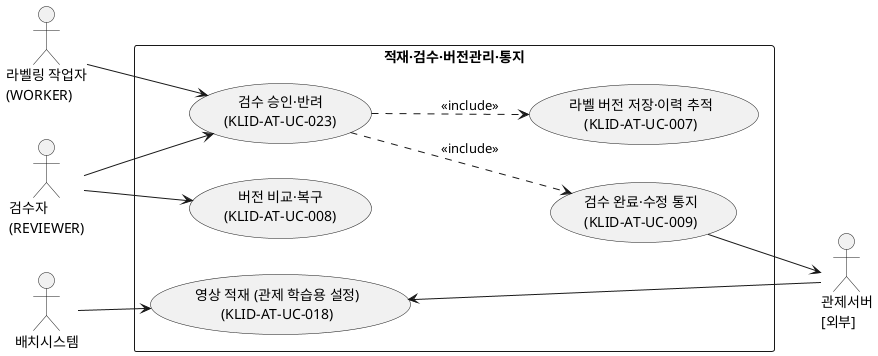

# R2 유스케이스 명세서

> **ID 표기 규칙(공통)**: 본 산출물의 모든 ID(KLID-AT-UC/CO/DC/DCD/SD/SC/AC/EN/ERD/TB/II/IC/IF/UCD/ACT 등)는 **전체 형식 `KLID-AT-XX-NNN`** 으로 표기한다. 끝부분만(예: `UC-001`) 약식 표기 금지. 범위는 시작 ID만 전체형으로(예: `KLID-AT-UC-001~013`). ※ 요구사항(RQ-SFR-NN-NN)·시스템시험(KLID-ST-NNN) 등 타 체계 ID는 각 체계 원형 유지.

## 작성 목적
> 시스템의 요구사항에 대하여 액터와 시스템 활동 및 상호간의 활동에 대하여 순서화된 시나리오를 상세하게 기술하고, 유스케이스의 이름, 액터, 그들 간의 연관관계를 보여주는 시스템 환경을 다이어그램으로도 표현한다. 또한 주요한 유스케이스에 대하여 대상 시스템과 액터 간의 오퍼레이션을 상세하게 표시하는 시스템 시퀀스 다이어그램 및 오퍼레이션의 약정을 나타낼 수 있는데 이 부분은 필수 산출물에 포함되지 않으며 선택적으로 작성할 수 있다.

## 작성 방법
> 유스케이스는 시나리오를 구체적인 언어표현으로 기술하고, 유스케이스 다이어그램은 그림으로 작성하며 작성도구를 사용할 수 있다.

## 산출물 양식

### 제.개정 이력

| 날짜 | 버전 | 제·개정 내역 | 작성자 | 검토자 |
|------|------|------------|--------|--------|
| 2026-06-22 | 1.0 | LogiCraft 그래프 기반 생성 (/cc-doc-gen) | - | - |

### 헤더

| R2 | 유스케이스 명세서 |
|-------|------------|
| 시스템명 | AI 기반 지방정부 CCTV 관제지원시스템(2차) | 서브시스템명 | 학습데이터 저작도구 |
| 단계명  | 분석         | 작성일자   | 2026-06-22 | 버전 | 1.0 |

### 1. 서브시스템 목록

| 서브시스템 ID | 서브시스템명 | 서브시스템 설명 |
|------------|---------|-----------|
| KLID-AT-SS-002 | 마킹 | 비식별 영상에서 자동(프레임 간격)·수동(단축키) 이벤트 시점을 식별·저장하고 잔여 배치를 트리거한다. |
| KLID-AT-SS-003 | 배치 파이프라인 | 관제 학습용 설정 영상을 주기 배치로 적재하고 비식별 선두 전처리·후속 추론 단계를 오케스트레이션한다. |
| KLID-AT-SS-004 | 비식별화 | 외부 비식별 솔루션 연동으로 전체 영상을 비식별 처리하고 옵션 설정·상태·이력·누락 신고를 관리한다. |
| KLID-AT-SS-005 | 시계열 메타 | 외부 시계열 분석 결과를 적재하고 검수큐에서 검토·수정·승인한다. |
| KLID-AT-SS-006 | 라벨링 | 배정 영상 프레임에 도형 라벨·속성을 편집·임시저장하고 AI 보조 라벨링(추적·밀착·정밀도)을 제공한다. |
| KLID-AT-SS-007 | 검수 | 영상 단위 작업을 검수자 1인 승인까지 반복 검토하여 승인·반려한다. |
| KLID-AT-SS-008 | 버전관리 | 검수 승인 시점 라벨 전체 스냅샷을 저장하고 버전 비교·복구를 제공한다. |
| KLID-AT-SS-009 | 데이터 증강 | 검수완료 영상의 외부 증강을 위탁·수신하여 새 영상으로 등록하고 활용 여부를 검수하며, 해상도 변경을 직접 수행한다. |

> ※ 본 서브시스템 목록은 R1 기능 요구사항(SFR)을 실현하는 유스케이스가 속한 서브시스템만 기재한다. 사용자/권한·포털 서브시스템은 활성 유스케이스에 R1 기능 요구사항 매핑이 없어 본 명세 범위에서 제외하였다(부록 참조).

### 2. 유스케이스 다이어그램(UCD)

#### KLID-AT-UCD-001 — 데이터 증강

| UCD ID | KLID-AT-UCD-001 | UCD 명 | 데이터 증강 |
|--------|---|-------|---|
| 관련 서브시스템 ID | KLID-AT-SS-009 | 관련 서브시스템명 | 데이터 증강 |

#### KLID-AT-UCD-002 — AI 보조 라벨링·라벨링

| UCD ID | KLID-AT-UCD-002 | UCD 명 | AI 보조 라벨링·라벨링 |
|--------|---|-------|---|
| 관련 서브시스템 ID | KLID-AT-SS-006 | 관련 서브시스템명 | 라벨링 |

#### KLID-AT-UCD-003 — 비식별화

| UCD ID | KLID-AT-UCD-003 | UCD 명 | 비식별화 |
|--------|---|-------|---|
| 관련 서브시스템 ID | KLID-AT-SS-004 | 관련 서브시스템명 | 비식별화 |

#### KLID-AT-UCD-004 — 마킹·시계열 메타

| UCD ID | KLID-AT-UCD-004 | UCD 명 | 마킹·시계열 메타 |
|--------|---|-------|---|
| 관련 서브시스템 ID | KLID-AT-SS-002, KLID-AT-SS-005 | 관련 서브시스템명 | 마킹 / 시계열 메타 |

#### KLID-AT-UCD-005 — 적재·검수·버전관리·통지

| UCD ID | KLID-AT-UCD-005 | UCD 명 | 적재·검수·버전관리·통지 |
|--------|---|-------|---|
| 관련 서브시스템 ID | KLID-AT-SS-003, KLID-AT-SS-007, KLID-AT-SS-008 | 관련 서브시스템명 | 배치 파이프라인 / 검수 / 버전관리 |

### 3. 유스케이스 목록

| 유스케이스 ID | 유스케이스명 | 유스케이스 설명 | 관련액터 ID | 관련 UCD ID | 관련 요구사항 ID |
|------------|---------|-----------|----------|-----------|-------------|
| KLID-AT-UC-001 | 증강 영상 생성 요청 | 검수자가 원본 영상과 증강 종류(WINTER/NIGHT/RAIN)를 선택해 외부 생성형 AI 서비스에 증강 생성을 위탁 요청한다. | KLID-AT-ACT-001, KLID-AT-ACT-007 | KLID-AT-UCD-001 | RQ-SFR-07-01, RQ-SFR-11-05 |
| KLID-AT-UC-002 | 증강 결과 수신·등록 | 외부가 생성한 증강 결과를 수신해 새 영상으로 등록하고 원본 라벨·메타를 복사한 뒤 미검수 상태로 적재한다. | KLID-AT-ACT-001, KLID-AT-ACT-007 | KLID-AT-UCD-001 | RQ-SFR-07-01, RQ-SFR-07-02, RQ-SFR-11-05 |
| KLID-AT-UC-003 | 해상도 변경 수행 | 영상을 원본보다 낮은 표준 하위 해상도로 다운스케일해 이미지셋으로 제공한다(업스케일 불가, 라벨 좌표 미제공). | KLID-AT-ACT-001 | KLID-AT-UCD-001 | RQ-SFR-06-03 |
| KLID-AT-UC-004 | 객체 자동 추적 | 작업자가 시작 프레임에서 지정한 객체를 후속 프레임에서 AI가 추적하여 위치·경계를 자동 갱신하고 빈 프레임을 보간한다. | KLID-AT-ACT-002, KLID-AT-ACT-001, KLID-AT-ACT-008 | KLID-AT-UCD-002 | RQ-SFR-08-01, RQ-SFR-11-08 |
| KLID-AT-UC-005 | 객체 외곽 경계 자동 밀착 | 작업자가 클릭 또는 박스로 객체를 한 번 지정하면 AI가 외곽 경계 폴리곤을 산출해 경계에 밀착시킨다. | KLID-AT-ACT-002, KLID-AT-ACT-008 | KLID-AT-UCD-002 | RQ-SFR-08-02, RQ-SFR-11-08 |
| KLID-AT-UC-006 | 라벨링 정밀도 조절 | 검수자가 폴리곤 단순화 정밀도를 조절하면 이후 추적·밀착 결과의 경계 세밀함이 제어된다. | KLID-AT-ACT-001 | KLID-AT-UCD-002 | RQ-SFR-08-03 |
| KLID-AT-UC-007 | 라벨 버전 저장·이력 추적 | 검수 승인 시점에 영상 단위 라벨 전체 스냅샷을 해시 식별자와 함께 저장하고 변경이력을 기록한다. | KLID-AT-ACT-001 | KLID-AT-UCD-005 | RQ-SFR-08-04 |
| KLID-AT-UC-008 | 버전 비교·복구 | 두 검수완료 버전의 차이를 비교해 표시하고, 선택 버전을 새 활성 버전으로 복구한다. | KLID-AT-ACT-001, KLID-AT-ACT-002 | KLID-AT-UCD-005 | RQ-SFR-08-05 |
| KLID-AT-UC-009 | 검수 완료·수정 통지 | 검수 완료 시 완료 통지를, 검수 완료 후 라벨·메타 수정 시 수정 요약 통지를 관제서버로 단방향 발행한다. | KLID-AT-ACT-001, KLID-AT-ACT-004 | KLID-AT-UCD-005 | (R1 비고 — 운영 유지) ※1 |
| KLID-AT-UC-010 | 증강 영상 활용 여부 검수 | 검수자가 미검수 증강 영상을 확인해 학습데이터 활용 여부를 승인 또는 반려한다. | KLID-AT-ACT-001 | KLID-AT-UCD-001 | RQ-SFR-07-03 |
| KLID-AT-UC-011 | 비식별 처리 요청 | 전체 영상을 외부 비식별 솔루션에 위탁(폴링 연동)해 비식별 처리하고 원본·비식별본을 각각 저장한다. | KLID-AT-ACT-001, KLID-AT-ACT-005 | KLID-AT-UCD-003 | RQ-SFR-09-01, RQ-SFR-09-02, RQ-SFR-11-06, RQ-SFR-12-05 |
| KLID-AT-UC-013 | 비식별 옵션 설정 | 검수자가 외부 비식별 솔루션이 제공하는 옵션을 관리 화면에서 설정·저장한다. | KLID-AT-ACT-001 | KLID-AT-UCD-003 | RQ-SFR-09-04 |
| KLID-AT-UC-016 | 비식별 처리 상태·이력 확인 | 영상 단위 비식별 상태·이력을 화면에서 확인하고, 누락 신고 시 라벨을 안전 삭제·작업락 후 수동 비식별화로 해소한다. | KLID-AT-ACT-001, KLID-AT-ACT-002, KLID-AT-ACT-005 | KLID-AT-UCD-003 | RQ-SFR-09-03, RQ-SFR-09-05, RQ-SFR-11-06, RQ-SFR-12-05 |
| KLID-AT-UC-018 | 영상 적재 (관제 학습용 설정) | 관제서버가 공유 DB에서 학습용으로 설정한 영상을 주기 배치가 픽업해 적재하고 비식별 선두 배치 대상으로 등록한다. | KLID-AT-ACT-004, KLID-AT-ACT-003 | KLID-AT-UCD-005 | RQ-SFR-11-04, RQ-SFR-16, RQ-SFR-17 |
| KLID-AT-UC-019 | 이벤트 마킹 (자동/수동) | 작업자가 비식별 영상에서 자동·수동으로 이벤트 시점을 마킹하고, 완료 시 잔여 배치를 시작한다. | KLID-AT-ACT-002, KLID-AT-ACT-003 | KLID-AT-UCD-004 | RQ-SFR-11-04, RQ-SFR-17 |
| KLID-AT-UC-021 | 라벨 편집·임시저장 | 배정 영상 프레임에 도형 라벨·속성을 편집하고 작업본을 임시저장한다(버전 스냅샷 미생성). | KLID-AT-ACT-002 | KLID-AT-UCD-002 | RQ-SFR-11-08, RQ-SFR-11-04, RQ-SFR-16, RQ-SFR-17 |
| KLID-AT-UC-022 | VLM 시계열 메타 검토 | 외부 시계열 분석 결과를 검수큐에서 검토·수정·승인하여 검증된 메타만 학습데이터에 포함한다. | KLID-AT-ACT-001, KLID-AT-ACT-006 | KLID-AT-UCD-004 | RQ-SFR-17 |
| KLID-AT-UC-023 | 검수 승인·반려 | 작업자가 제출한 영상 단위 작업을 검수자가 검토하여 승인(작업 완료) 또는 반려한다. | KLID-AT-ACT-001, KLID-AT-ACT-002 | KLID-AT-UCD-005 | RQ-SFR-11-10, RQ-SFR-11-09, RQ-SFR-07-03 |

> ※1 KLID-AT-UC-009(검수 완료·수정 통지)는 직접 매핑되는 R1 기능 요구사항 ID가 없으나, R1 검수·버전관리 흐름의 운영 책임(검수 완료·완료 후 수정 시 관제서버 단방향 통지)으로 R1 비고에 운영 유지가 명시되어 존치한다.

### 4. 액터 목록

| 액터 ID | 액터명 | 액터유형 (주요/보조/숨은) | 액터설명 |
|--------|------|-------------------|------|
| KLID-AT-ACT-001 | 검수자(REVIEWER) | 주요 | 검수 승인·반려, 작업자 배정, 증강 요청·결과 검수, 비식별 요청·옵션 설정, 버전 비교·복구, 시스템 설정을 수행한다. 관리 권한이 통합된 역할이다. |
| KLID-AT-ACT-002 | 라벨링 작업자(WORKER) | 주요 | 본인에게 배정된 영상의 라벨 편집·임시저장, 이벤트 마킹, AI 보조 라벨링, 검수 제출, 비식별 누락 신고를 수행한다. |
| KLID-AT-ACT-003 | 배치시스템 | 보조 | 주기 배치로 학습용 설정 영상을 적재하고 비식별 선두 전처리·후속 추론 단계를 자동 실행한다. |
| KLID-AT-ACT-004 | 관제서버[외부] | 보조 | 공유 DB에서 영상을 학습용으로 설정하고, 검수 완료·수정 통지를 수신한 뒤 저작도구 조회로 상세를 가져간다. |
| KLID-AT-ACT-005 | 비식별솔루션[외부] | 보조 | 위탁된 영상을 비식별 처리하고 진행 상태·결과를 제공한다(외부 솔루션). |
| KLID-AT-ACT-006 | VLM서비스[외부] | 보조 | 마킹 결과를 받아 시계열 분석을 수행하고 결과를 저작도구에 전달한다(외부 서비스). |
| KLID-AT-ACT-007 | 생성형AI서비스[외부] | 보조 | 위탁된 영상을 날씨·계절·시간 증강으로 변형해 결과를 전달한다(외부 서비스). |
| KLID-AT-ACT-008 | AI 추론 서비스(내부) | 보조 | 객체 추적·외곽 경계 분할 추론을 수행하는 저작도구 내부 추론 서비스다. |

### 5. 유스케이스 기술서

<table>
<tr><td>유스케이스 ID</td><td>KLID-AT-UC-001</td><td>유스케이스명</td><td>증강 영상 생성 요청</td></tr>
<tr><td colspan="4">
<b>1. 주요 액터</b> 
&emsp;- 검수자(REVIEWER)  
<b>2. 이해관계자와 관심사항</b> 
&emsp;- 검수자는 검수완료 영상을 다양한 환경(겨울·야간·강수)으로 확장하길 원한다. 
&emsp;- 생성형AI서비스[외부]는 명확한 대상 영상과 증강 종류를 전달받길 원한다.  
<b>3. 전제조건</b> 
&emsp;- 원본 영상이 존재한다. 
&emsp;- 검수자로 인증되어 있다.  
<b>4. 종료조건</b> 
&emsp;- 외부 서비스에 증강 작업이 위탁되고 결과 수신을 대기한다.  
<b>5. 기본 시나리오</b> 
&emsp;1. 검수자가 증강 대상 원본 영상과 증강 종류(WINTER/NIGHT/RAIN)를 선택한다. 
&emsp;2. 시스템이 외부 생성형 AI 서비스에 증강 생성을 위탁 요청한다. 
&emsp;3. 외부 서비스가 요청을 수락하고 비동기로 증강을 수행한다(결과는 KLID-AT-UC-002에서 수신). 
&emsp;4. 본 유스케이스는 종료한다.  
<b>6. 대안 시나리오</b> 
&emsp;- 없음  
<b>7. 구현 시 고려 사항</b> 
&emsp;- 외부 연동은 타임아웃·재시도·장애 차단 정책을 적용한다(NFR-004). 
&emsp;- 증강 생성 본체는 외부 책임이며 저작도구는 요청·수신·검수만 담당한다.  
<b>8. 발생 빈도</b> 
&emsp;- 낮음 — 검수완료 영상에 대해 필요 시 수행한다.
</td></tr>
</table>

<table>
<tr><td>유스케이스 ID</td><td>KLID-AT-UC-002</td><td>유스케이스명</td><td>증강 결과 수신·등록</td></tr>
<tr><td colspan="4">
<b>1. 주요 액터</b> 
&emsp;- 검수자(REVIEWER)  
<b>2. 이해관계자와 관심사항</b> 
&emsp;- 검수자는 증강 결과가 원본과 연결되고 라벨 무결성이 보존되길 원한다. 
&emsp;- 생성형AI서비스[외부]는 생성 결과가 정상 등록되길 원한다.  
<b>3. 전제조건</b> 
&emsp;- 원본 영상과 라벨·메타가 존재한다. 
&emsp;- 외부 서비스가 증강 완료 후 결과를 전송한다.  
<b>4. 종료조건</b> 
&emsp;- 새 영상이 미검수 상태로 등록되고 원본 라벨·메타가 복사된다.  
<b>5. 기본 시나리오</b> 
&emsp;1. 외부 서비스가 증강 결과를 전송한다. 
&emsp;2. 시스템이 새 영상을 생성하고 원본 영상을 부모로 연결한다. 
&emsp;3. 원본 라벨·메타를 새 영상에 좌표·속성 그대로 복사한다. 
&emsp;4. 새 영상을 미검수 상태로 적재한다(이후 KLID-AT-UC-010 검수). 
&emsp;5. 본 유스케이스는 종료한다.  
<b>6. 대안 시나리오</b> 
&emsp;<b>가. 해상도 변경본</b> 
&emsp;&emsp;1. 해상도만 변경된 경우 원본보다 낮은 해상도 이미지셋으로 제공하며 라벨 좌표는 제공하지 않는다(KLID-AT-UC-003 연계). 
&emsp;<b>나. 결과 검증 실패</b> 
&emsp;&emsp;1. 원본 참조 부재 또는 결과 무효 시 등록을 거부하고 실패를 기록한다.  
<b>7. 구현 시 고려 사항</b> 
&emsp;- 증강 새 영상에 원본 라벨·메타를 좌표·속성 그대로 복사해 무결성을 유지한다(RQ-SFR-07-02). 
&emsp;- 수신 결과는 검증 후에만 등록한다.  
<b>8. 발생 빈도</b> 
&emsp;- 낮음 — 증강 요청 건당 1회 수신한다.
</td></tr>
</table>

<table>
<tr><td>유스케이스 ID</td><td>KLID-AT-UC-003</td><td>유스케이스명</td><td>해상도 변경 수행</td></tr>
<tr><td colspan="4">
<b>1. 주요 액터</b> 
&emsp;- 검수자(REVIEWER)  
<b>2. 이해관계자와 관심사항</b> 
&emsp;- 검수자는 학습 목적에 맞는 표준 하위 해상도 이미지셋을 확보하길 원한다.  
<b>3. 전제조건</b> 
&emsp;- 원본 영상과 라벨이 존재한다. 
&emsp;- 검수자로 인증되어 있다.  
<b>4. 종료조건</b> 
&emsp;- 원본보다 낮은 해상도의 이미지셋이 생성된다(라벨 좌표 미제공, 원본 보존).  
<b>5. 기본 시나리오</b> 
&emsp;1. 검수자가 해상도 변경 대상 영상과 목표 하위 해상도(예: 720p)를 지정한다. 
&emsp;2. 시스템이 원본보다 낮은 해상도로 프레임 이미지를 다운스케일한다. 
&emsp;3. 결과를 이미지셋으로 제공한다(영상 재생성 없음, 라벨 좌표 미제공, 원본 미변경). 
&emsp;4. 본 유스케이스는 종료한다.  
<b>6. 대안 시나리오</b> 
&emsp;<b>가. 업스케일 요청</b> 
&emsp;&emsp;1. 원본보다 높은 해상도 요청은 거부하고 안내한다.  
<b>7. 구현 시 고려 사항</b> 
&emsp;- 해상도 변경은 저작도구가 직접 수행한다(생성 본체 외부화의 예외). 
&emsp;- 다운스케일만 허용하며 라벨 좌표는 변환·제공하지 않는다(RQ-SFR-06-03).  
<b>8. 발생 빈도</b> 
&emsp;- 낮음 — 필요 시 수행한다.
</td></tr>
</table>

<table>
<tr><td>유스케이스 ID</td><td>KLID-AT-UC-004</td><td>유스케이스명</td><td>객체 자동 추적</td></tr>
<tr><td colspan="4">
<b>1. 주요 액터</b> 
&emsp;- 라벨링 작업자(WORKER)  
<b>2. 이해관계자와 관심사항</b> 
&emsp;- 작업자는 연속 프레임의 객체 위치·경계를 자동으로 갱신해 라벨링 시간을 줄이길 원한다. 
&emsp;- 검수자는 추적 결과의 정확도가 일정 수준 이상이길 원한다.  
<b>3. 전제조건</b> 
&emsp;- 유효한 인증으로 접근한다(검수자 또는 작업자). 
&emsp;- 대상 프레임과 추적 시작 객체 지정이 선행되어 있다.  
<b>4. 종료조건</b> 
&emsp;- 후속 프레임에 추적된 객체 위치·경계가 갱신·저장된다.  
<b>5. 기본 시나리오</b> 
&emsp;1. 작업자가 시작 프레임에서 추적할 객체를 박스로 지정한다. 
&emsp;2. 시스템이 AI 추론 서비스에 객체 추적·분할을 요청한다(본인 미배정 프레임 접근 차단). 
&emsp;3. AI 추론 서비스가 후속 프레임에 위치·경계를 전파·반환한다. 
&emsp;4. 시스템이 결과를 자동 라벨로 저장하고 좌표 범위를 검증한다. 
&emsp;5. 트랙 보간으로 빈 프레임을 채운다. 
&emsp;6. 작업자가 키프레임을 확인·보정하고 저장한다. 
&emsp;7. 본 유스케이스는 종료한다.  
<b>6. 대안 시나리오</b> 
&emsp;<b>가. 추론 호출 실패</b> 
&emsp;&emsp;1. 장애 차단이 동작하고 작업자에게 추적 실패를 안내하며 원본 라벨을 유지한다. 
&emsp;<b>나. 가림·장면전환·빠른 이동 시 정확도 저하</b> 
&emsp;&emsp;1. 작업자가 키프레임을 수동 보정하고 보간을 재계산한다(사용자 보정 전제).  
<b>7. 구현 시 고려 사항</b> 
&emsp;- 오토라벨링은 원본 이미지에만 실행하고 비식별본은 좌표를 공유한다. 
&emsp;- 본인 미배정 프레임 접근은 차단한다(IDOR 방어).  
<b>8. 발생 빈도</b> 
&emsp;- 높음 — 영상 라벨링 작업마다 빈번하게 사용한다.
</td></tr>
</table>

<table>
<tr><td>유스케이스 ID</td><td>KLID-AT-UC-005</td><td>유스케이스명</td><td>객체 외곽 경계 자동 밀착</td></tr>
<tr><td colspan="4">
<b>1. 주요 액터</b> 
&emsp;- 라벨링 작업자(WORKER)  
<b>2. 이해관계자와 관심사항</b> 
&emsp;- 작업자는 클릭·박스 한 번으로 외곽 경계에 밀착된 폴리곤을 얻길 원한다.  
<b>3. 전제조건</b> 
&emsp;- 인증되어 있고(작업자는 본인 배정 프레임) 대상 프레임과 초기 시드(클릭·박스)가 존재한다.  
<b>4. 종료조건</b> 
&emsp;- 객체 외곽선에 밀착된 폴리곤 좌표가 반환된다.  
<b>5. 기본 시나리오</b> 
&emsp;1. 작업자가 캔버스에서 외곽 밀착 도구로 객체를 클릭(포인트) 또는 드래그(박스)로 지목한다. 
&emsp;2. 시스템이 AI 추론 서비스에 분할을 요청한다(포인트 또는 박스 한 가지만 허용). 
&emsp;3. AI 추론 서비스가 외곽선 기반 폴리곤과 신뢰도를 산출·반환한다. 
&emsp;4. 응답 폴리곤을 이미지 실측 해상도 범위로 검증한 뒤 폴리곤 단순화로 정리한다. 
&emsp;5. 밀착 결과를 캔버스에 적용한다. 
&emsp;6. 본 유스케이스는 종료한다.  
<b>6. 대안 시나리오</b> 
&emsp;<b>가. 외곽 인식 실패</b> 
&emsp;&emsp;1. 작업자가 수동 폴리곤으로 전환해 작업한다. 
&emsp;<b>나. 추론 호출 실패</b> 
&emsp;&emsp;1. 호출 실패를 안내하고 기존 시드를 유지한다.  
<b>7. 구현 시 고려 사항</b> 
&emsp;- 분할은 원본 프레임 이미지에만 실행하고 비식별본은 좌표를 공유한다. 
&emsp;- 경계 모호·객체 중첩 시 부정확하므로 사용자 보정을 전제로 한다.  
<b>8. 발생 빈도</b> 
&emsp;- 높음 — 객체 라벨링마다 빈번하게 사용한다.
</td></tr>
</table>

<table>
<tr><td>유스케이스 ID</td><td>KLID-AT-UC-006</td><td>유스케이스명</td><td>라벨링 정밀도 조절</td></tr>
<tr><td colspan="4">
<b>1. 주요 액터</b> 
&emsp;- 검수자(REVIEWER)  
<b>2. 이해관계자와 관심사항</b> 
&emsp;- 검수자는 경계의 세밀함(폴리곤 점 수)을 작업 특성에 맞게 제어하길 원한다.  
<b>3. 전제조건</b> 
&emsp;- 검수자로 인증되어 있고 폴리곤 단순화 설정 항목이 존재한다.  
<b>4. 종료조건</b> 
&emsp;- 조절된 정밀도가 적용된 라벨 결과가 반환된다.  
<b>5. 기본 시나리오</b> 
&emsp;1. 검수자가 시스템 설정에서 폴리곤 단순화 정밀도를 조절한다. 
&emsp;2. 시스템이 설정값을 저장하고 설정 캐시에 반영한다(유효시간 60초). 
&emsp;3. 이후 추적·밀착 시 설정 정밀도로 폴리곤 점 수를 단순화한다. 
&emsp;4. 설정 조회 실패 시 기본값으로 안전하게 폴백한다. 
&emsp;5. 본 유스케이스는 종료한다.  
<b>6. 대안 시나리오</b> 
&emsp;<b>가. 값 범위 초과</b> 
&emsp;&emsp;1. 허용 형식·범위를 벗어나면 거부하고 안내한다. 
&emsp;<b>나. 권한 부족</b> 
&emsp;&emsp;1. 설정 변경은 검수자 전용이므로 작업자 호출은 거부한다.  
<b>7. 구현 시 고려 사항</b> 
&emsp;- 설정값은 짧은 유효시간 캐시로 반영하고 조회 실패 시 기본값으로 폴백한다(RQ-SFR-08-03).  
<b>8. 발생 빈도</b> 
&emsp;- 낮음 — 작업 품질 기준 변경 시 수행한다.
</td></tr>
</table>

<table>
<tr><td>유스케이스 ID</td><td>KLID-AT-UC-007</td><td>유스케이스명</td><td>라벨 버전 저장·이력 추적</td></tr>
<tr><td colspan="4">
<b>1. 주요 액터</b> 
&emsp;- 검수자(REVIEWER)  
<b>2. 이해관계자와 관심사항</b> 
&emsp;- 검수자는 학습데이터로 확정된 라벨이 버전으로 남고 변경이력이 추적되길 원한다.  
<b>3. 전제조건</b> 
&emsp;- 대상 영상의 라벨이 검수 제출되어 검수 대기 상태다. 
&emsp;- 검수자로 인증되어 있다.  
<b>4. 종료조건</b> 
&emsp;- 검수 승인된 라벨 스냅샷이 버전 식별자와 함께 저장된다.  
<b>5. 기본 시나리오</b> 
&emsp;1. 검수자가 영상 단위 검수를 승인 처리한다. 
&emsp;2. 시스템이 승인 시점에 라벨 전체 스냅샷을 저장한다(검수 승인 스냅샷). 
&emsp;3. 스냅샷 페이로드 해시로 버전을 식별한다(동일 페이로드는 동일 해시로 중복 식별). 
&emsp;4. 라벨 변경이력을 기록한다. 
&emsp;5. 본 유스케이스는 종료한다.  
<b>6. 대안 시나리오</b> 
&emsp;- 없음  
<b>7. 구현 시 고려 사항</b> 
&emsp;- 라벨 임시저장 시점에는 버전을 생성하지 않으며 검수 완료로 확정된 단위만 버전 대상이다(RQ-SFR-08-04). 
&emsp;- 외부 형상관리 도구를 사용하지 않는 DB 스냅샷 방식이다.  
<b>8. 발생 빈도</b> 
&emsp;- 보통 — 영상 검수 승인 시점마다 1회 발생한다.
</td></tr>
</table>

<table>
<tr><td>유스케이스 ID</td><td>KLID-AT-UC-008</td><td>유스케이스명</td><td>버전 비교·복구</td></tr>
<tr><td colspan="4">
<b>1. 주요 액터</b> 
&emsp;- 검수자(REVIEWER)  
<b>2. 이해관계자와 관심사항</b> 
&emsp;- 검수자는 버전 간 차이를 확인하고 필요 시 이전 버전으로 복구하길 원한다. 
&emsp;- 작업자는 본인 배정 영상의 버전을 조회·복구하길 원한다.  
<b>3. 전제조건</b> 
&emsp;- 대상 프레임에 2개 이상의 라벨 버전 스냅샷이 존재한다. 
&emsp;- 인증되어 있다.  
<b>4. 종료조건</b> 
&emsp;- 차이가 표시되거나 선택 버전이 새 활성 버전으로 복구된다.  
<b>5. 기본 시나리오</b> 
&emsp;1. 사용자가 버전 이력을 조회한다. 
&emsp;2. 비교 대상 두 버전의 차이를 요청한다. 
&emsp;3. 시스템이 두 스냅샷을 비교해 추가·수정·삭제 차이를 산출·표시한다. 
&emsp;4. 검수자가 복구를 요청한다. 
&emsp;5. 시스템이 대상 스냅샷을 새 활성 버전으로 복원·기록한다. 
&emsp;6. 본 유스케이스는 종료한다.  
<b>6. 대안 시나리오</b> 
&emsp;<b>가. 동일 페이로드 버전</b> 
&emsp;&emsp;1. 두 버전 해시가 동일하면 변경 없음으로 안내한다. 
&emsp;<b>나. 검수 완료 후 복구</b> 
&emsp;&emsp;1. 복구로 라벨이 변경되면 검수 완료·수정 통지(KLID-AT-UC-009)를 발행한다.  
<b>7. 구현 시 고려 사항</b> 
&emsp;- 차이 계산·복구는 DB 스냅샷 기반으로 애플리케이션에서 수행한다(RQ-SFR-08-05). 
&emsp;- 복구 권한은 검수자 전체, 작업자는 본인 배정으로 제한한다.  
<b>8. 발생 빈도</b> 
&emsp;- 낮음 — 오류 정정·이전 상태 복귀가 필요할 때 수행한다.
</td></tr>
</table>

<table>
<tr><td>유스케이스 ID</td><td>KLID-AT-UC-009</td><td>유스케이스명</td><td>검수 완료·수정 통지</td></tr>
<tr><td colspan="4">
<b>1. 주요 액터</b> 
&emsp;- 검수자(REVIEWER)  
<b>2. 이해관계자와 관심사항</b> 
&emsp;- 관제서버[외부]는 검수 완료·수정 사실을 통지받아 데이터마트를 동기화하길 원한다. 
&emsp;- 개인정보 보호 관점에서 통지에 본문·민감정보가 포함되지 않길 원한다.  
<b>3. 전제조건</b> 
&emsp;- 대상 영상이 검수 완료 이력을 가진다. 
&emsp;- 또는 검수 완료 후 라벨·메타 수정이 발생했다.  
<b>4. 종료조건</b> 
&emsp;- 완료 또는 수정 요약 통지가 중복 없이 발행된다(민감정보·본문 미포함).  
<b>5. 기본 시나리오</b> 
&emsp;1. 검수자가 영상 단위 검수를 승인(완료)한다. 
&emsp;2. 시스템이 완료 통지 페이로드(작업 ID·영상 메타·완료 일시·프레임 개수·결과 요약 카운트·요청 ID)를 구성한다. 
&emsp;3. 시스템이 관제서버로 비동기 단방향 발행한다(요청 ID 멱등·재등록 큐). 
&emsp;4. 검수 완료 후 라벨·메타가 수정되면 변경 프레임 목록·요약 카운트로 수정 통지 페이로드를 구성한다. 
&emsp;5. 시스템이 동일 방식으로 수정 통지를 발행한다(짧은 시간 다수 변경은 디바운스 후 영상 1건 1회). 
&emsp;6. 관제서버가 통지 수신 후 저작도구 조회로 상세를 가져가 데이터마트에 반영한다. 
&emsp;7. 본 유스케이스는 종료한다.  
<b>6. 대안 시나리오</b> 
&emsp;<b>가. 통지 전송 실패</b> 
&emsp;&emsp;1. 미처리 큐에 적재하고 후속 재시도한다. 
&emsp;<b>나. 동일 트랜잭션 다수 변경</b> 
&emsp;&emsp;1. 디바운스 후 영상 1건 단위 1회만 통지한다.  
<b>7. 구현 시 고려 사항</b> 
&emsp;- 페이로드에 개인정보·토큰·라벨/메타 본문을 포함하지 않는다(요약만, NFR-005). 
&emsp;- 양방향 연동은 미운영하며 단방향 발행 + 조회 제공 패턴으로 동작한다.  
<b>8. 발생 빈도</b> 
&emsp;- 보통 — 검수 완료 및 완료 후 수정 시점마다 발생한다.
</td></tr>
</table>

<table>
<tr><td>유스케이스 ID</td><td>KLID-AT-UC-010</td><td>유스케이스명</td><td>증강 영상 활용 여부 검수</td></tr>
<tr><td colspan="4">
<b>1. 주요 액터</b> 
&emsp;- 검수자(REVIEWER)  
<b>2. 이해관계자와 관심사항</b> 
&emsp;- 검수자는 증강 결과의 품질을 확인해 학습데이터 활용 여부를 결정하길 원한다.  
<b>3. 전제조건</b> 
&emsp;- 증강 영상이 미검수 상태로 등록되어 있다(KLID-AT-UC-002 완료). 
&emsp;- 검수자로 인증되어 있다.  
<b>4. 종료조건</b> 
&emsp;- 증강 영상이 활용(승인) 또는 미활용(반려)으로 전이된다.  
<b>5. 기본 시나리오</b> 
&emsp;1. 검수자가 미검수 증강 결과 목록을 조회한다. 
&emsp;2. 증강 결과(영상·복사된 라벨)를 확인한다. 
&emsp;3. 활용 가능 시 승인 처리한다(미검수→활용). 
&emsp;4. 부적합 시 사유를 입력해 반려 처리한다(미검수→미활용). 
&emsp;5. 본 유스케이스는 종료한다.  
<b>6. 대안 시나리오</b> 
&emsp;<b>가. 상태 충돌</b> 
&emsp;&emsp;1. 미검수 이외 상태면 중복 처리를 방지하고 거부한다. 
&emsp;<b>나. 사유 누락</b> 
&emsp;&emsp;1. 반려 사유가 비어 있으면 거부한다.  
<b>7. 구현 시 고려 사항</b> 
&emsp;- 증강 본체는 외부 책임이며 저작도구는 결과 검수만 담당한다. 
&emsp;- 승인 결과는 데이터마트 노출 조건과 연계한다(RQ-SFR-07-03).  
<b>8. 발생 빈도</b> 
&emsp;- 낮음 — 증강 수신 건마다 1회 수행한다.
</td></tr>
</table>

<table>
<tr><td>유스케이스 ID</td><td>KLID-AT-UC-011</td><td>유스케이스명</td><td>비식별 처리 요청</td></tr>
<tr><td colspan="4">
<b>1. 주요 액터</b> 
&emsp;- 검수자(REVIEWER)  
<b>2. 이해관계자와 관심사항</b> 
&emsp;- 검수자는 적재 영상의 개인정보가 안전하게 비식별 처리되길 원한다. 
&emsp;- 비식별솔루션[외부]은 처리 대상과 옵션을 명확히 전달받길 원한다.  
<b>3. 전제조건</b> 
&emsp;- 대상 영상이 적재되어 있다(전체 영상 비식별 대상). 
&emsp;- 검수자 인증 + 외부 비식별 솔루션이 가용하다.  
<b>4. 종료조건</b> 
&emsp;- 비식별본이 별도 경로에 저장되고 원본이 보존되며 처리 이력이 영상 단위로 기록된다.  
<b>5. 기본 시나리오</b> 
&emsp;1. 검수자가 비식별(재)처리를 요청한다. 
&emsp;2. 시스템이 외부 비식별 솔루션에 위탁한다(영상 업로드 후 비식별 프로젝트 생성). 
&emsp;3. 시스템이 주기 폴링(진행조회)으로 완료를 감지하고 결과를 회수한다(별도 결과 수신 콜백 없음). 
&emsp;4. 비식별본을 비식별 저장 경로에 저장하고 원본은 유지한다. 
&emsp;5. 처리 이력을 기록한다. 
&emsp;6. 본 유스케이스는 종료한다.  
<b>6. 대안 시나리오</b> 
&emsp;<b>가. 비식별 처리 실패</b> 
&emsp;&emsp;1. 비식별 실패 상태로 표시하고 재시도 큐에 등록하며 원본을 보존한다.  
<b>7. 구현 시 고려 사항</b> 
&emsp;- 비식별은 파이프라인 선두 단계이며 전체 영상을 대상으로 한다(RQ-SFR-09-01). 
&emsp;- 위탁 후 주기 폴링으로 완료를 감지하며 별도 결과 수신 콜백은 사용하지 않는다. 
&emsp;- 실패 시에도 원본은 절대 삭제하지 않는다.  
<b>8. 발생 빈도</b> 
&emsp;- 높음 — 적재 영상마다 선두 단계로 자동 수행한다.
</td></tr>
</table>

<table>
<tr><td>유스케이스 ID</td><td>KLID-AT-UC-013</td><td>유스케이스명</td><td>비식별 옵션 설정</td></tr>
<tr><td colspan="4">
<b>1. 주요 액터</b> 
&emsp;- 검수자(REVIEWER)  
<b>2. 이해관계자와 관심사항</b> 
&emsp;- 검수자는 외부 비식별 솔루션 옵션을 화면에서 설정·저장하길 원한다.  
<b>3. 전제조건</b> 
&emsp;- 검수자로 인증되어 있다.  
<b>4. 종료조건</b> 
&emsp;- 비식별 옵션이 저장되어 이후 요청에 반영된다.  
<b>5. 기본 시나리오</b> 
&emsp;1. 검수자가 관리 화면에서 비식별 옵션을 설정한다. 
&emsp;2. 시스템이 옵션을 저장하고 이후 비식별 요청에 적용한다. 
&emsp;3. 본 유스케이스는 종료한다.  
<b>6. 대안 시나리오</b> 
&emsp;- 없음  
<b>7. 구현 시 고려 사항</b> 
&emsp;- 외부 비식별 솔루션이 제공하는 옵션을 관리 화면 항목으로 구현한다(RQ-SFR-09-04).  
<b>8. 발생 빈도</b> 
&emsp;- 낮음 — 옵션 변경이 필요할 때 수행한다.
</td></tr>
</table>

<table>
<tr><td>유스케이스 ID</td><td>KLID-AT-UC-016</td><td>유스케이스명</td><td>비식별 처리 상태·이력 확인</td></tr>
<tr><td colspan="4">
<b>1. 주요 액터</b> 
&emsp;- 검수자(REVIEWER)  
<b>2. 이해관계자와 관심사항</b> 
&emsp;- 검수자·작업자는 영상 단위 비식별 상태·이력을 화면에서 확인하길 원한다. 
&emsp;- 작업자는 비식별 누락을 발견하면 신속히 신고해 노출을 차단하길 원한다.  
<b>3. 전제조건</b> 
&emsp;- 영상이 적재되어 배치 파이프라인 대상이다. 
&emsp;- 인증되어 있다(검수자 또는 작업자).  
<b>4. 종료조건</b> 
&emsp;- 영상 단위 비식별 상태·단계가 화면에서 확인된다. 
&emsp;- 신고 시 해당 영상 전체 라벨이 복원 가능 스냅샷 기록 후 삭제되고 영상이 잠긴다. 
&emsp;- 수동 비식별화 완료 후 신고가 해소되고 작업락이 해제된다.  
<b>5. 기본 시나리오</b> 
&emsp;1. 검수자가 영상 상세·처리 현황 화면에서 비식별 상태와 배치 단계를 확인한다. 
&emsp;2. 작업자가 라벨 작업 중 비식별 누락(얼굴·번호판 미처리 등)을 발견하면 신고한다(본인 배정 영상만). 
&emsp;3. 시스템이 해당 영상 전체 라벨을 복원 가능 비활성 스냅샷·이력 기록 후 일괄 삭제하고 작업락 + 비식별 실패 상태로 표시한다(검수 완료 영상이면 수정 통지 발행). 
&emsp;4. 작업자·검수자가 외부 솔루션으로 수동 비식별화를 수행한다. 
&emsp;5. 신고를 해소 처리한다(작업락 해제). 
&emsp;6. 배치 비식별이 완료·실패하면 영상 상태를 갱신하고 처리 이력을 기록한다. 
&emsp;7. 본 유스케이스는 종료한다.  
<b>6. 대안 시나리오</b> 
&emsp;<b>가. 이미 잠금·중복 신고</b> 
&emsp;&emsp;1. 이미 재비식별 진행 중인 영상에 재신고하면 거부한다. 
&emsp;<b>나. 이미 처리된 신고 해소</b> 
&emsp;&emsp;1. 미처리 상태가 아닌 신고를 다시 해소하려 하면 거부한다. 
&emsp;<b>다. 비식별 처리 실패</b> 
&emsp;&emsp;1. 비식별 실패 상태로 표시하고 처리 이력에 실패 상태와 오류를 기록한다.  
<b>7. 구현 시 고려 사항</b> 
&emsp;- 자동 재비식별 큐는 사용하지 않으며 외부 솔루션 수동 비식별화로 대체한다(RQ-SFR-09-03). 
&emsp;- 라벨 삭제 전 복원 가능한 비활성 스냅샷을 남긴다.  
<b>8. 발생 빈도</b> 
&emsp;- 보통 — 상태 확인은 빈번하고, 누락 신고는 간헐적으로 발생한다.
</td></tr>
</table>

<table>
<tr><td>유스케이스 ID</td><td>KLID-AT-UC-018</td><td>유스케이스명</td><td>영상 적재 (관제 학습용 설정)</td></tr>
<tr><td colspan="4">
<b>1. 주요 액터</b> 
&emsp;- 관제서버[외부]  
<b>2. 이해관계자와 관심사항</b> 
&emsp;- 관제서버 운영자는 학습용으로 지정한 영상이 수작업 없이 자동 적재·전처리되길 원한다. 
&emsp;- 작업자·검수자는 라벨링·검수 워크플로우의 원천 데이터가 확보되길 원한다.  
<b>3. 전제조건</b> 
&emsp;- 관제서버와 저작도구가 동일 DB를 공유한다. 
&emsp;- 관제서버가 대상 영상을 학습용으로 설정했다. 
&emsp;- 배치 처리는 인증을 요구하지 않는다.  
<b>4. 종료조건</b> 
&emsp;- 영상 1건이 등록되고 작업 상태가 대기로 초기화된다. 
&emsp;- 비식별(선두) 단계부터 배치 파이프라인 처리 대상이 된다.  
<b>5. 기본 시나리오</b> 
&emsp;1. 관제서버가 공유 DB에서 특정 영상을 학습용으로 설정한다. 
&emsp;2. 주기 배치가 학습용으로 설정된 미적재 영상을 공유 DB에서 조회한다. 
&emsp;3. 조회된 영상을 1건 등록하고(원본 경로·메타) 작업 상태를 대기로 초기화한다. 
&emsp;4. 비식별화 솔루션을 비동기 위탁 호출하여 비식별(선두) 단계부터 배치 파이프라인이 자동 진행된다. 
&emsp;5. 본 유스케이스는 종료한다.  
<b>6. 대안 시나리오</b> 
&emsp;<b>가. 대상 없음</b> 
&emsp;&emsp;1. 배치 주기에 학습용 미적재 영상이 없으면 무처리로 종료한다. 
&emsp;<b>나. 비식별 실패</b> 
&emsp;&emsp;1. 영상 상태를 실패로 표시하고 원본을 보존하며 재처리 대상으로 둔다.  
<b>7. 구현 시 고려 사항</b> 
&emsp;- 적재는 공유 DB 조회 기반이며 수신 연동 API·양방향 인증은 사용하지 않는다. 
&emsp;- 관리 화면 수동 업로드 방식은 본 유스케이스에서 제외한다(클립영상 수신·적재 회귀). 
&emsp;- 포털 사용자 업로드는 제공하지 않는다.  
<b>8. 발생 빈도</b> 
&emsp;- 높음 — 주기 배치로 반복 수행한다(처리량 기준 1건/분, NFR-001).
</td></tr>
</table>

<table>
<tr><td>유스케이스 ID</td><td>KLID-AT-UC-019</td><td>유스케이스명</td><td>이벤트 마킹 (자동/수동)</td></tr>
<tr><td colspan="4">
<b>1. 주요 액터</b> 
&emsp;- 라벨링 작업자(WORKER)  
<b>2. 이해관계자와 관심사항</b> 
&emsp;- 작업자는 영상을 재생하며 이벤트 시점을 빠르게 마킹하길 원한다. 
&emsp;- 배치시스템은 마킹된 이벤트 위치 기준으로 시계열 분석·프레임 추출이 수행되길 원한다.  
<b>3. 전제조건</b> 
&emsp;- 영상이 적재되어 있다(비식별 완료된 비식별 영상 대상). 
&emsp;- 작업자로 인증되어 있다(본인 배정 영상).  
<b>4. 종료조건</b> 
&emsp;- 마킹 결과가 저장된다. 
&emsp;- 잔여 배치 파이프라인이 시작된다.  
<b>5. 기본 시나리오</b> 
&emsp;1. 작업자가 마킹 화면에서 비식별 영상을 스트리밍·배속 조절하며 재생한다. 
&emsp;2. 작업자가 수동(단축키) 또는 자동(프레임 간격)으로 이벤트 시점을 마킹한다. 
&emsp;3. 시스템이 마킹을 저장한다. 
&emsp;4. 작업자가 마킹을 완료한다. 
&emsp;5. 시스템이 마킹 완료를 기점으로 잔여 배치(시계열 분석→프레임 추출→오토라벨링)를 시작하고 작업 상태를 전이한다. 
&emsp;6. 본 유스케이스는 종료한다.  
<b>6. 대안 시나리오</b> 
&emsp;<b>가. 마킹 중 비식별 누락 발견</b> 
&emsp;&emsp;1. 비식별 영상에서 개인정보 노출을 발견하면 영상 단위 비식별 신고를 한다.  
<b>7. 구현 시 고려 사항</b> 
&emsp;- 마킹 대상은 비식별 영상이며 마킹 결과는 시계열 분석에 전달된다(RQ-SFR-17). 
&emsp;- 마킹 완료가 잔여 배치의 트리거가 된다.  
<b>8. 발생 빈도</b> 
&emsp;- 보통 — 영상 단위 작업 진입 시 수행한다.
</td></tr>
</table>

<table>
<tr><td>유스케이스 ID</td><td>KLID-AT-UC-021</td><td>유스케이스명</td><td>라벨 편집·임시저장</td></tr>
<tr><td colspan="4">
<b>1. 주요 액터</b> 
&emsp;- 라벨링 작업자(WORKER)  
<b>2. 이해관계자와 관심사항</b> 
&emsp;- 작업자는 프레임에 도형·속성을 편집하고 작업본을 안전하게 임시저장하길 원한다.  
<b>3. 전제조건</b> 
&emsp;- 영상이 본인에게 배정되어 있다. 
&emsp;- 프레임이 추출되어 있다.  
<b>4. 종료조건</b> 
&emsp;- 작업본이 영속되어 있다. 
&emsp;- 학습데이터 버전은 생성되지 않는다(검수 승인 시 KLID-AT-UC-007이 생성).  
<b>5. 기본 시나리오</b> 
&emsp;1. 작업자가 라벨링 화면에 진입한다(본인 배정 검증, 타인 배정 거부). 
&emsp;2. 작업자가 캔버스에서 바운딩박스·폴리곤·세그멘테이션을 생성·수정한다(라벨 마스터 코드 기반). 
&emsp;3. 작업자가 객체별 속성값을 입력한다(속성 정의 기반). 
&emsp;4. 저장 시 시스템이 작업본을 영속한다(버전 스냅샷 미생성 — 임시저장). 
&emsp;5. 본 유스케이스는 종료한다.  
<b>6. 대안 시나리오</b> 
&emsp;<b>가. 타인 배정 접근</b> 
&emsp;&emsp;1. 본인 배정이 아닌 프레임 편집 시도는 거부한다. 
&emsp;<b>나. 검수 완료 영상 수정</b> 
&emsp;&emsp;1. 동일 작업 ID를 유지하며 저장하고 검수 완료·수정 통지(KLID-AT-UC-009)를 발행한다.  
<b>7. 구현 시 고려 사항</b> 
&emsp;- 작업 임시저장과 학습데이터 버전(검수 승인 시점)을 2계층으로 분리한다. 
&emsp;- 되돌리기는 화면 세션의 실행취소·재실행으로 처리한다. 
&emsp;- 본인 배정 외 접근은 차단한다(IDOR 방어).  
<b>8. 발생 빈도</b> 
&emsp;- 높음 — 라벨링 작업 내내 빈번하게 발생한다.
</td></tr>
</table>

<table>
<tr><td>유스케이스 ID</td><td>KLID-AT-UC-022</td><td>유스케이스명</td><td>VLM 시계열 메타 검토</td></tr>
<tr><td colspan="4">
<b>1. 주요 액터</b> 
&emsp;- 검수자(REVIEWER)  
<b>2. 이해관계자와 관심사항</b> 
&emsp;- 검수자는 외부가 생성한 시계열 메타의 오류를 수정·승인해 검증된 메타만 학습데이터에 포함하길 원한다. 
&emsp;- VLM서비스[외부]는 분석 결과가 정상 적재되길 원한다.  
<b>3. 전제조건</b> 
&emsp;- 마킹 결과가 시계열 분석에 전달되어 결과가 수신되었다.  
<b>4. 종료조건</b> 
&emsp;- 승인된 메타만 데이터마트에 노출된다. 
&emsp;- 메타 변경이 반영되어 있다.  
<b>5. 기본 시나리오</b> 
&emsp;1. 외부 시계열 분석 서비스가 결과를 전송한다. 
&emsp;2. 시스템이 결과를 적재하고 검수큐에 진입시킨다. 
&emsp;3. 검수자가 메타 검토 화면에서 시계열 메타를 검토하고 필요 시 수정한다. 
&emsp;4. 검수자가 승인 또는 반려한다. 
&emsp;5. 본 유스케이스는 종료한다.  
<b>6. 대안 시나리오</b> 
&emsp;<b>가. 시계열 메타 오류</b> 
&emsp;&emsp;1. 검수자가 메타를 직접 수정 후 승인하거나 반려 처리한다.  
<b>7. 구현 시 고려 사항</b> 
&emsp;- 저작도구의 시계열 연동은 외부 서비스 호출로 결과를 획득하는 연동만 보유한다(본체 외부 책임). 
&emsp;- 승인된 메타만 데이터마트 적재 대상이다(RQ-SFR-17).  
<b>8. 발생 빈도</b> 
&emsp;- 보통 — 영상 단위 시계열 메타 수신 건마다 수행한다.
</td></tr>
</table>

<table>
<tr><td>유스케이스 ID</td><td>KLID-AT-UC-023</td><td>유스케이스명</td><td>검수 승인·반려</td></tr>
<tr><td colspan="4">
<b>1. 주요 액터</b> 
&emsp;- 검수자(REVIEWER)  
<b>2. 이해관계자와 관심사항</b> 
&emsp;- 검수자는 제출된 라벨링 작업을 검토해 검증된 작업만 학습데이터로 확정하길 원한다. 
&emsp;- 작업자는 반려 사유를 명확히 전달받아 재작업하길 원한다.  
<b>3. 전제조건</b> 
&emsp;- 작업자가 라벨링을 완료하고 검수 제출했다.  
<b>4. 종료조건</b> 
&emsp;- 승인 시 작업이 완료되고 버전 스냅샷과 완료 통지가 존재한다. 
&emsp;- 반려 시 반려 사유가 기록되고 작업이 재작업 상태가 된다.  
<b>5. 기본 시나리오</b> 
&emsp;1. 작업자가 작업을 검수 제출한다(제출 이벤트 기록). 
&emsp;2. 검수자가 제출된 영상의 라벨·메타를 검토한다. 
&emsp;3. 승인 시 작업 상태를 완료로 전이하고 버전 스냅샷 생성(KLID-AT-UC-007 포함) + 완료 통지 발행(KLID-AT-UC-009 계열)한다. 
&emsp;4. 또는 반려 시 반려 사유를 기록하고 작업자가 재작업한다. 
&emsp;5. 본 유스케이스는 종료한다.  
<b>6. 대안 시나리오</b> 
&emsp;<b>가. 재제출 반복</b> 
&emsp;&emsp;1. 반려 작업은 작업자 재제출을 거쳐 승인까지 반복한다(검수자 1인 승인, 2차 검수 없음). 
&emsp;<b>나. 검수 완료 후 수정</b> 
&emsp;&emsp;1. 검수 완료 영상의 라벨·메타 수정 시 동일 작업 ID를 유지하고 수정 통지를 발행한다(KLID-AT-UC-009). 
&emsp;&emsp;2. 재검수·재승인 시 새 버전 스냅샷을 추가한다(KLID-AT-UC-007).  
<b>7. 구현 시 고려 사항</b> 
&emsp;- 검수 완료 = 작업 완료이며 영상 1건이 작업·통지 단위다(RQ-SFR-11-10). 
&emsp;- 제출·승인·반려 이벤트를 이력으로 기록한다.  
<b>8. 발생 빈도</b> 
&emsp;- 높음 — 작업 제출 건마다 수행한다.
</td></tr>
</table>

## 항목 설명

### 서브시스템 목록
> 전체 시스템에 대하여 한 개의 표로 작성한다.

- **서브시스템 ID**: 서브시스템별로 유일한 ID를 부여하여 기입한다.
- **서브시스템명**: 서브시스템의 이름을 기입한다.
- **서브시스템 설명**: 서브시스템에 대한 설명을 간략하게 기입한다.

### 유스케이스 다이어그램(UCD)
> 서브시스템별로 작성한다.

- **UCD ID**: 유스케이스 다이어그램별로 유일한 ID를 부여하여 기입한다.
- **UCD 명**: 유스케이스 다이어그램의 이름을 기입한다.
- **관련 서브시스템 ID**: 유스케이스 다이어그램이 속하는 서브시스템 ID를 기입한다.
- **관련 서브시스템명**: 유스케이스 다이어그램이 속하는 서브시스템명을 기입한다.

### 유스케이스 목록
> 서브시스템별로 작성한다.

- **유스케이스 ID**: 유스케이스별로 유일한 ID를 부여하여 기입한다.
- **유스케이스명**: 유스케이스의 이름을 기입한다.
- **유스케이스 설명**: 유스케이스에 대한 설명을 간략히 기입한다.
- **관련액터 ID**: 관련된 액터 ID를 기입한다.
- **관련UCD ID**: 관련된 UCD ID를 기입한다.
- **관련요구사항 ID**: "사용자 요구사항 정의서"의 관련된 요구사항 ID를 기입한다.

### 액터 목록
> 서브시스템별로 작성한다.

- **액터 ID**: 액터별로 유일한 ID를 부여하여 기입한다.
- **액터명**: 액터의 이름을 기입한다.
- **액터 유형**: 가) 주요 액터: 서비스를 사용하여 사용자의 목적을 수행하는 액터. 나) 보조 액터: 서비스를 지원하는 액터, 주로 컴퓨터 시스템이지만 조직이나 사람일수도 있다. 다) 숨은 액터: 주요 액터나 보조 액터도 아니지만 유스케이스의 행위에서 이해관계를 가진다.
- **액터설명**: 액터에 대한 설명을 간략히 기입한다.

### 유스케이스 기술서
> 유스케이스별로 작성한다.

- **유스케이스ID**: 유스케이스 ID를 기입한다.
- **유스케이스명**: 유스케이스 이름을 기입한다.
- **주요 액터**: 목적을 수행하는 시스템의 서비스를 호출하는 주된 액터를 기술한다.
- **이해관계자와 관심사항**: 유스케이스 내에 있어야 하는 사람, 조직, 컴퓨터 시스템들과 이들이 시스템에 대하여 요구하는 사항을 기술한다.
- **전제조건**: 시나리오가 유스케이스에서 시작되기 전에 항상 참이어야 하는 조건을 기술한다.
- **종료조건**: 유스케이스의 주요 성공 시나리오나 다른 대안 경로의 성공적인 완료 후에 참이어야 하는 조건을 기술한다.
- **기본 시나리오**: 이해관계자의 관심사항을 충족시키는 일반적인 성공 경로를 기술한다.
- **대안 시나리오**: 성공과 실패의 경우에 관한 모든 시나리오나 분기를 기술한다. 주요 성공 시나리오 항목보다 확장 항목이 더 길고 복잡한 경우가 대부분이다.
- **구현 시 고려 사항**: 비기능적 요구사항, 품질 속성, 설계 제약사항들이 유스케이스와 관련되면 기술한다. 어떤 기능에 대하여 구현하는 기술적 변화가 있을 경우, 데이터구조의 변화가능성 등도 기재한다.
- **발생 빈도**: 유스케이스가 발생하는 빈도 유형을 기술한다.

## 작성 시 참고사항

> **ID 체계 (프로젝트 공식)**
> - 프로젝트 ID: `KLID`
> - 서브시스템 ID (저작도구): `AT`
> - 산출물 파일명: `KLID_AT_유스케이스명세서_Rev {버전}`
> - 본 산출물에서 사용하는 ID:
>   - 유스케이스 ID: `KLID-AT-UC-NNN` (예: `KLID-AT-UC-001`)
>   - 액터 ID: `KLID-AT-ACT-NNN` (예: `KLID-AT-ACT-001`)
>   - UCD ID: `KLID-AT-UCD-NNN` (예: `KLID-AT-UCD-001`)
>   - 서브시스템 ID: `KLID-AT-SS-NNN` (예: `KLID-AT-SS-001`)
>   - 관련 요구사항 ID: **R1 실존 ID만** — `RQ-SFR-NN-NN`(기능) · `NFR-NNN`(비기능)

## 부록 — 범위 제외 유스케이스 및 빈 셀 사유

### 범위 제외 유스케이스 (R1 기능 요구사항 매핑 없음)

공통 범위 규칙에 따라 R1 기능 요구사항(SFR)을 실현하는 유스케이스만 본문에 포함하였다. 아래는 활성 유스케이스 중 R1 기능 요구사항 매핑이 없어 본문에서 제외하였거나, 발주처 산출물 범위 밖이어서 비활성화된 유스케이스다.

| 유스케이스 | 상태 | 제외 사유 |
|-----------|------|----------|
| 작업 배정·재배정·이력 조회 | 비활성 | R1 전용 기능 요구사항 없는 운영 워크플로우(검수자 배정 관리)로 분리 |
| 라벨 프리셋 관리 | 비활성 | R1 전용 기능 요구사항 없는 운영 보조 기능으로 분리 |
| 배치 파이프라인 처리 | 비활성 | R1 전용 기능 요구사항 없는 내부 오케스트레이션 워크플로우로 분리(처리량은 NFR-001로 관리) |
| 포털 라벨 작업(조회·수정·다운로드) | 비활성 | 포털은 데이터마트 영상 선택 전용으로, 활성 R1 기능 요구사항 매핑 없음 |
| 비식별 결과·이력 검토(상세) | 비활성 | 결과 상세 검토를 외부 비식별 솔루션 프로그램으로 이관 |
| 개인정보 보호대책 적용 / 개인정보 유형 분류체계 관리 | 비활성 | 보안·인프라 책임으로 저작도구 역할 경계 밖(민감정보 보호는 NFR-005로 유지) |
| 객체 외곽 올가미 경계 지정 | 비활성 | 라벨링 정확도 향상(RQ-SFR-08-01)을 객체 추적·분할(KLID-AT-UC-004)이 실현하므로 폐기 |

> KLID-AT-UC-009(검수 완료·수정 통지)는 직접 매핑되는 R1 기능 요구사항 ID가 없으나 R1 비고에 운영 유지가 명시되어 본문에 존치하였다(유스케이스 목록 ※1 참조).

### 빈 셀(`-`) 사유

- 본 명세의 유스케이스 목록에는 빈 셀(`-`)이 없다. 모든 유스케이스에 관련 액터·관련 UCD가 매핑되어 있으며, 관련 요구사항 ID는 KLID-AT-UC-009를 제외한 전 항목이 R1 실존 ID로 채워져 있다(KLID-AT-UC-009는 운영 유지 항목으로 위 ※1 참조).

### 서브시스템 범위

- 사용자/권한(KLID-AT-SS-001)·포털(KLID-AT-SS-010) 서브시스템은 활성 유스케이스에 R1 기능 요구사항 매핑이 없어 본 명세의 서브시스템 목록·다이어그램에서 제외하였다(공통 범위 규칙).
