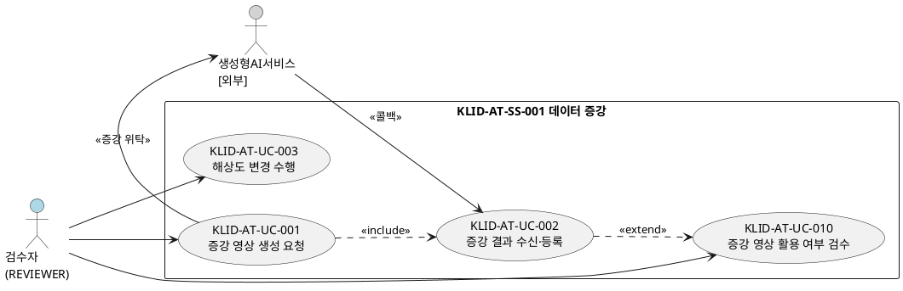
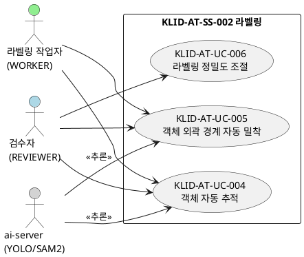
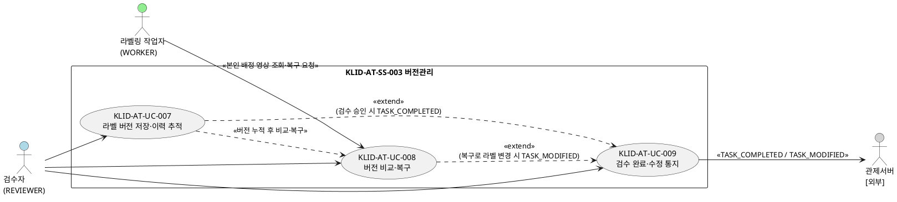
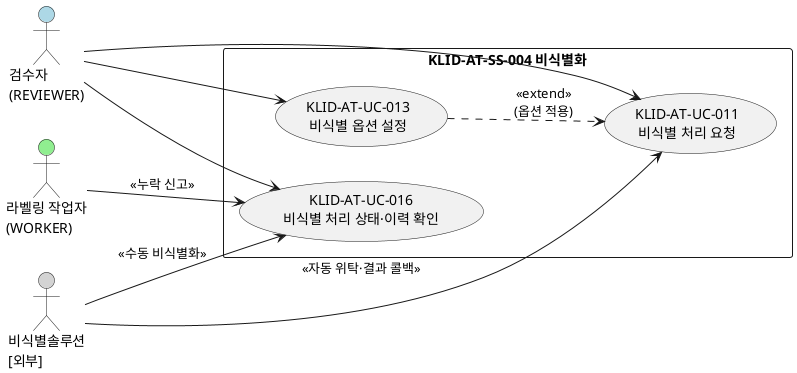
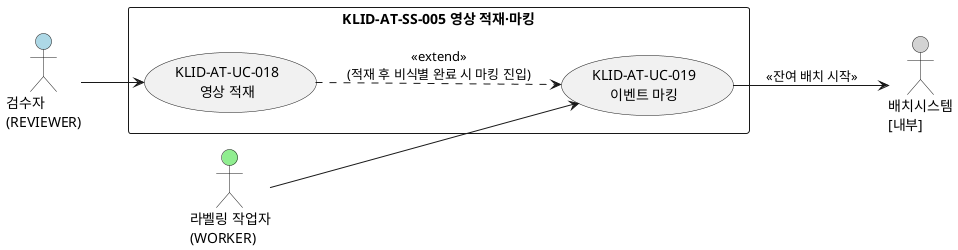
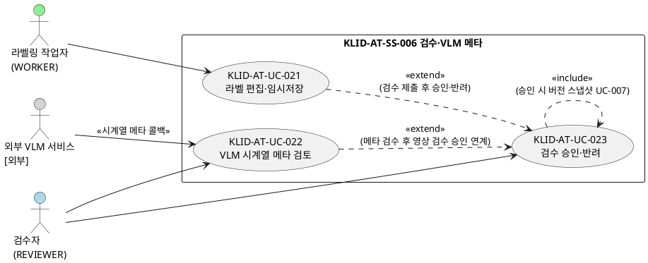

# R2 유스케이스 명세서

> **ID 표기 규칙(공통)**: 본 산출물의 모든 ID(KLID-AT-UC/CO/DC/DCD/SD/SC/AC/EN/ERD/TB/II/IC/IF/UCD/ACT 등)는 **전체 형식 `KLID-AT-XX-NNN`** 으로 표기한다. 끝부분만(예: `UC-001`) 약식 표기 금지. 나열·범위 모두 각 ID를 전체형으로 표기한다(예: `KLID-AT-UC-001 ~ KLID-AT-UC-008`). ※ 요구사항(RQ-SFR-NN-NN·NFR-NNN)·시스템시험(KLID-ST-NNN) 등 타 체계 ID는 각 체계 원형 유지.

> **범위 정합(본 개정의 핵심)**: 본 명세서는 **R1 사용자 요구사항 정의서(제출본)에 실재하는 요구사항 항목만으로 구성**한다. 즉 R1 기능 요구사항(RQ-SFR-06-03, 07-01~03, 08-01~05, 09-01~05 = 14건)에 **직접 추적되는 유스케이스만** 포함하며, R1에 전용 요구사항이 없는 운영 워크플로우(적재·마킹·배정·라벨편집·메타검토·검수·포털·프리셋·배치)는 본 명세서에서 제외한다. **단, 검수 완료·수정 통지**(관제서버 단방향 outbound)는 R1 기능 요구사항에 직접 대응하지는 않으나 CLAUDE.md상 유지되는 운영 책임이자 검수완료·버전관리 흐름과 직접 연계되므로 KLID-AT-UC-009로 포함하되, 요구사항 매핑은 'R1 직접대응 없음(SFR-08-06 deprecated/운영 책임)'으로 정직 표기한다. 비기능 요구사항(NFR-001~007)은 단독 유스케이스로 분해하지 않고 관련 유스케이스의 「구현 시 고려 사항」에 횡단 반영한다(부록 B 참조).

## 작성 목적
> 시스템의 요구사항에 대하여 액터와 시스템 활동 및 상호간의 활동에 대하여 순서화된 시나리오를 상세하게 기술하고, 유스케이스의 이름, 액터, 그들 간의 연관관계를 보여주는 시스템 환경을 다이어그램으로도 표현한다. 또한 주요한 유스케이스에 대하여 대상 시스템과 액터 간의 오퍼레이션을 상세하게 표시하는 시스템 시퀀스 다이어그램 및 오퍼레이션의 약정을 나타낼 수 있는데 이 부분은 필수 산출물에 포함되지 않으며 선택적으로 작성할 수 있다.

## 작성 방법
> 유스케이스는 시나리오를 구체적인 언어표현으로 기술하고, 유스케이스 다이어그램은 그림으로 작성하며 작성도구를 사용할 수 있다.

## 산출물 양식

### 제·개정 이력

| 날짜 | 버전 | 제·개정 내역 | 작성자 | 검토자 |
|------|------|------------|--------|--------|
| 2026-06-05 | 1.0 | R1 기능 요구사항 범위(SFR 실현 UC 13건), 서브시스템·액터 연속 채번 체계 확정 | 박찬기 | - |
| 2026-06-05 | 1.3 | 핵심 운영 워크플로우·포털·프리셋·배치 9건(KLID-AT-UC-018~026) 신설 — 유스케이스 13→22건, UCD 4→6건, 액터 7→10건으로 확대 | 박찬기 | - |
| 2026-06-08 | 2.0 | **R1 제출본 항목만으로 구성하도록 재정리** — R1에 전용 요구사항이 없는 운영 워크플로우(KLID-AT-UC-018~026)와 그 전용 액터(포털 회원 KLID-AT-ACT-008·Quartz 배치 009·외부 VLM 010)·UCD(KLID-AT-UCD-005·006)를 분리. R1 기능 요구사항 14건 전수 추적 유스케이스 12건 + 검수 완료·수정 통지 1건(KLID-AT-UC-009, R1 직접대응 없음·CLAUDE.md 운영 책임) = **유스케이스 13건**, UCD 4건, 액터 6건, 서브시스템 4건. KLID-AT-UC-016 요구사항 매핑을 RQ-SFR-09-01/03/05로 보강. **비식별 솔루션 단일화**: 자동 위탁(구 KLID-AT-ACT-006)·수동 비식별화(구 KLID-AT-ACT-007)를 KLID-AT-ACT-006 한 액터로 병합. **KLID-AT-UC-009(검수 완료·수정 통지)·관제서버(KLID-AT-ACT-005)는 통지 운영 책임으로 복원**. 결번 재배정 금지(추적성 보존) | 박찬기 | 김현욱 |
| 2026-06-09 | 2.1 | LogiCraft 그래프 기반 생성 — 비기능 요구사항 ID를 정식 체계 `NFR-NNN`으로 전수 교정, 결번 유스케이스 참조(검수 승인 운영 워크플로우) 제거, 유스케이스 목록 관련 액터 ID를 기술서 등장 액터와 정합(KLID-AT-UC-001 외부 생성형 AI 서비스 보완), ID 범위 표기 전체형 일관화 | - | - |
| 2026-06-09 | 2.2 | 보완요청 SFR-11/16/17 반영 — 운영 유스케이스(적재·마킹·라벨편집·VLM 메타검토·검수) 등재 + AC 보강 | 박찬기 | - |
| 2026-06-10 | 2.3 | UC-018 영상 적재 방식 변경 — 관리 화면 수동 업로드 → 관제서버 학습용 설정 기반 공유 DB 배치 픽업 적재로 재정의(실현 클래스 KLID-AT-DC-074·KLID-AT-DC-075 신규, KLID-AT-DC-052~055 결번) | 박찬기 | - |

### 헤더

| R2 | 유스케이스 명세서 |
|----|----------------|
| 시스템명 | AI 기반 지방정부 CCTV 관제지원시스템 구축(2차) | 서브시스템명 | 학습데이터 저작도구 (AT) |
| 단계명 | 분석 | 작성일자 | 2026-06-10 | 버전 | 2.3 |

---

## 1. 서브시스템 목록

> R1 기능 요구사항(RQ-SFR-06-03, 07-01~03, 08-01~05, 09-01~05)이 실현되는 서브시스템(KLID-AT-SS-001~004)과, 보완요청 SFR-11/16/17 반영으로 추가된 운영 워크플로우 서브시스템(KLID-AT-SS-005~006)을 포함한다. **서브시스템 ID는 001부터 연속 채번**하며 결번을 두지 않는다.

| 서브시스템 ID | 서브시스템명 | 서브시스템 설명 |
|-------------|------------|--------------|
| KLID-AT-SS-001 | 데이터 증강 | 외부 생성형 AI 증강 요청·콜백 수신, 증강 영상 등록·검수, 해상도 변경(직접 수행) |
| KLID-AT-SS-002 | 라벨링 | 캔버스 라벨링(바운딩박스/폴리곤/세그멘테이션), 객체 속성 입력·임시저장, AI 보조(SAM2 추적·분할), 정밀도 조절 |
| KLID-AT-SS-003 | 버전관리 | 검수 승인 시 DB 스냅샷 적재, 버전 diff·rollback |
| KLID-AT-SS-004 | 비식별화 | 외부 비식별 솔루션 연동, 비식별 옵션 설정, 비식별 처리 상태·이력 확인, 누락 신고·해소 |
| KLID-AT-SS-005 | 영상 적재·마킹 | 관제서버 학습용 설정 기반 공유 DB 배치 픽업 적재, 배치 파이프라인 대상 등록, 비식별 영상 기반 이벤트 마킹(자동/수동), 배치 연계 |
| KLID-AT-SS-006 | 검수·VLM 메타 | 작업 제출·검수 승인·반려(영상 단위), 외부 VLM 시계열 메타 적재·검토 화면 제공 |

---

## 2. 유스케이스 다이어그램(UCD)

### KLID-AT-UCD-001: 데이터 증강·해상도 변경

| UCD ID | KLID-AT-UCD-001 | UCD 명 | 데이터 증강·해상도 변경 |
|--------|----------------|-------|----------------------|
| 관련 서브시스템 ID | KLID-AT-SS-001 | 관련 서브시스템명 | 데이터 증강 |

> 관련 요구사항: RQ-SFR-06-03(해상도 변경) · RQ-SFR-07-01(증강 생성) · RQ-SFR-07-02(라벨 무결성) · RQ-SFR-07-03(활용 여부 선택)

---

### KLID-AT-UCD-002: AI 라벨링 보조(VOS·분할·정밀도)

| UCD ID | KLID-AT-UCD-002 | UCD 명 | AI 라벨링 보조(VOS·분할·정밀도) |
|--------|----------------|-------|-------------------------------|
| 관련 서브시스템 ID | KLID-AT-SS-002 | 관련 서브시스템명 | 라벨링 |

> 관련 요구사항: RQ-SFR-08-01(라벨링 정확도 향상·VOS) · RQ-SFR-08-02(외곽 경계 자동 밀착) · RQ-SFR-08-03(정밀도 조절)
> ※ ai-server(YOLO/SAM2)는 외부 시스템이 아니라 저작도구의 내부 AI 추론 서버이며, 액터로는 보조 역할(추론 제공)로만 표현한다.

---

### KLID-AT-UCD-003: 버전관리·완료/수정 통지

| UCD ID | KLID-AT-UCD-003 | UCD 명 | 버전관리·완료/수정 통지 |
|--------|----------------|-------|----------------------|
| 관련 서브시스템 ID | KLID-AT-SS-003 | 관련 서브시스템명 | 버전관리 |

> 관련 요구사항: RQ-SFR-08-04(버전관리·변경이력) · RQ-SFR-08-05(버전 비교·복구) · KLID-AT-UC-009(통지)는 R1 직접대응 없음(§3 ※1 참조)

---

### KLID-AT-UCD-004: 비식별화

| UCD ID | KLID-AT-UCD-004 | UCD 명 | 비식별화 |
|--------|----------------|-------|---------|
| 관련 서브시스템 ID | KLID-AT-SS-004 | 관련 서브시스템명 | 비식별화 |

> 관련 요구사항: RQ-SFR-09-01(비식별 처리) · RQ-SFR-09-02(비식별 API 연동) · RQ-SFR-09-03(검토·이력관리) · RQ-SFR-09-04(옵션 설정) · RQ-SFR-09-05(처리 결과 연동 확인)

---

### KLID-AT-UCD-005: 영상 적재·이벤트 마킹

| UCD ID | KLID-AT-UCD-005 | UCD 명 | 영상 적재·이벤트 마킹 |
|--------|----------------|-------|---------------------|
| 관련 서브시스템 ID | KLID-AT-SS-005 | 관련 서브시스템명 | 영상 적재·마킹 |

> 관련 요구사항: RQ-SFR-11-04(실영상 가공) · RQ-SFR-11-08(다양한 환경·산불 유형 학습데이터 제작) · RQ-SFR-16(이미지 학습데이터 구축) · RQ-SFR-17(영상 학습데이터 구축)

---

### KLID-AT-UCD-006: 라벨 편집·검수·VLM 메타 검토

| UCD ID | KLID-AT-UCD-006 | UCD 명 | 라벨 편집·검수·VLM 메타 검토 |
|--------|----------------|-------|---------------------------|
| 관련 서브시스템 ID | KLID-AT-SS-006 | 관련 서브시스템명 | 검수·VLM 메타 |

> 관련 요구사항: RQ-SFR-11-04(실영상 가공) · RQ-SFR-11-09(생성 영상 학습데이터셋 구축) · RQ-SFR-11-10(학습데이터셋 자동·수동 검수) · RQ-SFR-16(이미지 학습데이터 구축) · RQ-SFR-17(영상 학습데이터 구축)

---

## 3. 유스케이스 목록

| 유스케이스 ID | 유스케이스명 | 유스케이스 설명 | 관련 액터 ID | 관련 UCD ID | 관련 요구사항 ID |
|-------------|-----------|--------------|------------|------------|---------------|
| KLID-AT-UC-001 | 증강 영상 생성 요청 | REVIEWER가 원본 영상을 선택해 외부 생성형 AI 서비스에 증강(WINTER/NIGHT/RAIN) 생성을 위임한다 | KLID-AT-ACT-001, KLID-AT-ACT-003 | KLID-AT-UCD-001 | RQ-SFR-07-01 |
| KLID-AT-UC-002 | 증강 결과 수신·등록 | 외부 서비스의 증강 결과 콜백을 수신해 새 영상을 생성하고 원본 라벨/메타를 복사하여 미검수(PENDING)로 등록한다 | KLID-AT-ACT-001, KLID-AT-ACT-003 | KLID-AT-UCD-001 | RQ-SFR-07-01, RQ-SFR-07-02 |
| KLID-AT-UC-003 | 해상도 변경 수행 | 원본보다 낮은 표준 하위 해상도로 프레임 이미지를 다운스케일하여 이미지셋으로 제공한다(업스케일 불가, 라벨 좌표 미제공) | KLID-AT-ACT-001 | KLID-AT-UCD-001 | RQ-SFR-06-03 |
| KLID-AT-UC-004 | 객체 자동 추적 | 시작 프레임의 객체를 박스로 지정하면 SAM2(VOS)가 후속 프레임의 위치·경계를 자동 추적·보간한다 | KLID-AT-ACT-001, KLID-AT-ACT-002, KLID-AT-ACT-004 | KLID-AT-UCD-002 | RQ-SFR-08-01 |
| KLID-AT-UC-005 | 객체 외곽 경계 자동 밀착 | 캔버스에서 클릭/박스로 객체를 지목하면 SAM2가 외곽선 기반 폴리곤을 산출하고 경계에 밀착시킨다 | KLID-AT-ACT-001, KLID-AT-ACT-002, KLID-AT-ACT-004 | KLID-AT-UCD-002 | RQ-SFR-08-02 |
| KLID-AT-UC-006 | 라벨링 정밀도 조절 | REVIEWER가 폴리곤 단순화 정밀도를 시스템 설정에서 허용 범위 내로 조절한다 | KLID-AT-ACT-001 | KLID-AT-UCD-002 | RQ-SFR-08-03 |
| KLID-AT-UC-007 | 라벨 버전 저장·이력 추적 | 검수 승인(APPROVED) 시점에 영상 단위 라벨 전체 스냅샷(JSON)을 해시 식별자와 함께 DB에 적재하고 변경이력을 기록한다 | KLID-AT-ACT-001 | KLID-AT-UCD-003 | RQ-SFR-08-04 |
| KLID-AT-UC-008 | 버전 비교·복구 | 두 검수완료 버전의 DB 스냅샷을 비교(diff)하고 선택 버전을 새 active 버전으로 복원(rollback)한다 | KLID-AT-ACT-001, KLID-AT-ACT-002 | KLID-AT-UCD-003 | RQ-SFR-08-05 |
| KLID-AT-UC-009 | 검수 완료·수정 통지 | 검수 승인(완료) 시 TASK_COMPLETED, 검수 완료 후 라벨/메타 수정 시 TASK_MODIFIED를 관제서버로 단방향 비동기 통지한다(메타·수정 요약만, 본문·PII 미포함) | KLID-AT-ACT-001, KLID-AT-ACT-005 | KLID-AT-UCD-003 | -(※1) |
| KLID-AT-UC-010 | 증강 영상 활용 여부 검수 | REVIEWER가 미검수(PENDING) 증강 영상을 확인하여 활용(ACCEPTED) 또는 미활용(REJECTED)으로 전이한다 | KLID-AT-ACT-001 | KLID-AT-UCD-001 | RQ-SFR-07-03 |
| KLID-AT-UC-011 | 비식별 처리 요청 | 영상을 외부 비식별 솔루션 API로 연동 호출해 비식별본을 별도 경로에 저장하고 원본을 보존한다 | KLID-AT-ACT-001, KLID-AT-ACT-006 | KLID-AT-UCD-004 | RQ-SFR-09-01, RQ-SFR-09-02 |
| KLID-AT-UC-013 | 비식별 옵션 설정 | REVIEWER가 관리 화면에서 외부 비식별 솔루션의 옵션을 설정·저장하여 이후 요청에 적용한다 | KLID-AT-ACT-001 | KLID-AT-UCD-004 | RQ-SFR-09-04 |
| KLID-AT-UC-016 | 비식별 처리 상태·이력 확인 | 영상 단위로 비식별 처리 상태·이력을 확인하고 외부 검토화면으로 연계하며, 누락 신고 및 수동 비식별 후 resolve로 처리한다 | KLID-AT-ACT-001, KLID-AT-ACT-002, KLID-AT-ACT-006 | KLID-AT-UCD-004 | RQ-SFR-09-01, RQ-SFR-09-03, RQ-SFR-09-05 |
| KLID-AT-UC-018 | 영상 적재 | 관제서버가 공유 DB에서 영상을 학습용으로 설정하면 저작도구 주기 배치가 이를 픽업해 작업 대상으로 등록하고, 배치 파이프라인(비식별 선두) 처리 대상이 된다 | KLID-AT-ACT-005 | KLID-AT-UCD-005 | RQ-SFR-11-04, RQ-SFR-11-08, RQ-SFR-16, RQ-SFR-17 |
| KLID-AT-UC-019 | 이벤트 마킹 (자동/수동) | 비식별 영상을 스트리밍·재생하며 자동(프레임 간격) 또는 수동(단축키)으로 이벤트 시점을 마킹하고, 완료 시 잔여 배치(VLM·프레임 추출·오토라벨링)를 시작한다 | KLID-AT-ACT-002 | KLID-AT-UCD-005 | RQ-SFR-11-04, RQ-SFR-17 |
| KLID-AT-UC-021 | 라벨 편집·임시저장 | 배정받은 영상의 프레임에 바운딩박스/폴리곤/세그멘테이션 라벨과 객체 속성값을 편집하고 작업본을 임시저장한다(학습데이터 버전 미생성 — 검수 승인 시 생성) | KLID-AT-ACT-002, KLID-AT-ACT-001 | KLID-AT-UCD-006 | RQ-SFR-11-04, RQ-SFR-11-08, RQ-SFR-11-09, RQ-SFR-16, RQ-SFR-17 |
| KLID-AT-UC-022 | VLM 시계열 메타 검토 | 외부 VLM 서비스의 시계열 분석 콜백 결과를 검수 대기열에 적재하고, 검수자가 검토·수정·승인 또는 반려한다 | KLID-AT-ACT-001, KLID-AT-ACT-010 | KLID-AT-UCD-006 | RQ-SFR-17 |
| KLID-AT-UC-023 | 검수 승인·반려 | 작업자가 제출한 영상 단위 작업을 검수자가 검토하여 승인(작업 완료, 버전 스냅샷 생성, 완료 통지 발행) 또는 반려(사유 기록, 재작업)한다 | KLID-AT-ACT-001, KLID-AT-ACT-002 | KLID-AT-UCD-006 | RQ-SFR-11-09, RQ-SFR-11-10, RQ-SFR-16, RQ-SFR-17 |

> **결번**: KLID-AT-UC-012/014/015/017(채번 결번), KLID-AT-UC-020/024~026(운영 워크플로우 중 본 개정 미등재 — 추후 보강 대상). **결번은 재배정하지 않는다**(D-series·R3 등 후속 산출물 추적성 보존).
> ※1 KLID-AT-UC-009(검수 완료·수정 통지): RQ-SFR-08-06(데이터마트 라벨링 정보 동기화)은 R1 제출본이 의도적으로 제외(deprecated)하여 직접 대응하는 R1 요구사항 ID가 없다. 다만 저작도구 → 관제서버 단방향 outbound 통지는 CLAUDE.md상 유지되는 운영 책임(M2M deprecated의 예외)이며 검수완료·버전관리 흐름과 직접 연계되므로 본 명세서에 포함한다. 페이로드는 메타·수정 요약만 담고 라벨/메타 본문·PII·토큰은 포함하지 않는다.
> ※ KLID-AT-UC-016은 비식별 처리 결과 검토·이력관리(RQ-SFR-09-03)와 처리 결과 연동 확인(RQ-SFR-09-05)을 함께 실현한다. 상세 결과 리포트는 외부 비식별 솔루션 책임이며 저작도구는 영상 단위 상태·이력 표시와 외부 검토화면 연계만 수행한다.

---

## 4. 액터 목록

> §3 유스케이스에서 참조되는 액터만 기재한다. **액터 ID는 기존 채번을 보존**한다. 보완요청 SFR-17 반영으로 외부 VLM 서비스(KLID-AT-ACT-010)가 복원된다. 관제서버(KLID-AT-ACT-005)는 KLID-AT-UC-009(검수 완료·수정 통지)에 따라 포함한다.

| 액터 ID | 액터명 | 액터 유형 | 액터 설명 |
|--------|------|---------|---------|
| KLID-AT-ACT-001 | 검수자 (REVIEWER) | 주요 | 사용자 관리·시스템 설정, 증강 요청·결과 검수, 해상도 변경, 라벨링 정밀도 조절, 라벨 버전 저장·비교·복구, 비식별 요청·옵션 설정·상태 확인, VLM 시계열 메타 검토·승인, 검수 승인·반려 권한을 가진 주된 액터. ADMIN 역할 폐지로 모든 관리 권한 통합. UI 호칭 '검수자', 관리 화면 URL `/manage/*`. |
| KLID-AT-ACT-002 | 라벨링 작업자 (WORKER) | 주요 | 본인 배정 영상에 대한 이벤트 마킹, 라벨 편집·임시저장, AI 보조 라벨링(SAM2 추적·밀착), 버전 비교·복구 요청, 비식별 누락 신고(본인 배정 영상 한정)를 수행. 본인 배정 외 프레임 접근은 차단(권한 없음). |
| KLID-AT-ACT-003 | 생성형AI서비스 [외부] | 보조 | 외부 생성형 AI 서비스. 날씨·계절·시간 증강(WINTER/NIGHT/RAIN) 영상 생성 본체. 저작도구는 요청·콜백 수신·검수만 담당. 서명·멱등키 기반 콜백 수신. |
| KLID-AT-ACT-004 | ai-server (YOLO/SAM2) | 보조 | 저작도구 운영팀이 직접 운영하는 내부 AI 추론 서버(FastAPI). Stateless 추론 전용. 저작도구 배치 오케스트레이터가 외부 연동 복원력 정책을 적용하여 호출(외부 시스템 아님 — 내부 구성요소). |
| KLID-AT-ACT-005 | 관제서버 [외부] | 보조 | 외부 관제서버. 저작도구의 작업완료·수정 단방향 통지를 수신한 뒤 저작도구 조회 기능으로 상세 데이터를 가져가 데이터마트에 반영. 양방향 M2M 인증은 미운영(deprecated) — 단방향 수신 + 조회만. 또한 공유 DB에서 영상을 학습용으로 설정하면 저작도구 배치가 이를 픽업해 적재한다(공유 DB 기반 — 수신 연동 API·M2M 인증 미사용). |
| KLID-AT-ACT-006 | 비식별솔루션 [외부] | 보조 | 발주기관이 직접 구매·제공하는 외부 영상 비식별 솔루션(**단일 솔루션**). 두 가지 사용 모드를 가진다 — ① **배치 자동 위탁**: 저작도구가 제공 연동으로 위탁 호출하고 결과를 서명·멱등키 콜백으로 수신(KLID-AT-UC-011), ② **수동 비식별화**: 누락 신고 해소 시 작업자·검수자가 동일 솔루션의 검토화면/도구로 직접 비식별화(KLID-AT-UC-016, 자동 재비식별 큐 폐기). |
| KLID-AT-ACT-010 | 외부 VLM 서비스 [외부] | 보조 | 외부 시계열 분석 서비스(VLM 본체). 마킹 결과를 수신하여 시계열 정보를 분석하고 결과를 저작도구로 콜백 전송한다. 저작도구는 콜백 수신·메타 적재·검수 화면 제공만 담당(VLM 본체 및 학습·추론 모델은 외부 책임). |

> **결번**: KLID-AT-ACT-007(외부 비식별 SW) — 단일 솔루션으로 KLID-AT-ACT-006에 **병합**, 별도 액터 폐기. KLID-AT-ACT-008(포털 회원)·009(배치 스케줄러) — 운영 워크플로우 전용으로 본 명세서 미등재. KLID-AT-ACT-010(외부 VLM 서비스)은 보완요청 SFR-17로 **복원**. 결번 재배정 금지.

---

## 5. 유스케이스 기술서

---

### KLID-AT-UC-001 증강 영상 생성 요청

<table>
<tr><td>유스케이스 ID</td><td>KLID-AT-UC-001</td><td>유스케이스명</td><td>증강 영상 생성 요청</td></tr>
<tr><td colspan="4">
<b>1. 주요 액터</b> 
&emsp;- 검수자(REVIEWER) — KLID-AT-ACT-001 
&emsp;- 생성형AI서비스[외부] — KLID-AT-ACT-003 (보조 — 증강 생성 위임 수신)  
<b>2. 이해관계자와 관심사항</b> 
&emsp;- 검수자는 원본 영상에 날씨·계절·시간 변화를 적용한 증강 영상을 손쉽게 요청할 수 있길 원한다. 
&emsp;- 시스템 운영팀은 외부 AI 서비스 호출이 안전하게 위임되고 콜백 대기 상태가 기록되길 원한다.  
<b>3. 전제조건</b> 
&emsp;- 원본 영상이 존재한다. 
&emsp;- REVIEWER로 인증되어 있다.  
<b>4. 종료조건</b> 
&emsp;- 외부 생성형 AI 서비스에 증강 작업이 위임되고 결과 콜백(KLID-AT-UC-002)을 대기한다.  
<b>5. 기본 시나리오</b> 
&emsp;1. REVIEWER가 증강 대상 원본 영상과 증강 종류(WINTER/NIGHT/RAIN 3종 화이트리스트)를 선택한다. 
&emsp;2. 시스템이 외부 생성형 AI 서비스에 증강 생성을 위임 요청한다. 
&emsp;3. 외부 서비스가 요청을 수락하고 비동기로 증강을 수행한다(결과는 KLID-AT-UC-002 콜백). 
&emsp;4. 본 유스케이스는 종료한다.  
<b>6. 대안 시나리오</b> 
&emsp;<b>가. 해상도 변경 요청</b> 
&emsp;&emsp;- 해상도 변경은 외부 위탁 대상이 아니며 저작도구가 직접 처리한다(KLID-AT-UC-003 연계).  
<b>7. 구현 시 고려 사항</b> 
&emsp;- 증강 위탁 클라이언트는 타임아웃/재시도/서킷 브레이커 적용 필수(NFR-004). 
&emsp;- 증강 종류는 WINTER/NIGHT/RAIN 3종 화이트리스트 엄격 검증. 
&emsp;- 콜백 수신은 HMAC + idempotencyKey로 보호. 통지·로그에 PII/토큰 미포함(NFR-005). 
&emsp;- 관련 AC: KLID-AT-AC-001 (증강 영상 생성 요청 수용) 
&emsp;- 관련 요구사항: RQ-SFR-07-01  
<b>8. 발생 빈도</b> 
&emsp;- 운영자 요청 시(비정기). 증강 종류별 배치 단위 발생.
</td></tr>
</table>

---

### KLID-AT-UC-002 증강 결과 수신·등록

<table>
<tr><td>유스케이스 ID</td><td>KLID-AT-UC-002</td><td>유스케이스명</td><td>증강 결과 수신·등록</td></tr>
<tr><td colspan="4">
<b>1. 주요 액터</b> 
&emsp;- 생성형AI서비스[외부] — KLID-AT-ACT-003 (콜백 발신 주체) 
&emsp;- 검수자(REVIEWER) — KLID-AT-ACT-001 (등록 결과 확인)  
<b>2. 이해관계자와 관심사항</b> 
&emsp;- 검수자는 외부 증강 결과가 새 영상으로 안전하게 등록되고 원본 라벨이 보존되길 원한다. 
&emsp;- 시스템 운영팀은 콜백 무결성(HMAC+idempotencyKey) 검증과 중복 등록 방지를 원한다.  
<b>3. 전제조건</b> 
&emsp;- 원본 영상과 라벨/메타가 존재한다. 
&emsp;- 외부 서비스가 증강 완료 후 콜백을 전송한다.  
<b>4. 종료조건</b> 
&emsp;- 새 영상이 미검수(PENDING)로 등록되고 원본 라벨/메타가 복사된다. 
&emsp;- 새 영상에 원본이 부모로 연결된다.  
<b>5. 기본 시나리오</b> 
&emsp;1. 외부 서비스가 증강 결과를 콜백(HMAC + idempotencyKey)으로 전송한다. 
&emsp;2. 시스템이 새 영상을 생성하고 원본을 부모로 연결한다. 
&emsp;3. 원본 라벨/메타를 새 영상에 복사하여 좌표·속성을 보존한다(증강 3종은 해상도 동일 — 좌표 그대로 복사). 
&emsp;4. 새 영상을 미검수(PENDING)로 적재한다. 
&emsp;5. 이후 KLID-AT-UC-010(증강 영상 활용 여부 검수)으로 연계된다. 
&emsp;6. 본 유스케이스는 종료한다.  
<b>6. 대안 시나리오</b> 
&emsp;<b>가. 해상도 변경본 결과</b> 
&emsp;&emsp;- 원본보다 낮은 해상도로 다운스케일한 이미지셋으로 제공되며 라벨 좌표는 제공하지 않는다(KLID-AT-UC-003 연계, 새 영상 미생성). 
&emsp;<b>나. 콜백 검증 실패</b> 
&emsp;&emsp;- 원본 참조 부재 또는 페이로드 무효인 경우 등록을 거부하고 실패를 기록한다.  
<b>7. 구현 시 고려 사항</b> 
&emsp;- HMAC 서명 검증 및 idempotencyKey 멱등 처리 필수. 
&emsp;- 증강 무결성: 원본 라벨 수·좌표·속성을 그대로 복사하여 보존(RQ-SFR-07-02). 
&emsp;- 외부 연동 복원력(타임아웃/재시도/서킷 브레이커) 적용(NFR-004). 
&emsp;- 관련 AC: KLID-AT-AC-002 (증강 결과 수신·새 영상 등록) 
&emsp;- 관련 요구사항: RQ-SFR-07-01, RQ-SFR-07-02  
<b>8. 발생 빈도</b> 
&emsp;- 외부 증강 완료 시 콜백 1회 발생(비동기, 증강 종류별).
</td></tr>
</table>

---

### KLID-AT-UC-003 해상도 변경 수행

<table>
<tr><td>유스케이스 ID</td><td>KLID-AT-UC-003</td><td>유스케이스명</td><td>해상도 변경 수행</td></tr>
<tr><td colspan="4">
<b>1. 주요 액터</b> 
&emsp;- 검수자(REVIEWER) — KLID-AT-ACT-001  
<b>2. 이해관계자와 관심사항</b> 
&emsp;- 검수자는 원본보다 낮은 표준 하위 해상도의 이미지셋을 안전하게 제공받길 원한다. 
&emsp;- 데이터마트 운영팀은 해상도 변경본의 라벨 좌표 미제공이 명확하게 처리되길 원한다.  
<b>3. 전제조건</b> 
&emsp;- 원본 영상과 프레임이 존재한다. 
&emsp;- REVIEWER로 인증되어 있다.  
<b>4. 종료조건</b> 
&emsp;- 원본보다 낮은 해상도의 이미지셋이 생성된다(라벨 좌표 미제공, 영상 미생성, 원본 보존).  
<b>5. 기본 시나리오</b> 
&emsp;1. REVIEWER가 해상도 변경 대상 영상과 목표 하위 해상도(1080p/720p/480p 화이트리스트)를 지정한다. 
&emsp;2. 시스템이 원본보다 낮은 해상도로 프레임 이미지를 다운스케일한다(종횡비 보존). 
&emsp;3. 결과를 이미지셋으로만 제공한다(영상 재생성 없음, 라벨 좌표 미제공, 원본·라벨 미변경). 
&emsp;4. 결과를 영상 단위 1건으로 기록·추적한다(동일 원본+해상도 조합은 1건). 
&emsp;5. 응답에 내부 파일 경로 등 기술 정보를 포함하지 않는다. 
&emsp;6. 본 유스케이스는 종료한다.  
<b>6. 대안 시나리오</b> 
&emsp;<b>가. 업스케일 요청</b> 
&emsp;&emsp;- 목표 해상도가 원본 이상인 경우 400으로 거부한다. 
&emsp;<b>나. 중복 해상도 요청</b> 
&emsp;&emsp;- 동일 원본 + 동일 목표 해상도 조합 재요청 시 409 CONFLICT를 반환한다.  
<b>7. 구현 시 고려 사항</b> 
&emsp;- 생성형 변형(확대·축소 등)은 외부 생성 시스템 책임(범위 외)이며 해상도 변경(다운스케일)만 저작도구가 직접 수행(FFmpeg). 
&emsp;- 종횡비 보존 다운스케일만 허용. 영상(비디오) 재생성 없음, 새 영상 미생성 — 이미지셋 제공 전용. 
&emsp;- 관련 AC: KLID-AT-AC-003 (해상도 변경 다운스케일 이미지셋 제공) 
&emsp;- 관련 요구사항: RQ-SFR-06-03  
<b>8. 발생 빈도</b> 
&emsp;- 검수완료 영상 대상 관리자 요청 시(비정기).
</td></tr>
</table>

---

### KLID-AT-UC-004 객체 자동 추적

<table>
<tr><td>유스케이스 ID</td><td>KLID-AT-UC-004</td><td>유스케이스명</td><td>객체 자동 추적</td></tr>
<tr><td colspan="4">
<b>1. 주요 액터</b> 
&emsp;- 라벨링 작업자(WORKER) — KLID-AT-ACT-002 
&emsp;- 검수자(REVIEWER) — KLID-AT-ACT-001 (결과 확인·보정)  
<b>2. 이해관계자와 관심사항</b> 
&emsp;- 라벨링 작업자는 반복적인 프레임 라벨링 없이 AI가 객체를 자동으로 추적해주길 원한다. 
&emsp;- 검수자는 자동 추적 결과의 품질을 확인하고 보정할 수 있길 원한다.  
<b>3. 전제조건</b> 
&emsp;- 유효한 인증(REVIEWER 또는 WORKER, WORKER는 본인 배정 영상)으로 접근한다. 
&emsp;- 대상 프레임과 추적 시작 객체(박스/시드) 지정이 선행되어 있다.  
<b>4. 종료조건</b> 
&emsp;- 후속 프레임에 추적된 객체 위치·경계가 갱신·저장된다.  
<b>5. 기본 시나리오</b> 
&emsp;1. WORKER가 시작 프레임에서 추적할 객체를 박스(시드)로 지정한다. 
&emsp;2. 시스템이 SAM2 비디오 객체 추적·분할(VOS) 추론을 요청한다(본인 미배정 프레임은 IDOR 차단). 
&emsp;3. ai-server(SAM2)가 후속 프레임에 위치(BBox)·경계(폴리곤)를 전파·반환한다. 
&emsp;4. 자동 라벨로 저장한다(좌표는 이미지 실측 해상도 상한까지 검증). 
&emsp;5. 트랙 보간 알고리즘으로 빈 프레임을 채운다. 
&emsp;6. 사용자가 키프레임을 확인·보정하고 저장한다. 
&emsp;7. 본 유스케이스는 종료한다.  
<b>6. 대안 시나리오</b> 
&emsp;<b>가. ai-server 호출 실패/타임아웃</b> 
&emsp;&emsp;- 재시도 후에도 실패 시 서킷 브레이커 동작, 사용자에게 추적 실패를 안내한다(원본 라벨 유지). 
&emsp;<b>나. 가림·장면전환·빠른 이동 시 정확도 저하</b> 
&emsp;&emsp;- 추적 결과가 부정확한 경우 사용자가 키프레임을 수동 보정 후 보간을 재계산한다.  
<b>7. 구현 시 고려 사항</b> 
&emsp;- 오토라벨링은 원본 프레임에만 실행하고 비식별본은 동일 해상도로 좌표를 공유한다. 
&emsp;- 본인 미배정 프레임 접근 차단(IDOR). 외부 연동 복원력 적용(NFR-004). 
&emsp;- CVAT 트랙 보간 알고리즘 Java 포팅. 
&emsp;- 관련 AC: KLID-AT-AC-004 (객체 자동 추적(SAM2 VOS) 수행) 
&emsp;- 관련 요구사항: RQ-SFR-08-01  
<b>8. 발생 빈도</b> 
&emsp;- 라벨링 작업 중 빈번하게 발생(프레임당 다수).
</td></tr>
</table>

---

### KLID-AT-UC-005 객체 외곽 경계 자동 밀착

<table>
<tr><td>유스케이스 ID</td><td>KLID-AT-UC-005</td><td>유스케이스명</td><td>객체 외곽 경계 자동 밀착</td></tr>
<tr><td colspan="4">
<b>1. 주요 액터</b> 
&emsp;- 라벨링 작업자(WORKER) — KLID-AT-ACT-002 
&emsp;- 검수자(REVIEWER) — KLID-AT-ACT-001  
<b>2. 이해관계자와 관심사항</b> 
&emsp;- 라벨링 작업자는 객체 외곽선을 정밀하게 표시하기 위해 AI 자동 밀착 기능을 사용할 수 있길 원한다. 
&emsp;- 검수자는 폴리곤 좌표 품질이 검증되어 안전하게 적용되길 원한다.  
<b>3. 전제조건</b> 
&emsp;- 인증되어 있고(WORKER는 본인 배정 프레임) 대상 프레임과 초기 시드(클릭/박스)가 존재한다.  
<b>4. 종료조건</b> 
&emsp;- 객체 외곽선에 밀착된 폴리곤/마스크 좌표가 반환·적용된다.  
<b>5. 기본 시나리오</b> 
&emsp;1. WORKER가 캔버스에서 SAM2 분할 도구로 객체를 클릭(포인트) 또는 드래그(박스)로 지목한다. 
&emsp;2. 시스템이 클릭 또는 박스(최소 1개)를 송신해 SAM2 분할 추론을 요청한다. 
&emsp;3. ai-server(SAM2)가 외곽선 기반 폴리곤+신뢰도를 산출·반환한다. 
&emsp;4. 응답 폴리곤을 이미지 실측 해상도 상한까지 좌표 검증 후 폴리곤 단순화 정밀도(KLID-AT-UC-006 설정값)로 단순화한다. 
&emsp;5. 밀착 결과를 캔버스에 적용한다. 
&emsp;6. 본 유스케이스는 종료한다.  
<b>6. 대안 시나리오</b> 
&emsp;<b>가. 외곽 인식 실패</b> 
&emsp;&emsp;- 밀착 결과가 비어있는 경우 사용자가 수동 폴리곤으로 전환해 작업한다. 
&emsp;<b>나. 추론 호출 실패</b> 
&emsp;&emsp;- 재시도 후 실패 시 안내하고 기존 시드를 유지한다. 
&emsp;<b>다. 클릭/박스 배타 검증 실패</b> 
&emsp;&emsp;- 둘 다 지정 또는 둘 다 누락 시 400으로 거부한다.  
<b>7. 구현 시 고려 사항</b> 
&emsp;- SAM2는 원본 프레임 이미지에만 실행(비식별본 좌표 공유). 경계 모호·객체 중첩 시 사용자 보정 전제. 
&emsp;- MASK↔RLE↔Polygon 변환(CVAT 포팅) 사용. 
&emsp;- 관련 AC: KLID-AT-AC-005 (객체 외곽 경계 자동 밀착) 
&emsp;- 관련 요구사항: RQ-SFR-08-02  
<b>8. 발생 빈도</b> 
&emsp;- 라벨링 작업 중 빈번하게 발생(프레임당 객체별 1회).
</td></tr>
</table>

---

### KLID-AT-UC-006 라벨링 정밀도 조절

<table>
<tr><td>유스케이스 ID</td><td>KLID-AT-UC-006</td><td>유스케이스명</td><td>라벨링 정밀도 조절</td></tr>
<tr><td colspan="4">
<b>1. 주요 액터</b> 
&emsp;- 검수자(REVIEWER) — KLID-AT-ACT-001  
<b>2. 이해관계자와 관심사항</b> 
&emsp;- 검수자는 자동 라벨링의 인식 민감도·경계 세밀함(폴리곤 점 수)을 데이터 품질 목표에 맞게 조절할 수 있길 원한다.  
<b>3. 전제조건</b> 
&emsp;- REVIEWER로 인증되어 있고 정밀도 설정 항목이 시스템 설정에 존재한다.  
<b>4. 종료조건</b> 
&emsp;- 조절된 정밀도가 이후 자동 라벨링에 반영된다.  
<b>5. 기본 시나리오</b> 
&emsp;1. REVIEWER가 관리 화면 시스템 설정에서 인식 민감도·경계 세밀함(폴리곤 단순화 정밀도) 값을 조절한다. 
&emsp;2. 시스템이 허용 범위 내 설정값을 저장하고 캐시(TTL 60s)에 반영한다. 
&emsp;3. 이후 SAM2 추적/밀착 시 설정값으로 폴리곤 점 수를 단순화한다. 
&emsp;4. 설정 조회 실패 시 기본값으로 fail-safe 폴백한다. 
&emsp;5. 본 유스케이스는 종료한다.  
<b>6. 대안 시나리오</b> 
&emsp;<b>가. 값 범위 초과</b> 
&emsp;&emsp;- 허용 형식/범위 밖 값은 검증으로 400 거부한다. 
&emsp;<b>나. 권한 부족(WORKER 호출)</b> 
&emsp;&emsp;- 설정 변경은 REVIEWER 전용이므로 403 반환한다.  
<b>7. 구현 시 고려 사항</b> 
&emsp;- 정밀도 파라미터는 시스템 설정 허용 항목·범위 내에서만 조정. 
&emsp;- 로컬 캐시 TTL 60s. 조회 실패 시 기본값 fail-safe. 
&emsp;- 관련 AC: KLID-AT-AC-006 (라벨링 정밀도(폴리곤 단순화) 조절) 
&emsp;- 관련 요구사항: RQ-SFR-08-03  
<b>8. 발생 빈도</b> 
&emsp;- 프로젝트 초기 설정 시 또는 품질 요구사항 변경 시(저빈도).
</td></tr>
</table>

---

### KLID-AT-UC-007 라벨 버전 저장·이력 추적

<table>
<tr><td>유스케이스 ID</td><td>KLID-AT-UC-007</td><td>유스케이스명</td><td>라벨 버전 저장·이력 추적</td></tr>
<tr><td colspan="4">
<b>1. 주요 액터</b> 
&emsp;- 검수자(REVIEWER) — KLID-AT-ACT-001  
<b>2. 이해관계자와 관심사항</b> 
&emsp;- 검수자는 검수 승인 시 학습데이터로 확정된 라벨이 안전하게 버전 관리되길 원한다. 
&emsp;- 시스템 운영팀은 동일 페이로드 재승인 시 중복 버전이 생성되지 않길 원한다.  
<b>3. 전제조건</b> 
&emsp;- 대상 영상의 라벨이 검수 제출되어 검수 대기 상태다. 
&emsp;- REVIEWER로 인증되어 있다.  
<b>4. 종료조건</b> 
&emsp;- 검수 승인된 라벨 스냅샷이 페이로드 해시로 식별되어 DB에 적재된다. 
&emsp;- 변경이력이 함께 기록된다.  
<b>5. 기본 시나리오</b> 
&emsp;1. REVIEWER가 영상 단위 검수를 승인(APPROVED) 처리한다. 
&emsp;2. 시스템이 승인 시점에 라벨 전체 스냅샷(JSON)을 버전으로 적재한다(저장 사유='APPROVED'). 
&emsp;3. 페이로드 해시로 버전을 식별한다(동일 페이로드는 동일 해시로 중복 식별, 멱등). 
&emsp;4. 변경이력을 기록한다. 
&emsp;5. 본 유스케이스는 종료한다.  
<b>6. 대안 시나리오</b> 
&emsp;<b>가. 라벨 임시저장 시점</b> 
&emsp;&emsp;- 작업 중 임시저장(작업본 upsert)은 학습데이터 버전이 아니며 스냅샷을 생성하지 않는다(2계층 분리). 
&emsp;<b>나. 검수완료 후 수정→재승인</b> 
&emsp;&emsp;- 검수완료 후 수정→재검수→재승인 시 새 버전이 추가된다.  
<b>7. 구현 시 고려 사항</b> 
&emsp;- 버전관리는 DB 스냅샷 기반(외부 VCS 미사용). 
&emsp;- 버전 스냅샷 트리거는 검수 승인 시점만(라벨 임시저장 시점 미생성). 
&emsp;- 관련 AC: KLID-AT-AC-007 (라벨 버전 스냅샷 저장·해시 식별) 
&emsp;- 관련 요구사항: RQ-SFR-08-04  
<b>8. 발생 빈도</b> 
&emsp;- 영상 단위 검수 승인 시마다 발생(검수 완료 빈도와 동일).
</td></tr>
</table>

---

### KLID-AT-UC-008 버전 비교·복구

<table>
<tr><td>유스케이스 ID</td><td>KLID-AT-UC-008</td><td>유스케이스명</td><td>버전 비교·복구</td></tr>
<tr><td colspan="4">
<b>1. 주요 액터</b> 
&emsp;- 검수자(REVIEWER) — KLID-AT-ACT-001 
&emsp;- 라벨링 작업자(WORKER) — KLID-AT-ACT-002 (본인 배정 영상 조회·복구 요청)  
<b>2. 이해관계자와 관심사항</b> 
&emsp;- 검수자는 두 버전 간 라벨 차이를 시각적으로 확인하고 과거 버전을 안전하게 복구할 수 있길 원한다. 
&emsp;- 라벨링 작업자는 본인 배정 영상의 버전 이력을 조회하고 복구를 요청할 수 있길 원한다.  
<b>3. 전제조건</b> 
&emsp;- 대상 영상/프레임에 2개 이상 검수완료 버전 스냅샷이 존재한다. 
&emsp;- 인증되어 있다(REVIEWER 전체, WORKER 본인 배정).  
<b>4. 종료조건</b> 
&emsp;- diff가 표시되거나 선택 버전이 새 active 버전으로 복원된다.  
<b>5. 기본 시나리오</b> 
&emsp;1. 사용자가 버전 이력을 조회한다. 
&emsp;2. 비교 대상 두 버전을 선택해 차이를 요청한다. 
&emsp;3. 두 DB 스냅샷을 앱에서 비교해 diff를 산출·표시한다. 
&emsp;4. REVIEWER가 복구를 실행한다. 
&emsp;5. 대상 스냅샷을 새 active 버전으로 복원·기록한다. 
&emsp;6. 본 유스케이스는 종료한다.  
<b>6. 대안 시나리오</b> 
&emsp;<b>가. 동일 페이로드 버전(해시 동일)</b> 
&emsp;&emsp;- 변경 없음으로 안내한다. 
&emsp;<b>나. 검수 완료 후 복구</b> 
&emsp;&emsp;- 복구로 라벨이 변경된 경우 검수 완료 영상의 수정으로 처리되며(동일 작업 ID 유지) KLID-AT-UC-009(검수 완료·수정 통지) TASK_MODIFIED가 트리거된다.  
<b>7. 구현 시 고려 사항</b> 
&emsp;- DB 스냅샷 기반 앱 계산 diff/rollback. 외부 VCS 미사용. 
&emsp;- 비교·복구는 검수 완료 버전의 DB 스냅샷을 기준으로 수행. REVIEWER 전체 / WORKER 본인 배정 접근. 
&emsp;- 관련 AC: KLID-AT-AC-008 (버전 diff 비교·롤백 복구) 
&emsp;- 관련 요구사항: RQ-SFR-08-05  
<b>8. 발생 빈도</b> 
&emsp;- 라벨 수정 오류 발생 시 또는 검수 요청 시(저빈도).
</td></tr>
</table>

---

### KLID-AT-UC-009 검수 완료·수정 통지

<table>
<tr><td>유스케이스 ID</td><td>KLID-AT-UC-009</td><td>유스케이스명</td><td>검수 완료·수정 통지</td></tr>
<tr><td colspan="4">
<b>1. 주요 액터</b> 
&emsp;- 검수자(REVIEWER) — KLID-AT-ACT-001 (승인/수정 발생 트리거) 
&emsp;- 관제서버[외부] — KLID-AT-ACT-005 (통지 수신 주체)  
<b>2. 이해관계자와 관심사항</b> 
&emsp;- 관제서버 운영팀은 영상 단위 작업이 검수 완료되거나 완료 후 수정되면 즉시 통지받아 데이터마트를 동기화할 수 있길 원한다. 
&emsp;- 시스템 운영팀은 통지가 멱등하고 재시도가 보장되며 PII/본문이 포함되지 않길 원한다.  
<b>3. 전제조건</b> 
&emsp;- 대상 영상의 검수가 승인(완료)되거나, 검수 완료(APPROVED) 이력을 가진 영상에 라벨/메타 수정이 발생했다.  
<b>4. 종료조건</b> 
&emsp;- 검수 완료 시 TASK_COMPLETED, 완료 후 수정 시 TASK_MODIFIED가 영상 1건 단위로 멱등 발행된다(메타·수정 요약만, 본문·PII 미포함).  
<b>5. 기본 시나리오</b> 
&emsp;1. REVIEWER가 영상 단위 검수를 승인(완료) 처리한다(검수 승인 운영 워크플로우 — 본 명세서 범위 외). 
&emsp;2. 시스템이 TASK_COMPLETED 페이로드(이벤트 타입 + 작업 ID(RAW_SN) + 영상 메타 + 검수 완료 일시 + 프레임 개수 + 결과 요약 카운트 + 요청 ID)를 구성한다. 
&emsp;3. 단방향 통지 클라이언트(요청 ID 멱등·재등록 큐·복원력 정책)가 관제서버 inbound SPI로 비동기 push한다. 
&emsp;4. 검수 완료 후 라벨/메타가 수정되면 TASK_MODIFIED 페이로드(이벤트 타입 + RAW_SN + 마지막 수정 일시 + 변경 프레임 목록[SRC_SN + 변경 종류] + 변경 요약 카운트 + 요청 ID)를 구성해 동일 방식으로 통지한다. 
&emsp;5. 관제서버가 통지 수신 후 저작도구 조회 API로 상세 데이터를 가져가 데이터마트에 반영(UPSERT)한다. 
&emsp;6. 본 유스케이스는 종료한다.  
<b>6. 대안 시나리오</b> 
&emsp;<b>가. 통지 전송 실패</b> 
&emsp;&emsp;- 재시도 후에도 실패 시 dead-letter/재등록 큐에 적재하고 후속 재시도한다. 
&emsp;<b>나. 동일 트랜잭션 다수 변경</b> 
&emsp;&emsp;- 짧은 시간 내 다수 변경 시 디바운스 후 영상 1건 단위 1회 통지한다(라벨/이미지 1건 단위 통지 금지).  
<b>7. 구현 시 고려 사항</b> 
&emsp;- 양방향 M2M 인증 미운영(deprecated) — 단방향 outbound 통지 + inbound 조회 API 패턴. 통지는 인계 토큰 또는 IP 화이트리스트로 보호. 
&emsp;- 페이로드에 PII·토큰·라벨/메타 본문·비-비식별 이미지 포함 금지(메타·수정 요약만, NFR-005). 
&emsp;- 통지 단위는 영상 1건(RAW_SN). 동일 작업 ID 유지(버전 업 아님) — 수신측은 마지막 상태로 갱신. 
&emsp;- 외부 연동 복원력(타임아웃/재시도/서킷 브레이커) 적용(NFR-004). 
&emsp;- 관련 AC: KLID-AT-AC-009 (검수 완료·수정 단방향 통지) 
&emsp;- 관련 요구사항: -(R1 직접대응 없음 — RQ-SFR-08-06 deprecated/운영 책임, §3 ※1 참조)  
<b>8. 발생 빈도</b> 
&emsp;- 검수 완료 시 영상마다 1회(TASK_COMPLETED). 검수 완료 후 수정 시마다 추가 발생(TASK_MODIFIED, 비정기).
</td></tr>
</table>

---

### KLID-AT-UC-010 증강 영상 활용 여부 검수

<table>
<tr><td>유스케이스 ID</td><td>KLID-AT-UC-010</td><td>유스케이스명</td><td>증강 영상 활용 여부 검수</td></tr>
<tr><td colspan="4">
<b>1. 주요 액터</b> 
&emsp;- 검수자(REVIEWER) — KLID-AT-ACT-001  
<b>2. 이해관계자와 관심사항</b> 
&emsp;- 검수자는 외부 증강 결과의 품질을 확인하고 학습데이터로 활용할지 여부를 결정할 수 있길 원한다. 
&emsp;- 데이터마트 운영팀은 활용 승인된 증강 영상만 학습데이터로 노출되길 원한다.  
<b>3. 전제조건</b> 
&emsp;- 증강 영상이 미검수(PENDING)로 등록되어 있다(KLID-AT-UC-002 완료). 
&emsp;- REVIEWER로 인증되어 있다.  
<b>4. 종료조건</b> 
&emsp;- 증강 영상이 활용(ACCEPTED) 또는 미활용(REJECTED)으로 전이된다.  
<b>5. 기본 시나리오</b> 
&emsp;1. REVIEWER가 미검수 증강 결과를 조회한다. 
&emsp;2. 증강 결과(영상·복사된 라벨)를 확인한다. 
&emsp;3. 활용 가능 시 활용(ACCEPTED)으로 전이한다. 
&emsp;4. 부적합 시 사유를 입력해 미활용(REJECTED)으로 전이한다. 
&emsp;5. 본 유스케이스는 종료한다.  
<b>6. 대안 시나리오</b> 
&emsp;<b>가. 상태 충돌</b> 
&emsp;&emsp;- 미검수 이외 상태에서 활용/미활용 처리 시 409 CONFLICT를 반환한다(중복 처리 방지). 
&emsp;<b>나. 반려 사유 누락</b> 
&emsp;&emsp;- 미활용 사유가 비어있으면 400으로 거부한다.  
<b>7. 구현 시 고려 사항</b> 
&emsp;- 활용 여부 판단은 REVIEWER 권한. 활용 승인분만 학습데이터로 편입(데이터마트 노출 조건과 연계). 
&emsp;- 증강 본체는 외부 SFR-07 책임이며 저작도구는 결과 검수만 담당. 
&emsp;- 관련 AC: KLID-AT-AC-010 (증강 영상 활용 여부 검수) 
&emsp;- 관련 요구사항: RQ-SFR-07-03  
<b>8. 발생 빈도</b> 
&emsp;- 증강 결과 등록 후 검수 처리 시(KLID-AT-UC-002 완료 후 1회).
</td></tr>
</table>

---

### KLID-AT-UC-011 비식별 처리 요청

<table>
<tr><td>유스케이스 ID</td><td>KLID-AT-UC-011</td><td>유스케이스명</td><td>비식별 처리 요청</td></tr>
<tr><td colspan="4">
<b>1. 주요 액터</b> 
&emsp;- 검수자(REVIEWER) — KLID-AT-ACT-001 
&emsp;- 비식별솔루션[외부] — KLID-AT-ACT-006 (결과 콜백 발신)  
<b>2. 이해관계자와 관심사항</b> 
&emsp;- 검수자는 개인정보 포함 영상을 안전하게 비식별 처리하고 원본을 보존할 수 있길 원한다. 
&emsp;- 개인정보 보호 담당자는 비식별 처리 이력이 영상 단위로 기록되길 원한다.  
<b>3. 전제조건</b> 
&emsp;- 대상 영상이 적재되어 있다(전체 영상 비식별 — 구분 없이 모든 영상이 대상). 
&emsp;- REVIEWER 인증 및 외부 비식별 솔루션 가용.  
<b>4. 종료조건</b> 
&emsp;- 비식별본이 별도 경로에 저장되고 원본이 보존된다. 
&emsp;- 처리 이력이 영상 단위로 기록된다.  
<b>5. 기본 시나리오</b> 
&emsp;1. REVIEWER가 비식별(재)처리를 요청한다. 
&emsp;2. 시스템이 외부 비식별 솔루션의 제공 API로 동기 위탁을 호출한다. 
&emsp;3. 외부 솔루션이 결과를 비동기 콜백(HMAC, idempotencyKey)으로 반환한다(중복 처리 방지). 
&emsp;4. 비식별본을 별도 경로에 저장하고 원본은 유지한다. 
&emsp;5. 처리 이력을 기록한다. 
&emsp;6. 본 유스케이스는 종료한다.  
<b>6. 대안 시나리오</b> 
&emsp;<b>가. 비식별 API 실패</b> 
&emsp;&emsp;- 외부 호출 실패 시 비식별 미완료(DE_IDENT_YN='F') 마킹, 재시도 큐 등록, 원본 보존.  
<b>7. 구현 시 고려 사항</b> 
&emsp;- 영상 비식별 솔루션은 발주기관이 직접 구매·제공하며 저작도구는 제공 API/가이드 규격에 종속(RQ-SFR-09-02). 
&emsp;- 타임아웃/재시도/서킷 브레이커 적용 필수(NFR-004). 비식별 실패 시 원본 절대 삭제 금지. 
&emsp;- HMAC + idempotencyKey 콜백 검증. 통지·로그에 PII/비식별 전 이미지 미포함(NFR-005). 
&emsp;- 관련 AC: KLID-AT-AC-011 (비식별 처리 요청·결과 저장) 
&emsp;- 관련 요구사항: RQ-SFR-09-01, RQ-SFR-09-02  
<b>8. 발생 빈도</b> 
&emsp;- 영상 적재 후 자동 발생(또는 REVIEWER 수동 재처리 요청 시).
</td></tr>
</table>

---

### KLID-AT-UC-013 비식별 옵션 설정

<table>
<tr><td>유스케이스 ID</td><td>KLID-AT-UC-013</td><td>유스케이스명</td><td>비식별 옵션 설정</td></tr>
<tr><td colspan="4">
<b>1. 주요 액터</b> 
&emsp;- 검수자(REVIEWER) — KLID-AT-ACT-001  
<b>2. 이해관계자와 관심사항</b> 
&emsp;- 검수자는 외부 비식별 솔루션의 처리 옵션을 관리 화면에서 제어할 수 있길 원한다. 
&emsp;- 시스템 운영팀은 설정된 옵션이 이후 비식별 요청에 일관되게 반영되길 원한다.  
<b>3. 전제조건</b> 
&emsp;- REVIEWER로 인증되어 있다.  
<b>4. 종료조건</b> 
&emsp;- 비식별 옵션이 저장되어 이후 요청에 반영된다.  
<b>5. 기본 시나리오</b> 
&emsp;1. REVIEWER가 관리 화면(/manage/*)에서 비식별 솔루션이 제공하는 옵션을 설정한다. 
&emsp;2. 시스템이 옵션을 저장하고 이후 비식별 위탁 요청(KLID-AT-UC-011)에 적용한다. 
&emsp;3. 본 유스케이스는 종료한다.  
<b>6. 대안 시나리오</b> 
&emsp;- 대안 시나리오 없음(옵션 항목 세부 스펙은 외부 비식별 솔루션 계약에 종속 — 미확정 항목은 계약 후 확정).  
<b>7. 구현 시 고려 사항</b> 
&emsp;- 설정 가능한 옵션 항목은 외부 비식별 솔루션 계약에 종속(미확정 항목 보완 예정). 
&emsp;- 설정은 REVIEWER 전용 관리 화면에서만 접근. 
&emsp;- 관련 AC: KLID-AT-AC-013 (비식별 옵션 설정) 
&emsp;- 관련 요구사항: RQ-SFR-09-04  
<b>8. 발생 빈도</b> 
&emsp;- 프로젝트 초기 설정 또는 비식별 솔루션 변경 시(저빈도).
</td></tr>
</table>

---

### KLID-AT-UC-016 비식별 처리 상태·이력 확인

<table>
<tr><td>유스케이스 ID</td><td>KLID-AT-UC-016</td><td>유스케이스명</td><td>비식별 처리 상태·이력 확인</td></tr>
<tr><td colspan="4">
<b>1. 주요 액터</b> 
&emsp;- 검수자(REVIEWER) — KLID-AT-ACT-001 
&emsp;- 라벨링 작업자(WORKER) — KLID-AT-ACT-002 (누락 신고) 
&emsp;- 비식별솔루션[외부] — KLID-AT-ACT-006 (수동 비식별화 — 자동 위탁과 동일 솔루션)  
<b>2. 이해관계자와 관심사항</b> 
&emsp;- 검수자는 영상 단위로 비식별 처리 상태·이력을 화면에서 즉시 확인하고 외부 검토화면으로 연계할 수 있길 원한다. 
&emsp;- 라벨링 작업자는 라벨 작업 중 비식별 누락을 발견하면 즉시 신고하고 작업이 잠길 때까지 추가 오염을 방지하길 원한다. 
&emsp;- 개인정보 보호 담당자는 비식별 처리 이력이 영상 단위로 기록되길 원한다.  
<b>3. 전제조건</b> 
&emsp;- 영상이 적재되어 비식별 처리 대상이다. 
&emsp;- 인증되어 있다(REVIEWER 또는 WORKER 본인 배정).  
<b>4. 종료조건</b> 
&emsp;- 영상 단위 비식별 처리 상태와 단계가 화면에서 확인되고 외부 검토화면으로 연계된다. 
&emsp;- 신고 시 해당 영상 전체 라벨이 복원 가능 스냅샷 기록 후 삭제되고 영상이 잠긴다. 
&emsp;- 수동 비식별화 완료 후 신고가 RESOLVED되고 작업락이 해제된다. 
&emsp;- 비식별 처리 이력이 기록된다.  
<b>5. 기본 시나리오</b> 
&emsp;1. REVIEWER가 영상 상세/처리 현황 화면에서 비식별 상태와 단계를 확인하고, 상세 결과는 외부 비식별 솔루션 검토화면으로 연계해 확인한다. 
&emsp;2. WORKER가 라벨 작업 중 비식별 누락(얼굴/번호판 미블러 등)을 발견하면 신고한다(WORKER는 본인 배정 영상만). 
&emsp;3. 시스템이 해당 영상 전체 라벨을 복원 가능 스냅샷(저장 사유='DEIDENT_REPORT', 비활성)·이력 보존 후 일괄 삭제하고 작업락 + 비식별 미완료(DE_IDENT_YN='F') 마킹한다. 
&emsp;4. 작업자/검수자가 외부 솔루션으로 수동 비식별화를 수행한다(자동 재비식별 큐 폐기). 
&emsp;5. 신고를 해소(resolve)한다 — OPEN→RESOLVED 전이 + 작업락 해제(OPEN이 아니면 409). 
&emsp;6. 비식별 완료/실패 콜백 수신 시 상태를 갱신하고 처리 이력을 기록한다. 
&emsp;7. 본 유스케이스는 종료한다.  
<b>6. 대안 시나리오</b> 
&emsp;<b>가. 이미 잠금·중복 신고</b> 
&emsp;&emsp;- 잠긴 영상에 재신고 시 409 CONFLICT를 반환한다. 
&emsp;<b>나. 이미 처리된 신고 resolve</b> 
&emsp;&emsp;- OPEN이 아닌(RESOLVED/DISMISSED) 신고 재해소 시 409 CONFLICT를 반환한다. 
&emsp;<b>다. 비식별 처리 실패</b> 
&emsp;&emsp;- 콜백 status가 성공이 아닌 경우 비식별 미완료(F) 마킹, 실패 상태·오류 코드를 이력에 기록한다. 
&emsp;<b>라. WORKER 타인 배정 영상 신고/해소 시도</b> 
&emsp;&emsp;- 403을 반환한다(IDOR 차단).  
<b>7. 구현 시 고려 사항</b> 
&emsp;- 비식별 처리 결과의 상세 검토는 외부 비식별 솔루션 검토화면을 이용하며, 저작도구는 영상 단위 상태·이력 표시와 누락 신고·수동 비식별화 연계만 수행한다(RQ-SFR-09-03·09-05). 
&emsp;- 비식별 처리 이력은 영상 단위로 기록(NFR-005). 자동 재비식별 큐 폐기 — 외부 솔루션 수동 비식별화로 대체. 
&emsp;- 관련 AC: KLID-AT-AC-016 (비식별 처리 상태·이력 화면 확인·연계) 
&emsp;- 관련 요구사항: RQ-SFR-09-01, RQ-SFR-09-03, RQ-SFR-09-05  
<b>8. 발생 빈도</b> 
&emsp;- 영상 상태 확인: 일상적으로 빈번. 누락 신고: 비정기(발견 시). resolve: 신고 후 수동 비식별화 완료 시.
</td></tr>
</table>

---

### KLID-AT-UC-018 영상 적재

<table>
<tr><td>유스케이스 ID</td><td>KLID-AT-UC-018</td><td>유스케이스명</td><td>영상 적재</td></tr>
<tr><td colspan="4">
<b>1. 주요 액터</b> 
&emsp;- 관제서버 — KLID-AT-ACT-005  
<b>2. 이해관계자와 관심사항</b> 
&emsp;- 관제서버 운영자는 CCTV 영상을 학습용으로 지정하면 저작도구가 수작업 없이 자동으로 적재·전처리하길 원한다. 
&emsp;- 저작도구 운영팀은 적재가 인증·수작업 없이 배치로 자동 진행되고 비식별이 선두에서 수행되길 원한다.  
<b>3. 전제조건</b> 
&emsp;- 관제서버와 저작도구가 동일 DB를 공유한다. 
&emsp;- 관제서버가 대상 영상을 학습용으로 설정했다. 
&emsp;- 배치 처리는 인증을 요구하지 않는다.  
<b>4. 종료조건</b> 
&emsp;- 영상 1건이 작업 대기(PENDING) 상태로 등록되어 비식별(선두) 단계부터 배치 파이프라인 처리 대상이 된다.  
<b>5. 기본 시나리오</b> 
&emsp;1. 관제서버가 공유 DB에서 특정 영상을 학습용으로 설정한다. 
&emsp;2. 저작도구의 주기 배치가 학습용으로 설정된 미적재 영상을 공유 DB에서 조회한다. 
&emsp;3. 조회된 영상을 작업 대상(영상 1건)으로 등록하고 작업 대기(PENDING) 상태와 원본 경로·메타를 기록한다. 
&emsp;4. 비식별화 솔루션을 비동기로 위탁 호출하여 비식별(선두) 단계부터 배치 파이프라인이 자동 진행된다. 
&emsp;5. 본 유스케이스는 종료한다.  
<b>6. 대안 시나리오</b> 
&emsp;<b>가. 대상 없음</b> 
&emsp;&emsp;- 배치 주기에 학습용 미적재 영상이 없으면 무처리로 종료한다. 
&emsp;<b>나. 비식별 실패</b> 
&emsp;&emsp;- 비식별화 솔루션 오류 시 영상 상태를 실패로 표시하고 원본을 보존하며 재처리 대상으로 둔다.  
<b>7. 구현 시 고려 사항</b> 
&emsp;- 관제서버와 저작도구의 공유 DB 조회(READ) 기반으로 적재하며 별도 수신 연동 인터페이스나 양방향 인증을 사용하지 않는다. 
&emsp;- 원본 영상은 관제서버 저장 경로를 공유하며 저작도구는 비식별 영상을 별도 경로로 생성한다. 
&emsp;- 배치는 인증을 요구하지 않으며 주기 스케줄(1건/분 단위)로 동작한다. 
&emsp;- 관리 화면 수동 업로드 방식은 본 유스케이스에서 제외한다. 
&emsp;- 관련 AC: KLID-AT-AC-017, KLID-AT-AC-023, KLID-AT-AC-024 
&emsp;- 관련 요구사항: RQ-SFR-11-04, RQ-SFR-11-08, RQ-SFR-16, RQ-SFR-17  
<b>8. 발생 빈도</b> 
&emsp;- 관제서버가 영상을 학습용으로 설정할 때(비정기, 배치 단위).
</td></tr>
</table>

---

### KLID-AT-UC-019 이벤트 마킹 (자동/수동)

<table>
<tr><td>유스케이스 ID</td><td>KLID-AT-UC-019</td><td>유스케이스명</td><td>이벤트 마킹 (자동/수동)</td></tr>
<tr><td colspan="4">
<b>1. 주요 액터</b> 
&emsp;- 라벨링 작업자(WORKER) — KLID-AT-ACT-002  
<b>2. 이해관계자와 관심사항</b> 
&emsp;- 라벨링 작업자는 영상을 재생하며 이벤트 발생 시점을 빠르게 표시하여 VLM 시계열 분석과 프레임 추출이 이벤트 위치 기반으로 수행되길 원한다. 
&emsp;- 시스템 운영팀은 마킹 완료 후 잔여 배치가 자동으로 시작되길 원한다.  
<b>3. 전제조건</b> 
&emsp;- 영상이 비식별 처리 완료 상태(마킹 진입 가능)로 적재되어 있다. 
&emsp;- 본인 배정 영상으로 WORKER 인증되어 있다.  
<b>4. 종료조건</b> 
&emsp;- 마킹 결과가 저장되고, 잔여 배치 파이프라인(VLM 시계열·프레임 추출·오토라벨링)이 시작된다.  
<b>5. 기본 시나리오</b> 
&emsp;1. WORKER가 마킹 화면에서 비식별 영상을 스트리밍·배속 조절(0.25x~4x)하며 재생한다. 
&emsp;2. 수동 마킹: 이벤트 발생 시점에 지정 단축키로 마킹을 표시하고 불필요한 마킹을 삭제한다. 
&emsp;&emsp;또는 자동 마킹: 설정된 프레임 간격으로 시스템이 자동 마킹한다. 
&emsp;3. 마킹 결과가 영상 단위로 저장된다. 
&emsp;4. WORKER가 마킹 완료를 확정한다. 
&emsp;5. 시스템이 마킹 완료 이벤트를 발행하여 잔여 배치(VLM 시계열·프레임 추출·오토라벨링)를 비동기로 시작한다. 
&emsp;6. 본 유스케이스는 종료한다.  
<b>6. 대안 시나리오</b> 
&emsp;<b>가. 마킹 중 비식별 누락 발견</b> 
&emsp;&emsp;- WORKER가 영상 단위 비식별 누락을 신고한다(KLID-AT-UC-016 연계).  
<b>7. 구현 시 고려 사항</b> 
&emsp;- 마킹 대상은 비식별 완료 영상 — 비식별 미완료 영상은 마킹 화면 접근이 차단된다(원본 노출 방지). 
&emsp;- 배속 설정 지원(0.25x~4x). 단축키 기반 마킹/삭제/완료 지원. 
&emsp;- 마킹 완료 이벤트 발행 후 잔여 배치가 커밋 완료 시점에 비동기 시작된다(배치 파이프라인 흐름). 
&emsp;- 관련 AC: KLID-AT-AC-017 (실영상 라벨링·메타 가공), KLID-AT-AC-024 (영상 학습데이터 가공) 
&emsp;- 관련 요구사항: RQ-SFR-11-04, RQ-SFR-17  
<b>8. 발생 빈도</b> 
&emsp;- 비식별 처리 완료 영상마다 1회(마킹 진입 이후 작업자 배정 시 빈번).
</td></tr>
</table>

---

### KLID-AT-UC-021 라벨 편집·임시저장

<table>
<tr><td>유스케이스 ID</td><td>KLID-AT-UC-021</td><td>유스케이스명</td><td>라벨 편집·임시저장</td></tr>
<tr><td colspan="4">
<b>1. 주요 액터</b> 
&emsp;- 라벨링 작업자(WORKER) — KLID-AT-ACT-002 
&emsp;- 검수자(REVIEWER) — KLID-AT-ACT-001 (검수완료 영상 수정 시)  
<b>2. 이해관계자와 관심사항</b> 
&emsp;- 라벨링 작업자는 프레임별 도형과 객체 속성값을 편집하고 검수 제출 전까지 작업본을 잃지 않고 이어서 작업하길 원한다. 
&emsp;- 검수자는 검수완료 영상의 수정이 이력에 기록되고 관제서버에 수정 통지가 발행되길 원한다.  
<b>3. 전제조건</b> 
&emsp;- 영상이 본인에게 배정되어 있다. 
&emsp;- 프레임이 배치 처리로 추출되어 있다.  
<b>4. 종료조건</b> 
&emsp;- 작업본이 영속 저장된다(학습데이터 버전은 생성되지 않음 — 검수 승인 시 KLID-AT-UC-007이 생성).  
<b>5. 기본 시나리오</b> 
&emsp;1. WORKER가 라벨링 화면에 진입한다 — 접근 제어가 본인 배정 여부를 검증한다(타인 배정 403). 
&emsp;2. 캔버스에서 바운딩박스·폴리곤·세그멘테이션 도형을 생성·수정한다(라벨 마스터 코드 기반). 
&emsp;3. 객체별 속성값을 입력한다(속성 정의 기반). 
&emsp;4. 저장 시 작업본이 영속(upsert) 저장된다(학습데이터 버전 미생성 — 임시저장). 
&emsp;5. 본 유스케이스는 종료한다.  
<b>6. 대안 시나리오</b> 
&emsp;<b>가. 타인 배정 프레임 편집 시도</b> 
&emsp;&emsp;- 접근 제어로 403 거부한다(IDOR 방어). 
&emsp;<b>나. 검수완료 영상 수정</b> 
&emsp;&emsp;- 동일 작업 식별자 유지로 저장되고 수정 통지(TASK_MODIFIED)가 발행된다(KLID-AT-UC-009).  
<b>7. 구현 시 고려 사항</b> 
&emsp;- 2계층 분리(Critical): 작업 임시저장(작업본 영속)과 학습데이터 버전(검수 승인 시 생성)은 별개 — 임시저장은 버전 스냅샷 미생성(KLID-AT-UC-007 참조). 
&emsp;- 되돌리기는 화면 세션 내 취소/재실행으로 처리(서버 측 버전 미생성). 
&emsp;- 본인 배정 외 접근 차단(IDOR 방어). 라벨 마스터 코드 검증 필수. 
&emsp;- 관련 AC: KLID-AT-AC-017 (실영상 라벨링·메타 가공), KLID-AT-AC-020 (다양한 환경·산불 유형 학습데이터 제작), KLID-AT-AC-021 (생성된 영상 라벨링·학습데이터셋 편입), KLID-AT-AC-023 (이미지 학습데이터 가공), KLID-AT-AC-024 (영상 학습데이터 가공) 
&emsp;- 관련 요구사항: RQ-SFR-11-04, RQ-SFR-11-08, RQ-SFR-11-09, RQ-SFR-16, RQ-SFR-17  
<b>8. 발생 빈도</b> 
&emsp;- 라벨링 작업 기간 중 빈번하게 발생(프레임당 다수).
</td></tr>
</table>

---

### KLID-AT-UC-022 VLM 시계열 메타 검토

<table>
<tr><td>유스케이스 ID</td><td>KLID-AT-UC-022</td><td>유스케이스명</td><td>VLM 시계열 메타 검토</td></tr>
<tr><td colspan="4">
<b>1. 주요 액터</b> 
&emsp;- 검수자(REVIEWER) — KLID-AT-ACT-001 
&emsp;- 외부 VLM 서비스[외부] — KLID-AT-ACT-010 (시계열 분석 결과 콜백 발신)  
<b>2. 이해관계자와 관심사항</b> 
&emsp;- 검수자는 외부 VLM이 생성한 시계열 메타의 오류를 수정하고 검증된 메타만 학습데이터에 포함되길 원한다. 
&emsp;- 시스템 운영팀은 VLM 콜백이 안전하게 수신되고 검수 대기열에 적재되길 원한다.  
<b>3. 전제조건</b> 
&emsp;- 마킹 완료 후 배치 파이프라인에서 VLM 시계열 분석이 요청되어 콜백이 수신되었다. 
&emsp;- REVIEWER로 인증되어 있다.  
<b>4. 종료조건</b> 
&emsp;- 승인된 시계열 메타가 데이터마트 노출용 검수완료 메타 뷰에 포함된다. 
&emsp;- 메타 변경 이력이 기록된다.  
<b>5. 기본 시나리오</b> 
&emsp;1. 외부 VLM 서비스가 시계열 분석 결과를 콜백으로 전송한다. 
&emsp;2. 시스템이 콜백을 수신하여 시계열 메타를 적재하고 검수 대기열에 진입시킨다. 
&emsp;3. REVIEWER가 메타 검토 화면에서 시계열 메타를 검토하고 필요 시 수정한다. 
&emsp;4. 승인 또는 반려한다(승인 메타는 검수완료 메타 뷰에 노출됨). 
&emsp;5. 본 유스케이스는 종료한다.  
<b>6. 대안 시나리오</b> 
&emsp;<b>가. VLM 결과 오류</b> 
&emsp;&emsp;- REVIEWER가 메타를 직접 수정 후 승인하거나 반려 처리한다. 
&emsp;<b>나. VLM 타임아웃/실패</b> 
&emsp;&emsp;- 복원력 정책(재시도·서킷 브레이커)으로 재시도하며, 실패 시 운영팀에 알린다(NFR-004).  
<b>7. 구현 시 고려 사항</b> 
&emsp;- 외부 VLM 서비스 연동은 외부 호출 복원력 정책 적용 필수(타임아웃 45초, 재시도, NFR-004). 
&emsp;- 승인된 시계열 메타만 데이터마트 노출 대상. 반려 메타는 미노출. 
&emsp;- 콜백 수신 및 메타 적재·검수 로직이 저작도구 책임. VLM 모델 본체(학습·파인튜닝·프롬프트 관리)는 외부 책임. 
&emsp;- 관련 AC: KLID-AT-AC-024 (영상 학습데이터 가공) 
&emsp;- 관련 요구사항: RQ-SFR-17  
<b>8. 발생 빈도</b> 
&emsp;- 마킹 완료 후 VLM 콜백 수신 시 영상당 1회(배치 처리 기간 중 빈번).
</td></tr>
</table>

---

### KLID-AT-UC-023 검수 승인·반려

<table>
<tr><td>유스케이스 ID</td><td>KLID-AT-UC-023</td><td>유스케이스명</td><td>검수 승인·반려</td></tr>
<tr><td colspan="4">
<b>1. 주요 액터</b> 
&emsp;- 검수자(REVIEWER) — KLID-AT-ACT-001 
&emsp;- 라벨링 작업자(WORKER) — KLID-AT-ACT-002 (제출·재작업)  
<b>2. 이해관계자와 관심사항</b> 
&emsp;- 검수자는 제출된 라벨링 작업을 검토하여 품질 기준에 부합하는 작업만 학습데이터로 확정할 수 있길 원한다. 
&emsp;- 라벨링 작업자는 반려 사유를 확인하고 재작업 후 재제출할 수 있길 원한다. 
&emsp;- 관제서버 운영팀은 검수 완료 시 즉시 통지를 수신하여 데이터마트를 동기화할 수 있길 원한다.  
<b>3. 전제조건</b> 
&emsp;- WORKER가 라벨링을 완료하고 검수를 제출했다. 
&emsp;- REVIEWER로 인증되어 있다.  
<b>4. 종료조건</b> 
&emsp;- 승인 시: 작업이 완료(COMPLETED) 상태로 전이되고, 라벨 버전 스냅샷(KLID-AT-UC-007)과 작업완료 통지(KLID-AT-UC-009)가 생성·발행된다. 
&emsp;- 반려 시: 반려 사유가 기록되고 작업이 재작업 상태로 전이된다.  
<b>5. 기본 시나리오</b> 
&emsp;1. WORKER가 라벨링을 완료하고 검수 제출한다 — 제출 이벤트가 이력에 기록된다. 
&emsp;2. REVIEWER가 제출된 영상의 라벨·메타를 검토한다. 
&emsp;3. 승인 처리 시 — 작업 상태가 완료(COMPLETED)로 전이되고, 라벨 전체 스냅샷이 버전으로 적재되며(KLID-AT-UC-007), 작업완료 통지가 관제서버로 발행된다(KLID-AT-UC-009). 
&emsp;4. 반려 처리 시 — 반려 사유를 이슈 스레드에 기록하고 작업이 재작업 상태로 전이된다. WORKER는 재작업 후 재제출한다. 
&emsp;5. 본 유스케이스는 종료한다.  
<b>6. 대안 시나리오</b> 
&emsp;<b>가. 반려 후 재제출 반복</b> 
&emsp;&emsp;- WORKER가 재작업→재제출, REVIEWER가 승인까지 반복한다(1인 검수 방식). 
&emsp;<b>나. 검수완료 후 수정</b> 
&emsp;&emsp;- 동일 작업 식별자를 유지하고 수정 통지(TASK_MODIFIED)가 발행된다(KLID-AT-UC-009). 재검수 후 재승인 시 새 버전 스냅샷이 추가된다(KLID-AT-UC-007).  
<b>7. 구현 시 고려 사항</b> 
&emsp;- 검수 완료 = 작업 완료. 작업 상태 COMPLETED 전이는 검수 승인 시에만 발생. 
&emsp;- 승인 시 라벨 버전 스냅샷 생성(KLID-AT-UC-007 include)과 작업완료 통지 발행(KLID-AT-UC-009)이 연동. 
&emsp;- 반려 사유는 이슈 스레드에 기록(작업 식별자·WORKER·사유·일시). 
&emsp;- 작업 제출·승인·반려 이벤트는 모두 이력에 기록(감사 추적). 
&emsp;- 관련 AC: KLID-AT-AC-021 (생성된 영상 라벨링·학습데이터셋 편입), KLID-AT-AC-022 (학습데이터셋 자동·수동 검수), KLID-AT-AC-023 (이미지 학습데이터 가공), KLID-AT-AC-024 (영상 학습데이터 가공) 
&emsp;- 관련 요구사항: RQ-SFR-11-09, RQ-SFR-11-10, RQ-SFR-16, RQ-SFR-17  
<b>8. 발생 빈도</b> 
&emsp;- 작업 제출 시마다 발생(라벨링 작업량에 비례). 반려→재제출 반복 시 추가 발생.
</td></tr>
</table>

---

## 부록 A. 요구사항 → 유스케이스 추적표 (R1 전수 커버리지)

> R1 제출본의 기능 요구사항 14건 및 보완요청(SFR-11/16/17) 8건이 모두 1개 이상의 유스케이스로 실현됨을 확인한다.

| R1 요구사항 ID | 요구사항명 | 실현 유스케이스 |
|--------------|----------|--------------|
| RQ-SFR-06-03 | 이미지 확대축소·해상도 변경 등 영상 변형(해상도 변경만 직접 수행) | KLID-AT-UC-003 |
| RQ-SFR-07-01 | 생성형 AI 학습데이터 자동 생성 | KLID-AT-UC-001, KLID-AT-UC-002 |
| RQ-SFR-07-02 | 생성된 라벨링 데이터 무결성 유지 | KLID-AT-UC-002 |
| RQ-SFR-07-03 | 생성된 데이터의 학습데이터 활용 여부 선택 | KLID-AT-UC-010 |
| RQ-SFR-08-01 | 라벨링 정확도(객체 위치·경계) 향상 | KLID-AT-UC-004 |
| RQ-SFR-08-02 | 객체 외곽 경계 자동 밀착 | KLID-AT-UC-005 |
| RQ-SFR-08-03 | 라벨링 정밀도 조절 | KLID-AT-UC-006 |
| RQ-SFR-08-04 | 버전관리 및 변경이력 추적 | KLID-AT-UC-007 |
| RQ-SFR-08-05 | 버전별 변경 내용 비교·복구 | KLID-AT-UC-008 |
| RQ-SFR-09-01 | 클립영상 개인정보 비식별화 처리 | KLID-AT-UC-011, KLID-AT-UC-016 |
| RQ-SFR-09-02 | 비식별 솔루션 제공 API/가이드 활용 | KLID-AT-UC-011 |
| RQ-SFR-09-03 | 비식별 처리 결과 검토 및 이력관리 | KLID-AT-UC-016 |
| RQ-SFR-09-04 | 비식별 솔루션 옵션 설정 | KLID-AT-UC-013 |
| RQ-SFR-09-05 | 비식별 처리 결과 연동 확인 | KLID-AT-UC-016 |

### 보완요청(SFR-11/16/17) 요구사항 추적

| 요구사항 ID | 요구사항명 | 실현 유스케이스 |
|-----------|----------|--------------|
| RQ-SFR-11-04 | 지자체 산불 실영상 정제·가공(라벨링) | KLID-AT-UC-018, KLID-AT-UC-019, KLID-AT-UC-021 |
| RQ-SFR-11-05 | 다양한 환경 영상 확보(외부 증강) | KLID-AT-UC-001, KLID-AT-UC-002 |
| RQ-SFR-11-06 | 개인정보 비식별화 검수·처리 | KLID-AT-UC-011, KLID-AT-UC-016 |
| RQ-SFR-11-08 | 다양한 환경·산불 유형 학습데이터 제작(라벨링) | KLID-AT-UC-018, KLID-AT-UC-021 |
| RQ-SFR-11-09 | 생성된 영상 라벨링으로 학습데이터셋 구축 | KLID-AT-UC-002, KLID-AT-UC-021, KLID-AT-UC-023 |
| RQ-SFR-11-10 | 구축된 학습데이터셋 자동·수동 검수 | KLID-AT-UC-023 |
| RQ-SFR-16 | 이미지 학습데이터셋 구축(가공 단계) | KLID-AT-UC-018, KLID-AT-UC-021, KLID-AT-UC-023 |
| RQ-SFR-17 | 영상 학습데이터 구축(가공 단계) | KLID-AT-UC-018, KLID-AT-UC-019, KLID-AT-UC-021, KLID-AT-UC-022, KLID-AT-UC-023 |

### 신규 검증 조건(AC) 추적

| AC ID | 검증 조건명 | 검증 요구사항 | 연결 유스케이스 |
|-------|-----------|------------|--------------|
| KLID-AT-AC-017 | 실영상 라벨링·메타 가공 | REQ-019(RQ-SFR-11-04) | KLID-AT-UC-021 |
| KLID-AT-AC-018 | 다양한 환경 증강 영상 확보 | REQ-020(RQ-SFR-11-05) | KLID-AT-UC-001, KLID-AT-UC-002 |
| KLID-AT-AC-019 | 개인정보 비식별화 처리·검수·누락 신고 | REQ-021(RQ-SFR-11-06) | KLID-AT-UC-011, KLID-AT-UC-016 |
| KLID-AT-AC-020 | 다양한 환경·산불 유형 학습데이터 제작 | REQ-022(RQ-SFR-11-08) | KLID-AT-UC-021 |
| KLID-AT-AC-021 | 생성된 영상 라벨링으로 학습데이터셋 편입 | REQ-023(RQ-SFR-11-09) | KLID-AT-UC-002, KLID-AT-UC-021 |
| KLID-AT-AC-022 | 학습데이터셋 자동·수동 검수 | REQ-024(RQ-SFR-11-10) | KLID-AT-UC-023 |
| KLID-AT-AC-023 | 이미지 학습데이터 가공(추출·라벨링·가명·검수) | REQ-025(RQ-SFR-16) | KLID-AT-UC-021, KLID-AT-UC-011 |
| KLID-AT-AC-024 | 영상 학습데이터 가공(라벨링·메타·VLM 시계열 메타 검수) | REQ-026(RQ-SFR-17) | KLID-AT-UC-021, KLID-AT-UC-022 |

### 비기능 요구사항(NFR) 횡단 반영

> NFR-001~007은 단독 유스케이스로 분해하지 않고 관련 유스케이스의 「구현 시 고려 사항」에 횡단 반영한다.

| R1 요구사항 ID | 요구사항명 | 반영 위치 |
|--------------|----------|---------|
| NFR-004 | 외부 API 연동 복원력 | KLID-AT-UC-001, KLID-AT-UC-002, KLID-AT-UC-004, KLID-AT-UC-011, KLID-AT-UC-022 (타임아웃/재시도/서킷 브레이커) |
| NFR-005 | 민감정보 보호 | KLID-AT-UC-001, KLID-AT-UC-011, KLID-AT-UC-016, KLID-AT-UC-018 (PII/토큰 미출력, 처리 이력 영상 단위 기록) |
| NFR-001 ~ NFR-003 | 배치 처리량·이미지/영상 처리 규모 | KLID-AT-UC-018(영상 적재) · KLID-AT-UC-019(마킹 후 배치 연계)에서 처리 규모 수용 — NFR-002(이미지 10만 장) · NFR-003(영상 5,000건) |
| NFR-006 | 포털 웹 접근성 | 포털 채널(R1 전용 SFR 없음)에서 실현 — 본 명세서 범위 외 |
| NFR-007 | 메트릭·추적성 | 전 유스케이스 공통(요청 추적 ID 부여·전파, 핵심 이벤트 메트릭) |

---

## 부록 B. 사용된 KLID-AT ID 전체 목록 (R3 작성용)

### 유스케이스 ID (18건)
- KLID-AT-UC-001, KLID-AT-UC-002, KLID-AT-UC-003, KLID-AT-UC-004, KLID-AT-UC-005, KLID-AT-UC-006
- KLID-AT-UC-007, KLID-AT-UC-008, KLID-AT-UC-009, KLID-AT-UC-010, KLID-AT-UC-011, KLID-AT-UC-013, KLID-AT-UC-016
- KLID-AT-UC-018, KLID-AT-UC-019, KLID-AT-UC-021, KLID-AT-UC-022, KLID-AT-UC-023
- ※ R1 기능요구사항 UC 12건 + 검수 완료·수정 통지 UC 1건(KLID-AT-UC-009, R1 직접대응 없음·운영 책임) + 보완요청 운영 UC 5건(KLID-AT-UC-018/019/021/022/023)
- **결번**: KLID-AT-UC-012/014/015/017(채번 결번), KLID-AT-UC-020/024~026(운영 워크플로우 중 본 개정 미등재) — **모두 재배정 금지**

### UCD ID (6건)
- KLID-AT-UCD-001, KLID-AT-UCD-002, KLID-AT-UCD-003, KLID-AT-UCD-004, KLID-AT-UCD-005, KLID-AT-UCD-006

### 액터 ID (7건)
- KLID-AT-ACT-001 (검수자 REVIEWER)
- KLID-AT-ACT-002 (라벨링 작업자 WORKER)
- KLID-AT-ACT-003 (생성형AI서비스 [외부])
- KLID-AT-ACT-004 (ai-server YOLO/SAM2 — 내부 추론 서버)
- KLID-AT-ACT-005 (관제서버 [외부] — 작업완료/수정 통지 수신)
- KLID-AT-ACT-006 (비식별솔루션 [외부] — 자동 위탁 + 수동 비식별화 단일 솔루션)
- KLID-AT-ACT-010 (외부 VLM 서비스 [외부] — 시계열 분석 콜백) ← 보완요청 SFR-17로 복원
- 결번: KLID-AT-ACT-007(외부 비식별 SW — ACT-006으로 병합)·008(포털 회원)·009(배치 스케줄러) — 재배정 금지

### 검증 조건 ID (21건)
- KLID-AT-AC-001, KLID-AT-AC-002, KLID-AT-AC-003, KLID-AT-AC-004, KLID-AT-AC-005, KLID-AT-AC-006
- KLID-AT-AC-007, KLID-AT-AC-008, KLID-AT-AC-009, KLID-AT-AC-010, KLID-AT-AC-011, KLID-AT-AC-013, KLID-AT-AC-016
- KLID-AT-AC-017, KLID-AT-AC-018, KLID-AT-AC-019, KLID-AT-AC-020, KLID-AT-AC-021, KLID-AT-AC-022, KLID-AT-AC-023, KLID-AT-AC-024
- 결번: KLID-AT-AC-012/014/015 (채번 결번)

### 서브시스템 ID (6건)
- KLID-AT-SS-001 (데이터 증강), KLID-AT-SS-002 (라벨링), KLID-AT-SS-003 (버전관리), KLID-AT-SS-004 (비식별화)
- KLID-AT-SS-005 (영상 적재·마킹), KLID-AT-SS-006 (검수·VLM 메타) ← 보완요청으로 추가

---

## 부록 C. 빈 셀(`-`) 및 미정 항목 사유

| 항목 | 위치 | 사유 |
|------|------|------|
| KLID-AT-UC-013 대안 시나리오 | §5 KLID-AT-UC-013 기술서 | 외부 비식별 솔루션 구체 옵션 항목은 솔루션 계약에 종속 — 계약·스펙 확정 후 보강 필요(RQ-SFR-09-04 제약사항). |
| NFR-001 ~ NFR-003 · NFR-006 반영 위치 | 부록 A | 배치 처리량·처리 규모(NFR-001 ~ NFR-003)와 포털 웹 접근성(NFR-006)은 R1에 전용 기능 요구사항(SFR)이 없는 운영 워크플로우·포털 채널에서 실현되므로, R1 기능 요구사항 한정인 본 명세서의 유스케이스로는 분해하지 않고 운영 항목으로만 추적한다. |

## 작성 시 참고사항

> - **범위 근거(v2.2 갱신)**: 본 명세서는 「R1 사용자 요구사항 정의서(제출본)」에 실재하는 요구사항(14건)과 2026-06-02 보완요청(SFR-11/16/17, 8건) 요구사항이 실현되는 유스케이스로 구성한다. 보완요청 반영으로 운영 워크플로우(적재·마킹·라벨편집·VLM 메타검토·검수) 5건이 신규 등재됐다. 포털·프리셋·배치 내부 오케스트레이션 등 요구사항이 없는 항목은 여전히 제외하며, 필요 시 별도 운영 설계 산출물로 관리한다.
> - **결번 정책**: 추적성 보존을 위해 기존 채번을 유지하고 재배정하지 않는다. 미등재 항목(KLID-AT-UC-020/024~026 등)은 결번 유지.
> - **상세판 연계**: 연동 계약·DB 스키마·화면 경로 등 상세 설계 근거는 「R1-사용자요구사항정의서.md」(상세판) 및 D-series 설계 산출물을 참조한다.
